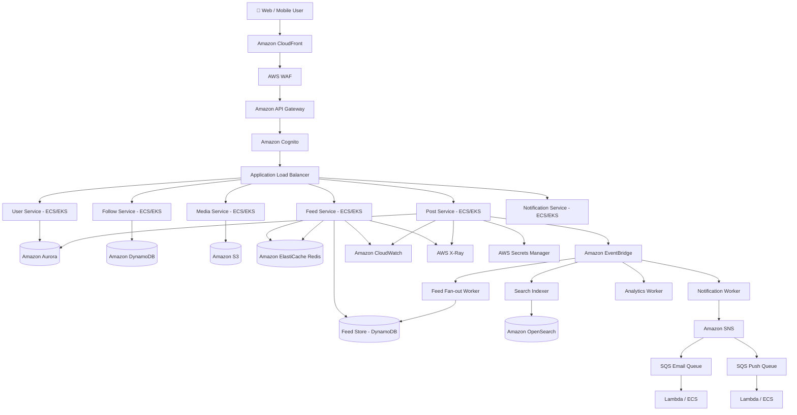
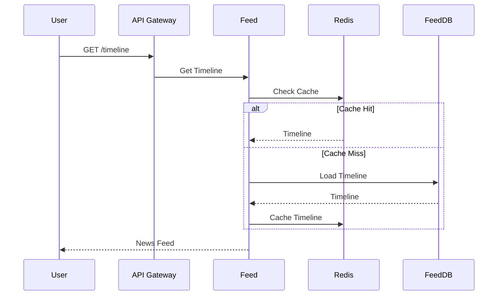
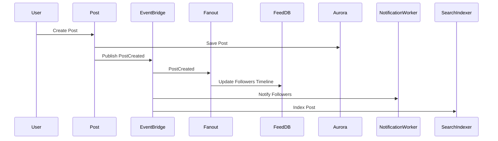
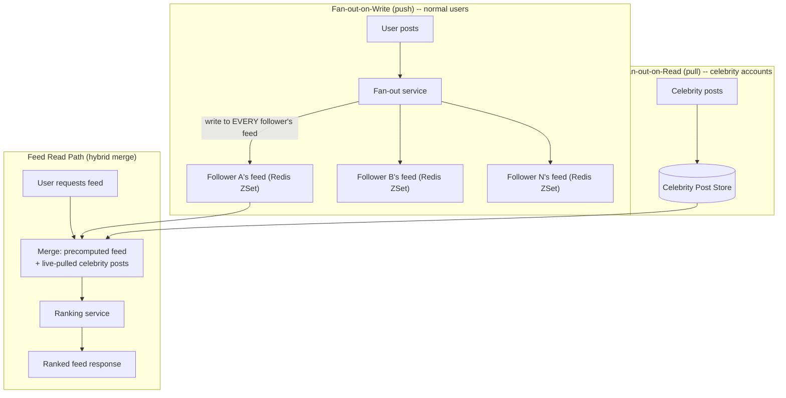
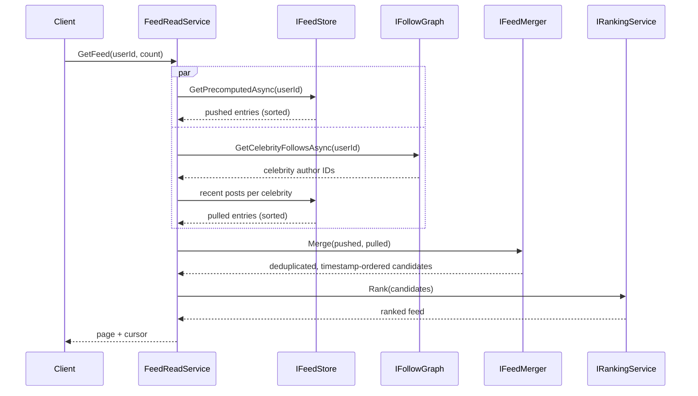

# Module 38 — System Design: Designing a News Feed / Timeline System

> Domain: System Design | Level: Beginner → Expert | Prerequisite: [[01-System-Design-Fundamentals]] — this module applies that module's framework to one canonical, deeply-worked system design problem end-to-end.

---
# Designing a News Feed / Timeline System (AWS Architecture)


```mermaid
flowchart TB

 User[👤 Web / Mobile User]

 User --> CF[Amazon CloudFront]
 CF --> WAF[AWS WAF]
 WAF --> APIGW[Amazon API Gateway]
 APIGW --> Cognito[Amazon Cognito]

 Cognito --> ALB[Application Load Balancer]

 ALB --> PostService[Post Service - ECS/EKS]
 ALB --> FeedService[Feed Service - ECS/EKS]
 ALB --> UserService[User Service - ECS/EKS]
 ALB --> FollowService[Follow Service - ECS/EKS]
 ALB --> MediaService[Media Service - ECS/EKS]
 ALB --> NotificationService[Notification Service - ECS/EKS]

 %% Storage
 PostService --> Aurora[(Amazon Aurora)]
 UserService --> Aurora
 FollowService --> DynamoDB[(Amazon DynamoDB)]

 MediaService --> S3[(Amazon S3)]

 FeedService --> Redis[(Amazon ElastiCache Redis)]

 %% Event Driven
 PostService --> EventBridge[Amazon EventBridge]

 EventBridge --> FanoutWorker[Feed Fan-out Worker]
 EventBridge --> SearchIndexer[Search Indexer]
 EventBridge --> NotificationWorker[Notification Worker]
 EventBridge --> AnalyticsWorker[Analytics Worker]

 %% Feed Store
 FanoutWorker --> FeedDB[(Feed Store - DynamoDB)]

 %% Search
 SearchIndexer --> OpenSearch[(Amazon OpenSearch)]

 %% Notification
 NotificationWorker --> SNS[Amazon SNS]

 SNS --> EmailQueue[SQS Email Queue]
 SNS --> PushQueue[SQS Push Queue]

 EmailQueue --> EmailWorker[Lambda / ECS]
 PushQueue --> PushWorker[Lambda / ECS]

 %% Feed Read
 FeedService --> FeedDB
 FeedService --> Redis

 %% Monitoring
 PostService --> CloudWatch[Amazon CloudWatch]
 FeedService --> CloudWatch

 PostService --> XRay[AWS X-Ray]
 FeedService --> XRay

 %% Security
 PostService --> Secrets[AWS Secrets Manager]
```

---

# Feed Read Flow


```mermaid
sequenceDiagram

 participant User
 participant API as API Gateway
 participant Feed
 participant Redis
 participant FeedDB

 User->>API: GET /timeline

 API->>Feed: Get Timeline

 Feed->>Redis: Check Cache

 alt Cache Hit

 Redis-->>Feed: Timeline

 else Cache Miss

 Feed->>FeedDB: Load Timeline

 FeedDB-->>Feed: Timeline

 Feed->>Redis: Cache Timeline

 end

 Feed-->>User: News Feed
```

---

# Feed Write Flow (Fan-out on Write)


```mermaid
sequenceDiagram

 participant User
 participant Post
 participant EventBridge
 participant Fanout
 participant FeedDB

 User->>Post: Create Post

 Post->>Aurora: Save Post

 Post->>EventBridge: Publish PostCreated

 EventBridge->>Fanout: PostCreated

 Fanout->>FeedDB: Update Followers Timeline

 EventBridge->>NotificationWorker: Notify Followers

 EventBridge->>SearchIndexer: Index Post
```

---

# AWS Services Used

| Layer | AWS Service |
|---------|-------------|
| CDN | Amazon CloudFront |
| Security | AWS WAF |
| Authentication | Amazon Cognito |
| API | Amazon API Gateway |
| Load Balancer | Application Load Balancer |
| Compute | Amazon ECS / Amazon EKS |
| Database | Amazon Aurora |
| Feed Store | Amazon DynamoDB |
| Cache | Amazon ElastiCache (Redis) |
| Media Storage | Amazon S3 |
| Event Bus | Amazon EventBridge |
| Notifications | Amazon SNS |
| Queue | Amazon SQS |
| Search | Amazon OpenSearch |
| Email | Amazon SES |
| Monitoring | Amazon CloudWatch |
| Distributed Tracing | AWS X-Ray |
| Secrets | AWS Secrets Manager |

## 1. Fundamentals

### What is a news feed system, and why is it one of the most information-rich system-design interview problems?
A news feed/timeline system (Twitter's timeline, Facebook's News Feed, LinkedIn's feed) aggregates content from many sources (people/pages a user follows) into one personalized, ranked, continuously-updating stream. It's an exceptionally rich interview problem specifically because it forces a genuine trade-off decision (**fan-out-on-write vs fan-out-on-read**) with no universally correct answer, has a natural, discussable evolution path (adding ranking, media, real-time updates), and directly exercises nearly every building block (caching, load balancing, sharding, CAP trade-offs) in one cohesive system.

### Why does this matter?
Because the fan-out decision alone demonstrates whether a candidate can reason about a **genuinely asymmetric read/write problem** — the number of people who read a feed vastly exceeds the number of posts written, but a single celebrity's post must reach millions of followers' feeds, creating a "many-to-many, wildly skewed" data-distribution problem unlike the simpler CRUD systems most coding interviews implicitly assume.

### When does this matter?
Any interview or real system involving personalized content aggregation, activity feeds, or notification timelines; the depth matters because the fan-out trade-off's correct resolution genuinely depends on the specific platform's follower-count distribution (a non-functional requirement, directly the discipline), not a fixed, memorizable answer.

### How does it work (30,000-ft view)?
```
1. Requirements: post creation, follow relationships, personalized ranked feed, real-time-ish updates
2. Scale estimation: 500M users, 200M daily active, avg 200 follows/user, 5:1 read:write on feed views
3. Core decision: fan-out-on-write (push) vs fan-out-on-read (pull) vs hybrid
4. Data model: Users, Posts, Follows (graph), precomputed Feed entries (if push)
5. Ranking: chronological (simple) vs ML-ranked (engagement-optimized) -- separate concern from fan-out
```

---

## 2. Deep Dive

This section is written to be **complete on its own** — every mechanism, every number that justifies it, every failure mode it creates, and every push-back a Principal/Staff interviewer will raise, answered inline rather than left to improvisation.

### 2.1 Requirements Gathering — Applied to This Specific System

**Functional.** Users post content; users follow and unfollow other users; a user's feed shows posts from followed accounts, ranked or ordered; posts support likes and comments (secondary, and usually worth explicitly deprioritising in an interview so the clock goes to feed generation, which is the actual problem).

**Non-functional — the questions to ask before designing anything:**

| Question | Why it decides the architecture |
|---|---|
| **What is the follower-count distribution?** Roughly uniform, or power-law? | This single answer almost entirely determines whether fan-out-on-write is viable at all. |
| What is the acceptable **feed staleness**? Seconds or minutes? | Decides synchronous fan-out (higher post latency, faster propagation) versus asynchronous fan-out from a queue (fast post response, bounded propagation delay). Asynchronous is almost always right, but you must ask before assuming it. |
| What is the **read:write ratio on feed views**, distinct from post-creation rate? | Feeds are read vastly more often than posts are created, which is the whole argument against pure pull. |
| Is the feed **chronological or ranked**? | Ranked feeds allow candidate-set truncation that chronological feeds do not. |

**Why follower distribution matters more than total user count**, and why this is the differentiating question: total user count drives overall sharding and capacity in the ordinary way, but the fan-out *strategy* depends entirely on whether follower counts are uniform (pure push works) or power-law-skewed (a hybrid is mandatory). A platform can have an enormous user base with a uniform distribution and never encounter the celebrity problem at all; a much smaller platform with one viral account hits it immediately. Asking for the total and designing from it is the common mistake — the distribution's **tail** is the load-bearing number.

### 2.2 Fan-Out-on-Write (Push) — Mechanics and Its Fatal Flaw

On post creation, write the post ID into **every follower's precomputed feed** — typically a Redis sorted set keyed by user ID and scored by post timestamp. Reading a feed then costs a single `ZREVRANGE`: no computation, no gather, no merge.

The cost lives entirely at write time and is **proportional to follower count**:

```
Normal account,   300 followers    →      300 writes   — trivial
Popular account,  1M followers     →  1,000,000 writes — a burst
Celebrity,        50M followers    → 50,000,000 writes — a production incident
```

At a sustainable 500,000 fan-out writes/sec across the whole fleet, that 50M-follower post takes **100 seconds of the entire fleet's capacity**, during which every other user's posts are queued behind it. That is the **celebrity problem**, and note that it is two distinct defects at once: a write-amplification cost, and a propagation-latency violation for the followers served last.

**The precomputed feed must be bounded.** An unbounded per-user feed list grows indefinitely as a user follows more accounts and time passes — invisible at launch scale, dominant at production scale. Trim on write (`ZADD` followed by `ZREMRANGEBYRANK` keeping the newest ~800 entries), because nobody scrolls past a few hundred items and the tail can always be rebuilt from the durable post store. The bound is also what makes several other decisions cheap; see §2.8.

### 2.3 Fan-Out-on-Read (Pull) — the Scaling Problem in the Other Direction

On every feed read, query the accounts the user follows, fetch their recent posts, merge and rank on the fly. Posting is a single write regardless of follower count, which **completely solves the celebrity problem**.

The trade inverts. Every read becomes a scatter-gather across potentially hundreds of followed accounts, and reads outnumber writes by a wide margin, so the aggregate cost is typically worse than push's occasional large bursts. This is the answer to "pull solves the celebrity problem, so why not use it everywhere": because you would be optimising the rare operation at the expense of the common one.

**The reverse celebrity problem.** Pull's read cost is proportional to the user's **following** count — their out-degree — not to anyone's follower count. A power user following 5,000 accounts creates a read-time scatter-gather cost that is structurally the same problem in the mirror. These are two symmetric but genuinely distinct scenarios (many followers versus many follows), they stress different parts of the hybrid architecture, and distinguishing them explicitly is a Staff-level observation. Bound the pull side too: cap the number of celebrity accounts pulled per read, ordered by recency of their last post.

### 2.4 The Hybrid Model — the Production-Standard Answer, and Its Threshold

Push for the overwhelming majority of accounts; pull for high-follower-count accounts; merge both at read time. This is Twitter's publicly documented architecture and it is the expected answer.

**The threshold is derived, not chosen.** This is where most candidates hand-wave "say, 10,000 followers" and lose the point. Derive it from capacity and a stated tolerance:

```
Sustainable fan-out capacity         = 500,000 writes/sec
Tolerance: no single account's post may consume
           more than 15% of capacity for more than 3 seconds

Budget per job = 500,000 × 0.15      =  75,000 writes/sec
Over a 3-second window               =  75,000 × 3 = 225,000 writes

⇒ Threshold ≈ 225,000 followers
```

**The threshold is a function of current capacity, not an architectural constant.** Double the worker fleet to 1,000,000 writes/sec and the threshold recalculates to 450,000 followers. A team that doubles its infrastructure without recomputing this value silently leaves the new capacity unused — it keeps migrating mid-tier accounts onto the more expensive pull path for no reason. Recompute it continuously; never hardcode it.

**Promotion and demotion are not symmetric.** A naive proposal is to mark an account "celebrity" permanently the first time it crosses the threshold, on simplicity grounds. Reject the permanence but keep the asymmetry:

- **Promotion must stay continuous**, because accounts grow into celebrity territory after launch and removing the recomputation means nothing ever promotes a newly viral account — which reintroduces exactly the incident the design exists to prevent. Promotion is cheap: a threshold check against a periodically refreshed follower count.
- **Demotion should be deliberately conservative**, with a grace period during which the read path still pulls that account, because a false demotion means followers *miss posts* while a false non-demotion merely pays an unnecessary pull cost. Simplify the direction that is safe to simplify.

**Follower count is a proxy; the real driver is write volume.** A more precise migration trigger is **posting frequency × follower count** — the actual write-amplification rate. A 500,000-follower account that posts twice a year never causes a problem; a 150,000-follower account posting forty times a day generates meaningful sustained load below the naive threshold. Measure the cost driver, not a rough stand-in for it.

### 2.5 The Merge Step — and Why It Is a k-Way Merge

At read time the hybrid path has two sorted inputs: the user's precomputed ZSet (already timestamp-scored and sorted) and the recent posts of each followed celebrity (each individually time-ordered per account). The correct operation is a **k-way merge**, not a concatenate-and-re-sort.

```
Concatenate + full sort   : O(n log n)
k-way merge (heap of k)   : O(n log k)     k = 1 pushed stream + a handful of pulled streams
```

Since k is small — one precomputed stream plus typically fewer than ten celebrity streams — the merge is substantially cheaper, and it preserves the property that both inputs were already sorted. Recognising an already-sorted-inputs merge as a merge rather than a sort is the algorithmic-technique-recognition skill applied inside a system-design answer.

### 2.6 Ranking — a Separable Concern from Fan-Out

Candidate **gathering** and candidate **ordering** are independent design axes, and conflating them is a common blur. A system can use fan-out-on-write for gathering and still apply a sophisticated ML ranking model at read time over that pre-gathered set — **re-ordering, not re-gathering**.

Why the distinction matters for latency budgeting: re-ordering a known-size candidate set is a bounded, predictable cost; re-gathering as part of ranking would duplicate the entire fan-out. Keeping them separate lets each be budgeted and optimised independently without entangling their costs.

It also makes experimentation cheap. **A/B testing a new ranking algorithm operates purely on the already-gathered candidate set** — control and experiment apply different ranking functions to identical candidates for a user assigned to a test group. No second fan-out pipeline is needed. This is a direct architectural dividend of the separation, not an academic distinction.

### 2.7 Visibility, Authorization and Moderation

**Authorization must be re-checked at read time, not trusted from push time.** A precomputed feed entry reflects the authorization state *at the moment it was pushed*. If that state later changes — a block, a switch to a private account, a circle membership revoked — the already-pushed entry would incorrectly remain visible unless the read path re-verifies current authorization. Push-time filtering is an optimisation; read-time re-checking is the correctness mechanism. Never let the cache's historical decision be the final word on who may see something.

**Moderation must happen at or near post-creation time in a push system**, and this is a structural consequence of fan-out-on-write rather than a policy preference. Push propagates a post into millions of feed caches immediately; by the time post-hoc review flags it, it has already been distributed and viewed. A pull system has a natural second chance — un-surfaced content simply never gets fetched if it is flagged before any read. Push forfeits that, so the moderation gate moves earlier.

**"Close friends" / private circles layer onto the same pipeline.** Tag each post with a `visibility` scope extended to include a circle identifier; the fan-out worker consults circle membership (a small, bounded list — structurally nothing like a celebrity follower list, so no hybrid complexity is warranted) when choosing which feeds receive the entry; and the read-time authorization re-check above also verifies current circle membership. The insight worth stating: visibility, like ranking, is a **filter on the same candidate-gathering pipeline**, not a reason to build a parallel feed system.

### 2.8 Unfollow — Handled at Read Time, Deliberately

An unfollow is a single-user operation, unlike a post which fans out to millions. The wrong instinct is to immediately scan and scrub that account's historical posts from the unfollowing user's feed cache.

The correct handling: record the unfollow in the follow graph and apply it as a **filter at read time** for any residual cached entries, letting them age out naturally from the bounded feed (§2.2). This trades a small, temporary, low-stakes inconsistency — "I might briefly still see one old post from someone I just unfollowed" — for avoiding an expensive cache-scrubbing operation. State it as a deliberate, justified trade-off; an interviewer who spots the residual entries is checking whether you noticed and chose, or simply missed it.

### 2.9 Delivery Guarantees — At-Least-Once Plus Idempotent Writes

"Exactly-once fan-out delivery" is the wrong framing, and correcting it is a genuine differentiator. Exactly-once *transport* across post-created → queue → worker → cache write is not achievable in the general case. What this design provides is **at-least-once delivery made safe by an idempotent write**:

```
exactly-once  =  at-least-once  AND  at-most-once
                 (retry + backoff)    (idempotent ZADD)
```

`ZADD` on a sorted set is naturally idempotent — adding the same `post_id` twice has no effect beyond the first. So a redelivered or retried fan-out job is safe. This is not pedantry: a design that *assumes* true exactly-once delivery and therefore skips making its writes idempotent produces visible duplicate feed entries the first time a worker retries after a partial failure.

### 2.10 Burst Absorption — Two Different Spikes

Distinguish them, because the mitigations differ:

- **One account, disproportionate fan-out** (the celebrity problem) — solved structurally by the hybrid threshold in §2.4.
- **Many accounts posting simultaneously** (a major news event) — an aggregate spike with no single expensive job. The mitigation is that fan-out **processing is asynchronous**: post creation writes an event to a durable queue or log and returns; workers consume at a sustainable rate. A traffic spike then manifests as growing queue depth — a monitorable, recoverable, bounded condition — rather than the fan-out tier being overwhelmed and failing outright.

**Rate-limit post creation as an architectural decision, not merely as abuse prevention.** A single post from a high-follower account triggers disproportionate downstream write amplification, so limiting post creation protects the entire fan-out infrastructure's capacity, not just the post endpoint. Reject cheaply and early.

### 2.11 Failure Modes and Recovery

**The feed cache is derived, not a system of record.** The durable post store and follow graph are the truth; the ZSets are a recomputable projection. That single property is what makes the following recoveries possible, and it is why "the feed is a derived cache" is a correctness argument rather than merely a cost argument.

| Failure | Behaviour | Why acceptable |
|---|---|---|
| Redis fully unavailable | Fall back to a **degraded pure-pull path** for all users — query the durable post store and follow graph directly, accept higher latency system-wide | Graceful degradation instead of total unavailability; the cache is rebuildable |
| Partial deploy rollback | Workers may write entries in a different schema version than readers expect | Version each entry (`schema_version` field or versioned key prefix); readers **reject** incompatible entries and fall back to the rebuild path rather than parsing them as valid |
| Fan-out worker fleet saturated | Queue depth grows; propagation latency rises; no data loss | Asynchronous processing converts a capacity failure into a monitorable backlog |
| One hot partition | Lag concentrates on specific partitions | See §2.12's three-cause diagnosis |

The partial-rollback case deserves emphasis because it is the one that silently corrupts rather than loudly fails: a worker on version N writing entries parsed by a reader on version N−1 produces *malformed-but-parseable* cache entries, not errors. Explicit schema versioning turns a silent corruption into a clean miss.

### 2.12 Observability — What to Measure, and the Metrics That Lie

**Job duration is not propagation latency, and confusing them is the classic trap here.** A dashboard can show perfectly stable fan-out job p99 duration while users complain that posts take minutes to appear. Job duration measures execution *once the job starts*; it says nothing about **queueing delay** before it starts. If consumer lag is growing — because volume rose, or because one partition accumulated a backlog behind a large job — a post can sit queued long before its job begins, entirely invisible to a duration dashboard.

The fix is to measure the SLI users actually experience: **end-to-end propagation latency**, sampled, from post-created timestamp to feed-visible timestamp, with job duration and queue depth as its two contributing diagnostic signals. The metric users experience and the metric that is easy to instrument are not automatically the same metric.

**Distinguishing three causes that present identically** as "feeds are slow to update":

| Cause | Signature |
|---|---|
| (a) Worker capacity exhausted | Consumer lag climbing **uniformly across all partitions**, worker CPU/concurrency at ceiling |
| (b) Hot partition / celebrity account | Lag concentrated on **one or a few partitions** while others are healthy; cross-reference which `author_id`s hash there |
| (c) Downstream dependency degrading | Worker error rates or per-operation write latency spiking while queue depth and CPU look normal |

The single most useful instrumentation for telling these apart quickly is **per-partition consumer lag alongside per-operation dependency latency, dashboarded together**. Without both, on-call is guessing among three structurally different incidents sharing one symptom.

**Track the distribution tail as a standing metric.** The maximum single-account follower count, and the count of accounts above the current threshold, must be monitored with an alert when an account approaches celebrity scale — so it can be migrated to the pull path **proactively, before its next post**, rather than discovered reactively during a latency investigation. §4's entire incident is the story of this number changing silently after launch with nothing watching it.

**Silent drops need a synthetic canary, because no passive metric can find them.** If the merge step drops a post that should have appeared, there is no error, no exception, and no anomalous metric — the feed renders successfully with one fewer item, indistinguishable from "that post simply wasn't ranked in." Detection requires active verification: periodically, for a sample of (author, follower) pairs known to have a fresh qualifying post, query the follower's **actual served feed** and assert the post is present within the propagation SLA. A real-content canary, not a dashboard, because passive metrics cannot distinguish *correctly absent* from *incorrectly dropped*.

### 2.13 Principal-Level Judgements

**Reject "cap the fan-out and silently drop the rest."** A proposal to eliminate the pull path by capping how many followers a fan-out job writes to, discarding the remainder, is not a performance optimisation — it is a functional regression. Those followers never see the post at all, not "eventually with delay." The hybrid model exists precisely to serve *every* follower correctly via a mechanism that scales for that account. Any fix that silently sacrifices functional correctness in the name of performance should be rejected on that basis alone.

**Evaluate reuse critically.** Proposed reuse of this architecture for a finance-adjacent activity feed — account-level events (trades executed, transfers completed) shown to a small set of authorised viewers per account — should **reject the hybrid celebrity-threshold mechanism specifically**: it exists to solve a power-law skew that a bounded per-account viewer list (single digits to low hundreds) will never produce, so adopting it is premature complexity. What genuinely transfers: the derived-cache-not-source-of-truth principle (the feed rebuilds from the authoritative event log), the outbox-driven fan-out for durability, and the read-time authorization re-check — which becomes *more* critical here, not less, because account-event visibility is access-control-sensitive and a stale over-broad cache entry is a compliance exposure rather than a stale social post.

**Translating the trade-off for non-technical stakeholders**, which is a question asked directly at Principal level: "If we make posting instant and cheap for everyone, we pay a cost every time someone reads their feed — and reading happens far more often than posting. If we make reading instant and cheap, a single post from a very popular account can overwhelm us trying to deliver it to millions of followers at once. We use a hybrid: most users get the fast, cheap path, and popular accounts are handled differently behind the scenes, so we avoid both problems." The "who pays the cost, and when" framing makes genuine engineering complexity legible without requiring anyone to understand fan-out mechanics.

**The one question to insist on before production sign-off**, with real measured data rather than an estimate: *"What is our actual current follower-count distribution tail — our largest account's follower count, and the number of accounts above the proposed threshold — measured from production, not assumed at launch?"* Every other decision in the design is downstream of that number: the threshold derivation, fan-out capacity sizing, worker partitioning. Approving the architecture's shape without seeing the measured distribution behind its central parameter is approving a diagram, not a system.

---

## 3. Visual Architecture

```mermaid
graph TB
 subgraph "Fan-out-on-Write (push) -- normal users"
 Post1[User posts] --> FanOut[Fan-out service]
 FanOut -->|write to EVERY follower's feed| FeedCache1["Follower A's feed (Redis ZSet)"]
 FanOut --> FeedCache2["Follower B's feed (Redis ZSet)"]
 FanOut --> FeedCache3["Follower N's feed (Redis ZSet)"]
 end
 subgraph "Fan-out-on-Read (pull) -- celebrity accounts"
 Celebrity[Celebrity posts] --> CelebPostStore[(Celebrity Post Store)]
 end
 subgraph "Feed Read Path (hybrid merge)"
 UserRead[User requests feed] --> Merge["Merge: precomputed feed<br/>+ live-pulled celebrity posts"]
 FeedCache1 --> Merge
 CelebPostStore --> Merge
 Merge --> Rank[Ranking service]
 Rank --> Response[Ranked feed response]
 end
```

## 4. Production Example
**Scenario**: A growing social platform launched with pure fan-out-on-write, correctly sized for its initial user base's roughly-uniform follower-count distribution — as the platform grew and a small number of accounts (a handful of celebrities partnering with the platform) accumulated follower counts orders of magnitude above the typical user, the fan-out service began experiencing severe, sustained write-amplification spikes correlated precisely with these specific accounts' posting activity — a single post from one such account triggered a write burst large enough to degrade the fan-out service's throughput for **every** user's posts temporarily, not just the celebrity's followers, since the shared fan-out infrastructure's capacity was consumed disproportionately by these outlier events. **Investigation**: correlating fan-out-service latency spikes precisely with specific high-follower-count accounts' posting timestamps confirmed the celebrity problem as the root cause — the system had been correctly designed for its *original* follower-count distribution, but that non-functional assumption had silently become invalid as the platform's user base evolved, without a corresponding architecture review. **Fix**: implemented the hybrid model — accounts exceeding a follower-count threshold (determined empirically from the actual distribution of write-amplification incidents) switched to fan-out-on-read, with the feed-read path merging precomputed (pushed) results with live-pulled posts from these specific flagged accounts — fan-out-service load stabilized immediately, decoupled from any individual account's follower count. **Lesson**: a non-functional requirement (follower-count distribution) that was true and correctly designed-for at launch can become false as a system evolves — exactly the "requirements can be silently invalidated by growth" lesson, now demonstrated in the specific, canonical shape of the celebrity problem, and a strong argument for treating the fan-out threshold as a **monitored, adjustable** parameter (tracked via the same "actual vs. design-time assumption" comparison discipline §2.12) rather than a one-time architectural decision made permanently at launch.
## 11. Coding Exercises

*(System design case studies use worked design exercises rather than unit-testable code, consistent with the format for this domain.)*

### Easy — Capacity estimation for the feed system
**Problem**: Estimate the fan-out write volume for a platform with 200M daily active users, averaging 2 posts/user/day, and an average follower count of 150.
**Solution**:
```
Posts/day: 200M * 2 = 400M posts/day
Fan-out writes/day (pure push, ignoring celebrity accounts): 400M * 150 = 60 billion writes/day
≈ 694,000 writes/sec average -- a substantial, but with Redis's write throughput, a
FEASIBLE number for the 'normal' (non-celebrity) account population specifically.
```
**Discussion**: This estimate directly motivates the hybrid model's necessity — even at "normal" average follower counts, the aggregate write volume is already substantial, and this estimate explicitly **excludes** celebrity accounts, whose individual posts would each independently spike this number dramatically if included in the pure-push model, concretely justifying the architectural decision with actual numbers rather than abstract reasoning alone.

### Medium — Design the Redis data model for the precomputed feed cache
```
Feed cache key: feed:{userId}
Type: Sorted Set (ZSET)
Member: postId
Score: post timestamp (Unix epoch, enabling ZRANGE-based chronological retrieval)

ZADD feed:12345 1699999999 "post:98765" -- fan-out write: add a post to a follower's feed
ZREVRANGE feed:12345 0 49 -- read: get the 50 most recent feed entries
ZREMRANGEBYRANK feed:12345 0 -1001 -- trim: bound the feed to the most recent 1000 entries
```

### Hard — Design the hybrid feed-read merge algorithm (§2.5)
```csharp
public async Task<List<FeedItem>> GetFeedAsync(string userId, int count)
{
    var precomputedTask = _redis.SortedSetRangeByScoreAsync($"feed:{userId}", order: Order.Descending, take: count);
    var celebrityAccounts = await _followGraph.GetCelebrityFollowsAsync(userId); // accounts over the pull-threshold
    var celebrityPostsTask = Task.WhenAll(celebrityAccounts.Select(c => _postStore.GetRecentPostsAsync(c, count)));

    await Task.WhenAll(precomputedTask, celebrityPostsTask); // fetch BOTH sources concurrently

    var precomputed = (await precomputedTask).Select(ParseFeedItem);
    var live = (await celebrityPostsTask).SelectMany(posts => posts);

    // k-way merge (§2.5) -- both inputs already individually sorted by timestamp descending
    return MergeSortedByTimestamp(precomputed, live).Take(count).ToList;
}
```
**Discussion**: `Task.WhenAll` fetching both sources **concurrently** (the async-concurrency discipline) rather than sequentially is essential here — sequentially awaiting the precomputed feed, then the celebrity posts, would needlessly add the two operations' latencies together instead of overlapping them, directly the "use `Task.WhenAll` for independent concurrent operations" best practice applied at this system's most latency-sensitive read path.

### Expert — Design the asynchronous fan-out processing pipeline with burst absorption (§2.10)
```csharp
public async Task HandlePostCreatedAsync(Post post)
{
    // Post creation itself returns IMMEDIATELY -- fan-out is NOT synchronous with the user-facing request.
    await _messageQueue.PublishAsync(new FanOutJob(post.Id, post.AuthorId));
}

// Separate, independently-scaled worker fleet consumes the queue:
public async Task ProcessFanOutJobAsync(FanOutJob job)
{
    var followerCount = await _followGraph.GetFollowerCountAsync(job.AuthorId);

    if (followerCount > CelebrityThreshold)
    {
        // Celebrity account: skip push fan-out entirely -- relies on the pull path at read time
        return;
    }

    var followers = await _followGraph.GetFollowersAsync(job.AuthorId);
    var batches = followers.Chunk(1000); // batch writes, directly's
    // lock-escalation-avoidance batching discipline, applied here
    // to Redis write-batching instead of SQL Server transactions
    foreach (var batch in batches)
    {
        await _redis.BatchAsync(batch.Select(followerId =>
                new RedisCommand("ZADD", $"feed:{followerId}", post.Timestamp, post.Id)));
    }
}
```
**Discussion**: Decoupling post-creation (synchronous, fast, user-facing) from fan-out processing (asynchronous, queue-driven, independently-scalable) is precisely §2.10's burst-absorption strategy — a sudden spike in post creation grows the queue's depth (a monitorable, recoverable backpressure signal, directly the Streams consumer-group backlog-monitoring pattern) rather than directly overwhelming the fan-out write path itself, and the celebrity-threshold check inside the worker (not at post-creation time) keeps the "which accounts skip push fan-out" decision centralized and easily adjustable (§2.4's monitored, adjustable threshold) without touching the post-creation code path at all.

---

## 12. System Design — Designing a News Feed / Timeline System

*Authored to the four-step standard (see Module 01 §12 for the method).*

---

### Step 1 — Understand the Problem and Establish Design Scope

#### The dialogue

> **C:** Which feed are we designing? A home timeline (posts from accounts you follow) and a user timeline (one account's own posts) are different problems — the second is trivial.
> **I:** The home timeline. Assume the user timeline is a simple indexed query.
>
> **C:** What's the follower-count distribution — roughly uniform, or power-law?
> **I:** Power-law. Median user has about 200 followers; the top accounts have tens of millions.
>
> **C:** That single answer decides the architecture, so let me pin it down: what's the largest account?
> **I:** Around 50 million followers.
>
> **C:** Scale?
> **I:** 500 million registered, 200 million DAU.
>
> **C:** How often does a user read their feed versus post?
> **I:** Assume 10 feed views per DAU per day, and 0.1 posts per DAU per day.
>
> **C:** Ordering — strictly chronological, or ranked?
> **I:** Ranked, but treat ranking as a separate service. Design candidate generation.
>
> **C:** How fresh must the feed be? If someone I follow posts now, when must I see it?
> **I:** Seconds for normal accounts. For very large accounts, tens of seconds is acceptable.
>
> **C:** Media?
> **I:** Posts can carry images and video, but assume a media service exists and gives you URLs.
>
> **C:** And out of scope?
> **I:** The ranking model itself, notifications, direct messages, and the follow graph's own storage design — assume you can query "who follows X" and "who does X follow."

The fifth and sixth answers are what make this designable: **a 500:1 read:write ratio** and a **staleness budget that differs by account size**. The second is the permission slip for the hybrid model — if freshness had to be identical for all accounts, the celebrity path would be much harder.

#### Functional requirements

1. Publish a post; it becomes visible to followers.
2. Retrieve a user's home timeline, paginated, newest-first within a ranked ordering.
3. Follow / unfollow, with the feed reflecting the change.
4. Deduplicate and consistently order results merged from two different sources.

#### Non-functional requirements

| Requirement | Target |
|---|---|
| Feed read latency | p99 < 200 ms for the first page |
| Propagation — normal accounts | p99 < 5 s from post to visible |
| Propagation — large accounts | p99 < 30 s acceptable |
| Availability — read | 99.99% (a feed that won't load is the product being down) |
| Availability — write | 99.9% |
| Consistency | Eventual, **except** a user must see their own post in their own timeline immediately |
| Durability | A published post is never lost; a *feed entry* may be lost and rebuilt |

That last row is the load-bearing one: **the feed is a derived cache, not a system of record.** Anything in it can be recomputed from posts plus the follow graph. Establishing that early licenses aggressive use of Redis with eviction, and it is the reason a lost feed entry is an annoyance rather than data loss.

#### Back-of-the-envelope estimation

```
DAU                        = 200,000,000
Feed reads/day             = 200M × 10               = 2 × 10^9
Average read QPS           = 2 × 10^9 ÷ 10^5         = 20,000 reads/s
Peak (×2)                                            = 40,000 reads/s

Posts/day                  = 200M × 0.1             = 20,000,000
Average write QPS          = 20M ÷ 10^5             = 200 posts/s
Peak (×3)                                            = 600 posts/s
```

**Fan-out amplification — the number that decides everything:**

```
Average followers ≈ 200 (median; the mean is higher and misleading — say ~500)
Push fan-out writes/s = 200 posts/s × 500 = 100,000 feed writes/s   ← sustainable
Peak                  = 600 × 500         = 300,000 feed writes/s   ← still sustainable in Redis

But ONE post by a 50M-follower account = 50,000,000 writes.
At 300,000 writes/s of spare capacity, that single post takes 166 seconds
to fully propagate — and consumes the ENTIRE fan-out capacity while doing so,
delaying every other user's post behind it.
```

Storage:

```
Feed entry ≈ 30 B (post_id + score + flags), cap 800 entries/user
Per user     = 24 KB;  × 200M DAU        ≈ 4.8 TB in Redis
Posts        = 20M/day × 1 KB metadata   ≈ 20 GB/day ≈ 7 TB/year
```

#### What the numbers tell us

1. **Push fan-out is correct for the overwhelming majority of accounts.** 100k feed writes/s is unremarkable for a Redis fleet, and it converts a 20,000/s read problem into an O(1) `ZREVRANGE`.
2. **Push fan-out is catastrophic for the tail, and the failure is not "slow" — it is *shared*.** The 166-second calculation shows one celebrity post consuming the whole fan-out budget, which is why §4's incident degraded *everyone's* posting, not just the celebrity's followers. That is the difference between a capacity problem and an isolation problem, and it is the sentence that earns the score.
3. **4.8 TB of feed cache is affordable only because the feed is bounded.** Unbounded per-user feeds would grow without limit; the 800-entry cap is a correctness requirement disguised as a memory optimisation.

The hard problem is therefore **not fan-out itself but the bimodal distribution** — and the design must isolate the two populations so that one cannot consume the other's capacity.

---

### Step 2 — Propose High-Level Design and Get Buy-In

#### The two core flows

- **Write path (post creation + fan-out)** — rare, asynchronous, and the path where the celebrity problem lives.
- **Read path (feed assembly)** — 100× more frequent, latency-critical, and where the hybrid merge happens.

#### Components

**Post Service.** Accepts and persists posts. Returns fast; does not fan out inline.

**Fan-out Service.** Consumes post events, looks up followers, and writes feed entries — **but only for accounts below the celebrity threshold**. Partitioned so a single large fan-out job cannot monopolise workers.

**Celebrity Registry.** The set of accounts above the threshold. Read on both paths. Small, hot, cached everywhere.

**Feed Store (Redis).** One sorted set per user: `feed:{user_id}`, member = `post_id`, score = ranking score or timestamp. Trimmed to 800 entries.

**Feed Read Service.** Assembles a page: read the precomputed set, pull recent posts from followed celebrities, merge, deduplicate, rank, hydrate.

**Ranking Service.** Reorders an already-gathered candidate set. Deliberately separate — §2.5's separable-concerns point made structural.

**Post Store.** Source of truth for post content; the feed stores only IDs.

**Follow Graph Service.** `followers(user)` and `following(user)`. Assumed to exist per the scope dialogue.

#### End-to-end walkthrough — publishing

1. `POST /v1/posts` → Post Service validates and writes to the post store.
2. Same transaction writes an outbox row; response returns to the client (target < 300 ms).
3. **The author's own timeline is updated synchronously** — this is what satisfies "see your own post immediately" without waiting for fan-out.
4. Outbox publisher emits `PostCreated` to Kafka, partitioned by `author_id`.
5. Fan-out Service consumes. First action: **is the author a celebrity?**
   - **Yes** → do nothing. The post is served on the read path. Cost: O(1).
   - **No** → page through followers in batches of 1,000, pipelining `ZADD` + `ZREMRANGEBYRANK` per follower.
6. Inactive followers are skipped — a user who has not opened the app in 30 days gets no feed writes, and their feed is rebuilt on next login. At a 200M/500M active ratio this removes roughly 60% of all fan-out work for free.

#### End-to-end walkthrough — reading

1. `GET /v1/feed?limit=20&cursor=…`
2. Read `feed:{user_id}` via `ZREVRANGEBYSCORE` — one round trip, ~1 ms.
3. In parallel, fetch the celebrity accounts this user follows (cached per user), and read each one's recent posts from a small per-author cache (`author_posts:{id}`, last 50).
4. **k-way merge** the two already-sorted streams — not a concatenate-and-sort. Both inputs are sorted, so merging is O(n) rather than O(n log n), and at 40,000 reads/s that difference is real money.
5. Deduplicate by `post_id` (a post can legitimately appear in both streams during a threshold transition).
6. Pass the candidate set to the ranking service — reorder only, never re-gather.
7. Hydrate post content in one batch read (`MGET`), never per-post.
8. Return with an **opaque cursor** encoding `(score, post_id)` of the last item — not an offset. Offsets break under insertion, which in a feed is constant.

#### API design

**`GET /v1/feed`**

| Param | Type | Description |
|---|---|---|
| `limit` | int | Default 20, max 50 |
| `cursor` | string | Opaque; encodes `(score, post_id)` of the last item returned |
| `include` | string[] | Optional hydration hints (`author`, `media`, `counts`) |

Response: `{ items: [...], next_cursor, has_more }`. Each item: `{ post_id, author, created_at, body, media[], counts, source }` — where `source` is `PUSHED` or `PULLED`, which is *diagnostic gold* and costs nothing.

**`POST /v1/posts`** — `{ body, media_keys[], visibility }`, header `Idempotency-Key`. Returns `{ post_id, created_at }`.

**`POST /v1/follows`** — `{ target_user_id }`. Returns `202`; backfill is asynchronous (§3.3).

#### Data model

**`post`** — Cassandra, partition `author_id`, clustering `created_at DESC`.

| Column | Type | Notes |
|---|---|---|
| `author_id`, `post_id` | Partition + clustering | Naturally supports "recent posts by author" — the celebrity read path |
| `body`, `media_keys` | text / list | |
| `created_at` | timestamp | |
| `visibility` | enum | `PUBLIC`, `FOLLOWERS`, `DELETED` |

**`feed:{user_id}`** — Redis sorted set. Member `post_id`, score = ranking score. `ZADD` then `ZREMRANGEBYRANK feed:{u} 0 -801` on every write — **the trim is not optional**, and omitting it is the single most common way this design fails in production.

**`celebrity_accounts`** — a Redis set plus in-process cache with a short TTL, refreshed by a job that recomputes membership from follower counts.

**`author_posts:{author_id}`** — Redis list, last 50 posts, maintained for *all* accounts but only *read* for celebrities.

#### Database selection, and why

| Store | Choice | Reason |
|---|---|---|
| Posts | **Cassandra** | Write-heavy, append-only, partition-by-author matches both access patterns exactly, linear scale-out. No joins needed — the feed stores IDs |
| Feed entries | **Redis sorted sets** | The access pattern *is* "top-N by score", which is `ZREVRANGE`'s native operation. Feed data is derived, so eviction is survivable — which is precisely what makes an in-memory store acceptable for 4.8 TB |
| Follow graph | **Sharded MySQL / graph store** | Out of scope per the dialogue, but note the shape: `followers(x)` needs an index on the reverse edge |
| Post content hydration | **Redis + Cassandra fallback** | Batch `MGET` on the hot path |

The decision worth defending: **the feed is not in a database.** It is a derived, bounded, evictable cache. Saying so explicitly changes what durability and consistency you owe it, and candidates who model feed entries as durable rows end up designing a far more expensive system for no benefit.

---

### Step 3 — Design Deep Dive

#### 3.1 The hybrid threshold — where it comes from, and why it must move

The threshold separating push from pull is not a constant; it is the point where a single account's fan-out cost exceeds what the shared fan-out tier can absorb without delaying others. Derive it rather than guessing:

```
Fan-out capacity            ≈ 300,000 feed writes/s
Acceptable monopolisation   ≈ 10% of capacity for ≤ 5 s  = 150,000 writes
Threshold                   ≈ 100,000 followers
```

Accounts above ~100k followers go pull. But **the distribution shifts as the platform grows** — §4's incident is exactly a threshold that was correct at launch and silently became wrong. So:

- The celebrity set is **recomputed continuously**, not configured.
- The threshold itself is a **monitored parameter** with a dashboard showing fan-out job duration distribution; when the p99 job starts consuming a growing share of capacity, the threshold is too high.
- Transitions must be handled: an account crossing the threshold upward leaves stale pushed entries in follower feeds (harmless — dedup catches them); crossing downward means its recent posts are missing from feeds until the next post, which is why the read path keeps pulling for a grace period after demotion.

#### 3.2 The merge, and the ordering trap

Merging a pushed stream (scores assigned at fan-out time) with a pulled stream (scores computed at read time) is only correct if both use the **same scoring function evaluated over the same inputs**. They usually do not, because the pushed score was computed minutes ago against then-current engagement counts.

Two workable resolutions:

- **Score at read time for both streams.** The feed store then holds `post_id` ordered by *timestamp* only, and ranking happens uniformly after the merge. Simple, correct, and costs a scoring pass over ~200 candidates per read — which at 40,000 reads/s is a real but affordable CPU line.
- **Score at write time and accept drift**, re-scoring only the top page. Cheaper, and the drift is usually below perceptual threshold.

**Recommendation: timestamp in the store, ranking after the merge.** It keeps the store's semantics simple (chronological is unambiguous), makes the two streams genuinely comparable, and preserves §2.5's separation — candidate generation and ranking stay independent, which means the ranking model can be changed without touching the fan-out path at all. That decoupling is worth more than the CPU it costs.

#### 3.3 Follow and unfollow — the backfill problem

Following someone should show their content. Three options, and the naive one is wrong:

- **Backfill on follow** — read the new followee's recent posts and inject them into the follower's feed. Correct-looking, but a user who follows 50 accounts in a session triggers 50 backfills, and a bot following thousands is a denial-of-service vector against your own fan-out tier.
- **Nothing; new posts only** — the feed looks empty for a new user, which is the worst possible first-run experience.
- **Backfill asynchronously, bounded, with a read-time union for the gap** — enqueue a bounded backfill job (last 20 posts, rate-limited per user), and until it completes, the read path unions the followee's recent posts directly.

Take the third. Unfollow is the mirror image and is easier: **do not** scrub the feed synchronously (that is another fan-out); instead filter at read time against the current following set, and let the trim eventually evict the entries. Filtering at read time is cheap because the follow set is already loaded for the celebrity pull.

#### 3.4 Failure handling

- **Fan-out consumer lag** → posts propagate slowly. Detect on **consumer lag per partition**, not aggregate, because a single celebrity's partition is exactly where lag concentrates and an average hides it.
- **Redis node loss** → those users' feeds are gone. Because the feed is derived, the correct response is **rebuild on read**, not restore from backup: a miss on `feed:{u}` triggers a synchronous, bounded pull-based assembly and repopulation. This must be rate-limited, or a node loss becomes a thundering herd against the post store.
- **Post store unavailable** → feeds render from cached hydration where possible; degrade to IDs-with-placeholders rather than an error.
- **Ranking service unavailable** → **fall back to chronological.** A worse-ordered feed is a working product; an error page is not. Making this fallback explicit is the difference between a resilient design and one that has a hidden hard dependency on an ML service.

#### 3.5 Hot spots and the read path's own tail

A celebrity's `author_posts:{id}` key is read by every one of their followers on every feed load — tens of thousands of reads per second against a single Redis key on a single shard. Mitigations: replicate the key across N shards with a random read (`author_posts:{id}:{0..15}`), or cache it in-process on the feed-read service with a 1–2 s TTL. The in-process cache is usually right: it is the same data for everyone, staleness of a second is within budget, and it removes the hot key entirely.

This is worth naming because it is the *second* celebrity problem — the write-side one is famous, the read-side one is what actually pages you.

---

### Step 4 — Wrap-Up

**What we left out**, and would be next: the ranking model (features, training, and the online/offline skew); notification fan-out (Module 20, structurally the same problem with different delivery semantics); media pipeline (Module 05); abuse and rate limiting (Modules 04, 15); multi-region feed assembly, where the follow graph's locality determines whether it is even feasible; and privacy filtering (blocked users, private accounts) which must apply at read time and interacts badly with precomputation.

**What we would measure:** fan-out job duration **distribution** — not the mean, since the mean is the metric that hid §4's incident; consumer lag per partition; feed-read p99 split by `PUSHED`/`PULLED` composition; feed cache hit rate and rebuild-on-read rate; the follower-count distribution itself, as a standing metric, because it is the assumption the whole architecture rests on; and merge dedup counts, which should be small and non-zero — zero means the pull path is not firing.

**Summary.** The design is push for the body of the distribution, pull for the tail, merged at read time with ranking applied after the merge. The estimation is what justifies it: push alone breaks on a 50-million-follower account by monopolising shared capacity, and pull alone pays a scatter-gather on every one of 40,000 reads/s. The engineering that earns the score is in the three places the naive hybrid gets wrong — deriving the threshold instead of hardcoding it, making both streams comparable before merging, and treating the feed as derived so a lost cache node is a rebuild rather than an outage.

---

### References

1. Twitter Engineering — *The Infrastructure Behind Twitter: Scale* and the timeline fan-out architecture (the canonical hybrid).
2. Raffi Krikorian — *Timelines at Scale* (QCon) — the original public description of push/pull hybridisation.
3. Facebook Engineering — *Scaling Memcache at Facebook* (NSDI '13) — hot-key handling and lease-based stampede control.
4. Instagram Engineering — *Sharding & IDs at Instagram* — time-sortable IDs, which make cursor pagination correct.
5. Redis docs — sorted sets, `ZREVRANGEBYSCORE`, `ZREMRANGEBYRANK` (the trim that bounds the feed).
6. Alex Xu — *System Design Interview Vol. 1*, ch. 11 "Design a News Feed System".
7. LinkedIn Engineering — *Feed personalization and the candidate-generation / ranking split*.
8. Cassandra docs — partition and clustering key design for time-series-shaped data.

---

## 13. Low-Level Design

**Requirements**: tied directly to §12's hybrid architecture — post creation must synchronously update the author's own timeline (read-your-own-writes) and asynchronously trigger fan-out for non-celebrity authors; the feed-read path must merge precomputed and live-pulled sources via an efficient k-way merge, deduplicate, apply ranking, and remain correct as accounts transition across the celebrity threshold (§12 §3.1).

**Class diagram:**

```mermaid
classDiagram
 class Post {
 +string PostId
 +string AuthorId
 +DateTime CreatedAt
 +Visibility Visibility
 }
 class IFollowGraph {
 <<interface>>
 +GetFollowersAsync(authorId) IAsyncEnumerable~string~
 +GetFollowingAsync(userId) IEnumerable~string~
 +GetCelebrityFollowsAsync(userId) IEnumerable~string~
 }
 class ICelebrityRegistry {
 <<interface>>
 +IsCelebrity(authorId) bool
 +RecomputeAsync() Task
 }
 class IFanOutStrategy {
 <<interface>>
 +ExecuteAsync(Post, IEnumerable~string~ followers) Task
 }
 class PushFanOutStrategy {
 +ExecuteAsync(Post, followers) Task
 }
 class SkipFanOutStrategy {
 +ExecuteAsync(Post, followers) Task
 }
 class IFeedStore {
 <<interface>>
 +GetPrecomputedAsync(userId, count) IEnumerable~FeedEntry~
 +AddEntryAsync(userId, postId, score) Task
 +TrimAsync(userId, maxSize) Task
 }
 class IFeedMerger {
 <<interface>>
 +Merge(precomputed, pulled) IEnumerable~FeedEntry~
 }
 class IRankingService {
 <<interface>>
 +Rank(candidates) IEnumerable~FeedEntry~
 }
 class FanOutService {
 -ICelebrityRegistry registry
 -IFollowGraph followGraph
 -IFanOutStrategy pushStrategy
 -IFanOutStrategy skipStrategy
 +HandlePostCreatedAsync(Post) Task
 }
 class FeedReadService {
 -IFeedStore store
 -IFollowGraph followGraph
 -IFeedMerger merger
 -IRankingService ranker
 +GetFeedAsync(userId, count) IEnumerable~FeedEntry~
 }

 FanOutService --> ICelebrityRegistry
 FanOutService --> IFollowGraph
 FanOutService --> IFanOutStrategy
 IFanOutStrategy <|.. PushFanOutStrategy
 IFanOutStrategy <|.. SkipFanOutStrategy
 FeedReadService --> IFeedStore
 FeedReadService --> IFeedMerger
 FeedReadService --> IRankingService
```

**Sequence diagram** (feed read, hybrid merge — expands §12's read walkthrough):

```mermaid
sequenceDiagram
 participant Client
 participant Svc as FeedReadService
 participant Store as IFeedStore
 participant Graph as IFollowGraph
 participant Merger as IFeedMerger
 participant Ranker as IRankingService

 Client->>Svc: GetFeed(userId, count)
 par
 Svc->>Store: GetPrecomputedAsync(userId)
 Store-->>Svc: pushed entries (sorted)
 and
 Svc->>Graph: GetCelebrityFollowsAsync(userId)
 Graph-->>Svc: celebrity author IDs
 Svc->>Store: recent posts per celebrity
 Store-->>Svc: pulled entries (sorted)
 end
 Svc->>Merger: Merge(pushed, pulled)
 Merger-->>Svc: deduplicated, timestamp-ordered candidates
 Svc->>Ranker: Rank(candidates)
 Ranker-->>Svc: ranked feed
 Svc-->>Client: page + cursor
```

**Design patterns used**: **Strategy** (`IFanOutStrategy` — push vs. skip-for-pull, selected per author via `ICelebrityRegistry`, exactly the mechanism that makes the threshold's promotion/demotion transitions a matter of swapping strategy rather than rewriting the pipeline, §2.4); **Bulkhead** (fan-out worker partitioning by `author_id`, §9.2, isolates one expensive job's resource consumption from unrelated jobs); **Chain of Responsibility / Pipeline** (read path: fetch → merge → dedup → rank → hydrate, each stage independently replaceable, exactly §2.5's separable-concerns argument made structural); **Observer** (the outbox/event-driven fan-out trigger — `FanOutService` reacts to `PostCreated` rather than being called synchronously from post creation).

**SOLID mapping**: Single Responsibility (`FanOutService` decides *whether and how* to fan out; `IFeedStore` only stores; `IFeedMerger` only merges; `IRankingService` only ranks — §2.5's separation enforced at the interface level, not just conceptually); Open/Closed (a new ranking model is a new `IRankingService` implementation; a new fan-out threshold-derivation strategy, §2.4, is a new `ICelebrityRegistry` implementation — neither touches `FeedReadService`'s orchestration logic); Liskov (`PushFanOutStrategy` and `SkipFanOutStrategy` must both satisfy "returns once the author's post is durably queued for eventual visibility," so callers never need to know which one is in play); Interface Segregation (`IFollowGraph` separates `GetFollowersAsync` — used only by the write-side fan-out — from `GetCelebrityFollowsAsync` — used only by the read-side pull — rather than one bloated graph interface); Dependency Inversion (`FeedReadService` depends on `IFeedMerger` and `IRankingService` abstractions, letting §2.5's k-way-merge implementation be swapped or benchmarked against a naive concatenate-and-sort without touching the orchestration).

**Extensibility**: adding the "close friends" sub-feed (§2.7) extends `Post.Visibility` and adds a membership check consulted by both `PushFanOutStrategy` (who receives the push) and the read path's authorization re-check (§8.1) — no new top-level service required, exactly because visibility was designed as a filter layered on the existing pipeline rather than a parallel system.

**Concurrency/thread safety**: fan-out batches (`ZADD` pipelined per 1,000 followers, §12 Step 2) are idempotent by construction (§2.9) — a redelivered fan-out job re-adds the same `post_id` with no corruption, which is what makes at-least-once delivery safe without a distributed lock. The celebrity registry's recomputation (§12 §3.1) runs on its own schedule, decoupled from any individual fan-out job, and reads of the registry are eventually-consistent-tolerant (a job briefly seeing a stale celebrity flag is safe in both directions — worst case, one post is fanned out or skipped one cycle later than ideal, never incorrectly).

---

## 14. Production Debugging

**Incident**: Following a marketing push, several previously-ordinary accounts crossed into the low tens of thousands of followers within days. Weeks later, on-call was paged for a sustained spike in `feed-read` p99 latency, with no corresponding spike in fan-out-service alerts, no elevated error rate, and CPU on the feed-read tier within normal range.

**Root cause**: The celebrity registry's threshold (§12 §3.1, derived at ~100,000 followers) had not been crossed by any of these accounts — they remained on the push path, correctly. But their followers had grown enough that fan-out batching (1,000 followers/batch) now took noticeably longer per post, and — the actual root cause — several of these accounts' followers overlapped heavily with each other (a common marketing-driven audience), meaning a burst of near-simultaneous posts from this cohort caused many followers' precomputed feed sets to receive several `ZADD`s in quick succession, each triggering the mandatory `ZREMRANGEBYRANK` trim (§12's data model: "the trim is not optional"). The trim, run once per write rather than batched, was the actual CPU cost multiplying under this specific overlap pattern — invisible in aggregate fan-out metrics because no single job was slow, and invisible in feed-read metrics' CPU average because the cost was on the **write** side, manifesting as elevated write-queue depth that delayed the outbox publisher, which in turn delayed cache population that reads were waiting on.

**Investigation**: Standard fan-out job-duration and feed-read CPU dashboards showed nothing anomalous (both consistent with §7.2's warning about aggregate metrics). The actual signal came from Redis's own command-latency histogram, which showed `ZREMRANGEBYRANK` — not `ZADD` — as the dominant contributor to command latency during the incident window; correlating the timing against post-creation logs surfaced the overlapping-audience cohort as the common factor.

**Tools**: Redis `SLOWLOG` and per-command latency histograms (not application-level dashboards, which were all measuring the wrong layer); post-creation timestamp correlation against the affected follower cohort; a targeted repro that replayed the same burst pattern against a staging Redis cluster, reproducing the `ZREMRANGEBYRANK` latency spike deterministically.

**Fix**: batched the trim to run once per follower per fan-out cycle rather than once per `ZADD` (accumulate the batch's writes for a given feed key, then trim once at the end of the batch) — removing the redundant repeated trims against the same key within a single fan-out pass. Feed-read latency returned to baseline immediately, with no fan-out throughput change required.

**Prevention**: (1) added Redis command-level latency to the standing dashboard set (§7.2's principle: measure the actual operation, not just the service-level aggregate around it). (2) Added a load-test scenario specifically modeling overlapping-audience bursts (§7.5's real-distribution benchmarking principle extended to a second dimension — not just follower-count skew, but *audience overlap* skew), which the existing uniform-synthetic-account load test had never exercised. (3) Documented the batched-trim requirement explicitly in the fan-out worker's design notes, since it's exactly the kind of "looks correct, degrades only under a specific traffic shape" optimization a future refactor could silently regress.

---

## 15. Architecture Decision

**Context**: extending §2.2–§2.4's push/pull/hybrid comparison into a full architecture-decision format, since this is the module's central, hardest-to-reverse choice.

**Option A — Pure fan-out-on-write (push only):**
*Advantages*: Feed reads are O(1) — a single `ZREVRANGE` — which is ideal given the 500:1 read:write ratio (§12 Step 1) and keeps read latency both low and trivially predictable.
*Disadvantages*: The celebrity problem (§2.2, §4) — a single high-follower-count post can consume the entire shared fan-out budget for minutes, degrading propagation for every other user's posts simultaneously (§12 Step 1's 166-second calculation). Fundamentally unsafe for any platform with a power-law follower distribution.
*Cost*: Fan-out infrastructure sized for worst-case follower count, which is wasteful for the 99.9%+ of accounts that never approach it. *Complexity*: Low — one code path. *Maintainability*: High, until a celebrity account appears, at which point it becomes an operational emergency rather than a maintainability question. *Scalability*: Breaks specifically at the tail, not the average — the dangerous kind of scaling failure because average-case load testing won't surface it (§7.5).

**Option B — Pure fan-out-on-read (pull only):**
*Advantages*: No celebrity problem at all — posting cost is O(1) regardless of follower count, since nothing is pushed anywhere.
*Disadvantages*: Every one of the 40,000 peak reads/s (§12 Step 1) pays a scatter-gather cost proportional to following count — for the dominant, read-heavy traffic pattern this system actually has, that inverts the cost onto the far more frequent operation. A "reverse celebrity problem" emerges for power-users following unusually many accounts (§2.3).
*Cost*: No fan-out infrastructure needed, but read infrastructure must absorb continuous scatter-gather load at 40,000/s scale — typically more total infrastructure cost than A for this system's actual read:write ratio. *Complexity*: Low — one code path, but a more expensive one given this platform's ratio. *Maintainability*: High. *Scalability*: Poor specifically for this workload's ratio; would be the *better* choice for a hypothetically write-heavy, read-light platform, which this platform is not.

**Option C — Hybrid, threshold-derived (recommended, as in §12):**
*Advantages*: Combines A's O(1) reads for the overwhelming majority of accounts with B's O(1) writes for the tail that would break A — directly eliminates both failure modes rather than trading one for the other.
*Disadvantages*: Meaningfully more implementation and operational complexity — a merge step, a continuously-recomputed threshold (§2.4), transition handling for accounts crossing the boundary (§12 §3.3), and two code paths to test and monitor instead of one.
*Cost*: Moderate — fan-out infrastructure sized for the non-celebrity population only (a large cost reduction versus A), plus a small amount of additional read-time merge cost (§7.3) versus pure push.
*Complexity*: High. *Maintainability*: Moderate, contingent on the threshold being actively monitored (§9.1) rather than set once — exactly the pattern §4's incident violated. *Scalability*: Excellent — the only option whose cost profile doesn't have a structural failure mode at either extreme of the follower-count distribution.

**Recommendation**: **Option C**, exactly as built in §12, and the justification is the same one that makes it non-optional rather than merely "best": this system's stated 500:1 read:write ratio combined with a confirmed power-law follower distribution (§12 Step 1's dialogue) means both A and B have a *specific, demonstrated, current* failure mode — not a hypothetical one — which is precisely the bar Module 01 §2.13 sets for justifying additional architectural complexity. A platform that later confirms it genuinely lacks any high-follower-count accounts (a closed enterprise tool with a flat organizational follow structure, say) would have grounds to simplify to Option A — but that would be a decision made from that platform's own measured distribution, not a default.

---

## 17. Principal Engineer Perspective

**Business impact**: the celebrity problem is not an abstract engineering curiosity — §4's incident degraded posting for *every* user, not just the celebrity's followers, meaning a platform's decision to court high-profile accounts (a business/growth decision) directly creates an engineering risk that must be sized and mitigated in proportion to that business strategy. A Principal Engineer should flag this dependency explicitly when a growth or partnerships team is negotiating a deal with a very-high-follower-count account: "onboarding this account changes our fan-out capacity requirements" is a legitimate, quantifiable input to that business conversation, not an engineering objection to be routed around.

**Engineering trade-offs**: the core trade-off recurring through this module is **where the cost is paid** — at write time (proportional to follower count) or at read time (proportional to following count) — and the hybrid model doesn't eliminate this trade-off, it *routes* each account to whichever side of it that account's own shape makes cheaper. Recognizing that the hybrid model is a routing decision, not an elimination of the underlying cost, is what separates an engineer who can defend the threshold's specific value (§2.4) from one who can only describe the architecture's shape.

**Technical leadership**: the celebrity registry's continuous recomputation and the batched-trim discipline (§14) are both examples of correctness/performance properties that are invisible when working and only visible when they silently stop — a Principal Engineer's specific contribution is ensuring these are tested with realistic, skewed synthetic data (§7.5, §14's audience-overlap load test) as a standing part of the test suite, not merely something an individual engineer happens to remember to check before each release.

**Cross-team communication**: explaining the hybrid model to non-engineering stakeholders (§2.13's "who pays the cost, and when" framing) is a recurring need — product wants faster feature velocity on ranking (a call this design deliberately decouples from fan-out, §2.5), while infrastructure/SRE wants confidence that a single account's growth won't page anyone at 3am (§2.4's continuously-derived threshold gives them a concrete, checkable number rather than a vague assurance) — a Principal Engineer translates the same architecture into the specific concern each audience actually has.

**Architecture governance**: the fan-out threshold, the follower-count distribution it's derived from, and the batched-trim requirement (§14) are exactly the kind of decisions that should be captured as ADRs with their numeric justification recorded — not because the numbers won't change, but because *when* they change, the team needs the original reasoning to know whether the threshold needs recomputing or the architecture itself needs revisiting.

**Cost optimization**: the hybrid model's single biggest cost lever is that it sizes fan-out infrastructure for the **non-celebrity population only** (§15's Option C cost note) rather than for worst-case follower count across the entire platform — a Principal Engineer evaluating this system's infrastructure spend should confirm this sizing assumption is still true as the platform's account-size distribution evolves, since a platform that accumulates many more mid-tier (30k–90k follower) accounts over time can grow its "normal" fan-out cost substantially even while the celebrity threshold itself stays fixed.

**Risk analysis**: as in Module 01, the dominant risk here is silent assumption drift — the follower-count distribution, the batched-trim behavior under overlapping audiences, and the threshold's calibration against current fan-out capacity are all assumptions that were true at some point and require active monitoring to remain true. The risk register for this system should treat "is our core distributional assumption still what the architecture assumes" as a standing, reviewed line item, not a one-time launch check.

**Long-term maintainability**: the feed-read pipeline's deliberate separation of gather/merge/dedup/rank (§13's pipeline pattern) is what keeps this system maintainable as ranking logic evolves independently of fan-out mechanics — a design that entangled these concerns would force every ranking-model change to be re-validated against fan-out correctness, and vice versa. Preserving that separation under future feature pressure (a tempting shortcut: "just filter during fan-out instead of a separate read-time step") is a specific, recurring discipline a Principal Engineer should watch for erosion of during code review.

---

## 18. Revision
**Key takeaways**: The fan-out decision (push vs. pull vs. hybrid) is the defining architectural choice for any feed/timeline system, determined primarily by the actual follower-count distribution — a non-functional requirement that can silently change as a platform grows (the celebrity problem). Ranking is a separable concern from candidate-gathering/fan-out — don't conflate the two design axes. Precomputed feed caches need explicit bounding/trimming (Redis ZSet + `ZREMRANGEBYRANK`), directly paralleling the unbounded-embedding lesson. Merging precomputed and live-pulled results should use an efficient k-way merge (both streams already sorted), not a full re-sort. Asynchronous, queue-based fan-out processing absorbs traffic bursts as monitorable backpressure rather than overwhelming the write path directly.

---

**Next**: Continuing autonomously to Module 39 — Designing a Chat/Messaging System (WebSockets, message ordering, delivery guarantees) as the next fully-worked system-design case study.
