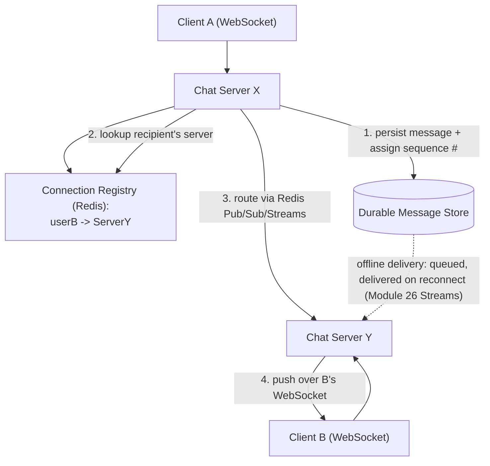

# Module 39 — System Design: Designing a Chat/Messaging System

> Domain: System Design | Level: Beginner → Expert | Prerequisite: [[01-System-Design-Fundamentals]], [[02-Designing-News-Feed-System]], [[../07-Redis/02-PubSub-Streams-HighAvailability]] (Pub/Sub vs. Streams delivery guarantees, directly reused here)

---

## 1. Fundamentals

### What is a chat/messaging system, and why does it exercise a fundamentally different set of trade-offs than a news feed?
A chat system (WhatsApp, Slack, Messenger) delivers messages between users/groups in near-real-time, with strong expectations around **delivery guarantees** (a sent message must arrive, not be silently dropped), **ordering** (messages within a conversation must appear in the order they were sent), and **low latency** (sub-second delivery for an active conversation). This is fundamentally different from Module 38's news feed problem: a feed tolerates eventual consistency and staleness; a chat message that's lost, duplicated, or delivered out of order is a **directly user-visible correctness failure**, not a minor staleness inconvenience — shifting the entire system's design center of gravity from "optimize for read-heavy, staleness-tolerant fan-out" (Module 38) to "guarantee reliable, ordered, low-latency delivery."

### Why does this matter?
Because it forces a genuinely different architectural primitive — **persistent, bidirectional connections** (WebSockets) instead of the stateless request/response model this entire course has otherwise assumed (Module 15's REST statelessness, Module 37 §9's stateless-replica default) — and because "delivery guarantee" questions (at-most-once vs. at-least-once vs. exactly-once) require the exact same precise reasoning Module 26's Redis Streams/consumer-group discussion established, now applied at full system-design scale.

### When does this matter?
Any real-time, bidirectional communication system (chat, live collaborative editing, multiplayer gaming state sync, live customer support); the depth matters because "just use WebSockets" is an incomplete answer — the actual design challenge is connection-state management at scale, message ordering across distributed servers, and precise delivery-guarantee semantics.

### How does it work (30,000-ft view)?
```
1. Client establishes a persistent WebSocket connection to a chat server (via a connection-aware load balancer)
2. Sender's message: client -> chat server -> message store (durable) -> fan-out to recipient's connection(s)
3. If recipient is offline: message queued for delivery when they reconnect (Module 26's Streams-based pattern)
4. Ordering: per-conversation sequence numbers, NOT wall-clock timestamps alone (clock skew across servers)
```

---

## 2. Deep Dive

### 2.1 WebSockets vs Long-Polling vs Server-Sent Events — the Connection-Model Trade-off
**WebSockets** provide a genuine, persistent, full-duplex (bidirectional) connection — the client and server can each push data at any time without a new request — the correct choice for chat, where both sending and receiving happen continuously and unpredictably. **Long-polling** (a client holds an HTTP request open until the server has data, then immediately re-issues a new request) approximates real-time delivery over ordinary HTTP infrastructure, at the cost of connection-churn overhead and inherent request/response asymmetry (still not genuinely bidirectional). **Server-Sent Events (SSE)** provide server-to-client push over a long-lived HTTP connection, but are **unidirectional** (client-to-server messages still need ordinary HTTP requests) — appropriate for the news feed's "live update" needs (Module 38) but insufficient alone for chat's inherently bidirectional requirement. This is precisely why WebSockets, despite requiring more infrastructure sophistication (§2.2), are the standard choice specifically for chat, while SSE/long-polling remain reasonable for read-heavy, primarily-server-to-client real-time use cases.

### 2.2 Connection State — the Architectural Shift Away from Statelessness
A WebSocket connection is inherently **stateful** — a specific chat server instance holds an open TCP connection to a specific client, directly violating Module 37 §9's "default to stateless replicas" guidance, requiring deliberate architectural accommodation: a **connection registry** (a distributed, shared mapping of `userId → which server instance holds their active connection`, typically in Redis, Module 25) lets any server receiving a message destined for a user **look up** which specific server actually holds that user's connection and route the message there (often via Redis Pub/Sub or Streams, Module 26, for inter-server message routing) — this connection-registry pattern is the standard architectural accommodation making WebSocket-based systems horizontally scalable despite their inherently stateful connection model.

### 2.3 Delivery Guarantees — At-Most-Once, At-Least-Once, Exactly-Once, Precisely Defined
**At-most-once**: a message is delivered zero or one times — simple, but messages can be silently lost (unacceptable for chat). **At-least-once**: a message is guaranteed to be delivered at least once, but might be delivered **multiple times** under failure/retry scenarios — requires the client/UI to handle deduplication (typically via a client-generated message ID, directly Module 15 §2.2's idempotency-key pattern, applied here to message delivery instead of API requests). **Exactly-once** (the ideal, but the hardest to actually achieve in a distributed system) is typically approximated in practice as **at-least-once delivery plus idempotent, deduplicating processing** on the receiving end (never a true, distributed exactly-once primitive, a nuance worth stating precisely rather than claiming "we guarantee exactly-once delivery" without qualification) — directly the same "at-least-once + application-level idempotency = effectively exactly-once" pattern Module 26 §2.2's Streams consumer-group discussion already established.

### 2.4 Message Ordering — Why Wall-Clock Timestamps Are Insufficient
Ordering messages within a conversation purely by each server's local wall-clock timestamp is unreliable across a distributed system due to **clock skew** (different servers' clocks are never perfectly synchronized, even with NTP) — two messages sent milliseconds apart, processed by two different servers, could be timestamped in the "wrong" relative order due to this skew. The standard fix: a **per-conversation monotonically-increasing sequence number** (assigned by a single authoritative source per conversation — e.g., incrementing a counter stored in the conversation's primary database record, or using a distributed sequence generator) provides a genuine, unambiguous total order independent of any individual server's clock, directly the same "logical ordering, not physical timestamp" principle underlying distributed-systems logical clocks (Lamport timestamps, a related, more advanced topic).

### 2.5 Group Chat — the Fan-Out Problem Returns, Now with Strict Ordering
Group chat reintroduces Module 38's fan-out concern (one message must reach every group member) but with a critical addition Module 38's feed didn't require: **every group member must see messages in the same relative order** — this rules out a naive independent-fan-out-per-recipient approach (which could deliver messages to different recipients in different relative orders under concurrent sends) in favor of a design where the message is first durably, order-assigned in a single conversation-scoped store (§2.4's sequence number), *then* fanned out — ensuring every recipient's eventual view, even if delivered at different times, reflects the same canonical order once fully synced.

## 3. Visual Architecture


## 4. Production Example
**Scenario**: A chat platform's group-messaging feature exhibited a confusing, intermittent bug: in fast-paced group conversations, different participants occasionally saw messages in **different relative orders** — user A would see "Message 1, then Message 2," while user B, in the same group, briefly saw "Message 2, then Message 1" before eventually reconciling to the same order. **Investigation**: traced to the fan-out implementation independently routing each message to each recipient's connection as soon as it arrived at any chat server, with **no shared, authoritative sequencing step** before fan-out — under concurrent sends from different group members hitting different chat servers simultaneously, network/processing latency differences meant messages could be independently delivered to different recipients' connections in different relative orders, exactly the correctness gap §2.5 warns against. **Fix**: introduced a per-conversation authoritative sequencer — every message is first written to the conversation's durable store (assigning a strictly-increasing sequence number as part of that single, serialized write) **before** any fan-out occurs, and the fan-out step delivers messages to recipients' connections strictly in sequence-number order (buffering/reordering at the recipient-connection level if a later-sequenced message's fan-out happens to complete before an earlier one's, due to independent network paths to different chat servers) — eliminating the order-discrepancy bug entirely, since every recipient's eventual view is now derived from the same, single, authoritative sequence. **Lesson**: fan-out (multiple independent delivery paths to different recipients) and ordering (a single, agreed-upon sequence) are in **direct tension** unless explicitly reconciled — a design that naively combines "fan out immediately, independently, to each recipient" (a reasonable-sounding, Module 38-style optimization) with "messages must be strictly ordered" (this system's actual core requirement) will silently violate ordering under concurrent, multi-server load, exactly the kind of subtle, load-dependent bug (invisible in single-user or low-concurrency testing) this course has repeatedly flagged (Module 28 §4's read-your-own-writes incident shares this exact "invisible at low concurrency, real under production load" shape).

## 5. Best Practices
- Use WebSockets for genuinely bidirectional, low-latency chat; reserve SSE/long-polling for primarily-server-to-client real-time needs where full duplex isn't required.
- Maintain a distributed connection registry (Redis) mapping users to their current connection-holding server instance, enabling horizontal scaling of an inherently stateful connection model.
- Assign a per-conversation, authoritative, strictly-increasing sequence number to every message **before** fan-out, never relying on wall-clock timestamps or independent per-recipient delivery timing for ordering.
- Design for at-least-once delivery with client-side idempotent deduplication (via client-generated message IDs) rather than claiming an unqualified "exactly-once" guarantee.

## 6. Anti-patterns
- Fanning out a group message to each recipient's connection independently and immediately, without first establishing a single, authoritative sequence — the direct cause of §4's cross-user ordering-discrepancy bug.
- Relying on wall-clock timestamps for cross-server message ordering, vulnerable to clock skew.
- Treating WebSocket connections as stateless (no connection registry), preventing horizontal scaling or requiring sticky-session workarounds with their own correctness risks.
- Claiming an unqualified "exactly-once" delivery guarantee without the underlying at-least-once-plus-idempotent-deduplication mechanism actually implementing it.

## 7. Performance Engineering
**Connection-registry lookup latency on the message-send critical path**: every message send requires a connection-registry lookup (§2.2) to route to the recipient's actual connection-holding server — this Redis round-trip directly consumes part of the message's end-to-end latency budget (Module 37 §7's latency-budget-allocation discipline), and should be explicitly measured/budgeted rather than assumed negligible, especially at high message volume where Redis itself could become a bottleneck requiring its own scaling consideration (Module 25 §2.5's Cluster sharding). **WebSocket connection overhead at scale**: each open WebSocket connection consumes server-side memory/file-descriptor resources — a chat server handling hundreds of thousands of concurrent connections needs explicit capacity planning for connection count, not just message throughput, a distinct capacity dimension from the request-per-second metrics this course's other modules have emphasized (directly extending Module 37 §2.2's capacity-estimation discipline to a new, connection-count-based dimension specific to persistent-connection systems). **Offline message delivery and the reconnection storm**: when a chat server (or an entire region) experiences an outage, all its connected clients simultaneously attempt to reconnect once it recovers — a **reconnection storm** directly analogous to Module 2 §Expert Q7's retry-storm concern, mitigated via the same jittered-backoff client reconnection strategy, combined with the connection registry correctly handling the resulting burst of registry updates without itself becoming a bottleneck during exactly the moment the system is already recovering from an outage. **Message history/pagination**: loading a conversation's message history for a newly-opened chat window is a read-heavy, potentially-large-result-set operation benefiting directly from Module 20's keyset/cursor pagination discipline (not offset pagination, given message history's natural append-only, sequence-ordered structure making keyset pagination a natural, efficient fit).

## 8. Security
**End-to-end encryption as an architectural decision, not a bolt-on feature**: if message content must be unreadable even to the platform operator (a genuine, common product requirement for privacy-focused chat platforms), this fundamentally changes the architecture — the server can no longer perform content-based features (server-side search, content moderation scanning) on message content directly, requiring those features to be redesigned around encrypted-content constraints (client-side search indexes, metadata-based moderation signals) rather than assumed to work identically to a non-E2E-encrypted system — a system-design answer should explicitly ask whether E2E encryption is a requirement **before** designing search/moderation features, since retrofitting E2E encryption onto an already-designed content-scanning architecture is highly disruptive. **Connection authentication and authorization**: establishing a WebSocket connection must authenticate the user (directly Module 12's authentication schemes, typically a token validated at connection-upgrade time) and every subsequent message on that connection must be authorized against the specific conversation/group it targets (resource-based authorization, Module 12 §2.4, verifying the connected user is actually a member of the group they're attempting to send to/receive from) — a connection-level authentication check alone, without per-message/per-conversation authorization, would let an authenticated-but-unauthorized user potentially access conversations they're not a member of. **Rate limiting message sends per connection**: an abusive or compromised client sending messages at an extreme rate (spam, or a deliberate resource-exhaustion attempt against the fan-out/connection-registry infrastructure) needs per-connection rate limiting (Module 16's distributed rate-limiting discipline, applied per-user/per-connection rather than per-HTTP-request) — a chat system's persistent-connection model means a single connection can generate sustained load in a way a stateless HTTP request cannot, requiring this protection to be a first-class architectural concern, not an afterthought. **Message content validation and moderation**: directly Module 38 §8's content-moderation discussion, here with the added complexity that real-time delivery means moderation must happen either synchronously (adding latency to every message) or asynchronously with a "message already delivered, may be retracted/flagged after the fact" model — an explicit, deliberate choice a system-design answer should address rather than leave implicit.

## 9. Scalability
**Horizontal scaling of an inherently stateful connection model**: the connection registry (§2.2) is precisely what makes horizontal scaling possible despite WebSocket connections being stateful — without it, a specific chat server instance would need to somehow be the *only* possible destination for a given user's messages, defeating load-balanced horizontal scaling entirely; understanding this registry as the load-bearing mechanism enabling Module 37 §9's "default to stateless, horizontally-scaled replicas" principle to still apply (indirectly, via externalized connection state) even for a fundamentally stateful connection protocol is the key scalability insight for this system class. **Sharding the message store by conversation ID**: directly Module 27's partition-key-design discipline — a conversation's messages are always queried together (by conversation ID) and rarely need cross-conversation queries, making conversation ID a natural, high-cardinality, evenly-distributed shard key, exactly the same reasoning as Module 27 §Advanced Q2's single-table customer/order co-location design, applied here to chat messages instead. **Group size as a distinct scaling dimension**: unlike Module 38's follower-count-skew problem (a small number of celebrity accounts with extreme follower counts), chat group sizes are typically far more bounded (even "large" group chats rarely exceed a few thousand members, several orders of magnitude below a celebrity's follower count) — meaning the fan-out cost for even a large group chat is unlikely to require Module 38's full hybrid-model treatment, though the same underlying "fan-out cost scales with recipient count" principle still applies and should be explicitly reasoned about rather than assumed away, especially for a hypothetical "broadcast channel" feature that *could* have celebrity-scale recipient counts. **Cross-region chat and the ordering-consistency tension**: a globally-distributed chat system faces a direct tension between Module 37 §2.5's typical "AP-leaning for cross-region" default and this system's strict ordering requirement (§2.4/§2.5) — a cross-region conversation's authoritative sequencer (§2.4) must live in a single, specific region (or use a more sophisticated distributed-consensus sequence mechanism, a more advanced topic), meaning participants in a *different* region than the sequencer inherently experience additional latency for their messages to be sequenced, a genuine, unavoidable trade-off this system's ordering requirement imposes that Module 38's eventually-consistent feed did not.

---

## 10. Interview Questions

### Basic (10)
1. **Q: Why are WebSockets typically chosen over long-polling/SSE for a chat system?** **A:** WebSockets provide genuine, persistent, full-duplex (bidirectional) communication, matching chat's need for both sending and receiving to happen continuously and unpredictably.
2. **Q: What is a connection registry?** **A:** A distributed mapping (typically in Redis) of which specific server instance holds a given user's active WebSocket connection, enabling message routing across a horizontally-scaled fleet.
3. **Q: What's the difference between at-most-once and at-least-once delivery?** **A:** At-most-once may silently lose a message; at-least-once guarantees delivery but may deliver duplicates, requiring deduplication.
4. **Q: Why are wall-clock timestamps insufficient for cross-server message ordering?** **A:** Clock skew between different servers means timestamps alone don't reliably reflect the true relative order of messages processed by different servers.
5. **Q: What is used instead of wall-clock timestamps for reliable message ordering?** **A:** A per-conversation, monotonically-increasing sequence number assigned by a single authoritative source.
6. **Q: Is a WebSocket connection stateless or stateful?** **A:** Stateful — a specific server instance holds an open connection to a specific client.
7. **Q: What does "exactly-once" delivery typically mean in practice for a real system?** **A:** At-least-once delivery combined with idempotent, deduplicating processing on the receiving end — a true distributed exactly-once primitive is not generally achievable.
8. **Q: Why does group chat require stricter design than one-to-one chat?** **A:** Every group member must see messages in the same relative order, ruling out naive independent-per-recipient fan-out.
9. **Q: What's a common shard key for a chat system's message store?** **A:** Conversation ID.
10. **Q: Why should message-history pagination use keyset/cursor pagination rather than offset pagination?** **A:** Message history is naturally append-only and sequence-ordered, a natural fit for keyset pagination's stability and constant cost regardless of pagination depth.

### Intermediate (10)
1. **Q: Why is Server-Sent Events insufficient alone for a chat system despite supporting real-time server-to-client push?** **A:** SSE is unidirectional — client-to-server messages (a user sending a chat message) still require separate ordinary HTTP requests, not a genuinely bidirectional channel the way WebSockets provide.
2. **Q: Why does a connection registry typically use Redis specifically, rather than a relational database?** **A:** Connection mappings need extremely fast, high-frequency reads/writes (looked up on every message send) with simple key-value semantics — exactly Redis's strength (Module 25), while a relational database's transactional/query-flexibility overhead would be unnecessary for this specific access pattern.
3. **Q: Why must group-chat fan-out happen only after a message is durably sequenced, not before?** **A:** Fanning out before sequencing allows different recipients' independent delivery paths to complete in different relative orders under concurrent sends (§4's incident) — sequencing first establishes a single, authoritative order that fan-out then respects, rather than each recipient independently observing whatever order their specific network/server path happened to deliver messages in.
4. **Q: Why is client-generated message ID deduplication necessary for at-least-once delivery, specifically?** **A:** At-least-once delivery can, under retry/failure scenarios, deliver the same message multiple times — without a stable, client-generated ID the receiving client can use to recognize "I've already displayed this exact message," duplicate deliveries would show as duplicate messages in the chat UI.
5. **Q: Why does offline message delivery (a recipient reconnecting after being offline) benefit from the same pattern as Module 26's Streams consumer groups?** **A:** Both need to deliver a backlog of messages that occurred while the consumer/recipient was disconnected, tracked via a durable, resumable position (a consumer-group offset, or an equivalent "last delivered message sequence number" per user) — exactly the same durable-checkpoint, resume-on-reconnect pattern.
6. **Q: Why might a reconnection storm occur after a chat server outage, and how is it mitigated?** **A:** Every client connected to the failed server attempts to reconnect simultaneously once it (or a replacement) becomes available — mitigated via jittered exponential backoff on the client's reconnection attempts, directly Module 2's retry-storm mitigation pattern, preventing every client from retrying in exact lockstep.
7. **Q: Why does end-to-end encryption fundamentally change how server-side search/moderation features must be designed?** **A:** If message content is encrypted such that even the server can't read it, any feature requiring content inspection (search, automated moderation) can no longer operate on the plaintext server-side and must be redesigned around client-side processing or encrypted-content-compatible techniques instead.
8. **Q: Why is per-connection rate limiting a distinct concern from ordinary per-HTTP-request rate limiting (Module 16)?** **A:** A persistent WebSocket connection can sustain a high message-send rate over a long duration without the natural, discrete request/response boundary an HTTP-based rate limiter typically keys off — requiring rate-limiting logic specifically designed around a connection's sustained message-sending behavior, not just per-request counting.
9. **Q: Why is conversation ID a natural shard key for a chat message store?** **A:** Messages are almost always queried scoped to one specific conversation (loading a chat window's history) — conversation ID is both the dominant access pattern's key and typically high-cardinality/evenly-distributed across a large user base, directly matching Module 27's partition-key design criteria.
10. **Q: Why does a globally cross-region chat system face a genuine ordering-vs-latency trade-off that a news feed system (Module 38) doesn't face in the same way?** **A:** A feed tolerates eventual, unordered-across-regions consistency (a friend's post from another region appearing with some delay is acceptable); a chat conversation's strict-ordering requirement means an authoritative sequencer must exist somewhere specific, and participants far from that sequencer inherently experience added latency for their messages to be officially sequenced — a trade-off the feed system's more relaxed consistency requirement simply doesn't impose.

### Advanced (10)
1. **Q: Diagnose the group-chat ordering-discrepancy incident (§4) from first principles, and design the specific architectural change (not just "add a sequence number") that structurally prevents recurrence.**
   **A:** Root cause: fan-out occurring independently per-recipient before any single, authoritative ordering decision was made, allowing different recipients' delivery paths to race. Structural fix: restructure the message-send pipeline so that **no fan-out attempt can begin until the message has been durably written with its sequence number assigned** (a single, serialized write to the conversation's authoritative store) — making the sequence-assignment step a genuine **prerequisite gate** the fan-out logic cannot bypass, rather than a data field that's merely present but not actually enforced as an ordering prerequisite in the code's control flow; additionally, each recipient's connection-side delivery logic should track the last-delivered sequence number and explicitly buffer/reorder any message arriving out of sequence (a network-path timing artifact) before displaying it, providing a second, defense-in-depth layer beyond the send-side sequencing gate.
2. **Q: Design the connection registry's data model and failure-handling behavior when a chat server crashes without cleanly deregistering its connections.**
   **A:** Store registry entries with a short TTL (Module 25 §2.3's expiration mechanism) refreshed via periodic heartbeat from each chat server for its currently-held connections — if a server crashes without cleanly deregistering, its entries simply expire naturally within the TTL window rather than persisting indefinitely as stale, incorrect routing information (directly avoiding a Module 26 §2.5-style "orphaned state retained forever" risk, here bounded by TTL rather than requiring explicit cleanup); a message routed to an about-to-expire or already-expired stale entry fails the delivery attempt, triggering the message to be queued for offline-style delivery (§2.3) until the recipient's client reconnects and re-registers with a now-current, correct server mapping.
3. **Q: Explain how you would design "read receipts" (showing a message as seen by the recipient) without introducing a new correctness/ordering hazard similar to §4's incident.**
   **A:** Read receipts are themselves a form of message (a "user X has seen up to sequence number N" event) and should flow through the **same** authoritative-sequencing-then-fan-out pipeline as ordinary chat messages, rather than being implemented as a separate, ad-hoc side-channel update mechanism that could race against the message-ordering guarantees the main pipeline already carefully established — treating read-receipt events as first-class, sequenced messages within the same conversation stream avoids introducing a parallel, potentially-inconsistent ordering mechanism alongside the one already fixed in §4.
4. **Q: Design a strategy for handling the "typing indicator" feature (a genuinely ephemeral, loss-tolerant signal) differently from ordinary chat messages, architecturally.**
   **A:** Unlike chat messages (requiring durable storage, guaranteed delivery, strict ordering), a typing indicator is exactly the kind of ephemeral, loss-tolerant signal Module 26 §2.1 identifies as appropriate for Pub/Sub rather than Streams — briefly missing a "user is typing" event due to a momentary disconnection has no lasting consequence (it self-corrects on the next keystroke event) — routing typing indicators through a lightweight Pub/Sub channel instead of the durable, sequenced, at-least-once message pipeline avoids paying that pipeline's correctness-guaranteeing overhead for a feature that structurally doesn't need it, a deliberate, differentiated architectural choice per feature's actual requirements (directly Module 37 §2.1's "consistency/guarantees per data type, not uniformly" principle, now applied within one chat system's own feature set).
5. **Q: How would you design the message-history read path to correctly handle a conversation with millions of historical messages, balancing the pagination discipline from Module 20 against this system's specific access patterns?**
   **A:** Use keyset pagination (Module 20 §2.4) keyed by the conversation's sequence number (§2.4) — naturally monotonic, unique, and already the system's authoritative ordering key, making it a direct, ideal cursor without needing a separate tie-breaking key (unlike Module 20 §11 Medium exercise's `CreatedDate` needing an `Id` tie-breaker) — "load the next 50 older messages" becomes `WHERE sequenceNumber < lastSeenSequenceNumber ORDER BY sequenceNumber DESC LIMIT 50`, a stable, efficient, constant-cost-regardless-of-conversation-age query.
6. **Q: Explain how you would design cross-region message delivery for a globally-distributed team using this chat system, addressing the ordering-vs-latency trade-off from Intermediate Q10 concretely.**
   **A:** Assign each conversation's authoritative sequencer to a specific "home region" (perhaps determined by where the conversation was created, or by the majority of its participants' locations) — participants in that home region experience minimal sequencing latency; participants in other regions send their messages to their local region first (for fast acknowledgment of "message accepted") but the message isn't officially sequenced/ordered until it reaches the home region's sequencer, meaning cross-region participants see a small, bounded, honestly-communicated additional latency before their message's final position in the conversation is confirmed — an explicit, deliberate trade-off rather than either ignoring the physics of cross-region latency or attempting an expensive, likely-infeasible globally-synchronous sequencing mechanism.
7. **Q: A team proposes eliminating the connection registry and instead using consistent hashing (Module 37 §2.3) to deterministically route every user to a fixed server based on their user ID, avoiding the registry lookup entirely. Evaluate this trade-off.**
   **A:** This trades away the registry's flexibility (a server can crash and the registry naturally routes around it once entries expire, Advanced Q2) for the simplicity of a stateless, computed routing decision — but it reintroduces a real risk: if the consistent-hashing scheme's target server for a given user is temporarily unavailable (a crash, a deploy), there's no registry to consult for "where did this user's connection actually get re-established" — the client would need to reconnect to a *different*, computed-fallback server, and the system would need a mechanism (likely still some form of lightweight registry or health-check-aware routing) to know the user is now actually connected elsewhere; in practice, a hybrid (consistent hashing for the *initial* connection routing decision, combined with a lightweight registry recording *actual* current connections for accurate message routing) often provides the best of both approaches, rather than either purely computed routing or a registry alone.
8. **Q: Design a monitoring strategy specifically for message-ordering correctness, catching a regression of the §4 incident class proactively rather than relying on user reports.**
   **A:** Implement a synthetic, automated "canary" conversation with multiple simulated participants sending messages at high concurrency on a continuous, scheduled basis, asserting that every participant's observed message order matches the expected authoritative sequence — directly the same synthetic-canary-transaction monitoring pattern used broadly in distributed-systems observability, here specifically targeting the exact failure mode (cross-recipient ordering discrepancy under concurrent load) that §4's incident demonstrated is otherwise invisible until a real user happens to notice and report it.
9. **Q: Explain why "just add more chat servers" doesn't trivially solve a chat system's scaling problem the way it might for a stateless REST API, connecting explicitly to Module 37 §9's scaling-ladder discussion.**
   **A:** Adding more stateless REST API replicas (Module 37 §9's default scaling lever) works because any replica can serve any request — but a new chat server has **no existing connections** to serve; it only helps if it can accept *new* incoming connections (spreading future connection load) while the *existing* connections (and their associated registry entries, §2.2) remain correctly routed to whichever servers already hold them — "add more servers" for a chat system scales *new connection capacity* directly, but doesn't rebalance *already-established* connections without additional mechanisms (e.g., periodically asking a subset of clients to gracefully reconnect, spreading them across the now-larger server fleet) — a genuinely more nuanced scaling story than the stateless-replica case this course has otherwise emphasized as the default.
10. **Q: As a Principal Engineer, how would you decide whether a genuinely stronger, formally-verified exactly-once delivery guarantee (beyond at-least-once-plus-deduplication) is worth the substantially higher engineering investment for a specific chat product?**
    **A:** Weigh the actual, demonstrated user-facing cost of the at-least-once-plus-deduplication approach's edge cases (are duplicate-message UI glitches actually occurring and bothering users in practice, or is this a theoretical concern with no real observed impact) against the very substantial engineering cost of building/operating a more rigorous distributed-consensus-based delivery mechanism (a much larger, riskier undertaking) — for the overwhelming majority of chat products, at-least-once-plus-idempotent-deduplication is an entirely adequate, well-understood, and far simpler approach that real, large-scale chat systems (WhatsApp, Slack) actually use in production — recommend investing in the simpler, proven approach unless a specific, demonstrated product requirement (not a theoretical purity concern) justifies the dramatically higher cost of a more rigorous alternative, directly this course's recurring "match engineering investment to demonstrated need, not theoretical completeness" discipline.

---

## 11. Coding Exercises

*(System design case studies use worked design exercises, consistent with Modules 37-38's format.)*

### Easy — Capacity estimation for WebSocket connection count
**Problem**: Estimate concurrent connection count and per-server capacity needs for a chat platform with 50M daily active users, average session duration 20 minutes, average 8 sessions/user/day.
**Solution**:
```
Total connection-minutes/day: 50M users * 8 sessions * 20 min = 8 billion connection-minutes/day
Average concurrent connections: 8 billion / (24 * 60) minutes-in-a-day ≈ 5.55 million concurrent connections
If each chat server handles ~50,000 concurrent WebSocket connections (a realistic, tunable per-server limit):
Servers needed: 5,550,000 / 50,000 ≈ 111 chat server instances (plus headroom for peak/failover)
```
**Discussion**: This is a genuinely different capacity dimension than the request-per-second estimates in Modules 37-38 — connection *count*, not request *rate*, is the primary capacity driver for a persistent-connection system, directly the distinct capacity dimension §7 flags.

### Medium — Connection registry read/write pattern
```csharp
// On connection established:
await _redis.HashSetAsync("connections", userId, $"{serverId}:{connectionId}");
await _redis.KeyExpireAsync($"conn-heartbeat:{userId}", TimeSpan.FromSeconds(30));

// Periodic heartbeat (every 15s, refreshing before the 30s TTL expires -- Advanced Q2's pattern):
await _redis.KeyExpireAsync($"conn-heartbeat:{userId}", TimeSpan.FromSeconds(30));

// On message send, routing lookup:
var location = await _redis.HashGetAsync("connections", recipientUserId);
if (location.HasValue)
{
    var (serverId, connectionId) = ParseLocation(location);
    await RouteToServerAsync(serverId, connectionId, message); // via Redis Pub/Sub or Streams (Module 26)
}
else
{
    await QueueForOfflineDeliveryAsync(recipientUserId, message); // Module 26 Streams-based backlog pattern
}
```

### Hard — Authoritative sequencing gate preventing the §4 ordering bug
```csharp
public async Task<Message> SendMessageAsync(string conversationId, string senderId, string content)
{
    // SEQUENCE ASSIGNMENT IS A PREREQUISITE GATE -- fan-out literally cannot start before this completes,
    // directly the structural fix from Advanced Q1 (not just "add a sequence field").
    long sequenceNumber = await _conversationStore.AppendMessageAsync(conversationId, senderId, content);
    // AppendMessageAsync performs a single, serialized write (e.g., an atomic INCREMENT + INSERT
    // within one transaction) -- this is the ONE authoritative ordering decision for this message.

    var message = new Message(conversationId, sequenceNumber, senderId, content);

    await FanOutMessageAsync(message); // only reachable AFTER sequencing -- cannot race ahead of it
    return message;
}

private async Task FanOutMessageAsync(Message message)
{
    var members = await _conversationStore.GetMembersAsync(message.ConversationId);
    await Task.WhenAll(members.Select(memberId => DeliverToMemberAsync(memberId, message)));
    // Recipients' OWN connection-side logic (not shown) buffers/reorders by sequenceNumber
    // as a second, defense-in-depth layer, per Advanced Q1's full fix.
}
```

### Expert — Client-side message deduplication for at-least-once delivery (Advanced Q's core pattern)
```csharp
public class ChatMessageDeduplicator
{
    private readonly HashSet<string> _seenMessageIds = new(); // bounded via periodic cleanup, per Module 33's discipline

    public bool ShouldDisplay(IncomingMessage message)
    {
        // Client-generated message ID (assigned at SEND time, before the network round-trip) --
        // survives retries: a retried send carries the SAME id, letting the client recognize
        // "I already displayed this" even if the server's at-least-once delivery sends it twice.
        return _seenMessageIds.Add(message.ClientGeneratedId); // HashSet.Add returns false if already present
    }
}
```
**Discussion**: The client-generated ID (not a server-assigned one) is the critical detail — if the ID were assigned only after the message reaches the server, a network failure *during* the original send (before the client receives acknowledgment) would cause the client to retry with what it believes is a "new" send attempt, and the server, having actually received and processed the original attempt already, would have no way to recognize the retry as a duplicate of an already-processed message without the client's own stable, pre-assigned ID to compare against — directly Module 15 §2.2's idempotency-key pattern, essential here for exactly the same "client can't know if its original request succeeded before retrying" reason.

---

## 12–17. System Design / LLD / Debugging / Decision / Case Study / Principal

*(This entire module IS the deep-dive case study — §4's incident, §11's four worked exercises, and the extensive Advanced-tier Q&A collectively constitute this section's typical content.)*

## 18. Revision
**Key takeaways**: WebSockets provide genuine bidirectional communication chat requires; SSE/long-polling are insufficient alone. WebSocket connections are inherently stateful, requiring a distributed connection registry (Redis) to enable horizontal scaling despite this — a direct architectural accommodation for a class of system that doesn't fit Module 37 §9's default stateless-replica assumption. Delivery guarantees must be precisely defined: at-least-once-plus-client-generated-ID-deduplication is the practical, standard approximation of "exactly-once." Message ordering requires a single, authoritative per-conversation sequence number assigned as a genuine prerequisite gate **before** fan-out — fanning out independently per-recipient before sequencing is the root cause of cross-recipient ordering discrepancies under concurrent load (§4), invisible at low concurrency and real under production traffic, precisely this course's recurring dangerous bug shape.

---

**Next**: Continuing autonomously to Module 40 — Designing a Distributed Rate Limiter & API Gateway (synthesizing Module 16's rate-limiting content into a full system-design case study) to complete the `14-System-Design` domain before advancing to `15-Low-Level-Design`.
