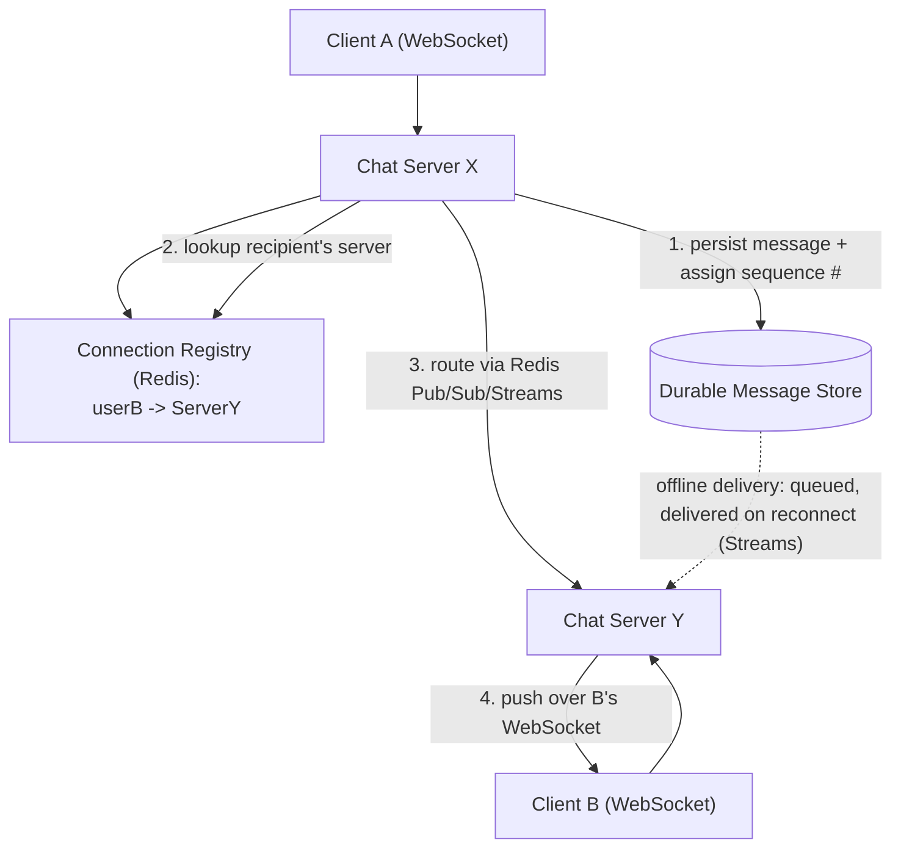
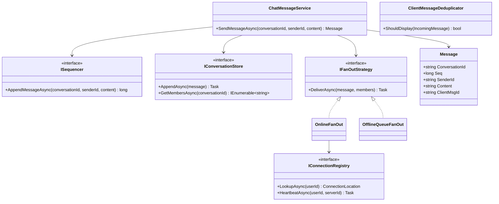
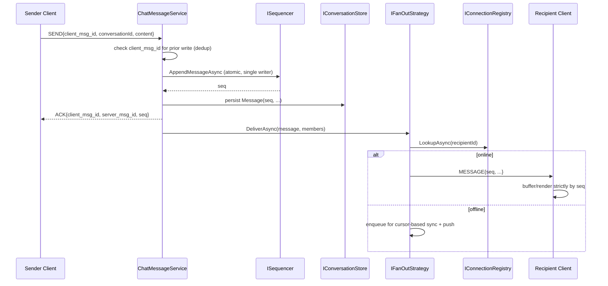

# Module 39 — System Design: Designing a Chat/Messaging System

> Domain: System Design | Level: Beginner → Expert | Prerequisite: [[01-System-Design-Fundamentals]], [[02-Designing-News-Feed-System]], [[../07-Redis/02-PubSub-Streams-HighAvailability]] (Pub/Sub vs. Streams delivery guarantees, directly reused here)

---

## 1. Fundamentals

### What is a chat/messaging system, and why does it exercise a fundamentally different set of trade-offs than a news feed?
A chat system (WhatsApp, Slack, Messenger) delivers messages between users/groups in near-real-time, with strong expectations around **delivery guarantees** (a sent message must arrive, not be silently dropped), **ordering** (messages within a conversation must appear in the order they were sent), and **low latency** (sub-second delivery for an active conversation). This is fundamentally different from the news feed problem: a feed tolerates eventual consistency and staleness; a chat message that's lost, duplicated, or delivered out of order is a **directly user-visible correctness failure**, not a minor staleness inconvenience — shifting the entire system's design center of gravity from "optimize for read-heavy, staleness-tolerant fan-out" to "guarantee reliable, ordered, low-latency delivery."

### Why does this matter?
Because it forces a genuinely different architectural primitive — **persistent, bidirectional connections** (WebSockets) instead of the stateless request/response model this entire course has otherwise assumed — and because "delivery guarantee" questions (at-most-once vs. at-least-once vs. exactly-once) require the exact same precise reasoning the Redis Streams/consumer-group discussion established, now applied at full system-design scale.

### When does this matter?
Any real-time, bidirectional communication system (chat, live collaborative editing, multiplayer gaming state sync, live customer support); the depth matters because "just use WebSockets" is an incomplete answer — the actual design challenge is connection-state management at scale, message ordering across distributed servers, and precise delivery-guarantee semantics.

### How does it work (30,000-ft view)?
```
1. Client establishes a persistent WebSocket connection to a chat server (via a connection-aware load balancer)
2. Sender's message: client -> chat server -> message store (durable) -> fan-out to recipient's connection(s)
3. If recipient is offline: message queued for delivery when they reconnect (the Streams-based pattern)
4. Ordering: per-conversation sequence numbers, NOT wall-clock timestamps alone (clock skew across servers)
```

---

## 2. Deep Dive

This section is written to be **complete on its own** — every mechanism, the reasoning that selects it, the failure mode it introduces, and the push-back a Principal/Staff interviewer will raise, answered inline.

### 2.1 Connection Models — WebSockets vs Long-Polling vs SSE

**WebSockets** provide a genuine persistent, full-duplex connection: client and server can each push at any time without a new request. This is the correct choice for chat, where sending and receiving both happen continuously and unpredictably.

**Long-polling** holds an HTTP request open until the server has data, then the client immediately re-issues. It approximates real-time over ordinary HTTP infrastructure, at the cost of connection churn and an inherent request/response asymmetry — it is still not genuinely bidirectional.

**Server-Sent Events** give server-to-client push over a long-lived HTTP connection, but are **unidirectional**: client-to-server messages still need ordinary HTTP requests. SSE is the right tool for a live-updating feed; it is structurally insufficient alone for chat.

| | Direction | Transport | Best for |
|---|---|---|---|
| WebSocket | Full duplex | Upgraded TCP, own framing | Chat, collaborative editing, trading UIs |
| SSE | Server → client | Plain HTTP, auto-reconnect built in | Live feeds, price ticks, progress |
| Long-polling | Emulated both ways | Plain HTTP | Fallback where WebSockets are blocked |

The honest framing: WebSockets cost more infrastructure sophistication — stateful connections, a registry, connection draining on deploy — and chat's bidirectionality is what makes that cost unavoidable rather than optional.

### 2.2 Connection State and the Registry — Accommodating Statefulness

A WebSocket is inherently **stateful**: one specific server instance holds an open TCP connection to one specific client. That directly violates the stateless-replica default, so it needs a deliberate accommodation.

The **connection registry** is a distributed mapping `userId → server instance holding their connection`, so any server receiving a message for a user can look up where that user actually is and route the message there (typically over Redis Pub/Sub or an internal message bus). This is the standard pattern that makes WebSocket systems horizontally scalable despite their stateful connections.

**Why Redis rather than a relational database:** the registry is read on *every* message send — extremely high frequency, trivially simple key-value semantics, no transactions, no query flexibility needed. That is exactly Redis's shape, and a relational engine's overhead would buy nothing.

**Handling a server that crashes without deregistering.** Store registry entries with a short **TTL**, refreshed by a periodic heartbeat from each chat server for the connections it currently holds. A crashed server's entries then expire naturally within the TTL window rather than persisting forever as stale routing information — bounding orphaned state by expiry rather than relying on explicit cleanup that by definition cannot run. A message routed to a stale entry fails its delivery attempt, which falls through to the offline-queue path (§2.6) until the client reconnects and re-registers.

**The consistent-hashing alternative, and why a hybrid usually wins.** A tempting simplification: drop the registry, and deterministically route every user to a fixed server by consistent hash of user ID. That trades the registry's flexibility for a stateless computed decision — but it breaks precisely when it matters. If the computed target is temporarily unavailable (crash, deploy), there is no registry to answer "where did this user's connection actually get re-established?" The client reconnects to some fallback server and the system has no way to know. In practice the best answer is a **hybrid**: consistent hashing for the *initial* connection-routing decision (so load spreads predictably without a lookup), plus a lightweight registry recording *actual* current connections for accurate message routing. Purely computed routing and a registry alone each give up something the other provides.

### 2.3 Delivery Guarantees — Stated Precisely

- **At-most-once** — delivered zero or one times. Simple, and silently loses messages. Unacceptable for chat.
- **At-least-once** — guaranteed delivery, possibly multiple times under retry. Requires deduplication on the receiving side, via a **client-generated message ID** — the idempotency-key pattern applied to message delivery rather than to API requests.
- **Exactly-once** — the ideal, and not achievable as a distributed *transport* primitive. What real systems provide is the identity:

```
exactly-once  =  at-least-once  AND  at-most-once
                 (retry)            (dedup on a stable client-generated message ID)
```

Saying "we guarantee exactly-once delivery" without that qualification is the kind of imprecision an interviewer will probe. The practical consequence is concrete: without a stable client-generated ID that the receiver can use to recognise "I have already displayed this exact message," a redelivery under retry shows as a duplicate message in the UI.

**Is a formally stronger guarantee ever worth building?** Weigh the *demonstrated* user-facing cost of at-least-once-plus-dedup's edge cases — are duplicate-message glitches actually occurring and bothering users, or is this theoretical? — against the very substantial cost of a consensus-based delivery mechanism. For the overwhelming majority of chat products the simpler approach is what large-scale systems (WhatsApp, Slack) actually run in production. Recommend the proven, simpler design unless a specific demonstrated product requirement, not a purity concern, justifies the difference.

### 2.4 Message Ordering — Why Timestamps Fail and What Replaces Them

Ordering by each server's local wall-clock timestamp is unreliable because of **clock skew**: servers' clocks are never perfectly synchronised even under NTP, so two messages sent milliseconds apart and processed by two different servers can be timestamped in the wrong relative order.

The fix is a **per-conversation monotonically increasing sequence number**, assigned by a single authoritative source per conversation — an incrementing counter on the conversation's primary record, or a distributed sequencer. That gives a genuine total order independent of any server's clock, and it is the same "logical ordering, not physical timestamp" principle behind Lamport clocks.

**The sequence number must be a control-flow gate, not merely a data field.** This is the structural lesson of §4's incident, and it is the part candidates miss. Having a sequence column is worthless if the code can fan out before assigning it. Restructure the send pipeline so that **no fan-out attempt can begin until the message has been durably written with its sequence assigned** — a single serialized write to the conversation's authoritative store, which the fan-out logic cannot bypass. Make the bad state unrepresentable rather than detectable.

**Defence in depth on the receive side.** Each recipient's connection-side delivery logic should track the last-delivered sequence number and explicitly **buffer and reorder** any message arriving out of sequence — a network-path timing artefact — before displaying it. A gap that does not close within a timeout forces a resync (§2.6) and is counted (§2.13).

### 2.5 Group Chat — Fan-Out Returns, Now With Strict Ordering

Group chat reintroduces fan-out (one message to every member) with a requirement the feed never had: **every member must see messages in the same relative order.**

That rules out naive independent-fan-out-per-recipient, which under concurrent sends can deliver messages to different recipients in different relative orders. The order is: durably sequence in the conversation-scoped store **first**, then fan out. Every recipient's eventual view then reflects the same canonical order, even though delivery times differ.

### 2.6 Offline Delivery, Sync, and Reconnection

A recipient who was disconnected needs a backlog delivered on reconnect, tracked by a durable resumable position — a per-user "last delivered sequence number" cursor. This is structurally identical to a stream consumer group's offset: a durable checkpoint, resume on reconnect.

**The insight that makes the whole system robust: live delivery is an optimisation over a correct sync protocol, not the delivery mechanism itself.** If every client can always reconstruct its correct state by syncing from its cursor, then any live-push failure degrades to "slightly later" rather than "lost." This is what makes partitions, crashes and deploys survivable rather than correctness incidents, and it is worth stating explicitly in an interview.

**Reconnection storms.** When a chat server fails, every client it held tries to reconnect simultaneously the moment it or a replacement becomes available — a thundering herd against the surviving fleet. Mitigate with **jittered exponential backoff** on the client's reconnect attempts. Without jitter, clients retry in lockstep and the herd simply repeats at a fixed interval.

### 2.7 Differentiating Guarantees Per Feature

Not every signal in a chat product deserves the durable, sequenced, at-least-once pipeline. Choosing per feature is the applied form of "guarantees per data type, not uniformly."

**Typing indicators** are ephemeral and loss-tolerant — missing one has no lasting consequence because the next keystroke corrects it. Route them through lightweight **Pub/Sub**, not the durable sequenced pipeline, and avoid paying correctness overhead a feature structurally does not need.

**Read receipts are themselves messages** — "user X has seen up to sequence N" — and must flow through the **same** authoritative-sequence-then-fan-out pipeline rather than an ad-hoc side channel that could race the ordering guarantees just established. Treating them as first-class sequenced events avoids building a second, inconsistent ordering mechanism alongside the fixed one.

**Per-member "seen by" in large groups** is where a product request meets an amplification problem. A 500-member group with per-member receipt fan-out is a 500× amplification on every message. The resolution is not to refuse the feature but to **decouple its cost from the hot path**: keep per-member read watermarks (already needed for the aggregate case), and compute the detailed "seen by whom" view **lazily, on demand, only when a user opens that UI** — a pull query over stored watermarks instead of a push fan-out per send.

**Message recall** is a new sequenced message — `RECALL{target_seq}` — through the same pipeline, never an out-of-band mutation of the original record. Clients render the original as recalled once they process the event in sequence order. The original and the recall both persist; recall is a display-layer effect, never a deletion from the system of record (§2.11).

### 2.8 Storage, Sharding and History

**Shard by conversation ID.** It keeps each conversation's full history on one shard, so the dominant query — "load this conversation's recent messages" — is single-shard and already ordered, while conversations distribute evenly across shards. Sharding per user would scatter every conversation across at least two shards and turn the dominant query into a scatter-gather.

**Paginate by keyset, not offset.** Message history is append-only and sequence-ordered, and the sequence number is already monotonic, unique and authoritative — an ideal cursor needing no tie-breaker:

```sql
WHERE conversation_id = @c AND sequence_number < @lastSeen
ORDER BY sequence_number DESC
LIMIT 50
```

Constant cost regardless of how deep into a million-message history you scroll, and stable under concurrent inserts — both properties offset pagination lacks.

### 2.9 Cross-Region — Ordering versus Latency

A feed tolerates eventual, unordered-across-regions consistency. A conversation's strict-ordering requirement means an authoritative sequencer must exist **somewhere specific**, and participants far from it inherently pay latency to have their messages officially sequenced. This trade-off is imposed by the ordering requirement; the feed's relaxed consistency simply never faces it.

**The design:** assign each conversation a **home region** for its sequencer (by where it was created, or by majority participant location). Home-region participants see minimal sequencing latency. Remote participants send to their local region for a fast "accepted" acknowledgement, but the message is not officially ordered until it reaches the home sequencer — a small, bounded, honestly communicated additional latency before final position is confirmed. That is an explicit trade rather than either ignoring cross-region physics or attempting globally synchronous sequencing.

**Migrating a conversation's home region** must be a fenced handoff, not a cutover. Naively switching authority mid-conversation risks a window where **two** sequencers both believe they are authoritative — split brain, producing duplicate or conflicting sequence numbers. Correct protocol: explicitly **fence** the old sequencer (refuse to assign further numbers), drain in-flight messages, and only then let the new region begin assigning from the last confirmed sequence. The same fencing discipline any single-writer leader-election failover requires.

### 2.10 Scaling a Stateful Tier

"Just add more servers" does not work the way it does for a stateless REST tier, and explaining why is a genuine differentiator.

A new stateless replica can serve any request immediately. A new chat server has **no connections** — it helps only by accepting *new* connections, while existing connections and their registry entries stay bound to the servers already holding them. So adding servers scales **new connection capacity** directly but does not rebalance **established** connections. Rebalancing requires an additional mechanism: periodically asking a subset of clients to gracefully reconnect (staggered, with jitter, §2.6), spreading them across the larger fleet. Deploys have the same shape — connection draining, not instant replacement.

**Per-connection rate limiting is its own concern.** An HTTP rate limiter keys off discrete request boundaries; a persistent WebSocket can sustain a high send rate for hours with no such boundary. Rate limiting here must be designed around a connection's *sustained* message-sending behaviour — a token bucket per connection and per user, refilled continuously — rather than per-request counting.

### 2.11 Compliance, E2E Encryption, and Search

**Regulated chat (MiFID II, Dodd-Frank) requires that every message be captured, including ones later "deleted."** The archival write must happen at the **same durable step that assigns the sequence number** — part of the same transaction or pipeline stage, *before* the message is fanned out or acknowledged — so there is no code path where a message reaches a recipient without also having reached the archive. Client-side "delete" is then a display-layer soft delete only, with the archive record permanently retained and never mutated. Conflating "delete from my view" with "delete from the record of what was sent" is exactly how a UX feature becomes a regulatory violation.

**End-to-end encryption fundamentally changes server-side features.** If the server cannot read content, anything requiring content inspection — search, automated moderation — cannot operate server-side on plaintext. Search moves to the **client**: a local on-device index built over messages as they are decrypted, trading cross-device consistency and server-side efficiency for confidentiality, with results necessarily scoped to what that device has synced. Searchable-encryption schemes (client-encrypted indices uploaded to the server) exist but carry real cryptographic complexity and weaker guarantees. The honest answer names the trade-off rather than claiming E2E and full server-side search coexist for free.

### 2.12 Failure Handling and the CAP Posture

This system has two different postures, deliberately: **sequencing favours consistency; delivery favours availability.**

Worked example — the connection registry (Redis) partitions, separating half the chat fleet from it:

- Partitioned servers **continue serving already-established connections**; those WebSockets remain open and can still exchange messages with co-located peers.
- Their registry writes and reads are unreliable for the duration: new registrations may not propagate, and lookups for users on the far side fail or return stale data.
- **Message persistence and sequencing continue unaffected**, because the durable store's availability does not depend on the registry.
- **Cross-partition live delivery degrades to the offline-queue path**, and recipients catch up by cursor-based sync once the partition heals.

That the last point is a graceful degradation rather than a correctness incident is a direct consequence of §2.6's insight — live delivery being an optimisation over a correct sync protocol is exactly what makes the partition survivable.

### 2.13 Observability — Distinguishing "Slow" from "Wrong"

These have very different signal availability, and the asymmetry is the point.

**Slow has natural signals:** connect latency, send-to-ACK p99, ACK-to-delivery p99, reconnect rate, registry lookup latency.

**Wrong has no natural signal and must be actively constructed:**

- A **synthetic multi-participant canary conversation** running continuously, with simulated participants sending at high concurrency, asserting that every participant's observed order matches the authoritative sequence. This targets precisely the cross-recipient ordering discrepancy that §4 showed is otherwise invisible until a user notices.
- A **client-reported sequence-gap metric** — a device receiving `seq` 43 without ever having received 42 within a timeout, forcing a resync — tracked as a first-class rate, not buried in a debug log.
- **Periodic reconciliation between the compliance archive and the primary message store** (§2.11). These are independent write paths, so a divergence is a correctness signal no latency dashboard would ever surface — precisely because both paths can individually report success while disagreeing with each other.

The general rule this folder returns to repeatedly: a check whose expected set derives from the logic being checked cannot detect that logic's omissions, and detection should be by **aging** (a gap unclosed for N seconds) rather than by rate.

### 2.14 Principal-Level Judgements

**Reject per-instance local caches of user state.** A proposal to cache each user's conversation list and unread counts in the connection-holding server's local memory, invalidated on each new message, reintroduces exactly the problem the registry exists to solve: instance-scoped state that becomes wrong the moment a connection moves (reconnect, deploy, rebalance). Worse, "invalidate on each new message" requires every fan-out path to find and update a potentially remote instance's local cache — a new cross-server coordination requirement, for a feature that does not need sub-millisecond latency. Keep unread counts and conversation metadata in the shared store or a shared cache with the same TTL discipline as the registry, and accept the small latency cost rather than reintroducing a stateful correctness hazard.

**Cross-cutting invariants across team boundaries must be contract-tested, not remembered.** When the connection registry and the durable message store are owned by different teams with different deploy cadences, each can make a locally reasonable change that jointly violates an invariant neither fully owns — the registry team shortening the heartbeat TTL for their own latency reasons, silently changing the failure-detection window the message-store team's offline-queuing logic depends on. The mitigation is to make the invariants **explicit and mechanically enforced**: registry staleness bound, sequence-before-fan-out ordering, archive-before-ACK — as automated tests that fail the build when either team's change violates them.

**Why chat correctness is structurally harder to verify than CRUD correctness, and what follows.** A CRUD API's correctness is verifiable per request: a write either succeeded or did not, observably and synchronously. A chat system's core property — *every participant in a conversation converges on the same total order, with nothing lost* — is a property of the system **over time and across multiple independent delivery paths**, not of any single request. It can only be verified by comparing multiple observers' views against each other, which is exactly what §4's incident and §2.13's canary both do.

The investment implication is the conclusion worth ending on: a chat system deserves disproportionate investment in cross-path reconciliation and multi-observer synthetic verification relative to its request volume — because, unlike a CRUD API, every individual request passing its own success check provides almost no evidence that the system-level property the product actually promises is holding.

---

## 3. Visual Architecture

```mermaid
graph TB
 ClientA["Client A (WebSocket)"] --> ServerX["Chat Server X"]
 ClientB["Client B (WebSocket)"] --> ServerY["Chat Server Y"]
 ServerX --> Registry["Connection Registry (Redis):<br/>userB -> ServerY"]
 ServerX -->|"1. persist message + assign sequence #"| Store[("Durable Message Store")]
 ServerX -->|"2. lookup recipient's server"| Registry
 ServerX -->|"3. route via Redis Pub/Sub/Streams"| ServerY
 ServerY -->|"4. push over B's WebSocket"| ClientB
 Store -.->|"offline delivery: queued, delivered on reconnect (Streams)"| ServerY
```

## 4. Production Example
**Scenario**: A chat platform's group-messaging feature exhibited a confusing, intermittent bug: in fast-paced group conversations, different participants occasionally saw messages in **different relative orders** — user A would see "Message 1, then Message 2," while user B, in the same group, briefly saw "Message 2, then Message 1" before eventually reconciling to the same order. **Investigation**: traced to the fan-out implementation independently routing each message to each recipient's connection as soon as it arrived at any chat server, with **no shared, authoritative sequencing step** before fan-out — under concurrent sends from different group members hitting different chat servers simultaneously, network/processing latency differences meant messages could be independently delivered to different recipients' connections in different relative orders — exactly the correctness gap §2.5 warns against. **Fix**: introduced a per-conversation authoritative sequencer — every message is first written to the conversation's durable store (assigning a strictly-increasing sequence number as part of that single, serialized write) **before** any fan-out occurs, and the fan-out step delivers messages to recipients' connections strictly in sequence-number order (buffering/reordering at the recipient-connection level if a later-sequenced message's fan-out happens to complete before an earlier one's, due to independent network paths to different chat servers) — eliminating the order-discrepancy bug entirely, since every recipient's eventual view is now derived from the same, single, authoritative sequence. **Lesson**: fan-out (multiple independent delivery paths to different recipients) and ordering (a single, agreed-upon sequence) are in **direct tension** unless explicitly reconciled — a design that naively combines "fan out immediately, independently, to each recipient" (a reasonable-sounding latency optimization) with "messages must be strictly ordered" (this system's actual core requirement) will silently violate ordering under concurrent, multi-server load, exactly the kind of subtle, load-dependent bug (invisible in single-user or low-concurrency testing) this course has repeatedly flagged (the read-your-own-writes incident shares this exact "invisible at low concurrency, real under production load" shape).
## 11. Coding Exercises

*(System design case studies use worked design exercises, consistent with Modules 37-38's format.)*

### Easy — Capacity estimation for WebSocket connection count
**Problem**: Estimate concurrent connection count and per-server capacity needs for a chat platform with 50M daily active users, average session duration 20 minutes, average 8 sessions/user/day.
**Solution**:
```
Total connection-minutes/day: 50M users * 8 sessions * 20 min = 8 billion connection-minutes/day
Average concurrent connections: 8 billion / (24 * 60) minutes-in-a-day ≈ 5.55 million concurrent connections
If each chat server handles ~50,000 concurrent WebSocket connections (a realistic, tunable per-server limit):
Servers needed: 5,550,000 / 50,000 ≈ 111 chat server instances (plus headroom for peak/failover)
```
**Discussion**: This is a genuinely different capacity dimension than the request-per-second estimates in Modules 37-38 — connection *count*, not request *rate*, is the primary capacity driver for a persistent-connection system, directly the distinct capacity dimension flags.

### Medium — Connection registry read/write pattern
```csharp
// On connection established:
await _redis.HashSetAsync("connections", userId, $"{serverId}:{connectionId}");
await _redis.KeyExpireAsync($"conn-heartbeat:{userId}", TimeSpan.FromSeconds(30));

// Periodic heartbeat (every 15s, refreshing before the 30s TTL expires -- §2.2's pattern):
await _redis.KeyExpireAsync($"conn-heartbeat:{userId}", TimeSpan.FromSeconds(30));

// On message send, routing lookup:
var location = await _redis.HashGetAsync("connections", recipientUserId);
if (location.HasValue)
{
    var (serverId, connectionId) = ParseLocation(location);
    await RouteToServerAsync(serverId, connectionId, message); // via Redis Pub/Sub or Streams
}
else
{
    await QueueForOfflineDeliveryAsync(recipientUserId, message); // Streams-based backlog pattern
}
```

### Hard — Authoritative sequencing gate preventing the ordering bug
```csharp
public async Task<Message> SendMessageAsync(string conversationId, string senderId, string content)
{
    // SEQUENCE ASSIGNMENT IS A PREREQUISITE GATE -- fan-out literally cannot start before this completes
    // directly the structural fix from §2.4 (not just "add a sequence field").
    long sequenceNumber = await _conversationStore.AppendMessageAsync(conversationId, senderId, content);
    // AppendMessageAsync performs a single, serialized write (e.g., an atomic INCREMENT + INSERT
    // within one transaction) -- this is the ONE authoritative ordering decision for this message.

    var message = new Message(conversationId, sequenceNumber, senderId, content);

    await FanOutMessageAsync(message); // only reachable AFTER sequencing -- cannot race ahead of it
    return message;
}

private async Task FanOutMessageAsync(Message message)
{
    var members = await _conversationStore.GetMembersAsync(message.ConversationId);
    await Task.WhenAll(members.Select(memberId => DeliverToMemberAsync(memberId, message)));
    // Recipients' OWN connection-side logic (not shown) buffers/reorders by sequenceNumber
    // as a second, defense-in-depth layer, per §2.4's full fix.
}
```

### Expert — Client-side message deduplication for at-least-once delivery (§2.3's core pattern)
```csharp
public class ChatMessageDeduplicator
{
    private readonly HashSet<string> _seenMessageIds = new(); // must be bounded via periodic cleanup — an unbounded seen-set is a memory leak

    public bool ShouldDisplay(IncomingMessage message)
    {
        // Client-generated message ID (assigned at SEND time, before the network round-trip) --
        // survives retries: a retried send carries the SAME id, letting the client recognize
        // "I already displayed this" even if the server's at-least-once delivery sends it twice.
        return _seenMessageIds.Add(message.ClientGeneratedId); // HashSet.Add returns false if already present
    }
}
```
**Discussion**: The client-generated ID (not a server-assigned one) is the critical detail — if the ID were assigned only after the message reaches the server, a network failure *during* the original send (before the client receives acknowledgment) would cause the client to retry with what it believes is a "new" send attempt, and the server, having actually received and processed the original attempt already, would have no way to recognize the retry as a duplicate of an already-processed message without the client's own stable, pre-assigned ID to compare against — directly the idempotency-key pattern, essential here for exactly the same "client can't know if its original request succeeded before retrying" reason.

---

## 12. System Design — Designing a Chat / Messaging System

*Authored to the four-step standard (see Module 01 §12 for the method).*

---

### Step 1 — Understand the Problem and Establish Design Scope

#### The dialogue

> **C:** One-to-one messaging, group messaging, or both? Group changes the ordering problem materially.
> **I:** Both. Groups up to 500 members.
>
> **C:** Is this end-to-end encrypted?
> **I:** No — assume server-side storage in plaintext. E2E is a separate design.
>
> **C:** Multi-device? A user on a phone and a laptop simultaneously?
> **I:** Yes, up to 5 devices per user, all must stay in sync.
>
> **C:** Scale?
> **I:** 100 million DAU, about 40 messages sent per user per day.
>
> **C:** Do we need delivery and read receipts?
> **I:** Yes — sent, delivered, read.
>
> **C:** Message history — how long, and searchable?
> **I:** Retained indefinitely, retrievable by conversation with pagination. Search is out of scope.
>
> **C:** What's the ordering requirement, precisely? "Ordered" can mean several things.
> **I:** Every participant in a conversation must converge on the *same* order. Within a device's live view, messages must not visibly reorder after being displayed.
>
> **C:** Media?
> **I:** Assume a media service; messages carry URLs.
>
> **C:** What happens when the recipient is offline?
> **I:** They must receive everything on reconnect, plus a push notification while offline.

The eighth answer is the important one. **"Same order for everyone" is a far stronger requirement than "ordered"** — it rules out per-recipient independent fan-out, which is precisely the defect §4 documents. Getting the interviewer to state it explicitly is what makes the sequencer defensible rather than looking like over-engineering.

#### Functional requirements

1. Send a message to a 1:1 conversation or a group; persist durably.
2. Deliver to every participant's every active device, in a single canonical order.
3. Queue for offline recipients; deliver on reconnect; push-notify while offline.
4. Delivery and read receipts.
5. Paginated history retrieval per conversation.
6. Presence (online/last-seen) — nice-to-have, explicitly deprioritised if the clock runs short.

#### Non-functional requirements

| Requirement | Target |
|---|---|
| Send → recipient device latency | p99 < 500 ms when both are online |
| Message durability | **Zero loss once acknowledged** — this is the system's core promise |
| Delivery guarantee | At-least-once transport + client-side dedup = effectively-once |
| Ordering | Total order per conversation, identical for all participants |
| Availability | 99.99% for send; 99.9% for history |
| Concurrent connections | ~20 million (20% of DAU online at peak) |
| Consistency | Strong within a conversation's sequence; eventual across conversations |

#### Back-of-the-envelope estimation

```
Messages/day      = 100M DAU × 40                    = 4 × 10^9
Average send QPS  = 4 × 10^9 ÷ 10^5                  = 40,000 sends/s
Peak (×3)                                             = 120,000 sends/s

Fan-out: 1:1 avg 2 recipients × 2.5 devices ≈ 5 deliveries
Groups skew this up; assume a blended 8 deliveries per send
Delivery QPS      = 40,000 × 8                       = 320,000 deliveries/s
Peak                                                  = 960,000 deliveries/s
```

Connections and servers:

```
Concurrent connections     ≈ 20,000,000
Per server (tuned Linux, epoll, ~10 KB/conn kernel + app state)
                           ≈ 100,000 connections
Connection servers needed  = 20M ÷ 100,000            = 200 servers
Memory per server          = 100,000 × ~40 KB         ≈ 4 GB   ← comfortable
```

Storage:

```
Message row ≈ 300 B (ids, seq, body pointer, timestamps, flags)
4 × 10^9 × 300 B                                     ≈ 1.2 TB/day
Per year                                              ≈ 440 TB
Indefinite retention → tiering is mandatory, not optional
```

#### What the numbers tell us

1. **The message throughput is not the problem.** 120,000 sends/s across a partitioned store is ordinary. Even 960,000 deliveries/s is just a fan-out over already-open sockets.
2. **The connection count is the architecture.** 20 million stateful, long-lived TCP connections is what forces every unusual decision here: a connection registry, an inter-server routing hop, connection-aware load balancing, and a deployment strategy that does not disconnect 100,000 users at once.
3. **Durability plus total ordering is the correctness core.** A lost message is a product failure with no recovery — unlike a feed entry (Module 02), a message cannot be recomputed. So the write path must persist *before* it acknowledges, and the sequence must be assigned *before* fan-out.

The hard problem is therefore **stateful connection management at scale, and assigning a canonical order before any delivery happens.**

---

### Step 2 — Propose High-Level Design and Get Buy-In

#### The two core flows

- **Online delivery** — both parties connected; the path the latency SLO is written against.
- **Offline delivery and resync** — the recipient is absent or on a stale device; correctness lives here, and it is where most designs are thin.

#### Components

**Connection Service (WebSocket tier).** Holds the 20M persistent connections. Deliberately thin: authenticate, maintain the socket, translate frames, and forward. It holds *no* business logic, because it is the tier you least want to redeploy.

**Session Registry.** `user_id → {device_id → connection_server}` in Redis with a TTL heartbeat. Every message delivery consults it. Must tolerate staleness (§3.4).

**Message Service.** Validates, persists, and — critically — **obtains the sequence number** before anything is fanned out.

**Sequencer.** Assigns a monotonic `seq` per conversation. Implemented as an atomic counter in the conversation's own partition, not as a global service, so it scales with conversations rather than becoming a bottleneck.

**Message Store.** Cassandra, partitioned by `conversation_id`, clustered by `seq`.

**Delivery Service.** Looks up recipients' devices in the registry and routes each delivery to the owning connection server via Kafka (keyed by `connection_server_id`) or Redis pub/sub.

**Offline Queue.** Per-device pending set for devices with no live connection.

**Push Bridge.** Hands off to the notification platform (Module 20) when a device is offline — an explicit dependency, and worth naming because it makes chat's availability partly a function of APNs/FCM.

**Sync Service.** Serves `messages since seq` per device — the mechanism that makes reconnect correct.

#### End-to-end walkthrough — sending a message

1. Client sends a `SEND` frame over its WebSocket with a **client-generated `client_msg_id`** (a UUID). This is the idempotency key and it is generated by the client because only the client knows its own retry is a retry.
2. Connection server forwards to the Message Service.
3. Message Service checks `client_msg_id` for a prior write; a duplicate returns the original result.
4. **Sequencer assigns `seq`** for that conversation — atomically, once, before anything else.
5. Message persisted to Cassandra at `(conversation_id, seq)`.
6. **Only now** is an `ACK{client_msg_id, server_msg_id, seq}` returned to the sender. Acknowledging before persistence would break the durability promise.
7. Delivery Service resolves the participant list, then each participant's devices.
8. For each device: online → route to its connection server; offline → write to the offline queue and enqueue a push.
9. Recipient device receives, renders in `seq` order, and sends a `DELIVERED` receipt.
10. When the conversation is foregrounded, the device sends `READ` up to a `seq` — a **watermark, not per-message**, which reduces receipt traffic by orders of magnitude in groups.

#### API design

The transport is a WebSocket carrying typed frames; history is REST. Both matter.

**WebSocket frames**

| Frame | Direction | Payload |
|---|---|---|
| `SEND` | C→S | `{ client_msg_id, conversation_id, body, media[], reply_to }` |
| `ACK` | S→C | `{ client_msg_id, server_msg_id, seq, server_ts }` |
| `MESSAGE` | S→C | `{ server_msg_id, conversation_id, seq, sender_id, body, server_ts }` |
| `RECEIPT` | both | `{ conversation_id, up_to_seq, type: DELIVERED\|READ }` |
| `SYNC_REQ` | C→S | `{ conversation_id, since_seq }` |
| `PING`/`PONG` | both | Liveness; drives the registry TTL |

**`GET /v1/conversations/{id}/messages`**

| Param | Type | Description |
|---|---|---|
| `before_seq` | int | Cursor — **sequence-based, never offset or timestamp** |
| `limit` | int | Default 50, max 200 |

**`GET /v1/sync?since={device_cursor}`** — the reconnect endpoint. Returns changes across all conversations for this device, capped, with a continuation cursor.

#### Data model

**`message`** — Cassandra, partition `conversation_id`, clustering `seq DESC`.

| Column | Type | Notes |
|---|---|---|
| `conversation_id` | uuid | Partition key — all reads and the sequencer are conversation-scoped |
| `seq` | bigint | Clustering key. **The canonical order.** Assigned once, never changed |
| `server_msg_id` | uuid | Globally unique |
| `client_msg_id` | uuid | Dedup key; unique index per `(conversation_id, sender_id)` |
| `sender_id` | bigint | |
| `body`, `media` | text/list | |
| `server_ts` | timestamp | For display only — **never for ordering** (§2.4) |

**`conversation`** — `conversation_id`, `type` (`DIRECT`/`GROUP`), `member_ids`, `last_seq` (the sequencer's counter), `created_at`.

**`device_cursor`** — `(user_id, device_id) → { conversation_id → last_delivered_seq }`. This is the sync state and it is per *device*, not per user; conflating them is why multi-device chat implementations lose messages on one device.

**`session`** — Redis: `session:{user_id}` → hash of `device_id → {server_id, connected_at}`, TTL 60 s refreshed by `PING`.

**Message status lifecycle:** `PENDING (client-local) → SENT (ACKed, seq assigned) → DELIVERED (per device) → READ (per device)`. Note that `DELIVERED` and `READ` are **per-device facts aggregated for display** — in a group of 500, "read" means "read by everyone", which is an aggregation the client computes, not a state the message has.

#### Database selection, and why

| Store | Choice | Reason |
|---|---|---|
| Messages | **Cassandra** | Write-heavy (120k/s), append-only, always read by `conversation_id` with a range on `seq` — which is exactly a partition+clustering scan. No cross-conversation query exists. Linear scale-out, tunable durability via `QUORUM` |
| Sequencer counter | **The conversation's own partition** (Cassandra LWT, or a small Postgres/Redis per shard) | Keeping it conversation-scoped means no global bottleneck. A single global sequence service would cap the entire system's send rate |
| Session registry | **Redis** | Needs sub-ms reads on the delivery path and TTL semantics; loss is survivable because clients reconnect |
| Offline queue | **Redis / Kafka per device** | Bounded, drained on reconnect |
| Conversation metadata | **PostgreSQL** | Small, relational, membership changes need transactions |

The decision worth defending: **not** using a relational database for messages. At 1.2 TB/day with a pure partition-scan access pattern and no joins, Cassandra's shape matches the workload exactly — and unlike Module 01's read-heavy site, here the estimation genuinely justifies it.

---

### Step 3 — Design Deep Dive

#### 3.1 Ordering — sequence before fan-out

The entire correctness argument is one sentence: **the sequence number is assigned exactly once, by a single authority per conversation, before any delivery is attempted.** §4's incident is what happens when fan-out precedes sequencing — two servers deliver two concurrent messages to two recipients in opposite orders, and both recipients are "correct" from their own view.

Consequences worth stating:

- **Wall-clock timestamps are display metadata, never ordering.** NTP skew of tens of milliseconds is routine and messages arrive milliseconds apart.
- **Clients render strictly by `seq` and buffer gaps.** If a device holds `seq` 41 and 43, it must not display 43 until 42 arrives or a short timeout expires, after which it requests `SYNC_REQ{since: 41}`. Displaying out of order and reordering later is visibly wrong.
- **The sequencer must be atomic.** A read-modify-write on `last_seq` across two servers produces duplicate sequence numbers — the same lost-update hazard that appears throughout this course. Use a lightweight transaction, a Redis `INCR`, or a per-conversation single-writer.

#### 3.2 Delivery guarantees, precisely

**At-least-once transport plus client-side deduplication on `client_msg_id`, presented as effectively-once.** The precision matters in an interview — claiming exactly-once delivery is a red flag, because the final hop (server → device over a network that can drop the ACK) is unclosable.

Concretely: the server retries delivery until the device ACKs; the device may therefore receive a message twice; it deduplicates on `server_msg_id`. The sender's own retry is deduplicated on `client_msg_id`. Two different keys for two different duplicate sources, which is the detail most answers miss.

#### 3.3 Offline delivery and multi-device sync

The naive design keeps a per-user offline queue. That is wrong for multi-device: five devices consume at different rates, and a queue with one cursor either delivers to one device or delivers everything to all of them repeatedly.

**Correct model: no queue — a per-device cursor over the durable message log.** The messages are already persisted and ordered by `seq`. "Delivery" to an offline device is simply advancing that device's cursor when it returns:

1. Device reconnects, presents `device_cursor` per conversation.
2. Sync Service returns messages with `seq > cursor`, capped (say 500 per conversation).
3. Device processes, advances cursor, repeats until caught up.
4. A device offline for months gets a **truncated sync with a "load older" affordance** rather than an unbounded backlog — an unbounded catch-up is how a returning user takes the connection server down.

This is strictly better than a queue: it needs no extra durable structure, is idempotent under repeated sync, and handles a device that was offline for a year identically to one offline for a minute.

#### 3.4 Connection registry staleness — the routing race

The registry says user U's device is on server 7. Server 7 crashed two seconds ago; U has already reconnected to server 12. A message routed to 7 is lost unless handled.

The resolution is layered, and the layering is the answer:

- **Registry writes are heartbeat-driven with a short TTL**, so stale entries expire quickly.
- **Routing is best-effort with a durable fallback**: if the target server reports no such connection (or the send fails), the delivery does *not* error — it advances nothing, and the device picks the message up via cursor-based sync on its next connect. Because the message is already durable and ordered, a mis-routed delivery is a latency event, not a loss event.
- **On reconnect, the client always syncs** rather than assuming live delivery was complete.

This is the key architectural insight: **make live delivery an optimisation over a correct sync protocol, not the mechanism correctness depends on.** Designs that treat the socket as the delivery guarantee are the ones that lose messages.

#### 3.5 Group fan-out at 500 members

One message to a 500-member group with 2.5 devices each is 1,250 deliveries. At 120,000 sends/s with groups in the mix, fan-out is the dominant cost.

- **Fan out to *connection servers*, not devices.** Group the target devices by owning server and send one batched frame per server — 1,250 deliveries collapse to ~200 inter-server messages.
- **Do not fan out receipts.** In a 500-member group, per-message read receipts are 500× amplification of a signal nobody reads. Use per-conversation read watermarks, aggregated and sent at a throttled rate.
- **Very large groups (>1,000) should flip to pull**, exactly as Module 02's celebrity threshold does — members sync on foreground rather than receiving pushes. Naming this parallel explicitly is worth credit: it is the same bimodal-distribution problem.

#### 3.6 The reconnect storm

Deploying the connection tier disconnects 100,000 clients per server. If they all reconnect immediately with exponential backoff starting at zero, you get a synchronised thundering herd against the auth service and the registry — and, worse, each reconnect triggers a sync, so the message store sees a correlated read burst too.

Mitigations, all of which must be designed in rather than discovered: **jittered reconnect backoff** (mandatory, and the jitter must be on the client); **staggered rolling deploys** with a connection-drain phase that asks clients to reconnect over a window rather than dropping them; and **capped sync page sizes** so a herd of catch-ups cannot each pull unbounded history. This is the failure mode that turns a routine deploy into an incident, and it is invisible until you have millions of connections.

---

### Step 4 — Wrap-Up

**What we left out:** end-to-end encryption and multi-device key management (Module 08 — and note it makes server-side fan-out and search structurally impossible, changing this design significantly); message search; media upload and thumbnailing (Module 05); voice/video calling (a different transport entirely — WebRTC with signalling here); moderation and abuse; multi-region routing, where conversation locality determines whether cross-region hops are on the hot path; and retention/legal-hold policy.

**What we would measure:** send→ACK p99 and ACK→delivery p99 separately, because they have different owners; **sequence-gap rate observed by clients**, which is the direct detector for §4's failure class and exists nowhere else; connections per server and connection churn rate; registry lookup hit/stale rate; offline sync page counts (a rising distribution means catch-ups are getting longer, which predicts the next incident); and push-bridge delivery rate as an explicit external dependency.

**Summary.** Persist and sequence before fan-out; treat live socket delivery as an optimisation over a cursor-based sync protocol that is correct on its own; hold connection state in a TTL'd registry that is allowed to be stale because nothing depends on it being right; and batch fan-out per connection server rather than per device. The estimation justifies the shape: throughput is ordinary, but 20 million stateful connections and a zero-loss promise are what make this a different system from every read-heavy design in this folder.

---

### References

1. Alex Xu — *System Design Interview Vol. 1*, ch. 12 "Design a Chat System".
2. WhatsApp Engineering / Erlang Factory — *Scaling to millions of simultaneous connections* (the connections-per-server envelope).
3. Slack Engineering — *Flannel: an application-level edge cache* and Slack's real-time messaging architecture.
4. Discord Engineering — *How Discord stores billions of messages* (Cassandra partitioning by channel, the model used here).
5. RFC 6455 — The WebSocket Protocol; and RFC 7692 for per-message compression.
6. Leslie Lamport — *Time, Clocks, and the Ordering of Events in a Distributed System* (why wall-clock ordering fails).
7. Cassandra docs — lightweight transactions and their cost, relevant to the sequencer.
8. Signal — *The Sesame Algorithm* (multi-device session management), for the E2E variant in Module 08.

---

## 13. Low-Level Design

**Requirements tied to §12's design:** a message must never be fanned out before its sequence number is durably assigned; recipients must render strictly in sequence order and buffer/resync on a gap; the connection registry must tolerate staleness without breaking correctness (§12 §3.4); and adding a new ephemeral (typing indicator) or durable-but-different-shape (read receipt, recall) message type must not require touching the core send/sequence/fan-out pipeline.

**Class diagram:**

```mermaid
classDiagram
    class ChatMessageService {
        +SendMessageAsync(conversationId, senderId, content) Message
    }
    class ISequencer {
        <<interface>>
        +AppendMessageAsync(conversationId, senderId, content) long
    }
    class IConversationStore {
        <<interface>>
        +AppendAsync(message) Task
        +GetMembersAsync(conversationId) IEnumerable~string~
    }
    class IConnectionRegistry {
        <<interface>>
        +LookupAsync(userId) ConnectionLocation
        +HeartbeatAsync(userId, serverId) Task
    }
    class IFanOutStrategy {
        <<interface>>
        +DeliverAsync(message, members) Task
    }
    class OnlineFanOut
    class OfflineQueueFanOut
    class Message {
        +string ConversationId
        +long Seq
        +string SenderId
        +string Content
        +string ClientMsgId
    }
    class ClientMessageDeduplicator {
        +ShouldDisplay(IncomingMessage) bool
    }

    ChatMessageService --> ISequencer
    ChatMessageService --> IConversationStore
    ChatMessageService --> IFanOutStrategy
    IFanOutStrategy <|.. OnlineFanOut
    IFanOutStrategy <|.. OfflineQueueFanOut
    OnlineFanOut --> IConnectionRegistry
    ChatMessageService --> Message
```

**Sequence diagram — one send, mirroring §12 Step 2's numbered walkthrough and §11's "Hard" exercise:**

```mermaid
sequenceDiagram
    participant C as Sender Client
    participant Svc as ChatMessageService
    participant Seq as ISequencer
    participant Store as IConversationStore
    participant Fan as IFanOutStrategy
    participant Reg as IConnectionRegistry
    participant R as Recipient Client

    C->>Svc: SEND{client_msg_id, conversationId, content}
    Svc->>Svc: check client_msg_id for prior write (dedup)
    Svc->>Seq: AppendMessageAsync (atomic, single writer)
    Seq-->>Svc: seq
    Svc->>Store: persist Message(seq, ...)
    Svc-->>C: ACK{client_msg_id, server_msg_id, seq}
    Svc->>Fan: DeliverAsync(message, members)
    Fan->>Reg: LookupAsync(recipientId)
    alt online
        Fan->>R: MESSAGE{seq, ...}
        R->>R: buffer/render strictly by seq
    else offline
        Fan->>Fan: enqueue for cursor-based sync + push
    end
```

**Design patterns used:** **Strategy** — `IFanOutStrategy` separates online (push over an open connection) from offline (cursor-queue + push-notification) delivery, and typing indicators/read-receipts use different, lighter-weight strategies (§2.7) without touching the sequencer. **Template Method** — `SendMessageAsync`'s fixed step order (dedup-check → sequence → persist → ACK → fan-out) is the structural fix from §11's "Hard" exercise: the order is baked into the method, not left to caller discipline. **Observer** — the connection registry's Pub/Sub delivery to a recipient's connection server is a publish/subscribe relationship. **Facade** — `ChatMessageService` hides the sequencer/store/fan-out machinery behind one call. **Decorator** — the client-side `ClientMessageDeduplicator` wraps incoming-message handling without the transport layer needing to know deduplication is happening.

**SOLID mapping:** **Single Responsibility** — sequencing, persistence, and fan-out are separate types; `ChatMessageService` only orchestrates their fixed order. **Open/Closed** — a new message type (recall, §2.7) is added as a new payload flowing through the *same* sequence-then-fan-out pipeline, not a new pipeline. **Liskov Substitution** — every `IFanOutStrategy` must honor "never called before sequencing," the same substitutability contract Module 04's `ITierStrategy` carries for its own hot-path invariant. **Interface Segregation** — `ISequencer` (write-path, single responsibility: assign order) is separate from `IConversationStore` (broader persistence/membership), so a sequencer implementation swap (e.g., Cassandra LWT vs. a per-shard Postgres sequence) doesn't touch storage code. **Dependency Inversion** — `ChatMessageService` depends on `IConnectionRegistry`, never a concrete Redis client, which is what makes the registry's TTL/staleness behavior (§12 §3.4) an implementation detail rather than a structural assumption baked into the service.

**Extensibility:** Read receipts and recalls (§2.7) are added as new message payload types flowing through the unchanged core pipeline — proof the Template Method structure generalizes. Typing indicators are added as a *different* `IFanOutStrategy` (Pub/Sub, no sequencing) specifically because they don't need the durability/ordering guarantee the core pipeline exists to provide (§2.7) — the extensibility model is "pick the right strategy for the guarantee actually needed," not "force everything through one path."

**Concurrency/thread safety:** `ISequencer.AppendMessageAsync` is the system's one serialization point per conversation — implemented as a single atomic operation (Cassandra lightweight transaction, or a per-conversation single-writer) so concurrent sends to the same conversation cannot produce duplicate or out-of-order sequence numbers, the same lost-update hazard this course flags for any naive read-modify-write counter. `ChatMessageService` instances themselves are stateless and safely handle concurrent sends across *different* conversations with no shared mutable state — concurrency safety is entirely concentrated in the sequencer, by design, rather than spread across the pipeline.

---

## 14. Production Debugging

**Incident:** A private bank's relationship-manager-to-client secure messaging platform (used for trade instructions and account communications, subject to record-retention rules) began showing an intermittent, client-visible symptom: a relationship manager would send a message, see it appear immediately in their own conversation view, but the client on the other end would sometimes see it arrive **10–40 seconds late**, occasionally after a *later* message the RM had sent in the same conversation — visually appearing out of order despite §12's sequencing design being correctly implemented and enforced.

**Investigation:** The synthetic ordering canary (§2.13) was green throughout — every canary conversation's participants converged on identical order, just as designed, ruling out the §4 incident class. Pulling per-message traces for affected conversations showed the sequence numbers themselves were correct and monotonic; the *delay* was isolated to the fan-out step specifically for clients on a particular mobile carrier's network, and only during that carrier's known peak-congestion hours. Cross-referencing the connection registry showed those clients' connections were flapping — brief, repeated disconnect/reconnect cycles under carrier network congestion — and each reconnect triggered a full `SYNC_REQ` catch-up rather than the client simply buffering through a momentary blip. Because sync requests were **not prioritized** relative to ordinary new-message delivery in the fan-out queue, a client stuck in a reconnect loop kept re-requesting sync, and each sync response competed with real-time deliveries for the same per-connection-server send queue, creating a growing backlog specifically for these flapping connections.

**Tools:** Per-message, per-recipient delivery tracing (correlating `server_msg_id` to actual delivery timestamp, not just fan-out-initiated timestamp); connection registry churn rate per user, segmented by client network metadata; queue-depth monitoring on the per-connection-server outbound send queue, which had never been split by request type (sync vs. real-time) and therefore looked merely "somewhat busy" in aggregate rather than revealing the specific backlog.

**Fix:** Two changes: (1) split the outbound delivery queue per connection server into two priority lanes — real-time message delivery (high priority) and sync-catch-up delivery (lower priority, rate-limited per connection) — so a flapping connection's repeated sync requests could no longer crowd out real-time delivery to healthy connections sharing the same server; (2) added client-side reconnect debouncing (a short grace period before declaring a connection lost and initiating a fresh WebSocket handshake, rather than reconnecting on the first transient network hiccup), directly reducing how often the sync-catch-up path was triggered in the first place, the same jittered-backoff-style discipline §12 §3.6 applies to the reconnect-storm scenario, now applied to prevent the storm's much smaller-scale cousin: one flapping connection generating disproportionate load.

**Prevention:** (1) Prioritized, separately-monitored delivery lanes per request type (real-time vs. sync) on every connection server, so one lane's backlog is visible and cannot silently starve the other — a queue-depth dashboard that blends both had exactly zero chance of surfacing this. (2) An explicit SLO and alert on **sync-request rate per connection**, since an unusually high per-user sync rate is a direct, early signal of exactly this flapping-connection pattern, well before it manifests as a client complaint. (3) Extend the synthetic canary (§2.13) to simulate a flapping/reconnecting participant specifically, not only stable, well-connected ones — the canary that existed proved ordering correctness under normal connectivity but had no coverage for degraded-connectivity delivery-latency behavior, which is precisely where this incident lived.

---

## 15. Architecture Decision

**Context:** Choosing how offline/reconnecting recipients catch up on missed messages — the decision §12 §3.3 already reaches (cursor-based sync over a per-device offline queue), restated here as a formal options comparison.

**Option A — Per-user offline queue (durable queue of undelivered messages per user, drained on reconnect):**
*Advantages:* Conceptually simple; a natural extension of "deliver, and if delivery fails, retry later"; easy to reason about for a single-device user.
*Disadvantages:* Breaks down under multi-device (§12 §3.3) — five devices consuming from one queue either race for the same messages or require a separate queue per device, and a device offline for months accumulates an unboundedly large queue with no natural truncation point.
*Cost:* Additional durable queue infrastructure per user (or per device, multiplying storage) beyond the message store that already exists.
*Complexity:* Moderate. *Maintainability:* Degrades as multi-device and long-offline-duration edge cases accumulate special-casing. *Scalability:* Poor at the long-tail-offline extreme.

**Option B — Cursor-based sync over the durable, already-sequenced message log (recommended, §12's choice):**
*Advantages:* No new durable structure — the message store already exists and is already ordered by `seq`; naturally multi-device (each device tracks its own cursor independently); idempotent under repeated sync; a device offline for a year is handled identically in kind to one offline for a minute (just a larger `seq` range), with a truncated "load older" affordance bounding the worst case.
*Disadvantages:* Requires the message store to support efficient range-scans by `seq` per conversation (already required for ordinary history pagination, so not genuinely new cost) and requires every device to correctly persist and advance its own cursor.
*Cost:* Lower — reuses existing storage rather than adding a parallel queue.
*Complexity:* Lower once the message store's `seq`-ordered structure exists (which §12's data model already requires for other reasons). *Maintainability:* High. *Scalability:* Excellent — this is precisely why §12 chose it.

**Option C — Client polls for "anything new" on a fixed interval, no cursor, no queue:**
*Advantages:* Trivial to implement; no server-side per-user state at all.
*Disadvantages:* Cannot distinguish "nothing new" from "I don't know what I've already seen" without a cursor — either re-delivers everything on every poll (wasteful, and reintroduces the client-side dedup burden at a much larger scale) or silently misses messages sent between polls if not implemented carefully; polling interval directly trades latency against load in a way push-based delivery avoids entirely.
*Cost:* Low infrastructure cost, high wasted-bandwidth cost at scale.
*Complexity:* Lowest. *Maintainability:* High. *Scalability:* Poor — polling load scales with user count regardless of actual message activity, unlike Option B where sync cost scales with actual backlog.

**Recommendation: Option B**, exactly as §12 §3.3 designs it. The decisive argument is the one Option A structurally cannot answer well: a chat product must support multiple devices per user as a baseline requirement (§12 Step 1's dialogue: "up to 5 devices per user, all must stay in sync"), and only a per-device cursor over an already-ordered, already-durable log handles that requirement without either duplicating storage per device (Option A) or reinventing ordering/delivery guarantees from scratch (Option C). §14's incident is itself evidence that sync is a real, load-bearing part of the system in production, not a rarely-exercised edge case — reinforcing that it deserves the first-class design (priority lanes, monitoring, canary coverage) §14's prevention list adds, on top of the mechanism §12 already chose correctly.

---

## 17. Principal Engineer Perspective

**Business impact:** A chat platform's business value is almost entirely trust-based — every message a user sends, they trust will arrive, in order, without being silently dropped. Unlike many systems where a degraded experience is merely inconvenient, a lost or misordered message in a financial-services context (a trade instruction, a client communication with retention obligations, §2.11) can carry direct financial or regulatory consequence, not just a UX complaint — a framing a Principal Engineer should make explicit when justifying investment in the ordering/durability machinery that a simpler design would skip.

**Engineering trade-offs:** The load-bearing trade-off across this module is **fan-out speed versus ordering correctness** (§2.5, §4's incident, §14's incident) — every optimization proposed (speculative delivery, per-recipient independent fan-out, unprioritized sync queues) tends to improve one at the direct expense of the other, and a Principal Engineer's job is recognizing that this is the *same* trade-off recurring in different guises throughout the system, not a series of unrelated performance bugs.

**Technical leadership:** §14's incident is a useful teaching case for a team: every individual component (sequencer, registry, canary) was working exactly as designed, and the bug lived entirely in an *interaction* (queue prioritization) nobody had modeled explicitly. A Principal Engineer's specific contribution in a postmortem like this is pushing the team past "which component was broken" (none were) toward "which interaction between correctly-functioning components wasn't designed at all" — a harder, more valuable question that generalizes to the next incident rather than just fixing this one.

**Cross-team communication:** The connection tier, the durable message store, and the client mobile apps are plausibly three different teams' ownership — §14's fix required changes on both the server (priority lanes) and the client (reconnect debouncing) sides, and neither team's telemetry alone would have revealed the full picture (the server saw "somewhat busy," the client saw "sometimes slow," and only correlating both against carrier network conditions revealed the mechanism). A Principal Engineer should ensure cross-team incident review explicitly asks "what does the *other* team's telemetry show for this same time window," rather than each team investigating their own metrics in isolation and separately concluding "not us."

**Architecture governance:** The sequence-before-fan-out invariant (§2.5, §4) and the pinned-snapshot-style "make the failure inexpressible" discipline it embodies should be documented as an ADR specifically because a well-intentioned future "latency optimization" (independent per-recipient fan-out, exactly what caused §4's original incident) is a plausible, recurring temptation — the ADR's job is preserving *why* the current design rejects that seemingly-reasonable optimization, for an engineer who wasn't present for the original incident.

**Cost optimization:** The dominant cost lever is connection-tier sizing (§12's ~200 servers at ~100,000 connections each) — over-provisioning here is a direct, continuous infrastructure cost, while under-provisioning risks the reconnect-storm failure mode (§12 §3.6); the priority-lane fix from §14 is itself a cost optimization in disguise, since it recovers headroom that would otherwise require adding more connection-server capacity to compensate for one class of traffic (sync catch-up) starving another (real-time delivery) on the same shared resource.

**Risk analysis:** The two risk classes this module surfaces are structurally different, echoing the same distinction drawn for the rate-limiter module: **capacity/scale risk** (the reconnect-storm scenario, §12 §3.6) is caught by load-testing the specific triggering condition; **cross-recipient correctness risk** (§4's ordering incident) and **interaction risk between individually-healthy components** (§14's queue-starvation incident) require dedicated, actively-constructed detection (the synthetic canary, per-lane queue monitoring) because neither produces a natural error signal — a risk register for this system should track all three independently.

**Long-term maintainability:** The artifact most likely to silently rot is the synthetic canary's coverage (§2.13, extended in §14) — a canary that once covered "normal connectivity" but not "flapping connectivity" gave a false sense of complete correctness verification for months. Canary and monitoring coverage should be explicitly reviewed and extended after every incident that reveals a gap in what it was actually testing, rather than assumed to remain comprehensive once written.

## 18. Revision
**Key takeaways**: WebSockets provide genuine bidirectional communication chat requires; SSE/long-polling are insufficient alone. WebSocket connections are inherently stateful, requiring a distributed connection registry (Redis) to enable horizontal scaling despite this — a direct architectural accommodation for a class of system that doesn't fit the default stateless-replica assumption. Delivery guarantees must be precisely defined: at-least-once-plus-client-generated-ID-deduplication is the practical, standard approximation of "exactly-once." Message ordering requires a single, authoritative per-conversation sequence number assigned as a genuine prerequisite gate **before** fan-out — fanning out independently per-recipient before sequencing is the root cause of cross-recipient ordering discrepancies under concurrent load, invisible at low concurrency and real under production traffic, precisely this course's recurring dangerous bug shape.

---

**Next**: Continuing autonomously to Module 40 — Designing a Distributed Rate Limiter & API Gateway (synthesizing Module 16's rate-limiting content into a full system-design case study) to complete the `14-System-Design` domain before advancing to `15-Low-Level-Design`.
