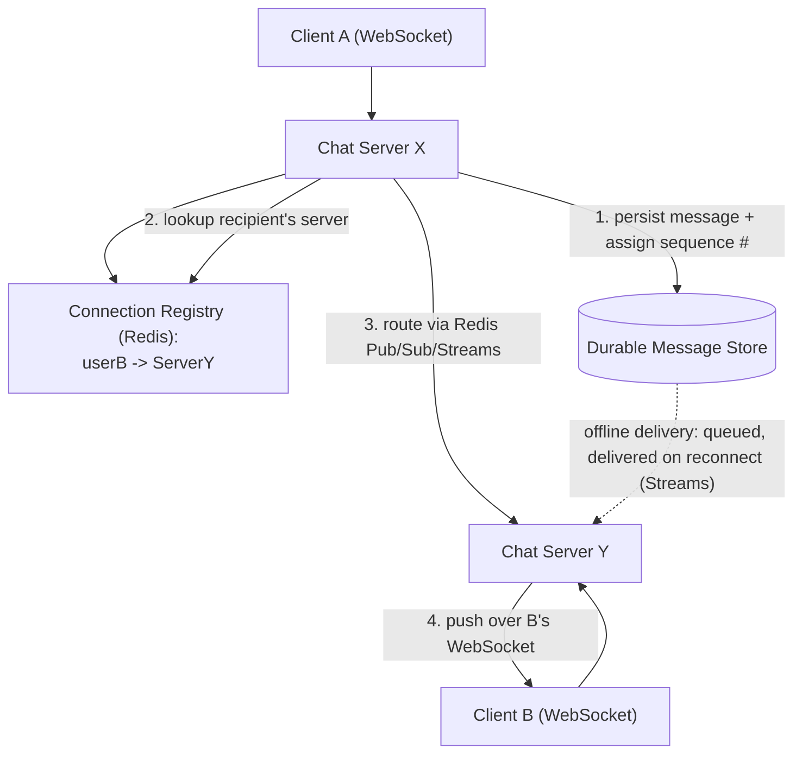

# Module 39 — System Design: Designing a Chat/Messaging System

> Domain: System Design | Level: Beginner → Expert | Prerequisite: [[01-System-Design-Fundamentals]], [[02-Designing-News-Feed-System]], [[../07-Redis/02-PubSub-Streams-HighAvailability]] (Pub/Sub vs. Streams delivery guarantees, directly reused here)

---

## 1. Fundamentals

### What is a chat/messaging system, and why does it exercise a fundamentally different set of trade-offs than a news feed?
A chat system (WhatsApp, Slack, Messenger) delivers messages between users/groups in near-real-time, with strong expectations around **delivery guarantees** (a sent message must arrive, not be silently dropped), **ordering** (messages within a conversation must appear in the order they were sent), and **low latency** (sub-second delivery for an active conversation). This is fundamentally different from the news feed problem: a feed tolerates eventual consistency and staleness; a chat message that's lost, duplicated, or delivered out of order is a **directly user-visible correctness failure**, not a minor staleness inconvenience — shifting the entire system's design center of gravity from "optimize for read-heavy, staleness-tolerant fan-out" to "guarantee reliable, ordered, low-latency delivery."

### Why does this matter?
Because it forces a genuinely different architectural primitive — **persistent, bidirectional connections** (WebSockets) instead of the stateless request/response model this entire course has otherwise assumed — and because "delivery guarantee" questions (at-most-once vs. at-least-once vs. exactly-once) require the exact same precise reasoning the Redis Streams/consumer-group discussion established, now applied at full system-design scale.

### When does this matter?
Any real-time, bidirectional communication system (chat, live collaborative editing, multiplayer gaming state sync, live customer support); the depth matters because "just use WebSockets" is an incomplete answer — the actual design challenge is connection-state management at scale, message ordering across distributed servers, and precise delivery-guarantee semantics.

### How does it work (30,000-ft view)?
```
1. Client establishes a persistent WebSocket connection to a chat server (via a connection-aware load balancer)
2. Sender's message: client -> chat server -> message store (durable) -> fan-out to recipient's connection(s)
3. If recipient is offline: message queued for delivery when they reconnect (the Streams-based pattern)
4. Ordering: per-conversation sequence numbers, NOT wall-clock timestamps alone (clock skew across servers)
```

---

## 2. Deep Dive

### 2.1 WebSockets vs Long-Polling vs Server-Sent Events — the Connection-Model Trade-off
**WebSockets** provide a genuine, persistent, full-duplex (bidirectional) connection — the client and server can each push data at any time without a new request — the correct choice for chat, where both sending and receiving happen continuously and unpredictably. **Long-polling** (a client holds an HTTP request open until the server has data, then immediately re-issues a new request) approximates real-time delivery over ordinary HTTP infrastructure, at the cost of connection-churn overhead and inherent request/response asymmetry (still not genuinely bidirectional). **Server-Sent Events (SSE)** provide server-to-client push over a long-lived HTTP connection, but are **unidirectional** (client-to-server messages still need ordinary HTTP requests) — appropriate for the news feed's "live update" needs but insufficient alone for chat's inherently bidirectional requirement. This is precisely why WebSockets, despite requiring more infrastructure sophistication, are the standard choice specifically for chat, while SSE/long-polling remain reasonable for read-heavy, primarily-server-to-client real-time use cases.

### 2.2 Connection State — the Architectural Shift Away from Statelessness
A WebSocket connection is inherently **stateful** — a specific chat server instance holds an open TCP connection to a specific client, directly violating the "default to stateless replicas" guidance, requiring deliberate architectural accommodation: a **connection registry** (a distributed, shared mapping of `userId → which server instance holds their active connection`, typically in Redis) lets any server receiving a message destined for a user **look up** which specific server actually holds that user's connection and route the message there (often via Redis Pub/Sub or Streams for the inter-server hop) — this connection-registry pattern is the standard architectural accommodation making WebSocket-based systems horizontally scalable despite their inherently stateful connection model.

### 2.3 Delivery Guarantees — At-Most-Once, At-Least-Once, Exactly-Once, Precisely Defined
**At-most-once**: a message is delivered zero or one times — simple, but messages can be silently lost (unacceptable for chat). **At-least-once**: a message is guaranteed to be delivered at least once, but might be delivered **multiple times** under failure/retry scenarios — requires the client/UI to handle deduplication (typically via a client-generated message ID, directly the idempotency-key pattern, applied here to message delivery instead of API requests). **Exactly-once** (the ideal, but the hardest to actually achieve in a distributed system) is typically approximated in practice as **at-least-once delivery plus idempotent, deduplicating processing** on the receiving end (never a true, distributed exactly-once primitive, a nuance worth stating precisely rather than claiming "we guarantee exactly-once delivery" without qualification) — directly the same "at-least-once + application-level idempotency = effectively exactly-once" pattern the Streams consumer-group discussion already established.

### 2.4 Message Ordering — Why Wall-Clock Timestamps Are Insufficient
Ordering messages within a conversation purely by each server's local wall-clock timestamp is unreliable across a distributed system due to **clock skew** (different servers' clocks are never perfectly synchronized, even with NTP) — two messages sent milliseconds apart, processed by two different servers, could be timestamped in the "wrong" relative order due to this skew. The standard fix: a **per-conversation monotonically-increasing sequence number** (assigned by a single authoritative source per conversation — e.g., incrementing a counter stored in the conversation's primary database record, or using a distributed sequence generator) provides a genuine, unambiguous total order independent of any individual server's clock, directly the same "logical ordering, not physical timestamp" principle underlying distributed-systems logical clocks (Lamport timestamps, a related, more advanced topic).

### 2.5 Group Chat — the Fan-Out Problem Returns, Now with Strict Ordering
Group chat reintroduces the fan-out concern (one message must reach every group member) but with a critical addition the feed didn't require: **every group member must see messages in the same relative order** — this rules out a naive independent-fan-out-per-recipient approach (which could deliver messages to different recipients in different relative orders under concurrent sends) in favor of a design where the message is first durably, order-assigned in a single conversation-scoped store (the sequence number), *then* fanned out — ensuring every recipient's eventual view, even if delivered at different times, reflects the same canonical order once fully synced.

## 3. Visual Architecture

```mermaid
graph TB
 ClientA["Client A (WebSocket)"] --> ServerX["Chat Server X"]
 ClientB["Client B (WebSocket)"] --> ServerY["Chat Server Y"]
 ServerX --> Registry["Connection Registry (Redis):<br/>userB -> ServerY"]
 ServerX -->|"1. persist message + assign sequence #"| Store[("Durable Message Store")]
 ServerX -->|"2. lookup recipient's server"| Registry
 ServerX -->|"3. route via Redis Pub/Sub/Streams"| ServerY
 ServerY -->|"4. push over B's WebSocket"| ClientB
 Store -.->|"offline delivery: queued, delivered on reconnect (Streams)"| ServerY
```

## 4. Production Example
**Scenario**: A chat platform's group-messaging feature exhibited a confusing, intermittent bug: in fast-paced group conversations, different participants occasionally saw messages in **different relative orders** — user A would see "Message 1, then Message 2," while user B, in the same group, briefly saw "Message 2, then Message 1" before eventually reconciling to the same order. **Investigation**: traced to the fan-out implementation independently routing each message to each recipient's connection as soon as it arrived at any chat server, with **no shared, authoritative sequencing step** before fan-out — under concurrent sends from different group members hitting different chat servers simultaneously, network/processing latency differences meant messages could be independently delivered to different recipients' connections in different relative orders — exactly the correctness gap §2.5 warns against. **Fix**: introduced a per-conversation authoritative sequencer — every message is first written to the conversation's durable store (assigning a strictly-increasing sequence number as part of that single, serialized write) **before** any fan-out occurs, and the fan-out step delivers messages to recipients' connections strictly in sequence-number order (buffering/reordering at the recipient-connection level if a later-sequenced message's fan-out happens to complete before an earlier one's, due to independent network paths to different chat servers) — eliminating the order-discrepancy bug entirely, since every recipient's eventual view is now derived from the same, single, authoritative sequence. **Lesson**: fan-out (multiple independent delivery paths to different recipients) and ordering (a single, agreed-upon sequence) are in **direct tension** unless explicitly reconciled — a design that naively combines "fan out immediately, independently, to each recipient" (a reasonable-sounding latency optimization) with "messages must be strictly ordered" (this system's actual core requirement) will silently violate ordering under concurrent, multi-server load, exactly the kind of subtle, load-dependent bug (invisible in single-user or low-concurrency testing) this course has repeatedly flagged (the read-your-own-writes incident shares this exact "invisible at low concurrency, real under production load" shape).

## 5. Best Practices
- Use WebSockets for genuinely bidirectional, low-latency chat; reserve SSE/long-polling for primarily-server-to-client real-time needs where full duplex isn't required.
- Maintain a distributed connection registry (Redis) mapping users to their current connection-holding server instance, enabling horizontal scaling of an inherently stateful connection model.
- Assign a per-conversation, authoritative, strictly-increasing sequence number to every message **before** fan-out, never relying on wall-clock timestamps or independent per-recipient delivery timing for ordering.
- Design for at-least-once delivery with client-side idempotent deduplication (via client-generated message IDs) rather than claiming an unqualified "exactly-once" guarantee.

## 6. Anti-patterns
- Fanning out a group message to each recipient's connection independently and immediately, without first establishing a single, authoritative sequence — the direct cause of the cross-user ordering-discrepancy bug.
- Relying on wall-clock timestamps for cross-server message ordering, vulnerable to clock skew.
- Treating WebSocket connections as stateless (no connection registry), preventing horizontal scaling or requiring sticky-session workarounds with their own correctness risks.
- Claiming an unqualified "exactly-once" delivery guarantee without the underlying at-least-once-plus-idempotent-deduplication mechanism actually implementing it.

---

## 10. Interview Questions

### Basic (10)
1. **Q: Why are WebSockets typically chosen over long-polling/SSE for a chat system?** **A:** WebSockets provide genuine, persistent, full-duplex (bidirectional) communication, matching chat's need for both sending and receiving to happen continuously and unpredictably.
2. **Q: What is a connection registry?** **A:** A distributed mapping (typically in Redis) of which specific server instance holds a given user's active WebSocket connection, enabling message routing across a horizontally-scaled fleet.
3. **Q: What's the difference between at-most-once and at-least-once delivery?** **A:** At-most-once may silently lose a message; at-least-once guarantees delivery but may deliver duplicates, requiring deduplication.
4. **Q: Why are wall-clock timestamps insufficient for cross-server message ordering?** **A:** Clock skew between different servers means timestamps alone don't reliably reflect the true relative order of messages processed by different servers.
5. **Q: What is used instead of wall-clock timestamps for reliable message ordering?** **A:** A per-conversation, monotonically-increasing sequence number assigned by a single authoritative source.
6. **Q: Is a WebSocket connection stateless or stateful?** **A:** Stateful — a specific server instance holds an open connection to a specific client.
7. **Q: What does "exactly-once" delivery typically mean in practice for a real system?** **A:** At-least-once delivery combined with idempotent, deduplicating processing on the receiving end — a true distributed exactly-once primitive is not generally achievable.
8. **Q: Why does group chat require stricter design than one-to-one chat?** **A:** Every group member must see messages in the same relative order, ruling out naive independent-per-recipient fan-out.
9. **Q: What's a common shard key for a chat system's message store?** **A:** Conversation ID — it keeps each conversation's full history on one shard, so the dominant query ("load this conversation's recent messages") is single-shard and ordered, while conversations distribute evenly across shards; per-user sharding would scatter every conversation across two or more shards.
10. **Q: Why should message-history pagination use keyset/cursor pagination rather than offset pagination?** **A:** Message history is naturally append-only and sequence-ordered, a natural fit for keyset pagination's stability and constant cost regardless of pagination depth.

### Intermediate (10)
1. **Q: Why is Server-Sent Events insufficient alone for a chat system despite supporting real-time server-to-client push?** **A:** SSE is unidirectional — client-to-server messages (a user sending a chat message) still require separate ordinary HTTP requests, not a genuinely bidirectional channel the way WebSockets provide.
2. **Q: Why does a connection registry typically use Redis specifically, rather than a relational database?** **A:** Connection mappings need extremely fast, high-frequency reads/writes (looked up on every message send) with simple key-value semantics — exactly Redis's strength, while a relational database's transactional/query-flexibility overhead would be unnecessary for this specific access pattern.
3. **Q: Why must group-chat fan-out happen only after a message is durably sequenced, not before?** **A:** Fanning out before sequencing allows different recipients' independent delivery paths to complete in different relative orders under concurrent sends (the incident) — sequencing first establishes a single, authoritative order that fan-out then respects, rather than each recipient independently observing whatever order their specific network/server path happened to deliver messages in.
4. **Q: Why is client-generated message ID deduplication necessary for at-least-once delivery, specifically?** **A:** At-least-once delivery can, under retry/failure scenarios, deliver the same message multiple times — without a stable, client-generated ID the receiving client can use to recognize "I've already displayed this exact message," duplicate deliveries would show as duplicate messages in the chat UI.
5. **Q: Why does offline message delivery (a recipient reconnecting after being offline) benefit from the same pattern as the Streams consumer groups?** **A:** Both need to deliver a backlog of messages that occurred while the consumer/recipient was disconnected, tracked via a durable, resumable position (a consumer-group offset, or an equivalent "last delivered message sequence number" per user) — exactly the same durable-checkpoint, resume-on-reconnect pattern.
6. **Q: Why might a reconnection storm occur after a chat server outage, and how is it mitigated?** **A:** Every client connected to the failed server attempts to reconnect simultaneously once it (or a replacement) becomes available — mitigated via jittered exponential backoff on the client's reconnection attempts, directly the retry-storm mitigation pattern, preventing every client from retrying in exact lockstep.
7. **Q: Why does end-to-end encryption fundamentally change how server-side search/moderation features must be designed?** **A:** If message content is encrypted such that even the server can't read it, any feature requiring content inspection (search, automated moderation) can no longer operate on the plaintext server-side and must be redesigned around client-side processing or encrypted-content-compatible techniques instead.
8. **Q: Why is per-connection rate limiting a distinct concern from ordinary per-HTTP-request rate limiting?** **A:** A persistent WebSocket connection can sustain a high message-send rate over a long duration without the natural, discrete request/response boundary an HTTP-based rate limiter typically keys off — requiring rate-limiting logic specifically designed around a connection's sustained message-sending behavior, not just per-request counting.
9. **Q: Why is conversation ID a natural shard key for a chat message store?** **A:** Messages are almost always queried scoped to one specific conversation (loading a chat window's history) — conversation ID is both the dominant access pattern's key and typically high-cardinality/evenly-distributed across a large user base, directly matching the partition-key design criteria.
10. **Q: Why does a globally cross-region chat system face a genuine ordering-vs-latency trade-off that a news feed system doesn't face in the same way?** **A:** A feed tolerates eventual, unordered-across-regions consistency (a friend's post from another region appearing with some delay is acceptable); a chat conversation's strict-ordering requirement means an authoritative sequencer must exist somewhere specific, and participants far from that sequencer inherently experience added latency for their messages to be officially sequenced — a trade-off the feed system's more relaxed consistency requirement simply doesn't impose.

### Advanced (10)
1. **Q: Diagnose the group-chat ordering-discrepancy incident from first principles, and design the specific architectural change (not just "add a sequence number") that structurally prevents recurrence.**
 **A:** Root cause: fan-out occurring independently per-recipient before any single, authoritative ordering decision was made, allowing different recipients' delivery paths to race. Structural fix: restructure the message-send pipeline so that **no fan-out attempt can begin until the message has been durably written with its sequence number assigned** (a single, serialized write to the conversation's authoritative store) — making the sequence-assignment step a genuine **prerequisite gate** the fan-out logic cannot bypass, rather than a data field that's merely present but not actually enforced as an ordering prerequisite in the code's control flow; additionally, each recipient's connection-side delivery logic should track the last-delivered sequence number and explicitly buffer/reorder any message arriving out of sequence (a network-path timing artifact) before displaying it, providing a second, defense-in-depth layer beyond the send-side sequencing gate.
2. **Q: Design the connection registry's data model and failure-handling behavior when a chat server crashes without cleanly deregistering its connections.**
 **A:** Store registry entries with a short TTL (Redis key expiration) refreshed via periodic heartbeat from each chat server for its currently-held connections — if a server crashes without cleanly deregistering, its entries simply expire naturally within the TTL window rather than persisting indefinitely as stale, incorrect routing information (directly avoiding the "orphaned state retained forever" risk class, here bounded by TTL rather than requiring explicit cleanup); a message routed to an about-to-expire or already-expired stale entry fails the delivery attempt, triggering the message to be queued for offline-style delivery until the recipient's client reconnects and re-registers with a now-current, correct server mapping.
3. **Q: Explain how you would design "read receipts" (showing a message as seen by the recipient) without introducing a new correctness/ordering hazard similar to the incident.**
 **A:** Read receipts are themselves a form of message (a "user X has seen up to sequence number N" event) and should flow through the **same** authoritative-sequencing-then-fan-out pipeline as ordinary chat messages, rather than being implemented as a separate, ad-hoc side-channel update mechanism that could race against the message-ordering guarantees the main pipeline already carefully established — treating read-receipt events as first-class, sequenced messages within the same conversation stream avoids introducing a parallel, potentially-inconsistent ordering mechanism alongside the one already fixed.
4. **Q: Design a strategy for handling the "typing indicator" feature (a genuinely ephemeral, loss-tolerant signal) differently from ordinary chat messages, architecturally.**
 **A:** Unlike chat messages (requiring durable storage, guaranteed delivery, strict ordering), a typing indicator is exactly the kind of ephemeral, loss-tolerant signal identifies as appropriate for Pub/Sub rather than Streams — briefly missing a "user is typing" event due to a momentary disconnection has no lasting consequence (it self-corrects on the next keystroke event) — routing typing indicators through a lightweight Pub/Sub channel instead of the durable, sequenced, at-least-once message pipeline avoids paying that pipeline's correctness-guaranteeing overhead for a feature that structurally doesn't need it, a deliberate, differentiated architectural choice per feature's actual requirements (directly the "consistency/guarantees per data type, not uniformly" principle, now applied within one chat system's own feature set).
5. **Q: How would you design the message-history read path to correctly handle a conversation with millions of historical messages, balancing the pagination discipline against this system's specific access patterns?**
 **A:** Use keyset pagination keyed by the conversation's sequence number — naturally monotonic, unique, and already the system's authoritative ordering key, making it a direct, ideal cursor without needing a separate tie-breaking key (unlike the `CreatedDate` needing an `Id` tie-breaker) — "load the next 50 older messages" becomes `WHERE sequenceNumber < lastSeenSequenceNumber ORDER BY sequenceNumber DESC LIMIT 50`, a stable, efficient, constant-cost-regardless-of-conversation-age query.
6. **Q: Explain how you would design cross-region message delivery for a globally-distributed team using this chat system, addressing the ordering-vs-latency trade-off from Intermediate Q10 concretely.**
 **A:** Assign each conversation's authoritative sequencer to a specific "home region" (perhaps determined by where the conversation was created, or by the majority of its participants' locations) — participants in that home region experience minimal sequencing latency; participants in other regions send their messages to their local region first (for fast acknowledgment of "message accepted") but the message isn't officially sequenced/ordered until it reaches the home region's sequencer, meaning cross-region participants see a small, bounded, honestly-communicated additional latency before their message's final position in the conversation is confirmed — an explicit, deliberate trade-off rather than either ignoring the physics of cross-region latency or attempting an expensive, likely-infeasible globally-synchronous sequencing mechanism.
7. **Q: A team proposes eliminating the connection registry and instead using consistent hashing to deterministically route every user to a fixed server based on their user ID, avoiding the registry lookup entirely. Evaluate this trade-off.**
 **A:** This trades away the registry's flexibility (a server can crash and the registry naturally routes around it once entries expire, Advanced Q2) for the simplicity of a stateless, computed routing decision — but it reintroduces a real risk: if the consistent-hashing scheme's target server for a given user is temporarily unavailable (a crash, a deploy), there's no registry to consult for "where did this user's connection actually get re-established" — the client would need to reconnect to a *different*, computed-fallback server, and the system would need a mechanism (likely still some form of lightweight registry or health-check-aware routing) to know the user is now actually connected elsewhere; in practice, a hybrid (consistent hashing for the *initial* connection routing decision, combined with a lightweight registry recording *actual* current connections for accurate message routing) often provides the best of both approaches, rather than either purely computed routing or a registry alone.
8. **Q: Design a monitoring strategy specifically for message-ordering correctness, catching a regression of the incident class proactively rather than relying on user reports.**
 **A:** Implement a synthetic, automated "canary" conversation with multiple simulated participants sending messages at high concurrency on a continuous, scheduled basis, asserting that every participant's observed message order matches the expected authoritative sequence — directly the same synthetic-canary-transaction monitoring pattern used broadly in distributed-systems observability, here specifically targeting the exact failure mode (cross-recipient ordering discrepancy under concurrent load) that the incident demonstrated is otherwise invisible until a real user happens to notice and report it.
9. **Q: Explain why "just add more chat servers" doesn't trivially solve a chat system's scaling problem the way it might for a stateless REST API, connecting explicitly to the scaling-ladder discussion.**
 **A:** Adding more stateless REST API replicas (the default scaling lever) works because any replica can serve any request — but a new chat server has **no existing connections** to serve; it only helps if it can accept *new* incoming connections (spreading future connection load) while the *existing* connections (and their associated registry entries) remain correctly routed to whichever servers already hold them — "add more servers" for a chat system scales *new connection capacity* directly, but doesn't rebalance *already-established* connections without additional mechanisms (e.g., periodically asking a subset of clients to gracefully reconnect, spreading them across the now-larger server fleet) — a genuinely more nuanced scaling story than the stateless-replica case this course has otherwise emphasized as the default.
10. **Q: As a Principal Engineer, how would you decide whether a genuinely stronger, formally-verified exactly-once delivery guarantee (beyond at-least-once-plus-deduplication) is worth the substantially higher engineering investment for a specific chat product?**
 **A:** Weigh the actual, demonstrated user-facing cost of the at-least-once-plus-deduplication approach's edge cases (are duplicate-message UI glitches actually occurring and bothering users in practice, or is this a theoretical concern with no real observed impact) against the very substantial engineering cost of building/operating a more rigorous distributed-consensus-based delivery mechanism (a much larger, riskier undertaking) — for the overwhelming majority of chat products, at-least-once-plus-idempotent-deduplication is an entirely adequate, well-understood, and far simpler approach that real, large-scale chat systems (WhatsApp, Slack) actually use in production — recommend investing in the simpler, proven approach unless a specific, demonstrated product requirement (not a theoretical purity concern) justifies the dramatically higher cost of a more rigorous alternative, directly this course's recurring "match engineering investment to demonstrated need, not theoretical completeness" discipline.

---

## 11. Coding Exercises

*(System design case studies use worked design exercises, consistent with Modules 37-38's format.)*

### Easy — Capacity estimation for WebSocket connection count
**Problem**: Estimate concurrent connection count and per-server capacity needs for a chat platform with 50M daily active users, average session duration 20 minutes, average 8 sessions/user/day.
**Solution**:
```
Total connection-minutes/day: 50M users * 8 sessions * 20 min = 8 billion connection-minutes/day
Average concurrent connections: 8 billion / (24 * 60) minutes-in-a-day ≈ 5.55 million concurrent connections
If each chat server handles ~50,000 concurrent WebSocket connections (a realistic, tunable per-server limit):
Servers needed: 5,550,000 / 50,000 ≈ 111 chat server instances (plus headroom for peak/failover)
```
**Discussion**: This is a genuinely different capacity dimension than the request-per-second estimates in Modules 37-38 — connection *count*, not request *rate*, is the primary capacity driver for a persistent-connection system, directly the distinct capacity dimension flags.

### Medium — Connection registry read/write pattern
```csharp
// On connection established:
await _redis.HashSetAsync("connections", userId, $"{serverId}:{connectionId}");
await _redis.KeyExpireAsync($"conn-heartbeat:{userId}", TimeSpan.FromSeconds(30));

// Periodic heartbeat (every 15s, refreshing before the 30s TTL expires -- Advanced Q2's pattern):
await _redis.KeyExpireAsync($"conn-heartbeat:{userId}", TimeSpan.FromSeconds(30));

// On message send, routing lookup:
var location = await _redis.HashGetAsync("connections", recipientUserId);
if (location.HasValue)
{
    var (serverId, connectionId) = ParseLocation(location);
    await RouteToServerAsync(serverId, connectionId, message); // via Redis Pub/Sub or Streams
}
else
{
    await QueueForOfflineDeliveryAsync(recipientUserId, message); // Streams-based backlog pattern
}
```

### Hard — Authoritative sequencing gate preventing the ordering bug
```csharp
public async Task<Message> SendMessageAsync(string conversationId, string senderId, string content)
{
    // SEQUENCE ASSIGNMENT IS A PREREQUISITE GATE -- fan-out literally cannot start before this completes
    // directly the structural fix from Advanced Q1 (not just "add a sequence field").
    long sequenceNumber = await _conversationStore.AppendMessageAsync(conversationId, senderId, content);
    // AppendMessageAsync performs a single, serialized write (e.g., an atomic INCREMENT + INSERT
    // within one transaction) -- this is the ONE authoritative ordering decision for this message.

    var message = new Message(conversationId, sequenceNumber, senderId, content);

    await FanOutMessageAsync(message); // only reachable AFTER sequencing -- cannot race ahead of it
    return message;
}

private async Task FanOutMessageAsync(Message message)
{
    var members = await _conversationStore.GetMembersAsync(message.ConversationId);
    await Task.WhenAll(members.Select(memberId => DeliverToMemberAsync(memberId, message)));
    // Recipients' OWN connection-side logic (not shown) buffers/reorders by sequenceNumber
    // as a second, defense-in-depth layer, per Advanced Q1's full fix.
}
```

### Expert — Client-side message deduplication for at-least-once delivery (Advanced Q's core pattern)
```csharp
public class ChatMessageDeduplicator
{
    private readonly HashSet<string> _seenMessageIds = new(); // must be bounded via periodic cleanup — an unbounded seen-set is a memory leak

    public bool ShouldDisplay(IncomingMessage message)
    {
        // Client-generated message ID (assigned at SEND time, before the network round-trip) --
        // survives retries: a retried send carries the SAME id, letting the client recognize
        // "I already displayed this" even if the server's at-least-once delivery sends it twice.
        return _seenMessageIds.Add(message.ClientGeneratedId); // HashSet.Add returns false if already present
    }
}
```
**Discussion**: The client-generated ID (not a server-assigned one) is the critical detail — if the ID were assigned only after the message reaches the server, a network failure *during* the original send (before the client receives acknowledgment) would cause the client to retry with what it believes is a "new" send attempt, and the server, having actually received and processed the original attempt already, would have no way to recognize the retry as a duplicate of an already-processed message without the client's own stable, pre-assigned ID to compare against — directly the idempotency-key pattern, essential here for exactly the same "client can't know if its original request succeeded before retrying" reason.

---

## 12. System Design — Designing a Chat / Messaging System

*Authored to the four-step standard (see Module 01 §12 for the method).*

---

### Step 1 — Understand the Problem and Establish Design Scope

#### The dialogue

> **C:** One-to-one messaging, group messaging, or both? Group changes the ordering problem materially.
> **I:** Both. Groups up to 500 members.
>
> **C:** Is this end-to-end encrypted?
> **I:** No — assume server-side storage in plaintext. E2E is a separate design.
>
> **C:** Multi-device? A user on a phone and a laptop simultaneously?
> **I:** Yes, up to 5 devices per user, all must stay in sync.
>
> **C:** Scale?
> **I:** 100 million DAU, about 40 messages sent per user per day.
>
> **C:** Do we need delivery and read receipts?
> **I:** Yes — sent, delivered, read.
>
> **C:** Message history — how long, and searchable?
> **I:** Retained indefinitely, retrievable by conversation with pagination. Search is out of scope.
>
> **C:** What's the ordering requirement, precisely? "Ordered" can mean several things.
> **I:** Every participant in a conversation must converge on the *same* order. Within a device's live view, messages must not visibly reorder after being displayed.
>
> **C:** Media?
> **I:** Assume a media service; messages carry URLs.
>
> **C:** What happens when the recipient is offline?
> **I:** They must receive everything on reconnect, plus a push notification while offline.

The eighth answer is the important one. **"Same order for everyone" is a far stronger requirement than "ordered"** — it rules out per-recipient independent fan-out, which is precisely the defect §4 documents. Getting the interviewer to state it explicitly is what makes the sequencer defensible rather than looking like over-engineering.

#### Functional requirements

1. Send a message to a 1:1 conversation or a group; persist durably.
2. Deliver to every participant's every active device, in a single canonical order.
3. Queue for offline recipients; deliver on reconnect; push-notify while offline.
4. Delivery and read receipts.
5. Paginated history retrieval per conversation.
6. Presence (online/last-seen) — nice-to-have, explicitly deprioritised if the clock runs short.

#### Non-functional requirements

| Requirement | Target |
|---|---|
| Send → recipient device latency | p99 < 500 ms when both are online |
| Message durability | **Zero loss once acknowledged** — this is the system's core promise |
| Delivery guarantee | At-least-once transport + client-side dedup = effectively-once |
| Ordering | Total order per conversation, identical for all participants |
| Availability | 99.99% for send; 99.9% for history |
| Concurrent connections | ~20 million (20% of DAU online at peak) |
| Consistency | Strong within a conversation's sequence; eventual across conversations |

#### Back-of-the-envelope estimation

```
Messages/day      = 100M DAU × 40                    = 4 × 10^9
Average send QPS  = 4 × 10^9 ÷ 10^5                  = 40,000 sends/s
Peak (×3)                                             = 120,000 sends/s

Fan-out: 1:1 avg 2 recipients × 2.5 devices ≈ 5 deliveries
Groups skew this up; assume a blended 8 deliveries per send
Delivery QPS      = 40,000 × 8                       = 320,000 deliveries/s
Peak                                                  = 960,000 deliveries/s
```

Connections and servers:

```
Concurrent connections     ≈ 20,000,000
Per server (tuned Linux, epoll, ~10 KB/conn kernel + app state)
                           ≈ 100,000 connections
Connection servers needed  = 20M ÷ 100,000            = 200 servers
Memory per server          = 100,000 × ~40 KB         ≈ 4 GB   ← comfortable
```

Storage:

```
Message row ≈ 300 B (ids, seq, body pointer, timestamps, flags)
4 × 10^9 × 300 B                                     ≈ 1.2 TB/day
Per year                                              ≈ 440 TB
Indefinite retention → tiering is mandatory, not optional
```

#### What the numbers tell us

1. **The message throughput is not the problem.** 120,000 sends/s across a partitioned store is ordinary. Even 960,000 deliveries/s is just a fan-out over already-open sockets.
2. **The connection count is the architecture.** 20 million stateful, long-lived TCP connections is what forces every unusual decision here: a connection registry, an inter-server routing hop, connection-aware load balancing, and a deployment strategy that does not disconnect 100,000 users at once.
3. **Durability plus total ordering is the correctness core.** A lost message is a product failure with no recovery — unlike a feed entry (Module 02), a message cannot be recomputed. So the write path must persist *before* it acknowledges, and the sequence must be assigned *before* fan-out.

The hard problem is therefore **stateful connection management at scale, and assigning a canonical order before any delivery happens.**

---

### Step 2 — Propose High-Level Design and Get Buy-In

#### The two core flows

- **Online delivery** — both parties connected; the path the latency SLO is written against.
- **Offline delivery and resync** — the recipient is absent or on a stale device; correctness lives here, and it is where most designs are thin.

#### Components

**Connection Service (WebSocket tier).** Holds the 20M persistent connections. Deliberately thin: authenticate, maintain the socket, translate frames, and forward. It holds *no* business logic, because it is the tier you least want to redeploy.

**Session Registry.** `user_id → {device_id → connection_server}` in Redis with a TTL heartbeat. Every message delivery consults it. Must tolerate staleness (§3.4).

**Message Service.** Validates, persists, and — critically — **obtains the sequence number** before anything is fanned out.

**Sequencer.** Assigns a monotonic `seq` per conversation. Implemented as an atomic counter in the conversation's own partition, not as a global service, so it scales with conversations rather than becoming a bottleneck.

**Message Store.** Cassandra, partitioned by `conversation_id`, clustered by `seq`.

**Delivery Service.** Looks up recipients' devices in the registry and routes each delivery to the owning connection server via Kafka (keyed by `connection_server_id`) or Redis pub/sub.

**Offline Queue.** Per-device pending set for devices with no live connection.

**Push Bridge.** Hands off to the notification platform (Module 20) when a device is offline — an explicit dependency, and worth naming because it makes chat's availability partly a function of APNs/FCM.

**Sync Service.** Serves `messages since seq` per device — the mechanism that makes reconnect correct.

#### End-to-end walkthrough — sending a message

1. Client sends a `SEND` frame over its WebSocket with a **client-generated `client_msg_id`** (a UUID). This is the idempotency key and it is generated by the client because only the client knows its own retry is a retry.
2. Connection server forwards to the Message Service.
3. Message Service checks `client_msg_id` for a prior write; a duplicate returns the original result.
4. **Sequencer assigns `seq`** for that conversation — atomically, once, before anything else.
5. Message persisted to Cassandra at `(conversation_id, seq)`.
6. **Only now** is an `ACK{client_msg_id, server_msg_id, seq}` returned to the sender. Acknowledging before persistence would break the durability promise.
7. Delivery Service resolves the participant list, then each participant's devices.
8. For each device: online → route to its connection server; offline → write to the offline queue and enqueue a push.
9. Recipient device receives, renders in `seq` order, and sends a `DELIVERED` receipt.
10. When the conversation is foregrounded, the device sends `READ` up to a `seq` — a **watermark, not per-message**, which reduces receipt traffic by orders of magnitude in groups.

#### API design

The transport is a WebSocket carrying typed frames; history is REST. Both matter.

**WebSocket frames**

| Frame | Direction | Payload |
|---|---|---|
| `SEND` | C→S | `{ client_msg_id, conversation_id, body, media[], reply_to }` |
| `ACK` | S→C | `{ client_msg_id, server_msg_id, seq, server_ts }` |
| `MESSAGE` | S→C | `{ server_msg_id, conversation_id, seq, sender_id, body, server_ts }` |
| `RECEIPT` | both | `{ conversation_id, up_to_seq, type: DELIVERED\|READ }` |
| `SYNC_REQ` | C→S | `{ conversation_id, since_seq }` |
| `PING`/`PONG` | both | Liveness; drives the registry TTL |

**`GET /v1/conversations/{id}/messages`**

| Param | Type | Description |
|---|---|---|
| `before_seq` | int | Cursor — **sequence-based, never offset or timestamp** |
| `limit` | int | Default 50, max 200 |

**`GET /v1/sync?since={device_cursor}`** — the reconnect endpoint. Returns changes across all conversations for this device, capped, with a continuation cursor.

#### Data model

**`message`** — Cassandra, partition `conversation_id`, clustering `seq DESC`.

| Column | Type | Notes |
|---|---|---|
| `conversation_id` | uuid | Partition key — all reads and the sequencer are conversation-scoped |
| `seq` | bigint | Clustering key. **The canonical order.** Assigned once, never changed |
| `server_msg_id` | uuid | Globally unique |
| `client_msg_id` | uuid | Dedup key; unique index per `(conversation_id, sender_id)` |
| `sender_id` | bigint | |
| `body`, `media` | text/list | |
| `server_ts` | timestamp | For display only — **never for ordering** (§2.4) |

**`conversation`** — `conversation_id`, `type` (`DIRECT`/`GROUP`), `member_ids`, `last_seq` (the sequencer's counter), `created_at`.

**`device_cursor`** — `(user_id, device_id) → { conversation_id → last_delivered_seq }`. This is the sync state and it is per *device*, not per user; conflating them is why multi-device chat implementations lose messages on one device.

**`session`** — Redis: `session:{user_id}` → hash of `device_id → {server_id, connected_at}`, TTL 60 s refreshed by `PING`.

**Message status lifecycle:** `PENDING (client-local) → SENT (ACKed, seq assigned) → DELIVERED (per device) → READ (per device)`. Note that `DELIVERED` and `READ` are **per-device facts aggregated for display** — in a group of 500, "read" means "read by everyone", which is an aggregation the client computes, not a state the message has.

#### Database selection, and why

| Store | Choice | Reason |
|---|---|---|
| Messages | **Cassandra** | Write-heavy (120k/s), append-only, always read by `conversation_id` with a range on `seq` — which is exactly a partition+clustering scan. No cross-conversation query exists. Linear scale-out, tunable durability via `QUORUM` |
| Sequencer counter | **The conversation's own partition** (Cassandra LWT, or a small Postgres/Redis per shard) | Keeping it conversation-scoped means no global bottleneck. A single global sequence service would cap the entire system's send rate |
| Session registry | **Redis** | Needs sub-ms reads on the delivery path and TTL semantics; loss is survivable because clients reconnect |
| Offline queue | **Redis / Kafka per device** | Bounded, drained on reconnect |
| Conversation metadata | **PostgreSQL** | Small, relational, membership changes need transactions |

The decision worth defending: **not** using a relational database for messages. At 1.2 TB/day with a pure partition-scan access pattern and no joins, Cassandra's shape matches the workload exactly — and unlike Module 01's read-heavy site, here the estimation genuinely justifies it.

---

### Step 3 — Design Deep Dive

#### 3.1 Ordering — sequence before fan-out

The entire correctness argument is one sentence: **the sequence number is assigned exactly once, by a single authority per conversation, before any delivery is attempted.** §4's incident is what happens when fan-out precedes sequencing — two servers deliver two concurrent messages to two recipients in opposite orders, and both recipients are "correct" from their own view.

Consequences worth stating:

- **Wall-clock timestamps are display metadata, never ordering.** NTP skew of tens of milliseconds is routine and messages arrive milliseconds apart.
- **Clients render strictly by `seq` and buffer gaps.** If a device holds `seq` 41 and 43, it must not display 43 until 42 arrives or a short timeout expires, after which it requests `SYNC_REQ{since: 41}`. Displaying out of order and reordering later is visibly wrong.
- **The sequencer must be atomic.** A read-modify-write on `last_seq` across two servers produces duplicate sequence numbers — the same lost-update hazard that appears throughout this course. Use a lightweight transaction, a Redis `INCR`, or a per-conversation single-writer.

#### 3.2 Delivery guarantees, precisely

**At-least-once transport plus client-side deduplication on `client_msg_id`, presented as effectively-once.** The precision matters in an interview — claiming exactly-once delivery is a red flag, because the final hop (server → device over a network that can drop the ACK) is unclosable.

Concretely: the server retries delivery until the device ACKs; the device may therefore receive a message twice; it deduplicates on `server_msg_id`. The sender's own retry is deduplicated on `client_msg_id`. Two different keys for two different duplicate sources, which is the detail most answers miss.

#### 3.3 Offline delivery and multi-device sync

The naive design keeps a per-user offline queue. That is wrong for multi-device: five devices consume at different rates, and a queue with one cursor either delivers to one device or delivers everything to all of them repeatedly.

**Correct model: no queue — a per-device cursor over the durable message log.** The messages are already persisted and ordered by `seq`. "Delivery" to an offline device is simply advancing that device's cursor when it returns:

1. Device reconnects, presents `device_cursor` per conversation.
2. Sync Service returns messages with `seq > cursor`, capped (say 500 per conversation).
3. Device processes, advances cursor, repeats until caught up.
4. A device offline for months gets a **truncated sync with a "load older" affordance** rather than an unbounded backlog — an unbounded catch-up is how a returning user takes the connection server down.

This is strictly better than a queue: it needs no extra durable structure, is idempotent under repeated sync, and handles a device that was offline for a year identically to one offline for a minute.

#### 3.4 Connection registry staleness — the routing race

The registry says user U's device is on server 7. Server 7 crashed two seconds ago; U has already reconnected to server 12. A message routed to 7 is lost unless handled.

The resolution is layered, and the layering is the answer:

- **Registry writes are heartbeat-driven with a short TTL**, so stale entries expire quickly.
- **Routing is best-effort with a durable fallback**: if the target server reports no such connection (or the send fails), the delivery does *not* error — it advances nothing, and the device picks the message up via cursor-based sync on its next connect. Because the message is already durable and ordered, a mis-routed delivery is a latency event, not a loss event.
- **On reconnect, the client always syncs** rather than assuming live delivery was complete.

This is the key architectural insight: **make live delivery an optimisation over a correct sync protocol, not the mechanism correctness depends on.** Designs that treat the socket as the delivery guarantee are the ones that lose messages.

#### 3.5 Group fan-out at 500 members

One message to a 500-member group with 2.5 devices each is 1,250 deliveries. At 120,000 sends/s with groups in the mix, fan-out is the dominant cost.

- **Fan out to *connection servers*, not devices.** Group the target devices by owning server and send one batched frame per server — 1,250 deliveries collapse to ~200 inter-server messages.
- **Do not fan out receipts.** In a 500-member group, per-message read receipts are 500× amplification of a signal nobody reads. Use per-conversation read watermarks, aggregated and sent at a throttled rate.
- **Very large groups (>1,000) should flip to pull**, exactly as Module 02's celebrity threshold does — members sync on foreground rather than receiving pushes. Naming this parallel explicitly is worth credit: it is the same bimodal-distribution problem.

#### 3.6 The reconnect storm

Deploying the connection tier disconnects 100,000 clients per server. If they all reconnect immediately with exponential backoff starting at zero, you get a synchronised thundering herd against the auth service and the registry — and, worse, each reconnect triggers a sync, so the message store sees a correlated read burst too.

Mitigations, all of which must be designed in rather than discovered: **jittered reconnect backoff** (mandatory, and the jitter must be on the client); **staggered rolling deploys** with a connection-drain phase that asks clients to reconnect over a window rather than dropping them; and **capped sync page sizes** so a herd of catch-ups cannot each pull unbounded history. This is the failure mode that turns a routine deploy into an incident, and it is invisible until you have millions of connections.

---

### Step 4 — Wrap-Up

**What we left out:** end-to-end encryption and multi-device key management (Module 08 — and note it makes server-side fan-out and search structurally impossible, changing this design significantly); message search; media upload and thumbnailing (Module 05); voice/video calling (a different transport entirely — WebRTC with signalling here); moderation and abuse; multi-region routing, where conversation locality determines whether cross-region hops are on the hot path; and retention/legal-hold policy.

**What we would measure:** send→ACK p99 and ACK→delivery p99 separately, because they have different owners; **sequence-gap rate observed by clients**, which is the direct detector for §4's failure class and exists nowhere else; connections per server and connection churn rate; registry lookup hit/stale rate; offline sync page counts (a rising distribution means catch-ups are getting longer, which predicts the next incident); and push-bridge delivery rate as an explicit external dependency.

**Summary.** Persist and sequence before fan-out; treat live socket delivery as an optimisation over a cursor-based sync protocol that is correct on its own; hold connection state in a TTL'd registry that is allowed to be stale because nothing depends on it being right; and batch fan-out per connection server rather than per device. The estimation justifies the shape: throughput is ordinary, but 20 million stateful connections and a zero-loss promise are what make this a different system from every read-heavy design in this folder.

---

### References

1. Alex Xu — *System Design Interview Vol. 1*, ch. 12 "Design a Chat System".
2. WhatsApp Engineering / Erlang Factory — *Scaling to millions of simultaneous connections* (the connections-per-server envelope).
3. Slack Engineering — *Flannel: an application-level edge cache* and Slack's real-time messaging architecture.
4. Discord Engineering — *How Discord stores billions of messages* (Cassandra partitioning by channel, the model used here).
5. RFC 6455 — The WebSocket Protocol; and RFC 7692 for per-message compression.
6. Leslie Lamport — *Time, Clocks, and the Ordering of Events in a Distributed System* (why wall-clock ordering fails).
7. Cassandra docs — lightweight transactions and their cost, relevant to the sequencer.
8. Signal — *The Sesame Algorithm* (multi-device session management), for the E2E variant in Module 08.

---

## 13–17. LLD / Debugging / Decision / Case Study / Principal

*(This module predates the full 16-section template; its incident, worked exercises, and Advanced-tier Q&A collectively carry this content. §12 above was authored to the four-step standard on 2026-08-09.)*

## 18. Revision
**Key takeaways**: WebSockets provide genuine bidirectional communication chat requires; SSE/long-polling are insufficient alone. WebSocket connections are inherently stateful, requiring a distributed connection registry (Redis) to enable horizontal scaling despite this — a direct architectural accommodation for a class of system that doesn't fit the default stateless-replica assumption. Delivery guarantees must be precisely defined: at-least-once-plus-client-generated-ID-deduplication is the practical, standard approximation of "exactly-once." Message ordering requires a single, authoritative per-conversation sequence number assigned as a genuine prerequisite gate **before** fan-out — fanning out independently per-recipient before sequencing is the root cause of cross-recipient ordering discrepancies under concurrent load, invisible at low concurrency and real under production traffic, precisely this course's recurring dangerous bug shape.

---

**Next**: Continuing autonomously to Module 40 — Designing a Distributed Rate Limiter & API Gateway (synthesizing Module 16's rate-limiting content into a full system-design case study) to complete the `14-System-Design` domain before advancing to `15-Low-Level-Design`.
