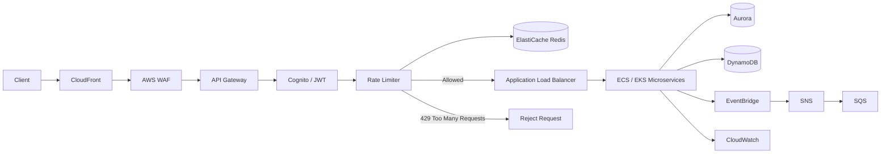
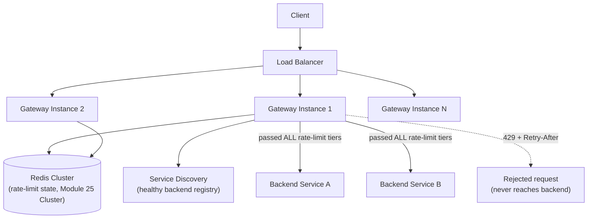

# Module 40 — System Design: Designing a Distributed Rate Limiter & API Gateway

> Domain: System Design | Level: Beginner → Expert | Prerequisite: [[01-System-Design-Fundamentals]], [[../03-REST-APIs/02-API-Security-Rate-Limiting]] (rate-limiting algorithms), [[../01-CSharp/02-Async-Await-Internals]] §Expert Q6 (the original distributed rate limiter introduced early in this course)

---
# Distributed Rate Limiter & API Gateway (AWS)



## Request Flow

```
Client
   │
   ▼
CloudFront
   │
AWS WAF
   │
API Gateway
   │
Authentication
   │
Rate Limiter (Redis)
   │
 ┌──────────────┐
 │ Allowed?     │
 └──────┬───────┘
        │Yes
        ▼
 Load Balancer
        │
  ECS / EKS Services
        │
Aurora / DynamoDB
        │
 EventBridge
        │
   SNS → SQS
```

### AWS Services Used

- CloudFront
- AWS WAF
- API Gateway
- Amazon Cognito
- ElastiCache (Redis)
- Application Load Balancer
- ECS / EKS
- Aurora
- DynamoDB
- EventBridge
- SNS
- SQS
- CloudWatch

**Interview explanation (30 seconds):**
1. Client requests go through **CloudFront** and **AWS WAF** for caching and protection.
2. **API Gateway** authenticates the request using **Cognito/JWT**.
3. A **distributed rate limiter** checks request counts in **Redis**.
4. If the limit is exceeded, the client receives **HTTP 429**.
5. Valid requests are routed through the **ALB** to **ECS/EKS microservices**.
6. Services store data in **Aurora/DynamoDB**, publish events to **EventBridge**, and send asynchronous notifications using **SNS + SQS**.
7. **CloudWatch** monitors logs, metrics, and alarms.

## 1. Fundamentals

### What is an API Gateway, and why does the rate limiter belong inside it architecturally?
An **API Gateway** is a single, centralized entry point sitting in front of a system's backend services, handling cross-cutting concerns (authentication, rate limiting, request routing, response transformation, observability) **once**, centrally, rather than requiring every individual backend service to reimplement them independently. The rate limiter belongs architecturally inside (or immediately adjacent to) the gateway specifically because Module 9 §Advanced Q4's "short-circuit before expensive work" principle demands rejecting over-limit requests **before** they consume any backend capacity at all — placing rate limiting deep inside a backend service, after routing/authentication/business-logic have already run, defeats this cost-avoidance purpose entirely.

### Why does this matter?
Because this module is the direct, full-system synthesis of content spread across Module 2 (the original distributed rate limiter introduced in the very first async-await module), Module 16 (REST API rate-limiting algorithms and OWASP-adjacent security concerns), and Module 25 (Redis as the shared, atomic-operation-capable backing store) — recognizing that these three earlier modules' content **is** this system-design problem, not separate, unrelated material, is exactly the kind of cross-module synthesis a Staff/Principal system-design interview specifically rewards.

### When does this matter?
Any system with multiple backend services needing consistent, centrally-enforced cross-cutting policies (rate limiting, authentication, routing); the depth matters for correctly designing the gateway itself as a highly-available, low-latency-overhead component (since **every single request** passes through it, making the gateway's own performance/availability a multiplier on the entire system's), not merely as a thin, assumed-infallible proxy.

### How does it work (30,000-ft view)?
```
Client -> API Gateway [TLS termination, auth, rate limit, routing] -> Backend Service A / B / C
                              |
                              v
                    Redis (shared rate-limit state, Module 25)
```

---

## 2. Deep Dive

### 2.1 The Gateway as a System, Not a Single Box — Its Own Scaling and Availability Requirements
Because **every** request to the entire system passes through the gateway, it must itself be horizontally scaled (a fleet of gateway instances behind a load balancer, Module 37 §2.3) and highly available (a gateway outage is a **total system outage**, regardless of how healthy the backend services behind it are) — this is precisely why the gateway's own rate-limiting state cannot be held in-process (Module 16 §2.3's exact "per-replica in-memory limiting is trivially bypassable across a fleet" concern) and must use Redis (or an equivalent shared store) for genuinely fleet-wide-consistent enforcement.

### 2.2 Rate-Limiting Algorithm Choice, Revisited at Full-System Scale
Module 16 §2.2's algorithm choices (fixed window, sliding window, token bucket, leaky bucket) apply directly here, but at gateway scale, the **atomicity and latency cost of the shared-state check** (Module 25 §2.2's Lua-script-based atomic token bucket) becomes a first-class system-design concern in its own right: every single request now pays this Redis round-trip cost, meaning the rate limiter's own latency contribution to Module 37 §7's overall latency budget must be explicitly minimized — a poorly-optimized rate-limiter check (e.g., multiple sequential Redis round-trips instead of one atomic Lua script) directly multiplies latency across literally every request the entire system serves.

### 2.3 Multi-Tier Rate Limiting — Global, Per-Tenant, Per-User, Per-Endpoint, Simultaneously
A production-grade gateway typically enforces **multiple, simultaneous** rate-limit tiers: a global limit (protecting the overall system from aggregate overload), a per-tenant/per-API-key limit (a business/contractual limit, directly Module 16 §Advanced Q1's contractual-limit design), a per-user limit (preventing one abusive user within a tenant from consuming the tenant's entire allotment), and a per-endpoint limit (some endpoints being far more expensive than others, warranting a stricter individual limit regardless of the caller's overall quota) — each tier requires its **own** Redis key/counter, and a request must pass **all applicable tiers'** checks to proceed, directly the same "AND across independent requirements" logic Module 12 §2.3's authorization-policy evaluation established, now applied to rate-limit tiers instead of authorization requirements.

### 2.4 Routing and Service Discovery — the Gateway's Second Core Responsibility
Beyond rate limiting, the gateway routes incoming requests to the correct backend service based on path/header matching (Module 9 §2.1's Layer-7 routing concept, now at the system's outermost edge rather than within one application's own middleware pipeline) — this requires a **service discovery** mechanism (a registry of currently-healthy backend service instances and their locations, updated as instances scale up/down or fail health checks, Module 14's health-check discipline) so the gateway always routes to a genuinely available backend, not a stale or unhealthy one.

### 2.5 The Gateway as a Single Point of Failure — and How to Avoid It Actually Being One
Despite being architecturally "the one entry point," a well-designed gateway is **not** a single point of failure in the availability sense — it's a horizontally-scaled **fleet** (§2.1) behind a load balancer, with no individual gateway instance being uniquely necessary; the actual single-point-of-failure risk shifts to the **shared dependencies** the entire gateway fleet relies on (the Redis cluster backing rate-limit state, the service-discovery registry) — meaning those shared dependencies' own availability design (Redis Sentinel/Cluster HA, Module 26 §2.3/§2.4) becomes the actual critical-path availability concern for the whole system, not the gateway "box" itself.

## 3. Visual Architecture


## 4. Production Example
**Scenario**: A platform's API gateway enforced per-tenant rate limits correctly, but during a major, unexpected traffic spike (a viral marketing event driving a huge surge of legitimate, well-behaved traffic from many different tenants simultaneously, each individually well within their own per-tenant limit), the **aggregate** request volume across all tenants combined overwhelmed the backend services' actual capacity — no individual tenant was "at fault" or exceeding their own limit, but the sum of many tenants' legitimate, within-limit traffic exceeded what the backend fleet could handle, causing widespread latency degradation and errors across the entire platform, affecting even tenants who were sending very little traffic themselves. **Investigation**: confirmed via gateway logs that per-tenant rate limits were all correctly enforced and none were being exceeded — the gap was the **absence of a global, aggregate rate-limit tier** (§2.3) that would have proactively shed excess load (via 429s to some requests) once total system-wide load approached backend capacity, regardless of how that load was distributed across individual tenants. **Fix**: added a global rate-limit tier (checked in addition to, not instead of, the existing per-tenant tiers) sized to the backend fleet's actual measured capacity, with a graceful-degradation policy (Module 37 §Advanced Q6) shedding load proportionally across tenants once the global limit is approached, rather than allowing unconstrained aggregate growth to overwhelm the backend regardless of per-tenant compliance. **Lesson**: multi-tier rate limiting (§2.3) isn't merely a "more thorough" version of single-tier limiting — the global tier specifically protects against a failure mode (aggregate overload from many individually-compliant sources) that no combination of per-tenant/per-user limits alone can prevent, directly demonstrating why "AND across all applicable tiers" (§2.3) must genuinely include a global tier, not just business-relevant per-tenant/per-user tiers, for the gateway to actually protect the backend's real, finite capacity.

## 5. Best Practices
- Implement rate limiting as an atomic, single-round-trip operation (a Lua script, Module 25 §2.2) to minimize its latency contribution to every request the gateway processes.
- Enforce multiple simultaneous rate-limit tiers (global, per-tenant, per-user, per-endpoint) — never rely on per-tenant/per-user limits alone to protect against aggregate overload (§4's incident).
- Scale the gateway itself as a stateless, horizontally-scaled fleet, with all shared state (rate limits, service discovery) externalized to Redis/a dedicated registry.
- Design the gateway's shared dependencies (Redis, service discovery) with the same HA rigor as the gateway fleet itself, since they're the actual availability-critical-path components.

## 6. Anti-patterns
- Relying solely on per-tenant/per-user rate limits without a global, aggregate tier, leaving the system vulnerable to legitimate-but-uncoordinated aggregate overload (§4's incident).
- Implementing rate-limit checks via multiple sequential Redis round-trips instead of one atomic Lua script, multiplying unnecessary latency across every request.
- Treating the gateway as a single, non-scaled instance, making it a genuine availability bottleneck for the entire system.
- Placing rate-limiting logic deep inside individual backend services rather than centrally at the gateway, both duplicating logic across services and failing to reject over-limit requests before they consume backend capacity.

---

## 10. Interview Questions

### Basic (10)
1. **Q: What is an API Gateway?** **A:** A single, centralized entry point handling cross-cutting concerns (auth, rate limiting, routing) for a system's backend services.
2. **Q: Why does rate limiting belong at the gateway rather than inside individual backend services?** **A:** To reject over-limit requests before they consume any backend capacity, and to enforce the policy once, centrally, rather than duplicating it across every service.
3. **Q: Why can't the gateway's rate-limit state be held in-process per instance?** **A:** Each instance would only see its own slice of traffic, allowing the effective limit to multiply by the number of gateway instances — genuine fleet-wide enforcement requires shared state (Redis).
4. **Q: What are the typical simultaneous rate-limit tiers a gateway enforces?** **A:** Global, per-tenant, per-user, and per-endpoint.
5. **Q: What does service discovery provide to the gateway?** **A:** A registry of currently-healthy backend service instances and their locations, for correct request routing.
6. **Q: Is the gateway a single point of failure?** **A:** Not if correctly designed as a horizontally-scaled, stateless fleet — the actual availability-critical components are its shared dependencies (Redis, service discovery).
7. **Q: Why is minimizing the rate-limit check's latency especially important at the gateway tier?** **A:** Every single request passes through the gateway, so even a small per-request overhead is multiplied across 100% of the system's traffic.
8. **Q: Where should TLS typically be terminated in a gateway architecture?** **A:** At the gateway, centralizing the CPU cost of TLS handshake/decryption at one tier.
9. **Q: What's a global rate-limit tier for, distinct from per-tenant limits?** **A:** Protecting against aggregate overload from many individually-compliant tenants/users combined, which no per-tenant limit alone can prevent.
10. **Q: What HTTP status code and header should a rate-limited request receive?** **A:** 429 Too Many Requests, with a `Retry-After` header.

### Intermediate (10)
1. **Q: Why must a request pass all applicable rate-limit tiers, not just one, to proceed?** **A:** Each tier protects against a different failure mode (one abusive user within a tenant, one tenant exceeding its contractual limit, aggregate system overload) — passing only one tier's check wouldn't protect against the failure modes the other tiers specifically address.
2. **Q: Why does an atomic Lua script matter more at the gateway tier than it might elsewhere?** **A:** The gateway processes the system's entire request volume — any inefficiency (e.g., multiple sequential Redis round-trips instead of one atomic script) is multiplied across every single request, making this optimization disproportionately high-leverage compared to optimizing a less-frequently-exercised code path.
3. **Q: Why did the §4 incident occur despite every individual tenant correctly staying within their own rate limit?** **A:** No global, aggregate tier existed to catch the case where many individually-compliant tenants' combined traffic exceeded backend capacity — per-tenant compliance says nothing about the system-wide aggregate load those compliant tenants collectively generate.
4. **Q: Why should backend services not blindly trust an unauthenticated internal header claiming a request was already authenticated at the gateway?** **A:** A compromised or misconfigured internal network could allow a malicious actor to directly reach a backend service and spoof such a header, bypassing the gateway's authentication entirely — a genuinely secure mechanism (a signed assertion) is needed instead of implicit trust.
5. **Q: Why is the Redis cluster backing the gateway's rate-limit state potentially the single highest-throughput component in the entire system?** **A:** Every request passing through the gateway triggers at least one rate-limit check against Redis — the Redis cluster's request volume is therefore equal to (or a small multiple of, accounting for multiple tiers) the system's total aggregate request rate.
6. **Q: Why might a globally-distributed system use regional gateway deployments rather than one centralized global gateway?** **A:** Routing every request through one, potentially-distant, centralized gateway adds unnecessary latency for geographically-distant users — regional gateways (each with regional Redis backing) keep the gateway hop close to the client, at the cost of needing a strategy for genuinely global (not just regional) rate limits if those are required.
7. **Q: Why doesn't an excellent gateway architecture alone guarantee a scalable overall system?** **A:** The gateway protects backend services from being overwhelmed, but the backend services themselves must still be independently, adequately scaled (Module 37 §9's full scaling ladder) — the gateway is a protective/routing layer, not a substitute for backend capacity planning.
8. **Q: Why is caching cacheable GET responses at the gateway tier valuable beyond what a CDN alone provides?** **A:** A CDN typically focuses on static/semi-static assets; gateway-tier caching can serve dynamic-but-cacheable API responses (e.g., a frequently-requested, infrequently-changing resource) without the request reaching any backend service at all, extending the same latency/load benefit to a broader class of content.
9. **Q: Why is DDoS resilience described as requiring more than just application-level rate limiting alone?** **A:** A sufficiently large-scale volumetric attack can overwhelm network/connection capacity before an application-aware rate limiter (which must first accept and process a connection/request to evaluate it) even gets a chance to reject it — genuine DDoS resilience typically requires infrastructure-level protection beneath the application layer.
10. **Q: Why is service discovery necessary in addition to a simple load balancer for gateway-to-backend routing?** **A:** The gateway needs to route to the *correct* backend service (among potentially many different services) based on the request's path/content, and needs awareness of which specific instances of that service are currently healthy — a distinct concern from a load balancer's typically simpler "distribute traffic across replicas of one service" function.

### Advanced (10)
1. **Q: Diagnose the aggregate-overload production incident (§4) from first principles, and design the specific capacity-planning process that should have caught this gap before it caused an incident.**
   **A:** Root cause: rate-limiting design that enumerated business-relevant tiers (per-tenant, contractually meaningful) without separately asking "what is the actual, measured capacity of our backend fleet, and do we have a tier protecting against exceeding *that*, independent of how traffic is distributed across tenants?" — these are two different questions requiring two different tiers. Safeguard: require any rate-limiting design to explicitly document both the business-driven tiers (per-tenant contracts) **and** a capacity-driven global tier sized to the backend's actual measured throughput ceiling (from load testing, Module 20 §Advanced Q7's discipline), with the global tier's absence requiring explicit, documented justification (e.g., "backend capacity is provably always well above any plausible aggregate demand") rather than being silently omitted by default.
2. **Q: Design the specific Lua script and Redis data structure for checking all four rate-limit tiers (global, per-tenant, per-user, per-endpoint) in a single atomic operation, minimizing round-trips.**
   **A:**
   ```lua
   -- KEYS[1..4] = global, tenant, user, endpoint bucket keys; ARGV = capacity/refill params per tier
   local function checkAndConsume(key, capacity, refillRate, now)
       local bucket = redis.call("HMGET", key, "tokens", "lastRefill")
       local tokens = tonumber(bucket[1]) or capacity
       local lastRefill = tonumber(bucket[2]) or now
       tokens = math.min(capacity, tokens + (now - lastRefill) * refillRate)
       if tokens < 1 then return false end
       redis.call("HMSET", key, "tokens", tokens - 1, "lastRefill", now)
       return true
   end

   local now = tonumber(ARGV[1])
   -- Check tiers in order from CHEAPEST-to-fail to most-expensive-to-fail is a common optimization,
   -- but correctness requires ALL must pass -- if any fails, reject without consuming tokens from
   -- tiers already checked (requires either a two-phase check-then-commit, or accepting the tokens
   -- already consumed for passed tiers as a deliberate, small, acceptable inefficiency).
   if not checkAndConsume(KEYS[1], tonumber(ARGV[2]), tonumber(ARGV[3]), now) then return 0 end -- global
   if not checkAndConsume(KEYS[2], tonumber(ARGV[4]), tonumber(ARGV[5]), now) then return 0 end -- tenant
   if not checkAndConsume(KEYS[3], tonumber(ARGV[6]), tonumber(ARGV[7]), now) then return 0 end -- user
   if not checkAndConsume(KEYS[4], tonumber(ARGV[8]), tonumber(ARGV[9]), now) then return 0 end -- endpoint
   return 1
   ```
   Running all four checks within **one** `EVAL` call means the entire multi-tier decision is made in a single Redis round-trip, directly addressing §2.2's latency-multiplication concern — the noted trade-off (consuming tokens from earlier-checked tiers even if a later tier ultimately rejects the request) is a deliberate, small, generally-acceptable inefficiency versus the complexity of a true multi-phase check-then-commit-only-if-all-pass protocol.
3. **Q: Explain how you would design the gateway-to-backend trust mechanism (Intermediate Q4) concretely, using a signed internal assertion.**
   **A:** The gateway, having already authenticated the original caller (Module 12), generates a short-lived, internally-signed token (e.g., a JWT signed with a key only the gateway and backend services share/trust, distinct from any externally-issued token) asserting the verified caller identity/claims, attached as an internal header on the request forwarded to the backend — the backend service verifies this internal signature before trusting the claimed identity, exactly preventing the header-spoofing risk Intermediate Q4 raises, since a request reaching the backend directly (bypassing the gateway) would lack a validly-signed internal assertion and should be rejected by the backend's own verification check as a defense-in-depth measure, not relying solely on network-level "only the gateway can reach backend services" isolation (which is a valuable but not sole line of defense).
4. **Q: Design a strategy for gracefully degrading the global rate-limit tier's threshold dynamically based on real-time backend health signals, rather than a fixed, static limit.**
   **A:** Feed backend health-check/capacity signals (Module 14's health-check discipline — e.g., aggregate backend CPU/connection-pool utilization, or simply the backend's own p99 latency trending upward) into a control loop that dynamically adjusts the global tier's token-bucket refill rate downward as backend stress increases and back upward as it recovers — directly Module 16 §Advanced Q5's adaptive-rate-limiting concept, now specifically applied at the gateway's global tier to proactively shed load in response to *actual observed* backend stress rather than only a fixed, worst-case-provisioned static threshold, trading a more complex control system for more efficient utilization of backend capacity under normal, non-stressed conditions.
5. **Q: Explain how you would test the multi-tier rate limiter's correctness under the specific failure mode from §4 (many individually-compliant sources aggregating to overload), before deploying to production.**
   **A:** A load test specifically simulating **many distinct, individually-within-limit tenant/user identities** generating traffic simultaneously (not a single load-generating identity, which would only ever test the per-tenant/per-user tiers, never the aggregate/global tier) — asserting that once aggregate load approaches the configured global-tier threshold, the system begins shedding load (429s) proportionally, protecting backend latency/error rates, rather than allowing unconstrained aggregate growth — directly designed to reproduce and verify the fix for exactly §4's incident class before it can recur, the same "test the specific failure mode that caused the incident, not just the general feature" discipline recurring throughout this course.
6. **Q: How would you reason about whether the API Gateway should also handle response transformation/aggregation (e.g., calling multiple backend services and combining their results into one response for the client) versus keeping it purely a routing/policy-enforcement layer?**
   **A:** This is the **Backend-for-Frontend (BFF)** pattern question — a gateway handling response aggregation takes on additional responsibility beyond pure cross-cutting-concern enforcement, becoming more like Module 31 §2.7's Facade pattern for the entire backend estate; the trade-off is centralizing aggregation logic conveniently for clients versus growing the gateway's own complexity/blast-radius (a bug in aggregation logic now affects the single, most-critical-path component in the system) — many architectures deliberately keep the core gateway (auth, rate limiting, routing) separate from a distinct BFF layer (aggregation, client-specific response shaping) specifically to keep the highest-availability-criticality component (the gateway) as simple and low-risk as possible, pushing more complex, service-specific logic to a separate tier.
7. **Q: Explain a scenario where the gateway's own rate-limiting logic itself needs to be rate-limited or circuit-broken, and why this isn't a contradictory or unnecessary precaution.**
   **A:** If the Redis cluster backing rate-limit state becomes slow/degraded (not fully unavailable, which would trigger the fail-open/fail-closed decision from Module 16 §Advanced Q8, but simply high-latency), every gateway instance's rate-limit check could itself become a bottleneck, adding significant latency to every request — a circuit breaker around the rate-limiter's own Redis calls (falling back to a simpler, local/degraded rate-limiting mode, or fail-open, once Redis latency exceeds a threshold) prevents the *protective mechanism itself* from becoming the system's primary availability/latency problem — a subtle but real "who watches the watchmen" consideration for any centrally-enforced protective mechanism.
8. **Q: A team proposes eliminating the API Gateway entirely, having each backend service handle its own authentication, rate limiting, and routing independently "for simplicity and to avoid a single point of failure." Evaluate this as a Principal Engineer.**
   **A:** Push back — eliminating the gateway doesn't eliminate the underlying cross-cutting concerns, it **duplicates** them across every backend service (each now needing its own auth/rate-limiting implementation, directly reintroducing the "every team reimplements the same hard-won lesson independently, sometimes incorrectly" risk this course has repeatedly flagged, Module 9 §15/§17, Module 10 §15/§17) — and the "avoid a single point of failure" framing misunderstands §2.5's point: a correctly-designed, horizontally-scaled gateway fleet is not a single point of failure at all, while the proposed alternative (many independent implementations) is arguably a *worse* reliability posture, since a security/rate-limiting bug fixed in the gateway once benefits every service immediately, whereas the same bug independently reimplemented in N services requires N separate fixes, each potentially discovered and remediated at different times.
9. **Q: Design a canary/gradual-rollout strategy for deploying a change to the gateway's rate-limiting logic, given that a bug here has system-wide, not service-specific, blast radius.**
   **A:** Given the gateway's uniquely high blast radius (§2.5, Advanced Q8), deploy rate-limiter logic changes with an especially conservative canary strategy — route a small percentage of gateway instances (or, more granularly, a small percentage of traffic via a feature-flag-gated code path within the existing gateway fleet) to the new logic first, monitoring error rates/latency/throttling-rate metrics closely before progressively increasing the rollout percentage — directly Module 15's API-versioning-deprecation gradual-rollout discipline and Module 37 §Advanced Q9's "climb the scaling/change ladder progressively" principle, now applied specifically to the component whose failure mode is uniquely system-wide rather than scoped to one service.
10. **Q: As a Principal Engineer, how would you structure an organization-wide "gateway feature request" process, given that every backend team will eventually want the gateway to handle some cross-cutting concern specific to their service?**
    **A:** Establish clear criteria for what belongs in the shared, central gateway (genuinely cross-cutting, applicable to many/most services — authentication, standard rate-limiting tiers, TLS termination) versus what belongs in a service-specific layer or the BFF tier (Advanced Q6) instead (business-logic-specific transformations, a single service's unusual authentication variant) — requiring any proposed gateway feature to demonstrate it's genuinely shared/cross-cutting, not a one-off need for a single team's convenience, since the gateway's uniquely high blast radius (§2.5, Advanced Q8/Q9) makes it a poor place for narrow, single-service-specific logic that would otherwise unnecessarily grow the most critical, hardest-to-safely-change component in the entire system's complexity and risk surface.

---

## 11. Coding Exercises

*(System design case studies use worked design exercises, consistent with this domain's format.)*

### Easy — Capacity estimation for the gateway's Redis rate-limit backing store
**Problem**: Estimate Redis operations/sec needed if the gateway serves 50,000 requests/sec system-wide, with 4 rate-limit tiers checked per request via one atomic Lua script.
**Solution**:
```
Redis EVAL calls/sec: 50,000 (ONE atomic script call per request, regardless of tier COUNT within it,
                                per the Advanced Q2 single-round-trip design)
Internal Redis operations within each EVAL (4 tiers * ~2 ops each): ~8 internal ops * 50,000/sec
                                = 400,000 internal Redis ops/sec -- well within a well-provisioned
                                Redis Cluster's (Module 25 §2.5) capacity, but a number worth
                                explicitly stating to justify the Cluster-sharding decision.
```

### Medium — Multi-tier rate-limit configuration schema
```csharp
public record RateLimitTier(string Name, int Capacity, double RefillRatePerSecond);

public class MultiTierRateLimitConfig
{
    public RateLimitTier Global { get; init; } = new("global", 50_000, 45_000 / 1.0); // §4's fix
    public Dictionary<string, RateLimitTier> PerTenant { get; init; } = new(); // contractual limits
    public RateLimitTier PerUserDefault { get; init; } = new("user-default", 100, 100 / 60.0);
    public Dictionary<string, RateLimitTier> PerEndpoint { get; init; } = new(); // e.g., stricter for /reports
}
```

### Hard — Circuit breaker around the rate limiter's own Redis dependency (Advanced Q7)
```csharp
public class ResilientRateLimiter
{
    private readonly IDistributedRateLimiter _redisLimiter;
    private readonly CircuitBreaker _circuitBreaker; // e.g., Polly's CircuitBreakerPolicy

    public async Task<bool> ShouldAllowAsync(string key)
    {
        try
        {
            return await _circuitBreaker.ExecuteAsync(() => _redisLimiter.CheckAsync(key));
        }
        catch (BrokenCircuitException)
        {
            // Redis is degraded/unavailable -- FAIL OPEN for this gateway, per the deliberate,
            // documented choice from Module 16 §Advanced Q8 (most APIs prefer availability
            // over strict enforcement during a rate-limiter-infrastructure outage).
            _logger.LogWarning("Rate limiter circuit OPEN -- failing open for key {Key}", key);
            return true;
        }
    }
}
```

### Expert — Full gateway request pipeline synthesizing every tier and concern from this module
```csharp
public class GatewayPipeline
{
    public async Task<HttpResponseMessage> HandleAsync(HttpRequest request)
    {
        // 1. Reject malformed/oversized requests EARLIEST (Module 16 §2.5, §8)
        if (!IsValidRequestShape(request)) return Reject(400);

        // 2. Authenticate (Module 12) -- establishes caller identity for subsequent tiers
        var principal = await _authenticator.AuthenticateAsync(request);
        if (principal is null) return Reject(401);

        // 3. Multi-tier rate limiting, ALL must pass (§2.3, Advanced Q2's single atomic check)
        string tenantId = principal.GetTenantId();
        bool allowed = await _rateLimiter.ShouldAllowAsync(
            globalKey: "global", tenantKey: $"tenant:{tenantId}",
            userKey: $"user:{principal.UserId}", endpointKey: $"endpoint:{request.Path}");
        if (!allowed) return Reject(429, retryAfter: "60");

        // 4. Route to the correct, healthy backend (§2.4, Module 14's health-check discipline)
        var backend = await _serviceDiscovery.ResolveHealthyInstanceAsync(request.Path);
        if (backend is null) return Reject(503);

        // 5. Attach signed internal trust assertion (Advanced Q3) and forward
        var internalToken = _internalTokenSigner.Sign(principal);
        return await _httpClient.ForwardAsync(backend, request, internalToken);
    }
}
```
**Discussion**: The explicit, numbered ordering here is itself the key design artifact — directly mirroring Module 9's middleware-ordering discipline (validation/rejection as early and cheap as possible, expensive operations gated behind cheaper checks) now expressed at the full-system-gateway level, synthesizing input validation (Module 16), authentication (Module 12), multi-tier rate limiting (this module's core topic), service discovery (§2.4), and secure internal trust propagation (Advanced Q3) into one cohesive, correctly-sequenced pipeline.

---

## 12–17. System Design / LLD / Debugging / Decision / Case Study / Principal

*(This entire module IS the deep-dive case study — §4's incident, §11's four worked exercises, and the extensive Advanced-tier Q&A collectively constitute this section's typical content, directly synthesizing Modules 2, 12, 16, and 25's earlier rate-limiting/gateway-adjacent content into one cohesive system-design treatment.)*

## 18. Revision
**Key takeaways**: The API Gateway centralizes cross-cutting concerns (auth, rate limiting, routing) once, rather than duplicating them per backend service — its own latency/availability directly multiplies across the entire system's traffic, making it a uniquely high-leverage (and high-blast-radius) component. Multi-tier rate limiting (global, per-tenant, per-user, per-endpoint) must include a global, aggregate tier specifically to protect against many individually-compliant sources overwhelming backend capacity in aggregate (§4) — per-tenant/per-user limits alone cannot prevent this failure mode. The gateway itself is not a single point of failure when correctly horizontally-scaled and stateless; its shared dependencies (Redis, service discovery) are the actual availability-critical components requiring the most rigorous HA design. Every optimization/correctness decision at the gateway tier (atomic Lua-script rate checks, signed internal trust assertions, early request rejection) is amplified in importance by being multiplied across 100% of the system's traffic.

---

**Next**: This completes the `14-System-Design` domain (Modules 37–40), synthesizing content from across this entire course into four fully-worked, end-to-end system-design case studies. Continuing autonomously to `15-Low-Level-Design`.
