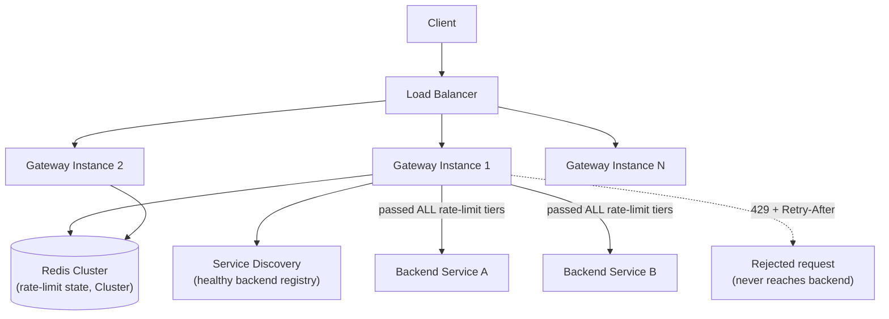
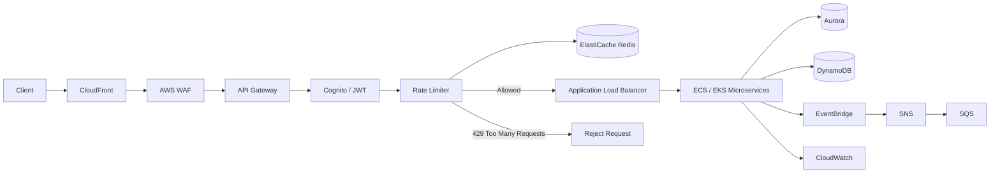
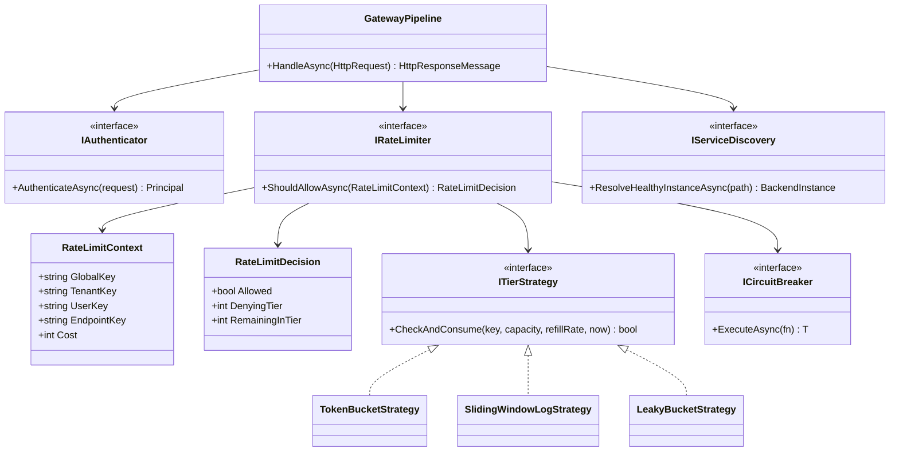
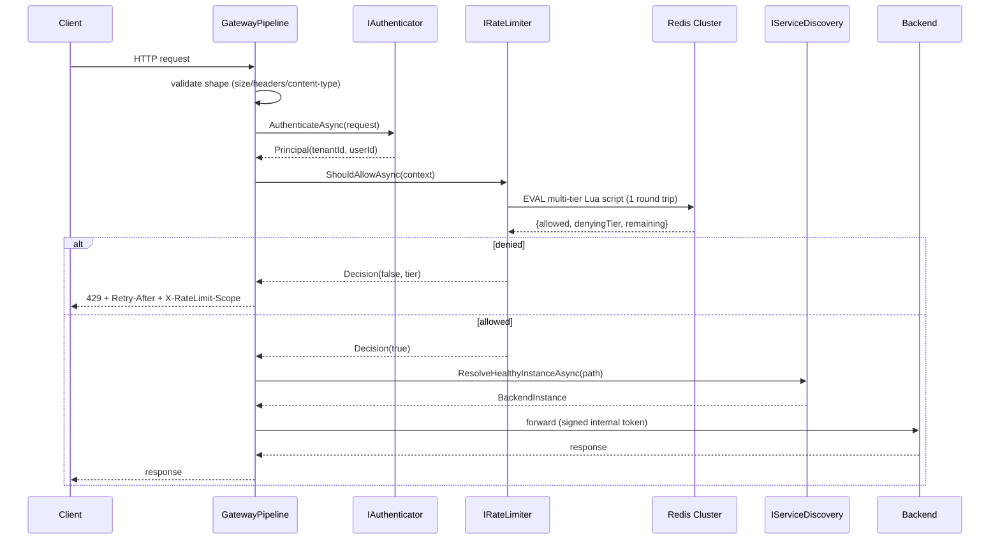

# Module 40 — System Design: Designing a Distributed Rate Limiter & API Gateway

> Domain: System Design | Level: Beginner → Expert | Prerequisite: [[01-System-Design-Fundamentals]], [[../03-REST-APIs/02-API-Security-Rate-Limiting]] (rate-limiting algorithms), [[../01-CSharp/02-Async-Await-Internals]] §Expert Q6 (the original distributed rate limiter introduced early in this course)

---
## 1. Fundamentals

### What is an API Gateway, and why does the rate limiter belong inside it architecturally?
An **API Gateway** is a single, centralized entry point sitting in front of a system's backend services, handling cross-cutting concerns (authentication, rate limiting, request routing, response transformation, observability) **once**, centrally, rather than requiring every individual backend service to reimplement them independently. The rate limiter belongs architecturally inside (or immediately adjacent to) the gateway specifically because the "short-circuit before expensive work" principle (§2.14) demands rejecting over-limit requests **before** they consume any backend capacity at all — placing rate limiting deep inside a backend service, after routing/authentication/business-logic have already run, defeats this cost-avoidance purpose entirely.

### Why does this matter?
Because this module is the direct, full-system synthesis of content spread across (the original distributed rate limiter introduced in the very first async-await module), (REST API rate-limiting algorithms and OWASP-adjacent security concerns), and (Redis as the shared, atomic-operation-capable backing store) — recognizing that these three earlier modules' content **is** this system-design problem, not separate, unrelated material, is exactly the kind of cross-module synthesis a Staff/Principal system-design interview specifically rewards.

### When does this matter?
Any system with multiple backend services needing consistent, centrally-enforced cross-cutting policies (rate limiting, authentication, routing); the depth matters for correctly designing the gateway itself as a highly-available, low-latency-overhead component (since **every single request** passes through it, making the gateway's own performance/availability a multiplier on the entire system's), not merely as a thin, assumed-infallible proxy.

### How does it work (30,000-ft view)?
```
Client -> API Gateway [TLS termination, auth, rate limit, routing] -> Backend Service A / B / C
 |
 v
 Redis (shared rate-limit state)
```

---

## 2. Deep Dive

This section is written to be **complete on its own** — every mechanism, the reasoning that selects it, the failure mode it introduces, and the push-back a Principal/Staff interviewer will raise, answered inline. The *algorithms* themselves (token bucket, GCRA, sliding window) are derived in full in Module 175; this module is about the gateway as a system and about which algorithm each tier deserves.

### 2.1 The Gateway Is a System, Not a Box

Every request to the entire estate passes through the gateway. Two consequences follow immediately:

- It must be **horizontally scaled** — a fleet behind a load balancer — because a gateway outage is a *total system outage* regardless of how healthy every backend is.
- Its rate-limiting state **cannot live in-process**, because per-replica in-memory counters are trivially bypassable across a fleet: a caller limited to 100/s against 10 gateway instances gets 1,000/s. Shared state (Redis or equivalent) is what makes enforcement genuinely fleet-wide.

**The single point of failure is not the gateway; it is the gateway's shared dependencies.** A correctly built gateway fleet has no uniquely necessary instance. The actual availability critical path is the Redis cluster backing rate-limit state and the service-discovery registry — so *their* HA design (Redis Cluster or Sentinel, multi-AZ, tested failover) is the system-wide availability concern, not the gateway "box."

**The Redis cluster is plausibly the highest-throughput component in the entire system.** Every request triggers at least one limiter check, so its request volume equals — or is a small multiple of, once you count tiers — the system's total aggregate request rate. Size and monitor it accordingly.

### 2.2 What Belongs in the Gateway, and What Does Not

The gateway's legitimate responsibilities are the genuinely cross-cutting ones: authentication, standard rate-limit tiers, TLS termination, routing, request/response logging and tracing, and cacheable-GET caching.

**TLS terminates at the gateway**, centralising the CPU cost of handshake and decryption at one tier rather than paying it on every backend (with re-encryption inward where the threat model requires it).

**Gateway-tier response caching earns its place beyond a CDN.** A CDN mostly serves static and semi-static assets; gateway caching can serve *dynamic-but-cacheable* API responses — a frequently requested, infrequently changing resource — without the request reaching any backend at all, extending the latency and load benefit to a broader class of content.

**Response aggregation is the BFF question, and the answer is usually "not in the core gateway."** A gateway that calls several backends and composes one response has become a Facade for the whole estate. That centralises aggregation conveniently for clients and grows the blast radius of the system's most critical component — an aggregation bug now affects everything. Most mature architectures keep the core gateway (auth, limits, routing) separate from a distinct **BFF tier** (aggregation, client-specific shaping), precisely to keep the highest-criticality component as simple and low-risk as possible.

**Governing feature requests is a real Principal responsibility here**, because every backend team will eventually want the gateway to handle something. Set explicit criteria: a proposed gateway feature must demonstrate it is *genuinely shared* across many services, not a single team's convenience. Narrow, service-specific logic belongs in the BFF or the service itself, because the gateway's uniquely system-wide blast radius makes it the worst possible home for one-off complexity.

### 2.3 Multi-Tier Rate Limiting, and the Tier Everyone Forgets

A production gateway enforces several tiers **simultaneously**, and a request must pass **all applicable tiers** — an AND across independent requirements, the same logic as authorization policy evaluation.

| Tier | Protects against | Driven by |
|---|---|---|
| **Global** | Aggregate overload from many individually-compliant callers | **Measured backend capacity** |
| **Per-tenant / per-API-key** | One customer consuming disproportionate capacity | Business contract |
| **Per-user** | One abusive user consuming their tenant's whole allotment | Fairness within a tenant |
| **Per-endpoint** | Expensive endpoints being hammered within an otherwise-compliant quota | Cost of the operation |

Each tier needs its own key and counter, because each protects a different failure mode. Passing one says nothing about the others.

**The global tier is the one that gets omitted, and its omission is §4's incident.** The design error is enumerating the *business-relevant* tiers — per-tenant, contractually meaningful, easy to reason about — without separately asking: *what is the actual measured capacity of our backend fleet, and do we have a tier protecting that, independent of how traffic distributes across tenants?* Those are two different questions requiring two different tiers. Per-tenant compliance says nothing about the system-wide aggregate that compliant tenants collectively generate.

The governance fix: require every rate-limiting design to document **both** the business-driven tiers **and** a capacity-driven global tier sized to the backend's measured throughput ceiling from load testing — with the global tier's *absence* requiring explicit written justification rather than being silently omitted by default.

### 2.4 Checking Every Tier in One Atomic Round Trip

At gateway scale the limiter's own latency is multiplied across literally every request the system serves, so a naive implementation doing four sequential Redis round trips is a system-wide latency tax. Check all tiers in **one** `EVAL`:

```lua
-- KEYS[1..4] = global, tenant, user, endpoint bucket keys
-- ARGV       = now, then (capacity, refillRate) per tier
local function checkAndConsume(key, capacity, refillRate, now)
  local bucket     = redis.call("HMGET", key, "tokens", "lastRefill")
  local tokens     = tonumber(bucket[1]) or capacity
  local lastRefill = tonumber(bucket[2]) or now
  tokens = math.min(capacity, tokens + (now - lastRefill) * refillRate)
  if tokens < 1 then return false end
  redis.call("HMSET", key, "tokens", tokens - 1, "lastRefill", now)
  return true
end

local now = tonumber(ARGV[1])
if not checkAndConsume(KEYS[1], tonumber(ARGV[2]), tonumber(ARGV[3]), now) then return 0 end -- global
if not checkAndConsume(KEYS[2], tonumber(ARGV[4]), tonumber(ARGV[5]), now) then return 0 end -- tenant
if not checkAndConsume(KEYS[3], tonumber(ARGV[6]), tonumber(ARGV[7]), now) then return 0 end -- user
if not checkAndConsume(KEYS[4], tonumber(ARGV[8]), tonumber(ARGV[9]), now) then return 0 end -- endpoint
return 1
```

Redis executes a script atomically, so the whole multi-tier decision is one round trip and no other client interleaves.

**The honest trade-off to state aloud:** tiers checked *before* the failing one have already consumed a token. That over-counts slightly for rejected requests. The alternatives are a two-phase check-then-commit (more round trips, more complexity) or ordering tiers cheapest-to-fail first (an optimisation, not a fix). For abuse tiers the small inefficiency is acceptable; for a contractual tier where exactness is the point, use the two-phase form. Naming the imprecision rather than ignoring it is what an interviewer is checking for.

Reject with **`429 Too Many Requests`** and a **`Retry-After`** header, plus `RateLimit-Limit` / `RateLimit-Remaining` / `RateLimit-Reset` so a well-behaved client can self-pace instead of retrying blindly.

### 2.5 Tiers Exist for Different Reasons — and That Changes Their Design

This is the insight that lifts an answer above "we have four tiers."

**An externally imposed tier.** In a payments gateway, a card network (Visa, Mastercard) throttles a merchant's authorisation rate. That ceiling is not your policy — it is a non-negotiable third-party constraint, and *exceeding* it risks the network throttling or suspending the entire processing relationship, a consequence far more severe than one caller receiving a 429. So this tier is enforced **more conservatively than the real threshold** — self-throttle at ~90% — tracked separately from your own business tiers, and smoothed with a **leaky bucket** rather than a bursty token bucket, because over-admission here is relationship risk rather than a capacity concern.

**A regulatory tier needs exactness, not approximation.** A KYC/AML screening API with an audited per-minute cap mandated by a regulator cannot use a token bucket, because a token bucket's burst tolerance is exactly the behaviour a strict cap forbids — "we briefly exceeded the mandated limit but the average held" is not a defensible compliance position. Use a **sliding-window log** (store each request timestamp in the window, count exactly): exact enforcement, no burst tolerance, at a real cost of O(window) memory per key instead of O(1). Apply it **only** to the endpoint carrying that obligation; applying it uniformly pays the cost everywhere for a guarantee one endpoint needs.

The generalisation worth stating: **contractual and regulatory tiers demand exactness and a conservative failure posture; abuse and capacity tiers tolerate approximation.** Almost every subsequent design decision in this module falls out of that split.

### 2.6 Algorithm Selection Per Tier

| Algorithm | Burst behaviour | Memory | Right for |
|---|---|---|---|
| Fixed window | Allows 2× at the boundary | O(1) | Nothing serious; the boundary spike is a real defect |
| Sliding window counter | Approximates smoothly (~±1%) | O(1) | Abuse and capacity tiers — the sane default |
| Token bucket | Allows bursts up to capacity | O(1) | Callers who legitimately burst; API quotas |
| Leaky bucket | Smooths output to a constant rate | O(1) | Externally imposed tiers; protecting a fragile downstream |
| Sliding window log | Exact, no burst | O(window) | Regulatory/contractual tiers only |
| GCRA | Exact, smooth, O(1) | O(1) | The best general answer where you control the implementation |

The deciding property is almost always **burst tolerance**: whether a short excursion above the nominal rate is acceptable. That is a business and legal question, not a performance one.

### 2.7 Idempotency-Aware Limiting — Do Not Charge for Retries

A payments API must distinguish a legitimate retry of a failed authorisation from genuinely new work. Attach the **idempotency key** — already required for the API's own correctness — to the rate-limit accounting: a request presenting a key matching a prior request inside its dedup window is a retry of the same logical operation and should either consume no new token or draw on a separate, more generous retry allowance. A request with a fresh key is new work and consumes normally.

Getting this wrong is a real production risk in a specific, nasty way: charging full rate-limit cost for legitimate retries means that during a transient backend blip — *exactly* when retries spike — the limiter converts a brief hiccup into a client-visible rate-limit outage. The protective mechanism fires hardest at the worst possible moment.

### 2.8 Outbound Rate Limiting — Protecting Them From You

"Rate limiting" defaults to meaning *protect me from you*, which is why the inverse is so often missed. When the gateway delivers webhooks to a merchant's endpoint, **you are the caller**, and many merchant endpoints are modest servers that cannot absorb an unthrottled burst.

This needs a genuinely distinct control plane: a **per-destination outbound limiter**, respecting each receiver's stated or observed limits, paired with exponential backoff, a circuit breaker per destination, and a dead-letter queue for endpoints that persistently fail or throttle. Honour `429` and `Retry-After` from the receiver rather than treating them as generic errors.

### 2.9 Adaptive Limits Driven by Backend Health

A static global threshold must be provisioned for the worst case, which wastes capacity under normal conditions. The better design feeds backend signals — aggregate CPU and connection-pool utilisation, or simply the backend's own p99 latency trend — into a control loop that lowers the global tier's refill rate as stress rises and restores it as the backend recovers.

This sheds load in response to *observed* stress rather than a fixed worst-case guess, and trades a more complex control system for materially better utilisation. Give the loop bounds — a floor, a ceiling and a cooldown — because a control loop with a feedback path into the thing it controls can oscillate, which is the same failure family as the autoscaler that scales into an outage.

### 2.10 Routing, Service Discovery and Why a Load Balancer Is Not Enough

The gateway routes to the correct backend **service** by path and header matching — L7 routing at the system's outermost edge. That needs **service discovery**: a registry of currently healthy instances per service, updated as instances scale or fail health checks, so the gateway never routes to a stale or unhealthy target.

This is a distinct concern from a load balancer's simpler job of spreading traffic across replicas of *one* service: the gateway must first choose *which service*, among many, from request content, and only then which healthy instance of it.

### 2.11 Trust Between Gateway and Backends

A backend must **not** blindly trust an internal header claiming "this request was already authenticated at the gateway." A compromised or misconfigured internal network lets an attacker reach a backend directly and spoof that header, bypassing authentication entirely.

The concrete mechanism: the gateway, having authenticated the caller, mints a **short-lived internally signed assertion** — a JWT signed with a key only the gateway and backends trust, distinct from any externally issued token — carrying the verified identity and claims, attached to the forwarded request. Each backend verifies that signature before trusting the identity. A request that bypasses the gateway lacks a valid assertion and is rejected by the backend's own check.

The principle: network-level isolation ("only the gateway can reach backends") is a valuable line of defence, never the *sole* one. Being inside the network is a topology property; the signed assertion is an identity property.

### 2.12 Failure Posture — and Who Watches the Watchman

**Fail-open or fail-closed is a per-tier decision, never one global default.** If Redis is unavailable: abuse and capacity tiers should generally **fail open** (serve traffic, accept temporary over-admission, alert loudly), because refusing all traffic to enforce an approximate fairness control converts a limiter outage into a full outage. Contractual and regulatory tiers should **fail closed**, because admitting beyond a mandated cap is worse than rejecting.

**Circuit-break the limiter itself.** If Redis is *slow* rather than down, every gateway instance's limiter check becomes a latency tax on every request — the protective mechanism becomes the primary availability problem. Wrap the limiter's Redis calls in a circuit breaker that, past a latency threshold, falls back to a degraded local mode or fails open per the tier's posture. Any centrally enforced protective mechanism needs this "who watches the watchman" bound.

**DR failover starts with cold state.** A standby region's Redis begins empty, so naive enforcement effectively **resets every caller's quota** at failover. For abuse tiers that is a minor, acceptable imprecision. For contractual and regulatory tiers a reset quota lets a caller exceed their true entitlement for the rest of the window — so those tiers should **conservatively assume near-full prior consumption** until enough of the window has elapsed that the risk has passed. Different tiers, different failure posture, again.

**Rate limiting cannot see a slow backend, so add bulkheads.** A backend that responds successfully but very slowly passes every limiter check — the caller is within quota — while exhausting the gateway's connection pool to that backend. The fix is a **per-route bulkhead**: a dedicated, capped connection pool and concurrency limit per backend. A degraded backend then saturates only its own pool and produces fast, clean `503`s, instead of making the gateway unresponsive for every route including healthy ones. An admitted, individually compliant request can still be the vector for a resource-exhaustion failure the limiter is structurally blind to.

### 2.13 Distributed Enforcement Across Regions

Routing every request through one central gateway adds latency for distant users, so global systems deploy **regional gateways** with regional Redis. That immediately raises the question of how a *global* tenant quota is enforced across three regions.

**Centralised authoritative store** — every region's limiter checks one region's Redis. Exact, and pays a cross-region round trip on every request, which for a limiter on the critical path is usually unacceptable.

**Decentralised with eventual merge** — Envoy-style local limiting with periodic global sync, or CRDT counters (a PN-counter per tenant). Each region increments locally with no cross-region hop, and counts merge asynchronously. What it buys is latency and availability. What it costs is **bounded global over-admission**: for a period bounded by the sync interval, the true global count can exceed the limit by up to the sum of what each region independently admitted.

That trade is acceptable for abuse and capacity tiers and generally unacceptable for the contractual and regulatory tiers of §2.5 — the recurring answer that different tiers tolerate different consistency models. A common production shape is local enforcement with a conservative local allowance (global limit ÷ regions, plus a small burst) reconciled centrally.

### 2.14 DDoS — Why Application Rate Limiting Is Not Enough

An application-aware limiter must accept and process a connection and request before it can evaluate and reject it. A sufficiently large volumetric attack exhausts network and connection capacity *before* that evaluation ever happens. Genuine DDoS resilience therefore needs defence beneath the application layer: an anti-DDoS/scrubbing service, connection-rate limits and SYN protection at the edge, WAF rules and bot detection ahead of compute, and only then application-tier limiting. Layered, cheapest rejection outermost.

### 2.15 Testing, Rollout and Monitoring

**Test the specific failure mode, not just the feature.** A load test driven by a single identity only ever exercises the per-tenant and per-user tiers and can never detect a missing global tier. The test that would have caught §4's incident simulates **many distinct, individually-compliant identities** generating traffic simultaneously, and asserts that as aggregate load approaches the global threshold the system sheds proportionally with `429`s while backend latency and error rates stay protected.

**Roll out limiter changes with unusual caution**, because a bug here has system-wide rather than service-scoped blast radius. Feature-flag the new logic, route a small percentage of traffic to it, watch error rate, latency and throttle rate, and expand progressively.

**Monitor for the absence of a control, which produces no natural error signal.** Run a continuous low-volume synthetic canary using **many distinct low-volume identities**, calibrated to sit just below the global threshold, and alert if production aggregate plus canary traffic ever approaches the global limit *without* a corresponding rise in `429`s — the signature of a global tier that is misconfigured, disabled, or silently removed in a deploy. Pair it with a **rising `503`:`429` ratio** as an independent leading indicator that limits are set above the capacity they exist to protect: a healthy limiter rejects with 429 *before* the backend fails with 503, so the ratio inverting means the limits are too loose.

### 2.16 Principal-Level Judgements

**Reject "eliminate the gateway so each service handles its own concerns."** Removing the gateway does not remove the cross-cutting concerns; it **duplicates** them into every backend, so each team reimplements authentication and rate limiting independently and some do it wrong. The "avoid a single point of failure" framing also misreads the architecture: a horizontally scaled gateway fleet is not a SPOF, while N independent implementations are arguably a worse reliability posture — a security bug fixed once in the gateway protects everything immediately, whereas the same bug reimplemented in N services needs N fixes, discovered and shipped at N different times.

**Reject downsizing the limiter's Redis on average utilisation.** Average is the wrong metric for a component whose under-capacity failure mode is a full-system latency and availability event. Size on **peak**, with headroom for the aggregate-overload mode and for hot-shard behaviour from a single very large tenant. Reframe it in the cost initiative's own terms: the cluster's cost is a rounding error against the revenue at risk from a gateway-wide outage caused by under-provisioning the one dependency every request traverses.

**False positives have a business cost, and cleverer heuristics are not the answer.** When a significant merchant's legitimate flash-sale burst is throttled because it is statistically indistinguishable from an abuse pattern, the resolution is a pre-negotiated elevated quota provisioned ahead of the known event through the policy control plane — not asking the limiter to divine intent from request-rate shape in real time. Rate limiting is a blunt statistical control; **predictable important spikes belong to advance capacity negotiation**, not to real-time heuristics.

---

## 3. Visual Architecture

```mermaid
graph TB
 Client --> LB[Load Balancer]
 LB --> GW1[Gateway Instance 1]
 LB --> GW2[Gateway Instance 2]
 LB --> GW3[Gateway Instance N]
 GW1 --> RedisCluster[("Redis Cluster<br/>(rate-limit state, Cluster)")]
 GW2 --> RedisCluster
 GW1 --> ServiceDiscovery["Service Discovery<br/>(healthy backend registry)"]
 GW1 -->|"passed ALL rate-limit tiers"| BackendA[Backend Service A]
 GW1 -->|"passed ALL rate-limit tiers"| BackendB[Backend Service B]
 GW1 -.->|"429 + Retry-After"| RejectedClient["Rejected request<br/>(never reaches backend)"]
```

### 3.1 Concrete AWS Reference Architecture

The generic diagram above names the roles (gateway fleet, shared rate-limit state, service discovery); this subsection pins those roles to a concrete AWS stack, useful for grounding the design in services an interviewer will recognize.


```mermaid
flowchart LR
 Client[Client] --> CloudFront[CloudFront]
 CloudFront --> WAF[AWS WAF]
 WAF --> APIGateway[API Gateway]
 APIGateway --> Auth[Cognito / JWT]
 Auth --> RateLimiter[Rate Limiter]
 RateLimiter --> Redis[(ElastiCache Redis)]
 RateLimiter -->|Allowed| ALB[Application Load Balancer]
 RateLimiter -->|429 Too Many Requests| Reject[Reject Request]
 ALB --> ECS[ECS / EKS Microservices]
 ECS --> Aurora[(Aurora)]
 ECS --> DynamoDB[(DynamoDB)]
 ECS --> EventBridge[EventBridge]
 EventBridge --> SNS[SNS]
 SNS --> SQS[SQS]
 ECS --> CloudWatch[CloudWatch]
```

**Request flow, restated as a linear trace through that stack:**

```
Client
 │
 ▼
CloudFront          -- edge caching, static/semi-static content, absorbs volumetric noise
AWS WAF              -- layer-7 filtering (SQLi/XSS/bot signatures) BEFORE any app logic runs
API Gateway           -- TLS termination, request validation, throttling primitives
Authentication (Cognito/JWT)  -- caller identity resolved here, feeds the rate-limit key
Rate Limiter (ElastiCache Redis) -- the atomic, multi-tier check (§2.3, §3.1 Lua script in §12)
 │
 ┌──────────────┐
 │   Allowed?    │
 └──────┬───────┘
        │ Yes                                   │ No -> 429 + Retry-After, never reaches ALB
        ▼
 Application Load Balancer
        │
 ECS / EKS Services
        │
 Aurora (transactional) / DynamoDB (high-throughput key-value)
        │
 EventBridge -> SNS -> SQS   -- async fan-out for downstream consumers
        │
 CloudWatch                  -- logs, metrics, alarms across every hop above
```

**Mapping AWS services to the generic components:** CloudFront + WAF sit in front of the "Load Balancer" box in the generic diagram, absorbing volumetric/edge-layer load before it ever reaches a gateway instance; API Gateway plus the Rate Limiter/ElastiCache pairing together are the "Gateway Instance" + "Redis Cluster" boxes; ECS/EKS behind the ALB are the backend services the gateway protects; EventBridge/SNS/SQS are how those backends decouple from synchronous request/response once inside the trust boundary. CloudWatch is the observability plane spanning every hop — the practical instantiation of §9's monitoring requirement.

**Why CloudFront + WAF precede the rate limiter, not the other way around:** a volumetric (network-layer) flood must be absorbed at the edge, before it costs a single Redis round-trip — this is the concrete version of the Intermediate-tier "DDoS resilience requires more than application-level rate limiting alone" answer below: WAF/CloudFront are the infrastructure-level layer that answer presupposes.

## 4. Production Example
**Scenario**: A platform's API gateway enforced per-tenant rate limits correctly, but during a major, unexpected traffic spike (a viral marketing event driving a huge surge of legitimate, well-behaved traffic from many different tenants simultaneously, each individually well within their own per-tenant limit), the **aggregate** request volume across all tenants combined overwhelmed the backend services' actual capacity — no individual tenant was "at fault" or exceeding their own limit, but the sum of many tenants' legitimate, within-limit traffic exceeded what the backend fleet could handle, causing widespread latency degradation and errors across the entire platform, affecting even tenants who were sending very little traffic themselves. **Investigation**: confirmed via gateway logs that per-tenant rate limits were all correctly enforced and none were being exceeded — the gap was the **absence of a global, aggregate rate-limit tier** that would have proactively shed excess load (via 429s to some requests) once total system-wide load approached backend capacity, regardless of how that load was distributed across individual tenants. **Fix**: added a global rate-limit tier (checked in addition to, not instead of, the existing per-tenant tiers) sized to the backend fleet's actual measured capacity, with a graceful-degradation policy (§2.9) shedding load proportionally across tenants once the global limit is approached, rather than allowing unconstrained aggregate growth to overwhelm the backend regardless of per-tenant compliance. **Lesson**: multi-tier rate limiting isn't merely a "more thorough" version of single-tier limiting — the global tier specifically protects against a failure mode (aggregate overload from many individually-compliant sources) that no combination of per-tenant/per-user limits alone can prevent, directly demonstrating why "AND across all applicable tiers" must genuinely include a global tier, not just business-relevant per-tenant/per-user tiers, for the gateway to actually protect the backend's real, finite capacity.
## 11. Coding Exercises

*(System design case studies use worked design exercises, consistent with this domain's format.)*

### Easy — Capacity estimation for the gateway's Redis rate-limit backing store
**Problem**: Estimate Redis operations/sec needed if the gateway serves 50,000 requests/sec system-wide, with 4 rate-limit tiers checked per request via one atomic Lua script.
**Solution**:
```
Redis EVAL calls/sec: 50,000 (ONE atomic script call per request, regardless of tier COUNT within it,
 per §2.4's single-round-trip design)
Internal Redis operations within each EVAL (4 tiers * ~2 ops each): ~8 internal ops * 50,000/sec
 = 400,000 internal Redis ops/sec -- well within a well-provisioned
 Redis Cluster's capacity, but a number worth
 explicitly stating to justify the Cluster-sharding decision.
```

### Medium — Multi-tier rate-limit configuration schema
```csharp
public record RateLimitTier(string Name, int Capacity, double RefillRatePerSecond);

public class MultiTierRateLimitConfig
{
    public RateLimitTier Global { get; init; } = new("global", 50_000, 45_000 / 1.0); // the fix
    public Dictionary<string, RateLimitTier> PerTenant { get; init; } = new; // contractual limits
    public RateLimitTier PerUserDefault { get; init; } = new("user-default", 100, 100 / 60.0);
    public Dictionary<string, RateLimitTier> PerEndpoint { get; init; } = new; // e.g., stricter for /reports
}
```

### Hard — Circuit breaker around the rate limiter's own Redis dependency (§2.12)
```csharp
public class ResilientRateLimiter
{
    private readonly IDistributedRateLimiter _redisLimiter;
    private readonly CircuitBreaker _circuitBreaker; // e.g., Polly's CircuitBreakerPolicy

    public async Task<bool> ShouldAllowAsync(string key)
    {
        try
        {
            return await _circuitBreaker.ExecuteAsync(=> _redisLimiter.CheckAsync(key));
        }
        catch (BrokenCircuitException)
        {
            // Redis is degraded/unavailable -- FAIL OPEN for this gateway, per the deliberate
            // documented choice §2.12 (most APIs prefer availability
            // over strict enforcement during a rate-limiter-infrastructure outage).
            _logger.LogWarning("Rate limiter circuit OPEN -- failing open for key {Key}", key);
            return true;
        }
    }
}
```

### Expert — Full gateway request pipeline synthesizing every tier and concern from this module
```csharp
public class GatewayPipeline
{
    public async Task<HttpResponseMessage> HandleAsync(HttpRequest request)
    {
        // 1. Reject malformed/oversized requests EARLIEST
        if (!IsValidRequestShape(request)) return Reject(400);

        // 2. Authenticate -- establishes caller identity for subsequent tiers
        var principal = await _authenticator.AuthenticateAsync(request);
        if (principal is null) return Reject(401);

        // 3. Multi-tier rate limiting, ALL must pass (§2.4's single atomic check)
        string tenantId = principal.GetTenantId;
        bool allowed = await _rateLimiter.ShouldAllowAsync(
            globalKey: "global", tenantKey: $"tenant:{tenantId}",
                userKey: $"user:{principal.UserId}", endpointKey: $"endpoint:{request.Path}");
        if (!allowed) return Reject(429, retryAfter: "60");

        // 4. Route to the correct, healthy backend
        var backend = await _serviceDiscovery.ResolveHealthyInstanceAsync(request.Path);
        if (backend is null) return Reject(503);

        // 5. Attach signed internal trust assertion (§2.11) and forward
        var internalToken = _internalTokenSigner.Sign(principal);
        return await _httpClient.ForwardAsync(backend, request, internalToken);
    }
}
```
**Discussion**: The explicit, numbered ordering here is itself the key design artifact — directly mirroring the middleware-ordering discipline (validation/rejection as early and cheap as possible, expensive operations gated behind cheaper checks) now expressed at the full-system-gateway level, synthesizing input validation, authentication, multi-tier rate limiting (this module's core topic), service discovery, and secure internal trust propagation (§2.11) into one cohesive, correctly-sequenced pipeline.

---

## 12. System Design — Designing an API Gateway with Multi-Tier Rate Limiting

*Authored to the four-step standard (see Module 01 §12 for the method). For the limiter **algorithms** themselves — fixed/sliding window, token bucket, GCRA, and their distributed-correctness proofs — see Module 15; this section designs the **system** that runs them.*

---

### Step 1 — Understand the Problem and Establish Design Scope

#### The dialogue

> **C:** What is the gateway responsible for? "API gateway" covers everything from a reverse proxy to a full service mesh ingress.
> **I:** TLS termination, authentication, rate limiting, routing to backends, and request/response observability. No protocol translation, no response aggregation.
>
> **C:** Is this multi-tenant — do we have paying customers with contractual limits?
> **I:** Yes. Tenants have plan-based quotas that appear in a contract.
>
> **C:** So limits are a billing artefact, not just an abuse control. Do we need per-user limits inside a tenant too?
> **I:** Yes — one bad integration inside a tenant shouldn't consume the tenant's whole quota.
>
> **C:** And per-endpoint? Some endpoints are far more expensive than others.
> **I:** Yes.
>
> **C:** Scale?
> **I:** 50,000 requests/sec peak across roughly 5,000 tenants and 200 backend services.
>
> **C:** What latency budget does the gateway get? It's on every request, so its overhead multiplies.
> **I:** Under 5 ms at p99 for the gateway's own processing, excluding the backend call.
>
> **C:** When the rate-limit store is unavailable, do we fail open or fail closed?
> **I:** Good question — that's part of what I want you to design.
>
> **C:** Last one: are limits enforced globally across the fleet, or is approximate per-instance enforcement acceptable?
> **I:** Contractual limits must be fleet-accurate. Abuse limits can be approximate.

That last exchange is the hinge. **"Contractual" and "abuse" limits have different correctness requirements**, and recognising that lets you use a cheap approximate mechanism for the high-volume case and an exact one only where money is involved — which is what makes the 5 ms budget achievable.

#### Functional requirements

1. Terminate TLS; authenticate the caller (API key, JWT, or mTLS) and resolve tenant/user identity.
2. Enforce four simultaneous limit tiers: global, per-tenant, per-user, per-endpoint. A request must pass **all** applicable tiers.
3. Route to the correct backend using service discovery over healthy instances only.
4. Return `429` with `Retry-After` and `X-RateLimit-*` headers on rejection.
5. Emit per-request telemetry (latency, status, tenant, route) without adding meaningful latency.
6. Support runtime policy changes (a plan upgrade takes effect in seconds, not at next deploy).

#### Non-functional requirements

| Requirement | Target |
|---|---|
| Gateway added latency | p99 < 5 ms, p50 < 1 ms |
| Throughput | 50,000 req/s peak, headroom to 100,000 |
| Availability | **99.99%** — the gateway's availability is the ceiling on every backend's |
| Limit accuracy — contractual | Exact within a window; over-admission is a revenue leak, under-admission is a customer complaint |
| Limit accuracy — abuse | ±5% acceptable |
| Policy propagation | < 10 s from admin change to fleet-wide effect |
| Failure mode | Explicitly chosen per tier, not accidental |

#### Back-of-the-envelope estimation

The estimation here is about **latency budget**, not capacity — and that inversion is itself the insight.

```
Peak throughput            = 50,000 req/s
Gateway instances (4 vCPU, ~5,000 req/s each, TLS-heavy)
                           = 50,000 ÷ 5,000        = 10 instances
                           + N+2 redundancy + AZ spread ≈ 15 instances
```

Now the part that decides the design:

```
Latency budget                                       = 5 ms  (p99)
  TLS handshake (amortised over keep-alive)          ≈ 0.1 ms
  Auth: JWT verify (cached JWKS, no network)         ≈ 0.2 ms
  Routing + service discovery (in-memory table)      ≈ 0.05 ms
  Telemetry (async, off the hot path)                ≈ 0
  Remaining for rate limiting                        ≈ 4 ms

Redis round trip within an AZ                        ≈ 0.4–0.8 ms (p99 higher: ~2 ms)
Four tiers × one round trip each                     = 4 × 2 ms = 8 ms  ← BLOWS THE BUDGET
Four tiers in ONE Lua script                         = 1 × 2 ms = 2 ms  ← fits
```

State size:

```
Tenants 5,000 × endpoints 200 × window keys ~2   ≈ 2,000,000 keys
Per key ≈ 100 B                                  ≈ 200 MB   ← trivially fits in Redis
```

#### What the numbers tell us

1. **Capacity is a non-issue.** Fifteen instances. Anyone who spends the round designing gateway autoscaling has missed the problem.
2. **The design is entirely determined by the latency budget**, and specifically by the arithmetic above: the naive implementation — one Redis call per tier — is **four times over budget**, and the fix (one atomic script evaluating all tiers) is therefore not an optimisation but a requirement. This is the sentence the whole design turns on.
3. **200 MB of state means the limiter's data can live anywhere** — including replicated into each gateway's memory, which opens the door to the local-lease design in §3.2 that removes the Redis hop from the common path entirely.

The hard problem is **paying for fleet-accurate enforcement without paying a network round trip per tier per request** — plus the failure §4 exposes, that per-tenant limits are structurally blind to aggregate backend capacity.

---

### Step 2 — Propose High-Level Design and Get Buy-In

#### Two planes, and keeping them separate

- **Data plane** — the request path. Must be fast, must not block on anything it can avoid, and must degrade rather than fail.
- **Control plane** — policy definition, tenant plans, route configuration, discovery. Slow, transactional, and **never on the request path**. A control-plane outage must not stop traffic; it must only freeze policy changes.

Conflating these is the most common architectural error in gateway design, and stating the split up front is worth real credit.

#### Components

**Edge load balancer (L4 or cloud NLB).** Distributes to gateway instances. Deliberately dumb — the intelligence is one layer in.

**Gateway instances (data plane).** Stateless. Pipeline: TLS → auth → identity resolution → **rate limit** → route → proxy → telemetry.

**Limiter.** A local token-lease cache plus a Redis-backed authority (§3.2).

**Policy Store (control plane).** Tenant plans, per-endpoint costs, tier definitions. PostgreSQL, published to gateways via a watch/stream.

**Service Registry.** Healthy backend instances per route. Consul/Envoy xDS/cloud service discovery, cached in-memory on each gateway with a health-aware refresh.

**Redis Cluster.** The shared limiter state. Sharded by limit key so tiers spread across nodes.

**Telemetry pipeline.** Async, buffered, lossy-by-design — telemetry must never apply backpressure to the request path.

#### End-to-end walkthrough — one request

1. Client connects; edge LB routes to a gateway instance; TLS terminates (session resumption keeps the handshake amortised).
2. Gateway extracts credentials. JWT is verified against a **cached JWKS** — never a network call per request.
3. Identity resolves to `(tenant_id, user_id, plan_id)`, cached locally with a short TTL.
4. Route match on path/method produces `(service, endpoint_id, cost_weight)`. Endpoints have **weights**, so an expensive search endpoint consumes 10 tokens while a cheap lookup consumes 1 — a single mechanism that replaces a proliferation of per-endpoint limits.
5. **One limiter call evaluates all four tiers atomically** and returns allow/deny plus remaining quota per tier.
6. Denied → `429` with `Retry-After`, `X-RateLimit-Limit/Remaining/Reset`, and the **tier that rejected** named in the body. Telling the caller *which* limit they hit is what turns a support ticket into a self-service fix.
7. Allowed → select a healthy backend instance (least-request, from the in-memory registry), proxy with a per-route timeout and retry budget.
8. Response streams back; telemetry is emitted asynchronously.

#### API design

**The proxied request** carries no gateway-specific input, but the response contract matters:

| Header | Example | Notes |
|---|---|---|
| `X-RateLimit-Limit` | `1000` | The binding tier's limit |
| `X-RateLimit-Remaining` | `847` | |
| `X-RateLimit-Reset` | `1723200000` | Unix seconds |
| `Retry-After` | `12` | On `429` only; the single most useful header for well-behaved clients |
| `X-RateLimit-Scope` | `tenant` | Which tier bound — `global`\|`tenant`\|`user`\|`endpoint` |

**Control-plane API — `PUT /admin/v1/policies/{tenant_id}`**

| Field | Type | Description |
|---|---|---|
| `plan_id` | string | Named plan the tenant is on |
| `overrides` | object[] | `{ tier, scope_id, limit, window_seconds, burst }` |
| `enforcement` | enum | `ENFORCE` \| `SHADOW` — shadow mode counts and reports but never rejects |
| `effective_from` | RFC3339 | |

`SHADOW` is worth calling out unprompted: **you never turn on a new limit in enforce mode.** You run it in shadow, look at how many requests *would* have been rejected, and only then enforce. Every limit rollout that skipped this step is an incident.

**`GET /admin/v1/policies/{tenant_id}/usage`** — current consumption per tier, for support and for the customer's own dashboard.

#### Data model

**`plan`** (PostgreSQL) — `plan_id`, `name`, and per-tier defaults.

**`policy`** — `policy_id`, `tenant_id`, `tier`, `scope_id` (nullable — null means all), `limit`, `window_seconds`, `burst`, `enforcement`, `effective_from`, `version`.

**`endpoint`** — `endpoint_id`, `service`, `method`, `path_pattern`, `cost_weight`, `default_limit`.

**Redis key schema** — the part that is actually load-bearing:

```
rl:g:{window}                        global
rl:t:{tenant_id}:{window}            per-tenant
rl:u:{tenant_id}:{user_id}:{window}  per-user
rl:e:{tenant_id}:{endpoint_id}:{w}   per-endpoint
```

All four keys for a request are hashed to the **same Redis slot** using a hash tag on `tenant_id` — `rl:{...}` — so one Lua script can touch all of them atomically. Without co-location, a cluster-mode Redis rejects the multi-key script outright, and this is the detail that separates a design that works from one that only works on a single node.

#### Store selection, and why

| Store | Choice | Reason |
|---|---|---|
| Limiter state | **Redis Cluster** | Needs atomic read-modify-write with sub-ms latency and TTL semantics. Lua gives atomicity across the four tiers in one round trip — the requirement the estimation derived |
| Policy | **PostgreSQL** | Small, relational, transactional, audited. Read once and cached; never on the hot path |
| Discovery | **In-memory, fed by xDS/Consul** | A network call per request to a registry would blow the budget by itself |
| Telemetry | **Kafka → columnar store** | Async, high volume, analytical access |

The decision worth defending: **limiter state is not durable and should not be.** If Redis loses its state, the worst case is one window of over-admission. Choosing a durable store for it would trade the latency budget for a guarantee nobody needs — and §3.4 makes the failure behaviour explicit rather than accidental.

---

### Step 3 — Design Deep Dive

#### 3.1 All tiers in one atomic operation

```lua
-- KEYS: global, tenant, user, endpoint (co-located by hash tag)
-- ARGV: now_ms, cost, then {limit, window_ms, burst} per tier
for i = 1, 4 do
  local limit  = tonumber(ARGV[3 + (i-1)*3])
  if limit > 0 then
    local used = tonumber(redis.call('GET', KEYS[i]) or '0')
    if used + cost > limit then
      return {0, i, limit - used}      -- denied, and BY WHICH TIER
    end
  end
end
for i = 1, 4 do
  if tonumber(ARGV[3 + (i-1)*3]) > 0 then
    redis.call('INCRBY', KEYS[i], cost)
    redis.call('PEXPIRE', KEYS[i], tonumber(ARGV[4 + (i-1)*3]))
  end
end
return {1, 0, 0}
```

Two properties make this correct rather than merely fast. It is **check-all-then-commit-all**: a request that fails tier 3 must not have consumed tiers 1 and 2, or a heavily-rejected tenant would silently burn the global budget. And it returns **which tier denied**, which is what populates `X-RateLimit-Scope` and makes the system debuggable from the client side.

(The algorithm shown is a counter for brevity; Module 15 derives why a sliding-window-log or GCRA is preferable and what each costs.)

#### 3.2 Removing the round trip: local leases

Even 2 ms × 50,000 req/s is 100 CPU-seconds/s of waiting and a hard dependency on Redis for every request. The refinement is **batched leases**: a gateway instance atomically claims a block of tokens from Redis (say 100), spends them locally, and re-claims when low.

| | Per-request Redis | Local leases |
|---|---|---|
| Redis ops/s at 50k req/s | 50,000 | ~500 |
| Added p99 latency | ~2 ms | ~0.01 ms (amortised) |
| Accuracy | Exact | Over-admits by up to `lease_size × instances` at a window boundary |
| Redis outage behaviour | Every request affected | Requests continue until leases exhaust |

The over-admission is bounded and computable: 15 instances × 100 tokens = 1,500 requests worst case. For an abuse limit of 100,000/hour, that is 1.5% — inside the stated ±5%. For a **contractual** limit it may not be acceptable, which is exactly why the dialogue's last question mattered.

**Recommendation: leases for global/abuse tiers with lease size scaled to the limit; exact per-request evaluation for contractual tenant tiers.** Hybrid, justified by the requirement rather than uniform for tidiness. And the lease size must shrink as remaining quota shrinks — a tenant with 200 requests left must not have 15 instances each holding 100.

#### 3.3 The gap §4 exposed: nobody is limiting the *backend*

Every per-tenant limit can be satisfied while the sum across tenants destroys the backend. Per-tenant limiting is a **fairness and billing** mechanism; it is structurally incapable of protecting capacity, because it has no knowledge of capacity. The fix is a second, orthogonal control:

- **Concurrency limiting, not rate limiting, at the backend boundary.** Rate is the wrong unit — what saturates a backend is in-flight work. Cap in-flight requests per backend service and use an adaptive algorithm (AIMD or gradient, à la Netflix's concurrency-limits) that discovers the ceiling from observed latency rather than from a configured number that will be wrong within a quarter.
- **Load shedding by priority when the cap binds.** Shed in a stated order: free tier → batch/async endpoints → interactive reads → writes. Never shed uniformly; uniform shedding means your most valuable traffic fails at the same rate as your least.
- **Queue with a deadline, not an unbounded buffer.** A request that has already waited past its client's timeout should be dropped, not served — serving it burns capacity for a response nobody will read.

Naming this as *a different control with a different unit* rather than "tune the tenant limits down" is the Staff-level answer, and it is what §4's team actually lacked.

#### 3.4 Failure modes, chosen deliberately

| Failure | Naive behaviour | Designed behaviour |
|---|---|---|
| Redis unavailable | Every request errors, or every request passes | **Per tier**: abuse tiers fail *open* on local leases and last-known limits; contractual tiers fail *open* with a counted, alerted "unenforced" flag — because rejecting paying customers is worse than a brief over-admission. The count is what makes it a decision instead of a leak |
| Policy store unavailable | Gateway can't start / can't route | Gateway serves **last-known-good policy from local cache indefinitely**; only *changes* stall. Startup must be able to boot from cached policy, or a control-plane outage becomes a total outage on the next deploy |
| Service registry stale | Routes to dead instances | Health-check-driven passive eviction on connection failure, plus outlier detection; a route with zero healthy instances returns `503` fast rather than hanging |
| One backend slow | Threads/connections pile up, gateway degrades for *all* routes | **Per-route connection pools and concurrency caps** — bulkheads. Without them, one slow backend takes down the gateway and therefore every other backend |
| Gateway instance dies | Connections dropped | Stateless; LB removes it; clients retry. A non-event *because* nothing per-request lives in gateway memory |

The bulkhead row deserves emphasis: the most common real gateway outage is not the gateway failing but **one slow dependency consuming a shared resource pool**, which is Module 01 §3.4's cache-pool lesson at a different layer.

#### 3.5 Policy propagation without a hot-path lookup

Policy changes must take effect in under 10 seconds without the gateway reading Postgres per request. Mechanism: the control plane writes a versioned policy snapshot; gateways subscribe to a change stream (or long-poll a version endpoint); on change they fetch the delta and swap an immutable in-memory map. Swapping an immutable map means the request path never takes a lock, which matters at 50,000 req/s.

Two safeguards worth stating: **version every snapshot and expose the active version per instance**, so a partially-propagated fleet is visible rather than mysterious; and **validate before swap**, because a malformed policy that all 15 instances accept simultaneously is a fleet-wide outage delivered in under 10 seconds — the propagation speed you built is also the blast radius you built.

---

### Step 4 — Wrap-Up

**What we left out:** authentication protocol depth (Modules 40, 41); request/response transformation and API versioning; WebSocket and gRPC proxying, which break the request/response assumptions here; multi-region gateways and the question of whether limits are per-region or global (they cannot be both cheap and global); caching at the gateway; canary routing and traffic shifting; and WAF/bot management, which is an adjacent but genuinely different problem.

**What we would measure:** gateway added latency p50/p99 **as its own metric**, separated from backend time, because a blended number hides the gateway entirely; `429` rate by tier and tenant, with **shadow-mode counters** for unenforced policies; limiter store latency and error rate; lease over-admission estimate; per-route backend concurrency versus its adaptive cap; policy version distribution across the fleet; and — the one people forget — **the ratio of `429`s to `503`s**, because a healthy system rejects deliberately at the gateway rather than collapsing at the backend, and a rising `503`:`429` ratio means the limits are set above the capacity they are supposed to protect.

**Summary.** Fifteen stateless instances, four limit tiers evaluated in one atomic script, leases where approximation is acceptable and exact evaluation where money is involved, an orthogonal adaptive **concurrency** control at the backend boundary because rate limiting cannot see capacity, per-route bulkheads, and a control plane that is never on the request path. The estimation is what forces it: the naive four-round-trip design is four times over a 5 ms budget, and that single arithmetic result determines nearly every decision downstream.

---

### References

1. Alex Xu — *System Design Interview Vol. 1*, ch. 4 "Design a Rate Limiter".
2. Netflix — *Performance Under Load: Adaptive Concurrency Limits* (the AIMD/gradient approach in §3.3).
3. Stripe Engineering — *Scaling your API with rate limiters* (tiered limits and the load-shedder distinction).
4. Envoy Proxy docs — global rate limiting service, circuit breaking, outlier detection, and xDS for config propagation.
5. Redis docs — Lua scripting atomicity, cluster hash tags (the key co-location requirement in §2).
6. IETF draft — *RateLimit header fields for HTTP* (`RateLimit-Limit`/`Remaining`/`Reset`).
7. Google SRE Book, ch. 21 *Handling Overload* and ch. 22 *Addressing Cascading Failures* — the shedding and bulkhead arguments.
8. Kong / AWS API Gateway quota documentation — real-world tier semantics and their stated accuracy caveats.
9. Module 15 of this folder — the limiter algorithms themselves, including GCRA and distributed-correctness proofs.

---

## 13. Low-Level Design

**Requirements tied to §12's design:** the pipeline must reject cheap, obviously-invalid requests before spending any expensive check; the multi-tier limiter must evaluate all four tiers atomically in one round trip; tiers must be independently configurable (a new tier, or a change to one tier's algorithm, must not require touching the others); and the failure-mode policy (fail open/closed) must be pluggable per tier, not hard-coded.

**Class diagram:**

```mermaid
classDiagram
    class GatewayPipeline {
        +HandleAsync(HttpRequest) HttpResponseMessage
    }
    class IAuthenticator {
        <<interface>>
        +AuthenticateAsync(request) Principal
    }
    class IRateLimiter {
        <<interface>>
        +ShouldAllowAsync(RateLimitContext) RateLimitDecision
    }
    class RateLimitContext {
        +string GlobalKey
        +string TenantKey
        +string UserKey
        +string EndpointKey
        +int Cost
    }
    class RateLimitDecision {
        +bool Allowed
        +int DenyingTier
        +int RemainingInTier
    }
    class ITierStrategy {
        <<interface>>
        +CheckAndConsume(key, capacity, refillRate, now) bool
    }
    class TokenBucketStrategy
    class SlidingWindowLogStrategy
    class LeakyBucketStrategy
    class IServiceDiscovery {
        <<interface>>
        +ResolveHealthyInstanceAsync(path) BackendInstance
    }
    class ICircuitBreaker {
        <<interface>>
        +ExecuteAsync(fn) T
    }

    GatewayPipeline --> IAuthenticator
    GatewayPipeline --> IRateLimiter
    GatewayPipeline --> IServiceDiscovery
    IRateLimiter --> RateLimitContext
    IRateLimiter --> RateLimitDecision
    IRateLimiter --> ITierStrategy
    ITierStrategy <|.. TokenBucketStrategy
    ITierStrategy <|.. SlidingWindowLogStrategy
    ITierStrategy <|.. LeakyBucketStrategy
    IRateLimiter --> ICircuitBreaker
```

**Sequence diagram — one request through the pipeline (mirrors §11's "Expert" exercise and §12 Step 2's numbered walkthrough):**

```mermaid
sequenceDiagram
    participant C as Client
    participant GW as GatewayPipeline
    participant Auth as IAuthenticator
    participant RL as IRateLimiter
    participant Redis as Redis Cluster
    participant SD as IServiceDiscovery
    participant BE as Backend

    C->>GW: HTTP request
    GW->>GW: validate shape (size/headers/content-type)
    GW->>Auth: AuthenticateAsync(request)
    Auth-->>GW: Principal(tenantId, userId)
    GW->>RL: ShouldAllowAsync(context)
    RL->>Redis: EVAL multi-tier Lua script (1 round trip)
    Redis-->>RL: {allowed, denyingTier, remaining}
    alt denied
        RL-->>GW: Decision(false, tier)
        GW-->>C: 429 + Retry-After + X-RateLimit-Scope
    else allowed
        RL-->>GW: Decision(true)
        GW->>SD: ResolveHealthyInstanceAsync(path)
        SD-->>GW: BackendInstance
        GW->>BE: forward (signed internal token)
        BE-->>GW: response
        GW-->>C: response
    end
```

**Design patterns used:** **Strategy** — `ITierStrategy` lets token-bucket, sliding-window-log, and leaky-bucket algorithms be swapped per tier (§2.5 uses a different strategy for a compliance-sensitive endpoint than the default abuse tiers use) without touching the pipeline. **Chain of Responsibility** — the pipeline itself (validate → authenticate → rate-limit → route → forward) is a sequence of gates, each able to short-circuit the chain, directly the "reject cheap and early" discipline. **Circuit Breaker** — wraps the limiter's own Redis dependency (§11 "Hard" exercise), preventing a degraded shared dependency from becoming the gateway's own bottleneck. **Facade** — `GatewayPipeline` presents one simple `HandleAsync` entry point over several independently complex subsystems. **Bulkhead** — per-route connection pools to backends (§2.12), isolating one slow backend's resource consumption from every other route.

**SOLID mapping:** **Single Responsibility** — authentication, rate-limiting, discovery, and forwarding are separate types; the pipeline only sequences them. **Open/Closed** — a fifth rate-limit tier, or a new algorithm for an existing tier, is added by implementing `ITierStrategy`/extending `RateLimitContext`, without modifying the pipeline's control flow. **Liskov Substitution** — every `ITierStrategy` implementation must honor the same check-then-consume atomicity contract; a strategy that consumes before confirming all tiers pass would violate the "check-all-then-commit-all" invariant §12 §3.1 establishes. **Interface Segregation** — `IRateLimiter` (hot path) is separate from the admin/policy-configuration interface (§12's `PUT /admin/v1/policies`), since the pipeline never needs write access to policy. **Dependency Inversion** — `GatewayPipeline` depends on `IAuthenticator`/`IRateLimiter`/`IServiceDiscovery` abstractions, never concrete Redis/Cognito/Consul types, which is what makes the AWS-specific stack in §3.1 a swappable implementation detail rather than a structural assumption.

**Extensibility:** Adding the "network-imposed" tier from §2.5 means adding one more key/limit pair to `RateLimitContext` and one more `ITierStrategy` invocation inside the atomic script — no change to `GatewayPipeline`, `IAuthenticator`, or `IServiceDiscovery`. Adding webhook-outbound rate limiting (§2.8) is a *new*, separate `IRateLimiter` consumer (an outbound dispatcher), reusing the same `ITierStrategy` abstractions against a per-destination key rather than a per-caller key — proof the abstraction generalizes to "protect X from Y" in either direction.

**Concurrency/thread safety:** `GatewayPipeline` instances are stateless and safely handle concurrent requests with no shared mutable state — the only shared mutable state in the whole design is inside Redis, and it is made safe not by locking but by the **atomicity of the Lua script** (a single-threaded, serialized execution inside Redis itself), the same technique §12's `checkAndConsume` script relies on. Locally cached policy/service-discovery data is swapped via an **immutable snapshot replacement** (§12 §3.5) rather than mutated in place, so readers on the hot path never take a lock and never observe a partially-updated policy.

---

## 14. Production Debugging

**Incident:** A bank's card-payments authorization gateway began intermittently returning `429 Too Many Requests` to a major merchant partner during otherwise-normal traffic, well below that merchant's contractual quota. The merchant's own dashboard showed request volume at roughly 60% of their configured limit. Support escalated it as "rate limiter bug," and the on-call engineer's first instinct — bump the merchant's limit — was correctly overruled by the incident commander, since the limit clearly wasn't the actual constraint.

**Investigation:** CloudWatch metrics (§3.1) showed the merchant's per-tenant Redis key sitting well under its configured ceiling at every sampled point — the *steady-state* number looked fine. Pulling second-by-second granularity (rather than the default one-minute aggregation) revealed the actual pattern: the merchant's traffic arrived in **sharp, sub-second bursts** (a batch job on their side firing 200 authorization requests in a ~400 ms window, several times per hour), and the gateway's token-bucket implementation for that tier had a **very small bucket capacity with a fast refill rate** — mathematically averaging to the correct configured rate, but with essentially no burst tolerance. Every burst partially drained the bucket faster than requests could be admitted, producing a short run of 429s that fully resolved before the next one-minute metrics aggregation even captured it, which is why the dashboards had looked clean.

**Tools:** Second-granularity Redis `INCR`/token-bucket state sampling (not the default coarser aggregation); a request-level trace correlating rejected requests to their exact arrival timestamps, revealing the sub-400ms clustering; replaying the merchant's actual traffic shape (not a uniform synthetic load) against a staging gateway to reproduce the bursts on demand.

**Fix:** Reconfigured the merchant's tier from a small-bucket/fast-refill token bucket to a **larger bucket capacity sized to their known batch-burst size, with the same long-run average refill rate** — the average rate limit (and therefore the contractual quota and the abuse-protection intent) was unchanged, but the bucket could now absorb one full batch burst without rejecting any of it. This is precisely the token-bucket-vs-leaky-bucket distinction from the algorithms module: a token bucket's *capacity* parameter, not just its *rate*, must be deliberately sized against the caller's actual traffic shape, not left at a default tuned for smooth, evenly-spaced traffic.

**Prevention:** (1) Require every new tenant's rate-limit tier to be provisioned with a **documented expected traffic shape** (smooth vs. bursty, and if bursty, the burst size), not just a target average rate — the same "advance capacity negotiation" principle from §2.16, now applied to burst tolerance rather than peak volume. (2) Add second-granularity (not minute-granularity) dashboards for `429` rate per tenant specifically, since minute-level aggregation is provably blind to bursts shorter than the aggregation window — the exact reason this incident went undetected until a merchant complained. (3) Load-test new tenant onboarding against their *actual* traffic pattern sample, not a synthetic uniform-rate generator, mirroring §7's benchmarking guidance and §2.15's "test the actual failure-producing traffic shape" discipline.

---

## 15. Architecture Decision

**Context:** Choosing the mechanism by which gateway instances enforce rate limits against shared, fleet-wide state — the decision §12 Step 3.2 already reaches, restated here as a formal options comparison.

**Option A — Synchronous per-request Redis check (one round trip per tier, or one atomic multi-tier script per request):**
*Advantages:* Exact, fleet-wide-accurate enforcement at all times; simplest mental model; no over-admission window of any size.
*Disadvantages:* Every request pays a network round trip to Redis on the hot path (§12's arithmetic: ~2ms at p99 even consolidated into one script) — a hard, permanent latency floor and a hard dependency on Redis for every single request, with no graceful way to reduce load on Redis under its own stress short of failing open/closed.
*Cost:* Redis ops/sec scale 1:1 with gateway request volume — moderate infrastructure cost, straightforward to reason about.
*Complexity:* Low. *Maintainability:* High. *Scalability:* Good until Redis itself becomes the bottleneck, mitigated by sharding but not eliminated.

**Option B — Local batched leases (gateway instances claim blocks of tokens from Redis, spend locally, re-claim when low) — recommended for abuse/global tiers:**
*Advantages:* Removes the Redis round trip from the vast majority of requests (§12's example: 50,000 → ~500 Redis ops/sec with a lease size of 100); dramatically reduces both latency and Redis load; gateway continues operating for a bounded time even during a Redis outage, since leased tokens are already spent locally.
*Disadvantages:* Bounded, computable over-admission (worst case = lease size × instance count) at window boundaries — unacceptable for tiers where exactness has contractual/regulatory weight (§2.5).
*Cost:* Lower Redis infrastructure cost per unit of gateway throughput than Option A.
*Complexity:* Moderate — lease acquisition/expiry/re-claim logic, and lease-size tuning as remaining quota shrinks, is genuine additional machinery.
*Maintainability:* Moderate. *Scalability:* Excellent — this is what lets the gateway fleet scale without Redis becoming a linear bottleneck.

**Option C — Fully local, per-instance in-memory limiting with no shared state:**
*Advantages:* Zero network dependency, lowest possible latency, trivially resilient to a Redis outage (because there is no Redis).
*Disadvantages:* The effective fleet-wide limit multiplies by instance count (§2.1) — a configured "1,000/min" limit becomes "15,000/min" across 15 instances unless traffic is perfectly, deterministically sharded to the same instance per caller (rarely true behind a standard load balancer). Structurally cannot support fleet-accurate contractual limits.
*Cost:* Lowest. *Complexity:* Lowest. *Maintainability:* High. *Scalability:* Excellent, but the "scalability" is scaling an incorrect guarantee.

**Recommendation: a hybrid — Option B (local batched leases) for global and abuse-prevention tiers, Option A (exact synchronous check) for contractual/regulatory tiers, and Option C is rejected outright for any tier that must be fleet-accurate.** This is not a compromise for its own sake: §12 Step 1's dialogue establishes that "contractual" and "abuse" limits have genuinely different correctness requirements, so paying Option A's latency/Redis-load cost only where money or regulatory exposure is actually at stake — and Option B's efficiency everywhere else — is the design that actually matches the requirement, rather than either uniformly over-paying for exactness nobody needs (pure A) or uniformly under-delivering the exactness some tiers require (pure B or C).

---

## 17. Principal Engineer Perspective

**Business impact:** The gateway is invisible when working and catastrophic when not — its entire business value is *risk avoided* (a backend overwhelmed by unthrottled traffic, a contractual SLA breached, a card-network relationship jeopardized by exceeding an imposed throttle) rather than revenue directly generated. A Principal Engineer pitching gateway investment should frame it the same way insurance is framed: the cost is continuous and visible, the payoff is a catastrophe that (if the investment worked) never happens and is therefore never directly observed — a genuinely harder budget argument than a feature with a visible revenue line, and one that requires citing concrete incident cost-avoidance (§14's incident, or an industry-comparable one) rather than an abstract risk statement.

**Engineering trade-offs:** The central, recurring trade-off across this entire module is **exactness versus latency/load**, resolved per-tier rather than uniformly (§15). A Principal Engineer's specific contribution here is recognizing this isn't one decision but N decisions — one per tier — and pushing back on any proposal (from either direction) to make it uniform for the sake of simplicity, since uniform-exact overpays and uniform-approximate under-delivers on exactly the tier that carries contractual or regulatory weight.

**Technical leadership:** The gateway's uniquely high blast radius (§2.15, §2.16) means its change-management discipline must be visibly stricter than an ordinary service's — canary rollouts, shadow-mode policy testing (§12's `SHADOW` enforcement mode) before any new limit goes live, and a bias toward reversibility (feature-flagged rate-limit logic changes) over cleverness. A Principal Engineer's job is making this discipline the path of least resistance for every team touching the gateway, not a rule enforced after the fact by a postmortem.

**Cross-team communication:** Every backend team eventually wants the gateway to special-case something for them (§2.2) — a Principal Engineer must hold a clear, articulated line on what's genuinely cross-cutting (belongs centrally) versus what's service-specific (belongs in a BFF or the service itself), and communicate that line proactively, before a specific team's request forces an ad-hoc exception that becomes precedent for the next team's request.

**Architecture governance:** Every tier's algorithm choice, capacity, and failure-mode policy (fail open/closed, §12 §3.4) should be a recorded, reasoned decision (an ADR), specifically because — as §14's incident shows — a misconfigured tier can look correct in aggregate metrics for a long time before its actual failure mode surfaces, and the ADR is what lets a future engineer understand *why* a given tier was configured the way it was rather than silently "fixing" it into a regression.

**Cost optimization:** The dominant cost lever is Option B's batched-lease design (§15) — reducing Redis operations by roughly two orders of magnitude at scale is a larger, more durable saving than infrastructure right-sizing, and it should be evaluated *before* any proposal to downsize the Redis Cluster itself (§2.16), since under-provisioning the shared dependency every request passes through risks a cost far exceeding the infrastructure saved.

**Risk analysis:** The two risk classes this module keeps surfacing are structurally different: **capacity risk** (§4's aggregate-overload incident — a missing global tier) is caught by load testing the specific failure shape (§2.15); **precision risk** (§14's burst-tolerance incident) is caught only by traffic-shape-aware testing and fine-grained monitoring, since it is invisible at both the aggregate-metric level and in a uniform synthetic load test. A risk register for this system should track both independently rather than assuming "the rate limiter is tested" covers both.

**Long-term maintainability:** The artifacts most likely to silently rot are per-tenant tier configurations (provisioned once at onboarding, rarely revisited as a tenant's actual traffic shape evolves — exactly what happened in §14) and the mapping of which limits are genuinely contractual/regulatory versus which are just historical defaults nobody has revisited. Both deserve a periodic review cadence, not a "configure once" mental model — a gateway's rate-limit configuration is a living contract with reality, not a one-time setup task.

## 18. Revision
**Key takeaways**: The API Gateway centralizes cross-cutting concerns (auth, rate limiting, routing) once, rather than duplicating them per backend service — its own latency/availability directly multiplies across the entire system's traffic, making it a uniquely high-leverage (and high-blast-radius) component. Multi-tier rate limiting (global, per-tenant, per-user, per-endpoint) must include a global, aggregate tier specifically to protect against many individually-compliant sources overwhelming backend capacity in aggregate — per-tenant/per-user limits alone cannot prevent this failure mode. The gateway itself is not a single point of failure when correctly horizontally-scaled and stateless; its shared dependencies (Redis, service discovery) are the actual availability-critical components requiring the most rigorous HA design. Every optimization/correctness decision at the gateway tier (atomic Lua-script rate checks, signed internal trust assertions, early request rejection) is amplified in importance by being multiplied across 100% of the system's traffic.

---

**Next**: This completes the `14-System-Design` domain (Modules 37–40), synthesizing content from across this entire course into four fully-worked, end-to-end system-design case studies. Continuing autonomously to `15-Low-Level-Design`.
