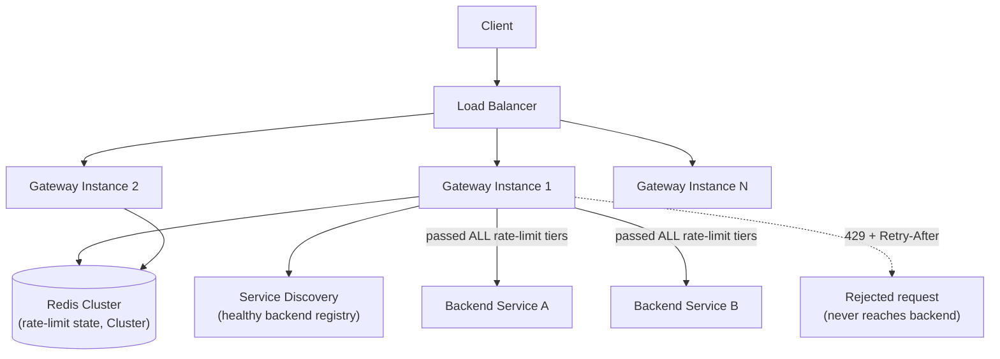
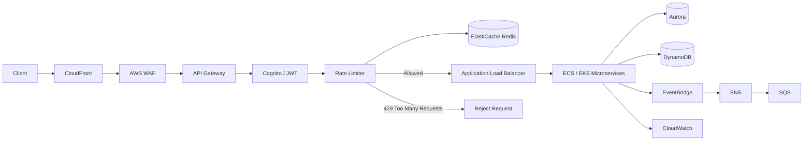
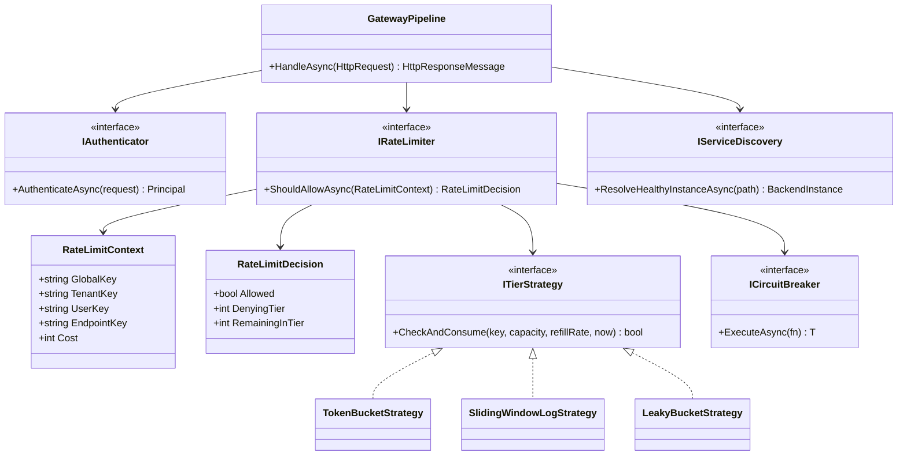
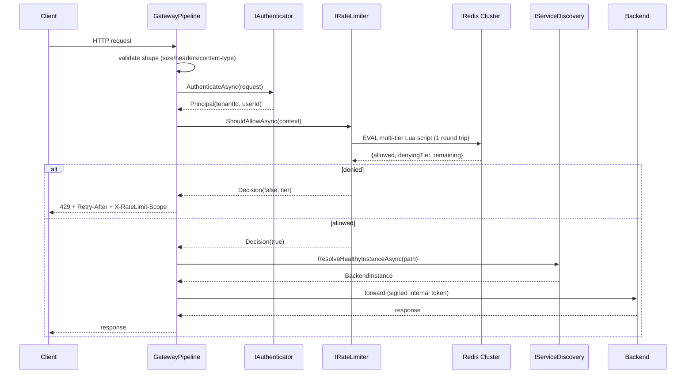

# Module 40 — System Design: Designing a Distributed Rate Limiter & API Gateway

> Domain: System Design | Level: Beginner → Expert | Prerequisite: [[01-System-Design-Fundamentals]], [[../03-REST-APIs/02-API-Security-Rate-Limiting]] (rate-limiting algorithms), [[../01-CSharp/02-Async-Await-Internals]] §Expert Q6 (the original distributed rate limiter introduced early in this course)

---
## 1. Fundamentals

### What is an API Gateway, and why does the rate limiter belong inside it architecturally?
An **API Gateway** is a single, centralized entry point sitting in front of a system's backend services, handling cross-cutting concerns (authentication, rate limiting, request routing, response transformation, observability) **once**, centrally, rather than requiring every individual backend service to reimplement them independently. The rate limiter belongs architecturally inside (or immediately adjacent to) the gateway specifically because §Advanced Q4's "short-circuit before expensive work" principle demands rejecting over-limit requests **before** they consume any backend capacity at all — placing rate limiting deep inside a backend service, after routing/authentication/business-logic have already run, defeats this cost-avoidance purpose entirely.

### Why does this matter?
Because this module is the direct, full-system synthesis of content spread across (the original distributed rate limiter introduced in the very first async-await module), (REST API rate-limiting algorithms and OWASP-adjacent security concerns), and (Redis as the shared, atomic-operation-capable backing store) — recognizing that these three earlier modules' content **is** this system-design problem, not separate, unrelated material, is exactly the kind of cross-module synthesis a Staff/Principal system-design interview specifically rewards.

### When does this matter?
Any system with multiple backend services needing consistent, centrally-enforced cross-cutting policies (rate limiting, authentication, routing); the depth matters for correctly designing the gateway itself as a highly-available, low-latency-overhead component (since **every single request** passes through it, making the gateway's own performance/availability a multiplier on the entire system's), not merely as a thin, assumed-infallible proxy.

### How does it work (30,000-ft view)?
```
Client -> API Gateway [TLS termination, auth, rate limit, routing] -> Backend Service A / B / C
 |
 v
 Redis (shared rate-limit state)
```

---

## 2. Deep Dive

### 2.1 The Gateway as a System, Not a Single Box — Its Own Scaling and Availability Requirements
Because **every** request to the entire system passes through the gateway, it must itself be horizontally scaled (a fleet of gateway instances behind a load balancer) and highly available (a gateway outage is a **total system outage**, regardless of how healthy the backend services behind it are) — this is precisely why the gateway's own rate-limiting state cannot be held in-process (the exact "per-replica in-memory limiting is trivially bypassable across a fleet" concern) and must use Redis (or an equivalent shared store) for genuinely fleet-wide-consistent enforcement.

### 2.2 Rate-Limiting Algorithm Choice, Revisited at Full-System Scale
The algorithm choices (fixed window, sliding window, token bucket, leaky bucket) apply directly here, but at gateway scale, the **atomicity and latency cost of the shared-state check** (the Lua-script-based atomic token bucket) becomes a first-class system-design concern in its own right: every single request now pays this Redis round-trip cost, meaning the rate limiter's own latency contribution to the overall latency budget must be explicitly minimized — a poorly-optimized rate-limiter check (e.g., multiple sequential Redis round-trips instead of one atomic Lua script) directly multiplies latency across literally every request the entire system serves.

### 2.3 Multi-Tier Rate Limiting — Global, Per-Tenant, Per-User, Per-Endpoint, Simultaneously
A production-grade gateway typically enforces **multiple, simultaneous** rate-limit tiers: a global limit (protecting the overall system from aggregate overload), a per-tenant/per-API-key limit (a business/contractual limit, directly §Advanced Q1's contractual-limit design), a per-user limit (preventing one abusive user within a tenant from consuming the tenant's entire allotment), and a per-endpoint limit (some endpoints being far more expensive than others, warranting a stricter individual limit regardless of the caller's overall quota) — each tier requires its **own** Redis key/counter, and a request must pass **all applicable tiers'** checks to proceed, directly the same "AND across independent requirements" logic the authorization-policy evaluation established, now applied to rate-limit tiers instead of authorization requirements.

### 2.4 Routing and Service Discovery — the Gateway's Second Core Responsibility
Beyond rate limiting, the gateway routes incoming requests to the correct backend service based on path/header matching (the Layer-7 routing concept, now at the system's outermost edge rather than within one application's own middleware pipeline) — this requires a **service discovery** mechanism (a registry of currently-healthy backend service instances and their locations, updated as instances scale up/down or fail health checks, the health-check discipline) so the gateway always routes to a genuinely available backend, not a stale or unhealthy one.

### 2.5 The Gateway as a Single Point of Failure — and How to Avoid It Actually Being One
Despite being architecturally "the one entry point," a well-designed gateway is **not** a single point of failure in the availability sense — it's a horizontally-scaled **fleet** behind a load balancer, with no individual gateway instance being uniquely necessary; the actual single-point-of-failure risk shifts to the **shared dependencies** the entire gateway fleet relies on (the Redis cluster backing rate-limit state, the service-discovery registry) — meaning those shared dependencies' own availability design (Redis Sentinel/Cluster HA,/) becomes the actual critical-path availability concern for the whole system, not the gateway "box" itself.

## 3. Visual Architecture

```mermaid
graph TB
 Client --> LB[Load Balancer]
 LB --> GW1[Gateway Instance 1]
 LB --> GW2[Gateway Instance 2]
 LB --> GW3[Gateway Instance N]
 GW1 --> RedisCluster[("Redis Cluster<br/>(rate-limit state, Cluster)")]
 GW2 --> RedisCluster
 GW1 --> ServiceDiscovery["Service Discovery<br/>(healthy backend registry)"]
 GW1 -->|"passed ALL rate-limit tiers"| BackendA[Backend Service A]
 GW1 -->|"passed ALL rate-limit tiers"| BackendB[Backend Service B]
 GW1 -.->|"429 + Retry-After"| RejectedClient["Rejected request<br/>(never reaches backend)"]
```

### 3.1 Concrete AWS Reference Architecture

The generic diagram above names the roles (gateway fleet, shared rate-limit state, service discovery); this subsection pins those roles to a concrete AWS stack, useful for grounding the design in services an interviewer will recognize.


```mermaid
flowchart LR
 Client[Client] --> CloudFront[CloudFront]
 CloudFront --> WAF[AWS WAF]
 WAF --> APIGateway[API Gateway]
 APIGateway --> Auth[Cognito / JWT]
 Auth --> RateLimiter[Rate Limiter]
 RateLimiter --> Redis[(ElastiCache Redis)]
 RateLimiter -->|Allowed| ALB[Application Load Balancer]
 RateLimiter -->|429 Too Many Requests| Reject[Reject Request]
 ALB --> ECS[ECS / EKS Microservices]
 ECS --> Aurora[(Aurora)]
 ECS --> DynamoDB[(DynamoDB)]
 ECS --> EventBridge[EventBridge]
 EventBridge --> SNS[SNS]
 SNS --> SQS[SQS]
 ECS --> CloudWatch[CloudWatch]
```

**Request flow, restated as a linear trace through that stack:**

```
Client
 │
 ▼
CloudFront          -- edge caching, static/semi-static content, absorbs volumetric noise
AWS WAF              -- layer-7 filtering (SQLi/XSS/bot signatures) BEFORE any app logic runs
API Gateway           -- TLS termination, request validation, throttling primitives
Authentication (Cognito/JWT)  -- caller identity resolved here, feeds the rate-limit key
Rate Limiter (ElastiCache Redis) -- the atomic, multi-tier check (§2.3, §3.1 Lua script in §12)
 │
 ┌──────────────┐
 │   Allowed?    │
 └──────┬───────┘
        │ Yes                                   │ No -> 429 + Retry-After, never reaches ALB
        ▼
 Application Load Balancer
        │
 ECS / EKS Services
        │
 Aurora (transactional) / DynamoDB (high-throughput key-value)
        │
 EventBridge -> SNS -> SQS   -- async fan-out for downstream consumers
        │
 CloudWatch                  -- logs, metrics, alarms across every hop above
```

**Mapping AWS services to the generic components:** CloudFront + WAF sit in front of the "Load Balancer" box in the generic diagram, absorbing volumetric/edge-layer load before it ever reaches a gateway instance; API Gateway plus the Rate Limiter/ElastiCache pairing together are the "Gateway Instance" + "Redis Cluster" boxes; ECS/EKS behind the ALB are the backend services the gateway protects; EventBridge/SNS/SQS are how those backends decouple from synchronous request/response once inside the trust boundary. CloudWatch is the observability plane spanning every hop — the practical instantiation of §9's monitoring requirement.

**Why CloudFront + WAF precede the rate limiter, not the other way around:** a volumetric (network-layer) flood must be absorbed at the edge, before it costs a single Redis round-trip — this is the concrete version of the Intermediate-tier "DDoS resilience requires more than application-level rate limiting alone" answer below: WAF/CloudFront are the infrastructure-level layer that answer presupposes.

## 4. Production Example
**Scenario**: A platform's API gateway enforced per-tenant rate limits correctly, but during a major, unexpected traffic spike (a viral marketing event driving a huge surge of legitimate, well-behaved traffic from many different tenants simultaneously, each individually well within their own per-tenant limit), the **aggregate** request volume across all tenants combined overwhelmed the backend services' actual capacity — no individual tenant was "at fault" or exceeding their own limit, but the sum of many tenants' legitimate, within-limit traffic exceeded what the backend fleet could handle, causing widespread latency degradation and errors across the entire platform, affecting even tenants who were sending very little traffic themselves. **Investigation**: confirmed via gateway logs that per-tenant rate limits were all correctly enforced and none were being exceeded — the gap was the **absence of a global, aggregate rate-limit tier** that would have proactively shed excess load (via 429s to some requests) once total system-wide load approached backend capacity, regardless of how that load was distributed across individual tenants. **Fix**: added a global rate-limit tier (checked in addition to, not instead of, the existing per-tenant tiers) sized to the backend fleet's actual measured capacity, with a graceful-degradation policy (§Advanced Q6) shedding load proportionally across tenants once the global limit is approached, rather than allowing unconstrained aggregate growth to overwhelm the backend regardless of per-tenant compliance. **Lesson**: multi-tier rate limiting isn't merely a "more thorough" version of single-tier limiting — the global tier specifically protects against a failure mode (aggregate overload from many individually-compliant sources) that no combination of per-tenant/per-user limits alone can prevent, directly demonstrating why "AND across all applicable tiers" must genuinely include a global tier, not just business-relevant per-tenant/per-user tiers, for the gateway to actually protect the backend's real, finite capacity.
## 10. Interview Questions

### Basic (10)
1. **Q: What is an API Gateway?** **A:** A single, centralized entry point handling cross-cutting concerns (auth, rate limiting, routing) for a system's backend services.
2. **Q: Why does rate limiting belong at the gateway rather than inside individual backend services?** **A:** To reject over-limit requests before they consume any backend capacity, and to enforce the policy once, centrally, rather than duplicating it across every service.
3. **Q: Why can't the gateway's rate-limit state be held in-process per instance?** **A:** Each instance would only see its own slice of traffic, allowing the effective limit to multiply by the number of gateway instances — genuine fleet-wide enforcement requires shared state (Redis).
4. **Q: What are the typical simultaneous rate-limit tiers a gateway enforces?** **A:** Global, per-tenant, per-user, and per-endpoint.
5. **Q: What does service discovery provide to the gateway?** **A:** A registry of currently-healthy backend service instances and their locations, for correct request routing.
6. **Q: Is the gateway a single point of failure?** **A:** Not if correctly designed as a horizontally-scaled, stateless fleet — the actual availability-critical components are its shared dependencies (Redis, service discovery).
7. **Q: Why is minimizing the rate-limit check's latency especially important at the gateway tier?** **A:** Every single request passes through the gateway, so even a small per-request overhead is multiplied across 100% of the system's traffic.
8. **Q: Where should TLS typically be terminated in a gateway architecture?** **A:** At the gateway, centralizing the CPU cost of TLS handshake/decryption at one tier.
9. **Q: What's a global rate-limit tier for, distinct from per-tenant limits?** **A:** Protecting against aggregate overload from many individually-compliant tenants/users combined, which no per-tenant limit alone can prevent.
10. **Q: What HTTP status code and header should a rate-limited request receive?** **A:** 429 Too Many Requests, with a `Retry-After` header.

### Intermediate (10)
1. **Q: Why must a request pass all applicable rate-limit tiers, not just one, to proceed?** **A:** Each tier protects against a different failure mode (one abusive user within a tenant, one tenant exceeding its contractual limit, aggregate system overload) — passing only one tier's check wouldn't protect against the failure modes the other tiers specifically address.
2. **Q: Why does an atomic Lua script matter more at the gateway tier than it might elsewhere?** **A:** The gateway processes the system's entire request volume — any inefficiency (e.g., multiple sequential Redis round-trips instead of one atomic script) is multiplied across every single request, making this optimization disproportionately high-leverage compared to optimizing a less-frequently-exercised code path.
3. **Q: Why did the incident occur despite every individual tenant correctly staying within their own rate limit?** **A:** No global, aggregate tier existed to catch the case where many individually-compliant tenants' combined traffic exceeded backend capacity — per-tenant compliance says nothing about the system-wide aggregate load those compliant tenants collectively generate.
4. **Q: Why should backend services not blindly trust an unauthenticated internal header claiming a request was already authenticated at the gateway?** **A:** A compromised or misconfigured internal network could allow a malicious actor to directly reach a backend service and spoof such a header, bypassing the gateway's authentication entirely — a genuinely secure mechanism (a signed assertion) is needed instead of implicit trust.
5. **Q: Why is the Redis cluster backing the gateway's rate-limit state potentially the single highest-throughput component in the entire system?** **A:** Every request passing through the gateway triggers at least one rate-limit check against Redis — the Redis cluster's request volume is therefore equal to (or a small multiple of, accounting for multiple tiers) the system's total aggregate request rate.
6. **Q: Why might a globally-distributed system use regional gateway deployments rather than one centralized global gateway?** **A:** Routing every request through one, potentially-distant, centralized gateway adds unnecessary latency for geographically-distant users — regional gateways (each with regional Redis backing) keep the gateway hop close to the client, at the cost of needing a strategy for genuinely global (not just regional) rate limits if those are required.
7. **Q: Why doesn't an excellent gateway architecture alone guarantee a scalable overall system?** **A:** The gateway protects backend services from being overwhelmed, but the backend services themselves must still be independently, adequately scaled (the full scaling ladder) — the gateway is a protective/routing layer, not a substitute for backend capacity planning.
8. **Q: Why is caching cacheable GET responses at the gateway tier valuable beyond what a CDN alone provides?** **A:** A CDN typically focuses on static/semi-static assets; gateway-tier caching can serve dynamic-but-cacheable API responses (e.g., a frequently-requested, infrequently-changing resource) without the request reaching any backend service at all, extending the same latency/load benefit to a broader class of content.
9. **Q: Why is DDoS resilience described as requiring more than just application-level rate limiting alone?** **A:** A sufficiently large-scale volumetric attack can overwhelm network/connection capacity before an application-aware rate limiter (which must first accept and process a connection/request to evaluate it) even gets a chance to reject it — genuine DDoS resilience typically requires infrastructure-level protection beneath the application layer.
10. **Q: Why is service discovery necessary in addition to a simple load balancer for gateway-to-backend routing?** **A:** The gateway needs to route to the *correct* backend service (among potentially many different services) based on the request's path/content, and needs awareness of which specific instances of that service are currently healthy — a distinct concern from a load balancer's typically simpler "distribute traffic across replicas of one service" function.

### Advanced (10)
1. **Q: Diagnose the aggregate-overload production incident from first principles, and design the specific capacity-planning process that should have caught this gap before it caused an incident.**
 **A:** Root cause: rate-limiting design that enumerated business-relevant tiers (per-tenant, contractually meaningful) without separately asking "what is the actual, measured capacity of our backend fleet, and do we have a tier protecting against exceeding *that*, independent of how traffic is distributed across tenants?" — these are two different questions requiring two different tiers. Safeguard: require any rate-limiting design to explicitly document both the business-driven tiers (per-tenant contracts) **and** a capacity-driven global tier sized to the backend's actual measured throughput ceiling (from load testing, §Advanced Q7's discipline), with the global tier's absence requiring explicit, documented justification (e.g., "backend capacity is provably always well above any plausible aggregate demand") rather than being silently omitted by default.
2. **Q: Design the specific Lua script and Redis data structure for checking all four rate-limit tiers (global, per-tenant, per-user, per-endpoint) in a single atomic operation, minimizing round-trips.**
 **A:**
 ```lua
 -- KEYS[1..4] = global, tenant, user, endpoint bucket keys; ARGV = capacity/refill params per tier
 local function checkAndConsume(key, capacity, refillRate, now)
 local bucket = redis.call("HMGET", key, "tokens", "lastRefill")
 local tokens = tonumber(bucket[1]) or capacity
 local lastRefill = tonumber(bucket[2]) or now
 tokens = math.min(capacity, tokens + (now - lastRefill) * refillRate)
 if tokens < 1 then return false end
 redis.call("HMSET", key, "tokens", tokens - 1, "lastRefill", now)
 return true
 end

 local now = tonumber(ARGV[1])
 -- Check tiers in order from CHEAPEST-to-fail to most-expensive-to-fail is a common optimization,
 -- but correctness requires ALL must pass -- if any fails, reject without consuming tokens from
 -- tiers already checked (requires either a two-phase check-then-commit, or accepting the tokens
 -- already consumed for passed tiers as a deliberate, small, acceptable inefficiency).
 if not checkAndConsume(KEYS[1], tonumber(ARGV[2]), tonumber(ARGV[3]), now) then return 0 end -- global
 if not checkAndConsume(KEYS[2], tonumber(ARGV[4]), tonumber(ARGV[5]), now) then return 0 end -- tenant
 if not checkAndConsume(KEYS[3], tonumber(ARGV[6]), tonumber(ARGV[7]), now) then return 0 end -- user
 if not checkAndConsume(KEYS[4], tonumber(ARGV[8]), tonumber(ARGV[9]), now) then return 0 end -- endpoint
 return 1
 ```
 Running all four checks within **one** `EVAL` call means the entire multi-tier decision is made in a single Redis round-trip, directly addressing the latency-multiplication concern — the noted trade-off (consuming tokens from earlier-checked tiers even if a later tier ultimately rejects the request) is a deliberate, small, generally-acceptable inefficiency versus the complexity of a true multi-phase check-then-commit-only-if-all-pass protocol.
3. **Q: Explain how you would design the gateway-to-backend trust mechanism (Intermediate Q4) concretely, using a signed internal assertion.**
 **A:** The gateway, having already authenticated the original caller, generates a short-lived, internally-signed token (e.g., a JWT signed with a key only the gateway and backend services share/trust, distinct from any externally-issued token) asserting the verified caller identity/claims, attached as an internal header on the request forwarded to the backend — the backend service verifies this internal signature before trusting the claimed identity, exactly preventing the header-spoofing risk Intermediate Q4 raises, since a request reaching the backend directly (bypassing the gateway) would lack a validly-signed internal assertion and should be rejected by the backend's own verification check as a defense-in-depth measure, not relying solely on network-level "only the gateway can reach backend services" isolation (which is a valuable but not sole line of defense).
4. **Q: Design a strategy for gracefully degrading the global rate-limit tier's threshold dynamically based on real-time backend health signals, rather than a fixed, static limit.**
 **A:** Feed backend health-check/capacity signals (the health-check discipline — e.g., aggregate backend CPU/connection-pool utilization, or simply the backend's own p99 latency trending upward) into a control loop that dynamically adjusts the global tier's token-bucket refill rate downward as backend stress increases and back upward as it recovers — directly §Advanced Q5's adaptive-rate-limiting concept, now specifically applied at the gateway's global tier to proactively shed load in response to *actual observed* backend stress rather than only a fixed, worst-case-provisioned static threshold, trading a more complex control system for more efficient utilization of backend capacity under normal, non-stressed conditions.
5. **Q: Explain how you would test the multi-tier rate limiter's correctness under the specific failure mode (many individually-compliant sources aggregating to overload), before deploying to production.**
 **A:** A load test specifically simulating **many distinct, individually-within-limit tenant/user identities** generating traffic simultaneously (not a single load-generating identity, which would only ever test the per-tenant/per-user tiers, never the aggregate/global tier) — asserting that once aggregate load approaches the configured global-tier threshold, the system begins shedding load (429s) proportionally, protecting backend latency/error rates, rather than allowing unconstrained aggregate growth — directly designed to reproduce and verify the fix for exactly the incident class before it can recur, the same "test the specific failure mode that caused the incident, not just the general feature" discipline recurring throughout this course.
6. **Q: How would you reason about whether the API Gateway should also handle response transformation/aggregation (e.g., calling multiple backend services and combining their results into one response for the client) versus keeping it purely a routing/policy-enforcement layer?**
 **A:** This is the **Backend-for-Frontend (BFF)** pattern question — a gateway handling response aggregation takes on additional responsibility beyond pure cross-cutting-concern enforcement, becoming more like the Facade pattern for the entire backend estate; the trade-off is centralizing aggregation logic conveniently for clients versus growing the gateway's own complexity/blast-radius (a bug in aggregation logic now affects the single, most-critical-path component in the system) — many architectures deliberately keep the core gateway (auth, rate limiting, routing) separate from a distinct BFF layer (aggregation, client-specific response shaping) specifically to keep the highest-availability-criticality component (the gateway) as simple and low-risk as possible, pushing more complex, service-specific logic to a separate tier.
7. **Q: Explain a scenario where the gateway's own rate-limiting logic itself needs to be rate-limited or circuit-broken, and why this isn't a contradictory or unnecessary precaution.**
 **A:** If the Redis cluster backing rate-limit state becomes slow/degraded (not fully unavailable, which would trigger the fail-open/fail-closed decision §Advanced Q8, but simply high-latency), every gateway instance's rate-limit check could itself become a bottleneck, adding significant latency to every request — a circuit breaker around the rate-limiter's own Redis calls (falling back to a simpler, local/degraded rate-limiting mode, or fail-open, once Redis latency exceeds a threshold) prevents the *protective mechanism itself* from becoming the system's primary availability/latency problem — a subtle but real "who watches the watchmen" consideration for any centrally-enforced protective mechanism.
8. **Q: A team proposes eliminating the API Gateway entirely, having each backend service handle its own authentication, rate limiting, and routing independently "for simplicity and to avoid a single point of failure." Evaluate this as a Principal Engineer.**
 **A:** Push back — eliminating the gateway doesn't eliminate the underlying cross-cutting concerns, it **duplicates** them across every backend service (each now needing its own auth/rate-limiting implementation, directly reintroducing the "every team reimplements the same hard-won lesson independently, sometimes incorrectly" risk this course has repeatedly flagged,/,/) — and the "avoid a single point of failure" framing misunderstands the point: a correctly-designed, horizontally-scaled gateway fleet is not a single point of failure at all, while the proposed alternative (many independent implementations) is arguably a *worse* reliability posture, since a security/rate-limiting bug fixed in the gateway once benefits every service immediately, whereas the same bug independently reimplemented in N services requires N separate fixes, each potentially discovered and remediated at different times.
9. **Q: Design a canary/gradual-rollout strategy for deploying a change to the gateway's rate-limiting logic, given that a bug here has system-wide, not service-specific, blast radius.**
 **A:** Given the gateway's uniquely high blast radius (Advanced Q8), deploy rate-limiter logic changes with an especially conservative canary strategy — route a small percentage of gateway instances (or, more granularly, a small percentage of traffic via a feature-flag-gated code path within the existing gateway fleet) to the new logic first, monitoring error rates/latency/throttling-rate metrics closely before progressively increasing the rollout percentage — directly the API-versioning-deprecation gradual-rollout discipline and §Advanced Q9's "climb the scaling/change ladder progressively" principle, now applied specifically to the component whose failure mode is uniquely system-wide rather than scoped to one service.
10. **Q: As a Principal Engineer, how would you structure an organization-wide "gateway feature request" process, given that every backend team will eventually want the gateway to handle some cross-cutting concern specific to their service?**
 **A:** Establish clear criteria for what belongs in the shared, central gateway (genuinely cross-cutting, applicable to many/most services — authentication, standard rate-limiting tiers, TLS termination) versus what belongs in a service-specific layer or the BFF tier (Advanced Q6) instead (business-logic-specific transformations, a single service's unusual authentication variant) — requiring any proposed gateway feature to demonstrate it's genuinely shared/cross-cutting, not a one-off need for a single team's convenience, since the gateway's uniquely high blast radius (Advanced Q8/Q9) makes it a poor place for narrow, single-service-specific logic that would otherwise unnecessarily grow the most critical, hardest-to-safely-change component in the entire system's complexity and risk surface.

### Expert (10)
1. **Q: Design multi-tier rate limiting for a payments gateway specifically, where one tier (the card-network-imposed limit, e.g. Visa/Mastercard's own throttle on a merchant's transaction-authorization rate) is not the gateway's own policy but a constraint imposed by an external, non-negotiable third party. How does this change the design?**
 **A:** A card-network-imposed limit must be enforced **more conservatively than the network's own actual threshold** — the gateway should self-throttle at, say, 90% of the network's documented limit, because *exceeding* a card network's rate ceiling risks the network itself throttling or suspending the merchant's entire processing relationship, a consequence far more severe than an ordinary 429 to one caller. This requires a distinct tier (`network-imposed`) tracked separately from the gateway's own business tiers (global/tenant/user/endpoint), typically enforced with a stricter, more pessimistic algorithm (a leaky bucket smoothing bursts rather than a bursty token bucket) specifically because the cost of over-admission here is contractual/relationship risk with the network, not merely a backend capacity concern — directly extending §2.3's multi-tier logic with a tier whose "AND" condition exists for an entirely different reason (external contractual compliance) than the others (internal capacity/fairness).
2. **Q: A payments API's rate limiter must distinguish between a legitimate retry of a failed payment authorization (which should NOT count against the caller's rate limit, or should count differently) and a genuinely new request. Design this.**
 **A:** Attach the **idempotency key** (already required for the payment API's own correctness, per this course's recurring exactly-once pattern) to the rate-limit accounting decision: a request presenting an idempotency key matching a prior request within its dedup window is recognized as a retry-of-the-same-logical-operation and should either not consume a new rate-limit token at all, or consume from a separate, more generous "retry" allowance — distinct from a request with a new idempotency key, which is genuinely new work and consumes normally. Getting this wrong in either direction is a real production risk: charging full rate-limit cost for legitimate retries (during a transient backend blip, exactly when retries spike) can cascade a backend hiccup into a client-visible rate-limit outage, the worst possible time for the limiter to become the bottleneck.
3. **Q: Design the rate limiter's behavior specifically for webhook delivery TO external parties (the gateway is now the caller, not the callee) — e.g., notifying a merchant's webhook endpoint of a payment status change. How does this differ from inbound rate limiting?**
 **A:** Outbound webhook delivery must respect the **receiving party's** stated or observed rate limits (many merchant webhook endpoints are modest servers that cannot absorb an unthrottled burst) — this inverts the whole problem: instead of protecting your own backend from callers, you're protecting the external callee from your own system, requiring a per-destination outbound rate limiter (often paired with exponential backoff and a dead-letter queue for destinations that are persistently failing/throttling) rather than the per-caller inbound tiers this module otherwise designs around — a genuinely distinct control plane, frequently missed because "rate limiting" defaults to meaning "protect me from you" rather than "protect you from me."
4. **Q: Your gateway's rate limiter uses a sliding-window-log algorithm for maximum accuracy on a compliance-sensitive endpoint (e.g., a KYC/AML screening API with a strict, audited per-minute cap mandated by a regulator). Justify this choice over a cheaper token bucket, and state the cost.**
 **A:** A regulator-mandated cap is a **contractual/legal tier**, not a fairness/capacity tier (Expert Q1's distinction) — a token-bucket's burst tolerance (allowing short bursts above the nominal rate as long as the average holds) is precisely the behavior a strict regulatory cap cannot tolerate, since "we briefly exceeded the mandated limit but stayed within average" is not a defensible compliance posture. The sliding-window-log (storing every individual request timestamp within the window and counting exactly) provides exact enforcement with no burst tolerance, at the real cost of O(window size) memory per key instead of O(1) — an explicit, justified trade of memory/complexity for auditable exactness, applied *only* to the specific endpoint carrying that regulatory requirement, not uniformly across the gateway (uniform application would pay this cost everywhere for a guarantee only one endpoint actually needs).
5. **Q: Design how the gateway's rate limiter should behave during a declared disaster-recovery failover (traffic cutting over from a failed primary region to a standby region), where the standby region's Redis Cluster starts with cold, empty rate-limit state.**
 **A:** A cold-started limiter with no memory of the primary region's recent consumption will, if naively enforced, effectively **reset every caller's quota** at failover — for the abuse-prevention tiers this is a minor, acceptable side effect (§Advanced Q4's ±5% approximate-accuracy tolerance already accepts this class of imprecision), but for contractual/regulatory tiers (Expert Q1, Q4) a reset quota could allow a caller to exceed their true entitlement for the remainder of the window. The correct design: on failover, contractual tiers should **conservatively assume near-full prior consumption** (fail toward the stricter interpretation) until enough of the window has elapsed that the risk of exceeding the true entitlement has passed, while abuse tiers can safely reset — again the "different tiers, different failure posture" principle (§Advanced Q8's fail-open/fail-closed decision), now applied specifically to the DR-failover cold-start scenario rather than an ordinary Redis outage.
6. **Q: A merchant integrating with your payments gateway complains their legitimate traffic is being rate-limited during a flash sale, while your system correctly protected itself from what looked identical to an abuse pattern from a different, actually-malicious caller. How do you design around this false-positive cost, specifically for a business-critical caller?**
 **A:** This is fundamentally a **cost-of-false-positive** problem, not a purely technical one — for a known, contractually significant merchant, the gateway should support a pre-negotiated, elevated limit tier (an explicit "flash sale" quota increase requested and provisioned ahead of a known traffic event, via the policy/control-plane mechanism), rather than relying solely on the standard tiers to correctly distinguish "legitimate flash-sale burst" from "abuse pattern" after the fact — because at the moment of the burst, the two are frequently statistically indistinguishable from request-rate shape alone. The broader principle: rate limiting is a blunt, statistical control; genuinely important, predictable traffic spikes should be handled by **advance capacity negotiation**, not asked of the limiter to solve through cleverer real-time heuristics alone.
7. **Q: Design a specific mechanism preventing a compromised or buggy backend service from itself becoming a source of cascading failure back through the gateway — e.g., a backend that starts responding successfully but extremely slowly, causing gateway-side connection/thread exhaustion despite the rate limiter admitting only "allowed" traffic.**
 **A:** This is precisely why rate limiting alone is insufficient at the gateway — a slow-but-technically-successful backend passes every rate-limit check (the caller is within their quota) while still exhausting the gateway's own finite connection pool to that backend, per-route. The fix is a **bulkhead**: a dedicated, capped connection pool and concurrency limit per backend route, so a degraded backend's slowness saturates only its own pool, not the gateway's shared resources — a slow backend then produces fast, clean `503`s (pool exhausted) rather than the gateway itself becoming unresponsive to every route, including healthy ones. This is the gateway-tier instance of the same bulkhead discipline the portfolio-risk-engine module applies at the grid-worker-pool level: an admitted, individually-compliant request can still be the vector for a resource-exhaustion failure the rate limiter, by design, cannot see.
8. **Q: Compare enforcing rate limits with a centralized Redis-backed limiter versus a fully decentralized approach (e.g., Envoy's local rate limiting with periodic global sync, or CRDT-based counters) for a gateway operating across three geographic regions with a shared global tenant quota. What does the CRDT alternative actually buy, and at what cost?**
 **A:** A CRDT-based counter (e.g., a PN-counter) allows each region to increment its local replica of a tenant's usage count independently, without a synchronous cross-region round-trip per request, then merges counts eventually/asynchronously across regions — trading the centralized design's cross-region latency (a request in one region blocking on a Redis round-trip to another region's authoritative store) for **temporary global over-admission**: for a period bounded by the CRDT's merge/propagation interval, the true global count can exceed the configured limit by up to the sum of what each region admitted independently before the last sync. This is the same fundamental trade-off Module 04 (CRDTs) established generally — availability/low-latency now, versus a bounded, eventually-corrected consistency error — here applied specifically to a rate limiter, where the "error" is over-admission rather than a merge conflict; acceptable for abuse tiers, generally unacceptable for the contractual/regulatory tiers Expert Q1/Q4 describe, again the recurring "different tiers tolerate different consistency models" answer.
9. **Q: As a Principal Engineer, a cost-optimization initiative proposes downsizing the Redis Cluster backing the rate limiter to save infrastructure spend, based on average utilization being well under capacity. Evaluate this proposal.**
 **A:** Average utilization is the wrong metric for a component whose failure mode under-capacity is a full-system, all-traffic latency/availability event (§2.1, §2.5) — the correct sizing metric is **peak, not average**, with headroom specifically for the aggregate-overload failure mode (§4's incident) and for straggler/hot-shard behavior from a single very-high-traffic tenant. Push back on the proposal by reframing it in terms the cost-optimization initiative itself should care about: the Redis Cluster's infrastructure cost is a rounding error relative to the revenue-at-risk from a gateway-wide outage caused by under-provisioning the one shared dependency every request passes through — the same "cost of the safeguard vs. cost of what it prevents" framing a Principal Engineer should apply to any proposal to shrink a component whose failure mode is total-system, not partial.
10. **Q: Design an end-to-end synthetic monitoring strategy that would detect a regression of §4's aggregate-overload incident class proactively, in production, continuously — not just via the load test designed in Advanced Q5.**
 **A:** Run a continuous, low-volume synthetic-canary workload simulating **many distinct, low-individual-volume tenant identities** (not one canary identity, which only exercises per-tenant tiers) generating traffic at a rate calibrated to sit just below the configured global tier's threshold, and alert if actual production aggregate load combined with the canary's traffic ever approaches the global limit without a corresponding rise in `429` responses — the specific signal that would indicate the global tier is either misconfigured, disabled, or was silently removed in a deploy (the exact class of regression, since the failure mode is the *absence* of a control, which produces no natural error signal on its own, only an absence of an expected one). Pair this with the rising `503`:`429` ratio metric from Module 40 §12 Step 4 as a second, independent leading indicator that limits are set above the capacity they're meant to protect.

---

## 11. Coding Exercises

*(System design case studies use worked design exercises, consistent with this domain's format.)*

### Easy — Capacity estimation for the gateway's Redis rate-limit backing store
**Problem**: Estimate Redis operations/sec needed if the gateway serves 50,000 requests/sec system-wide, with 4 rate-limit tiers checked per request via one atomic Lua script.
**Solution**:
```
Redis EVAL calls/sec: 50,000 (ONE atomic script call per request, regardless of tier COUNT within it,
 per the Advanced Q2 single-round-trip design)
Internal Redis operations within each EVAL (4 tiers * ~2 ops each): ~8 internal ops * 50,000/sec
 = 400,000 internal Redis ops/sec -- well within a well-provisioned
 Redis Cluster's capacity, but a number worth
 explicitly stating to justify the Cluster-sharding decision.
```

### Medium — Multi-tier rate-limit configuration schema
```csharp
public record RateLimitTier(string Name, int Capacity, double RefillRatePerSecond);

public class MultiTierRateLimitConfig
{
    public RateLimitTier Global { get; init; } = new("global", 50_000, 45_000 / 1.0); // the fix
    public Dictionary<string, RateLimitTier> PerTenant { get; init; } = new; // contractual limits
    public RateLimitTier PerUserDefault { get; init; } = new("user-default", 100, 100 / 60.0);
    public Dictionary<string, RateLimitTier> PerEndpoint { get; init; } = new; // e.g., stricter for /reports
}
```

### Hard — Circuit breaker around the rate limiter's own Redis dependency (Advanced Q7)
```csharp
public class ResilientRateLimiter
{
    private readonly IDistributedRateLimiter _redisLimiter;
    private readonly CircuitBreaker _circuitBreaker; // e.g., Polly's CircuitBreakerPolicy

    public async Task<bool> ShouldAllowAsync(string key)
    {
        try
        {
            return await _circuitBreaker.ExecuteAsync(=> _redisLimiter.CheckAsync(key));
        }
        catch (BrokenCircuitException)
        {
            // Redis is degraded/unavailable -- FAIL OPEN for this gateway, per the deliberate
            // documented choice §Advanced Q8 (most APIs prefer availability
            // over strict enforcement during a rate-limiter-infrastructure outage).
            _logger.LogWarning("Rate limiter circuit OPEN -- failing open for key {Key}", key);
            return true;
        }
    }
}
```

### Expert — Full gateway request pipeline synthesizing every tier and concern from this module
```csharp
public class GatewayPipeline
{
    public async Task<HttpResponseMessage> HandleAsync(HttpRequest request)
    {
        // 1. Reject malformed/oversized requests EARLIEST
        if (!IsValidRequestShape(request)) return Reject(400);

        // 2. Authenticate -- establishes caller identity for subsequent tiers
        var principal = await _authenticator.AuthenticateAsync(request);
        if (principal is null) return Reject(401);

        // 3. Multi-tier rate limiting, ALL must pass (Advanced Q2's single atomic check)
        string tenantId = principal.GetTenantId;
        bool allowed = await _rateLimiter.ShouldAllowAsync(
            globalKey: "global", tenantKey: $"tenant:{tenantId}",
                userKey: $"user:{principal.UserId}", endpointKey: $"endpoint:{request.Path}");
        if (!allowed) return Reject(429, retryAfter: "60");

        // 4. Route to the correct, healthy backend
        var backend = await _serviceDiscovery.ResolveHealthyInstanceAsync(request.Path);
        if (backend is null) return Reject(503);

        // 5. Attach signed internal trust assertion (Advanced Q3) and forward
        var internalToken = _internalTokenSigner.Sign(principal);
        return await _httpClient.ForwardAsync(backend, request, internalToken);
    }
}
```
**Discussion**: The explicit, numbered ordering here is itself the key design artifact — directly mirroring the middleware-ordering discipline (validation/rejection as early and cheap as possible, expensive operations gated behind cheaper checks) now expressed at the full-system-gateway level, synthesizing input validation, authentication, multi-tier rate limiting (this module's core topic), service discovery, and secure internal trust propagation (Advanced Q3) into one cohesive, correctly-sequenced pipeline.

---

## 12. System Design — Designing an API Gateway with Multi-Tier Rate Limiting

*Authored to the four-step standard (see Module 01 §12 for the method). For the limiter **algorithms** themselves — fixed/sliding window, token bucket, GCRA, and their distributed-correctness proofs — see Module 15; this section designs the **system** that runs them.*

---

### Step 1 — Understand the Problem and Establish Design Scope

#### The dialogue

> **C:** What is the gateway responsible for? "API gateway" covers everything from a reverse proxy to a full service mesh ingress.
> **I:** TLS termination, authentication, rate limiting, routing to backends, and request/response observability. No protocol translation, no response aggregation.
>
> **C:** Is this multi-tenant — do we have paying customers with contractual limits?
> **I:** Yes. Tenants have plan-based quotas that appear in a contract.
>
> **C:** So limits are a billing artefact, not just an abuse control. Do we need per-user limits inside a tenant too?
> **I:** Yes — one bad integration inside a tenant shouldn't consume the tenant's whole quota.
>
> **C:** And per-endpoint? Some endpoints are far more expensive than others.
> **I:** Yes.
>
> **C:** Scale?
> **I:** 50,000 requests/sec peak across roughly 5,000 tenants and 200 backend services.
>
> **C:** What latency budget does the gateway get? It's on every request, so its overhead multiplies.
> **I:** Under 5 ms at p99 for the gateway's own processing, excluding the backend call.
>
> **C:** When the rate-limit store is unavailable, do we fail open or fail closed?
> **I:** Good question — that's part of what I want you to design.
>
> **C:** Last one: are limits enforced globally across the fleet, or is approximate per-instance enforcement acceptable?
> **I:** Contractual limits must be fleet-accurate. Abuse limits can be approximate.

That last exchange is the hinge. **"Contractual" and "abuse" limits have different correctness requirements**, and recognising that lets you use a cheap approximate mechanism for the high-volume case and an exact one only where money is involved — which is what makes the 5 ms budget achievable.

#### Functional requirements

1. Terminate TLS; authenticate the caller (API key, JWT, or mTLS) and resolve tenant/user identity.
2. Enforce four simultaneous limit tiers: global, per-tenant, per-user, per-endpoint. A request must pass **all** applicable tiers.
3. Route to the correct backend using service discovery over healthy instances only.
4. Return `429` with `Retry-After` and `X-RateLimit-*` headers on rejection.
5. Emit per-request telemetry (latency, status, tenant, route) without adding meaningful latency.
6. Support runtime policy changes (a plan upgrade takes effect in seconds, not at next deploy).

#### Non-functional requirements

| Requirement | Target |
|---|---|
| Gateway added latency | p99 < 5 ms, p50 < 1 ms |
| Throughput | 50,000 req/s peak, headroom to 100,000 |
| Availability | **99.99%** — the gateway's availability is the ceiling on every backend's |
| Limit accuracy — contractual | Exact within a window; over-admission is a revenue leak, under-admission is a customer complaint |
| Limit accuracy — abuse | ±5% acceptable |
| Policy propagation | < 10 s from admin change to fleet-wide effect |
| Failure mode | Explicitly chosen per tier, not accidental |

#### Back-of-the-envelope estimation

The estimation here is about **latency budget**, not capacity — and that inversion is itself the insight.

```
Peak throughput            = 50,000 req/s
Gateway instances (4 vCPU, ~5,000 req/s each, TLS-heavy)
                           = 50,000 ÷ 5,000        = 10 instances
                           + N+2 redundancy + AZ spread ≈ 15 instances
```

Now the part that decides the design:

```
Latency budget                                       = 5 ms  (p99)
  TLS handshake (amortised over keep-alive)          ≈ 0.1 ms
  Auth: JWT verify (cached JWKS, no network)         ≈ 0.2 ms
  Routing + service discovery (in-memory table)      ≈ 0.05 ms
  Telemetry (async, off the hot path)                ≈ 0
  Remaining for rate limiting                        ≈ 4 ms

Redis round trip within an AZ                        ≈ 0.4–0.8 ms (p99 higher: ~2 ms)
Four tiers × one round trip each                     = 4 × 2 ms = 8 ms  ← BLOWS THE BUDGET
Four tiers in ONE Lua script                         = 1 × 2 ms = 2 ms  ← fits
```

State size:

```
Tenants 5,000 × endpoints 200 × window keys ~2   ≈ 2,000,000 keys
Per key ≈ 100 B                                  ≈ 200 MB   ← trivially fits in Redis
```

#### What the numbers tell us

1. **Capacity is a non-issue.** Fifteen instances. Anyone who spends the round designing gateway autoscaling has missed the problem.
2. **The design is entirely determined by the latency budget**, and specifically by the arithmetic above: the naive implementation — one Redis call per tier — is **four times over budget**, and the fix (one atomic script evaluating all tiers) is therefore not an optimisation but a requirement. This is the sentence the whole design turns on.
3. **200 MB of state means the limiter's data can live anywhere** — including replicated into each gateway's memory, which opens the door to the local-lease design in §3.2 that removes the Redis hop from the common path entirely.

The hard problem is **paying for fleet-accurate enforcement without paying a network round trip per tier per request** — plus the failure §4 exposes, that per-tenant limits are structurally blind to aggregate backend capacity.

---

### Step 2 — Propose High-Level Design and Get Buy-In

#### Two planes, and keeping them separate

- **Data plane** — the request path. Must be fast, must not block on anything it can avoid, and must degrade rather than fail.
- **Control plane** — policy definition, tenant plans, route configuration, discovery. Slow, transactional, and **never on the request path**. A control-plane outage must not stop traffic; it must only freeze policy changes.

Conflating these is the most common architectural error in gateway design, and stating the split up front is worth real credit.

#### Components

**Edge load balancer (L4 or cloud NLB).** Distributes to gateway instances. Deliberately dumb — the intelligence is one layer in.

**Gateway instances (data plane).** Stateless. Pipeline: TLS → auth → identity resolution → **rate limit** → route → proxy → telemetry.

**Limiter.** A local token-lease cache plus a Redis-backed authority (§3.2).

**Policy Store (control plane).** Tenant plans, per-endpoint costs, tier definitions. PostgreSQL, published to gateways via a watch/stream.

**Service Registry.** Healthy backend instances per route. Consul/Envoy xDS/cloud service discovery, cached in-memory on each gateway with a health-aware refresh.

**Redis Cluster.** The shared limiter state. Sharded by limit key so tiers spread across nodes.

**Telemetry pipeline.** Async, buffered, lossy-by-design — telemetry must never apply backpressure to the request path.

#### End-to-end walkthrough — one request

1. Client connects; edge LB routes to a gateway instance; TLS terminates (session resumption keeps the handshake amortised).
2. Gateway extracts credentials. JWT is verified against a **cached JWKS** — never a network call per request.
3. Identity resolves to `(tenant_id, user_id, plan_id)`, cached locally with a short TTL.
4. Route match on path/method produces `(service, endpoint_id, cost_weight)`. Endpoints have **weights**, so an expensive search endpoint consumes 10 tokens while a cheap lookup consumes 1 — a single mechanism that replaces a proliferation of per-endpoint limits.
5. **One limiter call evaluates all four tiers atomically** and returns allow/deny plus remaining quota per tier.
6. Denied → `429` with `Retry-After`, `X-RateLimit-Limit/Remaining/Reset`, and the **tier that rejected** named in the body. Telling the caller *which* limit they hit is what turns a support ticket into a self-service fix.
7. Allowed → select a healthy backend instance (least-request, from the in-memory registry), proxy with a per-route timeout and retry budget.
8. Response streams back; telemetry is emitted asynchronously.

#### API design

**The proxied request** carries no gateway-specific input, but the response contract matters:

| Header | Example | Notes |
|---|---|---|
| `X-RateLimit-Limit` | `1000` | The binding tier's limit |
| `X-RateLimit-Remaining` | `847` | |
| `X-RateLimit-Reset` | `1723200000` | Unix seconds |
| `Retry-After` | `12` | On `429` only; the single most useful header for well-behaved clients |
| `X-RateLimit-Scope` | `tenant` | Which tier bound — `global`\|`tenant`\|`user`\|`endpoint` |

**Control-plane API — `PUT /admin/v1/policies/{tenant_id}`**

| Field | Type | Description |
|---|---|---|
| `plan_id` | string | Named plan the tenant is on |
| `overrides` | object[] | `{ tier, scope_id, limit, window_seconds, burst }` |
| `enforcement` | enum | `ENFORCE` \| `SHADOW` — shadow mode counts and reports but never rejects |
| `effective_from` | RFC3339 | |

`SHADOW` is worth calling out unprompted: **you never turn on a new limit in enforce mode.** You run it in shadow, look at how many requests *would* have been rejected, and only then enforce. Every limit rollout that skipped this step is an incident.

**`GET /admin/v1/policies/{tenant_id}/usage`** — current consumption per tier, for support and for the customer's own dashboard.

#### Data model

**`plan`** (PostgreSQL) — `plan_id`, `name`, and per-tier defaults.

**`policy`** — `policy_id`, `tenant_id`, `tier`, `scope_id` (nullable — null means all), `limit`, `window_seconds`, `burst`, `enforcement`, `effective_from`, `version`.

**`endpoint`** — `endpoint_id`, `service`, `method`, `path_pattern`, `cost_weight`, `default_limit`.

**Redis key schema** — the part that is actually load-bearing:

```
rl:g:{window}                        global
rl:t:{tenant_id}:{window}            per-tenant
rl:u:{tenant_id}:{user_id}:{window}  per-user
rl:e:{tenant_id}:{endpoint_id}:{w}   per-endpoint
```

All four keys for a request are hashed to the **same Redis slot** using a hash tag on `tenant_id` — `rl:{...}` — so one Lua script can touch all of them atomically. Without co-location, a cluster-mode Redis rejects the multi-key script outright, and this is the detail that separates a design that works from one that only works on a single node.

#### Store selection, and why

| Store | Choice | Reason |
|---|---|---|
| Limiter state | **Redis Cluster** | Needs atomic read-modify-write with sub-ms latency and TTL semantics. Lua gives atomicity across the four tiers in one round trip — the requirement the estimation derived |
| Policy | **PostgreSQL** | Small, relational, transactional, audited. Read once and cached; never on the hot path |
| Discovery | **In-memory, fed by xDS/Consul** | A network call per request to a registry would blow the budget by itself |
| Telemetry | **Kafka → columnar store** | Async, high volume, analytical access |

The decision worth defending: **limiter state is not durable and should not be.** If Redis loses its state, the worst case is one window of over-admission. Choosing a durable store for it would trade the latency budget for a guarantee nobody needs — and §3.4 makes the failure behaviour explicit rather than accidental.

---

### Step 3 — Design Deep Dive

#### 3.1 All tiers in one atomic operation

```lua
-- KEYS: global, tenant, user, endpoint (co-located by hash tag)
-- ARGV: now_ms, cost, then {limit, window_ms, burst} per tier
for i = 1, 4 do
  local limit  = tonumber(ARGV[3 + (i-1)*3])
  if limit > 0 then
    local used = tonumber(redis.call('GET', KEYS[i]) or '0')
    if used + cost > limit then
      return {0, i, limit - used}      -- denied, and BY WHICH TIER
    end
  end
end
for i = 1, 4 do
  if tonumber(ARGV[3 + (i-1)*3]) > 0 then
    redis.call('INCRBY', KEYS[i], cost)
    redis.call('PEXPIRE', KEYS[i], tonumber(ARGV[4 + (i-1)*3]))
  end
end
return {1, 0, 0}
```

Two properties make this correct rather than merely fast. It is **check-all-then-commit-all**: a request that fails tier 3 must not have consumed tiers 1 and 2, or a heavily-rejected tenant would silently burn the global budget. And it returns **which tier denied**, which is what populates `X-RateLimit-Scope` and makes the system debuggable from the client side.

(The algorithm shown is a counter for brevity; Module 15 derives why a sliding-window-log or GCRA is preferable and what each costs.)

#### 3.2 Removing the round trip: local leases

Even 2 ms × 50,000 req/s is 100 CPU-seconds/s of waiting and a hard dependency on Redis for every request. The refinement is **batched leases**: a gateway instance atomically claims a block of tokens from Redis (say 100), spends them locally, and re-claims when low.

| | Per-request Redis | Local leases |
|---|---|---|
| Redis ops/s at 50k req/s | 50,000 | ~500 |
| Added p99 latency | ~2 ms | ~0.01 ms (amortised) |
| Accuracy | Exact | Over-admits by up to `lease_size × instances` at a window boundary |
| Redis outage behaviour | Every request affected | Requests continue until leases exhaust |

The over-admission is bounded and computable: 15 instances × 100 tokens = 1,500 requests worst case. For an abuse limit of 100,000/hour, that is 1.5% — inside the stated ±5%. For a **contractual** limit it may not be acceptable, which is exactly why the dialogue's last question mattered.

**Recommendation: leases for global/abuse tiers with lease size scaled to the limit; exact per-request evaluation for contractual tenant tiers.** Hybrid, justified by the requirement rather than uniform for tidiness. And the lease size must shrink as remaining quota shrinks — a tenant with 200 requests left must not have 15 instances each holding 100.

#### 3.3 The gap §4 exposed: nobody is limiting the *backend*

Every per-tenant limit can be satisfied while the sum across tenants destroys the backend. Per-tenant limiting is a **fairness and billing** mechanism; it is structurally incapable of protecting capacity, because it has no knowledge of capacity. The fix is a second, orthogonal control:

- **Concurrency limiting, not rate limiting, at the backend boundary.** Rate is the wrong unit — what saturates a backend is in-flight work. Cap in-flight requests per backend service and use an adaptive algorithm (AIMD or gradient, à la Netflix's concurrency-limits) that discovers the ceiling from observed latency rather than from a configured number that will be wrong within a quarter.
- **Load shedding by priority when the cap binds.** Shed in a stated order: free tier → batch/async endpoints → interactive reads → writes. Never shed uniformly; uniform shedding means your most valuable traffic fails at the same rate as your least.
- **Queue with a deadline, not an unbounded buffer.** A request that has already waited past its client's timeout should be dropped, not served — serving it burns capacity for a response nobody will read.

Naming this as *a different control with a different unit* rather than "tune the tenant limits down" is the Staff-level answer, and it is what §4's team actually lacked.

#### 3.4 Failure modes, chosen deliberately

| Failure | Naive behaviour | Designed behaviour |
|---|---|---|
| Redis unavailable | Every request errors, or every request passes | **Per tier**: abuse tiers fail *open* on local leases and last-known limits; contractual tiers fail *open* with a counted, alerted "unenforced" flag — because rejecting paying customers is worse than a brief over-admission. The count is what makes it a decision instead of a leak |
| Policy store unavailable | Gateway can't start / can't route | Gateway serves **last-known-good policy from local cache indefinitely**; only *changes* stall. Startup must be able to boot from cached policy, or a control-plane outage becomes a total outage on the next deploy |
| Service registry stale | Routes to dead instances | Health-check-driven passive eviction on connection failure, plus outlier detection; a route with zero healthy instances returns `503` fast rather than hanging |
| One backend slow | Threads/connections pile up, gateway degrades for *all* routes | **Per-route connection pools and concurrency caps** — bulkheads. Without them, one slow backend takes down the gateway and therefore every other backend |
| Gateway instance dies | Connections dropped | Stateless; LB removes it; clients retry. A non-event *because* nothing per-request lives in gateway memory |

The bulkhead row deserves emphasis: the most common real gateway outage is not the gateway failing but **one slow dependency consuming a shared resource pool**, which is Module 01 §3.4's cache-pool lesson at a different layer.

#### 3.5 Policy propagation without a hot-path lookup

Policy changes must take effect in under 10 seconds without the gateway reading Postgres per request. Mechanism: the control plane writes a versioned policy snapshot; gateways subscribe to a change stream (or long-poll a version endpoint); on change they fetch the delta and swap an immutable in-memory map. Swapping an immutable map means the request path never takes a lock, which matters at 50,000 req/s.

Two safeguards worth stating: **version every snapshot and expose the active version per instance**, so a partially-propagated fleet is visible rather than mysterious; and **validate before swap**, because a malformed policy that all 15 instances accept simultaneously is a fleet-wide outage delivered in under 10 seconds — the propagation speed you built is also the blast radius you built.

---

### Step 4 — Wrap-Up

**What we left out:** authentication protocol depth (Modules 40, 41); request/response transformation and API versioning; WebSocket and gRPC proxying, which break the request/response assumptions here; multi-region gateways and the question of whether limits are per-region or global (they cannot be both cheap and global); caching at the gateway; canary routing and traffic shifting; and WAF/bot management, which is an adjacent but genuinely different problem.

**What we would measure:** gateway added latency p50/p99 **as its own metric**, separated from backend time, because a blended number hides the gateway entirely; `429` rate by tier and tenant, with **shadow-mode counters** for unenforced policies; limiter store latency and error rate; lease over-admission estimate; per-route backend concurrency versus its adaptive cap; policy version distribution across the fleet; and — the one people forget — **the ratio of `429`s to `503`s**, because a healthy system rejects deliberately at the gateway rather than collapsing at the backend, and a rising `503`:`429` ratio means the limits are set above the capacity they are supposed to protect.

**Summary.** Fifteen stateless instances, four limit tiers evaluated in one atomic script, leases where approximation is acceptable and exact evaluation where money is involved, an orthogonal adaptive **concurrency** control at the backend boundary because rate limiting cannot see capacity, per-route bulkheads, and a control plane that is never on the request path. The estimation is what forces it: the naive four-round-trip design is four times over a 5 ms budget, and that single arithmetic result determines nearly every decision downstream.

---

### References

1. Alex Xu — *System Design Interview Vol. 1*, ch. 4 "Design a Rate Limiter".
2. Netflix — *Performance Under Load: Adaptive Concurrency Limits* (the AIMD/gradient approach in §3.3).
3. Stripe Engineering — *Scaling your API with rate limiters* (tiered limits and the load-shedder distinction).
4. Envoy Proxy docs — global rate limiting service, circuit breaking, outlier detection, and xDS for config propagation.
5. Redis docs — Lua scripting atomicity, cluster hash tags (the key co-location requirement in §2).
6. IETF draft — *RateLimit header fields for HTTP* (`RateLimit-Limit`/`Remaining`/`Reset`).
7. Google SRE Book, ch. 21 *Handling Overload* and ch. 22 *Addressing Cascading Failures* — the shedding and bulkhead arguments.
8. Kong / AWS API Gateway quota documentation — real-world tier semantics and their stated accuracy caveats.
9. Module 15 of this folder — the limiter algorithms themselves, including GCRA and distributed-correctness proofs.

---

## 13. Low-Level Design

**Requirements tied to §12's design:** the pipeline must reject cheap, obviously-invalid requests before spending any expensive check; the multi-tier limiter must evaluate all four tiers atomically in one round trip; tiers must be independently configurable (a new tier, or a change to one tier's algorithm, must not require touching the others); and the failure-mode policy (fail open/closed) must be pluggable per tier, not hard-coded.

**Class diagram:**

```mermaid
classDiagram
    class GatewayPipeline {
        +HandleAsync(HttpRequest) HttpResponseMessage
    }
    class IAuthenticator {
        <<interface>>
        +AuthenticateAsync(request) Principal
    }
    class IRateLimiter {
        <<interface>>
        +ShouldAllowAsync(RateLimitContext) RateLimitDecision
    }
    class RateLimitContext {
        +string GlobalKey
        +string TenantKey
        +string UserKey
        +string EndpointKey
        +int Cost
    }
    class RateLimitDecision {
        +bool Allowed
        +int DenyingTier
        +int RemainingInTier
    }
    class ITierStrategy {
        <<interface>>
        +CheckAndConsume(key, capacity, refillRate, now) bool
    }
    class TokenBucketStrategy
    class SlidingWindowLogStrategy
    class LeakyBucketStrategy
    class IServiceDiscovery {
        <<interface>>
        +ResolveHealthyInstanceAsync(path) BackendInstance
    }
    class ICircuitBreaker {
        <<interface>>
        +ExecuteAsync(fn) T
    }

    GatewayPipeline --> IAuthenticator
    GatewayPipeline --> IRateLimiter
    GatewayPipeline --> IServiceDiscovery
    IRateLimiter --> RateLimitContext
    IRateLimiter --> RateLimitDecision
    IRateLimiter --> ITierStrategy
    ITierStrategy <|.. TokenBucketStrategy
    ITierStrategy <|.. SlidingWindowLogStrategy
    ITierStrategy <|.. LeakyBucketStrategy
    IRateLimiter --> ICircuitBreaker
```

**Sequence diagram — one request through the pipeline (mirrors §11's "Expert" exercise and §12 Step 2's numbered walkthrough):**

```mermaid
sequenceDiagram
    participant C as Client
    participant GW as GatewayPipeline
    participant Auth as IAuthenticator
    participant RL as IRateLimiter
    participant Redis as Redis Cluster
    participant SD as IServiceDiscovery
    participant BE as Backend

    C->>GW: HTTP request
    GW->>GW: validate shape (size/headers/content-type)
    GW->>Auth: AuthenticateAsync(request)
    Auth-->>GW: Principal(tenantId, userId)
    GW->>RL: ShouldAllowAsync(context)
    RL->>Redis: EVAL multi-tier Lua script (1 round trip)
    Redis-->>RL: {allowed, denyingTier, remaining}
    alt denied
        RL-->>GW: Decision(false, tier)
        GW-->>C: 429 + Retry-After + X-RateLimit-Scope
    else allowed
        RL-->>GW: Decision(true)
        GW->>SD: ResolveHealthyInstanceAsync(path)
        SD-->>GW: BackendInstance
        GW->>BE: forward (signed internal token)
        BE-->>GW: response
        GW-->>C: response
    end
```

**Design patterns used:** **Strategy** — `ITierStrategy` lets token-bucket, sliding-window-log, and leaky-bucket algorithms be swapped per tier (Expert Q4 uses a different strategy for a compliance-sensitive endpoint than the default abuse tiers use) without touching the pipeline. **Chain of Responsibility** — the pipeline itself (validate → authenticate → rate-limit → route → forward) is a sequence of gates, each able to short-circuit the chain, directly the "reject cheap and early" discipline. **Circuit Breaker** — wraps the limiter's own Redis dependency (§11 "Hard" exercise), preventing a degraded shared dependency from becoming the gateway's own bottleneck. **Facade** — `GatewayPipeline` presents one simple `HandleAsync` entry point over several independently complex subsystems. **Bulkhead** — per-route connection pools to backends (§Expert Q7), isolating one slow backend's resource consumption from every other route.

**SOLID mapping:** **Single Responsibility** — authentication, rate-limiting, discovery, and forwarding are separate types; the pipeline only sequences them. **Open/Closed** — a fifth rate-limit tier, or a new algorithm for an existing tier, is added by implementing `ITierStrategy`/extending `RateLimitContext`, without modifying the pipeline's control flow. **Liskov Substitution** — every `ITierStrategy` implementation must honor the same check-then-consume atomicity contract; a strategy that consumes before confirming all tiers pass would violate the "check-all-then-commit-all" invariant §12 §3.1 establishes. **Interface Segregation** — `IRateLimiter` (hot path) is separate from the admin/policy-configuration interface (§12's `PUT /admin/v1/policies`), since the pipeline never needs write access to policy. **Dependency Inversion** — `GatewayPipeline` depends on `IAuthenticator`/`IRateLimiter`/`IServiceDiscovery` abstractions, never concrete Redis/Cognito/Consul types, which is what makes the AWS-specific stack in §3.1 a swappable implementation detail rather than a structural assumption.

**Extensibility:** Adding the "network-imposed" tier from §10 Expert Q1 means adding one more key/limit pair to `RateLimitContext` and one more `ITierStrategy` invocation inside the atomic script — no change to `GatewayPipeline`, `IAuthenticator`, or `IServiceDiscovery`. Adding webhook-outbound rate limiting (§10 Expert Q3) is a *new*, separate `IRateLimiter` consumer (an outbound dispatcher), reusing the same `ITierStrategy` abstractions against a per-destination key rather than a per-caller key — proof the abstraction generalizes to "protect X from Y" in either direction.

**Concurrency/thread safety:** `GatewayPipeline` instances are stateless and safely handle concurrent requests with no shared mutable state — the only shared mutable state in the whole design is inside Redis, and it is made safe not by locking but by the **atomicity of the Lua script** (a single-threaded, serialized execution inside Redis itself), the same technique §12's `checkAndConsume` script relies on. Locally cached policy/service-discovery data is swapped via an **immutable snapshot replacement** (§12 §3.5) rather than mutated in place, so readers on the hot path never take a lock and never observe a partially-updated policy.

---

## 14. Production Debugging

**Incident:** A bank's card-payments authorization gateway began intermittently returning `429 Too Many Requests` to a major merchant partner during otherwise-normal traffic, well below that merchant's contractual quota. The merchant's own dashboard showed request volume at roughly 60% of their configured limit. Support escalated it as "rate limiter bug," and the on-call engineer's first instinct — bump the merchant's limit — was correctly overruled by the incident commander, since the limit clearly wasn't the actual constraint.

**Investigation:** CloudWatch metrics (§3.1) showed the merchant's per-tenant Redis key sitting well under its configured ceiling at every sampled point — the *steady-state* number looked fine. Pulling second-by-second granularity (rather than the default one-minute aggregation) revealed the actual pattern: the merchant's traffic arrived in **sharp, sub-second bursts** (a batch job on their side firing 200 authorization requests in a ~400 ms window, several times per hour), and the gateway's token-bucket implementation for that tier had a **very small bucket capacity with a fast refill rate** — mathematically averaging to the correct configured rate, but with essentially no burst tolerance. Every burst partially drained the bucket faster than requests could be admitted, producing a short run of 429s that fully resolved before the next one-minute metrics aggregation even captured it, which is why the dashboards had looked clean.

**Tools:** Second-granularity Redis `INCR`/token-bucket state sampling (not the default coarser aggregation); a request-level trace correlating rejected requests to their exact arrival timestamps, revealing the sub-400ms clustering; replaying the merchant's actual traffic shape (not a uniform synthetic load) against a staging gateway to reproduce the bursts on demand.

**Fix:** Reconfigured the merchant's tier from a small-bucket/fast-refill token bucket to a **larger bucket capacity sized to their known batch-burst size, with the same long-run average refill rate** — the average rate limit (and therefore the contractual quota and the abuse-protection intent) was unchanged, but the bucket could now absorb one full batch burst without rejecting any of it. This is precisely the token-bucket-vs-leaky-bucket distinction from the algorithms module: a token bucket's *capacity* parameter, not just its *rate*, must be deliberately sized against the caller's actual traffic shape, not left at a default tuned for smooth, evenly-spaced traffic.

**Prevention:** (1) Require every new tenant's rate-limit tier to be provisioned with a **documented expected traffic shape** (smooth vs. bursty, and if bursty, the burst size), not just a target average rate — the same "advance capacity negotiation" principle from §10 Expert Q6, now applied to burst tolerance rather than peak volume. (2) Add second-granularity (not minute-granularity) dashboards for `429` rate per tenant specifically, since minute-level aggregation is provably blind to bursts shorter than the aggregation window — the exact reason this incident went undetected until a merchant complained. (3) Load-test new tenant onboarding against their *actual* traffic pattern sample, not a synthetic uniform-rate generator, mirroring §7's benchmarking guidance and §10 Advanced Q5's "test the actual failure-producing traffic shape" discipline.

---

## 15. Architecture Decision

**Context:** Choosing the mechanism by which gateway instances enforce rate limits against shared, fleet-wide state — the decision §12 Step 3.2 already reaches, restated here as a formal options comparison.

**Option A — Synchronous per-request Redis check (one round trip per tier, or one atomic multi-tier script per request):**
*Advantages:* Exact, fleet-wide-accurate enforcement at all times; simplest mental model; no over-admission window of any size.
*Disadvantages:* Every request pays a network round trip to Redis on the hot path (§12's arithmetic: ~2ms at p99 even consolidated into one script) — a hard, permanent latency floor and a hard dependency on Redis for every single request, with no graceful way to reduce load on Redis under its own stress short of failing open/closed.
*Cost:* Redis ops/sec scale 1:1 with gateway request volume — moderate infrastructure cost, straightforward to reason about.
*Complexity:* Low. *Maintainability:* High. *Scalability:* Good until Redis itself becomes the bottleneck, mitigated by sharding but not eliminated.

**Option B — Local batched leases (gateway instances claim blocks of tokens from Redis, spend locally, re-claim when low) — recommended for abuse/global tiers:**
*Advantages:* Removes the Redis round trip from the vast majority of requests (§12's example: 50,000 → ~500 Redis ops/sec with a lease size of 100); dramatically reduces both latency and Redis load; gateway continues operating for a bounded time even during a Redis outage, since leased tokens are already spent locally.
*Disadvantages:* Bounded, computable over-admission (worst case = lease size × instance count) at window boundaries — unacceptable for tiers where exactness has contractual/regulatory weight (§10 Expert Q1, Q4).
*Cost:* Lower Redis infrastructure cost per unit of gateway throughput than Option A.
*Complexity:* Moderate — lease acquisition/expiry/re-claim logic, and lease-size tuning as remaining quota shrinks, is genuine additional machinery.
*Maintainability:* Moderate. *Scalability:* Excellent — this is what lets the gateway fleet scale without Redis becoming a linear bottleneck.

**Option C — Fully local, per-instance in-memory limiting with no shared state:**
*Advantages:* Zero network dependency, lowest possible latency, trivially resilient to a Redis outage (because there is no Redis).
*Disadvantages:* The effective fleet-wide limit multiplies by instance count (§10 Basic Q3) — a configured "1,000/min" limit becomes "15,000/min" across 15 instances unless traffic is perfectly, deterministically sharded to the same instance per caller (rarely true behind a standard load balancer). Structurally cannot support fleet-accurate contractual limits.
*Cost:* Lowest. *Complexity:* Lowest. *Maintainability:* High. *Scalability:* Excellent, but the "scalability" is scaling an incorrect guarantee.

**Recommendation: a hybrid — Option B (local batched leases) for global and abuse-prevention tiers, Option A (exact synchronous check) for contractual/regulatory tiers, and Option C is rejected outright for any tier that must be fleet-accurate.** This is not a compromise for its own sake: §12 Step 1's dialogue establishes that "contractual" and "abuse" limits have genuinely different correctness requirements, so paying Option A's latency/Redis-load cost only where money or regulatory exposure is actually at stake — and Option B's efficiency everywhere else — is the design that actually matches the requirement, rather than either uniformly over-paying for exactness nobody needs (pure A) or uniformly under-delivering the exactness some tiers require (pure B or C).

---

## 17. Principal Engineer Perspective

**Business impact:** The gateway is invisible when working and catastrophic when not — its entire business value is *risk avoided* (a backend overwhelmed by unthrottled traffic, a contractual SLA breached, a card-network relationship jeopardized by exceeding an imposed throttle) rather than revenue directly generated. A Principal Engineer pitching gateway investment should frame it the same way insurance is framed: the cost is continuous and visible, the payoff is a catastrophe that (if the investment worked) never happens and is therefore never directly observed — a genuinely harder budget argument than a feature with a visible revenue line, and one that requires citing concrete incident cost-avoidance (§14's incident, or an industry-comparable one) rather than an abstract risk statement.

**Engineering trade-offs:** The central, recurring trade-off across this entire module is **exactness versus latency/load**, resolved per-tier rather than uniformly (§15). A Principal Engineer's specific contribution here is recognizing this isn't one decision but N decisions — one per tier — and pushing back on any proposal (from either direction) to make it uniform for the sake of simplicity, since uniform-exact overpays and uniform-approximate under-delivers on exactly the tier that carries contractual or regulatory weight.

**Technical leadership:** The gateway's uniquely high blast radius (§10 Advanced Q8/Q9) means its change-management discipline must be visibly stricter than an ordinary service's — canary rollouts, shadow-mode policy testing (§12's `SHADOW` enforcement mode) before any new limit goes live, and a bias toward reversibility (feature-flagged rate-limit logic changes) over cleverness. A Principal Engineer's job is making this discipline the path of least resistance for every team touching the gateway, not a rule enforced after the fact by a postmortem.

**Cross-team communication:** Every backend team eventually wants the gateway to special-case something for them (§10 Advanced Q10) — a Principal Engineer must hold a clear, articulated line on what's genuinely cross-cutting (belongs centrally) versus what's service-specific (belongs in a BFF or the service itself), and communicate that line proactively, before a specific team's request forces an ad-hoc exception that becomes precedent for the next team's request.

**Architecture governance:** Every tier's algorithm choice, capacity, and failure-mode policy (fail open/closed, §12 §3.4) should be a recorded, reasoned decision (an ADR), specifically because — as §14's incident shows — a misconfigured tier can look correct in aggregate metrics for a long time before its actual failure mode surfaces, and the ADR is what lets a future engineer understand *why* a given tier was configured the way it was rather than silently "fixing" it into a regression.

**Cost optimization:** The dominant cost lever is Option B's batched-lease design (§15) — reducing Redis operations by roughly two orders of magnitude at scale is a larger, more durable saving than infrastructure right-sizing, and it should be evaluated *before* any proposal to downsize the Redis Cluster itself (§10 Expert Q9), since under-provisioning the shared dependency every request passes through risks a cost far exceeding the infrastructure saved.

**Risk analysis:** The two risk classes this module keeps surfacing are structurally different: **capacity risk** (§4's aggregate-overload incident — a missing global tier) is caught by load testing the specific failure shape (§10 Advanced Q5); **precision risk** (§14's burst-tolerance incident) is caught only by traffic-shape-aware testing and fine-grained monitoring, since it is invisible at both the aggregate-metric level and in a uniform synthetic load test. A risk register for this system should track both independently rather than assuming "the rate limiter is tested" covers both.

**Long-term maintainability:** The artifacts most likely to silently rot are per-tenant tier configurations (provisioned once at onboarding, rarely revisited as a tenant's actual traffic shape evolves — exactly what happened in §14) and the mapping of which limits are genuinely contractual/regulatory versus which are just historical defaults nobody has revisited. Both deserve a periodic review cadence, not a "configure once" mental model — a gateway's rate-limit configuration is a living contract with reality, not a one-time setup task.

## 18. Revision
**Key takeaways**: The API Gateway centralizes cross-cutting concerns (auth, rate limiting, routing) once, rather than duplicating them per backend service — its own latency/availability directly multiplies across the entire system's traffic, making it a uniquely high-leverage (and high-blast-radius) component. Multi-tier rate limiting (global, per-tenant, per-user, per-endpoint) must include a global, aggregate tier specifically to protect against many individually-compliant sources overwhelming backend capacity in aggregate — per-tenant/per-user limits alone cannot prevent this failure mode. The gateway itself is not a single point of failure when correctly horizontally-scaled and stateless; its shared dependencies (Redis, service discovery) are the actual availability-critical components requiring the most rigorous HA design. Every optimization/correctness decision at the gateway tier (atomic Lua-script rate checks, signed internal trust assertions, early request rejection) is amplified in importance by being multiplied across 100% of the system's traffic.

---

**Next**: This completes the `14-System-Design` domain (Modules 37–40), synthesizing content from across this entire course into four fully-worked, end-to-end system-design case studies. Continuing autonomously to `15-Low-Level-Design`.
