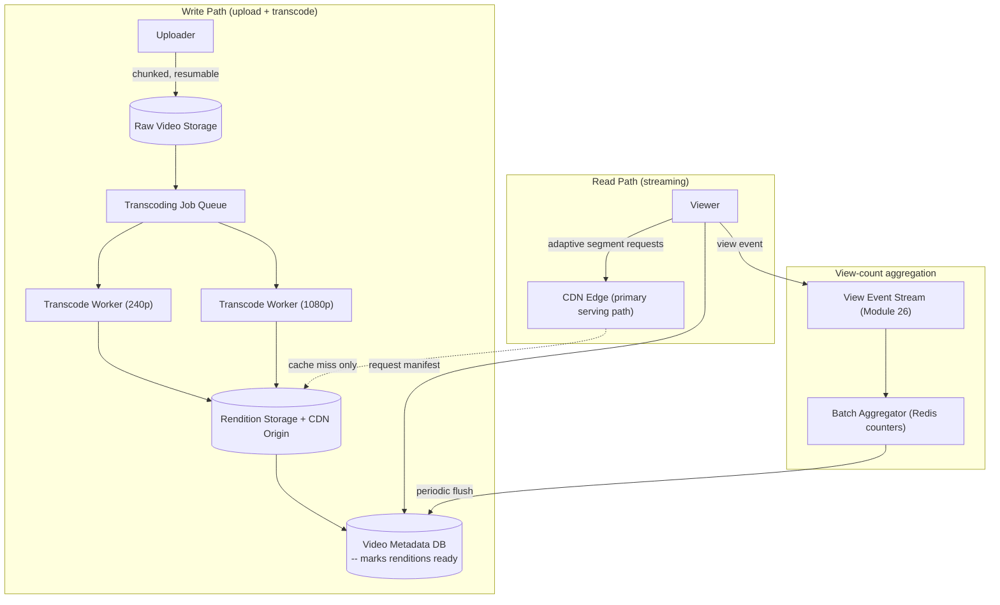

# Module 41 — System Design: Designing YouTube / a Video Streaming Platform

> Domain: System Design | Level: Beginner → Expert | Prerequisite: [[01-System-Design-Fundamentals]], [[02-Designing-News-Feed-System]] (recommendation/ranking parallels), [[../07-Redis/01-Data-Structures-Caching-Patterns]] (counters for view-count aggregation)

---

## 1. Fundamentals

### What makes a video-streaming platform a distinct system-design problem from everything covered so far?
YouTube's core challenge is **large, immutable binary content** (video files, often gigabytes each) that must be (a) ingested and processed (transcoded into multiple resolutions/formats) asynchronously and reliably, (b) stored durably and cost-efficiently at massive aggregate scale (exabytes), and (c) **streamed** to millions of concurrent viewers with low startup latency and adaptive quality — a fundamentally different data shape than the small, structured records (orders, messages, posts) every prior system-design module has centered on.

### Why does this matter?
Because it forces genuinely new architectural concerns this course hasn't yet addressed head-on: **chunked/resumable upload** for large files, an **asynchronous transcoding pipeline** (directly extending Module 38's asynchronous fan-out-processing pattern to a far more compute-intensive workload), and **CDN-centric delivery** as the *primary* serving mechanism rather than an optimization layered on top (Module 37 §7's CDN discussion, here promoted to the system's central design decision rather than a secondary latency win).

### When does this matter?
Any system serving large media content at scale (video, audio, large file downloads); the depth matters for correctly separating the **write path** (upload → transcode → store) from the **read path** (CDN-served streaming, decoupled entirely from the write path's complexity) and for reasoning about adaptive bitrate streaming as a client-driven, not server-driven, mechanism.

### How does it work (30,000-ft view)?
```
1. Upload: client -> chunked/resumable upload -> raw video landed in object storage (e.g., S3-equivalent)
2. Transcode: async pipeline generates multiple resolutions/bitrates + thumbnails, stored in object storage
3. Publish: metadata (title, description, available renditions) written to a database; video marked "ready"
4. Stream: client requests a manifest (list of available quality levels) -> CDN serves video chunks,
   client adaptively switches quality based on its own measured bandwidth
```

---

## 2. Deep Dive

### 2.1 Chunked, Resumable Upload — Why Large Files Can't Use an Ordinary HTTP POST
A multi-gigabyte video file cannot be reliably uploaded as a single HTTP request — any network interruption partway through would require restarting the entire upload from scratch, and many infrastructure components (load balancers, gateways, Module 40's own gateway tier) impose practical request-size/duration limits. The standard solution: the client splits the file into chunks (e.g., 5-10MB each), uploads each independently (with retry-per-chunk, directly Module 2's retry-with-backoff pattern applied per chunk rather than the whole file), and the server reassembles/acknowledges completion once all chunks arrive — directly analogous to Module 35 §Advanced Q2's external-merge-sort chunking discipline, here applied to network transfer instead of disk-bound sorting, and to Module 15 §2.2's idempotency-key pattern (each chunk upload should be idempotent, safely retryable without corrupting the reassembled file).

### 2.2 The Transcoding Pipeline — Asynchronous, Compute-Intensive Fan-Out
Once a raw video is uploaded, it must be transcoded into multiple resolutions (240p, 480p, 720p, 1080p, 4K) and formats/codecs, each transcoding job being CPU/GPU-intensive and taking anywhere from seconds to hours depending on video length and target quality. This is architecturally a **fan-out** problem (one input video, many independent output renditions) processed via a **message-queue-driven worker fleet** (directly Module 38 §Advanced Q4's asynchronous, burst-absorbing fan-out pipeline, and Module 26's Streams-based durable job processing) — each rendition is an independent job that can be retried, parallelized across many workers, and monitored independently (a failed 1080p transcode shouldn't block the 480p rendition from becoming available, letting a video go "live" progressively as lower-resolution renditions complete first, even before the highest-quality rendition finishes).

### 2.3 Adaptive Bitrate Streaming — Client-Driven Quality Switching
Rather than the server deciding what quality to send, standard streaming protocols (HLS, DASH) have the server publish a **manifest** listing all available quality renditions (each broken into small, independently-requestable segments, typically a few seconds each) — the **client** continuously measures its own actual download throughput and **dynamically switches** which rendition it requests for the *next* segment, seamlessly adapting to changing network conditions (a viewer's bandwidth dropping mid-video) without an interruption or manual quality change — this client-driven model is precisely why the transcoding pipeline (§2.2) must produce multiple discrete quality levels upfront, rather than the server attempting to dynamically re-encode on the fly per viewer (computationally infeasible at this scale).

### 2.4 CDN as the Primary Delivery Mechanism, Not a Cache Layered on Top
Unlike Module 37 §7's CDN discussion (framed as a latency-optimization layered onto an origin-server-centric design), a video platform's CDN **is** the primary serving path for the overwhelming majority of view traffic — the origin (object storage) is touched only on a genuine cache miss (a video's first view in a given geographic region, or an unpopular, rarely-viewed video), with the CDN absorbing the vast majority of aggregate bandwidth (video content is enormous relative to typical API response sizes, making origin-server-direct-serving at this scale economically and technically infeasible) — this reframes the CDN from "nice latency win" to "the actual system," directly informing why video URLs are typically CDN-domain URLs from the start, not origin URLs with a CDN transparently interposed.

### 2.5 View-Count Aggregation — a High-Write-Volume Counter Problem
Every video view increments a counter — at YouTube's scale, this is an extremely high-frequency write operation that **cannot** be a synchronous, strongly-consistent database increment on every single view (Module 19/22's locking/contention concerns would make this a severe bottleneck) — the standard approach: buffer view events into a message queue/stream (Module 26), aggregate counts in batches (e.g., incrementing an in-memory or Redis counter, Module 25 §2.1's atomic `INCR`, per short time window), and periodically flush aggregated batch totals to the durable, authoritative datastore — trading strict, real-time-exact view counts for a system that can actually sustain the write volume, directly the same "batch high-frequency writes rather than synchronously persisting each individually" discipline from Module 19 §Expert exercise's lock-escalation-avoidance batching, now applied to counter aggregation instead of bulk updates.

## 3. Visual Architecture


## 4. Production Example
**Scenario**: A video platform's transcoding pipeline processed all resolutions for a given video as a **single, monolithic job** (one worker handling 240p through 4K sequentially for one video before moving to the next video in the queue) — under normal upload volume this worked adequately, but during a period of unusually high upload volume (a coordinated content-creator upload event), the queue backed up severely: videos took hours to become available in **any** resolution, since even the fastest, cheapest rendition (240p) was blocked behind the same job's slower, more expensive renditions (1080p, 4K) for every video ahead of it in the queue. **Investigation**: confirmed the monolithic per-video job design meant a single video's total processing time (dominated by its most expensive rendition) gated when *any* of its renditions became available, and this blocking effect compounded across the backlog — even videos whose 240p rendition could have been ready in seconds were stuck behind other videos' multi-hour 4K transcodes. **Fix**: split the transcoding pipeline into independent, per-rendition jobs (§2.2) — a video's 240p job is entirely independent of its 1080p job, allowing a low-resolution rendition to complete and make the video watchable (at lower quality) within moments of upload, while higher-resolution renditions continue processing in the background, with the video's available-quality-levels list in the metadata store updated incrementally as each rendition completes. **Lesson**: a monolithic job design that bundles genuinely independent work (each resolution rendition) creates unnecessary head-of-line blocking — decomposing into independent, separately-queued, separately-prioritizable jobs (directly Module 33's "match the structure to the actual independence of the work" theme and Module 38's fan-out-job-independence principle) is what allows a system to make partial progress visible to users quickly, rather than an all-or-nothing wait for the single slowest component of a bundled unit of work.

## 5. Best Practices
- Decompose the transcoding pipeline into independent, per-rendition jobs, never a single monolithic per-video job (§4's incident) — allowing partial availability as soon as any individual rendition completes.
- Use chunked, resumable upload with per-chunk retry for any large-file ingestion path.
- Treat the CDN as the primary serving mechanism for video content, not a secondary optimization — design URLs and cache-control headers with CDN-first serving as the default assumption.
- Aggregate high-frequency counters (view counts, likes) via batched, eventually-consistent updates rather than synchronous per-event database writes.

## 6. Anti-patterns
- A monolithic, all-renditions-in-one-job transcoding design causing unnecessary head-of-line blocking (§4's incident).
- Synchronous, per-view database increments for view counts, creating an unsustainable write-contention bottleneck at scale.
- Serving video content directly from origin storage without a CDN, both economically and technically infeasible at meaningful scale.
- Attempting server-side, per-viewer dynamic quality selection instead of the standard client-driven adaptive-bitrate model.

---

## 10. Interview Questions

### Basic (10)
1. **Q: Why can't a large video file be uploaded as a single HTTP request?** **A:** Network interruptions would require restarting the entire upload; infrastructure components often impose practical size/duration limits — chunked, resumable upload solves both.
2. **Q: What is transcoding?** **A:** Converting an uploaded video into multiple resolutions/formats/bitrates for adaptive delivery.
3. **Q: What is adaptive bitrate streaming?** **A:** A client-driven mechanism where the player dynamically switches between available quality renditions based on its own measured network throughput.
4. **Q: Why is the CDN considered the primary delivery mechanism for video, not just a cache?** **A:** Video content volume is enormous; serving it directly from origin at scale is both economically and technically infeasible — the CDN absorbs the vast majority of actual serving traffic.
5. **Q: Why can't view counts be incremented synchronously on the database for every single view?** **A:** The write volume at scale would create severe database contention — counts are instead batched/aggregated asynchronously.
6. **Q: What is a manifest, in adaptive streaming terms?** **A:** A file listing all available quality renditions and their segment locations, which the client uses to make streaming decisions.
7. **Q: Why should transcoding be split into independent per-rendition jobs rather than one monolithic per-video job?** **A:** To avoid a video's fastest, cheapest rendition being blocked behind its slowest, most expensive rendition, allowing partial availability sooner (§4).
8. **Q: What is a signed URL used for in this context?** **A:** Allowing a CDN to serve access-controlled content by validating a time-limited, cryptographically-signed URL without needing to understand the platform's own authorization logic.
9. **Q: Why might older, rarely-viewed videos use different storage than recently-uploaded, popular ones?** **A:** Storage tiering by access frequency — hot content on fast/CDN-adjacent storage, cold content on cheaper archival storage.
10. **Q: What two protocols are commonly used for adaptive bitrate streaming?** **A:** HLS and DASH.

### Intermediate (10)
1. **Q: Why does per-chunk retry (not whole-file retry) matter for upload reliability?** **A:** A network interruption only requires retrying the specific failed chunk, not re-uploading gigabytes of already-successfully-transferred data — directly Module 2's retry-with-backoff pattern applied at chunk granularity.
2. **Q: Why is the transcoding pipeline architecturally similar to Module 38's asynchronous fan-out processing?** **A:** Both decouple an expensive, independent-per-item operation (fan-out to followers; transcoding to a specific rendition) from the triggering event via a message queue, allowing independent scaling, retry, and burst absorption.
3. **Q: Why does client-driven adaptive bitrate switching avoid the need for server-side per-viewer dynamic encoding?** **A:** Since all renditions are pre-generated upfront by the transcoding pipeline, the client simply requests whichever pre-existing rendition's segments match its current measured bandwidth — no real-time encoding decision is needed server-side at all.
4. **Q: Why does view-count aggregation trade exactness for sustainability, and is this an acceptable trade-off?** **A:** Batched, eventually-consistent counts might be briefly inaccurate (a few seconds/minutes behind the true real-time count) but the alternative (synchronous, exact per-view increments) doesn't scale — for a metric like view count, brief inexactness is an entirely acceptable, standard trade-off, unlike a genuinely financial counter.
5. **Q: Why does a signed URL's expiration matter for security, not just its signature?** **A:** Without expiration, a leaked/shared signed URL would grant indefinite access to the content — a short expiration window limits the exposure of a leaked URL to a bounded time period.
6. **Q: Why might content moderation run as part of the transcoding pipeline rather than as a separate, later process?** **A:** Running it as another independent job within the same fan-out structure (§2.2) lets it gate public availability (or flag for review) using the same infrastructure already processing the video, rather than requiring an entirely separate system to be built and coordinated.
7. **Q: Why is "time-to-first-frame" a distinct metric from ordinary API request latency?** **A:** It specifically measures the user-perceived delay before playback visibly begins, influenced by manifest-fetch time and initial segment delivery — a video-specific UX metric with no direct analog in a typical request/response API.
8. **Q: Why might a platform choose not to pre-generate every resolution for every uploaded video upfront?** **A:** Storage/compute cost for renditions that may rarely or never be requested (e.g., 4K for an obscure, rarely-viewed video) can be avoided by generating them on-demand only when actually requested, trading a first-request latency cost for reduced storage/compute expenditure on unpopular content.
9. **Q: Why does the read path (streaming) scale largely independently of the write path (upload/transcode)?** **A:** They're architecturally decoupled — the read path serves already-transcoded, CDN-cached content with no dependency on the write path's current load, meaning a surge in uploads doesn't directly degrade streaming performance for existing content, and vice versa.
10. **Q: Why does DRM integration represent a genuinely additional architectural layer, not just a configuration option?** **A:** It requires encryption of content, license-server validation as part of the playback flow, and coordination with the adaptive-bitrate mechanism itself — a meaningfully more complex requirement than standard, unencrypted content delivery.

### Advanced (10)
1. **Q: Diagnose the monolithic-transcoding-job production incident (§4) from first principles, and design the job-prioritization strategy that would further improve on the basic per-rendition-job fix.**
   **A:** Beyond simply splitting into independent per-rendition jobs (the baseline fix), prioritize the queue itself so that **every video's lowest-resolution rendition** is processed before **any video's highest-resolution rendition**, system-wide (a priority-queue-based scheduling policy, Module 33 §2.5, rather than simple FIFO-per-job-type) — this ensures that during a backlog, the maximum number of videos become minimally watchable as quickly as possible, rather than a strict FIFO ordering that could still let one video's 240p job wait behind another video's already-queued (but lower-priority) 1080p job.
2. **Q: Design the metadata schema tracking a video's per-rendition availability state, supporting the "watchable at lower quality while higher quality still processes" requirement from §4.**
   **A:**
   ```
   Video: { id, title, status: "processing" | "partially_ready" | "ready", uploadedAt }
   Renditions: { videoId, resolution, status: "queued" | "processing" | "ready" | "failed", cdnUrl }
   ```
   The video's overall `status` becomes `"partially_ready"` as soon as **any** rendition reaches `"ready"` (making it watchable, at whatever quality is currently available), transitioning to fully `"ready"` once all intended renditions complete — the client's manifest request (§2.3) simply reflects whichever renditions currently have `status: "ready"`, naturally supporting progressive quality availability without any special-case logic beyond querying current rendition state.
3. **Q: Explain how you would design a strategy for handling a transcoding job that fails repeatedly (a corrupted upload, an unsupported codec), avoiding an infinite retry loop.**
   **A:** Directly Module 26 §Advanced Q7's dead-letter-queue pattern — track a per-job retry count, and after a configured maximum, move the job to a dead-letter queue for manual/automated investigation rather than continuing to retry indefinitely, surfacing the failure to the uploader (a "your video couldn't be processed, please check the file format" notification) rather than leaving it silently stuck in a perpetual retry state.
4. **Q: Design a strategy for pre-warming CDN edge caches for an anticipated high-demand event (a scheduled video premiere), rather than relying purely on reactive, first-request cache population.**
   **A:** Proactively push the video's renditions to CDN edge nodes in advance of the scheduled release time (a CDN "pre-fetch"/"pre-warm" API call, if the CDN provider supports it, or a synthetic traffic pattern simulating requests from each target edge region shortly before release) — directly the same "proactive versus reactive" distinction as Module 12 §Advanced Q1's claims-transformation caching discussion, here applied to avoid every viewer in a newly-popular region experiencing an origin-fetch cache-miss penalty simultaneously at the exact moment of peak anticipated demand.
5. **Q: How would you design the view-count aggregation system (§2.5) to also support near-real-time "live viewer count" for a live-streaming feature, which has a stricter freshness requirement than on-demand video view counts?**
   **A:** Live viewer count needs a shorter aggregation window (seconds, not minutes) and a different underlying mechanism — rather than batching for eventual database persistence, use a Redis-based, TTL-expiring per-viewer "heartbeat" key (directly Module 39 §Advanced Q2's connection-registry-heartbeat pattern, here repurposed for presence/viewer-counting instead of connection routing) with the current live count computed as a fast `SCARD`/count of currently-non-expired heartbeat keys — trading the on-demand system's batched-for-durability approach for a live, ephemeral, Redis-native presence-counting mechanism better suited to this stricter freshness requirement.
6. **Q: Explain the trade-off between generating a large number of discrete quality renditions (more storage/compute cost, finer-grained adaptive-bitrate switching) versus a small number of coarse renditions (less cost, coarser quality steps).**
   **A:** More renditions let the adaptive-bitrate client more precisely match its available bandwidth (smaller quality "jumps" when switching), improving perceived smoothness, but linearly increases transcoding compute cost and storage footprint per video; fewer renditions reduce cost but risk a more jarring quality transition (or wasted bandwidth if the closest available rendition is meaningfully lower quality than the client's actual capacity supports) — most platforms settle on an empirically-tuned handful of renditions (e.g., 5-6 resolution tiers) balancing this cost/quality-granularity trade-off, rather than either extreme.
7. **Q: Design a strategy for handling copyright/content-identification matching (e.g., YouTube's Content ID system) within this architecture, without significantly slowing down the time-to-availability for legitimate uploads.**
   **A:** Run content-fingerprint matching (comparing the uploaded video's audio/video fingerprint against a database of known copyrighted content) as **another independent, parallel job** within the same transcoding fan-out structure (§2.2/Advanced Q1) rather than a serial, gating step before transcoding begins — a video can become watchable via its lowest-resolution rendition while content-ID matching runs concurrently in the background, with any resulting copyright action (a claim, a takedown) applied after the fact if a match is found, rather than delaying every single upload's availability by the fingerprint-matching step's own processing time.
8. **Q: A team proposes storing every video's every rendition, indefinitely, on the fastest available storage tier "to guarantee the best possible playback experience for every video regardless of age or popularity." Evaluate this as a Principal Engineer.**
   **A:** Push back on the cost implications — this ignores the power-law popularity distribution (§9) where the overwhelming majority of storage/serving cost should be justified by actual, ongoing view volume, not applied uniformly regardless of demand; recommend storage tiering (§9) as the standard, cost-effective approach, reserving the "guarantee best experience regardless of age" goal specifically for content genuinely expected to have sustained long-tail demand (evaluated via actual view-history data, not a blanket policy) — directly this course's recurring "match infrastructure investment to demonstrated, measured need" discipline (Module 37 §Advanced Q9), now applied to storage-tiering economics specifically.
9. **Q: Explain how you would design the system to gracefully handle a viewer's network condition degrading mid-playback, beyond simply "the client switches to a lower rendition."**
   **A:** The client's adaptive-bitrate logic should also maintain a small local buffer of upcoming segments (a few seconds ahead of current playback position) specifically to absorb brief network hiccups without an immediately visible playback stall — the buffer size itself is a genuine trade-off (a larger buffer better tolerates brief network drops but increases startup latency and memory usage, and delays the client's own reaction time to a *sustained* quality-appropriate-rendition switch) — a complete answer addresses both the quality-switching mechanism (§2.3) and this buffering trade-off together, since they jointly determine the actual viewer-perceived resilience to changing network conditions.
10. **Q: As a Principal Engineer, how would you decide whether to build a custom CDN/edge infrastructure versus using a third-party CDN provider for a growing video platform?**
    **A:** Weigh the platform's actual scale/growth trajectory (a third-party CDN's pay-as-you-go model is typically far more cost-effective and operationally simpler at low-to-moderate scale) against the potential for custom infrastructure to provide meaningfully better cost-efficiency or control at truly massive, sustained scale (which is why YouTube, Netflix, and similarly enormous platforms have historically built significant custom CDN/edge infrastructure) — recommend starting with a mature third-party CDN provider by default (directly this course's recurring "don't build custom infrastructure without a demonstrated, measured need the off-the-shelf option can't meet," Module 33 §Advanced Q9/Module 35 §Advanced Q8's recurring theme), revisiting the build-vs-buy decision only once actual, sustained scale and cost data justify the very substantial investment custom CDN infrastructure requires.

---

## 11. Coding Exercises

*(System design case studies use worked design exercises, consistent with this domain's format.)*

### Easy — Capacity estimation for storage growth
**Problem**: Estimate 5-year storage growth for a platform receiving 500 hours of video uploaded per minute, averaging 1GB/hour of raw footage before transcoding, with transcoding producing renditions totaling roughly 2x the raw footage size.
**Solution**:
```
Raw upload volume: 500 hours/min * 1GB/hour = 500 GB/min raw
Per day: 500 GB/min * 1440 min = 720 TB/day raw
Total (including transcoded renditions, ~2x raw): 720 TB * 3 (raw + renditions) ≈ 2.16 PB/day
Over 5 years: 2.16 PB/day * 365 * 5 ≈ 3,942 PB (~3.9 Exabytes)
```
**Discussion**: This exabyte-scale number immediately justifies both storage tiering (§9) and the "don't pre-generate every rendition for every video indefinitely" trade-off (§7/Advanced Q8) as economic necessities, not optional optimizations — at this scale, uniform "store everything on the fastest tier forever" is simply not economically viable.

### Medium — Per-rendition transcoding job queue design (§4's fix)
```csharp
public record TranscodeJob(string VideoId, string Resolution, int Priority); // Priority: lower resolution = higher priority (Advanced Q1)

public class TranscodeJobScheduler
{
    private readonly PriorityQueue<TranscodeJob, int> _queue = new(); // Module 33 §2.5's array-backed heap

    public void Enqueue(TranscodeJob job) => _queue.Enqueue(job, job.Priority);

    public async Task ProcessNextAsync(ITranscodeWorker worker)
    {
        if (_queue.TryDequeue(out var job, out _))
        {
            await worker.TranscodeAsync(job.VideoId, job.Resolution);
            await _metadataStore.MarkRenditionReadyAsync(job.VideoId, job.Resolution); // Advanced Q2's schema
        }
    }
}
```

### Hard — Signed URL generation and validation for access-controlled content
```csharp
public class SignedUrlService
{
    private readonly byte[] _signingKey;

    public string GenerateSignedUrl(string videoPath, TimeSpan validFor)
    {
        long expiryUnixTime = DateTimeOffset.UtcNow.Add(validFor).ToUnixTimeSeconds();
        string dataToSign = $"{videoPath}:{expiryUnixTime}";
        string signature = ComputeHmacSha256(dataToSign, _signingKey);
        return $"https://cdn.example.com{videoPath}?expires={expiryUnixTime}&sig={signature}";
    }

    // CDN edge-side validation logic (conceptually -- CDNs typically support this via an edge function):
    public bool ValidateSignedUrl(string videoPath, long expires, string providedSignature)
    {
        if (DateTimeOffset.UtcNow.ToUnixTimeSeconds() > expires) return false; // expired
        string expectedSignature = ComputeHmacSha256($"{videoPath}:{expires}", _signingKey);
        return CryptographicOperations.FixedTimeEquals( // constant-time comparison -- avoids a timing attack
            Encoding.UTF8.GetBytes(expectedSignature), Encoding.UTF8.GetBytes(providedSignature));
    }
}
```
**Discussion**: `FixedTimeEquals` (constant-time string comparison) is a deliberate, security-relevant detail — a naive `==`/`Equals` comparison could leak timing information about how many leading characters of the signature matched, a genuine (if narrow) timing-attack vector directly analogous to Module 8 §8's authentication-timing-side-channel discussion, here applied to signature validation instead of password comparison.

### Expert — Batched view-count aggregation pipeline (§2.5)
```csharp
public class ViewCountAggregator : BackgroundService
{
    private readonly IConnectionMultiplexer _redis;
    private readonly IVideoMetadataStore _metadataStore;

    protected override async Task ExecuteAsync(CancellationToken stoppingToken)
    {
        while (!stoppingToken.IsCancellationRequested)
        {
            await Task.Delay(TimeSpan.FromSeconds(30), stoppingToken); // batch flush interval

            var db = _redis.GetDatabase();
            var dirtyVideoIds = await db.SetMembersAsync("dirty-view-counts");

            foreach (var videoId in dirtyVideoIds)
            {
                long count = (long)await db.StringGetAsync($"views:{videoId}");
                await _metadataStore.SetViewCountAsync(videoId.ToString(), count); // periodic flush to durable store
            }
            await db.KeyDeleteAsync("dirty-view-counts"); // reset dirty-tracking for the next batch window
        }
    }
}

// On each view event (called from the request-handling path, NOT this background service):
public async Task RecordViewAsync(string videoId)
{
    var db = _redis.GetDatabase();
    await db.StringIncrementAsync($"views:{videoId}"); // fast, atomic, Module 25 §2.1
    await db.SetAddAsync("dirty-view-counts", videoId); // track which videos need their next flush
}
```
**Discussion**: The "dirty set" tracking (only flushing videos that actually received views since the last batch, not scanning every video in the system every 30 seconds) is the key efficiency detail — directly the same "only process what actually changed" principle as Module 22's replication-slot/WAL mechanics and Module 26's Streams consumer-group tracking, here applied to make the periodic flush's cost proportional to actual view activity rather than total video catalog size.

---

## 12–17. System Design / LLD / Debugging / Decision / Case Study / Principal

*(This entire module IS the deep-dive case study — §4's incident, §11's four worked exercises, and the extensive Advanced-tier Q&A collectively constitute this section's typical content.)*

## 18. Revision
**Key takeaways**: Video platforms are fundamentally a large-binary-content problem, requiring chunked/resumable upload, an asynchronous, independently-job-per-rendition transcoding pipeline (never monolithic — §4), and CDN-primary (not CDN-as-cache) delivery. Adaptive bitrate streaming is client-driven, requiring pre-generated discrete quality renditions, not server-side dynamic encoding. View-count and similar high-frequency counters must be batched/aggregated asynchronously (Redis counters + periodic flush), never synchronously written per-event. Storage tiering by access-frequency/popularity (a power-law distribution, directly paralleling Module 38's celebrity-account skew) is an economic necessity at this scale, not an optional optimization.

---

**Next**: Continuing autonomously to Module 42 — Designing Instagram (Photo/Video Sharing, Stories & Feed).
