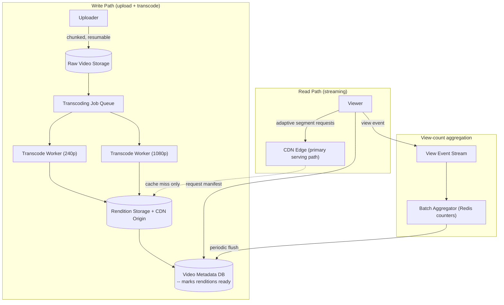
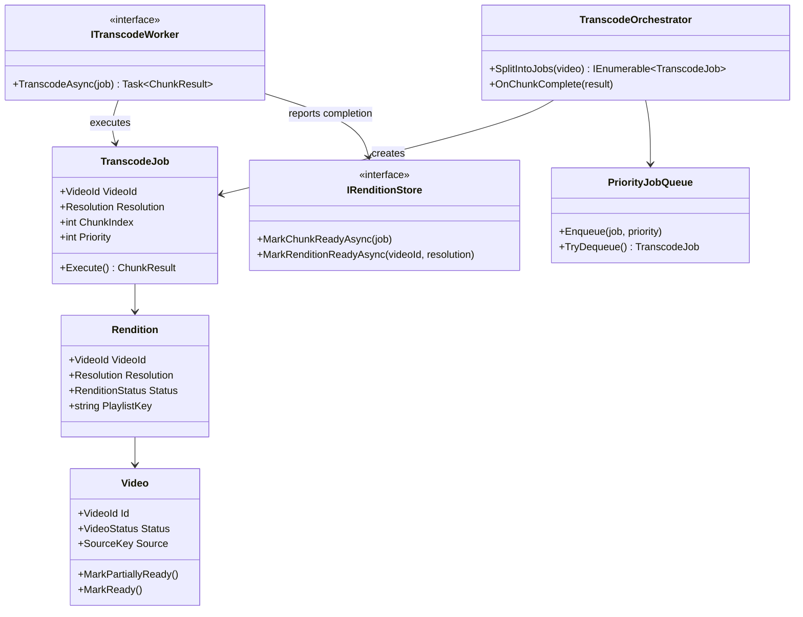
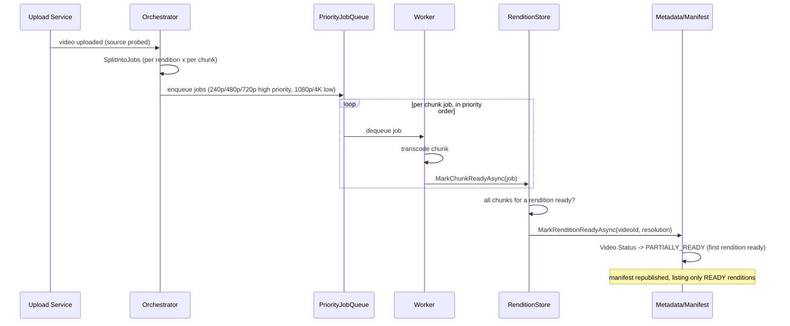

# Module 41 — System Design: Designing YouTube / a Video Streaming Platform

> Domain: System Design | Level: Beginner → Expert | Prerequisite: [[01-System-Design-Fundamentals]], [[02-Designing-News-Feed-System]] (recommendation/ranking parallels), [[../07-Redis/01-Data-Structures-Caching-Patterns]] (counters for view-count aggregation)

---

## 1. Fundamentals

### What makes a video-streaming platform a distinct system-design problem from everything covered so far?
YouTube's core challenge is **large, immutable binary content** (video files, often gigabytes each) that must be (a) ingested and processed (transcoded into multiple resolutions/formats) asynchronously and reliably, (b) stored durably and cost-efficiently at massive aggregate scale (exabytes), and (c) **streamed** to millions of concurrent viewers with low startup latency and adaptive quality — a fundamentally different data shape than the small, structured records (orders, messages, posts) every prior system-design module has centered on.

### Why does this matter?
Because it forces genuinely new architectural concerns this course hasn't yet addressed head-on: **chunked/resumable upload** for large files, an **asynchronous transcoding pipeline** (directly extending the asynchronous fan-out-processing pattern to a far more compute-intensive workload), and **CDN-centric delivery** as the *primary* serving mechanism rather than an optimization layered on top (the CDN discussion, here promoted to the system's central design decision rather than a secondary latency win).

### When does this matter?
Any system serving large media content at scale (video, audio, large file downloads); the depth matters for correctly separating the **write path** (upload → transcode → store) from the **read path** (CDN-served streaming, decoupled entirely from the write path's complexity) and for reasoning about adaptive bitrate streaming as a client-driven, not server-driven, mechanism.

### How does it work (30,000-ft view)?
```
1. Upload: client -> chunked/resumable upload -> raw video landed in object storage (e.g., S3-equivalent)
2. Transcode: async pipeline generates multiple resolutions/bitrates + thumbnails, stored in object storage
3. Publish: metadata (title, description, available renditions) written to a database; video marked "ready"
4. Stream: client requests a manifest (list of available quality levels) -> CDN serves video chunks,
 client adaptively switches quality based on its own measured bandwidth
```

---

## 2. Deep Dive

This section is written to be **complete on its own** — every mechanism, the reasoning that selects it, the failure mode it introduces, and the push-back a Principal/Staff interviewer will raise, answered inline.

### 2.1 Chunked, Resumable Upload

A multi-gigabyte file cannot go up as one HTTP request. A network interruption would force a restart from zero, and load balancers, gateways and proxies impose practical request-size and duration limits regardless.

The standard solution: the client splits the file into chunks (5–10 MB), uploads each independently with **per-chunk retry**, and the server reassembles once all chunks arrive. Two properties make it work:

- **Retry granularity matches failure granularity.** An interruption costs one chunk, not the gigabytes already transferred.
- **Each chunk upload must be idempotent** — identified by `(uploadId, chunkIndex, checksum)` — so a retry after an ambiguous timeout cannot corrupt the reassembled file by appending twice. This is the idempotency-key pattern applied to bytes rather than to API requests.

The server tracks which chunk indices have been received, so a client resuming after a long gap asks "what do you still need?" rather than guessing.

### 2.2 The Transcoding Pipeline — Decompose Along the Grain of the Work

An uploaded video must become many renditions (240p, 480p, 720p, 1080p, 4K) across codecs. Each job is CPU- or GPU-intensive and runs from seconds to hours.

Architecturally this is **fan-out**: one input, many independent outputs, processed by a queue-driven worker fleet. The decisive design decision, and the subject of §4's incident, is the **unit of work**:

> **One job per rendition, never one job per video.** A monolithic per-video job means the cheap 240p rendition cannot become available until the expensive 4K rendition finishes — head-of-line blocking inside a single work item, invisible to any queue-depth metric.

With per-rendition jobs, a failed 1080p transcode does not block 480p, each job retries and scales independently, and a video goes live progressively as lower renditions complete.

**Prioritise the queue, not just the jobs.** Splitting is the baseline fix; the better one is a priority policy where **every video's lowest rendition is processed before any video's highest rendition**, system-wide. During a backlog that maximises the number of videos that are *minimally watchable* soonest, rather than letting one video's 240p wait behind another video's already-queued 1080p. It deliberately trades strict fairness for the metric viewers actually feel.

**Per-rendition availability needs a schema that expresses it:**

```
Video      { id, title, status: "processing" | "partially_ready" | "ready", uploadedAt }
Rendition  { videoId, resolution, codec, status: "queued" | "processing" | "ready" | "failed", cdnUrl }
```

The video becomes `partially_ready` as soon as **any** rendition is `ready`, and `ready` when all intended renditions complete. The manifest simply reflects whichever renditions are currently `ready` — progressive availability with no special-case logic. Note `codec` belongs in this table **from day one**, for reasons that only become obvious years later (§2.11).

**Poison jobs need a dead-letter queue.** A corrupted upload or unsupported codec will fail every time. Track a per-job retry count, and after a configured maximum move the job to a DLQ for investigation and **notify the uploader** ("your video couldn't be processed — please check the format") rather than leaving it silently stuck in perpetual retry. Infinite retry on a deterministic failure is wasted capacity plus a silent user-facing failure.

### 2.3 Adaptive Bitrate Streaming — Client-Driven Quality

Rather than the server choosing quality, HLS (Apple's, dominant for device compatibility) and DASH (the MPEG standard) publish a **manifest** listing all available renditions, each split into small independently requestable segments of a few seconds. The **client** continuously measures its own throughput and switches which rendition it requests for the *next* segment.

Two consequences worth stating:

- Because all renditions are pre-generated, the server never re-encodes per viewer — which would be computationally impossible at this scale. The transcoding pipeline exists precisely to make the client's choice cheap.
- Because segments are plain HTTP objects, **CDNs cache them natively** with no video-specific support. The protocol design is what makes §2.4 possible.

**Ladder granularity is a real trade-off.** More renditions let the client match bandwidth precisely, producing smaller, less jarring quality steps — and linearly increase transcode compute and storage per video. Fewer renditions cost less and risk visible jumps, or wasted bandwidth when the nearest available rendition is well below what the client could handle. Most platforms settle empirically on five or six tiers.

**Client buffering is the other half of resilience**, and an answer that only says "the client switches down" is incomplete. The player keeps a local buffer a few seconds ahead of the playhead to absorb brief hiccups without a visible stall. The buffer size is itself a trade: larger buffers tolerate longer drops but increase startup latency and memory, and *delay the client's reaction* to a sustained change that warrants an actual rendition switch. Quality switching and buffering jointly determine perceived resilience.

**Time-to-first-frame** is the video-specific UX metric with no API analogue — the delay before playback visibly begins, driven by manifest fetch plus initial segment delivery. Measure it separately from request latency.

### 2.4 The CDN Is the System, Not a Cache on Top of It

In most designs a CDN is a latency optimisation layered over an origin-centric architecture. Here it is **the primary serving path**. Origin (object storage) is touched only on a genuine miss — a video's first view in a region, or an unpopular video. Video payloads are enormous relative to API responses, so origin-direct serving is economically and technically infeasible at scale.

This reframing has concrete consequences: video URLs are CDN URLs from the start rather than origin URLs with a CDN transparently interposed, and nearly every other decision is evaluated by whether it raises edge cache-hit ratio or lowers origin traffic.

**Origin shielding bounds an otherwise unbounded fan-out.** Without a shield, a video going viral produces simultaneous origin requests proportional to the number of distinct edge locations receiving first-time traffic — a number that scales with the *CDN vendor's* footprint, not with anything you control, so worst-case origin load is unbounded by design. A shield tier caps it at one origin fetch per shield region regardless of edge count. The argument to a sceptical finance stakeholder is the insurance argument, the same one used for circuit breakers and bulkheads: it converts an open-ended tail risk into a fixed, budgeted cost, and its value is realised precisely on the one day it is needed.

**Pre-warm only where demand is known.** For a scheduled premiere, push renditions to edges in advance (a CDN pre-fetch API, or synthetic requests from each target region shortly before release) so that thousands of viewers do not all trigger the cold-start miss simultaneously.

**But pre-warming is the exception, not the delivery model.** Proactively pushing every rendition to every region on completion guarantees zero cold start everywhere and multiplies transfer cost by region count for content that, given power-law popularity, will mostly never be watched in most of those regions. The pull/cache-miss default pays a one-time per-region cost only where content is actually requested, which is strictly cheaper in aggregate. This is exactly the fan-out-on-write versus fan-out-on-read trade-off, applied to CDN distribution instead of follower feeds — push only with high-confidence known demand.

**Build versus buy.** Start with a mature third-party CDN. Pay-as-you-go is far cheaper and simpler at low-to-moderate scale. Custom edge infrastructure becomes justifiable only at truly massive sustained scale — which is why YouTube and Netflix built theirs — and the decision should be revisited from measured cost data, never taken preemptively.

### 2.5 What the Estimation Says the Hard Problem Is

At the scale §12 estimates — roughly 125 Tbps sustained egress against ~1.8 EB/year of storage growth — **egress is the system**. It is the one number with no path to being solved by this system's own engineering; it can only be delegated to a CDN vendor and minimised through cache-hit ratio.

That conclusion reorganises everything downstream: URL structure, cache-control headers, origin shielding, popularity-driven rendition generation, and segment sizing all exist to reduce origin traffic.

A candidate who opens by optimising storage cost has identified a real lever and the wrong *primary* one — and that is a specific interview signal: it shows someone who can optimise a component without first establishing which component the estimation says dominates. Run the estimate, then let the estimate choose the hard problem.

### 2.6 Popularity-Driven Renditions and Storage Tiering

Pre-generating every resolution for every upload wastes compute and storage on renditions that may never be requested — 4K for an obscure video nobody watches. The alternative is generating expensive tiers **on demand**, triggered by view thresholds, trading a first-request latency cost for a large reduction in cost across the long tail.

**Storage tiering follows the same distribution.** Hot content lives on fast, CDN-adjacent storage; cold content moves to cheaper archival tiers with slower first-byte times.

A proposal to keep every rendition of every video on the fastest tier forever, "to guarantee the best experience regardless of age," should be pushed back on. It ignores the power-law popularity distribution, applying uniform cost to wildly non-uniform demand. Reserve that guarantee for content with *measured* sustained long-tail demand, evaluated from view history rather than blanket policy.

### 2.7 View-Count Aggregation — a High-Write Counter Problem

Every view increments a counter. At scale this cannot be a synchronous strongly-consistent database increment per view: row-level contention on a hot counter makes it an immediate bottleneck.

The standard pipeline: buffer view events into a stream, aggregate in Redis with atomic `INCR` over a short window, and flush aggregated totals to the durable store periodically. This trades exact real-time counts for a system that can sustain the volume — entirely acceptable for a view count, and **not** acceptable for a financial counter, which is the distinction to name aloud.

**The durability failure mode, and the right fix.** If a Redis node is lost between an `INCR` and the next flush, every view accumulated since the last flush on that node is gone — the batching window is also the data-loss exposure window. The fix is *not* to make the counter durable, which would reintroduce the synchronous bottleneck the design exists to avoid. Instead, make loss bounded and recoverable: shorten the exposure window with AOF persistence and a short fsync interval, and **retain the raw view-event stream independently** so counts can be recomputed from the durable log when divergence is detected. The counter is a fast, lossy cache of a truth that lives elsewhere — not the truth itself.

**Live viewer count is a different problem with a different mechanism.** Live streaming needs seconds of freshness, not minutes, and asks a different question ("how many are watching *now*") rather than a cumulative total. Use TTL-expiring per-viewer heartbeat keys in Redis, with the current count as a set cardinality over non-expired heartbeats — an ephemeral presence-counting mechanism, structurally the same as a connection registry's heartbeat, rather than the batched-for-durability on-demand pipeline.

### 2.8 Parallel Jobs That Must Not Gate Availability

**Moderation** runs as another independent job in the same fan-out structure, using infrastructure already processing the video, and gates public availability or flags for review rather than requiring a separate coordinated system.

**Content identification** (fingerprint matching against a copyrighted-works database) runs **in parallel, not as a serial gate**. A video becomes watchable at its lowest rendition while matching proceeds concurrently, with any claim or takedown applied after the fact. Making fingerprinting a blocking prerequisite would delay every legitimate upload by the matching step's latency — paying a cost on all content to handle a minority case.

The general shape: independent analysis jobs join the same fan-out; only the ones whose *legal* posture demands it are allowed to gate, and even then usually at the publish step rather than the transcode step.

### 2.9 Access Control, DRM and Geo-Restriction

**Signed URLs** let a CDN serve access-controlled content by validating a time-limited cryptographic signature, without the CDN needing to understand the platform's authorization model. **Expiry matters as much as the signature**: without it, a leaked or shared URL grants indefinite access. A short window bounds the exposure of a leak.

**DRM is an architectural layer, not a config flag.** It requires content encryption, a license server in the playback flow, and coordination with the adaptive-bitrate mechanism itself — meaningfully more complex than unencrypted delivery, and worth scoping explicitly rather than waving at.

**Geo-restriction under a court order** is the interesting case, because CDN-primary delivery means cached content is largely outside direct control. Enforce at the **manifest layer**: the manifest service checks the client's region against a per-video restriction list before returning a playable manifest, so a restricted region never gets one regardless of what nearby edges hold. Additionally issue a geo-scoped CDN invalidation for the affected segment keys so already-cached copies stop serving during the TTL window. The residual risk — a client that already downloaded segments locally before the restriction — is outside the system entirely and should be **named as a limitation** rather than silently assumed solved.

### 2.10 Time-to-First-Rendition Is a Queueing Problem

Once the system is under load, time-to-first-rendition is dominated by **queue wait**, not encode time. Little's Law makes this precise:

```
L = λW      jobs in system = arrival rate × time in system
```

If the upload arrival rate `λ` exceeds the fleet's sustained service rate even briefly, queue length `L` grows for the duration of the burst and every job's wait `W` grows with it.

This is why §4's fix — independent, priority-ordered per-rendition jobs — **reduces no total work at all**. It reorders the queue so the cheapest jobs' wait time stays bounded even while the queue is backed up, trading strict fairness for the metric viewers experience: can I watch *something* soon. Recognising that the fix is a scheduling change rather than a capacity change is the Staff-level reading.

### 2.11 Codec Migration Without Stopping the World

Migrating a catalogue of billions of videos to a more efficient codec (AV1) cannot be a bulk re-transcode. Treat it as an extension of the popularity-driven ladder rather than a separate project:

- Hot content migrates **naturally and first**, as it crosses view thresholds and gets re-requested.
- Cold content migrates lazily on next request, or stays on the legacy codec indefinitely if it never crosses the threshold again.
- The player and manifest must serve **mixed-codec renditions** throughout a multi-year transition, offering the new codec only to clients that declare support via capability negotiation.

And the reason `codec` belongs in the rendition table from day one: otherwise this migration requires a schema change under pressure, years after the person who designed the table has moved on.

### 2.12 Observability — Segment Before You Alert

A single aggregate queue-depth metric is precisely what stayed misleadingly healthy during §4's incident: total throughput was not zero, it was badly *ordered*.

The actionable signal is **queue depth and wait-time percentile segmented by rendition tier** — specifically watching the 240p queue's p95 wait time diverging from its historical baseline while aggregate throughput looks fine. Alert on the **divergence**, not an absolute threshold, because the absolute number is normal during ordinary busy periods and the divergence is not.

This is the same discipline as detecting straggler skew by looking at the task-duration *distribution* rather than the mean: **an aggregate cannot detect a concentrated failure.** Other signals worth carrying: time-to-first-frame by region, edge cache-hit ratio by five-minute bucket rather than daily average, origin request rate (the number origin shielding exists to bound), and DLQ depth and age.

### 2.13 Principal-Level Judgements, and the Principle Underneath Them All

**Quantify before building an optimisation.** Per-title or per-scene encoding — tuning bitrate to each video's actual visual complexity rather than a fixed ladder — closes a real gap, since low-motion content is over-provisioned by uniform presets. It also requires a per-video parameter search or a trained predictor, materially complicating the pipeline. The judgement: **measure the achievable saving on a representative sample first.** Broad-based savings justify the investment; savings concentrated in one content category argue for a narrower, cheaper fix capturing most of the value.

**The synthesis worth carrying out of this module.** The transcoding incident here, the news-feed fan-out problem, and the risk-engine straggler incident are three instances of one principle:

> **A system's unit of work should match the actual independent grain of the problem, not an administratively convenient bundling of it.**

A monolithic per-video transcode bundles genuinely independent renditions. Naive synchronous fan-out bundles a celebrity's millions of independent follower writes into one blocking operation. Position-count-based partitioning bundles a few 4,000×-more-expensive exotic positions into ordinary-looking blocks.

It recurs because bundling by what is *easy to enumerate* — one video, one fan-out call, one position count — is almost always the first design built, and it reveals its head-of-line-blocking or straggler failure only when real-world skew in cost, popularity or complexity shows up in production. Which is why the fix is rarely "add capacity" and almost always "decompose the unit of work along the dimension that is actually skewed."

---

## 3. Visual Architecture

```mermaid
graph TB
 subgraph "Write Path (upload + transcode)"
 Client1[Uploader] -->|chunked, resumable| RawStorage[("Raw Video Storage")]
 RawStorage --> Queue["Transcoding Job Queue"]
 Queue --> Worker1["Transcode Worker (240p)"]
 Queue --> Worker2["Transcode Worker (1080p)"]
 Worker1 --> RenditionStorage[("Rendition Storage + CDN Origin")]
 Worker2 --> RenditionStorage
 RenditionStorage --> Metadata[("Video Metadata DB<br/>-- marks renditions ready")]
 end
 subgraph "Read Path (streaming)"
 Client2[Viewer] -->|request manifest| Metadata
 Client2 -->|adaptive segment requests| CDN["CDN Edge (primary serving path)"]
 CDN -.->|cache miss only| RenditionStorage
 end
 subgraph "View-count aggregation"
 Client2 -->|view event| ViewQueue["View Event Stream"]
 ViewQueue --> Aggregator["Batch Aggregator (Redis counters)"]
 Aggregator -->|periodic flush| Metadata
 end
```

## 4. Production Example
**Scenario**: A video platform's transcoding pipeline processed all resolutions for a given video as a **single, monolithic job** (one worker handling 240p through 4K sequentially for one video before moving to the next video in the queue) — under normal upload volume this worked adequately, but during a period of unusually high upload volume (a coordinated content-creator upload event), the queue backed up severely: videos took hours to become available in **any** resolution, since even the fastest, cheapest rendition (240p) was blocked behind the same job's slower, more expensive renditions (1080p, 4K) for every video ahead of it in the queue. **Investigation**: confirmed the monolithic per-video job design meant a single video's total processing time (dominated by its most expensive rendition) gated when *any* of its renditions became available, and this blocking effect compounded across the backlog — even videos whose 240p rendition could have been ready in seconds were stuck behind other videos' multi-hour 4K transcodes. **Fix**: split the transcoding pipeline into independent, per-rendition jobs — a video's 240p job is entirely independent of its 1080p job, allowing a low-resolution rendition to complete and make the video watchable (at lower quality) within moments of upload, while higher-resolution renditions continue processing in the background, with the video's available-quality-levels list in the metadata store updated incrementally as each rendition completes. **Lesson**: a monolithic job design that bundles genuinely independent work (each resolution rendition) creates unnecessary head-of-line blocking — decomposing into independent, separately-queued, separately-prioritizable jobs (directly the "match the structure to the actual independence of the work" theme and the fan-out-job-independence principle) is what allows a system to make partial progress visible to users quickly, rather than an all-or-nothing wait for the single slowest component of a bundled unit of work.
## 11. Coding Exercises

*(System design case studies use worked design exercises, consistent with this domain's format.)*

### Easy — Capacity estimation for storage growth
**Problem**: Estimate 5-year storage growth for a platform receiving 500 hours of video uploaded per minute, averaging 1GB/hour of raw footage before transcoding, with transcoding producing renditions totaling roughly 2x the raw footage size.
**Solution**:
```
Raw upload volume: 500 hours/min * 1GB/hour = 500 GB/min raw
Per day: 500 GB/min * 1440 min = 720 TB/day raw
Total (including transcoded renditions, ~2x raw): 720 TB * 3 (raw + renditions) ≈ 2.16 PB/day
Over 5 years: 2.16 PB/day * 365 * 5 ≈ 3,942 PB (~3.9 Exabytes)
```
**Discussion**: This exabyte-scale number immediately justifies both storage tiering and the "don't pre-generate every rendition for every video indefinitely" trade-off (§2.6) as economic necessities, not optional optimizations — at this scale, uniform "store everything on the fastest tier forever" is simply not economically viable.

### Medium — Per-rendition transcoding job queue design (the fix)
```csharp
public record TranscodeJob(string VideoId, string Resolution, int Priority); // Priority: lower resolution = higher priority (§2.2)

public class TranscodeJobScheduler
{
    private readonly PriorityQueue<TranscodeJob, int> _queue = new; // the array-backed heap

    public void Enqueue(TranscodeJob job) => _queue.Enqueue(job, job.Priority);

    public async Task ProcessNextAsync(ITranscodeWorker worker)
    {
        if (_queue.TryDequeue(out var job, out _))
        {
            await worker.TranscodeAsync(job.VideoId, job.Resolution);
            await _metadataStore.MarkRenditionReadyAsync(job.VideoId, job.Resolution); // §2.2's schema
        }
    }
}
```

### Hard — Signed URL generation and validation for access-controlled content
```csharp
public class SignedUrlService
{
    private readonly byte[] _signingKey;

    public string GenerateSignedUrl(string videoPath, TimeSpan validFor)
    {
        long expiryUnixTime = DateTimeOffset.UtcNow.Add(validFor).ToUnixTimeSeconds;
        string dataToSign = $"{videoPath}:{expiryUnixTime}";
        string signature = ComputeHmacSha256(dataToSign, _signingKey);
        return $"https://cdn.example.com{videoPath}?expires={expiryUnixTime}&sig={signature}"
    }

    // CDN edge-side validation logic (conceptually -- CDNs typically support this via an edge function):
    public bool ValidateSignedUrl(string videoPath, long expires, string providedSignature)
    {
        if (DateTimeOffset.UtcNow.ToUnixTimeSeconds > expires) return false; // expired
        string expectedSignature = ComputeHmacSha256($"{videoPath}:{expires}", _signingKey);
        return CryptographicOperations.FixedTimeEquals(// constant-time comparison -- avoids a timing attack
            Encoding.UTF8.GetBytes(expectedSignature), Encoding.UTF8.GetBytes(providedSignature));
    }
}
```
**Discussion**: `FixedTimeEquals` (constant-time string comparison) is a deliberate, security-relevant detail — a naive `==`/`Equals` comparison could leak timing information about how many leading characters of the signature matched, a genuine (if narrow) timing-attack vector directly analogous to the authentication-timing-side-channel discussion, here applied to signature validation instead of password comparison.

### Expert — Batched view-count aggregation pipeline
```csharp
public class ViewCountAggregator: BackgroundService
{
    private readonly IConnectionMultiplexer _redis;
    private readonly IVideoMetadataStore _metadataStore;

    protected override async Task ExecuteAsync(CancellationToken stoppingToken)
    {
        while (!stoppingToken.IsCancellationRequested)
        {
            await Task.Delay(TimeSpan.FromSeconds(30), stoppingToken); // batch flush interval

            var db = _redis.GetDatabase;
            var dirtyVideoIds = await db.SetMembersAsync("dirty-view-counts");

            foreach (var videoId in dirtyVideoIds)
            {
                long count = (long)await db.StringGetAsync($"views:{videoId}");
                await _metadataStore.SetViewCountAsync(videoId.ToString, count); // periodic flush to durable store
            }
            await db.KeyDeleteAsync("dirty-view-counts"); // reset dirty-tracking for the next batch window
        }
    }
}

// On each view event (called from the request-handling path, NOT this background service):
public async Task RecordViewAsync(string videoId)
{
    var db = _redis.GetDatabase;
    await db.StringIncrementAsync($"views:{videoId}"); // fast, atomic
    await db.SetAddAsync("dirty-view-counts", videoId); // track which videos need their next flush
}
```
**Discussion**: The "dirty set" tracking (only flushing videos that actually received views since the last batch, not scanning every video in the system every 30 seconds) is the key efficiency detail — directly the same "only process what actually changed" principle as the replication-slot/WAL mechanics and the Streams consumer-group tracking, here applied to make the periodic flush's cost proportional to actual view activity rather than total video catalog size.

---

## 12. System Design — Designing a Video Streaming Platform

*Authored to the four-step standard (see Module 01 §12 for the method).*

---

### Step 1 — Understand the Problem and Establish Design Scope

#### The dialogue

> **C:** Video-on-demand or live streaming? They share almost nothing below the manifest.
> **I:** VOD only. Live is out of scope.
>
> **C:** Who uploads — a small set of studios, or every user?
> **I:** Every user. Creator-uploaded, arbitrary length and quality.
>
> **C:** Scale, on both sides? Upload volume and watch volume are separate problems.
> **I:** 500 hours uploaded per minute. 1 billion watch-hours per day.
>
> **C:** Global?
> **I:** Yes, worldwide.
>
> **C:** Do we need DRM and paid content?
> **I:** No DRM. Assume public and unlisted videos only; access control is a signed-URL problem at most.
>
> **C:** How quickly must a video be watchable after upload?
> **I:** Ideally minutes. It's acceptable for high resolutions to arrive later than low ones.
>
> **C:** That's useful — it means renditions can publish progressively. Do we need exact view counts?
> **I:** Approximate is fine, but they must not drift permanently or be gameable.
>
> **C:** Out of scope?
> **I:** Recommendations, comments, search, monetisation, and the mobile player itself.

The seventh answer is worth more than it looks: **"low resolutions may publish before high ones"** converts transcoding from a blocking, monolithic job into an independently-schedulable fan-out — which is exactly the defect §4 documents, pre-empted by one clarifying question.

#### Functional requirements

1. Resumable upload of arbitrarily large files.
2. Transcode into a rendition ladder (240p…4K) plus thumbnails, asynchronously and independently.
3. Package for adaptive streaming (HLS/DASH) and publish a manifest.
4. Stream to players worldwide with low startup latency and adaptive quality.
5. Track view counts at high write volume without exact-per-view durability.
6. Publish progressively: a video becomes watchable as soon as *any* rendition is ready.

#### Non-functional requirements

| Requirement | Target |
|---|---|
| Playback start time | p95 < 2 s |
| Rebuffer ratio | < 0.5% of playback time |
| Upload durability | **Zero loss** of an acknowledged upload — the creator cannot re-shoot |
| Time-to-first-rendition | p95 < 10 min for a 10-minute video |
| Availability — playback | 99.99% |
| Availability — upload | 99.9% (a failed upload is retryable; a failed playback is churn) |
| Storage durability | 11 nines (object storage class) |
| Cost | **A first-class requirement here**, not an afterthought — see the estimation |

#### Back-of-the-envelope estimation

**Ingest:**

```
Upload rate       = 500 hours/min × 60 × 24        = 720,000 hours/day
Source bitrate    ≈ 10 Mbps                        ≈ 4.5 GB/hour
Raw ingest        = 720,000 × 4.5 GB               ≈ 3.2 PB/day
```

**Transcode compute — the number that sizes the fleet:**

```
Ladder: 240p, 480p, 720p, 1080p, 4K  (5 renditions)
Transcode speed ≈ 0.5× realtime per core for the mid ladder,
much worse for 4K; blended ≈ 1.5 core-hours per source-hour per rendition
Compute = 720,000 h/day × 5 × 1.5 core-h            = 5,400,000 core-hours/day
        ÷ 24                                        ≈ 225,000 cores sustained
```

**Storage:**

```
Renditions ≈ 1.5× source across the ladder          ≈ 6.75 GB/source-hour
Per day    = 720,000 × 6.75 GB                      ≈ 4.9 PB/day
Per year                                             ≈ 1.8 EB/year
```

**Egress — the number that dominates everything:**

```
Watch      = 1 × 10^9 hours/day
Avg bitrate ≈ 3 Mbps                                 ≈ 1.35 GB/hour
Egress     = 10^9 × 1.35 GB                          ≈ 1.35 EB/day
In bits/s  = 1.35 × 10^18 × 8 ÷ 86,400               ≈ 125 Tbps sustained
Peak (×2)                                            ≈ 250 Tbps
```

#### What the numbers tell us

Three conclusions, and the third is the one that reorders the whole design:

1. **Egress is the system.** 125 Tbps cannot originate from your servers at any price — it is roughly the capacity of a large tier-1 network. The CDN is therefore not an optimisation layered on an origin design; **the origin is a fallback for the CDN**, and every URL a player sees is a CDN URL from the start.
2. **Transcoding is the second-largest cost and it is elastic**, which makes it the natural home for spot/preemptible capacity and for priority scheduling — a fundamentally different operational posture from the always-on serving tier.
3. **Most of the stored bytes will never be watched.** Upload is 720,000 hours/day; watch is 1 billion hours/day concentrated overwhelmingly on a small popular set. Generating a 4K rendition for every upload therefore spends the most expensive compute and the most expensive storage on content with, in the median case, near-zero views. **Generate the ladder on demand above a popularity threshold** — this single decision is worth more than every other optimisation in the design combined, and it falls directly out of the estimation.

The hard problem is not "how do we stream video" — it is **cost-shaped**: routing bytes so they never touch your application tier, and refusing to do expensive work for content nobody will watch.

---

### Step 2 — Propose High-Level Design and Get Buy-In

#### The two core flows

- **Write path (upload → transcode → publish)** — slow, asynchronous, compute-heavy, failure-tolerant.
- **Read path (manifest → segments → CDN)** — enormous, latency-sensitive, and **completely decoupled** from the write path. The two share only object storage and a metadata record.

Stating that decoupling first is what allows every subsequent decision to be made independently on each side.

#### Components

**Upload Service.** Issues pre-signed multipart upload URLs. **Bytes never traverse the application tier** — the client uploads directly to object storage. At 3.2 PB/day, any design that proxies upload bytes has already failed.

**Raw Store.** Object storage bucket for source files; lifecycle-transitioned to cold storage after transcoding succeeds, and retained (not deleted) so the ladder can be regenerated when a codec changes.

**Transcode Orchestrator.** Splits a video into **per-rendition, per-segment jobs**. Emits them to priority queues. Tracks completion per rendition.

**Transcode Workers.** Autoscaled, largely on spot capacity, GPU-accelerated for the expensive tiers.

**Packager.** Produces HLS/DASH segments and per-rendition playlists; writes the master manifest.

**Metadata Service.** Video record, rendition availability, publish state.

**Manifest Service.** Serves the master manifest. Thin, cacheable, and the only dynamic thing on the read path.

**CDN (multi-vendor).** Serves segments and thumbnails. Origin-shielded so a cold popular video does not stampede object storage.

**View Pipeline.** Kafka → stream aggregation → periodic flush to durable counters.

#### End-to-end walkthrough — upload to playable

1. Client calls `POST /v1/videos` → gets `video_id` and a multipart upload session.
2. Client uploads 8 MB parts directly to object storage, retrying **per part**, with parts idempotent by part number. A dropped connection at 90% costs one part, not the upload.
3. Client calls `POST /v1/videos/{id}/complete` with the part ETags; object storage assembles the source.
4. Metadata state → `UPLOADED`. An event goes to the orchestrator.
5. Orchestrator probes the source (duration, resolution, codec) and **decides the initial ladder**: 240p/480p/720p always; 1080p if the source supports it; **4K only on demand** (§3.5).
6. Orchestrator splits the source into ~30-second chunks and emits `chunks × renditions` independent jobs to priority queues — **cheap renditions to a high-priority queue**, expensive ones to a lower one. This is the fix §4 arrived at the hard way.
7. Workers transcode chunks in parallel; a chunk failure retries only that chunk.
8. As each rendition's chunks complete, the packager stitches its playlist and marks the rendition available.
9. **On the first rendition completing, state → `PARTIALLY_READY` and the video is publishable.** The master manifest lists only ready renditions and is re-published as more arrive.
10. Client plays: fetch master manifest (CDN-cached, short TTL) → pick a rendition → fetch segments (CDN-cached, effectively immutable, long TTL).

#### API design

**`POST /v1/videos`**

| Field | Type | Description |
|---|---|---|
| `title`, `description` | string | |
| `visibility` | enum | `PUBLIC` \| `UNLISTED` \| `PRIVATE` |
| `file_size`, `content_type` | int/string | Sizes the multipart plan |

Response: `{ video_id, upload_id, part_size, part_urls[], expires_at }`.

**`PUT {presigned_part_url}`** — client → object storage directly. Returns an `ETag` per part.

**`POST /v1/videos/{id}/complete`** — `{ upload_id, parts: [{ part_number, etag }] }` → `202`.

**`GET /v1/videos/{id}`**

| Field | Type | Description |
|---|---|---|
| `status` | enum | `UPLOADING`, `UPLOADED`, `TRANSCODING`, `PARTIALLY_READY`, `READY`, `FAILED` |
| `available_renditions` | string[] | Grows over time — the progressive-publish contract made explicit in the API |
| `manifest_url` | string | **CDN URL**, never an origin URL |
| `thumbnail_urls` | object | |
| `duration_seconds` | int | |

**`POST /v1/videos/{id}/views`** — fire-and-forget beacon: `{ session_id, position_seconds, watched_seconds }`. Note it reports *watched seconds*, not a boolean view — which is what makes the count both meaningful and much harder to game.

#### Data model

**`video`** (PostgreSQL — small, relational, transactional):

| Column | Type | Notes |
|---|---|---|
| `video_id` | uuid PK | |
| `creator_id`, `title`, `description`, `visibility` | | |
| `status` | enum | The lifecycle above |
| `source_key`, `duration_seconds`, `source_codec` | | |
| `created_at`, `published_at` | timestamptz | |

**`rendition`** — `(video_id, rendition_id)`, `resolution`, `bitrate`, `codec`, `status`, `playlist_key`, `segment_count`, `bytes`, `completed_at`. One row per ladder step; **this table is why progressive publish works** — the manifest is a projection of the ready rows.

**`transcode_job`** — `(video_id, rendition_id, chunk_index)`, `status`, `attempts`, `worker_id`, `error`. Chunk-level granularity is what makes retries cheap.

**`view_counter`** — Cassandra/DynamoDB, `video_id → count`, updated by batched increments; plus a `view_event` stream retained for recomputation and fraud analysis.

**Storage key layout** — content-addressed and immutable:

```
raw/{video_id}/source
hls/{video_id}/{rendition}/playlist.m3u8
hls/{video_id}/{rendition}/seg-{n}.ts
hls/{video_id}/master.m3u8        ← the only mutable object; short TTL
```

Immutable segment keys mean segments can be cached at the edge **forever**, which is the cheapest consistency model available and the reason the master manifest is the only thing with a short TTL.

#### Store selection, and why

| Store | Choice | Reason |
|---|---|---|
| Video/rendition metadata | **PostgreSQL** | Small (hundreds of GB), relational, needs transactions for state transitions. Nothing about this workload justifies more |
| Media bytes | **Object storage (S3-class)** | 1.8 EB/year, 11-nines durability, lifecycle tiering, and — decisively — it can be a CDN origin |
| View counts | **Cassandra/DynamoDB + stream aggregation** | Extremely high write volume with no read-modify-write per event; approximate is acceptable per requirements |
| Job state | **PostgreSQL or a workflow engine** | Millions of small rows with state machines; needs exactly-once-ish transitions |
| Delivery | **Multi-vendor CDN** | 125 Tbps. Multi-vendor is not redundancy theatre here — it is negotiating leverage and genuine regional coverage |

---

### Step 3 — Design Deep Dive

#### 3.1 Resumable upload, correctly

Multipart upload with client-side retry per part. The details that matter: **parts are idempotent by number**, so a retried part overwrites rather than appends; the upload session has a TTL and abandoned sessions are garbage-collected by a lifecycle rule (otherwise incomplete multipart uploads accumulate as invisible, billable storage — a real and commonly-missed cost leak); and the client must verify the assembled object's checksum, because a silently corrupted source produces five corrupted renditions and a support ticket that looks like a transcode bug.

#### 3.2 Per-rendition, per-chunk jobs — and why the queue must be split

§4's incident was a monolithic per-video job. The fix is two-dimensional decomposition: **by rendition** (independent outputs) and **by chunk** (independent inputs). Both are needed — rendition-only decomposition still leaves a 4-hour 4K job as one unit.

The subtlety beyond the decomposition is **queue separation by cost**. If cheap and expensive jobs share a queue, an upload burst of long 4K videos still delays every 240p job behind it — the same head-of-line blocking, one level down. Separate queues with separate worker pools (and separate autoscaling) make the fast path structurally fast rather than statistically fast.

Chunk boundaries must land on **keyframes (GOP boundaries)**, or the chunks cannot be stitched without re-encoding at the seams. This is the kind of domain detail that distinguishes someone who has built a pipeline from someone who has read about one.

#### 3.3 Adaptive bitrate: what the server owes the client

The server publishes a master manifest listing renditions with bandwidth and resolution; the **client** measures throughput and buffer level and chooses the next segment's rendition. Server-side responsibilities are narrow but strict:

- **Segment duration** ≈ 2–6 s. Shorter means faster adaptation and lower startup latency, but more requests and more per-segment overhead. 4 s is a defensible default; state the trade-off rather than asserting the number.
- **Every rendition must be segment-aligned** — segment *n* covers the same time range in every rendition, or switching mid-stream produces a visible glitch or a gap.
- **The lowest rendition must be reachable on genuinely bad networks.** A ladder starting at 720p is unusable on the connections most of the world's viewers actually have — and this is a design decision with a market-size consequence, not a technical detail.

#### 3.4 CDN strategy and the cold-popular problem

A brand-new video that goes viral is a cache miss everywhere at once: thousands of edges simultaneously request the same segments from the origin, and object storage sees a stampede on a handful of keys.

- **Origin shield**: a mid-tier cache between edges and origin, so N edges collapse into one origin fetch per segment.
- **Pre-warming** for content with predictable demand (scheduled premieres, known-large creators) — push segments to edges before the traffic arrives.
- **Tiered storage by popularity**: hot content on the fastest storage class, the long tail on infrequent-access, cold archives for content untouched in a year. Given that most uploads are watched almost never, this is a very large line item.

#### 3.5 The popularity-driven ladder — the biggest cost lever

Falling directly out of the estimation's third conclusion:

1. On upload, generate only the cheap ladder (240p/480p/720p). Time-to-watchable is short and cost is small.
2. Track views. When a video crosses a threshold (say 1,000 views, or a rising velocity), enqueue 1080p; at a higher threshold, 4K.
3. For videos that never cross it — the overwhelming majority — the expensive renditions are **never generated at all**.

The trade-off is honest and must be stated: the first thousand viewers of what becomes a hit see a lower maximum quality than they would have. Given that the alternative is generating 4K for hundreds of thousands of hours a day of content nobody watches, that is a trade worth making — and framing it as a *stated, measured* trade rather than a silent degradation is what makes it a design decision instead of a corner cut.

#### 3.6 View counting without a synchronous increment

Client beacons → Kafka → windowed aggregation → periodic flush of batched increments.

- **Deduplicate by `session_id`** within a window so a page refresh is not a view.
- **Require a watch-time threshold** (e.g., 30 s or 30% of duration) before counting — this is both a quality signal and the primary anti-gaming control.
- **The event stream is retained** so counts can be *recomputed* after a fraud rule changes. A counter you can only increment is a counter you can never correct, and view-count fraud rules change constantly.
- Display counts are read from a cache with a short TTL; exactness at the second is neither achievable nor required.

#### 3.7 Failure handling

- **A chunk transcode fails** → retry that chunk; after N attempts, fail that *rendition* only. Other renditions still publish. The video remains watchable.
- **All renditions fail** → `FAILED` with a creator-visible reason. Silent failure here is a creator-trust event, not just a bug.
- **Spot instance reclaimed mid-job** → chunk-level granularity means at most one chunk of work is lost; this is what makes spot capacity viable for 225,000 cores.
- **CDN vendor degradation in a region** → shift traffic to the secondary vendor via DNS/steering. Multi-vendor is what makes this a routing change rather than an outage.
- **Object storage regional issue** → playback continues from CDN caches for popular content and fails for the cold tail — a graceful, popularity-weighted degradation that is worth naming as a *designed* property rather than an accident.

---

### Step 4 — Wrap-Up

**What we left out:** live streaming (a different ingest, packaging, and latency model end to end); DRM and licence servers; recommendations and search (Module 19); comments and community; monetisation and ad insertion, which changes manifest generation substantially; per-title and per-scene encoding optimisation, which is where the next large cost win lives; captions and multi-language audio; and copyright matching.

**What we would measure:** playback start time and **rebuffer ratio segmented by region, ISP, and device** — the aggregate is useless because failures here are always concentrated (this folder's recurring finding); CDN offload ratio, the single most economically significant number in the design; time-to-first-rendition p95, split by rendition; transcode cost per source-hour and spot-reclamation rate; queue depth **per priority class**, since a blended depth hides exactly the head-of-line problem §4 suffered; and renditions generated versus renditions ever watched, which is the metric that justifies §3.5 and would flag if the threshold drifted wrong.

**Summary.** Bytes go client → object storage → CDN and never through the application tier; transcoding is decomposed by rendition *and* chunk onto cost-separated queues so cheap renditions publish first; the expensive half of the ladder is generated only for content that earns it; and the read path is decoupled from the write path entirely, sharing only an immutable object store and a small metadata record. The estimation drives all of it: 125 Tbps of egress makes the CDN the system, and the gap between 720,000 upload-hours and a view distribution concentrated on a tiny fraction makes on-demand rendition generation the largest single lever available.

---

### References

1. Alex Xu — *System Design Interview Vol. 1*, ch. 14 "Design YouTube".
2. Netflix Technology Blog — *Per-Title Encode Optimization* and *Dynamic Optimizer* (the next step beyond a fixed ladder).
3. Netflix Technology Blog — *Open Connect* CDN architecture and ISP embedding.
4. RFC 8216 — HTTP Live Streaming (HLS); ISO/IEC 23009-1 — MPEG-DASH.
5. AWS — *Amazon S3 Multipart Upload* and lifecycle policies for incomplete uploads (the cost leak in §3.1).
6. YouTube Engineering — *Vitess* and the metadata-scaling story.
7. Facebook Engineering — *Under the hood: Broadcasting live video* (for contrast with the VOD path designed here).
8. Twitter/X Engineering — *Cache-aside and origin shielding for media at scale*.
9. Google SRE Book, ch. 22 — cascading failure, applied here to origin stampede on cold-popular content.

---

## 13. Low-Level Design

**Requirements:** A video's renditions must publish independently as each completes (§12 Step 1's "low resolutions may publish before high ones"); a failed rendition must never block sibling renditions; job cost must be schedulable by priority; the design must support the popularity-driven ladder (§12 §3.5) without special-casing it into the core pipeline.

**Class diagram:**

```mermaid
classDiagram
    class Video {
        +VideoId Id
        +VideoStatus Status
        +SourceKey Source
        +MarkPartiallyReady()
        +MarkReady()
    }
    class Rendition {
        +VideoId VideoId
        +Resolution Resolution
        +RenditionStatus Status
        +string PlaylistKey
    }
    class TranscodeJob {
        +VideoId VideoId
        +Resolution Resolution
        +int ChunkIndex
        +int Priority
        +Execute() ChunkResult
    }
    class ITranscodeWorker {
        <<interface>>
        +TranscodeAsync(job) Task~ChunkResult~
    }
    class TranscodeOrchestrator {
        +SplitIntoJobs(video) IEnumerable~TranscodeJob~
        +OnChunkComplete(result)
    }
    class IRenditionStore {
        <<interface>>
        +MarkChunkReadyAsync(job)
        +MarkRenditionReadyAsync(videoId, resolution)
    }
    class PriorityJobQueue {
        +Enqueue(job, priority)
        +TryDequeue() TranscodeJob
    }

    TranscodeOrchestrator --> TranscodeJob : creates
    TranscodeOrchestrator --> PriorityJobQueue
    ITranscodeWorker --> TranscodeJob : executes
    ITranscodeWorker --> IRenditionStore : reports completion
    Rendition --> Video
    TranscodeJob --> Rendition
```

**Sequence diagram:** upload-complete → publish, showing why progressive availability falls out of the object model rather than special-case logic:


```mermaid
sequenceDiagram
    participant U as Upload Service
    participant O as Orchestrator
    participant Q as PriorityJobQueue
    participant W as Worker
    participant S as RenditionStore
    participant M as Metadata/Manifest

    U->>O: video uploaded (source probed)
    O->>O: SplitIntoJobs (per rendition x per chunk)
    O->>Q: enqueue jobs (240p/480p/720p high priority, 1080p/4K low)
    loop per chunk job, in priority order
        Q->>W: dequeue job
        W->>W: transcode chunk
        W->>S: MarkChunkReadyAsync(job)
    end
    S->>S: all chunks for a rendition ready?
    S->>M: MarkRenditionReadyAsync(videoId, resolution)
    M->>M: Video.Status -> PARTIALLY_READY (first rendition ready)
    Note over M: manifest republished, listing only READY renditions
```

**Design patterns used:** Fork-Join (per-rendition, per-chunk fan-out and completion aggregation, directly the same shape as the risk-engine grid's task fan-out); Strategy (`ITranscodeWorker` implementations swappable per codec — x264/x265/AV1 — without touching the orchestrator); State (`Video.Status`'s `UPLOADING → UPLOADED → TRANSCODING → PARTIALLY_READY → READY | FAILED` lifecycle, each transition guarded so an invalid jump, e.g. `READY` before any rendition completes, is structurally unrepresentable); Priority Queue / Scheduling pattern (§12 §3.2's cost-separated queues); Observer (rendition-completion events driving both the manifest republish and, independently, the popularity-tracking pipeline that decides when to enqueue 1080p/4K, without those two concerns being coupled to each other).

**SOLID mapping:** Single Responsibility (`TranscodeOrchestrator` splits and schedules; `ITranscodeWorker` only transcodes; `IRenditionStore` only persists state — none overlap, mirroring the risk-engine's task/aggregator/store separation); Open/Closed (a new codec adds an `ITranscodeWorker` implementation; a new rendition tier adds a ladder entry — neither requires touching the orchestrator's splitting logic); Liskov (every `ITranscodeWorker` implementation must honor the same chunk-idempotency contract — a retried chunk must produce an equivalent result — or the priority-queue retry logic silently corrupts output); Interface Segregation (`IRenditionStore`'s chunk-completion write path is separate from the read path the manifest service uses, since the manifest service should never need write access); Dependency Inversion (the orchestrator depends on `ITranscodeWorker` and `IRenditionStore` abstractions, never a concrete codec library or storage SDK, which is what let §14's fix swap the decode strategy without touching orchestration).

**Extensibility:** Adding a new rendition tier (e.g., 8K) is a ladder-configuration change plus a new `ITranscodeWorker` registration — no change to job splitting, priority scheduling, or the progressive-publish logic, since those already operate generically over "some set of renditions." Adding the popularity-driven on-demand ladder (§12 §3.5) required no change to this core model at all — it is implemented entirely as an additional producer of `TranscodeJob`s triggered by a view-threshold event, reusing the exact same queue and worker infrastructure as the initial upload-triggered jobs.

**Concurrency/thread safety:** Jobs are independent and share no mutable state — workers require no locking between each other. The one shared-state concern is "has every chunk of this rendition completed," which must be an atomic, race-free check (a chunk-count decrement or an atomic set-membership check) since two workers could complete a rendition's last two chunks concurrently and both observe "all chunks ready" simultaneously without it — the fix is the same idempotent, atomic-completion-check discipline as the risk engine's append-only result store: completion is derived by querying current state, not by trusting a single worker's local view of it.

---

## 14. Production Debugging

**Incident:** Transcode workers began being OOM-killed in clusters, concentrated on jobs processing 4K source uploads, during a period when a popular creator tier started uploading longer-form, higher-resolution content. The OOM kills were not correlated with any single video but recurred whenever multiple 4K transcode jobs landed on the same worker node concurrently — a pattern that took longer to see than it should have, because each individual job's logs showed nothing unusual up to the moment of the kill.

**Root cause:** The transcode worker's decode step read the **entire source file into an in-memory buffer** before beginning the encode loop, rather than streaming frames through a bounded decode window — a design that "worked" for the 480p/720p content the pipeline was originally built and load-tested against, where a full source file fit comfortably in a worker's memory budget even a few times over. A multi-gigabyte 4K source file, multiplied by two or three such jobs scheduled concurrently on the same node (the scheduler had no per-job memory-cost awareness, only CPU-slot awareness), exceeded the container memory limit and triggered the kernel OOM killer — mid-job, with no graceful shutdown, no partial-chunk checkpoint, and no distinguishing log line, because the process was killed externally rather than failing internally.

**Investigation:** Container orchestrator event logs showed OOM-kill events clustering on specific nodes, not specific videos — the first clue that this was a *co-scheduling* problem, not a single-video problem. Correlating killed-job metadata against source resolution showed every incident involved at least one 4K source job. A memory profile of a single, isolated 4K transcode job (run deliberately in isolation to reproduce) showed peak resident memory several times larger than the container limit divided by the node's normal per-job concurrency — confirming the full-file-buffering behavior directly, once someone thought to check memory shape rather than assuming "transcoding is just CPU-bound" (§7's stated risk of profiling only at the service level).

**Tools:** Container/orchestrator OOM-kill event logs (the primary signal); per-job memory profiling in isolation to confirm peak resident set size; job-scheduling logs cross-referenced against node placement to confirm the co-scheduling pattern; source-resolution metadata joined against failure records.

**Fix:** Replaced full-file buffering with a streaming decode (piping the source through the encoder in a bounded window of frames, memory flat regardless of source file size or duration) and added a per-job estimated-memory-cost tag (derived from source resolution and duration, the same idea as the risk engine's cost-based task partitioning) that the scheduler uses to bound *concurrent memory commitment* per node, not just concurrent CPU-slot count — a 4K job now reserves proportionally more of a node's scheduling budget than a 240p job, preventing the co-scheduling collision that caused the cluster.

**Prevention:** (1) Load-test the transcode fleet against a realistic **resolution and duration mix** including the heaviest real content (§7's benchmarking guidance), not a corpus that happens to match what the pipeline was originally built for. (2) Alert on per-node memory headroom trending toward the limit under normal job mix, not only on OOM-kill events after the fact — headroom erosion is the leading indicator, the kill is the lagging one. (3) Require any new transcode-worker code path handling source files to declare its memory-scaling behavior (flat/streaming vs. proportional-to-file-size) explicitly in review, since "reads the whole file" is exactly the kind of quietly-reasonable-until-it-isn't decision that a targeted review checklist item catches far more reliably than hoping someone notices during a code read.

---

## 15. Architecture Decision

**Context:** Deciding how many rendition tiers to generate, and when, for each uploaded video — the decision with the largest compute-cost and storage-cost consequences in the entire system (§12 Step 1's third conclusion).

**Option A — Generate the full ladder (240p through 4K) for every upload, upfront:**
*Advantages:* Simplest possible mental model — every video has every rendition available the moment transcoding finishes; no popularity-tracking machinery, no on-demand job triggering, no risk of a viewer requesting a rendition that doesn't exist yet.
*Disadvantages:* Spends the most expensive compute (4K/1080p encoding) and the most expensive storage on the overwhelming majority of uploads that, per the estimation, will receive near-zero views — the single largest cost inefficiency available in this design.
*Cost:* Very high compute and storage. *Complexity:* Low. *Maintainability:* High. *Scalability:* Poor — cost scales linearly with upload volume regardless of actual demand.

**Option B — Popularity-driven, on-demand ladder generation (recommended, and the design §12 §3.5 adopts):**
*Advantages:* Generates expensive renditions only for content that demonstrably earns them (crosses a view threshold), which given the power-law view distribution captures the large majority of the cost savings available; cheap renditions still publish immediately (§4's fix preserved), so time-to-watchable is unaffected.
*Disadvantages:* Requires view-tracking and threshold-triggering infrastructure; the first viewers of what becomes a hit see a lower ceiling on quality until the threshold is crossed and the higher tier finishes generating — a real, user-visible trade-off that must be stated, not hidden.
*Cost:* Moderate compute (most of the savings realized), moderate storage. *Complexity:* Moderate — additional event-driven trigger logic layered on the existing job infrastructure, not a parallel system. *Maintainability:* Good, since it reuses the exact same queue/worker infrastructure as upload-triggered jobs (§13's extensibility point). *Scalability:* Excellent — cost tracks actual demand rather than upload volume.

**Option C — Fully on-demand, just-in-time transcoding per playback request (no pre-generated ladder at all):**
*Advantages:* Zero wasted compute — nothing is ever generated that isn't immediately requested; theoretically minimal storage footprint.
*Disadvantages:* Introduces transcode latency into the *read path* for every first-time-quality-request, directly violating the sub-2-second playback-start non-functional requirement (§12 Step 1) for any rendition not already cached; makes the read path's latency depend on the write path's compute availability, breaking the deliberate read/write decoupling this design is built around (§12 Step 2's opening framing).
*Cost:* Potentially lower storage, but unpredictable and spiky compute demand tied directly to viewing traffic. *Complexity:* High — requires a low-latency transcode path fundamentally different from the batch pipeline, essentially two transcoding systems. *Maintainability:* Poor. *Scalability:* Fails the latency requirement outright at meaningful concurrent-viewer counts.

**Recommendation: Option B.** Option A's simplicity is real and defensible at small scale — a platform with modest upload volume and a compute budget that can absorb generating every tier for every video should not build the additional popularity-tracking machinery Option B requires, exactly the same "is this within budget" threshold question the risk-engine module's Architecture Decision poses for full-recomputation-versus-incremental. At this module's estimated scale (§12 Step 1), Option A's cost is prohibitive and Option C's latency violation is disqualifying on its own, making Option B's threshold-triggered middle ground the only one that satisfies both the cost constraint and the sub-2-second playback requirement simultaneously.

---

## 17. Principal Engineer Perspective

**Business impact:** This system's economics are dominated by a single line item — egress — meaning the platform's unit economics per view are set largely by CDN contract terms and encoding efficiency, not by feature velocity. A Principal Engineer framing investment here should lead with "this reduces cost-per-view by X%," a number a finance stakeholder can directly compare against subscriber/ad revenue per view, rather than "this makes transcoding faster," which has no obvious revenue connection on its own.

**Engineering trade-offs:** The defining trade-off, recurring through §7, §12 §3.5, and §15, is compute/storage cost versus content availability completeness — generating every rendition for every video buys simplicity and completeness at a cost that doesn't scale; generating on-demand buys cost-proportionality at the price of a stated, real degradation for early viewers of soon-to-be-popular content. Recognizing this as a spectrum with a genuine threshold (not a binary build-everything-or-nothing choice) is the senior insight; treating "more available renditions" as an unqualified good is the junior one.

**Technical leadership:** The controls that prevent this system's worst failure modes — chunk-level idempotency, per-rendition independence, cost-aware scheduling — share the property that they cost engineering discipline continuously and are invisible when working, exactly like the risk-engine module's reconciliation controls. A Principal Engineer's job is ensuring a future "let's simplify the job model, it's overcomplicated" refactor doesn't quietly reintroduce the monolithic-job or full-file-buffering failure modes this module's two incidents already paid to discover.

**Cross-team communication:** Creators, viewers, finance, and legal/moderation are four audiences with different definitions of "the system working" — a creator wants fast time-to-watchable regardless of resolution tier; a viewer wants their specific requested quality available; finance wants egress and compute cost bounded; moderation wants content-ID and policy checks to run without becoming a publish bottleneck. §12 Step 1's dialogue exists precisely to surface which of these the interviewer (standing in for a real stakeholder) actually prioritizes before design work begins, rather than discovering the conflict after building something that serves the wrong one.

**Architecture governance:** The popularity-threshold values (§12 §3.5) and the rendition-priority ordering (§12 §3.2) are exactly the kind of decision that looks like an arbitrary tuning parameter to a future engineer and is in fact load-bearing — these should be recorded as ADRs with the cost/quality trade-off data that justified the specific threshold chosen, so a future "let's just lower the threshold, more quality is better" change is made with the original cost analysis in hand, not against a blank slate.

**Cost optimization:** Beyond the popularity-driven ladder itself, the highest-leverage remaining levers are per-title/per-scene encoding (§2.13) and storage tiering by access recency — both are modeling/policy changes rather than infrastructure spend, and both should be quantified against a representative content sample before investment, the same discipline applied throughout this course to distinguish a justified optimization from a speculative one.

**Risk analysis:** The dominant risk class here is not outage but **silent cost or quality drift** — a codec regression that quietly increases average bitrate 10%, a popularity threshold that's drifted wrong as the catalog's view distribution shifts, a CDN cache-hit ratio degrading gradually as content ages past its shield TTL — each produces no user-visible failure and no alert unless specifically instrumented for, and each compounds continuously at this system's scale. A Principal Engineer's risk register for this system should weight these drift metrics at least as heavily as availability, which is a genuinely counter-intuitive prioritization to defend to stakeholders trained to think of "risk" as "outage."

**Long-term maintainability:** The artifacts most likely to decay silently are the popularity thresholds (as the catalog's overall view distribution shifts with platform growth), the codec/rendition ladder itself (as client device capabilities and network conditions evolve over years), and the cost-estimation model feeding the scheduler's memory-aware placement (§14's fix) as new codecs and resolutions are added. Each needs an owner and a periodic review cadence — without one, the system's cost efficiency erodes gradually enough that no single change looks alarming, exactly the shape of drift a purely incident-driven operating model will miss until the aggregate cost impact is large.

## 18. Revision
**Key takeaways**: Video platforms are fundamentally a large-binary-content problem, requiring chunked/resumable upload, an asynchronous, independently-job-per-rendition transcoding pipeline (never monolithic —), and CDN-primary (not CDN-as-cache) delivery. Adaptive bitrate streaming is client-driven, requiring pre-generated discrete quality renditions, not server-side dynamic encoding. View-count and similar high-frequency counters must be batched/aggregated asynchronously (Redis counters + periodic flush), never synchronously written per-event. Storage tiering by access-frequency/popularity (a power-law distribution, directly paralleling the celebrity-account skew) is an economic necessity at this scale, not an optional optimization.

---

**Next**: Continuing autonomously to Module 42 — Designing Instagram (Photo/Video Sharing, Stories & Feed).
