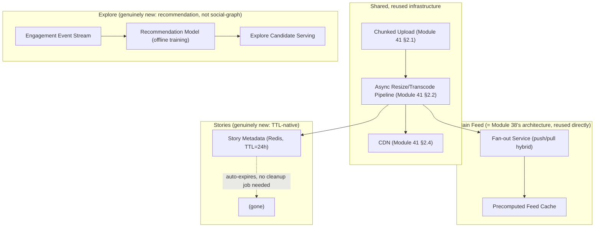

# Module 42 — System Design: Designing Instagram (Photo/Video Sharing, Stories & Feed)

> Domain: System Design | Level: Beginner → Expert | Prerequisite: [[02-Designing-News-Feed-System]] (fan-out/ranking directly reused), [[05-Designing-YouTube-Video-Streaming]] (media storage/CDN directly reused), [[../07-Redis/01-Data-Structures-Caching-Patterns]] (TTL for Stories)

---

## 1. Fundamentals

### What makes Instagram a distinct system-design synthesis rather than "News Feed plus photos"?
Instagram is best understood as the **direct combination** of two problems this course has already solved in depth — Module 38's feed/fan-out problem (a photo/video post from a followed account must reach followers' feeds) and Module 41's media-storage/CDN problem (the actual image/video bytes need efficient upload, storage, and delivery) — **plus** one genuinely new element: **Stories**, an ephemeral (24-hour-expiring) content type with fundamentally different storage/access-pattern requirements than permanent feed posts.

### Why does this matter?
Because a Staff/Principal-level answer to "design Instagram" should explicitly **recognize and reuse** the already-established feed and media-storage solutions rather than re-deriving them from scratch, reserving genuine new design effort specifically for Stories' distinctive ephemeral-content requirements and the **Explore/Discovery** page's fundamentally different (non-social-graph-based) content-selection problem.

### When does this matter?
Any system combining social-graph-based content distribution with rich media and time-limited content; the depth matters for correctly identifying which parts of the design are "solved problems" (directly reusable from Modules 38/41) versus which parts (Stories' TTL-based storage, Explore's recommendation-not-social-graph model) are genuinely new.

### How does it work (30,000-ft view)?
```
Post creation: upload media (Module 41's chunked-upload + transcoding, for images: resizing into
                multiple resolutions instead of video bitrates) -> fan-out to followers' feeds (Module 38)
Story creation: same media pipeline, but written with a 24-hour TTL (Module 25 §2.3) instead of
                permanent storage -- automatically expires, no manual deletion needed
Explore page: NOT social-graph-based -- a recommendation problem, ranking content the user doesn't
              already follow, based on engagement/similarity signals
```

---

## 2. Deep Dive

### 2.1 Reusing Module 38's Feed Architecture Directly
Instagram's core feed (posts from followed accounts) is **architecturally identical** to Module 38's news-feed design: the same fan-out-on-write/fan-out-on-read/hybrid decision (§2.4 there), the same celebrity-problem consideration (an Instagram influencer with millions of followers creates the identical write-amplification concern as Module 38 §2.2's Twitter-shaped example), the same precomputed-feed-cache-with-bounding discipline (Module 38 §7). A system-design answer that re-derives this from scratch, rather than stating "this is the same fan-out problem as a Twitter-style feed, solved the same way," misses an opportunity to demonstrate exactly the cross-problem pattern-recognition this course has repeatedly emphasized (Module 32 §Advanced Q9's "recognize the pattern in a new context" skill, now applied at the full-system-design level).

### 2.2 Reusing Module 41's Media Pipeline, Adapted for Images
Image upload/processing directly reuses Module 41's chunked-upload and asynchronous-processing-pipeline patterns, adapted: instead of transcoding into multiple video bitrates, images are resized into multiple resolutions (thumbnail, feed-display, full-resolution) — the same independent-per-rendition-job discipline (Module 41 §4's incident/fix) applies identically, since generating a thumbnail shouldn't be blocked behind generating a full-resolution version, and the same CDN-primary delivery model (Module 41 §2.4) applies identically for serving the resulting images.

### 2.3 Stories — the Genuinely New Element: TTL-Native Ephemeral Content
Stories expire after 24 hours **automatically** — this isn't a soft, application-enforced "hide after 24 hours" UI convention layered on permanent storage; it's architecturally distinct, ideally using a storage mechanism with **native TTL support** (Redis's `EXPIRE`, Module 25 §2.3, for the Story's metadata/feed-visibility entry; a similarly TTL-aware object-storage lifecycle policy for the underlying media file itself) so that expiration is a structural property of the storage layer, not a manually-run cleanup job that could fail/lag (directly avoiding the "orphaned, unbounded-retention" risk class this course has repeatedly flagged — Module 22 §2.5's replication slots, Module 23 §4's unbounded embedded arrays — here proactively designed around from the start rather than retrofitted after an incident).

### 2.4 The Explore/Discovery Page — a Fundamentally Different Content-Selection Problem
Unlike the main feed (content from accounts the user **already follows** — a social-graph traversal problem, §2.1), the Explore page surfaces content from accounts the user **doesn't** follow, based on engagement signals, content similarity, and collaborative-filtering-style recommendation — this is architecturally a **recommendation system** problem (a distinct discipline with its own data pipeline: engagement-event collection, offline/batch model training, a serving layer providing ranked candidates) rather than a graph-traversal/fan-out problem at all — a system-design answer conflating "Explore" with "just a variant of the main feed" misses that these are genuinely different problems requiring different architectural components (a recommendation-candidate-generation service is not simply a differently-configured version of the fan-out service).

### 2.5 Consistency Requirements Across Instagram's Different Content Types
Directly applying Module 37 §2.1's "consistency per data type, not uniformly" discipline: the main feed tolerates eventual consistency (a followed account's new post appearing a few seconds late is acceptable, exactly Module 37 §4's lesson); a Story's view count (who has seen my Story) benefits from stronger consistency for the Story owner's own view specifically (checking "who saw my story" should reflect genuinely recent views, not stale data) but tolerates eventual consistency for other, less time-sensitive engagement metrics; a direct message (if Instagram's DM feature is in scope) inherits Module 39's strict-ordering, reliable-delivery requirements entirely, distinct from both the feed and Stories.

## 3. Visual Architecture


## 4. Production Example
**Scenario**: A team implementing Stories initially used the **same permanent-storage, application-level "hide if older than 24h" filtering** approach as the main feed, rather than TTL-native storage — this worked functionally (expired Stories were correctly hidden from the UI), but over time, the Stories storage tier accumulated an ever-growing volume of **technically-expired-but-never-actually-deleted** content, since "hide in the UI" and "delete from storage" were two separate, independently-implemented concerns, and the deletion job (a separate, periodically-run cleanup process) began falling behind under growing content volume — directly reproducing Module 23 §4's unbounded-growth incident shape, just with an extra, unnecessary layer of applied-but-ultimately-ineffective "hide it in the UI" logic masking the underlying storage-growth problem from being immediately visible to users (even though it was accumulating real, unnecessary storage cost and risk). **Investigation**: confirmed via storage-utilization monitoring that Stories-tier storage was growing roughly linearly with total historical Stories ever created, not bounded by the ~24-hour window user-visible behavior implied. **Fix**: migrated Stories metadata to Redis with native `EXPIRE` (§2.3), and configured the underlying object storage's own lifecycle-policy-based automatic deletion (a cloud-storage-native feature, not a custom cleanup job) for the media files themselves — expiration became a structural, storage-layer-enforced property requiring no separate, independently-maintained cleanup process at all. **Lesson**: "hide expired content in the UI" and "actually delete/bound the storage of expired content" are two different requirements that must **both** be addressed — implementing only the UI-visible behavior while leaving storage growth unbounded (relying on a separate, fallible cleanup job) reproduces exactly the "invisible until it becomes a real, costly problem" pattern this course has repeatedly warned against, and native TTL support (when the storage layer offers it) structurally eliminates this entire risk category rather than requiring a separately-maintained, independently-failable cleanup mechanism.

## 5. Best Practices
- Explicitly recognize and reuse Module 38's feed architecture and Module 41's media pipeline rather than re-deriving them — reserve new design effort for Stories and Explore specifically.
- Use storage-layer-native TTL/expiration (Redis `EXPIRE`, object-storage lifecycle policies) for genuinely ephemeral content, not application-level "hide if old" filtering layered on permanent storage (§4's incident).
- Recognize the Explore page as a recommendation-system problem, architecturally distinct from the social-graph-based main feed — design it as a separate service/pipeline, not a variant of the fan-out service.
- Apply consistency requirements per content type/feature (feed, Stories, DMs) rather than uniformly across the whole platform.

## 6. Anti-patterns
- Implementing ephemeral content (Stories) via application-level UI filtering over permanent storage, relying on a separately-maintained cleanup job that can silently fall behind (§4's incident).
- Treating the Explore/Discovery page as simply a variant of the main feed's fan-out logic rather than recognizing it as a distinct recommendation-system problem.
- Re-deriving the feed/fan-out or media-storage architecture from scratch instead of recognizing and directly reusing Modules 38/41's already-solved designs.
- Applying one uniform consistency model across feed, Stories, and DMs despite their genuinely different requirements.

## 7. Performance Engineering
**Story-viewing latency and the "ring" UI pattern**: Stories are typically displayed as a horizontally-scrollable list of "who has an active story" avatars — this requires an efficient query ("which of my followed accounts currently have an unexpired story") that should be served from a fast, TTL-aware structure (a Redis set per user of "accounts with active stories," itself naturally shrinking as entries expire) rather than a full scan-and-filter over all followed accounts' story records on every single feed-open. **Image resizing cost amortization**: directly Module 41 §7's rendition-generation cost/latency trade-off — generating a thumbnail (needed immediately for feed display) with higher priority than a full-resolution download-quality version (needed only if a user explicitly views/downloads the full image), exactly Module 41 §4's priority-ordering fix applied to image resizing instead of video transcoding. **Explore-page latency budget**: since Explore's recommendation-serving layer (§2.4) is a genuinely different, more computationally-involved component (potentially involving a real-time or near-real-time ranking-model inference call) than the feed's simpler precomputed-cache read, its latency budget (Module 37 §7) must be allocated and measured separately — a system-design answer shouldn't assume Explore's latency characteristics automatically match the main feed's.

## 8. Security
**Story view-list privacy**: "who viewed my Story" is itself sensitive, per-user data requiring the same resource-based authorization (Module 12 §2.4) as any other user-specific data — only the Story's owner should be able to query its view list, a straightforward but easily-overlooked authorization check specifically because Stories are a newer, less-scrutinized feature than the long-established main feed. **Close Friends/audience-restricted Stories**: a Story visible only to a curated subset of followers requires the fan-out/visibility-check logic to filter based on this specific audience list, directly extending Module 38 §8's "verify current authorization state, not just historical push-time state" discipline — a user removed from someone's Close Friends list after a Story was already fanned-out/cached should not continue seeing it via a stale cache entry. **Content moderation for user-generated images**, directly Module 41 §8's discussion, now for image/short-video content specifically — automated content-scanning (nudity/violence detection, copyright matching) as an independent job within the same media-processing pipeline (§2.2), gating public visibility until cleared.

## 9. Scalability
**The celebrity problem recurs identically**: Instagram influencers/celebrities create the exact same write-amplification concern as Module 38 §4's incident — the hybrid fan-out model (Module 38 §2.4) applies without modification. **Explore's recommendation pipeline scales as a distinct system**: the offline model-training component (processing engagement events in batch, potentially via a large-scale data pipeline entirely separate from the platform's real-time serving infrastructure) and the online serving component (low-latency candidate retrieval for a given user, at request time) have very different scaling characteristics and should be reasoned about as two separate systems with their own independent scaling ladders (Module 37 §9), not conflated into one. **Media storage at Instagram's actual historical scale**: directly Module 41 §11 Easy exercise's capacity-estimation discipline, now for images specifically (typically smaller per-item than video, but potentially far higher item-creation *rate* given photos are quicker to create/share than videos) — the specific numbers differ from Module 41's video-centric estimate, but the underlying storage-tiering-by-popularity and CDN-primary-delivery principles (Module 41 §2.4/§9) apply identically.

---

## 10. Interview Questions

### Basic (10)
1. **Q: What two already-covered system-design problems does Instagram's core architecture combine?** **A:** Module 38's news-feed/fan-out problem and Module 41's media-storage/CDN problem.
2. **Q: What makes Stories architecturally distinct from ordinary feed posts?** **A:** They automatically expire after 24 hours — ideally via storage-layer-native TTL, not application-level "hide if old" filtering over permanent storage.
3. **Q: Is the Explore page based on the social graph (who you follow)?** **A:** No — it's a recommendation-system problem, surfacing content from accounts you don't follow based on engagement/similarity signals.
4. **Q: What storage mechanism naturally supports Stories' TTL requirement?** **A:** Redis's `EXPIRE` for metadata, combined with object-storage lifecycle policies for the underlying media files.
5. **Q: Does Instagram face the same "celebrity problem" as a Twitter-style feed?** **A:** Yes — an influencer/celebrity account creates the identical write-amplification concern, addressed the same way (the hybrid fan-out model).
6. **Q: Why should image resizing generate a thumbnail before a full-resolution version?** **A:** The thumbnail is needed immediately for feed display; prioritizing it avoids blocking quick availability behind a more expensive, less immediately-needed rendition.
7. **Q: Who should be authorized to see a Story's "who viewed this" list?** **A:** Only the Story's owner — resource-based authorization, the same discipline as any other user-specific sensitive data.
8. **Q: Should the main feed, Stories, and DMs use the same consistency model?** **A:** No — each has genuinely different consistency requirements and should be designed independently.
9. **Q: What's the risk of implementing Stories via application-level filtering over permanent storage instead of native TTL?** **A:** Storage can grow unboundedly if a separate, independently-maintained cleanup job falls behind or fails, even though expired content is correctly hidden in the UI (§4).
10. **Q: Does the Explore page's serving layer typically have the same latency characteristics as the main feed?** **A:** No — it often involves more computationally-involved ranking/recommendation logic, requiring its own separately-measured latency budget.

### Intermediate (10)
1. **Q: Why is recognizing Instagram's core feed as "the same problem as Module 38" valuable in an interview, beyond just saving design time?** **A:** It demonstrates genuine architectural pattern-recognition across superficially different products — a signal of deeper understanding than re-deriving the same fan-out/celebrity-problem reasoning from scratch as if it were entirely novel.
2. **Q: Why does "hide expired content in the UI" not automatically imply "storage is bounded"?** **A:** These are two independently-implemented concerns — UI filtering only controls what's displayed, not what's actually retained in storage; without a corresponding, reliable deletion mechanism, storage can grow unboundedly even though users never see the stale content (§4's incident).
3. **Q: Why is a recommendation-system pipeline (Explore) architecturally distinct from a fan-out service (main feed), not just "the same service with different config"?** **A:** Fan-out is fundamentally a graph-traversal/push-or-pull problem over an explicit follow relationship; recommendation involves engagement-signal collection, model training (often offline/batch), and a fundamentally different serving pattern (ranked candidates from a learned model, not a deterministic graph query) — genuinely different components with different data pipelines.
4. **Q: Why does a Story's "Close Friends" audience restriction need to check current, not historical, membership?** **A:** If a viewer was removed from the Close Friends list after the Story was created/cached, continuing to show it based on a stale, push-time authorization check would violate the current, intended visibility restriction — directly Module 38 §8's stale-cache authorization concern.
5. **Q: Why might Stories' "who has an active story" query benefit from a dedicated, TTL-aware Redis set rather than scanning all followed accounts' story records?** **A:** A dedicated set of currently-active story-having accounts, itself naturally shrinking as individual entries' TTLs expire, avoids the cost of filtering a potentially much larger set of all followed accounts down to only those with a currently-unexpired story on every single query.
6. **Q: Why does image content typically have a higher creation rate but smaller per-item size than video, and how does this affect capacity estimation?** **A:** Photos are quicker and lower-friction to capture and share than recording/uploading video, leading to higher volume; but each item's storage footprint is typically far smaller — capacity estimates (Module 41 §11 Easy exercise's discipline) must use image-specific rate/size assumptions, not simply reuse video-platform numbers.
7. **Q: Why should the offline model-training and online serving components of the Explore pipeline be reasoned about as separate systems with independent scaling ladders?** **A:** They have fundamentally different workload shapes (large-scale batch processing vs. low-latency, high-concurrency request serving) and different bottlenecks — conflating them into one scaling discussion misses that each needs its own, independently-reasoned capacity plan.
8. **Q: Why does a content-moderation job for images need the same "independent, parallel job within the processing pipeline" design as Module 41's video content-ID matching?** **A:** Running it as a gating, serial step before any availability would delay every upload's visibility by the moderation check's processing time; running it independently/in parallel lets content become available quickly while moderation results are applied after the fact if a violation is found, exactly Module 41 §Advanced Q7's reasoning applied to a different content type.
9. **Q: Why is it valuable for a system-design candidate to explicitly state "Stories need native TTL, not application-level filtering" rather than just building it and hoping it's understood?** **A:** It demonstrates the specific, hard-won lesson from this course's recurring "unbounded growth invisible until it's a real production problem" pattern (Module 22, Module 23) being proactively applied to a genuinely new feature, rather than needing to be discovered reactively via an incident, exactly the kind of proactive risk-avoidance a Staff/Principal interview rewards.
10. **Q: Why might a DM (direct messaging) feature within Instagram inherit Module 39's chat-system requirements entirely, rather than needing its own separate design from scratch?** **A:** Because it's architecturally the same problem (ordered, reliably-delivered, bidirectional real-time communication between users) Module 39 already solved in depth — recognizing this and reusing that design is the same pattern-recognition discipline applied to the feed/media-storage components.

### Advanced (10)
1. **Q: Diagnose the Stories-storage-growth production incident (§4) from first principles, and design the monitoring that would have caught the deletion-job-falling-behind risk before storage growth became a real cost/risk concern.**
   **A:** Root cause: implementing "expire after 24 hours" as two separate, independently-fallible mechanisms (UI filtering, a separate cleanup job) rather than one, storage-layer-enforced property. Safeguard (beyond the native-TTL fix itself): monitor the actual **ratio of "content older than 24 hours still present in storage" to "total content ever created"** as a standing metric — a ratio that should be near-zero under correctly-functioning expiration, with any sustained, non-zero, growing value directly signaling the cleanup-job-falling-behind risk *before* it accumulates into a large, costly storage-growth problem, directly the same "measure the actual invariant the design depends on, don't just trust the mechanism is working" discipline recurring throughout this course.
2. **Q: Design the specific TTL-refresh mechanics for a Story that receives new engagement (a view, a reply) shortly before its 24-hour expiration — should this extend its TTL?**
   **A:** No — a Story's expiration should be anchored to its **creation time**, not its last-engagement time (unlike, e.g., a session-token TTL which often *should* refresh on activity) — refreshing on engagement would mean a popular Story could persist indefinitely as long as it keeps receiving views, violating the product's actual "stories last 24 hours from posting" semantic; the TTL should be set once, at creation, based purely on the creation timestamp, with engagement events recorded separately without any interaction with the expiration mechanism at all.
3. **Q: Explain how you would design the Explore page's recommendation-serving layer to incorporate real-time signals (a post going viral in the last hour) alongside offline-trained model scores, without requiring full model retraining for every such signal.**
   **A:** A common production pattern: combine an offline-trained base ranking score (updated periodically, e.g., daily, capturing longer-term engagement/similarity patterns) with a real-time "trending boost" signal (a separate, fast-computing metric tracking recent engagement velocity, directly reusing Module 41 §2.5's batched-counter-aggregation pattern for engagement events specifically) — the serving layer combines both signals (e.g., a weighted blend) at request time, letting genuinely viral, very recent content surface in Explore without waiting for the next full model-retraining cycle, while still benefiting from the offline model's more sophisticated, longer-term-pattern-capturing recommendations for the bulk of served content.
4. **Q: Design a strategy for handling the "Close Friends" Story audience-restriction check efficiently at fan-out time, without requiring a separate authorization check per viewer at every single feed/story-ring load.**
   **A:** At Story-creation time, resolve the Close Friends list **once** and fan out (or mark as visible) only to that specific, resolved set of followers (directly Module 38's push-model fan-out mechanics, here scoped to a restricted audience subset rather than all followers) — this front-loads the authorization decision to creation time (when the list is naturally already being read to determine fan-out targets anyway) rather than requiring a separate, repeated authorization check on every subsequent viewer's read, while still respecting Module 38 §8's "verify current, not stale, authorization" concern by re-validating current Close-Friends-list membership specifically at the moment a story is marked visible/fanned-out, not relying on a much-older cached list.
5. **Q: How would you reason about whether Instagram's DM feature should share the same chat infrastructure (Module 39) as a hypothetical separate, dedicated messaging product, versus building a distinct instance?**
   **A:** If the underlying requirements (ordering, delivery guarantees, connection management) are genuinely identical, sharing the same underlying chat-system implementation (parameterized/multi-tenant across different "surfaces" of the broader product) avoids duplicating Module 39's hard-won design and operational lessons across two independently-maintained systems — the decision hinges on whether DM-specific requirements (e.g., ephemeral "vanish mode" messages, media-heavy DM content reusing Module 41/42's media pipeline) can be accommodated as feature variations within one shared chat infrastructure, or whether they diverge enough to genuinely warrant separate systems — defaulting to shared infrastructure unless a specific, demonstrated divergence justifies separation, directly this course's recurring "don't duplicate a solved problem's infrastructure without a demonstrated need" discipline.
6. **Q: Explain a scenario where treating Explore purely as an engagement-maximizing recommendation system, without any additional constraint, could create a product/business risk worth explicitly raising in a design discussion.**
   **A:** A purely engagement-optimized recommendation model can converge toward surfacing increasingly sensational, controversial, or filter-bubble-reinforcing content (since such content often drives measurably higher engagement in the short term) — a genuine, well-documented industry concern for recommendation-system design generally; a complete system-design answer should proactively raise this as a design consideration (content-diversity constraints, explicit "don't purely optimize for raw engagement" business rules layered onto the ranking model) rather than presenting "maximize engagement" as an unqualified, purely-technical objective function.
7. **Q: Design a data-retention/deletion strategy addressing a "user deletes their account" request, considering the multiple, distinct storage locations (feed cache, media storage, Stories, Explore engagement history) this system now has.**
   **A:** Account deletion must cascade across **every** distinct storage location this module has introduced — the precomputed feed caches of anyone who followed the deleted account (removing their content), the media storage (deleting their uploaded images/videos, subject to any legal/compliance retention requirements that might override immediate deletion), Stories (already TTL-bounded, but any not-yet-expired ones should be force-expired), and engagement-history data feeding the Explore recommendation model (requiring the deleted user's data to be excluded from future model training, a genuinely more complex "unlearn this data" requirement than simple row deletion) — a complete answer explicitly enumerates every distinct data store this module's design introduced and addresses each one's specific deletion/anonymization requirement, rather than treating "delete the account" as a single, simple database-row-deletion operation.
8. **Q: A team proposes building Explore's recommendation model using the exact same infrastructure/pipeline as the main feed's ranking model (Module 38 §2.5), reasoning "it's all just ranking, so we should share the code." Evaluate this as a Principal Engineer.**
   **A:** Push back on the oversimplification — while both involve "ranking," the main feed ranks a **candidate set already scoped by the social graph** (posts from followed accounts), while Explore's candidate generation itself is the harder, more novel problem (finding relevant content from accounts the user has no explicit relationship with) — sharing the *ranking/scoring* infrastructure (if the underlying ranking-model technology is genuinely similar) may be reasonable, but conflating "candidate generation" (fundamentally different between the two features) with "ranking" (potentially shared) risks building an architecture that doesn't actually fit Explore's genuinely different candidate-generation requirements — recommend explicitly separating these two concerns (candidate generation vs. ranking) in the design discussion, sharing infrastructure only where the underlying problem is actually the same, directly Module 38 §2.5's "fan-out and ranking are separable concerns" principle now applied one level deeper to distinguish candidate-generation from ranking specifically.
9. **Q: Explain how you would design the system to support a "shared Stories highlight" feature (a user curates specific past Stories to display permanently on their profile, bypassing the normal 24-hour expiration) without undermining the TTL-native architecture's benefits.**
   **A:** When a user adds a Story to a "Highlight," explicitly **copy** (not merely reference) the underlying media to permanent storage (Module 41's standard, non-TTL media storage) and create a new, separate, non-expiring metadata record — rather than attempting to "cancel" or "extend" the original Story's TTL (which would reintroduce exactly the TTL-refresh-on-engagement anti-pattern from Advanced Q2, and complicate the storage layer's simple, structural TTL-enforcement guarantee) — treating "add to Highlights" as effectively "re-publish this content as a new, permanent post" cleanly preserves the original Stories system's simplicity while still supporting the product feature, a clean architectural separation rather than a special-cased exception bolted onto the TTL mechanism.
10. **Q: As a Principal Engineer, how would you structure a design-review process for a new feature request that superficially resembles an existing, already-solved system-design problem (as Stories initially, mistakenly, resembled the main feed), to catch a genuine architectural mismatch before implementation?**
    **A:** Require any new feature's design document to explicitly answer "which existing system component does this most resemble, and precisely where does it diverge from that component's actual guarantees/requirements" — for Stories, this question ("does this resemble the main feed? where does it diverge?") would have surfaced the TTL/ephemerality divergence explicitly, prompting a deliberate architectural decision (native TTL) rather than a default, unexamined reuse of the main feed's permanent-storage pattern — directly generalizing this module's central lesson (§4) into a standing, mandatory design-review question applicable to any future "this looks similar to something we've already built" feature request, preventing the same class of superficial-similarity-masking-a-genuine-divergence mistake from recurring.

---

## 11. Coding Exercises

*(System design case studies use worked design exercises, consistent with this domain's format.)*

### Easy — TTL-native Story storage (§4's fix)
```csharp
public async Task CreateStoryAsync(string userId, string mediaUrl)
{
    string storyId = Guid.NewGuid().ToString();
    var storyData = JsonSerializer.Serialize(new { userId, mediaUrl, createdAt = DateTimeOffset.UtcNow });

    // Native TTL -- expiration is a STRUCTURAL property of the storage layer, no separate cleanup job needed.
    await _redis.StringSetAsync($"story:{storyId}", storyData, TimeSpan.FromHours(24));
    await _redis.SetAddAsync($"active-stories:{userId}", storyId, TimeSpan.FromHours(24)); // Intermediate Q5's dedicated set
}
```

### Medium — Priority-ordered image rendition generation (Module 41 §4's pattern reused)
```csharp
public enum RenditionPriority { Thumbnail = 0, FeedDisplay = 1, FullResolution = 2 }

public async Task ProcessUploadedImageAsync(string imageId, byte[] rawImageBytes)
{
    // Thumbnail FIRST -- needed immediately for feed display; full-res last, needed only on-demand.
    await _jobQueue.EnqueueAsync(new ResizeJob(imageId, RenditionPriority.Thumbnail, rawImageBytes));
    await _jobQueue.EnqueueAsync(new ResizeJob(imageId, RenditionPriority.FeedDisplay, rawImageBytes));
    await _jobQueue.EnqueueAsync(new ResizeJob(imageId, RenditionPriority.FullResolution, rawImageBytes));
}
```

### Hard — Close Friends audience-scoped fan-out (Advanced Q4)
```csharp
public async Task PublishCloseFriendsStoryAsync(string authorId, string mediaUrl)
{
    // Resolve the audience ONCE, at creation time -- re-validated as CURRENT, not a stale cached list.
    var closeFriends = await _followGraph.GetCurrentCloseFriendsAsync(authorId);
    string storyId = await CreateStoryAsync(authorId, mediaUrl); // Easy exercise's TTL-native creation

    foreach (var friendId in closeFriends)
    {
        await _redis.SetAddAsync($"visible-close-friends-stories:{friendId}", storyId, TimeSpan.FromHours(24));
    }
    // A friend REMOVED from Close Friends after this point simply never received this specific
    // story in their visibility set in the first place -- no stale-authorization risk requires
    // a separate revocation step, since fan-out only ever targeted the audience CURRENT at creation time.
}
```

### Expert — Hybrid offline+real-time Explore ranking (Advanced Q3)
```csharp
public async Task<List<RankedPost>> GetExploreCandidatesAsync(string userId, int count)
{
    var offlineScored = await _recommendationModel.GetTopCandidatesAsync(userId, count * 2); // offline-trained base scores

    var trendingBoosts = await Task.WhenAll(
        offlineScored.Select(c => _engagementVelocityTracker.GetRecentVelocityAsync(c.PostId))); // Module 41 §2.5-style
                                                                                                    // batched real-time counter

    var combined = offlineScored.Zip(trendingBoosts, (candidate, velocity) =>
        new RankedPost(candidate.PostId, candidate.OfflineScore * 0.7 + velocity * 0.3)); // weighted blend

    return combined.OrderByDescending(p => p.CombinedScore).Take(count).ToList();
}
```
**Discussion**: The 0.7/0.3 weighting is illustrative — a real system would tune this blend empirically via A/B testing (Advanced Q5's earlier feed-ranking A/B-testing pattern, directly reused here), but the structural point is the key design artifact: combining a slower-updating, more sophisticated offline signal with a fast-updating, simpler real-time signal at serving time, rather than requiring either a full model retrain for every trending shift or ignoring recent virality entirely.

---

## 12–17. System Design / LLD / Debugging / Decision / Case Study / Principal

*(This entire module IS the deep-dive case study — §4's incident, §11's four worked exercises, and the extensive Advanced-tier Q&A collectively constitute this section's typical content.)*

## 18. Revision
**Key takeaways**: Instagram's core feed and media pipeline directly reuse Module 38 (fan-out/celebrity-problem) and Module 41 (chunked upload, async per-rendition processing, CDN-primary delivery) — recognize and state this reuse explicitly rather than re-deriving from scratch. Stories require storage-layer-native TTL (Redis `EXPIRE`, object-storage lifecycle policies), never application-level "hide if old" filtering over permanent storage, which silently risks unbounded storage growth if a separate cleanup job falls behind (§4). The Explore page is a genuinely distinct recommendation-system problem (candidate generation from outside the social graph, offline model training, real-time-signal blending), architecturally separate from the feed's graph-traversal-based fan-out, even though both ultimately involve "ranking."

---

**Next**: Continuing autonomously to Module 43 — Designing Amazon / an E-commerce Platform (product catalog, inventory, cart, order processing, search).
