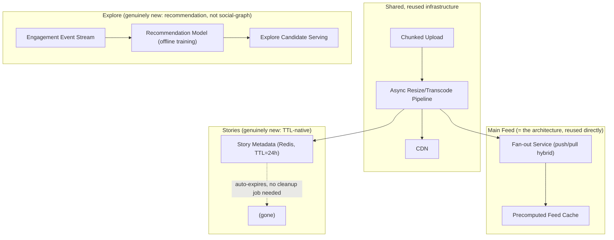
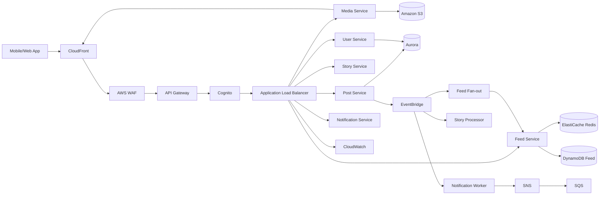
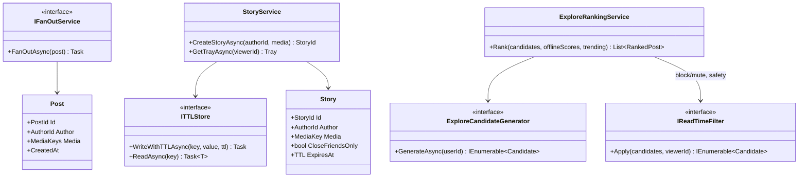
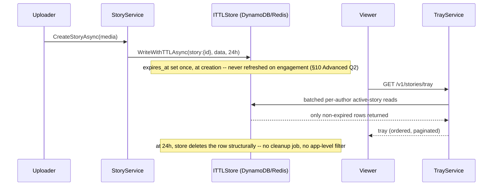

# Module 42 — System Design: Designing Instagram (Photo/Video Sharing, Stories & Feed)

> Domain: System Design | Level: Beginner → Expert | Prerequisite: [[02-Designing-News-Feed-System]] (fan-out/ranking directly reused), [[05-Designing-YouTube-Video-Streaming]] (media storage/CDN directly reused), [[../07-Redis/01-Data-Structures-Caching-Patterns]] (TTL for Stories)

---

## 1. Fundamentals

### What makes Instagram a distinct system-design synthesis rather than "News Feed plus photos"?
Instagram is best understood as the **direct combination** of two problems this course has already solved in depth — the feed/fan-out problem (a photo/video post from a followed account must reach followers' feeds) and the media-storage/CDN problem (the actual image/video bytes need efficient upload, storage, and delivery) — **plus** one genuinely new element: **Stories**, an ephemeral (24-hour-expiring) content type with fundamentally different storage/access-pattern requirements than permanent feed posts.

### Why does this matter?
Because a Staff/Principal-level answer to "design Instagram" should explicitly **recognize and reuse** the already-established feed and media-storage solutions rather than re-deriving them from scratch, reserving genuine new design effort specifically for Stories' distinctive ephemeral-content requirements and the **Explore/Discovery** page's fundamentally different (non-social-graph-based) content-selection problem.

### When does this matter?
Any system combining social-graph-based content distribution with rich media and time-limited content; the depth matters for correctly identifying which parts of the design are "solved problems" (directly reusable from Modules 38/41) versus which parts (Stories' TTL-based storage, Explore's recommendation-not-social-graph model) are genuinely new.

### How does it work (30,000-ft view)?
```
Post creation: upload media (the chunked-upload + transcoding, for images: resizing into
 multiple resolutions instead of video bitrates) -> fan-out to followers' feeds
Story creation: same media pipeline, but written with a 24-hour TTL instead of
 permanent storage -- automatically expires, no manual deletion needed
Explore page: NOT social-graph-based -- a recommendation problem, ranking content the user doesn't
 already follow, based on engagement/similarity signals
```

---

## 2. Deep Dive

### 2.1 Reusing the Feed Architecture Directly
Instagram's core feed (posts from followed accounts) is **architecturally identical** to the news-feed design: the same fan-out-on-write/fan-out-on-read/hybrid decision (there), the same celebrity-problem consideration (an Instagram influencer with millions of followers creates the identical write-amplification concern as the Twitter-shaped example), the same precomputed-feed-cache-with-bounding discipline. A system-design answer that re-derives this from scratch, rather than stating "this is the same fan-out problem as a Twitter-style feed, solved the same way," misses an opportunity to demonstrate exactly the cross-problem pattern-recognition this course has repeatedly emphasized (§Advanced Q9's "recognize the pattern in a new context" skill, now applied at the full-system-design level).

### 2.2 Reusing the Media Pipeline, Adapted for Images
Image upload/processing directly reuses the chunked-upload and asynchronous-processing-pipeline patterns, adapted: instead of transcoding into multiple video bitrates, images are resized into multiple resolutions (thumbnail, feed-display, full-resolution) — the same independent-per-rendition-job discipline (the incident/fix) applies identically, since generating a thumbnail shouldn't be blocked behind generating a full-resolution version, and the same CDN-primary delivery model applies identically for serving the resulting images.

### 2.3 Stories — the Genuinely New Element: TTL-Native Ephemeral Content
Stories expire after 24 hours **automatically** — this isn't a soft, application-enforced "hide after 24 hours" UI convention layered on permanent storage; it's architecturally distinct, ideally using a storage mechanism with **native TTL support** (Redis's `EXPIRE` for the Story's metadata/feed-visibility entry; a similarly TTL-aware object-storage lifecycle policy for the underlying media file itself) so that expiration is a structural property of the storage layer, not a manually-run cleanup job that could fail/lag (directly avoiding the "orphaned, unbounded-retention" risk class this course has repeatedly flagged — the replication slots, the unbounded embedded arrays — here proactively designed around from the start rather than retrofitted after an incident).

### 2.4 The Explore/Discovery Page — a Fundamentally Different Content-Selection Problem
Unlike the main feed (content from accounts the user **already follows** — a social-graph traversal problem), the Explore page surfaces content from accounts the user **doesn't** follow, based on engagement signals, content similarity, and collaborative-filtering-style recommendation — this is architecturally a **recommendation system** problem (a distinct discipline with its own data pipeline: engagement-event collection, offline/batch model training, a serving layer providing ranked candidates) rather than a graph-traversal/fan-out problem at all — a system-design answer conflating "Explore" with "just a variant of the main feed" misses that these are genuinely different problems requiring different architectural components (a recommendation-candidate-generation service is not simply a differently-configured version of the fan-out service).

### 2.5 Consistency Requirements Across Instagram's Different Content Types
Directly applying the "consistency per data type, not uniformly" discipline: the main feed tolerates eventual consistency (a followed account's new post appearing a few seconds late is acceptable, exactly the lesson); a Story's view count (who has seen my Story) benefits from stronger consistency for the Story owner's own view specifically (checking "who saw my story" should reflect genuinely recent views, not stale data) but tolerates eventual consistency for other, less time-sensitive engagement metrics; a direct message (if Instagram's DM feature is in scope) inherits the strict-ordering, reliable-delivery requirements entirely, distinct from both the feed and Stories.

## 3. Visual Architecture

```mermaid
graph TB
 subgraph "Shared, reused infrastructure"
 Upload["Chunked Upload"] --> Processing["Async Resize/Transcode Pipeline"]
 Processing --> CDN["CDN"]
 end
 subgraph "Main Feed (= the architecture, reused directly)"
 Processing --> FanOut["Fan-out Service (push/pull hybrid)"]
 FanOut --> FeedCache["Precomputed Feed Cache"]
 end
 subgraph "Stories (genuinely new: TTL-native)"
 Processing --> StoryStore["Story Metadata (Redis, TTL=24h)"]
 StoryStore -.->|"auto-expires, no cleanup job needed"| Gone["(gone)"]
 end
 subgraph "Explore (genuinely new: recommendation, not social-graph)"
 Engagement["Engagement Event Stream"] --> RecModel["Recommendation Model (offline training)"]
 RecModel --> ExploreServing["Explore Candidate Serving"]
 end
```

### 3.1 A concrete AWS deployment of this architecture

The logical diagram above maps directly onto a real managed-service deployment — useful for grounding "which component runs where" in an interview that asks for concrete infrastructure, not just logical boxes:


```mermaid
flowchart LR
 User[Mobile/Web App] --> CloudFront[CloudFront]
 CloudFront --> WAF[AWS WAF]
 WAF --> APIGateway[API Gateway]
 APIGateway --> Auth[Cognito]
 Auth --> ALB[Application Load Balancer]

 ALB --> UserService[User Service]
 ALB --> FeedService[Feed Service]
 ALB --> PostService[Post Service]
 ALB --> StoryService[Story Service]
 ALB --> MediaService[Media Service]
 ALB --> NotificationService[Notification Service]

 MediaService --> S3[(Amazon S3)]
 PostService --> Aurora[(Aurora)]
 UserService --> Aurora
 FeedService --> Redis[(ElastiCache Redis)]
 FeedService --> DynamoDB[(DynamoDB Feed)]

 PostService --> EventBridge[EventBridge]
 EventBridge --> FeedWorker[Feed Fan-out]
 EventBridge --> StoryWorker[Story Processor]
 EventBridge --> NotificationWorker[Notification Worker]

 NotificationWorker --> SNS[SNS]
 SNS --> SQS[SQS]
 FeedWorker --> FeedService
 MediaService --> CloudFront
 ALB --> CloudWatch[CloudWatch]
```

**Request flow through the deployment** — the read/write split made explicit as a synchronous-above / asynchronous-below boundary:

```text
Mobile/Web App -> CloudFront -> AWS WAF -> API Gateway -> Cognito Auth -> Application Load Balancer
                                                                                   |
                    +------------------+------------------+------------------+-----+-----+
                    |                  |                  |                  |           |
                 UserSvc            FeedSvc            PostSvc            StorySvc     MediaSvc
                    |                  |                  |                  |           |
                 Aurora              Redis              Aurora             Aurora        S3
                                                            |
                                            Services publish domain events
                                                            |
                                                       EventBridge
                                                            |
                                  +-------------------------+-------------------------+
                                  |                         |                         |
                             Feed Worker              Notification Worker        Story Worker
                                                            |
                                                           SNS -> SQS -> Push / Email
```

Everything above `EventBridge` is synchronous request handling the client waits on; everything below it is asynchronous reaction — feed fan-out, story processing, and notification delivery cannot add latency to the user's original request and cannot fail it (directly §2.1's fan-out-is-async point and §12's push/pull design, now pinned to concrete AWS services). Each service also terminates in its own store (Aurora for relational user/post data, Redis/DynamoDB for the feed, S3 for media), which is what lets those services scale and fail independently — the database-per-service pattern named below.

**AWS service mapping:**

| Component | AWS Service | Maps to |
|-----------|-------------|---------|
| CDN | CloudFront | §2.2's media-delivery reuse from Module 05 |
| Security | AWS WAF | §8 |
| Authentication | Cognito | §8 AuthN |
| API | API Gateway | §12's REST API layer |
| Load Balancer | ALB | Routes to the per-service compute tier |
| Compute | ECS / EKS | Stateless service instances |
| User/Post Database | Aurora | §12's relational store for posts/users |
| Feed Store | DynamoDB / ElastiCache Redis | §12's precomputed feed cache |
| Photo/Video Storage | Amazon S3 | §2.2's media pipeline, with a TTL lifecycle policy on the Stories prefix (§3.1 of §12) |
| Event Bus | EventBridge | Domain-event backbone for fan-out, Stories, and notifications |
| Notifications | SNS + SQS | Async delivery, decoupled from the request path |
| Monitoring | CloudWatch | §12 Step 4's monitoring set |

The design-pattern names this deployment embodies — API Gateway pattern, database-per-service, cache-aside, publish/subscribe, CQRS-flavored read/write separation for the feed — are catalogued formally against this module's actual classes in §13's Design Patterns Used.

## 4. Production Example
**Scenario**: A team implementing Stories initially used the **same permanent-storage, application-level "hide if older than 24h" filtering** approach as the main feed, rather than TTL-native storage — this worked functionally (expired Stories were correctly hidden from the UI), but over time, the Stories storage tier accumulated an ever-growing volume of **technically-expired-but-never-actually-deleted** content, since "hide in the UI" and "delete from storage" were two separate, independently-implemented concerns, and the deletion job (a separate, periodically-run cleanup process) began falling behind under growing content volume — directly reproducing the unbounded-growth incident shape, just with an extra, unnecessary layer of applied-but-ultimately-ineffective "hide it in the UI" logic masking the underlying storage-growth problem from being immediately visible to users (even though it was accumulating real, unnecessary storage cost and risk). **Investigation**: confirmed via storage-utilization monitoring that Stories-tier storage was growing roughly linearly with total historical Stories ever created, not bounded by the ~24-hour window user-visible behavior implied. **Fix**: migrated Stories metadata to Redis with native `EXPIRE`, and configured the underlying object storage's own lifecycle-policy-based automatic deletion (a cloud-storage-native feature, not a custom cleanup job) for the media files themselves — expiration became a structural, storage-layer-enforced property requiring no separate, independently-maintained cleanup process at all. **Lesson**: "hide expired content in the UI" and "actually delete/bound the storage of expired content" are two different requirements that must **both** be addressed — implementing only the UI-visible behavior while leaving storage growth unbounded (relying on a separate, fallible cleanup job) reproduces exactly the "invisible until it becomes a real, costly problem" pattern this course has repeatedly warned against, and native TTL support (when the storage layer offers it) structurally eliminates this entire risk category rather than requiring a separately-maintained, independently-failable cleanup mechanism.

## 5. Best Practices
- Explicitly recognize and reuse the feed architecture and the media pipeline rather than re-deriving them — reserve new design effort for Stories and Explore specifically.
- Use storage-layer-native TTL/expiration (Redis `EXPIRE`, object-storage lifecycle policies) for genuinely ephemeral content, not application-level "hide if old" filtering layered on permanent storage (the incident).
- Recognize the Explore page as a recommendation-system problem, architecturally distinct from the social-graph-based main feed — design it as a separate service/pipeline, not a variant of the fan-out service.
- Apply consistency requirements per content type/feature (feed, Stories, DMs) rather than uniformly across the whole platform.

## 6. Anti-patterns
- Implementing ephemeral content (Stories) via application-level UI filtering over permanent storage, relying on a separately-maintained cleanup job that can silently fall behind (the incident).
- Treating the Explore/Discovery page as simply a variant of the main feed's fan-out logic rather than recognizing it as a distinct recommendation-system problem.
- Re-deriving the feed/fan-out or media-storage architecture from scratch instead of recognizing and directly reusing Modules 38/41's already-solved designs.
- Applying one uniform consistency model across feed, Stories, and DMs despite their genuinely different requirements.

---

## 7. Performance Engineering

**CPU:** The feed and post-creation paths are I/O-bound (database/cache round-trips), not CPU-bound — the one genuinely CPU-intensive component is image/video derivative generation (§2.2), which is why it's offloaded to async workers rather than the request path. The Explore ranking service is the second CPU-heavy component, since blending offline scores with real-time trending signals (§12 §3.3) runs per-request over a candidate set.

**Memory:** Feed and Stories-tray reads assemble a bounded number of items per request (the feed cache is trimmed to ~500 entries, §12) — memory per request stays flat regardless of a user's total follower/following count, which is the entire point of precomputing and trimming rather than computing a feed from the full post history on read. The Story tray's worst case (a user following thousands of accounts, §12 §3.2) is the one place a naive per-account lookup could spike memory/latency together, which is why it's paginated and batched rather than resolved in one pass.

**GC/Allocations:** The fan-out and Story-write paths are high-frequency, small-object-heavy (one write per follower, one row per story view) — exactly the shape that produces Gen-0 pressure at scale; batching writes (the view-count aggregator pattern reused from Module 05 §2.5, and the seen-state writes) reduces both allocation count and downstream store pressure versus one allocation and one write per individual event.

**Latency:** Three separate latency budgets that must not be conflated: feed read (p99 < 300ms, dominated by cache hit/miss), post-to-visible-in-followers'-feeds (p99 < 10s, an async fan-out completion time, not a request latency), and Explore freshness (minutes, a batch-refresh cadence, not a per-request latency at all). Treating these as one "system latency" number, the way a candidate might for a simpler CRUD service, misses that they're governed by entirely different mechanisms.

**Throughput:** Fan-out throughput for posts is bounded by `posts/s × median follower count` (§12's 150,000 writes/s); Story-tray reads are bounded by `viewers × following-count`, mitigated by the per-author "has active stories" cache (§12 §3.2) specifically because that ratio would otherwise dominate read-path cost. Capacity-plan each surface's throughput independently — they don't share a bottleneck.

**Benchmarking:** Benchmark the Story tray specifically against the **follower-count tail** (a user following thousands of accounts), not the median — §12 §3.2 already identifies this as where the design breaks, and a benchmark built only around median following-counts would never surface it, the same benchmarking-realism discipline as Module 05 §7's heaviest-content-mix requirement.

**Caching:** The feed cache (Redis sorted sets) and the Explore cache (precomputed candidate lists) are both derived, evictable, and rebuildable from source data on a cache miss — neither is a system of record, which is what allows aggressive trimming/eviction without data-loss risk. The Story "has active stories" bit is a cache in the stricter sense — its correctness depends on being invalidated/expired in step with the underlying Story TTL, not independently.

---

## 8. Security

**Threats:** Unauthorized access to a private account's posts or a Story's viewer list (a direct privacy exposure, not just a content leak); stale-authorization bugs letting a blocked/removed user continue seeing content they've been explicitly cut off from (§12 §3.3's blocked-user-in-Explore risk); Close Friends audience leakage (a Story intended for a restricted list becoming visible outside it); and account-takeover risk given how much personally identifying and relationship-graph data this system aggregates in one place.

**Mitigations:** Resource-based authorization enforced at the query layer for private accounts and Story viewer lists — never solely at the client/UI layer; Close Friends audience resolution happens **once, at Story-creation time, against the current list** (§10 Advanced Q4), not re-derived from a potentially stale cache on every viewer read; blocked/muted filtering applied at read time for Explore and feed serving (§12 §3.3), never baked into a precomputed candidate set that predates the block; rate-limit follow/unfollow and DM-adjacent actions to blunt scripted harassment and scraping.

**OWASP mapping:** Broken Object-Level Authorization is the dominant risk across nearly every surface here — a client requesting another user's private post, Story, or "who viewed this" list by manipulating an ID is a BOLA finding; this is precisely why §12's `GET /v1/stories/tray` and post-visibility checks must be enforced server-side per request, never inferred from what the client claims to be authorized to see.

**AuthN/AuthZ:** Cognito-issued tokens (§3.1) gate the API Gateway layer, but per-resource authorization (this specific post, this specific Story) is a second, independent check inside each service — defense in depth, since gateway-level auth only proves *who* the caller is, not *what* they're allowed to see.

**Secrets:** Media upload pre-signed URLs (Module 05's pattern, reused here) are themselves a secret with a short TTL; Cognito client secrets and any third-party engagement/analytics API keys feeding the Explore recommendation pipeline are managed via a secrets store, not embedded in worker configuration.

**Encryption:** Media encrypted at rest in S3 and in transit via CloudFront/TLS; relationship-graph and DM data (if in scope) warrant field-level encryption for the most sensitive attributes given the scale of personal data aggregated, beyond generic at-rest encryption of the whole database.

---

## 9. Scalability

**Horizontal scaling:** Every service in §3.1's deployment is stateless and horizontally scalable independently — the Fan-out Service scales with post-creation rate, the Story Service scales with story-creation rate (5× the post rate, §12), and Explore's serving tier scales with read traffic while its offline training tier scales completely separately as a batch workload, exactly the independent-scaling-ladders point from §10 Intermediate Q7.

**Vertical scaling:** Not a primary lever anywhere in this design — every hot path is designed to scale by adding stateless instances or partitions, not by growing a single node, consistent with the database-per-service, cache-derived-not-authoritative architecture.

**Caching:** The feed and Explore caches are themselves the scaling mechanism, not an optimization on top of an already-scalable design — without them, every feed read would require live fan-out-on-read graph traversal or live recommendation-model inference per request, neither of which meets the latency budget (§7) at this DAU.

**Replication/Partitioning:** Posts partition by `author_id` (§12's Cassandra choice, serving both the profile grid and celebrity-pull path from one partitioning scheme); Stories partition the same way for the identical reason — the tray query is fundamentally "per followed author," so author-partitioned storage is what makes both the write and the batched tray read cheap.

**Load balancing:** ALB fronts the stateless service tier; within the fan-out pipeline, push-based writes are naturally load-balanced by follower-ID sharding, while pull-based reads (Stories tray, celebrity-account feed reads) are load-balanced by the read replicas of the author-partitioned store rather than requiring any custom routing logic.

**High Availability:** A feed-cache node loss triggers a cache rebuild from the source-of-truth post store (Module 02's pattern, reused directly) — the feed cache is not a single point of data loss, only of transient latency. A Story-store partition loss is more serious since Stories have no permanent-store fallback by design (§12 §3.1) — mitigated by standard multi-AZ replication for the TTL-native store itself, since "ephemeral" describes the data's *lifetime*, not its durability requirement while it's alive.

**Disaster Recovery:** Posts and media follow standard cross-region replication/backup for permanent content; Stories, being steady-state-bounded at ~750TB (§12) rather than ever-growing, are cheap enough to replicate fully rather than requiring tiered DR planning — a rare case where the ephemeral content type is *easier* to protect than the permanent one, precisely because its total volume never grows unbounded.

**CAP theorem:** The feed favors availability (a slightly stale feed read is acceptable, §12 §3.4's table); the block/mute check favors consistency (a stale block is a safety failure, the same table); Story expiry favors a different axis entirely — monotonic, bounded consistency, where "once gone" must never un-happen regardless of replica state, ruling out any replication scheme that could resurrect an expired row from a lagging replica.

---

## 10. Interview Questions

### Basic (10)
1. **Q: What two already-covered system-design problems does Instagram's core architecture combine?** **A:** the news-feed/fan-out problem and the media-storage/CDN problem.
2. **Q: What makes Stories architecturally distinct from ordinary feed posts?** **A:** They automatically expire after 24 hours — ideally via storage-layer-native TTL, not application-level "hide if old" filtering over permanent storage.
3. **Q: Is the Explore page based on the social graph (who you follow)?** **A:** No — it's a recommendation-system problem, surfacing content from accounts you don't follow based on engagement/similarity signals.
4. **Q: What storage mechanism naturally supports Stories' TTL requirement?** **A:** Redis's `EXPIRE` for metadata, combined with object-storage lifecycle policies for the underlying media files.
5. **Q: Does Instagram face the same "celebrity problem" as a Twitter-style feed?** **A:** Yes — an influencer/celebrity account creates the identical write-amplification concern, addressed the same way (the hybrid fan-out model).
6. **Q: Why should image resizing generate a thumbnail before a full-resolution version?** **A:** The thumbnail is needed immediately for feed display; prioritizing it avoids blocking quick availability behind a more expensive, less immediately-needed rendition.
7. **Q: Who should be authorized to see a Story's "who viewed this" list?** **A:** Only the Story's owner — resource-based authorization, the same discipline as any other user-specific sensitive data.
8. **Q: Should the main feed, Stories, and DMs use the same consistency model?** **A:** No — each has genuinely different consistency requirements and should be designed independently.
9. **Q: What's the risk of implementing Stories via application-level filtering over permanent storage instead of native TTL?** **A:** Storage can grow unboundedly if a separate, independently-maintained cleanup job falls behind or fails, even though expired content is correctly hidden in the UI.
10. **Q: Does the Explore page's serving layer typically have the same latency characteristics as the main feed?** **A:** No — it often involves more computationally-involved ranking/recommendation logic, requiring its own separately-measured latency budget.

### Intermediate (10)
1. **Q: Why is recognizing Instagram's core feed as "the same problem as" valuable in an interview, beyond just saving design time?** **A:** It demonstrates genuine architectural pattern-recognition across superficially different products — a signal of deeper understanding than re-deriving the same fan-out/celebrity-problem reasoning from scratch as if it were entirely novel.
2. **Q: Why does "hide expired content in the UI" not automatically imply "storage is bounded"?** **A:** These are two independently-implemented concerns — UI filtering only controls what's displayed, not what's actually retained in storage; without a corresponding, reliable deletion mechanism, storage can grow unboundedly even though users never see the stale content (the incident).
3. **Q: Why is a recommendation-system pipeline (Explore) architecturally distinct from a fan-out service (main feed), not just "the same service with different config"?** **A:** Fan-out is fundamentally a graph-traversal/push-or-pull problem over an explicit follow relationship; recommendation involves engagement-signal collection, model training (often offline/batch), and a fundamentally different serving pattern (ranked candidates from a learned model, not a deterministic graph query) — genuinely different components with different data pipelines.
4. **Q: Why does a Story's "Close Friends" audience restriction need to check current, not historical, membership?** **A:** If a viewer was removed from the Close Friends list after the Story was created/cached, continuing to show it based on a stale, push-time authorization check would violate the current, intended visibility restriction — directly the stale-cache authorization concern.
5. **Q: Why might Stories' "who has an active story" query benefit from a dedicated, TTL-aware Redis set rather than scanning all followed accounts' story records?** **A:** A dedicated set of currently-active story-having accounts, itself naturally shrinking as individual entries' TTLs expire, avoids the cost of filtering a potentially much larger set of all followed accounts down to only those with a currently-unexpired story on every single query.
6. **Q: Why does image content typically have a higher creation rate but smaller per-item size than video, and how does this affect capacity estimation?** **A:** Photos are quicker and lower-friction to capture and share than recording/uploading video, leading to higher volume; but each item's storage footprint is typically far smaller — capacity estimates (the discipline) must use image-specific rate/size assumptions, not simply reuse video-platform numbers.
7. **Q: Why should the offline model-training and online serving components of the Explore pipeline be reasoned about as separate systems with independent scaling ladders?** **A:** They have fundamentally different workload shapes (large-scale batch processing vs. low-latency, high-concurrency request serving) and different bottlenecks — conflating them into one scaling discussion misses that each needs its own, independently-reasoned capacity plan.
8. **Q: Why does a content-moderation job for images need the same "independent, parallel job within the processing pipeline" design as the video content-ID matching?** **A:** Running it as a gating, serial step before any availability would delay every upload's visibility by the moderation check's processing time; running it independently/in parallel lets content become available quickly while moderation results are applied after the fact if a violation is found, exactly §Advanced Q7's reasoning applied to a different content type.
9. **Q: Why is it valuable for a system-design candidate to explicitly state "Stories need native TTL, not application-level filtering" rather than just building it and hoping it's understood?** **A:** It demonstrates the specific, hard-won lesson from this course's recurring "unbounded growth invisible until it's a real production problem" pattern being proactively applied to a genuinely new feature, rather than needing to be discovered reactively via an incident, exactly the kind of proactive risk-avoidance a Staff/Principal interview rewards.
10. **Q: Why might a DM (direct messaging) feature within Instagram inherit the chat-system requirements entirely, rather than needing its own separate design from scratch?** **A:** Because it's architecturally the same problem (ordered, reliably-delivered, bidirectional real-time communication between users) already solved in depth — recognizing this and reusing that design is the same pattern-recognition discipline applied to the feed/media-storage components.

### Advanced (10)
1. **Q: Diagnose the Stories-storage-growth production incident from first principles, and design the monitoring that would have caught the deletion-job-falling-behind risk before storage growth became a real cost/risk concern.**
 **A:** Root cause: implementing "expire after 24 hours" as two separate, independently-fallible mechanisms (UI filtering, a separate cleanup job) rather than one, storage-layer-enforced property. Safeguard (beyond the native-TTL fix itself): monitor the actual **ratio of "content older than 24 hours still present in storage" to "total content ever created"** as a standing metric — a ratio that should be near-zero under correctly-functioning expiration, with any sustained, non-zero, growing value directly signaling the cleanup-job-falling-behind risk *before* it accumulates into a large, costly storage-growth problem, directly the same "measure the actual invariant the design depends on, don't just trust the mechanism is working" discipline recurring throughout this course.
2. **Q: Design the specific TTL-refresh mechanics for a Story that receives new engagement (a view, a reply) shortly before its 24-hour expiration — should this extend its TTL?**
 **A:** No — a Story's expiration should be anchored to its **creation time**, not its last-engagement time (unlike, e.g., a session-token TTL which often *should* refresh on activity) — refreshing on engagement would mean a popular Story could persist indefinitely as long as it keeps receiving views, violating the product's actual "stories last 24 hours from posting" semantic; the TTL should be set once, at creation, based purely on the creation timestamp, with engagement events recorded separately without any interaction with the expiration mechanism at all.
3. **Q: Explain how you would design the Explore page's recommendation-serving layer to incorporate real-time signals (a post going viral in the last hour) alongside offline-trained model scores, without requiring full model retraining for every such signal.**
 **A:** A common production pattern: combine an offline-trained base ranking score (updated periodically, e.g., daily, capturing longer-term engagement/similarity patterns) with a real-time "trending boost" signal (a separate, fast-computing metric tracking recent engagement velocity, directly reusing the batched-counter-aggregation pattern for engagement events specifically) — the serving layer combines both signals (e.g., a weighted blend) at request time, letting genuinely viral, very recent content surface in Explore without waiting for the next full model-retraining cycle, while still benefiting from the offline model's more sophisticated, longer-term-pattern-capturing recommendations for the bulk of served content.
4. **Q: Design a strategy for handling the "Close Friends" Story audience-restriction check efficiently at fan-out time, without requiring a separate authorization check per viewer at every single feed/story-ring load.**
 **A:** At Story-creation time, resolve the Close Friends list **once** and fan out (or mark as visible) only to that specific, resolved set of followers (directly the push-model fan-out mechanics, here scoped to a restricted audience subset rather than all followers) — this front-loads the authorization decision to creation time (when the list is naturally already being read to determine fan-out targets anyway) rather than requiring a separate, repeated authorization check on every subsequent viewer's read, while still respecting the "verify current, not stale, authorization" concern by re-validating current Close-Friends-list membership specifically at the moment a story is marked visible/fanned-out, not relying on a much-older cached list.
5. **Q: How would you reason about whether Instagram's DM feature should share the same chat infrastructure as a hypothetical separate, dedicated messaging product, versus building a distinct instance?**
 **A:** If the underlying requirements (ordering, delivery guarantees, connection management) are genuinely identical, sharing the same underlying chat-system implementation (parameterized/multi-tenant across different "surfaces" of the broader product) avoids duplicating the hard-won design and operational lessons across two independently-maintained systems — the decision hinges on whether DM-specific requirements (e.g., ephemeral "vanish mode" messages, media-heavy DM content reusing/42's media pipeline) can be accommodated as feature variations within one shared chat infrastructure, or whether they diverge enough to genuinely warrant separate systems — defaulting to shared infrastructure unless a specific, demonstrated divergence justifies separation, directly this course's recurring "don't duplicate a solved problem's infrastructure without a demonstrated need" discipline.
6. **Q: Explain a scenario where treating Explore purely as an engagement-maximizing recommendation system, without any additional constraint, could create a product/business risk worth explicitly raising in a design discussion.**
 **A:** A purely engagement-optimized recommendation model can converge toward surfacing increasingly sensational, controversial, or filter-bubble-reinforcing content (since such content often drives measurably higher engagement in the short term) — a genuine, well-documented industry concern for recommendation-system design generally; a complete system-design answer should proactively raise this as a design consideration (content-diversity constraints, explicit "don't purely optimize for raw engagement" business rules layered onto the ranking model) rather than presenting "maximize engagement" as an unqualified, purely-technical objective function.
7. **Q: Design a data-retention/deletion strategy addressing a "user deletes their account" request, considering the multiple, distinct storage locations (feed cache, media storage, Stories, Explore engagement history) this system now has.**
 **A:** Account deletion must cascade across **every** distinct storage location this module has introduced — the precomputed feed caches of anyone who followed the deleted account (removing their content), the media storage (deleting their uploaded images/videos, subject to any legal/compliance retention requirements that might override immediate deletion), Stories (already TTL-bounded, but any not-yet-expired ones should be force-expired), and engagement-history data feeding the Explore recommendation model (requiring the deleted user's data to be excluded from future model training, a genuinely more complex "unlearn this data" requirement than simple row deletion) — a complete answer explicitly enumerates every distinct data store this module's design introduced and addresses each one's specific deletion/anonymization requirement, rather than treating "delete the account" as a single, simple database-row-deletion operation.
8. **Q: A team proposes building Explore's recommendation model using the exact same infrastructure/pipeline as the main feed's ranking model, reasoning "it's all just ranking, so we should share the code." Evaluate this as a Principal Engineer.**
 **A:** Push back on the oversimplification — while both involve "ranking," the main feed ranks a **candidate set already scoped by the social graph** (posts from followed accounts), while Explore's candidate generation itself is the harder, more novel problem (finding relevant content from accounts the user has no explicit relationship with) — sharing the *ranking/scoring* infrastructure (if the underlying ranking-model technology is genuinely similar) may be reasonable, but conflating "candidate generation" (fundamentally different between the two features) with "ranking" (potentially shared) risks building an architecture that doesn't actually fit Explore's genuinely different candidate-generation requirements — recommend explicitly separating these two concerns (candidate generation vs. ranking) in the design discussion, sharing infrastructure only where the underlying problem is actually the same, directly the "fan-out and ranking are separable concerns" principle now applied one level deeper to distinguish candidate-generation from ranking specifically.
9. **Q: Explain how you would design the system to support a "shared Stories highlight" feature (a user curates specific past Stories to display permanently on their profile, bypassing the normal 24-hour expiration) without undermining the TTL-native architecture's benefits.**
 **A:** When a user adds a Story to a "Highlight," explicitly **copy** (not merely reference) the underlying media to permanent storage (the standard, non-TTL media storage) and create a new, separate, non-expiring metadata record — rather than attempting to "cancel" or "extend" the original Story's TTL (which would reintroduce exactly the TTL-refresh-on-engagement anti-pattern from Advanced Q2, and complicate the storage layer's simple, structural TTL-enforcement guarantee) — treating "add to Highlights" as effectively "re-publish this content as a new, permanent post" cleanly preserves the original Stories system's simplicity while still supporting the product feature, a clean architectural separation rather than a special-cased exception bolted onto the TTL mechanism.
10. **Q: As a Principal Engineer, how would you structure a design-review process for a new feature request that superficially resembles an existing, already-solved system-design problem (as Stories initially, mistakenly, resembled the main feed), to catch a genuine architectural mismatch before implementation?**
 **A:** Require any new feature's design document to explicitly answer "which existing system component does this most resemble, and precisely where does it diverge from that component's actual guarantees/requirements" — for Stories, this question ("does this resemble the main feed? where does it diverge?") would have surfaced the TTL/ephemerality divergence explicitly, prompting a deliberate architectural decision (native TTL) rather than a default, unexamined reuse of the main feed's permanent-storage pattern — directly generalizing this module's central lesson into a standing, mandatory design-review question applicable to any future "this looks similar to something we've already built" feature request, preventing the same class of superficial-similarity-masking-a-genuine-divergence mistake from recurring.

### Expert (10)
1. **Q: The back-of-the-envelope estimation (§12 Step 1) shows Stories are 5× the write volume of posts but a rounding error in storage. Explain why a candidate who proposes fanning out Stories "for consistency with how posts work" has misread the estimation, and what that says about their design instinct.**
 **A:** Fanning out Stories would mean 5,000 stories/s × ~150 median followers ≈ 750,000 feed writes/s for content that's read once and expires in a day — five times the post fan-out volume for content with a fraction of the lifetime, meaning almost all of that write amplification is wasted work whose value never gets recouped by repeated reads (§12 §3.2's "nothing to amortise" point). Proposing it "for consistency" prioritizes architectural uniformity over what the estimation actually says the workload needs — a sign the candidate reaches for pattern-matching ("this looks like the feed problem") before checking whether the numbers support reusing the pattern, exactly the mistake §4's incident made in the opposite direction (treating Stories as feed-like at the storage layer instead of the fan-out layer).
2. **Q: Design a strategy for a user who has been added to hundreds of "Close Friends" lists (i.e., is a close friend of many accounts) receiving all of their close-friends-only Stories promptly, given that fan-out is resolved once at creation time (§10 Advanced Q4) rather than checked per-read.**
 **A:** This is structurally identical to the ordinary Story fan-out problem — creation-time resolution writes into `visible-close-friends-stories:{friendId}` per audience member regardless of audience size, so a viewer who's a close friend of hundreds of accounts simply has hundreds of independent write events targeting them, each cheap and already-async. The one genuine risk is the opposite direction: an account with an enormous Close Friends list (a public figure using it as a quasi-broadcast list) turns "resolve once, fan out to that set" into the same write-amplification concern celebrity accounts create for ordinary posts — meaning Close Friends needs its own celebrity-style push/pull threshold (§12 §3.2's hybrid model, applied a second time) rather than assuming Close Friends lists stay small by product convention alone.
3. **Q: A user reports seeing a Story from an account they specifically blocked twelve hours ago. Diagnose every point in this design where a stale-block bug could originate, and identify which is most likely given the architecture.**
 **A:** Three candidate origins: (1) the Story tray's per-author "has active stories" cache (§12 §3.2) serving a cached-before-the-block answer if its TTL outlives the block event; (2) the feed cache showing a pre-block post if block-filtering isn't re-applied on cache read; (3) Explore surfacing the blocked account's content if block filtering was baked into the precomputed candidate set rather than applied at read time (§12 §3.3's explicit warning against exactly this). Given that §9 and §12 §3.3 both establish block/mute as a **strong, read-time** consistency requirement specifically because a stale block is a safety failure, the most likely and most serious origin is (3) — a precomputed Explore candidate set built before the block that wasn't re-filtered at serve time — because it's the one surface in this design where "precompute, then filter cheaply at read" is the stated architecture, making it the easiest place for someone to accidentally treat the filter as optional or best-effort rather than mandatory.
4. **Q: Compare this module's Story-expiry consistency requirement ("once gone, never returns," §12 §3.4) against the risk-engine module's snapshot-determinism requirement, and explain why both demand ruling out an entire class of otherwise-acceptable replication behavior.**
 **A:** Both are instances of a **monotonicity** requirement stronger than ordinary eventual consistency: the risk engine requires that a recomputed result for a pinned snapshot never differ from a prior computation for that same snapshot (no accepted source of non-determinism, however small), and Stories require that expired content never reappear regardless of replica state. Both rule out replication/read strategies that are perfectly acceptable for ordinary eventually-consistent data — a lagging replica serving a "stale but eventually correct" read is fine for a feed count, but a lagging replica resurrecting an expired Story row, or a re-run producing a different risk number for an already-published snapshot, is a **trust violation**, not mere staleness. The shared lesson: identify which specific data types in a system carry a monotonicity or non-reversal guarantee (usually because reversal itself is the user-facing harm, not just incorrectness) and design their storage/replication layer around that guarantee explicitly, rather than defaulting to the same eventual-consistency posture used everywhere else in the system.
5. **Q: Design how you would migrate the Stories store from Redis-with-TTL to DynamoDB-with-TTL (or vice versa) without a window during which either "expired content is briefly still served" or "unexpired content is briefly deleted early."**
 **A:** Dual-write during migration with the **shorter** of the two systems' effective TTL enforced at the application layer as a ceiling (since Redis's `EXPIRE` is exact-ish while DynamoDB's TTL deletion is explicitly best-effort and can lag by minutes, per its documented semantics, §12's References #4) — reads during the migration window check both stores and take the more restrictive (expired-in-either-store-means-expired) answer, guaranteeing no over-serving; writes go to both. Cut over reads to the new store only once its TTL-deletion-lag monitor (§12 §3.1's sampling job) confirms it's actually enforcing expiry within the required bound, not merely configured to. The general principle: a migration between two TTL implementations with different *lag characteristics* must reconcile on the stricter guarantee during the transition, never assume both stores expire in lockstep.
6. **Q: The Explore ranking blend (§11's Expert exercise) combines an offline score and a real-time trending signal with a fixed 0.7/0.3 weighting. Design an experimentation framework to validate that this weighting is actually improving outcomes, and identify the metric most likely to be gamed.**
 **A:** A/B test the weighting against a holdout group on engagement-quality metrics (session-return-rate, reported-content rate, time-spent-with-diversity-adjustment) rather than raw engagement alone — raw engagement is precisely the metric §10 Advanced Q6 warns can be gamed by content that's sensational rather than genuinely valuable, so optimizing the blend weight purely against raw engagement risks reproducing that exact failure mode at the weighting-tuning level instead of the model-training level. The most gameable metric in this specific blend is the real-time trending-velocity signal itself (§11) — since it rewards rapid recent engagement, it's the natural target for coordinated inauthentic engagement (bot rings, engagement-pod behavior) trying to force content into Explore, meaning the trending signal needs its own velocity-anomaly/bot-detection safeguard independent of the A/B test measuring the blend weight's product impact.
7. **Q: A Principal Engineer is asked whether Instagram's Stories architecture (TTL-native, no fan-out) could be reused as-is for a hypothetical "24-hour disappearing DM" feature. Evaluate the fit.**
 **A:** The TTL-native storage mechanism (§12 §3.1) transfers cleanly — a disappearing message is exactly the same "expiry is a storage-layer property, not an application filter" requirement. But the **access pattern** doesn't transfer: Stories are pulled by any follower on tray-open (§12 §3.2's "nothing to amortise" reasoning for why Stories don't push), while a DM is delivered to one specific recipient who needs near-real-time delivery notification — closer to the chat system's push-delivery requirements (§10 Intermediate Q10) than to Stories' pull model. The correct reuse is narrower than "reuse Stories": take the TTL-native storage pattern from Stories, but compose it with the chat system's delivery/ordering guarantees rather than the Stories service's pull-based tray — a case where recognizing which *specific* piece of a solved problem transfers (storage lifecycle) versus which piece doesn't (access pattern) is the actual skill being tested, not a blanket "yes, reuse Stories" or "no, build from scratch" answer.
8. **Q: Estimate the storage and query cost difference between the `story_seen` table's per-(viewer, story) row design (§12) and an alternative bitmap/bloom-filter-based "who has seen this story" representation, and justify which one this design should use.**
 **A:** At 150,000 story-views/s (§12), the per-row design writes one row per view — simple, supports exact "list everyone who viewed" (a real product feature, the Story owner's viewer list), and its TTL rides naturally alongside the Story's own expiry. A bitmap/bloom-filter representation (one structure per Story, bits set per viewer) would be far more space-efficient for a pure "has this specific user seen it" existence check, but **cannot support "list everyone who viewed"** without a false-positive rate for bloom filters, or without still needing a separate exact structure for bitmaps keyed to a fixed, pre-known viewer-ID space — since the viewer list is an explicit product requirement (unlike, say, a simple duplicate-view suppression check), the per-row design is justified despite its higher storage cost; the bitmap alternative would only win if the product requirement were narrowed to existence-checking alone, which it isn't here.
9. **Q: Synthesize this module's TTL-native-storage lesson with the risk-engine module's "a control that requires code to run correctly is weaker than one the platform enforces structurally" principle, and the YouTube module's per-rendition-job decomposition lesson. What single discipline connects all three, phrased as a review question a Principal Engineer should ask of any new design?**
 **A:** All three are instances of pushing a correctness or performance property into the *structure* of the system (the storage engine's own TTL, an append-only store's own immutability, a job scheduler's own priority ordering) rather than relying on *application code remembering to enforce it* on every code path (a manual cleanup job, a "don't forget to check the version," a "don't accidentally bundle independent work into one job"). The connecting review question: **"if every engineer on this team forgot this requirement existed tomorrow, would the system still uphold it?"** — for Stories pre-fix, no (the cleanup job would still need to run correctly); for Stories post-fix, yes (the storage engine enforces it regardless of who remembers); this question generalizes across all three modules and is the practical test for whether a given control belongs in application logic or needs to be moved down into the platform/storage layer.
10. **Q: As a Principal Engineer conducting a post-mortem-style retrospective on this module's own two "genuinely new" components (Stories, Explore), what organizational process — not technical fix — would you recommend to prevent a future feature (a new ephemeral-content type, a new recommendation-driven surface) from repeating the same category of mistake before it reaches production?**
 **A:** Institutionalize §10 Advanced Q10's design-review question ("which existing component does this resemble, and where does it diverge") as a **mandatory, written section of every new-feature design document**, reviewed by an engineer who did *not* write the proposal — specifically because the Stories incident happened when the implementing team's own intuition ("this is basically the feed") went unchallenged; a second reviewer's job is precisely to stress-test that resemblance claim rather than accept it. Pair this with a standing rule that any feature introducing a genuinely new data-lifetime semantic (ephemeral, append-only, strongly-consistent-for-one-actor-only) must name its storage-layer enforcement mechanism explicitly in the design doc before implementation begins, not discover it's missing after a storage-growth or staleness incident — converting this module's two hard-won lessons from tribal knowledge into a repeatable process step.

---

## 11. Coding Exercises

*(System design case studies use worked design exercises, consistent with this domain's format.)*

### Easy — TTL-native Story storage (the fix)
```csharp
public async Task CreateStoryAsync(string userId, string mediaUrl)
{
    string storyId = Guid.NewGuid.ToString;
    var storyData = JsonSerializer.Serialize(new { userId, mediaUrl, createdAt = DateTimeOffset.UtcNow });

    // Native TTL -- expiration is a STRUCTURAL property of the storage layer, no separate cleanup job needed.
    await _redis.StringSetAsync($"story:{storyId}", storyData, TimeSpan.FromHours(24));
    await _redis.SetAddAsync($"active-stories:{userId}", storyId, TimeSpan.FromHours(24)); // Intermediate Q5's dedicated set
}
```

### Medium — Priority-ordered image rendition generation (the pattern reused)
```csharp
public enum RenditionPriority { Thumbnail = 0, FeedDisplay = 1, FullResolution = 2 }

public async Task ProcessUploadedImageAsync(string imageId, byte[] rawImageBytes)
{
    // Thumbnail FIRST -- needed immediately for feed display; full-res last, needed only on-demand.
    await _jobQueue.EnqueueAsync(new ResizeJob(imageId, RenditionPriority.Thumbnail, rawImageBytes));
    await _jobQueue.EnqueueAsync(new ResizeJob(imageId, RenditionPriority.FeedDisplay, rawImageBytes));
    await _jobQueue.EnqueueAsync(new ResizeJob(imageId, RenditionPriority.FullResolution, rawImageBytes));
}
```

### Hard — Close Friends audience-scoped fan-out (Advanced Q4)
```csharp
public async Task PublishCloseFriendsStoryAsync(string authorId, string mediaUrl)
{
    // Resolve the audience ONCE, at creation time -- re-validated as CURRENT, not a stale cached list.
    var closeFriends = await _followGraph.GetCurrentCloseFriendsAsync(authorId);
    string storyId = await CreateStoryAsync(authorId, mediaUrl); // Easy exercise's TTL-native creation

    foreach (var friendId in closeFriends)
    {
        await _redis.SetAddAsync($"visible-close-friends-stories:{friendId}", storyId, TimeSpan.FromHours(24));
    }
    // A friend REMOVED from Close Friends after this point simply never received this specific
    // story in their visibility set in the first place -- no stale-authorization risk requires
    // a separate revocation step, since fan-out only ever targeted the audience CURRENT at creation time.
}
```

### Expert — Hybrid offline+real-time Explore ranking (Advanced Q3)
```csharp
public async Task<List<RankedPost>> GetExploreCandidatesAsync(string userId, int count)
{
    var offlineScored = await _recommendationModel.GetTopCandidatesAsync(userId, count * 2); // offline-trained base scores

    var trendingBoosts = await Task.WhenAll(
        offlineScored.Select(c => _engagementVelocityTracker.GetRecentVelocityAsync(c.PostId))); //-style
    // batched real-time counter

    var combined = offlineScored.Zip(trendingBoosts, (candidate, velocity) =>
        new RankedPost(candidate.PostId, candidate.OfflineScore * 0.7 + velocity * 0.3)); // weighted blend

    return combined.OrderByDescending(p => p.CombinedScore).Take(count).ToList;
}
```
**Discussion**: The 0.7/0.3 weighting is illustrative — a real system would tune this blend empirically via A/B testing (Advanced Q5's earlier feed-ranking A/B-testing pattern, directly reused here), but the structural point is the key design artifact: combining a slower-updating, more sophisticated offline signal with a fast-updating, simpler real-time signal at serving time, rather than requiring either a full model retrain for every trending shift or ignoring recent virality entirely.

---

## 12. System Design — Designing Instagram (Photo Sharing, Feed, Stories, Explore)

*Authored to the four-step standard (see Module 01 §12 for the method). Feed fan-out mechanics come from Module 02 and the media pipeline from Module 05 — this section designs what is genuinely **new** here: the combination, plus ephemeral content and discovery.*

---

### Step 1 — Understand the Problem and Establish Design Scope

#### The dialogue

> **C:** Which surfaces are in scope? Instagram is at least four products — the following-feed, Stories, Explore, and Reels.
> **I:** Following-feed, Stories, and Explore. Skip Reels, DMs, and shopping.
>
> **C:** Photos only, or video too?
> **I:** Photos and short video, but treat the media pipeline as understood — focus on how it plugs in.
>
> **C:** Scale?
> **I:** 500 million DAU, 100 million posts a day, 500 million Stories a day.
>
> **C:** Stories outnumber posts 5:1 and expire in 24 hours — is that expiry a hard deletion requirement or a display rule?
> **I:** Hard. After 24 hours the content should be gone, not hidden.
>
> **C:** That's a storage-lifecycle requirement, not an application one — I'll come back to it. Follower distribution?
> **I:** Power law, same as any social platform. Top accounts have 400+ million followers.
>
> **C:** Is the feed chronological or ranked?
> **I:** Ranked. Assume a ranking service exists.
>
> **C:** For Explore, what's the input — is this personalised recommendation?
> **I:** Yes, personalised, from content the user does *not* follow.
>
> **C:** Consistency: if I post, when must I see it? And when must my followers?
> **I:** You see it immediately. Followers within seconds. Explore can be minutes stale.
>
> **C:** Out of scope?
> **I:** The ranking and recommendation models, moderation, and ads.

The fourth exchange is the one that matters most. **"Gone, not hidden"** turns Stories from a filtering problem into a storage-lifecycle problem — and §4's incident is precisely a team that treated it as the former.

#### Functional requirements

1. Upload a photo/video post with caption; it appears in followers' feeds.
2. Retrieve a ranked following-feed, paginated.
3. Post a Story visible for exactly 24 hours, then **deleted**.
4. Retrieve the Stories tray (which followed accounts have unseen Stories) and view a Story.
5. Retrieve a personalised Explore grid of content from accounts the user does not follow.
6. Likes, comments, and follow/unfollow.

#### Non-functional requirements

| Requirement | Target |
|---|---|
| Feed read latency | p99 < 300 ms |
| Media load (first image) | p95 < 500 ms — CDN-served |
| Story expiry | **Hard delete within a bounded window** (say 25 h), auditable |
| Post visibility to followers | p99 < 10 s |
| Explore freshness | Minutes acceptable |
| Availability — read | 99.99% |
| Consistency | Read-your-own-writes for your own posts; eventual for everything else |
| Media durability | 11 nines |

#### Back-of-the-envelope estimation

```
Posts/day        = 100,000,000        → 1,000 posts/s avg, 3,000 peak
Stories/day      = 500,000,000        → 5,000 stories/s avg, 15,000 peak
Feed views/day   = 500M DAU × 8       = 4 × 10^9  → 40,000 reads/s, 80,000 peak
Story views/day  = 500M × 30          = 1.5 × 10^10 → 150,000 views/s
```

Media storage — where the two content types diverge sharply:

```
Post: original + 4 derivatives ≈ 2.5 MB
      100M/day × 2.5 MB               ≈ 250 TB/day  → 91 PB/year, PERMANENT

Story: original + 2 derivatives ≈ 1.5 MB
      500M/day × 1.5 MB               ≈ 750 TB/day
      but 24-hour TTL → steady state  ≈ 750 TB total, NOT growing
```

Fan-out:

```
Post fan-out (median 150 followers)  = 1,000/s × 150 = 150,000 feed writes/s
Story fan-out                        = ZERO — see below
```

#### What the numbers tell us

Three conclusions:

1. **Stories are 5× the write volume of posts but a rounding error in storage** — 750 TB steady-state versus 91 PB/year growing — *provided* the TTL is enforced by the storage layer. If it is enforced in application code, Stories become 270 PB/year of the most expensive kind of dead data. That factor-of-360 difference is the entire argument for §3.1, and §4 is the incident that proves it.
2. **Stories must not be fanned out.** 5,000 stories/s × 150 followers = 750,000 feed writes/s for content that expires in a day — five times the post fan-out, for content with a fraction of the lifetime. The Stories tray is a **pull** over followed accounts' active Stories, and the estimation is what proves that rather than asserting it.
3. **The three surfaces have three different architectures** and combining them is the actual exam: the feed is push/pull hybrid (Module 02), Stories is pure pull with TTL storage, and Explore is precomputed-per-user and refreshed on a schedule. A candidate who applies one pattern to all three has missed the question.

---

### Step 2 — Propose High-Level Design and Get Buy-In

#### Components

**Media Service.** Pre-signed direct-to-object-storage upload; async derivative generation (thumbnails, feed-size, full-size). Per Module 05, bytes never traverse the app tier.

**Post Service.** Post metadata; source of truth.

**Fan-out Service.** Push to follower feeds below the celebrity threshold; pull above it (Module 02 §3.1). Applies to **posts only**.

**Feed Store.** Redis sorted sets, trimmed.

**Story Service.** Writes to a TTL-native store; serves the tray by pulling active Stories for followed accounts.

**Story Seen-State.** Per-viewer, per-story seen markers — also TTL'd, and larger in row count than the Stories themselves.

**Explore Service.** Serves a precomputed candidate grid per user, refreshed on a schedule and on significant interaction.

**Graph Service.** Follows.

**Ranking Service.** Reorders candidates (feed) and scores candidates (Explore) — deliberately separate from candidate generation, per Module 02 §2.5.

#### End-to-end walkthrough — posting

1. `POST /v1/media/upload-url` → pre-signed URL; client uploads bytes directly.
2. `POST /v1/posts` with `media_key`, caption, and `Idempotency-Key`.
3. Post row written; **author's own profile grid updated synchronously** (read-your-own-writes).
4. Outbox → Kafka → derivative generation and fan-out in parallel.
5. Fan-out: celebrity check → push to follower feeds, or no-op for pull.
6. Post becomes visible in followers' feeds as derivatives complete; the feed entry references the media by ID and the client resolves CDN URLs.

#### End-to-end walkthrough — Stories

1. Upload identically, but the media object is written under a **TTL-configured prefix**.
2. `POST /v1/stories` writes one row to a TTL-native table with `expires_at = now + 24h`.
3. **No fan-out at all.**
4. Viewer opens the app → `GET /v1/stories/tray` → service reads the viewer's following list, queries active Stories per followed account (batched), joins seen-state, returns ordered tray.
5. Viewing writes a seen marker with the same TTL.
6. At 24 hours, **the store deletes the row and the object-storage lifecycle rule deletes the bytes** — no application code participates in expiry.

#### API design

**`POST /v1/posts`**

| Field | Type | Description |
|---|---|---|
| `media_keys` | string[] | From the upload step — never bytes |
| `caption` | string | |
| `location_id`, `tagged_user_ids` | optional | |
| `visibility` | enum | `PUBLIC` \| `FOLLOWERS` |

Header: `Idempotency-Key`.

**`GET /v1/feed`** — `?limit=20&cursor=…`; returns items with `media` (CDN URLs, multiple sizes), `author`, `counts`, and `source: PUSHED|PULLED`.

**`POST /v1/stories`** — `{ media_key, stickers[], visibility, close_friends_only }`. Response includes `expires_at` — surfacing the expiry in the API contract is what stops a client from caching it indefinitely.

**`GET /v1/stories/tray`**

| Field | Type | Description |
|---|---|---|
| `accounts` | array | `{ user_id, avatar_url, has_unseen, latest_story_at, story_count }` |
| `cursor` | string | Tray is paginated — a user following 5,000 accounts cannot get one response |

**`GET /v1/explore?cursor=`** — returns the precomputed grid slice plus a `refreshed_at` so the client can decide whether to request a refresh.

#### Data model

**`post`** — Cassandra, partition `author_id`, clustering `created_at DESC`. Serves both the profile grid and the celebrity pull path.

**`story`** — **DynamoDB with native TTL**, or Cassandra with a TTL on write:

| Column | Type | Notes |
|---|---|---|
| `author_id` | Partition key | The tray query is per-author |
| `story_id` | Clustering (time-ordered ULID) | |
| `media_key`, `stickers`, `close_friends_only` | | |
| `created_at` | timestamp | |
| `expires_at` / row TTL | **The store deletes it.** Not a column an application reads and filters on | |

**`story_seen`** — `(viewer_id, story_id)` with the same TTL. Row count is `stories × viewers`, far larger than the Stories table — 150,000 views/s of writes — which is why it must be a wide-column store with TTL and never a relational table.

**`feed:{user_id}`** — Redis sorted set, trimmed to ~500 (Module 02).

**`explore:{user_id}`** — Redis list of candidate post IDs plus `refreshed_at`, TTL a few hours.

#### Store selection, and why

| Store | Choice | Reason |
|---|---|---|
| Posts | **Cassandra** | Permanent, append-heavy, partition-by-author matches both access patterns |
| Stories & seen-state | **DynamoDB/Cassandra with native TTL** | The requirement is *deletion*, and TTL-native storage makes deletion the store's job. This is the module's central decision |
| Feed & Explore | **Redis** | Derived, bounded, evictable |
| Graph | **Sharded relational / graph store** | Reverse-edge index for `followers(x)` |
| Media | **Object storage + CDN**, with **separate buckets/prefixes for posts and Stories** | Different lifecycle policies. Mixing them makes the Story lifecycle rule unexpressible |

The separate-bucket decision looks trivial and is not: a lifecycle policy applies to a prefix, so if Story and post media share a prefix you cannot express "delete after 24 hours" without also deleting posts. The storage layout has to encode the retention policy, or you are back to application-managed deletion — which is §4.

---

### Step 3 — Design Deep Dive

#### 3.1 Ephemerality as a storage property, not an application rule

The naive Stories design stores content permanently and filters on read: `WHERE created_at > now() - 24h`. It is functionally correct and structurally wrong, for three compounding reasons:

1. **Storage grows without bound.** The filter hides rows; it deletes nothing. At 750 TB/day, a cleanup job that falls behind never catches up — and §4 is exactly that.
2. **The cleanup job is a separate failure domain.** "Hidden in the UI" and "deleted from storage" become two independently-implemented concerns that can and do diverge. When they diverge, the user-visible behaviour is correct and the bill is not, so nothing alerts.
3. **It is a privacy defect.** "Disappears after 24 hours" is a promise to the user. Content that is merely hidden is still present, still in backups, still discoverable by a bug or a subpoena. Under GDPR this is a genuine compliance exposure, not just untidiness.

**The design rule: when expiry is a product promise, express it in the storage layer's own semantics — DynamoDB TTL, Cassandra per-row TTL, S3 lifecycle rules — so that no application code participates in deletion.** Then verify: a scheduled job that samples for rows past their TTL and alerts if any exist. TTL mechanisms are asynchronous and best-effort, so "we set a TTL" is a claim that needs a monitor, exactly like every other silent success path in this course.

This generalises well beyond Stories: **a protection mechanism that requires code to run correctly is weaker than one the platform enforces structurally.** It is the same principle as Module 178's append-only `GRANT` and Module 20's non-suppressible category.

#### 3.2 Why Stories pull and posts push

| | Posts | Stories |
|---|---|---|
| Volume | 1,000/s | 5,000/s |
| Lifetime | Permanent | 24 h |
| Fan-out cost if pushed | 150,000 writes/s | 750,000 writes/s |
| Value of a precomputed entry | High — read many times over years | Low — read once, then expires |
| Read shape | Ranked, merged, paginated timeline | "Which of the accounts I follow have something new" |

Push exists to amortise fan-out cost across many reads. A Story is read approximately once per viewer and then vanishes, so there is nothing to amortise — precomputation is pure cost. And the tray query is a *membership* question over the following set, which is cheap when the per-author Story list is small and hot.

The tray does need help at the tail: a user following 5,000 accounts triggers 5,000 lookups. Mitigations: batch by partition, cache the per-author "has active stories" bit with a short TTL (it is the same answer for every viewer), and **paginate the tray**, ordering by an affinity score so the accounts the user actually watches come first.

#### 3.3 Explore — a third architecture

Explore is neither push nor pull; it is **precompute-per-user on a schedule**. Candidate generation (embedding similarity, co-engagement, trending-in-your-graph) is far too expensive to run per request at 500M DAU, and its inputs change on the order of hours, not seconds.

- A batch/streaming job produces a candidate set per active user, refreshed every few hours and on significant interaction (a burst of engagement with a new topic should move Explore within minutes, not at the next batch).
- Serving reads the precomputed list and applies **only cheap filters at read time**: already-seen, blocked/muted authors, and safety flags.

That last point is a correctness requirement, not an optimisation. Personalised recommendation surfaces are where privacy and safety failures become *visible* — a blocked user's content appearing in Explore is a serious trust failure. **Blocked/muted/safety filtering must be applied at read time**, never baked into the precomputed set, because the precomputed set was built before the user pressed block. This is the same evaluate-at-the-last-moment principle as consent in Module 20 §2.2, and it recurs for the same reason.

#### 3.4 Consistency, per content type

| Content | Model | Rationale |
|---|---|---|
| Your own post, your own grid | **Read-your-own-writes** | Written synchronously on the author's path |
| Your post in followers' feeds | Eventual, seconds | Fan-out is async |
| Story existence | Eventual, seconds | Tray is pulled on open |
| Story expiry | **Bounded, monotonic** — once gone, never returns | Re-appearing content is a trust violation and possibly a privacy one |
| Like/comment counts | Eventual, approximate | Counters are batched |
| Block/mute | **Strong, immediate, at read time** | A stale block is a safety failure |

Applying one consistency model across all of these is Module 01 §4's exact mistake, and the table is the answer to "what's your consistency model?" — the correct answer is that there isn't one.

#### 3.5 Failure handling

- **Derivative generation fails** → post exists but has no feed-size image. Serve the original scaled by the CDN as a fallback rather than showing a broken post; retry generation.
- **Fan-out lag** → posts appear late. Detect on per-partition consumer lag (Module 02 §3.4).
- **Story TTL mechanism silently stops** → the failure that produces no error. Detect with the sampling monitor of §3.1 and a storage-growth alert on the Stories prefix — growth is the symptom, and it is the *only* symptom.
- **Explore pipeline stalls** → users see a stale grid. Acceptable for hours; alert on `refreshed_at` age distribution, not on job success, because a job that succeeds while producing nothing is the more common failure.
- **Feed cache node loss** → rebuild on read (Module 02 §3.4).

---

### Step 4 — Wrap-Up

**What we left out:** Reels and the short-video ranking surface; DMs (Module 03); moderation and safety classification, which is a large system in its own right and interacts with every surface here; ads insertion; shopping and checkout (Module 07); multi-region with media locality; and the ranking/recommendation models themselves.

**What we would measure:** **Stories storage footprint versus theoretical steady state** — the single metric that would have caught §4 on day one, because unbounded growth is the only visible symptom of a TTL that is not firing; TTL-expiry lag (sampled rows past `expires_at`); tray latency segmented by following-count decile, since the tail is where it breaks; feed p99 by `PUSHED`/`PULLED` composition; Explore `refreshed_at` age distribution; and post-to-visible latency p99.

**Summary.** Three surfaces, three architectures: the following-feed is Module 02's push/pull hybrid; Stories are pure pull over TTL-native storage with **no fan-out and no application-managed deletion**; Explore is per-user precomputation with safety and seen-state filtering applied at read time. The estimation drives the two non-obvious decisions — Stories would cost 5× the post fan-out for content read once, and would cost 270 PB/year instead of 750 TB if expiry lived in application code rather than in the storage layer.

---

### References

1. Instagram Engineering — *Sharding & IDs at Instagram* (time-sortable IDs used for cursors here).
2. Instagram Engineering — *Storing hundreds of millions of simple key-value pairs in Redis*, and later posts on feed ranking infrastructure.
3. Facebook Engineering — *Haystack: an object storage system for photos* (the small-object problem behind media storage at this scale).
4. AWS — DynamoDB *Time To Live* documentation, including its explicitly best-effort, asynchronous deletion semantics — the reason §3.1 requires a monitor.
5. AWS — S3 Lifecycle configuration (prefix-scoped, hence the separate-bucket decision).
6. Cassandra docs — per-row TTL and tombstone behaviour, including the compaction cost of very high TTL churn.
7. Alex Xu — *System Design Interview Vol. 1*, ch. 11 (feed) and Vol. 2's Explore-style recommendation surfaces.
8. GDPR Arts. 5(1)(e) and 17 — storage limitation and erasure, the legal backing for "gone, not hidden".
9. Modules 02 and 05 of this folder — feed fan-out and the media pipeline this design composes.

---

## 13. Low-Level Design

**Requirements:** Stories' expiry must be enforced by storage, not application code (§12 §3.1); Close Friends audience resolution must be current at fan-out time, never a stale cache (§10 Advanced Q4); Explore's block/mute filtering must apply at read time regardless of when the candidate set was precomputed (§12 §3.3); the feed, Stories, and Explore must be independently extensible without cross-contaminating each other's storage or consistency model.

**Class diagram:**

```mermaid
classDiagram
    class Post {
        +PostId Id
        +AuthorId Author
        +MediaKeys Media
        +CreatedAt
    }
    class Story {
        +StoryId Id
        +AuthorId Author
        +MediaKey Media
        +bool CloseFriendsOnly
        +TTL ExpiresAt
    }
    class IFanOutService {
        <<interface>>
        +FanOutAsync(post) Task
    }
    class ITTLStore {
        <<interface>>
        +WriteWithTTLAsync(key, value, ttl) Task
        +ReadAsync(key) Task~T~
    }
    class StoryService {
        +CreateStoryAsync(authorId, media) StoryId
        +GetTrayAsync(viewerId) Tray
    }
    class ExploreCandidateGenerator {
        <<interface>>
        +GenerateAsync(userId) IEnumerable~Candidate~
    }
    class ExploreRankingService {
        +Rank(candidates, offlineScores, trending) List~RankedPost~
    }
    class IReadTimeFilter {
        <<interface>>
        +Apply(candidates, viewerId) IEnumerable~Candidate~
    }

    IFanOutService --> Post
    StoryService --> ITTLStore
    StoryService --> Story
    ExploreRankingService --> ExploreCandidateGenerator
    ExploreRankingService --> IReadTimeFilter : block/mute, safety
```

**Sequence diagram:** Story creation through TTL-native expiry — no application code participates in deletion:


```mermaid
sequenceDiagram
    participant U as Uploader
    participant SS as StoryService
    participant TS as ITTLStore (DynamoDB/Redis)
    participant V as Viewer
    participant T as TrayService

    U->>SS: CreateStoryAsync(media)
    SS->>TS: WriteWithTTLAsync(story:{id}, data, 24h)
    Note over TS: expires_at set once, at creation -- never refreshed on engagement (§10 Advanced Q2)
    V->>T: GET /v1/stories/tray
    T->>TS: batched per-author active-story reads
    TS-->>T: only non-expired rows returned
    T-->>V: tray (ordered, paginated)
    Note over TS: at 24h, store deletes the row structurally -- no cleanup job, no app-level filter
```

**Design patterns used:** Strategy (`IFanOutService` push-vs-pull selection by celebrity threshold, Module 02 §3.1, reused unmodified); Template Method (media upload → derivative generation → publish is the same skeleton for posts and Stories, §2.2, with Stories substituting a TTL-write for a permanent-write step); Read-time Filter / Decorator (`IReadTimeFilter` applying block/mute/safety checks to precomputed Explore candidates without mutating the underlying candidate-generation logic, §12 §3.3); Repository (`ITTLStore` abstracting Redis vs. DynamoDB TTL semantics behind one interface, §10 Expert Q5's migration scenario is exactly why this abstraction exists); CQRS-flavored split (write path: Post/Story services; read path: Feed cache, Explore cache — independently scaled, §9); the API-Gateway, database-per-service, cache-aside, and pub/sub patterns named in §3.1's AWS mapping, now grounded against these specific classes.

**SOLID mapping:** Single Responsibility (`StoryService` creates/reads Stories; `ITTLStore` only handles TTL-aware persistence; `ExploreRankingService` only ranks, `ExploreCandidateGenerator` only generates — mirroring §10 Advanced Q8's candidate-generation-vs-ranking separation); Open/Closed (a new ephemeral content type reuses `ITTLStore` without modification; a new ranking signal — the real-time trending blend, §11's Expert exercise — is a new input to `ExploreRankingService.Rank` without touching candidate generation); Liskov (any `ITTLStore` implementation — Redis or DynamoDB — must honor the same "no application code required for deletion" contract, which is precisely what made the Expert Q5 migration safe to reason about); Interface Segregation (`IReadTimeFilter` is a narrow, single-purpose interface consumed only by serving paths that need it — Explore and feed reads — never forced onto the write path); Dependency Inversion (`StoryService` depends on `ITTLStore`, never a concrete Redis or DynamoDB client, which is exactly what §10 Expert Q5's dual-write migration strategy relies on being swappable).

**Extensibility:** A "Highlights" feature (§10 Advanced Q9) extends this model without modifying it — it's implemented as "copy to permanent storage, create a new non-expiring record," reusing `Post`-shaped storage rather than adding a special case to `Story`/`ITTLStore`. A new recommendation signal source (e.g., a new engagement-velocity feed) is a new implementation feeding `ExploreRankingService`, not a change to `ExploreCandidateGenerator` or the read-time filter.

**Concurrency/thread safety:** Fan-out writes are independent per-follower and require no coordination between them (Module 02's pattern). The one genuine race is on Story tray reads racing a concurrent TTL expiry — resolved by treating "row present in the TTL store at read time" as the sole source of truth rather than caching a story's presence beyond the store's own TTL horizon, so a story that expires mid-read is simply absent from the response, never a stale, half-expired object requiring special handling. `story_seen` writes are append-only per `(viewer_id, story_id)` and idempotent under retry (a duplicate seen-marker write is a no-op), avoiding any need for locking on the hottest write path in the system (150,000 writes/s, §12).

---

## 14. Production Debugging

**Incident:** A subset of users began intermittently seeing an empty or partially-loaded Stories tray, with the effect concentrated on accounts following a very large number of other accounts (thousands+) — the tray would time out or return a truncated, seemingly-random subset rather than a complete, correctly-ordered list.

**Root cause:** The Stories tray implementation, when first built, resolved "which followed accounts currently have an active story" by issuing **one lookup per followed account, sequentially**, against the TTL store — for a median user following a few hundred accounts this was slow but tolerable; for the following-count tail (§7's stated benchmarking risk), it produced thousands of sequential round-trips within a single request, blowing through the request timeout well before completion. The per-author "has active stories" cache (§12 §3.2) existed in the design but had been implemented as a **per-request-scoped** cache rather than a shared, cross-request cache — meaning it saved nothing on repeat calls from different viewers of the same author, only within a single already-slow request.

**Investigation:** Latency percentiles for `/v1/stories/tray` looked acceptable in aggregate (the median user's few hundred accounts kept P50/P90 within budget), which is exactly why this shipped without being caught — the failure was purely in the tail, invisible to an aggregate-latency dashboard, the same diagnostic blind spot as the risk-engine module's straggler incident and the YouTube module's queue-depth incident. Segmenting tray latency by the viewer's following-count decile (rather than trusting the aggregate) immediately showed the top decile blowing the timeout budget by an order of magnitude. Tracing a single slow request showed sequential, non-batched calls to the TTL store, one per followed account.

**Tools:** Latency segmented by following-count decile (the diagnostic that found it — an aggregate P99 alone would not have, since the affected population was a small percentage of users); distributed tracing on a reproduced slow request, showing the sequential-call pattern explicitly; TTL-store request-count-per-tray-call metric, which should have been a small constant and was instead linear in following-count.

**Fix:** Batched the per-author lookups into a single multi-get against the TTL store (most TTL-capable stores support batched/multi-key reads) rather than N sequential round-trips, and promoted the "has active stories" cache to a **shared, cross-request cache keyed by author ID** with its own short TTL — so the cost of checking whether a popular author currently has an active story is paid once per cache-TTL window, not once per viewer per request. Also added tray pagination (already specified in §12's API but not yet enforced) so even a worst-case following-count doesn't require resolving the entire list in one response.

**Prevention:** (1) Require any new endpoint to state its Big-O behavior with respect to a naturally-unbounded input (following-count, here) in design review — a per-item sequential-call pattern over an attacker- or user-scale-controllable collection is exactly the kind of defect that benchmarking against median inputs alone will never surface. (2) Segment latency dashboards by the relevant scale dimension (following-count decile) by default for any endpoint whose cost plausibly varies with a user-specific collection size, not just by endpoint name. (3) Treat a cache's scope (per-request vs. shared) as a reviewed design decision, not an implementation detail — a per-request cache is nearly always a sign the caching intent was correct but the mechanism was wrong.

---

## 15. Architecture Decision

**Context:** Choosing how the Stories tray determines "which followed accounts currently have an active story" — the read path that §14's incident exposed as under-designed.

**Option A — Per-viewer, on-demand scan of all followed accounts (the pre-fix design):**
*Advantages:* No additional infrastructure — a straightforward per-account existence check against the TTL store; trivially consistent, since it reads current state directly with no intermediate cache to go stale.
*Disadvantages:* Cost scales linearly with following-count per request, with no batching in the naive form — exactly the failure mode §14 diagnosed; even batched, it's still `O(following-count)` work per tray load, every load.
*Cost:* Low infrastructure cost, but high and unbounded per-request compute/IO cost at the following-count tail. *Complexity:* Low. *Maintainability:* High. *Scalability:* Poor — the worst-performing users are exactly the most-followed-accounts power users, a segment a growing platform accumulates more of over time, not fewer.

**Option B — Batched multi-get plus a shared, cross-request "has active story" cache (recommended, the §14 fix):**
*Advantages:* Batches N sequential round-trips into one multi-key read; the shared cache means a popular author's "has active story" answer is computed once and reused across every viewer checking within the cache-TTL window, converting per-viewer cost into near-constant amortized cost for popular authors; pagination bounds worst-case response size regardless of following-count.
*Disadvantages:* Introduces a genuine cache-staleness window (bounded by the cache's own short TTL) between a story actually expiring and the cache reflecting that — acceptable here specifically because the underlying data (Stories) already tolerates eventual consistency for existence (§12 §3.4's table), unlike the block/mute check which explicitly must not be cached this way.
*Cost:* Modest additional cache infrastructure. *Complexity:* Moderate. *Maintainability:* Good — the cache is derived and rebuildable, not a system of record. *Scalability:* Good — cost no longer scales linearly with the worst-case following-count.

**Option C — Precompute each user's tray eagerly, on every followed-account story creation (push model for the tray):**
*Advantages:* Tray reads become a single lookup, no fan-in cost at read time at all.
*Disadvantages:* This is exactly the fan-out-Stories mistake §12 §3.2 and §10 Expert Q1 argue against — 750,000 writes/s for content read once and expiring in a day, the worst cost-to-value ratio available in this design.
*Cost:* Very high write amplification. *Complexity:* Moderate. *Maintainability:* Poor at this write volume. *Scalability:* Fails outright — this is the option the estimation (§12 Step 1) already ruled out before reaching the tray-latency question at all.

**Recommendation: Option B.** Option A is acceptable only for a platform small enough, or with a following-count distribution flat enough, that the tail cost never manifests — not a realistic assumption once the platform has any meaningful power-user population, which is precisely how it shipped and then failed. Option C solves the read-path problem by reintroducing the write-path problem the estimation already disqualified, making it strictly worse once both costs are counted. Option B is the only option that respects both constraints simultaneously — bounded read cost via batching and a shared cache, and zero incremental write cost, since it adds no fan-out at all.

---

## 17. Principal Engineer Perspective

**Business impact:** The Stories tray is a top-of-app, every-session surface — its latency directly gates how quickly a user can engage with the app at all, meaning §14's tail-latency defect disproportionately harmed the platform's most-followed-accounts power users, a segment likely correlated with the platform's most valuable and most vocal users. Framing this to a business stakeholder: a latency defect concentrated in the tail isn't "a small percentage of users," it's "our most engaged users," which changes its priority ranking considerably from what an aggregate-latency dashboard alone would suggest.

**Engineering trade-offs:** The recurring trade-off across this module is *reuse versus genuine novelty* — correctly reusing the feed and media-pipeline architectures (§2.1, §2.2) saved substantial design effort, but the same reflex, applied uncritically to Stories' storage model, produced §12 §3.1's original incident. The senior skill demonstrated throughout this module is not "reuse aggressively" or "always build bespoke" but **correctly classifying which specific piece of a new requirement is genuinely novel** before defaulting to reuse — the explicit design-review question from §10 Advanced Q10 is this skill made into a repeatable process.

**Technical leadership:** Both of this module's production-shaped incidents (§12 §3.1's storage-growth risk, §14's tray-latency defect) share a structural cause: a correct-looking design that was never load-tested or reviewed against its actual tail — the following-count distribution's power-law tail, and the true meaning of "TTL" as a storage-layer contract rather than a UI convention. A Principal Engineer's leverage here is less about writing the fix and more about establishing that **tail-shaped inputs must be part of design review and benchmarking by default** for any surface with a user-controllable, unbounded-in-principle input — following-count, post count, audience-list size — rather than leaving it to be discovered in production.

**Cross-team communication:** The three surfaces (feed, Stories, Explore) are naturally owned by different teams in a real organization, each with its own latency budget, consistency model, and cost profile (§7, §9, §12 §3.4) — a Principal Engineer's role includes ensuring these teams don't silently assume a shared consistency or caching model just because they sit behind the same mobile client, since §12 §3.4's table is precisely the artifact that makes each team's actual contract explicit to the others.

**Architecture governance:** The `ITTLStore` abstraction (§13) and the storage-layer-enforced-expiry principle (§12 §3.1) are exactly the kind of decision that should be recorded as an ADR with the incident that motivated it attached — without that record, a future engineer optimizing for "simplicity" could easily propose collapsing Stories back onto the permanent Post storage with an application-level filter, not realizing they'd be reintroducing a previously-fixed defect from first principles.

**Cost optimization:** Stories' TTL-bounded, non-growing storage footprint (§12: ~750TB steady-state versus 91PB/year and growing for posts) is itself a cost-optimization result, not an incidental property — it's the direct payoff of treating "gone, not hidden" as a storage-layer requirement rather than an application filter. The shared "has active stories" cache (§15's fix) is a second, smaller cost lever: reducing redundant TTL-store reads for popular authors scales down infrastructure cost proportional to the platform's own popularity skew.

**Risk analysis:** The dominant risk pattern across this module is **a correct-looking design whose failure mode is invisible in aggregate metrics** — unbounded storage growth hidden by a technically-correct-in-the-UI filter, and tail latency hidden by an acceptable-looking aggregate P99. A Principal Engineer's risk register for a system like this should specifically ask, for every new surface, "what does this look like segmented by the input dimension most likely to have a long tail," rather than accepting an aggregate metric as sufficient evidence of health — a discipline that generalizes well beyond this module.

**Long-term maintainability:** The following-count and Close-Friends-list-size distributions, the Stories-storage-growth-versus-steady-state ratio (§12 §3.1's monitor), and the Explore ranking blend weights (§11, §10 Expert Q6) are all artifacts that will drift as the platform's user base and usage patterns evolve over years — each needs an owner and periodic re-validation against current data, since a threshold or weighting tuned correctly at launch has no mechanism to stay correct on its own as the underlying distributions shift.

## 18. Revision
**Key takeaways**: Instagram's core feed and media pipeline directly reuse (fan-out/celebrity-problem) and (chunked upload, async per-rendition processing, CDN-primary delivery) — recognize and state this reuse explicitly rather than re-deriving from scratch. Stories require storage-layer-native TTL (Redis `EXPIRE`, object-storage lifecycle policies), never application-level "hide if old" filtering over permanent storage, which silently risks unbounded storage growth if a separate cleanup job falls behind. The Explore page is a genuinely distinct recommendation-system problem (candidate generation from outside the social graph, offline model training, real-time-signal blending), architecturally separate from the feed's graph-traversal-based fan-out, even though both ultimately involve "ranking."

---

**Next**: Continuing autonomously to Module 43 — Designing Amazon / an E-commerce Platform (product catalog, inventory, cart, order processing, search).
