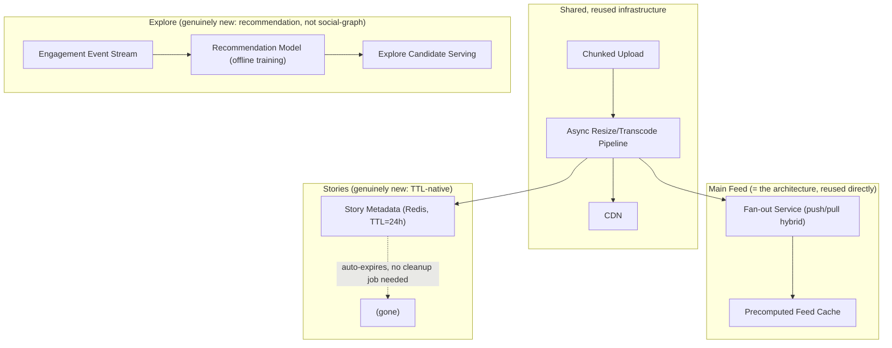
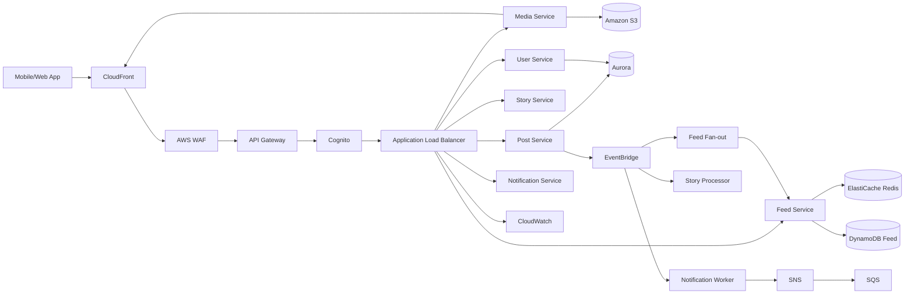
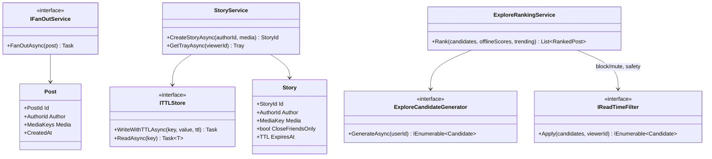
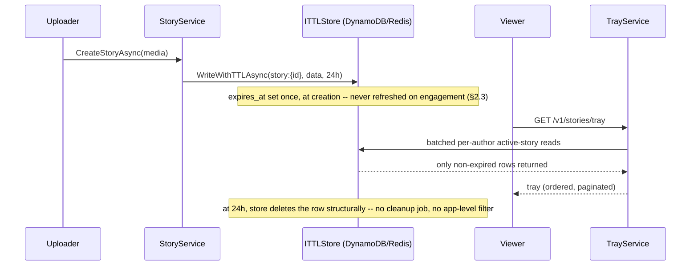

# Module 42 — System Design: Designing Instagram (Photo/Video Sharing, Stories & Feed)

> Domain: System Design | Level: Beginner → Expert | Prerequisite: [[02-Designing-News-Feed-System]] (fan-out/ranking directly reused), [[05-Designing-YouTube-Video-Streaming]] (media storage/CDN directly reused), [[../07-Redis/01-Data-Structures-Caching-Patterns]] (TTL for Stories)

---

## 1. Fundamentals

### What makes Instagram a distinct system-design synthesis rather than "News Feed plus photos"?
Instagram is best understood as the **direct combination** of two problems this course has already solved in depth — the feed/fan-out problem (a photo/video post from a followed account must reach followers' feeds) and the media-storage/CDN problem (the actual image/video bytes need efficient upload, storage, and delivery) — **plus** one genuinely new element: **Stories**, an ephemeral (24-hour-expiring) content type with fundamentally different storage/access-pattern requirements than permanent feed posts.

### Why does this matter?
Because a Staff/Principal-level answer to "design Instagram" should explicitly **recognize and reuse** the already-established feed and media-storage solutions rather than re-deriving them from scratch, reserving genuine new design effort specifically for Stories' distinctive ephemeral-content requirements and the **Explore/Discovery** page's fundamentally different (non-social-graph-based) content-selection problem.

### When does this matter?
Any system combining social-graph-based content distribution with rich media and time-limited content; the depth matters for correctly identifying which parts of the design are "solved problems" (directly reusable from Modules 38/41) versus which parts (Stories' TTL-based storage, Explore's recommendation-not-social-graph model) are genuinely new.

### How does it work (30,000-ft view)?
```
Post creation: upload media (the chunked-upload + transcoding, for images: resizing into
 multiple resolutions instead of video bitrates) -> fan-out to followers' feeds
Story creation: same media pipeline, but written with a 24-hour TTL instead of
 permanent storage -- automatically expires, no manual deletion needed
Explore page: NOT social-graph-based -- a recommendation problem, ranking content the user doesn't
 already follow, based on engagement/similarity signals
```

---

## 2. Deep Dive

This section is written to be **complete on its own** — every mechanism, the reasoning that selects it, the failure mode it introduces, and the push-back a Principal/Staff interviewer will raise, answered inline.

### 2.1 What Instagram Reuses, and Why Saying So Is the Point

Instagram's core feed is **architecturally identical** to a Twitter-style news feed: the same push/pull/hybrid fan-out decision, the same celebrity problem (an influencer with millions of followers creates exactly the same write amplification), the same bounded precomputed feed cache.

Say that explicitly rather than re-deriving it. The value is not saved clock time — it is the demonstration of genuine cross-problem pattern recognition, which is a stronger signal than reasoning through the celebrity problem from scratch as though it were novel. The same applies to DMs: they are the chat problem (ordered, reliably delivered, bidirectional), already solved, and should be recognised and reused rather than redesigned.

But pattern recognition has a failure mode, and this module is built around it: **superficial resemblance masking genuine divergence.** Stories *look* like feed posts and are structurally different in the one dimension that matters. §2.14's review question exists precisely to catch that.

### 2.2 The Image Pipeline — the Video Pipeline, Adapted

Upload and processing reuse chunked resumable upload and the asynchronous processing pipeline. Instead of transcoding to video bitrates, images are resized into renditions — thumbnail, feed-display, full-resolution — and the same decomposition discipline applies identically: **one job per rendition**, so generating a thumbnail is never blocked behind a full-resolution version. Prioritise the thumbnail, because it is what the feed needs immediately.

**Moderation runs as an independent parallel job**, not a serial gate. Gating availability on the moderation check would delay every upload by its processing time; running it alongside lets content appear quickly with action applied after the fact if a violation is found.

**Capacity assumptions must be image-specific.** Photos have a *higher* creation rate than video (quicker, lower friction to capture and share) and a far *smaller* per-item footprint. Reusing video-platform numbers produces an estimate wrong in both directions at once.

CDN-primary delivery applies unchanged.

### 2.3 Stories — TTL as a Structural Property, Not an Application Filter

Stories expire after 24 hours. The architecturally significant point is *how*:

> Expiry must be enforced by the **storage layer's native TTL** — Redis `EXPIRE` for metadata and the visibility entry, an object-storage lifecycle policy for the media — not by a UI filter over permanent storage plus a cleanup job.

**Why this distinction is the whole module.** "Hide expired content in the UI" and "storage is bounded" are two independently implemented concerns. UI filtering controls only what is *displayed*. Without a reliable deletion mechanism, storage grows without limit while users correctly never see the stale content — which is exactly §4's incident: the product looked perfect and the storage bill did not. A cleanup job is code that must run correctly forever; a storage TTL is a property the platform upholds whether or not anyone remembers it exists.

**Anchor the TTL to creation, never to engagement.** A Story receiving a view shortly before expiry must **not** have its TTL refreshed. Session tokens refresh on activity; Stories must not, because a popular Story would then persist indefinitely as long as views keep arriving, violating the product's actual semantic ("24 hours from posting"). Set the TTL once at creation from the creation timestamp, and record engagement events entirely separately, with no interaction with the expiry mechanism.

**The "who has an active story" query needs its own structure.** Scanning every followed account's story records and filtering to unexpired ones is expensive on every tray open. Maintain a dedicated **TTL-aware set of accounts with a currently-active story**, which shrinks by itself as entries expire — the query becomes an intersection with the follow list rather than a filter over it.

**TTL implementations differ in their lag characteristics, and that matters.** Redis `EXPIRE` is close to exact. DynamoDB TTL deletion is explicitly best-effort and can lag by minutes to hours. So a read path must **check the expiry timestamp in code** rather than inferring "not expired" from the row's presence — trusting TTL for *correctness* rather than *reclamation* is a real and common defect.

That difference also dictates how to **migrate between TTL stores** without a window where expired content is served or unexpired content vanishes early: dual-write to both, and during the transition have reads consult both and take the **more restrictive** answer (expired in either store means expired). Cut reads over only once a sampling monitor confirms the new store is actually enforcing expiry within the required bound, not merely configured to. The principle generalises: a migration between two TTL implementations with different lag characteristics must reconcile on the stricter guarantee throughout.

### 2.4 Why Stories Are Not Fanned Out — and What the Estimation Says

Stories are roughly **5× the write volume of posts** and a rounding error in storage. A candidate who proposes fanning Stories out "for consistency with how posts work" has misread that.

```
5,000 stories/s × ~150 median followers ≈ 750,000 feed writes/s
for content that is read once and gone in a day.
```

That is five times the post fan-out volume for content with a fraction of the lifetime. **Push fan-out is an investment amortised over many reads; Stories have nothing to amortise it over.** Almost all of that write amplification would be wasted work whose cost is never recouped.

So Stories are **pulled on tray open** against the active-story set of §2.3, while posts are pushed. Proposing uniform fan-out prioritises architectural tidiness over what the numbers say the workload needs — and it is the same mistake §4 made in the opposite direction, treating Stories as feed-like at the *storage* layer instead of at the *fan-out* layer.

### 2.5 Close Friends — Resolve at Creation, Validate at the Boundary

A Close Friends Story is restricted to a subset of followers. Resolve that list **once at creation** and make it visible only to that resolved set, front-loading the authorization decision to the moment the audience is already being read — rather than performing a separate per-viewer authorization check on every subsequent tray load.

**But resolve against current membership, not a cached list.** If a viewer was removed from Close Friends after the Story was created, continuing to show it based on a stale push-time decision violates the intended visibility. Re-validate membership at the moment the Story is marked visible.

**The asymmetric risk is the large list, not the popular viewer.** A user who is a close friend of hundreds of accounts simply receives hundreds of independent, cheap, already-async write events — structurally fine. The genuine risk runs the other way: an account using Close Friends as a quasi-broadcast list with an enormous audience recreates exactly the celebrity write-amplification problem. **Close Friends therefore needs its own push/pull threshold**, the hybrid model applied a second time, rather than an assumption that these lists stay small by product convention.

### 2.6 Highlights — Copy, Never Extend

A Highlight lets a user pin a past Story to their profile permanently. The correct implementation **copies** the media to permanent (non-TTL) storage and creates a new, separate, non-expiring metadata record.

The wrong implementation cancels or extends the original Story's TTL. That reintroduces the TTL-refresh anti-pattern of §2.3 and complicates the storage layer's simple structural guarantee with a special case. Treating "add to Highlights" as "republish this as a new permanent post" preserves the Stories system's simplicity intact — a clean separation rather than an exception bolted onto the expiry mechanism.

### 2.7 Explore — a Recommendation Problem, Not a Graph Problem

The main feed surfaces content from accounts the user **already follows** — a social-graph traversal. Explore surfaces content from accounts they **don't** follow, based on engagement signals, content similarity and collaborative filtering. That is a **recommendation system**: engagement-event collection, offline/batch model training, and a serving layer producing ranked candidates. It is not a differently-configured fan-out service, and conflating the two misses that they need different components and different data pipelines.

**Separate candidate generation from ranking — one level deeper than the feed's separation.** A proposal to share Explore's pipeline with the main feed's ranking model on the grounds that "it's all just ranking" should be pushed back on: the feed ranks a candidate set **already scoped by the social graph**, while Explore's *candidate generation* is the harder, genuinely novel problem. Sharing the scoring infrastructure may be reasonable; sharing candidate generation is not, because the underlying problem differs.

**Blend an offline base score with a real-time trending signal.** A daily-retrained model captures longer-term engagement and similarity patterns but cannot surface something that went viral an hour ago. Combine it at request time with a fast-computing engagement-velocity signal (reusing the batched counter-aggregation pattern), typically as a weighted blend. Viral content surfaces without waiting for retraining; the bulk of served content still benefits from the offline model.

**Offline training and online serving are separate systems with separate scaling ladders.** Large-scale batch processing and low-latency high-concurrency serving have different workload shapes and different bottlenecks; one capacity discussion covering both misses that each needs its own.

**Explore's latency budget is its own**, not the feed's — the ranking work is materially more involved and must be measured separately.

**Raise the engagement-optimisation risk proactively.** A purely engagement-maximising recommender converges toward sensational, controversial and filter-bubble-reinforcing content, because that content measurably drives short-term engagement. A complete design names this and layers explicit constraints — content diversity requirements, business rules that stop the objective function from being raw engagement alone — rather than presenting "maximise engagement" as a purely technical objective.

**Validate the blend, and know which metric gets gamed.** A/B test the weighting against a holdout on *engagement-quality* metrics — session-return rate, reported-content rate, diversity-adjusted time spent — rather than raw engagement, or you reproduce the same failure mode at the tuning level that you avoided at the training level. The most gameable component is the **real-time trending-velocity signal itself**: because it rewards rapid recent engagement, it is the natural target for bot rings and engagement pods trying to force content into Explore. It needs its own velocity-anomaly and inauthentic-engagement detection, independent of any A/B test measuring product impact.

### 2.8 Consistency Per Content Type

The "consistency per data type, not per system" discipline applied concretely:

| Data | Requirement |
|---|---|
| Main feed | **Eventual.** A followed account's post appearing seconds late is fine. |
| Story "who viewed" (owner's own view) | **Stronger** — the owner checking their viewer list should see genuinely recent views. |
| Other engagement metrics | Eventual; brief inexactness is invisible. |
| DMs | The chat system's strict ordering and reliable delivery, inherited entirely. |
| **Block / mute** | **Strong, evaluated at read time.** A stale block is a safety failure, not staleness. |
| Story expiry | **Monotonic** — once gone, never returns (§2.10). |

Authorization on a Story's "who viewed this" list is resource-based: **only the owner**, the same discipline as any user-specific sensitive data.

### 2.9 The Stale-Block Failure — Three Origins, One Most Likely

A user reports seeing a Story from an account they blocked twelve hours ago. Three places this can originate:

1. **The Story tray's per-author "has active stories" cache** — serving a cached-before-the-block answer, if its TTL outlives the block event.
2. **The feed cache** — showing a pre-block post, if block filtering is not re-applied on cache read.
3. **Explore** — surfacing the blocked account's content, if block filtering was baked into the precomputed candidate set rather than applied at serve time.

**(3) is the most likely and the most serious**, precisely because Explore is the one surface where "precompute, then filter cheaply at read" is the *stated* architecture — which makes it the easiest place for someone to treat the filter as best-effort rather than mandatory. The general rule this reinforces: a push-time or precompute-time authorization decision is an optimisation; the read-time re-check is the correctness mechanism, and it must be structurally impossible to skip.

### 2.10 Monotonicity — a Requirement Stronger Than Eventual Consistency

"Once expired, never returns" is not ordinary eventual consistency. It is a **monotonicity** guarantee, and it rules out replication behaviours that would be perfectly acceptable elsewhere in this system.

A lagging replica serving a stale-but-eventually-correct read is fine for a like count. A lagging replica **resurrecting an expired Story** is a trust violation — the user was told the content was gone. The same shape appears in the risk-engine's determinism requirement: recomputing a pinned snapshot must never yield a different number, because *reversal itself* is the harm, not incorrectness.

The transferable discipline: identify which data types carry a non-reversal guarantee — usually because reversal is the user-facing harm — and design their storage and replication posture around it explicitly, rather than defaulting to the eventual-consistency stance used everywhere else.

### 2.11 Story View Tracking — Rows Versus Bitmaps

At roughly 150,000 story-views/s, `story_seen` writes one row per `(viewer, story)`. Simple, TTL rides naturally alongside the Story's own expiry, and it supports the exact "list everyone who viewed" the owner's viewer list requires.

A bitmap or bloom-filter representation (one structure per Story, a bit per viewer) is far more space-efficient for a pure *has this user seen it* existence check — and **cannot produce the viewer list**: bloom filters carry false positives, and bitmaps need a fixed pre-known viewer-ID space plus a separate exact structure anyway.

Since the viewer list is an explicit product requirement rather than simple duplicate-view suppression, the per-row design is justified despite higher storage cost. The bitmap alternative wins only if the requirement narrows to existence-checking — which is the honest way to answer a "could you use a bloom filter here?" probe: name the requirement that decides it.

### 2.12 Deletion, Retention and the Cascade

"Delete my account" is not a row deletion. It must cascade across **every** distinct store this design introduced:

- **Precomputed feed caches** of everyone who followed the account — their entries must be removed or filtered.
- **Media storage** — uploaded images and video, subject to any legal or compliance retention that may override immediate deletion.
- **Stories** — already TTL-bounded, but any unexpired ones must be force-expired.
- **Engagement history feeding Explore's model** — the genuinely hard one, because excluding the data from *future training* is a different and much harder problem than deleting rows ("machine unlearning"), and is usually handled by exclusion at the next training cycle plus documented retention windows.

A complete answer enumerates each store and states its specific deletion or anonymisation requirement. Enumerating them is the answer; treating deletion as a single operation is the mistake.

### 2.13 Observability — Measure the Invariant, Not the Mechanism

The safeguard that would have caught §4 before it became costly: monitor the **ratio of content older than 24 hours still present in storage to total content created**. Under correctly functioning expiry that ratio is near zero; any sustained, growing, non-zero value signals the deletion path falling behind *before* it accumulates into a storage-growth problem.

This is the recurring discipline in its sharpest form: **measure the actual invariant the design depends on, rather than trusting that the mechanism enforcing it is working.** Pair it with a TTL-deletion-lag sampling job (write a key with a known short TTL, verify it is actually gone when it should be) so that a store's *configured* expiry and its *effective* expiry can be told apart.

### 2.14 Principal-Level Judgements and the Connecting Discipline

**The design-review question that would have prevented this module's incident.** Require every new feature's design document to answer, in writing: *"Which existing system component does this most resemble, and precisely where does it diverge from that component's actual guarantees?"* For Stories, that question surfaces the ephemerality divergence immediately and forces a deliberate decision (native TTL) instead of an unexamined reuse of the feed's permanent-storage pattern.

**And have someone else answer it.** The Stories incident happened because the implementing team's own intuition — "this is basically the feed" — went unchallenged. The second reviewer's specific job is to stress-test the resemblance claim rather than accept it. Add a standing rule that any feature introducing a new data-lifetime semantic (ephemeral, append-only, strongly-consistent-for-one-actor) must **name its storage-layer enforcement mechanism in the design doc before implementation**, rather than discovering it is missing after an incident.

**The single discipline underneath this module, the risk engine's structural controls, and the video pipeline's job decomposition** is pushing a correctness or performance property into the **structure** of the system — the storage engine's own TTL, an append-only store's own immutability, a scheduler's own priority ordering — rather than relying on application code remembering to enforce it on every path, including the paths added next year by someone who was not in the original discussion.

Which gives the review question worth carrying into every design:

> **"If every engineer on this team forgot this requirement existed tomorrow, would the system still uphold it?"**

For Stories before the fix: no — the cleanup job still had to run correctly. After the fix: yes — the storage engine enforces it regardless of who remembers. That question is the practical test for whether a control belongs in application logic or needs to move down into the platform.

---

## 3. Visual Architecture

```mermaid
graph TB
 subgraph "Shared, reused infrastructure"
 Upload["Chunked Upload"] --> Processing["Async Resize/Transcode Pipeline"]
 Processing --> CDN["CDN"]
 end
 subgraph "Main Feed (= the architecture, reused directly)"
 Processing --> FanOut["Fan-out Service (push/pull hybrid)"]
 FanOut --> FeedCache["Precomputed Feed Cache"]
 end
 subgraph "Stories (genuinely new: TTL-native)"
 Processing --> StoryStore["Story Metadata (Redis, TTL=24h)"]
 StoryStore -.->|"auto-expires, no cleanup job needed"| Gone["(gone)"]
 end
 subgraph "Explore (genuinely new: recommendation, not social-graph)"
 Engagement["Engagement Event Stream"] --> RecModel["Recommendation Model (offline training)"]
 RecModel --> ExploreServing["Explore Candidate Serving"]
 end
```

### 3.1 A concrete AWS deployment of this architecture

The logical diagram above maps directly onto a real managed-service deployment — useful for grounding "which component runs where" in an interview that asks for concrete infrastructure, not just logical boxes:


```mermaid
flowchart LR
 User[Mobile/Web App] --> CloudFront[CloudFront]
 CloudFront --> WAF[AWS WAF]
 WAF --> APIGateway[API Gateway]
 APIGateway --> Auth[Cognito]
 Auth --> ALB[Application Load Balancer]

 ALB --> UserService[User Service]
 ALB --> FeedService[Feed Service]
 ALB --> PostService[Post Service]
 ALB --> StoryService[Story Service]
 ALB --> MediaService[Media Service]
 ALB --> NotificationService[Notification Service]

 MediaService --> S3[(Amazon S3)]
 PostService --> Aurora[(Aurora)]
 UserService --> Aurora
 FeedService --> Redis[(ElastiCache Redis)]
 FeedService --> DynamoDB[(DynamoDB Feed)]

 PostService --> EventBridge[EventBridge]
 EventBridge --> FeedWorker[Feed Fan-out]
 EventBridge --> StoryWorker[Story Processor]
 EventBridge --> NotificationWorker[Notification Worker]

 NotificationWorker --> SNS[SNS]
 SNS --> SQS[SQS]
 FeedWorker --> FeedService
 MediaService --> CloudFront
 ALB --> CloudWatch[CloudWatch]
```

**Request flow through the deployment** — the read/write split made explicit as a synchronous-above / asynchronous-below boundary:

```text
Mobile/Web App -> CloudFront -> AWS WAF -> API Gateway -> Cognito Auth -> Application Load Balancer
                                                                                   |
                    +------------------+------------------+------------------+-----+-----+
                    |                  |                  |                  |           |
                 UserSvc            FeedSvc            PostSvc            StorySvc     MediaSvc
                    |                  |                  |                  |           |
                 Aurora              Redis              Aurora             Aurora        S3
                                                            |
                                            Services publish domain events
                                                            |
                                                       EventBridge
                                                            |
                                  +-------------------------+-------------------------+
                                  |                         |                         |
                             Feed Worker              Notification Worker        Story Worker
                                                            |
                                                           SNS -> SQS -> Push / Email
```

Everything above `EventBridge` is synchronous request handling the client waits on; everything below it is asynchronous reaction — feed fan-out, story processing, and notification delivery cannot add latency to the user's original request and cannot fail it (directly §2.1's fan-out-is-async point and §12's push/pull design, now pinned to concrete AWS services). Each service also terminates in its own store (Aurora for relational user/post data, Redis/DynamoDB for the feed, S3 for media), which is what lets those services scale and fail independently — the database-per-service pattern named below.

**AWS service mapping:**

| Component | AWS Service | Maps to |
|-----------|-------------|---------|
| CDN | CloudFront | §2.2's media-delivery reuse from Module 05 |
| Security | AWS WAF | §8 |
| Authentication | Cognito | §8 AuthN |
| API | API Gateway | §12's REST API layer |
| Load Balancer | ALB | Routes to the per-service compute tier |
| Compute | ECS / EKS | Stateless service instances |
| User/Post Database | Aurora | §12's relational store for posts/users |
| Feed Store | DynamoDB / ElastiCache Redis | §12's precomputed feed cache |
| Photo/Video Storage | Amazon S3 | §2.2's media pipeline, with a TTL lifecycle policy on the Stories prefix (§3.1 of §12) |
| Event Bus | EventBridge | Domain-event backbone for fan-out, Stories, and notifications |
| Notifications | SNS + SQS | Async delivery, decoupled from the request path |
| Monitoring | CloudWatch | §12 Step 4's monitoring set |

The design-pattern names this deployment embodies — API Gateway pattern, database-per-service, cache-aside, publish/subscribe, CQRS-flavored read/write separation for the feed — are catalogued formally against this module's actual classes in §13's Design Patterns Used.

## 4. Production Example
**Scenario**: A team implementing Stories initially used the **same permanent-storage, application-level "hide if older than 24h" filtering** approach as the main feed, rather than TTL-native storage — this worked functionally (expired Stories were correctly hidden from the UI), but over time, the Stories storage tier accumulated an ever-growing volume of **technically-expired-but-never-actually-deleted** content, since "hide in the UI" and "delete from storage" were two separate, independently-implemented concerns, and the deletion job (a separate, periodically-run cleanup process) began falling behind under growing content volume — directly reproducing the unbounded-growth incident shape, just with an extra, unnecessary layer of applied-but-ultimately-ineffective "hide it in the UI" logic masking the underlying storage-growth problem from being immediately visible to users (even though it was accumulating real, unnecessary storage cost and risk). **Investigation**: confirmed via storage-utilization monitoring that Stories-tier storage was growing roughly linearly with total historical Stories ever created, not bounded by the ~24-hour window user-visible behavior implied. **Fix**: migrated Stories metadata to Redis with native `EXPIRE`, and configured the underlying object storage's own lifecycle-policy-based automatic deletion (a cloud-storage-native feature, not a custom cleanup job) for the media files themselves — expiration became a structural, storage-layer-enforced property requiring no separate, independently-maintained cleanup process at all. **Lesson**: "hide expired content in the UI" and "actually delete/bound the storage of expired content" are two different requirements that must **both** be addressed — implementing only the UI-visible behavior while leaving storage growth unbounded (relying on a separate, fallible cleanup job) reproduces exactly the "invisible until it becomes a real, costly problem" pattern this course has repeatedly warned against, and native TTL support (when the storage layer offers it) structurally eliminates this entire risk category rather than requiring a separately-maintained, independently-failable cleanup mechanism.
## 11. Coding Exercises

*(System design case studies use worked design exercises, consistent with this domain's format.)*

### Easy — TTL-native Story storage (the fix)
```csharp
public async Task CreateStoryAsync(string userId, string mediaUrl)
{
    string storyId = Guid.NewGuid.ToString;
    var storyData = JsonSerializer.Serialize(new { userId, mediaUrl, createdAt = DateTimeOffset.UtcNow });

    // Native TTL -- expiration is a STRUCTURAL property of the storage layer, no separate cleanup job needed.
    await _redis.StringSetAsync($"story:{storyId}", storyData, TimeSpan.FromHours(24));
    await _redis.SetAddAsync($"active-stories:{userId}", storyId, TimeSpan.FromHours(24)); // §2.3's dedicated active-story set
}
```

### Medium — Priority-ordered image rendition generation (the pattern reused)
```csharp
public enum RenditionPriority { Thumbnail = 0, FeedDisplay = 1, FullResolution = 2 }

public async Task ProcessUploadedImageAsync(string imageId, byte[] rawImageBytes)
{
    // Thumbnail FIRST -- needed immediately for feed display; full-res last, needed only on-demand.
    await _jobQueue.EnqueueAsync(new ResizeJob(imageId, RenditionPriority.Thumbnail, rawImageBytes));
    await _jobQueue.EnqueueAsync(new ResizeJob(imageId, RenditionPriority.FeedDisplay, rawImageBytes));
    await _jobQueue.EnqueueAsync(new ResizeJob(imageId, RenditionPriority.FullResolution, rawImageBytes));
}
```

### Hard — Close Friends audience-scoped fan-out (§2.5)
```csharp
public async Task PublishCloseFriendsStoryAsync(string authorId, string mediaUrl)
{
    // Resolve the audience ONCE, at creation time -- re-validated as CURRENT, not a stale cached list.
    var closeFriends = await _followGraph.GetCurrentCloseFriendsAsync(authorId);
    string storyId = await CreateStoryAsync(authorId, mediaUrl); // Easy exercise's TTL-native creation

    foreach (var friendId in closeFriends)
    {
        await _redis.SetAddAsync($"visible-close-friends-stories:{friendId}", storyId, TimeSpan.FromHours(24));
    }
    // A friend REMOVED from Close Friends after this point simply never received this specific
    // story in their visibility set in the first place -- no stale-authorization risk requires
    // a separate revocation step, since fan-out only ever targeted the audience CURRENT at creation time.
}
```

### Expert — Hybrid offline+real-time Explore ranking (§2.7)
```csharp
public async Task<List<RankedPost>> GetExploreCandidatesAsync(string userId, int count)
{
    var offlineScored = await _recommendationModel.GetTopCandidatesAsync(userId, count * 2); // offline-trained base scores

    var trendingBoosts = await Task.WhenAll(
        offlineScored.Select(c => _engagementVelocityTracker.GetRecentVelocityAsync(c.PostId))); //-style
    // batched real-time counter

    var combined = offlineScored.Zip(trendingBoosts, (candidate, velocity) =>
        new RankedPost(candidate.PostId, candidate.OfflineScore * 0.7 + velocity * 0.3)); // weighted blend

    return combined.OrderByDescending(p => p.CombinedScore).Take(count).ToList;
}
```
**Discussion**: The 0.7/0.3 weighting is illustrative — a real system would tune this blend empirically via A/B testing (§2.7, and the feed-ranking A/B-testing pattern reused here), but the structural point is the key design artifact: combining a slower-updating, more sophisticated offline signal with a fast-updating, simpler real-time signal at serving time, rather than requiring either a full model retrain for every trending shift or ignoring recent virality entirely.

---

## 12. System Design — Designing Instagram (Photo Sharing, Feed, Stories, Explore)

*Authored to the four-step standard (see Module 01 §12 for the method). Feed fan-out mechanics come from Module 02 and the media pipeline from Module 05 — this section designs what is genuinely **new** here: the combination, plus ephemeral content and discovery.*

---

### Step 1 — Understand the Problem and Establish Design Scope

#### The dialogue

> **C:** Which surfaces are in scope? Instagram is at least four products — the following-feed, Stories, Explore, and Reels.
> **I:** Following-feed, Stories, and Explore. Skip Reels, DMs, and shopping.
>
> **C:** Photos only, or video too?
> **I:** Photos and short video, but treat the media pipeline as understood — focus on how it plugs in.
>
> **C:** Scale?
> **I:** 500 million DAU, 100 million posts a day, 500 million Stories a day.
>
> **C:** Stories outnumber posts 5:1 and expire in 24 hours — is that expiry a hard deletion requirement or a display rule?
> **I:** Hard. After 24 hours the content should be gone, not hidden.
>
> **C:** That's a storage-lifecycle requirement, not an application one — I'll come back to it. Follower distribution?
> **I:** Power law, same as any social platform. Top accounts have 400+ million followers.
>
> **C:** Is the feed chronological or ranked?
> **I:** Ranked. Assume a ranking service exists.
>
> **C:** For Explore, what's the input — is this personalised recommendation?
> **I:** Yes, personalised, from content the user does *not* follow.
>
> **C:** Consistency: if I post, when must I see it? And when must my followers?
> **I:** You see it immediately. Followers within seconds. Explore can be minutes stale.
>
> **C:** Out of scope?
> **I:** The ranking and recommendation models, moderation, and ads.

The fourth exchange is the one that matters most. **"Gone, not hidden"** turns Stories from a filtering problem into a storage-lifecycle problem — and §4's incident is precisely a team that treated it as the former.

#### Functional requirements

1. Upload a photo/video post with caption; it appears in followers' feeds.
2. Retrieve a ranked following-feed, paginated.
3. Post a Story visible for exactly 24 hours, then **deleted**.
4. Retrieve the Stories tray (which followed accounts have unseen Stories) and view a Story.
5. Retrieve a personalised Explore grid of content from accounts the user does not follow.
6. Likes, comments, and follow/unfollow.

#### Non-functional requirements

| Requirement | Target |
|---|---|
| Feed read latency | p99 < 300 ms |
| Media load (first image) | p95 < 500 ms — CDN-served |
| Story expiry | **Hard delete within a bounded window** (say 25 h), auditable |
| Post visibility to followers | p99 < 10 s |
| Explore freshness | Minutes acceptable |
| Availability — read | 99.99% |
| Consistency | Read-your-own-writes for your own posts; eventual for everything else |
| Media durability | 11 nines |

#### Back-of-the-envelope estimation

```
Posts/day        = 100,000,000        → 1,000 posts/s avg, 3,000 peak
Stories/day      = 500,000,000        → 5,000 stories/s avg, 15,000 peak
Feed views/day   = 500M DAU × 8       = 4 × 10^9  → 40,000 reads/s, 80,000 peak
Story views/day  = 500M × 30          = 1.5 × 10^10 → 150,000 views/s
```

Media storage — where the two content types diverge sharply:

```
Post: original + 4 derivatives ≈ 2.5 MB
      100M/day × 2.5 MB               ≈ 250 TB/day  → 91 PB/year, PERMANENT

Story: original + 2 derivatives ≈ 1.5 MB
      500M/day × 1.5 MB               ≈ 750 TB/day
      but 24-hour TTL → steady state  ≈ 750 TB total, NOT growing
```

Fan-out:

```
Post fan-out (median 150 followers)  = 1,000/s × 150 = 150,000 feed writes/s
Story fan-out                        = ZERO — see below
```

#### What the numbers tell us

Three conclusions:

1. **Stories are 5× the write volume of posts but a rounding error in storage** — 750 TB steady-state versus 91 PB/year growing — *provided* the TTL is enforced by the storage layer. If it is enforced in application code, Stories become 270 PB/year of the most expensive kind of dead data. That factor-of-360 difference is the entire argument for §3.1, and §4 is the incident that proves it.
2. **Stories must not be fanned out.** 5,000 stories/s × 150 followers = 750,000 feed writes/s for content that expires in a day — five times the post fan-out, for content with a fraction of the lifetime. The Stories tray is a **pull** over followed accounts' active Stories, and the estimation is what proves that rather than asserting it.
3. **The three surfaces have three different architectures** and combining them is the actual exam: the feed is push/pull hybrid (Module 02), Stories is pure pull with TTL storage, and Explore is precomputed-per-user and refreshed on a schedule. A candidate who applies one pattern to all three has missed the question.

---

### Step 2 — Propose High-Level Design and Get Buy-In

#### Components

**Media Service.** Pre-signed direct-to-object-storage upload; async derivative generation (thumbnails, feed-size, full-size). Per Module 05, bytes never traverse the app tier.

**Post Service.** Post metadata; source of truth.

**Fan-out Service.** Push to follower feeds below the celebrity threshold; pull above it (Module 02 §3.1). Applies to **posts only**.

**Feed Store.** Redis sorted sets, trimmed.

**Story Service.** Writes to a TTL-native store; serves the tray by pulling active Stories for followed accounts.

**Story Seen-State.** Per-viewer, per-story seen markers — also TTL'd, and larger in row count than the Stories themselves.

**Explore Service.** Serves a precomputed candidate grid per user, refreshed on a schedule and on significant interaction.

**Graph Service.** Follows.

**Ranking Service.** Reorders candidates (feed) and scores candidates (Explore) — deliberately separate from candidate generation, per Module 02 §2.5.

#### End-to-end walkthrough — posting

1. `POST /v1/media/upload-url` → pre-signed URL; client uploads bytes directly.
2. `POST /v1/posts` with `media_key`, caption, and `Idempotency-Key`.
3. Post row written; **author's own profile grid updated synchronously** (read-your-own-writes).
4. Outbox → Kafka → derivative generation and fan-out in parallel.
5. Fan-out: celebrity check → push to follower feeds, or no-op for pull.
6. Post becomes visible in followers' feeds as derivatives complete; the feed entry references the media by ID and the client resolves CDN URLs.

#### End-to-end walkthrough — Stories

1. Upload identically, but the media object is written under a **TTL-configured prefix**.
2. `POST /v1/stories` writes one row to a TTL-native table with `expires_at = now + 24h`.
3. **No fan-out at all.**
4. Viewer opens the app → `GET /v1/stories/tray` → service reads the viewer's following list, queries active Stories per followed account (batched), joins seen-state, returns ordered tray.
5. Viewing writes a seen marker with the same TTL.
6. At 24 hours, **the store deletes the row and the object-storage lifecycle rule deletes the bytes** — no application code participates in expiry.

#### API design

**`POST /v1/posts`**

| Field | Type | Description |
|---|---|---|
| `media_keys` | string[] | From the upload step — never bytes |
| `caption` | string | |
| `location_id`, `tagged_user_ids` | optional | |
| `visibility` | enum | `PUBLIC` \| `FOLLOWERS` |

Header: `Idempotency-Key`.

**`GET /v1/feed`** — `?limit=20&cursor=…`; returns items with `media` (CDN URLs, multiple sizes), `author`, `counts`, and `source: PUSHED|PULLED`.

**`POST /v1/stories`** — `{ media_key, stickers[], visibility, close_friends_only }`. Response includes `expires_at` — surfacing the expiry in the API contract is what stops a client from caching it indefinitely.

**`GET /v1/stories/tray`**

| Field | Type | Description |
|---|---|---|
| `accounts` | array | `{ user_id, avatar_url, has_unseen, latest_story_at, story_count }` |
| `cursor` | string | Tray is paginated — a user following 5,000 accounts cannot get one response |

**`GET /v1/explore?cursor=`** — returns the precomputed grid slice plus a `refreshed_at` so the client can decide whether to request a refresh.

#### Data model

**`post`** — Cassandra, partition `author_id`, clustering `created_at DESC`. Serves both the profile grid and the celebrity pull path.

**`story`** — **DynamoDB with native TTL**, or Cassandra with a TTL on write:

| Column | Type | Notes |
|---|---|---|
| `author_id` | Partition key | The tray query is per-author |
| `story_id` | Clustering (time-ordered ULID) | |
| `media_key`, `stickers`, `close_friends_only` | | |
| `created_at` | timestamp | |
| `expires_at` / row TTL | **The store deletes it.** Not a column an application reads and filters on | |

**`story_seen`** — `(viewer_id, story_id)` with the same TTL. Row count is `stories × viewers`, far larger than the Stories table — 150,000 views/s of writes — which is why it must be a wide-column store with TTL and never a relational table.

**`feed:{user_id}`** — Redis sorted set, trimmed to ~500 (Module 02).

**`explore:{user_id}`** — Redis list of candidate post IDs plus `refreshed_at`, TTL a few hours.

#### Store selection, and why

| Store | Choice | Reason |
|---|---|---|
| Posts | **Cassandra** | Permanent, append-heavy, partition-by-author matches both access patterns |
| Stories & seen-state | **DynamoDB/Cassandra with native TTL** | The requirement is *deletion*, and TTL-native storage makes deletion the store's job. This is the module's central decision |
| Feed & Explore | **Redis** | Derived, bounded, evictable |
| Graph | **Sharded relational / graph store** | Reverse-edge index for `followers(x)` |
| Media | **Object storage + CDN**, with **separate buckets/prefixes for posts and Stories** | Different lifecycle policies. Mixing them makes the Story lifecycle rule unexpressible |

The separate-bucket decision looks trivial and is not: a lifecycle policy applies to a prefix, so if Story and post media share a prefix you cannot express "delete after 24 hours" without also deleting posts. The storage layout has to encode the retention policy, or you are back to application-managed deletion — which is §4.

---

### Step 3 — Design Deep Dive

#### 3.1 Ephemerality as a storage property, not an application rule

The naive Stories design stores content permanently and filters on read: `WHERE created_at > now() - 24h`. It is functionally correct and structurally wrong, for three compounding reasons:

1. **Storage grows without bound.** The filter hides rows; it deletes nothing. At 750 TB/day, a cleanup job that falls behind never catches up — and §4 is exactly that.
2. **The cleanup job is a separate failure domain.** "Hidden in the UI" and "deleted from storage" become two independently-implemented concerns that can and do diverge. When they diverge, the user-visible behaviour is correct and the bill is not, so nothing alerts.
3. **It is a privacy defect.** "Disappears after 24 hours" is a promise to the user. Content that is merely hidden is still present, still in backups, still discoverable by a bug or a subpoena. Under GDPR this is a genuine compliance exposure, not just untidiness.

**The design rule: when expiry is a product promise, express it in the storage layer's own semantics — DynamoDB TTL, Cassandra per-row TTL, S3 lifecycle rules — so that no application code participates in deletion.** Then verify: a scheduled job that samples for rows past their TTL and alerts if any exist. TTL mechanisms are asynchronous and best-effort, so "we set a TTL" is a claim that needs a monitor, exactly like every other silent success path in this course.

This generalises well beyond Stories: **a protection mechanism that requires code to run correctly is weaker than one the platform enforces structurally.** It is the same principle as Module 178's append-only `GRANT` and Module 20's non-suppressible category.

#### 3.2 Why Stories pull and posts push

| | Posts | Stories |
|---|---|---|
| Volume | 1,000/s | 5,000/s |
| Lifetime | Permanent | 24 h |
| Fan-out cost if pushed | 150,000 writes/s | 750,000 writes/s |
| Value of a precomputed entry | High — read many times over years | Low — read once, then expires |
| Read shape | Ranked, merged, paginated timeline | "Which of the accounts I follow have something new" |

Push exists to amortise fan-out cost across many reads. A Story is read approximately once per viewer and then vanishes, so there is nothing to amortise — precomputation is pure cost. And the tray query is a *membership* question over the following set, which is cheap when the per-author Story list is small and hot.

The tray does need help at the tail: a user following 5,000 accounts triggers 5,000 lookups. Mitigations: batch by partition, cache the per-author "has active stories" bit with a short TTL (it is the same answer for every viewer), and **paginate the tray**, ordering by an affinity score so the accounts the user actually watches come first.

#### 3.3 Explore — a third architecture

Explore is neither push nor pull; it is **precompute-per-user on a schedule**. Candidate generation (embedding similarity, co-engagement, trending-in-your-graph) is far too expensive to run per request at 500M DAU, and its inputs change on the order of hours, not seconds.

- A batch/streaming job produces a candidate set per active user, refreshed every few hours and on significant interaction (a burst of engagement with a new topic should move Explore within minutes, not at the next batch).
- Serving reads the precomputed list and applies **only cheap filters at read time**: already-seen, blocked/muted authors, and safety flags.

That last point is a correctness requirement, not an optimisation. Personalised recommendation surfaces are where privacy and safety failures become *visible* — a blocked user's content appearing in Explore is a serious trust failure. **Blocked/muted/safety filtering must be applied at read time**, never baked into the precomputed set, because the precomputed set was built before the user pressed block. This is the same evaluate-at-the-last-moment principle as consent in Module 20 §2.2, and it recurs for the same reason.

#### 3.4 Consistency, per content type

| Content | Model | Rationale |
|---|---|---|
| Your own post, your own grid | **Read-your-own-writes** | Written synchronously on the author's path |
| Your post in followers' feeds | Eventual, seconds | Fan-out is async |
| Story existence | Eventual, seconds | Tray is pulled on open |
| Story expiry | **Bounded, monotonic** — once gone, never returns | Re-appearing content is a trust violation and possibly a privacy one |
| Like/comment counts | Eventual, approximate | Counters are batched |
| Block/mute | **Strong, immediate, at read time** | A stale block is a safety failure |

Applying one consistency model across all of these is Module 01 §4's exact mistake, and the table is the answer to "what's your consistency model?" — the correct answer is that there isn't one.

#### 3.5 Failure handling

- **Derivative generation fails** → post exists but has no feed-size image. Serve the original scaled by the CDN as a fallback rather than showing a broken post; retry generation.
- **Fan-out lag** → posts appear late. Detect on per-partition consumer lag (Module 02 §3.4).
- **Story TTL mechanism silently stops** → the failure that produces no error. Detect with the sampling monitor of §3.1 and a storage-growth alert on the Stories prefix — growth is the symptom, and it is the *only* symptom.
- **Explore pipeline stalls** → users see a stale grid. Acceptable for hours; alert on `refreshed_at` age distribution, not on job success, because a job that succeeds while producing nothing is the more common failure.
- **Feed cache node loss** → rebuild on read (Module 02 §3.4).

---

### Step 4 — Wrap-Up

**What we left out:** Reels and the short-video ranking surface; DMs (Module 03); moderation and safety classification, which is a large system in its own right and interacts with every surface here; ads insertion; shopping and checkout (Module 07); multi-region with media locality; and the ranking/recommendation models themselves.

**What we would measure:** **Stories storage footprint versus theoretical steady state** — the single metric that would have caught §4 on day one, because unbounded growth is the only visible symptom of a TTL that is not firing; TTL-expiry lag (sampled rows past `expires_at`); tray latency segmented by following-count decile, since the tail is where it breaks; feed p99 by `PUSHED`/`PULLED` composition; Explore `refreshed_at` age distribution; and post-to-visible latency p99.

**Summary.** Three surfaces, three architectures: the following-feed is Module 02's push/pull hybrid; Stories are pure pull over TTL-native storage with **no fan-out and no application-managed deletion**; Explore is per-user precomputation with safety and seen-state filtering applied at read time. The estimation drives the two non-obvious decisions — Stories would cost 5× the post fan-out for content read once, and would cost 270 PB/year instead of 750 TB if expiry lived in application code rather than in the storage layer.

---

### References

1. Instagram Engineering — *Sharding & IDs at Instagram* (time-sortable IDs used for cursors here).
2. Instagram Engineering — *Storing hundreds of millions of simple key-value pairs in Redis*, and later posts on feed ranking infrastructure.
3. Facebook Engineering — *Haystack: an object storage system for photos* (the small-object problem behind media storage at this scale).
4. AWS — DynamoDB *Time To Live* documentation, including its explicitly best-effort, asynchronous deletion semantics — the reason §3.1 requires a monitor.
5. AWS — S3 Lifecycle configuration (prefix-scoped, hence the separate-bucket decision).
6. Cassandra docs — per-row TTL and tombstone behaviour, including the compaction cost of very high TTL churn.
7. Alex Xu — *System Design Interview Vol. 1*, ch. 11 (feed) and Vol. 2's Explore-style recommendation surfaces.
8. GDPR Arts. 5(1)(e) and 17 — storage limitation and erasure, the legal backing for "gone, not hidden".
9. Modules 02 and 05 of this folder — feed fan-out and the media pipeline this design composes.

---

## 13. Low-Level Design

**Requirements:** Stories' expiry must be enforced by storage, not application code (§12 §3.1); Close Friends audience resolution must be current at fan-out time, never a stale cache (§2.5); Explore's block/mute filtering must apply at read time regardless of when the candidate set was precomputed (§12 §3.3); the feed, Stories, and Explore must be independently extensible without cross-contaminating each other's storage or consistency model.

**Class diagram:**

```mermaid
classDiagram
    class Post {
        +PostId Id
        +AuthorId Author
        +MediaKeys Media
        +CreatedAt
    }
    class Story {
        +StoryId Id
        +AuthorId Author
        +MediaKey Media
        +bool CloseFriendsOnly
        +TTL ExpiresAt
    }
    class IFanOutService {
        <<interface>>
        +FanOutAsync(post) Task
    }
    class ITTLStore {
        <<interface>>
        +WriteWithTTLAsync(key, value, ttl) Task
        +ReadAsync(key) Task~T~
    }
    class StoryService {
        +CreateStoryAsync(authorId, media) StoryId
        +GetTrayAsync(viewerId) Tray
    }
    class ExploreCandidateGenerator {
        <<interface>>
        +GenerateAsync(userId) IEnumerable~Candidate~
    }
    class ExploreRankingService {
        +Rank(candidates, offlineScores, trending) List~RankedPost~
    }
    class IReadTimeFilter {
        <<interface>>
        +Apply(candidates, viewerId) IEnumerable~Candidate~
    }

    IFanOutService --> Post
    StoryService --> ITTLStore
    StoryService --> Story
    ExploreRankingService --> ExploreCandidateGenerator
    ExploreRankingService --> IReadTimeFilter : block/mute, safety
```

**Sequence diagram:** Story creation through TTL-native expiry — no application code participates in deletion:


```mermaid
sequenceDiagram
    participant U as Uploader
    participant SS as StoryService
    participant TS as ITTLStore (DynamoDB/Redis)
    participant V as Viewer
    participant T as TrayService

    U->>SS: CreateStoryAsync(media)
    SS->>TS: WriteWithTTLAsync(story:{id}, data, 24h)
    Note over TS: expires_at set once, at creation -- never refreshed on engagement (§2.3)
    V->>T: GET /v1/stories/tray
    T->>TS: batched per-author active-story reads
    TS-->>T: only non-expired rows returned
    T-->>V: tray (ordered, paginated)
    Note over TS: at 24h, store deletes the row structurally -- no cleanup job, no app-level filter
```

**Design patterns used:** Strategy (`IFanOutService` push-vs-pull selection by celebrity threshold, Module 02 §3.1, reused unmodified); Template Method (media upload → derivative generation → publish is the same skeleton for posts and Stories, §2.2, with Stories substituting a TTL-write for a permanent-write step); Read-time Filter / Decorator (`IReadTimeFilter` applying block/mute/safety checks to precomputed Explore candidates without mutating the underlying candidate-generation logic, §12 §3.3); Repository (`ITTLStore` abstracting Redis vs. DynamoDB TTL semantics behind one interface, §2.3's migration scenario is exactly why this abstraction exists); CQRS-flavored split (write path: Post/Story services; read path: Feed cache, Explore cache — independently scaled, §9); the API-Gateway, database-per-service, cache-aside, and pub/sub patterns named in §3.1's AWS mapping, now grounded against these specific classes.

**SOLID mapping:** Single Responsibility (`StoryService` creates/reads Stories; `ITTLStore` only handles TTL-aware persistence; `ExploreRankingService` only ranks, `ExploreCandidateGenerator` only generates — mirroring §2.7's candidate-generation-vs-ranking separation); Open/Closed (a new ephemeral content type reuses `ITTLStore` without modification; a new ranking signal — the real-time trending blend, §11's Expert exercise — is a new input to `ExploreRankingService.Rank` without touching candidate generation); Liskov (any `ITTLStore` implementation — Redis or DynamoDB — must honor the same "no application code required for deletion" contract, which is precisely what made §2.3's migration safe to reason about); Interface Segregation (`IReadTimeFilter` is a narrow, single-purpose interface consumed only by serving paths that need it — Explore and feed reads — never forced onto the write path); Dependency Inversion (`StoryService` depends on `ITTLStore`, never a concrete Redis or DynamoDB client, which is exactly what §2.3's dual-write migration strategy relies on being swappable).

**Extensibility:** A "Highlights" feature (§2.6) extends this model without modifying it — it's implemented as "copy to permanent storage, create a new non-expiring record," reusing `Post`-shaped storage rather than adding a special case to `Story`/`ITTLStore`. A new recommendation signal source (e.g., a new engagement-velocity feed) is a new implementation feeding `ExploreRankingService`, not a change to `ExploreCandidateGenerator` or the read-time filter.

**Concurrency/thread safety:** Fan-out writes are independent per-follower and require no coordination between them (Module 02's pattern). The one genuine race is on Story tray reads racing a concurrent TTL expiry — resolved by treating "row present in the TTL store at read time" as the sole source of truth rather than caching a story's presence beyond the store's own TTL horizon, so a story that expires mid-read is simply absent from the response, never a stale, half-expired object requiring special handling. `story_seen` writes are append-only per `(viewer_id, story_id)` and idempotent under retry (a duplicate seen-marker write is a no-op), avoiding any need for locking on the hottest write path in the system (150,000 writes/s, §12).

---

## 14. Production Debugging

**Incident:** A subset of users began intermittently seeing an empty or partially-loaded Stories tray, with the effect concentrated on accounts following a very large number of other accounts (thousands+) — the tray would time out or return a truncated, seemingly-random subset rather than a complete, correctly-ordered list.

**Root cause:** The Stories tray implementation, when first built, resolved "which followed accounts currently have an active story" by issuing **one lookup per followed account, sequentially**, against the TTL store — for a median user following a few hundred accounts this was slow but tolerable; for the following-count tail (§7's stated benchmarking risk), it produced thousands of sequential round-trips within a single request, blowing through the request timeout well before completion. The per-author "has active stories" cache (§12 §3.2) existed in the design but had been implemented as a **per-request-scoped** cache rather than a shared, cross-request cache — meaning it saved nothing on repeat calls from different viewers of the same author, only within a single already-slow request.

**Investigation:** Latency percentiles for `/v1/stories/tray` looked acceptable in aggregate (the median user's few hundred accounts kept P50/P90 within budget), which is exactly why this shipped without being caught — the failure was purely in the tail, invisible to an aggregate-latency dashboard, the same diagnostic blind spot as the risk-engine module's straggler incident and the YouTube module's queue-depth incident. Segmenting tray latency by the viewer's following-count decile (rather than trusting the aggregate) immediately showed the top decile blowing the timeout budget by an order of magnitude. Tracing a single slow request showed sequential, non-batched calls to the TTL store, one per followed account.

**Tools:** Latency segmented by following-count decile (the diagnostic that found it — an aggregate P99 alone would not have, since the affected population was a small percentage of users); distributed tracing on a reproduced slow request, showing the sequential-call pattern explicitly; TTL-store request-count-per-tray-call metric, which should have been a small constant and was instead linear in following-count.

**Fix:** Batched the per-author lookups into a single multi-get against the TTL store (most TTL-capable stores support batched/multi-key reads) rather than N sequential round-trips, and promoted the "has active stories" cache to a **shared, cross-request cache keyed by author ID** with its own short TTL — so the cost of checking whether a popular author currently has an active story is paid once per cache-TTL window, not once per viewer per request. Also added tray pagination (already specified in §12's API but not yet enforced) so even a worst-case following-count doesn't require resolving the entire list in one response.

**Prevention:** (1) Require any new endpoint to state its Big-O behavior with respect to a naturally-unbounded input (following-count, here) in design review — a per-item sequential-call pattern over an attacker- or user-scale-controllable collection is exactly the kind of defect that benchmarking against median inputs alone will never surface. (2) Segment latency dashboards by the relevant scale dimension (following-count decile) by default for any endpoint whose cost plausibly varies with a user-specific collection size, not just by endpoint name. (3) Treat a cache's scope (per-request vs. shared) as a reviewed design decision, not an implementation detail — a per-request cache is nearly always a sign the caching intent was correct but the mechanism was wrong.

---

## 15. Architecture Decision

**Context:** Choosing how the Stories tray determines "which followed accounts currently have an active story" — the read path that §14's incident exposed as under-designed.

**Option A — Per-viewer, on-demand scan of all followed accounts (the pre-fix design):**
*Advantages:* No additional infrastructure — a straightforward per-account existence check against the TTL store; trivially consistent, since it reads current state directly with no intermediate cache to go stale.
*Disadvantages:* Cost scales linearly with following-count per request, with no batching in the naive form — exactly the failure mode §14 diagnosed; even batched, it's still `O(following-count)` work per tray load, every load.
*Cost:* Low infrastructure cost, but high and unbounded per-request compute/IO cost at the following-count tail. *Complexity:* Low. *Maintainability:* High. *Scalability:* Poor — the worst-performing users are exactly the most-followed-accounts power users, a segment a growing platform accumulates more of over time, not fewer.

**Option B — Batched multi-get plus a shared, cross-request "has active story" cache (recommended, the §14 fix):**
*Advantages:* Batches N sequential round-trips into one multi-key read; the shared cache means a popular author's "has active story" answer is computed once and reused across every viewer checking within the cache-TTL window, converting per-viewer cost into near-constant amortized cost for popular authors; pagination bounds worst-case response size regardless of following-count.
*Disadvantages:* Introduces a genuine cache-staleness window (bounded by the cache's own short TTL) between a story actually expiring and the cache reflecting that — acceptable here specifically because the underlying data (Stories) already tolerates eventual consistency for existence (§12 §3.4's table), unlike the block/mute check which explicitly must not be cached this way.
*Cost:* Modest additional cache infrastructure. *Complexity:* Moderate. *Maintainability:* Good — the cache is derived and rebuildable, not a system of record. *Scalability:* Good — cost no longer scales linearly with the worst-case following-count.

**Option C — Precompute each user's tray eagerly, on every followed-account story creation (push model for the tray):**
*Advantages:* Tray reads become a single lookup, no fan-in cost at read time at all.
*Disadvantages:* This is exactly the fan-out-Stories mistake §12 §3.2 and §2.4 argue against — 750,000 writes/s for content read once and expiring in a day, the worst cost-to-value ratio available in this design.
*Cost:* Very high write amplification. *Complexity:* Moderate. *Maintainability:* Poor at this write volume. *Scalability:* Fails outright — this is the option the estimation (§12 Step 1) already ruled out before reaching the tray-latency question at all.

**Recommendation: Option B.** Option A is acceptable only for a platform small enough, or with a following-count distribution flat enough, that the tail cost never manifests — not a realistic assumption once the platform has any meaningful power-user population, which is precisely how it shipped and then failed. Option C solves the read-path problem by reintroducing the write-path problem the estimation already disqualified, making it strictly worse once both costs are counted. Option B is the only option that respects both constraints simultaneously — bounded read cost via batching and a shared cache, and zero incremental write cost, since it adds no fan-out at all.

---

## 17. Principal Engineer Perspective

**Business impact:** The Stories tray is a top-of-app, every-session surface — its latency directly gates how quickly a user can engage with the app at all, meaning §14's tail-latency defect disproportionately harmed the platform's most-followed-accounts power users, a segment likely correlated with the platform's most valuable and most vocal users. Framing this to a business stakeholder: a latency defect concentrated in the tail isn't "a small percentage of users," it's "our most engaged users," which changes its priority ranking considerably from what an aggregate-latency dashboard alone would suggest.

**Engineering trade-offs:** The recurring trade-off across this module is *reuse versus genuine novelty* — correctly reusing the feed and media-pipeline architectures (§2.1, §2.2) saved substantial design effort, but the same reflex, applied uncritically to Stories' storage model, produced §12 §3.1's original incident. The senior skill demonstrated throughout this module is not "reuse aggressively" or "always build bespoke" but **correctly classifying which specific piece of a new requirement is genuinely novel** before defaulting to reuse — the explicit design-review question from §2.14 is this skill made into a repeatable process.

**Technical leadership:** Both of this module's production-shaped incidents (§12 §3.1's storage-growth risk, §14's tray-latency defect) share a structural cause: a correct-looking design that was never load-tested or reviewed against its actual tail — the following-count distribution's power-law tail, and the true meaning of "TTL" as a storage-layer contract rather than a UI convention. A Principal Engineer's leverage here is less about writing the fix and more about establishing that **tail-shaped inputs must be part of design review and benchmarking by default** for any surface with a user-controllable, unbounded-in-principle input — following-count, post count, audience-list size — rather than leaving it to be discovered in production.

**Cross-team communication:** The three surfaces (feed, Stories, Explore) are naturally owned by different teams in a real organization, each with its own latency budget, consistency model, and cost profile (§7, §9, §12 §3.4) — a Principal Engineer's role includes ensuring these teams don't silently assume a shared consistency or caching model just because they sit behind the same mobile client, since §12 §3.4's table is precisely the artifact that makes each team's actual contract explicit to the others.

**Architecture governance:** The `ITTLStore` abstraction (§13) and the storage-layer-enforced-expiry principle (§12 §3.1) are exactly the kind of decision that should be recorded as an ADR with the incident that motivated it attached — without that record, a future engineer optimizing for "simplicity" could easily propose collapsing Stories back onto the permanent Post storage with an application-level filter, not realizing they'd be reintroducing a previously-fixed defect from first principles.

**Cost optimization:** Stories' TTL-bounded, non-growing storage footprint (§12: ~750TB steady-state versus 91PB/year and growing for posts) is itself a cost-optimization result, not an incidental property — it's the direct payoff of treating "gone, not hidden" as a storage-layer requirement rather than an application filter. The shared "has active stories" cache (§15's fix) is a second, smaller cost lever: reducing redundant TTL-store reads for popular authors scales down infrastructure cost proportional to the platform's own popularity skew.

**Risk analysis:** The dominant risk pattern across this module is **a correct-looking design whose failure mode is invisible in aggregate metrics** — unbounded storage growth hidden by a technically-correct-in-the-UI filter, and tail latency hidden by an acceptable-looking aggregate P99. A Principal Engineer's risk register for a system like this should specifically ask, for every new surface, "what does this look like segmented by the input dimension most likely to have a long tail," rather than accepting an aggregate metric as sufficient evidence of health — a discipline that generalizes well beyond this module.

**Long-term maintainability:** The following-count and Close-Friends-list-size distributions, the Stories-storage-growth-versus-steady-state ratio (§12 §3.1's monitor), and the Explore ranking blend weights (§11, §2.7) are all artifacts that will drift as the platform's user base and usage patterns evolve over years — each needs an owner and periodic re-validation against current data, since a threshold or weighting tuned correctly at launch has no mechanism to stay correct on its own as the underlying distributions shift.

## 18. Revision
**Key takeaways**: Instagram's core feed and media pipeline directly reuse (fan-out/celebrity-problem) and (chunked upload, async per-rendition processing, CDN-primary delivery) — recognize and state this reuse explicitly rather than re-deriving from scratch. Stories require storage-layer-native TTL (Redis `EXPIRE`, object-storage lifecycle policies), never application-level "hide if old" filtering over permanent storage, which silently risks unbounded storage growth if a separate cleanup job falls behind. The Explore page is a genuinely distinct recommendation-system problem (candidate generation from outside the social graph, offline model training, real-time-signal blending), architecturally separate from the feed's graph-traversal-based fan-out, even though both ultimately involve "ranking."

---

**Next**: Continuing autonomously to Module 43 — Designing Amazon / an E-commerce Platform (product catalog, inventory, cart, order processing, search).
