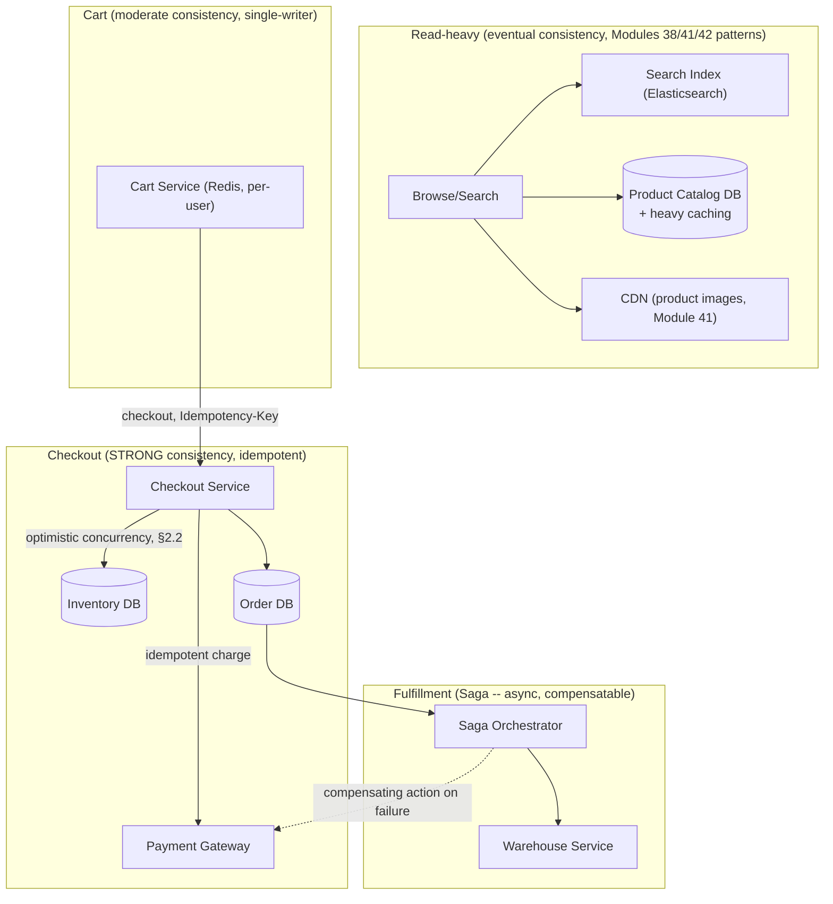

# Module 43 — System Design: Designing Amazon / an E-commerce Platform

> Domain: System Design | Level: Beginner → Expert | Prerequisite: [[01-System-Design-Fundamentals]], [[../03-REST-APIs/01-REST-Design-Fundamentals]] §2.2 (idempotency), [[../04-SQL-Server/02-Transactions-Isolation-Locking]] (inventory locking), [[04-Designing-Rate-Limiter-API-Gateway]]

---

## 1. Fundamentals

### What makes an e-commerce platform a distinct system-design problem from the content-distribution systems covered so far?
Unlike Modules 38/41/42's read-heavy, staleness-tolerant content-distribution problems, an e-commerce platform's **checkout/order-processing path is a genuine, financially-consequential transactional workload** — inventory must not be oversold, payments must not be double-charged, and an order's state must progress correctly through a multi-step workflow (placed → paid → fulfilled → shipped) with real business and legal consequences for getting any step wrong. This shifts the system's center of gravity from "optimize for eventual consistency and massive read scale" back toward **strong consistency and correctness on the write path**, while the **product catalog/search/browse** path remains a read-heavy, eventually-consistent problem much closer to this course's other content-serving systems.

### Why does this matter?
Because a Staff/Principal-level answer must explicitly recognize that **different parts of the same platform have genuinely different consistency requirements** (directly Module 37 §2.1's core discipline) — conflating the catalog-browsing path's requirements with the checkout path's requirements (either over-applying strong consistency everywhere, hurting browse-scale performance, or under-applying it on checkout, risking overselling/double-charging) is the single most consequential design mistake for this system class.

### When does this matter?
Any transactional platform (e-commerce, ticketing, booking systems) combining a read-heavy discovery/browse experience with a strongly-consistent transactional core; the depth matters for correctly designing inventory management (a classic distributed-systems correctness challenge) and for recognizing the Saga pattern's relevance to a multi-step order workflow spanning multiple services.

### How does it work (30,000-ft view)?
```
Browse/Search: read-heavy, eventually consistent, cache-and-CDN-heavy (Module 37/38's patterns)
Add to Cart: per-user, moderate consistency needs (a cart is usually single-writer -- the owning user)
Checkout: STRONGLY consistent -- inventory decrement, payment charge, order creation must be
          atomic/idempotent (Module 15 §2.2) and never oversell or double-charge
Order Fulfillment: an asynchronous, multi-step workflow (payment -> inventory reservation ->
                   warehouse fulfillment -> shipping) -- a Saga-pattern-shaped problem
```

---

## 2. Deep Dive

### 2.1 Product Catalog and Search — Reusing This Course's Read-Heavy-System Patterns
The product catalog (browsing, search, product detail pages) is architecturally similar to Module 38/41/42's read-heavy content-serving problems: heavy caching (Module 25's cache-aside pattern), CDN delivery for product images (Module 41's media pipeline directly reused), and a dedicated search index (a specialized full-text/faceted-search engine — Elasticsearch or similar — rather than relying on the primary transactional database's own query capability, since product search's access pattern — full-text matching, faceted filtering, relevance ranking — is a fundamentally different problem than the transactional database's OLTP-shaped needs, directly Module 20's "match the data structure/system to the actual access pattern" principle applied at the system-selection level). Catalog data (price, description, availability) tolerates eventual consistency — a product's price updating with a few seconds of propagation delay across cache layers is an acceptable, standard trade-off.

### 2.2 Inventory Management — the Classic Overselling Problem
Preventing overselling (two customers both successfully "buying" the last unit of an item) is a genuine, classic distributed-systems correctness challenge, directly requiring either **pessimistic locking** (a database row-level lock on the inventory record during checkout, Module 19's locking discipline — simple and correct, but limits checkout throughput for very popular, high-contention items) or **optimistic concurrency** (a version-checked conditional update — "decrement stock WHERE current_stock >= requested_quantity AND version = expected_version," directly Module 15 §2.5's ETag/optimistic-concurrency pattern applied to inventory instead of an HTTP resource — retrying on conflict, better throughput under contention at the cost of occasional retry overhead). For extremely high-contention items (a viral, limited-stock product drop), neither approach alone may suffice at the necessary scale, motivating more specialized techniques (a pre-allocated, sharded inventory-counter pool, or a queue-based, ticket-taking "reservation" system processing requests strictly in order) — but the baseline correctness mechanism, regardless of technique, must guarantee the fundamental invariant: **total sold quantity never exceeds available inventory**, non-negotiably.

### 2.3 Checkout Idempotency — Directly Reusing Module 15's Core Pattern
The checkout/place-order operation is exactly Module 15 §2.2's idempotency-key scenario: a client's checkout request might time out due to network flakiness, and a naive retry (without an idempotency key) risks **double-charging** the customer and creating **duplicate orders** — the checkout endpoint must accept and honor a client-generated idempotency key (Module 15 §11 Expert exercise's full implementation, directly reusable here without modification), ensuring a retried checkout request returns the original order's result rather than creating a second, duplicate order and charge.

### 2.4 Order Fulfillment as a Saga — Multi-Step, Multi-Service, Compensatable Workflow
Once an order is placed, fulfillment spans multiple, likely independently-deployed services/steps (charge payment → reserve inventory → notify the warehouse → schedule shipping) — a genuine **distributed transaction** problem that cannot use a single database transaction (Module 19/24) since it spans multiple services/systems. This is precisely the motivating problem for the **Saga pattern** (a dedicated later module): each step executes independently, and if a later step fails (the warehouse discovers the item is actually out of stock despite the inventory reservation succeeding, due to a damaged/miscounted unit), a **compensating action** undoes the effects of already-completed earlier steps (refunding the payment charge) — rather than attempting an all-or-nothing distributed transaction across services that don't share a transactional boundary, the system embraces eventual consistency with explicit, designed-for compensation for the failure case, directly the same "temporarily inconsistent intermediate state, later corrected" pattern Module 37 §Advanced Q8 introduced conceptually, now shown as this system's actual, necessary architecture.

### 2.5 Cart Design — Simpler Than It First Appears, But Not Trivial
A shopping cart is typically single-writer (the owning user), moderate-consistency (losing a very recent cart addition on a rare failure is an annoying but not business-catastrophic outcome, unlike checkout), and benefits from being stored close to the user (a session-affinity-style design, or simply a fast key-value store like Redis keyed by user ID) — but must still correctly handle the transition from "cart" (a tentative, freely-modifiable collection) to "order" (an immutable, committed record) at checkout time, precisely the moment strong consistency (§2.2/§2.3) becomes non-negotiable — a system-design answer should explicitly mark this "cart → order" transition as the specific point where the consistency model changes, not treat the cart and the order as governed by identical requirements throughout.

## 3. Visual Architecture


## 4. Production Example
**Scenario**: A retail platform's flash-sale feature (a limited-quantity, highly-anticipated product drop) used the same pessimistic row-level locking mechanism as its ordinary, low-contention checkout path — under the flash sale's extreme concurrent-request volume (tens of thousands of customers attempting to buy the same limited-stock item within seconds of the sale starting), the single inventory row's lock became a severe bottleneck: requests queued up waiting for the lock, checkout latency degraded into many seconds per request, and a substantial fraction of customers experienced timeouts and had to retry, with the sluggish, contended experience itself generating customer complaints and lost sales even for the customers who eventually succeeded. **Investigation**: confirmed via database lock-wait-time metrics (directly Module 19's blocking-chain diagnostic discipline) that the single, heavily-contended inventory row was the system-wide bottleneck — pessimistic locking, entirely appropriate for the platform's ordinary, low-contention checkout traffic, did not scale to this specific, extreme-contention scenario. **Fix**: implemented a pre-allocated, sharded inventory-counter design specifically for flash-sale items — the total available quantity is pre-split across N independent counter shards (e.g., 100 shards of 10 units each for a 1,000-unit drop), and each incoming checkout request is routed (via a simple hash or round-robin) to a specific shard, dramatically reducing per-shard contention (each shard now serves roughly 1/100th of the total request volume) at the cost of a small, bounded risk of "shard A is empty while shard B still has stock" requiring an occasional cross-shard rebalancing check for the tail end of the sale — checkout latency and success rate improved dramatically under the exact same extreme-concurrency scenario. **Lesson**: a correctness/locking mechanism appropriate for a system's *typical* contention level can become the dominant bottleneck under an *atypical*, extreme-contention scenario (a flash sale) — exactly Module 19's isolation-level/locking trade-offs, now demonstrated at a scale where the standard mechanism's assumptions (moderate contention) are deliberately, predictably violated by the product feature itself, requiring a specialized, higher-throughput technique (sharded counters) reserved specifically for this identified, extreme-contention use case rather than applied as the platform's universal default (which would be unnecessary complexity for ordinary, low-contention checkout traffic).

## 5. Best Practices
- Apply strong consistency and idempotency specifically to the checkout/inventory-decrement path; allow the catalog/browse path to remain eventually consistent and cache-heavy.
- Use optimistic concurrency (version-checked conditional updates) for inventory under moderate contention; reserve specialized techniques (sharded counters) for identified, extreme-contention scenarios like flash sales (§4).
- Design order fulfillment as a Saga with explicit compensating actions for each step, rather than attempting a single distributed transaction across independently-deployed services.
- Use a dedicated search/indexing system (not the transactional database) for product catalog search — match the system to the actual access pattern (Module 20's core discipline, applied at system-selection scale).

## 6. Anti-patterns
- Applying the same locking/concurrency-control mechanism uniformly regardless of actual contention level, causing severe bottlenecks under extreme-demand scenarios like flash sales (§4's incident).
- Skipping idempotency-key support on the checkout endpoint, risking double-charges/duplicate orders on client retry.
- Attempting a single, cross-service distributed transaction for order fulfillment instead of a Saga-pattern-based, compensatable workflow.
- Using the primary transactional database directly for full-text product search instead of a purpose-built search index.

## 7. Performance Engineering
**Checkout latency budget under contention**: directly Module 37 §7's latency-budgeting discipline, now explicitly accounting for lock-wait time as a distinct, contention-dependent component that can vary dramatically between ordinary traffic and a flash-sale scenario (§4) — a latency budget that assumes typical, low-contention lock-wait time will be badly violated under an anticipated high-contention event, requiring the specialized design (sharded counters) specifically to keep the budget achievable even under that specific, anticipated load pattern. **Search-index update latency vs. catalog-write latency**: since the search index is a separate system from the transactional catalog database (§2.1), a newly-added or price-updated product has an inherent propagation delay before it's reflected in search results — this eventual-consistency window (typically seconds, via a change-data-capture pipeline, Module 22 §2.4/Module 27 §Advanced Q6's DynamoDB-Streams-based pattern, keeping the search index in sync with the catalog database) should be explicitly acknowledged as an acceptable trade-off for search's much better query flexibility/performance, not treated as an unexamined gap. **Cart-to-order transition performance**: the moment of checkout is where the system's slower, strongly-consistent path is entered — this transition should be architecturally isolated (a distinct service/code path) from the cart's ordinary, fast, Redis-backed operations, so the checkout path's necessarily-higher latency (inventory locking/optimistic-concurrency retries, idempotent payment processing) doesn't accidentally leak into or slow down ordinary cart-modification operations that don't need it.

## 8. Security
**Payment data and PCI compliance**: an e-commerce platform handling payment card data directly (rather than delegating entirely to a PCI-compliant third-party payment processor, Module 31's Adapter-pattern-wrapped `IPaymentGateway`) takes on substantial compliance burden — the standard, strongly-recommended architecture delegates actual card-data handling entirely to the payment processor (via tokenization — the platform stores only an opaque token, never raw card data), directly reducing the platform's own compliance scope, a genuine architectural decision worth explicitly stating in a design discussion rather than assuming payment handling is a simple internal implementation detail. **Inventory/pricing manipulation via race conditions**: the exact overselling problem (§2.2) has a security-adjacent dimension — an attacker deliberately exploiting a checkout race condition (rapid, concurrent requests specifically crafted to bypass an insufficiently-atomic inventory check) to obtain more units than legitimately available, or to exploit a pricing-calculation race condition, is a genuine abuse vector the same correctness mechanisms (§2.2/§2.3) must defend against, not merely an accidental-overselling concern under organic high demand. **Order/account authorization**: viewing/modifying an order requires resource-based authorization (Module 12 §2.4) verifying the requesting user actually owns that specific order — directly Module 16 §2.1's BOLA concern, applicable to any "get order by ID" endpoint accepting an order identifier. **Rate limiting checkout attempts specifically**: beyond Module 40's general gateway-level rate limiting, checkout specifically warrants its own tier given its cost (a real payment-gateway call, real inventory-decrement contention) — an abusive or compromised client rapidly retrying checkout (a card-testing/fraud pattern, attempting many small transactions to validate stolen card numbers) needs to be detected and throttled specifically at this endpoint, beyond generic API rate limiting alone.

## 9. Scalability
**The catalog/browse path scales via this course's established read-heavy patterns**: CDN for images (Module 41), caching (Module 25), read replicas (Module 22/24/26) for the catalog database, and a horizontally-scaled search-index cluster — directly Module 37 §9's default scaling ladder, applied without modification to this system's read-heavy portion. **The checkout/inventory path scales differently, bounded by correctness requirements**: unlike the read path, checkout throughput cannot simply be scaled via "add more replicas" alone, since the underlying correctness constraint (never oversell) requires genuine coordination (locking or optimistic-concurrency retry) that doesn't trivially parallelize — this is precisely why specialized techniques (sharded counters, §4) become necessary specifically for extreme-contention scenarios, since ordinary horizontal scaling of the checkout *service* doesn't, by itself, solve the underlying *data*-contention bottleneck at the inventory record itself. **Order-fulfillment Saga orchestration scales as an independent, asynchronous, queue-driven workload**: directly Module 38/41's asynchronous, burst-absorbing worker-fleet pattern — the Saga orchestrator processing fulfillment steps scales independently of both the read-heavy browse path and the strongly-consistent checkout path, each of this system's three major components (browse, checkout, fulfillment) having genuinely distinct scaling characteristics and ladders, a direct, concrete illustration of Module 37 §2.1's "non-functional requirements per data type/component, not uniformly across the whole system" principle applied at maximum, three-way granularity within one platform.

---

## 10. Interview Questions

### Basic (10)
1. **Q: Why does an e-commerce platform's checkout path need stronger consistency than its browse/catalog path?** **A:** Checkout has real financial/business consequences (overselling, double-charging) that catalog browsing's brief staleness doesn't carry.
2. **Q: What is the classic "overselling" problem?** **A:** Two customers both successfully purchasing the last unit of an item due to insufficiently atomic inventory-decrement logic.
3. **Q: What idempotency mechanism prevents duplicate orders on checkout retry?** **A:** A client-generated idempotency key, directly reusing Module 15's pattern.
4. **Q: What is the Saga pattern used for in this context?** **A:** Coordinating a multi-step order-fulfillment workflow across independently-deployed services, using compensating actions instead of a single distributed transaction.
5. **Q: Why is a dedicated search index (Elasticsearch) typically used instead of the transactional database for product search?** **A:** Full-text/faceted search has a fundamentally different access pattern than OLTP queries, better served by a purpose-built system.
6. **Q: What are the two standard techniques for preventing overselling?** **A:** Pessimistic locking and optimistic concurrency (version-checked conditional updates).
7. **Q: Why might a flash sale need a different inventory-management technique than ordinary checkout traffic?** **A:** Extreme concurrent contention on a single, limited-stock item's inventory record can bottleneck standard locking mechanisms — sharded counters distribute this contention.
8. **Q: What does tokenization mean in payment processing?** **A:** Storing only an opaque token representing payment card data, never the raw card number itself, reducing compliance scope.
9. **Q: Is a shopping cart typically single-writer or multi-writer?** **A:** Single-writer — usually only the owning user modifies their own cart.
10. **Q: What's the moment where a cart's consistency requirements change significantly?** **A:** The checkout transition, where the cart becomes an immutable order and strong consistency becomes necessary.

### Intermediate (10)
1. **Q: Why does applying the same locking mechanism uniformly across both ordinary and flash-sale traffic cause a bottleneck specifically under flash-sale conditions?** **A:** The locking mechanism's throughput is inversely related to contention on the specific row/record — flash-sale traffic concentrates extreme contention on one specific item's inventory record, far beyond what the mechanism was designed to handle efficiently.
2. **Q: Why does optimistic concurrency generally offer better throughput than pessimistic locking under moderate contention, but not eliminate the overselling risk?** **A:** It avoids holding a lock for the duration of the transaction (better throughput), but still requires the fundamental invariant check (sufficient stock) to be atomic at the actual decrement — a version-mismatch conflict still requires retry, and correctness is preserved by the conditional update failing (not succeeding incorrectly) under a genuine conflict.
3. **Q: Why can't order fulfillment simply use a single database transaction spanning payment, inventory, and warehouse services?** **A:** These are independently-deployed services, likely with separate databases — a single ACID transaction (Module 19/24) requires a shared transactional boundary that doesn't exist across independent services, motivating the Saga pattern's compensating-action approach instead.
4. **Q: Why is a compensating action (e.g., a refund) different from simply "rolling back" in the traditional database-transaction sense?** **A:** The original action (charging a payment) already had a real, external, irreversible-in-the-database-sense effect (money moved) — a compensating action is a new, separate operation (issuing a refund) that reverses the *business effect*, not a database-level undo of an operation that was never wrapped in a shared transaction to begin with.
5. **Q: Why does the search index's eventual-consistency lag (a newly-added product not immediately searchable) represent an acceptable trade-off?** **A:** Search's massive query-flexibility and performance benefit over the transactional database far outweighs a typically-brief propagation delay, especially since product catalog changes are far less frequent/time-sensitive than, e.g., inventory-count changes during checkout.
6. **Q: Why should checkout be architecturally isolated as a distinct service/code path from ordinary cart operations?** **A:** So checkout's necessarily higher latency (locking/retry overhead, idempotent payment processing) doesn't leak into or degrade the performance of ordinary, fast, low-consistency-requirement cart-modification operations that don't need those guarantees.
7. **Q: Why is tokenization specifically valuable for reducing PCI compliance scope, not just a technical implementation detail?** **A:** By never storing raw card data at all (delegating that entirely to a PCI-compliant processor), the platform's own systems fall outside much of PCI-DSS's most stringent, costly compliance requirements, which apply specifically to systems that store/process/transmit actual cardholder data.
8. **Q: Why might rate limiting checkout specifically (beyond general API rate limiting) matter for fraud prevention?** **A:** Checkout is where a card-testing/fraud pattern (rapid, small, exploratory transactions validating stolen card numbers) would manifest — a checkout-specific rate limit/anomaly-detection tier catches this pattern more precisely than a generic, uniform API rate limit not specifically tuned to this endpoint's fraud-risk profile.
9. **Q: Why does the "cart → order" transition matter architecturally, beyond just "checkout is slower"?** **A:** It's the specific point where the entire consistency model changes (from moderate/single-writer to strong/idempotent) — recognizing and explicitly designing around this transition point (rather than treating the whole cart-to-order lifecycle as one uniform concern) is what correctly scopes where the expensive, strongly-consistent machinery actually needs to apply.
10. **Q: Why does sharding inventory counters for a flash sale introduce a "cross-shard rebalancing" consideration, and why is this an acceptable trade-off?** **A:** Splitting stock across N shards means one shard could deplete while others still have stock, requiring an occasional check/rebalance for the tail end of the sale — a small, bounded complexity cost accepted specifically because it enables the dramatic contention reduction needed for the flash-sale scenario, a deliberate, justified trade-off rather than a design oversight.

### Advanced (10)
1. **Q: Diagnose the flash-sale checkout-bottleneck incident (§4) from first principles, and design the specific, proactive trigger determining when a product should use the sharded-counter mechanism versus ordinary optimistic concurrency.**
   **A:** Root cause: applying the platform's standard, moderate-contention-appropriate locking mechanism to a scenario (flash sale) with orders-of-magnitude higher contention than the mechanism was designed for. Trigger design: any product marked as a "limited/flash-sale drop" (a product-catalog attribute set by the merchandising team ahead of the sale, directly analogous to Module 38 §Advanced Q1's proactive follower-count-threshold monitoring) automatically routes through the sharded-counter inventory mechanism instead of ordinary per-item optimistic concurrency — making this a **deliberate, upfront architectural choice for anticipated high-contention events**, not a reactive fix discovered only after a real incident, directly the same "anticipate and design for known high-contention/high-skew scenarios proactively" discipline as Module 38's celebrity-account fan-out threshold.
2. **Q: Design the specific compensating-action sequence for a Saga where payment succeeds, inventory reservation succeeds, but the warehouse fulfillment step discovers the item is actually unavailable (a physical stock discrepancy).**
   **A:** The Saga orchestrator, upon receiving the warehouse's failure signal, executes compensating actions in **reverse order** of the original steps: first release the inventory reservation (returning the "reserved" unit back to available stock, correcting the discrepancy for future orders), then issue a refund for the payment charge, then update the order status to reflect the cancellation with an explanation, and finally notify the customer — each compensating action is itself an idempotent, retryable operation (directly Module 15's idempotency discipline applied to the compensation steps themselves, not just the original forward-path actions), since a compensating action can itself fail and need retry, requiring the same correctness rigor as the original operations.
3. **Q: Explain how you would design the sharded-inventory-counter mechanism (§4) to correctly handle the "last unit" edge case, where the total remaining stock across all shards is very small relative to the shard count.**
   **A:** As total remaining stock across all shards drops below a threshold (e.g., fewer remaining units than shards), dynamically **consolidate** into fewer, larger shards (or a single shard) for the tail end of the sale — trading back some of the contention-reduction benefit (no longer needed, since demand for the last few units is naturally far lower than the initial rush) for simpler, more straightforward correctness as the sale winds down, directly the same "the right technique depends on the actual current contention level, which can itself change over the sale's lifecycle" reasoning, now applied dynamically rather than as a single, static, unchanging configuration.
4. **Q: How would you design the product-search index's data-synchronization pipeline (keeping Elasticsearch in sync with the catalog database) to handle a burst of catalog updates (e.g., a large merchandising import) without falling significantly behind and serving badly-stale search results?**
   **A:** Directly Module 22 §2.4/Module 27 §Advanced Q6's change-data-capture pattern — a CDC pipeline (reading the catalog database's own change log/replication stream) feeding a message queue, with the search-index-update consumer scaling horizontally (more consumer instances) during a detected backlog, directly Module 26 §2.2's consumer-group backlog-monitoring discipline applied here to catalog-to-search synchronization specifically, ensuring the sync pipeline can absorb a burst (a large import) without the search index's staleness window growing unacceptably large during that burst.
5. **Q: Design a strategy for handling a payment-gateway outage during checkout, given that this is now a hard dependency on the strongly-consistent, correctness-critical checkout path.**
   **A:** Directly Module 31's Adapter-pattern-wrapped `IPaymentGateway`, combined with Module 2's retry-with-backoff and, for a genuine, sustained outage, a circuit breaker (Module 40 §11 Hard exercise's pattern, here applied to the payment gateway instead of the rate limiter's own Redis dependency) — critically, unlike the rate limiter's fail-open default (Module 40's deliberate choice), a payment-gateway outage should **fail closed** (reject the checkout attempt with a clear "please try again shortly" message) rather than fail open, since "fail open" for a payment charge would mean either not charging the customer for goods they'd receive (an unacceptable business-cost outcome) or attempting to proceed without payment confirmation entirely (a direct, severe correctness violation) — a clear, deliberate contrast in fail-open-vs-fail-closed policy specifically justified by this component's uniquely high correctness stakes.
6. **Q: Explain why "eventual consistency for the catalog, strong consistency for checkout" is not simply a binary switch, using the specific example of displaying "only 3 left in stock!" on a product page.**
   **A:** This is a genuinely nuanced, in-between case: the displayed stock count is inherently a **read from the eventually-consistent catalog/cache layer** (not a strongly-consistent, real-time read against the authoritative inventory record, which would be prohibitively expensive to perform on every single product-page view) — meaning the displayed "3 left" is an approximation that could be briefly stale (the actual current count, checked strongly-consistently only at the moment of checkout itself, is the true authoritative value) — a well-designed system explicitly communicates this distinction (the display is informational/approximate, the actual availability check happens at checkout) rather than implying the displayed count is a real-time, guaranteed-accurate figure, directly illustrating that "eventually consistent vs. strongly consistent" isn't always a clean, binary per-feature choice but can require nuanced communication about which specific reads/writes carry which guarantee.
7. **Q: How would you design fraud detection for the checkout path (Advanced Q, card-testing pattern) without adding unacceptable latency to legitimate checkout requests?**
   **A:** Run fast, low-latency fraud-signal checks (velocity checks — how many recent attempts from this card/IP/user, directly Module 16's rate-limiting-adjacent techniques) synchronously, gating the checkout request itself only on these cheap, fast signals; run more expensive, sophisticated fraud-model scoring (a machine-learning-based risk assessment) asynchronously, either as a secondary, near-real-time check that can still block a transaction within a small grace window, or as a purely post-hoc detection mechanism flagging suspicious-but-already-processed transactions for review/reversal — directly the same "cheap check synchronously gates the request; expensive check runs asynchronously" latency-budgeting discipline (Module 37 §7) applied to fraud detection specifically.
8. **Q: A team proposes handling all order-fulfillment logic (payment, inventory, warehouse notification) within a single, monolithic service and a single database transaction, arguing this avoids the Saga pattern's complexity entirely. Evaluate this as a Principal Engineer.**
   **A:** This is a legitimate, simpler alternative **specifically if** payment processing, inventory management, and warehouse systems can genuinely share one transactional database boundary (increasingly rare in practice, since payment processing typically must go through an external, third-party gateway — Advanced Q5 — which by definition cannot participate in the platform's own database transaction) — if any step genuinely requires crossing a transactional boundary (an external payment gateway call, a separate warehouse-management system), the Saga pattern's compensating-action approach is not optional added complexity, it's the **necessary** consequence of that architectural reality; recommend evaluating this proposal specifically against whether every involved step can truly share one transaction (rare) versus assuming monolithic simplicity is always achievable regardless of the actual system boundaries involved.
9. **Q: Explain how you would design capacity planning specifically for a scheduled, anticipated high-demand event (a major sale like Black Friday), beyond the flash-sale-specific inventory technique from §4.**
   **A:** Beyond the inventory-contention-specific sharded-counter technique, capacity planning for a broadly-anticipated high-traffic event requires pre-emptively scaling the **entire** read path (additional cache/CDN capacity, pre-warmed per Module 41 §Advanced Q4's CDN pre-warming discussion) and the checkout/payment-gateway-adjacent capacity (confirming the payment processor itself can handle the anticipated peak transaction rate, a third-party dependency's own capacity becoming this platform's bottleneck if not proactively coordinated) — directly Module 37 §2.2's capacity-estimation discipline applied specifically to a known, scheduled event rather than organic, gradually-observed growth, requiring proactive coordination with every dependency in the critical path, not just the platform's own infrastructure.
10. **Q: As a Principal Engineer, how would you structure a pre-launch readiness review specifically for a new, anticipated-high-contention product feature (a flash sale, a major promotional event), generalizing §4's lesson into a standing process?**
    **A:** Require any anticipated high-contention/high-traffic feature launch to include an explicit, documented section addressing: (a) what is the expected peak contention level on any shared, correctness-critical resource (inventory records specifically), and does the standard mechanism's throughput at that contention level meet the required latency/success-rate targets (validated via load testing at the *actual* anticipated contention level, not just organic historical traffic patterns, directly Module 20 §Advanced Q7's "test at representative scale" discipline); (b) is a specialized technique (sharded counters, Advanced Q1's proactive trigger) warranted, and if so, is it correctly configured and tested before the event; (c) are all critical-path third-party dependencies (payment gateway, Advanced Q9) confirmed to have sufficient capacity for the anticipated peak — converting this module's reactive, incident-driven lesson (§4) into a mandatory, proactive pre-launch checklist item for any future high-contention event, directly this course's recurring pattern of institutionalizing hard-won lessons as standing governance rather than tribal knowledge.

---

## 11. Coding Exercises

*(System design case studies use worked design exercises, consistent with this domain's format.)*

### Easy — Optimistic-concurrency inventory decrement (§2.2)
```csharp
public async Task<bool> TryDecrementStockAsync(string sku, int quantity)
{
    // Conditional UPDATE: succeeds ONLY if sufficient stock exists AT THE MOMENT of the atomic operation --
    // no separate "check then decrement" race window (directly avoiding the classic overselling bug).
    int rowsAffected = await _db.ExecuteAsync(
        "UPDATE Inventory SET Stock = Stock - @Quantity WHERE Sku = @Sku AND Stock >= @Quantity",
        new { Sku = sku, Quantity = quantity });
    return rowsAffected > 0; // false means insufficient stock -- reject the checkout attempt
}
```

### Medium — Sharded inventory counter for flash-sale contention (§4's fix)
```csharp
public class ShardedInventoryCounter
{
    private readonly int _shardCount;
    public ShardedInventoryCounter(int totalStock, int shardCount)
    {
        _shardCount = shardCount;
        int perShard = totalStock / shardCount;
        for (int i = 0; i < shardCount; i++)
            _db.Execute("INSERT INTO InventoryShards (ShardId, Stock) VALUES (@Id, @Stock)", new { Id = i, Stock = perShard });
    }

    public async Task<bool> TryPurchaseAsync(string userId)
    {
        int shardId = Math.Abs(userId.GetHashCode()) % _shardCount; // route to a specific shard, distributing contention
        int rowsAffected = await _db.ExecuteAsync(
            "UPDATE InventoryShards SET Stock = Stock - 1 WHERE ShardId = @ShardId AND Stock > 0",
            new { ShardId = shardId });

        if (rowsAffected > 0) return true;

        // This shard is depleted -- Advanced Q3's tail-end consolidation would trigger a fallback
        // check across other shards here in a production implementation; omitted for brevity.
        return false;
    }
}
```

### Hard — Idempotent checkout with the payment-gateway fail-closed policy (Advanced Q5)
```csharp
public async Task<CheckoutResult> CheckoutAsync(string idempotencyKey, CartSnapshot cart)
{
    var existing = await _idempotencyStore.TryGetAsync(idempotencyKey);
    if (existing is { Status: IdempotencyStatus.Completed }) return existing.CachedResult; // Module 15's pattern

    if (!await _inventory.TryDecrementStockAsync(cart.Sku, cart.Quantity))
        return CheckoutResult.Failed("Insufficient stock.");

    try
    {
        var chargeResult = await _paymentGateway.ChargeAsync(cart.Total); // FAIL CLOSED if this throws (Advanced Q5)
        var order = await _orderStore.CreateOrderAsync(cart, chargeResult.TransactionId);
        await _idempotencyStore.MarkCompletedAsync(idempotencyKey, order);
        return CheckoutResult.Success(order);
    }
    catch (PaymentGatewayException)
    {
        await _inventory.RestoreStockAsync(cart.Sku, cart.Quantity); // compensate the already-decremented stock
        return CheckoutResult.Failed("Payment processing is temporarily unavailable. Please try again."); // FAIL CLOSED
    }
}
```

### Expert — Saga orchestrator with reverse-order compensation (Advanced Q2)
```csharp
public class OrderFulfillmentSaga
{
    public async Task ExecuteAsync(Order order)
    {
        var completedSteps = new Stack<Func<Task>>(); // tracks compensations for steps ALREADY completed

        try
        {
            await _paymentService.ChargeAsync(order.PaymentDetails);
            completedSteps.Push(() => _paymentService.RefundAsync(order.PaymentDetails));

            await _inventoryService.ReserveAsync(order.Sku, order.Quantity);
            completedSteps.Push(() => _inventoryService.ReleaseReservationAsync(order.Sku, order.Quantity));

            await _warehouseService.RequestFulfillmentAsync(order); // the step that CAN fail (Advanced Q2's scenario)
            completedSteps.Push(() => _warehouseService.CancelFulfillmentAsync(order));

            await _orderStore.MarkFulfilledAsync(order.Id);
        }
        catch (Exception ex)
        {
            _logger.LogError(ex, "Saga failed for order {OrderId}, compensating {Count} completed steps.",
                order.Id, completedSteps.Count);

            while (completedSteps.Count > 0) // REVERSE order compensation, per Advanced Q2
            {
                var compensate = completedSteps.Pop();
                await ExecuteWithRetryAsync(compensate); // compensations are ALSO idempotent/retryable (Advanced Q2)
            }
            await _orderStore.MarkCancelledAsync(order.Id, reason: ex.Message);
        }
    }
}
```
**Discussion**: The `Stack<Func<Task>>` tracking exactly which steps completed (and thus need compensation) is the key structural detail — compensations run in **reverse** order of the original forward steps (release inventory before refunding payment, matching the natural "undo the most recent thing first" logic), and each compensation itself goes through retry logic (`ExecuteWithRetryAsync`), directly Advanced Q2's requirement that compensating actions carry the same correctness rigor (idempotency, retry-on-transient-failure) as the original forward-path operations.

---

## 12–17. System Design / LLD / Debugging / Decision / Case Study / Principal

*(This entire module IS the deep-dive case study — §4's incident, §11's four worked exercises, and the extensive Advanced-tier Q&A collectively constitute this section's typical content.)*

## 18. Revision
**Key takeaways**: An e-commerce platform's browse/catalog path (eventually consistent, cache/CDN-heavy) and checkout/fulfillment path (strongly consistent, idempotent, correctness-critical) have genuinely different requirements — apply Module 37 §2.1's "consistency per data type" discipline at its most consequential. Preventing overselling requires atomic, conditional inventory updates (optimistic concurrency or pessimistic locking); extreme-contention scenarios (flash sales, §4) require specialized techniques (sharded counters) applied proactively, anticipated in advance, not retrofitted reactively. Checkout requires idempotency-key support (Module 15) to prevent duplicate orders/double-charges on retry. Multi-step order fulfillment spanning independent services requires the Saga pattern (compensating actions in reverse order, themselves idempotent/retryable) rather than an infeasible cross-service distributed transaction. A payment-gateway outage should fail closed (reject cleanly), a deliberate contrast to a rate limiter's typical fail-open default, justified by checkout's uniquely high correctness stakes.

---

**Next**: Continuing autonomously to Module 44 — WhatsApp-Specific Additions: Multi-Device Sync & End-to-End Encryption Key Management (building directly on Module 39's Chat System foundation) to complete this expanded `14-System-Design` domain before advancing to `15-Low-Level-Design`.
