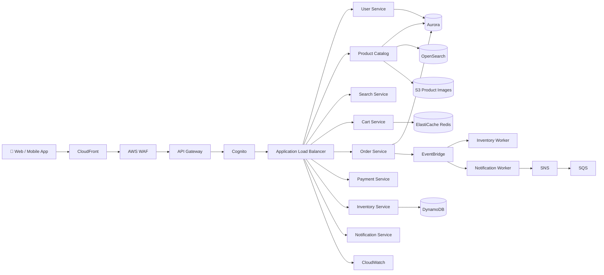
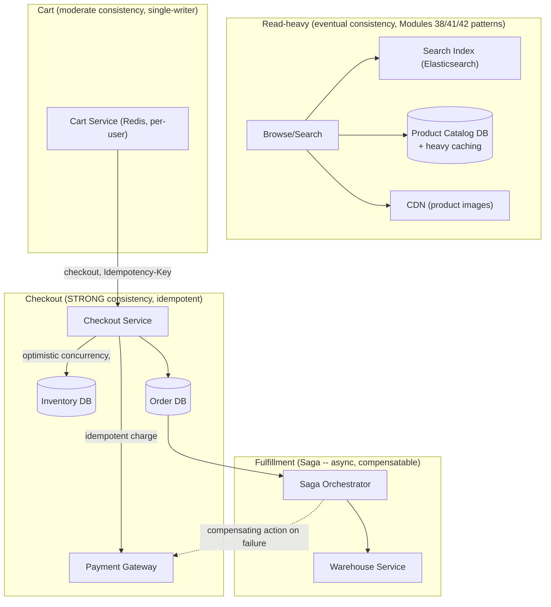
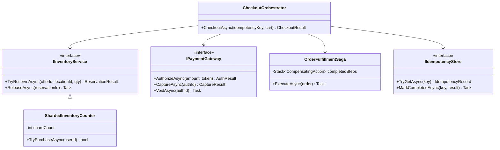

# Module 43 — System Design: Designing Amazon / an E-commerce Platform

> Domain: System Design | Level: Beginner → Expert | Prerequisite: [[01-System-Design-Fundamentals]], [[../03-REST-APIs/01-REST-Design-Fundamentals]] (idempotency), [[../04-SQL-Server/02-Transactions-Isolation-Locking]] (inventory locking), [[04-Designing-Rate-Limiter-API-Gateway]]

---

# Amazon / E-Commerce Platform (AWS)


```mermaid
flowchart LR

 Customer[🛒 Web / Mobile App]

 Customer --> CloudFront[CloudFront]
 CloudFront --> WAF[AWS WAF]
 WAF --> APIGateway[API Gateway]
 APIGateway --> Cognito[Cognito]

 Cognito --> ALB[Application Load Balancer]

 ALB --> UserService[User Service]
 ALB --> ProductService[Product Catalog]
 ALB --> SearchService[Search Service]
 ALB --> CartService[Cart Service]
 ALB --> OrderService[Order Service]
 ALB --> PaymentService[Payment Service]
 ALB --> InventoryService[Inventory Service]
 ALB --> NotificationService[Notification Service]

 ProductService --> Aurora[(Aurora)]
 UserService --> Aurora
 OrderService --> Aurora

 CartService --> Redis[(ElastiCache Redis)]

 ProductService --> OpenSearch[(OpenSearch)]

 InventoryService --> DynamoDB[(DynamoDB)]

 ProductService --> S3[(S3 Product Images)]

 OrderService --> EventBridge[EventBridge]

 EventBridge --> InventoryWorker[Inventory Worker]
 EventBridge --> NotificationWorker[Notification Worker]

 NotificationWorker --> SNS[SNS]
 SNS --> SQS[SQS]

 ALB --> CloudWatch[CloudWatch]
```

---

# User Purchase Flow

```text
Customer
 │
 ▼
CloudFront
 │
AWS WAF
 │
API Gateway
 │
Cognito Authentication
 │
Application Load Balancer
 │
────────────────────────────────────────────
│ Product Service → Product Catalog
│ Search Service → Search Products
│ Cart Service → Shopping Cart
│ Order Service → Place Order
│ Payment Service → Process Payment
│ Inventory Service → Update Stock
│ Notification Service → Email/SMS
────────────────────────────────────────────
 │
 EventBridge
 │
 Inventory & Notification Workers
 │
 SNS → SQS
```

---

# AWS Services Used

| Component | AWS Service |
|-----------|-------------|
| CDN | CloudFront |
| Security | AWS WAF |
| Authentication | Cognito |
| API | API Gateway |
| Load Balancer | ALB |
| Compute | ECS / EKS |
| Relational Database | Aurora |
| Inventory | DynamoDB |
| Shopping Cart Cache | ElastiCache Redis |
| Search | OpenSearch |
| Product Images | Amazon S3 |
| Event Bus | EventBridge |
| Notifications | SNS + SQS |
| Monitoring | CloudWatch |

---

## 1. Fundamentals

### What makes an e-commerce platform a distinct system-design problem from the content-distribution systems covered so far?
Unlike Modules 38/41/42's read-heavy, staleness-tolerant content-distribution problems, an e-commerce platform's **checkout/order-processing path is a genuine, financially-consequential transactional workload** — inventory must not be oversold, payments must not be double-charged, and an order's state must progress correctly through a multi-step workflow (placed → paid → fulfilled → shipped) with real business and legal consequences for getting any step wrong. This shifts the system's center of gravity from "optimize for eventual consistency and massive read scale" back toward **strong consistency and correctness on the write path**, while the **product catalog/search/browse** path remains a read-heavy, eventually-consistent problem much closer to this course's other content-serving systems.

### Why does this matter?
Because a Staff/Principal-level answer must explicitly recognize that **different parts of the same platform have genuinely different consistency requirements** (directly the core discipline) — conflating the catalog-browsing path's requirements with the checkout path's requirements (either over-applying strong consistency everywhere, hurting browse-scale performance, or under-applying it on checkout, risking overselling/double-charging) is the single most consequential design mistake for this system class.

### When does this matter?
Any transactional platform (e-commerce, ticketing, booking systems) combining a read-heavy discovery/browse experience with a strongly-consistent transactional core; the depth matters for correctly designing inventory management (a classic distributed-systems correctness challenge) and for recognizing the Saga pattern's relevance to a multi-step order workflow spanning multiple services.

### How does it work (30,000-ft view)?
```
Browse/Search: read-heavy, eventually consistent, cache-and-CDN-heavy (Module 38's patterns)
Add to Cart: per-user, moderate consistency needs (a cart is usually single-writer -- the owning user)
Checkout: STRONGLY consistent -- inventory decrement, payment charge, order creation must be
 atomic/idempotent and never oversell or double-charge
Order Fulfillment: an asynchronous, multi-step workflow (payment -> inventory reservation ->
 warehouse fulfillment -> shipping) -- a Saga-pattern-shaped problem
```

---

## 2. Deep Dive

This section is written to be **complete on its own** — every mechanism, the reasoning that selects it, the failure mode it introduces, and the push-back a Principal/Staff interviewer will raise, answered inline. §12 designs the platform end to end under the four-step standard; this section derives the mechanisms §12 assembles.

### 2.1 Catalog and Search — the Read-Heavy Half

Browsing, search and product pages are architecturally the read-heavy content-serving problem: heavy caching (cache-aside), CDN delivery for images, and a **dedicated search index** rather than the transactional database's own query capability.

The reason for a separate index is access-pattern fit, not scale worship: full-text matching, faceted filtering and relevance ranking are a fundamentally different problem from OLTP point reads and writes. Matching the engine to the access pattern is the same principle applied one level up, at system selection rather than data-structure selection.

Catalog data — price, description, availability — tolerates **eventual consistency**. A price propagating across cache layers over a few seconds is a standard, acceptable trade, and search's query-flexibility benefit far outweighs a brief indexing delay, especially since catalogue changes are far less time-sensitive than inventory changes during checkout.

**Keeping the index in sync needs CDC, not dual writes.** A change-data-capture pipeline reading the catalogue database's replication stream into a queue, consumed by index writers, gives ordering and replayability that application-level dual writes cannot. For a burst — a large merchandising import — the consumer scales horizontally on observed lag, so the staleness window stays bounded rather than growing silently through the import.

### 2.2 Inventory and Overselling — the Core Correctness Problem

Two customers both successfully buying the last unit is the canonical failure. Three mechanisms, in increasing order of what they actually guarantee:

**Pessimistic locking** — take a row lock on the inventory record for the duration of checkout. Simple and correct, and it serialises all contention on that row, which collapses throughput for popular items.

**Optimistic concurrency** — a version-checked conditional update, retried on conflict. Better throughput under moderate contention because no lock is held across the transaction. It does *not* remove the need for the invariant check to be atomic at the decrement; correctness is preserved by the conditional update **failing** under a genuine conflict, not by the absence of conflict.

**The predicated atomic write — the one that makes overselling structurally impossible:**

```sql
UPDATE inventory
   SET reserved = reserved + @n
 WHERE offer_id = @id
   AND on_hand - reserved >= @n;
-- affected row count (0 or 1) IS the success/failure signal
```

There is no separate read to race against. The predicate lives inside the write, so the database's own row-level write lock is the enforcement mechanism rather than application logic.

**Why check-then-act fails even under `READ COMMITTED`**, which is the question that separates understanding from recitation: `SELECT available; if available >= n then UPDATE` lets two concurrent transactions both read `available = 1` before either commits its decrement. Each sees a snapshot true at read time and false at write time — a classic lost-update anomaly. Only `SERIALIZABLE` (at steep throughput cost) or pushing the predicate into the write closes the window. This is the same conclusion the ledger material reaches independently for hot accounts: a domain-independent correctness pattern, not an e-commerce trick.

**Reservations have a lifecycle, and the sweeper is where drift comes from.** A `HELD` reservation with an `expires_at` must be released if checkout never completes. The failure mode worth naming is not a stopped sweeper — that is loud — but a **degraded** one: a sweeper falling behind leaks a small number of expired-but-unreleased reservations continuously, producing a slow, chronic divergence between listed and authoritative stock with no single identifiable incident. A binary up/down health check is blind to it. Instrument **aged `HELD` reservations past `expires_at` as a trend**, not just a threshold, because a slowly worsening trend below any fixed alert level is exactly what a point-in-time check cannot see.

### 2.3 Flash Sales — Contention on One Logical Key

A flash sale concentrates enormous concurrency on a *single* inventory row. §12's estimation makes the scale concrete: ~50,000 checkout attempts/s against one row, roughly 167× normal peak. No amount of tuning the standard path survives that, because the standard path was designed for moderate contention.

**Shard the counter, not the servers.** Split the item's stock across N sub-counters, each independently contended, and route a request to one of them. Contention drops by roughly N.

**Consolidate for the tail.** Once total remaining stock falls below the shard count, some shards are empty while others hold units, and a customer can be told "sold out" while stock exists. Dynamically consolidate into fewer (eventually one) shards as the sale winds down — trading back contention reduction that is no longer needed, because demand for the last few units is far lower than the opening rush. The right technique depends on the *current* contention level, which changes across the sale's own lifecycle.

**Admission control in front of it all.** Issue tokens at a rate the checkout path is *tested* to sustain (say 500/s), for exactly the stock count, and queue everyone else. This converts an unbounded stampede into a bounded, fair, observable flow.

*When token-holder conversion runs below the issuance rate*, distinguish two structurally different causes before acting: **(a) token lifecycle** — customers who queued, got a token and never completed within its validity window, fixed by extending validity slightly or re-issuing expired-unused tokens to the next in queue; or **(b) the checkout path degrading under the admitted load** — a downstream PSP or inventory shard throttling, which is a capacity-planning miss in the admission rate itself and requires re-validating that 500/s is genuinely within tested capacity rather than an assumed-safe number.

*Token expiry must preserve the invariant* `tokens_issued + units_still_in_shards = original_stock`, at every instant, never momentarily violated. Returning a unit is not inherently safer than taking one: a naive re-increment races against a concurrent purchase decrement. Expiry re-entry is itself a **single atomic predicated increment** back into a deterministically chosen shard (the one the expired token reserved from, avoiding a cross-shard rebalance just to handle expiries), guarded so a shard never exceeds its original allocation. Give a unit back with the same rigour you take one.

**Trigger the specialised mechanism proactively, not reactively.** A product flagged as a limited drop by merchandising *ahead of the sale* routes automatically through sharded counters and admission control. That makes it a deliberate upfront decision for an anticipated high-contention event — the same discipline as pre-emptively moving a celebrity account to the pull path — rather than a fix discovered during an incident.

### 2.4 "Only 3 Left" — Consistency Is Not a Binary Switch

The displayed stock count is read from the **eventually consistent** catalogue/cache layer, because a strongly consistent read against the authoritative inventory row on every product-page view would be prohibitively expensive. The authoritative check happens once, at checkout.

So "3 left" is an approximation that can be briefly stale, and the design should communicate it as informational rather than implying a guaranteed real-time figure. This is the cleanest illustration that "eventual for catalogue, strong for checkout" is not a clean per-feature switch — one user-visible number can sit on the eventual side while the decision it informs sits on the strong side.

### 2.5 The Cart, and the Transition That Changes Everything

A cart is typically **single-writer** (the owning user), moderate-consistency (losing a very recent addition is annoying, not catastrophic), and benefits from a fast key-value store keyed by user. Last-write-wins per line item across devices is usually acceptable — but ask, because it is a requirement, not a given.

**The `cart → order` transition is the architectural event.** It is the specific point where the consistency model changes from moderate and single-writer to strong and idempotent, and where a mutable collection becomes an immutable record. Marking that transition explicitly is what correctly *scopes* the expensive machinery — locking, idempotency, saga orchestration — to the part of the lifecycle that needs it, instead of applying it uniformly or not at all.

For the same reason, **checkout is a separate service and code path** from ordinary cart operations: its necessarily higher latency (contention handling, retry, payment) must not leak into the fast, high-volume cart operations that need none of those guarantees.

### 2.6 Checkout Idempotency

A checkout request can time out after the server committed. A naive retry double-charges the customer and creates a duplicate order — the two worst outcomes in the system.

The mechanic is the standard one: a client-generated `Idempotency-Key`, stored **transactionally with the outcome**, so a retry returns the original order rather than creating a second. Store a hash of the request body alongside it, so a key reused with a *different* body is an error rather than a silent return of the wrong order.

### 2.7 Payments — Scope, Failure Posture, and Price Mismatches

**Tokenization is a compliance-scope decision, not an implementation detail.** By never storing raw card data — delegating entirely to a PCI-compliant processor and holding only an opaque token — the platform's own systems fall outside PCI-DSS's most stringent and costly requirements, which apply specifically to systems that store, process or transmit cardholder data. The saving is audit scope and engineering constraint, not just storage.

**A payment-gateway outage must fail closed.** Wrap the gateway behind an adapter with retry-and-backoff and a circuit breaker for a sustained outage — and note the deliberate contrast with the rate limiter's fail-*open* default. Failing open here would mean either shipping goods without payment or proceeding without confirmation, both severe. The correct behaviour is rejecting the attempt with a clear "please try again shortly." Fail-open versus fail-closed is decided per component by the cost of being wrong, never by a global default.

**Price-mismatch handling should be asymmetric.** A hard `409 PRICE_CHANGED` on every mismatch treats a one-cent decrease from a promotion activating mid-browse exactly like deliberate manipulation. Refine it: tolerate a small bounded price **decrease** silently and charge the lower current price — never worse for the customer, and it removes friction from the common case — while always hard-rejecting a price **increase** with an explicit `409` showing the new total, because silently charging more than the customer saw produces chargebacks and trust damage. Match the handling to the actual risk profile of each direction.

### 2.8 Fraud on the Checkout Path

Checkout is where card-testing shows up — rapid, small, exploratory transactions validating stolen numbers — which is why a **checkout-specific** limit and anomaly tier catches it far better than a uniform API limit not tuned to this endpoint's risk profile.

Split the work by cost: run **cheap, fast velocity checks synchronously** (recent attempts per card, per IP, per user) and gate the request on those alone; run **expensive model scoring asynchronously**, either as a near-real-time secondary check that can still block within a small grace window, or as post-hoc detection flagging already-processed transactions for review and reversal. Cheap check gates; expensive check follows — the same latency-budgeting discipline used elsewhere, applied to fraud.

### 2.9 The Saga — Why It Is Necessary, and at What Granularity

Fulfilment spans payment, inventory and warehouse — independently deployed services with separate databases and, critically, an **external** payment gateway that cannot participate in your transaction. There is no shared transactional boundary, which is what makes the saga necessary rather than merely fashionable.

**Compensation is not rollback.** The original action had a real external effect — money moved. A compensating action is a *new* operation reversing the business effect (a refund), not a database undo of something that was never in a shared transaction.

**Compensate in reverse order, and make each compensation idempotent.** When payment succeeds, reservation succeeds, and the warehouse then discovers a physical stock discrepancy: release the reservation, refund the payment, update the order with an explanation, notify the customer. Each compensating step can itself fail and be retried, so it needs the same idempotency rigour as the forward path — a point frequently missed, because people apply the discipline to the happy path and treat compensation as best-effort cleanup.

**The monolithic alternative is legitimate — under one condition.** If payment, inventory and warehouse can genuinely share one transactional database boundary, a single transaction is simpler and better. That condition is increasingly rare, because payment almost always goes through an external gateway. Evaluate the proposal against whether *every* step can truly share one transaction, rather than assuming monolithic simplicity is always available.

**Partial fulfilment forces line-item granularity.** An order with three items where two ship and one is backordered requires the saga's unit of work to move from order level to **line item**: each item gets its own allocate/ship/capture sub-saga, and the order status becomes a rollup (`PARTIALLY_SHIPPED`). Payment capture must then be per shipment — capturing the full amount before the backordered item ships either overcharges for goods not sent (a correctness and, in many jurisdictions, legal problem) or forces a partial refund later. The compensating action for a permanently unfulfillable item is scoped to that item alone, which is only possible because the granularity was chosen up front rather than retrofitted.

### 2.10 Physical Reality — Where Inventory Stops Being a Data Problem

**The authoritative record and the physical shelf will never match by construction.** Damage, theft and miscounts guarantee divergence. Physical **cycle counts** — periodic recounts of a sample of SKUs, standard warehouse practice — are the ground truth to reconcile against, exactly analogous to reconciling a ledger against an externally supplied settlement file. Classify breaks the same way: **automatable** (within tolerance, auto-corrected with an audit entry), **manual** (a SKU consistently miscounted, suggesting a process or system bug), **investigate** (large and unexplained).

Discovering an oversold item via cycle count is strictly better than discovering it at fulfilment, because it surfaces before a customer-facing promise was made — which is the argument for reconciliation as a **scheduled, proactive** control rather than something triggered by fulfilment failures.

**Multi-region inventory is a fulfilment-topology problem, not a database problem.** A proposal to migrate inventory to a globally distributed database for active-active writes solves data replication and does not touch the actual constraint: a unit physically sits in one warehouse, and no amount of consensus makes it simultaneously available for instant fulfilment elsewhere. The realistic design is **region-scoped inventory** — each warehouse's stock authoritative in its own region — with a higher-level allocation layer choosing which warehouse fulfils an order. Migrating the database before resolving warehouse-to-region assignment adds consensus latency and conflict resolution while not solving the stated requirement: solving the infrastructure problem instead of the business problem.

### 2.11 Capacity Planning for a Scheduled Event

Black Friday is not organic growth, and extrapolating a trend does not plan for it. Pre-scale the **entire read path** (cache and CDN capacity, pre-warmed), the checkout path at its tested admission rate, and — the part most often forgotten — **confirm third-party capacity**. A payment processor's own rate ceiling becomes your bottleneck if it is not coordinated in advance, and it is not something you can scale on the day.

### 2.12 SLI/SLO Design — "Broken" Versus "Not Buying"

A single "checkout success rate" SLO conflates signals with completely different owners:

| Outcome | Meaning | Should it page? |
|---|---|---|
| `OUT_OF_STOCK` | The platform working **correctly** during a sellout | No — business metric |
| `PRICE_CHANGED` | The guard working as designed | No — business metric |
| `PAYMENT_DECLINED` | Usually the customer's issuer | No — business metric |
| 5xx, timeouts, PSP-integration failures | **The platform's own fault** | **Yes** |

Scope the paging SLO to platform-caused failures only, and track the business-driven rejection categories separately, owned by product and merchandising. Collapsing them into one number either desensitises on-call to real degradation buried in normal sellout noise, or — worse — pages engineering during a healthy, successful, completely expected sellout.

### 2.13 Principal-Level Judgements

**Institutionalise the pre-launch readiness review** for any anticipated high-contention event. Require a written answer to three questions: (a) what is the expected peak contention on each shared correctness-critical resource, and does the standard mechanism meet the latency and success-rate targets *at that contention level*, validated by load testing at the anticipated contention rather than historical organic traffic; (b) is a specialised mechanism (sharded counters, admission control) warranted, and is it configured and tested before the event; (c) are all critical-path third-party dependencies confirmed to have capacity for the peak. This converts a reactive, incident-driven lesson into standing governance.

**Explaining to an executive why "add more database servers" does not fix a flash sale** is a real Principal deliverable, and it should be delivered clearly and without condescension. Horizontal scaling solves problems where load distributes across independent units of work. A flash sale concentrates 50,000 attempts/s on **one logical resource** — one item's stock count. Adding servers does not create more copies of that one authoritative number that can be decremented independently and still be correct: more replicas of a single writable value either need consensus (reintroducing the bottleneck) or risk uncoordinated decrements (overselling). The fix is sharding **the counter** into independently contended sub-counters — a *data-modelling* change, not an infrastructure-scaling one. Translating "throughput-scalable by adding boxes" versus "contention-bound on one logical key" is the whole explanation.

---

## 3. Visual Architecture

```mermaid
graph TB
 subgraph "Read-heavy (eventual consistency, Modules 38/41/42 patterns)"
 Browse[Browse/Search] --> SearchIndex["Search Index (Elasticsearch)"]
 Browse --> Catalog[("Product Catalog DB<br/>+ heavy caching")]
 Browse --> CDN["CDN (product images)"]
 end
 subgraph "Cart (moderate consistency, single-writer)"
 Cart["Cart Service (Redis, per-user)"]
 end
 subgraph "Checkout (STRONG consistency, idempotent)"
 Cart -->|"checkout, Idempotency-Key"| CheckoutService["Checkout Service"]
 CheckoutService -->|"optimistic concurrency,"| Inventory[("Inventory DB")]
 CheckoutService -->|"idempotent charge"| Payment["Payment Gateway"]
 CheckoutService --> OrderDB[("Order DB")]
 end
 subgraph "Fulfillment (Saga -- async, compensatable)"
 OrderDB --> Saga["Saga Orchestrator"]
 Saga --> Warehouse["Warehouse Service"]
 Saga -.->|"compensating action on failure"| Payment
 end
```

## 4. Production Example
**Scenario**: A retail platform's flash-sale feature (a limited-quantity, highly-anticipated product drop) used the same pessimistic row-level locking mechanism as its ordinary, low-contention checkout path — under the flash sale's extreme concurrent-request volume (tens of thousands of customers attempting to buy the same limited-stock item within seconds of the sale starting), the single inventory row's lock became a severe bottleneck: requests queued up waiting for the lock, checkout latency degraded into many seconds per request, and a substantial fraction of customers experienced timeouts and had to retry, with the sluggish, contended experience itself generating customer complaints and lost sales even for the customers who eventually succeeded. **Investigation**: confirmed via database lock-wait-time metrics (directly the blocking-chain diagnostic discipline) that the single, heavily-contended inventory row was the system-wide bottleneck — pessimistic locking, entirely appropriate for the platform's ordinary, low-contention checkout traffic, did not scale to this specific, extreme-contention scenario. **Fix**: implemented a pre-allocated, sharded inventory-counter design specifically for flash-sale items — the total available quantity is pre-split across N independent counter shards (e.g., 100 shards of 10 units each for a 1,000-unit drop), and each incoming checkout request is routed (via a simple hash or round-robin) to a specific shard, dramatically reducing per-shard contention (each shard now serves roughly 1/100th of the total request volume) at the cost of a small, bounded risk of "shard A is empty while shard B still has stock" requiring an occasional cross-shard rebalancing check for the tail end of the sale — checkout latency and success rate improved dramatically under the exact same extreme-concurrency scenario. **Lesson**: a correctness/locking mechanism appropriate for a system's *typical* contention level can become the dominant bottleneck under an *atypical*, extreme-contention scenario (a flash sale) — exactly the isolation-level/locking trade-offs, now demonstrated at a scale where the standard mechanism's assumptions (moderate contention) are deliberately, predictably violated by the product feature itself, requiring a specialized, higher-throughput technique (sharded counters) reserved specifically for this identified, extreme-contention use case rather than applied as the platform's universal default (which would be unnecessary complexity for ordinary, low-contention checkout traffic).
## 11. Coding Exercises

*(System design case studies use worked design exercises, consistent with this domain's format.)*

### Easy — Optimistic-concurrency inventory decrement
```csharp
public async Task<bool> TryDecrementStockAsync(string sku, int quantity)
{
    // Conditional UPDATE: succeeds ONLY if sufficient stock exists AT THE MOMENT of the atomic operation --
    // no separate "check then decrement" race window (directly avoiding the classic overselling bug).
    int rowsAffected = await _db.ExecuteAsync(
        "UPDATE Inventory SET Stock = Stock - @Quantity WHERE Sku = @Sku AND Stock >= @Quantity",
            new { Sku = sku, Quantity = quantity });
    return rowsAffected > 0; // false means insufficient stock -- reject the checkout attempt
}
```

### Medium — Sharded inventory counter for flash-sale contention (the fix)
```csharp
public class ShardedInventoryCounter
{
    private readonly int _shardCount;
    public ShardedInventoryCounter(int totalStock, int shardCount)
    {
        _shardCount = shardCount;
        int perShard = totalStock / shardCount;
        for (int i = 0; i < shardCount; i++)
            _db.Execute("INSERT INTO InventoryShards (ShardId, Stock) VALUES (@Id, @Stock)", new { Id = i, Stock = perShard });
    }

    public async Task<bool> TryPurchaseAsync(string userId)
    {
        int shardId = Math.Abs(userId.GetHashCode) % _shardCount; // route to a specific shard, distributing contention
        int rowsAffected = await _db.ExecuteAsync(
            "UPDATE InventoryShards SET Stock = Stock - 1 WHERE ShardId = @ShardId AND Stock > 0",
                new { ShardId = shardId });

        if (rowsAffected > 0) return true;

        // This shard is depleted -- §2.3's tail-end consolidation would trigger a fallback
        // check across other shards here in a production implementation; omitted for brevity.
        return false;
    }
}
```

### Hard — Idempotent checkout with the payment-gateway fail-closed policy (§2.7)
```csharp
public async Task<CheckoutResult> CheckoutAsync(string idempotencyKey, CartSnapshot cart)
{
    var existing = await _idempotencyStore.TryGetAsync(idempotencyKey);
    if (existing is { Status: IdempotencyStatus.Completed }) return existing.CachedResult; // the pattern

    if (!await _inventory.TryDecrementStockAsync(cart.Sku, cart.Quantity))
        return CheckoutResult.Failed("Insufficient stock.");

    try
    {
        var chargeResult = await _paymentGateway.ChargeAsync(cart.Total); // FAIL CLOSED if this throws (§2.7)
        var order = await _orderStore.CreateOrderAsync(cart, chargeResult.TransactionId);
        await _idempotencyStore.MarkCompletedAsync(idempotencyKey, order);
        return CheckoutResult.Success(order);
    }
    catch (PaymentGatewayException)
    {
        await _inventory.RestoreStockAsync(cart.Sku, cart.Quantity); // compensate the already-decremented stock
        return CheckoutResult.Failed("Payment processing is temporarily unavailable. Please try again."); // FAIL CLOSED
    }
}
```

### Expert — Saga orchestrator with reverse-order compensation (§2.9)
```csharp
public class OrderFulfillmentSaga
{
    public async Task ExecuteAsync(Order order)
    {
        var completedSteps = new Stack<Func<Task>>; // tracks compensations for steps ALREADY completed

        try
        {
            await _paymentService.ChargeAsync(order.PaymentDetails);
            completedSteps.Push(=> _paymentService.RefundAsync(order.PaymentDetails));

            await _inventoryService.ReserveAsync(order.Sku, order.Quantity);
            completedSteps.Push(=> _inventoryService.ReleaseReservationAsync(order.Sku, order.Quantity));

            await _warehouseService.RequestFulfillmentAsync(order); // the step that CAN fail (§2.9's scenario)
            completedSteps.Push(=> _warehouseService.CancelFulfillmentAsync(order));

            await _orderStore.MarkFulfilledAsync(order.Id);
        }
        catch (Exception ex)
        {
            _logger.LogError(ex, "Saga failed for order {OrderId}, compensating {Count} completed steps.",
                order.Id, completedSteps.Count);

            while (completedSteps.Count > 0) // REVERSE order compensation, per §2.9
            {
                var compensate = completedSteps.Pop;
                await ExecuteWithRetryAsync(compensate); // compensations are ALSO idempotent/retryable (§2.9)
            }
            await _orderStore.MarkCancelledAsync(order.Id, reason: ex.Message);
        }
    }
}
```
**Discussion**: The `Stack<Func<Task>>` tracking exactly which steps completed (and thus need compensation) is the key structural detail — compensations run in **reverse** order of the original forward steps (release inventory before refunding payment, matching the natural "undo the most recent thing first" logic), and each compensation itself goes through retry logic (`ExecuteWithRetryAsync`), directly §2.9's requirement that compensating actions carry the same correctness rigor (idempotency, retry-on-transient-failure) as the original forward-path operations.

---

## 12. System Design — Designing an E-Commerce Platform (Catalog, Cart, Inventory, Checkout, Fulfilment)

*Authored to the four-step standard (see Module 01 §12 for the method). The money-movement half — ledger, settlement, reconciliation — is Module 18; this section stops at the payment authorisation boundary and points there.*

---

### Step 1 — Understand the Problem and Establish Design Scope

#### The dialogue

> **C:** How much of the platform? Catalog, search, cart, checkout, payments, fulfilment, returns, and seller tooling are seven systems.
> **I:** Catalog browse, cart, inventory, checkout, and order fulfilment. Search is out of scope; treat payments as an external PSP.
>
> **C:** First-party inventory only, or a marketplace with third-party sellers?
> **I:** Marketplace. Multiple sellers can offer the same product from different warehouses.
>
> **C:** That changes inventory materially — availability is per-offer-per-location, not per-product. Confirmed?
> **I:** Confirmed.
>
> **C:** Scale?
> **I:** 100 million DAU, 10 million orders a day, 500 million catalog items.
>
> **C:** What's the read:write ratio on the catalog?
> **I:** Enormous — assume 1,000 product views per order.
>
> **C:** Do we have flash sales or drops? That's a completely different contention profile from steady-state traffic.
> **I:** Yes, and they're strategically important.
>
> **C:** Is overselling ever acceptable? Some retailers accept a small oversell rate and cancel; others cannot.
> **I:** For normal items, a very small oversell rate is tolerable. For flash-sale items it is not — those are reputational.
>
> **C:** Consistency on the cart — must it be identical across a user's devices instantly?
> **I:** Eventually consistent is fine; last-write-wins per line item.
>
> **C:** Out of scope?
> **I:** Search and ranking, recommendations, pricing/promotions engine, returns, and the seller portal.

Two answers carry the design. **"Overselling is tolerable normally but not in a flash sale"** licenses two different inventory mechanisms rather than one — which is the answer §4's team needed and did not have. And **1,000:1 read:write** means the catalog and the transaction path are different systems with different technology, not two endpoints on one service.

#### Functional requirements

1. Browse and view products, with per-offer availability across sellers.
2. Add to / update / remove from a cart that survives sessions and devices.
3. Checkout: validate, reserve inventory, authorise payment, create an order.
4. Prevent overselling within the tolerance stated per item class.
5. Fulfil orders through a multi-service workflow with compensations.
6. Support flash sales with bounded, fair admission.

#### Non-functional requirements

| Requirement | Target |
|---|---|
| Product page latency | p99 < 200 ms |
| Add-to-cart | p99 < 300 ms |
| Checkout | p99 < 3 s end-to-end including PSP |
| Availability — browse | 99.99% |
| Availability — checkout | 99.95% (lower traffic, higher value per request) |
| Oversell rate — normal items | < 0.1% of units, auto-cancelled with notification |
| Oversell — flash-sale items | **Zero** |
| Order durability | Zero loss once the customer sees a confirmation |
| Consistency — inventory display | Eventual (seconds); **display is a hint, not a promise** |
| Consistency — inventory commit | Strong at the moment of reservation |

#### Back-of-the-envelope estimation

```
Orders/day       = 10,000,000        → 100 orders/s avg, 300/s peak
Product views    = 10M × 1,000       = 10^10/day → 100,000 views/s, 300,000 peak
Cart operations  ≈ 5 per order       → 500/s avg
```

Flash sale — the number that reframes everything:

```
10,000 units, 500,000 interested buyers, arriving within ~10 seconds
Peak checkout attempts = 500,000 ÷ 10 s        = 50,000 attempts/s
                                                 (167× normal peak)
Contention: ALL of them on ONE inventory row.
```

Storage:

```
Catalog: 500M items × 20 KB (attributes, media refs, offers) ≈ 10 TB
Orders:  10M/day × 3 KB                                       ≈ 30 GB/day → 11 TB/year
Inventory: 500M items × ~3 offers × 200 B                     ≈ 300 GB, hot
```

#### What the numbers tell us

1. **The catalog is a read-serving problem** (100,000+ views/s, 10 TB, eventually consistent) — CDN, cache, denormalised read models. Ordinary.
2. **Checkout is a correctness problem at modest volume** (300/s). Anyone optimising checkout for throughput is solving the wrong problem; the difficulty is the multi-service transaction, not the rate.
3. **Flash sales are a third system.** 50,000 attempts/s against one row is 167× normal peak concentrated on a single key. No amount of tuning the normal checkout path survives that — §4 is the proof — so flash sales need a *different admission mechanism*, not a faster lock. That conclusion is the point of the estimation.

---

### Step 2 — Propose High-Level Design and Get Buy-In

#### The three flows

- **Browse** — read-heavy, cacheable, eventually consistent.
- **Checkout** — transactional, multi-service, compensatable.
- **Flash sale** — admission-controlled, queue-based, strictly bounded.

#### Components

**Catalog Service + read model.** Denormalised product documents; served from cache/CDN.

**Inventory Service.** The authority on available-to-promise per `(offer_id, location)`. Owns reservations.

**Cart Service.** Per-user cart; deliberately simple, deliberately not authoritative about price or availability.

**Pricing Service.** Prices are re-resolved at checkout, never trusted from the cart.

**Checkout Orchestrator.** Runs the order saga.

**Order Service.** Order records and state machine.

**Payment Adapter.** Talks to the PSP; authorise at checkout, capture at ship. See Module 18.

**Fulfilment Service.** Warehouse allocation, pick/pack/ship.

**Admission Controller (flash sales).** Token-based queue; the mechanism §3.3 designs.

#### End-to-end walkthrough — checkout

1. `POST /v1/checkout` with `cart_id`, address, payment method, `Idempotency-Key`.
2. Orchestrator creates an order in `PENDING` and **claims the idempotency key in the same transaction** — this is what makes a double-submitted checkout return the same order rather than create two.
3. **Re-resolve prices and availability** from the authoritative services. The cart's cached values are display state and are never trusted.
4. **Reserve inventory** — a soft hold with a TTL (typically 15 minutes), per line item.
5. **Authorise payment** with the PSP (not capture).
6. Create the order in `CONFIRMED`; convert reservations to allocations.
7. Return the confirmation. **Everything after this point is asynchronous.**
8. Fulfilment: allocate warehouse → pick/pack → ship → **capture payment on ship**, which is both the legally correct point in most jurisdictions and the one that avoids refunding for items that turn out to be unfulfillable.

Failures compensate in reverse: payment declined → release reservation, order `FAILED`. Fulfilment impossible → refund/void authorisation, order `CANCELLED`, notify. **Every step has a compensating action defined before the saga runs**, which is what distinguishes a saga from a distributed transaction wearing a costume.

#### API design

**`POST /v1/carts/{id}/items`**

| Field | Type | Description |
|---|---|---|
| `offer_id` | string | Seller-specific offer, not `product_id` — the marketplace distinction |
| `quantity` | int | |
| `client_price` | money | **Advisory only.** Echoed back with the authoritative price so the UI can show a change |

**`POST /v1/checkout`**

| Field | Type | Required | Description |
|---|---|---|---|
| `cart_id` | string | yes | |
| `shipping_address_id` | string | yes | |
| `payment_method_token` | string | yes | PSP token — **never card data** (Module 18 §8) |
| `accepted_total` | money | yes | The total the customer saw. A mismatch returns `409` with the new total rather than silently charging a different amount |

Header: `Idempotency-Key` (required).

Responses: `201` with the order; `409 PRICE_CHANGED`; `409 OUT_OF_STOCK` naming the line items; `402 PAYMENT_DECLINED`.

**`GET /v1/products/{id}`** — returns product attributes plus `offers[]`, each with `{ seller, price, availability_hint, ships_from, delivery_estimate }`. The field is named `availability_hint` deliberately: **displayed availability is a cached hint, and the API name should say so** so no client treats it as a reservation.

**`POST /v1/flash-sales/{id}/join`** → `{ position, token, valid_from, valid_until }` (§3.3).

#### Data model

**`product`** — document store (catalog read model): `product_id`, attributes, media, `offers[]` denormalised. Rebuilt from source-of-truth events.

**`offer`** — `offer_id`, `product_id`, `seller_id`, `price`, `condition`, `fulfilment_type`.

**`inventory`** — PostgreSQL, the transactional authority:

| Column | Type | Notes |
|---|---|---|
| `offer_id`, `location_id` | Composite PK | |
| `on_hand` | int | Physically present |
| `reserved` | int | Held by open reservations |
| `available` | int GENERATED | `on_hand - reserved`. **Derived, not stored independently** — a second source of truth is a future divergence (Module 18 §2.3) |
| `version` | bigint | Optimistic concurrency |

**`reservation`** — `reservation_id`, `order_id`, `offer_id`, `location_id`, `quantity`, `expires_at`, `status` (`HELD`/`COMMITTED`/`RELEASED`/`EXPIRED`). A TTL'd hold, swept by a job — and the sweeper needs a monitor, because a stuck sweeper leaks inventory silently.

**`order`** — `order_id`, `user_id`, `status`, `items[]`, `totals`, `idempotency_key UNIQUE`, timestamps.
Lifecycle: `PENDING → CONFIRMED → ALLOCATED → SHIPPED → DELIVERED`, with `FAILED` / `CANCELLED` / `RETURNED` branches.

**`cart`** — Redis with a database backstop; `user_id → items[]`, TTL 30 days.

#### Store selection, and why

| Store | Choice | Reason |
|---|---|---|
| Catalog read model | **Document store + CDN/Redis** | 100,000 reads/s of denormalised documents; eventual consistency is explicitly acceptable |
| Inventory | **PostgreSQL** | Needs atomic read-modify-write with a constraint (`available >= 0`) — the one place in this design where a relational database is not negotiable |
| Orders | **PostgreSQL** | Transactional, relational, audited, modest volume |
| Cart | **Redis + backstop** | High churn, low value, tolerant of loss |
| Events | **Kafka** | Saga choreography, read-model rebuilds, analytics |

The decision worth defending: **inventory and catalog are deliberately different stores with different consistency models**, and the API names the display value `availability_hint` to keep that honest. Serving inventory reads from the transactional store at 300,000 views/s would put browse traffic on the same rows checkout needs — which is how a browse spike becomes a checkout outage.

---

### Step 3 — Design Deep Dive

#### 3.1 Overselling: four mechanisms, and when each is right

| Mechanism | How | Throughput on one row | Oversell risk | Right for |
|---|---|---|---|---|
| **Pessimistic lock** (`SELECT … FOR UPDATE`) | Serialise on the row | ~100–500/s | Zero | Low-contention, normal checkout |
| **Optimistic concurrency** (version + retry) | CAS on `version` | Degrades badly under contention — retry storms | Zero | Low-to-moderate contention |
| **Atomic decrement with constraint** | `UPDATE … SET reserved = reserved + n WHERE available >= n` | ~1,000–5,000/s | Zero | The default for normal traffic |
| **Distributed counter / pre-allocated blocks** | Split stock into N shards; decrement one | ~50,000/s | Small, bounded | Flash sales, hot items |

**Recommendation: the single-statement atomic decrement as the default** — one round trip, no explicit lock held across application logic, and the `available >= n` predicate makes overselling structurally impossible rather than checked-then-hoped. §4's team used a pessimistic lock held across application logic, which is the worst of both: full serialisation *and* a long hold time.

The deeper point: **`SELECT` then check then `UPDATE` in application code is a lost-update bug at every isolation level below serialisable.** Push the predicate into the write statement and the race disappears. This is the same conclusion Module 18 §2.25 reaches for hot ledger accounts, arriving from a different domain.

#### 3.2 Reservations and the TTL you must sweep

A reservation is a hold, not a sale. Three failure modes to design for:

- **The customer abandons checkout** → TTL expires, the sweeper releases. Without a sweeper, inventory leaks and eventually everything shows out-of-stock while sitting in the warehouse — a failure that looks like a demand problem to the business and is actually a bug.
- **The sweeper stalls** → the same leak, silently. Monitor `count(reservations WHERE status='HELD' AND expires_at < now())` and alert on any non-zero sustained value. Aging, not rate — this folder's recurring rule.
- **Payment takes longer than the TTL** → the reservation expires mid-checkout and the order fails after the customer was charged. Extend the reservation before authorising, and make the TTL comfortably exceed the PSP's worst-case latency including 3DS challenges, which can take minutes.

#### 3.3 Flash sales — admission control, not a faster lock

50,000 attempts/s against one row cannot be tuned into working. Change the shape of the problem:

1. **Virtual waiting room.** All traffic hits a lightweight admission controller before the checkout path exists. It issues time-windowed tokens at a rate the checkout path can absorb (say 500/s), and everyone else waits with an honest position and estimate.
2. **Pre-allocate stock into shards.** 10,000 units split across 20 Redis counters; a request decrements one shard chosen by hash. Contention drops 20×. When a shard empties, fall back to scanning others — and when all are empty, the sale is over and the answer is instant.
3. **Admission ≠ purchase.** A token grants the *right to attempt* checkout within a window, not a unit. This keeps the promise honest and prevents the token system from becoming a second inventory system that can disagree with the first.
4. **Shed hard and early.** Once tokens for the full stock are issued, reject further joins immediately at the edge. A user told "sold out" in 50 ms is better served than one queued for four minutes to be told the same thing.

The bounded oversell of sharded counters is why the dialogue's zero-oversell requirement for flash items is met by **issuing tokens for exactly the stock count and no more** — the counter shards control rate, the token count controls the total.

#### 3.4 The order saga

Steps and compensations, defined up front:

| Step | Forward action | Compensation |
|---|---|---|
| 1 | Reserve inventory | Release reservation |
| 2 | Authorise payment | Void authorisation |
| 3 | Create order | Cancel order |
| 4 | Allocate to warehouse | Deallocate, restock |
| 5 | Ship | *(No compensation — this is the point of no return; after it, the process is returns, not compensation)* |
| 6 | Capture payment | Refund |

Three properties make it work: **every step is idempotent**, because retries are guaranteed; **the saga's state is persisted before each step**, so a crashed orchestrator resumes rather than restarts; and **compensations are themselves retryable and idempotent**, because a failed compensation is the worst state in the system — money taken, goods not shipped, and no automatic path back. Compensation failures need a human queue with an SLA, not just a log line.

#### 3.5 Failure handling

- **Inventory service down** → checkout fails fast (correct — better than selling what you cannot ship); browse continues from cached hints, marked as such.
- **PSP down** → checkout fails with a retryable error; **never** confirm an order without an authorisation. Consider queueing for later authorisation only where the business explicitly accepts the fraud/decline risk.
- **PSP timeout — the indeterminate case** → do not assume either outcome. Query the PSP by idempotency key; if unresolved, hold the order in `PENDING_PAYMENT` and resolve by webhook or reconciliation (Module 18 §2.16 and §3.6).
- **Catalog read model stale** → prices differ from the authoritative service; the `accepted_total` check catches it and returns `409` rather than silently charging a different amount. Surfacing the mismatch is the honest behaviour and it is also the one that survives a chargeback dispute.
- **Warehouse allocation fails after payment** → this is the case that must never silently strand a customer: void or refund, cancel, notify, and — because the notification is now a legally-significant communication — treat it as Module 20's mandatory category.

---

### Step 4 — Wrap-Up

**What we left out:** search and ranking (Module 19); recommendations; the pricing and promotions engine, which interacts painfully with cart caching; returns and reverse logistics; seller onboarding and payouts (Module 18's pay-out flow); fraud scoring at checkout; tax and cross-border compliance; and multi-region with inventory locality, which is genuinely hard because inventory is physical and cannot be replicated.

**What we would measure:** oversell events per item class, as an explicit SLI rather than a support-ticket category; **reservation leak rate** — aged `HELD` reservations, the detector for §3.2's silent failure; checkout funnel conversion by failure reason (`OUT_OF_STOCK` vs `PRICE_CHANGED` vs `PAYMENT_DECLINED`), because these have completely different owners; saga step durations and **compensation failure count**, which should be zero and needs a human queue when it isn't; inventory contention (lock waits, retry rate) per offer, which is the leading indicator of the next flash-sale incident; and catalog read-model lag.

**Summary.** Three systems behind one product: a cached, eventually-consistent read model for browse; a transactional saga for checkout where the difficulty is correctness rather than rate; and an admission-controlled path for flash sales, because 167× peak on a single row is a different problem requiring a different mechanism. The inventory decision is the core: push the predicate into the write (`WHERE available >= n`) so overselling is structurally impossible, shard the counter only where contention demands it, and accept a small bounded oversell only where the business has said it can.

---

### References

1. Alex Xu — *System Design Interview Vol. 2*, ch. "Design a Hotel Reservation System" (the reservation/oversell shape) and Vol. 1's e-commerce material.
2. Hector Garcia-Molina & Kenneth Salem — *Sagas* (1987), the original paper behind §3.4.
3. Amazon — *Dynamo: Amazon's Highly Available Key-value Store* (SOSP '07), including the shopping-cart conflict-resolution discussion.
4. Shopify Engineering — *Surviving Flash Sales* and the checkout throttle/queue architecture.
5. Stripe — *Idempotent Requests*; and 3-D Secure timing, which is why reservation TTLs must exceed PSP worst-case latency.
6. PostgreSQL docs — transaction isolation and `SELECT … FOR UPDATE`, and why a check-then-update in application code is not equivalent to a predicated update.
7. Martin Kleppmann — *Designing Data-Intensive Applications*, ch. 7 (write skew and lost updates — §3.1's formal grounding).
8. Modules 18, 36, and 37 of this course — ledger and settlement, Saga, and Outbox respectively.

---

## 13. Low-Level Design

**Requirements:** Inventory decrement must be atomic and predicate-guarded (§Step 3 §3.1); checkout must be idempotent end-to-end; order fulfillment must run as a compensatable saga with every compensation itself idempotent and retryable; the catalog read path must never share a code path (or a database connection pool) with the checkout write path.

**Class diagram:**

```mermaid
classDiagram
 class CheckoutOrchestrator {
 +CheckoutAsync(idempotencyKey, cart) CheckoutResult
 }
 class IInventoryService {
 <<interface>>
 +TryReserveAsync(offerId, locationId, qty) ReservationResult
 +ReleaseAsync(reservationId) Task
 }
 class IPaymentGateway {
 <<interface>>
 +AuthorizeAsync(amount, token) AuthResult
 +CaptureAsync(authId) CaptureResult
 +VoidAsync(authId) Task
 }
 class OrderFulfillmentSaga {
 -Stack~CompensatingAction~ completedSteps
 +ExecuteAsync(order) Task
 }
 class IIdempotencyStore {
 <<interface>>
 +TryGetAsync(key) IdempotencyRecord
 +MarkCompletedAsync(key, result) Task
 }
 class ShardedInventoryCounter {
 -int shardCount
 +TryPurchaseAsync(userId) bool
 }

 CheckoutOrchestrator --> IInventoryService
 CheckoutOrchestrator --> IPaymentGateway
 CheckoutOrchestrator --> IIdempotencyStore
 CheckoutOrchestrator --> OrderFulfillmentSaga
 IInventoryService <|.. ShardedInventoryCounter
```

**Sequence diagram:** the checkout walkthrough (§Step 2, steps 1–8) is the canonical sequence — client → orchestrator (claim idempotency key) → pricing re-resolution → inventory reservation → PSP authorization → order creation → async fulfillment saga. The saga's own internal sequence is §Step 3 §3.4's forward-steps-then-reverse-compensation trace.

**Design patterns used** (folded in from this module's original design-patterns list, now tied to the specific components above): **API Gateway** (the ALB/API Gateway tier fronting every service, §Visual Architecture); **Microservices** and **Database-per-Service** (catalog/Aurora, cart/Redis, inventory/DynamoDB or Postgres per §Step 2, each independently owned); **Cache-Aside** (catalog reads, §3.1's caching discipline); **CQRS** (the catalog read model is a denormalized projection, distinct from the write-side product/offer records — optional but natural given the 1,000:1 read:write ratio, §Step 1); **Event-Driven Architecture** and **Publish–Subscribe** (EventBridge/SNS/SQS fanning order events out to inventory and notification workers); **Saga** (`OrderFulfillmentSaga`, §Step 3 §3.4 — the compensating-action Memento-like tracking via `Stack<CompensatingAction>`); **Idempotent Request** (`IIdempotencyStore`, the checkout endpoint); **Retry-with-DLQ** (compensations and the SQS-backed workers); **Strategy** (`IInventoryService` swapped between the ordinary atomic-decrement implementation and `ShardedInventoryCounter` for flash-sale items, §2.3); **Adapter** (`IPaymentGateway` wrapping the PSP's actual SDK, §2.7).

**SOLID mapping:** Single Responsibility (`CheckoutOrchestrator` orchestrates, it does not itself implement inventory locking or payment protocol details); Open/Closed (a new inventory-contention technique — the sharded counter — implements `IInventoryService` without changing `CheckoutOrchestrator`); Liskov (every `IInventoryService` implementation must honor the same "never oversell" contract regardless of internal mechanism — the ordinary and sharded implementations are behaviorally substitutable at the contract level, differing only in throughput under contention); Interface Segregation (`IPaymentGateway` separates `AuthorizeAsync`/`CaptureAsync`/`VoidAsync` rather than one monolithic `ProcessPayment`, since the saga needs to call these independently at different steps); Dependency Inversion (`CheckoutOrchestrator` depends on `IInventoryService`/`IPaymentGateway` abstractions, never a concrete PSP SDK type or a concrete DynamoDB/Postgres client — this is what makes the flash-sale swap in §2.3 a configuration change, not a code change).

**Extensibility:** A new PSP integration implements `IPaymentGateway` without touching the saga. A new fulfillment step (e.g., gift-wrap processing) adds a saga step with its own compensating action, without modifying prior steps — the `Stack<CompensatingAction>` structure (§11's Expert coding exercise) accommodates an arbitrary step count by construction.

**Concurrency/thread safety:** The inventory predicate-guarded update (§3.1) is the system's sole point requiring database-level concurrency control, and it is pushed into a single atomic statement specifically to avoid needing application-level locking. `CheckoutOrchestrator` itself is stateless per request — safe under arbitrary concurrent invocation. The saga persists its state before each step (§Step 3 §3.4), so a crashed/restarted orchestrator instance resumes rather than requiring a distributed lock across orchestrator replicas.

---

## 14. Production Debugging

**Incident:** During a major, pre-announced promotional event (not a flash-sale-scale drop, but 5–10× normal checkout traffic), checkout latency p99 degraded from 3 s to over 20 s for roughly 40 minutes, and a subset of customers received `500` errors on checkout with no clear inventory or payment-decline cause.

**Root cause:** The Idempotency Store (backing `IIdempotencyStore`) was a single, unpartitioned table with a unique index on `idempotency_key`, and — separately — an application-level retry policy on transient database errors was retrying with a fixed, non-jittered 500 ms delay. Under the promotional traffic spike, a brief database connection-pool exhaustion event caused a wave of transient failures; every retrying client backed off by exactly the same 500 ms, producing a synchronized "thundering herd" of retries landing on the database at the same instant, repeatedly, which kept the connection pool saturated far longer than the original, brief exhaustion event — a self-inflicted, retry-amplified outage on top of an initially minor blip.

**Investigation:** Database connection-pool utilization metrics showed saturation correlating with the latency spike, but oddly in a sawtooth pattern (spike, brief recovery, spike again) rather than sustained flat saturation — the sawtooth period matched the fixed 500 ms retry delay almost exactly, the key clue. Application logs, correlated by request ID, showed clusters of retries firing in near-simultaneous bursts rather than smoothly distributed over time, confirming synchronized retries rather than organically staggered ones.

**Tools:** Database connection-pool utilization dashboard (time-series, revealing the sawtooth); distributed tracing correlating retry attempts across concurrent requests by timestamp; application-level retry-attempt logging with request correlation IDs (this course's recurring correlation-ID discipline, applied here to retries specifically rather than just cross-service call chains).

**Fix:** Replaced the fixed 500 ms retry delay with exponential backoff plus jitter (a random offset added to each client's delay, decorrelating retry timing across concurrent clients) on the idempotency-store and inventory-database calls specifically. Also increased the connection-pool size and added a circuit breaker around the idempotency-store dependency so a sustained saturation event fails checkout fast (a `503`, retryable by the client with backoff) rather than queuing requests indefinitely and prolonging the pool exhaustion.

**Prevention:** (1) Mandate jittered exponential backoff, never fixed-delay retry, as a standing platform-wide library default rather than a per-team choice — a fixed retry delay is a latent thundering-herd generator that only manifests under exactly the traffic-spike conditions it's least safe to discover it in. (2) Load-test specifically at promotional-event-representative traffic multiples (5–10×), not just steady-state peak, mirroring §7's benchmarking discipline. (3) Add a connection-pool-saturation-specific alert (not just overall error rate), since the sawtooth pattern was diagnostic and would have been visible well before the 40-minute customer-facing degradation if monitored proactively.

---

## 15. Architecture Decision

**Context:** Choosing the checkout-path inventory-concurrency-control mechanism for *ordinary* (non-flash-sale) traffic — the decision underlying §Step 3 §3.1's recommendation, laid out comparatively.

**Option A — Pessimistic row-level locking (`SELECT … FOR UPDATE`):**
*Advantages:* Simple to reason about — a lock is held, no other transaction can concurrently modify the row, overselling is trivially impossible by construction. Easy to explain and audit.
*Disadvantages:* Serializes all concurrent checkout attempts against the same item, holding the lock for the duration of whatever application logic runs inside the transaction (including, if not carefully scoped, the PSP call itself) — exactly the mechanism that caused §4's flash-sale incident when applied without regard to contention level.
*Cost:* Low engineering complexity; throughput cost scales badly with contention.
*Complexity:* Low. *Maintainability:* High. *Scalability:* Poor under high contention — this option's entire weakness is contention-sensitivity.

**Option B — Optimistic concurrency (version-checked conditional update, retry on conflict):**
*Advantages:* No lock held across application logic — better throughput than pessimistic locking under low-to-moderate contention, since transactions don't block each other, only fail and retry on genuine conflict.
*Disadvantages:* Under high contention, retry storms can consume as much or more resource as pessimistic locking would have, just distributed differently (many failed-and-retried attempts instead of many queued-and-waiting ones); requires careful, bounded retry-count/backoff design to avoid the exact thundering-herd failure mode of §14's incident.
*Cost:* Moderate engineering complexity (retry logic, conflict handling). *Complexity:* Moderate. *Maintainability:* Moderate. *Scalability:* Good under moderate contention, degrading under extreme contention.

**Option C — Single-statement atomic predicated update (`UPDATE … WHERE available >= n`, recommended for ordinary traffic):**
*Advantages:* One round trip, no explicit application-held lock, no separate check-then-write race window (§2.2) — the database's own row-level write lock is the entire enforcement mechanism, held only for the duration of the single statement, not the surrounding application logic. Overselling is structurally impossible, not merely checked-for.
*Disadvantages:* Still contention-bound on a single row under extreme demand (the flash-sale scenario) — this option alone does not solve that; it's the correct default, not a universal answer to every contention level.
*Cost:* Low engineering complexity, best throughput-per-unit-complexity of the three. *Complexity:* Low. *Maintainability:* High. *Scalability:* Good under ordinary contention; requires Option D (sharding) specifically for extreme, anticipated-in-advance contention.

**Recommendation: Option C as the platform-wide default for ordinary checkout traffic, with the sharded-counter mechanism (§Step 3 §3.3, effectively a fourth, specialized option) layered on top specifically for products flagged as anticipated high-contention events.** Option A is never the right default at this platform's scale — it's included here because it's the design §4's incident actually shipped with, and the comparison is the clearest way to show *why* it failed: it optimizes for simplicity of reasoning at a cost (long-held locks under application-logic duration) that only becomes visible at exactly the contention level a growing platform will eventually hit. Option B is a reasonable middle ground for a smaller platform or a lower-contention product category, but Option C dominates it in practice at this scale because it removes the retry-storm risk (§14's actual incident, though triggered by a different retry path) entirely for the common case.

---

## 17. Principal Engineer Perspective

**Business impact:** Checkout latency and reliability translate directly to conversion rate and revenue — every additional second of checkout latency measurably reduces completion rate on real e-commerce platforms, and a checkout outage during a promotional event (§14) doesn't just fail the affected requests, it fails them at the moment of highest planned revenue concentration. A Principal Engineer frames checkout-path investment in these terms (conversion-rate protection, peak-event revenue-at-risk) rather than as an abstract reliability target, because that's the framing that wins budget against competing feature work.

**Engineering trade-offs:** The recurring trade-off across this module is **correctness-mechanism simplicity versus throughput-under-contention** (§15's three options), and the second-order trade-off is **anticipating high-contention scenarios in advance (§2.3's proactive trigger) versus discovering them reactively (§4/§14's incidents)** — the latter is always more expensive, both in direct outage cost and in the credibility cost of a customer-facing failure during a promotional event the business specifically invested marketing spend into driving traffic toward.

**Technical leadership:** The sharded-counter mechanism, the jittered-backoff retry policy, and the reservation-sweeper monitoring are all instances of controls that are invisible when working and only visible when they fail — the same organizationally-fragile-control pattern this course names repeatedly. A Principal Engineer's job is ensuring these are mechanically triggered (a product-catalog "flash-sale" flag automatically routing to the sharded mechanism, not a manual runbook step someone might forget under launch-week time pressure) rather than dependent on a specific engineer remembering.

**Cross-team communication:** Merchandising/marketing plans promotional events and flash sales on a timeline largely independent of engineering's own release cadence — a Principal Engineer must establish a standing, mandatory intake process (§2.13's pre-launch readiness review) so engineering learns about an anticipated high-contention event with enough lead time to load-test and configure the sharded mechanism, rather than learning about it from the incident it causes. This is a cross-team-process problem as much as a technical one.

**Architecture governance:** The decision to keep the catalog/browse path and the checkout/inventory path on structurally different consistency models (§Step 1's central finding) should be documented as a standing architectural principle, not just an implicit convention — a well-intentioned future engineer "simplifying" the two paths onto one consistency model (in either direction) is a realistic risk this module's own findings should pre-empt via an explicit ADR.

**Cost optimization:** The sharded-counter mechanism and the admission-controller virtual waiting room (§Step 3 §3.3) are deliberately *not* applied platform-wide — reserving specialized, higher-operational-overhead techniques for the specific, identified high-contention scenarios that need them (rather than as a universal default) is itself a cost-optimization discipline, avoiding unnecessary infrastructure and engineering-maintenance cost for the 99% of catalog items that never approach flash-sale-level contention.

**Risk analysis:** The platform's dominant risk is not steady-state failure but *failure concentrated at moments of peak business value* — flash sales and promotional events are simultaneously the highest-revenue-opportunity moments and the highest-technical-risk moments, an alignment that makes standard, uniformly-applied risk management (treating all traffic as equally important) insufficient; risk investment should be explicitly weighted toward these anticipated peak events.

**Long-term maintainability:** The artifacts most likely to decay silently are the reservation-sweeper's health (§3.2, a slow-drift failure mode per §2.2), the retry-backoff configuration across the growing number of services calling the idempotency store and inventory database (§14's incident could recur in a new code path if jittered backoff isn't enforced as a shared library default rather than reimplemented per-service), and the dependency-graph-like coupling between "a product is flagged high-contention" and "the sharded mechanism actually activates" — each needs an owner and periodic verification, not a one-time implementation treated as permanently correct.

---

## 18. Revision
**Key takeaways**: An e-commerce platform's browse/catalog path (eventually consistent, cache/CDN-heavy) and checkout/fulfillment path (strongly consistent, idempotent, correctness-critical) have genuinely different requirements — apply the "consistency per data type" discipline at its most consequential. Preventing overselling requires atomic, conditional inventory updates (optimistic concurrency or pessimistic locking); extreme-contention scenarios (flash sales) require specialized techniques (sharded counters) applied proactively, anticipated in advance, not retrofitted reactively. Checkout requires idempotency-key support to prevent duplicate orders/double-charges on retry. Multi-step order fulfillment spanning independent services requires the Saga pattern (compensating actions in reverse order, themselves idempotent/retryable) rather than an infeasible cross-service distributed transaction. A payment-gateway outage should fail closed (reject cleanly), a deliberate contrast to a rate limiter's typical fail-open default, justified by checkout's uniquely high correctness stakes.

---

**Next**: Continuing autonomously to Module 44 — WhatsApp-Specific Additions: Multi-Device Sync & End-to-End Encryption Key Management (building directly on Module 39's Chat System foundation) to complete this expanded `14-System-Design` domain before advancing to `15-Low-Level-Design`.
