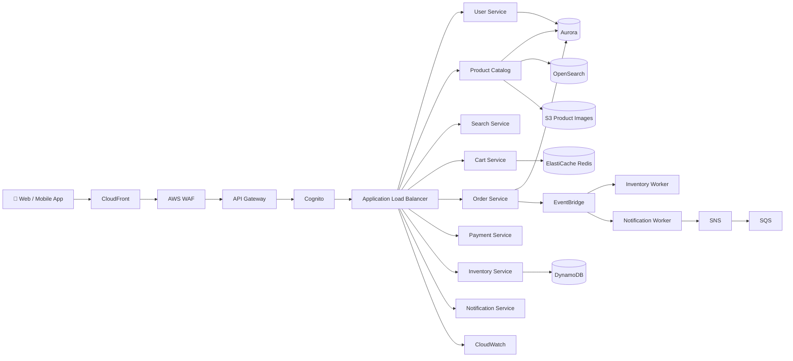
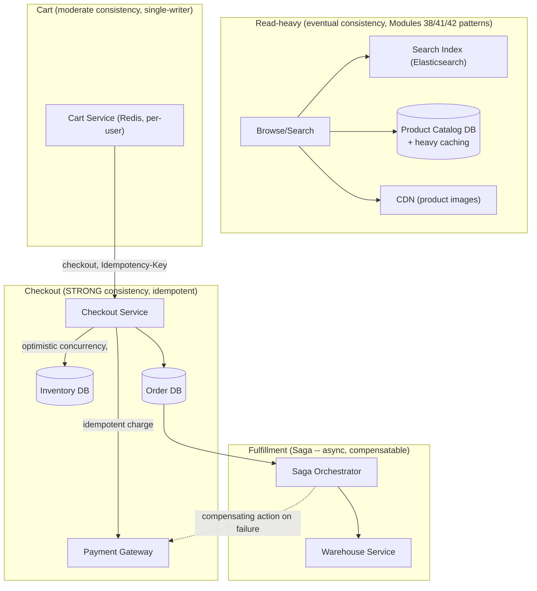

# Module 43 — System Design: Designing Amazon / an E-commerce Platform

> Domain: System Design | Level: Beginner → Expert | Prerequisite: [[01-System-Design-Fundamentals]], [[../03-REST-APIs/01-REST-Design-Fundamentals]] (idempotency), [[../04-SQL-Server/02-Transactions-Isolation-Locking]] (inventory locking), [[04-Designing-Rate-Limiter-API-Gateway]]

---

# Amazon / E-Commerce Platform (AWS)


```mermaid
flowchart LR

 Customer[🛒 Web / Mobile App]

 Customer --> CloudFront[CloudFront]
 CloudFront --> WAF[AWS WAF]
 WAF --> APIGateway[API Gateway]
 APIGateway --> Cognito[Cognito]

 Cognito --> ALB[Application Load Balancer]

 ALB --> UserService[User Service]
 ALB --> ProductService[Product Catalog]
 ALB --> SearchService[Search Service]
 ALB --> CartService[Cart Service]
 ALB --> OrderService[Order Service]
 ALB --> PaymentService[Payment Service]
 ALB --> InventoryService[Inventory Service]
 ALB --> NotificationService[Notification Service]

 ProductService --> Aurora[(Aurora)]
 UserService --> Aurora
 OrderService --> Aurora

 CartService --> Redis[(ElastiCache Redis)]

 ProductService --> OpenSearch[(OpenSearch)]

 InventoryService --> DynamoDB[(DynamoDB)]

 ProductService --> S3[(S3 Product Images)]

 OrderService --> EventBridge[EventBridge]

 EventBridge --> InventoryWorker[Inventory Worker]
 EventBridge --> NotificationWorker[Notification Worker]

 NotificationWorker --> SNS[SNS]
 SNS --> SQS[SQS]

 ALB --> CloudWatch[CloudWatch]
```

---

# User Purchase Flow

```text
Customer
 │
 ▼
CloudFront
 │
AWS WAF
 │
API Gateway
 │
Cognito Authentication
 │
Application Load Balancer
 │
────────────────────────────────────────────
│ Product Service → Product Catalog
│ Search Service → Search Products
│ Cart Service → Shopping Cart
│ Order Service → Place Order
│ Payment Service → Process Payment
│ Inventory Service → Update Stock
│ Notification Service → Email/SMS
────────────────────────────────────────────
 │
 EventBridge
 │
 Inventory & Notification Workers
 │
 SNS → SQS
```

---

# AWS Services Used

| Component | AWS Service |
|-----------|-------------|
| CDN | CloudFront |
| Security | AWS WAF |
| Authentication | Cognito |
| API | API Gateway |
| Load Balancer | ALB |
| Compute | ECS / EKS |
| Relational Database | Aurora |
| Inventory | DynamoDB |
| Shopping Cart Cache | ElastiCache Redis |
| Search | OpenSearch |
| Product Images | Amazon S3 |
| Event Bus | EventBridge |
| Notifications | SNS + SQS |
| Monitoring | CloudWatch |

---

## Core Design Patterns

- API Gateway Pattern
- Microservices Architecture
- Database per Service
- Cache-Aside Pattern
- CQRS (optional for Orders)
- Event-Driven Architecture
- Saga Pattern (Order + Payment + Inventory)
- Publish–Subscribe
- Idempotent Payment Processing
- Retry with Dead Letter Queue (DLQ)
- Horizontal Auto Scaling
- CDN for Product Images

## 1. Fundamentals

### What makes an e-commerce platform a distinct system-design problem from the content-distribution systems covered so far?
Unlike Modules 38/41/42's read-heavy, staleness-tolerant content-distribution problems, an e-commerce platform's **checkout/order-processing path is a genuine, financially-consequential transactional workload** — inventory must not be oversold, payments must not be double-charged, and an order's state must progress correctly through a multi-step workflow (placed → paid → fulfilled → shipped) with real business and legal consequences for getting any step wrong. This shifts the system's center of gravity from "optimize for eventual consistency and massive read scale" back toward **strong consistency and correctness on the write path**, while the **product catalog/search/browse** path remains a read-heavy, eventually-consistent problem much closer to this course's other content-serving systems.

### Why does this matter?
Because a Staff/Principal-level answer must explicitly recognize that **different parts of the same platform have genuinely different consistency requirements** (directly the core discipline) — conflating the catalog-browsing path's requirements with the checkout path's requirements (either over-applying strong consistency everywhere, hurting browse-scale performance, or under-applying it on checkout, risking overselling/double-charging) is the single most consequential design mistake for this system class.

### When does this matter?
Any transactional platform (e-commerce, ticketing, booking systems) combining a read-heavy discovery/browse experience with a strongly-consistent transactional core; the depth matters for correctly designing inventory management (a classic distributed-systems correctness challenge) and for recognizing the Saga pattern's relevance to a multi-step order workflow spanning multiple services.

### How does it work (30,000-ft view)?
```
Browse/Search: read-heavy, eventually consistent, cache-and-CDN-heavy (Module 38's patterns)
Add to Cart: per-user, moderate consistency needs (a cart is usually single-writer -- the owning user)
Checkout: STRONGLY consistent -- inventory decrement, payment charge, order creation must be
 atomic/idempotent and never oversell or double-charge
Order Fulfillment: an asynchronous, multi-step workflow (payment -> inventory reservation ->
 warehouse fulfillment -> shipping) -- a Saga-pattern-shaped problem
```

---

## 2. Deep Dive

### 2.1 Product Catalog and Search — Reusing This Course's Read-Heavy-System Patterns
The product catalog (browsing, search, product detail pages) is architecturally similar to/41/42's read-heavy content-serving problems: heavy caching (the cache-aside pattern), CDN delivery for product images (the media pipeline directly reused), and a dedicated search index (a specialized full-text/faceted-search engine — Elasticsearch or similar — rather than relying on the primary transactional database's own query capability, since product search's access pattern — full-text matching, faceted filtering, relevance ranking — is a fundamentally different problem than the transactional database's OLTP-shaped needs, directly the "match the data structure/system to the actual access pattern" principle applied at the system-selection level). Catalog data (price, description, availability) tolerates eventual consistency — a product's price updating with a few seconds of propagation delay across cache layers is an acceptable, standard trade-off.

### 2.2 Inventory Management — the Classic Overselling Problem
Preventing overselling (two customers both successfully "buying" the last unit of an item) is a genuine, classic distributed-systems correctness challenge, directly requiring either **pessimistic locking** (a database row-level lock on the inventory record during checkout, the locking discipline — simple and correct, but limits checkout throughput for very popular, high-contention items) or **optimistic concurrency** (a version-checked conditional update — "decrement stock WHERE current_stock >= requested_quantity AND version = expected_version," directly the ETag/optimistic-concurrency pattern applied to inventory instead of an HTTP resource — retrying on conflict, better throughput under contention at the cost of occasional retry overhead). For extremely high-contention items (a viral, limited-stock product drop), neither approach alone may suffice at the necessary scale, motivating more specialized techniques (a pre-allocated, sharded inventory-counter pool, or a queue-based, ticket-taking "reservation" system processing requests strictly in order) — but the baseline correctness mechanism, regardless of technique, must guarantee the fundamental invariant: **total sold quantity never exceeds available inventory**, non-negotiably.

### 2.3 Checkout Idempotency — Directly Reusing the Core Pattern
The checkout/place-order operation is exactly the idempotency-key scenario: a client's checkout request might time out due to network flakiness, and a naive retry (without an idempotency key) risks **double-charging** the customer and creating **duplicate orders** — the checkout endpoint must accept and honor a client-generated idempotency key (the full implementation, directly reusable here without modification), ensuring a retried checkout request returns the original order's result rather than creating a second, duplicate order and charge.

### 2.4 Order Fulfillment as a Saga — Multi-Step, Multi-Service, Compensatable Workflow
Once an order is placed, fulfillment spans multiple, likely independently-deployed services/steps (charge payment → reserve inventory → notify the warehouse → schedule shipping) — a genuine **distributed transaction** problem that cannot use a single database transaction, since it spans multiple services with separate databases. This is precisely the motivating problem for the **Saga pattern** (a dedicated later module): each step executes independently, and if a later step fails (the warehouse discovers the item is actually out of stock despite the inventory reservation succeeding, due to a damaged/miscounted unit), a **compensating action** undoes the effects of already-completed earlier steps (refunding the payment charge) — rather than attempting an all-or-nothing distributed transaction across services that don't share a transactional boundary, the system embraces eventual consistency with explicit, designed-for compensation for the failure case, directly the same "temporarily inconsistent intermediate state, later corrected" pattern the distributed-transactions material introduced conceptually, now shown as this system's actual, necessary architecture.

### 2.5 Cart Design — Simpler Than It First Appears, But Not Trivial
A shopping cart is typically single-writer (the owning user), moderate-consistency (losing a very recent cart addition on a rare failure is an annoying but not business-catastrophic outcome, unlike checkout), and benefits from being stored close to the user (a session-affinity-style design, or simply a fast key-value store like Redis keyed by user ID) — but must still correctly handle the transition from "cart" (a tentative, freely-modifiable collection) to "order" (an immutable, committed record) at checkout time, precisely the moment strong consistency (/) becomes non-negotiable — a system-design answer should explicitly mark this "cart → order" transition as the specific point where the consistency model changes, not treat the cart and the order as governed by identical requirements throughout.

## 3. Visual Architecture

```mermaid
graph TB
 subgraph "Read-heavy (eventual consistency, Modules 38/41/42 patterns)"
 Browse[Browse/Search] --> SearchIndex["Search Index (Elasticsearch)"]
 Browse --> Catalog[("Product Catalog DB<br/>+ heavy caching")]
 Browse --> CDN["CDN (product images)"]
 end
 subgraph "Cart (moderate consistency, single-writer)"
 Cart["Cart Service (Redis, per-user)"]
 end
 subgraph "Checkout (STRONG consistency, idempotent)"
 Cart -->|"checkout, Idempotency-Key"| CheckoutService["Checkout Service"]
 CheckoutService -->|"optimistic concurrency,"| Inventory[("Inventory DB")]
 CheckoutService -->|"idempotent charge"| Payment["Payment Gateway"]
 CheckoutService --> OrderDB[("Order DB")]
 end
 subgraph "Fulfillment (Saga -- async, compensatable)"
 OrderDB --> Saga["Saga Orchestrator"]
 Saga --> Warehouse["Warehouse Service"]
 Saga -.->|"compensating action on failure"| Payment
 end
```

## 4. Production Example
**Scenario**: A retail platform's flash-sale feature (a limited-quantity, highly-anticipated product drop) used the same pessimistic row-level locking mechanism as its ordinary, low-contention checkout path — under the flash sale's extreme concurrent-request volume (tens of thousands of customers attempting to buy the same limited-stock item within seconds of the sale starting), the single inventory row's lock became a severe bottleneck: requests queued up waiting for the lock, checkout latency degraded into many seconds per request, and a substantial fraction of customers experienced timeouts and had to retry, with the sluggish, contended experience itself generating customer complaints and lost sales even for the customers who eventually succeeded. **Investigation**: confirmed via database lock-wait-time metrics (directly the blocking-chain diagnostic discipline) that the single, heavily-contended inventory row was the system-wide bottleneck — pessimistic locking, entirely appropriate for the platform's ordinary, low-contention checkout traffic, did not scale to this specific, extreme-contention scenario. **Fix**: implemented a pre-allocated, sharded inventory-counter design specifically for flash-sale items — the total available quantity is pre-split across N independent counter shards (e.g., 100 shards of 10 units each for a 1,000-unit drop), and each incoming checkout request is routed (via a simple hash or round-robin) to a specific shard, dramatically reducing per-shard contention (each shard now serves roughly 1/100th of the total request volume) at the cost of a small, bounded risk of "shard A is empty while shard B still has stock" requiring an occasional cross-shard rebalancing check for the tail end of the sale — checkout latency and success rate improved dramatically under the exact same extreme-concurrency scenario. **Lesson**: a correctness/locking mechanism appropriate for a system's *typical* contention level can become the dominant bottleneck under an *atypical*, extreme-contention scenario (a flash sale) — exactly the isolation-level/locking trade-offs, now demonstrated at a scale where the standard mechanism's assumptions (moderate contention) are deliberately, predictably violated by the product feature itself, requiring a specialized, higher-throughput technique (sharded counters) reserved specifically for this identified, extreme-contention use case rather than applied as the platform's universal default (which would be unnecessary complexity for ordinary, low-contention checkout traffic).

## 5. Best Practices
- Apply strong consistency and idempotency specifically to the checkout/inventory-decrement path; allow the catalog/browse path to remain eventually consistent and cache-heavy.
- Use optimistic concurrency (version-checked conditional updates) for inventory under moderate contention; reserve specialized techniques (sharded counters) for identified, extreme-contention scenarios like flash sales.
- Design order fulfillment as a Saga with explicit compensating actions for each step, rather than attempting a single distributed transaction across independently-deployed services.
- Use a dedicated search/indexing system (not the transactional database) for product catalog search — match the system to the actual access pattern (the core discipline, applied at system-selection scale).

## 6. Anti-patterns
- Applying the same locking/concurrency-control mechanism uniformly regardless of actual contention level, causing severe bottlenecks under extreme-demand scenarios like flash sales (the incident).
- Skipping idempotency-key support on the checkout endpoint, risking double-charges/duplicate orders on client retry.
- Attempting a single, cross-service distributed transaction for order fulfillment instead of a Saga-pattern-based, compensatable workflow.
- Using the primary transactional database directly for full-text product search instead of a purpose-built search index.

---

## 10. Interview Questions

### Basic (10)
1. **Q: Why does an e-commerce platform's checkout path need stronger consistency than its browse/catalog path?** **A:** Checkout has real financial/business consequences (overselling, double-charging) that catalog browsing's brief staleness doesn't carry.
2. **Q: What is the classic "overselling" problem?** **A:** Two customers both successfully purchasing the last unit of an item due to insufficiently atomic inventory-decrement logic.
3. **Q: What idempotency mechanism prevents duplicate orders on checkout retry?** **A:** A client-generated idempotency key, directly reusing the pattern.
4. **Q: What is the Saga pattern used for in this context?** **A:** Coordinating a multi-step order-fulfillment workflow across independently-deployed services, using compensating actions instead of a single distributed transaction.
5. **Q: Why is a dedicated search index (Elasticsearch) typically used instead of the transactional database for product search?** **A:** Full-text/faceted search has a fundamentally different access pattern than OLTP queries, better served by a purpose-built system.
6. **Q: What are the two standard techniques for preventing overselling?** **A:** Pessimistic locking and optimistic concurrency (version-checked conditional updates).
7. **Q: Why might a flash sale need a different inventory-management technique than ordinary checkout traffic?** **A:** Extreme concurrent contention on a single, limited-stock item's inventory record can bottleneck standard locking mechanisms — sharded counters distribute this contention.
8. **Q: What does tokenization mean in payment processing?** **A:** Storing only an opaque token representing payment card data, never the raw card number itself, reducing compliance scope.
9. **Q: Is a shopping cart typically single-writer or multi-writer?** **A:** Single-writer — usually only the owning user modifies their own cart.
10. **Q: What's the moment where a cart's consistency requirements change significantly?** **A:** The checkout transition, where the cart becomes an immutable order and strong consistency becomes necessary.

### Intermediate (10)
1. **Q: Why does applying the same locking mechanism uniformly across both ordinary and flash-sale traffic cause a bottleneck specifically under flash-sale conditions?** **A:** The locking mechanism's throughput is inversely related to contention on the specific row/record — flash-sale traffic concentrates extreme contention on one specific item's inventory record, far beyond what the mechanism was designed to handle efficiently.
2. **Q: Why does optimistic concurrency generally offer better throughput than pessimistic locking under moderate contention, but not eliminate the overselling risk?** **A:** It avoids holding a lock for the duration of the transaction (better throughput), but still requires the fundamental invariant check (sufficient stock) to be atomic at the actual decrement — a version-mismatch conflict still requires retry, and correctness is preserved by the conditional update failing (not succeeding incorrectly) under a genuine conflict.
3. **Q: Why can't order fulfillment simply use a single database transaction spanning payment, inventory, and warehouse services?** **A:** These are independently-deployed services, likely with separate databases — a single ACID transaction requires a shared transactional boundary that doesn't exist across independent services, motivating the Saga pattern's compensating-action approach instead.
4. **Q: Why is a compensating action (e.g., a refund) different from simply "rolling back" in the traditional database-transaction sense?** **A:** The original action (charging a payment) already had a real, external, irreversible-in-the-database-sense effect (money moved) — a compensating action is a new, separate operation (issuing a refund) that reverses the *business effect*, not a database-level undo of an operation that was never wrapped in a shared transaction to begin with.
5. **Q: Why does the search index's eventual-consistency lag (a newly-added product not immediately searchable) represent an acceptable trade-off?** **A:** Search's massive query-flexibility and performance benefit over the transactional database far outweighs a typically-brief propagation delay, especially since product catalog changes are far less frequent/time-sensitive than, e.g., inventory-count changes during checkout.
6. **Q: Why should checkout be architecturally isolated as a distinct service/code path from ordinary cart operations?** **A:** So checkout's necessarily higher latency (locking/retry overhead, idempotent payment processing) doesn't leak into or degrade the performance of ordinary, fast, low-consistency-requirement cart-modification operations that don't need those guarantees.
7. **Q: Why is tokenization specifically valuable for reducing PCI compliance scope, not just a technical implementation detail?** **A:** By never storing raw card data at all (delegating that entirely to a PCI-compliant processor), the platform's own systems fall outside much of PCI-DSS's most stringent, costly compliance requirements, which apply specifically to systems that store/process/transmit actual cardholder data.
8. **Q: Why might rate limiting checkout specifically (beyond general API rate limiting) matter for fraud prevention?** **A:** Checkout is where a card-testing/fraud pattern (rapid, small, exploratory transactions validating stolen card numbers) would manifest — a checkout-specific rate limit/anomaly-detection tier catches this pattern more precisely than a generic, uniform API rate limit not specifically tuned to this endpoint's fraud-risk profile.
9. **Q: Why does the "cart → order" transition matter architecturally, beyond just "checkout is slower"?** **A:** It's the specific point where the entire consistency model changes (from moderate/single-writer to strong/idempotent) — recognizing and explicitly designing around this transition point (rather than treating the whole cart-to-order lifecycle as one uniform concern) is what correctly scopes where the expensive, strongly-consistent machinery actually needs to apply.
10. **Q: Why does sharding inventory counters for a flash sale introduce a "cross-shard rebalancing" consideration, and why is this an acceptable trade-off?** **A:** Splitting stock across N shards means one shard could deplete while others still have stock, requiring an occasional check/rebalance for the tail end of the sale — a small, bounded complexity cost accepted specifically because it enables the dramatic contention reduction needed for the flash-sale scenario, a deliberate, justified trade-off rather than a design oversight.

### Advanced (10)
1. **Q: Diagnose the flash-sale checkout-bottleneck incident from first principles, and design the specific, proactive trigger determining when a product should use the sharded-counter mechanism versus ordinary optimistic concurrency.**
 **A:** Root cause: applying the platform's standard, moderate-contention-appropriate locking mechanism to a scenario (flash sale) with orders-of-magnitude higher contention than the mechanism was designed for. Trigger design: any product marked as a "limited/flash-sale drop" (a product-catalog attribute set by the merchandising team ahead of the sale, directly analogous to §Advanced Q1's proactive follower-count-threshold monitoring) automatically routes through the sharded-counter inventory mechanism instead of ordinary per-item optimistic concurrency — making this a **deliberate, upfront architectural choice for anticipated high-contention events**, not a reactive fix discovered only after a real incident, directly the same "anticipate and design for known high-contention/high-skew scenarios proactively" discipline as the celebrity-account fan-out threshold.
2. **Q: Design the specific compensating-action sequence for a Saga where payment succeeds, inventory reservation succeeds, but the warehouse fulfillment step discovers the item is actually unavailable (a physical stock discrepancy).**
 **A:** The Saga orchestrator, upon receiving the warehouse's failure signal, executes compensating actions in **reverse order** of the original steps: first release the inventory reservation (returning the "reserved" unit back to available stock, correcting the discrepancy for future orders), then issue a refund for the payment charge, then update the order status to reflect the cancellation with an explanation, and finally notify the customer — each compensating action is itself an idempotent, retryable operation (directly the idempotency discipline applied to the compensation steps themselves, not just the original forward-path actions), since a compensating action can itself fail and need retry, requiring the same correctness rigor as the original operations.
3. **Q: Explain how you would design the sharded-inventory-counter mechanism to correctly handle the "last unit" edge case, where the total remaining stock across all shards is very small relative to the shard count.**
 **A:** As total remaining stock across all shards drops below a threshold (e.g., fewer remaining units than shards), dynamically **consolidate** into fewer, larger shards (or a single shard) for the tail end of the sale — trading back some of the contention-reduction benefit (no longer needed, since demand for the last few units is naturally far lower than the initial rush) for simpler, more straightforward correctness as the sale winds down, directly the same "the right technique depends on the actual current contention level, which can itself change over the sale's lifecycle" reasoning, now applied dynamically rather than as a single, static, unchanging configuration.
4. **Q: How would you design the product-search index's data-synchronization pipeline (keeping Elasticsearch in sync with the catalog database) to handle a burst of catalog updates (e.g., a large merchandising import) without falling significantly behind and serving badly-stale search results?**
 **A:** Directly/ §Advanced Q6's change-data-capture pattern — a CDC pipeline (reading the catalog database's own change log/replication stream) feeding a message queue, with the search-index-update consumer scaling horizontally (more consumer instances) during a detected backlog, directly the consumer-group backlog-monitoring discipline applied here to catalog-to-search synchronization specifically, ensuring the sync pipeline can absorb a burst (a large import) without the search index's staleness window growing unacceptably large during that burst.
5. **Q: Design a strategy for handling a payment-gateway outage during checkout, given that this is now a hard dependency on the strongly-consistent, correctness-critical checkout path.**
 **A:** Directly the Adapter-pattern-wrapped `IPaymentGateway`, combined with the retry-with-backoff and, for a genuine, sustained outage, a circuit breaker (the pattern, here applied to the payment gateway instead of the rate limiter's own Redis dependency) — critically, unlike the rate limiter's fail-open default (the deliberate choice), a payment-gateway outage should **fail closed** (reject the checkout attempt with a clear "please try again shortly" message) rather than fail open, since "fail open" for a payment charge would mean either not charging the customer for goods they'd receive (an unacceptable business-cost outcome) or attempting to proceed without payment confirmation entirely (a direct, severe correctness violation) — a clear, deliberate contrast in fail-open-vs-fail-closed policy specifically justified by this component's uniquely high correctness stakes.
6. **Q: Explain why "eventual consistency for the catalog, strong consistency for checkout" is not simply a binary switch, using the specific example of displaying "only 3 left in stock!" on a product page.**
 **A:** This is a genuinely nuanced, in-between case: the displayed stock count is inherently a **read from the eventually-consistent catalog/cache layer** (not a strongly-consistent, real-time read against the authoritative inventory record, which would be prohibitively expensive to perform on every single product-page view) — meaning the displayed "3 left" is an approximation that could be briefly stale (the actual current count, checked strongly-consistently only at the moment of checkout itself, is the true authoritative value) — a well-designed system explicitly communicates this distinction (the display is informational/approximate, the actual availability check happens at checkout) rather than implying the displayed count is a real-time, guaranteed-accurate figure, directly illustrating that "eventually consistent vs. strongly consistent" isn't always a clean, binary per-feature choice but can require nuanced communication about which specific reads/writes carry which guarantee.
7. **Q: How would you design fraud detection for the checkout path (Advanced Q, card-testing pattern) without adding unacceptable latency to legitimate checkout requests?**
 **A:** Run fast, low-latency fraud-signal checks (velocity checks — how many recent attempts from this card/IP/user, directly the rate-limiting-adjacent techniques) synchronously, gating the checkout request itself only on these cheap, fast signals; run more expensive, sophisticated fraud-model scoring (a machine-learning-based risk assessment) asynchronously, either as a secondary, near-real-time check that can still block a transaction within a small grace window, or as a purely post-hoc detection mechanism flagging suspicious-but-already-processed transactions for review/reversal — directly the same "cheap check synchronously gates the request; expensive check runs asynchronously" latency-budgeting discipline applied to fraud detection specifically.
8. **Q: A team proposes handling all order-fulfillment logic (payment, inventory, warehouse notification) within a single, monolithic service and a single database transaction, arguing this avoids the Saga pattern's complexity entirely. Evaluate this as a Principal Engineer.**
 **A:** This is a legitimate, simpler alternative **specifically if** payment processing, inventory management, and warehouse systems can genuinely share one transactional database boundary (increasingly rare in practice, since payment processing typically must go through an external, third-party gateway — Advanced Q5 — which by definition cannot participate in the platform's own database transaction) — if any step genuinely requires crossing a transactional boundary (an external payment gateway call, a separate warehouse-management system), the Saga pattern's compensating-action approach is not optional added complexity, it's the **necessary** consequence of that architectural reality; recommend evaluating this proposal specifically against whether every involved step can truly share one transaction (rare) versus assuming monolithic simplicity is always achievable regardless of the actual system boundaries involved.
9. **Q: Explain how you would design capacity planning specifically for a scheduled, anticipated high-demand event (a major sale like Black Friday), beyond the flash-sale-specific inventory technique.**
 **A:** Beyond the inventory-contention-specific sharded-counter technique, capacity planning for a broadly-anticipated high-traffic event requires pre-emptively scaling the **entire** read path (additional cache/CDN capacity, pre-warmed §Advanced Q4's CDN pre-warming discussion) and the checkout/payment-gateway-adjacent capacity (confirming the payment processor itself can handle the anticipated peak transaction rate, a third-party dependency's own capacity becoming this platform's bottleneck if not proactively coordinated) — directly the capacity-estimation discipline applied specifically to a known, scheduled event rather than organic, gradually-observed growth, requiring proactive coordination with every dependency in the critical path, not just the platform's own infrastructure.
10. **Q: As a Principal Engineer, how would you structure a pre-launch readiness review specifically for a new, anticipated-high-contention product feature (a flash sale, a major promotional event), generalizing the lesson into a standing process?**
 **A:** Require any anticipated high-contention/high-traffic feature launch to include an explicit, documented section addressing: (a) what is the expected peak contention level on any shared, correctness-critical resource (inventory records specifically), and does the standard mechanism's throughput at that contention level meet the required latency/success-rate targets (validated via load testing at the *actual* anticipated contention level, not just organic historical traffic patterns, directly §Advanced Q7's "test at representative scale" discipline); (b) is a specialized technique (sharded counters, Advanced Q1's proactive trigger) warranted, and if so, is it correctly configured and tested before the event; (c) are all critical-path third-party dependencies (payment gateway, Advanced Q9) confirmed to have sufficient capacity for the anticipated peak — converting this module's reactive, incident-driven lesson into a mandatory, proactive pre-launch checklist item for any future high-contention event, directly this course's recurring pattern of institutionalizing hard-won lessons as standing governance rather than tribal knowledge.

---

## 11. Coding Exercises

*(System design case studies use worked design exercises, consistent with this domain's format.)*

### Easy — Optimistic-concurrency inventory decrement
```csharp
public async Task<bool> TryDecrementStockAsync(string sku, int quantity)
{
    // Conditional UPDATE: succeeds ONLY if sufficient stock exists AT THE MOMENT of the atomic operation --
    // no separate "check then decrement" race window (directly avoiding the classic overselling bug).
    int rowsAffected = await _db.ExecuteAsync(
        "UPDATE Inventory SET Stock = Stock - @Quantity WHERE Sku = @Sku AND Stock >= @Quantity",
            new { Sku = sku, Quantity = quantity });
    return rowsAffected > 0; // false means insufficient stock -- reject the checkout attempt
}
```

### Medium — Sharded inventory counter for flash-sale contention (the fix)
```csharp
public class ShardedInventoryCounter
{
    private readonly int _shardCount;
    public ShardedInventoryCounter(int totalStock, int shardCount)
    {
        _shardCount = shardCount;
        int perShard = totalStock / shardCount;
        for (int i = 0; i < shardCount; i++)
            _db.Execute("INSERT INTO InventoryShards (ShardId, Stock) VALUES (@Id, @Stock)", new { Id = i, Stock = perShard });
    }

    public async Task<bool> TryPurchaseAsync(string userId)
    {
        int shardId = Math.Abs(userId.GetHashCode) % _shardCount; // route to a specific shard, distributing contention
        int rowsAffected = await _db.ExecuteAsync(
            "UPDATE InventoryShards SET Stock = Stock - 1 WHERE ShardId = @ShardId AND Stock > 0",
                new { ShardId = shardId });

        if (rowsAffected > 0) return true;

        // This shard is depleted -- Advanced Q3's tail-end consolidation would trigger a fallback
        // check across other shards here in a production implementation; omitted for brevity.
        return false;
    }
}
```

### Hard — Idempotent checkout with the payment-gateway fail-closed policy (Advanced Q5)
```csharp
public async Task<CheckoutResult> CheckoutAsync(string idempotencyKey, CartSnapshot cart)
{
    var existing = await _idempotencyStore.TryGetAsync(idempotencyKey);
    if (existing is { Status: IdempotencyStatus.Completed }) return existing.CachedResult; // the pattern

    if (!await _inventory.TryDecrementStockAsync(cart.Sku, cart.Quantity))
        return CheckoutResult.Failed("Insufficient stock.");

    try
    {
        var chargeResult = await _paymentGateway.ChargeAsync(cart.Total); // FAIL CLOSED if this throws (Advanced Q5)
        var order = await _orderStore.CreateOrderAsync(cart, chargeResult.TransactionId);
        await _idempotencyStore.MarkCompletedAsync(idempotencyKey, order);
        return CheckoutResult.Success(order);
    }
    catch (PaymentGatewayException)
    {
        await _inventory.RestoreStockAsync(cart.Sku, cart.Quantity); // compensate the already-decremented stock
        return CheckoutResult.Failed("Payment processing is temporarily unavailable. Please try again."); // FAIL CLOSED
    }
}
```

### Expert — Saga orchestrator with reverse-order compensation (Advanced Q2)
```csharp
public class OrderFulfillmentSaga
{
    public async Task ExecuteAsync(Order order)
    {
        var completedSteps = new Stack<Func<Task>>; // tracks compensations for steps ALREADY completed

        try
        {
            await _paymentService.ChargeAsync(order.PaymentDetails);
            completedSteps.Push(=> _paymentService.RefundAsync(order.PaymentDetails));

            await _inventoryService.ReserveAsync(order.Sku, order.Quantity);
            completedSteps.Push(=> _inventoryService.ReleaseReservationAsync(order.Sku, order.Quantity));

            await _warehouseService.RequestFulfillmentAsync(order); // the step that CAN fail (Advanced Q2's scenario)
            completedSteps.Push(=> _warehouseService.CancelFulfillmentAsync(order));

            await _orderStore.MarkFulfilledAsync(order.Id);
        }
        catch (Exception ex)
        {
            _logger.LogError(ex, "Saga failed for order {OrderId}, compensating {Count} completed steps.",
                order.Id, completedSteps.Count);

            while (completedSteps.Count > 0) // REVERSE order compensation, per Advanced Q2
            {
                var compensate = completedSteps.Pop;
                await ExecuteWithRetryAsync(compensate); // compensations are ALSO idempotent/retryable (Advanced Q2)
            }
            await _orderStore.MarkCancelledAsync(order.Id, reason: ex.Message);
        }
    }
}
```
**Discussion**: The `Stack<Func<Task>>` tracking exactly which steps completed (and thus need compensation) is the key structural detail — compensations run in **reverse** order of the original forward steps (release inventory before refunding payment, matching the natural "undo the most recent thing first" logic), and each compensation itself goes through retry logic (`ExecuteWithRetryAsync`), directly Advanced Q2's requirement that compensating actions carry the same correctness rigor (idempotency, retry-on-transient-failure) as the original forward-path operations.

---

## 12. System Design — Designing an E-Commerce Platform (Catalog, Cart, Inventory, Checkout, Fulfilment)

*Authored to the four-step standard (see Module 01 §12 for the method). The money-movement half — ledger, settlement, reconciliation — is Module 18; this section stops at the payment authorisation boundary and points there.*

---

### Step 1 — Understand the Problem and Establish Design Scope

#### The dialogue

> **C:** How much of the platform? Catalog, search, cart, checkout, payments, fulfilment, returns, and seller tooling are seven systems.
> **I:** Catalog browse, cart, inventory, checkout, and order fulfilment. Search is out of scope; treat payments as an external PSP.
>
> **C:** First-party inventory only, or a marketplace with third-party sellers?
> **I:** Marketplace. Multiple sellers can offer the same product from different warehouses.
>
> **C:** That changes inventory materially — availability is per-offer-per-location, not per-product. Confirmed?
> **I:** Confirmed.
>
> **C:** Scale?
> **I:** 100 million DAU, 10 million orders a day, 500 million catalog items.
>
> **C:** What's the read:write ratio on the catalog?
> **I:** Enormous — assume 1,000 product views per order.
>
> **C:** Do we have flash sales or drops? That's a completely different contention profile from steady-state traffic.
> **I:** Yes, and they're strategically important.
>
> **C:** Is overselling ever acceptable? Some retailers accept a small oversell rate and cancel; others cannot.
> **I:** For normal items, a very small oversell rate is tolerable. For flash-sale items it is not — those are reputational.
>
> **C:** Consistency on the cart — must it be identical across a user's devices instantly?
> **I:** Eventually consistent is fine; last-write-wins per line item.
>
> **C:** Out of scope?
> **I:** Search and ranking, recommendations, pricing/promotions engine, returns, and the seller portal.

Two answers carry the design. **"Overselling is tolerable normally but not in a flash sale"** licenses two different inventory mechanisms rather than one — which is the answer §4's team needed and did not have. And **1,000:1 read:write** means the catalog and the transaction path are different systems with different technology, not two endpoints on one service.

#### Functional requirements

1. Browse and view products, with per-offer availability across sellers.
2. Add to / update / remove from a cart that survives sessions and devices.
3. Checkout: validate, reserve inventory, authorise payment, create an order.
4. Prevent overselling within the tolerance stated per item class.
5. Fulfil orders through a multi-service workflow with compensations.
6. Support flash sales with bounded, fair admission.

#### Non-functional requirements

| Requirement | Target |
|---|---|
| Product page latency | p99 < 200 ms |
| Add-to-cart | p99 < 300 ms |
| Checkout | p99 < 3 s end-to-end including PSP |
| Availability — browse | 99.99% |
| Availability — checkout | 99.95% (lower traffic, higher value per request) |
| Oversell rate — normal items | < 0.1% of units, auto-cancelled with notification |
| Oversell — flash-sale items | **Zero** |
| Order durability | Zero loss once the customer sees a confirmation |
| Consistency — inventory display | Eventual (seconds); **display is a hint, not a promise** |
| Consistency — inventory commit | Strong at the moment of reservation |

#### Back-of-the-envelope estimation

```
Orders/day       = 10,000,000        → 100 orders/s avg, 300/s peak
Product views    = 10M × 1,000       = 10^10/day → 100,000 views/s, 300,000 peak
Cart operations  ≈ 5 per order       → 500/s avg
```

Flash sale — the number that reframes everything:

```
10,000 units, 500,000 interested buyers, arriving within ~10 seconds
Peak checkout attempts = 500,000 ÷ 10 s        = 50,000 attempts/s
                                                 (167× normal peak)
Contention: ALL of them on ONE inventory row.
```

Storage:

```
Catalog: 500M items × 20 KB (attributes, media refs, offers) ≈ 10 TB
Orders:  10M/day × 3 KB                                       ≈ 30 GB/day → 11 TB/year
Inventory: 500M items × ~3 offers × 200 B                     ≈ 300 GB, hot
```

#### What the numbers tell us

1. **The catalog is a read-serving problem** (100,000+ views/s, 10 TB, eventually consistent) — CDN, cache, denormalised read models. Ordinary.
2. **Checkout is a correctness problem at modest volume** (300/s). Anyone optimising checkout for throughput is solving the wrong problem; the difficulty is the multi-service transaction, not the rate.
3. **Flash sales are a third system.** 50,000 attempts/s against one row is 167× normal peak concentrated on a single key. No amount of tuning the normal checkout path survives that — §4 is the proof — so flash sales need a *different admission mechanism*, not a faster lock. That conclusion is the point of the estimation.

---

### Step 2 — Propose High-Level Design and Get Buy-In

#### The three flows

- **Browse** — read-heavy, cacheable, eventually consistent.
- **Checkout** — transactional, multi-service, compensatable.
- **Flash sale** — admission-controlled, queue-based, strictly bounded.

#### Components

**Catalog Service + read model.** Denormalised product documents; served from cache/CDN.

**Inventory Service.** The authority on available-to-promise per `(offer_id, location)`. Owns reservations.

**Cart Service.** Per-user cart; deliberately simple, deliberately not authoritative about price or availability.

**Pricing Service.** Prices are re-resolved at checkout, never trusted from the cart.

**Checkout Orchestrator.** Runs the order saga.

**Order Service.** Order records and state machine.

**Payment Adapter.** Talks to the PSP; authorise at checkout, capture at ship. See Module 18.

**Fulfilment Service.** Warehouse allocation, pick/pack/ship.

**Admission Controller (flash sales).** Token-based queue; the mechanism §3.3 designs.

#### End-to-end walkthrough — checkout

1. `POST /v1/checkout` with `cart_id`, address, payment method, `Idempotency-Key`.
2. Orchestrator creates an order in `PENDING` and **claims the idempotency key in the same transaction** — this is what makes a double-submitted checkout return the same order rather than create two.
3. **Re-resolve prices and availability** from the authoritative services. The cart's cached values are display state and are never trusted.
4. **Reserve inventory** — a soft hold with a TTL (typically 15 minutes), per line item.
5. **Authorise payment** with the PSP (not capture).
6. Create the order in `CONFIRMED`; convert reservations to allocations.
7. Return the confirmation. **Everything after this point is asynchronous.**
8. Fulfilment: allocate warehouse → pick/pack → ship → **capture payment on ship**, which is both the legally correct point in most jurisdictions and the one that avoids refunding for items that turn out to be unfulfillable.

Failures compensate in reverse: payment declined → release reservation, order `FAILED`. Fulfilment impossible → refund/void authorisation, order `CANCELLED`, notify. **Every step has a compensating action defined before the saga runs**, which is what distinguishes a saga from a distributed transaction wearing a costume.

#### API design

**`POST /v1/carts/{id}/items`**

| Field | Type | Description |
|---|---|---|
| `offer_id` | string | Seller-specific offer, not `product_id` — the marketplace distinction |
| `quantity` | int | |
| `client_price` | money | **Advisory only.** Echoed back with the authoritative price so the UI can show a change |

**`POST /v1/checkout`**

| Field | Type | Required | Description |
|---|---|---|---|
| `cart_id` | string | yes | |
| `shipping_address_id` | string | yes | |
| `payment_method_token` | string | yes | PSP token — **never card data** (Module 18 §8) |
| `accepted_total` | money | yes | The total the customer saw. A mismatch returns `409` with the new total rather than silently charging a different amount |

Header: `Idempotency-Key` (required).

Responses: `201` with the order; `409 PRICE_CHANGED`; `409 OUT_OF_STOCK` naming the line items; `402 PAYMENT_DECLINED`.

**`GET /v1/products/{id}`** — returns product attributes plus `offers[]`, each with `{ seller, price, availability_hint, ships_from, delivery_estimate }`. The field is named `availability_hint` deliberately: **displayed availability is a cached hint, and the API name should say so** so no client treats it as a reservation.

**`POST /v1/flash-sales/{id}/join`** → `{ position, token, valid_from, valid_until }` (§3.3).

#### Data model

**`product`** — document store (catalog read model): `product_id`, attributes, media, `offers[]` denormalised. Rebuilt from source-of-truth events.

**`offer`** — `offer_id`, `product_id`, `seller_id`, `price`, `condition`, `fulfilment_type`.

**`inventory`** — PostgreSQL, the transactional authority:

| Column | Type | Notes |
|---|---|---|
| `offer_id`, `location_id` | Composite PK | |
| `on_hand` | int | Physically present |
| `reserved` | int | Held by open reservations |
| `available` | int GENERATED | `on_hand - reserved`. **Derived, not stored independently** — a second source of truth is a future divergence (Module 18 §A5) |
| `version` | bigint | Optimistic concurrency |

**`reservation`** — `reservation_id`, `order_id`, `offer_id`, `location_id`, `quantity`, `expires_at`, `status` (`HELD`/`COMMITTED`/`RELEASED`/`EXPIRED`). A TTL'd hold, swept by a job — and the sweeper needs a monitor, because a stuck sweeper leaks inventory silently.

**`order`** — `order_id`, `user_id`, `status`, `items[]`, `totals`, `idempotency_key UNIQUE`, timestamps.
Lifecycle: `PENDING → CONFIRMED → ALLOCATED → SHIPPED → DELIVERED`, with `FAILED` / `CANCELLED` / `RETURNED` branches.

**`cart`** — Redis with a database backstop; `user_id → items[]`, TTL 30 days.

#### Store selection, and why

| Store | Choice | Reason |
|---|---|---|
| Catalog read model | **Document store + CDN/Redis** | 100,000 reads/s of denormalised documents; eventual consistency is explicitly acceptable |
| Inventory | **PostgreSQL** | Needs atomic read-modify-write with a constraint (`available >= 0`) — the one place in this design where a relational database is not negotiable |
| Orders | **PostgreSQL** | Transactional, relational, audited, modest volume |
| Cart | **Redis + backstop** | High churn, low value, tolerant of loss |
| Events | **Kafka** | Saga choreography, read-model rebuilds, analytics |

The decision worth defending: **inventory and catalog are deliberately different stores with different consistency models**, and the API names the display value `availability_hint` to keep that honest. Serving inventory reads from the transactional store at 300,000 views/s would put browse traffic on the same rows checkout needs — which is how a browse spike becomes a checkout outage.

---

### Step 3 — Design Deep Dive

#### 3.1 Overselling: four mechanisms, and when each is right

| Mechanism | How | Throughput on one row | Oversell risk | Right for |
|---|---|---|---|---|
| **Pessimistic lock** (`SELECT … FOR UPDATE`) | Serialise on the row | ~100–500/s | Zero | Low-contention, normal checkout |
| **Optimistic concurrency** (version + retry) | CAS on `version` | Degrades badly under contention — retry storms | Zero | Low-to-moderate contention |
| **Atomic decrement with constraint** | `UPDATE … SET reserved = reserved + n WHERE available >= n` | ~1,000–5,000/s | Zero | The default for normal traffic |
| **Distributed counter / pre-allocated blocks** | Split stock into N shards; decrement one | ~50,000/s | Small, bounded | Flash sales, hot items |

**Recommendation: the single-statement atomic decrement as the default** — one round trip, no explicit lock held across application logic, and the `available >= n` predicate makes overselling structurally impossible rather than checked-then-hoped. §4's team used a pessimistic lock held across application logic, which is the worst of both: full serialisation *and* a long hold time.

The deeper point: **`SELECT` then check then `UPDATE` in application code is a lost-update bug at every isolation level below serialisable.** Push the predicate into the write statement and the race disappears. This is the same conclusion Module 18 §E9 reaches for hot ledger accounts, arriving from a different domain.

#### 3.2 Reservations and the TTL you must sweep

A reservation is a hold, not a sale. Three failure modes to design for:

- **The customer abandons checkout** → TTL expires, the sweeper releases. Without a sweeper, inventory leaks and eventually everything shows out-of-stock while sitting in the warehouse — a failure that looks like a demand problem to the business and is actually a bug.
- **The sweeper stalls** → the same leak, silently. Monitor `count(reservations WHERE status='HELD' AND expires_at < now())` and alert on any non-zero sustained value. Aging, not rate — this folder's recurring rule.
- **Payment takes longer than the TTL** → the reservation expires mid-checkout and the order fails after the customer was charged. Extend the reservation before authorising, and make the TTL comfortably exceed the PSP's worst-case latency including 3DS challenges, which can take minutes.

#### 3.3 Flash sales — admission control, not a faster lock

50,000 attempts/s against one row cannot be tuned into working. Change the shape of the problem:

1. **Virtual waiting room.** All traffic hits a lightweight admission controller before the checkout path exists. It issues time-windowed tokens at a rate the checkout path can absorb (say 500/s), and everyone else waits with an honest position and estimate.
2. **Pre-allocate stock into shards.** 10,000 units split across 20 Redis counters; a request decrements one shard chosen by hash. Contention drops 20×. When a shard empties, fall back to scanning others — and when all are empty, the sale is over and the answer is instant.
3. **Admission ≠ purchase.** A token grants the *right to attempt* checkout within a window, not a unit. This keeps the promise honest and prevents the token system from becoming a second inventory system that can disagree with the first.
4. **Shed hard and early.** Once tokens for the full stock are issued, reject further joins immediately at the edge. A user told "sold out" in 50 ms is better served than one queued for four minutes to be told the same thing.

The bounded oversell of sharded counters is why the dialogue's zero-oversell requirement for flash items is met by **issuing tokens for exactly the stock count and no more** — the counter shards control rate, the token count controls the total.

#### 3.4 The order saga

Steps and compensations, defined up front:

| Step | Forward action | Compensation |
|---|---|---|
| 1 | Reserve inventory | Release reservation |
| 2 | Authorise payment | Void authorisation |
| 3 | Create order | Cancel order |
| 4 | Allocate to warehouse | Deallocate, restock |
| 5 | Ship | *(No compensation — this is the point of no return; after it, the process is returns, not compensation)* |
| 6 | Capture payment | Refund |

Three properties make it work: **every step is idempotent**, because retries are guaranteed; **the saga's state is persisted before each step**, so a crashed orchestrator resumes rather than restarts; and **compensations are themselves retryable and idempotent**, because a failed compensation is the worst state in the system — money taken, goods not shipped, and no automatic path back. Compensation failures need a human queue with an SLA, not just a log line.

#### 3.5 Failure handling

- **Inventory service down** → checkout fails fast (correct — better than selling what you cannot ship); browse continues from cached hints, marked as such.
- **PSP down** → checkout fails with a retryable error; **never** confirm an order without an authorisation. Consider queueing for later authorisation only where the business explicitly accepts the fraud/decline risk.
- **PSP timeout — the indeterminate case** → do not assume either outcome. Query the PSP by idempotency key; if unresolved, hold the order in `PENDING_PAYMENT` and resolve by webhook or reconciliation (Module 18 §I4 and §3.6).
- **Catalog read model stale** → prices differ from the authoritative service; the `accepted_total` check catches it and returns `409` rather than silently charging a different amount. Surfacing the mismatch is the honest behaviour and it is also the one that survives a chargeback dispute.
- **Warehouse allocation fails after payment** → this is the case that must never silently strand a customer: void or refund, cancel, notify, and — because the notification is now a legally-significant communication — treat it as Module 20's mandatory category.

---

### Step 4 — Wrap-Up

**What we left out:** search and ranking (Module 19); recommendations; the pricing and promotions engine, which interacts painfully with cart caching; returns and reverse logistics; seller onboarding and payouts (Module 18's pay-out flow); fraud scoring at checkout; tax and cross-border compliance; and multi-region with inventory locality, which is genuinely hard because inventory is physical and cannot be replicated.

**What we would measure:** oversell events per item class, as an explicit SLI rather than a support-ticket category; **reservation leak rate** — aged `HELD` reservations, the detector for §3.2's silent failure; checkout funnel conversion by failure reason (`OUT_OF_STOCK` vs `PRICE_CHANGED` vs `PAYMENT_DECLINED`), because these have completely different owners; saga step durations and **compensation failure count**, which should be zero and needs a human queue when it isn't; inventory contention (lock waits, retry rate) per offer, which is the leading indicator of the next flash-sale incident; and catalog read-model lag.

**Summary.** Three systems behind one product: a cached, eventually-consistent read model for browse; a transactional saga for checkout where the difficulty is correctness rather than rate; and an admission-controlled path for flash sales, because 167× peak on a single row is a different problem requiring a different mechanism. The inventory decision is the core: push the predicate into the write (`WHERE available >= n`) so overselling is structurally impossible, shard the counter only where contention demands it, and accept a small bounded oversell only where the business has said it can.

---

### References

1. Alex Xu — *System Design Interview Vol. 2*, ch. "Design a Hotel Reservation System" (the reservation/oversell shape) and Vol. 1's e-commerce material.
2. Hector Garcia-Molina & Kenneth Salem — *Sagas* (1987), the original paper behind §3.4.
3. Amazon — *Dynamo: Amazon's Highly Available Key-value Store* (SOSP '07), including the shopping-cart conflict-resolution discussion.
4. Shopify Engineering — *Surviving Flash Sales* and the checkout throttle/queue architecture.
5. Stripe — *Idempotent Requests*; and 3-D Secure timing, which is why reservation TTLs must exceed PSP worst-case latency.
6. PostgreSQL docs — transaction isolation and `SELECT … FOR UPDATE`, and why a check-then-update in application code is not equivalent to a predicated update.
7. Martin Kleppmann — *Designing Data-Intensive Applications*, ch. 7 (write skew and lost updates — §3.1's formal grounding).
8. Modules 18, 36, and 37 of this course — ledger and settlement, Saga, and Outbox respectively.

---

## 13–17. LLD / Debugging / Decision / Case Study / Principal

*(This module predates the full 16-section template; its incident, worked exercises, and Advanced-tier Q&A collectively carry this content. §12 above was authored to the four-step standard on 2026-08-09.)*

## 18. Revision
**Key takeaways**: An e-commerce platform's browse/catalog path (eventually consistent, cache/CDN-heavy) and checkout/fulfillment path (strongly consistent, idempotent, correctness-critical) have genuinely different requirements — apply the "consistency per data type" discipline at its most consequential. Preventing overselling requires atomic, conditional inventory updates (optimistic concurrency or pessimistic locking); extreme-contention scenarios (flash sales) require specialized techniques (sharded counters) applied proactively, anticipated in advance, not retrofitted reactively. Checkout requires idempotency-key support to prevent duplicate orders/double-charges on retry. Multi-step order fulfillment spanning independent services requires the Saga pattern (compensating actions in reverse order, themselves idempotent/retryable) rather than an infeasible cross-service distributed transaction. A payment-gateway outage should fail closed (reject cleanly), a deliberate contrast to a rate limiter's typical fail-open default, justified by checkout's uniquely high correctness stakes.

---

**Next**: Continuing autonomously to Module 44 — WhatsApp-Specific Additions: Multi-Device Sync & End-to-End Encryption Key Management (building directly on Module 39's Chat System foundation) to complete this expanded `14-System-Design` domain before advancing to `15-Low-Level-Design`.
