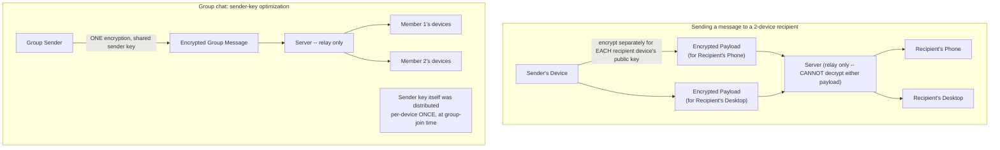

# Module 44 — System Design: Designing WhatsApp — Multi-Device Sync & End-to-End Encryption

> Domain: System Design | Level: Beginner → Expert | Prerequisite: [[03-Designing-Chat-Messaging-System]] — this module assumes that module's entire architecture (WebSockets, connection registry, message ordering, delivery guarantees) as its foundation and addresses specifically what WhatsApp adds beyond it: true end-to-end encryption and seamless multi-device sync.

---

## 1. Fundamentals

### What does WhatsApp add on top of Module 39's general chat-system architecture?
WhatsApp's defining, architecturally-consequential features beyond ordinary chat (Module 39) are: **true end-to-end encryption** (the server genuinely cannot read message content, not merely "we promise not to look" — directly the scenario Module 39 §8 flagged but didn't fully design) and **seamless multi-device support** (a user can be simultaneously logged in on their phone, a linked desktop app, and a linked web client, with messages correctly synchronized and, critically, encryption keys correctly managed across all of them).

### Why does this matter?
Because these two features interact in a genuinely non-obvious, difficult way: E2E encryption means only the sending and receiving *devices* hold the decryption keys — the server, as an untrusted relay, cannot help with cross-device synchronization the way it trivially could if it had plaintext access — every device a user owns needs its **own** key pair, and every message must be individually encrypted **once per recipient device**, not once per recipient user, a detail with real, multiplicative architectural consequences.

### When does this matter?
Any system claiming genuine E2E encryption combined with multi-device support (WhatsApp, Signal, iMessage); the depth matters because "we use E2E encryption" and "it works seamlessly across all your devices" are five words each that hide a substantial, genuinely hard cryptographic-protocol-design problem most system-design discussions gloss over entirely.

### How does it work (30,000-ft view)?
```
Each device (not each user) has its own key pair.
Sending a message to a user with 3 devices means encrypting the message 3 SEPARATE times,
once per recipient device's public key -- the server relays 3 distinct encrypted payloads,
never seeing the plaintext, and has no way to "just forward the same encrypted blob" to all three.
```

---

## 2. Deep Dive

### 2.1 The Signal Protocol — the Standard Foundation for Genuine E2E Encryption
WhatsApp (and Signal, and several other platforms) builds on the **Signal Protocol**, combining the **Double Ratchet Algorithm** (providing forward secrecy — a compromised key at one point in time doesn't expose past messages — and post-compromise security — the protocol self-heals after a compromise, future messages become secure again) with the **X3DH key agreement protocol** (allowing two parties to establish a shared secret key even if the recipient is currently offline, critical for a messaging system where the recipient isn't always connected at send time). A system-design answer for WhatsApp should recognize this as the established, correct foundation to build on, not attempt to design a novel encryption scheme from scratch — directly this course's recurring "don't hand-roll what a mature, battle-tested solution already provides" discipline (Module 33 §Advanced Q9, Module 35 §Advanced Q8), now applied to cryptographic protocol design specifically, where hand-rolling is even more strongly discouraged given the catastrophic consequences of a subtle cryptographic implementation error.

### 2.2 Per-Device Encryption — Why Multi-Device Multiplies Complexity, Not Just Doubles It
Because the server never has plaintext access, it **cannot** decrypt-and-re-encrypt a message for each of a recipient's devices on the recipient's behalf (doing so would require the server to hold a decryption key, violating E2E encryption's entire premise) — instead, the **sending device** must encrypt the message **separately, once per recipient device**, using each device's individual public key. For a group chat, this multiplies further: a message to a 50-person group where each member has an average of 2 devices requires the sending device to perform **100 separate encryption operations** for a single logical message — a genuine, non-trivial computational and bandwidth cost on the sending device itself (not the server), directly informing why WhatsApp's actual, documented architecture uses a **sender-key** optimization for groups (§2.4) rather than naive per-device-per-recipient encryption at group scale.

### 2.3 Device Linking — Establishing Trust for a New Device Without Server-Mediated Key Exchange
Adding a new device (linking a desktop app to an existing phone-based account) requires the new device to obtain the cryptographic material needed to participate in the user's conversations, **without the server being able to inject a malicious key** (which would let a compromised or coerced server perform a man-in-the-middle attack by claiming a device it controls is the user's legitimate new device) — the standard mechanism is an **out-of-band verification** (scanning a QR code displayed on the phone with the new device, transferring key material via a channel the server never sees in plaintext, or via a protocol where the phone directly, cryptographically vouches for the new device) — this is precisely why linking a new WhatsApp device requires physically scanning a QR code with your existing, already-trusted phone, not merely entering a password on the new device: the QR-code scan **is** the out-of-band trust-establishment mechanism, not a UX inconvenience.

### 2.4 The Sender-Key Optimization for Group Chats
To avoid the O(recipients × devices-per-recipient) encryption cost described in §2.2 for every single group message, WhatsApp's actual documented architecture uses a **sender-key** mechanism: a sender generates a single symmetric key for a given group conversation, distributes this key to every current member's every device **once** (via the more expensive, per-device encryption mechanism, but only once per member-join, not once per message), and subsequently encrypts every group message using this single, shared symmetric key — reducing the **per-message** cost back to a single encryption operation (using the fast, shared symmetric key) regardless of group size, at the cost of needing to **redistribute a new sender key** whenever group membership changes (a member leaves, requiring the key to be rotated so the departed member can no longer decrypt future messages — directly the same "revoke access, rotate the shared secret" pattern as Module 21 §Advanced Q8/Module 27 §8's Row-Level-Security/IAM-based multi-tenant isolation, here applied to a cryptographic key instead of a database access policy).

### 2.5 Multi-Device Message Ordering and Sync — Reconciling Module 39's Sequencing with Per-Device Encryption
Module 39 §2.4's per-conversation sequence number still applies for ordering, but now each device maintains its **own** view of "which messages have I received and decrypted" — a message sent while one device was offline must be delivered (still encrypted specifically for that device, per §2.2) once it reconnects, directly Module 39 §2.3's offline-delivery/Streams-based backlog pattern, but now the backlog must track **per-device** delivery status, not merely per-user, since a message already delivered to and decrypted by the phone might still be pending delivery to a linked desktop client that was offline at send time.

## 3. Visual Architecture


## 4. Production Example
**Scenario**: A messaging platform implementing multi-device support initially treated "deliver to all of a user's devices" as a straightforward extension of Module 39's single-device fan-out — the sending client encrypted the message **once**, intending the server to simply forward the same encrypted payload to every registered device for that recipient, exactly the naive approach §2.2 warns against. **Investigation**: this design was caught during a security architecture review (proactively, not via an incident) — a cryptographer on the review team pointed out that "forward the same ciphertext to every device" is only possible if the server can decrypt-and-re-encrypt per device (violating true E2E encryption, since the server would need decryption keys) **or** if every one of a user's devices somehow shared the identical private key (a severe security anti-pattern, since compromising any single device would then compromise every device, and there would be no way to revoke one specific device's access without revoking all of them). **Fix**: redesigned the encryption layer so the sending client performs genuinely separate encryption operations per recipient device's individual public key (§2.2), accepting the resulting increase in sender-side computational cost and message payload size, and implemented the sender-key optimization (§2.4) specifically for group chats to keep this cost bounded as group size grows. **Lesson**: "add multi-device support" sounds like an ordinary feature-scaling exercise (Module 38's fan-out-to-more-recipients pattern) but, combined with a genuine E2E-encryption requirement, is actually a fundamentally different, harder problem requiring dedicated cryptographic-protocol design — a system-design answer that treats "E2E encryption" and "multi-device" as two independent, additive features misses that their **combination** is where the real architectural difficulty lives, precisely why this deserved a security-focused architecture review specifically, not just an ordinary feature-design review.

## 5. Best Practices
- Build on the established Signal Protocol (Double Ratchet + X3DH) for genuine E2E encryption rather than designing a novel cryptographic scheme.
- Encrypt separately per recipient device's public key, never assume a single ciphertext can be forwarded to multiple devices without either violating E2E encryption or introducing a shared-key security anti-pattern (§4's incident).
- Use out-of-band verification (QR-code scanning) for new-device linking, ensuring the server cannot inject a malicious key into the trust-establishment process.
- Use the sender-key optimization for group chats to keep per-message encryption cost bounded, rotating the sender key whenever group membership changes.

## 6. Anti-patterns
- Assuming a single encrypted payload can be forwarded to all of a recipient's devices without either breaking true E2E encryption or requiring a shared private key across devices (§4's incident).
- Designing a custom encryption protocol instead of building on Signal Protocol's established, extensively-analyzed foundation.
- Allowing new-device linking via a server-mediated process without out-of-band, cryptographic device verification, opening a man-in-the-middle vulnerability.
- Forgetting to rotate the group sender key when a member leaves, allowing a removed member to continue decrypting future group messages with their previously-distributed key.

---

## 10. Interview Questions

### Basic (10)
1. **Q: What cryptographic protocol does WhatsApp's E2E encryption build on?** **A:** The Signal Protocol (Double Ratchet Algorithm + X3DH key agreement).
2. **Q: Can the server decrypt a genuinely end-to-end-encrypted message?** **A:** No — that's the defining property of true E2E encryption; only the sending and receiving devices hold the necessary keys.
3. **Q: Why must a message be encrypted separately for each of a recipient's devices?** **A:** Because the server can't decrypt-and-re-encrypt on the recipient's behalf, and each device has its own distinct key pair.
4. **Q: What mechanism verifies a new linked device without server-mediated key exchange?** **A:** Out-of-band verification, typically scanning a QR code with an already-trusted device.
5. **Q: What is the sender-key optimization for?** **A:** Reducing per-message group-chat encryption cost from O(members × devices) to a single operation, by distributing a shared symmetric key once at group-join time.
6. **Q: When must a group's sender key be rotated?** **A:** Whenever group membership changes (especially when a member leaves), so departed members can't decrypt future messages.
7. **Q: What is forward secrecy?** **A:** A property ensuring a compromised key doesn't expose previously-sent messages, since past keys have already been discarded/rotated.
8. **Q: Does E2E encryption protect metadata (who messages whom, when) as well as content?** **A:** No — E2E encryption protects message content specifically; metadata typically remains visible to the server as the relay.
9. **Q: Why does per-device encryption shift cost onto the sending client device, unlike ordinary server-mediated chat?** **A:** Because the encryption work must happen on the sender's device before the message is sent, not on the server after receipt.
10. **Q: Does multi-device support scale with user count or device count?** **A:** Device count — a platform must account for the average number of linked devices per user as a distinct capacity-planning dimension.

### Intermediate (10)
1. **Q: Why is "forward the same encrypted payload to all of a recipient's devices" fundamentally incompatible with true E2E encryption?** **A:** It would require either the server having decryption access (breaking E2E encryption's core guarantee) or every device sharing an identical private key (a severe security anti-pattern preventing per-device revocation and multiplying compromise blast radius) — §4's incident.
2. **Q: Why does the sender-key mechanism still require per-device encryption at group-join time, even though it avoids it for every subsequent message?** **A:** The sender key itself must be securely delivered to each member's each device individually (since the server still can't mediate this) — the optimization only amortizes this cost across many subsequent messages, it doesn't eliminate per-device encryption from the system entirely.
3. **Q: Why is the QR-code-scanning step for device linking not merely a UX choice?** **A:** It's the actual security mechanism preventing the server from injecting a fraudulent device into the trust chain — the physical, out-of-band nature of scanning with an already-trusted device is what a purely server-mediated linking process couldn't provide.
4. **Q: Why does post-compromise security matter in addition to forward secrecy?** **A:** Forward secrecy protects past messages after a compromise; post-compromise security ensures the protocol recovers and future messages become secure again, even without explicit user intervention — together they bound both the "before" and "after" impact of a key compromise.
5. **Q: Why might a large, frequently-churning group chat's scalability bottleneck be membership changes rather than message volume?** **A:** Each membership change triggers a sender-key rotation, itself an O(members × devices) operation — a group with high churn but moderate messaging volume could spend more aggregate cost on key rotations than on actual message delivery.
6. **Q: Why is "the platform can't read your messages" an incomplete privacy claim without also addressing metadata?** **A:** The server, as the necessary relay for message delivery, inherently observes communication patterns (who, when, how often) even without content access — a fully honest privacy discussion must distinguish these two, separately-guaranteed properties.
7. **Q: Why would hand-rolling a custom E2E encryption scheme be considered a more severe risk than hand-rolling, e.g., a custom hash table (Module 33 §Advanced Q9)?** **A:** A cryptographic protocol flaw can catastrophically and silently compromise user privacy/security at scale with no visible symptom until exploited, whereas a hash-table implementation bug typically produces an observable functional/performance defect — the stakes and subtlety of cryptographic correctness are categorically higher, making reliance on an extensively peer-reviewed, battle-tested protocol (Signal) far more strongly warranted.
8. **Q: Why does device-count-based capacity planning differ meaningfully from user-count-based planning?** **A:** If the average user has multiple linked devices, connection/delivery-tracking state scales with total devices, not total users — a platform with the same user count but higher average devices-per-user needs proportionally more capacity for these specific concerns.
9. **Q: Why must offline-delivery backlog tracking (Module 39 §2.3) become per-device rather than per-user for a multi-device system?** **A:** Different devices belonging to the same user can have independent online/offline states — a message already delivered to and decrypted by one device might still be pending for a different, currently-offline device, requiring independent backlog tracking per device rather than a single, shared per-user status.
10. **Q: Why did the naive "encrypt once, forward to all devices" design in §4 get caught in a security review rather than ordinary QA testing?** **A:** It's functionally correct-looking (messages do get delivered to every device) — the flaw is a cryptographic-protocol/security-property violation, not a functional bug, requiring specific security-domain expertise (recognizing the E2E-encryption-breaking implication) rather than standard feature-correctness testing to identify.

### Advanced (10)
1. **Q: Diagnose the naive multi-device-encryption design flaw (§4) from first principles, and explain precisely why it represents a fundamental protocol-design error, not a fixable implementation bug.**
   **A:** The flaw isn't a bug in an otherwise-sound design — it's a fundamental misunderstanding of what E2E encryption structurally requires: genuine E2E encryption means only endpoint devices hold decryption capability, which **mathematically** requires per-device key pairs and per-device encryption operations; there is no implementation fix that preserves "one payload forwarded to all devices" while also preserving genuine E2E encryption's core guarantee — the two requirements are structurally incompatible, meaning the correct response wasn't "patch this design" but "redesign around per-device encryption from the protocol level up," exactly why this warranted the dedicated cryptographic/security architecture review rather than an ordinary code-review fix.
2. **Q: Design the specific data model tracking per-device public keys and per-device delivery/decryption status for a multi-device messaging system.**
   **A:**
   ```
   Devices: { userId, deviceId, publicKey, registeredAt, lastSeenAt }
   MessageDeliveryStatus: { messageId, deviceId, status: "pending" | "delivered" | "decrypted", deliveredAt }
   GroupSenderKeys: { groupId, keyVersion, distributedAt } -- current active sender key version per group
   GroupMemberKeyDistribution: { groupId, keyVersion, deviceId, distributionStatus }
   ```
   `MessageDeliveryStatus` tracked per `(messageId, deviceId)` pair directly supports §2.5's requirement that each device independently tracks its own delivery/decryption progress; `GroupSenderKeys`' versioning supports Intermediate Q2's key-rotation-on-membership-change requirement, with `GroupMemberKeyDistribution` tracking which specific devices have received which key version (needed to know whether a rotation has fully propagated before considering old messages safely re-encryptable-only-under-the-new-key, if the design requires this).
3. **Q: Explain how you would handle the "message sent while recipient had zero registered devices momentarily" edge case (e.g., a user uninstalling and reinstalling the app, briefly having no valid device registered).**
   **A:** The server, having no device to relay to, must queue the encrypted-for-a-not-yet-existing-device message in a holding state — but critically, since the message was encrypted for a *specific* device's public key (§2.2) that may no longer exist after reinstall (a new install typically generates a fresh key pair), the **original sender** may need to be notified to re-encrypt and resend once the recipient's new device registers, rather than the server being able to "just deliver" an already-encrypted-for-the-wrong-key payload to the newly-registered device — a genuine, non-trivial edge case directly stemming from per-device encryption's fundamental structure, worth explicitly addressing rather than assuming "queue for later delivery" (Module 39's simpler, non-E2E-encrypted assumption) transfers unchanged to this system.
4. **Q: How would you design key-rotation verification to ensure a departed group member genuinely loses access to future messages, addressing a potential race condition between "member removed" and "sender key rotated"?**
   **A:** The member-removal operation and sender-key-rotation-initiation must be **atomically linked** (or the removal must explicitly block/gate on rotation completing) — if a message is sent using the *old* sender key after a member is removed from the group's membership list but *before* the key rotation has actually propagated to all remaining members' devices, the removed member (if they retained the old key before removal) could still decrypt that specific message; the correct design ensures the group's "current sender key version" is atomically advanced as part of the removal operation itself, with any message sent during the (hopefully brief) rotation-propagation window either using the new key already or being explicitly held until rotation confirms complete — a genuine, security-critical race condition worth explicitly designing around, not an edge case to handle "eventually."
5. **Q: Explain how you would design a "backup and restore" feature (allowing a user to restore their chat history to a new device after losing their old one) without undermining the E2E-encryption guarantee.**
   **A:** Chat history backup for a genuinely E2E-encrypted system requires the backup itself to be encrypted with a key **only the user controls** (e.g., a user-chosen backup password, deriving an encryption key via a password-based key-derivation function, never transmitted to or derivable by the server) — the server can store the encrypted backup blob (in cloud storage) without ever being able to decrypt it, and restoration on a new device requires the user to provide the same backup password to decrypt it locally — this is precisely why WhatsApp's actual backup feature required significant additional design work and an explicit user-facing password/encryption-key step, rather than a simple "the server backs up your messages" feature the way a non-E2E system could implement trivially.
6. **Q: A team proposes storing a copy of every user's private key encrypted with a server-held master key, "just in case a customer needs account recovery support." Evaluate this as a Principal Engineer.**
   **A:** Reject this outright — storing any mechanism by which the server (or anyone with access to the server-held master key) could ever recover a user's private key **fundamentally breaks** the E2E-encryption guarantee, regardless of how the recovery mechanism is access-controlled or how rarely it's actually used; the mere *existence* of such a capability means the system no longer provides genuine E2E encryption (a sufficiently privileged insider, a legal compulsion order, or a breach of the master key would expose it) — this is exactly the kind of well-intentioned "just in case" feature request that, if implemented, would constitute a material, publicly-relevant misrepresentation of the product's actual security properties, and should be rejected on architectural-integrity grounds regardless of the support-convenience benefit it might offer.
7. **Q: Explain how you would test the multi-device encryption system for the specific class of bug demonstrated in §4, given that it's a protocol-correctness issue rather than an ordinary functional bug.**
   **A:** Beyond ordinary functional testing (do messages arrive correctly), implement a specific **cryptographic-property test suite**: verify that a message encrypted for device A's public key genuinely cannot be decrypted using device B's private key (even for the same user's own second device), verify forward secrecy by confirming that possessing a *current* key doesn't allow decryption of messages sent under a *previous* key epoch (directly testing the Double Ratchet's core guarantee), and verify that a removed group member's retained old sender key genuinely fails to decrypt post-rotation messages — these are fundamentally different tests than ordinary feature-correctness tests, requiring the test suite to actively attempt "wrong" decryptions and assert they fail, not merely that "right" decryptions succeed.
8. **Q: Design a strategy for auditing whether the actual, deployed system correctly implements the intended cryptographic protocol, given that a subtle implementation deviation could silently weaken security without any functional symptom.**
   **A:** Commission an independent, external security audit specifically of the cryptographic protocol implementation (not just ordinary penetration testing of the application layer) — cryptographic protocol implementations are exactly the class of system where an internal team's own testing, however thorough, benefits enormously from independent, specialized expert review, given how subtle and consequential an implementation flaw can be while remaining completely invisible to standard QA/functional testing (directly Advanced Q7's point that these bugs don't manifest as ordinary functional defects) — treating this as a standing, periodic (not one-time) audit requirement given how security-critical and subtle this specific component is, distinct from this course's more general "measure and test" discipline applied elsewhere.
9. **Q: Explain the trade-off between "verify a contact's identity via a safety-number/fingerprint comparison" (an optional, user-driven E2E-encryption verification step many such apps offer) and simply trusting the platform's automatic key-exchange process.**
   **A:** Automatic key exchange (X3DH, §2.1) is convenient and secure against passive eavesdropping, but doesn't, by itself, protect against a sophisticated active attacker capable of a man-in-the-middle attack against the key-exchange process itself (or a malicious/compromised server injecting a fraudulent key, the same threat model as Advanced Q1/§2.3's device-linking concern, now applied to initial contact key exchange) — the optional safety-number comparison (both parties manually verifying, out-of-band, e.g., in person, that their apps display the same cryptographic fingerprint for each other) is the strongest available defense against this specific, more sophisticated threat, at the cost of requiring explicit, inconvenient user action most users never actually perform — a genuine, honestly-communicated trade-off between default convenience and maximum-available security this course's "match the security investment to the actual threat model and user population" discipline should be applied to explicitly.
10. **Q: As a Principal Engineer, how would you decide whether a new messaging feature request (e.g., "let users search their message history from the server, so they don't have to re-download everything on a new device") is compatible with the E2E-encryption architecture this module establishes?**
    **A:** Apply the same diagnostic question from every "does this new feature undermine our core guarantee" evaluation this course has repeatedly modeled: does fulfilling this feature request require the server to have plaintext (or otherwise decryptable) access to message content? Server-side search over encrypted content is not achievable without either breaking E2E encryption (giving the server decryption capability) or using a fundamentally different, more exotic technique (searchable encryption schemes, an active but still largely impractical-at-this-scale research area) — the honest answer is that genuine server-side search over E2E-encrypted content is not currently a solved, production-viable problem, and any feature proposal assuming otherwise needs to be redirected toward client-side-only search (each device maintains its own local, decrypted search index) rather than a server-side implementation that would silently compromise the encryption guarantee to deliver the requested convenience.

---

## 11. Coding Exercises

*(System design case studies use worked design/protocol exercises, consistent with this domain's format.)*

### Easy — Per-device key registration
```csharp
public record DeviceKeyRegistration(string UserId, string DeviceId, byte[] PublicKey, DateTimeOffset RegisteredAt);

public async Task RegisterDeviceAsync(string userId, string deviceId, byte[] publicKey)
{
    await _deviceStore.UpsertAsync(new DeviceKeyRegistration(userId, deviceId, publicKey, DateTimeOffset.UtcNow));
    // A new device registration does NOT automatically receive historical messages --
    // it only participates in FUTURE message exchanges from this point forward (§Advanced Q3's
    // "old key material doesn't retroactively apply" principle).
}
```

### Medium — Per-device message encryption fan-out (§4's fix)
```csharp
public async Task SendMessageAsync(string senderId, string recipientUserId, byte[] plaintext)
{
    var recipientDevices = await _deviceStore.GetDevicesForUserAsync(recipientUserId);

    foreach (var device in recipientDevices)
    {
        byte[] ciphertext = _signalProtocol.Encrypt(plaintext, device.PublicKey); // SEPARATE encryption PER device
        await _messageRelay.SendAsync(new EncryptedMessage(senderId, device.DeviceId, ciphertext));
    }
    // The server relay NEVER sees 'plaintext' -- only these already-encrypted, per-device payloads.
}
```

### Hard — Sender-key group messaging with rotation on membership change (Advanced Q4)
```csharp
public class GroupMessagingService
{
    public async Task RemoveMemberAsync(string groupId, string memberUserId)
    {
        await _groupStore.RemoveMemberAsync(groupId, memberUserId);

        // ATOMIC: advance the sender-key version as PART OF the removal, closing Advanced Q4's race window.
        int newKeyVersion = await _groupStore.AdvanceSenderKeyVersionAsync(groupId);
        byte[] newSenderKey = _signalProtocol.GenerateSymmetricKey();

        var remainingMembers = await _groupStore.GetMembersAsync(groupId);
        foreach (var member in remainingMembers)
        {
            foreach (var device in await _deviceStore.GetDevicesForUserAsync(member.UserId))
            {
                byte[] encryptedKey = _signalProtocol.Encrypt(newSenderKey, device.PublicKey); // per-device, ONE-TIME
                await _keyDistribution.DistributeAsync(groupId, newKeyVersion, device.DeviceId, encryptedKey);
            }
        }
        // ANY message sent using the OLD key version after this point is REJECTED by recipients --
        // the removed member's retained old key can no longer decrypt anything new.
    }

    public async Task SendGroupMessageAsync(string groupId, string senderId, byte[] plaintext)
    {
        var currentKeyVersion = await _groupStore.GetCurrentSenderKeyVersionAsync(groupId);
        var senderKey = await _keyDistribution.GetSenderKeyAsync(groupId, currentKeyVersion, senderId);

        byte[] ciphertext = _signalProtocol.EncryptSymmetric(plaintext, senderKey); // ONE encryption, regardless of group size
        await _messageRelay.BroadcastToGroupAsync(groupId, ciphertext, currentKeyVersion);
    }
}
```

### Expert — Cryptographic-property test suite (Advanced Q7)
```csharp
[Fact]
public void Message_Encrypted_For_DeviceA_Should_NOT_Decrypt_With_DeviceB_PrivateKey()
{
    var (deviceAPublic, deviceAPrivate) = _signalProtocol.GenerateKeyPair();
    var (deviceBPublic, deviceBPrivate) = _signalProtocol.GenerateKeyPair(); // SAME user's second device

    byte[] ciphertext = _signalProtocol.Encrypt(Encoding.UTF8.GetBytes("secret"), deviceAPublic);

    Assert.Throws<DecryptionFailedException>(() =>
        _signalProtocol.Decrypt(ciphertext, deviceBPrivate)); // MUST fail -- devices don't share keys, even same user
}

[Fact]
public void Removed_Member_OldSenderKey_Should_NOT_Decrypt_PostRotation_Messages()
{
    var group = CreateTestGroupWithMembers("alice", "bob", "carol");
    byte[] oldSenderKey = group.CurrentSenderKey;

    group.RemoveMember("carol"); // triggers rotation per the Hard exercise

    byte[] newMessage = group.SendMessage("alice", "hello after carol left");

    Assert.Throws<DecryptionFailedException>(() =>
        _signalProtocol.DecryptSymmetric(newMessage, oldSenderKey)); // carol's retained OLD key must fail
}
```
**Discussion**: These tests actively assert that a decryption **fails** under the wrong key/post-rotation, directly the kind of "prove the negative security property, not just the positive functional one" test Advanced Q7 calls for — an ordinary functional test suite (does Alice receive Bob's message correctly) would never catch a §4-class flaw, since the naive, broken design would still pass every ordinary "message delivered successfully" test while silently violating the actual E2E-encryption guarantee.

---

## 12–17. System Design / LLD / Debugging / Decision / Case Study / Principal

*(This entire module IS the deep-dive case study — §4's incident, §11's four worked exercises, and the extensive Advanced-tier Q&A collectively constitute this section's typical content, building directly on Module 39's general chat-system foundation.)*

## 18. Revision
**Key takeaways**: True E2E encryption (Signal Protocol: Double Ratchet + X3DH) means the server structurally cannot decrypt content — combined with multi-device support, this requires genuinely separate encryption per recipient device, not a single forwarded payload (§4's incident, a fundamental protocol-design error, not a patchable bug). New-device linking requires out-of-band (QR-code) verification specifically to prevent the server itself from injecting a fraudulent device. Group chats use a sender-key optimization (one shared symmetric key per group, distributed per-device once, rotated on membership change) to keep per-message cost bounded despite per-device encryption's fundamental O(members × devices) cost at the distribution step. E2E encryption protects content, not metadata — an important, honestly-communicated distinction. Any feature request requiring server-side plaintext access (server-side search, "just in case" key recovery) is fundamentally incompatible with genuine E2E encryption and must be redirected to a client-side or cryptographically-different alternative, never implemented as a silent guarantee-breaking compromise.

---

**Next**: This completes the expanded `14-System-Design` domain (Modules 37–44: Fundamentals, News Feed/Twitter, Chat/Messaging, Rate Limiter/API Gateway, YouTube, Instagram, Amazon, and WhatsApp's E2E/multi-device specifics) — eight fully-worked, cross-referenced system-design case studies spanning this course's major architectural patterns. Continuing autonomously to `15-Low-Level-Design`.
