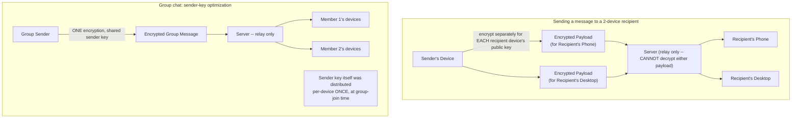
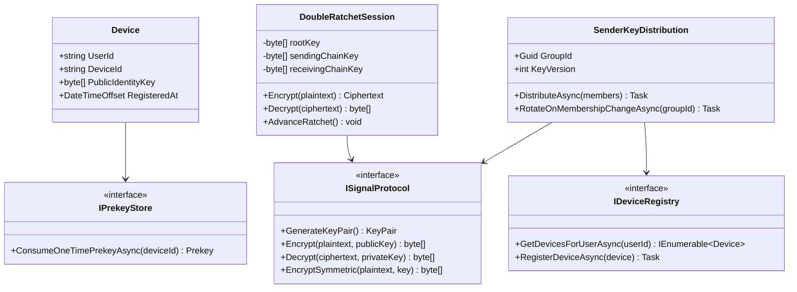

# Module 44 — System Design: Designing WhatsApp — Multi-Device Sync & End-to-End Encryption

> Domain: System Design | Level: Beginner → Expert | Prerequisite: [[03-Designing-Chat-Messaging-System]] — this module assumes that module's entire architecture (WebSockets, connection registry, message ordering, delivery guarantees) as its foundation and addresses specifically what WhatsApp adds beyond it: true end-to-end encryption and seamless multi-device sync.

---

## 1. Fundamentals

### What does WhatsApp add on top of the general chat-system architecture?
WhatsApp's defining, architecturally-consequential features beyond ordinary chat are: **true end-to-end encryption** (the server genuinely cannot read message content, not merely "we promise not to look" — directly the scenario flagged but didn't fully design) and **seamless multi-device support** (a user can be simultaneously logged in on their phone, a linked desktop app, and a linked web client, with messages correctly synchronized and, critically, encryption keys correctly managed across all of them).

### Why does this matter?
Because these two features interact in a genuinely non-obvious, difficult way: E2E encryption means only the sending and receiving *devices* hold the decryption keys — the server, as an untrusted relay, cannot help with cross-device synchronization the way it trivially could if it had plaintext access — every device a user owns needs its **own** key pair, and every message must be individually encrypted **once per recipient device**, not once per recipient user, a detail with real, multiplicative architectural consequences.

### When does this matter?
Any system claiming genuine E2E encryption combined with multi-device support (WhatsApp, Signal, iMessage); the depth matters because "we use E2E encryption" and "it works seamlessly across all your devices" are five words each that hide a substantial, genuinely hard cryptographic-protocol-design problem most system-design discussions gloss over entirely.

### How does it work (30,000-ft view)?
```
Each device (not each user) has its own key pair.
Sending a message to a user with 3 devices means encrypting the message 3 SEPARATE times,
once per recipient device's public key -- the server relays 3 distinct encrypted payloads,
never seeing the plaintext, and has no way to "just forward the same encrypted blob" to all three.
```

---

## 2. Deep Dive

This section is written to be **complete on its own** — every mechanism, the reasoning that selects it, the failure mode it introduces, and the push-back a Principal/Staff interviewer will raise, answered inline.

### 2.1 The Signal Protocol — the Foundation You Build On, Never Reinvent

WhatsApp, Signal and others build on the **Signal Protocol**, which combines two pieces:

- **The Double Ratchet Algorithm** — provides **forward secrecy** (a key compromised today does not expose past messages) and **post-compromise security** (the protocol self-heals; future messages become secure again after a compromise ends). Keys advance on every message, so each message has its own key.
- **X3DH (Extended Triple Diffie-Hellman) key agreement** — lets two parties establish a shared secret **even when the recipient is offline**, by publishing signed prekey bundles the sender can use unilaterally. This is essential, because in a messaging system the recipient is very often not connected at send time.

Recognise this as the correct foundation rather than designing a novel scheme. "Don't hand-roll what a battle-tested solution provides" applies to everything, and applies to cryptographic protocol design far more strongly than anywhere else, because a subtle implementation error is both catastrophic and invisible to ordinary testing (§2.10).

### 2.2 Per-Device Encryption — the Device Is the Cryptographic Identity

Because the server never holds plaintext, it **cannot** decrypt and re-encrypt a message for each of a recipient's devices — doing so would require the server to hold a decryption key, which is the whole thing being avoided. So the **sending device** encrypts the message separately, once per recipient **device**, using each device's own public key.

This is why multi-device multiplies complexity rather than doubling it, and the arithmetic is worth saying aloud:

```
50-person group × ~2 devices each = 100 separate encryption operations
                                    for ONE logical message,
                                    performed on the sender's phone.
```

The cost lands on the sending client's CPU, battery and uplink — not on the server. That single fact drives the group design in §2.3.

**The structural consequence to state explicitly: the device, not the user, is the cryptographic identity.** Every access-control question in this system resolves to devices, and that distinction is what makes §2.4's revocation problem subtle.

### 2.3 The Sender-Key Optimisation for Groups

To avoid O(recipients × devices) encryption per message, the sender generates a single **symmetric sender key** for the group, distributes it to every current member's every device **once** (using the expensive per-device mechanism, but only on join or rotation — not per message), and thereafter encrypts each group message once with that shared symmetric key.

Per-message cost collapses to a single symmetric encryption regardless of group size. The price is that **membership change requires redistributing a new key** — the "revoke access, rotate the shared secret" pattern, applied to a cryptographic key rather than a database policy.

The rotation cost is real and worth quantifying: a 1,000-member group with ~2.5 devices each is roughly **2,500 pairwise key-distribution messages per rotation**.

### 2.4 Revocation — Removing Membership Is Not Removing Access

This is the security-critical distinction in the module, and interviewers probe it directly.

Group membership is an **application-level** concept the server tracks. Decryption capability is a **cryptographic** concept the server does not control. Removing a user from the membership list only stops the server **routing future ciphertexts** to their devices. It does nothing about the fact that their devices already hold the current sender key, and could decrypt any message encrypted with it that reached them by any path.

> **Only key rotation actually revokes capability.** Membership removal revokes *routing*. A system that removes membership without guaranteeing rotation has not revoked access.

**Rotation must be atomically coupled to removal.** If a message is sent under the *old* sender key after a member is removed but before rotation propagates, the departed member can still decrypt it. The correct design advances the group's current sender-key version as part of the removal operation itself, with messages sent during the propagation window either already using the new key or explicitly held until rotation confirms complete. This is a genuine race condition with security consequences, not an edge case to handle "eventually."

**High churn forces an explicit, quantified trade-off.** In a public broadcast-style group gaining and losing members every few seconds, per-departure rotation is untenable — each rotation is O(members × devices), and back-to-back departures serialise an unbounded queue of expensive work. The standard mitigation is **batched/debounced rotation**: coalesce membership changes within a short window into one rotation.

The critical framing: **the batching window's length *is* the security parameter.** A member who left mid-batch retains read access to messages sent during that interval. That is a policy choice to be stated to stakeholders, not an engineering optimisation applied silently.

### 2.5 Device Linking, Trust Establishment, and Detecting an Injected Device

Adding a device must not let the **server inject a key**. A compromised or coerced server could otherwise claim a device it controls is the user's new device and read everything from then on — a man-in-the-middle attack conducted by the infrastructure itself.

The mechanism is **out-of-band verification**: the new device scans a QR code displayed by the already-trusted phone, transferring key material through a channel the server never sees in plaintext, with the phone cryptographically vouching for the new device. The QR scan **is** the trust-establishment mechanism, not a UX inconvenience — which is exactly why linking a device requires physical access to the phone rather than a password.

**Safety numbers cover the same threat for initial contact.** Automatic X3DH key exchange is secure against passive eavesdropping but not against an active MITM or a server injecting a fraudulent key. Comparing safety numbers (fingerprints) out-of-band — in person, over a voice call — is the strongest available defence, at the cost of an explicit user action most people never perform. State that honestly: it is a real trade between default convenience and maximum security, and the right posture depends on the threat model and the user population.

**Key transparency is what makes detection possible at scale.** Publishing device lists to an append-only, cross-client-auditable log means a malicious server serving a **split view** — showing an injected device to only some clients — becomes detectable, because other clients querying the same log for the same user observe an inconsistent list.

**Investigating a safety-number mismatch** between two users who have messaged for months:

| Signal | Benign (reinstall) | Malicious (injection) |
|---|---|---|
| Device-list audit log | A single plausible addition, typically preceded by the old device deregistering | An **addition without a corresponding removal** — the original device stays active and an extra one silently appears |
| User recollection | "Yes, I got a new phone" | Nothing changed on their side |
| Key-transparency gossip | Consistent across clients | **Inconsistent device lists across clients** — the decisive signal |

The discipline: a single client's local observation is suggestive, never conclusive. The transparency log's cross-client consistency check is what distinguishes the cases with confidence.

### 2.6 Multi-Device Sync, Ordering and the Zero-Device Edge Case

Per-conversation sequence numbers still provide ordering. What changes is that **delivery status is tracked per `(message, device)` pair**, not per user: a message decrypted on the phone may still be pending for a linked desktop that was offline at send time.

The data model that supports this:

```
MessageDeliveryStatus     { messageId, deviceId, status }      -- per DEVICE, not per user
GroupSenderKeys           { groupId, keyVersion, distributedAt }
GroupMemberKeyDistribution{ groupId, keyVersion, deviceId, distributionStatus }
```

`GroupMemberKeyDistribution` is what lets you know whether a rotation has **fully propagated** — which §2.4's atomicity requirement depends on being observable.

**The zero-registered-devices edge case** is genuinely non-trivial and specific to per-device encryption. If a user uninstalls and reinstalls, a message may have been encrypted for a device key that no longer exists — a fresh install generates a new key pair. The server cannot "just deliver" a payload encrypted for the wrong key. The **original sender** must be notified to re-encrypt and resend once the new device registers. The simpler non-E2E assumption ("queue it for later delivery") does not transfer, and saying so is the point.

### 2.7 Backup and Restore Without Breaking the Guarantee

Restoring history to a replacement device requires the backup to be encrypted with a key **only the user controls** — derived from a user-chosen backup password via a password-based KDF, never transmitted to or derivable by the server. The server stores an opaque encrypted blob; restoration requires the user to supply the password so decryption happens locally.

This is why a genuinely E2E platform's backup feature needs an explicit user-facing password step, where a non-E2E system implements backup trivially. The awkward UX **is** the guarantee.

### 2.8 What This Architecture Cannot Do — Stated Honestly

A Principal-level answer enumerates limits rather than glossing them.

**Server-side search over message content is not achievable.** It would require the server to have decryptable access. Searchable-encryption schemes exist but remain impractical at this scale. Redirect such a request to **client-side search** — each device maintains its own local index over content it has decrypted — rather than accepting a server-side implementation that silently compromises the guarantee.

**Disappearing messages are a convention, not a cryptographic guarantee.** Once delivered and decrypted, the plaintext is on the recipient's device and outside the system's control. A malicious or merely uncooperative recipient can screenshot or copy it. What the feature *can* honestly guarantee: the server does not retain the message past the configured interval (a real, verifiable storage-layer property), and a well-behaved client deletes locally. That distinction must be communicated rather than marketed as absolute.

**Metadata is not protected, and sealed sender only partly helps.** Sealed sender encrypts the *sender's* identity inside the envelope, so the server routes purely on recipient address and never needs to know who sent it. It closes exactly one dimension. It structurally cannot close:

- **Recipient identity** — the server must know where to route.
- **Timing and frequency** — observable regardless.
- **Group structure** — the server still routes to a list of devices.

Name precisely which dimension is protected and which are not; "we use sealed sender so metadata is private" is the answer an interviewer is waiting to correct.

### 2.9 Legal Compulsion, and the Backdoor That Must Be Refused

**Reject any proposal to store users' private keys encrypted under a server-held master key**, however it is framed — "just in case a customer needs account recovery." The mere *existence* of a mechanism by which the server could recover a private key breaks the E2E guarantee regardless of access controls or how rarely it is used, because a privileged insider, a legal order, or a master-key breach all reach it. Implementing it while continuing to describe the product as end-to-end encrypted would be a material misrepresentation of its security properties.

**Under a compulsion order**, the architecturally honest answer is that the server *cannot* produce content: it never held plaintext and does not retain ciphertext past delivery. What it **can** produce is metadata — who messaged whom, when, device-list history, registration data — precisely the dimensions §2.8 says were never claimed to be protected.

A Principal Engineer's job here is ensuring the system's actual technical capability matches what was represented to users and regulators, and that the boundary of what can and cannot be produced is a **documented, legally reviewed artifact prepared in advance** — because this question will be asked, and working it out reactively during a proceeding is how compliance-driven exceptions get built.

### 2.10 Testing Cryptographic Properties — Asserting That Wrong Things Fail

Ordinary functional tests ask whether the right decryption succeeds. That is necessary and nowhere near sufficient, because a protocol bug can leave every functional test green while silently weakening security.

A cryptographic-property test suite **actively attempts wrong decryptions and asserts they fail**:

- A message encrypted for device A's public key cannot be decrypted with device B's private key — **including when A and B belong to the same user**.
- Possessing a *current* key does not allow decryption of messages from a *previous* key epoch (directly testing the Double Ratchet's forward-secrecy guarantee).
- A removed group member's retained old sender key genuinely fails against post-rotation messages (directly testing §2.4).

These are a fundamentally different class of test from feature-correctness tests, and their absence is invisible until it matters.

### 2.11 Auditing, and Detecting Silent Regression

**Commission independent external audits of the protocol implementation**, not merely penetration testing of the application. Cryptographic implementations are precisely the class of system where an internal team's own testing, however thorough, benefits enormously from specialist outside review — and the audit should be **standing and periodic**, not one-time, because the code keeps changing.

**The claim "the server never sees plaintext" decays silently by default** — a single careless commit is enough to violate it, and nothing breaks visibly when it does. So verify it continuously:

- Maintain an explicit enumerated inventory of every server-side component with any path that could receive plaintext, and verify the count stays **exactly zero**.
- Automated static analysis flagging any server-side code path referencing a decryption-key type or a plaintext-message type.
- Apply the same discipline to client build pipelines for debug logging of decrypted content — a lesser risk (local device compromise rather than systemic) but the same class of regression.

This is the recurring principle in its sharpest form: **a control that produces nothing visible when working must be mechanically enforced, never remembered.**

### 2.12 Improving Performance Without Weakening the Invariant

First contact pays a visible round trip: fetch the recipient's prekey bundle, then run X3DH. A proposal to have the **server pre-compute and cache likely session keys** for frequently communicating device pairs targets a real latency cost — and must be rejected, because a cached session key is exactly the server-held secret whose non-existence is the architecture's core property.

The correct mitigation preserves the invariant: **prefetch the recipient's *public* prekey bundles** client-side, ahead of a likely conversation. That is purely public data, no security property is lost, and the round trip happens before the user hits send rather than during it — the same latency win without the server ever touching private-key-derived material.

The reusable evaluation pattern: **check every performance or convenience proposal against "does this require the server to hold or compute anything private-key-derived," and reject it outright if so, regardless of the benefit.** That test rejects both the session-key cache and the master-key recovery scheme of §2.9 on identical structural grounds.

### 2.13 Principal-Level Judgements

**A feature-intake triage checklist**, so that reviewing every proposal does not collapse into review fatigue. Does the feature:

1. **Require the server to gain plaintext access it does not have?** → Requires review; likely needs redesign (the server-side-search case).
2. **Add, remove, or alter how a device is trusted?** → Requires review. Device trust is the highest-stakes attack surface here, and even a trivial-looking convenience feature touching it deserves scrutiny out of proportion to its apparent simplicity.
3. **Introduce new server-held state derived from or adjacent to private key material?** → Requires review (the rejected session-key cache).
4. **Only add server-visible metadata of a kind already structurally visible** — typing indicators, ephemeral presence — and touch neither device trust nor key material? → Typically safe without a dedicated cryptographic review, but **log it in the metadata inventory** (§2.8) so the platform's stated privacy posture stays accurate as it evolves.

This turns a case-by-case judgement call into fast, consistent triage that most proposals pass in minutes, reserving deep review for the categories where this system's real risk actually lives.

**Evaluating a competitor's simpler design fairly.** A platform claiming "we don't need sender-key rotation because we encrypt per-message to the full member list every time" has chosen the naive pairwise approach — trading away the sender-key optimisation to avoid rotation complexity. Whether that is reasonable is a **scale question**, and answering it requires running the estimation rather than dismissing or accepting the simplicity argument:

```
1,000-member group ≈ 2,500 ciphertexts per MESSAGE (not per rotation)
At even 1% of platform traffic being large-group messages
   ⇒ ~25,000,000 encryptions/s, performed on sender phones
   ⇒ a battery and latency catastrophe
```

At small scale or small group sizes the multiplicative cost never grows enough to matter, and the competitor's trade is legitimate. At this platform's group-size and volume profile it is not. Evaluating it fairly means asking exactly the scale question the estimation step exists to answer.

---

## 3. Visual Architecture

```mermaid
graph TB
 subgraph "Sending a message to a 2-device recipient"
 SenderDevice[Sender's Device] -->|"encrypt separately for EACH recipient device's public key"| Enc1["Encrypted Payload<br/>(for Recipient's Phone)"]
 SenderDevice --> Enc2["Encrypted Payload<br/>(for Recipient's Desktop)"]
 Enc1 --> Server["Server (relay only -- CANNOT decrypt either payload)"]
 Enc2 --> Server
 Server --> RecipientPhone[Recipient's Phone]
 Server --> RecipientDesktop[Recipient's Desktop]
 end
 subgraph "Group chat: sender-key optimization"
 GroupSender[Group Sender] -->|"ONE encryption, shared sender key"| GroupMsg["Encrypted Group Message"]
 GroupMsg --> Server2[Server -- relay only]
 Server2 --> Member1[Member 1's devices]
 Server2 --> Member2[Member 2's devices]
 Note["Sender key itself was distributed<br/>per-device ONCE, at group-join time"]
 end
```

## 4. Production Example
**Scenario**: A messaging platform implementing multi-device support initially treated "deliver to all of a user's devices" as a straightforward extension of the single-device fan-out — the sending client encrypted the message **once**, intending the server to simply forward the same encrypted payload to every registered device for that recipient, exactly the naive approach warns against. **Investigation**: this design was caught during a security architecture review (proactively, not via an incident) — a cryptographer on the review team pointed out that "forward the same ciphertext to every device" is only possible if the server can decrypt-and-re-encrypt per device (violating true E2E encryption, since the server would need decryption keys) **or** if every one of a user's devices somehow shared the identical private key (a severe security anti-pattern, since compromising any single device would then compromise every device, and there would be no way to revoke one specific device's access without revoking all of them). **Fix**: redesigned the encryption layer so the sending client performs genuinely separate encryption operations per recipient device's individual public key, accepting the resulting increase in sender-side computational cost and message payload size, and implemented the sender-key optimization specifically for group chats to keep this cost bounded as group size grows. **Lesson**: "add multi-device support" sounds like an ordinary feature-scaling exercise (the fan-out-to-more-recipients pattern) but, combined with a genuine E2E-encryption requirement, is actually a fundamentally different, harder problem requiring dedicated cryptographic-protocol design — a system-design answer that treats "E2E encryption" and "multi-device" as two independent, additive features misses that their **combination** is where the real architectural difficulty lives, precisely why this deserved a security-focused architecture review specifically, not just an ordinary feature-design review.
## 11. Coding Exercises

*(System design case studies use worked design/protocol exercises, consistent with this domain's format.)*

### Easy — Per-device key registration
```csharp
public record DeviceKeyRegistration(string UserId, string DeviceId, byte[] PublicKey, DateTimeOffset RegisteredAt);

public async Task RegisterDeviceAsync(string userId, string deviceId, byte[] publicKey)
{
    await _deviceStore.UpsertAsync(new DeviceKeyRegistration(userId, deviceId, publicKey, DateTimeOffset.UtcNow));
    // A new device registration does NOT automatically receive historical messages --
    // it only participates in FUTURE message exchanges from this point forward (§2.6's
    // "old key material doesn't retroactively apply" principle).
}
```

### Medium — Per-device message encryption fan-out (the fix)
```csharp
public async Task SendMessageAsync(string senderId, string recipientUserId, byte[] plaintext)
{
    var recipientDevices = await _deviceStore.GetDevicesForUserAsync(recipientUserId);

    foreach (var device in recipientDevices)
    {
        byte[] ciphertext = _signalProtocol.Encrypt(plaintext, device.PublicKey); // SEPARATE encryption PER device
        await _messageRelay.SendAsync(new EncryptedMessage(senderId, device.DeviceId, ciphertext));
    }
    // The server relay NEVER sees 'plaintext' -- only these already-encrypted, per-device payloads.
}
```

### Hard — Sender-key group messaging with rotation on membership change (§2.4)
```csharp
public class GroupMessagingService
{
    public async Task RemoveMemberAsync(string groupId, string memberUserId)
    {
        await _groupStore.RemoveMemberAsync(groupId, memberUserId);

        // ATOMIC: advance the sender-key version as PART OF the removal, closing §2.4's race window.
        int newKeyVersion = await _groupStore.AdvanceSenderKeyVersionAsync(groupId);
        byte[] newSenderKey = _signalProtocol.GenerateSymmetricKey;

        var remainingMembers = await _groupStore.GetMembersAsync(groupId);
        foreach (var member in remainingMembers)
        {
            foreach (var device in await _deviceStore.GetDevicesForUserAsync(member.UserId))
            {
                byte[] encryptedKey = _signalProtocol.Encrypt(newSenderKey, device.PublicKey); // per-device, ONE-TIME
                await _keyDistribution.DistributeAsync(groupId, newKeyVersion, device.DeviceId, encryptedKey);
            }
        }
        // ANY message sent using the OLD key version after this point is REJECTED by recipients --
        // the removed member's retained old key can no longer decrypt anything new.
    }

    public async Task SendGroupMessageAsync(string groupId, string senderId, byte[] plaintext)
    {
        var currentKeyVersion = await _groupStore.GetCurrentSenderKeyVersionAsync(groupId);
        var senderKey = await _keyDistribution.GetSenderKeyAsync(groupId, currentKeyVersion, senderId);

        byte[] ciphertext = _signalProtocol.EncryptSymmetric(plaintext, senderKey); // ONE encryption, regardless of group size
        await _messageRelay.BroadcastToGroupAsync(groupId, ciphertext, currentKeyVersion);
    }
}
```

### Expert — Cryptographic-property test suite (§2.10)
```csharp
[Fact]
public void Message_Encrypted_For_DeviceA_Should_NOT_Decrypt_With_DeviceB_PrivateKey
{
    var (deviceAPublic, deviceAPrivate) = _signalProtocol.GenerateKeyPair;
    var (deviceBPublic, deviceBPrivate) = _signalProtocol.GenerateKeyPair; // SAME user's second device

    byte[] ciphertext = _signalProtocol.Encrypt(Encoding.UTF8.GetBytes("secret"), deviceAPublic);

    Assert.Throws<DecryptionFailedException>(=>
        _signalProtocol.Decrypt(ciphertext, deviceBPrivate)); // MUST fail -- devices don't share keys, even same user
}

[Fact]
public void Removed_Member_OldSenderKey_Should_NOT_Decrypt_PostRotation_Messages
{
    var group = CreateTestGroupWithMembers("alice", "bob", "carol");
    byte[] oldSenderKey = group.CurrentSenderKey;

    group.RemoveMember("carol"); // triggers rotation per the Hard exercise

    byte[] newMessage = group.SendMessage("alice", "hello after carol left");

    Assert.Throws<DecryptionFailedException>(=>
        _signalProtocol.DecryptSymmetric(newMessage, oldSenderKey)); // carol's retained OLD key must fail
}
```
**Discussion**: These tests actively assert that a decryption **fails** under the wrong key/post-rotation, directly the kind of "prove the negative security property, not just the positive functional one" test §2.10 calls for — an ordinary functional test suite (does Alice receive Bob's message correctly) would never catch a-class flaw, since the naive, broken design would still pass every ordinary "message delivered successfully" test while silently violating the actual E2E-encryption guarantee.

---

## 12. System Design — Designing End-to-End Encrypted, Multi-Device Messaging

*Authored to the four-step standard (see Module 01 §12 for the method). The transport, connection, and ordering layers are Module 03's design and are assumed here; this section designs what E2E encryption and multi-device **change** about it — which turns out to be nearly every server-side capability.*

---

### Step 1 — Understand the Problem and Establish Design Scope

#### The dialogue

> **C:** What threat model? "Encrypted" covers everything from TLS to a server that provably cannot read messages.
> **I:** The server must be unable to read message content, even under legal compulsion or full compromise.
>
> **C:** So no server-side plaintext at any point, including transiently. Does that extend to metadata — who talks to whom, and when?
> **I:** Content is the hard requirement. Metadata minimisation is desirable but not absolute.
>
> **C:** Do we need forward secrecy and post-compromise security?
> **I:** Yes to both. A stolen device should not expose the entire history, and should not permanently compromise future messages.
>
> **C:** Multi-device — is there a primary device, or are all devices peers?
> **I:** Design for peers, but a primary-mediated linking flow is acceptable.
>
> **C:** How many devices per user, and must a new device see history?
> **I:** Up to 4 companions plus a phone. History transfer on linking is desirable.
>
> **C:** Group sizes?
> **I:** Up to 1,000 members.
>
> **C:** Scale?
> **I:** 2 billion users, 100 billion messages a day.
>
> **C:** Backups — encrypted, and if so who holds the key?
> **I:** Encrypted, user-controlled key. The server must not be able to decrypt a backup.
>
> **C:** Out of scope?
> **I:** Calls, payments, and business messaging.

The second and third exchanges define the whole design. **"Unable to read even under compulsion"** eliminates server-side fan-out of a single ciphertext, server-side search, server-side media transcoding, and server-side spam classification on content — four capabilities every non-E2E messenger takes for granted. Enumerating what you are giving up, unprompted, is what separates a real answer from "we'd use the Signal Protocol."

#### Functional requirements

1. 1:1 and group messaging with content readable only by intended recipient *devices*.
2. Forward secrecy and post-compromise security (Double Ratchet).
3. Multi-device: up to 5 devices per user, each with its own identity key, all in sync.
4. Link a new device without the server learning any key material.
5. Encrypted media, encrypted backups with a user-held key.
6. Safety-number verification so users can detect a key change.

#### Non-functional requirements

| Requirement | Target |
|---|---|
| Delivery latency | p99 < 500 ms when online |
| Message durability | Zero loss of an acknowledged message |
| Server knowledge of content | **Zero** — a hard, testable constraint, not a goal |
| Group fan-out cost | Must not be O(members × devices) ciphertexts per message |
| Key-material exposure | Server holds only public prekeys; never private keys |
| Availability | 99.99% |
| Compromise recovery | A device compromise stops leaking future messages within a bounded number of rounds |

#### Back-of-the-envelope estimation

```
Users              = 2 × 10^9
Messages/day       = 10^11
Average send QPS   = 10^11 ÷ 10^5                  = 1,000,000 sends/s
```

**Ciphertext amplification — the number that decides the group design:**

```
Naive pairwise (Double Ratchet per recipient device):
  1:1  → 1 sender × ~2.5 recipient devices          = 2.5 ciphertexts
  Group of 1,000, ~2.5 devices each                 = 2,500 ciphertexts PER MESSAGE

At even 1% of traffic being large-group:
  10^9 group messages/day × 2,500                   = 2.5 × 10^12 ciphertexts/day
                                                    = 25,000,000 encryptions/s
  ...performed ON THE SENDER'S PHONE.
```

With sender keys:

```
Steady state: 1 symmetric encryption + 1 ciphertext, distributed to all members
Sender-key distribution: 2,500 pairwise messages ONCE per epoch
                         (on join/leave/key-change), not per message
Amplification falls from 2,500× per message to ~1× per message
```

Prekey storage:

```
2 × 10^9 users × ~3 devices × 100 one-time prekeys × ~40 B ≈ 24 TB
Plus continuous replenishment as they are consumed
```

#### What the numbers tell us

1. **Pairwise encryption is fine for 1:1 and structurally impossible for groups.** 2,500 encryptions per message on a phone is not a performance problem, it is a battery and latency catastrophe. The sender-key optimisation is not an optimisation — it is what makes E2E groups exist at all.
2. **The server's job shrinks to routing and storage.** At 1,000,000 sends/s the server does no cryptography, no content inspection, and no per-recipient transformation. That is *cheaper* per message than a plaintext messenger — E2E's cost lands on clients and on lost capabilities, not on servers.
3. **Prekey management is a real, continuous system**, not a setup step: 24 TB of public key material with per-device consumption tracking and replenishment, and a fallback for exhaustion (§3.2).

The hard problem is **key distribution and device-set consistency**, not encryption. The cryptographic primitives are settled; what breaks in practice is a stale device list.

---

### Step 2 — Propose High-Level Design and Get Buy-In

#### Components — and what each is *forbidden* from doing

**Connection & Routing Service.** Module 03's WebSocket tier, unchanged. Routes opaque blobs. **Cannot decrypt.**

**Identity & Prekey Service.** Stores, per device: identity public key, signed prekey, and a bucket of one-time prekeys. Serves prekey bundles for session establishment. **Never sees a private key.**

**Device Registry.** The authoritative per-user device list. This is the most security-critical *non-cryptographic* component in the system, because adding a device to it is equivalent to adding a reader — §3.4.

**Message Store.** Stores ciphertext per recipient device until delivered. **Cannot read it.**

**Sender-Key Coordinator.** Purely client-side logic; the server only carries the distribution messages, which are themselves pairwise-encrypted.

**Media Service.** Stores **client-encrypted blobs**. The client encrypts with a random symmetric key, uploads the ciphertext, and sends the key inside the E2E message. The server has bytes it cannot interpret — which is also why it cannot generate thumbnails or transcode, so the client must produce every derivative before upload.

**Backup Service.** Stores client-encrypted archives; the key is derived from a user passphrase and, where a recovery path exists, escrowed in a hardware-secure enclave the operator provably cannot query at will.

#### End-to-end walkthrough — establishing a session and sending 1:1

1. Sender needs to message user B. It fetches **B's device list** and, for each unknown device, a **prekey bundle** `{ identity_key, signed_prekey, signature, one_time_prekey? }`.
2. The server marks each one-time prekey consumed and returns it exactly once.
3. Sender runs **X3DH** against each bundle to derive a shared secret per device, then initialises a **Double Ratchet** session per device.
4. To send: encrypt once per recipient device — for B's 3 devices plus the sender's own 2 companion devices, that is **5 ciphertexts** (the sender must encrypt to itself, or its other devices cannot show the sent message).
5. Sender submits all 5 blobs in one request; each is addressed to a `device_id`.
6. Server persists each blob and routes to the connected device or holds it.
7. Each device decrypts, advances its ratchet, and ACKs. The server deletes the blob on ACK.
8. Sequencing, receipts, and ordering work exactly as Module 03 — the server orders **envelopes**, which it can read, not content.

#### End-to-end walkthrough — group messaging with sender keys

1. On joining a group (or on any membership or key change), each member generates a **sender key** — a symmetric chain key plus a signing key pair.
2. It distributes that sender key to every other member device over the **existing pairwise sessions** — 2,500 small pairwise messages, once.
3. To send a group message: encrypt **once** with its own sender-key chain, sign it, and submit one ciphertext with a recipient device list.
4. The server fans the *same* ciphertext to all member devices — which it can do precisely because it is the same ciphertext, and this is the only place the server does fan-out.
5. Recipients decrypt with the sender's sender key and verify the signature — the signature is what preserves sender authentication despite the shared symmetric key.
6. **On any membership change, every member rotates its sender key and redistributes.** This is what stops a departing member from reading future messages, and it is why large, churning groups are expensive.

#### API design

**`POST /v1/keys/register`** — per device.

| Field | Type | Description |
|---|---|---|
| `device_id` | string | |
| `identity_key` | bytes | Long-term **public** key |
| `signed_prekey` | bytes | Medium-term public key |
| `signed_prekey_signature` | bytes | Signed by the identity key |
| `one_time_prekeys` | bytes[] | Batch of ~100 public keys |

**`GET /v1/keys/{user_id}/bundles`** → `{ devices: [{ device_id, identity_key, signed_prekey, signature, one_time_prekey }] }`. **Each one-time prekey is returned at most once, ever** — the server must delete on read, atomically, or two senders derive sessions from the same prekey and forward secrecy for that session is weakened.

**`GET /v1/users/{id}/devices`** → `{ devices: [{ device_id, identity_key, added_at, name }], list_version }`. The `list_version` is what lets clients detect a change they were not shown.

**`POST /v1/messages`**

| Field | Type | Description |
|---|---|---|
| `envelopes` | array | `[{ recipient_device_id, ciphertext, type }]` — one per target device |
| `conversation_id` | string | Server-visible metadata |
| `client_msg_id` | uuid | Dedup key |

The server sees: sender, recipient device IDs, conversation ID, size, and timestamp. It does not see content. **Enumerating exactly what the server sees is the right way to answer a threat-model question** — it is honest about metadata rather than implying E2E hides everything.

**`GET /v1/devices/link-code`** and **`POST /v1/devices/link-confirm`** — §3.3's flow.

#### Data model

**`device`** — `(user_id, device_id)`, `identity_key`, `registration_id`, `added_at`, `last_seen`, `name`, `status`. Plus `device_list_version` per user, incremented on every change.

**`prekey`** — `(device_id, prekey_id)`, `public_key`, `consumed_at`. Delete-on-read.

**`signed_prekey`** — `(device_id)`, `public_key`, `signature`, `created_at`. Rotated periodically; the previous one retained briefly so in-flight sessions still resolve.

**`envelope`** — `(recipient_device_id, seq)`, `sender_id`, `ciphertext`, `received_at`, `delivered_at`. **Deleted on delivery ACK** — retention here is a liability, not a feature, and short retention is itself a security control.

**`device_list_change`** — append-only audit: `(user_id, version, change_type, device_id, at)`. Append-only because this log is the evidence base for §3.4's detection.

#### Store selection, and why

| Store | Choice | Reason |
|---|---|---|
| Devices, prekeys | **Sharded relational / strongly-consistent KV** | Prekey consumption must be atomic — delete-on-read is a correctness requirement, and an eventually-consistent store hands the same prekey to two senders |
| Envelopes | **Cassandra / wide-column, partition by recipient device** | 1,000,000 writes/s, short-lived, deleted on ACK |
| Media | **Object storage** | Opaque encrypted blobs with a TTL |
| Device-list audit | **Append-only log** | Evidence, not state |

The decision worth defending: prekeys look like a cache and are not. **Consumption must be exactly-once**, which is precisely the kind of guarantee an eventually-consistent store does not give — and the failure is silent, because a duplicated prekey produces a working session with weakened properties.

---

### Step 3 — Design Deep Dive

#### 3.1 Why one ciphertext cannot serve many devices

The naive multi-device design — encrypt once, let the server forward the same blob to every device — is impossible without one of two things: the server holding decryption keys (which is not E2E), or every device of a user sharing one private key (which means a compromise of any device compromises all of them, and defeats per-device revocation). §4's review caught exactly this.

So: **the device, not the user, is the cryptographic identity.** Every consequence follows from that one sentence — per-device sessions, per-device ratchets, per-device envelopes, N ciphertexts per message, and a device list that is now a security-critical object.

#### 3.2 Prekey exhaustion

One-time prekeys are consumed one per new session. A popular account can exhaust its bucket faster than its device replenishes — especially if the device is offline.

- **Replenish opportunistically**: every connection, top the bucket back to ~100.
- **On exhaustion, fall back to the signed prekey alone.** X3DH still works, but that session loses the one-time-prekey contribution to its initial forward secrecy. This is a **deliberate, documented degradation**, and it is much better than refusing to establish a session — but it must be counted, because a persistently exhausted device is a user whose sessions are all weaker and nothing else would ever tell you.
- **Rate-limit bundle fetches per requester**, or an attacker drains a target's prekeys cheaply and forces every subsequent session onto the fallback path. This is a real attack, not a theoretical one, and the mitigation belongs in the design rather than in an ops runbook.

#### 3.3 Device linking without server-mediated key exchange

The requirement: add a device such that the server never learns key material and cannot silently insert its own device.

1. The new device generates its identity key pair locally and displays a QR code containing its **public** key plus a nonce.
2. The primary device scans it — **the out-of-band channel is the human eye and the physical proximity**, which is what the server cannot forge.
3. The primary verifies, then signs the new device's identity key with its own, and publishes the signed entry to the device list.
4. Optionally, the primary transfers history: it encrypts the archive to the new device's key and uploads it; the server stores an opaque blob.
5. All of the user's contacts see a device-list change and a **safety-number change**, and can be prompted to re-verify.

The property that makes this sound is that **trust flows from an existing trusted device over a physical channel**, never from the server. A server that wants to add a reader must add a device to the list — which is detectable (§3.4) rather than silent.

#### 3.4 The real attack surface: device-list consistency

The cryptography is not where this system breaks. **The server controls the device list, and adding a device is equivalent to adding a reader.** A malicious or compromised server can add a device it controls; senders will faithfully encrypt to it.

Defences, layered, and none of them individually sufficient:

- **Safety numbers / key verification.** A hash of both parties' identity keys, comparable out of band. Changes when the device set changes.
- **Change notifications** — "Your contact's security code changed." Necessary, and known to be weak in practice because users click through. Worth stating honestly rather than presenting as a solution.
- **Key transparency.** The strongest available answer: publish device-list changes to an append-only, publicly auditable log (Merkle-tree-based, as in CONIKS / Key Transparency), so a server that adds a device must either publish it — where the user's own client will notice — or serve a split view, which is itself detectable by gossip between clients. This converts an *undetectable* compromise into a *detectable* one, which is the most that is achievable.
- **Client-enforced limits**: cap devices per user, require primary approval, alert loudly on any addition.

Being explicit that **E2E encryption reduces to trust in the key directory**, and that key transparency is the mitigation, is the single highest-value thing to say in an interview on this topic. Candidates who stop at "we use the Signal Protocol" have not identified where the system is actually attacked.

#### 3.5 What the server loses, and what replaces it

Enumerating the capability cost is part of the design, not an aside:

| Lost capability | Replacement |
|---|---|
| Server-side search | On-device index; history sync must carry enough to rebuild it |
| Server-side spam/abuse classification on content | Metadata-based signals (rate, graph shape, recipient reports), plus **user-reported message decryption** — the reporter voluntarily sends plaintext of a specific message |
| Media transcoding/thumbnails | Client generates every derivative before encrypting and uploading |
| Server-side backup | Client-encrypted backup with a user-held key; recovery becomes a hard UX problem and a lost key means lost history |
| Rich link previews generated server-side | Client fetches them, which leaks the URL to the link's host from the user's IP — a genuine privacy trade to state |
| Cross-device read state as server logic | Synced as encrypted messages the user sends to their own devices |

The last row is a nice illustration of the general pattern: **anything the server used to compute becomes a message the client sends to itself.** That is the real architectural signature of E2E multi-device.

#### 3.6 Failure handling

- **Ratchet desync** (a device missed messages beyond the ratchet's skipped-key window) → the session is unrecoverable; the client must detect, discard, and re-establish via a fresh prekey bundle, and surface it to the user rather than silently dropping messages.
- **A device is offline past envelope retention** → messages are lost for that device but not for the user, since other devices received them. History sync must then reconcile from another device — which is why the device-to-device history-transfer capability is load-bearing rather than a nicety.
- **Server compromise** → content stays confidential; metadata does not; device-list integrity is protected only by transparency and verification. Say this plainly, including the part that isn't protected.
- **Device loss** → remote-revoke from the primary, which removes it from the device list and triggers a group sender-key rotation everywhere it was a member. Revocation is not retroactive: messages already delivered to that device are already readable, so revocation bounds future exposure only.

---

### Step 4 — Wrap-Up

**What we left out:** encrypted voice/video (SRTP with keys agreed over the same sessions); disappearing messages, which are a client-enforced convention and cannot be guaranteed against a malicious recipient — an important honesty point; sealed sender, which hides the sender identity from the server and is the main available metadata-minimisation lever; encrypted backups' recovery UX and the hardware-enclave escrow design; abuse and CSAM detection under E2E, which is genuinely unsolved and politically contested; and multi-region routing with metadata-minimising design.

**What we would measure:** prekey bucket depth distribution and **fallback-to-signed-prekey rate**, since the fallback is a silent security degradation with no other symptom; device-list change rate per user and **per-user device count distribution**, which is the primary detector for §3.4's attack; ratchet-desync and re-establishment rate; group sender-key rotation cost against membership churn; envelope retention age (undelivered blobs are both a liability and a delivery-failure signal); and — as a standing dashboard — the count of servers or services that have *any* access path to plaintext, whose correct value is zero and whose drift is the thing that quietly ends the guarantee.

**Summary.** The device, not the user, is the cryptographic identity — and every structural difference from Module 03 follows from that. 1:1 uses pairwise Double Ratchet sessions per device; groups use sender keys, because pairwise group encryption is 2,500× amplification on a phone; the server routes opaque blobs and holds only public key material; and the actual attack surface is not the cryptography but the **device list the server controls**, mitigated by safety numbers, change notifications, and — the only structurally sound answer — key transparency.

---

### References

1. Moxie Marlinspike & Trevor Perrin — *The X3DH Key Agreement Protocol* and *The Double Ratchet Algorithm* (Signal specifications).
2. Signal — *The Sesame Algorithm: Session Management for Asynchronous Message Encryption* — the multi-device design this section follows.
3. Signal — *Private Group Messaging* and the sender-key construction.
4. WhatsApp — *Technical White Paper: End-to-End Encryption*, and the multi-device architecture white paper.
5. Melara et al. — *CONIKS: Bringing Key Transparency to End Users* (USENIX Security '15).
6. Google — *Key Transparency* project and the verifiable-log design.
7. Signal — *Sealed Sender* (metadata minimisation).
8. Cohn-Gordon et al. — *A Formal Security Analysis of the Signal Messaging Protocol* (EuroS&P '17) — the formal grounding for the forward-secrecy and post-compromise claims.
9. Module 03 of this folder — the transport, connection registry, sequencing, and sync protocol assumed throughout.

---

## 13. Low-Level Design

**Requirements:** Every device is an independent cryptographic identity with its own session state; group messages must cost O(1) encryptions on the steady-state path, not O(members × devices); a departed group member must lose future decryption capability atomically with removal; the server must never touch a type representing plaintext or a private key.

**Class diagram:**

```mermaid
classDiagram
 class Device {
 +string UserId
 +string DeviceId
 +byte[] PublicIdentityKey
 +DateTimeOffset RegisteredAt
 }
 class DoubleRatchetSession {
 -byte[] rootKey
 -byte[] sendingChainKey
 -byte[] receivingChainKey
 +Encrypt(plaintext) Ciphertext
 +Decrypt(ciphertext) byte[]
 +AdvanceRatchet() void
 }
 class ISignalProtocol {
 <<interface>>
 +GenerateKeyPair() KeyPair
 +Encrypt(plaintext, publicKey) byte[]
 +Decrypt(ciphertext, privateKey) byte[]
 +EncryptSymmetric(plaintext, key) byte[]
 }
 class SenderKeyDistribution {
 +Guid GroupId
 +int KeyVersion
 +DistributeAsync(members) Task
 +RotateOnMembershipChangeAsync(groupId) Task
 }
 class IDeviceRegistry {
 <<interface>>
 +GetDevicesForUserAsync(userId) IEnumerable~Device~
 +RegisterDeviceAsync(device) Task
 }
 class IPrekeyStore {
 <<interface>>
 +ConsumeOneTimePrekeyAsync(deviceId) Prekey
 }

 DoubleRatchetSession --> ISignalProtocol
 SenderKeyDistribution --> ISignalProtocol
 SenderKeyDistribution --> IDeviceRegistry
 Device --> IPrekeyStore
```

**Sequence diagram:** §Step 2's two walkthroughs are the canonical sequences — the 1:1 session-establishment trace (prekey fetch → X3DH → per-device Double Ratchet init → N ciphertexts submitted in one request) and the group trace (sender-key generation → one-time pairwise distribution → single symmetric encryption per subsequent message → server same-ciphertext fan-out).

**Design patterns used:** **Strategy** (`ISignalProtocol` abstracts the underlying primitive operations, allowing the X3DH/Double Ratchet implementation to be swapped or independently audited/upgraded without touching call sites — directly relevant given §8's "build on the peer-reviewed protocol, never hand-roll" discipline); **Memento** (`DoubleRatchetSession`'s chain-key state is exactly a captured, restorable snapshot of session progress, and the "skipped-message-key" cache for out-of-order delivery is a bounded set of such mementos); **Observer/Pub-Sub** (device-list change notifications fanning out to a user's contacts, §Step 3 §3.4); **Command** (`SenderKeyDistribution.RotateOnMembershipChangeAsync` bundles the key-generation-plus-distribution-plus-version-advance sequence as one atomic, retryable unit, directly the coding exercise's `RemoveMemberAsync` implementation); **Adapter** (`ISignalProtocol` also insulates the rest of the system from the underlying cryptographic library's own API surface, so a library upgrade or a switch to a different peer-reviewed implementation is contained).

**SOLID mapping:** Single Responsibility (`DoubleRatchetSession` manages ratchet state only; `SenderKeyDistribution` manages group key lifecycle only; neither performs device-registry lookups directly — they depend on `IDeviceRegistry`); Open/Closed (a new group-key-rotation trigger — e.g., a periodic, time-based rotation in addition to membership-change-triggered rotation, §2.4's batching policy — extends `SenderKeyDistribution` without modifying `DoubleRatchetSession`); Liskov (every `ISignalProtocol` implementation must satisfy the identical cryptographic-property contract — Expert-tier's "prove the negative" test suite in §11 is exactly this contract's enforcement mechanism, verifying substitutability at the security-property level, not merely the type-signature level); Interface Segregation (`IDeviceRegistry` and `IPrekeyStore` are separate interfaces, since `SenderKeyDistribution` needs the device list but never needs to consume a prekey — that need belongs solely to session-establishment code); Dependency Inversion (no component depends on a concrete key-derivation or storage implementation — `IDeviceRegistry`/`IPrekeyStore`/`ISignalProtocol` are all injected abstractions, which is what makes independent security audit of the cryptographic core (§2.11) tractable without needing to audit the entire application).

**Extensibility:** A new device-linking flow (e.g., a QR-code alternative for accessibility) adds a new `IDeviceRegistry.RegisterDeviceAsync` caller without touching session or group-key logic. A new messaging feature (voice notes, §Step 4's "left out" SRTP item) reuses the same per-device/per-sender-key encryption primitives rather than requiring a parallel encryption scheme.

**Concurrency/thread safety:** `DoubleRatchetSession` state is inherently per-device, single-writer (only that device's own client mutates its own ratchet state) — no cross-device locking is ever required, a direct structural benefit of "the device is the identity." The one genuine concurrency-correctness point is prekey consumption (§Step 2, §8): `IPrekeyStore.ConsumeOneTimePrekeyAsync` must be an atomic, delete-on-read operation under concurrent requests, or two senders can derive sessions from the same one-time prekey — mirrored by `SenderKeyDistribution`'s atomic version-advance (§2.4), both requiring the same "predicate/atomicity in the store operation itself, not check-then-act in application code" discipline as this folder's other correctness-critical stores.

---

## 14. Production Debugging

**Incident:** A subset of users (roughly 0.4% of active conversations, concentrated among users with 3+ linked devices) began reporting that messages sent to them silently failed to appear on one specific device — most often the desktop client — while arriving correctly on their phone. No error was surfaced to the sender; no crash or exception appeared in server logs.

**Root cause:** A recently shipped desktop-client update introduced a bug in local storage-quota handling: when the client's local encrypted-session-state database approached a device-specific storage cap, an eviction routine silently deleted the **oldest** stored Double Ratchet session state — including, for infrequently-messaged contacts, the *current* session — rather than evicting genuinely stale, fully-superseded data. The next message from that contact then failed to decrypt (its ratchet state no longer matched), and the client's error-handling path swallowed the decryption failure instead of surfacing it or triggering re-establishment, silently dropping the message client-side. Because the server had already deleted the envelope on delivery ACK (the client did ACK receipt before attempting decryption), there was no server-side copy to fall back to or resend.

**Investigation:** Server-side logs showed messages successfully delivered and ACKed to the affected desktop devices — from the server's perspective, nothing was wrong, exactly as predicted by "the server relays opaque blobs and cannot verify decryption succeeded" (§Step 2). The gap was only found by adding **client-side decryption-failure telemetry** (a new signal: an anonymous, content-free counter incrementing on local decryption failure, deliberately designed to reveal nothing about the message itself) — this immediately correlated the failures with devices near their local storage quota and with the specific client version that shipped the eviction-routine change. Reproducing locally (filling a test device's storage to trigger eviction, then messaging it from a contact whose session was evicted) confirmed the exact mechanism.

**Tools:** Client-side, content-free decryption-failure telemetry (the key addition — this incident was invisible without it, exactly §Step 4's point that server-side dashboards cannot see this class of failure); client build-version correlation against failure telemetry; local reproduction with an instrumented storage-quota eviction routine.

**Fix:** Changed the local session-storage eviction policy to never evict a session with no viable re-establishment path cheaper than a fresh X3DH handshake, and — more importantly — changed the decryption-failure handling path to **never silently drop**: on a ratchet-state mismatch, the client now surfaces a "message could not be decrypted" placeholder to the user and, where possible, requests the sender's device re-send by triggering fresh session establishment, rather than swallowing the failure invisibly.

**Prevention:** (1) Client-side decryption-failure rate became a permanent, standing telemetry signal across all device platforms, not just a one-off diagnostic added for this incident — directly closing the blind spot that let this ship undetected for weeks. (2) Any change to local cryptographic-session storage/eviction logic now requires a specific review checklist item verifying it cannot evict live session state, given how severe and silent the failure mode is. (3) The "silently drop on decryption failure" client behavior was audited across the whole codebase and eliminated everywhere it was found — a defensive `catch` swallowing a decryption exception is, in this specific system, never the safe default; a visible failure is always preferable to an invisible dropped message.

---

## 15. Architecture Decision

**Context:** Choosing the multi-device group-messaging encryption mechanism — the decision underlying §Step 1's ciphertext-amplification finding and §2.4/§Step 3 §3.4's sender-key recommendation.

**Option A — Naive pairwise encryption (encrypt each group message individually to every member device):**
*Advantages:* Conceptually the simplest extension of 1:1 Double Ratchet — no new protocol concept, no shared symmetric key to manage or rotate, and membership changes require no special handling since every message is already addressed per-device.
*Disadvantages:* O(members × devices) encryptions **per message**, not per membership change — §Step 1's estimation shows this reaches 2,500 encryptions per message for a 1,000-member group, a battery and latency catastrophe on the sending device at any real scale.
*Cost:* Zero additional engineering complexity; prohibitive compute/battery cost on clients at scale.
*Complexity:* Low. *Maintainability:* High. *Scalability:* Fails outright for large groups — this is a disqualifying, not merely suboptimal, weakness.

**Option B — Sender-key symmetric encryption with rotation on membership change (recommended, and what §Step 3 §3.4 designs):**
*Advantages:* Steady-state cost drops to one symmetric encryption per message regardless of group size — the amplification cost moves from "every message" to "every membership change," which is a dramatically better amortization for any group with more messages than membership changes (nearly all real groups).
*Disadvantages:* Requires managing key versioning, rotation atomicity (§2.4), and the batching trade-off under high churn (§2.4) — genuine, ongoing engineering and security-review surface that Option A simply doesn't have.
*Cost:* Moderate-to-high engineering complexity (key-lifecycle management); low steady-state compute cost.
*Complexity:* Moderate. *Maintainability:* Moderate, contingent on the atomicity discipline (§2.4) being genuinely enforced, not merely intended. *Scalability:* Excellent — this is the only option that scales to WhatsApp's actual stated group-size limit (1,000 members, §Step 1) at all.

**Option C — Server-assisted group fan-out with a trusted server relay (the non-E2E alternative):**
*Advantages:* Trivial engineering — the server holds a group's plaintext-adjacent key material and re-encrypts per recipient transport-layer session, exactly how a non-E2E chat system would handle groups.
*Disadvantages:* Structurally incompatible with the stated requirement (§Step 1: "the server must be unable to read message content, even under legal compulsion or full compromise") — this option is not a weaker version of the same guarantee, it's a different product with a different, much weaker guarantee.
*Cost:* Lowest engineering cost of the three. *Complexity:* Low. *Maintainability:* High. *Scalability:* Excellent — but scalability is irrelevant when the option fails the non-negotiable requirement outright.

**Recommendation: Option B.** Option C is eliminated immediately by the scoped requirement, not by a performance or cost comparison — worth stating explicitly in an interview, since a candidate who compares B and C purely on engineering merit has missed that C doesn't satisfy the problem as scoped at all. Between A and B, the decision is entirely a function of realistic group size: at trivial group sizes (a handful of members) the two are close enough that A's simplicity might be defensible, but at the platform's actual stated scale (up to 1,000 members, §Step 1), A's O(members × devices)-per-message cost is disqualifying on its own, making B's added key-lifecycle complexity a necessary cost of doing business, not optional sophistication.

---

## 17. Principal Engineer Perspective

**Business impact:** The product's entire market positioning — "even we can't read your messages" — is a claim that must be **literally true**, not approximately true, because it is independently verifiable in principle (via the cryptographic-property test suite, §11 Expert exercise, and external audit, §2.11) and because any discovered gap between the claim and the implementation is a trust-destroying, potentially business-ending event, not an ordinary bug. A Principal Engineer on this system carries a different burden of proof than on most systems: "probably fine" is not an adequate bar for a security property this central to the product's stated value proposition.

**Engineering trade-offs:** The central, recurring trade-off is **convenience/capability versus the guarantee's integrity** — server-side search, cross-device instant-sync of every possible signal, cached session keys for lower latency (§2.12) — each would make the product measurably more convenient, and each is rejected specifically because it would require the server to hold or compute something private-key-adjacent. A Principal Engineer's specific discipline here is holding this line consistently across every individual feature proposal, since each one in isolation looks like a small, reasonable convenience trade — the risk is death by a thousand small, individually-justified exceptions, not one obviously bad decision.

**Technical leadership:** The device-list integrity mechanism (key transparency, §Step 3 §3.4) and the client-side decryption-failure telemetry (§14's incident fix) share the same organizational-fragility pattern named repeatedly in this course: they cost ongoing engineering effort and produce no visible signal when working correctly. A Principal Engineer must ensure both survive team turnover and roadmap pressure — key transparency specifically requires a standing team commitment (publishing and auditing the log is not a one-time build), and decryption-failure telemetry requires being treated as a permanent, first-class product metric, not a diagnostic tool retired after the incident that motivated it.

**Cross-team communication:** This system sits at the unusually sharp intersection of engineering, legal, and public communications — §2.9's legal-compulsion scenario means engineering's architectural decisions directly determine what the company's legal team can honestly represent to a court, and what the company's public communications team can honestly represent to users. A Principal Engineer working on this system has a responsibility to proactively brief both functions on exactly what the architecture can and cannot produce under compulsion, well before any actual legal proceeding forces the question — reactive discovery of a capability gap during real litigation is the worst possible time to learn the architecture doesn't match what was represented externally.

**Architecture governance:** Every proposed feature touching device trust, key material, or plaintext access should pass through the explicit intake checklist (§2.13) as a mandatory architecture-governance gate, not an optional best practice — given how severe and how easy to miss the consequences of a wrong call are here (§2.4's "removed membership without rotation hasn't actually revoked access" trap is exactly the kind of subtle miss this checklist exists to catch), this is one of the clearer cases in this course where a lightweight, mandatory process genuinely earns its overhead.

**Cost optimization:** The sender-key optimization (Option B, §15) is itself the system's primary cost-optimization decision — it converts a workload that would otherwise be economically nonviable at scale (Option A's compute/battery cost) into one that is actually *cheaper* on the server side than an equivalent non-E2E system (§7's counter-intuitive finding that the server does no cryptography at all). The remaining cost-optimization lever is minimizing rotation frequency under high churn (§2.4's batching trade-off) — a genuine security/cost dial a Principal Engineer should own explicitly rather than delegate to a default configuration value nobody revisits.

**Risk analysis:** The dominant risk category is not availability (§9's HA analysis shows the architecture is unusually resilient to server-side failure, since cryptographic state lives on devices) but **silent guarantee erosion** — a debug log statement, a caching optimization, a well-intentioned recovery feature, each individually small, cumulatively eroding the "server never sees plaintext" property without any single obviously-bad decision or visible incident (§2.11). A Principal Engineer's risk register for this system should weight this erosion risk far above conventional uptime/latency risk, and should treat "count of server-side code paths with any plaintext-adjacent access, currently zero" as the single most important number on the system's risk dashboard.

**Long-term maintainability:** The artifacts most likely to decay silently are the key-transparency log's actual, ongoing publication discipline (easy to build once and under-invest in maintaining); the client-side decryption-failure telemetry (§14) as new client platforms and versions ship without necessarily carrying the same instrumentation forward; and the device-trust intake checklist's actual enforcement as team composition changes and the original incident/rationale recedes from institutional memory. Each of these should have a named owner and a periodic review cadence — precisely because, as this module has shown twice over (§4's original incident, §14's silent-drop incident), this system's failures are the kind that produce no symptom until someone goes looking.

---

## 18. Revision
**Key takeaways**: True E2E encryption (Signal Protocol: Double Ratchet + X3DH) means the server structurally cannot decrypt content — combined with multi-device support, this requires genuinely separate encryption per recipient device, not a single forwarded payload (the incident, a fundamental protocol-design error, not a patchable bug). New-device linking requires out-of-band (QR-code) verification specifically to prevent the server itself from injecting a fraudulent device. Group chats use a sender-key optimization (one shared symmetric key per group, distributed per-device once, rotated on membership change) to keep per-message cost bounded despite per-device encryption's fundamental O(members × devices) cost at the distribution step. E2E encryption protects content, not metadata — an important, honestly-communicated distinction. Any feature request requiring server-side plaintext access (server-side search, "just in case" key recovery) is fundamentally incompatible with genuine E2E encryption and must be redirected to a client-side or cryptographically-different alternative, never implemented as a silent guarantee-breaking compromise.

---

**Next**: This completes the expanded `14-System-Design` domain (Modules 37–44: Fundamentals, News Feed/Twitter, Chat/Messaging, Rate Limiter/API Gateway, YouTube, Instagram, Amazon, and WhatsApp's E2E/multi-device specifics) — eight fully-worked, cross-referenced system-design case studies spanning this course's major architectural patterns. Continuing autonomously to `15-Low-Level-Design`.
