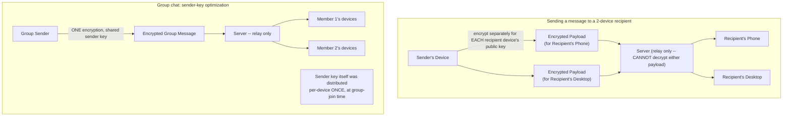
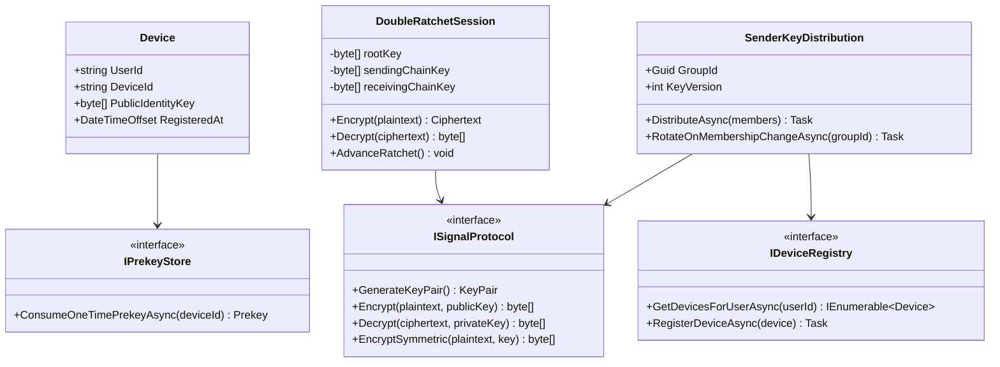

# Module 44 — System Design: Designing WhatsApp — Multi-Device Sync & End-to-End Encryption

> Domain: System Design | Level: Beginner → Expert | Prerequisite: [[03-Designing-Chat-Messaging-System]] — this module assumes that module's entire architecture (WebSockets, connection registry, message ordering, delivery guarantees) as its foundation and addresses specifically what WhatsApp adds beyond it: true end-to-end encryption and seamless multi-device sync.

---

## 1. Fundamentals

### What does WhatsApp add on top of the general chat-system architecture?
WhatsApp's defining, architecturally-consequential features beyond ordinary chat are: **true end-to-end encryption** (the server genuinely cannot read message content, not merely "we promise not to look" — directly the scenario flagged but didn't fully design) and **seamless multi-device support** (a user can be simultaneously logged in on their phone, a linked desktop app, and a linked web client, with messages correctly synchronized and, critically, encryption keys correctly managed across all of them).

### Why does this matter?
Because these two features interact in a genuinely non-obvious, difficult way: E2E encryption means only the sending and receiving *devices* hold the decryption keys — the server, as an untrusted relay, cannot help with cross-device synchronization the way it trivially could if it had plaintext access — every device a user owns needs its **own** key pair, and every message must be individually encrypted **once per recipient device**, not once per recipient user, a detail with real, multiplicative architectural consequences.

### When does this matter?
Any system claiming genuine E2E encryption combined with multi-device support (WhatsApp, Signal, iMessage); the depth matters because "we use E2E encryption" and "it works seamlessly across all your devices" are five words each that hide a substantial, genuinely hard cryptographic-protocol-design problem most system-design discussions gloss over entirely.

### How does it work (30,000-ft view)?
```
Each device (not each user) has its own key pair.
Sending a message to a user with 3 devices means encrypting the message 3 SEPARATE times,
once per recipient device's public key -- the server relays 3 distinct encrypted payloads,
never seeing the plaintext, and has no way to "just forward the same encrypted blob" to all three.
```

---

## 2. Deep Dive

### 2.1 The Signal Protocol — the Standard Foundation for Genuine E2E Encryption
WhatsApp (and Signal, and several other platforms) builds on the **Signal Protocol**, combining the **Double Ratchet Algorithm** (providing forward secrecy — a compromised key at one point in time doesn't expose past messages — and post-compromise security — the protocol self-heals after a compromise, future messages become secure again) with the **X3DH key agreement protocol** (allowing two parties to establish a shared secret key even if the recipient is currently offline, critical for a messaging system where the recipient isn't always connected at send time). A system-design answer for WhatsApp should recognize this as the established, correct foundation to build on, not attempt to design a novel encryption scheme from scratch — directly this course's recurring "don't hand-roll what a mature, battle-tested solution already provides" discipline, now applied to cryptographic protocol design specifically, where hand-rolling is even more strongly discouraged given the catastrophic consequences of a subtle cryptographic implementation error.

### 2.2 Per-Device Encryption — Why Multi-Device Multiplies Complexity, Not Just Doubles It
Because the server never has plaintext access, it **cannot** decrypt-and-re-encrypt a message for each of a recipient's devices on the recipient's behalf (doing so would require the server to hold a decryption key, violating E2E encryption's entire premise) — instead, the **sending device** must encrypt the message **separately, once per recipient device**, using each device's individual public key. For a group chat, this multiplies further: a message to a 50-person group where each member has an average of 2 devices requires the sending device to perform **100 separate encryption operations** for a single logical message — a genuine, non-trivial computational and bandwidth cost on the sending device itself (not the server), directly informing why WhatsApp's actual, documented architecture uses a **sender-key** optimization for groups rather than naive per-device-per-recipient encryption at group scale.

### 2.3 Device Linking — Establishing Trust for a New Device Without Server-Mediated Key Exchange
Adding a new device (linking a desktop app to an existing phone-based account) requires the new device to obtain the cryptographic material needed to participate in the user's conversations, **without the server being able to inject a malicious key** (which would let a compromised or coerced server perform a man-in-the-middle attack by claiming a device it controls is the user's legitimate new device) — the standard mechanism is an **out-of-band verification** (scanning a QR code displayed on the phone with the new device, transferring key material via a channel the server never sees in plaintext, or via a protocol where the phone directly, cryptographically vouches for the new device) — this is precisely why linking a new WhatsApp device requires physically scanning a QR code with your existing, already-trusted phone, not merely entering a password on the new device: the QR-code scan **is** the out-of-band trust-establishment mechanism, not a UX inconvenience.

### 2.4 The Sender-Key Optimization for Group Chats
To avoid the O(recipients × devices-per-recipient) encryption cost described for every single group message, WhatsApp's actual documented architecture uses a **sender-key** mechanism: a sender generates a single symmetric key for a given group conversation, distributes this key to every current member's every device **once** (via the more expensive, per-device encryption mechanism, but only once per member-join, not once per message), and subsequently encrypts every group message using this single, shared symmetric key — reducing the **per-message** cost back to a single encryption operation (using the fast, shared symmetric key) regardless of group size, at the cost of needing to **redistribute a new sender key** whenever group membership changes (a member leaves, requiring the key to be rotated so the departed member can no longer decrypt future messages — directly the same "revoke access, rotate the shared secret" pattern as §Advanced Q8/the Row-Level-Security/IAM-based multi-tenant isolation, here applied to a cryptographic key instead of a database access policy).

### 2.5 Multi-Device Message Ordering and Sync — Reconciling the Sequencing with Per-Device Encryption
The per-conversation sequence number still applies for ordering, but now each device maintains its **own** view of "which messages have I received and decrypted" — a message sent while one device was offline must be delivered (still encrypted specifically for that device) once it reconnects, directly the offline-delivery/Streams-based backlog pattern, but now the backlog must track **per-device** delivery status, not merely per-user, since a message already delivered to and decrypted by the phone might still be pending delivery to a linked desktop client that was offline at send time.

## 3. Visual Architecture

```mermaid
graph TB
 subgraph "Sending a message to a 2-device recipient"
 SenderDevice[Sender's Device] -->|"encrypt separately for EACH recipient device's public key"| Enc1["Encrypted Payload<br/>(for Recipient's Phone)"]
 SenderDevice --> Enc2["Encrypted Payload<br/>(for Recipient's Desktop)"]
 Enc1 --> Server["Server (relay only -- CANNOT decrypt either payload)"]
 Enc2 --> Server
 Server --> RecipientPhone[Recipient's Phone]
 Server --> RecipientDesktop[Recipient's Desktop]
 end
 subgraph "Group chat: sender-key optimization"
 GroupSender[Group Sender] -->|"ONE encryption, shared sender key"| GroupMsg["Encrypted Group Message"]
 GroupMsg --> Server2[Server -- relay only]
 Server2 --> Member1[Member 1's devices]
 Server2 --> Member2[Member 2's devices]
 Note["Sender key itself was distributed<br/>per-device ONCE, at group-join time"]
 end
```

## 4. Production Example
**Scenario**: A messaging platform implementing multi-device support initially treated "deliver to all of a user's devices" as a straightforward extension of the single-device fan-out — the sending client encrypted the message **once**, intending the server to simply forward the same encrypted payload to every registered device for that recipient, exactly the naive approach warns against. **Investigation**: this design was caught during a security architecture review (proactively, not via an incident) — a cryptographer on the review team pointed out that "forward the same ciphertext to every device" is only possible if the server can decrypt-and-re-encrypt per device (violating true E2E encryption, since the server would need decryption keys) **or** if every one of a user's devices somehow shared the identical private key (a severe security anti-pattern, since compromising any single device would then compromise every device, and there would be no way to revoke one specific device's access without revoking all of them). **Fix**: redesigned the encryption layer so the sending client performs genuinely separate encryption operations per recipient device's individual public key, accepting the resulting increase in sender-side computational cost and message payload size, and implemented the sender-key optimization specifically for group chats to keep this cost bounded as group size grows. **Lesson**: "add multi-device support" sounds like an ordinary feature-scaling exercise (the fan-out-to-more-recipients pattern) but, combined with a genuine E2E-encryption requirement, is actually a fundamentally different, harder problem requiring dedicated cryptographic-protocol design — a system-design answer that treats "E2E encryption" and "multi-device" as two independent, additive features misses that their **combination** is where the real architectural difficulty lives, precisely why this deserved a security-focused architecture review specifically, not just an ordinary feature-design review.
## 10. Interview Questions

### Basic (10)
1. **Q: What cryptographic protocol does WhatsApp's E2E encryption build on?** **A:** The Signal Protocol (Double Ratchet Algorithm + X3DH key agreement).
2. **Q: Can the server decrypt a genuinely end-to-end-encrypted message?** **A:** No — that's the defining property of true E2E encryption; only the sending and receiving devices hold the necessary keys.
3. **Q: Why must a message be encrypted separately for each of a recipient's devices?** **A:** Because the server can't decrypt-and-re-encrypt on the recipient's behalf, and each device has its own distinct key pair.
4. **Q: What mechanism verifies a new linked device without server-mediated key exchange?** **A:** Out-of-band verification, typically scanning a QR code with an already-trusted device.
5. **Q: What is the sender-key optimization for?** **A:** Reducing per-message group-chat encryption cost from O(members × devices) to a single operation, by distributing a shared symmetric key once at group-join time.
6. **Q: When must a group's sender key be rotated?** **A:** Whenever group membership changes (especially when a member leaves), so departed members can't decrypt future messages.
7. **Q: What is forward secrecy?** **A:** A property ensuring a compromised key doesn't expose previously-sent messages, since past keys have already been discarded/rotated.
8. **Q: Does E2E encryption protect metadata (who messages whom, when) as well as content?** **A:** No — E2E encryption protects message content specifically; metadata typically remains visible to the server as the relay.
9. **Q: Why does per-device encryption shift cost onto the sending client device, unlike ordinary server-mediated chat?** **A:** Because the encryption work must happen on the sender's device before the message is sent, not on the server after receipt.
10. **Q: Does multi-device support scale with user count or device count?** **A:** Device count — a platform must account for the average number of linked devices per user as a distinct capacity-planning dimension.

### Intermediate (10)
1. **Q: Why is "forward the same encrypted payload to all of a recipient's devices" fundamentally incompatible with true E2E encryption?** **A:** It would require either the server having decryption access (breaking E2E encryption's core guarantee) or every device sharing an identical private key (a severe security anti-pattern preventing per-device revocation and multiplying compromise blast radius) — the incident.
2. **Q: Why does the sender-key mechanism still require per-device encryption at group-join time, even though it avoids it for every subsequent message?** **A:** The sender key itself must be securely delivered to each member's each device individually (since the server still can't mediate this) — the optimization only amortizes this cost across many subsequent messages, it doesn't eliminate per-device encryption from the system entirely.
3. **Q: Why is the QR-code-scanning step for device linking not merely a UX choice?** **A:** It's the actual security mechanism preventing the server from injecting a fraudulent device into the trust chain — the physical, out-of-band nature of scanning with an already-trusted device is what a purely server-mediated linking process couldn't provide.
4. **Q: Why does post-compromise security matter in addition to forward secrecy?** **A:** Forward secrecy protects past messages after a compromise; post-compromise security ensures the protocol recovers and future messages become secure again, even without explicit user intervention — together they bound both the "before" and "after" impact of a key compromise.
5. **Q: Why might a large, frequently-churning group chat's scalability bottleneck be membership changes rather than message volume?** **A:** Each membership change triggers a sender-key rotation, itself an O(members × devices) operation — a group with high churn but moderate messaging volume could spend more aggregate cost on key rotations than on actual message delivery.
6. **Q: Why is "the platform can't read your messages" an incomplete privacy claim without also addressing metadata?** **A:** The server, as the necessary relay for message delivery, inherently observes communication patterns (who, when, how often) even without content access — a fully honest privacy discussion must distinguish these two, separately-guaranteed properties.
7. **Q: Why would hand-rolling a custom E2E encryption scheme be considered a more severe risk than hand-rolling, e.g., a custom hash table (§Advanced Q9)?** **A:** A cryptographic protocol flaw can catastrophically and silently compromise user privacy/security at scale with no visible symptom until exploited, whereas a hash-table implementation bug typically produces an observable functional/performance defect — the stakes and subtlety of cryptographic correctness are categorically higher, making reliance on an extensively peer-reviewed, battle-tested protocol (Signal) far more strongly warranted.
8. **Q: Why does device-count-based capacity planning differ meaningfully from user-count-based planning?** **A:** If the average user has multiple linked devices, connection/delivery-tracking state scales with total devices, not total users — a platform with the same user count but higher average devices-per-user needs proportionally more capacity for these specific concerns.
9. **Q: Why must offline-delivery backlog tracking become per-device rather than per-user for a multi-device system?** **A:** Different devices belonging to the same user can have independent online/offline states — a message already delivered to and decrypted by one device might still be pending for a different, currently-offline device, requiring independent backlog tracking per device rather than a single, shared per-user status.
10. **Q: Why did the naive "encrypt once, forward to all devices" design get caught in a security review rather than ordinary QA testing?** **A:** It's functionally correct-looking (messages do get delivered to every device) — the flaw is a cryptographic-protocol/security-property violation, not a functional bug, requiring specific security-domain expertise (recognizing the E2E-encryption-breaking implication) rather than standard feature-correctness testing to identify.

### Advanced (10)
1. **Q: Diagnose the naive multi-device-encryption design flaw from first principles, and explain precisely why it represents a fundamental protocol-design error, not a fixable implementation bug.**
 **A:** The flaw isn't a bug in an otherwise-sound design — it's a fundamental misunderstanding of what E2E encryption structurally requires: genuine E2E encryption means only endpoint devices hold decryption capability, which **mathematically** requires per-device key pairs and per-device encryption operations; there is no implementation fix that preserves "one payload forwarded to all devices" while also preserving genuine E2E encryption's core guarantee — the two requirements are structurally incompatible, meaning the correct response wasn't "patch this design" but "redesign around per-device encryption from the protocol level up," exactly why this warranted the dedicated cryptographic/security architecture review rather than an ordinary code-review fix.
2. **Q: Design the specific data model tracking per-device public keys and per-device delivery/decryption status for a multi-device messaging system.**
 **A:**
 ```
 Devices: { userId, deviceId, publicKey, registeredAt, lastSeenAt }
 MessageDeliveryStatus: { messageId, deviceId, status: "pending" | "delivered" | "decrypted", deliveredAt }
 GroupSenderKeys: { groupId, keyVersion, distributedAt } -- current active sender key version per group
 GroupMemberKeyDistribution: { groupId, keyVersion, deviceId, distributionStatus }
 ```
 `MessageDeliveryStatus` tracked per `(messageId, deviceId)` pair directly supports the requirement that each device independently tracks its own delivery/decryption progress; `GroupSenderKeys`' versioning supports Intermediate Q2's key-rotation-on-membership-change requirement, with `GroupMemberKeyDistribution` tracking which specific devices have received which key version (needed to know whether a rotation has fully propagated before considering old messages safely re-encryptable-only-under-the-new-key, if the design requires this).
3. **Q: Explain how you would handle the "message sent while recipient had zero registered devices momentarily" edge case (e.g., a user uninstalling and reinstalling the app, briefly having no valid device registered).**
 **A:** The server, having no device to relay to, must queue the encrypted-for-a-not-yet-existing-device message in a holding state — but critically, since the message was encrypted for a *specific* device's public key that may no longer exist after reinstall (a new install typically generates a fresh key pair), the **original sender** may need to be notified to re-encrypt and resend once the recipient's new device registers, rather than the server being able to "just deliver" an already-encrypted-for-the-wrong-key payload to the newly-registered device — a genuine, non-trivial edge case directly stemming from per-device encryption's fundamental structure, worth explicitly addressing rather than assuming "queue for later delivery" (the simpler, non-E2E-encrypted assumption) transfers unchanged to this system.
4. **Q: How would you design key-rotation verification to ensure a departed group member genuinely loses access to future messages, addressing a potential race condition between "member removed" and "sender key rotated"?**
 **A:** The member-removal operation and sender-key-rotation-initiation must be **atomically linked** (or the removal must explicitly block/gate on rotation completing) — if a message is sent using the *old* sender key after a member is removed from the group's membership list but *before* the key rotation has actually propagated to all remaining members' devices, the removed member (if they retained the old key before removal) could still decrypt that specific message; the correct design ensures the group's "current sender key version" is atomically advanced as part of the removal operation itself, with any message sent during the (hopefully brief) rotation-propagation window either using the new key already or being explicitly held until rotation confirms complete — a genuine, security-critical race condition worth explicitly designing around, not an edge case to handle "eventually."
5. **Q: Explain how you would design a "backup and restore" feature (allowing a user to restore their chat history to a new device after losing their old one) without undermining the E2E-encryption guarantee.**
 **A:** Chat history backup for a genuinely E2E-encrypted system requires the backup itself to be encrypted with a key **only the user controls** (e.g., a user-chosen backup password, deriving an encryption key via a password-based key-derivation function, never transmitted to or derivable by the server) — the server can store the encrypted backup blob (in cloud storage) without ever being able to decrypt it, and restoration on a new device requires the user to provide the same backup password to decrypt it locally — this is precisely why WhatsApp's actual backup feature required significant additional design work and an explicit user-facing password/encryption-key step, rather than a simple "the server backs up your messages" feature the way a non-E2E system could implement trivially.
6. **Q: A team proposes storing a copy of every user's private key encrypted with a server-held master key, "just in case a customer needs account recovery support." Evaluate this as a Principal Engineer.**
 **A:** Reject this outright — storing any mechanism by which the server (or anyone with access to the server-held master key) could ever recover a user's private key **fundamentally breaks** the E2E-encryption guarantee, regardless of how the recovery mechanism is access-controlled or how rarely it's actually used; the mere *existence* of such a capability means the system no longer provides genuine E2E encryption (a sufficiently privileged insider, a legal compulsion order, or a breach of the master key would expose it) — this is exactly the kind of well-intentioned "just in case" feature request that, if implemented, would constitute a material, publicly-relevant misrepresentation of the product's actual security properties, and should be rejected on architectural-integrity grounds regardless of the support-convenience benefit it might offer.
7. **Q: Explain how you would test the multi-device encryption system for the specific class of bug demonstrated, given that it's a protocol-correctness issue rather than an ordinary functional bug.**
 **A:** Beyond ordinary functional testing (do messages arrive correctly), implement a specific **cryptographic-property test suite**: verify that a message encrypted for device A's public key genuinely cannot be decrypted using device B's private key (even for the same user's own second device), verify forward secrecy by confirming that possessing a *current* key doesn't allow decryption of messages sent under a *previous* key epoch (directly testing the Double Ratchet's core guarantee), and verify that a removed group member's retained old sender key genuinely fails to decrypt post-rotation messages — these are fundamentally different tests than ordinary feature-correctness tests, requiring the test suite to actively attempt "wrong" decryptions and assert they fail, not merely that "right" decryptions succeed.
8. **Q: Design a strategy for auditing whether the actual, deployed system correctly implements the intended cryptographic protocol, given that a subtle implementation deviation could silently weaken security without any functional symptom.**
 **A:** Commission an independent, external security audit specifically of the cryptographic protocol implementation (not just ordinary penetration testing of the application layer) — cryptographic protocol implementations are exactly the class of system where an internal team's own testing, however thorough, benefits enormously from independent, specialized expert review, given how subtle and consequential an implementation flaw can be while remaining completely invisible to standard QA/functional testing (directly Advanced Q7's point that these bugs don't manifest as ordinary functional defects) — treating this as a standing, periodic (not one-time) audit requirement given how security-critical and subtle this specific component is, distinct from this course's more general "measure and test" discipline applied elsewhere.
9. **Q: Explain the trade-off between "verify a contact's identity via a safety-number/fingerprint comparison" (an optional, user-driven E2E-encryption verification step many such apps offer) and simply trusting the platform's automatic key-exchange process.**
 **A:** Automatic key exchange (X3DH) is convenient and secure against passive eavesdropping, but doesn't, by itself, protect against a sophisticated active attacker capable of a man-in-the-middle attack against the key-exchange process itself (or a malicious/compromised server injecting a fraudulent key, the same threat model as Advanced Q1/the device-linking concern, now applied to initial contact key exchange) — the optional safety-number comparison (both parties manually verifying, out-of-band, e.g., in person, that their apps display the same cryptographic fingerprint for each other) is the strongest available defense against this specific, more sophisticated threat, at the cost of requiring explicit, inconvenient user action most users never actually perform — a genuine, honestly-communicated trade-off between default convenience and maximum-available security this course's "match the security investment to the actual threat model and user population" discipline should be applied to explicitly.
10. **Q: As a Principal Engineer, how would you decide whether a new messaging feature request (e.g., "let users search their message history from the server, so they don't have to re-download everything on a new device") is compatible with the E2E-encryption architecture this module establishes?**
 **A:** Apply the same diagnostic question from every "does this new feature undermine our core guarantee" evaluation this course has repeatedly modeled: does fulfilling this feature request require the server to have plaintext (or otherwise decryptable) access to message content? Server-side search over encrypted content is not achievable without either breaking E2E encryption (giving the server decryption capability) or using a fundamentally different, more exotic technique (searchable encryption schemes, an active but still largely impractical-at-this-scale research area) — the honest answer is that genuine server-side search over E2E-encrypted content is not currently a solved, production-viable problem, and any feature proposal assuming otherwise needs to be redirected toward client-side-only search (each device maintains its own local, decrypted search index) rather than a server-side implementation that would silently compromise the encryption guarantee to deliver the requested convenience.

### Expert (10)
1. **Q: Design the exact mechanism by which "the device, not the user, is the cryptographic identity" (§Step 3 §3.1) interacts with the requirement that a departed group member must lose future read access — walk through why simply removing the member from a group-membership list is insufficient without a coupled key-rotation guarantee.**
 **A:** Group membership is an application-level concept the server tracks; decryption capability is a cryptographic-key-level concept the server has no control over. Removing a user from the membership list only stops the server from **routing future ciphertexts** to that user's devices — it does nothing about the fact that the departed member's devices already possess the current sender key and could, in principle, still decrypt any message encrypted with it if they somehow received it out-of-band (e.g., via a still-member device forwarding it, or a brief window before routing catches up). The only mechanism that actually revokes cryptographic capability is **key rotation** (§2.4, §Step 3 §3.4) — generating a new sender key and redistributing it to only the remaining members, so that even if the departed member's device somehow obtains a future ciphertext, it lacks the key to decrypt it. This is why Advanced Q4's atomicity requirement (member-removal and key-rotation-initiation as one coupled operation) is not a nice-to-have — a system that removes membership without guaranteeing rotation has not actually revoked access, only revoked routing, a distinction with real security consequences.
2. **Q: A safety-number mismatch is detected between two users who have exchanged messages for months without incident. Design the investigation distinguishing a benign cause (e.g., a legitimate device reinstall) from a malicious one (e.g., a MITM or a server-injected device).**
 **A:** Correlate the mismatch against the **device-list audit log** (§Step 2 data model, append-only) for both parties: a benign reinstall produces a device-list change entry with a plausible, singular new-device addition, typically preceded by the *old* device going silent/deregistering, and ideally corroborated by the user's own recollection ("yes, I got a new phone"). A malicious device injection is more likely to show an *addition without a corresponding removal* (the original device remains active, an unexpected additional device silently appears), or — the stronger signal — a discrepancy visible via **key transparency** gossip (§3.4): if the injected device's presence was only shown to a subset of the network (a "split view" the malicious server serves selectively), other clients querying the same transparency log for the same user would observe a different, inconsistent device list, which is detectable specifically because the log is append-only and cross-client-auditable, not because any single client's view alone could prove malice. The investigation's core discipline: a single client's local observation is suggestive but not conclusive; the transparency log's cross-client consistency check is what actually distinguishes the two cases with confidence.
3. **Q: Design a strategy for a group chat's sender-key rotation cost (§Step 1's estimation: 2,500 pairwise messages per rotation for a 1,000-member group) when membership churns rapidly (e.g., a public/broadcast-style group gaining and losing members every few seconds) — without either bankrupting the client CPU/battery budget or leaving a large, unacceptable window where a departed member retains decryption capability.**
 **A:** Naive per-departure-event rotation is untenable at high churn — each rotation is O(members × devices), and back-to-back departures would serialize an unbounded queue of expensive rotations. The standard mitigation is **batched/debounced rotation**: coalesce membership changes within a short window (e.g., a few seconds) into a single rotation covering all changes in that window, trading a small, bounded exposure window (a member who left mid-batch retains read access to messages sent during that brief batching interval, before the batched rotation completes) for a dramatic reduction in rotation frequency under high churn. This is an explicit, quantifiable security/cost trade-off that should be stated to stakeholders as a policy choice (the batching window's length **is** the security parameter), not silently implemented as an engineering optimization — directly the same class of judgment call as Module 129's materiality-triggered recomputation trade-off, here applied to key-rotation cadence instead of risk recomputation cadence.
4. **Q: Explain precisely why "delete the message from the server" (a disappearing-messages feature) cannot be a cryptographically enforced guarantee against a malicious recipient, and design what the feature can honestly guarantee instead.**
 **A:** Once a message is delivered and decrypted on a recipient's device, the server's copy being deleted (or never having existed at all, in the case of already-ACKed-and-purged envelopes, §Step 2 data model) has no bearing on what the **recipient's own device** does with the plaintext it now possesses — a malicious or simply uncooperative recipient can screenshot, copy, or otherwise retain the content indefinitely, and no cryptographic mechanism operating at the transport/storage layer can prevent this, because by the time deletion would apply, the content has already left the system's control entirely. What the feature can honestly guarantee: the **server** does not retain the message past the configured interval (a real, verifiable property of the storage layer), and a **well-behaved client** enforces local deletion in its own UI/storage — but the guarantee is fundamentally a convention enforced by cooperating software, not a cryptographic impossibility-of-retention, and this distinction must be stated honestly to users and stakeholders rather than marketed as an absolute guarantee, exactly the kind of "know precisely what your mechanism does and does not guarantee" discipline this course applies to every security claim.
5. **Q: Design how the platform should respond to a legal compulsion order demanding message content for a specific target user, given the architecture's stated guarantee that the server cannot read content.**
 **A:** The honest, architecturally-grounded response is that the server **cannot comply** with a content-production order for future or already-relayed-and-deleted messages, because it never possessed the plaintext and does not retain the ciphertext past delivery (§Step 2's short-retention-as-security-control design) — this is the entire point of the architecture, and a Principal Engineer's job when this scenario arises is to ensure the system's actual technical capability matches what was represented to users and regulators, not to quietly build a compliance-driven exception (§10 Advanced Q6's rejected "master key for account recovery" proposal, structurally identical to a compelled-access backdoor) that would silently undermine the stated guarantee. What the server **can** honestly produce under compulsion: metadata (§2's honest limitation) — who messaged whom, when, device-list history, and account registration information — since these were never claimed to be protected, and the boundary of what can/cannot be produced should be a documented, legally-reviewed artifact precisely because this question will be asked, not something worked out reactively during an actual legal proceeding.
6. **Q: A performance team proposes reducing X3DH session-establishment latency (§7) by having the server pre-compute and cache likely session keys for frequently-communicating device pairs. Evaluate this proposal as a Principal Engineer.**
 **A:** Reject this specific proposal — having the server compute or cache *any* material derived from private key material, even ephemeral session keys, reintroduces exactly the class of server-held-secret risk the architecture is designed to eliminate (§8's "there is no server-side secret whose compromise exposes message content" property), and a cached session key is precisely such a secret. The latency this proposal targets is real (§7's honest note that prekey-fetch-plus-X3DH adds a visible round trip on first contact), but the correct mitigation preserves the "no server-side plaintext-adjacent secret" invariant: prefetch **public** prekey bundles for likely-to-be-contacted devices ahead of time (purely a client-side cache of public data, no security property lost) so the round trip happens before the user initiates a send rather than during it, achieving the same latency win without the server ever touching private-key-derived material. The evaluation pattern worth naming explicitly: any proposal to improve this system's performance or convenience should be checked against "does this require the server to hold or compute anything private-key-derived," and rejected outright if so, regardless of the performance benefit, exactly as Advanced Q6 rejected the master-key-recovery proposal on the same structural grounds.
7. **Q: Design the monitoring and alerting strategy specifically for detecting a *silent regression* that reintroduces server-side plaintext access — e.g., a well-intentioned engineer adding a debug log statement that logs decrypted message content on a device, or a new feature accidentally routing plaintext through a server-touched code path.**
 **A:** This is precisely §Step 4's standing dashboard requirement made concrete: maintain an explicit, enumerated inventory of every server-side service/component with any network path that could theoretically receive plaintext, and continuously verify — via automated static analysis (flagging any server-side code path that references a decryption key type or a plaintext-message type) and periodic, independent security audit (§10 Advanced Q8) — that this count remains exactly zero. A debug log statement on a **client device** logging locally-decrypted content is a different, lesser risk (local device compromise, not systemic server compromise) but still worth flagging via the same discipline applied to client build pipelines — the unifying principle is that "we don't store/see plaintext" is a claim that decays silently by default (a single careless commit is sufficient to violate it) and therefore requires continuous, automated verification rather than a one-time architectural review, exactly the "controls that produce nothing visible when working must be mechanically enforced, not remembered" pattern this course applies to every fragile-but-critical control.
8. **Q: Explain how sealed sender (§Step 4's "left out" list, item on metadata minimization) works at a mechanism level, and why it only partially closes the metadata-visibility gap this module repeatedly acknowledges as unsolved.**
 **A:** Sealed sender allows a message to be delivered to a recipient without the server needing to know *who sent it* — the sender's identity is itself encrypted, inside the envelope, readable only by the recipient's device, with the server routing purely based on the recipient address; the recipient, upon decrypting, learns the sender's identity, but the server's routing metadata never needed to include it. This closes the **sender-identity-visible-to-server** gap specifically, but does not close: the **recipient** identity (the server must know who to route to, structurally unavoidable for delivery), the **timing/frequency** of communication (observable regardless of sender-identity encryption), or **group membership metadata** (the server still routes to a list of recipient devices for a group message). A complete, honest answer names precisely which metadata dimension sealed sender protects (sender identity) and which it structurally cannot (recipient identity, timing, volume, group structure) — the same "enumerate exactly what is and isn't protected" discipline §Step 2's API design applies to the envelope-visibility question generally.
9. **Q: A competitor's messaging platform claims "we don't need multi-device sender-key rotation on membership change because we use per-message encryption to the full member list every time." Evaluate this design choice against this module's architecture.**
 **A:** This is Option A of the design space this module rejected implicitly — per-message, full-member-list encryption (the naive pairwise approach, §Step 1's 2,500-ciphertexts-per-message figure for a 1,000-member group) trades away the sender-key optimization's efficiency specifically to avoid the rotation-cost/complexity of §Step 3 §3.4, but at the cost this module's back-of-envelope estimation showed is prohibitive at scale (25,000,000 encryptions/s across the platform at even 1% of traffic being large-group messages, performed on sender phones — a battery and latency catastrophe, §Step 1 finding 1). The competitor's claim is a legitimate simplicity-for-cost trade-off **only** at small scale or small group sizes, where the multiplicative cost never gets large enough to matter — evaluating it fairly requires asking exactly the scale question this module's own estimation step asked, rather than either dismissing it outright or accepting the simplicity argument at face value without checking it against the platform's actual group-size and message-volume profile.
10. **Q: As a Principal Engineer, design the criteria for deciding whether a proposed new feature (e.g., "typing indicators visible across a user's linked devices," "read receipts synced instantly to all devices") is safe to implement within this architecture without a dedicated security review, versus requiring one.**
 **A:** The dividing line is exactly §10 Advanced Q10's diagnostic, generalized into a standing intake checklist: (a) does the feature require the server to gain access to plaintext content it doesn't currently have (requires review — likely redesign, per Advanced Q10's search example); (b) does the feature require adding, removing, or altering how a device is trusted/added to a user's device list (requires review — this is §3.4's highest-stakes attack surface, and even a well-intentioned convenience feature touching device trust deserves scrutiny disproportionate to its apparent simplicity); (c) does the feature introduce any new server-held state derived from or adjacent to private key material (requires review, per Expert Q6's rejected caching proposal); (d) does the feature only add new **metadata** visible to the server, of a kind already structurally visible (e.g., typing indicators are ephemeral presence signals, not content, and don't touch the device-trust or key-material surfaces) — this last category is typically safe to implement without a dedicated cryptographic security review, though it should still be logged in the standing metadata-inventory (Expert Q8's "enumerate exactly what's visible") so the platform's honest privacy posture stays accurately documented as it evolves. A Principal Engineer operationalizing this checklist converts what would otherwise be a case-by-case, review-fatigue-prone judgment call into a fast, consistent triage most feature proposals can pass through in minutes, reserving deep review specifically for the categories that have historically been where this system's real risk lives.

---

## 11. Coding Exercises

*(System design case studies use worked design/protocol exercises, consistent with this domain's format.)*

### Easy — Per-device key registration
```csharp
public record DeviceKeyRegistration(string UserId, string DeviceId, byte[] PublicKey, DateTimeOffset RegisteredAt);

public async Task RegisterDeviceAsync(string userId, string deviceId, byte[] publicKey)
{
    await _deviceStore.UpsertAsync(new DeviceKeyRegistration(userId, deviceId, publicKey, DateTimeOffset.UtcNow));
    // A new device registration does NOT automatically receive historical messages --
    // it only participates in FUTURE message exchanges from this point forward (§Advanced Q3's
    // "old key material doesn't retroactively apply" principle).
}
```

### Medium — Per-device message encryption fan-out (the fix)
```csharp
public async Task SendMessageAsync(string senderId, string recipientUserId, byte[] plaintext)
{
    var recipientDevices = await _deviceStore.GetDevicesForUserAsync(recipientUserId);

    foreach (var device in recipientDevices)
    {
        byte[] ciphertext = _signalProtocol.Encrypt(plaintext, device.PublicKey); // SEPARATE encryption PER device
        await _messageRelay.SendAsync(new EncryptedMessage(senderId, device.DeviceId, ciphertext));
    }
    // The server relay NEVER sees 'plaintext' -- only these already-encrypted, per-device payloads.
}
```

### Hard — Sender-key group messaging with rotation on membership change (Advanced Q4)
```csharp
public class GroupMessagingService
{
    public async Task RemoveMemberAsync(string groupId, string memberUserId)
    {
        await _groupStore.RemoveMemberAsync(groupId, memberUserId);

        // ATOMIC: advance the sender-key version as PART OF the removal, closing Advanced Q4's race window.
        int newKeyVersion = await _groupStore.AdvanceSenderKeyVersionAsync(groupId);
        byte[] newSenderKey = _signalProtocol.GenerateSymmetricKey;

        var remainingMembers = await _groupStore.GetMembersAsync(groupId);
        foreach (var member in remainingMembers)
        {
            foreach (var device in await _deviceStore.GetDevicesForUserAsync(member.UserId))
            {
                byte[] encryptedKey = _signalProtocol.Encrypt(newSenderKey, device.PublicKey); // per-device, ONE-TIME
                await _keyDistribution.DistributeAsync(groupId, newKeyVersion, device.DeviceId, encryptedKey);
            }
        }
        // ANY message sent using the OLD key version after this point is REJECTED by recipients --
        // the removed member's retained old key can no longer decrypt anything new.
    }

    public async Task SendGroupMessageAsync(string groupId, string senderId, byte[] plaintext)
    {
        var currentKeyVersion = await _groupStore.GetCurrentSenderKeyVersionAsync(groupId);
        var senderKey = await _keyDistribution.GetSenderKeyAsync(groupId, currentKeyVersion, senderId);

        byte[] ciphertext = _signalProtocol.EncryptSymmetric(plaintext, senderKey); // ONE encryption, regardless of group size
        await _messageRelay.BroadcastToGroupAsync(groupId, ciphertext, currentKeyVersion);
    }
}
```

### Expert — Cryptographic-property test suite (Advanced Q7)
```csharp
[Fact]
public void Message_Encrypted_For_DeviceA_Should_NOT_Decrypt_With_DeviceB_PrivateKey
{
    var (deviceAPublic, deviceAPrivate) = _signalProtocol.GenerateKeyPair;
    var (deviceBPublic, deviceBPrivate) = _signalProtocol.GenerateKeyPair; // SAME user's second device

    byte[] ciphertext = _signalProtocol.Encrypt(Encoding.UTF8.GetBytes("secret"), deviceAPublic);

    Assert.Throws<DecryptionFailedException>(=>
        _signalProtocol.Decrypt(ciphertext, deviceBPrivate)); // MUST fail -- devices don't share keys, even same user
}

[Fact]
public void Removed_Member_OldSenderKey_Should_NOT_Decrypt_PostRotation_Messages
{
    var group = CreateTestGroupWithMembers("alice", "bob", "carol");
    byte[] oldSenderKey = group.CurrentSenderKey;

    group.RemoveMember("carol"); // triggers rotation per the Hard exercise

    byte[] newMessage = group.SendMessage("alice", "hello after carol left");

    Assert.Throws<DecryptionFailedException>(=>
        _signalProtocol.DecryptSymmetric(newMessage, oldSenderKey)); // carol's retained OLD key must fail
}
```
**Discussion**: These tests actively assert that a decryption **fails** under the wrong key/post-rotation, directly the kind of "prove the negative security property, not just the positive functional one" test Advanced Q7 calls for — an ordinary functional test suite (does Alice receive Bob's message correctly) would never catch a-class flaw, since the naive, broken design would still pass every ordinary "message delivered successfully" test while silently violating the actual E2E-encryption guarantee.

---

## 12. System Design — Designing End-to-End Encrypted, Multi-Device Messaging

*Authored to the four-step standard (see Module 01 §12 for the method). The transport, connection, and ordering layers are Module 03's design and are assumed here; this section designs what E2E encryption and multi-device **change** about it — which turns out to be nearly every server-side capability.*

---

### Step 1 — Understand the Problem and Establish Design Scope

#### The dialogue

> **C:** What threat model? "Encrypted" covers everything from TLS to a server that provably cannot read messages.
> **I:** The server must be unable to read message content, even under legal compulsion or full compromise.
>
> **C:** So no server-side plaintext at any point, including transiently. Does that extend to metadata — who talks to whom, and when?
> **I:** Content is the hard requirement. Metadata minimisation is desirable but not absolute.
>
> **C:** Do we need forward secrecy and post-compromise security?
> **I:** Yes to both. A stolen device should not expose the entire history, and should not permanently compromise future messages.
>
> **C:** Multi-device — is there a primary device, or are all devices peers?
> **I:** Design for peers, but a primary-mediated linking flow is acceptable.
>
> **C:** How many devices per user, and must a new device see history?
> **I:** Up to 4 companions plus a phone. History transfer on linking is desirable.
>
> **C:** Group sizes?
> **I:** Up to 1,000 members.
>
> **C:** Scale?
> **I:** 2 billion users, 100 billion messages a day.
>
> **C:** Backups — encrypted, and if so who holds the key?
> **I:** Encrypted, user-controlled key. The server must not be able to decrypt a backup.
>
> **C:** Out of scope?
> **I:** Calls, payments, and business messaging.

The second and third exchanges define the whole design. **"Unable to read even under compulsion"** eliminates server-side fan-out of a single ciphertext, server-side search, server-side media transcoding, and server-side spam classification on content — four capabilities every non-E2E messenger takes for granted. Enumerating what you are giving up, unprompted, is what separates a real answer from "we'd use the Signal Protocol."

#### Functional requirements

1. 1:1 and group messaging with content readable only by intended recipient *devices*.
2. Forward secrecy and post-compromise security (Double Ratchet).
3. Multi-device: up to 5 devices per user, each with its own identity key, all in sync.
4. Link a new device without the server learning any key material.
5. Encrypted media, encrypted backups with a user-held key.
6. Safety-number verification so users can detect a key change.

#### Non-functional requirements

| Requirement | Target |
|---|---|
| Delivery latency | p99 < 500 ms when online |
| Message durability | Zero loss of an acknowledged message |
| Server knowledge of content | **Zero** — a hard, testable constraint, not a goal |
| Group fan-out cost | Must not be O(members × devices) ciphertexts per message |
| Key-material exposure | Server holds only public prekeys; never private keys |
| Availability | 99.99% |
| Compromise recovery | A device compromise stops leaking future messages within a bounded number of rounds |

#### Back-of-the-envelope estimation

```
Users              = 2 × 10^9
Messages/day       = 10^11
Average send QPS   = 10^11 ÷ 10^5                  = 1,000,000 sends/s
```

**Ciphertext amplification — the number that decides the group design:**

```
Naive pairwise (Double Ratchet per recipient device):
  1:1  → 1 sender × ~2.5 recipient devices          = 2.5 ciphertexts
  Group of 1,000, ~2.5 devices each                 = 2,500 ciphertexts PER MESSAGE

At even 1% of traffic being large-group:
  10^9 group messages/day × 2,500                   = 2.5 × 10^12 ciphertexts/day
                                                    = 25,000,000 encryptions/s
  ...performed ON THE SENDER'S PHONE.
```

With sender keys:

```
Steady state: 1 symmetric encryption + 1 ciphertext, distributed to all members
Sender-key distribution: 2,500 pairwise messages ONCE per epoch
                         (on join/leave/key-change), not per message
Amplification falls from 2,500× per message to ~1× per message
```

Prekey storage:

```
2 × 10^9 users × ~3 devices × 100 one-time prekeys × ~40 B ≈ 24 TB
Plus continuous replenishment as they are consumed
```

#### What the numbers tell us

1. **Pairwise encryption is fine for 1:1 and structurally impossible for groups.** 2,500 encryptions per message on a phone is not a performance problem, it is a battery and latency catastrophe. The sender-key optimisation is not an optimisation — it is what makes E2E groups exist at all.
2. **The server's job shrinks to routing and storage.** At 1,000,000 sends/s the server does no cryptography, no content inspection, and no per-recipient transformation. That is *cheaper* per message than a plaintext messenger — E2E's cost lands on clients and on lost capabilities, not on servers.
3. **Prekey management is a real, continuous system**, not a setup step: 24 TB of public key material with per-device consumption tracking and replenishment, and a fallback for exhaustion (§3.2).

The hard problem is **key distribution and device-set consistency**, not encryption. The cryptographic primitives are settled; what breaks in practice is a stale device list.

---

### Step 2 — Propose High-Level Design and Get Buy-In

#### Components — and what each is *forbidden* from doing

**Connection & Routing Service.** Module 03's WebSocket tier, unchanged. Routes opaque blobs. **Cannot decrypt.**

**Identity & Prekey Service.** Stores, per device: identity public key, signed prekey, and a bucket of one-time prekeys. Serves prekey bundles for session establishment. **Never sees a private key.**

**Device Registry.** The authoritative per-user device list. This is the most security-critical *non-cryptographic* component in the system, because adding a device to it is equivalent to adding a reader — §3.4.

**Message Store.** Stores ciphertext per recipient device until delivered. **Cannot read it.**

**Sender-Key Coordinator.** Purely client-side logic; the server only carries the distribution messages, which are themselves pairwise-encrypted.

**Media Service.** Stores **client-encrypted blobs**. The client encrypts with a random symmetric key, uploads the ciphertext, and sends the key inside the E2E message. The server has bytes it cannot interpret — which is also why it cannot generate thumbnails or transcode, so the client must produce every derivative before upload.

**Backup Service.** Stores client-encrypted archives; the key is derived from a user passphrase and, where a recovery path exists, escrowed in a hardware-secure enclave the operator provably cannot query at will.

#### End-to-end walkthrough — establishing a session and sending 1:1

1. Sender needs to message user B. It fetches **B's device list** and, for each unknown device, a **prekey bundle** `{ identity_key, signed_prekey, signature, one_time_prekey? }`.
2. The server marks each one-time prekey consumed and returns it exactly once.
3. Sender runs **X3DH** against each bundle to derive a shared secret per device, then initialises a **Double Ratchet** session per device.
4. To send: encrypt once per recipient device — for B's 3 devices plus the sender's own 2 companion devices, that is **5 ciphertexts** (the sender must encrypt to itself, or its other devices cannot show the sent message).
5. Sender submits all 5 blobs in one request; each is addressed to a `device_id`.
6. Server persists each blob and routes to the connected device or holds it.
7. Each device decrypts, advances its ratchet, and ACKs. The server deletes the blob on ACK.
8. Sequencing, receipts, and ordering work exactly as Module 03 — the server orders **envelopes**, which it can read, not content.

#### End-to-end walkthrough — group messaging with sender keys

1. On joining a group (or on any membership or key change), each member generates a **sender key** — a symmetric chain key plus a signing key pair.
2. It distributes that sender key to every other member device over the **existing pairwise sessions** — 2,500 small pairwise messages, once.
3. To send a group message: encrypt **once** with its own sender-key chain, sign it, and submit one ciphertext with a recipient device list.
4. The server fans the *same* ciphertext to all member devices — which it can do precisely because it is the same ciphertext, and this is the only place the server does fan-out.
5. Recipients decrypt with the sender's sender key and verify the signature — the signature is what preserves sender authentication despite the shared symmetric key.
6. **On any membership change, every member rotates its sender key and redistributes.** This is what stops a departing member from reading future messages, and it is why large, churning groups are expensive.

#### API design

**`POST /v1/keys/register`** — per device.

| Field | Type | Description |
|---|---|---|
| `device_id` | string | |
| `identity_key` | bytes | Long-term **public** key |
| `signed_prekey` | bytes | Medium-term public key |
| `signed_prekey_signature` | bytes | Signed by the identity key |
| `one_time_prekeys` | bytes[] | Batch of ~100 public keys |

**`GET /v1/keys/{user_id}/bundles`** → `{ devices: [{ device_id, identity_key, signed_prekey, signature, one_time_prekey }] }`. **Each one-time prekey is returned at most once, ever** — the server must delete on read, atomically, or two senders derive sessions from the same prekey and forward secrecy for that session is weakened.

**`GET /v1/users/{id}/devices`** → `{ devices: [{ device_id, identity_key, added_at, name }], list_version }`. The `list_version` is what lets clients detect a change they were not shown.

**`POST /v1/messages`**

| Field | Type | Description |
|---|---|---|
| `envelopes` | array | `[{ recipient_device_id, ciphertext, type }]` — one per target device |
| `conversation_id` | string | Server-visible metadata |
| `client_msg_id` | uuid | Dedup key |

The server sees: sender, recipient device IDs, conversation ID, size, and timestamp. It does not see content. **Enumerating exactly what the server sees is the right way to answer a threat-model question** — it is honest about metadata rather than implying E2E hides everything.

**`GET /v1/devices/link-code`** and **`POST /v1/devices/link-confirm`** — §3.3's flow.

#### Data model

**`device`** — `(user_id, device_id)`, `identity_key`, `registration_id`, `added_at`, `last_seen`, `name`, `status`. Plus `device_list_version` per user, incremented on every change.

**`prekey`** — `(device_id, prekey_id)`, `public_key`, `consumed_at`. Delete-on-read.

**`signed_prekey`** — `(device_id)`, `public_key`, `signature`, `created_at`. Rotated periodically; the previous one retained briefly so in-flight sessions still resolve.

**`envelope`** — `(recipient_device_id, seq)`, `sender_id`, `ciphertext`, `received_at`, `delivered_at`. **Deleted on delivery ACK** — retention here is a liability, not a feature, and short retention is itself a security control.

**`device_list_change`** — append-only audit: `(user_id, version, change_type, device_id, at)`. Append-only because this log is the evidence base for §3.4's detection.

#### Store selection, and why

| Store | Choice | Reason |
|---|---|---|
| Devices, prekeys | **Sharded relational / strongly-consistent KV** | Prekey consumption must be atomic — delete-on-read is a correctness requirement, and an eventually-consistent store hands the same prekey to two senders |
| Envelopes | **Cassandra / wide-column, partition by recipient device** | 1,000,000 writes/s, short-lived, deleted on ACK |
| Media | **Object storage** | Opaque encrypted blobs with a TTL |
| Device-list audit | **Append-only log** | Evidence, not state |

The decision worth defending: prekeys look like a cache and are not. **Consumption must be exactly-once**, which is precisely the kind of guarantee an eventually-consistent store does not give — and the failure is silent, because a duplicated prekey produces a working session with weakened properties.

---

### Step 3 — Design Deep Dive

#### 3.1 Why one ciphertext cannot serve many devices

The naive multi-device design — encrypt once, let the server forward the same blob to every device — is impossible without one of two things: the server holding decryption keys (which is not E2E), or every device of a user sharing one private key (which means a compromise of any device compromises all of them, and defeats per-device revocation). §4's review caught exactly this.

So: **the device, not the user, is the cryptographic identity.** Every consequence follows from that one sentence — per-device sessions, per-device ratchets, per-device envelopes, N ciphertexts per message, and a device list that is now a security-critical object.

#### 3.2 Prekey exhaustion

One-time prekeys are consumed one per new session. A popular account can exhaust its bucket faster than its device replenishes — especially if the device is offline.

- **Replenish opportunistically**: every connection, top the bucket back to ~100.
- **On exhaustion, fall back to the signed prekey alone.** X3DH still works, but that session loses the one-time-prekey contribution to its initial forward secrecy. This is a **deliberate, documented degradation**, and it is much better than refusing to establish a session — but it must be counted, because a persistently exhausted device is a user whose sessions are all weaker and nothing else would ever tell you.
- **Rate-limit bundle fetches per requester**, or an attacker drains a target's prekeys cheaply and forces every subsequent session onto the fallback path. This is a real attack, not a theoretical one, and the mitigation belongs in the design rather than in an ops runbook.

#### 3.3 Device linking without server-mediated key exchange

The requirement: add a device such that the server never learns key material and cannot silently insert its own device.

1. The new device generates its identity key pair locally and displays a QR code containing its **public** key plus a nonce.
2. The primary device scans it — **the out-of-band channel is the human eye and the physical proximity**, which is what the server cannot forge.
3. The primary verifies, then signs the new device's identity key with its own, and publishes the signed entry to the device list.
4. Optionally, the primary transfers history: it encrypts the archive to the new device's key and uploads it; the server stores an opaque blob.
5. All of the user's contacts see a device-list change and a **safety-number change**, and can be prompted to re-verify.

The property that makes this sound is that **trust flows from an existing trusted device over a physical channel**, never from the server. A server that wants to add a reader must add a device to the list — which is detectable (§3.4) rather than silent.

#### 3.4 The real attack surface: device-list consistency

The cryptography is not where this system breaks. **The server controls the device list, and adding a device is equivalent to adding a reader.** A malicious or compromised server can add a device it controls; senders will faithfully encrypt to it.

Defences, layered, and none of them individually sufficient:

- **Safety numbers / key verification.** A hash of both parties' identity keys, comparable out of band. Changes when the device set changes.
- **Change notifications** — "Your contact's security code changed." Necessary, and known to be weak in practice because users click through. Worth stating honestly rather than presenting as a solution.
- **Key transparency.** The strongest available answer: publish device-list changes to an append-only, publicly auditable log (Merkle-tree-based, as in CONIKS / Key Transparency), so a server that adds a device must either publish it — where the user's own client will notice — or serve a split view, which is itself detectable by gossip between clients. This converts an *undetectable* compromise into a *detectable* one, which is the most that is achievable.
- **Client-enforced limits**: cap devices per user, require primary approval, alert loudly on any addition.

Being explicit that **E2E encryption reduces to trust in the key directory**, and that key transparency is the mitigation, is the single highest-value thing to say in an interview on this topic. Candidates who stop at "we use the Signal Protocol" have not identified where the system is actually attacked.

#### 3.5 What the server loses, and what replaces it

Enumerating the capability cost is part of the design, not an aside:

| Lost capability | Replacement |
|---|---|
| Server-side search | On-device index; history sync must carry enough to rebuild it |
| Server-side spam/abuse classification on content | Metadata-based signals (rate, graph shape, recipient reports), plus **user-reported message decryption** — the reporter voluntarily sends plaintext of a specific message |
| Media transcoding/thumbnails | Client generates every derivative before encrypting and uploading |
| Server-side backup | Client-encrypted backup with a user-held key; recovery becomes a hard UX problem and a lost key means lost history |
| Rich link previews generated server-side | Client fetches them, which leaks the URL to the link's host from the user's IP — a genuine privacy trade to state |
| Cross-device read state as server logic | Synced as encrypted messages the user sends to their own devices |

The last row is a nice illustration of the general pattern: **anything the server used to compute becomes a message the client sends to itself.** That is the real architectural signature of E2E multi-device.

#### 3.6 Failure handling

- **Ratchet desync** (a device missed messages beyond the ratchet's skipped-key window) → the session is unrecoverable; the client must detect, discard, and re-establish via a fresh prekey bundle, and surface it to the user rather than silently dropping messages.
- **A device is offline past envelope retention** → messages are lost for that device but not for the user, since other devices received them. History sync must then reconcile from another device — which is why the device-to-device history-transfer capability is load-bearing rather than a nicety.
- **Server compromise** → content stays confidential; metadata does not; device-list integrity is protected only by transparency and verification. Say this plainly, including the part that isn't protected.
- **Device loss** → remote-revoke from the primary, which removes it from the device list and triggers a group sender-key rotation everywhere it was a member. Revocation is not retroactive: messages already delivered to that device are already readable, so revocation bounds future exposure only.

---

### Step 4 — Wrap-Up

**What we left out:** encrypted voice/video (SRTP with keys agreed over the same sessions); disappearing messages, which are a client-enforced convention and cannot be guaranteed against a malicious recipient — an important honesty point; sealed sender, which hides the sender identity from the server and is the main available metadata-minimisation lever; encrypted backups' recovery UX and the hardware-enclave escrow design; abuse and CSAM detection under E2E, which is genuinely unsolved and politically contested; and multi-region routing with metadata-minimising design.

**What we would measure:** prekey bucket depth distribution and **fallback-to-signed-prekey rate**, since the fallback is a silent security degradation with no other symptom; device-list change rate per user and **per-user device count distribution**, which is the primary detector for §3.4's attack; ratchet-desync and re-establishment rate; group sender-key rotation cost against membership churn; envelope retention age (undelivered blobs are both a liability and a delivery-failure signal); and — as a standing dashboard — the count of servers or services that have *any* access path to plaintext, whose correct value is zero and whose drift is the thing that quietly ends the guarantee.

**Summary.** The device, not the user, is the cryptographic identity — and every structural difference from Module 03 follows from that. 1:1 uses pairwise Double Ratchet sessions per device; groups use sender keys, because pairwise group encryption is 2,500× amplification on a phone; the server routes opaque blobs and holds only public key material; and the actual attack surface is not the cryptography but the **device list the server controls**, mitigated by safety numbers, change notifications, and — the only structurally sound answer — key transparency.

---

### References

1. Moxie Marlinspike & Trevor Perrin — *The X3DH Key Agreement Protocol* and *The Double Ratchet Algorithm* (Signal specifications).
2. Signal — *The Sesame Algorithm: Session Management for Asynchronous Message Encryption* — the multi-device design this section follows.
3. Signal — *Private Group Messaging* and the sender-key construction.
4. WhatsApp — *Technical White Paper: End-to-End Encryption*, and the multi-device architecture white paper.
5. Melara et al. — *CONIKS: Bringing Key Transparency to End Users* (USENIX Security '15).
6. Google — *Key Transparency* project and the verifiable-log design.
7. Signal — *Sealed Sender* (metadata minimisation).
8. Cohn-Gordon et al. — *A Formal Security Analysis of the Signal Messaging Protocol* (EuroS&P '17) — the formal grounding for the forward-secrecy and post-compromise claims.
9. Module 03 of this folder — the transport, connection registry, sequencing, and sync protocol assumed throughout.

---

## 13. Low-Level Design

**Requirements:** Every device is an independent cryptographic identity with its own session state; group messages must cost O(1) encryptions on the steady-state path, not O(members × devices); a departed group member must lose future decryption capability atomically with removal; the server must never touch a type representing plaintext or a private key.

**Class diagram:**

```mermaid
classDiagram
 class Device {
 +string UserId
 +string DeviceId
 +byte[] PublicIdentityKey
 +DateTimeOffset RegisteredAt
 }
 class DoubleRatchetSession {
 -byte[] rootKey
 -byte[] sendingChainKey
 -byte[] receivingChainKey
 +Encrypt(plaintext) Ciphertext
 +Decrypt(ciphertext) byte[]
 +AdvanceRatchet() void
 }
 class ISignalProtocol {
 <<interface>>
 +GenerateKeyPair() KeyPair
 +Encrypt(plaintext, publicKey) byte[]
 +Decrypt(ciphertext, privateKey) byte[]
 +EncryptSymmetric(plaintext, key) byte[]
 }
 class SenderKeyDistribution {
 +Guid GroupId
 +int KeyVersion
 +DistributeAsync(members) Task
 +RotateOnMembershipChangeAsync(groupId) Task
 }
 class IDeviceRegistry {
 <<interface>>
 +GetDevicesForUserAsync(userId) IEnumerable~Device~
 +RegisterDeviceAsync(device) Task
 }
 class IPrekeyStore {
 <<interface>>
 +ConsumeOneTimePrekeyAsync(deviceId) Prekey
 }

 DoubleRatchetSession --> ISignalProtocol
 SenderKeyDistribution --> ISignalProtocol
 SenderKeyDistribution --> IDeviceRegistry
 Device --> IPrekeyStore
```

**Sequence diagram:** §Step 2's two walkthroughs are the canonical sequences — the 1:1 session-establishment trace (prekey fetch → X3DH → per-device Double Ratchet init → N ciphertexts submitted in one request) and the group trace (sender-key generation → one-time pairwise distribution → single symmetric encryption per subsequent message → server same-ciphertext fan-out).

**Design patterns used:** **Strategy** (`ISignalProtocol` abstracts the underlying primitive operations, allowing the X3DH/Double Ratchet implementation to be swapped or independently audited/upgraded without touching call sites — directly relevant given §8's "build on the peer-reviewed protocol, never hand-roll" discipline); **Memento** (`DoubleRatchetSession`'s chain-key state is exactly a captured, restorable snapshot of session progress, and the "skipped-message-key" cache for out-of-order delivery is a bounded set of such mementos); **Observer/Pub-Sub** (device-list change notifications fanning out to a user's contacts, §Step 3 §3.4); **Command** (`SenderKeyDistribution.RotateOnMembershipChangeAsync` bundles the key-generation-plus-distribution-plus-version-advance sequence as one atomic, retryable unit, directly the coding exercise's `RemoveMemberAsync` implementation); **Adapter** (`ISignalProtocol` also insulates the rest of the system from the underlying cryptographic library's own API surface, so a library upgrade or a switch to a different peer-reviewed implementation is contained).

**SOLID mapping:** Single Responsibility (`DoubleRatchetSession` manages ratchet state only; `SenderKeyDistribution` manages group key lifecycle only; neither performs device-registry lookups directly — they depend on `IDeviceRegistry`); Open/Closed (a new group-key-rotation trigger — e.g., a periodic, time-based rotation in addition to membership-change-triggered rotation, Expert Q3's batching policy — extends `SenderKeyDistribution` without modifying `DoubleRatchetSession`); Liskov (every `ISignalProtocol` implementation must satisfy the identical cryptographic-property contract — Expert-tier's "prove the negative" test suite in §11 is exactly this contract's enforcement mechanism, verifying substitutability at the security-property level, not merely the type-signature level); Interface Segregation (`IDeviceRegistry` and `IPrekeyStore` are separate interfaces, since `SenderKeyDistribution` needs the device list but never needs to consume a prekey — that need belongs solely to session-establishment code); Dependency Inversion (no component depends on a concrete key-derivation or storage implementation — `IDeviceRegistry`/`IPrekeyStore`/`ISignalProtocol` are all injected abstractions, which is what makes independent security audit of the cryptographic core (§10 Advanced Q8) tractable without needing to audit the entire application).

**Extensibility:** A new device-linking flow (e.g., a QR-code alternative for accessibility) adds a new `IDeviceRegistry.RegisterDeviceAsync` caller without touching session or group-key logic. A new messaging feature (voice notes, §Step 4's "left out" SRTP item) reuses the same per-device/per-sender-key encryption primitives rather than requiring a parallel encryption scheme.

**Concurrency/thread safety:** `DoubleRatchetSession` state is inherently per-device, single-writer (only that device's own client mutates its own ratchet state) — no cross-device locking is ever required, a direct structural benefit of "the device is the identity." The one genuine concurrency-correctness point is prekey consumption (§Step 2, §8): `IPrekeyStore.ConsumeOneTimePrekeyAsync` must be an atomic, delete-on-read operation under concurrent requests, or two senders can derive sessions from the same one-time prekey — mirrored by `SenderKeyDistribution`'s atomic version-advance (Expert Q1), both requiring the same "predicate/atomicity in the store operation itself, not check-then-act in application code" discipline as this folder's other correctness-critical stores.

---

## 14. Production Debugging

**Incident:** A subset of users (roughly 0.4% of active conversations, concentrated among users with 3+ linked devices) began reporting that messages sent to them silently failed to appear on one specific device — most often the desktop client — while arriving correctly on their phone. No error was surfaced to the sender; no crash or exception appeared in server logs.

**Root cause:** A recently shipped desktop-client update introduced a bug in local storage-quota handling: when the client's local encrypted-session-state database approached a device-specific storage cap, an eviction routine silently deleted the **oldest** stored Double Ratchet session state — including, for infrequently-messaged contacts, the *current* session — rather than evicting genuinely stale, fully-superseded data. The next message from that contact then failed to decrypt (its ratchet state no longer matched), and the client's error-handling path swallowed the decryption failure instead of surfacing it or triggering re-establishment, silently dropping the message client-side. Because the server had already deleted the envelope on delivery ACK (the client did ACK receipt before attempting decryption), there was no server-side copy to fall back to or resend.

**Investigation:** Server-side logs showed messages successfully delivered and ACKed to the affected desktop devices — from the server's perspective, nothing was wrong, exactly as predicted by "the server relays opaque blobs and cannot verify decryption succeeded" (§Step 2). The gap was only found by adding **client-side decryption-failure telemetry** (a new signal: an anonymous, content-free counter incrementing on local decryption failure, deliberately designed to reveal nothing about the message itself) — this immediately correlated the failures with devices near their local storage quota and with the specific client version that shipped the eviction-routine change. Reproducing locally (filling a test device's storage to trigger eviction, then messaging it from a contact whose session was evicted) confirmed the exact mechanism.

**Tools:** Client-side, content-free decryption-failure telemetry (the key addition — this incident was invisible without it, exactly §Step 4's point that server-side dashboards cannot see this class of failure); client build-version correlation against failure telemetry; local reproduction with an instrumented storage-quota eviction routine.

**Fix:** Changed the local session-storage eviction policy to never evict a session with no viable re-establishment path cheaper than a fresh X3DH handshake, and — more importantly — changed the decryption-failure handling path to **never silently drop**: on a ratchet-state mismatch, the client now surfaces a "message could not be decrypted" placeholder to the user and, where possible, requests the sender's device re-send by triggering fresh session establishment, rather than swallowing the failure invisibly.

**Prevention:** (1) Client-side decryption-failure rate became a permanent, standing telemetry signal across all device platforms, not just a one-off diagnostic added for this incident — directly closing the blind spot that let this ship undetected for weeks. (2) Any change to local cryptographic-session storage/eviction logic now requires a specific review checklist item verifying it cannot evict live session state, given how severe and silent the failure mode is. (3) The "silently drop on decryption failure" client behavior was audited across the whole codebase and eliminated everywhere it was found — a defensive `catch` swallowing a decryption exception is, in this specific system, never the safe default; a visible failure is always preferable to an invisible dropped message.

---

## 15. Architecture Decision

**Context:** Choosing the multi-device group-messaging encryption mechanism — the decision underlying §Step 1's ciphertext-amplification finding and §2.4/§Step 3 §3.4's sender-key recommendation.

**Option A — Naive pairwise encryption (encrypt each group message individually to every member device):**
*Advantages:* Conceptually the simplest extension of 1:1 Double Ratchet — no new protocol concept, no shared symmetric key to manage or rotate, and membership changes require no special handling since every message is already addressed per-device.
*Disadvantages:* O(members × devices) encryptions **per message**, not per membership change — §Step 1's estimation shows this reaches 2,500 encryptions per message for a 1,000-member group, a battery and latency catastrophe on the sending device at any real scale.
*Cost:* Zero additional engineering complexity; prohibitive compute/battery cost on clients at scale.
*Complexity:* Low. *Maintainability:* High. *Scalability:* Fails outright for large groups — this is a disqualifying, not merely suboptimal, weakness.

**Option B — Sender-key symmetric encryption with rotation on membership change (recommended, and what §Step 3 §3.4 designs):**
*Advantages:* Steady-state cost drops to one symmetric encryption per message regardless of group size — the amplification cost moves from "every message" to "every membership change," which is a dramatically better amortization for any group with more messages than membership changes (nearly all real groups).
*Disadvantages:* Requires managing key versioning, rotation atomicity (Expert Q1), and the batching trade-off under high churn (Expert Q3) — genuine, ongoing engineering and security-review surface that Option A simply doesn't have.
*Cost:* Moderate-to-high engineering complexity (key-lifecycle management); low steady-state compute cost.
*Complexity:* Moderate. *Maintainability:* Moderate, contingent on the atomicity discipline (Expert Q1) being genuinely enforced, not merely intended. *Scalability:* Excellent — this is the only option that scales to WhatsApp's actual stated group-size limit (1,000 members, §Step 1) at all.

**Option C — Server-assisted group fan-out with a trusted server relay (the non-E2E alternative):**
*Advantages:* Trivial engineering — the server holds a group's plaintext-adjacent key material and re-encrypts per recipient transport-layer session, exactly how a non-E2E chat system would handle groups.
*Disadvantages:* Structurally incompatible with the stated requirement (§Step 1: "the server must be unable to read message content, even under legal compulsion or full compromise") — this option is not a weaker version of the same guarantee, it's a different product with a different, much weaker guarantee.
*Cost:* Lowest engineering cost of the three. *Complexity:* Low. *Maintainability:* High. *Scalability:* Excellent — but scalability is irrelevant when the option fails the non-negotiable requirement outright.

**Recommendation: Option B.** Option C is eliminated immediately by the scoped requirement, not by a performance or cost comparison — worth stating explicitly in an interview, since a candidate who compares B and C purely on engineering merit has missed that C doesn't satisfy the problem as scoped at all. Between A and B, the decision is entirely a function of realistic group size: at trivial group sizes (a handful of members) the two are close enough that A's simplicity might be defensible, but at the platform's actual stated scale (up to 1,000 members, §Step 1), A's O(members × devices)-per-message cost is disqualifying on its own, making B's added key-lifecycle complexity a necessary cost of doing business, not optional sophistication.

---

## 17. Principal Engineer Perspective

**Business impact:** The product's entire market positioning — "even we can't read your messages" — is a claim that must be **literally true**, not approximately true, because it is independently verifiable in principle (via the cryptographic-property test suite, §11 Expert exercise, and external audit, §10 Advanced Q8) and because any discovered gap between the claim and the implementation is a trust-destroying, potentially business-ending event, not an ordinary bug. A Principal Engineer on this system carries a different burden of proof than on most systems: "probably fine" is not an adequate bar for a security property this central to the product's stated value proposition.

**Engineering trade-offs:** The central, recurring trade-off is **convenience/capability versus the guarantee's integrity** — server-side search, cross-device instant-sync of every possible signal, cached session keys for lower latency (Expert Q6) — each would make the product measurably more convenient, and each is rejected specifically because it would require the server to hold or compute something private-key-adjacent. A Principal Engineer's specific discipline here is holding this line consistently across every individual feature proposal, since each one in isolation looks like a small, reasonable convenience trade — the risk is death by a thousand small, individually-justified exceptions, not one obviously bad decision.

**Technical leadership:** The device-list integrity mechanism (key transparency, §Step 3 §3.4) and the client-side decryption-failure telemetry (§14's incident fix) share the same organizational-fragility pattern named repeatedly in this course: they cost ongoing engineering effort and produce no visible signal when working correctly. A Principal Engineer must ensure both survive team turnover and roadmap pressure — key transparency specifically requires a standing team commitment (publishing and auditing the log is not a one-time build), and decryption-failure telemetry requires being treated as a permanent, first-class product metric, not a diagnostic tool retired after the incident that motivated it.

**Cross-team communication:** This system sits at the unusually sharp intersection of engineering, legal, and public communications — §10 Expert Q5's legal-compulsion scenario means engineering's architectural decisions directly determine what the company's legal team can honestly represent to a court, and what the company's public communications team can honestly represent to users. A Principal Engineer working on this system has a responsibility to proactively brief both functions on exactly what the architecture can and cannot produce under compulsion, well before any actual legal proceeding forces the question — reactive discovery of a capability gap during real litigation is the worst possible time to learn the architecture doesn't match what was represented externally.

**Architecture governance:** Every proposed feature touching device trust, key material, or plaintext access should pass through the explicit intake checklist (§10 Expert Q10) as a mandatory architecture-governance gate, not an optional best practice — given how severe and how easy to miss the consequences of a wrong call are here (Expert Q1's "removed membership without rotation hasn't actually revoked access" trap is exactly the kind of subtle miss this checklist exists to catch), this is one of the clearer cases in this course where a lightweight, mandatory process genuinely earns its overhead.

**Cost optimization:** The sender-key optimization (Option B, §15) is itself the system's primary cost-optimization decision — it converts a workload that would otherwise be economically nonviable at scale (Option A's compute/battery cost) into one that is actually *cheaper* on the server side than an equivalent non-E2E system (§7's counter-intuitive finding that the server does no cryptography at all). The remaining cost-optimization lever is minimizing rotation frequency under high churn (Expert Q3's batching trade-off) — a genuine security/cost dial a Principal Engineer should own explicitly rather than delegate to a default configuration value nobody revisits.

**Risk analysis:** The dominant risk category is not availability (§9's HA analysis shows the architecture is unusually resilient to server-side failure, since cryptographic state lives on devices) but **silent guarantee erosion** — a debug log statement, a caching optimization, a well-intentioned recovery feature, each individually small, cumulatively eroding the "server never sees plaintext" property without any single obviously-bad decision or visible incident (§10 Expert Q7). A Principal Engineer's risk register for this system should weight this erosion risk far above conventional uptime/latency risk, and should treat "count of server-side code paths with any plaintext-adjacent access, currently zero" as the single most important number on the system's risk dashboard.

**Long-term maintainability:** The artifacts most likely to decay silently are the key-transparency log's actual, ongoing publication discipline (easy to build once and under-invest in maintaining); the client-side decryption-failure telemetry (§14) as new client platforms and versions ship without necessarily carrying the same instrumentation forward; and the device-trust intake checklist's actual enforcement as team composition changes and the original incident/rationale recedes from institutional memory. Each of these should have a named owner and a periodic review cadence — precisely because, as this module has shown twice over (§4's original incident, §14's silent-drop incident), this system's failures are the kind that produce no symptom until someone goes looking.

---

## 18. Revision
**Key takeaways**: True E2E encryption (Signal Protocol: Double Ratchet + X3DH) means the server structurally cannot decrypt content — combined with multi-device support, this requires genuinely separate encryption per recipient device, not a single forwarded payload (the incident, a fundamental protocol-design error, not a patchable bug). New-device linking requires out-of-band (QR-code) verification specifically to prevent the server itself from injecting a fraudulent device. Group chats use a sender-key optimization (one shared symmetric key per group, distributed per-device once, rotated on membership change) to keep per-message cost bounded despite per-device encryption's fundamental O(members × devices) cost at the distribution step. E2E encryption protects content, not metadata — an important, honestly-communicated distinction. Any feature request requiring server-side plaintext access (server-side search, "just in case" key recovery) is fundamentally incompatible with genuine E2E encryption and must be redirected to a client-side or cryptographically-different alternative, never implemented as a silent guarantee-breaking compromise.

---

**Next**: This completes the expanded `14-System-Design` domain (Modules 37–44: Fundamentals, News Feed/Twitter, Chat/Messaging, Rate Limiter/API Gateway, YouTube, Instagram, Amazon, and WhatsApp's E2E/multi-device specifics) — eight fully-worked, cross-referenced system-design case studies spanning this course's major architectural patterns. Continuing autonomously to `15-Low-Level-Design`.
