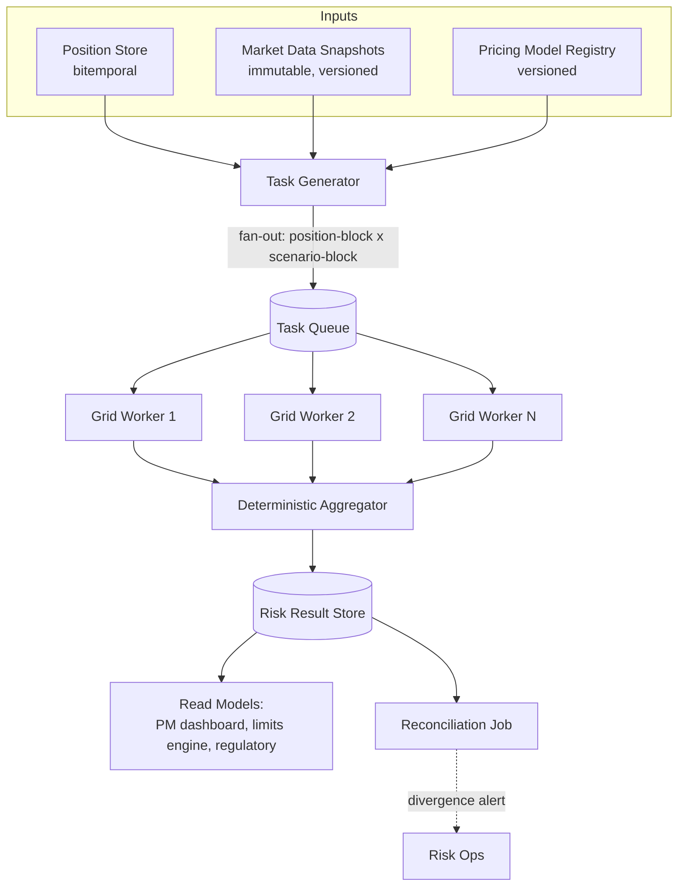
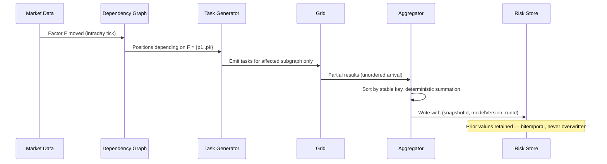
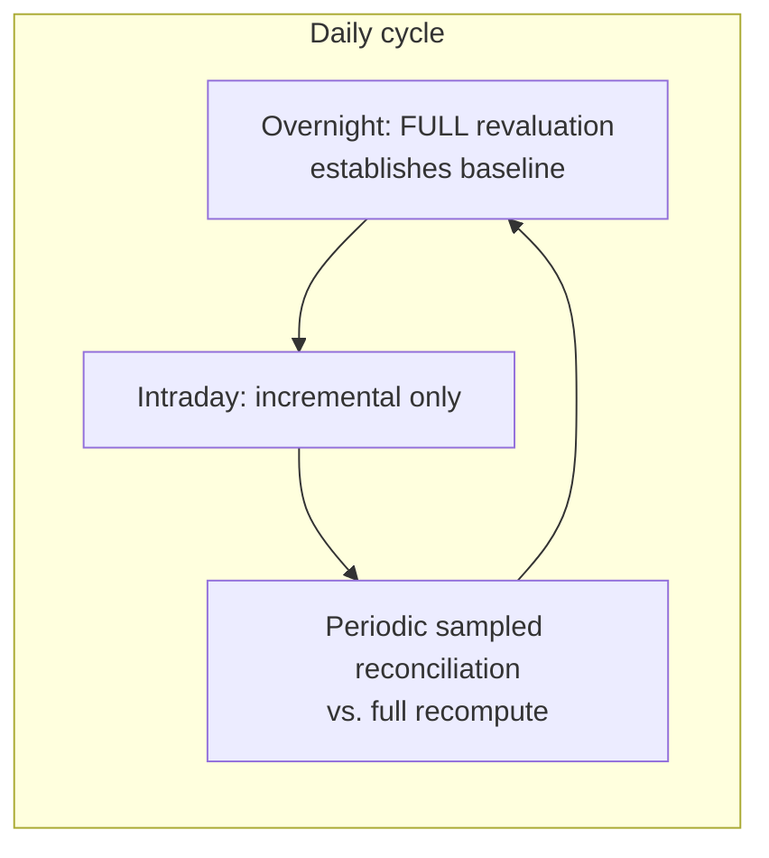
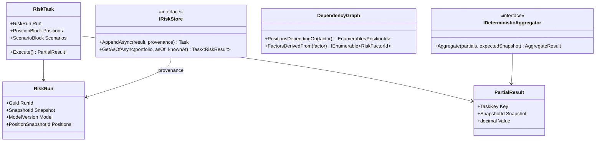

# Module 129 — System Design: Designing a Real-Time Portfolio Risk Engine

> Domain: System Design | Level: Beginner → Expert | Prerequisite: [[01-System-Design-Fundamentals]] (capacity estimation, scaling building blocks), [[../16-Distributed-Systems/01-Consensus-Consistency-Distributed-Transactions]] (consistency models this design must choose between), [[../35-Event-Sourcing/01-EventSourcingFundamentals-EventStoreAsSourceOfTruth-Snapshotting-AggregateReconstruction]] (point-in-time reconstruction, reused here for bitemporal risk), [[../29-Performance-Engineering/02-LoadTesting-CapacityPlanning-Benchmarking]] (Little's Law, applied here to grid capacity)
>
> **Scenario-module note:** This is the first of six buy-side/capital-markets system-design scenarios (Modules 129–134) added to close the domain-fit gap identified in the 2026-07-18 curriculum audit — the prior eight System Design modules (37–44) covered consumer-product scenarios (News Feed, Chat, YouTube, Instagram, e-commerce, WhatsApp) with no capital-markets equivalent. Full 16-section template; Elite FinTech Interview Panel lens.

---

## 1. Fundamentals

**What:** A risk engine computes, for every portfolio a firm manages, the answer to *"how much could we lose, and to what are we exposed?"* — expressed as sensitivities (how portfolio value moves per unit move in each underlying risk factor), Value-at-Risk (a loss threshold at a given confidence over a given horizon), and stress-test results (portfolio value under specified adverse scenarios). "Real-time" here means **intraday**: risk updates within seconds-to-minutes of a position or market-data change, not the overnight-batch-only model most firms started from.

**Why:** Risk numbers gate real decisions — a portfolio manager cannot size a trade without knowing its marginal risk contribution; a risk officer cannot enforce a mandate limit against a number that is 14 hours stale; a regulator expects the firm to know its exposure now, not at last night's close. The business value is entirely in *freshness plus trustworthiness together*: a fast number nobody trusts is worthless, and a trustworthy number that arrives tomorrow is equally worthless.

**When:** This architecture (compute grid + incremental intraday recalculation) is justified once portfolio count × position count × risk-factor count exceeds what a single-machine, single-pass overnight batch can complete inside its window — which, at institutional scale, it does by several orders of magnitude. A small fund with hundreds of positions genuinely does not need this; the design below assumes the scale §12 quantifies.

**How (30,000-ft view):**
```
Positions ──┐
            ├──► Risk Task Generator ──► Compute Grid (N workers) ──► Aggregation ──► Risk Store
Market Data ┘         (fan-out)            (revaluation)              (fan-in)         (read models)
                                                                                            │
Overnight: full revaluation of everything                                                   ▼
Intraday:  incremental — only what changed, or what depends on what changed          PM / Risk dashboards
```

---

## 2. Deep Dive

### 2.1 The Core Computation — Revaluation and Why It Dominates Everything
Every risk measure ultimately reduces to **repricing the portfolio under a perturbed market state**. A delta (sensitivity to a 1-unit move in an underlying) is computed by pricing the instrument at the current market state, pricing it again with that one factor bumped, and differencing. Historical-simulation VaR reprices the entire portfolio under each of (typically) 250–1,000 historical market scenarios and reads a percentile off the resulting P&L distribution. Monte Carlo VaR does the same under thousands of simulated scenarios.

The consequence that shapes the entire architecture: **the unit of work is a pricing call, and the number of pricing calls is a product, not a sum** — `positions × scenarios × (1 + risk factors bumped)`. A 2-million-position book under 1,000 scenarios is 2 billion pricing calls per full run. Everything in §12's design exists to make that number tractable: reduce it (§2.4 caching), parallelize it (§2.3 grid), or avoid recomputing it (§2.5 incremental).

### 2.2 Risk Factors, the Dependency Graph, and Why Naive Parallelism Fails
Positions do not depend on all risk factors — a US-equity position depends on that equity's price, its sector factor, and USD rates; it is genuinely independent of JPY vol surfaces. This sparsity is exploitable: build a **dependency graph** from risk factor → dependent positions, and an intraday move in one factor triggers recomputation only of the subgraph it reaches.

The trap: this graph is *not* static and *not* obviously correct. Instrument-to-factor dependencies come from pricing-model metadata that changes when a model changes, and a missing edge means a position silently fails to recompute when it should have — producing a stale risk number that looks fresh (it has a current timestamp) but wasn't actually recalculated. This is the domain-specific instance of this course's recurring "declared ≠ actual" theme, and §4's incident is a variant of exactly it.

### 2.3 Compute Grid Mechanics — Task Granularity and the Straggler Problem
The grid is a fan-out/fan-in: a coordinator partitions work into tasks, workers pull and execute, results are aggregated. Two design parameters dominate:

**Task granularity.** Too coarse (one task per portfolio) and a single large portfolio becomes a straggler holding up the entire run while other workers idle. Too fine (one task per position-scenario pair) and coordination/serialization overhead swamps the actual pricing work. The workable middle is typically *position-block × scenario-block*, sized so a task runs on the order of hundreds of milliseconds to low seconds — long enough to amortize dispatch cost, short enough that no single task defines the run's tail latency.

**Straggler mitigation.** Because run completion is `max(task duration)`, not `mean`, the tail dominates. Standard mitigations: speculative re-execution of tasks running beyond a percentile threshold (hedged execution), and pre-partitioning known-heavy portfolios more finely than the default. Note this makes the grid's own workload non-deterministic in *scheduling* while requiring determinism in *results* — §2.6's concern.

### 2.4 Caching and Revaluation Avoidance
Two caches carry most of the load reduction:
- **Sensitivity cache.** If a position's sensitivities were computed against market state `S` and nothing that position depends on has changed since, reuse them. Requires the dependency graph (§2.2) to be *correct* — an incorrect graph makes this cache silently serve stale results, which is strictly worse than not caching.
- **Pricing-result memoization.** Identical instrument + identical market state = identical price. Fungible instruments held across many portfolios (the same bond in 400 funds) collapse to one pricing call.

Both are instances of Module 103's caching discipline, with one domain-specific escalation: a wrong cached risk number does not merely degrade performance, it produces an incorrect number that a human will act on. Cache-key construction must therefore include *every* input that can affect the result — market state version, model version, instrument-terms version — and this course's Module 103 §Advanced Q5 "the cache is working" decomposition applies with unusual force.

### 2.5 Batch/Intraday Hybrid and Reconciliation
The overnight batch does a full, unconditional revaluation of everything; intraday runs do incremental updates against that baseline. This is efficient but introduces **drift**: incremental deltas accumulate small approximation and ordering differences, so intraday risk can diverge from what a full recomputation would produce.

The mitigation is a periodic *reconciliation run* — recompute a sample (or, overnight, everything) fully, and compare against the incrementally-maintained state, alerting on divergence beyond tolerance. This is directly Module 120 Advanced Q9's read-model reconciliation and Module 122's migration reconciliation, recurring here as a permanent, ongoing correctness control rather than a migration-time one.

### 2.6 Determinism and Reproducibility — the Non-Negotiable Constraint
A risk number that cannot be reproduced cannot be defended to a regulator, an auditor, or a portfolio manager disputing it. This imposes constraints most compute-grid designs don't carry:
- **Fixed inputs must be addressable.** Every run records the exact market-data snapshot ID, model version, and position snapshot it used — so the run can be replayed years later and produce byte-identical output.
- **Floating-point determinism.** Summation order affects floating-point results. If aggregation order varies with grid scheduling (which it does, given §2.3's stragglers and speculative execution), the same inputs yield slightly different outputs run-to-run. The fix is deterministic aggregation order (sort by a stable key before summing, or use compensated/pairwise summation) — *not* accepting "it's only 1e-12" as immaterial, because a reproducibility claim that is 99.999% true is not a reproducibility claim.
- **No wall-clock or random seeds without capture.** Monte Carlo seeds must be recorded and replayable, exactly as Module 121 §Intermediate Q2 required `Apply()` methods be free of non-captured non-determinism.

---

## 3. Visual Architecture







---

## 4. Production Example

**Problem:** A firm's intraday risk engine, serving ~9,000 portfolios, needed to reflect position and market moves within 60 seconds. It did — and had for eighteen months, with no correctness incidents.

**Architecture:** Exactly §12's design: incremental intraday recomputation driven by the §2.2 dependency graph, fanned out over a grid, aggregated into a risk store feeding PM dashboards and the limits engine.

**Implementation:** The task generator resolved market data by querying "latest snapshot" per risk factor at the moment each task was dispatched — not by pinning one snapshot ID for the entire run. Under normal conditions this was invisible: snapshots updated every few minutes, a run completed in under a minute, so all tasks in a run naturally saw the same snapshot.

**Trade-offs:** Pinning a snapshot per run costs a small amount of freshness (the run uses data from run-start, not from each task's dispatch moment). The team had reasoned, correctly for the common case, that per-task latest-resolution gave marginally fresher numbers.

**Lessons learned:** During a volatile session, market-data snapshots began publishing every ~20 seconds while grid contention stretched one run to ~110 seconds. Tasks dispatched early in that run priced against snapshot `S41`; tasks dispatched late priced against `S43`. The aggregator summed both into one portfolio-level number. Nothing errored. Every task succeeded. The resulting risk figure was **internally inconsistent** — it represented no actual market state that had ever existed, and a hedge sized against it was wrong in a way that could not be reproduced afterward, because replaying the run pinned to either `S41` or `S43` produced a different answer than the one acted upon.

It was caught by the §2.5 reconciliation job flagging divergence — 4 hours later. The fix: **pin one immutable snapshot ID at run start and pass it to every task**, accepting the marginal freshness cost. The deeper lesson, and the one that generalizes: the run "succeeded" by every signal the system emitted (zero task failures, complete aggregation, fresh timestamp) while being wrong, because *no signal existed for input consistency across the fan-out*. Success of the parts was being treated as evidence of correctness of the whole — this course's "declared ≠ actual" theme in its risk-engine-specific form, and the reason §12's design makes snapshot pinning a structural property rather than a configuration option.

---

## 5. Best Practices
- Pin one immutable market-data snapshot ID per run and pass it to every task; never resolve "latest" per-task inside a fan-out (§4).
- Make aggregation order deterministic (stable sort before summation) so results are reproducible independent of grid scheduling (§2.6).
- Record `(snapshotId, modelVersion, positionSnapshotId, runId, seed)` with every stored risk number — a number without its inputs is not defensible (§2.6).
- Run periodic sampled reconciliation of incremental state against full recomputation as a permanent control, not a migration-time check (§2.5).
- Size grid tasks to hundreds-of-ms-to-seconds and pre-split known-heavy portfolios to bound tail latency (§2.3).

## 6. Anti-patterns
- Per-task "latest snapshot" resolution inside a fan-out, producing internally inconsistent aggregates (§4's incident).
- Treating zero task failures as evidence of a correct run, with no input-consistency check (§4).
- A sensitivity cache keyed on incomplete inputs (omitting model version or instrument-terms version), silently serving stale risk (§2.4).
- Accepting floating-point non-determinism as immaterial while simultaneously claiming reproducibility to auditors (§2.6).
- Incremental intraday updates with no reconciliation against full recomputation, letting drift accumulate undetected (§2.5).

---

## 7. Performance Engineering

**CPU:** Pricing is the workload — near-100% CPU-bound, embarrassingly parallel within a run. Vectorized/SIMD pricing kernels and avoiding per-call allocation dominate single-worker throughput. Profile at the pricing-kernel level (Module 101), not the service level; service-level profiling will simply report "CPU high" and tell you nothing.

**Memory:** Each worker holds the market-data snapshot slice it needs plus its position block. Snapshot slices are the memory risk — a naive design loads the full curve/surface set per worker, multiplying snapshot memory by worker count. Load only the slice a task's dependency subgraph requires.

**GC/Allocations:** Pricing loops that allocate per-scenario objects produce severe Gen-0 pressure at billions of calls. Prefer pre-allocated, reused buffers and `readonly struct` value types for market-state primitives (Module 110's Value Object guidance, applied under genuine allocation pressure — the case where it is actually justified rather than premature).

**Latency:** The metric that matters is **run completion**, which is `max(task)`, not `mean(task)` — so P99 task duration and straggler behaviour define the user-visible number. Track task-duration distribution per portfolio, not just aggregate.

**Throughput:** Grid throughput = `workers × tasks/worker/sec`. Capacity-plan with Little's Law (Module 102): required workers = arrival rate of tasks × mean task duration. Size for volatile-session task rates, not calm-session averages — §4's incident occurred precisely because run duration stretched under load the capacity plan hadn't anticipated.

**Benchmarking:** Benchmark against a *realistic portfolio mix* including the heaviest real portfolios, not a synthetic uniform book. Heavy-tail portfolio size is the defining characteristic of real books and the source of straggler behaviour.

**Caching:** §2.4's two caches, with hit-rate monitored per cache and — critically — cache *correctness* verified by periodically recomputing cached entries and comparing (Module 103 §Advanced Q5's decomposition applied here).

---

## 8. Security

**Threats:** Position and risk data are among the most commercially sensitive data a firm holds — a leaked position file reveals trading strategy; leaked risk numbers reveal where a firm is vulnerable to being traded against. Threats: cross-portfolio data leakage in a shared grid, exfiltration via grid worker compromise, and tampering with pricing-model versions to produce favourable risk numbers.

**Mitigations:** Workers receive only the position slice their task requires, never the full book; grid workers run without outbound network egress beyond the result channel; pricing-model registry entries are immutable and signed, so a model version cannot be silently altered after being used in a defensible risk run (directly Module 121 §8's tamper-evidence discipline).

**OWASP mapping:** Broken Object-Level Authorization is the dominant risk on the read path — a PM authorized for Fund A must not retrieve Fund B's risk numbers by manipulating a portfolio identifier (Module 97's IDOR finding, with unusually high stakes here).

**AuthN/AuthZ:** Read access is per-portfolio, enforced at the risk-store query layer — not solely at the dashboard, since the risk store is also queried by the limits engine and regulatory pipeline (Module 127 §2.3's defence-in-depth principle: gateway/dashboard-level authorization is the first layer, never the only one).

**Secrets:** Market-data vendor credentials and grid worker identities managed per Module 86; note that vendor market-data licensing frequently carries *contractual* redistribution restrictions, making access control here a legal as well as security requirement.

**Encryption:** Position and risk data encrypted at rest and in transit; snapshot immutability (§2.6) means encryption key rotation must use envelope encryption (Module 122 Advanced Q5) so historical snapshots remain decryptable without being rewritten.

---

## 9. Scalability

**Horizontal scaling:** The grid scales horizontally and near-linearly — this is the design's core strength. Aggregation is the scaling limit: a single aggregator eventually becomes the bottleneck, mitigated by hierarchical aggregation (position → portfolio → fund-family → firm), with each level independently parallel.

**Vertical scaling:** Relevant for the aggregator tier and for pricing kernels benefiting from larger CPU cache; not the primary lever.

**Caching:** §2.4's caches are themselves a scaling mechanism — a high memoization hit rate on fungible instruments across many portfolios reduces effective work superlinearly relative to portfolio count.

**Replication/Partitioning:** Partition by portfolio for task assignment; partition the risk store by portfolio + as-of date. Market-data snapshots are small enough to replicate fully to every worker region rather than partition.

**Load balancing:** Pull-based work distribution (workers pull from the queue) rather than push-based assignment — pull naturally load-balances heterogeneous task durations, where push-based round-robin would strand fast workers idle while slow ones queue.

**High Availability:** Worker loss is trivially survivable (task re-queued). Coordinator loss is not, unless run state is durable — persist task-completion state so a replacement coordinator resumes rather than restarting a 100k-task run from zero.

**Disaster Recovery:** Because runs are reproducible from `(snapshotId, modelVersion, positionSnapshotId, seed)` (§2.6), DR for the *result* store is less critical than DR for the *input* stores — losing risk results is recoverable by re-running; losing the market-data snapshot archive is not.

**CAP theorem:** The risk store favours availability and partition tolerance on the read path (a slightly stale risk number displayed on a dashboard is acceptable) but the *limits engine* — which blocks trades breaching mandate limits — must favour consistency, refusing to authorize against a known-stale number rather than approving optimistically. Two consumers of the same store, deliberately opposite CAP postures, exactly as Module 120 §9 established for read models generally.

---

## 10. Interview Questions

### Basic (10)

1. **Q: What are the three main outputs of a risk engine, and what does each answer?**
   **A:** Sensitivities (how portfolio value moves per unit move in a risk factor), VaR (a loss threshold at a confidence level over a horizon), and stress-test results (portfolio value under specified adverse scenarios).
   **Why correct:** Names all three with their distinct questions rather than conflating them.
   **Common mistakes:** Treating VaR as "the" risk number; it answers only one narrow question and is famously blind to tail behaviour beyond its confidence level.
   **Follow-ups:** "What does VaR specifically *not* tell you?" (The magnitude of losses beyond the threshold — the motivation for Expected Shortfall/CVaR.)

2. **Q: Why is the volume of pricing calls a product rather than a sum?**
   **A:** It is `positions × scenarios × (1 + factors bumped)` — each position must be repriced under each scenario, and each sensitivity requires an additional bumped repricing (§2.1).
   **Why correct:** States the multiplicative structure that drives every subsequent design decision.
   **Common mistakes:** Estimating work as proportional to position count alone, understating it by three-plus orders of magnitude.
   **Follow-ups:** "What's the scale for 2M positions and 1,000 scenarios?" (~2 billion pricing calls per full run, §2.1.)

3. **Q: What is a risk-factor dependency graph and what does it enable?**
   **A:** A mapping from risk factor to the positions that depend on it, enabling intraday recomputation of only the affected subgraph rather than the whole book (§2.2).
   **Why correct:** States both the structure and the specific optimization it enables.
   **Common mistakes:** Assuming every position depends on every factor, forfeiting the sparsity that makes intraday viable.
   **Follow-ups:** "What's the failure mode if an edge is missing?" (A position silently fails to recompute and serves a stale number that looks fresh, §2.2.)

4. **Q: Why does task granularity matter on the compute grid?**
   **A:** Too coarse and a single large portfolio becomes a straggler defining run completion; too fine and coordination overhead swamps useful work (§2.3).
   **Why correct:** States both failure directions, not just one.
   **Common mistakes:** Optimizing only for reducing overhead, producing coarse tasks with severe tail latency.
   **Follow-ups:** "What's a workable target task duration?" (Hundreds of ms to low seconds, §2.3.)

5. **Q: Why is run completion time governed by `max(task)` rather than `mean(task)`?**
   **A:** A run isn't complete until every task finishes; the slowest task defines the user-visible latency regardless of how fast the others were (§7).
   **Why correct:** States the specific reason fan-out latency is tail-dominated.
   **Common mistakes:** Capacity-planning and monitoring on mean task duration, which is nearly uninformative for this workload.
   **Follow-ups:** "Name a standard straggler mitigation." (Speculative re-execution of tasks exceeding a percentile threshold, §2.3.)

6. **Q: What must a cached sensitivity be keyed on?**
   **A:** Every input that can change the result — market state version, pricing-model version, and instrument-terms version, not just the position identifier (§2.4).
   **Why correct:** Names the specific, easily-omitted key components.
   **Common mistakes:** Keying on position + date only, so a model-version change silently serves pre-change sensitivities.
   **Follow-ups:** "Why is a wrong cached risk number worse than a cache miss?" (A human acts on it; a miss merely costs time, §2.4.)

7. **Q: What is the overnight/intraday hybrid, and what problem does it introduce?**
   **A:** Overnight does a full unconditional revaluation establishing a baseline; intraday updates incrementally against it. It introduces drift — accumulated approximation and ordering differences between incremental state and what a full recompute would produce (§2.5).
   **Why correct:** States both the mechanism and its specific cost.
   **Common mistakes:** Assuming incremental updates are exactly equivalent to full recomputation.
   **Follow-ups:** "What controls drift?" (Periodic sampled reconciliation against full recomputation, §2.5.)

8. **Q: Why must every stored risk number record its input identifiers?**
   **A:** Without `(snapshotId, modelVersion, positionSnapshotId, seed)` the number cannot be reproduced, and an irreproducible risk number cannot be defended to an auditor, regulator, or a PM disputing it (§2.6).
   **Why correct:** Ties reproducibility to its concrete business consequence rather than treating it as engineering hygiene.
   **Common mistakes:** Storing only the number and a timestamp.
   **Follow-ups:** "Which prior module established this same pattern?" (Module 121's Event Sourcing — inputs recorded such that state is reconstructable, §2.6.)

9. **Q: Why does floating-point summation order matter here?**
   **A:** Floating-point addition is not associative, so a different summation order yields a slightly different result — and grid scheduling varies order run-to-run, breaking reproducibility (§2.6).
   **Why correct:** Names the specific mathematical property and its interaction with non-deterministic scheduling.
   **Common mistakes:** Dismissing 1e-12 differences as immaterial while claiming byte-reproducibility to auditors — the two claims are incompatible.
   **Follow-ups:** "How is this fixed?" (Deterministic aggregation order via stable sort, or compensated/pairwise summation, §2.6.)

10. **Q: Why do the risk dashboard and the limits engine take opposite CAP postures against the same store?**
    **A:** A slightly stale number on a dashboard is acceptable (AP); authorizing a trade against a known-stale number is not, so the limits engine must refuse rather than approve optimistically (CP) (§9).
    **Why correct:** Correctly identifies that CAP posture follows from the *consumer's* consequence-of-staleness, not from the store.
    **Common mistakes:** Applying one uniform consistency posture to every consumer of a shared store.
    **Follow-ups:** "Which prior module established this per-consumer pattern?" (Module 120 §9, read models choosing independent CAP postures.)

### Intermediate (10)

1. **Q: Walk through exactly how §4's incident produced an internally inconsistent number despite zero task failures.**
   **A:** Tasks resolved "latest snapshot" at their own dispatch moment. Snapshot publication (~20s) became faster than run duration (~110s under contention), so early tasks priced against `S41` and late tasks against `S43`. The aggregator summed both into one portfolio number representing no market state that ever existed. Every task individually succeeded against a valid snapshot; the inconsistency existed only *across* tasks, where no check looked.
   **Why correct:** Traces the precise interaction (publication cadence overtaking run duration) rather than describing it as a generic race.
   **Common mistakes:** Characterizing it as "stale data" — it was fresh data, inconsistently combined, which is a distinct and harder-to-detect failure.
   **Follow-ups:** "Why didn't monitoring catch it?" (Every emitted signal — task success, completion, freshness timestamp — was genuinely green; no signal existed for cross-task input consistency, §4.)

2. **Q: Why is pinning a snapshot per run a structural property rather than a configuration option?**
   **A:** If it is configurable, it can be misconfigured, and the failure is silent (§4 produced no error). Making the run's snapshot ID a required parameter threaded through every task means "resolve latest per task" is not expressible in the API at all — the class of bug is designed out rather than guarded against.
   **Why correct:** States the specific design principle (make the failure inexpressible) rather than merely "pin the snapshot."
   **Common mistakes:** Fixing this with a config flag defaulting to the correct behaviour, leaving the incorrect behaviour reachable.
   **Follow-ups:** "What's the freshness cost?" (The run uses run-start data rather than per-task-latest — a bounded, known, and acceptable cost versus an unbounded correctness risk.)

3. **Q: How would you validate that the dependency graph (§2.2) is actually correct, given a missing edge fails silently?**
   **A:** Periodically run a full unconditional revaluation and compare against what the graph-driven incremental path produced (§2.5's reconciliation) — a position whose value differs is one the graph failed to trigger. This is the only reliable detection, because the graph cannot validate itself.
   **Why correct:** Identifies that detection must come from an independent, non-graph-dependent path.
   **Common mistakes:** Attempting to validate the graph by inspecting the graph, which cannot reveal an edge that was never added.
   **Follow-ups:** "What causes edges to go missing in practice?" (A pricing-model change introducing a new factor dependency without the metadata being updated in lockstep, §2.2.)

4. **Q: Why is pull-based work distribution preferred over push-based assignment for this grid?**
   **A:** Task durations are heterogeneous and not predictable in advance; pull-based distribution self-balances (a fast worker simply takes more tasks), whereas push-based round-robin strands fast workers idle while slow workers queue (§9).
   **Why correct:** Ties the choice to the specific workload property (unpredictable heterogeneous durations) driving it.
   **Common mistakes:** Choosing push-based assignment for its apparent scheduling control, then needing complex rebalancing logic to recover what pull provides natively.
   **Follow-ups:** "When would push-based be preferable?" (When tasks must be routed to specific workers for data-locality reasons — not the case here, since market-data slices are small enough to replicate.)

5. **Q: Why is losing the market-data snapshot archive worse than losing the risk-result store?**
   **A:** Results are reproducible from inputs (§2.6), so a lost result store can be rebuilt by re-running; but inputs cannot be reconstructed from outputs, so a lost snapshot archive permanently destroys the ability to reproduce or defend any historical risk number (§9).
   **Why correct:** Correctly derives DR priority from reproducibility direction rather than treating both stores as equally critical.
   **Common mistakes:** Applying uniform DR rigor to both, over-investing in result-store DR while under-protecting the genuinely irreplaceable input archive.
   **Follow-ups:** "What retention does the snapshot archive need?" (At minimum the regulatory record-retention period for the risk numbers derived from it — typically multi-year, driving Module 122 Advanced Q5's envelope-encryption requirement.)

6. **Q: Why does memoizing fungible-instrument pricing produce superlinear benefit relative to portfolio count?**
   **A:** The same instrument frequently appears across many portfolios; as portfolio count grows, the number of *distinct* instruments grows far more slowly than total position count, so the memoization hit rate rises with scale (§9).
   **Why correct:** Explains the specific structural reason the benefit compounds rather than remaining proportional.
   **Common mistakes:** Modelling cache benefit as a fixed percentage independent of scale.
   **Follow-ups:** "What must the memoization key include?" (Instrument terms version + market state version + model version — §2.4's full key, since a fungible instrument is only fungible under identical pricing inputs.)

7. **Q: Critique a design where grid workers each load the complete market-data snapshot.**
   **A:** Snapshot memory is multiplied by worker count, and at large worker counts this dominates cluster memory for data the task never touches — a task pricing US equities does not need JPY vol surfaces. Loading only the slice the task's dependency subgraph requires (§7) cuts this by orders of magnitude.
   **Why correct:** Identifies the specific multiplication and the available sparsity.
   **Common mistakes:** Treating snapshot loading as a fixed startup cost rather than a per-worker memory multiplier.
   **Follow-ups:** "What does slice-loading depend on being correct?" (The same dependency graph, §2.2 — a missing edge now causes a *task failure* on a missing slice rather than a silent staleness, which is arguably a safer failure mode.)

8. **Q: Why must the limits engine query the risk store directly rather than reading the dashboard's cached view?**
   **A:** The dashboard's view is deliberately AP-postured and may be stale; the limits engine's decision has direct financial and regulatory consequence and must fail closed on staleness rather than approve against an unverified number (§9, §8).
   **Why correct:** Correctly separates the two consumers' consequence-of-staleness.
   **Common mistakes:** Reusing the dashboard read path for the limits engine because "it's the same data," silently inheriting the wrong consistency posture.
   **Follow-ups:** "How does the limits engine detect staleness?" (The stored `asOf` and run identifiers on every number, §2.6 — the same metadata reproducibility requires.)

9. **Q: How would you capacity-plan grid worker count?**
   **A:** Little's Law (Module 102): required workers ≈ task arrival rate × mean task duration, sized against *volatile-session* task rates rather than calm-session averages — §4's incident occurred specifically because run duration stretched under a load profile the plan hadn't anticipated (§7).
   **Why correct:** Applies the established capacity-planning technique with the domain-specific caveat that drove a real incident.
   **Common mistakes:** Sizing against average daily load, leaving no headroom for exactly the volatile sessions when risk numbers matter most.
   **Follow-ups:** "Why is under-provisioning here more dangerous than for a typical service?" (Slow risk during volatility is precisely when the numbers are most decision-critical — degradation correlates with need.)

10. **Q: Synthesize how this design's reconciliation control (§2.5) relates to Modules 120 and 122.**
    **A:** All three are the same mechanism: independently recompute from source and compare against incrementally-maintained state. Module 120 applied it to CQRS read-model drift, Module 122 to migration-backfill accuracy, and this module to incremental-risk drift — confirming reconciliation as a general control wherever derived state is maintained incrementally rather than recomputed, not a technique specific to any one of those contexts.
    **Why correct:** Identifies the shared structure across three contexts rather than treating each as separate.
    **Common mistakes:** Treating reconciliation as a migration-only or CQRS-only technique.
    **Follow-ups:** "What makes it a permanent control here rather than a temporary one?" (Incremental intraday updating never ends, so drift accumulation never ends — unlike a migration, which completes.)

### Advanced (10)

1. **Q: Diagnose §4's incident from first principles and design the complete structural fix.**
   **A:** Root cause: no invariant enforced that all tasks in one run share one market state — "latest" was resolved independently per task, and the failure was invisible because it was an inconsistency *between* successful tasks, not a failure of any task. Fix: (1) make `snapshotId` a required parameter of the run, threaded to every task, with no API path that resolves latest per-task (Intermediate Q2); (2) have the aggregator *verify* every incoming partial result carries the run's expected `snapshotId` and reject the run outright on mismatch — a positive consistency check rather than an assumption; (3) alert on run duration exceeding snapshot publication cadence, since that ratio crossing 1.0 is the precondition that made the bug reachable at all.
   **Why correct:** Addresses the specific root cause plus a detection mechanism plus a leading indicator, rather than only the immediate fix.
   **Common mistakes:** Implementing only (1); without (2) a future code path could reintroduce the inconsistency with nothing checking for it.
   **Follow-ups:** "Why is (3) valuable given (1) and (2) already prevent the bug?" (It detects the *conditions* under which similar cross-task assumptions become unsafe, catching a whole class of future bugs rather than this one instance.)

2. **Q: A team proposes eliminating the overnight full revaluation entirely, running purely incrementally. Evaluate.**
   **A:** This removes the only independent check on incremental drift (§2.5, Intermediate Q3) — the full run is what validates both the dependency graph's completeness and the incremental path's accuracy. Without it, drift and missing-edge staleness accumulate with no detection mechanism whatsoever. The compute saving is real, but it purchases efficiency by deleting the system's correctness control, which for risk numbers is not a defensible trade.
   **Why correct:** Identifies that the overnight run's value is primarily *verification*, not primarily computation.
   **Common mistakes:** Evaluating the proposal purely on compute cost, missing that the full run is the reconciliation baseline.
   **Follow-ups:** "Is there a middle ground?" (Yes — reduce full-run *frequency* (e.g., weekly full, nightly sampled) rather than eliminating it, preserving the control at lower cost, provided the sample is representative rather than convenient.)

3. **Q: Critique using speculative re-execution (§2.3) without addressing §2.6's determinism requirement.**
   **A:** Speculative execution means the same task may complete twice, and whichever result arrives first is used — so run-to-run the *set* of contributing computations differs even for identical inputs. If aggregation is order-dependent (§2.6), results become irreproducible in exactly the system where reproducibility is a regulatory requirement. Speculative execution and determinism are compatible, but only if aggregation is made order-independent first; adopting the former without the latter silently breaks reproducibility.
   **Why correct:** Identifies the specific interaction between a performance optimization and a correctness requirement that are individually reasonable but jointly hazardous.
   **Common mistakes:** Treating straggler mitigation as a purely performance concern with no correctness implications.
   **Follow-ups:** "What's the ordering fix?" (Deterministic aggregation via stable sort on task key before summation, so contribution order is a function of task identity rather than arrival time, §2.6.)

4. **Q: Design the reconciliation sampling strategy — which portfolios, how often, and why not uniformly random?**
   **A:** Stratify rather than sample uniformly: always include the largest-notional and highest-complexity portfolios (where an error has the greatest consequence), always include portfolios containing recently-changed pricing models (where dependency-graph edges are most likely missing, §2.2), and sample the remaining tail randomly for baseline coverage. Uniform random sampling under-weights exactly the portfolios where errors matter most — the same structural blind spot Module 128 §4 demonstrated for percentage-based canary sampling missing a low-volume-but-critical partner.
   **Why correct:** Designs the sample around consequence and risk-of-error rather than statistical convenience, and correctly connects it to an already-established course finding.
   **Common mistakes:** Uniform random sampling, which is statistically defensible but consequence-blind.
   **Follow-ups:** "Which prior module established this exact sampling blind spot?" (Module 128 §4 — aggregate/uniform sampling structurally under-representing the specific, high-consequence, low-volume case.)

5. **Q: How would you support an auditor asking "reproduce the 14:32 risk number for Fund X from three years ago"?**
   **A:** Retrieve the stored `(snapshotId, modelVersion, positionSnapshotId, seed, runId)` for that number (§2.6), fetch the immutable snapshot and position state from archive (§9's DR priority), instantiate the *recorded* model version — which requires the pricing-model registry to retain historical versions immutably (§8) — and re-run with deterministic aggregation (§2.6), expecting byte-identical output. Any of these four missing (metadata, snapshot archive, model version, determinism) makes the request unanswerable.
   **Why correct:** Enumerates all four independently-necessary preconditions rather than only the metadata.
   **Common mistakes:** Assuming stored inputs suffice, forgetting the *pricing model itself* is an input that must be version-retained and re-instantiable years later.
   **Follow-ups:** "What's the hardest of the four to sustain over three years?" (Model re-instantiability — code and dependencies rot; this is why model versions should be retained as executable, containerized artifacts rather than source references, Module 91's reproducible-build discipline.)

6. **Q: A regulator asks how the firm knows its intraday risk numbers are correct, not merely fresh. Answer honestly.**
   **A:** Cite the layered controls concretely: run-level input-consistency enforcement making §4's cross-snapshot class of error structurally inexpressible (Advanced Q1); periodic stratified reconciliation against independent full recomputation detecting both incremental drift and dependency-graph gaps (Advanced Q4, Intermediate Q3); full reproducibility metadata enabling any specific number to be independently re-derived on demand (Advanced Q5); and honestly note the residual: reconciliation is sampled between full runs, so the guarantee is "verified within the reconciliation window and sampling scope," not "continuously proven for every number" — a bounded, stated claim rather than an overclaim.
   **Why correct:** Gives specific mechanisms plus an honest statement of the residual limitation, the posture Module 118 §Expert Q7 established as more credible than an unqualified assurance.
   **Common mistakes:** Answering "we validate our numbers" without the specific controls, or overclaiming continuous proof that the sampled design doesn't actually deliver.
   **Follow-ups:** "What would strengthen the claim most?" (Increasing full-reconciliation frequency, which directly narrows the unverified window — a concrete, costable improvement rather than a vague assurance.)

7. **Q: Design a load test that would have caught §4's incident before production.**
   **A:** Test the *ratio* rather than either variable alone: drive market-data publication at volatile-session cadence (~20s) while simultaneously loading the grid to stretch run duration past that cadence, then assert every partial result within a run carries an identical `snapshotId`. Testing publication cadence and grid load independently — each within normal parameters — would never produce the condition, exactly as production didn't for eighteen months. This is Module 118 §7's "test the actual constrained condition" applied to a condition defined by the interaction of two variables.
   **Why correct:** Identifies that the bug lives in a variable *ratio*, so the test must vary both simultaneously.
   **Common mistakes:** Load-testing the grid at peak task volume with a static or slow-publishing snapshot feed, which never creates the overlap.
   **Follow-ups:** "What assertion is the actual test?" (Not run success — the run succeeded — but input-consistency: all partial results share one `snapshotId`.)

8. **Q: How does bitemporal storage of risk results (never overwriting) change the design, and why is it worth the storage cost?**
   **A:** Storing every computed number with both its `asOf` market time and its `computedAt` system time — rather than overwriting a portfolio's "current" risk — enables answering "what did we believe our exposure was at 14:32, as we believed it then?" which is distinct from "what was our actual exposure at 14:32, as we now know it." Regulatory and dispute contexts require the former; a mutable current-value store can only answer the latter. The storage cost is real but bounded and far cheaper than the inability to reconstruct decision-time state.
   **Why correct:** Names the specific distinction (belief-at-time vs. truth-as-now-known) that motivates bitemporality rather than describing it as generic versioning.
   **Common mistakes:** Treating a corrected/restated risk number as simply replacing the original, destroying the record of what was actually acted upon.
   **Follow-ups:** "Which prior module establishes this same append-only philosophy?" (Module 121's Event Sourcing — history as immutable record rather than mutable current state.)

9. **Q: The dependency graph is derived from pricing-model metadata. Design the control preventing a model change from silently invalidating it.**
   **A:** Make graph regeneration a mandatory, mechanically-enforced step of model deployment — a fitness function (Module 106) failing the model-deployment pipeline if a model version is registered without a corresponding regenerated dependency-graph version, plus a post-deployment reconciliation run scoped to portfolios touching the changed model (Advanced Q4's stratification) verifying the regenerated graph actually triggers the positions it should. Documentation-and-discipline alone reliably fails here, exactly as Module 123 §14 demonstrated for saga-state monitoring not updated alongside a new saga step.
   **Why correct:** Mechanically couples the two artifacts that must change together and adds verification, rather than relying on process memory.
   **Common mistakes:** A checklist item asking engineers to regenerate the graph — the identical failure mode Module 123 §14 already demonstrated.
   **Follow-ups:** "Why is post-deployment verification needed if regeneration is enforced?" (Regeneration proves the step ran, not that the resulting graph is *correct* — the model's own metadata could be incomplete, §2.2's original failure mode.)

10. **Q: As a Principal Engineer, synthesize the governance program required before intraday risk numbers may be used to gate live trading decisions.**
    **A:** (1) Structural input-consistency enforcement with aggregator-side verification (Advanced Q1). (2) Stratified, consequence-weighted reconciliation against full recomputation, run on a defined cadence with divergence alerting (Advanced Q4). (3) Complete reproducibility metadata plus retained, re-instantiable model versions, proven by periodic spot-reproduction rather than assumed (Advanced Q5). (4) Mechanically-enforced dependency-graph regeneration coupled to model deployment, with post-deployment verification (Advanced Q9). (5) Deterministic aggregation as a precondition for any straggler-mitigation optimization (Advanced Q3). (6) CP-postured consumption for the limits engine specifically, failing closed on staleness (§9). (7) An explicit, documented statement of the residual unverified window (Advanced Q6), reviewed as the reconciliation cadence changes.
    **Why correct:** Assembles every specific control into a coherent, gate-able program, including the honest residual statement rather than an implied completeness claim.
    **Common mistakes:** Presenting the compute architecture without the verification, reproducibility, and residual-disclosure controls that make the numbers defensible rather than merely fast.
    **Follow-ups:** "Which single control would you implement first on an ungoverned existing engine?" (Reconciliation against full recomputation — it is the only control that detects errors you don't yet know the shape of, including the dependency-graph gaps and drift the others assume away.)

### Expert (10)

1. **Q: The business asks for sub-second intraday risk. Evaluate feasibility against this architecture.**
   **A:** Sub-second is achievable only for a *restricted* question, not the full one. Full incremental recomputation across an affected subgraph involves grid dispatch, pricing, and hierarchical aggregation — realistically seconds-to-tens-of-seconds. Sub-second is attainable for pre-computed sensitivity-based *approximations* (delta/gamma-approximated P&L under a factor move, evaluated in-memory without repricing), which is a genuinely different and less accurate computation. The correct answer is to offer both, explicitly labelled: a sub-second approximate number for immediate feedback and the accurate repriced number seconds later — never to present the approximation as if it were the repriced figure.
   **Why correct:** Distinguishes what is achievable from what was asked, and proposes a design that serves the need honestly rather than either refusing or silently degrading accuracy.
   **Common mistakes:** Committing to sub-second full revaluation, then meeting the latency target by silently substituting approximations users believe are exact.
   **Follow-ups:** "What's the risk of showing both?" (Users reconciling two different numbers for the same question — mitigated by labelling and by showing the approximation *only* until the exact figure supersedes it.)

2. **Q: Compare historical-simulation VaR and Monte Carlo VaR as workloads, and their differing implications for this architecture.**
   **A:** Historical simulation replays a fixed set of ~250–1,000 actual historical scenarios: deterministic by construction, bounded and predictable work, trivially reproducible. Monte Carlo generates thousands of simulated scenarios from a model: far heavier, and reproducible *only* if the seed is captured and the generator is deterministic across platforms (§2.6). Architecturally, historical simulation is the easier workload and the easier reproducibility story; Monte Carlo demands strictly more grid capacity and adds seed-management and cross-platform-generator-determinism as first-class concerns.
   **Why correct:** Compares them on the dimensions this architecture actually cares about (work volume, reproducibility mechanics) rather than on statistical merits alone.
   **Common mistakes:** Comparing only statistical properties, missing that reproducibility difficulty differs sharply between them.
   **Follow-ups:** "What's the subtle cross-platform Monte Carlo trap?" (The same seed on different CPU architectures or math-library versions can yield different sequences — so the generator implementation and version must be pinned alongside the seed, or reproducibility silently fails only on heterogeneous grids.)

3. **Q: Design the grid's multi-tenancy if this engine serves several independently-managed fund families with different SLAs.**
   **A:** Dedicated worker pools per tenant class rather than one shared pool — directly Module 126 §4's finding, where a shared pool let one tenant's backlog degrade unrelated tenants' latency. Here the stakes are higher: a fund family's risk run being starved by another's is not merely a latency regression but a mandate-monitoring gap. Shared *code*, isolated *capacity*, per-tenant configuration and SLA — Module 126 §2.1's model, transplanted directly.
   **Why correct:** Reapplies an established finding to a context with strictly higher consequence, rather than re-deriving it.
   **Common mistakes:** Sharing one grid pool for efficiency, reproducing Module 126 §4's exact incident in a domain where the consequence is regulatory rather than operational.
   **Follow-ups:** "What's the efficiency cost, and is there a middle ground?" (Idle capacity in quiet tenants' pools; Module 126 Advanced Q2's quota-bounded shared pool is the middle ground, viable only with tested quota enforcement.)

4. **Q: Apply this course's "declared ≠ actual" theme to this system's central claim.**
   **A:** The claim is "this is the portfolio's current risk." Its declared basis is that a run completed successfully with a recent timestamp. §4 demonstrated that basis is insufficient — a run can complete, with every task succeeding, and produce a number corresponding to no real market state. The actual basis requires four independent verifications the declared basis doesn't provide: input consistency across the fan-out (Advanced Q1), dependency-graph completeness (Intermediate Q3), incremental-drift bounds (Advanced Q4), and reproducibility (Advanced Q5). This is the theme's sharpest form in the course so far, because unlike a stale cache or an unenforced policy, the artifact here is a *number a human acts on immediately*, and it carries no visible marker of its own unreliability.
   **Why correct:** Identifies the specific declared-vs-actual gap and enumerates exactly what closes it, while articulating why this instance is sharper than prior ones.
   **Common mistakes:** Treating freshness and success as jointly sufficient evidence of correctness — precisely the reasoning §4's system embodied for eighteen months.
   **Follow-ups:** "Why is a wrong risk number more dangerous than a wrong read model (Module 120)?" (A stale read model degrades a view; a wrong risk number is consumed by a decision process that immediately converts it into a market position.)

5. **Q: Design the incremental-recomputation trigger policy — every tick, or something else?**
   **A:** Not every tick: at institutional market-data rates, tick-triggered recomputation would keep the grid permanently saturated recomputing negligible moves. Trigger on *materiality* — a factor move exceeding a threshold calibrated per factor's own volatility (a 1bp rates move and a 1% equity move are not comparable), plus a mandatory floor cadence ensuring recomputation at least every N minutes regardless of quiet markets, plus immediate triggering on position changes (a new trade must be reflected without waiting for a market move). Three triggers, deliberately: materiality, floor cadence, and position change.
   **Why correct:** Designs a policy from the actual triggering causes rather than defaulting to either extreme, and calibrates materiality per-factor rather than uniformly.
   **Common mistakes:** A single uniform move threshold across all factor types, which is either too sensitive for volatile factors or too insensitive for stable ones.
   **Follow-ups:** "Why is the floor cadence necessary if nothing material moved?" (It bounds the age of the number, so a quiet market cannot silently produce an arbitrarily stale figure that appears current.)

6. **Q: A PM disputes a risk number, claiming their own spreadsheet shows different exposure. Walk through the investigation.**
   **A:** Reproduce the engine's number from its recorded inputs (Advanced Q5) to establish it is at least self-consistent. Then diff *inputs* rather than outputs: does the PM's position set match the engine's `positionSnapshotId` (often the discrepancy — a trade booked after the snapshot); does the market data match (often a different pricing source); does the model match (often the PM uses a simpler approximation). In practice the majority of such disputes resolve to an input difference, not a computational error — which is why the reproducibility metadata (§2.6) is the primary investigative tool, and why an engine that cannot state its inputs cannot resolve disputes at all.
   **Why correct:** Structures the investigation to isolate the common cause (input mismatch) first, and ties the investigation's feasibility directly to §2.6's metadata.
   **Common mistakes:** Immediately auditing pricing logic, which is the least likely cause and the most expensive to investigate.
   **Follow-ups:** "What if inputs match and outputs differ?" (Then it's genuinely a model or aggregation difference — escalate to model validation, and treat it as a potential correctness incident rather than a support query.)

7. **Q: Evaluate moving this workload to serverless/elastic cloud compute rather than a fixed grid.**
   **A:** The workload profile is unusually well-suited: bursty (concentrated at market events and end-of-day), embarrassingly parallel, and stateless per task. Elastic compute avoids provisioning for peak that idles most of the day — a genuine, large cost saving. The countervailing factors are specific: cold-start latency matters when run completion is the SLA (Module 61's Lambda cold-start material); pricing libraries are often large native dependencies that inflate cold start; and market-data licensing sometimes contractually restricts where data may be processed, which can rule out certain regions or providers outright. The recommendation is workload-split: elastic capacity for burst above a fixed baseline, rather than either extreme.
   **Why correct:** Weighs genuine fit against three specific, non-obvious constraints including a non-technical (licensing) one that frequently decides this question in practice.
   **Common mistakes:** Evaluating purely on compute economics, missing that market-data licensing terms can constrain the deployment topology.
   **Follow-ups:** "Why does the licensing constraint surprise engineering teams?" (It is a contractual property of the data, invisible in the architecture, and typically discovered only when legal reviews a cloud-migration proposal already deep in design.)

8. **Q: How should the engine handle a market-data feed publishing a bad tick (an obviously erroneous price)?**
   **A:** Reject at ingestion, not at consumption — a plausibility check (move exceeding a multiple of the factor's own recent volatility, or crossing a hard sanity bound) at snapshot-construction time, quarantining the suspect value and either falling back to the prior value or refusing to publish the snapshot. Consumption-time filtering is far worse: different consumers apply different filters, so the same "snapshot" yields different risk depending on who read it, destroying the single-market-state property §4's fix established. Rejection must also be *recorded*, because a quarantined tick that was actually a real market move is itself a serious error requiring detection.
   **Why correct:** Places the control at the point that preserves the architecture's core invariant, and notes the false-positive risk rather than treating rejection as free.
   **Common mistakes:** Filtering at consumption for flexibility, silently reintroducing cross-consumer inconsistency.
   **Follow-ups:** "What's the danger of an over-aggressive plausibility filter?" (During genuine market dislocation — exactly when risk numbers matter most — real extreme moves get quarantined as implausible, so the engine reports calm during a crisis.)

9. **Q: Design the monitoring that distinguishes "the engine is slow" from "the engine is wrong."**
   **A:** They require entirely separate signal sets. *Slow* is run duration, task-duration P99, queue depth, worker utilization — standard and well-covered by Module 94's SLO discipline. *Wrong* has no natural signal and must be constructed: input-consistency verification per run (Advanced Q1), reconciliation divergence magnitude and trend (Advanced Q4), dependency-graph coverage (proportion of positions triggered by a known factor move versus expected), and spot-reproduction success rate (Advanced Q5). The critical insight is that every *wrong* signal must be actively built, because unlike slowness, incorrectness produces no natural symptom — §4 ran wrong for hours while every conventional signal was green.
   **Why correct:** Identifies the asymmetry — slowness is self-signalling, incorrectness is not — and specifies the constructed signals required.
   **Common mistakes:** Investing monitoring effort proportionally across both, when incorrectness needs disproportionately more because it has no natural telemetry.
   **Follow-ups:** "Which signal would have caught §4 fastest?" (Per-run input-consistency verification — it detects the condition at run time, versus reconciliation which caught it four hours later.)

10. **Q: Deliver the closing synthesis: what makes a risk engine a genuinely harder system-design problem than the consumer-scale systems in Modules 38–44?**
    **A:** Not scale — a news feed handles more requests. The difference is that **correctness is unobservable and consequential simultaneously**. A broken news feed is visibly broken; a wrong risk number is indistinguishable from a right one at the point of consumption, and is converted into a market position within seconds. This inverts the usual engineering priority: the majority of this design's complexity — snapshot pinning, deterministic aggregation, reproducibility metadata, reconciliation, dependency-graph verification — exists not to make the system fast or scalable, both of which are comparatively solved, but to make its output *trustworthy and defensible*. A Principal Engineer evaluating this domain should recognize that the compute grid is the easy part, and that every senior-level design decision here is ultimately about establishing evidence for a number's correctness rather than about producing the number.
    **Why correct:** Identifies the genuinely distinguishing property (unobservable-yet-consequential correctness) and correctly locates where the design's difficulty actually sits, rather than defaulting to scale.
    **Common mistakes:** Framing this as a scale problem and designing accordingly, producing a fast engine whose numbers cannot be defended.
    **Follow-ups:** "Which upcoming module in this run shares this property most closely?" (Module 133's regulatory reporting pipeline — also unobservably wrong, also consequential, but with a deadline rather than a latency SLA as the additional constraint.)

---

## 11. Coding Exercises

### Easy — Deterministic Aggregation (§2.6)
**Problem:** Sum grid partial results reproducibly regardless of arrival order.
**Solution:**
```csharp
public decimal AggregateDeterministically(IEnumerable<PartialResult> partials) =>
    partials
        .OrderBy(p => p.TaskKey, StringComparer.Ordinal) // stable, arrival-order-independent
        .Aggregate(0m, (sum, p) => sum + p.Value);
```
**Time complexity:** O(n log n) for the sort, O(n) for the sum.
**Space complexity:** O(n) to materialize the ordering.
**Optimized solution:** Use `decimal` (exact base-10) where the domain permits, avoiding floating-point associativity entirely; where `double` is required for performance, apply Kahan/Neumaier compensated summation, which bounds error independent of order rather than merely fixing order.

### Medium — Run-Scoped Snapshot Enforcement (§4, Advanced Q1)
**Problem:** Make per-task snapshot resolution structurally inexpressible.
**Solution:**
```csharp
public sealed record RiskRun(Guid RunId, SnapshotId Snapshot, ModelVersion Model);

public sealed class RiskTask
{
    public RiskTask(RiskRun run, PositionBlock positions) // snapshot only obtainable from the run
    {
        Run = run; Positions = positions;
    }
    public RiskRun Run { get; }
    public PositionBlock Positions { get; }
    // No API surface exists to resolve "latest" — the market data accessor
    // requires a SnapshotId, and the only SnapshotId reachable is Run.Snapshot.
}
```
**Time complexity:** O(1).
**Space complexity:** O(1) per task beyond its position block.
**Optimized solution:** Add aggregator-side verification rejecting any partial result whose `Run.Snapshot` differs from the run's expected value — defence in depth, so a future refactor cannot silently reintroduce the inconsistency (Advanced Q1's point 2).

### Hard — Dependency-Graph Subgraph Resolution (§2.2)
**Problem:** Given a moved risk factor, resolve the affected position set for incremental recomputation.
**Solution:**
```csharp
public IReadOnlySet<PositionId> ResolveAffected(RiskFactorId moved, DependencyGraph graph)
{
    var affected = new HashSet<PositionId>();
    var queue = new Queue<RiskFactorId>();
    queue.Enqueue(moved);
    var seenFactors = new HashSet<RiskFactorId> { moved };

    while (queue.Count > 0)
    {
        var factor = queue.Dequeue();
        foreach (var p in graph.PositionsDependingOn(factor)) affected.Add(p);
        foreach (var derived in graph.FactorsDerivedFrom(factor)) // e.g. curve → forward rates
            if (seenFactors.Add(derived)) queue.Enqueue(derived);
    }
    return affected;
}
```
**Time complexity:** O(V + E) over the reachable subgraph, not the whole graph.
**Space complexity:** O(V) for the visited sets.
**Optimized solution:** Precompute and cache transitive closures for frequently-moved factors, invalidated on graph regeneration (Advanced Q9) — trading memory for avoiding repeated traversal on every tick.

### Expert — Reconciliation with Stratified Sampling (Advanced Q4)
**Problem:** Compare incremental state against full recomputation, sampling by consequence rather than uniformly.
**Solution:**
```csharp
public async Task<ReconciliationReport> ReconcileAsync(DateOnly asOf)
{
    var always = _portfolios.Where(p => p.Notional > _materialityThreshold
                                     || p.UsesRecentlyChangedModel(_lookback));
    var sampled = _portfolios.Except(always).RandomSample(_baselineSampleSize);

    var findings = new List<Divergence>();
    foreach (var p in always.Concat(sampled))
    {
        var incremental = await _riskStore.GetCurrentAsync(p.Id, asOf);
        var full = await _engine.FullRecomputeAsync(p.Id, incremental.Snapshot, incremental.Model);

        var relative = Math.Abs(full.Var - incremental.Var) / Math.Max(Math.Abs(full.Var), 1m);
        if (relative > _tolerance)
            findings.Add(new Divergence(p.Id, incremental.Var, full.Var, relative));
    }
    return new ReconciliationReport(findings, checkedCount: always.Count() + sampled.Count());
}
```
**Time complexity:** O(s × full-recompute cost) for s sampled portfolios — the dominant cost, driving sample-size calibration.
**Space complexity:** O(d) for d divergences found.
**Optimized solution:** Recompute against the *same* recorded snapshot and model the incremental figure used (as above) rather than current market state — otherwise the comparison conflates genuine drift with legitimate market movement between the two computations, producing a divergence signal that is mostly noise.

---

## 12. System Design

**Functional requirements**
- Compute sensitivities, VaR, and stress results per position, aggregated to portfolio, fund-family, and firm level.
- Full revaluation overnight; incremental recomputation intraday on material factor moves, position changes, and a floor cadence (Expert Q5).
- Serve risk to PM dashboards, a pre-trade limits engine, and regulatory reporting.
- Reproduce any historical risk number on demand from recorded inputs (Advanced Q5).

**Non-functional requirements**
- Intraday freshness: material change reflected within 60s (P99).
- Reproducibility: byte-identical re-derivation from recorded inputs, indefinitely within the retention period.
- Correctness: every run internally consistent (single market state); incremental drift bounded and monitored.
- Availability: risk read path 99.9%; limits-engine path fails closed rather than serving stale.

**Capacity estimation** (worked, since this is where candidates most often go wrong)
- 9,000 portfolios × ~220 positions ≈ 2M positions.
- Historical-simulation VaR at 500 scenarios → 2M × 500 = 1B pricings per full run.
- At ~40µs per pricing (typical for vanilla instruments; derivatives are far slower) → 40,000 CPU-seconds ≈ 11 CPU-hours.
- Overnight window of 90 minutes → ~8 cores minimum, ~24 with 3× headroom for heavy-tail portfolios and stragglers. Intraday incremental touches perhaps 2–5% of positions per trigger → comfortably sub-minute on the same grid.
- **The point of the estimate is the sensitivity analysis, not the number:** if instrument mix shifts toward derivatives at ~2ms per pricing, the same run becomes ~550 CPU-hours — a 50× swing driven entirely by instrument mix. Capacity planning must be driven by mix, not position count.

**Architecture:** §3's diagram — task generator fanning out over a pull-based grid, deterministic aggregation, bitemporal risk store feeding three differently-postured consumers.

**Components:** Task generator (dependency-graph-driven, §2.2); pull-based grid workers; deterministic hierarchical aggregator; bitemporal risk store; reconciliation job; pricing-model registry (immutable, versioned).

**Database selection:** Market-data snapshots — immutable object storage, versioned, replicated (this is the irreplaceable asset, Intermediate Q5). Positions — bitemporal relational store (point-in-time correctness is a query requirement, not an afterthought). Risk results — columnar/time-series store, append-only, partitioned by portfolio + as-of date, since the dominant query is "risk for these portfolios across this date range."

**Caching:** Sensitivity cache and pricing memoization (§2.4), both fully-keyed and correctness-verified by periodic recomputation, never hit-rate-monitored alone.

**Messaging:** Market-data ticks and position changes arrive as events; run triggering is event-driven with materiality filtering (Expert Q5). Completed-run notifications published for downstream consumers via the Outbox pattern (Module 125) where consumers require guaranteed delivery.

**Scaling:** Horizontal grid scaling with hierarchical aggregation to avoid a single-aggregator bottleneck (§9); dedicated pools per tenant class where multi-tenant (Expert Q3).

**Failure handling:** Worker loss → task re-queue (idempotent by construction, since tasks are pure functions of pinned inputs). Coordinator loss → resume from durable task-completion state. Bad market data → reject at ingestion with recorded quarantine (Expert Q8). Run-level input inconsistency → reject the entire run at aggregation (Advanced Q1).

**Monitoring:** Two distinct signal sets (Expert Q9) — performance (run duration, task P99, queue depth) and *correctness* (input-consistency verification, reconciliation divergence trend, graph coverage, spot-reproduction success). The latter must be deliberately constructed.

**Trade-offs:** Snapshot pinning trades marginal freshness for consistency (§4) — correct given consequence asymmetry. Incremental intraday trades exactness for latency, bounded by reconciliation (§2.5). Deterministic aggregation trades some aggregation throughput for reproducibility — non-negotiable given the regulatory requirement.

---

## 13. Low-Level Design

**Requirements:** Tasks are pure functions of pinned inputs; aggregation is order-independent; every result carries full provenance; graph resolution is efficient over the reachable subgraph.

**Class diagram:**


**Sequence diagram:** §3's second diagram, with the aggregator's snapshot-verification step (Advanced Q1) preceding summation.

**Design patterns used:** Fork-Join (grid fan-out/fan-in); Memento (immutable snapshots as captured state); Strategy (interchangeable VaR methodologies — historical simulation vs. Monte Carlo, Expert Q2); Specification (materiality trigger rules, Expert Q5); Bulkhead (per-tenant grid pools, Expert Q3).

**SOLID mapping:** Single Responsibility (task executes, aggregator combines, store persists — none overlap); Open/Closed (a new VaR methodology adds a Strategy implementation without touching grid or aggregation); Liskov (every VaR strategy must satisfy the same determinism and provenance contract — verified by contract test, Module 117's discipline); Interface Segregation (`IRiskStore` read and append paths separated, since the limits engine needs only reads with staleness metadata); Dependency Inversion (task depends on an `IMarketDataAccessor` requiring a `SnapshotId`, never a concrete "latest" resolver — §11 Medium's structural fix).

**Extensibility:** A new instrument type adds a pricing model to the registry plus dependency-graph metadata; a new risk measure adds a Strategy. Neither touches the grid, aggregator, or store.

**Concurrency/thread safety:** Tasks are pure and share nothing — the grid requires no locking. The aggregator's ordering (§11 Easy) is the sole point where concurrency meets correctness, and is resolved by making order a function of task identity rather than arrival. The risk store is append-only (Advanced Q8), eliminating write-write conflicts entirely.

---

## 14. Production Debugging

**Incident:** Overnight batch, normally completing in ~70 minutes, began overrunning its 90-minute window intermittently — roughly one night in four — with no code change, no position-count growth, and no infrastructure change. On overrun nights, morning risk was unavailable at market open.

**Root cause:** A single fund had begun trading a small number of path-dependent exotic options. These priced via Monte Carlo *inside* each outer scenario — a nested simulation — making each such position roughly 4,000× more expensive to price than a vanilla instrument. There were only 60 such positions out of 2 million (0.003% of the book), but they consumed roughly 40% of total grid work. Because the task generator partitioned by position *count* rather than estimated *cost*, these positions landed in ordinary-sized blocks, producing a handful of tasks running hours while thousands of workers idled — a textbook straggler (§2.3), invisible in aggregate metrics because mean task duration barely moved.

**Investigation:** Run-duration dashboards showed only "sometimes slower," with mean task duration nearly flat — the overrun was entirely tail. Plotting the *task-duration distribution* rather than its mean immediately exposed a bimodal shape with a far-right cluster. Tracing those task IDs back to their position blocks identified the fund, then the instrument type. The intermittency was explained by the fund trading these positions only on some days.

**Tools:** Task-duration histogram (not mean); per-task tracing correlated to position block (Module 93's correlation-ID discipline applied to grid tasks); worker-utilization timeline showing mass idling while few tasks ran; instrument-type breakdown of pricing cost.

**Fix:** Cost-based partitioning — the task generator estimates per-position pricing cost from instrument type and model, then partitions to equalize estimated *cost* per task rather than position count, splitting expensive positions into their own fine-grained tasks. Overrun eliminated; total grid work unchanged, merely distributed to eliminate the tail.

**Prevention:** (1) Alert on task-duration distribution skew (ratio of P99 to median) rather than on mean or total duration — the signal that was flat while the problem was severe. (2) Require new instrument types to register an estimated pricing-cost class at model-registration time, feeding the partitioner — mechanically coupling the two, exactly as Advanced Q9 coupled graph regeneration to model deployment. (3) Load-test with the *real* instrument mix including exotics (§7's benchmarking note), which a uniform synthetic book would never have surfaced.

---

## 15. Architecture Decision

**Context:** Choosing how intraday risk is kept current — the central architectural decision, made once and expensive to reverse.

**Option A — Full recomputation on a fixed schedule (e.g., every 15 minutes):**
*Advantages:* Simplest possible correctness story — every number is a complete, self-consistent, from-scratch computation with no drift and no dependency-graph reliance (removing §2.2's entire silent-failure class). Trivially reproducible. Easiest to defend to an auditor.
*Disadvantages:* Enormous compute cost — full-book revaluation every 15 minutes is ~40× the overnight-only workload. Freshness is bounded by the interval regardless of how material a move is, so a violent move waits up to 15 minutes.
*Cost:* Very high compute; low engineering complexity.
*Complexity:* Low. *Maintainability:* High. *Scalability:* Poor — cost scales with schedule frequency × book size.

**Option B — Incremental recomputation via dependency graph (recommended):**
*Advantages:* Compute proportional to what actually changed; sub-minute freshness on material moves; scales with change rate rather than book size.
*Disadvantages:* Correctness depends on dependency-graph completeness, whose failure mode is silent (§2.2); introduces drift requiring reconciliation (§2.5); substantially more engineering machinery.
*Cost:* Moderate compute; high engineering complexity.
*Complexity:* High. *Maintainability:* Moderate, contingent on Advanced Q9's graph-regeneration coupling being genuinely enforced. *Scalability:* Excellent.

**Option C — Sensitivity-based approximation only (no intraday repricing):**
*Advantages:* Near-instant — approximate P&L from pre-computed Greeks evaluated in-memory; negligible compute; sub-second achievable (Expert Q1).
*Disadvantages:* Accurate only for small moves in factors where the approximation holds; systematically wrong for large moves and for instruments with significant convexity — i.e., wrong precisely during market dislocation when risk matters most.
*Cost:* Very low. *Complexity:* Low. *Maintainability:* High. *Scalability:* Excellent. *Accuracy:* Unacceptable as a sole basis for risk decisions.

**Recommendation: Option B, with Option C as an explicitly-labelled complement.** Option A's correctness simplicity is genuinely attractive and should not be dismissed — for a firm whose book is small enough that full 15-minute revaluation fits its compute budget, A is the *better* choice, because it eliminates an entire class of silent failure for a cost it can afford. That is a real threshold, not a rhetorical concession. At the scale §12 estimates, however, A's cost is prohibitive, making B necessary — and B's silent-failure risk is then acceptable only because reconciliation (§2.5) and graph-regeneration enforcement (Advanced Q9) convert it into a detected failure. Option C is added on top of B, clearly labelled as approximate and superseded within seconds by B's exact figure (Expert Q1), never presented as equivalent. The decision hinges on one question a candidate should ask before answering: *is full periodic revaluation within this firm's compute budget?* — because if it is, the simpler correctness story wins.

---

## 17. Principal Engineer Perspective

**Business impact:** This system's value is not speed but *decision confidence* — it is the difference between a PM sizing a position on current exposure versus yesterday's. Framed to a business audience, the investment case is risk-avoided (mandate breaches, mis-hedges, regulatory findings) plus capacity enabled (PMs able to act intraday), not "faster computation." A Principal Engineer who pitches this as a performance project will lose the budget argument to something with clearer revenue attribution.

**Engineering trade-offs:** The defining trade-off is §15's — computational simplicity versus correctness simplicity. Option A buys an airtight correctness story with compute; Option B buys compute efficiency by taking on a silent-failure class that must then be actively mitigated. Recognizing that these are the two currencies, and that the exchange rate depends on book size and compute budget, is the senior insight; jumping straight to incremental because it is more sophisticated is the junior one.

**Technical leadership:** The controls that matter most here (reconciliation, graph-regeneration coupling, input-consistency verification) all share a property that makes them organizationally fragile: they cost effort continuously and produce nothing visible when working. A Principal Engineer's specific job is ensuring these survive budget pressure and team turnover — which means making them mechanically enforced (Advanced Q9) rather than process-dependent, because a control that requires remembering will eventually be forgotten.

**Cross-team communication:** Risk numbers are consumed by PMs, risk officers, compliance, and regulators — four audiences with genuinely different definitions of "correct." A PM wants the number to reflect their intended position; compliance wants it to reflect the booked position; a regulator wants it reproducible. These conflict (Expert Q6's dispute is exactly this), and a Principal Engineer must surface the conflict explicitly rather than let each audience assume the system serves their definition.

**Architecture governance:** §12's design decisions — snapshot pinning, determinism, bitemporality, reconciliation cadence — should be ADRs (Module 106) with their rationale recorded, specifically because each will look like unnecessary overhead to a future engineer who has not experienced §4's incident. The ADR's job here is to preserve the reasoning, not merely the decision.

**Cost optimization:** Grid compute is typically among the largest infrastructure line items at a buy-side firm. The highest-leverage optimizations are not infrastructure but modelling: memoization of fungible instruments (§2.4), cost-based partitioning (§14), and materiality-triggered recomputation (Expert Q5) each cut work substantially without touching hardware. Expert Q7's elastic-burst split is the infrastructure lever, subject to its licensing constraint.

**Risk analysis:** The dominant risk is not outage but *undetected incorrectness* — §4 ran wrong for hours, §14 ran slow for weeks, and the wrong one was far harder to see. A Principal Engineer's risk register for this system should therefore weight correctness-verification gaps above availability gaps, which inverts the usual ordering and will need explicit justification to stakeholders accustomed to uptime-centric risk framing.

**Long-term maintainability:** The artifacts that decay silently here are the dependency graph (as models change), the reconciliation tolerance (as book composition shifts), and cost-class registrations (as new instruments arrive). Each should have an owner and a review cadence, and the reconciliation divergence trend should be tracked as a long-term metric — a slowly-rising divergence baseline is the leading indicator that one of these artifacts has begun to rot, long before it produces a visible incident.

---

**Next in this run:** Module 130 — Designing a Market Data Distribution Platform: high-volume streaming ingestion, fan-out to thousands of consumers, conflation, and replay. It supplies the market-data inputs this module treated as a given, and inherits this module's snapshot-consistency requirement as its own primary design constraint.
