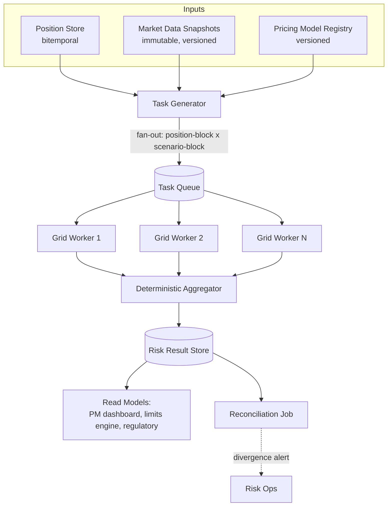
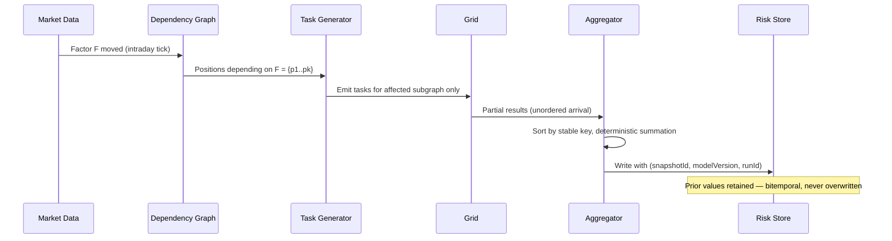
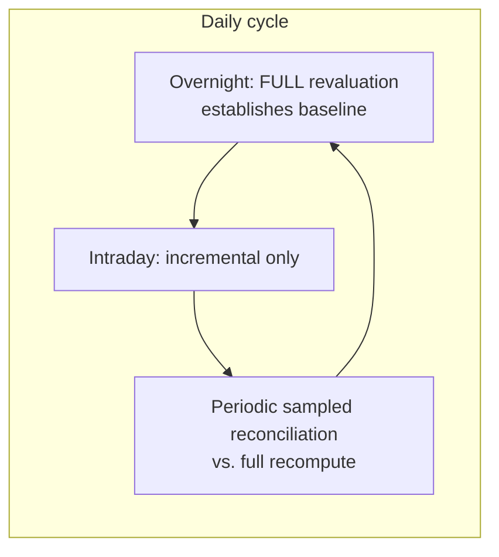
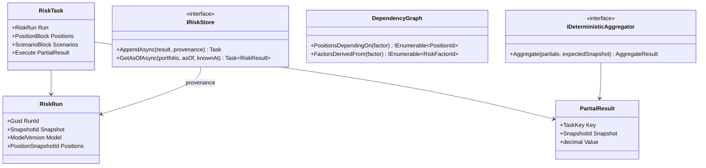

# Module 129 — System Design: Designing a Real-Time Portfolio Risk Engine

> Domain: System Design | Level: Beginner → Expert | Prerequisite: [[01-System-Design-Fundamentals]] (capacity estimation, scaling building blocks), [[../16-Distributed-Systems/01-Consensus-Consistency-Distributed-Transactions]] (consistency models this design must choose between), [[../35-Event-Sourcing/01-EventSourcingFundamentals-EventStoreAsSourceOfTruth-Snapshotting-AggregateReconstruction]] (point-in-time reconstruction, reused here for bitemporal risk), [[../29-Performance-Engineering/02-LoadTesting-CapacityPlanning-Benchmarking]] (Little's Law, applied here to grid capacity)
>
> **Scenario-module note:** This is the first of six buy-side/capital-markets system-design scenarios (Modules 129–134) added to close the domain-fit gap identified in the 2026-07-18 curriculum audit — the prior eight System Design modules (37–44) covered consumer-product scenarios (News Feed, Chat, YouTube, Instagram, e-commerce, WhatsApp) with no capital-markets equivalent. Full 16-section template; Elite FinTech Interview Panel lens.

---

## 1. Fundamentals

**What:** A risk engine computes, for every portfolio a firm manages, the answer to *"how much could we lose, and to what are we exposed?"* — expressed as sensitivities (how portfolio value moves per unit move in each underlying risk factor), Value-at-Risk (a loss threshold at a given confidence over a given horizon), and stress-test results (portfolio value under specified adverse scenarios). "Real-time" here means **intraday**: risk updates within seconds-to-minutes of a position or market-data change, not the overnight-batch-only model most firms started from.

**Why:** Risk numbers gate real decisions — a portfolio manager cannot size a trade without knowing its marginal risk contribution; a risk officer cannot enforce a mandate limit against a number that is 14 hours stale; a regulator expects the firm to know its exposure now, not at last night's close. The business value is entirely in *freshness plus trustworthiness together*: a fast number nobody trusts is worthless, and a trustworthy number that arrives tomorrow is equally worthless.

**When:** This architecture (compute grid + incremental intraday recalculation) is justified once portfolio count × position count × risk-factor count exceeds what a single-machine, single-pass overnight batch can complete inside its window — which, at institutional scale, it does by several orders of magnitude. A small fund with hundreds of positions genuinely does not need this; the design below assumes the scale quantifies.

**How (30,000-ft view):**
```
Positions ──┐
 ├──► Risk Task Generator ──► Compute Grid (N workers) ──► Aggregation ──► Risk Store
Market Data ┘ (fan-out) (revaluation) (fan-in) (read models)
 │
Overnight: full revaluation of everything ▼
Intraday: incremental — only what changed, or what depends on what changed PM / Risk dashboards
```

---

## 2. Deep Dive

This section is written to be **complete on its own** — every mechanism, the reasoning that selects it, the failure mode it introduces, and the push-back a Principal/Staff interviewer will raise, answered inline.

### 2.1 What a Risk Engine Actually Produces

Three outputs, answering three different questions — conflating them is the first mistake:

| Output | The question it answers |
|---|---|
| **Sensitivities** (delta, gamma, vega, DV01) | How does portfolio value move per unit move in a risk factor? |
| **VaR** | What loss threshold will not be exceeded, at a confidence level, over a horizon? |
| **Stress tests** | What is the portfolio worth under this *specified* adverse scenario? |

VaR is not "the" risk number. Its defining limitation, which an interviewer will ask for: **VaR says nothing about the magnitude of losses beyond the threshold.** A 99% 1-day VaR of £10m tells you nothing about whether the 1% tail is £11m or £400m — which is exactly the motivation for **Expected Shortfall (CVaR)**, the average loss conditional on being in the tail, and why post-crisis regulation (FRTB) moved toward it.

### 2.2 The Core Computation — Why the Work Is a Product

Every risk measure reduces to **repricing the portfolio under a perturbed market state**. A delta is: price at current market state, price again with one factor bumped, difference. Historical-simulation VaR reprices the whole book under each of ~250–1,000 historical scenarios and reads a percentile off the P&L distribution. Monte Carlo does the same under thousands of simulated scenarios.

The structural consequence that shapes everything:

```
pricing calls = positions × scenarios × (1 + factors bumped)

2,000,000 positions × 1,000 scenarios ≈ 2 × 10^9 pricing calls per full run
```

**The work is a product, not a sum.** Estimating effort as proportional to position count alone understates it by three or more orders of magnitude. Everything in the design exists to make that number tractable: **reduce** it (caching, §2.7), **parallelise** it (the grid, §2.5), or **avoid** it (incremental recomputation, §2.9).

### 2.3 Historical Simulation versus Monte Carlo — as Workloads

Compare them on the dimensions this architecture cares about, not on statistical merit:

| | Historical simulation | Monte Carlo |
|---|---|---|
| Scenarios | ~250–1,000 fixed, actual history | Thousands, model-generated |
| Work volume | Bounded, predictable | Far heavier |
| Reproducibility | **Deterministic by construction** | Only if the seed *and* the generator are pinned |
| Grid implication | Easier capacity planning | Strictly more capacity, plus seed management |

**The subtle Monte Carlo trap worth knowing:** the same seed on different CPU architectures or math-library versions can yield different sequences. So the generator *implementation and version* must be pinned alongside the seed — otherwise reproducibility fails silently, and only on heterogeneous grids, which is the hardest kind of bug to find.

### 2.4 The Risk-Factor Dependency Graph — and Its Silent Failure Mode

Positions do not depend on all factors. A US-equity position depends on that equity's price, its sector factor and USD rates; it is genuinely independent of JPY vol surfaces. That **sparsity** is what makes intraday viable: build a graph from risk factor → dependent positions, and a move in one factor triggers recomputation only of the subgraph it reaches.

**The trap: the graph is neither static nor obviously correct.** Instrument-to-factor dependencies come from pricing-model metadata that changes when a model changes. A **missing edge** means a position silently fails to recompute when it should have — producing a stale number that *looks* fresh, because it carries a current timestamp. This is the domain-specific form of the recurring "declared ≠ actual" theme.

**The graph cannot validate itself.** Inspecting the graph can never reveal an edge that was never added. The only reliable detection is an **independent path**: periodically run a full unconditional revaluation and compare it against what the graph-driven incremental path produced. A position whose value differs is one the graph failed to trigger.

**Couple graph regeneration to model deployment mechanically.** In practice edges go missing when a pricing-model change introduces a new factor dependency without the metadata being updated in lockstep. A checklist item asking engineers to regenerate the graph reliably fails. Instead: a fitness function that **fails the model-deployment pipeline** if a model version is registered without a corresponding regenerated graph version, plus a **post-deployment reconciliation** scoped to portfolios touching the changed model. Regeneration proves the step ran; it does not prove the resulting graph is correct — the model's own metadata could still be incomplete, which was the original failure mode — so the verification is not redundant.

### 2.5 Compute Grid Mechanics

The grid is a fan-out/fan-in: a coordinator partitions work into tasks, workers pull and execute, results aggregate.

**Task granularity has two failure directions.** Too coarse (one task per portfolio) and one large portfolio becomes a straggler defining the run while other workers idle. Too fine (one task per position-scenario pair) and coordination overhead swamps the pricing. The workable middle is *position-block × scenario-block*, sized so a task runs in **hundreds of milliseconds to low seconds** — long enough to amortise dispatch, short enough that no single task defines the tail.

**Run completion is `max(task)`, not `mean(task)`.** The run is not done until every task finishes, so the tail dominates and mean task duration is nearly uninformative for both capacity planning and monitoring.

**Pull-based distribution, not push.** Task durations are heterogeneous and not predictable in advance. Pull self-balances — a fast worker simply takes more — where push-based round-robin strands fast workers idle while slow workers queue. Push would be preferable only if tasks had to be routed to specific workers for data locality, which is not the case here because market-data slices are small enough to replicate.

**Straggler mitigation:** speculative re-execution of tasks exceeding a percentile threshold, plus pre-partitioning known-heavy portfolios more finely than the default. See §2.6 for why speculative execution is dangerous here without a prerequisite.

**Load each worker only the slice it needs.** A design where every worker loads the complete market-data snapshot multiplies snapshot memory by worker count, and at large worker counts that dominates cluster memory for data the task never touches. Loading only the slice the task's dependency subgraph requires cuts it by orders of magnitude — and note the pleasant side effect: a missing graph edge now causes a **task failure on a missing slice** rather than silent staleness, which is a strictly safer failure mode.

**Capacity planning by Little's Law**, with a domain caveat: `workers ≈ task arrival rate × mean task duration`, sized against **volatile-session** rates rather than calm-session averages. Under-provisioning is more dangerous here than for a typical service, because slow risk during volatility is precisely when the numbers are most decision-critical — **degradation correlates with need.**

### 2.6 Determinism and Reproducibility — the Non-Negotiable Constraint

A risk number that cannot be reproduced cannot be defended to a regulator, an auditor, or a PM disputing it. That imposes constraints most grid designs never carry.

**Inputs must be addressable.** Every stored number records `(snapshotId, modelVersion, positionSnapshotId, seed, runId)`. Storing only the number and a timestamp makes it permanently indefensible.

**Floating-point summation order matters.** FP addition is not associative, so different summation order yields different results — and grid scheduling varies order run to run. The fix is deterministic aggregation: **stable sort by task key before summing**, or compensated/pairwise summation. Do not dismiss 1e-12 differences as immaterial while claiming byte-reproducibility to an auditor; **the two claims are incompatible**, and a reproducibility claim that is 99.999% true is not a reproducibility claim.

**Speculative execution and determinism are individually reasonable and jointly hazardous.** Speculative re-execution means the same task may complete twice and whichever result arrives first is used — so the *set* of contributing computations differs run to run even for identical inputs. If aggregation is order-dependent, results become irreproducible in exactly the system where reproducibility is a regulatory requirement. They are compatible, but **only if aggregation is made order-independent first.** Adopting straggler mitigation as a "pure performance" change silently breaks reproducibility.

**Reproducing a three-year-old number requires four independently necessary things**, and an interviewer will ask you to enumerate them:

1. The stored input metadata.
2. The immutable snapshot and position archive.
3. **The recorded pricing-model version, re-instantiable** — which requires a model registry retaining historical versions.
4. Deterministic aggregation.

Any one missing makes the request unanswerable. The hardest to sustain over years is (3): code and dependencies rot, which is why model versions should be retained as **executable containerised artifacts**, not source references.

**Store results bitemporally, never overwriting.** Recording every computed number with both its `asOf` market time and its `computedAt` system time answers *"what did we believe our exposure was at 14:32, as we believed it then?"* — which is distinct from *"what was our actual exposure at 14:32, as we now know it."* Regulatory and dispute contexts require the former, and a mutable current-value store can only answer the latter. Treating a restated number as simply replacing the original destroys the record of what was actually acted upon.

### 2.7 Caching and Revaluation Avoidance

**Sensitivity cache.** If a position's sensitivities were computed against market state `S` and nothing it depends on has changed, reuse them. This depends entirely on the dependency graph being *correct* — an incorrect graph makes this cache silently serve stale results, which is strictly worse than not caching at all.

**Pricing-result memoization.** Identical instrument + identical market state = identical price. The same bond held in 400 funds collapses to one pricing call.

Its benefit is **superlinear in portfolio count**, and the reason is worth stating: as portfolio count grows, the number of *distinct instruments* grows far more slowly than total position count, so the hit rate rises with scale. Modelling cache benefit as a fixed percentage independent of scale understates it.

**Cache keys must include every input that can affect the result** — market state version, model version, instrument-terms version — not just the position identifier. Keying on position + date means a model-version change silently serves pre-change sensitivities. The domain-specific escalation: a wrong cached risk number does not merely degrade performance, **it produces an incorrect number a human will act on.** A miss costs time; a wrong hit costs a trading decision.

### 2.8 Snapshot Pinning — Making the Failure Inexpressible

§4's incident: tasks resolved "latest snapshot" at their own dispatch moment. Snapshot publication (~20s) became faster than run duration (~110s under contention), so early tasks priced against `S41` and late tasks against `S43`. The aggregator summed both into one portfolio number **representing no market state that ever existed.**

Every task individually succeeded against a valid snapshot. The inconsistency existed only *across* tasks, where nothing looked. Characterising this as "stale data" misses it: it was **fresh data, inconsistently combined** — a distinct and much harder-to-detect failure.

The complete structural fix has three parts, and implementing only the first is the common mistake:

1. **Make `snapshotId` a required run parameter**, threaded to every task, with **no API path that resolves latest per task.** As a configuration option it can be misconfigured, and the failure is silent. As a required parameter the bad behaviour is not expressible. The freshness cost — the run uses run-start data rather than per-task-latest — is bounded, known, and vastly preferable to an unbounded correctness risk.
2. **Have the aggregator verify** every incoming partial result carries the run's expected `snapshotId`, rejecting the run outright on mismatch. A positive consistency check, not an assumption — otherwise a future code path can reintroduce the inconsistency with nothing watching.
3. **Alert when run duration exceeds snapshot publication cadence.** That ratio crossing 1.0 is the precondition that made the bug reachable at all, so this catches a whole *class* of future cross-task assumptions rather than this one instance.

**The load test that would have caught it** tests the **ratio**, not either variable: drive publication at volatile-session cadence (~20s) *while* loading the grid enough to stretch run duration past it, then assert every partial result in a run carries an identical `snapshotId`. Testing each variable independently, each within normal parameters, never produces the condition — exactly as production didn't for eighteen months. And note the assertion is not run success (the run succeeded), it is **input consistency**.

### 2.9 Batch/Intraday Hybrid, Drift, and Reconciliation

The overnight batch does a full unconditional revaluation; intraday runs update incrementally against that baseline. Efficient, and it introduces **drift**: incremental deltas accumulate approximation and ordering differences, so intraday risk diverges from what a full recomputation would produce.

**The overnight full run's primary value is verification, not computation.** A proposal to eliminate it and run purely incrementally deletes the only independent check on both incremental drift *and* dependency-graph completeness (§2.4). The compute saving is real; it purchases efficiency by removing the system's correctness control, which for risk numbers is not defensible. The legitimate middle ground is reducing full-run **frequency** (weekly full, nightly sampled) rather than eliminating it — provided the sample is representative rather than convenient.

**Stratify the reconciliation sample; do not sample uniformly.** Always include:

- the **largest-notional and highest-complexity** portfolios, where an error has greatest consequence;
- portfolios containing **recently changed pricing models**, where graph edges are most likely missing;
- a random tail sample for baseline coverage.

Uniform random sampling is statistically defensible and **consequence-blind** — it under-weights exactly the portfolios where errors matter most, the same structural blind spot as percentage-based canary sampling that misses a low-volume but critical partner.

Reconciliation here is a **permanent** control, not a migration-time one: incremental updating never ends, so drift accumulation never ends.

### 2.10 The Incremental Trigger Policy

Not every tick — at institutional market-data rates, tick-triggered recomputation keeps the grid permanently saturated recomputing negligible moves. Three triggers, deliberately:

1. **Materiality**, with a threshold calibrated **per factor's own volatility** — a 1bp rates move and a 1% equity move are not comparable, and a single uniform threshold is either too sensitive for volatile factors or too insensitive for stable ones.
2. **A floor cadence** — recompute at least every N minutes regardless. This bounds the *age* of the number, so a quiet market cannot silently produce an arbitrarily stale figure that appears current.
3. **Position change** — a new trade must be reflected without waiting for a market move.

### 2.11 Bad Ticks — Reject at Ingestion, Never at Consumption

A plausibility check belongs at **snapshot-construction time**: a move exceeding a multiple of the factor's own recent volatility, or crossing a hard sanity bound, quarantines the suspect value and either falls back to the prior value or refuses to publish the snapshot.

**Consumption-time filtering is far worse**, because different consumers apply different filters, so the same "snapshot" yields different risk depending on who read it — destroying the single-market-state property §2.8 exists to establish.

Rejection must also be **recorded**, because a quarantined tick that was a real market move is itself a serious error. And the danger of an over-aggressive filter is specific and severe: during genuine market dislocation — exactly when risk numbers matter most — real extreme moves get quarantined as implausible, and **the engine reports calm during a crisis.**

### 2.12 Consumers, CAP Posture, and Multi-Tenancy

**The same store serves consumers with opposite postures, and that is correct.** A slightly stale number on a dashboard is acceptable (AP). Authorising a trade against a known-stale number is not, so the **limits engine must fail closed (CP)** — querying the risk store directly rather than the dashboard's cached view, and detecting staleness from the stored `asOf` and run identifiers, the same metadata reproducibility requires. CAP posture follows from the *consumer's* consequence-of-staleness, never from the store.

**Multi-tenancy needs isolated capacity, not just isolated configuration.** Serving several independently managed fund families from one shared worker pool lets one tenant's backlog starve another's run — and here that is not merely a latency regression but a **mandate-monitoring gap** with regulatory consequence. Shared *code*, isolated *capacity*, per-tenant SLA. The efficiency cost is idle capacity in quiet tenants' pools; the middle ground is a quota-bounded shared pool, viable only with tested quota enforcement.

### 2.13 Latency Versus Accuracy — Answering "We Want Sub-Second Risk"

Sub-second is achievable only for a **restricted question**. Full incremental recomputation across an affected subgraph involves dispatch, pricing and hierarchical aggregation — realistically seconds to tens of seconds. Sub-second is attainable for **sensitivity-based approximations** (delta/gamma-approximated P&L under a factor move, evaluated in memory without repricing), which is a genuinely different and less accurate computation.

The correct answer offers **both, explicitly labelled**: a sub-second approximate figure for immediate feedback, superseded by the accurate repriced number seconds later. What must never happen is meeting the latency target by silently substituting an approximation users believe is exact. The risk of showing both — users reconciling two numbers for one question — is mitigated by labelling and by showing the approximation *only* until the exact figure replaces it.

### 2.14 Disaster Recovery — Inputs Outrank Outputs

**Losing the market-data snapshot archive is worse than losing the risk-result store**, and the reason is directional: results are reproducible from inputs, so a lost result store can be rebuilt by re-running. Inputs cannot be reconstructed from outputs, so a lost snapshot archive **permanently destroys** the ability to reproduce or defend any historical number.

Applying uniform DR rigour to both over-invests in the recoverable store and under-protects the irreplaceable one. Snapshot-archive retention must cover at minimum the regulatory record-retention period of the numbers derived from it — typically multi-year, which is what drives the envelope-encryption and immutability requirements.

### 2.15 Observability — "Slow" and "Wrong" Need Different Signal Sets

**Slow is self-signalling:** run duration, task-duration p99, queue depth, worker utilisation. Standard.

**Wrong has no natural signal and must be constructed:**

- **Per-run input-consistency verification** (§2.8) — the fastest detector, catching the condition *at run time* rather than four hours later.
- **Reconciliation divergence magnitude and trend** (§2.9).
- **Dependency-graph coverage** — the proportion of positions actually triggered by a known factor move, versus expected.
- **Spot-reproduction success rate** (§2.6) — periodically re-derive a stored number and assert it matches.

Investing monitoring effort proportionally across both is the mistake: incorrectness needs disproportionately more, because unlike slowness it produces no natural symptom. §4 ran wrong for hours with every conventional signal green.

### 2.16 Principal-Level Judgements

**Investigating a PM's dispute.** First reproduce the engine's number from recorded inputs (§2.6) to establish self-consistency. Then **diff inputs, not outputs**: does the PM's position set match the engine's `positionSnapshotId` (often a trade booked after the snapshot); does the market data match (often a different pricing source); does the model match (often a simpler approximation). The majority of disputes resolve to an input difference, not a computational error — which is why reproducibility metadata is the primary investigative tool, and why an engine that cannot state its inputs cannot resolve disputes at all. Auditing pricing logic first is the least likely cause and the most expensive to investigate. If inputs match and outputs differ, escalate to model validation and treat it as a potential correctness incident.

**Evaluating serverless/elastic compute.** The workload fits unusually well: bursty, embarrassingly parallel, stateless per task — so elastic capacity avoids provisioning for a peak that idles most of the day. Three specific countervailing factors: cold-start latency matters when run completion *is* the SLA; pricing libraries are often large native dependencies that inflate cold start; and **market-data licensing sometimes contractually restricts where data may be processed**, which can rule out regions or providers outright. That last one is invisible in the architecture and frequently decides the question in practice, typically discovered when legal reviews a migration already deep in design. Recommendation: elastic burst capacity above a fixed baseline, not either extreme.

**The governance program required before intraday numbers may gate live trading:**

1. Structural input-consistency enforcement with aggregator-side verification (§2.8).
2. Stratified, consequence-weighted reconciliation on a defined cadence with divergence alerting (§2.9).
3. Complete reproducibility metadata plus retained, re-instantiable model versions, **proven by periodic spot-reproduction rather than assumed** (§2.6).
4. Mechanically enforced dependency-graph regeneration coupled to model deployment, with post-deployment verification (§2.4).
5. Deterministic aggregation as a **precondition** for any straggler-mitigation optimisation (§2.6).
6. CP-postured consumption for the limits engine, failing closed on staleness (§2.12).
7. An explicit, documented statement of the **residual unverified window**, reviewed whenever the reconciliation cadence changes.

If you inherit an ungoverned engine and can implement only one of these first, implement **reconciliation against full recomputation** — it is the only control that detects errors whose shape you do not yet know, including the graph gaps and drift every other control assumes away.

**Answering a regulator honestly.** Cite the controls concretely (1, 2, 3 above), then state the residual plainly: reconciliation is sampled between full runs, so the guarantee is *"verified within the reconciliation window and sampling scope"* — not *"continuously proven for every number."* A bounded, stated claim is more credible than an unqualified assurance, and the concrete improvement lever is increasing full-reconciliation frequency, which narrows the unverified window and can be costed.

**The closing synthesis — why this is harder than the consumer-scale systems.** Not scale; a news feed handles more requests. The difference is that **correctness is unobservable and consequential at the same time.** A broken feed is visibly broken. A wrong risk number is indistinguishable from a right one at the point of consumption, and is converted into a market position within seconds.

That inverts the usual priority. Almost all of this design's complexity — snapshot pinning, deterministic aggregation, reproducibility metadata, reconciliation, graph verification — exists not to make the system fast or scalable, both of which are comparatively solved, but to make its output **trustworthy and defensible**. The compute grid is the easy part. Every senior-level decision here is ultimately about establishing *evidence* for a number's correctness rather than about producing the number.

---

## 3. Visual Architecture


```mermaid
graph TB
 subgraph Inputs
 POS[Position Store<br/>bitemporal]
 MD[Market Data Snapshots<br/>immutable, versioned]
 MOD[Pricing Model Registry<br/>versioned]
 end
 POS --> TG[Task Generator]
 MD --> TG
 MOD --> TG
 TG -->|fan-out: position-block x scenario-block| Q[(Task Queue)]
 Q --> W1[Grid Worker 1]
 Q --> W2[Grid Worker 2]
 Q --> WN[Grid Worker N]
 W1 --> AGG[Deterministic Aggregator]
 W2 --> AGG
 WN --> AGG
 AGG --> RS[(Risk Result Store)]
 RS --> RM[Read Models:<br/>PM dashboard, limits engine, regulatory]
 RS --> RECON[Reconciliation Job]
 RECON -.divergence alert.-> OPS[Risk Ops]
```


```mermaid
sequenceDiagram
 participant MD as Market Data
 participant DG as Dependency Graph
 participant TG as Task Generator
 participant G as Grid
 participant A as Aggregator
 participant RS as Risk Store

 MD->>DG: Factor F moved (intraday tick)
 DG->>TG: Positions depending on F = {p1..pk}
 TG->>G: Emit tasks for affected subgraph only
 G->>A: Partial results (unordered arrival)
 A->>A: Sort by stable key, deterministic summation
 A->>RS: Write with (snapshotId, modelVersion, runId)
 Note over RS: Prior values retained — bitemporal, never overwritten
```


```mermaid
graph LR
 subgraph "Daily cycle"
 EOD[Overnight: FULL revaluation<br/>establishes baseline] --> INTRA[Intraday: incremental only]
 INTRA --> RECONC[Periodic sampled reconciliation<br/>vs. full recompute]
 RECONC --> EOD
 end
```

---

## 4. Production Example

**Problem:** A firm's intraday risk engine, serving ~9,000 portfolios, needed to reflect position and market moves within 60 seconds. It did — and had for eighteen months, with no correctness incidents.

**Architecture:** Exactly the design: incremental intraday recomputation driven by the dependency graph, fanned out over a grid, aggregated into a risk store feeding PM dashboards and the limits engine.

**Implementation:** The task generator resolved market data by querying "latest snapshot" per risk factor at the moment each task was dispatched — not by pinning one snapshot ID for the entire run. Under normal conditions this was invisible: snapshots updated every few minutes, a run completed in under a minute, so all tasks in a run naturally saw the same snapshot.

**Trade-offs:** Pinning a snapshot per run costs a small amount of freshness (the run uses data from run-start, not from each task's dispatch moment). The team had reasoned, correctly for the common case, that per-task latest-resolution gave marginally fresher numbers.

**Lessons learned:** During a volatile session, market-data snapshots began publishing every ~20 seconds while grid contention stretched one run to ~110 seconds. Tasks dispatched early in that run priced against snapshot `S41`; tasks dispatched late priced against `S43`. The aggregator summed both into one portfolio-level number. Nothing errored. Every task succeeded. The resulting risk figure was **internally inconsistent** — it represented no actual market state that had ever existed, and a hedge sized against it was wrong in a way that could not be reproduced afterward, because replaying the run pinned to either `S41` or `S43` produced a different answer than the one acted upon.

It was caught by the reconciliation job flagging divergence — 4 hours later. The fix: **pin one immutable snapshot ID at run start and pass it to every task**, accepting the marginal freshness cost. The deeper lesson, and the one that generalizes: the run "succeeded" by every signal the system emitted (zero task failures, complete aggregation, fresh timestamp) while being wrong, because *no signal existed for input consistency across the fan-out*. Success of the parts was being treated as evidence of correctness of the whole — this course's "declared ≠ actual" theme in its risk-engine-specific form, and the reason the design makes snapshot pinning a structural property rather than a configuration option.
## 11. Coding Exercises

### Easy — Deterministic Aggregation
**Problem:** Sum grid partial results reproducibly regardless of arrival order.
**Solution:**
```csharp
public decimal AggregateDeterministically(IEnumerable<PartialResult> partials) =>
    partials
.OrderBy(p => p.TaskKey, StringComparer.Ordinal) // stable, arrival-order-independent
.Aggregate(0m, (sum, p) => sum + p.Value);
```
**Time complexity:** O(n log n) for the sort, O(n) for the sum.
**Space complexity:** O(n) to materialize the ordering.
**Optimized solution:** Use `decimal` (exact base-10) where the domain permits, avoiding floating-point associativity entirely; where `double` is required for performance, apply Kahan/Neumaier compensated summation, which bounds error independent of order rather than merely fixing order.

### Medium — Run-Scoped Snapshot Enforcement (§2.8)
**Problem:** Make per-task snapshot resolution structurally inexpressible.
**Solution:**
```csharp
public sealed record RiskRun(Guid RunId, SnapshotId Snapshot, ModelVersion Model);

public sealed class RiskTask
{
    public RiskTask(RiskRun run, PositionBlock positions) // snapshot only obtainable from the run
    {
        Run = run; Positions = positions;
    }
    public RiskRun Run { get; }
    public PositionBlock Positions { get; }
    // No API surface exists to resolve "latest" — the market data accessor
    // requires a SnapshotId, and the only SnapshotId reachable is Run.Snapshot.
}
```
**Time complexity:** O(1).
**Space complexity:** O(1) per task beyond its position block.
**Optimized solution:** Add aggregator-side verification rejecting any partial result whose `Run.Snapshot` differs from the run's expected value — defence in depth, so a future refactor cannot silently reintroduce the inconsistency (§2.8's point 2).

### Hard — Dependency-Graph Subgraph Resolution
**Problem:** Given a moved risk factor, resolve the affected position set for incremental recomputation.
**Solution:**
```csharp
public IReadOnlySet<PositionId> ResolveAffected(RiskFactorId moved, DependencyGraph graph)
{
    var affected = new HashSet<PositionId>;
    var queue = new Queue<RiskFactorId>;
    queue.Enqueue(moved);
    var seenFactors = new HashSet<RiskFactorId> { moved };

    while (queue.Count > 0)
    {
        var factor = queue.Dequeue;
        foreach (var p in graph.PositionsDependingOn(factor)) affected.Add(p);
        foreach (var derived in graph.FactorsDerivedFrom(factor)) // e.g. curve → forward rates
            if (seenFactors.Add(derived)) queue.Enqueue(derived);
    }
    return affected;
}
```
**Time complexity:** O(V + E) over the reachable subgraph, not the whole graph.
**Space complexity:** O(V) for the visited sets.
**Optimized solution:** Precompute and cache transitive closures for frequently-moved factors, invalidated on graph regeneration (§2.4) — trading memory for avoiding repeated traversal on every tick.

### Expert — Reconciliation with Stratified Sampling (§2.9)
**Problem:** Compare incremental state against full recomputation, sampling by consequence rather than uniformly.
**Solution:**
```csharp
public async Task<ReconciliationReport> ReconcileAsync(DateOnly asOf)
{
    var always = _portfolios.Where(p => p.Notional > _materialityThreshold
        || p.UsesRecentlyChangedModel(_lookback));
    var sampled = _portfolios.Except(always).RandomSample(_baselineSampleSize);

    var findings = new List<Divergence>;
    foreach (var p in always.Concat(sampled))
    {
        var incremental = await _riskStore.GetCurrentAsync(p.Id, asOf);
        var full = await _engine.FullRecomputeAsync(p.Id, incremental.Snapshot, incremental.Model);

        var relative = Math.Abs(full.Var - incremental.Var) / Math.Max(Math.Abs(full.Var), 1m);
        if (relative > _tolerance)
            findings.Add(new Divergence(p.Id, incremental.Var, full.Var, relative));
    }
    return new ReconciliationReport(findings, checkedCount: always.Count + sampled.Count);
}
```
**Time complexity:** O(s × full-recompute cost) for s sampled portfolios — the dominant cost, driving sample-size calibration.
**Space complexity:** O(d) for d divergences found.
**Optimized solution:** Recompute against the *same* recorded snapshot and model the incremental figure used (as above) rather than current market state — otherwise the comparison conflates genuine drift with legitimate market movement between the two computations, producing a divergence signal that is mostly noise.

---

## 12. System Design — Designing a Real-Time Portfolio Risk Engine

*Authored to the four-step standard (see Module 01 §12 for the method).*

---

### Step 1 — Understand the Problem and Establish Design Scope

#### The dialogue

> **C:** Whose risk, and for what purpose? Market risk for a trading desk, counterparty risk, and regulatory capital are three different systems.
> **I:** Market risk for an asset manager — sensitivities, VaR, and stress, across the firm's portfolios.
>
> **C:** Who consumes it? The consumers determine the freshness and availability requirements far more than the maths does.
> **I:** Three: portfolio manager dashboards, a pre-trade limits engine, and regulatory reporting.
>
> **C:** Those have incompatible postures — a dashboard prefers stale-but-available, a limits engine must refuse rather than serve stale, and reporting needs reproducibility. Confirmed?
> **I:** Confirmed, and that tension is part of the problem.
>
> **C:** Overnight batch, intraday, or both?
> **I:** Both. Full revaluation overnight; intraday updates when something material moves.
>
> **C:** What defines "material"? If it's every tick, the design is completely different.
> **I:** You define it — but assume we cannot recompute everything on every tick.
>
> **C:** Do we need to reproduce a historical risk number exactly?
> **I:** Yes. If a regulator asks why a limit breached on a date two years ago, we must reproduce the number byte-for-byte.
>
> **C:** Scale?
> **I:** About 9,000 portfolios, roughly 220 positions each.
>
> **C:** Instrument mix? Vanilla equities and bonds price in microseconds; exotic derivatives are milliseconds — that's a 50× swing in total compute.
> **I:** Predominantly vanilla today, but the derivative book is growing.
>
> **C:** Out of scope?
> **I:** Market-data sourcing (assume Module 10's platform supplies pinned snapshots), the pricing models themselves, and the reporting formats.

The sixth answer is the constraint that shapes everything: **byte-identical reproducibility** rules out non-deterministic parallel aggregation, floating-point order sensitivity, and any "current market data" read that is not pinned. It converts a compute problem into an *evidence* problem.

#### Functional requirements

1. Compute sensitivities, VaR, and stress results per position, aggregated to portfolio, fund-family, and firm level.
2. Full revaluation overnight; incremental recomputation intraday on material factor moves, position changes, and a floor cadence.
3. Serve risk to PM dashboards, a pre-trade limits engine, and regulatory reporting — each with its own posture.
4. Reproduce any historical risk number on demand from recorded inputs.
5. Reconcile the incremental intraday state against a full recomputation, and bound the drift.

#### Non-functional requirements

| Requirement | Target |
|---|---|
| Intraday freshness | Material change reflected within 60 s (p99) |
| Overnight window | Full revaluation complete within 90 minutes |
| Reproducibility | **Byte-identical** re-derivation from recorded inputs, for the full retention period |
| Correctness | Every run internally consistent (a single pinned market state); incremental drift bounded and monitored |
| Availability — dashboard read path | 99.9%, stale-tolerant |
| Availability — limits engine | **Fails closed** — refuses rather than serving stale |
| Retention | Inputs and results for the regulatory period, queryable |

#### Back-of-the-envelope estimation

```
Positions        = 9,000 portfolios × 220              ≈ 2,000,000
Historical-sim VaR at 500 scenarios
Pricings/run     = 2,000,000 × 500                     = 1 × 10^9
At ~40 µs/pricing (vanilla)
CPU time         = 10^9 × 40 µs                        = 40,000 CPU-s ≈ 11 CPU-hours
Overnight window = 90 min = 1.5 h
Cores needed     = 11 ÷ 1.5                            ≈ 8 cores minimum
With 3× headroom for heavy-tail portfolios and stragglers ≈ 24 cores
```

Intraday:

```
A material trigger touches ~2–5% of positions
                 = 40,000–100,000 positions × 500 scenarios
                 = 2–5 × 10^7 pricings ≈ 0.8–2 CPU-hours
On the same 24-core grid                                ≈ 2–5 minutes
...which does NOT meet the 60-second target, so incremental
recomputation must be narrower than "every affected position"
— see §3.3.
```

**The sensitivity that matters — and the reason to do the estimate at all:**

```
If instrument mix shifts toward derivatives at ~2 ms per pricing:
Same run = 10^9 × 2 ms = 2,000,000 CPU-s ≈ 550 CPU-hours
                                          → 370 cores for the same window
A 50× swing driven ENTIRELY by instrument mix, with no change
in position count, portfolio count, or scenario count.
```

Storage:

```
Risk results: 2M positions × ~20 measures × 8 B × 2 runs/day ≈ 640 MB/day
Market-data snapshots: the irreplaceable asset — small, but must
be retained immutably for the full period
```

#### What the numbers tell us

1. **Compute is not the binding constraint today — 24 cores is nothing.** A candidate who spends the round on grid scaling has misread the problem.
2. **Capacity planning must be driven by instrument mix, not position count.** The 50× sensitivity means a headcount-neutral, AUM-neutral change in the book can invalidate the capacity model overnight. So the monitored capacity metric must be *pricings weighted by instrument cost*, not position count — an unusual metric that falls directly out of this arithmetic.
3. **The 60-second intraday target is not met by "recompute affected positions."** The estimate says 2–5 minutes. That gap is what forces materiality filtering and sensitivity-based approximation (§3.3) rather than brute recomputation — and identifying the gap *from your own numbers*, rather than discovering it later, is the point of Step 1.

The hard problem is **reproducibility and internal consistency under incremental update**, not throughput.

---

### Step 2 — Propose High-Level Design and Get Buy-In

#### The two core flows

- **Full run (overnight)** — complete, deterministic, pinned to one market snapshot, the reference against which everything else is judged.
- **Incremental run (intraday)** — narrow, triggered, approximate at the margin, and continuously reconciled against what a full run would have produced.

Treating these as one pipeline with a parameter is the common mistake; they have different correctness definitions.

#### Components

**Snapshot Pinner.** Obtains a `snapshotId` from the market-data platform (Module 10) and pins it for the entire run. **Every task in a run reads the same snapshot** — this is the single mechanism that makes a run internally consistent.

**Task Generator.** Walks the risk-factor dependency graph and emits pure-function tasks. Dependency-aware, because naive per-position parallelism recomputes shared factor state repeatedly.

**Compute Grid (pull-based workers).** Workers pull tasks; each task is a pure function of `(pinned inputs, model version)`, which makes retry free and idempotent by construction.

**Deterministic Aggregator.** Hierarchical, with a **fixed combination order** — because floating-point addition is not associative, and an aggregation whose order varies with worker completion order produces different numbers on every run. This is the single most commonly missed reproducibility requirement.

**Pricing-Model Registry.** Immutable, versioned model binaries. A risk number is meaningless without the model version that produced it.

**Bitemporal Risk Store.** Results by `(portfolio, as-of date, knowledge time)` — so "what did we believe on Tuesday" and "what do we now believe about Tuesday" are both answerable.

**Reconciliation Job.** Compares the incremental intraday state against a from-scratch recomputation; produces a bounded drift measure.

**Consumer Adapters.** Three, with three different postures, enforced in the adapter rather than by convention.

#### End-to-end walkthrough — a full overnight run

1. Scheduler triggers; the Snapshot Pinner acquires `snapshotId=S`, and positions are read `asOf` the same business date.
2. A `run_id` is created recording `{snapshotId, position_asof, model_registry_version, scenario_set_version}` — **the complete reproduction key**, written before any compute starts.
3. Task Generator walks the dependency graph: shared risk-factor state (curves, surfaces, scenario matrices) is computed once and published; per-position pricing tasks reference it.
4. Workers pull tasks, pricing against `S` only. A worker that cannot obtain `S` **fails the task rather than falling back to current data** — silent substitution is how a run becomes internally inconsistent.
5. Completed task results land in a durable task-completion log, so a coordinator crash resumes rather than restarts.
6. Aggregation runs hierarchically in a fixed, deterministic order, producing portfolio → family → firm results.
7. **Input-consistency verification** before publication: every task in the run must have used `S` and the same model versions. Any mismatch **rejects the entire run** rather than publishing a partially-consistent number.
8. Results written to the bitemporal store with `run_id`; a completion event published via the Outbox to downstream consumers.

#### End-to-end walkthrough — an intraday incremental update

1. A market-data event or position change arrives; the **materiality filter** evaluates whether it can move any measure past a stated threshold.
2. Below threshold → recorded, not recomputed. (Recorded, because "we chose not to recompute" must be evidence, not an absence.)
3. Above threshold → a new `snapshotId` is pinned, the affected sub-graph is identified, and a narrow task set is emitted.
4. Results merge into the intraday state with a **new knowledge time**, never overwriting.
5. A floor cadence (say every 15 minutes) forces an update regardless of materiality, so a quiet market cannot produce an indefinitely stale number that looks fresh.

#### API design

**`GET /v1/risk/portfolios/{id}`**

| Param | Type | Description |
|---|---|---|
| `as_of` | date | Business date |
| `knowledge_time` | RFC3339 | Optional; defaults to now. **This parameter is what makes the store bitemporal in practice rather than in theory** |
| `measures` | string[] | `delta`, `var_99_1d`, `stress:{scenario_id}`, … |
| `aggregation` | enum | `POSITION` \| `PORTFOLIO` \| `FAMILY` \| `FIRM` |

Response:

| Field | Type | Description |
|---|---|---|
| `values` | object | Measure → value |
| `run_id` | string | Which run produced this |
| `snapshot_id` | string | Which market state |
| `computed_at`, `staleness_seconds` | | **Staleness is returned, not inferred** — the limits engine needs it to decide whether to refuse |
| `basis` | enum | `FULL` \| `INCREMENTAL` — consumers are entitled to know which |

**`POST /v1/risk/runs`** — `{ run_type, as_of, snapshot_id?, scope? }` → `202 { run_id }`.

**`GET /v1/risk/runs/{run_id}/reproduction-key`** → the full input manifest. This endpoint exists so reproduction is a *supported operation*, not an archaeology exercise.

**`POST /v1/risk/reproduce`** — `{ run_id }` → re-executes from the recorded manifest and reports whether the output is byte-identical. Running this on a sample continuously is the only way to know reproducibility still works.

#### Data model

**`risk_run`** — `run_id`, `run_type` (`FULL`/`INCREMENTAL`), `as_of`, `snapshot_id`, `position_asof`, `model_registry_version`, `scenario_set_version`, `started_at`, `completed_at`, `status`, `task_count`, `consistency_verified`.
Lifecycle: `PENDING → RUNNING → AGGREGATING → VERIFYING → PUBLISHED`, with `REJECTED` (consistency failure) and `FAILED` branches. **`REJECTED` is a first-class terminal state** — a run that fails verification must not be silently retried into existence.

**`risk_result`** — columnar, partitioned by `(portfolio_id, as_of)`:

| Column | Type | Notes |
|---|---|---|
| `portfolio_id`, `position_id`, `as_of` | | Partition/cluster |
| `knowledge_time` | timestamptz | The bitemporal second axis; append-only |
| `measure`, `value` | text/double | |
| `run_id` | string | Provenance on every row — non-negotiable |
| `basis` | enum | `FULL`/`INCREMENTAL` |

**`position`** — bitemporal relational store; point-in-time correctness is a *query requirement*, not a nice-to-have, because a trade booked late must not retroactively change a published number without a new knowledge time.

**`market_snapshot`** — immutable object storage, addressed by `snapshot_id`, versioned and replicated. **This is the irreplaceable asset**: models can be rebuilt and results recomputed, but a market state that was never captured is gone forever.

#### Store selection, and why

| Store | Choice | Reason |
|---|---|---|
| Market snapshots | **Immutable object storage, versioned** | Write-once, read-by-key, must survive everything. Cheap, durable, and immutability is the property that makes reproduction possible |
| Positions | **Bitemporal relational** | Point-in-time queries with joins; modest volume; corrections must not overwrite |
| Risk results | **Columnar/time-series, append-only** | The dominant query is "these portfolios across this date range for these measures" — a columnar scan. Append-only preserves the knowledge-time axis |
| Task state | **Durable log** | Crash resumption |
| Model binaries | **Immutable artefact registry** | A model version is part of the reproduction key |

---

### Step 3 — Design Deep Dive

#### 3.1 Determinism — the four places it is lost

Reproducibility fails quietly, and always in one of these four places:

1. **Floating-point aggregation order.** `(a+b)+c ≠ a+(b+c)` in IEEE 754. If the aggregator sums results in worker-completion order, the firm-level number differs run to run. Fix: aggregate in a **fixed, position-ID-ordered tree**, or use a compensated (Kahan) summation with a fixed order. Sorting before summing costs a little and buys the whole requirement.
2. **Unpinned inputs.** Any task that reads "current" anything — market data, reference data, a config flag — breaks reproduction. Fix: every input arrives through the pinned manifest, and workers have **no network path** to live sources. Structural prevention, not discipline.
3. **Model version drift.** The same code path, a different binary. Fix: model version is in the reproduction key and is verified at task execution, not assumed.
4. **Non-deterministic randomness.** Monte Carlo without a recorded, per-task seed derived deterministically from `(run_id, position_id, scenario_index)`. Fix: derive seeds; never use a global RNG.

The verification that this still works is the `POST /v1/risk/reproduce` sample job — because all four of these regress silently, and none of them produce an error.

#### 3.2 Snapshot pinning and the consistency/freshness trade

Pinning trades marginal freshness for internal consistency. It is correct here because of **consequence asymmetry**: a risk number that is 30 seconds old is fine; a risk number where half the positions were priced against 09:00 data and half against 09:01 data is *wrong in an unquantifiable way* — you cannot say by how much, which means you cannot defend it.

Concretely, this means a long-running task must not "refresh" its data mid-run, and a straggler must not be re-dispatched against a newer snapshot. The task's inputs are part of its identity.

#### 3.3 Closing the intraday gap the estimation exposed

The estimate said naive incremental recomputation takes 2–5 minutes against a 60-second target. Three levers, applied in order:

- **Materiality filtering.** Do not recompute for moves that cannot change any measure past its reporting threshold. This is the largest lever, and it must be *conservative and provable* — the filter's job is to prove a move is immaterial, not to guess.
- **Sensitivity-based approximation.** For small factor moves, first-order (delta/gamma) revaluation approximates full revaluation at a fraction of the cost. Valid within a bounded move size; **outside that bound, fall back to full revaluation**, and the bound must be enforced rather than assumed.
- **Dependency-graph narrowing.** Recompute only the sub-graph the move actually touches, not every position in an affected portfolio.

The essential discipline: every approximation is **bounded and measured**, and the reconciliation job (§3.4) is what turns "we think the approximation is fine" into evidence.

#### 3.4 Reconciliation and bounded drift

Incremental state accumulates approximation error. The control is a periodic from-scratch recomputation compared against the incremental state, producing a per-measure drift distribution.

- Drift within tolerance → recorded, trend tracked.
- Drift outside tolerance → the incremental state is **replaced by the full result** and an investigation is raised.
- **Drift trend is the alert, not drift level.** A slowly growing drift that is still inside tolerance is the leading indicator; by the time it breaches, the cause is weeks old.

#### 3.5 Three consumers, three postures — enforced structurally

| Consumer | Posture | Behaviour when risk is stale or unavailable |
|---|---|---|
| PM dashboard | **AP** | Serve last known value, **prominently labelled with its staleness**. A dashboard that hides staleness is worse than one that fails |
| Pre-trade limits engine | **CP — fails closed** | Refuse to authorise. Trading blocked is a business cost; trading against unknown risk is a control failure |
| Regulatory reporting | **Reproducible over fresh** | Uses published, verified full runs only; never incremental state |

This is why `staleness_seconds` and `basis` are in the API response rather than being internal details: **the consumer cannot implement its posture unless the response tells it what it is holding.** Designs that return a bare number force every consumer to guess.

#### 3.6 Failure handling

- **Worker loss** → task re-queued. Free, because tasks are pure functions of pinned inputs — idempotence by construction rather than by mechanism.
- **Straggler task** → hedged re-dispatch against **the same snapshot**; first result wins, the other is discarded. Re-dispatching against fresh data would silently break run consistency.
- **Coordinator loss** → resume from the durable task-completion log.
- **Bad market data** → rejected at ingestion with a recorded quarantine, never silently substituted.
- **Run-level input inconsistency** → **reject the entire run.** Publishing a partially-consistent risk number is the worst available outcome, because it is wrong in a way nobody can bound.
- **Overnight run overruns the window** → this is a capacity event, and per the estimation's sensitivity, its most likely cause is instrument-mix drift rather than volume growth. The alert should therefore be on **cost-weighted pricings**, which moves before the window is missed.

---

### Step 4 — Wrap-Up

**What we left out:** the pricing models and scenario construction themselves; counterparty credit risk and XVA, which have a different computational shape (nested simulation); regulatory capital calculation; the limits engine's own design; multi-tenant isolation across fund families, where a noisy tenant must not consume another's grid capacity (Module 12); and disaster recovery for the snapshot archive, which given its irreplaceability deserves its own review.

**What we would measure — two deliberately separate signal sets:**

*Performance:* run duration versus window, task p99, queue depth, straggler rate, cost-weighted pricings per run.

*Correctness — and this set must be deliberately constructed, because none of it emerges from ordinary instrumentation:* input-consistency verification pass rate; reconciliation drift **trend** per measure; dependency-graph coverage (positions that were in the book but in no task — the completeness question, which is Module 13's problem arriving here); spot-reproduction success rate on sampled historical runs; and approximation-bound violations.

**Summary.** Pin one market snapshot per run and give workers no path to live data; make tasks pure functions so retries are free; aggregate in a fixed order because floating-point addition is not associative; keep results bitemporal so corrections add knowledge rather than destroy it; and reject rather than publish when input consistency fails. The estimation drives the two non-obvious decisions: capacity is governed by instrument mix rather than position count, and the 60-second intraday target cannot be met by recomputation alone, which is what forces bounded, measured approximation with reconciliation as its control.

---

### References

1. Basel Committee — *Minimum capital requirements for market risk* (FRTB), for the reproducibility and model-versioning expectations regulators actually apply.
2. Philippe Jorion — *Value at Risk*, for historical-simulation mechanics and the scenario-count/compute relationship.
3. David Goldberg — *What Every Computer Scientist Should Know About Floating-Point Arithmetic* — the formal basis for §3.1's aggregation-order requirement.
4. William Kahan — compensated summation, the practical mitigation.
5. Martin Fowler — *Bitemporal History*, the model used for the risk store and positions.
6. Google — *The Tail at Scale* (Dean & Barroso, CACM 2013) — hedged requests, and why they must be hedged against identical inputs here.
7. Modules 10 and 12 of this folder — the market-data platform supplying pinned snapshots, and multi-tenant grid isolation.
8. Module 13 of this folder — completeness as an evidence problem, the shape §4's monitoring set inherits.

---
## 13. Low-Level Design

**Requirements:** Tasks are pure functions of pinned inputs; aggregation is order-independent; every result carries full provenance; graph resolution is efficient over the reachable subgraph.

**Class diagram:**

```mermaid
classDiagram
 class RiskRun {
 +Guid RunId
 +SnapshotId Snapshot
 +ModelVersion Model
 +PositionSnapshotId Positions
 }
 class RiskTask {
 +RiskRun Run
 +PositionBlock Positions
 +ScenarioBlock Scenarios
 +Execute PartialResult
 }
 class PartialResult {
 +TaskKey Key
 +SnapshotId Snapshot
 +decimal Value
 }
 class IDeterministicAggregator {
 <<interface>>
 +Aggregate(partials, expectedSnapshot) AggregateResult
 }
 class DependencyGraph {
 +PositionsDependingOn(factor) IEnumerable~PositionId~
 +FactorsDerivedFrom(factor) IEnumerable~RiskFactorId~
 }
 class IRiskStore {
 <<interface>>
 +AppendAsync(result, provenance) Task
 +GetAsOfAsync(portfolio, asOf, knownAt) Task~RiskResult~
 }

 RiskTask --> RiskRun
 RiskTask --> PartialResult
 IDeterministicAggregator --> PartialResult
 IRiskStore --> RiskRun: provenance
```

**Sequence diagram:** the second diagram, with the aggregator's snapshot-verification step (§2.8) preceding summation.

**Design patterns used:** Fork-Join (grid fan-out/fan-in); Memento (immutable snapshots as captured state); Strategy (interchangeable VaR methodologies — historical simulation vs. Monte Carlo, §2.3); Specification (materiality trigger rules, §2.10); Bulkhead (per-tenant grid pools, §2.12).

**SOLID mapping:** Single Responsibility (task executes, aggregator combines, store persists — none overlap); Open/Closed (a new VaR methodology adds a Strategy implementation without touching grid or aggregation); Liskov (every VaR strategy must satisfy the same determinism and provenance contract — verified by contract test, the discipline); Interface Segregation (`IRiskStore` read and append paths separated, since the limits engine needs only reads with staleness metadata); Dependency Inversion (task depends on an `IMarketDataAccessor` requiring a `SnapshotId`, never a concrete "latest" resolver — the structural fix).

**Extensibility:** A new instrument type adds a pricing model to the registry plus dependency-graph metadata; a new risk measure adds a Strategy. Neither touches the grid, aggregator, or store.

**Concurrency/thread safety:** Tasks are pure and share nothing — the grid requires no locking. The aggregator's ordering is the sole point where concurrency meets correctness, and is resolved by making order a function of task identity rather than arrival. The risk store is append-only (§2.6), eliminating write-write conflicts entirely.

---

## 14. Production Debugging

**Incident:** Overnight batch, normally completing in ~70 minutes, began overrunning its 90-minute window intermittently — roughly one night in four — with no code change, no position-count growth, and no infrastructure change. On overrun nights, morning risk was unavailable at market open.

**Root cause:** A single fund had begun trading a small number of path-dependent exotic options. These priced via Monte Carlo *inside* each outer scenario — a nested simulation — making each such position roughly 4,000× more expensive to price than a vanilla instrument. There were only 60 such positions out of 2 million (0.003% of the book), but they consumed roughly 40% of total grid work. Because the task generator partitioned by position *count* rather than estimated *cost*, these positions landed in ordinary-sized blocks, producing a handful of tasks running hours while thousands of workers idled — a textbook straggler, invisible in aggregate metrics because mean task duration barely moved.

**Investigation:** Run-duration dashboards showed only "sometimes slower," with mean task duration nearly flat — the overrun was entirely tail. Plotting the *task-duration distribution* rather than its mean immediately exposed a bimodal shape with a far-right cluster. Tracing those task IDs back to their position blocks identified the fund, then the instrument type. The intermittency was explained by the fund trading these positions only on some days.

**Tools:** Task-duration histogram (not mean); per-task tracing correlated to position block (the correlation-ID discipline applied to grid tasks); worker-utilization timeline showing mass idling while few tasks ran; instrument-type breakdown of pricing cost.

**Fix:** Cost-based partitioning — the task generator estimates per-position pricing cost from instrument type and model, then partitions to equalize estimated *cost* per task rather than position count, splitting expensive positions into their own fine-grained tasks. Overrun eliminated; total grid work unchanged, merely distributed to eliminate the tail.

**Prevention:** (1) Alert on task-duration distribution skew (ratio of P99 to median) rather than on mean or total duration — the signal that was flat while the problem was severe. (2) Require new instrument types to register an estimated pricing-cost class at model-registration time, feeding the partitioner — mechanically coupling the two, exactly as §2.4 coupled graph regeneration to model deployment. (3) Load-test with the *real* instrument mix including exotics (the benchmarking note), which a uniform synthetic book would never have surfaced.

---

## 15. Architecture Decision

**Context:** Choosing how intraday risk is kept current — the central architectural decision, made once and expensive to reverse.

**Option A — Full recomputation on a fixed schedule (e.g., every 15 minutes):**
*Advantages:* Simplest possible correctness story — every number is a complete, self-consistent, from-scratch computation with no drift and no dependency-graph reliance (removing the entire silent-failure class). Trivially reproducible. Easiest to defend to an auditor.
*Disadvantages:* Enormous compute cost — full-book revaluation every 15 minutes is ~40× the overnight-only workload. Freshness is bounded by the interval regardless of how material a move is, so a violent move waits up to 15 minutes.
*Cost:* Very high compute; low engineering complexity.
*Complexity:* Low. *Maintainability:* High. *Scalability:* Poor — cost scales with schedule frequency × book size.

**Option B — Incremental recomputation via dependency graph (recommended):**
*Advantages:* Compute proportional to what actually changed; sub-minute freshness on material moves; scales with change rate rather than book size.
*Disadvantages:* Correctness depends on dependency-graph completeness, whose failure mode is silent; introduces drift requiring reconciliation; substantially more engineering machinery.
*Cost:* Moderate compute; high engineering complexity.
*Complexity:* High. *Maintainability:* Moderate, contingent on §2.4's graph-regeneration coupling being genuinely enforced. *Scalability:* Excellent.

**Option C — Sensitivity-based approximation only (no intraday repricing):**
*Advantages:* Near-instant — approximate P&L from pre-computed Greeks evaluated in-memory; negligible compute; sub-second achievable (§2.13).
*Disadvantages:* Accurate only for small moves in factors where the approximation holds; systematically wrong for large moves and for instruments with significant convexity — i.e., wrong precisely during market dislocation when risk matters most.
*Cost:* Very low. *Complexity:* Low. *Maintainability:* High. *Scalability:* Excellent. *Accuracy:* Unacceptable as a sole basis for risk decisions.

**Recommendation: Option B, with Option C as an explicitly-labelled complement.** Option A's correctness simplicity is genuinely attractive and should not be dismissed — for a firm whose book is small enough that full 15-minute revaluation fits its compute budget, A is the *better* choice, because it eliminates an entire class of silent failure for a cost it can afford. That is a real threshold, not a rhetorical concession. At the scale estimates, however, A's cost is prohibitive, making B necessary — and B's silent-failure risk is then acceptable only because reconciliation and graph-regeneration enforcement (§2.4) convert it into a detected failure. Option C is added on top of B, clearly labelled as approximate and superseded within seconds by B's exact figure (§2.13), never presented as equivalent. The decision hinges on one question a candidate should ask before answering: *is full periodic revaluation within this firm's compute budget?* — because if it is, the simpler correctness story wins.

---

## 17. Principal Engineer Perspective

**Business impact:** This system's value is not speed but *decision confidence* — it is the difference between a PM sizing a position on current exposure versus yesterday's. Framed to a business audience, the investment case is risk-avoided (mandate breaches, mis-hedges, regulatory findings) plus capacity enabled (PMs able to act intraday), not "faster computation." A Principal Engineer who pitches this as a performance project will lose the budget argument to something with clearer revenue attribution.

**Engineering trade-offs:** The defining trade-off is the — computational simplicity versus correctness simplicity. Option A buys an airtight correctness story with compute; Option B buys compute efficiency by taking on a silent-failure class that must then be actively mitigated. Recognizing that these are the two currencies, and that the exchange rate depends on book size and compute budget, is the senior insight; jumping straight to incremental because it is more sophisticated is the junior one.

**Technical leadership:** The controls that matter most here (reconciliation, graph-regeneration coupling, input-consistency verification) all share a property that makes them organizationally fragile: they cost effort continuously and produce nothing visible when working. A Principal Engineer's specific job is ensuring these survive budget pressure and team turnover — which means making them mechanically enforced (§2.4) rather than process-dependent, because a control that requires remembering will eventually be forgotten.

**Cross-team communication:** Risk numbers are consumed by PMs, risk officers, compliance, and regulators — four audiences with genuinely different definitions of "correct." A PM wants the number to reflect their intended position; compliance wants it to reflect the booked position; a regulator wants it reproducible. These conflict (§2.16's dispute walkthrough is exactly this), and a Principal Engineer must surface the conflict explicitly rather than let each audience assume the system serves their definition.

**Architecture governance:** the design decisions — snapshot pinning, determinism, bitemporality, reconciliation cadence — should be ADRs with their rationale recorded, specifically because each will look like unnecessary overhead to a future engineer who has not experienced the incident. The ADR's job here is to preserve the reasoning, not merely the decision.

**Cost optimization:** Grid compute is typically among the largest infrastructure line items at a buy-side firm. The highest-leverage optimizations are not infrastructure but modelling: memoization of fungible instruments, cost-based partitioning, and materiality-triggered recomputation (§2.10) each cut work substantially without touching hardware. §2.16's elastic-burst split is the infrastructure lever, subject to its licensing constraint.

**Risk analysis:** The dominant risk is not outage but *undetected incorrectness* — ran wrong for hours, ran slow for weeks, and the wrong one was far harder to see. A Principal Engineer's risk register for this system should therefore weight correctness-verification gaps above availability gaps, which inverts the usual ordering and will need explicit justification to stakeholders accustomed to uptime-centric risk framing.

**Long-term maintainability:** The artifacts that decay silently here are the dependency graph (as models change), the reconciliation tolerance (as book composition shifts), and cost-class registrations (as new instruments arrive). Each should have an owner and a review cadence, and the reconciliation divergence trend should be tracked as a long-term metric — a slowly-rising divergence baseline is the leading indicator that one of these artifacts has begun to rot, long before it produces a visible incident.

---

**Next in this run:** Module 130 — Designing a Market Data Distribution Platform: high-volume streaming ingestion, fan-out to thousands of consumers, conflation, and replay. It supplies the market-data inputs this module treated as a given, and inherits this module's snapshot-consistency requirement as its own primary design constraint.
