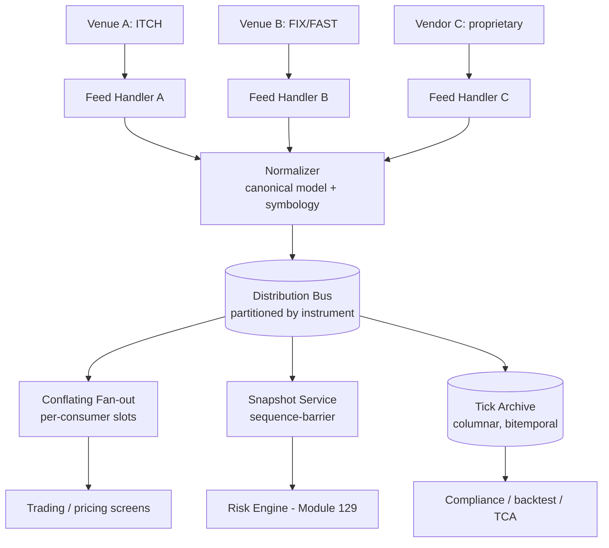
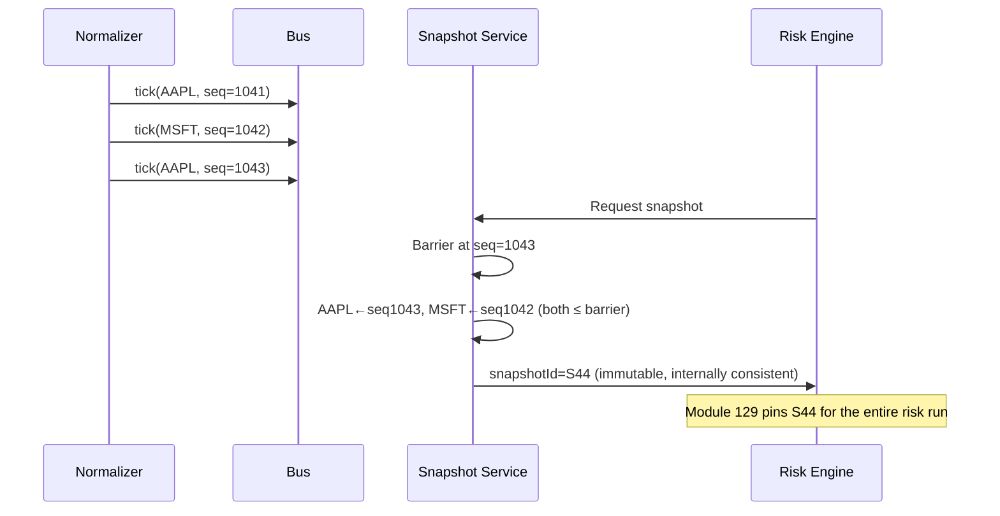
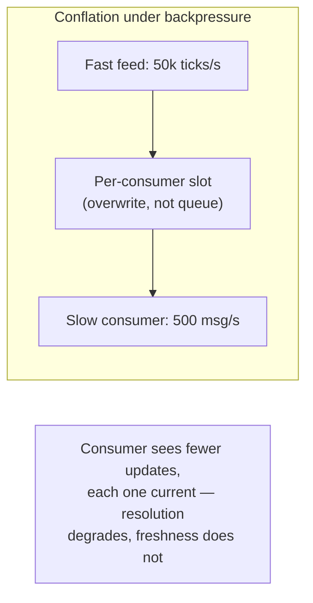
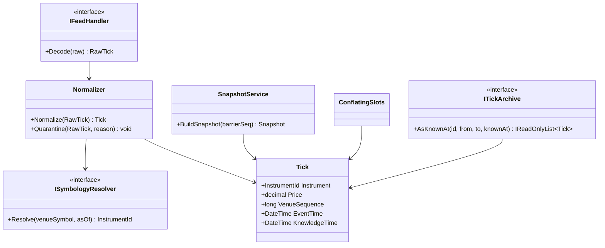

# Module 130 — System Design: Designing a Market Data Distribution Platform

> Domain: System Design | Level: Beginner → Expert | Prerequisite: [[09-Designing-RealTime-Portfolio-Risk-Engine]] (this platform supplies the immutable, versioned snapshots that module treated as a given, and inherits its snapshot-consistency requirement as a first-class design constraint), [[../19-Kafka/*]] (partitioning, consumer groups, retention — the substrate this design builds on), [[../29-Performance-Engineering/03-CachingStrategies-DataAccessPerformance.md]] (caching and staleness discipline, applied here to conflation)
>
> **Scenario-module note:** Second of six buy-side/capital-markets system-design scenarios (Modules 129–134). Full 16-section template; Elite FinTech Interview Panel lens.

---

## 1. Fundamentals

**What:** A market data platform ingests price and reference data from external venues and vendors, normalizes it into a canonical internal form, and distributes it to every downstream consumer in the firm — trading systems, risk engines (Module 129), pricing services, analytics, and compliance — while also retaining it for historical replay.

**Why:** Market data is the single most widely-shared dependency in a financial firm. Nearly every system consumes it, and they consume it with *incompatible* requirements: a trading engine wants the newest tick with microsecond latency and will happily discard intermediate updates; a risk engine wants a consistent, frozen snapshot across all instruments (Module 129 §4); a compliance system wants every tick, in order, permanently, for reconstruction years later. The platform exists to serve these three fundamentally different needs from one ingestion pipeline without forcing any consumer into another's trade-offs.

**When:** Once more than a handful of systems consume market data independently. The alternative — each system integrating directly with vendors — produces vendor-contract duplication, inconsistent normalization (two systems disagreeing about the same instrument's price), and an unbounded compliance surface. The consolidation argument here is the same one Module 126 made for Outbox infrastructure, with the addition that vendor licensing makes duplication *contractually* expensive, not merely wasteful.

**How (30,000-ft view):**
```
Venues/Vendors ──► Feed Handlers ──► Normalizer ──► Distribution Bus ──┬──► Streaming consumers (trading)
 (heterogeneous     (protocol         (canonical      (partitioned)      ├──► Snapshot service (risk, Module 129)
  protocols)         decode)           model)                            └──► Tick archive (compliance, replay)
```

---

## 2. Deep Dive

### 2.1 Three Consumption Models, One Pipeline
The defining architectural insight is that "market data" is not one product. Three distinct consumption models must be served, and conflating them is the most common design failure:

- **Streaming/latest-value:** consumer wants the current price, tolerates missing intermediate ticks. Trading dashboards, pricing screens. Conflation (§2.3) is *desirable* here.
- **Snapshot/consistent-set:** consumer wants all instruments as of one instant, mutually consistent. Risk (Module 129), end-of-day valuation. Conflation is irrelevant; *cross-instrument consistency* is everything.
- **Complete/ordered-history:** consumer wants every tick, in order, permanently. Compliance reconstruction, backtesting, transaction-cost analysis. Conflation is *forbidden* — a discarded tick is unrecoverable evidence.

A platform that serves only the first (the naive "just publish to a topic" design) silently fails the other two, and the failure is invisible until a regulator asks for reconstruction or a risk number turns out internally inconsistent.

### 2.2 Feed Handlers and Normalization — Where Correctness Is Actually Decided
Each venue speaks its own protocol (FIX/FAST, ITCH, proprietary binary) with its own semantics for the same nominal concept. "Last price" may mean last trade, last auction print, or last quote midpoint depending on venue. Symbology differs: the same instrument is `AAPL` on one feed, a RIC on another, a FIGI on a third, an internal ID in the firm's own systems.

Normalization — mapping venue-specific ticks to a canonical internal model with a canonical instrument identifier — is therefore where most correctness risk lives, not in the transport. A symbology mapping error produces prices attributed to the wrong instrument: not a missing price (which is visible) but a *wrong* price (which is not). This is the market-data-specific instance of the course's "declared ≠ actual" theme, and §4's incident is precisely this class.

### 2.3 Conflation — Deliberate, Bounded Data Loss
When update rate exceeds a consumer's consumption rate, the platform must either buffer unboundedly (eventually failing), block the producer (unacceptable — one slow consumer must not stall the feed), or **conflate**: discard superseded updates, delivering only the newest value per instrument.

Conflation is correct for latest-value consumers and catastrophic for complete-history consumers, which is exactly why §2.1's separation must be structural rather than configurable. The mechanism is typically a per-consumer, per-instrument slot: a new tick overwrites the pending slot rather than queuing behind it, so a slow consumer receives fewer updates but each is current — degrading *resolution* rather than *freshness*, which is the correct degradation direction for this consumer class.

### 2.4 Snapshot Construction — Serving Module 129's Requirement
A snapshot is a point-in-time, cross-instrument-consistent capture of the entire universe. Constructing one correctly is harder than it appears, because ticks arrive continuously and asynchronously across instruments.

The correct mechanism is a **sequence-number barrier**: the platform maintains a global (or per-partition, with cross-partition coordination) monotonic sequence, and a snapshot is defined as "the latest value for each instrument at or before sequence N." Every instrument's value is resolved against the same N, making the snapshot internally consistent by construction. The snapshot is then written immutably and assigned an ID — which is precisely the `snapshotId` Module 129 §4 required be pinned per risk run.

The naive alternative — "read the current value of every instrument in a loop" — produces exactly Module 129's incident at the source rather than at the consumer: early instruments read at one instant, late ones at another, yielding a "snapshot" of a market state that never existed.

### 2.5 The Tick Archive — Write-Heavy, Immutable, Enormous
Complete-history retention produces the largest dataset most firms hold. Its access pattern is unusual and dictates storage design: overwhelmingly write-heavy at ingestion, then read almost exclusively as *range scans* over one instrument across a time window ("all AAPL ticks on 2026-03-14"), and effectively never as random single-tick lookups.

This argues strongly for columnar, time-partitioned, compressed storage — tick data compresses exceptionally well (successive prices differ in low-order digits; delta-of-delta and dictionary encoding are highly effective) — with partitioning by `(instrument, date)` matching the dominant query. Row-oriented OLTP storage for tick data is a common and expensive early mistake.

### 2.6 Late, Out-of-Order, and Corrected Ticks
Real feeds deliver ticks late (network delay), out of order (multicast reordering, multi-path), and *corrected* (venues issue busts and price corrections after the fact, sometimes hours later).

This makes market data genuinely bitemporal: a tick has both an **event time** (when it occurred at the venue) and an **arrival/knowledge time** (when the platform learned of it). A correction issued at 16:00 for a 10:30 trade must not silently overwrite history — the archive must retain both what was originally believed and what is now known, exactly as Module 129 §Advanced Q8 required for risk results, and for the same reason: reconstructing a decision requires knowing what was believed *at decision time*, not merely what is true now.

---

## 3. Visual Architecture







---

## 4. Production Example

**Problem:** A firm consolidated onto a single market data platform serving trading, risk, and compliance. It ran cleanly for two years.

**Architecture:** §3's design — feed handlers per venue, central normalizer, partitioned bus, three consumption paths.

**Implementation:** The normalizer resolved venue symbols to canonical instrument IDs via a symbology reference table, refreshed nightly from a vendor reference-data file. When a symbol was not found, the normalizer logged a warning and *passed the tick through with the raw venue symbol as its identifier* — a pragmatic choice made early on so that an unmapped symbol would not silently drop data.

**Trade-offs:** Passing through unmapped symbols preserves data (better than dropping) but means the canonical-ID invariant is not actually enforced — the bus can carry two different identifier schemes simultaneously.

**Lessons learned:** A corporate action — a ticker change following a merger — took effect at the venue before the nightly reference-data refresh carried it. For one trading session, the venue published under the new ticker while the symbology table still knew only the old one. The normalizer passed the new ticker through unmapped. Downstream, the pricing service treated it as an unknown instrument and ignored it (visible, harmless). But the risk engine's instrument resolution performed a *fuzzy fallback* to the closest known identifier — and matched it to a **different, genuinely unrelated instrument** that happened to share a prefix. For a full session, that instrument's risk was computed against another company's prices.

Nothing errored. The warning log entry existed but was one of ~40,000 similar entries that session, all previously benign. The failure was found only when a PM questioned an implausible exposure figure.

The fix had three parts, and the third is the one that generalizes: (1) unmapped symbols are **quarantined**, not passed through — the canonical-ID invariant is enforced at the boundary, so an unmapped tick cannot enter the bus at all; (2) the fuzzy fallback in the risk engine's resolver was deleted outright — a resolver that guesses is worse than one that fails, because a failure is visible and a wrong guess is not; (3) unmapped-symbol *rate* became a monitored signal with a threshold, rather than an unbounded warning log — the information had been present all along, and was useless because it was not aggregated into anything anyone would notice. This is the course's recurring pattern in its market-data form: the data existed, the log existed, and neither constituted detection.

---

## 5. Best Practices
- Enforce the canonical-identifier invariant at the ingestion boundary — quarantine unmapped symbols rather than passing them through (§4).
- Never build fuzzy/approximate identifier resolution anywhere in the pipeline; fail loudly on unresolved identifiers (§4).
- Structurally separate the three consumption models (§2.1) rather than serving all from one conflated stream with per-consumer configuration.
- Construct snapshots via an explicit sequence barrier, never by looping over current values (§2.4).
- Store ticks bitemporally so corrections augment rather than overwrite history (§2.6).
- Monitor unmapped-symbol rate, gap rate, and staleness per feed as aggregated signals, not as unbounded log lines (§4).

## 6. Anti-patterns
- Passing unmapped symbols through the pipeline "to avoid losing data," breaking the canonical-ID invariant (§4).
- Fuzzy identifier matching anywhere in market-data resolution (§4).
- One conflated stream serving compliance consumers, silently discarding ticks that are legally required to be retained (§2.1, §2.3).
- Snapshot construction by iterating current values, producing a market state that never existed (§2.4 — Module 129 §4's incident, relocated to its source).
- Row-oriented OLTP storage for the tick archive, ignoring its range-scan-dominated access pattern (§2.5).
- Overwriting an original tick with its later correction, destroying what was believed at decision time (§2.6).

---

## 7. Performance Engineering

**CPU:** Feed-handler protocol decoding dominates at ingestion. Binary protocols (ITCH) decode far cheaper than text/FIX. At high tick rates, decode is often the single hottest path in the firm — worth genuine optimization (zero-copy parsing, avoiding intermediate string allocation) that would be premature almost anywhere else.

**Memory/GC:** The classic .NET failure mode here is allocating an object per tick; at 500k ticks/second this produces severe Gen-0 pressure and GC pauses that manifest as latency spikes correlated with market activity. Use `struct` tick representations, `ArrayPool`/`Span<T>` buffers, and pre-allocated ring buffers. This is the workload where Module 110's Value Object and allocation guidance is genuinely, measurably necessary rather than premature.

**Latency:** Measure end-to-end venue-timestamp-to-consumer-delivery, not internal hop times — and measure it as a distribution, since latency spikes correlate with volume bursts (precisely when it matters). Beware coordinated omission (Module 102): a load generator that waits for a response before sending the next tick will systematically under-report latency under exactly the burst conditions being tested.

**Throughput:** Size for peak burst, not average. Market data is extraordinarily bursty — open, close, and macroeconomic-announcement moments can be 50–100× the session mean. A platform sized on daily average will fail precisely at every moment anyone cares about.

**Scalability:** Partition by instrument across the bus; feed handlers scale per venue; the snapshot service is the coordination point (§2.4's barrier) and needs the most care.

**Benchmarking:** Replay a real historical high-volume session (an announcement day) rather than synthetic uniform load — the burst shape and instrument-distribution skew are the properties that break things, and synthetic load has neither.

**Caching:** The latest-value cache is the platform's core read structure; it should be a lock-free per-instrument slot rather than a general-purpose cache, given the extreme write:read ratio and the fact that eviction is never desirable.

---

## 8. Security

**Threats:** Market data carries unusual threat characteristics — the primary risk is not confidentiality of the data itself (much is publicly available) but **licensing compliance**, **integrity**, and **inference**. Vendor contracts restrict redistribution, and non-compliance carries genuine financial and relationship consequences. Integrity matters because a tampered price feeds directly into trading and risk decisions. Inference matters because *which* instruments a firm subscribes to reveals trading interest.

**Mitigations:** Per-consumer entitlement enforcement at the distribution layer (§9), not merely at the vendor contract level — the platform must be able to demonstrate which internal consumers received which data, since that is what vendor audits examine. Integrity via authenticated feed connections and plausibility checks at ingestion (Module 129 §Expert Q8's bad-tick handling, applied at source).

**OWASP mapping:** Broken Access Control is the dominant risk, expressed as entitlement violation — a consumer receiving data the firm is not licensed to redistribute to it.

**AuthN/AuthZ:** Entitlements are per-consumer, per-data-source, and sometimes per-instrument-class, evaluated at subscription time and re-evaluated on entitlement change (a consumer's access can be revoked mid-session when a license lapses).

**Secrets:** Vendor feed credentials per Module 86; note these are frequently long-lived and hard to rotate because rotation requires vendor coordination — a real constraint worth designing around rather than discovering during an incident.

**Encryption:** In transit for external feeds; the archive's encryption must use envelope encryption (Module 122 §Advanced Q5) given multi-year immutable retention.

---

## 9. Scalability

**Horizontal scaling:** Feed handlers scale per venue (naturally partitioned by source); the bus partitions by instrument; conflating fan-out scales per consumer. The snapshot service is the one component requiring coordination and therefore the primary scaling constraint.

**Vertical scaling:** Feed handlers benefit disproportionately from single-core speed and cache size, since decode is latency-sensitive and hard to parallelize within a single feed's ordered stream.

**Caching:** The latest-value structure (§7) is the hot path; the tick archive is cold by comparison.

**Replication/Partitioning:** Partition the bus and archive by instrument; replicate the latest-value cache per consuming region to avoid cross-region reads on the hot path.

**Load balancing:** Consumers subscribe to instrument partitions rather than being round-robin balanced, preserving per-instrument ordering (the same partition-key discipline established in Modules 118–120).

**High Availability:** Feed handlers should run redundant A/B instances consuming the same venue feed, with downstream deduplication by venue sequence number — because venue feeds cannot be replayed on demand, a missed window is permanently lost. This is a genuinely different HA posture from most systems: redundancy must be *concurrent*, not failover, because failover has a gap and the gap is unrecoverable.

**Disaster Recovery:** The tick archive is irreplaceable (venues do not re-serve arbitrary history, and where they do it is expensive and slow) — it warrants the firm's strongest DR posture, mirroring Module 129 §Intermediate Q5's finding that input archives outrank derived stores in DR priority.

**CAP theorem:** The distribution path chooses availability — a consumer that cannot be reached is skipped or conflated, never allowed to block the feed. The snapshot service chooses consistency — a snapshot that cannot be constructed consistently must fail rather than emit an inconsistent one, since Module 129's entire correctness argument depends on that guarantee.

---

## 10. Interview Questions

### Basic (10)

1. **Q: Name the three consumption models a market data platform must serve and what each tolerates.**
   **A:** Streaming/latest-value (tolerates dropped intermediate ticks); snapshot/consistent-set (requires cross-instrument consistency); complete/ordered-history (tolerates nothing dropped) (§2.1).
   **Why correct:** Names all three with their distinct tolerances, which drive the entire architecture.
   **Common mistakes:** Designing only for streaming, silently failing compliance and risk consumers.
   **Follow-ups:** "Which one makes conflation forbidden rather than desirable?" (Complete-history, §2.3.)

2. **Q: What is conflation and when is it correct?**
   **A:** Discarding superseded updates so a slow consumer receives only the newest value per instrument — correct for latest-value consumers, forbidden for complete-history consumers (§2.3).
   **Why correct:** States the mechanism and its consumer-dependent correctness.
   **Common mistakes:** Treating conflation as a universally-safe backpressure strategy.
   **Follow-ups:** "What does conflation degrade?" (Resolution, not freshness — the consumer sees fewer updates but each is current, §2.3.)

3. **Q: Why is normalization where most correctness risk lives, rather than transport?**
   **A:** Venues use different symbologies and different semantics for nominally-identical fields; a mapping error attributes prices to the wrong instrument — a wrong price, not a missing one, and therefore invisible (§2.2).
   **Why correct:** Identifies the specific failure mode and why it evades detection.
   **Common mistakes:** Focusing design attention on throughput and latency while treating normalization as a lookup detail.
   **Follow-ups:** "Give an example of differing semantics for the same field." ("Last price" meaning last trade vs. last auction print vs. quote midpoint depending on venue, §2.2.)

4. **Q: How should a snapshot be constructed?**
   **A:** Via a sequence-number barrier — every instrument resolved to its latest value at or before sequence N, making the set internally consistent by construction (§2.4).
   **Why correct:** States the mechanism that guarantees the consistency property downstream consumers depend on.
   **Common mistakes:** Iterating over current values, which produces a state that never existed.
   **Follow-ups:** "Which module's incident does the naive approach reproduce?" (Module 129 §4, relocated to its source, §2.4.)

5. **Q: Why is the tick archive's access pattern unusual, and what storage does it imply?**
   **A:** Write-heavy at ingestion, read almost exclusively as range scans over one instrument across a time window, essentially never random single-tick lookups — implying columnar, time-partitioned, compressed storage partitioned by `(instrument, date)` (§2.5).
   **Why correct:** Derives storage choice from the actual access pattern.
   **Common mistakes:** Row-oriented OLTP storage, an expensive early mistake.
   **Follow-ups:** "Why does tick data compress unusually well?" (Successive prices differ in low-order digits; delta-of-delta and dictionary encoding are highly effective, §2.5.)

6. **Q: What makes market data bitemporal?**
   **A:** A tick has an event time (when it occurred at the venue) and a knowledge time (when the platform learned of it) — and corrections arrive hours later, so both must be retained (§2.6).
   **Why correct:** Names both time dimensions and the correction case that forces the distinction.
   **Common mistakes:** Overwriting an original tick with its correction, destroying what was believed at decision time.
   **Follow-ups:** "Which prior module required the same property, and why?" (Module 129 §Advanced Q8 for risk results — reconstructing a decision requires knowing what was believed then, §2.6.)

7. **Q: Why must feed-handler redundancy be concurrent rather than failover?**
   **A:** Venue feeds cannot be replayed on demand, so any gap during failover is permanently lost — redundant instances must consume the same feed simultaneously, with downstream deduplication by venue sequence number (§9).
   **Why correct:** Ties the HA posture to the specific irrecoverability of missed market data.
   **Common mistakes:** Standard active-passive failover, which has a gap.
   **Follow-ups:** "How is duplicate data handled?" (Deduplication by venue sequence number downstream, §9.)

8. **Q: Why is the primary security concern licensing rather than confidentiality?**
   **A:** Much market data is publicly available, but vendor contracts restrict redistribution, and the platform must demonstrate which internal consumers received which data because that is what vendor audits examine (§8).
   **Why correct:** Correctly identifies the dominant, non-obvious risk for this data class.
   **Common mistakes:** Applying a generic confidentiality-first security model and under-building entitlement enforcement.
   **Follow-ups:** "What is the inference risk?" (Which instruments a firm subscribes to reveals trading interest, §8.)

9. **Q: Why size the platform for burst rather than average?**
   **A:** Market data is extraordinarily bursty — open, close, and announcements reach 50–100× session mean — so average-sized capacity fails at exactly the moments that matter (§7).
   **Why correct:** States the specific burst ratio and why average-sizing fails precisely when the system is most needed.
   **Common mistakes:** Capacity planning on daily average throughput.
   **Follow-ups:** "What should benchmarking replay?" (A real historical high-volume session, since burst shape and instrument skew are what break things, §7.)

10. **Q: Why do the distribution path and the snapshot service take opposite CAP postures?**
    **A:** Distribution favours availability — a slow consumer is conflated or skipped, never allowed to block the feed. The snapshot service favours consistency — it must fail rather than emit an inconsistent snapshot, since Module 129's correctness depends on that guarantee (§9).
    **Why correct:** Derives each posture from its consumer's consequence-of-failure.
    **Common mistakes:** One uniform posture across the platform.
    **Follow-ups:** "What happens if a snapshot cannot be constructed?" (It fails and the risk run does not start — better than a risk run against an inconsistent snapshot, §9.)

### Intermediate (10)

1. **Q: Walk through §4's incident and identify why each of the three defences failed.**
   **A:** A corporate-action ticker change reached the venue before the nightly symbology refresh. Defence one (symbology mapping) failed because it was refreshed on a slower cadence than the events it tracked. Defence two (unmapped handling) failed because pass-through was chosen over quarantine, so an unmapped tick entered the bus. Defence three (monitoring) failed because the warning was one of ~40,000 benign entries and was never aggregated into a signal. The risk engine's fuzzy fallback then converted an unmapped tick into a *confidently wrong* attribution.
   **Why correct:** Attributes the failure across all four contributing factors rather than to any single one.
   **Common mistakes:** Blaming only the stale reference data, missing that pass-through and fuzzy fallback are what converted staleness into wrongness.
   **Follow-ups:** "Which single fix would have prevented it?" (Quarantine instead of pass-through — the unmapped tick never reaches a consumer that could misattribute it.)

2. **Q: Why is "a resolver that guesses is worse than one that fails" (§4) a general principle rather than a market-data-specific one?**
   **A:** A failure is visible and triggers investigation; a wrong guess is indistinguishable from a correct answer at the point of consumption and propagates silently into decisions. This is the same asymmetry Module 129 §Expert Q9 identified between slowness (self-signalling) and incorrectness (not) — approximate resolution converts a detectable failure into an undetectable one.
   **Why correct:** Generalizes correctly and connects to the established course finding.
   **Common mistakes:** Treating fuzzy matching as a robustness feature, when it trades detectability for apparent availability.
   **Follow-ups:** "When is approximate matching legitimate?" (When a human reviews the result before it is acted upon — the guess becomes a suggestion, not an answer.)

3. **Q: Design the mechanism ensuring a compliance consumer can never be served conflated data.**
   **A:** Make it structurally impossible rather than configurable: the complete-history path reads from the archive/log directly rather than from the conflating fan-out, so there is no code path connecting a compliance consumer to a conflating slot. A configuration flag "conflation: off" is insufficient — it can be misset, and the failure is silent (Module 129 §Intermediate Q2's inexpressibility principle).
   **Why correct:** Applies the established design principle — make the failure inexpressible rather than guarded.
   **Common mistakes:** A per-consumer conflation flag, which is exactly the misconfigurable design that principle rejects.
   **Follow-ups:** "How would you detect a violation if the paths were shared?" (Sequence-number gap detection at the consumer — but note this detects the loss after it has already occurred, which is why structural separation is preferable.)

4. **Q: Why is the snapshot service the platform's primary scaling constraint?**
   **A:** Every other component partitions cleanly by instrument or venue, but the sequence barrier (§2.4) requires coordination across partitions to establish a globally-consistent point — coordination is inherently harder to scale than partitioned work.
   **Why correct:** Identifies coordination as the specific property that resists partitioning.
   **Common mistakes:** Assuming the highest-throughput component (ingestion) is the scaling constraint; it partitions well and therefore is not.
   **Follow-ups:** "How can barrier cost be reduced?" (Per-partition sequences with a coordinated barrier established less frequently than tick rate — snapshots are needed at a far lower cadence than ticks arrive.)

5. **Q: Why does coordinated omission (Module 102) specifically distort market-data latency measurement?**
   **A:** A load generator that waits for a response before sending the next tick stops generating load exactly when the system slows — so the burst conditions that cause latency spikes are never actually applied, and the measurement systematically under-reports latency precisely under the conditions being tested (§7).
   **Why correct:** Explains the specific mechanism and why it matters most for this workload's bursty profile.
   **Common mistakes:** Trusting closed-loop latency benchmarks for a system whose defining challenge is burst behaviour.
   **Follow-ups:** "What is the correct generator model?" (Open-loop — send at the target rate regardless of response, measuring latency including queueing, Module 102.)

6. **Q: Critique allocating one object per tick in a .NET feed handler.**
   **A:** At 500k ticks/second this produces severe Gen-0 pressure and GC pauses that manifest as latency spikes correlated with volume — the system degrades exactly when load peaks. `struct` representations, pooled buffers, and pre-allocated ring buffers are necessary here, making this the rare workload where Module 110's allocation guidance is genuinely load-bearing rather than premature optimization (§7).
   **Why correct:** Names the specific consequence and correctly identifies this as a genuine exception to premature-optimization caution.
   **Common mistakes:** Applying "don't optimize allocations prematurely" uniformly, which is correct almost everywhere and wrong here.
   **Follow-ups:** "Why does the GC pause correlate with market events?" (Allocation rate is proportional to tick rate, which spikes at opens, closes, and announcements — so pauses cluster at the worst moments.)

7. **Q: How should a mid-session entitlement revocation be handled?**
   **A:** Re-evaluate entitlements on change, not only at subscription time — an active consumer must stop receiving data when its license lapses, which requires the distribution layer to hold live entitlement state rather than having checked once at connect (§8).
   **Why correct:** Identifies that subscription-time-only checking leaves long-lived sessions unprotected.
   **Common mistakes:** Checking entitlements only at connection establishment, so a session established before revocation continues indefinitely.
   **Follow-ups:** "What audit artifact does a vendor actually examine?" (Records of which internal consumers received which data over time — so the platform must log delivery, not merely entitlement grants, §8.)

8. **Q: Why does the tick archive outrank the latest-value cache in DR priority?**
   **A:** The cache is trivially rebuilt from the next few seconds of feed; the archive cannot be reconstructed because venues do not re-serve arbitrary history on demand. This mirrors Module 129 §Intermediate Q5 — irreplaceable inputs outrank reconstructible derivatives (§9).
   **Why correct:** Applies the established DR-priority principle correctly to this platform's asset classes.
   **Common mistakes:** Prioritizing DR by system criticality (the cache is on the hot path) rather than by reconstructibility.
   **Follow-ups:** "Is any part of the archive reconstructible?" (Recent history sometimes, at cost, from vendor replay services — but the general answer is no, which is what drives the priority.)

9. **Q: How should the platform handle a venue publishing an obviously erroneous tick?**
   **A:** Plausibility-check at ingestion and quarantine, never filter at consumption — consumption-time filtering means different consumers apply different filters and the same nominal data yields different results per consumer, destroying the single-market-state property (Module 129 §Expert Q8, applied here at source). Quarantine must be recorded, since a wrongly-quarantined real move is itself a serious error.
   **Why correct:** Places the control where it preserves cross-consumer consistency, and notes the false-positive cost.
   **Common mistakes:** Consumer-side filtering for flexibility, reintroducing inconsistency.
   **Follow-ups:** "What is the danger during genuine dislocation?" (Real extreme moves get quarantined as implausible, so the platform reports calm during a crisis — the filter must be volatility-relative, not absolute.)

10. **Q: Synthesize how this platform's snapshot service relates to Module 129's incident.**
    **A:** Module 129 §4's incident was a *consumer* combining data across two snapshots. This module's §2.4 shows the same class of error can occur at the *source* if snapshots are built by iterating current values. The platform's sequence barrier makes each snapshot internally consistent, and Module 129's run-scoped pinning makes each run use exactly one — two complementary controls at different layers, both required, because either alone leaves the other's failure mode open.
    **Why correct:** Identifies the two layers, their distinct failure modes, and why both controls are necessary.
    **Common mistakes:** Assuming source-side snapshot consistency makes consumer-side pinning unnecessary — it does not, since a consumer can still combine two individually-consistent snapshots.
    **Follow-ups:** "Which layer's failure is harder to detect?" (Source-side, because a consumer pinning correctly to an internally-inconsistent snapshot has no way to know the snapshot itself was malformed.)

### Advanced (10)

1. **Q: Diagnose §4's incident and design the complete structural fix.**
   **A:** Root cause: the canonical-identifier invariant was declared but not enforced, and three independent weaknesses (refresh cadence slower than the events tracked, pass-through instead of quarantine, unaggregated warnings) combined with a downstream fuzzy resolver to convert a data-freshness gap into confident misattribution. Fix: (1) quarantine unmapped symbols at the boundary, making invariant violation inexpressible downstream; (2) delete fuzzy resolution everywhere in the pipeline — no component may guess an identifier; (3) convert unmapped-rate into a thresholded, alerting metric rather than log lines; (4) drive symbology from a corporate-actions event feed rather than only a nightly file, so the refresh cadence matches the event cadence rather than lagging it.
   **Why correct:** Addresses all four contributing factors including the cadence mismatch that made the situation reachable.
   **Common mistakes:** Fixing only quarantine, leaving fuzzy resolution present to cause a different variant later.
   **Follow-ups:** "Why is (4) necessary if (1) already prevents the bad tick entering?" (Without it, quarantine now correctly *drops* legitimate post-corporate-action data — the tick is no longer wrong, but it is missing, which is a different failure the firm still cannot tolerate.)

2. **Q: A team proposes serving risk snapshots from the conflating fan-out to reuse existing infrastructure. Evaluate.**
   **A:** This silently breaks Module 129's foundational guarantee. Conflation delivers the newest value per instrument *at delivery time*, which is by construction not a consistent cross-instrument point — different instruments' values reflect different instants depending on their update rates and the consumer's drain rate. It reproduces Module 129 §4's inconsistency, now originating in the platform rather than the consumer, and worse, invisibly: the consumer believes it received a snapshot. The snapshot path must be structurally separate (§2.1).
   **Why correct:** Identifies that conflation and snapshot consistency are mathematically incompatible, not merely different configurations.
   **Common mistakes:** Treating the reuse as an efficiency win because both paths "deliver current prices."
   **Follow-ups:** "Is there any snapshot-like guarantee conflation can offer?" (Only per-instrument freshness, never cross-instrument consistency — and per-instrument freshness is exactly what a snapshot is not.)

3. **Q: Critique retaining only corrected values in the archive, discarding superseded originals.**
   **A:** This destroys the ability to answer "what did we believe at 10:30, when we traded?" — leaving only "what is now known to have been true." Regulatory reconstruction, best-execution analysis, and dispute resolution all require the former (§2.6). It also makes historical backtests subtly optimistic: a strategy backtested on corrected data has effectively seen information unavailable at decision time, a form of look-ahead bias that inflates apparent performance.
   **Why correct:** Names both the compliance consequence and the subtler backtest-bias consequence, which is frequently overlooked.
   **Common mistakes:** Retaining corrections only, seeing it as data-quality improvement, and unknowingly introducing look-ahead bias across every backtest the firm runs.
   **Follow-ups:** "What does a correct backtest query look like?" (Filtered by knowledge time ≤ simulated decision time, so it sees only what was actually known then, §2.6.)

4. **Q: Design gap detection for a feed that provides venue sequence numbers.**
   **A:** Track expected-next sequence per venue partition; a gap indicates loss (network, handler restart, or venue issue) and must trigger recovery — typically requesting a retransmit where the venue supports it, or failing over to the redundant concurrent handler (§9) whose stream may be intact. Critically, a gap must be *escalated*, not merely logged: unlike a slow consumer, missing market data is unrecoverable once the venue's retransmit window closes, so the response is time-critical.
   **Why correct:** Specifies detection, recovery options, and the time-criticality that distinguishes this from ordinary error handling.
   **Common mistakes:** Logging gaps for later review, missing the retransmit window entirely.
   **Follow-ups:** "Why does concurrent redundancy (§9) help here specifically?" (Loss is often path-specific — the redundant handler on a different network path frequently has the ticks the primary lost.)

5. **Q: How would you support "replay yesterday's session exactly as it was seen" for a backtest?**
   **A:** Read the archive filtered by knowledge time (§2.6) so only ticks known by each simulated instant are visible, replayed in original arrival order with original inter-arrival timing preserved if the backtest is latency-sensitive. The subtlety is that "exactly as seen" requires the *arrival* ordering and timing, not the event ordering — a tick that arrived late must be replayed late, or the backtest sees a market it could not have seen.
   **Why correct:** Distinguishes arrival-order replay from event-order replay, the distinction that determines whether the backtest is honest.
   **Common mistakes:** Replaying in event-time order, which silently repairs the real-world late arrivals and produces optimistic results.
   **Follow-ups:** "When is event-order replay the right choice?" (For analytical questions about what happened in the market, as opposed to simulating what a system could have done — different question, different ordering.)

6. **Q: A regulator asks whether the firm can reconstruct the exact data its trading system saw at a given moment. Answer honestly.**
   **A:** Yes, subject to stated conditions: the archive retains every tick bitemporally (§2.6) with venue sequence numbers, so the state visible to a consumer at time T is reconstructible by filtering on knowledge time. The honest caveats are that reconstruction is exact only where gap detection (Advanced Q4) recorded no unrecovered gaps for that window — those are logged and disclosed rather than silently interpolated — and that conflated consumers by design saw a subset of ticks, so their view is reconstructible only as "the conflated stream they were served," which the platform must also have recorded.
   **Why correct:** Affirms the capability with its two genuine limitations stated rather than glossed, matching the honest-disclosure posture established in Module 118 §Expert Q7.
   **Common mistakes:** Claiming unqualified exact reconstruction while conflated consumers' actual delivered stream was never recorded.
   **Follow-ups:** "What must be recorded to make conflated-consumer reconstruction possible?" (The delivered stream per consumer, not merely the source stream — otherwise what that consumer saw is unrecoverable.)

7. **Q: Design the platform's multi-region topology for a firm trading in NY, London, and Tokyo.**
   **A:** Feed handlers deploy adjacent to their venues (a NY handler for NYSE, not a Tokyo handler reaching across the Pacific) since decode must happen close to source for latency and to avoid transporting raw high-volume protocol traffic. Normalized data then replicates cross-region. Regional latest-value caches serve local consumers. The snapshot service must decide explicitly whether snapshots are global (consistent across all venues — required for firm-wide risk) or regional (cheaper, sufficient for regional trading) — and Module 129's firm-level aggregation requires global, making the cross-region barrier coordination the hard part of this design.
   **Why correct:** Places components by their actual constraint (decode near source, cache near consumer) and identifies the genuinely difficult decision.
   **Common mistakes:** Centralizing feed handling in one region, transporting raw venue traffic globally at high cost and latency.
   **Follow-ups:** "How do you make a global barrier affordable?" (Establish it at snapshot cadence, not tick cadence — snapshots are needed per-minute at most, while ticks arrive per-microsecond.)

8. **Q: Apply the "declared ≠ actual" theme to this platform's central claim.**
   **A:** The claim is "consumers receive correct, current market data." §4 showed each word can fail independently and invisibly: *correct* fails via misattribution (a price for the wrong instrument), *current* fails via conflation and staleness, and *receive* fails via gaps. Each has a natural appearance of success — a price arrives, on time, with no error — so the declared basis (data flowed) is insufficient for all three. The actual basis requires enforced identifier invariants (Advanced Q1), sequence-gap detection (Advanced Q4), and per-consumer staleness monitoring, none of which the naive success signal provides.
   **Why correct:** Decomposes the claim into three independently-failing components with their distinct verifications.
   **Common mistakes:** Treating "data is flowing" as evidence of all three properties.
   **Follow-ups:** "Which of the three is hardest to detect?" (Misattribution — a gap and staleness both have natural signals; a confidently-wrong instrument mapping has none until a human notices an implausible result, as in §4.)

9. **Q: Design the monitoring that distinguishes a venue problem from a platform problem.**
   **A:** Compare across the redundant concurrent handlers (§9) and across venues: if both handlers for venue A show a gap while venue B is clean, the problem is upstream at venue A; if one handler shows a gap and its twin does not, the problem is that handler's path; if every venue degrades simultaneously, the problem is the platform (normalizer, bus, or resource exhaustion). The comparison across independent paths is what makes attribution possible — a single-path deployment can observe degradation but cannot localize it.
   **Why correct:** Uses the redundancy already required for HA as a diagnostic instrument, and identifies that attribution requires comparison.
   **Common mistakes:** Monitoring absolute per-feed metrics only, which reveals that something is wrong but not where.
   **Follow-ups:** "Why is this attribution operationally urgent?" (Because the response differs entirely — escalate to the venue, fail over the handler, or scale the platform — and the retransmit window (Advanced Q4) is closing while you decide.)

10. **Q: Synthesize the governance program required before this platform may serve regulated consumers.**
    **A:** (1) Canonical-identifier invariant enforced by quarantine at the boundary, with no fuzzy resolution anywhere (Advanced Q1). (2) Sequence-gap detection with time-critical escalation and recorded unrecovered gaps (Advanced Q4). (3) Structural separation of consumption paths so compliance consumers cannot receive conflated data (Intermediate Q3). (4) Bitemporal archive retaining originals alongside corrections, with knowledge-time-filtered query support (Advanced Q3, Q5). (5) Per-consumer delivery recording, without which conflated-consumer reconstruction is impossible (Advanced Q6). (6) Entitlement enforcement re-evaluated on change, with delivery-level audit records (Intermediate Q7). (7) Aggregated, thresholded signals for unmapped-rate, gap-rate, and staleness — never unbounded logs (§4).
    **Why correct:** Assembles every control into a program a regulated consumer's onboarding could actually be gated on.
    **Common mistakes:** Presenting throughput and latency SLAs as the platform's quality story, omitting the correctness and reconstructability controls that regulated consumers actually require.
    **Follow-ups:** "Which control is most often missing in practice?" (Per-consumer delivery recording — firms typically record what they published, not what each consumer actually received, and discover the gap only when asked to reconstruct.)

### Expert (10)

1. **Q: The trading desk demands microsecond-level latency the platform cannot meet. Evaluate.**
   **A:** A normalizing, fan-out platform inherently adds hops and cannot compete with a direct venue feed decoded in-process by a latency-critical strategy. The honest answer is architectural separation rather than compromise: latency-critical strategies take a **direct feed** with their own in-process decode, accepting duplicated vendor cost and their own normalization risk, while everything else uses the platform. Attempting to serve both from one path degrades the platform for all consumers while still not reaching microsecond latency — the worst outcome. Note this creates a genuine consistency risk (Expert Q6) that must be managed explicitly, not wished away.
   **Why correct:** Recognizes a genuine architectural incompatibility and separates rather than compromising, while flagging the cost the separation creates.
   **Common mistakes:** Attempting to optimize the shared platform toward microseconds, degrading its actual strengths without achieving the goal.
   **Follow-ups:** "What is the cost of the separation?" (Two normalization implementations that can disagree — Expert Q6's reconciliation requirement.)

2. **Q: Compare multicast and message-broker distribution for the internal bus.**
   **A:** Multicast (typically over a reliable-multicast protocol) sends one copy to N consumers, so publisher cost is independent of consumer count — historically the standard for trading floors and still unmatched for very high fan-out at low latency, at the cost of requiring network-level support, being harder to operate across cloud environments, and having weaker built-in retention. A broker (Kafka-style) costs more per consumer but provides durable retention, replay, consumer-group semantics, and straightforward cloud operation. The determining question is whether fan-out is large enough and latency tight enough that per-consumer publisher cost dominates; for most consumer counts it does not, and the broker's operational and replay advantages win.
   **Why correct:** Compares on the axis that actually decides it (publisher cost scaling vs. retention/operability) rather than on general merits.
   **Common mistakes:** Choosing multicast for its latency reputation without needing its fan-out characteristics, then rebuilding retention and replay on top.
   **Follow-ups:** "Can they coexist?" (Yes and commonly do — multicast for the latency-critical hot path, broker for durable distribution and archive feed, with the broker path being the system of record.)

3. **Q: How should the platform handle instruments that trade on multiple venues with differing prices?**
   **A:** Do not collapse them prematurely. Retain venue-attributed prices as distinct facts, and treat any consolidated view (best bid/offer across venues, or a composite price) as an explicitly-derived product with its own defined construction rule. Collapsing at ingestion destroys information some consumers require — best-execution analysis specifically needs per-venue prices — and embeds a consolidation policy into the pipeline where it cannot be varied per consumer.
   **Why correct:** Preserves the source facts and makes consolidation an explicit, named derivation rather than an implicit lossy default.
   **Common mistakes:** Publishing one "the price" per instrument, silently discarding venue attribution that regulatory analysis requires.
   **Follow-ups:** "What makes composite construction subtle?" (Venue timestamps are not perfectly synchronized, so 'best' across venues at an instant is itself an approximation whose construction rule must be stated.)

4. **Q: Design the reference-data (symbology, corporate actions) subsystem this platform depends on.**
   **A:** Treat it as a bitemporal store in its own right, not a lookup table: a symbology mapping is valid over a date range, corporate actions have effective dates that may precede their announcement, and historical data must be resolvable using the mapping that was correct *then* — resolving a 2019 tick with today's mapping is wrong whenever an identifier has been reused or changed. Drive it from an event feed rather than a nightly file (Advanced Q1's fix), and version it so a normalization run records which reference-data version it used, exactly as Module 129 §2.6 required for model versions.
   **Why correct:** Identifies that reference data is itself temporal and must be versioned as a normalization input, not treated as a static current-state lookup.
   **Common mistakes:** A current-state symbology table, which makes historical normalization silently wrong after any identifier change or reuse.
   **Follow-ups:** "What breaks if identifiers are reused?" (A retired ticker later reassigned to a different company makes historical resolution ambiguous without date-scoped mappings — and ticker reuse is common.)

5. **Q: How does this platform's economics differ from typical infrastructure, and how should that shape design?**
   **A:** Vendor data licensing frequently exceeds the infrastructure cost by a wide margin, and licensing is often priced per-consumer, per-instrument-class, or per-use-case rather than per-byte. This inverts normal optimization: the highest-leverage cost lever is *entitlement precision* — ensuring consumers are licensed for exactly what they use and no more — rather than compute or storage efficiency. It also makes the platform's delivery records (Advanced Q6) a cost-management instrument, not merely a compliance one, since they reveal which expensive entitlements are actually unused.
   **Why correct:** Identifies the atypical cost structure and derives a non-obvious design and operational consequence from it.
   **Common mistakes:** Optimizing infrastructure spend while an order-of-magnitude larger licensing spend goes unexamined for actual usage.
   **Follow-ups:** "What does an unused expensive entitlement look like?" (A consumer subscribed to a premium feed whose delivery records show it consumes only fields available in a cheaper tier — visible only if delivery is recorded per-consumer.)

6. **Q: Given Expert Q1's split (direct feeds for latency-critical strategies, platform for everyone else), design the control preventing the two from diverging.**
   **A:** Continuous reconciliation between the direct-feed strategy's observed prices and the platform's, on a sample, alerting on divergence beyond tolerance — the same reconciliation pattern established in Modules 120, 122, and 129, now applied across two independent normalization implementations. Without it, the two paths drift as venues change formats and only one implementation is updated, and the divergence surfaces as an inexplicable difference between what the desk saw and what risk computed.
   **Why correct:** Reapplies the established reconciliation control to a divergence risk created by an architectural decision made for good reasons.
   **Common mistakes:** Accepting the split without reconciliation, treating the two paths as independently correct because each was independently tested.
   **Follow-ups:** "Why is this divergence particularly hard to notice?" (Both paths are individually plausible and individually tested; nothing compares them, so divergence is only visible where their outputs meet — typically in a P&L or risk discrepancy investigated days later.)

7. **Q: Evaluate running this platform in the cloud versus on-premises.**
   **A:** Genuinely mixed, and the answer differs by component. Feed handlers face real constraints: venue connectivity often requires cross-connects at specific colocation facilities, some venue and vendor agreements restrict where data may be processed (a contractual, not technical, constraint), and multicast support is limited in cloud networks. The archive and analytical consumers, by contrast, suit cloud extremely well — elastic, storage-heavy, burst-tolerant. The realistic architecture is hybrid: ingestion and latency-sensitive distribution near the venues, archive and analytics in cloud, which also matches Expert Q5's cost structure since the cloud-suited components are the infrastructure-cost-dominated ones.
   **Why correct:** Splits the evaluation by component constraint rather than answering monolithically, and surfaces the contractual constraint that often decides it.
   **Common mistakes:** A monolithic cloud-or-not decision, when the components have opposite characteristics.
   **Follow-ups:** "Which constraint most often blocks full cloud migration?" (Data-locality clauses in vendor agreements — a legal constraint invisible in the architecture diagram, typically discovered during legal review of an already-designed migration.)

8. **Q: A consumer reports "the platform showed a stale price." Walk through the investigation.**
   **A:** Establish which staleness first: no update received (a gap or entitlement issue), an update received but conflated away (working as designed for that consumer class — the answer is that they need a different consumption model, §2.1), or an update genuinely delayed in the pipeline (a platform latency problem). These have entirely different causes and fixes, and the consumer's report does not distinguish them. Resolve by comparing the consumer's delivery record (Advanced Q6) against the source stream for that instrument and window — which is only possible if delivery is recorded per-consumer, making that record the primary diagnostic instrument as well as a compliance artifact.
   **Why correct:** Enumerates the three distinct causes hiding behind one symptom and identifies the artifact that discriminates them.
   **Common mistakes:** Investigating pipeline latency first, when conflation-by-design is the most common cause and is not a defect.
   **Follow-ups:** "What if the consumer is on the conflated path but needs every tick?" (They are on the wrong consumption model — a configuration/onboarding error, and one that Intermediate Q3's structural separation should surface at subscription time rather than in production.)

9. **Q: Design the onboarding process for a new downstream consumer.**
   **A:** Determine consumption model first (§2.1) — this is the question that determines everything else, and getting it wrong produces Expert Q8's confusion later. Then: entitlement verification against vendor licensing (§8, and Expert Q5's cost implication), expected volume for capacity impact, latency requirement to determine whether the platform can serve them at all (Expert Q1), and registration in delivery recording (Advanced Q6). The parallel to Module 127 §4 is exact: that module's incident was a client onboarded without traffic-profile assessment, and the same class of failure applies here to consumption-model assessment.
   **Why correct:** Sequences onboarding around the decision that constrains the others, and connects to the established onboarding-assessment finding.
   **Common mistakes:** Treating onboarding as access provisioning, deferring consumption-model choice to a default that is wrong for a third of consumers.
   **Follow-ups:** "What is the most consequential onboarding mistake?" (Placing a complete-history consumer on the conflated path — legally significant data loss that may go undetected until a reconstruction request years later.)

10. **Q: Deliver the closing synthesis: what makes market data distribution distinctively hard?**
    **A:** Not volume — many systems handle higher message rates. Two properties combine to make it hard. First, **the same data must be served under mutually contradictory guarantees** (§2.1): drop-tolerant and drop-forbidden, latest-value and point-in-time-consistent, from one pipeline, where satisfying any one naively violates another. Second, **the dominant failure mode is silent misattribution rather than loss** (§4, Advanced Q8) — a missing price is visible and a wrong price is not, and the wrong price propagates directly into trading and risk decisions. Together these mean the design's difficulty lies in structurally separating incompatible guarantees and in enforcing identity invariants, not in throughput engineering — which is, again, the comparatively solved part. A candidate who designs this as a high-throughput pub/sub problem has solved the easy half.
    **Why correct:** Identifies both distinguishing properties and correctly locates the difficulty away from the obvious throughput framing.
    **Common mistakes:** Treating it as a scale problem and producing a design that serves streaming consumers well while silently failing risk and compliance.
    **Follow-ups:** "How does this connect to the next module?" (Module 131's order management shares the silent-wrongness property but adds a long-lived state machine — where market data is stateless per tick, an order is a multi-day entity whose state transitions must be exactly-once.)

---

## 11. Coding Exercises

### Easy — Conflating Slot (§2.3)
**Problem:** Deliver only the newest value per instrument to a slow consumer, without unbounded buffering.
**Solution:**
```csharp
public sealed class ConflatingSlots
{
    private readonly ConcurrentDictionary<InstrumentId, Tick> _pending = new();

    public void Publish(Tick tick) => _pending[tick.Instrument] = tick; // overwrite, never queue

    public IEnumerable<Tick> DrainForConsumer()
    {
        foreach (var key in _pending.Keys)
            if (_pending.TryRemove(key, out var tick))
                yield return tick;
    }
}
```
**Time complexity:** O(1) publish; O(k) drain for k pending instruments.
**Space complexity:** O(k) — bounded by instrument count, never by tick rate. This bound is the entire point.
**Optimized solution:** Replace the dictionary with a pre-allocated array indexed by dense instrument ordinal plus a dirty-bitmap for drain, eliminating hashing and allocation on the hot path (§7's allocation discipline).

### Medium — Sequence-Barrier Snapshot (§2.4)
**Problem:** Construct an internally-consistent snapshot across all instruments.
**Solution:**
```csharp
public Snapshot BuildSnapshot(long barrierSeq)
{
    var values = new Dictionary<InstrumentId, Tick>(_universe.Count);
    foreach (var instrument in _universe)
    {
        var latest = _history.LatestAtOrBefore(instrument, barrierSeq); // same barrier for all
        if (latest is null) throw new IncompleteSnapshotException(instrument, barrierSeq);
        values[instrument] = latest;
    }
    return Snapshot.CreateImmutable(SnapshotId.New(), barrierSeq, values);
}
```
**Time complexity:** O(n log m) for n instruments over m-length histories with binary search.
**Space complexity:** O(n).
**Optimized solution:** Maintain an incrementally-updated latest-value structure keyed by sequence, so snapshot construction is O(n) copy rather than n searches — and note the throw on missing data is deliberate (§9's CP posture: fail rather than emit an incomplete snapshot).

### Hard — Bitemporal Tick Query (§2.6, Advanced Q5)
**Problem:** Retrieve what was known about an instrument at a given decision time, excluding later corrections.
**Solution:**
```csharp
public IReadOnlyList<Tick> AsKnownAt(InstrumentId id, DateTime eventFrom, DateTime eventTo, DateTime knownAt) =>
    _archive
        .Query(id, eventFrom, eventTo)
        .Where(t => t.KnowledgeTime <= knownAt)          // exclude later-arriving corrections
        .GroupBy(t => t.VenueSequence)
        .Select(g => g.OrderByDescending(t => t.KnowledgeTime).First()) // latest belief as of knownAt
        .OrderBy(t => t.EventTime)
        .ToList();
```
**Time complexity:** O(r log r) over r rows in the event-time range.
**Space complexity:** O(r).
**Optimized solution:** Push the knowledge-time predicate into the storage layer as a partition/index filter rather than filtering after retrieval — on a multi-year archive, post-filtering reads orders of magnitude more data than the query returns.

### Expert — Cross-Path Reconciliation (Expert Q6)
**Problem:** Detect divergence between the direct-feed path and the platform path.
**Solution:**
```csharp
public async Task<ReconciliationReport> ReconcileAsync(DateOnly session, IReadOnlyList<InstrumentId> sample)
{
    var findings = new List<Divergence>();
    foreach (var id in sample)
    {
        var platform = await _platformArchive.ClosingPricesAsync(id, session);
        var direct   = await _directFeedArchive.ClosingPricesAsync(id, session);

        foreach (var (seq, platformPrice) in platform)
        {
            if (!direct.TryGetValue(seq, out var directPrice)) { findings.Add(Divergence.Missing(id, seq)); continue; }
            if (platformPrice != directPrice) findings.Add(Divergence.Mismatch(id, seq, platformPrice, directPrice));
        }
    }
    return new ReconciliationReport(findings, sample.Count);
}
```
**Time complexity:** O(s × t) for s sampled instruments and t ticks each.
**Space complexity:** O(d) for divergences found.
**Optimized solution:** Stratify the sample by instrument type and venue rather than sampling uniformly — divergence arises from normalization differences, which cluster by venue protocol and instrument complexity, so uniform sampling under-weights exactly where divergence is likeliest (Module 129 §Advanced Q4's stratification principle).

---

## 12. System Design

**Functional requirements**
- Ingest from heterogeneous venues/vendors; normalize to a canonical model with canonical identifiers.
- Serve three consumption models: streaming/conflated, consistent snapshots, complete ordered history (§2.1).
- Retain full tick history bitemporally with knowledge-time-filtered query (§2.6).
- Enforce per-consumer entitlements and record per-consumer delivery.

**Non-functional requirements**
- Ingest-to-consumer latency: P99 < 5ms for the streaming path (platform, not direct-feed, tier).
- Snapshot consistency: absolute — an inconsistent snapshot must never be emitted (§9).
- Zero unrecorded tick loss on the complete-history path; all gaps detected, escalated, and recorded.
- Burst capacity: 100× session-mean without degradation.

**Capacity estimation**
- 200k instruments; session-mean 80k ticks/s; peak burst 5M ticks/s (open/announcement).
- Tick record ~48 bytes normalized → sustained ~3.8 MB/s, peak ~240 MB/s.
- Daily volume ≈ 80k × 23,400s (6.5h) ≈ 1.9B ticks/day ≈ 90 GB/day raw, ~10–15 GB/day compressed at typical tick-compression ratios.
- Annual archive ≈ 3–4 TB compressed; a 7-year regulatory retention ≈ 25 TB — modest, and the reason the archive's cost concern is durability rather than size.
- **The sensitivity that matters:** peak-to-mean ratio, not mean. Sizing on the 80k mean produces a platform that fails at every open. Every capacity number above should be read as "peak governs."

**Architecture:** §3 — feed handlers per venue, central normalizer with versioned reference data (Expert Q4), partitioned bus, three structurally-separate consumption paths.

**Components:** Feed handlers (concurrent-redundant, §9); normalizer; distribution bus; conflating fan-out; snapshot service (sequence barrier); tick archive (columnar, bitemporal); entitlement service; delivery recorder.

**Database selection:** Archive — columnar, time-partitioned by `(instrument, date)`, heavily compressed (§2.5). Reference data — bitemporal relational (Expert Q4). Latest-value — in-memory lock-free slots, not a general cache (§7). Snapshots — immutable object storage, addressed by `snapshotId` (Module 129's pinning requirement).

**Caching:** The latest-value structure is the platform's hot read path; the snapshot store serves as an effective cache of consistent states for repeat consumers.

**Messaging:** Broker-based bus partitioned by instrument, with optional multicast for the latency-critical tier (Expert Q2); consumer groups per consumption model.

**Scaling:** Per-venue handler scaling; per-instrument bus partitioning; snapshot barrier at snapshot cadence rather than tick cadence (Expert Q7) to keep coordination affordable.

**Failure handling:** Concurrent redundant handlers with sequence-based dedup (§9); gap detection with time-critical retransmit escalation (Advanced Q4); ingestion-time plausibility quarantine with recording (Intermediate Q9); unmapped-symbol quarantine (Advanced Q1); snapshot fails rather than emitting inconsistency (§9).

**Monitoring:** Per-feed gap rate, unmapped-symbol rate, staleness, and latency distribution — all aggregated and thresholded, never raw logs (§4); cross-path divergence (Expert Q6); cross-handler comparison for venue-vs-platform attribution (Advanced Q9).

**Trade-offs:** Conflation trades resolution for feed protection, correct only for latest-value consumers (§2.3). Structural path separation trades infrastructure duplication for guarantee integrity (Intermediate Q3) — justified because the alternative failure is silent. Quarantine trades data availability for identity integrity (§4), justified by the demonstrated cost of misattribution.

---

## 13. Low-Level Design

**Requirements:** Ticks are immutable and identity-validated at the boundary; snapshots are consistent by construction; consumption paths cannot be crossed; archive queries are knowledge-time-aware.

**Class diagram:**


**Sequence diagram:** §3's second diagram — barrier-based snapshot construction feeding Module 129's pinned run.

**Design patterns used:** Adapter (per-venue feed handlers behind one interface); Strategy (consumption models); Memento (immutable snapshots); Object Pool (tick buffers, §7); Bulkhead (per-consumer conflating slots isolating slow consumers).

**SOLID mapping:** Single Responsibility (decode, normalize, distribute, archive are separate); Open/Closed (a new venue adds a feed handler; no other component changes); Liskov (every feed handler must satisfy the same ordering and sequence-number contract — verified by contract test, Module 117); Interface Segregation (`ITickArchive` read path separate from ingest write path); Dependency Inversion (normalizer depends on `ISymbologyResolver` taking an `asOf`, structurally preventing current-state-only resolution, Expert Q4).

**Extensibility:** New venue → new handler plus symbology entries. New consumption model → new path off the bus, without touching existing paths (their structural separation is what makes this safe).

**Concurrency/thread safety:** Feed handlers are single-threaded per feed to preserve venue ordering; the conflating slots are the concurrency-sensitive structure and use per-instrument atomic overwrite rather than locking; the archive is append-only, eliminating write-write conflict; `Tick` is immutable, so no tick is ever shared mutably across paths.

---

## 14. Production Debugging

**Incident:** Risk snapshots (§2.4) began failing to construct — throwing `IncompleteSnapshotException` — for roughly 3% of instruments, intermittently, starting mid-morning. Risk runs consequently did not start, so no incorrect numbers were produced; but risk was unavailable for two hours, which for a firm running intraday limits is itself a serious control gap.

**Root cause:** A venue had begun publishing a new instrument class earlier that week. Those instruments were correctly mapped in symbology and flowed normally through the streaming path. But the snapshot service's universe list — which instruments a snapshot must contain — was populated from a *separate* daily reference extract that filtered by instrument class, and the new class was not in its filter. So the snapshot service did not expect those instruments and, per its universe definition, should not have failed on them.

The actual failure was the inverse and subtler: because the new instruments *shared underlying issuers* with existing instruments, a corporate-action event on a shared issuer triggered a symbology update that briefly invalidated the mapping for **existing** instruments during the update window. During that window their ticks were quarantined (correctly, per §4's fix), so no value existed at the barrier sequence — and the snapshot service correctly refused to build an inconsistent snapshot.

Every component behaved exactly as designed. The system failed because a corporate-action-driven symbology update was applied non-atomically: for a brief window, some mappings were updated and others were not, so instruments unrelated to the corporate action were momentarily unresolvable.

**Investigation:** The exception named the specific instruments, which were *not* the new ones — that mismatch was the key clue, redirecting attention from the obvious recent change to the symbology update path. Correlating exception timestamps against reference-data update events showed exact alignment. Examining the update mechanism revealed row-by-row application without a transaction boundary.

**Tools:** Snapshot-failure exception detail (instrument-level, which made the misdirection detectable); reference-data update audit log; correlation of failure windows against update timestamps.

**Fix:** Apply symbology updates atomically — construct the new mapping version in full, then switch a version pointer, so resolvers always see a complete, self-consistent mapping (and, per Expert Q4, resolve `asOf` a version rather than against mutable current state).

**Prevention:** (1) Reference-data updates are versioned and atomically swapped, never applied incrementally in place. (2) The snapshot universe is derived from the same versioned reference data as symbology, eliminating the two-source divergence that made the incident confusing to diagnose. (3) Alert on snapshot-construction failure rate — it was detected by risk-run absence, meaning the signal arrived via a downstream consumer's silence rather than from the platform itself, which is the wrong direction for a two-hour control gap.

---

## 15. Architecture Decision

**Context:** How to serve the three consumption models (§2.1) — the platform's foundational structural decision.

**Option A — Single stream, per-consumer configuration:** one distribution path; each consumer configures conflation on/off, snapshot behaviour, retention.
*Advantages:* Simplest infrastructure; one path to operate, monitor, and scale; no duplication.
*Disadvantages:* Guarantees become configuration rather than structure, so a misconfiguration silently places a compliance consumer on a conflated stream — undetectable until reconstruction is requested (Intermediate Q3). Also cannot serve snapshot consistency at all, since conflation and cross-instrument consistency are mathematically incompatible (Advanced Q2).
*Cost:* Lowest. *Complexity:* Lowest. *Correctness:* Unacceptable — it cannot express one of the three required guarantees.

**Option B — Structurally separate paths (recommended):** distinct pipelines for conflated streaming, snapshot construction, and complete-history archive, all fed from one normalized bus.
*Advantages:* Each guarantee is structural and inexpressible-to-violate; a compliance consumer cannot be attached to a conflating slot because no such connection exists; snapshot consistency is achievable.
*Disadvantages:* Three paths to operate and monitor; some duplication of delivery machinery; higher infrastructure cost.
*Cost:* Moderate. *Complexity:* Moderate. *Maintainability:* Good — each path is simple in isolation.

**Option C — Separate platforms per consumption model:** independent systems, each ingesting from vendors directly.
*Advantages:* Maximum isolation; each optimized wholly for its purpose.
*Disadvantages:* Duplicated vendor connectivity and licensing (Expert Q5's dominant cost, multiplied), and — decisively — **duplicated normalization**, so the three platforms can disagree about the same instrument's price, reproducing Expert Q6's divergence risk as a permanent structural condition rather than a managed exception.
*Cost:* Highest, driven by licensing not infrastructure. *Complexity:* High. *Correctness:* Actively harmful — divergent normalization is worse than any option above.

**Recommendation: Option B.** Option A is disqualified not by cost but by expressiveness — it cannot provide snapshot consistency, which Module 129 depends on, and it reduces the compliance guarantee to a configuration flag whose violation is silent. Option C's isolation appeal is real but it multiplies the dominant cost (licensing) while introducing divergent normalization, which is the specific failure this platform exists to prevent — three systems disagreeing about a price is strictly worse than one system serving three needs. Option B pays a moderate infrastructure premium for structural guarantee integrity, and that premium is small relative to licensing, making it the right trade at essentially any firm scale where this platform is warranted at all.

---

## 17. Principal Engineer Perspective

**Business impact:** This platform is infrastructure that never appears in a revenue attribution, yet nearly every revenue-generating and risk-controlling system depends on it. That asymmetry — critical but invisible — is its defining organizational challenge, and a Principal Engineer must frame investment in terms of the specific failures it prevents (misattributed prices reaching trading decisions, unreconstructable compliance history, licensing exposure) rather than in terms of throughput, which no business stakeholder can evaluate.

**Engineering trade-offs:** The recurring trade-off is availability-of-data versus integrity-of-identity — §4's pass-through choice preserved data at the cost of identity, and that trade proved badly wrong because the resulting failure was silent. The generalizable lesson is that when a trade-off has one visible failure mode and one silent one, the visible failure is usually the safer choice even when it appears more disruptive.

**Technical leadership:** The controls that matter here — quarantine, gap escalation, path separation, delivery recording — all produce nothing visible when working and cost effort continuously. They are therefore the first things trimmed under delivery pressure by teams that have not experienced §4. A Principal Engineer's job is to make them structural (inexpressible to violate) rather than procedural, because procedural controls do not survive turnover.

**Cross-team communication:** Three consumer groups with contradictory definitions of "correct data" (§2.1) will each assume the platform serves their definition, and each will be partly right. Making the three models explicit in onboarding (Expert Q9) is as much a communication artifact as a technical one — it forces the consumer to state which guarantee they are actually relying on, before production depends on an assumption nobody validated.

**Architecture governance:** §15's path-separation decision, the bitemporal retention model, and the entitlement model should all be ADRs (Module 106), specifically because each looks like avoidable complexity to a future engineer optimizing for simplicity who has not seen the failure it prevents.

**Cost optimization:** Uniquely here, the dominant lever is licensing precision rather than infrastructure efficiency (Expert Q5) — and the delivery records built for compliance are the instrument that reveals unused expensive entitlements. A Principal Engineer should connect those two facts explicitly, because the compliance artifact and the cost-optimization instrument are the same dataset, and teams routinely build one without realizing they have built the other.

**Risk analysis:** The dominant risk is silent misattribution (§4, Advanced Q8), not outage. An outage is loud, bounded, and immediately escalated; a wrong price flows into trading and risk with no signal at all. Risk registers for this platform should therefore weight identity-integrity controls above availability controls — which will need justification to stakeholders whose instinct is uptime-first.

**Long-term maintainability:** The artifacts that rot silently are symbology mappings (as instruments change and identifiers are reused, Expert Q4), venue protocol handlers (as venues change formats without coordinated notice), and entitlement records (as licenses and consumers change). Each needs an owner and a review cadence, and cross-path divergence (Expert Q6) is the single best leading indicator that one of them has begun to drift — rising divergence almost always precedes a visible incident.

---

**Next in this run:** Module 131 — Designing an Order Management System and Trade Lifecycle: a long-lived state machine spanning days, FIX connectivity, exactly-once semantics under venue retransmission, and allocation/settlement handoff. It consumes this module's prices and Module 129's risk limits, and adds the property neither has — durable, multi-day per-entity state that must survive every failure without duplication or loss.
