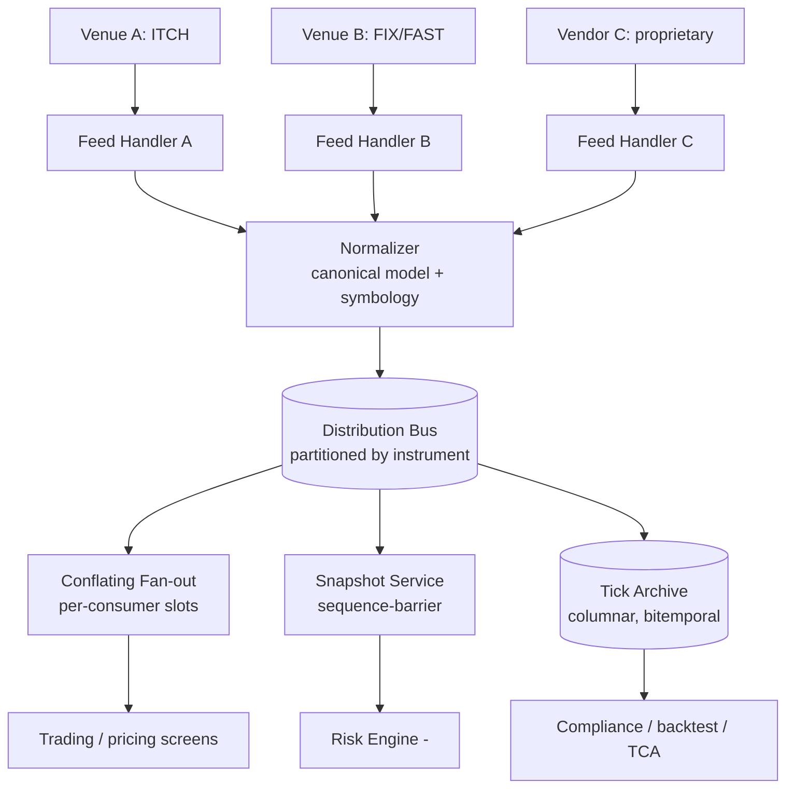
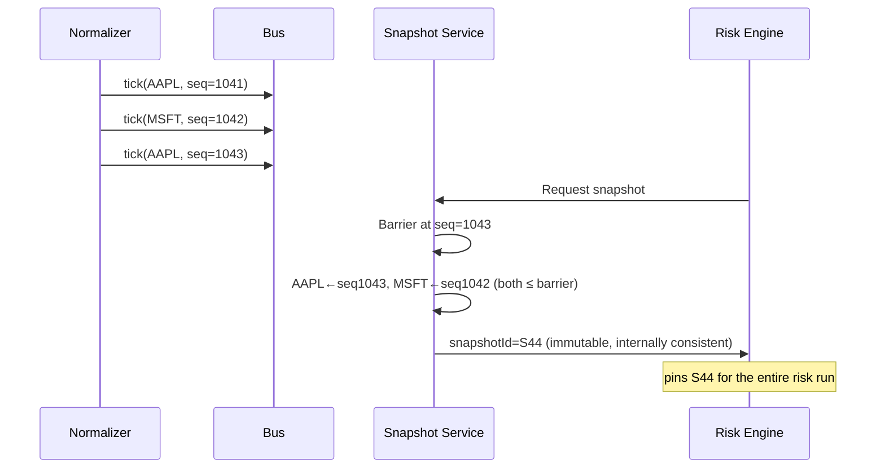
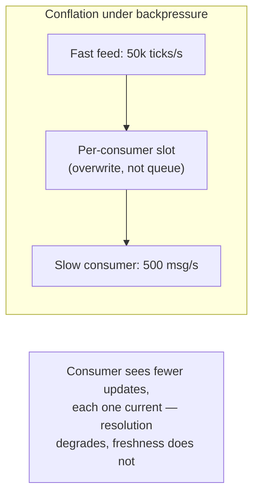
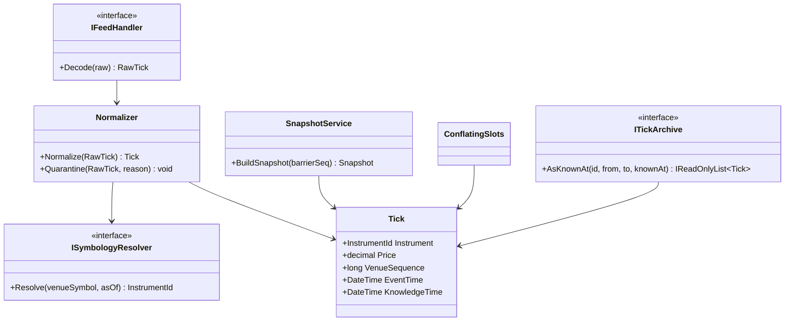

# Module 130 — System Design: Designing a Market Data Distribution Platform

> Domain: System Design | Level: Beginner → Expert | Prerequisite: [[09-Designing-RealTime-Portfolio-Risk-Engine]] (this platform supplies the immutable, versioned snapshots that module treated as a given, and inherits its snapshot-consistency requirement as a first-class design constraint), [[../19-Kafka/*]] (partitioning, consumer groups, retention — the substrate this design builds on), [[../29-Performance-Engineering/03-CachingStrategies-DataAccessPerformance]] (caching and staleness discipline, applied here to conflation)
>
> **Scenario-module note:** Second of six buy-side/capital-markets system-design scenarios (Modules 129–134). Full 16-section template; Elite FinTech Interview Panel lens.

---

## 1. Fundamentals

**What:** A market data platform ingests price and reference data from external venues and vendors, normalizes it into a canonical internal form, and distributes it to every downstream consumer in the firm — trading systems, risk engines, pricing services, analytics, and compliance — while also retaining it for historical replay.

**Why:** Market data is the single most widely-shared dependency in a financial firm. Nearly every system consumes it, and they consume it with *incompatible* requirements: a trading engine wants the newest tick with microsecond latency and will happily discard intermediate updates; a risk engine wants a consistent, frozen snapshot across all instruments; a compliance system wants every tick, in order, permanently, for reconstruction years later. The platform exists to serve these three fundamentally different needs from one ingestion pipeline without forcing any consumer into another's trade-offs.

**When:** Once more than a handful of systems consume market data independently. The alternative — each system integrating directly with vendors — produces vendor-contract duplication, inconsistent normalization (two systems disagreeing about the same instrument's price), and an unbounded compliance surface. The consolidation argument here is the same one made for Outbox infrastructure, with the addition that vendor licensing makes duplication *contractually* expensive, not merely wasteful.

**How (30,000-ft view):**
```
Venues/Vendors ──► Feed Handlers ──► Normalizer ──► Distribution Bus ──┬──► Streaming consumers (trading)
 (heterogeneous (protocol (canonical (partitioned) ├──► Snapshot service (risk)
 protocols) decode) model) └──► Tick archive (compliance, replay)
```

---

## 2. Deep Dive

### 2.1 Three Consumption Models, One Pipeline
The defining architectural insight is that "market data" is not one product. Three distinct consumption models must be served, and conflating them is the most common design failure:

- **Streaming/latest-value:** consumer wants the current price, tolerates missing intermediate ticks. Trading dashboards, pricing screens. Conflation is *desirable* here.
- **Snapshot/consistent-set:** consumer wants all instruments as of one instant, mutually consistent. Risk, end-of-day valuation. Conflation is irrelevant; *cross-instrument consistency* is everything.
- **Complete/ordered-history:** consumer wants every tick, in order, permanently. Compliance reconstruction, backtesting, transaction-cost analysis. Conflation is *forbidden* — a discarded tick is unrecoverable evidence.

A platform that serves only the first (the naive "just publish to a topic" design) silently fails the other two, and the failure is invisible until a regulator asks for reconstruction or a risk number turns out internally inconsistent.

### 2.2 Feed Handlers and Normalization — Where Correctness Is Actually Decided
Each venue speaks its own protocol (FIX/FAST, ITCH, proprietary binary) with its own semantics for the same nominal concept. "Last price" may mean last trade, last auction print, or last quote midpoint depending on venue. Symbology differs: the same instrument is `AAPL` on one feed, a RIC on another, a FIGI on a third, an internal ID in the firm's own systems.

Normalization — mapping venue-specific ticks to a canonical internal model with a canonical instrument identifier — is therefore where most correctness risk lives, not in the transport. A symbology mapping error produces prices attributed to the wrong instrument: not a missing price (which is visible) but a *wrong* price (which is not). This is the market-data-specific instance of the course's "declared ≠ actual" theme, and the incident is precisely this class.

### 2.3 Conflation — Deliberate, Bounded Data Loss
When update rate exceeds a consumer's consumption rate, the platform must either buffer unboundedly (eventually failing), block the producer (unacceptable — one slow consumer must not stall the feed), or **conflate**: discard superseded updates, delivering only the newest value per instrument.

Conflation is correct for latest-value consumers and catastrophic for complete-history consumers, which is exactly why the separation must be structural rather than configurable. The mechanism is typically a per-consumer, per-instrument slot: a new tick overwrites the pending slot rather than queuing behind it, so a slow consumer receives fewer updates but each is current — degrading *resolution* rather than *freshness*, which is the correct degradation direction for this consumer class.

### 2.4 Snapshot Construction — Serving the Requirement
A snapshot is a point-in-time, cross-instrument-consistent capture of the entire universe. Constructing one correctly is harder than it appears, because ticks arrive continuously and asynchronously across instruments.

The correct mechanism is a **sequence-number barrier**: the platform maintains a global (or per-partition, with cross-partition coordination) monotonic sequence, and a snapshot is defined as "the latest value for each instrument at or before sequence N." Every instrument's value is resolved against the same N, making the snapshot internally consistent by construction. The snapshot is then written immutably and assigned an ID — which is precisely the `snapshotId` required be pinned per risk run.

The naive alternative — "read the current value of every instrument in a loop" — produces exactly the incident at the source rather than at the consumer: early instruments read at one instant, late ones at another, yielding a "snapshot" of a market state that never existed.

### 2.5 The Tick Archive — Write-Heavy, Immutable, Enormous
Complete-history retention produces the largest dataset most firms hold. Its access pattern is unusual and dictates storage design: overwhelmingly write-heavy at ingestion, then read almost exclusively as *range scans* over one instrument across a time window ("all AAPL ticks on 2026-03-14"), and effectively never as random single-tick lookups.

This argues strongly for columnar, time-partitioned, compressed storage — tick data compresses exceptionally well (successive prices differ in low-order digits; delta-of-delta and dictionary encoding are highly effective) — with partitioning by `(instrument, date)` matching the dominant query. Row-oriented OLTP storage for tick data is a common and expensive early mistake.

### 2.6 Late, Out-of-Order, and Corrected Ticks
Real feeds deliver ticks late (network delay), out of order (multicast reordering, multi-path), and *corrected* (venues issue busts and price corrections after the fact, sometimes hours later).

This makes market data genuinely bitemporal: a tick has both an **event time** (when it occurred at the venue) and an **arrival/knowledge time** (when the platform learned of it). A correction issued at 16:00 for a 10:30 trade must not silently overwrite history — the archive must retain both what was originally believed and what is now known, exactly as §Advanced Q8 required for risk results, and for the same reason: reconstructing a decision requires knowing what was believed *at decision time*, not merely what is true now.

---

## 3. Visual Architecture


```mermaid
graph TB
 V1[Venue A: ITCH] --> FH1[Feed Handler A]
 V2[Venue B: FIX/FAST] --> FH2[Feed Handler B]
 V3[Vendor C: proprietary] --> FH3[Feed Handler C]
 FH1 --> NORM[Normalizer<br/>canonical model + symbology]
 FH2 --> NORM
 FH3 --> NORM
 NORM --> BUS[(Distribution Bus<br/>partitioned by instrument)]
 BUS --> CONF[Conflating Fan-out<br/>per-consumer slots]
 BUS --> SNAP[Snapshot Service<br/>sequence-barrier]
 BUS --> ARCH[(Tick Archive<br/>columnar, bitemporal)]
 CONF --> TRADE[Trading / pricing screens]
 SNAP --> RISK[Risk Engine -]
 ARCH --> COMP[Compliance / backtest / TCA]
```


```mermaid
sequenceDiagram
 participant N as Normalizer
 participant B as Bus
 participant S as Snapshot Service
 participant R as Risk Engine

 N->>B: tick(AAPL, seq=1041)
 N->>B: tick(MSFT, seq=1042)
 N->>B: tick(AAPL, seq=1043)
 R->>S: Request snapshot
 S->>S: Barrier at seq=1043
 S->>S: AAPL←seq1043, MSFT←seq1042 (both ≤ barrier)
 S->>R: snapshotId=S44 (immutable, internally consistent)
 Note over R: pins S44 for the entire risk run
```


```mermaid
graph LR
 subgraph "Conflation under backpressure"
 F[Fast feed: 50k ticks/s] --> SLOT["Per-consumer slot<br/>(overwrite, not queue)"]
 SLOT --> SC[Slow consumer: 500 msg/s]
 end
 Note2["Consumer sees fewer updates,<br/>each one current — resolution<br/>degrades, freshness does not"]
```

---

## 4. Production Example

**Problem:** A firm consolidated onto a single market data platform serving trading, risk, and compliance. It ran cleanly for two years.

**Architecture:** the design — feed handlers per venue, central normalizer, partitioned bus, three consumption paths.

**Implementation:** The normalizer resolved venue symbols to canonical instrument IDs via a symbology reference table, refreshed nightly from a vendor reference-data file. When a symbol was not found, the normalizer logged a warning and *passed the tick through with the raw venue symbol as its identifier* — a pragmatic choice made early on so that an unmapped symbol would not silently drop data.

**Trade-offs:** Passing through unmapped symbols preserves data (better than dropping) but means the canonical-ID invariant is not actually enforced — the bus can carry two different identifier schemes simultaneously.

**Lessons learned:** A corporate action — a ticker change following a merger — took effect at the venue before the nightly reference-data refresh carried it. For one trading session, the venue published under the new ticker while the symbology table still knew only the old one. The normalizer passed the new ticker through unmapped. Downstream, the pricing service treated it as an unknown instrument and ignored it (visible, harmless). But the risk engine's instrument resolution performed a *fuzzy fallback* to the closest known identifier — and matched it to a **different, genuinely unrelated instrument** that happened to share a prefix. For a full session, that instrument's risk was computed against another company's prices.

Nothing errored. The warning log entry existed but was one of ~40,000 similar entries that session, all previously benign. The failure was found only when a PM questioned an implausible exposure figure.

The fix had three parts, and the third is the one that generalizes: (1) unmapped symbols are **quarantined**, not passed through — the canonical-ID invariant is enforced at the boundary, so an unmapped tick cannot enter the bus at all; (2) the fuzzy fallback in the risk engine's resolver was deleted outright — a resolver that guesses is worse than one that fails, because a failure is visible and a wrong guess is not; (3) unmapped-symbol *rate* became a monitored signal with a threshold, rather than an unbounded warning log — the information had been present all along, and was useless because it was not aggregated into anything anyone would notice. This is the course's recurring pattern in its market-data form: the data existed, the log existed, and neither constituted detection.
## 10. Interview Questions

### Basic (10)

1. **Q: Name the three consumption models a market data platform must serve and what each tolerates.**
 **A:** Streaming/latest-value (tolerates dropped intermediate ticks); snapshot/consistent-set (requires cross-instrument consistency); complete/ordered-history (tolerates nothing dropped).
 **Why correct:** Names all three with their distinct tolerances, which drive the entire architecture.
 **Common mistakes:** Designing only for streaming, silently failing compliance and risk consumers.
 **Follow-ups:** "Which one makes conflation forbidden rather than desirable?" (Complete-history,.)

2. **Q: What is conflation and when is it correct?**
 **A:** Discarding superseded updates so a slow consumer receives only the newest value per instrument — correct for latest-value consumers, forbidden for complete-history consumers.
 **Why correct:** States the mechanism and its consumer-dependent correctness.
 **Common mistakes:** Treating conflation as a universally-safe backpressure strategy.
 **Follow-ups:** "What does conflation degrade?" (Resolution, not freshness — the consumer sees fewer updates but each is current,.)

3. **Q: Why is normalization where most correctness risk lives, rather than transport?**
 **A:** Venues use different symbologies and different semantics for nominally-identical fields; a mapping error attributes prices to the wrong instrument — a wrong price, not a missing one, and therefore invisible.
 **Why correct:** Identifies the specific failure mode and why it evades detection.
 **Common mistakes:** Focusing design attention on throughput and latency while treating normalization as a lookup detail.
 **Follow-ups:** "Give an example of differing semantics for the same field." ("Last price" meaning last trade vs. last auction print vs. quote midpoint depending on venue,.)

4. **Q: How should a snapshot be constructed?**
 **A:** Via a sequence-number barrier — every instrument resolved to its latest value at or before sequence N, making the set internally consistent by construction.
 **Why correct:** States the mechanism that guarantees the consistency property downstream consumers depend on.
 **Common mistakes:** Iterating over current values, which produces a state that never existed.
 **Follow-ups:** "Which module's incident does the naive approach reproduce?"

5. **Q: Why is the tick archive's access pattern unusual, and what storage does it imply?**
 **A:** Write-heavy at ingestion, read almost exclusively as range scans over one instrument across a time window, essentially never random single-tick lookups — implying columnar, time-partitioned, compressed storage partitioned by `(instrument, date)`.
 **Why correct:** Derives storage choice from the actual access pattern.
 **Common mistakes:** Row-oriented OLTP storage, an expensive early mistake.
 **Follow-ups:** "Why does tick data compress unusually well?" (Successive prices differ in low-order digits; delta-of-delta and dictionary encoding are highly effective,.)

6. **Q: What makes market data bitemporal?**
 **A:** A tick has an event time (when it occurred at the venue) and a knowledge time (when the platform learned of it) — and corrections arrive hours later, so both must be retained.
 **Why correct:** Names both time dimensions and the correction case that forces the distinction.
 **Common mistakes:** Overwriting an original tick with its correction, destroying what was believed at decision time.
 **Follow-ups:** "Which prior module required the same property, and why?" (§Advanced Q8 for risk results — reconstructing a decision requires knowing what was believed then,.)

7. **Q: Why must feed-handler redundancy be concurrent rather than failover?**
 **A:** Venue feeds cannot be replayed on demand, so any gap during failover is permanently lost — redundant instances must consume the same feed simultaneously, with downstream deduplication by venue sequence number.
 **Why correct:** Ties the HA posture to the specific irrecoverability of missed market data.
 **Common mistakes:** Standard active-passive failover, which has a gap.
 **Follow-ups:** "How is duplicate data handled?" (Deduplication by venue sequence number downstream,.)

8. **Q: Why is the primary security concern licensing rather than confidentiality?**
 **A:** Much market data is publicly available, but vendor contracts restrict redistribution, and the platform must demonstrate which internal consumers received which data because that is what vendor audits examine.
 **Why correct:** Correctly identifies the dominant, non-obvious risk for this data class.
 **Common mistakes:** Applying a generic confidentiality-first security model and under-building entitlement enforcement.
 **Follow-ups:** "What is the inference risk?" (Which instruments a firm subscribes to reveals trading interest,.)

9. **Q: Why size the platform for burst rather than average?**
 **A:** Market data is extraordinarily bursty — open, close, and announcements reach 50–100× session mean — so average-sized capacity fails at exactly the moments that matter.
 **Why correct:** States the specific burst ratio and why average-sizing fails precisely when the system is most needed.
 **Common mistakes:** Capacity planning on daily average throughput.
 **Follow-ups:** "What should benchmarking replay?" (A real historical high-volume session, since burst shape and instrument skew are what break things,.)

10. **Q: Why do the distribution path and the snapshot service take opposite CAP postures?**
 **A:** Distribution favours availability — a slow consumer is conflated or skipped, never allowed to block the feed. The snapshot service favours consistency — it must fail rather than emit an inconsistent snapshot, since the correctness depends on that guarantee.
 **Why correct:** Derives each posture from its consumer's consequence-of-failure.
 **Common mistakes:** One uniform posture across the platform.
 **Follow-ups:** "What happens if a snapshot cannot be constructed?" (It fails and the risk run does not start — better than a risk run against an inconsistent snapshot,.)

### Intermediate (10)

1. **Q: Walk through the incident and identify why each of the three defences failed.**
 **A:** A corporate-action ticker change reached the venue before the nightly symbology refresh. Defence one (symbology mapping) failed because it was refreshed on a slower cadence than the events it tracked. Defence two (unmapped handling) failed because pass-through was chosen over quarantine, so an unmapped tick entered the bus. Defence three (monitoring) failed because the warning was one of ~40,000 benign entries and was never aggregated into a signal. The risk engine's fuzzy fallback then converted an unmapped tick into a *confidently wrong* attribution.
 **Why correct:** Attributes the failure across all four contributing factors rather than to any single one.
 **Common mistakes:** Blaming only the stale reference data, missing that pass-through and fuzzy fallback are what converted staleness into wrongness.
 **Follow-ups:** "Which single fix would have prevented it?" (Quarantine instead of pass-through — the unmapped tick never reaches a consumer that could misattribute it.)

2. **Q: Why is "a resolver that guesses is worse than one that fails" a general principle rather than a market-data-specific one?**
 **A:** A failure is visible and triggers investigation; a wrong guess is indistinguishable from a correct answer at the point of consumption and propagates silently into decisions. This is the same asymmetry §Expert Q9 identified between slowness (self-signalling) and incorrectness (not) — approximate resolution converts a detectable failure into an undetectable one.
 **Why correct:** Generalizes correctly and connects to the established course finding.
 **Common mistakes:** Treating fuzzy matching as a robustness feature, when it trades detectability for apparent availability.
 **Follow-ups:** "When is approximate matching legitimate?" (When a human reviews the result before it is acted upon — the guess becomes a suggestion, not an answer.)

3. **Q: Design the mechanism ensuring a compliance consumer can never be served conflated data.**
 **A:** Make it structurally impossible rather than configurable: the complete-history path reads from the archive/log directly rather than from the conflating fan-out, so there is no code path connecting a compliance consumer to a conflating slot. A configuration flag "conflation: off" is insufficient — it can be misset, and the failure is silent (§Intermediate Q2's inexpressibility principle).
 **Why correct:** Applies the established design principle — make the failure inexpressible rather than guarded.
 **Common mistakes:** A per-consumer conflation flag, which is exactly the misconfigurable design that principle rejects.
 **Follow-ups:** "How would you detect a violation if the paths were shared?" (Sequence-number gap detection at the consumer — but note this detects the loss after it has already occurred, which is why structural separation is preferable.)

4. **Q: Why is the snapshot service the platform's primary scaling constraint?**
 **A:** Every other component partitions cleanly by instrument or venue, but the sequence barrier requires coordination across partitions to establish a globally-consistent point — coordination is inherently harder to scale than partitioned work.
 **Why correct:** Identifies coordination as the specific property that resists partitioning.
 **Common mistakes:** Assuming the highest-throughput component (ingestion) is the scaling constraint; it partitions well and therefore is not.
 **Follow-ups:** "How can barrier cost be reduced?" (Per-partition sequences with a coordinated barrier established less frequently than tick rate — snapshots are needed at a far lower cadence than ticks arrive.)

5. **Q: Why does coordinated omission specifically distort market-data latency measurement?**
 **A:** A load generator that waits for a response before sending the next tick stops generating load exactly when the system slows — so the burst conditions that cause latency spikes are never actually applied, and the measurement systematically under-reports latency precisely under the conditions being tested.
 **Why correct:** Explains the specific mechanism and why it matters most for this workload's bursty profile.
 **Common mistakes:** Trusting closed-loop latency benchmarks for a system whose defining challenge is burst behaviour.
 **Follow-ups:** "What is the correct generator model?" (Open-loop — send at the target rate regardless of response, measuring latency including queueing,.)

6. **Q: Critique allocating one object per tick in a.NET feed handler.**
 **A:** At 500k ticks/second this produces severe Gen-0 pressure and GC pauses that manifest as latency spikes correlated with volume — the system degrades exactly when load peaks. `struct` representations, pooled buffers, and pre-allocated ring buffers are necessary here, making this the rare workload where the allocation guidance is genuinely load-bearing rather than premature optimization.
 **Why correct:** Names the specific consequence and correctly identifies this as a genuine exception to premature-optimization caution.
 **Common mistakes:** Applying "don't optimize allocations prematurely" uniformly, which is correct almost everywhere and wrong here.
 **Follow-ups:** "Why does the GC pause correlate with market events?" (Allocation rate is proportional to tick rate, which spikes at opens, closes, and announcements — so pauses cluster at the worst moments.)

7. **Q: How should a mid-session entitlement revocation be handled?**
 **A:** Re-evaluate entitlements on change, not only at subscription time — an active consumer must stop receiving data when its license lapses, which requires the distribution layer to hold live entitlement state rather than having checked once at connect.
 **Why correct:** Identifies that subscription-time-only checking leaves long-lived sessions unprotected.
 **Common mistakes:** Checking entitlements only at connection establishment, so a session established before revocation continues indefinitely.
 **Follow-ups:** "What audit artifact does a vendor actually examine?" (Records of which internal consumers received which data over time — so the platform must log delivery, not merely entitlement grants,.)

8. **Q: Why does the tick archive outrank the latest-value cache in DR priority?**
 **A:** The cache is trivially rebuilt from the next few seconds of feed; the archive cannot be reconstructed because venues do not re-serve arbitrary history on demand. This mirrors §Intermediate Q5 — irreplaceable inputs outrank reconstructible derivatives.
 **Why correct:** Applies the established DR-priority principle correctly to this platform's asset classes.
 **Common mistakes:** Prioritizing DR by system criticality (the cache is on the hot path) rather than by reconstructibility.
 **Follow-ups:** "Is any part of the archive reconstructible?" (Recent history sometimes, at cost, from vendor replay services — but the general answer is no, which is what drives the priority.)

9. **Q: How should the platform handle a venue publishing an obviously erroneous tick?**
 **A:** Plausibility-check at ingestion and quarantine, never filter at consumption — consumption-time filtering means different consumers apply different filters and the same nominal data yields different results per consumer, destroying the single-market-state property (§Expert Q8, applied here at source). Quarantine must be recorded, since a wrongly-quarantined real move is itself a serious error.
 **Why correct:** Places the control where it preserves cross-consumer consistency, and notes the false-positive cost.
 **Common mistakes:** Consumer-side filtering for flexibility, reintroducing inconsistency.
 **Follow-ups:** "What is the danger during genuine dislocation?" (Real extreme moves get quarantined as implausible, so the platform reports calm during a crisis — the filter must be volatility-relative, not absolute.)

10. **Q: Synthesize how this platform's snapshot service relates to the incident.**
 **A:** the incident was a *consumer* combining data across two snapshots. This module's shows the same class of error can occur at the *source* if snapshots are built by iterating current values. The platform's sequence barrier makes each snapshot internally consistent, and the run-scoped pinning makes each run use exactly one — two complementary controls at different layers, both required, because either alone leaves the other's failure mode open.
 **Why correct:** Identifies the two layers, their distinct failure modes, and why both controls are necessary.
 **Common mistakes:** Assuming source-side snapshot consistency makes consumer-side pinning unnecessary — it does not, since a consumer can still combine two individually-consistent snapshots.
 **Follow-ups:** "Which layer's failure is harder to detect?" (Source-side, because a consumer pinning correctly to an internally-inconsistent snapshot has no way to know the snapshot itself was malformed.)

### Advanced (10)

1. **Q: Diagnose the incident and design the complete structural fix.**
 **A:** Root cause: the canonical-identifier invariant was declared but not enforced, and three independent weaknesses (refresh cadence slower than the events tracked, pass-through instead of quarantine, unaggregated warnings) combined with a downstream fuzzy resolver to convert a data-freshness gap into confident misattribution. Fix: (1) quarantine unmapped symbols at the boundary, making invariant violation inexpressible downstream; (2) delete fuzzy resolution everywhere in the pipeline — no component may guess an identifier; (3) convert unmapped-rate into a thresholded, alerting metric rather than log lines; (4) drive symbology from a corporate-actions event feed rather than only a nightly file, so the refresh cadence matches the event cadence rather than lagging it.
 **Why correct:** Addresses all four contributing factors including the cadence mismatch that made the situation reachable.
 **Common mistakes:** Fixing only quarantine, leaving fuzzy resolution present to cause a different variant later.
 **Follow-ups:** "Why is (4) necessary if (1) already prevents the bad tick entering?" (Without it, quarantine now correctly *drops* legitimate post-corporate-action data — the tick is no longer wrong, but it is missing, which is a different failure the firm still cannot tolerate.)

2. **Q: A team proposes serving risk snapshots from the conflating fan-out to reuse existing infrastructure. Evaluate.**
 **A:** This silently breaks the foundational guarantee. Conflation delivers the newest value per instrument *at delivery time*, which is by construction not a consistent cross-instrument point — different instruments' values reflect different instants depending on their update rates and the consumer's drain rate. It reproduces the inconsistency, now originating in the platform rather than the consumer, and worse, invisibly: the consumer believes it received a snapshot. The snapshot path must be structurally separate.
 **Why correct:** Identifies that conflation and snapshot consistency are mathematically incompatible, not merely different configurations.
 **Common mistakes:** Treating the reuse as an efficiency win because both paths "deliver current prices."
 **Follow-ups:** "Is there any snapshot-like guarantee conflation can offer?" (Only per-instrument freshness, never cross-instrument consistency — and per-instrument freshness is exactly what a snapshot is not.)

3. **Q: Critique retaining only corrected values in the archive, discarding superseded originals.**
 **A:** This destroys the ability to answer "what did we believe at 10:30, when we traded?" — leaving only "what is now known to have been true." Regulatory reconstruction, best-execution analysis, and dispute resolution all require the former. It also makes historical backtests subtly optimistic: a strategy backtested on corrected data has effectively seen information unavailable at decision time, a form of look-ahead bias that inflates apparent performance.
 **Why correct:** Names both the compliance consequence and the subtler backtest-bias consequence, which is frequently overlooked.
 **Common mistakes:** Retaining corrections only, seeing it as data-quality improvement, and unknowingly introducing look-ahead bias across every backtest the firm runs.
 **Follow-ups:** "What does a correct backtest query look like?" (Filtered by knowledge time ≤ simulated decision time, so it sees only what was actually known then,.)

4. **Q: Design gap detection for a feed that provides venue sequence numbers.**
 **A:** Track expected-next sequence per venue partition; a gap indicates loss (network, handler restart, or venue issue) and must trigger recovery — typically requesting a retransmit where the venue supports it, or failing over to the redundant concurrent handler whose stream may be intact. Critically, a gap must be *escalated*, not merely logged: unlike a slow consumer, missing market data is unrecoverable once the venue's retransmit window closes, so the response is time-critical.
 **Why correct:** Specifies detection, recovery options, and the time-criticality that distinguishes this from ordinary error handling.
 **Common mistakes:** Logging gaps for later review, missing the retransmit window entirely.
 **Follow-ups:** "Why does concurrent redundancy help here specifically?" (Loss is often path-specific — the redundant handler on a different network path frequently has the ticks the primary lost.)

5. **Q: How would you support "replay yesterday's session exactly as it was seen" for a backtest?**
 **A:** Read the archive filtered by knowledge time so only ticks known by each simulated instant are visible, replayed in original arrival order with original inter-arrival timing preserved if the backtest is latency-sensitive. The subtlety is that "exactly as seen" requires the *arrival* ordering and timing, not the event ordering — a tick that arrived late must be replayed late, or the backtest sees a market it could not have seen.
 **Why correct:** Distinguishes arrival-order replay from event-order replay, the distinction that determines whether the backtest is honest.
 **Common mistakes:** Replaying in event-time order, which silently repairs the real-world late arrivals and produces optimistic results.
 **Follow-ups:** "When is event-order replay the right choice?" (For analytical questions about what happened in the market, as opposed to simulating what a system could have done — different question, different ordering.)

6. **Q: A regulator asks whether the firm can reconstruct the exact data its trading system saw at a given moment. Answer honestly.**
 **A:** Yes, subject to stated conditions: the archive retains every tick bitemporally with venue sequence numbers, so the state visible to a consumer at time T is reconstructible by filtering on knowledge time. The honest caveats are that reconstruction is exact only where gap detection (Advanced Q4) recorded no unrecovered gaps for that window — those are logged and disclosed rather than silently interpolated — and that conflated consumers by design saw a subset of ticks, so their view is reconstructible only as "the conflated stream they were served," which the platform must also have recorded.
 **Why correct:** Affirms the capability with its two genuine limitations stated rather than glossed, matching the honest-disclosure posture established §Expert Q7.
 **Common mistakes:** Claiming unqualified exact reconstruction while conflated consumers' actual delivered stream was never recorded.
 **Follow-ups:** "What must be recorded to make conflated-consumer reconstruction possible?" (The delivered stream per consumer, not merely the source stream — otherwise what that consumer saw is unrecoverable.)

7. **Q: Design the platform's multi-region topology for a firm trading in NY, London, and Tokyo.**
 **A:** Feed handlers deploy adjacent to their venues (a NY handler for NYSE, not a Tokyo handler reaching across the Pacific) since decode must happen close to source for latency and to avoid transporting raw high-volume protocol traffic. Normalized data then replicates cross-region. Regional latest-value caches serve local consumers. The snapshot service must decide explicitly whether snapshots are global (consistent across all venues — required for firm-wide risk) or regional (cheaper, sufficient for regional trading) — and the firm-level aggregation requires global, making the cross-region barrier coordination the hard part of this design.
 **Why correct:** Places components by their actual constraint (decode near source, cache near consumer) and identifies the genuinely difficult decision.
 **Common mistakes:** Centralizing feed handling in one region, transporting raw venue traffic globally at high cost and latency.
 **Follow-ups:** "How do you make a global barrier affordable?" (Establish it at snapshot cadence, not tick cadence — snapshots are needed per-minute at most, while ticks arrive per-microsecond.)

8. **Q: Apply the "declared ≠ actual" theme to this platform's central claim.**
 **A:** The claim is "consumers receive correct, current market data." showed each word can fail independently and invisibly: *correct* fails via misattribution (a price for the wrong instrument), *current* fails via conflation and staleness, and *receive* fails via gaps. Each has a natural appearance of success — a price arrives, on time, with no error — so the declared basis (data flowed) is insufficient for all three. The actual basis requires enforced identifier invariants (Advanced Q1), sequence-gap detection (Advanced Q4), and per-consumer staleness monitoring, none of which the naive success signal provides.
 **Why correct:** Decomposes the claim into three independently-failing components with their distinct verifications.
 **Common mistakes:** Treating "data is flowing" as evidence of all three properties.
 **Follow-ups:** "Which of the three is hardest to detect?" (Misattribution — a gap and staleness both have natural signals; a confidently-wrong instrument mapping has none until a human notices an implausible result, as.)

9. **Q: Design the monitoring that distinguishes a venue problem from a platform problem.**
 **A:** Compare across the redundant concurrent handlers and across venues: if both handlers for venue A show a gap while venue B is clean, the problem is upstream at venue A; if one handler shows a gap and its twin does not, the problem is that handler's path; if every venue degrades simultaneously, the problem is the platform (normalizer, bus, or resource exhaustion). The comparison across independent paths is what makes attribution possible — a single-path deployment can observe degradation but cannot localize it.
 **Why correct:** Uses the redundancy already required for HA as a diagnostic instrument, and identifies that attribution requires comparison.
 **Common mistakes:** Monitoring absolute per-feed metrics only, which reveals that something is wrong but not where.
 **Follow-ups:** "Why is this attribution operationally urgent?" (Because the response differs entirely — escalate to the venue, fail over the handler, or scale the platform — and the retransmit window (Advanced Q4) is closing while you decide.)

10. **Q: Synthesize the governance program required before this platform may serve regulated consumers.**
 **A:** (1) Canonical-identifier invariant enforced by quarantine at the boundary, with no fuzzy resolution anywhere (Advanced Q1). (2) Sequence-gap detection with time-critical escalation and recorded unrecovered gaps (Advanced Q4). (3) Structural separation of consumption paths so compliance consumers cannot receive conflated data (Intermediate Q3). (4) Bitemporal archive retaining originals alongside corrections, with knowledge-time-filtered query support (Advanced Q3, Q5). (5) Per-consumer delivery recording, without which conflated-consumer reconstruction is impossible (Advanced Q6). (6) Entitlement enforcement re-evaluated on change, with delivery-level audit records (Intermediate Q7). (7) Aggregated, thresholded signals for unmapped-rate, gap-rate, and staleness — never unbounded logs.
 **Why correct:** Assembles every control into a program a regulated consumer's onboarding could actually be gated on.
 **Common mistakes:** Presenting throughput and latency SLAs as the platform's quality story, omitting the correctness and reconstructability controls that regulated consumers actually require.
 **Follow-ups:** "Which control is most often missing in practice?" (Per-consumer delivery recording — firms typically record what they published, not what each consumer actually received, and discover the gap only when asked to reconstruct.)

### Expert (10)

1. **Q: The trading desk demands microsecond-level latency the platform cannot meet. Evaluate.**
 **A:** A normalizing, fan-out platform inherently adds hops and cannot compete with a direct venue feed decoded in-process by a latency-critical strategy. The honest answer is architectural separation rather than compromise: latency-critical strategies take a **direct feed** with their own in-process decode, accepting duplicated vendor cost and their own normalization risk, while everything else uses the platform. Attempting to serve both from one path degrades the platform for all consumers while still not reaching microsecond latency — the worst outcome. Note this creates a genuine consistency risk (Expert Q6) that must be managed explicitly, not wished away.
 **Why correct:** Recognizes a genuine architectural incompatibility and separates rather than compromising, while flagging the cost the separation creates.
 **Common mistakes:** Attempting to optimize the shared platform toward microseconds, degrading its actual strengths without achieving the goal.
 **Follow-ups:** "What is the cost of the separation?" (Two normalization implementations that can disagree — Expert Q6's reconciliation requirement.)

2. **Q: Compare multicast and message-broker distribution for the internal bus.**
 **A:** Multicast (typically over a reliable-multicast protocol) sends one copy to N consumers, so publisher cost is independent of consumer count — historically the standard for trading floors and still unmatched for very high fan-out at low latency, at the cost of requiring network-level support, being harder to operate across cloud environments, and having weaker built-in retention. A broker (Kafka-style) costs more per consumer but provides durable retention, replay, consumer-group semantics, and straightforward cloud operation. The determining question is whether fan-out is large enough and latency tight enough that per-consumer publisher cost dominates; for most consumer counts it does not, and the broker's operational and replay advantages win.
 **Why correct:** Compares on the axis that actually decides it (publisher cost scaling vs. retention/operability) rather than on general merits.
 **Common mistakes:** Choosing multicast for its latency reputation without needing its fan-out characteristics, then rebuilding retention and replay on top.
 **Follow-ups:** "Can they coexist?" (Yes and commonly do — multicast for the latency-critical hot path, broker for durable distribution and archive feed, with the broker path being the system of record.)

3. **Q: How should the platform handle instruments that trade on multiple venues with differing prices?**
 **A:** Do not collapse them prematurely. Retain venue-attributed prices as distinct facts, and treat any consolidated view (best bid/offer across venues, or a composite price) as an explicitly-derived product with its own defined construction rule. Collapsing at ingestion destroys information some consumers require — best-execution analysis specifically needs per-venue prices — and embeds a consolidation policy into the pipeline where it cannot be varied per consumer.
 **Why correct:** Preserves the source facts and makes consolidation an explicit, named derivation rather than an implicit lossy default.
 **Common mistakes:** Publishing one "the price" per instrument, silently discarding venue attribution that regulatory analysis requires.
 **Follow-ups:** "What makes composite construction subtle?" (Venue timestamps are not perfectly synchronized, so 'best' across venues at an instant is itself an approximation whose construction rule must be stated.)

4. **Q: Design the reference-data (symbology, corporate actions) subsystem this platform depends on.**
 **A:** Treat it as a bitemporal store in its own right, not a lookup table: a symbology mapping is valid over a date range, corporate actions have effective dates that may precede their announcement, and historical data must be resolvable using the mapping that was correct *then* — resolving a 2019 tick with today's mapping is wrong whenever an identifier has been reused or changed. Drive it from an event feed rather than a nightly file (Advanced Q1's fix), and version it so a normalization run records which reference-data version it used, exactly as required for model versions.
 **Why correct:** Identifies that reference data is itself temporal and must be versioned as a normalization input, not treated as a static current-state lookup.
 **Common mistakes:** A current-state symbology table, which makes historical normalization silently wrong after any identifier change or reuse.
 **Follow-ups:** "What breaks if identifiers are reused?" (A retired ticker later reassigned to a different company makes historical resolution ambiguous without date-scoped mappings — and ticker reuse is common.)

5. **Q: How does this platform's economics differ from typical infrastructure, and how should that shape design?**
 **A:** Vendor data licensing frequently exceeds the infrastructure cost by a wide margin, and licensing is often priced per-consumer, per-instrument-class, or per-use-case rather than per-byte. This inverts normal optimization: the highest-leverage cost lever is *entitlement precision* — ensuring consumers are licensed for exactly what they use and no more — rather than compute or storage efficiency. It also makes the platform's delivery records (Advanced Q6) a cost-management instrument, not merely a compliance one, since they reveal which expensive entitlements are actually unused.
 **Why correct:** Identifies the atypical cost structure and derives a non-obvious design and operational consequence from it.
 **Common mistakes:** Optimizing infrastructure spend while an order-of-magnitude larger licensing spend goes unexamined for actual usage.
 **Follow-ups:** "What does an unused expensive entitlement look like?" (A consumer subscribed to a premium feed whose delivery records show it consumes only fields available in a cheaper tier — visible only if delivery is recorded per-consumer.)

6. **Q: Given Expert Q1's split (direct feeds for latency-critical strategies, platform for everyone else), design the control preventing the two from diverging.**
 **A:** Continuous reconciliation between the direct-feed strategy's observed prices and the platform's, on a sample, alerting on divergence beyond tolerance — the same reconciliation pattern established in Modules 120, 122, and 129, now applied across two independent normalization implementations. Without it, the two paths drift as venues change formats and only one implementation is updated, and the divergence surfaces as an inexplicable difference between what the desk saw and what risk computed.
 **Why correct:** Reapplies the established reconciliation control to a divergence risk created by an architectural decision made for good reasons.
 **Common mistakes:** Accepting the split without reconciliation, treating the two paths as independently correct because each was independently tested.
 **Follow-ups:** "Why is this divergence particularly hard to notice?" (Both paths are individually plausible and individually tested; nothing compares them, so divergence is only visible where their outputs meet — typically in a P&L or risk discrepancy investigated days later.)

7. **Q: Evaluate running this platform in the cloud versus on-premises.**
 **A:** Genuinely mixed, and the answer differs by component. Feed handlers face real constraints: venue connectivity often requires cross-connects at specific colocation facilities, some venue and vendor agreements restrict where data may be processed (a contractual, not technical, constraint), and multicast support is limited in cloud networks. The archive and analytical consumers, by contrast, suit cloud extremely well — elastic, storage-heavy, burst-tolerant. The realistic architecture is hybrid: ingestion and latency-sensitive distribution near the venues, archive and analytics in cloud, which also matches Expert Q5's cost structure since the cloud-suited components are the infrastructure-cost-dominated ones.
 **Why correct:** Splits the evaluation by component constraint rather than answering monolithically, and surfaces the contractual constraint that often decides it.
 **Common mistakes:** A monolithic cloud-or-not decision, when the components have opposite characteristics.
 **Follow-ups:** "Which constraint most often blocks full cloud migration?" (Data-locality clauses in vendor agreements — a legal constraint invisible in the architecture diagram, typically discovered during legal review of an already-designed migration.)

8. **Q: A consumer reports "the platform showed a stale price." Walk through the investigation.**
 **A:** Establish which staleness first: no update received (a gap or entitlement issue), an update received but conflated away (working as designed for that consumer class — the answer is that they need a different consumption model), or an update genuinely delayed in the pipeline (a platform latency problem). These have entirely different causes and fixes, and the consumer's report does not distinguish them. Resolve by comparing the consumer's delivery record (Advanced Q6) against the source stream for that instrument and window — which is only possible if delivery is recorded per-consumer, making that record the primary diagnostic instrument as well as a compliance artifact.
 **Why correct:** Enumerates the three distinct causes hiding behind one symptom and identifies the artifact that discriminates them.
 **Common mistakes:** Investigating pipeline latency first, when conflation-by-design is the most common cause and is not a defect.
 **Follow-ups:** "What if the consumer is on the conflated path but needs every tick?" (They are on the wrong consumption model — a configuration/onboarding error, and one that Intermediate Q3's structural separation should surface at subscription time rather than in production.)

9. **Q: Design the onboarding process for a new downstream consumer.**
 **A:** Determine consumption model first — this is the question that determines everything else, and getting it wrong produces Expert Q8's confusion later. Then: entitlement verification against vendor licensing (and Expert Q5's cost implication), expected volume for capacity impact, latency requirement to determine whether the platform can serve them at all (Expert Q1), and registration in delivery recording (Advanced Q6). The parallel to is exact: that module's incident was a client onboarded without traffic-profile assessment, and the same class of failure applies here to consumption-model assessment.
 **Why correct:** Sequences onboarding around the decision that constrains the others, and connects to the established onboarding-assessment finding.
 **Common mistakes:** Treating onboarding as access provisioning, deferring consumption-model choice to a default that is wrong for a third of consumers.
 **Follow-ups:** "What is the most consequential onboarding mistake?" (Placing a complete-history consumer on the conflated path — legally significant data loss that may go undetected until a reconstruction request years later.)

10. **Q: Deliver the closing synthesis: what makes market data distribution distinctively hard?**
 **A:** Not volume — many systems handle higher message rates. Two properties combine to make it hard. First, **the same data must be served under mutually contradictory guarantees**: drop-tolerant and drop-forbidden, latest-value and point-in-time-consistent, from one pipeline, where satisfying any one naively violates another. Second, **the dominant failure mode is silent misattribution rather than loss** (Advanced Q8) — a missing price is visible and a wrong price is not, and the wrong price propagates directly into trading and risk decisions. Together these mean the design's difficulty lies in structurally separating incompatible guarantees and in enforcing identity invariants, not in throughput engineering — which is, again, the comparatively solved part. A candidate who designs this as a high-throughput pub/sub problem has solved the easy half.
 **Why correct:** Identifies both distinguishing properties and correctly locates the difficulty away from the obvious throughput framing.
 **Common mistakes:** Treating it as a scale problem and producing a design that serves streaming consumers well while silently failing risk and compliance.
 **Follow-ups:** "How does this connect to the next module?" (the order management shares the silent-wrongness property but adds a long-lived state machine — where market data is stateless per tick, an order is a multi-day entity whose state transitions must be exactly-once.)

---

## 11. Coding Exercises

### Easy — Conflating Slot
**Problem:** Deliver only the newest value per instrument to a slow consumer, without unbounded buffering.
**Solution:**
```csharp
public sealed class ConflatingSlots
{
    private readonly ConcurrentDictionary<InstrumentId, Tick> _pending = new;

    public void Publish(Tick tick) => _pending[tick.Instrument] = tick; // overwrite, never queue

    public IEnumerable<Tick> DrainForConsumer
    {
        foreach (var key in _pending.Keys)
            if (_pending.TryRemove(key, out var tick))
            yield return tick;
    }
}
```
**Time complexity:** O(1) publish; O(k) drain for k pending instruments.
**Space complexity:** O(k) — bounded by instrument count, never by tick rate. This bound is the entire point.
**Optimized solution:** Replace the dictionary with a pre-allocated array indexed by dense instrument ordinal plus a dirty-bitmap for drain, eliminating hashing and allocation on the hot path (the allocation discipline).

### Medium — Sequence-Barrier Snapshot
**Problem:** Construct an internally-consistent snapshot across all instruments.
**Solution:**
```csharp
public Snapshot BuildSnapshot(long barrierSeq)
{
    var values = new Dictionary<InstrumentId, Tick>(_universe.Count);
    foreach (var instrument in _universe)
    {
        var latest = _history.LatestAtOrBefore(instrument, barrierSeq); // same barrier for all
        if (latest is null) throw new IncompleteSnapshotException(instrument, barrierSeq);
        values[instrument] = latest;
    }
    return Snapshot.CreateImmutable(SnapshotId.New, barrierSeq, values);
}
```
**Time complexity:** O(n log m) for n instruments over m-length histories with binary search.
**Space complexity:** O(n).
**Optimized solution:** Maintain an incrementally-updated latest-value structure keyed by sequence, so snapshot construction is O(n) copy rather than n searches — and note the throw on missing data is deliberate (the CP posture: fail rather than emit an incomplete snapshot).

### Hard — Bitemporal Tick Query (Advanced Q5)
**Problem:** Retrieve what was known about an instrument at a given decision time, excluding later corrections.
**Solution:**
```csharp
public IReadOnlyList<Tick> AsKnownAt(InstrumentId id, DateTime eventFrom, DateTime eventTo, DateTime knownAt) =>
    _archive
.Query(id, eventFrom, eventTo)
.Where(t => t.KnowledgeTime <= knownAt) // exclude later-arriving corrections
.GroupBy(t => t.VenueSequence)
.Select(g => g.OrderByDescending(t => t.KnowledgeTime).First) // latest belief as of knownAt
.OrderBy(t => t.EventTime)
.ToList;
```
**Time complexity:** O(r log r) over r rows in the event-time range.
**Space complexity:** O(r).
**Optimized solution:** Push the knowledge-time predicate into the storage layer as a partition/index filter rather than filtering after retrieval — on a multi-year archive, post-filtering reads orders of magnitude more data than the query returns.

### Expert — Cross-Path Reconciliation (Expert Q6)
**Problem:** Detect divergence between the direct-feed path and the platform path.
**Solution:**
```csharp
public async Task<ReconciliationReport> ReconcileAsync(DateOnly session, IReadOnlyList<InstrumentId> sample)
{
    var findings = new List<Divergence>;
    foreach (var id in sample)
    {
        var platform = await _platformArchive.ClosingPricesAsync(id, session);
        var direct = await _directFeedArchive.ClosingPricesAsync(id, session);

        foreach (var (seq, platformPrice) in platform)
        {
            if (!direct.TryGetValue(seq, out var directPrice)) { findings.Add(Divergence.Missing(id, seq)); continue; }
            if (platformPrice!= directPrice) findings.Add(Divergence.Mismatch(id, seq, platformPrice, directPrice));
        }
    }
    return new ReconciliationReport(findings, sample.Count);
}
```
**Time complexity:** O(s × t) for s sampled instruments and t ticks each.
**Space complexity:** O(d) for divergences found.
**Optimized solution:** Stratify the sample by instrument type and venue rather than sampling uniformly — divergence arises from normalization differences, which cluster by venue protocol and instrument complexity, so uniform sampling under-weights exactly where divergence is likeliest (§Advanced Q4's stratification principle).

---

## 12. System Design — Designing a Market Data Distribution Platform

*Authored to the four-step standard (see Module 01 §12 for the method).*

---

### Step 1 — Understand the Problem and Establish Design Scope

#### The dialogue

> **C:** Who consumes this, and how? "Market data" means at least three incompatible products depending on the consumer.
> **I:** Say more.
>
> **C:** A trading screen wants the *latest* price and doesn't care about ticks it missed. A risk engine wants a *consistent snapshot* across instruments at one instant. A TCA or surveillance system wants the *complete, ordered history* with nothing dropped. Those are different guarantees.
> **I:** All three. That's the problem.
>
> **C:** Are we the lowest-latency tier — co-located, direct feed handlers — or the platform tier that serves the firm?
> **I:** Platform tier. The latency-critical strategies take direct feeds and bypass you; assume single-digit milliseconds is acceptable here.
>
> **C:** How many venues and instruments?
> **I:** Roughly 30 venues and vendors; 200,000 instruments.
>
> **C:** What's the tick rate — mean and peak? For market data the ratio matters more than either number.
> **I:** Around 80,000 ticks/second in session; opens and macro announcements produce bursts up to 5 million/second.
>
> **C:** Do we need to handle corrections — a venue restating a print after the fact?
> **I:** Yes, and the corrected value must not silently replace what consumers already acted on.
>
> **C:** Entitlements? Exchange data is licensed per consumer.
> **I:** Yes — per-consumer entitlement enforcement and per-consumer delivery records, because we're audited and billed on it.
>
> **C:** Retention?
> **I:** Full tick history, seven years.
>
> **C:** Out of scope?
> **I:** The trading strategies, the direct-feed co-located tier, and vendor contract management.

The first exchange is the design. **Three consumption models with three different guarantees cannot be served correctly by one path**, and getting the interviewer to agree to that framing early is what makes §3.5's structural separation defensible rather than looking like duplication.

#### Functional requirements

1. Ingest from heterogeneous venues and vendors with different protocols and semantics.
2. Normalise to a canonical model with canonical instrument identifiers.
3. Serve three consumption models: **streaming/conflated**, **consistent snapshots**, **complete ordered history**.
4. Retain full tick history bitemporally, queryable filtered by knowledge time.
5. Enforce per-consumer entitlements and record per-consumer delivery.
6. Handle late, out-of-order, and corrected ticks without destroying what was previously believed.

#### Non-functional requirements

| Requirement | Target |
|---|---|
| Ingest → consumer latency (streaming path) | p99 < 5 ms |
| Snapshot consistency | **Absolute** — an inconsistent snapshot must never be emitted; failing is correct |
| Complete-history path | **Zero unrecorded tick loss**; every gap detected, escalated, and recorded |
| Burst capacity | 100× session mean without degradation |
| Availability | 99.99% in session |
| Retention | 7 years, queryable by `(instrument, time, knowledge time)` |
| Entitlement enforcement | Per consumer, per instrument class, with an auditable delivery record |

#### Back-of-the-envelope estimation

```
Instruments        = 200,000
Session-mean rate  = 80,000 ticks/s
Peak burst         = 5,000,000 ticks/s
Peak-to-mean ratio = 62×                    ← THE governing number
```

Volume and storage:

```
Normalised tick    ≈ 48 B
Sustained          = 80,000 × 48 B          ≈ 3.8 MB/s
Peak               = 5,000,000 × 48 B       ≈ 240 MB/s
Daily              = 80,000 × 23,400 s      ≈ 1.9 × 10^9 ticks/day
                                            ≈ 90 GB/day raw
Compressed (columnar, delta+dictionary, typical 6–9×)
                                            ≈ 10–15 GB/day
Annual archive                              ≈ 3–4 TB compressed
7-year retention                            ≈ 25 TB
```

Fan-out:

```
~150 internal consumers × subscribed subsets
Conflated streaming fan-out at 25 ms conflation interval:
  200,000 instruments ÷ 25 ms = 8,000,000 potential updates/s
  ...but conflation caps each instrument at 40 updates/s,
  so a consumer subscribed to 5,000 instruments receives
  at most 200,000 updates/s regardless of market activity.
  THAT is what conflation buys: a bounded consumer cost.
```

#### What the numbers tell us

1. **The archive is small.** 25 TB over seven years is unremarkable — so the archive's engineering concern is **durability and queryability, not size**. Teams that size this problem on volume optimise the wrong axis.
2. **Peak governs everything.** A platform sized on the 80,000/s mean fails at every market open, every day, predictably. Every capacity number in this design must be read as "peak governs" — buffers, thread pools, network, and disk queue depth are all sized on 5M/s.
3. **Conflation is what makes fan-out bounded.** Without it, consumer cost is a function of market volatility, which means every consumer degrades simultaneously at exactly the moment the data matters most. With it, consumer cost is a function of *subscription size*, which is a number you control.

The hard problem is **serving three mutually incompatible guarantees from one ingest without letting the weakest contaminate the strongest.**

---

### Step 2 — Propose High-Level Design and Get Buy-In

#### The three consumption models, stated as contracts

| Model | Guarantee | Explicitly does NOT guarantee |
|---|---|---|
| **Streaming (conflated)** | You will see the latest value within the conflation interval | That you saw every tick |
| **Snapshot** | Every instrument in the response reflects the same instant | Freshness within milliseconds |
| **History** | Every tick, in order, with corrections identifiable | Low latency |

Writing these as contracts up front prevents the single most damaging failure in market-data platforms: a consumer building a P&L or a surveillance rule on the *conflated* stream and silently losing ticks that mattered.

#### Components

**Feed Handlers (per venue, concurrently redundant).** Protocol-specific. Two independent instances per feed, both publishing; downstream deduplicates by venue sequence number. Redundancy is *concurrent*, not failover — a failover gap is exactly the tick loss the history path forbids.

**Normaliser.** Maps venue-specific messages to the canonical model and venue symbols to canonical instrument IDs, using **versioned, bitemporal reference data** — because a symbol's meaning changes over time and yesterday's tick must be interpreted with yesterday's mapping.

**Distribution Bus.** Partitioned by instrument, retaining a replay window.

**Conflating Fan-out.** Per-consumer, per-instrument latest-value slots flushed on an interval.

**Snapshot Service.** Constructs consistent snapshots via a sequence barrier; publishes immutable, addressable snapshots.

**Tick Archive.** Columnar, bitemporal, partitioned by `(instrument, date)`.

**Entitlement Service.** Per-consumer permissions, consulted on subscribe and on history query.

**Delivery Recorder.** Records what was delivered to whom — an audit and billing artefact, not telemetry.

**Gap Detector.** Per-feed sequence continuity monitoring with retransmit escalation.

#### End-to-end walkthrough — a tick

1. Venue emits a message; both redundant handlers for that feed receive it.
2. Each handler timestamps at **ingest** (its own clock, PTP-synchronised) and preserves the **venue's own timestamp and sequence number** — three distinct times, and conflating them is a classic error.
3. Both publish to the normaliser; the normaliser deduplicates on `(feed_id, venue_sequence)` — the first wins, the second is counted and discarded.
4. Normalisation resolves the venue symbol to a canonical instrument ID **using reference data as-of the tick's business date**. An unmapped symbol is **quarantined, not guessed** (§3.2).
5. The normalised tick is published to the bus partition for that instrument, and appended to the archive writer's buffer.
6. Three consumers diverge here:
   - **Streaming**: the tick overwrites the instrument's latest-value slot; the slot is flushed to subscribers on the conflation tick.
   - **Snapshot**: the tick contributes to the running state the barrier will capture.
   - **History**: the tick is written to the archive with its ingest time as knowledge time.
7. The Delivery Recorder logs per-consumer delivery counts by entitlement class.

#### End-to-end walkthrough — a consistent snapshot

1. A consumer (e.g. the risk engine of Module 09) requests a snapshot.
2. The Snapshot Service issues a **sequence barrier**: it records, per bus partition, the current sequence position.
3. It waits for all partitions to be drained past their barrier positions — bounded by a timeout.
4. It captures the latest value per instrument as of those positions.
5. The result is written to immutable object storage under a `snapshot_id` and returned.
6. **If the barrier cannot be satisfied within the timeout, the snapshot fails.** It does not degrade to a best-effort snapshot, because a snapshot that is *almost* consistent is indistinguishable from a consistent one to its consumer and wrong in an unquantifiable way.

Note that barriers run at **snapshot cadence, not tick cadence** — a few times a minute, not 80,000 times a second — which is what makes the coordination affordable.

#### API design

**Subscribe (streaming) — WebSocket or binary session**

| Field | Type | Description |
|---|---|---|
| `instruments` | string[] | Canonical IDs, or a subscription expression |
| `fields` | string[] | `bid`, `ask`, `last`, `volume`, book levels |
| `conflation_ms` | int | 0 = unconflated (requires entitlement and a capacity check), default 25 |
| `on_gap` | enum | `NOTIFY` \| `IGNORE` — **a conflated consumer must acknowledge that gaps exist** |

Every update carries `{ instrument_id, fields, venue_ts, ingest_ts, sequence, conflated_count }`. **`conflated_count` is the number of ticks collapsed into this update** — it costs 2 bytes and it is the difference between a consumer that knows it is seeing conflated data and one that assumes it isn't.

**`POST /v1/snapshots`**

| Field | Type | Description |
|---|---|---|
| `universe` | string[] or `universe_id` | |
| `as_of` | RFC3339 | Optional; historical snapshots reconstruct from the archive |
| `timeout_ms` | int | After which the request **fails** rather than degrading |

Response: `{ snapshot_id, captured_at, instrument_count, barrier_positions, url }`. The `snapshot_id` is what Module 09 pins for an entire risk run.

**`GET /v1/history`**

| Param | Type | Description |
|---|---|---|
| `instrument_id`, `from`, `to` | | |
| `knowledge_time` | RFC3339 | **The bitemporal axis** — "what did we know at this time", which is how a surveillance query reproduces what a trader could actually have seen |
| `include_corrections` | bool | Default true |

#### Data model

**`tick`** — columnar archive, partitioned by `(instrument_id, date)`:

| Column | Type | Notes |
|---|---|---|
| `instrument_id`, `date` | Partition | |
| `venue_ts` | timestamp(ns) | The venue's clock |
| `ingest_ts` | timestamp(ns) | Ours — the knowledge time |
| `feed_id`, `venue_sequence` | | Dedup and gap-detection key |
| `price`, `size`, `side`, `condition_codes` | | |
| `correction_of` | nullable | Points at the tick this corrects. **Corrections are new rows, never updates** |
| `quarantine_reason` | nullable | Present rows that did not pass validation, retained rather than dropped |

**`instrument`** — bitemporal reference data: `(canonical_id, valid_from, valid_to, knowledge_from, knowledge_to)`, with venue symbol mappings, corporate-action history, and identifier cross-references (ISIN/CUSIP/SEDOL/RIC).

**`snapshot`** — `snapshot_id`, `captured_at`, `universe_id`, `barrier_positions`, `storage_key`, `instrument_count`. Immutable.

**`delivery_record`** — `(consumer_id, date, entitlement_class)` → counts and instrument sets. An audit artefact with its own retention.

**Latest-value store** — in-memory, lock-free per-instrument slots. **Not a general cache**: fixed cardinality (200,000), no eviction, no misses, single-writer per partition. Modelling it as a cache invites eviction policies and hit-rate metrics that make no sense here.

#### Store selection, and why

| Store | Choice | Reason |
|---|---|---|
| Archive | **Columnar, time-partitioned, compressed** | The dominant query is "instrument × time range × subset of columns" — exactly a columnar scan. 6–9× compression on tick data is routine |
| Reference data | **Bitemporal relational** | Small, relational, correction-heavy, and every historical query needs as-of resolution |
| Latest value | **In-memory lock-free slots** | 200,000 fixed slots, sub-microsecond reads, no eviction semantics needed |
| Snapshots | **Immutable object storage, addressed by ID** | Pinning requires immutability; Module 09 depends on it |
| Bus | **Partitioned log with a replay window** | Replay is what lets a slow consumer recover without a retransmit from the venue |

---

### Step 3 — Design Deep Dive

#### 3.1 Feed handler redundancy and gap detection

**Concurrent redundancy, not failover.** Two handlers per feed both process and publish; the normaliser deduplicates on `(feed_id, venue_sequence)`. Failover would leave a gap during detection and cutover — measured in hundreds of milliseconds, which on the history path is thousands of lost ticks.

Gap detection watches venue sequence continuity per feed:

- **Gap detected** → attempt retransmit from the venue's replay facility, on a clock. Venue replay windows are *short* (often seconds to a few minutes), so escalation is time-critical: a gap noticed after the window closes is unrecoverable.
- **Unrecoverable gap** → **record it**. The archive gets an explicit gap marker. This matters more than it sounds: a history consumer must be able to distinguish "no trades occurred" from "we lost the data", and those are identical in a store that simply has no rows.

#### 3.2 Normalisation, symbology, and the quarantine decision

Symbology is where correctness is actually decided. `VOD.L`, `VOD LN`, `GB00BH4HKS39`, and a venue-specific numeric ID may all refer to one instrument — or, after a corporate action, may not.

The design rule: **an unmapped or ambiguous symbol is quarantined, never guessed.** A guess produces a tick attributed to the wrong instrument, which flows into risk (Module 09), P&L, and surveillance, and is discovered weeks later — if ever. A quarantine produces a visible, countable, fixable break.

The trade is explicit: quarantine trades data availability for identity integrity, and it is correct because **misattribution is silent and unbounded while a missing tick is visible and bounded.** Unmapped-symbol rate is therefore a first-class SLI, not a log line.

Reference data must be **bitemporal** for the same reason: a tick from 2019 must be resolved with the 2019 mapping. Resolving historical ticks with today's symbology is a subtle, systematic corruption of every historical study.

#### 3.3 Conflation — deliberate, bounded data loss

Conflation drops intermediate values, keeping the latest per instrument per interval. It is **correct for latest-value consumers and wrong for everyone else**, and the platform's job is to make that impossible to get wrong by accident:

- Conflated subscriptions carry `conflated_count` on every update, so a consumer *can* detect that collapsing occurred.
- Unconflated subscriptions require an entitlement and a capacity check, because an unconflated consumer at 5M ticks/s is a denial-of-service against itself and a fan-out cost against the platform.
- **The history path is never conflated.** Structurally separate, not a configuration flag — see §3.5.

Conflation intervals are per-consumer, and a slow consumer's conflation interval **widens automatically** rather than the platform buffering unboundedly on its behalf. That is the correct backpressure response: degrade resolution for the consumer that cannot keep up, rather than degrade latency for everyone else.

#### 3.4 Late, out-of-order, and corrected ticks

Three distinct cases with three distinct handlings:

| Case | Handling |
|---|---|
| **Late** (arrives after later ticks, same venue sequence order intact) | Insert by `venue_ts`; knowledge time is `ingest_ts`. Streaming consumers may never see it — acceptable and documented |
| **Out-of-order** (venue sequence out of order) | Reorder within a bounded window; beyond the window, treat as late |
| **Corrected** (venue restates a prior print) | **A new row with `correction_of`** — never an update. The original remains, because consumers acted on it |

Bitemporality is what makes corrections tractable: a query at `knowledge_time = T` returns what was believed at T, which is exactly what a surveillance investigation or a trade dispute needs. Overwriting corrections destroys the ability to answer "what did the trader actually see?", which is usually the whole question.

#### 3.5 Structural separation of the three paths

The three consumption models share ingest and normalisation, and then **diverge into physically separate paths** — separate processes, separate queues, separate storage, separate resource pools.

The alternative — one pipeline with per-consumer flags — has a specific failure mode: **the weakest guarantee contaminates the strongest.** A conflation setting applied at the wrong layer silently drops ticks from the history path. A backpressure policy that drops on overflow, correct for streaming, is catastrophic for history. A shared thread pool means a slow streaming consumer delays archive writes.

Separation trades infrastructure duplication for guarantee integrity. It is justified here specifically because **the alternative failure is silent** — a history path that has been quietly conflated for six months produces studies that are wrong with no error anywhere. This is the same reasoning as Module 20's physical priority lanes: isolation must be structural, not advisory.

#### 3.6 Burst absorption at 62× mean

The open produces 5M ticks/s against an 80k/s mean. What must be sized on peak rather than mean:

- **Feed handler input buffers** — a handler that blocks on a full buffer loses ticks at the socket, which is unrecoverable.
- **Bus partition count** — partitions must be numerous enough that no single instrument's burst saturates one partition's writer. The most active instruments at the open are precisely the ones with the highest burst.
- **Archive write path** — buffered and batched, with the buffer sized for the full burst duration, not the burst rate.
- **Conflation** absorbs the burst for streaming consumers automatically — which is its second and less-discussed benefit: a 62× input burst produces *no increase at all* in conflated output rate.

The failure to avoid: sizing on mean and relying on autoscaling. A burst that lasts 90 seconds is over before any autoscaler reacts.

#### 3.7 Entitlements and delivery recording

Exchange data is licensed per consumer, per instrument class, often per user seat, and firms are audited on it. Two consequences that are design requirements rather than compliance overhead:

- **Entitlement is checked on subscribe *and* on every history query**, because entitlements change and a long-lived subscription outlives the permission that authorised it — the same evaluate-at-the-last-moment principle as consent in Module 20 §2.2.
- **Delivery is recorded per consumer**, and the record is an audit and billing artefact with its own retention — not telemetry that can be sampled or dropped under load. Sampling the delivery record to save space is how a firm fails an exchange audit.

---

### Step 4 — Wrap-Up

**What we left out:** the co-located, kernel-bypass direct-feed tier, which is a genuinely different engineering problem (this platform explicitly serves the tier above it); order-book construction and depth-of-book maintenance; derived analytics (VWAP, indicators); vendor contract and cost management, which at 30 feeds is a large operational concern; cross-venue consolidation and best-execution calculation; and multicast versus unicast for the latency tier.

**What we would measure:** per-feed **gap rate and unrecovered-gap count** — the history path's core SLI; **unmapped-symbol rate**, the leading indicator of a symbology or corporate-action problem; per-feed staleness (time since last tick, per instrument class) which detects a silently dead feed that a rate metric shows as "quiet"; ingest→consumer latency distribution per path; **cross-path divergence** — reconstructing a conflated stream's latest value from the archive and comparing, which is the only detector for the contamination §3.5 prevents; snapshot barrier satisfaction time and failure rate; and cross-handler comparison, which distinguishes "the venue is slow" from "our handler is slow" and is the difference between escalating to a vendor and debugging your own code.

**Summary.** One ingest, three structurally separate paths, because three incompatible guarantees cannot share a pipeline without the weakest silently winning. Concurrent-redundant feed handlers with sequence-based dedup rather than failover; quarantine rather than guess on symbology; bitemporal storage so corrections add knowledge instead of destroying it; snapshot barriers at snapshot cadence rather than tick cadence; and everything sized on a 62× peak-to-mean ratio, because a platform sized on the mean fails every morning at the open.

---

### References

1. FIX Trading Community — *FIX Protocol* and *Simple Binary Encoding (SBE)*, the wire formats most venue feeds use.
2. Nasdaq — *TotalView-ITCH* specification, a canonical example of sequence-numbered venue feeds with a bounded replay facility.
3. CME Group — *MDP 3.0* market data platform specification, including its incremental/snapshot recovery model (the design §3.1 mirrors).
4. Martin Fowler — *Bitemporal History*, the model behind the archive and reference data.
5. Martin Thompson et al. — *Aeron* and the LMAX Disruptor, for the lock-free single-writer patterns behind the latest-value store.
6. IEEE 1588 (PTP) — clock synchronisation, and why `venue_ts` and `ingest_ts` must both be recorded.
7. MiFID II RTS 25 — clock synchronisation and timestamp granularity requirements for European venues.
8. Modules 09 and 11 of this folder — the risk engine that pins these snapshots, and the OMS that prices against this data.

---
## 13. Low-Level Design

**Requirements:** Ticks are immutable and identity-validated at the boundary; snapshots are consistent by construction; consumption paths cannot be crossed; archive queries are knowledge-time-aware.

**Class diagram:**

```mermaid
classDiagram
 class Tick {
 +InstrumentId Instrument
 +decimal Price
 +long VenueSequence
 +DateTime EventTime
 +DateTime KnowledgeTime
 }
 class IFeedHandler {
 <<interface>>
 +Decode(raw) RawTick
 }
 class Normalizer {
 +Normalize(RawTick) Tick
 +Quarantine(RawTick, reason) void
 }
 class ISymbologyResolver {
 <<interface>>
 +Resolve(venueSymbol, asOf) InstrumentId
 }
 class ConflatingSlots
 class SnapshotService {
 +BuildSnapshot(barrierSeq) Snapshot
 }
 class ITickArchive {
 <<interface>>
 +AsKnownAt(id, from, to, knownAt) IReadOnlyList~Tick~
 }

 IFeedHandler --> Normalizer
 Normalizer --> ISymbologyResolver
 Normalizer --> Tick
 SnapshotService --> Tick
 ConflatingSlots --> Tick
 ITickArchive --> Tick
```

**Sequence diagram:** the second diagram — barrier-based snapshot construction feeding the pinned run.

**Design patterns used:** Adapter (per-venue feed handlers behind one interface); Strategy (consumption models); Memento (immutable snapshots); Object Pool (tick buffers); Bulkhead (per-consumer conflating slots isolating slow consumers).

**SOLID mapping:** Single Responsibility (decode, normalize, distribute, archive are separate); Open/Closed (a new venue adds a feed handler; no other component changes); Liskov (every feed handler must satisfy the same ordering and sequence-number contract — verified by contract test); Interface Segregation (`ITickArchive` read path separate from ingest write path); Dependency Inversion (normalizer depends on `ISymbologyResolver` taking an `asOf`, structurally preventing current-state-only resolution, Expert Q4).

**Extensibility:** New venue → new handler plus symbology entries. New consumption model → new path off the bus, without touching existing paths (their structural separation is what makes this safe).

**Concurrency/thread safety:** Feed handlers are single-threaded per feed to preserve venue ordering; the conflating slots are the concurrency-sensitive structure and use per-instrument atomic overwrite rather than locking; the archive is append-only, eliminating write-write conflict; `Tick` is immutable, so no tick is ever shared mutably across paths.

---

## 14. Production Debugging

**Incident:** Risk snapshots began failing to construct — throwing `IncompleteSnapshotException` — for roughly 3% of instruments, intermittently, starting mid-morning. Risk runs consequently did not start, so no incorrect numbers were produced; but risk was unavailable for two hours, which for a firm running intraday limits is itself a serious control gap.

**Root cause:** A venue had begun publishing a new instrument class earlier that week. Those instruments were correctly mapped in symbology and flowed normally through the streaming path. But the snapshot service's universe list — which instruments a snapshot must contain — was populated from a *separate* daily reference extract that filtered by instrument class, and the new class was not in its filter. So the snapshot service did not expect those instruments and, per its universe definition, should not have failed on them.

The actual failure was the inverse and subtler: because the new instruments *shared underlying issuers* with existing instruments, a corporate-action event on a shared issuer triggered a symbology update that briefly invalidated the mapping for **existing** instruments during the update window. During that window their ticks were quarantined (correctly, per the fix), so no value existed at the barrier sequence — and the snapshot service correctly refused to build an inconsistent snapshot.

Every component behaved exactly as designed. The system failed because a corporate-action-driven symbology update was applied non-atomically: for a brief window, some mappings were updated and others were not, so instruments unrelated to the corporate action were momentarily unresolvable.

**Investigation:** The exception named the specific instruments, which were *not* the new ones — that mismatch was the key clue, redirecting attention from the obvious recent change to the symbology update path. Correlating exception timestamps against reference-data update events showed exact alignment. Examining the update mechanism revealed row-by-row application without a transaction boundary.

**Tools:** Snapshot-failure exception detail (instrument-level, which made the misdirection detectable); reference-data update audit log; correlation of failure windows against update timestamps.

**Fix:** Apply symbology updates atomically — construct the new mapping version in full, then switch a version pointer, so resolvers always see a complete, self-consistent mapping (and, per Expert Q4, resolve `asOf` a version rather than against mutable current state).

**Prevention:** (1) Reference-data updates are versioned and atomically swapped, never applied incrementally in place. (2) The snapshot universe is derived from the same versioned reference data as symbology, eliminating the two-source divergence that made the incident confusing to diagnose. (3) Alert on snapshot-construction failure rate — it was detected by risk-run absence, meaning the signal arrived via a downstream consumer's silence rather than from the platform itself, which is the wrong direction for a two-hour control gap.

---

## 15. Architecture Decision

**Context:** How to serve the three consumption models — the platform's foundational structural decision.

**Option A — Single stream, per-consumer configuration:** one distribution path; each consumer configures conflation on/off, snapshot behaviour, retention.
*Advantages:* Simplest infrastructure; one path to operate, monitor, and scale; no duplication.
*Disadvantages:* Guarantees become configuration rather than structure, so a misconfiguration silently places a compliance consumer on a conflated stream — undetectable until reconstruction is requested (Intermediate Q3). Also cannot serve snapshot consistency at all, since conflation and cross-instrument consistency are mathematically incompatible (Advanced Q2).
*Cost:* Lowest. *Complexity:* Lowest. *Correctness:* Unacceptable — it cannot express one of the three required guarantees.

**Option B — Structurally separate paths (recommended):** distinct pipelines for conflated streaming, snapshot construction, and complete-history archive, all fed from one normalized bus.
*Advantages:* Each guarantee is structural and inexpressible-to-violate; a compliance consumer cannot be attached to a conflating slot because no such connection exists; snapshot consistency is achievable.
*Disadvantages:* Three paths to operate and monitor; some duplication of delivery machinery; higher infrastructure cost.
*Cost:* Moderate. *Complexity:* Moderate. *Maintainability:* Good — each path is simple in isolation.

**Option C — Separate platforms per consumption model:** independent systems, each ingesting from vendors directly.
*Advantages:* Maximum isolation; each optimized wholly for its purpose.
*Disadvantages:* Duplicated vendor connectivity and licensing (Expert Q5's dominant cost, multiplied), and — decisively — **duplicated normalization**, so the three platforms can disagree about the same instrument's price, reproducing Expert Q6's divergence risk as a permanent structural condition rather than a managed exception.
*Cost:* Highest, driven by licensing not infrastructure. *Complexity:* High. *Correctness:* Actively harmful — divergent normalization is worse than any option above.

**Recommendation: Option B.** Option A is disqualified not by cost but by expressiveness — it cannot provide snapshot consistency, which depends on, and it reduces the compliance guarantee to a configuration flag whose violation is silent. Option C's isolation appeal is real but it multiplies the dominant cost (licensing) while introducing divergent normalization, which is the specific failure this platform exists to prevent — three systems disagreeing about a price is strictly worse than one system serving three needs. Option B pays a moderate infrastructure premium for structural guarantee integrity, and that premium is small relative to licensing, making it the right trade at essentially any firm scale where this platform is warranted at all.

---

## 17. Principal Engineer Perspective

**Business impact:** This platform is infrastructure that never appears in a revenue attribution, yet nearly every revenue-generating and risk-controlling system depends on it. That asymmetry — critical but invisible — is its defining organizational challenge, and a Principal Engineer must frame investment in terms of the specific failures it prevents (misattributed prices reaching trading decisions, unreconstructable compliance history, licensing exposure) rather than in terms of throughput, which no business stakeholder can evaluate.

**Engineering trade-offs:** The recurring trade-off is availability-of-data versus integrity-of-identity — the pass-through choice preserved data at the cost of identity, and that trade proved badly wrong because the resulting failure was silent. The generalizable lesson is that when a trade-off has one visible failure mode and one silent one, the visible failure is usually the safer choice even when it appears more disruptive.

**Technical leadership:** The controls that matter here — quarantine, gap escalation, path separation, delivery recording — all produce nothing visible when working and cost effort continuously. They are therefore the first things trimmed under delivery pressure by teams that have not experienced. A Principal Engineer's job is to make them structural (inexpressible to violate) rather than procedural, because procedural controls do not survive turnover.

**Cross-team communication:** Three consumer groups with contradictory definitions of "correct data" will each assume the platform serves their definition, and each will be partly right. Making the three models explicit in onboarding (Expert Q9) is as much a communication artifact as a technical one — it forces the consumer to state which guarantee they are actually relying on, before production depends on an assumption nobody validated.

**Architecture governance:** the path-separation decision, the bitemporal retention model, and the entitlement model should all be ADRs, specifically because each looks like avoidable complexity to a future engineer optimizing for simplicity who has not seen the failure it prevents.

**Cost optimization:** Uniquely here, the dominant lever is licensing precision rather than infrastructure efficiency (Expert Q5) — and the delivery records built for compliance are the instrument that reveals unused expensive entitlements. A Principal Engineer should connect those two facts explicitly, because the compliance artifact and the cost-optimization instrument are the same dataset, and teams routinely build one without realizing they have built the other.

**Risk analysis:** The dominant risk is silent misattribution (Advanced Q8), not outage. An outage is loud, bounded, and immediately escalated; a wrong price flows into trading and risk with no signal at all. Risk registers for this platform should therefore weight identity-integrity controls above availability controls — which will need justification to stakeholders whose instinct is uptime-first.

**Long-term maintainability:** The artifacts that rot silently are symbology mappings (as instruments change and identifiers are reused, Expert Q4), venue protocol handlers (as venues change formats without coordinated notice), and entitlement records (as licenses and consumers change). Each needs an owner and a review cadence, and cross-path divergence (Expert Q6) is the single best leading indicator that one of them has begun to drift — rising divergence almost always precedes a visible incident.

---

**Next in this run:** Module 131 — Designing an Order Management System and Trade Lifecycle: a long-lived state machine spanning days, FIX connectivity, exactly-once semantics under venue retransmission, and allocation/settlement handoff. It consumes this module's prices and Module 129's risk limits, and adds the property neither has — durable, multi-day per-entity state that must survive every failure without duplication or loss.
