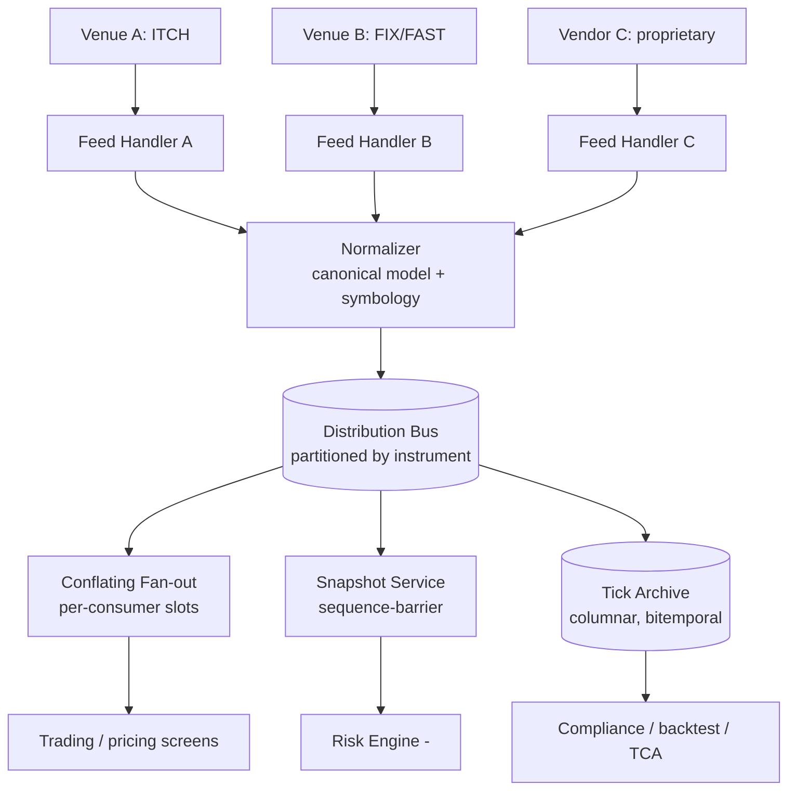
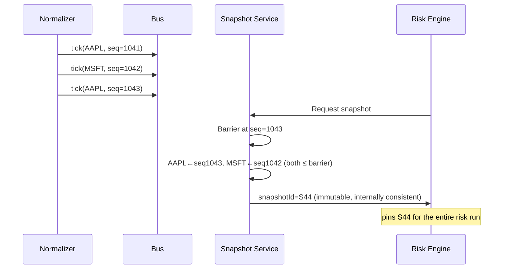
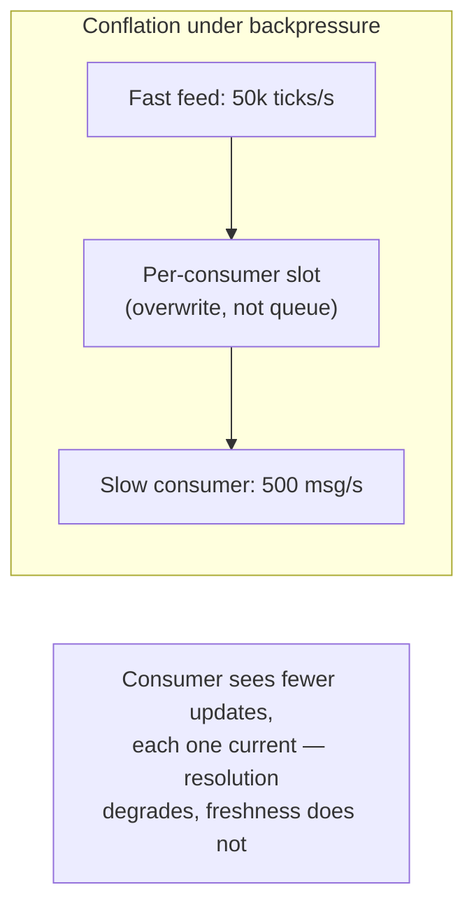
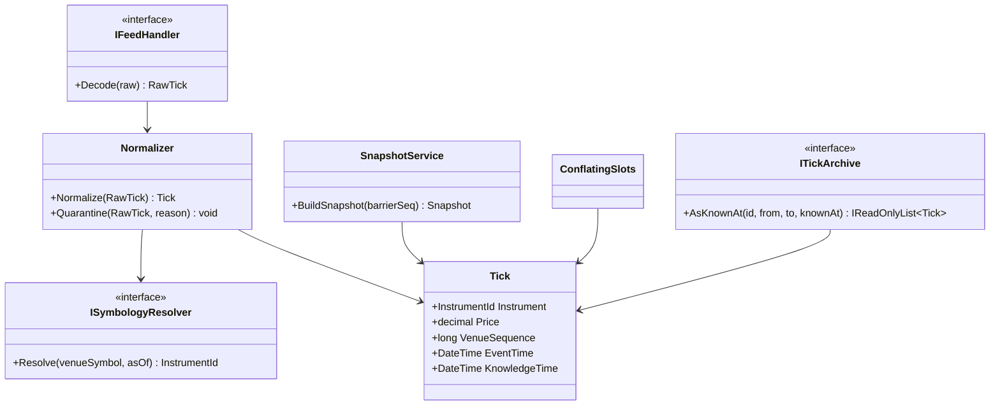

# Module 130 — System Design: Designing a Market Data Distribution Platform

> Domain: System Design | Level: Beginner → Expert | Prerequisite: [[09-Designing-RealTime-Portfolio-Risk-Engine]] (this platform supplies the immutable, versioned snapshots that module treated as a given, and inherits its snapshot-consistency requirement as a first-class design constraint), [[../19-Kafka/*]] (partitioning, consumer groups, retention — the substrate this design builds on), [[../29-Performance-Engineering/03-CachingStrategies-DataAccessPerformance]] (caching and staleness discipline, applied here to conflation)
>
> **Scenario-module note:** Second of six buy-side/capital-markets system-design scenarios (Modules 129–134). Full 16-section template; Elite FinTech Interview Panel lens.

---

## 1. Fundamentals

**What:** A market data platform ingests price and reference data from external venues and vendors, normalizes it into a canonical internal form, and distributes it to every downstream consumer in the firm — trading systems, risk engines, pricing services, analytics, and compliance — while also retaining it for historical replay.

**Why:** Market data is the single most widely-shared dependency in a financial firm. Nearly every system consumes it, and they consume it with *incompatible* requirements: a trading engine wants the newest tick with microsecond latency and will happily discard intermediate updates; a risk engine wants a consistent, frozen snapshot across all instruments; a compliance system wants every tick, in order, permanently, for reconstruction years later. The platform exists to serve these three fundamentally different needs from one ingestion pipeline without forcing any consumer into another's trade-offs.

**When:** Once more than a handful of systems consume market data independently. The alternative — each system integrating directly with vendors — produces vendor-contract duplication, inconsistent normalization (two systems disagreeing about the same instrument's price), and an unbounded compliance surface. The consolidation argument here is the same one made for Outbox infrastructure, with the addition that vendor licensing makes duplication *contractually* expensive, not merely wasteful.

**How (30,000-ft view):**
```
Venues/Vendors ──► Feed Handlers ──► Normalizer ──► Distribution Bus ──┬──► Streaming consumers (trading)
 (heterogeneous (protocol (canonical (partitioned) ├──► Snapshot service (risk)
 protocols) decode) model) └──► Tick archive (compliance, replay)
```

---

## 2. Deep Dive

This section is written to be **complete on its own** — every mechanism, the reasoning that selects it, the failure mode it introduces, and the push-back a Principal/Staff interviewer will raise, answered inline.

### 2.1 Three Consumption Models, One Pipeline

The defining architectural insight: **"market data" is not one product.** Three consumption models must be served, and conflating them is the most common design failure.

| Model | Wants | Tolerates | Conflation is |
|---|---|---|---|
| **Streaming / latest-value** | The current price | Missing intermediate ticks | **Desirable** |
| **Snapshot / consistent-set** | All instruments as of one instant, mutually consistent | Irrelevant — cross-instrument consistency is everything | Irrelevant |
| **Complete / ordered-history** | Every tick, in order, permanently | **Nothing** | **Forbidden** — a discarded tick is unrecoverable evidence |

Trading dashboards and pricing screens want the first; risk and end-of-day valuation want the second; compliance reconstruction, backtesting and transaction-cost analysis want the third.

A platform serving only the first — the naive "publish to a topic" design — silently fails the other two, and the failure stays invisible until a regulator asks for a reconstruction or a risk number turns out internally inconsistent.

**The separation must be structural, not configurable.** A compliance consumer must be *unable* to receive conflated data: the complete-history path reads from the archive or log directly, so there is no code path connecting a compliance consumer to a conflating slot. A `conflation: off` flag is insufficient — it can be misset, and the failure is silent. Make the bad state inexpressible rather than guarded against.

### 2.2 Feed Handlers and Normalisation — Where Correctness Is Actually Decided

Each venue speaks its own protocol (FIX/FAST, ITCH, proprietary binary) with its own semantics for nominally identical concepts. "Last price" may mean last trade, last auction print, or last quote midpoint depending on venue. Symbology differs: the same instrument is `AAPL` on one feed, a RIC on another, a FIGI on a third, and an internal ID in the firm's own systems.

**Normalisation is therefore where most correctness risk lives — not transport.** A symbology error produces prices attributed to the wrong instrument: not a *missing* price, which is visible, but a *wrong* price, which is not. This is the market-data instance of the recurring "declared ≠ actual" theme.

**Redundancy must be concurrent, never failover.** Venue feeds cannot be replayed on demand, so any gap during a failover window is permanently lost. Run redundant handler instances consuming the same feed **simultaneously**, deduplicating downstream by venue sequence number.

### 2.3 The Canonical-Identifier Invariant, and Why a Resolver Must Never Guess

§4's incident: a corporate-action ticker change reached the venue before the nightly symbology refresh. Three defences failed in sequence — the mapping refreshed on a **slower cadence than the events it tracked**; unmapped symbols were **passed through rather than quarantined**; and the resulting warning was one of thousands, so **monitoring was structurally blind**. A downstream fuzzy resolver then converted a freshness gap into confident misattribution.

The structural fix:

1. **Quarantine unmapped symbols at the boundary**, making the invariant violation inexpressible downstream.
2. **Delete fuzzy resolution everywhere.** No component may guess an identifier.
3. **Drive reference data from an event feed, not a nightly file**, so the mapping cannot lag the events it describes.
4. **Aggregate and alert on quarantine rate**, so the signal is a rate rather than one line among thousands.

**"A resolver that guesses is worse than one that fails" is a general principle, not a market-data quirk.** A failure is visible and triggers investigation; a wrong guess is indistinguishable from a correct answer at the point of consumption and propagates silently into decisions. It is the same asymmetry as slowness (self-signalling) versus incorrectness (not) — approximate resolution actively converts a detectable failure into an undetectable one.

**Reference data is a bitemporal store in its own right, not a lookup table.** A symbology mapping is valid over a date range; corporate actions have effective dates that may precede their announcement; and historical data must be resolved using the mapping that was correct **then**. Resolving a 2019 tick with today's mapping is wrong whenever an identifier has been reused or changed. Version it, and have each normalisation run record which reference-data version it used.

### 2.4 Conflation — Deliberate, Bounded Data Loss

When update rate exceeds a consumer's consumption rate, the platform has three options: buffer unboundedly (eventually fails), block the producer (unacceptable — one slow consumer must never stall the feed), or **conflate**.

The mechanism is a **per-consumer, per-instrument slot**: a new tick *overwrites* the pending slot rather than queuing behind it. A slow consumer receives fewer updates but each one is current — degrading **resolution** rather than **freshness**, which is the correct degradation direction for this consumer class.

Correct for latest-value consumers; catastrophic for complete-history consumers. Hence §2.1's structural separation.

### 2.5 Snapshot Construction — the Sequence Barrier

A snapshot is a point-in-time, cross-instrument-consistent capture of the universe, and constructing one is harder than it looks because ticks arrive continuously and asynchronously across instruments.

**The correct mechanism is a sequence-number barrier.** The platform maintains a monotonic sequence (global, or per-partition with cross-partition coordination), and a snapshot is defined as *"the latest value for each instrument at or before sequence N."* Every instrument resolves against the same N, making the set internally consistent **by construction**. The snapshot is written immutably and assigned an ID — precisely the `snapshotId` a risk run must pin.

**The naive alternative — "read the current value of every instrument in a loop" — reproduces the risk engine's incident at the source rather than at the consumer:** early instruments read at one instant, late ones at another, yielding a "snapshot" of a market state that never existed. Serving risk snapshots from the conflating fan-out is the same error wearing a different costume, and worse because the consumer *believes* it received a snapshot: conflation delivers the newest value per instrument *at delivery time*, which is by construction not a consistent cross-instrument point.

**The snapshot service is the platform's primary scaling constraint.** Every other component partitions cleanly by instrument or venue; the sequence barrier requires coordination across partitions to establish a globally consistent point, and coordination is inherently harder to scale than partitioned work.

### 2.6 The Tick Archive — Write-Heavy, Immutable, Enormous

Complete-history retention produces the largest dataset most firms hold, and its access pattern dictates the storage design:

- Overwhelmingly **write-heavy** at ingestion.
- Read almost exclusively as **range scans over one instrument across a time window** ("all AAPL ticks on 2026-03-14").
- Effectively **never** random single-tick lookups.

That argues for **columnar, time-partitioned, compressed** storage partitioned by `(instrument, date)`, matching the dominant query. Tick data compresses exceptionally well — successive prices differ only in low-order digits, so delta-of-delta and dictionary encoding are highly effective. Row-oriented OLTP storage for tick data is a common and expensive early mistake.

**The archive outranks the latest-value cache in DR priority.** The cache rebuilds from the next few seconds of feed; the archive cannot be reconstructed, because venues do not re-serve arbitrary history on demand. Irreplaceable inputs outrank reconstructible derivatives — the same DR reasoning as the risk engine's snapshot archive.

### 2.7 Bitemporality — Late, Out-of-Order and Corrected Ticks

Real feeds deliver ticks **late** (network delay), **out of order** (multicast reordering, multi-path), and **corrected** (venues issue busts and price corrections after the fact, sometimes hours later).

So a tick has two times: **event time** (when it occurred at the venue) and **knowledge time** (when the platform learned of it). A correction issued at 16:00 for a 10:30 trade must not silently overwrite history.

**Retaining only corrected values destroys two things.** First, the ability to answer *"what did we believe at 10:30, when we traded?"* — leaving only *"what is now known to have been true"* — which regulatory reconstruction, best-execution analysis and dispute resolution all need. Second, and less obviously: it makes historical backtests **subtly optimistic**, because a strategy backtested on corrected data has effectively seen information unavailable at decision time. That is look-ahead bias, and it inflates apparent performance in a way that is very hard to notice.

**Replaying "yesterday's session exactly as it was seen"** therefore means filtering the archive by **knowledge time**, so only ticks known by each simulated instant are visible, replayed in original **arrival order** with original inter-arrival timing preserved if the backtest is latency-sensitive. The subtlety worth stating: "exactly as seen" requires arrival ordering and timing, **not event ordering** — a tick that arrived late must be replayed late, or the backtest sees a market it could not have seen.

### 2.8 Gap Detection — Because Loss Here Is Permanent

Track the expected next sequence per venue partition. A gap indicates loss — network, handler restart, or venue issue — and must trigger recovery: request a retransmit where the venue supports it, or fail over to the redundant concurrent handler whose stream may be intact.

**A gap must be escalated, not merely logged.** Unlike a slow consumer, missing market data is unrecoverable once the venue's retransmit window closes, so the response is time-critical. Unrecovered gaps must be **recorded and disclosed** rather than silently interpolated, because they bound every reconstruction claim made later.

### 2.9 Bad Ticks — Quarantine at Ingestion

Plausibility-check at ingestion — a move exceeding a multiple of the factor's own recent volatility, or crossing a hard bound — and quarantine.

**Never filter at consumption.** Consumption-time filtering means different consumers apply different filters, so the same nominal data yields different results per consumer, destroying the single-market-state property. Record every quarantine, because a wrongly quarantined real move is itself a serious error — and an over-aggressive filter reports calm during exactly the dislocation when the data matters most.

### 2.10 Multi-Venue Instruments — Do Not Collapse Prematurely

An instrument trading on several venues has several prices. Retain **venue-attributed prices as distinct facts**, and treat any consolidated view (best bid/offer across venues, a composite price) as an explicitly derived product with a defined construction rule.

Collapsing at ingestion destroys information some consumers require — best-execution analysis specifically needs per-venue prices — and embeds a consolidation policy into the pipeline where it cannot be varied per consumer.

### 2.11 Distribution Mechanics, CAP Posture and Entitlements

**Multicast versus broker** is a real fork:

| | Reliable multicast | Broker (Kafka-style) |
|---|---|---|
| Publisher cost | Independent of consumer count | Grows per consumer |
| Latency at high fan-out | Unmatched | Higher |
| Retention / replay | Weak | Durable, native |
| Operability in cloud | Limited network support | Straightforward |

Multicast is historically the trading-floor standard and still unbeaten for very high fan-out at low latency; brokers buy retention, replay and consumer-group semantics at higher per-consumer cost. Many platforms run both: multicast for the latency-sensitive latest-value path, a log for history and replay.

**The distribution path and snapshot service take opposite CAP postures, deliberately.** Distribution favours **availability** — a slow consumer is conflated or skipped, never allowed to block the feed. The snapshot service favours **consistency** — it must fail rather than emit an inconsistent snapshot, because its entire value rests on that guarantee.

**Entitlements must be live, not checked once at connect.** A mid-session licence revocation requires the distribution layer to hold live entitlement state and **re-evaluate on change**, so an active consumer stops receiving data when its licence lapses.

### 2.12 Performance Realities

**Size for burst, not average.** Market data is extraordinarily bursty — open, close and announcements reach **50–100× session mean**. Average-sized capacity fails at exactly the moments that matter.

**Allocation matters here in a way it usually does not.** At 500,000 ticks/second, one object per tick produces severe Gen-0 pressure and GC pauses that manifest as latency spikes **correlated with volume** — the system degrades exactly when load peaks. `struct` representations, pooled buffers and pre-allocated ring buffers are necessary. This is the rare workload where low-allocation guidance is genuinely load-bearing rather than premature optimisation.

**Coordinated omission distorts latency measurement specifically here.** A load generator that waits for a response before sending the next tick stops generating load exactly when the system slows — so the burst conditions that cause the spikes are never actually applied, and the measurement systematically under-reports latency precisely under the conditions being tested. Use an open-loop generator with a fixed schedule and measure against intended send time.

### 2.13 The Latency-Critical Split, and the Control That Keeps It Honest

A normalising fan-out platform adds hops and **cannot** compete with a direct venue feed decoded in-process by a latency-critical strategy. When the desk demands microseconds, the honest answer is **architectural separation rather than compromise**: latency-critical strategies take a direct feed with their own in-process decode, accepting duplicated vendor cost and their own normalisation risk; everything else uses the platform. Trying to serve both from one path degrades the platform for all consumers while still not reaching the target.

**That split needs a control, or the two implementations drift.** Continuously reconcile a sample of the direct-feed strategy's observed prices against the platform's, alerting on divergence beyond tolerance — the same reconciliation pattern used for read-model drift and incremental-risk drift, now applied across two independent normalisation implementations. Without it, venues change formats, only one implementation is updated, and the divergence surfaces later as an inexplicable difference between what the desk saw and what risk computed.

### 2.14 Multi-Region Topology

Feed handlers deploy **adjacent to their venues** — a New York handler for NYSE, not a Tokyo handler reaching across the Pacific — because decode must happen close to source, both for latency and to avoid transporting raw high-volume protocol traffic across oceans. Normalised data then replicates cross-region, with regional latest-value caches serving local consumers.

The decision that must be made explicitly rather than by default: are snapshots **global** (consistent across all venues — required for firm-wide risk) or **regional** (cheaper, sufficient for regional consumers)? Global snapshots need cross-region coordination on the sequence barrier, which is the expensive part.

### 2.15 The Economics Are Inverted

**Vendor data licensing frequently exceeds infrastructure cost by a wide margin**, and is typically priced per-consumer, per-instrument-class or per-use-case — not per byte.

That inverts normal optimisation. The highest-leverage cost lever is **entitlement precision**: ensuring consumers are licensed for exactly what they use and no more. It also means the platform's **per-consumer delivery records are a cost-management instrument**, not merely a compliance artefact.

It is also why the primary security concern here is **licensing rather than confidentiality**: much market data is publicly available, but redistribution is contractually restricted, and vendor audits examine precisely which internal consumers received which data.

### 2.16 Cloud versus On-Premises

Genuinely mixed, and the answer differs by component:

- **Feed handlers** face real constraints — venue connectivity often requires cross-connects at specific colocation facilities; some venue and vendor agreements **restrict where data may be processed** (contractual, not technical); and multicast support is limited in cloud networks.
- **The archive and analytical consumers** suit cloud extremely well: elastic, storage-heavy, burst-tolerant.

The realistic architecture is **hybrid** — ingestion and low-latency distribution close to the venues, archive and analytics in cloud.

### 2.17 Observability — Attribution and the "Stale Price" Investigation

**Distinguishing a venue problem from a platform problem requires comparison across independent paths:**

| Observation | Conclusion |
|---|---|
| Both handlers for venue A show a gap; venue B clean | Upstream problem at **venue A** |
| One handler gaps, its twin does not | That **handler's path** |
| Every venue degrades at once | The **platform** — normaliser, bus, or resource exhaustion |

A single-path deployment can observe degradation but cannot localise it. The redundancy of §2.2 buys attribution as well as continuity.

**"The platform showed a stale price" does not identify a cause**, and the three possibilities have entirely different fixes:

1. **No update received** — a gap (§2.8) or an entitlement issue.
2. **An update received but conflated away** — working as designed for that consumer class; the answer is that they need a different consumption model (§2.1).
3. **An update genuinely delayed in the pipeline** — a platform latency problem.

Resolve by comparing the consumer's **delivery record** against the source stream for that instrument and window. Without per-consumer delivery recording, this investigation cannot be conducted at all.

### 2.18 Governance, Onboarding, and the Closing Synthesis

**Onboarding a new consumer starts with one question: which consumption model?** Getting that wrong is what produces the stale-price confusion above. Then, in order: entitlement verification against vendor licensing (and its cost implication, §2.15), expected volume for capacity impact, latency requirement — which determines whether the platform can serve them at all (§2.13) — and registration in delivery recording.

**The governance program required before serving regulated consumers:**

1. Canonical-identifier invariant enforced by **quarantine at the boundary**, with no fuzzy resolution anywhere (§2.3).
2. **Sequence-gap detection** with time-critical escalation and recorded unrecovered gaps (§2.8).
3. **Structural separation** of consumption paths, so compliance consumers cannot receive conflated data (§2.1).
4. **Bitemporal archive** retaining originals alongside corrections, with knowledge-time-filtered query support (§2.7).
5. **Per-consumer delivery recording**, serving compliance, dispute investigation and licence-cost management simultaneously (§2.15, §2.17).
6. Continuous **reconciliation** between the platform and any direct-feed path (§2.13).

**Answering a regulator honestly** on "can you reconstruct exactly what the trading system saw at a given moment": yes, subject to stated conditions — the archive retains every tick bitemporally with venue sequence numbers, so the state visible to a consumer at time T is reconstructible by filtering on knowledge time. The honest caveats: reconstruction is exact only where gap detection recorded **no unrecovered gaps** for that window (those are logged and disclosed, never silently interpolated), and conflated consumers by design saw a subset of ticks, so their view is reconstructible only as the subset the delivery record says they actually received.

**What makes market data distribution distinctively hard — and it is not volume.** Many systems handle higher message rates. Two properties combine:

1. **The same data must be served under mutually contradictory guarantees** — drop-tolerant and drop-forbidden, latest-value and point-in-time-consistent — from one pipeline, where satisfying any one naively violates another.
2. **The dominant failure mode is silent misattribution rather than loss.** A missing price is visible; a wrong price is not, and it propagates directly into pricing, risk and trading decisions before anyone can notice.

Both point the design at the same conclusion the risk engine reached from a different direction: the hard engineering here is not moving the data, it is establishing **evidence** that what was delivered is what the consumer believes it is.

---

## 3. Visual Architecture


```mermaid
graph TB
 V1[Venue A: ITCH] --> FH1[Feed Handler A]
 V2[Venue B: FIX/FAST] --> FH2[Feed Handler B]
 V3[Vendor C: proprietary] --> FH3[Feed Handler C]
 FH1 --> NORM[Normalizer<br/>canonical model + symbology]
 FH2 --> NORM
 FH3 --> NORM
 NORM --> BUS[(Distribution Bus<br/>partitioned by instrument)]
 BUS --> CONF[Conflating Fan-out<br/>per-consumer slots]
 BUS --> SNAP[Snapshot Service<br/>sequence-barrier]
 BUS --> ARCH[(Tick Archive<br/>columnar, bitemporal)]
 CONF --> TRADE[Trading / pricing screens]
 SNAP --> RISK[Risk Engine -]
 ARCH --> COMP[Compliance / backtest / TCA]
```


```mermaid
sequenceDiagram
 participant N as Normalizer
 participant B as Bus
 participant S as Snapshot Service
 participant R as Risk Engine

 N->>B: tick(AAPL, seq=1041)
 N->>B: tick(MSFT, seq=1042)
 N->>B: tick(AAPL, seq=1043)
 R->>S: Request snapshot
 S->>S: Barrier at seq=1043
 S->>S: AAPL←seq1043, MSFT←seq1042 (both ≤ barrier)
 S->>R: snapshotId=S44 (immutable, internally consistent)
 Note over R: pins S44 for the entire risk run
```


```mermaid
graph LR
 subgraph "Conflation under backpressure"
 F[Fast feed: 50k ticks/s] --> SLOT["Per-consumer slot<br/>(overwrite, not queue)"]
 SLOT --> SC[Slow consumer: 500 msg/s]
 end
 Note2["Consumer sees fewer updates,<br/>each one current — resolution<br/>degrades, freshness does not"]
```

---

## 4. Production Example

**Problem:** A firm consolidated onto a single market data platform serving trading, risk, and compliance. It ran cleanly for two years.

**Architecture:** the design — feed handlers per venue, central normalizer, partitioned bus, three consumption paths.

**Implementation:** The normalizer resolved venue symbols to canonical instrument IDs via a symbology reference table, refreshed nightly from a vendor reference-data file. When a symbol was not found, the normalizer logged a warning and *passed the tick through with the raw venue symbol as its identifier* — a pragmatic choice made early on so that an unmapped symbol would not silently drop data.

**Trade-offs:** Passing through unmapped symbols preserves data (better than dropping) but means the canonical-ID invariant is not actually enforced — the bus can carry two different identifier schemes simultaneously.

**Lessons learned:** A corporate action — a ticker change following a merger — took effect at the venue before the nightly reference-data refresh carried it. For one trading session, the venue published under the new ticker while the symbology table still knew only the old one. The normalizer passed the new ticker through unmapped. Downstream, the pricing service treated it as an unknown instrument and ignored it (visible, harmless). But the risk engine's instrument resolution performed a *fuzzy fallback* to the closest known identifier — and matched it to a **different, genuinely unrelated instrument** that happened to share a prefix. For a full session, that instrument's risk was computed against another company's prices.

Nothing errored. The warning log entry existed but was one of ~40,000 similar entries that session, all previously benign. The failure was found only when a PM questioned an implausible exposure figure.

The fix had three parts, and the third is the one that generalizes: (1) unmapped symbols are **quarantined**, not passed through — the canonical-ID invariant is enforced at the boundary, so an unmapped tick cannot enter the bus at all; (2) the fuzzy fallback in the risk engine's resolver was deleted outright — a resolver that guesses is worse than one that fails, because a failure is visible and a wrong guess is not; (3) unmapped-symbol *rate* became a monitored signal with a threshold, rather than an unbounded warning log — the information had been present all along, and was useless because it was not aggregated into anything anyone would notice. This is the course's recurring pattern in its market-data form: the data existed, the log existed, and neither constituted detection.
## 11. Coding Exercises

### Easy — Conflating Slot
**Problem:** Deliver only the newest value per instrument to a slow consumer, without unbounded buffering.
**Solution:**
```csharp
public sealed class ConflatingSlots
{
    private readonly ConcurrentDictionary<InstrumentId, Tick> _pending = new;

    public void Publish(Tick tick) => _pending[tick.Instrument] = tick; // overwrite, never queue

    public IEnumerable<Tick> DrainForConsumer
    {
        foreach (var key in _pending.Keys)
            if (_pending.TryRemove(key, out var tick))
            yield return tick;
    }
}
```
**Time complexity:** O(1) publish; O(k) drain for k pending instruments.
**Space complexity:** O(k) — bounded by instrument count, never by tick rate. This bound is the entire point.
**Optimized solution:** Replace the dictionary with a pre-allocated array indexed by dense instrument ordinal plus a dirty-bitmap for drain, eliminating hashing and allocation on the hot path (the allocation discipline).

### Medium — Sequence-Barrier Snapshot
**Problem:** Construct an internally-consistent snapshot across all instruments.
**Solution:**
```csharp
public Snapshot BuildSnapshot(long barrierSeq)
{
    var values = new Dictionary<InstrumentId, Tick>(_universe.Count);
    foreach (var instrument in _universe)
    {
        var latest = _history.LatestAtOrBefore(instrument, barrierSeq); // same barrier for all
        if (latest is null) throw new IncompleteSnapshotException(instrument, barrierSeq);
        values[instrument] = latest;
    }
    return Snapshot.CreateImmutable(SnapshotId.New, barrierSeq, values);
}
```
**Time complexity:** O(n log m) for n instruments over m-length histories with binary search.
**Space complexity:** O(n).
**Optimized solution:** Maintain an incrementally-updated latest-value structure keyed by sequence, so snapshot construction is O(n) copy rather than n searches — and note the throw on missing data is deliberate (the CP posture: fail rather than emit an incomplete snapshot).

### Hard — Bitemporal Tick Query (§2.7)
**Problem:** Retrieve what was known about an instrument at a given decision time, excluding later corrections.
**Solution:**
```csharp
public IReadOnlyList<Tick> AsKnownAt(InstrumentId id, DateTime eventFrom, DateTime eventTo, DateTime knownAt) =>
    _archive
.Query(id, eventFrom, eventTo)
.Where(t => t.KnowledgeTime <= knownAt) // exclude later-arriving corrections
.GroupBy(t => t.VenueSequence)
.Select(g => g.OrderByDescending(t => t.KnowledgeTime).First) // latest belief as of knownAt
.OrderBy(t => t.EventTime)
.ToList;
```
**Time complexity:** O(r log r) over r rows in the event-time range.
**Space complexity:** O(r).
**Optimized solution:** Push the knowledge-time predicate into the storage layer as a partition/index filter rather than filtering after retrieval — on a multi-year archive, post-filtering reads orders of magnitude more data than the query returns.

### Expert — Cross-Path Reconciliation (§2.13)
**Problem:** Detect divergence between the direct-feed path and the platform path.
**Solution:**
```csharp
public async Task<ReconciliationReport> ReconcileAsync(DateOnly session, IReadOnlyList<InstrumentId> sample)
{
    var findings = new List<Divergence>;
    foreach (var id in sample)
    {
        var platform = await _platformArchive.ClosingPricesAsync(id, session);
        var direct = await _directFeedArchive.ClosingPricesAsync(id, session);

        foreach (var (seq, platformPrice) in platform)
        {
            if (!direct.TryGetValue(seq, out var directPrice)) { findings.Add(Divergence.Missing(id, seq)); continue; }
            if (platformPrice!= directPrice) findings.Add(Divergence.Mismatch(id, seq, platformPrice, directPrice));
        }
    }
    return new ReconciliationReport(findings, sample.Count);
}
```
**Time complexity:** O(s × t) for s sampled instruments and t ticks each.
**Space complexity:** O(d) for divergences found.
**Optimized solution:** Stratify the sample by instrument type and venue rather than sampling uniformly — divergence arises from normalization differences, which cluster by venue protocol and instrument complexity, so uniform sampling under-weights exactly where divergence is likeliest (the stratification principle of Module 129 §2.9).

---

## 12. System Design — Designing a Market Data Distribution Platform

*Authored to the four-step standard (see Module 01 §12 for the method).*

---

### Step 1 — Understand the Problem and Establish Design Scope

#### The dialogue

> **C:** Who consumes this, and how? "Market data" means at least three incompatible products depending on the consumer.
> **I:** Say more.
>
> **C:** A trading screen wants the *latest* price and doesn't care about ticks it missed. A risk engine wants a *consistent snapshot* across instruments at one instant. A TCA or surveillance system wants the *complete, ordered history* with nothing dropped. Those are different guarantees.
> **I:** All three. That's the problem.
>
> **C:** Are we the lowest-latency tier — co-located, direct feed handlers — or the platform tier that serves the firm?
> **I:** Platform tier. The latency-critical strategies take direct feeds and bypass you; assume single-digit milliseconds is acceptable here.
>
> **C:** How many venues and instruments?
> **I:** Roughly 30 venues and vendors; 200,000 instruments.
>
> **C:** What's the tick rate — mean and peak? For market data the ratio matters more than either number.
> **I:** Around 80,000 ticks/second in session; opens and macro announcements produce bursts up to 5 million/second.
>
> **C:** Do we need to handle corrections — a venue restating a print after the fact?
> **I:** Yes, and the corrected value must not silently replace what consumers already acted on.
>
> **C:** Entitlements? Exchange data is licensed per consumer.
> **I:** Yes — per-consumer entitlement enforcement and per-consumer delivery records, because we're audited and billed on it.
>
> **C:** Retention?
> **I:** Full tick history, seven years.
>
> **C:** Out of scope?
> **I:** The trading strategies, the direct-feed co-located tier, and vendor contract management.

The first exchange is the design. **Three consumption models with three different guarantees cannot be served correctly by one path**, and getting the interviewer to agree to that framing early is what makes §3.5's structural separation defensible rather than looking like duplication.

#### Functional requirements

1. Ingest from heterogeneous venues and vendors with different protocols and semantics.
2. Normalise to a canonical model with canonical instrument identifiers.
3. Serve three consumption models: **streaming/conflated**, **consistent snapshots**, **complete ordered history**.
4. Retain full tick history bitemporally, queryable filtered by knowledge time.
5. Enforce per-consumer entitlements and record per-consumer delivery.
6. Handle late, out-of-order, and corrected ticks without destroying what was previously believed.

#### Non-functional requirements

| Requirement | Target |
|---|---|
| Ingest → consumer latency (streaming path) | p99 < 5 ms |
| Snapshot consistency | **Absolute** — an inconsistent snapshot must never be emitted; failing is correct |
| Complete-history path | **Zero unrecorded tick loss**; every gap detected, escalated, and recorded |
| Burst capacity | 100× session mean without degradation |
| Availability | 99.99% in session |
| Retention | 7 years, queryable by `(instrument, time, knowledge time)` |
| Entitlement enforcement | Per consumer, per instrument class, with an auditable delivery record |

#### Back-of-the-envelope estimation

```
Instruments        = 200,000
Session-mean rate  = 80,000 ticks/s
Peak burst         = 5,000,000 ticks/s
Peak-to-mean ratio = 62×                    ← THE governing number
```

Volume and storage:

```
Normalised tick    ≈ 48 B
Sustained          = 80,000 × 48 B          ≈ 3.8 MB/s
Peak               = 5,000,000 × 48 B       ≈ 240 MB/s
Daily              = 80,000 × 23,400 s      ≈ 1.9 × 10^9 ticks/day
                                            ≈ 90 GB/day raw
Compressed (columnar, delta+dictionary, typical 6–9×)
                                            ≈ 10–15 GB/day
Annual archive                              ≈ 3–4 TB compressed
7-year retention                            ≈ 25 TB
```

Fan-out:

```
~150 internal consumers × subscribed subsets
Conflated streaming fan-out at 25 ms conflation interval:
  200,000 instruments ÷ 25 ms = 8,000,000 potential updates/s
  ...but conflation caps each instrument at 40 updates/s,
  so a consumer subscribed to 5,000 instruments receives
  at most 200,000 updates/s regardless of market activity.
  THAT is what conflation buys: a bounded consumer cost.
```

#### What the numbers tell us

1. **The archive is small.** 25 TB over seven years is unremarkable — so the archive's engineering concern is **durability and queryability, not size**. Teams that size this problem on volume optimise the wrong axis.
2. **Peak governs everything.** A platform sized on the 80,000/s mean fails at every market open, every day, predictably. Every capacity number in this design must be read as "peak governs" — buffers, thread pools, network, and disk queue depth are all sized on 5M/s.
3. **Conflation is what makes fan-out bounded.** Without it, consumer cost is a function of market volatility, which means every consumer degrades simultaneously at exactly the moment the data matters most. With it, consumer cost is a function of *subscription size*, which is a number you control.

The hard problem is **serving three mutually incompatible guarantees from one ingest without letting the weakest contaminate the strongest.**

---

### Step 2 — Propose High-Level Design and Get Buy-In

#### The three consumption models, stated as contracts

| Model | Guarantee | Explicitly does NOT guarantee |
|---|---|---|
| **Streaming (conflated)** | You will see the latest value within the conflation interval | That you saw every tick |
| **Snapshot** | Every instrument in the response reflects the same instant | Freshness within milliseconds |
| **History** | Every tick, in order, with corrections identifiable | Low latency |

Writing these as contracts up front prevents the single most damaging failure in market-data platforms: a consumer building a P&L or a surveillance rule on the *conflated* stream and silently losing ticks that mattered.

#### Components

**Feed Handlers (per venue, concurrently redundant).** Protocol-specific. Two independent instances per feed, both publishing; downstream deduplicates by venue sequence number. Redundancy is *concurrent*, not failover — a failover gap is exactly the tick loss the history path forbids.

**Normaliser.** Maps venue-specific messages to the canonical model and venue symbols to canonical instrument IDs, using **versioned, bitemporal reference data** — because a symbol's meaning changes over time and yesterday's tick must be interpreted with yesterday's mapping.

**Distribution Bus.** Partitioned by instrument, retaining a replay window.

**Conflating Fan-out.** Per-consumer, per-instrument latest-value slots flushed on an interval.

**Snapshot Service.** Constructs consistent snapshots via a sequence barrier; publishes immutable, addressable snapshots.

**Tick Archive.** Columnar, bitemporal, partitioned by `(instrument, date)`.

**Entitlement Service.** Per-consumer permissions, consulted on subscribe and on history query.

**Delivery Recorder.** Records what was delivered to whom — an audit and billing artefact, not telemetry.

**Gap Detector.** Per-feed sequence continuity monitoring with retransmit escalation.

#### End-to-end walkthrough — a tick

1. Venue emits a message; both redundant handlers for that feed receive it.
2. Each handler timestamps at **ingest** (its own clock, PTP-synchronised) and preserves the **venue's own timestamp and sequence number** — three distinct times, and conflating them is a classic error.
3. Both publish to the normaliser; the normaliser deduplicates on `(feed_id, venue_sequence)` — the first wins, the second is counted and discarded.
4. Normalisation resolves the venue symbol to a canonical instrument ID **using reference data as-of the tick's business date**. An unmapped symbol is **quarantined, not guessed** (§3.2).
5. The normalised tick is published to the bus partition for that instrument, and appended to the archive writer's buffer.
6. Three consumers diverge here:
   - **Streaming**: the tick overwrites the instrument's latest-value slot; the slot is flushed to subscribers on the conflation tick.
   - **Snapshot**: the tick contributes to the running state the barrier will capture.
   - **History**: the tick is written to the archive with its ingest time as knowledge time.
7. The Delivery Recorder logs per-consumer delivery counts by entitlement class.

#### End-to-end walkthrough — a consistent snapshot

1. A consumer (e.g. the risk engine of Module 09) requests a snapshot.
2. The Snapshot Service issues a **sequence barrier**: it records, per bus partition, the current sequence position.
3. It waits for all partitions to be drained past their barrier positions — bounded by a timeout.
4. It captures the latest value per instrument as of those positions.
5. The result is written to immutable object storage under a `snapshot_id` and returned.
6. **If the barrier cannot be satisfied within the timeout, the snapshot fails.** It does not degrade to a best-effort snapshot, because a snapshot that is *almost* consistent is indistinguishable from a consistent one to its consumer and wrong in an unquantifiable way.

Note that barriers run at **snapshot cadence, not tick cadence** — a few times a minute, not 80,000 times a second — which is what makes the coordination affordable.

#### API design

**Subscribe (streaming) — WebSocket or binary session**

| Field | Type | Description |
|---|---|---|
| `instruments` | string[] | Canonical IDs, or a subscription expression |
| `fields` | string[] | `bid`, `ask`, `last`, `volume`, book levels |
| `conflation_ms` | int | 0 = unconflated (requires entitlement and a capacity check), default 25 |
| `on_gap` | enum | `NOTIFY` \| `IGNORE` — **a conflated consumer must acknowledge that gaps exist** |

Every update carries `{ instrument_id, fields, venue_ts, ingest_ts, sequence, conflated_count }`. **`conflated_count` is the number of ticks collapsed into this update** — it costs 2 bytes and it is the difference between a consumer that knows it is seeing conflated data and one that assumes it isn't.

**`POST /v1/snapshots`**

| Field | Type | Description |
|---|---|---|
| `universe` | string[] or `universe_id` | |
| `as_of` | RFC3339 | Optional; historical snapshots reconstruct from the archive |
| `timeout_ms` | int | After which the request **fails** rather than degrading |

Response: `{ snapshot_id, captured_at, instrument_count, barrier_positions, url }`. The `snapshot_id` is what Module 09 pins for an entire risk run.

**`GET /v1/history`**

| Param | Type | Description |
|---|---|---|
| `instrument_id`, `from`, `to` | | |
| `knowledge_time` | RFC3339 | **The bitemporal axis** — "what did we know at this time", which is how a surveillance query reproduces what a trader could actually have seen |
| `include_corrections` | bool | Default true |

#### Data model

**`tick`** — columnar archive, partitioned by `(instrument_id, date)`:

| Column | Type | Notes |
|---|---|---|
| `instrument_id`, `date` | Partition | |
| `venue_ts` | timestamp(ns) | The venue's clock |
| `ingest_ts` | timestamp(ns) | Ours — the knowledge time |
| `feed_id`, `venue_sequence` | | Dedup and gap-detection key |
| `price`, `size`, `side`, `condition_codes` | | |
| `correction_of` | nullable | Points at the tick this corrects. **Corrections are new rows, never updates** |
| `quarantine_reason` | nullable | Present rows that did not pass validation, retained rather than dropped |

**`instrument`** — bitemporal reference data: `(canonical_id, valid_from, valid_to, knowledge_from, knowledge_to)`, with venue symbol mappings, corporate-action history, and identifier cross-references (ISIN/CUSIP/SEDOL/RIC).

**`snapshot`** — `snapshot_id`, `captured_at`, `universe_id`, `barrier_positions`, `storage_key`, `instrument_count`. Immutable.

**`delivery_record`** — `(consumer_id, date, entitlement_class)` → counts and instrument sets. An audit artefact with its own retention.

**Latest-value store** — in-memory, lock-free per-instrument slots. **Not a general cache**: fixed cardinality (200,000), no eviction, no misses, single-writer per partition. Modelling it as a cache invites eviction policies and hit-rate metrics that make no sense here.

#### Store selection, and why

| Store | Choice | Reason |
|---|---|---|
| Archive | **Columnar, time-partitioned, compressed** | The dominant query is "instrument × time range × subset of columns" — exactly a columnar scan. 6–9× compression on tick data is routine |
| Reference data | **Bitemporal relational** | Small, relational, correction-heavy, and every historical query needs as-of resolution |
| Latest value | **In-memory lock-free slots** | 200,000 fixed slots, sub-microsecond reads, no eviction semantics needed |
| Snapshots | **Immutable object storage, addressed by ID** | Pinning requires immutability; Module 09 depends on it |
| Bus | **Partitioned log with a replay window** | Replay is what lets a slow consumer recover without a retransmit from the venue |

---

### Step 3 — Design Deep Dive

#### 3.1 Feed handler redundancy and gap detection

**Concurrent redundancy, not failover.** Two handlers per feed both process and publish; the normaliser deduplicates on `(feed_id, venue_sequence)`. Failover would leave a gap during detection and cutover — measured in hundreds of milliseconds, which on the history path is thousands of lost ticks.

Gap detection watches venue sequence continuity per feed:

- **Gap detected** → attempt retransmit from the venue's replay facility, on a clock. Venue replay windows are *short* (often seconds to a few minutes), so escalation is time-critical: a gap noticed after the window closes is unrecoverable.
- **Unrecoverable gap** → **record it**. The archive gets an explicit gap marker. This matters more than it sounds: a history consumer must be able to distinguish "no trades occurred" from "we lost the data", and those are identical in a store that simply has no rows.

#### 3.2 Normalisation, symbology, and the quarantine decision

Symbology is where correctness is actually decided. `VOD.L`, `VOD LN`, `GB00BH4HKS39`, and a venue-specific numeric ID may all refer to one instrument — or, after a corporate action, may not.

The design rule: **an unmapped or ambiguous symbol is quarantined, never guessed.** A guess produces a tick attributed to the wrong instrument, which flows into risk (Module 09), P&L, and surveillance, and is discovered weeks later — if ever. A quarantine produces a visible, countable, fixable break.

The trade is explicit: quarantine trades data availability for identity integrity, and it is correct because **misattribution is silent and unbounded while a missing tick is visible and bounded.** Unmapped-symbol rate is therefore a first-class SLI, not a log line.

Reference data must be **bitemporal** for the same reason: a tick from 2019 must be resolved with the 2019 mapping. Resolving historical ticks with today's symbology is a subtle, systematic corruption of every historical study.

#### 3.3 Conflation — deliberate, bounded data loss

Conflation drops intermediate values, keeping the latest per instrument per interval. It is **correct for latest-value consumers and wrong for everyone else**, and the platform's job is to make that impossible to get wrong by accident:

- Conflated subscriptions carry `conflated_count` on every update, so a consumer *can* detect that collapsing occurred.
- Unconflated subscriptions require an entitlement and a capacity check, because an unconflated consumer at 5M ticks/s is a denial-of-service against itself and a fan-out cost against the platform.
- **The history path is never conflated.** Structurally separate, not a configuration flag — see §3.5.

Conflation intervals are per-consumer, and a slow consumer's conflation interval **widens automatically** rather than the platform buffering unboundedly on its behalf. That is the correct backpressure response: degrade resolution for the consumer that cannot keep up, rather than degrade latency for everyone else.

#### 3.4 Late, out-of-order, and corrected ticks

Three distinct cases with three distinct handlings:

| Case | Handling |
|---|---|
| **Late** (arrives after later ticks, same venue sequence order intact) | Insert by `venue_ts`; knowledge time is `ingest_ts`. Streaming consumers may never see it — acceptable and documented |
| **Out-of-order** (venue sequence out of order) | Reorder within a bounded window; beyond the window, treat as late |
| **Corrected** (venue restates a prior print) | **A new row with `correction_of`** — never an update. The original remains, because consumers acted on it |

Bitemporality is what makes corrections tractable: a query at `knowledge_time = T` returns what was believed at T, which is exactly what a surveillance investigation or a trade dispute needs. Overwriting corrections destroys the ability to answer "what did the trader actually see?", which is usually the whole question.

#### 3.5 Structural separation of the three paths

The three consumption models share ingest and normalisation, and then **diverge into physically separate paths** — separate processes, separate queues, separate storage, separate resource pools.

The alternative — one pipeline with per-consumer flags — has a specific failure mode: **the weakest guarantee contaminates the strongest.** A conflation setting applied at the wrong layer silently drops ticks from the history path. A backpressure policy that drops on overflow, correct for streaming, is catastrophic for history. A shared thread pool means a slow streaming consumer delays archive writes.

Separation trades infrastructure duplication for guarantee integrity. It is justified here specifically because **the alternative failure is silent** — a history path that has been quietly conflated for six months produces studies that are wrong with no error anywhere. This is the same reasoning as Module 20's physical priority lanes: isolation must be structural, not advisory.

#### 3.6 Burst absorption at 62× mean

The open produces 5M ticks/s against an 80k/s mean. What must be sized on peak rather than mean:

- **Feed handler input buffers** — a handler that blocks on a full buffer loses ticks at the socket, which is unrecoverable.
- **Bus partition count** — partitions must be numerous enough that no single instrument's burst saturates one partition's writer. The most active instruments at the open are precisely the ones with the highest burst.
- **Archive write path** — buffered and batched, with the buffer sized for the full burst duration, not the burst rate.
- **Conflation** absorbs the burst for streaming consumers automatically — which is its second and less-discussed benefit: a 62× input burst produces *no increase at all* in conflated output rate.

The failure to avoid: sizing on mean and relying on autoscaling. A burst that lasts 90 seconds is over before any autoscaler reacts.

#### 3.7 Entitlements and delivery recording

Exchange data is licensed per consumer, per instrument class, often per user seat, and firms are audited on it. Two consequences that are design requirements rather than compliance overhead:

- **Entitlement is checked on subscribe *and* on every history query**, because entitlements change and a long-lived subscription outlives the permission that authorised it — the same evaluate-at-the-last-moment principle as consent in Module 20 §2.2.
- **Delivery is recorded per consumer**, and the record is an audit and billing artefact with its own retention — not telemetry that can be sampled or dropped under load. Sampling the delivery record to save space is how a firm fails an exchange audit.

---

### Step 4 — Wrap-Up

**What we left out:** the co-located, kernel-bypass direct-feed tier, which is a genuinely different engineering problem (this platform explicitly serves the tier above it); order-book construction and depth-of-book maintenance; derived analytics (VWAP, indicators); vendor contract and cost management, which at 30 feeds is a large operational concern; cross-venue consolidation and best-execution calculation; and multicast versus unicast for the latency tier.

**What we would measure:** per-feed **gap rate and unrecovered-gap count** — the history path's core SLI; **unmapped-symbol rate**, the leading indicator of a symbology or corporate-action problem; per-feed staleness (time since last tick, per instrument class) which detects a silently dead feed that a rate metric shows as "quiet"; ingest→consumer latency distribution per path; **cross-path divergence** — reconstructing a conflated stream's latest value from the archive and comparing, which is the only detector for the contamination §3.5 prevents; snapshot barrier satisfaction time and failure rate; and cross-handler comparison, which distinguishes "the venue is slow" from "our handler is slow" and is the difference between escalating to a vendor and debugging your own code.

**Summary.** One ingest, three structurally separate paths, because three incompatible guarantees cannot share a pipeline without the weakest silently winning. Concurrent-redundant feed handlers with sequence-based dedup rather than failover; quarantine rather than guess on symbology; bitemporal storage so corrections add knowledge instead of destroying it; snapshot barriers at snapshot cadence rather than tick cadence; and everything sized on a 62× peak-to-mean ratio, because a platform sized on the mean fails every morning at the open.

---

### References

1. FIX Trading Community — *FIX Protocol* and *Simple Binary Encoding (SBE)*, the wire formats most venue feeds use.
2. Nasdaq — *TotalView-ITCH* specification, a canonical example of sequence-numbered venue feeds with a bounded replay facility.
3. CME Group — *MDP 3.0* market data platform specification, including its incremental/snapshot recovery model (the design §3.1 mirrors).
4. Martin Fowler — *Bitemporal History*, the model behind the archive and reference data.
5. Martin Thompson et al. — *Aeron* and the LMAX Disruptor, for the lock-free single-writer patterns behind the latest-value store.
6. IEEE 1588 (PTP) — clock synchronisation, and why `venue_ts` and `ingest_ts` must both be recorded.
7. MiFID II RTS 25 — clock synchronisation and timestamp granularity requirements for European venues.
8. Modules 09 and 11 of this folder — the risk engine that pins these snapshots, and the OMS that prices against this data.

---
## 13. Low-Level Design

**Requirements:** Ticks are immutable and identity-validated at the boundary; snapshots are consistent by construction; consumption paths cannot be crossed; archive queries are knowledge-time-aware.

**Class diagram:**

```mermaid
classDiagram
 class Tick {
 +InstrumentId Instrument
 +decimal Price
 +long VenueSequence
 +DateTime EventTime
 +DateTime KnowledgeTime
 }
 class IFeedHandler {
 <<interface>>
 +Decode(raw) RawTick
 }
 class Normalizer {
 +Normalize(RawTick) Tick
 +Quarantine(RawTick, reason) void
 }
 class ISymbologyResolver {
 <<interface>>
 +Resolve(venueSymbol, asOf) InstrumentId
 }
 class ConflatingSlots
 class SnapshotService {
 +BuildSnapshot(barrierSeq) Snapshot
 }
 class ITickArchive {
 <<interface>>
 +AsKnownAt(id, from, to, knownAt) IReadOnlyList~Tick~
 }

 IFeedHandler --> Normalizer
 Normalizer --> ISymbologyResolver
 Normalizer --> Tick
 SnapshotService --> Tick
 ConflatingSlots --> Tick
 ITickArchive --> Tick
```

**Sequence diagram:** the second diagram — barrier-based snapshot construction feeding the pinned run.

**Design patterns used:** Adapter (per-venue feed handlers behind one interface); Strategy (consumption models); Memento (immutable snapshots); Object Pool (tick buffers); Bulkhead (per-consumer conflating slots isolating slow consumers).

**SOLID mapping:** Single Responsibility (decode, normalize, distribute, archive are separate); Open/Closed (a new venue adds a feed handler; no other component changes); Liskov (every feed handler must satisfy the same ordering and sequence-number contract — verified by contract test); Interface Segregation (`ITickArchive` read path separate from ingest write path); Dependency Inversion (normalizer depends on `ISymbologyResolver` taking an `asOf`, structurally preventing current-state-only resolution, §2.3).

**Extensibility:** New venue → new handler plus symbology entries. New consumption model → new path off the bus, without touching existing paths (their structural separation is what makes this safe).

**Concurrency/thread safety:** Feed handlers are single-threaded per feed to preserve venue ordering; the conflating slots are the concurrency-sensitive structure and use per-instrument atomic overwrite rather than locking; the archive is append-only, eliminating write-write conflict; `Tick` is immutable, so no tick is ever shared mutably across paths.

---

## 14. Production Debugging

**Incident:** Risk snapshots began failing to construct — throwing `IncompleteSnapshotException` — for roughly 3% of instruments, intermittently, starting mid-morning. Risk runs consequently did not start, so no incorrect numbers were produced; but risk was unavailable for two hours, which for a firm running intraday limits is itself a serious control gap.

**Root cause:** A venue had begun publishing a new instrument class earlier that week. Those instruments were correctly mapped in symbology and flowed normally through the streaming path. But the snapshot service's universe list — which instruments a snapshot must contain — was populated from a *separate* daily reference extract that filtered by instrument class, and the new class was not in its filter. So the snapshot service did not expect those instruments and, per its universe definition, should not have failed on them.

The actual failure was the inverse and subtler: because the new instruments *shared underlying issuers* with existing instruments, a corporate-action event on a shared issuer triggered a symbology update that briefly invalidated the mapping for **existing** instruments during the update window. During that window their ticks were quarantined (correctly, per the fix), so no value existed at the barrier sequence — and the snapshot service correctly refused to build an inconsistent snapshot.

Every component behaved exactly as designed. The system failed because a corporate-action-driven symbology update was applied non-atomically: for a brief window, some mappings were updated and others were not, so instruments unrelated to the corporate action were momentarily unresolvable.

**Investigation:** The exception named the specific instruments, which were *not* the new ones — that mismatch was the key clue, redirecting attention from the obvious recent change to the symbology update path. Correlating exception timestamps against reference-data update events showed exact alignment. Examining the update mechanism revealed row-by-row application without a transaction boundary.

**Tools:** Snapshot-failure exception detail (instrument-level, which made the misdirection detectable); reference-data update audit log; correlation of failure windows against update timestamps.

**Fix:** Apply symbology updates atomically — construct the new mapping version in full, then switch a version pointer, so resolvers always see a complete, self-consistent mapping (and, per §2.3, resolve `asOf` a version rather than against mutable current state).

**Prevention:** (1) Reference-data updates are versioned and atomically swapped, never applied incrementally in place. (2) The snapshot universe is derived from the same versioned reference data as symbology, eliminating the two-source divergence that made the incident confusing to diagnose. (3) Alert on snapshot-construction failure rate — it was detected by risk-run absence, meaning the signal arrived via a downstream consumer's silence rather than from the platform itself, which is the wrong direction for a two-hour control gap.

---

## 15. Architecture Decision

**Context:** How to serve the three consumption models — the platform's foundational structural decision.

**Option A — Single stream, per-consumer configuration:** one distribution path; each consumer configures conflation on/off, snapshot behaviour, retention.
*Advantages:* Simplest infrastructure; one path to operate, monitor, and scale; no duplication.
*Disadvantages:* Guarantees become configuration rather than structure, so a misconfiguration silently places a compliance consumer on a conflated stream — undetectable until reconstruction is requested (§2.1). Also cannot serve snapshot consistency at all, since conflation and cross-instrument consistency are mathematically incompatible (§2.5).
*Cost:* Lowest. *Complexity:* Lowest. *Correctness:* Unacceptable — it cannot express one of the three required guarantees.

**Option B — Structurally separate paths (recommended):** distinct pipelines for conflated streaming, snapshot construction, and complete-history archive, all fed from one normalized bus.
*Advantages:* Each guarantee is structural and inexpressible-to-violate; a compliance consumer cannot be attached to a conflating slot because no such connection exists; snapshot consistency is achievable.
*Disadvantages:* Three paths to operate and monitor; some duplication of delivery machinery; higher infrastructure cost.
*Cost:* Moderate. *Complexity:* Moderate. *Maintainability:* Good — each path is simple in isolation.

**Option C — Separate platforms per consumption model:** independent systems, each ingesting from vendors directly.
*Advantages:* Maximum isolation; each optimized wholly for its purpose.
*Disadvantages:* Duplicated vendor connectivity and licensing (§2.15's dominant cost, multiplied), and — decisively — **duplicated normalization**, so the three platforms can disagree about the same instrument's price, reproducing §2.13's divergence risk as a permanent structural condition rather than a managed exception.
*Cost:* Highest, driven by licensing not infrastructure. *Complexity:* High. *Correctness:* Actively harmful — divergent normalization is worse than any option above.

**Recommendation: Option B.** Option A is disqualified not by cost but by expressiveness — it cannot provide snapshot consistency, which depends on, and it reduces the compliance guarantee to a configuration flag whose violation is silent. Option C's isolation appeal is real but it multiplies the dominant cost (licensing) while introducing divergent normalization, which is the specific failure this platform exists to prevent — three systems disagreeing about a price is strictly worse than one system serving three needs. Option B pays a moderate infrastructure premium for structural guarantee integrity, and that premium is small relative to licensing, making it the right trade at essentially any firm scale where this platform is warranted at all.

---

## 17. Principal Engineer Perspective

**Business impact:** This platform is infrastructure that never appears in a revenue attribution, yet nearly every revenue-generating and risk-controlling system depends on it. That asymmetry — critical but invisible — is its defining organizational challenge, and a Principal Engineer must frame investment in terms of the specific failures it prevents (misattributed prices reaching trading decisions, unreconstructable compliance history, licensing exposure) rather than in terms of throughput, which no business stakeholder can evaluate.

**Engineering trade-offs:** The recurring trade-off is availability-of-data versus integrity-of-identity — the pass-through choice preserved data at the cost of identity, and that trade proved badly wrong because the resulting failure was silent. The generalizable lesson is that when a trade-off has one visible failure mode and one silent one, the visible failure is usually the safer choice even when it appears more disruptive.

**Technical leadership:** The controls that matter here — quarantine, gap escalation, path separation, delivery recording — all produce nothing visible when working and cost effort continuously. They are therefore the first things trimmed under delivery pressure by teams that have not experienced. A Principal Engineer's job is to make them structural (inexpressible to violate) rather than procedural, because procedural controls do not survive turnover.

**Cross-team communication:** Three consumer groups with contradictory definitions of "correct data" will each assume the platform serves their definition, and each will be partly right. Making the three models explicit in onboarding (§2.18) is as much a communication artifact as a technical one — it forces the consumer to state which guarantee they are actually relying on, before production depends on an assumption nobody validated.

**Architecture governance:** the path-separation decision, the bitemporal retention model, and the entitlement model should all be ADRs, specifically because each looks like avoidable complexity to a future engineer optimizing for simplicity who has not seen the failure it prevents.

**Cost optimization:** Uniquely here, the dominant lever is licensing precision rather than infrastructure efficiency (§2.15) — and the delivery records built for compliance are the instrument that reveals unused expensive entitlements. A Principal Engineer should connect those two facts explicitly, because the compliance artifact and the cost-optimization instrument are the same dataset, and teams routinely build one without realizing they have built the other.

**Risk analysis:** The dominant risk is silent misattribution (§2.18), not outage. An outage is loud, bounded, and immediately escalated; a wrong price flows into trading and risk with no signal at all. Risk registers for this platform should therefore weight identity-integrity controls above availability controls — which will need justification to stakeholders whose instinct is uptime-first.

**Long-term maintainability:** The artifacts that rot silently are symbology mappings (as instruments change and identifiers are reused, §2.3), venue protocol handlers (as venues change formats without coordinated notice), and entitlement records (as licenses and consumers change). Each needs an owner and a review cadence, and cross-path divergence (§2.13) is the single best leading indicator that one of them has begun to drift — rising divergence almost always precedes a visible incident.

---

**Next in this run:** Module 131 — Designing an Order Management System and Trade Lifecycle: a long-lived state machine spanning days, FIX connectivity, exactly-once semantics under venue retransmission, and allocation/settlement handoff. It consumes this module's prices and Module 129's risk limits, and adds the property neither has — durable, multi-day per-entity state that must survive every failure without duplication or loss.
