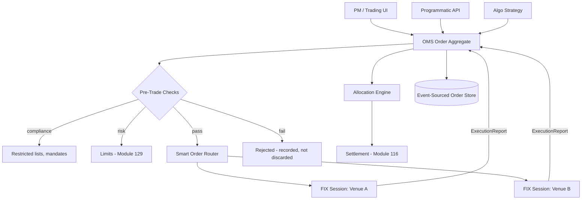
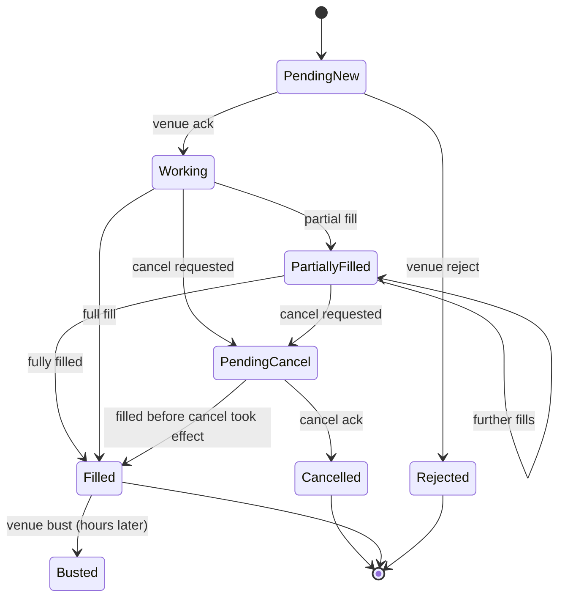
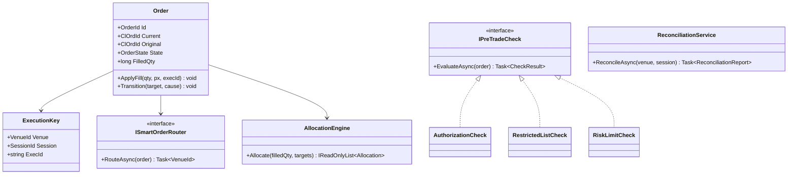

# Module 131 — System Design: Designing an Order Management System & Trade Lifecycle

> Domain: System Design | Level: Beginner → Expert | Prerequisite: [[10-Designing-Market-Data-Distribution-Platform]] (supplies prices this system prices against), [[09-Designing-RealTime-Portfolio-Risk-Engine]] (supplies the pre-trade limits this system must check), [[../36-Saga/01-SagaFundamentals-OrchestrationVsChoreography-CompensatingTransactions]] (the trade lifecycle is a long-running saga; this module is its most consequential concrete instance), [[../35-Event-Sourcing/01-EventSourcingFundamentals-EventStoreAsSourceOfTruth-Snapshotting-AggregateReconstruction]] (order state as event-sourced, for reasons §2.6 makes non-optional)
>
> **Scenario-module note:** Third of six buy-side/capital-markets system-design scenarios (Modules 129–134). Full 16-section template; Elite FinTech Interview Panel lens.

---

## 1. Fundamentals

**What:** An Order Management System (OMS) is the system of record for the full lifecycle of an order: from a portfolio manager's intent, through compliance and risk checks, to routing and execution at venues, through partial fills and amendments, to allocation across accounts and handoff to settlement. It owns the answer to "what is the current, authoritative state of this order, and how did it get there?"

**Why:** Unlike the previous two modules' subjects — which process stateless units (a pricing task, a tick) — an order is a **long-lived, mutable, externally-visible entity** whose state exists partly in the firm's systems and partly at a venue that the firm does not control. The OMS's entire difficulty flows from that split: the firm's belief about an order and the venue's belief about the same order can diverge, and reconciling them is not optional because the divergence represents real money and real regulatory exposure.

**When:** Any firm placing orders through more than one channel or venue needs a single system of record; without it, "what is our current exposure" has no answerable form, because orders in flight exist only in the systems that happen to have placed them.

**How (30,000-ft view):**
```
PM Intent ──► Order (Aggregate) ──► Compliance/Risk checks ──► Router ──► Venue (FIX)
                    │                                                        │
                    │◄──────── Execution Reports (fills, rejects, busts) ────┘
                    ▼
              Allocation ──► Settlement handoff (Module 116's SettlementInstruction)
```

---

## 2. Deep Dive

### 2.1 The Order State Machine and Why It Is Not a Simple One
An order's states — `New`, `PendingNew`, `Working`, `PartiallyFilled`, `Filled`, `PendingCancel`, `Cancelled`, `Rejected`, `Expired` — look like a textbook state machine until three realities intrude:

- **Pending states are real states, not transient.** `PendingCancel` means "we have asked the venue to cancel and do not yet know whether it will." During that window the order may still fill. A design treating cancel as synchronous is wrong in a way that produces unintended positions.
- **Transitions are driven by an external party.** The venue, not the firm, decides whether a cancel succeeds or a fill occurs. The OMS does not *effect* transitions; it *learns of* them.
- **Terminal is not always terminal.** A `Filled` order can be busted (the venue cancels an executed trade, sometimes hours later), returning it to an amended state — the same correction problem Module 130 §2.6 established for prices, now applied to executions.

### 2.2 FIX Semantics: Execution Reports, ClOrdID Chains, and Ordering
FIX (Financial Information eXchange) is the dominant venue protocol, and three of its properties shape the design:

- **Execution reports are the sole state-transition mechanism.** Every fill, reject, cancel acknowledgment, and status change arrives as an `ExecutionReport` message. The OMS's state is a fold over these reports, which is precisely why §2.6 argues the order should be event-sourced — the domain hands you an event stream whether or not you model it as one.
- **ClOrdID chaining.** An amendment does not mutate an order in place; it creates a new client order ID referencing the original via `OrigClOrdID`. The "order" a user sees is therefore a *chain* of ClOrdIDs, and the OMS must maintain that chain to answer "what happened to my order" across amendments.
- **Sequence numbers and gap-fill.** FIX sessions have their own sequence numbering with resend semantics. A gap must trigger a resend request; a missed execution report means the firm's state diverges from the venue's silently — the same unrecoverable-gap property Module 130 §9 established for market data, with the added consequence that here the missing message may be a fill representing real money.

### 2.3 Idempotency Under Retransmission
FIX resend, network retry, and OMS restart all mean the same execution report can arrive more than once. Applying a fill twice double-counts the position — a direct, immediate financial error.

The mechanism is deduplication on the venue's own execution identifier (`ExecID`), which is unique per execution and stable across resends. Critically, this must be checked *inside* the same transaction that applies the fill, not as a pre-check followed by a separate write — the pre-check-then-write pattern has a race window that concurrent processing will eventually hit. This is Module 123 §2.4's idempotency discipline in its highest-consequence form: a duplicated saga step here is a duplicated position.

### 2.4 Pre-Trade Checks: The Latency/Correctness Bind
Before routing, the OMS must check compliance (mandate restrictions, restricted lists) and risk (limits, from Module 129). These checks are on the critical path — every millisecond delays execution and, in fast markets, costs money through worse fills.

This creates a genuine bind: the checks need current data (a limit check against stale exposure is worthless), but fetching current data adds latency. The resolutions available are all imperfect: cache limits locally and accept bounded staleness; check asynchronously and cancel after the fact (unacceptable for hard mandate limits); or accept the latency. §15 works this decision, and the honest answer differs by check type — a hard regulatory restriction must be synchronous and correct; a soft internal threshold can tolerate bounded staleness.

### 2.5 Allocation: One Order, Many Accounts
Institutional orders are frequently placed in aggregate ("buy 500,000 shares") and then allocated across many underlying client accounts after execution. Allocation carries its own correctness requirements: fills must be distributed by a documented, fair, and reproducible rule (typically pro-rata by intended allocation, with defined rounding treatment), because unfair allocation between clients is a regulatory violation, not merely an operational error.

The subtle constraint: **rounding must be deterministic and must reconcile exactly.** Allocating 500,000 shares pro-rata across 37 accounts produces fractional shares; the rounding rule must be specified such that allocated quantities sum exactly to the filled quantity — an off-by-one from independent rounding is a real break requiring manual intervention.

### 2.6 Why the Order Should Be Event-Sourced
Module 121 §15 established that Event Sourcing is justified where an entity's full history has genuine, ongoing business value — and warned against adopting it by default. The order is the clearest positive case in this course:

- The domain *is* an event stream (§2.2 — execution reports arrive as events regardless of internal modelling).
- Regulatory reconstruction demands the full sequence, not the final state ("show every state this order passed through and when").
- Busts and amendments (§2.1) are corrections to history, which an event log handles naturally and a mutable current-state row handles badly.
- Best-execution analysis requires knowing exactly what was known at each decision point.

Where Module 121 counselled caution, this is the case that satisfies its test unambiguously.

---

## 3. Visual Architecture





```mermaid
sequenceDiagram
    participant O as OMS
    participant V as Venue
    O->>V: NewOrderSingle (ClOrdID=A1)
    V-->>O: ExecReport: PendingNew
    V-->>O: ExecReport: New (Working)
    O->>V: OrderCancelReplace (ClOrdID=A2, OrigClOrdID=A1)
    Note over O,V: Race window — A1 may fill before A2 is processed
    V-->>O: ExecReport: Fill on A1 (ExecID=E9)
    V-->>O: ExecReport: Reject cancel/replace (too late)
    Note over O: Chain A1→A2 retained; A2 never became live
```

---

## 4. Production Example

**Problem:** A firm's OMS handled several hundred thousand orders daily across a dozen venues, with an event-sourced order store and `ExecID`-based deduplication. It ran without a position break for three years.

**Architecture:** §3's design. Execution reports arrived over FIX sessions, were deduplicated on `ExecID`, and applied to the order aggregate.

**Implementation:** Deduplication used `ExecID` alone as the key, on the reasonable understanding — supported by the FIX specification — that `ExecID` is unique per execution.

**Trade-offs:** Keying on `ExecID` alone is simpler than a composite key and matches the specification's stated guarantee.

**Lessons learned:** A venue's `ExecID` uniqueness guarantee turned out to be scoped **per trading session**, not globally — and after that venue's mid-day session restart following an outage, its `ExecID` sequence reset. A new, genuinely distinct execution arrived bearing an `ExecID` the OMS had already seen that morning. Deduplication did exactly what it was built to do and **silently discarded a real fill.**

The firm's position was understated by that fill for the remainder of the session. It was caught by end-of-day reconciliation against the venue's own trade file — but only because that reconciliation existed; nothing in the real-time path signalled anything, because the system's behaviour was indistinguishable from correctly rejecting a duplicate.

The fix: composite deduplication key of `(VenueId, SessionId, ExecID)`, restoring genuine uniqueness. The generalizable lesson is sharper than the fix: **the deduplication key must be scoped to whatever the uniqueness guarantee is actually scoped to, and that scope is a property of the counterparty's implementation, not of the specification.** A specification's guarantee is a claim about intent; the venue's actual behaviour is the reality, and the two diverged silently. This is the course's "declared ≠ actual" theme applied to an external party's contract — a variant the prior modules had not encountered, since Modules 129 and 130 dealt with internally-controlled invariants.

---

## 5. Best Practices
- Scope deduplication keys to the actual uniqueness scope of the identifier, verified against the counterparty's behaviour rather than assumed from the specification (§4).
- Check deduplication inside the same transaction that applies the fill, never as a separate pre-check (§2.3).
- Model `PendingCancel` and `PendingNew` as genuine states that can still transition to `Filled`; never treat cancel as synchronous (§2.1).
- Retain the full ClOrdID chain so amendment history is reconstructable (§2.2).
- Specify allocation rounding such that allocated quantities sum exactly to filled quantity, deterministically (§2.5).
- Reconcile against the venue's own end-of-day trade file daily — it is the only external check on state divergence (§4).

## 6. Anti-patterns
- Deduplicating on an identifier whose uniqueness scope is narrower than assumed (§4's incident).
- Treating cancel as synchronous, producing unintended positions when a fill lands during `PendingCancel` (§2.1).
- Mutating order state in place, destroying the transition history regulators and best-execution analysis require (§2.6).
- Independent per-account rounding in allocation, producing sums that do not reconcile to the fill (§2.5).
- Discarding rejected orders rather than recording them — the rejection itself is regulatory evidence of a control working (§3).
- Treating a missed FIX message as a logging concern rather than an immediate divergence requiring resend (§2.2).

---

## 7. Performance Engineering

**CPU/Memory:** Modest by the standards of Modules 129–130 — order rates are thousands per second at most, orders of magnitude below tick rates. The performance concern is not throughput but **tail latency on the pre-trade path** (§2.4), where a slow check directly worsens execution price.

**Latency:** Measure order-receipt-to-venue-transmission as a distribution, with the pre-trade check as its own tracked segment. This is where §15's decision is validated or refuted empirically.

**Throughput:** Peak is driven by algorithmic strategies that can generate order bursts (a slicing algorithm working a large parent order emits many child orders). Size for algo burst, not human-trader rates.

**Scalability:** Partition by order (an order's events must be processed in sequence, but different orders are independent) — the same per-entity partitioning discipline as Modules 118–120.

**Benchmarking:** Include the pre-trade check dependencies (risk, compliance) in benchmarks; benchmarking the OMS in isolation measures the fast part and misses the actual latency contributor.

**Caching:** Restricted lists and mandate rules are cacheable with bounded staleness; live position/limit data is the contested case (§2.4, §15).

---

## 8. Security

**Threats:** Unauthorized order entry (direct financial loss), order tampering in flight, information leakage revealing trading intent (a leaked large order enables front-running by anyone who sees it), and repudiation disputes over who submitted what.

**Mitigations:** Strong authentication on every entry channel with per-trader authorization limits enforced server-side; FIX sessions authenticated and encrypted; an immutable, event-sourced audit trail (§2.6) providing non-repudiation by construction.

**OWASP mapping:** Broken Access Control dominates — a trader must not be able to submit orders for accounts or instruments outside their authorization, and this must be enforced at the OMS, never solely at the UI (Module 127 §2.3's defence-in-depth principle, with direct financial consequence).

**AuthN/AuthZ:** Per-trader, per-account, per-instrument-class authorization with order-size limits, checked server-side on every order. Four-eyes approval for orders above defined thresholds is a common regulatory expectation and must be enforced as a state transition, not a UI convention.

**Secrets:** FIX session credentials per venue, managed per Module 86; note these often cannot be rotated without venue coordination and scheduled downtime.

**Encryption:** In transit for all venue connectivity; at rest for the order store, which contains trading intent — among the most commercially sensitive data the firm holds (Module 129 §8's characterization applies identically).

---

## 9. Scalability

**Horizontal scaling:** Partition by order ID; each order's event stream is processed by exactly one consumer at a time, preserving per-order ordering. FIX sessions are per-venue and inherently partitioned.

**Vertical scaling:** Rarely the constraint at realistic order volumes.

**Caching:** Reference data (instruments, accounts, restricted lists) is cached; order state is not (it is the system of record and must be authoritative).

**Replication/Partitioning:** The order store replicates synchronously — losing acknowledged order state is not survivable, since the venue's state cannot be un-done and the firm would have positions it does not know about.

**Load balancing:** Order entry load-balances freely; FIX sessions are pinned (a session is a stateful connection with its own sequence numbering and cannot be arbitrarily migrated mid-session).

**High Availability:** Active-passive with synchronous replication and fast failover. Critically, on failover the OMS must **re-synchronize with each venue** (FIX session recovery, plus an order-status request for all working orders) before accepting new orders, because its view may be stale by exactly the messages it missed during failover — resuming blind is how a firm ends up double-sending orders.

**Disaster Recovery:** Order state is the firm's record of its own obligations; DR must preserve it without loss. Unlike Modules 129–130 where derived state was rebuildable, here the state is authoritative and irreplaceable except by reconciliation against venue records.

**CAP theorem:** Strongly CP. An OMS that accepts orders during a partition, without confidence in its own current state, creates positions it cannot account for. The correct degraded behaviour is to refuse new orders while continuing to process inbound execution reports — accepting reduced availability to preserve correctness, since the alternative failure is unbounded.

---

## 10. Interview Questions

### Basic (10)

1. **Q: What does an OMS own that no other system does?**
   **A:** The authoritative current state and full history of every order — the answer to "what is this order's state and how did it get there" (§1).
   **Why correct:** Identifies the system-of-record role, which is its defining responsibility.
   **Common mistakes:** Describing it as an order-routing system; routing is one function, not the core responsibility.
   **Follow-ups:** "Why can't each trading channel keep its own order state?" (Then no single answer to current exposure exists, §1.)

2. **Q: Why is `PendingCancel` a genuine state rather than a transient one?**
   **A:** The venue, not the firm, decides whether a cancel succeeds; during that window the order can still fill, so treating cancel as synchronous produces unintended positions (§2.1).
   **Why correct:** Identifies external control as the reason the pending state is real.
   **Common mistakes:** Modelling cancel as an immediate transition to `Cancelled`.
   **Follow-ups:** "What transition from `PendingCancel` surprises people?" (`Filled` — the fill landed before the cancel took effect, §3's state diagram.)

3. **Q: What is a ClOrdID chain and why must it be retained?**
   **A:** An amendment creates a new client order ID referencing the original via `OrigClOrdID`; the user-visible "order" is a chain of these, and the chain is what answers "what happened to my order" across amendments (§2.2).
   **Why correct:** States both the mechanism and what is lost without it.
   **Common mistakes:** Overwriting the original order's identifier on amendment, losing the history.
   **Follow-ups:** "What happens if an amendment is rejected?" (The chain records that the new ClOrdID never became live while the original remained working, §3's third diagram.)

4. **Q: Why must fill deduplication happen inside the applying transaction?**
   **A:** A pre-check followed by a separate write has a race window that concurrent processing will eventually hit, applying a fill twice (§2.3).
   **Why correct:** Names the specific concurrency flaw in the pre-check pattern.
   **Common mistakes:** Check-then-write, which passes testing and fails under production concurrency.
   **Follow-ups:** "What is the consequence of a double-applied fill?" (A double-counted position — immediate, direct financial error, §2.3.)

5. **Q: What went wrong in §4's incident?**
   **A:** The venue's `ExecID` uniqueness was scoped per session, not globally; after a session restart the sequence reset, and a genuinely new fill bearing a previously-seen `ExecID` was silently discarded as a duplicate (§4).
   **Why correct:** States the precise mechanism.
   **Common mistakes:** Characterizing it as a duplicate-detection bug; deduplication worked exactly as designed against a wrongly-scoped key.
   **Follow-ups:** "What was the fix?" (Composite key `(VenueId, SessionId, ExecID)`, §4.)

6. **Q: Why is order allocation a correctness concern rather than an operational one?**
   **A:** Unfair allocation between client accounts is a regulatory violation; the rule must be documented, fair, and reproducible (§2.5).
   **Why correct:** Identifies the regulatory character rather than treating allocation as bookkeeping.
   **Common mistakes:** Treating allocation as a post-trade formality.
   **Follow-ups:** "What must rounding guarantee?" (That allocated quantities sum exactly to the filled quantity, deterministically, §2.5.)

7. **Q: Why is the order the clearest Event Sourcing candidate in this course?**
   **A:** The domain already is an event stream (execution reports), regulatory reconstruction demands full history, corrections/busts are natural in a log and awkward in a mutable row, and best-execution analysis needs decision-time state — satisfying Module 121 §15's adoption test unambiguously (§2.6).
   **Why correct:** Applies the established test and shows all four conditions met.
   **Common mistakes:** Adopting Event Sourcing here for its own sake rather than because this case actually satisfies the test Module 121 set.
   **Follow-ups:** "Where did Module 121 counsel against it?" (As a default for entities whose history has no ongoing business value, §2.6.)

8. **Q: Why must the OMS re-synchronize with venues after failover?**
   **A:** Its state may be stale by exactly the messages missed during failover; resuming blind risks double-sending orders or acting on an incorrect view of working orders (§9).
   **Why correct:** Identifies the specific gap failover creates and its consequence.
   **Common mistakes:** Resuming order entry immediately on failover.
   **Follow-ups:** "What does re-synchronization involve?" (FIX session recovery plus order-status requests for all working orders, §9.)

9. **Q: Why is the OMS strongly CP rather than AP?**
   **A:** Accepting orders without confidence in current state creates positions the firm cannot account for — an unbounded failure — so refusing new orders while continuing to process inbound reports is the correct degradation (§9).
   **Why correct:** Derives the posture from the asymmetry of the two failure modes.
   **Common mistakes:** Prioritizing order-entry availability, which optimizes for the less severe failure.
   **Follow-ups:** "Why continue processing inbound reports while refusing new orders?" (Inbound reports reduce divergence; new orders increase it.)

10. **Q: Why must rejected orders be recorded rather than discarded?**
    **A:** The rejection is regulatory evidence that a control functioned — discarding it destroys the record that the firm's compliance checks were operating (§3, §6).
    **Why correct:** Identifies the rejection as an audit artifact, not merely a failed operation.
    **Common mistakes:** Treating rejections as errors to log and forget.
    **Follow-ups:** "What would an auditor ask about rejections?" (Evidence that restricted-list checks blocked what they should have — which requires the rejections themselves.)

### Intermediate (10)

1. **Q: Walk through why §4's incident was undetectable in the real-time path.**
   **A:** The system's behaviour when discarding the real fill was byte-identical to its behaviour when correctly rejecting a duplicate: no error, no warning, a normal deduplication path. There is no signal distinguishing "correctly rejected a duplicate" from "incorrectly rejected a genuine execution," because the distinction exists only in information the OMS did not have (that the venue had reset its sequence). Only external reconciliation against the venue's trade file could surface it.
   **Why correct:** Explains why the failure is structurally invisible internally, not merely unmonitored.
   **Common mistakes:** Proposing better internal monitoring, which cannot detect a failure whose internal signature is identical to correct behaviour.
   **Follow-ups:** "What is the general principle?" (Where a failure is internally indistinguishable from correct behaviour, only an external comparison can detect it — which is why the daily venue reconciliation is not optional.)

2. **Q: Design the pre-trade check ordering and justify it.**
   **A:** Cheapest and most-likely-to-reject first: authorization (fast, local, definitively rejects unauthorized traders), then restricted-list/compliance (fast, cached lookup), then risk limits (slowest, requires current exposure). Ordering by cost × rejection-probability minimizes mean latency, and putting the definitive local checks first means an unauthorized or restricted order never incurs the expensive risk call at all.
   **Why correct:** Optimizes the actual objective (mean critical-path latency) using both cost and selectivity.
   **Common mistakes:** Running checks in parallel for speed, which incurs every check's cost on every order including ones a cheap check would have rejected immediately.
   **Follow-ups:** "When is parallel evaluation right?" (When all checks are comparably cheap and rejection is rare — not the case here, where risk is materially the most expensive.)

3. **Q: Why does an algorithmic strategy change the OMS's capacity profile?**
   **A:** A slicing algorithm working one large parent order emits many child orders, so order rate becomes a function of algorithmic behaviour rather than human trading — bursts can be orders of magnitude above human-driven rates (§7).
   **Why correct:** Identifies the specific mechanism that decouples order rate from trader count.
   **Common mistakes:** Sizing from trader headcount, which is uncorrelated with actual peak.
   **Follow-ups:** "What else does child-order generation complicate?" (Parent/child relationships must be modelled, so a parent's state aggregates its children's fills.)

4. **Q: Critique caching live position data for the risk limit check.**
   **A:** It reduces critical-path latency but means the limit is checked against stale exposure — and the error direction matters: stale data understates exposure when positions have grown, so the check most likely to be wrong is precisely the one guarding against over-exposure. Bounded staleness may be acceptable for soft internal thresholds, but for hard regulatory limits the check must be current, because the failure mode is a breach the firm cannot defend (§2.4, §15).
   **Why correct:** Analyses the direction of the error, not merely its existence — which is what makes the check-type distinction necessary.
   **Common mistakes:** Treating staleness as symmetric noise rather than a directional risk that correlates with the condition being guarded.
   **Follow-ups:** "Which checks tolerate staleness?" (Soft internal thresholds where a breach is reviewed rather than prohibited, §15.)

5. **Q: How should a bust (venue cancelling an executed trade hours later) be handled?**
   **A:** As a new event appended to the order's stream reversing the execution's effect — never by deleting the original fill. The original execution genuinely happened and was acted upon; the bust is a subsequent fact. This is exactly Module 130 §2.6's correction handling and Module 123 §2.2's compensating-transaction semantics: reverse forward, never erase (§2.1, §2.6).
   **Why correct:** Applies the established compensation-not-erasure principle, and notes the reason (the original was acted upon).
   **Common mistakes:** Deleting or amending the original fill, destroying the record of what the firm believed and did.
   **Follow-ups:** "What downstream systems must be notified?" (Everything that consumed the fill — position, risk, allocation, settlement — via the same event stream, which is why event-sourcing makes this tractable.)

6. **Q: Design allocation rounding so quantities reconcile exactly.**
   **A:** Compute each account's exact pro-rata share, floor each to whole units, then distribute the remaining units by a deterministic tie-break (typically largest fractional remainder first, with account ID as a stable secondary key). The sum equals the fill by construction, and determinism means re-running produces identical allocations — required for reproducibility and dispute resolution (§2.5).
   **Why correct:** Gives an algorithm that both reconciles exactly and is deterministic, the two requirements together.
   **Common mistakes:** Independent rounding per account, which does not sum correctly; or a non-deterministic tie-break, which makes allocations irreproducible.
   **Follow-ups:** "Why does the secondary key matter?" (Two accounts with identical fractional remainders would otherwise be ordered non-deterministically, §2.5.)

7. **Q: What is the risk of the amendment race in §3's third diagram?**
   **A:** A cancel/replace and a fill can cross: the firm believes it has amended, while the venue fills the original. If the OMS optimistically applies the amendment to its own state, it now believes it has a working amended order when it actually has a fill on the original — a divergence producing an unintended position and an incorrect view of remaining exposure (§2.2).
   **Why correct:** Identifies the specific state divergence rather than describing the race abstractly.
   **Common mistakes:** Applying amendments optimistically before venue acknowledgment.
   **Follow-ups:** "What is the correct handling?" (Treat the amendment as pending until acknowledged; the venue's response determines which of the two outcomes occurred.)

8. **Q: Why can FIX sessions not be arbitrarily load-balanced?**
   **A:** A FIX session is a stateful connection with its own sequence numbering; migrating mid-session breaks sequence continuity and triggers gap-fill or session-reset handling — so sessions are pinned to instances rather than balanced (§9).
   **Why correct:** Identifies session statefulness as the constraint.
   **Common mistakes:** Treating FIX connections as stateless HTTP-like connections.
   **Follow-ups:** "What does this imply for failover?" (Session recovery with sequence negotiation, plus order-status re-synchronization, §9.)

9. **Q: Why is order state harder to recover than Module 129's risk results or Module 130's latest-value cache?**
   **A:** Those were derived and rebuildable from retained inputs; order state is authoritative — it is the firm's record of its own obligations, recoverable only by reconciliation against venue records, which is slow, partial, and not always possible (§9).
   **Why correct:** Contrasts derived versus authoritative state and its recovery consequence.
   **Common mistakes:** Applying the same DR posture as the previous two modules, which under-protects the one case where state is genuinely irreplaceable.
   **Follow-ups:** "What is the DR implication?" (Synchronous replication — losing acknowledged order state is not survivable, §9.)

10. **Q: Synthesize how the trade lifecycle relates to Module 123's saga pattern.**
    **A:** It is a long-running saga in the strict sense: a multi-step process (route → execute → allocate → settle) spanning services and days, where steps can fail and require compensation (a bust reverses an execution; a failed settlement requires unwinding). What distinguishes it from Module 123's examples is duration and external control — the saga's steps are driven by a venue and a settlement system the firm does not own, so "compensating" is often a request to an external party rather than a local action.
    **Why correct:** Applies the saga framing accurately and identifies what is genuinely different here.
    **Common mistakes:** Treating the lifecycle as a simple sequential workflow, missing the compensation semantics.
    **Follow-ups:** "What does external control change about compensation?" (It can be refused — the firm can request a bust but cannot unilaterally effect one, so compensation must handle its own failure.)

### Advanced (10)

1. **Q: Diagnose §4's incident and design the complete structural fix.**
   **A:** Root cause: the deduplication key's scope was inferred from the FIX specification's stated guarantee rather than verified against the venue's actual implementation, and the failure was internally indistinguishable from correct behaviour (Intermediate Q1). Fix: (1) composite key `(VenueId, SessionId, ExecID)` matching the actual uniqueness scope; (2) treat every venue's identifier-uniqueness scope as an explicitly-documented, per-venue integration property, verified at onboarding rather than assumed — because the scope differs by venue and the specification does not bind them; (3) daily reconciliation against the venue trade file elevated from a back-office control to a monitored engineering signal with alerting, since it is the only detection path for this failure class; (4) alert on venue session restarts, since that event is the precondition that makes scope-mismatch bugs reachable.
   **Why correct:** Addresses the specific key, the general assumption that produced it, the only viable detection path, and the triggering precondition.
   **Common mistakes:** Fixing only the key, leaving the same assumption to fail differently at the next venue.
   **Follow-ups:** "Why is (2) the most important?" (It converts a one-venue fix into a class-of-bug fix, since the next venue's guarantee may be scoped differently again.)

2. **Q: A team proposes optimistic amendment application to reduce perceived latency. Evaluate.**
   **A:** It creates Intermediate Q7's divergence as a *designed* behaviour rather than an edge case: the OMS's state would routinely reflect amendments the venue has not accepted, so its view of working orders and remaining exposure is systematically wrong during every amendment's flight time. Since the OMS is the system of record, this makes the firm's authoritative state speculative. The latency it saves is display latency; the correctness it costs is real. Show the pending state in the UI rather than lying about the confirmed state.
   **Why correct:** Identifies that the optimization trades authoritative-state correctness for display latency, an unfavourable trade for a system of record.
   **Common mistakes:** Accepting the UI-responsiveness argument without noticing the system of record is what would be made speculative.
   **Follow-ups:** "How do you satisfy the UI concern legitimately?" (Display the pending state explicitly — users understand "cancel requested" and are far better served by accuracy than by an optimistic guess that sometimes reverses.)

3. **Q: Critique storing only current order state with a separate audit log.**
   **A:** It creates two sources of truth that can diverge — the state row and the log — and divergence is undetectable without reconciling them against each other. Event sourcing (§2.6) makes the log *be* the state, so divergence is structurally impossible rather than merely monitored. Given that regulatory reconstruction reads the history and trading reads the current state, an architecture where those can disagree is precisely the wrong shape for this domain.
   **Why correct:** Identifies dual-source divergence as the structural flaw and contrasts with the single-source alternative.
   **Common mistakes:** Treating the audit log as sufficient because it contains the same information — it does, until they disagree, and then there is no way to know which is right.
   **Follow-ups:** "How would divergence arise in practice?" (A state update succeeding while its log write fails, or an application code path updating state without logging — both routine bugs that event sourcing makes unrepresentable.)

4. **Q: Design the daily venue reconciliation.**
   **A:** Compare the OMS's executions against the venue's official trade file across three dimensions: presence (a fill in one and not the other — §4's failure), quantity/price agreement, and state agreement for working orders. Breaks must be categorized (missing-in-OMS, missing-at-venue, mismatched) since each implies a different cause and urgency: missing-in-OMS means the firm has an unknown position and is most urgent; missing-at-venue may indicate a duplicate the firm sent. Reconciliation must run against the venue's authoritative file, not a stream the OMS itself received — otherwise it re-checks the same potentially-lossy path.
   **Why correct:** Specifies dimensions, categorization by cause, and the critical requirement of an independent source.
   **Common mistakes:** Reconciling against a stream the OMS consumed, which cannot detect a failure in that consumption path.
   **Follow-ups:** "Which break category is most urgent?" (Missing-in-OMS — the firm holds a position it does not know about, and every downstream system is consequently wrong.)

5. **Q: How would you support "reconstruct the order's full state timeline for a regulator"?**
   **A:** Replay the order's event stream (§2.6) with each event's arrival timestamp, producing the sequence of states and when the firm knew of each — including rejected amendments, pending windows, and the ClOrdID chain (§2.2). The knowledge-time dimension matters as much as event time, since the regulator's question is often about what the firm knew when it acted, not merely what was true.
   **Why correct:** Uses the event stream directly and identifies the knowledge-time dimension as the non-obvious requirement.
   **Common mistakes:** Reconstructing only the state sequence, omitting when each became known — which cannot answer questions about the firm's decisions.
   **Follow-ups:** "Which prior modules required this same distinction?" (Modules 129 §Advanced Q8 and 130 §2.6 — the pattern is now consistent across all three.)

6. **Q: A regulator asks how the firm ensures it has no unknown positions. Answer honestly.**
   **A:** State the layered controls: `ExecID`-scoped deduplication preventing both duplicate application and — post-§4 — incorrect rejection; FIX sequence-gap detection with resend, so no execution report is silently missed; failover re-synchronization via order-status requests (§9); and daily reconciliation against venue trade files (Advanced Q4) as the independent external check. Then state the residual honestly: the reconciliation is daily, so intraday the firm's assurance rests on the real-time controls alone — the window between a divergence occurring and reconciliation detecting it is real and bounded by that cadence.
   **Why correct:** Gives specific mechanisms and states the residual window rather than implying continuous certainty.
   **Common mistakes:** Claiming complete assurance while the actual detection cadence is daily.
   **Follow-ups:** "How would you narrow the residual?" (Intraday reconciliation against venue drop-copy feeds, where available — a concrete, costable improvement.)

7. **Q: Design the OMS's handling of a venue that becomes unresponsive with orders working.**
   **A:** This is among the most dangerous states in the system: the firm has live orders it cannot see or cancel. Correct handling is (1) do not assume anything about those orders' state — they may be filling; (2) do not route further orders to that venue; (3) attempt session re-establishment with order-status requests; (4) if the outage persists, escalate to manual intervention including direct contact with the venue, since some venues will cancel a firm's working orders on request. Critically, the firm's risk and position systems must treat those orders as *potentially filled* rather than as their last-known state — the conservative assumption is the safe one.
   **Why correct:** Specifies the actions and, more importantly, the conservative treatment of unknown state downstream.
   **Common mistakes:** Continuing to report last-known state as current, understating potential exposure exactly when the firm has least visibility.
   **Follow-ups:** "Why is the conservative assumption right here?" (The asymmetry: assuming filled and being wrong overstates exposure conservatively; assuming unfilled and being wrong understates it and may cause a limit breach.)

8. **Q: Apply this course's "declared ≠ actual" theme to this system.**
   **A:** The claim is "the OMS reflects the firm's true order state." Its declared basis is that every execution report received was applied correctly. §4 showed the gap: reports can be *not received* (gaps), *incorrectly discarded* (scope-mismatched dedup), or *superseded by events the firm has not yet learned of* (a fill in flight during a cancel). Each leaves the OMS confidently wrong. What distinguishes this module from 129 and 130 is that the authoritative truth lives **outside the firm** — so no internal verification is sufficient, and the only genuine check is reconciliation against the counterparty's own record (Advanced Q4).
   **Why correct:** Enumerates the three divergence mechanisms and identifies the externally-held-truth property that distinguishes this case.
   **Common mistakes:** Assuming internal consistency checks suffice, when the reference truth is not internally held.
   **Follow-ups:** "What follows from truth being externally held?" (Reconciliation is not a control that can be optimized away; it is the only source of ground truth.)

9. **Q: Design the monitoring distinguishing a venue problem from an OMS problem.**
   **A:** Compare across venues and against expectations: elevated rejects at one venue while others are normal indicates a venue or that venue's session configuration; elevated rejects across all venues indicates an OMS-side issue (bad reference data, a failing pre-trade check); execution-report latency rising at one venue is venue-side; order-submission latency rising across all is OMS-side. As in Module 130 §Advanced Q9, attribution requires comparison — single-venue metrics reveal that something is wrong but not where.
   **Why correct:** Uses cross-venue comparison for attribution, consistent with the established diagnostic principle.
   **Common mistakes:** Per-venue dashboards without cross-venue comparison, which cannot localize.
   **Follow-ups:** "What is the highest-value single alert?" (Working-order count diverging from expectation, or any missing-in-OMS reconciliation break — both indicate unknown positions, the most severe condition.)

10. **Q: Synthesize the governance program required before an OMS may route live orders.**
    **A:** (1) Per-venue documented identifier-uniqueness scope, verified at onboarding, feeding deduplication key construction (Advanced Q1). (2) Transactional deduplication, never check-then-write (§2.3). (3) Pending states modelled as genuinely non-terminal, with fills-during-cancel handled (§2.1). (4) FIX gap detection with resend and escalation (§2.2). (5) Failover re-synchronization before accepting new orders (§9). (6) Daily reconciliation against venue trade files, categorized by break type, monitored as an engineering signal (Advanced Q4). (7) Server-side per-trader authorization and size limits, never UI-enforced (§8). (8) Deterministic, exactly-reconciling allocation rounding (Intermediate Q6). (9) Conservative treatment of orders at an unreachable venue as potentially filled (Advanced Q7).
    **Why correct:** Assembles the full program, each item traceable to a specific failure mode established in the module.
    **Common mistakes:** Presenting routing and state management without reconciliation and venue-integration verification, which are what actually prevent unknown positions.
    **Follow-ups:** "Which is most often missing in practice?" (Per-venue uniqueness-scope verification — teams inherit a deduplication key from their first venue integration and apply it universally, which is exactly §4.)

### Expert (10)

1. **Q: Compare building an OMS versus buying a vendor platform.**
   **A:** The build case is weak for the general OMS and strong for specific differentiating logic. Vendor platforms carry pre-built venue connectivity across dozens of venues — the single largest and most tedious cost, and one requiring ongoing maintenance as venues change protocols — plus regulatory-reporting integrations and a certification history. Building means owning all of that permanently. The genuine build case is where a firm's *strategy* is the differentiator: custom smart-order-routing logic, proprietary algorithmic execution, or an unusual asset-class workflow no vendor supports. The mature pattern is buy the OMS core, build the differentiating logic against its extension points — Module 128 §15's build-vs-buy reasoning, with venue connectivity as the specific non-differentiating cost that decides it.
   **Why correct:** Identifies venue connectivity as the cost that dominates the decision and correctly locates where custom build pays.
   **Common mistakes:** Building for control, then discovering the recurring cost is not the OMS but the dozen venue integrations and their perpetual maintenance.
   **Follow-ups:** "What makes venue connectivity so costly?" (Each venue has protocol quirks, certification requirements, and its own change cadence — and §4 showed even documented guarantees vary in practice.)

2. **Q: How does an OMS differ from an EMS, and why do firms run both?**
   **A:** An OMS is the system of record for the order lifecycle including compliance, allocation, and settlement handoff — optimized for correctness, completeness, and auditability. An EMS (Execution Management System) is optimized for the trader's execution workflow: low-latency market access, algorithmic strategies, real-time market data integration. They coexist because the optimization targets genuinely conflict — the OMS's audit and compliance obligations impose overhead an EMS's latency requirements cannot absorb, which is exactly Module 130 §Expert Q1's platform-versus-direct-feed split, recurring at the order layer.
   **Why correct:** Distinguishes them by optimization target and identifies the conflict as the reason for coexistence.
   **Common mistakes:** Treating the split as historical accident rather than a genuine conflict of requirements.
   **Follow-ups:** "What is the integration risk?" (State divergence between OMS and EMS — the same divergence risk Module 130 §Expert Q6 identified for dual data paths, requiring the same reconciliation control.)

3. **Q: Design the OMS's role in best-execution obligations.**
   **A:** Best execution requires demonstrating that routing decisions served the client's interest. The OMS must therefore record not just where an order was routed, but **why**: the market state at decision time (Module 130's snapshot), the venues considered and their quotes, and the routing logic's version. Without the counterfactual — what the alternatives looked like — the record shows what happened but cannot demonstrate it was reasonable, which is the actual obligation.
   **Why correct:** Identifies that the obligation requires recording the decision inputs and alternatives, not merely the outcome.
   **Common mistakes:** Recording only the execution, which cannot support the analysis regulators actually require.
   **Follow-ups:** "Why is routing-logic version needed?" (To reproduce the decision — the same reproducibility requirement Module 129 §2.6 established, applied to routing decisions.)

4. **Q: How should the OMS handle an order spanning a corporate action?**
   **A:** Corporate actions (splits, mergers, ticker changes) can invalidate a working order mid-life — the instrument it references may no longer exist in its prior form, and quantities/prices may need adjustment. Venues typically cancel working orders across such events, but the firm cannot rely on that uniformly. The OMS must detect affected working orders from the corporate-actions feed (Module 130 §Expert Q4's reference-data subsystem), and the correct default is to cancel and require re-entry rather than to auto-adjust — because auto-adjustment guesses at PM intent, and a wrong guess places an order the PM did not intend.
   **Why correct:** Identifies the risk and argues for the conservative default with a reason grounded in intent rather than mechanics.
   **Common mistakes:** Auto-adjusting quantity and price, which is convenient and occasionally places unintended orders.
   **Follow-ups:** "Why is this the same principle as Module 130 §4's fuzzy resolver?" (Both guess where they cannot know; a visible failure requiring human input is safer than a confident wrong action.)

5. **Q: Evaluate cloud deployment for an OMS.**
   **A:** More viable than for Module 130's feed handlers but with real constraints. Venue connectivity often requires specific network paths or colocation, though many venues now offer cloud-accessible endpoints. The stronger constraints are regulatory: some jurisdictions impose data-residency requirements on order records, and operational-resilience regulation increasingly requires firms to demonstrate control over critical systems including exit plans from cloud providers. The OMS is also a system where a provider outage means inability to trade — a business-continuity exposure a firm must assess explicitly rather than inherit implicitly. Feasible, but the decision is dominated by regulatory and resilience factors rather than technical ones.
   **Why correct:** Correctly identifies that regulatory and resilience considerations, not technical ones, dominate this particular decision.
   **Common mistakes:** Evaluating on technical and cost grounds, missing the operational-resilience obligations that apply specifically to critical trading systems.
   **Follow-ups:** "What does an exit plan require?" (Demonstrable ability to migrate off a provider within a defined period — which constrains architecture toward portability.)

6. **Q: Design the parent/child order model for algorithmic execution.**
   **A:** A parent order holds the PM's intent (quantity, limit, strategy, constraints); child orders are the algorithm's slices routed to venues. The parent's state aggregates children's fills, and the parent is what compliance and allocation operate on, while children carry venue-level execution detail. The important subtlety: **fills are recorded against children but positions accrue to the parent**, so double-counting is possible if both levels are naively summed — the aggregation direction must be explicit and single-directional.
   **Why correct:** Specifies the model and identifies the specific double-counting hazard the two-level structure creates.
   **Common mistakes:** Modelling children as independent orders, so the parent's remaining quantity and the children's fills can disagree.
   **Follow-ups:** "What happens when a child is busted?" (The bust reverses at the child level and must propagate to the parent's aggregate — testing whether the aggregation is genuinely single-directional.)

7. **Q: How would you migrate from a legacy OMS with live orders?**
   **A:** Working orders cannot be migrated mid-life safely — their state is co-owned by venues that know them under the legacy system's session and identifiers. The workable approach is a **drain**: stop routing new orders through the legacy system, let existing working orders complete or be cancelled naturally, and route all new orders through the new system, running both in parallel until the legacy system's working-order count reaches zero. This is Module 124 §2.3's in-flight-saga problem in its most literal form, and its resolution is the same — pin in-flight entities to the system that created them rather than migrating them.
   **Why correct:** Identifies the co-ownership constraint and applies the established in-flight-migration principle.
   **Common mistakes:** Attempting to transfer working orders, which requires the venue to recognize a new session's claim over orders it associates with the old one.
   **Follow-ups:** "How long does the drain take?" (Bounded by the longest-lived order type — day orders drain overnight; good-till-cancelled orders may take weeks, and typically must be cancelled and re-entered deliberately.)

8. **Q: Design the control preventing a runaway algorithm from flooding a venue.**
   **A:** Layered limits, because any single one can be defeated: per-algorithm order-rate limits at the OMS; per-instrument and per-account notional limits; a global kill switch operable without a deployment; and a circuit breaker tripping on anomalous order-to-fill ratios (an algorithm sending many orders and getting few fills is often malfunctioning). Critically these are enforced at the OMS, not within the algorithm — an algorithm that has malfunctioned cannot be trusted to enforce its own limits, which is the entire point of external enforcement.
   **Why correct:** Specifies layered controls and articulates why enforcement must be external to the component being controlled.
   **Common mistakes:** Implementing limits inside the algorithm framework, where a malfunction can bypass them.
   **Follow-ups:** "Why the order-to-fill ratio specifically?" (It detects malfunction that volume limits miss — an algorithm can stay within rate limits while behaving nonsensically, and the ratio catches the nonsense.)

9. **Q: A PM claims an order was mishandled and shows worse execution than expected. Walk through the investigation.**
   **A:** Reconstruct from the event stream (Advanced Q5): confirm the order's actual parameters as received (frequently the discrepancy is intent-versus-entry), then the routing decision and market state at that moment (Expert Q3's recorded counterfactual), then the execution sequence, then compare against a benchmark (arrival price, VWAP) for the period. Most such disputes resolve to either an entry difference or genuine market movement rather than mishandling — but the investigation is only possible with the decision-time market state recorded, which is why Expert Q3's requirement is not merely a compliance artifact but the primary diagnostic instrument, exactly as Module 129 §Expert Q6 found for risk disputes.
   **Why correct:** Sequences the investigation to isolate common causes first and identifies the recorded decision context as what makes it possible.
   **Common mistakes:** Beginning with routing-logic review, the least likely cause and most expensive to investigate.
   **Follow-ups:** "What if the market state was not recorded?" (The dispute is unresolvable — the firm cannot demonstrate the routing was reasonable, which is a best-execution finding in itself.)

10. **Q: Deliver the closing synthesis: what makes an OMS distinctively hard?**
    **A:** Not throughput — order rates are trivial next to Module 130's ticks. Two properties define it. First, **the authoritative truth is externally held**: the venue, not the firm, knows what actually happened, so no amount of internal consistency proves correctness, and reconciliation against an external party is the only ground truth (Advanced Q8). Second, **state is long-lived, mutable, and consequential throughout** — an order lives for hours or days, changes state driven by events the firm does not control, and at every moment represents real financial obligation. Modules 129 and 130 process units that are stateless (a task, a tick); an order is an entity with duration, and duration is where divergence accumulates. Together these mean the design's difficulty is in *maintaining agreement with an external party over time*, not in processing volume — and a candidate who designs this as a high-throughput order-routing pipeline has again solved the easy half.
    **Why correct:** Identifies both distinguishing properties, contrasts them explicitly with the prior two modules, and locates the difficulty correctly.
    **Common mistakes:** Framing it as a low-latency routing problem, producing a fast system that cannot prove its state is right.
    **Follow-ups:** "How does the next module differ again?" (Module 132's multi-tenant analytics has internally-held truth but adds tenant isolation — the difficulty moves from external agreement to preventing internal cross-contamination.)

---

## 11. Coding Exercises

### Easy — Transactional Fill Deduplication (§2.3, §4)
**Problem:** Apply a fill exactly once, with the correctly-scoped key.
**Solution:**
```csharp
public async Task ApplyFillAsync(ExecutionReport report)
{
    await using var tx = await _db.BeginTransactionAsync();

    var key = new ExecutionKey(report.VenueId, report.SessionId, report.ExecId); // §4's composite scope
    if (!await _executions.TryRecordAsync(key, tx))   // unique constraint; false = already applied
    {
        await tx.CommitAsync();
        return;                                        // idempotent no-op
    }

    var order = await _orders.LoadAsync(report.ClOrdId, tx);
    order.ApplyFill(report.LastQty, report.LastPx, report.ExecId);
    await _orders.AppendEventsAsync(order, tx);

    await tx.CommitAsync();                            // dedup record + fill commit atomically
}
```
**Time complexity:** O(1) with a unique index on the composite key.
**Space complexity:** O(1) per execution recorded.
**Optimized solution:** Enforce uniqueness via a database constraint rather than an application check, so concurrency correctness does not depend on isolation-level assumptions holding under every future query plan.

### Medium — Deterministic Allocation with Exact Reconciliation (§2.5, Intermediate Q6)
**Problem:** Allocate a fill pro-rata across accounts so quantities sum exactly to the filled quantity.
**Solution:**
```csharp
public IReadOnlyList<Allocation> Allocate(long filledQty, IReadOnlyList<AccountTarget> targets)
{
    var totalTarget = targets.Sum(t => t.TargetQty);
    var provisional = targets
        .Select(t => {
            var exact = (decimal)filledQty * t.TargetQty / totalTarget;
            var floor = (long)Math.Floor(exact);
            return new { t.AccountId, Floor = floor, Remainder = exact - floor };
        })
        .ToList();

    var allocated = provisional.Sum(p => p.Floor);
    var leftover  = filledQty - allocated;

    var ranked = provisional
        .OrderByDescending(p => p.Remainder)
        .ThenBy(p => p.AccountId, StringComparer.Ordinal)   // deterministic tie-break
        .ToList();

    return ranked
        .Select((p, i) => new Allocation(p.AccountId, p.Floor + (i < leftover ? 1 : 0)))
        .ToList();                                          // sums to filledQty by construction
}
```
**Time complexity:** O(n log n) for n accounts.
**Space complexity:** O(n).
**Optimized solution:** Persist the allocation with its input snapshot (targets and filled quantity), so the allocation is reproducible for dispute resolution — the same input-recording discipline Module 129 §2.6 required for risk numbers.

### Hard — Order State Machine with Guarded Transitions (§2.1)
**Problem:** Enforce that only valid transitions occur, including fills during `PendingCancel`.
**Solution:**
```csharp
public sealed class Order
{
    private static readonly Dictionary<OrderState, OrderState[]> Allowed = new()
    {
        [OrderState.PendingNew]     = [OrderState.Working, OrderState.Rejected],
        [OrderState.Working]        = [OrderState.PartiallyFilled, OrderState.Filled,
                                       OrderState.PendingCancel, OrderState.Expired],
        [OrderState.PartiallyFilled]= [OrderState.PartiallyFilled, OrderState.Filled,
                                       OrderState.PendingCancel],
        [OrderState.PendingCancel]  = [OrderState.Cancelled, OrderState.Filled,      // fill can still land
                                       OrderState.PartiallyFilled],
        [OrderState.Filled]         = [OrderState.Busted],                            // §2.1: not terminal
    };

    public void Transition(OrderState target, ExecutionReport cause)
    {
        if (!Allowed.TryGetValue(State, out var permitted) || !permitted.Contains(target))
            throw new InvalidOrderTransitionException(State, target, cause.ExecId);
        Raise(new OrderStateChanged(Id, State, target, cause.ExecId, cause.VenueTimestamp));
    }
}
```
**Time complexity:** O(k) for k permitted transitions per state — effectively O(1).
**Space complexity:** O(1) per transition event appended.
**Optimized solution:** Generate the transition table from a declarative specification shared with the venue-certification test suite, so the state machine and the tests proving venue compatibility cannot drift apart.

### Expert — Venue Reconciliation with Break Categorization (Advanced Q4)
**Problem:** Compare OMS executions against the venue's authoritative trade file and categorize breaks by cause.
**Solution:**
```csharp
public async Task<ReconciliationReport> ReconcileAsync(VenueId venue, DateOnly session)
{
    var ours   = (await _oms.ExecutionsAsync(venue, session)).ToDictionary(e => e.ExecId);
    var theirs = (await _venueFiles.LoadTradeFileAsync(venue, session)).ToDictionary(e => e.ExecId);

    var breaks = new List<Break>();

    foreach (var (execId, theirExec) in theirs)
        if (!ours.TryGetValue(execId, out var ourExec))
            breaks.Add(Break.MissingInOms(execId, theirExec));      // MOST URGENT: unknown position
        else if (ourExec.Qty != theirExec.Qty || ourExec.Px != theirExec.Px)
            breaks.Add(Break.Mismatch(execId, ourExec, theirExec));

    foreach (var (execId, ourExec) in ours)
        if (!theirs.ContainsKey(execId))
            breaks.Add(Break.MissingAtVenue(execId, ourExec));      // possible duplicate we sent

    return new ReconciliationReport(venue, session, breaks);
}
```
**Time complexity:** O(n + m) for n our-side and m venue-side executions.
**Space complexity:** O(n + m).
**Optimized solution:** Run against intraday drop-copy feeds where the venue provides them, narrowing the detection window from daily to near-real-time — directly addressing Advanced Q6's stated residual.

---

## 12. System Design

**Functional requirements**
- Accept orders from human traders, programmatic APIs, and algorithmic strategies through one system of record.
- Enforce pre-trade compliance and risk checks before routing (§2.4).
- Route to venues, process execution reports, and maintain authoritative order state (§2.2).
- Support amendments and cancels with correct pending-state semantics (§2.1).
- Allocate fills across accounts deterministically and reconcilably (§2.5).
- Hand off to settlement (Module 116) and provide full lifecycle reconstruction (§2.6).

**Non-functional requirements**
- Pre-trade path P99 latency budget: single-digit milliseconds for the check chain.
- Zero unknown positions: every execution either applied or surfaced as a reconciliation break.
- Full auditability: every state transition and its cause, reconstructable indefinitely.
- Availability: order entry may degrade (refuse) but execution-report processing must not (§9).

**Capacity estimation**
- 400 traders + algorithmic strategies; ~250k parent orders/day, ~2M child orders/day at peak algorithmic activity.
- Peak burst: ~2,000 orders/second during high-activity periods (open, close, volatility events).
- Execution reports ~3–5× order count (pending/ack/fills/status) → ~10M messages/day.
- Order store growth: ~10M events/day × ~500 bytes ≈ 5 GB/day, ~1.8 TB/year before compression — modest, and retained for the full regulatory period.
- **The sensitivity that matters:** child-order multiplier, not trader count. A change in algorithmic strategy mix can shift order volume by an order of magnitude with no change in headcount (Intermediate Q3).

**Architecture:** §3 — multi-channel entry into a single order aggregate, pre-trade check chain, smart order router, per-venue FIX sessions, event-sourced store, allocation engine, settlement handoff.

**Components:** Order aggregate (event-sourced); pre-trade check chain (ordered per Intermediate Q2); smart order router; FIX session managers (per venue, pinned); allocation engine; reconciliation service; kill switch (Expert Q8).

**Database selection:** Event store for order events — append-only, partitioned by order, with snapshots for long-lived orders (Module 121 §2.3). Reference data (accounts, instruments, restricted lists) in a bitemporal relational store, resolved `asOf` (Module 130 §Expert Q4). Read models for blotters and position views projected from the event stream (Module 120's CQRS pattern, of which this is a natural application).

**Caching:** Restricted lists and mandate rules cached with bounded staleness; live limits deliberately not cached for hard checks (§15).

**Messaging:** FIX for venue connectivity; internal events published via the Outbox pattern (Module 125) to position, risk, and settlement consumers — guaranteed delivery is required since a lost fill notification means downstream systems are wrong.

**Scaling:** Partition by order ID; FIX sessions pinned per venue; pre-trade check dependencies scaled independently (they are the latency constraint, §7).

**Failure handling:** Transactional deduplication (§2.3); FIX gap detection with resend (§2.2); failover re-synchronization before accepting orders (§9); conservative treatment of orders at unreachable venues (Advanced Q7); daily and, where available, intraday reconciliation (Advanced Q4).

**Monitoring:** Working-order count versus expectation; reconciliation break counts by category; pre-trade check latency per stage; per-venue reject rates with cross-venue comparison (Advanced Q9); order-to-fill ratio per algorithm (Expert Q8).

**Trade-offs:** CP over AP for order entry, accepting refusal over uncertain state (§9). Synchronous hard-limit checks accepting latency cost, cached soft checks accepting bounded staleness (§15). Event sourcing accepting its complexity because this domain satisfies Module 121's adoption test unambiguously (§2.6).

---

## 13. Low-Level Design

**Requirements:** Transitions are guarded; fills are exactly-once; the ClOrdID chain is preserved; allocation is deterministic and reconciling.

**Class diagram:**


**Sequence diagram:** §3's third diagram — the amendment race, which is the design's most subtle interaction.

**Design patterns used:** State (guarded transitions, §11 Hard); Event Sourcing (§2.6); Chain of Responsibility (ordered pre-trade checks, Intermediate Q2); Saga (the lifecycle itself, Intermediate Q10); Strategy (routing algorithms); Circuit Breaker (Expert Q8's runaway-algorithm protection).

**SOLID mapping:** Single Responsibility (each `IPreTradeCheck` evaluates one concern); Open/Closed (a new check is added to the chain without modifying existing ones; a new venue adds a session without touching the aggregate); Liskov (every check must honour the same fail-closed contract — a check that errors must reject, not pass, and this is contract-tested per Module 117); Interface Segregation (routing and allocation are separate interfaces, having no shared consumers); Dependency Inversion (the aggregate depends on check and router abstractions, never concrete venue clients).

**Extensibility:** A new venue adds a FIX session and its documented uniqueness scope (Advanced Q1); a new compliance rule adds a check to the chain; a new asset class extends the state machine's transition table declaratively (§11 Hard's optimization).

**Concurrency/thread safety:** Per-order serialization via partitioning — an order's events are processed by one consumer at a time, so the aggregate needs no internal locking. The deduplication uniqueness constraint (§11 Easy) is the one point where concurrency correctness is enforced at the storage layer rather than by partitioning, deliberately, because retransmissions can arrive on different sessions and therefore different partitions.

---

## 14. Production Debugging

**Incident:** Traders reported that cancel requests were "sometimes not working" — an order would remain `Working` after a cancel, then fill. Roughly one in several hundred cancels. No errors anywhere; the cancel request was sent and the venue's response was processed.

**Root cause:** The OMS sent cancel requests using the order's **original** ClOrdID rather than its **current** one. For orders that had never been amended these are identical, so the vast majority of cancels worked. For an order that had been amended, the venue no longer recognized the original ClOrdID as the live order — it had been superseded by the amendment's new ClOrdID (§2.2) — and correctly rejected the cancel as referring to an unknown order. The OMS logged the rejection but, because cancel rejections were treated as an ordinary outcome (a cancel *can* legitimately be rejected if the order already filled), it did not distinguish "rejected because already filled" from "rejected because unknown ClOrdID."

**Investigation:** The one-in-several-hundred rate suggested a conditional path rather than a systemic fault, and correlating failures against order attributes showed a perfect correlation with prior amendment — immediately narrowing to the ClOrdID chain. Comparing the outbound cancel message's ClOrdID against the order's chain confirmed the wrong link was being used.

**Tools:** Outbound FIX message capture compared against order event streams; correlation of failure incidence against order attributes (the step that localized it); venue reject-reason codes, which had contained the answer all along but were aggregated into a single "cancel rejected" metric.

**Fix:** Send cancels against the current ClOrdID, resolved from the chain's head rather than its root.

**Prevention:** (1) Distinguish reject reasons in monitoring — collapsing semantically different rejects into one metric hid a real defect behind a benign one, which is the same aggregation-hides-the-specific-case pattern seen in Module 128 §4 and Module 129 §14. (2) Contract tests covering the amended-order cancel path specifically, which the original suite lacked because it tested cancel and amend independently but never in sequence. (3) A blunter check: alert when an order fills after a cancel was acknowledged as sent, since that combination — regardless of cause — always warrants investigation.

---

## 15. Architecture Decision

**Context:** How to perform the pre-trade risk limit check (§2.4) — the decision that trades execution latency against limit-check correctness.

**Option A — Synchronous check against live exposure:** call the risk service (Module 129) on the critical path for every order.
*Advantages:* The check reflects true current exposure; no possibility of breaching a limit due to stale data; simplest to explain to a regulator.
*Disadvantages:* Adds the risk service's latency to every order, and makes order entry dependent on risk-service availability — an outage there stops trading entirely.
*Cost:* Highest latency. *Complexity:* Low. *Correctness:* Highest.

**Option B — Cached exposure with bounded staleness:** maintain a local exposure cache refreshed continuously; check against it.
*Advantages:* Sub-millisecond checks; decouples order entry from risk-service availability.
*Disadvantages:* Checks against exposure up to the staleness bound old, and the error is directional (Intermediate Q4) — staleness understates exposure precisely when positions are growing, which is exactly when the limit matters.
*Cost:* Low latency. *Complexity:* Moderate. *Correctness:* Bounded but directionally unfavourable.

**Option C — Reserve-and-confirm:** the OMS locally reserves limit capacity when sending an order and confirms against the risk service asynchronously, releasing reservations on reject or expiry.
*Advantages:* Sub-millisecond on the critical path while remaining conservative — reserved capacity is treated as consumed, so the local view over-counts rather than under-counts exposure.
*Disadvantages:* Materially more complex (reservation lifecycle, leak handling if confirmations are lost); over-counting can reject orders that would actually have been within limit.
*Cost:* Low latency. *Complexity:* High. *Correctness:* Conservative — errs toward rejection.

**Recommendation: split by check type.** Hard regulatory and mandate limits — where a breach is a reportable violation the firm cannot defend — use **Option A**, accepting the latency, because the cost of a breach exceeds the cost of slower execution and no staleness argument survives a regulator asking why the check used old data. Soft internal thresholds, which trigger review rather than prohibition, use **Option B**, where bounded staleness is genuinely acceptable. Option C is the right choice only for firms whose order rates make Option A's latency genuinely untenable *and* whose limit structure makes conservative over-rejection acceptable — it is the most sophisticated option and, for most firms, sophistication they do not need to buy. The decision a candidate should surface before answering: *which limits here are hard versus soft?* — because the answer differs, and treating all limits identically is the actual error.

---

## 17. Principal Engineer Perspective

**Business impact:** The OMS is where trading intent becomes financial obligation. Its failures are not degraded service but wrong positions, unfilled orders, and regulatory breaches — each with direct, quantifiable cost. This makes it one of the few systems where a Principal Engineer can frame reliability investment in directly monetary terms, which is a rhetorical advantage worth using: a single unknown position from §4's failure class can exceed years of the engineering cost of preventing it.

**Engineering trade-offs:** The defining trade-off is §15's — latency versus check correctness — and the senior move is recognizing it is not one decision but several, differing by check type. A candidate who gives one answer for all pre-trade checks has missed that hard and soft limits have genuinely different failure costs and therefore warrant genuinely different designs.

**Technical leadership:** The controls that matter most (reconciliation, per-venue uniqueness verification, reject-reason granularity) are all unglamorous and produce nothing visible when working. §4 and §14 were both caught by controls that a cost-conscious team could plausibly have trimmed. A Principal Engineer's job is to defend them specifically because their value is invisible until the incident they prevent.

**Cross-team communication:** The OMS sits between PMs, traders, compliance, operations, and technology, each with a different definition of a correct order. PMs care about intent fidelity, traders about execution quality, compliance about restriction enforcement, operations about clean settlement. These conflict — Expert Q4's corporate-action decision is exactly a conflict between operational convenience and intent fidelity — and surfacing the conflict explicitly rather than optimizing for whoever asks loudest is the leadership act.

**Architecture governance:** Per-venue integration properties (Advanced Q1's uniqueness scope, session behaviours, reject semantics) should be documented ADRs per venue, because they are counterparty-specific facts discovered painfully and forgotten easily — and §4 demonstrates the cost of a team assuming the next venue behaves like the last.

**Cost optimization:** Expert Q1's build-versus-buy is the dominant cost lever, and the recurring cost that decides it — venue connectivity maintenance — is systematically underestimated at decision time because it is invisible until venues start changing protocols. A Principal Engineer's contribution is making that recurring cost explicit in the original analysis.

**Risk analysis:** The dominant risk is the unknown position: an execution the firm does not know about, which makes every downstream system — position, risk, P&L, settlement, regulatory reporting — silently wrong simultaneously. Risk registers should weight this above availability, since an OMS outage is loud and bounded while an unknown position is silent and compounds through every dependent system.

**Long-term maintainability:** What rots here is venue-integration knowledge — protocol quirks, uniqueness scopes, reject semantics — held in the heads of whoever did each integration. Codifying it as tested contract specifications rather than tribal knowledge is the durable investment, and reconciliation break rates are the leading indicator that a venue's behaviour has drifted from what the integration assumes.

---

**Next in this run:** Module 132 — Designing a Multi-Tenant Portfolio Analytics Platform: where truth is internally held (unlike this module) but must be kept rigorously separate per tenant, shifting the central difficulty from external agreement to preventing cross-tenant contamination while sharing infrastructure.
