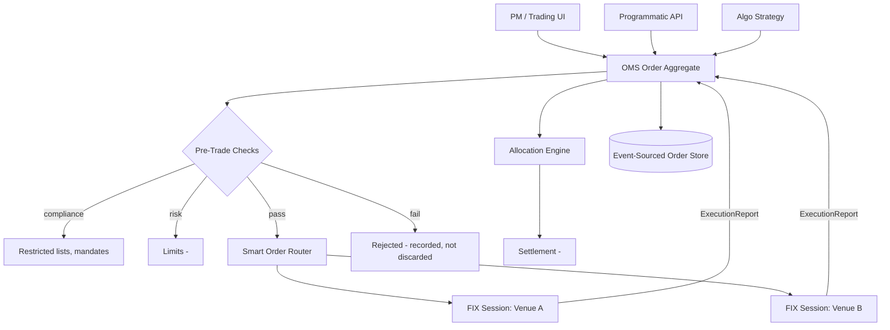
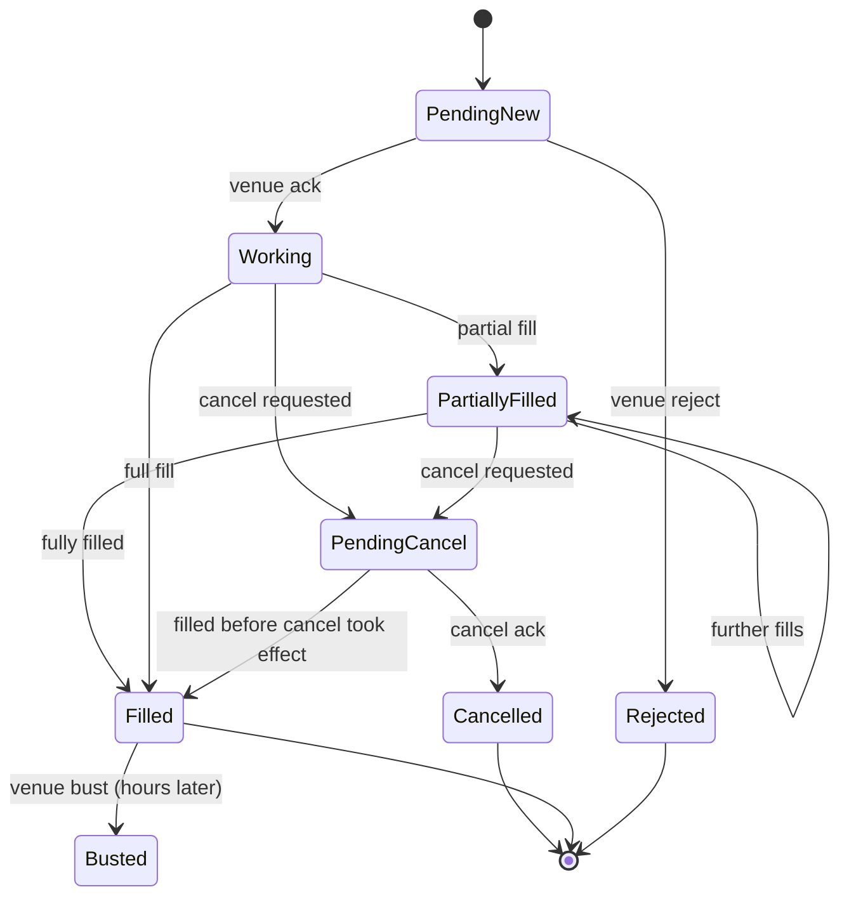

# Module 131 — System Design: Designing an Order Management System & Trade Lifecycle

> Domain: System Design | Level: Beginner → Expert | Prerequisite: [[10-Designing-Market-Data-Distribution-Platform]] (supplies prices this system prices against), [[09-Designing-RealTime-Portfolio-Risk-Engine]] (supplies the pre-trade limits this system must check), [[../36-Saga/01-SagaFundamentals-OrchestrationVsChoreography-CompensatingTransactions]] (the trade lifecycle is a long-running saga; this module is its most consequential concrete instance), [[../35-Event-Sourcing/01-EventSourcingFundamentals-EventStoreAsSourceOfTruth-Snapshotting-AggregateReconstruction]] (order state as event-sourced, for reasons makes non-optional)
>
> **Scenario-module note:** Third of six buy-side/capital-markets system-design scenarios (Modules 129–134). Full 16-section template; Elite FinTech Interview Panel lens.

---

## 1. Fundamentals

**What:** An Order Management System (OMS) is the system of record for the full lifecycle of an order: from a portfolio manager's intent, through compliance and risk checks, to routing and execution at venues, through partial fills and amendments, to allocation across accounts and handoff to settlement. It owns the answer to "what is the current, authoritative state of this order, and how did it get there?"

**Why:** Unlike the previous two modules' subjects — which process stateless units (a pricing task, a tick) — an order is a **long-lived, mutable, externally-visible entity** whose state exists partly in the firm's systems and partly at a venue that the firm does not control. The OMS's entire difficulty flows from that split: the firm's belief about an order and the venue's belief about the same order can diverge, and reconciling them is not optional because the divergence represents real money and real regulatory exposure.

**When:** Any firm placing orders through more than one channel or venue needs a single system of record; without it, "what is our current exposure" has no answerable form, because orders in flight exist only in the systems that happen to have placed them.

**How (30,000-ft view):**
```
PM Intent ──► Order (Aggregate) ──► Compliance/Risk checks ──► Router ──► Venue (FIX)
 │ │
 │◄──────── Execution Reports (fills, rejects, busts) ────┘
 ▼
 Allocation ──► Settlement handoff (the SettlementInstruction)
```

---

## 2. Deep Dive

This section is written to be **complete on its own** — every mechanism, the reasoning that selects it, the failure mode it introduces, and the push-back a Principal/Staff interviewer will raise, answered inline.

### 2.1 What an OMS Owns — and How It Differs From an EMS

The OMS owns the **authoritative current state and full history of every order**: the answer to *"what is this order's state, and how did it get there."* No other system owns that.

An **EMS** (Execution Management System) is a different optimisation target, which is why firms run both:

| | OMS | EMS |
|---|---|---|
| Optimised for | Correctness, completeness, auditability | Trader workflow, low-latency market access |
| Owns | Order lifecycle, compliance, allocation, settlement handoff | Algorithmic strategies, real-time market data, venue microstructure |
| Failure posture | Refuse rather than proceed uncertainly | Speed |

They coexist because the targets genuinely conflict: an OMS that optimised for latency would drop the controls that make it the system of record.

### 2.2 The Order State Machine — and Why It Is Not a Textbook One

The states — `New`, `PendingNew`, `Working`, `PartiallyFilled`, `Filled`, `PendingCancel`, `Cancelled`, `Rejected`, `Expired` — look ordinary until three realities intrude.

**Pending states are real states, not transient ones.** `PendingCancel` means "we have asked the venue to cancel and do not yet know whether it will." **During that window the order can still fill.** A design treating cancel as synchronous is wrong in a way that produces unintended positions.

**Transitions are driven by an external party.** The venue decides whether a cancel succeeds or a fill occurs. The OMS does not *effect* transitions; it **learns of** them. Every design decision downstream follows from this.

**Terminal is not always terminal.** A `Filled` order can be **busted** — the venue cancels an executed trade, sometimes hours later — returning it to an amended state. Handle a bust as a **new event appended to the order's stream reversing the execution's effect**, never by deleting the original fill: the original execution genuinely happened and was acted upon; the bust is a subsequent fact. Reverse forward, never erase.

**Rejected orders must be recorded, not discarded.** The rejection is regulatory evidence that a control functioned. Discarding it destroys the record that the firm's compliance checks were operating.

### 2.3 FIX Semantics — Execution Reports, ClOrdID Chains, Sessions

**Execution reports are the sole state-transition mechanism.** Every fill, reject, cancel acknowledgement and status change arrives as an `ExecutionReport`. The OMS's state is a **fold over these reports** — which is precisely why the order should be event-sourced (§2.9): the domain hands you an event stream whether or not you model it as one.

**ClOrdID chaining.** An amendment does not mutate an order in place; it creates a new client order ID referencing the original via `OrigClOrdID`. The "order" a user sees is a **chain** of ClOrdIDs, and the OMS must maintain that chain to answer "what happened to my order" across amendments.

**Sequence numbers and gap-fill.** FIX sessions carry their own sequence numbering with resend semantics. A gap must trigger a resend request. A missed execution report means the firm's state diverges from the venue's **silently** — the same unrecoverable-gap property as market data, with the added consequence that the missing message may be a fill representing real money and a real position.

**FIX sessions cannot be arbitrarily load-balanced.** A session is a stateful connection with its own sequence numbering; migrating mid-session breaks sequence continuity and triggers gap-fill or session-reset handling. Sessions are **pinned to instances**, not balanced — which constrains the whole deployment model.

### 2.4 Idempotency Under Retransmission — and the Scope Trap

FIX resend, network retry and OMS restart all mean the same execution report can arrive more than once. Applying a fill twice double-counts the position: a direct, immediate financial error.

The mechanism is deduplication on the venue's own execution identifier (`ExecID`). Two requirements:

**Deduplicate inside the same transaction that applies the fill.** A pre-check followed by a separate write has a race window that concurrent processing will eventually hit. This is the idempotency discipline in its highest-consequence form — a duplicated step here is a duplicated position.

**Verify the identifier's actual uniqueness scope, per venue.** §4's incident: the venue's `ExecID` uniqueness was scoped **per session**, not globally. After a session restart the sequence reset, and a genuinely new fill bearing a previously-seen `ExecID` was **silently discarded as a duplicate**.

What makes that incident instructive is its undetectability: the system's behaviour when discarding a real fill was **byte-identical** to its behaviour when correctly rejecting a duplicate — no error, no warning, a normal deduplication path. There is no signal distinguishing "correctly rejected a duplicate" from "incorrectly rejected a genuine execution," because the distinction lives in information the OMS did not have.

The structural fix:

1. A **composite key** `(VenueId, SessionId, ExecID)` matching the actual uniqueness scope.
2. Treat every venue's identifier-uniqueness scope as an **explicitly documented, verified-at-onboarding property**, never inferred from the protocol specification's stated guarantee.
3. **Count and alert on deduplication rate** per venue, so a spike in "duplicates" — which is what a scope mismatch looks like — becomes visible.
4. Rely on daily reconciliation (§2.11) as the external detector, because no internal signal exists.

### 2.5 The Amendment Race — and Why Optimistic Application Is Wrong

A cancel/replace and a fill can cross: the firm believes it has amended, while the venue fills the original. If the OMS optimistically applies the amendment to its own state, it now believes it has a working amended order when it actually has a fill on the original — an unintended position and an incorrect view of remaining exposure.

A proposal to apply amendments optimistically "to reduce perceived latency" should be rejected: it converts an edge case into **designed behaviour**. The OMS's state would routinely reflect amendments the venue has not accepted, so the firm's authoritative record becomes speculative during every amendment's flight time. The latency it saves is *display* latency; the correctness it costs is in the system of record. Show "pending" in the UI; keep the state honest.

### 2.6 Pre-Trade Checks — the Latency/Correctness Bind

Before routing, the OMS must check compliance (mandate restrictions, restricted lists) and risk (limits). These sit on the critical path, where every millisecond delays execution and, in fast markets, costs money through worse fills.

**Order the checks by cost × rejection probability:**

1. **Authorization** — fast, local, definitively rejects an unauthorised trader.
2. **Restricted list / compliance** — fast, cached lookup.
3. **Risk limits** — slowest, requires current exposure.

Putting the definitive local checks first means an unauthorised or restricted order never incurs the expensive risk call at all.

**The bind itself has no clean resolution, and the honest answer differs by check type.** The checks need current data (a limit check against stale exposure is worthless), but fetching current data adds latency. Options: cache locally and accept bounded staleness; check asynchronously and cancel after the fact (unacceptable for hard mandate limits); or accept the latency.

**Note the error direction when caching position data**, because it is what decides the question: stale data **understates** exposure when positions have grown — so the check most likely to be wrong is precisely the one guarding against over-exposure. Bounded staleness is acceptable for soft internal thresholds; a hard regulatory limit must be checked against current state.

### 2.7 Parent and Child Orders — the Algorithmic Model

A **parent** order holds the PM's intent (quantity, limit, strategy, constraints). **Child** orders are the algorithm's slices routed to venues. The parent's state aggregates children's fills; compliance and allocation operate on the parent, while children carry venue-level execution detail.

**The subtlety that causes real bugs: fills are recorded against children, but positions accrue to the parent.** Double-counting is possible if both levels are summed, and under-counting is possible if a child's fill is not rolled up. Define the aggregation direction once, and make it the only path.

**Algorithms change the capacity profile.** A slicing algorithm working one large parent emits many children, so order rate becomes a function of *algorithmic behaviour* rather than human trading — bursts can be orders of magnitude above human-driven rates, and capacity must be sized for that.

### 2.8 Allocation — Fairness as a Correctness Requirement

Institutional orders are placed in aggregate ("buy 500,000 shares") and allocated across many client accounts after execution. **Unfair allocation between clients is a regulatory violation, not an operational error**, so the rule must be documented, fair, and reproducible.

**Rounding must be deterministic and must reconcile exactly.** Allocating 500,000 shares pro-rata across 37 accounts produces fractional shares; independent rounding produces an off-by-one that is a real break requiring manual intervention. The correct algorithm:

```
1. Compute each account's exact pro-rata share.
2. Floor each to whole units.
3. Distribute the remaining units by largest fractional remainder first,
   with account ID as a stable secondary tie-break.
```

The sum equals the fill **by construction**, and determinism means re-running produces identical allocations — required for reproducibility and dispute resolution.

### 2.9 Why the Order Should Be Event-Sourced

Event sourcing is justified where an entity's full history has genuine ongoing business value, and should not be adopted by default. The order is the clearest positive case in this course:

- The domain **is** an event stream — execution reports arrive as events regardless of internal modelling.
- **Regulatory reconstruction demands the full sequence**, not the final state: "show every state this order passed through and when."
- **Busts and amendments are corrections to history**, which a log handles naturally and a mutable current-state row handles badly.
- **Best-execution analysis** requires knowing what was known at each decision point.

**Storing only current state with a separate audit log is the wrong alternative**, and worth being able to argue against: it creates **two sources of truth that can diverge**, and divergence is undetectable without reconciling them against each other. Event sourcing makes the log *be* the state, so divergence is structurally impossible rather than merely monitored. Given that regulatory reconstruction reads the history while trading reads the current state, an architecture where those two can disagree is exactly the wrong one.

### 2.10 Failover, Re-Synchronisation, and the Unresponsive Venue

**The OMS is strongly CP, not AP.** Accepting orders without confidence in current state creates positions the firm cannot account for — an unbounded failure. The correct degradation is **refusing new orders while continuing to process inbound reports**.

**Re-synchronise with venues after failover, before accepting new orders.** The OMS's state may be stale by exactly the messages missed during failover; resuming blind risks double-sending orders or acting on an incorrect view of working orders. Issue order-status requests and reconcile before reopening.

**A venue that becomes unresponsive with orders working is among the most dangerous states in the system** — the firm has live orders it cannot see or cancel. Correct handling:

1. **Assume nothing** about those orders' state; they may be filling.
2. **Route no further orders** to that venue.
3. Attempt session re-establishment with **order-status requests**.
4. If the outage persists, **escalate to manual intervention**, including direct contact with the venue — because the exposure is unbounded and no automated recovery can bound it.

### 2.11 Daily Reconciliation Against the Venue — the Only Ground Truth

Compare the OMS's executions against the venue's official trade file across **three dimensions**: presence, quantity/price agreement, and state agreement for working orders. Categorise breaks, because each implies a different cause and urgency:

| Break | Meaning | Urgency |
|---|---|---|
| **Missing in OMS** | The firm has an **unknown position** | Highest — this is §4's incident |
| **Missing at venue** | The OMS recorded something the venue did not | High — possible duplicate application |
| **Mismatched quantity/price** | Partial application, or a correction not yet processed | Medium |
| **State disagreement on working orders** | Divergent view of live exposure | High |

This reconciliation is the **only** external check on the entire system, which is why §2.4's incident was detectable nowhere else.

### 2.12 Corporate Actions Across Working Orders

Splits, mergers and ticker changes can invalidate a working order mid-life: the instrument it references may no longer exist in its prior form, and quantities or prices may need adjustment. Venues typically cancel working orders across such events — but **the firm cannot rely on that uniformly across venues**, which is exactly the kind of per-venue behavioural assumption §2.4 warns about.

The OMS must detect affected working orders from the corporate-actions feed, decide per event whether to cancel, adjust or hold, and record the decision. Treating corporate actions as a reference-data concern that stops at the instrument master misses that it reaches into live order state.

### 2.13 Best Execution — Record the Counterfactual, Not Just the Outcome

Best execution requires demonstrating that routing decisions served the client's interest. So the OMS must record not just **where** an order was routed but **why**:

- the market state at decision time (the pinned snapshot),
- the venues considered and their quotes at that moment,
- the routing logic's version.

Without the counterfactual — what the alternatives looked like — the record shows what happened but **cannot demonstrate it was the right choice**. This is the same pattern as reproducibility metadata for a risk number: the output alone is not evidence.

### 2.14 Controlling a Runaway Algorithm

Layered limits, because any single one can be defeated:

- Per-algorithm **order-rate limits** at the OMS.
- Per-instrument and per-account **notional limits**.
- A **global kill switch** operable without a deployment.
- A **circuit breaker on anomalous order-to-fill ratio** — an algorithm sending many orders and getting few fills is frequently malfunctioning, and that ratio detects it before the notional limits do.

**Enforce these at the OMS, not within the algorithm.** A malfunctioning algorithm cannot be trusted to enforce its own limits, and that is the entire point of putting the control in the layer the algorithm must pass through.

### 2.15 Recovery Priority — Order State Is Authoritative

Risk results and latest-value caches are *derived* and rebuildable from retained inputs. **Order state is authoritative**: it is the firm's record of its own obligations, recoverable only by reconciliation against venue records — which is slow, partial, and not always possible.

That makes the order event store the highest-value store in this domain for DR purposes, with synchronous replication and tested recovery, and it is why §2.10's posture is to refuse rather than proceed on an uncertain view.

### 2.16 Observability — Attribution, and the Claim That Needs Checking

**Distinguishing a venue problem from an OMS problem** works by comparison:

| Observation | Conclusion |
|---|---|
| Elevated rejects at **one** venue, others normal | That venue, or that session's configuration |
| Elevated rejects **across all** venues | OMS-side — bad reference data, a failing pre-trade check |
| Execution-report latency rising at one venue | Venue-side |
| Order-submission latency rising across all | OMS-side |

Attribution requires more than one independent path to compare against, exactly as it does for market-data handlers.

**Applying "declared ≠ actual" to this system.** The claim is *"the OMS reflects the firm's true order state."* Its declared basis is that every execution report received was applied correctly. The gap is that reports can be:

- **not received** (a sequence gap, §2.3),
- **incorrectly discarded** (scope-mismatched dedup, §2.4),
- **superseded by events the firm has not yet learned of** (a fill in flight during a cancel, §2.5).

Each leaves the OMS *confidently* wrong, with no internal signal. Which is why the actual basis requires gap detection, verified dedup scope, honest pending-state modelling, and — above all — external reconciliation.

### 2.17 Build versus Buy, Cloud, and Migration

**Build versus buy.** The build case is weak for the general OMS and strong for specific differentiating logic. Vendor platforms carry pre-built connectivity across dozens of venues — the single largest and most tedious cost, requiring ongoing maintenance as venues change protocols — plus regulatory-reporting integrations and a certification history. Building means owning all of that permanently. The genuine build case is a firm whose *strategy* is the order-handling logic itself; for everyone else, buy the platform and build the differentiator on top.

**Cloud** is more viable here than for feed handlers, with real constraints. Venue connectivity often needs specific network paths or colocation, though many venues now offer cloud-accessible endpoints. The stronger constraints are regulatory: **data-residency requirements on order records** in some jurisdictions, and operational-resilience regulation increasingly requiring firms to demonstrate control over critical systems including exit plans from a provider.

**Migration from a legacy OMS must be a drain, not a cutover.** Working orders cannot be migrated mid-life safely — their state is **co-owned by venues** that know them under the legacy system's sessions and identifiers. The workable approach: stop routing new orders through the legacy system, let existing working orders complete or be cancelled naturally, route all new orders through the new system, and run both in parallel until the legacy working-order count reaches zero. Slower than a cutover, and the only approach that does not risk orphaning a live obligation.

### 2.18 Principal-Level Judgements

**Investigating a PM's claim of mishandled execution.** Reconstruct from the event stream: confirm the order's **actual parameters as received** (frequently the discrepancy is intent-versus-entry), then the routing decision and market state at that moment (§2.13's recorded counterfactual), then the execution sequence, then compare against a benchmark (arrival price, VWAP) for the period. Most disputes resolve to either an entry difference or genuine market movement — and the investigation is only possible because the counterfactual was recorded at the time.

**The governance program required before an OMS may route live orders:**

1. **Per-venue documented identifier-uniqueness scope**, verified at onboarding, feeding dedup key construction (§2.4).
2. **Transactional deduplication**, never check-then-write (§2.4).
3. **Pending states modelled as genuinely non-terminal**, with fills-during-cancel handled (§2.2, §2.5).
4. **FIX gap detection** with resend and escalation (§2.3).
5. **Failover re-synchronisation** before accepting new orders (§2.10).
6. **Daily reconciliation** against venue trade files, with categorised breaks and owned resolution (§2.11).
7. **Layered algorithmic controls** including a deployment-free kill switch (§2.14).

**Answering a regulator on "how do you ensure you have no unknown positions"**: state the layered controls above, then the residual honestly — reconciliation is daily, so the detection window for an unknown position is bounded by that cadence rather than continuous. That is a statable, improvable number, and far more credible than an unqualified assurance.

**The trade lifecycle is a long-running saga in the strict sense** — route → execute → allocate → settle, spanning services and days, with steps that can fail and require compensation (a bust reverses an execution; a failed settlement requires unwinding). What distinguishes it from textbook sagas is **duration and external control**: the steps are driven by a venue and a settlement system the firm does not own, so the orchestrator cannot command the process, only observe and react.

**The closing synthesis — what makes an OMS distinctively hard.** Not throughput; order rates are trivial next to market-data ticks. Two properties define it:

1. **The authoritative truth is externally held.** The venue, not the firm, knows what actually happened — so no amount of internal consistency proves correctness, and reconciliation against an external party is the only ground truth.
2. **State is long-lived, mutable and consequential throughout.** An order is not a request that succeeds or fails in milliseconds; it is an obligation that lives for hours or days, changes under external control, and can be corrected after it looked finished.

Together they mean the OMS's hardest engineering is not processing orders — it is maintaining a defensible belief about state that something else owns.

---

## 3. Visual Architecture


```mermaid
graph TB
 PM[PM / Trading UI] --> OMS[OMS Order Aggregate]
 API[Programmatic API] --> OMS
 ALGO[Algo Strategy] --> OMS
 OMS --> CHK{Pre-Trade Checks}
 CHK -->|compliance| COMP[Restricted lists, mandates]
 CHK -->|risk| RISK[Limits -]
 CHK -->|pass| RTR[Smart Order Router]
 CHK -->|fail| REJ[Rejected - recorded, not discarded]
 RTR --> FIX1[FIX Session: Venue A]
 RTR --> FIX2[FIX Session: Venue B]
 FIX1 -->|ExecutionReport| OMS
 FIX2 -->|ExecutionReport| OMS
 OMS --> ALLOC[Allocation Engine]
 ALLOC --> SETT[Settlement -]
 OMS --> STORE[(Event-Sourced Order Store)]
```


```mermaid
stateDiagram-v2
 [*] --> PendingNew
 PendingNew --> Working: venue ack
 PendingNew --> Rejected: venue reject
 Working --> PartiallyFilled: partial fill
 PartiallyFilled --> PartiallyFilled: further fills
 PartiallyFilled --> Filled: fully filled
 Working --> Filled: full fill
 Working --> PendingCancel: cancel requested
 PartiallyFilled --> PendingCancel: cancel requested
 PendingCancel --> Cancelled: cancel ack
 PendingCancel --> Filled: filled before cancel took effect
 Filled --> Busted: venue bust (hours later)
 Cancelled --> [*]
 Filled --> [*]
 Rejected --> [*]
```

```mermaid
sequenceDiagram
 participant O as OMS
 participant V as Venue
 O->>V: NewOrderSingle (ClOrdID=A1)
 V-->>O: ExecReport: PendingNew
 V-->>O: ExecReport: New (Working)
 O->>V: OrderCancelReplace (ClOrdID=A2, OrigClOrdID=A1)
 Note over O,V: Race window — A1 may fill before A2 is processed
 V-->>O: ExecReport: Fill on A1 (ExecID=E9)
 V-->>O: ExecReport: Reject cancel/replace (too late)
 Note over O: Chain A1→A2 retained; A2 never became live
```

---

## 4. Production Example

**Problem:** A firm's OMS handled several hundred thousand orders daily across a dozen venues, with an event-sourced order store and `ExecID`-based deduplication. It ran without a position break for three years.

**Architecture:** the design. Execution reports arrived over FIX sessions, were deduplicated on `ExecID`, and applied to the order aggregate.

**Implementation:** Deduplication used `ExecID` alone as the key, on the reasonable understanding — supported by the FIX specification — that `ExecID` is unique per execution.

**Trade-offs:** Keying on `ExecID` alone is simpler than a composite key and matches the specification's stated guarantee.

**Lessons learned:** A venue's `ExecID` uniqueness guarantee turned out to be scoped **per trading session**, not globally — and after that venue's mid-day session restart following an outage, its `ExecID` sequence reset. A new, genuinely distinct execution arrived bearing an `ExecID` the OMS had already seen that morning. Deduplication did exactly what it was built to do and **silently discarded a real fill.**

The firm's position was understated by that fill for the remainder of the session. It was caught by end-of-day reconciliation against the venue's own trade file — but only because that reconciliation existed; nothing in the real-time path signalled anything, because the system's behaviour was indistinguishable from correctly rejecting a duplicate.

The fix: composite deduplication key of `(VenueId, SessionId, ExecID)`, restoring genuine uniqueness. The generalizable lesson is sharper than the fix: **the deduplication key must be scoped to whatever the uniqueness guarantee is actually scoped to, and that scope is a property of the counterparty's implementation, not of the specification.** A specification's guarantee is a claim about intent; the venue's actual behaviour is the reality, and the two diverged silently. This is the course's "declared ≠ actual" theme applied to an external party's contract — a variant the prior modules had not encountered, since Modules 129 and 130 dealt with internally-controlled invariants.
## 11. Coding Exercises

### Easy — Transactional Fill Deduplication
**Problem:** Apply a fill exactly once, with the correctly-scoped key.
**Solution:**
```csharp
public async Task ApplyFillAsync(ExecutionReport report)
{
    await using var tx = await _db.BeginTransactionAsync;

    var key = new ExecutionKey(report.VenueId, report.SessionId, report.ExecId); // the composite scope
    if (!await _executions.TryRecordAsync(key, tx)) // unique constraint; false = already applied
    {
        await tx.CommitAsync;
        return; // idempotent no-op
    }

    var order = await _orders.LoadAsync(report.ClOrdId, tx);
    order.ApplyFill(report.LastQty, report.LastPx, report.ExecId);
    await _orders.AppendEventsAsync(order, tx);

    await tx.CommitAsync; // dedup record + fill commit atomically
}
```
**Time complexity:** O(1) with a unique index on the composite key.
**Space complexity:** O(1) per execution recorded.
**Optimized solution:** Enforce uniqueness via a database constraint rather than an application check, so concurrency correctness does not depend on isolation-level assumptions holding under every future query plan.

### Medium — Deterministic Allocation with Exact Reconciliation (§2.8)
**Problem:** Allocate a fill pro-rata across accounts so quantities sum exactly to the filled quantity.
**Solution:**
```csharp
public IReadOnlyList<Allocation> Allocate(long filledQty, IReadOnlyList<AccountTarget> targets)
{
    var totalTarget = targets.Sum(t => t.TargetQty);
    var provisional = targets
    .Select(t => {
            var exact = (decimal)filledQty * t.TargetQty / totalTarget;
            var floor = (long)Math.Floor(exact);
            return new { t.AccountId, Floor = floor, Remainder = exact - floor };
    })
    .ToList;

    var allocated = provisional.Sum(p => p.Floor);
    var leftover = filledQty - allocated;

    var ranked = provisional
    .OrderByDescending(p => p.Remainder)
    .ThenBy(p => p.AccountId, StringComparer.Ordinal) // deterministic tie-break
    .ToList;

    return ranked
    .Select((p, i) => new Allocation(p.AccountId, p.Floor + (i < leftover? 1: 0)))
    .ToList; // sums to filledQty by construction
}
```
**Time complexity:** O(n log n) for n accounts.
**Space complexity:** O(n).
**Optimized solution:** Persist the allocation with its input snapshot (targets and filled quantity), so the allocation is reproducible for dispute resolution — the same input-recording discipline required for risk numbers.

### Hard — Order State Machine with Guarded Transitions
**Problem:** Enforce that only valid transitions occur, including fills during `PendingCancel`.
**Solution:**
```csharp
public sealed class Order
{
    private static readonly Dictionary<OrderState, OrderState[]> Allowed = new
    {
        [OrderState.PendingNew] = [OrderState.Working, OrderState.Rejected],
            [OrderState.Working] = [OrderState.PartiallyFilled, OrderState.Filled,
            OrderState.PendingCancel, OrderState.Expired],
        [OrderState.PartiallyFilled]= [OrderState.PartiallyFilled, OrderState.Filled,
            OrderState.PendingCancel],
        [OrderState.PendingCancel] = [OrderState.Cancelled, OrderState.Filled, // fill can still land
            OrderState.PartiallyFilled],
        [OrderState.Filled] = [OrderState.Busted], //: not terminal
        };

    public void Transition(OrderState target, ExecutionReport cause)
    {
        if (!Allowed.TryGetValue(State, out var permitted) ||!permitted.Contains(target))
            throw new InvalidOrderTransitionException(State, target, cause.ExecId);
        Raise(new OrderStateChanged(Id, State, target, cause.ExecId, cause.VenueTimestamp));
    }
}
```
**Time complexity:** O(k) for k permitted transitions per state — effectively O(1).
**Space complexity:** O(1) per transition event appended.
**Optimized solution:** Generate the transition table from a declarative specification shared with the venue-certification test suite, so the state machine and the tests proving venue compatibility cannot drift apart.

### Expert — Venue Reconciliation with Break Categorization (§2.11)
**Problem:** Compare OMS executions against the venue's authoritative trade file and categorize breaks by cause.
**Solution:**
```csharp
public async Task<ReconciliationReport> ReconcileAsync(VenueId venue, DateOnly session)
{
    var ours = (await _oms.ExecutionsAsync(venue, session)).ToDictionary(e => e.ExecId);
    var theirs = (await _venueFiles.LoadTradeFileAsync(venue, session)).ToDictionary(e => e.ExecId);

    var breaks = new List<Break>;

    foreach (var (execId, theirExec) in theirs)
        if (!ours.TryGetValue(execId, out var ourExec))
        breaks.Add(Break.MissingInOms(execId, theirExec)); // MOST URGENT: unknown position
    else if (ourExec.Qty!= theirExec.Qty || ourExec.Px!= theirExec.Px)
        breaks.Add(Break.Mismatch(execId, ourExec, theirExec));

    foreach (var (execId, ourExec) in ours)
        if (!theirs.ContainsKey(execId))
        breaks.Add(Break.MissingAtVenue(execId, ourExec)); // possible duplicate we sent

    return new ReconciliationReport(venue, session, breaks);
}
```
**Time complexity:** O(n + m) for n our-side and m venue-side executions.
**Space complexity:** O(n + m).
**Optimized solution:** Run against intraday drop-copy feeds where the venue provides them, narrowing the detection window from daily to near-real-time — directly addressing §2.18's stated residual.

---

## 12. System Design — Designing an Order Management System & Trade Lifecycle

*Authored to the four-step standard (see Module 01 §12 for the method).*

---

### Step 1 — Understand the Problem and Establish Design Scope

#### The dialogue

> **C:** Buy-side or sell-side? An asset manager's OMS and a broker's order-handling system have different authorities and different regulatory obligations.
> **I:** Buy-side — an asset manager routing to brokers and venues.
>
> **C:** Who enters orders? Human traders, programmatic clients, and algorithmic strategies have very different volume profiles.
> **I:** All three, through one system of record.
>
> **C:** Do we own execution, or route to brokers who execute?
> **I:** Route out. You process execution reports; you don't match.
>
> **C:** So the authoritative state of an order lives partly outside the system — the venue knows things we don't yet. That shapes everything. Confirmed?
> **I:** Confirmed.
>
> **C:** Do we allocate block orders across accounts?
> **I:** Yes, and allocations must be deterministic and reconcilable — we're audited on fair allocation.
>
> **C:** Pre-trade compliance and risk checks?
> **I:** Yes, before routing, with a latency budget.
>
> **C:** What's the budget? Compliance checks and low latency are in direct tension.
> **I:** Single-digit milliseconds for the whole check chain.
>
> **C:** Volumes?
> **I:** About 400 traders, 250,000 parent orders/day, up to 2 million child orders/day when algos are active.
>
> **C:** What must never happen?
> **I:** We must never have a position we don't know about. Every execution is either applied or surfaced as a break.
>
> **C:** Out of scope?
> **I:** Settlement itself (assume a handoff), the algorithms, and client reporting.

The fourth exchange is the one that defines the system. **The authority on order state is external** — the venue knows about a fill before you do, and may tell you twice, out of order, or not at all. Every hard problem here descends from that, and it is the same shape as Module 18's payment orchestration against a PSP.

#### Functional requirements

1. Accept orders from human traders, programmatic APIs, and algorithmic strategies through one system of record.
2. Enforce pre-trade compliance and risk checks before routing.
3. Route to venues/brokers, process execution reports, and maintain authoritative order state.
4. Support amendments and cancels with correct pending-state semantics.
5. Allocate fills across accounts deterministically and reconcilably.
6. Hand off to settlement and reconstruct any order's full lifecycle on demand.

#### Non-functional requirements

| Requirement | Target |
|---|---|
| Pre-trade check chain | p99 single-digit milliseconds |
| Position correctness | **Zero unknown positions** — every execution applied or surfaced as a break |
| Auditability | Every state transition and its cause, reconstructable for the retention period |
| Availability — order entry | May degrade to **refusing** orders |
| Availability — execution-report processing | **Must not degrade.** Refusing to accept a fill does not make it not have happened |
| Idempotency | Duplicate execution reports must never double-count |
| Ordering | Per-order causal order preserved despite out-of-order arrival |

That availability asymmetry is worth stating explicitly: **order entry is optional, execution-report processing is not.** A system that treats them as one availability target has mis-modelled the problem — you can always stop sending orders, but you cannot stop the market from filling the ones already out there.

#### Back-of-the-envelope estimation

```
Parent orders/day  = 250,000
Child orders/day   = 2,000,000     (algorithmic slicing)
Peak burst         ≈ 2,000 orders/s   (open, close, volatility events)

Execution reports  ≈ 3–5× order count (pending-new, new, partial fills, done)
Messages/day       ≈ 10,000,000     → ~100/s average, ~10,000/s peak
```

Storage:

```
Order events: 10^7/day × ~500 B                ≈ 5 GB/day
Per year                                        ≈ 1.8 TB before compression
Full regulatory retention (7 years)             ≈ 13 TB
```

Pre-trade latency budget — the arithmetic that constrains the design:

```
Total budget                                    = 8 ms (p99)
  Order validation + enrichment                 ≈ 0.5 ms
  Restricted-list check (cached, in-memory)     ≈ 0.1 ms
  Mandate/concentration check (needs positions) ≈ 2 ms
  Hard risk limit (live, uncached)              ≈ 3 ms   ← the binding constraint
  Routing decision                              ≈ 0.5 ms
  FIX encode + send                             ≈ 0.5 ms
  Remaining headroom                            ≈ 1.4 ms
```

**The sensitivity that matters:**

```
The volume driver is the CHILD-ORDER MULTIPLIER, not trader count.
A shift in algorithmic strategy mix — say, from VWAP slicing every
5 minutes to every 30 seconds — multiplies child orders 10× with
ZERO change in headcount, AUM, or parent-order count.
Capacity models keyed to traders or AUM will be wrong without warning.
```

#### What the numbers tell us

1. **Throughput is trivial.** 10,000 messages/s peak and 13 TB over seven years is a small system by every measure. Anyone designing for scale here has misread the problem.
2. **The latency budget is genuinely tight and is consumed by one check.** The live hard-limit check is 3 of 8 ms, and it is the one thing that cannot be cached without breaking its purpose (§3.4). That single arithmetic line is what forces the cached/uncached split in the check chain.
3. **Capacity must be monitored on child-order rate**, not on any business metric. This is the same lesson as Module 09's instrument-mix sensitivity, arriving independently: **the driver of load is a technical parameter that no business dashboard tracks.**

The hard problem is **maintaining correct state for a long-lived entity whose authority lives elsewhere**, under duplicate and out-of-order messages, within a millisecond budget.

---

### Step 2 — Propose High-Level Design and Get Buy-In

#### The two core flows

- **Outbound (order entry → checks → route)** — latency-bound, may refuse.
- **Inbound (execution reports → state → position → allocation → settlement)** — must never refuse, must be idempotent, must handle out-of-order.

#### Components

**Order Entry Adapters.** Three channels (GUI, REST/programmatic, algo engine) that all converge on **one order aggregate** — the "one system of record" requirement made structural. Channel-specific order stores are how firms end up with two answers to "what's our position?"

**Pre-Trade Check Chain.** Ordered, short-circuiting, with each check declaring whether it is cacheable.

**Smart Order Router.** Venue selection and child-order generation.

**FIX Session Managers.** One per venue, session state pinned to an instance, with sequence-number persistence.

**Order Aggregate (event-sourced).** The authoritative order state, as an append-only event stream.

**Execution Processor.** Applies execution reports idempotently, resolves out-of-order arrival, updates state.

**Allocation Engine.** Deterministic distribution of fills across accounts.

**Reconciliation Service.** Compares internal state against venue/broker end-of-day (and where available, intraday) reports.

**Kill Switch.** An out-of-band control that stops order flow immediately, at the session level, without requiring the OMS to be healthy.

#### End-to-end walkthrough — order to settlement

1. Trader submits a parent order; the adapter normalises it and assigns an internal `order_id`.
2. `OrderReceived` event appended. **State is durable before any check runs**, so a crash mid-check leaves a recoverable order rather than a phantom one.
3. Pre-trade chain runs in declared order, cheapest and most-likely-to-reject first (§3.4).
4. Rejected → `OrderRejected{reason}`, terminal, returned to the trader with the specific failing check.
5. Passed → `OrderAccepted`, then the router produces child orders.
6. Each child gets a **`ClOrdID`** and is sent over the venue's FIX session; `ChildOrderSent` appended **before** the wire send, so a crash after send does not lose the fact that we sent it.
7. Venue returns execution reports: `PENDING_NEW → NEW → PARTIALLY_FILLED* → FILLED | CANCELED | REJECTED`.
8. Each report is deduplicated on `ExecID` **scoped correctly** (§3.3), applied to the aggregate, and appended as an event.
9. Fills roll up from child to parent; the parent's filled quantity is **derived from events, never stored as a mutable counter**.
10. On completion, the Allocation Engine distributes fills across accounts deterministically.
11. Allocations are published via the Outbox to position, risk (Module 09), and settlement consumers.
12. End of day: reconciliation against the broker's report produces breaks by category.

#### API design

**`POST /v1/orders`**

| Field | Type | Required | Description |
|---|---|---|---|
| `instrument_id` | string | yes | Canonical ID (Module 10's symbology) |
| `side` | enum | yes | `BUY` \| `SELL` \| `SELL_SHORT` — short is a *different* order type for compliance, not a flag |
| `quantity` | decimal | yes | |
| `order_type` | enum | yes | `MARKET` \| `LIMIT` \| `VWAP` \| … |
| `limit_price` | decimal | conditional | |
| `time_in_force` | enum | yes | `DAY` \| `IOC` \| `FOK` \| `GTC` |
| `accounts` | array | yes | `[{ account_id, target_quantity }]` — allocation intent captured **at entry**, not decided after the fill (§3.5) |
| `strategy_id` | string | no | For algorithmic orders |

Header: `Idempotency-Key`. Response `201`: `{ order_id, status: ACCEPTED, checks_passed[] }`, or `422` with the failing check named.

**`POST /v1/orders/{id}/amend`** — `{ new_quantity?, new_limit_price?, expected_version }`. Returns `409` if `expected_version` is stale, because an amendment computed against a superseded view of the order is exactly how a trader accidentally doubles a position.

**`POST /v1/orders/{id}/cancel`** → `202`. **Cancel is a request, not a command** — the venue may fill before the cancel arrives, and the API's naming and status codes must reflect that.

**`GET /v1/orders/{id}`** — current state plus `version`, `filled_quantity`, `remaining_quantity`, `pending_amend`, `pending_cancel`, `child_orders[]`, `venue_state_as_of`.

**`GET /v1/orders/{id}/events`** — the full event stream. This is the audit artefact and it is a first-class, supported endpoint rather than a database query someone runs in an incident.

#### Data model

**`order_event`** — event store, partitioned by `order_id`, ordered by `sequence`:

| Column | Type | Notes |
|---|---|---|
| `order_id`, `sequence` | Partition + clustering | |
| `event_type` | enum | `OrderReceived`, `OrderAccepted`, `ChildOrderSent`, `ExecutionReportApplied`, `AmendRequested`, `AmendAccepted`, `CancelRequested`, `Filled`, `Allocated`, … |
| `payload` | json | |
| `caused_by` | text | **The cause, not just the effect** — `ExecID`, user ID, or strategy ID. This is what makes "why did this happen" answerable |
| `occurred_at`, `recorded_at` | timestamp | Venue time and our time |

**`execution`** — `(exec_id_scope, exec_id)` **unique**, `order_id`, `child_order_id`, `last_qty`, `last_px`, `cum_qty`, `avg_px`, `exec_type`, `ord_status`, `transact_time`, `received_at`.

**`clordid_chain`** — `(venue, cl_ord_id)` → `order_id`, `orig_cl_ord_id`, `status`. Amendments create a new `ClOrdID` chained to the original; reconstructing the chain is required to interpret any execution report.

**`allocation`** — `(order_id, account_id)`, `quantity`, `price`, `method`, `computed_at`, `input_hash`. The `input_hash` makes the allocation **reproducible** — the same inputs must yield the same allocation, and proving it is an audit requirement.

**Order state machine** — and it is not simple:

```
NEW → PENDING_NEW → ACCEPTED → WORKING
WORKING → PARTIALLY_FILLED → FILLED
WORKING → PENDING_CANCEL → CANCELED
WORKING → PENDING_AMEND → WORKING (amended) | REJECTED (amend rejected, original stands)
Any → EXPIRED (time in force)
Any → REJECTED (terminal)
```

The **pending states are the whole difficulty.** `PENDING_CANCEL` means we asked and don't know; during it the order can still fill, and a fill during pending-cancel is normal, not an error. A state machine without pending states forces the system to guess, and guessing about whether an order is live is how a firm ends up double-hedged.

#### Store selection, and why

| Store | Choice | Reason |
|---|---|---|
| Order events | **Append-only event store**, partitioned by order, with periodic snapshots for long-lived orders | The domain is *inherently* a sequence of externally-caused state transitions with a hard audit requirement. This is the rare case where event sourcing's costs are unambiguously justified |
| Reference data (accounts, instruments, restricted lists) | **Bitemporal relational**, resolved `asOf` | A compliance check must be evaluated against the rules in force at order time, and defensible months later |
| Read models (blotter, positions) | **Projected from the event stream** | CQRS falls out naturally; blotter queries have nothing to do with order-write patterns |
| Live limits | **Not cached** | See §3.4 |

---

### Step 3 — Design Deep Dive

#### 3.1 Why event sourcing is right here, specifically

This course is generally sceptical of event sourcing (Module 18 §2.21 declines it for a ledger). The adoption test it fails there, it passes here, and the reasons are worth being precise about:

- **The aggregate boundary matches the transaction boundary.** An order is modified only by events about that order. A ledger transaction spans multiple accounts, which is why the ledger fails this test.
- **History is the product, not a byproduct.** "Reconstruct why this order ended in this state" is a *regulatory obligation*, not a debugging convenience.
- **State is genuinely a fold over external events.** The order's state is definitionally the accumulation of execution reports; storing a mutable `filled_quantity` alongside them creates a second source of truth that can disagree with the events.
- **Aggregates are bounded and short-lived** — days, not years — so replay cost stays trivial and snapshots handle the exceptions.

Say the test, then apply it. "We'd event-source it because it's financial" is not an argument.

#### 3.2 The ClOrdID chain and amendment semantics

FIX requires a new `ClOrdID` for each amendment, with `OrigClOrdID` pointing at the prior one. So a single logical order becomes a *chain*, and an execution report may reference any link in it.

The failure this causes: an execution report arrives citing an `OrigClOrdID` after the amendment was accepted. Systems that key state on the current `ClOrdID` alone drop it — a **lost fill**, which is the one thing the requirements said must never happen. The design must resolve any link in the chain to the same internal `order_id`, which is why `clordid_chain` is a first-class table rather than a derived view.

The related trap: an **amend rejected** does not cancel the original — the original order stands, still working. Systems that transition to a terminal state on amend-reject believe they have no exposure while holding a live order.

#### 3.3 Idempotency under retransmission, and the scope trap

FIX sessions resend on reconnect; brokers occasionally duplicate; failover replays. Deduplication is on `ExecID` — and **the scope of that key is the trap.**

`ExecID` is unique *per venue*, sometimes per venue *session*, and occasionally — as Module 18 §4 documents from the payments side — per *processing centre*. Deduplicating on `ExecID` alone across venues means two venues' unrelated executions can collide, and the correctly-functioning dedup logic **silently discards a real fill**. The discard produces no error; the position is simply wrong.

The rules, and they are the same rules as Module 18 and Module 20 reach independently:

1. **Scope the key explicitly**: `(venue, session_or_centre, ExecID)`. Over-scoping costs a duplicate row; under-scoping loses data silently.
2. **The dedup check and the state application share a transaction.** Deduplicating in one store and applying in another creates a window where a crash loses the fill while recording that it was seen.
3. **Count every discard.** A silent-discard path with no counter is undetectable by construction — this course's most-repeated finding, and it arrives here for the same reason it arrives everywhere else.

#### 3.4 The pre-trade latency bind

The estimation showed the live hard-limit check consuming 3 of 8 ms and being the only uncacheable step. Resolving that bind is the design's central latency decision:

| Check | Cacheable? | Why |
|---|---|---|
| Restricted list | **Yes**, bounded staleness (seconds) | Lists change on a human timescale; a few seconds of staleness is a documented, accepted risk |
| Mandate/concentration | **Partially** — cache the mandate, compute against live positions | The rule is stable; the position is not |
| Hard risk limit | **No** | A cached limit check is not a limit check. Its entire purpose is to be correct *now*; caching it means authorising against a limit that was true a moment ago, which is precisely the case limits exist to prevent |
| Credit/buying power | **No** | Same reasoning |

Chain ordering matters independently of caching: run **cheap and high-rejection-rate checks first**, so the expensive uncacheable check runs only for orders that will otherwise pass. That single ordering decision removes most of the load from the 3 ms step without weakening it.

And the honest framing for an interview: **this is a bind, not a solved problem.** The design accepts bounded staleness where the consequence is bounded and refuses it where the consequence is not, and states which is which.

#### 3.5 Deterministic allocation

Allocating a partially-filled block across accounts is where fairness becomes auditable. Requirements:

- **Allocation intent is captured at order entry**, not decided after the fill. Deciding afterwards — even fairly — is indistinguishable from cherry-picking (allocating good fills to favoured accounts) and is a genuine regulatory offence.
- **The method is declared and deterministic**: pro-rata, or pro-rata with a rounding rule, or a documented alternative. Given the same inputs, the same allocation must result — which is what `input_hash` proves.
- **Rounding must sum exactly.** Naive per-account rounding creates or destroys shares — the same defect as Module 18 §2.9's currency allocation. Use largest-remainder so the parts sum to the whole by construction.
- **Odd lots and minimum sizes** are the messy real-world constraints; whatever rule handles them must be part of the declared method, not code that quietly deviates from the documented policy.

#### 3.6 Reconciliation and the break taxonomy

Internal state is a belief about an external reality. Reconciliation against the broker's report is what tests it:

| Break | Meaning | Handling |
|---|---|---|
| We have it, they don't | Possible duplicate application, or an execution we invented | Investigate immediately — this direction implies a phantom position |
| They have it, we don't | **Lost fill** — the §3.3 failure | Highest severity; apply and root-cause |
| Quantity/price mismatch | Amendment or correction we missed | Their record governs; correct with a new event |
| Timing-only difference | Boundary effect | Usually benign; still counted |

Detection must be on **aging** as well as on count: an unmatched execution that is four hours old is a break even if today's totals happen to agree. And where the broker offers intraday reports, use them — a break found at 16:00 is far cheaper than one found at 08:00 the next morning, when the market has moved.

#### 3.7 Failure handling

- **FIX session drops** → reconnect with sequence-number resynchronisation, request resend of the gap, and **do not accept new orders until resynchronised**. Sending new orders while blind to outstanding fills is how a position doubles.
- **Venue unreachable with orders working** → treat those orders as **potentially live**, never as cancelled. Assuming cancellation and re-sending is the classic way to double a position. Escalate to a human and, if the venue supports it, use an out-of-band cancel-on-disconnect facility.
- **OMS instance failure** → the event store is the state; a new instance rebuilds by replay. FIX session state must fail over with persisted sequence numbers, or resynchronisation is impossible.
- **Execution processor backlog** → **never shed**. Buffer, alert, and scale. Order entry may be refused to relieve pressure; inbound processing may not.
- **Kill switch** → operates at the FIX session and entitlement layer, out of band, so it works even when the OMS itself is unhealthy. A kill switch that requires the failing system to be healthy is not a kill switch.

---

### Step 4 — Wrap-Up

**What we left out:** settlement and the T+1 lifecycle (Module 18's territory for the cash leg); the execution algorithms themselves; TCA and best-execution analysis; the compliance rule engine's own design and rule language; multi-asset specifics (FX, derivatives, and fixed income each have materially different lifecycles); client reporting; and cross-region deployment where venue proximity conflicts with a single system of record.

**What we would measure:** **working-order count versus expectation** — the direct detector for orders that have silently escaped state tracking; **reconciliation breaks by category and age**, with lost-fills paged immediately; pre-trade check latency **per stage**, because a blended number hides which check regressed; per-venue reject rates with **cross-venue comparison**, which distinguishes "our order was bad" from "this venue is unhealthy"; order-to-fill ratio per algorithm, the leading indicator of a runaway strategy and the trigger for the kill switch; **duplicate-ExecID discard counts** (§3.3), which must be non-zero and stable — zero means dedup is broken, a spike means a broker is misbehaving; and child-order rate as the capacity metric the estimation identified.

**Summary.** One order aggregate behind three entry channels, event-sourced because this domain unambiguously passes the adoption test; a pre-trade chain ordered cheap-first with an explicit, justified split between cacheable and uncacheable checks; execution reports deduplicated on a **correctly scoped** `ExecID` with a counter on every discard; pending states modelled as first-class so the system never has to guess whether an order is live; and reconciliation as the standing test of a belief about an external reality. The volume is small and the correctness bar is not — which is why the design spends its complexity on state, evidence, and idempotency rather than on scale.

---

### References

1. FIX Trading Community — *FIX 4.4 / 5.0 SP2* specification: `ExecutionReport` (35=8), `OrderCancelReplaceRequest` (35=G), `ClOrdID`/`OrigClOrdID` chaining, and `ExecID` uniqueness scope.
2. FIX — *Session Protocol (FIXT)*: sequence numbers, `ResendRequest`, gap fill, and the resynchronisation discipline in §3.7.
3. SEC Rule 15c3-5 — *Market Access Rule*: pre-trade risk controls and the kill-switch requirement, the regulatory basis for §3.4 and §3.7.
4. MiFID II RTS 6 — algorithmic trading controls, order-record-keeping, and clock synchronisation.
5. FINRA Rule 5310 and SEC Rule 206(4)-7 — best execution and fair allocation, the basis for §3.5's "intent captured at entry".
6. Greg Young / Martin Fowler — *Event Sourcing* and *CQRS*, and the adoption test applied in §3.1.
7. Hohpe & Woolf — *Enterprise Integration Patterns*: idempotent receiver, message resequencer.
8. Modules 09, 10, and 18 of this folder — pre-trade limits, the market data this prices against, and the ledger the cash leg settles into.

---
## 13. Low-Level Design

**Requirements:** Transitions are guarded; fills are exactly-once; the ClOrdID chain is preserved; allocation is deterministic and reconciling.

**Class diagram:**

```mermaid
classDiagram
 class Order {
 +OrderId Id
 +ClOrdId Current
 +ClOrdId Original
 +OrderState State
 +long FilledQty
 +ApplyFill(qty, px, execId) void
 +Transition(target, cause) void
 }
 class ExecutionKey {
 +VenueId Venue
 +SessionId Session
 +string ExecId
 }
 class IPreTradeCheck {
 <<interface>>
 +EvaluateAsync(order) Task~CheckResult~
 }
 class AuthorizationCheck
 class RestrictedListCheck
 class RiskLimitCheck
 class ISmartOrderRouter {
 <<interface>>
 +RouteAsync(order) Task~VenueId~
 }
 class AllocationEngine {
 +Allocate(filledQty, targets) IReadOnlyList~Allocation~
 }
 class ReconciliationService {
 +ReconcileAsync(venue, session) Task~ReconciliationReport~
 }

 IPreTradeCheck <|.. AuthorizationCheck
 IPreTradeCheck <|.. RestrictedListCheck
 IPreTradeCheck <|.. RiskLimitCheck
 Order --> ExecutionKey
 Order --> ISmartOrderRouter
 Order --> AllocationEngine
```

**Sequence diagram:** the third diagram — the amendment race, which is the design's most subtle interaction.

**Design patterns used:** State (guarded transitions); Event Sourcing; Chain of Responsibility (ordered pre-trade checks, §2.6); Saga (the lifecycle itself, §2.18); Strategy (routing algorithms); Circuit Breaker (§2.14's runaway-algorithm protection).

**SOLID mapping:** Single Responsibility (each `IPreTradeCheck` evaluates one concern); Open/Closed (a new check is added to the chain without modifying existing ones; a new venue adds a session without touching the aggregate); Liskov (every check must honour the same fail-closed contract — a check that errors must reject, not pass, and this is contract-tested); Interface Segregation (routing and allocation are separate interfaces, having no shared consumers); Dependency Inversion (the aggregate depends on check and router abstractions, never concrete venue clients).

**Extensibility:** A new venue adds a FIX session and its documented uniqueness scope (§2.4); a new compliance rule adds a check to the chain; a new asset class extends the state machine's transition table declaratively (the optimization).

**Concurrency/thread safety:** Per-order serialization via partitioning — an order's events are processed by one consumer at a time, so the aggregate needs no internal locking. The deduplication uniqueness constraint is the one point where concurrency correctness is enforced at the storage layer rather than by partitioning, deliberately, because retransmissions can arrive on different sessions and therefore different partitions.

---

## 14. Production Debugging

**Incident:** Traders reported that cancel requests were "sometimes not working" — an order would remain `Working` after a cancel, then fill. Roughly one in several hundred cancels. No errors anywhere; the cancel request was sent and the venue's response was processed.

**Root cause:** The OMS sent cancel requests using the order's **original** ClOrdID rather than its **current** one. For orders that had never been amended these are identical, so the vast majority of cancels worked. For an order that had been amended, the venue no longer recognized the original ClOrdID as the live order — it had been superseded by the amendment's new ClOrdID — and correctly rejected the cancel as referring to an unknown order. The OMS logged the rejection but, because cancel rejections were treated as an ordinary outcome (a cancel *can* legitimately be rejected if the order already filled), it did not distinguish "rejected because already filled" from "rejected because unknown ClOrdID."

**Investigation:** The one-in-several-hundred rate suggested a conditional path rather than a systemic fault, and correlating failures against order attributes showed a perfect correlation with prior amendment — immediately narrowing to the ClOrdID chain. Comparing the outbound cancel message's ClOrdID against the order's chain confirmed the wrong link was being used.

**Tools:** Outbound FIX message capture compared against order event streams; correlation of failure incidence against order attributes (the step that localized it); venue reject-reason codes, which had contained the answer all along but were aggregated into a single "cancel rejected" metric.

**Fix:** Send cancels against the current ClOrdID, resolved from the chain's head rather than its root.

**Prevention:** (1) Distinguish reject reasons in monitoring — collapsing semantically different rejects into one metric hid a real defect behind a benign one, which is the same aggregation-hides-the-specific-case pattern seen and. (2) Contract tests covering the amended-order cancel path specifically, which the original suite lacked because it tested cancel and amend independently but never in sequence. (3) A blunter check: alert when an order fills after a cancel was acknowledged as sent, since that combination — regardless of cause — always warrants investigation.

---

## 15. Architecture Decision

**Context:** How to perform the pre-trade risk limit check — the decision that trades execution latency against limit-check correctness.

**Option A — Synchronous check against live exposure:** call the risk service on the critical path for every order.
*Advantages:* The check reflects true current exposure; no possibility of breaching a limit due to stale data; simplest to explain to a regulator.
*Disadvantages:* Adds the risk service's latency to every order, and makes order entry dependent on risk-service availability — an outage there stops trading entirely.
*Cost:* Highest latency. *Complexity:* Low. *Correctness:* Highest.

**Option B — Cached exposure with bounded staleness:** maintain a local exposure cache refreshed continuously; check against it.
*Advantages:* Sub-millisecond checks; decouples order entry from risk-service availability.
*Disadvantages:* Checks against exposure up to the staleness bound old, and the error is directional (§2.6) — staleness understates exposure precisely when positions are growing, which is exactly when the limit matters.
*Cost:* Low latency. *Complexity:* Moderate. *Correctness:* Bounded but directionally unfavourable.

**Option C — Reserve-and-confirm:** the OMS locally reserves limit capacity when sending an order and confirms against the risk service asynchronously, releasing reservations on reject or expiry.
*Advantages:* Sub-millisecond on the critical path while remaining conservative — reserved capacity is treated as consumed, so the local view over-counts rather than under-counts exposure.
*Disadvantages:* Materially more complex (reservation lifecycle, leak handling if confirmations are lost); over-counting can reject orders that would actually have been within limit.
*Cost:* Low latency. *Complexity:* High. *Correctness:* Conservative — errs toward rejection.

**Recommendation: split by check type.** Hard regulatory and mandate limits — where a breach is a reportable violation the firm cannot defend — use **Option A**, accepting the latency, because the cost of a breach exceeds the cost of slower execution and no staleness argument survives a regulator asking why the check used old data. Soft internal thresholds, which trigger review rather than prohibition, use **Option B**, where bounded staleness is genuinely acceptable. Option C is the right choice only for firms whose order rates make Option A's latency genuinely untenable *and* whose limit structure makes conservative over-rejection acceptable — it is the most sophisticated option and, for most firms, sophistication they do not need to buy. The decision a candidate should surface before answering: *which limits here are hard versus soft?* — because the answer differs, and treating all limits identically is the actual error.

---

## 17. Principal Engineer Perspective

**Business impact:** The OMS is where trading intent becomes financial obligation. Its failures are not degraded service but wrong positions, unfilled orders, and regulatory breaches — each with direct, quantifiable cost. This makes it one of the few systems where a Principal Engineer can frame reliability investment in directly monetary terms, which is a rhetorical advantage worth using: a single unknown position from the failure class can exceed years of the engineering cost of preventing it.

**Engineering trade-offs:** The defining trade-off is the — latency versus check correctness — and the senior move is recognizing it is not one decision but several, differing by check type. A candidate who gives one answer for all pre-trade checks has missed that hard and soft limits have genuinely different failure costs and therefore warrant genuinely different designs.

**Technical leadership:** The controls that matter most (reconciliation, per-venue uniqueness verification, reject-reason granularity) are all unglamorous and produce nothing visible when working. and were both caught by controls that a cost-conscious team could plausibly have trimmed. A Principal Engineer's job is to defend them specifically because their value is invisible until the incident they prevent.

**Cross-team communication:** The OMS sits between PMs, traders, compliance, operations, and technology, each with a different definition of a correct order. PMs care about intent fidelity, traders about execution quality, compliance about restriction enforcement, operations about clean settlement. These conflict — §2.12's corporate-action decision is exactly a conflict between operational convenience and intent fidelity — and surfacing the conflict explicitly rather than optimizing for whoever asks loudest is the leadership act.

**Architecture governance:** Per-venue integration properties (§2.4's uniqueness scope, session behaviours, reject semantics) should be documented ADRs per venue, because they are counterparty-specific facts discovered painfully and forgotten easily — and demonstrates the cost of a team assuming the next venue behaves like the last.

**Cost optimization:** §2.17's build-versus-buy is the dominant cost lever, and the recurring cost that decides it — venue connectivity maintenance — is systematically underestimated at decision time because it is invisible until venues start changing protocols. A Principal Engineer's contribution is making that recurring cost explicit in the original analysis.

**Risk analysis:** The dominant risk is the unknown position: an execution the firm does not know about, which makes every downstream system — position, risk, P&L, settlement, regulatory reporting — silently wrong simultaneously. Risk registers should weight this above availability, since an OMS outage is loud and bounded while an unknown position is silent and compounds through every dependent system.

**Long-term maintainability:** What rots here is venue-integration knowledge — protocol quirks, uniqueness scopes, reject semantics — held in the heads of whoever did each integration. Codifying it as tested contract specifications rather than tribal knowledge is the durable investment, and reconciliation break rates are the leading indicator that a venue's behaviour has drifted from what the integration assumes.

---

**Next in this run:** Module 132 — Designing a Multi-Tenant Portfolio Analytics Platform: where truth is internally held (unlike this module) but must be kept rigorously separate per tenant, shifting the central difficulty from external agreement to preventing cross-tenant contamination while sharing infrastructure.
