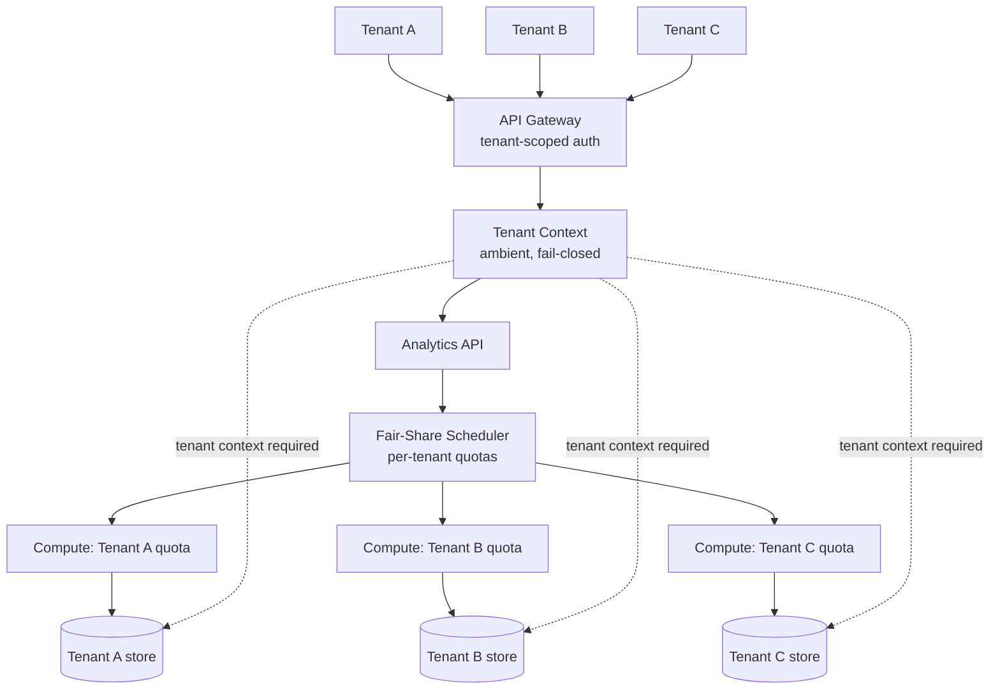
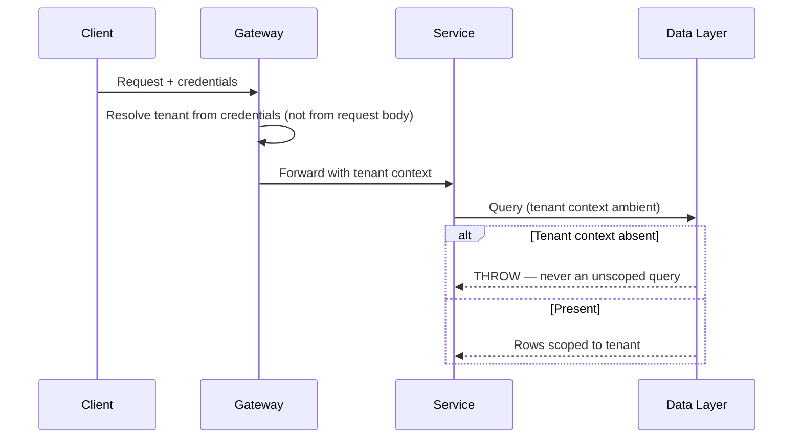
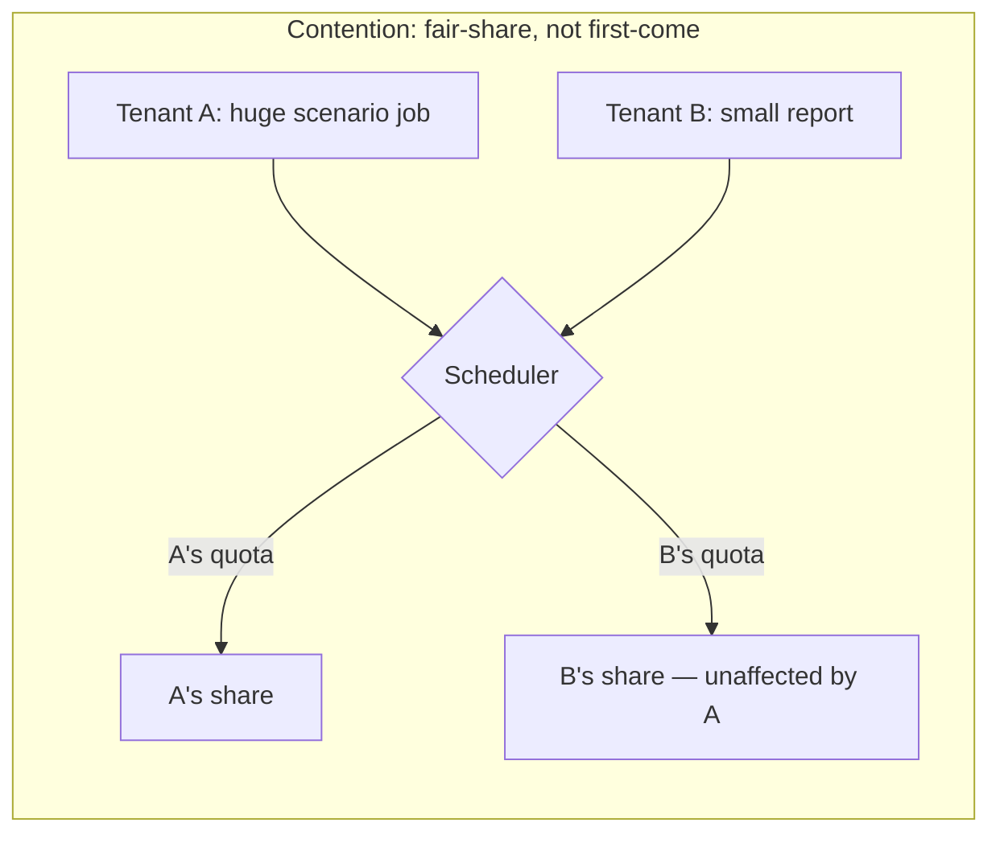
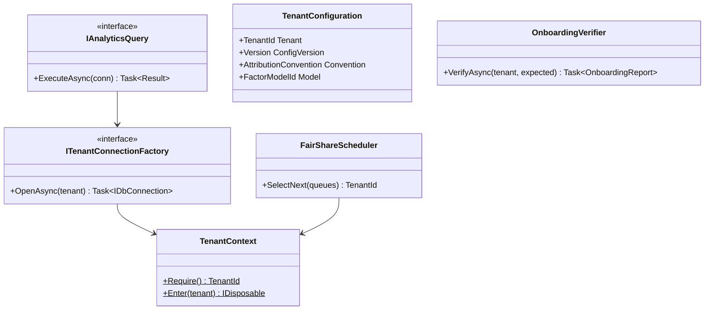

# Module 132 — System Design: Designing a Multi-Tenant Portfolio Analytics Platform

> Domain: System Design | Level: Beginner → Expert | Prerequisite: [[09-Designing-RealTime-Portfolio-Risk-Engine]] (the compute-grid and reproducibility disciplines this platform exposes to external clients), [[../37-Outbox/02-Capstone-SharedMultiTenantOutboxRelayPlatform]] (per-tenant isolation, dedicated capacity, and the noisy-neighbour finding, which this module escalates from internal teams to paying external clients), [[../38-API-Gateway/01-APIGatewayFundamentals-Routing-RateLimiting-AuthEnforcement-Transformation.md]] (tiered rate limiting and defence-in-depth authorization)
>
> **Scenario-module note:** Fourth of six buy-side/capital-markets system-design scenarios (Modules 129–134). Full 16-section template; Elite FinTech Interview Panel lens.

---

## 1. Fundamentals

**What:** A platform that runs portfolio analytics — performance attribution, exposure decomposition, scenario analysis, factor risk — on behalf of many independent institutional clients, each of whom sees only their own data, on shared infrastructure. This is the shape of Aladdin, Charles River, and similar buy-side platforms: one codebase and one operational estate serving competing asset managers simultaneously.

**Why:** The alternative — a separate deployment per client — multiplies operational cost by client count and makes a platform improvement a per-client rollout project. Multi-tenancy is what makes a platform business viable. But the tenants here are frequently **direct competitors**, and the data is their positions and strategies, so isolation is not a hygiene property but the product's core promise. A cross-tenant leak is not an incident; it is an existential event for the platform's business.

**When:** From the first external client. Retrofitting tenancy onto a single-tenant system is among the most dangerous migrations in this course, because the isolation boundary must be enforced everywhere and the failure of any single enforcement point is sufficient — §15 works this decision.

**How (30,000-ft view):**
```
Tenant A ──┐
Tenant B ──┼──► API (tenant-scoped auth) ──► Analytics Engine ──► Tenant-partitioned stores
Tenant C ──┘                                       │
                                          Shared compute, isolated capacity
                                          Shared code, isolated data
```

---

## 2. Deep Dive

### 2.1 The Isolation Spectrum and Where to Sit on It
Multi-tenancy is not binary. The realistic options, in increasing isolation and cost:

- **Shared everything, row-level tenant discriminator.** One database, a `TenantId` column, every query filtered. Cheapest, densest — and one missing `WHERE TenantId = @t` is a cross-tenant leak.
- **Shared infrastructure, separate schemas/databases per tenant.** Isolation enforced at the connection level rather than in every query. More operational overhead; a leak requires connecting to the wrong database, which is a much rarer and more visible bug class.
- **Separate infrastructure per tenant.** Strongest isolation, highest cost, loses most multi-tenancy benefit.

The critical insight is that these differ in **what kind of mistake causes a leak**. Row-level requires every query to be correct forever; connection-level requires the connection routing to be correct once per request. Reducing the number of places a mistake is possible is worth more than it appears, because the cost of the mistake here is unbounded.

### 2.2 Defence in Depth for Tenant Isolation
No single mechanism should be load-bearing. A robust design layers:

1. **Authentication/authorization** establishing tenant identity at the edge (Module 127 §2.3).
2. **Ambient tenant context** propagated through the call stack, never passed as an optional parameter a caller can forget.
3. **Data-layer enforcement** — connection routing (§2.1) or a query interceptor that *fails closed* if tenant context is absent, rather than returning unfiltered results.
4. **Storage-level enforcement** — database row-level security or per-tenant credentials, so even a compromised application layer cannot read across tenants.

The design principle throughout: an unset tenant context must produce an error, never an unscoped query. The default must be *deny*, because the failure mode of defaulting to *allow* is silent and catastrophic.

### 2.3 Noisy Neighbours in an Analytics Workload
Module 126 §4 established the noisy-neighbour risk for a shared relay pool. Analytics escalates it, because the workload is far heavier and more variable: one tenant running a large scenario analysis can consume enormous compute, and unlike the relay case, this is *legitimate use* — the tenant is doing exactly what they pay for.

This makes the problem harder than the Module 126 case, where the offending tenant was in a degraded state. Here the mitigation cannot be "prevent the abnormal condition" but must be structural: per-tenant compute quotas, fair-share scheduling, and priority tiers matched to commercial tiers — the platform must degrade gracefully and *predictably per tenant* under contention rather than letting whoever submits the largest job win.

### 2.4 Tenant-Specific Configuration Without Forking the Code
Institutional clients want their own factor models, their own accounting conventions (multiple valid ways to compute performance attribution), their own reporting formats. The failure mode is per-tenant code branches, which eventually make every change a per-tenant regression risk.

The discipline, directly Module 126 §2.6's genuine-commonality triage: configuration and well-defined extension points for genuine variation; shared core for everything else; a triage process determining which a given request is. A tenant-specific request that cannot be expressed as configuration or a plugin should be pushed back on, not accommodated in the core.

### 2.5 The "Whose Bug Is It" Problem
When a tenant reports wrong analytics output, the cause is roughly equally likely to be a platform defect, the tenant's own input data, or a tenant-specific configuration choice. Unlike a single-tenant system, the platform team cannot simply inspect the data — it belongs to the client, may be commercially sensitive, and support staff should not have blanket access to it.

This shapes the design: the platform needs **tenant-scoped diagnostic tooling** that lets support reason about a calculation without reading raw positions — intermediate-value inspection, calculation-step traces, and input *summaries* rather than raw data. Building this late, after a support burden has already accumulated, is a common and expensive mistake.

### 2.6 Onboarding, Data Migration, and the Long Tail
Each new institutional client arrives with historical data in their own format, their own instrument identifiers, and their own expectations about what history must be available on day one. Onboarding is therefore a data-migration project per client, not a provisioning step — and it is where most of the platform's per-client cost actually lives.

The scalable answer is investment in **canonical ingestion**: well-specified formats, validation with actionable errors, and automated reconciliation confirming migrated history reproduces the client's own reported figures. That last check is what converts onboarding from a trust exercise into a verified one, and its absence is why onboarding disputes are common.

---

## 3. Visual Architecture







---

## 4. Production Example

**Problem:** A platform serving 40 asset managers ran analytics on a shared compute pool with row-level tenant isolation, defended by a query interceptor injecting the tenant filter automatically.

**Architecture:** §3's design, with the interceptor as the primary data-isolation mechanism — a deliberate choice, since automatic injection removes the burden of every developer remembering the filter.

**Implementation:** The interceptor injected `TenantId` into queries built through the ORM. A performance-critical attribution query, hand-written as raw SQL for speed, bypassed the ORM — and therefore the interceptor — but included its own explicit tenant filter, correctly, written by a developer who knew the interceptor did not apply.

**Trade-offs:** Automatic injection is genuinely safer than manual filtering for the common path. Its weakness is that it creates an assumption ("queries are filtered") that raw-SQL paths silently violate.

**Lessons learned:** A later optimization added a `UNION ALL` branch to that raw query to include a secondary data source. The new branch's tenant filter was omitted — an ordinary copy-paste omission. The query returned the requesting tenant's data plus, from the secondary source, **all tenants' data** for that dimension. It reached a production report seen by one client before being noticed, because the report's totals were implausibly large.

The isolation model had been sound; what failed was that it was *not uniformly applicable*, and the exception was invisible at the point where the mistake was made — a developer editing that query saw no signal that they were outside the interceptor's protection.

The fix had three parts: (1) storage-level row-level security as a backstop, so the database itself refuses cross-tenant reads regardless of query construction — the defence-in-depth layer §2.2 prescribes and this system lacked; (2) a test that runs every registered query, under a tenant context, against a database seeded with two tenants' data, asserting no foreign rows are returned — mechanically catching exactly this class of omission; (3) a lint rule flagging raw SQL in the data layer for mandatory review. The generalizable lesson: **a protection mechanism with exceptions is a protection mechanism whose exceptions are where incidents occur**, and the exceptions must be made visible at the point of editing rather than known only to whoever originally wrote them.

---

## 5. Best Practices
- Layer isolation so no single mechanism is load-bearing — application, data-access, and storage-level enforcement together (§2.2).
- Make absent tenant context an error, never an unscoped query; default deny (§2.2).
- Resolve tenant identity from authenticated credentials, never from a request parameter a caller could set (§3).
- Test isolation by seeding two tenants and asserting no foreign rows leak, across every query path (§4).
- Allocate compute per tenant with fair-share scheduling rather than first-come-first-served (§2.3).
- Verify onboarding migrations by reproducing the client's own reported figures, not by trusting the load succeeded (§2.6).

## 6. Anti-patterns
- A single isolation mechanism with exception paths that are invisible where edits happen (§4's incident).
- Resolving tenant from a request-supplied identifier rather than from credentials — a direct IDOR (Module 97).
- Shared compute with no per-tenant quotas, so a legitimate large job degrades every other tenant (§2.3).
- Per-tenant code branches instead of configuration and extension points (§2.4).
- Support staff with blanket access to tenant data as the diagnostic strategy (§2.5).
- Onboarding treated as provisioning rather than a verified data migration (§2.6).

---

## 7. Performance Engineering

**CPU/Memory:** The analytics workload resembles Module 129's — compute-bound, parallelizable — but with the added constraint that resource consumption must be *attributable* per tenant, both for fair-share scheduling and for billing. Instrument at the tenant level from the start; retrofitting attribution is difficult.

**Latency:** Interactive analytics has a genuine UX threshold — beyond a few seconds users context-switch. This differs from Module 129's batch orientation and pushes toward pre-computation of common views.

**Throughput:** Aggregate throughput matters less than per-tenant predictability. A tenant whose reports take 3 seconds today and 40 seconds tomorrow because of another tenant's activity will complain regardless of aggregate efficiency — and be right to.

**Scalability:** Scale by tenant partition. Note that tenants are wildly heterogeneous in size — the largest may be 1000× the smallest — so uniform per-tenant provisioning wastes enormously; capacity must be tiered.

**Benchmarking:** Benchmark under multi-tenant contention, not single-tenant load. A platform that performs well in isolation and poorly under realistic tenant mix has been benchmarked wrong (this is exactly Module 126 §Intermediate Q2's isolation test, applied to a heavier workload).

**Caching:** Cache keys must include tenant identity — a cache is another place the isolation boundary can be crossed, and a cross-tenant cache hit is a leak with the same consequence as a query leak (Module 119 §Intermediate Q5's warning, with higher stakes here).

---

## 8. Security

**Threats:** Cross-tenant data access is the dominant threat and the platform's existential risk, given tenants are frequently competitors. Secondary: privilege escalation within a tenant (a junior analyst accessing a restricted fund), and inference attacks (deducing another tenant's holdings from timing or aggregate statistics).

**Mitigations:** §2.2's layered enforcement; per-tenant encryption keys so a storage-level compromise does not yield all tenants' data; and careful treatment of any cross-tenant aggregate (peer benchmarking is a valuable product feature and an inference risk — it must be sufficiently aggregated that individual contributions cannot be reverse-engineered).

**OWASP mapping:** Broken Object-Level Authorization is the central risk, at tenant granularity. §4's incident is precisely a BOLA failure originating in query construction rather than in an authorization check.

**AuthN/AuthZ:** Two-level — tenant identity (which organization) and intra-tenant role (which funds, which capabilities). Both enforced server-side; intra-tenant roles are frequently overlooked because tenant isolation absorbs attention, but a leak within a tenant is still a serious breach for that client.

**Secrets:** Per-tenant credentials and encryption keys, managed per Module 86, with key rotation that does not require coordinated tenant downtime.

**Encryption:** At rest with per-tenant keys where the isolation model warrants it; in transit universally. Per-tenant keys also enable cryptographic erasure — deleting a tenant's key renders their data unrecoverable, which is a clean answer to offboarding data-deletion obligations.

---

## 9. Scalability

**Horizontal scaling:** By tenant partition, with tiered capacity reflecting tenant size heterogeneity (§7).

**Vertical scaling:** Relevant for the largest tenants, whose single-tenant working sets can exceed comfortable partition sizes.

**Caching:** Per-tenant cache namespaces (§7); pre-computed common views per tenant to meet interactive latency.

**Replication/Partitioning:** Partition primarily by tenant, secondarily by portfolio within large tenants. This makes per-tenant backup, restore, and — importantly — *offboarding* tractable, since a departing client's data is contained rather than interleaved.

**Load balancing:** Requests route by tenant to their assigned partition; the fair-share scheduler (§2.3) governs compute allocation within contention.

**High Availability:** Per-tenant availability targets may differ by commercial tier, which means HA is a product decision as well as an engineering one — and a Principal Engineer should ensure tiering promises are actually implementable before they are sold.

**Disaster Recovery:** Per-tenant restore is a requirement, not merely a capability — a single tenant's corruption must be recoverable without affecting others, which rules out designs where restore is only possible at whole-platform granularity.

**CAP theorem:** Analytics reads favour availability (a slightly stale attribution report is acceptable); the tenant-configuration and entitlement store favours consistency, since a stale entitlement could grant access that has been revoked — the same split-by-consequence reasoning as prior modules, here with the security-relevant path taking the consistent side.

---

## 10. Interview Questions

### Basic (10)

1. **Q: Why is tenant isolation the core product promise rather than a hygiene property here?**
   **A:** Tenants are frequently direct competitors and the data is their positions and strategies; a cross-tenant leak is existential for the platform's business, not merely an incident (§1).
   **Why correct:** Identifies the commercial reality that determines the engineering priority.
   **Common mistakes:** Treating isolation as standard access control of ordinary severity.
   **Follow-ups:** "How does that change the design?" (No single isolation mechanism may be load-bearing, §2.2.)

2. **Q: Name the three points on the isolation spectrum and what distinguishes them.**
   **A:** Shared-everything with a row-level tenant discriminator; shared infrastructure with separate schemas/databases; fully separate infrastructure — differing chiefly in *what kind of mistake* causes a leak (§2.1).
   **Why correct:** Frames the choice by failure mode rather than only by cost.
   **Common mistakes:** Comparing purely on cost and density.
   **Follow-ups:** "What mistake causes a leak at each level?" (A missing query filter; connecting to the wrong database; a network/infrastructure misconfiguration — decreasingly likely and increasingly visible.)

3. **Q: What must happen when tenant context is absent at the data layer?**
   **A:** An error — never an unscoped query. Default deny, because defaulting to allow fails silently and catastrophically (§2.2).
   **Why correct:** States the specific fail-closed requirement and its rationale.
   **Common mistakes:** Returning unfiltered results when context is missing, which is the exact leak condition.
   **Follow-ups:** "Where should this be enforced?" (At multiple layers — data access and storage — so no single omission is sufficient, §2.2.)

4. **Q: Why must tenant identity come from credentials rather than a request parameter?**
   **A:** A request-supplied tenant identifier can be altered by the caller, making cross-tenant access a matter of changing a value — a direct IDOR/BOLA (§3, §8, Module 97).
   **Why correct:** Names the specific attack the design choice prevents.
   **Common mistakes:** Accepting a tenant ID in the request body for convenience in multi-tenant admin tooling.
   **Follow-ups:** "What about legitimate cross-tenant admin access?" (A separate, heavily-audited path with its own authorization, never the ordinary request path.)

5. **Q: How does the noisy-neighbour problem here differ from Module 126's relay case?**
   **A:** There the offending tenant was degraded; here the heavy consumer is doing exactly what they pay for, so the mitigation cannot be preventing an abnormal condition and must be structural — quotas and fair-share scheduling (§2.3).
   **Why correct:** Identifies why the prior module's framing does not fully transfer.
   **Common mistakes:** Treating heavy usage as abuse to be throttled rather than legitimate load to be scheduled fairly.
   **Follow-ups:** "What does 'degrade predictably per tenant' mean?" (Under contention each tenant gets their share rather than whoever submitted the largest job winning, §2.3.)

6. **Q: What is the risk of per-tenant code branches?**
   **A:** Every change becomes a per-tenant regression risk, eventually making the platform unchangeable; configuration and extension points express genuine variation instead (§2.4).
   **Why correct:** States the specific compounding consequence.
   **Common mistakes:** Accommodating each client request in the core to be responsive, accumulating branches.
   **Follow-ups:** "What determines config versus core?" (Module 126 §2.6's genuine-commonality triage — is this needed by others, or genuinely idiosyncratic?)

7. **Q: Why can't support simply inspect tenant data when investigating a reported issue?**
   **A:** The data belongs to the client and is commercially sensitive; blanket support access is itself a breach of the isolation promise, so diagnostics must work without reading raw positions (§2.5).
   **Why correct:** Identifies the constraint that shapes the diagnostic tooling requirement.
   **Common mistakes:** Building support workflows around direct data access, then discovering it is contractually unacceptable.
   **Follow-ups:** "What does tenant-scoped diagnostic tooling provide instead?" (Intermediate values, calculation traces, and input summaries rather than raw data, §2.5.)

8. **Q: Why is onboarding a data-migration project rather than a provisioning step?**
   **A:** Each client arrives with historical data in their own format and identifiers, with expectations about available history — making it a per-client migration where most per-client cost lives (§2.6).
   **Why correct:** Reframes onboarding correctly and identifies where the cost actually is.
   **Common mistakes:** Planning onboarding capacity as account setup, then being overwhelmed by migration work.
   **Follow-ups:** "What converts it from trust to verification?" (Reconciliation reproducing the client's own reported figures from migrated data, §2.6.)

9. **Q: Why must cache keys include tenant identity?**
   **A:** A cache is another place the isolation boundary can be crossed; a cross-tenant cache hit is a leak with the same consequence as a query leak (§7).
   **Why correct:** Identifies caching as an isolation surface, not merely a performance concern.
   **Common mistakes:** Keying caches on the logical query only, which is correct single-tenant and a leak multi-tenant.
   **Follow-ups:** "Which prior module warned about this?" (Module 119 §Intermediate Q5, with lower stakes than here.)

10. **Q: What do per-tenant encryption keys enable at offboarding?**
    **A:** Cryptographic erasure — deleting the key renders that tenant's data unrecoverable, cleanly satisfying deletion obligations without locating every copy (§8).
    **Why correct:** Names the specific operational benefit beyond breach containment.
    **Common mistakes:** Planning deletion as a data-scrubbing exercise across backups, which is slow and hard to prove complete.
    **Follow-ups:** "What must be true for this to work?" (Backups must be encrypted under the same per-tenant key, or they survive the erasure.)

### Intermediate (10)

1. **Q: Walk through §4's incident and identify the design property that made it possible.**
   **A:** Isolation relied primarily on a query interceptor that applied only to ORM-built queries. A raw-SQL path bypassed it, correctly compensating with a manual filter — but when that query was later edited to add a `UNION ALL` branch, the manual filter was not replicated. The enabling property was that the protection had **exceptions invisible at the point of editing**: a developer modifying that query saw nothing indicating they were outside the interceptor's coverage.
   **Why correct:** Locates the root property (invisible exceptions) rather than the proximate omission.
   **Common mistakes:** Attributing it to developer error, which does not explain why this error was possible here and impossible on the ORM path.
   **Follow-ups:** "What made the storage-level backstop the most important fix?" (It is the only layer with no exceptions — it applies regardless of how the query was constructed.)

2. **Q: Design the automated test that catches §4's class of bug.**
   **A:** Seed a test database with two tenants' data, execute every registered query path under tenant A's context, and assert zero rows belonging to tenant B are returned. This is mechanical, covers query paths regardless of construction method, and — critically — catches new query paths automatically if the test enumerates registered queries rather than listing them manually.
   **Why correct:** Specifies a test whose coverage grows with the codebase rather than requiring per-query maintenance.
   **Common mistakes:** Writing per-query isolation tests, which cover today's queries and miss tomorrow's.
   **Follow-ups:** "Why does enumeration matter more than assertion strength?" (An unenumerated query is untested regardless of how strong the assertions are on the tested ones.)

3. **Q: How would you allocate compute under contention across commercial tiers?**
   **A:** Weighted fair-share: each tenant has a guaranteed minimum reflecting their tier, with unused capacity redistributed to active tenants proportionally. This satisfies both requirements — a paying tenant always gets at least their entitlement regardless of others' activity, and idle capacity is not wasted (§2.3).
   **Why correct:** Meets the guarantee and efficiency requirements simultaneously rather than trading one away.
   **Common mistakes:** Hard partitioning (guarantees met, capacity wasted) or pure first-come (efficient, guarantees violated).
   **Follow-ups:** "What must be true for redistribution to be safe?" (Reclaimable work — a tenant's borrowed capacity must be surrenderable when the owner becomes active, which requires preemptible or short-lived tasks.)

4. **Q: Critique building peer-benchmarking (comparing a tenant against anonymized peers) as a product feature.**
   **A:** Genuinely valuable and a real inference risk: with few peers in a category, or with a tenant able to query repeatedly across slices, individual contributions can be reverse-engineered — reconstructing a competitor's holdings from aggregates. Mitigations are minimum-cohort-size thresholds, suppression of small cells, and limiting query granularity; these constrain the feature's usefulness, which is the honest trade rather than a solved problem.
   **Why correct:** Recognizes the feature's value, names the specific attack, and acknowledges mitigations cost utility.
   **Common mistakes:** Treating anonymization as sufficient, when repeated differenced queries defeat naive anonymization.
   **Follow-ups:** "What is the differencing attack?" (Query an aggregate with and without a known member; the difference reveals that member's contribution — which is why per-query suppression is insufficient without cross-query controls.)

5. **Q: Why does tenant size heterogeneity complicate capacity planning?**
   **A:** The largest tenant may be 1000× the smallest, so uniform per-tenant provisioning either starves the large or massively over-provisions the small; capacity must be tiered and, for the largest tenants, individually planned (§7, §9).
   **Why correct:** Identifies the specific ratio problem that defeats uniform provisioning.
   **Common mistakes:** Planning per-tenant averages, which describes no actual tenant.
   **Follow-ups:** "What operational consequence follows?" (The largest tenants may warrant dedicated partitions, blurring toward the isolation spectrum's higher end for them specifically, §2.1.)

6. **Q: Design diagnostic tooling that lets support investigate without reading raw positions.**
   **A:** Expose the calculation as an inspectable pipeline: input summaries (counts, aggregates, date ranges — not holdings), intermediate values at each stage, the configuration and model versions used (Module 129 §2.6's provenance), and the specific step where a value diverges from expectation. Most support investigations resolve to a configuration difference or an input-completeness issue, both diagnosable from summaries.
   **Why correct:** Provides what actually resolves the common cases without requiring raw-data access.
   **Common mistakes:** Building only raw-data inspection, then needing contractual exceptions to use it.
   **Follow-ups:** "When is raw access unavoidable?" (Genuinely rare — and should then be an audited, time-boxed, client-approved escalation rather than a standing capability.)

7. **Q: Why does the entitlement store take the consistent side while analytics reads take the available side?**
   **A:** A stale analytics result is a slightly outdated report; a stale entitlement could grant access that has been revoked — a security failure. Consequence-of-staleness differs sharply, so the CAP posture differs (§9).
   **Why correct:** Applies the established per-consumer CAP reasoning with the security-relevant path correctly identified.
   **Common mistakes:** One uniform posture, typically available, which quietly makes revocation eventually-consistent.
   **Follow-ups:** "How quickly must revocation take effect?" (Immediately for the security case — which is precisely why that path cannot tolerate the staleness the analytics path can.)

8. **Q: What makes retrofitting multi-tenancy onto a single-tenant system dangerous?**
   **A:** The isolation boundary must be enforced at every data access, and the failure of any single one is sufficient for a leak — so the migration's risk is proportional to the number of existing access paths, all of which were written without tenant awareness (§1, §15).
   **Why correct:** Identifies why risk scales with existing code rather than with the new work.
   **Common mistakes:** Estimating the retrofit by the tenancy feature's size rather than by the audit surface it creates.
   **Follow-ups:** "What reduces the risk most?" (Storage-level enforcement, which is a single chokepoint independent of how many application paths exist, §4's fix.)

9. **Q: How should per-tenant restore work, and why is it a requirement rather than a nice-to-have?**
   **A:** A single tenant's corruption or erroneous bulk update must be recoverable without affecting others — which requires backup granularity at the tenant level, ruling out designs where restore is only possible platform-wide. Without it, one tenant's mistake makes every tenant choose between their data and that tenant's recovery (§9).
   **Why correct:** States the requirement and the unacceptable alternative that makes it non-optional.
   **Common mistakes:** Platform-wide snapshot backups, adequate until the first per-tenant restore request.
   **Follow-ups:** "What does this imply about partitioning?" (Tenant must be the primary partition key so a tenant's data is contained rather than interleaved, §9.)

10. **Q: Synthesize how this module's isolation problem relates to Module 126's.**
    **A:** Module 126 isolated internal teams sharing an Outbox relay; the failure was performance interference and the fix was dedicated capacity. Here tenants are external competitors and the dominant failure is *data* leakage, not performance — so capacity isolation (which this module also needs, §2.3) is the lesser concern, and the defining requirement is that no code path can read across the boundary. Same structural pattern, materially higher stakes, and a different dominant failure mode.
    **Why correct:** Identifies both the shared structure and the specific escalation.
    **Common mistakes:** Treating this as Module 126 with more tenants, missing that data leakage rather than interference is now the dominant risk.
    **Follow-ups:** "Which of Module 126's controls transfer directly?" (Per-tenant capacity and configuration; what must be added is the layered data-isolation enforcement §2.2 describes.)

### Advanced (10)

1. **Q: Diagnose §4's incident and design the complete structural fix.**
   **A:** Root cause: a single isolation mechanism with exceptions that were invisible at the point of editing (Intermediate Q1). Fix: (1) storage-level row-level security as a backstop applying regardless of query construction — the layer with no exceptions; (2) an enumerating isolation test seeding two tenants and asserting no foreign rows across every registered query path (Intermediate Q2); (3) a lint rule flagging raw SQL in the data layer for mandatory review, making the exception visible where edits occur; (4) per-tenant database credentials so the application's connection cannot read other tenants' rows even if a query is malformed — moving from "the query is filtered" to "the connection cannot see it."
   **Why correct:** Addresses the proximate omission, the invisible-exception property, and adds two independent layers so no single mechanism is load-bearing.
   **Common mistakes:** Fixing only the specific query, leaving the invisible-exception property to produce the next incident on a different raw path.
   **Follow-ups:** "Why is (4) stronger than (1)?" (Row-level security still depends on correct policy configuration; per-tenant credentials make cross-tenant reads impossible at the connection level, a simpler and more auditable guarantee.)

2. **Q: A large prospective client demands their data be physically separate. Evaluate.**
   **A:** Legitimate and common. The honest response is to offer it as a distinct deployment tier at a price reflecting its cost, rather than either refusing (losing the client) or accommodating it invisibly (absorbing an unfunded operational burden that grows with each such client). The engineering consequence is that the platform must support both models from one codebase — which is achievable if isolation is already enforced at the connection level (§2.1), since a dedicated database is then a configuration difference rather than an architectural fork.
   **Why correct:** Treats it as a commercial-tier decision with a specific engineering precondition rather than a binary yes/no.
   **Common mistakes:** Accommodating ad hoc, creating a bespoke deployment nobody budgeted to maintain.
   **Follow-ups:** "What if isolation is currently row-level?" (Then this request is an architectural change, not a configuration one — which is the strongest practical argument for connection-level isolation from the start, §15.)

3. **Q: Critique using a tenant-supplied identifier for cache keys as a shortcut.**
   **A:** It moves an isolation-critical value into caller control — the same flaw as §3's request-parameter tenancy, now at the cache layer where it is less visible. A caller supplying another tenant's key retrieves their cached results, bypassing every query-layer control entirely, because the data never reaches the query layer at all. Cache keys must derive from authenticated context (§7, §8).
   **Why correct:** Identifies that the cache bypasses the layer where other controls live, making this leak path independent of query correctness.
   **Common mistakes:** Considering the cache an internal implementation detail outside the isolation boundary.
   **Follow-ups:** "How would an isolation test catch this?" (Intermediate Q2's test must exercise the cached path with a warm cache, not only cold — a cold-cache-only test never touches the cache-key logic.)

4. **Q: Design the onboarding reconciliation that verifies a migration.**
   **A:** Compute, from migrated data, the figures the client already reports themselves — historical performance, period returns, holdings as of known dates — and compare against the client's own published or supplied values within tolerance. Differences are then triaged as data mapping (most common), convention differences (the client computes attribution differently — §2.4's configuration variation), or genuine migration error. This converts onboarding sign-off from "the load completed" into "we reproduce your numbers," which is the only assurance that actually matters to the client.
   **Why correct:** Specifies an independent, client-meaningful check and its triage categories.
   **Common mistakes:** Validating row counts and referential integrity, which confirms the load ran but not that it is right.
   **Follow-ups:** "What is the most common cause of a break?" (Convention differences rather than errors — which is why the triage step matters and why an unexplained break is not automatically a defect.)

5. **Q: How should the platform handle a tenant requesting a feature that would require core changes?**
   **A:** Apply Module 126 §2.6's triage: has this or similar been requested by others (suggesting genuine commonality worth building into the core), or is it idiosyncratic (suggesting an extension point)? If neither fits and the request cannot be expressed through configuration, the honest answer is to decline or to price it as bespoke work with an owner — because the alternative, a per-tenant core branch, imposes a permanent tax on every future change for every tenant (§2.4).
   **Why correct:** Applies the established triage and names the real cost of accommodating without it.
   **Common mistakes:** Accommodating to preserve the relationship, then discovering the platform has become unchangeable.
   **Follow-ups:** "How do you decline without damaging the relationship?" (By making the shared-platform trade explicit: the same property that keeps their costs low and their upgrades free is what constrains bespoke changes.)

6. **Q: A client asks how the platform guarantees their data is never visible to competitors. Answer honestly.**
   **A:** Describe the layers concretely — authentication-derived tenant context that fails closed, per-tenant database credentials making cross-tenant reads impossible at the connection level, storage-level row policies as a backstop, per-tenant encryption keys limiting the blast radius of a storage compromise, and continuous automated isolation testing (Advanced Q1). Then state the residual honestly: no architecture eliminates the possibility of a defect, which is why the design assumes any single layer may fail and requires multiple simultaneous failures for a leak — and why the isolation test runs continuously rather than at release only.
   **Why correct:** Gives specific layered mechanisms and frames the guarantee as defence-in-depth with a stated residual, rather than claiming impossibility.
   **Common mistakes:** Claiming leaks are impossible, which no informed client believes and which collapses badly if an incident later occurs.
   **Follow-ups:** "What would you offer a client who wants more assurance?" (Independent penetration testing scoped to tenant isolation, and Advanced Q2's dedicated-infrastructure tier if their risk appetite genuinely requires it.)

7. **Q: Design the control preventing a support engineer's legitimate access from becoming a standing leak.**
   **A:** Time-boxed, purpose-bound, client-approved elevation: access granted for a specific ticket, expiring automatically, logged immutably with the accessing identity and justification, and — where the client's contract requires it — notified to the client. The key property is that it is *exceptional and expiring* rather than a role someone holds; a standing support role with tenant-data access is functionally a permanent cross-tenant read capability held by a group whose membership drifts over time.
   **Why correct:** Identifies that the danger is standing access and membership drift, not the access itself.
   **Common mistakes:** A "support" role with broad read access, which is convenient and becomes an unbounded liability as the team changes.
   **Follow-ups:** "Why does client notification matter?" (It converts the platform's access from something the client trusts blindly into something they can audit — which is the only basis on which it is genuinely acceptable.)

8. **Q: Apply this course's "declared ≠ actual" theme to this platform.**
   **A:** The claim is "each tenant sees only their own data." Its declared basis is typically that the code filters by tenant. §4 showed that basis is insufficient: filtering can be bypassed on exception paths, cached across boundaries (Advanced Q3), or leaked through aggregates (Intermediate Q4). What distinguishes this module is that the failure is **silent to both parties** — the leaking platform sees a successful query and the receiving tenant sees data they cannot tell is foreign. Unlike Module 131's external reconciliation or Module 129's recomputation, there is no external party holding the truth against which to check; the only verification is adversarial testing the platform performs against itself (Intermediate Q2).
   **Why correct:** Identifies the specific insufficiency and the distinguishing property — no external check exists, so self-testing is the only verification.
   **Common mistakes:** Assuming a client would notice receiving foreign data; §4 shows it was noticed only because totals were implausible, which is luck rather than control.
   **Follow-ups:** "What follows from having no external checker?" (The isolation test must be treated as the platform's most important test, not one test among many — it is the sole verification of the core product promise.)

9. **Q: Design the monitoring that would detect a leak in progress.**
   **A:** Hard, because a leak looks like a successful query. The available signals are indirect: result-set sizes anomalous for a tenant's known data volume (§4 was noticed this way, by a human); queries returning rows whose tenant attribution differs from the request context, checked at the data layer as an assertion rather than a filter; and access-pattern anomalies. The honest assessment is that detection is weak and prevention must therefore carry the load — which is itself the argument for §2.2's layering, since a class of failure you cannot reliably detect must be one you make structurally difficult.
   **Why correct:** Honestly assesses detection as weak and derives the correct implication rather than proposing monitoring that would not work.
   **Common mistakes:** Proposing detection as the primary control, when the failure produces no reliable signal.
   **Follow-ups:** "What is the single most valuable runtime check?" (A data-layer assertion that every returned row's tenant matches the request context — it converts a silent leak into a loud error at the moment it occurs.)

10. **Q: Synthesize the governance program required before onboarding the first external tenant.**
    **A:** (1) Layered isolation — authenticated tenant context failing closed, per-tenant credentials, storage-level policies (Advanced Q1). (2) Continuously-run enumerating isolation test across all query paths including cached ones (Intermediate Q2, Advanced Q3). (3) Data-layer row-attribution assertions converting silent leaks into errors (Advanced Q9). (4) Time-boxed, audited, client-visible support access (Advanced Q7). (5) Per-tenant quotas and fair-share scheduling before contention arises, not after (§2.3). (6) Onboarding reconciliation reproducing client-reported figures (Advanced Q4). (7) Per-tenant restore and cryptographic erasure, proven by rehearsal rather than assumed (§9, §8). (8) A triage process for tenant-specific requests preventing core forking (Advanced Q5).
    **Why correct:** Assembles a program covering isolation, verification, operations, and the commercial-pressure control that protects the codebase long-term.
    **Common mistakes:** Presenting isolation architecture without the continuous verification and support-access controls, which are where isolation actually erodes over time.
    **Follow-ups:** "Which item is most often deferred and most regretted?" (Per-tenant quotas — contention seems hypothetical until the platform has enough tenants that it is constant, by which point retrofitting scheduling into a saturated system is far harder.)

### Expert (10)

1. **Q: Evaluate the build-versus-buy decision for a firm considering this platform rather than building analytics in-house.**
   **A:** The buy case is strong for the same reason Module 131's was: the non-differentiating surface is enormous — instrument coverage across asset classes, pricing models, corporate-action handling, data vendor integrations, regulatory reporting — and each requires perpetual maintenance as markets change. The build case is narrow: a firm whose *investment process itself* depends on proprietary analytics no vendor offers. The mature pattern is buy the platform, build the proprietary layer against its extension points — which is precisely why §2.4's extension-point design matters commercially, not merely architecturally: it is what makes the platform viable for clients who need some proprietary logic.
   **Why correct:** Identifies the non-differentiating surface as decisive and connects extension-point design to the platform's own commercial viability.
   **Common mistakes:** Building in-house for control, then carrying instrument-coverage and corporate-action maintenance permanently.
   **Follow-ups:** "What does this imply about the platform's extension points?" (They are a first-class product feature, since clients with proprietary needs cannot adopt a platform that cannot accommodate them.)

2. **Q: How should the platform handle a tenant whose usage grows to threaten the shared infrastructure?**
   **A:** This is a commercial conversation with an engineering deadline, and delaying it is the error. Options: move them to dedicated infrastructure at appropriate pricing (Advanced Q2); enforce their contractual quota (which requires the quota to have been set at contracting, not retrofitted); or invest in capacity funded by their growth. What fails is absorbing the growth silently until other tenants degrade — which converts a commercial issue into an incident affecting clients who did nothing wrong.
   **Why correct:** Frames it as a commercial decision with engineering constraints and names the specific failure of inaction.
   **Common mistakes:** Absorbing growth to preserve the relationship, degrading other tenants who then have a legitimate complaint.
   **Follow-ups:** "What should have happened earlier?" (Quotas defined at contracting so growth beyond them is a priced conversation rather than a surprise, §2.3.)

3. **Q: Design cross-tenant analytics for the platform's own product development without violating isolation.**
   **A:** Genuinely useful (understanding feature usage, performance characteristics) and genuinely dangerous. The workable form is strictly aggregated, k-anonymous metrics computed by a separate pipeline with no path back to individual tenant data, with cohort-size minimums (Intermediate Q4), and — critically — governed by explicit contractual permission rather than assumed. Many client agreements prohibit it outright, so the legal position must be established before the engineering, which is the reverse of the usual order and frequently overlooked.
   **Why correct:** Identifies both the value and the contractual precondition that usually decides feasibility.
   **Common mistakes:** Building usage analytics as ordinary product telemetry without checking whether client agreements permit it.
   **Follow-ups:** "Why is aggregation alone insufficient?" (Intermediate Q4's differencing attacks, plus the contractual question which aggregation does not address.)

4. **Q: How does per-tenant configuration interact with platform upgrades?**
   **A:** Every configuration dimension multiplies the upgrade test matrix, and combinations that no single tenant uses but two tenants collectively exercise are the ones that break. The disciplines that keep this tractable: constrain configuration to a bounded, well-specified set (not free-form); test the actual combinations in use rather than the theoretical space; and stage upgrades by tenant cohort (Module 126 Advanced Q5's canary staging), so a configuration-specific regression affects one cohort rather than all.
   **Why correct:** Identifies combinatorial growth as the mechanism and gives three concrete containment disciplines.
   **Common mistakes:** Testing configuration dimensions independently, missing interaction effects that only appear in real combinations.
   **Follow-ups:** "Which cohort should upgrade first?" (Smaller, lower-risk tenants with configurations representative of common cases — never the largest client, whose configuration is usually the most unusual.)

5. **Q: A tenant's analytics disagree with their custodian's figures. Walk through the investigation.**
   **A:** Establish which layer disagrees before assuming a platform defect: are the *inputs* the same (positions and prices as of the same instant — often not, and often the whole explanation); is the *convention* the same (multiple valid attribution and accounting treatments exist, §2.4); or is the *calculation* genuinely different? Use the diagnostic tooling's intermediate values (Intermediate Q6) to locate the first divergent step. As with Modules 129 and 131, most disputes resolve to inputs or conventions, and the reproducibility metadata is what makes the investigation possible at all.
   **Why correct:** Sequences from most to least likely cause and reuses the established provenance-as-diagnostic-instrument pattern.
   **Common mistakes:** Auditing the calculation engine first — least likely, most expensive.
   **Follow-ups:** "Why are convention differences so common?" (There is no single correct performance-attribution methodology; the client and custodian may both be right under different, equally valid conventions.)

6. **Q: Evaluate running this platform across multiple cloud regions for global clients.**
   **A:** Driven primarily by data residency rather than latency. Many jurisdictions require client data to remain in-region, which makes regional deployment a compliance requirement rather than a performance optimization — and it interacts sharply with tenancy: a tenant's data must be pinned to their required region, so tenant-to-region assignment becomes part of the isolation model. The failure mode to design against is a global service inadvertently reading cross-region and violating residency, which is a compliance breach even without any cross-*tenant* leak.
   **Why correct:** Identifies residency as the driver and the specific compliance failure distinct from tenant leakage.
   **Common mistakes:** Treating multi-region as a latency optimization, then discovering residency constraints require it anyway with different design implications.
   **Follow-ups:** "How does this constrain shared services?" (Any global service — a shared cache, a central scheduler — must be region-aware or it becomes the residency violation path.)

7. **Q: Design the platform's approach to a tenant offboarding.**
   **A:** Contractually specified data return in an agreed format (often extensive — clients want their full history), followed by verified deletion. Cryptographic erasure (§8) makes deletion provable where per-tenant keys exist. The commonly-missed elements: backups and derived stores (caches, read models, analytics extracts) must be covered, since deletion from the primary store alone leaves copies; and the deletion must be *evidenced*, since the client will require attestation. Offboarding is a designed capability, not an operational improvisation.
   **Why correct:** Covers return, deletion, the derived-copy problem, and the evidence requirement.
   **Common mistakes:** Deleting the primary store only, leaving data in backups and derived stores that the attestation implicitly and wrongly covers.
   **Follow-ups:** "Why does per-tenant partitioning matter here?" (§9 — it makes locating every copy tractable; interleaved data makes complete deletion difficult to perform and harder to prove.)

8. **Q: How would you migrate the platform from row-level to connection-level isolation?**
   **A:** Incrementally and additively: introduce per-tenant credentials and route connections by tenant while *retaining* existing row-level filters, so the two mechanisms overlap rather than switch. Verify with the isolation test (Intermediate Q2) under the new routing, then optionally retire the row filters — or, better, keep them as the defence-in-depth layer §2.2 prescribes. The additive sequencing means no window exists where isolation depends on the new, unproven mechanism alone, which is exactly the Parallel Run discipline Modules 107, 122, and 126 established.
   **Why correct:** Sequences additively so isolation is never weakened during migration, applying the established migration pattern.
   **Common mistakes:** Switching mechanisms, creating a window where the new path's correctness is untested and the old protection is gone.
   **Follow-ups:** "Why keep both permanently?" (§2.2 — no single mechanism should be load-bearing, and the row filter costs almost nothing once written.)

9. **Q: A prospective client asks for a contractual guarantee of zero cross-tenant data access. How do you advise?**
   **A:** Advise against an absolute guarantee and toward specific, verifiable commitments: the layered controls (Advanced Q6), independent testing, incident notification obligations, and defined remedies. An absolute guarantee is both undeliverable and, if breached, worse than a well-specified commitment — because it forecloses the honest conversation about defence-in-depth that a sophisticated client will actually find more credible. This is the same posture as Module 118 §Expert Q7 and Module 129 §Advanced Q6: a bounded, evidenced claim outperforms an unqualified one.
   **Why correct:** Recommends the commercially and technically honest position with a consistent rationale.
   **Common mistakes:** Accepting the absolute guarantee to win the deal, creating an obligation no engineering practice can satisfy.
   **Follow-ups:** "What convinces a sophisticated client?" (Evidence of layered controls and continuous testing — a specific description of what would have to fail simultaneously is more persuasive than an assertion that nothing will.)

10. **Q: Deliver the closing synthesis: what makes multi-tenant analytics distinctively hard?**
    **A:** Not the analytics — computationally it is Module 129 with different outputs. Two properties define it. First, **the dominant failure has no natural detector**: a cross-tenant leak produces a successful query, satisfied logs, and a recipient who cannot tell the data is foreign (Advanced Q8, Q9) — and unlike Modules 129–131, no external party holds the truth to reconcile against, so the only verification is the platform adversarially testing itself. Second, **commercial pressure acts directly on the architecture**: every client wants bespoke behaviour, dedicated resources, and absolute guarantees, and each accommodation individually seems reasonable while collectively making the platform unchangeable, unprofitable, or over-promised. The engineering difficulty is therefore inseparable from the commercial discipline — which is why §2.4's triage, §2.3's quotas, and Expert Q9's guarantee posture are architectural decisions as much as business ones, and why a Principal Engineer here spends as much effort defending the shared platform's integrity against reasonable-sounding requests as on the system itself.
    **Why correct:** Identifies both distinguishing properties, including the unusual one — commercial pressure as a direct architectural force — and explains why they are inseparable.
    **Common mistakes:** Designing the isolation architecture well while treating tenant-specific requests, quotas, and guarantees as someone else's problem, which is how a technically sound platform becomes commercially unmaintainable.
    **Follow-ups:** "How does the next module differ?" (Module 133's regulatory reporting shares the no-natural-detector property but replaces commercial pressure with an immovable external deadline — correctness under time constraint rather than under commercial constraint.)

---

## 11. Coding Exercises

### Easy — Fail-Closed Tenant Context (§2.2)
**Problem:** Ensure an absent tenant context can never produce an unscoped query.
**Solution:**
```csharp
public sealed class TenantContext
{
    private static readonly AsyncLocal<TenantId?> Current = new();

    public static TenantId Require() =>
        Current.Value ?? throw new MissingTenantContextException(
            "No tenant context — refusing to execute an unscoped query.");

    public static IDisposable Enter(TenantId tenant)
    {
        Current.Value = tenant;
        return new Scope(() => Current.Value = null);
    }
}
```
**Time complexity:** O(1).
**Space complexity:** O(1) per async flow.
**Optimized solution:** Combine with per-tenant connection resolution (Advanced Q1) so `Require()` selects the tenant's credentials rather than merely supplying a filter value — moving from "the query is filtered" to "the connection cannot see other tenants."

### Medium — Enumerating Isolation Test (§4, Intermediate Q2)
**Problem:** Assert no query path returns foreign-tenant rows, covering paths added in future.
**Solution:**
```csharp
[Theory]
[MemberData(nameof(AllRegisteredQueries))]   // enumerated, not hand-listed
public async Task Query_ReturnsNoForeignTenantRows(IQueryDescriptor query)
{
    await _seed.TwoTenantsAsync(TenantA, TenantB);

    using (TenantContext.Enter(TenantA))
    {
        var rows = await query.ExecuteAsync(_db);
        Assert.All(rows, r => Assert.Equal(TenantA, r.TenantId));
        Assert.NotEmpty(rows); // guard: a query returning nothing proves nothing
    }
}
```
**Time complexity:** O(q × r) for q queries returning r rows.
**Space complexity:** O(r).
**Optimized solution:** Run the same suite twice with the cache warm and cold, since Advanced Q3's cache-key leak is invisible to a cold-cache-only run.

### Hard — Weighted Fair-Share Scheduler (§2.3, Intermediate Q3)
**Problem:** Guarantee each tenant their entitlement while redistributing idle capacity.
**Solution:**
```csharp
public TenantId? SelectNext(IReadOnlyDictionary<TenantId, TenantQueue> queues)
{
    // Deficit round-robin: each tenant accrues credit proportional to weight,
    // spends it when scheduled — guaranteeing share without wasting idle capacity.
    TenantId? best = null;
    double bestDeficit = double.NegativeInfinity;

    foreach (var (tenant, q) in queues.Where(kv => kv.Value.HasWork))
    {
        var deficit = _credit[tenant] / _weight[tenant];
        if (deficit > bestDeficit) { bestDeficit = deficit; best = tenant; }
    }

    if (best is not null) _credit[best] -= queues[best].PeekCost();
    foreach (var t in queues.Keys) _credit[t] += _weight[t] * _replenishRate;
    return best;
}
```
**Time complexity:** O(t) per scheduling decision for t tenants.
**Space complexity:** O(t).
**Optimized solution:** Use a priority queue keyed on normalized deficit to make selection O(log t), which matters once tenant count is large enough that per-decision linear scanning appears in profiles.

### Expert — Onboarding Reconciliation (Advanced Q4)
**Problem:** Verify migrated data reproduces the client's own reported figures.
**Solution:**
```csharp
public async Task<OnboardingReport> VerifyAsync(TenantId tenant, IReadOnlyList<ClientReportedFigure> expected)
{
    var breaks = new List<Break>();
    foreach (var fig in expected)
    {
        var computed = await _analytics.ComputeAsync(tenant, fig.Metric, fig.AsOf, fig.PortfolioId);
        var relative = Math.Abs(computed - fig.Value) / Math.Max(Math.Abs(fig.Value), 1m);

        if (relative > _tolerance)
            breaks.Add(new Break(fig, computed, relative, Classify(fig, computed)));
    }
    return new OnboardingReport(tenant, breaks, expected.Count);
}

private BreakCause Classify(ClientReportedFigure fig, decimal computed) =>
    _conventionDiffDetector.IsExplainedByConvention(fig, computed)
        ? BreakCause.ConventionDifference     // not a defect — expected and explainable
        : BreakCause.RequiresInvestigation;
```
**Time complexity:** O(n) client-reported figures, each an analytics computation.
**Space complexity:** O(b) for breaks found.
**Optimized solution:** Classify breaks automatically against known convention variants (§2.4), so onboarding staff triage only genuinely unexplained differences rather than every numerical mismatch — most of which are legitimate convention differences.

---

## 12. System Design

**Functional requirements**
- Serve performance attribution, exposure decomposition, scenario analysis, and factor risk per tenant.
- Enforce strict tenant isolation across all data access, caching, and compute.
- Support per-tenant configuration (models, conventions, report formats) without core forking (§2.4).
- Onboard new tenants with verified historical migration (§2.6).
- Provide tenant-scoped diagnostics usable without raw-data access (§2.5).

**Non-functional requirements**
- Zero cross-tenant data exposure — the platform's existential requirement.
- Per-tenant performance predictability under contention (§2.3).
- Interactive analytics latency within a few seconds for common views.
- Per-tenant restore and provable deletion (§9, Expert Q7).

**Capacity estimation**
- 40 tenants; largest ~1000× smallest in portfolio count.
- Aggregate ~120k portfolios, ~25M positions.
- Interactive queries ~50/s aggregate, bursty at reporting periods (month-end concentrates load heavily).
- Heavy scenario jobs: ~200/day, each potentially 10⁴–10⁶ pricing calls (Module 129 §2.1's multiplicative workload).
- **The sensitivity that matters:** month-end concentration. Every tenant reports on similar cycles, so demand is not smooth — the platform sees its peak simultaneously across tenants, which is precisely when fair-share scheduling matters most and when per-tenant guarantees are hardest to honour.

**Architecture:** §3 — gateway-terminated tenant authentication, ambient fail-closed tenant context, fair-share-scheduled compute over tenant-partitioned stores.

**Components:** Tenant context propagation; per-tenant credentialed data access; fair-share scheduler; analytics engine (Module 129's grid disciplines); tenant configuration store; onboarding pipeline with reconciliation; tenant-scoped diagnostic tooling.

**Database selection:** Per-tenant schemas or databases (§2.1's connection-level isolation) on shared infrastructure; analytical results in a columnar store partitioned by tenant; configuration in a bitemporal relational store, versioned so a result records the configuration that produced it (Module 129 §2.6's provenance).

**Caching:** Per-tenant namespaced caches with keys derived from authenticated context (Advanced Q3); pre-computed common views per tenant to meet interactive latency.

**Messaging:** Analytics job submission and completion via a queue with per-tenant fair-share consumption; results published to tenant-scoped subscribers.

**Scaling:** Tiered per-tenant capacity reflecting size heterogeneity (§7); largest tenants may warrant dedicated partitions (Intermediate Q5).

**Failure handling:** Fail-closed tenant context (§11 Easy); row-attribution assertions converting silent leaks to errors (Advanced Q9); per-tenant restore (§9); quota enforcement preventing one tenant's failure or growth from cascading.

**Monitoring:** Per-tenant latency and throughput (never aggregate-only — Module 126 §2.4's finding); isolation-test results as a continuously-reported signal; quota utilization per tenant as a leading indicator of Expert Q2's commercial conversation.

**Trade-offs:** Connection-level isolation costs operational overhead versus row-level density, justified because it reduces the number of places a leak-causing mistake is possible (§2.1, §15). Fair-share scheduling costs some throughput versus first-come, justified by per-tenant predictability being the product promise (§2.3).

---

## 13. Low-Level Design

**Requirements:** Tenant context cannot be absent; data access is credentialed per tenant; scheduling honours weighted shares; configuration is versioned and recorded with results.

**Class diagram:**


**Sequence diagram:** §3's second diagram — the fail-closed data-access path.

**Design patterns used:** Ambient Context (tenant propagation); Abstract Factory (per-tenant connection resolution); Strategy (attribution conventions per tenant configuration); Bulkhead (per-tenant compute quotas); Interceptor (query-layer tenant enforcement, with §4's caveat that interceptors must not have invisible exceptions).

**SOLID mapping:** Single Responsibility (context propagation, connection resolution, and scheduling are separate); Open/Closed (a new attribution convention adds a Strategy; a new tenant adds configuration — neither touches the core); Liskov (every convention implementation must satisfy the same reproducibility and provenance contract, contract-tested per Module 117); Interface Segregation (query and configuration interfaces separate); Dependency Inversion (queries depend on `ITenantConnectionFactory`, which structurally cannot produce an unscoped connection — §11 Easy's optimization).

**Extensibility:** A new tenant is configuration plus onboarding migration; a new analytic is a query registered into the enumerated set (which automatically brings it under the isolation test, §11 Medium — the extensibility and the safety mechanism are deliberately coupled).

**Concurrency/thread safety:** Tenant context uses `AsyncLocal` so it flows correctly across async boundaries without being passed explicitly — the mechanism that makes "forgetting to pass tenant" unrepresentable. The scheduler's credit accounting is the one shared mutable structure and requires synchronization; everything else is per-request or per-tenant isolated.

---

## 14. Production Debugging

**Incident:** During month-end, several tenants reported analytics requests timing out. Aggregate CPU utilization across the compute pool was ~55% — apparently ample headroom — yet requests were queuing.

**Root cause:** The fair-share scheduler allocated *task slots* per tenant, but tasks were wildly heterogeneous in memory footprint. One tenant's month-end scenario jobs each held a large in-memory position set. Their slot allocation was correctly within share, but their memory consumption exhausted the pool's memory long before CPU saturated. Workers on memory-pressured nodes began GC-thrashing, so tasks ran far slower without failing — and because CPU was the monitored saturation signal, the pool appeared healthy.

**Investigation:** The CPU-versus-queueing contradiction was the entry point. Per-node memory metrics showed pressure concentrated on nodes running that tenant's tasks; correlating task-to-node placement identified the tenant; examining task memory profiles showed the position-set footprint. The scheduler was working exactly as designed — against the wrong resource.

**Tools:** Per-node memory and GC metrics (which existed but were not part of the saturation dashboard); task-to-node placement correlation; per-tenant task memory profiling.

**Fix:** Multi-dimensional scheduling — tasks declare estimated memory alongside CPU cost, and the scheduler enforces share against both, refusing placement where memory would be exceeded even if CPU slots are free.

**Prevention:** (1) Saturation monitoring covering every constrained resource, not only CPU — the incident's core lesson is that a fair-share guarantee is only as good as the completeness of the resources it accounts for. (2) Require memory-cost declaration for new job types, mechanically coupled to job registration (the same registration-coupling discipline as Module 129 §Advanced Q9 and §14). (3) Month-end load testing with realistic per-tenant job mixes, since the incident was only reachable under simultaneous heavy month-end usage — the exact condition §12's capacity estimate flagged as the platform's defining load characteristic.

---

## 15. Architecture Decision

**Context:** Choosing the tenant isolation model (§2.1) — the platform's foundational decision, expensive to change and determining the shape of every subsequent data-access decision.

**Option A — Shared everything, row-level discriminator:**
*Advantages:* Highest density and lowest cost; simplest operations (one database to back up, patch, monitor); trivial to add tenants.
*Disadvantages:* Every query must be correct forever, and the failure mode is a silent leak (§4). Per-tenant restore is difficult since data is interleaved (§9). Per-tenant encryption is impractical.
*Cost:* Lowest. *Complexity:* Lowest operationally, highest in required per-query discipline. *Risk:* Highest — the number of places a leak-causing mistake is possible equals the number of queries.

**Option B — Shared infrastructure, database or schema per tenant (recommended):**
*Advantages:* Isolation enforced at connection level, so a leak requires connecting to the wrong database — a rarer and more visible bug class than a missing filter. Per-tenant restore, encryption, and offboarding become natural. Supports Advanced Q2's dedicated-tier request as configuration rather than architecture.
*Disadvantages:* Operational overhead scaling with tenant count (migrations must run per tenant, connection pools multiply); cross-tenant platform analytics become harder (Expert Q3), which is arguably a feature.
*Cost:* Moderate. *Complexity:* Moderate operationally. *Risk:* Substantially lower — one chokepoint rather than N queries.

**Option C — Fully separate infrastructure per tenant:**
*Advantages:* Strongest isolation; per-tenant availability and performance guarantees trivially satisfied.
*Disadvantages:* Loses most multi-tenancy economics; every upgrade is a per-tenant rollout, which is the specific cost multi-tenancy exists to avoid.
*Cost:* Highest. *Complexity:* High. *Risk:* Lowest technically, highest commercially.

**Recommendation: Option B, with Option C available as a priced tier.** The decisive argument is not cost but §2.1's framing: these options differ in *how many places a mistake can cause a leak*, and Option A's answer is "every query, forever" — a standard that §4 demonstrates real teams do not meet indefinitely, not through carelessness but because protections acquire exceptions. Option B reduces that to connection resolution, a single chokepoint that can be made structurally correct (§11 Easy's optimization) and tested exhaustively. Option C is the right answer only for tenants whose contractual requirements demand it, and Option B's design makes offering that tier a configuration change rather than a second architecture — which is why B is chosen not merely for its own properties but because it keeps C available cheaply.

---

## 17. Principal Engineer Perspective

**Business impact:** Multi-tenancy is what makes the platform economically viable, and isolation is what makes it sellable. These are in permanent tension — every density improvement pushes toward shared resources and every isolation improvement pushes away — so a Principal Engineer here is continuously arbitrating between the platform's economics and its core promise, rather than optimizing either alone.

**Engineering trade-offs:** §15's decision is the defining one, and its right framing — how many places can a mistake cause a leak — is more useful than the usual cost-versus-isolation framing, because it makes the risk comparable rather than abstract. A candidate who evaluates isolation models purely on cost and density has missed what actually differs between them.

**Technical leadership:** The isolation test (Intermediate Q2) is the single most important test in the codebase, and it will not be treated that way by default because it tests something that has never failed. Establishing that it gates every release, that new queries automatically join it, and that a failure is a stop-the-line event is a leadership act, not a technical one.

**Cross-team communication:** Sales will promise bespoke behaviour, dedicated resources, and absolute guarantees, because those close deals. Each promise is individually reasonable and collectively fatal (Expert Q10). A Principal Engineer must be in the room *before* commitments are made, and must make the shared-platform trade legible to commercial colleagues: the same property that keeps every client's costs low and upgrades free is what constrains bespoke accommodation.

**Architecture governance:** The isolation model, tenant-configuration surface, and quota policy should be ADRs (Module 106) with explicit change control, because each will face pressure from individual client requests that are locally reasonable and globally corrosive — and the ADR's purpose is to make that pressure visible rather than absorbed silently.

**Cost optimization:** Per-tenant resource attribution (§7) is the prerequisite for everything else — without it, the platform cannot know which tenants are profitable, cannot price growth (Expert Q2), and cannot make informed density decisions. Building attribution early is the highest-leverage cost investment, and retrofitting it is difficult.

**Risk analysis:** The dominant risk is a cross-tenant leak, which is existential rather than merely severe, has no natural detector (Advanced Q9), and cannot be reconciled against an external party as Modules 129–131 could. Risk registers must weight it accordingly, and specifically must resist the ordinary instinct to rank risks by likelihood — this one's consequence is severe enough that likelihood is nearly irrelevant to its priority.

**Long-term maintainability:** What erodes here is the isolation boundary's *uniformity* — new access paths, new caches, new integrations, each of which may not inherit the protections the original design established (§4 exactly). The durable investment is making protections structural and automatic (per-tenant connections, enumerated tests) rather than conventional, since conventions do not survive team turnover and codebase growth.

---

**Next in this run:** Module 133 — Designing a Regulatory Reporting Pipeline: which shares this module's no-natural-detector property but replaces commercial pressure with an immovable external deadline, making completeness under time constraint the defining problem.
