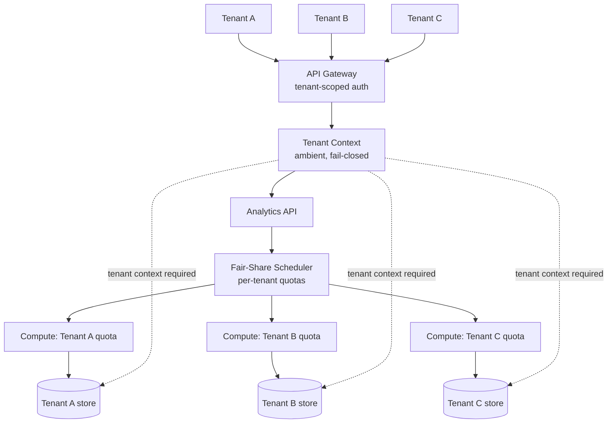
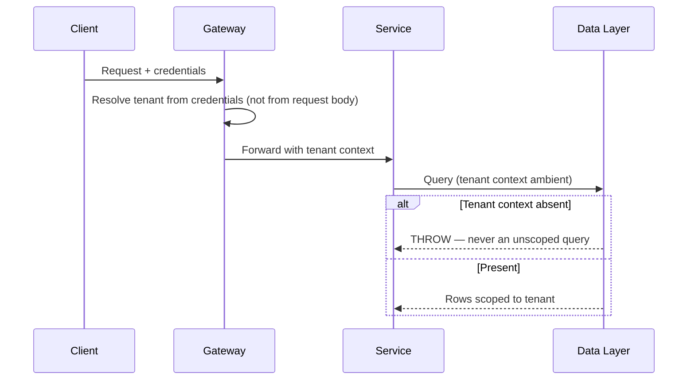
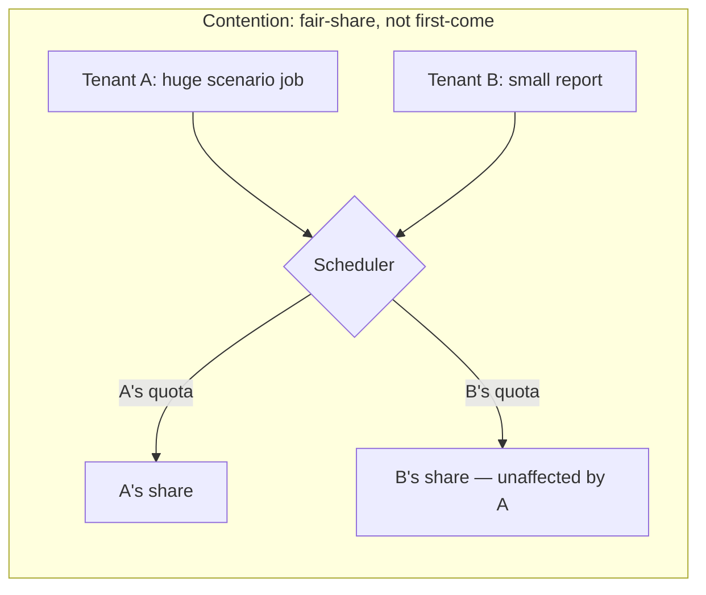
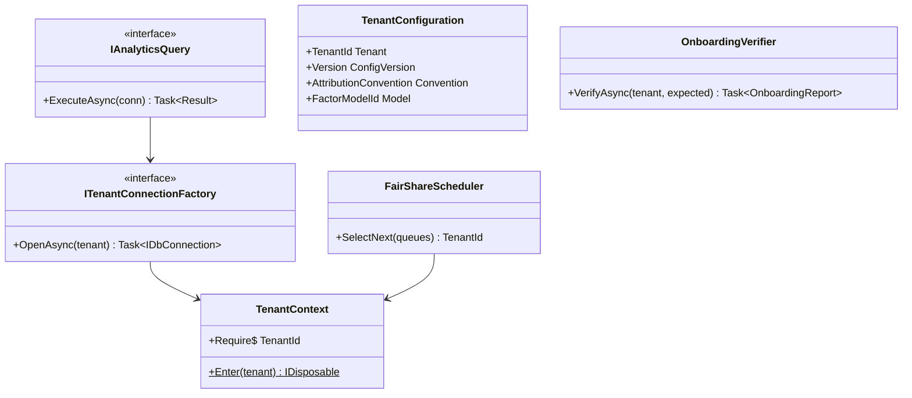

# Module 132 — System Design: Designing a Multi-Tenant Portfolio Analytics Platform

> Domain: System Design | Level: Beginner → Expert | Prerequisite: [[09-Designing-RealTime-Portfolio-Risk-Engine]] (the compute-grid and reproducibility disciplines this platform exposes to external clients), [[../37-Outbox/02-Capstone-SharedMultiTenantOutboxRelayPlatform]] (per-tenant isolation, dedicated capacity, and the noisy-neighbour finding, which this module escalates from internal teams to paying external clients), [[../38-API-Gateway/01-APIGatewayFundamentals-Routing-RateLimiting-AuthEnforcement-Transformation]] (tiered rate limiting and defence-in-depth authorization)
>
> **Scenario-module note:** Fourth of six buy-side/capital-markets system-design scenarios (Modules 129–134). Full 16-section template; Elite FinTech Interview Panel lens.

---

## 1. Fundamentals

**What:** A platform that runs portfolio analytics — performance attribution, exposure decomposition, scenario analysis, factor risk — on behalf of many independent institutional clients, each of whom sees only their own data, on shared infrastructure. This is the shape of Aladdin, Charles River, and similar buy-side platforms: one codebase and one operational estate serving competing asset managers simultaneously.

**Why:** The alternative — a separate deployment per client — multiplies operational cost by client count and makes a platform improvement a per-client rollout project. Multi-tenancy is what makes a platform business viable. But the tenants here are frequently **direct competitors**, and the data is their positions and strategies, so isolation is not a hygiene property but the product's core promise. A cross-tenant leak is not an incident; it is an existential event for the platform's business.

**When:** From the first external client. Retrofitting tenancy onto a single-tenant system is among the most dangerous migrations in this course, because the isolation boundary must be enforced everywhere and the failure of any single enforcement point is sufficient — works this decision.

**How (30,000-ft view):**
```
Tenant A ──┐
Tenant B ──┼──► API (tenant-scoped auth) ──► Analytics Engine ──► Tenant-partitioned stores
Tenant C ──┘ │
 Shared compute, isolated capacity
 Shared code, isolated data
```

---

## 2. Deep Dive

This section is written to be **complete on its own** — every mechanism, the reasoning that selects it, the failure mode it introduces, and the push-back a Principal/Staff interviewer will raise, answered inline.

### 2.1 Isolation Is the Product, Not a Hygiene Property

Tenants here are frequently **direct competitors**, and the data is their positions and strategies. A cross-tenant leak is not an incident to be remediated — it is **existential for the platform's business**. Every design decision in this module follows from treating isolation as the primary product promise rather than a security checkbox.

### 2.2 The Isolation Spectrum — and What Kind of Mistake Causes a Leak

Multi-tenancy is not binary. Three realistic points, in increasing isolation and cost:

| Model | Mechanism | A leak requires |
|---|---|---|
| **Shared everything, row-level discriminator** | One database, a `TenantId` column, every query filtered | **One** missing `WHERE TenantId = @t`, anywhere, ever |
| **Shared infrastructure, separate schemas/DBs** | Isolation at the connection level | Connecting to the wrong database — rarer and more visible |
| **Separate infrastructure per tenant** | Physical separation | A provisioning error; loses most multi-tenancy benefit |

**The critical framing is not "how isolated," it is "what kind of mistake causes a leak."** Row-level requires every query to be correct *forever*, including every query written next year by someone who has never heard of this discussion. Connection-level requires routing to be correct *once per request*. Reducing the number of places a mistake is possible is worth far more than it looks, because the cost of the mistake is unbounded.

### 2.3 Defence in Depth — No Single Load-Bearing Mechanism

Four layers, each of which must hold on its own:

1. **Authentication and authorization** establishing tenant identity at the edge.
2. **Ambient tenant context** propagated through the call stack — never an optional parameter a caller can forget.
3. **Data-layer enforcement** — connection routing or a query interceptor that **fails closed** when tenant context is absent, rather than returning unfiltered results.
4. **Storage-level enforcement** — database row-level security or per-tenant credentials, so even a compromised application layer cannot read across tenants.

**The principle throughout: an unset tenant context must produce an error, never an unscoped query.** Default deny, because the failure mode of defaulting to allow is silent and catastrophic.

**Tenant identity must come from credentials, never from a request parameter.** A request-supplied tenant identifier can be altered by the caller, making cross-tenant access a matter of changing a value — a textbook IDOR/BOLA.

**Cache keys must derive from authenticated context, for exactly the same reason.** A cache is another place the boundary can be crossed, and a cross-tenant cache *hit* is a leak with the same consequence as a query leak — worse, in fact, because the data never reaches the query layer at all, so every query-layer control is bypassed. Using a tenant-supplied value as a cache key moves an isolation-critical value into caller control at the layer where it is least visible.

### 2.4 The Incident — a Protection Whose Exceptions Were Invisible

§4's leak: isolation relied primarily on a **query interceptor that applied only to ORM-built queries**. A raw-SQL path bypassed it and correctly compensated with a manual filter. Later, that query was edited to add a `UNION ALL` branch — and the manual filter was not replicated on the new branch.

**The enabling property was that the protection had exceptions invisible at the point of editing.** A developer modifying that query saw nothing indicating they were outside the safety net. A protection mechanism with exceptions is one whose exceptions are exactly where the incidents occur.

The complete structural fix:

1. **Storage-level row-level security as a backstop** that applies regardless of how the query was constructed — the one layer with no exceptions.
2. **An enumerating isolation test**: seed a test database with two tenants' data, execute **every registered query path** under tenant A's context, and assert zero rows belonging to tenant B are returned. Mechanical, construction-method-agnostic, and — critically — it catches **new** query paths automatically, provided it enumerates registered paths rather than listing them by hand.
3. **A lint rule** flagging raw-SQL construction outside the sanctioned helper.
4. **Data-layer row-attribution assertions** (§2.14) converting a silent leak into a loud error.

### 2.5 Noisy Neighbours — Harder Here Because the Load Is Legitimate

In a shared relay pool, the offending tenant was in a *degraded* state, so the mitigation could be "prevent the abnormal condition." Analytics escalates the problem: one tenant running a large scenario analysis consumes enormous compute while **doing exactly what they pay for**.

So the mitigation must be structural rather than corrective:

- **Weighted fair-share scheduling** — each tenant has a guaranteed minimum reflecting their commercial tier, with unused capacity redistributed proportionally among active tenants. This satisfies both requirements at once: a paying tenant always receives at least their entitlement regardless of others' activity, and idle capacity is not wasted.
- **Per-tenant compute quotas**, set at contracting rather than retrofitted under pressure.
- **Priority tiers matched to commercial tiers**, so degradation under contention is *predictable per tenant* rather than "whoever submits the largest job wins."

**Tenant size heterogeneity breaks uniform capacity planning.** The largest tenant may be 1,000× the smallest, so uniform per-tenant provisioning either starves the large or massively over-provisions the small. Capacity must be tiered, and the largest tenants individually planned.

**When one tenant's growth threatens the shared infrastructure, that is a commercial conversation with an engineering deadline — and delaying it is the error.** The options are: move them to dedicated infrastructure at appropriate pricing; enforce their contractual quota (which requires the quota to exist, set at contracting); or invest in capacity funded by their growth. What fails is absorbing the growth silently until other tenants degrade, at which point you have a support crisis *and* an unfunded cost base.

### 2.6 Tenant-Specific Configuration Without Forking the Code

Institutional clients want their own factor models, accounting conventions (there are several valid ways to compute performance attribution), and reporting formats. The failure mode is **per-tenant code branches**, which eventually make every change a per-tenant regression risk and the platform effectively unchangeable.

**The triage for any tenant request:**

- Has this or something similar been requested by others? → genuine commonality; build it into the core as configuration.
- Is it idiosyncratic but well-shaped? → an **extension point** / plugin.
- Neither, and inexpressible as configuration? → **decline, or price it as bespoke work with a named owner.** A per-tenant core branch imposes a permanent tax on everyone.

**Configuration multiplies the upgrade test matrix**, and the combinations that break are the ones **no single tenant uses but two tenants collectively exercise**. Three disciplines keep it tractable: constrain configuration to a bounded, well-specified set rather than free-form; test the **combinations actually in use** rather than the theoretical space; and stage upgrades by **tenant cohort**, so a regression reaches a few tenants rather than all of them.

### 2.7 "Whose Bug Is It?" — Diagnostics Without Reading the Data

When a tenant reports wrong output, the cause is roughly equally likely to be a platform defect, the tenant's own input data, or a tenant-specific configuration choice. Unlike a single-tenant system, **the platform team cannot simply inspect the data** — it belongs to the client, is commercially sensitive, and blanket support access is itself a breach of the isolation promise.

So the platform needs **tenant-scoped diagnostic tooling** that exposes the calculation as an inspectable pipeline:

- **Input summaries** — counts, aggregates, date ranges. Not holdings.
- **Intermediate values** at each calculation stage.
- **Configuration and model versions** used (provenance).
- **The specific step where a value diverges** from expectation.

Most investigations resolve to a configuration difference or an input-completeness issue, both diagnosable from summaries alone. Building this tooling *late*, after a support burden has accumulated, is a common and expensive mistake — and by then the pressure to grant broad support access is at its highest.

**Investigating "our analytics disagree with our custodian's figures"** follows the same shape, and the order matters: establish **which layer** disagrees before assuming a platform defect. Are the *inputs* the same (positions and prices as of the same instant — often not, and often the whole explanation)? Is the *convention* the same (several valid attribution and accounting treatments exist)? Or is the *calculation* genuinely different? Use intermediate values to locate the **first** divergence rather than arguing about the final number.

### 2.8 Onboarding Is a Migration Project, and It Needs a Verification Step

Each institutional client arrives with historical data in their own format, their own instrument identifiers, and expectations about what history must be available on day one. Onboarding is therefore a **per-client data-migration project**, not a provisioning step — and it is where most of the platform's per-client cost actually lives.

The scalable answer is investment in **canonical ingestion**: well-specified formats, validation with actionable errors, and — the piece that is usually missing — **automated reconciliation confirming the migrated history reproduces the client's own reported figures.**

Concretely: compute from migrated data the figures the client already reports themselves (historical performance, period returns, holdings as of known dates) and compare against their published or supplied values within tolerance. Triage differences as **data mapping** (most common), **convention difference** (they compute attribution differently — a configuration variation, §2.6), or **genuine defect**.

That check is what converts onboarding from a trust exercise into a verified one, and its absence is why onboarding disputes are so common.

### 2.9 Aggregates Leak Too — Inference Risk

**Peer benchmarking** (comparing a tenant against anonymised peers) is genuinely valuable and a genuine inference risk: with few peers in a category, or with a tenant able to query repeatedly across slices, individual contributions can be reverse-engineered — **reconstructing a competitor's holdings from aggregates.**

Mitigations: **minimum cohort size**, suppression of small cells, and limits on query granularity and repetition. These constrain the feature's usefulness, and saying so is the honest answer rather than claiming aggregation is inherently safe.

**The platform's own cross-tenant analytics** — understanding feature usage and performance — has the same shape. The workable form is strictly aggregated, k-anonymous metrics computed by a **separate pipeline with no path back to individual tenant data**, with cohort minimums, and **governed by explicit contractual permission rather than assumed**. Many client agreements prohibit it outright, which is a contract question to answer before building, not after.

### 2.10 Support Access — Exceptional and Expiring, Never Standing

A standing support role with tenant-data access is functionally a permanent leak with good intentions. The control:

**Time-boxed, purpose-bound, client-approved elevation** — granted for a specific ticket, expiring automatically, logged immutably with the accessing identity and justification, and where the contract requires it, notified to the client.

The key property is that access is *exceptional and expiring* rather than a role someone holds.

### 2.11 Per-Tenant Backup, Restore and Offboarding

**Per-tenant restore is a requirement, not a nice-to-have.** A single tenant's corruption or erroneous bulk update must be recoverable **without affecting others**, which requires backup granularity at the tenant level. A design where restore is only possible platform-wide means one tenant's mistake forces every other tenant to choose between their own data and that tenant's recovery.

**Per-tenant encryption keys enable cryptographic erasure**: deleting the key renders that tenant's data unrecoverable, satisfying deletion obligations without locating every copy. It also bounds the blast radius of a storage compromise.

**Offboarding** is contractually specified data return in an agreed format — often extensive, since clients want their full history — followed by **verified** deletion. The two commonly missed elements: **backups and derived stores** (caches, read models, analytics extracts) must be covered, since deletion from the primary store alone leaves copies; and the deletion must produce **evidence**, not just an assertion.

### 2.12 Regions, Residency and the Isolation Model

Multi-region here is driven primarily by **data residency, not latency**. Many jurisdictions require client data to remain in-region, which makes regional deployment a **compliance requirement** rather than a performance optimisation.

It interacts sharply with tenancy: a tenant's data must be **pinned to their required region**, so tenant-to-region assignment becomes part of the isolation model rather than a deployment detail. The failure mode to design against explicitly is a cross-region query, cache or backup quietly moving data out of its required jurisdiction — a residency breach that looks exactly like a successful request.

### 2.13 CAP Postures, Per Consumer

**The entitlement store takes the consistent side; analytics reads take the available side.** A stale analytics result is a slightly outdated report. A stale entitlement could grant access that has been revoked — a security failure. Consequence-of-staleness differs sharply, so the posture differs, and applying one uniform posture across the platform is wrong for one of them by construction.

### 2.14 Observability — Leak Detection Is Genuinely Weak

**A leak looks like a successful query.** Satisfied logs, a 200 response, a recipient who cannot tell the data is foreign. The available signals are all indirect:

- **Result-set sizes anomalous for a tenant's known data volume** — how §4 was actually noticed, by a human.
- **Data-layer row-attribution assertions**: check that every returned row's tenant attribution matches the request context, as an **assertion** rather than a filter, so a mismatch raises an error instead of being silently filtered. This is the single most valuable signal, because it converts a silent leak into a loud failure.
- **Access-pattern anomalies** — a tenant's query mix changing shape.

The honest assessment to give a client or a regulator: **detection is weak, so investment belongs in prevention.** This is the opposite balance from most systems, where detection is cheap and prevention is expensive.

### 2.15 Changing the Isolation Model Safely

**Retrofitting multi-tenancy onto a single-tenant system is dangerous in proportion to the number of existing data-access paths** — all of which were written without tenant awareness, and any one of which failing is sufficient for a leak.

**Migrating from row-level to connection-level isolation must be additive, never a switch.** Introduce per-tenant credentials and route connections by tenant while **retaining** the existing row-level filters, so the two mechanisms overlap. Verify with the enumerating isolation test under the new routing. Then optionally retire the row filters — or better, keep them, because defence in depth is the whole point (§2.3). The additive sequencing means **no window exists in which neither mechanism is fully in force.**

### 2.16 Principal-Level Judgements

**A prospective client demanding physical separation** is making a legitimate and common request. The honest response is to offer it as a **distinct deployment tier priced to reflect its cost** — rather than refusing (losing the client) or accommodating it invisibly (absorbing an unfunded operational burden that compounds with each such client). The engineering consequence is that the platform must support both models from one codebase, which is achievable if isolation was already layered rather than assumed.

**Advising on a contractual "zero cross-tenant access" guarantee: advise against the absolute.** Steer toward specific, verifiable commitments — the layered controls, independent testing, incident-notification obligations, defined remedies. An absolute guarantee is both undeliverable and, if breached, *worse* than a well-specified commitment, because it forecloses the honest defence-in-depth conversation a sophisticated client actually wants to have.

**Answering "how do you guarantee our data is never visible to competitors."** Describe the layers concretely — authentication-derived context that fails closed, per-tenant credentials making cross-tenant reads impossible at the connection level, storage-level row policies as a backstop, per-tenant encryption keys bounding compromise, continuous automated isolation testing. Then state the residual honestly: no architecture reduces the risk to zero, so the commitment is layered prevention plus rapid, transparent notification.

**The governance program required before onboarding the first external tenant:**

1. Layered isolation — authenticated context failing closed, per-tenant credentials, storage-level policies (§2.3, §2.4).
2. A continuously run **enumerating** isolation test across all query paths, including cached ones (§2.4).
3. Data-layer **row-attribution assertions** converting silent leaks into errors (§2.14).
4. **Time-boxed, audited, client-visible** support access (§2.10).
5. **Per-tenant backup, restore and cryptographic erasure** (§2.11).
6. **Quotas and fair-share scheduling** set at contracting (§2.5).
7. **Onboarding reconciliation** against the client's own reported figures (§2.8).

**Build versus buy** for a firm considering this platform instead of building in-house: the buy case is strong because the non-differentiating surface is enormous — instrument coverage across asset classes, pricing models, corporate actions, vendor integrations, regulatory reporting — each requiring perpetual maintenance as markets change. The build case is narrow: a firm whose *investment process itself* depends on proprietary analytics no vendor offers.

**The closing synthesis — what makes multi-tenant analytics distinctively hard.** Not the analytics; computationally it is the same work with different outputs. Two properties define it:

1. **The dominant failure has no natural detector.** A cross-tenant leak produces a successful query, satisfied logs, and a recipient who cannot tell the data is foreign. And unlike the risk engine or the OMS, **no external party holds the truth to reconcile against** — the venue and the settlement file have no analogue here, so the only verification is the platform testing itself.
2. **The isolation boundary must hold at every access path, forever**, including paths written by people who never saw the original design. Which is why every mechanism in this module is chosen for having *no exceptions*, rather than for being strong.

---

## 3. Visual Architecture


```mermaid
graph TB
 TA[Tenant A] --> GW[API Gateway<br/>tenant-scoped auth]
 TB[Tenant B] --> GW
 TC[Tenant C] --> GW
 GW --> CTX[Tenant Context<br/>ambient, fail-closed]
 CTX --> API[Analytics API]
 API --> SCHED[Fair-Share Scheduler<br/>per-tenant quotas]
 SCHED --> POOL_A[Compute: Tenant A quota]
 SCHED --> POOL_B[Compute: Tenant B quota]
 SCHED --> POOL_C[Compute: Tenant C quota]
 POOL_A --> DA[(Tenant A store)]
 POOL_B --> DB[(Tenant B store)]
 POOL_C --> DC[(Tenant C store)]
 CTX -.tenant context required.-> DA
 CTX -.tenant context required.-> DB
 CTX -.tenant context required.-> DC
```


```mermaid
sequenceDiagram
 participant C as Client
 participant GW as Gateway
 participant S as Service
 participant D as Data Layer

 C->>GW: Request + credentials
 GW->>GW: Resolve tenant from credentials (not from request body)
 GW->>S: Forward with tenant context
 S->>D: Query (tenant context ambient)
 alt Tenant context absent
 D-->>S: THROW — never an unscoped query
 else Present
 D-->>S: Rows scoped to tenant
 end
```


```mermaid
graph LR
 subgraph "Contention: fair-share, not first-come"
 BIG[Tenant A: huge scenario job] --> Q{Scheduler}
 SMALL[Tenant B: small report] --> Q
 Q -->|A's quota| RA[A's share]
 Q -->|B's quota| RB[B's share — unaffected by A]
 end
```

---

## 4. Production Example

**Problem:** A platform serving 40 asset managers ran analytics on a shared compute pool with row-level tenant isolation, defended by a query interceptor injecting the tenant filter automatically.

**Architecture:** the design, with the interceptor as the primary data-isolation mechanism — a deliberate choice, since automatic injection removes the burden of every developer remembering the filter.

**Implementation:** The interceptor injected `TenantId` into queries built through the ORM. A performance-critical attribution query, hand-written as raw SQL for speed, bypassed the ORM — and therefore the interceptor — but included its own explicit tenant filter, correctly, written by a developer who knew the interceptor did not apply.

**Trade-offs:** Automatic injection is genuinely safer than manual filtering for the common path. Its weakness is that it creates an assumption ("queries are filtered") that raw-SQL paths silently violate.

**Lessons learned:** A later optimization added a `UNION ALL` branch to that raw query to include a secondary data source. The new branch's tenant filter was omitted — an ordinary copy-paste omission. The query returned the requesting tenant's data plus, from the secondary source, **all tenants' data** for that dimension. It reached a production report seen by one client before being noticed, because the report's totals were implausibly large.

The isolation model had been sound; what failed was that it was *not uniformly applicable*, and the exception was invisible at the point where the mistake was made — a developer editing that query saw no signal that they were outside the interceptor's protection.

The fix had three parts: (1) storage-level row-level security as a backstop, so the database itself refuses cross-tenant reads regardless of query construction — the defence-in-depth layer prescribes and this system lacked; (2) a test that runs every registered query, under a tenant context, against a database seeded with two tenants' data, asserting no foreign rows are returned — mechanically catching exactly this class of omission; (3) a lint rule flagging raw SQL in the data layer for mandatory review. The generalizable lesson: **a protection mechanism with exceptions is a protection mechanism whose exceptions are where incidents occur**, and the exceptions must be made visible at the point of editing rather than known only to whoever originally wrote them.
## 11. Coding Exercises

### Easy — Fail-Closed Tenant Context
**Problem:** Ensure an absent tenant context can never produce an unscoped query.
**Solution:**
```csharp
public sealed class TenantContext
{
    private static readonly AsyncLocal<TenantId?> Current = new;

    public static TenantId Require =>
        Current.Value?? throw new MissingTenantContextException(
        "No tenant context — refusing to execute an unscoped query.");

    public static IDisposable Enter(TenantId tenant)
    {
        Current.Value = tenant;
        return new Scope(=> Current.Value = null);
    }
}
```
**Time complexity:** O(1).
**Space complexity:** O(1) per async flow.
**Optimized solution:** Combine with per-tenant connection resolution (§2.4) so `Require` selects the tenant's credentials rather than merely supplying a filter value — moving from "the query is filtered" to "the connection cannot see other tenants."

### Medium — Enumerating Isolation Test (§2.4)
**Problem:** Assert no query path returns foreign-tenant rows, covering paths added in future.
**Solution:**
```csharp
[Theory]
[MemberData(nameof(AllRegisteredQueries))] // enumerated, not hand-listed
public async Task Query_ReturnsNoForeignTenantRows(IQueryDescriptor query)
{
    await _seed.TwoTenantsAsync(TenantA, TenantB);

    using (TenantContext.Enter(TenantA))
    {
        var rows = await query.ExecuteAsync(_db);
        Assert.All(rows, r => Assert.Equal(TenantA, r.TenantId));
        Assert.NotEmpty(rows); // guard: a query returning nothing proves nothing
    }
}
```
**Time complexity:** O(q × r) for q queries returning r rows.
**Space complexity:** O(r).
**Optimized solution:** Run the same suite twice with the cache warm and cold, since §2.3's cache-key leak is invisible to a cold-cache-only run.

### Hard — Weighted Fair-Share Scheduler (§2.5)
**Problem:** Guarantee each tenant their entitlement while redistributing idle capacity.
**Solution:**
```csharp
public TenantId? SelectNext(IReadOnlyDictionary<TenantId, TenantQueue> queues)
{
    // Deficit round-robin: each tenant accrues credit proportional to weight
    // spends it when scheduled — guaranteeing share without wasting idle capacity.
    TenantId? best = null;
    double bestDeficit = double.NegativeInfinity;

    foreach (var (tenant, q) in queues.Where(kv => kv.Value.HasWork))
    {
        var deficit = _credit[tenant] / _weight[tenant];
        if (deficit > bestDeficit) { bestDeficit = deficit; best = tenant; }
    }

    if (best is not null) _credit[best] -= queues[best].PeekCost;
    foreach (var t in queues.Keys) _credit[t] += _weight[t] * _replenishRate;
    return best;
}
```
**Time complexity:** O(t) per scheduling decision for t tenants.
**Space complexity:** O(t).
**Optimized solution:** Use a priority queue keyed on normalized deficit to make selection O(log t), which matters once tenant count is large enough that per-decision linear scanning appears in profiles.

### Expert — Onboarding Reconciliation (§2.8)
**Problem:** Verify migrated data reproduces the client's own reported figures.
**Solution:**
```csharp
public async Task<OnboardingReport> VerifyAsync(TenantId tenant, IReadOnlyList<ClientReportedFigure> expected)
{
    var breaks = new List<Break>;
    foreach (var fig in expected)
    {
        var computed = await _analytics.ComputeAsync(tenant, fig.Metric, fig.AsOf, fig.PortfolioId);
        var relative = Math.Abs(computed - fig.Value) / Math.Max(Math.Abs(fig.Value), 1m);

        if (relative > _tolerance)
            breaks.Add(new Break(fig, computed, relative, Classify(fig, computed)));
    }
    return new OnboardingReport(tenant, breaks, expected.Count);
}

private BreakCause Classify(ClientReportedFigure fig, decimal computed) =>
    _conventionDiffDetector.IsExplainedByConvention(fig, computed)
? BreakCause.ConventionDifference // not a defect — expected and explainable
: BreakCause.RequiresInvestigation;
```
**Time complexity:** O(n) client-reported figures, each an analytics computation.
**Space complexity:** O(b) for breaks found.
**Optimized solution:** Classify breaks automatically against known convention variants, so onboarding staff triage only genuinely unexplained differences rather than every numerical mismatch — most of which are legitimate convention differences.

---

## 12. System Design — Designing a Multi-Tenant Portfolio Analytics Platform

*Authored to the four-step standard (see Module 01 §12 for the method).*

---

### Step 1 — Understand the Problem and Establish Design Scope

#### The dialogue

> **C:** Who are the tenants, and what happens if one sees another's data?
> **I:** Institutional asset managers. A cross-tenant leak would likely end the business — several are direct competitors.
>
> **C:** So isolation is existential rather than a feature. Are tenants uniform in size?
> **I:** Not remotely. The largest has about 1,000× the portfolios of the smallest.
>
> **C:** That rules out uniform per-tenant provisioning. Do tenants need their own models and conventions?
> **I:** Yes — different attribution methodologies, different day-count conventions, different report formats.
>
> **C:** Without forking the codebase, I assume.
> **I:** Correct. One codebase, forty tenants.
>
> **C:** What's the workload shape? Interactive dashboards and heavy batch analytics are very different.
> **I:** Both. Interactive exposure and attribution views, plus scenario jobs that can run for hours.
>
> **C:** When do tenants use it? If everyone reports at month-end, "average load" is a fiction.
> **I:** Month-end, almost all of them, within the same few days.
>
> **C:** Do we need per-tenant restore and provable deletion?
> **I:** Yes — contractual, and for some tenants a regulatory requirement.
>
> **C:** How do we support them? Debugging a tenant's numbers usually means looking at their data.
> **I:** That's a real problem for us today. Support can't casually read client holdings.
>
> **C:** Out of scope?
> **I:** The analytics models themselves, the client-facing UI, and billing.

Two answers dominate. **1,000× size skew** means fair-share scheduling is not optional — the largest tenant can trivially consume the platform. And **"support can't read client holdings"** turns diagnostics into a design requirement rather than an operational habit, which is §3.5.

#### Functional requirements

1. Serve performance attribution, exposure decomposition, scenario analysis, and factor risk per tenant.
2. Enforce strict tenant isolation across data access, caching, compute, and logs.
3. Support per-tenant configuration (models, conventions, formats) without forking core code.
4. Onboard new tenants with verified historical migration.
5. Provide tenant-scoped diagnostics usable **without raw-data access**.
6. Per-tenant backup, restore, and provable deletion.

#### Non-functional requirements

| Requirement | Target |
|---|---|
| Cross-tenant data exposure | **Zero.** The platform's existential requirement |
| Interactive query latency | p95 < 3 s for common views |
| Per-tenant performance predictability | A tenant's latency must not depend on another tenant's activity |
| Scenario job completion | Within the tenant's contracted window, even at month-end |
| Availability | 99.9% per tenant, measured **per tenant** — a platform-wide average hides a single tenant being down |
| Deletion | Provable, within contractual window, including backups and caches |

#### Back-of-the-envelope estimation

```
Tenants                  = 40
Size skew                = largest ≈ 1,000× smallest
Aggregate portfolios     ≈ 120,000
Aggregate positions      ≈ 25,000,000
Interactive queries      ≈ 50/s aggregate, bursty
Scenario jobs            ≈ 200/day, each 10^4–10^6 pricing calls
```

The month-end concentration, which is the number that governs the design:

```
If 35 of 40 tenants report in the same 3-day window:
  Effective demand multiplier over a normal day     ≈ 8–10×
  And it is SIMULTANEOUS — not staggered — because every
  tenant's reporting cycle is driven by the same calendar.

Sizing for average load:      fails 3 days a month, for everyone, together
Sizing for the peak:          8–10× the infrastructure, idle 90% of the time
```

Skew:

```
Largest tenant   ≈ 40% of aggregate positions
Smallest 20 tenants combined ≈ 3%
A single scenario job from the largest tenant can exceed the
TOTAL daily compute of the smallest thirty tenants.
```

#### What the numbers tell us

1. **Demand is not smooth and never will be**, because it is calendar-driven, not user-driven. That eliminates statistical multiplexing as a capacity strategy — the usual assumption that tenants' peaks are uncorrelated is *false here*, and saying so is the estimation's most valuable output.
2. **With 1,000× skew, "fair" cannot mean "equal."** Fair-share scheduling must be weighted by contracted entitlement, or the smallest tenant gets 1/40th of a platform it pays little for while the largest is throttled below what it pays a great deal for.
3. **The peak is when per-tenant guarantees matter most and are hardest to honour** — precisely at month-end, when every tenant is producing client-facing numbers under their own deadlines. So the scheduler's behaviour under saturation is the design's core, not an edge case.

The hard problem is **isolation that holds under contention**, not isolation in the abstract.

---

### Step 2 — Propose High-Level Design and Get Buy-In

#### The isolation spectrum, and where to sit

| Model | Isolation | Cost | Operability |
|---|---|---|---|
| Shared everything, `tenant_id` column | Weakest — one missing `WHERE` clause is a breach | Lowest | Simple |
| Shared DB, **schema per tenant** | Strong at the connection level | Low | Good |
| Database per tenant | Very strong | Moderate | 40 databases to patch |
| Full stack per tenant | Strongest | Highest | 40 deployments |

**Chosen: schema-per-tenant on shared infrastructure, with connection-level credentials scoped to one schema.** The decisive property is that isolation stops depending on application code being correct. A missing predicate becomes a *permission error* rather than a leak — the difference between a bug and a breach. This is the same "make the bad state unrepresentable" principle this course applies to append-only ledgers and non-suppressible notification categories.

#### Components

**Gateway.** Terminates authentication and establishes **tenant context** from the verified token — never from a request parameter, header, or path segment a client can set.

**Tenant Context Propagation.** Ambient, **fail-closed**: any code path reaching data access without a resolved tenant context throws rather than defaults. A default tenant is a breach waiting for a bug.

**Credentialed Data Access.** Per-tenant database credentials scoped to that tenant's schema. The application cannot query another tenant's data even if it tries.

**Fair-Share Scheduler.** Weighted, entitlement-based admission and preemption for analytics jobs.

**Analytics Engine.** The compute grid (Module 09's disciplines), with per-tenant resource pools.

**Tenant Configuration Store.** Bitemporal, versioned — because a result must record the configuration that produced it.

**Onboarding Pipeline.** Historical migration with reconciliation gates.

**Tenant-Scoped Diagnostics.** Structured, redacted diagnostic surfaces (§3.5).

#### End-to-end walkthrough — an interactive query

1. Request arrives with a bearer token; the gateway verifies it and extracts `tenant_id` **from the token's verified claims**.
2. Tenant context is established in an ambient scope for the request's lifetime.
3. The service resolves the tenant's configuration version as-of now.
4. Cache lookup uses a key **derived from the authenticated context**, not from request parameters: `t:{tenant_id}:v:{config_version}:{query_hash}`. A cache key a caller can influence is a cross-tenant read waiting to happen (§3.4).
5. On miss, a connection is obtained **from the tenant's own credentialed pool**; the query carries no `tenant_id` predicate because it cannot see anything else.
6. Results computed with the tenant's configuration; the response records `config_version` so the number is explicable later.
7. Response written to the tenant-namespaced cache; audit log entry written with tenant, principal, and query shape — **never query values**, which would put holdings in the log.

#### End-to-end walkthrough — a scenario job at month-end

1. Tenant submits a scenario job; it is admitted to the tenant's queue with an entitlement weight.
2. Scheduler computes each tenant's current share versus entitlement and admits work accordingly.
3. Large jobs are **decomposed into bounded tasks** so the scheduler can interleave — an indivisible six-hour job cannot be fair-shared, so fair-share depends on decomposition being enforced at submission.
4. Under saturation the scheduler **preempts tasks** from tenants over their share, requeueing them; because tasks are pure functions of pinned inputs (Module 09 §3.6), preemption costs only the work in flight.
5. Progress and an honest completion estimate are published to the tenant — under contention, an accurate "this will take 40 minutes" is worth more than an optimistic one.

#### API design

**All endpoints are tenant-scoped implicitly.** There is no `tenant_id` path or query parameter anywhere in the API — this is deliberate. If the tenant were addressable in the URL, then authorisation becomes a check that can be forgotten; when it is derived from the token, there is nothing to forget.

**`POST /v1/analytics/attribution`**

| Field | Type | Description |
|---|---|---|
| `portfolio_ids` | string[] | Validated against the tenant's own portfolios |
| `period` | object | `{ from, to }` |
| `methodology` | string | Optional override; defaults to the tenant's configured method |
| `benchmark_id` | string | |

Response: `{ results, config_version, computed_at, cache_hit }`. **`config_version` on every response** is what makes "why is this number different from last month" answerable.

**`POST /v1/jobs/scenarios`** → `202 { job_id, queue_position, estimated_start, estimated_duration }`. Returning queue position and an estimate is a fair-share affordance: a tenant that can see it is queued behind its own entitlement complains less than one that just sees slowness.

**`GET /v1/jobs/{id}`** → `{ status, progress, tasks_completed, tasks_total, estimated_completion, share_state }`.

**`GET /v1/diagnostics/queries/{query_id}`** → §3.5's redacted diagnostic bundle.

**`POST /v1/admin/tenants/{id}/deletion`** (platform-admin only) → initiates provable deletion across primary stores, caches, search indexes, backups, and logs, returning a certificate enumerating what was purged and when.

#### Data model

**Per-tenant schema** — `tenant_{id}.portfolio`, `.position`, `.transaction`, `.benchmark`, `.result`. Identical DDL across tenants, applied by migration tooling; **schema drift between tenants is the operational failure mode to guard against**, and a startup check comparing each tenant's schema hash against the expected version is the cheap defence.

**Shared control-plane schema** (no tenant business data):

| Table | Columns |
|---|---|
| `tenant` | `tenant_id`, `name`, `status`, `entitlement_weight`, `contracted_windows`, `onboarded_at` |
| `tenant_config` | `tenant_id`, `key`, `value`, `valid_from`, `valid_to`, `knowledge_from`, `knowledge_to`, `version` — **bitemporal**, because a result computed last quarter must be explicable under last quarter's configuration |
| `tenant_credential` | `tenant_id`, `db_role`, `rotated_at` |
| `job` | `job_id`, `tenant_id`, `type`, `status`, `weight`, `submitted_at`, `admitted_at`, `completed_at`, `tasks_total`, `tasks_done` |
| `audit_log` | `at`, `tenant_id`, `principal`, `action`, `resource_type`, `resource_count` — **counts and shapes, never values** |

**Results** — columnar store partitioned by `(tenant_id, as_of)`, and physically separated per tenant where the store supports it. Partitioning alone is not isolation; it is an optimisation that looks like isolation, which is worse than neither.

#### Store selection, and why

| Store | Choice | Reason |
|---|---|---|
| Tenant business data | **Schema-per-tenant, shared PostgreSQL clusters**, credentials scoped per schema | Isolation enforced by the database's own permission system rather than by application predicates. Shared infrastructure keeps 40 tenants operable |
| Analytics results | **Columnar, tenant-partitioned** | Large scans over `(tenant, date, measure)` |
| Configuration | **Bitemporal relational** | Provenance — a result records the config that produced it |
| Cache | **Redis with per-tenant logical DBs or key prefixes derived from verified context** | See §3.4 for why the key derivation matters more than the mechanism |
| Job/scheduler state | **PostgreSQL** | Small, transactional |

The decision worth defending: **shared infrastructure with per-tenant credentials**, rather than 40 isolated stacks. Forty stacks would be marginally safer and operationally ruinous — patching, upgrading, and monitoring 40 estates means the *fleet* becomes inconsistent, and an unpatched tenant is its own security problem. Isolation that degrades operability eventually degrades security.

---

### Step 3 — Design Deep Dive

#### 3.1 Defence in depth — five independent layers

No single mechanism is trusted, because the requirement is existential and every single mechanism has a plausible failure:

| Layer | Mechanism | Fails when |
|---|---|---|
| Authentication | Tenant from verified token claims only | Token forgery — mitigated by standard JWT/mTLS discipline |
| Context | Ambient, fail-closed; no default tenant | A code path bypasses the accessor — caught by layer 3 |
| **Data access** | **Per-tenant DB credentials scoped to one schema** | Credential mix-up — caught by layer 4 |
| Query-time assertion | Results carry `tenant_id`; a mismatch **throws and alerts** rather than filtering | Both the credential and the assertion are wrong simultaneously |
| Continuous verification | A scheduled probe authenticates as tenant A and attempts to read tenant B's known resource IDs, expecting failure | Never — this is the layer that detects the others having silently regressed |

The fifth layer is the one most designs omit and the one that matters most over time. **Isolation regresses silently**: a new endpoint, a new cache, a new report export, a new admin tool. Nothing alerts, because a leak looks like a successful response. A continuous negative-test probe is the only mechanism that notices — the same "independent verifier" conclusion this course reaches for ledgers (Module 18 §11) and notification delivery (Module 20 §2.12), arriving here from the security direction.

#### 3.2 Fair-share scheduling under correlated peaks

The estimation showed peaks are simultaneous, so the scheduler's saturation behaviour *is* the platform's quality of service.

- **Weighted fair share by entitlement**, not equal share. Weight comes from the contract.
- **Decomposition enforced at submission.** A job is admitted only if it can be expressed as bounded tasks; otherwise it cannot be interleaved and one tenant monopolises workers for hours.
- **Preemption over queueing** for tenants over their share. Cheap because tasks are pure functions of pinned inputs.
- **Reserved floor per tenant.** Every tenant gets a guaranteed minimum, even at peak, so a small tenant is never fully starved by a large one's legitimate work.
- **Burst credits.** A tenant idle for weeks may exceed its share temporarily — which is what makes weighted fair share feel generous rather than restrictive, and costs nothing when peaks are correlated because there is no idle capacity to lend at month-end anyway.

And an honest admission worth making in an interview: **at a truly correlated peak, someone waits.** The design's job is to make *who waits* a stated, contractual, explicable outcome rather than an emergent property of submission order.

#### 3.3 Per-tenant configuration without forking

Forty tenants each wanting a different attribution methodology is how a codebase becomes forty codebases.

- **Configuration, not code**, for anything expressible as parameters: conventions, calendars, rounding, formats.
- **A registry of named strategies** for genuinely different algorithms — a tenant selects `attribution_method = "brinson_fachler"`, it does not ship its own code. New methods are added to the registry, available to all, selected by none until configured.
- **Config is versioned and bitemporal**, and every result records the version that produced it. Without this, "our numbers changed and nothing changed" is unanswerable — and it is the single most common tenant escalation on a platform like this.
- **Where a tenant needs genuine custom code**, it goes in a sandboxed extension point with a declared interface, resource limits, and no ambient tenant context of its own. That boundary is what keeps a bespoke request from becoming a fork.

#### 3.4 Caching — the most common leak vector

A cache is where tenant isolation quietly dies, because caches sit outside the database whose permissions were doing the work.

- **Cache keys derive from the verified tenant context**, never from request parameters. A key like `attribution:{portfolio_id}:{period}` is a cross-tenant read the moment two tenants share a portfolio identifier — and portfolio IDs are exactly the kind of thing that collides.
- **Namespace physically** where possible (separate logical databases or separate instances for the largest tenants) so a key-construction bug cannot reach across.
- **Invalidate per tenant.** A global flush at month-end is a thundering herd concentrated on the busiest day of the quarter.
- **Deletion must include caches**, or "provable deletion" is provably false. This is a real gap in most implementations, because caches are thought of as ephemeral and TTLs are longer than people remember.

#### 3.5 "Whose bug is it" — diagnostics without raw data

A tenant reports a wrong number. Support cannot open their holdings. Without a designed answer, the practical outcome is that someone gets production data access, and the isolation model is over.

The designed answer is a **structured diagnostic bundle**, generated on request and scoped to one query:

- The **computation graph**: which inputs, which configuration version, which model version, which intermediate steps — by identifier and shape, not by value.
- **Aggregate statistics** rather than values: position counts, null counts, date ranges, min/max/mean of the inputs — enough to spot "this portfolio has 300 positions and 12 have no price" without reading a single holding.
- **Deterministic replay**: re-run the same computation with the same pinned inputs and confirm the same output, which distinguishes a data problem from a code problem immediately.
- **Tenant-side self-service**: the tenant, who *is* entitled to their data, can view the full bundle unredacted. Much of what support would have done, the tenant can do faster.

When raw access is genuinely unavoidable: a **break-glass** flow with tenant notification, dual approval, a time-boxed credential, and a full audit record. Not an exception to the model — a documented, logged, rare, and *visible* operation.

#### 3.6 Onboarding and provable deletion

**Onboarding** is a migration with a reconciliation gate, not a data load. Historical data is loaded, then recomputed, then compared against the tenant's existing numbers from their prior system, and **the tenant signs off on the reconciliation before go-live.** Skipping the gate means every subsequent discrepancy becomes an argument about whether the platform or the migration was wrong.

**Deletion** must cover primary store, replicas, results, caches, search indexes, logs, and **backups** — and backups are the hard one, because a backup that includes tenant data cannot be selectively purged without either per-tenant backups (chosen here, and a further argument for schema-per-tenant) or crypto-shredding: encrypt each tenant's data with a tenant-specific key and destroy the key. Crypto-shredding is the pragmatic answer for archives and is worth naming, along with its caveat — it is deletion under a cryptographic assumption, not physical erasure, and some regulators care about the difference.

---

### Step 4 — Wrap-Up

**What we left out:** the analytics methodologies themselves; the client-facing UI; billing and usage metering, which interacts closely with fair-share and should probably share its accounting; multi-region for data residency, where a tenant's jurisdiction constrains where its schema may live; tenant-managed encryption keys (BYOK), which is a common institutional requirement and changes the deletion design; and disaster recovery with per-tenant RPO/RTO commitments.

**What we would measure:** the **isolation probe's** pass rate and last-run time, with a dead-man's switch — because the probe stopping is indistinguishable from the probe passing; per-tenant latency and job-completion **against entitlement**, since a platform-wide average is exactly the aggregate blindness this folder keeps finding; scheduler share deviation per tenant at peak; **cache key-namespace violations**, which should be structurally impossible and therefore alert loudly if ever counted; config-version distribution across results (a tenant whose results span three config versions in one report is a bug); schema-hash drift across tenants; and break-glass access frequency, which should trend toward zero as the diagnostic bundle improves.

**Summary.** Isolation is enforced by the database's own permission system rather than by application predicates, backed by five independent layers of which the last is a continuous negative-test probe — because isolation regresses silently and a leak looks like a successful response. Fair share is weighted by entitlement and depends on jobs being decomposable, because the estimation shows tenant peaks are calendar-correlated and therefore cannot be statistically multiplexed. And diagnostics are designed as a product surface, because the alternative — support with production data access — quietly ends the isolation model that everything else was built to protect.

---

### References

1. Microsoft — *Multi-tenant SaaS database tenancy patterns*, the canonical comparison behind §2's isolation-spectrum table.
2. AWS — *SaaS Tenant Isolation Strategies* whitepaper, including credential-scoped and policy-scoped isolation.
3. PostgreSQL docs — schemas, roles, `SET ROLE`, and Row-Level Security (the weaker alternative rejected in §2).
4. Google — *Borg* and *Omega* papers, for weighted fair-share scheduling and preemption of decomposable work.
5. Dominant Resource Fairness (Ghodsi et al., NSDI '11) — fair sharing across multiple resource types, relevant when tenants differ in CPU-versus-memory profile.
6. NIST SP 800-88 — media sanitisation, and the standing of cryptographic erasure referenced in §3.6.
7. GDPR Art. 17 and 28 — erasure, and processor obligations that make provable deletion contractual.
8. Modules 09 and 13 of this folder — the grid disciplines this platform's compute inherits, and the completeness-as-evidence pattern its probe mirrors.

---
## 13. Low-Level Design

**Requirements:** Tenant context cannot be absent; data access is credentialed per tenant; scheduling honours weighted shares; configuration is versioned and recorded with results.

**Class diagram:**

```mermaid
classDiagram
 class TenantContext {
 +Require$ TenantId
 +Enter(tenant)$ IDisposable
 }
 class ITenantConnectionFactory {
 <<interface>>
 +OpenAsync(tenant) Task~IDbConnection~
 }
 class IAnalyticsQuery {
 <<interface>>
 +ExecuteAsync(conn) Task~Result~
 }
 class FairShareScheduler {
 +SelectNext(queues) TenantId
 }
 class TenantConfiguration {
 +TenantId Tenant
 +Version ConfigVersion
 +AttributionConvention Convention
 +FactorModelId Model
 }
 class OnboardingVerifier {
 +VerifyAsync(tenant, expected) Task~OnboardingReport~
 }

 IAnalyticsQuery --> ITenantConnectionFactory
 ITenantConnectionFactory --> TenantContext
 FairShareScheduler --> TenantContext
```

**Sequence diagram:** the second diagram — the fail-closed data-access path.

**Design patterns used:** Ambient Context (tenant propagation); Abstract Factory (per-tenant connection resolution); Strategy (attribution conventions per tenant configuration); Bulkhead (per-tenant compute quotas); Interceptor (query-layer tenant enforcement, with the caveat that interceptors must not have invisible exceptions).

**SOLID mapping:** Single Responsibility (context propagation, connection resolution, and scheduling are separate); Open/Closed (a new attribution convention adds a Strategy; a new tenant adds configuration — neither touches the core); Liskov (every convention implementation must satisfy the same reproducibility and provenance contract, contract-tested); Interface Segregation (query and configuration interfaces separate); Dependency Inversion (queries depend on `ITenantConnectionFactory`, which structurally cannot produce an unscoped connection — the optimization).

**Extensibility:** A new tenant is configuration plus onboarding migration; a new analytic is a query registered into the enumerated set (which automatically brings it under the isolation test, — the extensibility and the safety mechanism are deliberately coupled).

**Concurrency/thread safety:** Tenant context uses `AsyncLocal` so it flows correctly across async boundaries without being passed explicitly — the mechanism that makes "forgetting to pass tenant" unrepresentable. The scheduler's credit accounting is the one shared mutable structure and requires synchronization; everything else is per-request or per-tenant isolated.

---

## 14. Production Debugging

**Incident:** During month-end, several tenants reported analytics requests timing out. Aggregate CPU utilization across the compute pool was ~55% — apparently ample headroom — yet requests were queuing.

**Root cause:** The fair-share scheduler allocated *task slots* per tenant, but tasks were wildly heterogeneous in memory footprint. One tenant's month-end scenario jobs each held a large in-memory position set. Their slot allocation was correctly within share, but their memory consumption exhausted the pool's memory long before CPU saturated. Workers on memory-pressured nodes began GC-thrashing, so tasks ran far slower without failing — and because CPU was the monitored saturation signal, the pool appeared healthy.

**Investigation:** The CPU-versus-queueing contradiction was the entry point. Per-node memory metrics showed pressure concentrated on nodes running that tenant's tasks; correlating task-to-node placement identified the tenant; examining task memory profiles showed the position-set footprint. The scheduler was working exactly as designed — against the wrong resource.

**Tools:** Per-node memory and GC metrics (which existed but were not part of the saturation dashboard); task-to-node placement correlation; per-tenant task memory profiling.

**Fix:** Multi-dimensional scheduling — tasks declare estimated memory alongside CPU cost, and the scheduler enforces share against both, refusing placement where memory would be exceeded even if CPU slots are free.

**Prevention:** (1) Saturation monitoring covering every constrained resource, not only CPU — the incident's core lesson is that a fair-share guarantee is only as good as the completeness of the resources it accounts for. (2) Require memory-cost declaration for new job types, mechanically coupled to job registration (the same registration-coupling discipline as Module 129 §2.4). (3) Month-end load testing with realistic per-tenant job mixes, since the incident was only reachable under simultaneous heavy month-end usage — the exact condition the capacity estimate flagged as the platform's defining load characteristic.

---

## 15. Architecture Decision

**Context:** Choosing the tenant isolation model — the platform's foundational decision, expensive to change and determining the shape of every subsequent data-access decision.

**Option A — Shared everything, row-level discriminator:**
*Advantages:* Highest density and lowest cost; simplest operations (one database to back up, patch, monitor); trivial to add tenants.
*Disadvantages:* Every query must be correct forever, and the failure mode is a silent leak. Per-tenant restore is difficult since data is interleaved. Per-tenant encryption is impractical.
*Cost:* Lowest. *Complexity:* Lowest operationally, highest in required per-query discipline. *Risk:* Highest — the number of places a leak-causing mistake is possible equals the number of queries.

**Option B — Shared infrastructure, database or schema per tenant (recommended):**
*Advantages:* Isolation enforced at connection level, so a leak requires connecting to the wrong database — a rarer and more visible bug class than a missing filter. Per-tenant restore, encryption, and offboarding become natural. Supports §2.16's dedicated-tier request as configuration rather than architecture.
*Disadvantages:* Operational overhead scaling with tenant count (migrations must run per tenant, connection pools multiply); cross-tenant platform analytics become harder (§2.9), which is arguably a feature.
*Cost:* Moderate. *Complexity:* Moderate operationally. *Risk:* Substantially lower — one chokepoint rather than N queries.

**Option C — Fully separate infrastructure per tenant:**
*Advantages:* Strongest isolation; per-tenant availability and performance guarantees trivially satisfied.
*Disadvantages:* Loses most multi-tenancy economics; every upgrade is a per-tenant rollout, which is the specific cost multi-tenancy exists to avoid.
*Cost:* Highest. *Complexity:* High. *Risk:* Lowest technically, highest commercially.

**Recommendation: Option B, with Option C available as a priced tier.** The decisive argument is not cost but the framing: these options differ in *how many places a mistake can cause a leak*, and Option A's answer is "every query, forever" — a standard that demonstrates real teams do not meet indefinitely, not through carelessness but because protections acquire exceptions. Option B reduces that to connection resolution, a single chokepoint that can be made structurally correct (the optimization) and tested exhaustively. Option C is the right answer only for tenants whose contractual requirements demand it, and Option B's design makes offering that tier a configuration change rather than a second architecture — which is why B is chosen not merely for its own properties but because it keeps C available cheaply.

---

## 17. Principal Engineer Perspective

**Business impact:** Multi-tenancy is what makes the platform economically viable, and isolation is what makes it sellable. These are in permanent tension — every density improvement pushes toward shared resources and every isolation improvement pushes away — so a Principal Engineer here is continuously arbitrating between the platform's economics and its core promise, rather than optimizing either alone.

**Engineering trade-offs:** the decision is the defining one, and its right framing — how many places can a mistake cause a leak — is more useful than the usual cost-versus-isolation framing, because it makes the risk comparable rather than abstract. A candidate who evaluates isolation models purely on cost and density has missed what actually differs between them.

**Technical leadership:** The isolation test (§2.4) is the single most important test in the codebase, and it will not be treated that way by default because it tests something that has never failed. Establishing that it gates every release, that new queries automatically join it, and that a failure is a stop-the-line event is a leadership act, not a technical one.

**Cross-team communication:** Sales will promise bespoke behaviour, dedicated resources, and absolute guarantees, because those close deals. Each promise is individually reasonable and collectively fatal (§2.16). A Principal Engineer must be in the room *before* commitments are made, and must make the shared-platform trade legible to commercial colleagues: the same property that keeps every client's costs low and upgrades free is what constrains bespoke accommodation.

**Architecture governance:** The isolation model, tenant-configuration surface, and quota policy should be ADRs with explicit change control, because each will face pressure from individual client requests that are locally reasonable and globally corrosive — and the ADR's purpose is to make that pressure visible rather than absorbed silently.

**Cost optimization:** Per-tenant resource attribution is the prerequisite for everything else — without it, the platform cannot know which tenants are profitable, cannot price growth (§2.5), and cannot make informed density decisions. Building attribution early is the highest-leverage cost investment, and retrofitting it is difficult.

**Risk analysis:** The dominant risk is a cross-tenant leak, which is existential rather than merely severe, has no natural detector (§2.14), and cannot be reconciled against an external party as Modules 129–131 could. Risk registers must weight it accordingly, and specifically must resist the ordinary instinct to rank risks by likelihood — this one's consequence is severe enough that likelihood is nearly irrelevant to its priority.

**Long-term maintainability:** What erodes here is the isolation boundary's *uniformity* — new access paths, new caches, new integrations, each of which may not inherit the protections the original design established (exactly). The durable investment is making protections structural and automatic (per-tenant connections, enumerated tests) rather than conventional, since conventions do not survive team turnover and codebase growth.

---

**Next in this run:** Module 133 — Designing a Regulatory Reporting Pipeline: which shares this module's no-natural-detector property but replaces commercial pressure with an immovable external deadline, making completeness under time constraint the defining problem.
