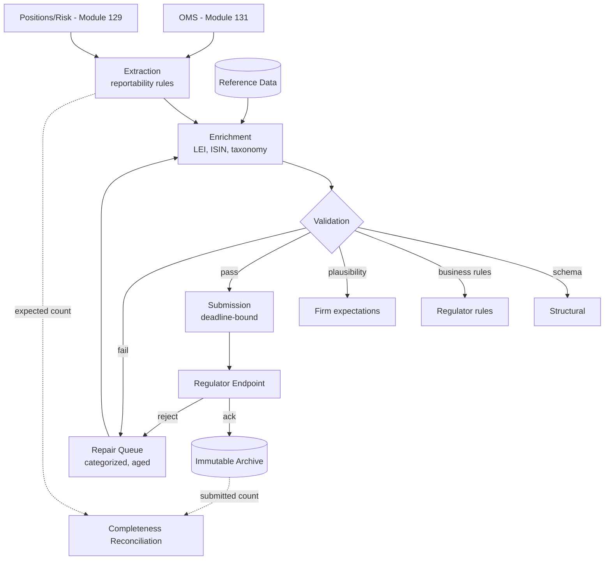
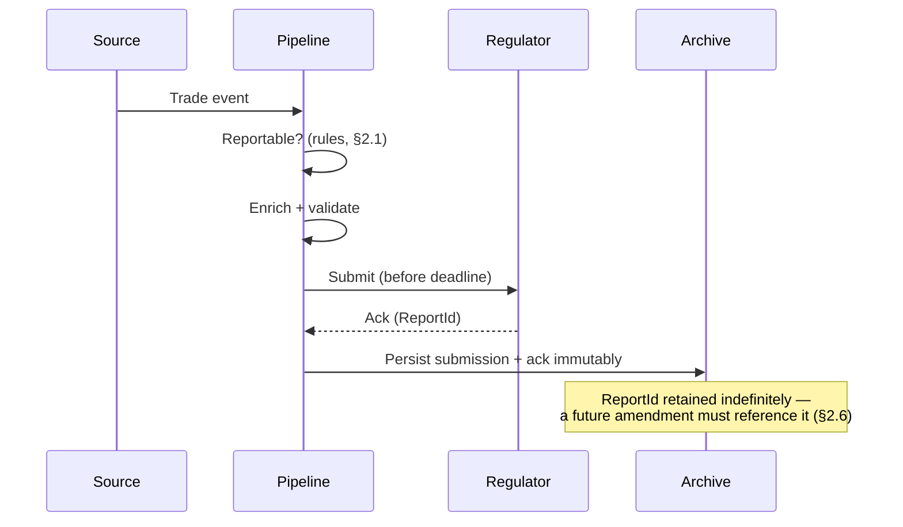
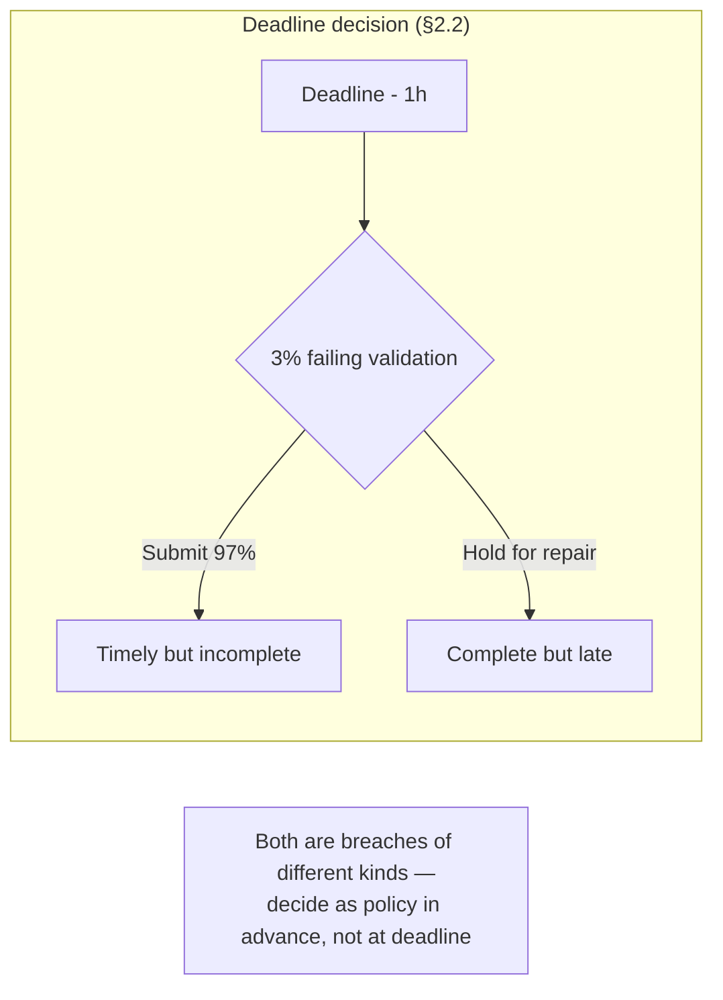
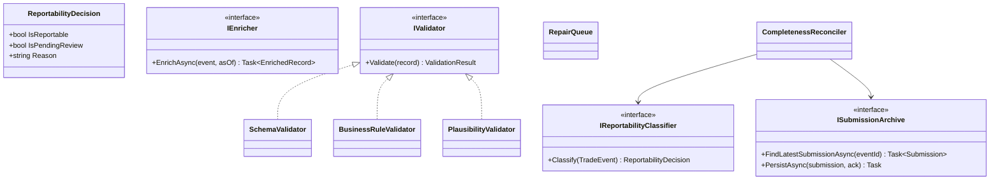

# Module 133 — System Design: Designing a Regulatory Reporting Pipeline

> Domain: System Design | Level: Beginner → Expert | Prerequisite: [[11-Designing-Order-Management-Trade-Lifecycle]] (the trade events this pipeline reports on), [[09-Designing-RealTime-Portfolio-Risk-Engine]] (position and exposure figures for prudential reporting), [[../37-Outbox/01-OutboxFundamentals-TableDesign-RelayMechanisms-DeliveryGuarantees]] (guaranteed delivery, whose failure here is a regulatory breach rather than a lost notification), [[../35-Event-Sourcing/01-EventSourcingFundamentals-EventStoreAsSourceOfTruth-Snapshotting-AggregateReconstruction]] (reconstruction of what was known when)
>
> **Scenario-module note:** Fifth of six buy-side/capital-markets system-design scenarios (Modules 129–134). Full 16-section template; Elite FinTech Interview Panel lens.

---

## 1. Fundamentals

**What:** A pipeline that extracts events and positions from the firm's systems, transforms them into regulator-specified formats, validates them against published schemas and business rules, submits them to regulatory endpoints before mandated deadlines, processes acknowledgements and rejections, and retains the full record for the statutory period.

**Why:** Reporting obligations (MiFID II transaction reporting, EMIR trade reporting, Dodd-Frank swap reporting, Form PF, and dozens more by jurisdiction) are legal requirements with penalties for lateness, incompleteness, and inaccuracy — and, distinctively, penalties apply to *each* failing. A pipeline that reports 99.9% of transactions correctly is not 99.9% compliant; it has a specific number of individually-reportable failures.

**When:** From the first reportable activity. Unlike most systems in this course, there is no scale threshold below which the requirement does not apply — a firm executing one reportable trade owes one report.

**How (30,000-ft view):**
```
Source systems (OMS, risk, positions)
        │  events + snapshots
        ▼
   Extraction ──► Enrichment ──► Validation ──► Submission ──► Ack/Reject handling
   (complete?)   (reference    (schema +      (deadline-      (repair loop)
                  data)         business)      bound)
        └──────────────────► Completeness reconciliation ◄──────────┘
                             Immutable retention (statutory period)
```

---

## 2. Deep Dive

### 2.1 Completeness Is the Hard Problem, Not Transformation
Engineers new to this domain assume the difficulty is format transformation. It is not — formats are specified, tedious, and tractable. The hard problem is **completeness**: proving that every reportable event was reported, which requires knowing what the complete set *is*.

That set is not simply "everything in the OMS." Reportability depends on rules — instrument classification, counterparty type, venue, jurisdiction, whether the firm acted as principal or agent — and those rules change. An event is missed not because the pipeline failed to process it but because the pipeline never considered it reportable. This failure is invisible to every internal signal: the pipeline reports success, having correctly processed everything it believed was in scope.

### 2.2 The Deadline as a Hard Architectural Constraint
Most systems have latency targets; this one has **deadlines with legal force** — T+1 by a specific time, or intraday for some regimes. A deadline differs from a latency target in two ways that shape the architecture:

- **It is not negotiable under load.** A system that degrades gracefully by slowing down has failed, because slow past the deadline is identical to not reporting.
- **It creates a partial-submission decision.** If, at deadline minus one hour, 3% of records are failing validation, the choice is to submit the 97% (reporting incomplete but timely) or hold for repair (complete but late). Both are breaches of different kinds, and the decision must be made in advance as policy, not improvised at deadline (§15 works this).

### 2.3 Enrichment and Its Failure Mode
Reports require data the trading systems do not hold: legal entity identifiers (LEIs), instrument classifications (ISIN, CFI, taxonomy codes), counterparty details, and jurisdiction-specific fields. Enrichment joins reportable events against reference data (Module 130 §Expert Q4's subsystem).

The failure mode is specific: enrichment failures produce records that *cannot* be validly reported, and the volume of such failures is a leading indicator of a reference-data problem rather than a pipeline problem. Treating them as individual record errors, rather than as a signal about upstream data quality, is why firms accumulate persistent repair backlogs.

### 2.4 Validation in Layers, and Why Regulator Rejection Is Too Late
Three validation layers, each catching what the next cannot:
- **Schema validation** — structural conformance to the published specification.
- **Business-rule validation** — the regulator's published rules (field interdependencies, permitted enumerations, cross-field consistency).
- **Firm-specific plausibility** — internal expectations catching data problems that are technically valid but wrong (a notional three orders of magnitude from typical).

Relying on the regulator's own rejection as validation is a common and costly mistake: rejections arrive after submission, count against the firm's error statistics, and consume the repair window. Validation must be predominantly pre-submission.

### 2.5 The Repair Loop and Why It Needs Its Own Design
Rejected and failed records enter a repair loop — investigated, corrected, resubmitted. This loop is frequently an afterthought and becomes the pipeline's operational bottleneck.

It needs first-class design: rejections categorized by cause (so systemic issues are visible rather than appearing as many individual errors), routed to whoever can actually fix them (a reference-data gap goes to data management, not to the reporting team), tracked against the deadline for resubmission, and — critically — **aged**, because an unrepaired record does not stop being a breach through the passage of time. Backlogs that are worked in arrival order rather than deadline order silently accumulate the oldest, most-breaching items at the bottom.

### 2.6 Amendments, Cancellations, and Reporting What You Previously Reported
When an underlying trade is amended or busted (Module 131 §2.1), the firm must submit an amendment or cancellation referencing the original report. This requires the pipeline to retain the mapping between internal events and submitted report identifiers indefinitely — and to know precisely what was submitted, since an amendment references the prior submission's content.

This is why the pipeline's own record must be immutable and complete: not merely for audit, but operationally, because the next amendment three years from now needs to reference what was actually sent, not what the source system currently says.

---

## 3. Visual Architecture







---

## 4. Production Example

**Problem:** A firm's transaction-reporting pipeline ran for two years with no rejections above baseline and no regulatory findings. Daily completeness reconciliation compared reports submitted against reportable events identified, and matched exactly every day.

**Architecture:** §3's design, with reportability determined by a rules engine evaluating instrument type, venue, and counterparty classification.

**Implementation:** The reconciliation compared *submitted* against *identified-as-reportable* — that is, it verified the pipeline processed everything it had identified.

**Trade-offs:** This reconciliation is cheap, runs daily, and catches every processing failure — genuinely valuable, and the check most pipelines implement.

**Lessons learned:** The firm began trading a new instrument type through an existing venue. The instrument's classification mapped to a taxonomy code the reportability rules did not recognize, and the rules engine's default for unrecognized classifications was **not reportable**. Those trades were never identified as reportable, so they were never in the reconciliation's expected set — the reconciliation matched perfectly every day while an entire instrument class went unreported for eleven months.

It surfaced when the regulator queried a counterparty-side report the firm had no matching submission for. The remediation was a self-report, back-reporting eleven months of transactions, and a finding.

The reconciliation had been verifying the wrong thing. It confirmed the pipeline processed what it identified — but the failure was in *identification*, which the reconciliation took as its own input. **A completeness check whose expected set is derived from the same logic being checked cannot detect that logic's omissions.** The fix: reconcile against an *independent* source — the count of all executed trades from the OMS, with explicit, itemized, and reviewed reasons for every exclusion, so that "not reportable" becomes an asserted, auditable classification rather than a silent default. And, structurally: the rules engine's default for an unrecognized classification was inverted to **reportable-pending-review**, because over-reporting is correctable and under-reporting is a breach.

---

## 5. Best Practices
- Reconcile completeness against a source independent of the reportability logic being checked (§4).
- Default unrecognized classifications to reportable-pending-review; over-reporting is correctable, under-reporting is a breach (§4).
- Decide the partial-submission-versus-late policy in advance, as governance, not at the deadline (§2.2, §15).
- Validate in three layers pre-submission; never use regulator rejection as primary validation (§2.4).
- Categorize repair-queue items by cause and work them in deadline order, not arrival order (§2.5).
- Retain submitted report identifiers and content indefinitely — future amendments reference them (§2.6).

## 6. Anti-patterns
- Completeness reconciliation derived from the same logic it purports to check (§4's incident).
- Defaulting unknown classifications to not-reportable, making the failure silent.
- Improvising the deadline decision under pressure rather than following a pre-agreed policy.
- Treating enrichment failures as individual errors rather than as a reference-data quality signal (§2.3).
- A repair queue worked in arrival order, burying the oldest and most-breaching items.
- Retaining only source data, not what was actually submitted — leaving amendments unable to reference prior reports (§2.6).

---

## 7. Performance Engineering

**CPU/Memory:** Modest — transformation and validation are not computationally demanding. The performance concern is entirely **wall-clock against the deadline**, not efficiency.

**Latency:** Per-record latency is irrelevant; **batch completion time relative to deadline** is the only metric that matters. Track time-to-completion with the deadline as an explicit reference line, and alert on trend, not merely on breach.

**Throughput:** Must clear peak daily volume with enough margin for a full repair-and-resubmit cycle before deadline. A pipeline sized to just complete has no repair window, which means any validation failure becomes a deadline decision (§2.2).

**Scalability:** Records are independent; the pipeline parallelizes trivially. The constraints are external: regulator endpoint rate limits and reference-data lookup capacity.

**Benchmarking:** Benchmark at peak-day volume *including* a realistic failure rate and repair cycle — a benchmark of the happy path measures the easy case and misses the actual deadline risk.

**Caching:** Reference data is heavily cached; note the correctness caveat that a stale LEI or classification produces a *validly-formatted, incorrect* report, which is a reporting error rather than a failure — the same wrong-versus-missing asymmetry seen throughout this run.

---

## 8. Security

**Threats:** Reports contain complete transaction and counterparty detail — a leak reveals the firm's and its clients' full trading activity. Additional threats: tampering to conceal reportable activity (an insider risk with direct regulatory consequence), and submission-credential compromise enabling fraudulent submissions in the firm's name.

**Mitigations:** Encryption in transit and at rest; strict access control on the archive; and immutable, tamper-evident storage (Module 121 §8's hash-chaining) so the record of what was submitted cannot be altered retroactively — which matters specifically because the archive is the firm's evidence in a dispute with its regulator.

**OWASP mapping:** Broken Access Control on the archive; and — unusually — integrity of the submission path ranks alongside confidentiality, since a tampered submission is a regulatory misstatement.

**AuthN/AuthZ:** Submission credentials are firm-level, highly privileged, and typically issued by the regulator or a reporting intermediary — compromise permits submitting in the firm's name, so they warrant the strictest handling in the estate.

**Secrets:** Regulator submission credentials and signing certificates per Module 86, with rotation coordinated with the regulator or intermediary — frequently a scheduled, manual process that must be planned around deadlines rather than executed casually.

**Encryption:** At rest for the archive over the full statutory retention period, which mandates envelope encryption with rotation that does not require rewriting immutable records (Module 122 §Advanced Q5).

---

## 9. Scalability

**Horizontal scaling:** Trivially parallel over independent records; scale to the deadline requirement rather than to a throughput target.

**Vertical scaling:** Rarely relevant.

**Caching:** Reference-data caching is the main lever (§7).

**Replication/Partitioning:** Partition by reporting regime and submission date. The archive is append-only and grows monotonically over the statutory period.

**Load balancing:** Constrained by regulator endpoint rate limits — the pipeline must respect them, meaning submission capacity is externally capped and cannot be scaled by adding workers.

**High Availability:** Availability requirements are deadline-relative rather than continuous: an outage of several hours mid-cycle may be immaterial, while the same outage immediately before a deadline is a breach. HA investment should therefore concentrate on the pre-deadline window, which is an unusual and easily-missed framing.

**Disaster Recovery:** The archive is legally required for the statutory period — its loss is itself a compliance failure independent of any reporting failure. It warrants the firm's strongest retention guarantees.

**CAP theorem:** The pipeline favours consistency: submitting a record twice creates a duplicate report requiring cancellation, and submitting inconsistent data creates a misstatement. Under uncertainty the correct behaviour is to hold and resolve rather than submit optimistically — a deliberate availability sacrifice, bounded by the deadline decision (§2.2).

---

## 10. Interview Questions

### Basic (10)

1. **Q: Why is completeness harder than transformation?**
   **A:** Formats are specified and tractable; completeness requires knowing the complete set of reportable events, which depends on changing rules — and an event never identified as reportable is invisible to every internal signal (§2.1).
   **Why correct:** Identifies the actual difficulty and why it evades detection.
   **Common mistakes:** Focusing design effort on format mapping, which is tedious but solved.
   **Follow-ups:** "What determines reportability?" (Instrument classification, counterparty type, venue, jurisdiction, principal-versus-agent capacity — all changeable, §2.1.)

2. **Q: How does a deadline differ from a latency target architecturally?**
   **A:** It is not negotiable under load — slow past the deadline equals not reporting — and it forces a partial-submission-versus-late decision that must be pre-agreed policy (§2.2).
   **Why correct:** States both consequences that distinguish deadlines from latency targets.
   **Common mistakes:** Designing graceful degradation by slowing down, which is failure in this context.
   **Follow-ups:** "Which is the lesser breach, incomplete or late?" (Regime-dependent — which is exactly why it must be decided in advance as policy, §15.)

3. **Q: Name the three validation layers and what each catches.**
   **A:** Schema (structural conformance), business rules (the regulator's published rules), and firm plausibility (technically valid but wrong, e.g. an implausible notional) (§2.4).
   **Why correct:** Names all three with distinct purposes.
   **Common mistakes:** Implementing schema validation only, letting rule violations reach the regulator.
   **Follow-ups:** "Why not rely on regulator rejection?" (It arrives post-submission, counts against error statistics, and consumes the repair window, §2.4.)

4. **Q: What went wrong in §4's incident?**
   **A:** A new instrument's classification was unrecognized by the reportability rules, whose default was not-reportable, so the trades were never identified as reportable — and the completeness reconciliation compared against that same identification, so it matched perfectly while an instrument class went unreported for eleven months (§4).
   **Why correct:** States the mechanism including why the reconciliation could not detect it.
   **Common mistakes:** Describing it as a rules-engine bug; the rules engine did what it was configured to do, and the reconciliation's design is what made it undetectable.
   **Follow-ups:** "What was the structural fix?" (Reconcile against an independent source, and default unknown classifications to reportable-pending-review, §4.)

5. **Q: Why should unrecognized classifications default to reportable?**
   **A:** Over-reporting is correctable (submit a cancellation); under-reporting is a breach that accrues silently — the failure modes are asymmetric, so the default should favour the correctable one (§4).
   **Why correct:** Grounds the default in the asymmetry of consequences.
   **Common mistakes:** Defaulting to not-reportable to avoid noise, which optimizes for the wrong failure.
   **Follow-ups:** "What does 'pending review' add?" (It surfaces the unknown classification for resolution rather than silently over-reporting indefinitely.)

6. **Q: Why must the repair queue be worked in deadline order rather than arrival order?**
   **A:** An unrepaired record does not stop being a breach with time; arrival-order working buries the oldest, most-breaching items at the bottom of the backlog (§2.5).
   **Why correct:** Identifies the specific consequence of arrival-order processing.
   **Common mistakes:** FIFO queue processing, which feels fair and is exactly wrong here.
   **Follow-ups:** "What else does the repair queue need?" (Categorization by cause and routing to whoever can actually fix it, §2.5.)

7. **Q: Why must submitted report identifiers be retained indefinitely?**
   **A:** A future amendment or cancellation must reference the original submission, so the pipeline needs to know precisely what was submitted — not what the source system currently says (§2.6).
   **Why correct:** States the operational reason, beyond audit.
   **Common mistakes:** Retaining source data only, leaving amendments unable to reference prior reports.
   **Follow-ups:** "Why isn't the source system sufficient?" (It reflects current state; the amendment must reference what was actually sent, which may differ, §2.6.)

8. **Q: Why are enrichment failures a reference-data signal rather than individual record errors?**
   **A:** Their volume indicates an upstream data-quality problem; treating them individually produces a persistent repair backlog while the cause goes unaddressed (§2.3).
   **Why correct:** Reframes the symptom as a signal about its cause.
   **Common mistakes:** Routing every enrichment failure to manual repair, permanently.
   **Follow-ups:** "Where should they be routed?" (Data management, who can fix the reference data, rather than the reporting team, who can only patch records, §2.5.)

9. **Q: Why is HA investment deadline-relative here?**
   **A:** An outage hours before a deadline is a breach; the same outage well before it is immaterial — so availability requirements concentrate in the pre-deadline window rather than being uniform (§9).
   **Why correct:** Identifies the non-uniform availability requirement.
   **Common mistakes:** Uniform availability targets, over-investing off-cycle and under-investing at the critical window.
   **Follow-ups:** "What does that imply operationally?" (Change freezes and heightened readiness in the pre-deadline window specifically.)

10. **Q: Why does the pipeline favour consistency over availability?**
    **A:** A duplicate submission requires a cancellation and an inconsistent one is a misstatement — so under uncertainty, holding and resolving beats submitting optimistically, bounded by the deadline (§9).
    **Why correct:** Derives the posture from the specific costs of the two error types.
    **Common mistakes:** Optimistic submission to maximize timeliness, converting uncertainty into misstatements.
    **Follow-ups:** "What bounds the hold?" (The deadline — at which point §2.2's pre-agreed policy governs.)

### Intermediate (10)

1. **Q: Explain precisely why §4's reconciliation was structurally incapable of catching the failure.**
   **A:** It compared submitted records against records identified as reportable, taking identification as its input. The failure was *in* identification — trades never entered the expected set — so the comparison was between two quantities that were consistently, correctly equal. The reconciliation verified processing fidelity, which was never the problem, and by construction could not verify identification correctness.
   **Why correct:** Explains the input dependency that made detection impossible rather than merely absent.
   **Common mistakes:** Concluding the reconciliation was buggy; it was correct and answering a different question than the one that mattered.
   **Follow-ups:** "What is the general principle?" (A completeness check must derive its expected set independently of the logic being checked — otherwise it validates consistency rather than completeness.)

2. **Q: Design the independent completeness reconciliation §4's fix requires.**
   **A:** Start from all executed trades in the OMS (Module 131's system of record, independent of reportability logic), then require every exclusion to carry an explicit, itemized, reviewed reason. The output is not a match/mismatch but a reconciliation with a classified exclusion list — so "not reportable" becomes an asserted classification someone reviews rather than a silent default. New instrument types surface immediately as unclassified exclusions rather than disappearing.
   **Why correct:** Uses an independent source and converts silent exclusion into an explicit, reviewable assertion.
   **Common mistakes:** Reconciling against a filtered source, which reintroduces the dependency.
   **Follow-ups:** "What makes review tractable at volume?" (Group exclusions by reason — thousands sharing one reviewed reason is fine; a new reason appearing is the signal.)

3. **Q: How should the deadline decision (§2.2) be structured as policy?**
   **A:** Pre-agreed with compliance, regime-specific (regimes differ in how they weight lateness versus incompleteness), expressed as a rule the pipeline can execute automatically — e.g. "submit validated records at deadline minus 30 minutes; hold failures for repair and late-submit." The essential property is that it executes without a judgment call under time pressure, since a decision made at deadline by whoever is available is not a policy.
   **Why correct:** Specifies pre-agreement, regime-specificity, and automatic execution as the three requirements.
   **Common mistakes:** Escalating to a human at deadline, which is when judgment is worst and time is shortest.
   **Follow-ups:** "Who owns this policy?" (Compliance, with engineering implementing it — it is a regulatory-risk decision, not a technical one.)

4. **Q: Why does a pipeline sized to just meet the deadline have a hidden failure mode?**
   **A:** It has no repair window, so any validation failure immediately becomes a deadline decision (§2.2) rather than a routine repair — converting an ordinary occurrence into a governance escalation. Capacity must include a full repair-and-resubmit cycle (§7).
   **Why correct:** Identifies that the margin is for repair, not for throughput headroom.
   **Common mistakes:** Sizing on processing time alone, which measures the happy path.
   **Follow-ups:** "How much margin?" (Enough for a realistic failure rate to be repaired and resubmitted — derived from observed failure rates, not chosen arbitrarily.)

5. **Q: Critique caching reference data for enrichment without staleness bounds.**
   **A:** A stale LEI or classification produces a validly-formatted, *incorrect* report — an error rather than a failure, so it passes validation and is submitted, becoming a reportable inaccuracy the firm must later correct. This is the wrong-versus-missing asymmetry recurring: the cache converts a detectable enrichment failure into an undetectable misstatement (§7).
   **Why correct:** Identifies that caching here converts a visible failure into an invisible error.
   **Common mistakes:** Treating reference-data caching as purely a performance decision.
   **Follow-ups:** "What bounds are appropriate?" (Tied to the reference data's own change cadence — LEI status changes matter within days, so a multi-day cache is unsafe.)

6. **Q: How should amendments be handled when the original submission's content differs from current source state?**
   **A:** The amendment references what was actually submitted (§2.6), so the pipeline must diff against its own archive rather than against current source state. Regenerating from source would produce an amendment inconsistent with what the regulator holds — the firm would be amending a report that does not match the one on record.
   **Why correct:** Identifies that the archive, not the source, is the amendment's reference point.
   **Common mistakes:** Regenerating the report from current source data, producing an inconsistent amendment.
   **Follow-ups:** "Why might they differ?" (The source has since been corrected, or the report was generated under a prior reference-data or logic version — Module 129 §2.6's provenance problem recurring.)

7. **Q: Why do regulator endpoint rate limits make submission capacity externally capped?**
   **A:** Adding workers does not increase throughput past the endpoint's limit, so submission is the one stage that cannot be scaled horizontally — which means deadline margin must be created earlier in the pipeline, not at submission (§9).
   **Why correct:** Identifies the external constraint and its consequence for where margin must come from.
   **Common mistakes:** Planning to scale out submission under deadline pressure, which the endpoint will not permit.
   **Follow-ups:** "What does this imply about batch timing?" (Submission must start early enough that the rate-limited stage completes before deadline — the limit, not the volume, sets the start time.)

8. **Q: Why does the archive's integrity rank alongside its confidentiality?**
   **A:** The archive is the firm's evidence of what it submitted in any dispute with its regulator; if it can be altered retroactively, it cannot serve that purpose — so tamper-evidence (hash-chaining, Module 121 §8) is a functional requirement, not merely a security control (§8).
   **Why correct:** Ties integrity to the archive's evidentiary function.
   **Common mistakes:** Securing the archive for confidentiality only, leaving its evidentiary value unprotected.
   **Follow-ups:** "Who is the archive's audience?" (The regulator, in a dispute — which is why its credibility, not merely its contents, matters.)

9. **Q: How does this pipeline's failure asymmetry compare to Module 132's?**
   **A:** Both have failures invisible internally, but the detection paths differ: Module 132 had no external party to reconcile against, so self-testing was the only verification; here an external party — the regulator, and counterparties' own reports — does hold comparable truth, which is exactly how §4's failure eventually surfaced. That makes independent reconciliation (Intermediate Q2) both possible and obligatory here, where Module 132 had no equivalent option.
   **Why correct:** Draws the correct contrast and identifies why the available control differs.
   **Common mistakes:** Treating both as equivalent silent-failure problems, missing that this one has an external reference and therefore a stronger available control.
   **Follow-ups:** "Why not rely on the regulator to detect gaps?" (Detection arrives as a finding — the firm learns of its breach from its regulator, which is the worst discovery path, §4.)

10. **Q: Synthesize how this pipeline depends on Modules 129, 130, and 131.**
    **A:** It reports on Module 131's trade events using Module 130's prices and reference data, and Module 129's positions and exposures for prudential regimes. Each dependency propagates its own failure modes: a Module 131 unknown position is unreported activity here; a Module 130 misattribution produces a misstated report; a Module 129 irreproducible figure cannot be defended if queried. This pipeline is where the previous three modules' correctness problems become externally visible — it is the firm's reporting surface for their failures.
    **Why correct:** Traces each dependency to its specific downstream consequence here.
    **Common mistakes:** Treating this as an independent pipeline rather than the externalization point for upstream correctness.
    **Follow-ups:** "What follows for prioritization?" (Upstream correctness investment reduces reporting risk directly — this pipeline cannot report correctly on incorrect inputs.)

### Advanced (10)

1. **Q: Diagnose §4's incident and design the complete structural fix.**
   **A:** Root cause: the reportability rules' unknown-classification default was silent and unsafe, and the completeness reconciliation took identification as its input, making the failure undetectable (Intermediate Q1). Fix: (1) invert the default to reportable-pending-review, making unknowns loud and erring toward the correctable failure; (2) reconcile against the OMS's independent trade record with itemized, reviewed exclusion reasons (Intermediate Q2); (3) alert on any new instrument classification appearing in trading activity, since a new classification is precisely the precondition for this failure; (4) periodically review the reportability rules against current regulatory guidance, since rules change and a rules engine correct at implementation drifts silently.
   **Why correct:** Addresses the unsafe default, the dependent reconciliation, the triggering precondition, and the ongoing drift.
   **Common mistakes:** Fixing the reconciliation only, leaving the unsafe default to cause a different variant.
   **Follow-ups:** "Why is (3) valuable given (1) and (2)?" (It detects the condition proactively at first trade rather than at the next reconciliation cycle, compressing exposure from days to minutes.)

2. **Q: A team proposes using the regulator's rejection feedback as the primary validation mechanism, arguing it is authoritative. Evaluate.**
   **A:** The regulator's rules are authoritative, but using rejection as the mechanism is wrong on three counts: rejections count against the firm's error statistics (a supervisory metric), they consume the repair window leaving less time before deadline, and they arrive too late to prevent the submission that constitutes the error. The correct approach implements the regulator's published rules pre-submission (§2.4) and treats any rejection as a gap in that implementation — a defect to fix, not a normal outcome.
   **Why correct:** Names all three costs and reframes rejections as implementation gaps.
   **Common mistakes:** Treating a low rejection rate as acceptable rather than as a defect signal.
   **Follow-ups:** "What is a reasonable rejection target?" (Approaching zero — every rejection represents a rule the firm could have checked and did not.)

3. **Q: Critique running the pipeline only once daily, immediately before the deadline.**
   **A:** It collapses the repair window to nothing (Intermediate Q4) and makes any failure — pipeline, reference data, or regulator endpoint — an immediate deadline crisis with no recovery time. Running continuously or in early batches surfaces problems while time remains to fix them, converting deadline management from crisis response into routine operation. The counter-argument (late data completeness) is addressed by running repeatedly and treating early runs as provisional, not by delaying the only run.
   **Why correct:** Identifies the eliminated recovery time and rebuts the usual counter-argument.
   **Common mistakes:** Batching at deadline for data completeness, trading all recovery time for marginal completeness.
   **Follow-ups:** "How do you handle records arriving after an early run?" (Incremental subsequent runs — the early run is not final, merely early, and most records are stable well before deadline.)

4. **Q: Design the repair-queue routing and aging model.**
   **A:** Categorize by cause at rejection time (reference-data gap, source-data error, rule-implementation defect, transient); route each to the owner who can actually resolve it — data management, the source system's team, engineering, or automatic retry. Age against the *regulatory* deadline for that record, not queue-entry time, so the display and the working order reflect breach severity rather than arrival. Escalate on aging thresholds, and — critically — report *category counts* to management, since a spike in one category is a systemic issue, whereas the individual records look like ordinary errors (§2.5).
   **Why correct:** Covers categorization, routing by resolvability, deadline-relative aging, and the systemic signal.
   **Common mistakes:** One undifferentiated queue owned by the reporting team, who can patch records but cannot fix causes.
   **Follow-ups:** "Which category is most often mis-routed?" (Reference-data gaps, which land with the reporting team and get patched per-record indefinitely rather than fixed once at source, §2.3.)

5. **Q: How would you handle a retrospective change in regulatory interpretation making previously-unreported activity reportable?**
   **A:** Determine the scope (which historical activity is affected — requiring the historical trade record and the reference data as it was, Module 130 §Expert Q4's bitemporality), self-report to the regulator proactively rather than waiting for discovery, back-report the affected population, and update the reportability rules with a version-effective date so the change is auditable and future queries can distinguish pre- and post-change treatment. Proactive self-reporting is materially better received than regulator discovery — the same honest-disclosure posture established in Modules 118 and 129.
   **Why correct:** Covers scoping, disclosure, remediation, and the versioning that makes the change auditable.
   **Common mistakes:** Applying the new interpretation forward only, leaving historical exposure unaddressed and undisclosed.
   **Follow-ups:** "Why does rule versioning matter?" (Without it, the firm cannot demonstrate which interpretation applied when — and a future review cannot distinguish a rule change from an error.)

6. **Q: The regulator queries a specific report from three years ago. Walk through the response.**
   **A:** Retrieve from the immutable archive the exact submitted content, its acknowledgement, the submission timestamp, and the versions of reportability rules, reference data, and transformation logic in effect at the time (Module 129 §2.6's provenance discipline, applied here). Reconstruct the underlying trade from the OMS's event stream (Module 131 §2.6) to demonstrate the report's derivation. If any of these four is unavailable, the query cannot be fully answered — which is why the archive must retain the report and its provenance, not merely the report.
   **Why correct:** Enumerates all four required artifacts and identifies the incompleteness if any is missing.
   **Common mistakes:** Retaining submitted reports without the logic and reference-data versions, leaving derivation undemonstrable.
   **Follow-ups:** "Which is hardest to sustain over three years?" (Logic version re-instantiability — the same problem Module 129 §Advanced Q5 identified for pricing models, and with the same answer: retain executable artifacts, not source references.)

7. **Q: Apply the "declared ≠ actual" theme to this pipeline.**
   **A:** The claim is "all reportable activity was reported completely, accurately, and on time." Each component fails differently and independently: *complete* fails via unidentified reportability (§4) — invisible internally by construction; *accurate* fails via stale enrichment (Intermediate Q5) producing valid-but-wrong reports that pass every check; *timely* fails visibly and is therefore the least dangerous. What distinguishes this module is that the declared basis — "the pipeline ran successfully" — is not merely insufficient but *actively misleading*, because success is measured against a scope the same system defined. §4 is the purest instance in this run: the system was correct about everything it considered, and wrong about what to consider.
   **Why correct:** Decomposes the claim, ranks the components by detectability, and identifies the self-referential scope problem as the distinguishing feature.
   **Common mistakes:** Treating pipeline success metrics as evidence of compliance.
   **Follow-ups:** "Which component is most dangerous and why?" (Completeness — accuracy errors are eventually caught by counterparty or regulator matching, but an unidentified population is never compared against anything.)

8. **Q: Design the monitoring distinguishing "pipeline problem" from "source data problem" from "regulator problem."**
   **A:** Compare across dimensions: validation failure rate spiking with stable submission success indicates source or reference data; submission failures with clean validation indicate the regulator endpoint or credentials; a drop in *input volume* with everything else normal indicates an upstream extraction problem — the most dangerous signal, since it looks like a quiet day. That last case is why expected-volume monitoring against historical patterns matters: a pipeline processing zero records successfully reports complete success.
   **Why correct:** Provides discriminating signals and identifies the counter-intuitive volume-drop case.
   **Common mistakes:** Monitoring only error rates, which are clean when the problem is that nothing arrived.
   **Follow-ups:** "How do you set the expected-volume baseline?" (Historical pattern by day-of-week and accounting for holidays and market closures — naive averages produce false alarms on known-quiet days and miss genuine drops on busy ones.)

9. **Q: How should the pipeline handle a regulator endpoint outage extending toward the deadline?**
   **A:** Continue processing and queue validated submissions so no time is lost on the pipeline's own work; monitor for endpoint recovery with automatic resumption; escalate to compliance early rather than at deadline, since regulators typically have documented procedures for endpoint outages (and invoking them requires notification, often within a defined window); and preserve evidence of the outage and of the firm's readiness to submit — because demonstrating that the firm was ready and the endpoint was unavailable is materially different from being late.
   **Why correct:** Covers continued work, recovery, early escalation, and evidence — the last being the element that distinguishes an excusable from an inexcusable delay.
   **Common mistakes:** Waiting for recovery without notification, forfeiting the documented outage procedure by missing its notification window.
   **Follow-ups:** "Why does evidence matter so much here?" (The firm's position depends on demonstrating readiness — without it, an endpoint outage is indistinguishable from the firm's own lateness.)

10. **Q: Synthesize the governance program required before a reporting pipeline goes live.**
    **A:** (1) Independent completeness reconciliation with itemized, reviewed exclusions (Intermediate Q2). (2) Unknown classifications defaulting to reportable-pending-review (Advanced Q1). (3) Pre-agreed, regime-specific, automatically-executed deadline policy (Intermediate Q3). (4) Three-layer pre-submission validation with rejections treated as defects (Advanced Q2). (5) Categorized, deadline-aged repair queue routed by resolvability (Advanced Q4). (6) Immutable archive retaining submissions with full provenance for the statutory period (Advanced Q6). (7) Expected-volume monitoring catching the silent-zero case (Advanced Q8). (8) Rule versioning with effective dates supporting retrospective interpretation changes (Advanced Q5). (9) Documented outage procedures with notification windows understood in advance (Advanced Q9).
    **Why correct:** Assembles a program covering completeness, timeliness, accuracy, evidence, and the operational procedures that only matter under failure.
    **Common mistakes:** Presenting extraction, transformation, and submission without the completeness verification and repair governance, which is where compliance actually fails.
    **Follow-ups:** "Which is most often missing?" (Independent completeness reconciliation — most firms reconcile against their own reportability logic, which is exactly §4.)

### Expert (10)

1. **Q: Evaluate building this pipeline versus using a regulatory-reporting vendor.**
   **A:** The buy case is unusually strong. Vendors maintain format specifications across regimes as they change — a continuous, high-volume maintenance burden with a hard deadline attached to every change — plus regulator connectivity and certification. The build case is narrow: unusual instruments or business models vendors do not cover, or a firm large enough that vendor per-transaction pricing exceeds build cost. The critical caveat that firms miss: **the obligation is not outsourceable.** A vendor failure is the firm's breach, so vendor selection requires the same diligence as an internal system, plus contractual visibility into their controls — buying transfers the work, not the responsibility.
   **Why correct:** Identifies the maintenance burden as decisive and states the non-transferable-obligation caveat that distinguishes this from ordinary build-versus-buy.
   **Common mistakes:** Treating vendor adoption as risk transfer, then discovering the firm is answerable for the vendor's failures.
   **Follow-ups:** "What contractual terms matter most?" (Visibility into their completeness controls and incident notification — the firm must be able to detect and respond to a vendor failure that is legally its own.)

2. **Q: How should a firm reporting under multiple overlapping regimes structure the pipeline?**
   **A:** Shared extraction, enrichment, and completeness determination — where the expensive, correctness-critical work is and where duplication would produce divergent answers about the same trade — with regime-specific transformation, validation, and submission as pluggable modules. The failure mode to avoid is per-regime pipelines duplicating extraction, which guarantees they eventually disagree about what happened (Module 130 §Expert Q6's divergence risk, recurring). The subtlety is that regimes define reportability differently, so completeness determination must be *per-regime evaluation over a shared event set*, not one shared determination.
   **Why correct:** Identifies what to share and what to keep separate, and notes the non-obvious constraint on completeness determination.
   **Common mistakes:** Either fully separate pipelines (divergence) or one shared determination (wrong, since regimes differ in scope).
   **Follow-ups:** "What breaks if extraction is duplicated?" (Two pipelines disagreeing about the same trade's existence or attributes — the firm then reports inconsistently to two regulators, which is worse than either error alone.)

3. **Q: Design the control preventing a source-system change from silently breaking reporting.**
   **A:** Contract tests between source and pipeline (Module 117's discipline), run in the *source system's* CI so its team is notified before merging — the essential property being that the notification reaches whoever is making the change, not the reporting team afterward. Supplement with schema-change detection on source data and the expected-volume monitoring (Advanced Q8) that catches a silent drop. §4 is the archetype: a change elsewhere (new instrument type) silently altered reporting scope, and nothing connected the two.
   **Why correct:** Places the control where the change originates and adds the runtime backstop.
   **Common mistakes:** Contract tests in the reporting pipeline's CI, which catch the break after the source has shipped.
   **Follow-ups:** "Why does test location matter so much?" (A test that fails in the reporting team's pipeline after release tells them they have a problem; one that fails in the source team's pipeline prevents it.)

4. **Q: How does this pipeline interact with Module 131's trade amendments and busts?**
   **A:** Each generates a downstream regulatory amendment or cancellation referencing the original report (§2.6) — so the pipeline must subscribe to Module 131's event stream rather than polling current state, since a poll cannot distinguish "amended" from "always was this way." A bust hours after the original was reported requires a cancellation, and the pipeline must locate the original submission by internal event identity, which is why that mapping (§2.6) must be retained.
   **Why correct:** Identifies the event-subscription requirement and its reason, plus the identity-mapping dependency.
   **Common mistakes:** Polling current trade state, which reports the corrected value without ever submitting the required amendment — leaving the regulator holding an unamended incorrect report.
   **Follow-ups:** "What if the original was never successfully submitted?" (Then the amendment has nothing to reference — the pipeline must detect this and submit an original instead, a case that is easy to miss and produces a regulator rejection.)

5. **Q: Evaluate cloud deployment for this pipeline.**
   **A:** Generally suitable — the workload is batch, elastic, and not latency-critical — with two constraints. Data residency: reports contain client and transaction data frequently subject to jurisdictional restrictions (Module 132 §Expert Q6's constraint recurring). Regulator connectivity: some endpoints require specific network arrangements or IP allowlisting, which constrains egress architecture. The archive's statutory retention also makes cloud storage economics attractive but requires confidence in multi-year durability and the ability to demonstrate retention compliance — a governance requirement on top of the technical one.
   **Why correct:** Identifies suitability plus the two specific constraints and the retention-demonstration requirement.
   **Common mistakes:** Assuming batch workload suitability settles it, without checking residency and connectivity constraints.
   **Follow-ups:** "What does IP allowlisting imply architecturally?" (Stable egress addressing — NAT gateways or dedicated egress, which constrains otherwise-free scaling decisions.)

6. **Q: A regulator finds under-reporting during an inspection. Walk through the response.**
   **A:** Establish scope precisely before responding — how many, over what period, why — using the historical trade record and reference data as it was, because an inaccurate scope statement is worse than the original failure. Self-report the full scope proactively including any additional issues found while investigating, back-report the affected population, and present the *structural* remediation (Advanced Q1's fixes) rather than a case-specific patch, because the regulator's concern is whether it recurs. The firm's credibility rests on the completeness of its own investigation more than on the original error's size — which is why scoping before responding matters more than responding quickly.
   **Why correct:** Sequences scoping before disclosure, includes proactive disclosure of additional findings, and identifies structural remediation as what the regulator actually assesses.
   **Common mistakes:** Responding quickly with an incomplete scope, then revising upward — which damages credibility far more than the original finding.
   **Follow-ups:** "Why disclose additional issues found while investigating?" (Discovery of undisclosed related issues later is materially worse; proactive disclosure is evidence the firm's investigation was genuine.)

7. **Q: Design the reconciliation against counterparty-side reporting.**
   **A:** For dual-sided regimes where both parties report, compare the firm's submissions against the counterparty's for the same trades where the regulator or a matching utility exposes this — a genuinely independent check that catches both firm-side gaps and misstatements. §4's failure surfaced exactly this way, but externally and late. Building it proactively converts a discovery mechanism the firm suffers into one it operates. Where no matching facility exists, bilateral reconciliation with major counterparties is a partial substitute.
   **Why correct:** Identifies the strongest available independent check and notes it is exactly how the failure surfaced anyway.
   **Common mistakes:** Waiting for the regulator's matching process to report mismatches, learning of breaches from the regulator.
   **Follow-ups:** "What causes legitimate mismatches?" (Different valid interpretations of fields between counterparties — which is itself worth knowing, since it may indicate the firm's interpretation is the outlier.)

8. **Q: How should the pipeline handle an instrument or business genuinely novel to the firm?**
   **A:** Treat it as requiring explicit reportability determination *before* trading begins, not after — a pre-trade governance gate where new product approval includes a reporting assessment. §4's incident is exactly the failure of not having this: a new instrument reached production trading with no one having determined its reporting treatment. The engineering control (Advanced Q1's reportable-pending-review default and new-classification alerting) is a backstop for when the governance gate is missed, not a substitute for it.
   **Why correct:** Places the primary control at product approval and correctly frames the engineering control as a backstop.
   **Common mistakes:** Relying on the pipeline to handle novelty, when the determination requires regulatory interpretation the pipeline cannot make.
   **Follow-ups:** "Why must the engineering backstop exist anyway?" (Governance gates are missed — a business change may not be recognized as new-product, so the backstop catches what the process does not.)

9. **Q: Design the metrics a Principal Engineer would report to a board risk committee.**
   **A:** Not pipeline uptime or throughput, which a board cannot evaluate. Report: completeness (reportable events identified versus reported, from the *independent* reconciliation), timeliness (submissions before deadline, and the margin distribution — a shrinking margin is a leading indicator), accuracy (rejection and post-submission-correction rates), and repair-backlog aging against deadlines. These map to the four ways the obligation can be breached, which is what the committee is accountable for — and the margin distribution specifically is the metric that predicts a future breach rather than reporting a past one.
   **Why correct:** Selects metrics mapping to the obligation's failure modes and identifies the leading indicator among them.
   **Common mistakes:** Reporting system-health metrics, which are not the board's concern and do not indicate compliance.
   **Follow-ups:** "Which metric is the best leading indicator?" (Deadline margin trend — it degrades before breaches occur, whereas the others report failures that already happened.)

10. **Q: Deliver the closing synthesis: what makes regulatory reporting distinctively hard?**
    **A:** Not the transformation, and not the volume. Two properties. First, **the failure is defined by what you did not do**, and completeness cannot be verified from inside the system that defines scope (§4, Advanced Q7) — every other module in this run could at least in principle check its own work, whereas here the system's success measurement is scoped by the same logic that can be wrong. Second, **the deadline converts every other problem into a crisis**: a validation failure with a week's margin is routine and the identical failure an hour before deadline is a governance escalation, so the architecture must create margin as a first-class property rather than treating time as slack. Together these mean the design's difficulty lies in *proving completeness against an independent reference* and *engineering time margin*, neither of which is a data-processing problem — and a candidate who designs an efficient ETL pipeline has, once again, solved the tractable half.
    **Why correct:** Identifies both distinguishing properties, contrasts the completeness problem with the prior modules' self-checkability, and locates the difficulty away from the obvious framing.
    **Common mistakes:** Treating it as an ETL problem with formatting requirements, producing a correct-looking pipeline that cannot prove it reported everything.
    **Follow-ups:** "How does the capstone differ?" (Module 134 addresses migrating a legacy batch estate to intraday — where the difficulty is that the system being changed is the one every other system, including this pipeline, depends on.)

---

## 11. Coding Exercises

### Easy — Reportability with a Safe Default (§4, Advanced Q1)
**Problem:** Classify an event's reportability so unknowns are loud rather than silent.
**Solution:**
```csharp
public ReportabilityDecision Classify(TradeEvent e)
{
    if (!_taxonomy.TryGetClassification(e.InstrumentId, out var cls))
        return ReportabilityDecision.PendingReview(              // never a silent "no"
            reason: $"Unrecognized instrument classification for {e.InstrumentId}");

    return _rules.Evaluate(cls, e.Venue, e.CounterpartyType, e.Capacity) switch
    {
        RuleOutcome.Reportable    => ReportabilityDecision.Reportable(),
        RuleOutcome.NotReportable => ReportabilityDecision.Excluded(_rules.ExplainExclusion(cls, e)),
        _                         => ReportabilityDecision.PendingReview("Rules returned no decision")
    };
}
```
**Time complexity:** O(1) with indexed taxonomy lookup.
**Space complexity:** O(1).
**Optimized solution:** Emit a metric per distinct exclusion reason so a *new* reason appearing is itself an alert — the signal that caught nothing in §4 because exclusions were silent and uncounted.

### Medium — Independent Completeness Reconciliation (Intermediate Q2)
**Problem:** Reconcile against the OMS rather than against reportability logic.
**Solution:**
```csharp
public async Task<CompletenessReport> ReconcileAsync(DateOnly businessDate)
{
    var allTrades = await _oms.ExecutedTradesAsync(businessDate);      // independent source
    var submitted = (await _archive.SubmittedAsync(businessDate)).ToHashSet(t => t.InternalEventId);

    var unexplained = new List<TradeEvent>();
    var exclusionsByReason = new Dictionary<string, int>();

    foreach (var trade in allTrades)
    {
        if (submitted.Contains(trade.EventId)) continue;

        var decision = _classifier.Classify(trade);
        if (decision.IsExcluded)
            exclusionsByReason.Increment(decision.Reason);             // grouped for review
        else
            unexplained.Add(trade);                                     // gap: reportable, not submitted
    }
    return new CompletenessReport(allTrades.Count, submitted.Count, exclusionsByReason, unexplained);
}
```
**Time complexity:** O(n) for n trades.
**Space complexity:** O(n).
**Optimized solution:** Diff exclusion-reason counts against the prior period and alert on any *new* reason or a material shift in an existing one — a new exclusion reason is the precise signature of §4's failure.

### Hard — Deadline-Aged Repair Queue (§2.5, Advanced Q4)
**Problem:** Work repairs in deadline order with category routing.
**Solution:**
```csharp
public sealed class RepairQueue
{
    private readonly PriorityQueue<RepairItem, DateTime> _byDeadline = new();

    public void Enqueue(RepairItem item) =>
        _byDeadline.Enqueue(item, item.RegulatoryDeadline);  // NOT arrival time

    public RepairItem? Next() => _byDeadline.TryDequeue(out var item, out _) ? item : null;

    public IReadOnlyDictionary<RepairCause, int> CategoryCounts() =>
        _byDeadline.UnorderedItems
            .GroupBy(i => i.Element.Cause)
            .ToDictionary(g => g.Key, g => g.Count());       // systemic signal, not individual errors
}
```
**Time complexity:** O(log n) enqueue and dequeue.
**Space complexity:** O(n).
**Optimized solution:** Maintain per-cause queues with independent ownership and SLAs, so a reference-data backlog owned by data management does not compete for attention with a rule-implementation defect owned by engineering (Advanced Q4's routing).

### Expert — Amendment Against Archived Submission (§2.6, Intermediate Q6)
**Problem:** Generate an amendment referencing what was actually submitted, not current source state.
**Solution:**
```csharp
public async Task<Submission> BuildAmendmentAsync(InternalEventId eventId, TradeEvent currentState)
{
    var original = await _archive.FindLatestSubmissionAsync(eventId)
        ?? throw new NoPriorSubmissionException(eventId);   // must submit as original, not amendment

    var current = _transformer.Transform(currentState);
    var changed = _differ.ChangedFields(original.Content, current);   // diff vs ARCHIVE, not source

    if (changed.Count == 0) return Submission.NoChangeRequired(eventId);

    return Submission.Amendment(
        referencingReportId: original.RegulatorReportId,             // regulator's identifier
        content: current,
        changedFields: changed);
}
```
**Time complexity:** O(f) for f fields compared.
**Space complexity:** O(f).
**Optimized solution:** Record the reference-data and logic versions used for the original (Advanced Q6's provenance) so an amendment can distinguish "the trade changed" from "our interpretation changed" — materially different situations that may require different regulatory treatment.

---

## 12. System Design

**Functional requirements**
- Identify all reportable events across regimes from source systems (§2.1).
- Enrich with reference data; validate in three layers pre-submission (§2.3, §2.4).
- Submit before regime-specific deadlines; process acknowledgements and rejections (§2.2).
- Handle amendments and cancellations referencing prior submissions (§2.6).
- Retain submissions with full provenance for the statutory period (§8).

**Non-functional requirements**
- Completeness verifiable against an independent source (§4).
- Deadline margin sufficient for a full repair-and-resubmit cycle (§7).
- Archive immutable and tamper-evident for the retention period (§8).
- Rejection rate approaching zero, treated as a defect signal (Advanced Q2).

**Capacity estimation**
- ~250k reportable transactions/day across regimes (aligning with Module 131's order volumes).
- Report record ~2–4 KB → ~1 GB/day submitted, ~350 GB/year, ~2.5 TB over a 7-year retention — small, and confirming the archive's challenge is durability and evidentiary integrity rather than size.
- Processing: trivially parallel, minutes of compute at this volume.
- **The sensitivity that matters:** the regulator endpoint's rate limit, not the firm's processing capacity (Intermediate Q7). If the endpoint accepts 100 submissions/second, 250k records take ~42 minutes minimum regardless of how fast the pipeline runs — which sets the latest safe start time and is the number that actually governs the deadline.

**Architecture:** §3 — extraction with reportability determination, enrichment, layered validation, deadline-bound submission, repair loop, and independent completeness reconciliation.

**Components:** Reportability classifier (§11 Easy); enrichment service over bitemporal reference data; three-layer validator; submission client respecting rate limits; repair queue (§11 Hard); completeness reconciler (§11 Medium); immutable archive with provenance.

**Database selection:** Archive — append-only, immutable, hash-chained, partitioned by regime and date. Reference data — bitemporal (Module 130 §Expert Q4), resolved as-of the event. Repair queue — a durable queue with priority support, not in-memory, since a restart must not lose the backlog.

**Caching:** Reference data cached with staleness bounds tied to its own change cadence (Intermediate Q5), never unbounded.

**Messaging:** Subscribe to Module 131's event stream via the Outbox pattern (Module 125) — polling current state cannot distinguish amendments from originals (Expert Q4).

**Scaling:** Parallel over records; submission capped externally by endpoint rate limits (Intermediate Q7).

**Failure handling:** Reportable-pending-review default (§11 Easy); repair loop with deadline aging (§11 Hard); documented regulator-outage procedure with notification windows (Advanced Q9); pre-agreed deadline policy (Intermediate Q3).

**Monitoring:** Independent completeness reconciliation results; deadline margin distribution as a leading indicator (Expert Q9); exclusion-reason counts with new-reason alerting (§11 Medium); expected-volume monitoring catching silent zero (Advanced Q8); repair-backlog aging by category.

**Trade-offs:** Reportable-by-default trades some over-reporting for eliminating silent under-reporting — correct given the asymmetry (§4). Early and repeated runs trade some rework for repair margin (Advanced Q3). Shared extraction across regimes trades some coupling for consistency (Expert Q2).

---

## 13. Low-Level Design

**Requirements:** Reportability decisions are explicit and never silently negative; completeness is checked independently; amendments reference archived submissions; repairs are deadline-ordered.

**Class diagram:**


**Sequence diagram:** §3's second diagram — submission with archived acknowledgement supporting future amendments.

**Design patterns used:** Chain of Responsibility (layered validation); Strategy (per-regime transformation, Expert Q2); Specification (reportability rules); Priority Queue (deadline-ordered repair); Memento (immutable archived submissions).

**SOLID mapping:** Single Responsibility (classification, enrichment, validation, submission are separate); Open/Closed (a new regime adds transformation and validation strategies without touching extraction); Liskov (every validator must fail closed — a validator erroring must reject, not pass, contract-tested per Module 117); Interface Segregation (archive read and write paths separate, since the reconciler needs only reads); Dependency Inversion (the reconciler depends on the classifier interface, allowing an independent implementation to cross-check the production one).

**Extensibility:** A new regime adds strategies; a new instrument type requires a reportability determination (Expert Q8's governance gate) that the classifier then encodes — deliberately requiring a human decision rather than allowing silent defaulting.

**Concurrency/thread safety:** Records process independently; the repair queue is the shared mutable structure requiring synchronization; the archive is append-only, eliminating write conflicts. Submission must be serialized per regime to respect rate limits and preserve any required ordering.

---

## 14. Production Debugging

**Incident:** Submissions began failing validation at the regulator with a schema error, three weeks after a routine pipeline release that had passed all internal validation. Roughly 8% of records rejected; the rest submitted normally.

**Root cause:** The regulator had published a schema revision with a new optional field and a *tightened* constraint on an existing one — a maximum length reduced from 50 to 35 characters. The firm's schema validator used the previous schema version, which the release had not updated. Records with values between 36 and 50 characters — about 8%, concentrated in one counterparty-name field — passed internal validation and were rejected externally.

The deeper issue: schema updates arrived as regulator publications on a website, tracked by a compliance analyst who forwarded them to engineering. The analyst had been on leave when this revision published, and the notification never reached the team. Nothing in the system detected that its schema version was stale.

**Investigation:** The rejection messages named the constraint, making the proximate cause quick to identify. The revealing question was why internal validation passed — comparing the deployed schema version against the regulator's current published version showed the drift immediately.

**Tools:** Regulator rejection messages (specific and accurate); schema version comparison against the published specification; release history showing the schema had not been updated in eleven months while the regulator had published twice.

**Fix:** Update to the current schema and resubmit the rejected records within the repair window (which existed because the pipeline ran early — Advanced Q3's discipline, which is what converted this from a crisis into a repair).

**Prevention:** (1) Automated schema-version checking against the regulator's published specification, alerting on drift — the system must detect its own staleness rather than depending on a human relay. (2) Subscription to regulator publication feeds where available, routed to a monitored channel rather than an individual. (3) A standing periodic review of specification currency, since the failure mode is *absence* of a notification, which no reactive process detects — the same class of failure as Module 125's dead-letter alert routing to an unmonitored address: the information existed, the delivery path silently did not.

---

## 15. Architecture Decision

**Context:** The deadline policy (§2.2) — what the pipeline does when validated records are ready but some records remain unrepaired as the deadline approaches. This is the pipeline's most consequential governance decision and must be made before it is needed.

**Option A — Submit what is valid, repair and late-submit the remainder:**
*Advantages:* Maximizes timeliness; the majority of records meet the deadline; the failure is bounded to the known, itemized set of late records, which the firm can proactively disclose.
*Disadvantages:* The submission is knowingly incomplete at deadline, which some regimes treat as its own breach independent of the subsequent late submission.
*Cost:* Low. *Complexity:* Low. *Risk:* Two smaller breaches (incomplete-then-late) rather than one larger one.

**Option B — Hold the batch until complete, submit late if necessary:**
*Advantages:* Every submission is complete; a single, cleanly-characterized breach (lateness) rather than two.
*Disadvantages:* One unrepairable record makes the entire batch late — the failure is unbounded in scope, since a single problematic record delays thousands of correct ones.
*Cost:* Low. *Complexity:* Low. *Risk:* Amplifies a small problem into a total one.

**Option C — Regime-specific policy, automatically executed (recommended):**
*Advantages:* Regimes genuinely differ in how they weight lateness versus incompleteness, so a single policy is wrong for some; encoding per-regime rules applies the right behaviour in each case, executed automatically without a judgment call under time pressure (Intermediate Q3).
*Disadvantages:* Requires compliance to make and document a determination per regime — real work, and work that must be revisited as regimes change.
*Cost:* Moderate (governance effort). *Complexity:* Moderate. *Risk:* Lowest, provided the determinations are correct and maintained.

**Recommendation: Option C.** Options A and B are each right for some regimes and wrong for others, and choosing either universally guarantees the wrong behaviour somewhere. More importantly, the decision belongs to compliance, not engineering — it is a regulatory-risk judgment, and engineering's contribution is to insist it be made in advance and encoded rather than improvised. The failure mode this avoids is the most common one in practice: no policy exists, so at deadline whoever is on duty decides under pressure, inconsistently, and without authority to accept a regulatory breach on the firm's behalf.

---

## 17. Principal Engineer Perspective

**Business impact:** This pipeline generates no revenue and prevents regulatory penalties, remediation costs, and supervisory findings that constrain the firm's activities. The framing that lands with executives is exposure avoided per unit of investment — and unusually, it can be quantified from published enforcement actions, which is a rhetorical advantage most infrastructure investments lack.

**Engineering trade-offs:** The defining trade-off is the deadline decision (§15), and the senior insight is that it is not engineering's to make — it is a regulatory-risk judgment that engineering must force into the open and encode. A Principal Engineer who decides it unilaterally, however sensibly, has taken on an accountability that does not belong to them.

**Technical leadership:** §4's lesson — a completeness check dependent on the logic it checks proves nothing — generalizes well beyond this pipeline, and is worth teaching explicitly because it recurs wherever a system measures its own scope. The habit to instill is asking, of any completeness or correctness check, *where does its expected set come from?*

**Cross-team communication:** Reporting depends on source systems whose teams have no reporting obligation of their own and no visibility into how their changes affect it (§14, Expert Q3). Making that dependency visible — contract tests in *their* CI, not yours — is a communication design problem as much as a technical one, and the placement of the test is the substance of the solution.

**Architecture governance:** Reportability rules, the deadline policy, retention, and validation layers should be ADRs (Module 106) jointly owned with compliance, since each encodes a regulatory interpretation. Engineering-only ownership of a regulatory interpretation is a governance failure regardless of whether the interpretation is correct.

**Cost optimization:** Expert Q1's build-versus-buy dominates. The recurring cost that decides it — tracking specification changes across regimes, each with a deadline (§14) — is systematically underestimated because it is invisible until a specification changes, which is exactly the cost §14's incident illustrates.

**Risk analysis:** The dominant risk is under-reporting, because it is silent, accrues per event, and is typically discovered by the regulator rather than the firm (§4). Risk registers should weight it above pipeline availability, since an outage is loud and recoverable within the deadline while under-reporting compounds undetected for months.

**Long-term maintainability:** What rots is the correspondence between the firm's rules and the regulator's current requirements — specifications change, interpretations evolve, and the pipeline continues running correctly against a stale understanding (§14 exactly). Automated currency checking and periodic review are the durable investments; a human notification relay is not, because its failure mode is silence.

---

**Next in this run:** Module 134 — the capstone: migrating a legacy end-of-day batch estate to intraday processing, where the system being changed is the one every other system in this run depends on, and the migration must preserve the correctness guarantees each of them assumes.
