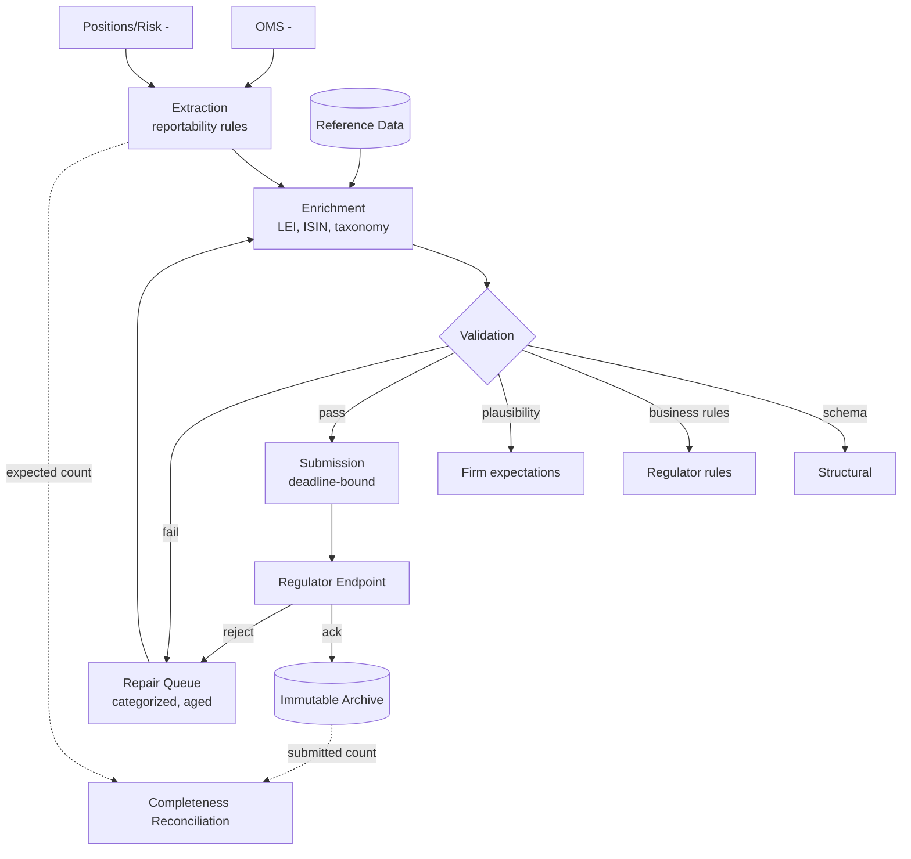
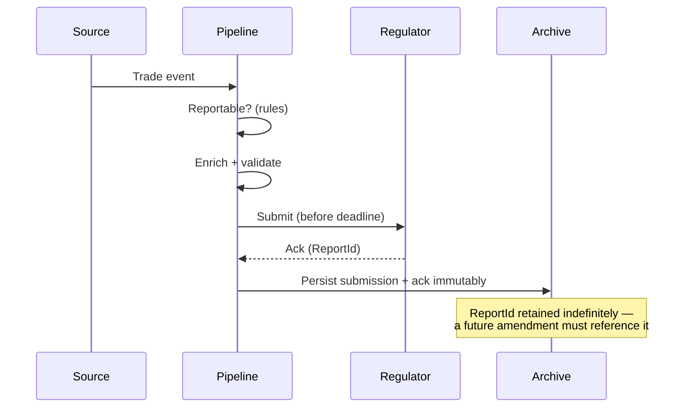
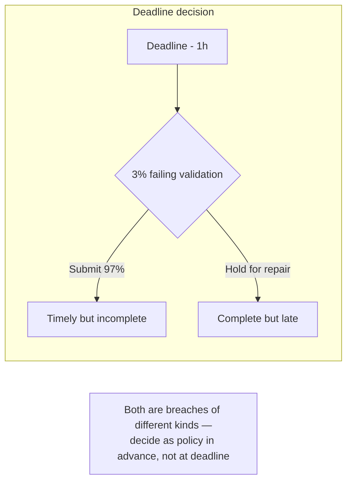
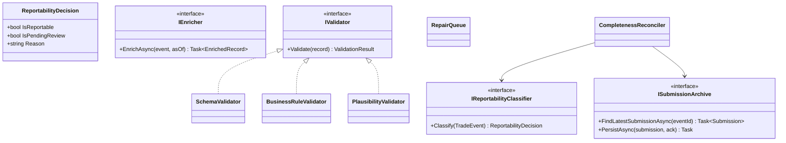

# Module 133 — System Design: Designing a Regulatory Reporting Pipeline

> Domain: System Design | Level: Beginner → Expert | Prerequisite: [[11-Designing-Order-Management-Trade-Lifecycle]] (the trade events this pipeline reports on), [[09-Designing-RealTime-Portfolio-Risk-Engine]] (position and exposure figures for prudential reporting), [[../37-Outbox/01-OutboxFundamentals-TableDesign-RelayMechanisms-DeliveryGuarantees]] (guaranteed delivery, whose failure here is a regulatory breach rather than a lost notification), [[../35-Event-Sourcing/01-EventSourcingFundamentals-EventStoreAsSourceOfTruth-Snapshotting-AggregateReconstruction]] (reconstruction of what was known when)
>
> **Scenario-module note:** Fifth of six buy-side/capital-markets system-design scenarios (Modules 129–134). Full 16-section template; Elite FinTech Interview Panel lens.

---

## 1. Fundamentals

**What:** A pipeline that extracts events and positions from the firm's systems, transforms them into regulator-specified formats, validates them against published schemas and business rules, submits them to regulatory endpoints before mandated deadlines, processes acknowledgements and rejections, and retains the full record for the statutory period.

**Why:** Reporting obligations (MiFID II transaction reporting, EMIR trade reporting, Dodd-Frank swap reporting, Form PF, and dozens more by jurisdiction) are legal requirements with penalties for lateness, incompleteness, and inaccuracy — and, distinctively, penalties apply to *each* failing. A pipeline that reports 99.9% of transactions correctly is not 99.9% compliant; it has a specific number of individually-reportable failures.

**When:** From the first reportable activity. Unlike most systems in this course, there is no scale threshold below which the requirement does not apply — a firm executing one reportable trade owes one report.

**How (30,000-ft view):**
```
Source systems (OMS, risk, positions)
 │ events + snapshots
 ▼
 Extraction ──► Enrichment ──► Validation ──► Submission ──► Ack/Reject handling
 (complete?) (reference (schema + (deadline- (repair loop)
 data) business) bound)
 └──────────────────► Completeness reconciliation ◄──────────┘
 Immutable retention (statutory period)
```

---

## 2. Deep Dive

This section is written to be **complete on its own** — every mechanism, the reasoning that selects it, the failure mode it introduces, and the push-back a Principal/Staff interviewer will raise, answered inline.

### 2.1 Completeness Is the Hard Problem, Not Transformation

Engineers new to this domain assume the difficulty is format transformation. It is not — formats are specified, tedious and tractable. The hard problem is **completeness**: proving every reportable event was reported, which requires knowing what the complete set *is*.

That set is not "everything in the OMS." Reportability depends on rules — instrument classification, counterparty type, venue, jurisdiction, principal versus agent — and those rules change. **An event is missed not because the pipeline failed to process it, but because the pipeline never considered it reportable.** That failure is invisible to every internal signal: the pipeline reports success, having correctly processed everything it believed was in scope.

### 2.2 The Incident — a Reconciliation That Could Not Possibly Work

§4's failure: a new instrument's classification was unrecognised by the reportability rules, whose default was **not-reportable**. The trades were never identified as reportable, and an entire instrument class went unreported for eleven months.

**Why the completeness reconciliation missed it, stated precisely:** the reconciliation compared submitted records against *records identified as reportable* — taking identification as its **input**. The failure was *in* identification, so the comparison was between two quantities that were consistently and correctly equal. It verified **processing fidelity**, which was never the problem, and by construction could not verify **identification correctness**.

This is the folder's recurring rule in its sharpest form: **a check whose expected set derives from the logic being checked cannot detect that logic's omissions.**

**The two-part structural fix:**

**1. Invert the default.** An unrecognised classification must default to **reportable-pending-review**, not not-reportable. The failure modes are asymmetric: over-reporting is correctable (submit a cancellation); under-reporting is a breach that accrues silently. Default toward the correctable failure, and make unknowns loud.

**2. Reconcile against an independent source.** Start from **all executed trades in the OMS** — the system of record, independent of reportability logic — and require every exclusion to carry an **explicit, itemised, reviewed reason**. The output is not a match/mismatch but a reconciliation with a classified exclusion list, so "not reportable" becomes an asserted classification a human reviews rather than a silent default. A new instrument type then surfaces immediately as an unclassified exclusion.

**Note the contrast with the multi-tenant platform:** there, no external party held comparable truth, so self-testing was the only verification. Here an external party *does* — the regulator, and counterparties' own reports — which is exactly how this failure eventually surfaced. That makes independent reconciliation both **possible and obligatory** here.

### 2.3 The Deadline as a Hard Architectural Constraint

Most systems have latency targets; this one has **deadlines with legal force** — T+1 by a specific time, or intraday for some regimes. Two consequences shape the architecture.

**It is not negotiable under load.** A system that degrades gracefully by slowing down has *failed*, because slow past the deadline is identical to not reporting.

**It forces a partial-submission decision.** At deadline minus one hour with 3% of records failing validation, the choice is to submit the 97% (timely but incomplete) or hold for repair (complete but late). Both are breaches of different kinds.

**That decision must be pre-agreed policy, executed automatically.** Structure it as: agreed with compliance; **regime-specific**, because regimes differ in how they weight lateness versus incompleteness; and expressed as a rule the pipeline executes without human judgement — e.g. *"submit validated records at deadline minus 30 minutes; hold failures for repair and late-submit."* The essential property is that it runs without a judgement call under time pressure, because a decision made at deadline by whoever happens to be on shift is not a policy.

**A pipeline sized to just meet the deadline has a hidden failure mode: it has no repair window.** Any validation failure immediately becomes a deadline decision rather than a routine repair, converting an ordinary occurrence into a governance escalation. **Capacity must include a full repair-and-resubmit cycle.**

**Running once daily immediately before the deadline is the same error, maximised.** It collapses the repair window to nothing and makes any failure — pipeline, reference data, or regulator endpoint — an immediate crisis. Run continuously or in early batches so problems surface while time remains. The counter-argument (late-arriving data means early runs are incomplete) is answered by running repeatedly and treating the early runs as progressive rather than final.

**Submission capacity is externally capped.** Regulator endpoints impose rate limits, so adding workers does not increase throughput past the endpoint's ceiling. Submission is the one stage that **cannot be scaled horizontally**, which means deadline margin must be created *earlier* in the pipeline, never at submission.

### 2.4 Enrichment, Reference Data, and the Valid-But-Wrong Report

Reports need data the trading systems do not hold: legal entity identifiers, instrument classifications (ISIN, CFI, taxonomy codes), counterparty details, jurisdiction-specific fields. Enrichment joins reportable events against reference data.

**Enrichment failures are a reference-data signal, not individual record errors.** Their *volume* indicates an upstream data-quality problem. Treating them one at a time produces a persistent repair backlog while the cause goes unaddressed — which is how firms end up with a permanent operations team working a queue that should not exist.

**Caching reference data without staleness bounds is worse than it looks.** A stale LEI or classification produces a **validly formatted, incorrect report** — an *error* rather than a *failure* — so it passes every validation layer and is submitted, becoming a reportable inaccuracy the firm must later correct. The cache converts a **detectable enrichment failure into an undetectable misstatement**, which is the wrong-versus-missing asymmetry recurring yet again.

### 2.5 Validation in Layers — and Why Regulator Rejection Is Too Late

Three layers, each catching what the next cannot:

| Layer | Catches |
|---|---|
| **Schema** | Structural non-conformance to the published specification |
| **Business rules** | The regulator's published rules — field interdependencies, permitted enumerations, cross-field consistency |
| **Firm plausibility** | Technically valid but wrong — a notional three orders of magnitude from typical |

**Using the regulator's rejection feedback as the primary validation mechanism is wrong on three counts**, even though the regulator's rules are authoritative: rejections **count against the firm's error statistics**, which is a supervisory metric; they **consume the repair window**, leaving less time before deadline; and they arrive **after** the submission that constitutes the error. Implement the published rules pre-submission, and treat any rejection that reaches you as a **defect in your own validation** to be closed, not as normal operation.

### 2.6 The Repair Loop Needs First-Class Design

Rejected and failed records are investigated, corrected and resubmitted. This loop is frequently an afterthought and becomes the pipeline's operational bottleneck.

- **Categorise by cause at rejection time** — reference-data gap, source-data error, rule-implementation defect, transient — so systemic issues are visible as a category rather than as many individual errors.
- **Route to the owner who can actually fix it.** A reference-data gap goes to data management, not the reporting team. A rule defect goes to engineering. A transient goes to automatic retry.
- **Age against the regulatory deadline for that record**, not against queue-entry time. This is the critical one: **an unrepaired record does not stop being a breach through the passage of time.** A queue worked in arrival order silently buries the oldest, most-breaching items at the bottom.
- **Escalate on age**, with thresholds tied to the deadline rather than to queue depth.

### 2.7 Amendments, Cancellations, and Reporting What You Previously Reported

When an underlying trade is amended or busted, the firm submits an amendment or cancellation **referencing the original report**. That requires retaining the mapping between internal events and submitted report identifiers **indefinitely**.

**The amendment must diff against the pipeline's own archive, never against current source state.** Regenerating from source would produce an amendment inconsistent with what the regulator actually holds — the firm would be amending a report that does not match the one on record. This is why the pipeline's archive must be immutable and complete **operationally**, not merely for audit: the amendment three years from now needs to know what was *sent*, not what the source system currently says.

**Subscribe to the trade event stream rather than polling current state**, because a poll cannot distinguish "amended" from "always was this way." A bust hours after the original was reported requires a cancellation, and the pipeline must locate the original submission by internal event identity.

### 2.8 The Archive — Evidence, Not Just Storage

**The archive's integrity ranks alongside its confidentiality**, and that is unusual. It is the firm's evidence of what it submitted in any dispute with its regulator. If it can be altered retroactively it cannot serve that purpose, so **tamper-evidence (hash chaining) is a functional requirement**, not a security nicety.

**Answering "produce this report from three years ago"** requires four things, all of which must have been retained deliberately:

1. The exact submitted content and its acknowledgement, from the immutable archive.
2. The submission timestamp.
3. The **versions in effect at the time** — reportability rules, reference data, transformation logic.
4. The underlying trade, reconstructable from the OMS's event stream, to demonstrate derivation.

Any one missing and the query cannot be answered. This is the same provenance discipline the risk engine needs for a reproducible number, applied to a submitted report.

### 2.9 Multiple Overlapping Regimes

**Share extraction, enrichment and completeness determination; make transformation, validation and submission pluggable per regime.**

The shared half is where the expensive, correctness-critical work lives, and where duplication would produce **divergent answers about the same trade**. The failure mode to avoid is per-regime pipelines each doing their own extraction — they will eventually disagree about what happened, and reconciling two internal answers about one trade is a problem with no good outcome.

### 2.10 Novel Products and Retrospective Rule Changes

**A genuinely new instrument or business requires an explicit reportability determination *before* trading begins.** §4's incident is precisely the failure of not having that gate: a new instrument reached production trading with nobody having determined its reporting treatment. The governance control is a **new-product-approval gate that includes a reporting assessment**; the engineering control (§2.2's reportable-pending-review default) is the backstop for when the gate is bypassed.

**A retrospective change in regulatory interpretation** — previously-unreported activity becomes reportable — requires: determining scope from the **historical trade record and the reference data as it was** (bitemporality earning its keep again); **self-reporting proactively** rather than waiting for discovery; back-reporting the affected population; and updating the reportability rules with a **version-effective date**, so the change is auditable and future queries can distinguish pre- and post-change treatment.

### 2.11 Preventing a Source-System Change From Silently Breaking Reporting

**Contract tests between source and pipeline, run in the *source system's* CI.** The essential property is that the notification reaches **whoever is making the change, before they merge** — not the reporting team weeks later when a volume anomaly finally surfaces.

Supplement with schema-change detection on source data, and with the **expected-volume monitoring** of §2.14, which is what catches a silent drop when a field quietly stops being populated.

### 2.12 Reconciling Against the Counterparty Side

For dual-sided regimes where both parties report, compare the firm's submissions against the counterparty's for the same trades, where the regulator or a matching utility exposes this. It is a **genuinely independent check** that catches both firm-side gaps and misstatements.

§4's failure surfaced exactly this way — externally, and eleven months late. Building it proactively converts a discovery mechanism the firm *suffers* into one the firm *operates*.

### 2.13 Availability Posture and Endpoint Outages

**HA investment is deadline-relative**, which is unusual and worth stating: an outage hours before a deadline is a breach; the same outage well before it is immaterial. Availability requirements concentrate in the **pre-deadline window** rather than being uniform across the day.

**The pipeline favours consistency over availability.** A duplicate submission requires a cancellation; an inconsistent one is a misstatement. Under uncertainty, holding and resolving beats submitting optimistically — bounded, of course, by the deadline.

**A regulator endpoint outage extending toward the deadline** is handled by: continuing to process and **queueing validated submissions** so no time is lost on your own work; monitoring for recovery with automatic resumption; **escalating to compliance early rather than at deadline**, because regulators typically have documented outage procedures whose invocation requires notification within a defined window; and **preserving evidence** of the outage and of the firm's readiness to submit.

### 2.14 Observability — Attribution, and the Signal That Looks Like a Quiet Day

**Distinguishing pipeline, source-data and regulator problems** works by comparing across dimensions:

| Observation | Conclusion |
|---|---|
| Validation failure rate spiking, submission success stable | **Source or reference data** |
| Submission failures with clean validation | **Regulator endpoint or credentials** |
| **Input volume drops**, everything else normal | **Upstream extraction problem** — the most dangerous signal, because it looks like a quiet day |

That last case is why **expected-volume monitoring** is mandatory: a pipeline processing 40% of normal volume perfectly reports perfect health.

**Applying "declared ≠ actual."** The claim is *"all reportable activity was reported completely, accurately and on time."* Each component fails differently:

- **Complete** fails via unidentified reportability — invisible internally by construction (§2.2).
- **Accurate** fails via stale enrichment producing valid-but-wrong reports that pass every check (§2.4).
- **Timely** fails **visibly**, and is therefore the least dangerous of the three despite being the one everyone monitors.

**Metrics for a board risk committee** — not pipeline uptime or throughput, which a board cannot evaluate:

1. **Completeness** — reportable events identified versus reported, from the *independent* reconciliation.
2. **Timeliness** — submissions before deadline, plus the **margin distribution**, because a shrinking margin is a leading indicator of a future breach.
3. **Accuracy** — rejection and post-submission-correction rates.
4. **Repair-backlog aging** against deadlines.

These map directly onto the regulatory obligations the committee is accountable for.

### 2.15 Principal-Level Judgements

**Build versus buy: the buy case is unusually strong here.** Vendors maintain format specifications across regimes as they change — a continuous, high-volume maintenance burden with a hard deadline attached to every change — plus regulator connectivity and certification. The build case is narrow: unusual instruments or business models vendors do not cover, or a firm large enough that per-transaction pricing exceeds build cost.

**Cloud is generally suitable** — batch, elastic, not latency-critical — with two constraints: **data residency**, since reports contain client and transaction data frequently subject to jurisdictional restriction; and **regulator connectivity**, where some endpoints require specific network arrangements or IP allowlisting, constraining egress architecture. The archive's statutory retention also argues for storage with provable immutability.

**Responding to under-reporting found during an inspection.** Establish scope **precisely before responding** — how many, over what period, why — using the historical trade record and reference data as it was, because **an inaccurate scope statement is worse than the original failure**. Then: self-report the full scope proactively, including anything additional found while investigating; back-report the affected population; and present the **structural** remediation (§2.2's inverted default and independent reconciliation), because a regulator is assessing whether the failure can recur, not whether this instance was fixed.

**The governance program required before a reporting pipeline goes live:**

1. **Independent completeness reconciliation** with itemised, reviewed exclusions (§2.2).
2. **Unknown classifications defaulting to reportable-pending-review** (§2.2).
3. **Pre-agreed, regime-specific, automatically executed deadline policy** (§2.3).
4. **Three-layer pre-submission validation**, with regulator rejections treated as defects (§2.5).
5. **Categorised, deadline-aged repair queue** routed to real owners (§2.6).
6. **Immutable, tamper-evident archive** with full provenance (§2.8).
7. **Expected-volume monitoring** and source contract tests (§2.11, §2.14).
8. **Counterparty-side reconciliation** where the regime allows it (§2.12).

**This pipeline is where the previous modules' correctness problems become externally visible.** An OMS with an unknown position is *unreported activity* here. A market-data misattribution is a *misstated report*. An irreproducible risk figure cannot be defended when queried. Each upstream dependency propagates its failure modes into a regulatory consequence.

**The closing synthesis — what makes regulatory reporting distinctively hard.** Not the transformation, and not the volume. Two properties:

1. **The failure is defined by what you did not do**, and completeness cannot be verified from inside the system that defines scope. Every other system in this domain can at least in principle check its own work; here, the success measurement is scoped by the same logic that can be wrong.
2. **The deadline converts every other problem into a governance decision.** Elsewhere, a validation failure is a bug to fix. Here, past a certain hour, it is a choice between two kinds of breach — which is why so much of this design is about *creating time* rather than creating throughput.

---

## 3. Visual Architecture


```mermaid
graph TB
 OMS[OMS -] --> EXT[Extraction<br/>reportability rules]
 POS[Positions/Risk -] --> EXT
 EXT --> ENR[Enrichment<br/>LEI, ISIN, taxonomy]
 REF[(Reference Data)] --> ENR
 ENR --> VAL{Validation}
 VAL -->|schema| V1[Structural]
 VAL -->|business rules| V2[Regulator rules]
 VAL -->|plausibility| V3[Firm expectations]
 VAL -->|pass| SUB[Submission<br/>deadline-bound]
 VAL -->|fail| REP[Repair Queue<br/>categorized, aged]
 SUB --> REG[Regulator Endpoint]
 REG -->|ack| ARC[(Immutable Archive)]
 REG -->|reject| REP
 REP --> ENR
 EXT -.expected count.-> RECON[Completeness Reconciliation]
 ARC -.submitted count.-> RECON
```


```mermaid
sequenceDiagram
 participant S as Source
 participant P as Pipeline
 participant R as Regulator
 participant A as Archive

 S->>P: Trade event
 P->>P: Reportable? (rules)
 P->>P: Enrich + validate
 P->>R: Submit (before deadline)
 R-->>P: Ack (ReportId)
 P->>A: Persist submission + ack immutably
 Note over A: ReportId retained indefinitely —<br/>a future amendment must reference it
```


```mermaid
graph LR
 subgraph "Deadline decision"
 D[Deadline - 1h] --> Q{3% failing validation}
 Q -->|Submit 97%| INC[Timely but incomplete]
 Q -->|Hold for repair| LATE[Complete but late]
 end
 Note1["Both are breaches of different kinds —<br/>decide as policy in advance, not at deadline"]
```

---

## 4. Production Example

**Problem:** A firm's transaction-reporting pipeline ran for two years with no rejections above baseline and no regulatory findings. Daily completeness reconciliation compared reports submitted against reportable events identified, and matched exactly every day.

**Architecture:** the design, with reportability determined by a rules engine evaluating instrument type, venue, and counterparty classification.

**Implementation:** The reconciliation compared *submitted* against *identified-as-reportable* — that is, it verified the pipeline processed everything it had identified.

**Trade-offs:** This reconciliation is cheap, runs daily, and catches every processing failure — genuinely valuable, and the check most pipelines implement.

**Lessons learned:** The firm began trading a new instrument type through an existing venue. The instrument's classification mapped to a taxonomy code the reportability rules did not recognize, and the rules engine's default for unrecognized classifications was **not reportable**. Those trades were never identified as reportable, so they were never in the reconciliation's expected set — the reconciliation matched perfectly every day while an entire instrument class went unreported for eleven months.

It surfaced when the regulator queried a counterparty-side report the firm had no matching submission for. The remediation was a self-report, back-reporting eleven months of transactions, and a finding.

The reconciliation had been verifying the wrong thing. It confirmed the pipeline processed what it identified — but the failure was in *identification*, which the reconciliation took as its own input. **A completeness check whose expected set is derived from the same logic being checked cannot detect that logic's omissions.** The fix: reconcile against an *independent* source — the count of all executed trades from the OMS, with explicit, itemized, and reviewed reasons for every exclusion, so that "not reportable" becomes an asserted, auditable classification rather than a silent default. And, structurally: the rules engine's default for an unrecognized classification was inverted to **reportable-pending-review**, because over-reporting is correctable and under-reporting is a breach.
## 11. Coding Exercises

### Easy — Reportability with a Safe Default (§2.2)
**Problem:** Classify an event's reportability so unknowns are loud rather than silent.
**Solution:**
```csharp
public ReportabilityDecision Classify(TradeEvent e)
{
    if (!_taxonomy.TryGetClassification(e.InstrumentId, out var cls))
        return ReportabilityDecision.PendingReview(// never a silent "no"
        reason: $"Unrecognized instrument classification for {e.InstrumentId}");

    return _rules.Evaluate(cls, e.Venue, e.CounterpartyType, e.Capacity) switch
    {
        RuleOutcome.Reportable => ReportabilityDecision.Reportable,
            RuleOutcome.NotReportable => ReportabilityDecision.Excluded(_rules.ExplainExclusion(cls, e)),
            _ => ReportabilityDecision.PendingReview("Rules returned no decision")
    };
}
```
**Time complexity:** O(1) with indexed taxonomy lookup.
**Space complexity:** O(1).
**Optimized solution:** Emit a metric per distinct exclusion reason so a *new* reason appearing is itself an alert — the signal that caught nothing because exclusions were silent and uncounted.

### Medium — Independent Completeness Reconciliation (§2.2)
**Problem:** Reconcile against the OMS rather than against reportability logic.
**Solution:**
```csharp
public async Task<CompletenessReport> ReconcileAsync(DateOnly businessDate)
{
    var allTrades = await _oms.ExecutedTradesAsync(businessDate); // independent source
    var submitted = (await _archive.SubmittedAsync(businessDate)).ToHashSet(t => t.InternalEventId);

    var unexplained = new List<TradeEvent>;
    var exclusionsByReason = new Dictionary<string, int>;

    foreach (var trade in allTrades)
    {
        if (submitted.Contains(trade.EventId)) continue;

        var decision = _classifier.Classify(trade);
        if (decision.IsExcluded)
            exclusionsByReason.Increment(decision.Reason); // grouped for review
        else
            unexplained.Add(trade); // gap: reportable, not submitted
    }
    return new CompletenessReport(allTrades.Count, submitted.Count, exclusionsByReason, unexplained);
}
```
**Time complexity:** O(n) for n trades.
**Space complexity:** O(n).
**Optimized solution:** Diff exclusion-reason counts against the prior period and alert on any *new* reason or a material shift in an existing one — a new exclusion reason is the precise signature of the failure.

### Hard — Deadline-Aged Repair Queue (§2.6)
**Problem:** Work repairs in deadline order with category routing.
**Solution:**
```csharp
public sealed class RepairQueue
{
    private readonly PriorityQueue<RepairItem, DateTime> _byDeadline = new;

    public void Enqueue(RepairItem item) =>
        _byDeadline.Enqueue(item, item.RegulatoryDeadline); // NOT arrival time

    public RepairItem? Next => _byDeadline.TryDequeue(out var item, out _)? item: null;

    public IReadOnlyDictionary<RepairCause, int> CategoryCounts =>
        _byDeadline.UnorderedItems
    .GroupBy(i => i.Element.Cause)
    .ToDictionary(g => g.Key, g => g.Count); // systemic signal, not individual errors
}
```
**Time complexity:** O(log n) enqueue and dequeue.
**Space complexity:** O(n).
**Optimized solution:** Maintain per-cause queues with independent ownership and SLAs, so a reference-data backlog owned by data management does not compete for attention with a rule-implementation defect owned by engineering (§2.6's routing).

### Expert — Amendment Against Archived Submission (§2.7)
**Problem:** Generate an amendment referencing what was actually submitted, not current source state.
**Solution:**
```csharp
public async Task<Submission> BuildAmendmentAsync(InternalEventId eventId, TradeEvent currentState)
{
    var original = await _archive.FindLatestSubmissionAsync(eventId)
    ?? throw new NoPriorSubmissionException(eventId); // must submit as original, not amendment

    var current = _transformer.Transform(currentState);
    var changed = _differ.ChangedFields(original.Content, current); // diff vs ARCHIVE, not source

    if (changed.Count == 0) return Submission.NoChangeRequired(eventId);

    return Submission.Amendment(
        referencingReportId: original.RegulatorReportId, // regulator's identifier
            content: current,
            changedFields: changed);
}
```
**Time complexity:** O(f) for f fields compared.
**Space complexity:** O(f).
**Optimized solution:** Record the reference-data and logic versions used for the original (§2.8's provenance) so an amendment can distinguish "the trade changed" from "our interpretation changed" — materially different situations that may require different regulatory treatment.

---

## 12. System Design — Designing a Regulatory Reporting Pipeline

*Authored to the four-step standard (see Module 01 §12 for the method).*

---

### Step 1 — Understand the Problem and Establish Design Scope

#### The dialogue

> **C:** Which regimes? EMIR, MiFIR, SFTR, Dodd-Frank, and CFTC reporting all have different deadlines, formats, and reportability rules.
> **I:** Assume three regimes with different deadlines — one T+1, one intraday, one weekly.
>
> **C:** What are the source systems, and do they know an event is reportable?
> **I:** They don't. Reportability is your determination, from trade, position, and reference data.
>
> **C:** That's the crux — if sources don't flag reportable events, how do we know we've found them all?
> **I:** That's the question I want you to answer.
>
> **C:** What happens if we miss a report?
> **I:** Under-reporting is a regulatory breach with fines and, for repeated failures, senior-manager accountability. It's the worst outcome.
>
> **C:** Worse than late?
> **I:** Late is bad. Missing entirely, discovered by the regulator, is much worse — because it means our controls didn't work.
>
> **C:** Do we handle amendments and cancellations?
> **I:** Yes, referencing prior submissions, and the regulator tracks the chain.
>
> **C:** Volume?
> **I:** Around 250,000 reportable transactions a day across regimes.
>
> **C:** What's the regulator's endpoint like — throughput, rate limits, acknowledgement model?
> **I:** Rate-limited, asynchronous acknowledgements, and rejections can come back hours later.
>
> **C:** Retention?
> **I:** Seven years, tamper-evident, with full provenance.
>
> **C:** Out of scope?
> **I:** The regulatory rules themselves — assume a compliance team supplies the reportability logic as specifications.

The third exchange is the entire module. **Completeness — did we find every reportable event? — is the hard problem, and it is unanswerable from inside the pipeline**, because the pipeline's notion of "reportable" is the very thing under question. Everything in §3.1 follows.

#### Functional requirements

1. Identify all reportable events across regimes from source systems.
2. Enrich with reference data resolved as-of the event.
3. Validate in three layers before submission.
4. Submit before regime-specific deadlines; process asynchronous acknowledgements and rejections.
5. Handle amendments and cancellations referencing prior submissions.
6. Retain submissions with full provenance for the statutory period.

#### Non-functional requirements

| Requirement | Target |
|---|---|
| **Completeness** | Verifiable against an **independent** source — not against the pipeline's own logic |
| Deadline margin | Sufficient for a full detect-repair-resubmit cycle, not just for submission |
| Rejection rate | Approaching zero, and treated as a **defect signal**, not as normal operation |
| Archive | Immutable, tamper-evident, 7 years |
| Availability | The pipeline may be down between cycles; it may not be down at a deadline |
| Auditability | For any submitted field: which source, which reference data version, which rule version |

#### Back-of-the-envelope estimation

```
Reportable transactions/day  ≈ 250,000 across regimes
Report record                ≈ 2–4 KB
Daily submitted volume       ≈ 1 GB/day
Annual                       ≈ 350 GB
7-year retention             ≈ 2.5 TB
```

Processing:

```
Transformation is trivially parallel and CPU-light.
250,000 records × ~2 ms                        ≈ 500 CPU-seconds
On 16 cores                                    ≈ 30 seconds
```

**The sensitivity that matters — and it is external:**

```
The regulator's endpoint, not our pipeline, governs the schedule.
If the endpoint accepts 100 submissions/second:
  250,000 ÷ 100                                = 2,500 s ≈ 42 minutes MINIMUM
  ...regardless of how fast we process.

Deadline                    = 23:59
Submission floor            = 42 min
Repair cycle (detect → fix → revalidate → resubmit)
                            ≈ 90 min for a material issue
Acknowledgement latency     ≈ up to 60 min
Safety margin               ≈ 60 min
LATEST SAFE START           = 23:59 − (42 + 90 + 60 + 60) ≈ 19:30
```

#### What the numbers tell us

1. **This is not a big-data problem.** 2.5 TB over seven years, 30 seconds of compute. Any answer built around scale has missed it entirely.
2. **The binding constraint is external and the deadline arithmetic runs backwards from it.** The latest safe start time (≈19:30) is derived, not chosen — and it is derived from the *repair* cycle, not the submission. A pipeline that starts at 23:00 and submits perfectly in 42 minutes has **no capacity to be wrong**, which is the same as having no control at all.
3. **The archive's engineering concern is evidentiary integrity, not size.** 2.5 TB is nothing; proving that what is in it is what was submitted, unaltered, seven years later, is the actual requirement.

The hard problem is **completeness, verified independently, with enough deadline margin to fix what verification finds.**

---

### Step 2 — Propose High-Level Design and Get Buy-In

#### The two core flows

- **The reporting cycle** — extract, classify, enrich, validate, submit, acknowledge. Deadline-bound.
- **The completeness and repair loop** — reconcile against an independent source, classify breaks, repair, resubmit. This is a *first-class flow*, not exception handling, and designing it as an afterthought is the characteristic failure of these systems.

#### Components

**Event Subscriber.** Consumes source-system events via the **Outbox pattern** — not by polling current state. This matters more than it looks: polling a table for "today's trades" cannot distinguish an amended trade from an original, and cannot see a trade that was booked and cancelled between polls. Both are reportable events.

**Reportability Classifier.** Applies versioned rules to determine which events are reportable under which regimes. **Rule versions are recorded on every determination**, including negative ones.

**Enrichment Service.** Resolves counterparty LEIs, instrument identifiers (ISIN/UPI), and classifications from **bitemporal reference data, as-of the event date** — not as-of now.

**Three-Layer Validator.** Structural, then semantic, then regime-specific business rules (§3.3).

**Submission Client.** Respects the endpoint's rate limit, handles asynchronous acknowledgements, and tracks per-submission state.

**Repair Queue.** Durable, prioritised, with deadline awareness.

**Completeness Reconciler.** Compares reported events against an **independently derived** expected set (§3.1).

**Immutable Archive.** Hash-chained, append-only, with full provenance per field.

#### End-to-end walkthrough — a reporting cycle

1. Cycle starts at the derived latest-safe-start (19:30), or earlier — earlier is free and later is not.
2. Subscriber has been consuming source events continuously; the cycle draws the day's events from the durable stream with an explicit **cut**: `events with source_sequence <= X`. Recording the cut is what makes the cycle reproducible.
3. Classifier evaluates each event against each regime's rules, producing `REPORTABLE(regime)` or `NOT_REPORTABLE(reason, rule_version)`. **Negative determinations are recorded**, because "we decided this wasn't reportable" is the artefact a regulator asks about — an absence is not an answer.
4. Enrichment resolves reference data as-of the event's business date. **A failed enrichment does not drop the record** — it routes to repair with a specific reason (§3.2).
5. Three-layer validation; failures route to repair with the failing rule identified.
6. Valid records are batched and submitted, rate-limited to the endpoint's ceiling, each with a client-assigned `submission_id` for idempotency.
7. Acknowledgements arrive asynchronously; each record moves to `ACKNOWLEDGED` or `REJECTED(code)`.
8. Rejections route to repair; the loop repeats until the deadline or until clean.
9. **Independently of all of the above**, the reconciler compares the reported set against the expected set derived from a different source, and raises completeness breaks.
10. Everything — inputs, determinations, enrichments, submissions, acknowledgements — is archived with provenance.

#### API design

Most of this pipeline is internal, but three surfaces matter and are worth specifying.

**`GET /v1/reports`** — the operational and audit surface.

| Param | Type | Description |
|---|---|---|
| `regime`, `business_date` | | |
| `status` | enum | `PENDING`, `SUBMITTED`, `ACKNOWLEDGED`, `REJECTED`, `REPAIRING`, `SUPERSEDED` |
| `break_type` | enum | Optional; filters completeness breaks |

**`GET /v1/reports/{report_id}/provenance`** → for every submitted field: the source system and record, the reference-data version used, the rule version applied, and the transformation step. **This endpoint is the audit deliverable**, and building it as a first-class API rather than a query someone writes under pressure is the difference between a two-hour and a two-week regulator response.

**`POST /v1/reports/{report_id}/amend`** — `{ reason_code, corrected_fields, approver }`. Creates a new report **linked to the original**, never an in-place edit.

**`GET /v1/completeness/{business_date}`**

| Field | Type | Description |
|---|---|---|
| `expected_count`, `reported_count` | int | From **independent** derivations |
| `breaks` | array | `{ type, count, sample_ids }` |
| `expectation_source` | string | Which independent source produced the expected set — recorded because the answer's credibility depends entirely on it |

#### Data model

**`reportable_event`** — the determination record, one per source event per regime:

| Column | Type | Notes |
|---|---|---|
| `event_id`, `regime` | | |
| `source_system`, `source_record_id`, `source_sequence` | | The cut and the lineage |
| `determination` | enum | `REPORTABLE` \| `NOT_REPORTABLE` |
| `reason_code`, `rule_version` | | **Recorded for negatives too** |
| `determined_at` | timestamptz | |

**`report`** — `report_id`, `event_id`, `regime`, `business_date`, `status`, `submission_id`, `submitted_at`, `acknowledged_at`, `rejection_code`, `amends_report_id`, `payload_hash`, `deadline_at`.

Lifecycle: `IDENTIFIED → ENRICHED → VALIDATED → SUBMITTED → ACKNOWLEDGED`, with branches to `REPAIRING` (from any pre-ack state), `REJECTED`, `SUPERSEDED` (by an amendment), and `CANCELLED`.

**`report_field_provenance`** — `report_id`, `field_name`, `value_hash`, `source_ref`, `refdata_version`, `rule_version`, `transform_step`. This is the largest table in the system and it earns its size.

**`archive_entry`** — `sequence`, `report_id`, `payload`, `payload_hash`, `prev_hash`, `written_at`. **Hash-chained**: each entry includes the previous entry's hash, so any retroactive alteration invalidates every subsequent link. Periodically the head hash is notarised externally (a timestamping authority or an append-only external log), which converts "we say it wasn't altered" into "it demonstrably wasn't."

**`completeness_check`** — `business_date`, `regime`, `expected_count`, `reported_count`, `expectation_source`, `breaks`, `run_at`, `run_status`.

#### Store selection, and why

| Store | Choice | Reason |
|---|---|---|
| Archive | **Append-only object storage with Object Lock / WORM, hash-chained** | The requirement is tamper-evidence over seven years. Immutability enforced by the platform beats immutability enforced by policy |
| Operational state | **PostgreSQL** | Small, relational, transactional state machines |
| Reference data | **Bitemporal relational** | As-of resolution is a correctness requirement (§3.2) |
| Repair queue | **Durable queue with priority** | A restart must not lose the backlog — an in-memory queue here loses exactly the records that are already late |
| Event ingest | **Kafka via Outbox** | Amendment/original distinction requires the event stream, not state polling |

---

### Step 3 — Design Deep Dive

#### 3.1 Completeness — why it cannot be checked from the inside

The pipeline reports what it classified as reportable. Asking the pipeline "did you report everything?" asks it to compare its output against its own logic, which it will always pass. **A check whose expected set derives from the logic being checked cannot detect that logic's omissions.**

So the expected set must come from somewhere else. Independent sources, in descending order of strength:

1. **The counterparty's or the regulator's own view.** Some regimes offer reconciliation feeds — pairing rates, or the regulator's record of what it received. Strongest, because the source is genuinely external.
2. **A different internal system with a different lineage.** Settlement records, the general ledger, or the custodian's statement. A trade that settled must have existed; if it settled and was not reported, that is a break the reporting logic could never have found.
3. **Financial reconciliation.** Reported notional versus the books' notional, per product and per counterparty. Coarse, but catches whole categories going missing.
4. **A parallel implementation of reportability**, written by a different team from the same specification. Expensive, and it only catches specification *misreadings*, not specification *gaps* — worth stating the limitation.

The design commitment: **every regime has a named independent expectation source, recorded on every completeness check.** A completeness check with no `expectation_source`, or whose source is the pipeline itself, is a check that always passes, and its green status is worse than no check at all because it creates confidence.

And the reconciler needs a **dead-man's switch**: it is the only external verifier, so its silent failure removes the control with no signal. Heartbeat with input counts, alert on absence and on implausible inputs — zero expected events is not a quiet day.

#### 3.2 Enrichment and its characteristic failure

Enrichment attaches counterparty LEIs, instrument identifiers, and classifications. Its failure mode is specific and dangerous: **a missing or stale enrichment produces a report that is structurally valid and semantically wrong.** It passes validation, it is accepted by the regulator, and it is incorrect — which is worse than a rejection, because a rejection is visible.

Controls:

- **Resolve as-of the event date**, from bitemporal reference data. An instrument reclassified last month must be reported under the classification in force at trade time.
- **Never default.** A missing LEI must route to repair, never fall back to a placeholder, a parent entity, or an empty string. Defaults are how wrong data gets submitted with full confidence.
- **Count enrichment fallbacks**, if any are permitted at all. A silent fallback path with no counter is undetectable — this course's most repeated finding.
- **Bound reference-data staleness** to that data's own change cadence: LEI data changes daily, instrument classifications monthly, so one cache TTL for both is wrong in one direction or the other.

#### 3.3 Validation in three layers, and why regulator rejection is too late

| Layer | Checks | Catches |
|---|---|---|
| **Structural** | Schema, types, mandatory fields, enumerations, formats | Malformed output — cheap, fast, first |
| **Semantic** | Cross-field consistency (settlement after trade date; notional against price × quantity; counterparty valid for the product) | Internally inconsistent reports that are structurally fine |
| **Regime business rules** | The regulator's own published validation rules, implemented locally | Everything the regulator would reject |

The third layer is the one teams skip, and skipping it is why rejection rates are non-zero. **The regulator's rejection is a validation result that arrives hours late, on the deadline, after your repair budget is spent.** Implementing their published rules locally converts a deadline-threatening event into a pre-submission repair.

Hence the standing posture: **a rejection is a defect in our validation, not a normal outcome.** Every rejection code that appears in production should result in a new local rule, and the rejection-rate trend is a quality metric for the pipeline rather than a measure of the regulator.

#### 3.4 The repair loop as designed infrastructure

The repair loop is where the deadline is won or lost, and the estimation gave it 90 minutes.

- **Durable, prioritised queue.** Priority by deadline proximity, then by regime severity. A restart must not lose it.
- **Repairs are classified**: reference-data gaps (fix the data, re-enrich, resubmit), source-data errors (needs the source system, slowest path), rule defects (needs a code or rule-version change, needs approval), and transient submission failures (retry).
- **Bulk repair for systemic issues.** When 4,000 records fail for one missing LEI, the fix is one reference-data correction and a bulk re-enrich, not 4,000 tickets. The queue must support grouping by root cause, or a systemic issue consumes the entire repair budget in triage.
- **The repair loop has its own deadline awareness**, and surfaces "at current repair rate, N records will miss the deadline" — which is the number the operations team actually needs at 22:00.

#### 3.5 Amendments, cancellations, and reporting what you previously reported

Regulators track the *chain*, so the design must too:

- An amendment is a **new report linked to the original**, carrying a reason code — never an in-place edit. The original stays in the archive exactly as submitted.
- A cancellation is a distinct action type, not a deletion.
- **Late amendments to prior periods** are normal (a trade corrected weeks later) and must not disturb the closed period's archive — they add to it.
- The provenance record must answer "what did we report on date D, and what do we now believe about date D" — the bitemporal question again, and the reason the archive is append-only.

The subtle trap: an amendment must reference the regulator's identifier for the original submission, which arrives in the acknowledgement. **If acknowledgements are not durably stored against the report, amendments become impossible** — a failure discovered weeks after go-live, when the first correction is needed.

#### 3.6 Failure handling

- **Source system unavailable at cycle time** → do not submit a partial set silently. Submit what is complete, and **raise a completeness break for the known-missing source** — an explicit gap is defensible, a silent one is not.
- **Regulator endpoint down** → retry with backoff within the deadline; past the safe threshold, escalate to a human with the specific unsubmitted set. Most regimes have a documented late-filing procedure, and using it deliberately is better than missing silently.
- **Endpoint rate-limits harder than expected** → the schedule assumed a rate; if the observed rate drops, the safe start time was wrong. This should alert *during* submission, comparing actual throughput against the plan, not be discovered at the deadline.
- **Acknowledgement never arrives** → **aging detection**, not rate. A submission with no acknowledgement after 4× the expected latency is a break, even if today's acknowledgement rate looks normal. This is the same detector Module 20 §4 needed.
- **Validation rule wrong** → over-strict rejects valid reports (visible, annoying); over-lenient submits invalid ones (invisible until the regulator rejects, or never). Rule changes therefore go through the same review as code, with a **shadow run** against a historical period before enforcement.

---

### Step 4 — Wrap-Up

**What we left out:** the reportability rules themselves, which are the compliance team's domain and change constantly; regime-specific formats (ISO 20022, XML schemas, CSV variants) and their versioning; multi-jurisdiction entity structures, where the reporting entity differs from the trading entity; delegated reporting, where you report on a client's behalf and inherit their data-quality problems; the regulator's own reconciliation feeds and pairing/matching processes; and disaster recovery with a deadline that does not move because your data centre did.

**What we would measure:** **completeness break count by type, with the expectation source named** — the pipeline's most important metric by a wide margin; **rejection rate as a defect trend**, targeting zero; deadline margin actually achieved per cycle, which is the leading indicator of the next missed filing and degrades long before it breaches; repair-queue depth and **repair rate versus deadline**; enrichment fallback and failure counts; unacknowledged submissions **by age**; archive hash-chain verification, run continuously with its own dead-man's switch; and reconciler heartbeat — because the verifier's silent failure is the failure with no symptom.

**Summary.** Completeness is the hard problem and it cannot be checked from inside the pipeline, so every regime gets a **named independent expectation source** recorded on every check. The deadline arithmetic runs backwards from the regulator's rate limit through the repair cycle, which is what derives a 19:30 start rather than a 23:00 one — a pipeline with no repair budget has no control. Validation implements the regulator's own rules locally, because their rejection is a validation result that arrives too late to act on. And the archive is hash-chained and externally notarised, because at seven years the requirement is not storage, it is provable integrity.

---

### References

1. ESMA — *EMIR Reporting Technical Standards* and validation rules; *MiFIR Transaction Reporting* (RTS 22) and the ESMA validation-rules spreadsheet that §3.3's third layer implements.
2. FCA — *Market Watch* newsletters on transaction-reporting failures; the recurring theme is completeness, not formatting.
3. CFTC — Part 45 swap data reporting, for a contrasting deadline and amendment model.
4. ISO 20022 — message definitions and versioning practice.
5. Martin Fowler — *Bitemporal History*, the reference-data model §3.2 depends on.
6. Haber & Stornetta — *How to Time-Stamp a Digital Document* (1991) — the hash-chaining and notarisation basis for the archive.
7. RFC 3161 — Time-Stamp Protocol, a practical notarisation mechanism.
8. Modules 11 and 18 of this folder — the order lifecycle producing the reportable events, and the payment/settlement reconciliation whose break taxonomy this design mirrors.

---
## 13. Low-Level Design

**Requirements:** Reportability decisions are explicit and never silently negative; completeness is checked independently; amendments reference archived submissions; repairs are deadline-ordered.

**Class diagram:**

```mermaid
classDiagram
 class ReportabilityDecision {
 +bool IsReportable
 +bool IsPendingReview
 +string Reason
 }
 class IReportabilityClassifier {
 <<interface>>
 +Classify(TradeEvent) ReportabilityDecision
 }
 class IEnricher {
 <<interface>>
 +EnrichAsync(event, asOf) Task~EnrichedRecord~
 }
 class IValidator {
 <<interface>>
 +Validate(record) ValidationResult
 }
 class SchemaValidator
 class BusinessRuleValidator
 class PlausibilityValidator
 class ISubmissionArchive {
 <<interface>>
 +FindLatestSubmissionAsync(eventId) Task~Submission~
 +PersistAsync(submission, ack) Task
 }
 class RepairQueue
 class CompletenessReconciler

 IValidator <|.. SchemaValidator
 IValidator <|.. BusinessRuleValidator
 IValidator <|.. PlausibilityValidator
 CompletenessReconciler --> IReportabilityClassifier
 CompletenessReconciler --> ISubmissionArchive
```

**Sequence diagram:** the second diagram — submission with archived acknowledgement supporting future amendments.

**Design patterns used:** Chain of Responsibility (layered validation); Strategy (per-regime transformation, §2.9); Specification (reportability rules); Priority Queue (deadline-ordered repair); Memento (immutable archived submissions).

**SOLID mapping:** Single Responsibility (classification, enrichment, validation, submission are separate); Open/Closed (a new regime adds transformation and validation strategies without touching extraction); Liskov (every validator must fail closed — a validator erroring must reject, not pass, contract-tested); Interface Segregation (archive read and write paths separate, since the reconciler needs only reads); Dependency Inversion (the reconciler depends on the classifier interface, allowing an independent implementation to cross-check the production one).

**Extensibility:** A new regime adds strategies; a new instrument type requires a reportability determination (§2.10's governance gate) that the classifier then encodes — deliberately requiring a human decision rather than allowing silent defaulting.

**Concurrency/thread safety:** Records process independently; the repair queue is the shared mutable structure requiring synchronization; the archive is append-only, eliminating write conflicts. Submission must be serialized per regime to respect rate limits and preserve any required ordering.

---

## 14. Production Debugging

**Incident:** Submissions began failing validation at the regulator with a schema error, three weeks after a routine pipeline release that had passed all internal validation. Roughly 8% of records rejected; the rest submitted normally.

**Root cause:** The regulator had published a schema revision with a new optional field and a *tightened* constraint on an existing one — a maximum length reduced from 50 to 35 characters. The firm's schema validator used the previous schema version, which the release had not updated. Records with values between 36 and 50 characters — about 8%, concentrated in one counterparty-name field — passed internal validation and were rejected externally.

The deeper issue: schema updates arrived as regulator publications on a website, tracked by a compliance analyst who forwarded them to engineering. The analyst had been on leave when this revision published, and the notification never reached the team. Nothing in the system detected that its schema version was stale.

**Investigation:** The rejection messages named the constraint, making the proximate cause quick to identify. The revealing question was why internal validation passed — comparing the deployed schema version against the regulator's current published version showed the drift immediately.

**Tools:** Regulator rejection messages (specific and accurate); schema version comparison against the published specification; release history showing the schema had not been updated in eleven months while the regulator had published twice.

**Fix:** Update to the current schema and resubmit the rejected records within the repair window (which existed because the pipeline ran early — §2.3's discipline, which is what converted this from a crisis into a repair).

**Prevention:** (1) Automated schema-version checking against the regulator's published specification, alerting on drift — the system must detect its own staleness rather than depending on a human relay. (2) Subscription to regulator publication feeds where available, routed to a monitored channel rather than an individual. (3) A standing periodic review of specification currency, since the failure mode is *absence* of a notification, which no reactive process detects — the same class of failure as the dead-letter alert routing to an unmonitored address: the information existed, the delivery path silently did not.

---

## 15. Architecture Decision

**Context:** The deadline policy — what the pipeline does when validated records are ready but some records remain unrepaired as the deadline approaches. This is the pipeline's most consequential governance decision and must be made before it is needed.

**Option A — Submit what is valid, repair and late-submit the remainder:**
*Advantages:* Maximizes timeliness; the majority of records meet the deadline; the failure is bounded to the known, itemized set of late records, which the firm can proactively disclose.
*Disadvantages:* The submission is knowingly incomplete at deadline, which some regimes treat as its own breach independent of the subsequent late submission.
*Cost:* Low. *Complexity:* Low. *Risk:* Two smaller breaches (incomplete-then-late) rather than one larger one.

**Option B — Hold the batch until complete, submit late if necessary:**
*Advantages:* Every submission is complete; a single, cleanly-characterized breach (lateness) rather than two.
*Disadvantages:* One unrepairable record makes the entire batch late — the failure is unbounded in scope, since a single problematic record delays thousands of correct ones.
*Cost:* Low. *Complexity:* Low. *Risk:* Amplifies a small problem into a total one.

**Option C — Regime-specific policy, automatically executed (recommended):**
*Advantages:* Regimes genuinely differ in how they weight lateness versus incompleteness, so a single policy is wrong for some; encoding per-regime rules applies the right behaviour in each case, executed automatically without a judgment call under time pressure (§2.3).
*Disadvantages:* Requires compliance to make and document a determination per regime — real work, and work that must be revisited as regimes change.
*Cost:* Moderate (governance effort). *Complexity:* Moderate. *Risk:* Lowest, provided the determinations are correct and maintained.

**Recommendation: Option C.** Options A and B are each right for some regimes and wrong for others, and choosing either universally guarantees the wrong behaviour somewhere. More importantly, the decision belongs to compliance, not engineering — it is a regulatory-risk judgment, and engineering's contribution is to insist it be made in advance and encoded rather than improvised. The failure mode this avoids is the most common one in practice: no policy exists, so at deadline whoever is on duty decides under pressure, inconsistently, and without authority to accept a regulatory breach on the firm's behalf.

---

## 17. Principal Engineer Perspective

**Business impact:** This pipeline generates no revenue and prevents regulatory penalties, remediation costs, and supervisory findings that constrain the firm's activities. The framing that lands with executives is exposure avoided per unit of investment — and unusually, it can be quantified from published enforcement actions, which is a rhetorical advantage most infrastructure investments lack.

**Engineering trade-offs:** The defining trade-off is the deadline decision, and the senior insight is that it is not engineering's to make — it is a regulatory-risk judgment that engineering must force into the open and encode. A Principal Engineer who decides it unilaterally, however sensibly, has taken on an accountability that does not belong to them.

**Technical leadership:** the lesson — a completeness check dependent on the logic it checks proves nothing — generalizes well beyond this pipeline, and is worth teaching explicitly because it recurs wherever a system measures its own scope. The habit to instill is asking, of any completeness or correctness check, *where does its expected set come from?*

**Cross-team communication:** Reporting depends on source systems whose teams have no reporting obligation of their own and no visibility into how their changes affect it (§2.11). Making that dependency visible — contract tests in *their* CI, not yours — is a communication design problem as much as a technical one, and the placement of the test is the substance of the solution.

**Architecture governance:** Reportability rules, the deadline policy, retention, and validation layers should be ADRs jointly owned with compliance, since each encodes a regulatory interpretation. Engineering-only ownership of a regulatory interpretation is a governance failure regardless of whether the interpretation is correct.

**Cost optimization:** §2.15's build-versus-buy dominates. The recurring cost that decides it — tracking specification changes across regimes, each with a deadline — is systematically underestimated because it is invisible until a specification changes, which is exactly the cost the incident illustrates.

**Risk analysis:** The dominant risk is under-reporting, because it is silent, accrues per event, and is typically discovered by the regulator rather than the firm. Risk registers should weight it above pipeline availability, since an outage is loud and recoverable within the deadline while under-reporting compounds undetected for months.

**Long-term maintainability:** What rots is the correspondence between the firm's rules and the regulator's current requirements — specifications change, interpretations evolve, and the pipeline continues running correctly against a stale understanding (exactly). Automated currency checking and periodic review are the durable investments; a human notification relay is not, because its failure mode is silence.

---

**Next in this run:** Module 134 — the capstone: migrating a legacy end-of-day batch estate to intraday processing, where the system being changed is the one every other system in this run depends on, and the migration must preserve the correctness guarantees each of them assumes.
