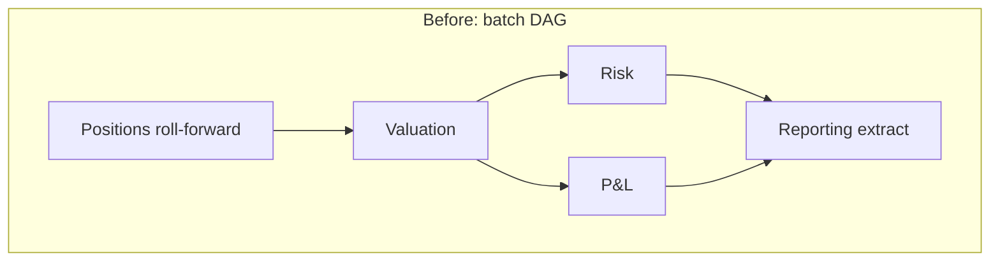
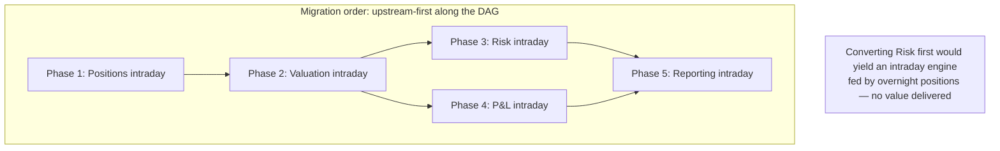
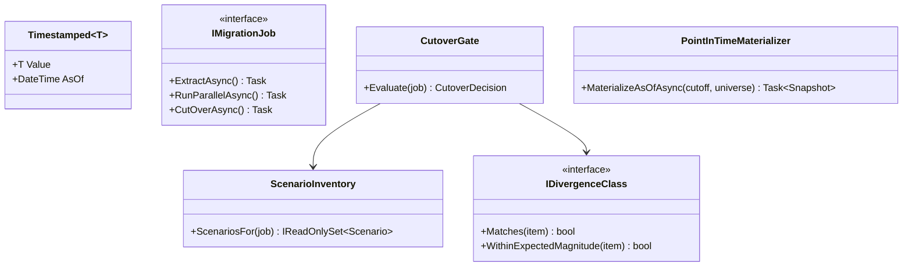

# Module 134 — System Design: Capstone — Migrating an End-of-Day Batch Estate to Intraday Processing

> Domain: System Design | Level: Beginner → Expert | Prerequisite: all five preceding scenarios — [[09-Designing-RealTime-Portfolio-Risk-Engine]], [[10-Designing-Market-Data-Distribution-Platform]], [[11-Designing-Order-Management-Trade-Lifecycle]], [[12-Designing-MultiTenant-Portfolio-Analytics-Platform]], [[13-Designing-Regulatory-Reporting-Pipeline]] — plus [[../30-Architecture-Patterns/03-MigrationPatterns-BranchByAbstraction-ParallelRun-AntiCorruptionLayer-DataMigration]] (Strangler Fig, Parallel Run, reconciliation) and [[../35-Event-Sourcing/02-Capstone-MigratingARegulatedAggregateToEventSourcingAtScale]] (at-scale migration governance)
>
> **Capstone note:** Sixth and final buy-side/capital-markets system-design scenario (Modules 129–134). Where the prior five each designed a system, this one changes the foundation all five stand on — and must preserve every correctness guarantee they assume. Full 16-section template; Elite FinTech Interview Panel lens.

---

## The Running Case Study

The firm's estate, built over two decades, is organized around an **overnight batch cycle**: markets close, a nightly sequence runs — position roll-forward, valuation, risk, P&L, accounting, reporting extracts — and by 06:00 the business has a consistent, complete picture of the previous day. Every downstream system in Modules 129–133 was built assuming this cadence.

Three forces now make it untenable: the batch window has compressed as the firm expanded into Asian markets (the window between one region's close and another's open is shrinking toward zero); portfolio managers need intraday risk (Module 129) rather than yesterday's; and a regulatory regime is moving from T+1 to intraday reporting (Module 133). The firm must move to intraday processing without a rewrite it cannot afford and without breaking the guarantees five downstream systems depend on.

---

## 1. Fundamentals

**What:** Incrementally converting a batch-oriented estate to continuous intraday processing — replacing "compute everything, once, when the market is closed" with "compute what changed, continuously, while the market is open" — without a big-bang cutover.

**Why:** Batch's defining advantage is a **quiet, consistent snapshot**: nothing changes while the batch runs, so every computation sees the same world and the outputs are mutually consistent by construction. Intraday forfeits that: inputs change during computation, so consistency must be engineered rather than inherited. Every difficulty in this module descends from that single loss.

**When:** When the window compresses below the batch's runtime (a hard forcing function), or when the business value of freshness exceeds the migration's cost. The window compression is the more common trigger and the more urgent, because it fails suddenly — the batch that finished at 05:30 for years does not gradually degrade; one day it does not finish before the market opens.

**How (30,000-ft view):**
```
Batch estate:   [market close] → job1 → job2 → job3 → ... → jobN → [06:00 outputs ready]
                                 (quiet world, implicit consistency)

Intraday:       events ──► incremental recompute ──► continuously-updated outputs
                            (moving world, consistency must be explicit)

Migration:      Strangler Fig per job — extract, run in parallel, reconcile, cut over, retire
```

---

## 2. Deep Dive

### 2.1 What Batch Actually Provided, and What Must Be Rebuilt
Before migrating, name what the batch gave for free — because each item becomes an explicit engineering requirement:

- **A consistent snapshot.** Nothing moved during the run. Module 129 §4's incident is exactly what happens when this is lost and not replaced: the snapshot-pinning discipline is the intraday reconstruction of what batch provided implicitly.
- **A total order of computation.** Job B ran after job A, so B saw A's complete output. Intraday, both run continuously and B may see A's partial output.
- **A natural completion signal.** "The batch finished" meant everything was done. Intraday has no equivalent — there is no moment when everything is current, so downstream consumers must reason about per-item freshness instead.
- **A repair window.** A failed job could be rerun before 06:00. Intraday, a failure is visible immediately and the repair happens while the business is using the output.

### 2.2 Dependency Order Is the Real Migration Constraint
Batch jobs form a dependency DAG, and the migration order is constrained by it — but not in the obvious direction. Converting a job to intraday while its *upstream* remains batch means the intraday job runs continuously against inputs that only change once a day: correct, but valueless, since its outputs cannot be fresher than its stalest input.

The productive order is therefore **upstream-first**, following the DAG from sources toward consumers. This is unintuitive because the business pressure comes from downstream (PMs want intraday risk), and the temptation is to convert the visible consumer first — producing an intraday-capable risk engine still fed by overnight positions, delivering none of the promised value while consuming the migration budget.

### 2.3 The Hybrid Period Is the Migration, Not a Phase of It
For an extended period — realistically years for a large estate — some jobs are intraday and some are batch. This hybrid state is not a transitional inconvenience; it is where the firm operates for most of the migration, and it must be designed for explicitly rather than endured.

The central hybrid problem: a consumer reading from both an intraday-updated store and a batch-updated store gets a mixed-freshness view. Whether that is acceptable is *consumer-specific* — a P&L view mixing intraday positions with overnight FX rates is misleading in a way that is hard for a user to detect. The discipline is to make freshness explicit in the data model (every value carries its as-of), so consumers can reason about it rather than assuming uniformity.

### 2.4 Reconciliation Against the Batch as the Migration's Safety Net
Directly Module 107's Parallel Run and Module 122's migration reconciliation: each converted job runs alongside its batch predecessor, and their outputs are compared. The batch is authoritative until reconciliation demonstrates equivalence over a representative period.

Two domain-specific subtleties:
- **Compare at the batch's cadence, not the intraday one.** The intraday job produces many values per day; the batch produces one. The comparison must be "intraday value as of the batch's cut-off" versus "batch value" — comparing the intraday value at an arbitrary moment against the batch's end-of-day figure will diverge legitimately and mask real differences in noise.
- **Expect and classify legitimate divergence.** Intraday and batch will differ for correct reasons (different rounding accumulation, different handling of intra-day corrections). These must be classified and explained rather than treated as failures, or the reconciliation becomes noise and stops being read — the same triage discipline Module 132 §Advanced Q4 required for onboarding.

### 2.5 Correctness Semantics That Change Under Intraday
Some computations are not merely faster intraday — they mean something different:

- **P&L attribution** over a day is well-defined; "P&L so far today" requires deciding the start point and how intraday position changes are attributed, which is a business definition, not an implementation detail.
- **Accounting entries** are typically defined as of a point in time with regulatory significance; making them continuous may be inappropriate regardless of technical feasibility.
- **Averages and period metrics** must define their window explicitly where batch's implicit "the day" no longer applies.

The migration must surface these as business decisions rather than let engineering choose defaults silently — the failure mode being a number that looks like its batch predecessor but answers a subtly different question.

### 2.6 The Batch That Cannot Be Migrated
Some jobs should stay batch, and identifying them early prevents wasted effort: genuinely period-scoped computations (month-end accounting close), jobs whose inputs only change daily (a vendor file delivered once), and jobs where regulatory definition requires a point-in-time computation (§2.5).

Module 107's "old systems never die" warning applies with a twist: here, *some* of the old system correctly survives, so the discipline is distinguishing "deliberately retained batch" from "not yet migrated batch" — and tracking the latter with a deadline while exempting the former explicitly, so the residual batch estate does not become an undifferentiated backlog nobody can reason about.

---

## 3. Visual Architecture





```mermaid
sequenceDiagram
    participant E as Events
    participant I as Intraday job (new)
    participant B as Batch job (authoritative)
    participant R as Reconciler
    participant C as Consumers

    E->>I: Continuous updates
    Note over B: Runs overnight as before
    B->>C: Authoritative output
    I->>R: Intraday value as of batch cut-off
    B->>R: Batch value
    R->>R: Compare; classify divergence
    Note over R: After sustained equivalence,<br/>cut over: intraday becomes authoritative
```

---

## 4. Production Example

**Problem:** The firm began its migration with position roll-forward — correctly upstream-first (§2.2) — converting it to update continuously from Module 131's trade events rather than once nightly.

**Architecture:** Strangler Fig with Parallel Run: the intraday position service ran alongside the batch job, with nightly reconciliation comparing intraday positions as of the batch cut-off against batch positions (§2.4's cadence discipline, correctly applied).

**Implementation:** Reconciliation matched exactly for six weeks. The team cut over: intraday positions became authoritative, and the batch job was disabled.

**Trade-offs:** Six weeks of clean reconciliation across two month-ends was judged sufficient evidence — a reasonable standard, and one many teams would accept.

**Lessons learned:** Eleven days after cutover, a corporate action — a stock split — processed incorrectly. Positions for the affected instrument were understated by half across every downstream system, including Module 129's risk and Module 133's reporting.

The batch job had handled corporate actions in a dedicated step that ran *between* position roll-forward and valuation. When position roll-forward was extracted and converted, that step remained in the batch — it was not part of the job being migrated. Nightly, the disabled-but-not-yet-removed batch sequence had still been applying corporate actions to the batch position store, which the reconciliation compared against. The intraday service had *never* handled corporate actions, and the reconciliation could not reveal this because **no corporate action had occurred in the six-week window** for any instrument in the reconciled set.

The reconciliation had been sound. The evidence period had not covered the scenario. The batch estate's implicit sequencing — position roll-forward, then corporate actions, then valuation — meant extracting one job silently orphaned a dependency the extracted job never knew it had.

The fix was threefold: (1) corporate-action handling was implemented in the intraday path and back-applied to correct affected positions; (2) the migration's exit criteria changed from "N weeks of clean reconciliation" to **"clean reconciliation plus demonstrated coverage of an enumerated scenario inventory"** — corporate actions, month-end, mid-period instrument changes, and other episodic events, with synthetic injection where natural occurrence was too rare to wait for; (3) before extracting any job, the team now produces an explicit map of what runs before and after it in the batch sequence and what each contributes, because the batch's dependencies were **encoded in job ordering rather than in data or interfaces** — invisible to anyone reading the job's own code.

The generalizable lesson, and the one this capstone rests on: **time-based migration evidence measures elapsed time, not scenario coverage** — and in a domain with episodic events, elapsed time is a poor proxy for the coverage that actually matters.

---

## 5. Best Practices
- Migrate upstream-first along the dependency DAG; converting a consumer ahead of its inputs delivers no freshness (§2.2).
- Define exit criteria as demonstrated scenario coverage, not elapsed reconciliation time, with synthetic injection for rare events (§4).
- Map what runs before and after a job in the batch sequence before extracting it — ordering encodes dependencies that code does not (§4).
- Compare reconciliation at the batch's cadence (intraday value as of cut-off), not at an arbitrary intraday moment (§2.4).
- Make freshness explicit per value so hybrid-period consumers can reason about mixed staleness (§2.3).
- Distinguish deliberately-retained batch from not-yet-migrated batch, tracking only the latter (§2.6).

## 6. Anti-patterns
- Cutting over on elapsed-time evidence without scenario coverage (§4's incident).
- Migrating the business-visible consumer first, producing intraday capability fed by stale inputs (§2.2).
- Treating the hybrid period as a brief transition rather than the state the firm operates in for years (§2.3).
- Assuming a job's dependencies are visible in its code when the batch encoded them in sequence ordering (§4).
- Letting engineering silently choose semantics for computations whose meaning changes intraday (§2.5).
- An undifferentiated "remaining batch" backlog conflating what should stay with what has not yet moved (§2.6).

---

## 7. Performance Engineering

**CPU/Memory:** Intraday's aggregate compute typically *exceeds* batch's, because incremental recomputation repeats work batch did once. The gain is latency, not efficiency — a distinction worth stating explicitly to stakeholders who expect modernization to reduce cost.

**Latency:** Batch had one deadline (06:00); intraday has a continuous freshness target per output. Replace batch-completion monitoring with per-output staleness monitoring — the metric changes shape entirely, and reusing the old dashboard is a common early mistake.

**Throughput:** Sized for peak event rate (market open, volatility) rather than total daily volume. Batch capacity planning is a volume-over-window calculation; intraday is a rate calculation, and the peak-to-mean ratio (Module 130 §7's 50–100×) means naive translation under-provisions severely.

**Scalability:** Incremental recomputation scales with change rate rather than portfolio size — usually favourable, since a typical day touches a small fraction of positions. The exception is a market-wide move affecting everything at once, which is precisely the scenario where the outputs matter most.

**Benchmarking:** Benchmark the hybrid state, not just the target state. The hybrid runs longest and carries the awkward interactions (§2.3), and a benchmark of the clean end-state measures a configuration the firm will not occupy for years.

**Caching:** Batch could cache freely within a run because inputs were frozen; intraday cache invalidation must follow the dependency graph (Module 129 §2.2), and an incorrect graph now produces stale outputs continuously rather than being reset by the next night's run.

---

## 8. Security

**Threats:** The migration itself is the threat surface. Running old and new paths in parallel doubles the access footprint; reconciliation processes need broad read access across both estates; and cutover changes which system is authoritative, which changes what an attacker gains by compromising each.

**Mitigations:** Time-box and scope reconciliation credentials to read-only across the specific stores compared (Module 122 §8's migration-credential discipline); revoke on cutover rather than leaving them for "the next migration"; and update threat models at each cutover, since the authoritative system changing is a material change to the model.

**OWASP mapping:** Broken Access Control via accumulated migration credentials — long-lived, broadly-scoped, and forgotten — is the specific risk this kind of programme reliably produces.

**AuthN/AuthZ:** New intraday services need authorization equivalent to the batch jobs they replace, which is often *poorly documented* — batch jobs frequently run with broad service accounts nobody has re-examined in years, and replicating that breadth into new services propagates an old weakness into new infrastructure.

**Secrets:** Parallel-running paths need separate credentials so their access is independently auditable and independently revocable — sharing credentials between old and new makes cutover's access change invisible.

**Encryption:** Unchanged in principle; note that intraday intermediate state is often newly persisted where batch held it in memory for a single run, creating new data at rest requiring the same protection as the batch outputs it derives from.

---

## 9. Scalability

**Horizontal scaling:** Intraday services scale by partition (portfolio, instrument) as in Modules 129–132; the batch estate typically scaled by adding time, which is the resource that has run out.

**Vertical scaling:** Batch jobs were often single large processes; the migration is frequently also a decomposition, which is additional risk to sequence deliberately rather than bundle.

**Caching:** §7's dependency-graph-driven invalidation.

**Replication/Partitioning:** Intraday state needs replication batch did not — batch could be rerun from inputs, whereas intraday state is continuously updated and its loss means rebuilding from event history (Module 121's replay), which takes time the intraday cadence does not have.

**Load balancing:** Event-driven partitioned consumption (Modules 118–120's established pattern).

**High Availability:** Batch had a natural maintenance window; intraday has none. Deployments, schema changes, and maintenance must all happen against a running system — an operational capability the organization may not currently possess, and one that is frequently underestimated as part of the migration's scope.

**Disaster Recovery:** Batch's DR was often "rerun the batch." Intraday requires state replication and replay capability, and the RTO must fit within the freshness commitment made to consumers — which is a materially tighter target than the batch estate ever faced.

**CAP theorem:** Batch was trivially consistent (a quiet world). Intraday forces per-output choices: Module 129's limits engine remains CP; analytics views can be AP; Module 133's reporting is CP. The migration is where these choices must be made explicitly for outputs that never needed a choice before, and defaulting silently is how a CP requirement becomes an AP implementation.

---

## 10. Interview Questions

### Basic (10)

1. **Q: What did batch provide implicitly that intraday must engineer explicitly?**
   **A:** A consistent snapshot (nothing changes during the run), a total order of computation, a natural completion signal, and a repair window (§2.1).
   **Why correct:** Names all four, each of which becomes an explicit requirement.
   **Common mistakes:** Citing only freshness as the difference, missing that consistency was the thing being traded away.
   **Follow-ups:** "Which one caused Module 129's §4 incident?" (Loss of the consistent snapshot — snapshot pinning is its intraday reconstruction.)

2. **Q: Why migrate upstream-first rather than starting with the business-visible consumer?**
   **A:** An intraday job fed by batch inputs cannot be fresher than its stalest input, so converting a consumer first delivers no value while consuming budget (§2.2).
   **Why correct:** States the constraint and why the intuitive order fails.
   **Common mistakes:** Starting with risk because PMs are asking for it, producing an intraday engine on overnight positions.
   **Follow-ups:** "Why is this counterintuitive?" (Business pressure comes from downstream, so the visible consumer is what stakeholders ask for first, §2.2.)

3. **Q: Why is the hybrid period a design target rather than a transition?**
   **A:** For a large estate it lasts years — it is where the firm operates for most of the migration, so mixed-freshness consumption must be designed for rather than endured (§2.3).
   **Why correct:** Identifies the duration reality that makes it a first-class state.
   **Common mistakes:** Planning for the end state and treating the hybrid as temporary discomfort.
   **Follow-ups:** "What makes mixed freshness dangerous?" (A view mixing intraday positions with overnight FX is misleading in a way users cannot easily detect, §2.3.)

4. **Q: What went wrong in §4's incident?**
   **A:** Corporate-action handling lived in a separate batch step between the migrated job and its consumer; the intraday service never implemented it, and six weeks of reconciliation could not reveal this because no corporate action occurred in that window (§4).
   **Why correct:** States both the orphaned dependency and why the evidence period missed it.
   **Common mistakes:** Describing it as a reconciliation failure; the reconciliation was correct, its evidence period was insufficient.
   **Follow-ups:** "What replaced the exit criteria?" (Demonstrated scenario coverage rather than elapsed time, with synthetic injection for rare events, §4.)

5. **Q: Why must reconciliation compare at the batch's cadence?**
   **A:** The intraday job produces many values daily and the batch one; comparing an arbitrary intraday value against the batch's end-of-day figure diverges legitimately and buries real differences in noise (§2.4).
   **Why correct:** States the specific comparison and why the naive one fails.
   **Common mistakes:** Comparing latest-intraday against batch, producing constant false divergence.
   **Follow-ups:** "What else must reconciliation do?" (Classify legitimate divergence rather than treating it as failure, or it becomes noise and stops being read, §2.4.)

6. **Q: Give an example of a computation whose meaning changes intraday.**
   **A:** P&L attribution — "P&L for the day" is well-defined, but "P&L so far today" requires deciding the start point and how intraday position changes are attributed, which is a business definition (§2.5).
   **Why correct:** Gives a concrete case and identifies the decision as a business one.
   **Common mistakes:** Treating it as an implementation detail engineering can default.
   **Follow-ups:** "What is the failure mode?" (A number that looks like its batch predecessor but answers a subtly different question, §2.5.)

7. **Q: Which jobs should deliberately remain batch?**
   **A:** Genuinely period-scoped computations (month-end close), jobs whose inputs change only daily (a once-daily vendor file), and jobs where regulatory definition requires point-in-time computation (§2.6).
   **Why correct:** Names all three categories with their reasons.
   **Common mistakes:** Treating full conversion as the goal, wasting effort on jobs where batch is correct.
   **Follow-ups:** "Why track the distinction explicitly?" (So retained batch is not confused with un-migrated batch in an undifferentiated backlog, §2.6.)

8. **Q: Why does intraday typically increase total compute?**
   **A:** Incremental recomputation repeats work batch did once; the gain is latency, not efficiency (§7).
   **Why correct:** States the trade honestly rather than assuming modernization reduces cost.
   **Common mistakes:** Promising cost reduction, then reporting increased spend.
   **Follow-ups:** "How should this be framed to stakeholders?" (As buying freshness with compute — a deliberate purchase, not an efficiency loss.)

9. **Q: What monitoring must replace batch-completion monitoring?**
   **A:** Per-output staleness monitoring — intraday has no single completion moment, so freshness must be tracked per output rather than as one job status (§7, §2.1).
   **Why correct:** Identifies that the metric's shape changes, not just its threshold.
   **Common mistakes:** Reusing the batch dashboard with a different threshold.
   **Follow-ups:** "Why is there no completion signal?" (Nothing is ever 'done' — there is no moment when everything is current, §2.1.)

10. **Q: Why does intraday have no maintenance window?**
    **A:** Batch had a natural quiet period; intraday runs continuously, so deployments and schema changes must happen against a live system — an operational capability the organization may not have (§9).
    **Why correct:** Identifies both the loss and the organizational-capability implication.
    **Common mistakes:** Planning the technical migration without the operational-practice change it requires.
    **Follow-ups:** "What does this add to the migration's scope?" (Zero-downtime deployment and online schema change practices, frequently underestimated.)

### Intermediate (10)

1. **Q: Explain precisely why §4's reconciliation could not have detected the gap.**
   **A:** Reconciliation compares outputs over the period it runs. The missing capability — corporate-action handling — only produces divergent output when a corporate action occurs, and none did in the six-week window for the reconciled instruments. The comparison was correct and the implementations genuinely agreed on every case that arose; the gap existed only in a case that did not arise.
   **Why correct:** Locates the failure in evidence coverage rather than in the comparison mechanism.
   **Common mistakes:** Proposing better reconciliation, which cannot detect divergence in a scenario that never occurs during observation.
   **Follow-ups:** "What is the general principle?" (Elapsed-time evidence measures time, not coverage — in a domain with episodic events these are weakly correlated, §4.)

2. **Q: Design the scenario inventory that replaced §4's time-based exit criteria.**
   **A:** Enumerate episodic events the job must handle — corporate actions by type (splits, mergers, spin-offs, dividends), month-end and quarter-end, instrument lifecycle events (issuance, maturity, ticker change), and error/correction paths (busts, amendments, late data). For each: either wait for natural occurrence and verify, or inject synthetically into the parallel-run environment. Cutover requires every scenario demonstrated, not a duration elapsed.
   **Why correct:** Gives an enumerable, verifiable criterion and provides for scenarios too rare to wait for.
   **Common mistakes:** Extending the time period instead, which improves the odds of coverage without ensuring it.
   **Follow-ups:** "How do you know the inventory is complete?" (You do not with certainty — which is why §4's third fix, mapping the batch sequence's surrounding steps, matters: it derives the inventory from what the batch actually did rather than from imagination.)

3. **Q: Why were the batch's dependencies invisible in the migrated job's code?**
   **A:** Batch encoded them in **job ordering** — position roll-forward ran before corporate actions, which ran before valuation — so the contract was the schedule, not an interface. Reading the job's code reveals nothing about what must run before or after it (§4).
   **Why correct:** Identifies ordering-as-contract, the specific property that makes batch estates hazardous to decompose.
   **Common mistakes:** Assuming code and data dependencies capture the full contract.
   **Follow-ups:** "What is the practical countermeasure?" (Explicitly map the surrounding sequence and each step's contribution before extraction — §4's third fix.)

4. **Q: How should mixed freshness be represented so consumers can reason about it?**
   **A:** Every value carries its own as-of timestamp and provenance, and consuming views surface the *oldest* contributing as-of rather than presenting a uniform current picture. A P&L view built from intraday positions and overnight FX should display the overnight as-of, since that is what bounds the view's validity (§2.3).
   **Why correct:** Makes staleness visible and correctly identifies that the oldest input bounds the whole.
   **Common mistakes:** Displaying the newest contributing timestamp, which overstates freshness precisely where it matters.
   **Follow-ups:** "Why does the oldest bound it?" (A view is only as current as its stalest input — the same reasoning as §2.2's migration ordering.)

5. **Q: Why is benchmarking the hybrid state more important than benchmarking the target state?**
   **A:** The hybrid is where the firm operates for years, and it carries interactions the clean end-state does not — batch jobs reading intraday stores mid-update, intraday jobs waiting on batch outputs. The end state is simpler and arrives last (§7).
   **Why correct:** Ties the priority to duration and to the hybrid's unique interactions.
   **Common mistakes:** Benchmarking the target architecture, validating a configuration the firm will not occupy for years.
   **Follow-ups:** "Name a hybrid-specific interaction." (A batch job reading a store being continuously updated — it may see a partially-updated state batch's quiet world never presented.)

6. **Q: Why does cache invalidation become harder intraday?**
   **A:** Batch could cache freely because inputs were frozen for the run and the next run started clean. Intraday must invalidate along the dependency graph continuously, and an incorrect graph produces persistently stale outputs rather than errors reset overnight (§7).
   **Why correct:** Identifies both the mechanism and the loss of the nightly reset that masked graph errors.
   **Common mistakes:** Porting batch caching directly, where its correctness depended on frozen inputs.
   **Follow-ups:** "Which module established this graph risk?" (Module 129 §2.2 — a missing edge means a value silently fails to recompute.)

7. **Q: Why do new intraday services often inherit over-broad authorization?**
   **A:** Batch jobs commonly run under broad service accounts nobody has re-examined; replicating that breadth into new services propagates an old weakness into new infrastructure, and the migration is the natural point to correct it (§8).
   **Why correct:** Identifies the inheritance mechanism and frames the migration as the opportunity.
   **Common mistakes:** Copying existing permissions to guarantee functional parity, carrying the weakness forward.
   **Follow-ups:** "Why is determining correct permissions hard here?" (Batch jobs' actual access needs are often undocumented, so the safe-looking choice is to replicate rather than to determine.)

8. **Q: Why does intraday state need replication that batch state did not?**
   **A:** Batch state could be rebuilt by rerunning the batch; intraday state is continuously updated, and rebuilding from event history takes time the freshness commitment does not permit (§9).
   **Why correct:** Ties the requirement to the recovery-time constraint the new cadence imposes.
   **Common mistakes:** Carrying over batch's DR posture, which relied on a rerun window that no longer exists.
   **Follow-ups:** "What sets the RTO?" (The freshness commitment made to consumers — materially tighter than batch's overnight window.)

9. **Q: How should the residual batch estate be tracked?**
   **A:** Two separate registers: deliberately-retained batch (with the reason — period-scoped, daily inputs, regulatory point-in-time) and not-yet-migrated batch (with an owner and target date). Conflating them produces a backlog nobody can reason about and lets un-migrated work hide among legitimately-retained jobs (§2.6).
   **Why correct:** Specifies the separation and names the failure of conflating.
   **Common mistakes:** One "remaining batch" list, which grows stale and loses meaning.
   **Follow-ups:** "Which prior module warned about this?" (Module 107 Advanced Q7's "old systems never die" — with the twist that here some correctly survive, §2.6.)

10. **Q: Synthesize how this migration affects each of Modules 129–133.**
    **A:** Module 129 gains genuine intraday risk but requires snapshot pinning to replace batch's implicit consistency. Module 130's snapshots become the consistency mechanism the estate depends on rather than one consumer's convenience. Module 131 is largely unaffected — it was already event-driven, and is in fact the event source that makes the migration possible. Module 132 gains intraday analytics but inherits the hybrid period's mixed-freshness problem in a multi-tenant setting. Module 133 becomes feasible for intraday regimes but loses batch's natural completeness boundary, so its completeness reconciliation (§4 there) needs an intraday-appropriate definition.
    **Why correct:** Traces the specific effect on each, including that one is unaffected and one is the enabler.
    **Common mistakes:** Assuming uniform benefit; the effects differ in kind, and one module's completeness semantics genuinely become harder.
    **Follow-ups:** "Which is most affected?" (Module 133 — losing the batch boundary means 'everything for the day' no longer has a natural definition.)

### Advanced (10)

1. **Q: Diagnose §4's incident and design the complete structural fix.**
   **A:** Root cause: extraction of a job from a sequence whose dependencies were encoded in ordering rather than interfaces (Intermediate Q3), combined with exit criteria measuring elapsed time rather than scenario coverage (Intermediate Q1). Fix: (1) mandatory pre-extraction mapping of the surrounding batch sequence and each step's contribution, producing the dependency contract the code does not express; (2) exit criteria as a demonstrated scenario inventory derived from that map, with synthetic injection for rare events (Intermediate Q2); (3) post-cutover monitoring specifically for the scenarios that could not be naturally observed, so a first natural occurrence is verified rather than assumed; (4) retain the batch job in shadow — computing but not authoritative — for a further period after cutover, providing a comparison basis for exactly the episodic events the pre-cutover window missed.
   **Why correct:** Addresses the invisible dependency, the insufficient evidence standard, and adds post-cutover verification for the residual risk that remains after both.
   **Common mistakes:** Fixing only the exit criteria, leaving the next extraction to orphan a different unmapped dependency.
   **Follow-ups:** "Why is (4) valuable given (1)–(3)?" (Because the scenario inventory cannot be proven complete — shadow running provides detection for scenarios nobody thought to enumerate, which is precisely the failure class §4 represents.)

2. **Q: A team proposes converting the risk engine first because PMs are demanding intraday risk. Evaluate.**
   **A:** It delivers the appearance of progress and none of the value: risk computed continuously from positions that update nightly is exactly as stale as before, and PMs will observe that immediately. It also consumes the migration's early credibility on a phase that cannot demonstrate benefit. The correct response is to sequence upstream-first (§2.2) and manage the expectation — explaining that positions must move first, with a dated commitment for when risk follows. If political pressure makes upstream-first untenable, the honest alternative is a narrow vertical slice (one asset class, positions through risk) that delivers genuine intraday risk for a subset, rather than a horizontal layer that delivers none.
   **Why correct:** Rejects the proposal, explains why, and offers a genuine alternative for the political constraint rather than only refusing.
   **Common mistakes:** Accepting the sequencing to satisfy stakeholders, then explaining months later why nothing is fresher.
   **Follow-ups:** "Why is the vertical slice a legitimate alternative?" (It preserves upstream-first within a scope, delivering real value narrow rather than fake value broad.)

3. **Q: Critique disabling the batch job immediately at cutover.**
   **A:** It forfeits the comparison basis exactly when it is most valuable — the post-cutover period, when the intraday path is authoritative for the first time and its untested scenarios begin occurring naturally. §4's incident surfaced eleven days after cutover; with the batch still computing in shadow it would have been detected by divergence rather than by incorrect downstream numbers. The cost of running it is compute and the discipline to keep it correct; the benefit is detection during precisely the highest-risk window (Advanced Q1's fix 4).
   **Why correct:** Identifies that the post-cutover window is the highest-risk period and that disabling removes detection from it.
   **Common mistakes:** Disabling at cutover to realize savings and reduce operational surface, which optimizes cost against the migration's largest risk.
   **Follow-ups:** "How long should shadow running continue?" (Long enough to cover the scenario inventory's slowest-recurring items — typically through at least one quarter-end and one corporate-action-heavy period.)

4. **Q: Design the freshness contract between an intraday producer and its consumers.**
   **A:** Publish an explicit staleness bound per output ("positions are current within 30 seconds under normal conditions") plus an as-of on every value (Intermediate Q4), plus a signal when the bound is breached so consumers can degrade deliberately rather than silently consuming stale data believing it fresh. The essential property is that a consumer can *detect* staleness rather than having to trust it — which batch provided trivially, since everything was uniformly as-of the same overnight run.
   **Why correct:** Specifies the bound, the per-value metadata, and the breach signal, and identifies detectability as the property being restored.
   **Common mistakes:** Publishing a target without a breach signal, so consumers cannot distinguish normal from degraded.
   **Follow-ups:** "What should a consumer do on breach?" (Consumer-specific: Module 129's limits engine refuses (CP), an analytics view displays a staleness warning (AP) — the same per-consumer posture split, §9.)

5. **Q: How would you handle a batch job whose logic nobody fully understands?**
   **A:** Common in a two-decade estate and genuinely dangerous. Do not reimplement from reading the code — reimplement from *observed behaviour*: characterize inputs and outputs across a long history, build the intraday implementation to reproduce that behaviour, and use extended parallel running with a scenario inventory (Advanced Q1) as the correctness standard. Where behaviour cannot be explained, that is a finding to escalate rather than to encode — an unexplained transformation may be a decades-old bug that downstream systems now depend on, and reproducing it deliberately is different from reproducing it unknowingly.
   **Why correct:** Substitutes observed behaviour for unavailable intent and flags the unexplained-behaviour case as requiring a decision rather than replication.
   **Common mistakes:** Reimplementing from code reading, which reproduces what the code does without revealing what it is for — and misses behaviours arising from interaction with the surrounding sequence (§4).
   **Follow-ups:** "What if reproducing a suspected bug is required?" (Then it is a deliberate, documented decision with an owner and a plan — the danger is reproducing it unknowingly, not reproducing it at all.)

6. **Q: A regulator asks how the firm ensured reporting accuracy was maintained through the migration. Answer honestly.**
   **A:** Describe the controls: parallel running with reconciliation against the authoritative batch (§2.4), scenario-coverage-based exit criteria rather than elapsed time (Advanced Q1), shadow running post-cutover (Advanced Q3), and Module 133's own independent completeness reconciliation continuing throughout. Then disclose §4's incident, its detection, remediation, and the resulting change to exit criteria — because the regulator will assess the firm's control environment more on how it responded to a failure than on whether one occurred, and proactive disclosure of a remediated issue is materially better received than its later discovery (Module 133 §Expert Q6's posture).
   **Why correct:** Gives the controls and discloses the failure with its remediation, consistent with the honest-disclosure posture established across this run.
   **Common mistakes:** Describing controls without disclosing the incident they were changed in response to, which invites a much worse discovery later.
   **Follow-ups:** "Why does disclosing strengthen the position?" (It evidences that the control environment detects and corrects — which is what a supervisor is actually assessing.)

7. **Q: Apply this course's "declared ≠ actual" theme to this migration.**
   **A:** The claim is "the intraday implementation is equivalent to the batch it replaces." Its declared basis is sustained reconciliation agreement. §4 showed why that is insufficient: agreement over a period demonstrates equivalence *for the cases that occurred*, and in a domain with episodic events the unobserved cases are exactly where implementations differ — because they are the cases the new implementation's author never encountered. What distinguishes this capstone from the prior five is that the gap is not in the system's own logic but in **the evidence used to authorize the change**: the reconciliation was correct, the implementations genuinely agreed, and the conclusion drawn from that agreement was still wrong.
   **Why correct:** Locates the gap in the evidence standard rather than in the system, which is the capstone's distinctive contribution to the theme.
   **Common mistakes:** Treating it as another silent-system-failure instance, missing that this one is a reasoning failure about what evidence proves.
   **Follow-ups:** "Where else does this reasoning error appear?" (Anywhere a period of clean operation is taken as evidence of correctness — including, in this run, Module 129's six-week-equivalent framings and any 'it's been running fine' argument.)

8. **Q: Design the migration's programme-level metrics.**
   **A:** Not percentage-of-jobs-migrated, which counts activity and treats a trivial job as equal to a critical one. Report: freshness delivered per business-critical output (the actual objective); scenario-inventory coverage per in-flight migration (the readiness gate, Advanced Q1); shadow-period divergence counts (post-cutover risk); and the two batch registers separately (Intermediate Q9), so retained batch is not counted as incomplete work. These map to whether the migration is delivering value and whether each step is safe, rather than to how busy the programme is.
   **Why correct:** Selects metrics mapping to objective and safety rather than to activity, and names the specific distortion of the common metric.
   **Common mistakes:** Percentage-complete reporting, which incentivizes migrating easy jobs and shows progress while critical outputs remain stale.
   **Follow-ups:** "What does percentage-complete specifically distort?" (It rewards converting many small jobs over the upstream-first sequencing that actually delivers freshness, §2.2.)

9. **Q: How should the migration handle a job that must change semantics (§2.5) rather than merely cadence?**
   **A:** Separate the two changes: migrate the cadence first, preserving batch semantics exactly (so reconciliation is meaningful — you cannot reconcile against a predecessor computing something different), then change semantics as a distinct, separately-governed change with its own business sign-off. Bundling them makes reconciliation impossible, because divergence cannot be attributed to a migration defect or an intended semantic change — and that ambiguity is exactly what the safety net exists to eliminate.
   **Why correct:** Sequences to preserve reconciliation's diagnostic value and names the ambiguity bundling creates.
   **Common mistakes:** Bundling, since both changes touch the same code and doing them together seems efficient.
   **Follow-ups:** "What if the batch semantics are genuinely unusable intraday?" (Then the cadence migration must still land first with the closest faithful equivalent, accepting that the semantic change follows — otherwise there is no verifiable intermediate state.)

10. **Q: Synthesize the governance program for the migration programme.**
    **A:** (1) Upstream-first sequencing per the dependency DAG, with vertical slices as the alternative under political pressure (Advanced Q2). (2) Pre-extraction mapping of the surrounding batch sequence (Advanced Q1). (3) Scenario-inventory exit criteria with synthetic injection, never elapsed time (Intermediate Q2). (4) Shadow running post-cutover through at least one full episodic cycle (Advanced Q3). (5) Explicit freshness contracts with breach signals (Advanced Q4). (6) Semantic changes separated from cadence changes, separately governed (Advanced Q9). (7) Two distinct batch registers — retained versus un-migrated (Intermediate Q9). (8) Programme metrics on freshness delivered and scenario coverage, not percentage complete (Advanced Q8). (9) Migration credentials time-boxed and revoked at cutover (§8).
    **Why correct:** Assembles a programme covering sequencing, safety, contracts, governance, and the measurement that keeps it honest.
    **Common mistakes:** Governing the technical migration without the evidence-standard and sequencing disciplines, which is where §4's failure actually originated.
    **Follow-ups:** "Which item would you insist on first?" (Scenario-inventory exit criteria — it is the direct fix for the failure that has already occurred, and it costs nothing to adopt for the next extraction.)

### Expert (10)

1. **Q: How would you decide whether to migrate incrementally or rebuild the estate?**
   **A:** Rebuild is tempting for a two-decade estate with unclear logic (Advanced Q5) and is almost always wrong at this scale, for the reason Module 107 established: the rebuild must reproduce every behaviour the existing estate has, including ones nobody has documented, while the business continues to depend on the original — so the rebuild inherits the same archaeology problem with none of the incremental verification. Incremental migration's advantage is not that it is easier but that **each step is independently verifiable against a running reference**. The rebuild case exists only where the estate is small enough to fully characterize, which a two-decade multi-asset-class estate is not.
   **Why correct:** Identifies incremental verifiability as the decisive advantage rather than arguing on effort.
   **Common mistakes:** Choosing rebuild because the existing estate is poorly understood — which is precisely the condition making rebuild most dangerous.
   **Follow-ups:** "What makes the archaeology problem worse in a rebuild?" (You must solve it for everything at once, with no reference to compare against, rather than one job at a time with a running comparator.)

2. **Q: How does this migration interact with the firm's regulatory-change calendar?**
   **A:** They compete for the same capacity and the same systems, and regulatory deadlines are immovable while migration milestones are not — so the migration will be deprioritized repeatedly. The realistic response is to sequence the migration to *serve* upcoming regulatory changes where possible (Module 133's intraday reporting requirement is a migration driver, not a competitor), and to accept explicit pauses rather than pretending parallel delivery. A programme plan that does not model regulatory contention is not a plan, and the honest version shows the pauses rather than discovering them.
   **Why correct:** Recognizes the contention as structural, identifies alignment where it exists, and argues for honest planning over optimistic parallelism.
   **Common mistakes:** Planning the migration in isolation, then re-planning every quarter as regulatory work displaces it.
   **Follow-ups:** "How do you use a regulatory driver productively?" (An intraday reporting mandate justifies the upstream migration it requires — the regulatory deadline becomes the migration's forcing function rather than its competitor.)

3. **Q: Evaluate migrating to intraday and to cloud simultaneously.**
   **A:** Strongly advise against. Each is independently risky, and together they make attribution impossible — when the intraday path diverges, is it the reimplementation or the platform change? Reconciliation's diagnostic value collapses, which is the same reasoning as Advanced Q9's semantics-versus-cadence separation. Sequence them: migrate cadence on the existing platform where behaviour is comparable, then move platforms with behaviour held constant, so each change has a stable reference. The counter-argument — that both touch the same code, so doing them together saves effort — is the same false efficiency as bundling semantics with cadence.
   **Why correct:** Applies the established separation principle to a second bundling temptation and rebuts the efficiency argument consistently.
   **Common mistakes:** Bundling to avoid touching the same systems twice, forfeiting attributable verification for both changes.
   **Follow-ups:** "Which order?" (Cadence first on the known platform — the reimplementation is the higher-risk change and benefits most from a stable substrate.)

4. **Q: How should the firm handle downstream consumers that cannot accept intraday updates?**
   **A:** Some consumers genuinely require stability — a report published to clients cannot change while being read, and a downstream system may assume daily snapshots. Serve these with a **materialized point-in-time view** derived from the intraday store: the intraday path becomes the source of truth, and batch-cadence consumers read a snapshot taken at a defined time. This preserves their contract without preventing the migration, and is architecturally the same mechanism as Module 130 §2.4's snapshot service — one consistent capture from a continuously-moving source.
   **Why correct:** Solves the constraint without blocking the migration and identifies the reuse of an established mechanism.
   **Common mistakes:** Treating such consumers as blockers requiring their own migration first, or forcing them onto intraday and breaking their assumptions.
   **Follow-ups:** "Why is this not just keeping the batch?" (The computation is intraday and the snapshot is a view of it — one implementation, two cadences, rather than two implementations that can diverge.)

5. **Q: Design the rollback plan for a cutover that fails after several days.**
   **A:** Rollback requires the batch path to still be running and current — which is precisely Advanced Q3's shadow-running argument, now as a rollback prerequisite rather than only a detection mechanism. If the batch has been disabled, rollback means restarting it and reconciling several days of divergence, which may take longer than fixing forward. The plan should therefore state a decision point: within the shadow period, rollback is cheap and available; after it, fix-forward is the only realistic path, and the shadow period's length is effectively the rollback window the firm is buying.
   **Why correct:** Ties rollback feasibility to shadow running and frames the shadow period as an explicit purchase of optionality.
   **Common mistakes:** Assuming rollback is always available, when disabling the batch removes it.
   **Follow-ups:** "How does this change the shadow-period decision?" (It is not only detection cost-benefit but also how long the firm wants rollback available — usually extending it.)

6. **Q: What organizational capabilities must change alongside the technical migration?**
   **A:** Several, each frequently underestimated: on-call moves from batch-window-centric to continuous; deployment practice must become zero-downtime (§9); support must diagnose live rather than examining a completed run; and — most significantly — the operating rhythm changes, since a business accustomed to a morning number now receives continuously-updating ones, which changes how it makes decisions and where it looks for errors. Treating this as purely technical delivers a system the organization cannot operate.
   **Why correct:** Enumerates specific capability changes and identifies the business-rhythm change as the largest.
   **Common mistakes:** Scoping the migration as engineering work, then finding operations and the business unprepared at cutover.
   **Follow-ups:** "Which is hardest?" (The business-rhythm change — it is not a capability to build but a behaviour to change, and it belongs to people outside the programme's authority.)

7. **Q: How would you validate that intraday outputs are correct on a day when batch and intraday legitimately differ?**
   **A:** Establish, in advance, the *classes* of legitimate divergence (§2.4) with expected magnitude and cause — rounding accumulation, intra-day correction handling, timing of a mid-day event. Then a divergence is validated by matching it to a class and confirming its magnitude is within that class's expectation, rather than by matching values. Divergence outside any known class is a defect. Without this classification, teams either accept all divergence (defeating reconciliation) or investigate all of it (unsustainable).
   **Why correct:** Provides a workable standard for a situation where exact matching is wrong, and names both failure modes of not having one.
   **Common mistakes:** Setting a tolerance band, which conflates a large legitimate divergence with a small illegitimate one.
   **Follow-ups:** "Why is a tolerance band insufficient?" (It measures magnitude without cause — a small unexplained divergence may indicate a defect while a large explained one is correct.)

8. **Q: A PM reports that intraday risk disagrees with the morning batch figure. Walk through the investigation.**
   **A:** First establish whether this is expected: intraday should differ from the morning figure, since positions and markets have moved — so the real question is whether the difference is *explicable* by observed activity. Decompose the difference into contributions (position changes, market moves, corporate actions) and confirm they account for it. If they do not, investigate as a defect using the reconciliation's divergence classes (Expert Q7). Most such reports resolve to the PM comparing figures that legitimately differ — which is itself a signal that the freshness contract (Advanced Q4) is not visible enough in the tooling.
   **Why correct:** Establishes expectation before investigating, decomposes to explain, and identifies the recurring root cause as a presentation gap.
   **Common mistakes:** Treating any disagreement as a defect, which both wastes effort and undermines confidence in a correctly-functioning system.
   **Follow-ups:** "What does a recurring pattern of these reports indicate?" (That the UI is not communicating as-of clearly — a design fix, not an explanation-repeated-per-user fix.)

9. **Q: How does this migration change the firm's risk profile during the transition?**
   **A:** It raises it, temporarily and materially, in ways worth stating plainly: two implementations exist (more surface, more divergence risk); the hybrid produces mixed-freshness views users may misread (§2.3); migration credentials broaden access (§8); and each cutover is a discrete elevated-risk event. This is why per-cutover risk assessment, shadow running, and honest programme metrics (Advanced Q8) matter — the migration's total risk is the sum of many cutovers, not the difference between start and end states, and a plan that reports only the end state's improvement is understating what it is asking the firm to accept.
   **Why correct:** States the elevation honestly, enumerates its sources, and identifies the mis-framing that hides it.
   **Common mistakes:** Presenting the migration as risk-reducing because the end state is better, ignoring the transition's elevated risk.
   **Follow-ups:** "How should this be communicated to a risk committee?" (As a temporary, managed elevation with named controls and a duration — which is a defensible position, unlike an implied risk reduction that the transition does not deliver.)

10. **Q: Deliver the closing synthesis for this module and for the six-scenario run.**
    **A:** This capstone's distinctive difficulty is that **the evidence standard, not the system, was the failure point** (Advanced Q7) — §4's reconciliation was correct, the implementations genuinely agreed, and the conclusion drawn was still wrong, because agreement over a period proves equivalence only for the cases that arose. That generalizes beyond migration to any "it has been running fine" argument.

    Across all six scenarios, one property recurs and defines the domain: **correctness is unobservable at the point of consumption while being immediately consequential**. Module 129's risk number, Module 130's misattributed price, Module 131's silently-discarded fill, Module 132's cross-tenant leak, Module 133's unidentified reportable event, and this module's untested scenario are all instances — each produces a plausible-looking output that a human or downstream system acts on immediately. That is why every one of these designs spends most of its complexity on establishing *evidence* — pinned snapshots, contract tests, reconciliation against independent sources, scenario inventories — rather than on throughput or latency, which are comparatively solved.

    The transferable Principal-level conclusion: in this domain, the design question is rarely "can we compute this fast enough" and almost always "**how would we know if this were wrong**" — and a candidate who answers the first without the second has, in every one of these six scenarios, solved the easier half.
    **Why correct:** Synthesizes the module's specific lesson, generalizes the run's recurring property with an instance from each scenario, and states the transferable conclusion as a question rather than an answer.
    **Common mistakes:** Summarizing the six scenarios as separate designs rather than identifying the property that unifies them and explains their shared shape.
    **Follow-ups:** "Where does this generalize outside capital markets?" (Anywhere output correctness is unobservable and consequential — medical decision support, safety systems, billing — the domain differs but the evidence-first design posture transfers directly.)

---

## 11. Coding Exercises

### Easy — As-Of Propagation Through a Derived Value (§2.3, Intermediate Q4)
**Problem:** A derived value's freshness is bounded by its stalest input.
**Solution:**
```csharp
public sealed record Timestamped<T>(T Value, DateTime AsOf);

public static Timestamped<TOut> Combine<TA, TB, TOut>(
    Timestamped<TA> a, Timestamped<TB> b, Func<TA, TB, TOut> f) =>
    new(f(a.Value, b.Value), a.AsOf < b.AsOf ? a.AsOf : b.AsOf); // OLDEST bounds the result
```
**Time complexity:** O(1).
**Space complexity:** O(1).
**Optimized solution:** Carry the identity of the limiting input alongside the timestamp, so a stale derived value can be traced to the specific upstream responsible without re-deriving the chain.

### Medium — Scenario Inventory Gate (§4, Intermediate Q2)
**Problem:** Block cutover until every enumerated scenario is demonstrated, not until time has elapsed.
**Solution:**
```csharp
public CutoverDecision Evaluate(MigrationJob job)
{
    var required = _inventory.ScenariosFor(job);           // derived from the batch-sequence map
    var demonstrated = _evidence.DemonstratedScenarios(job);

    var missing = required.Except(demonstrated).ToList();
    if (missing.Count > 0)
        return CutoverDecision.Blocked(missing, hint: "Inject synthetically if natural occurrence is rare");

    return _reconciliation.HasSustainedAgreement(job)
        ? CutoverDecision.Approved()
        : CutoverDecision.Blocked([], "Scenarios covered but reconciliation not yet stable");
}
```
**Time complexity:** O(s) for s scenarios.
**Space complexity:** O(s).
**Optimized solution:** Record *how* each scenario was demonstrated (natural versus synthetic) — a synthetically-covered scenario carries residual risk that natural occurrence does not, and should extend the shadow period (Advanced Q3) rather than being treated as equivalent evidence.

### Hard — Divergence Classification (Expert Q7)
**Problem:** Validate divergence by cause rather than by tolerance band.
**Solution:**
```csharp
public DivergenceVerdict Classify(ReconciliationItem item)
{
    foreach (var cls in _knownClasses)                     // e.g. rounding accumulation, intra-day correction
    {
        if (!cls.Matches(item)) continue;
        return cls.WithinExpectedMagnitude(item)
            ? DivergenceVerdict.Explained(cls.Name)
            : DivergenceVerdict.Defect($"Matches {cls.Name} but magnitude {item.Delta} exceeds expectation");
    }
    return DivergenceVerdict.Defect("No known divergence class matches");  // unexplained = defect
}
```
**Time complexity:** O(c) for c known classes.
**Space complexity:** O(1).
**Optimized solution:** Track the frequency of each class over time — a class whose incidence is rising indicates the underlying cause is worsening, which a per-item verdict cannot reveal.

### Expert — Point-in-Time View Over an Intraday Store (Expert Q4)
**Problem:** Serve batch-cadence consumers from an intraday source without a second implementation.
**Solution:**
```csharp
public async Task<Snapshot> MaterializeAsOfAsync(DateTime cutoff, IReadOnlyList<EntityId> universe)
{
    var barrier = await _sequence.HighWaterMarkAtAsync(cutoff);   // Module 130 §2.4's barrier
    var values = new Dictionary<EntityId, Timestamped<decimal>>(universe.Count);

    foreach (var id in universe)
    {
        var v = await _intradayStore.LatestAtOrBeforeAsync(id, barrier);
        if (v is null) throw new IncompleteSnapshotException(id, barrier);  // fail, never partial
        values[id] = v;
    }
    return Snapshot.Immutable(SnapshotId.New(), cutoff, barrier, values);
}
```
**Time complexity:** O(n log m) for n entities over m-length histories.
**Space complexity:** O(n).
**Optimized solution:** Materialize on a schedule and cache by `(cutoff, universeHash)`, since batch-cadence consumers request the same cut-offs repeatedly — turning a per-request scan into a per-cutoff computation shared across consumers.

---

## 12. System Design

**Functional requirements**
- Convert batch jobs to intraday incrementally, preserving each output's correctness (§2.4).
- Operate a hybrid estate for an extended period with explicit per-value freshness (§2.3).
- Serve batch-cadence consumers from intraday sources via point-in-time views (Expert Q4).
- Retain deliberately-batch jobs without conflating them with un-migrated work (§2.6).

**Non-functional requirements**
- No downstream correctness regression at any cutover (§4's standard, post-incident).
- Rollback available throughout the shadow period (Expert Q5).
- Freshness contracts published with breach signalling (Advanced Q4).
- Migration risk explicitly bounded and reported per cutover (Expert Q9).

**Capacity estimation**
- ~180 batch jobs; ~40 identified as deliberately-retained (§2.6), leaving ~140 migration candidates.
- Dependency DAG depth ~7 layers, constraining parallelism: upstream-first sequencing (§2.2) means roughly 7 sequential phases regardless of team size.
- Per-job effort: extraction, parallel run, scenario coverage, cutover, shadow period — dominated by the *evidence* phases, not the reimplementation. A job whose code takes 3 weeks to convert typically takes 3–6 months to cut over safely.
- **The sensitivity that matters:** shadow-period length, not implementation speed. Doubling engineering capacity halves reimplementation time and does not shorten the scenario-coverage wait, so the programme's duration is governed by episodic-event frequency — which is why synthetic injection (Intermediate Q2) is the highest-leverage schedule intervention available.

**Architecture:** §3 — upstream-first DAG traversal, Strangler Fig per job, parallel run with cadence-matched reconciliation, cutover, shadow period, retirement.

**Components:** Batch-sequence mapper (Advanced Q1); parallel-run harness; cadence-matched reconciler with divergence classification (§11 Hard); scenario-inventory gate (§11 Medium); point-in-time view materializer (§11 Expert); freshness-contract publisher.

**Database selection:** Intraday stores per domain as established in Modules 129–133; the batch stores remain during parallel and shadow periods, retired only after.

**Caching:** Dependency-graph-driven invalidation replacing batch's frozen-input caching (§7).

**Messaging:** Module 131's trade events and Module 130's market data as the intraday triggers — the migration is largely a matter of consuming streams that already exist.

**Scaling:** Per-partition intraday scaling; the programme's constraint is DAG depth and evidence periods, not compute.

**Failure handling:** Shadow running for post-cutover detection and rollback (Advanced Q3, Expert Q5); scenario gates before cutover; freshness-breach signalling for consumers (Advanced Q4).

**Monitoring:** Per-output staleness replacing batch completion (§7); shadow divergence counts by class (§11 Hard); scenario-coverage progress per in-flight job; the two batch registers (Intermediate Q9).

**Trade-offs:** Shadow running costs compute and discipline for detection and rollback optionality (Advanced Q3, Expert Q5). Upstream-first sequencing defers visible business value for genuine value (§2.2). Cadence-then-semantics separation costs a second change for attributable verification (Advanced Q9).

---

## 13. Low-Level Design

**Requirements:** Freshness propagates correctly through derivations; cutover is gated on coverage; divergence is classified by cause; batch-cadence consumers are served from intraday sources.

**Class diagram:**


**Sequence diagram:** §3's third diagram — parallel run, cadence-matched comparison, cutover.

**Design patterns used:** Strangler Fig (the migration itself); Parallel Run (verification); Adapter (batch-cadence consumers over intraday sources, Expert Q4); Specification (divergence classes); Gatekeeper (the cutover gate).

**SOLID mapping:** Single Responsibility (extraction, reconciliation, gating, and materialization separate); Open/Closed (a new divergence class is added without modifying the reconciler); Liskov (every intraday implementation must satisfy the same output contract as the batch job it replaces — which is precisely what reconciliation verifies); Interface Segregation (the gate depends on inventory and reconciliation status, not on job internals); Dependency Inversion (consumers depend on the freshness contract, not on whether the producer is batch or intraday — the abstraction that makes the hybrid tolerable).

**Extensibility:** A new job enters the programme via the mapper and inventory; a newly-discovered divergence class is registered without touching prior ones.

**Concurrency/thread safety:** The hybrid's defining hazard — a batch job reading a continuously-updated intraday store may observe partial state batch's quiet world never presented. Batch readers must use the point-in-time materializer (§11 Expert) rather than reading the live store directly, which is the mechanism that restores the consistency batch previously received for free.

---

## 14. Production Debugging

**Incident:** Three months after positions moved intraday, month-end valuation figures were wrong for a subset of portfolios — not by a rounding margin, but materially. The intraday position store was correct; the valuation batch job, still running nightly, produced wrong numbers only at month-end.

**Root cause:** The valuation batch job read positions from the intraday store (correct, post-cutover) using a query that selected the latest position per instrument. At month-end, the firm books adjustment entries with an effective date of the last business day but an *entry* timestamp during the first days of the following month. The batch job's "latest position" query returned these future-effective adjustments as though they were current, because the intraday store — unlike the batch position store it replaced — retained both effective and entry time and the query filtered on neither correctly.

The batch position store had only ever held one figure per instrument per day, so no such query ambiguity existed. Migrating positions to a bitemporal intraday store introduced a distinction the consuming batch job had no concept of, and the job's query — unchanged and previously correct — was now under-specified rather than wrong.

**Investigation:** The month-end-only pattern pointed at period-boundary handling. Comparing the valuation job's position inputs against the position store's contents showed extra rows with future effective dates. Reviewing the query showed it selected on entry time alone, which had been unambiguous against the old store and was not against the new one.

**Tools:** Input comparison between the valuation job and the position store; query review against the new store's temporal model; the month-end pattern as the initial narrowing signal.

**Fix:** The query was corrected to filter on effective date as of the valuation date. More significantly, the team audited every remaining batch consumer of migrated stores for the same class of under-specification — finding two more.

**Prevention:** (1) When a store's temporal model changes, every consumer's queries must be re-specified, not merely re-tested — the queries were not broken, they were incomplete against a richer model. (2) The migration's pre-extraction mapping (Advanced Q1) was extended to include *consumers* of the migrated store, not only the job's own dependencies — §4 taught the team to look upstream in the batch sequence; this incident taught them to look downstream at readers. (3) Month-end and other period boundaries were added to the scenario inventory for *consumer* verification, not only for the migrated job itself.

---

## 15. Architecture Decision

**Context:** How to verify a converted job before cutover — the decision §4's incident directly challenged, and the one that determines whether the migration is safe.

**Option A — Time-based parallel run (the original approach):** run in parallel for a fixed period; cut over on sustained agreement.
*Advantages:* Simple to define, easy to schedule, requires no domain enumeration; gives a clear date.
*Disadvantages:* §4's failure — elapsed time is a weak proxy for scenario coverage in a domain with episodic events, and the gaps are precisely in the scenarios the new implementation's author never considered.
*Cost:* Low. *Complexity:* Low. *Risk:* High, and deceptively so, since the evidence looks strong.

**Option B — Scenario-inventory coverage with synthetic injection (recommended):** enumerate scenarios from the batch-sequence map; require each demonstrated, injecting synthetically where natural occurrence is rare.
*Advantages:* Verifies what actually matters; injection removes the dependency on waiting for rare events, which is also the programme's largest schedule lever (§12).
*Disadvantages:* Requires enumeration, which cannot be proven complete; synthetic injection needs an environment capable of it, which is real infrastructure work.
*Cost:* Moderate. *Complexity:* Moderate. *Risk:* Substantially lower, with a residual for unenumerated scenarios.

**Option C — Indefinite parallel running with no cutover:** keep both permanently, treating batch as the authority.
*Advantages:* Maximum safety; no cutover risk at all.
*Disadvantages:* Never delivers the migration's value — intraday remains advisory — while paying both systems' costs forever. This is Module 107's "old systems never die" as a deliberate choice rather than a drift.
*Cost:* Highest ongoing. *Complexity:* Moderate. *Risk:* Zero migration risk, total opportunity cost.

**Recommendation: Option B, with a bounded shadow period as the residual control.** Option A is disqualified by direct experience — §4 is precisely its failure mode, and the team ran it correctly. Option C is not a migration. Option B's honest weakness is that the inventory cannot be proven complete, which is exactly why shadow running (Advanced Q3) follows cutover rather than being an alternative to it: the inventory covers what was anticipated, and the shadow period covers what was not. The two together are the answer; either alone leaves the gap the other closes.

---

## 17. Principal Engineer Perspective

**Business impact:** This migration's value is optionality — intraday risk enables decisions the batch cadence forecloses, and intraday reporting is becoming mandatory rather than advantageous. Its cost is multi-year and its risk is front-loaded, which makes it a programme that requires sustained executive commitment through a period where costs are visible and benefits are not. A Principal Engineer's framing task is making the forcing function (the compressing window, §1) legible early, because it converts the programme from discretionary modernization into scheduled necessity — and those are funded differently.

**Engineering trade-offs:** The decision that matters most is §15's evidence standard, and §4 demonstrates why: the team applied a reasonable standard correctly and still cut over unsafely. The senior insight is that verification design deserves as much rigor as implementation design, and in migrations it deserves more — because the implementation's correctness is exactly what the verification is supposed to establish.

**Technical leadership:** The disciplines that prevent §4 and §14 — pre-extraction mapping in both directions, scenario inventories, shadow running — all cost visible effort to prevent invisible failures, and all will be questioned as the programme comes under schedule pressure. Defending them requires having made their rationale legible before the pressure arrives, which means telling the §4 story deliberately rather than letting it become folklore.

**Cross-team communication:** Consumers of migrated stores are affected in ways they cannot anticipate — §14's incident hit a team whose code did not change and who had no reason to think they were affected. Proactive engagement with downstream readers, not merely upstream dependencies, is the specific communication discipline this migration requires, and it is the one the team learned second rather than first.

**Architecture governance:** The batch registers (Intermediate Q9), scenario inventories, freshness contracts, and cutover decisions should each be governed artifacts (Module 106's ADR discipline). The registers in particular need periodic review, because "deliberately retained" is a judgment that can expire as the estate changes around it.

**Cost optimization:** The counter-intuitive fact worth stating early is that intraday typically costs *more* compute than batch (§7) — the migration buys freshness, not efficiency. Allowing stakeholders to expect savings sets up a credibility failure at the exact moment the programme most needs support.

**Risk analysis:** The transition raises risk materially and temporarily (Expert Q9), and honest reporting of that elevation — rather than emphasizing the improved end state — is what makes the programme's risk governance credible. A risk committee that discovers the elevation itself, having been shown only the end-state benefit, will reasonably question everything else the programme reports.

**Long-term maintainability:** What this migration ultimately buys is an estate whose dependencies are explicit — expressed in interfaces and events rather than in job ordering (§4's root cause). That is the durable outcome beyond freshness: the batch estate's sequencing-as-contract is what made it dangerous to change, and an estate that no longer has that property is one the firm can evolve rather than merely operate.

---

**Run complete — Modules 129–134.** Six buy-side/capital-markets system-design scenarios, each full 16-section template with 40 Q&A, closing the domain-fit gap identified in the 2026-07-19 curriculum audit. The recurring property across all six — correctness that is unobservable at the point of consumption yet immediately consequential — is the run's central finding, and the reason each design spends most of its complexity establishing evidence rather than throughput. Remaining audit items, in priority order: Microservices (+5 modules) and Event-Driven Architecture (+6) to their stated extra-depth scope; Distributed Systems expansion (PACELC, CRDTs, Bloom filters, LSM-trees, split-brain, hedged requests, tail-latency amplification); and a §§12–17 retrofit for `14-System-Design`'s original Modules 37–44.
