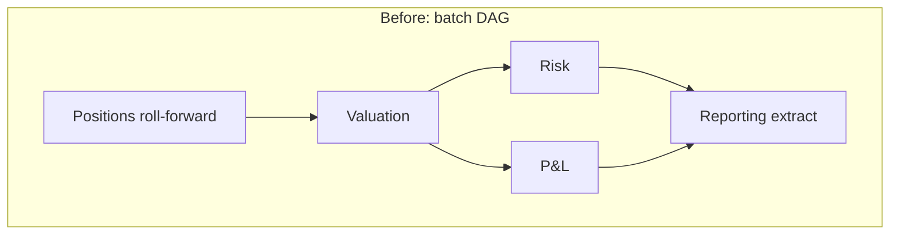
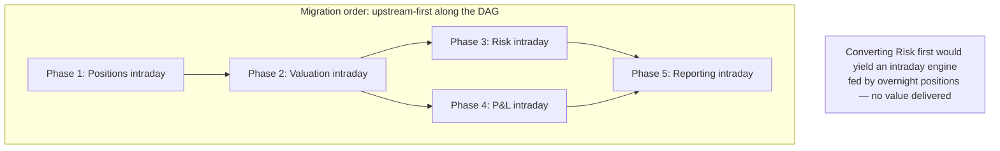
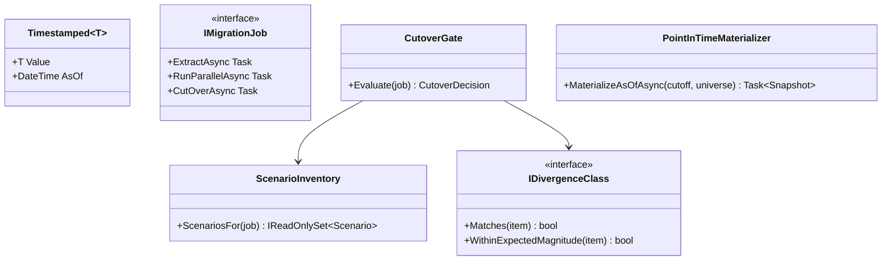

# Module 134 — System Design: Capstone — Migrating an End-of-Day Batch Estate to Intraday Processing

> Domain: System Design | Level: Beginner → Expert | Prerequisite: all five preceding scenarios — [[09-Designing-RealTime-Portfolio-Risk-Engine]], [[10-Designing-Market-Data-Distribution-Platform]], [[11-Designing-Order-Management-Trade-Lifecycle]], [[12-Designing-MultiTenant-Portfolio-Analytics-Platform]], [[13-Designing-Regulatory-Reporting-Pipeline]] — plus [[../30-Architecture-Patterns/03-MigrationPatterns-BranchByAbstraction-ParallelRun-AntiCorruptionLayer-DataMigration]] (Strangler Fig, Parallel Run, reconciliation) and [[../35-Event-Sourcing/02-Capstone-MigratingARegulatedAggregateToEventSourcingAtScale]] (at-scale migration governance)
>
> **Capstone note:** Sixth and final buy-side/capital-markets system-design scenario (Modules 129–134). Where the prior five each designed a system, this one changes the foundation all five stand on — and must preserve every correctness guarantee they assume. Full 16-section template; Elite FinTech Interview Panel lens.

---

## The Running Case Study

The firm's estate, built over two decades, is organized around an **overnight batch cycle**: markets close, a nightly sequence runs — position roll-forward, valuation, risk, P&L, accounting, reporting extracts — and by 06:00 the business has a consistent, complete picture of the previous day. Every downstream system in Modules 129–133 was built assuming this cadence.

Three forces now make it untenable: the batch window has compressed as the firm expanded into Asian markets (the window between one region's close and another's open is shrinking toward zero); portfolio managers need intraday risk rather than yesterday's; and a regulatory regime is moving from T+1 to intraday reporting. The firm must move to intraday processing without a rewrite it cannot afford and without breaking the guarantees five downstream systems depend on.

---

## 1. Fundamentals

**What:** Incrementally converting a batch-oriented estate to continuous intraday processing — replacing "compute everything, once, when the market is closed" with "compute what changed, continuously, while the market is open" — without a big-bang cutover.

**Why:** Batch's defining advantage is a **quiet, consistent snapshot**: nothing changes while the batch runs, so every computation sees the same world and the outputs are mutually consistent by construction. Intraday forfeits that: inputs change during computation, so consistency must be engineered rather than inherited. Every difficulty in this module descends from that single loss.

**When:** When the window compresses below the batch's runtime (a hard forcing function), or when the business value of freshness exceeds the migration's cost. The window compression is the more common trigger and the more urgent, because it fails suddenly — the batch that finished at 05:30 for years does not gradually degrade; one day it does not finish before the market opens.

**How (30,000-ft view):**
```
Batch estate: [market close] → job1 → job2 → job3 →... → jobN → [06:00 outputs ready]
 (quiet world, implicit consistency)

Intraday: events ──► incremental recompute ──► continuously-updated outputs
 (moving world, consistency must be explicit)

Migration: Strangler Fig per job — extract, run in parallel, reconcile, cut over, retire
```

---

## 2. Deep Dive

This section is written to be **complete on its own** — every mechanism, the reasoning that selects it, the failure mode it introduces, and the push-back a Principal/Staff interviewer will raise, answered inline.

### 2.1 What Batch Provided Implicitly, and Must Now Be Engineered

Name what the batch gave for free, because each item becomes an explicit engineering requirement:

| Batch provided | Intraday must rebuild it as |
|---|---|
| **A consistent snapshot** — nothing moved during the run | Explicit snapshot pinning (Module 129's incident is what happens when this is lost and not replaced) |
| **A total order of computation** — B ran after A, so B saw A's complete output | Explicit dependency handling; intraday, B may see A's *partial* output |
| **A natural completion signal** — "the batch finished" meant everything was done | **Per-item freshness**, because there is no moment when everything is current |
| **A repair window** — a failed job could be rerun before 06:00 | Live repair while the business is using the output |

That last one deserves emphasis: intraday has **no maintenance window**. Batch had a natural quiet period; intraday runs continuously, so deployments and schema changes happen against a live system. That is an organisational capability, not just a technical one, and many firms do not have it on day one.

**Intraday typically increases total compute**, and saying so avoids a common misunderstanding: incremental recomputation repeats work batch did once. **The gain is latency, not efficiency.**

### 2.2 Dependency Order Is the Real Migration Constraint — Upstream First

Batch jobs form a dependency DAG, and migration order is constrained by it, but **not in the intuitive direction**.

Converting a job to intraday while its *upstream* stays batch produces a job that runs continuously against inputs that change once a day: correct, and valueless, because **its outputs cannot be fresher than its stalest input.**

So the productive order is **upstream-first**, following the DAG from sources toward consumers. This is counterintuitive because business pressure comes from *downstream* — PMs want intraday risk — and the temptation is to convert the visible consumer first.

**Evaluating "convert the risk engine first because PMs are demanding it":** it delivers the appearance of progress and none of the value. Risk computed continuously from positions that update nightly is exactly as stale as before, and PMs will notice immediately — spending the migration's early credibility on a phase that cannot demonstrate benefit. The correct response is to sequence upstream-first and **manage the expectation explicitly**, explaining that positions must become intraday before risk can be. Where political pressure is genuinely immovable, the alternative is a **vertical slice**: migrate one narrow end-to-end path (one asset class, one desk) through the whole DAG, which *can* demonstrate value early without inverting the dependency order.

### 2.3 The Hybrid Period Is the Migration, Not a Phase of It

For a large estate the hybrid state lasts **years**. It is where the firm operates for most of the migration, and it must be designed for rather than endured.

**The central hybrid problem is mixed freshness.** A consumer reading from an intraday-updated store and a batch-updated store gets a mixed view — a P&L built from intraday positions and overnight FX rates is misleading in a way that is genuinely hard for a user to detect. Whether that is acceptable is **consumer-specific**, which means the system cannot decide it centrally; it must give consumers what they need to decide.

**Make freshness explicit in the data model:**

- Every value carries its own **as-of timestamp and provenance**.
- A consuming view surfaces the **oldest contributing as-of**, not a uniform "current" label — because that oldest value is what bounds the whole view's validity.
- A P&L view built from intraday positions and overnight FX **displays the overnight as-of**.

**Publish a freshness contract per output:** an explicit staleness bound ("positions are current within 30 seconds under normal conditions"), the per-value as-of, and **a signal when the bound is breached**, so consumers degrade deliberately rather than silently consuming stale data believing it fresh. The essential property is that a consumer can *detect* staleness rather than having to trust it.

**Benchmark the hybrid, not the target state.** The hybrid is where the firm lives for years and carries interactions the clean end state does not — batch jobs reading intraday stores mid-update, intraday jobs blocking on batch outputs. The end state is simpler and arrives last; optimising for it first optimises for the condition you spend the least time in.

### 2.4 Reconciliation Against the Batch — and Shadow Running After Cutover

Each converted job runs alongside its batch predecessor and their outputs are compared. **The batch remains authoritative until reconciliation demonstrates equivalence.**

Two domain-specific subtleties that decide whether the reconciliation is meaningful:

**Compare at the batch's cadence, not the intraday one.** The intraday job produces many values per day; the batch produces one. The comparison must be *"intraday value as of the batch's cut-off"* versus *"batch value."* Comparing an arbitrary intraday value against the batch's end-of-day figure diverges legitimately and buries real differences in noise.

**Expect and classify legitimate divergence.** Intraday and batch will differ for correct reasons — different rounding accumulation, different handling of intra-day corrections, timing of a mid-day event. Establish the **classes** of legitimate divergence in advance, each with an expected cause and magnitude. Then a divergence is validated by **matching it to a class and confirming its magnitude**, rather than by matching values; anything outside a known class is a defect. Without that taxonomy the reconciliation becomes noise and stops being read, which is the actual failure mode.

**Do not disable the batch at cutover.** Disabling it forfeits the comparison basis exactly when it is most valuable — the post-cutover period, when the intraday path is authoritative for the first time and its untested scenarios begin occurring naturally. §4's incident surfaced **eleven days after cutover**; with the batch still computing in shadow it would have been caught as a divergence rather than as incorrect downstream numbers. **Shadow-run through at least one full episodic cycle.** The cost is a period of duplicated compute; the benefit is that the first real occurrence of every untested scenario is checked.

### 2.5 The Evidence Standard — Why "It Reconciled for Six Weeks" Is Not Proof

§4's incident: corporate-action handling lived in a **separate batch step** between the migrated job and its consumer. The intraday service never implemented it. Six weeks of reconciliation could not reveal this **because no corporate action occurred in that window**.

State precisely why the reconciliation was incapable, because this is the module's central lesson: reconciliation compares outputs **over the period it runs**. The missing capability produces divergent output only when a corporate action occurs. The comparison was correct, and the two implementations **genuinely agreed on every case that arose**. The gap existed only in a case that did not arise.

**So exit criteria must measure scenario coverage, never elapsed time.** Build a **scenario inventory** of the episodic events the job must handle:

- Corporate actions **by type** — splits, mergers, spin-offs, dividends.
- Period boundaries — month-end, quarter-end, year-end.
- Instrument lifecycle — issuance, maturity, ticker change.
- Error and correction paths — busts, amendments, late data.

For each: either **wait for natural occurrence and verify**, or **inject it synthetically** into the parallel-run environment. Cutover is gated on inventory coverage, not on a calendar.

This generalises well beyond migration, and is worth saying in an interview: **"it has been running fine for N weeks" is evidence about the cases that arose, not about the system.** In any domain with episodic behaviour, the unobserved cases are exactly where implementations differ — because they are the ones nobody thought about.

### 2.6 Dependencies Encoded in Ordering, Not Interfaces

Why were the batch's dependencies invisible in the migrated job's code? Because **batch encoded them in job ordering** — position roll-forward ran before corporate actions, which ran before valuation. The contract was *the schedule*, not an interface. Reading the job's code reveals nothing about what must run before or after it.

The control: **mandatory pre-extraction mapping of the surrounding batch sequence**, documenting each neighbouring step and its contribution, producing the dependency contract the code does not contain. Extracting a job from a sequence without that map is extracting it from its specification.

### 2.7 Semantics That Change — and Must Be Changed Separately

Some computations are not merely faster intraday; they **mean something different**:

- **P&L attribution.** "P&L for the day" is well-defined. "P&L so far today" requires deciding the start point and how intraday position changes are attributed — a **business definition**, not an implementation detail.
- **Accounting entries** are typically defined as of a point in time with regulatory significance; making them continuous may be inappropriate regardless of technical feasibility.
- **Averages and period metrics** must define their window explicitly, where batch's implicit "the day" no longer applies.

Surface these as **business decisions**, never engineering defaults. The failure mode is a number that looks like its batch predecessor and answers a subtly different question.

**And separate the two changes.** Migrate the **cadence first, preserving batch semantics exactly** — otherwise reconciliation is meaningless, because you cannot reconcile against a predecessor computing something different. Then change semantics as a **distinct, separately governed change with its own business sign-off**. Bundling them makes divergence unattributable: you cannot tell a migration defect from an intended semantic change.

### 2.8 The Batch That Should Stay Batch

Some jobs should remain batch, and identifying them early prevents wasted effort:

- **Genuinely period-scoped computations** — month-end accounting close.
- **Jobs whose inputs change only daily** — a vendor file delivered once.
- **Jobs where regulatory definition requires a point-in-time computation.**

**Track the residual estate as two separate registers:**

1. **Deliberately retained batch**, each with its reason (period-scoped / daily inputs / regulatory point-in-time).
2. **Not-yet-migrated batch**, each with an owner and a target date.

Conflating them produces a backlog nobody can reason about, and lets un-migrated work hide indefinitely among legitimately retained jobs.

### 2.9 Consumers That Cannot Accept Intraday Updates

Some consumers genuinely require stability: a report published to clients cannot change while being read, and a downstream system may assume daily snapshots.

Serve them with a **materialised point-in-time view derived from the intraday store**. The intraday path becomes the source of truth; batch-cadence consumers read a snapshot taken at a defined time. This preserves their contract without holding the whole estate back — and note it is the *inverse* of the migration's usual direction, deliberately.

### 2.10 Operational Properties That Change

**Monitoring.** Batch-completion monitoring must be replaced by **per-output staleness monitoring**, because intraday has no single completion moment. Freshness is tracked per output, not as one job status.

**Caching and invalidation get harder.** Batch could cache freely: inputs were frozen for the run, and the next run started clean. Intraday must invalidate along the dependency graph **continuously**, and an incorrect graph now produces **persistently stale outputs** rather than errors that reset overnight.

**State needs replication it did not before.** Batch state could be rebuilt by rerunning the batch. Intraday state is continuously updated, and rebuilding from event history takes time the freshness commitment does not permit.

**Authorization scope must be re-examined, not inherited.** Batch jobs commonly run under broad service accounts nobody has revisited. Replicating that breadth into new intraday services propagates an old weakness into new infrastructure. The migration is the natural — and cheapest — point to correct it.

### 2.11 The Job Nobody Fully Understands

Common in a two-decade estate, and genuinely dangerous. **Do not reimplement from reading the code.**

Reimplement from **observed behaviour**: characterise inputs and outputs across a long history, build the intraday implementation to reproduce that behaviour, and use extended parallel running with the scenario inventory (§2.5) as the correctness standard. Where a behaviour cannot be explained, record it as an unexplained-but-reproduced behaviour rather than "fixing" it — the fix may be someone's deliberate, undocumented workaround for a real problem.

### 2.12 Rollback

**Rollback requires the batch path to still be running and current** — which turns §2.4's shadow-running argument into a rollback *prerequisite*, not merely a detection mechanism.

If the batch has been disabled, rollback means restarting it and reconciling several days of divergence, which may take longer than fixing forward. So the plan must state, in advance, a **decision point**: how long after cutover rollback remains the preferred option, and after which point forward-fix becomes the only realistic path.

### 2.13 Programme Metrics and Governance

**Do not report percentage-of-jobs-migrated.** It counts activity and treats a trivial job as equal to a critical one, which is exactly the metric that lets a programme look healthy while delivering nothing.

Report instead:

1. **Freshness delivered per business-critical output** — the actual objective.
2. **Scenario-inventory coverage per in-flight migration** — the readiness gate (§2.5).
3. **Shadow-period divergence counts** — post-cutover risk (§2.4).
4. **The two batch registers separately** (§2.8), so residual work is visible.

**The governance program for the migration:**

1. **Upstream-first sequencing** per the dependency DAG, with vertical slices as the alternative under political pressure (§2.2).
2. **Pre-extraction mapping** of the surrounding batch sequence (§2.6).
3. **Scenario-inventory exit criteria** with synthetic injection, never elapsed time (§2.5).
4. **Shadow running post-cutover** through at least one full episodic cycle (§2.4).
5. **Cadence and semantics changed separately**, each with its own sign-off (§2.7).
6. **Freshness contracts** published per output (§2.3).
7. **Per-cutover risk assessment** with a stated rollback decision point (§2.12).

### 2.14 Sequencing Against Everything Else the Firm Is Doing

**Incremental migration versus rebuild.** Rebuild is tempting for a two-decade estate with unclear logic and is almost always wrong at this scale: the rebuild must reproduce every behaviour the existing estate has — **including the ones nobody has documented** — while the business continues to depend on the original. It inherits the same archaeology problem with none of the incremental migration's ability to verify one job at a time against a running predecessor.

**Do not migrate to intraday and to cloud simultaneously.** Each is independently risky, and together they make **attribution impossible**: when the intraday path diverges, is it the reimplementation or the platform? Reconciliation's entire diagnostic value collapses — the same reasoning as separating cadence from semantics (§2.7). Sequence them: migrate cadence on the existing platform where behaviour is comparable, then move platforms.

**The regulatory-change calendar competes for the same capacity and the same systems**, and regulatory deadlines are immovable while migration milestones are not — so the migration *will* be deprioritised repeatedly. The realistic response is to **sequence the migration to serve upcoming regulatory changes** where possible (an intraday reporting requirement is a migration driver, not a competitor), and to plan explicitly for pause periods rather than pretending they will not happen.

**Organisational capabilities must change alongside the technology**, and each is routinely underestimated: on-call moves from batch-window-centric to continuous; deployment must become zero-downtime; support must diagnose a *live* system rather than examine a completed run; and — most significantly — the **operating rhythm changes**, because a business accustomed to one morning number now receives continuously updating ones, which changes how it makes decisions.

### 2.15 Principal-Level Judgements and Closing Synthesis

**Investigating "intraday risk disagrees with the morning batch figure."** First establish whether this is even unexpected: intraday *should* differ, since positions and markets have moved. The real question is whether the difference is **explicable by observed activity**. Decompose it into contributions — position changes, market moves, corporate actions — and confirm they account for it. Only if they do not is it a defect, investigated with §2.4's divergence classes.

**How the migration changes the firm's risk profile during the transition** — state this plainly rather than minimising it: two implementations exist (more surface, more divergence risk); the hybrid produces mixed-freshness views users may misread; migration credentials broaden access; and each cutover is a discrete elevated-risk event. That is precisely why per-cutover risk assessment, shadow running and honest programme metrics matter more here than programme velocity.

**Answering a regulator on maintaining accuracy through the migration.** Describe the controls — parallel running with reconciliation against the authoritative batch, scenario-coverage exit criteria rather than elapsed time, shadow running post-cutover, and the reporting pipeline's own independent completeness reconciliation continuing throughout. Then **disclose the incident**, its detection, remediation, and the resulting change to exit criteria. A disclosed failure with a structural fix is a stronger answer than an unblemished claim, because it demonstrates the control environment actually detects things.

**The closing synthesis.** This capstone's distinctive difficulty is that **the evidence standard, not the system, was the failure point.** The reconciliation was correct. The implementations genuinely agreed. The conclusion drawn from that agreement was still wrong — because agreement over a period proves equivalence only for the cases that arose.

That generalises past migration to any "it has been running fine" claim, and it ties the whole financial-systems arc together. Every module in this group has the same shape from a different angle: correctness is unobservable at the point of consumption, so the engineering that matters is the engineering that manufactures **evidence** — snapshot pinning, reproducibility metadata, independent reconciliation, scenario coverage. The systems are not hard because they are big. They are hard because being wrong looks exactly like being right.

---

## 3. Visual Architecture


```mermaid
graph TB
 subgraph "Before: batch DAG"
 B1[Positions roll-forward] --> B2[Valuation]
 B2 --> B3[Risk]
 B2 --> B4[P&L]
 B3 --> B5[Reporting extract]
 B4 --> B5
 end
```


```mermaid
graph TB
 subgraph "Migration order: upstream-first along the DAG"
 S1[Phase 1: Positions intraday] --> S2[Phase 2: Valuation intraday]
 S2 --> S3[Phase 3: Risk intraday]
 S2 --> S4[Phase 4: P&L intraday]
 S3 --> S5[Phase 5: Reporting intraday]
 S4 --> S5
 end
 Note1["Converting Risk first would yield an intraday engine<br/>fed by overnight positions — no value delivered"]
```

```mermaid
sequenceDiagram
 participant E as Events
 participant I as Intraday job (new)
 participant B as Batch job (authoritative)
 participant R as Reconciler
 participant C as Consumers

 E->>I: Continuous updates
 Note over B: Runs overnight as before
 B->>C: Authoritative output
 I->>R: Intraday value as of batch cut-off
 B->>R: Batch value
 R->>R: Compare; classify divergence
 Note over R: After sustained equivalence,<br/>cut over: intraday becomes authoritative
```

---

## 4. Production Example

**Problem:** The firm began its migration with position roll-forward — correctly upstream-first — converting it to update continuously from the trade events rather than once nightly.

**Architecture:** Strangler Fig with Parallel Run: the intraday position service ran alongside the batch job, with nightly reconciliation comparing intraday positions as of the batch cut-off against batch positions (the cadence discipline, correctly applied).

**Implementation:** Reconciliation matched exactly for six weeks. The team cut over: intraday positions became authoritative, and the batch job was disabled.

**Trade-offs:** Six weeks of clean reconciliation across two month-ends was judged sufficient evidence — a reasonable standard, and one many teams would accept.

**Lessons learned:** Eleven days after cutover, a corporate action — a stock split — processed incorrectly. Positions for the affected instrument were understated by half across every downstream system, including the risk and the reporting.

The batch job had handled corporate actions in a dedicated step that ran *between* position roll-forward and valuation. When position roll-forward was extracted and converted, that step remained in the batch — it was not part of the job being migrated. Nightly, the disabled-but-not-yet-removed batch sequence had still been applying corporate actions to the batch position store, which the reconciliation compared against. The intraday service had *never* handled corporate actions, and the reconciliation could not reveal this because **no corporate action had occurred in the six-week window** for any instrument in the reconciled set.

The reconciliation had been sound. The evidence period had not covered the scenario. The batch estate's implicit sequencing — position roll-forward, then corporate actions, then valuation — meant extracting one job silently orphaned a dependency the extracted job never knew it had.

The fix was threefold: (1) corporate-action handling was implemented in the intraday path and back-applied to correct affected positions; (2) the migration's exit criteria changed from "N weeks of clean reconciliation" to **"clean reconciliation plus demonstrated coverage of an enumerated scenario inventory"** — corporate actions, month-end, mid-period instrument changes, and other episodic events, with synthetic injection where natural occurrence was too rare to wait for; (3) before extracting any job, the team now produces an explicit map of what runs before and after it in the batch sequence and what each contributes, because the batch's dependencies were **encoded in job ordering rather than in data or interfaces** — invisible to anyone reading the job's own code.

The generalizable lesson, and the one this capstone rests on: **time-based migration evidence measures elapsed time, not scenario coverage** — and in a domain with episodic events, elapsed time is a poor proxy for the coverage that actually matters.
## 11. Coding Exercises

### Easy — As-Of Propagation Through a Derived Value (§2.3)
**Problem:** A derived value's freshness is bounded by its stalest input.
**Solution:**
```csharp
public sealed record Timestamped<T>(T Value, DateTime AsOf);

public static Timestamped<TOut> Combine<TA, TB, TOut>(
    Timestamped<TA> a, Timestamped<TB> b, Func<TA, TB, TOut> f) =>
new(f(a.Value, b.Value), a.AsOf < b.AsOf? a.AsOf: b.AsOf); // OLDEST bounds the result
```
**Time complexity:** O(1).
**Space complexity:** O(1).
**Optimized solution:** Carry the identity of the limiting input alongside the timestamp, so a stale derived value can be traced to the specific upstream responsible without re-deriving the chain.

### Medium — Scenario Inventory Gate (§2.5)
**Problem:** Block cutover until every enumerated scenario is demonstrated, not until time has elapsed.
**Solution:**
```csharp
public CutoverDecision Evaluate(MigrationJob job)
{
    var required = _inventory.ScenariosFor(job); // derived from the batch-sequence map
    var demonstrated = _evidence.DemonstratedScenarios(job);

    var missing = required.Except(demonstrated).ToList;
    if (missing.Count > 0)
        return CutoverDecision.Blocked(missing, hint: "Inject synthetically if natural occurrence is rare");

    return _reconciliation.HasSustainedAgreement(job)
    ? CutoverDecision.Approved
    : CutoverDecision.Blocked([], "Scenarios covered but reconciliation not yet stable");
}
```
**Time complexity:** O(s) for s scenarios.
**Space complexity:** O(s).
**Optimized solution:** Record *how* each scenario was demonstrated (natural versus synthetic) — a synthetically-covered scenario carries residual risk that natural occurrence does not, and should extend the shadow period (§2.4) rather than being treated as equivalent evidence.

### Hard — Divergence Classification (§2.4)
**Problem:** Validate divergence by cause rather than by tolerance band.
**Solution:**
```csharp
public DivergenceVerdict Classify(ReconciliationItem item)
{
    foreach (var cls in _knownClasses) // e.g. rounding accumulation, intra-day correction
    {
        if (!cls.Matches(item)) continue;
        return cls.WithinExpectedMagnitude(item)
        ? DivergenceVerdict.Explained(cls.Name)
        : DivergenceVerdict.Defect($"Matches {cls.Name} but magnitude {item.Delta} exceeds expectation");
    }
    return DivergenceVerdict.Defect("No known divergence class matches"); // unexplained = defect
}
```
**Time complexity:** O(c) for c known classes.
**Space complexity:** O(1).
**Optimized solution:** Track the frequency of each class over time — a class whose incidence is rising indicates the underlying cause is worsening, which a per-item verdict cannot reveal.

### Expert — Point-in-Time View Over an Intraday Store (§2.9)
**Problem:** Serve batch-cadence consumers from an intraday source without a second implementation.
**Solution:**
```csharp
public async Task<Snapshot> MaterializeAsOfAsync(DateTime cutoff, IReadOnlyList<EntityId> universe)
{
    var barrier = await _sequence.HighWaterMarkAtAsync(cutoff); // the barrier
    var values = new Dictionary<EntityId, Timestamped<decimal>>(universe.Count);

    foreach (var id in universe)
    {
        var v = await _intradayStore.LatestAtOrBeforeAsync(id, barrier);
        if (v is null) throw new IncompleteSnapshotException(id, barrier); // fail, never partial
        values[id] = v;
    }
    return Snapshot.Immutable(SnapshotId.New, cutoff, barrier, values);
}
```
**Time complexity:** O(n log m) for n entities over m-length histories.
**Space complexity:** O(n).
**Optimized solution:** Materialize on a schedule and cache by `(cutoff, universeHash)`, since batch-cadence consumers request the same cut-offs repeatedly — turning a per-request scan into a per-cutoff computation shared across consumers.

---

## 12. System Design — Migrating an End-of-Day Batch Estate to Intraday

*Authored to the four-step standard (see Module 01 §12 for the method). The four steps adapt to a migration: Step 1 scopes the **estate** rather than a greenfield system, Step 2 proposes the **migration architecture** rather than the target architecture alone, Step 3 deep-dives the parts that actually go wrong, and Step 4 wraps up. The target architecture itself is Modules 09–13; this section designs how to get there without breaking anything on the way.*

---

### Step 1 — Understand the Problem and Establish Design Scope

#### The dialogue

> **C:** What's driving this? "Batch is old" isn't a requirement, and the answer determines which jobs matter.
> **I:** The business wants intraday risk and P&L. Today they see yesterday's numbers.
>
> **C:** So the driver is a specific set of *outputs*, not the whole estate. How many batch jobs are there?
> **I:** About 180.
>
> **C:** Do all of them need to become intraday?
> **I:** That's part of what I want you to determine.
>
> **C:** Good — because some genuinely shouldn't. A regulatory report with a T+1 deadline and an official closing price has no intraday meaning. Is that acceptable to leave?
> **I:** Yes, if it's a deliberate decision rather than an omission.
>
> **C:** What's the dependency structure? Batch jobs usually form a DAG and the order constrains everything.
> **I:** Roughly seven layers deep — position keeping feeds valuation, which feeds risk, which feeds reporting.
>
> **C:** Can we run batch and intraday side by side, or is this a cutover?
> **I:** Side by side is expected. We can't have a big bang.
>
> **C:** What's the tolerance for a downstream number changing during the migration?
> **I:** Zero. We had an incident last year where a "like-for-like" migration silently changed a P&L attribution and it wasn't caught for six weeks.
>
> **C:** Then the design centre is evidence, not implementation. Is rollback required after cutover?
> **I:** Yes, for a period.
>
> **C:** Out of scope?
> **I:** The target intraday architectures themselves — assume the patterns from the risk, market data, OMS, and reporting designs. And the org change.

The seventh answer sets the bar. **"Zero tolerance for a silently changed number", plus a prior incident of exactly that shape**, means the programme is dominated by *proving equivalence*, not by writing intraday code. That reframing is the single most valuable thing to establish in Step 1 here.

#### Functional requirements

1. Convert batch jobs to intraday incrementally, preserving each output's correctness.
2. Operate a hybrid estate for an extended period, with explicit per-value freshness.
3. Serve batch-cadence consumers from intraday sources via point-in-time views.
4. Retain deliberately-batch jobs **without conflating them with un-migrated work**.
5. Provide rollback for a defined period after each cutover.

#### Non-functional requirements

| Requirement | Target |
|---|---|
| Downstream correctness | **No regression at any cutover** — the post-incident standard |
| Rollback | Available throughout each shadow period |
| Freshness | Contracts published per output, with breach signalling |
| Migration risk | Explicitly bounded and reported per cutover |
| Hybrid coherence | A consumer reading two values must be able to tell whether they are mutually consistent |

That last one is the requirement teams forget: during a hybrid period, a dashboard showing an intraday exposure next to a batch-derived P&L is showing two numbers from two different instants, and **nothing in the data says so** unless the design makes it say so.

#### Back-of-the-envelope estimation

This is a programme estimate, and doing it properly is what separates a plan from a wish.

```
Total batch jobs                        = 180
Deliberately-retained (§3.5)            ≈ 40
Migration candidates                    ≈ 140

Dependency DAG depth                    ≈ 7 layers
Upstream-first sequencing means ~7 SEQUENTIAL phases
regardless of team size — a job cannot go intraday while
its inputs arrive once a day.
```

Per-job effort, decomposed by phase:

```
Reimplementation                        ≈ 2–4 weeks
Parallel-run harness + reconciliation    ≈ 1–2 weeks
Scenario coverage (waiting for events)  ≈ 2–5 MONTHS   ← dominant
Cutover                                 ≈ days
Shadow period                           ≈ 1–3 months
```

**The sensitivity that matters:**

```
Doubling engineering capacity:
  halves reimplementation (4 wks → 2 wks)
  does NOT shorten scenario coverage at all

Programme duration is governed by EPISODIC EVENT FREQUENCY —
month-end, quarter-end, corporate actions, holiday calendars,
a bond default, an index rebalance — not by engineering throughput.

Therefore the highest-leverage schedule intervention available
is SYNTHETIC EVENT INJECTION (§3.3), not hiring.
```

Rough programme shape:

```
7 sequential layers × ~20 jobs per layer, parallelised within a layer
Layer duration ≈ max(job duration) ≈ 4–7 months (scenario-bound)
Programme      ≈ 2.5–4 years for the full 140
...which is why the sequencing decision (§3.1) is the most
consequential one in the plan: it determines what value arrives
in year one versus year three.
```

#### What the numbers tell us

1. **This is not an engineering-capacity problem.** The schedule is bound by calendar events you cannot accelerate, so a plan that promises delivery proportional to headcount is wrong on its face.
2. **Evidence phases dominate.** A job whose code takes three weeks takes three to six months to cut over *safely* — a 6× ratio. Any plan estimating from implementation time will be wrong by that factor, and it is the estimate executives are usually given.
3. **DAG depth caps parallelism at about 20 concurrent jobs**, which means the team size beyond that point buys nothing. Naming the ceiling protects the programme from being "accelerated" into incoherence.

The hard problem is **proving that an intraday output equals the batch output it replaces, across scenarios that occur a few times a year.**

---

### Step 2 — Propose High-Level Design and Get Buy-In

#### The two core flows

- **The per-job migration pipeline** — the repeatable unit: map, reimplement, parallel-run, gate, cut over, shadow, retire.
- **The hybrid estate's runtime** — how batch and intraday coexist for years, which is the part usually treated as a temporary inconvenience and is in fact the majority of the programme's elapsed time.

Stating that the hybrid period **is** the migration, rather than a phase of it, is the framing that produces a workable design.

#### Components

**Batch-Sequence Mapper.** Extracts the true dependency DAG from the scheduler, plus the implicit dependencies that live in file drops and shared tables and are not in the scheduler at all. **The implicit ones are where migrations fail** — a job that "doesn't depend on anything" but reads a table the previous job wrote.

**Strangler Facade.** Per output, a routing layer that serves from batch or intraday and can flip per consumer. This is the mechanism that makes cutover and rollback a configuration change rather than a deployment.

**Parallel-Run Harness.** Runs the intraday implementation alongside batch, capturing both outputs for comparison.

**Cadence-Matched Reconciler.** Compares intraday output **sampled at the batch instant** against the batch output, classifying divergences (§3.2).

**Scenario Inventory & Gate.** The register of scenarios each job must have survived before cutover, and the gate that blocks cutover until covered.

**Point-in-Time View Materialiser.** Serves batch-cadence consumers from intraday stores by materialising an as-of view — so a consumer that wants "the 22:00 number" still gets exactly one number.

**Freshness Contract Publisher.** Per output: expected cadence, current staleness, and a breach signal.

**Two Batch Registers.** Deliberately-batch, and not-yet-migrated. Kept separate (§3.5).

#### End-to-end walkthrough — migrating one job

1. **Map.** Extract explicit and implicit dependencies; confirm all inputs are already intraday (upstream-first). If not, the job is not eligible yet.
2. **Characterise.** Record the batch job's true contract: inputs, outputs, the instant it represents, its rounding and convention choices, and its known quirks — the quirks are usually undocumented and are half the divergences later.
3. **Reimplement** as an event-driven job behind the Strangler Facade, writing to a parallel output location.
4. **Parallel run.** Both run daily. The reconciler compares **intraday-sampled-at-batch-instant** against batch output.
5. **Classify divergences** (§3.2) until the only remaining ones are explained and accepted.
6. **Scenario gate.** Cutover is blocked until the scenario inventory is covered — **by coverage, not by elapsed time** (§3.3).
7. **Cadence-then-semantics.** Cut over the *cadence* first, keeping the batch semantics exactly. Change semantics only in a **separate, later** change (§3.4).
8. **Cutover.** Flip the facade, per consumer where possible, starting with the least critical.
9. **Shadow period.** Batch keeps running, unconsumed, purely as a comparison oracle. Rollback is a facade flip.
10. **Retire.** Decommission the batch job and remove it from the register — and only now is the job done.

#### Interfaces and contracts

The migration's "API" is the set of contracts that make the hybrid estate legible.

**Freshness contract — published per output:**

| Field | Type | Description |
|---|---|---|
| `output_id` | string | |
| `mode` | enum | `BATCH` \| `INTRADAY` \| `PARALLEL` \| `SHADOW` |
| `expected_cadence` | duration | `P1D` for batch, `PT60S` for intraday |
| `as_of` | timestamp | **The instant this value represents** — not when it was computed |
| `computed_at` | timestamp | |
| `staleness` | duration | Derived, and **published rather than inferred** |
| `breach` | bool | Staleness beyond contract |
| `upstream_as_of` | map | The `as_of` of each input — the coherence mechanism |

`upstream_as_of` is the field that solves the hybrid-coherence requirement: a consumer combining two values can compare their input instants and know whether they are mutually consistent. Without it, the hybrid estate silently mixes instants — which is exactly the class of defect the prior incident belonged to.

**`GET /v1/outputs/{id}?as_of={timestamp}`** — the point-in-time view. A batch-cadence consumer asks for the 22:00 value and gets a single, stable, reproducible number from the intraday store. **This is what allows upstream jobs to go intraday before their downstream consumers do**, and without it the DAG must be migrated strictly bottom-to-top in lockstep, which is impossible in practice.

**`GET /v1/migration/jobs/{id}`** — `{ phase, divergence_summary, scenarios_required, scenarios_covered, shadow_days_elapsed, rollback_available }`. The programme's own status surface, and the artefact that makes "are we ready to cut over?" a data question rather than an opinion.

#### Data model

**`batch_job_register`** — `job_id`, `name`, `scheduler_ref`, `classification` (`MIGRATION_CANDIDATE` \| `DELIBERATELY_BATCH`), `deliberate_reason`, `dag_layer`, `phase`, `owner`, `decided_at`, `decided_by`.

The `classification` field carries the §3.5 requirement, and `deliberate_reason` plus `decided_by` are what stop a deliberate decision from decaying into a forgotten one.

**`dependency`** — `from_job`, `to_job`, `kind` (`SCHEDULER` \| `FILE_DROP` \| `SHARED_TABLE` \| `IMPLICIT_DISCOVERED`), `discovered_at`, `evidence`. Implicit dependencies are recorded with their evidence, because they are the ones people dispute.

**`parallel_run_result`** — `job_id`, `business_date`, `batch_output_hash`, `intraday_output_hash`, `divergence_count`, `divergence_classes`, `max_absolute_diff`, `max_relative_diff`, `sampled_at`.

**`divergence`** — `run_id`, `key`, `batch_value`, `intraday_value`, `class` (§3.2), `explanation`, `accepted_by`, `accepted_at`. **Every accepted divergence has a named accepter** — an unexplained divergence that is quietly tolerated is how the prior incident happened.

**`scenario_inventory`** — `job_id`, `scenario_code` (`MONTH_END`, `QUARTER_END`, `CORPORATE_ACTION_MERGER`, `HOLIDAY_CALENDAR_MISMATCH`, `LATE_TRADE_AMENDMENT`, `INSTRUMENT_DEFAULT`, `DST_BOUNDARY`, …), `required`, `covered_at`, `covered_by` (`NATURAL` \| `SYNTHETIC`).

**Job phase lifecycle:** `IDENTIFIED → MAPPED → REIMPLEMENTED → PARALLEL_RUNNING → GATED → CUTOVER → SHADOW → RETIRED`, with `ROLLED_BACK` reachable from `CUTOVER` and `SHADOW`.

#### Store and infrastructure selection, and why

| Concern | Choice | Reason |
|---|---|---|
| Intraday stores | **Per-domain, as designed in Modules 09–13** | The target architecture is already specified; this programme is the route to it |
| Batch stores | **Retained through parallel and shadow, retired only after** | They are the rollback path and the comparison oracle. Retiring early converts a reversible cutover into an irreversible one |
| Parallel-run results | **Append-only, retained for the programme's life** | The divergence history is the evidence base for the whole migration and is what an auditor or a post-incident review will ask for |
| Facade routing config | **Versioned, per-consumer, hot-reloadable** | Cutover and rollback must be a config flip in seconds, not a deployment |
| Triggers | **The existing trade and market-data event streams** | The migration is largely a matter of consuming streams that already exist — a point worth making, because teams often plan to build infrastructure that Modules 10 and 11 already provide |

---

### Step 3 — Design Deep Dive

#### 3.1 Dependency order is the real constraint

A job cannot be genuinely intraday if its inputs arrive once a day. Attempting it produces the worst outcome available: an intraday-*looking* output whose value changes only at 22:00, which is a lie the consumer cannot detect.

So sequencing is **upstream-first**, and the consequence is uncomfortable and must be said out loud: **the first year of the programme delivers position keeping and reference data — infrastructure with no visible business value — while the intraday risk the business asked for is three layers up.** A programme that reorders to deliver visible value early produces fake intraday, and fake intraday is worse than batch because people trust it.

Two mitigations that are legitimate:

- **Point-in-time views** (§2) let a downstream job stay batch-cadence while its upstream goes intraday, so the DAG does not have to move in lockstep.
- **Vertical slices** — migrate a narrow path through all seven layers for a single product or desk, delivering real intraday for that slice while the horizontal migration continues. This is how the programme shows value in year one without faking it.

The implicit-dependency discovery matters here too: a job whose scheduler entry shows no dependencies but which reads a table written by an earlier job **will silently read stale or partial data** once that earlier job becomes continuous. Batch's implicit guarantee was *quiescence* — nothing changed while you ran — and intraday removes it everywhere at once.

#### 3.2 Cadence-matched reconciliation and divergence classification

Comparing a continuously-updating value against a once-a-day value requires sampling the intraday output **at the batch job's instant**, using the same input cut. Comparing "intraday now" against "batch last night" produces divergences on every row and tells you nothing.

Divergence classes, and the handling of each:

| Class | Meaning | Handling |
|---|---|---|
| **Expected-semantic** | Intraday is *more* correct — e.g. it saw a late amendment batch missed | Explain, accept, **record the accepter**. This class is why the reconciler cannot simply demand equality |
| **Convention** | Rounding, day-count, tie-breaking differs | Fix the intraday implementation to match batch **exactly**, even where batch is arguably wrong — semantics change later (§3.4) |
| **Timing** | Different input cut | Fix the harness, not the code — this is a measurement error, not a defect |
| **Defect** | Genuinely wrong | Fix and re-run |
| **Unexplained** | Not yet classified | **Blocks cutover, unconditionally.** An unexplained divergence is the prior incident in embryo |

The discipline that makes this work: **an unexplained divergence is never aged out.** Teams under schedule pressure reclassify stubborn divergences as "immaterial" — and the six-week undetected P&L attribution change in the dialogue is precisely what that produces.

#### 3.3 The scenario gate — coverage, not elapsed time

The naive gate is "run in parallel for a month." It is wrong, because a month may contain no quarter-end, no corporate action, and no default — and those are exactly where batch and intraday diverge.

**Cutover is gated on scenario coverage.** The inventory per job lists the scenarios that must have been observed, and each must be covered before the flip.

Because coverage waits on the calendar, and the estimation showed that is the schedule's dominant term, **synthetic injection is the highest-leverage intervention in the whole programme**:

- Replay historical episodic events (a real merger from two years ago, a real default, a real index rebalance) through both implementations in a controlled environment.
- Construct synthetic events for scenarios with no historical instance.
- Record coverage as `SYNTHETIC` rather than `NATURAL`, because the two are not equally strong — synthetic coverage proves the code handles the shape, natural coverage proves it handles the shape *plus* everything else that co-occurred in production.

A defensible policy: high-risk scenarios require natural coverage; the rest may be covered synthetically. That policy is itself a stated, reviewable risk decision rather than an implicit one.

#### 3.4 Cadence first, semantics second

The strongest single discipline in the programme, and the one most often violated under pressure.

When migrating, the temptation is to fix the batch job's known flaws at the same time — it uses a stale FX rate, it rounds the wrong way, it excludes a product class it shouldn't. Doing both at once makes every divergence **unattributable**: is this difference because we changed cadence, or because we changed the rule? With both changed, you cannot tell, and the reconciliation loses all diagnostic power.

So: **the intraday implementation reproduces batch's semantics exactly, quirks included.** It divergences to zero (modulo the expected-semantic class). Cut over. Shadow. Retire. *Then*, as a separate, separately-reviewed change with its own before/after comparison, fix the semantics.

This costs a second change per job and it buys attributable verification, which is the only thing that makes the correctness guarantee real.

#### 3.5 The batch that shouldn't be migrated — and the two registers

Roughly 40 of the 180 jobs should stay batch, for genuine reasons:

- **The output is defined at a batch instant.** An official closing price, a NAV struck at a valuation point, a regulatory report as-of close. "Intraday NAV" is not a better NAV; it is a different and mostly meaningless number.
- **The consumer is batch.** A downstream system, a regulator, or a counterparty that accepts one file a day.
- **The computation requires a complete set** — a global optimisation, a full reconciliation — and a partial-input intraday version is not an approximation of it but a different calculation.
- **The economics don't justify it.** A job producing a report three people read monthly.

The design requirement is the **two registers**: `DELIBERATELY_BATCH` and `MIGRATION_CANDIDATE`, kept structurally separate with a recorded reason and decider.

The failure this prevents is subtle and common: with one register, a deliberately-batch job and a not-yet-migrated job look identical, so after two years nobody remembers which is which. The deliberate ones get re-litigated every planning cycle, or — worse — the un-migrated ones get quietly reclassified as deliberate to close out the programme. **A programme that cannot say what it decided not to do cannot say it is finished.**

#### 3.6 The hybrid estate, and correctness semantics that change under intraday

Several guarantees batch provided implicitly must be rebuilt explicitly:

| Batch provided implicitly | Intraday must provide explicitly |
|---|---|
| **Quiescence** — inputs frozen during the run | Pinned snapshots / input cuts (Module 09 §3.2) |
| **A single instant** — everything as-of 22:00 | `as_of` published per value, plus `upstream_as_of` for coherence |
| **Completion** — "the batch finished" meant everything was done | Per-output freshness contracts and breach signals; there is no global "done" any more |
| **Ordering** — job N ran after job N−1 | Event ordering and dependency-driven invalidation |
| **A natural retry point** — rerun the batch | Idempotent, replayable event processing |

The third row is the one that surprises operations teams: **batch's completion signal was the estate's health check, and intraday deletes it.** "Did everything run?" becomes "is every output within its freshness contract?" — a different question, needing a different dashboard, and it must exist *before* the first cutover, not after.

#### 3.7 Failure handling and rollback

- **Divergence appears after cutover** → the shadow period exists exactly for this; batch is still running unconsumed, so rollback is a facade flip and the divergence is diagnosable against a live oracle.
- **Rollback after shadow retirement** → not available, which is why retirement is a deliberate, reviewed step and not a cleanup task.
- **An upstream job's cutover destabilises a downstream batch job** → the point-in-time view is the insulation; if the downstream breaks anyway, an implicit dependency was missed and belongs in the dependency register with its evidence.
- **Intraday job falls behind** → freshness contract breaches and signals. Consumers that cannot tolerate staleness must **fail closed**, exactly as Module 09's limits engine does. Serving a stale value silently is the hybrid estate's characteristic failure.
- **A scenario occurs during shadow that was never covered** → treat it as a coverage event: compare, classify, and if it diverges, roll back. A scenario arriving late is a gift, not a problem.

---

### Step 4 — Wrap-Up

**What we left out:** the target intraday architectures themselves (Modules 09–13); the organisational change — batch estates come with batch-shaped teams, runbooks, and on-call rotations, and intraday changes all three; cost, since intraday generally costs more in steady-state compute than a nightly window; vendor and third-party systems that only accept or produce daily files and cap what can be migrated at all; and the data-retention implications of continuous versus daily snapshots.

**What we would measure:** per-output **staleness** replacing batch completion as the estate's health signal; **shadow divergence counts by class**, with unexplained held at zero as a hard gate; scenario-coverage progress per in-flight job, split natural versus synthetic; the **two register counts** over time, since `DELIBERATELY_BATCH` growing late in the programme is the signal that un-migrated work is being reclassified rather than done; rollback exercises actually performed (a rollback path never tested is not a rollback path); freshness-contract breach rate per output; and DAG-layer progress, which is the only honest measure of how much of the programme's *value* has arrived rather than how many jobs have been touched.

**Summary.** The programme is bound by evidence, not engineering: a job takes weeks to reimplement and months to prove, so the schedule is governed by episodic-event frequency and synthetic injection is the highest-leverage intervention available. Sequencing is upstream-first because a job whose inputs arrive daily cannot be genuinely intraday, with point-in-time views and vertical slices as the legitimate ways to deliver value early. Cadence changes and semantic changes are strictly separated so every divergence stays attributable. And the hybrid estate is designed as the steady state it will be for years — freshness contracts, `upstream_as_of` for coherence, and two registers so the programme can state what it deliberately did not do.

---

### References

1. Martin Fowler — *StranglerFigApplication*, the incremental-replacement pattern the per-job pipeline implements.
2. Martin Fowler — *ParallelChange* (expand/contract), the discipline behind cadence-then-semantics.
3. Michael Feathers — *Working Effectively with Legacy Code*, on characterisation tests: §2's "characterise the batch job's true contract, quirks included".
4. GitHub Engineering — *Scientist* and the science-of-refactoring pattern: run both implementations, compare, report — the parallel-run harness in miniature.
5. Kleppmann — *Designing Data-Intensive Applications*, ch. 11 (batch versus stream processing, and the guarantees that change between them — the §3.6 table's grounding).
6. Google SRE Book, ch. 27 — *Reliable Product Launches at Scale*, for launch gates as coverage rather than elapsed time.
7. Modules 09–13 of this folder — the target architectures this programme migrates toward, and the pinned-snapshot, freshness, and reconciliation patterns it reuses.

---
## 13. Low-Level Design

**Requirements:** Freshness propagates correctly through derivations; cutover is gated on coverage; divergence is classified by cause; batch-cadence consumers are served from intraday sources.

**Class diagram:**

```mermaid
classDiagram
 class Timestamped~T~ {
 +T Value
 +DateTime AsOf
 }
 class IMigrationJob {
 <<interface>>
 +ExtractAsync Task
 +RunParallelAsync Task
 +CutOverAsync Task
 }
 class ScenarioInventory {
 +ScenariosFor(job) IReadOnlySet~Scenario~
 }
 class CutoverGate {
 +Evaluate(job) CutoverDecision
 }
 class IDivergenceClass {
 <<interface>>
 +Matches(item) bool
 +WithinExpectedMagnitude(item) bool
 }
 class PointInTimeMaterializer {
 +MaterializeAsOfAsync(cutoff, universe) Task~Snapshot~
 }

 CutoverGate --> ScenarioInventory
 CutoverGate --> IDivergenceClass
```

**Sequence diagram:** the third diagram — parallel run, cadence-matched comparison, cutover.

**Design patterns used:** Strangler Fig (the migration itself); Parallel Run (verification); Adapter (batch-cadence consumers over intraday sources, §2.9); Specification (divergence classes); Gatekeeper (the cutover gate).

**SOLID mapping:** Single Responsibility (extraction, reconciliation, gating, and materialization separate); Open/Closed (a new divergence class is added without modifying the reconciler); Liskov (every intraday implementation must satisfy the same output contract as the batch job it replaces — which is precisely what reconciliation verifies); Interface Segregation (the gate depends on inventory and reconciliation status, not on job internals); Dependency Inversion (consumers depend on the freshness contract, not on whether the producer is batch or intraday — the abstraction that makes the hybrid tolerable).

**Extensibility:** A new job enters the programme via the mapper and inventory; a newly-discovered divergence class is registered without touching prior ones.

**Concurrency/thread safety:** The hybrid's defining hazard — a batch job reading a continuously-updated intraday store may observe partial state batch's quiet world never presented. Batch readers must use the point-in-time materializer rather than reading the live store directly, which is the mechanism that restores the consistency batch previously received for free.

---

## 14. Production Debugging

**Incident:** Three months after positions moved intraday, month-end valuation figures were wrong for a subset of portfolios — not by a rounding margin, but materially. The intraday position store was correct; the valuation batch job, still running nightly, produced wrong numbers only at month-end.

**Root cause:** The valuation batch job read positions from the intraday store (correct, post-cutover) using a query that selected the latest position per instrument. At month-end, the firm books adjustment entries with an effective date of the last business day but an *entry* timestamp during the first days of the following month. The batch job's "latest position" query returned these future-effective adjustments as though they were current, because the intraday store — unlike the batch position store it replaced — retained both effective and entry time and the query filtered on neither correctly.

The batch position store had only ever held one figure per instrument per day, so no such query ambiguity existed. Migrating positions to a bitemporal intraday store introduced a distinction the consuming batch job had no concept of, and the job's query — unchanged and previously correct — was now under-specified rather than wrong.

**Investigation:** The month-end-only pattern pointed at period-boundary handling. Comparing the valuation job's position inputs against the position store's contents showed extra rows with future effective dates. Reviewing the query showed it selected on entry time alone, which had been unambiguous against the old store and was not against the new one.

**Tools:** Input comparison between the valuation job and the position store; query review against the new store's temporal model; the month-end pattern as the initial narrowing signal.

**Fix:** The query was corrected to filter on effective date as of the valuation date. More significantly, the team audited every remaining batch consumer of migrated stores for the same class of under-specification — finding two more.

**Prevention:** (1) When a store's temporal model changes, every consumer's queries must be re-specified, not merely re-tested — the queries were not broken, they were incomplete against a richer model. (2) The migration's pre-extraction mapping (§2.6) was extended to include *consumers* of the migrated store, not only the job's own dependencies — taught the team to look upstream in the batch sequence; this incident taught them to look downstream at readers. (3) Month-end and other period boundaries were added to the scenario inventory for *consumer* verification, not only for the migrated job itself.

---

## 15. Architecture Decision

**Context:** How to verify a converted job before cutover — the decision the incident directly challenged, and the one that determines whether the migration is safe.

**Option A — Time-based parallel run (the original approach):** run in parallel for a fixed period; cut over on sustained agreement.
*Advantages:* Simple to define, easy to schedule, requires no domain enumeration; gives a clear date.
*Disadvantages:* the failure — elapsed time is a weak proxy for scenario coverage in a domain with episodic events, and the gaps are precisely in the scenarios the new implementation's author never considered.
*Cost:* Low. *Complexity:* Low. *Risk:* High, and deceptively so, since the evidence looks strong.

**Option B — Scenario-inventory coverage with synthetic injection (recommended):** enumerate scenarios from the batch-sequence map; require each demonstrated, injecting synthetically where natural occurrence is rare.
*Advantages:* Verifies what actually matters; injection removes the dependency on waiting for rare events, which is also the programme's largest schedule lever.
*Disadvantages:* Requires enumeration, which cannot be proven complete; synthetic injection needs an environment capable of it, which is real infrastructure work.
*Cost:* Moderate. *Complexity:* Moderate. *Risk:* Substantially lower, with a residual for unenumerated scenarios.

**Option C — Indefinite parallel running with no cutover:** keep both permanently, treating batch as the authority.
*Advantages:* Maximum safety; no cutover risk at all.
*Disadvantages:* Never delivers the migration's value — intraday remains advisory — while paying both systems' costs forever. This is the "old systems never die" as a deliberate choice rather than a drift.
*Cost:* Highest ongoing. *Complexity:* Moderate. *Risk:* Zero migration risk, total opportunity cost.

**Recommendation: Option B, with a bounded shadow period as the residual control.** Option A is disqualified by direct experience — is precisely its failure mode, and the team ran it correctly. Option C is not a migration. Option B's honest weakness is that the inventory cannot be proven complete, which is exactly why shadow running (§2.4) follows cutover rather than being an alternative to it: the inventory covers what was anticipated, and the shadow period covers what was not. The two together are the answer; either alone leaves the gap the other closes.

---

## 17. Principal Engineer Perspective

**Business impact:** This migration's value is optionality — intraday risk enables decisions the batch cadence forecloses, and intraday reporting is becoming mandatory rather than advantageous. Its cost is multi-year and its risk is front-loaded, which makes it a programme that requires sustained executive commitment through a period where costs are visible and benefits are not. A Principal Engineer's framing task is making the forcing function (the compressing window) legible early, because it converts the programme from discretionary modernization into scheduled necessity — and those are funded differently.

**Engineering trade-offs:** The decision that matters most is the evidence standard, and demonstrates why: the team applied a reasonable standard correctly and still cut over unsafely. The senior insight is that verification design deserves as much rigor as implementation design, and in migrations it deserves more — because the implementation's correctness is exactly what the verification is supposed to establish.

**Technical leadership:** The disciplines that prevent and — pre-extraction mapping in both directions, scenario inventories, shadow running — all cost visible effort to prevent invisible failures, and all will be questioned as the programme comes under schedule pressure. Defending them requires having made their rationale legible before the pressure arrives, which means telling the story deliberately rather than letting it become folklore.

**Cross-team communication:** Consumers of migrated stores are affected in ways they cannot anticipate — the incident hit a team whose code did not change and who had no reason to think they were affected. Proactive engagement with downstream readers, not merely upstream dependencies, is the specific communication discipline this migration requires, and it is the one the team learned second rather than first.

**Architecture governance:** The batch registers (§2.8), scenario inventories, freshness contracts, and cutover decisions should each be governed artifacts (the ADR discipline). The registers in particular need periodic review, because "deliberately retained" is a judgment that can expire as the estate changes around it.

**Cost optimization:** The counter-intuitive fact worth stating early is that intraday typically costs *more* compute than batch — the migration buys freshness, not efficiency. Allowing stakeholders to expect savings sets up a credibility failure at the exact moment the programme most needs support.

**Risk analysis:** The transition raises risk materially and temporarily (§2.15), and honest reporting of that elevation — rather than emphasizing the improved end state — is what makes the programme's risk governance credible. A risk committee that discovers the elevation itself, having been shown only the end-state benefit, will reasonably question everything else the programme reports.

**Long-term maintainability:** What this migration ultimately buys is an estate whose dependencies are explicit — expressed in interfaces and events rather than in job ordering (the root cause). That is the durable outcome beyond freshness: the batch estate's sequencing-as-contract is what made it dangerous to change, and an estate that no longer has that property is one the firm can evolve rather than merely operate.

---

**Run complete — Modules 129–134.** Six buy-side/capital-markets system-design scenarios, each full 16-section template with 40 Q&A, closing the domain-fit gap identified in the 2026-07-19 curriculum audit. The recurring property across all six — correctness that is unobservable at the point of consumption yet immediately consequential — is the run's central finding, and the reason each design spends most of its complexity establishing evidence rather than throughput. Remaining audit items, in priority order: Microservices (+5 modules) and Event-Driven Architecture (+6) to their stated extra-depth scope; Distributed Systems expansion (PACELC, CRDTs, Bloom filters, LSM-trees, split-brain, hedged requests, tail-latency amplification); and a §–17 retrofit for `14-System-Design`'s original Modules 37–44.
