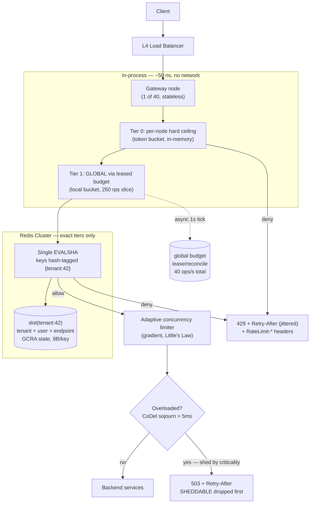
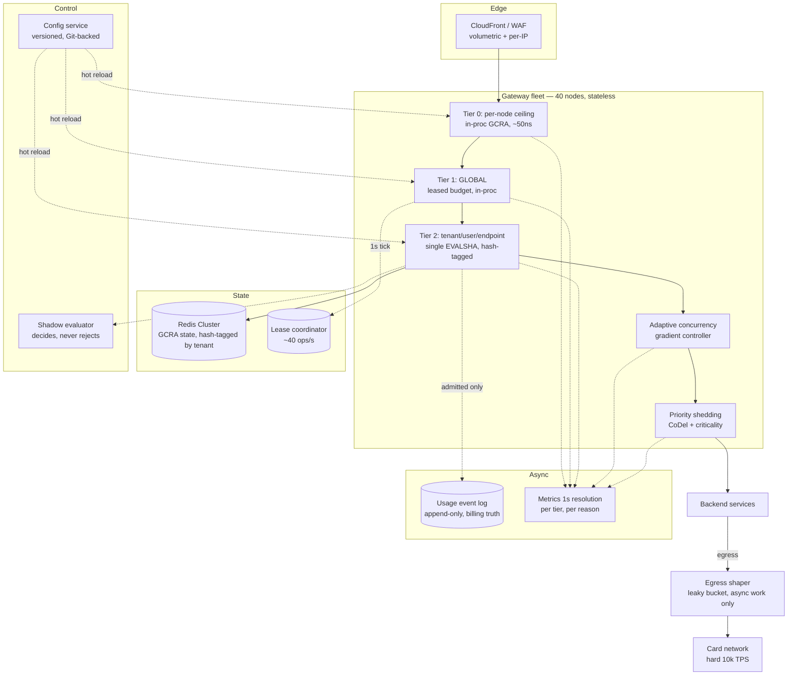
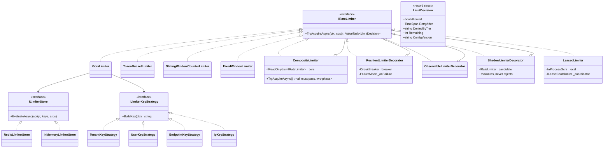
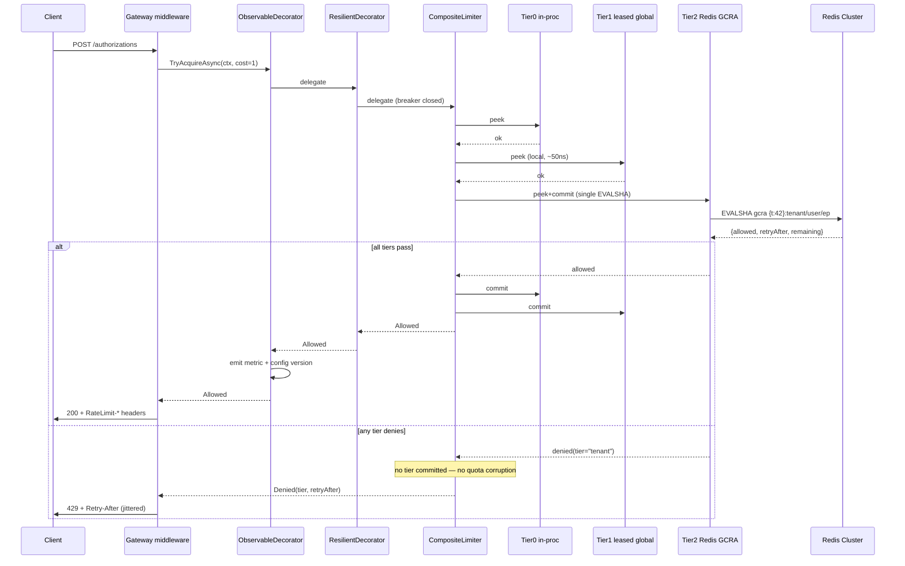

# Module 175 — System Design: Rate Limiting, Throttling & Load-Shedding Algorithms (Algorithmic Deep Dive)

> Domain: System Design | Level: Beginner → Expert | Prerequisite: [[04-Designing-Rate-Limiter-API-Gateway]] (the system/topology view this module supplies the missing algorithmic core for), [[../03-REST-APIs/02-API-Security-Rate-Limiting]] §2.2 (the four-bullet algorithm summary this module derives properly), [[../07-Redis/01-Data-Structures-Caching-Patterns]] (sorted sets, hashes, Lua atomicity, Cluster slots), [[../38-API-Gateway/01-APIGatewayFundamentals-Routing-RateLimiting-AuthEnforcement-Transformation]], [[../18-Event-Driven-Architecture/04-Backpressure-Flow-Control-Consumer-Lag]] (backpressure as the async dual of rate limiting)

**Why this module exists.** Module 40 (`04-Designing-Rate-Limiter-API-Gateway.md`) designs the *topology* of a rate-limited gateway — tiers, fleet scaling, Redis as shared state, failure modes — and names the four classic algorithms in a single sentence in §2.2. Module 12 (`03-REST-APIs/02`) gives them four bullet lines. Neither derives one. At a Staff/Principal panel the algorithm *is* the interview: you will be asked to pick one, defend the choice numerically, write it, and then explain what breaks when it runs on 40 gateway nodes against a sharded Redis with 3 ms of clock skew. This module is that missing layer. It also corrects three concrete defects in Module 40 §2.4's multi-tier Lua script (see §2.7 and §2.14).

---

## 1. Fundamentals

### What is rate limiting, precisely?

Rate limiting is **admission control at a boundary**: a decision function `allow(key, now, cost) → {ALLOW, REJECT, DELAY}` evaluated before a request consumes any meaningful resource. Everything else — Redis, gateways, 429s — is plumbing around that function.

Five things are routinely conflated. Separating them is the first signal of seniority:

| Mechanism | Controls | Unit | Typical failure it prevents |
|---|---|---|---|
| **Rate limiting** | Requests *per unit time* | req/s, req/min | Abuse, quota enforcement, contractual TPS caps |
| **Concurrency limiting** | Requests *in flight simultaneously* | count | Thread-pool/connection-pool exhaustion, pileup from a slow dependency |
| **Throttling / shaping** | Requests *delayed* rather than rejected | queue + drain rate | Bursty producer feeding a fixed-rate consumer |
| **Load shedding** | Requests *dropped by priority* under stress | criticality class | Total collapse; preserving critical traffic during overload |
| **Backpressure** | Producer *slowed at the source* | credit/window | Unbounded queue growth in async pipelines |

A rate limit **cannot** save you from a pileup — that is Little's Law, and it is §2.10. A concurrency limit **cannot** enforce a contractual "1,000 TPS to the card network" — that is rate limiting. Panels probe exactly this seam.

### Why does the algorithm choice matter?

Because the four canonical algorithms differ on axes that are *directly business-visible*:

- **Burst tolerance** — can a client spend a minute's quota in one second? For a market-data snapshot API, yes (clients start up and hydrate). For a downstream card network with a hard 1,000 TPS ceiling, absolutely not — a burst there gets *your whole institution* throttled, not just the offending merchant.
- **Precision** — fixed window allows 2× the stated limit at boundaries. If your limit is contractual and audited (a SOX-relevant vendor agreement, a market-data licensing cap billed per message), 2× is a compliance event, not a rounding error.
- **State cost** — a sliding-window *log* is exact and costs O(N) memory *per key*. At 1M keys × 100 req/min that is ~100M sorted-set members, ~8 GB of Redis. The exact same guarantee from GCRA costs 8 bytes per key.
- **Latency contribution** — the check runs on 100% of traffic. One extra round trip is not "one extra round trip"; it is one extra round trip multiplied by every request the platform will ever serve.

### When does each apply?

```
Need exact per-caller accounting for billing/compliance? ──► GCRA or sliding-window log
Need to allow legitimate bursts (client startup, batch)? ──► Token bucket (capacity = burst)
Need to protect a downstream with a hard, smooth TPS cap? ──► Leaky bucket (queue variant) or GCRA
Need the cheapest possible thing, limit is advisory? ─────► Fixed window
Need global limits across regions with <1ms budget? ──────► Local token lease + async reconciliation
Protecting against slow dependencies / pileup? ───────────► Concurrency limit (adaptive), NOT a rate limit
Protecting availability during genuine overload? ─────────► Priority load shedding + CoDel, on top of the above
```

### How does it work at 30,000 feet?

Every limiter answers four questions. Write them down before writing code — a panel will ask you to state them explicitly:

1. **Key** — what identity is being limited? (API key > user ID > session > IP. IP is last because of CGNAT, corporate egress, and `X-Forwarded-For` spoofing — §8.2.)
2. **Cost** — is every request worth 1, or is a bulk endpoint worth 50? (Weighted/`quantity` limiting.)
3. **Window semantics** — fixed, rolling, or continuous (rate + burst)?
4. **Rejection contract** — 429 vs 503, `Retry-After`, `RateLimit-*` headers, and whether the caller can trust them.

---

## 2. Deep Dive

Notation used throughout: limit `L` requests per period `P`; arrival time `t`; stored state per key `S`.

### 2.1 Fixed-Window Counter

**Mechanics.** Bucket the timeline into aligned windows of length `P`. Key = `rl:{id}:{floor(t/P)}`. `INCR`; if the result is 1, `EXPIRE P`; allow while counter ≤ L.

```lua
-- fixed window, single round trip
local c = redis.call('INCR', KEYS[1])
if c == 1 then redis.call('PEXPIRE', KEYS[1], ARGV[1]) end
return c <= tonumber(ARGV[2]) and 1 or 0
```

**State:** one 8-byte integer per key per window. Cheapest possible.

**The boundary-burst defect, proved.** Let `L = 100`, `P = 60s`. A client sends 100 requests in `[59.0, 60.0)` and 100 more in `[60.0, 61.0)`. Both windows are individually compliant. But over the 2-second interval `[59, 61)` — which is a *legitimate* 60-second-window question if the window were rolling — the client achieved 200 requests, i.e. **2×L in a span of P**. The bound is tight: worst case is exactly 2L over any window of length P, and it is *not* amortized away — a client that knows your boundary (and boundaries are guessable: they're aligned to the clock) can sustain 2L/P indefinitely by pulsing at every boundary.

**Second, subtler defect: the `INCR`-then-`EXPIRE` race.** If the process crashes between `INCR` and `EXPIRE`, the key is immortal and the client is permanently limited. This is why the two commands must be in one Lua script (or `SET key 0 EX P NX` first). Candidates almost never mention it; it is a real production outage class.

**When it is still correct.** Advisory limits, coarse abuse prevention, and — importantly — as the *cheap outer tier* of a layered design where an exact inner tier does the real enforcement.

### 2.2 Sliding-Window Log

**Mechanics.** Store every request timestamp in a Redis sorted set scored by time. On each request: drop entries older than `t − P`, count what remains, and add the new one if under limit.

```lua
-- KEYS[1]=key  ARGV[1]=now_ms  ARGV[2]=period_ms  ARGV[3]=limit  ARGV[4]=member_id
local now, period, limit = tonumber(ARGV[1]), tonumber(ARGV[2]), tonumber(ARGV[3])
redis.call('ZREMRANGEBYSCORE', KEYS[1], 0, now - period)
local used = redis.call('ZCARD', KEYS[1])
if used >= limit then
  -- exact Retry-After: when the oldest survivor falls out of the window
  local oldest = redis.call('ZRANGE', KEYS[1], 0, 0, 'WITHSCORES')
  return {0, math.ceil((tonumber(oldest[2]) + period - now))}
end
redis.call('ZADD', KEYS[1], now, ARGV[4])
redis.call('PEXPIRE', KEYS[1], period)
return {1, 0}
```

**Guarantee.** Exact. No boundary artefact. Gives a provably correct `Retry-After`.

**Cost — the reason it rarely survives design review.** Memory is O(L) *per key*. A Redis sorted set above `zset-max-listpack-entries` (default 128) becomes skiplist + hashtable: roughly **60–100 bytes per member** including the member string, dict entry, and skiplist node. Do the arithmetic in the interview:

```
1,000,000 active API keys × limit of 100 req/min
= 100,000,000 members × ~80 bytes
≈ 8 GB of Redis, purely for rate-limit state
plus O(log N) per ZADD and an unbounded ZREMRANGEBYSCORE on every call
```

And it is worse than the average suggests: the *abusive* clients — the ones you most want to limit cheaply — are exactly the ones whose sets stay full.

**Where it does earn its keep.** Low-cardinality, high-value keys where exactness is auditable: per-*venue* order-submission limits in an OMS (dozens of keys, not millions), per-institution regulatory submission caps, or a licensing-metered market-data entitlement where the vendor bills on the exact count.

### 2.3 Sliding-Window Counter (Weighted Approximation)

**Mechanics.** Keep only two fixed-window counters — current and previous — and interpolate:

```
elapsed   = t mod P                    // how far into the current window we are
weight    = (P − elapsed) / P          // how much of the rolling window still overlaps the previous one
estimate  = previous_count × weight + current_count
allow if estimate < L
```

**Worked example.** `L = 100`, `P = 60s`, we are 15 s into the current window. Previous window saw 80, current has seen 30.
`estimate = 80 × (45/60) + 30 = 60 + 30 = 90 < 100` → allow.

**State:** two integers per key. O(1). One `INCR`, one `GET`, both scriptable into a single round trip.

**Error analysis — the part that separates candidates.** The approximation assumes the previous window's requests were *uniformly distributed*. They usually weren't. Two bounded error directions:

- **False allow:** previous window's traffic was back-loaded (all 80 arrived in its final 5 s). True rolling count is `80 + 30 = 110 > L`, estimate says 90. You over-admit.
- **False reject:** previous window's traffic was front-loaded. True count is 30, estimate says 90. You under-admit a compliant client.

Worst-case error is bounded by the previous window's count times the weight — but empirically it is tiny at scale. Cloudflare's published result for this exact algorithm: over ~400 million requests, **0.003%** were incorrectly allowed or limited, and the mean over-admission was ~6% of the limit. That is the number to quote. It is why this algorithm — not token bucket — is what most CDN-scale edge limiters actually run.

**Trade-off framing for a panel:** "It is O(1) memory, single round trip, no boundary doubling, and its error is bounded and measurable at a few hundredths of a percent. I would take that over an exact log that costs 8 GB, *unless* the limit is contractual and audited — then I want exactness or GCRA."

### 2.4 Token Bucket

**Model.** A bucket of capacity `C` tokens refills continuously at `r` tokens/second. A request of cost `q` is admitted iff `tokens ≥ q`, and consumes `q`.

```
tokens(t) = min(C, tokens(t₀) + r · (t − t₀))
```

**The critical implementation insight: lazy refill.** Never run a timer to add tokens — that is O(keys) background work and does not survive a distributed deployment. Store `(tokens, last_refill_ts)` and compute the refill *at read time* from the elapsed interval. This makes the whole algorithm O(1) state and O(1) work, with **no** background process. Candidates who describe a "refiller thread" have never run this at scale.

```lua
-- KEYS[1]=bucket  ARGV: now_ms, capacity, refill_per_ms, cost
local now, cap, rate, cost = tonumber(ARGV[1]), tonumber(ARGV[2]), tonumber(ARGV[3]), tonumber(ARGV[4])
local b = redis.call('HMGET', KEYS[1], 'tk', 'ts')
local tokens = tonumber(b[1]) or cap
local last   = tonumber(b[2]) or now
tokens = math.min(cap, tokens + (now - last) * rate)
if tokens < cost then
  local need = (cost - tokens) / rate           -- exact ms until affordable
  return {0, math.ceil(need)}
end
redis.call('HSET', KEYS[1], 'tk', tokens - cost, 'ts', now)
redis.call('PEXPIRE', KEYS[1], math.ceil(cap / rate) + 1000)   -- idle keys self-evict once full
return {1, 0}
```

**Burst mathematics — derive this, don't hand-wave it.** A client arriving at sustained rate `A > r` starting from a full bucket can be admitted for exactly:

```
C + r·T = A·T   ⟹   T = C / (A − r)     seconds
```

`L = 100/min` implemented as `C = 100, r = 1.667/s` lets a client fire **100 requests in the first instant**. If the thing behind you is a card network with a hard 1,000 TPS ceiling and you have 500 merchants, that instantaneous 100× fan-in is your incident. Set `C` deliberately: `C` is the *burst* you are willing to absorb, `r` is the *sustained* rate you are willing to serve. They are two separate product decisions and should be two separate config fields — collapsing them into "100 per minute" is how the burst gets chosen by accident.

**Two Redis details that matter.** `HMSET` is deprecated since Redis 4.0 — use `HSET` with multiple field/value pairs. And set a TTL of `C/r` (time to refill from empty to full) so idle keys evict themselves; without it, per-user buckets leak memory forever in a system with churning user IDs.

### 2.5 Leaky Bucket — Two Different Algorithms Wearing One Name

This is the single most-conflated pair in system-design interviews, and naming the distinction unprompted lands well.

**(a) Leaky bucket as a *meter*.** Water leaks out at constant rate `r`; each request pours in `1/r` worth; reject if the bucket would overflow capacity `C`. This is **mathematically the dual of the token bucket** — identical admission decisions, with `tokens = C − water`. If someone tells you "token bucket allows bursts, leaky bucket doesn't," they mean the queue variant. As meters they are the same algorithm.

**(b) Leaky bucket as a *queue* (traffic shaper).** Requests enter a bounded FIFO queue and are *dispatched* at a strictly constant rate `r`. Overflow is rejected. This is genuinely different: it **delays** rather than rejects, producing a perfectly smooth output stream.

**Why the queue variant is dangerous, via Little's Law.** With queue depth `L_q` and drain rate `r`, expected added latency is `W = L_q / r`. A 1,000-deep queue draining at 100/s adds **10 seconds** of latency to the last request in line. For a synchronous HTTP API, that request's client has almost certainly timed out already — you have burned server capacity producing a response nobody will read, which is *worse* than an immediate 429. Rule: **shape asynchronous work, reject synchronous work.**

The legitimate home for the queue variant is the *egress* side — smoothing your own outbound calls to a partner with a hard TPS cap (SWIFT gateways, card networks, exchange order-entry sessions), where the work is already asynchronous and a few hundred ms of shaping is free.

### 2.6 GCRA — the Generic Cell Rate Algorithm (Virtual Scheduling)

Borrowed from ATM traffic policing; implemented by `redis-cell`; used at Cloudflare and in many exchange gateways. Almost nobody brings it up unprompted, and doing so immediately shifts the register of the conversation.

**Idea.** Instead of counting requests, track a single timestamp — the **Theoretical Arrival Time (TAT)**, the time at which the *next* request would be perfectly conforming. Burst is expressed as tolerance for arriving *early*.

```
T  = emission interval        = P / L          (ideal spacing between requests)
τ  = delay variation tolerance = T × burst      (how early you're allowed to be)

on request of cost q at time now:
    tat      = max(stored_tat, now)
    new_tat  = tat + q·T
    allow_at = new_tat − τ
    if now < allow_at:
        REJECT, retry_after = allow_at − now
    else:
        store new_tat (TTL = new_tat − now)
        ALLOW, remaining = floor((now − (new_tat − τ)) / T)
```

**Properties — this is the pitch:**

| Property | GCRA |
|---|---|
| State per key | **one float64 (8 bytes)** — no counters, no timestamps pair, no set |
| Redis ops | 1 GET + 1 SET, one script, one round trip |
| Precision | **Exact.** No window boundary. No approximation error. |
| Burst | Configurable and *independent* of rate, like token bucket |
| `Retry-After` | Falls out of the arithmetic for free, exactly |
| Background work | None |

**Worked trace.** `L = 5/s` ⟹ `T = 200 ms`; burst 3 ⟹ `τ = 600 ms`. Start `tat = 0`, `now = 1000`.

| # | now | tat=max(stored,now) | new_tat | allow_at = new_tat−τ | decision |
|---|---|---|---|---|---|
| 1 | 1000 | 1000 | 1200 | 600 | allow (1000 ≥ 600) |
| 2 | 1000 | 1200 | 1400 | 800 | allow |
| 3 | 1000 | 1400 | 1600 | 1000 | allow (exactly at the edge — burst of 3 consumed) |
| 4 | 1000 | 1600 | 1800 | 1200 | **reject**, retry_after = 200 ms |
| 5 | 1250 | 1600 | 1800 | 1200 | allow (waited out the interval) |

Note what happened: it permitted a burst of exactly 3, then degraded smoothly to one request per 200 ms — with 8 bytes of state and no clock-window semantics at all.

**Why it isn't universal.** It is harder to explain to product owners than "100 per minute," the config (`emission interval`, `tolerance`) is less intuitive than (`capacity`, `refill`), and it offers no natural way to answer "how many have I used this calendar month?" — for *quota* accounting (a billing construct) you still want a counter. Use GCRA for *rate*, counters for *quota*. That distinction is itself a good answer.

### 2.7 Distributed Correctness: Clocks, Atomicity, and Cluster Slots

Everything above is single-node-correct. Three things break it across a fleet.

**(a) Clock source.** If each gateway node passes its own `DateTime.UtcNow` as `now`, then NTP skew (typically 1–10 ms, but seconds after a VM live-migration or a leap-second smear) makes the state non-monotonic: a node with a lagging clock computes a *smaller* elapsed interval and under-refills; a node whose clock steps *backwards* can make `now − last < 0` and **destroy tokens**, or in GCRA make `tat` jump into the future and lock a client out.

Fix, in order of preference:
1. **Use the store's clock.** `redis.call('TIME')` inside the script gives one authoritative clock per Redis node. Since Redis 5 (effects replication by default; earlier, via `redis.replicate_commands()`), non-deterministic commands like `TIME` are legal in scripts because Redis replicates the *effects*, not the script body.
2. **Defensive clamping.** `local elapsed = math.max(0, now - last)` — one line, eliminates the backwards-clock token-destruction bug entirely. Include it.
3. **Monotonic clocks client-side** (`Stopwatch.GetTimestamp()` / `CLOCK_MONOTONIC`) for anything measured *locally*; wall clock only for cross-node coordination.

Caveat worth stating: in Redis **Cluster**, `TIME` is per-node, so different shards have different clocks. Keys for one limiter must therefore live on one shard (see (c)) for the clock to be consistent for that key.

**(b) Atomicity.** Read-modify-write from the application (GET, compute, SET) is a lost-update race under concurrency — two gateway nodes both read 1 token and both allow. Options: Lua script (atomic, single round trip, the default answer), `WATCH`/`MULTI` optimistic transactions (retries under contention — worse at high traffic, which is precisely when it matters), or Redis Functions (Redis 7, same semantics, stored server-side). Always ship via `EVALSHA` with an `EVAL` fallback on `NOSCRIPT` so you are not pushing the script body on every call — that is real bandwidth at 50k rps.

**(c) Redis Cluster slots — and a concrete bug in Module 40.** In Cluster mode, **every key touched by one script must hash to the same slot**, or Redis returns `CROSSSLOT Keys in request don't hash to the same slot`. Module 40 §2.4's multi-tier script takes `KEYS[1..4]` = global, tenant, user, endpoint keys. Those hash to four different slots. **That script cannot run on a Redis Cluster.** It works on a single node or a non-clustered primary/replica pair only.

Three real fixes:
1. **Hash-tag the tenant-scoped tiers together** — `rl:{t:42}:tenant`, `rl:{t:42}:user:99`, `rl:{t:42}:ep:/orders` all hash on `t:42` → one slot, one script. The **global** tier genuinely cannot join them (it is not tenant-scoped) → it needs its own call, or approach 2/3.
2. **Shard the global tier** into `N` sub-buckets each with limit `L/N`, assign a request by `hash(request_id) mod N`, and hash-tag sub-bucket `i` with the tenant group it serves. Removes the cross-slot problem *and* the hot-slot problem (§2.9) at the cost of `1/N`-granularity unfairness.
3. **Enforce the global tier locally** with a leased budget (§2.8) and only the per-tenant tiers in Redis.

### 2.8 Beating the Round Trip: Local Token Leases (Approximate Distributed Limiting)

A Redis hop is ~0.3–1 ms in-AZ, 1–3 ms cross-AZ. On 100% of requests, in a 50 ms p99 budget, that is 2–6% of your entire latency budget spent asking permission — and it makes Redis a hard availability dependency for every request in the platform.

**The lease pattern (Doorman/Stripe/Cloudflare-class).** Each gateway node periodically leases a *slice* of the global budget and spends it locally from an in-process token bucket:

```
Global budget: 10,000 rps, 40 gateway nodes
Each node leases 250 rps worth of tokens every 1s (or takes a weighted share
  proportional to its recently observed traffic — important, because traffic
  is never uniform across nodes)
Node checks its LOCAL bucket: ~50 ns, zero network
Async background task reconciles usage with Redis and re-leases
```

**What you gain:** the per-request Redis hop disappears; Redis load drops from `O(requests)` to `O(nodes / lease_interval)` — from 50,000 ops/s to 40 ops/s; and a Redis outage degrades to "each node enforces its last lease" rather than a fail-open/fail-closed cliff.

**What you pay — quantify it, don't wave at it:**
- **Over-admission bound.** In the worst case, every node holds a full unspent lease and spends it simultaneously: transient overshoot ≤ `nodes × lease_size`. Choose `lease_interval` and slice size against your downstream's actual burst tolerance.
- **Idle-node starvation.** A node with a 250-rps lease and 5 rps of traffic hoards 245 rps that a hot node needs. Fixes: weighted leases based on observed demand, lease *return* on the reconciliation tick, and short intervals for skewed traffic.
- **Not suitable for hard contractual caps** unless you size the total leased budget *below* the real ceiling by the overshoot bound.

**Decision rule:** exact enforcement in Redis for low-rate, high-value, contractual limits; leased local enforcement for high-rate, best-effort protective limits. Most mature platforms run both — and saying so is the answer.

### 2.9 The Hot-Key Problem (the one that actually pages you)

A single global-tier key is one Redis slot on one shard handling **100% of platform traffic**. Redis is single-threaded per shard; a shard tops out around 100k–200k simple ops/s, far less with a non-trivial Lua script. Sharding the *cluster* does not help — the key still lives on one shard. Symptoms: one Redis node at 100% CPU while the rest idle, p99 gateway latency spiking, `redis-cli --hotkeys` naming a single key.

Fixes, in the order a Principal would propose them:
1. **Sharded counters** — split `global` into `global:0..N-1` at `L/N` each, pick by hash. Linear headroom; cost is granularity (a client hashing to a saturated sub-bucket is rejected while another has room).
2. **Local leases** (§2.8) — removes the per-request hit entirely; strictly better where approximation is acceptable.
3. **Hierarchical limiting** — cheap, non-shared in-process filter first (per-node hard ceiling), shared store only for what survives.
4. **Move the hot tier out of Redis** — an in-memory gossiped estimate (CRDT counter, bounded staleness) for the global tier specifically.

### 2.10 Rate Limiting Is Not Concurrency Limiting — Little's Law

`L = λ × W` (concurrency = arrival rate × latency). You configured a rate limit `λ`. You did **not** configure `W`. When a downstream dependency degrades from 20 ms to 2,000 ms:

```
λ = 500 rps (still perfectly within the rate limit — the limiter allows everything)
W:  20 ms → 2,000 ms
L:  10 concurrent → 1,000 concurrent
```

Your thread pool, connection pool, and socket budget are gone, and **the rate limiter admitted every single one of those requests as compliant.** This is the pileup that takes down services that "had rate limiting."

**The fix is a concurrency limit, and the good version is adaptive.** Static concurrency limits are a guess that is wrong at every traffic level. Adaptive algorithms infer the limit from observed latency:

- **AIMD** — additively increase the limit on success, multiplicatively halve on timeout/rejection. TCP congestion control, applied to your service. Simple, robust, slow to converge.
- **Gradient (Vegas-style)** — `newLimit = currentLimit × (RTT_noload / RTT_actual) + queueSize`, smoothed. When actual RTT rises above the no-load baseline, the gradient shrinks the limit *before* queues build. This is Netflix's `concurrency-limits` approach and it is the strongest answer.
- **In .NET:** `System.Threading.RateLimiting.ConcurrencyLimiter` gives you the mechanism (with a bounded queue and `QueueProcessingOrder`); the adaptive controller you write around it.

**Interview framing:** "Rate limiting protects against *volume*. Concurrency limiting protects against *latency*. They fail differently and you need both — a rate limiter alone will happily admit the traffic that kills you."

### 2.11 Load Shedding: What to Do When Limits Aren't Enough

Rate limits are configured against *expected* capacity. Load shedding handles the case where actual capacity collapsed (a bad deploy, a degraded AZ, a cache going cold).

**Priority-based shedding.** Tag every request with a criticality class — Google SRE's canonical four: `CRITICAL_PLUS`, `CRITICAL`, `SHEDDABLE_PLUS`, `SHEDDABLE`. Propagate the class through the whole call graph (it must be in the RPC/HTTP context, not re-derived per hop). Under stress, shed from the bottom. In a payments platform: authorization = `CRITICAL_PLUS`; settlement = `CRITICAL`; a merchant analytics dashboard refresh = `SHEDDABLE`. The dashboard failing is a support ticket; authorizations failing is an incident and a regulatory conversation.

**CoDel (Controlled Delay) on the admission queue.** Rather than a fixed queue depth, track the *minimum* sojourn time over a sliding interval (typical: target 5 ms, interval 100 ms). If minimum sojourn stays above target for a full interval, start dropping. This distinguishes a *standing* queue (real overload — shed) from a *transient burst* (absorb it). A depth-based limit cannot tell those apart.

**LIFO under overload — counterintuitive and correct.** When a queue is backed up, FIFO serves the *oldest* request first — the one most likely to have already timed out client-side. You spend capacity producing responses nobody reads, and *every* request ends up slow. LIFO serves the freshest, so at least some requests succeed within their deadline. Serve FIFO when healthy, flip to LIFO when the queue exceeds a threshold. Pair with **deadline propagation**: pass the caller's remaining budget down the call graph and drop work whose deadline has already expired *before* executing it.

### 2.12 Fairness

Global and per-tenant tiers together still leave a fairness hole: within one tenant's quota, one runaway integration can starve every other user of that tenant. Options:

- **Max-min fairness** — every contender gets an equal share of the bottleneck; unused share is redistributed. The right *target*, expensive to compute exactly.
- **Stochastic Fair Queuing** — hash keys into `M` queues, round-robin them. Approximates fairness in O(1); collisions cause occasional unfairness (rehash periodically with a rotating salt).
- **Weighted fair share** — tenants get shares proportional to their contract tier, with unused share redistributed. Directly models the commercial reality of a tiered SaaS product.
- **Work-conserving is the property to name:** if capacity is idle, admit traffic even if a key is "over" its nominal share. A non-work-conserving limiter throws away capacity you already paid for.

### 2.13 The Client Side of the Contract

A limiter is half a protocol; the caller's behaviour is the other half.

- **429 vs 503.** `429 Too Many Requests` = "*you* exceeded *your* limit" (caller-attributable, don't retry blindly). `503 Service Unavailable` + `Retry-After` = "*we* are overloaded" (not the caller's fault). Returning 429 for global shedding mislabels the cause and teaches every client's dashboard the wrong thing.
- **Headers.** Emit the IETF-draft `RateLimit-Limit`, `RateLimit-Remaining`, `RateLimit-Reset` on *successful* responses too, so well-behaved clients self-pace before hitting the wall. Note the information-disclosure trade-off in §8.4.
- **Jitter is mandatory.** `Retry-After: 60` returned to 10,000 throttled clients synchronises all of them into a thundering herd at exactly T+60. Return a jittered value per client, and have clients apply **decorrelated jitter**: `sleep = min(cap, random(base, previous × 3))`.
- **Retry amplification.** Three layers each retrying 3× is **3³ = 27×** amplification in the worst case — your retry policy becomes a self-inflicted DDoS during a partial outage. The fix is a **retry budget**: allow retries only while they are under ~10% of total requests over a rolling window, tracked per client, and stop retrying entirely above that. Circuit breakers are the coarser backstop.

### 2.14 Composing Tiers — Atomic Commit and the Silent Quota Corruption

A four-tier check (global, tenant, user, endpoint) has a defect that is invisible until someone audits a tenant's quota.

In a naive sequential implementation, a request that passes global, tenant and user but **fails** at endpoint has already **charged** the first three tiers for a request that was never served. Under sustained endpoint-level rejection, the tenant's quota is being consumed by traffic they never received — so the tenant's usage figure is silently wrong, and if that figure feeds billing or a contractual cap, it is wrong in a way that costs money.

**The fix is free, because you already have the transaction.** The script is atomic, so evaluate all tiers first and commit the charges only if every tier passes:

```lua
-- Phase 1: evaluate every tier against current state, charging nothing
-- Phase 2: if ALL passed, write the updated state for every tier
-- Otherwise return the first failing tier and write nothing
```

Two things follow:

- **Reordering tiers cheapest-first is an optimisation, not a fix.** It reduces the frequency of the over-charge; it does not eliminate it. With atomic commit you may then order freely — put the most-likely-to-reject tier first for latency.
- **Detecting this in production if it is already happening**: compare charged units against served requests per tenant over a window. A persistent gap in the charged direction is this bug, and nothing else produces that signature.

### 2.15 Failure Posture — Per Tier, and the Degraded Case Everyone Forgets

"Redis is down — fail open or fail closed?" is a false binary, and a single global answer is the wrong answer. It is **one decision per tier**, taken from the consequence of being wrong in that direction:

| Tier | Posture when the store is unavailable | Why |
|---|---|---|
| Protective per-tenant / per-user limits | **Fail open**, with a degraded per-node local ceiling | Refusing all traffic to enforce an approximate fairness control converts a limiter outage into a full outage |
| Global capacity protection | **Fail open into local leases** (§2.8) | The leased budget is already the degraded mode |
| Contractual / regulatory ceilings | **Fail closed** | Admitting beyond a mandated cap is worse than rejecting |
| Abuse / credential-stuffing controls | **Fail closed** | Failing open here is a published bypass |

**The degraded case is more dangerous than the dead case, and it is the one most designs miss.** Redis *slow* — not down — means every request pays the limiter's latency, so the protective mechanism becomes the platform's primary latency problem. Three requirements follow:

1. **A timeout on the limiter's own calls**, short relative to the request budget. Without it, a degraded store silently becomes the system's latency.
2. **A circuit breaker around the limiter**, tripping to the degraded local mode past a latency or error threshold.
3. **Fail-open must be loud** — counted, alerted, and time-bounded — because a fail-open tier that stays open is an undocumented bypass. Rate-limit the fail-open itself: a local per-node ceiling still applies.

**Testing the fail-closed path safely** is its own problem, and the answer is a scheduled game-day with the blast radius bounded to one tenant or one canary partition, not a production-wide store failure.

### 2.16 One Global Limit Across Regions — and the Rate/Quota Asymmetry

True global consistency requires cross-region coordination at 70–150 ms RTT, which is frequently **3× the entire request budget**. So the naive answer is ruled out by arithmetic before the design starts, and the real question is *which approximation you choose*:

| Option | Mechanism | Cost |
|---|---|---|
| **Regional split** | Each region enforces `L / regions` | Wastes budget when traffic shifts (70% to APAC during Tokyo hours leaves EMEA's share idle while APAC rejects) |
| **Weighted regional split, periodically rebalanced** | Shares track observed demand | Rebalance lag; still approximate |
| **Leased global budget** (§2.8 across regions) | Regions lease from one authority asynchronously | Over-admission bounded by `regions × lease`; authority is a cross-region dependency |
| **CRDT counter** | Regions increment locally, merge asynchronously | Bounded over-admission during the merge interval; partition-tolerant |

**The asymmetry that decides it: rate and quota behave differently.** A **rate** limit is an instantaneous property — brief regional over-admission self-corrects and nobody can later prove it happened, so approximation is acceptable. A **quota** (requests this calendar month, used for billing) is **cumulative and auditable** — approximation accumulates permanently and shows up in an invoice dispute. So: approximate the rate globally; make the quota exact and eventually consistent, reconciled from a durable event log rather than from the limiter's counters.

**Under a region partition**, a regional split degrades gracefully (each region keeps its own share), a leased design degrades to last-lease, and a globally consistent counter stops working entirely — which is the fourth reason not to build one.

### 2.17 Rate, Quota and Entitlement Are Three Different Systems

Conflating them is one of the most common design errors in a commercial API, because they all look like "counting requests."

| | Question | Time basis | Correctness bar | Store |
|---|---|---|---|---|
| **Rate** | Are you going too fast *right now*? | Sliding seconds | Approximate is fine | The limiter |
| **Quota** | How much have you used *this billing period*? | Calendar month | **Exact; auditable** | A durable, replayable event log |
| **Entitlement** | Are you *allowed* to call this at all? | Contract lifetime | Exact; revocation must be prompt | The authorization store |

Three consequences worth stating:

- **Never bill from limiter counters.** They are approximate by design (sliding-window error, lease overshoot, fail-open periods), they expire by TTL, and they are rebuilt on failover. Bill from an independent usage event stream that can be recomputed.
- **Entitlement is consistency-critical where rate is not** — a revoked entitlement must stop working promptly, so it takes a CP posture while rate limiting takes an AP one.
- **A rate rejection and an entitlement rejection are different HTTP responses.** `429` for rate; `403` for entitlement. Returning `429` for an unentitled call tells the client to retry something that will never succeed.

### 2.18 Where Enforcement Belongs, Cost Weighting, and Key Hygiene

**Placement is layered, cheapest rejection outermost:**

| Layer | Enforces | Why there |
|---|---|---|
| **Edge / CDN / WAF** | Crude IP and bot limits, volumetric defence | Rejects before compute is billed; the only layer that survives a volumetric flood |
| **API gateway** | The tiered business limits (§2.14) | Has authenticated identity; one implementation for all services |
| **Service mesh sidecar** | Service-to-service limits | Enforces between internal callers, where the gateway is not in the path |
| **In the service** | Resource-specific concurrency limits (§2.10) | Only the service knows its own pool sizes |

The common mistake is choosing *one* layer. They protect against different failures, and a request that passed the gateway can still overwhelm one service's connection pool.

**Cost-weighted requests.** An endpoint costing 50× a normal request must consume 50 tokens, not one — otherwise the limit is denominated in the wrong unit and a caller can consume 50× the intended capacity while appearing compliant. Two refinements: charge a **provisional** cost up front and reconcile to actual afterwards where cost is data-dependent (a query returning 10,000 rows versus 10); and publish the cost of each endpoint so clients can budget rather than discover it by rejection.

**Key TTLs matter more than they look.** Every limiter key needs a TTL, set to at least the window length plus a margin, and **refreshed on every write**. Too short and state is lost mid-window, silently resetting a client's consumption (a free bypass on every expiry boundary). Too long, or absent, and the keyspace grows without bound — a limiter keyed by `(tenant, user, endpoint)` across a large tenant base is millions of keys, and unbounded growth eventually evicts *live* keys under `maxmemory`, which is the same bypass arriving as a capacity incident.

### 2.19 The Pre-Authentication Boundary

Limiting before authentication is a genuinely different problem, because you do not yet know who the caller is — and the two obvious failure modes are in direct tension:

- **Limit by account** and an attacker locks out legitimate users by deliberately exhausting *their* limit — an account-lockout DoS, where the security control becomes the attack.
- **Limit by IP** and credential stuffing from a large proxy pool walks straight through, while a corporate NAT with thousands of legitimate users behind one address gets throttled as an attacker.

The workable resolution is **multi-dimensional and asymmetric**:

1. Limit on `(IP, account)` **pairs**, so an attacker must both hold many addresses and target many accounts.
2. Limit **failures far more aggressively than attempts** — a successful login is cheap evidence of legitimacy; a run of failures is the signal.
3. On a per-account failure threshold, **escalate friction rather than locking** — CAPTCHA, a second factor, a delay — so the account stays usable to its real owner.
4. Track **global failure rate across all accounts** as a separate signal: credential stuffing is visible in aggregate even when no single account or address crosses its threshold. This is the one signal that catches a well-distributed attack, and it is the one most often missing.

### 2.20 Setting Limits Automatically From Backend Health

Static limits are a guess that is wrong at every traffic level, and stale the moment capacity changes. A control loop derives the limit from observed health — but a control loop with a feedback path into the thing it controls can oscillate, so stability is the design problem, not the control law.

**Inputs:** downstream p99 latency against its no-load baseline, error rate, queue depth, and saturation signals (pool utilisation). **Output:** the admitted rate or concurrency.

**Stability requirements, all four of which are needed:**

- **Asymmetric response** — decrease fast, increase slowly (AIMD). Overload must be relieved immediately; recovery can be patient.
- **A floor and a ceiling.** A loop that can drive the limit to zero will, during any sufficiently bad minute, and then have no traffic from which to observe recovery.
- **A cooldown** between adjustments, longer than the time for an adjustment's effect to appear in the metrics. Without it, the loop reacts to its own previous action and oscillates.
- **Damping / hysteresis** on the signal, so measurement noise does not drive the limit.

And the operational requirement: **the loop's current limit must be visible and manually overridable.** An automatic limiter whose value nobody can see or pin is untriageable during an incident.

### 2.21 Migrating a Live Platform Between Algorithms

Moving 2,400 merchants from fixed-window to GCRA without breaking anyone is a four-phase exercise, and the order is the answer:

1. **Shadow.** Run GCRA alongside the live limiter, enforcing nothing, and record for every request what each algorithm *would* have decided. This is the only way to discover the population of clients whose traffic shape relies on the old algorithm's boundary burst.
2. **Analyse the divergence, per client.** The clients who will be affected are specifically those whose bursts exceeded the smooth rate and were absorbed by the fixed window's boundary. Quantify how many, and by how much.
3. **Re-parameterise before switching, not after.** GCRA's burst tolerance must be set so that a client's *legitimate* observed burst still passes — otherwise the migration is a silent limit reduction dressed as a correctness improvement, which is how a technically-correct change produces a commercial incident.
4. **Roll out per cohort** with the old algorithm still evaluated in shadow, so a regression is a divergence alert rather than a support call.

The generalisable point: **changing a limiter algorithm changes the effective limit even when the nominal number is unchanged**, because the algorithms differ precisely in what burst they permit. Treat it as a limit change with commercial consequences, not as a refactor.

### 2.22 Operating the Highest-Blast-Radius Component

A bug in the limiter affects every request to every service — a blast radius nothing else in the platform has. Its change-management regime must be visibly stricter than an ordinary service's, and in a SOX/PCI environment that strictness must also be *evidenced*.

**Change management.** Limit configuration is separated from limiter code and versioned independently, so a limit change is not a deploy. Every configuration change is reviewed, attributed and reversible without a release. **Shadow mode is a first-class feature**, not a debugging aid: any candidate configuration can be evaluated against live traffic while enforcing the current one.

**Canary.** Roll changes by traffic percentage, not by instance count, and watch three signals together: `429` rate by tier, `503` rate, and downstream saturation. A limit set too *loose* shows up as a rising `503`:`429` ratio — the backend failing before the limiter rejects — which is the leading indicator that limits no longer match capacity.

**Observability that is specific to this component:**

- `429` and `503` rates **by tier and by tenant**, never aggregate — an aggregate cannot detect one tenant being fully throttled.
- **Fail-open events**, counted and alerted (§2.15).
- **Limiter latency as a share of request budget**, so the protection's own cost stays visible.
- **A shadow-mode diff rate**, whenever a candidate configuration is being evaluated.
- **Per-key saturation**, to catch a hot key (§2.9) before the aggregate moves.

**Two Principal-level judgements this component attracts:**

*"Delete the shared limiter; give every node a local one, for latency."* The latency argument is real (§2.8 quantifies it), but the proposal as stated multiplies the effective limit by node count and removes every contractual guarantee. The correct counter-proposal is the leased design: it delivers the same in-process latency, bounds the over-admission explicitly, and keeps the exact path for the tiers that need it. Accept the problem, reject the solution — and note that the proposal usually surfaces because the limiter's latency was never measured and published, which is a monitoring gap as much as a design disagreement.

*A 200 µs budget with an auditable, licensing-derived limit* — as in market-data entitlement — rules out any network hop at all: even a 300 µs in-AZ Redis call exceeds the entire budget. The only workable shape is **in-process enforcement against a locally held entitlement**, with exactness provided not by the enforcement path but by an **independent, durable usage log reconciled afterwards**. This is the sharpest instance of §2.17's rule: enforce approximately in the hot path; account exactly out of band.

---

## 3. Visual Architecture

**Algorithm behaviour under the same burst** (limit 5/sec; client fires 5 at t=0.0, then 5 at t=1.0):

```
                 t=0.0                    t=1.0
                 |5 reqs|                 |5 reqs|
FIXED WINDOW     ✓✓✓✓✓                    ✓✓✓✓✓      → 10 admitted in 1.0s window = 2× limit  ✗
SLIDING LOG      ✓✓✓✓✓                    ✗✗✗✗✗      → exact; 5 in any rolling 1s            ✓ (8GB)
SLIDING COUNTER  ✓✓✓✓✓                    ~✗✗✗✗      → ~exact; bounded ~0.003% error         ✓ (O(1))
TOKEN BUCKET C=5 ✓✓✓✓✓                    ✓✓✓✓✓      → refilled 5 tokens over 1s; burst OK   ✓ (by design)
LEAKY (queue)    ✓ then drip @200ms       ✓ drip     → smooth output, +latency               ✓ (async only)
GCRA burst=5     ✓✓✓✓✓                    ✓✓✓✓✓      → same as token bucket, 8 bytes state   ✓
```

**GCRA timeline** (`T = 200 ms`, `τ = 600 ms`):

```
 time →   1000    1200    1400    1600    1800    2000
          |-------|-------|-------|-------|-------|
 TAT      ●1200   ●1400   ●1600   →1800(rejected at now=1000)
 allow_at 600     800     1000    1200
          ↑req1   ↑req2   ↑req3   ↑req4=REJECT (now=1000 < allow_at=1200), retry_after=200ms
 «-- τ=600ms of "arrive early" tolerance = burst of 3 --»
```

**Multi-tier enforcement with cluster-safe key layout and local leases:**



**Decision flow — choosing the algorithm:**

```
                        ┌─ Is the limit contractual / audited / billed? ─┐
                       YES                                              NO
                        │                                                │
        ┌── low key cardinality? ──┐                    ┌── need burst tolerance? ──┐
       YES                        NO                   YES                          NO
        │                          │                    │                            │
  SLIDING LOG                    GCRA            TOKEN BUCKET or GCRA        SLIDING WINDOW COUNTER
  (exact + exact                 (exact,          (capacity = burst,          (O(1), ~0.003% error,
   Retry-After)                   8B/key)          rate = sustained)           what CDNs actually run)
                                                                                       │
                        ┌──────────────────────────────────────────────────────────────┘
                        │  Then, orthogonally, ALWAYS layer:
                        ├─ adaptive concurrency limit  (protects against latency, not volume)
                        └─ priority load shedding      (protects availability when capacity collapses)
```

---

## 4. Production Example

**Problem.** A payments platform (2,400 merchants, ~9,000 authorization TPS peak) enforced a per-merchant limit of "600 authorizations per minute" using a **fixed-window** counter in Redis — chosen years earlier because it was one `INCR`. Downstream, the platform held a card-network agreement with a hard **10,000 TPS** ceiling, above which the network throttles *at the institution level* — every merchant, not the offender.

The incident: every day at the top of the minute, and catastrophically at the top of the hour, the network began returning throttle responses. Authorization p99 went from 180 ms to 4.2 s; the platform's own timeout-and-retry logic then amplified the load. Twenty-two minutes of degraded authorizations across all merchants, a card-network incident review, and a client-notification obligation under the platform's SLA.

**Investigation.** Three findings compounded:

1. **Boundary doubling (§2.1).** Merchant batch integrations — reconciliation jobs, overnight capture sweeps — were cron-scheduled on the minute, on NTP-synced hosts. Fixed windows are clock-aligned, so *every* such merchant's window reset at the same instant. Each could legitimately spend 600 at `:59.9` and 600 more at `:00.1`.
2. **Synchronised fan-in.** Per-merchant compliance said nothing about the aggregate. ~1,100 merchants pulsing simultaneously produced measured spikes of **31,000 TPS for ~800 ms** against a 10,000 TPS ceiling — while the dashboards, which averaged over 1-minute buckets, showed a comfortable 8,400 TPS. *The monitoring window and the limiter window shared the same blind spot.*
3. **Retry amplification (§2.13).** Network throttle → platform retried 3× with a fixed 1 s backoff, no jitter → the retries re-synchronised into another spike one second later.

**Architecture of the fix.**

```
BEFORE:  [gateway] → INCR rl:{merchant}:{minute} → allow if ≤600 → [card network 10k TPS]

AFTER:   [gateway]
           ├─ Tier A  per-merchant GCRA        T=100ms, τ=500ms  (600/min, burst 5)  ─ Redis, hash-tagged
           ├─ Tier B  global egress budget     leased locally, 9,000 TPS ceiling      ─ 1s lease tick
           ├─ Tier C  adaptive concurrency     gradient controller on network client
           └─ Tier D  priority shedding        AUTH=CRITICAL_PLUS, CAPTURE=CRITICAL,
                                               REPORTING=SHEDDABLE
         → egress leaky-bucket shaper (queue variant, async captures only) → [card network]
```

**Implementation notes that mattered.**

- **GCRA replaced fixed window** for the per-merchant tier. Same headline limit ("600/min"), but expressed as a 100 ms emission interval with a burst tolerance of 5 — so the pulse of 600 became 5 immediate + 1 per 100 ms. **No clock-aligned boundary exists in GCRA**, which structurally removed the synchronisation. State dropped from a counter-per-window to 8 bytes per merchant.
- **The global egress ceiling was set to 9,000, not 10,000** — deliberately below the contractual cap by the leased-lease overshoot bound (`40 nodes × 25 rps slice = 1,000`), so even a worst-case simultaneous spend stays under the network's ceiling. Sizing the safety margin *from the algorithm's own error bound* rather than from a round number was the specific thing the post-incident review called out as the durable lesson.
- **`Retry-After` became jittered** per merchant (`base × uniform(0.5, 1.5)`), and the platform's own network client adopted decorrelated jitter plus a 10% retry budget.
- **Monitoring was changed to 1-second resolution** on egress TPS with a `max()` rollup, not `avg()`. The old dashboard was structurally incapable of showing the failure.

**Trade-offs accepted.**

| Decision | Gained | Paid |
|---|---|---|
| GCRA over fixed window | Exact, boundary-free, 8B state, free `Retry-After` | Config is `(interval, tolerance)` not `(count, window)` — required a product/merchant-comms exercise to explain "600/min, burst 5" |
| Leased global budget | Removed a Redis hop from 100% of auth traffic; Redis ops 9,000/s → 40/s | Approximate: up to 1,000 TPS transient overshoot, absorbed by the 9,000 vs 10,000 margin |
| Egress shaper on captures only | Smooth outbound, no synchronous latency cost | Captures can now be delayed up to ~2 s under load; acceptable because capture is asynchronous, authorization is not |
| Criticality classes | Reporting sheds first, authorizations protected | Every service had to propagate the class through the call graph — a multi-team change, the most expensive part of the fix |

**Lessons learned.**

1. **A clock-aligned limiter creates clock-aligned traffic.** Fixed windows do not merely *permit* 2× at the boundary; combined with cron-scheduled clients they actively *manufacture* a synchronised spike. Algorithms without a shared boundary (GCRA, token bucket) do not have this property at all.
2. **Per-tenant compliance is not aggregate compliance** — but the fix is not only "add a global tier," it is *sizing that tier from your downstream's real, measured ceiling minus your own algorithm's error bound.*
3. **Your monitoring window must be finer than your failure window.** An 800 ms spike is invisible in 1-minute averages. If the limiter's decision horizon is sub-second, the dashboard must be too.
4. **Retries are part of the load model.** The retry policy converted a 3× overshoot into a sustained event; no rate-limiting algorithm can compensate for an unbudgeted client retry loop.
## 11. Coding Exercises

### Easy — Fixed-window limiter, atomically (fixing the `INCR`/`EXPIRE` race)

**Problem.** Implement a fixed-window limiter in Redis + C# that cannot leave an immortal key, and return a correct `Retry-After`.

**Solution.**

```lua
-- fixed_window.lua  KEYS[1]=key  ARGV[1]=limit  ARGV[2]=window_ms  ARGV[3]=now_ms
local limit  = tonumber(ARGV[1])
local window = tonumber(ARGV[2])
local now    = tonumber(ARGV[3])

local count = redis.call('INCR', KEYS[1])
if count == 1 then
  redis.call('PEXPIRE', KEYS[1], window)          -- atomic with the INCR: no immortal key
end
if count > limit then
  local ttl = redis.call('PTTL', KEYS[1])
  return {0, ttl > 0 and ttl or window}           -- exact ms until the window resets
end
return {1, 0}
```

```csharp
public sealed class FixedWindowLimiter(IDatabase redis, int limit, TimeSpan window)
{
    private static readonly LuaScript Script = LuaScript.Prepare(FixedWindowLua);

    public async ValueTask<LimitDecision> CheckAsync(string id)
    {
        long nowMs    = DateTimeOffset.UtcNow.ToUnixTimeMilliseconds();
        long windowMs = (long)window.TotalMilliseconds;
        string key    = $"rl:fw:{id}:{nowMs / windowMs}";     // window index in the key

        var r = (RedisValue[])(await redis.ScriptEvaluateAsync(
            Script, new { key, limit, windowMs, nowMs }))!;

        return new LimitDecision(Allowed: (int)r[0] == 1,
                                 RetryAfter: TimeSpan.FromMilliseconds((long)r[1]));
    }
}

public readonly record struct LimitDecision(bool Allowed, TimeSpan RetryAfter);
```

**Time:** O(1). **Space:** O(1) per key per window (~64 B).
**Optimized:** `LuaScript.Prepare` + StackExchange.Redis caches the SHA and uses `EVALSHA` automatically. Cache the key prefix per tenant to avoid a string allocation per request. Note the residual behaviour: this is still fixed window, so it still permits 2L at a boundary — the exercise fixes the *atomicity* bug, not the *algorithmic* one.

---

### Medium — Sliding-window counter, with measured error

**Problem.** Implement the weighted sliding-window counter, and instrument it so you can measure your own approximation error in production.

**Solution.**

```lua
-- sliding_counter.lua
-- KEYS[1]=current window key  KEYS[2]=previous window key   (hash-tagged to one slot)
-- ARGV[1]=limit  ARGV[2]=window_ms  ARGV[3]=elapsed_in_window_ms
local limit   = tonumber(ARGV[1])
local window  = tonumber(ARGV[2])
local elapsed = tonumber(ARGV[3])

local curr = tonumber(redis.call('GET', KEYS[1])) or 0
local prev = tonumber(redis.call('GET', KEYS[2])) or 0

local weight   = (window - elapsed) / window
local estimate = prev * weight + curr

if estimate >= limit then
  -- time until enough of the previous window rolls out to free one slot
  local needed  = estimate - limit + 1
  local retryMs = math.ceil((needed / math.max(prev, 1)) * window)
  return {0, math.min(retryMs, window - elapsed), math.floor(estimate)}
end

redis.call('INCR', KEYS[1])
redis.call('PEXPIRE', KEYS[1], window * 2)        -- must outlive one window: it becomes "prev"
return {1, 0, math.floor(estimate)}
```

```csharp
public sealed class SlidingWindowCounterLimiter(IDatabase redis, int limit, TimeSpan window)
{
    public async ValueTask<LimitDecision> CheckAsync(string id)
    {
        long windowMs = (long)window.TotalMilliseconds;
        long nowMs    = DateTimeOffset.UtcNow.ToUnixTimeMilliseconds();
        long index    = nowMs / windowMs;
        long elapsed  = nowMs % windowMs;

        // hash tag {id} keeps both keys on one Cluster slot -- required for a multi-key script
        string curr = $"rl:sw:{{{id}}}:{index}";
        string prev = $"rl:sw:{{{id}}}:{index - 1}";

        var r = (RedisValue[])(await redis.ScriptEvaluateAsync(
            Script, new[] { (RedisKey)curr, (RedisKey)prev },
                    new RedisValue[] { limit, windowMs, elapsed }))!;

        // instrumentation: emit the estimate so error vs. a sampled exact count is measurable
        Metrics.Estimate.Record((long)r[2], id);
        return new LimitDecision((int)r[0] == 1, TimeSpan.FromMilliseconds((long)r[1]));
    }
}
```

**Time:** O(1). **Space:** O(1) — two integers per key (~128 B), versus O(L) for the log.
**Optimized / error measurement:** for a 1% sample of keys, *also* maintain a sliding-window log and compare its exact count to the estimate. Emit the delta as a histogram. That gives you your own version of Cloudflare's 0.003% figure for *your* traffic shape, which is the only way to know whether the approximation is acceptable for a given limit — quoting someone else's number is a starting hypothesis, not evidence.

---

### Hard — GCRA, in Lua and in-process C#

**Problem.** Implement GCRA both as a Redis script and as a lock-free in-process limiter for the leased-budget tier. Return exact `Retry-After` and remaining burst.

**Solution — Redis (uses the server clock, immune to caller skew):**

```lua
-- gcra.lua  KEYS[1]=key
-- ARGV[1]=emission_interval_ms (T)  ARGV[2]=tolerance_ms (tau)  ARGV[3]=cost (q)
local T    = tonumber(ARGV[1])
local tau  = tonumber(ARGV[2])
local cost = tonumber(ARGV[3])

local t   = redis.call('TIME')                       -- server clock: one authority, no caller skew
local now = (tonumber(t[1]) * 1000) + (tonumber(t[2]) / 1000)

local stored  = tonumber(redis.call('GET', KEYS[1])) or 0
local tat     = math.max(stored, now)                -- idle keys must not accumulate credit
local newTat  = tat + (cost * T)
local allowAt = newTat - tau

if now < allowAt then
  return {0, math.ceil(allowAt - now), 0}            -- reject + exact retry_after
end

redis.call('SET', KEYS[1], newTat, 'PX', math.ceil(newTat - now) + 1)
local remaining = math.floor((now - (newTat - tau)) / T)
return {1, 0, remaining}
```

**Solution — in-process, lock-free (for the leased tier; ~50 ns, zero allocation):**

```csharp
public sealed class InProcessGcra
{
    private readonly double _emissionIntervalTicks;   // T, in Stopwatch ticks
    private readonly double _toleranceTicks;          // tau
    private long _tatTicks;                           // the entire state: one 8-byte word

    public InProcessGcra(double permitsPerSecond, int burst)
    {
        double ticksPerSecond  = Stopwatch.Frequency;
        _emissionIntervalTicks = ticksPerSecond / permitsPerSecond;
        _toleranceTicks        = _emissionIntervalTicks * burst;
    }

    public bool TryAcquire(int cost, out TimeSpan retryAfter)
    {
        // monotonic clock: immune to NTP steps and wall-clock adjustment
        long now = Stopwatch.GetTimestamp();

        while (true)
        {
            long stored  = Volatile.Read(ref _tatTicks);
            double tat   = Math.Max(stored, now);
            double newTat = tat + (cost * _emissionIntervalTicks);
            double allowAt = newTat - _toleranceTicks;

            if (now < allowAt)
            {
                retryAfter = TimeSpan.FromSeconds((allowAt - now) / Stopwatch.Frequency);
                return false;                          // reject without mutating state
            }

            // CAS: only one thread wins; losers re-read and retry with fresh state
            if (Interlocked.CompareExchange(ref _tatTicks, (long)newTat, stored) == stored)
            {
                retryAfter = TimeSpan.Zero;
                return true;
            }
        }
    }
}
```

**Time:** O(1) both; the CAS loop is O(1) amortised (contention retries are rare because the critical section is a few arithmetic ops).
**Space:** Redis — one 8-byte value (~72 B with key overhead). In-process — **8 bytes**, one cache line, no allocation.
**Optimized:** the in-process version is allocation-free and lock-free, so it is safe to call on the hot path from any number of threads. Under extreme contention on a single key, `Interlocked` on one word will cache-line-bounce across cores; if that shows up in profiling, shard the limiter into `Environment.ProcessorCount` instances at `rate/N` each and pick by thread ID — trading a little granularity for the elimination of false sharing.

---

### Expert — Leased-budget distributed limiter with async reconciliation

**Problem.** Combine everything: local GCRA enforcement at ~50 ns, a global budget leased from Redis, demand-weighted lease sizing, graceful degradation when Redis is unavailable, and an explicit over-admission bound.

**Solution.**

```csharp
public sealed class LeasedGlobalLimiter : IAsyncDisposable
{
    private readonly IDatabase _redis;
    private readonly string _budgetKey;
    private readonly int _globalRatePerSecond;
    private readonly TimeSpan _leaseInterval;
    private readonly PeriodicTimer _timer;
    private readonly Task _reconcileLoop;

    private InProcessGcra _local;                 // replaced atomically on each re-lease
    private long _consumedSinceLastLease;         // demand signal for weighted leasing
    private long _lastLeaseTicks;
    private volatile bool _redisHealthy = true;

    // The bound that makes this design defensible against a hard downstream ceiling:
    //   worst-case overshoot <= nodeCount * leaseSize
    // Callers MUST size _globalRatePerSecond below the real ceiling by this amount.
    public int WorstCaseOvershoot(int nodeCount) => nodeCount * CurrentLeaseSize;
    public int CurrentLeaseSize { get; private set; }

    public bool TryAcquire(int cost, out TimeSpan retryAfter)
    {
        // If the lease is stale (Redis down), fall back to a conservative floor rather than
        // fail-open or fail-closed: each node enforces its pessimistic share. (§8.5)
        if (Stopwatch.GetTimestamp() - Volatile.Read(ref _lastLeaseTicks)
            > 3 * _leaseInterval.Ticks)
        {
            return _degradedFloor.TryAcquire(cost, out retryAfter);
        }

        bool ok = _local.TryAcquire(cost, out retryAfter);
        if (ok) Interlocked.Add(ref _consumedSinceLastLease, cost);
        return ok;
    }

    private async Task ReconcileAsync(CancellationToken ct)
    {
        while (await _timer.WaitForNextTickAsync(ct))
        {
            try
            {
                // Report demand, receive a demand-weighted slice. Nodes that consumed more
                // last interval get a proportionally larger lease -- this is what prevents
                // idle-node starvation when traffic is skewed across the fleet.
                long demand = Interlocked.Exchange(ref _consumedSinceLastLease, 0);

                var r = (RedisValue[])(await _redis.ScriptEvaluateAsync(
                    LeaseScript,
                    new[] { (RedisKey)_budgetKey, (RedisKey)$"{_budgetKey}:demand" },
                    new RedisValue[] { NodeId, demand, _globalRatePerSecond,
                                       (long)_leaseInterval.TotalMilliseconds }))!;

                int granted = (int)r[0];
                CurrentLeaseSize = granted;
                // Swap in a fresh local limiter sized to the new lease. Unspent tokens are
                // deliberately NOT carried over: carrying them compounds the overshoot bound.
                Volatile.Write(ref _local, new InProcessGcra(granted, burst: granted / 4));
                Volatile.Write(ref _lastLeaseTicks, Stopwatch.GetTimestamp());
                _redisHealthy = true;
            }
            catch (Exception ex)
            {
                // Do NOT throw: reconciliation failure must never affect the hot path.
                _redisHealthy = false;
                Log.Warning(ex, "Lease reconciliation failed; running on lease aged {Age}",
                            TimeSpan.FromTicks(Stopwatch.GetTimestamp() - _lastLeaseTicks));
            }
        }
    }
}
```

```lua
-- lease.lua  KEYS[1]=budget hash  KEYS[2]=demand hash
-- ARGV: nodeId, demandLastInterval, globalRatePerSecond, intervalMs
local nodeId   = ARGV[1]
local demand   = tonumber(ARGV[2])
local rate     = tonumber(ARGV[3])
local interval = tonumber(ARGV[4])

redis.call('HSET', KEYS[2], nodeId, demand)
redis.call('PEXPIRE', KEYS[2], interval * 5)      -- dead nodes drop out of the denominator

local all, total = redis.call('HGETALL', KEYS[2]), 0
for i = 2, #all, 2 do total = total + tonumber(all[i]) end

local share
if total == 0 then
  share = rate / math.max(#all / 2, 1)            -- cold start: equal split
else
  share = rate * (demand / total)                 -- demand-weighted
end

local floor = rate * 0.02                          -- never starve a node completely
return { math.floor(math.max(share, floor)) }
```

**Time:** O(1) on the hot path — **zero network**. Reconciliation is O(nodes) once per interval.
**Space:** 8 bytes per node in-process; one small hash in Redis.
**Optimized / what this buys, in numbers:** at 50,000 rps across 40 nodes with a 1 s interval, Redis load falls from 50,000 ops/s to **40 ops/s** (a 1,250× reduction), hot-path latency from ~0.3 ms to ~50 ns, and a Redis outage degrades to the conservative floor instead of a fail-open/fail-closed cliff. The cost is a bounded overshoot of `nodes × leaseSize`, which is why `WorstCaseOvershoot` is a public method — the number must be visible to whoever sizes the limit against a contractual ceiling, not buried in a comment.

---

## 12. System Design — A Platform Rate-Limiting Service

### Requirements

**Functional**
- Enforce limits at four tiers simultaneously (global, per-tenant, per-user, per-endpoint); a request must pass all applicable tiers.
- Support multiple algorithms per tier, selectable per tenant at runtime (needed for the migration in Q34).
- Cost-weighted requests (`quantity`), so an expensive endpoint charges proportionally.
- Return exact `Retry-After` and `RateLimit-*` headers.
- Enforce a hard contractual egress ceiling to a downstream partner, distinct from ingress limits.
- Expose per-tenant usage for billing/quota, distinct from rate enforcement.
- Shadow mode: evaluate a candidate configuration without enforcing it.

**Non-functional**
- p99 limiter overhead **< 1 ms** at 50,000 rps ingress; the hot path must not become a Redis availability dependency.
- Enforcement accuracy: exact for contractual tiers, ≤1% overshoot for protective tiers.
- Availability ≥ the platform's own target; a limiter failure must degrade, never block.
- Config changes auditable, versioned, and reversible without a deploy.
- Regional deployment with data-residency compliance (limiter keys may derive from customer identity).

### Architecture



### Components

| Component | Responsibility | Why here |
|---|---|---|
| Edge (CloudFront/WAF) | Volumetric, per-IP/ASN | Only tier that rejects before traffic enters the network; the only one that helps against L3/L4 |
| Tier 0 in-proc ceiling | Absolute per-node cap | Bounds damage from a config error in the tiers below; costs nothing |
| Tier 1 leased global | Aggregate protection | Removes a Redis hop from 100% of traffic; bounded overshoot |
| Tier 2 Redis GCRA | Contractual per-tenant/user/endpoint | Needs exactness and fleet-wide consistency |
| Adaptive concurrency | Latency-driven pileup | Rate limiting is structurally blind to this (Little's Law) |
| Priority shedding | Capacity collapse | Limits are sized to *expected* capacity; this handles when capacity is gone |
| Egress shaper | Downstream contractual TPS | Different direction, different ceiling, async work only |
| Usage log | Billing/quota truth | Different consistency requirement from rate (§Q36) |

### Database / store selection

| Need | Choice | Rejected alternatives |
|---|---|---|
| Hot limiter state | **Redis Cluster** — sub-ms, Lua atomicity, TTL native | DynamoDB (5–10 ms, and conditional writes cost more than they save); RDBMS (contention on hot rows) |
| Lease coordination | **Redis hash**, one key | ZooKeeper/etcd — stronger consistency than needed, worse latency; the lease is *designed* to be approximate |
| Usage/billing events | **Append-only log → columnar store** (Kinesis/Kafka → S3/Redshift) | Redis — not durable enough to bill from |
| Config | **Git → config service, versioned** | A console-editable runtime value — unauditable, and this is the highest-blast-radius config in the platform |

### Caching, messaging, scaling

- **Caching:** config is hot-reloaded and cached in-process (a config lookup per request per tier would dwarf the limiter itself); tenant key prefixes are cached on the tenant context to avoid per-request string allocation.
- **Messaging:** usage events are fire-and-forget onto a bounded in-process channel drained by a background flusher — the hot path must never await the billing path.
- **Scaling:** gateway nodes scale horizontally and statelessly; Redis scales by hash-tagged tenant sharding (linear); the global tier scales by *not being in Redis*. The scaling ladder is: single Redis → hash-tagged Cluster → leased global → regional split.

### Failure handling

| Failure | Behaviour |
|---|---|
| Redis unavailable | Tier 2 circuit-breaks (50 ms timeout); protective tiers fail open, contractual tiers fail closed, global degrades to the conservative floor |
| Redis slow (not down) | Circuit breaker trips on latency, not just errors — a degraded Redis adding 200 ms to every request is worse than a dead one |
| Lease coordinator down | Nodes run on the last lease; after 3 intervals, drop to the conservative floor |
| Config service down | Last-known-good config stays in effect indefinitely; alert but never block |
| Gateway node dies | Its lease expires from the demand hash within 5 intervals and is redistributed |
| Downstream partner throttles | Adaptive concurrency contracts; egress shaper backs off; `SHEDDABLE` work stops first |

### Monitoring

Per-tier, per-reason rejection counters at **1-second** resolution with `max()` rollups (§4's lesson: observation resolution must be finer than the decision horizon); effective config version emitted with every decision (audit requirement); limiter self-health (Redis p50/p99/p999, circuit state, lease age, overshoot estimate); and a shadow-vs-live divergence metric during migrations.

### Trade-offs

| Decision | For | Against |
|---|---|---|
| Leased global rather than exact | 1,250× less Redis load, 50 ns hot path, graceful degradation | Bounded overshoot; unusable for a hard ceiling without a sized margin |
| GCRA rather than token bucket | 8 B state, exact, free `Retry-After`, no boundary | Config is less intuitive to explain to customers |
| Four tiers rather than one | Each catches a failure mode the others can't | More config surface, more ways to misconfigure; mitigated by Tier 0's absolute ceiling |
| Two-phase commit across tiers | No quota corruption | Two passes per script (microseconds) |
| Billing off the hot path | Hot path stays fast | Bounded loss window on crash; requires sequence numbers so gaps are detectable |

---

## 13. Low-Level Design

### Requirements

Pluggable algorithms selectable at runtime per tenant; composable tiers; testable without Redis; thread-safe under high concurrency; observable per decision; and a shadow mode that evaluates without enforcing.

### Class diagram



### Sequence diagram



### Design patterns used

| Pattern | Where | Why |
|---|---|---|
| **Strategy** | `IRateLimiter` implementations; `ILimiterKeyStrategy` | Algorithm swappable per tenant at runtime — the enabling requirement for the Q34 migration |
| **Composite** | `CompositeLimiter` | Tiers compose into a tier that behaves like one limiter; nesting is free |
| **Decorator** | Resilient / Observable / Shadow | Cross-cutting concerns added without touching any algorithm |
| **Chain of Responsibility** | Tier ordering (cheapest first) | Short-circuit before expensive checks |
| **Adapter** | `ILimiterStore` | Redis and in-memory behind one interface — algorithms are unit-testable with no Redis |
| **Null Object** | `NoOpLimiter` | Disabling a tier needs no conditional on the hot path |

### SOLID mapping

- **SRP** — algorithms compute admission; key strategies build keys; the store executes; decorators handle resilience/observability. A change to the metric schema touches no algorithm.
- **OCP** — adding GCRA required a new `IRateLimiter`, not a change to `CompositeLimiter`. Adding shadow mode required a decorator, not an `if` in every algorithm.
- **LSP** — every implementation honours the same contract: never throw on the hot path, always return a decision, always populate `RetryAfter` when denying. `ResilientLimiterDecorator` exists specifically so a store failure becomes a *decision*, preserving the contract.
- **ISP** — `ILimiterStore` exposes only `EvaluateAsync`; algorithms don't see connection management, pipelining, or cluster topology.
- **DIP** — the middleware depends on `IRateLimiter`; whether that resolves to a leased in-process GCRA or a Redis-backed composite is a DI/config decision.

### Extensibility

Adding an algorithm = one `IRateLimiter` + its Lua. Adding a tier = one entry in the composite's config. Adding a key dimension = one `ILimiterKeyStrategy`. Changing failure policy per tier = a decorator parameter, not a code change.

### Concurrency and thread safety

- Every limiter instance is a **singleton shared across all requests** — so all state must be thread-safe by construction.
- In-process algorithms use `Interlocked.CompareExchange` on a single packed state word: lock-free, allocation-free, no `lock` on the hot path.
- The lease swap uses `Volatile.Write` of a freshly constructed immutable limiter — readers see either the old or the new one, never a torn state.
- `ValueTask` on the interface so the in-process tiers (the overwhelming majority of calls) don't allocate a `Task`.
- The reconciliation loop **never throws into the hot path**; failures set a flag the hot path reads with `Volatile.Read`.
- `LimitDecision` is a `readonly record struct` — returned by value, no heap allocation on 50,000 rps.

---

## 14. Production Debugging — "The Limiter Became the Outage"

**Symptom.** 09:14 UTC on a Tuesday, gateway p99 jumped from 45 ms to 1,900 ms across all endpoints and all tenants. Error rate stayed near zero — requests were *succeeding*, just slowly. Backend service dashboards were entirely green: their own p99s were unchanged at ~30 ms. The platform was slow and nothing appeared to be broken.

**Investigation.**

1. **Where is the time going?** Distributed traces showed the gap: `gateway.received` → `backend.request_start` had grown from 1 ms to 1,850 ms, and the span covering it was `ratelimit.check`. The limiter — 0.3 ms of a 45 ms budget the day before — was now 97% of the request.

2. **Is Redis down?** No. `redis-cli PING` returned instantly. `INFO stats` showed normal throughput. Every health check was green, which is exactly why the on-call initially looked elsewhere for twenty minutes.

3. **Redis latency, properly.** `redis-cli --latency-history` against the specific shard showed p50 of 0.4 ms — fine. But `SLOWLOG GET 128` on that shard was full of `EVALSHA` entries at 40–90 ms, and `LATENCY DOCTOR` reported a large latency spike event. So Redis was healthy *on average* and pathological at the tail.

4. **Which shard, and why?** `redis-cli --hotkeys` named a single key: `rl:global`. `INFO commandstats` on that node showed `cmdstat_evalsha` with a `usec_per_call` two orders of magnitude above the other shards, and node CPU pinned at 100% while the other five shards sat at 12%.

5. **What changed?** The config audit log showed a change at 09:11: a new tenant onboarded with a per-endpoint tier added to the composite. Innocuous — except the deploy had also flipped the fleet from 24 to 40 nodes via an autoscaling policy change the same morning.

6. **Root cause, assembled.** Redis Cluster had been introduced six weeks earlier. The multi-tier script was hash-tagged for the tenant-scoped tiers, but the **global tier's key was not and could not be** — so it lived alone on one slot, on one shard. At 24 nodes and moderate traffic it was fine. At 40 nodes and Tuesday-morning peak, that single key was absorbing ~62,000 EVALSHA/s on a single-threaded shard. Redis wasn't down; **one shard was saturated while the cluster looked healthy in aggregate**, and because StackExchange.Redis multiplexes over a single connection per endpoint, one slow command head-of-lined every other command queued behind it — which is why the latency spread to tenants whose keys lived on entirely different shards.

**Tools that mattered.** Distributed tracing (localised the span); `SLOWLOG GET` and `LATENCY DOCTOR` (found the tail Redis's averages hid); `redis-cli --hotkeys` (named the key); `INFO commandstats` per node (proved the asymmetry); the config audit log (gave the timeline); `dotnet-counters` on the gateway (showed the StackExchange.Redis queue depth climbing, which explained the cross-tenant blast radius).

**Fix.** Immediate (12 minutes): a feature flag moved the global tier to a **sharded counter** — 32 sub-buckets at `L/32`, chosen by request hash — spreading the load across all shards. p99 returned to 50 ms. Durable (that sprint): the global tier moved to a **leased local budget**, taking it out of Redis entirely on the hot path and dropping global-tier Redis ops from 62,000/s to 40/s.

**Prevention.**

1. **Alert on per-shard asymmetry, not cluster aggregate.** An alert on `max(shard_cpu) − median(shard_cpu)` would have fired weeks earlier, while the shard was merely warm. Aggregate cluster metrics are structurally incapable of showing a hot-slot problem — this is the same class of blind spot as §4's 1-minute averages, and naming that recurrence is the point.
2. **Budget the limiter's own latency and alert on it.** `ratelimit.check` duration as a percentage of total request duration, alerting above 5%. The limiter is the one component whose cost multiplies across 100% of traffic, so it deserves its own SLO.
3. **Time out the limiter's own dependency.** A 50 ms circuit-breaker timeout would have converted a 1,900 ms platform-wide degradation into a brief, contained fail-open. The protective mechanism must not be able to become the primary incident.
4. **Add a hot-key review to the Cluster migration checklist.** "Which keys are not tenant-scoped, and therefore cannot be hash-tagged?" is a question with a short, enumerable answer that would have caught this at design time.
5. **Include fleet-size change in the load-test matrix.** The bug was latent at 24 nodes and fatal at 40; a capacity model that doesn't include node count as a variable will keep missing this class.

---

## 15. Architecture Decision — Choosing the Enforcement Architecture

**Context.** A payments platform, 50,000 rps ingress, 2,400 merchants, a hard 10,000 TPS contractual ceiling with the card network, a 50 ms p99 budget, and SOX/PCI change-control obligations. Which enforcement architecture?

### Option A — Centralised Redis, exact, every tier per request

| | |
|---|---|
| **Advantages** | Exact enforcement, one source of truth, simplest mental model, trivially auditable ("Redis says so") |
| **Disadvantages** | 0.3–1 ms on 100% of traffic; Redis is a hard availability dependency for every request; global tier is a hot slot (§14); scaling ceiling is one shard for that tier |
| **Cost** | Redis Cluster sized for 50k+ EVALSHA/s with headroom: ~6 shards × r6g.xlarge ≈ $2,200/mo |
| **Complexity** | Low |
| **Maintainability** | High — one place to look |
| **Performance** | 0.3 ms p50, 2–5 ms p99 under load; the hot slot caps it |
| **Scalability** | Linear for tenant tiers, **hard ceiling for the global tier** |
| **Operational overhead** | Moderate; Redis becomes tier-0 critical infrastructure with a paging on-call |

### Option B — Fully local, per-node limits

| | |
|---|---|
| **Advantages** | ~50 ns, zero network, no shared dependency, trivially available |
| **Disadvantages** | Effective limit is `N × L` and *changes with autoscaling* — the limit weakens exactly as load grows; cannot enforce a contractual ceiling at all; unauditable |
| **Cost** | ~$0 |
| **Complexity** | Very low |
| **Maintainability** | High, but the semantics are wrong |
| **Performance** | Best possible |
| **Scalability** | Perfect — of a limit that doesn't mean anything |
| **Operational overhead** | Minimal |

### Option C — Leased local budget with async reconciliation

| | |
|---|---|
| **Advantages** | ~50 ns hot path; Redis load 1,250× lower; graceful degradation instead of a cliff; overshoot is **bounded and computable** (`nodes × leaseSize`) |
| **Disadvantages** | Approximate; needs demand-weighted leasing to avoid idle-node starvation; the margin must be sized deliberately; "how much did tenant X actually use?" needs the separate usage log |
| **Cost** | Redis: 1 shard ≈ $150/mo. Engineering: ~3 weeks |
| **Complexity** | Moderate — a distributed lease protocol is real, but small and testable |
| **Maintainability** | Moderate; the overshoot bound must stay visible in code and docs |
| **Performance** | Excellent |
| **Scalability** | Excellent — Redis load is O(nodes), independent of traffic |
| **Operational overhead** | Moderate: lease age and overshoot need monitoring |

### Option D — Hybrid: leased global + exact Redis tenant tiers *(recommended)*

| | |
|---|---|
| **Advantages** | Exact where exactness is contractual (per-tenant/endpoint, hash-tagged, scales linearly); approximate where approximation is safe (global, the hot-slot tier); one Redis round trip, not four; degradation policy chosen per tier |
| **Disadvantages** | Two mechanisms to understand and operate; per-tier fail-open/fail-closed matrix must be written down and kept current |
| **Cost** | Redis Cluster 3 shards ≈ $1,100/mo + lease coordinator (same cluster). Engineering ~4 weeks |
| **Complexity** | Moderate-high |
| **Maintainability** | Good, *provided* the per-tier policy matrix is a maintained artefact |
| **Performance** | ~0.3 ms p50 (one round trip), 50 ns for the global tier |
| **Scalability** | Linear for tenant tiers; global tier scales by not being in Redis |
| **Operational overhead** | Moderate |

### Option E — Managed (AWS API Gateway usage plans / WAF rate rules)

| | |
|---|---|
| **Advantages** | No infrastructure, no code, integrated with the platform |
| **Disadvantages** | Fixed-window semantics with limited configurability; no cost-weighting; no custom tiers; no shadow mode; **cannot express the contractual egress ceiling**; limits are per-API-key with coarse granularity |
| **Cost** | Bundled; effectively free |
| **Complexity** | Very low |
| **Maintainability** | High until you hit a limit you can't express, then you're stuck |
| **Performance** | Good |
| **Scalability** | Managed |
| **Operational overhead** | Minimal |

### Recommendation — Option D, with Option E at the edge

**Why.** The decision turns on a single observation: **this platform's limits are not one kind of limit.** The per-tenant limits are contractual — they're in merchant agreements, they're audited, and a 6% overshoot is a commercial conversation. The global tier is protective — it exists to keep aggregate load under the card network's ceiling, and a bounded 1,000 TPS overshoot is fine *provided the ceiling is set 1,000 below the real one*. Optimising both with one mechanism means either paying exactness costs where they buy nothing (Option A's hot slot, which caused §14) or accepting approximation where it's a breach (Option B, Option C applied uniformly).

Option D matches the mechanism to the requirement per tier, which is also what makes the fail-open/fail-closed matrix expressible at all. Concretely: tenant/user/endpoint tiers use GCRA in Redis, hash-tagged by tenant so they scale linearly and stay exact; the global tier uses a leased budget set to 9,000 against the network's 10,000, with the 1,000 margin derived from `40 nodes × 25 rps` rather than picked as a round number.

Option E stays at the edge for volumetric and per-IP limits, where its fixed-window coarseness is irrelevant and its "no infrastructure" property is worth the most.

**What would change the recommendation.** If the platform were under ~5,000 rps with no contractual downstream ceiling, Option A is correct and Option D is over-engineering — the hot slot never materialises and the simplicity is worth more. If every limit were protective (no contractual tiers), Option C alone is correct. The recommendation is a function of *having both kinds of limit*, and if that stops being true, revisit it.

---

## 17. Principal Engineer Perspective

**Business impact.** A rate limiter is one of the few components where the engineering artefact *is* the commercial artefact. "600 authorizations per minute" appears in merchant contracts; the burst parameter that nobody wrote down determines whether a tier-1 merchant's batch job works. When Module 40's incident hit the card network, the cost wasn't compute — it was a vendor incident review, a client-notification obligation, and a period where the institution's throttling reputation with the network became a commercial fact. Frame limiter work in those terms when asking for time: this is a system where a one-line config change can breach a contract, and where the correct algorithm choice is worth more than the infrastructure it runs on.

**Engineering trade-offs.** The recurring judgment is *which limits need exactness and which need speed*, and the failure mode is answering it once for the whole platform. Every design in this module falls out of taking that question per tier: exact where a number is contractual, approximate-with-a-computed-bound where it's protective. The generalisable discipline — and the thing worth teaching juniors — is **sizing your safety margin from your own algorithm's error bound rather than from a round number**. "9,000 because `40 nodes × 25 rps` overshoot against a 10,000 ceiling" is an engineering statement. "9,000 to leave some headroom" is a guess that will be wrong when the fleet grows.

**Technical leadership.** The Q35 scenario — a team wanting to delete the shared limiter for latency — is the archetype. The instinct is right, the conclusion is wrong, and rejecting it on authority costs you the engineer and guarantees the idea returns in a worse form. The move is to validate the real cost, quantify why the proposed fix breaks (the autoscaling inversion is the argument that lands), offer the synthesis that satisfies the original motivation, and then convert an architectural argument into a decidable per-limit classification exercise that produces a written artefact. Disagreements that end in a document are worth more than disagreements you win.

**Cross-team communication.** Limiter changes are the rare technical change with a direct customer-facing surface. The Q34 migration is really a communications plan with an algorithm attached: shadow mode exists as much to know *who to call* as to know whether the code works. Contacting 2,400 merchants when 40 are affected destroys credibility you'll need next time; contacting the 40 with their own specific numbers builds it. Internally, the criticality-class propagation in §2.11 is the expensive part of load shedding precisely because it's a multi-team change with no local benefit to any single team — that's a case where a Principal's job is to own the cross-team argument, not to write the code.

**Architecture governance.** Three rules worth making standing policy: (1) any limiter design must document both its business-driven tiers *and* a capacity-driven tier sized from the downstream's measured ceiling, with omission requiring written justification; (2) limiter configuration is code — versioned, reviewed, canaried — with a logged, auto-reverting break-glass path, because a process people can't use under pressure is a process they'll bypass; (3) observation resolution must be finer than the decision horizon, which is the specific rule that would have caught both §4 and §14. That third one generalises well beyond rate limiting and is worth stating as a platform principle.

**Cost optimisation.** The naive architecture (four tiers, four round trips, exact everywhere) costs roughly 6 Redis shards; Option D costs 3, and the leased global tier alone removes 50,000 ops/s. But the larger cost is the one people don't count: a limiter that adds 1 ms to every request at 50,000 rps consumes 50 seconds of aggregate latency per wall-clock second, which shows up as backend concurrency, connection pools, and instance count everywhere downstream. Latency on the universal path is an infrastructure cost, not just a user-experience one.

**Risk analysis.** The limiter has the highest blast radius in the platform: every request passes through it, and it can fail in two opposite directions — too strict (self-inflicted outage) and too loose (capacity or contractual breach). Both §4 and §14 share a structure worth naming explicitly, because it recurs across this course: **the monitoring was blind in exactly the dimension the failure occurred in** — 1-minute averages against an 800 ms spike, cluster aggregates against a single hot shard. This is the same pattern as "object presence ≠ enforced reality" from the Kubernetes modules: the dashboard's green state was a statement about the measurement, not about the system. When reviewing any high-blast-radius component, ask what its instrumentation is structurally incapable of showing.

**Long-term maintainability.** The design that survives is the one where the algorithm is a strategy, the failure policy is a decorator parameter, and the configuration is data — because the thing that actually changes over five years isn't the algorithm, it's the *number of distinct limits* and the *policies attached to them*. The Q34 migration was only feasible because algorithm selection was already a runtime flag. Build for the migration you'll need in three years, not the algorithm you're picking today.

---

**Next**: This module supplies the algorithmic core that `04-Designing-Rate-Limiter-API-Gateway.md` (Module 40) referenced but did not derive, and corrects three defects in that module's multi-tier script (§2.7, §2.14). It pairs with `../18-Event-Driven-Architecture/04-Backpressure-Flow-Control-Consumer-Lag.md` for the asynchronous dual of the same problem, and with `../29-Performance-Engineering` for the Little's Law and adaptive-concurrency material applied outside the limiter context.

