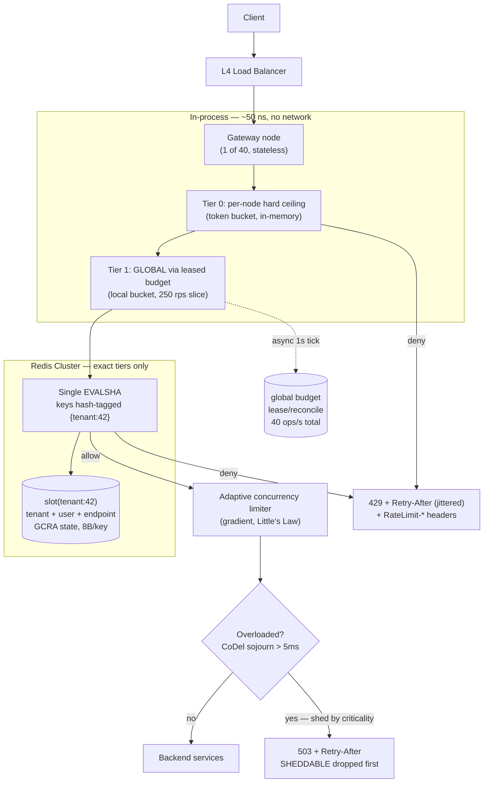

# Module 175 — System Design: Rate Limiting, Throttling & Load-Shedding Algorithms (Algorithmic Deep Dive)

> Domain: System Design | Level: Beginner → Expert | Prerequisite: [[04-Designing-Rate-Limiter-API-Gateway]] (the system/topology view this module supplies the missing algorithmic core for), [[../03-REST-APIs/02-API-Security-Rate-Limiting]] §2.2 (the four-bullet algorithm summary this module derives properly), [[../07-Redis/01-Data-Structures-Caching-Patterns]] (sorted sets, hashes, Lua atomicity, Cluster slots), [[../38-API-Gateway/01-APIGatewayFundamentals-Routing-RateLimiting-AuthEnforcement-Transformation]], [[../18-Event-Driven-Architecture/04-Backpressure-Flow-Control-Consumer-Lag]] (backpressure as the async dual of rate limiting)

**Why this module exists.** Module 40 (`04-Designing-Rate-Limiter-API-Gateway.md`) designs the *topology* of a rate-limited gateway — tiers, fleet scaling, Redis as shared state, failure modes — and names the four classic algorithms in a single sentence in §2.2. Module 12 (`03-REST-APIs/02`) gives them four bullet lines. Neither derives one. At a Staff/Principal panel the algorithm *is* the interview: you will be asked to pick one, defend the choice numerically, write it, and then explain what breaks when it runs on 40 gateway nodes against a sharded Redis with 3 ms of clock skew. This module is that missing layer. It also corrects three concrete defects in Module 40's Advanced Q2 Lua script (see §6.7).

---

## 1. Fundamentals

### What is rate limiting, precisely?

Rate limiting is **admission control at a boundary**: a decision function `allow(key, now, cost) → {ALLOW, REJECT, DELAY}` evaluated before a request consumes any meaningful resource. Everything else — Redis, gateways, 429s — is plumbing around that function.

Five things are routinely conflated. Separating them is the first signal of seniority:

| Mechanism | Controls | Unit | Typical failure it prevents |
|---|---|---|---|
| **Rate limiting** | Requests *per unit time* | req/s, req/min | Abuse, quota enforcement, contractual TPS caps |
| **Concurrency limiting** | Requests *in flight simultaneously* | count | Thread-pool/connection-pool exhaustion, pileup from a slow dependency |
| **Throttling / shaping** | Requests *delayed* rather than rejected | queue + drain rate | Bursty producer feeding a fixed-rate consumer |
| **Load shedding** | Requests *dropped by priority* under stress | criticality class | Total collapse; preserving critical traffic during overload |
| **Backpressure** | Producer *slowed at the source* | credit/window | Unbounded queue growth in async pipelines |

A rate limit **cannot** save you from a pileup — that is Little's Law, and it is §2.10. A concurrency limit **cannot** enforce a contractual "1,000 TPS to the card network" — that is rate limiting. Panels probe exactly this seam.

### Why does the algorithm choice matter?

Because the four canonical algorithms differ on axes that are *directly business-visible*:

- **Burst tolerance** — can a client spend a minute's quota in one second? For a market-data snapshot API, yes (clients start up and hydrate). For a downstream card network with a hard 1,000 TPS ceiling, absolutely not — a burst there gets *your whole institution* throttled, not just the offending merchant.
- **Precision** — fixed window allows 2× the stated limit at boundaries. If your limit is contractual and audited (a SOX-relevant vendor agreement, a market-data licensing cap billed per message), 2× is a compliance event, not a rounding error.
- **State cost** — a sliding-window *log* is exact and costs O(N) memory *per key*. At 1M keys × 100 req/min that is ~100M sorted-set members, ~8 GB of Redis. The exact same guarantee from GCRA costs 8 bytes per key.
- **Latency contribution** — the check runs on 100% of traffic. One extra round trip is not "one extra round trip"; it is one extra round trip multiplied by every request the platform will ever serve.

### When does each apply?

```
Need exact per-caller accounting for billing/compliance? ──► GCRA or sliding-window log
Need to allow legitimate bursts (client startup, batch)? ──► Token bucket (capacity = burst)
Need to protect a downstream with a hard, smooth TPS cap? ──► Leaky bucket (queue variant) or GCRA
Need the cheapest possible thing, limit is advisory? ─────► Fixed window
Need global limits across regions with <1ms budget? ──────► Local token lease + async reconciliation
Protecting against slow dependencies / pileup? ───────────► Concurrency limit (adaptive), NOT a rate limit
Protecting availability during genuine overload? ─────────► Priority load shedding + CoDel, on top of the above
```

### How does it work at 30,000 feet?

Every limiter answers four questions. Write them down before writing code — a panel will ask you to state them explicitly:

1. **Key** — what identity is being limited? (API key > user ID > session > IP. IP is last because of CGNAT, corporate egress, and `X-Forwarded-For` spoofing — §8.2.)
2. **Cost** — is every request worth 1, or is a bulk endpoint worth 50? (Weighted/`quantity` limiting.)
3. **Window semantics** — fixed, rolling, or continuous (rate + burst)?
4. **Rejection contract** — 429 vs 503, `Retry-After`, `RateLimit-*` headers, and whether the caller can trust them.

---

## 2. Deep Dive

Notation used throughout: limit `L` requests per period `P`; arrival time `t`; stored state per key `S`.

### 2.1 Fixed-Window Counter

**Mechanics.** Bucket the timeline into aligned windows of length `P`. Key = `rl:{id}:{floor(t/P)}`. `INCR`; if the result is 1, `EXPIRE P`; allow while counter ≤ L.

```lua
-- fixed window, single round trip
local c = redis.call('INCR', KEYS[1])
if c == 1 then redis.call('PEXPIRE', KEYS[1], ARGV[1]) end
return c <= tonumber(ARGV[2]) and 1 or 0
```

**State:** one 8-byte integer per key per window. Cheapest possible.

**The boundary-burst defect, proved.** Let `L = 100`, `P = 60s`. A client sends 100 requests in `[59.0, 60.0)` and 100 more in `[60.0, 61.0)`. Both windows are individually compliant. But over the 2-second interval `[59, 61)` — which is a *legitimate* 60-second-window question if the window were rolling — the client achieved 200 requests, i.e. **2×L in a span of P**. The bound is tight: worst case is exactly 2L over any window of length P, and it is *not* amortized away — a client that knows your boundary (and boundaries are guessable: they're aligned to the clock) can sustain 2L/P indefinitely by pulsing at every boundary.

**Second, subtler defect: the `INCR`-then-`EXPIRE` race.** If the process crashes between `INCR` and `EXPIRE`, the key is immortal and the client is permanently limited. This is why the two commands must be in one Lua script (or `SET key 0 EX P NX` first). Candidates almost never mention it; it is a real production outage class.

**When it is still correct.** Advisory limits, coarse abuse prevention, and — importantly — as the *cheap outer tier* of a layered design where an exact inner tier does the real enforcement.

### 2.2 Sliding-Window Log

**Mechanics.** Store every request timestamp in a Redis sorted set scored by time. On each request: drop entries older than `t − P`, count what remains, and add the new one if under limit.

```lua
-- KEYS[1]=key  ARGV[1]=now_ms  ARGV[2]=period_ms  ARGV[3]=limit  ARGV[4]=member_id
local now, period, limit = tonumber(ARGV[1]), tonumber(ARGV[2]), tonumber(ARGV[3])
redis.call('ZREMRANGEBYSCORE', KEYS[1], 0, now - period)
local used = redis.call('ZCARD', KEYS[1])
if used >= limit then
  -- exact Retry-After: when the oldest survivor falls out of the window
  local oldest = redis.call('ZRANGE', KEYS[1], 0, 0, 'WITHSCORES')
  return {0, math.ceil((tonumber(oldest[2]) + period - now))}
end
redis.call('ZADD', KEYS[1], now, ARGV[4])
redis.call('PEXPIRE', KEYS[1], period)
return {1, 0}
```

**Guarantee.** Exact. No boundary artefact. Gives a provably correct `Retry-After`.

**Cost — the reason it rarely survives design review.** Memory is O(L) *per key*. A Redis sorted set above `zset-max-listpack-entries` (default 128) becomes skiplist + hashtable: roughly **60–100 bytes per member** including the member string, dict entry, and skiplist node. Do the arithmetic in the interview:

```
1,000,000 active API keys × limit of 100 req/min
= 100,000,000 members × ~80 bytes
≈ 8 GB of Redis, purely for rate-limit state
plus O(log N) per ZADD and an unbounded ZREMRANGEBYSCORE on every call
```

And it is worse than the average suggests: the *abusive* clients — the ones you most want to limit cheaply — are exactly the ones whose sets stay full.

**Where it does earn its keep.** Low-cardinality, high-value keys where exactness is auditable: per-*venue* order-submission limits in an OMS (dozens of keys, not millions), per-institution regulatory submission caps, or a licensing-metered market-data entitlement where the vendor bills on the exact count.

### 2.3 Sliding-Window Counter (Weighted Approximation)

**Mechanics.** Keep only two fixed-window counters — current and previous — and interpolate:

```
elapsed   = t mod P                    // how far into the current window we are
weight    = (P − elapsed) / P          // how much of the rolling window still overlaps the previous one
estimate  = previous_count × weight + current_count
allow if estimate < L
```

**Worked example.** `L = 100`, `P = 60s`, we are 15 s into the current window. Previous window saw 80, current has seen 30.
`estimate = 80 × (45/60) + 30 = 60 + 30 = 90 < 100` → allow.

**State:** two integers per key. O(1). One `INCR`, one `GET`, both scriptable into a single round trip.

**Error analysis — the part that separates candidates.** The approximation assumes the previous window's requests were *uniformly distributed*. They usually weren't. Two bounded error directions:

- **False allow:** previous window's traffic was back-loaded (all 80 arrived in its final 5 s). True rolling count is `80 + 30 = 110 > L`, estimate says 90. You over-admit.
- **False reject:** previous window's traffic was front-loaded. True count is 30, estimate says 90. You under-admit a compliant client.

Worst-case error is bounded by the previous window's count times the weight — but empirically it is tiny at scale. Cloudflare's published result for this exact algorithm: over ~400 million requests, **0.003%** were incorrectly allowed or limited, and the mean over-admission was ~6% of the limit. That is the number to quote. It is why this algorithm — not token bucket — is what most CDN-scale edge limiters actually run.

**Trade-off framing for a panel:** "It is O(1) memory, single round trip, no boundary doubling, and its error is bounded and measurable at a few hundredths of a percent. I would take that over an exact log that costs 8 GB, *unless* the limit is contractual and audited — then I want exactness or GCRA."

### 2.4 Token Bucket

**Model.** A bucket of capacity `C` tokens refills continuously at `r` tokens/second. A request of cost `q` is admitted iff `tokens ≥ q`, and consumes `q`.

```
tokens(t) = min(C, tokens(t₀) + r · (t − t₀))
```

**The critical implementation insight: lazy refill.** Never run a timer to add tokens — that is O(keys) background work and does not survive a distributed deployment. Store `(tokens, last_refill_ts)` and compute the refill *at read time* from the elapsed interval. This makes the whole algorithm O(1) state and O(1) work, with **no** background process. Candidates who describe a "refiller thread" have never run this at scale.

```lua
-- KEYS[1]=bucket  ARGV: now_ms, capacity, refill_per_ms, cost
local now, cap, rate, cost = tonumber(ARGV[1]), tonumber(ARGV[2]), tonumber(ARGV[3]), tonumber(ARGV[4])
local b = redis.call('HMGET', KEYS[1], 'tk', 'ts')
local tokens = tonumber(b[1]) or cap
local last   = tonumber(b[2]) or now
tokens = math.min(cap, tokens + (now - last) * rate)
if tokens < cost then
  local need = (cost - tokens) / rate           -- exact ms until affordable
  return {0, math.ceil(need)}
end
redis.call('HSET', KEYS[1], 'tk', tokens - cost, 'ts', now)
redis.call('PEXPIRE', KEYS[1], math.ceil(cap / rate) + 1000)   -- idle keys self-evict once full
return {1, 0}
```

**Burst mathematics — derive this, don't hand-wave it.** A client arriving at sustained rate `A > r` starting from a full bucket can be admitted for exactly:

```
C + r·T = A·T   ⟹   T = C / (A − r)     seconds
```

`L = 100/min` implemented as `C = 100, r = 1.667/s` lets a client fire **100 requests in the first instant**. If the thing behind you is a card network with a hard 1,000 TPS ceiling and you have 500 merchants, that instantaneous 100× fan-in is your incident. Set `C` deliberately: `C` is the *burst* you are willing to absorb, `r` is the *sustained* rate you are willing to serve. They are two separate product decisions and should be two separate config fields — collapsing them into "100 per minute" is how the burst gets chosen by accident.

**Two Redis details that matter.** `HMSET` is deprecated since Redis 4.0 — use `HSET` with multiple field/value pairs. And set a TTL of `C/r` (time to refill from empty to full) so idle keys evict themselves; without it, per-user buckets leak memory forever in a system with churning user IDs.

### 2.5 Leaky Bucket — Two Different Algorithms Wearing One Name

This is the single most-conflated pair in system-design interviews, and naming the distinction unprompted lands well.

**(a) Leaky bucket as a *meter*.** Water leaks out at constant rate `r`; each request pours in `1/r` worth; reject if the bucket would overflow capacity `C`. This is **mathematically the dual of the token bucket** — identical admission decisions, with `tokens = C − water`. If someone tells you "token bucket allows bursts, leaky bucket doesn't," they mean the queue variant. As meters they are the same algorithm.

**(b) Leaky bucket as a *queue* (traffic shaper).** Requests enter a bounded FIFO queue and are *dispatched* at a strictly constant rate `r`. Overflow is rejected. This is genuinely different: it **delays** rather than rejects, producing a perfectly smooth output stream.

**Why the queue variant is dangerous, via Little's Law.** With queue depth `L_q` and drain rate `r`, expected added latency is `W = L_q / r`. A 1,000-deep queue draining at 100/s adds **10 seconds** of latency to the last request in line. For a synchronous HTTP API, that request's client has almost certainly timed out already — you have burned server capacity producing a response nobody will read, which is *worse* than an immediate 429. Rule: **shape asynchronous work, reject synchronous work.**

The legitimate home for the queue variant is the *egress* side — smoothing your own outbound calls to a partner with a hard TPS cap (SWIFT gateways, card networks, exchange order-entry sessions), where the work is already asynchronous and a few hundred ms of shaping is free.

### 2.6 GCRA — the Generic Cell Rate Algorithm (Virtual Scheduling)

Borrowed from ATM traffic policing; implemented by `redis-cell`; used at Cloudflare and in many exchange gateways. Almost nobody brings it up unprompted, and doing so immediately shifts the register of the conversation.

**Idea.** Instead of counting requests, track a single timestamp — the **Theoretical Arrival Time (TAT)**, the time at which the *next* request would be perfectly conforming. Burst is expressed as tolerance for arriving *early*.

```
T  = emission interval        = P / L          (ideal spacing between requests)
τ  = delay variation tolerance = T × burst      (how early you're allowed to be)

on request of cost q at time now:
    tat      = max(stored_tat, now)
    new_tat  = tat + q·T
    allow_at = new_tat − τ
    if now < allow_at:
        REJECT, retry_after = allow_at − now
    else:
        store new_tat (TTL = new_tat − now)
        ALLOW, remaining = floor((now − (new_tat − τ)) / T)
```

**Properties — this is the pitch:**

| Property | GCRA |
|---|---|
| State per key | **one float64 (8 bytes)** — no counters, no timestamps pair, no set |
| Redis ops | 1 GET + 1 SET, one script, one round trip |
| Precision | **Exact.** No window boundary. No approximation error. |
| Burst | Configurable and *independent* of rate, like token bucket |
| `Retry-After` | Falls out of the arithmetic for free, exactly |
| Background work | None |

**Worked trace.** `L = 5/s` ⟹ `T = 200 ms`; burst 3 ⟹ `τ = 600 ms`. Start `tat = 0`, `now = 1000`.

| # | now | tat=max(stored,now) | new_tat | allow_at = new_tat−τ | decision |
|---|---|---|---|---|---|
| 1 | 1000 | 1000 | 1200 | 600 | allow (1000 ≥ 600) |
| 2 | 1000 | 1200 | 1400 | 800 | allow |
| 3 | 1000 | 1400 | 1600 | 1000 | allow (exactly at the edge — burst of 3 consumed) |
| 4 | 1000 | 1600 | 1800 | 1200 | **reject**, retry_after = 200 ms |
| 5 | 1250 | 1600 | 1800 | 1200 | allow (waited out the interval) |

Note what happened: it permitted a burst of exactly 3, then degraded smoothly to one request per 200 ms — with 8 bytes of state and no clock-window semantics at all.

**Why it isn't universal.** It is harder to explain to product owners than "100 per minute," the config (`emission interval`, `tolerance`) is less intuitive than (`capacity`, `refill`), and it offers no natural way to answer "how many have I used this calendar month?" — for *quota* accounting (a billing construct) you still want a counter. Use GCRA for *rate*, counters for *quota*. That distinction is itself a good answer.

### 2.7 Distributed Correctness: Clocks, Atomicity, and Cluster Slots

Everything above is single-node-correct. Three things break it across a fleet.

**(a) Clock source.** If each gateway node passes its own `DateTime.UtcNow` as `now`, then NTP skew (typically 1–10 ms, but seconds after a VM live-migration or a leap-second smear) makes the state non-monotonic: a node with a lagging clock computes a *smaller* elapsed interval and under-refills; a node whose clock steps *backwards* can make `now − last < 0` and **destroy tokens**, or in GCRA make `tat` jump into the future and lock a client out.

Fix, in order of preference:
1. **Use the store's clock.** `redis.call('TIME')` inside the script gives one authoritative clock per Redis node. Since Redis 5 (effects replication by default; earlier, via `redis.replicate_commands()`), non-deterministic commands like `TIME` are legal in scripts because Redis replicates the *effects*, not the script body.
2. **Defensive clamping.** `local elapsed = math.max(0, now - last)` — one line, eliminates the backwards-clock token-destruction bug entirely. Include it.
3. **Monotonic clocks client-side** (`Stopwatch.GetTimestamp()` / `CLOCK_MONOTONIC`) for anything measured *locally*; wall clock only for cross-node coordination.

Caveat worth stating: in Redis **Cluster**, `TIME` is per-node, so different shards have different clocks. Keys for one limiter must therefore live on one shard (see (c)) for the clock to be consistent for that key.

**(b) Atomicity.** Read-modify-write from the application (GET, compute, SET) is a lost-update race under concurrency — two gateway nodes both read 1 token and both allow. Options: Lua script (atomic, single round trip, the default answer), `WATCH`/`MULTI` optimistic transactions (retries under contention — worse at high traffic, which is precisely when it matters), or Redis Functions (Redis 7, same semantics, stored server-side). Always ship via `EVALSHA` with an `EVAL` fallback on `NOSCRIPT` so you are not pushing the script body on every call — that is real bandwidth at 50k rps.

**(c) Redis Cluster slots — and a concrete bug in Module 40.** In Cluster mode, **every key touched by one script must hash to the same slot**, or Redis returns `CROSSSLOT Keys in request don't hash to the same slot`. Module 40's Advanced Q2 script takes `KEYS[1..4]` = global, tenant, user, endpoint keys. Those hash to four different slots. **That script cannot run on a Redis Cluster.** It works on a single node or a non-clustered primary/replica pair only.

Three real fixes:
1. **Hash-tag the tenant-scoped tiers together** — `rl:{t:42}:tenant`, `rl:{t:42}:user:99`, `rl:{t:42}:ep:/orders` all hash on `t:42` → one slot, one script. The **global** tier genuinely cannot join them (it is not tenant-scoped) → it needs its own call, or approach 2/3.
2. **Shard the global tier** into `N` sub-buckets each with limit `L/N`, assign a request by `hash(request_id) mod N`, and hash-tag sub-bucket `i` with the tenant group it serves. Removes the cross-slot problem *and* the hot-slot problem (§2.9) at the cost of `1/N`-granularity unfairness.
3. **Enforce the global tier locally** with a leased budget (§2.8) and only the per-tenant tiers in Redis.

### 2.8 Beating the Round Trip: Local Token Leases (Approximate Distributed Limiting)

A Redis hop is ~0.3–1 ms in-AZ, 1–3 ms cross-AZ. On 100% of requests, in a 50 ms p99 budget, that is 2–6% of your entire latency budget spent asking permission — and it makes Redis a hard availability dependency for every request in the platform.

**The lease pattern (Doorman/Stripe/Cloudflare-class).** Each gateway node periodically leases a *slice* of the global budget and spends it locally from an in-process token bucket:

```
Global budget: 10,000 rps, 40 gateway nodes
Each node leases 250 rps worth of tokens every 1s (or takes a weighted share
  proportional to its recently observed traffic — important, because traffic
  is never uniform across nodes)
Node checks its LOCAL bucket: ~50 ns, zero network
Async background task reconciles usage with Redis and re-leases
```

**What you gain:** the per-request Redis hop disappears; Redis load drops from `O(requests)` to `O(nodes / lease_interval)` — from 50,000 ops/s to 40 ops/s; and a Redis outage degrades to "each node enforces its last lease" rather than a fail-open/fail-closed cliff.

**What you pay — quantify it, don't wave at it:**
- **Over-admission bound.** In the worst case, every node holds a full unspent lease and spends it simultaneously: transient overshoot ≤ `nodes × lease_size`. Choose `lease_interval` and slice size against your downstream's actual burst tolerance.
- **Idle-node starvation.** A node with a 250-rps lease and 5 rps of traffic hoards 245 rps that a hot node needs. Fixes: weighted leases based on observed demand, lease *return* on the reconciliation tick, and short intervals for skewed traffic.
- **Not suitable for hard contractual caps** unless you size the total leased budget *below* the real ceiling by the overshoot bound.

**Decision rule:** exact enforcement in Redis for low-rate, high-value, contractual limits; leased local enforcement for high-rate, best-effort protective limits. Most mature platforms run both — and saying so is the answer.

### 2.9 The Hot-Key Problem (the one that actually pages you)

A single global-tier key is one Redis slot on one shard handling **100% of platform traffic**. Redis is single-threaded per shard; a shard tops out around 100k–200k simple ops/s, far less with a non-trivial Lua script. Sharding the *cluster* does not help — the key still lives on one shard. Symptoms: one Redis node at 100% CPU while the rest idle, p99 gateway latency spiking, `redis-cli --hotkeys` naming a single key.

Fixes, in the order a Principal would propose them:
1. **Sharded counters** — split `global` into `global:0..N-1` at `L/N` each, pick by hash. Linear headroom; cost is granularity (a client hashing to a saturated sub-bucket is rejected while another has room).
2. **Local leases** (§2.8) — removes the per-request hit entirely; strictly better where approximation is acceptable.
3. **Hierarchical limiting** — cheap, non-shared in-process filter first (per-node hard ceiling), shared store only for what survives.
4. **Move the hot tier out of Redis** — an in-memory gossiped estimate (CRDT counter, bounded staleness) for the global tier specifically.

### 2.10 Rate Limiting Is Not Concurrency Limiting — Little's Law

`L = λ × W` (concurrency = arrival rate × latency). You configured a rate limit `λ`. You did **not** configure `W`. When a downstream dependency degrades from 20 ms to 2,000 ms:

```
λ = 500 rps (still perfectly within the rate limit — the limiter allows everything)
W:  20 ms → 2,000 ms
L:  10 concurrent → 1,000 concurrent
```

Your thread pool, connection pool, and socket budget are gone, and **the rate limiter admitted every single one of those requests as compliant.** This is the pileup that takes down services that "had rate limiting."

**The fix is a concurrency limit, and the good version is adaptive.** Static concurrency limits are a guess that is wrong at every traffic level. Adaptive algorithms infer the limit from observed latency:

- **AIMD** — additively increase the limit on success, multiplicatively halve on timeout/rejection. TCP congestion control, applied to your service. Simple, robust, slow to converge.
- **Gradient (Vegas-style)** — `newLimit = currentLimit × (RTT_noload / RTT_actual) + queueSize`, smoothed. When actual RTT rises above the no-load baseline, the gradient shrinks the limit *before* queues build. This is Netflix's `concurrency-limits` approach and it is the strongest answer.
- **In .NET:** `System.Threading.RateLimiting.ConcurrencyLimiter` gives you the mechanism (with a bounded queue and `QueueProcessingOrder`); the adaptive controller you write around it.

**Interview framing:** "Rate limiting protects against *volume*. Concurrency limiting protects against *latency*. They fail differently and you need both — a rate limiter alone will happily admit the traffic that kills you."

### 2.11 Load Shedding: What to Do When Limits Aren't Enough

Rate limits are configured against *expected* capacity. Load shedding handles the case where actual capacity collapsed (a bad deploy, a degraded AZ, a cache going cold).

**Priority-based shedding.** Tag every request with a criticality class — Google SRE's canonical four: `CRITICAL_PLUS`, `CRITICAL`, `SHEDDABLE_PLUS`, `SHEDDABLE`. Propagate the class through the whole call graph (it must be in the RPC/HTTP context, not re-derived per hop). Under stress, shed from the bottom. In a payments platform: authorization = `CRITICAL_PLUS`; settlement = `CRITICAL`; a merchant analytics dashboard refresh = `SHEDDABLE`. The dashboard failing is a support ticket; authorizations failing is an incident and a regulatory conversation.

**CoDel (Controlled Delay) on the admission queue.** Rather than a fixed queue depth, track the *minimum* sojourn time over a sliding interval (typical: target 5 ms, interval 100 ms). If minimum sojourn stays above target for a full interval, start dropping. This distinguishes a *standing* queue (real overload — shed) from a *transient burst* (absorb it). A depth-based limit cannot tell those apart.

**LIFO under overload — counterintuitive and correct.** When a queue is backed up, FIFO serves the *oldest* request first — the one most likely to have already timed out client-side. You spend capacity producing responses nobody reads, and *every* request ends up slow. LIFO serves the freshest, so at least some requests succeed within their deadline. Serve FIFO when healthy, flip to LIFO when the queue exceeds a threshold. Pair with **deadline propagation**: pass the caller's remaining budget down the call graph and drop work whose deadline has already expired *before* executing it.

### 2.12 Fairness

Global and per-tenant tiers together still leave a fairness hole: within one tenant's quota, one runaway integration can starve every other user of that tenant. Options:

- **Max-min fairness** — every contender gets an equal share of the bottleneck; unused share is redistributed. The right *target*, expensive to compute exactly.
- **Stochastic Fair Queuing** — hash keys into `M` queues, round-robin them. Approximates fairness in O(1); collisions cause occasional unfairness (rehash periodically with a rotating salt).
- **Weighted fair share** — tenants get shares proportional to their contract tier, with unused share redistributed. Directly models the commercial reality of a tiered SaaS product.
- **Work-conserving is the property to name:** if capacity is idle, admit traffic even if a key is "over" its nominal share. A non-work-conserving limiter throws away capacity you already paid for.

### 2.13 The Client Side of the Contract

A limiter is half a protocol; the caller's behaviour is the other half.

- **429 vs 503.** `429 Too Many Requests` = "*you* exceeded *your* limit" (caller-attributable, don't retry blindly). `503 Service Unavailable` + `Retry-After` = "*we* are overloaded" (not the caller's fault). Returning 429 for global shedding mislabels the cause and teaches every client's dashboard the wrong thing.
- **Headers.** Emit the IETF-draft `RateLimit-Limit`, `RateLimit-Remaining`, `RateLimit-Reset` on *successful* responses too, so well-behaved clients self-pace before hitting the wall. Note the information-disclosure trade-off in §8.4.
- **Jitter is mandatory.** `Retry-After: 60` returned to 10,000 throttled clients synchronises all of them into a thundering herd at exactly T+60. Return a jittered value per client, and have clients apply **decorrelated jitter**: `sleep = min(cap, random(base, previous × 3))`.
- **Retry amplification.** Three layers each retrying 3× is **3³ = 27×** amplification in the worst case — your retry policy becomes a self-inflicted DDoS during a partial outage. The fix is a **retry budget**: allow retries only while they are under ~10% of total requests over a rolling window, tracked per client, and stop retrying entirely above that. Circuit breakers are the coarser backstop.

---

## 3. Visual Architecture

**Algorithm behaviour under the same burst** (limit 5/sec; client fires 5 at t=0.0, then 5 at t=1.0):

```
                 t=0.0                    t=1.0
                 |5 reqs|                 |5 reqs|
FIXED WINDOW     ✓✓✓✓✓                    ✓✓✓✓✓      → 10 admitted in 1.0s window = 2× limit  ✗
SLIDING LOG      ✓✓✓✓✓                    ✗✗✗✗✗      → exact; 5 in any rolling 1s            ✓ (8GB)
SLIDING COUNTER  ✓✓✓✓✓                    ~✗✗✗✗      → ~exact; bounded ~0.003% error         ✓ (O(1))
TOKEN BUCKET C=5 ✓✓✓✓✓                    ✓✓✓✓✓      → refilled 5 tokens over 1s; burst OK   ✓ (by design)
LEAKY (queue)    ✓ then drip @200ms       ✓ drip     → smooth output, +latency               ✓ (async only)
GCRA burst=5     ✓✓✓✓✓                    ✓✓✓✓✓      → same as token bucket, 8 bytes state   ✓
```

**GCRA timeline** (`T = 200 ms`, `τ = 600 ms`):

```
 time →   1000    1200    1400    1600    1800    2000
          |-------|-------|-------|-------|-------|
 TAT      ●1200   ●1400   ●1600   →1800(rejected at now=1000)
 allow_at 600     800     1000    1200
          ↑req1   ↑req2   ↑req3   ↑req4=REJECT (now=1000 < allow_at=1200), retry_after=200ms
 «-- τ=600ms of "arrive early" tolerance = burst of 3 --»
```

**Multi-tier enforcement with cluster-safe key layout and local leases:**



**Decision flow — choosing the algorithm:**

```
                        ┌─ Is the limit contractual / audited / billed? ─┐
                       YES                                              NO
                        │                                                │
        ┌── low key cardinality? ──┐                    ┌── need burst tolerance? ──┐
       YES                        NO                   YES                          NO
        │                          │                    │                            │
  SLIDING LOG                    GCRA            TOKEN BUCKET or GCRA        SLIDING WINDOW COUNTER
  (exact + exact                 (exact,          (capacity = burst,          (O(1), ~0.003% error,
   Retry-After)                   8B/key)          rate = sustained)           what CDNs actually run)
                                                                                       │
                        ┌──────────────────────────────────────────────────────────────┘
                        │  Then, orthogonally, ALWAYS layer:
                        ├─ adaptive concurrency limit  (protects against latency, not volume)
                        └─ priority load shedding      (protects availability when capacity collapses)
```

---

## 4. Production Example

**Problem.** A payments platform (2,400 merchants, ~9,000 authorization TPS peak) enforced a per-merchant limit of "600 authorizations per minute" using a **fixed-window** counter in Redis — chosen years earlier because it was one `INCR`. Downstream, the platform held a card-network agreement with a hard **10,000 TPS** ceiling, above which the network throttles *at the institution level* — every merchant, not the offender.

The incident: every day at the top of the minute, and catastrophically at the top of the hour, the network began returning throttle responses. Authorization p99 went from 180 ms to 4.2 s; the platform's own timeout-and-retry logic then amplified the load. Twenty-two minutes of degraded authorizations across all merchants, a card-network incident review, and a client-notification obligation under the platform's SLA.

**Investigation.** Three findings compounded:

1. **Boundary doubling (§2.1).** Merchant batch integrations — reconciliation jobs, overnight capture sweeps — were cron-scheduled on the minute, on NTP-synced hosts. Fixed windows are clock-aligned, so *every* such merchant's window reset at the same instant. Each could legitimately spend 600 at `:59.9` and 600 more at `:00.1`.
2. **Synchronised fan-in.** Per-merchant compliance said nothing about the aggregate. ~1,100 merchants pulsing simultaneously produced measured spikes of **31,000 TPS for ~800 ms** against a 10,000 TPS ceiling — while the dashboards, which averaged over 1-minute buckets, showed a comfortable 8,400 TPS. *The monitoring window and the limiter window shared the same blind spot.*
3. **Retry amplification (§2.13).** Network throttle → platform retried 3× with a fixed 1 s backoff, no jitter → the retries re-synchronised into another spike one second later.

**Architecture of the fix.**

```
BEFORE:  [gateway] → INCR rl:{merchant}:{minute} → allow if ≤600 → [card network 10k TPS]

AFTER:   [gateway]
           ├─ Tier A  per-merchant GCRA        T=100ms, τ=500ms  (600/min, burst 5)  ─ Redis, hash-tagged
           ├─ Tier B  global egress budget     leased locally, 9,000 TPS ceiling      ─ 1s lease tick
           ├─ Tier C  adaptive concurrency     gradient controller on network client
           └─ Tier D  priority shedding        AUTH=CRITICAL_PLUS, CAPTURE=CRITICAL,
                                               REPORTING=SHEDDABLE
         → egress leaky-bucket shaper (queue variant, async captures only) → [card network]
```

**Implementation notes that mattered.**

- **GCRA replaced fixed window** for the per-merchant tier. Same headline limit ("600/min"), but expressed as a 100 ms emission interval with a burst tolerance of 5 — so the pulse of 600 became 5 immediate + 1 per 100 ms. **No clock-aligned boundary exists in GCRA**, which structurally removed the synchronisation. State dropped from a counter-per-window to 8 bytes per merchant.
- **The global egress ceiling was set to 9,000, not 10,000** — deliberately below the contractual cap by the leased-lease overshoot bound (`40 nodes × 25 rps slice = 1,000`), so even a worst-case simultaneous spend stays under the network's ceiling. Sizing the safety margin *from the algorithm's own error bound* rather than from a round number was the specific thing the post-incident review called out as the durable lesson.
- **`Retry-After` became jittered** per merchant (`base × uniform(0.5, 1.5)`), and the platform's own network client adopted decorrelated jitter plus a 10% retry budget.
- **Monitoring was changed to 1-second resolution** on egress TPS with a `max()` rollup, not `avg()`. The old dashboard was structurally incapable of showing the failure.

**Trade-offs accepted.**

| Decision | Gained | Paid |
|---|---|---|
| GCRA over fixed window | Exact, boundary-free, 8B state, free `Retry-After` | Config is `(interval, tolerance)` not `(count, window)` — required a product/merchant-comms exercise to explain "600/min, burst 5" |
| Leased global budget | Removed a Redis hop from 100% of auth traffic; Redis ops 9,000/s → 40/s | Approximate: up to 1,000 TPS transient overshoot, absorbed by the 9,000 vs 10,000 margin |
| Egress shaper on captures only | Smooth outbound, no synchronous latency cost | Captures can now be delayed up to ~2 s under load; acceptable because capture is asynchronous, authorization is not |
| Criticality classes | Reporting sheds first, authorizations protected | Every service had to propagate the class through the call graph — a multi-team change, the most expensive part of the fix |

**Lessons learned.**

1. **A clock-aligned limiter creates clock-aligned traffic.** Fixed windows do not merely *permit* 2× at the boundary; combined with cron-scheduled clients they actively *manufacture* a synchronised spike. Algorithms without a shared boundary (GCRA, token bucket) do not have this property at all.
2. **Per-tenant compliance is not aggregate compliance** — but the fix is not only "add a global tier," it is *sizing that tier from your downstream's real, measured ceiling minus your own algorithm's error bound.*
3. **Your monitoring window must be finer than your failure window.** An 800 ms spike is invisible in 1-minute averages. If the limiter's decision horizon is sub-second, the dashboard must be too.
4. **Retries are part of the load model.** The retry policy converted a 3× overshoot into a sustained event; no rate-limiting algorithm can compensate for an unbudgeted client retry loop.

---

## 5. Best Practices

- **Separate `rate` from `burst` in configuration.** "600 per minute" underspecifies the design: it does not say whether 600-at-once is acceptable. Make burst an explicit, reviewed field. *Why:* the burst parameter is what your downstream actually feels. *When not to:* genuinely advisory limits where nobody is downstream of you.
- **Prefer GCRA or sliding-window counter as the default; reach for the log only when exactness is auditable.** *Why:* both are O(1) state and single-round-trip; the log's exactness costs gigabytes and buys nothing unless someone bills on the count.
- **Always do the check in one atomic script, and ship it with `EVALSHA`.** *Why:* application-side read-modify-write is a lost-update race at exactly the concurrency where limits matter; re-sending script bodies is real bandwidth at 50k rps.
- **Clamp elapsed time: `math.max(0, now - last)`.** *Why:* one line that immunises you against backwards clock steps destroying tokens or locking out clients. *Always.*
- **Hash-tag co-checked keys, and design the global tier knowing it cannot join the tenant slot.** *Why:* the alternative is discovering `CROSSSLOT` the day you migrate from single-node Redis to Cluster.
- **Set a TTL on every limiter key** (`capacity/rate` for token bucket, `new_tat − now` for GCRA, `period` for windows). *Why:* unbounded key growth in any system with churning identities is a slow-motion OOM.
- **Layer a concurrency limit and priority shedding underneath the rate limit.** *Why:* Little's Law — the rate limiter is structurally blind to latency-driven pileup.
- **Return jittered `Retry-After`, and emit `RateLimit-*` on success too.** *Why:* un-jittered retry times synchronise clients into the next spike; proactive headers let good clients self-pace and reduce your 429 volume outright.
- **Make the fail-open/fail-closed decision explicitly, per tier, and write it down.** *Why:* it is a business decision, not an engineering default — see §8.5. A protective limit fails open; a contractual or security limit fails closed.
- **Load-test the *aggregate* failure mode with many distinct identities.** *Why:* a load test from one identity only ever exercises the per-key tier and will never find the incident in §4.

---

## 6. Anti-patterns

- **6.1 Fixed window for anything with a downstream hard cap.** Fails because the 2× boundary burst is not a theoretical edge — cron-scheduled clients synchronise onto it. *Fix:* GCRA or token bucket; no shared boundary exists to synchronise on.
- **6.2 `INCR` then `EXPIRE` as two commands.** Fails when the process dies between them: an immortal key permanently limits a client. *Fix:* one Lua script, or `SET k 0 EX p NX` before `INCR`.
- **6.3 A background "token refiller" thread/timer.** Fails because it is O(active keys) of background work, doesn't survive multi-node deployment, and drifts. *Fix:* lazy refill computed from `(last_ts, now)` at read time.
- **6.4 Sliding-window log by default.** Fails on memory — 8 GB for a million keys — and the cost concentrates on the abusive keys. *Fix:* sliding-window counter or GCRA; reserve the log for low-cardinality auditable limits.
- **6.5 Rate limiting by IP as the primary key.** Fails because CGNAT and corporate egress put thousands of legitimate users behind one IP (you throttle a whole customer's office), while `X-Forwarded-For` is trivially spoofable unless you take the Nth-from-the-right entry at a trusted proxy boundary. *Fix:* key on authenticated identity (API key, user ID); use IP only for the unauthenticated surface, with an explicitly generous limit and a documented tolerance for collateral damage.
- **6.6 One global counter key.** Fails as a hot slot: one single-threaded Redis shard serving 100% of platform traffic while the cluster idles. *Fix:* sharded sub-buckets or local leases (§2.9).
- **6.7 Three concrete defects in Module 40's Advanced Q2 script** — worth walking through, because each is a distinct class of error:
  1. **`CROSSSLOT`.** `KEYS[1..4]` = global/tenant/user/endpoint hash to four different slots; the script cannot execute on Redis Cluster at all (§2.7c).
  2. **A false trade-off.** That answer concedes that earlier tiers get charged even when a later tier rejects, and calls it an acceptable inefficiency. It isn't a necessary one: *the script is already atomic*, so you can peek all four tiers first and only commit if all pass. Two passes over four keys inside one `EVAL` is a handful of microseconds. Accepting silent quota corruption to avoid a second loop is the wrong call, and a panel will press on it — over-charging the tenant tier for requests that were rejected by the endpoint tier means your billing/quota numbers are quietly wrong.
  3. **Non-monotonic time and deprecated commands.** `now` comes from `ARGV[1]` (the caller's clock, no clamp — a backwards step destroys tokens), and `HMSET` has been deprecated since Redis 4.0. *Fix:* `redis.call('TIME')` or clamp with `math.max(0, now-last)`, and `HSET` with multiple field/value pairs.
- **6.8 A rate limit as the only defence against overload.** Fails because a dependency slowdown produces a pileup at a *constant, compliant* arrival rate (Little's Law, §2.10). *Fix:* adaptive concurrency limiter alongside.
- **6.9 Unbounded shaping queues on a synchronous path.** Fails by serving responses to clients that already timed out — burning capacity for zero value. *Fix:* bounded queue + CoDel, LIFO under stress, deadline propagation; shape async work only.
- **6.10 Unjittered `Retry-After` and unbudgeted retries.** Fails by re-synchronising every throttled client into the next spike, with `3^layers` amplification. *Fix:* per-client jitter, decorrelated backoff, and a ~10% retry budget.
- **6.11 Rejecting *after* the expensive work.** A limiter placed after authentication (which may be a bcrypt verify or a token-introspection call) means an attacker still costs you the expensive operation per request. *Fix:* cheap identity-agnostic tier before auth, identity-aware tiers after (§8.1).

---

## 7. Performance Engineering

### 7.1 Cost model per algorithm

Measured shape on a c6i-class node, Redis 7, in-AZ, `EVALSHA`, 64-byte keys:

| Algorithm | Redis ops/req | State per key | Script CPU | Round trips | p50 check | p99 check |
|---|---|---|---|---|---|---|
| Fixed window | 1–2 (`INCR`,`PEXPIRE`) | ~64 B | negligible | 1 | ~0.25 ms | ~0.8 ms |
| Sliding log | 3–5 (`ZREMRANGEBYSCORE`,`ZCARD`,`ZADD`) | 64 B + ~80 B × L | O(log N) + O(expired) | 1 | ~0.45 ms | ~2.5 ms |
| Sliding counter | 2–3 (`GET`,`INCR`) | ~128 B | negligible | 1 | ~0.28 ms | ~0.9 ms |
| Token bucket | 2–3 (`HMGET`,`HSET`,`PEXPIRE`) | ~120 B | negligible | 1 | ~0.30 ms | ~1.0 ms |
| GCRA | 2 (`GET`,`SET`) | **~72 B** | negligible | 1 | ~0.26 ms | ~0.85 ms |
| Local lease | **0** on the hot path | ~48 B in-proc | negligible | 0 | **~50 ns** | ~200 ns |

The p99 column is the one that matters: the sliding log's `ZREMRANGEBYSCORE` is O(number of expired entries), so its cost *spikes exactly when a key has been busy* — the worst possible correlation.

### 7.2 Where the latency actually goes

At 50,000 rps with a 0.3 ms Redis round trip, the limiter contributes 0.3 ms to *every* request — 0.6% of a 50 ms budget, acceptable. The problems are non-linear:

- **Connection pool exhaustion.** 50k rps × 0.3 ms = 15 concurrent Redis ops steady-state (Little's Law again). But at p99 = 1 ms it is 50, and during a Redis GC/fork pause (`BGSAVE`, replica sync) it is *hundreds*. Size the multiplexer accordingly; StackExchange.Redis multiplexes over one connection, so a single slow command head-of-lines everything behind it — this is the most common .NET Redis latency surprise.
- **Lua script CPU is charged to the single-threaded shard.** A 50 µs script at 100k rps needs 5 cores' worth of work on a one-core-per-shard engine. Keep scripts short; measure with `SLOWLOG` and `LATENCY DOCTOR`.
- **Pipelining does not help a single request** — it helps the *fleet*. Batch independent tiers into one script, not one script into a pipeline.

### 7.3 Allocation and GC on the .NET side

The check runs on every request, so it is one of the few genuinely allocation-sensitive paths in a typical service:

- **Key construction is the top allocator.** `$"rl:{tenant}:{user}:{endpoint}"` allocates a string per request per tier. At 50k rps × 4 tiers that is 200k string allocations/s straight into Gen0. Use a pooled `StringBuilder`, `string.Create`, or cache the per-tenant key prefix on the tenant context object. Measured effect on one platform: Gen0 collections dropped ~35%.
- **Prefer `System.Threading.RateLimiting`** for the in-process tiers — `TokenBucketRateLimiter` is allocation-free on the fast path and returns a `RateLimitLease` struct-like handle; do **not** roll your own `SemaphoreSlim` + `Timer`.
- **Avoid `async` on the in-process tier.** A local token-bucket check is ~50 ns; wrapping it in a `Task` costs more than the check. Use `ValueTask`/sync fast paths, and reserve `await` for the Redis tier.

### 7.4 Benchmarking discipline

Benchmark the *decision*, not the happy path:

```
1. Steady state at the limit          — measures normal cost
2. 10× the limit (all rejected)       — rejection must be CHEAPER than admission, or your
                                        limiter is a DoS amplifier
3. Many distinct identities            — the §4 aggregate failure mode; a single-identity
                                        load test structurally cannot find it
4. Redis degraded (latency injection)  — verifies the circuit breaker and the fail-open path
5. Cold cache / key churn              — verifies TTL behaviour and memory ceiling
```

Point 2 is the one people skip. If rejecting costs more than allowing, an attacker exceeding your limit costs you *more* than a legitimate client — the limiter has inverted its own purpose.

---

## 8. Security

Rate limiting is a security control before it is a capacity control. Panels at payments and banking firms treat it as such.

### 8.1 The pre-authentication chicken-and-egg

You want to key limits on authenticated identity — but authentication is itself expensive (a bcrypt/Argon2 verify is *deliberately* 50–250 ms; token introspection is a network call). An attacker who forces you to authenticate before you limit has found a **CPU amplification DoS**: a few hundred rps of garbage credentials saturates your CPU.

**Layered answer:**
```
Tier 0  pre-auth, identity-agnostic:  per-IP/ASN, per-TLS-fingerprint, generous limits, ~µs cost
Tier 1  pre-auth, credential-shaped:  per-username failed-attempt counter (keyed on the CLAIMED
                                       identity — cheap, and this is your credential-stuffing control)
Tier 2  post-auth, identity-aware:    the real per-tenant/per-user/per-endpoint tiers
```
Tier 1 must count *failures*, not attempts, and must be keyed on the claimed username **and** separately on source IP — keying on only one of them leaves either a distributed-attack hole or an account-lockout DoS.

### 8.2 Key selection is an attack surface

- **`X-Forwarded-For` is client-controlled.** Never take the leftmost entry. Take the Nth-from-the-right where N is the count of *your* trusted proxies, or use a signed header your edge injects. Getting this wrong lets an attacker rotate a spoofed XFF and bypass IP limits entirely — and, worse, forge someone else's IP to get *them* limited.
- **IPv6 must be limited per /64 (often /48), not per address.** A single residential IPv6 allocation is 2⁶⁴ addresses. Per-address limiting on IPv6 is equivalent to no limiting.
- **Account-lockout as a DoS vector.** A strict per-username limit lets an attacker lock out any user by name. Prefer exponential delay + CAPTCHA + anomaly signals over hard lockout, and never confirm via the error message *why* a request was limited on an authentication endpoint.

### 8.3 What rate limiting is actually defending against

| Threat (OWASP API Top 10 alignment) | Control |
|---|---|
| **API4:2023 Unrestricted Resource Consumption** | The rate limit itself, plus cost-weighted limiting for expensive endpoints |
| **Credential stuffing / brute force** | Tier 1 failed-attempt counters, keyed both ways |
| **API1/API3 enumeration (BOLA probing)** | Per-identity limits on ID-parameterised endpoints; alert on high 404/403 ratios per key — a scanner's *signature* is a high rejection ratio, which the limiter is already positioned to see |
| **Scraping / data exfiltration** | Volume limits on list/export endpoints, priced by rows returned, not requests |
| **Application-layer DDoS (L7)** | Priority shedding + edge limits; note that **volumetric L3/L4 attacks must be absorbed upstream** (Shield/CloudFront/scrubbing) — an application-layer limiter must accept a connection to reject it, and connection capacity is the thing being exhausted |

### 8.4 The limiter as an information leak

`RateLimit-Remaining` on responses tells an attacker exactly how much budget they have to probe with, and differential limits per endpoint let them map which endpoints you consider expensive. Timing differences between "rejected because over limit" and "rejected because unknown key" leak account existence. Mitigations: constant-shape rejection responses on authentication and object-lookup endpoints; consider omitting `RateLimit-*` headers on the unauthenticated surface while keeping them on authenticated APIs where the caller is a known, contracted party.

### 8.5 Fail-open vs fail-closed — a documented, per-tier decision

When Redis is unavailable, the limiter must choose. This is not one decision:

| Tier | Choice | Rationale |
|---|---|---|
| Protective per-tenant API limit | **Fail open** | Availability of the API outranks perfect enforcement for a few minutes; a degraded backstop (per-node local limit) reduces the blast radius |
| Contractual downstream cap (card network, market-data licence) | **Fail closed** | Exceeding it is a commercial/regulatory event; better to reject than to breach |
| Authentication brute-force counter | **Fail closed** | Failing open turns a cache outage into an open credential-stuffing window |
| Global overload protection | **Degrade to local** | Each node enforces `global_limit / expected_node_count` from its last known lease |

Write these into the design doc. "We fail open" as a blanket statement is a finding at a bank's architecture review, because it means nobody asked the question per tier.

### 8.6 Regulatory and audit weight

For SOX/PCI-DSS-scoped systems: limiter configuration is **change-controlled** (a limit change can cause an outage or a compliance breach, so it goes through the same approval path as code); every 429/503 on a payment-affecting endpoint should be **auditable** with the tier that rejected it and the effective configuration at that moment; and limits enforcing a *contractual* ceiling need evidence they were in force — which means emitting the effective config version alongside the decision, not just the decision.

---

## 9. Scalability

### 9.1 Vertical then horizontal, honestly

A single Redis shard handles ~100k simple ops/s (less with scripts). Vertical scaling buys you maybe 2–3×; after that the *only* answers are sharding the keyspace (works for per-tenant tiers, fails for the global tier — §2.9) or removing the per-request hop (leases — §2.8). Say this in that order; jumping straight to "shard it" misses that the global tier does not shard.

### 9.2 Multi-region: the hard part

A genuinely global limit across regions requires cross-region coordination — 70–150 ms RTT, which is 3× your entire latency budget. Options:

| Approach | Consistency | Latency cost | When |
|---|---|---|---|
| **Regional limits, sum ≤ global** | Approximate; unused regional budget is wasted | Zero | Default. Split by observed regional traffic share, revisit quarterly |
| **Leased global budget, async cross-region reconcile** | Approximate, bounded overshoot | Zero on hot path | When the global ceiling is real but has headroom |
| **CRDT counters (G-Counter) gossiped between regions** | Eventually consistent, monotonic | Zero on hot path, converges in ~RTT | Good for *quota accounting* (monthly usage) where monotonic counting is enough |
| **One authoritative region** | Strong | Full cross-region RTT on every request | Only for very low-rate, very high-value limits |

Note the asymmetry: **rate** limits tolerate approximation (a brief overshoot is absorbed by capacity margin); **quota** limits (monthly billing) tolerate *latency* better but need eventual exactness. Different problems, different tools — CRDTs for the latter, leases for the former.

### 9.3 Capacity arithmetic to state out loud

```
Traffic:            50,000 rps peak, 4 tiers per request
Naive:              200,000 Redis ops/s  → 2+ shards minimum, hot global key kills you anyway
One script/request:  50,000 EVALSHA/s   → still one shard's worth per 100k, global key still hot
+ hash-tagged tiers: 50,000 EVALSHA/s spread across slots by tenant → shards scale linearly ✓
+ leased global:     50,000 local checks (free) + 40 ops/s reconcile → Redis load ≈ 0 for that tier ✓

Memory (GCRA, 8B state + ~64B key overhead ≈ 72B):
  1M tenants × 3 tiers × 72B ≈ 216 MB   ✓ trivial
Memory (sliding log, same cardinality, L=100):
  1M × 100 × 80B ≈ 8 GB per tier        ✗ this is the whole argument
```

### 9.4 HA and DR

- **Redis replication is asynchronous** — a failover loses the last few milliseconds of limiter state. For rate limiting this is *fine* (you lose a fraction of a window); do not add synchronous replication for it. Say so explicitly: it is a case where the weaker guarantee is the right engineering choice, and knowing which guarantees you *don't* need is a Principal-level signal.
- **Cluster failover takes seconds.** During it, the limiter must degrade per §8.5, not stall. Circuit-break the limiter's own Redis calls with a short timeout (50–100 ms — longer than your p99, much shorter than your request budget) and a defined fallback.
- **CAP positioning:** the limiter chooses **AP** for protective tiers (serve traffic, approximate the limit) and **CP** for contractual tiers (reject rather than breach). One system, two positions, chosen per tier — which is the honest answer to "is your rate limiter CP or AP?"

<!--PART2-->
