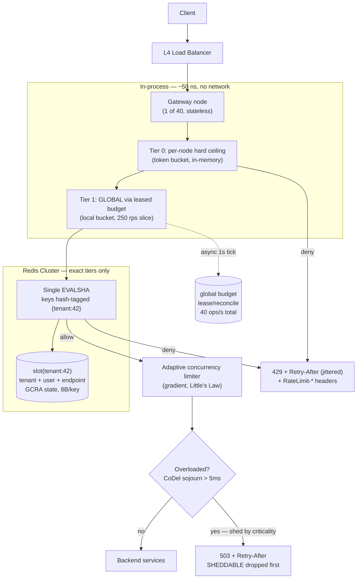
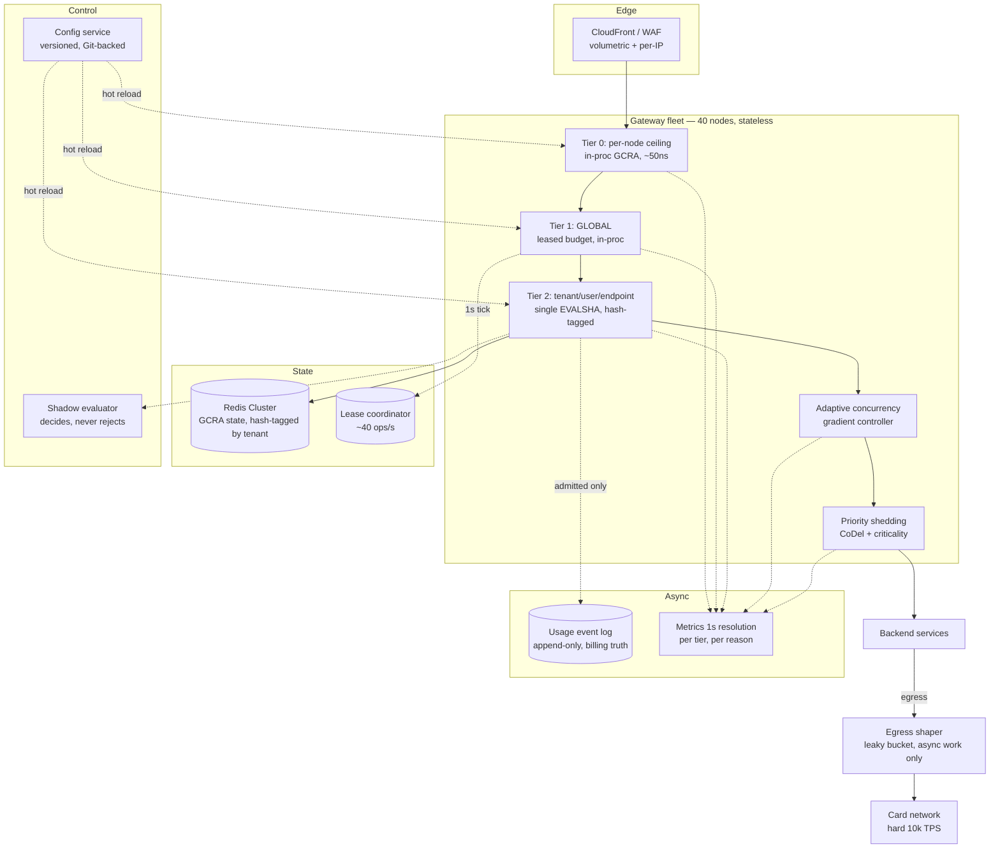
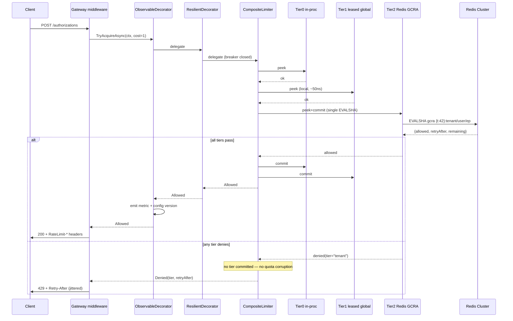

# Module 175 — System Design: Rate Limiting, Throttling & Load-Shedding Algorithms (Algorithmic Deep Dive)

> Domain: System Design | Level: Beginner → Expert | Prerequisite: [[04-Designing-Rate-Limiter-API-Gateway]] (the system/topology view this module supplies the missing algorithmic core for), [[../03-REST-APIs/02-API-Security-Rate-Limiting]] §2.2 (the four-bullet algorithm summary this module derives properly), [[../07-Redis/01-Data-Structures-Caching-Patterns]] (sorted sets, hashes, Lua atomicity, Cluster slots), [[../38-API-Gateway/01-APIGatewayFundamentals-Routing-RateLimiting-AuthEnforcement-Transformation]], [[../18-Event-Driven-Architecture/04-Backpressure-Flow-Control-Consumer-Lag]] (backpressure as the async dual of rate limiting)

**Why this module exists.** Module 40 (`04-Designing-Rate-Limiter-API-Gateway.md`) designs the *topology* of a rate-limited gateway — tiers, fleet scaling, Redis as shared state, failure modes — and names the four classic algorithms in a single sentence in §2.2. Module 12 (`03-REST-APIs/02`) gives them four bullet lines. Neither derives one. At a Staff/Principal panel the algorithm *is* the interview: you will be asked to pick one, defend the choice numerically, write it, and then explain what breaks when it runs on 40 gateway nodes against a sharded Redis with 3 ms of clock skew. This module is that missing layer. It also corrects three concrete defects in Module 40's Advanced Q2 Lua script (see §6.7).

---

## 1. Fundamentals

### What is rate limiting, precisely?

Rate limiting is **admission control at a boundary**: a decision function `allow(key, now, cost) → {ALLOW, REJECT, DELAY}` evaluated before a request consumes any meaningful resource. Everything else — Redis, gateways, 429s — is plumbing around that function.

Five things are routinely conflated. Separating them is the first signal of seniority:

| Mechanism | Controls | Unit | Typical failure it prevents |
|---|---|---|---|
| **Rate limiting** | Requests *per unit time* | req/s, req/min | Abuse, quota enforcement, contractual TPS caps |
| **Concurrency limiting** | Requests *in flight simultaneously* | count | Thread-pool/connection-pool exhaustion, pileup from a slow dependency |
| **Throttling / shaping** | Requests *delayed* rather than rejected | queue + drain rate | Bursty producer feeding a fixed-rate consumer |
| **Load shedding** | Requests *dropped by priority* under stress | criticality class | Total collapse; preserving critical traffic during overload |
| **Backpressure** | Producer *slowed at the source* | credit/window | Unbounded queue growth in async pipelines |

A rate limit **cannot** save you from a pileup — that is Little's Law, and it is §2.10. A concurrency limit **cannot** enforce a contractual "1,000 TPS to the card network" — that is rate limiting. Panels probe exactly this seam.

### Why does the algorithm choice matter?

Because the four canonical algorithms differ on axes that are *directly business-visible*:

- **Burst tolerance** — can a client spend a minute's quota in one second? For a market-data snapshot API, yes (clients start up and hydrate). For a downstream card network with a hard 1,000 TPS ceiling, absolutely not — a burst there gets *your whole institution* throttled, not just the offending merchant.
- **Precision** — fixed window allows 2× the stated limit at boundaries. If your limit is contractual and audited (a SOX-relevant vendor agreement, a market-data licensing cap billed per message), 2× is a compliance event, not a rounding error.
- **State cost** — a sliding-window *log* is exact and costs O(N) memory *per key*. At 1M keys × 100 req/min that is ~100M sorted-set members, ~8 GB of Redis. The exact same guarantee from GCRA costs 8 bytes per key.
- **Latency contribution** — the check runs on 100% of traffic. One extra round trip is not "one extra round trip"; it is one extra round trip multiplied by every request the platform will ever serve.

### When does each apply?

```
Need exact per-caller accounting for billing/compliance? ──► GCRA or sliding-window log
Need to allow legitimate bursts (client startup, batch)? ──► Token bucket (capacity = burst)
Need to protect a downstream with a hard, smooth TPS cap? ──► Leaky bucket (queue variant) or GCRA
Need the cheapest possible thing, limit is advisory? ─────► Fixed window
Need global limits across regions with <1ms budget? ──────► Local token lease + async reconciliation
Protecting against slow dependencies / pileup? ───────────► Concurrency limit (adaptive), NOT a rate limit
Protecting availability during genuine overload? ─────────► Priority load shedding + CoDel, on top of the above
```

### How does it work at 30,000 feet?

Every limiter answers four questions. Write them down before writing code — a panel will ask you to state them explicitly:

1. **Key** — what identity is being limited? (API key > user ID > session > IP. IP is last because of CGNAT, corporate egress, and `X-Forwarded-For` spoofing — §8.2.)
2. **Cost** — is every request worth 1, or is a bulk endpoint worth 50? (Weighted/`quantity` limiting.)
3. **Window semantics** — fixed, rolling, or continuous (rate + burst)?
4. **Rejection contract** — 429 vs 503, `Retry-After`, `RateLimit-*` headers, and whether the caller can trust them.

---

## 2. Deep Dive

Notation used throughout: limit `L` requests per period `P`; arrival time `t`; stored state per key `S`.

### 2.1 Fixed-Window Counter

**Mechanics.** Bucket the timeline into aligned windows of length `P`. Key = `rl:{id}:{floor(t/P)}`. `INCR`; if the result is 1, `EXPIRE P`; allow while counter ≤ L.

```lua
-- fixed window, single round trip
local c = redis.call('INCR', KEYS[1])
if c == 1 then redis.call('PEXPIRE', KEYS[1], ARGV[1]) end
return c <= tonumber(ARGV[2]) and 1 or 0
```

**State:** one 8-byte integer per key per window. Cheapest possible.

**The boundary-burst defect, proved.** Let `L = 100`, `P = 60s`. A client sends 100 requests in `[59.0, 60.0)` and 100 more in `[60.0, 61.0)`. Both windows are individually compliant. But over the 2-second interval `[59, 61)` — which is a *legitimate* 60-second-window question if the window were rolling — the client achieved 200 requests, i.e. **2×L in a span of P**. The bound is tight: worst case is exactly 2L over any window of length P, and it is *not* amortized away — a client that knows your boundary (and boundaries are guessable: they're aligned to the clock) can sustain 2L/P indefinitely by pulsing at every boundary.

**Second, subtler defect: the `INCR`-then-`EXPIRE` race.** If the process crashes between `INCR` and `EXPIRE`, the key is immortal and the client is permanently limited. This is why the two commands must be in one Lua script (or `SET key 0 EX P NX` first). Candidates almost never mention it; it is a real production outage class.

**When it is still correct.** Advisory limits, coarse abuse prevention, and — importantly — as the *cheap outer tier* of a layered design where an exact inner tier does the real enforcement.

### 2.2 Sliding-Window Log

**Mechanics.** Store every request timestamp in a Redis sorted set scored by time. On each request: drop entries older than `t − P`, count what remains, and add the new one if under limit.

```lua
-- KEYS[1]=key  ARGV[1]=now_ms  ARGV[2]=period_ms  ARGV[3]=limit  ARGV[4]=member_id
local now, period, limit = tonumber(ARGV[1]), tonumber(ARGV[2]), tonumber(ARGV[3])
redis.call('ZREMRANGEBYSCORE', KEYS[1], 0, now - period)
local used = redis.call('ZCARD', KEYS[1])
if used >= limit then
  -- exact Retry-After: when the oldest survivor falls out of the window
  local oldest = redis.call('ZRANGE', KEYS[1], 0, 0, 'WITHSCORES')
  return {0, math.ceil((tonumber(oldest[2]) + period - now))}
end
redis.call('ZADD', KEYS[1], now, ARGV[4])
redis.call('PEXPIRE', KEYS[1], period)
return {1, 0}
```

**Guarantee.** Exact. No boundary artefact. Gives a provably correct `Retry-After`.

**Cost — the reason it rarely survives design review.** Memory is O(L) *per key*. A Redis sorted set above `zset-max-listpack-entries` (default 128) becomes skiplist + hashtable: roughly **60–100 bytes per member** including the member string, dict entry, and skiplist node. Do the arithmetic in the interview:

```
1,000,000 active API keys × limit of 100 req/min
= 100,000,000 members × ~80 bytes
≈ 8 GB of Redis, purely for rate-limit state
plus O(log N) per ZADD and an unbounded ZREMRANGEBYSCORE on every call
```

And it is worse than the average suggests: the *abusive* clients — the ones you most want to limit cheaply — are exactly the ones whose sets stay full.

**Where it does earn its keep.** Low-cardinality, high-value keys where exactness is auditable: per-*venue* order-submission limits in an OMS (dozens of keys, not millions), per-institution regulatory submission caps, or a licensing-metered market-data entitlement where the vendor bills on the exact count.

### 2.3 Sliding-Window Counter (Weighted Approximation)

**Mechanics.** Keep only two fixed-window counters — current and previous — and interpolate:

```
elapsed   = t mod P                    // how far into the current window we are
weight    = (P − elapsed) / P          // how much of the rolling window still overlaps the previous one
estimate  = previous_count × weight + current_count
allow if estimate < L
```

**Worked example.** `L = 100`, `P = 60s`, we are 15 s into the current window. Previous window saw 80, current has seen 30.
`estimate = 80 × (45/60) + 30 = 60 + 30 = 90 < 100` → allow.

**State:** two integers per key. O(1). One `INCR`, one `GET`, both scriptable into a single round trip.

**Error analysis — the part that separates candidates.** The approximation assumes the previous window's requests were *uniformly distributed*. They usually weren't. Two bounded error directions:

- **False allow:** previous window's traffic was back-loaded (all 80 arrived in its final 5 s). True rolling count is `80 + 30 = 110 > L`, estimate says 90. You over-admit.
- **False reject:** previous window's traffic was front-loaded. True count is 30, estimate says 90. You under-admit a compliant client.

Worst-case error is bounded by the previous window's count times the weight — but empirically it is tiny at scale. Cloudflare's published result for this exact algorithm: over ~400 million requests, **0.003%** were incorrectly allowed or limited, and the mean over-admission was ~6% of the limit. That is the number to quote. It is why this algorithm — not token bucket — is what most CDN-scale edge limiters actually run.

**Trade-off framing for a panel:** "It is O(1) memory, single round trip, no boundary doubling, and its error is bounded and measurable at a few hundredths of a percent. I would take that over an exact log that costs 8 GB, *unless* the limit is contractual and audited — then I want exactness or GCRA."

### 2.4 Token Bucket

**Model.** A bucket of capacity `C` tokens refills continuously at `r` tokens/second. A request of cost `q` is admitted iff `tokens ≥ q`, and consumes `q`.

```
tokens(t) = min(C, tokens(t₀) + r · (t − t₀))
```

**The critical implementation insight: lazy refill.** Never run a timer to add tokens — that is O(keys) background work and does not survive a distributed deployment. Store `(tokens, last_refill_ts)` and compute the refill *at read time* from the elapsed interval. This makes the whole algorithm O(1) state and O(1) work, with **no** background process. Candidates who describe a "refiller thread" have never run this at scale.

```lua
-- KEYS[1]=bucket  ARGV: now_ms, capacity, refill_per_ms, cost
local now, cap, rate, cost = tonumber(ARGV[1]), tonumber(ARGV[2]), tonumber(ARGV[3]), tonumber(ARGV[4])
local b = redis.call('HMGET', KEYS[1], 'tk', 'ts')
local tokens = tonumber(b[1]) or cap
local last   = tonumber(b[2]) or now
tokens = math.min(cap, tokens + (now - last) * rate)
if tokens < cost then
  local need = (cost - tokens) / rate           -- exact ms until affordable
  return {0, math.ceil(need)}
end
redis.call('HSET', KEYS[1], 'tk', tokens - cost, 'ts', now)
redis.call('PEXPIRE', KEYS[1], math.ceil(cap / rate) + 1000)   -- idle keys self-evict once full
return {1, 0}
```

**Burst mathematics — derive this, don't hand-wave it.** A client arriving at sustained rate `A > r` starting from a full bucket can be admitted for exactly:

```
C + r·T = A·T   ⟹   T = C / (A − r)     seconds
```

`L = 100/min` implemented as `C = 100, r = 1.667/s` lets a client fire **100 requests in the first instant**. If the thing behind you is a card network with a hard 1,000 TPS ceiling and you have 500 merchants, that instantaneous 100× fan-in is your incident. Set `C` deliberately: `C` is the *burst* you are willing to absorb, `r` is the *sustained* rate you are willing to serve. They are two separate product decisions and should be two separate config fields — collapsing them into "100 per minute" is how the burst gets chosen by accident.

**Two Redis details that matter.** `HMSET` is deprecated since Redis 4.0 — use `HSET` with multiple field/value pairs. And set a TTL of `C/r` (time to refill from empty to full) so idle keys evict themselves; without it, per-user buckets leak memory forever in a system with churning user IDs.

### 2.5 Leaky Bucket — Two Different Algorithms Wearing One Name

This is the single most-conflated pair in system-design interviews, and naming the distinction unprompted lands well.

**(a) Leaky bucket as a *meter*.** Water leaks out at constant rate `r`; each request pours in `1/r` worth; reject if the bucket would overflow capacity `C`. This is **mathematically the dual of the token bucket** — identical admission decisions, with `tokens = C − water`. If someone tells you "token bucket allows bursts, leaky bucket doesn't," they mean the queue variant. As meters they are the same algorithm.

**(b) Leaky bucket as a *queue* (traffic shaper).** Requests enter a bounded FIFO queue and are *dispatched* at a strictly constant rate `r`. Overflow is rejected. This is genuinely different: it **delays** rather than rejects, producing a perfectly smooth output stream.

**Why the queue variant is dangerous, via Little's Law.** With queue depth `L_q` and drain rate `r`, expected added latency is `W = L_q / r`. A 1,000-deep queue draining at 100/s adds **10 seconds** of latency to the last request in line. For a synchronous HTTP API, that request's client has almost certainly timed out already — you have burned server capacity producing a response nobody will read, which is *worse* than an immediate 429. Rule: **shape asynchronous work, reject synchronous work.**

The legitimate home for the queue variant is the *egress* side — smoothing your own outbound calls to a partner with a hard TPS cap (SWIFT gateways, card networks, exchange order-entry sessions), where the work is already asynchronous and a few hundred ms of shaping is free.

### 2.6 GCRA — the Generic Cell Rate Algorithm (Virtual Scheduling)

Borrowed from ATM traffic policing; implemented by `redis-cell`; used at Cloudflare and in many exchange gateways. Almost nobody brings it up unprompted, and doing so immediately shifts the register of the conversation.

**Idea.** Instead of counting requests, track a single timestamp — the **Theoretical Arrival Time (TAT)**, the time at which the *next* request would be perfectly conforming. Burst is expressed as tolerance for arriving *early*.

```
T  = emission interval        = P / L          (ideal spacing between requests)
τ  = delay variation tolerance = T × burst      (how early you're allowed to be)

on request of cost q at time now:
    tat      = max(stored_tat, now)
    new_tat  = tat + q·T
    allow_at = new_tat − τ
    if now < allow_at:
        REJECT, retry_after = allow_at − now
    else:
        store new_tat (TTL = new_tat − now)
        ALLOW, remaining = floor((now − (new_tat − τ)) / T)
```

**Properties — this is the pitch:**

| Property | GCRA |
|---|---|
| State per key | **one float64 (8 bytes)** — no counters, no timestamps pair, no set |
| Redis ops | 1 GET + 1 SET, one script, one round trip |
| Precision | **Exact.** No window boundary. No approximation error. |
| Burst | Configurable and *independent* of rate, like token bucket |
| `Retry-After` | Falls out of the arithmetic for free, exactly |
| Background work | None |

**Worked trace.** `L = 5/s` ⟹ `T = 200 ms`; burst 3 ⟹ `τ = 600 ms`. Start `tat = 0`, `now = 1000`.

| # | now | tat=max(stored,now) | new_tat | allow_at = new_tat−τ | decision |
|---|---|---|---|---|---|
| 1 | 1000 | 1000 | 1200 | 600 | allow (1000 ≥ 600) |
| 2 | 1000 | 1200 | 1400 | 800 | allow |
| 3 | 1000 | 1400 | 1600 | 1000 | allow (exactly at the edge — burst of 3 consumed) |
| 4 | 1000 | 1600 | 1800 | 1200 | **reject**, retry_after = 200 ms |
| 5 | 1250 | 1600 | 1800 | 1200 | allow (waited out the interval) |

Note what happened: it permitted a burst of exactly 3, then degraded smoothly to one request per 200 ms — with 8 bytes of state and no clock-window semantics at all.

**Why it isn't universal.** It is harder to explain to product owners than "100 per minute," the config (`emission interval`, `tolerance`) is less intuitive than (`capacity`, `refill`), and it offers no natural way to answer "how many have I used this calendar month?" — for *quota* accounting (a billing construct) you still want a counter. Use GCRA for *rate*, counters for *quota*. That distinction is itself a good answer.

### 2.7 Distributed Correctness: Clocks, Atomicity, and Cluster Slots

Everything above is single-node-correct. Three things break it across a fleet.

**(a) Clock source.** If each gateway node passes its own `DateTime.UtcNow` as `now`, then NTP skew (typically 1–10 ms, but seconds after a VM live-migration or a leap-second smear) makes the state non-monotonic: a node with a lagging clock computes a *smaller* elapsed interval and under-refills; a node whose clock steps *backwards* can make `now − last < 0` and **destroy tokens**, or in GCRA make `tat` jump into the future and lock a client out.

Fix, in order of preference:
1. **Use the store's clock.** `redis.call('TIME')` inside the script gives one authoritative clock per Redis node. Since Redis 5 (effects replication by default; earlier, via `redis.replicate_commands()`), non-deterministic commands like `TIME` are legal in scripts because Redis replicates the *effects*, not the script body.
2. **Defensive clamping.** `local elapsed = math.max(0, now - last)` — one line, eliminates the backwards-clock token-destruction bug entirely. Include it.
3. **Monotonic clocks client-side** (`Stopwatch.GetTimestamp()` / `CLOCK_MONOTONIC`) for anything measured *locally*; wall clock only for cross-node coordination.

Caveat worth stating: in Redis **Cluster**, `TIME` is per-node, so different shards have different clocks. Keys for one limiter must therefore live on one shard (see (c)) for the clock to be consistent for that key.

**(b) Atomicity.** Read-modify-write from the application (GET, compute, SET) is a lost-update race under concurrency — two gateway nodes both read 1 token and both allow. Options: Lua script (atomic, single round trip, the default answer), `WATCH`/`MULTI` optimistic transactions (retries under contention — worse at high traffic, which is precisely when it matters), or Redis Functions (Redis 7, same semantics, stored server-side). Always ship via `EVALSHA` with an `EVAL` fallback on `NOSCRIPT` so you are not pushing the script body on every call — that is real bandwidth at 50k rps.

**(c) Redis Cluster slots — and a concrete bug in Module 40.** In Cluster mode, **every key touched by one script must hash to the same slot**, or Redis returns `CROSSSLOT Keys in request don't hash to the same slot`. Module 40's Advanced Q2 script takes `KEYS[1..4]` = global, tenant, user, endpoint keys. Those hash to four different slots. **That script cannot run on a Redis Cluster.** It works on a single node or a non-clustered primary/replica pair only.

Three real fixes:
1. **Hash-tag the tenant-scoped tiers together** — `rl:{t:42}:tenant`, `rl:{t:42}:user:99`, `rl:{t:42}:ep:/orders` all hash on `t:42` → one slot, one script. The **global** tier genuinely cannot join them (it is not tenant-scoped) → it needs its own call, or approach 2/3.
2. **Shard the global tier** into `N` sub-buckets each with limit `L/N`, assign a request by `hash(request_id) mod N`, and hash-tag sub-bucket `i` with the tenant group it serves. Removes the cross-slot problem *and* the hot-slot problem (§2.9) at the cost of `1/N`-granularity unfairness.
3. **Enforce the global tier locally** with a leased budget (§2.8) and only the per-tenant tiers in Redis.

### 2.8 Beating the Round Trip: Local Token Leases (Approximate Distributed Limiting)

A Redis hop is ~0.3–1 ms in-AZ, 1–3 ms cross-AZ. On 100% of requests, in a 50 ms p99 budget, that is 2–6% of your entire latency budget spent asking permission — and it makes Redis a hard availability dependency for every request in the platform.

**The lease pattern (Doorman/Stripe/Cloudflare-class).** Each gateway node periodically leases a *slice* of the global budget and spends it locally from an in-process token bucket:

```
Global budget: 10,000 rps, 40 gateway nodes
Each node leases 250 rps worth of tokens every 1s (or takes a weighted share
  proportional to its recently observed traffic — important, because traffic
  is never uniform across nodes)
Node checks its LOCAL bucket: ~50 ns, zero network
Async background task reconciles usage with Redis and re-leases
```

**What you gain:** the per-request Redis hop disappears; Redis load drops from `O(requests)` to `O(nodes / lease_interval)` — from 50,000 ops/s to 40 ops/s; and a Redis outage degrades to "each node enforces its last lease" rather than a fail-open/fail-closed cliff.

**What you pay — quantify it, don't wave at it:**
- **Over-admission bound.** In the worst case, every node holds a full unspent lease and spends it simultaneously: transient overshoot ≤ `nodes × lease_size`. Choose `lease_interval` and slice size against your downstream's actual burst tolerance.
- **Idle-node starvation.** A node with a 250-rps lease and 5 rps of traffic hoards 245 rps that a hot node needs. Fixes: weighted leases based on observed demand, lease *return* on the reconciliation tick, and short intervals for skewed traffic.
- **Not suitable for hard contractual caps** unless you size the total leased budget *below* the real ceiling by the overshoot bound.

**Decision rule:** exact enforcement in Redis for low-rate, high-value, contractual limits; leased local enforcement for high-rate, best-effort protective limits. Most mature platforms run both — and saying so is the answer.

### 2.9 The Hot-Key Problem (the one that actually pages you)

A single global-tier key is one Redis slot on one shard handling **100% of platform traffic**. Redis is single-threaded per shard; a shard tops out around 100k–200k simple ops/s, far less with a non-trivial Lua script. Sharding the *cluster* does not help — the key still lives on one shard. Symptoms: one Redis node at 100% CPU while the rest idle, p99 gateway latency spiking, `redis-cli --hotkeys` naming a single key.

Fixes, in the order a Principal would propose them:
1. **Sharded counters** — split `global` into `global:0..N-1` at `L/N` each, pick by hash. Linear headroom; cost is granularity (a client hashing to a saturated sub-bucket is rejected while another has room).
2. **Local leases** (§2.8) — removes the per-request hit entirely; strictly better where approximation is acceptable.
3. **Hierarchical limiting** — cheap, non-shared in-process filter first (per-node hard ceiling), shared store only for what survives.
4. **Move the hot tier out of Redis** — an in-memory gossiped estimate (CRDT counter, bounded staleness) for the global tier specifically.

### 2.10 Rate Limiting Is Not Concurrency Limiting — Little's Law

`L = λ × W` (concurrency = arrival rate × latency). You configured a rate limit `λ`. You did **not** configure `W`. When a downstream dependency degrades from 20 ms to 2,000 ms:

```
λ = 500 rps (still perfectly within the rate limit — the limiter allows everything)
W:  20 ms → 2,000 ms
L:  10 concurrent → 1,000 concurrent
```

Your thread pool, connection pool, and socket budget are gone, and **the rate limiter admitted every single one of those requests as compliant.** This is the pileup that takes down services that "had rate limiting."

**The fix is a concurrency limit, and the good version is adaptive.** Static concurrency limits are a guess that is wrong at every traffic level. Adaptive algorithms infer the limit from observed latency:

- **AIMD** — additively increase the limit on success, multiplicatively halve on timeout/rejection. TCP congestion control, applied to your service. Simple, robust, slow to converge.
- **Gradient (Vegas-style)** — `newLimit = currentLimit × (RTT_noload / RTT_actual) + queueSize`, smoothed. When actual RTT rises above the no-load baseline, the gradient shrinks the limit *before* queues build. This is Netflix's `concurrency-limits` approach and it is the strongest answer.
- **In .NET:** `System.Threading.RateLimiting.ConcurrencyLimiter` gives you the mechanism (with a bounded queue and `QueueProcessingOrder`); the adaptive controller you write around it.

**Interview framing:** "Rate limiting protects against *volume*. Concurrency limiting protects against *latency*. They fail differently and you need both — a rate limiter alone will happily admit the traffic that kills you."

### 2.11 Load Shedding: What to Do When Limits Aren't Enough

Rate limits are configured against *expected* capacity. Load shedding handles the case where actual capacity collapsed (a bad deploy, a degraded AZ, a cache going cold).

**Priority-based shedding.** Tag every request with a criticality class — Google SRE's canonical four: `CRITICAL_PLUS`, `CRITICAL`, `SHEDDABLE_PLUS`, `SHEDDABLE`. Propagate the class through the whole call graph (it must be in the RPC/HTTP context, not re-derived per hop). Under stress, shed from the bottom. In a payments platform: authorization = `CRITICAL_PLUS`; settlement = `CRITICAL`; a merchant analytics dashboard refresh = `SHEDDABLE`. The dashboard failing is a support ticket; authorizations failing is an incident and a regulatory conversation.

**CoDel (Controlled Delay) on the admission queue.** Rather than a fixed queue depth, track the *minimum* sojourn time over a sliding interval (typical: target 5 ms, interval 100 ms). If minimum sojourn stays above target for a full interval, start dropping. This distinguishes a *standing* queue (real overload — shed) from a *transient burst* (absorb it). A depth-based limit cannot tell those apart.

**LIFO under overload — counterintuitive and correct.** When a queue is backed up, FIFO serves the *oldest* request first — the one most likely to have already timed out client-side. You spend capacity producing responses nobody reads, and *every* request ends up slow. LIFO serves the freshest, so at least some requests succeed within their deadline. Serve FIFO when healthy, flip to LIFO when the queue exceeds a threshold. Pair with **deadline propagation**: pass the caller's remaining budget down the call graph and drop work whose deadline has already expired *before* executing it.

### 2.12 Fairness

Global and per-tenant tiers together still leave a fairness hole: within one tenant's quota, one runaway integration can starve every other user of that tenant. Options:

- **Max-min fairness** — every contender gets an equal share of the bottleneck; unused share is redistributed. The right *target*, expensive to compute exactly.
- **Stochastic Fair Queuing** — hash keys into `M` queues, round-robin them. Approximates fairness in O(1); collisions cause occasional unfairness (rehash periodically with a rotating salt).
- **Weighted fair share** — tenants get shares proportional to their contract tier, with unused share redistributed. Directly models the commercial reality of a tiered SaaS product.
- **Work-conserving is the property to name:** if capacity is idle, admit traffic even if a key is "over" its nominal share. A non-work-conserving limiter throws away capacity you already paid for.

### 2.13 The Client Side of the Contract

A limiter is half a protocol; the caller's behaviour is the other half.

- **429 vs 503.** `429 Too Many Requests` = "*you* exceeded *your* limit" (caller-attributable, don't retry blindly). `503 Service Unavailable` + `Retry-After` = "*we* are overloaded" (not the caller's fault). Returning 429 for global shedding mislabels the cause and teaches every client's dashboard the wrong thing.
- **Headers.** Emit the IETF-draft `RateLimit-Limit`, `RateLimit-Remaining`, `RateLimit-Reset` on *successful* responses too, so well-behaved clients self-pace before hitting the wall. Note the information-disclosure trade-off in §8.4.
- **Jitter is mandatory.** `Retry-After: 60` returned to 10,000 throttled clients synchronises all of them into a thundering herd at exactly T+60. Return a jittered value per client, and have clients apply **decorrelated jitter**: `sleep = min(cap, random(base, previous × 3))`.
- **Retry amplification.** Three layers each retrying 3× is **3³ = 27×** amplification in the worst case — your retry policy becomes a self-inflicted DDoS during a partial outage. The fix is a **retry budget**: allow retries only while they are under ~10% of total requests over a rolling window, tracked per client, and stop retrying entirely above that. Circuit breakers are the coarser backstop.

---

## 3. Visual Architecture

**Algorithm behaviour under the same burst** (limit 5/sec; client fires 5 at t=0.0, then 5 at t=1.0):

```
                 t=0.0                    t=1.0
                 |5 reqs|                 |5 reqs|
FIXED WINDOW     ✓✓✓✓✓                    ✓✓✓✓✓      → 10 admitted in 1.0s window = 2× limit  ✗
SLIDING LOG      ✓✓✓✓✓                    ✗✗✗✗✗      → exact; 5 in any rolling 1s            ✓ (8GB)
SLIDING COUNTER  ✓✓✓✓✓                    ~✗✗✗✗      → ~exact; bounded ~0.003% error         ✓ (O(1))
TOKEN BUCKET C=5 ✓✓✓✓✓                    ✓✓✓✓✓      → refilled 5 tokens over 1s; burst OK   ✓ (by design)
LEAKY (queue)    ✓ then drip @200ms       ✓ drip     → smooth output, +latency               ✓ (async only)
GCRA burst=5     ✓✓✓✓✓                    ✓✓✓✓✓      → same as token bucket, 8 bytes state   ✓
```

**GCRA timeline** (`T = 200 ms`, `τ = 600 ms`):

```
 time →   1000    1200    1400    1600    1800    2000
          |-------|-------|-------|-------|-------|
 TAT      ●1200   ●1400   ●1600   →1800(rejected at now=1000)
 allow_at 600     800     1000    1200
          ↑req1   ↑req2   ↑req3   ↑req4=REJECT (now=1000 < allow_at=1200), retry_after=200ms
 «-- τ=600ms of "arrive early" tolerance = burst of 3 --»
```

**Multi-tier enforcement with cluster-safe key layout and local leases:**



**Decision flow — choosing the algorithm:**

```
                        ┌─ Is the limit contractual / audited / billed? ─┐
                       YES                                              NO
                        │                                                │
        ┌── low key cardinality? ──┐                    ┌── need burst tolerance? ──┐
       YES                        NO                   YES                          NO
        │                          │                    │                            │
  SLIDING LOG                    GCRA            TOKEN BUCKET or GCRA        SLIDING WINDOW COUNTER
  (exact + exact                 (exact,          (capacity = burst,          (O(1), ~0.003% error,
   Retry-After)                   8B/key)          rate = sustained)           what CDNs actually run)
                                                                                       │
                        ┌──────────────────────────────────────────────────────────────┘
                        │  Then, orthogonally, ALWAYS layer:
                        ├─ adaptive concurrency limit  (protects against latency, not volume)
                        └─ priority load shedding      (protects availability when capacity collapses)
```

---

## 4. Production Example

**Problem.** A payments platform (2,400 merchants, ~9,000 authorization TPS peak) enforced a per-merchant limit of "600 authorizations per minute" using a **fixed-window** counter in Redis — chosen years earlier because it was one `INCR`. Downstream, the platform held a card-network agreement with a hard **10,000 TPS** ceiling, above which the network throttles *at the institution level* — every merchant, not the offender.

The incident: every day at the top of the minute, and catastrophically at the top of the hour, the network began returning throttle responses. Authorization p99 went from 180 ms to 4.2 s; the platform's own timeout-and-retry logic then amplified the load. Twenty-two minutes of degraded authorizations across all merchants, a card-network incident review, and a client-notification obligation under the platform's SLA.

**Investigation.** Three findings compounded:

1. **Boundary doubling (§2.1).** Merchant batch integrations — reconciliation jobs, overnight capture sweeps — were cron-scheduled on the minute, on NTP-synced hosts. Fixed windows are clock-aligned, so *every* such merchant's window reset at the same instant. Each could legitimately spend 600 at `:59.9` and 600 more at `:00.1`.
2. **Synchronised fan-in.** Per-merchant compliance said nothing about the aggregate. ~1,100 merchants pulsing simultaneously produced measured spikes of **31,000 TPS for ~800 ms** against a 10,000 TPS ceiling — while the dashboards, which averaged over 1-minute buckets, showed a comfortable 8,400 TPS. *The monitoring window and the limiter window shared the same blind spot.*
3. **Retry amplification (§2.13).** Network throttle → platform retried 3× with a fixed 1 s backoff, no jitter → the retries re-synchronised into another spike one second later.

**Architecture of the fix.**

```
BEFORE:  [gateway] → INCR rl:{merchant}:{minute} → allow if ≤600 → [card network 10k TPS]

AFTER:   [gateway]
           ├─ Tier A  per-merchant GCRA        T=100ms, τ=500ms  (600/min, burst 5)  ─ Redis, hash-tagged
           ├─ Tier B  global egress budget     leased locally, 9,000 TPS ceiling      ─ 1s lease tick
           ├─ Tier C  adaptive concurrency     gradient controller on network client
           └─ Tier D  priority shedding        AUTH=CRITICAL_PLUS, CAPTURE=CRITICAL,
                                               REPORTING=SHEDDABLE
         → egress leaky-bucket shaper (queue variant, async captures only) → [card network]
```

**Implementation notes that mattered.**

- **GCRA replaced fixed window** for the per-merchant tier. Same headline limit ("600/min"), but expressed as a 100 ms emission interval with a burst tolerance of 5 — so the pulse of 600 became 5 immediate + 1 per 100 ms. **No clock-aligned boundary exists in GCRA**, which structurally removed the synchronisation. State dropped from a counter-per-window to 8 bytes per merchant.
- **The global egress ceiling was set to 9,000, not 10,000** — deliberately below the contractual cap by the leased-lease overshoot bound (`40 nodes × 25 rps slice = 1,000`), so even a worst-case simultaneous spend stays under the network's ceiling. Sizing the safety margin *from the algorithm's own error bound* rather than from a round number was the specific thing the post-incident review called out as the durable lesson.
- **`Retry-After` became jittered** per merchant (`base × uniform(0.5, 1.5)`), and the platform's own network client adopted decorrelated jitter plus a 10% retry budget.
- **Monitoring was changed to 1-second resolution** on egress TPS with a `max()` rollup, not `avg()`. The old dashboard was structurally incapable of showing the failure.

**Trade-offs accepted.**

| Decision | Gained | Paid |
|---|---|---|
| GCRA over fixed window | Exact, boundary-free, 8B state, free `Retry-After` | Config is `(interval, tolerance)` not `(count, window)` — required a product/merchant-comms exercise to explain "600/min, burst 5" |
| Leased global budget | Removed a Redis hop from 100% of auth traffic; Redis ops 9,000/s → 40/s | Approximate: up to 1,000 TPS transient overshoot, absorbed by the 9,000 vs 10,000 margin |
| Egress shaper on captures only | Smooth outbound, no synchronous latency cost | Captures can now be delayed up to ~2 s under load; acceptable because capture is asynchronous, authorization is not |
| Criticality classes | Reporting sheds first, authorizations protected | Every service had to propagate the class through the call graph — a multi-team change, the most expensive part of the fix |

**Lessons learned.**

1. **A clock-aligned limiter creates clock-aligned traffic.** Fixed windows do not merely *permit* 2× at the boundary; combined with cron-scheduled clients they actively *manufacture* a synchronised spike. Algorithms without a shared boundary (GCRA, token bucket) do not have this property at all.
2. **Per-tenant compliance is not aggregate compliance** — but the fix is not only "add a global tier," it is *sizing that tier from your downstream's real, measured ceiling minus your own algorithm's error bound.*
3. **Your monitoring window must be finer than your failure window.** An 800 ms spike is invisible in 1-minute averages. If the limiter's decision horizon is sub-second, the dashboard must be too.
4. **Retries are part of the load model.** The retry policy converted a 3× overshoot into a sustained event; no rate-limiting algorithm can compensate for an unbudgeted client retry loop.
## 10. Interview Questions

*Calibrated to the Elite FinTech panel: payments, capital markets, market data, core banking. Each answer states not only what is correct but what separates an excellent answer from an adequate one.*

### Basic (10)

**Q1. What is rate limiting, and why does a payments API need it?**

**Ideal answer:** Rate limiting is admission control at a boundary — a decision function `allow(key, now, cost)` evaluated *before* a request consumes meaningful resources. A payments API needs it for four distinct reasons that are often collapsed into one: (1) **abuse prevention** — credential stuffing, card testing, enumeration; (2) **capacity protection** — keeping aggregate load under what the backend can actually serve; (3) **contractual enforcement** — the platform holds a hard TPS ceiling with the card network, and exceeding it gets the *whole institution* throttled, not just the offending merchant; (4) **fairness** — one merchant's runaway batch job must not consume another merchant's capacity. Those four have different keys, different limits, and sometimes different algorithms.

**Why this answer is correct:** It defines the mechanism precisely (a decision function at a boundary, before resource consumption) rather than by example, and it separates the four *purposes*, which is what determines the design. A limit that exists for abuse prevention and a limit that exists for a contractual ceiling are sized from completely different inputs — one from threat modelling, one from a vendor agreement.

**Common mistakes:** Saying only "to stop abuse" — that misses the contractual and capacity purposes entirely, which are the ones that cause outages. Describing rate limiting as "protecting the server from too much load" without noting that it does *not* protect against latency-driven pileup (Little's Law). Treating it as purely a defensive control rather than also a commercial/product construct (tiered plans are rate limits).

**Follow-ups:** "Which of those four purposes should fail open when Redis is down, and which should fail closed?" · "If the card network's ceiling is 10,000 TPS, what do you set your global limit to, and why not 10,000?"

---

**Q2. Distinguish rate limiting, throttling, concurrency limiting, load shedding, and backpressure.**

**Ideal answer:** They control different quantities. **Rate limiting** bounds requests *per unit time* (req/s) and rejects excess. **Throttling/shaping** *delays* rather than rejects, dispatching at a constant rate. **Concurrency limiting** bounds requests *in flight simultaneously* — a count, not a rate. **Load shedding** drops requests *by priority* when capacity has already collapsed. **Backpressure** slows the *producer* at the source via credits or windowing, and is the async-pipeline dual of rate limiting. The key insight is that a rate limit cannot substitute for a concurrency limit: by Little's Law `L = λW`, a constant compliant arrival rate produces unbounded concurrency if latency rises, so a service can be destroyed by a pileup while its rate limiter reports 100% compliance.

**Why this answer is correct:** It names the controlled quantity for each, which is the only unambiguous way to separate them, and it identifies the specific failure that motivates having more than one — the latency-driven pileup that rate limiting is structurally blind to.

**Common mistakes:** Using "throttling" and "rate limiting" interchangeably (common, but it hides the reject-vs-delay decision, which has real client-visible consequences). Claiming concurrency limiting is "just rate limiting with a different unit." Forgetting backpressure entirely, which signals no exposure to streaming/async systems.

**Follow-ups:** "Your p99 is fine and the rate limiter shows no rejections, but the service is falling over. What's happening?" · "Where would you shape rather than reject in a payments flow?"

---

**Q3. Explain the fixed-window counter algorithm and its main flaw.**

**Ideal answer:** Bucket the timeline into aligned windows of length `P`; key on `{id}:{floor(t/P)}`; `INCR` and allow while the counter ≤ `L`. State is one integer per key per window — the cheapest possible. The main flaw is the **boundary burst**: a client can send `L` requests just before a boundary and `L` more just after, achieving `2L` within a span of `P`. The bound is exactly 2× and it is not amortised — a client that knows the boundary (and boundaries are clock-aligned, so they're guessable) can pulse indefinitely. There's a second, less-discussed flaw: `INCR` followed by a separate `EXPIRE` is not atomic, so a crash between them leaves an immortal key that permanently limits that client.

**Why this answer is correct:** It gives the mechanics, quantifies the flaw exactly (2L over a span of P, sustainable), and explains *why* it's exploitable rather than theoretical — clock alignment. The `INCR`/`EXPIRE` race is the detail that shows production experience.

**Common mistakes:** Saying "it's not accurate at boundaries" without the 2× figure or the sustainability point. Missing the atomicity race. Dismissing fixed window entirely — it's still the right choice as a cheap outer tier or for advisory limits.

**Follow-ups:** "Show me the Lua that fixes the atomicity problem." · "Give me a real scenario where the 2× burst causes an incident rather than just being untidy."

---

**Q4. What HTTP status code and headers should a rate-limited response carry?**

**Ideal answer:** `429 Too Many Requests` with `Retry-After` (delta-seconds or HTTP date). Also emit the IETF-draft `RateLimit-Limit`, `RateLimit-Remaining`, and `RateLimit-Reset` — importantly, on *successful* responses too, so well-behaved clients self-pace before they hit the wall, which reduces 429 volume outright. Critically, `429` means "*you* exceeded *your* limit" — caller-attributable. If you're shedding because *you* are overloaded, the honest code is `503 Service Unavailable` with `Retry-After`. And `Retry-After` must be **jittered per client**: returning the same value to 10,000 throttled clients synchronises all of them into a thundering herd at exactly that moment.

**Why this answer is correct:** It gets the status code right, distinguishes 429 from 503 by *attribution* (which is what a client's dashboards and alerting depend on), and raises jitter — the detail that turns a correct answer into a production-aware one.

**Common mistakes:** `503` for everything, or `403`. Omitting `Retry-After`, which forces every client to guess a backoff and reproduces exactly the retry storm you're trying to prevent. Returning an identical `Retry-After` to all clients. Emitting `RateLimit-Remaining` on the unauthenticated surface without considering that it tells an attacker precisely how much probing budget they have.

**Follow-ups:** "You return `Retry-After: 60` to 10,000 clients. What happens at T+60?" · "When would you deliberately *not* emit `RateLimit-*` headers?"

---

**Q5. Explain the token bucket. What do capacity and refill rate each control?**

**Ideal answer:** A bucket of capacity `C` refills continuously at `r` tokens/second; a request costing `q` is admitted iff `tokens ≥ q` and consumes `q`. `tokens(t) = min(C, tokens(t₀) + r·(t − t₀))`. **`r` controls the sustained rate; `C` controls the burst.** They are two independent product decisions, and collapsing them into one number ("100 per minute") means the burst got chosen by accident. Implementation must use **lazy refill**: store `(tokens, last_ts)` and compute the refill at read time from elapsed interval — never a background timer, which is O(active keys) of work and doesn't survive a multi-node deployment.

**Why this answer is correct:** It gives the state equation, and it separates the two parameters by what they *mean to the business* rather than just what they do mechanically. Lazy refill is the single most important implementation detail and distinguishes someone who has built one from someone who has read about one.

**Common mistakes:** Describing a refiller thread/timer. Saying capacity and rate are "basically the same thing scaled." Not noticing that `C = L` and `r = L/P` (the naive translation of "100 per minute") permits all 100 instantaneously.

**Follow-ups:** "Client sends at 500 rps against `C=100, r=100`. How long before it's throttled?" · "What TTL do you put on the bucket key, and why?"

---

**Q6. What's the difference between a token bucket and a leaky bucket?**

**Ideal answer:** It depends which leaky bucket, and naming that ambiguity is the real answer. **Leaky bucket as a *meter*** — water leaks at rate `r`, each request pours in, reject on overflow — is *mathematically the dual of the token bucket*: identical admission decisions, with `tokens = C − water`. **Leaky bucket as a *queue*** (traffic shaper) is genuinely different: requests enter a bounded FIFO and are dispatched at a strictly constant rate, so it *delays* rather than rejects and produces a perfectly smooth output. The popular claim "token bucket allows bursts, leaky bucket doesn't" is only true of the queue variant.

**Why this answer is correct:** The meter/queue distinction is real, is the source of most confusion on this topic, and immediately shows the candidate has read past a blog summary. It also sets up the correct usage rule.

**Common mistakes:** Asserting the two are fundamentally different without qualification. Proposing the queue variant on a synchronous HTTP path — by Little's Law, a 1,000-deep queue draining at 100/s adds 10 seconds to the last request, whose client has long since timed out.

**Follow-ups:** "Where in a payments platform would you actually deploy the queue variant?" · "Why is a shaping queue worse than an immediate 429 on a synchronous API?"

---

**Q7. Why can't each node just hold its rate-limit state in memory?**

**Ideal answer:** Because each node only sees its own slice of the traffic. Across `N` load-balanced nodes, a client's effective limit becomes up to `N × L` — with 40 gateway nodes, a "100 per minute" limit is really "4,000 per minute" to anyone whose requests spread across the fleet, which round-robin load balancing guarantees. Genuine fleet-wide enforcement needs shared state (Redis + an atomic Lua script). The nuanced follow-on: you can *still* use in-process limiting deliberately, as a **leased slice** of the global budget (§ local leases) or as a per-node hard ceiling — the error is unshared state that *pretends* to be a global limit, not in-process state as such.

**Why this answer is correct:** It quantifies the failure (`N × L`) rather than just asserting it, and then rescues the legitimate use of local state, which is where high-scale designs actually land.

**Common mistakes:** Stopping at "it won't be accurate." Concluding that all limiting must therefore be centralised, which sacrifices a Redis round trip on 100% of traffic and makes Redis a hard availability dependency for every request.

**Follow-ups:** "Sticky sessions would fix this — would you do that?" · "How would you get in-process latency *and* a global limit?"

---

**Q8. What is a sliding-window log, and why is it rarely the right choice?**

**Ideal answer:** Store every request timestamp in a sorted set scored by time; on each request, `ZREMRANGEBYSCORE` everything older than `t − P`, `ZCARD` the survivors, and `ZADD` if under the limit. It's **exact** — no boundary artefact — and yields a provably correct `Retry-After` (when the oldest survivor falls out). It's rarely right because memory is O(L) *per key*: a sorted set past the listpack threshold costs roughly 60–100 bytes per member, so 1M keys × a 100/min limit ≈ 100M members ≈ **8 GB** of Redis for rate-limit state alone. Worse, the cost concentrates on the *abusive* keys, whose sets stay full, and `ZREMRANGEBYSCORE` is O(expired entries), so p99 spikes exactly when a key is busiest.

**Why this answer is correct:** It states the guarantee, then kills it with arithmetic — the 8 GB figure and the "cost correlates with abuse" observation are what make the trade-off concrete rather than hand-waved.

**Common mistakes:** Recommending it as the default because "it's the accurate one." Not knowing the per-member overhead, so being unable to answer "how much RAM?" Missing that its worst-case latency correlates with the worst-case client.

**Follow-ups:** "Where *would* you use it?" · "How would you get exactness without the memory?"

---

**Q9. What identity should you key the rate limit on?**

**Ideal answer:** In descending order of preference: **API key / client ID** (contractual, stable, the unit you actually bill), **authenticated user ID**, **session**, then **IP** as a last resort. IP is last because CGNAT and corporate egress put thousands of legitimate users behind one address — throttling it takes out a whole customer's office — and because `X-Forwarded-For` is client-controlled, so you must take the Nth-from-the-right entry at your trusted-proxy boundary rather than the leftmost. On IPv6, limit per **/64** (often /48), never per address: a single residential allocation is 2⁶⁴ addresses, so per-address limiting on IPv6 is equivalent to no limiting. In practice you key on several simultaneously, as separate tiers.

**Why this answer is correct:** It ranks by *stability and attributability*, gives the specific reasons IP fails in both directions (false positives from NAT, bypass from spoofing), and includes the IPv6 point, which is frequently missed and completely defeats a naive design.

**Common mistakes:** Defaulting to IP. Trusting the leftmost `X-Forwarded-For`. Treating IPv6 addresses like IPv4 addresses. Keying only on one thing rather than layering.

**Follow-ups:** "You must limit an unauthenticated login endpoint. What's your key?" · "How does an attacker bypass your XFF-based limit?"

---

**Q10. Why must the rate-limit check happen early in the request pipeline?**

**Ideal answer:** Because the entire economic point is to reject a request *before* it consumes resources — if the limiter runs after routing, deserialization, authentication and a database call, you have already paid for everything the limit exists to protect. There's a specific trap: authentication is *deliberately* expensive (bcrypt/Argon2 verify is 50–250 ms by design; token introspection is a network hop), so a limiter placed strictly after auth is a **CPU-amplification DoS** — a few hundred rps of garbage credentials saturates you. The resolution is layered: an identity-agnostic tier (per-IP/ASN, microseconds) *before* auth, and the identity-aware tiers *after*.

**Why this answer is correct:** It states the principle and then identifies the chicken-and-egg problem that makes "just put it first" insufficient, with the layered resolution.

**Common mistakes:** Saying "put it first" without noticing you can't key on identity you haven't authenticated yet. Not recognising that password hashing cost is an attack surface. Placing the limiter inside individual backend services, which both duplicates the logic and lets rejected traffic consume backend capacity.

**Follow-ups:** "Rejecting must be cheaper than allowing — why, and how would you verify it?" · "What do you key the pre-auth tier on for a login endpoint?"

---

### Intermediate (10)

**Q11. Derive the fixed-window boundary burst precisely. How bad is it in practice?**

**Ideal answer:** With limit `L` over aligned windows of length `P`: a client sends `L` requests in `[P−ε, P)` and `L` more in `[P, P+ε)`. Both windows are compliant. Over the rolling interval `[P−ε, P+ε)` — length `2ε ≪ P` — the client achieved `2L`. The worst-case bound over *any* rolling window of length `P` is exactly `2L`, and it's sustainable: pulsing at every boundary yields a steady `2L/P`. In practice it's *worse than the theory suggests*, because windows are **clock-aligned** and clients are **cron-scheduled on NTP-synced hosts** — so it's not one adversary exploiting a boundary, it's every batch integration on your platform independently synchronising onto the same instant. That converts a per-client 2× into a fleet-wide correlated spike, which is how it actually causes incidents.

**Why this answer is correct:** It does the derivation, states the tight bound, and then makes the crucial leap most candidates miss: the flaw's severity comes from *correlation across clients*, not from the 2× factor per client.

**Common mistakes:** Getting the bound wrong (saying "up to 2× on average" — it's a worst case, not an average). Treating it as adversarial-only. Not connecting clock alignment to cron schedules.

**Follow-ups:** "Would randomising each client's window offset fix it? What does that cost?" · "Which algorithms have no boundary at all, and why?"

---

**Q12. Write the sliding-window-counter formula and analyse its error.**

**Ideal answer:**
```
elapsed  = t mod P
weight   = (P − elapsed) / P
estimate = previous_count × weight + current_count
```
Example: `L=100`, `P=60s`, 15 s into the window, previous = 80, current = 30 → `80×(45/60) + 30 = 90` → allow. State is two integers, O(1), one round trip. The error comes from assuming the previous window's traffic was **uniformly distributed**. If it was back-loaded, the true rolling count exceeds the estimate and you **over-admit**; if front-loaded, you **under-admit** a compliant client. Worst-case error is bounded by `previous_count × weight`, but empirically it's tiny: Cloudflare's published measurement of this exact algorithm over ~400M requests found **0.003%** of requests incorrectly allowed or limited, with mean over-admission around 6% of the limit.

**Why this answer is correct:** It gives the formula with a worked number, names the *assumption* that generates the error (uniformity), identifies both error directions, and quotes a real measured figure — which turns "approximate" from a hedge into a quantified engineering trade-off.

**Common mistakes:** Getting the weight backwards (using `elapsed/P` instead of `(P−elapsed)/P`). Only mentioning over-admission and missing that it also falsely rejects compliant clients. Saying "it's approximate" without any bound, which makes it impossible to decide whether it's acceptable.

**Follow-ups:** "For which limits is 0.003% error unacceptable?" · "How would you empirically measure your own error rate in production?"

---

**Q13. Why lazy refill rather than a background refiller?**

**Ideal answer:** Because refill is a pure function of elapsed time: `tokens = min(C, tokens + r·(now − last_ts))`. Computing it at read time makes the algorithm O(1) state and O(1) work with **zero background processes**. A refiller thread is O(active keys) of periodic work — with a million buckets that's a million writes per tick — it doesn't survive a multi-node deployment (which node refills? all of them, racing?), it drifts under GC pauses and scheduling jitter, and it forces you to materialise state for keys that may never be touched again. Lazy refill also composes naturally with TTL-based eviction: an untouched bucket simply expires.

**Why this answer is correct:** It gives the mathematical reason (refill is a closed-form function of time, so it never needs to be *performed*), then enumerates the concrete operational failures of the alternative.

**Common mistakes:** Describing the timer approach as the standard one. Not realising the closed form exists. Missing the multi-node race question entirely.

**Follow-ups:** "What if the clock goes backwards between `last_ts` and `now`?" · "What TTL do you set so idle buckets evict correctly?"

---

**Q14. Why must the check be atomic, and how do you achieve that in Redis?**

**Ideal answer:** Application-side read-modify-write (GET → compute → SET) is a **lost update**: two gateway nodes both read "1 token remaining" and both allow, so the limit is breached by exactly the concurrency you were trying to control — the race gets *worse* precisely when the limit matters. Options in Redis: (1) **Lua script** — atomic, single round trip, the default answer; ship it with `EVALSHA` and an `EVAL` fallback on `NOSCRIPT` so you're not pushing the script body 50,000 times a second; (2) **`WATCH`/`MULTI`** optimistic transactions — correct, but retries under contention, i.e. it degrades exactly under load; (3) **Redis Functions** (Redis 7) — same semantics, stored server-side. Keep the script short: Lua CPU is charged to the single-threaded shard, so a 50 µs script at 100k rps needs five cores' worth of work on a one-core engine.

**Why this answer is correct:** It names the specific concurrency bug, notes the perverse correlation (the race is worst under load), and ranks the mechanisms with the `EVALSHA` and script-CPU details that matter in production.

**Common mistakes:** "Redis is single-threaded so it's already atomic" — true per *command*, false across a read-then-write from the client. Proposing `WATCH`/`MULTI` without noting its contention behaviour. Using `EVAL` with the full script body on every call.

**Follow-ups:** "Your script takes 200 µs. What's your ceiling per shard?" · "Can you use `redis.call('TIME')` inside the script? Since when, and why was it once forbidden?"

---

**Q15. A client sends at 500 rps against a token bucket with `C=100, r=100/s`. Walk through what happens.**

**Ideal answer:** Starting from a full bucket, the client is admitted while tokens last. Tokens deplete at `A − r = 400/s` from a starting 100, so it is fully admitted for `T = C/(A − r) = 100/400 = 0.25 s` — about 125 requests (100 from the bucket plus ~25 refilled). After that the bucket is empty and the client is admitted at exactly `r = 100/s`, with 400/s rejected. Generally: `C + r·T = A·T ⟹ T = C/(A − r)` for `A > r`. The design implication is that `C` *is* the burst you have chosen to absorb — if `L = 100/min` is naively implemented as `C=100, r=1.667/s`, you have authorised 100 simultaneous requests, which for a fan-in of 500 merchants is 50,000 concurrent requests hitting a downstream that may cap at 10,000 TPS.

**Why this answer is correct:** It does the arithmetic, gives the general formula, and immediately converts it into the design consequence — the fan-in multiplication that turns a per-client parameter into a platform-level incident.

**Common mistakes:** Saying "it gets throttled" without the transient. Forgetting that tokens continue refilling during the burst (so it's ~125, not 100). Not connecting per-client burst to aggregate fan-in.

**Follow-ups:** "You need 100/min but only 5 at once. What are `C` and `r`?" · "How do you express that limit to a merchant in their API docs?"

---

**Q16. What TTL do you set on rate-limiter keys, and why does it matter?**

**Ideal answer:** Every limiter key needs a TTL matched to when its state stops being meaningful: **fixed/sliding window** → the window length (plus a small margin for the sliding counter's previous-window read); **token bucket** → `C/r`, the time to refill from empty to full, after which the state is indistinguishable from "new"; **GCRA** → `new_tat − now`, which falls straight out of the algorithm. Without TTLs, any system with churning identities — per-user keys, per-session keys, per-IP keys on the open internet — grows unboundedly and eventually hits `maxmemory`. That failure mode is nasty: with `allkeys-lru` you start evicting *other people's* cache data; with `noeviction` writes start failing and, depending on your fail-open/fail-closed choice, either the limiter stops enforcing or the API stops serving.

**Why this answer is correct:** It gives the per-algorithm TTL with the *reason* each is correct (the point at which state carries no information), and it traces the consequence of omission through to the two distinct outage shapes depending on eviction policy.

**Common mistakes:** Setting a single arbitrary TTL for all algorithms. Missing that the sliding counter needs the previous window to survive slightly longer than one period. Not knowing that a shared Redis means limiter key growth evicts unrelated cache entries.

**Follow-ups:** "Should limiter state share a Redis with your cache?" · "What happens to a token bucket whose key expired while it was half-empty — is that a correctness problem?"

---

**Q17. When do you return 429 and when 503?**

**Ideal answer:** `429` attributes the cause to the **caller**: they exceeded a limit that belongs to them. `503` (with `Retry-After`) attributes it to **you**: the service is overloaded or degraded and the caller did nothing wrong. The distinction is operationally load-bearing — a client's SDK, dashboards, retry policy, circuit breaker, and support escalation all branch on it. If you return 429 for global load shedding, every client's dashboard will show *them* as the problem, their engineers will hunt a non-existent bug in their own throttling, and your support queue fills with false reports. In a contractual/regulated setting it's worse: a 429 on a payment endpoint is evidence the merchant breached their agreed TPS, which is a commercial conversation you don't want to have when it was actually your capacity that failed.

**Why this answer is correct:** It frames the choice as *attribution*, not severity, and explains the downstream consequences for the caller's own systems and for the commercial relationship — which is the part that matters at a bank.

**Common mistakes:** Treating them as interchangeable "the request failed" codes. Using 429 for everything because it's "the rate limit code." Returning 503 without `Retry-After`.

**Follow-ups:** "You shed a SHEDDABLE-class request during an overload. Which code?" · "Does the answer change if the caller is internal rather than a paying merchant?"

---

**Q18. Why must `Retry-After` be jittered?**

**Ideal answer:** Because an identical value synchronises every throttled client. Return `Retry-After: 60` to 10,000 clients at time T and you have *scheduled* a 10,000-request spike at T+60 — the limiter has manufactured the thundering herd it exists to prevent, and the resulting rejections schedule another one at T+120, producing a self-sustaining oscillation. Fix on both sides: the server returns a per-client jittered value (`base × uniform(0.5, 1.5)`), and clients apply **decorrelated jitter** on backoff: `sleep = min(cap, random(base, previous × 3))`. Layer on a **retry budget** — retries permitted only while they're under ~10% of total requests over a rolling window — because with three layers each retrying 3× the worst-case amplification is `3³ = 27×`, which turns a partial degradation into a self-inflicted DDoS.

**Why this answer is correct:** It identifies the synchronisation mechanism, notes the *oscillation* (not just one spike), and gives both server-side and client-side fixes plus the amplification arithmetic that justifies retry budgets.

**Common mistakes:** Mentioning jitter as a nice-to-have. Only jittering client-side, leaving the server broadcasting a synchronising signal. Not knowing the multiplicative amplification across retry layers.

**Follow-ups:** "Why decorrelated jitter rather than plain exponential backoff with jitter?" · "How do you implement a retry budget across a fleet without shared state?"

---

**Q19. How do you rate limit an endpoint that costs 50× a normal request?**

**Ideal answer:** With **cost-weighted limiting** — the decision function takes a `quantity`, and the expensive endpoint consumes 50 tokens instead of 1. All the algorithms support this naturally: token bucket subtracts `q`; GCRA advances the TAT by `q·T`; window counters `INCRBY q`. Weight should be derived from the *actual* dominant resource (CPU seconds, rows scanned, bytes egressed, downstream calls fanned out), measured rather than guessed, and re-measured when the endpoint changes. Two refinements: for endpoints whose cost is only known *after* execution (a query returning an unknown number of rows), charge an estimate up front and **reconcile afterwards** by debiting the difference; and cap `q` at the bucket capacity, otherwise a request costing more than `C` can never be admitted and will retry forever.

**Why this answer is correct:** It generalises to all the algorithms, insists the weight be measured against a real resource, and covers the two edge cases (post-hoc cost, `q > C`) that break naive implementations.

**Common mistakes:** Creating a separate, unrelated limit per endpoint instead of a shared weighted budget — that lets a client max out every endpoint simultaneously. Guessing weights. The `q > C` permanent-rejection bug.

**Follow-ups:** "A report endpoint's cost varies 100× by date range. How do you charge for it?" · "How do you stop a client from gaming the estimate?"

---

**Q20. Where does rate limiting belong: edge/CDN, API gateway, service mesh, or in the service?**

**Ideal answer:** At several places, for different purposes, because each tier sees different information and has different costs. **Edge/CDN (CloudFront, Cloudflare)** — volumetric and per-IP limits; the only tier that can reject before the request crosses into your network, and the only one that helps against L3/L4 floods. **API gateway** — the primary tier: it has authenticated identity, tenant context, and route information, so it can enforce contractual per-tenant/per-endpoint limits once, centrally, rather than N times inconsistently. **Service mesh (Envoy/Istio)** — good for *service-to-service* limits and for local per-instance ceilings, using Envoy's global rate-limit service or local token buckets. **In the service** — only for limits that require domain knowledge the gateway can't have ("no more than 3 open trades per account per second"). The rule: enforce as far out as the *required information* allows, since every tier inward has already spent resources.

**Why this answer is correct:** It maps tiers to the information each possesses, which is what actually determines feasibility, and gives a single decision rule rather than a preference.

**Common mistakes:** Picking one tier as *the* answer. Putting business-semantic limits at the gateway (it doesn't know what a trade is) or contractual limits in the service (duplicated N times, drifting). Assuming an application-layer limiter helps against volumetric DDoS — it must accept a connection to reject it, and connection capacity is what's being exhausted.

**Follow-ups:** "Which limits *cannot* move to the edge, and why?" · "How do you keep the gateway's limit config in sync with what merchants were contractually sold?"

---

### Advanced (10)

**Q21. Explain GCRA. Write it. Why is it only 8 bytes of state?**

**Ideal answer:** GCRA (Generic Cell Rate Algorithm, from ATM traffic policing; implemented by `redis-cell`) tracks a single value — the **Theoretical Arrival Time (TAT)**, the instant at which the *next* request would be perfectly conforming. Burst is expressed as tolerance for arriving *early*.

```
T = P / L                      -- emission interval (ideal spacing)
τ = T × burst                  -- delay variation tolerance (how early you may arrive)

tat      = max(stored_tat, now)
new_tat  = tat + q·T
allow_at = new_tat − τ
if now < allow_at:  REJECT, retry_after = allow_at − now
else:               store new_tat with TTL (new_tat − now); ALLOW
```

It's 8 bytes because it stores no counters and no history — the entire admission state is one future timestamp. Everything else (remaining burst, exact `Retry-After`, reset time) is *derived* arithmetically from `now`, `new_tat`, `T`, and `τ`. Properties: exact (no window, no approximation), no boundary to synchronise on, configurable burst independent of rate, one `GET` + one `SET`, no background work, and a correct `Retry-After` for free.

Trace with `L=5/s` (`T=200 ms`), burst 3 (`τ=600 ms`), all at `now=1000`: req1 → tat 1000, new_tat 1200, allow_at 600 → allow; req2 → new_tat 1400, allow_at 800 → allow; req3 → new_tat 1600, allow_at 1000 → allow (exactly at the edge); req4 → new_tat 1800, allow_at 1200 > 1000 → **reject, retry_after 200 ms**.

**Why this answer is correct:** It explains the *reframing* — from counting events to scheduling a virtual clock — which is the conceptual core, then shows the derived quantities that justify the tiny state, and validates with a trace.

**Common mistakes:** Not knowing GCRA exists (the most common outcome, and the reason raising it is high-leverage). Describing it as "just a token bucket" — behaviourally equivalent for admission, but the state representation and the free exact `Retry-After` are genuinely different. Forgetting `max(stored_tat, now)`, without which an idle key's stale TAT lets a client accumulate unbounded credit.

**Follow-ups:** "When would you *not* use GCRA?" · "GCRA gives rate; how do you also report 'requests used this calendar month' for billing?"

---

**Q22. Your multi-tier Lua script takes four keys — global, tenant, user, endpoint. What breaks when you move to Redis Cluster, and how do you fix it?**

**Ideal answer:** It stops working entirely. In Cluster mode every key touched by one script must hash to the **same slot**; four unrelated keys hash to four slots, and Redis returns `CROSSSLOT Keys in request don't hash to the same slot`. The script works on a single node or a non-clustered primary/replica pair, which is exactly why this is usually discovered during a scaling migration rather than in design review. Three fixes: (1) **hash-tag the tenant-scoped tiers** — `rl:{t:42}:tenant`, `rl:{t:42}:user:99`, `rl:{t:42}:ep:/orders` all hash on `t:42` into one slot, one script, one round trip. The **global** tier genuinely cannot join them, because it isn't tenant-scoped. (2) **Shard the global tier** into `N` sub-buckets of `L/N`, chosen by hash, each tagged into a tenant group — this removes the cross-slot problem *and* the hot-slot problem, at the cost of `1/N`-granularity unfairness. (3) **Enforce the global tier locally** with a leased budget and keep only the tenant-scoped tiers in Redis — usually the best answer, since it also removes a round trip.

**Why this answer is correct:** It names the exact error, explains why it hides until migration, and gives three fixes ordered by how much else they solve — with the honest note that the global tier is structurally unable to share a tenant's hash tag.

**Common mistakes:** Assuming Lua atomicity implies cross-key freedom in Cluster. "Just use one key for everything" — that recreates the hot slot at maximum severity. Hash-tagging *all four* including global, which puts 100% of platform traffic on one slot and is worse than the original bug.

**Follow-ups:** "You chose sharded global sub-buckets. A client hashes to a saturated one while others have room — is that acceptable?" · "How do you migrate from single-node to Cluster without a flag day?"

---

**Q23. How does clock skew break these algorithms, and what are your defences?**

**Ideal answer:** Every algorithm above computes from an elapsed interval, so a bad clock corrupts state. NTP skew is typically 1–10 ms but can be seconds after a VM live-migration, and clocks can step *backwards*. Concretely: in a token bucket, `now < last_ts` makes `(now − last)` negative and **destroys tokens** — the client is throttled for no reason; in GCRA, a forward jump on one node writes a TAT far in the future and **locks the client out** until real time catches up; across nodes, a lagging clock under-refills while a leading one over-refills, so a client's effective limit depends on which node it lands on. Defences, in order: (1) **use the store's clock** — `redis.call('TIME')` gives one authoritative clock; legal inside scripts since Redis 5 by default (earlier via `redis.replicate_commands()`) because Redis replicates *effects*, not the script body, so non-determinism no longer breaks replication; (2) **clamp defensively** — `local elapsed = math.max(0, now − last)` is one line that eliminates the entire backwards-clock class; (3) **monotonic clocks** (`Stopwatch.GetTimestamp()`, `CLOCK_MONOTONIC`) for anything measured locally, wall clock only for cross-node coordination. Caveat: in Cluster, `TIME` is per-node, so a given limiter's keys must live on one shard for its clock to be consistent — which is another reason for the hash-tagging in Q22.

**Why this answer is correct:** It gives a distinct, concrete failure per algorithm rather than a generic "clocks are hard," explains *why* `TIME` in Lua is safe now and wasn't always (effects replication), and includes the one-line clamp that most implementations omit.

**Common mistakes:** "We use NTP so it's fine." Not knowing about effects replication and believing `TIME` is still forbidden in scripts. Omitting the clamp. Missing that `TIME` is per-node in Cluster, which quietly reintroduces skew across shards.

**Follow-ups:** "Redis fails over to a replica with a 40 ms clock difference. What happens to in-flight buckets?" · "Would you ever prefer the client's clock?"

---

**Q24. Design a local-token-lease limiter. Quantify what you give up.**

**Ideal answer:** Each gateway node leases a slice of the global budget and spends it from an in-process bucket; a background task reconciles and re-leases. With 10,000 rps global across 40 nodes: each node leases ~250 rps worth every second, checks locally in ~50 ns with zero network, and Redis load drops from `O(requests)` — 50,000 ops/s — to `O(nodes / interval)` — about 40 ops/s. A Redis outage degrades to "each node enforces its last lease" rather than hitting a fail-open/fail-closed cliff.

What you give up, quantified: (1) **Over-admission bound** — worst case every node holds a full unspent lease and spends simultaneously, so transient overshoot ≤ `nodes × lease_size` = 40 × 250 = **1,000 rps**. This is why, against a hard 10,000 TPS contractual ceiling, you set the global budget to **9,000** — sizing the margin from the algorithm's own error bound rather than a round number. (2) **Idle-node starvation** — a node with a 250 rps lease and 5 rps of traffic hoards 245 rps a hot node needs; fix with demand-weighted leases (share proportional to recently observed traffic), lease *return* on the reconciliation tick, and shorter intervals when traffic is skewed. (3) **Not suitable for hard caps** unless the total leased budget is set below the real ceiling by the overshoot bound. (4) **Node churn** — an autoscaling fleet changes the denominator, so leases must be demand-driven, not `total/N` with a hardcoded `N`.

**Why this answer is correct:** It gives the mechanism with real numbers, derives the over-admission bound explicitly, and — critically — shows how that bound *feeds the configuration decision* rather than being an abstract caveat.

**Common mistakes:** Proposing it without quantifying overshoot, which makes it unusable against a contractual ceiling. Equal-split leases in a fleet with skewed traffic. Ignoring autoscaling. Not noticing the availability *benefit* — graceful degradation instead of a cliff.

**Follow-ups:** "Traffic is 80% on 3 of 40 nodes. What does your lease algorithm do?" · "How do you handle a node that dies holding a large unspent lease?"

---

**Q25. One global counter key is saturating a Redis shard. Rank your fixes.**

**Ideal answer:** The diagnosis first: Redis is single-threaded per shard (~100k simple ops/s, far less with a non-trivial script), and a single global key lives on **one** slot on **one** shard, so it absorbs 100% of platform traffic. Sharding the *cluster* doesn't help — the key doesn't move. Signature: one Redis node at 100% CPU while the rest idle, gateway p99 spiking, `redis-cli --hotkeys` naming the key, `SLOWLOG` filling.

Ranked fixes: (1) **Local leases** — removes the per-request hop entirely; strictly the best where approximation is acceptable, and it improves availability too. (2) **Sharded sub-counters** — split into `global:0..N−1` at `L/N` each, pick by hash; linear headroom, cost is granularity unfairness (a client hashing into a saturated sub-bucket is rejected while another has room), mitigated by picking two at random and using the less loaded ("power of two choices"). (3) **Hierarchical filtering** — a cheap in-process per-node ceiling first, so Redis only sees what survives; helps proportionally to how much you reject. (4) **Move the tier out of Redis** — a gossiped CRDT counter with bounded staleness for the global tier specifically. I'd start with (1), fall back to (2) if the limit must remain exact-ish, and treat (3) as complementary to either.

**Why this answer is correct:** It explains *why* clustering doesn't fix it (which is the non-obvious part), gives the observable signature, and ranks by how much each fix solves — with the power-of-two-choices refinement showing depth on the granularity trade-off.

**Common mistakes:** "Add more Redis shards." Sharding the counter without noticing the fairness cost. Not recognising the single-threaded-per-shard constraint, which is the root of the whole problem.

**Follow-ups:** "You shard into 16 sub-buckets. How much does the effective global limit deviate?" · "How would a CRDT counter behave during a network partition here?"

---

**Q26. Your rate limiter reports 100% compliance and the service is still collapsing. Explain, and design the fix.**

**Ideal answer:** Little's Law: `L = λW`. The limiter bounds `λ`; nothing bounds `W`. When a downstream dependency degrades from 20 ms to 2,000 ms, a perfectly compliant 500 rps produces `500 × 2.0 = 1,000` concurrent in-flight requests instead of 10 — exhausting the thread pool, connection pool, and socket budget — and **the limiter admitted every one of them as compliant**, because arrival rate never changed. Rate limiting protects against *volume*; it is structurally blind to *latency*.

The fix is a **concurrency** limit, and a static one is a guess that's wrong at every traffic level, so make it adaptive: **AIMD** (additively increase on success, multiplicatively halve on timeout — TCP congestion control applied to your service; simple, robust, slow to converge), or better, a **gradient/Vegas-style** controller: `newLimit = currentLimit × (RTT_noload / RTT_actual) + queueSize`, smoothed — when actual RTT rises above the no-load baseline, the limit shrinks *before* queues build. That's Netflix's `concurrency-limits` approach. In .NET, `System.Threading.RateLimiting.ConcurrencyLimiter` provides the mechanism (bounded queue, `QueueProcessingOrder`); you write the controller around it. Then, beneath that, priority shedding for the case where even the adaptive limit can't keep up.

**Why this answer is correct:** It identifies the exact law, does the arithmetic showing a 100× concurrency change at constant rate, and prescribes an adaptive rather than static control — plus the concrete .NET primitive.

**Common mistakes:** Blaming the rate limit's configuration ("the limit was too high") rather than recognising it's the wrong control. Proposing a static concurrency cap. Not knowing gradient/AIMD approaches exist.

**Follow-ups:** "How does the gradient controller avoid oscillating?" · "Where do you measure `RTT_noload`, and what if the service has never been unloaded?"

---

**Q27. In a four-tier check, a request passes global/tenant/user but fails endpoint. What happened to the tokens?**

**Ideal answer:** In a naive sequential implementation, the first three tiers were **charged** for a request that was never served — the tenant's quota is silently wrong, and under sustained endpoint-tier rejection a tenant can be throttled out of tiers they never actually consumed. Module 40's Advanced Q2 presents this as an acceptable trade-off against "the complexity of a multi-phase protocol," and that's a **false trade-off**: the script is *already atomic*, so there is no protocol to build. Do two passes inside the same `EVAL` — peek all four tiers (compute would-be state without writing), and only if all pass, commit all four writes:

```lua
local pending = {}
for i = 1, 4 do
  local ok, newstate = peek(KEYS[i], ARGV_for(i), now)
  if not ok then return {0, retry_after} end          -- nothing written
  pending[i] = newstate
end
for i = 1, 4 do commit(KEYS[i], pending[i]) end        -- all-or-nothing
return {1, 0}
```

Two passes over four keys is a handful of microseconds. Accepting silent quota corruption to avoid a loop is the wrong call — and at a firm that *bills* on quota, or reports it to a client, it's a data-integrity defect, not an inefficiency.

**Why this answer is correct:** It identifies the consequence precisely (quota corruption, not just waste), and recognises that atomicity already gives you the transaction — the "complexity" being avoided doesn't exist.

**Common mistakes:** Accepting the over-charge as inherent. Proposing compensating "refunds" after the fact, which reintroduces a race. Reordering tiers cheapest-first as a *fix* — it reduces the frequency but doesn't eliminate the corruption.

**Follow-ups:** "Order the tiers optimally, given you now commit atomically." · "How would you detect this corruption in production if it were already happening?"

---

**Q28. Redis is down. Do you fail open or fail closed?**

**Ideal answer:** It's not one decision — it's one per tier, and a blanket answer is the wrong answer. **Protective per-tenant API limits → fail open**, with a degraded per-node local ceiling as a backstop: availability outranks perfect enforcement for a few minutes, and the local ceiling bounds the blast radius. **Contractual downstream caps** (card network, market-data licence) **→ fail closed**: exceeding them is a commercial or regulatory event, so rejecting is strictly better than breaching. **Authentication brute-force counters → fail closed**: failing open converts a cache outage into an open credential-stuffing window, which is a security incident. **Global overload protection → degrade to local**: each node enforces `global / expected_nodes` from its last known lease. Mechanically, wrap the limiter's own Redis calls in a circuit breaker with a timeout longer than your p99 but far shorter than your request budget (50–100 ms) so a *degraded* — not just dead — Redis can't add latency to every request. And write the matrix into the design doc: at a bank's architecture review, "we fail open" as a blanket statement is a finding, because it means nobody asked the question per tier.

**Why this answer is correct:** It refuses the false binary, justifies each choice from the *consequence of being wrong in that direction*, and adds the degraded-not-dead case, which is the more common and more damaging failure.

**Common mistakes:** A single global answer. Only handling total unavailability and not slow-Redis. No timeout on the limiter's own calls, so a degraded Redis silently becomes the system's latency problem — the "who watches the watchmen" case.

**Follow-ups:** "Fail-open on the tenant tier — how do you stop that becoming a known bypass?" · "How do you test the fail-closed path safely in production?"

---

**Q29. Walk me through retry amplification and how you bound it.**

**Ideal answer:** With `N` layers each retrying `k` times, worst-case amplification is `k^N` — three layers at 3 retries is **27×**. During a partial degradation this converts a small failure rate into a self-inflicted DDoS, and because retries fire on a timer they arrive *correlated*, so it's 27× as a spike, not spread out. Compounding it: an un-jittered `Retry-After` synchronises the herd, and each subsequent rejection reschedules it, producing sustained oscillation.

Bounding it, layered: (1) **Retry at one layer only** — ideally the outermost that can meaningfully retry; inner layers propagate the failure. (2) **Retry budgets** — permit retries only while they're under ~10% of total requests over a rolling window, tracked client-side per target; above that, fail fast. This is the strongest single control because it bounds amplification at `1.1×` regardless of layer count. (3) **Decorrelated jitter** — `sleep = min(cap, random(base, previous × 3))`. (4) **Circuit breakers** as the coarse backstop when a dependency is clearly down. (5) **Retry only idempotent operations** — in payments, a blind retry of a non-idempotent authorization is a duplicate charge, so this is a correctness control before it's a load control; enforce with idempotency keys.

**Why this answer is correct:** It gives the `k^N` arithmetic, notes the correlation that makes it a spike, and ranks the controls with the budget first — plus the payments-specific point that retries are a *correctness* hazard, which is exactly the lens a card-network panel applies.

**Common mistakes:** "Use exponential backoff" as the whole answer — backoff spreads retries but doesn't bound their count. Retrying at every layer. Not connecting retries to idempotency in a financial context.

**Follow-ups:** "Implement a retry budget without shared state across the fleet." · "Which payments operations are safe to retry, and what makes them safe?"

---

**Q30. You need one global limit across three regions. Options?**

**Ideal answer:** True global consistency needs cross-region coordination at 70–150 ms RTT, which is often 3× the entire request budget — so the real question is which approximation you can defend. Four options: (1) **Regional limits summing to the global** — zero latency, approximate, unused regional budget is wasted; split by observed regional traffic share and revisit quarterly. The default, and correct for most cases. (2) **Leased global budget with async cross-region reconciliation** — zero hot-path latency, bounded overshoot; right when the global ceiling is real but has headroom. (3) **CRDT G-Counters gossiped between regions** — eventually consistent, monotonic, converges in ~RTT; genuinely good for *quota accounting* (monthly usage) where monotonic counting suffices. (4) **One authoritative region** — strong consistency at full cross-region RTT per request; only defensible for very low-rate, very high-value limits.

The key asymmetry: **rate** limits tolerate approximation (brief overshoot is absorbed by capacity margin) but not latency; **quota** limits (monthly billing) tolerate latency but need eventual exactness. Different problems, different tools — CRDTs for the latter, leases for the former. And in a data-residency-constrained setting, option 4 may be illegal outright if the limiter key derives from customer identity that can't leave a jurisdiction.

**Why this answer is correct:** It leads with the latency budget that rules out the naive answer, gives four options with honest trade-offs, and identifies the rate-vs-quota asymmetry that determines the choice — plus the residency constraint a bank will care about.

**Common mistakes:** Proposing a globally consistent counter without pricing the RTT. Not distinguishing rate from quota. Ignoring that regional splits waste budget when traffic shifts (e.g., follow-the-sun trading).

**Follow-ups:** "Traffic shifts 70% to APAC during Tokyo hours. What does your regional split do?" · "A region is partitioned. What happens to the global limit?"

---

### Expert (10)

**Q31. A payments platform enforces 600 auth/min per merchant with a fixed window. Every day at the top of the hour, the card network throttles the whole institution. Diagnose from first principles and design the process that should have caught it pre-production.**

**Ideal answer:** Three compounding causes. (1) **Boundary doubling with correlation** — fixed windows are clock-aligned, and merchant batch integrations are cron-scheduled on NTP-synced hosts, so every such merchant's window resets at the same instant and each can legitimately spend 600 at `:59.9` and 600 more at `:00.1`. The flaw's severity comes from *correlation across clients*, not the per-client 2×. (2) **No aggregate tier sized to the real downstream ceiling** — ~1,100 merchants pulsing simultaneously produced ~31,000 TPS for ~800 ms against a 10,000 TPS network ceiling. (3) **Monitoring blind spot** — dashboards averaged over 1-minute buckets and showed a comfortable 8,400 TPS; *the limiter window and the monitoring window shared the same blind spot*, so the system was structurally incapable of showing its own failure. Then retries (3×, fixed 1 s, no jitter) re-synchronised into a second spike.

Fix: GCRA per merchant (same headline 600/min, expressed as `T=100 ms, burst 5` — **no clock-aligned boundary exists in GCRA**, which structurally removes the synchronisation); a global egress budget leased locally and set to **9,000, not 10,000** — below the contractual cap by the lease overshoot bound (`40 nodes × 25 rps = 1,000`); an adaptive concurrency limiter on the network client; criticality classes so reporting sheds before authorization; and 1-second-resolution egress monitoring with `max()` rollup, not `avg()`.

The **process** that should have caught it: (a) a rule that any limiter design must document both the business-driven tiers *and* a capacity-driven tier sized from the downstream's measured ceiling minus the design's own error bound, with omission requiring written justification; (b) a load test with **many distinct identities** — a single-identity test structurally cannot exercise the aggregate tier, so it can never find this; (c) a monitoring review asserting that observation resolution is finer than the limiter's decision horizon; (d) a burst-profile question in design review: "what is the maximum instantaneous fan-in if every client is simultaneously compliant?"

**Why this answer is correct:** It separates the three causes rather than blaming the algorithm alone, identifies the monitoring blind spot as *structural* rather than an oversight, and — most importantly — the fix sizes the safety margin *from the algorithm's own error bound*, which is the generalisable lesson. The process answer is testable, not aspirational.

**Common mistakes:** Stopping at "add a global limit" without sizing it from anything. Blaming the merchants. Not noticing the monitoring resolution issue, which means the same class of failure stays invisible next time. Missing that switching algorithms removes the *synchronisation*, not merely the 2×.

**Follow-ups:** "You've moved to GCRA. What new failure mode have you introduced?" · "How do you explain 'burst 5' to 2,400 merchants who were sold '600 per minute'?"

---

**Q32. Design rate limiting for a market-data platform where the limit is a licensing/billing construct (exactness is auditable) and the latency budget is 200 µs.**

**Ideal answer:** These two requirements pull opposite ways, and the resolution is to notice they apply to **different things**. A Redis round trip is 300–1,000 µs — it cannot appear on a 200 µs path at all. So: split *enforcement* from *accounting*.

**Enforcement (hot path, must be sub-µs):** in-process only. A lock-free token bucket or GCRA in the subscriber process, using `Stopwatch.GetTimestamp()` (monotonic, ~20 ns) and `Interlocked.CompareExchange` on a packed 64-bit state word — no allocation, no lock, no syscall, ~50 ns. Entitlements (which symbols/depth a client may receive) are resolved once at subscription time and cached as a bitmap, not re-evaluated per message.

**Accounting (off path, must be exact and auditable):** every admitted and rejected message increments a per-client counter that is batched and flushed asynchronously to a durable, append-only store — the *billing* record. Because vendors bill on message counts and audits reconcile them, this path needs exactness and durability, but it explicitly does **not** need to be synchronous. Use a per-thread counter array flushed on a timer to avoid cross-core contention.

**Reconciling the two:** the in-process limiter's admission decisions *are* the truth; the async accounting records them faithfully. Loss on crash is bounded by the flush interval, so make the flush interval a documented, audited parameter and write a sequence number so gaps are detectable — a detectable gap is acceptable to an auditor, a silent one is not.

**Distribution:** a client's entitlement spans multiple subscriber processes, so the per-client licence cap is a *leased* budget (§2.8), refreshed off-path, with the total leased below the licensed ceiling by the overshoot bound. Conflation (§ market-data modules) reduces message volume before the limiter even sees it, which is the cheapest limiter of all.

**Why this answer is correct:** It refuses the premise that one mechanism must satisfy both requirements, and splits on the axis that actually matters — enforcement needs speed, accounting needs exactness, and they are separable because accounting is off the critical path. The concrete latency figures justify each choice.

**Common mistakes:** Trying to make Redis fast enough (it isn't, by an order of magnitude). Making billing synchronous. Using wall-clock time (`DateTime.UtcNow` is ~20–30 ns but non-monotonic; a backwards step corrupts a licence-metered counter, which is now a *billing* defect). Allocating per message — at 2M msg/s any allocation is a GC problem.

**Follow-ups:** "Your process crashes with 40 ms of unflushed counts. What do you tell the auditor?" · "A client claims they were over-billed. What evidence do you produce?"

---

**Q33. Design priority load shedding for a payments platform. Justify LIFO under overload — it sounds wrong.**

**Ideal answer:** Four components. (1) **Criticality classes** propagated through the *entire* call graph in the request context, never re-derived per hop: `CRITICAL_PLUS` = authorization (a decline is customer-visible and possibly a regulatory matter), `CRITICAL` = capture/settlement (must complete, but has a longer deadline), `SHEDDABLE_PLUS` = webhooks/notifications, `SHEDDABLE` = merchant analytics dashboards. Under stress, shed from the bottom. Propagation is the expensive part — it's a multi-team change — but re-deriving criticality per service produces inconsistent decisions at exactly the moment consistency matters. (2) **CoDel on the admission queue** rather than a fixed depth: track the *minimum* sojourn time over a sliding interval (target 5 ms, interval 100 ms) and start dropping only if the minimum stays above target for a full interval. This distinguishes a **standing** queue (real overload — shed) from a **transient** burst (absorb it); a depth-based limit cannot tell those apart and will shed during harmless bursts while tolerating slow persistent backlog. (3) **Deadline propagation** — pass the caller's remaining budget down the graph and drop work whose deadline already expired *before* executing it; this is free capacity recovery. (4) **LIFO under overload.**

LIFO is counterintuitive but correct: when a queue is backed up, FIFO serves the **oldest** request first — the one most likely to have already timed out client-side. You spend full capacity producing a response nobody will read, then do it again for the next-oldest, so *every* request ends up slow and *none* succeed within deadline. LIFO serves the freshest, which is the one most likely to still have budget left, so some requests succeed. The system degrades from "100% slow failures" to "a served subset plus explicit rejections" — strictly better, because a fast rejection lets the client fail over. Serve FIFO when healthy (fairness), flip to LIFO when queue delay exceeds a threshold (goodput). Note the fairness cost honestly: LIFO can starve the oldest entries indefinitely, which is why it's a *stress* mode with deadline-based eviction, not a default.

**Why this answer is correct:** It grounds LIFO in **goodput** — responses that are actually consumed — rather than throughput, explains why FIFO's fairness becomes worthless when everything misses its deadline, and states the starvation cost rather than selling LIFO as free.

**Common mistakes:** Shedding by endpoint rather than by criticality (the same endpoint can be critical for one caller and sheddable for another). Fixed queue depths instead of CoDel. Proposing LIFO permanently. Not propagating criticality, so each service guesses.

**Follow-ups:** "A merchant's dashboard is SHEDDABLE, but their ops team uses it during an incident. Reclassify?" · "How does deadline propagation interact with retries?"

---

**Q34. Migrate a live platform from fixed-window to GCRA across 2,400 merchants without breaking anyone.**

**Ideal answer:** The risk is that GCRA is *stricter in a way merchants can feel* — it removes the boundary burst they may have unknowingly depended on, so a batch integration that has worked for years starts getting 429s. Treat it as a behaviour-changing migration, not a refactor.

**Phase 1 — shadow mode (2–4 weeks).** Run GCRA alongside the live fixed-window limiter; GCRA computes a decision, emits a metric, and **never rejects**. Now you have per-merchant data on exactly who *would* be affected and by how much. This is the whole migration: everything else follows from the data.

**Phase 2 — config translation.** For each merchant, choose `T = P/L` and `τ = T × burst`, sizing `burst` from their *observed* p99 burst in shadow mode rather than a uniform default. Most merchants get a burst that makes GCRA a no-op for them. The tail — the batch integrations — get either a deliberately generous burst or an outreach conversation.

**Phase 3 — targeted communication.** Only the merchants shadow mode flagged. Give them the concrete number ("your job sends 600 in ~2 seconds; the new limit permits 5 immediately then 10/second"), a date, and a sandbox with the new limiter enabled.

**Phase 4 — progressive rollout.** By merchant cohort, smallest-impact first: 1% → 5% → 25% → 100%, each stage held long enough to cover a full daily cycle (batch jobs are diurnal, so a 2-hour soak proves nothing). Gate on per-merchant 429 rate versus the shadow-mode prediction — **divergence from prediction is the rollback trigger**, not an absolute threshold, because it means your model of the traffic is wrong.

**Phase 5 — instant rollback.** Algorithm selection is a runtime config flag per merchant, not a deploy. Keep both implementations live for a full quarter-end (the highest-volume period) before deleting the old path.

**Why this answer is correct:** Shadow mode converts an unknowable blast radius into a measured one before anything is at risk, config is derived from observed behaviour rather than a uniform guess, and the rollback trigger is *prediction divergence* — which catches model error, the thing that actually goes wrong.

**Common mistakes:** Flag-day cutover. A uniform burst for all merchants. Announcing to everyone (generating 2,400 support conversations for the ~40 that matter). Rolling out over hours rather than across full daily/weekly cycles. Rollback requiring a deploy.

**Follow-ups:** "Shadow mode says 3 merchants break, and they're your three largest. Now what?" · "A merchant's contract says '600 per minute.' Is 'burst 5' a contract change?"

---

**Q35. A team proposes deleting the shared rate limiter and giving every node a local one, "for latency." Evaluate as a Principal.**

**Ideal answer:** The instinct is right and the conclusion is wrong, and the useful response separates them rather than rejecting outright.

**What's right:** a Redis hop on 100% of traffic is real cost — 0.3–1 ms in-AZ, and it makes Redis a hard availability dependency for every request. That deserves to be fixed.

**What's wrong:** purely local limits mean each node sees only its slice, so the effective limit becomes `N × L` — with 40 nodes, "100/min" is really "4,000/min" to any client whose traffic spreads across the fleet, which round-robin balancing guarantees. Worse, the limit silently changes every time the fleet autoscales, so the enforced value becomes a function of *traffic volume itself* — the more load, the more nodes, the weaker the limit, which is precisely backwards. For a contractual downstream cap this isn't approximation, it's breach.

**The synthesis:** you can have both, via **leased local enforcement** (§2.8) — the check is local (~50 ns, no network), correctness is bounded by an explicitly computed overshoot (`nodes × lease_size`), and Redis load drops from 50,000 ops/s to ~40 ops/s. That delivers the latency win the team wants *and* keeps a defensible global bound.

**The framing I'd use with the team:** "Local isn't wrong — *unshared* is wrong. The question isn't local versus shared, it's how much overshoot you can defend, and against what ceiling." Then make it concrete: which of our limits are contractual (must stay exact or leased-with-margin) and which are protective (approximation is fine)? That converts an architectural argument into a per-limit classification exercise, which is tractable and produces a written artefact.

**Why this answer is correct:** It validates the real problem, quantifies why the proposed fix breaks (including the autoscaling inversion, which is the argument that usually lands), offers a synthesis that satisfies the original motivation, and reframes the debate into a decidable per-limit question rather than a matter of taste.

**Common mistakes:** Rejecting on authority ("we need a shared limiter") without engaging with the latency cost — this loses the team and the idea comes back worse. Accepting it because latency numbers are persuasive. Missing the autoscaling inversion. Not producing a durable artefact from the disagreement.

**Follow-ups:** "The team says our limits are all 'protective anyway.' How do you check?" · "How do you make the overshoot bound visible in production so nobody has to trust the math?"

---

**Q36. Rate, quota, and entitlement are different. Design a system that does all three for a multi-tenant financial-data product, with billing correctness.**

**Ideal answer:** Three different constructs with three different consistency and durability requirements — conflating them is the usual design error.

| | **Rate** | **Quota** | **Entitlement** |
|---|---|---|---|
| Question | "Too fast right now?" | "Used your monthly allowance?" | "Allowed to access this at all?" |
| Horizon | Sub-second | Billing period | Contract term |
| Consistency | Approximate OK | Eventually exact — **billing** | Strongly consistent |
| Store | Redis GCRA / local lease | Durable counter + async aggregation | Config store + cached bitmap |
| On breach | 429 | 402 / soft-cap / overage billing | **403** |
| Failure mode | Fail open (protective) | Fail open, reconcile later | **Fail closed** — always |

**Rate** is per §2 — GCRA in Redis or leased locally.

**Quota** is a *billing* record, so the durable append-only usage event is the source of truth and the fast counter is a cache. Emit a usage event per billable unit (message, row, API call — whatever the contract names) to an append-only log, aggregate asynchronously, and reconcile the fast counter against the log daily. Key details: **idempotency** (a usage event needs a deterministic ID so a retried request isn't double-billed — in a financial product, double-billing is a client-trust and possibly regulatory event), and a **soft cap** (warn at 80%, notify at 100%, then either overage-bill or hard-stop per contract — never silently hard-stop a client mid-month without prior signal).

**Entitlement** is authorization, not limiting: resolve at subscription/session establishment, cache as a bitmap or claim set, and re-evaluate on contract change — not per request. It must **fail closed**: serving unentitled market data is a licensing breach with the vendor, which is a commercially serious event, whereas serving one extra request over a rate limit is not.

**The integration point:** entitlement first (cheapest, and a 403 short-circuits everything), then rate (hot path), then quota (recorded even for requests that rate-limiting rejected? — no: bill for *served* requests only, which is another reason the two-phase commit in Q27 matters).

**Why this answer is correct:** It separates on consistency requirement and failure direction, which is what determines the storage and the fail-open/closed choice, and it treats quota as a *billing* system — with idempotency and reconciliation — rather than a bigger counter.

**Common mistakes:** One Redis counter for all three. Making entitlement a per-request check (expensive and unnecessary). Billing on attempted rather than served requests. No idempotency on usage events. Hard-stopping at quota with no prior warning, which is a customer-relationship failure even when contractually permitted.

**Follow-ups:** "Your fast counter and the durable log disagree by 0.4% at month end. What do you bill?" · "A client's entitlement is revoked mid-session. How fast must that take effect, and how do you achieve it?"

---

**Q37. Design work-conserving weighted fair sharing across tenants. Why is max-min the target but not what you ship?**

**Ideal answer:** **Max-min fairness** is the right *definition*: allocate so that increasing any tenant's share requires decreasing someone already at or below it — equivalently, iteratively give every contender an equal share of the bottleneck and redistribute what the under-consumers don't use. It's the target because it's the allocation nobody can call unfair.

It's not what you ship because computing it exactly requires global knowledge of every contender's current demand at every instant — across 40 nodes, that's a distributed consensus problem on the hot path.

**What you ship: Stochastic Fair Queuing with weights.** Hash tenants into `M` queues, service them in weighted round-robin, and rotate the hash salt periodically so a colliding pair doesn't stay collided (a persistent collision means two tenants permanently share one share, which is the only real unfairness SFQ introduces, and rotation bounds its duration). `M ≫ tenants_per_node` keeps collisions rare. Cost is O(1) per request.

**Weights** come from the contract tier — a Platinum tenant gets 4× a Bronze tenant's share — which directly models the commercial reality rather than pretending all tenants are equal.

**Work-conserving is the property to insist on:** if capacity is idle, admit traffic even from a tenant already over its nominal share. A non-work-conserving limiter throws away capacity you have already paid for, in order to enforce a fairness constraint that isn't binding when nobody is contending. Implementation: treat the per-tenant share as a *floor guarantee under contention*, not a ceiling — enforce shares only when the aggregate is saturated, and let anyone use the slack otherwise. The subtlety to name: this means a tenant's observed throughput varies with other tenants' behaviour, so you must be careful never to *market* the slack as guaranteed capacity — sell the floor, deliver the slack.

**Why this answer is correct:** It states the theoretical target, gives the concrete reason it's not implementable on the hot path, ships the O(1) approximation with its specific weakness and mitigation, and — the part that separates senior answers — identifies that work-conserving behaviour creates a commercial hazard (customers observe the slack and expect it) that must be handled in how the product is sold.

**Common mistakes:** Treating per-tenant limits as ceilings, which wastes idle capacity. Not knowing max-min fairness by name. Ignoring hash collisions in SFQ. Uniform weights in a tiered commercial product.

**Follow-ups:** "One tenant is 90% of your traffic and pays 90% of revenue. Is equal-share fair?" · "A tenant complains their throughput halved with no change on their side. What do you tell them?"

---

**Q38. Design rate limiting at the pre-authentication boundary. Resolve the credential-stuffing / account-lockout-DoS tension.**

**Ideal answer:** The structural problem: you want to key on authenticated identity, but authentication is *deliberately* expensive — Argon2/bcrypt is 50–250 ms by design, token introspection is a network hop — so an attacker who forces you to authenticate before you limit has a CPU-amplification DoS at a few hundred rps.

**Three tiers:**
- **Tier 0 — pre-auth, identity-agnostic.** Per-IP (per /64 on IPv6), per-ASN, per-TLS-fingerprint (JA3/JA4). Microsecond cost, generous limits, tolerant of NAT false positives because the limits are set high enough that only automated traffic reaches them.
- **Tier 1 — pre-auth, credential-shaped.** Count **failures**, not attempts, keyed on the *claimed* username **and separately** on source IP. Both keys are required: keying only on username lets a distributed attack spread across a million accounts undetected; keying only on IP lets a distributed botnet target one account. Cheap, because it runs before the hash.
- **Tier 2 — post-auth, identity-aware.** The real per-tenant/user/endpoint tiers.

**The lockout tension:** a hard per-username lockout hands an attacker a trivial DoS — they lock out any account by name, which for a banking customer is a serious harm and generates support load that is itself the attack. Resolution, in escalation order rather than a binary: (1) **exponential delay** on failures rather than lockout — cost grows for the attacker, a legitimate user retrying twice barely notices; (2) **proof-of-work or CAPTCHA** once the failure count crosses a threshold, which shifts cost to the client without denying access; (3) **risk-based step-up** — a failure from the user's habitual device/geo/ASN is treated far more leniently than one from a new context, so the legitimate user's path stays clean while the attacker's doesn't; (4) **notify-and-monitor rather than lock** — alert the account owner and raise scrutiny instead of denying, reserving hard lockout for cases with strong compromise signal. Never confirm *why* a request was rejected on an auth endpoint, and keep rejection timing constant-shape, or the limiter itself becomes a username-enumeration oracle.

**Why this answer is correct:** It identifies the amplification problem that makes "limit before auth" non-trivial, gives the dual-keying requirement with the specific attack each key defends against, and resolves the lockout tension with an escalation ladder rather than a binary — plus the enumeration-oracle point, which is the failure mode a security review will find.

**Common mistakes:** Limiting only after authentication. Single-keying Tier 1. Hard lockout as the default. Counting attempts rather than failures (which throttles legitimate users during a burst of normal logins). Leaking the rejection reason or timing.

**Follow-ups:** "Password spraying: one attempt per account across 100,000 accounts from 10,000 IPs. Which tier catches it?" · "How do you rate limit the password-reset endpoint without letting an attacker deny resets to a target?"

---

**Q39. The limiter has the highest blast radius in the platform. Design its change-management, canary, and observability regime for a SOX/PCI environment.**

**Ideal answer:** A limiter change can cause an outage (too strict) or a compliance breach (too loose), so it needs a regime proportional to that, without making routine tuning impossible.

**Change management.** Limiter configuration is **code**, versioned in Git, reviewed, and deployed through the pipeline — not a runtime value someone edits in a console at 2 a.m. Distinguish two change classes: *loosening* a limit (risk: capacity/compliance breach; requires capacity evidence and, for contractual limits, sign-off from whoever owns the vendor agreement) and *tightening* (risk: customer-visible rejections; requires shadow-mode evidence of who's affected). Emergency changes get a break-glass path that is **fully logged and auto-reverting** after a fixed window, forcing a follow-up decision rather than leaving an undocumented state.

**Canary.** Never fleet-wide. Percentage of *traffic* via a flag, not percentage of *nodes* — node-based canaries misrepresent impact when traffic is skewed. Stages 1% → 5% → 25% → 100%, each held across a full daily cycle because batch traffic is diurnal. Automatic rollback on: 429 rate deviating from the shadow-mode prediction (not from an absolute threshold — divergence means the model is wrong), backend saturation, or downstream throttle responses appearing.

**Observability — the specific requirement is that resolution must be finer than the decision horizon.** If the limiter decides sub-second, 1-minute averages are structurally blind (§4). So: per-tier, per-tenant rejection counters at **1-second** resolution with `max()` rollups; a distinct metric per *reason* (which tier rejected, and why) — an undifferentiated `rate_limited_total` cannot answer "is this the tenant tier or the global tier?" during an incident; effective-config-version emitted **alongside every decision**, so an audit can prove which limit was in force at a given instant; and the limiter's own dependency health (Redis latency percentiles, circuit-breaker state, lease age).

**Audit.** Every 429/503 on a payment-affecting endpoint is an auditable event carrying tenant, tier, effective config version, and timestamp. Retain per your regulatory schedule. The evidentiary question you must be able to answer is *"prove the contractual limit was in force at 14:32:07 on the 3rd"* — which is only answerable if config version travels with the decision.

**Why this answer is correct:** It scales ceremony to the two distinct risk directions rather than treating all changes alike, makes the canary trigger *prediction divergence*, and grounds the observability requirements in specific questions that must be answerable — including the audit question, which is what makes config-version-per-decision non-negotiable rather than nice-to-have.

**Common mistakes:** Treating config as data exempt from review. Node-percentage canaries. A single undifferentiated rejection metric. Monitoring resolution coarser than the decision horizon. No break-glass path (so people bypass the process entirely under pressure) or an unlogged one.

**Follow-ups:** "An auditor asks what limit applied to merchant X at a specific second three months ago. Can you answer?" · "Break-glass loosened a limit and nobody followed up. How does your design surface that?"

---

**Q40. Design a control loop that sets limits automatically from observed backend health. Address stability.**

**Ideal answer:** Static limits are provisioned for worst case, so they waste capacity normally and are still wrong when capacity actually changes (bad deploy, degraded AZ, cold cache). An adaptive loop sets the global tier from *observed* stress.

**Signal.** Not CPU — it's lagging and confounded. Use **queueing-sensitive** signals: the gradient `RTT_noload / RTT_actual`, backend queue depth or CoDel sojourn time, and downstream saturation (connection-pool wait time, throttle responses from dependencies). The gradient is the strongest because it detects queue *formation* before latency becomes user-visible.

**Controller.** `newLimit = currentLimit × gradient + allowedQueue`, smoothed with an EWMA, i.e. gradient/Vegas-style. Prefer it to a full PID: the integral term is what causes the worst production surprises (windup during a long degradation, then a violent correction on recovery), and the derivative term amplifies measurement noise. If you use PID, clamp the integral explicitly.

**Stability — this is the substance of the question.** A feedback loop coupled to a system that *also* responds to the loop can oscillate. Five controls: (1) **Asymmetric rates** — decrease fast (multiplicative, on the order of a second), increase slowly (additive, tens of seconds). Overshooting downward costs some throughput; overshooting upward costs an outage. (2) **Hysteresis / deadband** — don't act until the signal moves outside a band, or you chatter on noise. (3) **Separate timescales** — the control interval must be several times the system's response time, or you're reacting to the effects of your own previous action; if backend latency responds in ~2 s, don't control at 200 ms. (4) **Hard bounds** — `min_limit` (never shed below a floor that keeps critical traffic flowing; a runaway controller driving the limit to zero is a self-inflicted outage, and it *has* happened to people) and `max_limit` (never exceed the contractual ceiling, whatever the controller thinks). (5) **Cross-region/cross-service decoupling** — independent controllers observing a shared dependency will all react to the same signal and collectively overshoot; either coordinate them or add jitter to their control intervals.

**Operational requirements:** the controller's current limit and its inputs must be **observable in real time** (an invisible limit is undebuggable during an incident), it must be **overridable** to a static value with one flag, and it must **log every adjustment with the inputs that caused it** — during a postmortem, "why did the limit drop to 300 at 14:02?" has to be answerable.

**Why this answer is correct:** It picks a leading rather than lagging signal, justifies gradient over PID by naming the specific failure of the integral term, and treats stability as the core of the design — with the asymmetric-rate principle grounded in the asymmetric *cost* of the two error directions, which is the reasoning that generalises.

**Common mistakes:** CPU as the signal. Symmetric increase/decrease rates. No floor, allowing a runaway to zero. Control interval faster than system response time (guaranteed oscillation). No manual override, so an incident becomes a fight with the controller. Not logging inputs, making postmortems impossible.

**Follow-ups:** "Your controller and a downstream team's controller both react to the same latency. What happens?" · "The controller drops the limit during a legitimate 3× marketing spike. Is that correct behaviour?"

---

## 11. Coding Exercises

### Easy — Fixed-window limiter, atomically (fixing the `INCR`/`EXPIRE` race)

**Problem.** Implement a fixed-window limiter in Redis + C# that cannot leave an immortal key, and return a correct `Retry-After`.

**Solution.**

```lua
-- fixed_window.lua  KEYS[1]=key  ARGV[1]=limit  ARGV[2]=window_ms  ARGV[3]=now_ms
local limit  = tonumber(ARGV[1])
local window = tonumber(ARGV[2])
local now    = tonumber(ARGV[3])

local count = redis.call('INCR', KEYS[1])
if count == 1 then
  redis.call('PEXPIRE', KEYS[1], window)          -- atomic with the INCR: no immortal key
end
if count > limit then
  local ttl = redis.call('PTTL', KEYS[1])
  return {0, ttl > 0 and ttl or window}           -- exact ms until the window resets
end
return {1, 0}
```

```csharp
public sealed class FixedWindowLimiter(IDatabase redis, int limit, TimeSpan window)
{
    private static readonly LuaScript Script = LuaScript.Prepare(FixedWindowLua);

    public async ValueTask<LimitDecision> CheckAsync(string id)
    {
        long nowMs    = DateTimeOffset.UtcNow.ToUnixTimeMilliseconds();
        long windowMs = (long)window.TotalMilliseconds;
        string key    = $"rl:fw:{id}:{nowMs / windowMs}";     // window index in the key

        var r = (RedisValue[])(await redis.ScriptEvaluateAsync(
            Script, new { key, limit, windowMs, nowMs }))!;

        return new LimitDecision(Allowed: (int)r[0] == 1,
                                 RetryAfter: TimeSpan.FromMilliseconds((long)r[1]));
    }
}

public readonly record struct LimitDecision(bool Allowed, TimeSpan RetryAfter);
```

**Time:** O(1). **Space:** O(1) per key per window (~64 B).
**Optimized:** `LuaScript.Prepare` + StackExchange.Redis caches the SHA and uses `EVALSHA` automatically. Cache the key prefix per tenant to avoid a string allocation per request. Note the residual behaviour: this is still fixed window, so it still permits 2L at a boundary — the exercise fixes the *atomicity* bug, not the *algorithmic* one.

---

### Medium — Sliding-window counter, with measured error

**Problem.** Implement the weighted sliding-window counter, and instrument it so you can measure your own approximation error in production.

**Solution.**

```lua
-- sliding_counter.lua
-- KEYS[1]=current window key  KEYS[2]=previous window key   (hash-tagged to one slot)
-- ARGV[1]=limit  ARGV[2]=window_ms  ARGV[3]=elapsed_in_window_ms
local limit   = tonumber(ARGV[1])
local window  = tonumber(ARGV[2])
local elapsed = tonumber(ARGV[3])

local curr = tonumber(redis.call('GET', KEYS[1])) or 0
local prev = tonumber(redis.call('GET', KEYS[2])) or 0

local weight   = (window - elapsed) / window
local estimate = prev * weight + curr

if estimate >= limit then
  -- time until enough of the previous window rolls out to free one slot
  local needed  = estimate - limit + 1
  local retryMs = math.ceil((needed / math.max(prev, 1)) * window)
  return {0, math.min(retryMs, window - elapsed), math.floor(estimate)}
end

redis.call('INCR', KEYS[1])
redis.call('PEXPIRE', KEYS[1], window * 2)        -- must outlive one window: it becomes "prev"
return {1, 0, math.floor(estimate)}
```

```csharp
public sealed class SlidingWindowCounterLimiter(IDatabase redis, int limit, TimeSpan window)
{
    public async ValueTask<LimitDecision> CheckAsync(string id)
    {
        long windowMs = (long)window.TotalMilliseconds;
        long nowMs    = DateTimeOffset.UtcNow.ToUnixTimeMilliseconds();
        long index    = nowMs / windowMs;
        long elapsed  = nowMs % windowMs;

        // hash tag {id} keeps both keys on one Cluster slot -- required for a multi-key script
        string curr = $"rl:sw:{{{id}}}:{index}";
        string prev = $"rl:sw:{{{id}}}:{index - 1}";

        var r = (RedisValue[])(await redis.ScriptEvaluateAsync(
            Script, new[] { (RedisKey)curr, (RedisKey)prev },
                    new RedisValue[] { limit, windowMs, elapsed }))!;

        // instrumentation: emit the estimate so error vs. a sampled exact count is measurable
        Metrics.Estimate.Record((long)r[2], id);
        return new LimitDecision((int)r[0] == 1, TimeSpan.FromMilliseconds((long)r[1]));
    }
}
```

**Time:** O(1). **Space:** O(1) — two integers per key (~128 B), versus O(L) for the log.
**Optimized / error measurement:** for a 1% sample of keys, *also* maintain a sliding-window log and compare its exact count to the estimate. Emit the delta as a histogram. That gives you your own version of Cloudflare's 0.003% figure for *your* traffic shape, which is the only way to know whether the approximation is acceptable for a given limit — quoting someone else's number is a starting hypothesis, not evidence.

---

### Hard — GCRA, in Lua and in-process C#

**Problem.** Implement GCRA both as a Redis script and as a lock-free in-process limiter for the leased-budget tier. Return exact `Retry-After` and remaining burst.

**Solution — Redis (uses the server clock, immune to caller skew):**

```lua
-- gcra.lua  KEYS[1]=key
-- ARGV[1]=emission_interval_ms (T)  ARGV[2]=tolerance_ms (tau)  ARGV[3]=cost (q)
local T    = tonumber(ARGV[1])
local tau  = tonumber(ARGV[2])
local cost = tonumber(ARGV[3])

local t   = redis.call('TIME')                       -- server clock: one authority, no caller skew
local now = (tonumber(t[1]) * 1000) + (tonumber(t[2]) / 1000)

local stored  = tonumber(redis.call('GET', KEYS[1])) or 0
local tat     = math.max(stored, now)                -- idle keys must not accumulate credit
local newTat  = tat + (cost * T)
local allowAt = newTat - tau

if now < allowAt then
  return {0, math.ceil(allowAt - now), 0}            -- reject + exact retry_after
end

redis.call('SET', KEYS[1], newTat, 'PX', math.ceil(newTat - now) + 1)
local remaining = math.floor((now - (newTat - tau)) / T)
return {1, 0, remaining}
```

**Solution — in-process, lock-free (for the leased tier; ~50 ns, zero allocation):**

```csharp
public sealed class InProcessGcra
{
    private readonly double _emissionIntervalTicks;   // T, in Stopwatch ticks
    private readonly double _toleranceTicks;          // tau
    private long _tatTicks;                           // the entire state: one 8-byte word

    public InProcessGcra(double permitsPerSecond, int burst)
    {
        double ticksPerSecond  = Stopwatch.Frequency;
        _emissionIntervalTicks = ticksPerSecond / permitsPerSecond;
        _toleranceTicks        = _emissionIntervalTicks * burst;
    }

    public bool TryAcquire(int cost, out TimeSpan retryAfter)
    {
        // monotonic clock: immune to NTP steps and wall-clock adjustment
        long now = Stopwatch.GetTimestamp();

        while (true)
        {
            long stored  = Volatile.Read(ref _tatTicks);
            double tat   = Math.Max(stored, now);
            double newTat = tat + (cost * _emissionIntervalTicks);
            double allowAt = newTat - _toleranceTicks;

            if (now < allowAt)
            {
                retryAfter = TimeSpan.FromSeconds((allowAt - now) / Stopwatch.Frequency);
                return false;                          // reject without mutating state
            }

            // CAS: only one thread wins; losers re-read and retry with fresh state
            if (Interlocked.CompareExchange(ref _tatTicks, (long)newTat, stored) == stored)
            {
                retryAfter = TimeSpan.Zero;
                return true;
            }
        }
    }
}
```

**Time:** O(1) both; the CAS loop is O(1) amortised (contention retries are rare because the critical section is a few arithmetic ops).
**Space:** Redis — one 8-byte value (~72 B with key overhead). In-process — **8 bytes**, one cache line, no allocation.
**Optimized:** the in-process version is allocation-free and lock-free, so it is safe to call on the hot path from any number of threads. Under extreme contention on a single key, `Interlocked` on one word will cache-line-bounce across cores; if that shows up in profiling, shard the limiter into `Environment.ProcessorCount` instances at `rate/N` each and pick by thread ID — trading a little granularity for the elimination of false sharing.

---

### Expert — Leased-budget distributed limiter with async reconciliation

**Problem.** Combine everything: local GCRA enforcement at ~50 ns, a global budget leased from Redis, demand-weighted lease sizing, graceful degradation when Redis is unavailable, and an explicit over-admission bound.

**Solution.**

```csharp
public sealed class LeasedGlobalLimiter : IAsyncDisposable
{
    private readonly IDatabase _redis;
    private readonly string _budgetKey;
    private readonly int _globalRatePerSecond;
    private readonly TimeSpan _leaseInterval;
    private readonly PeriodicTimer _timer;
    private readonly Task _reconcileLoop;

    private InProcessGcra _local;                 // replaced atomically on each re-lease
    private long _consumedSinceLastLease;         // demand signal for weighted leasing
    private long _lastLeaseTicks;
    private volatile bool _redisHealthy = true;

    // The bound that makes this design defensible against a hard downstream ceiling:
    //   worst-case overshoot <= nodeCount * leaseSize
    // Callers MUST size _globalRatePerSecond below the real ceiling by this amount.
    public int WorstCaseOvershoot(int nodeCount) => nodeCount * CurrentLeaseSize;
    public int CurrentLeaseSize { get; private set; }

    public bool TryAcquire(int cost, out TimeSpan retryAfter)
    {
        // If the lease is stale (Redis down), fall back to a conservative floor rather than
        // fail-open or fail-closed: each node enforces its pessimistic share. (§8.5)
        if (Stopwatch.GetTimestamp() - Volatile.Read(ref _lastLeaseTicks)
            > 3 * _leaseInterval.Ticks)
        {
            return _degradedFloor.TryAcquire(cost, out retryAfter);
        }

        bool ok = _local.TryAcquire(cost, out retryAfter);
        if (ok) Interlocked.Add(ref _consumedSinceLastLease, cost);
        return ok;
    }

    private async Task ReconcileAsync(CancellationToken ct)
    {
        while (await _timer.WaitForNextTickAsync(ct))
        {
            try
            {
                // Report demand, receive a demand-weighted slice. Nodes that consumed more
                // last interval get a proportionally larger lease -- this is what prevents
                // idle-node starvation when traffic is skewed across the fleet.
                long demand = Interlocked.Exchange(ref _consumedSinceLastLease, 0);

                var r = (RedisValue[])(await _redis.ScriptEvaluateAsync(
                    LeaseScript,
                    new[] { (RedisKey)_budgetKey, (RedisKey)$"{_budgetKey}:demand" },
                    new RedisValue[] { NodeId, demand, _globalRatePerSecond,
                                       (long)_leaseInterval.TotalMilliseconds }))!;

                int granted = (int)r[0];
                CurrentLeaseSize = granted;
                // Swap in a fresh local limiter sized to the new lease. Unspent tokens are
                // deliberately NOT carried over: carrying them compounds the overshoot bound.
                Volatile.Write(ref _local, new InProcessGcra(granted, burst: granted / 4));
                Volatile.Write(ref _lastLeaseTicks, Stopwatch.GetTimestamp());
                _redisHealthy = true;
            }
            catch (Exception ex)
            {
                // Do NOT throw: reconciliation failure must never affect the hot path.
                _redisHealthy = false;
                Log.Warning(ex, "Lease reconciliation failed; running on lease aged {Age}",
                            TimeSpan.FromTicks(Stopwatch.GetTimestamp() - _lastLeaseTicks));
            }
        }
    }
}
```

```lua
-- lease.lua  KEYS[1]=budget hash  KEYS[2]=demand hash
-- ARGV: nodeId, demandLastInterval, globalRatePerSecond, intervalMs
local nodeId   = ARGV[1]
local demand   = tonumber(ARGV[2])
local rate     = tonumber(ARGV[3])
local interval = tonumber(ARGV[4])

redis.call('HSET', KEYS[2], nodeId, demand)
redis.call('PEXPIRE', KEYS[2], interval * 5)      -- dead nodes drop out of the denominator

local all, total = redis.call('HGETALL', KEYS[2]), 0
for i = 2, #all, 2 do total = total + tonumber(all[i]) end

local share
if total == 0 then
  share = rate / math.max(#all / 2, 1)            -- cold start: equal split
else
  share = rate * (demand / total)                 -- demand-weighted
end

local floor = rate * 0.02                          -- never starve a node completely
return { math.floor(math.max(share, floor)) }
```

**Time:** O(1) on the hot path — **zero network**. Reconciliation is O(nodes) once per interval.
**Space:** 8 bytes per node in-process; one small hash in Redis.
**Optimized / what this buys, in numbers:** at 50,000 rps across 40 nodes with a 1 s interval, Redis load falls from 50,000 ops/s to **40 ops/s** (a 1,250× reduction), hot-path latency from ~0.3 ms to ~50 ns, and a Redis outage degrades to the conservative floor instead of a fail-open/fail-closed cliff. The cost is a bounded overshoot of `nodes × leaseSize`, which is why `WorstCaseOvershoot` is a public method — the number must be visible to whoever sizes the limit against a contractual ceiling, not buried in a comment.

---

## 12. System Design — A Platform Rate-Limiting Service

### Requirements

**Functional**
- Enforce limits at four tiers simultaneously (global, per-tenant, per-user, per-endpoint); a request must pass all applicable tiers.
- Support multiple algorithms per tier, selectable per tenant at runtime (needed for the migration in Q34).
- Cost-weighted requests (`quantity`), so an expensive endpoint charges proportionally.
- Return exact `Retry-After` and `RateLimit-*` headers.
- Enforce a hard contractual egress ceiling to a downstream partner, distinct from ingress limits.
- Expose per-tenant usage for billing/quota, distinct from rate enforcement.
- Shadow mode: evaluate a candidate configuration without enforcing it.

**Non-functional**
- p99 limiter overhead **< 1 ms** at 50,000 rps ingress; the hot path must not become a Redis availability dependency.
- Enforcement accuracy: exact for contractual tiers, ≤1% overshoot for protective tiers.
- Availability ≥ the platform's own target; a limiter failure must degrade, never block.
- Config changes auditable, versioned, and reversible without a deploy.
- Regional deployment with data-residency compliance (limiter keys may derive from customer identity).

### Architecture



### Components

| Component | Responsibility | Why here |
|---|---|---|
| Edge (CloudFront/WAF) | Volumetric, per-IP/ASN | Only tier that rejects before traffic enters the network; the only one that helps against L3/L4 |
| Tier 0 in-proc ceiling | Absolute per-node cap | Bounds damage from a config error in the tiers below; costs nothing |
| Tier 1 leased global | Aggregate protection | Removes a Redis hop from 100% of traffic; bounded overshoot |
| Tier 2 Redis GCRA | Contractual per-tenant/user/endpoint | Needs exactness and fleet-wide consistency |
| Adaptive concurrency | Latency-driven pileup | Rate limiting is structurally blind to this (Little's Law) |
| Priority shedding | Capacity collapse | Limits are sized to *expected* capacity; this handles when capacity is gone |
| Egress shaper | Downstream contractual TPS | Different direction, different ceiling, async work only |
| Usage log | Billing/quota truth | Different consistency requirement from rate (§Q36) |

### Database / store selection

| Need | Choice | Rejected alternatives |
|---|---|---|
| Hot limiter state | **Redis Cluster** — sub-ms, Lua atomicity, TTL native | DynamoDB (5–10 ms, and conditional writes cost more than they save); RDBMS (contention on hot rows) |
| Lease coordination | **Redis hash**, one key | ZooKeeper/etcd — stronger consistency than needed, worse latency; the lease is *designed* to be approximate |
| Usage/billing events | **Append-only log → columnar store** (Kinesis/Kafka → S3/Redshift) | Redis — not durable enough to bill from |
| Config | **Git → config service, versioned** | A console-editable runtime value — unauditable, and this is the highest-blast-radius config in the platform |

### Caching, messaging, scaling

- **Caching:** config is hot-reloaded and cached in-process (a config lookup per request per tier would dwarf the limiter itself); tenant key prefixes are cached on the tenant context to avoid per-request string allocation.
- **Messaging:** usage events are fire-and-forget onto a bounded in-process channel drained by a background flusher — the hot path must never await the billing path.
- **Scaling:** gateway nodes scale horizontally and statelessly; Redis scales by hash-tagged tenant sharding (linear); the global tier scales by *not being in Redis*. The scaling ladder is: single Redis → hash-tagged Cluster → leased global → regional split.

### Failure handling

| Failure | Behaviour |
|---|---|
| Redis unavailable | Tier 2 circuit-breaks (50 ms timeout); protective tiers fail open, contractual tiers fail closed, global degrades to the conservative floor |
| Redis slow (not down) | Circuit breaker trips on latency, not just errors — a degraded Redis adding 200 ms to every request is worse than a dead one |
| Lease coordinator down | Nodes run on the last lease; after 3 intervals, drop to the conservative floor |
| Config service down | Last-known-good config stays in effect indefinitely; alert but never block |
| Gateway node dies | Its lease expires from the demand hash within 5 intervals and is redistributed |
| Downstream partner throttles | Adaptive concurrency contracts; egress shaper backs off; `SHEDDABLE` work stops first |

### Monitoring

Per-tier, per-reason rejection counters at **1-second** resolution with `max()` rollups (§4's lesson: observation resolution must be finer than the decision horizon); effective config version emitted with every decision (audit requirement); limiter self-health (Redis p50/p99/p999, circuit state, lease age, overshoot estimate); and a shadow-vs-live divergence metric during migrations.

### Trade-offs

| Decision | For | Against |
|---|---|---|
| Leased global rather than exact | 1,250× less Redis load, 50 ns hot path, graceful degradation | Bounded overshoot; unusable for a hard ceiling without a sized margin |
| GCRA rather than token bucket | 8 B state, exact, free `Retry-After`, no boundary | Config is less intuitive to explain to customers |
| Four tiers rather than one | Each catches a failure mode the others can't | More config surface, more ways to misconfigure; mitigated by Tier 0's absolute ceiling |
| Two-phase commit across tiers | No quota corruption | Two passes per script (microseconds) |
| Billing off the hot path | Hot path stays fast | Bounded loss window on crash; requires sequence numbers so gaps are detectable |

---

## 13. Low-Level Design

### Requirements

Pluggable algorithms selectable at runtime per tenant; composable tiers; testable without Redis; thread-safe under high concurrency; observable per decision; and a shadow mode that evaluates without enforcing.

### Class diagram


### Sequence diagram



### Design patterns used

| Pattern | Where | Why |
|---|---|---|
| **Strategy** | `IRateLimiter` implementations; `ILimiterKeyStrategy` | Algorithm swappable per tenant at runtime — the enabling requirement for the Q34 migration |
| **Composite** | `CompositeLimiter` | Tiers compose into a tier that behaves like one limiter; nesting is free |
| **Decorator** | Resilient / Observable / Shadow | Cross-cutting concerns added without touching any algorithm |
| **Chain of Responsibility** | Tier ordering (cheapest first) | Short-circuit before expensive checks |
| **Adapter** | `ILimiterStore` | Redis and in-memory behind one interface — algorithms are unit-testable with no Redis |
| **Null Object** | `NoOpLimiter` | Disabling a tier needs no conditional on the hot path |

### SOLID mapping

- **SRP** — algorithms compute admission; key strategies build keys; the store executes; decorators handle resilience/observability. A change to the metric schema touches no algorithm.
- **OCP** — adding GCRA required a new `IRateLimiter`, not a change to `CompositeLimiter`. Adding shadow mode required a decorator, not an `if` in every algorithm.
- **LSP** — every implementation honours the same contract: never throw on the hot path, always return a decision, always populate `RetryAfter` when denying. `ResilientLimiterDecorator` exists specifically so a store failure becomes a *decision*, preserving the contract.
- **ISP** — `ILimiterStore` exposes only `EvaluateAsync`; algorithms don't see connection management, pipelining, or cluster topology.
- **DIP** — the middleware depends on `IRateLimiter`; whether that resolves to a leased in-process GCRA or a Redis-backed composite is a DI/config decision.

### Extensibility

Adding an algorithm = one `IRateLimiter` + its Lua. Adding a tier = one entry in the composite's config. Adding a key dimension = one `ILimiterKeyStrategy`. Changing failure policy per tier = a decorator parameter, not a code change.

### Concurrency and thread safety

- Every limiter instance is a **singleton shared across all requests** — so all state must be thread-safe by construction.
- In-process algorithms use `Interlocked.CompareExchange` on a single packed state word: lock-free, allocation-free, no `lock` on the hot path.
- The lease swap uses `Volatile.Write` of a freshly constructed immutable limiter — readers see either the old or the new one, never a torn state.
- `ValueTask` on the interface so the in-process tiers (the overwhelming majority of calls) don't allocate a `Task`.
- The reconciliation loop **never throws into the hot path**; failures set a flag the hot path reads with `Volatile.Read`.
- `LimitDecision` is a `readonly record struct` — returned by value, no heap allocation on 50,000 rps.

---

## 14. Production Debugging — "The Limiter Became the Outage"

**Symptom.** 09:14 UTC on a Tuesday, gateway p99 jumped from 45 ms to 1,900 ms across all endpoints and all tenants. Error rate stayed near zero — requests were *succeeding*, just slowly. Backend service dashboards were entirely green: their own p99s were unchanged at ~30 ms. The platform was slow and nothing appeared to be broken.

**Investigation.**

1. **Where is the time going?** Distributed traces showed the gap: `gateway.received` → `backend.request_start` had grown from 1 ms to 1,850 ms, and the span covering it was `ratelimit.check`. The limiter — 0.3 ms of a 45 ms budget the day before — was now 97% of the request.

2. **Is Redis down?** No. `redis-cli PING` returned instantly. `INFO stats` showed normal throughput. Every health check was green, which is exactly why the on-call initially looked elsewhere for twenty minutes.

3. **Redis latency, properly.** `redis-cli --latency-history` against the specific shard showed p50 of 0.4 ms — fine. But `SLOWLOG GET 128` on that shard was full of `EVALSHA` entries at 40–90 ms, and `LATENCY DOCTOR` reported a large latency spike event. So Redis was healthy *on average* and pathological at the tail.

4. **Which shard, and why?** `redis-cli --hotkeys` named a single key: `rl:global`. `INFO commandstats` on that node showed `cmdstat_evalsha` with a `usec_per_call` two orders of magnitude above the other shards, and node CPU pinned at 100% while the other five shards sat at 12%.

5. **What changed?** The config audit log showed a change at 09:11: a new tenant onboarded with a per-endpoint tier added to the composite. Innocuous — except the deploy had also flipped the fleet from 24 to 40 nodes via an autoscaling policy change the same morning.

6. **Root cause, assembled.** Redis Cluster had been introduced six weeks earlier. The multi-tier script was hash-tagged for the tenant-scoped tiers, but the **global tier's key was not and could not be** — so it lived alone on one slot, on one shard. At 24 nodes and moderate traffic it was fine. At 40 nodes and Tuesday-morning peak, that single key was absorbing ~62,000 EVALSHA/s on a single-threaded shard. Redis wasn't down; **one shard was saturated while the cluster looked healthy in aggregate**, and because StackExchange.Redis multiplexes over a single connection per endpoint, one slow command head-of-lined every other command queued behind it — which is why the latency spread to tenants whose keys lived on entirely different shards.

**Tools that mattered.** Distributed tracing (localised the span); `SLOWLOG GET` and `LATENCY DOCTOR` (found the tail Redis's averages hid); `redis-cli --hotkeys` (named the key); `INFO commandstats` per node (proved the asymmetry); the config audit log (gave the timeline); `dotnet-counters` on the gateway (showed the StackExchange.Redis queue depth climbing, which explained the cross-tenant blast radius).

**Fix.** Immediate (12 minutes): a feature flag moved the global tier to a **sharded counter** — 32 sub-buckets at `L/32`, chosen by request hash — spreading the load across all shards. p99 returned to 50 ms. Durable (that sprint): the global tier moved to a **leased local budget**, taking it out of Redis entirely on the hot path and dropping global-tier Redis ops from 62,000/s to 40/s.

**Prevention.**

1. **Alert on per-shard asymmetry, not cluster aggregate.** An alert on `max(shard_cpu) − median(shard_cpu)` would have fired weeks earlier, while the shard was merely warm. Aggregate cluster metrics are structurally incapable of showing a hot-slot problem — this is the same class of blind spot as §4's 1-minute averages, and naming that recurrence is the point.
2. **Budget the limiter's own latency and alert on it.** `ratelimit.check` duration as a percentage of total request duration, alerting above 5%. The limiter is the one component whose cost multiplies across 100% of traffic, so it deserves its own SLO.
3. **Time out the limiter's own dependency.** A 50 ms circuit-breaker timeout would have converted a 1,900 ms platform-wide degradation into a brief, contained fail-open. The protective mechanism must not be able to become the primary incident.
4. **Add a hot-key review to the Cluster migration checklist.** "Which keys are not tenant-scoped, and therefore cannot be hash-tagged?" is a question with a short, enumerable answer that would have caught this at design time.
5. **Include fleet-size change in the load-test matrix.** The bug was latent at 24 nodes and fatal at 40; a capacity model that doesn't include node count as a variable will keep missing this class.

---

## 15. Architecture Decision — Choosing the Enforcement Architecture

**Context.** A payments platform, 50,000 rps ingress, 2,400 merchants, a hard 10,000 TPS contractual ceiling with the card network, a 50 ms p99 budget, and SOX/PCI change-control obligations. Which enforcement architecture?

### Option A — Centralised Redis, exact, every tier per request

| | |
|---|---|
| **Advantages** | Exact enforcement, one source of truth, simplest mental model, trivially auditable ("Redis says so") |
| **Disadvantages** | 0.3–1 ms on 100% of traffic; Redis is a hard availability dependency for every request; global tier is a hot slot (§14); scaling ceiling is one shard for that tier |
| **Cost** | Redis Cluster sized for 50k+ EVALSHA/s with headroom: ~6 shards × r6g.xlarge ≈ $2,200/mo |
| **Complexity** | Low |
| **Maintainability** | High — one place to look |
| **Performance** | 0.3 ms p50, 2–5 ms p99 under load; the hot slot caps it |
| **Scalability** | Linear for tenant tiers, **hard ceiling for the global tier** |
| **Operational overhead** | Moderate; Redis becomes tier-0 critical infrastructure with a paging on-call |

### Option B — Fully local, per-node limits

| | |
|---|---|
| **Advantages** | ~50 ns, zero network, no shared dependency, trivially available |
| **Disadvantages** | Effective limit is `N × L` and *changes with autoscaling* — the limit weakens exactly as load grows; cannot enforce a contractual ceiling at all; unauditable |
| **Cost** | ~$0 |
| **Complexity** | Very low |
| **Maintainability** | High, but the semantics are wrong |
| **Performance** | Best possible |
| **Scalability** | Perfect — of a limit that doesn't mean anything |
| **Operational overhead** | Minimal |

### Option C — Leased local budget with async reconciliation

| | |
|---|---|
| **Advantages** | ~50 ns hot path; Redis load 1,250× lower; graceful degradation instead of a cliff; overshoot is **bounded and computable** (`nodes × leaseSize`) |
| **Disadvantages** | Approximate; needs demand-weighted leasing to avoid idle-node starvation; the margin must be sized deliberately; "how much did tenant X actually use?" needs the separate usage log |
| **Cost** | Redis: 1 shard ≈ $150/mo. Engineering: ~3 weeks |
| **Complexity** | Moderate — a distributed lease protocol is real, but small and testable |
| **Maintainability** | Moderate; the overshoot bound must stay visible in code and docs |
| **Performance** | Excellent |
| **Scalability** | Excellent — Redis load is O(nodes), independent of traffic |
| **Operational overhead** | Moderate: lease age and overshoot need monitoring |

### Option D — Hybrid: leased global + exact Redis tenant tiers *(recommended)*

| | |
|---|---|
| **Advantages** | Exact where exactness is contractual (per-tenant/endpoint, hash-tagged, scales linearly); approximate where approximation is safe (global, the hot-slot tier); one Redis round trip, not four; degradation policy chosen per tier |
| **Disadvantages** | Two mechanisms to understand and operate; per-tier fail-open/fail-closed matrix must be written down and kept current |
| **Cost** | Redis Cluster 3 shards ≈ $1,100/mo + lease coordinator (same cluster). Engineering ~4 weeks |
| **Complexity** | Moderate-high |
| **Maintainability** | Good, *provided* the per-tier policy matrix is a maintained artefact |
| **Performance** | ~0.3 ms p50 (one round trip), 50 ns for the global tier |
| **Scalability** | Linear for tenant tiers; global tier scales by not being in Redis |
| **Operational overhead** | Moderate |

### Option E — Managed (AWS API Gateway usage plans / WAF rate rules)

| | |
|---|---|
| **Advantages** | No infrastructure, no code, integrated with the platform |
| **Disadvantages** | Fixed-window semantics with limited configurability; no cost-weighting; no custom tiers; no shadow mode; **cannot express the contractual egress ceiling**; limits are per-API-key with coarse granularity |
| **Cost** | Bundled; effectively free |
| **Complexity** | Very low |
| **Maintainability** | High until you hit a limit you can't express, then you're stuck |
| **Performance** | Good |
| **Scalability** | Managed |
| **Operational overhead** | Minimal |

### Recommendation — Option D, with Option E at the edge

**Why.** The decision turns on a single observation: **this platform's limits are not one kind of limit.** The per-tenant limits are contractual — they're in merchant agreements, they're audited, and a 6% overshoot is a commercial conversation. The global tier is protective — it exists to keep aggregate load under the card network's ceiling, and a bounded 1,000 TPS overshoot is fine *provided the ceiling is set 1,000 below the real one*. Optimising both with one mechanism means either paying exactness costs where they buy nothing (Option A's hot slot, which caused §14) or accepting approximation where it's a breach (Option B, Option C applied uniformly).

Option D matches the mechanism to the requirement per tier, which is also what makes the fail-open/fail-closed matrix expressible at all. Concretely: tenant/user/endpoint tiers use GCRA in Redis, hash-tagged by tenant so they scale linearly and stay exact; the global tier uses a leased budget set to 9,000 against the network's 10,000, with the 1,000 margin derived from `40 nodes × 25 rps` rather than picked as a round number.

Option E stays at the edge for volumetric and per-IP limits, where its fixed-window coarseness is irrelevant and its "no infrastructure" property is worth the most.

**What would change the recommendation.** If the platform were under ~5,000 rps with no contractual downstream ceiling, Option A is correct and Option D is over-engineering — the hot slot never materialises and the simplicity is worth more. If every limit were protective (no contractual tiers), Option C alone is correct. The recommendation is a function of *having both kinds of limit*, and if that stops being true, revisit it.

---

## 17. Principal Engineer Perspective

**Business impact.** A rate limiter is one of the few components where the engineering artefact *is* the commercial artefact. "600 authorizations per minute" appears in merchant contracts; the burst parameter that nobody wrote down determines whether a tier-1 merchant's batch job works. When Module 40's incident hit the card network, the cost wasn't compute — it was a vendor incident review, a client-notification obligation, and a period where the institution's throttling reputation with the network became a commercial fact. Frame limiter work in those terms when asking for time: this is a system where a one-line config change can breach a contract, and where the correct algorithm choice is worth more than the infrastructure it runs on.

**Engineering trade-offs.** The recurring judgment is *which limits need exactness and which need speed*, and the failure mode is answering it once for the whole platform. Every design in this module falls out of taking that question per tier: exact where a number is contractual, approximate-with-a-computed-bound where it's protective. The generalisable discipline — and the thing worth teaching juniors — is **sizing your safety margin from your own algorithm's error bound rather than from a round number**. "9,000 because `40 nodes × 25 rps` overshoot against a 10,000 ceiling" is an engineering statement. "9,000 to leave some headroom" is a guess that will be wrong when the fleet grows.

**Technical leadership.** The Q35 scenario — a team wanting to delete the shared limiter for latency — is the archetype. The instinct is right, the conclusion is wrong, and rejecting it on authority costs you the engineer and guarantees the idea returns in a worse form. The move is to validate the real cost, quantify why the proposed fix breaks (the autoscaling inversion is the argument that lands), offer the synthesis that satisfies the original motivation, and then convert an architectural argument into a decidable per-limit classification exercise that produces a written artefact. Disagreements that end in a document are worth more than disagreements you win.

**Cross-team communication.** Limiter changes are the rare technical change with a direct customer-facing surface. The Q34 migration is really a communications plan with an algorithm attached: shadow mode exists as much to know *who to call* as to know whether the code works. Contacting 2,400 merchants when 40 are affected destroys credibility you'll need next time; contacting the 40 with their own specific numbers builds it. Internally, the criticality-class propagation in §2.11 is the expensive part of load shedding precisely because it's a multi-team change with no local benefit to any single team — that's a case where a Principal's job is to own the cross-team argument, not to write the code.

**Architecture governance.** Three rules worth making standing policy: (1) any limiter design must document both its business-driven tiers *and* a capacity-driven tier sized from the downstream's measured ceiling, with omission requiring written justification; (2) limiter configuration is code — versioned, reviewed, canaried — with a logged, auto-reverting break-glass path, because a process people can't use under pressure is a process they'll bypass; (3) observation resolution must be finer than the decision horizon, which is the specific rule that would have caught both §4 and §14. That third one generalises well beyond rate limiting and is worth stating as a platform principle.

**Cost optimisation.** The naive architecture (four tiers, four round trips, exact everywhere) costs roughly 6 Redis shards; Option D costs 3, and the leased global tier alone removes 50,000 ops/s. But the larger cost is the one people don't count: a limiter that adds 1 ms to every request at 50,000 rps consumes 50 seconds of aggregate latency per wall-clock second, which shows up as backend concurrency, connection pools, and instance count everywhere downstream. Latency on the universal path is an infrastructure cost, not just a user-experience one.

**Risk analysis.** The limiter has the highest blast radius in the platform: every request passes through it, and it can fail in two opposite directions — too strict (self-inflicted outage) and too loose (capacity or contractual breach). Both §4 and §14 share a structure worth naming explicitly, because it recurs across this course: **the monitoring was blind in exactly the dimension the failure occurred in** — 1-minute averages against an 800 ms spike, cluster aggregates against a single hot shard. This is the same pattern as "object presence ≠ enforced reality" from the Kubernetes modules: the dashboard's green state was a statement about the measurement, not about the system. When reviewing any high-blast-radius component, ask what its instrumentation is structurally incapable of showing.

**Long-term maintainability.** The design that survives is the one where the algorithm is a strategy, the failure policy is a decorator parameter, and the configuration is data — because the thing that actually changes over five years isn't the algorithm, it's the *number of distinct limits* and the *policies attached to them*. The Q34 migration was only feasible because algorithm selection was already a runtime flag. Build for the migration you'll need in three years, not the algorithm you're picking today.

---

**Next**: This module supplies the algorithmic core that `04-Designing-Rate-Limiter-API-Gateway.md` (Module 40) referenced but did not derive, and corrects three defects in that module's Advanced Q2 script (§6.7). It pairs with `../18-Event-Driven-Architecture/04-Backpressure-Flow-Control-Consumer-Lag.md` for the asynchronous dual of the same problem, and with `../29-Performance-Engineering` for the Little's Law and adaptive-concurrency material applied outside the limiter context.

