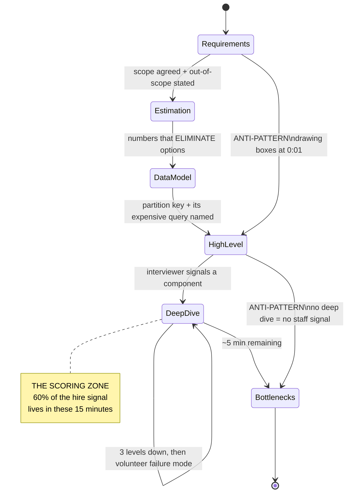
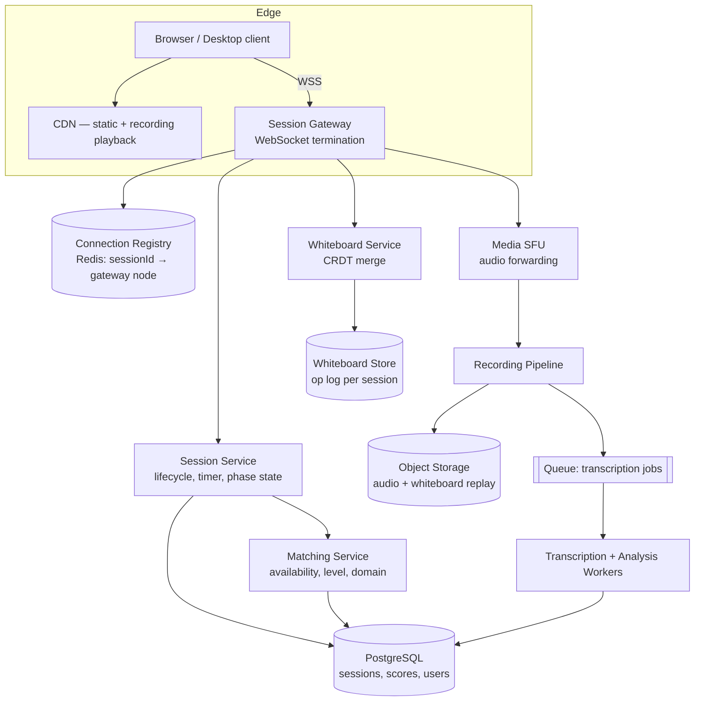
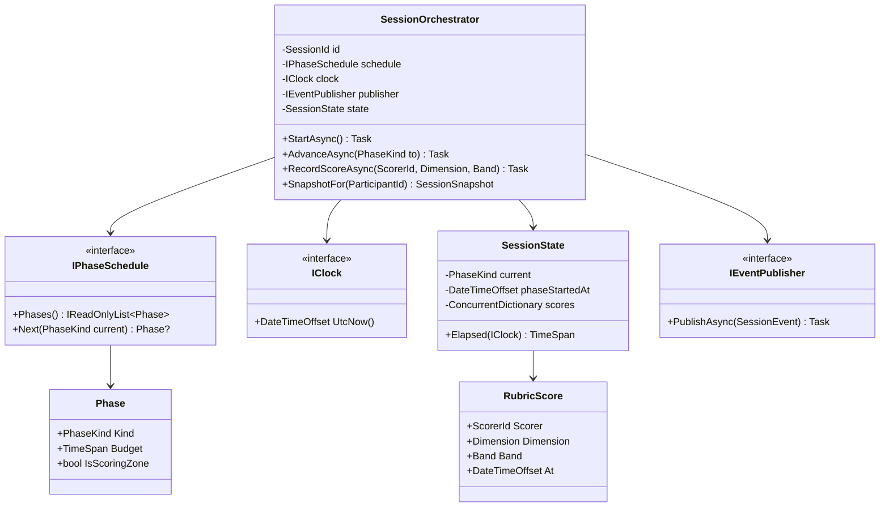

# Module 176 — System Design: The Interview Execution Playbook — Clock Management, Estimation & the Staff/Principal Rubric

> Domain: System Design | Level: Beginner → Expert | Prerequisite: [[01-System-Design-Fundamentals]] (requirements gathering, CAP, the scaling ladder), [[09-Designing-RealTime-Portfolio-Risk-Engine]] through [[14-Capstone-Migrating-EndOfDay-Batch-To-Intraday]] (six worked buy-side designs this module teaches you to *deliver under a clock*), [[15-RateLimiting-Throttling-LoadShedding-Algorithms]] (the depth a single deep-dive segment can reach)

---

**Why this module exists.** Every other module in `14-System-Design` teaches you *a design*. None of them teach you how to **produce a design in 45 minutes, out loud, in front of a skeptical Distinguished Engineer who is actively trying to find the edge of your knowledge.** Those are different skills, and the second one is what actually gets scored. This course has, until now, had a structural gap: a candidate could read all fifteen prior modules, know every answer, and still fail the interview by spending nineteen minutes on requirements, drawing a beautiful diagram nobody asked for, and never reaching the deep dive where the hire/no-hire signal actually lives.

This module is the missing operational layer. It is deliberately *not* another case study.

---

## 1. Fundamentals

### What is a system design interview actually measuring?

It is not measuring whether you can design the system. Nobody designs Instagram in 45 minutes, and the interviewer knows Instagram's real architecture took a thousand engineer-years. The exercise is a **proxy** — a compressed, observable sample of how you behave when handed an underspecified problem at a scale you cannot fully reason about, with insufficient time.

What is being sampled, concretely:

| Signal | What it looks like when present | What it looks like when absent |
|---|---|---|
| **Requirement discipline** | Narrows an open prompt to a scoped, buildable problem in ~5 min, states what's out of scope | Starts drawing boxes within 60 seconds |
| **Quantitative grounding** | Numbers drive component choices; says "40k writes/sec, so a single Postgres primary is out" | Says "we'll shard for scale" with no number justifying it |
| **Trade-off honesty** | Names what each choice costs, concedes when the simple option is correct | Every choice is presented as strictly better |
| **Depth on demand** | Can go three levels down on any component they drew | Diagram is a vocabulary list; component internals are empty |
| **Failure thinking** | Volunteers failure modes before being asked | Designs only the happy path |
| **Collaboration** | Treats interviewer's pushback as information, adjusts | Defends the original answer, or capitulates instantly |

### Why does this matter?

Because the failure modes are **procedural, not knowledge-based.** In post-interview debriefs at the firms in this course's panel (see `CLAUDE.md`'s Elite FinTech Interview Panel section), the overwhelming majority of Staff/Principal system-design rejections are not "candidate didn't know what a consistent hash is." They are:

- *"Ran out of time — never got past the high-level diagram."*
- *"Couldn't justify why they chose Kafka over SQS; when pushed, changed the answer immediately."*
- *"Designed for 100× the stated scale. When I asked why, they said 'to be safe.'"*
- *"Strong senior signal, not staff. Never discussed operability, cost, or migration."*

Every one of those is a *process* defect committed by someone who almost certainly knew the material.

### When does this matter?

The 45–60 minute technical system-design round; the architecture-review round some firms run instead; and — the reason this generalizes beyond interviews — any real architecture forum where you have 30 minutes and a room of skeptical principals. The compressed-clock skill is genuinely transferable.

### How does it work (the 45-minute shape)?

```
0:00–0:05   Requirements   Functional scope + NFRs + explicit out-of-scope
0:05–0:10   Estimation     QPS, storage, bandwidth — order of magnitude only
0:10–0:15   API + Data     Interface contract and data model (the load-bearing choice)
0:15–0:25   High-level     The boxes, the flow, the datastore selection with justification
0:25–0:40   Deep dive      1–2 components, driven by interviewer signal — THE SCORING ZONE
0:40–0:45   Failure/scale  Bottlenecks, failure modes, what you'd do with 10× traffic
```

The single most common structural failure is **spending 25 minutes on the first four boxes**, which converts the deep-dive segment — the only segment where Staff-versus-Senior is actually distinguishable — into a rushed three minutes.

---

## 2. Deep Dive

### 2.1 The Requirements Segment — a Script, Not an Improvisation

Five minutes is enough time for roughly eight questions. Improvising them wastes the budget. Memorize a **fixed opening sequence** and run it every time; the discipline is what's being scored, not the originality of the questions.

**The functional narrowing (2 minutes).** The goal is to convert an unboundedly large prompt into one you can actually finish.

1. *"Who are the actors, and what are the top three things they do?"* — forces the prompt into a small verb list.
2. *"Which one of these is the core of the problem you want me to spend time on?"* — this is the highest-value question in the entire interview. The interviewer usually has a specific deep dive in mind. Asking this makes them tell you what they're going to score you on.
3. *"Can I treat [auth / payments / the mobile client / analytics] as out of scope?"* — almost always yes, and it buys you fifteen minutes.

**The non-functional interrogation (3 minutes).** Six numbers, asked as numbers:

| Dimension | The question | Why it changes the design |
|---|---|---|
| **Scale** | "DAU, and reads-per-user-per-day?" | Determines whether this is one box or a fleet |
| **Read/write ratio** | "Is this 100:1 read-heavy, or write-heavy?" | Read-heavy ⇒ caching/replicas dominate. Write-heavy ⇒ caching is nearly useless and partitioning dominates |
| **Latency** | "p99 target, and for which operation?" | p99 100ms forbids synchronous cross-region hops. p99 2s permits almost anything |
| **Consistency** | "Can a read be 5 seconds stale? For *which* data?" | Per-data-type, never system-wide (Module 37 §2.5) |
| **Availability** | "Three nines or four? What's the cost of downtime?" | Four nines forces multi-AZ, removes single points, changes deploy strategy |
| **Retention/growth** | "How long do we keep it, and is it append-only?" | Determines storage tier and whether archival is a first-class component |

**The out-of-scope declaration.** Close the segment by saying aloud: *"So: I'm designing X and Y at Z scale, optimizing for [the binding constraint], treating A and B as out of scope. Does that match what you want?"* This is a 15-second sentence that prevents the single most expensive failure mode — designing the wrong system competently.

### 2.2 Estimation — the Six Numbers You Must Know Cold, and the Three You Must Derive

Estimation is not arithmetic. It is **eliminating architectures.** The only purpose of the number is to let you say "therefore X is off the table," and if a number doesn't eliminate anything, you wasted time computing it.

**The constants to memorize.** These are approximate and deliberately so — anyone demanding precision here has misunderstood the exercise.

```
TIME
  1 day            ≈ 86,400 sec ≈ 10^5 sec        ← the single most useful approximation
  1 month          ≈ 2.5 × 10^6 sec
  1 year           ≈ 3 × 10^7 sec

LATENCY (order of magnitude, modern hardware)
  L1 cache ref                    ~1 ns
  Main memory ref                 ~100 ns
  SSD random read                 ~100 µs      (10^5 ns)
  Network round trip, same DC     ~0.5 ms
  Disk seek (spinning)            ~10 ms
  Network RTT, cross-region       ~50–150 ms   (NY↔London ~70ms, NY↔Singapore ~230ms)
  ⇒ Memory is ~1000× faster than SSD; same-DC network is ~100× faster than cross-region.
    These two ratios drive most caching and placement decisions.

THROUGHPUT (per single commodity node, conservative)
  Redis                    ~100k ops/sec
  Well-tuned RDBMS write   ~5–10k writes/sec      ← the number that forces sharding
  RDBMS read w/ index      ~50k reads/sec
  Kafka partition          ~10 MB/sec sustained
  Web/app server           ~5–10k req/sec (I/O bound, async)
  WebSocket connections    ~50k concurrent per node

SIZES
  UUID 16 B · timestamp 8 B · int64 8 B
  A "typical" row/record   ~1 KB       ← default assumption; state it
  A photo                  ~1 MB
  A minute of 1080p video  ~50 MB
```

**The three derivations.** Everything else falls out of these:

```
① QPS         = DAU × actions-per-user-per-day ÷ 10^5
   Peak QPS    = average × 2 to × 10  (state the multiplier you chose and why —
                 a consumer social app peaks ~3×; a market-open trading system
                 peaks 50×+ against a flat overnight baseline)

② Storage/yr  = writes-per-sec × record-size × 3 × 10^7
                then × replication factor (typically 3)

③ Bandwidth   = QPS × payload-size
```

**Worked example, spoken aloud in ~90 seconds:**

> "50M DAU, each loading a feed 10× a day. That's 500M reads a day, over 10^5 seconds — **5,000 reads/sec average**, call it **15,000 at peak** with a 3× consumer multiplier. Writes: if 10% of users post once a day, that's 5M writes/day, **50 writes/sec** — trivially small. So this is a **100:1 read-heavy** system, and that ratio is the single most important fact in the design: it means caching and read replicas are where the leverage is, and it means the write path can stay simple. Storage: 5M posts/day × 1KB × 365 ≈ **2 TB/year** before replication, ~6 TB with 3×. That's small enough that storage is not a design driver — I'll stop thinking about it. Bandwidth on reads: 15,000 × 5KB ≈ **75 MB/sec**, which needs a CDN for media but is unremarkable for JSON."

Notice what that paragraph does: it produces four numbers and **immediately retires two of them as non-drivers.** That retirement is the actual skill. A candidate who computes storage and then never mentions it again has done arithmetic; a candidate who says "2 TB/year, therefore storage is not interesting here, moving on" has done engineering.

### 2.3 The Data Model Is the Load-Bearing Decision

Candidates treat the data model as a formality between the API and the "real" architecture. It is the opposite: **the data model is the design.** Almost every interesting constraint in a distributed system is a consequence of how data is keyed and partitioned.

The interviewer is listening for one specific thing: **the partition key, and the query it makes expensive.** Every partition key choice makes one access pattern single-shard-cheap and another one scatter-gather-expensive. Naming that trade-off unprompted is a strong Staff signal.

```
Chat:      partition by conversation_id  → "load this conversation" is 1 shard  ✓
                                         → "all messages by user X" is scatter  ✗
Ledger:    partition by account_id       → "this account's balance" is 1 shard  ✓
                                         → "all txns for merchant M" is scatter ✗
Timeseries:partition by (series_id, day) → range scan on one series is cheap    ✓
                                         → "all series at time T" is scatter    ✗
```

Say the second line out loud, always. "I'm partitioning by conversation ID, which makes the dominant read single-shard; the cost is that per-user search across conversations becomes a scatter-gather, which I'd serve from a separate search index rather than the primary store."

### 2.4 Component Selection — Justify Against the Numbers, Never Against Fashion

Every box you draw invites the question *"why that one?"* The answer must reference a number from §2.2 or a requirement from §2.1. Three canonical decisions and their honest discriminators:

**SQL vs. NoSQL.** The discriminator is *not* scale — modern Postgres handles enormous load. It's **access-pattern stability plus transactional need**. Choose relational when you need multi-entity transactions and ad-hoc query flexibility (ledgers, orders, anything with invariants across rows). Choose a key-value/wide-column store when the access pattern is known, singular, and the write volume exceeds what a single primary sustains (~10k writes/sec) with no way to avoid it. Saying "NoSQL scales better" without a write-rate number is a documented Senior-ceiling answer.

**Queue vs. stream (SQS/RabbitMQ vs. Kafka).** The discriminator is **replay and multi-consumer**. A queue deletes on consume — one logical consumer, no history. A log retains — many independent consumers each at their own offset, and the ability to reprocess. If you need one worker pool to drain tasks, a queue is simpler and cheaper; reaching for Kafka anyway is over-engineering you will be asked to defend.

**Cache placement.** Client → CDN → API-gateway → application → database-buffer-pool. Each layer is cheaper and faster than the next but staler and harder to invalidate. State *which* layer and *why that one*; "we'll add Redis" without naming what's cached, the invalidation strategy, and the expected hit rate is a checklist answer.

### 2.5 The Deep Dive Is Where the Interview Is Won — Read the Signal

At roughly the 25-minute mark the interviewer will say something that sounds conversational: *"How would you handle a celebrity with 50 million followers?"* or *"What happens if the payment service times out?"* This is not small talk. It is **the transition into the scored segment**, and the question names the thing they intend to evaluate.

Three rules:

1. **Take the invitation.** Go where they point, not where you're comfortable. A candidate steered back to their prepared material reads as inflexible and, worse, as hiding.
2. **Go three levels down.** Level 1: "we'd use a distributed lock." Level 2: "Redis `SET NX PX` with a fencing token." Level 3: "the fencing token matters because a lock holder that pauses on GC past the TTL can resume and write after another holder acquired it — the token makes the stale write rejectable at the storage layer." Level 3 is the Staff signal. Levels 1 and 2 are Senior.
3. **Volunteer the failure mode.** End every deep dive with "…and the way this breaks is X, which I'd detect with Y." Unprompted failure analysis is the most reliable single differentiator in the rubric.

### 2.6 The Senior/Staff/Principal Boundary, Made Explicit

This is the part candidates most often can't see. The same question gets three answers, all *correct*, at three levels.

**Question: "How do you keep the cache consistent with the database?"**

- **Senior (correct, complete, insufficient):** "Cache-aside with a TTL. On write, invalidate the key. Accept a small staleness window."
- **Staff (adds failure and second-order effects):** "Cache-aside with TTL, invalidate on write — but invalidation is a distributed operation that can fail, so TTL is the backstop, not the optimization. Two problems: a thundering herd when a hot key expires, which I'd solve with probabilistic early expiry or a per-key lock on refill; and a race where a slow read repopulates a stale value *after* an invalidation, which needs either versioned writes or delete-after-write with a short delay. I'd measure hit rate per key class, not in aggregate — an aggregate 95% can hide a 20% hit rate on the keys that matter."
- **Principal (adds organizational and lifecycle framing):** All of the above, plus: "The real question is whether this cache should exist. It's a permanent operational liability — a second source of truth with its own failure modes, and every future engineer touching this write path has to know to invalidate. Before adding it I'd want the measured p99 without it, because if the database can serve this at 40ms we've bought 15ms and a whole class of incidents. If we do add it, the invalidation has to be structurally impossible to forget — inside the repository, not a call every developer must remember — because a protection with exceptions is one whose exceptions are where the incidents happen. And I'd want an owner and a decommission criterion, or in three years it's load-bearing and nobody knows why."

The pattern: **Senior answers the question. Staff answers how it fails and how you'd know. Principal questions whether the thing should exist, who maintains it, and what it costs the organization over years.**

### 2.7 Handling Pushback — the Highest-Variance 30 Seconds

When the interviewer challenges a choice, they are running one of two tests, and you must tell them apart:

- **Probe:** "Are you sure Kafka is right here?" — testing whether you actually reasoned or pattern-matched.
- **Correction:** "That won't work, because the consumer group rebalances on every deploy." — you made an actual error.

The response to a **probe** is to restate the reasoning and the alternative you rejected: *"I chose Kafka because we need replay for the reconciliation consumer. If we didn't need replay, SQS would be simpler and cheaper and I'd prefer it. Is there a constraint that makes replay unnecessary?"* This shows the decision was real.

The response to a **correction** is to accept it fast, then integrate: *"You're right — that changes things. Given rebalance on deploy, I'd need [X]. Let me revise."* Accepting a correction costs nothing. Defending an error is disqualifying; so is folding on a *probe*, because it reveals the original answer had no reasoning behind it.

The failure mode to avoid absolutely: changing your answer every time the interviewer raises an eyebrow. That reads as having no model at all.

### 2.8 The Clock Discipline

Say the time budget out loud at the start: *"I'll take about five minutes on requirements, five on estimation, ten on the high-level design, and I want to leave twenty for whatever component you want to go deep on."* Two effects: it demonstrates the discipline before you've demonstrated any technical skill, and it licenses you to cut yourself off later.

If you're at 20 minutes and still in the high-level: **truncate deliberately and say so.** *"I'm going to stop expanding the diagram here — the remaining boxes are conventional and I'd rather spend our time on the fan-out design, which is where the actual difficulty is."* A candidate who manages their own clock reads as senior. A candidate the interviewer has to interrupt reads as junior, regardless of content.

---

## 3. Visual Architecture

### The interview as a state machine



### The time budget, and where it actually goes wrong

```
IDEAL
0    5    10   15   20   25   30   35   40   45
|REQ |EST |API |  HIGH-LEVEL |     DEEP DIVE      |FAIL|
                              ^^^^^^^^^^^^^^^^^^^^
                              the segment that scores

TYPICAL FAILING RUN
0    5    10   15   20   25   30   35   40   45
|    REQUIREMENTS     |    HIGH-LEVEL DIAGRAM     |DD |
                                                   ^^^
                                        3 minutes of depth
                                        = "senior, not staff"
```

### Signal-to-depth ladder

```
        Interviewer: "How do you prevent double-charging?"
                              |
   Level 1  "We'd make it idempotent."                    ← Mid
                              |
   Level 2  "Idempotency key from the client, stored
             with the charge, unique index on it."        ← Senior
                              |
   Level 3  "The key must be client-generated before the
             first attempt, because a client that times
             out doesn't know if the charge landed. The
             uniqueness constraint has to be in the SAME
             transaction as the charge, or two concurrent
             retries both pass the check and both insert.
             And the stored response must be replayed on
             a duplicate — returning 409 breaks the
             retrying client that legitimately needs the
             original result."                            ← STAFF
                              |
   Level 4  "...and the key's retention has to outlive
             the longest client retry window, which is a
             business decision, not a technical one. We
             set it at 24h; the mobile team retries for
             7 days on reinstall. That gap IS the bug we
             shipped last year."                          ← PRINCIPAL
```

---

## 4. Production Example

**Problem.** A payments company (this course's panel includes several) ran a Staff Engineer loop with a strong candidate — 16 years' experience, deep Kafka background, unambiguously knew the material. The prompt was *"design a system to notify merchants when their payouts settle."* The candidate was rejected. The debrief is instructive precisely because no knowledge gap was involved.

**Architecture (what the candidate produced).** A genuinely good design: Kafka topic of settlement events, a consumer fanning out to email/SMS/webhook channels, per-merchant preference lookup, dead-letter queue for failures, retry with exponential backoff. Diagram was clean. Every component was defensible.

**Implementation (how the 45 minutes were actually spent).**

```
0:00–0:03  Asked two requirements questions, got answers, moved on
0:03–0:26  Drew the architecture. Added components as they occurred to him:
           Kafka, consumer group, preference service, template service,
           three channel adapters, DLQ, retry topic, an audit sink.
0:26–0:31  Interviewer: "What if a merchant's webhook endpoint is down
           for six hours?"  Candidate: "The DLQ would catch it and we'd
           retry with backoff."  Interviewer: "And then?"
           Candidate: "...we'd alert on DLQ depth."
0:31–0:38  Interviewer steered twice more toward delivery guarantees.
           Candidate returned each time to describing the Kafka topology
           he'd already drawn.
0:38–0:45  Ran out of time mid-sentence on partitioning.
```

**Trade-offs (what the debrief said).** The written feedback: *"Knows the technology deeply. Never demonstrated judgment about it. Twenty-three minutes of unprompted component enumeration with no forcing requirement behind any of it — I never learned why an audit sink was needed because we never discussed compliance. When I opened the door to the interesting problem three separate times, he described his diagram back to me. Strong senior signal; no staff signal, because staff is about knowing which of the eight components actually deserves the hour."*

The specific fatal exchange was the webhook one. "Merchant endpoint down for six hours" is not a DLQ question — it is a question about **whether settlement notifications are recoverable state or transient events**, about poison-endpoint isolation so one dead merchant doesn't consume the retry budget for all merchants, about whether merchants can pull what they missed rather than depending on push, and about the fact that a payout notification has *regulatory* weight, so "we dropped it after N retries" may not be a legal option. There were fifteen minutes of Staff-level material in that question and the candidate spent five on "we'd alert on DLQ depth."

**Lessons learned.**

1. **Unprompted breadth is not a virtue; it is a time leak.** Eight components you can't defend in depth score lower than four you can. The candidate would have scored better having drawn *less*.
2. **A question from the interviewer at minute 26 is the interview.** Everything before it is setup. Redirecting back to your own material is the single most expensive move available.
3. **"We'd alert on it" is not a design.** It is a deferral. Alerting is what you do when the design has a gap you've chosen to staff with humans — legitimate, but you must say that's what you're doing and why the gap is acceptable.
4. **The clock is a designed constraint, not an obstacle.** The interviewer chose 45 minutes because forcing prioritization is the point. Failing to prioritize isn't running out of time; it's failing the actual test.
## 10. Interview Questions

### Basic (10)

**B1. Q: What are the first two things you should establish in a system design interview, before drawing anything?**
**Ideal Answer:** The functional scope (which two or three operations you're actually designing) and the non-functional requirements — scale, read/write ratio, latency target, consistency need, availability target. Then state explicitly what's out of scope and confirm it with the interviewer.
**Why correct:** Every subsequent decision needs a forcing constraint. Without numbers and scope, no component choice is defensible, and the interview becomes an unscored vocabulary exercise.
**Common mistakes:** Asking only functional questions; asking NFR questions but not writing the answers down and never using them; skipping the out-of-scope confirmation, then designing something the interviewer didn't want.
**Follow-ups:** Which single NFR most changes an architecture? (Read/write ratio.) How do you handle an interviewer who says "you tell me" to every requirement question? (State an explicit assumption, write it down, proceed — "I'll assume 10M DAU; stop me if that's wrong.")

**B2. Q: What does "back-of-the-envelope estimation" achieve, and what number should you always start from?**
**Ideal Answer:** It eliminates architectures. Start from `QPS = DAU × actions-per-day ÷ 10^5`, using 10^5 as the approximation for seconds in a day. Then peak-multiply, and derive storage and bandwidth only if they might change a decision.
**Why correct:** The purpose is decision elimination, not accuracy. Order of magnitude decides between one box and a fleet; the second significant figure decides nothing.
**Common mistakes:** Precision theatre (86,400 exactly, long division out loud); computing numbers and never referencing them; forgetting the peak multiplier entirely.
**Follow-ups:** What peak multiplier for a consumer app vs. a trading system? (~3× vs. 50×+ at market open.) When would you skip estimation? (A deep-dive-only round, or when the interviewer supplies the numbers.)

**B3. Q: Why is the read/write ratio the single most decision-changing number?**
**Ideal Answer:** Read-heavy systems are solved with caching, replicas, denormalization, and CDNs — all of which are cheap and well-understood. Write-heavy systems get almost nothing from caching and are solved with partitioning, batching, and async ingestion. The two produce nearly disjoint architectures, so the ratio determines which toolkit applies.
**Why correct:** It routes the entire design. A 100:1 read-heavy feed and a write-heavy telemetry ingester share almost no components.
**Common mistakes:** Assuming read-heavy by default; proposing a cache for a write-heavy system and being unable to say what the hit rate would be.
**Follow-ups:** Give a write-heavy example and its architecture. (Metrics ingestion: partitioned append-only log, batch flush, columnar storage.) Can a cache ever help a write-heavy system? (Yes — caching *reference data* the writes look up, not the writes themselves.)

**B4. Q: Roughly how many writes per second can a single well-tuned relational primary sustain, and why does that number matter?**
**Ideal Answer:** Order of magnitude 5,000–10,000 writes/sec. It matters because it's the threshold that justifies sharding — below it, sharding is over-engineering; above it with no way to reduce write volume, sharding becomes necessary.
**Why correct:** It converts "should we shard?" from an opinion into an arithmetic comparison against a known constant.
**Common mistakes:** Believing relational databases cap out far lower (often quoted as hundreds), which leads to unnecessary NoSQL choices; ignoring that batching, or moving a hot counter to Redis, may remove the need entirely.
**Follow-ups:** What if you're at 8,000 writes/sec — shard? (Try batching, write coalescing, and moving hot counters out first; sharding is the last rung.) What does the number depend on? (Durability settings, write size, index count — each index is an extra write.)

**B5. Q: What is a partition key, and what must you always say alongside it?**
**Ideal Answer:** The attribute determining which shard a record lives on. You must always name the query it makes *expensive* — the access pattern that becomes a scatter-gather because it doesn't align with the key.
**Why correct:** Every partition key trades one cheap access pattern for one expensive one. Naming the cost demonstrates you understand it as a trade rather than a setting.
**Common mistakes:** Choosing a key with even distribution but poor query locality (or vice versa) without noticing; never mentioning the expensive query at all.
**Follow-ups:** Chat system key, and its cost? (`conversation_id`; per-user cross-conversation search becomes scatter.) How do you serve the expensive query anyway? (A separate index/read model keyed for it.)

**B6. Q: When is a queue (SQS/RabbitMQ) the right choice over a log (Kafka)?**
**Ideal Answer:** When there is one logical consumer draining tasks, no need to replay history, and no need for multiple independent consumers at different offsets. Queues delete on consume and are operationally simpler and cheaper.
**Why correct:** The discriminator is retention/replay and consumer multiplicity, not throughput — both handle high volume.
**Common mistakes:** "Kafka because it scales better"; choosing Kafka for a simple task queue and then having to defend partition count, consumer-group rebalancing, and retention configuration you didn't need.
**Follow-ups:** Name a case that genuinely needs the log. (Any design where a second consumer is added later, or where reprocessing after a bug is a requirement — e.g. reconciliation.) What does Kafka cost you operationally? (Partition/ordering design, rebalance behaviour on deploy, retention sizing, consumer-lag monitoring.)

**B7. Q: What does "the deep dive is where the interview is won" mean practically?**
**Ideal Answer:** Roughly 60% of the hire signal comes from the 15 minutes where you go three levels deep into one or two components the interviewer selects. Breadth is table stakes; depth on demand is what separates levels. So you manage the earlier segments specifically to protect that time.
**Why correct:** Breadth is cheap to fake and easy to memorize. Depth is not, which is why it carries the signal.
**Common mistakes:** Treating the deep-dive question as an interruption; re-describing the high-level design when asked about a component.
**Follow-ups:** How do you know the deep dive has started? (The interviewer asks a specific "what if" question — that's the transition, not small talk.) What if they don't pick one? (Pick the hardest component yourself and say why it's the hardest.)

**B8. Q: What's the difference between RPO and RTO?**
**Ideal Answer:** RPO is how much data loss is acceptable (drives replication mode — synchronous gives RPO 0 at a latency cost; asynchronous gives seconds of RPO at no latency cost). RTO is how long you can be down (drives standby posture — cold, warm, hot, or active-active).
**Why correct:** They're independent axes with independent costs, and conflating them produces designs that over-spend on one while leaving the other unaddressed.
**Common mistakes:** Using them interchangeably; claiming "RPO zero" while describing asynchronous replication.
**Follow-ups:** What RPO for a payment ledger? (Zero — synchronous commit, and the latency cost is simply accepted.) What's the least-tested code in your system? (The failover path — which is why active-passive's failover window carries real risk.)

**B9. Q: Why is announcing your time budget at the start worth 15 seconds?**
**Ideal Answer:** It demonstrates prioritization discipline before you've shown any technical skill, sets the interviewer's expectation, and licenses you to cut yourself off later without appearing to run out of material.
**Why correct:** Clock management is explicitly scored at Staff+, and self-management reads very differently from being managed by the interviewer.
**Common mistakes:** Announcing a budget and then ignoring it — worse than never announcing, because the failure is now explicit.
**Follow-ups:** You're at minute 20 still in the high-level. What do you do? (Truncate audibly: "the remaining boxes are conventional; I'd rather spend our time on X.")

**B10. Q: Give three examples of "therefore" statements that should follow an estimation.**
**Ideal Answer:** "5,000 writes/sec, **therefore** a single primary is out and I need to partition." "2 TB/year, **therefore** storage is not a design driver and I'll stop discussing it." "100:1 read-heavy, **therefore** the leverage is in caching and replicas, and the write path can stay simple."
**Why correct:** Each number either eliminates an option or retires itself as uninteresting. Both are useful outcomes; a number with neither is wasted time.
**Common mistakes:** Producing numbers without consequences; failing to *retire* non-driving numbers, then circling back to them later.
**Follow-ups:** What's the value of explicitly retiring a number? (It shows you know what matters, and it prevents you spending minute 30 on storage tiering that doesn't matter.)

### Intermediate (10)

**I1. Q: An interviewer asks "are you sure Kafka is the right choice here?" How do you respond, and how does that differ from responding to "that won't work because consumer groups rebalance on every deploy"?**
**Ideal Answer:** The first is a *probe* testing whether reasoning exists — restate the reason and the rejected alternative: "I chose it for replay, which the reconciliation consumer needs; without that requirement SQS is simpler and I'd prefer it." The second is a *correction* — accept immediately, then integrate: "You're right, that changes the deploy story; given that, I'd need X."
**Why correct:** Probes test reasoning; corrections test ego and adaptability. Misreading a probe as a correction (folding) reveals the choice was unreasoned; misreading a correction as a probe (defending) is disqualifying.
**Common mistakes:** Changing the answer on every raised eyebrow; arguing past the point where the interviewer has stated a fact.
**Follow-ups:** What if you genuinely don't know which it is? (Ask: "Is there a constraint I'm missing, or are you testing the reasoning?" — that's a legitimate and well-received question.)

**I2. Q: Walk through the estimation for a photo-sharing app: 100M DAU, each uploads 0.2 photos/day and views 50.**
**Ideal Answer:** Writes: 100M × 0.2 = 20M/day ÷ 10^5 = **200 writes/sec**, peak ~600. Reads: 100M × 50 = 5B/day ÷ 10^5 = **50,000 reads/sec**, peak ~150,000. Ratio **250:1 read-heavy**. Storage: 20M photos/day × 1MB = **20 TB/day**, ~7 PB/year before replication — this one *is* a driver: object storage with lifecycle tiering, definitely not a database. Read bandwidth: 150,000 × 1MB would be 150 GB/sec, which is impossible to serve from origin — **therefore CDN is mandatory, not optional**, and the origin only serves cache misses.
**Why correct:** It produces two hard eliminations (no database for blobs; CDN mandatory) rather than four decorative numbers.
**Common mistakes:** Storing images in the database; computing the bandwidth number and not noticing it's physically absurd, which is precisely the signal that a CDN is structural.
**Follow-ups:** What's the CDN hit rate you'd need? (High — work backwards: at 95% hit rate the origin still serves 7.5 GB/sec, so you also need thumbnails/multiple renditions to cut per-request size.) Does the write path need a CDN? (No — writes go direct to object storage, often via pre-signed URL, bypassing your servers entirely.)

**I3. Q: You've drawn a cache. What four things must you be able to state about it?**
**Ideal Answer:** (1) What exactly is cached — the key and value shape; (2) the invalidation strategy — TTL, event-driven, or write-through, and which one *this* data needs; (3) the expected hit rate and how you'd measure it *per key class*, not in aggregate; (4) the behaviour on cache failure — does the system degrade gracefully or collapse, given the database is now sized for the miss rate, not full load.
**Why correct:** The fourth is the one candidates miss and the one that causes real outages: a cache that absorbed 95% of reads means the database is provisioned for 5%, so cache loss is a 20× load spike, not a latency regression.
**Common mistakes:** "We'll add Redis" as a complete answer; quoting aggregate hit rate that hides a poor hit rate on the keys that matter.
**Follow-ups:** How do you survive cache loss? (Request coalescing on miss, admission control/load shedding, staged warm-up rather than instant cutover.) What's a thundering herd and how do you prevent it? (Simultaneous expiry of a hot key sends every concurrent request to the origin; fix with probabilistic early expiration or a per-key refill lock.)

**I4. Q: Explain read-your-own-writes, why read replicas create it, and how you'd solve it.**
**Ideal Answer:** Replicas lag the primary by milliseconds to seconds. A user who writes and immediately reads may be routed to a replica that hasn't received the write, so their own change appears to have vanished — a highly visible correctness bug even though the system is "eventually consistent as designed." Fix: route a user's reads to the primary for a short window after their own write (session-token or timestamp based), or track the write's log position in the session and require the replica to have caught up to it.
**Why correct:** It names the specific *cost* of the read-replica rung, which is the whole point of the scaling ladder discipline.
**Common mistakes:** Adding replicas without naming any cost; proposing "just read from the primary always," which discards the entire benefit.
**Follow-ups:** Why not always read primary for logged-in users? (You've re-created the bottleneck for the majority of traffic.) How long is the window? (Bounded by observed replication lag p99 — and you must alert on lag exceeding it, or the fix silently stops working.)

**I5. Q: What is a hot partition, and give three mitigations?**
**Ideal Answer:** One shard receiving disproportionate traffic because the key distribution is skewed — a celebrity user, one hot instrument at market open, a whale merchant. Mitigations: (1) composite key with a bounded random suffix, spreading the hot key across N sub-partitions at the cost of an N-way scatter on read; (2) special-case the known-hot minority with a different path (the celebrity read path differs from the normal one); (3) an in-front cache absorbing the hot key's reads entirely.
**Why correct:** Skew is the actual failure mode of sharding; "distribute by hash" alone does not solve it when the key itself is skewed.
**Common mistakes:** Assuming hashing eliminates skew — it distributes *keys* evenly, not *traffic per key*; adding capacity, which doesn't help because one partition is the bottleneck.
**Follow-ups:** How would you detect it? (Per-partition metrics, not aggregate — the aggregate looks healthy, which is exactly the blind spot Module 175 §14 documents at Redis Cluster level.) Which mitigation for a celebrity on a social feed? (Hybrid fan-out: push for normal users, pull-on-read for celebrities.)

**I6. Q: Why does a fan-out to 100 shards make p99 latency worse than any individual shard's p99?**
**Ideal Answer:** The request completes only when the slowest component returns. If each shard independently has a 1% chance of being slow, `1 − 0.99^100 ≈ 63%` of requests hit at least one slow shard. The aggregate p99 is therefore governed by roughly the p99.99 of the individual shards, not their p99.
**Why correct:** It's a precise arithmetic statement about tail amplification, and it's the justification for hedged requests.
**Common mistakes:** Assuming the aggregate p99 equals the component p99; adding shards to "spread load" without noticing it worsens tail latency.
**Follow-ups:** What's a hedged request? (After the p95 deadline, send a duplicate to another replica and take whichever returns first — costs ~5% extra load for a large tail improvement.) When is hedging unsafe? (Non-idempotent operations — you'd be duplicating a side effect.)

**I7. Q: A design has an audit requirement. What makes an audit trail different from logging?**
**Ideal Answer:** Audit is a functional requirement with defined retention, immutability (append-only, tamper-evident), completeness guarantees, and its own query patterns — "who saw or changed what, when, and under what authority." Logs are operational, sampled, mutable, and short-retention. Critically, audit records must survive deletion of the entity they describe, and their absence is a compliance finding, not a monitoring gap.
**Why correct:** In SOX/PCI-scoped systems this distinction is load-bearing, and treating audit as "we'll log it" signals no regulated-environment experience.
**Common mistakes:** Putting audit in the same sink as application logs with the same retention; making audit writes best-effort so they can be silently lost.
**Follow-ups:** Should the audit write be in the same transaction as the business write? (Generally yes, or via an outbox — a business change that commits without its audit record is unreconstructable.) Who can delete audit records? (Nobody, including operators; retention expiry is the only removal path.)

**I8. Q: Distinguish "we'd alert on it" from an actual design, and when is alerting legitimate?**
**Ideal Answer:** Alerting is staffing a design gap with humans. That's legitimate when the event is rare, the human response is well-defined, and the time-to-human is within the tolerance. It's illegitimate when the gap is on a common path, when there's no defined runbook, or when the alert is a substitute for a mechanism the system should have. Either way you must say which one you're doing.
**Why correct:** It reframes alerting as an explicit trade rather than an escape hatch, which is what the interviewer is probing for.
**Common mistakes:** Using "we'd monitor that" to close every hard question; alerting on a metric that is structurally blind to the failure — the recurring pattern across Modules 133, 134, and 175.
**Follow-ups:** What makes an alert useless? (One nobody owns, one with no runbook, or one on an aggregate that averages away the failure.) Give an example of a structurally blind alert. (Module 175 §4: a 1-minute-average dashboard cannot see an 800ms burst produced by a 1-minute-window limiter.)

**I9. Q: An interviewer asks you to design something you have never worked with — say, a video transcoding pipeline. How do you proceed?**
**Ideal Answer:** Say so plainly once, then reason from primitives rather than recall. Transcoding is a CPU-bound batch job over large immutable inputs producing multiple independent outputs — which immediately implies a job queue, worker fleet, per-rendition parallelism, object storage in and out, and idempotent retry. Then reason about what makes it *hard*: head-of-line blocking if renditions aren't independent, priority so the lowest rendition of every video beats the highest of any, and cost, since CPU-hours dominate.
**Why correct:** The evaluation is whether you can derive structure from constraints when recall is unavailable — which is a better predictor of Staff performance than domain familiarity.
**Common mistakes:** Bluffing with invented specifics (immediately detected and fatal to trust); freezing; or apologizing repeatedly rather than once.
**Follow-ups:** How do you avoid bluffing while still being useful? (Label confidence explicitly: "I'm reasoning from first principles here, not experience — I'd validate this with someone who's run one.")

**I10. Q: What should you do differently in a 60-minute round versus a 45-minute round?**
**Ideal Answer:** The extra 15 minutes goes almost entirely to deep dive and to a second component, not to a bigger high-level diagram. Requirements and estimation stay fixed at ~10 minutes combined regardless. In 60 minutes you should also expect and prepare for an operability segment — deployment, migration, rollback, cost.
**Why correct:** The early segments have a fixed information yield; extending them adds no signal. Depth scales with time, breadth does not.
**Common mistakes:** Proportionally inflating every segment; treating extra time as license to add components.
**Follow-ups:** What if it's a 30-minute round? (Compress to ~3 min requirements, skip formal estimation unless it eliminates something, go to high-level fast, and protect ~12 minutes of depth.)

### Advanced (10)

**A1. Q: Give the Senior, Staff, and Principal answers to "how do you handle a service that's timing out?" and articulate precisely what changes between levels.**
**Ideal Answer:** *Senior:* retry with exponential backoff and jitter, set a sensible timeout, add a circuit breaker. *Staff:* all of that, plus — the timeout must be shorter than the caller's remaining budget or you cascade; retries multiply load on an already-struggling dependency, so the breaker must open on error *rate* over a window, not consecutive failures; retry only idempotent operations, which means the API contract has to declare idempotency; and the fallback behaviour is a product decision — degraded response versus error — that must be decided explicitly rather than defaulting to an exception. *Principal:* all of that, plus — the deeper question is whether this call should be synchronous at all; a synchronous dependency means our availability is the *product* of both services' availability, so three such dependencies at 99.9% each yields 99.7%. Making it async or cached-with-staleness changes the availability math structurally rather than defensively. And the retry policy is a cross-team contract: if every caller sets its own, the dependency is subject to unbounded aggregate retry load, so this belongs in a shared client library with governance, not in each team's code.
**Why correct:** It shows the ladder concretely — Senior handles the mechanism, Staff handles interaction effects and failure modes, Principal questions the structural premise and addresses organizational enforcement.
**Common mistakes:** Giving the Senior answer with more words and assuming that's the Staff answer; retrying non-idempotent operations; consecutive-failure breakers that never trip under partial failure.
**Follow-ups:** What's the availability math for 5 synchronous dependencies at 99.95%? (~99.75%, about 22 hours/year — often a surprise.) How do you enforce a retry policy across teams? (Shared client library plus server-side admission control, because the library is advisory and the server is not.)

**A2. Q: You're 30 minutes in and realize your data model choice from minute 12 is wrong — the partition key can't support a requirement the interviewer just revealed. What do you do?**
**Ideal Answer:** Say it out loud immediately and explicitly: "That requirement breaks my partition key — per-merchant queries would scatter across every shard. I need to change it." Then state the options: change the key (and name what *that* makes expensive), keep it and add a secondary index/read model for the new pattern, or challenge whether the new requirement belongs in this store at all. Recommend one with reasoning and move on. Do not silently continue with a design you know is broken.
**Why correct:** Detecting and announcing your own design defect under time pressure is one of the strongest available signals — it's exactly the behaviour that makes someone safe to put in front of a real architecture forum. Silently continuing is the opposite signal.
**Common mistakes:** Hoping the interviewer didn't notice; a full restart, which burns the remaining clock; hand-waving that "we'd add an index" without naming the write-amplification and consistency cost of a secondary index.
**Follow-ups:** What if there's no time to rework it? (Say what you'd change and why, and note what you'd need to verify — an explicit, scoped IOU is fine; a concealed defect is not.) Does admitting the error hurt you? (No — it's a documented positive signal. Concealment is the negative one.)

**A3. Q: Design the requirements segment for a deliberately ambiguous prompt: "design a system for our traders."**
**Ideal Answer:** This prompt is unanswerable as stated, and the interviewer knows it — the test is whether you narrow it or start guessing. Narrow along three axes in order: (1) *Which workflow?* Pre-trade (research, pricing, risk checks), at-trade (order entry, execution, routing), or post-trade (settlement, allocation, reconciliation, reporting)? These are three unrelated systems. (2) *What's the failure cost?* A slow research screen is annoying; a dropped order is a regulatory and financial event; a wrong settlement is a reportable breach. This determines the entire consistency and audit posture. (3) *What's the latency regime?* Human-interactive (100ms is fine), systematic/algorithmic (single-digit ms), or HFT (microseconds, and a completely different technology stack — kernel bypass, FPGA, colocation) — these are not the same discipline. Then confirm: "I'll design the at-trade order path for a systematic desk, single-digit-millisecond regime, treating research and settlement as out of scope."
**Why correct:** It demonstrates domain knowledge (the three-phase trade lifecycle is a real structural division) and converts an unbounded prompt into a scoped one, which is the entire purpose of the segment.
**Common mistakes:** Picking one interpretation silently and designing it — a coin flip on whether you designed what they wanted; asking generic NFR questions before establishing *which system* you're even discussing.
**Follow-ups:** Which axis matters most? (The workflow — the other two follow from it.) What if they say "you choose"? (Choose, state why, and note what you'd have designed differently under the other reading — that shows you knew the fork existed.)

**A4. Q: An interviewer pushes: "why not just use a single Postgres instance for all of this?" for a design where you proposed sharding. How do you handle it?**
**Ideal Answer:** Treat it as a serious question, because it usually is — they're testing whether your sharding was justified or reflexive. Answer with the arithmetic: "At 40,000 writes/sec sustained, a single primary is roughly 4–8× over what I'd expect one to hold, and I don't see a way to reduce it — the writes are individually meaningful, so I can't batch or coalesce them. That's what forces partitioning." Then concede the general point honestly: "If the number were 4,000 I'd argue *against* sharding — single-node Postgres with good indexing and a read replica would be simpler, cheaper, and vastly easier to operate, and I'd rather solve a scaling problem later with evidence than pay the resharding tax now on a forecast."
**Why correct:** It grounds the decision in a number, and it concedes the boundary condition — showing the choice was a judgment against a threshold, not a reflex. Module 129 §15 does exactly this, conceding that full periodic revaluation is the *better* choice below a compute-budget threshold.
**Common mistakes:** Defending sharding on principle; capitulating entirely and abandoning a correct design; being unable to state the threshold at which the answer flips.
**Follow-ups:** What's the "resharding tax"? (Changing a shard key after data is distributed is a data-migration project with a dual-write/backfill/cutover plan — the hardest-to-reverse rung on the ladder.) What would you do at 4,000 writes/sec with 10× growth forecast? (Design the *schema* so a shard key could be added later — avoid cross-entity transactions that would break under partitioning — but don't shard yet.)

**A5. Q: How do you demonstrate "operability" thinking, and why does its absence cap a candidate at senior?**
**Ideal Answer:** Operability is everything after the design works on the whiteboard: how it deploys (and how a deploy fails safely), how it's migrated into (dual-write, backfill, shadow-read, cutover, rollback), what it costs monthly and which component dominates that cost, what the on-call surface looks like, and what its decommission story is. Its absence caps a candidate because Staff+ engineers are trusted with systems that must run for years under other people's hands — a design that works but cannot be safely deployed, migrated, or operated is not a completed design, and the person who produced it will generate work for everyone else.
**Why correct:** It names the specific organizational reason the signal matters, rather than treating operability as an extra credit topic.
**Common mistakes:** Mentioning "we'd have monitoring" as the whole of operability; never discussing cost, which at Principal level is a first-class design axis; never discussing migration, though almost no real system is greenfield.
**Follow-ups:** What's the safest migration pattern for a data store? (Dual-write with async reconciliation, then shadow reads compared against the old path, then a gated cutover with a tested rollback — Module 134 argues scenario-coverage gating over elapsed-time evidence, because elapsed time measures time, not coverage.) Which component usually dominates cost? (Often data egress and storage, not compute — and at financial-data firms, market-data licensing dominates infrastructure entirely, per Module 130.)

**A6. Q: The interviewer asks "what would break first if traffic went up 10×?" What makes a strong answer?**
**Ideal Answer:** Name a *specific* component with the *specific* resource it exhausts and the *number* you're comparing against, then the symptom, then the fix, then the next thing that breaks after the fix. E.g.: "The database connection pool — 200 connections across 20 app servers, and at 10× the request rate the pool saturates before CPU does. The symptom isn't errors, it's p99 climbing while CPU sits at 30%, because requests queue for a connection. Adding app servers makes it *worse* — more contenders, same pool. The fix is a connection proxy like PgBouncer, and after that the next ceiling is write throughput on the primary at roughly 8k/sec, which is where partitioning becomes unavoidable."
**Why correct:** It's falsifiable, it identifies the *resource* rather than the box, it includes the counter-intuitive "scaling out makes it worse" insight, and it chains to the next bottleneck — showing a model rather than a guess.
**Common mistakes:** "The database" with no resource named; assuming CPU is always the constraint; proposing more app servers for a pool-constrained system.
**Follow-ups:** Why does p99 climb while CPU is low? (Queueing for a finite resource — Little's Law: in-flight requests = arrival rate × latency, and once in-flight exceeds pool size the excess waits.) How would you have known before the 10×? (Load test to saturation and identify which resource saturates first — the load-testing discipline from Module 102.)

**A7. Q: You're asked to design something where the honest answer is "buy, don't build." How do you handle it?**
**Ideal Answer:** Say it, with the reasoning, and then *still* demonstrate the design thinking. "For a search index at this scale I'd use managed OpenSearch rather than building on Lucene — the operational surface of a self-run cluster is substantial and there's no differentiation in it for us. That said, the parts I'd still have to design are the ones that determine whether it works: the index schema and analyzer choice, the reindexing strategy for mapping changes, how index freshness interacts with the write path, and the fallback when the cluster is degraded. Those don't come with the managed service." Then design those.
**Why correct:** Build-vs-buy judgment is explicitly a Staff+ competency, and the "buy" answer done well is stronger than a "build" answer done for show. But buying does not remove the design work at the integration boundary, and saying so proves you know where the real difficulty lives.
**Common mistakes:** Designing a from-scratch search engine to demonstrate depth, which reads as poor judgment about engineering investment; or saying "we'd use a managed service" and stopping, which leaves nothing to evaluate.
**Follow-ups:** When *should* you build? (When it's genuinely differentiating, when no product fits a hard constraint like data residency or latency, or when the licensing cost exceeds the build-and-run cost at your scale.) What's the hidden cost of buying? (Lock-in and the limits of the vendor's failure modes — you inherit their RPO/RTO and their incident response, and your compliance posture now includes their SOC report.)

**A8. Q: How do you handle an interviewer who is disengaged, hostile, or silent?**
**Ideal Answer:** Adjust your mode rather than your content. Silence usually means "keep going" — narrate more, and check in explicitly at segment boundaries: "I'm about to go deep on the write path; is that the right place, or would you rather I cover X?" Hostility is often a deliberate stress test for how you behave under pressure with a difficult stakeholder — stay factual, don't get defensive, concede real points fast and hold the ones you can support with a reason. Disengagement sometimes means you're covering ground they consider settled; a direct "am I spending time in the right place?" is legitimate and usually resets it.
**Why correct:** The interview is partly a simulation of working with a difficult senior stakeholder, which is a real and frequent part of the job at this level. The response is behavioural, not technical.
**Common mistakes:** Mirroring hostility; going silent yourself; talking faster and louder to fill the space, which compounds the problem.
**Follow-ups:** Is it acceptable to ask for feedback mid-interview? (Yes — "is this the depth you want?" is a normal, well-received professional question.) What if they're on their laptop? (Assume they're taking notes; check in once, then proceed without further comment.)

**A9. Q: Give a worked example of turning a vague requirement into a number that changes the design.**
**Ideal Answer:** Requirement: "notifications should be fast." Convert: "Fast for whom, and what's the cost of slow? If a payout-settled notification arrives 30 seconds late, does anything break?" Suppose the answer is "merchants reconcile against it, and our SLA promises 5 minutes." That single number restructures the design: 5 minutes of budget means the delivery path does *not* need to be synchronous with settlement, so it can be a queue-driven consumer, which means it can absorb provider outages with retry, which means the settlement path itself doesn't carry notification latency or notification failure. If instead the answer had been "under 2 seconds, traders act on it," the notification path becomes latency-critical, needs a push channel rather than polling, and its failure becomes a settlement-path concern.
**Why correct:** It shows one elicited number flipping the architecture between two genuinely different designs — which is the entire argument for the requirements segment.
**Common mistakes:** Accepting "fast" and designing for an assumed latency; asking for the number but not tracing its consequence out loud.
**Follow-ups:** What if the stakeholder can't give a number? (Offer a bracket: "would 10 seconds be a problem? Would 5 minutes?" — bracketing works when direct elicitation fails.) What's the risk of over-delivering on latency? (Cost and complexity spent on a requirement nobody had, and a tighter SLA you now have to hold forever.)

**A10. Q: What is the strongest single thing a candidate can do in the last five minutes?**
**Ideal Answer:** Deliver a compact, honest summary that names the design's weakest point: "To summarize — [design] optimizing for [constraint]. The part I'm least confident in is [X], because [specific reason]; before building it I'd want to validate [specific thing]. The first thing that breaks at 10× is [Y]. If I had another hour I'd spend it on [Z]." This demonstrates self-assessment, prioritization, and intellectual honesty in about 45 seconds, and it leaves the interviewer with a structured impression rather than wherever the clock happened to stop.
**Why correct:** Interviewers write their feedback from the impression at the end. Volunteering the weakness pre-empts it being "discovered" and reframes it as known and managed — and knowing where your own design is weakest is precisely the Principal-level self-assessment being scored.
**Common mistakes:** Using the last five minutes to add another component; claiming the design is complete and sound, which reads as either dishonest or unaware; trailing off mid-sentence when time is called.
**Follow-ups:** Doesn't naming a weakness hurt you? (No — every 45-minute design has weaknesses, and the interviewer will find them. The only variable is whether you found them first.) What if you're cut off before summarizing? (Watch the clock and start the summary at minute 40 unprompted — this is part of clock discipline.)

### Expert (10)

**E1. Q: Construct the complete evaluation rubric an interviewer at a firm on this course's panel would fill out, and explain which dimension is most often the deciding one.**
**Ideal Answer:** A typical rubric scores 5–7 dimensions on a 4-point scale (below / at / above bar for the level): **Requirements & scoping**, **Quantitative reasoning**, **Design quality & component justification**, **Depth on demand**, **Failure & operability thinking**, **Communication & collaboration**, and at Staff+ an explicit **Judgment/prioritization** dimension. The deciding one at the Senior→Staff boundary is almost always **Depth on demand** paired with **Failure & operability**, because those are the two that cannot be prepared by memorizing designs — everything else can be rehearsed. A candidate can be at-bar on five dimensions and still be a no-hire for Staff if depth is at-senior, because the level distinction *is* depth plus judgment. Conversely, weak communication with exceptional depth typically produces a "hire at Senior" rather than a rejection.
**Why correct:** It reflects how these decisions are actually made — dimension-scored, not gestalt — and correctly identifies that the level-boundary dimensions are the un-rehearsable ones.
**Common mistakes:** Assuming a single overall impression; believing breadth compensates for depth (it doesn't at Staff+); assuming a strong design with no failure discussion can clear a Staff bar.
**Follow-ups:** How does the Principal rubric differ from Staff? (It adds organizational and multi-year axes — cross-team contracts, governance, cost ownership, decommission, and whether the design creates or reduces future optionality.) Can you fail with a perfect design? (Yes — if it's a perfect design of the wrong problem, which is what the requirements segment exists to prevent.)

**E2. Q: A candidate gives a technically flawless answer and is still rated "senior, not staff." Enumerate the specific behaviours that produce that outcome.**
**Ideal Answer:** (1) **Correct without conditional reasoning** — every answer is a single right answer with no "it depends on X, and here's how I'd find out X." (2) **No cost accounting** — never mentions money, headcount, or operational burden, so choices are made in a resource vacuum. (3) **Component-level, not system-level, failure thinking** — handles "the database is down" but not "this dependency's availability multiplies with ours." (4) **No organizational dimension** — never considers who maintains it, how another team consumes it, or how a contract is enforced across teams. (5) **Accepts the problem as given** — never questions whether a stated requirement is real, whether the system should exist, or whether a simpler product decision dissolves the technical problem. (6) **No migration or lifecycle story** — designs the end state as if it were greenfield. Each individually is survivable; together they describe someone who executes well within a defined problem, which is the Senior definition, versus someone who defines and bounds the problem, which is the Staff one.
**Why correct:** It decomposes an outcome candidates experience as arbitrary into six observable, correctable behaviours.
**Common mistakes:** Believing the gap is technical depth (it usually isn't at 14+ YOE); trying to fix it by adding more components or more jargon, both of which push the score down.
**Follow-ups:** Which is fastest to fix? (Cost accounting and migration — both are habits, addable to any answer in two sentences.) Which is hardest? (Questioning the problem, because it requires the confidence to push back on the interviewer's framing — and doing it badly reads as evasion.)

**E3. Q: Design a self-assessment protocol for practicing system design alone, given that the core skill is interactive.**
**Ideal Answer:** Solo practice fails by default because you never experience the two hardest elements — unpredictable redirection and the clock. Compensate structurally: (1) **Hard timer, spoken aloud, recorded.** Silent practice trains nothing, because the failure modes are verbal — hedging, circling, silence. Reviewing your own recording is uncomfortable and highly diagnostic. (2) **Randomize the deep dive.** Before starting, write four component names on slips; at minute 25, draw one and go deep on whatever you drew. This simulates the redirection you can't self-generate, because you'd otherwise always choose your strongest area. (3) **Adversarial second pass.** After finishing, spend ten minutes attacking your own design as a hostile principal: for every component, ask "what number justifies this?", "how does it fail?", "what does it cost?", "who owns it in three years?" Anything you can't answer is a real gap. (4) **Score against the E1 rubric explicitly**, dimension by dimension, and track scores over sessions — the pattern in your low dimensions is more informative than any individual session. (5) **Practice the summary separately**, since it's a discrete 45-second skill that is almost never rehearsed and is disproportionately weighted.
**Why correct:** It identifies exactly which interactive elements are missing and substitutes a mechanical proxy for each, rather than just recommending "practice more."
**Common mistakes:** Reading designs instead of producing them (recognition is not recall); practicing without a timer, which trains the exact failure being tested; always deep-diving your strength.
**Follow-ups:** What's the highest-yield single change? (Speaking aloud on a timer and listening back — it surfaces filler, circling, and unnarrated silence, none of which are visible from the inside.) How many designs to prepare? (Fewer than candidates think — roughly eight distinct *shapes* cover most prompts: read-heavy fan-out, write-heavy ingest, transactional/ledger, search/index, real-time streaming, geospatial, scheduling/workflow, and stateful-connection. Recognizing the shape matters more than memorizing instances.)

**E4. Q: How does the system-design interview change when the interviewer is the hiring manager rather than an engineer?**
**Ideal Answer:** The technical floor is still enforced but the weighting shifts toward decision-making under ambiguity, communication to non-specialists, and risk framing. Concretely: an engineer probes "why Kafka?"; a hiring manager probes "how would you convince a skeptical team this is right?", "what would you do if the team disagreed?", "how do you tell if this was the wrong call, and when?". Adjust by explicitly surfacing the *decision process* alongside the decision — the alternatives considered, who you'd consult, what evidence would change your mind, how you'd stage the risk. Cost and timeline become first-class rather than optional. Also expect the design to be interrupted by organizational hypotheticals ("this needs three teams — how do you sequence it?"), and treat those as the actual question rather than a digression from the technical one.
**Why correct:** It reflects a real and consequential difference in what's being sampled, and it's a difference candidates routinely miss — answering a manager's question with pure technical depth reads as not hearing the question.
**Common mistakes:** Giving the identical performance to both audiences; dismissing organizational questions as non-technical; failing to name a reversal criterion when asked how you'd know you were wrong.
**Follow-ups:** What's a reversal criterion? (A pre-committed, measurable condition under which you'd abandon the approach — "if p99 isn't under 150ms in the shadow environment by week six, we revert to the batch path." Naming one unprompted is a strong Principal signal.) How do you handle "the team disagrees with you"? (Distinguish disagreement about facts — resolvable with a spike or measurement — from disagreement about values/priorities, which needs an explicit decision owner and a documented rationale, not more argument.)

**E5. Q: Analyze why "over-engineering" is penalized more harshly than "under-engineering" at Staff+ interviews, and what that implies for how you present a design.**
**Ideal Answer:** Under-engineering is a *reversible*, evidence-driven error: the system is simpler than needed, the deficiency shows up as a measurable symptom, and you add the missing capability with the benefit of real data. Over-engineering is *irreversible in practice*: the complexity is now load-bearing, other teams have built against it, nobody can prove it's unnecessary, and removing it is a project nobody will fund. It also has a compounding organizational cost — every future engineer pays the comprehension tax, and every incident has a larger surface to search. At Staff+ you are trusted to set complexity budgets for other people, so a demonstrated bias toward unnecessary complexity is a direct signal about the systems you'd create for others to maintain. Implication for presentation: state the simpler alternative you rejected *and the specific threshold at which you'd have chosen it*, make complexity contingent on a number, and prefer designs that can *grow into* complexity over designs that begin there.
**Why correct:** It grounds the asymmetry in reversibility and organizational cost rather than aesthetic preference, and it converts "keep it simple" into an actionable presentation habit.
**Common mistakes:** Treating complexity as evidence of sophistication; adding components to demonstrate vocabulary; being unable to name the simpler design you rejected, which suggests you never considered it.
**Follow-ups:** Is there a case where over-engineering is correct? (When the migration cost later is catastrophic and the requirement is near-certain — e.g. designing a schema that *permits* future partitioning costs almost nothing now and is very expensive to retrofit. The distinction is between preserving optionality cheaply and building the thing prematurely.) How do you present a deliberately simple design without appearing unambitious? (Name the scale at which it breaks and the specific next step — "this holds to ~5k writes/sec; past that the next move is partitioning by account, and the schema is already shaped for it.")

**E6. Q: You are given a prompt in a domain where you have deeper expertise than the interviewer. What are the risks and how do you manage them?**
**Ideal Answer:** Three risks. (1) **Unshared context** — you reason in domain shorthand and the interviewer, unable to follow, scores it as unclear rather than deep. (2) **Correcting the interviewer** — their prompt may contain a domain inaccuracy; how you handle that is being observed more closely than the inaccuracy itself. (3) **Depth without navigation** — you go straight to the genuinely hard sub-problem, skipping the structure that lets them follow, and the answer reads as disorganized. Management: define domain terms in one clause as you use them ("the ClOrdID — the client's order identifier, which chains across amendments"); when correcting, do it collaboratively and briefly ("I think that's usually scoped per-session rather than globally — that actually matters here because…"), then move on without dwelling; and narrate structure explicitly before depth ("there are three hard parts; I'll take them in order"). Treat the expertise as a chance to demonstrate teaching ability — a core Staff+ skill — rather than as a chance to demonstrate that you know more.
**Why correct:** It recognizes that the interviewer's comprehension is a scoring input, and that superior domain knowledge is a communication problem before it's an advantage.
**Common mistakes:** Assuming shared vocabulary; correcting bluntly or repeatedly, which reads as difficult to work with regardless of being right; mistaking depth for structure.
**Follow-ups:** What if they insist on something you know is wrong? (State your reasoning once, clearly, then design under their constraint while noting the assumption: "I'll design it that way; if the scoping is per-session, the dedup key needs to include the session and I'd want to verify that with the venue." This shows both conviction and workability.) Does knowing more than the interviewer help? (Only if they can follow it — otherwise it converts to a "hard to communicate with" note.)

**E7. Q: Explain the "structurally blind monitoring" pattern that recurs across this course's incidents, and how to deploy it as an interview move.**
**Ideal Answer:** The pattern: a system's monitoring is blind in *exactly the dimension* in which it fails, so the failure is invisible while every dashboard is green. Module 175 §4 — a fixed-window rate limiter produced an 800ms burst at the minute boundary, and the dashboard's 1-minute averages *shared the limiter's own blind spot*, so nothing showed. Module 175 §14 — one Redis Cluster shard saturated while aggregate cluster health stayed green. Module 133 — a completeness reconciliation took the same identification logic as its input, so it matched perfectly every day while eleven months of trades were never in the expected set at all. Module 132 — a tenant leak with no natural detector, because nobody outside can see it and nobody inside is looking. The generalization: **a check whose input derives from the logic being checked cannot detect that logic's failures**, and **an aggregate cannot detect a concentrated failure**. As an interview move, apply it to your own design out loud: "the detection I'd add is per-partition rather than aggregate, and the reconciliation has to derive its expected set from an independent source — otherwise it's checking the logic against itself." That sentence, unprompted, is among the strongest available Staff+ signals, because it demonstrates a transferable failure model rather than a memorized checklist.
**Why correct:** It abstracts a concrete, recurring, non-obvious pattern into a reusable analytical tool, and applies it reflexively to one's own work — which is exactly what distinguishes a principle from a fact.
**Common mistakes:** Proposing monitoring without asking what it would be blind to; using aggregate metrics for concentrated failure modes; building reconciliation on the system's own output.
**Follow-ups:** How do you get an independent expected set? (An upstream source of record, an out-of-band count, or a different team's system — the property required is *independence of derivation*, not accuracy.) What's the general test? (Ask "if this failed silently right now, which specific metric would move?" If the honest answer is "none," the monitoring is blind.)

**E8. Q: How would you conduct a system design interview as the interviewer, and what does that reveal about being the candidate?**
**Ideal Answer:** As interviewer: choose a prompt you have genuinely operated, so you can probe indefinitely and recognize a good non-standard answer rather than only the expected one. Open deliberately underspecified to test scoping. Say almost nothing for the first ten minutes — the candidate's self-direction is the signal. At ~25 minutes, pick the component *they* seem least certain about, not the most interesting one, because the ceiling of their knowledge is more informative than its center. Push back once on a *correct* decision to test whether reasoning exists (the probe), and once on a genuine error to test adaptability (the correction). Reserve five minutes to ask what they'd do differently — self-assessment is highly diagnostic. Score dimensions immediately, before impression consolidates. What this reveals for the candidate: the interviewer is *seeking your ceiling*, so being pushed to "I don't know" is the expected and correct terminus of a good deep dive, not a failure; the pushback is instrumented and each type wants a different response (§2.7); silence early is deliberate and means keep going; and the "what would you change?" question is a scored dimension, not a courtesy.
**Why correct:** Inverting to the interviewer's perspective explains otherwise-confusing behaviours — the silence, the pushback on correct answers, the probing of weak spots — and each explanation implies a concrete candidate-side response.
**Common mistakes:** Reading a probe of a weak area as hostility rather than calibration; treating reaching "I don't know" as failure — it is the *goal* of a competent deep dive, and how you handle the boundary is what's scored; treating the closing question as small talk.
**Follow-ups:** What's the best way to say "I don't know"? (Name the boundary and the approach: "I don't know how S2 handles cell-boundary queries specifically — I'd expect it needs a multi-cell cover, and I'd verify against the library's docs before designing on it." That converts a gap into demonstrated method.) Why probe the weakest component? (Because the ceiling determines the level, and anyone can perform at their center.)

**E9. Q: Given six months, design a preparation program for a Principal-level system-design loop at a firm on this course's panel.**
**Ideal Answer:** Sequence by dependency, not by topic interest. **Months 1–2, primitives:** the constants in §2.2 to instant recall, and the failure semantics — consistency models, consensus, idempotency, tail latency, partitioning — because every design question decomposes into these, and a shaky primitive shows up as hedging under probe. **Month 3, shapes:** produce (not read) one design per shape — read-heavy fan-out, write-heavy ingest, transactional/ledger, search, streaming, geospatial, scheduling, stateful-connection. Eight shapes cover most prompts; recognizing the shape is the reusable skill. **Month 4, domain:** for this panel, the trade lifecycle, settlement, the ledger, market data, and the regulatory posture — because a Principal hire is expected to already understand the business, and generic answers in a domain-specific prompt read as a level miss. **Month 5, adversarial:** timed, spoken, randomized deep dives, with the §E3 protocol and mock partners who push back deliberately. Track rubric dimensions across sessions and work the lowest one specifically. **Month 6, the non-design rounds:** the Principal loop is not only system design — it includes architecture review, cross-team conflict, and technical strategy, all of which reuse the same judgment but in different formats. Throughout: maintain a written incident/decision inventory from your own 14 years, because Principal interviews continuously ask for real examples, and retrieving them under pressure is a separate rehearsable skill.
**Why correct:** It's dependency-ordered rather than topic-ordered, it correctly weights shapes over instances, it accounts for the panel's domain expectation, and it recognizes that the loop extends past the design round.
**Common mistakes:** Grinding case studies without building primitives, so depth collapses one probe below the memorized surface; skipping domain preparation for a domain-specific panel; never practicing spoken and timed; neglecting the personal-example inventory until the week before.
**Follow-ups:** What's the highest-yield month if you only had one? (Month 5 — adversarial timed practice surfaces every other gap and tells you where to spend the remaining time.) How do you build the incident inventory? (Write 15–20 real situations as Situation/Constraint/Decision/Outcome/What-I'd-Change, covering failure, conflict, influence-without-authority, and a decision you got wrong — the last is asked constantly and improvised badly.)

**E10. Q: What is the single most transferable lesson from this entire System Design domain, and how does it show up in an interview?**
**Ideal Answer:** From the six buy-side modules (129–134) the recurring finding was stated explicitly: **correctness is frequently unobservable at the point of consumption yet immediately consequential** — which is why each of those designs spends most of its complexity establishing *evidence* rather than throughput. The Principal-level question is not "can we compute this fast enough" but **"how would we know if this were wrong?"** That question generalizes past finance: it's the Kubernetes modules' "object presence ≠ enforced reality," Module 133's reconciliation that checked logic against itself, Module 132's leak with no natural detector, and Module 134's migration evidence that measured elapsed time rather than scenario coverage. In an interview it shows up as a specific, repeatable move: after designing any component, ask aloud *"how would we know if this were producing wrong output?"* and design the detector — with an independently-derived expected set, at the right granularity, on a path that is itself monitored. Candidates who add throughput and availability discussion sound competent; candidates who add *detectability* discussion sound like they have operated something consequential, because that concern is only acquired by having been wrong in production without knowing it.
**Why correct:** It names the domain's own stated synthesis, generalizes it beyond the domain, and converts it into a concrete verbal move — which is what makes a lesson transferable rather than merely true.
**Common mistakes:** Treating monitoring as an appendix rather than a design input; designing detectors that share the failure's blind spot (§E7); assuming correctness is self-evident because the system returned a value — a fresh timestamp and zero errors coexisted with a wrong number in Module 129 §4.
**Follow-ups:** Give the one-sentence version. ("Most of the hard part is not computing the answer; it's being able to defend that the answer is right.") Where does this *not* apply? (Systems where the output is immediately and visibly wrong to the user — a broken feed self-reports. The principle bites hardest exactly where the output is plausible, consumed by a machine, or acted on before anyone could check it.)

---

## 11. Coding Exercises

### Easy — The estimation function you should be able to run mentally

**Problem:** Given DAU, actions per user per day, peak multiplier, record size, and replication factor, produce the four decision numbers.

**Solution:**
```csharp
public readonly record struct CapacityEstimate(
    long AvgQps, long PeakQps, double StorageGbPerYear, double PeakBandwidthMbSec)
{
    // 10^5 ≈ seconds/day. The approximation IS the method — precision here is noise.
    private const long SecondsPerDay = 100_000;
    private const long SecondsPerYear = 30_000_000;

    public static CapacityEstimate From(
        long dau, double actionsPerUserPerDay, double peakMultiplier,
        int recordSizeBytes, int replicationFactor)
    {
        long avgQps = (long)(dau * actionsPerUserPerDay) / SecondsPerDay;
        long peakQps = (long)(avgQps * peakMultiplier);

        double bytesPerYear = (double)avgQps * recordSizeBytes * SecondsPerYear * replicationFactor;
        double storageGb = bytesPerYear / 1_000_000_000d;

        double peakBandwidthMb = (double)peakQps * recordSizeBytes / 1_000_000d;

        return new CapacityEstimate(avgQps, peakQps, storageGb, peakBandwidthMb);
    }
}
```
**Time complexity:** O(1). **Space complexity:** O(1).

**Optimized solution:** The optimization is not algorithmic — it is *retirement*. Wrap each output with the threshold that makes it interesting, so the calculation itself tells you what to stop discussing:

```csharp
public IEnumerable<string> Conclusions()
{
    yield return PeakQps > 10_000
        ? $"{PeakQps:N0} peak QPS — exceeds a single primary; partitioning required."
        : $"{PeakQps:N0} peak QPS — a single well-tuned primary holds this. Not a driver.";

    yield return StorageGbPerYear > 50_000
        ? $"{StorageGbPerYear:N0} GB/yr — storage IS a design driver; tiering and lifecycle needed."
        : $"{StorageGbPerYear:N0} GB/yr — unremarkable. Retiring this from the discussion.";

    yield return PeakBandwidthMbSec > 1_000
        ? $"{PeakBandwidthMbSec:N0} MB/s — cannot serve from origin; CDN is structural."
        : $"{PeakBandwidthMbSec:N0} MB/s — origin can serve this directly.";
}
```
The `else` branches are the point. A candidate who *retires* two of three numbers has demonstrated more judgment than one who elaborates all three.

---

### Medium — A rubric scorer for solo practice

**Problem:** Implement the §E1 rubric so a solo practice session (§E3) produces a comparable, tracked score rather than a vague feeling.

**Solution:**
```csharp
public enum Dimension
{
    RequirementsScoping, QuantitativeReasoning, DesignQuality,
    DepthOnDemand, FailureAndOperability, Communication, JudgmentPrioritization
}

public enum Band { BelowBar = 0, ApproachingBar = 1, AtBar = 2, AboveBar = 3 }

public sealed record Session(DateOnly Date, string Prompt, IReadOnlyDictionary<Dimension, Band> Scores)
{
    // Depth and Failure are the level-boundary dimensions (§E1): weighted double,
    // because they are the two that cannot be rehearsed by memorizing designs.
    private static readonly Dimension[] LevelBoundary =
        [Dimension.DepthOnDemand, Dimension.FailureAndOperability];

    public double WeightedScore() =>
        Scores.Sum(kv => (int)kv.Value * (LevelBoundary.Contains(kv.Key) ? 2.0 : 1.0));

    public bool ClearsStaffBar() =>
        // A single below-bar on a level-boundary dimension is disqualifying regardless
        // of the total — five at-bar dimensions do not compensate for shallow depth.
        LevelBoundary.All(d => Scores[d] >= Band.AtBar)
        && Scores.Values.All(b => b >= Band.ApproachingBar);
}

public static class Trend
{
    // The lowest-mean dimension across sessions is where the next month goes.
    public static Dimension WeakestOver(IEnumerable<Session> sessions) =>
        Enum.GetValues<Dimension>()
            .MinBy(d => sessions.Average(s => (int)s.Scores[d]));
}
```
**Time complexity:** O(n·d) for the trend over n sessions and d dimensions. **Space complexity:** O(n·d).

**Optimized solution:** The meaningful improvement isn't performance — it's making the gate honest. `ClearsStaffBar` deliberately refuses to let breadth compensate for depth, mirroring the real rubric behaviour from §E1. A naive `WeightedScore() > threshold` would let a candidate pass with strong communication and shallow depth, which is precisely the outcome the real rubric is built to prevent.

---

### Hard — Latency budget allocation with tail amplification

**Problem:** Given a p99 target and a set of sequential and parallel dependencies, determine whether the budget is achievable — accounting for the fan-out tail amplification from §I6.

**Solution:**
```csharp
public sealed record Dependency(string Name, double P99Ms, bool Optional);

public static class LatencyBudget
{
    /// Sequential: latencies add, and so do the tails — you cannot assume
    /// independence lets you take the max.
    public static double Sequential(IEnumerable<Dependency> deps) =>
        deps.Where(d => !d.Optional).Sum(d => d.P99Ms);

    /// Parallel fan-out: the request finishes with the SLOWEST branch. With n
    /// branches each independently slow with probability p, the chance that at
    /// least one is slow is 1-(1-p)^n — so the aggregate p99 is governed by a
    /// far higher percentile of each part.
    public static double ParallelFanOut(double perShardP99Ms, int shardCount)
    {
        double pSlow = 0.01;                                     // p99 ⇒ 1% slow
        double pAnySlow = 1 - Math.Pow(1 - pSlow, shardCount);

        // Effective percentile each shard must hold for the WHOLE to hit p99.
        double requiredPerShard = Math.Pow(0.99, 1.0 / shardCount);

        // Rough tail-stretch factor: heavier fan-out reaches further into the tail.
        double stretch = 1 + Math.Log(shardCount) * pAnySlow;
        return perShardP99Ms * stretch;
    }

    public static (bool Fits, string Explanation) Evaluate(
        double targetP99Ms, IEnumerable<Dependency> sequential, double shardP99, int shards)
    {
        double seq = Sequential(sequential);
        double fan = ParallelFanOut(shardP99, shards);
        double total = seq + fan;

        return total <= targetP99Ms
            ? (true, $"{total:F0}ms of {targetP99Ms:F0}ms budget. Headroom {targetP99Ms - total:F0}ms.")
            : (false, $"{total:F0}ms EXCEEDS {targetP99Ms:F0}ms. Sequential {seq:F0}ms + " +
                      $"fan-out {fan:F0}ms (amplified from {shardP99:F0}ms per shard across {shards}).");
    }
}
```
**Time complexity:** O(n) in dependency count. **Space complexity:** O(1).

**Optimized solution:** The design-level optimization is hedging the fan-out. Issuing a duplicate request to a second replica after the p95 deadline costs roughly 5% additional load and collapses the tail toward the *median* of two draws rather than the max of n:

```csharp
public static double WithHedging(double perShardP99Ms, double perShardP50Ms, int shardCount)
{
    // A hedged branch returns when EITHER copy returns. Both being slow is
    // ~p², so the effective slow-probability per branch collapses from 1% to ~0.01%.
    double hedgedP99 = Math.Min(perShardP99Ms, perShardP50Ms * 2);
    return ParallelFanOut(hedgedP99, shardCount);
}
```
The constraint to state aloud: hedging duplicates a side effect, so it is safe only for idempotent reads. Proposing it for a write path is the trap.

---

### Expert — Detecting the "structurally blind monitor" (§E7)

**Problem:** Given a reconciliation check, determine mechanically whether it can detect the failure it claims to cover — the defect that let eleven months of unreported trades pass a daily-green reconciliation in Module 133.

**Solution:**
```csharp
/// A check is only as good as the INDEPENDENCE of its expected set.
public sealed record CheckDefinition(
    string Name,
    string ExpectedSetDerivedFrom,   // which component produces "what should be here"
    string ActualSetDerivedFrom,     // which component produces "what is here"
    Granularity ObservedAt);

public enum Granularity { Aggregate, PerPartition, PerEntity }

public static class BlindSpotAnalyzer
{
    public static IEnumerable<string> Analyze(CheckDefinition check, string logicUnderTest)
    {
        // Blind spot 1: circular derivation. If the expected set comes from the same
        // logic being checked, the check agrees with itself by construction.
        // This is Module 133's incident exactly: the completeness reconciliation took
        // the reportability-identification logic as its input, so trades that logic
        // never identified were never in the expected set — and it matched every day.
        if (check.ExpectedSetDerivedFrom == logicUnderTest)
            yield return $"CIRCULAR: '{check.Name}' derives its expected set from " +
                         $"'{logicUnderTest}', the very logic under test. Omissions are " +
                         $"invisible by construction. Require an independent source.";

        // Blind spot 2: granularity mismatch. An aggregate cannot see a concentrated
        // failure — Module 175 §14's single saturated Redis shard behind a green cluster.
        if (check.ObservedAt == Granularity.Aggregate)
            yield return $"AGGREGATE: '{check.Name}' observes totals. A failure concentrated " +
                         $"in one partition/tenant/key is averaged away. Move to PerPartition.";

        // Blind spot 3: shared derivation. Even when not identical, a common upstream
        // means a defect there corrupts expected and actual together — they still match.
        if (check.ExpectedSetDerivedFrom == check.ActualSetDerivedFrom)
            yield return $"SHARED SOURCE: expected and actual both derive from " +
                         $"'{check.ActualSetDerivedFrom}'. They will agree even when both are wrong.";
    }

    /// The generalized test from §E7: name the metric that moves on silent failure.
    /// If none, the monitoring is blind — regardless of how many dashboards exist.
    public static bool IsDetectable(CheckDefinition check, string logicUnderTest) =>
        !Analyze(check, logicUnderTest).Any();
}
```
**Time complexity:** O(1) per check. **Space complexity:** O(1).

**Optimized solution:** The real optimization is applying it at design time rather than post-incident, by making independence a declared property the type system can enforce:

```csharp
// Force the author to name the independent source at construction time.
// A check cannot be built without stating where its truth comes from —
// converting an implicit assumption into a visible, reviewable decision.
public sealed record IndependentCheck
{
    public required string Name { get; init; }
    public required string IndependentExpectedSource { get; init; }
    public required Granularity ObservedAt { get; init; }

    public IndependentCheck()
    {
        // Guard runs at construction: the failure surfaces in review, not in production.
        if (ObservedAt == Granularity.Aggregate)
            throw new InvalidOperationException(
                "Aggregate-granularity completeness checks are blind to concentrated failure. " +
                "Declare PerPartition or PerEntity, or justify the exception explicitly.");
    }
}
```
This is the same discipline as Module 132's conclusion: a protection mechanism with exceptions is one whose exceptions are where incidents occur, so the exception must be *visible where edits happen* — here, at the point of construction, in review, rather than discovered eleven months later.

---

## 12. System Design — Designing a Mock-Interview Practice Platform

Applying the domain to itself: a platform that runs realistic system-design practice at scale, for a training organization serving several thousand engineers.

**Functional requirements.** Schedule and match candidates with interviewers (human or AI); deliver a prompt with progressive disclosure of constraints; provide a shared whiteboard and a timer; capture audio, whiteboard state, and rubric scores; produce a per-dimension scored report; track dimension trends across sessions per user.

**Non-functional requirements.** Concurrency ~500 simultaneous sessions at peak (evenings and weekends — a ~10× diurnal swing, so this must scale down or the cost is absurd). Session latency: whiteboard sync p99 under 100ms or collaboration feels broken; audio is real-time and cannot buffer. Availability 99.9% during peak windows — a dropped session is unrecoverable in a way a dropped page view is not, because the participants' scheduled hour is gone. Durability: recordings and scores are the product; losing one is losing the user's history. Consistency: rubric scores must be strongly consistent (two interviewers scoring one session must not clobber each other); whiteboard state is a collaborative-editing problem and is eventually consistent by nature.

**Architecture.**



**Components.** *Session Gateway* terminates WebSockets and is the only stateful tier — same connection-registry accommodation as Module 39 §2.2, since a session's participants must land on a node that can reach each other's state. *Whiteboard Service* is genuinely a CRDT problem (concurrent edits from two participants with no authoritative sequencer available at 100ms) — this is where `16-Distributed-Systems/04-CRDTs` becomes load-bearing rather than theoretical. *Media SFU* forwards audio without mixing, because mixing is CPU-bound and unnecessary for two participants. *Recording pipeline* is deliberately asynchronous: transcription is minutes of CPU per session and must never sit on the session path.

**Database selection.** PostgreSQL for sessions, scores, and users — the volume is trivial (thousands of sessions/day is single-digit writes/sec), and what actually matters is transactional integrity of scores and flexible reporting queries over dimension trends. This is a case where the honest answer is "one Postgres instance," and reaching for anything else would be the over-engineering §E5 penalizes. Object storage for recordings, because they are large, immutable, and write-once-read-rarely, with lifecycle tiering to cold storage after 90 days. Redis for the connection registry and the live timer state, both of which are ephemeral and high-frequency.

**Caching.** Almost nothing needs caching — at single-digit writes/sec and low read volume, caching would add invalidation risk for no measurable gain. The exception is recording playback, which is served entirely from CDN, since a recording is immutable once written and thus the ideal cacheable object (infinite TTL, content-addressed URL).

**Messaging.** A queue, not a log: transcription jobs have one logical consumer, no replay requirement, and no second consumer — SQS or RabbitMQ, per §2.4's discriminator. Reaching for Kafka here would be exactly the resume-driven choice the module warns against.

**Scaling.** The dominant characteristic is the ~10× diurnal swing. Gateway and SFU tiers autoscale on concurrent-session count (not CPU — they're connection-bound, and CPU stays low while connections saturate, which is precisely the misidentified-constraint trap from §7). Transcription workers scale on queue depth and can run on spot/interruptible capacity, because the work is idempotent and restartable — a large cost lever. Postgres does not need to scale at all, and saying so explicitly is part of the design.

**Failure handling.** Gateway node loss drops live sessions on that node — mitigated by client reconnect with jittered backoff (Module 39's reconnection-storm mitigation) plus whiteboard-op-log replay, so a reconnecting client rebuilds state rather than losing it. The session timer must be authoritative server-side, never client-side, or a client clock change silently corrupts the exercise. Transcription failure is non-urgent and retried; a permanently-failed transcription degrades the report but must not block score delivery, so the report is composed from independently-available parts.

**Monitoring.** Per §E7, the instructive design choice is what would be *blind*. Aggregate session-success rate is exactly the wrong metric: if one gateway node degrades, its sessions fail while the fleet-wide rate stays green. So the SLI is per-gateway-node session-completion rate, alerting on the *worst* node rather than the mean. Similarly, whiteboard sync latency must be measured per-session p99, not fleet p99, because one bad session is a total loss for that user and averages away entirely.

**Trade-offs.** CRDT whiteboard versus an authoritative sequencer: the sequencer is far simpler to reason about and gives a clean total order, but adds a round trip that breaks the 100ms budget for geographically distributed participants — so CRDT is chosen, accepting substantially harder implementation and debugging in exchange for meeting the latency requirement. Recording everything is a storage and privacy cost accepted because reviewing your own recording is, per §E3, the single highest-yield practice mechanism — the product's core value depends on it, which is what justifies the cost and the consent flow it requires.

---

## 13. Low-Level Design — The Session Orchestrator

**Requirements.** Drive a session through its phases on a server-authoritative clock; enforce phase transitions; emit phase-change events to both participants; capture rubric scores with last-writer-wins-per-dimension-per-scorer semantics; remain correct when a participant disconnects and reconnects mid-phase.

**Class diagram.**



**Sequence diagram — phase advance with a disconnected participant.**

```mermaid
sequenceDiagram
    participant I as Interviewer
    participant O as SessionOrchestrator
    participant P as Publisher
    participant C as Candidate (reconnecting)

    I->>O: AdvanceAsync(DeepDive)
    O->>O: validate transition legal from current phase
    O->>O: state.current = DeepDive; phaseStartedAt = clock.UtcNow()
    O->>P: PublishAsync(PhaseChanged{DeepDive, budget 15m})
    P-->>I: PhaseChanged
    P--xC: delivery fails — candidate disconnected
    Note over C: reconnects 40s later
    C->>O: SnapshotFor(candidateId)
    O-->>C: SessionSnapshot{phase=DeepDive, elapsed=40s, remaining=14m20s}
    Note over C: state RECONSTRUCTED from snapshot,<br/>not replayed from missed events —<br/>the timer is derived from<br/>phaseStartedAt, never accumulated client-side
```

**Design patterns used.** *State* for phase transitions, with legality encoded in the transition table rather than scattered across conditionals. *Strategy* via `IPhaseSchedule`, so a 45-minute schedule, a 60-minute schedule, and a 30-minute schedule are configuration rather than branches. *Observer* via `IEventPublisher` for participant notification. *Memento* via `SnapshotFor`, which is what makes reconnection correct — state is reconstructed from authoritative server state rather than replayed from a possibly-missed event stream.

**SOLID mapping.** *SRP:* the orchestrator owns phase and score state and nothing else — it does not publish transport frames, persist, or render. *OCP:* new phase schedules and new rubric dimensions are added without modifying the orchestrator. *LSP:* any `IClock` substitutes cleanly, which is what makes the timing logic testable without real time passing — a fake clock advances hours instantly. *ISP:* `IEventPublisher` is one method, so a test double is trivial. *DIP:* the orchestrator depends on `IClock` and `IEventPublisher` abstractions, never on a concrete WebSocket or system clock — the same adapter-substitution discipline as Module 118.

**Extensibility.** Adding an AI interviewer requires no orchestrator change: it is another participant consuming events and calling `RecordScoreAsync`. Adding a new rubric dimension is an enum addition plus a report template change. Adding a "pause session" capability is the one genuine extension point that would require care, because it makes elapsed time non-monotonic with wall-clock — which is exactly the clock-skew hazard `IClock` abstraction exists to contain.

**Concurrency and thread safety.** Two scorers may write simultaneously, so scores live in a `ConcurrentDictionary` keyed by `(ScorerId, Dimension)` — last-writer-wins *per scorer per dimension*, never a whole-object overwrite, which would silently discard the other scorer's work. Phase transitions are serialized per session (a single-writer queue or per-session lock), because two concurrent `AdvanceAsync` calls could otherwise both read the same current phase and double-advance. Critically, **elapsed time is derived as `clock.UtcNow() - phaseStartedAt`, never accumulated by a ticking counter** — an accumulator drifts, breaks under pause/resume, and is unrecoverable after a process restart, whereas a derived value is correct after any interruption. This is the same non-monotonic-caller-time defect Module 175 §6.7 documents in a rate-limiting script.

---

## 14. Production Debugging — "Sessions Are Fine, But Candidates Say the Timer Jumps"

**Symptom.** Sporadic reports over three weeks: "the timer jumped forward about a minute," or "I got cut off early." Roughly 1 in 200 sessions. Every dashboard green: session completion rate 99.4%, no elevated errors, gateway CPU and memory unremarkable, no correlated deploys.

**Root cause.** The client rendered the countdown by decrementing a local value on a `setInterval` tick, resynchronizing from the server only on phase change. Browser tabs that lose focus have their timers throttled by the browser — intervals fire far less often in a background tab. When a candidate switched to another window to look something up and came back, their local countdown had *under*-decremented (fewer ticks fired than seconds elapsed), so it showed more time remaining than actually existed. At the next server-authoritative phase change, the display snapped forward to reality — experienced as "the timer jumped." Occasionally the phase ended while the client still displayed a minute remaining: experienced as "cut off early."

The server was always correct. The bug was entirely in deriving elapsed time by *accumulation* rather than by *derivation from a timestamp* — the exact defect §13's concurrency note calls out.

**Investigation.**

1. **Ruled out the server first.** Compared server-side `phaseStartedAt` and transition timestamps against phase budgets across all reported sessions: every one was exact. This immediately relocated the problem to the client and saved days of gateway investigation.
2. **Sought a correlation, found the tell.** Reported sessions correlated with nothing in the infrastructure — not node, not region, not time of day, not session length. They *did* correlate with longer wall-clock gaps between consecutive client heartbeats, which is what a throttled background tab produces.
3. **Reproduced deliberately.** Started a session, backgrounded the tab for two minutes, returned. Reproduced immediately and consistently — after three weeks of "sporadic," it was 100% reproducible once the trigger was known. The apparent randomness was entirely the randomness of user behaviour.
4. **Confirmed the mechanism.** Instrumented the client to log both accumulated-local-elapsed and server-derived elapsed on each heartbeat. In a backgrounded tab the two diverged linearly, at a rate matching the browser's throttling interval.

**Tools.** Server-side structured logs joined on session ID; client heartbeat telemetry with both time values; browser devtools' background-throttling emulation for reproduction; a simple scatter of heartbeat-gap versus report-incidence, which is where the correlation became visible.

**Fix.** The client no longer accumulates. Each tick renders `remaining = phaseBudget - (serverNow_estimate - phaseStartedAt)`, where `serverNow_estimate` is local clock plus a server-clock offset measured at connect and refreshed on every heartbeat. Rendering is now *derived* from authoritative timestamps, so a throttled tab renders less often but never renders a *wrong* value — the display simply updates less smoothly and is instantly correct on return. Additionally, the client clamps to never display more time than the last server-reported remaining, as a defence-in-depth guard against local clock adjustment.

**Prevention.**

- **The general rule adopted:** *never accumulate what you can derive.* Any elapsed-time, counter, or progress value that can be computed from an authoritative timestamp must be, because accumulation is unrecoverable after any interruption — throttling, sleep, restart, pause — while derivation is self-correcting.
- **Monitoring the actual failure dimension.** The old monitoring watched *session completion*, which was structurally blind: a session with a visibly wrong timer completes normally and counts as a success. The new SLI is the observed divergence between client-displayed and server-authoritative remaining time, reported per session at p99 — a metric that would have alerted in week one. This is §E7's pattern exactly: **the dashboards were green because they measured a dimension orthogonal to the failure**, the same shape as Module 175 §4's 1-minute averages hiding an 800ms burst and Module 133's reconciliation checking its own logic.
- **A regression test with a fake clock**, made possible by §13's `IClock` abstraction: advance the fake clock by two minutes without ticking, and assert the rendered value is correct. This test fails against the old implementation and passes against the new one, which is the only kind of regression test worth writing.

---

## 15. Architecture Decision — How Should This Course Deliver Interview Practice?

**Context.** The gap this module addresses is that reading designs does not produce interview performance. What structure best closes it?

**Option A — More written case studies.** Continue authoring modules in the existing format.
*Advantages:* consistent with the whole repo; no new tooling; permanently reviewable; strongest for the knowledge dimensions.
*Disadvantages:* trains recognition, not production; cannot train clock management, redirection handling, or verbal delivery — the dimensions §E1 identifies as decisive.
*Cost:* authoring time only. *Complexity:* none. *Maintainability:* excellent. *Performance:* n/a. *Scalability:* unlimited. *Operational overhead:* zero.

**Option B — Human mock interviews.** Paid or peer mocks with real interviewers.
*Advantages:* highest fidelity; the only option delivering genuine unpredictable pushback; feedback from someone who has actually run these loops.
*Disadvantages:* expensive per session; scheduling friction throttles repetition, and repetition is what builds the habit; feedback quality varies enormously with the mock partner.
*Cost:* high and per-session. *Complexity:* low technically, high logistically. *Maintainability:* n/a. *Operational overhead:* scheduling.

**Option C — Build the practice platform from §12.**
*Advantages:* scales; captures recordings and trend data, which is genuinely valuable; enables the §E3 protocol systematically.
*Disadvantages:* it is a substantial software project, and the honest assessment is that this is a *training curriculum*, not a product company — building it optimizes the wrong thing. The §12 exercise was valuable as a design exercise, not as a proposal.
*Cost:* very high. *Complexity:* high. *Maintainability:* an ongoing burden with no owner. *Operational overhead:* real and permanent.

**Option D — A written playbook plus a solo protocol.** This module: the fixed scripts, the constants, the rubric, and the §E3 self-assessment protocol with randomized deep dives and recorded, timed, spoken practice.
*Advantages:* closes the specific gap (process, not knowledge) at authoring cost only; the randomization mechanically substitutes for unpredictability; the rubric makes solo practice *scored* rather than vague; trend tracking directs effort at the weakest dimension.
*Disadvantages:* self-scoring is generous by default — you cannot fully grade your own depth, and you will not push back on yourself as hard as a hostile principal will.
*Cost:* low. *Complexity:* low. *Maintainability:* excellent. *Operational overhead:* none.

**Recommendation: D as the foundation, with B used sparingly and deliberately.**

The reasoning is a direct application of §E5. Option C is the over-engineered answer — a large, permanent, unowned system built to solve a problem that a document plus a discipline solves at a fraction of the cost, and the temptation to build it is exactly the instinct this module teaches candidates to resist. Option A alone is what the folder already had, and its insufficiency is the finding that motivated this module. Option B is genuinely the highest-fidelity training available, but its cost structure makes it a *calibration* instrument rather than a *practice* instrument: repetition builds the habits, and B is too expensive to repeat enough.

So: run D repeatedly to build the habits and to identify your weakest rubric dimension from the trend; then spend a small number of B sessions specifically to calibrate whether your self-scoring is honest — because the one thing D cannot give you is an outside assessment of your own depth. Two or three human mocks positioned *after* a month of D are worth more than ten scattered before it, because you arrive with the process already automatic and can spend the expensive session on the dimensions only another person can score. And if the calibration reveals your self-scores were systematically two bands high, that finding alone justifies the cost.

---

## 17. Principal Engineer Perspective

**Business impact.** A single Staff-level hire represents a multi-year, high-six-figure commitment plus the opportunity cost of the role sitting open — which is why these loops are long, expensive, and conservative. Understanding that changes how you read the interview: **the interviewer is not trying to find reasons to hire you; they are trying to find reasons the hire would be a mistake**, because a bad Staff hire is far more costly than a missed good one. This is why unprompted failure analysis scores so well — it demonstrates you think the way someone accountable for consequences thinks — and why over-engineering is penalized so heavily: it forecasts the systems you would create for others to maintain.

**Engineering trade-offs.** The deepest trade-off in interview performance mirrors the deepest one in architecture: **completeness versus depth under a fixed budget.** You cannot cover everything in 45 minutes any more than you can make a system fast, cheap, consistent, and available simultaneously. The candidate who tries to cover everything produces a shallow, unjustifiable design — the same outcome as an architect who accepts every requirement without prioritizing. What is being sampled is precisely the prioritization instinct, which is why the interview format is a reasonable proxy for the job despite feeling artificial.

**Technical leadership.** Everything in §2.6's Principal column is leadership behaviour rather than technical behaviour: questioning whether the system should exist, naming who maintains it in three years, defining a decommission criterion, making a protection structurally impossible to bypass rather than trusting everyone to remember. These score well in interviews because they are the actual job. A Principal Engineer's leverage comes from decisions that constrain what *other* people will build, and from creating conditions where the correct thing is the easy thing.

**Cross-team communication.** The interview is a compressed simulation of the most common Principal activity: explaining a design to a skeptical audience with different context, under time pressure, and adjusting when they push back. The specific skills — defining a term in a clause as you use it, distinguishing a probe from a correction, conceding fast and precisely, narrating structure before depth — are the same ones used in an architecture forum. This is why §E6's advice about handling superior domain knowledge matters beyond interviews: the ability to make your expertise *legible* to people who don't share it is much of what the role is.

**Architecture governance.** §A1's Principal answer — "the retry policy is a cross-team contract; if every caller sets its own, the dependency faces unbounded aggregate retry load, so this belongs in a shared library with governance" — is the governance instinct in miniature. The move is recognizing that a technical decision made independently by many teams produces an emergent property none of them chose. Interviewers at the panel's firms probe for this specifically, because at these organizations the failure mode is real and expensive: a hundred teams each making a locally-reasonable retry decision creates a globally unsurvivable retry storm.

**Cost optimization.** Cost is a first-class design axis at Principal level and a near-universal blind spot in interviews. Concretely: know that data egress and storage frequently exceed compute; that spot/interruptible capacity is available for any idempotent restartable workload (§12's transcription workers); that a 10× diurnal swing makes autoscaling a cost decision rather than a capacity one; and — per Module 130 — that at financial-data firms, *market-data licensing* typically dominates infrastructure entirely, which makes entitlement precision the primary cost lever and reframes a compliance artifact as a cost-management one. Mentioning cost unprompted, with a specific dominant line item, is a reliable differentiator.

**Risk analysis.** The §E4 reversal criterion — a pre-committed, measurable condition under which you would abandon the approach — is the single most underused move available. Most candidates present designs as decisions; a Principal presents them as *bets with stated exit conditions*. "If p99 isn't under 150ms in shadow by week six, we revert to the batch path" demonstrates that you have thought about being wrong, which is materially different from having thought about being right. It also happens to be how real high-stakes migrations are actually governed, which is why it reads as authentic rather than performative.

**Long-term maintainability.** The recurring finding across this domain — *correctness is often unobservable at the point of consumption yet immediately consequential*, so most of a design's complexity should go toward establishing evidence rather than throughput — is fundamentally a maintainability claim. A system whose wrongness is detectable can be maintained by people who did not build it. One whose wrongness is invisible degrades silently until an external party discovers it, and by then nobody remembers the assumptions. **"How would we know if this were wrong?"** is the question that most reliably separates a design that survives its authors from one that doesn't — and it is, not coincidentally, the question that most reliably separates a Principal-level interview answer from a Staff-level one.

---

**Next:** Module 177 — URL Shortener & Distributed Unique ID Generation, replacing the orphaned `URLShotner.md` stub with a full treatment of the industry's most-asked opening prompt.
