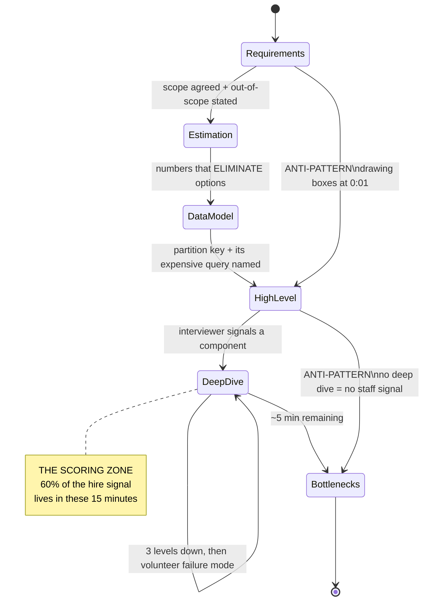
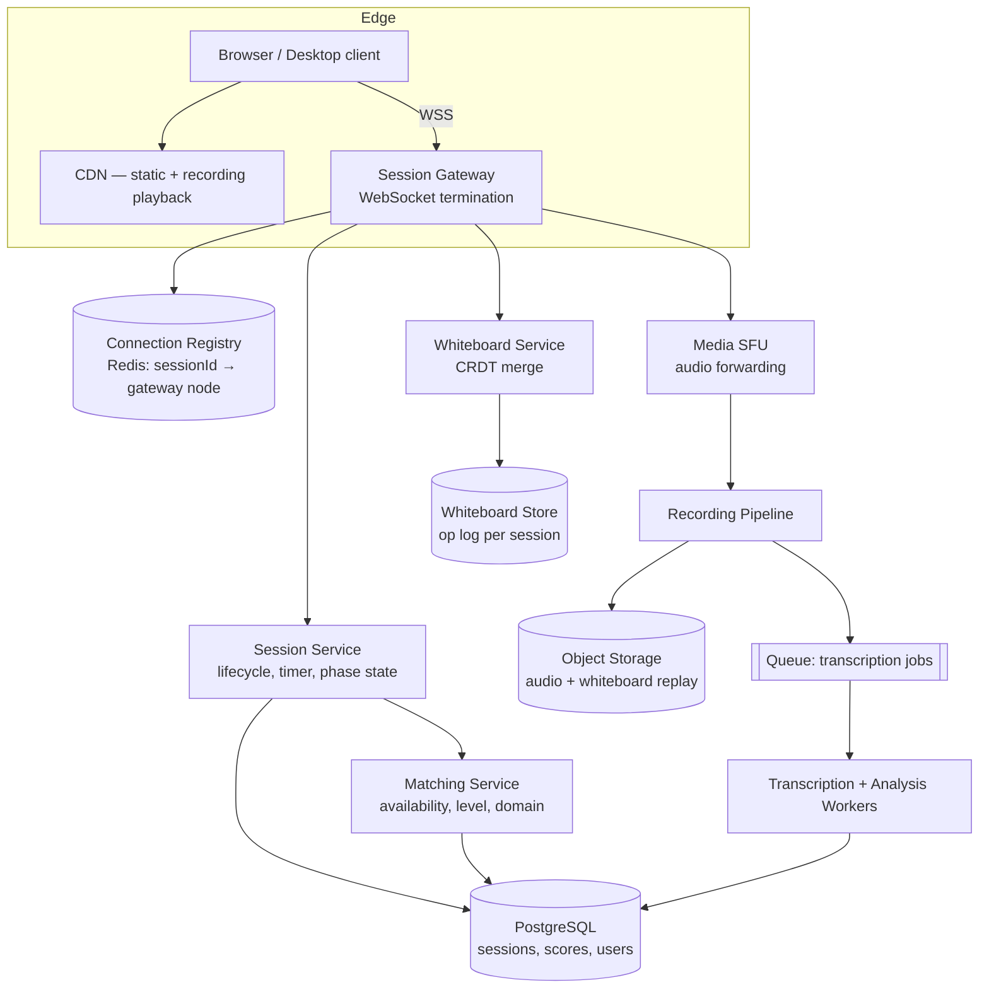
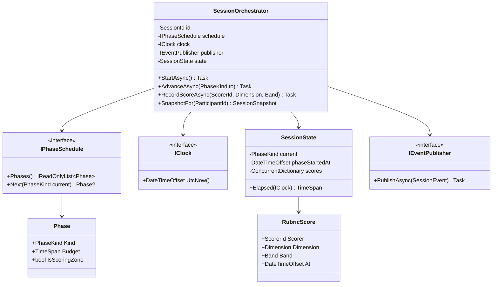

# Module 176 — System Design: The Interview Execution Playbook — Clock Management, Estimation & the Staff/Principal Rubric

> Domain: System Design | Level: Beginner → Expert | Prerequisite: [[01-System-Design-Fundamentals]] (requirements gathering, CAP, the scaling ladder), [[09-Designing-RealTime-Portfolio-Risk-Engine]] through [[14-Capstone-Migrating-EndOfDay-Batch-To-Intraday]] (six worked buy-side designs this module teaches you to *deliver under a clock*), [[15-RateLimiting-Throttling-LoadShedding-Algorithms]] (the depth a single deep-dive segment can reach)

---

**Why this module exists.** Every other module in `14-System-Design` teaches you *a design*. None of them teach you how to **produce a design in 45 minutes, out loud, in front of a skeptical Distinguished Engineer who is actively trying to find the edge of your knowledge.** Those are different skills, and the second one is what actually gets scored. This course has, until now, had a structural gap: a candidate could read all fifteen prior modules, know every answer, and still fail the interview by spending nineteen minutes on requirements, drawing a beautiful diagram nobody asked for, and never reaching the deep dive where the hire/no-hire signal actually lives.

This module is the missing operational layer. It is deliberately *not* another case study.

---

## 1. Fundamentals

### What is a system design interview actually measuring?

It is not measuring whether you can design the system. Nobody designs Instagram in 45 minutes, and the interviewer knows Instagram's real architecture took a thousand engineer-years. The exercise is a **proxy** — a compressed, observable sample of how you behave when handed an underspecified problem at a scale you cannot fully reason about, with insufficient time.

What is being sampled, concretely:

| Signal | What it looks like when present | What it looks like when absent |
|---|---|---|
| **Requirement discipline** | Narrows an open prompt to a scoped, buildable problem in ~5 min, states what's out of scope | Starts drawing boxes within 60 seconds |
| **Quantitative grounding** | Numbers drive component choices; says "40k writes/sec, so a single Postgres primary is out" | Says "we'll shard for scale" with no number justifying it |
| **Trade-off honesty** | Names what each choice costs, concedes when the simple option is correct | Every choice is presented as strictly better |
| **Depth on demand** | Can go three levels down on any component they drew | Diagram is a vocabulary list; component internals are empty |
| **Failure thinking** | Volunteers failure modes before being asked | Designs only the happy path |
| **Collaboration** | Treats interviewer's pushback as information, adjusts | Defends the original answer, or capitulates instantly |

### Why does this matter?

Because the failure modes are **procedural, not knowledge-based.** In post-interview debriefs at the firms in this course's panel (see `CLAUDE.md`'s Elite FinTech Interview Panel section), the overwhelming majority of Staff/Principal system-design rejections are not "candidate didn't know what a consistent hash is." They are:

- *"Ran out of time — never got past the high-level diagram."*
- *"Couldn't justify why they chose Kafka over SQS; when pushed, changed the answer immediately."*
- *"Designed for 100× the stated scale. When I asked why, they said 'to be safe.'"*
- *"Strong senior signal, not staff. Never discussed operability, cost, or migration."*

Every one of those is a *process* defect committed by someone who almost certainly knew the material.

### When does this matter?

The 45–60 minute technical system-design round; the architecture-review round some firms run instead; and — the reason this generalizes beyond interviews — any real architecture forum where you have 30 minutes and a room of skeptical principals. The compressed-clock skill is genuinely transferable.

### How does it work (the 45-minute shape)?

```
0:00–0:05   Requirements   Functional scope + NFRs + explicit out-of-scope
0:05–0:10   Estimation     QPS, storage, bandwidth — order of magnitude only
0:10–0:15   API + Data     Interface contract and data model (the load-bearing choice)
0:15–0:25   High-level     The boxes, the flow, the datastore selection with justification
0:25–0:40   Deep dive      1–2 components, driven by interviewer signal — THE SCORING ZONE
0:40–0:45   Failure/scale  Bottlenecks, failure modes, what you'd do with 10× traffic
```

The single most common structural failure is **spending 25 minutes on the first four boxes**, which converts the deep-dive segment — the only segment where Staff-versus-Senior is actually distinguishable — into a rushed three minutes.

---

## 2. Deep Dive

### 2.1 The Requirements Segment — a Script, Not an Improvisation

Five minutes is enough time for roughly eight questions. Improvising them wastes the budget. Memorize a **fixed opening sequence** and run it every time; the discipline is what's being scored, not the originality of the questions.

**The functional narrowing (2 minutes).** The goal is to convert an unboundedly large prompt into one you can actually finish.

1. *"Who are the actors, and what are the top three things they do?"* — forces the prompt into a small verb list.
2. *"Which one of these is the core of the problem you want me to spend time on?"* — this is the highest-value question in the entire interview. The interviewer usually has a specific deep dive in mind. Asking this makes them tell you what they're going to score you on.
3. *"Can I treat [auth / payments / the mobile client / analytics] as out of scope?"* — almost always yes, and it buys you fifteen minutes.

**The non-functional interrogation (3 minutes).** Six numbers, asked as numbers:

| Dimension | The question | Why it changes the design |
|---|---|---|
| **Scale** | "DAU, and reads-per-user-per-day?" | Determines whether this is one box or a fleet |
| **Read/write ratio** | "Is this 100:1 read-heavy, or write-heavy?" | Read-heavy ⇒ caching/replicas dominate. Write-heavy ⇒ caching is nearly useless and partitioning dominates |
| **Latency** | "p99 target, and for which operation?" | p99 100ms forbids synchronous cross-region hops. p99 2s permits almost anything |
| **Consistency** | "Can a read be 5 seconds stale? For *which* data?" | Per-data-type, never system-wide (Module 37 §2.5) |
| **Availability** | "Three nines or four? What's the cost of downtime?" | Four nines forces multi-AZ, removes single points, changes deploy strategy |
| **Retention/growth** | "How long do we keep it, and is it append-only?" | Determines storage tier and whether archival is a first-class component |

**The out-of-scope declaration.** Close the segment by saying aloud: *"So: I'm designing X and Y at Z scale, optimizing for [the binding constraint], treating A and B as out of scope. Does that match what you want?"* This is a 15-second sentence that prevents the single most expensive failure mode — designing the wrong system competently.

### 2.2 Estimation — the Six Numbers You Must Know Cold, and the Three You Must Derive

Estimation is not arithmetic. It is **eliminating architectures.** The only purpose of the number is to let you say "therefore X is off the table," and if a number doesn't eliminate anything, you wasted time computing it.

**The constants to memorize.** These are approximate and deliberately so — anyone demanding precision here has misunderstood the exercise.

```
TIME
  1 day            ≈ 86,400 sec ≈ 10^5 sec        ← the single most useful approximation
  1 month          ≈ 2.5 × 10^6 sec
  1 year           ≈ 3 × 10^7 sec

LATENCY (order of magnitude, modern hardware)
  L1 cache ref                    ~1 ns
  Main memory ref                 ~100 ns
  SSD random read                 ~100 µs      (10^5 ns)
  Network round trip, same DC     ~0.5 ms
  Disk seek (spinning)            ~10 ms
  Network RTT, cross-region       ~50–150 ms   (NY↔London ~70ms, NY↔Singapore ~230ms)
  ⇒ Memory is ~1000× faster than SSD; same-DC network is ~100× faster than cross-region.
    These two ratios drive most caching and placement decisions.

THROUGHPUT (per single commodity node, conservative)
  Redis                    ~100k ops/sec
  Well-tuned RDBMS write   ~5–10k writes/sec      ← the number that forces sharding
  RDBMS read w/ index      ~50k reads/sec
  Kafka partition          ~10 MB/sec sustained
  Web/app server           ~5–10k req/sec (I/O bound, async)
  WebSocket connections    ~50k concurrent per node

SIZES
  UUID 16 B · timestamp 8 B · int64 8 B
  A "typical" row/record   ~1 KB       ← default assumption; state it
  A photo                  ~1 MB
  A minute of 1080p video  ~50 MB
```

**The three derivations.** Everything else falls out of these:

```
① QPS         = DAU × actions-per-user-per-day ÷ 10^5
   Peak QPS    = average × 2 to × 10  (state the multiplier you chose and why —
                 a consumer social app peaks ~3×; a market-open trading system
                 peaks 50×+ against a flat overnight baseline)

② Storage/yr  = writes-per-sec × record-size × 3 × 10^7
                then × replication factor (typically 3)

③ Bandwidth   = QPS × payload-size
```

**Worked example, spoken aloud in ~90 seconds:**

> "50M DAU, each loading a feed 10× a day. That's 500M reads a day, over 10^5 seconds — **5,000 reads/sec average**, call it **15,000 at peak** with a 3× consumer multiplier. Writes: if 10% of users post once a day, that's 5M writes/day, **50 writes/sec** — trivially small. So this is a **100:1 read-heavy** system, and that ratio is the single most important fact in the design: it means caching and read replicas are where the leverage is, and it means the write path can stay simple. Storage: 5M posts/day × 1KB × 365 ≈ **2 TB/year** before replication, ~6 TB with 3×. That's small enough that storage is not a design driver — I'll stop thinking about it. Bandwidth on reads: 15,000 × 5KB ≈ **75 MB/sec**, which needs a CDN for media but is unremarkable for JSON."

Notice what that paragraph does: it produces four numbers and **immediately retires two of them as non-drivers.** That retirement is the actual skill. A candidate who computes storage and then never mentions it again has done arithmetic; a candidate who says "2 TB/year, therefore storage is not interesting here, moving on" has done engineering.

**The fourth derived number: tail amplification under fan-out.** Whenever a request fans out to several backends in parallel and waits for all of them, the request's latency is `max(backend)`, not `mean(backend)` — so the backends' tail becomes the request's typical case:

```
P(at least one slow) = 1 − (1 − p)^n

n = 10 backends, p = 1% chance each is slow
                   ⇒ 1 − 0.99^10 ≈ 9.6%

Your p99 backend has become roughly your p90 request.
```

Two consequences worth stating in any scatter-gather design: **adding shards makes the tail worse**, because `n` grows; and the mitigations are structural rather than tuning — hedged requests, a deadline with partial results, or keeping the fan-out small enough that `n` stays low. This is the arithmetic behind the latency-budget exercise in §11, and it is the most common reason a design whose components all meet their individual SLAs still misses its end-to-end target.

### 2.3 The Data Model Is the Load-Bearing Decision

Candidates treat the data model as a formality between the API and the "real" architecture. It is the opposite: **the data model is the design.** Almost every interesting constraint in a distributed system is a consequence of how data is keyed and partitioned.

The interviewer is listening for one specific thing: **the partition key, and the query it makes expensive.** Every partition key choice makes one access pattern single-shard-cheap and another one scatter-gather-expensive. Naming that trade-off unprompted is a strong Staff signal.

```
Chat:      partition by conversation_id  → "load this conversation" is 1 shard  ✓
                                         → "all messages by user X" is scatter  ✗
Ledger:    partition by account_id       → "this account's balance" is 1 shard  ✓
                                         → "all txns for merchant M" is scatter ✗
Timeseries:partition by (series_id, day) → range scan on one series is cheap    ✓
                                         → "all series at time T" is scatter    ✗
```

Say the second line out loud, always. "I'm partitioning by conversation ID, which makes the dominant read single-shard; the cost is that per-user search across conversations becomes a scatter-gather, which I'd serve from a separate search index rather than the primary store."

### 2.4 Component Selection — Justify Against the Numbers, Never Against Fashion

Every box you draw invites the question *"why that one?"* The answer must reference a number from §2.2 or a requirement from §2.1. Three canonical decisions and their honest discriminators:

**SQL vs. NoSQL.** The discriminator is *not* scale — modern Postgres handles enormous load. It's **access-pattern stability plus transactional need**. Choose relational when you need multi-entity transactions and ad-hoc query flexibility (ledgers, orders, anything with invariants across rows). Choose a key-value/wide-column store when the access pattern is known, singular, and the write volume exceeds what a single primary sustains (~10k writes/sec) with no way to avoid it. Saying "NoSQL scales better" without a write-rate number is a documented Senior-ceiling answer.

**Queue vs. stream (SQS/RabbitMQ vs. Kafka).** The discriminator is **replay and multi-consumer**. A queue deletes on consume — one logical consumer, no history. A log retains — many independent consumers each at their own offset, and the ability to reprocess. If you need one worker pool to drain tasks, a queue is simpler and cheaper; reaching for Kafka anyway is over-engineering you will be asked to defend.

**Cache placement.** Client → CDN → API-gateway → application → database-buffer-pool. Each layer is cheaper and faster than the next but staler and harder to invalidate. State *which* layer and *why that one*; "we'll add Redis" without naming what's cached, the invalidation strategy, and the expected hit rate is a checklist answer.

### 2.5 The Deep Dive Is Where the Interview Is Won — Read the Signal

At roughly the 25-minute mark the interviewer will say something that sounds conversational: *"How would you handle a celebrity with 50 million followers?"* or *"What happens if the payment service times out?"* This is not small talk. It is **the transition into the scored segment**, and the question names the thing they intend to evaluate.

Three rules:

1. **Take the invitation.** Go where they point, not where you're comfortable. A candidate steered back to their prepared material reads as inflexible and, worse, as hiding.
2. **Go three levels down.** Level 1: "we'd use a distributed lock." Level 2: "Redis `SET NX PX` with a fencing token." Level 3: "the fencing token matters because a lock holder that pauses on GC past the TTL can resume and write after another holder acquired it — the token makes the stale write rejectable at the storage layer." Level 3 is the Staff signal. Levels 1 and 2 are Senior.
3. **Volunteer the failure mode.** End every deep dive with "…and the way this breaks is X, which I'd detect with Y." Unprompted failure analysis is the most reliable single differentiator in the rubric.

### 2.6 The Senior/Staff/Principal Boundary, Made Explicit

This is the part candidates most often can't see. The same question gets three answers, all *correct*, at three levels.

**Question: "How do you keep the cache consistent with the database?"**

- **Senior (correct, complete, insufficient):** "Cache-aside with a TTL. On write, invalidate the key. Accept a small staleness window."
- **Staff (adds failure and second-order effects):** "Cache-aside with TTL, invalidate on write — but invalidation is a distributed operation that can fail, so TTL is the backstop, not the optimization. Two problems: a thundering herd when a hot key expires, which I'd solve with probabilistic early expiry or a per-key lock on refill; and a race where a slow read repopulates a stale value *after* an invalidation, which needs either versioned writes or delete-after-write with a short delay. I'd measure hit rate per key class, not in aggregate — an aggregate 95% can hide a 20% hit rate on the keys that matter."
- **Principal (adds organizational and lifecycle framing):** All of the above, plus: "The real question is whether this cache should exist. It's a permanent operational liability — a second source of truth with its own failure modes, and every future engineer touching this write path has to know to invalidate. Before adding it I'd want the measured p99 without it, because if the database can serve this at 40ms we've bought 15ms and a whole class of incidents. If we do add it, the invalidation has to be structurally impossible to forget — inside the repository, not a call every developer must remember — because a protection with exceptions is one whose exceptions are where the incidents happen. And I'd want an owner and a decommission criterion, or in three years it's load-bearing and nobody knows why."

The pattern: **Senior answers the question. Staff answers how it fails and how you'd know. Principal questions whether the thing should exist, who maintains it, and what it costs the organization over years.**

### 2.7 Handling Pushback — the Highest-Variance 30 Seconds

When the interviewer challenges a choice, they are running one of two tests, and you must tell them apart:

- **Probe:** "Are you sure Kafka is right here?" — testing whether you actually reasoned or pattern-matched.
- **Correction:** "That won't work, because the consumer group rebalances on every deploy." — you made an actual error.

The response to a **probe** is to restate the reasoning and the alternative you rejected: *"I chose Kafka because we need replay for the reconciliation consumer. If we didn't need replay, SQS would be simpler and cheaper and I'd prefer it. Is there a constraint that makes replay unnecessary?"* This shows the decision was real.

The response to a **correction** is to accept it fast, then integrate: *"You're right — that changes things. Given rebalance on deploy, I'd need [X]. Let me revise."* Accepting a correction costs nothing. Defending an error is disqualifying; so is folding on a *probe*, because it reveals the original answer had no reasoning behind it.

The failure mode to avoid absolutely: changing your answer every time the interviewer raises an eyebrow. That reads as having no model at all.

### 2.8 The Clock Discipline

Say the time budget out loud at the start: *"I'll take about five minutes on requirements, five on estimation, ten on the high-level design, and I want to leave twenty for whatever component you want to go deep on."* Two effects: it demonstrates the discipline before you've demonstrated any technical skill, and it licenses you to cut yourself off later.

If you're at 20 minutes and still in the high-level: **truncate deliberately and say so.** *"I'm going to stop expanding the diagram here — the remaining boxes are conventional and I'd rather spend our time on the fan-out design, which is where the actual difficulty is."* A candidate who manages their own clock reads as senior. A candidate the interviewer has to interrupt reads as junior, regardless of content.

### 2.9 The Level Ladder, Worked on a Single Question

§2.6 states the Senior/Staff/Principal boundary abstractly. Here it is concretely, on one ordinary prompt — *"how do you handle a service that's timing out?"* — because the difference between levels is visible in the *same* question, not in harder questions.

**Senior.** Retry with exponential backoff and jitter, set a sensible timeout, add a circuit breaker. Correct, complete as mechanism, and it stops there.

**Staff.** All of that, **plus the interaction effects**: the timeout must be shorter than the caller's remaining budget or you cascade the failure upward; retries multiply load on a dependency that is already struggling, so the breaker must open on error **rate over a window**, not on consecutive failures — a consecutive-failure breaker never trips under partial failure, which is the common case; and retries are only safe if the operation is idempotent, which is a property of the API, not of the retry policy.

**Principal.** All of that, plus **questioning the premise and addressing enforcement**: why is this call synchronous at all — would an async path remove the timeout question entirely? What is the *deadline* for the whole user-facing operation, and is it propagated so downstream work whose deadline has expired is dropped rather than executed? And, organisationally: how is this made the default for every service rather than a fix applied to this one — a shared client library, a mesh policy, a lint rule — because a correct pattern that each team must remember is a pattern that will be absent somewhere.

**The ladder in one line:** Senior handles the mechanism; Staff handles the interaction effects and failure modes; Principal questions the structural premise and addresses organisational enforcement. Giving the Senior answer with more words is the most common way to be scored Senior while believing you answered at Staff.

### 2.10 Scoping a Deliberately Ambiguous Prompt

*"Design a system for our traders."* This is unanswerable as stated and the interviewer knows it. The test is whether you narrow it or start guessing.

Narrow along three axes, in order:

1. **Which workflow?** Pre-trade (research, pricing, risk checks), at-trade (order entry, execution, routing), or post-trade (settlement, allocation, reconciliation). These are three different systems, and naming the division demonstrates domain knowledge before you have designed anything.
2. **Which users, and how many?** Ten traders on one desk and two thousand across a firm are different problems.
3. **What is the system replacing, and what is wrong with it now?** The answer usually names the actual requirement.

Only after the system is identified do generic non-functional questions become useful. Asking about read/write ratios before establishing *which system* you are discussing is a script applied without thought — and it is visible as such.

**The failure mode is silent selection:** picking one interpretation and designing it. That is a coin flip on whether you designed what they wanted, and you get no credit for the reasoning that was never spoken.

### 2.11 Turning a Vague Requirement Into a Number That Changes the Design

The requirements segment exists to produce numbers that *move* the architecture. Worked example:

> **Requirement as given:** "notifications should be fast."
>
> **Convert:** "Fast for whom, and what's the cost of slow? If a payout-settled notification arrives 30 seconds late, does anything break?"
>
> **Answer:** "Merchants reconcile against it, and our SLA promises 5 minutes."

That single number restructures everything. Five minutes is an enormous budget: it permits an asynchronous, queue-driven, batched design with retries and a dead-letter queue, sized for throughput. Had the answer been "500 ms, it's in the payment confirmation path," the design would be synchronous, latency-budgeted, and tolerant of dropping notifications rather than delaying them — a genuinely different system.

**Trace the consequence out loud.** Eliciting the number and not saying what it changes gets you no credit: the interviewer is scoring the inference, not the question.

### 2.12 Recovering From Your Own Mid-Design Error

Thirty minutes in you realise the data model you chose at minute twelve cannot support a requirement the interviewer has just revealed. This is one of the highest-value moments available to you.

**Say it out loud, immediately and explicitly.** *"That requirement breaks my partition key — per-merchant queries would scatter across every shard. I need to change it."* Then state the options and their costs: change the key (and name what *that* makes expensive), keep it and add a secondary index or read model (and name the write amplification and consistency cost), or accept the scatter for a query whose volume makes it tolerable (and name the volume at which it stops being tolerable).

**Why this scores so well:** detecting and announcing your own design defect under time pressure is exactly the behaviour that makes someone safe to put in front of a real architecture forum. Silently continuing is the opposite signal, and interviewers notice both.

**What not to do:** hope they did not notice; restart from scratch, which burns the remaining clock; or hand-wave "we'd add an index" without naming its cost.

### 2.13 Handling Pushback — Answer With the Threshold

*"Why not just use a single Postgres instance for all of this?"* on a design where you proposed sharding.

**Treat it as a serious question, because it usually is.** They are testing whether your sharding was justified or reflexive.

Answer with the arithmetic and concede the boundary: *"At 40,000 writes/sec sustained, a single primary is roughly 4–8× over what I'd expect one to hold, and I don't see a way to reduce the write volume — the writes are independent and all durable. Below about 8,000 writes/sec I'd keep a single primary and this whole discussion goes away, because sharding costs cross-shard queries, a distributed ID scheme, and a migration project nobody wants."*

That answer grounds the decision in a number **and states the threshold at which the answer flips** — showing the choice was a judgement against a threshold, not a reflex.

Two failure modes: defending the design on principle (reflexive), and capitulating entirely and abandoning a correct design (no conviction). Being unable to state the flip threshold is the tell that there was never a calculation behind it.

### 2.14 "What Would Break First at 10×?"

A strong answer names a **specific component**, the **specific resource** it exhausts, and the **number** you are comparing against — then the symptom, then the fix, then **the next thing that breaks after the fix.**

> "The database connection pool — 200 connections across 20 app servers. At 10× the request rate, Little's Law says in-flight requests go from ~90 to ~900, so the pool saturates and requests queue for a connection. The symptom is latency climbing while CPU stays low, which is the signature of queueing rather than compute. Note that adding app servers makes it *worse*, because each one brings its own pool and the database's connection ceiling is the real constraint. The fix is a connection proxy — PgBouncer — plus raising the per-server pool only after measuring. After that, the next constraint is write IOPS on the primary, and that one forces the sharding conversation."

It is falsifiable, it identifies the **resource** rather than the box, it contains the counter-intuitive "scaling out makes it worse" insight, and it chains to the next bottleneck — which shows a model rather than a guess. "The database" with no resource named is the weak version, and assuming CPU is always the constraint is the common error.

### 2.15 Operability — the Signal Whose Absence Caps You at Senior

Operability is everything after the design works on the whiteboard:

- **Deployment** — how it ships, and how a deploy fails safely.
- **Migration** — dual-write, backfill, shadow-read, cutover, rollback. Almost no real system is greenfield, so a design with no migration story is a design for a system that will never exist.
- **Cost** — monthly, and **which component dominates it**. At Principal level cost is a first-class design axis, not an afterthought.
- **On-call surface** — what pages, what it looks like at 3am, what the runbook says.
- **Decommissioning** — what it takes to turn this off in five years.

The organisational reason this matters: at Staff+ you are trusted with systems other people operate. A candidate who never mentions cost has made every choice in a resource vacuum, and a candidate whose whole operability answer is "we'd have monitoring" has said nothing.

### 2.16 When the Honest Answer Is "Buy, Don't Build"

Say it, with the reasoning — and then **still demonstrate the design thinking**.

> "For a search index at this scale I'd use managed OpenSearch rather than building on Lucene: the operational surface of a self-run cluster is substantial and there's no differentiation in it for us. That said, the parts I'd still have to design are the interesting ones — the indexing pipeline and its lag budget, the analysis chain, the entitlement filter, the reindex-and-alias-swap procedure, and what we serve when the cluster is degraded."

Build-versus-buy judgement is explicitly a Staff+ competency, and a well-executed "buy" is stronger than a "build" performed for show. But **buying does not remove the design work at the integration boundary**, and saying where the real difficulty lives is what earns the credit.

Two failure modes: designing a search engine from scratch to demonstrate depth, which reads as poor judgement about engineering investment; and saying "we'd use a managed service" and stopping, which leaves the interviewer nothing to evaluate.

### 2.17 Why Over-Engineering Is Penalised More Harshly Than Under-Engineering

This asymmetry surprises candidates, and it is not aesthetic — it is about **reversibility**.

**Under-engineering is a reversible, evidence-driven error.** The system is simpler than needed, the deficiency appears as a measurable symptom, and you add the missing capability with real data in hand.

**Over-engineering is irreversible in practice.** The complexity is now load-bearing, other teams have built against it, nobody can prove it is unnecessary, and removing it is a project with risk and no visible benefit — so it never happens. You have permanently raised the cost of every future change.

**What this implies for how you present a design:** propose the simplest thing that meets the stated requirements, then **name the threshold** at which you would add the next layer of complexity, and what evidence would tell you the threshold had been crossed. That converts "keep it simple" from a slogan into a demonstrable habit, and it is the same move as §2.13's flip threshold.

### 2.18 Difficult Interviewers — Adjust Mode, Not Content

**Silence** usually means "keep going." Narrate more, and check in explicitly at segment boundaries: *"I'm about to go deep on the write path — is that the right place, or would you rather I cover the read path?"*

**Hostility** is frequently a deliberate stress test of how you behave under pressure. Stay level, engage with the substance, and concede genuine points cheerfully — conceding a valid point is not a loss, it is evidence you can be reasoned with.

**Disengagement** is often about them, not you. Ask a question that requires an answer, to re-establish the loop.

The interview is partly a simulation of working with a difficult senior stakeholder, which is a real and frequent part of the job at this level. **The correct response is behavioural, not technical.** Mirroring hostility, going silent yourself, or talking faster and louder to fill the space all compound the problem.

### 2.19 When You Know More Than the Interviewer

Deeper domain expertise than your interviewer is an advantage that reliably backfires if unmanaged. Three risks:

1. **Unshared context.** You reason in domain shorthand, they cannot follow, and it is scored as *unclear* rather than *deep*. The interviewer's comprehension is a scoring input.
2. **Correcting the interviewer.** Their prompt may contain a domain inaccuracy. **How you handle it is observed far more closely than the inaccuracy itself.** Offer it as information, not as a correction: *"In most implementations this actually works slightly differently — can I design against that version, or would you rather I use the model in the prompt?"*
3. **Depth without navigation.** You go straight to the genuinely hard part, skipping the structure that would let them follow you there — and an interviewer who cannot follow cannot score you above their own comprehension.

The discipline: **define your terms once, signpost every transition, and check in.** Superior domain knowledge is a communication problem before it is an advantage.

### 2.20 The Last Five Minutes

Interviewers write their feedback from the impression at the end, which makes this the highest-leverage block of the session.

Deliver a compact, honest summary that **names the design's weakest point**:

> "To summarise: [design] optimising for [constraint]. The part I'm least confident in is [X], because [specific reason] — before building it I'd want to validate [specific thing]. The first thing that breaks at 10× is [Y]. If I had another twenty minutes I'd spend them on [Z]."

Volunteering the weakness pre-empts it being "discovered" and reframes it as **known and managed** — and knowing where your own design is weakest is precisely the Principal-level self-assessment being scored.

What not to do: add another component; claim the design is complete and sound (which reads as dishonest or unaware); or trail off when time is called.

### 2.21 The Rubric, and Why a Flawless Answer Can Still Score Senior

Interviewers do not form a gestalt impression; they fill in **dimension scores**, typically 5–7 dimensions on a 4-point scale (below / at / above bar for the level):

| Dimension | What it samples |
|---|---|
| Requirements & scoping | Did you narrow the problem, or accept it as given? |
| Quantitative reasoning | Did numbers drive decisions, or decorate them? |
| Design quality & component justification | Are choices justified against the numbers? |
| Depth on demand | Can you go three levels down where asked? |
| Failure & operability thinking | Do you reason about the system after it ships? |
| Communication & collaboration | Can the interviewer follow, and can they influence? |
| **Judgment / prioritisation** (Staff+ only) | Do you spend the clock on what matters? |

The deciding dimensions at the level boundary are almost always **judgement** and **failure/operability** — the two that cannot be rehearsed as content.

**Six behaviours that produce "technically flawless, rated Senior":**

1. **Correct without conditional reasoning** — every answer is a single right answer, with no "it depends on X, and here's how I'd find out X."
2. **No cost accounting** — money, headcount and operational burden never appear, so choices are made in a vacuum.
3. **Component-level rather than system-level failure thinking** — handles "the database is down," never "this failure mode cascades into that one."
4. **No prioritisation** — every part of the design receives equal attention regardless of risk, which is the clearest judgement signal there is.
5. **Doesn't drive** — answers the questions asked and never directs the conversation.
6. **Never names a threshold** — no statement of when the chosen design stops being right.

Each is observable and correctable, which is why the outcome feels arbitrary to the candidate and does not to the interviewer.

### 2.22 "Structurally Blind Monitoring" as a Reusable Interview Move

**The pattern:** a system's monitoring is blind in *exactly the dimension* in which it fails, so the failure is invisible while every dashboard is green.

Instances recur across this folder: a fixed-window limiter produced an 800 ms boundary burst while the dashboard's 1-minute averages **shared the limiter's own blind spot**; one Redis shard saturated while cluster-level aggregate metrics stayed healthy; a completeness reconciliation took the reportability logic as its input, so it could not detect that logic's omissions; a notification system counted a non-terminal state in the success numerator, so **the more messages got stuck, the better the dashboard looked**.

**The reusable triple:** the remedy is always (1) an independent verifier whose expected set does not derive from the logic being checked, (2) a counter on every silent path, and (3) detection by **aging** rather than by rate.

**As an interview move**, apply it reflexively to your own design in the deep dive: *"The failure this design would be blind to is X, because my monitoring measures Y — so I'd add Z."* Abstracting a recurring pattern into an analytical tool and then turning it on your own work is exactly what distinguishes a principle from a memorised fact.

### 2.23 When the Interviewer Is the Hiring Manager

The technical floor is still enforced, but the weighting shifts toward decision-making under ambiguity, communication to non-specialists, and risk framing.

An engineer probes *"why Kafka?"*. A hiring manager probes *"how would you convince a skeptical team this is right?"*, *"what would you do if the team disagreed?"*, *"how would you know if this was the wrong call, and by when?"*

**Answering a manager's question with pure technical depth reads as not hearing the question** — which is the specific, consequential mistake candidates routinely make in this round. Answer the question asked: the decision process, the disagreement, the reversal criteria.

### 2.24 Practising Alone, and Practising as the Interviewer

**Solo practice fails by default**, because you never experience the two hardest elements: unpredictable redirection, and the clock. Substitute a mechanical proxy for each:

1. **Hard timer, spoken aloud, recorded.** Silent practice trains nothing, because the failure modes are verbal — hedging, circling, filler, silence. Reviewing your own recording is uncomfortable and highly diagnostic.
2. **Randomised redirection.** Pre-write ten redirection cards ("go deep on the write path," "the interviewer challenges your data model," "10× the traffic") and draw one at a random minute.
3. **Score yourself against §2.21's rubric**, dimension by dimension, rather than asking "did that feel good."
4. **Produce, don't read.** One design produced under the clock teaches more than five designs read.

**Inverting to the interviewer's chair explains behaviours that otherwise look arbitrary.** As interviewer you would: choose a prompt you have genuinely operated, so you can probe indefinitely and recognise a good *non-standard* answer; open deliberately underspecified, to test scoping; say almost nothing for the first ten minutes, because self-direction is the signal; and at around twenty-five minutes probe the component the candidate seems **least** certain about — not the one they most want to discuss.

Each of those explains something from the candidate side: the silence, the pushback on correct answers, and the probing of exactly your weakest spot. None of them is hostility.

### 2.25 A Preparation Program, and the One Transferable Lesson

**Sequence by dependency, not by topic interest.**

- **Months 1–2 — primitives.** The constants in §2.2 to instant recall, plus the failure semantics: consistency models, consensus, idempotency, tail latency, partitioning. Every design question decomposes into these, and a shaky primitive surfaces as hedging the moment you are probed.
- **Month 3 — shapes.** *Produce*, not read, one design per shape: read-heavy fan-out, stateful connections, large-object pipelines, transactional/multi-service, unique ID generation, rate limiting, search, notification, booking contention, geospatial matching. Shapes transfer; instances do not.
- **Month 4 — domain.** For a panel of the kind §A2 describes, the financial-domain designs: payments and ledgers, order lifecycle, market data, risk, regulatory reporting. Domain fluency is scored even when the prompt is generic.
- **Month 5 — execution.** Timed, recorded, redirected practice against the rubric (§2.24).
- **Month 6 — the rest of the loop.** Behavioural stories mapped to the same competencies, and the hiring-manager round (§2.23). Failing the design round is not the most common way to lose a Principal loop.

**The single most transferable lesson from this entire domain**, stated in its own words: **correctness is frequently unobservable at the point of consumption yet immediately consequential.** That is why the financial-systems designs spend most of their complexity establishing *evidence* rather than throughput.

The Principal-level question is therefore not *"can we compute this fast enough"* but **"how would we know if this were wrong?"**

As a verbal move, it is available in almost any design: *"This part is fast and I'm not worried about it. What I'd actually invest in is knowing when it's wrong — here's the independent check, here's the counter on the silent path, and here's the aging alert."* That sentence, delivered once and meant, moves more rubric dimensions than any additional component you could draw.


---

## 3. Visual Architecture

### The interview as a state machine



### The time budget, and where it actually goes wrong

```
IDEAL
0    5    10   15   20   25   30   35   40   45
|REQ |EST |API |  HIGH-LEVEL |     DEEP DIVE      |FAIL|
                              ^^^^^^^^^^^^^^^^^^^^
                              the segment that scores

TYPICAL FAILING RUN
0    5    10   15   20   25   30   35   40   45
|    REQUIREMENTS     |    HIGH-LEVEL DIAGRAM     |DD |
                                                   ^^^
                                        3 minutes of depth
                                        = "senior, not staff"
```

### Signal-to-depth ladder

```
        Interviewer: "How do you prevent double-charging?"
                              |
   Level 1  "We'd make it idempotent."                    ← Mid
                              |
   Level 2  "Idempotency key from the client, stored
             with the charge, unique index on it."        ← Senior
                              |
   Level 3  "The key must be client-generated before the
             first attempt, because a client that times
             out doesn't know if the charge landed. The
             uniqueness constraint has to be in the SAME
             transaction as the charge, or two concurrent
             retries both pass the check and both insert.
             And the stored response must be replayed on
             a duplicate — returning 409 breaks the
             retrying client that legitimately needs the
             original result."                            ← STAFF
                              |
   Level 4  "...and the key's retention has to outlive
             the longest client retry window, which is a
             business decision, not a technical one. We
             set it at 24h; the mobile team retries for
             7 days on reinstall. That gap IS the bug we
             shipped last year."                          ← PRINCIPAL
```

---

## 4. Production Example

**Problem.** A payments company (this course's panel includes several) ran a Staff Engineer loop with a strong candidate — 16 years' experience, deep Kafka background, unambiguously knew the material. The prompt was *"design a system to notify merchants when their payouts settle."* The candidate was rejected. The debrief is instructive precisely because no knowledge gap was involved.

**Architecture (what the candidate produced).** A genuinely good design: Kafka topic of settlement events, a consumer fanning out to email/SMS/webhook channels, per-merchant preference lookup, dead-letter queue for failures, retry with exponential backoff. Diagram was clean. Every component was defensible.

**Implementation (how the 45 minutes were actually spent).**

```
0:00–0:03  Asked two requirements questions, got answers, moved on
0:03–0:26  Drew the architecture. Added components as they occurred to him:
           Kafka, consumer group, preference service, template service,
           three channel adapters, DLQ, retry topic, an audit sink.
0:26–0:31  Interviewer: "What if a merchant's webhook endpoint is down
           for six hours?"  Candidate: "The DLQ would catch it and we'd
           retry with backoff."  Interviewer: "And then?"
           Candidate: "...we'd alert on DLQ depth."
0:31–0:38  Interviewer steered twice more toward delivery guarantees.
           Candidate returned each time to describing the Kafka topology
           he'd already drawn.
0:38–0:45  Ran out of time mid-sentence on partitioning.
```

**Trade-offs (what the debrief said).** The written feedback: *"Knows the technology deeply. Never demonstrated judgment about it. Twenty-three minutes of unprompted component enumeration with no forcing requirement behind any of it — I never learned why an audit sink was needed because we never discussed compliance. When I opened the door to the interesting problem three separate times, he described his diagram back to me. Strong senior signal; no staff signal, because staff is about knowing which of the eight components actually deserves the hour."*

The specific fatal exchange was the webhook one. "Merchant endpoint down for six hours" is not a DLQ question — it is a question about **whether settlement notifications are recoverable state or transient events**, about poison-endpoint isolation so one dead merchant doesn't consume the retry budget for all merchants, about whether merchants can pull what they missed rather than depending on push, and about the fact that a payout notification has *regulatory* weight, so "we dropped it after N retries" may not be a legal option. There were fifteen minutes of Staff-level material in that question and the candidate spent five on "we'd alert on DLQ depth."

**Lessons learned.**

1. **Unprompted breadth is not a virtue; it is a time leak.** Eight components you can't defend in depth score lower than four you can. The candidate would have scored better having drawn *less*.
2. **A question from the interviewer at minute 26 is the interview.** Everything before it is setup. Redirecting back to your own material is the single most expensive move available.
3. **"We'd alert on it" is not a design.** It is a deferral. Alerting is what you do when the design has a gap you've chosen to staff with humans — legitimate, but you must say that's what you're doing and why the gap is acceptable.
4. **The clock is a designed constraint, not an obstacle.** The interviewer chose 45 minutes because forcing prioritization is the point. Failing to prioritize isn't running out of time; it's failing the actual test.
## 11. Coding Exercises

### Easy — The estimation function you should be able to run mentally

**Problem:** Given DAU, actions per user per day, peak multiplier, record size, and replication factor, produce the four decision numbers.

**Solution:**
```csharp
public readonly record struct CapacityEstimate(
    long AvgQps, long PeakQps, double StorageGbPerYear, double PeakBandwidthMbSec)
{
    // 10^5 ≈ seconds/day. The approximation IS the method — precision here is noise.
    private const long SecondsPerDay = 100_000;
    private const long SecondsPerYear = 30_000_000;

    public static CapacityEstimate From(
        long dau, double actionsPerUserPerDay, double peakMultiplier,
        int recordSizeBytes, int replicationFactor)
    {
        long avgQps = (long)(dau * actionsPerUserPerDay) / SecondsPerDay;
        long peakQps = (long)(avgQps * peakMultiplier);

        double bytesPerYear = (double)avgQps * recordSizeBytes * SecondsPerYear * replicationFactor;
        double storageGb = bytesPerYear / 1_000_000_000d;

        double peakBandwidthMb = (double)peakQps * recordSizeBytes / 1_000_000d;

        return new CapacityEstimate(avgQps, peakQps, storageGb, peakBandwidthMb);
    }
}
```
**Time complexity:** O(1). **Space complexity:** O(1).

**Optimized solution:** The optimization is not algorithmic — it is *retirement*. Wrap each output with the threshold that makes it interesting, so the calculation itself tells you what to stop discussing:

```csharp
public IEnumerable<string> Conclusions()
{
    yield return PeakQps > 10_000
        ? $"{PeakQps:N0} peak QPS — exceeds a single primary; partitioning required."
        : $"{PeakQps:N0} peak QPS — a single well-tuned primary holds this. Not a driver.";

    yield return StorageGbPerYear > 50_000
        ? $"{StorageGbPerYear:N0} GB/yr — storage IS a design driver; tiering and lifecycle needed."
        : $"{StorageGbPerYear:N0} GB/yr — unremarkable. Retiring this from the discussion.";

    yield return PeakBandwidthMbSec > 1_000
        ? $"{PeakBandwidthMbSec:N0} MB/s — cannot serve from origin; CDN is structural."
        : $"{PeakBandwidthMbSec:N0} MB/s — origin can serve this directly.";
}
```
The `else` branches are the point. A candidate who *retires* two of three numbers has demonstrated more judgment than one who elaborates all three.

---

### Medium — A rubric scorer for solo practice

**Problem:** Implement the §2.21 rubric so a solo practice session (§2.24) produces a comparable, tracked score rather than a vague feeling.

**Solution:**
```csharp
public enum Dimension
{
    RequirementsScoping, QuantitativeReasoning, DesignQuality,
    DepthOnDemand, FailureAndOperability, Communication, JudgmentPrioritization
}

public enum Band { BelowBar = 0, ApproachingBar = 1, AtBar = 2, AboveBar = 3 }

public sealed record Session(DateOnly Date, string Prompt, IReadOnlyDictionary<Dimension, Band> Scores)
{
    // Depth and Failure are the level-boundary dimensions (§2.21): weighted double,
    // because they are the two that cannot be rehearsed by memorizing designs.
    private static readonly Dimension[] LevelBoundary =
        [Dimension.DepthOnDemand, Dimension.FailureAndOperability];

    public double WeightedScore() =>
        Scores.Sum(kv => (int)kv.Value * (LevelBoundary.Contains(kv.Key) ? 2.0 : 1.0));

    public bool ClearsStaffBar() =>
        // A single below-bar on a level-boundary dimension is disqualifying regardless
        // of the total — five at-bar dimensions do not compensate for shallow depth.
        LevelBoundary.All(d => Scores[d] >= Band.AtBar)
        && Scores.Values.All(b => b >= Band.ApproachingBar);
}

public static class Trend
{
    // The lowest-mean dimension across sessions is where the next month goes.
    public static Dimension WeakestOver(IEnumerable<Session> sessions) =>
        Enum.GetValues<Dimension>()
            .MinBy(d => sessions.Average(s => (int)s.Scores[d]));
}
```
**Time complexity:** O(n·d) for the trend over n sessions and d dimensions. **Space complexity:** O(n·d).

**Optimized solution:** The meaningful improvement isn't performance — it's making the gate honest. `ClearsStaffBar` deliberately refuses to let breadth compensate for depth, mirroring the real rubric behaviour from §2.21. A naive `WeightedScore() > threshold` would let a candidate pass with strong communication and shallow depth, which is precisely the outcome the real rubric is built to prevent.

---

### Hard — Latency budget allocation with tail amplification

**Problem:** Given a p99 target and a set of sequential and parallel dependencies, determine whether the budget is achievable — accounting for the fan-out tail amplification from §2.2.

**Solution:**
```csharp
public sealed record Dependency(string Name, double P99Ms, bool Optional);

public static class LatencyBudget
{
    /// Sequential: latencies add, and so do the tails — you cannot assume
    /// independence lets you take the max.
    public static double Sequential(IEnumerable<Dependency> deps) =>
        deps.Where(d => !d.Optional).Sum(d => d.P99Ms);

    /// Parallel fan-out: the request finishes with the SLOWEST branch. With n
    /// branches each independently slow with probability p, the chance that at
    /// least one is slow is 1-(1-p)^n — so the aggregate p99 is governed by a
    /// far higher percentile of each part.
    public static double ParallelFanOut(double perShardP99Ms, int shardCount)
    {
        double pSlow = 0.01;                                     // p99 ⇒ 1% slow
        double pAnySlow = 1 - Math.Pow(1 - pSlow, shardCount);

        // Effective percentile each shard must hold for the WHOLE to hit p99.
        double requiredPerShard = Math.Pow(0.99, 1.0 / shardCount);

        // Rough tail-stretch factor: heavier fan-out reaches further into the tail.
        double stretch = 1 + Math.Log(shardCount) * pAnySlow;
        return perShardP99Ms * stretch;
    }

    public static (bool Fits, string Explanation) Evaluate(
        double targetP99Ms, IEnumerable<Dependency> sequential, double shardP99, int shards)
    {
        double seq = Sequential(sequential);
        double fan = ParallelFanOut(shardP99, shards);
        double total = seq + fan;

        return total <= targetP99Ms
            ? (true, $"{total:F0}ms of {targetP99Ms:F0}ms budget. Headroom {targetP99Ms - total:F0}ms.")
            : (false, $"{total:F0}ms EXCEEDS {targetP99Ms:F0}ms. Sequential {seq:F0}ms + " +
                      $"fan-out {fan:F0}ms (amplified from {shardP99:F0}ms per shard across {shards}).");
    }
}
```
**Time complexity:** O(n) in dependency count. **Space complexity:** O(1).

**Optimized solution:** The design-level optimization is hedging the fan-out. Issuing a duplicate request to a second replica after the p95 deadline costs roughly 5% additional load and collapses the tail toward the *median* of two draws rather than the max of n:

```csharp
public static double WithHedging(double perShardP99Ms, double perShardP50Ms, int shardCount)
{
    // A hedged branch returns when EITHER copy returns. Both being slow is
    // ~p², so the effective slow-probability per branch collapses from 1% to ~0.01%.
    double hedgedP99 = Math.Min(perShardP99Ms, perShardP50Ms * 2);
    return ParallelFanOut(hedgedP99, shardCount);
}
```
The constraint to state aloud: hedging duplicates a side effect, so it is safe only for idempotent reads. Proposing it for a write path is the trap.

---

### Expert — Detecting the "structurally blind monitor" (§2.22)

**Problem:** Given a reconciliation check, determine mechanically whether it can detect the failure it claims to cover — the defect that let eleven months of unreported trades pass a daily-green reconciliation in Module 133.

**Solution:**
```csharp
/// A check is only as good as the INDEPENDENCE of its expected set.
public sealed record CheckDefinition(
    string Name,
    string ExpectedSetDerivedFrom,   // which component produces "what should be here"
    string ActualSetDerivedFrom,     // which component produces "what is here"
    Granularity ObservedAt);

public enum Granularity { Aggregate, PerPartition, PerEntity }

public static class BlindSpotAnalyzer
{
    public static IEnumerable<string> Analyze(CheckDefinition check, string logicUnderTest)
    {
        // Blind spot 1: circular derivation. If the expected set comes from the same
        // logic being checked, the check agrees with itself by construction.
        // This is Module 133's incident exactly: the completeness reconciliation took
        // the reportability-identification logic as its input, so trades that logic
        // never identified were never in the expected set — and it matched every day.
        if (check.ExpectedSetDerivedFrom == logicUnderTest)
            yield return $"CIRCULAR: '{check.Name}' derives its expected set from " +
                         $"'{logicUnderTest}', the very logic under test. Omissions are " +
                         $"invisible by construction. Require an independent source.";

        // Blind spot 2: granularity mismatch. An aggregate cannot see a concentrated
        // failure — Module 175 §14's single saturated Redis shard behind a green cluster.
        if (check.ObservedAt == Granularity.Aggregate)
            yield return $"AGGREGATE: '{check.Name}' observes totals. A failure concentrated " +
                         $"in one partition/tenant/key is averaged away. Move to PerPartition.";

        // Blind spot 3: shared derivation. Even when not identical, a common upstream
        // means a defect there corrupts expected and actual together — they still match.
        if (check.ExpectedSetDerivedFrom == check.ActualSetDerivedFrom)
            yield return $"SHARED SOURCE: expected and actual both derive from " +
                         $"'{check.ActualSetDerivedFrom}'. They will agree even when both are wrong.";
    }

    /// The generalized test from §2.22: name the metric that moves on silent failure.
    /// If none, the monitoring is blind — regardless of how many dashboards exist.
    public static bool IsDetectable(CheckDefinition check, string logicUnderTest) =>
        !Analyze(check, logicUnderTest).Any();
}
```
**Time complexity:** O(1) per check. **Space complexity:** O(1).

**Optimized solution:** The real optimization is applying it at design time rather than post-incident, by making independence a declared property the type system can enforce:

```csharp
// Force the author to name the independent source at construction time.
// A check cannot be built without stating where its truth comes from —
// converting an implicit assumption into a visible, reviewable decision.
public sealed record IndependentCheck
{
    public required string Name { get; init; }
    public required string IndependentExpectedSource { get; init; }
    public required Granularity ObservedAt { get; init; }

    public IndependentCheck()
    {
        // Guard runs at construction: the failure surfaces in review, not in production.
        if (ObservedAt == Granularity.Aggregate)
            throw new InvalidOperationException(
                "Aggregate-granularity completeness checks are blind to concentrated failure. " +
                "Declare PerPartition or PerEntity, or justify the exception explicitly.");
    }
}
```
This is the same discipline as Module 132's conclusion: a protection mechanism with exceptions is one whose exceptions are where incidents occur, so the exception must be *visible where edits happen* — here, at the point of construction, in review, rather than discovered eleven months later.

---

## 12. System Design — Designing a Mock-Interview Practice Platform

Applying the domain to itself: a platform that runs realistic system-design practice at scale, for a training organization serving several thousand engineers.

**Functional requirements.** Schedule and match candidates with interviewers (human or AI); deliver a prompt with progressive disclosure of constraints; provide a shared whiteboard and a timer; capture audio, whiteboard state, and rubric scores; produce a per-dimension scored report; track dimension trends across sessions per user.

**Non-functional requirements.** Concurrency ~500 simultaneous sessions at peak (evenings and weekends — a ~10× diurnal swing, so this must scale down or the cost is absurd). Session latency: whiteboard sync p99 under 100ms or collaboration feels broken; audio is real-time and cannot buffer. Availability 99.9% during peak windows — a dropped session is unrecoverable in a way a dropped page view is not, because the participants' scheduled hour is gone. Durability: recordings and scores are the product; losing one is losing the user's history. Consistency: rubric scores must be strongly consistent (two interviewers scoring one session must not clobber each other); whiteboard state is a collaborative-editing problem and is eventually consistent by nature.

**Architecture.**



**Components.** *Session Gateway* terminates WebSockets and is the only stateful tier — same connection-registry accommodation as Module 39 §2.2, since a session's participants must land on a node that can reach each other's state. *Whiteboard Service* is genuinely a CRDT problem (concurrent edits from two participants with no authoritative sequencer available at 100ms) — this is where `16-Distributed-Systems/04-CRDTs` becomes load-bearing rather than theoretical. *Media SFU* forwards audio without mixing, because mixing is CPU-bound and unnecessary for two participants. *Recording pipeline* is deliberately asynchronous: transcription is minutes of CPU per session and must never sit on the session path.

**Database selection.** PostgreSQL for sessions, scores, and users — the volume is trivial (thousands of sessions/day is single-digit writes/sec), and what actually matters is transactional integrity of scores and flexible reporting queries over dimension trends. This is a case where the honest answer is "one Postgres instance," and reaching for anything else would be the over-engineering §2.17 penalizes. Object storage for recordings, because they are large, immutable, and write-once-read-rarely, with lifecycle tiering to cold storage after 90 days. Redis for the connection registry and the live timer state, both of which are ephemeral and high-frequency.

**Caching.** Almost nothing needs caching — at single-digit writes/sec and low read volume, caching would add invalidation risk for no measurable gain. The exception is recording playback, which is served entirely from CDN, since a recording is immutable once written and thus the ideal cacheable object (infinite TTL, content-addressed URL).

**Messaging.** A queue, not a log: transcription jobs have one logical consumer, no replay requirement, and no second consumer — SQS or RabbitMQ, per §2.4's discriminator. Reaching for Kafka here would be exactly the resume-driven choice the module warns against.

**Scaling.** The dominant characteristic is the ~10× diurnal swing. Gateway and SFU tiers autoscale on concurrent-session count (not CPU — they're connection-bound, and CPU stays low while connections saturate, which is precisely the misidentified-constraint trap from §7). Transcription workers scale on queue depth and can run on spot/interruptible capacity, because the work is idempotent and restartable — a large cost lever. Postgres does not need to scale at all, and saying so explicitly is part of the design.

**Failure handling.** Gateway node loss drops live sessions on that node — mitigated by client reconnect with jittered backoff (Module 39's reconnection-storm mitigation) plus whiteboard-op-log replay, so a reconnecting client rebuilds state rather than losing it. The session timer must be authoritative server-side, never client-side, or a client clock change silently corrupts the exercise. Transcription failure is non-urgent and retried; a permanently-failed transcription degrades the report but must not block score delivery, so the report is composed from independently-available parts.

**Monitoring.** Per §2.22, the instructive design choice is what would be *blind*. Aggregate session-success rate is exactly the wrong metric: if one gateway node degrades, its sessions fail while the fleet-wide rate stays green. So the SLI is per-gateway-node session-completion rate, alerting on the *worst* node rather than the mean. Similarly, whiteboard sync latency must be measured per-session p99, not fleet p99, because one bad session is a total loss for that user and averages away entirely.

**Trade-offs.** CRDT whiteboard versus an authoritative sequencer: the sequencer is far simpler to reason about and gives a clean total order, but adds a round trip that breaks the 100ms budget for geographically distributed participants — so CRDT is chosen, accepting substantially harder implementation and debugging in exchange for meeting the latency requirement. Recording everything is a storage and privacy cost accepted because reviewing your own recording is, per §2.24, the single highest-yield practice mechanism — the product's core value depends on it, which is what justifies the cost and the consent flow it requires.

---

## 13. Low-Level Design — The Session Orchestrator

**Requirements.** Drive a session through its phases on a server-authoritative clock; enforce phase transitions; emit phase-change events to both participants; capture rubric scores with last-writer-wins-per-dimension-per-scorer semantics; remain correct when a participant disconnects and reconnects mid-phase.

**Class diagram.**



**Sequence diagram — phase advance with a disconnected participant.**

```mermaid
sequenceDiagram
    participant I as Interviewer
    participant O as SessionOrchestrator
    participant P as Publisher
    participant C as Candidate (reconnecting)

    I->>O: AdvanceAsync(DeepDive)
    O->>O: validate transition legal from current phase
    O->>O: state.current = DeepDive; phaseStartedAt = clock.UtcNow()
    O->>P: PublishAsync(PhaseChanged{DeepDive, budget 15m})
    P-->>I: PhaseChanged
    P--xC: delivery fails — candidate disconnected
    Note over C: reconnects 40s later
    C->>O: SnapshotFor(candidateId)
    O-->>C: SessionSnapshot{phase=DeepDive, elapsed=40s, remaining=14m20s}
    Note over C: state RECONSTRUCTED from snapshot,<br/>not replayed from missed events —<br/>the timer is derived from<br/>phaseStartedAt, never accumulated client-side
```

**Design patterns used.** *State* for phase transitions, with legality encoded in the transition table rather than scattered across conditionals. *Strategy* via `IPhaseSchedule`, so a 45-minute schedule, a 60-minute schedule, and a 30-minute schedule are configuration rather than branches. *Observer* via `IEventPublisher` for participant notification. *Memento* via `SnapshotFor`, which is what makes reconnection correct — state is reconstructed from authoritative server state rather than replayed from a possibly-missed event stream.

**SOLID mapping.** *SRP:* the orchestrator owns phase and score state and nothing else — it does not publish transport frames, persist, or render. *OCP:* new phase schedules and new rubric dimensions are added without modifying the orchestrator. *LSP:* any `IClock` substitutes cleanly, which is what makes the timing logic testable without real time passing — a fake clock advances hours instantly. *ISP:* `IEventPublisher` is one method, so a test double is trivial. *DIP:* the orchestrator depends on `IClock` and `IEventPublisher` abstractions, never on a concrete WebSocket or system clock — the same adapter-substitution discipline as Module 118.

**Extensibility.** Adding an AI interviewer requires no orchestrator change: it is another participant consuming events and calling `RecordScoreAsync`. Adding a new rubric dimension is an enum addition plus a report template change. Adding a "pause session" capability is the one genuine extension point that would require care, because it makes elapsed time non-monotonic with wall-clock — which is exactly the clock-skew hazard `IClock` abstraction exists to contain.

**Concurrency and thread safety.** Two scorers may write simultaneously, so scores live in a `ConcurrentDictionary` keyed by `(ScorerId, Dimension)` — last-writer-wins *per scorer per dimension*, never a whole-object overwrite, which would silently discard the other scorer's work. Phase transitions are serialized per session (a single-writer queue or per-session lock), because two concurrent `AdvanceAsync` calls could otherwise both read the same current phase and double-advance. Critically, **elapsed time is derived as `clock.UtcNow() - phaseStartedAt`, never accumulated by a ticking counter** — an accumulator drifts, breaks under pause/resume, and is unrecoverable after a process restart, whereas a derived value is correct after any interruption. This is the same non-monotonic-caller-time defect Module 175 §6.7 documents in a rate-limiting script.

---

## 14. Production Debugging — "Sessions Are Fine, But Candidates Say the Timer Jumps"

**Symptom.** Sporadic reports over three weeks: "the timer jumped forward about a minute," or "I got cut off early." Roughly 1 in 200 sessions. Every dashboard green: session completion rate 99.4%, no elevated errors, gateway CPU and memory unremarkable, no correlated deploys.

**Root cause.** The client rendered the countdown by decrementing a local value on a `setInterval` tick, resynchronizing from the server only on phase change. Browser tabs that lose focus have their timers throttled by the browser — intervals fire far less often in a background tab. When a candidate switched to another window to look something up and came back, their local countdown had *under*-decremented (fewer ticks fired than seconds elapsed), so it showed more time remaining than actually existed. At the next server-authoritative phase change, the display snapped forward to reality — experienced as "the timer jumped." Occasionally the phase ended while the client still displayed a minute remaining: experienced as "cut off early."

The server was always correct. The bug was entirely in deriving elapsed time by *accumulation* rather than by *derivation from a timestamp* — the exact defect §13's concurrency note calls out.

**Investigation.**

1. **Ruled out the server first.** Compared server-side `phaseStartedAt` and transition timestamps against phase budgets across all reported sessions: every one was exact. This immediately relocated the problem to the client and saved days of gateway investigation.
2. **Sought a correlation, found the tell.** Reported sessions correlated with nothing in the infrastructure — not node, not region, not time of day, not session length. They *did* correlate with longer wall-clock gaps between consecutive client heartbeats, which is what a throttled background tab produces.
3. **Reproduced deliberately.** Started a session, backgrounded the tab for two minutes, returned. Reproduced immediately and consistently — after three weeks of "sporadic," it was 100% reproducible once the trigger was known. The apparent randomness was entirely the randomness of user behaviour.
4. **Confirmed the mechanism.** Instrumented the client to log both accumulated-local-elapsed and server-derived elapsed on each heartbeat. In a backgrounded tab the two diverged linearly, at a rate matching the browser's throttling interval.

**Tools.** Server-side structured logs joined on session ID; client heartbeat telemetry with both time values; browser devtools' background-throttling emulation for reproduction; a simple scatter of heartbeat-gap versus report-incidence, which is where the correlation became visible.

**Fix.** The client no longer accumulates. Each tick renders `remaining = phaseBudget - (serverNow_estimate - phaseStartedAt)`, where `serverNow_estimate` is local clock plus a server-clock offset measured at connect and refreshed on every heartbeat. Rendering is now *derived* from authoritative timestamps, so a throttled tab renders less often but never renders a *wrong* value — the display simply updates less smoothly and is instantly correct on return. Additionally, the client clamps to never display more time than the last server-reported remaining, as a defence-in-depth guard against local clock adjustment.

**Prevention.**

- **The general rule adopted:** *never accumulate what you can derive.* Any elapsed-time, counter, or progress value that can be computed from an authoritative timestamp must be, because accumulation is unrecoverable after any interruption — throttling, sleep, restart, pause — while derivation is self-correcting.
- **Monitoring the actual failure dimension.** The old monitoring watched *session completion*, which was structurally blind: a session with a visibly wrong timer completes normally and counts as a success. The new SLI is the observed divergence between client-displayed and server-authoritative remaining time, reported per session at p99 — a metric that would have alerted in week one. This is §2.22's pattern exactly: **the dashboards were green because they measured a dimension orthogonal to the failure**, the same shape as Module 175 §4's 1-minute averages hiding an 800ms burst and Module 133's reconciliation checking its own logic.
- **A regression test with a fake clock**, made possible by §13's `IClock` abstraction: advance the fake clock by two minutes without ticking, and assert the rendered value is correct. This test fails against the old implementation and passes against the new one, which is the only kind of regression test worth writing.

---

## 15. Architecture Decision — How Should This Course Deliver Interview Practice?

**Context.** The gap this module addresses is that reading designs does not produce interview performance. What structure best closes it?

**Option A — More written case studies.** Continue authoring modules in the existing format.
*Advantages:* consistent with the whole repo; no new tooling; permanently reviewable; strongest for the knowledge dimensions.
*Disadvantages:* trains recognition, not production; cannot train clock management, redirection handling, or verbal delivery — the dimensions §2.21 identifies as decisive.
*Cost:* authoring time only. *Complexity:* none. *Maintainability:* excellent. *Performance:* n/a. *Scalability:* unlimited. *Operational overhead:* zero.

**Option B — Human mock interviews.** Paid or peer mocks with real interviewers.
*Advantages:* highest fidelity; the only option delivering genuine unpredictable pushback; feedback from someone who has actually run these loops.
*Disadvantages:* expensive per session; scheduling friction throttles repetition, and repetition is what builds the habit; feedback quality varies enormously with the mock partner.
*Cost:* high and per-session. *Complexity:* low technically, high logistically. *Maintainability:* n/a. *Operational overhead:* scheduling.

**Option C — Build the practice platform from §12.**
*Advantages:* scales; captures recordings and trend data, which is genuinely valuable; enables the §2.24 protocol systematically.
*Disadvantages:* it is a substantial software project, and the honest assessment is that this is a *training curriculum*, not a product company — building it optimizes the wrong thing. The §12 exercise was valuable as a design exercise, not as a proposal.
*Cost:* very high. *Complexity:* high. *Maintainability:* an ongoing burden with no owner. *Operational overhead:* real and permanent.

**Option D — A written playbook plus a solo protocol.** This module: the fixed scripts, the constants, the rubric, and the §2.24 self-assessment protocol with randomized deep dives and recorded, timed, spoken practice.
*Advantages:* closes the specific gap (process, not knowledge) at authoring cost only; the randomization mechanically substitutes for unpredictability; the rubric makes solo practice *scored* rather than vague; trend tracking directs effort at the weakest dimension.
*Disadvantages:* self-scoring is generous by default — you cannot fully grade your own depth, and you will not push back on yourself as hard as a hostile principal will.
*Cost:* low. *Complexity:* low. *Maintainability:* excellent. *Operational overhead:* none.

**Recommendation: D as the foundation, with B used sparingly and deliberately.**

The reasoning is a direct application of §2.17. Option C is the over-engineered answer — a large, permanent, unowned system built to solve a problem that a document plus a discipline solves at a fraction of the cost, and the temptation to build it is exactly the instinct this module teaches candidates to resist. Option A alone is what the folder already had, and its insufficiency is the finding that motivated this module. Option B is genuinely the highest-fidelity training available, but its cost structure makes it a *calibration* instrument rather than a *practice* instrument: repetition builds the habits, and B is too expensive to repeat enough.

So: run D repeatedly to build the habits and to identify your weakest rubric dimension from the trend; then spend a small number of B sessions specifically to calibrate whether your self-scoring is honest — because the one thing D cannot give you is an outside assessment of your own depth. Two or three human mocks positioned *after* a month of D are worth more than ten scattered before it, because you arrive with the process already automatic and can spend the expensive session on the dimensions only another person can score. And if the calibration reveals your self-scores were systematically two bands high, that finding alone justifies the cost.

---

## 17. Principal Engineer Perspective

**Business impact.** A single Staff-level hire represents a multi-year, high-six-figure commitment plus the opportunity cost of the role sitting open — which is why these loops are long, expensive, and conservative. Understanding that changes how you read the interview: **the interviewer is not trying to find reasons to hire you; they are trying to find reasons the hire would be a mistake**, because a bad Staff hire is far more costly than a missed good one. This is why unprompted failure analysis scores so well — it demonstrates you think the way someone accountable for consequences thinks — and why over-engineering is penalized so heavily: it forecasts the systems you would create for others to maintain.

**Engineering trade-offs.** The deepest trade-off in interview performance mirrors the deepest one in architecture: **completeness versus depth under a fixed budget.** You cannot cover everything in 45 minutes any more than you can make a system fast, cheap, consistent, and available simultaneously. The candidate who tries to cover everything produces a shallow, unjustifiable design — the same outcome as an architect who accepts every requirement without prioritizing. What is being sampled is precisely the prioritization instinct, which is why the interview format is a reasonable proxy for the job despite feeling artificial.

**Technical leadership.** Everything in §2.6's Principal column is leadership behaviour rather than technical behaviour: questioning whether the system should exist, naming who maintains it in three years, defining a decommission criterion, making a protection structurally impossible to bypass rather than trusting everyone to remember. These score well in interviews because they are the actual job. A Principal Engineer's leverage comes from decisions that constrain what *other* people will build, and from creating conditions where the correct thing is the easy thing.

**Cross-team communication.** The interview is a compressed simulation of the most common Principal activity: explaining a design to a skeptical audience with different context, under time pressure, and adjusting when they push back. The specific skills — defining a term in a clause as you use it, distinguishing a probe from a correction, conceding fast and precisely, narrating structure before depth — are the same ones used in an architecture forum. This is why §2.19's advice about handling superior domain knowledge matters beyond interviews: the ability to make your expertise *legible* to people who don't share it is much of what the role is.

**Architecture governance.** §2.9's Principal answer — "the retry policy is a cross-team contract; if every caller sets its own, the dependency faces unbounded aggregate retry load, so this belongs in a shared library with governance" — is the governance instinct in miniature. The move is recognizing that a technical decision made independently by many teams produces an emergent property none of them chose. Interviewers at the panel's firms probe for this specifically, because at these organizations the failure mode is real and expensive: a hundred teams each making a locally-reasonable retry decision creates a globally unsurvivable retry storm.

**Cost optimization.** Cost is a first-class design axis at Principal level and a near-universal blind spot in interviews. Concretely: know that data egress and storage frequently exceed compute; that spot/interruptible capacity is available for any idempotent restartable workload (§12's transcription workers); that a 10× diurnal swing makes autoscaling a cost decision rather than a capacity one; and — per Module 130 — that at financial-data firms, *market-data licensing* typically dominates infrastructure entirely, which makes entitlement precision the primary cost lever and reframes a compliance artifact as a cost-management one. Mentioning cost unprompted, with a specific dominant line item, is a reliable differentiator.

**Risk analysis.** The §2.23 reversal criterion — a pre-committed, measurable condition under which you would abandon the approach — is the single most underused move available. Most candidates present designs as decisions; a Principal presents them as *bets with stated exit conditions*. "If p99 isn't under 150ms in shadow by week six, we revert to the batch path" demonstrates that you have thought about being wrong, which is materially different from having thought about being right. It also happens to be how real high-stakes migrations are actually governed, which is why it reads as authentic rather than performative.

**Long-term maintainability.** The recurring finding across this domain — *correctness is often unobservable at the point of consumption yet immediately consequential*, so most of a design's complexity should go toward establishing evidence rather than throughput — is fundamentally a maintainability claim. A system whose wrongness is detectable can be maintained by people who did not build it. One whose wrongness is invisible degrades silently until an external party discovers it, and by then nobody remembers the assumptions. **"How would we know if this were wrong?"** is the question that most reliably separates a design that survives its authors from one that doesn't — and it is, not coincidentally, the question that most reliably separates a Principal-level interview answer from a Staff-level one.

---

**Next:** Module 177 — URL Shortener & Distributed Unique ID Generation, replacing the orphaned `URLShotner.md` stub with a full treatment of the industry's most-asked opening prompt.
