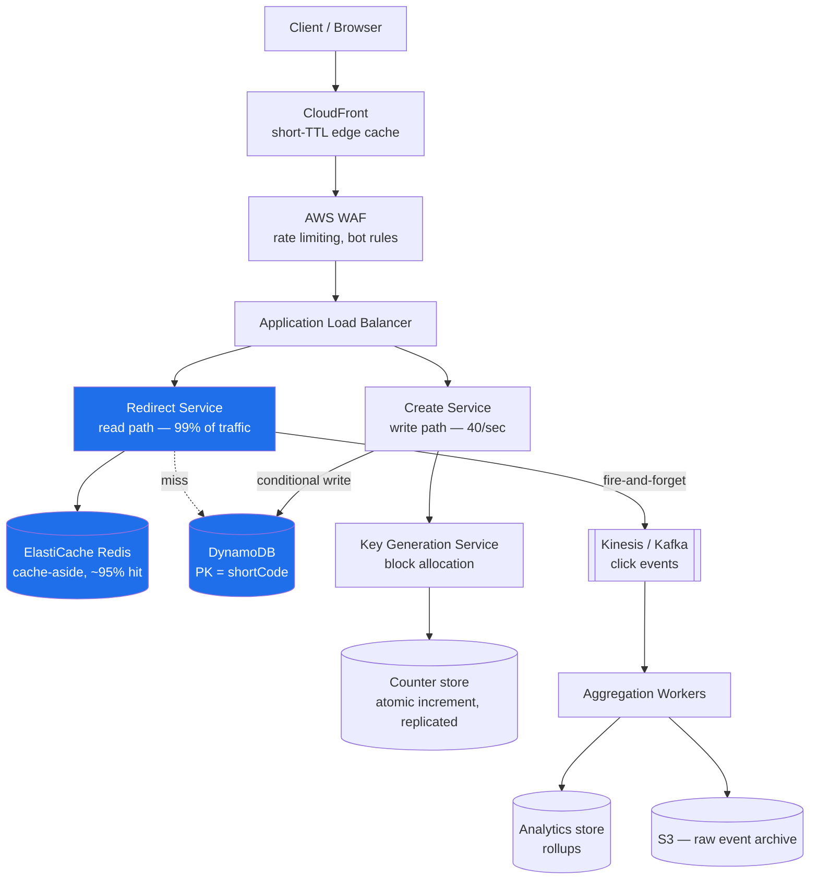
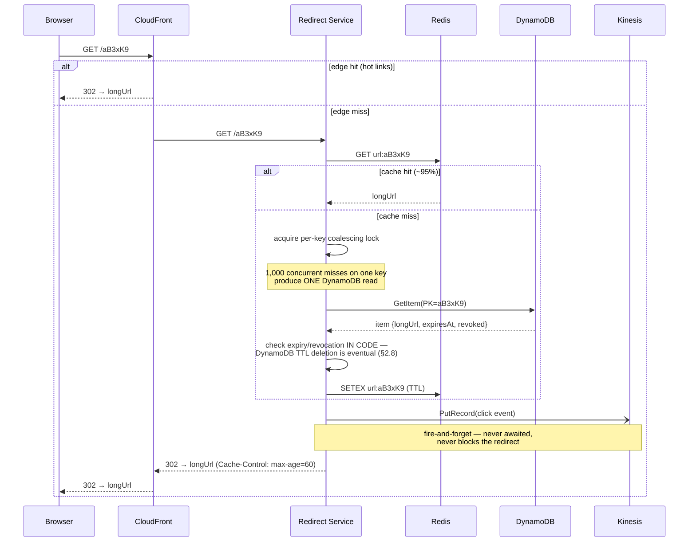
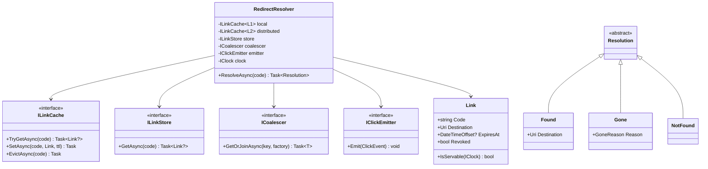

# Module 177 — System Design: Designing a URL Shortener & Distributed Unique ID Generation

> Domain: System Design | Level: Beginner → Expert | Prerequisite: [[01-System-Design-Fundamentals]] (capacity estimation, caching strategies, CAP), [[16-Interview-Execution-Playbook-Estimation-Rubric]] (the 45-minute shape this module is the canonical rehearsal for), [[../08-DynamoDB/01-Core-Concepts-Partition-Keys-Indexes]] (partition-key design and conditional writes, used directly), [[../07-Redis/01-Data-Structures-Caching-Patterns]] (cache-aside, hot-key handling)

---

**Why this module exists.** `URLShotner.md` — a 309-word AWS box diagram with no analysis, absent from the Progress Log — was the only coverage of the single most frequently asked opening prompt in the industry. That file's content is absorbed here (§3 retains its AWS service mapping, corrected and justified) and the stub is retired.

The prompt looks trivial, and that is precisely its function. It is used as a *warm-up* at Senior level and as a *depth probe* at Staff+, because it contains, in a problem small enough to fit in 45 minutes, four genuinely hard sub-problems: **distributed unique ID generation without coordination**, **read-path optimization at extreme read/write skew**, **hot-key handling**, and **the surprisingly consequential 301-versus-302 decision**. A candidate who treats it as easy produces a hash-table-with-a-cache answer and gets a senior rating. The interviewer chose it because they can go five levels deep on ID generation alone.

---

## 1. Fundamentals

### What is a URL shortener?

A service mapping a long URL (`https://example.com/very/long/path?with=params`) to a short one (`https://sho.rt/aB3xK9`), which redirects to the original on access. Commercially: link sharing under character limits, click analytics, branded links, and — the reason enterprises run them — the ability to change a destination after distribution, and to revoke a link.

The essential asymmetry: **creation is rare, redirection is constant.** Typical production ratios run 100:1 to 1000:1 read-to-write. Almost every design decision follows from that single number.

### Why does this matter beyond the interview?

Because the ID-generation half is not really about URLs. "Generate a globally unique, short, non-colliding identifier across N independent machines without those machines talking to each other" is the same problem as order IDs in an OMS, payment references, trace IDs, idempotency keys, and primary keys in any sharded store. The URL shortener is the friendly wrapper around it, which is why interviewers keep using it — they get to probe distributed ID generation without making the prompt intimidating.

### When does this matter?

Any time you need identifiers that are unique across machines, and especially when they must additionally be *short*, *sortable*, *non-guessable*, or *URL-safe* — properties that pull against each other in ways §2.2–2.4 make precise.

### How does it work (30,000-ft view)?

```
WRITE  POST /shorten {longUrl}
         → generate a unique ID
         → encode it to a short, URL-safe string
         → persist (shortCode → longUrl, owner, expiry, metadata)
         → return https://sho.rt/{shortCode}

READ   GET /{shortCode}
         → look up longUrl  (cache first — this is 99%+ of all traffic)
         → emit a click event ASYNCHRONOUSLY (never on the critical path)
         → HTTP 301 or 302 redirect to longUrl
```

The read path is four steps and must complete in single-digit milliseconds. Every complication in this design is about keeping it that way.

---

## 2. Deep Dive

### 2.1 Capacity Estimation — Run It, Because It Eliminates Three Architectures

Assume 100M new URLs per month, a 100:1 read ratio, 5-year retention. Per Module 176 §2.2:

```
WRITES   100M/month ÷ 2.5×10^6 s   ≈ 40 writes/sec        peak ~120 (3× consumer)
READS    40 × 100                   = 4,000 reads/sec      peak ~12,000
STORAGE  100M/mo × 60 months        = 6 billion records
         × ~500 B/record            = 3 TB   (×3 replication = 9 TB)
KEYSPACE 6 × 10^9 records — how many characters of base62 does that need?
         62^6 = 5.7 × 10^10  ⇒ 6 characters covers 57 billion, ~10× headroom  ✓
         62^5 = 9.2 × 10^8   ⇒ insufficient at 920 million
BANDWIDTH 12,000 × ~1 KB response ≈ 12 MB/sec — trivial
```

**Therefore, three eliminations, stated aloud:**

1. **40 writes/sec eliminates any sharded-write architecture.** This is nowhere near the ~5–10k/sec single-primary ceiling. A candidate who proposes sharding the write path here is designing for a number they didn't compute. (This is Module 176 §E5's over-engineering penalty in its most common concrete form.)
2. **3 TB eliminates "just keep it in memory"** as the whole answer, though it does *not* eliminate caching the hot subset — which matters, because access is extremely skewed.
3. **62^6 = 57 billion sets the short-code length at 6 characters** — and this is the estimation that actually shapes the API. Note it's derived, not chosen.

The bandwidth number is computed and immediately **retired**: 12 MB/sec is unremarkable and will not be mentioned again.

### 2.2 ID Generation — Five Approaches, and Why Four Are Usually Wrong

This is the heart of the problem and where the interview goes deep. The requirement: generate unique IDs across N stateless application servers, ideally without a coordination round trip on the write path.

**Approach A — Hash the URL (MD5/SHA-256, take the first 6 characters).**

Attractive because it's stateless and deterministic — the same URL naturally yields the same short code, giving free deduplication. It is nonetheless the wrong default, for a reason candidates consistently underestimate: **the birthday bound**. With a 6-character base62 space (5.7×10^10) and 6×10^9 stored records, the probability of at least one collision is not small:

```
P(collision) ≈ 1 − e^(−n²/2N)   with n = 6×10^9, N = 5.7×10^10
             ≈ 1 − e^(−3.16×10^8)  ≈ 1.0
```

Collisions are not a remote possibility; they are a **certainty**, by an enormous margin. You would need roughly `n²/2N << 1`, i.e. n well under ~340,000 records, for truncated-hash collisions to be genuinely unlikely at this length. So hashing requires a collision-detection-and-retry loop — a read-before-write on every creation, which reintroduces exactly the coordination the approach was supposed to avoid, plus unbounded retry under adversarial input.

The other defect: **hashes are not sequential, so the storage layer gets random-write behaviour**. On a B-tree index that means page splits and poor locality. It also makes the codes non-enumerable, which is a *security advantage* — see §8.

*Verdict:* usable only if same-URL-deduplication is a hard product requirement, and then with an explicit collision loop and honesty about its cost.

**Approach B — Database auto-increment, then base62-encode.**

Simple and genuinely correct: the database guarantees uniqueness. Codes are short and dense, with zero waste in the keyspace.

The defect is that it makes **every write a coordinated write against a single sequence**, which is a hard availability coupling — if the sequence's home database is unavailable, no URL can be created anywhere. At 40 writes/sec the *throughput* is a non-issue (candidates wrongly attack it on throughput grounds); the real objection is the single point of failure and the difficulty of multi-region write availability.

It also leaks: sequential IDs mean `aB3xK9` and `aB3xKA` are adjacent, so the entire corpus is enumerable and your creation *rate* is publicly measurable (the German-tank problem). For a public shortener that's an information leak; for an enterprise one it's a data-exfiltration path.

**Approach C — Key Generation Service (KGS) with pre-allocated ranges.** *This is the strongest answer for this problem.*

A small service hands out **blocks** of the keyspace. Each application server requests a range (say 10,000 IDs), holds it in memory, and allocates from it locally with zero network calls. When exhausted, it requests another block.

```
KGS state:  next_block_start = 4,830,000
App server A requests → gets [4,830,000 … 4,839,999], increments locally
App server B requests → gets [4,840,000 … 4,849,999]
```

Why this is right here: it removes coordination from the write path entirely (one KGS call per 10,000 writes, not per write), it preserves the density of sequential IDs, and the KGS itself is trivially made HA because its only state is a single monotonic counter that can live in a replicated store with an atomic increment.

The trade-off to state proactively: **block loss on restart.** A server that dies holding 6,000 unused IDs leaks them permanently. With a 5.7×10^10 keyspace and 6-character codes, leaking even millions of IDs is irrelevant — but you must say why it's irrelevant rather than not noticing it. If the keyspace were tight, this would be disqualifying.

**Approach D — Snowflake-style composite IDs.**

Twitter's scheme packs a 64-bit integer:

```
 1 bit  sign (always 0, so the value stays positive in signed-int languages)
41 bits timestamp in ms since a custom epoch  → 2^41 ms ≈ 69 years
10 bits machine/worker ID                     → 1,024 workers
12 bits per-millisecond sequence              → 4,096 IDs per worker per ms
       ⇒ ~4.1 million IDs/second/worker, no coordination at all
```

Genuinely coordination-free and **time-sortable**, which is valuable — a sorted primary key gives sequential inserts and good index locality, and IDs carry their own creation time.

Two hard problems that a Staff-level answer must raise unprompted:

- **Clock skew and backward jumps.** If NTP steps the clock backwards, a worker can regenerate timestamps it has already used, producing duplicate IDs. The mitigation is to refuse: track the last-issued timestamp and, if the clock moves backwards, either block until it catches up or fail loudly. Silently continuing generates duplicates, which for an ID generator is a catastrophic and near-undetectable failure. (Same shape as Module 175 §2.7's clock-skew handling in distributed rate limiting.)
- **Worker-ID assignment.** 10 bits means 1,024 workers, and **two workers with the same ID generate colliding sequences**. Static configuration doesn't survive autoscaling; the standard fix is lease-based assignment from ZooKeeper/etcd with a TTL, which reintroduces a coordination dependency — at startup only, not per-ID, which is the acceptable version.

The reason Snowflake is usually *not* the answer for a URL shortener specifically: a 64-bit value base62-encodes to **11 characters**, not 6. The timestamp and worker bits are mostly wasted entropy for this use case. Snowflake is the right answer when you need time-sortability and can afford the length — order IDs, trace IDs, event IDs — and the wrong one when shortness is the product.

**Approach E — UUIDv4.**

128 bits of randomness, zero coordination, collision probability negligible. And **22 base62 characters** — nearly four times too long. Also random, so it destroys index locality on insert. UUIDv7 (time-ordered) fixes the locality problem but not the length. Mention it, dismiss it on length, and move on; spending time here signals you didn't do §2.1's keyspace arithmetic.

**Decision table:**

| Approach | Coordination | Length | Sortable | Guessable | Verdict here |
|---|---|---|---|---|---|
| Truncated hash | none | 6 | no | no | Only if same-URL dedup is required |
| DB auto-increment | per write | 6 | yes | **yes** | Correct but availability-coupled |
| **KGS blocks** | **per 10k writes** | **6** | roughly | yes* | **Recommended** |
| Snowflake | startup only | 11 | yes | partially | Right problem, wrong length |
| UUIDv4/v7 | none | 22 | v7 only | no | Far too long |

\* Guessability is fixed independently in §8 — do not fix it by choosing a worse ID scheme.

### 2.3 Base62 Encoding — and Why the Alphabet Choice Is a Real Decision

Base62 = `[0-9a-zA-Z]`, chosen because those are the characters that are URL-safe without escaping, case-preserving across the systems that will handle the link, and dense.

```
62^6 = 56,800,235,584    ~57 billion — the §2.1 target
62^7 = 3.5 trillion
```

Two non-obvious points worth raising:

**Base64 is wrong here** despite being denser, because its alphabet includes `+` and `/`, which require percent-encoding in a URL path, and `=` padding. URL-safe base64 substitutes `-` and `_`, which works but introduces characters that break on double-click selection in many terminals and get mangled by some link-detection heuristics in chat clients. The density gain (64 vs 62) is negligible — `log(64)/log(62) ≈ 1.008` — so you'd save nothing while adding fragility.

**Ambiguous characters are a product decision.** `0`/`O`, `1`/`l`/`I` are indistinguishable in many fonts. If links are ever transcribed by humans — printed, read aloud, typed from a slide — remove them, dropping to base56 or so. `62^6 = 57B` versus `56^6 = 31B` still clears the 6-billion requirement, so the cost is affordable. If links are only ever clicked, keep the full alphabet. Naming this trade-off unprompted is a small but reliable signal that you think about the product, not just the encoding.

### 2.4 The Read Path — Where 99% of the Traffic Lives

At 12,000 peak reads/sec against 40 writes/sec, the read path is the system. Three layers, each justified by a number:

**Layer 1 — CDN/edge.** A redirect response is tiny, immutable in practice (a short code's target rarely changes), and highly skewed in access. Caching redirects at the edge with a modest TTL serves the hot tail entirely outside your infrastructure. The constraint that makes this non-trivial: **it is incompatible with per-click analytics at the edge unless the CDN can log and ship click events**, and it makes revocation slow (a revoked link stays live until TTL expiry). For a link-shortener serving marketing campaigns, both matter — so edge caching is typically applied with a short TTL (60s) as a burst absorber rather than a long-lived cache.

**Layer 2 — Redis, cache-aside.** This is the workhorse. Access is Zipfian: a small fraction of links carry most traffic, so even a modest cache holds a very high hit rate. Concretely, caching the hot 20M codes at ~200 bytes each is ~4 GB — trivially affordable, and likely to serve well over 95% of reads.

The failure mode to name (Module 176 §I3, point 4): **the database is now provisioned for the miss rate.** At a 95% hit rate, cache loss is a 20× instantaneous load spike on the datastore, not a latency regression. Mitigations: request coalescing on miss so a thousand concurrent requests for one cold key produce one datastore read; staged warm-up rather than instant cutover after a Redis restart; and load shedding that returns 503 rather than collapsing.

**Layer 3 — the datastore.** The access pattern is a pure single-key lookup by primary key, with no range queries, no joins, and no ad-hoc reporting on the hot path. That is the textbook case for a key-value store, and per §12 the choice is DynamoDB or Cassandra rather than a relational database — not because relational "can't scale," but because there is no relational feature being used, and the key-value store's operational model (partition by the key you always query, predictable single-digit-ms lookups) fits exactly.

### 2.5 301 vs 302 — the Small Question That Is Actually a Trap

`301 Moved Permanently` is cacheable by browsers indefinitely and by intermediaries aggressively. `302 Found` (or `307 Temporary Redirect`) is not cached by default.

The naive reasoning: 301 is better, because the browser caches it and subsequent clicks never reach our servers at all — lower cost, lower latency.

The consequences that make 301 usually **wrong** for a commercial shortener:

1. **You lose click analytics permanently.** A browser-cached 301 never contacts you again. For a service whose commercial value is substantially *analytics*, you have destroyed the product to save bandwidth.
2. **You lose the ability to change the destination.** A 301 cached in a hundred million browsers cannot be recalled. If the link is a marketing campaign redirected to a new landing page — or worse, a link that must be *revoked* because it points to something malicious or leaked — you have no mechanism. Browsers honour cached 301s for a long time and users cannot reasonably be asked to clear their cache.
3. **It makes an irreversible commitment on behalf of a mutable mapping.** The short code → URL mapping is *data*, and data changes; HTTP 301 asserts it is permanent.

So: **302 (or 307) by default**, accepting that every click hits your infrastructure — which §2.1 showed is only 12,000/sec at peak and is exactly what the cache layers are for. Use 301 only for links explicitly marked immutable, if the product offers that.

The reason this is a trap: it's phrased as a trivia question about HTTP semantics, and the correct answer is a product-and-reversibility argument. Candidates who answer "301, it's cacheable" have answered a different, easier question.

Use **307** over 302 if the method must be preserved; for `GET`-only redirect traffic it makes no practical difference, but knowing why 307 exists (302 historically allowed clients to rewrite `POST` to `GET`) is a legitimate depth marker.

### 2.6 Analytics — Strictly Off the Critical Path

Every redirect should emit a click event: timestamp, short code, referrer, coarse geo, user agent, and *not* raw IP if you intend to stay on the right side of GDPR without a lawful basis.

The rule is absolute: **the click write must never be synchronous with the redirect.** Adding a durable write to a 5ms redirect path triples its latency and, worse, couples redirect *availability* to analytics availability — an analytics outage would take down redirection, which is the actual product. Fire-and-forget onto a queue or stream, batch on the consumer side, aggregate into rollups.

Aggregation follows Module 176 §2.4's queue-vs-log discriminator: use a **log** (Kafka/Kinesis) here, because there will be multiple independent consumers (real-time counters, the data warehouse, fraud detection) and because reprocessing after an aggregation bug is a genuine requirement.

For counters at high volume, exact counts are usually unnecessary: HyperLogLog gives unique-visitor cardinality in ~12 KB per counter with ~2% error, versus storing every visitor ID. State the accuracy trade-off explicitly rather than silently choosing approximation — "clicks are exact, unique visitors are ±2%" is a defensible product statement; discovering the imprecision later is not.

### 2.7 Custom Aliases and the Only Genuine Race in the System

Users want `sho.rt/my-campaign`. This introduces the one place where two concurrent requests genuinely contend: two users simultaneously claiming the same alias.

The wrong implementation, which candidates write reflexively:

```csharp
if (await store.ExistsAsync(alias))     // ← check
    return Conflict();
await store.PutAsync(alias, longUrl);   // ← act — both requests reach here
```

This is check-then-act across a network boundary. Both requests can pass the check before either writes; the second silently overwrites the first, and the first user's link now points somewhere they didn't choose.

The fix is a **conditional write** — one atomic operation that both tests and sets:

```csharp
// DynamoDB: the condition is evaluated inside the write, atomically.
var request = new PutItemRequest {
    TableName = "ShortLinks",
    Item = item,
    ConditionExpression = "attribute_not_exists(ShortCode)"
};
try { await dynamo.PutItemAsync(request); }
catch (ConditionalCheckFailedException) { return Conflict("Alias already taken."); }
```

Equivalently a unique index in a relational store and catching the constraint violation, or `SET NX` in Redis if Redis is authoritative (it usually shouldn't be for durable data).

The important generalization, which is what the interviewer is actually probing: **a uniqueness check and the write it guards must be the same atomic operation.** Module 176 §A2's idempotency-key discussion is the identical defect in a different costume — two concurrent retries both passing a duplicate check and both inserting.

Custom aliases must also occupy the *same* namespace as generated codes, or a generated code will eventually collide with an existing alias. The standard approach is to reserve them in one table and have the generator skip taken values — or, cheaply, to give custom aliases a length or character property generated codes never produce (e.g. generated codes are exactly 6 chars; custom aliases must be 7+), which makes the namespaces disjoint by construction rather than by check. Structural separation over enforced separation is the recurring preference across this course.

### 2.8 Expiry, Revocation, and Deletion

Links expire (campaign ends), are revoked (abuse, leaked internal link), or are deleted by the owner. Three mechanics with different guarantees:

- **TTL at the storage layer** (DynamoDB TTL, Redis `EXPIRE`) makes expiry structural rather than a cleanup job that can silently fall behind — Module 42's Stories lesson applied directly. Note DynamoDB TTL deletion is *eventual* (typically within 48 hours), so the read path must still check the expiry timestamp rather than trusting the row's absence. Trusting TTL for *correctness* rather than *cleanup* is a real and common defect.
- **Revocation must be immediate**, which is in direct tension with §2.4's caching. A revoked code must be purged from Redis and, if edge caching is used, from the CDN — and CDN purge is slow and sometimes partial. This is the strongest argument for the short edge TTL chosen in §2.4: it bounds the revocation window to something you can state in a policy ("revocation takes effect within 60 seconds") rather than something unbounded.
- **Deletion must not free the code for reuse.** Reissuing a deleted code to a new destination means an old shared link silently starts pointing somewhere else — a genuine security problem, since the old link may be printed, bookmarked, or embedded. Deleted codes go to a tombstone, permanently. The keyspace is large enough (§2.1) that never reusing codes costs nothing.

---

## 3. Visual Architecture

### System architecture (AWS-mapped)



The highlighted path is the one that matters: **client → cache → redirect** is the entire product from the user's perspective, and everything else exists to keep that path fast and correct.

### AWS service mapping

| Concern | Service | Why this one |
|---|---|---|
| Edge cache | CloudFront | Short TTL absorbs bursts; long TTL would break revocation (§2.8) |
| Edge security | AWS WAF | Bot rules and IP rate limiting *before* compute is billed |
| Routing | ALB | L7 needed to split `/shorten` (write) from `/{code}` (read) onto separately-scaled services |
| Read/write compute | ECS Fargate or Lambda | Read path is spiky and stateless; Lambda is defensible, but cold starts on a 5ms budget argue for provisioned containers |
| Cache | ElastiCache Redis | Sub-ms single-key GET; cache-aside per §2.4 |
| Primary store | DynamoDB | Pure single-key access; `attribute_not_exists` gives §2.7's atomic conditional write natively |
| ID allocation | KGS on ECS + DynamoDB atomic counter | One coordinated op per 10,000 writes |
| Click stream | Kinesis Data Streams | Multiple independent consumers + replay ⇒ log, not queue (§2.6) |
| Analytics store | Timestream or Redshift | Rollups and time-range queries, off the hot path |
| Raw archive | S3 + lifecycle to Glacier | Cheap, immutable, reprocessable |
| Observability | CloudWatch + per-shard custom metrics | Aggregate metrics are blind to hot-key failure (§14) |

### Redirect sequence — including the miss path



### Snowflake bit layout

```
 63                                    22        12          0
  ┌─┬─────────────────────────────────┬──────────┬──────────┐
  │0│  timestamp (41 bits, ms)        │ worker   │ sequence │
  │ │  ≈ 69 years from custom epoch   │ (10 bits)│ (12 bits)│
  └─┴─────────────────────────────────┴──────────┴──────────┘
     ↑ sign bit always 0 so the value      ↑            ↑
       stays positive in signed-int    1,024 max    4,096 per ms
       languages (Java/C# long)         workers      per worker

  FAILURE MODE 1: clock steps backwards → timestamps reused → DUPLICATE IDs
                  fix: track last timestamp; block or fail loudly, never proceed
  FAILURE MODE 2: two workers assigned the same 10-bit ID → identical sequences
                  fix: lease worker IDs from etcd/ZooKeeper with a TTL at startup

  For a URL shortener: 64 bits → 11 base62 chars. Too long. (§2.2 Approach D)
```

---

## 4. Production Example

**Problem.** A B2B marketing-automation platform ran a link shortener for customer campaigns — roughly 8,000 redirects/sec at peak, 99.98% availability target, and click analytics as a *billed* product feature. Over one quarter, three separate enterprise customers reported the same complaint: click counts in their dashboard were materially lower than the counts reported by their own landing-page analytics. The discrepancy was consistent, roughly 12–18%, and always in the same direction.

Engineering investigated three times and closed it twice as "expected variance — bot filtering and analytics methodology differences explain it." The third time, a customer's contract renewal was at stake and the investigation went deeper.

**Architecture.** Conventional and, on paper, correct: CloudFront → ALB → redirect service → Redis → DynamoDB, with click events fired to Kinesis and aggregated into rollups. The click emit was explicitly asynchronous per §2.6 — the team had done that part right.

**Implementation — what was actually happening.** Two independent causes, which is why single-cause investigations kept failing:

*Cause 1 — the edge cache was eating clicks.* Someone had raised the CloudFront TTL from 60 seconds to 24 hours during a cost-reduction exercise, reasoning correctly that redirects are effectively immutable and incorrectly that this was therefore free. It reduced origin traffic by 60% and the AWS bill accordingly. It also meant that **60% of clicks never reached the origin and were therefore never counted** — the click event is emitted by the redirect service, which the request no longer reaches. The cost saving and the analytics loss were the same number, and only one of them was on a dashboard.

*Cause 2 — silent Kinesis backpressure.* The fire-and-forget emit was implemented as:

```csharp
_ = _kinesis.PutRecordAsync(record);   // discard the task — never awaited
```

When Kinesis throttled (`ProvisionedThroughputExceededException` during campaign bursts), the exception surfaced inside a discarded `Task`. Nothing observed it. In .NET, an unobserved faulted task raises `TaskScheduler.UnobservedTaskException` only after finalization — and the application had no handler registered, so the exceptions vanished entirely. Roughly 5% of click events during peak bursts were dropped with **zero error signal anywhere**.

**Trade-offs.** The team had made two locally-reasonable decisions, each optimizing a real metric — cost and redirect latency — and each paying for it in a dimension nothing measured. The TTL change was reviewed and approved: the reviewer checked that redirects would still work, which they did. The fire-and-forget pattern was deliberately chosen to keep analytics off the critical path, which was correct; the defect was *discarding the failure signal* along with the latency, which was not a necessary part of that trade.

**Lessons learned.**

1. **Caching a request removes it from every system downstream of the cache, including the ones you weren't thinking about.** A cache is not only a latency optimization; it is a *traffic filter*, and anything that counted the filtered traffic now counts less. Before raising any cache TTL, enumerate what observes the cached path — this generalizes to every cache in every system, and it is not intuitive.
2. **Fire-and-forget must forget the latency, not the errors.** The correct pattern preserves the failure signal: buffer locally with a bounded channel, emit from a background consumer, and **count the drops**. A dropped event is acceptable; an *uncounted* dropped event is not, because it makes the data silently wrong rather than known-incomplete.
3. **The discrepancy was reported by the customer three times before it was believed.** The internal signal — a metric comparing clicks-counted against redirects-served — did not exist, so there was nothing to contradict "expected variance." The customer was the monitoring system, which is Module 132's finding restated: when the dominant failure has no natural internal detector, an external party discovers it, and by then it is a commercial problem rather than an engineering one.
4. **Both causes produced the same symptom in the same direction**, which is precisely why two closed investigations found nothing conclusive — each investigator found a partial explanation that didn't account for the full gap and, lacking a way to attribute the remainder, closed it. When a discrepancy is *consistent but unexplained*, the honest position is "we cannot account for 12%," not "variance."

**The fix.** Edge TTL returned to 60 seconds, with the cost delta reclassified as the price of the analytics product rather than waste. CloudFront real-time logs shipped to the same Kinesis stream, so edge-served redirects are counted even when they never reach origin — this is what allows a *long* TTL to coexist with accurate analytics, and is how the team eventually got both. The emit moved to a bounded `Channel<ClickEvent>` with a background drain, a dropped-event counter, and an alert on drop rate. And the reconciliation that should have existed from day one: **redirects-served (from ALB/CloudFront metrics) versus clicks-counted (from the analytics store)**, compared hourly, alerting on divergence above 1% — an independently-derived expected set, per Module 176 §E7.
## 10. Interview Questions

### Basic (10)

**B1. Q: How many characters does a short code need, and how do you determine it?**
**Ideal Answer:** Derive it from the total record count. At 100M URLs/month over 5 years that's 6 billion records. Base62 gives `62^6 = 57 billion` — roughly 10× headroom — while `62^5 = 920 million` is insufficient. So 6 characters, derived rather than chosen.
**Why correct:** It's arithmetic against a stated requirement, and it's one of the few numbers in this design that directly shapes the API contract.
**Common mistakes:** Picking 7 or 8 "to be safe" without computing; using base64 without noticing its alphabet needs URL escaping; forgetting to multiply the monthly rate by the retention period.
**Follow-ups:** What if retention were unlimited? (You need a growth model and a length you won't have to change, since changing it later means two code lengths coexisting forever — which is survivable but must be designed in.) Why not base64? (`+` and `/` need percent-encoding; the density gain is ~0.8%, which buys nothing.)

**B2. Q: Why is this system read-heavy, and what does that imply?**
**Ideal Answer:** Each URL is created once and redirected many times — typical ratios are 100:1 or higher. That implies the leverage is entirely in caching and read replication, the write path can stay simple and unsharded, and any latency spent on the read path is multiplied a hundredfold in cost and user impact.
**Why correct:** The read/write ratio is the routing decision for the whole design (Module 176 §B3).
**Common mistakes:** Optimizing the write path; adding a cache without stating the expected hit rate.
**Follow-ups:** What would change at 1:1? (Caching becomes nearly useless; the design becomes about write throughput and you'd revisit the store.) What's the peak multiplier? (~3× for a general service; campaign-driven traffic can spike far higher on individual links, which is the hot-key problem, not an aggregate one.)

**B3. Q: What's the simplest correct way to generate unique short codes, and what's wrong with it?**
**Ideal Answer:** A database auto-increment counter, base62-encoded. It's genuinely correct and produces maximally dense codes. Its problems are availability coupling — every creation requires the sequence's home database — and enumerability, since sequential IDs let anyone walk the entire corpus.
**Why correct:** It establishes the baseline honestly before proposing something more elaborate, which is the right order.
**Common mistakes:** Attacking it on throughput grounds (40 writes/sec is nothing); not mentioning enumerability at all.
**Follow-ups:** How would you fix the enumerability without changing the scheme? (A keyed bijective permutation over the ID space — §8.) How would you fix the availability coupling? (Block pre-allocation — KGS.)

**B4. Q: Should a redirect return 301 or 302, and why?**
**Ideal Answer:** 302 (or 307). A 301 is cached indefinitely by browsers, which means you permanently lose click analytics for that user and lose the ability to change or revoke the destination. Since the mapping is mutable data and analytics is typically the commercial product, asserting permanence is wrong.
**Why correct:** It answers on reversibility and product grounds rather than on HTTP-caching trivia, which is what the question is actually testing.
**Common mistakes:** "301 because it's cacheable and reduces load" — answering the easier question; not mentioning revocation, which is the more serious of the two losses.
**Follow-ups:** When *would* 301 be right? (A genuinely permanent, analytics-free mapping — e.g. a domain migration.) How do you get edge caching *and* analytics? (Ship the CDN's own access logs into the click stream — §4's eventual fix.)

**B5. Q: Where does the click-tracking write go, and why?**
**Ideal Answer:** Onto an async stream, never synchronously in the redirect. Synchronous tracking adds latency to the product's core path and couples redirect *availability* to analytics availability — an analytics outage would break redirection.
**Why correct:** It identifies the availability coupling, which is the more serious problem than the latency.
**Common mistakes:** Writing clicks to the primary database synchronously; saying "async" but discarding the error signal, which is §4's actual incident.
**Follow-ups:** Queue or log? (Log — multiple independent consumers plus replay.) How do you know if events are being dropped? (An explicit drop counter, plus reconciliation of redirects-served against clicks-counted.)

**B6. Q: What's the partition key for the mapping store, and why?**
**Ideal Answer:** The short code. It's the only attribute you ever query by, it's uniformly distributed by construction, and it makes every lookup a single-partition point read. The cost, per the discipline of always naming it: reverse lookup by long URL becomes a scan, so if you need same-URL deduplication that requires a separate index.
**Why correct:** It names both the choice and the query it makes expensive (Module 176 §2.3).
**Common mistakes:** Partitioning by long URL or by creating user, both of which make the dominant query a scan; not naming the expensive query.
**Follow-ups:** How would you support "show me all links this user created"? (A GSI on `ownerId`, accepting that it's a separate index with its own write cost and eventual consistency.)

**B7. Q: A user wants a custom alias. What's the concurrency hazard?**
**Ideal Answer:** Two users claiming the same alias simultaneously. A check-then-act implementation — `if (!exists) put` — lets both pass the check before either writes, so the second silently overwrites the first. The fix is a conditional write that tests and sets atomically: `attribute_not_exists` in DynamoDB, a unique index in SQL, `SET NX` in Redis.
**Why correct:** It identifies the only genuine race in the system and gives the atomic primitive that resolves it.
**Common mistakes:** Adding a distributed lock, which is heavier and less reliable than the conditional write the store already provides; not noticing the race at all.
**Follow-ups:** How do you stop a generated code colliding with an existing alias? (Make the namespaces disjoint by construction — e.g. generated codes are exactly 6 chars, aliases 7+ — rather than checking.)

**B8. Q: What happens if the Redis cache goes down entirely?**
**Ideal Answer:** All traffic falls through to the datastore. At a 95% hit rate that is a 20× instantaneous load increase — a throughput event, not a latency event. Survival requires the miss path to be within SLA (it is, ~8.5ms), request coalescing so concurrent misses on one key produce one read, provisioned datastore headroom or on-demand capacity, and load shedding rather than collapse.
**Why correct:** It quantifies the spike from the hit rate rather than treating cache loss as a degradation.
**Common mistakes:** "Latency would go up" — understating it; not realizing the datastore is provisioned for the miss rate specifically.
**Follow-ups:** How do you warm the cache after a restart? (Gradually — an instant cutover to a cold cache is the spike; ramping traffic or pre-loading the hot set avoids it.)

**B9. Q: Can a deleted short code be reused?**
**Ideal Answer:** No. A previously-distributed link may be printed, bookmarked, or embedded; reissuing the code makes that old link silently point somewhere new, which is a security problem rather than a hygiene one. Tombstone deleted codes permanently — the keyspace is large enough to afford it.
**Why correct:** It classifies the issue correctly (security, not cleanup) and notes the keyspace makes the safe choice free.
**Common mistakes:** Proposing reuse as a keyspace optimization without noticing the redirect-hijacking implication.
**Follow-ups:** What if the keyspace were genuinely tight? (Then reuse requires a long quarantine period and an explicit accepted risk — but the better answer is to lengthen the code.)

**B10. Q: Why is the URL shortener used as an interview question so often?**
**Ideal Answer:** Because it's small enough to scope in five minutes but contains four genuinely hard sub-problems — coordination-free distributed ID generation, extreme read/write skew, hot keys, and a decision (301/302) that looks like trivia and is actually about reversibility. The interviewer can go five levels deep on ID generation alone without the prompt seeming intimidating.
**Why correct:** Recognizing the prompt's structure lets you allocate time to the parts that carry the signal.
**Common mistakes:** Treating it as easy and producing a hash-table-plus-cache answer, which is the intended trap.
**Follow-ups:** Where would you expect the deep dive? (ID generation, almost always — so have the five approaches and their trade-offs ready.)

### Intermediate (10)

**I1. Q: Compute the collision probability for truncated-hash short codes, and say what it implies.**
**Ideal Answer:** Birthday bound: `P ≈ 1 − e^(−n²/2N)`. With `n = 6×10^9` records and `N = 62^6 = 5.7×10^10`, the exponent is `−3.16×10^8`, so `P ≈ 1.0` — collisions are certain, not unlikely. You'd need n well under ~340,000 for collisions to be genuinely improbable at this length. Implication: hashing requires a collision-detect-and-retry loop, which reintroduces a read-before-write on every creation — precisely the coordination hashing was meant to avoid.
**Why correct:** It replaces intuition ("hashes rarely collide") with the actual bound, and traces the consequence to an architectural cost.
**Common mistakes:** Asserting collisions are "rare" without computing; assuming a longer hash prefix fixes it cheaply (it costs characters, which is the product); forgetting that the retry loop is unbounded under adversarial input.
**Follow-ups:** When is hashing still right? (When same-URL deduplication is a hard requirement — determinism is the feature.) How would you bound the retry? (Append a salt/counter after N attempts and accept the determinism loss for those cases.)

**I2. Q: Explain the KGS block-allocation scheme and its failure mode.**
**Ideal Answer:** A key-generation service hands each app server a contiguous block of the keyspace (say 10,000 IDs), which the server allocates from in memory with no network calls. One coordinated operation per 10,000 writes instead of per write. Failure mode: a server that dies holding unused IDs leaks them permanently. That's acceptable here because the keyspace is 57 billion and leaking millions is irrelevant — but you must say why it's acceptable, because in a tight keyspace it would be disqualifying.
**Why correct:** It gives both the mechanism and the honest cost, with the reason the cost is affordable in *this* design specifically.
**Common mistakes:** Not mentioning block loss; making blocks so large that loss matters, or so small that the coordination benefit disappears.
**Follow-ups:** How is the KGS itself made HA? (Its entire state is one monotonic counter — an atomic increment in a replicated store, so it's trivially replicable; the service is nearly stateless.) What block size? (Large enough that allocation is rare, small enough that loss is negligible — 10k is a reasonable default, tunable from observed write rate.)

**I3. Q: Walk through Snowflake's bit layout and both of its failure modes.**
**Ideal Answer:** 1 sign bit (always 0, keeping the value positive in signed-integer languages), 41 timestamp bits (~69 years of milliseconds from a custom epoch), 10 worker bits (1,024 workers), 12 sequence bits (4,096 IDs per worker per millisecond). Failure 1: **clock moving backwards** — an NTP step back lets a worker regenerate already-used timestamps, producing duplicates; the fix is to track the last-issued timestamp and block or fail loudly rather than proceed. Failure 2: **duplicate worker IDs** — two workers sharing a 10-bit ID generate identical sequences; static config doesn't survive autoscaling, so worker IDs must be leased from etcd/ZooKeeper with a TTL at startup.
**Why correct:** Both failures are silent and catastrophic for an ID generator, and both are the actual reasons Snowflake deployments fail in production.
**Common mistakes:** Reciting the bit layout without the failure modes; proposing to "just handle" a backwards clock by continuing, which generates duplicates.
**Follow-ups:** Why is Snowflake wrong for a URL shortener? (64 bits base62-encodes to 11 characters; the timestamp and worker bits are wasted entropy when shortness is the product.) When is it right? (Order IDs, trace IDs, event IDs — anywhere time-sortability is worth the length.)

**I4. Q: How do you handle a single viral link taking 30% of all traffic?**
**Ideal Answer:** In order: (1) edge caching handles it naturally, since a viral link is maximally cacheable — this is the primary and automatic defence; (2) a small local in-process cache of the top-N codes on each redirect node, so the hot key never touches Redis; (3) if those fail, key replication — store `code#0`…`code#9` and read a random suffix, spreading one logical key across ten physical ones. The underlying constraint is DynamoDB's per-partition throughput ceiling, which aggregate provisioning does not relieve.
**Why correct:** It orders the mitigations by cost and notes that the cheapest one is automatic, rather than jumping to the most elaborate.
**Common mistakes:** Reaching for key replication first; adding aggregate capacity, which doesn't help a single-partition ceiling.
**Follow-ups:** How would you detect it? (Per-key and per-partition metrics — aggregate cache and cluster health stay green while one shard saturates, which is §14's incident.) What's the read cost of key replication? (None — you read one random suffix; the cost is on writes, which must fan out to all ten.)

**I5. Q: The mapping store has TTL-based expiry. Why must the read path still check expiry in code?**
**Ideal Answer:** Because TTL deletion is eventual in every store that offers it — DynamoDB typically deletes within 48 hours of the timestamp, not at it. If the read path infers "not expired" from the row still existing, expired links keep resolving for up to two days. TTL is a storage-reclamation mechanism, not a correctness mechanism.
**Why correct:** It distinguishes cleanup from correctness, which is the exact distinction the defect depends on.
**Common mistakes:** Trusting absence as the expiry signal; assuming TTL is precise because the API takes a timestamp.
**Follow-ups:** What about Redis `EXPIRE`? (Redis is precise on read — it won't return an expired key — so the cache layer is safe; the durable store is where the gap is.) Does this affect revocation? (Yes, and more urgently — revocation needs active purging, not TTL convergence.)

**I6. Q: How do you prevent your link shortener from becoming a phishing tool?**
**Ideal Answer:** Scan destinations against threat feeds at creation **and periodically thereafter**, because the standard evasion is shortening a benign page and swapping its content post-approval — a creation-time check is a point-in-time claim about a mutable resource. Add an interstitial warning for unverified destinations, rate-limit creation per account and IP since bulk creation is the abuse tell, and support fast revocation with active cache purging.
**Why correct:** The re-scanning point is the one that distinguishes a real answer from a checklist — it identifies why the obvious control is insufficient.
**Common mistakes:** Scanning only at creation; relying on the interstitial alone, which users click through; having no revocation path, which makes detection useless.
**Follow-ups:** What's the cost of the interstitial? (Friction on legitimate links and lower conversion — so it's applied selectively, by account age and scan status.) How fast can you revoke? (Bounded by your longest cache TTL — which is why §2.4 chose a short edge TTL, so revocation latency is a statable policy rather than unbounded.)

**I7. Q: If any component fetches the destination URL, what's the vulnerability?**
**Ideal Answer:** SSRF. An attacker shortens `http://169.254.169.254/latest/meta-data/iam/security-credentials/` and induces your scanner or preview generator to fetch it, exfiltrating instance credentials. Mitigation: block internal address ranges — `127.0.0.0/8`, `10.0.0.0/8`, `169.254.0.0/16`, link-local IPv6 — and validate **after DNS resolution**, because a hostname resolving to an internal address defeats a name-based blocklist. Re-resolution between check and fetch (DNS rebinding) defeats a naive one-time check, so the resolved address must be pinned for the actual connection.
**Why correct:** It names the specific metadata endpoint and the two evasions (DNS-based, and rebinding) that defeat the obvious mitigations.
**Common mistakes:** Blocking by hostname only; validating before resolution; forgetting that link *previews* and *title extraction* are fetches too, not just explicit scanning.
**Follow-ups:** How do you pin the resolved address? (Resolve once, validate, then connect to the IP directly with the `Host` header set — or use a client that supports a resolution callback.) Should the fetcher be in your VPC at all? (Ideally not — run it in an isolated network with no access to internal services or metadata, which makes the whole class structurally impossible.)

**I8. Q: How do you make sequential IDs unguessable without abandoning sequential allocation?**
**Ideal Answer:** Apply a keyed bijective permutation over the ID space — a Feistel network — between the internal ID and the external code. Sequential internal IDs map to scattered external codes, with zero collisions (a bijection cannot collide) and zero extra storage, preserving the density that made sequential allocation attractive. The key becomes durability-critical: losing it makes every existing code undecodable, so it needs backup and a rotation scheme that keeps old keys available for decoding.
**Why correct:** It's the "and" answer rather than the "or" — you keep density *and* get unguessability — and it names the new obligation the fix creates.
**Common mistakes:** Switching to random IDs, which sacrifices density and reintroduces collision handling; storing a random code alongside the ID, which is a second index and a second uniqueness constraint for no benefit; not recognizing the key as durability-critical.
**Follow-ups:** Why not just encrypt the ID? (Standard block ciphers have a 64- or 128-bit block size, which doesn't fit a 6-character space; you need format-preserving encryption, which is what the Feistel construction gives you.) How do you rotate? (Encode a key generation into the code's range or a prefix, so old codes decode with old keys.)

**I9. Q: What's the difference in RPO you'd accept for the mapping store versus the analytics store?**
**Ideal Answer:** Mapping store: RPO effectively zero. Losing a created mapping means a distributed link 404s permanently and unrecoverably — you can't even determine what it pointed to. That justifies synchronous replication, which is affordable precisely because writes are rare (40/sec). Analytics: RPO of minutes is fine; losing some click events is a data-quality issue, not a correctness one. Different RPOs for different data within one system is the mature position.
**Why correct:** It applies per-data-type reasoning to durability the same way Module 37 §2.5 applies it to consistency, and notes the write rate is what makes the strict choice cheap.
**Common mistakes:** One RPO for the whole system; assuming synchronous replication is unaffordable without checking the write rate.
**Follow-ups:** What's the RTO for redirects? (Very low — it's the product; multi-region active-active read serving makes regional failure nearly invisible.) What about the write path's RTO? (Much more relaxed — creation being unavailable for minutes is an inconvenience, not an outage of the core function.)

**I10. Q: The system is AP for reads. Name the one operation that needs CP-like behaviour and why.**
**Ideal Answer:** Revocation. Serving a stale redirect is normally fine — mappings rarely change, so stale is almost always still correct, and availability beats consistency. But a *revoked* link that still resolves is a security failure, not a staleness inconvenience. So revocation requires active purging from every cache layer including the CDN, rather than waiting for TTL convergence. The system is AP for reads and needs CP-like behaviour for one specific write.
**Why correct:** It identifies an asymmetry within a single system rather than assigning one CAP position to the whole thing, which is the per-operation discipline.
**Common mistakes:** Declaring the system "AP" globally and missing revocation entirely; making everything CP to cover it, which sacrifices the read path's whole design.
**Follow-ups:** How long is the revocation window? (Bounded by the longest cache TTL in the chain — which is precisely why the edge TTL was chosen short.) Can you do better? (Yes — a revocation bloom filter checked on the hot path catches revoked codes without a lookup, at the cost of false positives that fall through to a real check.)

### Advanced (10)

**A1. Q: Design the complete ID-generation subsystem for a multi-region deployment, addressing coordination, uniqueness, and regional failure.**
**Ideal Answer:** Partition the keyspace by region rather than coordinating across regions. Give each region a disjoint high-order slice — e.g. the top 3 bits of the internal ID encode the region, giving 8 regions each with `62^6/8 ≈ 7 billion` codes, still comfortably above the 6-billion requirement. Within a region, KGS block allocation as in §2.2C. This means **no cross-region coordination ever**, uniqueness is guaranteed by construction rather than by consensus, and a region losing its KGS affects only that region's creations while redirects everywhere continue unaffected (they're read-only and replicated). The cost: the keyspace is now statically partitioned, so a region exhausting its slice cannot borrow from another without a coordinated rebalance — mitigated by monitoring per-region consumption and sizing slices from projected regional volume rather than evenly. Combine with §8's permutation so the region bits aren't externally visible, which would otherwise leak your deployment topology and make codes partially predictable.
**Why correct:** It converts a distributed-consensus problem into a static-partitioning problem, which is nearly always the right move when the keyspace is abundant, and it handles the failure case by construction rather than by failover.
**Common mistakes:** Proposing global consensus (Raft/ZooKeeper) on the write path for something that needs no coordination; forgetting that region bits leak topology; partitioning evenly when regional volumes differ by an order of magnitude.
**Follow-ups:** What if a region runs out? (Allocate a second slice to it — a one-time coordinated operation, not a per-write one; the design should reserve unallocated slices for exactly this.) How does this interact with DynamoDB Global Tables? (Cleanly — because codes are disjoint by region, two regions can never create the same code, so the last-writer-wins conflict resolution that Global Tables uses is never actually exercised for creation.)

**A2. Q: Your click counts are 15% below what customers measure. Diagnose systematically.**
**Ideal Answer:** First, establish an internal reconciliation before theorizing: compare **redirects served** (from ALB/CloudFront metrics, an independent source) against **clicks counted** (from the analytics store). If those two agree, the gap is in the customer's measurement or in bot filtering, and you have evidence. If they disagree, the loss is yours and you've localized it to the emit-or-aggregate path. Then split by layer: does the CDN serve requests that never reach origin (check the edge-hit ratio — a high hit rate means those clicks are structurally uncounted)? Are events dropped at emit (check for discarded task exceptions, throttling, and whether a drop counter even exists)? Are they dropped in aggregation (compare stream records-in against rollup records-out)? The critical discipline: a consistent, unexplained discrepancy is *not* variance — "we cannot account for 15%" is the honest position, and closing it as expected variance is how §4's incident survived three investigations.
**Why correct:** It builds an independently-derived expected set first (Module 176 §E7) rather than hypothesizing, and it names the anti-pattern of closing unexplained gaps.
**Common mistakes:** Theorizing about bot filtering before measuring; investigating one layer and closing when it partially explains the gap; not noticing that both causes can be active simultaneously and in the same direction, which is exactly what defeats single-cause investigation.
**Follow-ups:** How do you count edge-served clicks? (Ship CloudFront real-time logs into the same stream — this is what lets long edge TTLs coexist with accurate analytics.) What's the right fire-and-forget pattern? (A bounded `Channel<T>` with a background drain and an explicit drop counter — drop events if you must, but never drop the *knowledge* that you dropped them.)

**A3. Q: A product manager asks for same-URL deduplication: shortening the same URL twice should return the same code. Evaluate.**
**Ideal Answer:** It sounds free and isn't. Mechanically it requires either deterministic hash-based codes (§2.2A, with its certain-collision problem and mandatory retry loop) or a reverse index from URL to code, which is a second uniqueness constraint, a second write on creation, and a GSI whose eventual consistency means two simultaneous shortenings of the same URL can still produce two codes. But the product problems are worse than the mechanical ones: **URLs that differ trivially are semantically identical** (trailing slash, `utm_` parameters, parameter order, scheme, `www`), so naive exact-match deduplication will miss most real duplicates while normalization opens a long tail of judgment calls — is `?page=2` the same page? Worse, **deduplication breaks per-campaign analytics**: two marketing teams shortening the same landing page get one shared code and cannot distinguish their traffic, which is usually the exact reason they were shortening it. And it creates a **cross-tenant information leak** — if user B shortens a URL and receives user A's existing code, B learns A shortened it, and B's analytics now include A's clicks.
Recommendation: decline global deduplication; offer it *scoped per account* if there's a real need, where the leak and analytics problems vanish. Then it's a per-account reverse index with a much smaller keyspace and no cross-tenant concern.
**Why correct:** It engages seriously with the request, identifies that the strongest objections are product and security rather than technical, and offers a scoped alternative rather than a flat refusal.
**Common mistakes:** Implementing it as asked without surfacing the analytics or leak problems; refusing without offering the scoped version; treating URL normalization as a solved problem.
**Follow-ups:** What's the leak concretely? (Existence and click data of another tenant's link, inferable from receiving a pre-existing code — a genuine multi-tenant isolation failure of exactly Module 132's class.) How would you scope it? (Reverse index keyed `(accountId, normalizedUrl)`, so codes are never shared across accounts.)

**A4. Q: Design the migration from 6-character to 7-character codes when the keyspace is exhausted.**
**Ideal Answer:** The key insight is that **this is not a migration** — it's an extension, and treating it as a migration is the error. Existing 6-character codes must keep working forever, because they're distributed in the world and cannot be recalled. So: the resolver accepts both lengths (a single lookup by code with no length assumption — which it already does if the code is just a primary key), and the generator switches to emitting 7-character codes once the 6-character space is exhausted. No data moves, no code is rewritten, no downtime.
The things that actually need care: the generator must know it's exhausted *before* it collides, so per-region keyspace consumption needs monitoring with alerting at a threshold that gives months of lead time, not days. Any client-side validation regex that hardcodes `{6}` breaks — and those live in mobile apps you cannot force-update, integration partners' code, and QR generators, which is the real risk. Anything that *derived* meaning from length (§2.7's disjoint-namespace trick, where custom aliases were 7+) breaks structurally and must be redesigned before the switch, not during it.
**Why correct:** It reframes the problem correctly (extension, not migration), and identifies that the hard part is downstream length assumptions in code you don't control — not the data.
**Common mistakes:** Proposing to re-encode existing codes, which breaks every distributed link; not noticing the §2.7 namespace trick breaks; assuming validation regexes are all in your codebase.
**Follow-ups:** How do you find the hardcoded assumptions? (Grep your own code, then survey integration partners — and accept you won't find them all, which argues for a long overlap period and monitoring 404 rates on 7-character codes specifically.) Better alternative? (Size the initial keyspace with 10× headroom, which §2.1 did — this problem is best avoided at design time, and saying so is legitimate.)

**A5. Q: Compare running this on DynamoDB versus PostgreSQL, honestly.**
**Ideal Answer:** DynamoDB fits the access pattern exactly: single-key point reads, uniform key distribution, no joins, no ad-hoc queries on the hot path, and `attribute_not_exists` gives §2.7's atomic conditional write natively. It scales without operational effort and has predictable single-digit-ms latency. Its costs: per-partition throughput ceilings that aggregate provisioning doesn't relieve (the hot-key problem), on-demand pricing that becomes expensive at sustained high volume, GSIs that are eventually consistent and separately billed, and limited query flexibility when the product inevitably wants reporting.
PostgreSQL handles this workload without difficulty — 12,000 point reads/sec against an indexed primary key on a well-provisioned instance is unremarkable, and 40 writes/sec is nothing. It gives real transactions, unique constraints, arbitrary queries for the reporting the product will eventually want, and dramatically lower cost at this scale. Its costs: you operate it, read scaling means managing replicas and their lag, and horizontal write scaling would be a genuine project if ever needed.
**Honest recommendation: PostgreSQL at this scale**, with the caveat that the choice should be revisited if read volume grows an order of magnitude or if multi-region active-active becomes a requirement, where Global Tables' operational simplicity starts to dominate. The instinct to reach for DynamoDB here is driven by the *shape* of the access pattern rather than by any number that rules Postgres out — and §2.1's numbers don't rule it out.
**Why correct:** It resists the pattern-match, grounds the recommendation in the computed numbers, and names the specific condition that would flip the decision.
**Common mistakes:** Choosing DynamoDB reflexively because "key-value access pattern"; choosing Postgres without acknowledging the multi-region story is harder; not naming a revisit threshold.
**Follow-ups:** What flips it? (Multi-region active-active writes, or read volume where replica management becomes a real operational burden — roughly 10×.) Does the conditional write work in Postgres? (Yes — a unique index and catching the violation is exactly equivalent and equally atomic.)

**A6. Q: Explain how you'd implement request coalescing on cache miss, and what it costs.**
**Ideal Answer:** On a miss, the first request for a key acquires a per-key in-process gate and performs the datastore read; concurrent requests for the same key await the same in-flight task rather than issuing their own reads. In .NET, a `ConcurrentDictionary<string, Lazy<Task<T>>>` with `LazyThreadSafetyMode.ExecutionAndPublication` gives this in a few lines, with the entry removed on completion.
The costs, which must be named: (1) it's **per-process**, so with 50 nodes a cold hot key still produces 50 datastore reads, not one — a distributed lock would fix that but adds a network round trip to every miss, which is usually a worse trade; (2) a **slow or hung datastore read now blocks every waiter on that key**, converting one slow request into many, so the awaited task needs a timeout shorter than the caller's budget; (3) it adds a dictionary operation to every miss, negligible but non-zero; (4) the dictionary must be cleaned up on completion or it's a memory leak, and the cleanup must be exception-safe or a failed read poisons the key permanently.
It pays off precisely when access is skewed, which here it is — for a uniform miss distribution it's pure overhead.
**Why correct:** It gives the mechanism, the per-process limitation people miss, and the failure amplification that makes the timeout mandatory.
**Common mistakes:** Assuming it deduplicates across the fleet; no timeout, so a hung read blocks unboundedly; caching the failed task so subsequent requests get the cached exception forever.
**Follow-ups:** When would you use a distributed lock instead? (When the datastore read is genuinely expensive — seconds, not milliseconds — so the extra round trip is worth it. For a 5ms point read it never is.) How does this interact with cache-loss recovery? (It's the mechanism that makes recovery survivable — without it, a cold cache means every concurrent request hits the datastore independently.)

**A7. Q: The redirect service is at 8ms p99 with CPU at 25%. Diagnose.**
**Ideal Answer:** Low CPU with elevated latency means the constraint is not compute — it's queueing for a finite resource, and the candidates are the Redis connection, the DynamoDB client's connection pool, and the thread pool. Concretely: if the Redis client is configured connection-per-request rather than multiplexed, every request pays connection acquisition and the pool becomes the ceiling; if there's a synchronous-over-async call anywhere (`.Result`, `.Wait()`), thread-pool threads block and the pool starves, producing exactly this signature — latency climbing while CPU idles, because the threads are waiting, not working. Little's Law gives the diagnostic: at 12,000 req/sec and 8ms latency there are ~96 requests in flight; if the connection pool or effective thread count is below that, requests queue by definition.
Investigation order: thread-pool starvation metrics (`ThreadPool.PendingWorkItemCount`, and whether the injection rate is being hit), then connection-pool saturation on both clients, then GC pause distribution — Gen0 pressure from per-request allocation shows up specifically in the tail. Adding instances would make a pool-constrained system *worse*, which is the counter-intuitive part.
**Why correct:** It correctly infers queueing from the CPU/latency divergence, names the specific .NET mechanisms, and uses Little's Law to quantify the required concurrency.
**Common mistakes:** Adding instances; assuming the datastore is slow without checking whether the *wait for a connection* is what's slow; not knowing that sync-over-async produces this exact signature.
**Follow-ups:** How do you confirm thread-pool starvation? (Pending work items growing while CPU is low, and latency improving immediately when `ThreadPool.SetMinThreads` is raised — the latter is a diagnostic, not a fix.) What's the actual fix? (Remove the blocking call; multiplex the Redis connection; size the DynamoDB client's `MaxConnectionsPerServer` above the in-flight count Little's Law predicts.)

**A8. Q: How would you support branded custom domains — `links.customer.com/aB3xK9`?**
**Ideal Answer:** Three layers of work. **DNS/TLS:** customers CNAME their subdomain to your edge, and you must provision certificates for domains you don't own — ACM or Let's Encrypt with automated DNS-01 or HTTP-01 validation, at a scale of potentially thousands of certificates, each with independent renewal. Certificate renewal failure is the dominant operational risk and needs monitoring per-domain with lead time, because a lapsed certificate is a total outage for that customer with no graceful degradation.
**Routing and namespace:** the short code must now be scoped by domain, since two customers can independently own `aB3xK9` on their own domains. That changes the primary key from `shortCode` to `(domain, shortCode)` — a schema decision that is very expensive to retrofit and nearly free to design in, which is an argument for anticipating it. It also means per-customer keyspaces are independent and much smaller, which reduces the required code length and makes custom aliases far more available — a genuine product benefit.
**Isolation:** this is now multi-tenant in Module 132's sense. A bug that resolves a code against the wrong domain leaks one customer's link and click data to another. The domain scoping must be enforced at the data-access layer, not by remembering to include it in each query — the exact defect Module 132 documents, where a raw-SQL path's `UNION ALL` branch omitted the tenant filter that an interceptor was assumed to guarantee.
**Why correct:** It identifies that the key change (composite primary key) is the expensive-to-retrofit part, and correctly classifies the result as a multi-tenancy problem with a known leak class.
**Common mistakes:** Treating it as purely a DNS/TLS problem; keeping `shortCode` as the sole key, which makes cross-customer collision inevitable; not recognizing certificate renewal as the dominant operational risk.
**Follow-ups:** How do you enforce domain scoping structurally? (Make the repository require a domain-scoped context object with no unscoped query method available — remove the ability to write the unsafe query rather than reviewing for it.) What does this do to caching? (Cache keys must include the domain; forgetting that is the fastest path to a cross-customer leak.)

**A9. Q: A regulator requires that all links to a specific destination be identified and revoked within one hour. Can your design do it?**
**Ideal Answer:** Not as designed, and saying so is the correct first move. The store is partitioned by short code with no index on the destination URL, so "find all codes pointing at X" is a full scan of 6 billion records — feasible in hours with a parallel scan, not in one hour, and expensive. The gap is that the design optimized for the only query anyone asked about.
What's needed: a secondary index on the normalized destination — a GSI on `normalizedUrl`, or an inverted index maintained asynchronously from the write stream. That's cheap to add going forward (40 writes/sec of index maintenance is nothing) but requires a backfill over existing data, which is the expensive part and should be started immediately regardless of when the capability is needed.
Then the revocation itself: mark revoked in the store, purge from Redis (fast), and purge from the CDN (slow, sometimes partial, and rate-limited by the provider). The one-hour SLA is dominated by CDN purge behaviour, not by finding the links — so the honest answer includes measuring the provider's actual purge latency at the volume involved rather than assuming it. If purge can't meet it, the fallback is a revocation bloom filter checked at the edge, which converts revocation from a purge problem into a read-path problem with bounded latency.
**Why correct:** It admits the design gap directly, distinguishes the cheap forward fix from the expensive backfill, and identifies that the SLA is bound by the CDN rather than by the search — which is where the naive analysis goes wrong.
**Common mistakes:** Claiming a scan is fine; adding the index and declaring victory without considering the backfill or the purge latency; not recognizing that URL normalization determines whether the index actually finds all matches.
**Follow-ups:** What does normalization need to handle? (Scheme, `www`, trailing slash, parameter order, tracking parameters — and the regulator likely means "this domain" or "this path prefix," not an exact URL, which argues for indexing at multiple granularities.) What's the bloom filter approach? (A compact revoked-code filter distributed to edge nodes; a hit falls through to a real check, so false positives cost latency, not correctness — and it makes revocation effective in seconds rather than purge-bound.)

**A10. Q: You have 20 minutes left and the interviewer says "go as deep as you can on one thing." What do you pick and why?**
**Ideal Answer:** ID generation, because it has the most depth per minute and the most transferable content. Structure the 20 minutes: the five approaches with the decision table (§2.2) — 4 minutes; the birthday-bound arithmetic showing truncated hashing fails at this scale, which is the part most candidates assert rather than compute — 3 minutes; Snowflake's bit layout with both failure modes, clock-step-backwards and duplicate worker IDs, and why both are silent and catastrophic — 5 minutes; KGS block allocation with the block-loss trade-off and why the keyspace makes it affordable — 4 minutes; the Feistel permutation resolving the density-versus-unguessability tension as an "and" rather than an "or" — 4 minutes.
The reason this is the right pick over the read path: caching is well-trodden and most candidates can discuss it competently, so it produces less differentiation. ID generation has a specific failure mode (clock-step duplicates) that almost nobody raises unprompted, and a specific piece of arithmetic (the birthday bound) that separates people who computed it from people who assumed. It also generalizes — the same content answers order IDs, idempotency keys, and trace IDs.
**Why correct:** It picks on differentiation-per-minute rather than on comfort, and gives a concrete time allocation rather than a topic list.
**Common mistakes:** Picking the read path because it's comfortable; going deep on one approach rather than the comparison, which is where the judgment shows; running long on the first item and never reaching the permutation.
**Follow-ups:** What if they'd rather hear about the read path? (Take the redirection — Module 176 §2.5's first rule; go deep on cache-loss survival, coalescing, and the hot-key ladder, which is the differentiating content there.) How do you avoid running long? (State the five-part structure up front, which both signals organization and holds you to it.)

### Expert (10)

**E1. Q: Derive from first principles why coordination-free unique ID generation requires either a coordination-free namespace partition or a coordination-free source of uniqueness, and classify all five approaches against that.**
**Ideal Answer:** Uniqueness across N independent generators requires that no two generators can produce the same value. With no communication between them at generation time, that can only hold if uniqueness is guaranteed *structurally* — either (a) each generator draws from a **disjoint namespace**, so collision is impossible by construction, or (b) each generator draws from a space so large relative to the number of draws that collision is **probabilistically negligible**. There is no third option; any scheme not in one of these categories requires communication.
Classification: **Snowflake** is (a) — worker bits partition the space, which is exactly why duplicate worker IDs are catastrophic: they violate the disjointness the whole scheme rests on, and it fails silently because nothing checks. **KGS blocks** are also (a), but with the partition *leased dynamically* rather than statically assigned — coordination is amortized (one call per 10,000 IDs) rather than eliminated, which is the honest characterization. **Region-sliced keyspaces** (§A1) are (a) at a coarser granularity. **UUIDv4** is (b) — 122 random bits make collision negligible, purchased entirely with length. **Truncated hashing** attempts (b) and *fails the arithmetic*: 6 base62 characters is not a large enough space for 6 billion draws, which is what the birthday bound demonstrates — so it falls into neither category and therefore requires coordination (the collision-check read) despite appearing coordination-free. **Database auto-increment** is the honest baseline: it doesn't attempt either, and instead uses coordination explicitly.
The general principle: **you can trade coordination for namespace partitioning or for length, and nothing else.** Every ID scheme is a position on that trade, and asking "which am I buying?" immediately classifies any proposal.
**Why correct:** It derives an exhaustive taxonomy from the constraint rather than listing schemes, and the taxonomy correctly predicts each scheme's failure mode — Snowflake fails on partition violation, hashing fails on insufficient space.
**Common mistakes:** Treating the approaches as an unordered menu; missing that KGS is amortized coordination rather than none; not seeing that truncated hashing's failure is an arithmetic failure of category (b) rather than a separate phenomenon.
**Follow-ups:** Where does a Feistel permutation sit? (Neither — it's orthogonal, a bijection *over* whatever scheme produces the ID, which is why it composes with all of them without affecting uniqueness.) Can you have short, coordination-free, and unguessable simultaneously? (Yes, and that's the recommended design: partition-based allocation for short + coordination-free, permutation for unguessable. The impossibility is short + coordination-free + *random* — randomness is what needs length.)

**E2. Q: The click-analytics discrepancy in §4 had two independent causes producing the same symptom. Generalize the investigative failure and give a protocol that would have caught it.**
**Ideal Answer:** The failure is **premature closure on partial explanation**. Each investigation found a real contributing cause, confirmed it explained *some* of the gap, and closed — because there was no mechanism forcing the question "does this account for *all* of it?" When two causes act in the same direction, each investigator finds a true explanation that is nonetheless incomplete, and partial truth is more dangerous than no explanation because it feels like a resolution.
The protocol: (1) **Quantify the gap precisely before hypothesizing** — "15.3% ± 0.4% consistently" is investigable; "counts seem low" is not. (2) **Require every hypothesis to predict a magnitude**, not just a direction. Bot filtering predicts some loss; does it predict 15%? If a hypothesis can't be sized, it can't close the investigation. (3) **Subtract confirmed causes and re-quantify the residual.** After fixing the TTL, the gap should have been re-measured; a remaining 5% would have immediately exposed the second cause. (4) **Treat an unexplained residual as an open finding**, never as variance — "we cannot account for 5%" is a valid and honest state that keeps the investigation open. (5) Build the **independent reconciliation** first, since without redirects-served-versus-clicks-counted there was no instrument capable of measuring the residual at all.
The generalization beyond this incident: **an explanation that is directionally correct but not quantitatively sized cannot close an investigation**, because multiple causes in the same direction are common and indistinguishable without magnitudes. This is why "bot filtering explains it" survived twice — it was true and it was insufficient, and nothing distinguished those.
**Why correct:** It identifies the specific epistemic failure (partial explanation accepted as complete) rather than blaming diligence, and the protocol's magnitude requirement is what mechanically prevents recurrence.
**Common mistakes:** Concluding "investigate more thoroughly," which is unactionable; blaming the individual investigators rather than the absent instrument; not recognizing that same-direction causes are the specific condition that defeats sequential investigation.
**Follow-ups:** Where else does this pattern appear in this course? (Module 134's migration: six weeks of clean reconciliation was directionally reassuring and quantitatively meaningless, because it measured elapsed time rather than scenario coverage — the same "true but insufficient evidence" shape.) How do you size a bot-filtering hypothesis? (Compare against a known-clean traffic segment, or against the customer's own bot-filtered figure — you need an independent estimate, which again requires an instrument you must build first.)

**E3. Q: Argue both sides of "the URL shortener is too easy for a Staff+ interview," then resolve it.**
**Ideal Answer:** **For:** the core mechanic is a hash table with a cache — genuinely simple. The scale is modest (12,000 reads/sec is unremarkable), there's no distributed transaction, no consensus, no complex consistency model, and the data model is one key-value pair. A strong candidate can produce a working design in ten minutes, leaving thirty-five minutes of an interview with nothing structurally difficult to discuss. It also has a well-known "expected answer" circulating in preparation material, so it tests recall as much as reasoning.
**Against:** the simplicity is the feature. Because the surface is trivial, *nothing* in the discussion is load-bearing except depth — a candidate cannot hide behind architectural complexity or spend twenty minutes enumerating components, which is exactly the evasion Module 176 §4's rejected candidate used. It contains at least four genuinely deep sub-problems (§E1's coordination taxonomy, the birthday bound, hot keys, the 301/302 reversibility argument), and the fact that a preparation-material answer exists is itself diagnostic: a candidate reciting it is immediately distinguishable from one deriving it, because the recited version never includes the arithmetic.
**Resolution:** it's an excellent Staff+ question *for a skilled interviewer* and a poor one otherwise. The signal lives entirely in the follow-ups, so it requires an interviewer who can go five levels deep on ID generation and recognize a good non-standard answer. Given such an interviewer, its simplicity is a *virtue*: it removes the confound where a candidate's unfamiliarity with a domain (video transcoding, ad auctions) is scored as weakness. Everyone understands what a URL shortener does, so the variance in performance is variance in engineering depth rather than in domain exposure — which is precisely what you want to measure. Given an unskilled interviewer who accepts the boxes-and-cache answer, it's nearly worthless and will pass candidates a harder question would filter.
**Why correct:** It engages both positions substantively and resolves on the interviewer-dependence, correctly identifying that the question's low domain-confound is its main methodological advantage.
**Common mistakes:** Defending it purely because it's commonly used; dismissing it as trivial without noticing the depth available; missing that the well-known answer's *existence* is diagnostically useful rather than a flaw.
**Follow-ups:** What's the best follow-up sequence? (Push on ID generation until "I don't know" — that's the ceiling-finding purpose from Module 176 §E8.) What question has the opposite property? (Anything domain-heavy — designing a clearing house or an ad exchange measures domain exposure heavily, which is appropriate only when the role requires it.)

**E4. Q: Design the observability for this system such that every failure mode in this module has a corresponding detector, and identify which ones are hardest.**
**Ideal Answer:** Map failure to detector explicitly:

| Failure | Detector | Why it's easy or hard |
|---|---|---|
| Redirect errors/latency | p99 per endpoint | Easy — direct and immediate |
| Cache loss | Hit rate per key class + datastore RPS | Easy, if per-class rather than aggregate |
| Hot key | **Per-key** and per-partition throughput | Medium — aggregate is structurally blind (§14) |
| Dropped click events | Explicit drop counter + redirects-vs-clicks reconciliation | Medium — requires an independent source |
| Edge cache eating analytics | CDN hit ratio joined against counted clicks | **Hard** — the loss is invisible at origin by construction |
| ID collision | Conditional-write failure rate on generated (not alias) codes | Medium — but must separate alias conflicts from generated collisions, or the signal is buried |
| Clock-step duplicate IDs (Snowflake) | Monotonicity assertion at generation | Medium — cheap to assert, but only if you thought to |
| Expired link still resolving | Sampled audit: fetch known-expired codes and assert 404 | **Hard** — no natural signal; must be synthetically probed |
| Revoked link still resolving | Synthetic canary per cache layer | **Hard** — and the most consequential, since it's a security failure |
| Cross-domain leak (multi-tenant, §A8) | Sampled cross-tenant resolution audit | **Hardest** — no internal detector at all, per Module 132 |

The hard ones share a property: **the failure produces a plausible, successful response.** A revoked link that still resolves returns 302 and looks perfect; an expired link that still works returns 302; a cross-tenant leak returns the wrong customer's URL with full confidence. There is no error, no latency anomaly, no metric that moves. These require **synthetic probing** — deliberately creating known-bad state and asserting the system rejects it — because no organic signal exists.
The generalizable rule (Module 176 §E7): for each failure, ask "if this were happening right now, which metric would move?" Where the honest answer is "none," you need a synthetic canary, and if you don't build one the detector is your customer.
**Why correct:** It's exhaustive against the module's own content, it correctly separates the easy from the hard by the *structural* property (plausible successful response), and it prescribes synthetic probing as the specific remedy for that class.
**Common mistakes:** Listing metrics without mapping them to failures; using aggregates for concentrated failures; assuming security failures produce error signals — they produce successes, which is what makes them dangerous.
**Follow-ups:** What does the revocation canary look like? (Create a link, revoke it, then assert 404 from each cache layer independently — origin, Redis, and every CDN PoP you can reach — on a schedule, because a purge that succeeds at origin and fails at the edge is the realistic partial failure.) Why per-PoP? (Because CDN purge is frequently partial, and an aggregate "purge succeeded" response from the provider does not mean every edge honoured it.)

**E5. Q: This design serves 12,000 reads/sec. Redesign it for 2 million reads/sec and identify what fundamentally changes versus what merely scales.**
**Ideal Answer:** Most of it **merely scales**, and saying which is the substance of the answer. Stateless redirect services scale horizontally without change. Redis scales by sharding on the code, which distributes perfectly since codes are uniform. DynamoDB scales by partition on the same key. The write path is untouched at 40/sec. So the boxes and the data model are unchanged — which is itself the finding, and a candidate who redesigns everything has failed to notice that the original design was already scale-appropriate.
What **fundamentally changes**:
1. **Edge becomes mandatory rather than optional.** At 2M/sec, serving from origin means ~2 GB/sec of egress and enormous compute; the design must assume the CDN carries the overwhelming majority, which makes §4's analytics problem *structural* rather than incidental — CDN log ingestion becomes a first-class component, not a fix.
2. **Hot keys go from a risk to a certainty.** At this volume a viral link routinely exceeds a single partition's ceiling, so local in-process caching of the top-N is no longer a nice-to-have; it's the primary serving mechanism for the head of the distribution, and the Redis/DynamoDB path serves only the tail.
3. **Cost dominates architecture.** At 12,000/sec, cost is a footnote. At 2M/sec, DynamoDB on-demand pricing for 2M RCU/sec is enormous, and the cost gradient between edge-served and origin-served requests is the single most important design pressure. This is where §A5's Postgres recommendation flips decisively — not on capability, but on the operational model at that volume.
4. **The tail-latency arithmetic bites.** With enough fan-out and enough nodes, the p99.99 of components governs the p99 of the whole (Module 176 §I6), so hedging and aggressive timeouts move from optimizations to requirements.
5. **Multi-region stops being optional**, because a single region's egress and the cross-continent RTT both become user-visible.
What does **not** change: the ID scheme (40 writes/sec regardless), the data model, the 301/302 decision, the conditional write for aliases, the revocation problem. Recognizing that a 166× read increase changes five things and leaves the core untouched is the point.
**Why correct:** It separates scaling from redesign explicitly, which is the actual question, and identifies that cost — not capability — is what flips the store decision.
**Common mistakes:** Redesigning the write path, which didn't change; treating it as "add more of everything"; missing that the analytics-versus-edge-caching tension becomes structural rather than incidental.
**Follow-ups:** What's the cost lever? (Edge hit ratio — every percentage point is a direct, large saving, which makes cache-friendliness a business metric.) Does the ID scheme need revisiting? (No, and noticing that is the point — reads scaled 166×, writes didn't move.)

**E6. Q: A principal engineer proposes replacing the whole system with a single DNS TXT record lookup. Evaluate seriously.**
**Ideal Answer:** Take it seriously, because it's not absurd — DNS is a globally distributed, aggressively cached, extremely low-latency key-value store operated by someone else, which is a striking match to the read path's requirements. The resolver would query `aB3xK9.sho.rt TXT` and redirect to the returned value.
Why it fails, concretely: (1) **You still need an HTTP endpoint to issue the redirect**, since a browser following a link makes an HTTP request, not a DNS TXT query — so DNS replaces the *storage* layer, not the service, and you've saved a Redis lookup while adding a DNS lookup. (2) **TTL-based caching makes revocation worse, not better** — DNS caching is famously outside your control, with resolvers ignoring low TTLs, so the §2.8 revocation requirement becomes unmeetable. (3) **No analytics at all** if resolution happens at the resolver. (4) **Provisioning 6 billion TXT records** is beyond what any managed DNS provider supports, and the write path (40/sec of DNS record creation) would hit provider API rate limits immediately. (5) **DNS has no conditional write**, so §2.7's alias race has no atomic resolution.
But the *insight* behind the proposal is correct and worth extracting: the read path wants exactly DNS's properties — globally distributed, heavily cached, someone else's operational burden. The right expression of that insight is **aggressive CDN edge caching with edge compute**, which gives the same distribution and caching while retaining control over TTL, analytics (via edge logs), and revocation (via purge). So: reject the proposal, adopt its reasoning, and say so — because the proposal is a principal engineer noticing the shape of the problem correctly and reaching for the wrong instrument.
**Why correct:** It engages the idea on its merits, gives five specific disqualifying reasons rather than dismissing it, and — most importantly — extracts and redirects the valid underlying insight rather than just winning the argument.
**Common mistakes:** Dismissing it as silly, which fails the collaboration dimension and misses the real insight; accepting it out of deference to seniority; not noticing that you still need an HTTP endpoint, which is the immediately fatal objection.
**Follow-ups:** How do you deliver this feedback to a principal? (Lead with what's right about it — the read path genuinely does want DNS's properties — then the specific blockers, then the alternative that preserves the insight. Module 176 §E6's collaborative-correction pattern.) Is there any variant that works? (DNS-based *routing* to the nearest edge, which is exactly what latency-based routing already does — so the good part of the idea is already in the design.)

**E7. Q: Explain why "make the namespaces disjoint by construction" is preferred over "check for collisions," and generalize the principle across this course.**
**Ideal Answer:** A check is a runtime assertion that must be executed correctly on **every** path that could violate the invariant. It fails when a new path is added that doesn't call it — and new paths are always added, by people who don't know the invariant exists. Construction-based separation makes the violation *unrepresentable*: if generated codes are exactly 6 characters and aliases are 7+, no check is needed because no code path can produce a collision, including code paths written in three years by someone who never heard of the constraint.
The generalization is one of this course's strongest recurring findings, appearing in at least five places: **Module 132** — a query interceptor enforcing tenant isolation was bypassed by a raw-SQL path whose `UNION ALL` branch omitted the filter, establishing that *a protection mechanism with exceptions is one whose exceptions are where incidents occur*. **Module 133** — reportability identification defaulted to "not reportable" for an unrecognized classification, so the safe default was the unsafe one; construction would have made "unclassified" an error state rather than a value. **Module 39** — sequencing before fan-out was made a structural prerequisite in the control flow rather than a field that happened to be populated. **Module 118** — adapter substitution enforced through the type system rather than through discipline. **This module §2.7** — disjoint namespaces over collision checks.
The unifying principle: **prefer making the bad state unrepresentable over detecting it.** Detection scales with vigilance, which decays; construction scales with the type system and the data model, which don't. And when construction genuinely isn't possible, the check must be positioned where the *edit* happens — in the repository, in the constructor, in the type — not in a reviewer's memory, because the failure mode is always a new path added by someone who didn't know.
**Why correct:** It gives the mechanical reason (checks fail on paths added later by people unaware of the invariant) and demonstrates the pattern is genuinely recurring rather than a one-off preference, with five specific instances.
**Common mistakes:** Treating it as a style preference; assuming code review catches the missing check, when review is exactly the vigilance-dependent mechanism that fails; not noticing that "make it unrepresentable" often costs almost nothing at design time and is very expensive to retrofit.
**Follow-ups:** When is construction impossible? (When the constraint is genuinely dynamic — "this user may access this record" can't be encoded in a type — and then the enforcement belongs at a single chokepoint with no bypass, per Module 132 §15.) What's the cost? (Usually a small loss of flexibility — disjoint namespaces mean you can't have a 6-character custom alias — which is almost always worth it, and should be stated as the trade rather than hidden.)

**E8. Q: How does this design change if it must run entirely on-premises at a bank, with no cloud services?**
**Ideal Answer:** The *architecture* is unchanged; the *component substitutions and operational burden* change substantially, and separating those is the answer. CloudFront becomes an internal reverse-proxy tier (Varnish/NGINX) — losing global PoP distribution, which matters much less because an internal corporate shortener has users in a few known locations rather than worldwide. DynamoDB becomes PostgreSQL or Cassandra; per §A5, Postgres was arguably the better choice anyway at this scale, so this substitution is close to free. Kinesis becomes Kafka, which the bank almost certainly already runs. ElastiCache becomes self-managed Redis with Sentinel or Cluster — the largest genuine operational addition, since you now own failover.
What changes *materially* is the requirement set, not the technology:
1. **The links are internal and therefore sensitive.** A shortened link to an internal document is a capability URL, and §8's point applies with force: unguessable is not access control. The redirect must authorize the caller, which adds an auth dependency to the hot path and changes the latency budget from 5ms to whatever your auth check costs — likely the dominant design change.
2. **Audit becomes a functional requirement.** Who created which link, who resolved it, and when — retained per the bank's schedule, immutable, and queryable. This is not logging (Module 176 §I7), and it likely doubles the write volume on the redirect path, which was previously write-free.
3. **Enumeration is now a data-exfiltration risk rather than a privacy annoyance**, making §8's permutation mandatory rather than advisable.
4. **Change management.** The TTL change that caused §4's incident would, at a bank, go through a CAB — which would likely have caught it, since the review would ask what the change affects. That's a genuine advantage of the environment worth acknowledging rather than treating change control purely as friction.
5. **DR is prescribed, not chosen.** RPO/RTO come from policy, and the answer is likely a synchronously-replicated secondary data centre with a tested failover — which the 40 writes/sec makes entirely affordable.
**Why correct:** It correctly identifies that the architecture is portable and the *requirements* are what shift, and it picks out authorization-on-the-hot-path as the change with real design consequences rather than listing technology swaps.
**Common mistakes:** Treating it as a pure technology substitution exercise; missing that internal links need authorization; not recognizing audit as a write-path change; treating change management as purely negative.
**Follow-ups:** How do you keep the redirect fast with authorization? (Cache the authorization decision, not just the mapping, keyed by (user, code) with a short TTL — accepting a bounded window where a revoked permission still resolves, which must be explicitly agreed with security rather than assumed.) Does the CDN tier survive? (Yes, but it can only cache *unauthenticated* redirects, which splits the link population into two classes with different serving paths — a real design consequence.)

**E9. Q: Construct the strongest argument that this system should not be built at all.**
**Ideal Answer:** For most organizations that consider building one, the argument is strong. **Existing services are mature and cheap** — Bitly, Rebrandly, and others provide branded domains, analytics, and abuse handling for less than the fully-loaded cost of one engineer-month per year, while a self-built one carries a permanent operational and on-call burden. **The abuse problem is the real product**, and it's the part that's hardest to build: threat-feed integration, re-scanning, interstitials, abuse reporting, and the reputation management that follows when your domain lands on a blocklist because someone phished with it. A team that builds the happy path in two weeks will spend years on abuse, and that work is entirely undifferentiated. **Domain reputation is a shared, fragile asset** — one successful phishing campaign through your shortener can get your domain blocked by corporate email filters, which is an outage of something that isn't even the shortener. **And the failure mode is permanent**: every shortened link you distribute is a dependency on your service existing forever, so deprecating it later means breaking links in printed materials, emails, and third-party sites you don't control. You are signing up for indefinite maintenance of a service whose links outlive every decision you'll make about it.
The cases where building is correct: **data residency or confidentiality** requirements that forbid destination URLs leaving your infrastructure (the §E8 bank case — an internal shortener sending internal URLs to a third party is often flatly prohibited); **volume** where per-link pricing exceeds build-and-run cost; or **deep product integration** where the shortener is a feature of something else rather than a standalone tool.
The Principal move is to ask **which of those three applies** before designing anything, and if none does, to say so. Note the tension with the interview context: in an interview you must design it anyway — the correct handling is to state the build-versus-buy position in two sentences, then design it under the stated assumption that one of the three conditions holds, per Module 176 §A7. Refusing to design it is not the demonstration of judgment it might feel like.
**Why correct:** It makes the strongest case honestly, identifies that the *undifferentiated abuse work* is the real cost rather than the engineering, names the permanence trap, and then correctly handles the interview context rather than treating "don't build it" as a complete answer.
**Common mistakes:** Not considering build-versus-buy at all; making the argument and then refusing to design it, which fails the actual exercise; underestimating abuse handling, which is the single largest hidden cost.
**Follow-ups:** What's the permanence trap concretely? (A link printed in a 2019 annual report must still resolve in 2035, so the service has no end-of-life — which is a commitment few teams make consciously.) How would you frame this to a product manager? (Cost per link over five years including on-call and abuse handling, versus vendor pricing, plus the specific question "do we have a residency or confidentiality constraint?" — because if yes, the analysis is over and we build.)

**E10. Q: What single question about this design most reliably separates a Staff answer from a Senior one?**
**Ideal Answer:** *"How would you know if a revoked link were still resolving?"*
It's devastating because a revoked link that still works returns **HTTP 302 and looks perfect**. There is no error, no latency anomaly, no elevated metric, no log line that says anything is wrong. Every dashboard is green. The failure is a *successful response containing the wrong outcome* — which means every reflexive answer (error rates, latency, logs, alerting) is structurally blind to it. And it's a security failure, so the cost of not knowing is high and the detection delay is unbounded.
A Senior answer says "we'd purge the cache on revocation" — describing the *mechanism*, which is correct and incomplete, because the question was about detection, not prevention.
A Staff answer says: purge actively, then **verify** — a synthetic canary that creates a link, revokes it, and asserts 404 independently from origin, from Redis, and from each reachable CDN PoP, on a schedule. Because CDN purge is frequently *partial*, an aggregate "purge succeeded" from the provider is not evidence, so the check must be per-layer and per-PoP. And the revocation window must be a stated policy bounded by the longest TTL in the chain, not an unbounded hope.
A Principal answer adds: the bloom-filter approach converts revocation from a purge problem (unbounded, provider-dependent) into a read-path problem (bounded, ours) — a structural change that makes the guarantee statable in a contract; the revocation SLA is a commitment to security and compliance, not an engineering preference; and someone must own the canary, or it will silently stop running and nobody will notice, which is the same failure one level up.
The question generalizes to this course's central Principal move (Module 176 §E10): **"how would we know if this were wrong?"** — and it bites hardest exactly where the wrong output is *plausible*, which is precisely the property revoked-but-resolving has.
**Why correct:** It identifies the one question whose answer cannot be pattern-matched, explains *why* it defeats reflexive answers (the failure presents as success), and ladders the three levels concretely.
**Common mistakes:** Choosing a scale question, which is easily rehearsed; choosing an ID-generation question, which is deep but has a known answer circulating in preparation material; not noticing that the failure mode's defining property is producing a successful-looking response.
**Follow-ups:** What other failures in this system present as success? (Expired-but-resolving, cross-tenant resolution, and uncounted clicks — §E4 classifies all of them, and they share the property.) What's the one-sentence version? (Detection is hard exactly when the failure looks like success — and those are the failures worth designing detectors for, because the others announce themselves.)

---

## 11. Coding Exercises

### Easy — Allocation-free base62 codec

**Problem:** Encode a 64-bit integer to base62 and decode it back, with no heap allocation beyond the returned string, and correct round-tripping including zero.

**Solution:**
```csharp
public static class Base62
{
    private const string Alphabet = "0123456789abcdefghijklmnopqrstuvwxyzABCDEFGHIJKLMNOPQRSTUVWXYZ";
    private static readonly int[] Lookup = BuildLookup();

    private static int[] BuildLookup()
    {
        var map = new int[128];
        Array.Fill(map, -1);                                  // -1 marks invalid characters
        for (int i = 0; i < Alphabet.Length; i++) map[Alphabet[i]] = i;
        return map;
    }

    public static string Encode(long value)
    {
        if (value < 0) throw new ArgumentOutOfRangeException(nameof(value));
        if (value == 0) return "0";                           // the do-while below would also
                                                              // handle this, but being explicit
                                                              // documents the edge case
        Span<char> buffer = stackalloc char[11];              // long.MaxValue is 11 base62 chars
        int i = 11;
        while (value > 0)
        {
            buffer[--i] = Alphabet[(int)(value % 62)];
            value /= 62;
        }
        return new string(buffer[i..]);                       // the one unavoidable allocation
    }

    public static bool TryDecode(ReadOnlySpan<char> code, out long value)
    {
        value = 0;
        if (code.IsEmpty || code.Length > 11) return false;

        foreach (char c in code)
        {
            if (c >= 128 || Lookup[c] < 0) return false;      // reject invalid chars rather
                                                              // than silently mapping them
            // Overflow check BEFORE multiplying — a crafted 11-char input can overflow,
            // and an unchecked decode would silently wrap to a valid-looking other ID.
            if (value > (long.MaxValue - Lookup[c]) / 62) return false;
            value = value * 62 + Lookup[c];
        }
        return true;
    }
}
```
**Time complexity:** O(k) where k ≤ 11 — effectively constant. **Space complexity:** O(1); one string allocation on encode, zero on decode.

**Optimized solution:** The meaningful hardening is already present and is the point of the exercise: the **overflow check before multiplication**. Without it, a crafted 11-character code wraps silently and decodes to a different valid ID — an attacker-controllable collision that presents as a successful lookup of the wrong record. `TryDecode` returning `false` rather than throwing also matters, because this parses untrusted path input at 12,000/sec and exception-driven control flow on a hot path is both slow and a DoS amplifier.

---

### Medium — Key Generation Service with block allocation

**Problem:** Implement KGS block allocation: thread-safe local allocation from a held block, asynchronous refill before exhaustion, and correct behaviour when refill fails.

**Solution:**
```csharp
public sealed class BlockAllocator : IAsyncDisposable
{
    private readonly IBlockSource _source;      // atomic counter in DynamoDB/Redis/Postgres
    private readonly int _blockSize;
    private readonly double _refillAt;          // fraction remaining that triggers prefetch

    private long _next;                         // next ID to hand out
    private long _blockEnd;                     // exclusive upper bound of the current block
    private Task<Block>? _prefetch;             // in-flight refill, if any
    private readonly SemaphoreSlim _gate = new(1, 1);

    public BlockAllocator(IBlockSource source, int blockSize = 10_000, double refillAt = 0.2)
        => (_source, _blockSize, _refillAt) = (source, blockSize, refillAt);

    public async ValueTask<long> NextAsync(CancellationToken ct = default)
    {
        await _gate.WaitAsync(ct);
        try
        {
            if (_next >= _blockEnd)
            {
                // Exhausted. If a prefetch is in flight, await it; otherwise fetch now.
                // This is the only path that can block a caller — the refill threshold
                // below exists to make it rare.
                var block = _prefetch is not null
                    ? await _prefetch
                    : await _source.AllocateAsync(_blockSize, ct);
                _prefetch = null;
                (_next, _blockEnd) = (block.Start, block.End);
            }

            long id = _next++;

            // Prefetch the next block once we cross the threshold, so the exhaustion
            // path above is almost never taken. Fire-and-forget is WRONG here (§4's
            // lesson) — the task is retained so failures surface at the await above
            // rather than vanishing into an unobserved task.
            long remaining = _blockEnd - _next;
            if (_prefetch is null && remaining <= _blockSize * _refillAt)
                _prefetch = _source.AllocateAsync(_blockSize, CancellationToken.None);

            return id;
        }
        finally { _gate.Release(); }
    }

    public async ValueTask DisposeAsync()
    {
        // Deliberately do NOT return the unused tail of the block. Returning it would
        // require the source to track holes, turning a monotonic counter into a
        // free-list — far more complex state for no benefit, since a 57-billion
        // keyspace makes leaked IDs irrelevant (§2.2C). Stating the leak as a
        // deliberate choice is the point.
        if (_prefetch is not null) { try { await _prefetch; } catch { /* discarding a
            block we'll never use */ } }
        _gate.Dispose();
    }
}

public readonly record struct Block(long Start, long End);

public interface IBlockSource
{
    Task<Block> AllocateAsync(int size, CancellationToken ct);
}
```
**Time complexity:** O(1) amortized per ID; one network call per `blockSize` allocations. **Space complexity:** O(1).

**Optimized solution:** Replacing the `SemaphoreSlim` with `Interlocked.Increment` removes lock contention entirely on the fast path:

```csharp
public long? TryNextFast()
{
    long id = Interlocked.Increment(ref _next) - 1;   // returns the pre-increment value
    return id < _blockEnd ? id : null;                // null ⇒ fall back to the locked path
}
```
The subtlety that makes this correct: IDs past `_blockEnd` are *discarded*, not reused, so the increment overshooting during a refill leaks a handful of IDs rather than issuing duplicates. That's the right failure direction — leaking is free (§2.2C), duplicating is catastrophic. Choosing the failure *direction* deliberately, rather than trying to eliminate the failure, is the design point.

---

### Hard — Feistel permutation for unguessable sequential IDs (§8)

**Problem:** Implement a keyed bijection over `[0, 62^6)` so sequential internal IDs produce scattered external codes, with guaranteed no collisions and exact invertibility.

**Solution:**
```csharp
/// A balanced Feistel network over a 2^36-ish domain, restricted to [0, 62^6) by
/// cycle-walking. Bijective by construction ⇒ CANNOT collide, which is why this
/// preserves dense sequential allocation while destroying guessability.
public sealed class FeistelPermutation
{
    private const long Domain = 56_800_235_584L;   // 62^6
    private const int  HalfBits = 18;              // 2^36 = 68.7B ≥ Domain
    private const int  HalfMask = (1 << HalfBits) - 1;
    private const int  Rounds = 4;                 // 4 rounds ⇒ strong pseudorandom permutation

    private readonly byte[][] _roundKeys;

    public FeistelPermutation(ReadOnlySpan<byte> masterKey)
    {
        _roundKeys = new byte[Rounds][];
        for (int r = 0; r < Rounds; r++)
        {
            var rk = new byte[masterKey.Length + 1];
            masterKey.CopyTo(rk);
            rk[^1] = (byte)r;                      // domain-separate each round
            _roundKeys[r] = rk;
        }
    }

    public long Apply(long value)   => Walk(value, forward: true);
    public long Invert(long value)  => Walk(value, forward: false);

    private long Walk(long value, bool forward)
    {
        if (value < 0 || value >= Domain) throw new ArgumentOutOfRangeException(nameof(value));

        // Cycle-walking: the Feistel network permutes [0, 2^36), which is LARGER than
        // our domain. If a result lands outside, re-apply until it lands inside. This
        // preserves bijectivity over the restricted domain — the guarantee that makes
        // collisions structurally impossible rather than merely unlikely.
        long x = value;
        do { x = forward ? Round(x) : Unround(x); } while (x >= Domain);
        return x;
    }

    private long Round(long value)
    {
        int left  = (int)(value >> HalfBits) & HalfMask;
        int right = (int)value & HalfMask;
        for (int r = 0; r < Rounds; r++)
            (left, right) = (right, left ^ F(right, r));
        return ((long)left << HalfBits) | (uint)right;
    }

    private long Unround(long value)
    {
        int left  = (int)(value >> HalfBits) & HalfMask;
        int right = (int)value & HalfMask;
        for (int r = Rounds - 1; r >= 0; r--)
            (left, right) = (right ^ F(left, r), left);
        return ((long)left << HalfBits) | (uint)right;
    }

    private int F(int input, int round)
    {
        Span<byte> data = stackalloc byte[4];
        BitConverter.TryWriteBytes(data, input);
        Span<byte> hash = stackalloc byte[32];
        System.Security.Cryptography.HMACSHA256.HashData(_roundKeys[round], data, hash);
        return BitConverter.ToInt32(hash) & HalfMask;
    }
}
```
**Time complexity:** O(rounds) per call, with cycle-walking expected iterations of `2^36 / 62^6 ≈ 1.21` — so ~1.2 passes on average. **Space complexity:** O(1).

**Optimized solution:** `HMACSHA256` per round is far heavier than needed — the security requirement is *unguessability against a remote attacker who sees outputs*, not cryptographic indistinguishability. A keyed non-cryptographic mixer (SipHash-2-4, or a multiply-xor-rotate) is roughly an order of magnitude faster and entirely adequate, which matters because this runs on every creation and every resolution.

The genuinely important property to state, though, is not performance: **the bijection cannot collide**. Compare against the alternative of "generate a random code and check for collisions," which requires a read-before-write on every creation, has unbounded retry under a filling keyspace, and gets slower as the space fills. The permutation has none of those properties — it is the "and" answer from §8, and it costs one function call.

The operational obligation this creates must be stated: **the key is durability-critical.** Losing it makes every existing code undecodable, permanently. It needs backup, and rotation requires encoding a key generation into the code (a reserved prefix, or a range-to-key mapping) so old codes decode with old keys — a design obligation, not an ops detail.

---

### Expert — The revocation canary (§E10)

**Problem:** Build the synthetic probe that detects the module's hardest failure: a revoked link that still resolves, presenting as a perfectly successful 302 with no error signal anywhere.

**Solution:**
```csharp
/// Detects the failure class that presents as SUCCESS. No organic signal exists —
/// a revoked-but-resolving link returns 302 and every dashboard stays green — so
/// the only possible detector is deliberately creating known-bad state and asserting
/// the system rejects it, at EVERY layer independently.
public sealed class RevocationCanary
{
    private readonly IShortenerApi _api;
    private readonly IReadOnlyList<ProbeTarget> _targets;   // origin, Redis-backed, per-PoP
    private readonly IMetrics _metrics;
    private readonly TimeSpan _revocationSla;

    public async Task<CanaryResult> RunAsync(CancellationToken ct)
    {
        // 1. Create a link pointing at a known sentinel destination.
        var code = await _api.CreateAsync(new Uri("https://canary.internal/sentinel"), ct);

        // 2. Confirm it resolves everywhere FIRST. Without this, a canary that never
        //    propagated would "pass" the revocation check trivially — a false green,
        //    which is worse than no canary because it manufactures confidence.
        var propagated = await AllResolveAsync(code, ct);
        if (!propagated.All(r => r.Resolves))
            return CanaryResult.Inconclusive(
                $"Link did not propagate to {string.Join(", ",
                    propagated.Where(r => !r.Resolves).Select(r => r.Target.Name))} " +
                "before revocation — cannot distinguish 'revoked correctly' from 'never present'.");

        // 3. Revoke, and record when.
        var revokedAt = DateTimeOffset.UtcNow;
        await _api.RevokeAsync(code, ct);

        // 4. Poll each layer INDEPENDENTLY until it stops resolving or the SLA expires.
        //    Per-layer and per-PoP is essential: CDN purge is frequently PARTIAL, so a
        //    provider's aggregate "purge succeeded" is not evidence that every edge
        //    honoured it (§E4).
        var failures = new List<string>();
        foreach (var target in _targets)
        {
            var cleared = await PollUntilClearedAsync(target, code, _revocationSla, ct);

            _metrics.RecordRevocationLatency(target.Name, cleared.Elapsed);

            if (!cleared.Success)
                failures.Add($"{target.Name}: STILL RESOLVING after " +
                             $"{_revocationSla.TotalSeconds:F0}s (SLA breach)");
        }

        // 5. Always clean up the sentinel, even on failure — otherwise a failing canary
        //    accumulates live revoked links, which is the very condition being detected.
        await _api.PurgeAsync(code, CancellationToken.None);

        return failures.Count == 0
            ? CanaryResult.Pass(revokedAt)
            : CanaryResult.Fail(failures);   // pages — this is a SECURITY finding, not a
                                             // latency regression, and must route accordingly
    }

    private async Task<(bool Success, TimeSpan Elapsed)> PollUntilClearedAsync(
        ProbeTarget target, string code, TimeSpan sla, CancellationToken ct)
    {
        var sw = System.Diagnostics.Stopwatch.StartNew();
        while (sw.Elapsed < sla)
        {
            // Cache-busting headers are essential: a probe served from the probe
            // client's OWN cache would report cleared when the layer under test
            // is still serving the link — the probe sharing the failure's blind spot.
            if (!await target.ResolvesAsync(code, bypassLocalCache: true, ct))
                return (true, sw.Elapsed);
            await Task.Delay(TimeSpan.FromSeconds(2), ct);
        }
        return (false, sw.Elapsed);
    }

    private async Task<IReadOnlyList<(ProbeTarget Target, bool Resolves)>> AllResolveAsync(
        string code, CancellationToken ct)
    {
        var checks = _targets.Select(async t =>
            (Target: t, Resolves: await t.ResolvesAsync(code, bypassLocalCache: true, ct)));
        return await Task.WhenAll(checks);
    }
}
```
**Time complexity:** O(targets × poll-interval) per run, dominated by waiting. **Space complexity:** O(targets).

**Optimized solution:** The canary itself needs a detector, or it becomes the failure one level up — a canary that silently stops running produces green dashboards indistinguishable from a healthy system, which is exactly the pattern it was built to catch:

```csharp
// Dead-man's switch: the canary must affirmatively report liveness. Alert on the
// ABSENCE of a recent run, not just on failures — a canary that stopped running
// emits no failures, which is indistinguishable from passing.
_metrics.RecordHeartbeat("revocation-canary", DateTimeOffset.UtcNow);
// Alert rule: no heartbeat in 3× the run interval ⇒ page.
```

And the architectural improvement the canary's data justifies: if measured revocation latency routinely approaches the SLA, the answer is not to loosen the SLA but to change the mechanism — a **revocation bloom filter** distributed to edge nodes converts revocation from a purge problem (unbounded, provider-controlled) into a read-path problem (bounded, ours). False positives fall through to a real check, so they cost latency rather than correctness. That is the §E10 Principal move: making the guarantee *structural* rather than *hoped-for*, so it can be stated in a contract.

---

## 12. System Design

**Functional requirements.** Create a short link from a long URL, optionally with a custom alias and an expiry. Resolve a short code to its destination via HTTP redirect. Revoke a link. Report per-link click analytics (total, over time, by coarse geography and referrer). List and manage links per account.

**Non-functional requirements.** Read 12,000/sec peak, write 120/sec peak (§2.1). Redirect p99 under 10ms at origin. Availability 99.99% for redirects — this is the product; 99.9% for creation, which is merely inconvenient when unavailable. RPO zero for mappings, minutes for analytics (§I9). Revocation effective within 60 seconds, stated as policy. Retain links 5 years, click events 13 months.

**Architecture.** As §3, with the split emphasized: **redirect service and create service are separately deployed and separately scaled**, because they have a 100:1 traffic ratio, different availability targets, and different failure consequences. Coupling them would mean a creation-path bug or deploy can take down redirects, which is the product. This separation is the single most important structural decision and costs nothing.

**Components.** *Redirect service* — stateless, three-layer read (local LRU → Redis → durable store), async click emit, no writes on the hot path. *Create service* — KGS-backed ID allocation, conditional write, destination scanning, per-account rate limiting. *KGS* — block allocation over a replicated atomic counter, region-sliced (§A1). *Click pipeline* — Kafka/Kinesis → aggregation workers → rollups + raw archive. *Abuse pipeline* — scheduled re-scanning of stored destinations against threat feeds, feeding revocation.

**Database selection.** PostgreSQL for the mapping store, per §A5's honest assessment: 12,000 point reads/sec on an indexed primary key is unremarkable, 120 writes/sec is nothing, unique constraints give §2.7's atomic conditional write natively, and the reporting queries the product will inevitably want are free. Revisit at ~10× read growth or if multi-region active-active writes become a requirement. Redis for the cache. Kafka for click events (log, not queue — multiple consumers plus replay, §2.6). ClickHouse or Timescale for rollups; S3 for the raw event archive.

**Caching.** Three layers with distinct roles (§2.4). CDN with a **60-second TTL** — deliberately short, because it bounds the revocation window to a statable policy rather than an unbounded hope, and CloudFront real-time logs are shipped into the click stream so short TTL doesn't cost analytics (§4's lesson learned the expensive way). Redis cache-aside, ~4 GB holding the hot 20M codes, with request coalescing on miss. A small per-process LRU for the top few thousand codes, which serves the viral head without touching Redis at all.

**Messaging.** Kafka, partitioned by short code so a single link's events land on one partition and per-link aggregation is order-preserving and single-partition. Hot links will produce partition skew — accepted, because aggregation is commutative for counts and the skew doesn't affect correctness, only one partition's throughput.

**Scaling.** Redirect service scales on request rate; it's stateless, so this is trivial. Redis scales by sharding on code, which distributes perfectly. Postgres scales reads via replicas — and note that replica lag creates the read-your-own-writes case where a user tests their own new link (§9), solved by routing the creating session's reads to the primary briefly. Hot keys handled by the ladder in §I4.

**Failure handling.** Cache loss is a 20× datastore load spike, survivable because the miss path is 8.5ms and inside SLA (§7) — with coalescing, provisioned headroom, and shedding. Datastore unavailable: serve from cache and fail creations; redirects for cached links continue, which preserves most of the product. Kafka unavailable: buffer clicks in a bounded in-memory channel, **count the drops**, and shed the oldest — analytics degrades, redirects do not (§4). KGS unavailable: servers continue allocating from their held blocks, so creations survive for `blockSize / writeRate` — at 10,000 IDs and 40 writes/sec that's four minutes of full independence, which is the specific benefit of block allocation over per-write coordination.

**Monitoring.** Per §E4's table, with the discipline that **the hard failures need synthetic probes, not metrics** — revocation canary per cache layer and per PoP (§11 Expert), expired-link audit, and the redirects-served-versus-clicks-counted reconciliation from an independent source. Hot-key detection must be per-key and per-partition, because aggregate cache and cluster health stay green while one shard saturates (§14).

**Trade-offs.** Short CDN TTL trades cost and origin load for a bounded revocation window and simpler analytics — the right trade for a service where revocation is a security obligation, and the wrong one for a purely internal shortener with no abuse surface. Postgres over DynamoDB trades operational ownership for lower cost, query flexibility, and native transactional constraints, with an explicit revisit threshold. Async analytics trades exactness for redirect availability, with the loss made *visible* via drop counters rather than silent — which is the entire lesson of §4.

---

## 13. Low-Level Design — The Redirect Resolver

**Requirements.** Resolve a code through three cache layers with correct fallthrough; coalesce concurrent misses per key; check expiry and revocation in application code regardless of storage TTL; emit clicks without blocking or losing the failure signal; fail closed on revocation and open on analytics.

**Class diagram.**



**Sequence — concurrent misses on one cold key.**

```mermaid
sequenceDiagram
    participant R1 as Request 1
    participant R2 as Request 2..1000
    participant RR as RedirectResolver
    participant CO as Coalescer
    participant ST as Store
    participant EM as ClickEmitter

    R1->>RR: ResolveAsync(aB3xK9)
    R2->>RR: ResolveAsync(aB3xK9)  [concurrent]
    RR->>RR: L1 miss, L2 miss (both)
    RR->>CO: GetOrJoinAsync(aB3xK9, fetch)
    Note over CO: Request 1 creates the task;<br/>999 others JOIN the SAME task.<br/>ONE store read, not 1000.
    CO->>ST: GetAsync(aB3xK9)
    ST-->>CO: Link{dest, expiresAt, revoked}
    CO-->>RR: Link (to all 1000 waiters)
    RR->>RR: IsServable(clock)? — checked IN CODE,<br/>never inferred from row presence (§2.8)
    RR->>EM: Emit(click) × 1000
    Note over EM: bounded channel, background drain,<br/>drop counter — never awaited (§4)
    RR-->>R1: Found(destination)
    RR-->>R2: Found(destination)
```

**Design patterns used.** *Chain of Responsibility* for the cache layers, so adding or removing a layer doesn't change the resolver. *Decorator* for the coalescer, which wraps the store fetch without the store knowing. *Strategy* via `IClickEmitter`, letting the emitter be swapped for a null implementation in tests without touching resolution logic. *Null Object* for the local cache when disabled. The `Resolution` hierarchy is a discriminated-union-style result type, so callers must handle `Gone` explicitly rather than treating a missing destination as `NotFound` — the distinction matters, because `Gone` should return 410 and `NotFound` 404, and collapsing them loses the revocation signal.

**SOLID mapping.** *SRP:* the resolver resolves; it does not persist, count, or render HTTP. *OCP:* a fourth cache layer is a list entry. *LSP:* every `ILinkCache` is substitutable, which is what makes the local LRU and Redis interchangeable in tests. *ISP:* `IClickEmitter` has one method, so the no-op test double is one line. *DIP:* the resolver depends on `IClock`, making expiry logic testable without waiting — the same discipline as Module 176 §13 and Module 118's adapter substitution.

**Extensibility.** Adding authorization for the §E8 on-premises case means one more step in the chain, returning `Forbidden` — no change to caching or emit. Adding the §E9 revocation bloom filter is a new first link in the chain that can only return `Gone` or `Unknown`. Adding domain-scoped codes (§A8) changes the key type from `string` to `(Domain, Code)`, which is exactly the retrofit that's expensive — and noting that the key type is the extension point most likely to change is the useful observation.

**Concurrency and thread safety.** The coalescer is the only shared mutable state: a `ConcurrentDictionary<string, Lazy<Task<Link?>>>` with `ExecutionAndPublication` semantics, and the entry **removed in a `finally`** so a failed fetch doesn't poison the key permanently — caching a faulted task means every subsequent request for that code gets the cached exception forever, which is a self-inflicted permanent outage for one key. The awaited task carries a timeout shorter than the caller's budget, because otherwise one hung store read blocks every waiter on that key and converts a single slow request into a thousand (§A6). The local LRU needs a lock-free or striped-lock implementation, since at 12,000/sec a single lock on the hottest path is itself the bottleneck. The click emitter's channel is bounded with `BoundedChannelFullMode.DropOldest` — dropping is acceptable, blocking the redirect is not, and the drop *count* is mandatory.

---

## 14. Production Debugging — "p99 Redirect Latency Tripled, But Only for Some Users"

**Symptom.** Over four hours, redirect p99 rose from 8ms to 26ms. p50 was unchanged at 3ms. Error rate flat at baseline. CPU across the redirect fleet at 22%, memory stable, no deploys in the window. Redis `INFO` showed healthy aggregate throughput and sub-millisecond mean command latency. The support queue had three reports of "links feel slow," all from the same enterprise customer.

**Root cause.** A single customer had launched a campaign whose short link went genuinely viral — roughly 34% of total platform traffic on one code. That code hashed to one Redis Cluster slot on one shard. That shard was saturated: its command queue was deep, so *every* command routed to it — including commands for entirely unrelated codes owned by other customers that happened to hash to the same shard — queued behind the hot key's traffic. Because the client multiplexes connections, head-of-line blocking on that shard's connection delayed unrelated requests sharing it.

The aggregate view showed nothing because 15 other shards were idle: cluster-wide mean latency stayed sub-millisecond, and cluster-wide throughput was well within capacity. p50 was unaffected because 90%+ of requests went to unaffected shards. Only p99 moved, and only for the subset of users whose codes shared the hot shard.

**Investigation.**

1. **The p50/p99 divergence was the first real clue.** Uniform degradation moves both. A p99-only move with a flat p50 means a *subset* of requests is affected — so the question is immediately "which subset?", not "what got slower?"
2. **Ruled out the obvious.** No deploy, no config change, CPU and memory flat, GC pause distribution unchanged. This eliminated the whole class of fleet-wide causes in about ten minutes and forced the search toward something partitioned.
3. **Segmented p99 by dimension** — by node, by region, by customer, by short code. By node: uniform, which ruled out a bad instance. **By short code: wildly non-uniform**, and the top code by volume was 34% of all traffic. That single query was the diagnosis.
4. **Confirmed the mechanism at the Redis layer.** Per-shard metrics (which had to be enabled during the incident — they weren't collected, which is the real finding) showed one shard at near-saturation while the rest were idle. `CLUSTER KEYSLOT` on the hot code and on a sample of affected-but-unrelated codes confirmed they shared a slot range on that shard.
5. **Explained the collateral damage.** The unrelated codes were the confusing part until connection multiplexing was considered: they were slow not because of their own load but because their commands queued behind the hot key's on a shared connection to a saturated shard.

**Tools.** Latency percentiles segmented by short code (the decisive one); Redis per-shard `INFO commandstats` and `latency history`; `CLUSTER KEYSLOT` to confirm co-location; distributed traces filtered to the slow tail, which showed the time was spent in the Redis call rather than the store; and a simple top-N-codes-by-volume query, which should have been a standing dashboard.

**Fix.** Immediate: added the hot code to the per-process local LRU, which removed it from Redis entirely and resolved p99 within minutes. Short term: made the local LRU automatic — any code exceeding a threshold share of node traffic is promoted to local caching with a short TTL, so the mitigation applies without human intervention. Medium term: raised the CDN TTL *for high-volume codes specifically*, since a viral link is maximally cacheable — with CloudFront log ingestion already in place (from §4's fix), the long TTL no longer costs analytics, which is why this option existed at all.

**Prevention.**

- **Per-shard and per-key metrics as standing dashboards, not incident-time additions.** The single most important finding was that the data needed to diagnose this in five minutes did not exist until someone enabled it during the incident. Aggregate cluster health was green throughout and would have remained green through a total single-shard failure.
- **A top-N-codes-by-share alert.** Any code exceeding 5% of platform traffic is operationally significant regardless of whether it's currently causing a problem, because it's one growth step from doing so. This is a leading indicator, and it costs one query.
- **p50/p99 divergence as a first-class alert.** The *shape* of the degradation carried more information than the magnitude: a p99-only move means a subset is affected, which immediately directs the investigation toward partitioning rather than toward capacity.
- **The generalizable rule.** This is Module 175 §14's pattern exactly, and it is the third instance in this course: **aggregate metrics are structurally blind to concentrated failure.** A saturated shard behind a green cluster, an 800ms burst behind a 1-minute average, a leaking tenant behind a healthy fleet. The corollary for design: whenever a resource is partitioned, the health metric must be the **worst partition**, never the mean — because the mean is mathematically guaranteed to hide exactly the failure that partitioning makes possible.

---

## 15. Architecture Decision — Which ID Generation Scheme?

**Context.** The decision determines code length (the product's core property), write-path availability, and whether codes are enumerable. It is difficult to reverse — codes are distributed in the world permanently.

**Option A — Truncated hash of the URL.**
*Advantages:* stateless; free same-URL deduplication; unguessable.
*Disadvantages:* the birthday bound makes collisions **certain** at 6 billion records in a 57-billion space (§I1), requiring a read-before-write collision loop that reintroduces the coordination it was meant to avoid, with unbounded retry under adversarial input; random writes hurt index locality.
*Cost:* low infrastructure, high correctness risk. *Complexity:* deceptively high once the retry loop and its bounds are handled. *Maintainability:* poor — the retry behaviour is subtle and rarely exercised in testing. *Performance:* extra read on every creation. *Scalability:* degrades as the space fills. *Operational overhead:* low.

**Option B — Database auto-increment.**
*Advantages:* trivially correct; maximally dense codes; no new components.
*Disadvantages:* every creation coupled to one database's availability; multi-region writes are hard; codes fully enumerable.
*Cost:* lowest. *Complexity:* lowest. *Maintainability:* excellent. *Performance:* fine at 120 writes/sec. *Scalability:* write-path availability is the ceiling, not throughput. *Operational overhead:* none beyond the database you already run.

**Option C — KGS block allocation.**
*Advantages:* one coordinated operation per 10,000 writes; dense codes; survives KGS outage for `blockSize/writeRate` (four minutes at current volume); trivially made HA since its state is one counter.
*Disadvantages:* a new component; leaks unused IDs on restart; requires per-region keyspace slicing for multi-region (§A1).
*Cost:* low. *Complexity:* moderate — one small service. *Maintainability:* good; the logic is ~100 lines. *Performance:* zero network calls on the common path. *Scalability:* excellent. *Operational overhead:* one more service to run and monitor.

**Option D — Snowflake.**
*Advantages:* fully coordination-free after startup; time-sortable; well-understood.
*Disadvantages:* 64 bits → **11 base62 characters**, nearly twice the requirement, and shortness is the product; clock-step-backwards produces silent duplicates; worker-ID assignment needs leasing infrastructure.
*Cost:* moderate (needs etcd/ZooKeeper). *Complexity:* moderate-high, with two silent catastrophic failure modes. *Maintainability:* moderate. *Performance:* excellent. *Scalability:* excellent. *Operational overhead:* coordination service.

**Option E — UUIDv4/v7.**
*Advantages:* zero coordination; no collision concern; no new components.
*Disadvantages:* **22 characters** — disqualifying; v4 destroys index locality.
Rejected on length alone.

**Recommendation: Option C (KGS block allocation), composed with the §8 Feistel permutation.**

The reasoning turns on what each option actually buys. Option E is eliminated by arithmetic — §2.1's keyspace derivation set 6 characters, and 22 is not a near miss. Option D solves a problem this system doesn't have (time-sortability) at a cost it can't pay (length), which makes it the right tool for order IDs and the wrong one here; recommending it would be pattern-matching on "distributed ID generation" rather than on the actual requirements. Option A is the trap: it appears coordination-free and isn't, because the birthday arithmetic says the collision loop is mandatory rather than exceptional.

The real decision is between B and C, and it is closer than it looks. **Option B is genuinely defensible** and would be the right answer for an internal tool — 120 writes/sec against a database you already operate, with no new component and no new failure mode. The honest threshold at which C becomes worth its extra component is the point where write-path availability during a database failover matters commercially, or where multi-region write availability is required. For a customer-facing product with a 99.9% creation SLA and a multi-region roadmap, C clears that threshold; for an internal link shortener, it does not, and choosing C there would be the over-engineering this course's Module 176 §E5 penalizes.

Given C, the ID-leak and enumeration problems remain — and the important point is that they should **not** be solved by choosing a worse ID scheme. Composing the Feistel permutation (§8, §11 Hard) over C's dense sequential IDs gives unguessability with zero collisions, zero extra storage, and no loss of density. That composition is what makes C strictly better than A on A's own claimed advantage: A offered unguessability as a *reason* to accept certain collisions, and C+permutation delivers unguessability *without* them.

The accepted costs, stated plainly: one additional service to operate and monitor; permanently leaked IDs on restart, which is free at this keyspace and would be disqualifying at a tighter one; and a durability-critical permutation key requiring backup and a generation-tagged rotation scheme. All three are known, bounded, and cheaper than any alternative's costs.

---

## 17. Principal Engineer Perspective

**Business impact.** The commercial value of a link shortener is almost never the redirect — it's the **analytics and the control**. That reframing changes the engineering priority order completely: §4's incident was a *revenue* incident dressed as a data-quality bug, because the customer paying for click analytics received wrong numbers and put a renewal at risk. An engineer optimizing redirect cost by raising a cache TTL was, without knowing it, degrading the billed product. The lesson generalizes well past this system: **when you cache a request, you remove it from every downstream system that counted it** — and if one of those systems is the product, the optimization is a regression. Knowing which of your metrics is the revenue metric is a prerequisite for making cost decisions.

**Engineering trade-offs.** The sharpest one here is §2.5's 301-versus-302, because it looks like an HTTP-semantics question and is actually a **reversibility** question. 301 is a permanent, unrecallable assertion about mutable data, cached in browsers you cannot reach. The general principle — *prefer the reversible option when the irreversible one's benefit is merely efficiency* — recurs constantly at Principal level, and it is the same instinct behind preferring construction over checking (§E7), behind reserving keyspace headroom (§A4), and behind not reusing deleted codes (§2.8). Each is a small present cost buying a large future option.

**Technical leadership.** §E6's DNS proposal is the model for handling a senior colleague's wrong-but-insightful idea. The proposal fails on five specific counts, and dismissing it would be both correct and a leadership failure — because the *insight* (the read path wants exactly DNS's properties: global distribution, aggressive caching, someone else's operational burden) is right, and it points at aggressive edge caching, which is in fact the design. Leading well means extracting the valid reasoning and redirecting it, not winning the exchange. The same skill appears in §A3's response to the deduplication request: engage the requirement seriously, surface the non-obvious analytics and cross-tenant problems, and offer the scoped version rather than refusing.

**Cross-team communication.** The §A4 length-migration answer is really about a communication problem, not a data problem. The data change is free; the risk lives in **hardcoded `{6}` validation regexes in mobile apps you cannot force-update and in integration partners' code you cannot see**. A Principal's job there is to run the survey, accept that it will be incomplete, and design for the incompleteness — a long overlap and monitoring of 404 rates on 7-character codes specifically. The general pattern: when a change's risk lives in code you don't control, the mitigation is detection and time, not more thorough auditing.

**Architecture governance.** §E7's principle — *make the bad state unrepresentable rather than detected* — is the governance instinct in its most concrete form, and this course has now hit it five separate times (Modules 39, 118, 132, 133, and here). Its governance value is that it survives staff turnover: a check depends on every future engineer knowing the invariant exists, and they won't. Disjoint namespaces, a type that can't express the bad state, a repository with no unscoped query method — these enforce themselves. When construction genuinely isn't possible, the enforcement must sit **where the edit happens**, per Module 132's finding that a protection with exceptions is one whose exceptions are where incidents occur.

**Cost optimization.** Two specifics worth carrying. First, the dominant cost lever is the **edge hit ratio**, which makes cache-friendliness a business metric rather than an engineering one — and which is exactly why §4's TTL change was made and why it needed a countervailing constraint. Second, and more importantly: §4 demonstrates that **cost optimizations must be evaluated against every dimension they touch, not just the one being optimized**. The TTL change was reviewed, approved, and correct on its stated terms — the reviewer verified redirects still worked, which they did. What was missing was the question "what observes this path?" That question belongs in the review template for any caching change, permanently.

**Risk analysis.** §E10's question — *"how would you know if a revoked link were still resolving?"* — is the risk-analysis instinct in one sentence, and its power is that the failure **presents as success**. HTTP 302, green dashboards, no errors. Every reflexive detection answer (error rates, latency, logs) is structurally blind. The transferable move is to classify failures by whether they produce an error or a plausible success, and to recognize that the second class is where synthetic probing is the *only* option — you must manufacture known-bad state and assert rejection, because no organic signal will ever appear. §E4's table does this exhaustively for this system; the exercise is worth running on any design.

**Long-term maintainability.** §E9's strongest argument against building this at all is the **permanence trap**: a link printed in a 2019 report must resolve in 2035, so the service has no end-of-life. Almost nobody makes that commitment consciously, and it is the kind of obligation that quietly outlives every team that touches it. Naming it before the first line of code is written is the Principal contribution — and it connects to this domain's recurring synthesis. Across Modules 129–134 the finding was that *correctness is often unobservable at the point of consumption yet immediately consequential*. Here the analogue is temporal: **the consequences of this design outlive everyone who understands it**, which is why the codes must never be reused, the keyspace must have headroom, the permutation key must be backed up, and the detectors must be synthetic. Not because any of it is likely to break next quarter, but because in 2035 there will be nobody left who knows why it was built that way — and the design has to hold anyway.

---

**Next:** Module 178 — Payment Processing & the Double-Entry Ledger, closing the largest remaining gap in this folder under the Elite FinTech Panel lens.
