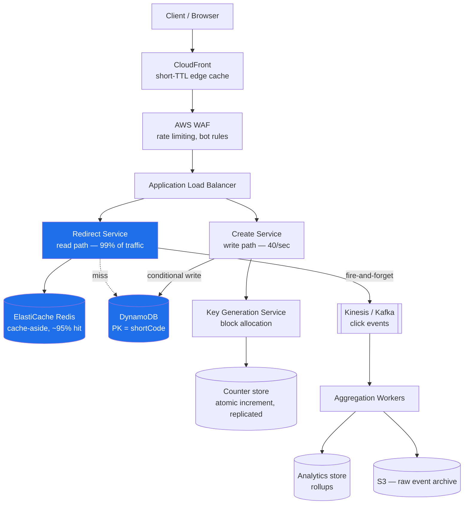
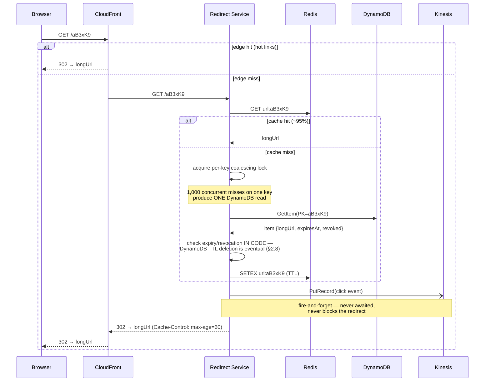
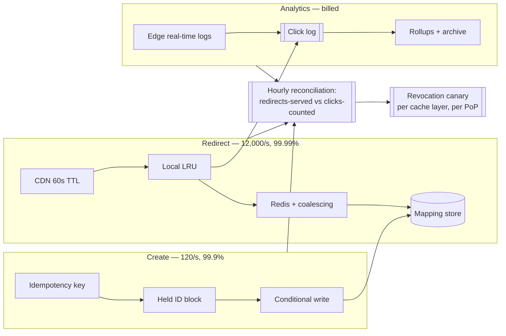
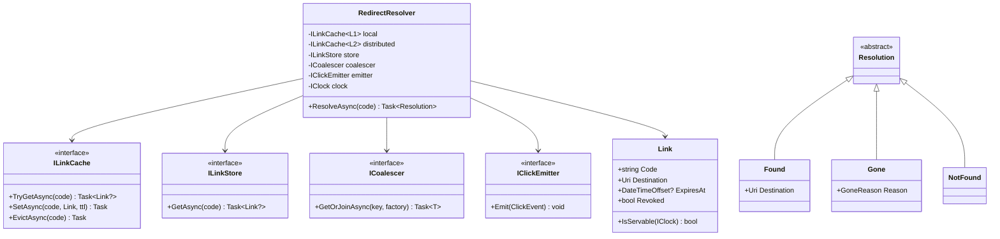

# Module 177 — System Design: Designing a URL Shortener & Distributed Unique ID Generation

> Domain: System Design | Level: Beginner → Expert | Prerequisite: [[01-System-Design-Fundamentals]] (capacity estimation, caching strategies, CAP), [[16-Interview-Execution-Playbook-Estimation-Rubric]] (the 45-minute shape this module is the canonical rehearsal for), [[../08-DynamoDB/01-Data-Modeling-Partition-Key-Design]] (partition-key design and conditional writes, used directly), [[../07-Redis/01-Data-Structures-Caching-Patterns]] (cache-aside, hot-key handling)

---

**Why this module exists.** `URLShotner.md` — a 309-word AWS box diagram with no analysis, absent from the Progress Log — was the only coverage of the single most frequently asked opening prompt in the industry. That file's content is absorbed here (§3 retains its AWS service mapping, corrected and justified) and the stub is retired.

The prompt looks trivial, and that is precisely its function. It is used as a *warm-up* at Senior level and as a *depth probe* at Staff+, because it contains, in a problem small enough to fit in 45 minutes, four genuinely hard sub-problems: **distributed unique ID generation without coordination**, **read-path optimization at extreme read/write skew**, **hot-key handling**, and **the surprisingly consequential 301-versus-302 decision**. A candidate who treats it as easy produces a hash-table-with-a-cache answer and gets a senior rating. The interviewer chose it because they can go five levels deep on ID generation alone.

---

## 1. Fundamentals

### What is a URL shortener?

A service mapping a long URL (`https://example.com/very/long/path?with=params`) to a short one (`https://sho.rt/aB3xK9`), which redirects to the original on access. Commercially: link sharing under character limits, click analytics, branded links, and — the reason enterprises run them — the ability to change a destination after distribution, and to revoke a link.

The essential asymmetry: **creation is rare, redirection is constant.** Typical production ratios run 100:1 to 1000:1 read-to-write. Almost every design decision follows from that single number.

### Why does this matter beyond the interview?

Because the ID-generation half is not really about URLs. "Generate a globally unique, short, non-colliding identifier across N independent machines without those machines talking to each other" is the same problem as order IDs in an OMS, payment references, trace IDs, idempotency keys, and primary keys in any sharded store. The URL shortener is the friendly wrapper around it, which is why interviewers keep using it — they get to probe distributed ID generation without making the prompt intimidating.

### When does this matter?

Any time you need identifiers that are unique across machines, and especially when they must additionally be *short*, *sortable*, *non-guessable*, or *URL-safe* — properties that pull against each other in ways §2.2–2.4 make precise.

### How does it work (30,000-ft view)?

```
WRITE  POST /shorten {longUrl}
         → generate a unique ID
         → encode it to a short, URL-safe string
         → persist (shortCode → longUrl, owner, expiry, metadata)
         → return https://sho.rt/{shortCode}

READ   GET /{shortCode}
         → look up longUrl  (cache first — this is 99%+ of all traffic)
         → emit a click event ASYNCHRONOUSLY (never on the critical path)
         → HTTP 301 or 302 redirect to longUrl
```

The read path is four steps and must complete in single-digit milliseconds. Every complication in this design is about keeping it that way.

---

## 2. Deep Dive

### 2.1 Capacity Estimation — Run It, Because It Eliminates Three Architectures

Assume 100M new URLs per month, a 100:1 read ratio, 5-year retention. Per Module 176 §2.2:

```
WRITES   100M/month ÷ 2.5×10^6 s   ≈ 40 writes/sec        peak ~120 (3× consumer)
READS    40 × 100                   = 4,000 reads/sec      peak ~12,000
STORAGE  100M/mo × 60 months        = 6 billion records
         × ~500 B/record            = 3 TB   (×3 replication = 9 TB)
KEYSPACE 6 × 10^9 records — how many characters of base62 does that need?
         62^6 = 5.7 × 10^10  ⇒ 6 characters covers 57 billion, ~10× headroom  ✓
         62^5 = 9.2 × 10^8   ⇒ insufficient at 920 million
BANDWIDTH 12,000 × ~1 KB response ≈ 12 MB/sec — trivial
```

**Therefore, three eliminations, stated aloud:**

1. **40 writes/sec eliminates any sharded-write architecture.** This is nowhere near the ~5–10k/sec single-primary ceiling. A candidate who proposes sharding the write path here is designing for a number they didn't compute. (This is Module 176 §2.17's over-engineering penalty in its most common concrete form.)
2. **3 TB eliminates "just keep it in memory"** as the whole answer, though it does *not* eliminate caching the hot subset — which matters, because access is extremely skewed.
3. **62^6 = 57 billion sets the short-code length at 6 characters** — and this is the estimation that actually shapes the API. Note it's derived, not chosen.

The bandwidth number is computed and immediately **retired**: 12 MB/sec is unremarkable and will not be mentioned again.

### 2.2 ID Generation — Five Approaches, and Why Four Are Usually Wrong

This is the heart of the problem and where the interview goes deep. The requirement: generate unique IDs across N stateless application servers, ideally without a coordination round trip on the write path.

**Approach A — Hash the URL (MD5/SHA-256, take the first 6 characters).**

Attractive because it's stateless and deterministic — the same URL naturally yields the same short code, giving free deduplication. It is nonetheless the wrong default, for a reason candidates consistently underestimate: **the birthday bound**. With a 6-character base62 space (5.7×10^10) and 6×10^9 stored records, the probability of at least one collision is not small:

```
P(collision) ≈ 1 − e^(−n²/2N)   with n = 6×10^9, N = 5.7×10^10
             ≈ 1 − e^(−3.16×10^8)  ≈ 1.0
```

Collisions are not a remote possibility; they are a **certainty**, by an enormous margin. You would need roughly `n²/2N << 1`, i.e. n well under ~340,000 records, for truncated-hash collisions to be genuinely unlikely at this length. So hashing requires a collision-detection-and-retry loop — a read-before-write on every creation, which reintroduces exactly the coordination the approach was supposed to avoid, plus unbounded retry under adversarial input.

The other defect: **hashes are not sequential, so the storage layer gets random-write behaviour**. On a B-tree index that means page splits and poor locality. It also makes the codes non-enumerable, which is a *security advantage* — see §8.

*Verdict:* usable only if same-URL-deduplication is a hard product requirement, and then with an explicit collision loop and honesty about its cost.

**Approach B — Database auto-increment, then base62-encode.**

Simple and genuinely correct: the database guarantees uniqueness. Codes are short and dense, with zero waste in the keyspace.

The defect is that it makes **every write a coordinated write against a single sequence**, which is a hard availability coupling — if the sequence's home database is unavailable, no URL can be created anywhere. At 40 writes/sec the *throughput* is a non-issue (candidates wrongly attack it on throughput grounds); the real objection is the single point of failure and the difficulty of multi-region write availability.

It also leaks: sequential IDs mean `aB3xK9` and `aB3xKA` are adjacent, so the entire corpus is enumerable and your creation *rate* is publicly measurable (the German-tank problem). For a public shortener that's an information leak; for an enterprise one it's a data-exfiltration path.

**Approach C — Key Generation Service (KGS) with pre-allocated ranges.** *This is the strongest answer for this problem.*

A small service hands out **blocks** of the keyspace. Each application server requests a range (say 10,000 IDs), holds it in memory, and allocates from it locally with zero network calls. When exhausted, it requests another block.

```
KGS state:  next_block_start = 4,830,000
App server A requests → gets [4,830,000 … 4,839,999], increments locally
App server B requests → gets [4,840,000 … 4,849,999]
```

Why this is right here: it removes coordination from the write path entirely (one KGS call per 10,000 writes, not per write), it preserves the density of sequential IDs, and the KGS itself is trivially made HA because its only state is a single monotonic counter that can live in a replicated store with an atomic increment.

The trade-off to state proactively: **block loss on restart.** A server that dies holding 6,000 unused IDs leaks them permanently. With a 5.7×10^10 keyspace and 6-character codes, leaking even millions of IDs is irrelevant — but you must say why it's irrelevant rather than not noticing it. If the keyspace were tight, this would be disqualifying.

**Approach D — Snowflake-style composite IDs.**

Twitter's scheme packs a 64-bit integer:

```
 1 bit  sign (always 0, so the value stays positive in signed-int languages)
41 bits timestamp in ms since a custom epoch  → 2^41 ms ≈ 69 years
10 bits machine/worker ID                     → 1,024 workers
12 bits per-millisecond sequence              → 4,096 IDs per worker per ms
       ⇒ ~4.1 million IDs/second/worker, no coordination at all
```

Genuinely coordination-free and **time-sortable**, which is valuable — a sorted primary key gives sequential inserts and good index locality, and IDs carry their own creation time.

Two hard problems that a Staff-level answer must raise unprompted:

- **Clock skew and backward jumps.** If NTP steps the clock backwards, a worker can regenerate timestamps it has already used, producing duplicate IDs. The mitigation is to refuse: track the last-issued timestamp and, if the clock moves backwards, either block until it catches up or fail loudly. Silently continuing generates duplicates, which for an ID generator is a catastrophic and near-undetectable failure. (Same shape as Module 175 §2.7's clock-skew handling in distributed rate limiting.)
- **Worker-ID assignment.** 10 bits means 1,024 workers, and **two workers with the same ID generate colliding sequences**. Static configuration doesn't survive autoscaling; the standard fix is lease-based assignment from ZooKeeper/etcd with a TTL, which reintroduces a coordination dependency — at startup only, not per-ID, which is the acceptable version.

The reason Snowflake is usually *not* the answer for a URL shortener specifically: a 64-bit value base62-encodes to **11 characters**, not 6. The timestamp and worker bits are mostly wasted entropy for this use case. Snowflake is the right answer when you need time-sortability and can afford the length — order IDs, trace IDs, event IDs — and the wrong one when shortness is the product.

**Approach E — UUIDv4.**

128 bits of randomness, zero coordination, collision probability negligible. And **22 base62 characters** — nearly four times too long. Also random, so it destroys index locality on insert. UUIDv7 (time-ordered) fixes the locality problem but not the length. Mention it, dismiss it on length, and move on; spending time here signals you didn't do §2.1's keyspace arithmetic.

**Decision table:**

| Approach | Coordination | Length | Sortable | Guessable | Verdict here |
|---|---|---|---|---|---|
| Truncated hash | none | 6 | no | no | Only if same-URL dedup is required |
| DB auto-increment | per write | 6 | yes | **yes** | Correct but availability-coupled |
| **KGS blocks** | **per 10k writes** | **6** | roughly | yes* | **Recommended** |
| Snowflake | startup only | 11 | yes | partially | Right problem, wrong length |
| UUIDv4/v7 | none | 22 | v7 only | no | Far too long |

\* Guessability is fixed independently in §8 — do not fix it by choosing a worse ID scheme.

### 2.3 Base62 Encoding — and Why the Alphabet Choice Is a Real Decision

Base62 = `[0-9a-zA-Z]`, chosen because those are the characters that are URL-safe without escaping, case-preserving across the systems that will handle the link, and dense.

```
62^6 = 56,800,235,584    ~57 billion — the §2.1 target
62^7 = 3.5 trillion
```

Two non-obvious points worth raising:

**Base64 is wrong here** despite being denser, because its alphabet includes `+` and `/`, which require percent-encoding in a URL path, and `=` padding. URL-safe base64 substitutes `-` and `_`, which works but introduces characters that break on double-click selection in many terminals and get mangled by some link-detection heuristics in chat clients. The density gain (64 vs 62) is negligible — `log(64)/log(62) ≈ 1.008` — so you'd save nothing while adding fragility.

**Ambiguous characters are a product decision.** `0`/`O`, `1`/`l`/`I` are indistinguishable in many fonts. If links are ever transcribed by humans — printed, read aloud, typed from a slide — remove them, dropping to base56 or so. `62^6 = 57B` versus `56^6 = 31B` still clears the 6-billion requirement, so the cost is affordable. If links are only ever clicked, keep the full alphabet. Naming this trade-off unprompted is a small but reliable signal that you think about the product, not just the encoding.

### 2.4 The Read Path — Where 99% of the Traffic Lives

At 12,000 peak reads/sec against 40 writes/sec, the read path is the system. Three layers, each justified by a number:

**Layer 1 — CDN/edge.** A redirect response is tiny, immutable in practice (a short code's target rarely changes), and highly skewed in access. Caching redirects at the edge with a modest TTL serves the hot tail entirely outside your infrastructure. The constraint that makes this non-trivial: **it is incompatible with per-click analytics at the edge unless the CDN can log and ship click events**, and it makes revocation slow (a revoked link stays live until TTL expiry). For a link-shortener serving marketing campaigns, both matter — so edge caching is typically applied with a short TTL (60s) as a burst absorber rather than a long-lived cache.

**Layer 2 — Redis, cache-aside.** This is the workhorse. Access is Zipfian: a small fraction of links carry most traffic, so even a modest cache holds a very high hit rate. Concretely, caching the hot 20M codes at ~200 bytes each is ~4 GB — trivially affordable, and likely to serve well over 95% of reads.

The failure mode to name: **the database is now provisioned for the miss rate.** At a 95% hit rate, cache loss is a 20× instantaneous load spike on the datastore, not a latency regression. Mitigations: request coalescing on miss so a thousand concurrent requests for one cold key produce one datastore read; staged warm-up rather than instant cutover after a Redis restart; and load shedding that returns 503 rather than collapsing.

**Layer 3 — the datastore.** The access pattern is a pure single-key lookup by primary key, with no range queries, no joins, and no ad-hoc reporting on the hot path. That is the textbook *shape* of a key-value store — partition by the key you always query, predictable single-digit-ms lookups, no relational feature in use on the hot path. Note carefully that the shape argues for a key-value **access pattern**, not for a key-value **product**: §2.17 works the comparison honestly and §12 lands on PostgreSQL at this volume, because 12,000 point reads/sec on an indexed primary key is unremarkable for it and nothing in §2.1's numbers rules it out. DynamoDB or Cassandra become the right answer at roughly 10× this read volume or when multi-region active-active writes are required — which is exactly the substitution §2.14 walks through. Reaching for the key-value product because the access pattern is key-value, without running the numbers, is the single most common unforced error in this problem.

### 2.5 301 vs 302 — the Small Question That Is Actually a Trap

`301 Moved Permanently` is cacheable by browsers indefinitely and by intermediaries aggressively. `302 Found` (or `307 Temporary Redirect`) is not cached by default.

The naive reasoning: 301 is better, because the browser caches it and subsequent clicks never reach our servers at all — lower cost, lower latency.

The consequences that make 301 usually **wrong** for a commercial shortener:

1. **You lose click analytics permanently.** A browser-cached 301 never contacts you again. For a service whose commercial value is substantially *analytics*, you have destroyed the product to save bandwidth.
2. **You lose the ability to change the destination.** A 301 cached in a hundred million browsers cannot be recalled. If the link is a marketing campaign redirected to a new landing page — or worse, a link that must be *revoked* because it points to something malicious or leaked — you have no mechanism. Browsers honour cached 301s for a long time and users cannot reasonably be asked to clear their cache.
3. **It makes an irreversible commitment on behalf of a mutable mapping.** The short code → URL mapping is *data*, and data changes; HTTP 301 asserts it is permanent.

So: **302 (or 307) by default**, accepting that every click hits your infrastructure — which §2.1 showed is only 12,000/sec at peak and is exactly what the cache layers are for. Use 301 only for links explicitly marked immutable, if the product offers that.

The reason this is a trap: it's phrased as a trivia question about HTTP semantics, and the correct answer is a product-and-reversibility argument. Candidates who answer "301, it's cacheable" have answered a different, easier question.

Use **307** over 302 if the method must be preserved; for `GET`-only redirect traffic it makes no practical difference, but knowing why 307 exists (302 historically allowed clients to rewrite `POST` to `GET`) is a legitimate depth marker.

### 2.6 Analytics — Strictly Off the Critical Path

Every redirect should emit a click event: timestamp, short code, referrer, coarse geo, user agent, and *not* raw IP if you intend to stay on the right side of GDPR without a lawful basis.

The rule is absolute: **the click write must never be synchronous with the redirect.** Adding a durable write to a 5ms redirect path triples its latency and, worse, couples redirect *availability* to analytics availability — an analytics outage would take down redirection, which is the actual product. Fire-and-forget onto a queue or stream, batch on the consumer side, aggregate into rollups.

Aggregation follows Module 176 §2.4's queue-vs-log discriminator: use a **log** (Kafka/Kinesis) here, because there will be multiple independent consumers (real-time counters, the data warehouse, fraud detection) and because reprocessing after an aggregation bug is a genuine requirement.

For counters at high volume, exact counts are usually unnecessary: HyperLogLog gives unique-visitor cardinality in ~12 KB per counter with ~2% error, versus storing every visitor ID. State the accuracy trade-off explicitly rather than silently choosing approximation — "clicks are exact, unique visitors are ±2%" is a defensible product statement; discovering the imprecision later is not.

### 2.7 Custom Aliases and the Only Genuine Race in the System

Users want `sho.rt/my-campaign`. This introduces the one place where two concurrent requests genuinely contend: two users simultaneously claiming the same alias.

The wrong implementation, which candidates write reflexively:

```csharp
if (await store.ExistsAsync(alias))     // ← check
    return Conflict();
await store.PutAsync(alias, longUrl);   // ← act — both requests reach here
```

This is check-then-act across a network boundary. Both requests can pass the check before either writes; the second silently overwrites the first, and the first user's link now points somewhere they didn't choose.

The fix is a **conditional write** — one atomic operation that both tests and sets:

```csharp
// DynamoDB: the condition is evaluated inside the write, atomically.
var request = new PutItemRequest {
    TableName = "ShortLinks",
    Item = item,
    ConditionExpression = "attribute_not_exists(ShortCode)"
};
try { await dynamo.PutItemAsync(request); }
catch (ConditionalCheckFailedException) { return Conflict("Alias already taken."); }
```

Equivalently a unique index in a relational store and catching the constraint violation, or `SET NX` in Redis if Redis is authoritative (it usually shouldn't be for durable data).

The important generalization, which is what the interviewer is actually probing: **a uniqueness check and the write it guards must be the same atomic operation.** The idempotency-key defect in Module 178 §2.5 is the identical problem in a different costume — two concurrent retries both passing a duplicate check and both inserting.

Custom aliases must also occupy the *same* namespace as generated codes, or a generated code will eventually collide with an existing alias. The standard approach is to reserve them in one table and have the generator skip taken values — or, cheaply, to give custom aliases a length or character property generated codes never produce (e.g. generated codes are exactly 6 chars; custom aliases must be 7+), which makes the namespaces disjoint by construction rather than by check. Structural separation over enforced separation is the recurring preference across this course.

### 2.8 Expiry, Revocation, and Deletion

Links expire (campaign ends), are revoked (abuse, leaked internal link), or are deleted by the owner. Three mechanics with different guarantees:

- **TTL at the storage layer** (DynamoDB TTL, Redis `EXPIRE`) makes expiry structural rather than a cleanup job that can silently fall behind — Module 42's Stories lesson applied directly. Note DynamoDB TTL deletion is *eventual* (typically within 48 hours), so the read path must still check the expiry timestamp rather than trusting the row's absence. Trusting TTL for *correctness* rather than *cleanup* is a real and common defect.
- **Revocation must be immediate**, which is in direct tension with §2.4's caching. A revoked code must be purged from Redis and, if edge caching is used, from the CDN — and CDN purge is slow and sometimes partial. This is the strongest argument for the short edge TTL chosen in §2.4: it bounds the revocation window to something you can state in a policy ("revocation takes effect within 60 seconds") rather than something unbounded.
- **Deletion must not free the code for reuse.** Reissuing a deleted code to a new destination means an old shared link silently starts pointing somewhere else — a genuine security problem, since the old link may be printed, bookmarked, or embedded. Deleted codes go to a tombstone, permanently. The keyspace is large enough (§2.1) that never reusing codes costs nothing.

### 2.9 Coordination-Free Uniqueness, Derived From First Principles

The whole ID-generation discussion reduces to one theorem, and being able to state it is what turns a list of five approaches into an argument.

**To generate unique IDs across N independent nodes with no communication at generation time, you must have either a disjoint namespace partition or a coordination-free source of uniqueness.** There is no third option, and every scheme in §2.2 is an instance of one of the two:

| Scheme | Which mechanism |
|---|---|
| Snowflake | **Namespace partition** — the machine-ID bits |
| KGS block allocation | **Namespace partition** — each block is a disjoint range |
| Region-sliced counters | **Namespace partition** — high-order bits encode the region |
| UUIDv4 | **Coordination-free source** — 122 bits of randomness making collision negligible |
| Truncated hash | **Neither**, which is why it needs a collision check (§2.2) |
| Database sequence | **Coordination at generation time** — correct, and not coordination-free |

The practical consequence: **"make the namespaces disjoint by construction" is strictly preferred over "check for collisions."** A disjointness argument is a proof that holds for all future executions; a collision check is a runtime guard that must be correct on every path, costs a read-before-write, and has unbounded retry behaviour under adversarial input.

This generalises well past ID generation, and it is worth naming as a principle: **prefer making the bad state unrepresentable over detecting it.** The same move appears as per-tenant database credentials rather than query filters, a database constraint rather than application validation, and a required run-scoped snapshot parameter rather than a per-task "resolve latest." In each case the alternative — a check — works until someone adds a path that skips it.

### 2.10 Same-URL Deduplication — Evaluating the Product Request

*"Shortening the same URL twice should return the same code."* It sounds free and it is not.

**What it costs:**

- A **read-before-write on every creation** (look up whether this destination already has a code), which reintroduces exactly the coordination the KGS design removed.
- An **index on the destination URL** — a 2 KB text column, so a hash index in practice, with its own maintenance cost.
- A **normalisation decision that is genuinely hard**: are `example.com/x`, `example.com/x/`, `example.com/x?utm_source=a` and `EXAMPLE.com/x` the same URL? Every answer is wrong for some caller.

**What breaks:**

- **Per-link analytics collapse.** Two campaigns shortening the same landing page now share one code and one click count, which is usually the opposite of what a marketing customer wants.
- **Revocation becomes ambiguous.** Revoking the link because customer A abused it also revokes customer B's legitimate link to the same destination.
- **Expiry conflicts** — whose `expiresAt` wins?

**The resolution:** make it **opt-in and scoped per account**, not global. `POST /links` accepts `dedupe: true`, and the uniqueness index is on `(owner_account_id, normalised_destination)` so one customer's reuse never touches another's. That preserves the feature for the caller who wants it, keeps analytics and revocation per-link for everyone else, and confines the normalisation question to a single account's own expectations.

### 2.11 Keyspace Exhaustion — Migrating 6 to 7 Characters

Six characters gives 57 billion codes against 6 billion stored (§2.1), so this is a decade-out problem — which is exactly why the design should be able to state the answer now, because the answer constrains the *encoding* decision today.

**The migration is non-breaking by construction if the scheme is length-agnostic.** Base62 decoding does not need to know the length in advance: `aB3xK9` and `aB3xK9z` both decode unambiguously. So:

1. **Existing 6-character codes keep working forever.** No rewrite, no dual-read, no cutover.
2. **New allocations simply exceed 62⁶** and naturally encode to 7 characters. No flag, no configuration, no deploy tied to a date.
3. **The only real requirement is that nothing validates code length**, anywhere — not the API's regex, not the client SDK, not the CDN path pattern, not a database column width.

That last point is the actual engineering content of the answer: **the migration is free if and only if no component hard-codes the length**, so the work is auditing for that today rather than performing a migration in ten years. Store `code` as a variable-length column with generous width, and make the API's pattern `[A-Za-z0-9]{4,16}` rather than `{6}`.

The generalisable lesson: a well-chosen encoding turns a future migration into a non-event. The cost of choosing badly is paid once, far in the future, by someone else — which is exactly why it gets chosen badly.

### 2.12 Revoking by Destination, Not by Code

A regulator requires that **every link pointing to a specified destination be identified and revoked within one hour.** Can the design do it?

Not as described, and saying so precisely is the answer. §2.17's data model has no index on the destination — the access pattern is `code → destination`, never the reverse. Finding all codes for a destination is a **full table scan** over six billion rows, which is neither an hour's work nor something to run against the store serving the product.

**What makes it possible:**

1. **A secondary index on the normalised destination**, maintained asynchronously — accepting the write cost (§2.10) *for this reason* rather than for the deduplication feature.
2. **Domain-level as well as URL-level matching**, because the requirement is almost always "this site," not "this exact URL." Index the registrable domain separately; it is lower cardinality and it is the shape the request actually takes.
3. **Bulk revocation as a first-class operation** — a single write marking a domain revoked, with the read path checking domain status alongside code status, rather than updating millions of rows in an hour.
4. **The 60-second edge TTL (§2.8)** is what makes "within one hour" achievable at all; with a 24-hour TTL the answer would be "no," regardless of how fast the database write is.

The honest residual to state: links already resolved and cached in a user's browser are outside the system entirely.

### 2.13 Redesigning for 2 Million Reads per Second — What Changes and What Merely Scales

A useful exercise because **most of the answer is "nothing changes," and noticing that is the finding.**

**What merely scales:** the stateless redirect service scales horizontally without modification; Redis scales by sharding on the code, which distributes perfectly because codes are uniform; the datastore scales by partition on the same key; the write path is untouched at 120/sec. **The boxes and the data model are unchanged** — a candidate who redesigns everything has failed to notice the original design was already scale-appropriate.

**What genuinely changes, in order of significance:**

1. **Cost becomes the dominant design pressure.** At 12,000/sec, cost is a footnote. At 2M/sec, the cost gradient between an edge-served and an origin-served request is the single most important number in the system, and it reorganises every decision — TTLs, cache sizing, which analytics are collected. This is where §2.17's PostgreSQL recommendation flips decisively, **not on capability but on operational model and price at that volume.**
2. **Hot keys go from a risk to a certainty.** At this volume a viral link routinely exceeds a single partition's ceiling. Local in-process caching of the top-N stops being a nice-to-have and becomes **the primary serving mechanism for the head of the distribution**, with the shared cache and datastore serving only the tail.
3. **The analytics pipeline becomes a bigger system than the product.** 2M click events/sec is a serious streaming workload in its own right, and pre-aggregation at the edge (counting in the CDN's own logs rather than emitting per-event) becomes necessary rather than optional.

### 2.14 The On-Premises Bank Variant

*"Run this entirely on-premises, no cloud services."* The **architecture is unchanged**; the component substitutions and operational burden change substantially, and separating those two is the answer.

| Cloud component | On-prem substitute | What is actually lost |
|---|---|---|
| CloudFront | Internal reverse-proxy tier (Varnish/NGINX) | Global PoP distribution — which matters far less, since an internal corporate shortener has users in a few known locations |
| DynamoDB | PostgreSQL or Cassandra | Nothing; §2.7 argued Postgres was arguably better at this scale anyway, so this substitution is close to free |
| Kinesis | Kafka | Nothing; the bank almost certainly already runs it |
| ElastiCache | Self-managed Redis with Sentinel or Cluster | **The largest genuine addition** — you now own failover |
| IAM / KMS | The firm's existing PKI and secrets management | Integration work, not capability loss |

**What changes beyond substitution**, and is the more interesting half of the answer: the **abuse model inverts.** A public shortener's dominant threat is external phishing; an internal one's is **data exfiltration** — a short link laundering an external destination behind a trusted internal domain. So destination allow-listing (rather than block-listing) becomes appropriate, which is only viable because the internal destination space is enumerable and the public one is not.

### 2.15 The Strongest Argument Against Building It At All

Worth being able to make, because a Staff+ interviewer is listening for whether you can argue against your own design.

**The case:** commodity shorteners (Bitly, Rebrandly, Short.io) exist at low per-link cost with mature abuse handling, analytics, branded domains and SLAs. Building means owning an abuse surface with reputational and legal exposure — your domain in a phishing campaign becomes your incident — plus continuous threat-feed integration, a takedown process with a human on call, and a service whose failure breaks **every link ever issued, permanently.** That last property is unusual and worth naming: most systems degrade when they fail; this one destroys artefacts already distributed into emails, documents and printed material that you cannot recall.

**When building is nonetheless right:** the destination data is confidential and cannot transit a third party (the §2.14 case); link volume makes per-link vendor pricing exceed build-and-operate cost; or the shortener is a component of a larger owned product rather than a standalone service, where the integration is the value.

**The Principal-level framing:** the decision hinges on whether the *abuse surface* is something the organisation wants to own, not on whether the engineering is hard. The engineering is not hard. That is precisely why the build-versus-buy answer should not be driven by it.

### 2.16 Observability, and the Detectors That Must Be Built

Every failure mode in this module needs a corresponding detector, and the instructive part is which ones have **no natural signal** and must be constructed deliberately.

| Failure | Detector | Natural? |
|---|---|---|
| Redirect latency regression | p99 by cache layer (edge / LRU / Redis / origin) | Yes |
| Cache loss | Hit-rate drop, origin QPS spike | Yes |
| Creation failure | Error rate on `POST /links` | Yes |
| **Hot key saturating one shard** | **Per-key and per-partition** metrics | **No** — aggregate cache and cluster health stay green throughout |
| **Click undercount** | Hourly reconciliation: redirects-served (CDN/ALB) vs clicks-counted | **No** — the emitter agrees with itself perfectly |
| **Revocation not effective at a PoP** | **Revocation canary** — create, revoke, then fetch through every cache layer and every PoP asserting `410` | **No** — nothing fails; the old value is simply still served |
| **Expired link still resolving** | Expired-link audit sampling codes past `expires_at` | **No** — storage TTL deletion is eventual (§2.8) |
| Abuse via later-repointed destination | Continuous destination re-scanning | **No** — the link was clean when created |

**The pattern across the four hardest: none of them produces an error.** They are all cases where the system does exactly what it was told, and what it was told is no longer correct. That is why each needs an **active probe with an independently derived expectation**, not a passive metric — which is the same triple this folder arrives at repeatedly: an independent verifier, a counter on every silent path, and detection by aging rather than by rate.

### 2.17 Datastore Selection — DynamoDB versus PostgreSQL, Honestly

The access pattern's *shape* is key-value; the *volume* is not yet a constraint on anything (§2.1). So the comparison has to be made on real properties rather than on instinct.

**DynamoDB** fits the access pattern exactly: single-key point reads, uniform key distribution, no joins, no ad-hoc queries on the hot path, and `attribute_not_exists` giving §2.7's atomic conditional write natively. It scales without operational effort and has predictable single-digit-millisecond latency. Its costs: per-partition throughput ceilings that aggregate provisioning does not relieve (the hot-key problem, §2.13); on-demand pricing that becomes expensive at sustained high volume; GSIs that are eventually consistent and separately billed; and limited query flexibility when the product inevitably wants reporting.

**PostgreSQL** handles this workload without difficulty. 12,000 point reads/sec against an indexed primary key on a well-provisioned instance is unremarkable, and 120 writes/sec is nothing. It gives real transactions, unique constraints (the same atomic conditional write, via a unique index and catching the violation), arbitrary queries for the reporting that will be asked for, and dramatically lower cost at this scale. Its costs: you operate it; read scaling means managing replicas and their lag; and horizontal *write* scaling would be a genuine project if ever needed.

**Honest recommendation: PostgreSQL at this scale**, with an explicit revisit threshold — roughly 10× read growth, or the moment multi-region active-active writes become a requirement, where Global Tables' operational simplicity starts to dominate (§2.13 works that flip). The instinct to reach for DynamoDB here is driven by the *shape* of the access pattern rather than by any number that rules Postgres out, and §2.1's numbers do not rule it out.

Note what does **not** change with the choice: every other component in §3's diagram, the conditional-write semantics, and the whole cache ladder. That the storage box is swappable without redrawing anything is itself the finding — the structural decision in this system is the read/write service split, not the database vendor.

### 2.18 Two Alternatives Worth Taking Seriously

**"Replace the whole system with a DNS TXT record lookup."** Take it seriously rather than dismissing it: DNS is the most-replicated, most-cached, lowest-latency global key-value store in existence, with an edge footprint no CDN matches. For a **read-only, low-churn, non-revocable** mapping it is genuinely a reasonable substrate.

It fails on this product's specific requirements, and naming which is the answer: DNS TTLs make **revocation unbounded** (§2.8's core requirement); record creation is not transactional, so §2.7's custom-alias race has no atomic primitive; **no analytics are possible** because the resolution never touches your infrastructure, which kills a billed feature; and TXT record size and provider API rate limits constrain both the destination length and the creation rate. A correct evaluation names the properties that make it attractive *before* the ones that rule it out — dismissing it immediately signals pattern-matching rather than reasoning.

**"Go as deep as you can on one thing"** with twenty minutes left: choose **ID generation**, and say why. It is the only genuinely non-obvious part of the system, it has a derivable answer (§2.9), it admits real arithmetic (the birthday bound, block-allocation independence windows, Snowflake bit budgets), and it connects to security (enumerability), multi-region (disjoint slices) and operations (KGS failure behaviour). The read path is a cache ladder everyone has built; the write path is where the design is actually decided.

### 2.19 The Question That Separates Staff From Senior

If one question had to do it, this is the one:

> **"What breaks if the cache is empty?"**

A Senior answer describes the fallback: requests go to the datastore, latency rises. A Staff answer **computes** it: the cache absorbs ~95% of 12,000 reads/sec, so a cold cache means the datastore takes 20× its normal load; the miss path is ~8.5 ms which is inside the 10 ms origin budget, so it is survivable **by arithmetic rather than by hope**; request coalescing bounds the stampede to one datastore read per key; and the specific danger is not the steady state but the **metastable** one, where the load spike slows the datastore enough that the cache never refills.

The reason this question separates so reliably is that it cannot be answered from memory of the architecture. It requires holding the numbers, the failure mode and the recovery dynamics at the same time — which is the Staff-level competency itself, not a fact about URL shorteners.

---


---

## 3. Visual Architecture

### System architecture (AWS-mapped)



The highlighted path is the one that matters: **client → cache → redirect** is the entire product from the user's perspective, and everything else exists to keep that path fast and correct.

> **Note on the primary store.** This diagram and the table below render the **AWS-native** reference architecture, which is what an AWS-framed interview expects to see drawn. It is not the same thing as the recommendation. §2.17 compares DynamoDB against PostgreSQL on this workload's actual numbers and §12 recommends **PostgreSQL** at 12,000 reads/sec, with DynamoDB (or Aurora, or Cassandra) becoming correct at roughly 10× that volume or the moment multi-region active-active writes are required. Substituting RDS/Aurora for the `DynamoDB` box changes nothing else in the diagram — every other component, the conditional-write semantics (a unique index instead of `attribute_not_exists`), and the whole cache ladder are identical. That the storage box is swappable without redrawing anything is itself the finding: the structural decision in this system is the read/write service split, not the database vendor.

### AWS service mapping

| Concern | Service | Why this one |
|---|---|---|
| Edge cache | CloudFront | Short TTL absorbs bursts; long TTL would break revocation (§2.8) |
| Edge security | AWS WAF | Bot rules and IP rate limiting *before* compute is billed |
| Routing | ALB | L7 needed to split `/shorten` (write) from `/{code}` (read) onto separately-scaled services |
| Read/write compute | ECS Fargate or Lambda | Read path is spiky and stateless; Lambda is defensible, but cold starts on a 5ms budget argue for provisioned containers |
| Cache | ElastiCache Redis | Sub-ms single-key GET; cache-aside per §2.4 |
| Primary store | DynamoDB *(see note)* | Pure single-key access; `attribute_not_exists` gives §2.7's atomic conditional write natively |
| ID allocation | KGS on ECS + DynamoDB atomic counter | One coordinated op per 10,000 writes |
| Click stream | Kinesis Data Streams | Multiple independent consumers + replay ⇒ log, not queue (§2.6) |
| Analytics store | Timestream or Redshift | Rollups and time-range queries, off the hot path |
| Raw archive | S3 + lifecycle to Glacier | Cheap, immutable, reprocessable |
| Observability | CloudWatch + per-shard custom metrics | Aggregate metrics are blind to hot-key failure (§14) |

### Redirect sequence — including the miss path



### Snowflake bit layout

```
 63                                    22        12          0
  ┌─┬─────────────────────────────────┬──────────┬──────────┐
  │0│  timestamp (41 bits, ms)        │ worker   │ sequence │
  │ │  ≈ 69 years from custom epoch   │ (10 bits)│ (12 bits)│
  └─┴─────────────────────────────────┴──────────┴──────────┘
     ↑ sign bit always 0 so the value      ↑            ↑
       stays positive in signed-int    1,024 max    4,096 per ms
       languages (Java/C# long)         workers      per worker

  FAILURE MODE 1: clock steps backwards → timestamps reused → DUPLICATE IDs
                  fix: track last timestamp; block or fail loudly, never proceed
  FAILURE MODE 2: two workers assigned the same 10-bit ID → identical sequences
                  fix: lease worker IDs from etcd/ZooKeeper with a TTL at startup

  For a URL shortener: 64 bits → 11 base62 chars. Too long. (§2.2 Approach D)
```

---

## 4. Production Example

**Problem.** A B2B marketing-automation platform ran a link shortener for customer campaigns — roughly 8,000 redirects/sec at peak, 99.98% availability target, and click analytics as a *billed* product feature. Over one quarter, three separate enterprise customers reported the same complaint: click counts in their dashboard were materially lower than the counts reported by their own landing-page analytics. The discrepancy was consistent, roughly 12–18%, and always in the same direction.

Engineering investigated three times and closed it twice as "expected variance — bot filtering and analytics methodology differences explain it." The third time, a customer's contract renewal was at stake and the investigation went deeper.

**Architecture.** Conventional and, on paper, correct: CloudFront → ALB → redirect service → Redis → DynamoDB, with click events fired to Kinesis and aggregated into rollups. The click emit was explicitly asynchronous per §2.6 — the team had done that part right.

**Implementation — what was actually happening.** Two independent causes, which is why single-cause investigations kept failing:

*Cause 1 — the edge cache was eating clicks.* Someone had raised the CloudFront TTL from 60 seconds to 24 hours during a cost-reduction exercise, reasoning correctly that redirects are effectively immutable and incorrectly that this was therefore free. It reduced origin traffic by 60% and the AWS bill accordingly. It also meant that **60% of clicks never reached the origin and were therefore never counted** — the click event is emitted by the redirect service, which the request no longer reaches. The cost saving and the analytics loss were the same number, and only one of them was on a dashboard.

*Cause 2 — silent Kinesis backpressure.* The fire-and-forget emit was implemented as:

```csharp
_ = _kinesis.PutRecordAsync(record);   // discard the task — never awaited
```

When Kinesis throttled (`ProvisionedThroughputExceededException` during campaign bursts), the exception surfaced inside a discarded `Task`. Nothing observed it. In .NET, an unobserved faulted task raises `TaskScheduler.UnobservedTaskException` only after finalization — and the application had no handler registered, so the exceptions vanished entirely. Roughly 5% of click events during peak bursts were dropped with **zero error signal anywhere**.

**Trade-offs.** The team had made two locally-reasonable decisions, each optimizing a real metric — cost and redirect latency — and each paying for it in a dimension nothing measured. The TTL change was reviewed and approved: the reviewer checked that redirects would still work, which they did. The fire-and-forget pattern was deliberately chosen to keep analytics off the critical path, which was correct; the defect was *discarding the failure signal* along with the latency, which was not a necessary part of that trade.

**Lessons learned.**

1. **Caching a request removes it from every system downstream of the cache, including the ones you weren't thinking about.** A cache is not only a latency optimization; it is a *traffic filter*, and anything that counted the filtered traffic now counts less. Before raising any cache TTL, enumerate what observes the cached path — this generalizes to every cache in every system, and it is not intuitive.
2. **Fire-and-forget must forget the latency, not the errors.** The correct pattern preserves the failure signal: buffer locally with a bounded channel, emit from a background consumer, and **count the drops**. A dropped event is acceptable; an *uncounted* dropped event is not, because it makes the data silently wrong rather than known-incomplete.
3. **The discrepancy was reported by the customer three times before it was believed.** The internal signal — a metric comparing clicks-counted against redirects-served — did not exist, so there was nothing to contradict "expected variance." The customer was the monitoring system, which is Module 132's finding restated: when the dominant failure has no natural internal detector, an external party discovers it, and by then it is a commercial problem rather than an engineering one.
4. **Both causes produced the same symptom in the same direction**, which is precisely why two closed investigations found nothing conclusive — each investigator found a partial explanation that didn't account for the full gap and, lacking a way to attribute the remainder, closed it. When a discrepancy is *consistent but unexplained*, the honest position is "we cannot account for 12%," not "variance."

**The fix.** Edge TTL returned to 60 seconds, with the cost delta reclassified as the price of the analytics product rather than waste. CloudFront real-time logs shipped to the same Kinesis stream, so edge-served redirects are counted even when they never reach origin — this is what allows a *long* TTL to coexist with accurate analytics, and is how the team eventually got both. The emit moved to a bounded `Channel<ClickEvent>` with a background drain, a dropped-event counter, and an alert on drop rate. And the reconciliation that should have existed from day one: **redirects-served (from ALB/CloudFront metrics) versus clicks-counted (from the analytics store)**, compared hourly, alerting on divergence above 1% — an independently-derived expected set, per Module 176 §2.22.
## 11. Coding Exercises

### Easy — Allocation-free base62 codec

**Problem:** Encode a 64-bit integer to base62 and decode it back, with no heap allocation beyond the returned string, and correct round-tripping including zero.

**Solution:**
```csharp
public static class Base62
{
    private const string Alphabet = "0123456789abcdefghijklmnopqrstuvwxyzABCDEFGHIJKLMNOPQRSTUVWXYZ";
    private static readonly int[] Lookup = BuildLookup();

    private static int[] BuildLookup()
    {
        var map = new int[128];
        Array.Fill(map, -1);                                  // -1 marks invalid characters
        for (int i = 0; i < Alphabet.Length; i++) map[Alphabet[i]] = i;
        return map;
    }

    public static string Encode(long value)
    {
        if (value < 0) throw new ArgumentOutOfRangeException(nameof(value));
        if (value == 0) return "0";                           // the do-while below would also
                                                              // handle this, but being explicit
                                                              // documents the edge case
        Span<char> buffer = stackalloc char[11];              // long.MaxValue is 11 base62 chars
        int i = 11;
        while (value > 0)
        {
            buffer[--i] = Alphabet[(int)(value % 62)];
            value /= 62;
        }
        return new string(buffer[i..]);                       // the one unavoidable allocation
    }

    public static bool TryDecode(ReadOnlySpan<char> code, out long value)
    {
        value = 0;
        if (code.IsEmpty || code.Length > 11) return false;

        foreach (char c in code)
        {
            if (c >= 128 || Lookup[c] < 0) return false;      // reject invalid chars rather
                                                              // than silently mapping them
            // Overflow check BEFORE multiplying — a crafted 11-char input can overflow,
            // and an unchecked decode would silently wrap to a valid-looking other ID.
            if (value > (long.MaxValue - Lookup[c]) / 62) return false;
            value = value * 62 + Lookup[c];
        }
        return true;
    }
}
```
**Time complexity:** O(k) where k ≤ 11 — effectively constant. **Space complexity:** O(1); one string allocation on encode, zero on decode.

**Optimized solution:** The meaningful hardening is already present and is the point of the exercise: the **overflow check before multiplication**. Without it, a crafted 11-character code wraps silently and decodes to a different valid ID — an attacker-controllable collision that presents as a successful lookup of the wrong record. `TryDecode` returning `false` rather than throwing also matters, because this parses untrusted path input at 12,000/sec and exception-driven control flow on a hot path is both slow and a DoS amplifier.

---

### Medium — Key Generation Service with block allocation

**Problem:** Implement KGS block allocation: thread-safe local allocation from a held block, asynchronous refill before exhaustion, and correct behaviour when refill fails.

**Solution:**
```csharp
public sealed class BlockAllocator : IAsyncDisposable
{
    private readonly IBlockSource _source;      // atomic counter in DynamoDB/Redis/Postgres
    private readonly int _blockSize;
    private readonly double _refillAt;          // fraction remaining that triggers prefetch

    private long _next;                         // next ID to hand out
    private long _blockEnd;                     // exclusive upper bound of the current block
    private Task<Block>? _prefetch;             // in-flight refill, if any
    private readonly SemaphoreSlim _gate = new(1, 1);

    public BlockAllocator(IBlockSource source, int blockSize = 10_000, double refillAt = 0.2)
        => (_source, _blockSize, _refillAt) = (source, blockSize, refillAt);

    public async ValueTask<long> NextAsync(CancellationToken ct = default)
    {
        await _gate.WaitAsync(ct);
        try
        {
            if (_next >= _blockEnd)
            {
                // Exhausted. If a prefetch is in flight, await it; otherwise fetch now.
                // This is the only path that can block a caller — the refill threshold
                // below exists to make it rare.
                var block = _prefetch is not null
                    ? await _prefetch
                    : await _source.AllocateAsync(_blockSize, ct);
                _prefetch = null;
                (_next, _blockEnd) = (block.Start, block.End);
            }

            long id = _next++;

            // Prefetch the next block once we cross the threshold, so the exhaustion
            // path above is almost never taken. Fire-and-forget is WRONG here (§4's
            // lesson) — the task is retained so failures surface at the await above
            // rather than vanishing into an unobserved task.
            long remaining = _blockEnd - _next;
            if (_prefetch is null && remaining <= _blockSize * _refillAt)
                _prefetch = _source.AllocateAsync(_blockSize, CancellationToken.None);

            return id;
        }
        finally { _gate.Release(); }
    }

    public async ValueTask DisposeAsync()
    {
        // Deliberately do NOT return the unused tail of the block. Returning it would
        // require the source to track holes, turning a monotonic counter into a
        // free-list — far more complex state for no benefit, since a 57-billion
        // keyspace makes leaked IDs irrelevant (§2.2C). Stating the leak as a
        // deliberate choice is the point.
        if (_prefetch is not null) { try { await _prefetch; } catch { /* discarding a
            block we'll never use */ } }
        _gate.Dispose();
    }
}

public readonly record struct Block(long Start, long End);

public interface IBlockSource
{
    Task<Block> AllocateAsync(int size, CancellationToken ct);
}
```
**Time complexity:** O(1) amortized per ID; one network call per `blockSize` allocations. **Space complexity:** O(1).

**Optimized solution:** Replacing the `SemaphoreSlim` with `Interlocked.Increment` removes lock contention entirely on the fast path:

```csharp
public long? TryNextFast()
{
    long id = Interlocked.Increment(ref _next) - 1;   // returns the pre-increment value
    return id < _blockEnd ? id : null;                // null ⇒ fall back to the locked path
}
```
The subtlety that makes this correct: IDs past `_blockEnd` are *discarded*, not reused, so the increment overshooting during a refill leaks a handful of IDs rather than issuing duplicates. That's the right failure direction — leaking is free (§2.2C), duplicating is catastrophic. Choosing the failure *direction* deliberately, rather than trying to eliminate the failure, is the design point.

---

### Hard — Feistel permutation for unguessable sequential IDs (§8)

**Problem:** Implement a keyed bijection over `[0, 62^6)` so sequential internal IDs produce scattered external codes, with guaranteed no collisions and exact invertibility.

**Solution:**
```csharp
/// A balanced Feistel network over a 2^36-ish domain, restricted to [0, 62^6) by
/// cycle-walking. Bijective by construction ⇒ CANNOT collide, which is why this
/// preserves dense sequential allocation while destroying guessability.
public sealed class FeistelPermutation
{
    private const long Domain = 56_800_235_584L;   // 62^6
    private const int  HalfBits = 18;              // 2^36 = 68.7B ≥ Domain
    private const int  HalfMask = (1 << HalfBits) - 1;
    private const int  Rounds = 4;                 // 4 rounds ⇒ strong pseudorandom permutation

    private readonly byte[][] _roundKeys;

    public FeistelPermutation(ReadOnlySpan<byte> masterKey)
    {
        _roundKeys = new byte[Rounds][];
        for (int r = 0; r < Rounds; r++)
        {
            var rk = new byte[masterKey.Length + 1];
            masterKey.CopyTo(rk);
            rk[^1] = (byte)r;                      // domain-separate each round
            _roundKeys[r] = rk;
        }
    }

    public long Apply(long value)   => Walk(value, forward: true);
    public long Invert(long value)  => Walk(value, forward: false);

    private long Walk(long value, bool forward)
    {
        if (value < 0 || value >= Domain) throw new ArgumentOutOfRangeException(nameof(value));

        // Cycle-walking: the Feistel network permutes [0, 2^36), which is LARGER than
        // our domain. If a result lands outside, re-apply until it lands inside. This
        // preserves bijectivity over the restricted domain — the guarantee that makes
        // collisions structurally impossible rather than merely unlikely.
        long x = value;
        do { x = forward ? Round(x) : Unround(x); } while (x >= Domain);
        return x;
    }

    private long Round(long value)
    {
        int left  = (int)(value >> HalfBits) & HalfMask;
        int right = (int)value & HalfMask;
        for (int r = 0; r < Rounds; r++)
            (left, right) = (right, left ^ F(right, r));
        return ((long)left << HalfBits) | (uint)right;
    }

    private long Unround(long value)
    {
        int left  = (int)(value >> HalfBits) & HalfMask;
        int right = (int)value & HalfMask;
        for (int r = Rounds - 1; r >= 0; r--)
            (left, right) = (right ^ F(left, r), left);
        return ((long)left << HalfBits) | (uint)right;
    }

    private int F(int input, int round)
    {
        Span<byte> data = stackalloc byte[4];
        BitConverter.TryWriteBytes(data, input);
        Span<byte> hash = stackalloc byte[32];
        System.Security.Cryptography.HMACSHA256.HashData(_roundKeys[round], data, hash);
        return BitConverter.ToInt32(hash) & HalfMask;
    }
}
```
**Time complexity:** O(rounds) per call, with cycle-walking expected iterations of `2^36 / 62^6 ≈ 1.21` — so ~1.2 passes on average. **Space complexity:** O(1).

**Optimized solution:** `HMACSHA256` per round is far heavier than needed — the security requirement is *unguessability against a remote attacker who sees outputs*, not cryptographic indistinguishability. A keyed non-cryptographic mixer (SipHash-2-4, or a multiply-xor-rotate) is roughly an order of magnitude faster and entirely adequate, which matters because this runs on every creation and every resolution.

The genuinely important property to state, though, is not performance: **the bijection cannot collide**. Compare against the alternative of "generate a random code and check for collisions," which requires a read-before-write on every creation, has unbounded retry under a filling keyspace, and gets slower as the space fills. The permutation has none of those properties — it is the "and" answer from §8, and it costs one function call.

The operational obligation this creates must be stated: **the key is durability-critical.** Losing it makes every existing code undecodable, permanently. It needs backup, and rotation requires encoding a key generation into the code (a reserved prefix, or a range-to-key mapping) so old codes decode with old keys — a design obligation, not an ops detail.

---

### Expert — The revocation canary (§2.16)

**Problem:** Build the synthetic probe that detects the module's hardest failure: a revoked link that still resolves, presenting as a perfectly successful 302 with no error signal anywhere.

**Solution:**
```csharp
/// Detects the failure class that presents as SUCCESS. No organic signal exists —
/// a revoked-but-resolving link returns 302 and every dashboard stays green — so
/// the only possible detector is deliberately creating known-bad state and asserting
/// the system rejects it, at EVERY layer independently.
public sealed class RevocationCanary
{
    private readonly IShortenerApi _api;
    private readonly IReadOnlyList<ProbeTarget> _targets;   // origin, Redis-backed, per-PoP
    private readonly IMetrics _metrics;
    private readonly TimeSpan _revocationSla;

    public async Task<CanaryResult> RunAsync(CancellationToken ct)
    {
        // 1. Create a link pointing at a known sentinel destination.
        var code = await _api.CreateAsync(new Uri("https://canary.internal/sentinel"), ct);

        // 2. Confirm it resolves everywhere FIRST. Without this, a canary that never
        //    propagated would "pass" the revocation check trivially — a false green,
        //    which is worse than no canary because it manufactures confidence.
        var propagated = await AllResolveAsync(code, ct);
        if (!propagated.All(r => r.Resolves))
            return CanaryResult.Inconclusive(
                $"Link did not propagate to {string.Join(", ",
                    propagated.Where(r => !r.Resolves).Select(r => r.Target.Name))} " +
                "before revocation — cannot distinguish 'revoked correctly' from 'never present'.");

        // 3. Revoke, and record when.
        var revokedAt = DateTimeOffset.UtcNow;
        await _api.RevokeAsync(code, ct);

        // 4. Poll each layer INDEPENDENTLY until it stops resolving or the SLA expires.
        //    Per-layer and per-PoP is essential: CDN purge is frequently PARTIAL, so a
        //    provider's aggregate "purge succeeded" is not evidence that every edge
        //    honoured it (§2.16).
        var failures = new List<string>();
        foreach (var target in _targets)
        {
            var cleared = await PollUntilClearedAsync(target, code, _revocationSla, ct);

            _metrics.RecordRevocationLatency(target.Name, cleared.Elapsed);

            if (!cleared.Success)
                failures.Add($"{target.Name}: STILL RESOLVING after " +
                             $"{_revocationSla.TotalSeconds:F0}s (SLA breach)");
        }

        // 5. Always clean up the sentinel, even on failure — otherwise a failing canary
        //    accumulates live revoked links, which is the very condition being detected.
        await _api.PurgeAsync(code, CancellationToken.None);

        return failures.Count == 0
            ? CanaryResult.Pass(revokedAt)
            : CanaryResult.Fail(failures);   // pages — this is a SECURITY finding, not a
                                             // latency regression, and must route accordingly
    }

    private async Task<(bool Success, TimeSpan Elapsed)> PollUntilClearedAsync(
        ProbeTarget target, string code, TimeSpan sla, CancellationToken ct)
    {
        var sw = System.Diagnostics.Stopwatch.StartNew();
        while (sw.Elapsed < sla)
        {
            // Cache-busting headers are essential: a probe served from the probe
            // client's OWN cache would report cleared when the layer under test
            // is still serving the link — the probe sharing the failure's blind spot.
            if (!await target.ResolvesAsync(code, bypassLocalCache: true, ct))
                return (true, sw.Elapsed);
            await Task.Delay(TimeSpan.FromSeconds(2), ct);
        }
        return (false, sw.Elapsed);
    }

    private async Task<IReadOnlyList<(ProbeTarget Target, bool Resolves)>> AllResolveAsync(
        string code, CancellationToken ct)
    {
        var checks = _targets.Select(async t =>
            (Target: t, Resolves: await t.ResolvesAsync(code, bypassLocalCache: true, ct)));
        return await Task.WhenAll(checks);
    }
}
```
**Time complexity:** O(targets × poll-interval) per run, dominated by waiting. **Space complexity:** O(targets).

**Optimized solution:** The canary itself needs a detector, or it becomes the failure one level up — a canary that silently stops running produces green dashboards indistinguishable from a healthy system, which is exactly the pattern it was built to catch:

```csharp
// Dead-man's switch: the canary must affirmatively report liveness. Alert on the
// ABSENCE of a recent run, not just on failures — a canary that stopped running
// emits no failures, which is indistinguishable from passing.
_metrics.RecordHeartbeat("revocation-canary", DateTimeOffset.UtcNow);
// Alert rule: no heartbeat in 3× the run interval ⇒ page.
```

And the architectural improvement the canary's data justifies: if measured revocation latency routinely approaches the SLA, the answer is not to loosen the SLA but to change the mechanism — a **revocation bloom filter** distributed to edge nodes converts revocation from a purge problem (unbounded, provider-controlled) into a read-path problem (bounded, ours). False positives fall through to a real check, so they cost latency rather than correctness. That is the §2.16 Principal move: making the guarantee *structural* rather than *hoped-for*, so it can be stated in a contract.

---

## 12. System Design — Designing a URL Shortener

*Authored to the four-step standard (`CLAUDE.md` §A7). This section is the canonical 45-minute rehearsal for this folder: the prompt is small enough that the whole four-step arc genuinely fits in the clock, which is exactly why it is the most-asked opener at every firm in §A2's list. Where a step would restate §13 (the resolver's internals) or §14 (the hot-key incident), it states the decision and points there.*

---

### Step 1 — Understand the Problem and Establish Design Scope

#### The dialogue

> **I:** Design a URL shortener, like TinyURL.
>
> **C:** Before I draw anything — is this a public consumer service where anyone can shorten any URL, or a controlled service inside a product, where links are created by our own systems?
> **I:** Public, with accounts. Anonymous users can create links too, at a lower rate limit.
>
> **C:** That decides more than it sounds like. A public shortener is an *abuse surface* — it launders the destination behind our domain, so phishing and malware distribution become our problem and our domain's reputation. Is abuse handling in scope?
> **I:** Yes. Assume we must be able to take a link down.
>
> **C:** Then revocation latency is a functional requirement with a number attached, not a best-effort cleanup job. I'll come back to that, because it constrains the edge cache directly.
>
> **C:** Volume?
> **I:** 100 million new URLs a month. Assume a 100:1 read-to-write ratio.
>
> **C:** Retention — do links live forever, or expire?
> **I:** Default five years. Paid accounts can set a custom expiry.
>
> **C:** Custom aliases — can a user ask for `/blackrock-q3`?
> **I:** Yes, for paid accounts.
>
> **C:** That's the only genuine write-write race in the system; everything else is coordination-free. Noted.
>
> **C:** Analytics — is click reporting a product feature, or internal telemetry?
> **I:** It's a **billed** product feature.
>
> **C:** That changes its correctness bar entirely. Internal telemetry can drop 5% and nobody suffers; a billed number that is quietly 15% low is a commercial dispute and eventually a refund. I'll treat click counts as data we must be able to *reconcile*, not merely emit.
>
> **C:** Availability — same target for creating links and following them?
> **I:** What would you propose?
>
> **C:** Different, and deliberately. Following a link **is** the product; every existing link everywhere breaks if redirects are down. Creating a link is annoying when unavailable and retryable in ten seconds. I'd take 99.99% on redirects and 99.9% on creation, and I'd deploy them as separate services so a creation-path bug can't take redirects with it.
> **I:** Agreed.
>
> **C:** Single region or multi-region?
> **I:** Multi-region for reads. Assume writes can be regional.
>
> **C:** Out of scope?
> **I:** Link previews, QR codes, branded domains, and the billing system.

Three answers carry the whole design, and it is worth saying which aloud:

1. **"We must be able to take a link down"** turns edge TTL from a cost knob into a security control with a stated bound. This is the answer §4's team did not have, and the 24-hour TTL they set for cost reasons was reviewed and approved by someone who checked only that redirects still worked.
2. **"Analytics is billed"** promotes click counting from fire-and-forget telemetry to something requiring an independently-derived expected set — redirects-served versus clicks-counted — because a billed number with no reconciliation is discovered to be wrong by the customer.
3. **"100:1 read:write"** means the read path and the write path are different services with different availability targets, not two endpoints on one deployment.

#### Functional requirements

1. Create a short link from a long URL; optionally with a custom alias and an expiry.
2. Resolve a short code to its destination via an HTTP redirect.
3. Revoke a link, effective within a stated bound.
4. Report per-link click analytics — total, over time, by coarse geography and referrer.
5. List and manage links per account.
6. Scan destinations for abuse, both at creation and continuously thereafter.

#### Non-functional requirements

| Requirement | Target | Why this number |
|---|---|---|
| Redirect throughput | 12,000/s peak | §2.1, derived |
| Create throughput | 120/s peak | §2.1, derived |
| Redirect latency | p99 < 10 ms at origin | Sits in front of a page load the user is already waiting on |
| Create latency | p99 < 200 ms | Interactive but not on a critical path |
| Availability — redirect | 99.99% | This is the product |
| Availability — create | 99.9% | Retryable inconvenience |
| RPO — mappings | **Zero** | A lost mapping breaks every copy of that link, everywhere, forever |
| RPO — click events | Minutes, with the loss *counted* | Billed, so known-incomplete beats silently-wrong |
| Revocation effective within | **60 seconds**, stated as policy | Derived from the abuse requirement, not chosen for convenience |
| Retention | Links 5 years; click events 13 months | 13 months gives year-on-year comparison |

#### Back-of-the-envelope estimation

Per §2.1, restated here because Step 1 must end with the arithmetic and its implication:

```
WRITES    100M/month ÷ 2.5×10^6 s      ≈  40 writes/s      peak ~120  (3× consumer)
READS     40 × 100                      =  4,000 reads/s    peak ~12,000
STORAGE   100M/mo × 60 months           =  6 × 10^9 records
          × ~500 B/record               ≈  3 TB   (×3 replication = 9 TB)
KEYSPACE  62^5 = 9.2 × 10^8             ⇒  insufficient at 920 million
          62^6 = 5.7 × 10^10            ⇒  6 characters, ~10× headroom      ✓
BANDWIDTH 12,000 × ~1 KB                ≈  12 MB/s — trivial, and retired here
CACHE     top 20% of codes ≈ 1.2 × 10^9 … but Zipf means the top 20M codes
          carry most traffic: 20M × 200 B ≈ 4 GB — fits one Redis node
```

#### What the numbers tell us

This is the step candidates skip, and it is the whole difference between a Senior and a Staff answer:

1. **40 writes/sec eliminates every sharded-write architecture.** It is two orders of magnitude below a single primary's ceiling. Anyone proposing to shard the write path is designing for a number they did not compute.
2. **12,000 reads/sec eliminates nothing**, which is the surprise. It does not force a key-value store, it does not force sharding, and it does not rule out PostgreSQL — see §2.17, and see the note under §3's AWS diagram. The access pattern's *shape* is key-value; the *volume* is not yet a constraint on anything.
3. **62⁶ = 57 billion sets the code length at 6 characters.** Derived, not chosen — and it shapes the public API.
4. **3 TB rules out "keep it all in memory," but 4 GB of hot set rules it back in for the part that matters.** The access distribution, not the corpus size, sets the cache design.

**So the hard problem is not throughput.** At 12,000 reads/sec against a single-key lookup, throughput is a solved problem with commodity parts. The hard problems are:

- **Coordination-free unique ID generation** across regions without a write-path round trip (§2.2);
- **Revocation against a caching hierarchy you have deliberately built to defeat invalidation** — every layer that makes redirects fast makes takedown slower (§2.8);
- **Making a billed number provably correct** when the fast path deliberately bypasses the thing that counts it (§4).

Every one of those is a correctness problem. Say so before drawing a box.

---

### Step 2 — Propose High-Level Design and Get Buy-In

#### The two flows, treated separately

This system has one dominant flow and one minor one, and conflating them is the most common structural error:

- **Redirect (read)** — 12,000/s, 99.99%, sub-10ms, no writes on the critical path, maximally cacheable.
- **Create (write)** — 120/s, 99.9%, sub-200ms, needs ID allocation, a conditional write, and a destination scan.

They share a data model and nothing else. **They are separately deployed and separately scaled.** This is the single most important structural decision in the design, it costs nothing, and a surprising number of candidates never make it.

#### Component glossary — every box, in plain language, before the diagram

| Component | What it does |
|---|---|
| **Edge cache (CDN)** | Serves the redirect from a PoP near the user without touching our infrastructure at all. TTL is a security parameter here, not a cost parameter. |
| **WAF** | Bot rules and IP rate limiting applied *before* compute is billed or a thread is consumed. |
| **Redirect service** | Stateless. Resolves a code to a destination through a three-layer read, emits a click event, returns a 302. Never writes to the primary store. |
| **Create service** | Stateless. Validates the destination, scans it, obtains an ID from the KGS, performs a conditional write, returns the short URL. |
| **Key Generation Service (KGS)** | Hands out *blocks* of IDs (10,000 at a time) to create-service instances, so the coordinated operation happens once per 10,000 writes rather than once per write. Region-sliced so two regions can never mint the same code. |
| **Counter store** | A single replicated atomic counter behind the KGS. The only globally coordinated piece of state in the system. |
| **Mapping store** | The durable record of code → destination, owner, expiry, status. The source of truth. |
| **Cache (Redis)** | Cache-aside of the hot mapping subset, ~4 GB, with request coalescing on miss. |
| **Local LRU** | A few thousand entries in each redirect process. Serves the viral head without a network hop, and is what makes a hot key survivable (§14). |
| **Click stream** | An append-only log (Kafka/Kinesis) — a *log*, not a queue, because there are multiple independent consumers and replay is required. |
| **Aggregation workers** | Fold click events into time-bucketed rollups; archive raw events. |
| **Abuse pipeline** | Scans destinations at creation and **re-scans continuously afterwards**, because a benign URL can be repointed at malware the day after it is shortened. |

#### The architecture

See §3 for the AWS-mapped rendering and the sequence diagram, including the miss path. The structure in one line:

```
Client → CDN(60s) → WAF → ALB ─┬→ Redirect Service → LRU → Redis → Mapping Store
                               │                    └→ Click Stream → Aggregators → Rollups + Archive
                               └→ Create Service → KGS → Counter Store
                                                 └→ Mapping Store (conditional write)
```

#### End-to-end walkthrough — creating and then following a link

**Creating `https://example.com/very/long/path` with no custom alias:**

1. `POST /api/v1/links` arrives at the create service with a bearer token and an `Idempotency-Key`.
2. The service validates the destination: it is a well-formed absolute `http`/`https` URL, it is not one of our own short domains (which would let a user build a redirect loop), and it is not on the blocklist.
3. The destination is submitted to the abuse scanner. A synchronous check against a local bloom filter of known-bad domains; a full reputation lookup is asynchronous and can retroactively revoke.
4. The create service takes the next ID from **its currently held block**. No network call — this is the point of block allocation. If the block is exhausted, it requests a new block from the KGS, which performs one atomic increment against the counter store.
5. The ID is base62-encoded to a 6-character code (§2.3).
6. A **conditional write** inserts the row only if the code does not already exist (`attribute_not_exists`, or a unique index and catching the violation — equivalent and equally atomic). A collision here is impossible for KGS-minted codes, so the condition is a structural assertion, not an expected path; it matters for *custom aliases*, where two users genuinely race (§2.7).
7. The idempotency key is stored with the resulting code in the same transaction, so a retried request returns the original code rather than minting a second one.
8. `201 Created` returns the short URL.

**Following `https://sho.rt/aB3xK9`:**

1. The request hits a CloudFront PoP. On a hit — the common case for any link that matters — CloudFront returns the 302 and the request **never reaches us**. CloudFront real-time logs are shipped into the click stream so that this path is still counted; this is what allows a long TTL and accurate analytics to coexist, and is the fix §4 eventually arrived at.
2. On a miss, WAF applies bot and rate rules, and the ALB routes `/{code}` to the redirect service.
3. The redirect service checks its **local LRU**. Hit → step 6.
4. Miss → Redis `GET`. Hit → populate LRU, go to step 6.
5. Miss → the mapping store, **with request coalescing**: 1,000 concurrent misses on the same code produce exactly one datastore read (§13). Populate Redis and LRU.
6. **Check expiry and revocation status in code**, not by the row's absence. Storage-layer TTL deletion is eventual — DynamoDB typically within 48 hours, not at the timestamp — so trusting absence means expired links resolve for up to two days. TTL is a reclamation mechanism, never a correctness mechanism.
7. Emit the click event into a **bounded** in-process channel drained by a background publisher. If the channel is full, drop the oldest and **increment a drop counter**. A dropped event is acceptable; an uncounted dropped event is not.
8. Return `302 Found` with `Location`, and `Cache-Control: max-age=60` — see §2.5 for why 302 and not 301.

#### API design

**`POST /api/v1/links`** — create a short link.

| Field | Type | Description |
|---|---|---|
| `destination` | string | Required. Absolute `http`/`https` URL, max 2,048 chars. |
| `customAlias` | string | Optional, paid accounts only. `[A-Za-z0-9_-]{4,32}`. |
| `expiresAt` | string (RFC 3339) | Optional. Defaults to now + 5 years. |
| `tags` | string[] | Optional, for the management UI. |

Headers: `Authorization: Bearer <token>`, `Idempotency-Key: <uuid>` (required).

Response `201`:

| Field | Type | Description |
|---|---|---|
| `code` | string | The 6-character code, or the custom alias. |
| `shortUrl` | string | Fully-qualified, e.g. `https://sho.rt/aB3xK9`. |
| `destination` | string | Echoed back after normalisation. |
| `expiresAt` | string | Resolved expiry. |
| `createdAt` | string | RFC 3339. |

Errors: `409 Conflict` when a custom alias is taken (per RFC 9457 Problem Details, with `type` distinguishing *alias taken* from *idempotency key reused with a different body*); `422` for an invalid or blocked destination; `429` with `Retry-After` when rate-limited.

**`GET /{code}`** — the redirect. No auth, no body. Returns `302` with `Location`, or `404` when unknown, or `410 Gone` when revoked or expired — `410` rather than `404` because it tells a crawler the resource *existed and is deliberately gone*, which prevents re-crawl churn.

**`DELETE /api/v1/links/{code}`** — revoke. Returns `202 Accepted`, not `204`, because the revocation is not fully effective until the edge TTL expires; the response carries `effectiveBy` so the caller knows the bound.

**`GET /api/v1/links/{code}/clicks?from=&to=&granularity=`** — analytics rollups.

#### Data model

`links` — the source of truth:

| Column | Type | Description |
|---|---|---|
| `code` | `varchar(32)` PK | Short code or custom alias. |
| `destination` | `text` | Normalised absolute URL. |
| `owner_account_id` | `uuid` null | Null for anonymous creations. |
| `status` | `varchar(16)` | `ACTIVE \| REVOKED \| EXPIRED` |
| `created_at` | `timestamptz` | |
| `expires_at` | `timestamptz` | Also the storage TTL attribute. |
| `revoked_at` | `timestamptz` null | |
| `revoke_reason` | `varchar(32)` null | `ABUSE \| OWNER \| LEGAL` — needed for the takedown audit trail. |
| `scan_state` | `varchar(16)` | `PENDING \| CLEAN \| FLAGGED` |
| `last_scanned_at` | `timestamptz` | Drives continuous re-scanning. |

Status lifecycle, and note it is **terminal in one direction only**:

```
ACTIVE ──expiry reached──► EXPIRED
   │
   └──takedown / owner delete──► REVOKED     (terminal — a code is never reissued)
```

A revoked code is never reused. Reissuing it would silently repoint every copy of that link in every email, document and chat message ever sent — which is the same class of defect as reusing a customer identifier, and is why the keyspace headroom computed in Step 1 is spent rather than conserved.

`idempotency_keys` — `(account_id, key)` PK, `code`, `request_hash`, `created_at`, with a 24-hour TTL. `request_hash` is what lets the service distinguish a genuine retry from a key reused with a different body, which must be an error rather than a silent return of the wrong link.

`click_events` (the stream's archive, not a queryable table) and `click_rollups` (`code`, `bucket_start`, `granularity`, `country`, `referrer_class`, `count`) — deliberately pre-aggregated, because nobody queries raw clicks interactively.

**Two modelling choices worth stating aloud**, because an interviewer will ask why:

- **The destination is stored, not the hash of it.** Continuous re-scanning requires the original URL; a one-way hash would make retroactive abuse detection impossible.
- **`status` is an explicit column even though `expires_at` could be computed.** A computed expiry cannot distinguish *expired* from *taken down for malware*, and the two have different legal-response obligations. Deriving a value is cheaper right up until an auditor asks which of the two it was.

---

### Step 3 — Design Deep Dive

#### 3.1 ID generation — why block allocation, not a sequence and not a hash

Fully derived in §2.2; the decision and its consequence belong here. Hashing fails on the birthday bound (`P(collision) ≈ 1` at 6×10⁹ records in a 5.7×10¹⁰ space) and reintroduces a read-before-write. A database sequence is correct but makes every creation depend on one database's availability and leaks the corpus and the creation rate to anyone who can count.

**Block allocation** gives the properties that matter: one coordinated operation per 10,000 writes, and — the property candidates miss — **survival of the coordinator**. If the KGS is entirely unavailable, every create-service instance keeps minting from its held block for `blockSize / writeRate` = 10,000 ÷ 40 ≈ **four minutes of complete independence**. That number is the argument. Region-slicing the counter space (§2.9) makes multi-region creation coordination-free outright, and has a pleasant side effect: because regional code spaces are disjoint, Global Tables' last-writer-wins conflict resolution is never exercised for creation.

The remaining leak — codes are dense and enumerable — is closed where it matters by a keyed Feistel permutation over the counter before encoding (§11 Hard). It preserves bijectivity, so it costs no keyspace and needs no collision handling, and it makes the sequence unguessable without storing anything extra.

#### 3.2 Revocation against your own cache hierarchy

Every layer built to make redirects fast is a layer that must be defeated to make takedown work, and they get progressively harder: the mapping store is immediate, Redis is a `DEL` away, the local LRU on each of N instances has no invalidation channel, and the CDN's PoPs are outside our control entirely.

The design refuses to solve this by invalidation, because invalidation across an edge network with hundreds of PoPs is best-effort and cannot be asserted. Instead:

- **Bound it.** Edge TTL 60 seconds, local LRU TTL 60 seconds. Revocation is therefore effective within 60 seconds **by construction**, and that is a sentence you can put in a takedown SLA.
- **Prove it.** A revocation canary (§11 Expert): a link created solely to be revoked on a schedule, then fetched **through every cache layer and every PoP**, asserting `410`. This is the only mechanism that detects a PoP with a misconfigured TTL, and it detects it in seconds rather than when a regulator does.
- **Pay for it honestly.** The short TTL costs origin traffic. §4's team reclaimed that cost and paid for it in a currency nobody was measuring. The cost is the price of the security control; classify it that way in the budget so the next cost-reduction exercise cannot quietly repeal a security decision.

#### 3.3 Retryable versus non-retryable, and the idempotency identity

Creation retries must not mint duplicate codes. The mechanic is the standard one — `Idempotency-Key` stored transactionally with the outcome — and the discipline is **exactly-once = at-least-once AND at-most-once**: at-least-once from client retry with backoff-and-jitter, at-most-once from the key.

Two scenarios, worked:

*Double submit.* The user double-clicks. Two identical requests, same key. The first wins the unique insert on `(account_id, key)`; the second's insert violates the constraint, so it reads the stored `code` and returns the identical `201` body. One link, two `201`s, no duplicate.

*Response lost after success.* The row and the key are committed; the `201` is lost to a network fault. The client retries with the same key, hits the stored key, and receives the original code. The client cannot distinguish this from the first call succeeding, which is the definition of the property being correct.

Classification on the create path: `4xx` from the abuse scanner and constraint violations on a *custom alias* are **non-retryable** (retrying a taken alias will never succeed and must surface as `409`); KGS timeouts, datastore timeouts and `5xx` are **retryable** with exponential backoff and full jitter. The failure mode worth naming is a client that retries a `409` forever because its error handling keys on "not 2xx."

#### 3.4 Internal communication — a log, not a queue

Click events go to Kafka/Kinesis rather than a queue, and the reason is a requirement rather than a preference: there are multiple independent consumers (rollups, the raw archive, the abuse re-scan trigger, and later the ranking/fraud consumers nobody has asked for yet), and **replay is mandatory** because the analytics are billed and will eventually need recomputation after a bug. A single-receiver queue forecloses both.

Partition by short code, so one link's events land on one partition and per-link aggregation is order-preserving and single-partition. Hot links produce partition skew — **accepted**, explicitly, because count aggregation is commutative, so skew costs one partition's throughput and costs correctness nothing.

#### 3.5 Reconciliation against an independently-derived expected set

The billed number needs a check whose expected set does not come from the logic being checked. That rules out "count the events we emitted" — an emitter that drops silently agrees with itself perfectly.

The check that works: **redirects-served**, taken from CloudFront and ALB request metrics, versus **clicks-counted**, taken from the analytics store, compared hourly, alerting above 1% divergence. Those two numbers are produced by different systems for different reasons, which is the entire property that makes the comparison meaningful. Breaks classify into *edge-served but uncounted* (a TTL or real-time-log misconfiguration), *emitted but not aggregated* (stream or worker fault), and *counted but not served* (bot traffic reaching the counter — a billing-integrity issue rather than a bug).

#### 3.6 Consistency

The mapping store is the only stateful thing with a correctness requirement, and its consistency needs are mild: a code is written once and never updated except to revoke. The one genuine case is **read-your-own-writes** — a user creates a link and immediately clicks it to test it. Against read replicas, replica lag makes their own link 404. Fix: route the creating session's reads to the primary for a short window, or return the mapping in the create response and have the client not re-fetch. External consistency (what a *third party* sees) is deliberately relaxed by the 60-second TTL, which is stated as a policy rather than left as an accident.

#### 3.7 Security

WAF and per-account rate limiting before compute. Destination validation that rejects our own domains (redirect loops), private address ranges (SSRF via a link preview fetcher), and non-`http(s)` schemes (`javascript:` and `data:` URLs are an XSS vector delivered through a trusted domain). Continuous re-scanning, because the abuse model is *shorten something benign, repoint it later*. Feistel-permuted codes so the corpus is not enumerable. And per-account creation limits, because a shortener's dominant abuse is bulk creation for a phishing campaign, which looks exactly like a successful customer until you cut it by destination-domain entropy.

#### 3.8 Failure handling

| Failure | Behaviour | Why acceptable |
|---|---|---|
| Redis lost entirely | 20× datastore load spike; coalescing, provisioned headroom, shedding | The miss path is ~8.5 ms and inside SLA — survivable by arithmetic, not by hope |
| Mapping store unavailable | Serve from cache; **fail creations** | Cached links keep resolving, preserving most of the product; creation is the 99.9% tier |
| KGS unavailable | Creations continue from held blocks for ~4 minutes | The designed-in benefit of block allocation |
| Click stream unavailable | Bounded buffer, drop oldest, **count the drops** | Analytics degrades *visibly*; redirects are untouched |
| A single hot key | Local LRU absorbs it; then key replication `code#0…code#9` | §14 — and the detection must be per-key, because aggregate metrics stay green |
| CDN PoP with a bad TTL | Revocation canary fires within one cycle | The only detector that exists for this |

---

### Step 4 — Wrap-Up

**What this section did not cover, and what a follow-up round would ask next.**

- **Which metrics matter and how they are cut.** Per-key and per-partition, never aggregate — §14's entire lesson is that cluster-level cache and datastore health stayed green while one shard saturated. Cache hit ratio by five-minute bucket rather than daily mean. Redirect p99 split by cache layer, so a rising origin p99 hidden behind a healthy edge p99 is visible.
- **Alerting and on-call.** Which of these page versus ticket; the escalation path for a law-enforcement takedown request arriving out of hours.
- **Debugging tooling.** Trace propagation from edge through redirect service to the datastore, and the ability to answer "why did *this* request miss" for a named code.
- **Multi-region write topology** — what happens when a region's counter slice is exhausted, and the failover story for the counter store itself.
- **Custom-domain (branded) links**, which multiply the certificate and routing problem and change the cache key.
- **Cost** — per-million-redirect cost by path, and the honest framing that edge TTL is a three-way trade between cost, revocation latency and analytics fidelity, of which §4's team saw only one axis.
- **Deletion and data-subject requests** — what GDPR erasure means for click events already folded into rollups.

**Closing summary.**



The system is small. What makes it a Principal-level question is that **all three of its hard problems are invisible from the happy path** — a coordination-free ID scheme looks identical to a lucky one until two regions collide, a cache hierarchy looks identical whether or not takedown works, and a click counter that drops 15% looks exactly like a click counter that works. Every mechanism above exists to produce *evidence*, not throughput.

**References.**

1. Alex Xu & Sahn Lam, *System Design Interview*, Vol. 2, ch. 10 "Payment System" — the four-step structure this section follows.
2. Alex Xu, *System Design Interview*, Vol. 1, ch. 8 "Design a URL Shortener" and ch. 7 "Design a Unique ID Generator in Distributed Systems."
3. Twitter Engineering, "Announcing Snowflake" — the timestamp/machine/sequence bit layout in §3.
4. Instagram Engineering, "Sharding & IDs at Instagram" — the PL/pgSQL variant of the same idea.
5. Amazon DynamoDB Developer Guide — condition expressions (`attribute_not_exists`), TTL deletion semantics ("typically within 48 hours"), and adaptive capacity limits.
6. AWS CloudFront Developer Guide — real-time logs, and cache-behaviour TTL precedence.
7. Marc Brooker (AWS), "Exponential Backoff and Jitter," AWS Architecture Blog.
8. RFC 9110 §15.4 — the semantics of 301, 302, 307, 308 and 410.
9. RFC 9457 — Problem Details for HTTP APIs.
10. IETF draft, "The Idempotency-Key HTTP Header Field."
11. Black & Rogaway, "Ciphers with Arbitrary Finite Domains" — format-preserving Feistel constructions, used in §3.1 and §11 Hard.
12. Google Safe Browsing API documentation — the reputation lookup behind the abuse pipeline.

---

## 13. Low-Level Design — The Redirect Resolver

**Requirements.** Resolve a code through three cache layers with correct fallthrough; coalesce concurrent misses per key; check expiry and revocation in application code regardless of storage TTL; emit clicks without blocking or losing the failure signal; fail closed on revocation and open on analytics.

**Class diagram.**



**Sequence — concurrent misses on one cold key.**

```mermaid
sequenceDiagram
    participant R1 as Request 1
    participant R2 as Request 2..1000
    participant RR as RedirectResolver
    participant CO as Coalescer
    participant ST as Store
    participant EM as ClickEmitter

    R1->>RR: ResolveAsync(aB3xK9)
    R2->>RR: ResolveAsync(aB3xK9)  [concurrent]
    RR->>RR: L1 miss, L2 miss (both)
    RR->>CO: GetOrJoinAsync(aB3xK9, fetch)
    Note over CO: Request 1 creates the task;<br/>999 others JOIN the SAME task.<br/>ONE store read, not 1000.
    CO->>ST: GetAsync(aB3xK9)
    ST-->>CO: Link{dest, expiresAt, revoked}
    CO-->>RR: Link (to all 1000 waiters)
    RR->>RR: IsServable(clock)? — checked IN CODE,<br/>never inferred from row presence (§2.8)
    RR->>EM: Emit(click) × 1000
    Note over EM: bounded channel, background drain,<br/>drop counter — never awaited (§4)
    RR-->>R1: Found(destination)
    RR-->>R2: Found(destination)
```

**Design patterns used.** *Chain of Responsibility* for the cache layers, so adding or removing a layer doesn't change the resolver. *Decorator* for the coalescer, which wraps the store fetch without the store knowing. *Strategy* via `IClickEmitter`, letting the emitter be swapped for a null implementation in tests without touching resolution logic. *Null Object* for the local cache when disabled. The `Resolution` hierarchy is a discriminated-union-style result type, so callers must handle `Gone` explicitly rather than treating a missing destination as `NotFound` — the distinction matters, because `Gone` should return 410 and `NotFound` 404, and collapsing them loses the revocation signal.

**SOLID mapping.** *SRP:* the resolver resolves; it does not persist, count, or render HTTP. *OCP:* a fourth cache layer is a list entry. *LSP:* every `ILinkCache` is substitutable, which is what makes the local LRU and Redis interchangeable in tests. *ISP:* `IClickEmitter` has one method, so the no-op test double is one line. *DIP:* the resolver depends on `IClock`, making expiry logic testable without waiting — the same discipline as Module 176 §13 and Module 118's adapter substitution.

**Extensibility.** Adding authorization for the §2.14 on-premises case means one more step in the chain, returning `Forbidden` — no change to caching or emit. Adding the §2.12 revocation bloom filter is a new first link in the chain that can only return `Gone` or `Unknown`. Adding domain-scoped codes (§2.12) changes the key type from `string` to `(Domain, Code)`, which is exactly the retrofit that's expensive — and noting that the key type is the extension point most likely to change is the useful observation.

**Concurrency and thread safety.** The coalescer is the only shared mutable state: a `ConcurrentDictionary<string, Lazy<Task<Link?>>>` with `ExecutionAndPublication` semantics, and the entry **removed in a `finally`** so a failed fetch doesn't poison the key permanently — caching a faulted task means every subsequent request for that code gets the cached exception forever, which is a self-inflicted permanent outage for one key. The awaited task carries a timeout shorter than the caller's budget, because otherwise one hung store read blocks every waiter on that key and converts a single slow request into a thousand (§13). The local LRU needs a lock-free or striped-lock implementation, since at 12,000/sec a single lock on the hottest path is itself the bottleneck. The click emitter's channel is bounded with `BoundedChannelFullMode.DropOldest` — dropping is acceptable, blocking the redirect is not, and the drop *count* is mandatory.

---

## 14. Production Debugging — "p99 Redirect Latency Tripled, But Only for Some Users"

**Symptom.** Over four hours, redirect p99 rose from 8ms to 26ms. p50 was unchanged at 3ms. Error rate flat at baseline. CPU across the redirect fleet at 22%, memory stable, no deploys in the window. Redis `INFO` showed healthy aggregate throughput and sub-millisecond mean command latency. The support queue had three reports of "links feel slow," all from the same enterprise customer.

**Root cause.** A single customer had launched a campaign whose short link went genuinely viral — roughly 34% of total platform traffic on one code. That code hashed to one Redis Cluster slot on one shard. That shard was saturated: its command queue was deep, so *every* command routed to it — including commands for entirely unrelated codes owned by other customers that happened to hash to the same shard — queued behind the hot key's traffic. Because the client multiplexes connections, head-of-line blocking on that shard's connection delayed unrelated requests sharing it.

The aggregate view showed nothing because 15 other shards were idle: cluster-wide mean latency stayed sub-millisecond, and cluster-wide throughput was well within capacity. p50 was unaffected because 90%+ of requests went to unaffected shards. Only p99 moved, and only for the subset of users whose codes shared the hot shard.

**Investigation.**

1. **The p50/p99 divergence was the first real clue.** Uniform degradation moves both. A p99-only move with a flat p50 means a *subset* of requests is affected — so the question is immediately "which subset?", not "what got slower?"
2. **Ruled out the obvious.** No deploy, no config change, CPU and memory flat, GC pause distribution unchanged. This eliminated the whole class of fleet-wide causes in about ten minutes and forced the search toward something partitioned.
3. **Segmented p99 by dimension** — by node, by region, by customer, by short code. By node: uniform, which ruled out a bad instance. **By short code: wildly non-uniform**, and the top code by volume was 34% of all traffic. That single query was the diagnosis.
4. **Confirmed the mechanism at the Redis layer.** Per-shard metrics (which had to be enabled during the incident — they weren't collected, which is the real finding) showed one shard at near-saturation while the rest were idle. `CLUSTER KEYSLOT` on the hot code and on a sample of affected-but-unrelated codes confirmed they shared a slot range on that shard.
5. **Explained the collateral damage.** The unrelated codes were the confusing part until connection multiplexing was considered: they were slow not because of their own load but because their commands queued behind the hot key's on a shared connection to a saturated shard.

**Tools.** Latency percentiles segmented by short code (the decisive one); Redis per-shard `INFO commandstats` and `latency history`; `CLUSTER KEYSLOT` to confirm co-location; distributed traces filtered to the slow tail, which showed the time was spent in the Redis call rather than the store; and a simple top-N-codes-by-volume query, which should have been a standing dashboard.

**Fix.** Immediate: added the hot code to the per-process local LRU, which removed it from Redis entirely and resolved p99 within minutes. Short term: made the local LRU automatic — any code exceeding a threshold share of node traffic is promoted to local caching with a short TTL, so the mitigation applies without human intervention. Medium term: raised the CDN TTL *for high-volume codes specifically*, since a viral link is maximally cacheable — with CloudFront log ingestion already in place (from §4's fix), the long TTL no longer costs analytics, which is why this option existed at all.

**Prevention.**

- **Per-shard and per-key metrics as standing dashboards, not incident-time additions.** The single most important finding was that the data needed to diagnose this in five minutes did not exist until someone enabled it during the incident. Aggregate cluster health was green throughout and would have remained green through a total single-shard failure.
- **A top-N-codes-by-share alert.** Any code exceeding 5% of platform traffic is operationally significant regardless of whether it's currently causing a problem, because it's one growth step from doing so. This is a leading indicator, and it costs one query.
- **p50/p99 divergence as a first-class alert.** The *shape* of the degradation carried more information than the magnitude: a p99-only move means a subset is affected, which immediately directs the investigation toward partitioning rather than toward capacity.
- **The generalizable rule.** This is Module 175 §14's pattern exactly, and it is the third instance in this course: **aggregate metrics are structurally blind to concentrated failure.** A saturated shard behind a green cluster, an 800ms burst behind a 1-minute average, a leaking tenant behind a healthy fleet. The corollary for design: whenever a resource is partitioned, the health metric must be the **worst partition**, never the mean — because the mean is mathematically guaranteed to hide exactly the failure that partitioning makes possible.

---

## 15. Architecture Decision — Which ID Generation Scheme?

**Context.** The decision determines code length (the product's core property), write-path availability, and whether codes are enumerable. It is difficult to reverse — codes are distributed in the world permanently.

**Option A — Truncated hash of the URL.**
*Advantages:* stateless; free same-URL deduplication; unguessable.
*Disadvantages:* the birthday bound makes collisions **certain** at 6 billion records in a 57-billion space (§2.2), requiring a read-before-write collision loop that reintroduces the coordination it was meant to avoid, with unbounded retry under adversarial input; random writes hurt index locality.
*Cost:* low infrastructure, high correctness risk. *Complexity:* deceptively high once the retry loop and its bounds are handled. *Maintainability:* poor — the retry behaviour is subtle and rarely exercised in testing. *Performance:* extra read on every creation. *Scalability:* degrades as the space fills. *Operational overhead:* low.

**Option B — Database auto-increment.**
*Advantages:* trivially correct; maximally dense codes; no new components.
*Disadvantages:* every creation coupled to one database's availability; multi-region writes are hard; codes fully enumerable.
*Cost:* lowest. *Complexity:* lowest. *Maintainability:* excellent. *Performance:* fine at 120 writes/sec. *Scalability:* write-path availability is the ceiling, not throughput. *Operational overhead:* none beyond the database you already run.

**Option C — KGS block allocation.**
*Advantages:* one coordinated operation per 10,000 writes; dense codes; survives KGS outage for `blockSize/writeRate` (four minutes at current volume); trivially made HA since its state is one counter.
*Disadvantages:* a new component; leaks unused IDs on restart; requires per-region keyspace slicing for multi-region (§2.9).
*Cost:* low. *Complexity:* moderate — one small service. *Maintainability:* good; the logic is ~100 lines. *Performance:* zero network calls on the common path. *Scalability:* excellent. *Operational overhead:* one more service to run and monitor.

**Option D — Snowflake.**
*Advantages:* fully coordination-free after startup; time-sortable; well-understood.
*Disadvantages:* 64 bits → **11 base62 characters**, nearly twice the requirement, and shortness is the product; clock-step-backwards produces silent duplicates; worker-ID assignment needs leasing infrastructure.
*Cost:* moderate (needs etcd/ZooKeeper). *Complexity:* moderate-high, with two silent catastrophic failure modes. *Maintainability:* moderate. *Performance:* excellent. *Scalability:* excellent. *Operational overhead:* coordination service.

**Option E — UUIDv4/v7.**
*Advantages:* zero coordination; no collision concern; no new components.
*Disadvantages:* **22 characters** — disqualifying; v4 destroys index locality.
Rejected on length alone.

**Recommendation: Option C (KGS block allocation), composed with the §8 Feistel permutation.**

The reasoning turns on what each option actually buys. Option E is eliminated by arithmetic — §2.1's keyspace derivation set 6 characters, and 22 is not a near miss. Option D solves a problem this system doesn't have (time-sortability) at a cost it can't pay (length), which makes it the right tool for order IDs and the wrong one here; recommending it would be pattern-matching on "distributed ID generation" rather than on the actual requirements. Option A is the trap: it appears coordination-free and isn't, because the birthday arithmetic says the collision loop is mandatory rather than exceptional.

The real decision is between B and C, and it is closer than it looks. **Option B is genuinely defensible** and would be the right answer for an internal tool — 120 writes/sec against a database you already operate, with no new component and no new failure mode. The honest threshold at which C becomes worth its extra component is the point where write-path availability during a database failover matters commercially, or where multi-region write availability is required. For a customer-facing product with a 99.9% creation SLA and a multi-region roadmap, C clears that threshold; for an internal link shortener, it does not, and choosing C there would be the over-engineering this course's Module 176 §2.17 penalizes.

Given C, the ID-leak and enumeration problems remain — and the important point is that they should **not** be solved by choosing a worse ID scheme. Composing the Feistel permutation (§8, §11 Hard) over C's dense sequential IDs gives unguessability with zero collisions, zero extra storage, and no loss of density. That composition is what makes C strictly better than A on A's own claimed advantage: A offered unguessability as a *reason* to accept certain collisions, and C+permutation delivers unguessability *without* them.

The accepted costs, stated plainly: one additional service to operate and monitor; permanently leaked IDs on restart, which is free at this keyspace and would be disqualifying at a tighter one; and a durability-critical permutation key requiring backup and a generation-tagged rotation scheme. All three are known, bounded, and cheaper than any alternative's costs.

---

## 17. Principal Engineer Perspective

**Business impact.** The commercial value of a link shortener is almost never the redirect — it's the **analytics and the control**. That reframing changes the engineering priority order completely: §4's incident was a *revenue* incident dressed as a data-quality bug, because the customer paying for click analytics received wrong numbers and put a renewal at risk. An engineer optimizing redirect cost by raising a cache TTL was, without knowing it, degrading the billed product. The lesson generalizes well past this system: **when you cache a request, you remove it from every downstream system that counted it** — and if one of those systems is the product, the optimization is a regression. Knowing which of your metrics is the revenue metric is a prerequisite for making cost decisions.

**Engineering trade-offs.** The sharpest one here is §2.5's 301-versus-302, because it looks like an HTTP-semantics question and is actually a **reversibility** question. 301 is a permanent, unrecallable assertion about mutable data, cached in browsers you cannot reach. The general principle — *prefer the reversible option when the irreversible one's benefit is merely efficiency* — recurs constantly at Principal level, and it is the same instinct behind preferring construction over checking (§2.9), behind reserving keyspace headroom (§2.11), and behind not reusing deleted codes (§2.8). Each is a small present cost buying a large future option.

**Technical leadership.** §2.18's DNS proposal is the model for handling a senior colleague's wrong-but-insightful idea. The proposal fails on five specific counts, and dismissing it would be both correct and a leadership failure — because the *insight* (the read path wants exactly DNS's properties: global distribution, aggressive caching, someone else's operational burden) is right, and it points at aggressive edge caching, which is in fact the design. Leading well means extracting the valid reasoning and redirecting it, not winning the exchange. The same skill appears in §2.10's response to the deduplication request: engage the requirement seriously, surface the non-obvious analytics and cross-tenant problems, and offer the scoped version rather than refusing.

**Cross-team communication.** The §2.11 length-migration answer is really about a communication problem, not a data problem. The data change is free; the risk lives in **hardcoded `{6}` validation regexes in mobile apps you cannot force-update and in integration partners' code you cannot see**. A Principal's job there is to run the survey, accept that it will be incomplete, and design for the incompleteness — a long overlap and monitoring of 404 rates on 7-character codes specifically. The general pattern: when a change's risk lives in code you don't control, the mitigation is detection and time, not more thorough auditing.

**Architecture governance.** §2.9's principle — *make the bad state unrepresentable rather than detected* — is the governance instinct in its most concrete form, and this course has now hit it five separate times (Modules 39, 118, 132, 133, and here). Its governance value is that it survives staff turnover: a check depends on every future engineer knowing the invariant exists, and they won't. Disjoint namespaces, a type that can't express the bad state, a repository with no unscoped query method — these enforce themselves. When construction genuinely isn't possible, the enforcement must sit **where the edit happens**, per Module 132's finding that a protection with exceptions is one whose exceptions are where incidents occur.

**Cost optimization.** Two specifics worth carrying. First, the dominant cost lever is the **edge hit ratio**, which makes cache-friendliness a business metric rather than an engineering one — and which is exactly why §4's TTL change was made and why it needed a countervailing constraint. Second, and more importantly: §4 demonstrates that **cost optimizations must be evaluated against every dimension they touch, not just the one being optimized**. The TTL change was reviewed, approved, and correct on its stated terms — the reviewer verified redirects still worked, which they did. What was missing was the question "what observes this path?" That question belongs in the review template for any caching change, permanently.

**Risk analysis.** §2.19's question — *"how would you know if a revoked link were still resolving?"* — is the risk-analysis instinct in one sentence, and its power is that the failure **presents as success**. HTTP 302, green dashboards, no errors. Every reflexive detection answer (error rates, latency, logs) is structurally blind. The transferable move is to classify failures by whether they produce an error or a plausible success, and to recognize that the second class is where synthetic probing is the *only* option — you must manufacture known-bad state and assert rejection, because no organic signal will ever appear. §2.16's table does this exhaustively for this system; the exercise is worth running on any design.

**Long-term maintainability.** §2.15's strongest argument against building this at all is the **permanence trap**: a link printed in a 2019 report must resolve in 2035, so the service has no end-of-life. Almost nobody makes that commitment consciously, and it is the kind of obligation that quietly outlives every team that touches it. Naming it before the first line of code is written is the Principal contribution — and it connects to this domain's recurring synthesis. Across Modules 129–134 the finding was that *correctness is often unobservable at the point of consumption yet immediately consequential*. Here the analogue is temporal: **the consequences of this design outlive everyone who understands it**, which is why the codes must never be reused, the keyspace must have headroom, the permutation key must be backed up, and the detectors must be synthetic. Not because any of it is likely to break next quarter, but because in 2035 there will be nobody left who knows why it was built that way — and the design has to hold anyway.

---

**Next:** Module 178 — Payment Processing & the Double-Entry Ledger, closing the largest remaining gap in this folder under the Elite FinTech Panel lens.
