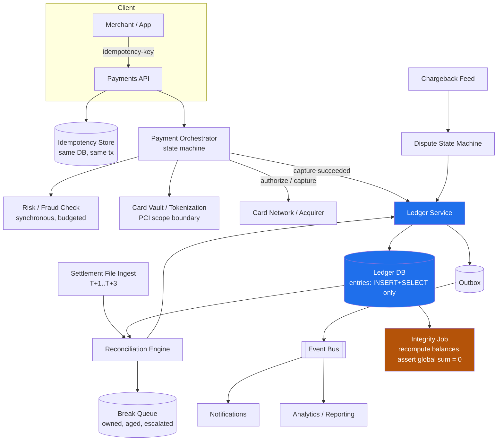
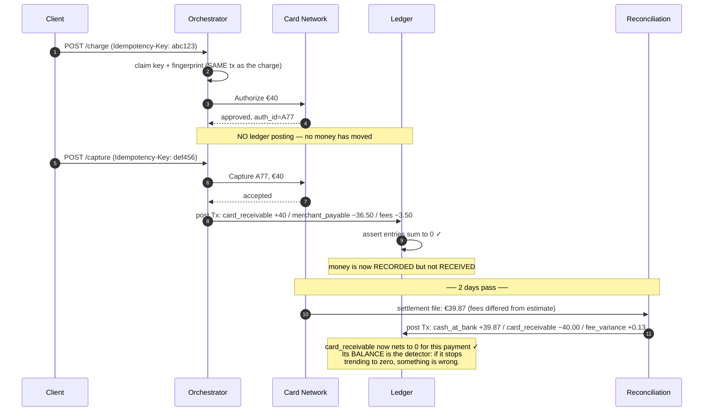
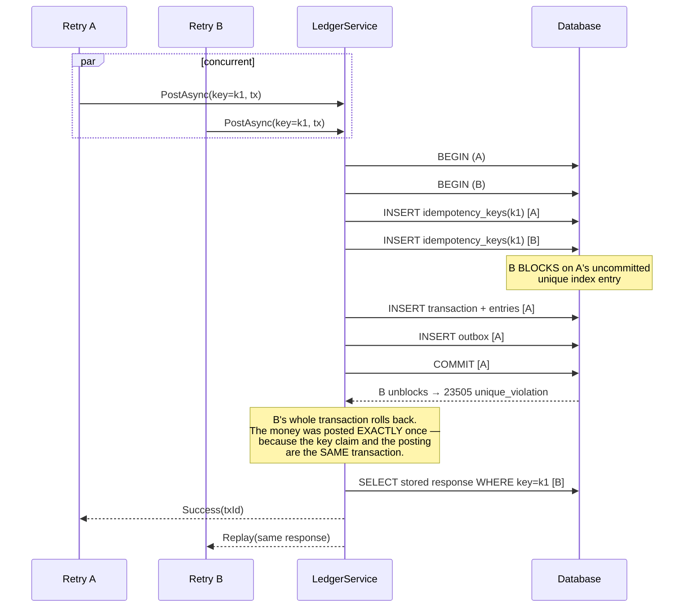

# Module 178 — System Design: Designing a Payment Processing System & Double-Entry Ledger

> Domain: System Design | Level: Beginner → Expert | Prerequisite: [[01-System-Design-Fundamentals]], [[07-Designing-Amazon-Ecommerce]] (checkout and the Saga motivation, extended here into the money-movement core it gestured at), [[11-Designing-Order-Management-Trade-Lifecycle]] (externally-held authoritative truth, idempotency under retransmission — the same problems in the securities domain), [[16-Interview-Execution-Playbook-Estimation-Rubric]] (the clock discipline this module's depth demands), [[../36-Saga/01-SagaFundamentals-OrchestrationVsChoreography-CompensatingTransactions]], [[../37-Outbox/01-OutboxFundamentals-TableDesign-RelayMechanisms-DeliveryGuarantees]]

---

**Why this module exists.** This folder covered a trade lifecycle (Module 131), regulatory reporting (133), and e-commerce checkout (43) — but never the **ledger**: the system of record for money. Under this course's Elite FinTech Panel lens, that was the largest single gap. Ledger design is asked at Stripe, PayPal, Visa, Mastercard, Adyen, Capital One, JPMorgan, and Goldman with near-certainty for any Staff+ backend or architecture role, and it is asked *because* it is the one domain where the usual distributed-systems answers — eventual consistency, at-least-once delivery, retry-until-success — are either wrong or require careful qualification.

The distinguishing property: **money is conserved.** Not "should be," not "eventually will be" — a system that creates or destroys value is not slow or stale, it is *broken*, and in a regulated entity it is a reportable control failure. Almost every design decision here descends from that one constraint.

---

## 1. Fundamentals

### What is a payment system, and what is a ledger?

They are two different systems that candidates routinely conflate, and the conflation is the most common structural error in this interview.

A **payment system** *orchestrates* money movement: it takes an instruction ("charge this card €40"), interacts with external parties who actually hold and move the funds (card networks, issuing banks, ACH/SEPA rails), handles their asynchrony and failures, and reports an outcome. It is an integration and workflow problem with an external authority.

A **ledger** *records* money movement: it is the immutable, append-only, internally-consistent system of record answering "what is every account's balance, and what sequence of events produced it?" It is a correctness and invariant problem with no external authority — the ledger *is* the authority.

The payment system is where the hard *engineering* is; the ledger is where the hard *correctness* is. A candidate who designs only the orchestration has designed a workflow engine that moves money it cannot account for.

### What is double-entry bookkeeping, and why is a 500-year-old accounting technique the right data model?

Every financial event is recorded as a **transaction** composed of two or more **entries**, each a signed amount against an account, such that **the entries sum to exactly zero**.

```
Customer pays €40 for an order:

  Transaction #8817  "Card capture, order 55231"
    Entry 1:  Account = customer_receivable      −40.00 EUR    (debit)
    Entry 2:  Account = merchant_payable         +36.50 EUR    (credit)
    Entry 3:  Account = platform_revenue_fees    + 3.50 EUR    (credit)
                                                 ──────────
                                          SUM =    0.00        ✓
```

Why this, rather than a `balance` column you increment?

1. **Money cannot be created or destroyed by construction.** Value only *moves between accounts*. A single-entry `UPDATE balances SET amount = amount + 40` can lose or invent money through a bug, a partial failure, or a race — and nothing in the data model objects. In double-entry, an entry that doesn't balance is a *malformed transaction*, rejectable at write time.
2. **It gives one global, continuously-checkable invariant**: the sum of all entries across the entire ledger is zero. That single query is a total-system integrity check, and it is the reason a ledger can be *proven* correct rather than assumed correct.
3. **Balance becomes derived, not stored** — the sum of an account's entries. That means balances cannot drift from history, because there is no second place for them to drift *to*.
4. **Every balance is explainable.** "Why is this €3.50 off?" is answerable by reading entries, which is not merely convenient — under SOX it is an audit requirement.

The word "debit" and "credit" cause more confusion than they resolve. Signed amounts summing to zero is the same thing and is unambiguous; use them, and mention the accounting vocabulary only if the interviewer does.

### Why does this matter?

Because the failure modes are *silent and consequential simultaneously* — this domain's recurring finding (Modules 129–134) in its purest form. A double-charged customer notices. A ledger that is €0.03 out of balance across ten million transactions notices nothing, reconciles as "rounding," and is discovered by an auditor eighteen months later when the cause is unrecoverable.

### When does this matter?

Any system where the count of a thing is the product and must be exactly right: payments, wallets, banking cores, brokerage cash, loyalty points, in-game currency, and — importantly — internal credits and prepaid balances, which teams routinely build with a `balance` column and later discover they built a ledger badly.

### How does it work (30,000-ft view)?

```
1. AUTHORIZE   Ask the issuer to reserve funds. No money moves. Reversible.
2. CAPTURE     Tell the issuer to actually take the reserved funds. Money moves.
3. LEDGER      Record the movement as a balanced transaction. Derived balances change.
4. SETTLE      Funds actually arrive from the network, T+1 to T+3, in a BATCH file.
5. RECONCILE   Compare our ledger against the network's file. Investigate every break.
6. PAYOUT      Move the merchant's balance out to their bank. Another movement.
```

Steps 1–3 take seconds. Steps 4–6 take days. **That gap is the source of most of the design's difficulty**, because for those days our records and the outside world's records are both correct and different.

---

## 2. Deep Dive

### 2.1 The Ledger's Invariants — Which Are Enforceable and Which Are Not

Four invariants, and the distinction between them is the substance of the design.

**Invariant 1 — Every transaction's entries sum to zero.** *Enforceable at write time*, cheaply, inside the transaction. Non-negotiable, and should be enforced in the database itself (a constraint or trigger), not only in application code — because application code has more than one path to the table and the paths added later are the ones that miss it. This is Module 177 §2.9's *make it unrepresentable* principle applied where it matters most.

**Invariant 2 — Entries are immutable.** No `UPDATE`, no `DELETE`, ever. A mistake is corrected by posting a **reversing transaction**, not by editing history. This is not fastidiousness: the audit trail *is* the ledger, and an editable ledger has no evidentiary value. Enforce with table permissions that grant `INSERT` and `SELECT` only — revoking `UPDATE`/`DELETE` at the database role level, so it is structurally impossible rather than a code-review item.

**Invariant 3 — Balance equals the sum of entries.** *Automatically true if balance is derived, and a permanent risk if it is cached.* §2.3 covers why caching becomes necessary and how to keep it honest.

**Invariant 4 — Certain accounts must never go negative.** *Not globally enforceable, and this is the interesting one.* A customer wallet must not go negative; a payable account routinely does. So this is a **per-account-type policy**, checked at write time against the account's own rule, and it is the only invariant requiring a read of current state before a write — which makes it the source of the system's only real contention (§2.4).

The general shape worth naming aloud: **three of the four invariants can be made structural, and the fourth is inherently a runtime check.** Knowing which is which tells you where the concurrency problems will be.

### 2.2 Modelling Accounts — the Part Candidates Skip

The naive model has one account per customer. Real ledgers have many accounts per *entity*, and the multiplicity is what makes the model work.

```
ASSET       what we hold or are owed        cash_at_bank, card_receivable
LIABILITY   what we owe others              merchant_payable, customer_wallet
REVENUE     what we've earned               processing_fees, fx_margin
EXPENSE     what we've spent                network_interchange, chargeback_costs
```

The critical modelling point: **a customer's wallet balance is our liability, not our asset.** Money held on behalf of a user is owed to that user. Getting the sign convention wrong here inverts the entire ledger, and it is a real and common error.

Every real movement also needs **intermediate accounts** representing money that is genuinely in transit:

```
Card capture on Monday, network settles on Wednesday:

Mon  Tx#1  card_receivable       +40.00     (network owes us)
           merchant_payable      −36.50     (we owe merchant)
           processing_fees       − 3.50     (we earned)

Wed  Tx#2  cash_at_bank          +40.00     (money actually arrived)
           card_receivable       −40.00     (network no longer owes us)
```

Without `card_receivable`, Monday's transaction would claim cash we do not have. That account **is** the two-day gap, made explicit and inspectable — and its balance at any moment is a directly meaningful, auditable number: "how much money is the network holding that belongs to us?" If it stops trending to zero, something is wrong, and the account itself is the detector.

This is the single most valuable modelling insight in the module: **represent money-in-transit as an account, not as an implicit state**, because an account has a balance you can check and an implicit state does not.

### 2.3 Balance Computation — Derived, Cached, and the Honest Middle

Balance = `SELECT SUM(amount) FROM entries WHERE account_id = ?`. Correct by construction, and unusable at scale: an account with ten million entries requires summing ten million rows on every read.

Three approaches:

**Pure derivation.** Correct, simple, slow. Fine for low-volume accounts, and genuinely fine for far more accounts than teams assume — an index on `(account_id, id)` summing 50,000 rows is milliseconds.

**Cached balance column.** Fast, and it reintroduces exactly the drift double-entry was chosen to eliminate. It creates a second source of truth, and the two can disagree. If used, the update must be **in the same database transaction as the entry insert** — never in a separate write, never asynchronously, never in application code between two commits — or a crash between them leaves the cache permanently wrong with no signal.

**Snapshot plus delta.** The honest middle, and the recommended answer. Periodically write an immutable checkpoint (`account X, as of entry_id 9,000,000, balance €4,812.30`), then compute balance as `snapshot + SUM(entries after the snapshot)`. Reads sum thousands of rows, not millions. The snapshot is *derived from immutable history*, so it can always be recomputed and verified — which means a corrupted snapshot is detectable and repairable, unlike a drifted cache column.

Whichever is chosen, the discipline is the same: **a continuous background job must recompute balances from entries and compare.** Any divergence is a P1, because it means one of the four invariants is broken and you do not yet know which. This job is the ledger's immune system, and per Module 176 §2.22 it must derive its expected value **independently** — from the entries themselves, never from the cache it is checking.

### 2.4 Concurrency — Where the Contention Actually Is

Two writes to *different* accounts have no conflict; the ledger is embarrassingly parallel across accounts. All contention concentrates on **hot accounts touched by many transactions** — typically the platform's own fee and cash accounts, which appear in *every* transaction and therefore serialize everything.

The naive design has every transaction write an entry to `processing_fees`. At 1,000 transactions/sec that is 1,000 writes/sec contending on one row's index page, and if balance is cached on the account row, on one row.

Three mitigations, in increasing order of effort:

1. **Don't cache balances on hot accounts.** If the fee account's balance is derived rather than cached, concurrent entry inserts don't contend on a shared row at all — they're independent appends. This alone resolves most of the problem and is free.
2. **Shard the hot account.** Replace `processing_fees` with `processing_fees_00` … `processing_fees_63`, write to a random shard, and define the logical balance as the sum across shards. Contention drops 64×; the cost is that "the fee account balance" is now a 64-row aggregate, which is trivial.
3. **Batch fee entries.** Accumulate fees and post one aggregate entry per minute. This breaks per-transaction traceability, which is usually unacceptable for audit — mention it, and generally reject it.

For the **negative-balance check** (Invariant 4), which genuinely requires read-then-write, the correct primitive is a conditional write, not a lock:

```sql
-- Atomic: the check and the write are one statement. No SELECT-then-INSERT race.
INSERT INTO entries (transaction_id, account_id, amount)
SELECT :txId, :accountId, :amount
WHERE (SELECT balance FROM account_balances WHERE account_id = :accountId) + :amount >= 0;
-- Zero rows affected ⇒ insufficient funds. One round trip, no lock held across it.
```

Or, in a snapshot model, `SELECT ... FOR UPDATE` on the account row to serialize *that account's* writers only — acceptable because the contention is per-account and wallets are not hot. The failure to avoid is a *distributed* lock, which is both slower and less reliable than the transactional guarantee the database already provides.

### 2.5 Idempotency — the Single Most Important Mechanic in Payments

A client sends "charge €40," the connection times out, and the client does not know whether the charge happened. It must retry. If the retry creates a second charge, you have double-charged a customer — the canonical payments failure.

The mechanism:

- **The key is generated by the client, before the first attempt**, and reused on every retry of that same logical operation. A server-generated key cannot work: the client's problem is precisely that it never received the response containing it.
- **The key, the request fingerprint, and the stored response** are written **in the same transaction as the charge**. If they are separate writes, two concurrent retries can both pass the duplicate check and both charge. This is check-then-act again (Module 177 §2.7), and here it costs real money.
- **A duplicate returns the stored original response**, not a `409 Conflict`. The retrying client legitimately needs the original result — a 409 tells it "something happened" without telling it what, which is the state it was already in.
- **The request fingerprint must be compared.** If the same key arrives with a *different* body, that is a client bug and must be rejected loudly (`422`), never silently treated as a duplicate — otherwise a key-reuse bug silently drops real charges.
- **Retention must exceed the longest realistic client retry window.** A 24-hour retention against a mobile client that retries after a 7-day reinstall is a gap that will eventually be exercised, and this specific mismatch is a common real defect (Module 176 §3's ladder names it).

```csharp
// One transaction. The uniqueness constraint and the money movement are atomic
// together, so two concurrent retries cannot both pass.
await using var tx = await db.BeginTransactionAsync(IsolationLevel.ReadCommitted);
try
{
    await db.ExecuteAsync(
        "INSERT INTO idempotency_keys (key, request_hash, created_at) VALUES (@k, @h, now())",
        new { k = key, h = fingerprint });     // unique index on `key` — this throws on duplicate
}
catch (UniqueViolationException)
{
    var existing = await db.QuerySingleAsync<StoredResponse>(
        "SELECT request_hash, response_body, status FROM idempotency_keys WHERE key = @k",
        new { k = key });

    if (existing.RequestHash != fingerprint)
        return Problem(422, "Idempotency key reused with a different request body.");

    return existing.Status == "in_progress"
        ? Problem(409, "Original request still in flight — retry shortly.")  // NOT a duplicate
        : Ok(existing.ResponseBody);                                          // replay the original
}

var result = await PostLedgerTransactionAsync(tx, charge);   // same tx
await StoreResponseAsync(tx, key, result);                   // same tx
await tx.CommitAsync();
```

The `in_progress` case is the subtlety candidates miss: a retry arriving while the original is still executing must not be treated as complete, because there is no response to replay yet. Returning 409 with "retry shortly" is correct there and *only* there.

### 2.6 The Authorization / Capture Split, and Why It's Two Ledger Events (or One)

**Authorization** asks the issuer to reserve funds against a card. No money moves; the cardholder sees a "pending" line; the hold expires (typically 7 days) if not captured. **Capture** instructs the issuer to actually transfer the reserved funds.

The design question: does authorization post to the ledger?

**It should not post to the money-movement accounts**, because no money has moved — posting it would overstate `card_receivable` and inflate every balance in the system by the value of all outstanding, possibly-never-captured authorizations.

But it *is* a business fact requiring durable state (an auth can be voided, expire, or be partially captured), so it belongs in a **payment-state store**, separate from the ledger. Some designs additionally record it in **memorandum accounts** — off-balance-sheet accounts tracking commitments — which is legitimate and useful for exposure reporting, provided they are clearly segregated from the real accounts and excluded from the global sum-to-zero check.

The clean separation to state:

```
Payment state store:  auth created → authorized → captured/voided/expired
                      (a state machine with an EXTERNAL authority — Module 131's shape)

Ledger:               only real movements post. Capture posts. Auth does not.
```

Partial and multiple captures against one authorization are normal (shipping items separately), so the relationship is one-auth-to-many-captures, and the sum of captures must not exceed the authorized amount plus whatever over-capture tolerance the network allows. That tolerance is a real network rule, not an implementation detail, and getting it wrong produces declined captures on shipped goods.

### 2.7 Settlement and Reconciliation — Where Truth Is External

Days after capture, the network sends a settlement file: what it actually paid, net of interchange and scheme fees, with its own transaction identifiers. **This is the authoritative record of what happened to the money**, and our ledger is a prediction of it.

Reconciliation matches every capture in our ledger to a line in that file, and produces **breaks** — items that don't match. Break categories, each needing different handling:

| Break | Meaning | Handling |
|---|---|---|
| **In ledger, not in file** | We think we were paid and weren't | Investigate; may be timing (next file) or a genuine loss |
| **In file, not in ledger** | We were paid for something we didn't record | Serious — indicates a capture we lost. Post it and find out why |
| **Amount mismatch** | Fees differed from our estimate | Usually expected; post the delta to a fee-variance account |
| **Duplicate in file** | Network sent it twice | Dedupe on the network's ID — and see §4 for why that's harder than it sounds |

Three points that separate a real answer:

1. **Reconciliation is not a batch job you run and eyeball.** It is a control with an owner, an SLA for break resolution, an aging report, and escalation. Unresolved breaks aging past a threshold is itself an alertable condition, because a growing break population means the ledger is drifting from reality.
2. **Fee estimation is a prediction and will be wrong.** Interchange depends on card type, region, merchant category, and network rules that change. So the ledger must post *estimated* fees at capture and a *variance* at settlement, and the variance account's balance is a direct measure of estimation quality — another case of §2.2's principle that a well-chosen account *is* a detector.
3. **The expected set must be independently derived** (Module 176 §2.22). Reconciling our ledger against a file we generated from our own ledger proves nothing. The network's file is genuinely independent, which is exactly what makes it valuable — and exactly why Module 133's incident, where the reconciliation's expected set came from the logic being checked, was undetectable.

### 2.8 Chargebacks, Refunds, and Corrections — Always Forward, Never Backward

A refund is **not** a deletion or a reversal of the original transaction. It is a **new transaction moving money the other way**:

```
Original  Tx#8817   card_receivable +40.00  merchant_payable −36.50  fees −3.50
Refund    Tx#9204   card_payable    −40.00  merchant_payable +36.50  fees +3.50
                    (references Tx#8817 as its reason, but does not modify it)
```

Both remain in history permanently. The account nets to zero; the audit trail shows both events and when each occurred. This is the immutability invariant in practice, and its practical benefit is that "why does this customer have a €0 balance?" has a readable answer.

A **chargeback** is worse than a refund because it is *initiated by the issuer against us*, with a dispute process, a deadline, and fees. It has its own state machine (received → evidence submitted → won/lost), its own money movement at each stage, and typically a **liability shift** determining whether the merchant or the platform bears the loss. It is the clearest case where the ledger must model something adversarial and time-bounded, and where a missed deadline has a direct financial cost — making the deadline a *functional requirement* with alerting, exactly as in Module 133.

The general rule, worth stating in the interview: **corrections move forward.** Any design that fixes a ledger error by updating or deleting an entry has destroyed the property that made the ledger trustworthy.

### 2.9 Money Representation — Never Floating Point, and the Rounding Question

`decimal` (C# `decimal`, SQL `NUMERIC`) or scaled integers (store minor units — cents — as `bigint`). **Never `double` or `float`**: binary floating point cannot represent 0.1 exactly, so `0.1 + 0.2 != 0.3`, and errors accumulate across millions of operations into real, unexplainable discrepancies.

Scaled integers are the safest choice — exact by construction, no rounding-mode surprises, and fast — with the caveat that currencies have different minor-unit exponents: USD and EUR have 2, JPY has 0, KWD and BHD have 3. Hardcoding "multiply by 100" is a real bug that appears the day the first JPY transaction arrives.

**Currency must be part of the amount type, not a sibling column**, and amounts in different currencies must be structurally impossible to add:

```csharp
public readonly record struct Money(long MinorUnits, Currency Currency)
{
    public static Money operator +(Money a, Money b) =>
        a.Currency == b.Currency
            ? new Money(a.MinorUnits + b.MinorUnits, a.Currency)
            // Not an exception you catch — a bug you must not be able to write.
            : throw new CurrencyMismatchException(a.Currency, b.Currency);
}
```

**Rounding** is where money is actually lost. Splitting €10.00 three ways gives €3.333…; rounding each to €3.33 loses a cent, and the transaction no longer sums to zero — which the ledger will reject, correctly. The fix is **largest-remainder allocation**: compute the floor for each part, then distribute the remaining minor units one at a time by descending remainder, so the parts sum *exactly* to the original by construction. This is the same deterministic exactly-reconciling allocation problem Module 131 covers for trade allocations, and it is a favourite follow-up because the naive answer silently violates the ledger's core invariant.

FX adds a further rule: a cross-currency transaction cannot balance in a single currency, so it is modelled as two balanced single-currency transactions linked through an **FX position account**, with the rate and its timestamp recorded on the transaction. Trying to make one transaction balance across currencies is a common and fundamental modelling error.

### 2.10 Why Double-Entry Is the Correct Data Model, Derived Rather Than Inherited

Do not accept double-entry as accounting convention. Derive it, because the derivation is what tells you when it applies.

**Start from the requirement:** money moves between places, no money is created or destroyed by a movement, and every movement must be attributable and auditable afterwards.

**The naive model** is a `balance` column per account, updated on each movement. It fails three ways, each independently fatal:

1. **Conservation is unenforceable.** Nothing structurally links the debit to the credit. A bug that decrements one account without incrementing another produces a system where money has simply vanished, and no query can detect it because there is nothing to compare against.
2. **History is destroyed.** The current balance does not say how it was reached, so "why is this number what it is" is unanswerable — and that question *is* the product in a financial system.
3. **Concurrency is unsafe by default.** Read-modify-write on a shared column is a lost update waiting to happen (§2.4).

**Double-entry fixes all three with one structural change:** record movements as immutable paired entries that must sum to zero, and derive balance from them.

- Conservation becomes a **checkable invariant** — `SUM(amount) = 0` per transaction, and globally per currency (§2.1).
- History is the primary artefact rather than a side effect.
- Balance becomes a **derived** quantity, so there is nothing to race on (§2.3).

**And the derivation tells you the boundary condition**: double-entry is correct wherever conservation is a real invariant. It is *not* automatically right for a metric that can legitimately be created or destroyed — a click count, a score. Applying it there is cargo-culting; the property it enforces is one the domain must actually have.

### 2.11 Cross-Currency Payments

A customer pays in GBP, the merchant settles in EUR. The wrong model puts both currencies in one transaction and lets the sum-to-zero constraint fail — or, worse, "fixes" the constraint by relaxing it.

**The correct model treats an FX conversion as two transactions joined by a currency-pair account**, so each transaction balances within a single currency and the constraint holds unchanged:

```
Tx#1 (GBP)   customer_receivable_GBP   +100.00
             fx_position_GBP           −100.00

Tx#2 (EUR)   fx_position_EUR           +116.50
             merchant_payable_EUR      −116.50
```

Three properties follow, and they are why this model is worth the extra transaction:

- **The sum-to-zero invariant is enforced per currency**, never weakened. §2.1's global check becomes "zero for every currency," which is stronger and still simple.
- **The FX position accounts carry the firm's actual currency exposure** — the residual in `fx_position_GBP` versus `fx_position_EUR` at the applied rate *is* the FX P&L, visible as an account balance rather than buried in a calculation. This is §2.2's principle again: a well-chosen account is a detector.
- **The rate used is recorded as an attribute of the transaction pair**, so the conversion is reproducible. A conversion whose rate is not stored cannot be explained later, and it will be queried.

And the discipline from §2.9 applies with extra force: never convert by multiplying a minor-unit integer by a float. Convert with explicit rounding and post any residual to a rounding account, so the books balance exactly.

### 2.12 Why Event Publishing Must Use the Outbox

Downstream consumers — notifications, analytics, the merchant dashboard — need to know a payment posted. The tempting implementation writes to the ledger and then publishes to the bus.

**That is a dual write, and it has no correct failure behaviour.** If the ledger commits and the publish fails, downstream never learns of a real payment. If the publish succeeds and the ledger transaction rolls back, downstream has been told about a payment that did not happen — and in a payments system that means a customer receives a confirmation for money that never moved.

**The outbox makes it one write.** The event row is inserted **in the same transaction as the ledger entries**, so it commits atomically with them or not at all. A separate relay reads the outbox and publishes, marking rows sent.

Two consequences worth stating:

- Delivery is **at-least-once**, so consumers must be idempotent on the event's identity. This is the same exactly-once identity as §2.5, on the consumption side.
- **The ledger never depends on the bus.** The CP core's availability stays independent of the messaging tier — which is precisely what lets the ledger keep posting when Kafka is down.

The monitoring that matters here is not queue depth but **oldest-unpublished-age**: a stalled relay is otherwise completely silent, because nothing errors.

### 2.13 Scaling Past a Single Database

**Stay single-primary as long as possible, and say why.** A ledger posting is a multi-row atomic write with a validating constraint, which is exactly what a single relational primary does well and what no distributed key-value store offers. At 2,000 payments/sec and ~8,000 entry writes/sec this is comfortably within reach of a well-provisioned primary — so the first answers are the boring ones: better indexing, connection pooling, snapshot-plus-delta to remove expensive balance reads from the write path (§2.3), and read replicas for reporting.

**When it genuinely saturates, shard on a boundary no transaction crosses.** The candidates, in order of preference:

1. **Legal entity** — the strongest boundary, because inter-entity movement is already a deliberate, separately booked transaction in the accounting model.
2. **Currency** — a transaction balances within one currency (§2.11), so currency is a natural cut, provided FX is modelled as paired transactions rather than one cross-currency transaction.
3. **Merchant / tenant** — workable, and weaker, because platform-level fee accounts are touched by every merchant and therefore cannot live on a merchant shard.

**Choose the boundary before you need it.** If the model is designed so that no transaction spans entities or currencies, sharding later is a *deployment* change. If transactions routinely span the boundary, sharding is a re-modelling project plus a distributed-transaction problem, which is a different and far worse piece of work.

### 2.14 The Integrity Verifier — and Verifying the Verifier

The ledger's invariants (§2.1) are only worth having if something checks them continuously. The verifier has four layers, each catching what the others cannot:

| Layer | Check | Catches |
|---|---|---|
| 1 | Every transaction's entries sum to zero, per currency | A posting bug that wrote one side |
| 2 | Global sum per currency is zero | Anything layer 1 missed, including direct database writes |
| 3 | Each account's snapshot + delta equals the full sum of its entries | A corrupted or stale snapshot (§2.3) |
| 4 | Derived balances match independently recomputed balances for a sample | Drift between any cached view and the entries |

**Frequency by consequence, not uniformly:** layers 1 and 2 are cheap and should run continuously; layer 3 hourly; layer 4 daily over a stratified sample weighted toward high-volume and high-value accounts, because a uniform sample is consequence-blind.

**The verifier must itself be verifiable, and this is the part usually missing.** A verification job that silently stops running produces exactly the same output as a system with no problems: nothing. So:

- **A dead-man's switch** — the verifier writes a heartbeat with its completion time and coverage, and an *independent* alert fires if that heartbeat ages past a threshold. Absence of failure is not evidence of success.
- **Fault injection in a test environment** — deliberately post an unbalanced transaction and assert the verifier catches it, on a schedule. A verifier that has never caught anything has not been shown to work.
- **Run it against a replica**, so verification load never competes with posting, and so a verifier bug cannot write to the primary.

### 2.15 Investigating "This Balance Is €12.34 Wrong"

The order matters, because it moves from cheapest and most likely to most expensive and least likely.

1. **Establish which number is disputed.** Is the *derived* balance wrong, or the *displayed* one? A stale cache or a UI filtering by date range differently accounts for a large share of reports and costs nothing to check.
2. **Recompute from entries.** `SUM(amount)` over the account, ignoring snapshots. If that matches the expected figure, the defect is in the snapshot or the cache (§2.3), not in the ledger.
3. **Check the snapshot.** Snapshot value plus entries since the snapshot should equal the full sum. A mismatch localises the bug precisely.
4. **Diff against the counterparty side.** Every entry has a paired entry; find the transactions where the merchant's side and its counterpart disagree in the expected way. €12.34 is a suspiciously specific number — look for a **fee** of that amount posted to the wrong account, which is the single most common cause.
5. **Only then look at posting logic.** By this point the search space is one transaction, not a codebase.

**And note the failure class that has no internal detector at all: misallocation.** If a fee was posted to the wrong account, the ledger still balances perfectly — sum-to-zero holds, the global invariant holds, every layer of §2.14 passes. Money went to the wrong place, correctly. Only reconciliation against **externally derived truth** (§2.7) or a complaint finds it, which is why §2.7 is not optional.

### 2.16 The Indeterminate State — When You Do Not Know What Happened

A network call to the card network times out. The authorisation may have succeeded, may have failed, and you cannot tell. This is the single most important state in a payments system, and the design error is not modelling it.

**Make `INDETERMINATE` a first-class state**, not an error, and resolve it deliberately:

1. **Retry with the network's own idempotency key**, where the network supports one — this makes the retry safe and frequently returns the original outcome.
2. **Query the network for the transaction's status** by your reference. Slower, and authoritative.
3. **Wait for settlement** (§2.7). The settlement file is the truth and arrives on a horizon of days.

**Post nothing to the ledger while indeterminate.** The customer-facing behaviour is "pending," and the in-transit or pending-authorisation account carries the exposure so it is visible and ageable.

**The one thing that must never happen** is treating indeterminate as failed and letting the customer retry, because a retry against a network that actually succeeded produces a genuine double charge — converting an ambiguity into a real financial error. Fail *toward pending*, never toward failed, and alert on **aged indeterminate** items, because they are the population most likely to be a real problem.

### 2.17 Proving a Historical Balance to a Regulator

*"Prove this customer's balance on 14 March last year was correct."* The design can answer it, and the reason it can is worth stating as a property rather than a query.

Because entries are **immutable and append-only**, the balance as of any instant is `SUM(amount) WHERE account = ? AND created_at <= ?` — a deterministic function of history, computable today and identical every time. Nothing is overwritten, so there is no "as it was then" to reconstruct separately.

What must also be retained for the proof to be complete: the **transaction-level provenance** (what caused each entry — payment, refund, fee, adjustment), the **corrections as forward entries** rather than edits (§2.8), so the timeline shows both the original and the correction with their timestamps, and the **snapshot lineage**, so a stated balance can be shown to have been derived from entries rather than asserted.

**The contrast that makes the point:** a mutable `balance` column cannot answer this at all. It knows only the present. Any historical answer would be a reconstruction from logs that were never designed to be authoritative — which is the same argument as §2.10, arriving from the compliance side rather than the correctness side.

### 2.18 The Fraud Check on the Critical Path

*"Fraud screening adds 80 ms to authorisation. Product wants it removed."*

**Do not accept or refuse; decompose.** The 80 ms is not one thing:

- **Velocity and rules checks** — a few milliseconds, local, high value. Keep them synchronous.
- **Model scoring** — the bulk of the latency. Ask what fraction of declines it actually contributes; if it is small, it may be movable.
- **Third-party consortium lookups** — often the slowest and the most network-variable.

**Then split by outcome value.** Keep the cheap decisive checks synchronous and gating. Move expensive scoring to a **near-real-time secondary check** that can still block within a small grace window before capture, or to post-hoc detection that flags for review and reversal. §2.6's authorisation/capture split is what makes this possible: the window between them is exactly where asynchronous fraud work fits.

**And set the failure posture per tier, not globally.** If the fraud service is unavailable: low-value transactions **fail open** (approve, flag for review) because declining good customers has a real cost; high-value or high-risk-profile transactions **fail closed**. A single global default is wrong for one of the two by construction.

The number that should end the conversation is not the latency but the **decline value**: what fraud loss does this check prevent per month, against what conversion loss do the 80 ms cost. If nobody can produce both figures, the discussion is aesthetic and the honest recommendation is to measure before changing.

### 2.19 Payouts — Where Money Actually Leaves

Paying a merchant their balance is the operation with the least margin for error, because it is irreversible in a way a ledger entry is not.

**The sequence, and why each step exists:**

1. **Freeze the payout amount** by posting from `merchant_payable` to `merchant_payable_in_transit` — an atomic ledger transaction. From this moment the amount cannot be double-paid, because it is no longer in the payable balance.
2. **Submit the transfer** to the bank with an idempotency key derived deterministically from the payout ID, so a retry cannot double-send.
3. **On confirmation**, post from `in_transit` to `cash_at_bank`.
4. **On rejection**, post back from `in_transit` to `merchant_payable`, with the rejection reason recorded.

**The failure cases that matter:**

- **Indeterminate submission** (§2.16) — the amount stays in-transit and is resolved by querying the bank or by the next statement. It is never re-sent on a guess.
- **Aged in-transit is the primary control.** An amount sitting in `in_transit` past the expected settlement window is the detector for every silent failure in this flow, and it is an account balance rather than a log line, so it is queryable and reportable.
- **Partial or returned payments** (a closed account, a rejected IBAN) post back and re-enter the payable balance, which is only clean because the freeze was a ledger transaction rather than a status flag.

**Never pay out from a computed balance without freezing it first.** The window between computing "they are owed €50,000" and the money leaving is exactly when a refund or chargeback can land.

### 2.20 Adding Wallets — What Changes

A wallet where users hold a balance looks like a small feature and changes the system's regulatory character.

**In the ledger, very little changes**, which is the good news and a direct dividend of §2.2's account-type modelling: a wallet is a **liability** account (money owed to the user), and top-ups, spends and withdrawals are ordinary transactions. The invariant that a wallet must never go negative is §2.1's fourth invariant — a per-account-type policy checked at write time, and the system's main source of contention (§2.4).

**Outside the ledger, a great deal changes:**

- **Holding customer funds is frequently a regulated activity** — e-money or safeguarding obligations, depending on jurisdiction — which can require segregated accounts, specific capital treatment and licensing. This is a legal question that must be answered before the feature is built, not after.
- **Abuse surface grows**: wallets are attractive for money laundering (load, transfer, withdraw), so transfer limits, source-of-funds checks and monitoring become requirements rather than enhancements.
- **Dormancy and escheatment** — unclaimed balances have statutory treatment in many jurisdictions.

The engineering answer is "this is a liability account and three transaction types." The Principal answer names the regulatory consequence first, because that is what determines whether the feature is viable at all.

### 2.21 Two Proposals to Evaluate: Event Sourcing, and Kafka as the Ledger

**"The ledger is already append-only — should it be event-sourced?"**

*For:* the domain is already immutable history with derived state, which is exactly event sourcing's shape; temporal queries come naturally; and the audit trail is the primary artefact.

*Against, and decisive here:* a double-entry ledger **already is** an event-sourced model, with entries as events and balance as the projection. Layering a generic event-sourcing framework on top adds an indirection without adding a property — and it risks *weakening* the one thing that matters, because the sum-to-zero constraint is enforceable as a **database constraint** over the entries table and is much harder to enforce over an opaque event stream. Use the ledger's own structure; do not wrap it.

**"Replace the ledger with an append-only Kafka topic — it's already an immutable log."**

Take it seriously: it is immutable, append-only, ordered, replayable and durable. Then name precisely what it cannot do, because these are exactly the properties the ledger exists for:

- **No atomic multi-row write with a validating constraint.** Nothing can enforce that a transaction's entries sum to zero at write time. The invariant becomes a downstream check, which means invalid data is already durably committed by the time it is detected.
- **No read-your-own-write balance guard.** §2.1's "never go negative" requires reading current state and writing atomically against it. A log offers no such primitive, so the guard becomes a consumer-side check with a race window.
- **Retention and query.** A ledger must be queryable for seven years by account and date range. That is a database's job, and re-deriving a balance by replaying a topic is not an operational answer.

**The synthesis:** Kafka is the right transport for ledger *events* to downstream consumers (§2.12) and the wrong system of record. The proposal confuses *a log* with *a ledger*: a ledger is a log **plus enforced invariants**, and the invariants are the entire value.

### 2.22 Migrating a Live System From a `balance` Column to a Ledger

Four phases, and the order is the answer.

1. **Write both.** Every operation that mutates `balance` also writes ledger entries, in the same transaction. The column remains authoritative. Nothing reads the ledger yet.
2. **Backfill history.** Reconstruct entries from whatever historical record exists — transaction logs, statements — and post an explicit **opening-balance transaction** per account for the unreconstructable remainder. That opening entry is honest: it says "history before this date is not derivable," which is far better than a ledger that silently implies completeness it does not have.
3. **Reconcile continuously.** Derived balance versus the column, for every account, daily, with divergence alerting. Run this until the divergence is zero for a period covering the **episodic** events (month-end, refunds, chargebacks, corrections) — not merely for a fixed number of weeks, which is the same evidence-standard error as Module 134's capstone.
4. **Flip the read path, keep writing both.** The ledger becomes authoritative; the column continues to be written and reconciled as a shadow, so a regression is a divergence alert rather than an incident. Retire the column only after a full cycle.

**The irreversible moment is phase 4**, and the reason the column keeps being written afterwards is precisely that rollback must remain available.

### 2.23 Observability — and the Failures With No Detector

| Failure | Detector | Natural? |
|---|---|---|
| Posting error breaking sum-to-zero | Verifier layers 1–2 (§2.14) | Yes — the constraint rejects it |
| Snapshot drift | Verifier layer 3 | Yes, once built |
| Ledger unavailable | Error rate, queue depth at the AP edge | Yes |
| Outbox relay stalled | **Oldest-unpublished-age** (§2.12) | **No** — nothing errors |
| Indeterminate payments accumulating | **Aged in-transit / aged indeterminate** (§2.16, §2.19) | **No** — each one individually looks fine |
| **Misallocation** — right amounts, wrong accounts | **External reconciliation only** (§2.7) | **No** — every internal invariant holds |
| **Pre-ledger loss** — a payment that never reached the ledger | **External reconciliation only** | **No** — the ledger is self-consistent about what it received |
| Verifier itself stopped | **Dead-man's switch** (§2.14) | **No** — silence is the same as success |

**Where the "correctness is unobservable yet consequential" theme is sharpest in this design: misallocation and pre-ledger loss.** Both produce a ledger that passes every internal check while being wrong about the world. The design's answer is that **internal consistency is necessary and not sufficient**, and that the only ground truth is externally supplied — which is why reconciliation against the settlement file is a control with an owner and an SLA rather than a batch job someone eyeballs.

**And the counter on every silent path.** A settlement row skipped, a message discarded, a retry abandoned — each must increment something. A dropped item is acceptable; an *uncounted* dropped item makes the data silently wrong rather than known-incomplete.

### 2.24 Not Building Your Own Ledger

The strongest argument against, which you should be able to make:

A ledger is a **regulated, high-consequence, low-differentiation** system. Nobody chooses a payments platform because its ledger is elegant. Building one means owning double-entry correctness, settlement-file formats that change, chargeback lifecycles per scheme, multi-currency rounding, seven-year retention, audit support and a permanent on-call burden — none of which is a competitive advantage. Ledger-as-a-service products and core-banking platforms exist and are audited.

**When building is nonetheless right:** the business model requires ledger semantics no vendor offers (unusual multi-party splits, marketplace flows with complex fee hierarchies); volume makes per-transaction pricing exceed build-and-operate cost; or the ledger is deeply coupled to proprietary product logic where the integration cost approaches the build cost.

**The Principal framing:** the question is not "can we build it" — the engineering is well understood and this module documents it. The question is whether the organisation wants to own the **audit and regulatory surface** permanently, because that is the part that never ends.

### 2.25 Concurrency on a Shared Account, Traced by Isolation Level

Two customers pay simultaneously and both transactions touch the platform fee account. What actually happens depends entirely on isolation level, and being able to trace it is the difference between knowing the words and knowing the behaviour.

**`READ COMMITTED` with a plain balance read:** both transactions read the fee account's balance, both compute a new value, both write. **Lost update** — one payment's fee vanishes. This is the default in PostgreSQL and the reason a derived balance (§2.3) is safer than a maintained one.

**`READ COMMITTED` with `SELECT … FOR UPDATE`:** the first transaction locks the fee account row; the second blocks until commit, then reads the updated value. Correct, and **serialised on the fee account** — which is exactly §2.4's contention hot spot, because every payment touches it.

**`SERIALIZABLE`:** PostgreSQL detects the read-write conflict and aborts one transaction with a serialisation failure. Correct, and requires the application to **retry**, which it must be written to do. Throughput under contention is worse than explicit locking because work is discarded rather than queued.

**Appending entries without reading a balance** — the design this module recommends — has **no conflict at all.** Two inserts into the entries table do not contend; the balance is derived later. This is the key insight: **contention exists only where a running total is maintained.** Remove the running total and the concurrency problem largely disappears.

**Where a balance guard is genuinely required** (a wallet that must not go negative, §2.20), the contention returns and the mitigations are: shard the hot account into N sub-accounts summed for reporting; batch fee postings rather than posting per payment; and keep the locked section as short as possible.

### 2.26 The Separating Question, and the One Thing to Go Deep On

**With twenty minutes and "go as deep as you can on one thing," pick idempotency and the indeterminate state** (§2.5, §2.16). It is where the real difficulty lives: it has a derivable structure (`exactly-once = at-least-once AND at-most-once`), worked failure scenarios, a database-level implementation with a genuine race if done as check-then-write, a distributed-systems core, and a direct, explicable financial consequence. The ledger's data model is elegant but largely a matter of knowing the convention; idempotency is where designs actually fail.

**The single question that separates a Staff answer from a Senior one:**

> **"How do you know your ledger is correct right now?"**

A Senior answer describes the invariants — entries sum to zero, balance derives from entries. A Staff answer describes the **verification**: which invariants are enforced at write time versus checked continuously, at what frequency, by what job, with what alerting; which failure modes have **no internal detector** (misallocation, pre-ledger loss) and are therefore covered only by externally derived reconciliation; and how the verifier itself is known to be running (§2.14's dead-man's switch).

The question separates so reliably because internal consistency is easy to describe and easy to achieve, and **it is not the same as being right about the world.** Recognising that gap — and building the evidence that closes it — is the whole of the Staff-level competency in this domain.

**And the generalisation worth carrying out of this module.** §4's incident and the OMS's `ExecID` incident (Module 131 §2.4) are the same defect in different industries: **a uniqueness assumption about an external party's identifier, inferred rather than verified, whose violation is internally indistinguishable from correct behaviour.** The design rule follows directly — *for any external identifier you deduplicate on, document and verify its actual uniqueness scope with the issuing party, make the scope part of the key, and monitor the deduplication rate*, because a spike in "duplicates" is what a scope mismatch looks like from the inside.

---


---

## 3. Visual Architecture

### System architecture



The highlighted core is the part that must never be wrong. Everything to its left is orchestration that can retry; the integrity job in amber is the immune system that proves the core is still correct.

### Double-entry data model

```
transactions                      entries
┌────────────────────────┐        ┌──────────────────────────────┐
│ id            (PK)     │←──────┐│ id              (PK)         │
│ external_ref           │       └│ transaction_id  (FK)         │
│ type                   │        │ account_id      (FK)         │
│ occurred_at            │        │ amount_minor    BIGINT       │  signed
│ posted_at              │        │ currency        CHAR(3)      │
│ reverses_transaction_id│        │ created_at                   │
│ idempotency_key UNIQUE │        └──────────────────────────────┘
└────────────────────────┘         INSERT + SELECT only.
                                   No UPDATE. No DELETE. Enforced by GRANT.

  CONSTRAINT: SUM(entries.amount_minor) per transaction, per currency = 0
              — enforced by a deferred constraint trigger, in the database,
                because application code has more paths to this table than
                anyone remembers.

  GLOBAL INVARIANT:  SELECT SUM(amount_minor) FROM entries GROUP BY currency
                     must be 0 for every currency, always.
                     This one query is a whole-system integrity proof.
```

### Payment lifecycle — the days-long gap



---

## 4. Production Example

**Problem.** A payments platform processing ~2,000 transactions/sec across Europe ran a nightly reconciliation against acquirer settlement files. For eleven weeks it was clean. In week twelve, finance reported that the platform's cash position was €218,000 higher than the ledger predicted — the bank held more money than the books said it should.

An excess is not intuitively alarming, which is precisely why it survived. The first two investigations classified it as timing: settlement files sometimes include prior-period items, so a positive variance that "should resolve next cycle" is a plausible story. It did not resolve; it grew.

**Architecture.** Conventional and largely sound. Captures posted `card_receivable`; settlement ingest matched each file line to a capture by the acquirer's transaction reference, posted `cash_at_bank` against `card_receivable`, and wrote any difference to `fee_variance`. Unmatched file lines went to a break queue. Reconciliation deduplicated file lines by the acquirer's reference so a re-sent file wouldn't post twice.

**Implementation — what was actually happening.** The acquirer's transaction reference was **not globally unique**. It was unique per *acquirer processing centre*, and the platform had been migrated onto a second processing centre eight weeks earlier as part of a capacity expansion. References from the two centres were drawn from overlapping ranges.

The consequence ran in one direction. When a settlement line arrived whose reference had already been seen — because a line from centre B collided with a line from centre A weeks earlier — the deduplication logic **silently discarded it as a duplicate**. The money had genuinely arrived at the bank, but no `cash_at_bank` entry was posted and the corresponding `card_receivable` was never cleared. The ledger under-reported cash; the bank had more than the books.

Three things made it invisible for eleven weeks:

1. **The deduplication was working exactly as designed.** No error, no exception, no break — a discarded duplicate is a *normal, expected, successful* outcome, and the count of them was not a monitored metric.
2. **The break queue stayed empty**, because a silently-discarded line never becomes a break. The control designed to catch unmatched money could not see money that was never presented to it.
3. **`card_receivable` was growing**, which was the true signal — money the network supposedly still owed us, accumulating and never clearing. But nobody watched that account's *aging*; they watched its balance, which also grew with legitimate in-flight volume, so the anomaly was inside the noise.

**Trade-offs.** The deduplication was added deliberately after an earlier incident where a re-sent file double-posted, and it was the correct fix for that problem. The defect was scoping the uniqueness key to what the specification claimed rather than to what the counterparty actually did — and then, having introduced a silent discard path, not measuring it.

**Lessons learned.**

1. **A deduplication key must be scoped to the counterparty's actual behaviour, not the specification's stated guarantee.** This is Module 131 §4's finding arriving independently in the payments domain: there, a venue's `ExecID` uniqueness turned out to be per-session rather than global, and correctly-functioning deduplication silently discarded genuine fills. Two different industries, the same defect. The generalization is that **uniqueness is a property of a scope, and the scope is almost never documented correctly** — so the key must include everything that could vary (here, the processing centre), and the cost of over-scoping is nil while the cost of under-scoping is silent data loss.
2. **Any silent-discard path must be counted, and the count must be alerted on rate-of-change.** "Duplicates discarded" was the single metric that would have caught this in week one — it went from near-zero to hundreds per day the moment the second centre came online. A discard is a decision to destroy information, and every such decision deserves a counter.
3. **The in-transit account was the intended detector and it was read wrongly.** `card_receivable` growing was exactly the signal §2.2 says it should be — but only its *balance* was watched, which conflates legitimate in-flight volume with stuck items. The correct metric is **aged** in-transit: how much has been sitting in `card_receivable` for longer than the settlement window? That number should be near zero always, and it would have spiked immediately.
4. **A variance in the "good" direction is not self-explaining.** Excess cash was tacitly treated as benign. It was evidence of a control failure, and had the collision run the other way — discarding lines that would have *reduced* cash — the platform would have overstated its position, which is a materially worse regulatory outcome. **The direction of a discrepancy is not evidence about its severity**, and classifying by direction rather than by cause is how this survived two investigations. (Module 177 §2.16's silent-path pattern, again.)

**The fix.** Deduplication key changed to `(acquirer, processing_centre, reference, settlement_date)`, with a backfill identifying and posting all 1,847 discarded lines. A `settlement_lines_discarded_total` counter with an alert on any non-trivial rate. An **aged in-transit report** per in-transit account, alerting on anything older than the settlement window plus a buffer — which is now the primary settlement control, because it detects the general class ("money that should have cleared and hasn't") rather than the specific cause. And a standing rule added to the integration checklist: *for every external identifier we deduplicate on, document the counterparty's actual uniqueness scope, and test it.*
## 11. Coding Exercises

### Easy — A `Money` type that makes currency errors unrepresentable

**Problem:** Implement money as scaled integers with the currency in the type, correct per-currency minor units, and no way to silently mix currencies.

**Solution:**
```csharp
public readonly record struct Currency(string Code, int MinorUnitExponent)
{
    // Exponents genuinely vary — hardcoding ×100 breaks the day the first JPY arrives.
    public static readonly Currency Usd = new("USD", 2);
    public static readonly Currency Eur = new("EUR", 2);
    public static readonly Currency Jpy = new("JPY", 0);   // no minor unit at all
    public static readonly Currency Kwd = new("KWD", 3);   // three, not two
}

public readonly record struct Money(long MinorUnits, Currency Currency) :
    IComparable<Money>
{
    public static Money Zero(Currency c) => new(0, c);

    public static Money operator +(Money a, Money b) =>
        new(checked(a.MinorUnits + Same(a, b).MinorUnits), a.Currency);

    public static Money operator -(Money a, Money b) =>
        new(checked(a.MinorUnits - Same(a, b).MinorUnits), a.Currency);

    public static Money operator -(Money a) => new(checked(-a.MinorUnits), a.Currency);

    private static Money Same(Money a, Money b) =>
        a.Currency == b.Currency
            ? b
            // Not a recoverable condition — a bug that must surface immediately,
            // never a silent coercion producing a plausible wrong number.
            : throw new CurrencyMismatchException(a.Currency, b.Currency);

    public int CompareTo(Money other) => MinorUnits.CompareTo(Same(this, other).MinorUnits);

    public override string ToString() =>
        Currency.MinorUnitExponent == 0
            ? $"{MinorUnits} {Currency.Code}"
            : $"{MinorUnits / Math.Pow(10, Currency.MinorUnitExponent)
                  .ToString($"F{Currency.MinorUnitExponent}")} {Currency.Code}";
}

public sealed class CurrencyMismatchException(Currency a, Currency b)
    : InvalidOperationException($"Cannot combine {a.Code} and {b.Code}.");
```
**Time complexity:** O(1). **Space complexity:** O(1) — a struct, so no heap allocation.

**Optimized solution:** The `checked` arithmetic is the non-obvious hardening and matters more than it looks. Unchecked `long` overflow wraps silently, and in a ledger a wrapped amount is a plausible-looking number that balances arithmetically — the worst possible failure, since it passes every invariant while being wildly wrong. `checked` converts it into an immediate, loud `OverflowException`.

The deeper design point is that `CurrencyMismatchException` is deliberately *not* something callers are expected to catch. A currency mismatch is a programming error, not a runtime condition — the right response is a crashed request and a fixed bug, not a handled exception path. Making it representable-but-throwing is second-best; ideally the type system would prevent it entirely (phantom-typed `Money<Eur>`), which C# can express with generic type parameters at the cost of considerable ceremony. Naming that trade-off is worth more than implementing it.

---

### Medium — Largest-remainder allocation that always sums exactly

**Problem:** Split an amount into N parts by weights, such that the parts sum *exactly* to the original — the invariant the ledger will enforce.

**Solution:**
```csharp
public static class Allocator
{
    /// Splits `total` by `weights` so the parts sum EXACTLY to total.
    /// Naive per-part rounding loses or invents minor units and the ledger
    /// will reject the transaction — correctly.
    public static Money[] Allocate(Money total, IReadOnlyList<long> weights)
    {
        if (weights.Count == 0) throw new ArgumentException("No weights.", nameof(weights));
        long weightSum = weights.Sum();
        if (weightSum <= 0) throw new ArgumentException("Weights must sum positive.");

        var parts = new long[weights.Count];
        var remainders = new (int Index, long Remainder)[weights.Count];

        long allocated = 0;
        for (int i = 0; i < weights.Count; i++)
        {
            // Integer division floors; capture the remainder for the second pass.
            long numerator = total.MinorUnits * weights[i];
            parts[i] = numerator / weightSum;
            remainders[i] = (i, numerator % weightSum);
            allocated += parts[i];
        }

        // Distribute the shortfall one minor unit at a time, largest remainder first.
        // Ties broken by index so the result is DETERMINISTIC — recomputation must
        // give an identical answer or reconciliation breaks.
        long shortfall = total.MinorUnits - allocated;
        foreach (var (index, _) in remainders
                     .OrderByDescending(r => r.Remainder)
                     .ThenBy(r => r.Index)
                     .Take((int)shortfall))
        {
            parts[index]++;
        }

        return parts.Select(p => new Money(p, total.Currency)).ToArray();
    }
}
```
**Time complexity:** O(n log n) from the sort. **Space complexity:** O(n).

**Optimized solution:** For large n, a full sort is unnecessary — only the top `shortfall` remainders matter, so `nth_element`-style partial selection gives O(n). But the property worth defending is not speed:

```csharp
// The postcondition IS the point. Assert it — this is the ledger invariant
// expressed at the allocation site, where a violation is attributable.
System.Diagnostics.Debug.Assert(
    parts.Sum() == total.MinorUnits,
    "Allocation must sum exactly to the total — otherwise the transaction cannot balance.");
```

Determinism is the requirement most easily lost. `OrderByDescending` alone is stable in LINQ, but relying on that implicitly is fragile; the explicit `ThenBy(r => r.Index)` makes the tiebreak a stated rule rather than an implementation detail. Recomputing an allocation must give a byte-identical result years later, or reconciliation against the original breaks — the same determinism-as-a-regulatory-constraint requirement Module 129 establishes for risk revaluation and Module 131 for trade allocations.

---

### Hard — Atomic ledger posting with idempotency and the balance guard

**Problem:** Post a balanced transaction, claim the idempotency key, and enforce a non-negative balance on guarded accounts — all atomically, with the correct behaviour for every duplicate case.

**Solution:**
```csharp
public sealed class LedgerService(IDbConnectionFactory db)
{
    public async Task<PostResult> PostAsync(
        string idempotencyKey, LedgerTransaction transaction, CancellationToken ct)
    {
        // Validate BEFORE opening a transaction — no point holding locks to reject.
        foreach (var group in transaction.Entries.GroupBy(e => e.Amount.Currency))
        {
            long sum = group.Sum(e => e.Amount.MinorUnits);
            if (sum != 0)
                return PostResult.Invalid(
                    $"Entries do not balance in {group.Key.Code}: sum is {sum}, must be 0.");
        }

        string fingerprint = transaction.ComputeFingerprint();

        await using var conn = await db.OpenAsync(ct);
        await using var tx = await conn.BeginTransactionAsync(IsolationLevel.ReadCommitted, ct);

        // 1. Claim the key. The unique index makes this the atomic gate — two
        //    concurrent retries cannot both pass, because the SECOND one's insert
        //    fails inside the same transaction that would have done the posting.
        try
        {
            await conn.ExecuteAsync(new CommandDefinition(
                """
                INSERT INTO idempotency_keys (key, request_fingerprint, status, created_at)
                VALUES (@key, @fingerprint, 'in_progress', now())
                """,
                new { key = idempotencyKey, fingerprint }, tx, cancellationToken: ct));
        }
        catch (PostgresException e) when (e.SqlState == "23505")     // unique_violation
        {
            await tx.RollbackAsync(ct);
            return await ResolveDuplicateAsync(conn, idempotencyKey, fingerprint, ct);
        }

        // 2. Insert the transaction header.
        long txId = await conn.ExecuteScalarAsync<long>(new CommandDefinition(
            """
            INSERT INTO transactions (external_ref, type, occurred_at, posted_at)
            VALUES (@ref, @type, @occurredAt, now()) RETURNING id
            """,
            new { @ref = transaction.ExternalRef, type = transaction.Type,
                  occurredAt = transaction.OccurredAt }, tx, cancellationToken: ct));

        // 3. Insert entries. For GUARDED accounts the insert is CONDITIONAL —
        //    the balance check and the write are ONE statement, so there is no
        //    SELECT-then-INSERT window for a concurrent spend to slip through.
        foreach (var entry in transaction.Entries)
        {
            int rows = await conn.ExecuteAsync(new CommandDefinition(
                """
                INSERT INTO entries (transaction_id, account_id, amount_minor, currency)
                SELECT @txId, @accountId, @amount, @currency
                WHERE NOT EXISTS (
                    SELECT 1 FROM accounts a
                    WHERE a.id = @accountId
                      AND a.disallow_negative
                      AND balance_of(a.id) + @amount < 0
                )
                """,
                new { txId, accountId = entry.AccountId,
                      amount = entry.Amount.MinorUnits,
                      currency = entry.Amount.Currency.Code }, tx, cancellationToken: ct));

            if (rows == 0)
            {
                await tx.RollbackAsync(ct);   // key claim rolls back too — retry is clean
                return PostResult.InsufficientFunds(entry.AccountId);
            }
        }

        // 4. Outbox in the SAME transaction — atomic with the money movement.
        //    Publishing after commit would silently lose events on a crash.
        await conn.ExecuteAsync(new CommandDefinition(
            "INSERT INTO outbox (topic, payload, created_at) VALUES (@t, @p, now())",
            new { t = "ledger.transaction.posted", p = transaction.ToEventJson(txId) },
            tx, cancellationToken: ct));

        // 5. Complete the key with the response to replay on future retries.
        await conn.ExecuteAsync(new CommandDefinition(
            "UPDATE idempotency_keys SET status='complete', response_body=@r WHERE key=@k",
            new { r = PostResult.Success(txId).ToJson(), k = idempotencyKey },
            tx, cancellationToken: ct));

        await tx.CommitAsync(ct);
        return PostResult.Success(txId);
    }

    private static async Task<PostResult> ResolveDuplicateAsync(
        IDbConnection conn, string key, string fingerprint, CancellationToken ct)
    {
        var stored = await conn.QuerySingleAsync<StoredKey>(
            "SELECT request_fingerprint, status, response_body FROM idempotency_keys WHERE key=@k",
            new { k = key });

        // Same key, DIFFERENT body ⇒ a client bug. Reject loudly. Treating it as a
        // duplicate would silently drop a real, distinct transaction.
        if (stored.RequestFingerprint != fingerprint)
            return PostResult.KeyReuseConflict();

        // Still running ⇒ there is no response to replay yet. 409 is correct HERE,
        // and only here.
        return stored.Status == "in_progress"
            ? PostResult.InFlight()
            : PostResult.Replay(stored.ResponseBody);
    }
}
```
**Time complexity:** O(e) in entry count, one round trip each. **Space complexity:** O(e).

**Optimized solution:** The per-entry round trips are the obvious inefficiency — batch them into a single multi-row insert with a `RETURNING` clause, taking the posting from ~5 round trips to 3. That roughly doubles throughput on the hot path.

The correctness properties, which matter far more than the round trips, are worth enumerating because each prevents a specific real bug: the key claim is inside the same transaction, so two concurrent retries cannot both post; the balance guard is a conditional insert, so there is no check-then-act window; the outbox is in the same transaction, so an event cannot be lost after a commit; a rolled-back posting also rolls back the key claim, so a failed attempt doesn't permanently burn the key and block a legitimate retry; and the fingerprint comparison turns a client key-reuse bug into a loud 422 rather than a silently dropped transaction.

---

### Expert — The integrity verifier, including verification of itself

**Problem:** Continuously prove the ledger's invariants, with every check deriving its expected value independently of what it checks — and with the verifier itself monitored, since a check that silently stops is indistinguishable from one that passes.

**Solution:**
```csharp
public sealed class LedgerIntegrityVerifier(
    IDbConnectionFactory db, IMetrics metrics, IAlerts alerts)
{
    /// Layer 1 — conservation. One query proves money was neither created nor
    /// destroyed, system-wide. Cheap and total. Does NOT prove correct allocation
    /// (§2.23): money in the wrong account still sums to zero.
    public async Task<CheckResult> VerifyConservationAsync(CancellationToken ct)
    {
        await using var conn = await db.OpenAsync(ct);
        var imbalances = await conn.QueryAsync<(string Currency, long Sum)>(
            "SELECT currency, SUM(amount_minor) FROM entries GROUP BY currency HAVING SUM(amount_minor) <> 0",
            cancellationToken: ct);

        metrics.Gauge("ledger.conservation.violations", imbalances.Count());

        return imbalances.Any()
            // P1: money was created or destroyed. Nothing else matters until resolved.
            ? CheckResult.Critical($"Conservation violated: " +
                string.Join(", ", imbalances.Select(i => $"{i.Currency}={i.Sum}")))
            : CheckResult.Pass();
    }

    /// Layer 2 — allocation. Snapshots are recomputed FROM THE ENTRIES, which is
    /// the independence requirement: comparing a cached balance against itself
    /// proves nothing. This is Module 133's failure in miniature — a check whose
    /// expected set derives from the logic under test cannot detect that logic's
    /// omissions.
    public async Task<CheckResult> VerifySnapshotsAsync(
        IReadOnlyList<long> accountIds, CancellationToken ct)
    {
        await using var conn = await db.OpenAsync(ct);
        var drifted = new List<(long Account, long Snapshot, long Recomputed)>();

        foreach (long accountId in accountIds)
        {
            var snap = await conn.QuerySingleOrDefaultAsync<(long UpToEntryId, long Balance)?>(
                "SELECT up_to_entry_id, balance_minor FROM balance_snapshots " +
                "WHERE account_id=@a ORDER BY up_to_entry_id DESC LIMIT 1",
                new { a = accountId });
            if (snap is null) continue;

            long recomputed = await conn.ExecuteScalarAsync<long>(
                "SELECT COALESCE(SUM(amount_minor),0) FROM entries " +
                "WHERE account_id=@a AND id <= @upTo",
                new { a = accountId, upTo = snap.Value.UpToEntryId });

            if (recomputed != snap.Value.Balance)
                drifted.Add((accountId, snap.Value.Balance, recomputed));
        }

        metrics.Gauge("ledger.snapshot.drift_count", drifted.Count);
        return drifted.Count == 0
            ? CheckResult.Pass()
            : CheckResult.Critical($"{drifted.Count} snapshots drifted from entries: " +
                string.Join("; ", drifted.Take(5).Select(d =>
                    $"acct {d.Account}: snapshot {d.Snapshot} vs actual {d.Recomputed}")));
    }

    /// Layer 3 — the control §4's incident needed. In-transit accounts have a KNOWN
    /// expected trajectory (clear within the settlement window), which is exactly
    /// what makes them usable as detectors where ordinary balances are not.
    /// Monitors AGE, not balance: balance grows with legitimate in-flight volume,
    /// so a stuck item hides inside the noise.
    public async Task<CheckResult> VerifyInTransitAgingAsync(CancellationToken ct)
    {
        await using var conn = await db.OpenAsync(ct);
        var aged = await conn.QueryAsync<(long AccountId, string Name, int Days, long Amount)>(
            """
            SELECT e.account_id, a.name,
                   EXTRACT(DAY FROM now() - MIN(t.posted_at))::int AS days,
                   SUM(e.amount_minor) AS amount
            FROM entries e
            JOIN accounts a     ON a.id = e.account_id
            JOIN transactions t ON t.id = e.transaction_id
            WHERE a.is_in_transit
            GROUP BY e.account_id, a.name, a.settlement_window_days
            HAVING now() - MIN(t.posted_at) > (a.settlement_window_days + 2) * INTERVAL '1 day'
               AND SUM(e.amount_minor) <> 0
            """, cancellationToken: ct);

        foreach (var item in aged)
            metrics.Gauge("ledger.in_transit.aged_amount", item.Amount,
                          tags: [$"account:{item.Name}"]);

        return aged.Any()
            ? CheckResult.Warning($"Aged in-transit positions: " + string.Join("; ",
                aged.Select(a => $"{a.Name}: {a.Amount} stuck {a.Days}d")))
            : CheckResult.Pass();
    }

    /// The verifier's own liveness. A check that silently stopped emits NO failures
    /// and is indistinguishable from a healthy system — the failure one level up,
    /// and the one most often missing.
    public async Task RunAllAsync(CancellationToken ct)
    {
        var sw = System.Diagnostics.Stopwatch.StartNew();
        try
        {
            var results = new[]
            {
                await VerifyConservationAsync(ct),
                await VerifySnapshotsAsync(await RecentlyTouchedAccountsAsync(ct), ct),
                await VerifyInTransitAgingAsync(ct),
            };
            foreach (var r in results.Where(r => !r.Passed)) await alerts.RaiseAsync(r, ct);
        }
        finally
        {
            // Emitted even on failure. The alert rule is on the ABSENCE of a recent
            // heartbeat, not on failures — dead-man's switch.
            metrics.Heartbeat("ledger.integrity.last_run", DateTimeOffset.UtcNow);

            // If the job outgrows its schedule it will quietly be disabled by an
            // operator, and verification silently disappears. Alert BEFORE that.
            metrics.Timing("ledger.integrity.duration", sw.Elapsed);
            if (sw.Elapsed > TimeSpan.FromMinutes(30))
                await alerts.RaiseAsync(CheckResult.Warning(
                    $"Integrity run took {sw.Elapsed.TotalMinutes:F0}m — approaching its " +
                    "schedule. A verification job that can't finish gets turned off."), ct);
        }
    }
}
```
**Time complexity:** Conservation O(n) over all entries (index-only aggregate); snapshot verification O(k·m) for k accounts and m entries each; aging O(entries in in-transit accounts). **Space complexity:** O(drifted).

**Optimized solution:** Conservation over billions of entries is the scaling problem. Maintain incremental per-currency running totals updated by the same trigger that enforces per-transaction balance, and verify the *incremental* total against a full recomputation weekly rather than continuously — giving continuous cheap checking with periodic expensive proof. The essential discipline is that the full recomputation must still happen, because the incremental total shares any bug in the trigger that maintains it, and a check sharing the failure's blind spot is not a check.

Three properties are the actual content here. **Independence:** every expected value is recomputed from the entries, never read from the cache under test. **Liveness:** the heartbeat fires in a `finally`, and the alert is on *absence*, because a crashed verifier is silent. **Runtime awareness:** a verification job that outgrows its window gets disabled by a well-meaning operator, and verification then vanishes with no event marking its disappearance — which is why the duration alert exists and fires *before* that happens rather than after.

---

## 12. System Design

**Functional requirements.** Authorize, capture, void, and refund card payments. Record every money movement in a double-entry ledger. Ingest settlement files and reconcile. Handle chargebacks through their dispute lifecycle. Pay out merchant balances. Expose balances and statements. Support multiple currencies.

**Non-functional requirements.** 2,000 payments/sec peak, ~8,000 entry writes/sec. Authorization p99 under 500ms end-to-end including the network hop, of which the fraud check gets 100ms. Ledger posting p99 under 20ms. Availability 99.99% for authorization; 99.9% for reporting. **RPO zero** for the ledger — non-negotiable. RTO minutes, made acceptable by the AP edge. Retention 7 years, queryable. Regulatory: PCI-DSS, SOX, and per-jurisdiction reporting.

**Architecture.** As §3. The structural decision is the **three-layer separation**: an AP orchestration edge that accepts and retries, a CP ledger core that refuses rather than risks inconsistency, and asynchronous settlement/reconciliation operating on a days-long horizon. Idempotency is what allows the AP edge and CP core to coexist safely (§2.13), and the days-long horizon is why in-transit accounts exist (§2.2).

**Components.** *Payments API* — idempotency claim, request validation, PCI-scope boundary. *Orchestrator* — the payment state machine, driven by an external authority, with indeterminate as a first-class state (§2.16). *Vault* — tokenization; the only PCI-scoped component. *Ledger service* — the only writer to the ledger database, which is what makes the invariants enforceable. *Reconciliation engine* — file ingest, matching, break management. *Dispute service* — chargeback state machine with deadline alerting. *Payout service* — freeze, post to in-transit, transfer, confirm. *Integrity verifier* — §11's four layers.

**Database selection.** **PostgreSQL** for the ledger, and the reasons are specific rather than habitual: deferred constraint triggers enforce sum-to-zero at write time; table-level `GRANT` enforces append-only structurally; multi-row atomic transactions are exactly what a multi-account posting needs; and `SERIALIZABLE`/`SELECT FOR UPDATE` give the balance guard without a distributed lock. No key-value store provides atomic multi-key writes with a validating constraint, which is why the "obvious" NoSQL choice is wrong here despite the volume. Separate PostgreSQL for payment state (different consistency needs, different lifecycle). Object storage for settlement files, retained raw and immutable, because the file is evidence.

**Caching.** Deliberately minimal on the write path — a ledger posting reads almost nothing. Balance reads use snapshot-plus-delta (§2.3) rather than a cache, because a cached balance is a second source of truth (§2.3). Reference data (fee schedules, account metadata) is cached freely; it is not money.

**Messaging.** Outbox → Kafka. Consumers are notifications, analytics, and the merchant dashboard. The ledger never depends on the bus, which is what keeps the CP core's availability independent of the messaging tier.

**Scaling.** The ledger stays single-primary as long as it can (§9), then shards by **currency or legal entity** — boundaries no transaction crosses. Reads scale on replicas with primary-routing for read-your-own-writes. Hot fee accounts have derived (not cached) balances and are sharded 64-ways if needed (§2.4). Orchestration and API tiers are stateless and scale freely.

**Failure handling.** Network timeout on authorization → indeterminate state, resolved by lookup, retry with the network's idempotency key, or ultimately by settlement (§2.16). Ledger unavailable → the AP edge queues instructions; nothing is lost because retries are idempotent. Fraud service unavailable → per-tier fail-open/fail-closed (§8), never one global default. Settlement file malformed → **fail loudly**, never skip rows, because a silently skipped row is §4's defect in a different costume. Outbox publisher stalled → depth and oldest-unpublished-age alerts, since a stalled publisher is otherwise silent.

**Monitoring.** §2.23's table, with the standing recognition that **misallocation and pre-ledger loss have no internal detector** and are covered only by externally-derived reconciliation. Aged in-transit is the primary settlement control. The verifier has a dead-man's switch. Discard counters exist on every silent-discard path.

**Trade-offs.** CP ledger trades availability for correctness — correct here and almost nowhere else in this folder, and the reason is that a failed payment is recoverable while a corrupted book may not be. Snapshot-plus-delta trades a background job for bounded read cost while preserving a single source of truth. Single-primary trades headroom for atomicity, with a stated threshold and a shard boundary chosen in advance so the migration is a modelling change rather than an architecture change.

---

## 13. Low-Level Design — The Ledger Posting Engine

**Requirements.** Accept a transaction, validate balance per currency, claim idempotency, enforce per-account negative-balance policy, insert atomically with an outbox event, and return a replayable result. Correct under concurrent posting to shared accounts.

**Class diagram.**


**Sequence — two concurrent retries of the same charge.**



**Design patterns used.** *Result type* over exceptions for the five outcomes, forcing callers to handle `InFlight` and `InsufficientFunds` explicitly rather than catching a generic failure — collapsing them loses information the caller needs. *Unit of Work* — the database transaction is passed to the idempotency store and outbox writer so all three participate in one atomic scope. *Specification* for per-account policy (`DisallowNegative`), so the rule lives on the account rather than in branching logic. *Value Object* for `Money`.

**SOLID mapping.** *SRP:* `LedgerService` posts; it does not orchestrate payments, reconcile, or notify. *OCP:* a new account policy is a column and a predicate, not a change to the posting path. *LSP:* `IIdempotencyStore` implementations are substitutable, which makes the concurrency behaviour testable against an in-memory fake. *ISP:* `IOutboxWriter` is one method. *DIP:* both collaborators are abstractions receiving the ambient transaction, which is what makes atomicity a property of the composition rather than of any one component.

**Extensibility.** New transaction types are data. Multi-currency is already handled by per-currency validation. Adding a memorandum-account class (§2.6) means an account flag plus exclusion from the conservation check. The extension point most likely to strain is **sharding**: `PostAsync` assumes one connection and one transaction, so sharding by currency or entity requires routing by transaction, which is why §9 chose a boundary no transaction crosses — the routing is then a lookup, not a distributed transaction.

**Concurrency and thread safety.** The service is stateless; all coordination is in the database. The idempotency unique index is the concurrency primitive — two concurrent retries serialize on it, and because the claim shares the transaction with the posting, the loser's rollback undoes nothing but its own claim attempt. The balance guard is a conditional insert, so no check-then-act window exists. Hot accounts must have **derived** balances or the row-level lock on a cached balance serializes the whole system (§2.25), and the guarded-account path is the only one that reads before writing — acceptable because guarded accounts (wallets) are per-customer and therefore not hot. Isolation is `ReadCommitted` deliberately: the conditional insert provides the needed atomicity without the serialization-failure retry storms that `RepeatableRead` produces on hot rows (§2.25).

---

## 14. Production Debugging — "Merchant Balances Are Correct, But the Statement Doesn't Add Up"

**Symptom.** Three merchants opened tickets over two weeks: their dashboard balance was correct and matched their bank deposits, but the downloadable statement's line items summed to a different figure — off by amounts between €4 and €90, always with the statement *lower*. Support could not reproduce it. Every internal check was green: conservation held, snapshots matched recomputation, reconciliation was clean, no aged in-transit.

**Root cause.** The statement query filtered entries by `posted_at BETWEEN @start AND @end`, using the period boundaries in the **merchant's local timezone** converted to UTC at query time. The balance query filtered on nothing — it summed all entries. So they were answering different questions, and would disagree for any entry posted within the timezone-offset window at a period boundary.

That alone would have been caught. What made it survive is that it *only* manifested for merchants whose timezone offset had changed within the period — the DST transition. The conversion used the offset *in effect at query time*, not the offset in effect at the boundary instant. For a European merchant downloading an October statement in November, the boundary shifted by an hour, and any entry posted in that hour was excluded from the statement while remaining in the balance.

Three properties hid it. It affected only merchants with transactions in a one-hour window at a period boundary, twice a year. The direction was always "statement lower," which support classified as "some transactions must be pending." And **every ledger invariant was satisfied**, because the ledger was entirely correct — the defect was in a read-side projection, and no integrity check covers projections.

**Investigation.**

1. **Established which number was authoritative.** Recomputed from entries: the balance was right. So the ledger was correct and the statement was wrong — which immediately eliminated the entire ledger-integrity search space and relocated the problem to the read path. This took ten minutes and saved days.
2. **Diffed the two result sets** rather than comparing totals. Comparing sums tells you *that* they differ; comparing sets tells you *which rows*. The missing entries were all within an hour of a month boundary — the diagnosis, essentially, right there.
3. **Correlated across the three merchants.** All three were in timezones with DST; merchants in fixed-offset timezones were unaffected. That converted "timezone" into "DST transition."
4. **Reproduced deterministically** by generating a statement for October with a simulated November query date. Reproduced every time. Two weeks of "cannot reproduce" collapsed once the trigger was known — the apparent randomness was the randomness of *when merchants download statements*.
5. **Assessed the blast radius**, which was the uncomfortable part: every statement ever generated for a DST-observing merchant spanning a transition was potentially wrong, including ones already filed for tax purposes.

**Tools.** Set-difference between the statement query's rows and the balance query's rows (decisive); `EXPLAIN` with the actual bound parameters, which showed the UTC instants the query resolved to; timezone database inspection to confirm offsets at the boundary instants; and a reproduction harness that could vary query date independently of period.

**Fix.** Period boundaries computed as absolute UTC instants **at period definition time** and stored on the statement record, so a statement's boundaries are immutable facts rather than values recomputed per query. Statements became **immutable generated artifacts** — generated once, stored, re-served on request — rather than regenerated queries, which also gives reproducibility for audit. Affected statements were regenerated and merchants notified, including those who had filed.

**Prevention.**

- **The general rule adopted:** *a period boundary is an absolute instant, decided once and stored — never recomputed from a local-time expression at read time.* Any query whose result depends on when it is run is not a report; it is a hazard.
- **Cross-projection consistency check.** The gap was that no check compared the *statement* against the *balance*. Both were derived from entries, but by different logic, and only one was verified. The new check asserts, for every account and period, that the statement's line-item sum plus the opening balance equals the closing balance. This is precisely the independence principle (§2.14, and Module 133 §2.2) applied one level out: **verifying the ledger is not the same as verifying what you show people**, and this course had, until this incident, only ever discussed verifying the ledger.
- **Immutable artifacts for anything a customer relies on.** A regenerated report can silently change; a stored one cannot. This also gives free reproducibility for audit, which was a separate outstanding requirement.
- **The transferable observation.** Every integrity check in §11 verified the *ledger*, and the ledger was perfect throughout. The failure lived in the layer between correct data and what a human sees — and no invariant covered it. This extends §2.23's theme one step: correctness being unobservable applies not only to the data but to **every derivation from it**, and each derivation needs its own independently-derived check. A perfect ledger displayed wrongly is, to the person reading it, simply a wrong ledger.

---

## 15. Architecture Decision — How Should Balances Be Computed and Stored?

**Context.** This decision determines read latency, write contention, and — most importantly — whether the ledger has one source of truth or two. It is difficult to reverse once reports, APIs, and downstream systems depend on the chosen representation.

**Option A — Mutable `balance` column on the account, updated with each entry.**
*Advantages:* O(1) reads; simplest query; familiar.
*Disadvantages:* a second source of truth that can drift, with nothing to compare it against; the update must be in the same transaction as the entry or a crash leaves permanent silent inconsistency; it creates row-level contention on hot accounts, serializing the entire system on the fee account (§2.25).
*Cost:* lowest storage. *Complexity:* low to write, high to trust. *Maintainability:* poor — drift is silent and unattributable. *Performance:* best reads, worst writes. *Scalability:* the hot-account row is a hard ceiling. *Operational overhead:* low until the first drift incident.

**Option B — Pure derivation: `SUM(entries)` on every read.**
*Advantages:* correct by construction and cannot drift; one source of truth; zero write contention, since entries are independent inserts.
*Disadvantages:* read cost grows without bound with account history — an active merchant's balance query degrades continuously, a defect that only manifests after months in production and therefore escapes testing entirely.
*Cost:* none. *Complexity:* lowest. *Maintainability:* excellent. *Performance:* good early, unacceptable eventually. *Scalability:* fails on read, not write. *Operational overhead:* none.

**Option C — Snapshot plus delta: periodic immutable checkpoints, plus entries since.**
*Advantages:* bounded read cost; no write contention; and decisively — **the snapshot is derived from immutable history, so it is recomputable and verifiable**. A corrupted snapshot is detectable and repairable.
*Disadvantages:* a background job to maintain and monitor; slightly more complex reads; the snapshot cadence needs tuning.
*Cost:* modest storage. *Complexity:* moderate. *Maintainability:* good, provided the verification job exists. *Performance:* bounded reads, unconstrained writes. *Scalability:* good. *Operational overhead:* one job, which must itself be monitored (§11).

**Option D — Event-sourced projection maintained by a stream processor.**
*Advantages:* balance as one of many projections; replay rebuilds any of them; natural fit for multiple read models.
*Disadvantages:* the projection is eventually consistent, so a balance read after a write may be stale — unacceptable for a negative-balance guard, which needs the current value atomically; and it adds a whole runtime, plus the aggregate-boundary mismatch of §2.21 (a transaction spans accounts, so it spans streams).
*Cost:* high. *Complexity:* high. *Maintainability:* moderate. *Performance:* excellent reads. *Scalability:* excellent. *Operational overhead:* substantial.

**Recommendation: Option C, with Option B for low-volume accounts.**

The decision does not turn on performance, and framing it that way is the error. A and C have comparable read latency; the question is **how many sources of truth exist**. Option A creates a second one with nothing to verify it against — a drifted balance column has no independent referent, so the drift is not merely possible but *undetectable*. Option C's snapshot is derived from immutable entries, so it is always recomputable, which means every snapshot is continuously falsifiable against the data it summarizes. That is the property that matters for a ledger, and it is why C wins on correctness grounds before performance enters.

Option B is genuinely correct and should be used wherever it suffices — which is more accounts than teams assume, since summing 50,000 indexed rows is milliseconds. Its failure is insidious rather than sudden: it degrades continuously and only past a horizon most testing never reaches, so the decision to move an account to C should be triggered by a monitored entry-count threshold rather than by a production incident.

Option D is rejected on a specific technical ground rather than on complexity: the negative-balance guard (§2.1 Invariant 4) requires reading a balance and rejecting a write **atomically**, and an eventually-consistent projection cannot supply that. Building it anyway means the guard reads from the transactional store while everything else reads the projection — two balance sources again, which is the problem Option A was rejected for.

Accepted costs: a background snapshot job and a verification job, both of which must be monitored for liveness and runtime (§11 — a verifier that outgrows its window gets disabled, and verification then disappears without an event marking it). Slightly more complex reads. Snapshot cadence should be **volume-driven** — every N entries per account rather than time-driven — so hot and cold accounts both get bounded read cost, which a time-based schedule fails to deliver.

---

## 17. Principal Engineer Perspective

**Business impact.** A ledger bug is not a defect, it is a **restatement**: correcting published financial figures, notifying regulators, and — in a listed entity — potentially disclosing a material weakness in internal control. §14's timezone bug reached merchants who had already *filed* statements. That is why this domain justifies engineering investment that would be indefensible elsewhere: continuous integrity verification, immutable artifacts, external reconciliation as a staffed function. The correct framing for a business audience is not "correctness is important" but **"the cost of a wrong number here is regulatory and reputational, and it arrives eighteen months late"** — which is what makes prevention cheap by comparison.

**Engineering trade-offs.** The sharpest is §15's balance decision, and its interest is that it is *not* a performance trade-off despite presenting as one. Options A and C read at comparable speed; they differ in how many sources of truth exist and whether error is detectable. The general principle — **prefer the representation that makes error falsifiable, even at equal performance** — is one of the more transferable ideas in this module, and it explains why derived state beats stored state wherever the derivation is affordable.

**Technical leadership.** §2.21's Kafka proposal is the model. A principal observing "the ledger is already an immutable log" has seen the model correctly; the instrument is wrong for four specific reasons, the deepest being that validation would happen *after* durability, inverting the model so the log contains transactions that were never valid. Leading well means naming what was right, disqualifying precisely, and pointing at where the insight does belong — the Outbox distributing the log to consumers while the database remains the enforcing system of record.

**Cross-team communication.** §2.20's wallet question is really a communication problem. The engineering is nearly free — a wallet is a liability account — while the obligations (licensing, safeguarding, dormancy, KYC) can invalidate the feature entirely and have lead times measured in quarters. The valuable contribution is not the design; it is **raising the licensing question before anyone writes code**, which requires knowing that the question exists. Much of Principal-level value is knowing which questions belong to someone else and asking them early enough to matter.

**Architecture governance.** Three invariants here are enforced *structurally* rather than by discipline: sum-to-zero as a database constraint, immutability as a table `GRANT`, and the balance guard as a conditional insert. Each could have been application logic, and each would eventually have been bypassed by a path added later by someone who did not know the rule existed. This is Module 177 §2.9's principle at its highest stakes, and the governance argument is specific: **structural enforcement survives staff turnover; conventional enforcement decays at exactly the rate people leave.** The corollary is that manual journal entries — the one path that must bypass normal controls — require maker-checker, individual approval, and alerting, because a bypass that exists must be the most watched thing in the system.

**Cost optimization.** The dominant lever is not infrastructure. It is **PCI scope** (§8): tokenizing so no PAN enters your systems removes most components from a regime carrying quarterly scans, annual assessment, segmentation, and permanent audit overhead. That is an architectural decision with a compliance-budget consequence far exceeding any hosting choice. Second is **interchange optimization** — routing, card-type handling, and data quality materially affect the fee on every transaction, which at 2,000 TPS is a large number, and it is invisible to engineers who treat fees as an external constant. Naming a cost lever that isn't infrastructure is a reliable Principal signal.

**Risk analysis.** The residual §2.23 admits is the important one: **misallocation between two internal accounts that neither reconciles externally is undetectable by design.** Not "hard to detect" — undetectable, because every internal authority is exactly what's wrong and no external party observes it. The mature response is not to claim coverage but to name the gap and staff it organizationally: per-account-type expectations, review of manual entries, separation of duties. Knowing that some risks are closed by process rather than technology, and saying so, is more valuable than an architecture diagram implying total coverage.

**Long-term maintainability.** §14 extends this domain's central theme one step further than the six buy-side modules did. Those established that *correctness is unobservable at the point of consumption yet immediately consequential*. §14 shows that this applies not only to the data but to **every derivation from it**: the ledger was perfect throughout, every invariant held, and merchants still received wrong statements — because no check compared what was shown against what was stored. A perfect ledger displayed wrongly is, to the person reading it, simply a wrong ledger.

So the maintainability question is not "will the ledger still be correct in ten years?" — the invariants and their verification make that answerable. It is **"will everything derived from it still be correct, and would we know?"** Each projection, report, API, and export is a separate derivation needing its own independently-derived check. That is the discipline that lets a ledger outlive the people who built it, which — given a seven-year retention obligation and no end-of-life — it certainly will.

---

**Next:** Module 179 — Search, Typeahead & Autocomplete at Scale.
