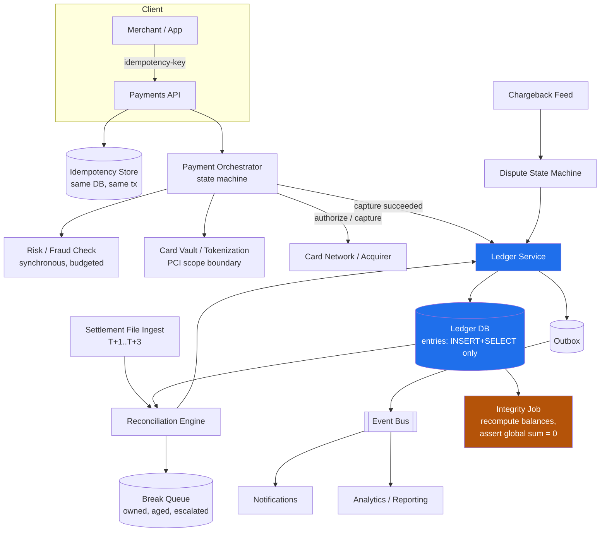
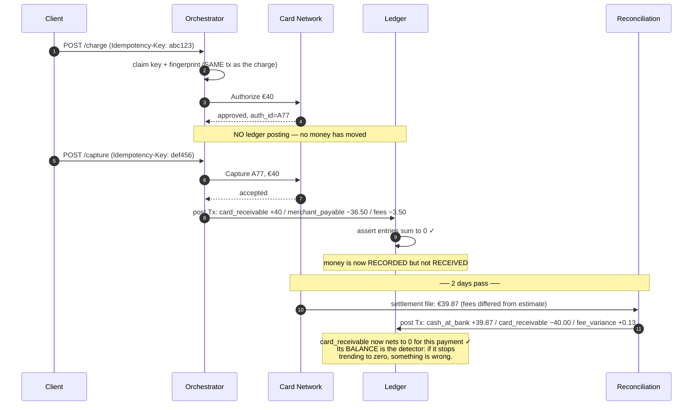
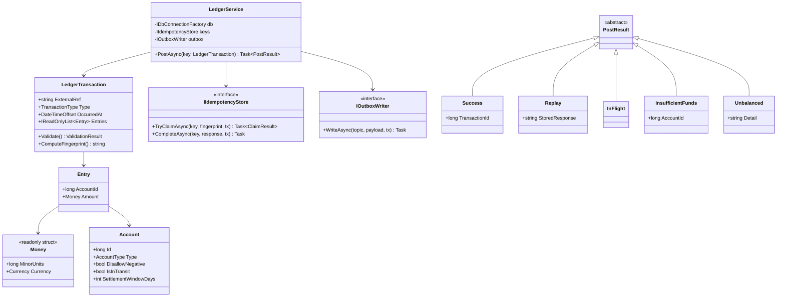
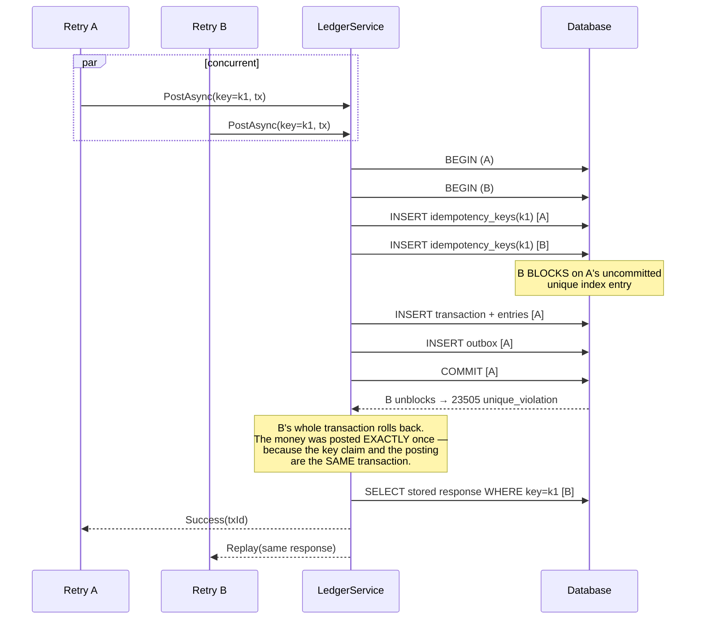

# Module 178 — System Design: Designing a Payment Processing System & Double-Entry Ledger

> Domain: System Design | Level: Beginner → Expert | Prerequisite: [[01-System-Design-Fundamentals]], [[07-Designing-Amazon-Ecommerce]] (checkout and the Saga motivation, extended here into the money-movement core it gestured at), [[11-Designing-Order-Management-Trade-Lifecycle]] (externally-held authoritative truth, idempotency under retransmission — the same problems in the securities domain), [[16-Interview-Execution-Playbook-Estimation-Rubric]] (the clock discipline this module's depth demands), [[../36-Saga/01-Saga-Fundamentals]], [[../37-Outbox/01-Outbox-Pattern]]

---

**Why this module exists.** This folder covered a trade lifecycle (Module 131), regulatory reporting (133), and e-commerce checkout (43) — but never the **ledger**: the system of record for money. Under this course's Elite FinTech Panel lens, that was the largest single gap. Ledger design is asked at Stripe, PayPal, Visa, Mastercard, Adyen, Capital One, JPMorgan, and Goldman with near-certainty for any Staff+ backend or architecture role, and it is asked *because* it is the one domain where the usual distributed-systems answers — eventual consistency, at-least-once delivery, retry-until-success — are either wrong or require careful qualification.

The distinguishing property: **money is conserved.** Not "should be," not "eventually will be" — a system that creates or destroys value is not slow or stale, it is *broken*, and in a regulated entity it is a reportable control failure. Almost every design decision here descends from that one constraint.

---

## 1. Fundamentals

### What is a payment system, and what is a ledger?

They are two different systems that candidates routinely conflate, and the conflation is the most common structural error in this interview.

A **payment system** *orchestrates* money movement: it takes an instruction ("charge this card €40"), interacts with external parties who actually hold and move the funds (card networks, issuing banks, ACH/SEPA rails), handles their asynchrony and failures, and reports an outcome. It is an integration and workflow problem with an external authority.

A **ledger** *records* money movement: it is the immutable, append-only, internally-consistent system of record answering "what is every account's balance, and what sequence of events produced it?" It is a correctness and invariant problem with no external authority — the ledger *is* the authority.

The payment system is where the hard *engineering* is; the ledger is where the hard *correctness* is. A candidate who designs only the orchestration has designed a workflow engine that moves money it cannot account for.

### What is double-entry bookkeeping, and why is a 500-year-old accounting technique the right data model?

Every financial event is recorded as a **transaction** composed of two or more **entries**, each a signed amount against an account, such that **the entries sum to exactly zero**.

```
Customer pays €40 for an order:

  Transaction #8817  "Card capture, order 55231"
    Entry 1:  Account = customer_receivable      −40.00 EUR    (debit)
    Entry 2:  Account = merchant_payable         +36.50 EUR    (credit)
    Entry 3:  Account = platform_revenue_fees    + 3.50 EUR    (credit)
                                                 ──────────
                                          SUM =    0.00        ✓
```

Why this, rather than a `balance` column you increment?

1. **Money cannot be created or destroyed by construction.** Value only *moves between accounts*. A single-entry `UPDATE balances SET amount = amount + 40` can lose or invent money through a bug, a partial failure, or a race — and nothing in the data model objects. In double-entry, an entry that doesn't balance is a *malformed transaction*, rejectable at write time.
2. **It gives one global, continuously-checkable invariant**: the sum of all entries across the entire ledger is zero. That single query is a total-system integrity check, and it is the reason a ledger can be *proven* correct rather than assumed correct.
3. **Balance becomes derived, not stored** — the sum of an account's entries. That means balances cannot drift from history, because there is no second place for them to drift *to*.
4. **Every balance is explainable.** "Why is this €3.50 off?" is answerable by reading entries, which is not merely convenient — under SOX it is an audit requirement.

The word "debit" and "credit" cause more confusion than they resolve. Signed amounts summing to zero is the same thing and is unambiguous; use them, and mention the accounting vocabulary only if the interviewer does.

### Why does this matter?

Because the failure modes are *silent and consequential simultaneously* — this domain's recurring finding (Modules 129–134) in its purest form. A double-charged customer notices. A ledger that is €0.03 out of balance across ten million transactions notices nothing, reconciles as "rounding," and is discovered by an auditor eighteen months later when the cause is unrecoverable.

### When does this matter?

Any system where the count of a thing is the product and must be exactly right: payments, wallets, banking cores, brokerage cash, loyalty points, in-game currency, and — importantly — internal credits and prepaid balances, which teams routinely build with a `balance` column and later discover they built a ledger badly.

### How does it work (30,000-ft view)?

```
1. AUTHORIZE   Ask the issuer to reserve funds. No money moves. Reversible.
2. CAPTURE     Tell the issuer to actually take the reserved funds. Money moves.
3. LEDGER      Record the movement as a balanced transaction. Derived balances change.
4. SETTLE      Funds actually arrive from the network, T+1 to T+3, in a BATCH file.
5. RECONCILE   Compare our ledger against the network's file. Investigate every break.
6. PAYOUT      Move the merchant's balance out to their bank. Another movement.
```

Steps 1–3 take seconds. Steps 4–6 take days. **That gap is the source of most of the design's difficulty**, because for those days our records and the outside world's records are both correct and different.

---

## 2. Deep Dive

### 2.1 The Ledger's Invariants — Which Are Enforceable and Which Are Not

Four invariants, and the distinction between them is the substance of the design.

**Invariant 1 — Every transaction's entries sum to zero.** *Enforceable at write time*, cheaply, inside the transaction. Non-negotiable, and should be enforced in the database itself (a constraint or trigger), not only in application code — because application code has more than one path to the table and the paths added later are the ones that miss it. This is Module 177 §E7's *make it unrepresentable* principle applied where it matters most.

**Invariant 2 — Entries are immutable.** No `UPDATE`, no `DELETE`, ever. A mistake is corrected by posting a **reversing transaction**, not by editing history. This is not fastidiousness: the audit trail *is* the ledger, and an editable ledger has no evidentiary value. Enforce with table permissions that grant `INSERT` and `SELECT` only — revoking `UPDATE`/`DELETE` at the database role level, so it is structurally impossible rather than a code-review item.

**Invariant 3 — Balance equals the sum of entries.** *Automatically true if balance is derived, and a permanent risk if it is cached.* §2.3 covers why caching becomes necessary and how to keep it honest.

**Invariant 4 — Certain accounts must never go negative.** *Not globally enforceable, and this is the interesting one.* A customer wallet must not go negative; a payable account routinely does. So this is a **per-account-type policy**, checked at write time against the account's own rule, and it is the only invariant requiring a read of current state before a write — which makes it the source of the system's only real contention (§2.4).

The general shape worth naming aloud: **three of the four invariants can be made structural, and the fourth is inherently a runtime check.** Knowing which is which tells you where the concurrency problems will be.

### 2.2 Modelling Accounts — the Part Candidates Skip

The naive model has one account per customer. Real ledgers have many accounts per *entity*, and the multiplicity is what makes the model work.

```
ASSET       what we hold or are owed        cash_at_bank, card_receivable
LIABILITY   what we owe others              merchant_payable, customer_wallet
REVENUE     what we've earned               processing_fees, fx_margin
EXPENSE     what we've spent                network_interchange, chargeback_costs
```

The critical modelling point: **a customer's wallet balance is our liability, not our asset.** Money held on behalf of a user is owed to that user. Getting the sign convention wrong here inverts the entire ledger, and it is a real and common error.

Every real movement also needs **intermediate accounts** representing money that is genuinely in transit:

```
Card capture on Monday, network settles on Wednesday:

Mon  Tx#1  card_receivable       +40.00     (network owes us)
           merchant_payable      −36.50     (we owe merchant)
           processing_fees       − 3.50     (we earned)

Wed  Tx#2  cash_at_bank          +40.00     (money actually arrived)
           card_receivable       −40.00     (network no longer owes us)
```

Without `card_receivable`, Monday's transaction would claim cash we do not have. That account **is** the two-day gap, made explicit and inspectable — and its balance at any moment is a directly meaningful, auditable number: "how much money is the network holding that belongs to us?" If it stops trending to zero, something is wrong, and the account itself is the detector.

This is the single most valuable modelling insight in the module: **represent money-in-transit as an account, not as an implicit state**, because an account has a balance you can check and an implicit state does not.

### 2.3 Balance Computation — Derived, Cached, and the Honest Middle

Balance = `SELECT SUM(amount) FROM entries WHERE account_id = ?`. Correct by construction, and unusable at scale: an account with ten million entries requires summing ten million rows on every read.

Three approaches:

**Pure derivation.** Correct, simple, slow. Fine for low-volume accounts, and genuinely fine for far more accounts than teams assume — an index on `(account_id, id)` summing 50,000 rows is milliseconds.

**Cached balance column.** Fast, and it reintroduces exactly the drift double-entry was chosen to eliminate. It creates a second source of truth, and the two can disagree. If used, the update must be **in the same database transaction as the entry insert** — never in a separate write, never asynchronously, never in application code between two commits — or a crash between them leaves the cache permanently wrong with no signal.

**Snapshot plus delta.** The honest middle, and the recommended answer. Periodically write an immutable checkpoint (`account X, as of entry_id 9,000,000, balance €4,812.30`), then compute balance as `snapshot + SUM(entries after the snapshot)`. Reads sum thousands of rows, not millions. The snapshot is *derived from immutable history*, so it can always be recomputed and verified — which means a corrupted snapshot is detectable and repairable, unlike a drifted cache column.

Whichever is chosen, the discipline is the same: **a continuous background job must recompute balances from entries and compare.** Any divergence is a P1, because it means one of the four invariants is broken and you do not yet know which. This job is the ledger's immune system, and per Module 176 §E7 it must derive its expected value **independently** — from the entries themselves, never from the cache it is checking.

### 2.4 Concurrency — Where the Contention Actually Is

Two writes to *different* accounts have no conflict; the ledger is embarrassingly parallel across accounts. All contention concentrates on **hot accounts touched by many transactions** — typically the platform's own fee and cash accounts, which appear in *every* transaction and therefore serialize everything.

The naive design has every transaction write an entry to `processing_fees`. At 1,000 transactions/sec that is 1,000 writes/sec contending on one row's index page, and if balance is cached on the account row, on one row.

Three mitigations, in increasing order of effort:

1. **Don't cache balances on hot accounts.** If the fee account's balance is derived rather than cached, concurrent entry inserts don't contend on a shared row at all — they're independent appends. This alone resolves most of the problem and is free.
2. **Shard the hot account.** Replace `processing_fees` with `processing_fees_00` … `processing_fees_63`, write to a random shard, and define the logical balance as the sum across shards. Contention drops 64×; the cost is that "the fee account balance" is now a 64-row aggregate, which is trivial.
3. **Batch fee entries.** Accumulate fees and post one aggregate entry per minute. This breaks per-transaction traceability, which is usually unacceptable for audit — mention it, and generally reject it.

For the **negative-balance check** (Invariant 4), which genuinely requires read-then-write, the correct primitive is a conditional write, not a lock:

```sql
-- Atomic: the check and the write are one statement. No SELECT-then-INSERT race.
INSERT INTO entries (transaction_id, account_id, amount)
SELECT :txId, :accountId, :amount
WHERE (SELECT balance FROM account_balances WHERE account_id = :accountId) + :amount >= 0;
-- Zero rows affected ⇒ insufficient funds. One round trip, no lock held across it.
```

Or, in a snapshot model, `SELECT ... FOR UPDATE` on the account row to serialize *that account's* writers only — acceptable because the contention is per-account and wallets are not hot. The failure to avoid is a *distributed* lock, which is both slower and less reliable than the transactional guarantee the database already provides.

### 2.5 Idempotency — the Single Most Important Mechanic in Payments

A client sends "charge €40," the connection times out, and the client does not know whether the charge happened. It must retry. If the retry creates a second charge, you have double-charged a customer — the canonical payments failure.

The mechanism:

- **The key is generated by the client, before the first attempt**, and reused on every retry of that same logical operation. A server-generated key cannot work: the client's problem is precisely that it never received the response containing it.
- **The key, the request fingerprint, and the stored response** are written **in the same transaction as the charge**. If they are separate writes, two concurrent retries can both pass the duplicate check and both charge. This is check-then-act again (Module 177 §2.7), and here it costs real money.
- **A duplicate returns the stored original response**, not a `409 Conflict`. The retrying client legitimately needs the original result — a 409 tells it "something happened" without telling it what, which is the state it was already in.
- **The request fingerprint must be compared.** If the same key arrives with a *different* body, that is a client bug and must be rejected loudly (`422`), never silently treated as a duplicate — otherwise a key-reuse bug silently drops real charges.
- **Retention must exceed the longest realistic client retry window.** A 24-hour retention against a mobile client that retries after a 7-day reinstall is a gap that will eventually be exercised, and this specific mismatch is a common real defect (Module 176 §3's ladder names it).

```csharp
// One transaction. The uniqueness constraint and the money movement are atomic
// together, so two concurrent retries cannot both pass.
await using var tx = await db.BeginTransactionAsync(IsolationLevel.ReadCommitted);
try
{
    await db.ExecuteAsync(
        "INSERT INTO idempotency_keys (key, request_hash, created_at) VALUES (@k, @h, now())",
        new { k = key, h = fingerprint });     // unique index on `key` — this throws on duplicate
}
catch (UniqueViolationException)
{
    var existing = await db.QuerySingleAsync<StoredResponse>(
        "SELECT request_hash, response_body, status FROM idempotency_keys WHERE key = @k",
        new { k = key });

    if (existing.RequestHash != fingerprint)
        return Problem(422, "Idempotency key reused with a different request body.");

    return existing.Status == "in_progress"
        ? Problem(409, "Original request still in flight — retry shortly.")  // NOT a duplicate
        : Ok(existing.ResponseBody);                                          // replay the original
}

var result = await PostLedgerTransactionAsync(tx, charge);   // same tx
await StoreResponseAsync(tx, key, result);                   // same tx
await tx.CommitAsync();
```

The `in_progress` case is the subtlety candidates miss: a retry arriving while the original is still executing must not be treated as complete, because there is no response to replay yet. Returning 409 with "retry shortly" is correct there and *only* there.

### 2.6 The Authorization / Capture Split, and Why It's Two Ledger Events (or One)

**Authorization** asks the issuer to reserve funds against a card. No money moves; the cardholder sees a "pending" line; the hold expires (typically 7 days) if not captured. **Capture** instructs the issuer to actually transfer the reserved funds.

The design question: does authorization post to the ledger?

**It should not post to the money-movement accounts**, because no money has moved — posting it would overstate `card_receivable` and inflate every balance in the system by the value of all outstanding, possibly-never-captured authorizations.

But it *is* a business fact requiring durable state (an auth can be voided, expire, or be partially captured), so it belongs in a **payment-state store**, separate from the ledger. Some designs additionally record it in **memorandum accounts** — off-balance-sheet accounts tracking commitments — which is legitimate and useful for exposure reporting, provided they are clearly segregated from the real accounts and excluded from the global sum-to-zero check.

The clean separation to state:

```
Payment state store:  auth created → authorized → captured/voided/expired
                      (a state machine with an EXTERNAL authority — Module 131's shape)

Ledger:               only real movements post. Capture posts. Auth does not.
```

Partial and multiple captures against one authorization are normal (shipping items separately), so the relationship is one-auth-to-many-captures, and the sum of captures must not exceed the authorized amount plus whatever over-capture tolerance the network allows. That tolerance is a real network rule, not an implementation detail, and getting it wrong produces declined captures on shipped goods.

### 2.7 Settlement and Reconciliation — Where Truth Is External

Days after capture, the network sends a settlement file: what it actually paid, net of interchange and scheme fees, with its own transaction identifiers. **This is the authoritative record of what happened to the money**, and our ledger is a prediction of it.

Reconciliation matches every capture in our ledger to a line in that file, and produces **breaks** — items that don't match. Break categories, each needing different handling:

| Break | Meaning | Handling |
|---|---|---|
| **In ledger, not in file** | We think we were paid and weren't | Investigate; may be timing (next file) or a genuine loss |
| **In file, not in ledger** | We were paid for something we didn't record | Serious — indicates a capture we lost. Post it and find out why |
| **Amount mismatch** | Fees differed from our estimate | Usually expected; post the delta to a fee-variance account |
| **Duplicate in file** | Network sent it twice | Dedupe on the network's ID — and see §4 for why that's harder than it sounds |

Three points that separate a real answer:

1. **Reconciliation is not a batch job you run and eyeball.** It is a control with an owner, an SLA for break resolution, an aging report, and escalation. Unresolved breaks aging past a threshold is itself an alertable condition, because a growing break population means the ledger is drifting from reality.
2. **Fee estimation is a prediction and will be wrong.** Interchange depends on card type, region, merchant category, and network rules that change. So the ledger must post *estimated* fees at capture and a *variance* at settlement, and the variance account's balance is a direct measure of estimation quality — another case of §2.2's principle that a well-chosen account *is* a detector.
3. **The expected set must be independently derived** (Module 176 §E7). Reconciling our ledger against a file we generated from our own ledger proves nothing. The network's file is genuinely independent, which is exactly what makes it valuable — and exactly why Module 133's incident, where the reconciliation's expected set came from the logic being checked, was undetectable.

### 2.8 Chargebacks, Refunds, and Corrections — Always Forward, Never Backward

A refund is **not** a deletion or a reversal of the original transaction. It is a **new transaction moving money the other way**:

```
Original  Tx#8817   card_receivable +40.00  merchant_payable −36.50  fees −3.50
Refund    Tx#9204   card_payable    −40.00  merchant_payable +36.50  fees +3.50
                    (references Tx#8817 as its reason, but does not modify it)
```

Both remain in history permanently. The account nets to zero; the audit trail shows both events and when each occurred. This is the immutability invariant in practice, and its practical benefit is that "why does this customer have a €0 balance?" has a readable answer.

A **chargeback** is worse than a refund because it is *initiated by the issuer against us*, with a dispute process, a deadline, and fees. It has its own state machine (received → evidence submitted → won/lost), its own money movement at each stage, and typically a **liability shift** determining whether the merchant or the platform bears the loss. It is the clearest case where the ledger must model something adversarial and time-bounded, and where a missed deadline has a direct financial cost — making the deadline a *functional requirement* with alerting, exactly as in Module 133.

The general rule, worth stating in the interview: **corrections move forward.** Any design that fixes a ledger error by updating or deleting an entry has destroyed the property that made the ledger trustworthy.

### 2.9 Money Representation — Never Floating Point, and the Rounding Question

`decimal` (C# `decimal`, SQL `NUMERIC`) or scaled integers (store minor units — cents — as `bigint`). **Never `double` or `float`**: binary floating point cannot represent 0.1 exactly, so `0.1 + 0.2 != 0.3`, and errors accumulate across millions of operations into real, unexplainable discrepancies.

Scaled integers are the safest choice — exact by construction, no rounding-mode surprises, and fast — with the caveat that currencies have different minor-unit exponents: USD and EUR have 2, JPY has 0, KWD and BHD have 3. Hardcoding "multiply by 100" is a real bug that appears the day the first JPY transaction arrives.

**Currency must be part of the amount type, not a sibling column**, and amounts in different currencies must be structurally impossible to add:

```csharp
public readonly record struct Money(long MinorUnits, Currency Currency)
{
    public static Money operator +(Money a, Money b) =>
        a.Currency == b.Currency
            ? new Money(a.MinorUnits + b.MinorUnits, a.Currency)
            // Not an exception you catch — a bug you must not be able to write.
            : throw new CurrencyMismatchException(a.Currency, b.Currency);
}
```

**Rounding** is where money is actually lost. Splitting €10.00 three ways gives €3.333…; rounding each to €3.33 loses a cent, and the transaction no longer sums to zero — which the ledger will reject, correctly. The fix is **largest-remainder allocation**: compute the floor for each part, then distribute the remaining minor units one at a time by descending remainder, so the parts sum *exactly* to the original by construction. This is the same deterministic exactly-reconciling allocation problem Module 131 covers for trade allocations, and it is a favourite follow-up because the naive answer silently violates the ledger's core invariant.

FX adds a further rule: a cross-currency transaction cannot balance in a single currency, so it is modelled as two balanced single-currency transactions linked through an **FX position account**, with the rate and its timestamp recorded on the transaction. Trying to make one transaction balance across currencies is a common and fundamental modelling error.

---

## 3. Visual Architecture

### System architecture



The highlighted core is the part that must never be wrong. Everything to its left is orchestration that can retry; the integrity job in amber is the immune system that proves the core is still correct.

### Double-entry data model

```
transactions                      entries
┌────────────────────────┐        ┌──────────────────────────────┐
│ id            (PK)     │←──────┐│ id              (PK)         │
│ external_ref           │       └│ transaction_id  (FK)         │
│ type                   │        │ account_id      (FK)         │
│ occurred_at            │        │ amount_minor    BIGINT       │  signed
│ posted_at              │        │ currency        CHAR(3)      │
│ reverses_transaction_id│        │ created_at                   │
│ idempotency_key UNIQUE │        └──────────────────────────────┘
└────────────────────────┘         INSERT + SELECT only.
                                   No UPDATE. No DELETE. Enforced by GRANT.

  CONSTRAINT: SUM(entries.amount_minor) per transaction, per currency = 0
              — enforced by a deferred constraint trigger, in the database,
                because application code has more paths to this table than
                anyone remembers.

  GLOBAL INVARIANT:  SELECT SUM(amount_minor) FROM entries GROUP BY currency
                     must be 0 for every currency, always.
                     This one query is a whole-system integrity proof.
```

### Payment lifecycle — the days-long gap



---

## 4. Production Example

**Problem.** A payments platform processing ~2,000 transactions/sec across Europe ran a nightly reconciliation against acquirer settlement files. For eleven weeks it was clean. In week twelve, finance reported that the platform's cash position was €218,000 higher than the ledger predicted — the bank held more money than the books said it should.

An excess is not intuitively alarming, which is precisely why it survived. The first two investigations classified it as timing: settlement files sometimes include prior-period items, so a positive variance that "should resolve next cycle" is a plausible story. It did not resolve; it grew.

**Architecture.** Conventional and largely sound. Captures posted `card_receivable`; settlement ingest matched each file line to a capture by the acquirer's transaction reference, posted `cash_at_bank` against `card_receivable`, and wrote any difference to `fee_variance`. Unmatched file lines went to a break queue. Reconciliation deduplicated file lines by the acquirer's reference so a re-sent file wouldn't post twice.

**Implementation — what was actually happening.** The acquirer's transaction reference was **not globally unique**. It was unique per *acquirer processing centre*, and the platform had been migrated onto a second processing centre eight weeks earlier as part of a capacity expansion. References from the two centres were drawn from overlapping ranges.

The consequence ran in one direction. When a settlement line arrived whose reference had already been seen — because a line from centre B collided with a line from centre A weeks earlier — the deduplication logic **silently discarded it as a duplicate**. The money had genuinely arrived at the bank, but no `cash_at_bank` entry was posted and the corresponding `card_receivable` was never cleared. The ledger under-reported cash; the bank had more than the books.

Three things made it invisible for eleven weeks:

1. **The deduplication was working exactly as designed.** No error, no exception, no break — a discarded duplicate is a *normal, expected, successful* outcome, and the count of them was not a monitored metric.
2. **The break queue stayed empty**, because a silently-discarded line never becomes a break. The control designed to catch unmatched money could not see money that was never presented to it.
3. **`card_receivable` was growing**, which was the true signal — money the network supposedly still owed us, accumulating and never clearing. But nobody watched that account's *aging*; they watched its balance, which also grew with legitimate in-flight volume, so the anomaly was inside the noise.

**Trade-offs.** The deduplication was added deliberately after an earlier incident where a re-sent file double-posted, and it was the correct fix for that problem. The defect was scoping the uniqueness key to what the specification claimed rather than to what the counterparty actually did — and then, having introduced a silent discard path, not measuring it.

**Lessons learned.**

1. **A deduplication key must be scoped to the counterparty's actual behaviour, not the specification's stated guarantee.** This is Module 131 §4's finding arriving independently in the payments domain: there, a venue's `ExecID` uniqueness turned out to be per-session rather than global, and correctly-functioning deduplication silently discarded genuine fills. Two different industries, the same defect. The generalization is that **uniqueness is a property of a scope, and the scope is almost never documented correctly** — so the key must include everything that could vary (here, the processing centre), and the cost of over-scoping is nil while the cost of under-scoping is silent data loss.
2. **Any silent-discard path must be counted, and the count must be alerted on rate-of-change.** "Duplicates discarded" was the single metric that would have caught this in week one — it went from near-zero to hundreds per day the moment the second centre came online. A discard is a decision to destroy information, and every such decision deserves a counter.
3. **The in-transit account was the intended detector and it was read wrongly.** `card_receivable` growing was exactly the signal §2.2 says it should be — but only its *balance* was watched, which conflates legitimate in-flight volume with stuck items. The correct metric is **aged** in-transit: how much has been sitting in `card_receivable` for longer than the settlement window? That number should be near zero always, and it would have spiked immediately.
4. **A variance in the "good" direction is not self-explaining.** Excess cash was tacitly treated as benign. It was evidence of a control failure, and had the collision run the other way — discarding lines that would have *reduced* cash — the platform would have overstated its position, which is a materially worse regulatory outcome. **The direction of a discrepancy is not evidence about its severity**, and classifying by direction rather than by cause is how this survived two investigations. (Module 177 §E2's premature-closure pattern, again.)

**The fix.** Deduplication key changed to `(acquirer, processing_centre, reference, settlement_date)`, with a backfill identifying and posting all 1,847 discarded lines. A `settlement_lines_discarded_total` counter with an alert on any non-trivial rate. An **aged in-transit report** per in-transit account, alerting on anything older than the settlement window plus a buffer — which is now the primary settlement control, because it detects the general class ("money that should have cleared and hasn't") rather than the specific cause. And a standing rule added to the integration checklist: *for every external identifier we deduplicate on, document the counterparty's actual uniqueness scope, and test it.*

---

## 5. Best Practices

- **Enforce the sum-to-zero constraint in the database**, not only in application code (§2.1). *Why:* the paths added later are the ones that skip the check. *When not to:* never — this is the one constraint that should have no exception.
- **Grant only `INSERT` and `SELECT` on the entries table.** Immutability enforced by permission is structural; immutability enforced by convention is a code-review item that eventually fails.
- **Model money-in-transit as an explicit account** (§2.2) and monitor its **aging**, not its balance (§4). An account is a detector; an implicit state is not.
- **Store money as scaled integers with the currency in the type** (§2.9). *When not to:* `NUMERIC` is equally safe and more readable in SQL — either is fine; floating point never is.
- **Write the idempotency key in the same transaction as the money movement** (§2.5). Separate writes reintroduce the race the key exists to prevent.
- **Correct forward with reversing transactions**, never by updating or deleting (§2.8).
- **Run a continuous integrity job** asserting the global sum is zero per currency and that cached/snapshot balances match recomputed ones (§2.3), deriving its expected value independently from the thing it checks.
- **Count every silent-discard path** (§4). A discard destroys information, and an uncounted discard destroys it invisibly.
- **Give reconciliation breaks an owner, an SLA, and an aging report** (§2.7). A break queue nobody drains is a backlog of unexplained money.

---

## 6. Anti-patterns

- **A `balance` column updated by the application.** *Why it fails:* creates a second source of truth that drifts silently; a crash between the entry write and the balance update leaves it permanently wrong. *Fix:* derive, or snapshot-plus-delta with a verification job (§2.3).
- **Floating-point money.** *Why it fails:* 0.1 is not representable in binary; errors accumulate into unexplainable discrepancies. *Fix:* scaled integers or `decimal`/`NUMERIC`.
- **Editing or deleting entries to fix mistakes.** *Why it fails:* destroys the audit trail, which is the ledger's entire evidentiary value. *Fix:* reversing transactions (§2.8).
- **Posting authorizations to money-movement accounts.** *Why it fails:* overstates every balance by the value of all outstanding authorizations, many of which will never capture. *Fix:* payment-state store for auths; ledger for movements only (§2.6).
- **Server-generated idempotency keys.** *Why it fails:* the client's problem is that it never received the response, so it cannot have the key. *Fix:* client-generated, before the first attempt.
- **Returning 409 for a duplicate idempotent request.** *Why it fails:* the retrying client needs the original *result*; 409 leaves it in the same unknown state. *Fix:* replay the stored response — except while genuinely in-flight, where 409 is correct (§2.5).
- **Rounding each split independently.** *Why it fails:* the parts no longer sum to the whole, so the transaction won't balance. *Fix:* largest-remainder allocation (§2.9).
- **One transaction balancing across two currencies.** *Why it fails:* the sum-to-zero invariant is per-currency; a cross-currency "balanced" transaction is meaningless. *Fix:* two single-currency transactions linked via an FX position account.
- **Deduplicating on an external ID without verifying its uniqueness scope.** *Why it fails:* §4's incident, and Module 131's independently. *Fix:* include every dimension that could vary, and count the discards.

---

## 7. Performance Engineering

**The write path is short and must stay short.** A capture's ledger posting is: begin transaction → insert idempotency key → insert 1 transaction row → insert 3–5 entry rows → validate sum → commit. That is one round trip to one database, and it should be low single-digit milliseconds. The most common way it becomes slow is **doing anything else inside the transaction** — calling the fraud service, emitting an event, calling the network. Every one of those extends the lock hold and couples ledger throughput to an external system's latency.

The event emission is the subtle one, and the answer is the **Outbox pattern**: write the event to an outbox table *in the same transaction*, and let a separate process publish it. This gives atomicity between the money movement and the event without holding the transaction open for a broker round trip. Publishing directly inside the transaction is slow; publishing after commit is unsafe, because a crash between commit and publish silently loses the event.

**Where throughput actually caps.** At 2,000 transactions/sec with ~4 entries each, that's ~8,000 entry inserts/sec plus 2,000 transaction rows — around 10,000 writes/sec, which is at or past a single primary's comfortable ceiling (Module 176 §2.2). So this system *does* justify partitioning, unlike Module 177's. The partition key is `account_id`, which works because entries are queried per account — with the important caveat that a single ledger transaction touches multiple accounts and therefore multiple partitions, which turns every posting into a distributed transaction unless handled deliberately (§9).

**Hot-account contention is the real bottleneck, not aggregate throughput** (§2.4). The platform fee account appears in every transaction; if its balance is cached on a row, that row is the serialization point for the entire system. Removing the cache from hot accounts, or sharding them 64-ways, is the fix — and it is a much larger win than any amount of hardware.

**Read path.** Balance reads dominate volume (every merchant dashboard, every risk check). Snapshot-plus-delta (§2.3) bounds the work; without it, an active merchant's balance query degrades continuously as their history grows, which is a bug that only manifests after months in production and is therefore rarely caught in testing.

**Allocation and GC.** `Money` as a `readonly record struct` keeps amounts on the stack and out of Gen0 — meaningful at 10,000 entries/sec, where per-entry heap allocation translates directly into GC pauses in the p99 tail.

**Benchmarking that matters.** Test specifically: sustained write throughput with a realistic *account distribution* (uniform account access is an unrealistically easy test and will hide the hot-account problem entirely); balance reads against an account with 10 million entries; and the integrity job's runtime against full production volume, because a verification job that takes 30 hours cannot run daily and will quietly be disabled.

---

## 8. Security

Payments carry the heaviest compliance load in this course, and the dominant security strategy is **scope reduction** — arranging the architecture so that most of it is out of scope for the expensive controls.

**PCI-DSS and the tokenization boundary.** Any system component that stores, processes, or transmits a Primary Account Number is in PCI scope, with everything that implies: quarterly scans, annual assessment, network segmentation, restricted access, and substantial ongoing cost. The single highest-value architectural decision is therefore to **never let a PAN enter your systems at all** — the card is collected by a hosted field or SDK that posts directly to the vault or PSP, which returns a token. Your systems handle tokens; the vault is a small, isolated, heavily-controlled component; everything else is out of scope.

Stating this unprompted is a strong signal, because it demonstrates understanding that compliance scope is *designed*, not inherited. The follow-up worth anticipating: this is also why you must never log request bodies on payment endpoints, and why "we'll redact PANs in the logger" is a weaker control than never having the PAN — a redaction rule is a check with exceptions (Module 177 §E7), and the exceptions are where the leak happens.

**Authorization at the ledger, not only the edge.** Every ledger operation must be authorized against the specific accounts it touches. A merchant must not be able to post to another merchant's payable account, and the enforcement belongs in the ledger service — not in the API gateway, because internal callers bypass the gateway. This is Module 132's tenant-isolation finding: a protection with exception paths is one whose exceptions produce the incidents.

**The audit trail is a control, not logging** (Module 176 §I7). Who initiated each transaction, under what authority, from where, and when — immutable, retained per policy (typically 7 years under SOX), and queryable. Because entries are already immutable and append-only, the ledger *is* most of the audit trail, which is a genuine architectural benefit of the model worth naming.

**Separation of duties.** The person who can initiate a payout must not be the person who can approve it, and neither should be able to alter the ledger. This is a SOX requirement and it has direct architectural consequences: maker-checker workflows for manual adjustments, and manual journal entries as a *separately-permissioned, individually-approved, heavily-alerted* operation. Manual adjustments are the single most abused path in any ledger and should be treated as such — every one reviewed, none possible without a second approver.

**Fraud and abuse** are a distinct concern from security controls: velocity limits per card/device/IP, anomaly detection on amount and geography, and 3-D Secure to shift liability. The design constraint is that fraud checks sit **synchronously in the authorization path** with a hard latency budget — typically under 100ms — which means the model must be pre-computed or cheap, and must **fail closed for high-risk transactions and open for low-risk ones**, a per-tier decision rather than one global default (the same fail-open/fail-closed matrix Module 175 §8 builds for rate limiting).

**Secrets.** Network credentials, signing keys, and vault keys need rotation without downtime. A key that cannot be rotated without an outage is a defect, and in a payments context an unrotatable key is also an audit finding.

---

## 9. Scalability

**The ledger is not naturally shardable, and saying why is the substance.** A single transaction touches multiple accounts and must be atomic across all of them. If accounts live on different shards, every posting becomes a distributed transaction — two-phase commit, with its latency cost and its coordinator-failure problem.

Three approaches, in order of preference:

1. **Don't shard.** At 2,000 TPS a well-tuned single primary with fast storage handles the ledger, and the operational simplicity of one atomic database for money is worth a great deal. This is the right answer far more often than candidates assume, and proposing it confidently — with the throughput number that supports it — is a stronger signal than reflexive partitioning.
2. **Shard by a boundary that transactions don't cross.** Usually **currency** or **legal entity**: a EUR transaction never touches a USD account (§2.9 established that cross-currency movements are two linked single-currency transactions), and legal entities are separate books by regulation anyway. This gives real horizontal scale with **zero** cross-shard transactions, because the boundary is chosen to match the invariant rather than fighting it. This is the best available answer when one database isn't enough.
3. **Shard by account with 2PC.** Works, and imports every distributed-transaction problem. Only if 1 and 2 are genuinely exhausted.

The generalizable insight: **choose a shard boundary that no transaction crosses, and you get sharding for free; choose one transactions cross, and you have bought distributed transactions.** That framing applies well beyond ledgers.

**Read scaling is easy and safe.** Balance reads, reporting, and merchant dashboards go to replicas. The one caution is read-your-own-writes: a merchant who takes a payment and immediately refreshes must see it, so the post-write read is routed to the primary briefly (Module 176 §I4). For a ledger this matters more than usual, because a balance that appears to have gone *backwards* destroys trust in a way a stale feed does not.

**CAP and PACELC.** The ledger is unambiguously **CP**. During a partition, refuse writes. A payment that fails is recoverable — the client retries with the same idempotency key and nothing is lost. A payment recorded inconsistently is a corrupted book, which may be unrecoverable and is certainly reportable. This is one of the few systems where the answer is not "it depends," and stating it decisively is correct.

The nuance that makes it interesting: **the orchestration layer around the ledger should be AP.** Accepting a payment instruction, queuing it, and retrying is fine — availability there costs nothing because idempotency makes retries safe. So the system is AP at the edge and CP at the core, with idempotency as the mechanism that lets those two coexist. That layered answer is much stronger than a single global CAP position.

**RPO must be zero.** A lost committed transaction is lost money with no record it existed. That means synchronous replication to at least one standby, and the latency cost is simply accepted — at 2,000 TPS with a few milliseconds of synchronous replication, it is affordable, and no other choice is defensible.

**RTO** is minutes, not seconds: payments can queue at the AP edge during a failover and drain afterwards, because idempotency makes replay safe. Recognizing that the edge's design *buys* you a relaxed ledger RTO is the kind of second-order reasoning that reads well.

**Multi-region** is the hard case. Active-active writes to one logical ledger across regions require cross-region consensus on every transaction — tens of milliseconds per posting, plus a genuinely hard conflict problem. The standard resolution is to **partition by region as a legal entity boundary** (approach 2 above): each region has its own book, and inter-region movements are explicit transactions between them, exactly as they would be between two real legal entities. This turns a distributed-consensus problem into a modelling problem, which is the recurring move throughout this section.

---

## 10. Interview Questions

### Basic (10)

**B1. Q: What is double-entry bookkeeping and why use it for a software ledger?**
**Ideal Answer:** Every financial event is recorded as a transaction of two or more signed entries against accounts, summing to exactly zero. It makes creating or destroying money structurally impossible rather than merely unlikely, gives one global invariant (all entries sum to zero) that acts as a whole-system integrity check, makes balance a derived value that cannot drift from history, and makes every balance explainable by reading entries — which is an audit requirement, not a convenience.
**Why correct:** It gives the mechanism and the four distinct properties it buys, rather than describing debits and credits.
**Common mistakes:** Explaining debit/credit vocabulary without the sum-to-zero invariant; treating it as an accounting convention rather than a correctness mechanism.
**Follow-ups:** What's the single query that checks the whole ledger? (`SELECT SUM(amount) FROM entries GROUP BY currency` — must be zero for each.) Why not just a balance column? (It's a second source of truth that can drift, with nothing in the model objecting.)

**B2. Q: How do you store monetary amounts, and why?**
**Ideal Answer:** Scaled integers (minor units in a `bigint`) or `decimal`/`NUMERIC`. Never floating point — binary floats cannot represent 0.1 exactly, so errors accumulate across millions of operations into unexplainable discrepancies. Currency must be part of the amount type so that adding different currencies is impossible to express, and the minor-unit exponent varies by currency (JPY has 0, most have 2, KWD has 3), so hardcoding ×100 is a real bug.
**Why correct:** It covers representation, the currency-typing point, and the minor-unit variation that catches people.
**Common mistakes:** "Use decimal" without mentioning currency typing; assuming two decimal places universally.
**Follow-ups:** What happens if you add EUR to USD? (In a well-designed type, it doesn't compile or it throws — it must not silently produce a number.) Why is scaled integer often preferred over decimal? (Exact by construction, no rounding-mode configuration, faster.)

**B3. Q: What is an idempotency key and who generates it?**
**Ideal Answer:** A client-supplied identifier for a logical operation, reused across all retries of that operation, letting the server recognize a retry and return the original result instead of performing the action twice. It must be client-generated *before* the first attempt, because the client's problem is precisely that it never received the response — a server-generated key can't help.
**Why correct:** The client-generated-before-first-attempt point is the load-bearing part and the one most often missed.
**Common mistakes:** Server-generated keys; generating a new key on retry, which defeats the purpose entirely.
**Follow-ups:** What do you return on a duplicate? (The stored original response — not 409, which leaves the client where it started.) Where is the key stored? (Same database, same transaction as the money movement.)

**B4. Q: Why is a refund a new transaction rather than a reversal of the original?**
**Ideal Answer:** Because entries are immutable — the audit trail *is* the ledger, and an editable ledger has no evidentiary value. A refund posts a new balanced transaction moving money the other way, referencing the original as its reason. Both remain in history permanently; the accounts net to zero; the sequence of events stays readable.
**Why correct:** It ties the practice to the immutability invariant and its audit purpose rather than treating it as convention.
**Common mistakes:** Proposing to update or delete the original entries; treating "correction" and "reversal" as edits.
**Follow-ups:** How do you enforce immutability? (Grant only `INSERT` and `SELECT` on the table — structural, not conventional.) What if the original was simply wrong? (Same answer: a reversing transaction, then the correct one. Corrections move forward.)

**B5. Q: What's the difference between authorization and capture?**
**Ideal Answer:** Authorization asks the issuer to reserve funds — no money moves, the hold expires (typically 7 days) if unused, and the cardholder sees "pending." Capture instructs the issuer to actually transfer the reserved funds. Only capture posts to the ledger's money-movement accounts, because only capture moves money.
**Why correct:** It draws the correct ledger consequence from the distinction, which is the point of the question.
**Common mistakes:** Posting authorizations to the ledger, which overstates every balance by the value of outstanding, possibly-never-captured auths.
**Follow-ups:** Can one auth have multiple captures? (Yes — shipping items separately is the standard case; the sum must not exceed the auth plus any network-allowed tolerance.) Where does auth state live? (A payment-state store, separate from the ledger.)

**B6. Q: Is a customer's wallet balance an asset or a liability to the platform?**
**Ideal Answer:** A liability. Money held on behalf of a user is owed to that user. The platform's corresponding asset is the cash it actually holds at the bank. Getting this backwards inverts the sign convention across the entire ledger.
**Why correct:** It's a small question that reliably separates people who have modelled a ledger from people who have read about one.
**Common mistakes:** Calling it an asset because the platform holds the cash — conflating custody with ownership.
**Follow-ups:** What are the four account types? (Asset, liability, revenue, expense.) What does the platform's own cash account represent? (An asset — cash at bank.)

**B7. Q: How is an account's balance computed?**
**Ideal Answer:** As the sum of its entries — derived, not stored, so it cannot drift from history. At scale that becomes expensive, so the practical answer is snapshot-plus-delta: an immutable periodic checkpoint plus the sum of entries after it. Because the snapshot derives from immutable history it can always be recomputed and verified, unlike a mutable cached balance.
**Why correct:** It gives the correct model and the scale accommodation that preserves its properties.
**Common mistakes:** A mutable `balance` column as the first answer; not mentioning verification.
**Follow-ups:** What verifies the snapshot? (A background job recomputing from entries and comparing — a divergence is a P1.) When is pure derivation fine? (More often than people think — summing 50,000 indexed rows is milliseconds.)

**B8. Q: What does settlement mean, and why doesn't it happen at capture?**
**Ideal Answer:** Settlement is when funds actually arrive in your bank account, typically T+1 to T+3 after capture, delivered as a batch file from the network listing what it actually paid net of fees. Capture is an instruction; settlement is the money. The gap exists because card networks batch and net transactions between many parties.
**Why correct:** It identifies that capture records a prediction and settlement is the truth.
**Common mistakes:** Treating capture as the money arriving; not knowing settlement is a file-based batch process.
**Follow-ups:** How does the ledger represent the gap? (An in-transit account like `card_receivable` — money the network owes us.) What's that account's balance mean? (Exactly how much the network is holding for us — a directly auditable number.)

**B9. Q: What is a chargeback and how does it differ from a refund?**
**Ideal Answer:** A refund is initiated by the merchant. A chargeback is initiated by the cardholder through their issuer, against you, with a formal dispute process, evidence deadlines, and fees. It has its own state machine (received → evidence submitted → won/lost), money movement at each stage, and a liability shift determining whether merchant or platform bears the loss. Missing the evidence deadline has a direct financial cost, making the deadline a functional requirement.
**Why correct:** It captures the adversarial, time-bounded nature that distinguishes it, and the deadline-as-requirement consequence.
**Common mistakes:** Treating it as a refund with extra steps; not modelling the deadline.
**Follow-ups:** Why does the deadline need alerting? (Because missing it loses the dispute automatically — an architectural obligation, exactly like Module 133's regulatory deadline.) Who bears the loss? (Depends on liability shift — 3-D Secure typically shifts it to the issuer.)

**B10. Q: What's the one global invariant that proves the ledger is internally consistent?**
**Ideal Answer:** The sum of all entry amounts, per currency, is exactly zero. If it isn't, money has been created or destroyed and the ledger is broken. It's a single query and it validates the entire system.
**Why correct:** Recognizing that one cheap query is a whole-system integrity proof is the essential property of the model.
**Common mistakes:** Not knowing a global invariant exists; forgetting the per-currency qualifier, which matters because cross-currency transactions are modelled as linked single-currency pairs.
**Follow-ups:** How often should it run? (Continuously — it's the ledger's immune system.) What if it fails? (P1: money has been created or destroyed and you don't yet know how.)

### Intermediate (10)

**I1. Q: Walk through exactly what happens when a client times out on a charge and retries.**
**Ideal Answer:** The client retries with the *same* idempotency key it generated before the first attempt. The server attempts to insert the key with a unique constraint. If the insert succeeds, this is genuinely the first attempt — proceed with the charge and store the response, all in the same transaction. If it violates the constraint, the operation was already seen: compare the request fingerprint (a different body with the same key is a client bug — reject with 422, never silently treat as a duplicate); if the original is complete, replay the stored response; if it's still in flight, return 409 "retry shortly," because there is no response to replay yet.
**Why correct:** It covers all three duplicate outcomes, including the in-flight case that most answers miss, and puts the key write inside the money transaction.
**Common mistakes:** Key written in a separate transaction, so two concurrent retries both pass; returning 409 for completed duplicates; not comparing the fingerprint.
**Follow-ups:** Why must the key write be in the same transaction? (Otherwise a crash between them leaves a claimed key with no charge, or a charge with no key — both wrong, and the second double-charges.) How long do you retain keys? (Longer than the longest realistic client retry window — check what mobile clients actually do on reinstall.)

**I2. Q: Where is the concurrency contention in a ledger, and how do you resolve it?**
**Ideal Answer:** Not between transactions on different accounts — the ledger is embarrassingly parallel across accounts. It concentrates on **hot accounts appearing in every transaction**, typically the platform's own fee and cash accounts. If those accounts have a cached balance on a row, that row serializes the entire system. Fixes in order: don't cache balances on hot accounts (free, and resolves most of it); shard the hot account into N sibling accounts summed logically (64× reduction, cheap); batch fee entries (breaks per-transaction traceability — usually unacceptable for audit).
**Why correct:** It correctly locates the contention on shared accounts rather than on throughput, and orders the fixes by cost.
**Common mistakes:** Assuming contention is general; reaching for distributed locks; batching without noting the audit cost.
**Follow-ups:** What about the negative-balance check? (That genuinely needs read-then-write, resolved with a conditional insert or a row lock on that one account — but wallets aren't hot, so the contention is per-account and fine.) Why is a distributed lock wrong here? (The database already provides a stronger guarantee more cheaply.)

**I3. Q: Split €10.00 three ways in a way the ledger will accept.**
**Ideal Answer:** Not by rounding each to €3.33 — that sums to €9.99 and the transaction won't balance, correctly. Use largest-remainder allocation: floor each part (333, 333, 333 minor units = 999), then distribute the remaining 1 minor unit to the parts with the largest remainders, giving 334/333/333. The parts sum exactly to the original **by construction**, so the invariant holds without a fudge entry.
**Why correct:** It produces an exactly-summing allocation deterministically, rather than patching a rounding difference afterwards.
**Common mistakes:** Rounding independently and adding a "rounding adjustment" entry, which hides a systematic error in a plug account; using banker's rounding and assuming it sums.
**Follow-ups:** Why must it be deterministic? (Recomputation must give the identical result, or reconciliation breaks — the same requirement as Module 131's trade allocations.) Who gets the extra cent? (A defined rule — largest remainder, then a tiebreak like lowest account ID; arbitrary is fine, undefined is not.)

**I4. Q: How do you model a cross-currency payment?**
**Ideal Answer:** Not as one transaction — the sum-to-zero invariant is per-currency, so a single transaction cannot balance across two. Model it as two balanced single-currency transactions linked through an FX position account: the EUR side balances in EUR, the USD side balances in USD, and the FX account absorbs the position. Record the rate and its timestamp on the transaction, because the rate is a fact about a moment and the transaction must be reproducible.
**Why correct:** It identifies why the naive single-transaction model is impossible rather than merely awkward.
**Common mistakes:** One transaction with mixed currencies "balancing" via the exchange rate — which makes the global invariant uncheckable; not storing the rate, making the transaction unreproducible.
**Follow-ups:** What does the FX account's balance represent? (Your net open position in that pair — a real, monitorable risk number.) Where does FX profit or loss appear? (As revenue when the position is closed at a different rate — which is why the account must be watched, not just balanced.)

**I5. Q: Why must event publishing use the Outbox pattern here?**
**Ideal Answer:** The event must be atomic with the money movement. Publishing inside the transaction holds the database transaction open for a broker round trip, extending lock hold and coupling ledger throughput to broker latency. Publishing after commit is unsafe — a crash between commit and publish silently loses the event, and downstream systems never learn about money that moved. The outbox writes the event to a table in the same transaction, and a separate process publishes it, giving atomicity without the coupling.
**Why correct:** It rules out both alternatives with their specific failure modes rather than just naming the pattern.
**Common mistakes:** Publishing after commit and calling it "good enough"; not recognizing that the event and the money must be atomic.
**Follow-ups:** What does the publisher guarantee? (At-least-once — so consumers must be idempotent, which is the standard trade.) How do you monitor it? (Outbox depth and oldest-unpublished age; a stalled publisher is silent otherwise — the same unmonitored-delivery-path failure as Module 125's dead-letter alert.)

**I6. Q: Why should authorizations not post to the ledger, and where does their state live?**
**Ideal Answer:** Because no money has moved. Posting them would overstate `card_receivable` and every downstream balance by the total of all outstanding authorizations, many of which will expire uncaptured. Auth state is a real business fact needing durable storage — it can be voided, expire, or be partially captured — so it lives in a payment-state store with its own state machine driven by an external authority (the issuer). Some designs also track auths in clearly-segregated memorandum accounts for exposure reporting, excluded from the global sum-to-zero check.
**Why correct:** It separates "business fact needing state" from "money movement needing a ledger entry," which is the distinction being tested.
**Common mistakes:** Posting auths as real entries; treating auth as ephemeral and not persisting it, so voids and expiries can't be handled.
**Follow-ups:** What's a memorandum account? (An off-balance-sheet account tracking commitments rather than movements — legitimate, provided it's excluded from the real invariant.) What happens on expiry? (The state machine transitions; no ledger posting, because nothing moved.)

**I7. Q: What is a reconciliation break and how should breaks be managed?**
**Ideal Answer:** A break is an item that doesn't match between our ledger and the network's settlement file — in ledger but not file, in file but not ledger, or an amount mismatch. Management: each break needs an owner, a resolution SLA, and an aging report, with escalation. Unresolved breaks aging past a threshold is itself alertable, because a growing break population means the ledger is drifting from reality. "In file, not in ledger" is the most serious, because it means a capture was lost.
**Why correct:** It treats reconciliation as an owned control with process, not a batch job producing a report nobody reads.
**Common mistakes:** Describing the matching logic without the operational process; treating amount mismatches as errors when they're usually expected fee variance.
**Follow-ups:** Why is the network's file a valid expected set? (Because it's *independently derived* — reconciling against something generated from our own ledger proves nothing, which is Module 133's exact failure.) What should fee mismatches post to? (A fee-variance account, whose balance measures estimation quality.)

**I8. Q: The ledger is CP. What should the layer around it be, and why does that combination work?**
**Ideal Answer:** The ledger is unambiguously CP — during a partition, refuse writes, because a failed payment is recoverable (the client retries with the same key) while an inconsistently-recorded one may be unrecoverable and is reportable. But the **orchestration layer should be AP**: accept the instruction, queue it, retry. That's safe precisely because idempotency makes retries harmless. So the system is AP at the edge and CP at the core, and idempotency is the mechanism that lets those coexist.
**Why correct:** It gives a layered answer rather than one global CAP position, and identifies idempotency as what makes the layering safe.
**Common mistakes:** Declaring the whole system CP and accepting unnecessary edge unavailability; making the ledger AP, which permits inconsistent books.
**Follow-ups:** What does this buy for RTO? (A relaxed ledger RTO — payments queue at the edge during failover and drain after, so minutes of ledger downtime aren't customer-visible.) What's the RPO? (Zero — synchronous replication, since a lost committed transaction is lost money with no record.)

**I9. Q: How would you scale a ledger past a single database?**
**Ideal Answer:** First, question the premise — at 2,000 TPS a single well-tuned primary handles it, and one atomic database for money is operationally worth a lot. When it genuinely isn't enough, shard along a boundary **no transaction crosses**: currency or legal entity. A EUR transaction never touches a USD account (cross-currency being two linked single-currency transactions), and legal entities are separate books by regulation. That gives horizontal scale with zero cross-shard transactions. Sharding by account is the last resort, because a single ledger transaction touches multiple accounts and would become a 2PC.
**Why correct:** It identifies that the shard boundary should be chosen to match the atomicity requirement rather than fight it.
**Common mistakes:** Sharding by account immediately and importing 2PC; not considering that one database may be sufficient.
**Follow-ups:** State the general principle. (Choose a boundary no transaction crosses and sharding is free; choose one they cross and you've bought distributed transactions.) How do inter-entity movements work? (Explicit transactions between the two books, exactly as between two real legal entities.)

**I10. Q: What's the highest-value security decision in a payment system?**
**Ideal Answer:** Keeping the card number out of your systems entirely — collect it via a hosted field or SDK posting directly to a vault/PSP that returns a token. Any component storing, processing, or transmitting a PAN is in PCI scope, with quarterly scans, annual assessment, segmentation, and substantial ongoing cost. Tokenization reduces that scope to one small isolated component and takes everything else out. Compliance scope is designed, not inherited.
**Why correct:** It frames the decision as architectural scope reduction rather than as a control to add.
**Common mistakes:** Listing controls (encryption, access control) without the scope argument; proposing to store encrypted PANs, which is still full PCI scope.
**Follow-ups:** Why is "redact PANs in the logger" weaker than never having the PAN? (It's a check with exceptions, and the exceptions are where the leak happens — Module 177 §E7.) What else does this force? (Never logging request bodies on payment endpoints.)

### Advanced (10)

**A1. Q: Design the integrity verification system for a ledger. What does it check, how often, and how do you keep the check itself trustworthy?**
**Ideal Answer:** Four layers with different cadences. (1) **Per-transaction**, synchronous, in the database: entries sum to zero per currency — a deferred constraint trigger, not application code, because the table has more write paths than anyone remembers. (2) **Continuous**, streaming: recompute cached/snapshot balances from entries for recently-touched accounts and compare; divergence is a P1 because it means an invariant broke and you don't yet know which. (3) **Daily**: the global sum across all entries per currency, which is a whole-system proof; plus aged in-transit per in-transit account, which detects money that should have cleared and hasn't (§4's real control). (4) **Periodic external**: reconcile against bank statements and network settlement files — the only genuinely independent authority.
Keeping the check trustworthy is the harder half. It must **derive its expected value independently of what it checks** — recomputing a balance from the entries is valid; comparing a cached balance to itself is not, and this is precisely Module 133's failure, where the completeness reconciliation took the same identification logic as its input and matched perfectly every day while eleven months of trades went unreported. The check needs its own liveness signal (a dead-man's switch alerting on the *absence* of a recent run, since a check that stopped running emits no failures and is indistinguishable from passing), its runtime must be benchmarked against full production volume (a job that takes 30 hours cannot run daily and will quietly be disabled, which is how verification silently disappears), and its results need an owner.
**Why correct:** It layers by cadence and cost, and it addresses the meta-problem — a verification system is itself a system that can fail silently — which is what makes it a Staff answer rather than a list of checks.
**Common mistakes:** Only checking the global sum, which catches creation/destruction but not misallocation between accounts; comparing a cache against itself; no liveness monitoring for the checker; not benchmarking runtime, so the check dies of slowness.
**Follow-ups:** What does the global sum *not* catch? (Money in the wrong account — the sum is still zero. That's why per-account recomputation and external reconciliation are separate layers.) How do you detect a checker that stopped? (Heartbeat with alerting on absence, per Module 177 §11.)

**A2. Q: A merchant's balance is €12.34 lower than the sum of their transactions. Walk through the investigation.**
**Ideal Answer:** First, establish which number is wrong. Recompute from entries — that is the authoritative value by definition, so if the cached balance disagrees, the cache is wrong and the entries are the truth. That immediately splits the problem: a cache-drift bug (a balance update that didn't happen, or happened twice) versus a genuine entry-level problem.
If the entries themselves are inconsistent, check the global invariant for that currency. If the global sum is zero, money wasn't created or destroyed — it went to the *wrong account*, which points at a misrouted entry, likely a fee or FX posting. If the global sum is non-zero, an unbalanced transaction was written, which should be impossible if the constraint exists — so either the constraint is missing, or something wrote to the table bypassing it (a migration, a manual fix, a direct database change).
Then bound it in time: find the earliest point where the discrepancy exists by recomputing balances at successive historical points, which narrows to a specific transaction or window. Then look at what changed then — a deploy, a new payment method, a new fee rule, a manual journal entry.
Critically: **do not fix it by adjusting the balance.** Find the cause, then post a correcting transaction with a documented reason. Adjusting the balance hides the bug, which will continue.
**Why correct:** It uses the invariants as a decision tree to partition the search space, rather than starting from "read the code."
**Common mistakes:** Adjusting the balance to match and closing the ticket; not checking the global invariant, which is the single most informative branch; assuming the cache is right.
**Follow-ups:** What if the global sum is non-zero? (Something bypassed the constraint — check for direct database access, migrations, and whether the constraint exists in every environment. Manual journal entries are the usual culprit and should be separately permissioned and alerted, per §8.) €12.34 is oddly specific — what does that suggest? (A specific transaction rather than systematic rounding; systematic rounding produces many tiny amounts, not one mid-sized one.)

**A3. Q: Design the reconciliation engine, including how it handles the fact that fees are estimated.**
**Ideal Answer:** Ingest the settlement file, normalize it (formats differ per acquirer and change without notice, so parsing must fail loudly on unrecognized structure rather than skipping rows), and match each line to a capture. Matching key: the acquirer's reference, **scoped correctly** — including acquirer, processing centre, and settlement date, per §4's incident where a per-centre-unique reference was treated as globally unique and collisions caused silent discards. Every discarded or unmatched line must be counted and, if unmatched, become a break with an owner.
Fee variance is expected, not exceptional. Interchange depends on card type, region, merchant category, and rules that change, so the capture posts an *estimated* fee and settlement posts the *difference* to a `fee_variance` account. That account's balance is a direct measure of estimation quality: if it trends persistently in one direction or grows, the fee model is wrong and should be corrected — which turns an accounting artifact into a monitoring signal, exactly as §2.2 argues for in-transit accounts.
Output: matched lines posted (clearing `card_receivable` against `cash_at_bank`), breaks queued with categories and owners, an aging report, and — the control that would have caught §4 — **aged in-transit**, flagging anything sitting in an in-transit account longer than its settlement window plus a buffer. That last one is the primary control precisely because it detects the general class ("money that should have cleared and hasn't") rather than any specific cause.
**Why correct:** It handles the identifier-scoping trap, treats fee variance as a designed signal rather than an error, and centres the control on the general symptom rather than the known causes.
**Common mistakes:** Treating fee mismatches as breaks, flooding the queue; deduplicating on an unverified identifier scope; monitoring in-transit *balance* instead of *aging*, which conflates legitimate volume with stuck items.
**Follow-ups:** Why aging rather than balance? (Balance grows with legitimate in-flight volume, so an anomaly hides inside the noise — §4's exact failure.) What if the file format changes silently? (Fail loudly on unrecognized structure — silently skipping unparseable rows is the same silent-discard defect one layer up.)

**A4. Q: How do you handle a payment where the network call times out and you don't know whether it succeeded?**
**Ideal Answer:** You cannot know, so you must not guess. Record the attempt as **indeterminate** in the payment-state store — a real state, not an error — and do **not** post to the ledger, because posting a movement that may not have happened is worse than posting nothing (the ledger's job is to be right, and an entry you might reverse is a claim you couldn't support).
Then resolve it, in order: (1) **query the network** — every card network provides a lookup by your reference, which is why you must send your own idempotent reference on the original request, and a design that doesn't is unrecoverable here; (2) if lookup is unavailable, **retry the original with the same network-level idempotency key**, so the network itself deduplicates and tells you the original outcome; (3) if neither resolves within the window, it becomes a break resolved at settlement — the file is authoritative and will tell you definitively.
The customer-facing decision is separate and is a product choice, not an engineering one: show "processing" rather than success or failure, because both are potentially wrong and a wrong "failed" causes a duplicate attempt by the user, which is worse than a delay.
**Why correct:** It treats indeterminate as a first-class state, refuses to post an unverified movement, and gives a resolution ladder ending in the authoritative source.
**Common mistakes:** Assuming failure and retrying without the network's idempotency key, which double-charges; assuming success and posting; showing the customer a definitive outcome you don't have.
**Follow-ups:** What makes this recoverable at all? (Sending your own reference on the original request — without it there is no way to ask "did this happen?") How long until it must be resolved? (Before settlement, ideally; settlement resolves it definitively but days later, and by then the customer has acted.)

**A5. Q: Compare storing balances as a mutable column, pure derivation, and snapshot-plus-delta. Recommend one.**
**Ideal Answer:** **Mutable column:** fastest reads, and it reintroduces the exact drift double-entry was chosen to prevent by creating a second source of truth. If used at all, the update must be in the same transaction as the entry insert; anything else leaves a permanent inconsistency after a crash with no signal. **Pure derivation:** correct by construction and impossible to drift, but degrades continuously with history — an active merchant's balance query gets slower every month, a bug that only manifests after months in production and so is rarely caught in testing. **Snapshot-plus-delta:** bounded read cost, and — the property that decides it — the snapshot is *derived from immutable history*, so it can always be recomputed and verified. A corrupted snapshot is detectable and repairable; a drifted mutable column is neither, because there's nothing to compare it to.
**Recommend snapshot-plus-delta**, with pure derivation for low-volume accounts where the complexity isn't warranted. The decisive criterion is not performance — it's that the snapshot preserves a single source of truth while the mutable column creates a second one.
**Why correct:** It decides on verifiability rather than speed, which is the property that matters for a ledger, and notes that pure derivation's failure is delayed and therefore insidious.
**Common mistakes:** Choosing on read latency alone; not noticing that a mutable column has no independent thing to verify against; not recognizing that derivation's degradation escapes testing.
**Follow-ups:** How often do you snapshot? (Volume-driven — every N entries per account rather than time-driven, so hot and cold accounts both get bounded read cost.) Can snapshots be wrong? (Yes, from a bug — but they're recomputable, which is the whole point.)

**A6. Q: A regulator asks you to prove that a specific customer's balance on a date last year was correct. Can your design do it?**
**Ideal Answer:** Yes, and the reason it can is entirely the immutability invariant. Balance as of a date is `SUM(entries WHERE account = X AND posted_at <= D)` — a direct query over unmodified history, reproducible today and in five years, because nothing was ever updated or deleted.
The subtlety the question is really probing is **bitemporality**: there are two relevant times, when the event *occurred* and when we *learned* about it. A settlement correction posted in March for a February transaction means February's balance "as we knew it then" differs from "as we know it now." Both are legitimate answers to different questions, and a regulator usually wants "as known at the time" for a point-in-time report and "as now known" for a corrected restatement. That requires storing both `occurred_at` and `posted_at` on every transaction and being explicit about which the query uses — the same bitemporal event-versus-knowledge-time model Module 130 builds for market-data corrections.
The remaining requirements: retention long enough (typically 7 years under SOX), which means archived entries must remain *queryable* rather than merely stored; and evidence that history wasn't altered — which is where append-only permissions, and optionally a hash chain over entries, provide the tamper-evidence.
**Why correct:** It answers yes with the mechanism, then identifies bitemporality as the genuine complication rather than treating the query as trivial.
**Common mistakes:** Answering "yes, just query by date" without distinguishing occurred-from-known; not considering retention and archived-but-queryable; no tamper-evidence story.
**Follow-ups:** Which timestamp for a regulatory point-in-time report? (Usually knowledge time — what we knew then — because that's what was reported then; but ask, because it varies by regime.) How do you prove no tampering? (Append-only grants, plus a hash chain if the regime demands cryptographic evidence.)

**A7. Q: The fraud check adds 80ms to authorization. The product wants it removed. Evaluate.**
**Ideal Answer:** Reframe it as an expected-value question rather than a latency question, because that's what it is. The cost of the 80ms is measurable: conversion impact, which the product team can quantify. The benefit is fraud prevented, which is also measurable — fraud loss rate with and without, available from a holdout.
Then avoid the binary. The check does not need to be uniform: **risk-tier it.** Low-risk transactions (known customer, known device, small amount, normal geography) can be scored from pre-computed features in single-digit milliseconds or skipped entirely; high-risk ones get the full check and can afford the latency because the alternative is loss. That converts "80ms on everything" into "80ms on the 5% that need it," which usually satisfies both parties and is a materially better answer than either extreme.
Also examine *why* it's 80ms. If it's a synchronous call to a model service that could be pre-computed, or feature lookups that could be cached, the latency may be an implementation artifact rather than an inherent cost.
Finally, the fail-open/fail-closed decision must be explicit and per-tier: if the fraud service is down, low-risk transactions proceed (fail open, accepting bounded loss) and high-risk ones are declined (fail closed) — the same per-tier matrix Module 175 §8 builds for rate limiting. A single global default here is wrong in one direction or the other.
**Why correct:** It refuses the binary, quantifies both sides, and produces a tiered design that addresses the real constraint — plus it questions whether the 80ms is inherent.
**Common mistakes:** Defending the check on principle without quantifying; removing it without a holdout to measure the consequence; not specifying fail-open versus fail-closed, which is a decision that will otherwise be made accidentally by a timeout.
**Follow-ups:** How do you measure fraud prevented? (A holdout that skips the check — expensive but the only honest measurement.) What's the risk of tiering? (Attackers learn the tier boundaries and structure activity to stay in the low-risk lane — so tier rules must be adaptive and not externally inferable.)

**A8. Q: Design payouts to merchants, including the failure cases.**
**Ideal Answer:** A payout moves a merchant's `merchant_payable` balance out to their bank — another ledger transaction, plus an external transfer with the same indeterminacy problem as inbound payments (§A4).
The design points that matter: (1) **Compute the payable amount at a point in time and freeze it**, because the balance keeps moving as new payments arrive; a payout against a moving balance is a race with real money in it. (2) **The ledger posting and the external transfer cannot be atomic** — different systems — so the correct order is post the ledger movement to a `payout_in_transit` account *first*, then initiate the transfer, then move from in-transit to settled on confirmation. If the transfer fails, reverse from in-transit back to payable. Reversing an in-transit position is clean; reversing a payment you already told the merchant was sent is not. (3) **Failures are common and varied**: closed accounts, wrong details, compliance holds, bank rejections days later — so `payout_in_transit` needs the same aged monitoring as `card_receivable` (§4). (4) **Negative balances** are the interesting case: if a chargeback arrives after payout, the merchant's balance goes negative and you must recover — netting against future payouts, direct debit, or write-off, each with different legal standing. This must be designed, because it happens routinely.
**Why correct:** It handles the non-atomicity with the correct ordering and a specific in-transit account, and it raises post-payout chargebacks, which is the genuinely hard case.
**Common mistakes:** Paying out against a live balance; initiating the transfer before the ledger posting, so a crash loses the record of money sent; no plan for negative balances after payout.
**Follow-ups:** Why post to in-transit before initiating? (So a crash leaves a recoverable in-transit position rather than money sent with no record.) How do you limit post-payout chargeback exposure? (A rolling reserve — hold a percentage for a period — which is itself a ledger account and a standard industry control.)

**A9. Q: You're asked to add a "wallet" feature where users hold a balance. What changes?**
**Ideal Answer:** Mechanically little — a wallet is just an account of type liability (§B6), and top-ups, spends, and withdrawals are ordinary balanced transactions. The changes are regulatory and operational, and that's the answer.
(1) **Holding customer funds may make you a regulated entity** — an e-money institution or money transmitter depending on jurisdiction — with licensing, capital requirements, and safeguarding obligations. That is a business decision with a long lead time, not an engineering one, and raising it is the most valuable thing you can say. (2) **Safeguarding** typically requires customer funds be held in a segregated account, not commingled with operating funds — which is a ledger *and* a banking arrangement, and the ledger must be able to prove segregation at any moment. (3) **The negative-balance invariant becomes load-bearing**: a wallet must never go negative, which is §2.1's Invariant 4 and the one that requires a read-then-write, making wallets the place where the conditional-write pattern (§2.4) actually gets used. (4) **Dormancy and escheatment** — unclaimed balances must eventually be handed to the state in many jurisdictions, on a schedule, which is a real feature nobody plans for. (5) **KYC/AML** obligations attach to holding funds in a way they don't to processing card payments on behalf of a merchant.
**Why correct:** It correctly identifies that the engineering is nearly free and the obligations are the substance — which is exactly the judgment a Staff+ engineer is expected to supply before a team builds it.
**Common mistakes:** Answering purely mechanically; not raising the licensing question, which can invalidate the whole feature; forgetting segregation, dormancy, and KYC.
**Follow-ups:** How does the ledger prove segregation? (Safeguarded customer funds are a distinct asset account reconciled against a distinct bank account; their sum must always cover total wallet liabilities — a checkable invariant.) What's the engineering consequence of "must never go negative"? (The conditional insert of §2.4, and the acceptance that this one path serializes per account.)

**A10. Q: 20 minutes left, "go as deep as you can on one thing." What do you pick?**
**Ideal Answer:** **Idempotency and the exactly-once problem**, because it has the highest depth-per-minute and the most transferable content. Structure: the client-generated-before-first-attempt requirement and why a server-generated key cannot work — 3 minutes; the same-transaction requirement with the concrete two-concurrent-retries race it prevents — 4 minutes; the three duplicate outcomes including the in-flight 409 case most candidates miss, and why 409-on-complete is wrong — 4 minutes; the retention-window mismatch as a real shipped bug — 2 minutes; and then the generalization, that "exactly-once" doesn't exist as a distributed primitive and what we actually build is at-least-once delivery plus idempotent processing, with the network's own idempotency key making the *external* leg deduplicable too — 5 minutes; closing on §A4's indeterminate-state ladder, which is what you do when idempotency isn't enough because you don't know if the first attempt happened — 2 minutes.
This beats going deep on double-entry, because double-entry has a well-known canonical explanation that reads as recall, while the idempotency material has a specific failure (the separate-transaction race) and a specific subtlety (in-flight versus complete) that distinguish reasoning from memorization. It also generalizes to any at-least-once system, so it demonstrates transferable depth rather than domain trivia.
**Why correct:** It picks on differentiation-per-minute with a concrete time allocation, and justifies the choice against the alternative.
**Common mistakes:** Picking double-entry because it's comfortable and canonical; going deep on one mechanism without reaching the generalization, which is where the Staff signal is.
**Follow-ups:** What if they want the ledger instead? (Take the redirection — go deep on the four invariants, which are enforceable and which aren't, and the hot-account contention that follows from that split.)

### Expert (10)

**E1. Q: Derive from first principles why double-entry is the correct data model, rather than accepting it as accounting convention.**
**Ideal Answer:** Start from the requirement: money must be conserved — the total across all accounts changes only through explicit, authorized interaction with the outside world, never through internal operations. Formally, internal operations must preserve a global sum.
Now ask what data model makes that *structurally* true rather than merely intended. A model where the atomic write is "set account X's balance to V" cannot preserve any global invariant, because the write is unconstrained — nothing in the operation's shape relates it to any other account. So conservation can only be checked by an external process, after the fact, and a violation is unattributable once several have accumulated.
A model where the atomic write is "a set of signed amounts summing to zero" makes conservation a *property of the write itself*. Every valid write preserves the global sum by construction; an invalid write is rejectable at the point of writing, with full context about what was attempted. Conservation moves from an emergent property that must be monitored to a syntactic property that can be enforced.
That is the entire argument, and it yields three corollaries that are usually stated as separate rules but are really consequences: **balance must be derived**, because a stored balance is an unconstrained write and reintroduces the original problem; **entries must be immutable**, because mutation is also an unconstrained write — deleting one entry of a balanced pair breaks conservation with no record; and **corrections must be new transactions**, because that is the only operation the model permits.
So double-entry is not an accounting convention that happens to suit software. It is *the* minimal data model in which conservation is syntactically enforceable, and accounting arrived at it five centuries earlier for the same reason. The transferable principle: **when a system has a global invariant, choose the atomic operation such that the invariant is a property of the operation** — which is why event sourcing suits state machines and why append-only logs suit ordering.
**Why correct:** It derives the model from the conservation requirement and shows the three "rules" are consequences of one property, rather than listing them as best practices.
**Common mistakes:** Justifying double-entry by tradition or auditability alone — auditability is a benefit, conservation-by-construction is the reason; not seeing that derived balance and immutability follow necessarily.
**Follow-ups:** Where else does this principle apply? (Any conserved quantity — inventory, seat allocation, token supply. A warehouse system with a `quantity` column has the same defect as a `balance` column.) What's the cost? (Read amplification, which §2.3's snapshot addresses without abandoning the property.)

**E2. Q: §4's incident and Module 131's ExecID incident are the same defect in different industries. Generalize it and give the design rule.**
**Ideal Answer:** Both: a system deduplicated on an external counterparty's identifier, assuming a uniqueness scope broader than the counterparty actually provided. Module 131 — a venue's `ExecID` was unique *per session*, not globally, so after a restart a genuinely new fill bearing a previously-seen ExecID was silently discarded by correctly-functioning deduplication. §4 — an acquirer's settlement reference was unique *per processing centre*, and a migration to a second centre produced collisions whose lines were silently discarded.
The generalization has three parts. (1) **Uniqueness is a property of a scope, and the scope is almost never documented correctly.** Specifications state guarantees the implementation doesn't hold, and the gap surfaces only when something changes — a session restart, a second data centre, a new region. (2) **Deduplication is a silent-discard mechanism, which makes it uniquely dangerous.** A discard is a *successful, expected* outcome producing no error, no break, no signal. It is the mirror image of a duplicate: a duplicate is loud and gets fixed, a wrongly-discarded item is silent and compounds. (3) **The failure is internally indistinguishable from correct behaviour**, so no internal check can catch it — only an external reconciliation can, and only if the external source is genuinely independent.
Three design rules follow: **over-scope the key** — include every dimension that could conceivably vary (counterparty, centre, session, date), since over-scoping costs nothing (a genuine duplicate still carries identical values across all of them) while under-scoping loses data silently. **Count every discard**, with an alert on rate-of-change — the discard counter is the single metric that catches this class in week one rather than week eleven. And **monitor the in-transit position's aging**, not its balance, because aged in-transit detects the general symptom ("something that should have cleared hasn't") independently of any specific cause, which is what makes it robust to the next variant of this bug.
**Why correct:** It abstracts two concrete incidents into a defect class with a mechanism, explains specifically why deduplication is more dangerous than other logic, and gives three rules ordered from prevention to detection.
**Common mistakes:** Treating them as unrelated domain incidents; concluding "read the specification more carefully," which is unactionable since the specification was wrong; not recognizing that over-scoping is free.
**Follow-ups:** Why is over-scoping free? (A true duplicate carries the same values in every dimension, so it's still caught. You only lose the ability to detect duplicates that legitimately differ in a dimension — which is exactly the case you *want* to treat as distinct.) What's the general test? (For every external identifier you deduplicate on, ask "unique across what?" and get an answer from the counterparty's *behaviour*, not their documentation — then test it.)

**E3. Q: Argue for and against event sourcing the ledger, given a ledger is already append-only.**
**Ideal Answer:** **For:** the ledger already satisfies event sourcing's core discipline — immutable append-only facts with derived state — so adopting it is a small step. It formalizes what's already true, brings a mature vocabulary and tooling, and makes projections a first-class concept: balance is one projection, and a merchant statement, a tax report, and a regulatory extract are others, each independently rebuildable from the same log. Temporal queries (§A6) come free. And it satisfies the adoption test Module 121 sets, more cleanly than most domains.
**Against, and this is the stronger case:** a double-entry ledger is *already* the thing event sourcing would give you, so the question is what the framework adds beyond the model. Concretely, it adds costs: an event-sourcing framework typically introduces per-aggregate streams, and the natural aggregate here is the *account* — but a transaction spans multiple accounts, so a single financial event must be written to multiple streams atomically, which is precisely the problem most frameworks handle worst. You end up either with a single global stream (losing the framework's partitioning benefit) or with cross-stream atomicity you have to build yourself. Meanwhile, a plain relational ledger gets that atomicity from a single database transaction, for free.
There's also a semantics mismatch: event sourcing's events are typically *domain intentions* ("PaymentCaptured"), while ledger entries are *accounting effects*. Both are useful, but conflating them means either your events carry accounting detail that makes them brittle, or your entries are derived from events by logic that can itself be wrong — introducing a gap between "what happened" and "what was recorded" that the direct model doesn't have.
**Resolution:** keep the relational double-entry ledger as the system of record, because it gives multi-account atomicity natively and *is* already an immutable event log with a stronger invariant than event sourcing enforces. Use event sourcing's *ideas* — projections, replay, temporal queries — without the framework, and emit domain events via the Outbox (§I5) for consumers who want the intention-level stream. This is the "adopt the reasoning, reject the instrument" pattern from Module 177 §E6.
**Why correct:** It identifies the specific technical mismatch (aggregate boundary versus transaction boundary) rather than arguing at the level of philosophy, and resolves to a position that captures the benefits without the cost.
**Common mistakes:** Adopting event sourcing because the ledger "is already event sourced," missing that the aggregate boundary is the problem; rejecting it without engaging with what projections and replay genuinely offer.
**Follow-ups:** What if a framework supports multi-stream atomic appends? (Then the objection weakens considerably — but check whether it does so with a distributed transaction, which reintroduces the cost elsewhere.) Where does the intention-versus-effect gap bite? (When the mapping logic from intention to entries has a bug — you now have two records that disagree, and must decide which is authoritative. The direct model has one.)

**E4. Q: Design the observability for a ledger such that every failure has a detector, and identify which failures have none.**
**Ideal Answer:**

| Failure | Detector | Class |
|---|---|---|
| Unbalanced transaction | DB constraint, synchronous | Prevented, not detected |
| Money created/destroyed | Global sum per currency, continuous | Easy |
| Cached balance drift | Recompute-and-compare | Easy, if independently derived |
| Money in the wrong account | **Nothing internal** — global sum is still zero | **Hard** |
| Settlement line silently discarded | Discard counter + rate alert | Easy *if you thought to count* |
| Capture lost before ledger posting | External reconciliation only | **Hard** |
| Stuck in-transit position | Aged in-transit per account | Medium |
| Duplicate charge | Idempotency-collision rate; customer complaint | Medium — often the customer detects |
| Outbox publisher stalled | Outbox depth + oldest-unpublished age | Easy *if monitored* |
| Fee model systematically wrong | Fee-variance account trend | Medium |
| Integrity job stopped running | **Dead-man's switch on absence** | Easy but routinely missed |

The two genuinely hard ones share a property and it is the important observation: **money in the wrong account** and **a capture lost before it reached the ledger** are both invisible to every internal invariant. The global sum is still zero when money is misallocated — conservation holds, allocation doesn't. And a capture that never reached the ledger was never in the expected set, so no internal completeness check can miss it: this is **exactly Module 133's incident**, where an event never *identified* as reportable was invisible to a reconciliation that took the same identification logic as its input.
The only detector for both is an **externally-derived expected set** — the network's settlement file, the bank statement — which is why external reconciliation is not a hygiene process but the *only* control covering an entire class of failure. Everything else is checking the system against itself.
The meta-point: the integrity job needs a liveness detector of its own, because a checker that silently stops emits no failures and is indistinguishable from a healthy system. That's the failure one level up, and it's the one most often missing.
**Why correct:** It's exhaustive, it correctly identifies that internal invariants cannot cover misallocation or omission, and it explains *why* external reconciliation is structurally necessary rather than merely prudent.
**Common mistakes:** Believing the global sum covers everything; not distinguishing conservation from allocation; no liveness check on the checker.
**Follow-ups:** Can misallocation be caught internally at all? (Partially — per-account-type expectations, like "this expense account should never receive customer funds," catch some. But not the general case.) Why is customer complaint an acceptable detector for duplicate charges? (It isn't, but it's fast and reliable in practice — which is a reason to also have the idempotency-collision metric, not a reason to rely on it.)

**E5. Q: A principal engineer proposes replacing the ledger with an append-only Kafka topic, arguing it's already an immutable log. Evaluate.**
**Ideal Answer:** Take it seriously — the observation is accurate. A ledger *is* an immutable ordered log, and Kafka is an excellent one: durable, partitioned, replayable, high-throughput.
It fails on four specific counts. (1) **No atomic multi-partition write.** A transaction touches multiple accounts; if partitioned by account, one financial event spans partitions. Kafka transactions provide atomicity across partitions, but only within a producer session and without the read-your-write semantics a balance check needs. (2) **No conditional write against derived state.** The negative-balance check (§2.1 Invariant 4) requires reading a computed balance and rejecting the write atomically. Kafka has no mechanism for this — you'd need a stream processor maintaining state and rejecting downstream, which means the "rejection" happens *after* the event is durably in the log, so the log contains transactions that were never valid. That inverts the model: the log is supposed to contain only valid facts. (3) **No enforceable sum-to-zero constraint at write time.** Validation moves to a consumer, so invalid transactions are durable before they're rejected — same inversion. (4) **Retention and queryability.** Seven-year retention with arbitrary point-in-time balance queries is not what a log broker is for; you'd build a database on the side, and then that database is the ledger.
But the insight is right and worth extracting: **the ledger should be treated as a log, not as mutable state**, and the design already does that — append-only entries, derived balances, permissions that forbid mutation. What Kafka adds is *distribution* of that log to consumers, which is exactly what the Outbox (§I5) provides without making Kafka the system of record.
So: the system of record stays in a database that can enforce constraints and conditional writes atomically; Kafka carries the *derived event stream* to everyone else. Reject the proposal, adopt its framing, and say which part was right — because a principal noticing "this is a log" has seen the model correctly and reached for the wrong instrument, the same pattern as Module 177 §E6's DNS proposal.
**Why correct:** Four specific technical disqualifications, with the deepest one (validation-after-durability inverting the model) identified rather than just "Kafka can't do constraints," plus extraction of the valid insight.
**Common mistakes:** Rejecting on "Kafka isn't a database"; missing that the real problem is validation happening after the write is durable; not noticing the design already treats the ledger as a log.
**Follow-ups:** What if validation moved to the producer? (Then the producer holds the state, and you've built a database with worse durability semantics — and two producers can't both validate against the same balance.) Is there any ledger that works this way? (Some do, with a single-writer-per-partition design and the partition chosen so transactions never cross it — which is §9's approach 2, and it works because the *modelling* solved it, not the broker.)

**E6. Q: How would you migrate a live system from a `balance` column to a proper double-entry ledger?**
**Ideal Answer:** The hardest part is that the existing balances have **no history that explains them**, so you cannot reconstruct entries. Phases:
(1) **Establish the opening position.** Freeze a point in time and post, for each account, an `opening_balance` transaction against a designated equity/opening account. This is honest: it records that the balance was inherited, not derived, and it keeps the global invariant satisfied from day one. It also makes the boundary explicit forever, which auditors will ask about — pretending to reconstruct history you don't have is far worse.
(2) **Dual-write.** Every operation writes both the legacy balance update and the ledger transaction, in the same database transaction so they cannot diverge. The ledger is not yet authoritative.
(3) **Continuous comparison.** A job compares the legacy balance against the ledger-derived balance for every account, continuously. Any divergence is a bug in the new path and must be fixed before proceeding. This runs for long enough to cover **scenario coverage, not elapsed time** — Module 134's central finding is that a clean parallel-run period measures how much time passed, not which scenarios occurred, and the incident there was a corporate-action path that simply never fired during the evidence window. So the gate is a *scenario inventory*: every payment type, refund, chargeback, FX case, payout, and adjustment must have been exercised and matched.
(4) **Flip the read path** to ledger-derived balances, keeping the legacy column updated and compared. This is the reversible step, and it's where problems surface — because reads have different volumes and patterns than the comparison job.
(5) **Stop writing the legacy column**, keeping the comparison against a frozen snapshot for a period, then drop it.
Throughout: the reversal criterion must be pre-committed — "if divergence exceeds N accounts or any divergence is unexplained, we revert" — because a migration of money records without a stated exit condition is a bet nobody has priced.
**Why correct:** It handles the unreconstructable-history problem honestly, dual-writes atomically, and — critically — gates on scenario coverage rather than elapsed time, which is the specific lesson Module 134 paid for.
**Common mistakes:** Attempting to synthesize plausible historical entries, which fabricates records; dual-writing in separate transactions, so they diverge under failure; gating on "it's been clean for six weeks," which is exactly Module 134's incident.
**Follow-ups:** What goes in the scenario inventory? (Every transaction type, plus the rare ones — chargeback reversal, partial capture, FX with a rate change, negative-balance recovery. The rare ones are the whole point.) Why is the opening balance transaction better than backfilling? (It's true. A fabricated history is an audit finding and destroys the ledger's evidentiary value permanently.)

**E7. Q: Where in this design is the "correctness is unobservable yet consequential" theme sharpest, and what does the design do about it?**
**Ideal Answer:** Sharpest at **misallocation**: money in the wrong account with the global invariant still satisfied. Conservation holds — nothing was created or destroyed — so the ledger's strongest internal check passes cleanly. Balances are wrong, every dashboard is green, no error exists anywhere, and the wrongness is *plausible* because the numbers look like ordinary numbers.
It is consequential immediately: a merchant is underpaid, a fee is misbooked, revenue is misstated. And it is unobservable because the only internal authority — the entries — is exactly what's wrong.
What the design does, in three layers. (1) **Reduce the surface**: enforce the sum-to-zero constraint in the database and the immutability by permission, so the *representable* wrong states are fewer. Prevention beats detection where prevention is possible. (2) **Make in-transit positions explicit accounts with aged monitoring** (§2.2, §4). This is the design's cleverest move: a misallocation involving an in-transit account shows up as a position that doesn't clear, which converts an unobservable balance error into an observable *aging* signal. The account is a detector, and it works because in-transit balances have a known expected behaviour — they should trend to zero — while ordinary balances have no expected value to compare against. (3) **Externally-derived reconciliation** (§2.7), which is the only genuine authority. The network's file and the bank statement were produced by someone else, and that independence is the entire reason they can detect what internal checks cannot.
The residual honesty: misallocation *between two internal accounts neither of which reconciles externally* remains undetectable by design, and the mitigation is not technical — it's per-account-type expectations, review of manual journal entries, and separation of duties. The Principal move is to *know* that residual exists and name it rather than claim coverage.
**Why correct:** It identifies the failure that defeats the system's own strongest invariant, explains the in-transit-account trick as the mechanism converting unobservable to observable, and honestly bounds what remains uncovered.
**Common mistakes:** Naming duplicate charges, which are loud and customer-detected; claiming the global invariant covers misallocation; not admitting the residual.
**Follow-ups:** Why do in-transit accounts work as detectors when others don't? (They have a known expected trajectory — clear to zero within the settlement window — so deviation is meaningful. A merchant payable balance has no such expectation.) What covers the residual? (Process, not technology: maker-checker on manual entries, separation of duties, per-account-type rules. Naming that some controls are organizational is itself the right answer.)

**E8. Q: Construct the strongest argument for not building your own ledger.**
**Ideal Answer:** It is strong for most organizations. **The correctness bar is unusually unforgiving and the failures are unusually quiet** — §E7's misallocation class, the deduplication-scope defect of §4, rounding that breaks invariants, FX modelled wrong. Each is subtle, each is expensive, and each has been made by competent teams. Ledger-as-a-service providers and mature open-source ledgers (TigerBeetle, Formance) have already encountered them.
**The undifferentiated surface is large.** Reconciliation engines, settlement file parsers per acquirer with formats that change without notice, chargeback state machines, payout failure handling, dormancy — none of it is your product, all of it is required, and it never stops.
**The compliance overhead is permanent**, not a project: audit support, control evidence, regulatory change.
**And the commitment is indefinite.** A ledger has a seven-year queryable retention obligation and no end-of-life — the same permanence trap as Module 177 §E9, with legal weight attached.
Where building is correct: **when the ledger is the product** (you're building a payments company, and this is the differentiating asset); **when your domain doesn't fit** a general ledger's model — unusual multi-party splits, complex netting, instruments a card-oriented product can't express; or **when scale or latency exceeds** what a vendor offers.
The Principal move is to ask which applies before designing. And note the same interview caveat as Module 177 §E9: state the position in two sentences, then design it anyway under a stated assumption — refusing the exercise is not the demonstration of judgment it feels like. There's a further nuance worth adding: even when buying, **you still own the account model, the invariants, and reconciliation** — a vendor gives you the mechanics of balanced entries, not the decision about what accounts exist and what they mean. Those decisions are where most ledger bugs actually originate, so "we bought it" reduces the surface substantially but does not remove the design problem.
**Why correct:** It makes the case honestly, names the three genuine build cases, and adds the non-obvious point that buying doesn't remove the modelling work — which is where the bugs live.
**Common mistakes:** Not considering build-versus-buy; assuming a vendor removes the whole problem; refusing to design it after making the argument.
**Follow-ups:** What does a vendor not give you? (Your chart of accounts, your invariants, your reconciliation against your banks — the parts requiring domain judgment.) When is the correctness argument weakest? (When the ledger is small and simple — an internal credits system with one currency and no external settlement is genuinely buildable, and the failure modes above mostly don't apply.)

**E9. Q: Two customers pay simultaneously and both transactions touch the platform fee account. Trace the concurrency behaviour precisely, at each isolation level.**
**Ideal Answer:** Assume both transactions insert entries, one of which credits `processing_fees`.
**If the fee account's balance is derived** (no cached column): the two transactions insert into disjoint rows of `entries`. There is no shared row, no write-write conflict, and both commit concurrently at any isolation level including Serializable. **This is the entire argument for not caching balances on hot accounts** — the contention simply does not exist.
**If the fee account has a cached `balance` column**, both must update the same row, and behaviour diverges:
- *Read Committed:* the second `UPDATE` blocks on the first's row lock until commit, then re-reads and applies. Correct, but fully serialized — this row is now the system's throughput ceiling.
- *Repeatable Read (PostgreSQL):* the second transaction, having taken its snapshot before the first committed, fails with a serialization error and must retry. Correct, but now the *application* must retry, and under load the retry rate can approach 100% on the hottest account — a livelock risk where throughput collapses rather than degrades.
- *Serializable:* similar, with a higher abort rate.
- *Read Uncommitted / naive read-modify-write in application code:* lost update. Transaction B reads the balance before A commits, adds its amount to the stale value, and writes — A's fee is silently gone. This is the actual bug, and it is silent.
The correct design: derive the balance, or if a cached value is required, make the update an **atomic in-database increment** (`SET balance = balance + :amount`) rather than a read-modify-write in application code — which is correct at Read Committed without retries because the database performs the read and write as one operation under the row lock.
And if the account is hot enough that even row-level serialization is the bottleneck, shard it (§2.4): 64 sibling accounts, random assignment, logical balance as the sum. Contention drops 64× and the atomicity story is unchanged.
**Why correct:** It works through each isolation level with the specific outcome, identifies that derived balances make the problem vanish entirely, and distinguishes in-database increment from application-level read-modify-write — which is the actual defect.
**Common mistakes:** Assuming a transaction prevents lost updates regardless of how the update is written (it doesn't, if the application reads then writes); not knowing Repeatable Read aborts rather than blocks in PostgreSQL; reaching for a distributed lock.
**Follow-ups:** Why does Postgres abort rather than block at Repeatable Read? (Snapshot isolation — the transaction's snapshot predates the commit, so applying the write would violate the snapshot; there is no correct way to proceed.) What's the retry strategy? (Bounded, with jitter — but the real answer is to remove the contention, because retrying into a hot row is a losing game.)

**E10. Q: What single question about a ledger most reliably separates a Staff answer from a Senior one?**
**Ideal Answer:** *"Your global sum-to-zero check passes. What can still be wrong?"*
It works because the sum-to-zero invariant is the thing every candidate knows, and the question asks what it *doesn't* cover — which cannot be answered by recalling the model, only by having reasoned about its limits.
A **Senior** answer says "nothing — the ledger is balanced," treating the strongest invariant as complete.
A **Staff** answer identifies that conservation and allocation are different properties: money can be in entirely the wrong account with the sum still zero. Adds that a capture lost *before* reaching the ledger was never in the expected set, so no internal check can miss it. Concludes that internal invariants cover conservation only, and that allocation and completeness require an **externally-derived** authority — the settlement file, the bank statement.
A **Principal** answer adds the structural reason: **any check whose expected set derives from the system being checked cannot detect that system's omissions**, which is Module 133's incident precisely and generalizes far past ledgers. Then adds what the design does about it — in-transit accounts as detectors, because they have a known expected trajectory that ordinary balances lack. Then names the honest residual: misallocation between two internal accounts that neither reconciles externally is undetectable by design, and the mitigation is organizational — maker-checker, separation of duties, per-account-type rules. And finally, that the integrity checker needs its own liveness detector, because a check that silently stopped is indistinguishable from a check that passes.
The question generalizes to this domain's central Principal move (Module 176 §E10): **"how would we know if this were wrong?"** — and it is at its sharpest here, because the ledger's *own* strongest guarantee is what creates the false confidence.
**Why correct:** It targets the boundary of the best-known invariant, so recall cannot produce the answer, and it ladders cleanly through conservation-versus-allocation, independence-of-derivation, and the organizational residual.
**Common mistakes:** Choosing a question about double-entry mechanics, which has a canonical rehearsed answer; choosing a scale question, which is the least differentiating thing about a ledger; not seeing that the strongest invariant is precisely where overconfidence lives.
**Follow-ups:** One-sentence version. ("Conservation and allocation are different properties, and only one of them is checkable from the inside.") Where else does this shape appear? (Anywhere a system validates itself — Module 133's reconciliation, Module 177's revoked-link check, Module 132's tenant leak with no natural detector.)

---

## 11. Coding Exercises

### Easy — A `Money` type that makes currency errors unrepresentable

**Problem:** Implement money as scaled integers with the currency in the type, correct per-currency minor units, and no way to silently mix currencies.

**Solution:**
```csharp
public readonly record struct Currency(string Code, int MinorUnitExponent)
{
    // Exponents genuinely vary — hardcoding ×100 breaks the day the first JPY arrives.
    public static readonly Currency Usd = new("USD", 2);
    public static readonly Currency Eur = new("EUR", 2);
    public static readonly Currency Jpy = new("JPY", 0);   // no minor unit at all
    public static readonly Currency Kwd = new("KWD", 3);   // three, not two
}

public readonly record struct Money(long MinorUnits, Currency Currency) :
    IComparable<Money>
{
    public static Money Zero(Currency c) => new(0, c);

    public static Money operator +(Money a, Money b) =>
        new(checked(a.MinorUnits + Same(a, b).MinorUnits), a.Currency);

    public static Money operator -(Money a, Money b) =>
        new(checked(a.MinorUnits - Same(a, b).MinorUnits), a.Currency);

    public static Money operator -(Money a) => new(checked(-a.MinorUnits), a.Currency);

    private static Money Same(Money a, Money b) =>
        a.Currency == b.Currency
            ? b
            // Not a recoverable condition — a bug that must surface immediately,
            // never a silent coercion producing a plausible wrong number.
            : throw new CurrencyMismatchException(a.Currency, b.Currency);

    public int CompareTo(Money other) => MinorUnits.CompareTo(Same(this, other).MinorUnits);

    public override string ToString() =>
        Currency.MinorUnitExponent == 0
            ? $"{MinorUnits} {Currency.Code}"
            : $"{MinorUnits / Math.Pow(10, Currency.MinorUnitExponent)
                  .ToString($"F{Currency.MinorUnitExponent}")} {Currency.Code}";
}

public sealed class CurrencyMismatchException(Currency a, Currency b)
    : InvalidOperationException($"Cannot combine {a.Code} and {b.Code}.");
```
**Time complexity:** O(1). **Space complexity:** O(1) — a struct, so no heap allocation.

**Optimized solution:** The `checked` arithmetic is the non-obvious hardening and matters more than it looks. Unchecked `long` overflow wraps silently, and in a ledger a wrapped amount is a plausible-looking number that balances arithmetically — the worst possible failure, since it passes every invariant while being wildly wrong. `checked` converts it into an immediate, loud `OverflowException`.

The deeper design point is that `CurrencyMismatchException` is deliberately *not* something callers are expected to catch. A currency mismatch is a programming error, not a runtime condition — the right response is a crashed request and a fixed bug, not a handled exception path. Making it representable-but-throwing is second-best; ideally the type system would prevent it entirely (phantom-typed `Money<Eur>`), which C# can express with generic type parameters at the cost of considerable ceremony. Naming that trade-off is worth more than implementing it.

---

### Medium — Largest-remainder allocation that always sums exactly

**Problem:** Split an amount into N parts by weights, such that the parts sum *exactly* to the original — the invariant the ledger will enforce.

**Solution:**
```csharp
public static class Allocator
{
    /// Splits `total` by `weights` so the parts sum EXACTLY to total.
    /// Naive per-part rounding loses or invents minor units and the ledger
    /// will reject the transaction — correctly.
    public static Money[] Allocate(Money total, IReadOnlyList<long> weights)
    {
        if (weights.Count == 0) throw new ArgumentException("No weights.", nameof(weights));
        long weightSum = weights.Sum();
        if (weightSum <= 0) throw new ArgumentException("Weights must sum positive.");

        var parts = new long[weights.Count];
        var remainders = new (int Index, long Remainder)[weights.Count];

        long allocated = 0;
        for (int i = 0; i < weights.Count; i++)
        {
            // Integer division floors; capture the remainder for the second pass.
            long numerator = total.MinorUnits * weights[i];
            parts[i] = numerator / weightSum;
            remainders[i] = (i, numerator % weightSum);
            allocated += parts[i];
        }

        // Distribute the shortfall one minor unit at a time, largest remainder first.
        // Ties broken by index so the result is DETERMINISTIC — recomputation must
        // give an identical answer or reconciliation breaks.
        long shortfall = total.MinorUnits - allocated;
        foreach (var (index, _) in remainders
                     .OrderByDescending(r => r.Remainder)
                     .ThenBy(r => r.Index)
                     .Take((int)shortfall))
        {
            parts[index]++;
        }

        return parts.Select(p => new Money(p, total.Currency)).ToArray();
    }
}
```
**Time complexity:** O(n log n) from the sort. **Space complexity:** O(n).

**Optimized solution:** For large n, a full sort is unnecessary — only the top `shortfall` remainders matter, so `nth_element`-style partial selection gives O(n). But the property worth defending is not speed:

```csharp
// The postcondition IS the point. Assert it — this is the ledger invariant
// expressed at the allocation site, where a violation is attributable.
System.Diagnostics.Debug.Assert(
    parts.Sum() == total.MinorUnits,
    "Allocation must sum exactly to the total — otherwise the transaction cannot balance.");
```

Determinism is the requirement most easily lost. `OrderByDescending` alone is stable in LINQ, but relying on that implicitly is fragile; the explicit `ThenBy(r => r.Index)` makes the tiebreak a stated rule rather than an implementation detail. Recomputing an allocation must give a byte-identical result years later, or reconciliation against the original breaks — the same determinism-as-a-regulatory-constraint requirement Module 129 establishes for risk revaluation and Module 131 for trade allocations.

---

### Hard — Atomic ledger posting with idempotency and the balance guard

**Problem:** Post a balanced transaction, claim the idempotency key, and enforce a non-negative balance on guarded accounts — all atomically, with the correct behaviour for every duplicate case.

**Solution:**
```csharp
public sealed class LedgerService(IDbConnectionFactory db)
{
    public async Task<PostResult> PostAsync(
        string idempotencyKey, LedgerTransaction transaction, CancellationToken ct)
    {
        // Validate BEFORE opening a transaction — no point holding locks to reject.
        foreach (var group in transaction.Entries.GroupBy(e => e.Amount.Currency))
        {
            long sum = group.Sum(e => e.Amount.MinorUnits);
            if (sum != 0)
                return PostResult.Invalid(
                    $"Entries do not balance in {group.Key.Code}: sum is {sum}, must be 0.");
        }

        string fingerprint = transaction.ComputeFingerprint();

        await using var conn = await db.OpenAsync(ct);
        await using var tx = await conn.BeginTransactionAsync(IsolationLevel.ReadCommitted, ct);

        // 1. Claim the key. The unique index makes this the atomic gate — two
        //    concurrent retries cannot both pass, because the SECOND one's insert
        //    fails inside the same transaction that would have done the posting.
        try
        {
            await conn.ExecuteAsync(new CommandDefinition(
                """
                INSERT INTO idempotency_keys (key, request_fingerprint, status, created_at)
                VALUES (@key, @fingerprint, 'in_progress', now())
                """,
                new { key = idempotencyKey, fingerprint }, tx, cancellationToken: ct));
        }
        catch (PostgresException e) when (e.SqlState == "23505")     // unique_violation
        {
            await tx.RollbackAsync(ct);
            return await ResolveDuplicateAsync(conn, idempotencyKey, fingerprint, ct);
        }

        // 2. Insert the transaction header.
        long txId = await conn.ExecuteScalarAsync<long>(new CommandDefinition(
            """
            INSERT INTO transactions (external_ref, type, occurred_at, posted_at)
            VALUES (@ref, @type, @occurredAt, now()) RETURNING id
            """,
            new { @ref = transaction.ExternalRef, type = transaction.Type,
                  occurredAt = transaction.OccurredAt }, tx, cancellationToken: ct));

        // 3. Insert entries. For GUARDED accounts the insert is CONDITIONAL —
        //    the balance check and the write are ONE statement, so there is no
        //    SELECT-then-INSERT window for a concurrent spend to slip through.
        foreach (var entry in transaction.Entries)
        {
            int rows = await conn.ExecuteAsync(new CommandDefinition(
                """
                INSERT INTO entries (transaction_id, account_id, amount_minor, currency)
                SELECT @txId, @accountId, @amount, @currency
                WHERE NOT EXISTS (
                    SELECT 1 FROM accounts a
                    WHERE a.id = @accountId
                      AND a.disallow_negative
                      AND balance_of(a.id) + @amount < 0
                )
                """,
                new { txId, accountId = entry.AccountId,
                      amount = entry.Amount.MinorUnits,
                      currency = entry.Amount.Currency.Code }, tx, cancellationToken: ct));

            if (rows == 0)
            {
                await tx.RollbackAsync(ct);   // key claim rolls back too — retry is clean
                return PostResult.InsufficientFunds(entry.AccountId);
            }
        }

        // 4. Outbox in the SAME transaction — atomic with the money movement.
        //    Publishing after commit would silently lose events on a crash.
        await conn.ExecuteAsync(new CommandDefinition(
            "INSERT INTO outbox (topic, payload, created_at) VALUES (@t, @p, now())",
            new { t = "ledger.transaction.posted", p = transaction.ToEventJson(txId) },
            tx, cancellationToken: ct));

        // 5. Complete the key with the response to replay on future retries.
        await conn.ExecuteAsync(new CommandDefinition(
            "UPDATE idempotency_keys SET status='complete', response_body=@r WHERE key=@k",
            new { r = PostResult.Success(txId).ToJson(), k = idempotencyKey },
            tx, cancellationToken: ct));

        await tx.CommitAsync(ct);
        return PostResult.Success(txId);
    }

    private static async Task<PostResult> ResolveDuplicateAsync(
        IDbConnection conn, string key, string fingerprint, CancellationToken ct)
    {
        var stored = await conn.QuerySingleAsync<StoredKey>(
            "SELECT request_fingerprint, status, response_body FROM idempotency_keys WHERE key=@k",
            new { k = key });

        // Same key, DIFFERENT body ⇒ a client bug. Reject loudly. Treating it as a
        // duplicate would silently drop a real, distinct transaction.
        if (stored.RequestFingerprint != fingerprint)
            return PostResult.KeyReuseConflict();

        // Still running ⇒ there is no response to replay yet. 409 is correct HERE,
        // and only here.
        return stored.Status == "in_progress"
            ? PostResult.InFlight()
            : PostResult.Replay(stored.ResponseBody);
    }
}
```
**Time complexity:** O(e) in entry count, one round trip each. **Space complexity:** O(e).

**Optimized solution:** The per-entry round trips are the obvious inefficiency — batch them into a single multi-row insert with a `RETURNING` clause, taking the posting from ~5 round trips to 3. That roughly doubles throughput on the hot path.

The correctness properties, which matter far more than the round trips, are worth enumerating because each prevents a specific real bug: the key claim is inside the same transaction, so two concurrent retries cannot both post; the balance guard is a conditional insert, so there is no check-then-act window; the outbox is in the same transaction, so an event cannot be lost after a commit; a rolled-back posting also rolls back the key claim, so a failed attempt doesn't permanently burn the key and block a legitimate retry; and the fingerprint comparison turns a client key-reuse bug into a loud 422 rather than a silently dropped transaction.

---

### Expert — The integrity verifier, including verification of itself

**Problem:** Continuously prove the ledger's invariants, with every check deriving its expected value independently of what it checks — and with the verifier itself monitored, since a check that silently stops is indistinguishable from one that passes.

**Solution:**
```csharp
public sealed class LedgerIntegrityVerifier(
    IDbConnectionFactory db, IMetrics metrics, IAlerts alerts)
{
    /// Layer 1 — conservation. One query proves money was neither created nor
    /// destroyed, system-wide. Cheap and total. Does NOT prove correct allocation
    /// (§E4/§E7): money in the wrong account still sums to zero.
    public async Task<CheckResult> VerifyConservationAsync(CancellationToken ct)
    {
        await using var conn = await db.OpenAsync(ct);
        var imbalances = await conn.QueryAsync<(string Currency, long Sum)>(
            "SELECT currency, SUM(amount_minor) FROM entries GROUP BY currency HAVING SUM(amount_minor) <> 0",
            cancellationToken: ct);

        metrics.Gauge("ledger.conservation.violations", imbalances.Count());

        return imbalances.Any()
            // P1: money was created or destroyed. Nothing else matters until resolved.
            ? CheckResult.Critical($"Conservation violated: " +
                string.Join(", ", imbalances.Select(i => $"{i.Currency}={i.Sum}")))
            : CheckResult.Pass();
    }

    /// Layer 2 — allocation. Snapshots are recomputed FROM THE ENTRIES, which is
    /// the independence requirement: comparing a cached balance against itself
    /// proves nothing. This is Module 133's failure in miniature — a check whose
    /// expected set derives from the logic under test cannot detect that logic's
    /// omissions.
    public async Task<CheckResult> VerifySnapshotsAsync(
        IReadOnlyList<long> accountIds, CancellationToken ct)
    {
        await using var conn = await db.OpenAsync(ct);
        var drifted = new List<(long Account, long Snapshot, long Recomputed)>();

        foreach (long accountId in accountIds)
        {
            var snap = await conn.QuerySingleOrDefaultAsync<(long UpToEntryId, long Balance)?>(
                "SELECT up_to_entry_id, balance_minor FROM balance_snapshots " +
                "WHERE account_id=@a ORDER BY up_to_entry_id DESC LIMIT 1",
                new { a = accountId });
            if (snap is null) continue;

            long recomputed = await conn.ExecuteScalarAsync<long>(
                "SELECT COALESCE(SUM(amount_minor),0) FROM entries " +
                "WHERE account_id=@a AND id <= @upTo",
                new { a = accountId, upTo = snap.Value.UpToEntryId });

            if (recomputed != snap.Value.Balance)
                drifted.Add((accountId, snap.Value.Balance, recomputed));
        }

        metrics.Gauge("ledger.snapshot.drift_count", drifted.Count);
        return drifted.Count == 0
            ? CheckResult.Pass()
            : CheckResult.Critical($"{drifted.Count} snapshots drifted from entries: " +
                string.Join("; ", drifted.Take(5).Select(d =>
                    $"acct {d.Account}: snapshot {d.Snapshot} vs actual {d.Recomputed}")));
    }

    /// Layer 3 — the control §4's incident needed. In-transit accounts have a KNOWN
    /// expected trajectory (clear within the settlement window), which is exactly
    /// what makes them usable as detectors where ordinary balances are not.
    /// Monitors AGE, not balance: balance grows with legitimate in-flight volume,
    /// so a stuck item hides inside the noise.
    public async Task<CheckResult> VerifyInTransitAgingAsync(CancellationToken ct)
    {
        await using var conn = await db.OpenAsync(ct);
        var aged = await conn.QueryAsync<(long AccountId, string Name, int Days, long Amount)>(
            """
            SELECT e.account_id, a.name,
                   EXTRACT(DAY FROM now() - MIN(t.posted_at))::int AS days,
                   SUM(e.amount_minor) AS amount
            FROM entries e
            JOIN accounts a     ON a.id = e.account_id
            JOIN transactions t ON t.id = e.transaction_id
            WHERE a.is_in_transit
            GROUP BY e.account_id, a.name, a.settlement_window_days
            HAVING now() - MIN(t.posted_at) > (a.settlement_window_days + 2) * INTERVAL '1 day'
               AND SUM(e.amount_minor) <> 0
            """, cancellationToken: ct);

        foreach (var item in aged)
            metrics.Gauge("ledger.in_transit.aged_amount", item.Amount,
                          tags: [$"account:{item.Name}"]);

        return aged.Any()
            ? CheckResult.Warning($"Aged in-transit positions: " + string.Join("; ",
                aged.Select(a => $"{a.Name}: {a.Amount} stuck {a.Days}d")))
            : CheckResult.Pass();
    }

    /// The verifier's own liveness. A check that silently stopped emits NO failures
    /// and is indistinguishable from a healthy system — the failure one level up,
    /// and the one most often missing.
    public async Task RunAllAsync(CancellationToken ct)
    {
        var sw = System.Diagnostics.Stopwatch.StartNew();
        try
        {
            var results = new[]
            {
                await VerifyConservationAsync(ct),
                await VerifySnapshotsAsync(await RecentlyTouchedAccountsAsync(ct), ct),
                await VerifyInTransitAgingAsync(ct),
            };
            foreach (var r in results.Where(r => !r.Passed)) await alerts.RaiseAsync(r, ct);
        }
        finally
        {
            // Emitted even on failure. The alert rule is on the ABSENCE of a recent
            // heartbeat, not on failures — dead-man's switch.
            metrics.Heartbeat("ledger.integrity.last_run", DateTimeOffset.UtcNow);

            // If the job outgrows its schedule it will quietly be disabled by an
            // operator, and verification silently disappears. Alert BEFORE that.
            metrics.Timing("ledger.integrity.duration", sw.Elapsed);
            if (sw.Elapsed > TimeSpan.FromMinutes(30))
                await alerts.RaiseAsync(CheckResult.Warning(
                    $"Integrity run took {sw.Elapsed.TotalMinutes:F0}m — approaching its " +
                    "schedule. A verification job that can't finish gets turned off."), ct);
        }
    }
}
```
**Time complexity:** Conservation O(n) over all entries (index-only aggregate); snapshot verification O(k·m) for k accounts and m entries each; aging O(entries in in-transit accounts). **Space complexity:** O(drifted).

**Optimized solution:** Conservation over billions of entries is the scaling problem. Maintain incremental per-currency running totals updated by the same trigger that enforces per-transaction balance, and verify the *incremental* total against a full recomputation weekly rather than continuously — giving continuous cheap checking with periodic expensive proof. The essential discipline is that the full recomputation must still happen, because the incremental total shares any bug in the trigger that maintains it, and a check sharing the failure's blind spot is not a check.

Three properties are the actual content here. **Independence:** every expected value is recomputed from the entries, never read from the cache under test. **Liveness:** the heartbeat fires in a `finally`, and the alert is on *absence*, because a crashed verifier is silent. **Runtime awareness:** a verification job that outgrows its window gets disabled by a well-meaning operator, and verification then vanishes with no event marking its disappearance — which is why the duration alert exists and fires *before* that happens rather than after.

---

## 12. System Design

**Functional requirements.** Authorize, capture, void, and refund card payments. Record every money movement in a double-entry ledger. Ingest settlement files and reconcile. Handle chargebacks through their dispute lifecycle. Pay out merchant balances. Expose balances and statements. Support multiple currencies.

**Non-functional requirements.** 2,000 payments/sec peak, ~8,000 entry writes/sec. Authorization p99 under 500ms end-to-end including the network hop, of which the fraud check gets 100ms. Ledger posting p99 under 20ms. Availability 99.99% for authorization; 99.9% for reporting. **RPO zero** for the ledger — non-negotiable. RTO minutes, made acceptable by the AP edge. Retention 7 years, queryable. Regulatory: PCI-DSS, SOX, and per-jurisdiction reporting.

**Architecture.** As §3. The structural decision is the **three-layer separation**: an AP orchestration edge that accepts and retries, a CP ledger core that refuses rather than risks inconsistency, and asynchronous settlement/reconciliation operating on a days-long horizon. Idempotency is what allows the AP edge and CP core to coexist safely (§I8), and the days-long horizon is why in-transit accounts exist (§2.2).

**Components.** *Payments API* — idempotency claim, request validation, PCI-scope boundary. *Orchestrator* — the payment state machine, driven by an external authority, with indeterminate as a first-class state (§A4). *Vault* — tokenization; the only PCI-scoped component. *Ledger service* — the only writer to the ledger database, which is what makes the invariants enforceable. *Reconciliation engine* — file ingest, matching, break management. *Dispute service* — chargeback state machine with deadline alerting. *Payout service* — freeze, post to in-transit, transfer, confirm. *Integrity verifier* — §11's four layers.

**Database selection.** **PostgreSQL** for the ledger, and the reasons are specific rather than habitual: deferred constraint triggers enforce sum-to-zero at write time; table-level `GRANT` enforces append-only structurally; multi-row atomic transactions are exactly what a multi-account posting needs; and `SERIALIZABLE`/`SELECT FOR UPDATE` give the balance guard without a distributed lock. No key-value store provides atomic multi-key writes with a validating constraint, which is why the "obvious" NoSQL choice is wrong here despite the volume. Separate PostgreSQL for payment state (different consistency needs, different lifecycle). Object storage for settlement files, retained raw and immutable, because the file is evidence.

**Caching.** Deliberately minimal on the write path — a ledger posting reads almost nothing. Balance reads use snapshot-plus-delta (§2.3) rather than a cache, because a cached balance is a second source of truth (§A5). Reference data (fee schedules, account metadata) is cached freely; it is not money.

**Messaging.** Outbox → Kafka. Consumers are notifications, analytics, and the merchant dashboard. The ledger never depends on the bus, which is what keeps the CP core's availability independent of the messaging tier.

**Scaling.** The ledger stays single-primary as long as it can (§9), then shards by **currency or legal entity** — boundaries no transaction crosses. Reads scale on replicas with primary-routing for read-your-own-writes. Hot fee accounts have derived (not cached) balances and are sharded 64-ways if needed (§2.4). Orchestration and API tiers are stateless and scale freely.

**Failure handling.** Network timeout on authorization → indeterminate state, resolved by lookup, retry with the network's idempotency key, or ultimately by settlement (§A4). Ledger unavailable → the AP edge queues instructions; nothing is lost because retries are idempotent. Fraud service unavailable → per-tier fail-open/fail-closed (§8), never one global default. Settlement file malformed → **fail loudly**, never skip rows, because a silently skipped row is §4's defect in a different costume. Outbox publisher stalled → depth and oldest-unpublished-age alerts, since a stalled publisher is otherwise silent.

**Monitoring.** §E4's table, with the standing recognition that **misallocation and pre-ledger loss have no internal detector** and are covered only by externally-derived reconciliation. Aged in-transit is the primary settlement control. The verifier has a dead-man's switch. Discard counters exist on every silent-discard path.

**Trade-offs.** CP ledger trades availability for correctness — correct here and almost nowhere else in this folder, and the reason is that a failed payment is recoverable while a corrupted book may not be. Snapshot-plus-delta trades a background job for bounded read cost while preserving a single source of truth. Single-primary trades headroom for atomicity, with a stated threshold and a shard boundary chosen in advance so the migration is a modelling change rather than an architecture change.

---

## 13. Low-Level Design — The Ledger Posting Engine

**Requirements.** Accept a transaction, validate balance per currency, claim idempotency, enforce per-account negative-balance policy, insert atomically with an outbox event, and return a replayable result. Correct under concurrent posting to shared accounts.

**Class diagram.**



**Sequence — two concurrent retries of the same charge.**



**Design patterns used.** *Result type* over exceptions for the five outcomes, forcing callers to handle `InFlight` and `InsufficientFunds` explicitly rather than catching a generic failure — collapsing them loses information the caller needs. *Unit of Work* — the database transaction is passed to the idempotency store and outbox writer so all three participate in one atomic scope. *Specification* for per-account policy (`DisallowNegative`), so the rule lives on the account rather than in branching logic. *Value Object* for `Money`.

**SOLID mapping.** *SRP:* `LedgerService` posts; it does not orchestrate payments, reconcile, or notify. *OCP:* a new account policy is a column and a predicate, not a change to the posting path. *LSP:* `IIdempotencyStore` implementations are substitutable, which makes the concurrency behaviour testable against an in-memory fake. *ISP:* `IOutboxWriter` is one method. *DIP:* both collaborators are abstractions receiving the ambient transaction, which is what makes atomicity a property of the composition rather than of any one component.

**Extensibility.** New transaction types are data. Multi-currency is already handled by per-currency validation. Adding a memorandum-account class (§2.6) means an account flag plus exclusion from the conservation check. The extension point most likely to strain is **sharding**: `PostAsync` assumes one connection and one transaction, so sharding by currency or entity requires routing by transaction, which is why §9 chose a boundary no transaction crosses — the routing is then a lookup, not a distributed transaction.

**Concurrency and thread safety.** The service is stateless; all coordination is in the database. The idempotency unique index is the concurrency primitive — two concurrent retries serialize on it, and because the claim shares the transaction with the posting, the loser's rollback undoes nothing but its own claim attempt. The balance guard is a conditional insert, so no check-then-act window exists. Hot accounts must have **derived** balances or the row-level lock on a cached balance serializes the whole system (§E9), and the guarded-account path is the only one that reads before writing — acceptable because guarded accounts (wallets) are per-customer and therefore not hot. Isolation is `ReadCommitted` deliberately: the conditional insert provides the needed atomicity without the serialization-failure retry storms that `RepeatableRead` produces on hot rows (§E9).

---

## 14. Production Debugging — "Merchant Balances Are Correct, But the Statement Doesn't Add Up"

**Symptom.** Three merchants opened tickets over two weeks: their dashboard balance was correct and matched their bank deposits, but the downloadable statement's line items summed to a different figure — off by amounts between €4 and €90, always with the statement *lower*. Support could not reproduce it. Every internal check was green: conservation held, snapshots matched recomputation, reconciliation was clean, no aged in-transit.

**Root cause.** The statement query filtered entries by `posted_at BETWEEN @start AND @end`, using the period boundaries in the **merchant's local timezone** converted to UTC at query time. The balance query filtered on nothing — it summed all entries. So they were answering different questions, and would disagree for any entry posted within the timezone-offset window at a period boundary.

That alone would have been caught. What made it survive is that it *only* manifested for merchants whose timezone offset had changed within the period — the DST transition. The conversion used the offset *in effect at query time*, not the offset in effect at the boundary instant. For a European merchant downloading an October statement in November, the boundary shifted by an hour, and any entry posted in that hour was excluded from the statement while remaining in the balance.

Three properties hid it. It affected only merchants with transactions in a one-hour window at a period boundary, twice a year. The direction was always "statement lower," which support classified as "some transactions must be pending." And **every ledger invariant was satisfied**, because the ledger was entirely correct — the defect was in a read-side projection, and no integrity check covers projections.

**Investigation.**

1. **Established which number was authoritative.** Recomputed from entries: the balance was right. So the ledger was correct and the statement was wrong — which immediately eliminated the entire ledger-integrity search space and relocated the problem to the read path. This took ten minutes and saved days.
2. **Diffed the two result sets** rather than comparing totals. Comparing sums tells you *that* they differ; comparing sets tells you *which rows*. The missing entries were all within an hour of a month boundary — the diagnosis, essentially, right there.
3. **Correlated across the three merchants.** All three were in timezones with DST; merchants in fixed-offset timezones were unaffected. That converted "timezone" into "DST transition."
4. **Reproduced deterministically** by generating a statement for October with a simulated November query date. Reproduced every time. Two weeks of "cannot reproduce" collapsed once the trigger was known — the apparent randomness was the randomness of *when merchants download statements*.
5. **Assessed the blast radius**, which was the uncomfortable part: every statement ever generated for a DST-observing merchant spanning a transition was potentially wrong, including ones already filed for tax purposes.

**Tools.** Set-difference between the statement query's rows and the balance query's rows (decisive); `EXPLAIN` with the actual bound parameters, which showed the UTC instants the query resolved to; timezone database inspection to confirm offsets at the boundary instants; and a reproduction harness that could vary query date independently of period.

**Fix.** Period boundaries computed as absolute UTC instants **at period definition time** and stored on the statement record, so a statement's boundaries are immutable facts rather than values recomputed per query. Statements became **immutable generated artifacts** — generated once, stored, re-served on request — rather than regenerated queries, which also gives reproducibility for audit. Affected statements were regenerated and merchants notified, including those who had filed.

**Prevention.**

- **The general rule adopted:** *a period boundary is an absolute instant, decided once and stored — never recomputed from a local-time expression at read time.* Any query whose result depends on when it is run is not a report; it is a hazard.
- **Cross-projection consistency check.** The gap was that no check compared the *statement* against the *balance*. Both were derived from entries, but by different logic, and only one was verified. The new check asserts, for every account and period, that the statement's line-item sum plus the opening balance equals the closing balance. This is precisely the independence principle (§A1, Module 133) applied one level out: **verifying the ledger is not the same as verifying what you show people**, and this course had, until this incident, only ever discussed verifying the ledger.
- **Immutable artifacts for anything a customer relies on.** A regenerated report can silently change; a stored one cannot. This also gives free reproducibility for audit, which was a separate outstanding requirement.
- **The transferable observation.** Every integrity check in §11 verified the *ledger*, and the ledger was perfect throughout. The failure lived in the layer between correct data and what a human sees — and no invariant covered it. This extends §E7's theme one step: correctness being unobservable applies not only to the data but to **every derivation from it**, and each derivation needs its own independently-derived check. A perfect ledger displayed wrongly is, to the person reading it, simply a wrong ledger.

---

## 15. Architecture Decision — How Should Balances Be Computed and Stored?

**Context.** This decision determines read latency, write contention, and — most importantly — whether the ledger has one source of truth or two. It is difficult to reverse once reports, APIs, and downstream systems depend on the chosen representation.

**Option A — Mutable `balance` column on the account, updated with each entry.**
*Advantages:* O(1) reads; simplest query; familiar.
*Disadvantages:* a second source of truth that can drift, with nothing to compare it against; the update must be in the same transaction as the entry or a crash leaves permanent silent inconsistency; it creates row-level contention on hot accounts, serializing the entire system on the fee account (§E9).
*Cost:* lowest storage. *Complexity:* low to write, high to trust. *Maintainability:* poor — drift is silent and unattributable. *Performance:* best reads, worst writes. *Scalability:* the hot-account row is a hard ceiling. *Operational overhead:* low until the first drift incident.

**Option B — Pure derivation: `SUM(entries)` on every read.**
*Advantages:* correct by construction and cannot drift; one source of truth; zero write contention, since entries are independent inserts.
*Disadvantages:* read cost grows without bound with account history — an active merchant's balance query degrades continuously, a defect that only manifests after months in production and therefore escapes testing entirely.
*Cost:* none. *Complexity:* lowest. *Maintainability:* excellent. *Performance:* good early, unacceptable eventually. *Scalability:* fails on read, not write. *Operational overhead:* none.

**Option C — Snapshot plus delta: periodic immutable checkpoints, plus entries since.**
*Advantages:* bounded read cost; no write contention; and decisively — **the snapshot is derived from immutable history, so it is recomputable and verifiable**. A corrupted snapshot is detectable and repairable.
*Disadvantages:* a background job to maintain and monitor; slightly more complex reads; the snapshot cadence needs tuning.
*Cost:* modest storage. *Complexity:* moderate. *Maintainability:* good, provided the verification job exists. *Performance:* bounded reads, unconstrained writes. *Scalability:* good. *Operational overhead:* one job, which must itself be monitored (§11).

**Option D — Event-sourced projection maintained by a stream processor.**
*Advantages:* balance as one of many projections; replay rebuilds any of them; natural fit for multiple read models.
*Disadvantages:* the projection is eventually consistent, so a balance read after a write may be stale — unacceptable for a negative-balance guard, which needs the current value atomically; and it adds a whole runtime, plus the aggregate-boundary mismatch of §E3 (a transaction spans accounts, so it spans streams).
*Cost:* high. *Complexity:* high. *Maintainability:* moderate. *Performance:* excellent reads. *Scalability:* excellent. *Operational overhead:* substantial.

**Recommendation: Option C, with Option B for low-volume accounts.**

The decision does not turn on performance, and framing it that way is the error. A and C have comparable read latency; the question is **how many sources of truth exist**. Option A creates a second one with nothing to verify it against — a drifted balance column has no independent referent, so the drift is not merely possible but *undetectable*. Option C's snapshot is derived from immutable entries, so it is always recomputable, which means every snapshot is continuously falsifiable against the data it summarizes. That is the property that matters for a ledger, and it is why C wins on correctness grounds before performance enters.

Option B is genuinely correct and should be used wherever it suffices — which is more accounts than teams assume, since summing 50,000 indexed rows is milliseconds. Its failure is insidious rather than sudden: it degrades continuously and only past a horizon most testing never reaches, so the decision to move an account to C should be triggered by a monitored entry-count threshold rather than by a production incident.

Option D is rejected on a specific technical ground rather than on complexity: the negative-balance guard (§2.1 Invariant 4) requires reading a balance and rejecting a write **atomically**, and an eventually-consistent projection cannot supply that. Building it anyway means the guard reads from the transactional store while everything else reads the projection — two balance sources again, which is the problem Option A was rejected for.

Accepted costs: a background snapshot job and a verification job, both of which must be monitored for liveness and runtime (§11 — a verifier that outgrows its window gets disabled, and verification then disappears without an event marking it). Slightly more complex reads. Snapshot cadence should be **volume-driven** — every N entries per account rather than time-driven — so hot and cold accounts both get bounded read cost, which a time-based schedule fails to deliver.

---

## 17. Principal Engineer Perspective

**Business impact.** A ledger bug is not a defect, it is a **restatement**: correcting published financial figures, notifying regulators, and — in a listed entity — potentially disclosing a material weakness in internal control. §14's timezone bug reached merchants who had already *filed* statements. That is why this domain justifies engineering investment that would be indefensible elsewhere: continuous integrity verification, immutable artifacts, external reconciliation as a staffed function. The correct framing for a business audience is not "correctness is important" but **"the cost of a wrong number here is regulatory and reputational, and it arrives eighteen months late"** — which is what makes prevention cheap by comparison.

**Engineering trade-offs.** The sharpest is §15's balance decision, and its interest is that it is *not* a performance trade-off despite presenting as one. Options A and C read at comparable speed; they differ in how many sources of truth exist and whether error is detectable. The general principle — **prefer the representation that makes error falsifiable, even at equal performance** — is one of the more transferable ideas in this module, and it explains why derived state beats stored state wherever the derivation is affordable.

**Technical leadership.** §E5's Kafka proposal is the model. A principal observing "the ledger is already an immutable log" has seen the model correctly; the instrument is wrong for four specific reasons, the deepest being that validation would happen *after* durability, inverting the model so the log contains transactions that were never valid. Leading well means naming what was right, disqualifying precisely, and pointing at where the insight does belong — the Outbox distributing the log to consumers while the database remains the enforcing system of record.

**Cross-team communication.** §A9's wallet question is really a communication problem. The engineering is nearly free — a wallet is a liability account — while the obligations (licensing, safeguarding, dormancy, KYC) can invalidate the feature entirely and have lead times measured in quarters. The valuable contribution is not the design; it is **raising the licensing question before anyone writes code**, which requires knowing that the question exists. Much of Principal-level value is knowing which questions belong to someone else and asking them early enough to matter.

**Architecture governance.** Three invariants here are enforced *structurally* rather than by discipline: sum-to-zero as a database constraint, immutability as a table `GRANT`, and the balance guard as a conditional insert. Each could have been application logic, and each would eventually have been bypassed by a path added later by someone who did not know the rule existed. This is Module 177 §E7's principle at its highest stakes, and the governance argument is specific: **structural enforcement survives staff turnover; conventional enforcement decays at exactly the rate people leave.** The corollary is that manual journal entries — the one path that must bypass normal controls — require maker-checker, individual approval, and alerting, because a bypass that exists must be the most watched thing in the system.

**Cost optimization.** The dominant lever is not infrastructure. It is **PCI scope** (§8): tokenizing so no PAN enters your systems removes most components from a regime carrying quarterly scans, annual assessment, segmentation, and permanent audit overhead. That is an architectural decision with a compliance-budget consequence far exceeding any hosting choice. Second is **interchange optimization** — routing, card-type handling, and data quality materially affect the fee on every transaction, which at 2,000 TPS is a large number, and it is invisible to engineers who treat fees as an external constant. Naming a cost lever that isn't infrastructure is a reliable Principal signal.

**Risk analysis.** The residual §E7 admits is the important one: **misallocation between two internal accounts that neither reconciles externally is undetectable by design.** Not "hard to detect" — undetectable, because every internal authority is exactly what's wrong and no external party observes it. The mature response is not to claim coverage but to name the gap and staff it organizationally: per-account-type expectations, review of manual entries, separation of duties. Knowing that some risks are closed by process rather than technology, and saying so, is more valuable than an architecture diagram implying total coverage.

**Long-term maintainability.** §14 extends this domain's central theme one step further than the six buy-side modules did. Those established that *correctness is unobservable at the point of consumption yet immediately consequential*. §14 shows that this applies not only to the data but to **every derivation from it**: the ledger was perfect throughout, every invariant held, and merchants still received wrong statements — because no check compared what was shown against what was stored. A perfect ledger displayed wrongly is, to the person reading it, simply a wrong ledger.

So the maintainability question is not "will the ledger still be correct in ten years?" — the invariants and their verification make that answerable. It is **"will everything derived from it still be correct, and would we know?"** Each projection, report, API, and export is a separate derivation needing its own independently-derived check. That is the discipline that lets a ledger outlive the people who built it, which — given a seven-year retention obligation and no end-of-life — it certainly will.

---

**Next:** Module 179 — Search, Typeahead & Autocomplete at Scale.
