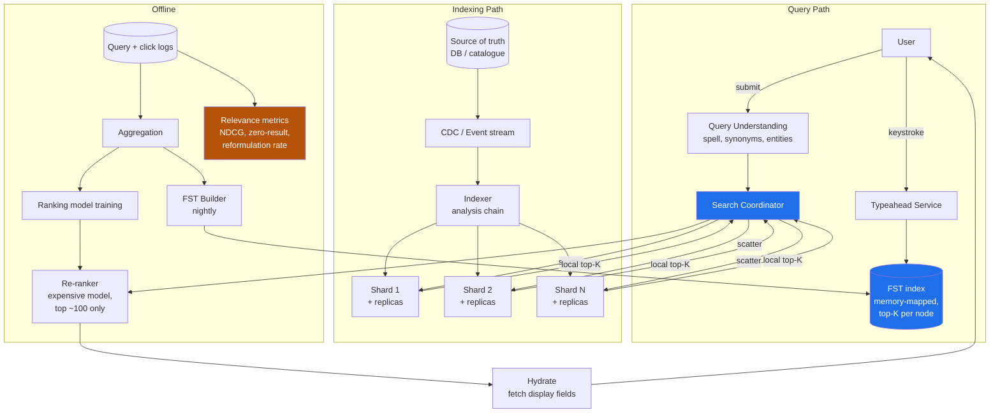
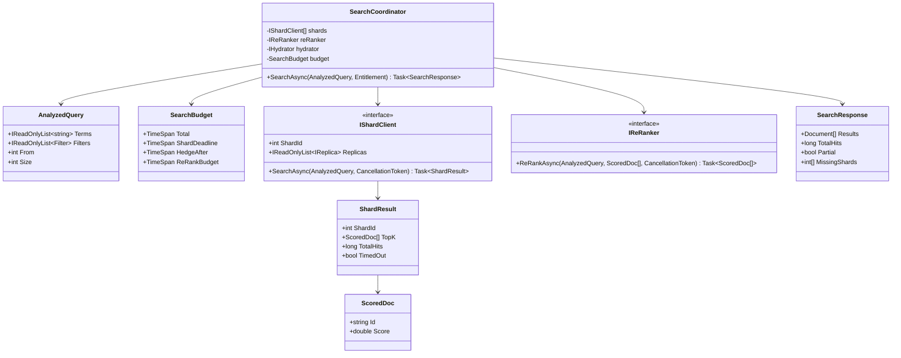
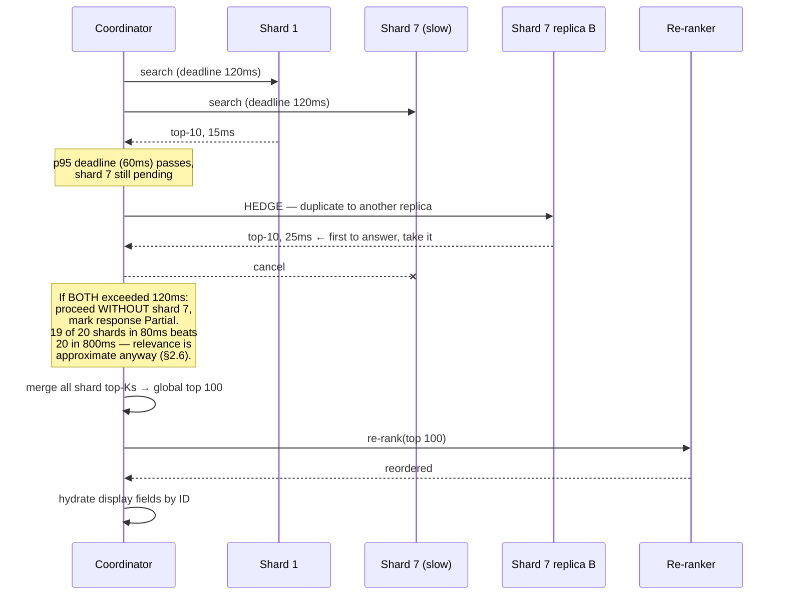

# Module 179 — System Design: Designing Search, Typeahead & Autocomplete at Scale

> Domain: System Design | Level: Beginner → Expert | Prerequisite: [[01-System-Design-Fundamentals]], [[16-Interview-Execution-Playbook-Estimation-Rubric]] (the clock discipline; §2.2's tail-latency arithmetic is load-bearing here), [[17-Designing-URL-Shortener-Distributed-ID-Generation]] (hot keys, cache-loss survival), [[../12-Data-Structures/02-Graphs-Tries-Union-Find]] (tries — extended here into FSTs and their on-disk form), [[../16-Distributed-Systems/05-LSM-Trees-BTrees-BloomFilters-StorageEngines]] (segment-based storage, which is what a search index actually is), [[../16-Distributed-Systems/06-TailLatency-HedgedRequests-TailAtScale]] (scatter-gather is the canonical tail-amplification shape)

---

**Why this module exists.** The `14-System-Design` audit found search entirely absent, which is a significant gap: "design search" and "design typeahead" are two of the most commonly asked prompts, and they are asked *together* precisely because candidates conflate them. They are not the same problem — they have different latency budgets, different data structures, different freshness requirements, and different correctness definitions. A candidate who answers "we'd use Elasticsearch" for both has answered neither.

The distinguishing property of this domain: **relevance is a product decision, not a technical one, and it is unverifiable at the point of query.** A search that returns the wrong ten results returns them in 40ms with a 200 status. There is no error. This is this course's recurring "correctness is unobservable yet consequential" theme in a form where the *definition* of correct is itself contested — which makes it different from every prior module, where correctness was at least well-defined.

---

## 1. Fundamentals

### What is search, and how is typeahead a different problem?

**Search** takes a complete query and returns a ranked set of matching documents. The hard parts are matching (which documents contain these terms, in a corpus too large to scan) and ranking (which of the matches are best). Latency budget: 100–500ms is acceptable; users expect a page load.

**Typeahead** (autocomplete) takes a *prefix* — an incomplete query — and returns likely completions, on every keystroke. The hard parts are latency and prediction. Latency budget: **under 100ms end-to-end, and realistically under 50ms server-side**, because a suggestion arriving after the user has typed the next character is worse than useless — it causes visible flicker and reordering.

The consequences of that latency difference are structural, not incremental:

| | Search | Typeahead |
|---|---|---|
| Input | Complete query | Prefix, changing every ~150ms |
| Budget | 100–500ms | <50ms server-side |
| QPS | 1× per search | **5–15× per search** (one per keystroke) |
| Data structure | Inverted index | Trie / FST / precomputed top-K |
| Corpus | Every document | Only *queries* or *entities* — a far smaller set |
| Ranking | Complex, multi-signal, often ML | Mostly popularity, precomputed |
| Correctness | Contested (relevance) | Contested (intent prediction) |
| Freshness | Seconds to minutes acceptable | Minutes to hours usually acceptable |

The single most important insight: **typeahead does not search the document corpus.** It searches a much smaller set of *past queries* or *entity names*, with completions and their scores largely precomputed. Candidates who try to run prefix matching over the full document index have chosen a problem that cannot meet the latency budget.

### Why does this matter?

Because search is the primary discovery surface for most products, and its quality directly drives revenue — a bad result page in e-commerce is a lost sale, and in a financial-data product a failure to surface the right instrument is a failure of the product's core function. It also matters because search is where the *asymmetry between apparent and actual correctness* is widest: a search system with badly degraded relevance looks identical, from every monitoring signal, to one working perfectly.

### When does this matter?

Any product with a corpus users need to find things in — commerce catalogues, document stores, instrument/security lookup, log search, code search, internal knowledge bases. The depth matters because "use Elasticsearch" is a component choice, not a design: the design decisions are the index schema, the analysis chain, the ranking signals, the freshness strategy, and the fallback when the cluster degrades — none of which the managed service supplies.

### How does it work (30,000-ft view)?

```
INDEXING (offline / streaming)
  document → analysis (tokenize, normalize, stem) → inverted index → segments

SEARCH (query time)
  query → same analysis chain → term lookup → posting-list intersection
        → candidate set → ranking → top-K → hydrate → response

TYPEAHEAD (query time)
  prefix → FST/trie traversal → precomputed top-K completions → response
           (no document access, no ranking computation, no intersection)
```

The critical structural point: **the query must pass through the same analysis chain as the documents.** If documents are lowercased and stemmed but the query is not, "Running" will not match "running" and nothing will explain why. This is the single most common source of "search is broken" bugs and it is silent — you get zero results, not an error.

---

## 2. Deep Dive

### 2.1 The Inverted Index — What It Actually Is

The naive approach is to scan every document for the query terms: O(corpus) per query, hopeless at any scale. The inverted index inverts the relationship — instead of *document → terms*, store *term → documents*:

```
Documents:
  1: "the quick brown fox"
  2: "the lazy brown dog"
  3: "quick brown foxes jump"

Inverted index (after analysis: lowercase, stopword removal, stemming):
  brown → [1, 2, 3]
  dog   → [2]
  fox   → [1, 3]          ← "foxes" stemmed to "fox", so doc 3 matches "fox"
  jump  → [3]
  lazy  → [2]
  quick → [1, 3]
```

A query for `quick brown` becomes an **intersection** of two posting lists: `[1,3] ∩ [1,2,3] = [1,3]`. The cost is proportional to the length of the shortest list, not to the corpus — which is the entire reason search is feasible.

Three details that separate a real answer:

**Posting lists carry more than document IDs.** They carry **term frequency** (how many times the term appears in that document — needed for ranking) and often **positions** (where in the document — needed for phrase queries, since `"quick brown"` as a phrase requires the terms to be adjacent). Positions typically double or triple index size, so storing them is a deliberate choice: no positions means no phrase queries, and phrase queries are usually required.

**Posting lists are sorted by document ID and compressed.** Sorted order is what makes intersection a linear merge rather than a hash join. Compression matters enormously: delta encoding (store gaps rather than absolute IDs) plus variable-byte or Frame-of-Reference encoding typically achieves 4–8× reduction, and since posting lists are read from disk or page cache, compression translates directly into query latency. This is why an inverted index is not "just a hash map of term to list."

**Intersection starts with the shortest list.** Querying `the quick` where `the` appears in 90% of documents and `quick` in 0.1%: iterate `quick`'s short list and probe `the`'s long one, using **skip lists** within the posting list to jump forward rather than scanning. Getting this backwards is a 900× cost difference on the same query.

### 2.2 The Analysis Chain — Where Search Correctness Actually Lives

Text is transformed before indexing, and the same transformation must be applied to queries. The chain:

```
"The Quick-Running Foxes!"
  → character filters   strip HTML, normalize Unicode (NFKC), fold accents
  → tokenizer           split into terms: ["The", "Quick", "Running", "Foxes"]
  → token filters       lowercase → ["the","quick","running","foxes"]
                        stopwords → ["quick","running","foxes"]
                        stemming  → ["quick","run","fox"]
```

**Stemming versus lemmatization** is a real trade-off. Stemming (Porter, Snowball) is a fast rule-based truncation: `running → run`, but also `university → univers` and `universe → univers` — which conflates two unrelated words, a false-positive class. Lemmatization uses a dictionary and produces linguistically correct roots, at higher cost and requiring per-language dictionaries. Most systems use stemming and accept the errors; knowing what those errors *are* is what matters.

**Stopword removal is more dangerous than it looks.** Removing `the`, `a`, `to` saves index space and speeds queries — and destroys the ability to search for `"to be or not to be"`, `"The Who"`, or `"vitamin A"`. Modern practice is generally to **keep stopwords** and handle their low information value in ranking instead, because index space is cheap and the failures from removal are unfixable at query time.

**The chain must be symmetric, and asymmetry is silent.** If documents are stemmed and queries are not, a query for `running` looks up the term `running`, which does not exist in the index because it was stored as `run`. Result: zero hits, no error, no explanation. This is the single most common search bug, and the fix is architectural — the analysis chain must be defined once and applied to both paths by the same code, not configured twice.

**Reindexing is required for analysis changes**, and this is the operational consequence people miss. Changing the stemmer or adding a synonym affects how documents were *stored*, so the entire corpus must be reprocessed. That makes analysis changes a migration, not a config tweak — and it is why analysis decisions deserve real scrutiny before launch (§2.13).

### 2.3 Ranking — TF-IDF, BM25, and Why the Formula Matters Less Than the Signals

Matching gives a candidate set; ranking orders it. The classical lexical model:

**TF-IDF** scores a document for a term by term frequency (more occurrences ⇒ more relevant) times inverse document frequency (a term appearing in few documents is more discriminating). `IDF = log(N / df)`.

**BM25** is TF-IDF's better-behaved successor and the modern default. Two improvements that matter:

```
                        tf · (k₁ + 1)
BM25(q,d) = Σ  IDF(q) · ─────────────────────────────────
            q∈Q          tf + k₁ · (1 − b + b · |d|/avgdl)

  k₁ ≈ 1.2   term-frequency SATURATION — the 20th occurrence of a term adds
             almost nothing over the 10th. TF-IDF grows linearly and therefore
             over-rewards keyword stuffing.
  b  ≈ 0.75  length NORMALIZATION — a term in a 10-word title matters more than
             the same term in a 10,000-word document.
```

Saturation is the conceptually important part: relevance is not linear in term frequency, and TF-IDF's assumption that it is makes it exploitable and wrong for long documents.

**But the formula is rarely where relevance problems live.** BM25 scores *textual* similarity only. Real ranking blends signals:

```
score = w₁·BM25(text)           lexical match
      + w₂·popularity           clicks, purchases, views — usually the strongest signal
      + w₃·recency              domain-dependent: critical for news, harmful for reference
      + w₄·field_boost          a match in the title beats one in the body
      + w₅·personalization      user history, location, entitlements
      + w₆·business_rules       margin, stock level, promoted items
      − w₇·penalties            out of stock, low quality, deprecated
```

**Popularity usually dominates**, which produces a self-reinforcing feedback loop: popular items rank high, high-ranked items get clicked, clicks increase popularity. New good items cannot break in — the **cold-start problem** — and it must be counteracted deliberately with exploration (occasionally promoting unproven items to gather signal). A candidate who names this loop unprompted is signalling real experience, because it is invisible in any offline metric.

**Two-phase retrieval** is the standard architecture for expensive ranking: a cheap first pass (BM25) retrieves ~1,000 candidates per shard; an expensive second pass (a learned model, possibly a cross-encoder) re-ranks the top ~100 globally. This is how ML ranking becomes affordable — you never run the expensive model over the corpus, only over a small candidate set. The trade-off to state: **anything the cheap phase misses cannot be recovered by the expensive one**, so first-phase recall bounds the whole system's quality.

### 2.4 Typeahead — Tries, FSTs, and Precomputation

Typeahead needs prefix lookup in single-digit milliseconds. A trie gives O(prefix length) traversal:

```
        (root)
       /      \
      c        f
      |        |
      a        o
     / \       |
    r   t      x
    |   |
    s   *("cat")
    |
    *("cars")

  Prefix "ca" → traverse c→a, then collect completions in the subtree.
```

Two problems with a naive trie, and the fixes are the interesting content:

**Problem 1 — collecting the subtree is expensive.** Prefix `a` in an English corpus has an enormous subtree; traversing it per keystroke is far too slow. **Fix: precompute and store the top-K completions at every node.** Each node holds its best 10 completions with scores, so a lookup is *traverse to the node and read* — O(prefix length), independent of subtree size. This trades index size and build time for query latency, which is exactly the right trade when the budget is 50ms.

**Problem 2 — a pointer-based trie is memory-hungry and cache-hostile.** Millions of nodes with per-node child maps produces poor locality and high overhead. **Fix: an FST (Finite State Transducer)** — a minimized, deterministic automaton that shares both prefixes *and suffixes*:

```
Trie shares prefixes only:        FST shares suffixes too:
  "running", "jumping"              "running", "jumping"
   r-u-n-n-i-n-g                     r-u-n-n ──┐
   j-u-m-p-i-n-g                     j-u-m-p ──┴─ i-n-g
   (14 nodes)                        (shared suffix — ~9 nodes)
```

FSTs are typically 5–10× smaller than an equivalent trie, are **memory-mappable** (so the OS page cache manages residency and the structure needs no deserialization), and support the transducer property of associating an output value — the score — with each accepted path. This is what Lucene actually uses for its term dictionary and suggesters, and naming it is a strong depth marker.

**What is in the typeahead index is the key design decision.** Three choices with different properties:

- **Past queries** (what search engines do): reflects real intent, self-improving from logs, and *inherits every problem in the logs* — misspellings, offensive queries, and no coverage for genuinely new items.
- **Entity names** (product/instrument names): complete coverage and no offensive-content risk, but does not match how users actually phrase things.
- **Both, merged**, which is usual — entities guarantee coverage, query logs supply the phrasing and popularity.

**Personalization at typeahead latency** is genuinely hard, because you cannot run a model in 20ms. The workable pattern is a **small personal index merged with the global one**: the user's own recent queries and interactions in a tiny per-user structure (cached in memory or shipped to the client), merged with global completions at query time. The merge is cheap; computing personalization is not, so it is precomputed asynchronously.

### 2.5 Index Freshness — the Central Tension

Search indexes are **segment-based**, inheriting the structure covered in `16-Distributed-Systems/05`. New documents go into a small in-memory segment; segments are periodically flushed to disk and later merged. A document is not searchable until its segment is *visible*, which is a refresh operation.

The tension is direct:

```
Frequent refresh  → fresher results, many small segments
                  → slower queries (every query touches every segment)
                  → higher merge load (CPU + I/O, competing with queries)

Infrequent refresh → stale results
                   → fewer, larger segments → faster queries
```

Elasticsearch's default 1-second refresh is a *reasonable default*, not a law, and treating it as one is a common error. The right value comes from the requirement: a log-search system may want 1 second; a product catalogue is fine at 30 seconds and gains real query performance from it; a reference-data index rebuilt nightly should not refresh at all during the day.

**Near-real-time is not real-time**, and the gap has consequences. The pattern to know: a user edits a product and immediately searches for it, and it is not there — the **read-your-own-writes problem** (Module 191 §2.3) in search form. Fixes: refresh-on-demand for that specific document (expensive, and abusable), or — better — serve the user's own recent edits from the primary store and merge them into the result set, so the index's staleness is invisible to the person who caused it.

**Full reindexing** must be a designed, routine operation, not an emergency. Analysis changes, mapping changes, and corruption all require it. The standard pattern is **index aliasing**: build `products_v2` alongside the live `products_v1`, then atomically repoint the alias. This gives a zero-downtime, instantly-reversible cutover, and a system that cannot do it will accumulate analysis decisions it cannot revisit.

### 2.6 Sharding and the Scatter-Gather Tail Problem

A corpus too large for one node is split into shards, and search **scatters to every shard and gathers** — because any shard may hold a top result. This is unavoidable for relevance-ranked search and it is the architectural fact that dominates latency.

Two sharding strategies:

**Document-partitioned** (the near-universal choice): each shard holds a subset of documents with a complete index over them. Every query hits every shard; each returns its local top-K; the coordinator merges. Indexing is simple (route by document ID) and scaling is straightforward.

**Term-partitioned**: each shard holds complete posting lists for a subset of terms. A query only hits shards holding its terms — less fan-out — but multi-term queries require shipping entire posting lists between shards, indexing a document touches many shards, and term skew (some terms have vast lists) creates severe imbalance. Almost always rejected; knowing *why* is the value.

**The tail-amplification arithmetic is the critical consequence.** With 20 shards each having a 1% chance of a slow response:

```
P(at least one slow) = 1 − 0.99²⁰ ≈ 18%
```

So 18% of queries are as slow as the slowest shard. The whole system's p99 is governed by roughly the p99.9 of individual shards — Module 176 §2.2's arithmetic, and here it is the primary design constraint rather than a footnote. Three mitigations:

1. **Fewer, larger shards.** Every shard added increases tail exposure. The instinct to over-shard "for scale" makes latency worse, and this is counter-intuitive enough that it is worth stating explicitly.
2. **Hedged requests** — after the p95 deadline, send a duplicate to another replica and take the first response. ~5% extra load for a large tail improvement. Safe here because search reads are idempotent.
3. **Partial results with a deadline.** Return what arrived within the budget, flagged as partial. For search this is usually *correct*: 19 of 20 shards' results in 80ms beats all 20 in 800ms, because relevance is approximate anyway. This is a genuinely different answer from most domains in this folder, where partial results would be unacceptable — and the reason is that search has no exact answer to be partial *about*.

**Replicas serve reads and are the availability mechanism.** Query throughput scales by adding replicas; index size scales by adding shards. Conflating these is a common error — adding shards does not increase query capacity, it decreases per-query latency at the cost of tail exposure.

### 2.7 Query Understanding — Where Modern Search Gets Its Quality

Before matching, the query is interpreted, and this layer often contributes more to perceived quality than ranking does:

**Spelling correction.** Edit-distance candidates (typically Damerau-Levenshtein, which includes transposition since `teh`→`the` is a transposition) filtered by whether the correction exists in the index and is more frequent than the original. The essential product decision is **auto-correct versus suggest**: silently correcting `iphone` → `iPhone` is good; silently correcting a deliberate rare term to a common one is infuriating and hides the corpus. The standard resolution is to auto-correct when the original has zero results and suggest when it has few — a rule, not a model.

**Synonyms and expansion.** `laptop` ⇄ `notebook`. Applied at **index time** (store all synonyms — fast queries, but changing the synonym list requires reindexing) or **query time** (expand the query — flexible and instantly changeable, but slower queries). Query-time is the usual choice for exactly the flexibility reason, and the trade-off is worth stating.

**Entity recognition and intent.** `red nike shoes size 10` should become `{color: red, brand: nike, category: shoes, size: 10}` and largely be answered by structured filters rather than by text matching. This is where e-commerce search quality actually comes from, and it is a different problem from relevance ranking — often solved with a mix of dictionary lookup and a lightweight classifier.

**Semantic / vector search** embeds the query and documents into a shared vector space, retrieving by approximate nearest neighbour (HNSW or IVF-PQ). It finds conceptually related results a lexical index cannot — `affordable laptop` matching `budget notebook` with no shared terms. Its weaknesses are the reason it does not replace lexical search: it is poor at exact matching (part numbers, ISINs, error codes, proper nouns), it cannot easily explain why a result matched, and it is expensive to keep fresh since embedding a document requires model inference.

**Hybrid retrieval is the current standard**: run both lexical and vector retrieval, fuse the result sets (Reciprocal Rank Fusion is the common, robust choice because it needs no score calibration between the two systems), and re-rank. The reason hybrid wins is that the two methods fail on *different* queries — lexical fails on paraphrase, vector fails on exact identifiers — so their union has substantially better recall than either. Naming RRF specifically, and *why* score-free fusion matters, is a strong signal.

### 2.8 Measuring Relevance — the Only Way to Know If Search Works

This is the section that distinguishes a Staff answer, because search is the domain where you cannot know if you are correct without deliberately constructing the ability to know.

**Offline metrics** need judged data — query/document pairs rated by humans or derived from behaviour:

- **Precision@K** — of the top K, how many are relevant.
- **Recall@K** — of all relevant documents, how many are in the top K.
- **MRR** (Mean Reciprocal Rank) — 1/rank of the first relevant result. Right metric when there is one correct answer (navigational queries, instrument lookup).
- **NDCG@K** — Normalized Discounted Cumulative Gain: rewards highly relevant results near the top with logarithmic position discounting. The standard metric for graded relevance, and the right default.

**Online metrics** measure real behaviour and are what actually matters:

- **CTR at position** — but beware position bias: results rank high *because* they were clicked, and are clicked *because* they rank high. Raw CTR comparisons across ranking changes are confounded.
- **Zero-result rate** — the single most actionable metric. A rising zero-result rate is unambiguous evidence of a matching problem, and unlike relevance it needs no judgement to interpret.
- **Query reformulation rate** — a user retyping means the first attempt failed. A direct, cheap dissatisfaction signal.
- **Abandonment** — a search with no click at all.

**Interleaving beats A/B testing for ranking changes.** Instead of splitting users between rankers, blend both rankers' results into one list and attribute clicks. It is dramatically more sensitive — often 10–100× fewer impressions for the same statistical power — because each user compares both rankers directly, eliminating between-user variance. For a team shipping ranking changes weekly, this is the difference between measurable and unmeasurable.

**The judged set must be maintained and it decays.** A relevance test set built at launch measures relevance against a corpus and a query distribution that no longer exist. Both drift, so the set needs refreshing, and the refresh needs an owner — otherwise offline metrics become a number that reliably passes while quality degrades, which is Module 133's failure pattern in relevance form: **a check whose reference data no longer reflects reality cannot detect that reality has changed.**

### 2.9 "Correct" Is Contested Here — and What That Changes

Every other system in this folder has a definition of correct that is, in principle, decidable. A ledger balances or it does not. A report is complete or it is not. **Search does not have that property**: whether a result is good depends on a user's intent, which is unobservable, and two reasonable people will disagree about the same result set.

Four consequences follow, and together they explain why search is operated differently from everything else here:

1. **You cannot write an assertion for relevance**, so quality must be *measured statistically* over a judged set rather than *verified* per query (§2.8). The measurement is itself an approximation with its own error.
2. **Regressions are gradual and invisible.** A ledger breaks discontinuously; search decays. Nothing fails, latency is fine, errors are zero, and quality is 15% worse than two years ago (§2.14).
3. **Partial results are acceptable**, which is genuinely unusual. Returning the top 90% of matches within the deadline is better than returning all of them late — a trade no ledger could make (§2.6).
4. **Therefore ship behind measurement, always.** Every ranking change goes out as an experiment with a metric attached (§2.16), because intuition about relevance is unreliable even among people who work on it daily.

The framing worth carrying into an interview: **in this domain the engineering problem is not computing the answer, it is knowing whether the answer got better** — which is the same evidence-centric conclusion this folder reaches elsewhere, arriving from an unusual direction.

### 2.10 Lexical versus Vector Search

**Lexical (BM25 over an inverted index)** matches terms. It is exact, cheap, explainable — you can say precisely why a document matched — and it handles rare terms, identifiers, codes and exact phrases superbly. It fails on vocabulary mismatch: a query for `laptop` does not match a document saying `notebook computer`.

**Vector (embedding + ANN search)** matches meaning. It handles synonymy, paraphrase and cross-lingual queries without a synonym list. It fails in ways that are worse than they first appear:

- **Exact-match queries degrade.** A part number, an ISIN, a ticket ID — a query where the *string* is the intent — can return semantically similar but wrong results, and "wrong but plausible" is harder to notice than "no results."
- **Explainability disappears.** "Why did this rank first?" has no answer beyond a distance, which matters enormously when a customer disputes a result.
- **Cost is structural.** Embeddings must be recomputed for the whole corpus whenever the model changes, which turns a model upgrade into a full reindex.
- **Freshness is harder**: a new document needs an embedding before it is findable.

**Resolve it as hybrid, not as a replacement.** Run both retrievers and fuse the results — reciprocal-rank fusion is the standard, robust choice because it needs no score calibration between two incomparable scoring scales. Lexical guarantees the exact-match floor; vector adds semantic recall on top. Argue against full replacement specifically on the exact-match regression and on explainability, because those are the two that produce customer-visible failures rather than merely lower average quality.

### 2.11 Entitlements — the Filtering That Must Never Be Best-Effort

Search returns documents; entitlements decide which documents a user may see. Getting this wrong is a data breach dressed as a search result, so it needs the strongest treatment in the module.

**Post-filtering is wrong and tempting.** Retrieve the top 10 and drop the ones the user cannot see: now the user gets three results where ten exist, pagination is broken, and counts are wrong. Worse, the *number* of removed results leaks information about documents the user cannot see.

**Filter in the query, at the index level.** Index an `acl` field holding the set of principals (users, groups, roles) permitted to see the document, and add a mandatory filter clause `acl IN (user's principals)` to every query. The engine intersects it with the posting lists, so filtering happens during retrieval and the top-K is computed over the permitted set.

**Scaling it:**

- **Filter by group, not by user.** 50,000 users with distinct permission sets become a manageable problem if permissions are expressed as group membership — the `acl` field holds a few dozen group IDs rather than tens of thousands of user IDs, and a user's query carries their resolved group list.
- **Cache the resolved principal list per session**, with a short TTL, because resolving group membership per query is its own latency problem.
- **Revocation is the hard half.** A removed permission must take effect promptly, which bounds that TTL — and for high-sensitivity corpora argues for revocation-list checking at serve time rather than TTL expiry alone.

**Per-field entitlements** — a user may see a document's title but not its body — need the model extended rather than bolted on. Two workable shapes: index each visibility level as a **separate document** (`doc#public`, `doc#internal`) with its own `acl` and its own fields, deduplicating at serve time to the highest-permitted variant; or keep one document and **strip non-permitted fields at hydration** (§2.1's separation of index from display store), accepting that a term in a restricted field can still cause a match the user cannot explain. The first is more storage and is correct; the second is cheaper and leaks matches. Say which you are choosing and why.

**Test it with a synthetic probe**, because this failure has no organic signal: index a document containing a unique token visible only to tenant A, query as tenant B, and assert absence. Nothing else will tell you.

### 2.12 Multi-Tenant Search at Wildly Different Scales

10,000 tenants where the largest is 1,000× the smallest breaks any uniform strategy.

**Three placements, chosen by tenant size:**

| Tenant size | Placement | Why |
|---|---|---|
| Small (the long tail) | **Shared index**, `tenant_id` as a mandatory filter | Thousands of tiny indices waste memory in per-index overhead — segment metadata, caches, threads |
| Medium | **Dedicated index** on a shared cluster | Isolation of reindexing and mapping changes, without dedicated hardware |
| Large | **Dedicated index, possibly dedicated nodes** | Their reindex must not disturb anyone; their query load is its own capacity plan |

**The properties that make this workable:**

- **The `tenant_id` filter on the shared index must be mandatory by construction**, not by convention — injected by the query builder, with no code path that can omit it (§2.11's reasoning, and the same "no exceptions" discipline as multi-tenant isolation generally).
- **Routing by tenant** on the shared index keeps a tenant's documents on one shard, so their queries are single-shard and avoid scatter-gather entirely (§2.6) — a large win that falls out of the tenancy model for free.
- **Promotion between tiers must be a routine operation**, because tenants grow. Reindex into a dedicated index, alias-swap, delete from the shared one.

### 2.13 Changing the Analysis Chain — the Migration Everyone Underestimates

Changing a stemmer, a tokeniser or an index-time synonym list **invalidates the entire index**, because documents were analysed with the old chain and queries will be analysed with the new one. §2.2's rule — query and documents must pass through the *same* chain — is violated the moment they diverge.

**The procedure:**

1. **Build a new index** with the new chain, in parallel, from the source of truth. Never mutate in place.
2. **Shadow-query both** with real production traffic, recording result-set differences per query. This is the step that finds the surprises.
3. **Judge the differences**, not the count. Many will be improvements; some will be regressions on queries that matter. Sample by query *class* (head, torso, tail, exact-identifier) rather than uniformly, because the tail is where stemming changes bite.
4. **Alias-swap** when the judged diff is acceptable, and keep the old index until confidence is established. The alias is what makes the cutover atomic and the rollback instant (§2.5).

**Index-time versus query-time synonyms is the same trade in miniature.** Index-time is faster at query and requires a full reindex to change. Query-time is instantly changeable and expands every query, costing latency and occasionally precision. The pragmatic split: high-confidence, stable synonyms at index time; experimental or fast-moving ones at query time — accepting that query-time expansion is where §4's defect lived, and paying for it with schema validation, generated tests and shadow diffing rather than with care.

### 2.14 Feedback Loops and the Quality That Decays Without a Regression

**Popularity-based ranking is self-reinforcing.** A document that ranks highly gets clicked, the clicks feed the popularity signal, and it ranks higher still. New and better documents cannot break in, because they have no clicks — and they have no clicks because they do not rank. The system converges on a stale head.

Counters, all of which are deliberate injections of exploration:

- **Explore/exploit** — reserve a small fraction of result slots for candidates the model is uncertain about, and learn from what happens.
- **Time-decay the popularity signal**, so last year's winner does not hold position permanently.
- **Normalise by impressions**, not raw clicks: click-through *rate* given a position, rather than absolute clicks, which is mostly a measure of previous ranking.
- **Position-bias correction** in whatever training data the ranker consumes, because a click at position 1 and a click at position 8 are not equal evidence.

**"NDCG is down 15% over two years with no single regression"** is the diagnostic form of the same problem, and the answer is that it is a **class** of problem, not a bug:

1. **Corpus drift** — the documents changed. New content types, longer or shorter documents, different vocabulary. BM25's length normalisation is sensitive to this.
2. **Query drift** — users ask differently than they did two years ago, and the analysis chain was tuned for the old distribution.
3. **Judgement staleness** — the judged set itself decayed; some documents no longer exist, relevance opinions changed, and you may be measuring against an obsolete standard (§2.8's judged-set validity as an *alertable condition*).
4. **Accumulated small changes** — dozens of individually-neutral tweaks compounding.

The reason it cannot be bisected: no single commit caused it. The remedy is **a continuously refreshed judged set, per-class metrics rather than one aggregate, and periodic re-tuning treated as routine maintenance** rather than as incident response.

### 2.15 Two-Phase Retrieval, and "Search Should Understand Questions"

**Two-phase retrieval** — cheap BM25 first phase over the whole index, expensive learned re-ranker over the global top ~100 — is what makes sophisticated ranking affordable.

**Its main limitation is structural and worth naming: the re-ranker can only reorder what the first phase retrieved.** A genuinely relevant document that BM25 missed (vocabulary mismatch, §2.10) can never be recovered, no matter how good the model. So first-phase **recall** is the ceiling on final quality, which is the argument for hybrid retrieval feeding the re-ranker rather than for a better re-ranker.

**"Search should understand natural-language questions."** Decompose the request rather than accepting or refusing it, because it usually contains three different asks:

- **Query understanding** (§2.7) — extracting entities and filters from a phrase like "cheap flights to Tokyo in March" and routing them to structured filters. This is high value, tractable today, and probably what they actually want.
- **Semantic retrieval** — hybrid lexical+vector (§2.10). Also tractable.
- **Answer generation** — an LLM producing a direct answer. A different product with different failure modes: hallucination, attribution, latency, cost, and an evaluation problem harder than search's own.

Deliver the first two, scope the third separately, and state the evaluation problem explicitly — because a generated answer that is confidently wrong is a worse failure than a mediocre result list, and nothing in the existing relevance measurement detects it.

### 2.16 Interleaving Beats A/B Testing for Ranking

A/B testing splits *users* between two rankers, so the comparison is confounded by user differences and needs large samples and long runs to reach significance.

**Interleaving splits the result list.** A single user receives results merged from both rankers (team-draft or balanced interleaving), and the winner is whichever ranker's contributions get clicked more. Because the same user sees both, per-user variation cancels out — typically **an order of magnitude fewer sessions** to detect the same effect.

The limits, which should be stated: interleaving measures *preference between two rankers*, not absolute quality, and it cannot measure downstream outcomes like conversion or revenue. So the practical arrangement is interleaving for rapid iteration between candidate rankers, and a conventional A/B test for the small number of changes that graduate to a business-metric decision.

### 2.17 Diagnosing Search When Every Metric Is Green

**"Zero-result rate is flat, latency normal, errors zero, relevance suite passes — users say search is broken."** This is §4's shape, and the diagnosis is a sequence of increasingly specific questions:

1. **Which users, which queries?** "Search is broken" is almost never uniform. Segment by tenant, by query class, by locale.
2. **Are results wrong, or merely *different*?** A recent ranking or analysis change may be working as designed and not as expected.
3. **Look at result-set *size distribution*, not the zero-result rate.** This is the metric §4 needed and lacked: a query returning 4,000 results where it used to return 12 is catastrophically over-matching and **contributes nothing to a zero-result counter.** A metric that detects under-matching is structurally blind to over-matching — a *directional* blind spot, which is the sharpest variant of this folder's recurring monitoring lesson.
4. **Check the analysis chain symmetry.** A query-time change applied without the index-time equivalent (§2.13) produces exactly this.
5. **Check entitlement filtering** (§2.11) — results silently removed look like missing results.

### 2.18 Observability — and the Failures With No Detector

| Failure | Detector | Natural? |
|---|---|---|
| Cluster down / shard unavailable | Error rate, cluster health | Yes |
| Latency regression | p50/p99, and p99 **by shard** | Yes |
| Indexing stalled | **Ingest-to-searchable lag** | Yes, once built |
| **Over-matching** (§4) | **Result-set size distribution per query class** | **No** — zero-result rate is blind to it |
| **Relevance decay** | NDCG per query class against a *refreshed* judged set | **No** — nothing errors, nothing slows |
| **Judged set gone stale** | **Judged-set validity as an alertable condition** | **No** — the suite keeps passing |
| **Entitlement leak** | **Synthetic cross-tenant probe** (§2.11) | **No** — a leak is a successful query |
| **Popularity lock-in** | Fraction of clicks on documents first indexed in the last N days | **No** |

**The pattern: every failure that matters in search is silent.** Nothing throws, nothing slows, and the aggregate metrics keep their shape. Which means search needs a higher proportion of *constructed* signals — probes, distributions, and independently refreshed baselines — than almost any other system in this folder.

**A specific latency note worth having ready: p50 60 ms with p99 800 ms is a tail problem, not a capacity problem**, and the candidates are ranked: scatter-gather tail amplification (§2.6, and the first thing to check); one slow shard, visible in p99 *by shard* rather than in aggregate; garbage-collection pauses on a JVM-based engine; segment merges competing with queries for IO; and a small number of pathologically expensive queries — leading wildcards, very high term counts, deep pagination — which a per-query-class breakdown finds immediately.

### 2.19 Engine Selection, Including the Postgres Proposal

| Option | When it is right | What it costs |
|---|---|---|
| **Elasticsearch / OpenSearch self-managed** | You need the full analysis chain, faceting, aliasing, and control of the cluster | Real operational burden: JVM tuning, shard sizing, upgrades, capacity |
| **Managed search service** | Standard requirements, small team, no differentiation in operating a cluster | Less control over analysis, cost at volume, feature lag |
| **Lucene directly** | You are building a product whose *core* is retrieval | Enormous: you re-implement distribution, replication, recovery |
| **PostgreSQL full-text** | Small corpus, simple requirements, already operating Postgres | No faceting worth the name, weaker analysis, and it competes with OLTP for resources |

**Evaluating "just use `LIKE '%term%'` on Postgres — the corpus is only 2M rows"** seriously, because at 2M rows the instinct is not absurd:

`LIKE '%term%'` **cannot use a B-tree index** — the leading wildcard defeats it — so every query is a sequential scan over 2M rows, competing directly with transactional traffic on the same instance. It also gives no ranking, no stemming (so `running` misses `run`), no faceting, and no phrase handling.

**The honest counter-proposal is not "use Elasticsearch"; it is PostgreSQL full-text search** — `tsvector` with a GIN index, which *is* an inverted index, with stemming, ranking (`ts_rank`) and phrase support. At 2M documents with modest QPS and no faceting requirement, that is genuinely sufficient and avoids operating a second datastore entirely.

State the thresholds at which it stops being sufficient, because that is the part that makes it a judgement rather than a preference: faceted navigation, per-field boosting, synonym management, aggregations, or query volume competing with OLTP. Below those, the simpler answer wins — and proposing a search cluster for 2M rows with no faceting is precisely the over-engineering that costs more credibility than it gains.

### 2.20 Migrating Engines Without a Relevance Regression

Same shape as §2.13, with a larger diff:

1. **Dual-index.** Both engines fed from the same CDC stream, so neither is a fork of the other.
2. **Shadow-query.** Send production queries to both, serve from the old, record both result sets. Run long enough to cover query seasonality.
3. **Measure, do not eyeball.** Compute NDCG for both against the same judged set, and produce an overlap metric (Jaccard on top-10) per query class. Head queries will match closely; the tail is where engines differ.
4. **Canary by traffic percentage**, with interleaving (§2.16) as the live comparison — the strongest available evidence, because it measures preference directly rather than against a proxy.
5. **Keep the old engine warm** until a full cycle has passed, for the same reason a migration keeps its predecessor running: rollback must remain available.

**The non-obvious risk: the analysis chains will not be identical between engines**, even when configured "the same." Tokenisers, stemmers and stopword lists differ in details. Verify by analysing a fixed corpus of terms through both and diffing the token streams — this finds in an afternoon what shadow-querying would surface slowly and confusingly.

### 2.21 Not Building Search

**The strongest argument:** search is a deep specialism with a large non-differentiating surface — analysis chains per language, ranking, faceting, scaling, relevance tooling — and it is almost never the reason a customer chooses a product. Hosted search products (Algolia, managed OpenSearch, vendor site-search) deliver competitive relevance, sub-100 ms latency and typeahead out of the box, with no cluster to operate. Building means owning cluster operations, an evaluation programme (§2.8), and an ongoing quality burden that has no completion date.

**When building is right:** entitlement or data-residency requirements that prohibit sending the corpus to a third party (frequently decisive in finance); a corpus or query pattern so unusual that general-purpose relevance is poor; retrieval quality that *is* the product; or volume where per-query pricing exceeds build-and-operate cost.

**The Principal framing**, consistent with §2.9: the ongoing cost of search is not the cluster, it is the **relevance programme** — judged sets, experiments, per-class metrics, retuning. Teams that buy the engine and skip the programme get the same slow decay as teams that build one.

### 2.22 Recovery, and Typeahead at Scale

**The real recovery metric for search is rebuild time, not RPO.** The index is *derived* from a source of truth, so losing it loses no data — which makes RPO close to meaningless and **time-to-rebuild** the number that matters, because it is how long the product is degraded. Measure it by actually doing it, on a schedule; an untested rebuild time is a guess, and it grows silently with the corpus.

**Typeahead at 50,000 QPS with a 50 ms p99** is achievable precisely because its index is small enough to sidestep the hard problem:

1. **Replicate the whole FST to every node.** A few hundred megabytes fits in memory, so there is **no sharding, therefore no scatter-gather, therefore no tail amplification** (§2.6). That single property is what makes the tighter budget achievable at ten times search's QPS.
2. **Precompute top-K per prefix** at build time, so serving is a traversal plus a memory read, not a ranking computation (§2.4).
3. **Cap prefix depth** — for a one-character prefix with a million descendants, serve the precomputed top-K rather than traversing (§2.4 again).
4. **Cache client-side.** Prefix locality means a user typing `t → to → tok` can often be served locally after the first request.
5. **Debounce on the client** — 50–150 ms — which removes a large fraction of requests before they are made and costs nothing.

### 2.23 The Separating Question, and What to Go Deep On

**With twenty minutes and "go deep on one thing," pick relevance measurement** (§2.8, §2.14). It is the part of search that is genuinely hard, that most candidates cannot discuss, and that carries the domain's real content: judged sets and their staleness, online versus offline metrics, interleaving, position bias, per-class rather than aggregate measurement, and the feedback loops that make popularity self-reinforcing. Inverted indexes and BM25 are well-documented mechanics; the evaluation programme is where practitioners are distinguished from readers.

**The single question that separates a Staff answer from a Senior one:**

> **"How do you know your search is good?"**

A Senior answer cites latency and zero-result rate — availability and mechanics. A Staff answer describes a **measurement programme**: a judged set and how it is kept current, offline metrics (NDCG, MRR) computed per query class rather than in aggregate, online metrics with position-bias correction, interleaving for ranking changes, and the explicit acknowledgement that the judged set itself decays and must be refreshed — plus which failures have **no detector at all** (§2.18) and what probes exist to compensate.

It separates reliably because §2.9's property makes it unavoidable: in a domain where correctness is contested, *knowing whether the system is good* is the engineering problem, and everything else is implementation.

**And the generalisation to carry out of this module.** §4's incident and the regulatory pipeline's completeness failure are the same defect: **a monitor whose measurement is blind in exactly the dimension of the failure** — a zero-result counter that cannot see over-matching, a completeness check whose expected set came from the logic being checked. The design rule follows: **for every metric, state the failure it cannot see, and add a second signal with a different blind spot.** Over-matching needs result-set *size distribution*; completeness needs an *independently derived* expected set. One metric per failure class is not coverage; it is a single point of observational failure.

---


---

## 3. Visual Architecture

### System architecture



The two highlighted paths are the two *different* systems. The amber box is the one that tells you whether either is working — and it is the component most often absent.

### Inverted index and intersection

```
QUERY: "quick brown"

  quick → [1, 3, 17, 42]              ← 4 postings   START HERE (shortest)
  brown → [1, 2, 3, 5, 8, 11, 17, …]  ← 90,000 postings

  Intersect by advancing the SHORT list and SKIPPING in the long one:
    quick=1  → seek brown ≥ 1  → 1   ✓ match
    quick=3  → seek brown ≥ 3  → 3   ✓ match
    quick=17 → seek brown ≥ 17 → 17  ✓ match
    quick=42 → seek brown ≥ 42 → 51  ✗ no match

  Cost ∝ length of SHORTEST list (with skip-list jumps), NOT the corpus.
  Reversing this — iterating `brown` and probing `quick` — is 22,500× worse.
```

### Typeahead: FST with precomputed top-K

```
                    (root)
                   /      \
                 "c"      "f"
                  |         \
                 "ca"       "fi"
                /    \          \
           "car"    "cat"      "fin"
             |         |          |
      ┌──────────────────────────────────────┐
      │ EACH NODE STORES ITS TOP-K, PRECOMPUTED │
      │  "ca" → [cat food    (score 9800),      │
      │          cars        (score 8100),      │
      │          camera      (score 7700), …]   │
      └──────────────────────────────────────┘

  Lookup "ca" = traverse 2 edges + read the stored list.
  O(prefix length). INDEPENDENT of subtree size — which is what makes
  a 20ms budget achievable for a prefix with a million descendants.

  Suffix sharing (the FST property) makes this 5–10× smaller than a trie,
  and memory-mappable so the OS page cache handles residency.
```

### Scatter-gather tail amplification

```
                     ┌── Shard 1 ── 15ms ──┐
                     ├── Shard 2 ── 18ms ──┤
  Coordinator ───────┼── Shard 3 ── 12ms ──┼──── waits for ALL
                     ├── …                 │      = 220ms
                     └── Shard 20 ─ 220ms ─┘      (the slowest one)

  P(at least one shard slow) = 1 − (1 − p)^N
     N=5,  p=1%  →   5%
     N=20, p=1%  →  18%     ← system p99 ≈ shard p99.9
     N=50, p=1%  →  39%
     N=100,p=1%  →  63%

  ⇒ MORE SHARDS MAKES LATENCY WORSE. Mitigate with fewer/larger shards,
    hedged requests, or a deadline with partial results — which for search
    is usually CORRECT, because relevance is approximate anyway.
```

---

## 4. Production Example

**Problem.** A B2B financial-data platform provided instrument search — users typed an issuer name, ticker, or ISIN to find securities. After a routine release, the support queue filled with a complaint that took three weeks to understand: users reported that search "sometimes couldn't find things," but every specific example they gave worked when support tried it.

Search latency was normal. Zero-result rate was **unchanged**. Error rate was zero. Cluster health was green. The relevance test suite passed with NDCG@10 within noise of the previous release.

**Architecture.** Elasticsearch with 12 shards, a custom analysis chain, and BM25 blended with a popularity signal derived from click logs. Query understanding handled spelling correction and expanded common issuer abbreviations. A nightly job rebuilt the typeahead FST from query logs merged with the instrument master.

**Implementation — what was actually happening.** The release had added a synonym filter to improve issuer-name matching — `"JPM" → "JP Morgan"`, `"BofA" → "Bank of America"`, and roughly 400 more. It was applied at **query time**, which was the right choice for flexibility (§2.7).

The synonym file used a format where multi-word replacements needed explicit escaping. About 30 entries had unescaped multi-word replacements, which the analyzer parsed as **multiple independent synonyms** rather than one phrase. `"BofA" → "Bank of America"` became `BofA → bank`, `BofA → of`, `BofA → america`. Because the query analyzer expanded `BofA` into a disjunction of those three terms, a search for `BofA bonds` matched every document containing the word `bank`, `of`, or `america` — thousands of irrelevant instruments — and the correct result was buried below them on a purely lexical score.

Three things made this survive three weeks:

1. **Zero-result rate did not move**, because the failure produced *too many* results, not too few. Every monitoring signal built around matching failure was blind to a matching failure in the opposite direction.
2. **The relevance test suite passed** because its 500 judged queries had been built two years earlier from the then-current query distribution. It contained no abbreviation queries, because abbreviation expansion did not exist when the set was written. The suite tested everything except the thing that had changed.
3. **Support could not reproduce it** because they typed full issuer names, not abbreviations — the natural behaviour of someone carefully entering a test case, and precisely the behaviour that avoids the bug. The users hitting it were power users typing abbreviations because they were fast.

**Trade-offs.** Query-time synonyms were correctly chosen for flexibility. The defect was that a *data file* — 400 lines of untested configuration — was deployed through the same path as code but with none of the same verification. The synonym file had no schema validation, no test, and no canary; it was treated as content rather than as logic, and it was logic.

**Lessons learned.**

1. **A metric designed to detect one direction of a failure is blind to the other.** Zero-result rate is the most actionable search metric and it detects *under*-matching only. The complementary signal is **result-set size distribution** — a query whose result count jumps from 12 to 4,000 is as anomalous as one dropping to zero, and nothing was watching for it. This is the course's recurring structural-blindness pattern (Modules 133, 175, 177) in a new form: the monitoring was blind in exactly the dimension of the failure, and here the blindness was *directional*.
2. **A relevance test set built at launch measures a query distribution that no longer exists.** The suite passed because it tested the old world. It needed to be refreshed from *current* logs on a schedule with an owner — otherwise it becomes a check that reliably passes while quality degrades, which is Module 133's failure exactly: a reference set that no longer reflects reality cannot detect that reality has changed.
3. **Configuration that changes behaviour is code and needs code's verification.** The synonym file determined query semantics. It deserved schema validation, a unit test asserting each entry expands to what was intended, and a canary comparing result sets before and after. Classifying it as "content" exempted it from every control that would have caught this.
4. **"Cannot reproduce" is information, not a dead end.** The systematic difference between how support tested and how users searched *was* the diagnosis. Three weeks were spent because "works for me" was treated as evidence of no bug rather than as a clue about the trigger.

**The fix.** Synonym file schema validation in CI, plus a generated test asserting every entry's expansion. Result-set size distribution alerting per query class. The relevance judged set rebuilt from the trailing 90 days of query logs, with quarterly refresh and a named owner. And a shadow-comparison canary: replay the last hour of real queries against the candidate configuration and diff result sets, flagging any query whose top-10 changes by more than a threshold — which catches the general class of "a config change altered semantics" regardless of cause.
## 11. Coding Exercises

### Easy — Posting-list intersection, ordered correctly

**Problem:** Intersect two sorted posting lists, starting from the shorter one and skipping in the longer.

**Solution:**
```csharp
public static class PostingLists
{
    /// Cost is proportional to the SHORTER list. Reversing this is catastrophic:
    /// 4 postings vs 90,000 is a 22,500× difference on the identical query (§2.1).
    public static List<int> Intersect(int[] a, int[] b)
    {
        // Always drive from the shorter list.
        if (a.Length > b.Length) (a, b) = (b, a);

        var result = new List<int>(Math.Min(a.Length, 16));
        int j = 0;

        foreach (int docId in a)
        {
            // Galloping (exponential) search: jump ahead in doubling steps, then
            // binary-search the bracket. This is the algorithmic stand-in for the
            // skip lists a real posting list embeds — O(log gap) instead of O(gap).
            j = GallopTo(b, j, docId);
            if (j >= b.Length) break;               // long list exhausted
            if (b[j] == docId) result.Add(docId);
        }
        return result;
    }

    private static int GallopTo(int[] list, int from, int target)
    {
        int step = 1;
        int i = from;
        while (i < list.Length && list[i] < target)
        {
            from = i;
            i += step;
            step <<= 1;                             // double the stride each time
        }
        // Binary search within [from, min(i, len)) — the bracket we overshot into.
        int lo = from, hi = Math.Min(i, list.Length);
        while (lo < hi)
        {
            int mid = lo + (hi - lo) / 2;
            if (list[mid] < target) lo = mid + 1; else hi = mid;
        }
        return lo;
    }
}
```
**Time complexity:** O(m · log(n/m)) for lists of size m ≤ n — far better than O(m + n) when the lists are very unequal, which is the common case. **Space complexity:** O(matches).

**Optimized solution:** The galloping search *is* the optimization, and it's worth being explicit about why. A naive linear merge is O(m + n): for `quick` (4 postings) against `brown` (90,000), that's 90,004 steps. Galloping is ~4 × log(22,500) ≈ 60 steps — a 1,500× reduction on the identical inputs. Real posting lists embed explicit skip lists to achieve the same thing without needing random access into a compressed block, which matters because posting lists are delta-encoded and cannot be indexed directly.

---

### Medium — Analysis chain applied symmetrically by construction

**Problem:** Build an analyzer that *cannot* be applied asymmetrically between indexing and querying — the defect that causes silent zero-result failures (§2.2).

**Solution:**
```csharp
/// The chain is defined ONCE. Both paths call the same instance, so drift between
/// index-time and query-time analysis is structurally impossible rather than a
/// code-review item. This is the whole point of the design (§2.2).
public sealed class Analyzer
{
    private readonly IReadOnlyList<Func<string, string>> _charFilters;
    private readonly Func<string, IEnumerable<string>> _tokenizer;
    private readonly IReadOnlyList<Func<IEnumerable<string>, IEnumerable<string>>> _tokenFilters;

    private Analyzer(
        IReadOnlyList<Func<string, string>> charFilters,
        Func<string, IEnumerable<string>> tokenizer,
        IReadOnlyList<Func<IEnumerable<string>, IEnumerable<string>>> tokenFilters)
        => (_charFilters, _tokenizer, _tokenFilters) = (charFilters, tokenizer, tokenFilters);

    public IReadOnlyList<string> Analyze(string text)
    {
        foreach (var f in _charFilters) text = f(text);
        IEnumerable<string> tokens = _tokenizer(text);
        foreach (var f in _tokenFilters) tokens = f(tokens);
        return tokens.ToList();
    }

    /// A stable fingerprint of the chain's configuration. Stored alongside the index
    /// so a mismatch between the analyzer that BUILT the index and the one querying
    /// it is DETECTED rather than silently returning zero results.
    public required string ConfigFingerprint { get; init; }

    public static Analyzer Standard(bool keepStopwords = true) => new(
        charFilters: [
            static s => System.Net.WebUtility.HtmlDecode(s),
            static s => s.Normalize(NormalizationForm.FormKC),      // Unicode NFKC
        ],
        tokenizer: static s => s.Split(
            [' ', '\t', '\n', '-', '.', ',', '!', '?', '(', ')', '"', '\''],
            StringSplitOptions.RemoveEmptyEntries),
        tokenFilters: [
            static ts => ts.Select(t => t.ToLowerInvariant()),
            static ts => ts.Select(FoldAccents),
            // Stopwords KEPT by default — removal breaks phrase queries
            // irrecoverably, and IDF already downweights them (§2.2).
            static ts => ts.Select(PorterStem),
        ])
    { ConfigFingerprint = $"standard-v1-stop{keepStopwords}" };

    private static string FoldAccents(string s) =>
        new(s.Normalize(NormalizationForm.FormD)
             .Where(c => CharUnicodeInfo.GetUnicodeCategory(c) != UnicodeCategory.NonSpacingMark)
             .ToArray());

    private static string PorterStem(string token) => /* Snowball/Porter */ token;
}
```
**Time complexity:** O(length) per document or query. **Space complexity:** O(tokens).

**Optimized solution:** The `ConfigFingerprint` is the real contribution and it's cheap. Store it in the index metadata at build time; on query, compare. A mismatch means the analyzer changed without a reindex — which otherwise manifests as **silent zero results with no error**, the single most common search bug and the hardest to diagnose because nothing is broken from the engine's perspective:

```csharp
if (index.AnalyzerFingerprint != analyzer.ConfigFingerprint)
    throw new InvalidOperationException(
        $"Analyzer mismatch: index built with '{index.AnalyzerFingerprint}', " +
        $"querying with '{analyzer.ConfigFingerprint}'. A reindex is required — " +
        "otherwise queries will silently return zero results.");
```

This converts a silent, undiagnosable correctness failure into a loud startup error. It is roughly ten lines and it eliminates an entire bug class — the best available ratio in this module, and an instance of the *make the bad state unrepresentable* principle where "unrepresentable" isn't achievable but "immediately detectable" is.

---

### Hard — FST-backed typeahead with precomputed top-K

**Problem:** Prefix lookup whose latency is independent of subtree size, with scored completions.

**Solution:**
```csharp
/// Precomputing top-K at every node is what makes prefix "a" — with a million
/// descendants — as fast as a rare prefix. Latency becomes O(prefix length),
/// independent of subtree size (§2.4).
public sealed class TypeaheadIndex
{
    private sealed class Node
    {
        public Dictionary<char, Node>? Children;
        public Completion[] TopK = [];               // PRECOMPUTED at build time
    }

    public readonly record struct Completion(string Text, int Score);

    private readonly Node _root = new();
    private readonly int _k;

    public TypeaheadIndex(int k = 10) => _k = k;

    /// Build once (offline, nightly). Immutability is a feature: the resulting
    /// structure is safe to share across threads with no locking, and can be
    /// swapped atomically when a new build lands.
    public static TypeaheadIndex Build(IEnumerable<Completion> entries, int k = 10)
    {
        var index = new TypeaheadIndex(k);

        // Insert every entry along its full path, maintaining a bounded top-K
        // at EVERY prefix node it passes through.
        foreach (var entry in entries)
        {
            var node = index._root;
            index.Offer(node, entry);                // root holds global top-K
            foreach (char c in entry.Text)
            {
                node.Children ??= new Dictionary<char, Node>();
                if (!node.Children.TryGetValue(c, out var child))
                    node.Children[c] = child = new Node();
                node = child;
                index.Offer(node, entry);
            }
        }
        return index;
    }

    private void Offer(Node node, Completion candidate)
    {
        // Bounded insert: keep only the best _k, so memory stays O(nodes × k)
        // rather than O(nodes × descendants).
        if (node.TopK.Length < _k)
        {
            node.TopK = [.. node.TopK, candidate];
            Array.Sort(node.TopK, static (a, b) => b.Score.CompareTo(a.Score));
            return;
        }
        if (candidate.Score <= node.TopK[^1].Score) return;   // can't displace the worst
        node.TopK[^1] = candidate;
        Array.Sort(node.TopK, static (a, b) => b.Score.CompareTo(a.Score));
    }

    /// O(prefix length). No subtree traversal, no sorting, no scoring at query time.
    public ReadOnlySpan<Completion> Suggest(string prefix)
    {
        var node = _root;
        foreach (char c in prefix)
        {
            if (node.Children is null || !node.Children.TryGetValue(c, out node!))
                return ReadOnlySpan<Completion>.Empty;
        }
        return node.TopK;
    }
}
```
**Time complexity:** Build O(Σ|text| · k log k); query **O(|prefix|)** — independent of matches. **Space complexity:** O(nodes × k).

**Optimized solution:** The pointer-based `Dictionary<char, Node>` is memory-hungry and cache-hostile. A production implementation serializes to an **FST** — a minimized automaton sharing suffixes as well as prefixes, laid out as a flat byte array:

```csharp
// Memory-mapped: the OS page cache manages residency, there is NO deserialization
// at startup, and multiple processes share one physical copy. Typically 5–10×
// smaller than the pointer form because suffixes are shared too (§2.4).
public static TypeaheadIndex OpenMapped(string fstPath)
{
    var mmf = MemoryMappedFile.CreateFromFile(fstPath, FileMode.Open);
    return new TypeaheadIndex(mmf.CreateViewAccessor(0, 0, MemoryMappedFileAccess.Read));
}
```

The architectural consequence matters more than the size saving: because the typeahead index holds only *queries and entity names* — not documents — it is small enough to **replicate whole to every node**. That means no sharding, therefore no scatter-gather, therefore **no tail amplification** (§2.22). Scaling becomes stateless replicas behind a load balancer, which is why typeahead can hit a 50ms p99 that search cannot.

---

### Expert — Detecting the failures §4 was blind to

**Problem:** Build the detectors for over-matching and for judged-set decay — the two failures that produced eleven weeks and two years of silence respectively.

**Solution:**
```csharp
/// §4's incident: zero-result rate is DIRECTIONALLY BLIND. It detects too FEW
/// results only. A synonym bug returning 4,000 irrelevant results with the right
/// answer at rank 300 leaves every signal green. This watches the other direction.
public sealed class ResultSetSizeMonitor(IMetrics metrics, IAlerts alerts)
{
    private readonly Dictionary<QueryClass, Baseline> _baselines = [];

    public sealed record Baseline(double MedianSize, double P95Size, int Samples);

    public async Task ObserveAsync(QueryClass cls, int resultCount, CancellationToken ct)
    {
        // Per CLASS, never aggregate — an aggregate cannot detect a concentrated
        // failure, and identifier lookup breaking is invisible in a global median.
        metrics.Histogram("search.result_set_size", resultCount, tags: [$"class:{cls}"]);

        if (!_baselines.TryGetValue(cls, out var baseline) || baseline.Samples < 1000)
            return;                                  // insufficient baseline to judge

        // BOTH directions. Under-matching is the classic signal; over-matching is
        // the one nothing was watching, and it is what §4 needed.
        if (resultCount > baseline.P95Size * 10)
            await alerts.RaiseAsync(new Alert(
                Severity.High,
                $"Over-matching in '{cls}': {resultCount} results vs baseline p95 " +
                $"{baseline.P95Size:F0}. A synonym/expansion/analyzer change can cause " +
                "this with NO movement in zero-result rate."), ct);

        else if (resultCount == 0 && baseline.MedianSize > 5)
            await alerts.RaiseAsync(new Alert(Severity.High,
                $"Under-matching in '{cls}': zero results where median is " +
                $"{baseline.MedianSize:F0}. Suspect analysis asymmetry or a bad filter."), ct);
    }
}

/// §2.14's decay failure: a judged set built from an old query distribution PASSES
/// reliably while quality degrades. Module 133's incident in relevance form —
/// a reference that no longer reflects reality cannot detect that reality moved.
public sealed class JudgedSetValidityMonitor(IAlerts alerts)
{
    public sealed record Verdict(
        bool Valid, double DistributionDivergence, int DaysSinceRefresh, string Detail);

    public async Task<Verdict> AssessAsync(
        JudgedSet judged, QueryLog recentTraffic, CancellationToken ct)
    {
        int daysSinceRefresh = (DateTime.UtcNow - judged.BuiltAt).Days;

        // Compare the judged set's query-class mix against recent real traffic.
        // Divergence is a DIRECT, cheap staleness measure — no relevance
        // judgements required to compute it.
        var judgedMix   = Distribution(judged.Queries);
        var trafficMix  = Distribution(recentTraffic.Queries);
        double divergence = JensenShannon(judgedMix, trafficMix);

        // Query classes present in traffic but ABSENT from the judged set are the
        // §4 failure exactly: abbreviation queries didn't exist when the set was
        // built, so the suite tested everything except what had changed.
        var uncovered = trafficMix.Keys
            .Where(k => !judgedMix.ContainsKey(k) && trafficMix[k] > 0.01)
            .ToList();

        bool valid = divergence < 0.15 && uncovered.Count == 0 && daysSinceRefresh < 180;

        if (!valid)
            // Alert on the REFERENCE being stale, not on a failing test. A stale
            // reference produces PASSING results, so nobody notices by construction.
            await alerts.RaiseAsync(new Alert(Severity.High,
                $"Judged set is no longer valid: divergence {divergence:F2}, " +
                $"{daysSinceRefresh}d since refresh, " +
                $"uncovered classes [{string.Join(", ", uncovered)}]. " +
                "NDCG computed against this set does not measure current quality."), ct);

        return new Verdict(valid, divergence, daysSinceRefresh,
            uncovered.Count > 0 ? $"Uncovered: {string.Join(", ", uncovered)}" : "OK");
    }

    private static Dictionary<QueryClass, double> Distribution(IEnumerable<string> qs) =>
        qs.GroupBy(Classify)
          .ToDictionary(g => g.Key, g => (double)g.Count() / qs.Count());

    private static double JensenShannon(
        Dictionary<QueryClass, double> p, Dictionary<QueryClass, double> q) => /* … */ 0;

    private static QueryClass Classify(string query) => /* heuristics: length,
        identifier pattern, entity match, misspelling — imperfect is fine */
        QueryClass.Exploratory;
}
```
**Time complexity:** Size monitor O(1) per query; validity assessment O(n) over the sampled traffic window. **Space complexity:** O(classes) and O(distinct classes) respectively.

**Optimized solution:** The genuinely important addition is the detector that doesn't decay, because both monitors above still depend on maintained state:

```csharp
/// Shadow replay: run RECENT REAL queries against a candidate config and diff
/// result sets. Its reference is TODAY'S TRAFFIC, so — unlike a judged set — it
/// cannot go stale. This is why it catches the CLASS "a config change altered
/// semantics" regardless of which config or which cause (§2.23).
public async Task<DiffReport> ShadowDiffAsync(
    SearchConfig current, SearchConfig candidate, QueryLog recentTraffic, CancellationToken ct)
{
    var significant = new List<QueryDiff>();

    // Weight by traffic — a changed result for a high-volume query matters far
    // more than one for a query issued twice a year.
    foreach (var (query, volume) in recentTraffic.TopByVolume(10_000))
    {
        var before = await Search(current, query, ct);
        var after  = await Search(candidate, query, ct);

        double overlap = JaccardTopK(before.Ids, after.Ids, k: 10);
        double sizeRatio = (double)after.TotalHits / Math.Max(before.TotalHits, 1);

        // Two independent triggers: the ranking changed materially, OR the
        // result-set size changed by an order of magnitude (the §4 signature).
        if (overlap < 0.5 || sizeRatio > 10 || sizeRatio < 0.1)
            significant.Add(new QueryDiff(query, volume, overlap, sizeRatio));
    }

    // Ordered by traffic so human review time goes where impact is.
    return new DiffReport(significant.OrderByDescending(d => d.Volume).ToList());
}
```

The property that makes this the strongest detector in the module: **its reference is regenerated from reality on every run.** A judged set is a snapshot and decays; today's query log is not. That is the distinction §2.14 draws between snapshot references and current-reality references, and it is why shadow replay would have caught §4 before the release shipped rather than three weeks after.

---

## 12. System Design

**Functional requirements.** Full-text search over a product/instrument corpus with filters and facets. Typeahead on every keystroke. Spelling correction and synonym expansion. Per-user entitlement filtering. Relevance measurement and A/B capability for ranking changes.

**Non-functional requirements.** Corpus 50M documents, ~2KB each. Search 3,000 QPS peak, p99 under 200ms. Typeahead 30,000 QPS peak, p99 under 50ms. Index freshness: 30 seconds for catalogue changes, and — an explicit product decision — 24 hours for typeahead. Availability 99.95%; search unavailable is a severe product degradation but not a correctness event. Rebuild time under 4 hours (this is the real RTO, §2.22).

**Architecture.** As §3. The structural decision is the **complete separation of search and typeahead**: different indexes, different data structures, different freshness, different scaling model. Typeahead's index is small enough to replicate whole to every node, which eliminates sharding and therefore tail amplification (§2.22) — that single property is what makes its far tighter budget achievable at ten times the QPS.

**Components.** *Query understanding* — spelling, synonym expansion, entity extraction routing to structured filters where possible (which is also the largest performance lever, since filters cut the candidate set before scoring). *Coordinator* — fan-out, gather, global merge, deadline enforcement with partial results. *Shards* — Lucene indexes with BM25 first-phase retrieval. *Re-ranker* — learned model over the global top 100 only. *Hydration* — batch fetch of display fields from the primary store by ID, keeping them out of the index (§2.1). *Indexer* — CDC from the source of truth through the shared analysis chain. *Offline* — nightly FST build from query logs merged with the entity master; ranking model training; relevance metric computation.

**Database selection.** Elasticsearch/OpenSearch for search: the analysis chain, BM25, faceting, and aliasing are all needed and all provided. A custom FST for typeahead rather than the engine's suggester, because precomputed top-K with a merged personal index is a specific requirement worth owning. The primary store remains the source of truth — the index is derived, which is what makes RPO irrelevant and rebuild time the real recovery metric.

**Caching.** Query-result caching is deliberately limited: the query distribution has a long tail, so hit rates are modest, and entitlement filtering means results are per-user, which fragments the cache badly. What *is* cached: query-understanding output (spelling and entity extraction for a given query string is user-independent and reusable), hydration results by document ID, and typeahead results client-side, where prefix locality makes it genuinely effective.

**Messaging.** CDC from the primary store into an indexing stream. A log rather than a queue, because reindexing requires replay and the ranking-model training pipeline is a second independent consumer.

**Scaling.** Search: shards sized in the tens of gigabytes, kept few to limit tail exposure (§2.6), with replicas added for QPS. Typeahead: full replication, stateless, scale horizontally without limit. Indexing: throttled separately so a bulk reindex cannot starve queries — the resource contention between merging and querying is real and is when tail latency is worst.

**Failure handling.** Shard slow or unavailable → **partial results with a deadline**, flagged as partial, which for search is correct rather than a compromise (§2.6). Hedged requests to mask individual slow replicas. Re-ranker unavailable → serve first-phase BM25 ordering, which is degraded but useful — a graceful path that exists only because the two phases are separable. Typeahead unavailable → the client degrades to no suggestions; search still works. Indexing lag → alert on ingest-to-searchable delay, and serve the user's own recent edits from the primary store so index staleness is invisible to the person who caused it (§2.5).

**Monitoring.** §2.18's table. The non-obvious inclusions: **result-set size distribution per query class** (which is what §4 needed), **judged-set validity** as an alertable condition rather than a periodic chore, per-class rather than aggregate quality metrics, and a **synthetic entitlement probe** — index a document with a unique token visible only to tenant A, query as tenant B, assert absence — because that failure has no organic signal at all.

**Trade-offs.** Two systems instead of one, accepted because their budgets differ by 4× and their QPS by 10×, and a single system optimized for both would meet neither. Partial results traded for latency, correct here specifically because relevance is approximate. 24-hour typeahead freshness traded for a simple nightly build, with a hot-terms overlay as the escape hatch for trending queries. Query-time synonyms traded for reindex-free iteration, accepting §4's risk and paying for it with schema validation, generated tests, and shadow diffing.

---

## 13. Low-Level Design — The Search Coordinator

**Requirements.** Fan out to shards, gather with a deadline, merge globally by score, hand the top 100 to the re-ranker, hydrate, and return — degrading to partial results rather than exceeding the budget, and never blocking on a single slow shard.

**Class diagram.**



**Sequence — one slow shard, hedged then abandoned.**



**Design patterns used.** *Scatter-Gather* as the core structure. *Strategy* for `IReRanker`, so the expensive model is swappable and can be replaced with a pass-through when unavailable — which is what makes the degraded path possible. *Decorator* for hedging, wrapping `IShardClient` so hedge logic is not entangled with fan-out. *Result object* carrying `Partial` and `MissingShards` explicitly, so callers can surface incompleteness rather than silently presenting a partial set as complete — the alternative loses information the caller needs to make a product decision.

**SOLID mapping.** *SRP:* the coordinator orchestrates; it does not analyze queries, score documents, or fetch display data. *OCP:* adding a second re-ranking stage is a decorator, not a modification. *LSP:* every `IShardClient` is substitutable, which is what makes the whole fan-out testable against in-memory fakes with injected latency — the only practical way to test deadline and hedging behaviour. *ISP:* `IReRanker` is one method. *DIP:* the coordinator depends on abstractions throughout, so the hedging replica selection and the model runtime are both injected.

**Extensibility.** Adding vector retrieval alongside lexical (§2.10's hybrid) means a second scatter-gather and an RRF fusion step before re-ranking — the coordinator's shape is unchanged. Adding per-field entitlements (§2.11) changes `AnalyzedQuery` to carry the queryable field set, which is the extension point most likely to be needed and cheapest to anticipate.

**Concurrency and thread safety.** The coordinator is stateless per request. Fan-out uses `Task.WhenAny` in a loop rather than `Task.WhenAll`, because `WhenAll` cannot return early — and returning early on deadline is the entire point. The deadline is enforced with a `CancellationTokenSource` created from the budget, and **cancellation must actually propagate to the shard clients**, or a cancelled request continues consuming shard resources and the deadline saves latency without saving load. Hedged requests need a shared completion signal so the loser is cancelled promptly. The critical detail: **the budget must be decremented as it is consumed** — if fan-out takes 100ms of a 200ms budget, the re-ranker gets 100ms, not its nominal 25ms allocation. A fixed per-stage budget that ignores elapsed time overruns whenever an earlier stage is slow, which is precisely when overrunning matters most.

---

## 14. Production Debugging — "Search Latency Spikes Every Twenty Minutes"

**Symptom.** Search p99 spiked from 120ms to 900ms for roughly 40 seconds, every 18–22 minutes, around the clock. p50 was unaffected. No error rate change. CPU showed a modest bump during spikes but nothing near saturation. No correlation with traffic — spikes occurred at 4am with 5% of peak load. No deploys.

**Root cause.** Segment merging. The indexing pipeline ran a bulk catalogue sync every 20 minutes, creating many new segments. When accumulated segments crossed the merge policy's threshold, Lucene launched a large merge — reading and rewriting several gigabytes. That saturated **disk I/O**, and because queries read posting lists from page cache backed by the same disks, every query that missed cache during the merge waited on contended I/O.

Two factors amplified it beyond what a merge alone should cost. First, the merge's large sequential reads **evicted the query working set from page cache**, so post-merge queries missed cache and went to disk until the cache re-warmed — which is why the spike lasted 40 seconds rather than the merge's duration. Second, the merge threw off enough garbage to trigger a full GC on some nodes, adding several hundred milliseconds of pause directly into the tail.

CPU looked fine because the constraint was I/O and page cache, not compute — the classic low-CPU-high-latency signature (§2.18).

**Investigation.**

1. **The periodicity was the strongest clue.** A 20-minute cycle with no traffic correlation means something *internal* and scheduled, not external. That immediately eliminated user behaviour, autoscaling, and load and pointed at a job — so the first question was "what runs every 20 minutes?"
2. **p50 unaffected, p99 destroyed** meant a subset of queries, and the subset turned out to be cache-missing ones — consistent with contention rather than general slowness.
3. **Correlated the spike windows against index statistics.** Merge count and merged-bytes lined up exactly with the latency spikes. That was the diagnosis, and it took one dashboard overlay.
4. **Confirmed the mechanism with OS-level metrics.** Disk I/O wait time tracked the spikes precisely; page-cache hit rate dropped sharply during them and recovered over the following ~40 seconds, which explained the spike's *duration* rather than just its onset.
5. **Found the GC contribution separately** in JVM logs — full GCs clustered in the merge windows on the nodes with the largest heaps, which explained why some nodes spiked harder than others.

**Tools.** Latency percentiles overlaid with index merge statistics (decisive); OS disk-I/O wait and page-cache hit rate; JVM GC logs; and the indexing pipeline's schedule, which nobody had thought to correlate against search latency because they were owned by different teams.

**Fix.** Four changes, in order of impact. **Throttled merge I/O** so merges use a bounded share of disk throughput — slower merges, but they no longer starve queries. **Changed the bulk sync from every 20 minutes to a continuous trickle**, which produces a steady low merge rate instead of periodic large ones; this alone removed most of the spike, because the problem was burstiness rather than total merge volume. **Reduced heap** to leave more RAM for page cache, which both shortened GC pauses and reduced cache eviction sensitivity — counter-intuitive, since less heap felt like a downgrade. And **separated indexing and query traffic onto different node roles** for the largest indices, so merge I/O and query I/O no longer contend at all.

**Prevention.**

- **The general rule adopted:** *a periodic latency pattern with no traffic correlation is an internal scheduled process, and the first question is "what runs on that cycle?"* This is a diagnostic shortcut that would have saved most of the investigation, and it generalizes to any system with background maintenance — merges, compactions, vacuum, snapshot, backup.
- **Cross-team correlation as a standing dashboard.** The indexing schedule and search latency were owned by different teams and had never been plotted together. The organizational finding is more important than the technical one: **the failure lived in the interaction between two correctly-functioning systems**, and neither team's dashboard could show it. Interaction failures need a dashboard that spans the boundary, and that dashboard has no natural owner unless someone assigns one.
- **Merge activity as a first-class SLI**, not an internal engine detail. Merged-bytes-per-minute and merge-throttle saturation are now alerted, because they are leading indicators of latency the latency metric only shows after the fact.
- **Benchmark during a merge, not only at steady state.** The pre-production load test measured steady-state latency and passed comfortably. It never ran during a merge, so it validated the one condition that was never the problem — which is a testing gap of exactly the shape as §4's relevance suite: **the test covered everything except the situation that failed.**

---

## 15. Architecture Decision — How Should Typeahead Be Built?

**Context.** 30,000 QPS at a 50ms p99, 24-hour acceptable freshness, and a requirement for personalization. This decision is hard to reverse once clients depend on the latency characteristics.

**Option A — Prefix query against the main search index.**
*Advantages:* no new system; automatically fresh; one index to operate; personalization can reuse search's machinery.
*Disadvantages:* cannot meet the budget. A prefix query fans out to every shard (scatter-gather, §2.6), so tail amplification applies at 10× search's QPS with a quarter of its budget — the worst possible combination. It also searches the wrong corpus: documents rather than queries and entity names.
*Cost:* none new. *Complexity:* low. *Maintainability:* good. *Performance:* **fails the requirement.** *Scalability:* poor — adds 30,000 QPS of fan-out to the search cluster. *Operational overhead:* none new, but it destabilizes search.

**Option B — The search engine's built-in completion suggester.**
*Advantages:* purpose-built, FST-backed, fast; no new system; well-documented.
*Disadvantages:* still lives in the sharded cluster, so fan-out remains; limited control over scoring and over merging a personal index; and it couples typeahead availability to search cluster health, meaning a search incident takes typeahead down with it.
*Cost:* low. *Complexity:* low. *Maintainability:* good. *Performance:* adequate, though the fan-out tail is a real risk at this QPS. *Scalability:* tied to the search cluster's scaling. *Operational overhead:* none new.

**Option C — A dedicated service with a custom memory-mapped FST, fully replicated.**
*Advantages:* the index holds only queries and entity names, so it is small enough to **replicate whole to every node** — no sharding, therefore **no scatter-gather and no tail amplification**, which is what makes the 50ms budget comfortably achievable. Full control over scoring and over merging a per-user personal index. Completely independent of search cluster health. Scales as stateless replicas.
*Disadvantages:* a new service to build and operate; the FST build is a batch job, so freshness is bounded by build frequency; personalization requires its own precomputation pipeline.
*Cost:* moderate build, low run. *Complexity:* moderate. *Maintainability:* good — the service is small and the index is immutable. *Performance:* best available. *Scalability:* excellent, and independent. *Operational overhead:* one small stateless service plus a nightly job.

**Option D — Managed typeahead (Algolia or similar).**
*Advantages:* excellent latency out of the box; purpose-built; no operational burden; strong defaults.
*Disadvantages:* per-operation pricing at 30,000 QPS is substantial; personalization and entitlement filtering are constrained by the vendor's model, and entitlement in particular is where vendor models most often don't fit; data residency may be an issue for a financial product.
*Cost:* high and volume-scaling. *Complexity:* low. *Maintainability:* excellent. *Performance:* excellent. *Scalability:* excellent. *Operational overhead:* minimal.

**Recommendation: Option C.**

The decisive argument is structural rather than a matter of degree. Options A and B keep typeahead inside a **sharded** index, which means every request pays scatter-gather and therefore tail amplification — and §2.6's arithmetic says that at 20 shards, ~18% of requests wait for the slowest one. At a 50ms budget that is not a tuning problem; it is an architecture that cannot reliably meet the requirement. Option C's insight is that **typeahead's corpus is small enough to avoid distribution entirely**, and avoiding distribution eliminates the dominant latency risk rather than mitigating it. That is a categorically better position than making a distributed system fast.

Option A additionally fails on corpus — searching documents rather than queries and entity names is the wrong problem (§1), and no amount of performance work fixes that.

Option D is genuinely competitive and would be the right choice for a team without capacity to build, or where typeahead is a feature rather than a differentiator. It is rejected here on two specific grounds rather than on principle: per-operation cost at this volume, and — more decisively — entitlement filtering, which for a financial-data product is a hard correctness requirement that vendor personalization models typically cannot express. If entitlements were not in scope, D would be a strong recommendation and the build/buy calculus would favour it.

Accepted costs: a small service and a nightly build job. Freshness bounded at 24 hours, with a **hot-terms overlay** merged at query time as the escape hatch for trending queries — which preserves the simple nightly build while removing its worst limitation. And the personalization precomputation pipeline, which is genuinely additional work justified only because personalized suggestions measurably improve engagement; if that were unproven, the correct first version would ship without it.

---

## 17. Principal Engineer Perspective

**Business impact.** Search is usually the highest-traffic, highest-intent surface in a product: a user searching has declared what they want, so failing them is a lost conversion at the moment of maximum intent. That makes relevance improvements unusually high-leverage — and it makes silent relevance *degradation* unusually expensive, because §2.14's two-year drift costs continuously and shows up nowhere. The framing for a business audience is not "search quality matters" but **"search failures are invisible and compound, so the investment is in the ability to detect them"** — which is what justifies a measurement system that looks like overhead.

**Engineering trade-offs.** The sharpest and most transferable is §2.6's: **more shards makes latency worse.** It runs directly against the instinct that distribution improves performance, and understanding why — every additional shard increases the probability that at least one is slow, and the query waits for the slowest — generalizes to every fan-out system. The corollary is equally counter-intuitive: partial results are *correct* for search, and that acceptability derives from the correctness definition (§2.9), not from a latency preference. Recognizing that approximation's legitimacy is a *consequence* rather than a choice is what separates a principled answer from a convenient one.

**Technical leadership.** §2.19's `LIKE` proposal is the model. The principal was substantially right — a dedicated search cluster for 2M rows often *is* over-engineering — and reached for the wrong instrument. Dismissing it would win the exchange and lose the insight; the valuable move is to disqualify `LIKE` precisely (no index usage, no ranking, no analysis), then construct the **stronger version** of their argument — Postgres full-text search, which preserves the entire operational saving they wanted while providing a real inverted index and, notably, transactional consistency between data and index. Building someone's argument better than they did is more persuasive than refuting it, and it is how you keep people bringing you proposals.

**Cross-team communication.** §14's incident was an interaction failure between two correctly-functioning systems owned by two teams — the indexing schedule and search latency had never been plotted together because no dashboard spanned the boundary. That is the characteristic organizational failure at scale: **each team's observability is complete for their system and blind at the seams**, and the seam has no owner by default. A Principal's contribution is often just noticing that a boundary exists and assigning it, which is unglamorous and disproportionately valuable.

**Architecture governance.** §4's real lesson is a governance one: **configuration that changes behaviour is code and requires code's verification.** The synonym file determined query semantics and shipped with no schema validation, no test, and no canary, because it was classified as content. The governance rule that follows is general — for every artifact deployed to production, ask whether it can change behaviour, and if so subject it to the same controls as code regardless of its file extension. Analyzers, boosts, feature flags, and routing rules all fall under this, and all are routinely exempted.

**Cost optimization.** Two non-obvious levers. **Index size is a latency parameter** (§7), because performance depends on the working set fitting in page cache — so removing display fields from the index buys both cost and latency simultaneously, which is rare. And **hot-warm-cold tiering with time-based indices** (§9) is where large deployments make their savings: old indices become read-only, merge to optimal segments, move to cheaper storage, and deletion becomes dropping an index rather than tombstoning documents. That last point matters more than it sounds — document deletion in a segment-based index consumes space until a merge reclaims it, so retention via index-dropping is *free* where retention via deletion is expensive.

**Risk analysis.** The characteristic risk here is unlike anywhere else in this folder: **the system degrades continuously with no threshold to alarm on**, and the instrument that would detect it (§2.8's judged set) decays faster than the quality does. So the risk register entry is not "search might break" but **"search will slowly stop being good, and our ability to notice will expire first."** The mitigation is scheduled reference-data refresh with an owner and an alert on its absence — which is a process control, not a technical one, and naming that some risks are closed organizationally is more honest than a diagram implying coverage.

**Long-term maintainability.** §2.14 establishes that **search configuration is perishable**: corpus drift, query drift, feedback-loop ossification, and rule accretion mean a system tuned two years ago is tuned to a world that no longer exists, without anything having broken. That makes search unlike most systems in this folder — a ledger correctly built stays correct; a search system correctly tuned decays. The maintainability requirement is therefore ongoing *staffing*, not documentation: someone who understands both the corpus and the users, re-tuning on a schedule, with the measurement infrastructure to know whether they helped.

Which brings this domain to the folder's central theme from a new angle. Elsewhere, correctness was unobservable but *defined* — a ledger balances or it doesn't (Module 178), a limiter admits within its bound or it doesn't (175), a revoked link resolves or it doesn't (177). Here the definition itself is contested (§2.9), so the primary engineering artifact is not the search system but **the system that tells you whether the search system is good.** Build that first, maintain it deliberately, and alert when it expires — because without it, "how would we know if this were wrong?" has no answer at all, and every other decision becomes unfalsifiable.

---

**Next:** Module 180 — Notification & Push Delivery Platform.
