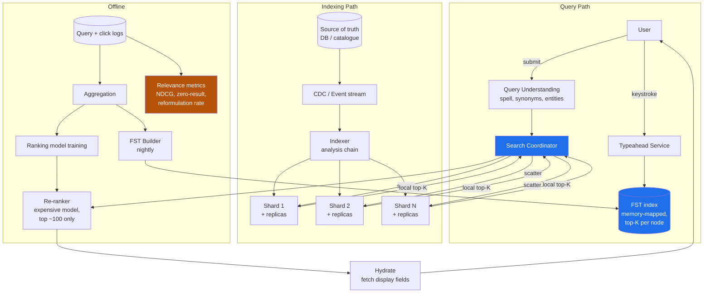
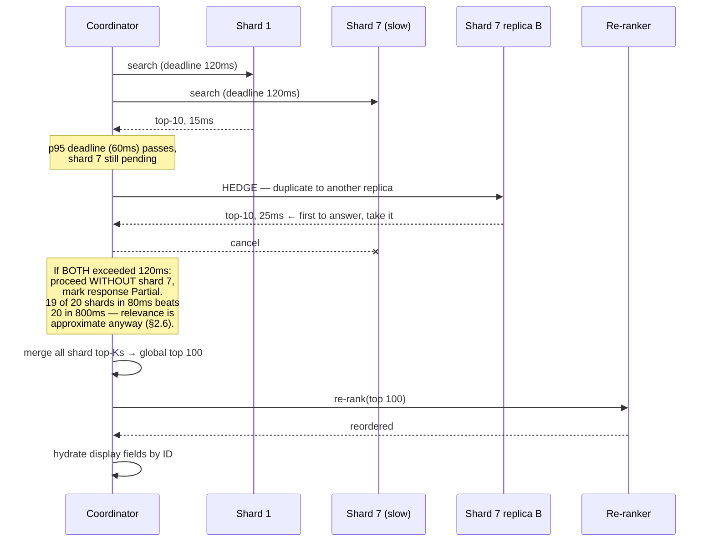

# Module 179 — System Design: Designing Search, Typeahead & Autocomplete at Scale

> Domain: System Design | Level: Beginner → Expert | Prerequisite: [[01-System-Design-Fundamentals]], [[16-Interview-Execution-Playbook-Estimation-Rubric]] (the clock discipline; §I6's tail-latency arithmetic is load-bearing here), [[17-Designing-URL-Shortener-Distributed-ID-Generation]] (hot keys, cache-loss survival), [[../12-Data-Structures/02-Graphs-Tries-Union-Find.md]] (tries — extended here into FSTs and their on-disk form), [[../16-Distributed-Systems/05-LSM-Trees-BTrees-BloomFilters-StorageEngines.md]] (segment-based storage, which is what a search index actually is), [[../16-Distributed-Systems/06-TailLatency-HedgedRequests-TailAtScale.md]] (scatter-gather is the canonical tail-amplification shape)

---

**Why this module exists.** The `14-System-Design` audit found search entirely absent, which is a significant gap: "design search" and "design typeahead" are two of the most commonly asked prompts, and they are asked *together* precisely because candidates conflate them. They are not the same problem — they have different latency budgets, different data structures, different freshness requirements, and different correctness definitions. A candidate who answers "we'd use Elasticsearch" for both has answered neither.

The distinguishing property of this domain: **relevance is a product decision, not a technical one, and it is unverifiable at the point of query.** A search that returns the wrong ten results returns them in 40ms with a 200 status. There is no error. This is this course's recurring "correctness is unobservable yet consequential" theme in a form where the *definition* of correct is itself contested — which makes it different from every prior module, where correctness was at least well-defined.

---

## 1. Fundamentals

### What is search, and how is typeahead a different problem?

**Search** takes a complete query and returns a ranked set of matching documents. The hard parts are matching (which documents contain these terms, in a corpus too large to scan) and ranking (which of the matches are best). Latency budget: 100–500ms is acceptable; users expect a page load.

**Typeahead** (autocomplete) takes a *prefix* — an incomplete query — and returns likely completions, on every keystroke. The hard parts are latency and prediction. Latency budget: **under 100ms end-to-end, and realistically under 50ms server-side**, because a suggestion arriving after the user has typed the next character is worse than useless — it causes visible flicker and reordering.

The consequences of that latency difference are structural, not incremental:

| | Search | Typeahead |
|---|---|---|
| Input | Complete query | Prefix, changing every ~150ms |
| Budget | 100–500ms | <50ms server-side |
| QPS | 1× per search | **5–15× per search** (one per keystroke) |
| Data structure | Inverted index | Trie / FST / precomputed top-K |
| Corpus | Every document | Only *queries* or *entities* — a far smaller set |
| Ranking | Complex, multi-signal, often ML | Mostly popularity, precomputed |
| Correctness | Contested (relevance) | Contested (intent prediction) |
| Freshness | Seconds to minutes acceptable | Minutes to hours usually acceptable |

The single most important insight: **typeahead does not search the document corpus.** It searches a much smaller set of *past queries* or *entity names*, with completions and their scores largely precomputed. Candidates who try to run prefix matching over the full document index have chosen a problem that cannot meet the latency budget.

### Why does this matter?

Because search is the primary discovery surface for most products, and its quality directly drives revenue — a bad result page in e-commerce is a lost sale, and in a financial-data product a failure to surface the right instrument is a failure of the product's core function. It also matters because search is where the *asymmetry between apparent and actual correctness* is widest: a search system with badly degraded relevance looks identical, from every monitoring signal, to one working perfectly.

### When does this matter?

Any product with a corpus users need to find things in — commerce catalogues, document stores, instrument/security lookup, log search, code search, internal knowledge bases. The depth matters because "use Elasticsearch" is a component choice, not a design: the design decisions are the index schema, the analysis chain, the ranking signals, the freshness strategy, and the fallback when the cluster degrades — none of which the managed service supplies.

### How does it work (30,000-ft view)?

```
INDEXING (offline / streaming)
  document → analysis (tokenize, normalize, stem) → inverted index → segments

SEARCH (query time)
  query → same analysis chain → term lookup → posting-list intersection
        → candidate set → ranking → top-K → hydrate → response

TYPEAHEAD (query time)
  prefix → FST/trie traversal → precomputed top-K completions → response
           (no document access, no ranking computation, no intersection)
```

The critical structural point: **the query must pass through the same analysis chain as the documents.** If documents are lowercased and stemmed but the query is not, "Running" will not match "running" and nothing will explain why. This is the single most common source of "search is broken" bugs and it is silent — you get zero results, not an error.

---

## 2. Deep Dive

### 2.1 The Inverted Index — What It Actually Is

The naive approach is to scan every document for the query terms: O(corpus) per query, hopeless at any scale. The inverted index inverts the relationship — instead of *document → terms*, store *term → documents*:

```
Documents:
  1: "the quick brown fox"
  2: "the lazy brown dog"
  3: "quick brown foxes jump"

Inverted index (after analysis: lowercase, stopword removal, stemming):
  brown → [1, 2, 3]
  dog   → [2]
  fox   → [1, 3]          ← "foxes" stemmed to "fox", so doc 3 matches "fox"
  jump  → [3]
  lazy  → [2]
  quick → [1, 3]
```

A query for `quick brown` becomes an **intersection** of two posting lists: `[1,3] ∩ [1,2,3] = [1,3]`. The cost is proportional to the length of the shortest list, not to the corpus — which is the entire reason search is feasible.

Three details that separate a real answer:

**Posting lists carry more than document IDs.** They carry **term frequency** (how many times the term appears in that document — needed for ranking) and often **positions** (where in the document — needed for phrase queries, since `"quick brown"` as a phrase requires the terms to be adjacent). Positions typically double or triple index size, so storing them is a deliberate choice: no positions means no phrase queries, and phrase queries are usually required.

**Posting lists are sorted by document ID and compressed.** Sorted order is what makes intersection a linear merge rather than a hash join. Compression matters enormously: delta encoding (store gaps rather than absolute IDs) plus variable-byte or Frame-of-Reference encoding typically achieves 4–8× reduction, and since posting lists are read from disk or page cache, compression translates directly into query latency. This is why an inverted index is not "just a hash map of term to list."

**Intersection starts with the shortest list.** Querying `the quick` where `the` appears in 90% of documents and `quick` in 0.1%: iterate `quick`'s short list and probe `the`'s long one, using **skip lists** within the posting list to jump forward rather than scanning. Getting this backwards is a 900× cost difference on the same query.

### 2.2 The Analysis Chain — Where Search Correctness Actually Lives

Text is transformed before indexing, and the same transformation must be applied to queries. The chain:

```
"The Quick-Running Foxes!"
  → character filters   strip HTML, normalize Unicode (NFKC), fold accents
  → tokenizer           split into terms: ["The", "Quick", "Running", "Foxes"]
  → token filters       lowercase → ["the","quick","running","foxes"]
                        stopwords → ["quick","running","foxes"]
                        stemming  → ["quick","run","fox"]
```

**Stemming versus lemmatization** is a real trade-off. Stemming (Porter, Snowball) is a fast rule-based truncation: `running → run`, but also `university → univers` and `universe → univers` — which conflates two unrelated words, a false-positive class. Lemmatization uses a dictionary and produces linguistically correct roots, at higher cost and requiring per-language dictionaries. Most systems use stemming and accept the errors; knowing what those errors *are* is what matters.

**Stopword removal is more dangerous than it looks.** Removing `the`, `a`, `to` saves index space and speeds queries — and destroys the ability to search for `"to be or not to be"`, `"The Who"`, or `"vitamin A"`. Modern practice is generally to **keep stopwords** and handle their low information value in ranking instead, because index space is cheap and the failures from removal are unfixable at query time.

**The chain must be symmetric, and asymmetry is silent.** If documents are stemmed and queries are not, a query for `running` looks up the term `running`, which does not exist in the index because it was stored as `run`. Result: zero hits, no error, no explanation. This is the single most common search bug, and the fix is architectural — the analysis chain must be defined once and applied to both paths by the same code, not configured twice.

**Reindexing is required for analysis changes**, and this is the operational consequence people miss. Changing the stemmer or adding a synonym affects how documents were *stored*, so the entire corpus must be reprocessed. That makes analysis changes a migration, not a config tweak — and it is why analysis decisions deserve real scrutiny before launch (§A4).

### 2.3 Ranking — TF-IDF, BM25, and Why the Formula Matters Less Than the Signals

Matching gives a candidate set; ranking orders it. The classical lexical model:

**TF-IDF** scores a document for a term by term frequency (more occurrences ⇒ more relevant) times inverse document frequency (a term appearing in few documents is more discriminating). `IDF = log(N / df)`.

**BM25** is TF-IDF's better-behaved successor and the modern default. Two improvements that matter:

```
                        tf · (k₁ + 1)
BM25(q,d) = Σ  IDF(q) · ─────────────────────────────────
            q∈Q          tf + k₁ · (1 − b + b · |d|/avgdl)

  k₁ ≈ 1.2   term-frequency SATURATION — the 20th occurrence of a term adds
             almost nothing over the 10th. TF-IDF grows linearly and therefore
             over-rewards keyword stuffing.
  b  ≈ 0.75  length NORMALIZATION — a term in a 10-word title matters more than
             the same term in a 10,000-word document.
```

Saturation is the conceptually important part: relevance is not linear in term frequency, and TF-IDF's assumption that it is makes it exploitable and wrong for long documents.

**But the formula is rarely where relevance problems live.** BM25 scores *textual* similarity only. Real ranking blends signals:

```
score = w₁·BM25(text)           lexical match
      + w₂·popularity           clicks, purchases, views — usually the strongest signal
      + w₃·recency              domain-dependent: critical for news, harmful for reference
      + w₄·field_boost          a match in the title beats one in the body
      + w₅·personalization      user history, location, entitlements
      + w₆·business_rules       margin, stock level, promoted items
      − w₇·penalties            out of stock, low quality, deprecated
```

**Popularity usually dominates**, which produces a self-reinforcing feedback loop: popular items rank high, high-ranked items get clicked, clicks increase popularity. New good items cannot break in — the **cold-start problem** — and it must be counteracted deliberately with exploration (occasionally promoting unproven items to gather signal). A candidate who names this loop unprompted is signalling real experience, because it is invisible in any offline metric.

**Two-phase retrieval** is the standard architecture for expensive ranking: a cheap first pass (BM25) retrieves ~1,000 candidates per shard; an expensive second pass (a learned model, possibly a cross-encoder) re-ranks the top ~100 globally. This is how ML ranking becomes affordable — you never run the expensive model over the corpus, only over a small candidate set. The trade-off to state: **anything the cheap phase misses cannot be recovered by the expensive one**, so first-phase recall bounds the whole system's quality.

### 2.4 Typeahead — Tries, FSTs, and Precomputation

Typeahead needs prefix lookup in single-digit milliseconds. A trie gives O(prefix length) traversal:

```
        (root)
       /      \
      c        f
      |        |
      a        o
     / \       |
    r   t      x
    |   |
    s   *("cat")
    |
    *("cars")

  Prefix "ca" → traverse c→a, then collect completions in the subtree.
```

Two problems with a naive trie, and the fixes are the interesting content:

**Problem 1 — collecting the subtree is expensive.** Prefix `a` in an English corpus has an enormous subtree; traversing it per keystroke is far too slow. **Fix: precompute and store the top-K completions at every node.** Each node holds its best 10 completions with scores, so a lookup is *traverse to the node and read* — O(prefix length), independent of subtree size. This trades index size and build time for query latency, which is exactly the right trade when the budget is 50ms.

**Problem 2 — a pointer-based trie is memory-hungry and cache-hostile.** Millions of nodes with per-node child maps produces poor locality and high overhead. **Fix: an FST (Finite State Transducer)** — a minimized, deterministic automaton that shares both prefixes *and suffixes*:

```
Trie shares prefixes only:        FST shares suffixes too:
  "running", "jumping"              "running", "jumping"
   r-u-n-n-i-n-g                     r-u-n-n ──┐
   j-u-m-p-i-n-g                     j-u-m-p ──┴─ i-n-g
   (14 nodes)                        (shared suffix — ~9 nodes)
```

FSTs are typically 5–10× smaller than an equivalent trie, are **memory-mappable** (so the OS page cache manages residency and the structure needs no deserialization), and support the transducer property of associating an output value — the score — with each accepted path. This is what Lucene actually uses for its term dictionary and suggesters, and naming it is a strong depth marker.

**What is in the typeahead index is the key design decision.** Three choices with different properties:

- **Past queries** (what search engines do): reflects real intent, self-improving from logs, and *inherits every problem in the logs* — misspellings, offensive queries, and no coverage for genuinely new items.
- **Entity names** (product/instrument names): complete coverage and no offensive-content risk, but does not match how users actually phrase things.
- **Both, merged**, which is usual — entities guarantee coverage, query logs supply the phrasing and popularity.

**Personalization at typeahead latency** is genuinely hard, because you cannot run a model in 20ms. The workable pattern is a **small personal index merged with the global one**: the user's own recent queries and interactions in a tiny per-user structure (cached in memory or shipped to the client), merged with global completions at query time. The merge is cheap; computing personalization is not, so it is precomputed asynchronously.

### 2.5 Index Freshness — the Central Tension

Search indexes are **segment-based**, inheriting the structure covered in `16-Distributed-Systems/05`. New documents go into a small in-memory segment; segments are periodically flushed to disk and later merged. A document is not searchable until its segment is *visible*, which is a refresh operation.

The tension is direct:

```
Frequent refresh  → fresher results, many small segments
                  → slower queries (every query touches every segment)
                  → higher merge load (CPU + I/O, competing with queries)

Infrequent refresh → stale results
                   → fewer, larger segments → faster queries
```

Elasticsearch's default 1-second refresh is a *reasonable default*, not a law, and treating it as one is a common error. The right value comes from the requirement: a log-search system may want 1 second; a product catalogue is fine at 30 seconds and gains real query performance from it; a reference-data index rebuilt nightly should not refresh at all during the day.

**Near-real-time is not real-time**, and the gap has consequences. The pattern to know: a user edits a product and immediately searches for it, and it is not there — the **read-your-own-writes problem** (Module 176 §I4) in search form. Fixes: refresh-on-demand for that specific document (expensive, and abusable), or — better — serve the user's own recent edits from the primary store and merge them into the result set, so the index's staleness is invisible to the person who caused it.

**Full reindexing** must be a designed, routine operation, not an emergency. Analysis changes, mapping changes, and corruption all require it. The standard pattern is **index aliasing**: build `products_v2` alongside the live `products_v1`, then atomically repoint the alias. This gives a zero-downtime, instantly-reversible cutover, and a system that cannot do it will accumulate analysis decisions it cannot revisit.

### 2.6 Sharding and the Scatter-Gather Tail Problem

A corpus too large for one node is split into shards, and search **scatters to every shard and gathers** — because any shard may hold a top result. This is unavoidable for relevance-ranked search and it is the architectural fact that dominates latency.

Two sharding strategies:

**Document-partitioned** (the near-universal choice): each shard holds a subset of documents with a complete index over them. Every query hits every shard; each returns its local top-K; the coordinator merges. Indexing is simple (route by document ID) and scaling is straightforward.

**Term-partitioned**: each shard holds complete posting lists for a subset of terms. A query only hits shards holding its terms — less fan-out — but multi-term queries require shipping entire posting lists between shards, indexing a document touches many shards, and term skew (some terms have vast lists) creates severe imbalance. Almost always rejected; knowing *why* is the value.

**The tail-amplification arithmetic is the critical consequence.** With 20 shards each having a 1% chance of a slow response:

```
P(at least one slow) = 1 − 0.99²⁰ ≈ 18%
```

So 18% of queries are as slow as the slowest shard. The whole system's p99 is governed by roughly the p99.9 of individual shards — Module 176 §I6's arithmetic, and here it is the primary design constraint rather than a footnote. Three mitigations:

1. **Fewer, larger shards.** Every shard added increases tail exposure. The instinct to over-shard "for scale" makes latency worse, and this is counter-intuitive enough that it is worth stating explicitly.
2. **Hedged requests** — after the p95 deadline, send a duplicate to another replica and take the first response. ~5% extra load for a large tail improvement. Safe here because search reads are idempotent.
3. **Partial results with a deadline.** Return what arrived within the budget, flagged as partial. For search this is usually *correct*: 19 of 20 shards' results in 80ms beats all 20 in 800ms, because relevance is approximate anyway. This is a genuinely different answer from most domains in this folder, where partial results would be unacceptable — and the reason is that search has no exact answer to be partial *about*.

**Replicas serve reads and are the availability mechanism.** Query throughput scales by adding replicas; index size scales by adding shards. Conflating these is a common error — adding shards does not increase query capacity, it decreases per-query latency at the cost of tail exposure.

### 2.7 Query Understanding — Where Modern Search Gets Its Quality

Before matching, the query is interpreted, and this layer often contributes more to perceived quality than ranking does:

**Spelling correction.** Edit-distance candidates (typically Damerau-Levenshtein, which includes transposition since `teh`→`the` is a transposition) filtered by whether the correction exists in the index and is more frequent than the original. The essential product decision is **auto-correct versus suggest**: silently correcting `iphone` → `iPhone` is good; silently correcting a deliberate rare term to a common one is infuriating and hides the corpus. The standard resolution is to auto-correct when the original has zero results and suggest when it has few — a rule, not a model.

**Synonyms and expansion.** `laptop` ⇄ `notebook`. Applied at **index time** (store all synonyms — fast queries, but changing the synonym list requires reindexing) or **query time** (expand the query — flexible and instantly changeable, but slower queries). Query-time is the usual choice for exactly the flexibility reason, and the trade-off is worth stating.

**Entity recognition and intent.** `red nike shoes size 10` should become `{color: red, brand: nike, category: shoes, size: 10}` and largely be answered by structured filters rather than by text matching. This is where e-commerce search quality actually comes from, and it is a different problem from relevance ranking — often solved with a mix of dictionary lookup and a lightweight classifier.

**Semantic / vector search** embeds the query and documents into a shared vector space, retrieving by approximate nearest neighbour (HNSW or IVF-PQ). It finds conceptually related results a lexical index cannot — `affordable laptop` matching `budget notebook` with no shared terms. Its weaknesses are the reason it does not replace lexical search: it is poor at exact matching (part numbers, ISINs, error codes, proper nouns), it cannot easily explain why a result matched, and it is expensive to keep fresh since embedding a document requires model inference.

**Hybrid retrieval is the current standard**: run both lexical and vector retrieval, fuse the result sets (Reciprocal Rank Fusion is the common, robust choice because it needs no score calibration between the two systems), and re-rank. The reason hybrid wins is that the two methods fail on *different* queries — lexical fails on paraphrase, vector fails on exact identifiers — so their union has substantially better recall than either. Naming RRF specifically, and *why* score-free fusion matters, is a strong signal.

### 2.8 Measuring Relevance — the Only Way to Know If Search Works

This is the section that distinguishes a Staff answer, because search is the domain where you cannot know if you are correct without deliberately constructing the ability to know.

**Offline metrics** need judged data — query/document pairs rated by humans or derived from behaviour:

- **Precision@K** — of the top K, how many are relevant.
- **Recall@K** — of all relevant documents, how many are in the top K.
- **MRR** (Mean Reciprocal Rank) — 1/rank of the first relevant result. Right metric when there is one correct answer (navigational queries, instrument lookup).
- **NDCG@K** — Normalized Discounted Cumulative Gain: rewards highly relevant results near the top with logarithmic position discounting. The standard metric for graded relevance, and the right default.

**Online metrics** measure real behaviour and are what actually matters:

- **CTR at position** — but beware position bias: results rank high *because* they were clicked, and are clicked *because* they rank high. Raw CTR comparisons across ranking changes are confounded.
- **Zero-result rate** — the single most actionable metric. A rising zero-result rate is unambiguous evidence of a matching problem, and unlike relevance it needs no judgement to interpret.
- **Query reformulation rate** — a user retyping means the first attempt failed. A direct, cheap dissatisfaction signal.
- **Abandonment** — a search with no click at all.

**Interleaving beats A/B testing for ranking changes.** Instead of splitting users between rankers, blend both rankers' results into one list and attribute clicks. It is dramatically more sensitive — often 10–100× fewer impressions for the same statistical power — because each user compares both rankers directly, eliminating between-user variance. For a team shipping ranking changes weekly, this is the difference between measurable and unmeasurable.

**The judged set must be maintained and it decays.** A relevance test set built at launch measures relevance against a corpus and a query distribution that no longer exist. Both drift, so the set needs refreshing, and the refresh needs an owner — otherwise offline metrics become a number that reliably passes while quality degrades, which is Module 133's failure pattern in relevance form: **a check whose reference data no longer reflects reality cannot detect that reality has changed.**

---

## 3. Visual Architecture

### System architecture



The two highlighted paths are the two *different* systems. The amber box is the one that tells you whether either is working — and it is the component most often absent.

### Inverted index and intersection

```
QUERY: "quick brown"

  quick → [1, 3, 17, 42]              ← 4 postings   START HERE (shortest)
  brown → [1, 2, 3, 5, 8, 11, 17, …]  ← 90,000 postings

  Intersect by advancing the SHORT list and SKIPPING in the long one:
    quick=1  → seek brown ≥ 1  → 1   ✓ match
    quick=3  → seek brown ≥ 3  → 3   ✓ match
    quick=17 → seek brown ≥ 17 → 17  ✓ match
    quick=42 → seek brown ≥ 42 → 51  ✗ no match

  Cost ∝ length of SHORTEST list (with skip-list jumps), NOT the corpus.
  Reversing this — iterating `brown` and probing `quick` — is 22,500× worse.
```

### Typeahead: FST with precomputed top-K

```
                    (root)
                   /      \
                 "c"      "f"
                  |         \
                 "ca"       "fi"
                /    \          \
           "car"    "cat"      "fin"
             |         |          |
      ┌──────────────────────────────────────┐
      │ EACH NODE STORES ITS TOP-K, PRECOMPUTED │
      │  "ca" → [cat food    (score 9800),      │
      │          cars        (score 8100),      │
      │          camera      (score 7700), …]   │
      └──────────────────────────────────────┘

  Lookup "ca" = traverse 2 edges + read the stored list.
  O(prefix length). INDEPENDENT of subtree size — which is what makes
  a 20ms budget achievable for a prefix with a million descendants.

  Suffix sharing (the FST property) makes this 5–10× smaller than a trie,
  and memory-mappable so the OS page cache handles residency.
```

### Scatter-gather tail amplification

```
                     ┌── Shard 1 ── 15ms ──┐
                     ├── Shard 2 ── 18ms ──┤
  Coordinator ───────┼── Shard 3 ── 12ms ──┼──── waits for ALL
                     ├── …                 │      = 220ms
                     └── Shard 20 ─ 220ms ─┘      (the slowest one)

  P(at least one shard slow) = 1 − (1 − p)^N
     N=5,  p=1%  →   5%
     N=20, p=1%  →  18%     ← system p99 ≈ shard p99.9
     N=50, p=1%  →  39%
     N=100,p=1%  →  63%

  ⇒ MORE SHARDS MAKES LATENCY WORSE. Mitigate with fewer/larger shards,
    hedged requests, or a deadline with partial results — which for search
    is usually CORRECT, because relevance is approximate anyway.
```

---

## 4. Production Example

**Problem.** A B2B financial-data platform provided instrument search — users typed an issuer name, ticker, or ISIN to find securities. After a routine release, the support queue filled with a complaint that took three weeks to understand: users reported that search "sometimes couldn't find things," but every specific example they gave worked when support tried it.

Search latency was normal. Zero-result rate was **unchanged**. Error rate was zero. Cluster health was green. The relevance test suite passed with NDCG@10 within noise of the previous release.

**Architecture.** Elasticsearch with 12 shards, a custom analysis chain, and BM25 blended with a popularity signal derived from click logs. Query understanding handled spelling correction and expanded common issuer abbreviations. A nightly job rebuilt the typeahead FST from query logs merged with the instrument master.

**Implementation — what was actually happening.** The release had added a synonym filter to improve issuer-name matching — `"JPM" → "JP Morgan"`, `"BofA" → "Bank of America"`, and roughly 400 more. It was applied at **query time**, which was the right choice for flexibility (§2.7).

The synonym file used a format where multi-word replacements needed explicit escaping. About 30 entries had unescaped multi-word replacements, which the analyzer parsed as **multiple independent synonyms** rather than one phrase. `"BofA" → "Bank of America"` became `BofA → bank`, `BofA → of`, `BofA → america`. Because the query analyzer expanded `BofA` into a disjunction of those three terms, a search for `BofA bonds` matched every document containing the word `bank`, `of`, or `america` — thousands of irrelevant instruments — and the correct result was buried below them on a purely lexical score.

Three things made this survive three weeks:

1. **Zero-result rate did not move**, because the failure produced *too many* results, not too few. Every monitoring signal built around matching failure was blind to a matching failure in the opposite direction.
2. **The relevance test suite passed** because its 500 judged queries had been built two years earlier from the then-current query distribution. It contained no abbreviation queries, because abbreviation expansion did not exist when the set was written. The suite tested everything except the thing that had changed.
3. **Support could not reproduce it** because they typed full issuer names, not abbreviations — the natural behaviour of someone carefully entering a test case, and precisely the behaviour that avoids the bug. The users hitting it were power users typing abbreviations because they were fast.

**Trade-offs.** Query-time synonyms were correctly chosen for flexibility. The defect was that a *data file* — 400 lines of untested configuration — was deployed through the same path as code but with none of the same verification. The synonym file had no schema validation, no test, and no canary; it was treated as content rather than as logic, and it was logic.

**Lessons learned.**

1. **A metric designed to detect one direction of a failure is blind to the other.** Zero-result rate is the most actionable search metric and it detects *under*-matching only. The complementary signal is **result-set size distribution** — a query whose result count jumps from 12 to 4,000 is as anomalous as one dropping to zero, and nothing was watching for it. This is the course's recurring structural-blindness pattern (Modules 133, 175, 177) in a new form: the monitoring was blind in exactly the dimension of the failure, and here the blindness was *directional*.
2. **A relevance test set built at launch measures a query distribution that no longer exists.** The suite passed because it tested the old world. It needed to be refreshed from *current* logs on a schedule with an owner — otherwise it becomes a check that reliably passes while quality degrades, which is Module 133's failure exactly: a reference set that no longer reflects reality cannot detect that reality has changed.
3. **Configuration that changes behaviour is code and needs code's verification.** The synonym file determined query semantics. It deserved schema validation, a unit test asserting each entry expands to what was intended, and a canary comparing result sets before and after. Classifying it as "content" exempted it from every control that would have caught this.
4. **"Cannot reproduce" is information, not a dead end.** The systematic difference between how support tested and how users searched *was* the diagnosis. Three weeks were spent because "works for me" was treated as evidence of no bug rather than as a clue about the trigger.

**The fix.** Synonym file schema validation in CI, plus a generated test asserting every entry's expansion. Result-set size distribution alerting per query class. The relevance judged set rebuilt from the trailing 90 days of query logs, with quarterly refresh and a named owner. And a shadow-comparison canary: replay the last hour of real queries against the candidate configuration and diff result sets, flagging any query whose top-10 changes by more than a threshold — which catches the general class of "a config change altered semantics" regardless of cause.
## 10. Interview Questions

### Basic (10)

**B1. Q: What is an inverted index and why is it necessary?**
**Ideal Answer:** It maps each term to the list of documents containing it, inverting the natural document-to-terms relationship. It is necessary because the alternative — scanning every document per query — is O(corpus) and infeasible. With an inverted index, a multi-term query becomes an intersection of posting lists whose cost is proportional to the shortest list, not the corpus size.
**Why correct:** It states the structure and the complexity argument that motivates it.
**Common mistakes:** Describing it as "a hash map of words" without the posting-list intersection insight; not explaining what problem it solves.
**Follow-ups:** What else is in a posting list besides document IDs? (Term frequency for ranking, and positions for phrase queries — positions typically double or triple index size, so it's a deliberate choice.) Why are posting lists sorted? (So intersection is a linear merge with skip-list jumps rather than a hash join.)

**B2. Q: Why must the query pass through the same analysis chain as the documents?**
**Ideal Answer:** Because the index stores *analyzed* terms. If documents are lowercased and stemmed, `running` is stored as `run`; a query for `running` that isn't analyzed looks up a term that doesn't exist and returns zero results — with no error and no explanation. Symmetry is what makes lookup work at all.
**Why correct:** It identifies both the mechanism and that the failure is silent, which is why it's the most common search bug.
**Common mistakes:** Treating analysis as an indexing-only concern; configuring the chain twice and assuming the copies stay in sync.
**Follow-ups:** How do you prevent drift between them? (One definition, one code path — configuring twice is the defect.) When is asymmetry deliberate? (Index-time n-grams with exact-term queries — legitimate, but it must be explicit.)

**B3. Q: How does typeahead differ from search, and why can't you use the same system?**
**Ideal Answer:** Typeahead takes a prefix on every keystroke with a sub-50ms server budget and 5–15× the QPS of search; search takes a complete query with a 100–500ms budget. Typeahead also searches a *different corpus* — past queries and entity names, not documents. The latency budget rules out posting-list intersection and ranking computation, so typeahead uses a trie/FST with precomputed top-K completions.
**Why correct:** It identifies the three structural differences — budget, QPS, and corpus — rather than treating typeahead as fast search.
**Common mistakes:** Running prefix queries against the document index; not realizing the QPS multiplier.
**Follow-ups:** What's in the typeahead index? (Past queries for real phrasing and popularity, entity names for coverage — usually both merged.) What reduces the QPS? (Client-side debounce of ~100ms plus cancelling in-flight requests.)

**B4. Q: What does BM25 improve over TF-IDF?**
**Ideal Answer:** Two things. **Term-frequency saturation** — the 20th occurrence of a term adds almost nothing over the 10th, whereas TF-IDF grows linearly and so over-rewards repetition and is exploitable. **Length normalization** — a term in a short title counts more than the same term in a very long document.
**Why correct:** It names both corrections and why the linear assumption is wrong rather than reciting the formula.
**Common mistakes:** Reproducing the formula without explaining saturation; believing the scoring function is where relevance problems usually live.
**Follow-ups:** Where do relevance problems usually live? (In the *signals* — popularity, recency, field boosts — and in query understanding, not in the lexical scorer.) What are k₁ and b? (Saturation rate ≈1.2 and length-normalization strength ≈0.75.)

**B5. Q: What's the trade-off in index refresh interval?**
**Ideal Answer:** Frequent refresh gives fresher results but produces many small segments, which slows queries (each query touches every segment) and raises merge load that competes with queries for I/O. Infrequent refresh gives staler results with fewer, larger segments and faster queries. The right interval comes from the actual staleness tolerance — Elasticsearch's 1-second default is a default, not a requirement.
**Why correct:** It gives both directions with the segment mechanism that causes the cost.
**Common mistakes:** Treating 1 second as required and paying its cost unnecessarily; not knowing segments are the mechanism.
**Follow-ups:** What's the read-your-own-writes problem here? (A user edits and immediately searches, and their change isn't visible — solved by merging their recent edits from the primary store rather than by forcing a refresh.)

**B6. Q: What is scatter-gather and why does it hurt latency?**
**Ideal Answer:** A relevance-ranked query must go to every shard, because any shard may hold a top result; each returns its local top-K and the coordinator merges. It hurts latency because the query completes only when the *slowest* shard responds — so with 20 shards each 1% likely to be slow, about 18% of queries hit at least one slow shard, and system p99 is governed by roughly shard p99.9.
**Why correct:** It explains why fan-out is unavoidable and quantifies the tail amplification.
**Common mistakes:** Assuming aggregate p99 equals shard p99; adding shards to improve latency, which worsens it.
**Follow-ups:** Three mitigations? (Fewer larger shards; hedged requests; deadline with partial results.) Why are partial results acceptable here? (Relevance is approximate — there's no exact answer to be partial about.)

**B7. Q: Why keep stopwords rather than removing them?**
**Ideal Answer:** Removal saves space and speeds queries but irrecoverably breaks legitimate searches — `"to be or not to be"`, `"The Who"`, `"vitamin A"`. Index space is cheap, and the low information value of common words is better handled in ranking (IDF already downweights them) than by discarding them.
**Why correct:** It notes the failure is unfixable at query time, which is what makes the trade one-sided.
**Common mistakes:** Removing them by default because older texts recommend it; not realizing phrase queries break.
**Follow-ups:** What already handles their low value? (IDF — a term in 90% of documents gets a very low weight automatically.)

**B8. Q: What is index aliasing and why does it matter?**
**Ideal Answer:** An alias is a pointer to a concrete index. You build `products_v2` alongside the live `products_v1` and atomically repoint the alias — giving zero-downtime, instantly-reversible reindexing. It matters because analysis and mapping changes require full reindexing, so without this capability those decisions become effectively permanent.
**Why correct:** It connects the mechanism to the reason it's needed — reindexing is routine, not exceptional.
**Common mistakes:** Not knowing analysis changes require reindexing; reindexing with downtime or in place.
**Follow-ups:** What forces a reindex? (Any analysis or mapping change — stemmer, index-time synonyms, field types.) What's the risk of not being able to reindex routinely? (You accumulate analysis decisions you can never revisit.)

**B9. Q: What's the most actionable single search-quality metric?**
**Ideal Answer:** Zero-result rate — queries returning nothing. It's unambiguous, needs no relevance judgement to interpret, and a rise is direct evidence of a matching problem. Its critical limitation is that it's **directionally blind**: it cannot detect *over*-matching, where a query returns thousands of irrelevant results.
**Why correct:** It names the metric and its blind spot, which is §4's incident.
**Common mistakes:** Offering NDCG, which requires judged data and is less immediately actionable; not naming the blind spot.
**Follow-ups:** What complements it? (Result-set size distribution — a jump from 12 to 4,000 results is as anomalous as a drop to zero.) What other cheap online signals exist? (Query reformulation rate and abandonment — both direct dissatisfaction signals.)

**B10. Q: Why shouldn't you store display fields in the search index?**
**Ideal Answer:** The index is optimized for matching, and index size is effectively a latency parameter — performance depends on the working set fitting in page cache. Storing large display fields bloats it and slows every query, including ones that never read those fields. Store only what ranking needs; fetch display data from the primary store by ID after the top-K is determined.
**Why correct:** It ties index size to latency via page cache, which is the non-obvious mechanism.
**Common mistakes:** Treating the index as a document store; not knowing memory residency dominates search performance.
**Follow-ups:** What does hydration cost? (A batch fetch by ID — cheap, and it's ~15ms in the §7 budget.) What must stay in the index? (Ranking signals and filterable fields.)

### Intermediate (10)

**I1. Q: A query for `quick brown` — describe the intersection and what makes it fast or slow.**
**Ideal Answer:** Look up both posting lists and intersect. The order is critical: start with the **shorter** list and probe/skip forward in the longer one using its skip lists. If `quick` has 4 postings and `brown` has 90,000, iterating `quick` and seeking in `brown` costs ~4 seeks; iterating `brown` and probing `quick` costs 90,000 — a 22,500× difference on the identical query. Cost is proportional to the shortest list, which is why the index scales.
**Why correct:** It identifies the asymmetry and quantifies it, and names skip lists as the mechanism enabling the seek.
**Common mistakes:** Describing intersection without the ordering; not knowing skip lists exist, so the "seek" is really a scan.
**Follow-ups:** What if both lists are long? (Block-max WAND — skip blocks whose maximum possible score can't reach the current top-K threshold; commonly 3–10× on multi-term queries.) How does the engine know which is shorter? (Document frequency is stored in the term dictionary.)

**I2. Q: What is an FST and why use it over a trie for typeahead?**
**Ideal Answer:** A Finite State Transducer is a minimized deterministic automaton that shares both prefixes *and suffixes*, associating an output value (the score) with each accepted path. A trie shares prefixes only. Sharing suffixes makes an FST typically 5–10× smaller, and its compact array form is **memory-mappable**, so the OS page cache manages residency and no deserialization is needed at startup. Lucene uses FSTs for its term dictionary and suggesters.
**Why correct:** It names the structural difference (suffix sharing), the size consequence, and the operational benefit (mmap).
**Common mistakes:** Describing a trie and calling it an FST; not knowing why memory-mappability matters.
**Follow-ups:** What still makes prefix lookup fast regardless? (Precomputed top-K at each node, so latency is independent of subtree size.) What's the cost of an FST? (Build time and immutability — you rebuild rather than update, which is why the typeahead index is a nightly job.)

**I3. Q: How do you serve typeahead for a prefix like `a` with a million descendants?**
**Ideal Answer:** You don't traverse the subtree. Each node stores its **precomputed top-K completions** with scores, so the lookup is traverse-to-node-and-read: O(prefix length), independent of how many descendants exist. This trades index size and build time for query latency, which is the correct trade at a 50ms budget.
**Why correct:** It identifies precomputation as the mechanism and names the trade explicitly.
**Common mistakes:** Proposing to traverse and sort at query time, which cannot meet the budget; suggesting a minimum prefix length, which is a product degradation rather than a solution.
**Follow-ups:** How is the score computed? (Offline from query-log frequency, plus recency and possibly business signals — the FST build is a batch job.) How do you handle a new trending query? (It appears at the next build — so build frequency is the freshness knob, and for genuinely real-time trending you overlay a small hot-terms structure.)

**I4. Q: Index-time versus query-time synonyms — compare.**
**Ideal Answer:** **Index-time** stores all synonyms in the index: queries stay fast and simple, but changing the synonym list requires a full reindex, and the index is larger. **Query-time** expands the query: the synonym list is instantly changeable with no reindex, at the cost of slower queries (more terms to look up) and some scoring distortion, since expanded terms affect IDF. Query-time is the usual choice for the flexibility, because synonym lists are iterated on frequently.
**Why correct:** It gives both directions with the reindex consequence, which is the decisive factor.
**Common mistakes:** Not knowing index-time synonyms require reindexing to change; ignoring the scoring effect of query expansion.
**Follow-ups:** What's the risk of query-time synonyms? (§4's incident — a malformed multi-word entry expands into a disjunction of common words and matches everything, with zero-result rate never moving.) How do you guard it? (Schema validation, a generated test per entry, and a shadow diff of result sets before and after.)

**I5. Q: Why is popularity-based ranking self-reinforcing, and what do you do about it?**
**Ideal Answer:** Popular items rank high; high-ranked items receive more clicks because of position bias; clicks increase the popularity signal. New or newly-good items cannot accumulate the signal needed to break in — the cold-start problem. The counter is a deliberate **exploration budget**: occasionally promote unproven items to gather signal, accepting a small relevance cost to avoid a permanently frozen ranking. Position-bias correction in the click model helps but doesn't solve exposure.
**Why correct:** It traces the loop mechanically and prescribes exploration, which is the actual remedy.
**Common mistakes:** Not recognizing the loop; assuming click data is unbiased evidence of relevance.
**Follow-ups:** Why is this invisible offline? (Offline metrics are computed on judged or logged data that already embodies the bias — the loop can only be seen by intervening.) How much exploration? (Small — single-digit percent of impressions; enough to gather signal, little enough not to degrade the experience.)

**I6. Q: Explain two-phase retrieval and its main limitation.**
**Ideal Answer:** A cheap first pass (BM25) retrieves ~1,000 candidates *per shard*; an expensive second pass — a learned model, possibly a cross-encoder — re-ranks the global top ~100. This makes ML ranking affordable: the expensive model never sees the corpus, only a small candidate set. The limitation is that **first-phase recall bounds the entire system** — anything the cheap retriever misses cannot be recovered by the re-ranker, no matter how good it is.
**Why correct:** It gives the mechanism and the recall ceiling, which is the constraint people underestimate.
**Common mistakes:** Not knowing the candidate set is per-shard; assuming a better re-ranker fixes recall problems.
**Follow-ups:** How do you improve first-phase recall? (Query expansion, or hybrid retrieval adding a vector candidate set whose failure modes differ from lexical.) How do you measure the ceiling? (Recall@1000 of the first phase against judged data — if it's 80%, your best possible precision is bounded by that.)

**I7. Q: When does vector search beat lexical search, and when does it lose badly?**
**Ideal Answer:** Vector search wins on **semantic similarity with no lexical overlap** — `affordable laptop` matching `budget notebook`, paraphrase, and conceptual queries. It loses badly on **exact identifiers**: part numbers, ISINs, error codes, proper nouns, and rare terms, where nearest-neighbour in embedding space returns something *similar* rather than the exact match, and where those queries usually carry the highest intent. It also can't easily explain why a result matched, and keeping it fresh requires model inference per document.
**Why correct:** It names the specific failure class (exact identifiers) and notes those are high-intent queries, which is why the failure matters disproportionately.
**Common mistakes:** Proposing vector search as a replacement; not knowing it's weak on exact matching.
**Follow-ups:** What's the standard resolution? (Hybrid retrieval — run both, fuse with Reciprocal Rank Fusion, re-rank.) Why RRF specifically? (It fuses by *rank*, not score, so it needs no calibration between two systems whose scores aren't comparable — which is the practical blocker for score-based fusion.)

**I8. Q: How do you enforce per-user entitlements in search results?**
**Ideal Answer:** Filter at **query time** by indexing a permission token set on each document (the roles/groups permitted to see it) and filtering on the caller's token set — a cheap terms filter rather than enumerating thousands of document IDs. Filtering *after* retrieval is almost always wrong: if 8 of the top 10 are removed the user sees 2 results, pagination breaks, and the count of hidden results is itself information disclosure.
**Why correct:** It gives the scalable mechanism and explains why post-filtering leaks.
**Common mistakes:** Post-filtering; building enormous per-user ID filters; ignoring that result counts leak.
**Follow-ups:** What's the cost of token-set filtering? (Permission changes require reindexing affected documents, so revocation isn't instant — that window must be a stated policy.) When would you use separate indices? (Genuinely sensitive corpora, where separate indices make cross-domain leakage structurally impossible rather than filter-dependent.)

**I9. Q: Why is interleaving better than A/B testing for ranking changes?**
**Ideal Answer:** A/B splits users between rankers, so the comparison carries full between-user variance and needs large samples. Interleaving blends both rankers' results into one list and attributes clicks — each user compares both rankers directly, eliminating between-user variance. It's typically 10–100× more sensitive, which for a team shipping ranking changes weekly is the difference between measurable and unmeasurable.
**Why correct:** It identifies variance elimination as the mechanism and quantifies the sensitivity gain.
**Common mistakes:** Defaulting to A/B; not knowing interleaving exists.
**Follow-ups:** What can't interleaving measure? (Anything about the whole-page or session experience — layout changes, latency effects, or engagement over time. It measures *ranking* preference specifically.) How do you interleave fairly? (Team-draft or balanced interleaving, so neither ranker gets a systematic position advantage.)

**I10. Q: What's the real recovery metric for a search cluster, and why?**
**Ideal Answer:** **Rebuild time**, not RPO. The index is a *derived* artifact — the primary database is the source of truth — so a lost index is rebuildable and RPO is largely irrelevant. What matters is how long a full reindex takes, because that's the effective RTO regardless of replica configuration. A cluster needing 40 hours to reindex has a 40-hour RTO, and this is routinely unmeasured until an incident reveals it.
**Why correct:** It correctly identifies the index as derived and draws the consequence that the usual durability metric doesn't apply.
**Common mistakes:** Treating the index as primary data needing RPO guarantees; never measuring rebuild time.
**Follow-ups:** How do you keep rebuild time bounded? (Parallel indexing, and measuring it as the corpus grows so the trend is visible before it's a problem.) What does this make easy? (Multi-region — replicate the indexing pipeline and let each region build its own index; derived state has no authoritative copy to keep consistent.)

### Advanced (10)

**A1. Q: Zero-result rate is flat, latency is normal, errors are zero, and the relevance suite passes — but users say search is broken. Diagnose.**
**Ideal Answer:** Every signal listed is blind to **over-matching**. Zero-result rate detects too *few* results only; a query returning 4,000 irrelevant documents with the right one buried at rank 300 produces a normal zero-result rate, normal latency, and a 200 status. So the first move is to look at the **result-set size distribution** per query class and compare against a baseline — a jump from a median of 12 to 4,000 is the signal that was missing.
The relevance suite passing is a second, independent finding: it means the suite doesn't cover whatever changed. If the change was abbreviation or synonym expansion, and the judged set was built before that feature existed, the suite tests everything except the new behaviour — Module 133's pattern, where a check's reference data no longer reflects reality.
Then reproduce from *real* queries, not invented ones. "Works for me" from support is a clue about the trigger, not evidence of no bug — the systematic difference between how support tests (full names typed carefully) and how power users search (abbreviations, typed fast) is often the diagnosis itself.
Finally, diff result sets between the current and previous configuration by replaying recent real queries. That catches "a config change altered semantics" as a class, independent of which config or which cause.
**Why correct:** It identifies directional blindness as the reason all signals are green, treats the passing suite as a second finding rather than reassurance, and prescribes a class-level detector rather than a specific fix.
**Common mistakes:** Trusting the green signals and concluding it's user error; investigating latency because that's what's instrumented; reproducing with synthetic queries that avoid the trigger.
**Follow-ups:** Why is "cannot reproduce" informative? (The difference between the reproducing and non-reproducing behaviour *is* the trigger — three weeks were lost in §4 by treating it as absence of a bug.) What's the general detector? (Shadow-replay real traffic against candidate config and flag queries whose top-10 changes beyond a threshold.)

**A2. Q: Design typeahead for 50,000 QPS with a 50ms p99 budget.**
**Ideal Answer:** Start by cutting the QPS, because much of it is avoidable: **client-side debounce** of ~100ms after the last keystroke, **cancel in-flight requests** when a new character arrives, a **minimum prefix length** of 2 (single-character prefixes have low information and enormous fan-out), and **client-side caching**, since `ca` → `car` → `card` are related and the client already holds the earlier answers. These typically remove 60–80% of requests before any server work, and doing this first is the correct order — server optimization for traffic that shouldn't exist is wasted.
Server side: a **memory-mapped FST with precomputed top-K per node** (§2.4), so a lookup is a traverse-and-read with no computation. The index is small — queries and entity names, not documents — so it fits comfortably in memory on every node, which means **no sharding and therefore no scatter-gather and no tail amplification**. That is the single most important structural property: replicate the whole index to every node and scale by adding stateless replicas behind a load balancer.
Freshness: rebuild nightly, distribute the new FST as an immutable file, and swap atomically. For trending terms needing faster turnaround, overlay a small in-memory hot-terms structure merged at query time.
Personalization: a tiny per-user structure of their recent queries, merged with global completions — cheap at query time because it's precomputed asynchronously, and small enough to cache or even ship to the client.
**Why correct:** It reduces demand before scaling supply, and identifies that the small index avoids sharding entirely — which eliminates the dominant latency risk rather than mitigating it.
**Common mistakes:** Sharding the typeahead index, importing scatter-gather tail amplification for no benefit; optimizing the server without debouncing the client; running a personalization model at query time.
**Follow-ups:** Why does a small index change the architecture qualitatively? (Full replication becomes possible, so every query is single-node — no fan-out, no tail amplification, and scaling is purely stateless replicas.) What's the cost of nightly rebuilds? (New terms are invisible until the next build, which is why the hot-terms overlay exists.)

**A3. Q: Design entitlement filtering for a corpus where each of 50,000 users has a distinct permission set.**
**Ideal Answer:** Enumerating permitted document IDs per user is infeasible — a filter with 100,000 terms is unworkable. Instead invert the relationship: index a **permission token set** on each document (the roles, groups, or entitlement codes that grant access), and filter on the caller's token set. A user has tens of tokens rather than thousands of documents, so the filter is small and cheap regardless of corpus size. Distinct per-user permission sets are then *combinations* of shared tokens, which is what makes 50,000 distinct users tractable.
Two obligations follow and must be stated. **Permission changes require reindexing the affected documents**, so revocation is not instant — the window must be a stated policy with monitoring, not an accident. For high-stakes revocation, a small deny-list checked at query time provides immediate effect while the reindex catches up, which converts an unbounded window into a bounded one.
And **result counts leak** even with correct filtering, because aggregations and total-hit counts computed before filtering disclose the existence of documents the user cannot see. In a financial context that can be material — "how many instruments match this criterion" is information. So counts must be computed post-filter, and approximate-count optimizations that bypass the filter must be disabled.
For genuinely sensitive domains, **separate indices per security domain** make cross-domain leakage structurally impossible rather than dependent on a filter being present on every query path — the *make it unrepresentable* preference from Modules 177 §E7 and 178, and the right call when the cost of one missed filter is severe.
**Why correct:** It inverts the model to make the filter small, names both non-obvious obligations (revocation latency, count leakage), and escalates to structural separation where the stakes justify it.
**Common mistakes:** Per-user ID filters; post-retrieval filtering, which breaks pagination and leaks counts; not recognizing that aggregations bypass filters.
**Follow-ups:** Why is post-filtering worse than it looks? (Beyond broken pagination, the *number* of removed results is disclosure — and it's disclosure the user can measure by comparing page counts.) How do you audit that the filter is always applied? (Make the unfiltered query path unavailable — a repository that requires an entitlement context, per Module 132's finding that a protection with exception paths is one whose exceptions cause incidents.)

**A4. Q: You need to change the stemmer. Walk through it.**
**Ideal Answer:** This is a **reindex**, not a configuration change, because stemming determines how terms were *stored* — and that framing is the first thing to establish, since treating it as a config tweak is how it goes wrong.
Process: (1) Quantify the impact offline first — run both stemmers over the corpus vocabulary and diff, which shows how many terms change and identifies conflations the new stemmer introduces or removes. (2) Build `corpus_v2` with the new analyzer alongside the live index, using aliasing (§2.5). (3) Evaluate on the judged set — but recognize the judged set may not cover the affected queries, so *additionally* replay real recent queries against both indices and diff result sets, ranking the diffs by traffic so the highest-impact changes are reviewed by a human. (4) Shadow-serve: send a small percentage of live traffic to v2 and compare online metrics — zero-result rate, reformulation rate, and result-set size distribution, since a stemmer change can cause both under- and over-matching. (5) Interleave for the relevance decision (§I9), because that's the sensitive instrument. (6) Repoint the alias, keeping v1 available for instant rollback.
The pre-committed reversal criterion matters: "if zero-result rate rises above X or reformulation rate above Y, we revert." A stemmer change is a bet on aggregate relevance improving, and it will make some queries worse — without a stated threshold, the decision to keep or revert becomes an argument rather than a measurement.
**Why correct:** It establishes reindex-not-config, evaluates on *current* traffic rather than only the possibly-stale judged set, and pre-commits a reversal criterion.
**Common mistakes:** Treating it as a config change; evaluating only against the judged set (§4's failure); no rollback path or reversal threshold.
**Follow-ups:** Why replay real queries as well as the judged set? (The judged set reflects an older query distribution; real replay reflects what users do now — §4's suite passed precisely because it tested the old world.) What conflations should you look for? (Over-stemming that merges unrelated words — `university`/`universe` → `univers` — which creates false positives that no zero-result metric detects.)

**A5. Q: Compare Elasticsearch/OpenSearch, a managed search service, and building on Lucene directly.**
**Ideal Answer:** **Elasticsearch/OpenSearch self-managed** gives full control over analysis, mapping, sharding, and ranking, with a mature ecosystem. Costs are real operational burden: cluster sizing, JVM heap tuning, shard rebalancing, version upgrades, and a genuinely subtle failure surface (split brain, hot shards, merge storms, GC pauses in the tail). It is the right choice when you need control and have the operational capacity.
**Managed (Elastic Cloud, OpenSearch Service, Algolia, Typesense)** removes most operational burden. Algolia in particular is excellent for typeahead and site search with strong defaults and very low latency, at the cost of less control over ranking internals and per-operation pricing that becomes significant at high volume. The important distinction: managed *Elasticsearch* keeps your control and removes ops; managed *search products* like Algolia also replace your ranking model with theirs, which is a much bigger decision.
**Lucene directly** gives maximum control and minimum overhead — no cluster, no JSON layer, no network hop for embedded use. You build distribution, replication, and recovery yourself, which is a large project. Justified when your requirements genuinely don't fit (embedded search, unusual scoring, extreme latency needs) — rarely otherwise.
**Recommendation** depends on one question: **is search a differentiating capability or a feature?** If it's a feature — internal document search, admin lookup — buy the managed product and spend the saved effort elsewhere. If it's differentiating, where relevance quality drives revenue, self-managed Elasticsearch or OpenSearch is usually right because you need control over the analysis chain and ranking signals, which is where quality actually lives (§2.3). And note what buying does *not* remove: **you still own the index schema, the analysis decisions, the ranking signals, and relevance measurement** — a vendor gives you the engine, not the judgement, and most search quality problems originate in the parts you keep.
**Why correct:** It decides on the differentiating-versus-feature axis, distinguishes managed-infrastructure from managed-product, and notes buying doesn't remove the design work — mirroring Module 178 §E8's structure.
**Common mistakes:** Comparing on features rather than on whether search differentiates; assuming a managed product removes relevance work; proposing raw Lucene without acknowledging the distribution project.
**Follow-ups:** What does Algolia genuinely do better? (Typeahead latency and defaults — its architecture is purpose-built for it, and matching that self-managed takes real work.) When is raw Lucene right? (Embedded search with no network hop, or scoring requirements the query DSL can't express.)

**A6. Q: Search p99 is 800ms with a p50 of 60ms. Diagnose.**
**Ideal Answer:** A 13× p99/p50 ratio points at a *subset* of queries or a *subset* of shards, not at general slowness — so the first move is segmentation, not capacity.
Segment by query shape: expensive query classes cluster in the tail. The usual culprits are **deep pagination** (`from: 50000` forces every shard to produce 50,000 results and the coordinator to merge them), **leading wildcards** (`*ing` can't use the term index and scans the dictionary), **enormous boolean clause counts** from query expansion, and queries matching millions of documents where scoring cost is linear in candidates.
Segment by shard: if one shard is consistently slow, look for **size skew** (uneven document distribution), a hot shard from routing skew, or a node with different hardware or a noisy neighbour. Remember that tail amplification means one bad shard sets the p99 for every query (§2.6).
Then check the resource that's actually constrained. If CPU is low while latency is high, the constraint is elsewhere: **page-cache misses** (working set exceeds RAM, so queries do disk I/O — a cliff, not a slope), **GC pauses** (a large heap producing multi-hundred-millisecond stops that land directly in the tail), or **merge activity** competing for I/O, which is precisely when tail latency is worst.
Fixes follow from which it is: `search_after` cursors instead of deep pagination; hard limits on wildcard and clause count; more RAM or a smaller index if page cache is the issue; heap at or under ~31GB with the majority of RAM left to the OS; and hedged requests to mask individual slow shards.
**Why correct:** It infers "subset" from the ratio and segments along both axes (query and shard) before touching capacity, then correctly identifies the low-CPU-high-latency signatures.
**Common mistakes:** Adding nodes, which doesn't help if the cause is a query class or one skewed shard; assuming CPU is the constraint; not knowing deep pagination's cost is borne by every shard.
**Follow-ups:** Why is page-cache exhaustion a cliff? (Once the working set exceeds RAM, queries move from memory to disk — orders of magnitude, not percentages.) Why cap the heap at 31GB? (Above it the JVM loses compressed object pointers, so effective capacity *drops*; and larger heaps mean longer pauses. Most RAM should serve page cache, not heap — which is the opposite of the instinct.)

**A7. Q: How would you build the relevance measurement system, given relevance is subjective?**
**Ideal Answer:** Layer it, because no single instrument is sufficient and each has a different cost and latency.
(1) **Offline, judged.** A set of query/document pairs with graded relevance, used for NDCG@10 and Recall@1000. Sources: human raters (expensive, high quality, needed for a trustworthy baseline) and behaviour-derived labels (cheap, biased by position, useful in volume). This gives fast iteration in CI. Its failure mode is decay — the set reflects the query distribution when it was built, so it needs scheduled refresh from recent logs and a named owner, or it becomes a check that reliably passes while quality degrades (§4).
(2) **Online, observational.** Zero-result rate, **result-set size distribution** (the complement that catches over-matching), reformulation rate, abandonment, and CTR with position-bias correction. Cheap, continuous, and directional rather than absolute.
(3) **Online, interventional.** Interleaving for ranking comparisons (§I9), A/B for whole-experience changes. This is the instrument that actually decides ship/no-ship.
(4) **Query-class breakdown throughout.** Aggregate NDCG hides that navigational queries are fine while long-tail exploratory queries are broken — so every metric is reported per class (navigational, exploratory, identifier lookup, misspelled), because an aggregate cannot detect a concentrated failure, which is this course's recurring finding.
The meta-requirement: the judged set's refresh needs an owner and a schedule, and the *absence* of a recent refresh should itself be alertable — the same dead-man's-switch reasoning as Modules 177 and 178, because a measurement system that silently stops being valid is worse than none, since it manufactures confidence.
**Why correct:** It layers by cost and decisiveness, names the judged set's decay as the central maintenance risk, and applies per-class breakdown because aggregates hide concentrated failure.
**Common mistakes:** Only offline metrics, so real degradation is invisible; only online metrics, so there's no fast CI signal; aggregate-only reporting; treating the judged set as build-once.
**Follow-ups:** Why per query class? (Aggregate NDCG can improve while identifier lookup — often the highest-intent class — degrades badly.) How do you correct position bias? (A click model estimating examination probability by position, or randomized-position experiments to measure it directly.)

**A8. Q: Design search for a multi-tenant SaaS product with 10,000 tenants of wildly differing sizes.**
**Ideal Answer:** The decisive optimization is **routing**: if every query is tenant-scoped — which it is, since no tenant may see another's data — route each tenant's documents to a single shard by tenant ID. This converts scatter-gather into a **single-shard query**, eliminating fan-out and tail amplification entirely. That's the strongest latency win available here, and it's the same principle as Module 178 §9: choose a partition boundary queries don't cross and the distributed problem disappears.
Then handle the size distribution, which routing alone doesn't. Small tenants share indices with routing. **Large tenants get dedicated indices**, because a huge tenant on a shared shard creates a hot shard that degrades every co-located tenant — Module 132's noisy-neighbour problem in search form, and here the heavy tenant is doing exactly what they pay for. The tiering must be automatic, triggered by document count or query volume crossing a threshold, or it becomes a manual escalation after every incident.
Isolation is the correctness concern and it must be structural: the tenant filter cannot be something each query remembers to include. Enforce it in a repository or client wrapper with no unscoped query method available, so writing the unsafe query isn't possible — Module 132's finding that a protection mechanism with exception paths is one whose exceptions produce the incidents.
Per-tenant fairness needs attention too: one tenant running expensive queries shouldn't consume the cluster. Per-tenant query rate limiting and cost budgets (with concurrency limiting, not just rate — Module 175 §2.10) prevent that.
And **rebuild time per tenant** matters for onboarding: a new large tenant's initial index build must not starve live queries, so indexing gets its own throttled capacity.
**Why correct:** It leads with the routing insight that removes the dominant latency risk, handles size skew with automatic tiering, and makes isolation structural rather than per-query discipline.
**Common mistakes:** Sharding uniformly and accepting fan-out on every query; per-query tenant filters relying on discipline; no plan for the giant tenant, so they degrade everyone.
**Follow-ups:** What's the risk of routing? (Hot shards for large tenants — hence dedicated indices above a threshold.) How do you find the threshold? (From measured per-shard load, and it should be automatic; a manual threshold is a threshold nobody revisits.)

**A9. Q: The product wants "search should understand natural language questions." Evaluate.**
**Ideal Answer:** Establish what's actually being asked, because "natural language" covers several different requests with very different costs. Is it (a) tolerating conversational phrasing (`what laptops are good for video editing`), (b) answering questions directly rather than returning documents, or (c) multi-turn conversational refinement? These are three projects.
For (a), the honest answer is that much of the value comes cheaply: strip question words, extract entities, and route to structured filters — `good for video editing` maps to a category or attribute far more reliably than any semantic model, and it's explainable. Hybrid retrieval (§2.7) handles the paraphrase residue.
For (b), this is generative answering over retrieved context, and the costs are substantial: latency measured in seconds rather than milliseconds, per-query inference cost orders of magnitude above a lexical query, and — decisively for a financial-data product — **the answer can be wrong in a way a document list cannot be**. Returning ten documents lets the user judge; asserting an answer transfers that judgement to you, with liability attached. In a regulated context that is a compliance question, not an engineering one, and it should be raised before design.
For (c), conversational state adds session management and reference resolution on top of (b).
Recommendation: deliver (a) first, because it captures a large share of the perceived value at a small fraction of the cost and risk, and measure whether the remaining gap justifies (b). If (b) proceeds, it must be **grounded with citations** so the user can verify, scoped to a corpus where being wrong is tolerable, and evaluated for faithfulness — not just relevance.
**Why correct:** It decomposes an ambiguous request into three distinct projects, sequences by value-per-cost, and identifies the liability shift in generative answering as the decisive consideration rather than a technical one.
**Common mistakes:** Jumping to a RAG architecture without establishing which request is being made; not raising that an asserted answer carries liability a document list doesn't; ignoring the latency budget change.
**Follow-ups:** Why does (a) capture most of the value? (Most "natural language" queries are keyword queries with filler; removing the filler and extracting entities handles them, and it's explainable and fast.) What does grounding require? (Citations to retrieved sources, plus faithfulness evaluation — measuring whether the answer is supported by the retrieved context, which is a different metric from relevance.)

**A10. Q: 20 minutes left, "go deep on one thing." What do you pick?**
**Ideal Answer:** **Relevance measurement** (§2.8, §A7), because it has the highest depth-per-minute and almost nobody volunteers it. Allocation: why relevance is unverifiable at query time and how that differs from every other correctness problem — 3 minutes; the offline metrics with what each is actually for, and specifically MRR-versus-NDCG by query type — 4 minutes; the online metrics with zero-result rate's **directional blindness** and result-set size as its complement — 4 minutes; interleaving and why it's 10–100× more sensitive than A/B — 3 minutes; the judged set's decay as the central maintenance risk, since a stale set passes while quality degrades — 3 minutes; and per-query-class reporting, because aggregate NDCG hides a broken high-intent class — 3 minutes.
This beats going deep on the inverted index, which has a canonical explanation that reads as recall, or on ranking formulas, where BM25's parameters are memorizable. Measurement is where the genuine engineering judgement lives, it's the thing that determines whether any other choice was right, and — the practical reason — most candidates cannot discuss it at all, which makes it maximally differentiating.
**Why correct:** It picks on differentiation and on the topic that gates every other decision, with a concrete time allocation.
**Common mistakes:** Going deep on the index structure because it's comfortable and well-documented; discussing ranking formulas rather than how you'd know whether ranking improved.
**Follow-ups:** What if they want the index internals? (Take the redirection — go deep on posting-list compression, skip lists, and block-max WAND, which is the genuinely differentiating content there rather than the basic structure.)

### Expert (10)

**E1. Q: Search is the one domain in this folder where "correct" is contested. Derive what that changes about how you design and operate it.**
**Ideal Answer:** Everywhere else in this folder, correctness is *defined* even when it's hard to observe: a ledger balances or it doesn't, an order fills or it doesn't, a limiter admits within its bound or it doesn't. Correctness is unobservable but well-defined, so verification is a matter of building the right detector.
In search, the **definition** is contested. There is no fact of the matter about whether result 3 should have been result 1 — relevance is a property of a *user's intent*, which is unobserved and varies between users issuing identical queries.
Four consequences follow, and each is a design decision rather than an operational one:
(1) **Correctness must be operationally defined before it can be measured**, which means choosing a metric *is* choosing a definition of correct. NDCG with graded judgements, MRR for navigational intent, and task success are different definitions, and a system optimized for one can be worse on another. That choice is a product decision requiring product input, and engineering cannot make it alone.
(2) **All measurement is estimation with error bars**, so the correct posture is statistical rather than assertive. "This change improved NDCG by 0.3%" is meaningless without a confidence interval, and this is why interleaving's sensitivity matters so much — it determines what magnitude of change you can detect at all.
(3) **Approximation becomes acceptable in ways it isn't elsewhere.** Partial results on deadline (§2.6) are *correct* for search, because there's no exact answer for them to be partial about. In Module 178 partial results would be a defect. Recognizing that the acceptability of approximation is derived from the correctness definition — not from a latency preference — is the deeper point.
(4) **The system can degrade continuously with no threshold to alarm on.** A ledger is right or wrong; search relevance drifts. So monitoring must watch *distributions and trends* rather than assert invariants, and the reference against which trends are measured must itself be maintained — which is why the judged set's decay (§4) is the characteristic failure of this domain rather than an oversight.
The transferable principle: **where correctness is contested, the primary engineering artifact is the measurement system, not the system being measured** — because without it no claim about any other component can be evaluated.
**Why correct:** It distinguishes undefined-correctness from unobservable-correctness, derives four specific design consequences from that distinction, and explains why approximation's acceptability is a consequence rather than a preference.
**Common mistakes:** Treating relevance as merely hard to measure rather than contested in definition; not recognizing that choosing a metric *is* defining correctness; carrying over an assertive monitoring posture that has nothing to assert.
**Follow-ups:** Where else in engineering is correctness contested? (Recommendation, ranking, fraud scoring, ML generally — anywhere the target is a human judgement. All share the "measurement system is the primary artifact" property.) Does this make search easier or harder? (Easier to ship, much harder to *know* you improved — which is why teams ship confidently and degrade slowly.)

**E2. Q: §4's incident and Module 133's are the same defect. Generalize and give the design rule.**
**Ideal Answer:** Both: a verification mechanism whose **reference data was derived from a world that no longer existed**, so it passed reliably while the thing it checked was broken.
Module 133 — a completeness reconciliation took the *same identification logic* as its input, so trades that logic never identified were never in the expected set; it matched perfectly every day for eleven months. §4 — a relevance suite's judged queries were built from a query distribution predating the feature that broke, so it tested everything except what had changed.
The shared mechanism is subtler than "the check was wrong." In both cases the check was *correct when written* and became invalid through drift — of logic in one case, of the query distribution in the other. That makes it a **decay** failure rather than a design failure, which is why code review cannot catch it: at review time the check was sound.
Three design rules:
(1) **A reference set has a validity period and must be refreshed on a schedule, with an owner.** Not "when someone notices" — a stale reference set produces *passing* results, so nobody notices by construction.
(2) **The absence of a recent refresh must itself be alertable.** This is the dead-man's-switch pattern from Modules 177 and 178 applied to reference data rather than to a running job: a judged set last refreshed two years ago is as broken as a canary that stopped running, and equally silent.
(3) **Verification must include a component derived from *current* reality, not only from a snapshot.** §4's fix — replaying recent real queries and diffing result sets — has this property: its reference is today's traffic, so it cannot go stale. That's why it catches the *class* of "a config change altered semantics" regardless of cause, where the judged set catches only anticipated cases.
The generalization: **every check has two inputs — the system under test and a reference — and the reference is itself a system that can fail.** Most verification design attends only to the first. The question to ask of any check is not "is this check correct?" but **"when will this check stop being valid, and how would we know?"**
**Why correct:** It identifies decay-rather-than-error as the shared mechanism, explains why review can't catch it, and distinguishes snapshot references (which decay) from current-reality references (which don't).
**Common mistakes:** Concluding "write better tests," which misses that the tests were correct when written; not seeing the reference set as a system with its own failure mode; not distinguishing the two reference types.
**Follow-ups:** What's a current-reality reference in a ledger? (The bank statement and the network settlement file — externally produced, and they cannot go stale because they're regenerated from reality each period. Module 178 §2.7's independence requirement is the same property.) How do you know when a judged set has decayed? (Compare its query distribution against recent traffic — divergence in the distribution is a direct staleness signal, and it's cheap to compute.)

**E3. Q: Argue for and against replacing lexical search entirely with vector search, then resolve.**
**Ideal Answer:** **For:** embeddings capture meaning rather than surface form, so paraphrase, synonymy, and conceptual queries work without hand-maintained synonym lists, stemmers, or per-language analysis chains — eliminating an entire category of configuration that §4 demonstrates is a live hazard. It is genuinely multilingual with one model. Modern ANN indexes (HNSW) give millisecond retrieval at large scale. And the operational surface is smaller: no analysis chain to keep symmetric, no stopword decisions, no reindex-on-stemmer-change.
**Against, and this is decisive:** vector retrieval is **structurally bad at exact matching**, and exact matches are disproportionately the highest-intent queries. A user typing an ISIN, a part number, an error code, or a specific person's name wants *that* thing, and nearest-neighbour returns something *similar* — which is precisely the wrong behaviour, and worse than no result because it's confidently wrong. Second, **no explainability**: BM25 can say which terms matched where; an embedding cannot, which makes debugging a bad result nearly impossible and makes the "why did this rank here" question — routinely asked by merchandisers, compliance, and users — unanswerable. Third, **freshness costs inference**: a new document needs a model forward pass before it's searchable, so index latency is bounded by GPU throughput, and a model change requires re-embedding the *entire* corpus, which is a far heavier migration than a reindex. Fourth, **filters and facets** are awkward — ANN indexes handle pre-filtering poorly, and filtered vector search either scans or over-retrieves-then-filters, both of which degrade.
**Resolution: hybrid, and not as a compromise but because the two fail on *disjoint* query sets.** Lexical fails on paraphrase; vector fails on identifiers. Their union has materially better recall than either, which is why hybrid isn't splitting the difference — it's exploiting complementarity. Fuse with **Reciprocal Rank Fusion**, which combines by *rank* rather than score and therefore needs no calibration between two systems whose scores aren't comparable — the practical blocker that kills score-based fusion. Then re-rank the fused set.
The nuance worth adding: hybrid's cost isn't just running two systems, it's that you now have two indexes to keep fresh and consistent, and a document present in one but not the other produces inconsistent results that are hard to diagnose. That consistency requirement is the real operational price, and it's usually underestimated.
**Why correct:** It makes both cases substantively, identifies that hybrid wins through complementarity rather than compromise, names RRF with the specific reason score fusion fails, and adds the underestimated dual-freshness cost.
**Common mistakes:** Adopting vector search wholesale and discovering identifier queries broke; rejecting it and losing genuine semantic capability; proposing hybrid without addressing score incomparability; ignoring that a model change re-embeds everything.
**Follow-ups:** Why does RRF work without calibration? (It uses `1/(k + rank)` per system and sums — only ordering matters, so incomparable score scales are irrelevant.) When is pure vector defensible? (When the corpus has no meaningful identifiers and queries are entirely conceptual — some document-similarity and recommendation use cases genuinely qualify.)

**E4. Q: Design the observability for search such that every failure has a detector, and name those that don't.**
**Ideal Answer:**

| Failure | Detector | Class |
|---|---|---|
| Cluster down / shard unassigned | Cluster health | Trivial |
| Latency regression | p99 by query class, per shard | Easy |
| Indexing lag | Ingest-to-searchable delay | Easy |
| Under-matching (analysis asymmetry, bad filter) | Zero-result rate | Easy |
| **Over-matching (bad synonym, expansion bug)** | **Result-set size distribution** | Easy *once you know to look* — §4 |
| Ranking regression | Interleaving; NDCG on judged set | Medium — needs traffic or judgements |
| **Relevance drift as the corpus changes** | Trend in reformulation/abandonment | **Hard** — continuous, no threshold |
| **A query class silently broken** | **Per-class metrics** — aggregates hide it | **Hard** — needs classification |
| Judged set decayed | Query-distribution divergence vs. recent traffic | Medium — rarely built |
| Typeahead leaking confidential terms | k-anonymity threshold audit | **Hard** — presents as normal suggestions |
| Entitlement leak | Sampled cross-tenant audit | **Hardest** — no internal detector, per Module 132 |

The hard ones share the property that recurs throughout this course: **the failure produces a plausible, successful response.** A broken query class returns results. A leaked suggestion is a suggestion. A relevance drift returns ten documents in 40ms with a 200 status. Nothing errors, so nothing that watches for errors can see it.
Three specific structural points. **Aggregates cannot detect concentrated failure**, so every metric is per-query-class — aggregate NDCG can improve while identifier lookup, often the highest-intent class, degrades badly. **Relevance drift has no threshold**, only trends, so the monitoring posture is distributional rather than assertive (§E1) — and that requires a maintained reference to trend *against*, which is itself the thing that decays (§E2). And **entitlement leaks and suggestion leaks require synthetic probing**: create a document visible to tenant A, query as tenant B, assert absence — because no organic signal exists, exactly as Module 177's revoked-link canary.
The meta-point, third time in this folder: whichever checks exist need liveness monitoring, because a check that silently stopped emits no failures and is indistinguishable from passing.
**Why correct:** It's exhaustive, correctly identifies the plausible-success property as what unites the hard cases, and gives the three structural requirements (per-class, distributional, synthetic).
**Common mistakes:** Monitoring only infrastructure health, which is entirely orthogonal to search quality; aggregate-only quality metrics; no synthetic probe for the leak classes.
**Follow-ups:** How do you classify queries for per-class reporting? (Heuristics work well — length, presence of identifiers, whether the query matches an entity name, misspelling detection. Perfect classification isn't needed; separating navigational from exploratory from identifier captures most of the value.) What's the k-anonymity threshold for suggestions? (Require a minimum number of *distinct* users to have issued a query before it can be suggested — this is what prevents one user's confidential term becoming everyone's suggestion.)

**E5. Q: A principal proposes replacing your search cluster with `LIKE '%term%'` on the existing Postgres, arguing the corpus is only 2M rows. Evaluate.**
**Ideal Answer:** Take it seriously, because at 2M rows it is not obviously wrong and the operational saving is real — one fewer system, no dual freshness, no cluster to tune, and no synchronization to get wrong (which is a genuine failure class, per §E3's dual-index consistency point).
Where it fails: (1) `LIKE '%term%'` **cannot use a B-tree index** — the leading wildcard forces a sequential scan, so every query reads all 2M rows. That's perhaps 200–500ms per query at best, degrading linearly with growth and with concurrency. (2) **No ranking.** It's a boolean filter, so results come back in arbitrary or insertion order, and for anything beyond a handful of matches that's unusable — this is the deepest objection, because ranking is most of what search *is*. (3) **No analysis**: no stemming, so `running` won't find `run`; no synonyms; no accent folding; no tokenization, so `foo-bar` behaves unpredictably. (4) **No phrase, proximity, or fuzzy matching.**
But the proposal has a much stronger version, and identifying it is the valuable move: **Postgres full-text search** (`tsvector`/`tsquery` with a GIN index) provides a real inverted index, stemming, stopwords, phrase queries, and `ts_rank` ranking — inside the database you already run. For a 2M-row corpus with moderate QPS and modest relevance needs, this is often genuinely the right answer, and it preserves the entire operational saving the principal was after. It also gets transactional consistency between the data and its index for free, which eliminates the indexing-lag and dual-freshness problems a separate cluster introduces.
Its limits, which determine when you'd outgrow it: ranking is much less sophisticated (no BM25 tuning, no field boosts, no learned re-ranking, no per-signal blending), there's no built-in typeahead structure, faceting is manual, scaling reads means read replicas rather than purpose-built sharding, and heavy search load competes with transactional load on the same instance.
**Resolution: reject `LIKE`, adopt Postgres FTS if relevance requirements are modest, and state the threshold that would move you to a dedicated engine** — multi-signal ranking, typeahead, faceting, or search load large enough to threaten transactional workload. This is the "reject the instrument, adopt the reasoning" pattern from Modules 177 §E6 and 178 §E5, and here the reasoning was substantially right: a separate search cluster for 2M rows *is* often over-engineering.
**Why correct:** It disqualifies `LIKE` on four specific grounds with ranking identified as the deepest, then constructs the stronger version of the proposal and endorses it conditionally with a stated threshold.
**Common mistakes:** Dismissing it because "you need a real search engine," which misses that Postgres FTS is one; accepting `LIKE` because the corpus is small, ignoring that ranking is absent; not naming the outgrow threshold.
**Follow-ups:** What does Postgres FTS give you for free that a cluster doesn't? (Transactional consistency between data and index — no indexing lag, no dual freshness, no synchronization failure mode. That's a substantial correctness benefit, not just an operational one.) What's the first thing you'd miss? (Usually typeahead, then multi-signal ranking — `ts_rank` alone can't blend popularity and recency the way §2.3 requires.)

**E6. Q: How do you migrate from one search engine to another with live traffic and no relevance regression?**
**Ideal Answer:** Accept the framing correction first: **you cannot guarantee no regression**, because relevance is contested (§E1) and any change makes some queries worse. The achievable goal is *no regression in aggregate, per query class, with individually-reviewed high-traffic exceptions* — and stating that reframing is the first substantive move, because a promise of zero regression is one you'll break.
Phases:
(1) **Establish the baseline before touching anything.** Current NDCG on a *refreshed* judged set, current online metrics per query class, and a captured replay corpus of real recent queries. Without this there's nothing to compare against, and the temptation is to build first and measure later — which makes the migration unevaluable.
(2) **Dual-index.** Both engines fed from the same source, so freshness is comparable. This surfaces the indexing-pipeline differences early, which is where the unexpected work is — analysis chains rarely port cleanly, and field-by-field semantic differences are the norm.
(3) **Offline diff at scale.** Replay the corpus against both and diff result sets, ranked by query traffic. Review the top diffs by hand. This is where you discover the systematic differences — a different default tokenizer, a different length-normalization behaviour — and it's much cheaper than discovering them in production.
(4) **Shadow.** Send real traffic to the new engine, serve from the old, compare latency and result sets in production conditions. Catches performance and scale issues the offline diff can't.
(5) **Interleave** for the relevance decision (§I9), because it's the sensitive instrument and the decision is a relevance decision.
(6) **Ramp by query class, not by user percentage.** Navigational queries are low-risk and easy to verify; long-tail exploratory queries are where regressions hide. Ramping by class lets you validate incrementally and roll back a class rather than everything.
(7) **Keep the old engine warm and switchable** for a substantial period — long enough to cover the *scenarios*, not just elapsed time. Module 134's finding applies directly: a clean four weeks measures elapsed time, not scenario coverage. The gate should be a **query-class and seasonality inventory** — has this been exercised against a peak-traffic day, a seasonal query shift, an index rebuild, a node failure? — because the incident there was a path that simply never fired during the evidence window.
The pre-committed reversal criterion: specified thresholds per class, decided before the ramp, so the keep-or-revert decision is a measurement rather than an argument.
**Why correct:** It corrects the premise, establishes the baseline before building, ramps by risk-bearing dimension rather than user percentage, and gates on scenario coverage per Module 134.
**Common mistakes:** Promising zero regression; building the new index before capturing a baseline; ramping by user percentage, which mixes safe and risky queries; gating on elapsed time.
**Follow-ups:** Why ramp by query class rather than user? (Risk is concentrated in query types, not users — a percentage ramp exposes every class simultaneously at low volume, which is the worst of both.) What's in the scenario inventory? (Peak traffic, seasonal query shifts, index rebuild under load, node failure, and a synonym/analysis change — the operational events, because those are what the evidence window misses.)

**E7. Q: Search quality has degraded 15% on NDCG over two years with no single regression. Diagnose the class of problem.**
**Ideal Answer:** This is **drift**, not a bug, and the diagnostic approach is entirely different — there is no commit to find. Four mechanisms, each requiring a different intervention:
(1) **Corpus drift.** The document population changed — more documents, different length distribution, new categories, more low-quality items. BM25's length normalization and IDF are both corpus-relative, so scoring behaviour shifts even with identical configuration. *Diagnostic:* compare corpus statistics (size, length distribution, term-frequency distribution) across time.
(2) **Query drift.** Users search differently — more natural-language phrasing, more mobile-typed short queries, new product vocabulary. Configuration tuned for the old distribution is now tuned for nothing. *Diagnostic:* compare the query distribution against the judged set's distribution; divergence quantifies staleness directly.
(3) **Feedback-loop ossification** (§I5). Two years of popularity signal has frozen the ranking: whatever ranked high accumulated clicks and cannot be displaced, so genuinely better new items never surface. *Diagnostic:* measure the age distribution of top-ranked results — if the top 10 for common queries hasn't changed in a year, the loop has closed.
(4) **Configuration accretion.** Two years of individual boosts, synonyms, and rules, each added to fix a specific complaint, now interacting in ways nobody models. Each was locally correct; the aggregate is incoherent. *Diagnostic:* count the rules and test whether removing them individually helps — often several are now net-negative.
And a fifth possibility that must be checked first: **the measurement itself drifted.** A judged set two years old measures relevance against the old corpus and old queries, so a 15% NDCG decline may partly reflect the *metric* becoming invalid rather than quality declining — §E2's decay. Refresh the judged set before believing the number, or you may optimize against a phantom.
The interventions differ: corpus drift needs re-tuning; query drift needs judged-set refresh and query-understanding work; ossification needs an exploration budget; accretion needs a rule audit and pruning. The framing that makes this tractable: **a system tuned to a distribution degrades as the distribution moves, without anything breaking** — so search configuration is perishable and requires scheduled re-tuning, which almost no team plans for.
**Why correct:** It enumerates four drift mechanisms with distinct diagnostics and interventions, and critically checks whether the metric itself decayed before accepting the premise.
**Common mistakes:** Hunting for a regression that doesn't exist; accepting the 15% without validating the measurement; attributing everything to one cause when typically all four contribute.
**Follow-ups:** Why check the metric first? (Because if the judged set is stale, you'd be optimizing against a distribution that no longer exists — potentially making real quality *worse* while the number improves.) How do you prevent accretion? (Every rule gets an owner, a reason, and an expiry review — an unowned boost added two years ago to fix one complaint is technical debt with no advocate for removal.)

**E8. Q: Construct the strongest argument that your team should not build search.**
**Ideal Answer:** It's strong for most teams. **The undifferentiated surface is enormous**: analysis chains per language, spelling correction, synonym management, faceting, typeahead, ranking infrastructure, relevance measurement, and cluster operations — none of it is your product, and all of it is required for search to feel acceptable. **The quality bar is set by Google**, so users arrive with expectations calibrated to the best search system ever built, and a merely competent implementation reads as broken.
**Relevance work never ends.** Unlike most systems, search doesn't reach a steady state — §E7's drift means configuration is perishable and requires continuous re-tuning by someone who understands both the corpus and the users. That is an ongoing staffing commitment, not a project, and teams consistently fail to plan for it.
**The measurement infrastructure is a second system.** To know whether search works you need judged sets, interleaving, and per-class metrics (§A7) — comparable in effort to the search system itself, and the part most likely to be skipped, which is exactly what makes quality degrade invisibly.
**And the failure is silent** (§E1), so a badly degraded search looks identical to a working one from every operational signal. You can ship a broken search and not know for two years, which is precisely §E7's scenario.
Where building is correct: **when search is the product or a primary differentiator** (a marketplace, a discovery product, a research platform) and relevance quality drives revenue directly; **when your corpus or ranking needs don't fit** a vendor's model — unusual entitlement structures, domain-specific ranking, regulatory constraints on where data may be processed; or **when scale makes per-query vendor pricing exceed build-and-run cost**.
The Principal move is to ask which applies before designing, and to note that even when buying you retain the index schema, the analysis decisions, the ranking signals, and — critically — **relevance measurement**, because a vendor cannot tell you whether their results are good *for your users*. Those are where most search quality problems originate, so buying reduces the surface substantially without removing the judgement.
And the same interview caveat as Modules 177 and 178: state the position in two sentences, then design it under a stated assumption. Refusing the exercise isn't the judgement it feels like.
**Why correct:** It identifies the never-ending relevance work and the second-system measurement burden as the costs teams actually underestimate, connects the silent-failure property to why the risk is severe, and notes buying retains the judgement-bearing parts.
**Common mistakes:** Not considering build-versus-buy; assuming a vendor solves relevance; underestimating that relevance work is permanent staffing rather than a project.
**Follow-ups:** Which vendor decision is hardest to reverse? (Handing over ranking — Algolia-class products replace your ranking model with theirs, and rebuilding your own later means re-deriving signals and measurement from scratch.) What's the minimum viable measurement if you buy? (Zero-result rate, result-set size distribution, and reformulation rate — cheap, no judgements needed, and they'd have caught §4.)

**E9. Q: Design search for a corpus where documents have per-field entitlements — a user may see a document's title but not its body.**
**Ideal Answer:** This breaks the standard model, and identifying *why* is most of the answer: document-level filtering assumes visibility is binary per document, but here the *searchable content* varies per user. A user who cannot see the body must not get matches from body terms — because a match reveals the body's content even if the body isn't displayed. **Retrieving on hidden content and hiding it at render time is a leak**, since the user learns their term appears in a document they can't read, and with a few probing queries can reconstruct substantial content. This is the same class as §I8's post-filtering leak, one level down.
Three approaches:
(1) **Field-level index partitioning.** Index each entitlement tier into separate fields or separate indices — `title_public`, `body_restricted` — and query only the fields the caller may search. Correct, and it makes the leak structurally impossible rather than filter-dependent. Cost: query complexity grows with tier count, and a document with many tiers is indexed several times, inflating the index.
(2) **Per-tier index copies.** One index per entitlement combination, each containing only searchable-at-that-tier content. Simplest to reason about and strongest isolation, but combinatorial — viable only with few tiers.
(3) **Query-time field masking** — a single index with all fields, restricting which fields the query targets. Compact, and it's the dangerous one: correctness now depends on every query path applying the field restriction, so a query built anywhere that omits it leaks. Module 132's finding applies directly — a protection with exception paths is one whose exceptions produce incidents.
**Recommend (1), with (2) where tier count is small.** The decisive argument isn't performance, it's that field partitioning makes the leak *unrepresentable*: if the restricted content isn't in a field the caller can query, no query can match it, regardless of how the query was constructed. That's the same *make it unrepresentable* preference as Modules 177 §E7 and 178.
Two further obligations. **Scoring is affected**: IDF computed over a tier-restricted field differs from IDF over the whole corpus, so identical queries score differently per tier — which is correct but means relevance must be evaluated *per tier*, and a judged set built at one tier doesn't validate another. And **result counts and aggregations must be computed post-restriction**, since a total-hit count over unrestricted fields discloses the existence of content the user can't see.
**Why correct:** It identifies that retrieving-then-hiding is itself the leak, recommends structural impossibility over query discipline, and raises the two non-obvious consequences (per-tier IDF affecting relevance evaluation, and count leakage).
**Common mistakes:** Retrieving on all fields and hiding at render, which leaks through match behaviour; choosing query-time masking for compactness and depending on every query path being correct; not noticing relevance must be evaluated per tier.
**Follow-ups:** Why does per-tier IDF matter practically? (A term common in bodies but rare in titles has very different discriminating power in each field, so ranking behaviour genuinely differs by tier — and you must measure each, which multiplies the measurement burden.) How would you audit for leaks? (Synthetic probe: index a document with a unique nonsense token in the restricted field, query it as an unentitled user, assert zero results — on a schedule, since there's no organic signal.)

**E10. Q: What single question most reliably separates a Staff answer from a Senior one here?**
**Ideal Answer:** *"How would you know if search quality had degraded 10% over the last six months?"*
It works because every reflexive answer fails. Error rates: unchanged, search returns results. Latency: unchanged. Zero-result rate: possibly unchanged, and directionally blind anyway (§4). Cluster health: green. Alerts: silent. Relevance suite: **passes**, because it's measuring against a judged set built before the degradation and possibly before the corpus and query distribution moved (§E2).
A **Senior** answer says "we'd monitor relevance metrics" — naming the category without engaging with the fact that the metric can drift out of validity faster than quality drifts down.
A **Staff** answer identifies that the degradation would be *invisible to everything currently instrumented*, and that the requirement is a measurement system with a **maintained reference**: a judged set refreshed from recent traffic on a schedule with an owner, per-query-class reporting because aggregates hide a broken high-intent class, interleaving to make ranking changes measurable at all, and observational signals — reformulation rate, result-set size distribution — that need no judgements and therefore cannot go stale.
A **Principal** answer adds three things. That the reference set's staleness must *itself* be alertable, because a stale set produces passing results and therefore nobody notices by construction — the dead-man's-switch pattern applied to reference data. That the four drift mechanisms of §E7 mean **search configuration is perishable**, so the answer includes scheduled re-tuning as an ongoing staffing commitment, not a project — and if nobody owns it, the degradation is not a risk but a certainty. And that because relevance is *contested* rather than merely unobservable (§E1), the measurement system is the primary engineering artifact: without it, no claim about any other component of the search system can be evaluated at all.
The question generalizes to this folder's central Principal move (Module 176 §E10): **"how would we know if this were wrong?"** — and search is where it bites hardest, because the wrong answer is *plausible*, arrives in 40ms with a 200 status, and the instrument you'd use to detect it decays faster than the thing it measures.
**Why correct:** It picks the question where every instinctive answer is demonstrably blind, and ladders through maintained-reference, alertable-staleness, perishable-configuration, and measurement-as-primary-artifact.
**Common mistakes:** Choosing a scale or latency question, both easily rehearsed and both well-instrumented already; answering "monitor relevance" without confronting that the monitor decays; not recognizing that the relevance suite *passing* is the most dangerous signal in the system.
**Follow-ups:** One-sentence version. ("Search fails by returning plausible results in 40ms, and the instrument that would detect it goes stale faster than the quality declines.") What's the cheapest partial answer? (Reformulation rate and result-set size distribution — no judgements required, so they can't decay, and they'd have caught §4 in week one.)

---

## 11. Coding Exercises

### Easy — Posting-list intersection, ordered correctly

**Problem:** Intersect two sorted posting lists, starting from the shorter one and skipping in the longer.

**Solution:**
```csharp
public static class PostingLists
{
    /// Cost is proportional to the SHORTER list. Reversing this is catastrophic:
    /// 4 postings vs 90,000 is a 22,500× difference on the identical query (§I1).
    public static List<int> Intersect(int[] a, int[] b)
    {
        // Always drive from the shorter list.
        if (a.Length > b.Length) (a, b) = (b, a);

        var result = new List<int>(Math.Min(a.Length, 16));
        int j = 0;

        foreach (int docId in a)
        {
            // Galloping (exponential) search: jump ahead in doubling steps, then
            // binary-search the bracket. This is the algorithmic stand-in for the
            // skip lists a real posting list embeds — O(log gap) instead of O(gap).
            j = GallopTo(b, j, docId);
            if (j >= b.Length) break;               // long list exhausted
            if (b[j] == docId) result.Add(docId);
        }
        return result;
    }

    private static int GallopTo(int[] list, int from, int target)
    {
        int step = 1;
        int i = from;
        while (i < list.Length && list[i] < target)
        {
            from = i;
            i += step;
            step <<= 1;                             // double the stride each time
        }
        // Binary search within [from, min(i, len)) — the bracket we overshot into.
        int lo = from, hi = Math.Min(i, list.Length);
        while (lo < hi)
        {
            int mid = lo + (hi - lo) / 2;
            if (list[mid] < target) lo = mid + 1; else hi = mid;
        }
        return lo;
    }
}
```
**Time complexity:** O(m · log(n/m)) for lists of size m ≤ n — far better than O(m + n) when the lists are very unequal, which is the common case. **Space complexity:** O(matches).

**Optimized solution:** The galloping search *is* the optimization, and it's worth being explicit about why. A naive linear merge is O(m + n): for `quick` (4 postings) against `brown` (90,000), that's 90,004 steps. Galloping is ~4 × log(22,500) ≈ 60 steps — a 1,500× reduction on the identical inputs. Real posting lists embed explicit skip lists to achieve the same thing without needing random access into a compressed block, which matters because posting lists are delta-encoded and cannot be indexed directly.

---

### Medium — Analysis chain applied symmetrically by construction

**Problem:** Build an analyzer that *cannot* be applied asymmetrically between indexing and querying — the defect that causes silent zero-result failures (§2.2).

**Solution:**
```csharp
/// The chain is defined ONCE. Both paths call the same instance, so drift between
/// index-time and query-time analysis is structurally impossible rather than a
/// code-review item. This is the whole point of the design (§2.2).
public sealed class Analyzer
{
    private readonly IReadOnlyList<Func<string, string>> _charFilters;
    private readonly Func<string, IEnumerable<string>> _tokenizer;
    private readonly IReadOnlyList<Func<IEnumerable<string>, IEnumerable<string>>> _tokenFilters;

    private Analyzer(
        IReadOnlyList<Func<string, string>> charFilters,
        Func<string, IEnumerable<string>> tokenizer,
        IReadOnlyList<Func<IEnumerable<string>, IEnumerable<string>>> tokenFilters)
        => (_charFilters, _tokenizer, _tokenFilters) = (charFilters, tokenizer, tokenFilters);

    public IReadOnlyList<string> Analyze(string text)
    {
        foreach (var f in _charFilters) text = f(text);
        IEnumerable<string> tokens = _tokenizer(text);
        foreach (var f in _tokenFilters) tokens = f(tokens);
        return tokens.ToList();
    }

    /// A stable fingerprint of the chain's configuration. Stored alongside the index
    /// so a mismatch between the analyzer that BUILT the index and the one querying
    /// it is DETECTED rather than silently returning zero results.
    public required string ConfigFingerprint { get; init; }

    public static Analyzer Standard(bool keepStopwords = true) => new(
        charFilters: [
            static s => System.Net.WebUtility.HtmlDecode(s),
            static s => s.Normalize(NormalizationForm.FormKC),      // Unicode NFKC
        ],
        tokenizer: static s => s.Split(
            [' ', '\t', '\n', '-', '.', ',', '!', '?', '(', ')', '"', '\''],
            StringSplitOptions.RemoveEmptyEntries),
        tokenFilters: [
            static ts => ts.Select(t => t.ToLowerInvariant()),
            static ts => ts.Select(FoldAccents),
            // Stopwords KEPT by default — removal breaks phrase queries
            // irrecoverably, and IDF already downweights them (§2.2).
            static ts => ts.Select(PorterStem),
        ])
    { ConfigFingerprint = $"standard-v1-stop{keepStopwords}" };

    private static string FoldAccents(string s) =>
        new(s.Normalize(NormalizationForm.FormD)
             .Where(c => CharUnicodeInfo.GetUnicodeCategory(c) != UnicodeCategory.NonSpacingMark)
             .ToArray());

    private static string PorterStem(string token) => /* Snowball/Porter */ token;
}
```
**Time complexity:** O(length) per document or query. **Space complexity:** O(tokens).

**Optimized solution:** The `ConfigFingerprint` is the real contribution and it's cheap. Store it in the index metadata at build time; on query, compare. A mismatch means the analyzer changed without a reindex — which otherwise manifests as **silent zero results with no error**, the single most common search bug and the hardest to diagnose because nothing is broken from the engine's perspective:

```csharp
if (index.AnalyzerFingerprint != analyzer.ConfigFingerprint)
    throw new InvalidOperationException(
        $"Analyzer mismatch: index built with '{index.AnalyzerFingerprint}', " +
        $"querying with '{analyzer.ConfigFingerprint}'. A reindex is required — " +
        "otherwise queries will silently return zero results.");
```

This converts a silent, undiagnosable correctness failure into a loud startup error. It is roughly ten lines and it eliminates an entire bug class — the best available ratio in this module, and an instance of the *make the bad state unrepresentable* principle where "unrepresentable" isn't achievable but "immediately detectable" is.

---

### Hard — FST-backed typeahead with precomputed top-K

**Problem:** Prefix lookup whose latency is independent of subtree size, with scored completions.

**Solution:**
```csharp
/// Precomputing top-K at every node is what makes prefix "a" — with a million
/// descendants — as fast as a rare prefix. Latency becomes O(prefix length),
/// independent of subtree size (§2.4).
public sealed class TypeaheadIndex
{
    private sealed class Node
    {
        public Dictionary<char, Node>? Children;
        public Completion[] TopK = [];               // PRECOMPUTED at build time
    }

    public readonly record struct Completion(string Text, int Score);

    private readonly Node _root = new();
    private readonly int _k;

    public TypeaheadIndex(int k = 10) => _k = k;

    /// Build once (offline, nightly). Immutability is a feature: the resulting
    /// structure is safe to share across threads with no locking, and can be
    /// swapped atomically when a new build lands.
    public static TypeaheadIndex Build(IEnumerable<Completion> entries, int k = 10)
    {
        var index = new TypeaheadIndex(k);

        // Insert every entry along its full path, maintaining a bounded top-K
        // at EVERY prefix node it passes through.
        foreach (var entry in entries)
        {
            var node = index._root;
            index.Offer(node, entry);                // root holds global top-K
            foreach (char c in entry.Text)
            {
                node.Children ??= new Dictionary<char, Node>();
                if (!node.Children.TryGetValue(c, out var child))
                    node.Children[c] = child = new Node();
                node = child;
                index.Offer(node, entry);
            }
        }
        return index;
    }

    private void Offer(Node node, Completion candidate)
    {
        // Bounded insert: keep only the best _k, so memory stays O(nodes × k)
        // rather than O(nodes × descendants).
        if (node.TopK.Length < _k)
        {
            node.TopK = [.. node.TopK, candidate];
            Array.Sort(node.TopK, static (a, b) => b.Score.CompareTo(a.Score));
            return;
        }
        if (candidate.Score <= node.TopK[^1].Score) return;   // can't displace the worst
        node.TopK[^1] = candidate;
        Array.Sort(node.TopK, static (a, b) => b.Score.CompareTo(a.Score));
    }

    /// O(prefix length). No subtree traversal, no sorting, no scoring at query time.
    public ReadOnlySpan<Completion> Suggest(string prefix)
    {
        var node = _root;
        foreach (char c in prefix)
        {
            if (node.Children is null || !node.Children.TryGetValue(c, out node!))
                return ReadOnlySpan<Completion>.Empty;
        }
        return node.TopK;
    }
}
```
**Time complexity:** Build O(Σ|text| · k log k); query **O(|prefix|)** — independent of matches. **Space complexity:** O(nodes × k).

**Optimized solution:** The pointer-based `Dictionary<char, Node>` is memory-hungry and cache-hostile. A production implementation serializes to an **FST** — a minimized automaton sharing suffixes as well as prefixes, laid out as a flat byte array:

```csharp
// Memory-mapped: the OS page cache manages residency, there is NO deserialization
// at startup, and multiple processes share one physical copy. Typically 5–10×
// smaller than the pointer form because suffixes are shared too (§I2).
public static TypeaheadIndex OpenMapped(string fstPath)
{
    var mmf = MemoryMappedFile.CreateFromFile(fstPath, FileMode.Open);
    return new TypeaheadIndex(mmf.CreateViewAccessor(0, 0, MemoryMappedFileAccess.Read));
}
```

The architectural consequence matters more than the size saving: because the typeahead index holds only *queries and entity names* — not documents — it is small enough to **replicate whole to every node**. That means no sharding, therefore no scatter-gather, therefore **no tail amplification** (§A2). Scaling becomes stateless replicas behind a load balancer, which is why typeahead can hit a 50ms p99 that search cannot.

---

### Expert — Detecting the failures §4 was blind to

**Problem:** Build the detectors for over-matching and for judged-set decay — the two failures that produced eleven weeks and two years of silence respectively.

**Solution:**
```csharp
/// §4's incident: zero-result rate is DIRECTIONALLY BLIND. It detects too FEW
/// results only. A synonym bug returning 4,000 irrelevant results with the right
/// answer at rank 300 leaves every signal green. This watches the other direction.
public sealed class ResultSetSizeMonitor(IMetrics metrics, IAlerts alerts)
{
    private readonly Dictionary<QueryClass, Baseline> _baselines = [];

    public sealed record Baseline(double MedianSize, double P95Size, int Samples);

    public async Task ObserveAsync(QueryClass cls, int resultCount, CancellationToken ct)
    {
        // Per CLASS, never aggregate — an aggregate cannot detect a concentrated
        // failure, and identifier lookup breaking is invisible in a global median.
        metrics.Histogram("search.result_set_size", resultCount, tags: [$"class:{cls}"]);

        if (!_baselines.TryGetValue(cls, out var baseline) || baseline.Samples < 1000)
            return;                                  // insufficient baseline to judge

        // BOTH directions. Under-matching is the classic signal; over-matching is
        // the one nothing was watching, and it is what §4 needed.
        if (resultCount > baseline.P95Size * 10)
            await alerts.RaiseAsync(new Alert(
                Severity.High,
                $"Over-matching in '{cls}': {resultCount} results vs baseline p95 " +
                $"{baseline.P95Size:F0}. A synonym/expansion/analyzer change can cause " +
                "this with NO movement in zero-result rate."), ct);

        else if (resultCount == 0 && baseline.MedianSize > 5)
            await alerts.RaiseAsync(new Alert(Severity.High,
                $"Under-matching in '{cls}': zero results where median is " +
                $"{baseline.MedianSize:F0}. Suspect analysis asymmetry or a bad filter."), ct);
    }
}

/// §E2's decay failure: a judged set built from an old query distribution PASSES
/// reliably while quality degrades. Module 133's incident in relevance form —
/// a reference that no longer reflects reality cannot detect that reality moved.
public sealed class JudgedSetValidityMonitor(IAlerts alerts)
{
    public sealed record Verdict(
        bool Valid, double DistributionDivergence, int DaysSinceRefresh, string Detail);

    public async Task<Verdict> AssessAsync(
        JudgedSet judged, QueryLog recentTraffic, CancellationToken ct)
    {
        int daysSinceRefresh = (DateTime.UtcNow - judged.BuiltAt).Days;

        // Compare the judged set's query-class mix against recent real traffic.
        // Divergence is a DIRECT, cheap staleness measure — no relevance
        // judgements required to compute it.
        var judgedMix   = Distribution(judged.Queries);
        var trafficMix  = Distribution(recentTraffic.Queries);
        double divergence = JensenShannon(judgedMix, trafficMix);

        // Query classes present in traffic but ABSENT from the judged set are the
        // §4 failure exactly: abbreviation queries didn't exist when the set was
        // built, so the suite tested everything except what had changed.
        var uncovered = trafficMix.Keys
            .Where(k => !judgedMix.ContainsKey(k) && trafficMix[k] > 0.01)
            .ToList();

        bool valid = divergence < 0.15 && uncovered.Count == 0 && daysSinceRefresh < 180;

        if (!valid)
            // Alert on the REFERENCE being stale, not on a failing test. A stale
            // reference produces PASSING results, so nobody notices by construction.
            await alerts.RaiseAsync(new Alert(Severity.High,
                $"Judged set is no longer valid: divergence {divergence:F2}, " +
                $"{daysSinceRefresh}d since refresh, " +
                $"uncovered classes [{string.Join(", ", uncovered)}]. " +
                "NDCG computed against this set does not measure current quality."), ct);

        return new Verdict(valid, divergence, daysSinceRefresh,
            uncovered.Count > 0 ? $"Uncovered: {string.Join(", ", uncovered)}" : "OK");
    }

    private static Dictionary<QueryClass, double> Distribution(IEnumerable<string> qs) =>
        qs.GroupBy(Classify)
          .ToDictionary(g => g.Key, g => (double)g.Count() / qs.Count());

    private static double JensenShannon(
        Dictionary<QueryClass, double> p, Dictionary<QueryClass, double> q) => /* … */ 0;

    private static QueryClass Classify(string query) => /* heuristics: length,
        identifier pattern, entity match, misspelling — imperfect is fine */
        QueryClass.Exploratory;
}
```
**Time complexity:** Size monitor O(1) per query; validity assessment O(n) over the sampled traffic window. **Space complexity:** O(classes) and O(distinct classes) respectively.

**Optimized solution:** The genuinely important addition is the detector that doesn't decay, because both monitors above still depend on maintained state:

```csharp
/// Shadow replay: run RECENT REAL queries against a candidate config and diff
/// result sets. Its reference is TODAY'S TRAFFIC, so — unlike a judged set — it
/// cannot go stale. This is why it catches the CLASS "a config change altered
/// semantics" regardless of which config or which cause (§E2).
public async Task<DiffReport> ShadowDiffAsync(
    SearchConfig current, SearchConfig candidate, QueryLog recentTraffic, CancellationToken ct)
{
    var significant = new List<QueryDiff>();

    // Weight by traffic — a changed result for a high-volume query matters far
    // more than one for a query issued twice a year.
    foreach (var (query, volume) in recentTraffic.TopByVolume(10_000))
    {
        var before = await Search(current, query, ct);
        var after  = await Search(candidate, query, ct);

        double overlap = JaccardTopK(before.Ids, after.Ids, k: 10);
        double sizeRatio = (double)after.TotalHits / Math.Max(before.TotalHits, 1);

        // Two independent triggers: the ranking changed materially, OR the
        // result-set size changed by an order of magnitude (the §4 signature).
        if (overlap < 0.5 || sizeRatio > 10 || sizeRatio < 0.1)
            significant.Add(new QueryDiff(query, volume, overlap, sizeRatio));
    }

    // Ordered by traffic so human review time goes where impact is.
    return new DiffReport(significant.OrderByDescending(d => d.Volume).ToList());
}
```

The property that makes this the strongest detector in the module: **its reference is regenerated from reality on every run.** A judged set is a snapshot and decays; today's query log is not. That is the distinction §E2 draws between snapshot references and current-reality references, and it is why shadow replay would have caught §4 before the release shipped rather than three weeks after.

---

## 12. System Design

**Functional requirements.** Full-text search over a product/instrument corpus with filters and facets. Typeahead on every keystroke. Spelling correction and synonym expansion. Per-user entitlement filtering. Relevance measurement and A/B capability for ranking changes.

**Non-functional requirements.** Corpus 50M documents, ~2KB each. Search 3,000 QPS peak, p99 under 200ms. Typeahead 30,000 QPS peak, p99 under 50ms. Index freshness: 30 seconds for catalogue changes, and — an explicit product decision — 24 hours for typeahead. Availability 99.95%; search unavailable is a severe product degradation but not a correctness event. Rebuild time under 4 hours (this is the real RTO, §I10).

**Architecture.** As §3. The structural decision is the **complete separation of search and typeahead**: different indexes, different data structures, different freshness, different scaling model. Typeahead's index is small enough to replicate whole to every node, which eliminates sharding and therefore tail amplification (§A2) — that single property is what makes its far tighter budget achievable at ten times the QPS.

**Components.** *Query understanding* — spelling, synonym expansion, entity extraction routing to structured filters where possible (which is also the largest performance lever, since filters cut the candidate set before scoring). *Coordinator* — fan-out, gather, global merge, deadline enforcement with partial results. *Shards* — Lucene indexes with BM25 first-phase retrieval. *Re-ranker* — learned model over the global top 100 only. *Hydration* — batch fetch of display fields from the primary store by ID, keeping them out of the index (§B10). *Indexer* — CDC from the source of truth through the shared analysis chain. *Offline* — nightly FST build from query logs merged with the entity master; ranking model training; relevance metric computation.

**Database selection.** Elasticsearch/OpenSearch for search: the analysis chain, BM25, faceting, and aliasing are all needed and all provided. A custom FST for typeahead rather than the engine's suggester, because precomputed top-K with a merged personal index is a specific requirement worth owning. The primary store remains the source of truth — the index is derived, which is what makes RPO irrelevant and rebuild time the real recovery metric.

**Caching.** Query-result caching is deliberately limited: the query distribution has a long tail, so hit rates are modest, and entitlement filtering means results are per-user, which fragments the cache badly. What *is* cached: query-understanding output (spelling and entity extraction for a given query string is user-independent and reusable), hydration results by document ID, and typeahead results client-side, where prefix locality makes it genuinely effective.

**Messaging.** CDC from the primary store into an indexing stream. A log rather than a queue, because reindexing requires replay and the ranking-model training pipeline is a second independent consumer.

**Scaling.** Search: shards sized in the tens of gigabytes, kept few to limit tail exposure (§2.6), with replicas added for QPS. Typeahead: full replication, stateless, scale horizontally without limit. Indexing: throttled separately so a bulk reindex cannot starve queries — the resource contention between merging and querying is real and is when tail latency is worst.

**Failure handling.** Shard slow or unavailable → **partial results with a deadline**, flagged as partial, which for search is correct rather than a compromise (§2.6). Hedged requests to mask individual slow replicas. Re-ranker unavailable → serve first-phase BM25 ordering, which is degraded but useful — a graceful path that exists only because the two phases are separable. Typeahead unavailable → the client degrades to no suggestions; search still works. Indexing lag → alert on ingest-to-searchable delay, and serve the user's own recent edits from the primary store so index staleness is invisible to the person who caused it (§2.5).

**Monitoring.** §E4's table. The non-obvious inclusions: **result-set size distribution per query class** (which is what §4 needed), **judged-set validity** as an alertable condition rather than a periodic chore, per-class rather than aggregate quality metrics, and a **synthetic entitlement probe** — index a document with a unique token visible only to tenant A, query as tenant B, assert absence — because that failure has no organic signal at all.

**Trade-offs.** Two systems instead of one, accepted because their budgets differ by 4× and their QPS by 10×, and a single system optimized for both would meet neither. Partial results traded for latency, correct here specifically because relevance is approximate. 24-hour typeahead freshness traded for a simple nightly build, with a hot-terms overlay as the escape hatch for trending queries. Query-time synonyms traded for reindex-free iteration, accepting §4's risk and paying for it with schema validation, generated tests, and shadow diffing.

---

## 13. Low-Level Design — The Search Coordinator

**Requirements.** Fan out to shards, gather with a deadline, merge globally by score, hand the top 100 to the re-ranker, hydrate, and return — degrading to partial results rather than exceeding the budget, and never blocking on a single slow shard.

**Class diagram.**


**Sequence — one slow shard, hedged then abandoned.**



**Design patterns used.** *Scatter-Gather* as the core structure. *Strategy* for `IReRanker`, so the expensive model is swappable and can be replaced with a pass-through when unavailable — which is what makes the degraded path possible. *Decorator* for hedging, wrapping `IShardClient` so hedge logic is not entangled with fan-out. *Result object* carrying `Partial` and `MissingShards` explicitly, so callers can surface incompleteness rather than silently presenting a partial set as complete — the alternative loses information the caller needs to make a product decision.

**SOLID mapping.** *SRP:* the coordinator orchestrates; it does not analyze queries, score documents, or fetch display data. *OCP:* adding a second re-ranking stage is a decorator, not a modification. *LSP:* every `IShardClient` is substitutable, which is what makes the whole fan-out testable against in-memory fakes with injected latency — the only practical way to test deadline and hedging behaviour. *ISP:* `IReRanker` is one method. *DIP:* the coordinator depends on abstractions throughout, so the hedging replica selection and the model runtime are both injected.

**Extensibility.** Adding vector retrieval alongside lexical (§E3's hybrid) means a second scatter-gather and an RRF fusion step before re-ranking — the coordinator's shape is unchanged. Adding per-field entitlements (§E9) changes `AnalyzedQuery` to carry the queryable field set, which is the extension point most likely to be needed and cheapest to anticipate.

**Concurrency and thread safety.** The coordinator is stateless per request. Fan-out uses `Task.WhenAny` in a loop rather than `Task.WhenAll`, because `WhenAll` cannot return early — and returning early on deadline is the entire point. The deadline is enforced with a `CancellationTokenSource` created from the budget, and **cancellation must actually propagate to the shard clients**, or a cancelled request continues consuming shard resources and the deadline saves latency without saving load. Hedged requests need a shared completion signal so the loser is cancelled promptly. The critical detail: **the budget must be decremented as it is consumed** — if fan-out takes 100ms of a 200ms budget, the re-ranker gets 100ms, not its nominal 25ms allocation. A fixed per-stage budget that ignores elapsed time overruns whenever an earlier stage is slow, which is precisely when overrunning matters most.

---

## 14. Production Debugging — "Search Latency Spikes Every Twenty Minutes"

**Symptom.** Search p99 spiked from 120ms to 900ms for roughly 40 seconds, every 18–22 minutes, around the clock. p50 was unaffected. No error rate change. CPU showed a modest bump during spikes but nothing near saturation. No correlation with traffic — spikes occurred at 4am with 5% of peak load. No deploys.

**Root cause.** Segment merging. The indexing pipeline ran a bulk catalogue sync every 20 minutes, creating many new segments. When accumulated segments crossed the merge policy's threshold, Lucene launched a large merge — reading and rewriting several gigabytes. That saturated **disk I/O**, and because queries read posting lists from page cache backed by the same disks, every query that missed cache during the merge waited on contended I/O.

Two factors amplified it beyond what a merge alone should cost. First, the merge's large sequential reads **evicted the query working set from page cache**, so post-merge queries missed cache and went to disk until the cache re-warmed — which is why the spike lasted 40 seconds rather than the merge's duration. Second, the merge threw off enough garbage to trigger a full GC on some nodes, adding several hundred milliseconds of pause directly into the tail.

CPU looked fine because the constraint was I/O and page cache, not compute — the classic low-CPU-high-latency signature (§A6).

**Investigation.**

1. **The periodicity was the strongest clue.** A 20-minute cycle with no traffic correlation means something *internal* and scheduled, not external. That immediately eliminated user behaviour, autoscaling, and load and pointed at a job — so the first question was "what runs every 20 minutes?"
2. **p50 unaffected, p99 destroyed** meant a subset of queries, and the subset turned out to be cache-missing ones — consistent with contention rather than general slowness.
3. **Correlated the spike windows against index statistics.** Merge count and merged-bytes lined up exactly with the latency spikes. That was the diagnosis, and it took one dashboard overlay.
4. **Confirmed the mechanism with OS-level metrics.** Disk I/O wait time tracked the spikes precisely; page-cache hit rate dropped sharply during them and recovered over the following ~40 seconds, which explained the spike's *duration* rather than just its onset.
5. **Found the GC contribution separately** in JVM logs — full GCs clustered in the merge windows on the nodes with the largest heaps, which explained why some nodes spiked harder than others.

**Tools.** Latency percentiles overlaid with index merge statistics (decisive); OS disk-I/O wait and page-cache hit rate; JVM GC logs; and the indexing pipeline's schedule, which nobody had thought to correlate against search latency because they were owned by different teams.

**Fix.** Four changes, in order of impact. **Throttled merge I/O** so merges use a bounded share of disk throughput — slower merges, but they no longer starve queries. **Changed the bulk sync from every 20 minutes to a continuous trickle**, which produces a steady low merge rate instead of periodic large ones; this alone removed most of the spike, because the problem was burstiness rather than total merge volume. **Reduced heap** to leave more RAM for page cache, which both shortened GC pauses and reduced cache eviction sensitivity — counter-intuitive, since less heap felt like a downgrade. And **separated indexing and query traffic onto different node roles** for the largest indices, so merge I/O and query I/O no longer contend at all.

**Prevention.**

- **The general rule adopted:** *a periodic latency pattern with no traffic correlation is an internal scheduled process, and the first question is "what runs on that cycle?"* This is a diagnostic shortcut that would have saved most of the investigation, and it generalizes to any system with background maintenance — merges, compactions, vacuum, snapshot, backup.
- **Cross-team correlation as a standing dashboard.** The indexing schedule and search latency were owned by different teams and had never been plotted together. The organizational finding is more important than the technical one: **the failure lived in the interaction between two correctly-functioning systems**, and neither team's dashboard could show it. Interaction failures need a dashboard that spans the boundary, and that dashboard has no natural owner unless someone assigns one.
- **Merge activity as a first-class SLI**, not an internal engine detail. Merged-bytes-per-minute and merge-throttle saturation are now alerted, because they are leading indicators of latency the latency metric only shows after the fact.
- **Benchmark during a merge, not only at steady state.** The pre-production load test measured steady-state latency and passed comfortably. It never ran during a merge, so it validated the one condition that was never the problem — which is a testing gap of exactly the shape as §4's relevance suite: **the test covered everything except the situation that failed.**

---

## 15. Architecture Decision — How Should Typeahead Be Built?

**Context.** 30,000 QPS at a 50ms p99, 24-hour acceptable freshness, and a requirement for personalization. This decision is hard to reverse once clients depend on the latency characteristics.

**Option A — Prefix query against the main search index.**
*Advantages:* no new system; automatically fresh; one index to operate; personalization can reuse search's machinery.
*Disadvantages:* cannot meet the budget. A prefix query fans out to every shard (scatter-gather, §2.6), so tail amplification applies at 10× search's QPS with a quarter of its budget — the worst possible combination. It also searches the wrong corpus: documents rather than queries and entity names.
*Cost:* none new. *Complexity:* low. *Maintainability:* good. *Performance:* **fails the requirement.** *Scalability:* poor — adds 30,000 QPS of fan-out to the search cluster. *Operational overhead:* none new, but it destabilizes search.

**Option B — The search engine's built-in completion suggester.**
*Advantages:* purpose-built, FST-backed, fast; no new system; well-documented.
*Disadvantages:* still lives in the sharded cluster, so fan-out remains; limited control over scoring and over merging a personal index; and it couples typeahead availability to search cluster health, meaning a search incident takes typeahead down with it.
*Cost:* low. *Complexity:* low. *Maintainability:* good. *Performance:* adequate, though the fan-out tail is a real risk at this QPS. *Scalability:* tied to the search cluster's scaling. *Operational overhead:* none new.

**Option C — A dedicated service with a custom memory-mapped FST, fully replicated.**
*Advantages:* the index holds only queries and entity names, so it is small enough to **replicate whole to every node** — no sharding, therefore **no scatter-gather and no tail amplification**, which is what makes the 50ms budget comfortably achievable. Full control over scoring and over merging a per-user personal index. Completely independent of search cluster health. Scales as stateless replicas.
*Disadvantages:* a new service to build and operate; the FST build is a batch job, so freshness is bounded by build frequency; personalization requires its own precomputation pipeline.
*Cost:* moderate build, low run. *Complexity:* moderate. *Maintainability:* good — the service is small and the index is immutable. *Performance:* best available. *Scalability:* excellent, and independent. *Operational overhead:* one small stateless service plus a nightly job.

**Option D — Managed typeahead (Algolia or similar).**
*Advantages:* excellent latency out of the box; purpose-built; no operational burden; strong defaults.
*Disadvantages:* per-operation pricing at 30,000 QPS is substantial; personalization and entitlement filtering are constrained by the vendor's model, and entitlement in particular is where vendor models most often don't fit; data residency may be an issue for a financial product.
*Cost:* high and volume-scaling. *Complexity:* low. *Maintainability:* excellent. *Performance:* excellent. *Scalability:* excellent. *Operational overhead:* minimal.

**Recommendation: Option C.**

The decisive argument is structural rather than a matter of degree. Options A and B keep typeahead inside a **sharded** index, which means every request pays scatter-gather and therefore tail amplification — and §2.6's arithmetic says that at 20 shards, ~18% of requests wait for the slowest one. At a 50ms budget that is not a tuning problem; it is an architecture that cannot reliably meet the requirement. Option C's insight is that **typeahead's corpus is small enough to avoid distribution entirely**, and avoiding distribution eliminates the dominant latency risk rather than mitigating it. That is a categorically better position than making a distributed system fast.

Option A additionally fails on corpus — searching documents rather than queries and entity names is the wrong problem (§1), and no amount of performance work fixes that.

Option D is genuinely competitive and would be the right choice for a team without capacity to build, or where typeahead is a feature rather than a differentiator. It is rejected here on two specific grounds rather than on principle: per-operation cost at this volume, and — more decisively — entitlement filtering, which for a financial-data product is a hard correctness requirement that vendor personalization models typically cannot express. If entitlements were not in scope, D would be a strong recommendation and the build/buy calculus would favour it.

Accepted costs: a small service and a nightly build job. Freshness bounded at 24 hours, with a **hot-terms overlay** merged at query time as the escape hatch for trending queries — which preserves the simple nightly build while removing its worst limitation. And the personalization precomputation pipeline, which is genuinely additional work justified only because personalized suggestions measurably improve engagement; if that were unproven, the correct first version would ship without it.

---

## 17. Principal Engineer Perspective

**Business impact.** Search is usually the highest-traffic, highest-intent surface in a product: a user searching has declared what they want, so failing them is a lost conversion at the moment of maximum intent. That makes relevance improvements unusually high-leverage — and it makes silent relevance *degradation* unusually expensive, because §E7's two-year drift costs continuously and shows up nowhere. The framing for a business audience is not "search quality matters" but **"search failures are invisible and compound, so the investment is in the ability to detect them"** — which is what justifies a measurement system that looks like overhead.

**Engineering trade-offs.** The sharpest and most transferable is §2.6's: **more shards makes latency worse.** It runs directly against the instinct that distribution improves performance, and understanding why — every additional shard increases the probability that at least one is slow, and the query waits for the slowest — generalizes to every fan-out system. The corollary is equally counter-intuitive: partial results are *correct* for search, and that acceptability derives from the correctness definition (§E1), not from a latency preference. Recognizing that approximation's legitimacy is a *consequence* rather than a choice is what separates a principled answer from a convenient one.

**Technical leadership.** §E5's `LIKE` proposal is the model. The principal was substantially right — a dedicated search cluster for 2M rows often *is* over-engineering — and reached for the wrong instrument. Dismissing it would win the exchange and lose the insight; the valuable move is to disqualify `LIKE` precisely (no index usage, no ranking, no analysis), then construct the **stronger version** of their argument — Postgres full-text search, which preserves the entire operational saving they wanted while providing a real inverted index and, notably, transactional consistency between data and index. Building someone's argument better than they did is more persuasive than refuting it, and it is how you keep people bringing you proposals.

**Cross-team communication.** §14's incident was an interaction failure between two correctly-functioning systems owned by two teams — the indexing schedule and search latency had never been plotted together because no dashboard spanned the boundary. That is the characteristic organizational failure at scale: **each team's observability is complete for their system and blind at the seams**, and the seam has no owner by default. A Principal's contribution is often just noticing that a boundary exists and assigning it, which is unglamorous and disproportionately valuable.

**Architecture governance.** §4's real lesson is a governance one: **configuration that changes behaviour is code and requires code's verification.** The synonym file determined query semantics and shipped with no schema validation, no test, and no canary, because it was classified as content. The governance rule that follows is general — for every artifact deployed to production, ask whether it can change behaviour, and if so subject it to the same controls as code regardless of its file extension. Analyzers, boosts, feature flags, and routing rules all fall under this, and all are routinely exempted.

**Cost optimization.** Two non-obvious levers. **Index size is a latency parameter** (§7), because performance depends on the working set fitting in page cache — so removing display fields from the index buys both cost and latency simultaneously, which is rare. And **hot-warm-cold tiering with time-based indices** (§9) is where large deployments make their savings: old indices become read-only, merge to optimal segments, move to cheaper storage, and deletion becomes dropping an index rather than tombstoning documents. That last point matters more than it sounds — document deletion in a segment-based index consumes space until a merge reclaims it, so retention via index-dropping is *free* where retention via deletion is expensive.

**Risk analysis.** The characteristic risk here is unlike anywhere else in this folder: **the system degrades continuously with no threshold to alarm on**, and the instrument that would detect it (§E2's judged set) decays faster than the quality does. So the risk register entry is not "search might break" but **"search will slowly stop being good, and our ability to notice will expire first."** The mitigation is scheduled reference-data refresh with an owner and an alert on its absence — which is a process control, not a technical one, and naming that some risks are closed organizationally is more honest than a diagram implying coverage.

**Long-term maintainability.** §E7 establishes that **search configuration is perishable**: corpus drift, query drift, feedback-loop ossification, and rule accretion mean a system tuned two years ago is tuned to a world that no longer exists, without anything having broken. That makes search unlike most systems in this folder — a ledger correctly built stays correct; a search system correctly tuned decays. The maintainability requirement is therefore ongoing *staffing*, not documentation: someone who understands both the corpus and the users, re-tuning on a schedule, with the measurement infrastructure to know whether they helped.

Which brings this domain to the folder's central theme from a new angle. Elsewhere, correctness was unobservable but *defined* — a ledger balances or it doesn't (Module 178), a limiter admits within its bound or it doesn't (175), a revoked link resolves or it doesn't (177). Here the definition itself is contested (§E1), so the primary engineering artifact is not the search system but **the system that tells you whether the search system is good.** Build that first, maintain it deliberately, and alert when it expires — because without it, "how would we know if this were wrong?" has no answer at all, and every other decision becomes unfalsifiable.

---

**Next:** Module 180 — Notification & Push Delivery Platform.
