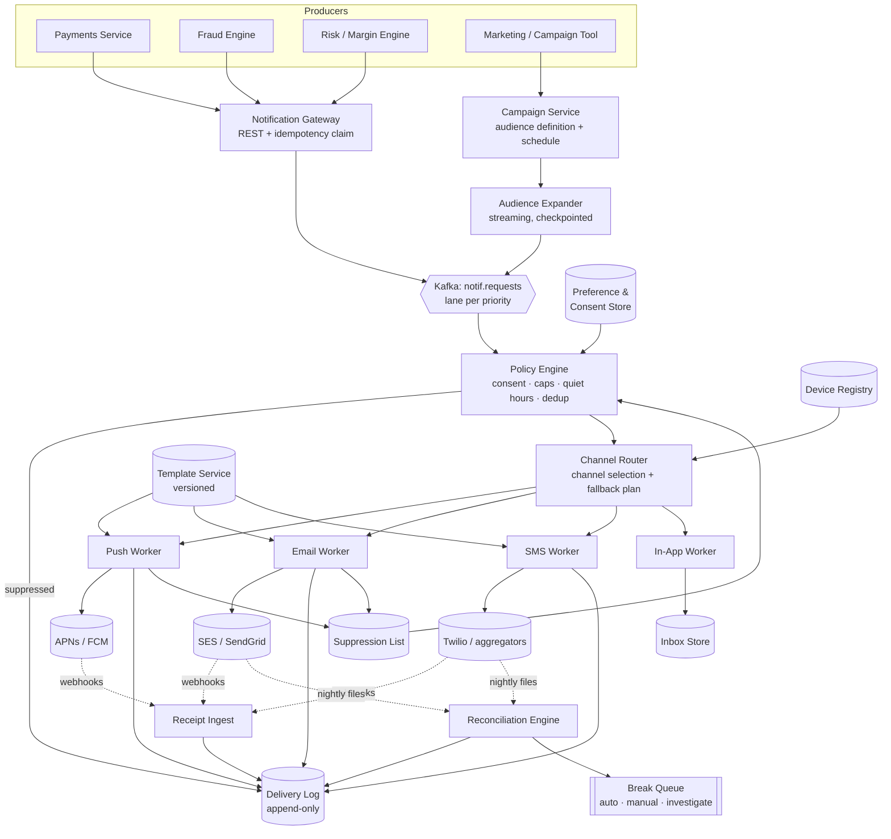
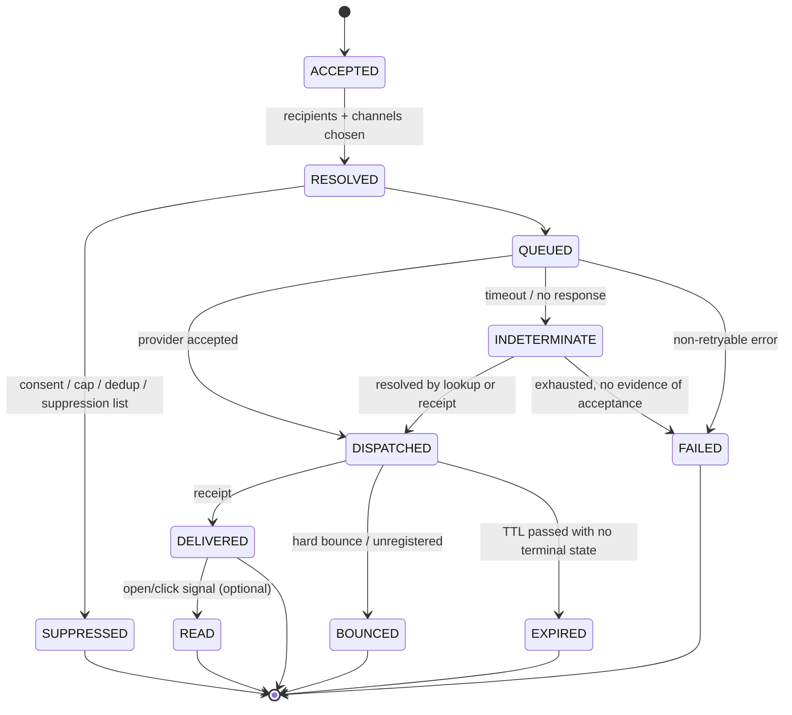
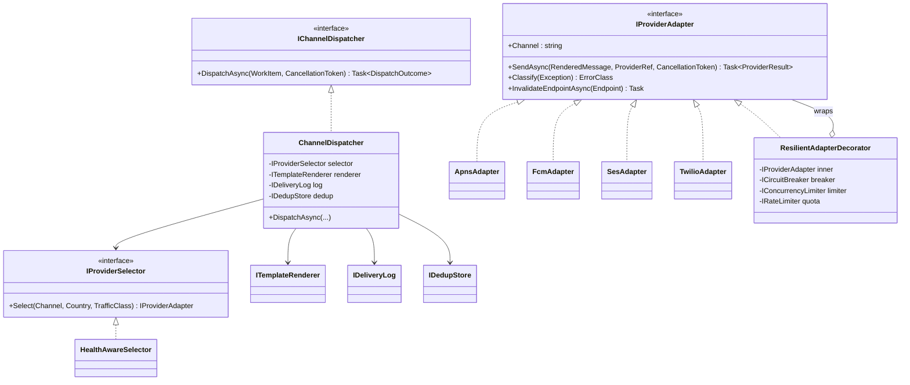
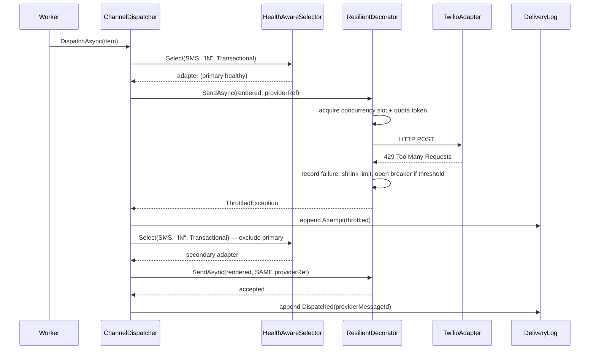

# Module 180 — System Design: Designing a Notification & Alerting System

> Domain: System Design | Level: Beginner → Expert | Prerequisite: [[01-System-Design-Fundamentals]], [[03-Designing-Chat-Messaging-System]] (delivery guarantees and ordering for a *connected* recipient — this module is the same problem when the recipient is unreachable and the transport belongs to Apple, Google, or a carrier), [[15-RateLimiting-Throttling-LoadShedding-Algorithms]] (the per-user caps and load-shedding lanes §12 Step 3 depends on), [[16-Interview-Execution-Playbook-Estimation-Rubric]], [[18-Designing-Payment-Processing-DoubleEntry-Ledger]] (idempotency, settlement-file reconciliation, and the silent-discard defect class — all three recur here in a different costume), [[../37-Outbox/01-Outbox-Pattern]], [[../19-Kafka/01-Kafka-Fundamentals]]

---

**Why this module exists.** This folder's own backlog listed *notification & push delivery* as the second-highest-value uncovered question class, behind search (Module 179). It is asked at Stripe, PayPal, Capital One, Visa, JPMorgan, Amex, and every consumer fintech — and it is asked *because it sounds trivial*. "Send the user an email" is a one-line function call. The interviewer is watching for the moment you realise it is not a function call but a **distributed delivery system whose definition of success is owned by infrastructure you do not operate, cannot inspect, and cannot fix.**

The distinguishing property: **you never actually deliver anything.** Apple delivers. Google delivers. A carrier delivers. Gmail's spam filter decides. Every "delivered" your system records is hearsay reported by a third party, asynchronously, sometimes hours later, sometimes never. Almost every hard decision in this design descends from that one constraint — and in a regulated firm it collides with a second one: some of these messages are **legally significant communications** (margin calls, NSF notices, SCA challenges, breach notifications) where non-delivery is a loss event and over-delivery is a consent violation.

**This is also the first module authored under the four-step System Design standard** adopted 2026-08-09 (see `CLAUDE.md`): §12 follows the *System Design Interview* / Pragmatic Engineer payment-chapter spine — scope dialogue → high-level design with real APIs and schemas → deep dive → wrap-up → references — and is deliberately the largest section in this file.

---

## 1. Fundamentals

### What is a notification system?

A notification system accepts an **intent to inform a person** and converts it into one or more **messages** delivered over channels it does not own. It sits between *N* internal producers ("the payment settled", "this login looks fraudulent", "your margin is short $40k") and a handful of external transports (APNs, FCM, SMTP relays, SMS aggregators), and its job is everything in between: who should hear this, on which channel, in what language, are they allowed to receive it, have we already told them, and can we prove we told them.

### The four facts people conflate

The single most common failure in an interview answer — and in production — is treating these as one thing:

| Fact | Who establishes it | When you learn it | Can you trust it? |
|---|---|---|---|
| **Accepted** | You | Immediately | Yes — it is your own record |
| **Dispatched** | You | Immediately | Yes — but only means *handed over* |
| **Delivered** | The provider / OS / carrier | Seconds to hours later, asynchronously, or never | Partially — semantics vary wildly per channel |
| **Seen** | The human | Only for channels with an open/read signal | No — absence of a read is not absence of reading |

A system that stores one `status` column and writes `SENT` into it after an HTTP 202 has silently declared *accepted by our own code* to be *the user was informed*. §4's incident is exactly that mistake costing a firm a regulatory finding.

### Why it matters (and why fintech raises the bar)

In a consumer app, a missed push is an annoyance. In a regulated financial firm the same pipeline carries:

- **Strong Customer Authentication / OTP** — non-delivery blocks the customer from transacting at all; the notification system becomes a **hard dependency of the payment flow**, which is an availability coupling most teams never notice until an SMS aggregator has an outage and card authorisations fail.
- **Margin calls and liquidation notices** — the firm's right to liquidate frequently depends on having *given notice*. Delivery evidence is the legal artefact.
- **Fraud alerts** — value decays with latency; a fraud alert delivered in 30 minutes is worth nearly nothing.
- **Regulatory disclosures and breach notifications** — deadlines are statutory.
- **Marketing** — governed by consent law (GDPR, TCPA, CAN-SPAM, PECR). Sending one message to one user who opted out is a per-message statutory violation, not a bug.

So this system has an unusual shape: it must be **highly available for a subset of traffic, provably auditable for a different subset, and legally suppressible for a third**, and those subsets are distinguished only by a `category` field that some producer team set correctly — or didn't.

### When you need a real system rather than a library

You need this system when any two of these are true: more than one channel; more than one producing service; user-controlled preferences; retention/audit obligations; volume above a few hundred per second; or any message whose non-delivery costs money. Below that, a queue and an SMTP client is the correct, honest answer, and saying so in an interview is a *strength* — over-engineering is scored against you.

### How it works — 30,000 feet

```
event → resolve recipients → resolve consent & preferences → select channels
      → render from template → deduplicate → rate-limit → dispatch to provider
      → record dispatch → ingest receipts (async) → reconcile against provider truth
```

Every arrow after "dispatch" is where the interesting failures live.

---

## 2. Deep Dive

### 2.1 The fan-out amplification chain, and where to expand it

One business event does not equal one message. The chain is:

```
1 event → R recipients → C channels per recipient → D endpoints per channel
```

A "your fund's NAV was restated" event to a fund with 40,000 holders, at 1.4 channels and 2.3 devices per push channel, is roughly 40,000 × 1.4 × ~1.8 ≈ **100,000 dispatches from a single Kafka message**. The design question is *where in the pipeline the row count multiplies*, because everything downstream of the expansion point pays the multiplied cost — storage, queue depth, retries, and audit rows.

Three placements:

- **Expand at the producer.** The producing service emits one message per recipient. Terrible: every producer re-implements audience resolution, and a 100k-row expansion happens inside a service that was designed for one-row transactions.
- **Expand at ingest.** The gateway resolves the audience synchronously and enqueues N messages. Simple, but a 100k expansion blocks an HTTP request and makes the ingest tier's latency a function of audience size.
- **Expand late, in a dedicated resolver, streaming.** The gateway accepts a *notification request* referencing an audience, acknowledges immediately, and a resolver expands it into per-recipient work items in batches. This is the correct answer at scale and is what §12 designs.

The corollary that separates a Staff answer: **late expansion means the per-recipient rows do not exist yet when you acknowledge**, so "did this campaign go out?" cannot be answered by counting rows. You need an explicit expansion-progress record, or you have built a system that cannot tell "not sent yet" from "never will be".

### 2.2 Preferences, consent, and why the check must happen at dispatch time

Preferences look like a lookup: `SELECT allowed FROM preference WHERE user_id=? AND category=? AND channel=?`. The subtlety is *when*.

Consider a campaign expanded at 09:00 into 20 million work items, drained over 40 minutes. A user unsubscribes at 09:12. If consent was evaluated during expansion, that user receives a message after opting out — and "we had already queued it" is not a defence under GDPR Art. 21 or TCPA. Therefore:

**Consent is evaluated at the last possible moment before dispatch, not at enqueue.** The queued work item carries the *intent*; the adapter performs the *authorisation*.

Two further distinctions that candidates routinely miss:

- **Preferences ≠ consent.** A preference is a user's UI toggle. Consent is a legal record with a timestamp, a source, and evidence (who ticked what, where, when, under which privacy notice version). Preferences can be edited; consent records are **append-only** for the same reason ledger entries are (Module 178 §2.1).
- **Mandatory categories exist and cannot be opted out of.** A fraud alert, an SCA challenge, and a regulatory notice are not marketing. Modelling this as "a preference that defaults to on" is a defect waiting to happen — someone will build an admin tool that sets all preferences off. Model it as a property of the **category**: `is_suppressible: false`, enforced in the policy engine, so the bad state is unrepresentable rather than merely discouraged.

### 2.3 Deduplication and the scope trap

Duplicate notifications come from four independent sources, and a design that addresses only one is incomplete:

1. **Producer retry** — the producing service's HTTP call timed out and it retried.
2. **Broker redelivery** — at-least-once consumption after a rebalance or a failed commit.
3. **Business-logic duplication** — two services both decide to notify about the same event (the classic: the payment service and the ledger service both announce a settlement).
4. **Provider-side duplication** — rare, but SMS aggregators and email relays do occasionally double-submit downstream.

Only (1) and (2) are solved by an `Idempotency-Key`. (3) requires a **business dedup key** derived from the *event*, not the *request*: `hash(user_id, category, business_event_id, coalescing_window)`. (4) is not solvable from your side at all and is why receipts and reconciliation exist.

The trap — and it is the same defect class as Module 178 §4's per-processing-centre settlement reference — is **key scope**. Every one of these is a real bug seen in production:

| Wrong key | Failure |
|---|---|
| Includes a timestamp taken at send time | Every retry produces a new key; dedup never fires |
| Includes `attempt_no` | Same |
| Excludes `channel` | User gets the push, then the email is suppressed as a duplicate — the fallback silently disappears |
| Excludes `user_id`, scoped only to the event | A 40,000-recipient event delivers to exactly one person |
| Scoped per consumer instance | Dedup works until you scale out |

**Rule:** over-scoping a dedup key costs an extra message; under-scoping loses messages silently. When in doubt, over-scope — and put a counter on every suppression path so "we deduplicated 4 million messages today" is a graph somebody can see, not an invisible success.

**TTL is part of the key design.** A dedup entry with a 60-second TTL does not protect against a redelivery that happens eight minutes later. The window must exceed the **maximum redelivery horizon**, which is set by your slowest dependency's timeout budget and your broker's rebalance behaviour — not by whatever Redis TTL felt reasonable. §14 is an incident caused precisely by getting this backwards.

### 2.4 Push token lifecycle — the part that quietly rots

Device tokens are not stable identifiers. They rotate on app reinstall, OS restore-from-backup, and occasionally at the vendor's discretion. A registry that only ever inserts becomes a registry where a large fraction of rows are dead, and dead tokens are not free: they consume dispatch capacity, inflate your "sent" counts, and — for APNs — burn quota.

The lifecycle you must handle:

- **Registration/refresh** — the client sends its token on every launch. Upsert keyed by `(user_id, platform, token)`, and critically **also** handle the case where the same token now belongs to a *different* user (a shared or resold device). Failing to reassign is a genuine data-leak vector: user B receives user A's balance alerts.
- **Invalidation signals** — APNs returns `410 Gone` with `Unregistered`; FCM returns `UNREGISTERED` or `INVALID_ARGUMENT`. These are **not retryable errors, they are facts**, and must write back to the registry immediately. A system that treats them as transient failures retries dead tokens forever.
- **Aging** — a token not refreshed in ~90 days is almost certainly dead even without an explicit signal. Age it out on a schedule, but *soft-delete* it, because "we stopped notifying this user" needs to be explicable.

Email has the analogue: **hard bounce vs. soft bounce**. A hard bounce (`550`, mailbox does not exist) must land on a suppression list permanently; a soft bounce (`4xx`, mailbox full, greylisting) must be retried with backoff. Treating them the same either destroys deliverability (retrying hard bounces tanks sender reputation, which is a *shared* resource across every message your domain sends) or loses messages (suppressing on a transient 4xx).

### 2.5 Sender reputation as a shared-fate resource

This has no analogue in most system-design questions and is worth raising unprompted. Email deliverability is governed by the reputation of your sending domain and IP pool. One bad campaign — high bounce rate, high spam-complaint rate — degrades delivery of *every* message from that domain, including your OTPs and fraud alerts.

The architectural consequence: **segregate reputation by traffic class.** Transactional mail goes out on a different subdomain and IP pool from marketing mail (`alerts.bank.example` vs `news.bank.example`), with separate warm-up, separate DKIM keys, and separate monitoring. This is a design decision that costs nothing to make on day one and is very expensive to retrofit, which is exactly the kind of thing a Principal candidate is expected to surface.

SMS has the parallel: short codes, long codes, and alphanumeric sender IDs have different throughput, different per-country legality, and different filtering behaviour. Carriers silently drop traffic that looks like spam, and "silently" means *the aggregator still reports success*.

### 2.6 Storms, coalescing, and priority

Notification load is not Poisson; it is **event-correlated**. A market circuit-breaker, an index rebalance, an outage at a partner bank, or a mass fraud campaign produces a step function: 20 million price alerts in 90 seconds is 15× steady state and will arrive as one burst.

Three mechanisms, and they are complementary rather than alternative:

- **Per-user caps** (token bucket, per category — see Module 175 for the algorithms). Protects the *human* from being spammed. A user with 400 price alerts wants a digest, not 400 pushes; and 400 pushes will get your app's notification permission revoked, which is unrecoverable.
- **Coalescing / digesting** — hold a window (30s–5min by category), collapse N alerts into one. Push platforms support this natively at the client: APNs `apns-collapse-id` and FCM `collapse_key` cause a new message to *replace* an undelivered older one with the same key on the device. This is the correct mechanism for supersedable content (account balance, order status) and the wrong one for accumulative content (three separate payments).
- **Priority lanes as separate topics, not a priority field.** A `priority` column in a single queue does nothing when the queue is 20 million deep — the transactional message is still behind them in the partition. Physical separation (separate Kafka topics, separate consumer groups, separate provider credentials and quota) is what actually guarantees an OTP is not stuck behind a campaign. This is the same "isolation must be structural, not advisory" pattern this course has hit in Kubernetes (Modules 74–76) and multi-tenancy (Module 12).

Under sustained overload, **shed by priority**: drop marketing entirely, degrade digests to lower resolution, and never touch the mandatory lane.

### 2.7 Rendering: where, and with what

A notification request can carry either **rendered text** or **a template ID plus variables**. This looks like a style choice; it is a security and correctness decision.

Carrying rendered text means every queue, log, retry record, and DLQ entry contains the final message — which for "Your balance is $4,182.19" is customer financial data at rest, replicated across a broker, an object store, and every engineer's DLQ-inspection tool. Carrying `template_id + {balance: "4182.19"}` is no better *unless* the variables themselves are tokenised, which is usually impractical.

The workable position, and the one §12 adopts:

- Carry `template_id` + variables; **render at the last hop**, inside the channel worker.
- Classify templates by data sensitivity, and for high-sensitivity templates carry only **references** (`account_ref`), resolving them at render time from the owning service.
- For push specifically, prefer a **content-free or content-light payload** for sensitive categories — "You have a new secure message" — because a push payload renders on a locked screen in public. Rich content lives behind authentication in the app.
- Version templates, and store the **rendered output hash plus template version** on the delivery record rather than the rendered text, so you can prove what was sent without retaining the text itself. For legally significant notices, retain the full rendered artefact deliberately, in the archive tier, with its retention clock — that is a small, classified subset (§12 Step 1 shows the arithmetic that makes this the decisive storage decision).

### 2.8 Delivery receipts and reconciliation

This is Module 178's settlement reconciliation with different nouns, and recognising that out loud is worth real credit.

Providers report outcomes on two paths: **webhooks** (near-real-time, unreliable, at-least-once, out-of-order) and **files/reports** (nightly, complete, authoritative). You need both, for the same reason payments needs both the API response and the settlement file: the fast path tells you quickly, the slow path tells you *truly*.

Break classification:

| Break | Meaning | Handling |
|---|---|---|
| Dispatched, no receipt, aged beyond channel SLA | We think we sent it; the provider has no record | Investigate; likely a lost dispatch or a receipt-ingest gap |
| Receipt with no matching dispatch | Provider delivered something we didn't record | Serious — indicates duplicate submission or a lost write |
| Terminal-state mismatch (we say delivered, file says failed) | Webhook lied or was superseded | File wins; correct the record |
| Counts match, per-segment counts don't | Concentrated failure hidden by an aggregate | The dangerous one — see below |

Two rules carried over from Module 178 and worth stating verbatim in an interview:

1. **Reconcile even when the provider claims to be authoritative.** Providers have bugs, and "their number and our number agree" is the only evidence you actually have.
2. **Detect on *aging*, not on rate.** "5% of dispatches have no receipt" is a ratio that stays flat while a specific carrier, a specific country, or a specific template silently stops working. "1,400 dispatches are older than 4 hours with no terminal state, and 1,380 of them are on one carrier" is a detector. Aggregates cannot see concentrated failures — this folder's own recurring finding, arriving here for the fourth time.

### 2.9 Ordering, supersession, and the OTP problem

Notifications are mostly order-insensitive, which is a relief — but not entirely, and the exceptions are the ones that generate incidents:

- **OTPs supersede.** If a user requests a code twice, receiving the older code second is a support ticket at best. Solution: a per-user-per-category sequence number, with the client and the dispatcher both dropping anything below the high-water mark, plus collapse keys so the device shows only the latest.
- **State updates supersede.** "Order shipped" arriving after "Order delivered" is wrong. Same mechanism.
- **Ledger-style events accumulate and must not be collapsed.** Three payment receipts are three facts.

The design rule: **supersession is a property of the template/category, declared once, not decided per message.** If a category is `supersedable: true`, the pipeline attaches a collapse key and a sequence; otherwise it does not. Leaving this to producers guarantees inconsistency.

### 2.10 Multi-region and data residency

An EU customer's phone number, email address, and message content are personal data. If your notification pipeline is a single global Kafka cluster in `us-east-1`, you have exported EU personal data to the US at the moment of enqueue, regardless of what the delivery endpoint is.

The workable architecture is **regional pipelines with a global control plane**: templates, category definitions, and campaign definitions replicate globally (they are not personal data); recipient resolution, rendering, dispatch, receipt ingest, and the delivery log stay in-region. Cross-region, you replicate **counts and states, not payloads**. This costs an extra deployment unit per region and is far cheaper than retrofitting after a DPIA finds the problem.

---

## 3. Visual Architecture

### Component architecture



### Sequence — a fraud alert, happy path and the indeterminate path

```mermaid
sequenceDiagram
  participant F as Fraud Engine
  participant G as Gateway
  participant K as Kafka (lane: critical)
  participant P as Policy Engine
  participant W as Push Worker
  participant A as APNs
  participant L as Delivery Log

  F->>G: POST /v1/notifications<br/>Idempotency-Key: fraud-9f3c…
  G->>G: claim key (INSERT … ON CONFLICT)
  G->>L: ACCEPTED (notification_id)
  G-->>F: 202 {notification_id}
  G->>K: publish
  K->>P: consume
  P->>P: category=FRAUD_ALERT → is_suppressible=false<br/>skip preference gate, still apply dedup
  P->>W: dispatch intent (2 devices)
  W->>W: render (content-light)
  W->>A: POST /3/device/{token}  apns-collapse-id, priority 10
  alt provider responds
    A-->>W: 200
    W->>L: DISPATCHED (provider_message_id)
    A-->>W: (async) delivery receipt
    W->>L: DELIVERED
  else timeout — the indeterminate case
    A--xW: no response
    W->>L: INDETERMINATE (attempt 1)
    Note over W,L: retry with the SAME apns-id;<br/>APNs deduplicates on it.<br/>Never a fresh id — that is how you double-send.
  end
```

### Delivery state machine



Note the two states most designs omit and both incidents in this module turn on: **`INDETERMINATE`** (we do not know whether the provider took it) and **`EXPIRED`** (we dispatched and never learned anything, ever). A schema without them forces every unknown into either `SENT` or `FAILED`, and both are lies.

---

## 4. Production Example — "100% delivered" margin calls that nobody received

**Context.** A retail brokerage. Margin calls are issued intraday; the client has until 15:00 the following business day to meet the call or positions are liquidated. The firm's client agreement and the regulator both require that notice be *given*. Notice goes out by email and push simultaneously; email is the artefact the compliance team relies on.

**Problem.** Over eleven weeks, a subset of clients — eventually established at 3.1% of called accounts — never received the email notice. The internal dashboard showed **99.97% delivery success** throughout. The issue surfaced only when a client whose positions were liquidated disputed it, and the firm went to produce the notice.

**Investigation.**

1. The delivery record for the disputed client said `SENT`, timestamped correctly, with the provider's message ID. The provider's API had returned `202 Accepted`.
2. The provider's own dashboard, queried by message ID, said **`dropped — recipient on account suppression list`**.
3. The suppression list had been populated automatically by the provider from hard bounces — including bounces generated **two years earlier**, during a migration in which a batch of addresses had been sent with a malformed local part. The addresses were valid; the *messages* had been malformed. The provider had, correctly by its own rules, added the recipients to a permanent account-level suppression list.
4. The firm's system had never subscribed to the provider's `dropped` webhook event. It subscribed to `delivered`, `bounce`, and `open`. A `dropped` message produced **no webhook at all** in its configuration, so the record stayed at `SENT` forever.
5. `SENT` was counted as success by the dashboard. The metric was `count(status IN ('SENT','DELIVERED')) / count(*)`.

**Root cause — three failures, each individually survivable:**

- The provider's `202 Accepted` was recorded as a delivery outcome rather than as *receipt of the request*.
- The terminal-state webhook set was incomplete, and nothing detected that a record had sat in a non-terminal state for eleven weeks.
- The success metric aggregated a non-terminal state into the numerator, which meant **the more messages got stuck, the better the dashboard looked**.

**Fix.**

- Split the schema: `dispatch_state` (ours) and `delivery_state` (theirs), with no value of the first permitted to imply the second.
- Reconcile nightly against the provider's full event export — not the webhook stream — and treat the export as authoritative.
- Add an **aging detector**: any dispatch without a terminal delivery state after 4× the channel's p99 receipt latency raises a break. This is what would have caught it on day one.
- Redefine the SLI as `delivered / dispatched`, with `SENT`-but-not-terminal counted explicitly as **unknown** and graphed as its own series. A metric must never let an unknown default into the success bucket.
- For mandatory-notice categories, require **at least one channel with a confirmed terminal delivery** or escalate to a human workflow within the notice window.

**Trade-offs accepted.** The aging detector produces genuine false positives — some carriers legitimately take hours. The team set per-channel thresholds rather than one global one, and accepted a break queue with real volume, because a break queue somebody triages is strictly better than a dashboard nobody can disbelieve.

**Lessons.**

1. **A provider's acknowledgement is a receipt for your request, not a report on your user.** Model them as separate columns or you will conflate them within a year.
2. **Every non-terminal state needs a clock.** A state with no maximum age is a state records go to disappear in.
3. **Never let "unknown" fall into the success bucket of an SLI.** This is the same structural blindness as Module 178 §4's silent discard and Module 177 §14's aggregate p50 — third instance in this folder, arriving by a different route each time.

---

## 5. Best Practices

- **Separate dispatch state from delivery state in the schema.** Why: they have different owners and different trustworthiness. When: always. When not: never — even a small system benefits, because the cost is one column.
- **Evaluate consent at dispatch, not at enqueue.** Why: queued work outlives the consent that authorised it. When: any system with a queue between intent and send. When not: purely synchronous sends, which do not exist at scale.
- **Make mandatory categories structurally unsuppressible.** Why: an admin tool or a bulk preference update will otherwise silence a fraud alert. When: any system carrying both marketing and regulatory traffic.
- **Physical priority lanes, not a priority column.** Why: a field cannot get a message out from behind 20 million others in the same partition. When: whenever a latency-sensitive class shares infrastructure with a bulk class.
- **Carry `template_id` + variables; render at the last hop.** Why: minimises sensitive data at rest across brokers, DLQs, and logs, and lets you fix a typo without reprocessing a queue.
- **Segregate sender reputation by traffic class** (subdomain, IP pool, provider account). Why: marketing behaviour must not be able to degrade OTP delivery. When: day one — it is nearly free then and painful later.
- **Detect on aging, not on rate.** Why: ratios are blind to concentrated failure. When: every asynchronous outcome in the system.
- **Give every suppression path a counter.** Why: dedup, caps, quiet hours, and consent all *silently* remove messages; without counters, a bug that suppresses everything looks identical to a quiet day.
- **Retry with the provider's own idempotency handle** (`apns-id`, `Idempotency-Key`, aggregator message ID) rather than a fresh request. Why: it converts your at-least-once retry into at-most-once delivery at the far end.
- **Store the template version and rendered-content hash on every delivery record.** Why: it makes "what exactly did we tell this customer on 4 March" answerable without retaining message bodies for every message ever sent.

---

## 6. Anti-patterns

- **One `status` column with `SENT` as a terminal value.** Fails because it conflates four different facts (§1) and hides §4's entire incident class. Fix: split the columns, add `INDETERMINATE` and `EXPIRED`, put a clock on every non-terminal state.
- **Dedup key containing a timestamp or attempt number.** Fails because the key changes on every retry, so deduplication never fires and nobody notices — the system merely sends more. Fix: derive the key from the *business event*, and graph the suppression counter so a key regression is visible as a cliff.
- **Retrying non-retryable errors.** `410 Unregistered`, `550` hard bounce, and `invalid phone number` are facts, not failures. Retrying them wastes quota, damages sender reputation, and delays the write-back that would have cleaned the registry. Fix: an explicit retryable/non-retryable classification table, defaulted to *non*-retryable for unknown 4xx.
- **Fan-out inside the request thread.** A campaign with a large audience turns an API call into a multi-minute transaction that times out halfway, leaving an unknown fraction sent. Fix: accept fast, expand asynchronously with a checkpointed, resumable expander.
- **Preferences as the mechanism for mandatory notices.** Fails the first time a user opts out of "all email" and stops receiving statutory notices. Fix: suppressibility is a property of the category, enforced in the policy engine.
- **A single queue for marketing and transactional traffic.** Fails on the first big campaign, when OTP latency goes from 2 seconds to 20 minutes and card authorisations start failing. Fix: separate topics, consumer groups, and provider credentials.
- **Trusting webhooks as the complete record.** Webhooks are at-least-once, out-of-order, and lossy; some outcomes have no webhook at all in a default configuration (§4). Fix: webhooks for latency, nightly files for truth, reconcile the two.
- **Rendering at enqueue.** Puts final message bodies — balances, names, one-time codes — into every broker, DLQ, and log in the pipeline. Fix: render at the last hop.
- **No expansion-progress record.** Makes "did the campaign go out?" unanswerable, because absence of rows means both *not yet* and *never*. Fix: an explicit expansion checkpoint with expected and produced counts.
- **Treating notification as best-effort infrastructure when a payment flow depends on it.** OTP delivery is on the critical path of card authorisation; a "best-effort" SLO on it is a mislabelled tier-1 dependency. Fix: classify by *what breaks when it stops*, not by what the component is called.

---

## 7. Performance Engineering

**Where the CPU actually goes.** Not where people guess. Measured on a system of this shape, per dispatch: JSON serialisation and template rendering dominate (~40%), TLS and HTTP/2 framing to providers ~20%, policy evaluation ~15% (mostly cache lookups), and persistence ~25%. The naive optimisation target — "make the send faster" — is the network, and the network is someone else's.

**Connection management is the single biggest lever for push.** APNs uses HTTP/2 with request multiplexing over long-lived connections authenticated by a JWT provider token. A worker that opens a connection per message pays a TLS handshake per notification and will cap out around two orders of magnitude below what one properly-multiplexed connection achieves. Concretely: maintain a small pool of persistent HTTP/2 connections per worker, keep the provider JWT cached and refreshed on schedule (APNs rejects tokens refreshed too often), and let concurrency come from **streams on a connection**, not connections.

**Batching where the API supports it.** FCM supports multicast; SES supports bulk templated sends; most SMS aggregators support batch submission. Batching cuts per-message overhead dramatically but introduces a partial-failure shape — a batch of 500 returns 497 accepted and 3 errors, positionally indexed. Systems that batch and then treat the batch as atomic either lose 3 messages or resend 497. Handle per-item results explicitly.

**Write amplification is the real storage cost.** One notification to one user across two channels with two devices, with an append-only delivery-event log, generates: 1 request row + 3 delivery rows + ~3–9 event rows = up to 13 rows. At 15,000 notifications/sec that is roughly 200k row-writes/sec, which no single OLTP primary will absorb. This is why §12 puts the delivery log in a wide-column store partitioned by user, keeps only the request/preference/device data in PostgreSQL, and tiers events to object storage after 30 days.

**Template rendering.** Compile and cache templates per `(template_id, version, locale)`; do not parse per message. A pre-compiled template renders in tens of microseconds; a re-parsed one in hundreds. At 15k/s the difference is a couple of cores versus a couple of racks.

**Backpressure.** The correct response to a provider slowing down is *not* to increase concurrency — that is how you turn a provider's brownout into your own thread-pool exhaustion (a pattern this course has hit repeatedly). Use a bounded concurrency limiter per provider, adaptive to observed latency, with the queue absorbing the difference and the priority lanes ensuring the right traffic is what waits.

**Benchmark honestly.** Load-test against a provider *simulator* that reproduces real latency distributions including the long tail and the 429s. A benchmark against a mock that returns instantly measures your serialiser and nothing else.

---

## 8. Security

**Threats and mitigations, in rough order of real-world consequence:**

| Threat | Mechanism | Mitigation |
|---|---|---|
| **Notification-based phishing** | Attacker gets the system to send a legitimate-looking message with attacker-controlled content | Never let free-text from an untrusted source reach a template variable that renders into a link or a sender name; whitelist link domains at render; templates are code and go through code review |
| **PII on the lock screen** | Push payload with balance/name renders on a locked device in public | Content-light payloads for sensitive categories; full content behind app authentication |
| **Token/registry leakage** | Device tokens or phone numbers exfiltrated | Tokens are credentials — encrypt at rest, never log, hash addresses in the delivery log and store the plaintext only in the owning store |
| **Device reassignment leak** | Token reused by a new user after resale/reinstall; old user's alerts go to new user | Registration must *reassign*, not just insert; invalidate on logout server-side, not only client-side |
| **Unsubscribe link forgery / enumeration** | Attacker unsubscribes other users, or enumerates users via unsubscribe URLs | Signed, expiring, per-message tokens (HMAC over `user_id||category||nonce`), never a raw user ID in the URL |
| **Webhook spoofing** | Attacker posts fake delivery receipts to your ingest endpoint | Verify provider signatures (SES SNS signature, Twilio `X-Twilio-Signature`, Stripe-style HMAC); reject unsigned; never trust source IP alone |
| **SSRF via configurable callbacks** | Tenant-configured webhook URLs point at internal metadata endpoints | Egress allowlist, block link-local/private ranges, DNS-rebinding-safe resolution at connect time |
| **Provider credential compromise** | Stolen APNs key or SMS API key sends messages as you | Short-lived tokens where supported, per-environment and per-traffic-class credentials, rotation runbook, alert on send volume anomalies |
| **SMS OTP interception / SIM swap** | Attacker intercepts the second factor | Out of this system's control, but *in scope to surface*: prefer app-based push approval over SMS OTP; treat SMS as the weakest factor and rate-limit + risk-score SIM-change events |
| **Template injection** | Variable content breaks out into HTML/JS in an email | Context-aware escaping at render, per output type; treat email HTML as an untrusted rendering surface |
| **Consent record tampering** | Retroactive "proof" that a user opted in | Append-only consent log with the same immutability treatment as a ledger (Module 178 §2.1) |

**Authorisation** deserves its own note. The gateway must not let service A send notifications *as* service B, or to arbitrary users. Producers authenticate with workload identity (mTLS/OIDC), and each is authorised for a **set of categories** — the fraud engine may send `FRAUD_ALERT`, the marketing tool may not. Without this, the highest-trust message type in the system is available to the lowest-trust caller, and phishing becomes an internal API call.

**Compliance surfaces** that belong in the design, not bolted on: consent evidence with source and timestamp; a suppression list that is honoured across *all* producers (a global do-not-contact, not a per-campaign one); quiet-hours enforcement where legally mandated (TCPA restricts marketing calls/texts to 08:00–21:00 local); data residency (§2.10); and retention with a clock per category, since "keep everything for seven years" is both expensive (§12 Step 1) and, for marketing data under GDPR, unlawful.

---

## 9. Scalability

**Partitioning.** The natural key is `user_id`: it keeps a user's rate-limit state, dedup state, and ordering colocated, and per-user caps become node-local. The hazard is a **hot partition** when a single "user" is actually an institutional account with millions of notifications — mitigate by salting known-large accounts across sub-partitions, which is safe precisely because cross-user ordering is not required.

**Independent scaling axes.** Ingest, expansion, policy, and per-channel dispatch scale separately and have genuinely different bottlenecks: ingest is CPU/TLS-bound, expansion is database-read-bound, policy is cache-bound, and dispatch is bound by *provider* concurrency limits you cannot exceed by adding pods. Recognising that adding dispatch workers past the provider's limit produces only 429s is the difference between a Senior and a Staff answer.

**Provider quota as a first-class resource.** Each provider account has a rate ceiling; some are per-sender-number. Model quota explicitly (a distributed token bucket per provider credential — Module 175's mechanics), and shard across multiple credentials/numbers when a single one caps out. Failing to model it means your autoscaler's response to backlog is to generate more 429s.

**Replication and HA.** The preference/consent store is small, read-heavy, and correctness-critical: primary + read replicas, with **dispatch-time reads routed to the primary or to a version-checked cache** to avoid the unsubscribe race (§2.2). The delivery log is huge and append-only: quorum writes in a wide-column store, tuned for write throughput, with reads mostly by partition key. The idempotency/dedup store is Redis with AOF and a replica — and the design must state what happens when it is lost: the honest answer is *duplicate delivery is possible in that window*, which is acceptable for notifications and would not be for payments. Saying that trade-off out loud, rather than claiming exactly-once, is the credible answer.

**CAP posture, per component.** The dispatch path is **AP** — during a partition, sending a possibly-duplicate notification is far better than sending none. The consent gate is **CP** — if we cannot verify consent, we must not send suppressible traffic, because an unlawful send is unrecoverable while a delayed one is not. Stating that the system has *two different CAP answers in two different components* is the sophisticated framing, and it is the same layered posture Module 178 §9 reached for payments.

**DR.** Regional pipelines (§2.10) mean regional failure is a partial outage by construction. The control plane (templates, categories, campaign definitions) replicates globally; the data plane fails over by re-pointing producers at a peer region — accepting that the failed region's in-flight, unreconciled dispatches will be resolved by reconciliation, not by replay, because replaying a queue of unknown-state dispatches is how you send everything twice.

---

## 10. Interview Questions

### Basic (10)

**B1. What is a notification system responsible for, and what is it *not* responsible for?**
*Ideal answer.* It is responsible for accepting an intent to inform a person, resolving who and how, enforcing consent and rate policy, rendering, dispatching to a provider, and recording the outcome. It is not responsible for actual delivery — Apple, Google, carriers, and mailbox providers do that — nor for the user reading it.
*Why correct.* It draws the ownership boundary that every later design decision depends on.
*Common mistakes.* Claiming the system "delivers" notifications; conflating dispatch with delivery.
*Follow-ups.* If you don't own delivery, how do you know it happened? What does your provider's 202 actually mean?

**B2. What are the main channels, and how do their delivery semantics differ?**
*Ideal answer.* Push (APNs/FCM) — fast, free, silently dropped if the device is offline past TTL, requires a live token. SMS — near-universal reach, costs money per message, carrier filtering is invisible, receipts are weak. Email — rich content, deliverability governed by reputation, hard/soft bounce distinction. In-app — fully under your control, but only seen if the user opens the app. Each has a different definition of "delivered".
*Why correct.* Channel choice is a design decision driven by semantics and cost, not preference.
*Common mistakes.* Treating channels as interchangeable transports.
*Follow-ups.* Which would you use for an OTP, and why not push?

**B3. Why can't a producing service just call the email provider directly?**
*Ideal answer.* Because consent, rate limits, deduplication, templating, localisation, suppression, retries, receipts, and audit are cross-cutting concerns that every producer would otherwise reimplement — inconsistently. Centralising also gives one place to enforce compliance and one place to see total user contact.
*Why correct.* It motivates the system's existence in terms of correctness and governance, not convenience.
*Common mistakes.* "Reusability" as the only reason; missing the compliance argument.
*Follow-ups.* What breaks first when forty teams each send their own email?

**B4. What is a device token and why is it not stable?**
*Ideal answer.* An opaque, per-app-per-device credential issued by APNs/FCM that identifies where to deliver a push. It changes on reinstall, restore-from-backup, and occasionally at the platform's discretion, so the registry must refresh on every app launch and invalidate on `410 Unregistered` / `UNREGISTERED`.
*Why correct.* It correctly frames the token as a rotating credential rather than an ID.
*Common mistakes.* Storing one token per user forever; treating invalidation responses as retryable errors.
*Follow-ups.* The same token appears for a different user — what happened, and what must you do?

**B5. What is the difference between a transactional and a marketing notification?**
*Ideal answer.* Transactional messages arise from something the user did or something that affects their account, and are generally exempt from marketing consent rules. Marketing requires opt-in (in most jurisdictions), honours quiet hours and unsubscribe, and is the first thing shed under load. The distinction is legal, not stylistic, and drives suppressibility, priority lane, retention, and sender reputation pool.
*Why correct.* It ties a business classification to four concrete architectural consequences.
*Common mistakes.* Treating it purely as a priority hint.
*Follow-ups.* Where does a "your subscription is expiring, renew now" message fall?

**B6. Why do you need a queue between the API and the provider?**
*Ideal answer.* To decouple acceptance latency from provider latency, to absorb bursts that far exceed provider throughput, to survive provider outages without losing intent, and to make retries a property of the pipeline rather than of the caller. Without it, a slow provider becomes a slow API for every producer.
*Why correct.* It names buffering, isolation, and retry ownership rather than just "async is better".
*Common mistakes.* "Performance" with no mechanism; ignoring that the queue is also what makes consent-at-enqueue wrong.
*Follow-ups.* What new problems does the queue create?

**B7. What is an idempotency key here and who generates it?**
*Ideal answer.* A caller-generated unique value (typically a UUID or a deterministic hash of the business event) sent in the `Idempotency-Key` header. The gateway claims it atomically; a repeat claim returns the original `notification_id` rather than creating a second notification. The caller generates it because only the caller knows that its retry is the same logical request.
*Why correct.* Identifies both the mechanism and the ownership.
*Common mistakes.* Server-generated keys (useless — they differ per retry); treating it as a cache key.
*Follow-ups.* How long must the key be retained, and what sets that duration?

**B8. What is a hard bounce versus a soft bounce?**
*Ideal answer.* A hard bounce is a permanent failure (mailbox doesn't exist, domain invalid) and the address must go on a suppression list. A soft bounce is transient (mailbox full, greylisting, temporary server error) and should be retried with backoff. Treating hard bounces as retryable damages sender reputation, which degrades delivery for every message from the domain.
*Why correct.* Connects the classification to the shared-fate consequence.
*Common mistakes.* Retrying everything uniformly; not maintaining a suppression list at all.
*Follow-ups.* Who else is affected when your bounce rate rises?

**B9. What does "quiet hours" mean and where is it enforced?**
*Ideal answer.* A per-user window (typically derived from their local timezone) during which non-urgent notifications are held rather than sent. It is enforced in the policy engine at dispatch time, applies only to suppressible categories, and in some jurisdictions is a legal requirement for marketing rather than a courtesy.
*Why correct.* Places it correctly in the pipeline and distinguishes courtesy from law.
*Common mistakes.* Enforcing it in UTC; applying it to fraud alerts.
*Follow-ups.* What happens to a message that hits quiet hours — dropped, delayed, or downgraded to another channel?

**B10. Why store a notification's content as a template ID plus variables rather than the final text?**
*Ideal answer.* Localisation and versioning become possible; a template fix doesn't require reprocessing a queue; and — most importantly — the final rendered text, which often contains financial or personal data, is not written into every broker, log, and dead-letter queue along the way.
*Why correct.* Leads with the operational reasons and lands on the data-minimisation one, which is the one that matters in a regulated firm.
*Common mistakes.* Only citing "reusability".
*Follow-ups.* Where exactly do you render, then — and what do you keep for audit?

### Intermediate (10)

**I1. Design the deduplication key. What goes in it and what must not?**
*Ideal answer.* In: the business event identifier, the recipient, the category, the channel, and (for coalescing) a window bucket. Out: anything that varies between retries — timestamps taken at send time, attempt numbers, request IDs, consumer instance identifiers. The TTL must exceed the maximum redelivery horizon, which is set by your slowest dependency and your broker's rebalance behaviour.
*Why correct.* It states both the composition rule and the TTL constraint, which is the half most candidates omit.
*Common mistakes.* Including a timestamp (dedup then never fires); excluding channel (the fallback message vanishes).
*Follow-ups.* What is the cost of over-scoping versus under-scoping the key?

**I2. A campaign is expanded into 20 million work items at 09:00 and drains over 40 minutes. A user unsubscribes at 09:12. What must happen?**
*Ideal answer.* They must not receive the message. That requires consent to be evaluated at dispatch time, not at expansion time — the work item carries intent, the adapter performs authorisation. A globally-honoured suppression list checked immediately before the provider call is the backstop.
*Why correct.* It identifies the enqueue/dispatch timing distinction, which is the whole point of the question.
*Common mistakes.* "We'd filter at expansion" — which is exactly the violation; "eventually consistent is fine" — which it legally is not.
*Follow-ups.* Your preference store has read replicas with 200ms lag. Does that break this?

**I3. How do you prevent a marketing campaign from delaying OTP delivery?**
*Ideal answer.* Physical separation: distinct Kafka topics, distinct consumer groups and worker pools, distinct provider credentials with their own quota, and separate sender identities/pools. A priority field in a shared queue does not help, because the urgent message still sits behind millions of others in the same partition.
*Why correct.* It rejects the intuitive but ineffective answer and gives the structural one.
*Common mistakes.* Priority queues; "we'd scale up the consumers".
*Follow-ups.* Under total overload, what do you shed and in what order?

**I4. What do you do when a dispatch times out and you don't know whether the provider accepted it?**
*Ideal answer.* Record an explicit `INDETERMINATE` state — never `SENT` and never `FAILED`. Then resolve it by retrying with the *same* provider-side idempotency handle (`apns-id`, provider idempotency key, your message ID in provider metadata) so a duplicate submission is deduplicated at their end, or by querying the provider's status API, or ultimately by reconciliation against the nightly file.
*Why correct.* It treats the unknown as a first-class state with a resolution path, rather than guessing.
*Common mistakes.* Defaulting to `FAILED` and retrying with a fresh ID — which double-sends; defaulting to `SENT` — which is §4's incident.
*Follow-ups.* What if the channel has no idempotency support at all?

**I5. How do you handle 400 price alerts for one user in 90 seconds?**
*Ideal answer.* Per-user token bucket per category to cap the rate; a coalescing window that collapses N alerts into one digest; and platform collapse keys (`apns-collapse-id` / `collapse_key`) so an undelivered older push is replaced rather than accumulated. Coalescing is only valid for supersedable content — three payment receipts must remain three messages.
*Why correct.* Combines server-side and device-side mechanisms and states the validity boundary.
*Common mistakes.* Collapsing everything, which loses accumulative facts; only rate-limiting, which drops information silently.
*Follow-ups.* What happens to the alerts you suppressed — are they gone?

**I6. Webhooks or polling for delivery receipts?**
*Ideal answer.* Both, for different purposes. Webhooks give low-latency state updates but are at-least-once, out-of-order, occasionally lost, and — critically — may not cover every outcome type in a default subscription. The provider's nightly export is complete and authoritative and is what reconciliation runs against. Webhooks for speed, files for truth.
*Why correct.* Mirrors the payment-settlement pattern and explains *why* one is not sufficient.
*Common mistakes.* Webhooks only; assuming webhook coverage is complete.
*Follow-ups.* How do you handle an out-of-order webhook that would move a record backwards?

**I7. How do you model preferences so a fraud alert can never be suppressed?**
*Ideal answer.* Suppressibility is a property of the *category*, not of the user's preference row. The policy engine consults the category definition first; if `is_suppressible = false`, no preference, quiet-hour rule, or bulk opt-out can remove it. This makes the bad state unrepresentable rather than merely discouraged.
*Why correct.* Chooses structural enforcement over convention, which this course treats as a recurring principle.
*Common mistakes.* "It defaults to on" — a bulk update will still turn it off.
*Follow-ups.* A user replies STOP to an SMS. Carrier rules now block *all* SMS to that number. What now?

**I8. What database would you choose for the delivery log, and why not PostgreSQL?**
*Ideal answer.* A wide-column store (Cassandra or DynamoDB) partitioned by user or notification, because the log is append-only, enormous (hundreds of GB/day), written far more than read, read almost exclusively by partition key, and has a natural TTL. PostgreSQL remains right for the small, relational, correctness-critical data: preferences, consent, devices, idempotency claims. Using one store for both means either paying relational costs for log volume or losing ACID where you need it.
*Why correct.* Chooses per-workload rather than per-system, and justifies each with an access pattern.
*Common mistakes.* One database for everything; choosing NoSQL for consent data.
*Follow-ups.* Seven-year retention — where does that data live?

**I9. Your dashboard shows 99.9% success. What could still be badly wrong?**
*Ideal answer.* The numerator may include non-terminal states (§4); the aggregate may hide a concentrated failure — one carrier, one country, one template, one app version at 100% failure while the overall ratio barely moves; and "success" may mean provider-accepted rather than user-delivered. The fixes are: count unknowns as their own series, segment every delivery SLI by channel/provider/country/template, and detect on aging rather than rate.
*Why correct.* Names all three blindnesses rather than one.
*Common mistakes.* Only "we should alert on the rate".
*Follow-ups.* Design the specific alert that would have caught §4's incident on day one.

**I10. How do you test this system safely?**
*Ideal answer.* Provider sandboxes plus a simulator that reproduces real latency distributions, 429s, partial batch failures, and delayed/out-of-order receipts. A hard environment guard so non-production can never reach a real address (allowlist by domain/number, enforced in the adapter, not by configuration convention). Contract tests on webhook signature verification. And a production **synthetic canary** — real messages to owned endpoints on every channel, continuously, verifying end-to-end delivery, because that is the only test that exercises the parts you don't own.
*Why correct.* Covers pre-production and, crucially, the production canary that is the only real detector for third-party breakage.
*Common mistakes.* Mocking the provider with an instant 200 and calling it tested.
*Follow-ups.* What does the canary do when it stops receiving — how do you avoid a dead canary being silent?

### Advanced (10)

**A1. Walk through exactly-once notification delivery. Is it achievable?**
*Ideal answer.* No — and the honest decomposition is `exactly-once = at-least-once ∧ at-most-once`. You get at-least-once from retries with backoff. You approach at-most-once through (a) an idempotency claim at ingest, (b) a business dedup key with a TTL exceeding the redelivery horizon, and (c) provider-side idempotency handles on retry. What remains unclosable is the final hop: if the provider accepted the message and your record of that acceptance is lost, you cannot distinguish "not sent" from "sent, unrecorded" without reconciliation. The correct posture is **effectively-once with a stated residual duplicate window**, and for notifications a rare duplicate is the right trade against a missed fraud alert.
*Why correct.* Refuses the marketing term, decomposes it properly, and names the residual risk with an explicit business justification.
*Common mistakes.* Claiming exactly-once via "a Redis SETNX"; not identifying which hop remains open.
*Follow-ups.* Which categories would you flip that trade-off for?

**A2. Design the fan-out for a 40-million-recipient regulatory notice with a statutory deadline.**
*Ideal answer.* Accept the notice as a single request with an audience reference and acknowledge immediately. A checkpointed streaming expander produces per-recipient work items in batches, recording expansion progress (expected count, produced count, last checkpoint) so the job is resumable and "did it all go out?" is answerable. Dispatch across a dedicated lane with its own provider quota. Because the deadline is statutory, plan capacity against the *deadline*, not the average: 40M over an 8-hour window is ~1,400/s sustained, which is a provisioning question you must answer before starting, and the per-channel provider quota is the binding constraint, not your compute.
*Why correct.* Handles the expansion-progress problem — the thing that makes bulk sends unverifiable — and converts a deadline into a rate requirement.
*Common mistakes.* Expanding synchronously; no progress record; sizing for average load.
*Follow-ups.* Halfway through, the email provider starts 429-ing. What do you do, given the deadline?

**A3. The preference store has 200ms replica lag. A user unsubscribes and a message is dispatched 150ms later. Analyse.**
*Ideal answer.* If the dispatcher reads from a replica, it may read stale consent and send unlawfully. Options: (a) route dispatch-time consent reads to the primary — simple, correct, but concentrates read load; (b) a version-stamped cache where the unsubscribe write also invalidates/updates the cache synchronously before returning 200 to the user, so the user's own action is causally ordered ahead of any subsequent send; (c) a fast, strongly-consistent suppression list (a small, separate store) checked in the adapter as a final gate, accepting that the full preference model stays eventually consistent. In practice (b)+(c): the suppression list is small and hot, so making *it* strongly consistent is cheap, while leaving the large preference dataset on replicas.
*Why correct.* Recognises that you do not need strong consistency over the whole dataset — only over the small, legally-critical part.
*Common mistakes.* "Make everything strongly consistent"; "eventual consistency is fine here".
*Follow-ups.* Now the suppression store is unavailable. Do you send or not, and does the answer differ by category?

**A4. How would you detect that push notifications have stopped working for one app version on one OS, while overall delivery looks normal?**
*Ideal answer.* You cannot, from aggregates — that is the point. You need delivery SLIs **segmented** by `(channel, provider, platform, app_version, country, template)` with anomaly detection per segment against that segment's own baseline, plus aging-based detection so a segment that stops producing terminal states raises a break even when its volume is too small to move a ratio. Additionally, a synthetic canary per platform and per major app version gives an independent signal that does not depend on organic traffic existing in that segment.
*Why correct.* Names segmentation, aging, *and* the independent probe, and explains why the aggregate is structurally blind.
*Common mistakes.* Proposing a global anomaly detector on the overall rate.
*Follow-ups.* What is the cardinality cost of that segmentation, and how do you keep it affordable?

**A5. Your SMS aggregator reports 100% success, but users in one country report nothing arriving. Diagnose.**
*Ideal answer.* Almost certainly carrier-level filtering: the aggregator's "success" means *accepted by the aggregator or handed to the carrier*, not delivered to the handset. Causes include an unregistered sender ID, content that trips a spam filter, missing local registration (e.g. 10DLC/short-code registration requirements), or a route change by the aggregator. Investigation: request full delivery receipts (DLRs) rather than submission acks; compare per-route and per-sender-ID success; test with a real handset in-country; check whether the aggregator silently changed routes. Mitigation: multi-aggregator routing with per-country health, and a fallback channel when a country's confirmed-delivery rate collapses.
*Why correct.* Distinguishes the layers of "success" in the SMS stack — the specific knowledge that separates someone who has run this from someone who has read about it.
*Common mistakes.* Assuming the aggregator's success metric is delivery.
*Follow-ups.* How would you have known before the users told you?

**A6. Notification delivery is on the critical path for card authorisation via SMS OTP. Assess and fix.**
*Ideal answer.* This is a mislabelled tier-1 dependency: a "best-effort" notification system now gates payment authorisation, so its availability multiplies into the payment SLO and its worst-case latency becomes the customer's. Fixes, in order: (1) reduce coupling — prefer in-app push approval with SMS as fallback, so the weakest dependency is not the only path; (2) isolate — dedicated lane, dedicated provider credentials, dedicated capacity, and multi-provider failover with fast health-based routing; (3) set an explicit SLO on OTP delivery and monitor it as a payment-flow metric, not a notification metric; (4) define the degraded mode — what does authorisation do when OTP cannot be delivered within N seconds, and is that decision made by the payment system rather than by a timeout?
*Why correct.* Reframes the problem as coupling and SLO ownership rather than as a notification-tuning exercise.
*Common mistakes.* Only proposing "add a second SMS provider".
*Follow-ups.* Who owns the SLO when the failure is at the carrier?

**A7. Design retention for a system sending 1.5B notifications/day with a 7-year obligation on some of them.**
*Ideal answer.* Do the arithmetic first: full-fidelity retention of everything for seven years is on the order of 1.5 PB and is neither affordable nor lawful for marketing data under GDPR minimisation. But the regulated subset is ~2% of volume — roughly 30M/day, ~12 GB/day, ~30 TB over seven years — which is entirely tractable. So **classification at ingest is the storage architecture decision**: mandatory-notice categories are written with full rendered artefact to an immutable archive with a legal-hold capability; everything else keeps metadata only (template version + content hash), hot for 30 days in the operational store, then aggregated. The `category` field stops being a label and becomes the thing that determines cost, lawfulness, and evidentiary capability.
*Why correct.* Uses estimation to convert a compliance requirement into an architectural one — the exact move the four-step method demands.
*Common mistakes.* One retention policy for all traffic; keeping everything "to be safe", which is itself a violation.
*Follow-ups.* A legal hold lands on one customer. How does that interact with your TTL-based deletion?

**A8. How do you make the system multi-tenant for internal teams without one team's mistake affecting others?**
*Ideal answer.* Per-producer quotas enforced at the gateway (not just documented), separate priority lanes by traffic class, separate provider credentials per class so one team's bounce rate cannot consume another's reputation or quota, per-tenant circuit breakers so a team generating systematic errors is isolated rather than filling shared retry queues, and cost attribution so SMS spend is visible per team. Category-level authorisation prevents a low-trust producer sending high-trust message types.
*Why correct.* Applies structural isolation across quota, reputation, failure, and cost — four distinct blast radii.
*Common mistakes.* Only rate-limiting; ignoring reputation as a shared resource.
*Follow-ups.* One team's template has a bug producing a 40% bounce rate. What happens automatically?

**A9. What is your position on ordering guarantees, and where do you actually need them?**
*Ideal answer.* No global ordering — it would serialise the system for no benefit. Ordering matters only within `(user, category)` for **supersedable** content: OTPs, balances, order status. There, attach a monotonically increasing sequence to the notification and use both server-side discard of stale sequences and platform collapse keys so the device shows only the latest. Accumulative content (individual payments) must never be collapsed. Making supersedability a declared property of the category prevents producers deciding inconsistently.
*Why correct.* Scopes ordering precisely and connects it to a concrete platform mechanism.
*Common mistakes.* Promising per-user FIFO globally; collapsing accumulative messages.
*Follow-ups.* Two OTPs are requested 200ms apart across two regions. Which wins, and how do you decide?

**A10. Kafka consumer lag on the notification topic is growing steadily. Walk through your diagnosis.**
*Ideal answer.* Establish whether input rose or output fell — they have different fixes. If output fell: check provider latency and error rate first (the usual cause), then partition skew (a hot user/tenant), then consumer-side pauses (GC, poll-interval-driven rebalances, a blocking call added in a recent deploy). Check whether consumers are *rebalancing repeatedly*, which presents as lag with normal-looking per-message latency and is often caused by provider latency exceeding `max.poll.interval.ms` — a feedback loop where slowness causes reprocessing which causes more slowness. Adding consumers beyond the partition count does nothing; adding them beyond the provider's concurrency limit produces 429s and makes it worse.
*Why correct.* Separates input from output, names the rebalance feedback loop, and rejects the reflexive "scale out".
*Common mistakes.* Immediately adding consumers; not checking rebalance metrics.
*Follow-ups.* You find a rebalance loop. What is the minimal safe fix, and what is the durable one? (See §14.)

### Expert (10)

**E1. Derive, from first principles, why a notification system cannot guarantee delivery, and what it can guarantee instead.**
*Ideal answer.* Delivery requires an acknowledgement from an agent outside your trust and failure domain — a carrier, an OS push service, a mailbox provider — and each may fail, filter, or lie, with no recourse. This is a variant of the Two Generals problem where the second general is not merely unreachable but adversarially incentivised (spam filtering). Therefore the strongest achievable guarantees are: **(1)** every accepted intent is durably recorded before acknowledgement; **(2)** every accepted intent is dispatched at least once, or terminally classified with a reason; **(3)** every dispatch reaches a terminal state or is escalated as a break within a bounded time; **(4)** no suppressible message is dispatched against a valid suppression. Note what these have in common: they are all statements about **evidence and bounded uncertainty**, not about outcomes. Designing for evidence rather than outcomes is the entire discipline of this system.
*Why correct.* Derives the guarantee set from the trust boundary rather than asserting it, and identifies the common structure.
*Common mistakes.* Promising delivery SLAs the system cannot own.
*Follow-ups.* Which of those four can be enforced structurally, and which only detected?

**E2. Collect the failure modes in this system that present as success, and give the general rule.**
*Ideal answer.* (a) Provider 202 recorded as delivery (§4). (b) Dedup key containing a timestamp — deduplication silently never fires, so the system merely sends more. (c) Carrier filtering with aggregator-reported success. (d) Consent evaluated at enqueue — messages sent after opt-out, with a perfect audit trail showing "we checked". (e) Suppression list silently swallowing an entire category. (f) Collapse keys collapsing accumulative content — the user receives one message where three were owed, and every metric says three succeeded. (g) A campaign expansion that stopped halfway with no progress record — no errors anywhere. **General rule: any operation whose failure produces no error, and whose success and failure are represented by the same stored value, is undetectable from the inside.** The remedy is always one of three: give the operation an independent verifier (reconciliation, canaries), give every silent path a counter, or make the states structurally distinct so the ambiguity cannot be stored.
*Why correct.* Generalises across seven concrete instances to a stated rule with three named remedies — and connects to the same defect class in Modules 177, 178, and 133.
*Common mistakes.* Listing incidents without extracting the invariant.
*Follow-ups.* Which of the three remedies is cheapest, and which is most reliable?

**E3. Would you event-source the notification system? Argue both sides and decide.**
*Ideal answer.* The delivery log is already an append-only event stream and benefits from that shape: out-of-order receipts, corrections from reconciliation, and audit questions ("what did we know at 14:00 on 4 March") are natural. But full event sourcing as a framework brings a schema-evolution burden and rebuild cost that is poorly matched here, because the natural aggregate (a delivery) is small, short-lived, and never needs multi-aggregate transactional consistency. **Decision: adopt the append-only event log for delivery state and derive the current state; do not adopt event sourcing as an architecture.** This is the same conclusion Module 178 §E3 reached for the ledger by a different route — take the idea, decline the framework — and the reasoning generalises: event sourcing pays off when the aggregate boundary and the transaction boundary coincide and history is the product; here history is evidence, which the log alone provides.
*Why correct.* Distinguishes the pattern from the framework with a stated criterion, and cross-references consistently.
*Common mistakes.* Adopting or rejecting wholesale.
*Follow-ups.* How do you handle a receipt that arrives after the delivery record has been archived?

**E4. Design the complete monitoring for this system. What are the SLIs and what is structurally undetectable?**
*Ideal answer.*

| Signal | Why | Detects |
|---|---|---|
| `delivered / dispatched`, segmented by channel × provider × country × platform × template | The only SLI grounded in provider-confirmed terminal state | Segment-level collapse invisible to aggregates |
| Non-terminal records by age bucket | Detects §4's failure directly | Missing receipts, unsubscribed webhook events |
| Suppression counters per reason (dedup, cap, consent, quiet hours, suppression list) | Suppression is a silent success path | A dedup-key regression (count → 0) or a policy bug (count → everything) |
| Expansion progress: expected vs produced per campaign | Absence of rows is ambiguous | Half-finished fan-outs |
| Provider error rate and latency by code | Upstream health | 429 onset, credential expiry, route change |
| Synthetic canary success per channel × platform, **with a dead-man's switch** | Independent of organic traffic | Total channel failure; and a canary that itself stopped running |
| Ingest → provider-accepted latency, p50/p99, per lane | Lane isolation actually working | Campaign traffic bleeding into the critical lane |
| Reconciliation break counts by class, and break *age* | External truth vs internal record | Everything the fast path missed |

**Structurally undetectable from the inside:** messages the carrier silently filtered but reported as delivered; messages the user received but did not perceive; and content that was wrong-but-well-formed (right person, right template, wrong variable). The first is covered only by in-country synthetic probes, the second not at all, and the third only by template-level review and content-hash sampling. Naming what your monitoring *cannot* see is what distinguishes a Principal answer here.
*Why correct.* Gives a complete, mechanism-linked table and then states the blind spots explicitly.
*Common mistakes.* CPU/memory dashboards; a single "delivery rate" number.
*Follow-ups.* Your canary has been green for 30 days. How confident are you that it is actually running?

**E5. You must migrate from a legacy per-service notification approach (40 teams, each with its own SMTP/Twilio integration) to this platform, without a big bang. Plan it.**
*Ideal answer.* Sequence: (1) build the platform and put the **suppression list and consent store in front of the legacy paths first**, via a thin shared library or an egress proxy — this delivers the compliance win before any migration and immediately reduces the worst risk. (2) Onboard by *category*, not by team, starting with high-volume/low-risk (marketing) to build operational confidence, and leaving regulated notices for last when the evidence pipeline is proven. (3) Run **dual-write with comparison** for each migrated category: legacy sends, platform computes what it *would* have sent, and a differ reports mismatches — cut over only when the diff is clean across a full business cycle including month-end and a campaign peak. (4) Gate cutover on **scenario coverage, not elapsed time** (Module 134's principle): every category must have exercised bounce handling, provider failure, opt-out, and quiet hours before it counts as validated. (5) Decommission aggressively — a legacy path left running is a compliance gap that will be found by an auditor, not by you.
*Why correct.* Front-loads the risk reduction, uses comparison rather than trust, and applies the course's established cutover criterion.
*Common mistakes.* Team-by-team migration (leaves the compliance gap open longest); time-boxed cutover.
*Follow-ups.* A team refuses to migrate because the platform is slower than their direct integration. How do you handle it?

**E6. A single institutional account generates 8 million notifications in a burst, all partitioned to one key. Analyse and fix.**
*Ideal answer.* Partitioning by `user_id` colocates rate-limit and dedup state, which is right for consumers and catastrophic for an account that is really an organisation: one partition, one consumer, unbounded lag on that partition while others idle, and the per-user cap — designed to protect a human — now throttling a legitimate institutional flow. Fix in two parts. **Structurally:** salt large accounts across `N` sub-partitions (`user_id:shard`), which is safe because cross-user ordering is not required and within-user ordering is only needed per category for supersedable content, which can be routed by `(user_id, category)` to preserve it where it matters. **Policy-wise:** recognise that an institutional account is a *different entity type* with different caps and probably a different channel (a feed or webhook, not 8 million emails) — the deeper answer is that the requirement was mis-modelled, and the right fix is a bulk-delivery product rather than a better shard key.
*Why correct.* Solves the immediate hot-partition problem and then challenges the requirement, which is the Principal-level move.
*Common mistakes.* Only reshaping the key; not noticing the cap is now harmful.
*Follow-ups.* How do you detect the *next* account that outgrows the consumer model, before it becomes an incident?

**E7. Compare push, SMS, and email as delivery channels on evidentiary strength. Which would you use to prove notice was given?**
*Ideal answer.* Email is strongest: providers supply per-message terminal events (delivered/bounced/dropped) with message IDs, exports are complete, and the rendered artefact can be retained. SMS is weakest despite feeling more immediate: aggregator success often means submission, DLRs are inconsistent per carrier and country, and content is not retained by the carrier. Push is unsuitable as evidence: delivery depends on a token that may be stale, the OS may drop after TTL, and there is no per-message durable third-party record you can produce two years later. **For proving notice: email as the primary evidentiary channel, with a physically-retained rendered artefact and a reconciled terminal state; push and SMS as *supplementary* for timeliness only.** And a system-of-record note: the evidence is the reconciled terminal state plus the retained artefact, not the fact that your service logged `SENT`.
*Why correct.* Ranks by the specific property asked about rather than by general quality, and separates timeliness from evidence.
*Common mistakes.* Choosing SMS because it "feels" more reliable; treating internal logs as evidence.
*Follow-ups.* The customer claims they never received it and their mailbox provider marked it spam. What is your position?

**E8. Where does this system sit on CAP, and is one answer sufficient?**
*Ideal answer.* No — and giving a single answer is the mistake. The **dispatch path is AP**: under partition, sending a possibly-duplicate notification is far better than sending none, because a missed fraud alert is a loss event and a duplicate is an annoyance. The **consent gate is CP**: if consent cannot be verified, suppressible traffic must not be sent, because an unlawful send is unrecoverable while a delayed one is not. The **delivery log is AP with reconciliation** — accept writes, resolve conflicts against provider truth later. The interesting consequence is that the CP component must be *small* to be affordable, which is why the design splits a strongly-consistent suppression list out of the eventually-consistent preference store (§A3). This layered posture — different components, different answers, with a stated mechanism letting them coexist — is exactly the structure Module 178 §9 arrived at for payments, where idempotency is what lets an AP edge front a CP core.
*Why correct.* Rejects the single-answer framing, justifies each choice by the recoverability of the failure, and generalises across modules.
*Common mistakes.* "It's AP because notifications are best-effort."
*Follow-ups.* The consent store is down for 20 minutes. Exactly which traffic keeps flowing?

**E9. What is the most discriminating question you could ask a candidate about this system, and why?**
*Ideal answer.* *"Your delivery dashboard says 99.9%. How would you know if a specific customer had received nothing for three months?"* It is discriminating because it cannot be answered from aggregate metrics at all — it requires the candidate to recognise that per-user delivery is a different question from system-wide delivery, that a user with zero notifications produces zero failure signals (absence generates no events), and that detecting it needs either a per-user expectation model (this user should have received a statement notice this month) or reconciliation against what *should* have been sent. Weak candidates propose better alerting on the same aggregate. Strong candidates identify that **the failure produces silence, and silence is not a signal you can alert on unless you first predict what should have been there** — the same shape as regulatory reporting's completeness problem (Module 133) and payment reconciliation's missing-file problem (Module 178).
*Why correct.* Identifies the class of failure that monitoring is structurally incapable of seeing and states the only remedy — a predicted expectation.
*Common mistakes.* Treating it as an alerting-threshold question.
*Follow-ups.* Build the expectation model. What generates the "should have received" set, and what is that model's own blind spot?

**E10. This system will be asked to add AI-generated notification content. What is your position as the architect?**
*Ideal answer.* The generation is not the risk; the **loss of the template invariant** is. Today, content is reviewable ahead of time: a finite set of versioned templates, each reviewed once, rendered deterministically. Generated content makes every message unique and unreviewed, which breaks four things simultaneously: (1) compliance review of financial communications, which is a regulatory requirement in most jurisdictions and assumes pre-approval; (2) the content-hash evidence model — you must now retain full artefacts for everything, with the storage and privacy implications of §A7; (3) localisation QA; (4) the phishing boundary of §8, since generated text can be steered by untrusted inputs. Position: permit generation **only inside bounded slots within an approved template**, with the generated span constrained (length, no links, no amounts, no calls to action), a deterministic fallback when generation fails or is filtered, full retention of generated spans, and a category-level allowlist that excludes every regulated notice. In short — treat the model as an untrusted variable source feeding an approved template, not as a replacement for the template.
*Why correct.* Identifies the actual invariant at risk rather than debating model quality, and specifies a design that preserves it.
*Common mistakes.* Debating hallucination rates; or refusing outright without offering the bounded design.
*Follow-ups.* Who signs off on the constraint list, and how do you prove at audit that no unapproved content shipped?

---

## 11. Coding Exercises

### Easy — Quiet-hours evaluation in the user's local time

**Problem.** Given a user's IANA timezone, a quiet window (which may wrap midnight, e.g. 21:00–08:00), and a UTC instant, decide whether a suppressible notification may be sent. Must be correct across DST transitions.

```csharp
public sealed record QuietHours(TimeOnly Start, TimeOnly End);

public static class QuietHoursPolicy
{
    public static bool IsQuiet(DateTimeOffset utcNow, string ianaTimeZone, QuietHours window)
    {
        var tz = TimeZoneInfo.FindSystemTimeZoneById(ianaTimeZone);
        // Convert the instant; never construct a local wall-clock time and assume it exists.
        var local = TimeOnly.FromDateTime(TimeZoneInfo.ConvertTime(utcNow, tz).DateTime);

        return window.Start <= window.End
            ? local >= window.Start && local < window.End          // same-day window
            : local >= window.Start || local < window.End;         // wraps midnight
    }
}
```

**Time complexity.** O(1) per call; timezone lookup is a dictionary hit after the first load.
**Space complexity.** O(1) per call, O(T) for the cached timezone database.

**Why the naive version is wrong.** The common implementation computes a *local DateTime* for the window boundaries — `localDate.Date + window.Start` — and compares. On a spring-forward day, 02:30 local does not exist, and on fall-back it exists twice; constructing it throws or silently picks an offset. Converting the *instant* to a local time-of-day and comparing time-of-day values avoids ever materialising a possibly-nonexistent local timestamp. This is the same DST-boundary defect Module 178 §14 built its incident on, in a smaller costume.

**Optimised / hardened.**

```csharp
private static readonly ConcurrentDictionary<string, TimeZoneInfo> Cache = new();

public static bool IsQuiet(DateTimeOffset utcNow, string ianaTimeZone, QuietHours window, bool suppressible)
{
    if (!suppressible) return false;                      // mandatory categories bypass entirely
    var tz = Cache.GetOrAdd(ianaTimeZone, ResolveOrUtc);  // unknown zone must not throw at dispatch time
    var local = TimeOnly.FromDateTime(TimeZoneInfo.ConvertTime(utcNow, tz).DateTime);
    return window.Start <= window.End
        ? local >= window.Start && local < window.End
        : local >= window.Start || local < window.End;
}

private static TimeZoneInfo ResolveOrUtc(string id)
{
    try { return TimeZoneInfo.FindSystemTimeZoneById(id); }
    catch (TimeZoneNotFoundException) { return TimeZoneInfo.Utc; }   // and increment a counter
}
```

Two production hardenings that matter more than the algorithm: the `suppressible` short-circuit makes it structurally impossible for quiet hours to hold a fraud alert, and the unknown-timezone fallback prevents a bad profile record from throwing on the dispatch path — with a counter, because a silent fallback is exactly the silent-success pattern of §E2.

---

### Medium — Per-user rate limiting with coalescing

**Problem.** Cap a user at *N* notifications per category per window. Instead of dropping excess, coalesce them into a digest emitted at window end.

```csharp
public sealed class CoalescingLimiter
{
    private readonly int _capacity;
    private readonly TimeSpan _window;
    private readonly Dictionary<(long UserId, string Category), Bucket> _state = new();
    private readonly object _gate = new();

    private sealed class Bucket
    {
        public int Sent;
        public DateTimeOffset WindowStart;
        public readonly List<PendingItem> Held = new();
    }

    public CoalescingLimiter(int capacity, TimeSpan window)
        => (_capacity, _window) = (capacity, window);

    public Decision Admit(long userId, string category, PendingItem item, DateTimeOffset now)
    {
        lock (_gate)
        {
            var key = (userId, category);
            if (!_state.TryGetValue(key, out var b) || now - b.WindowStart >= _window)
            {
                b = new Bucket { WindowStart = now };
                _state[key] = b;
            }

            if (b.Sent < _capacity) { b.Sent++; return Decision.SendNow; }

            b.Held.Add(item);
            return Decision.Held;                 // NOT "dropped" — the distinction is the point
        }
    }

    public IEnumerable<Digest> Drain(DateTimeOffset now)
    {
        lock (_gate)
        {
            foreach (var (key, b) in _state.ToList())
            {
                if (now - b.WindowStart < _window || b.Held.Count == 0) continue;
                yield return new Digest(key.UserId, key.Category, b.Held.ToArray());
                _state.Remove(key);               // bounded memory: buckets do not outlive their window
            }
        }
    }
}

public enum Decision { SendNow, Held }
public sealed record PendingItem(string TemplateId, IReadOnlyDictionary<string, string> Vars);
public sealed record Digest(long UserId, string Category, PendingItem[] Items);
```

**Time complexity.** O(1) amortised per admit; O(K) per drain over active buckets.
**Space complexity.** O(active users × categories + held items).

**The bug this design avoids.** A limiter that returns `Dropped` for over-cap traffic silently destroys information, and — critically — produces no distinguishable signal from "the user had no notifications". `Held` plus a digest preserves the information and makes the suppression countable (§E2's remedy).

**Optimised for distribution.** Single-node `Dictionary` state does not survive scale-out or restart. In production this is a Redis Lua script performing the check-and-increment atomically, keyed `rl:{user}:{category}:{windowBucket}` with a TTL of one window, and held items appended to a Redis list under the same key prefix. The Lua script matters: a `GET`/`INCR` round-trip is a read-modify-write race that lets two workers each believe they are under the cap — the same lost-update shape as Module 178 §E9's hot fee account. Cap memory with a bounded held-list length, dropping *and counting* beyond it, because an unbounded hold list is a memory leak with a market-crash trigger.

---

### Hard — Idempotent dispatch with an explicit indeterminate state

**Problem.** Dispatch a notification exactly once from the caller's perspective, given an at-least-once queue and a provider that may time out after having accepted the message.

```csharp
public sealed class Dispatcher
{
    private readonly IDedupStore _dedup;      // atomic claim with TTL
    private readonly IDeliveryLog _log;       // append-only
    private readonly IProviderAdapter _provider;

    public async Task<DispatchOutcome> DispatchAsync(WorkItem item, CancellationToken ct)
    {
        // 1. Claim. The key is derived from the business event, never from this attempt.
        var key = DedupKey.For(item.UserId, item.Category, item.BusinessEventId,
                               item.Channel, item.CoalesceBucket);

        var claim = await _dedup.TryClaimAsync(key, item.NotificationId, Ttl.MaxRedeliveryHorizon, ct);
        if (!claim.Acquired)
        {
            // Distinguish the three duplicate outcomes — most implementations collapse them.
            return claim.ExistingState switch
            {
                ClaimState.InFlight  => DispatchOutcome.DuplicateInFlight(claim.OwnerId),
                ClaimState.Completed => DispatchOutcome.DuplicateCompleted(claim.OwnerId),
                _                    => DispatchOutcome.DuplicateUnknown(claim.OwnerId)
            };
        }

        // 2. The provider-side idempotency handle is stable across ALL retries of this item.
        var providerRef = ProviderRef.Deterministic(item.NotificationId, item.Channel);

        await _log.AppendAsync(item.DeliveryId, DeliveryEvent.Queued(providerRef), ct);

        try
        {
            var res = await _provider.SendAsync(item, providerRef, ct);
            await _log.AppendAsync(item.DeliveryId,
                DeliveryEvent.Dispatched(res.ProviderMessageId), ct);
            await _dedup.CompleteAsync(key, ct);
            return DispatchOutcome.Dispatched(res.ProviderMessageId);
        }
        catch (ProviderPermanentException ex)          // 400, invalid token, suppressed
        {
            await _log.AppendAsync(item.DeliveryId, DeliveryEvent.Failed(ex.Code), ct);
            await _dedup.CompleteAsync(key, ct);        // do NOT release: a retry would re-fail
            if (ex.InvalidatesEndpoint) await _provider.InvalidateEndpointAsync(item, ct);
            return DispatchOutcome.Failed(ex.Code);
        }
        catch (Exception ex) when (ex is TimeoutException or ProviderTransientException)
        {
            // The critical case: we do not know whether the provider accepted it.
            await _log.AppendAsync(item.DeliveryId, DeliveryEvent.Indeterminate(providerRef), ct);
            // Keep the claim. A retry reuses providerRef, so the provider deduplicates.
            return DispatchOutcome.Indeterminate(providerRef);
        }
    }
}
```

**Time complexity.** O(1) plus one provider round-trip. **Space complexity.** O(1) per dispatch; O(active keys) in the dedup store.

**Why each decision is what it is.**

- The claim TTL is `MaxRedeliveryHorizon`, not an arbitrary value — §14 is an incident caused by getting this wrong.
- `providerRef` is *deterministic* from `notification_id`, so every retry presents the same handle and the provider's own dedup closes the at-most-once half.
- Permanent failures **complete** the claim rather than releasing it; releasing would let a redelivery retry a request that can only fail again, burning quota and reputation.
- `Indeterminate` keeps the claim and records the handle, so resolution can come from a retry, a status lookup, or reconciliation — three independent paths to the same truth.

**Optimised.** The claim and the log append should share a transaction where the stores allow it; where they don't (Redis + Cassandra), order them so the *durable* record precedes the provider call and accept that a crash between them yields a `QUEUED` record with no outcome — which the aging detector will surface as a break rather than as a lost message. That is the honest trade: you cannot make two stores atomic, so make the failure *visible* instead of *impossible*.

---

### Expert — Receipt reconciliation with aging-based break detection

**Problem.** Given the day's internal dispatch records and a provider's export file, produce classified breaks. Detect concentrated failures that a global ratio would hide.

```csharp
public sealed record Dispatch(string DeliveryId, string ProviderMessageId, string Channel,
                              string Provider, string Country, string Template,
                              DeliveryState State, DateTimeOffset DispatchedAt);

public sealed record ProviderRecord(string ProviderMessageId, DeliveryState TerminalState,
                                    DateTimeOffset EventAt);

public enum BreakKind { MissingReceipt, OrphanReceipt, StateMismatch, SegmentAnomaly }
public sealed record Break(BreakKind Kind, string Reference, string Detail);

public static class Reconciler
{
    public static IReadOnlyList<Break> Reconcile(
        IReadOnlyList<Dispatch> ours,
        IReadOnlyList<ProviderRecord> theirs,
        DateTimeOffset asOf,
        IReadOnlyDictionary<string, TimeSpan> receiptSlaByChannel,
        IReadOnlyDictionary<string, double> segmentBaseline)
    {
        var breaks = new List<Break>();
        var byId = theirs.ToDictionary(t => t.ProviderMessageId);
        var seen = new HashSet<string>();

        foreach (var d in ours)
        {
            if (d.ProviderMessageId is not null && byId.TryGetValue(d.ProviderMessageId, out var t))
            {
                seen.Add(d.ProviderMessageId);
                if (d.State.IsTerminal() && d.State != t.TerminalState)
                    breaks.Add(new Break(BreakKind.StateMismatch, d.DeliveryId,
                        $"ours={d.State} theirs={t.TerminalState} (theirs wins)"));
                continue;
            }

            // AGING, not rate: a dispatch older than the channel's receipt SLA with no
            // terminal state is a break even if the overall ratio looks perfect.
            var sla = receiptSlaByChannel.GetValueOrDefault(d.Channel, TimeSpan.FromHours(4));
            if (!d.State.IsTerminal() && asOf - d.DispatchedAt > sla)
                breaks.Add(new Break(BreakKind.MissingReceipt, d.DeliveryId,
                    $"no terminal state after {(asOf - d.DispatchedAt).TotalHours:F1}h on {d.Provider}"));
        }

        foreach (var t in theirs.Where(t => !seen.Contains(t.ProviderMessageId)))
            breaks.Add(new Break(BreakKind.OrphanReceipt, t.ProviderMessageId,
                "provider delivered something we have no dispatch record for"));

        // Concentrated-failure detection: an aggregate cannot see this, so compute per segment.
        var bySegment = ours
            .GroupBy(d => $"{d.Channel}|{d.Provider}|{d.Country}|{d.Template}")
            .Where(g => g.Count() >= 50);                       // avoid noise on tiny segments

        foreach (var g in bySegment)
        {
            var delivered = g.Count(d => d.State == DeliveryState.Delivered);
            var rate = (double)delivered / g.Count();
            var baseline = segmentBaseline.GetValueOrDefault(g.Key, 0.95);
            if (rate < baseline * 0.5)
                breaks.Add(new Break(BreakKind.SegmentAnomaly, g.Key,
                    $"delivery {rate:P1} vs baseline {baseline:P1} over {g.Count()} dispatches"));
        }

        return breaks;
    }
}
```

**Time complexity.** O(N + M) for matching plus O(N) for grouping. **Space complexity.** O(M) for the index plus O(S) for segment aggregates.

**What makes this the Expert exercise rather than a join.** Three things, each of which corresponds to a real incident in this course:

1. **Aging, not rate.** §4's eleven-week failure had a perfect ratio throughout. Only elapsed time in a non-terminal state exposes it.
2. **Orphan receipts are checked.** Most implementations only iterate their own records and would never notice that the provider delivered something they have no record of — which is the signature of a duplicate submission or a lost write.
3. **Per-segment baselines.** A global rate is structurally blind to one country or one app version going to zero. The segment floor (`>= 50`) is a deliberate trade: it suppresses noise and, in exchange, accepts blindness to very small segments — which must be *stated* rather than discovered later.

**Hardening for production.** The job needs a **dead-man's switch**: a reconciliation that silently stops running removes the only external verifier in the system, and its absence generates no alert by construction. Emit a heartbeat with the run's input counts, and alert on heartbeat absence and on implausible inputs (zero provider records is not "a clean day"). This is the same requirement Module 178 §11 arrived at for the ledger verifier, and for the identical reason: **the verifier is the one component whose failure the system cannot detect by itself.**

---

## 12. System Design — Designing a Notification & Alerting System

*Authored to the four-step standard (`CLAUDE.md`, 2026-08-09). This is the centre of the module.*

---

### Step 1 — Understand the Problem and Establish Design Scope

The prompt as given is one sentence: *"Design a notification system."* It is deliberately underspecified. The first five minutes are spent making it specific, out loud.

#### The dialogue

> **C:** What kinds of notification are in scope? There are at least three classes with very different requirements — transactional, operational alerts, and marketing.
> **I:** All three. Assume a consumer fintech: payment receipts, OTPs, fraud alerts, margin calls, statement-ready notices, and product marketing.
>
> **C:** Which channels?
> **I:** iOS push, Android push, SMS, email, and an in-app inbox. Assume WhatsApp and RCS may be added later.
>
> **C:** Do we operate any delivery infrastructure ourselves, or are we integrating third parties?
> **I:** Third parties throughout — APNs and FCM for push, an ESP for email, an SMS aggregator. You own everything up to the provider call.
>
> **C:** Who produces notifications?
> **I:** About 40 internal services, plus a marketing tool that runs scheduled campaigns.
>
> **C:** Scale?
> **I:** 100 million registered users, 1.5 billion notifications per day, with event-correlated bursts — a market event can produce tens of millions of alerts in a couple of minutes.
>
> **C:** Latency targets — are they uniform?
> **I:** No. Fraud alerts and OTPs: 99th percentile under 5 seconds from event to provider-accepted. Marketing: minutes are fine.
>
> **C:** Delivery guarantee? Is a duplicate worse than a miss?
> **I:** For alerts, a miss is much worse than a duplicate. For marketing, sending to someone who opted out is the unacceptable failure.
>
> **C:** Do we need to *prove* delivery for any of it?
> **I:** Yes. Regulated notices — margin calls, statutory disclosures — need seven-year retention with evidence of delivery. That's roughly 2% of volume.
>
> **C:** Preferences and consent?
> **I:** Per user, per category, per channel. Some categories can't be opted out of.
>
> **C:** Ordering?
> **I:** No global ordering. But an older OTP must never arrive after a newer one.
>
> **C:** Geography and data residency?
> **I:** Global. EU personal data must stay in the EU. 20 locales.
>
> **C:** And explicitly out of scope?
> **I:** The in-app inbox UI, the campaign-authoring tool, and ML-driven send-time optimisation. Assume the audience for a campaign is handed to you as a queryable segment.

#### Functional requirements

1. Accept notification requests from authenticated internal producers, idempotently.
2. Accept campaign requests referencing an audience segment; expand asynchronously.
3. Resolve recipients to channels and endpoints (devices, addresses, numbers).
4. Enforce consent, preferences, quiet hours, per-user caps, and a global suppression list — at dispatch time.
5. Render localised content from versioned templates.
6. Deduplicate across producer retries, broker redelivery, and duplicate business logic.
7. Dispatch to per-channel providers with retry, backoff, and DLQ.
8. Ingest delivery receipts by webhook and by nightly file; reconcile.
9. Maintain a queryable delivery history; retain regulated notices for seven years with evidence.
10. Expose per-user preference read/write and per-notification status.

#### Non-functional requirements

| Requirement | Target |
|---|---|
| Throughput | 15k notifications/s average, 75k/s peak, 220k/s burst absorbed by queue |
| Latency (critical lane) | p99 < 5 s, event → provider-accepted |
| Latency (bulk lane) | p99 < 15 min |
| Availability — ingest | 99.99% (it gates OTP, which gates payments) |
| Availability — consent gate | 99.9%, and **fails closed** for suppressible traffic |
| Durability | Zero loss of *accepted* intent; every accepted request reaches a terminal state or a break |
| Consistency | Consent: read-your-writes for the acting user. Delivery log: eventual, reconciled |
| Retention | 30 days hot (all), 7 years archive (regulated ~2%) |
| Compliance | GDPR, TCPA/CAN-SPAM, PCI-adjacent (no PAN in messages), data residency |

#### Back-of-the-envelope estimation

**Rate.** Using the standard `10^5 seconds ≈ 1 day` shortcut:

```
1.5 × 10^9 notifications/day ÷ 10^5 s = 15,000 /s  average
Peak (diurnal, ×5)                    = 75,000 /s
Burst (market event: 20M in 90 s)     = 222,000 /s   ← 15× steady state
```

**Channel mix and dispatch amplification.**

```
push  60%  = 900M/day, × ~1.8 live endpoints per user = 1.62B dispatches
email 25%  = 375M/day
SMS    5%  =  75M/day  → 870/s sustained  (a real provider-quota problem)
in-app10%  = 150M/day
Total dispatches ≈ 2.2B/day ≈ 22,000/s average
```

**Storage — the decisive calculation.**

```
Delivery record  ≈ 400 B ;  delivery events ≈ 3 × 120 B
Per dispatch     ≈ 760 B
2.2 × 10^9 × 760 B          ≈ 1.7 TB/day raw
30-day hot window           ≈ 50 TB      (feasible in a wide-column store)
7-year retention of ALL     ≈ 4.3 PB     (not feasible; also unlawful for marketing data)

Regulated subset ≈ 2% of notifications = 30M/day
With full rendered artefact (~4 KB)     ≈ 120 GB/day
7 years                                 ≈ 300 TB in object storage — entirely tractable
```

**SMS cost.** 75M/day × $0.007 ≈ **$525k/day**. This single line reframes the design: SMS is not a channel choice, it is a **budget line**, and channel-fallback policy is a cost decision as much as a reliability one.

#### What the numbers tell us

Three conclusions, and stating them explicitly is the point of Step 1:

1. **22k dispatches/s is not a hard throughput problem** — it is a few hundred cores of well-written workers. Throughput is *not* the design driver.
2. **The burst is the design driver.** 15× steady state arriving in 90 seconds means the architecture is defined by buffering, lane isolation, and shedding policy — not by steady-state capacity.
3. **Classification at ingest is the decisive storage and compliance decision.** 4.3 PB versus 300 TB is a factor of 14,000, and it turns entirely on whether the `category` field is right. That elevates category definition from metadata to a **first-class architectural concern with an owner and a review process** — which is the non-obvious conclusion this estimation exists to produce.

---

### Step 2 — Propose High-Level Design and Get Buy-In

#### The two core flows

Like pay-in and pay-out in a payment system, this system has two flows that share components but must not share fate:

- **Triggered flow** — an event about one user, latency-sensitive, small fan-out, must never be delayed. Enters via the REST gateway, goes to a priority lane.
- **Campaign flow** — a scheduled send to a large audience, latency-tolerant, enormous fan-out, must never be able to starve the triggered flow. Enters via the campaign service, goes to the bulk lane, expanded asynchronously.

Everything downstream of expansion is shared *code* but separated *infrastructure*: distinct topics, consumer groups, worker pools, and provider credentials.

#### Components

**Notification Gateway.** The REST entry point. Authenticates producers by workload identity, authorises them per **category**, validates the request against the template's declared variable schema, claims the idempotency key, writes an `ACCEPTED` record, and publishes to the correct lane. It does no resolution and no rendering — it must stay fast and its latency must not depend on audience size.

**Campaign Service.** Owns campaign definitions, schedules, and audience references. Emits an expansion job; does not itself expand.

**Audience Expander.** Streams a segment query into per-recipient work items in batches, checkpointing progress (expected count, produced count, cursor) so the job is resumable and observable. This is the component whose absence makes "did the campaign go out?" unanswerable.

**Policy Engine.** The authorisation layer for sending. In order: category suppressibility → global suppression list → consent/preferences → quiet hours → per-user cap and coalescing → deduplication. Every rejection increments a labelled counter. This is where consent is evaluated — at dispatch time, not at enqueue.

**Channel Router.** Selects channels and endpoints from the device registry and address book, and builds a **fallback plan** (e.g. push → if no terminal delivery in 30s → SMS) rather than a single channel. The plan is data, so it can be reasoned about and audited.

**Channel Workers** (push / email / SMS / in-app). Render from the template service, call the provider adapter, and append to the delivery log. Rendering happens here — the last hop — so message bodies never enter the broker.

**Provider Adapters.** One per provider, behind a common interface. Own connection pooling, provider auth, the retryable/non-retryable classification, per-provider concurrency limiting, and circuit breaking. This is the only place provider-specific semantics live.

**Device Registry.** Tokens, platforms, app versions, locales, timezones, with reassignment-on-conflict and invalidation write-back.

**Preference & Consent Store.** Preferences (mutable) plus consent records (append-only, with source and evidence).

**Suppression List.** Global do-not-contact per channel address, from hard bounces, STOP replies, and explicit requests. Small, hot, strongly consistent — checked last, in the adapter.

**Template Service.** Versioned, localised templates with declared variable schemas and a `sensitivity` classification.

**Delivery Log.** Append-only event log per delivery; current state derived. The system of record for what happened.

**Receipt Ingest.** Signature-verified webhook endpoints per provider; idempotent, order-tolerant.

**Reconciliation Engine.** Nightly provider exports versus the delivery log; produces classified breaks (§11 Expert).

#### End-to-end walkthrough — a fraud alert

1. The fraud engine `POST`s to `/v1/notifications` with `Idempotency-Key: fraud-9f3c…`, `category: FRAUD_ALERT`, `template_id`, and variables.
2. The gateway authenticates the caller and checks it is authorised for `FRAUD_ALERT`.
3. The gateway claims the idempotency key via `INSERT … ON CONFLICT DO NOTHING`. On conflict it returns the original `notification_id` with `202` — no second notification is created.
4. It writes `ACCEPTED` to the delivery log, generates a ULID `notification_id`, and returns `202 {notification_id}` — target under 30 ms.
5. It publishes to `notif.requests.critical` (partitioned by `user_id`).
6. The policy engine consumes. `FRAUD_ALERT.is_suppressible = false`, so consent, preference, and quiet-hour gates are skipped by construction; the suppression list is still consulted for the *channel address* (a number that replied STOP legally cannot be texted), and deduplication still applies.
7. The router loads endpoints: 2 iOS devices, 1 email. Fallback plan: push now; if no terminal delivery within 30 s, add SMS.
8. Push worker renders a **content-light** payload ("Unusual activity on your card — open the app"), because it will display on a locked screen.
9. The APNs adapter sends over a pooled HTTP/2 connection with a deterministic `apns-id`, `apns-priority: 10`, `apns-collapse-id` set to the alert's business key.
10. Response `200` → append `DISPATCHED` with the provider message ID. Timeout → append `INDETERMINATE` and retry **with the same `apns-id`**.
11. Minutes later APNs reports delivery status; receipt ingest verifies the signature and appends `DELIVERED`.
12. The fallback timer finds no terminal delivery on push within 30 s for one device and triggers the SMS leg — which re-enters the policy engine, because a fallback is a new dispatch and must be authorised as one.
13. That night, reconciliation matches the provider's export against the log and raises breaks for anything non-terminal beyond the channel SLA.

#### API design

**`POST /v1/notifications`** — send to one user.

| Field | Type | Required | Description |
|---|---|---|---|
| `user_id` | string | yes | Recipient's internal ID |
| `category` | string | yes | e.g. `FRAUD_ALERT`, `PAYMENT_RECEIPT`, `MARKETING_OFFER`. Determines suppressibility, lane, retention, and provider pool |
| `template_id` | string | yes | Versioned template key |
| `template_version` | string | no | Pin a version; defaults to current-active |
| `variables` | object | yes | Must match the template's declared schema; validated at ingest |
| `channels` | string[] | no | Requested channels. **A hint, not a command** — policy may override |
| `fallback` | object | no | `{ after_seconds, channels[] }` |
| `business_event_id` | string | yes | Source event identity; the dedup key derives from this |
| `expires_at` | string (RFC3339) | no | After this, do not dispatch — a late fraud alert has negative value |
| `locale` | string | no | Overrides the user's profile locale |

Headers: `Idempotency-Key` (required for all non-campaign sends), `X-Producer-Id` (from workload identity, not caller-supplied).

Response `202`:

| Field | Type | Description |
|---|---|---|
| `notification_id` | string (ULID) | Server-generated, time-sortable |
| `status` | string | Always `ACCEPTED` at this point — never a delivery claim |
| `deduplicated` | bool | True if this was a repeat idempotency claim |

**Design decisions worth stating unprompted:**

- **`channels` is a hint.** A producer cannot force an SMS to a number on the suppression list. Making the field advisory in the contract prevents forty teams from each inventing a bypass.
- **`variables`, not rendered text** (§2.7) — data minimisation plus fixable typos.
- **`notification_id` is a ULID**, not a UUIDv4: time-sortable, so range scans over the delivery log by time are efficient and index locality is preserved on a write-heavy table.
- **`expires_at` is first-class.** Notifications have *negative* value when stale; without a TTL, a queue drained after an outage delivers yesterday's fraud alerts, which is worse than delivering nothing.
- **`business_event_id` is required.** It is what makes cross-producer deduplication possible at all; making it optional means it will be omitted.

**`GET /v1/notifications/{id}`** returns the request plus a per-delivery breakdown: `channel`, `provider`, `dispatch_state`, `delivery_state`, `attempts`, `last_error`, `provider_message_id`. Two separate state fields — never one (§4).

**`POST /v1/campaigns`** — `{ campaign_id, segment_ref, template_id, category, schedule, throttle: { max_per_second }, expires_at }`. Returns `202` with an expansion job ID; `GET /v1/campaigns/{id}/progress` returns `{ expected, produced, dispatched, terminal, breaks }`.

**`PUT /v1/users/{id}/preferences`** — `{ category, channel, allowed, consent_source, consent_evidence_ref }`. Rejects `allowed=false` for non-suppressible categories with `409`, rather than accepting and silently ignoring it — a rejected write is honest; an ignored one is a lie the UI will render as success.

**`POST /v1/devices`** — `{ user_id, platform, token, app_version, locale, timezone }`. Reassigns on token conflict.

**`POST /v1/receipts/{provider}`** — provider webhook; signature-verified; idempotent by `(provider, provider_message_id, event_type, provider_ts)`.

#### Data model

**`device`** — PostgreSQL.

| Column | Type | Description |
|---|---|---|
| `device_id` | uuid PK | |
| `user_id` | bigint | Indexed |
| `platform` | enum | `IOS`, `ANDROID`, `WEB` |
| `token` | text | **Unique** — reassignment on conflict is the leak prevention (§2.4) |
| `token_updated_at` | timestamptz | Aging input |
| `app_version`, `locale`, `timezone` | text | Segmentation and quiet hours |
| `status` | enum | `ACTIVE`, `UNREGISTERED`, `AGED_OUT` |

**`notification_request`** — PostgreSQL (hot, 30 days), archived thereafter.

| Column | Type | Description |
|---|---|---|
| `notification_id` | ulid PK | |
| `idempotency_key` | text UNIQUE | Claim + result cache |
| `producer_id`, `category`, `template_id`, `template_version` | text | |
| `user_id` | bigint | |
| `variables` | jsonb | Encrypted at rest for high-sensitivity templates |
| `business_event_id` | text | Dedup input |
| `requested_at`, `expires_at` | timestamptz | |
| `status` | enum | `ACCEPTED`, `RESOLVED`, `SUPPRESSED`, `COMPLETED`, `EXPIRED` |

**`delivery`** — Cassandra/DynamoDB, partition `user_id`, clustering `notification_id, delivery_id`.

| Column | Type | Description |
|---|---|---|
| `delivery_id` | ulid | |
| `channel`, `provider` | text | |
| `address_hash` | text | **Hashed** — the plaintext lives only in the owning store |
| `provider_message_id` | text | Reconciliation join key |
| `dispatch_state` | enum | `QUEUED`, `DISPATCHED`, `INDETERMINATE`, `FAILED` — **ours** |
| `delivery_state` | enum | `UNKNOWN`, `DELIVERED`, `BOUNCED`, `DROPPED`, `EXPIRED` — **theirs** |
| `attempt_no`, `last_error_code` | int/text | |
| `content_hash`, `template_version` | text | Evidence without retaining the body |
| `dispatched_at`, `state_at` | timestamp | Aging detection input |

**`delivery_event`** — append-only, TTL 30 days (regulated categories exempt, archived).

| Column | Type |
|---|---|
| `delivery_id`, `seq` | Clustering key |
| `event_type` | `QUEUED`/`DISPATCHED`/`INDETERMINATE`/`DELIVERED`/`BOUNCED`/`DROPPED`/`OPENED` |
| `source` | `SELF`, `WEBHOOK`, `RECONCILIATION` |
| `provider_ts`, `received_ts` | Both — out-of-order webhooks need the provider's clock |
| `raw_ref` | Pointer to the raw payload in object storage |

**`preference`** (mutable) and **`consent_event`** (append-only: `user_id, category, channel, granted, source, evidence_ref, occurred_at`) are deliberately two tables — the first is state, the second is evidence.

**`suppression`** — `(channel, address_hash) PK, reason, created_at, expires_at`. Small, hot, strongly consistent, replicated to every region.

**Status lifecycle:** `ACCEPTED → RESOLVED → {SUPPRESSED | QUEUED} → {DISPATCHED | INDETERMINATE | FAILED} → {DELIVERED | BOUNCED | DROPPED | EXPIRED} → [READ]`.

#### Database selection, and why

| Store | Choice | Reason |
|---|---|---|
| Preferences, consent, devices, idempotency | **PostgreSQL** | Small (~100 GB), relational, correctness-critical, needs ACID for the idempotency claim and unique constraints for token reassignment. Boring is correct here |
| Delivery log + events | **Cassandra / DynamoDB** | 1.7 TB/day, append-only, read by partition key, natural TTL. No relational features needed; write throughput is everything |
| Dedup + rate limits | **Redis** | Sub-millisecond atomic ops via Lua; loss window is tolerable *and stated* (duplicates possible) |
| Archive | **S3 + Parquet, Object Lock** | 300 TB over 7 years, queried rarely via Athena, immutability satisfies the evidentiary requirement |
| Transport | **Kafka** | Replay, multi-consumer (analytics and billing consume the same stream), partition-level ordering per user |
| Templates | **Git + object storage, versioned** | Templates are code: review, version, roll back |

The decision worth defending: **not** using one store for everything. The delivery log's volume would destroy PostgreSQL; the consent data's correctness requirements are not met by a wide-column store. Splitting by access pattern costs an extra store to operate and buys the right guarantee in each place.

#### Provider integration boundary

The payment chapter's hosted-page decision has a direct analogue: **direct provider integration versus an aggregator platform** (SNS, OneSignal, Braze).

| | Direct (APNs/FCM/ESP) | Aggregator |
|---|---|---|
| Receipts | Raw, complete, per-message | Normalised, sometimes lossy |
| Retry/backoff control | Yours | Theirs |
| Rate limits | Provider's own | Aggregator's, shared with other tenants |
| Cost at scale | Lower | Markup per message |
| Time to first send | Weeks | Days |
| Long-tail country coverage (SMS) | You integrate each aggregator | Included |

**Decision:** direct for push and email — at 1.5B/day the markup is material and raw receipts are required for the evidentiary obligation; aggregators for SMS outside core markets, where per-country carrier registration is the real work and not worth owning. This is deliberately a *split* decision rather than a uniform one, and the split follows the volume-and-evidence line.

---

### Step 3 — Design Deep Dive

#### 3.1 Push integration in detail

APNs is HTTP/2, authenticated by a JWT provider token (ES256, `iss`+`iat`, refreshed roughly hourly — refreshing too often is itself rejected), addressed as `POST /3/device/{token}`. Headers that matter:

- `apns-id` — your idempotency handle. **Deterministic from `notification_id`**, reused on every retry. A fresh one per attempt is how you double-send.
- `apns-expiration` — the TTL. Set it from `expires_at`, so a device offline past the alert's usefulness never receives a stale one.
- `apns-priority` — `10` for immediate (alerts), `5` for power-efficient (marketing). Using 10 for everything is an abuse Apple throttles.
- `apns-collapse-id` — supersession (§2.9).

Response handling is where designs fail: `200` = accepted; `410` + `Unregistered` = **the token is dead, write back to the registry now**; `429` = back off, do not add concurrency; `503` = retry with backoff; `400` with `BadDeviceToken` = permanent, invalidate. FCM mirrors this with `UNREGISTERED` / `INVALID_ARGUMENT` / `QUOTA_EXCEEDED` / `UNAVAILABLE`.

**Numbered flow, including the failure path:**

1. Worker pulls a work item, renders, and constructs the payload.
2. Selects a pooled HTTP/2 connection for the correct environment and app bundle.
3. Sends with the deterministic `apns-id`.
4. `200` → append `DISPATCHED` with `apns-unique-id`.
5. `410`/`400 BadDeviceToken` → append `FAILED(endpoint_invalid)`, invalidate the device row, and **if this was the only endpoint, trigger the fallback plan** — a dead token must escalate, not silently end the notification.
6. `429`/`503` → append attempt, requeue with exponential backoff and jitter, reduce the adapter's concurrency limit.
7. Timeout → append `INDETERMINATE`, retry with the same `apns-id`.
8. Provider status arrives later by feedback/receipt → append terminal state.

#### 3.2 Reconciliation

Nightly, each provider's full event export is ingested to object storage (raw, immutable — it is evidence), parsed, and matched against the delivery log on `provider_message_id`. Breaks are classified into the four kinds of §11's exercise and routed three ways, exactly as the payment chapter routes settlement mismatches:

- **Classifiable and automatable** — e.g. a webhook was lost but the file has the terminal state. The engine applies it, recording `source = RECONCILIATION` so the correction is distinguishable from a primary observation.
- **Classifiable, not automatable** — e.g. an orphan receipt implying a duplicate submission. Goes to an engineering queue with the correlation already done.
- **Unclassifiable** — investigation queue.

Two standing rules: reconcile **even though the provider is authoritative** (their exports have bugs, and agreement between two independently-derived numbers is the only evidence you have); and the engine needs a **dead-man's switch** (§11), since a reconciler that quietly stops running removes the system's only external verifier and produces no signal by doing so.

#### 3.3 Processing delays and pending states

Delivery is not synchronous on any channel. SMS can take minutes; email can be deferred for hours by greylisting; push to an offline device waits for the TTL. Consequences for the design:

- `DISPATCHED` is not terminal, and every non-terminal state carries a clock with a **per-channel** SLA (push 15 min, SMS 4 h, email 24 h).
- Fallback timers are driven off *confirmed* delivery, not dispatch: "no terminal delivery in 30 s → escalate channel."
- Webhooks handle the common case; the reconciliation file handles the rest; nothing waits synchronously for either.

#### 3.4 Internal communication

Synchronous calls between these components would couple ingest availability to provider latency and make a provider brownout an ingest outage. So: **Kafka as the spine**, with a specific choice at each hop.

- **Multi-receiver (Kafka topic)** where several consumers need the same event: `notif.dispatched` feeds analytics, billing/cost attribution, and the in-app inbox writer. Kafka retains, so a new consumer can be added without touching producers.
- **Single-receiver (work queue semantics)** for dispatch work items, where exactly one worker should act. Implemented as a Kafka topic with a consumer group, keyed by `user_id` for per-user ordering and rate-limit locality.
- **Retry topics with delay tiers** (`retry.30s`, `retry.5m`, `retry.1h`) rather than in-process sleeping, which would hold a consumer slot and trigger the rebalance loop of §14.
- **Synchronous only** where the answer is needed to proceed and is fast: the suppression-list check and the consent read in the policy engine — both sub-millisecond cache lookups with a strict timeout and a **fail-closed** policy for suppressible traffic.

#### 3.5 Failed dispatches: classification, retry, DLQ

| Error class | Examples | Action |
|---|---|---|
| Transient | timeout, `503`, connection reset | Retry, exponential backoff + jitter |
| Throttled | `429`, `QUOTA_EXCEEDED` | Retry with longer backoff **and reduce concurrency** |
| Endpoint-invalid | `410 Unregistered`, `BadDeviceToken`, hard bounce | Do not retry; invalidate endpoint; escalate to fallback |
| Request-invalid | `400` schema error, missing variable | Do not retry; DLQ; alert the producer team |
| Suppressed | on suppression list | Do not retry; terminal; counted |

Unknown 4xx defaults to **non-retryable**; unknown 5xx to retryable. Getting this default backwards is what produces a retry storm against a provider that is already unhappy.

The retry budget is per notification (max attempts *and* a wall-clock cap bounded by `expires_at`), not per attempt. Exhaustion → DLQ with full context. The DLQ is monitored by **age of oldest message**, because a DLQ nobody drains is just a slower way of losing data. Per-provider and per-producer circuit breakers isolate poison sources so one broken template cannot fill shared retry capacity.

#### 3.6 Exactly-once delivery

`exactly-once = at-least-once ∧ at-most-once`.

**At-least-once** comes from durable acceptance before acknowledgement, at-least-once consumption, and retries. Strategies: immediate retry (only for a single fast attempt), fixed interval (predictable, can synchronise into a thundering herd), incremental, **exponential backoff with jitter** (the default), and cancel (for permanent failures). Jitter is not optional — without it, 200,000 dispatches that failed together retry together.

**At-most-once** comes from three layers:

1. **Idempotency claim at ingest** — `INSERT … ON CONFLICT DO NOTHING` on `idempotency_key`, in the same transaction as the `ACCEPTED` record. Three duplicate outcomes are distinguished (§11 Hard): in-flight (`409` or return the in-progress ID), completed (return the original result), unknown.
2. **Business dedup at policy** — keyed on `(user_id, category, business_event_id, channel, coalesce_bucket)`, TTL ≥ max redelivery horizon (§2.3, §14).
3. **Provider-side handle on retry** — the same `apns-id` / provider idempotency key on every attempt, so the far end deduplicates what your retry duplicates.

**Scenario A — the double submit.** The fraud engine's call times out; it retries with the same `Idempotency-Key`. The claim conflicts; the gateway returns the original `notification_id` and `deduplicated: true`. One notification.

**Scenario B — the lost response.** The worker sends to APNs; APNs accepts; the response is lost. The worker records `INDETERMINATE` and retries with the same `apns-id`. APNs recognises it and does not re-deliver. If the channel has *no* idempotency support (some SMS aggregators), the honest answer is that you choose: retry and accept a possible duplicate SMS, or do not retry and accept a possible miss — and that choice is made **per category**, with fraud alerts retrying and marketing not.

What remains unclosable: if the dispatch record itself is lost after the provider accepted, only reconciliation reveals it — after the fact. Hence "effectively-once with a stated residual window", not "exactly-once".

#### 3.7 Consistency

Stateful participants: preferences/consent, device registry, delivery log, dedup store, suppression list, and the provider's own state.

**Internal consistency** rests on the exactly-once machinery above plus the append-only delivery log, whose events are commutative enough to tolerate out-of-order webhook arrival (apply by `provider_ts`, never overwrite a terminal state with an earlier-timestamped one).

**External consistency** rests on reconciliation. Even where a provider offers idempotent APIs, reconcile — for the same reason the payment chapter gives: do not assume the external system is always correct.

**Replication lag** is the sharpest consistency problem here, because it has legal consequences (§A3). Options: primary-only reads (simple, doesn't scale), consensus stores (YugabyteDB/CockroachDB — real, expensive), or the chosen approach: **make only the small critical part strongly consistent.** The suppression list is a few hundred million rows of `(channel, address_hash)` — cheap to replicate synchronously and check last. The large preference dataset stays on replicas, with the unsubscribe write path invalidating the cache synchronously before returning success, so a user's own action is causally ordered ahead of any subsequent send.

#### 3.8 Storm control and load shedding

On burst: the queue absorbs (that is its job), lanes ensure the critical traffic drains first, per-provider concurrency limiters hold at the provider's actual ceiling rather than generating 429s, per-user caps and coalescing collapse the human-facing volume, and — past a threshold — the shedding policy drops marketing entirely, then downgrades digests, and never touches the mandatory lane. Every shed decision is counted and labelled, because shedding is a silent success path (§E2).

#### 3.9 Security

Covered fully in §8. The three decisions that belong in the design itself rather than in a security review: **category-level producer authorisation** (so the highest-trust message type is not callable by the lowest-trust service), **content-light push payloads for sensitive categories**, and **signature verification on every receipt webhook** — an unverified receipt endpoint lets an attacker mark undelivered regulatory notices as delivered, which corrupts the evidence the system exists to produce.

---

### Step 4 — Wrap-Up

**What we did not cover, and would be the next questions:**

- **Monitoring and alerting** — the full SLI set is §E4. The two that matter most: segmented `delivered/dispatched`, and non-terminal records by age.
- **Debugging tooling** — a per-user timeline view joining requests, deliveries, events, and provider raw payloads; and a "why was this suppressed?" explainer that replays the policy chain, because "the system decided not to send" is otherwise unanswerable by support.
- **Cost attribution** — SMS at ~$525k/day needs per-team chargeback, or no team will optimise.
- **Additional channels** — WhatsApp, RCS, voice; each is a new adapter and a new set of delivery semantics, which the adapter interface must not assume away.
- **Send-time optimisation and A/B testing** — including holdout groups, which interact awkwardly with mandatory categories.
- **Multi-region active-active** with residency (§2.10) — regional data planes, global control plane.
- **Localisation QA** — 20 locales × N templates is a testing problem, and a mis-rendered financial notice in one locale is a compliance event.
- **Accessibility and channel of last resort** — postal mail for customers with no working digital channel, which regulated firms genuinely need.

**Summary.** The system is an **evidence-producing dispatcher**: it accepts intent durably, authorises at the last moment, dispatches through infrastructure it does not own, and spends most of its complexity establishing what actually happened. Three properties define it — burst absorption with structural lane isolation, dispatch-time consent enforcement, and reconciled delivery evidence — and each maps to a failure that is otherwise silent.

---

### References

1. Apple — *Sending Notification Requests to APNs*, HTTP/2 interface, headers, and status codes. developer.apple.com
2. Apple — *Handling Notification Responses from APNs* (`410 Unregistered`, `BadDeviceToken`).
3. Google — *Firebase Cloud Messaging HTTP v1 API* and error-code semantics (`UNREGISTERED`, `QUOTA_EXCEEDED`).
4. Twilio — *Delivery Status and Status Callbacks*; the distinction between `sent`, `delivered`, and `undelivered`.
5. Twilio — *10DLC / A2P registration requirements* (US carrier filtering).
6. Amazon — *SES Sending Statistics, Suppression Lists, and Reputation Dashboard*.
7. Amazon — *SNS Message Delivery Status and Retry Policies*.
8. SendGrid — *Event Webhook*: `processed`, `dropped`, `deferred`, `bounce`, `delivered` — and why `processed` is not delivery.
9. Stripe — *Idempotent Requests* (the canonical `Idempotency-Key` contract).
10. M3AAWG — *Sender Best Common Practices* (reputation, IP warm-up, list hygiene).
11. RFC 3463 — *Enhanced Mail System Status Codes* (hard vs. soft bounce classification).
12. RFC 8058 — *One-Click Unsubscribe* (`List-Unsubscribe-Post`).
13. Uber Engineering — *Reliable Reprocessing and Dead Letter Queues with Apache Kafka*.
14. LinkedIn Engineering — *Air Traffic Controller: member-first notification relevance and volume control*.
15. Slack Engineering — *Flannel / notification delivery at scale*.
16. Netflix Technology Blog — *Delivering messages at scale with the Netflix notification platform*.
17. Alex Xu — *System Design Interview Vol. 2*, ch. "Design a Notification System" and ch. "Design a Payment System" (the four-step method this section follows).
18. Google SRE Book — ch. 6 *Monitoring Distributed Systems* (symptom-based SLIs; why aggregates mislead).
19. GDPR Arts. 6, 7, 21 — lawful basis, consent evidence, and the right to object.
20. 47 CFR §64.1200 (TCPA) — time-of-day restrictions and prior express consent for marketing messages.

---

## 13. Low-Level Design — The Channel Dispatcher

**Requirements.** Given a work item, select a provider, apply per-provider concurrency and rate limits, render, dispatch with a deterministic idempotency handle, classify the outcome, write back endpoint invalidations, append to the delivery log, and remain correct under high concurrency across many providers with independent health.

**Class diagram.**



**Sequence — dispatch with throttling and failover.**



Note the detail that matters: the **same `providerRef` is presented to the secondary provider**. Failing over with a fresh handle is how a failover turns into a duplicate.

**Design patterns used.**

- **Strategy** — `IProviderAdapter` per provider; the dispatcher is provider-agnostic.
- **Decorator** — `ResilientAdapterDecorator` layers circuit breaking, concurrency limiting, and quota without touching adapter code, so resilience policy is uniform and independently testable.
- **Chain of responsibility** — the policy engine's gate sequence (suppressibility → suppression → consent → quiet hours → cap → dedup), each gate returning a labelled decision.
- **Template Method** — a base adapter fixes the invariant sequence (limit → render-check → send → classify → log) while subclasses fill provider specifics.
- **Factory** — `HealthAwareSelector` produces the adapter for `(channel, country, traffic class)`.

**SOLID mapping.**

- **SRP** — the dispatcher orchestrates; the adapter speaks a protocol; the decorator owns resilience; the log persists. Adding a provider touches one class.
- **OCP** — a new channel is a new adapter registration, no changes to the dispatcher.
- **LSP** — the decorator is substitutable for any adapter, which is what makes resilience policy uniform.
- **ISP** — `IProviderAdapter` is deliberately narrow; providers that lack an invalidation concept implement a no-op rather than being forced into a fat interface.
- **DIP** — every dependency is an abstraction, which is what makes the provider simulator (§I10) possible at all.

**Extensibility.** WhatsApp is a new adapter plus a template type. A new resilience policy (adaptive concurrency, hedged requests) is a new decorator. A new routing rule (cost-based provider selection) is a change confined to the selector.

**Concurrency and thread safety.** Adapters are stateless and shared; all mutable state lives in the decorator (breaker state, limiter counters) behind lock-free primitives (`Interlocked`, `SemaphoreSlim`). HTTP/2 connection pools are shared and thread-safe by construction. The dedup claim is atomic in Redis via Lua — never a `GET`-then-`SET`. Log appends are per-`delivery_id` and therefore contention-free by partition. The one genuine hazard is **the breaker and the selector disagreeing**: a breaker opening while the selector still routes to it produces a burst of fast failures. Resolved by having the selector read breaker state directly rather than maintaining its own health view — one source of truth, as elsewhere in this course.

---

## 14. Production Debugging — "Every user got the same alert four times, but only for six minutes"

**Symptom.** At 14:06 on a Tuesday, support reported customers receiving duplicate push notifications. By 14:12 it had stopped on its own. Post-hoc analysis showed **2.8 million duplicate pushes**, most delivered 3–5 times, all within a six-minute window. No deployment had occurred. No alert had fired — duplicates are not an error condition, so nothing in the system considered this a failure.

**Investigation.**

1. **Establish the blast radius.** The delivery log showed multiple `DISPATCHED` events per `notification_id`, with **different** `provider_message_id`s and `apns-id`s — so these were genuinely separate submissions, not APNs re-delivering.
2. **Check the dedup store.** Redis hit rate on dedup keys was normal. The suppression counter for `reason=duplicate` showed a **dip**, not a spike, during the window — deduplication had *stopped firing*, not started misfiring.
3. **Check the consumer group.** Kafka metrics showed the push consumer group rebalancing **repeatedly** between 14:02 and 14:11 — nine rebalances in nine minutes, against a normal rate of roughly one a week.
4. **Find what triggered the rebalances.** APNs p99 latency had risen from 40 ms to 3.2 s starting at 14:01 (later confirmed as an Apple-side incident). Workers processed a batch of 500 records per poll; at 3.2 s each with the configured concurrency, a batch took longer than `max.poll.interval.ms` (5 min). The broker evicted the consumer as dead, rebalanced, and the partition's uncommitted offsets were reprocessed by a new owner — which then also exceeded the interval, and so on.
5. **Explain why dedup did not catch the reprocessing.** The dedup key was correct. Its **TTL was 60 seconds**, chosen years earlier to bound Redis memory. The reprocessing gap between a message's first attempt and its redelivery after two rebalances was **4–8 minutes**. Every dedup entry had already expired by the time the duplicate arrived.
6. **Explain why it stopped.** Apple's latency recovered at 14:11; batches completed inside the poll interval; rebalancing stopped; duplicates stopped. **The system healed without anyone acting, which is why nobody learned anything from it the first time it happened** — and log analysis found two earlier, smaller instances that had been closed as "customer error."

**Root cause.** A **dedup TTL shorter than the maximum redelivery horizon.** The horizon is not a configuration value — it is an emergent property of the slowest dependency's latency multiplied by the batch size, compared against the consumer's poll interval. A third-party latency increase silently pushed the horizon from seconds to minutes, past a 60-second TTL that had been correct under every condition anyone had tested.

**Tools.** Kafka consumer-group metrics (`rebalance-rate-per-hour`, `commit-latency`, `records-lag`); provider latency histograms segmented by provider; the delivery-event log grouped by `notification_id` to count distinct dispatches; Redis `INFO keyspace` and TTL sampling; the suppression counter by reason — **which was the single most diagnostic signal, and existed only because §E2's "count every silent path" rule had been applied**.

**Fix.**

*Immediate (that day):* raised the dedup TTL to 30 minutes, sized against the worst observed redelivery gap plus a large margin; measured the Redis memory impact as acceptable (~14 GB).

*Structural (the following sprint):*

1. **Decouple polling from processing.** Poll, hand to a bounded internal queue, commit on completion — so provider latency no longer determines whether the consumer looks alive. This removes the entire failure mode rather than widening the window.
2. **Adaptive concurrency per provider**, so rising latency reduces in-flight requests instead of extending batch duration.
3. **A retry-topic tier** so slow work leaves the main consumer rather than blocking it.
4. **Alert on duplicate dispatches** — `count(distinct provider_message_id) per notification_id > 1` — because the system previously had no concept of "duplicate" as a failure and therefore could not alert on its own most visible symptom.
5. **Assert the invariant in code:** `dedupTtl >= maxRedeliveryHorizon`, where the horizon is computed from `maxPollInterval × maxExpectedRebalances`, validated at startup, failing to boot if violated. A relationship between two configuration values that nobody can see is a relationship that will drift.

**Prevention — and the generalisable lesson.**

The narrow lesson is a TTL. The general one, worth stating in an interview: **a deduplication window is not a memory-management parameter; it is a correctness parameter whose required value is set by a system property nobody controls.** Anywhere a TTL, a timeout, or a retention window must exceed something else, encode the *relationship* — assert it at startup, alert on it at runtime — rather than encoding two independent numbers and hoping.

The second lesson is about self-healing incidents. This failure resolved on its own, twice before, and each time the absence of a lasting symptom prevented investigation. **A transient failure that leaves no residue is more dangerous than a persistent one**, because the system's recovery destroys the evidence. Duplicate-dispatch counting exists now precisely so the residue outlives the incident.

---

## 15. Architecture Decision — How Should Delivery State Be Tracked?

The question that determines whether §4's incident is possible.

**Option A — Fire and forget.** Dispatch, log a line, keep no queryable state.

*Advantages:* trivial; no storage cost; nothing to reconcile.
*Disadvantages:* cannot answer "was this delivered?"; no retry state; no evidence; no reconciliation possible.
*Cost:* near zero. *Complexity:* minimal. *Maintainability:* good until the first dispute. *Performance:* best. *Scalability:* best. *Ops overhead:* none — and no ability to operate.
*Verdict:* acceptable only for genuinely disposable notifications. Disqualified here by the seven-year evidence requirement.

**Option B — A mutable `status` column.** One row per delivery, updated in place.

*Advantages:* simple; obvious queries; one row per delivery keeps volume low.
*Disadvantages:* the fatal one — **it forces one value to represent two facts** (what we did, what they report), which is precisely §4's failure. Out-of-order webhooks overwrite terminal states with earlier ones. History is destroyed, so "what did we know at 14:00?" is unanswerable, and corrections are indistinguishable from primary observations.
*Cost:* low. *Complexity:* low. *Maintainability:* deceptively good. *Performance:* update-heavy on a hot table. *Scalability:* poor at 2.2B/day of updates. *Ops overhead:* low until an audit.
*Verdict:* the most common design in the wild, and the one that produced the incident this module is built around.

**Option C — Append-only delivery-event log with derived current state.** Immutable events; a materialised `delivery` row carrying the two separate state fields.

*Advantages:* out-of-order receipts are trivially handled (apply by `provider_ts`); corrections from reconciliation are marked as such via `source`; full history for audit and debugging; append-only writes suit a wide-column store perfectly; the two-fact problem disappears because dispatch and delivery are separate columns fed by separate event types.
*Disadvantages:* higher storage (3–5 events per delivery); current state must be derived or maintained; requires a compaction/TTL strategy.
*Cost:* moderate — but the numbers in Step 1 show it is affordable, and the regulated subset that needs long retention is small.
*Complexity:* moderate. *Maintainability:* high — new event types are additive. *Performance:* excellent for writes. *Scalability:* excellent. *Ops overhead:* moderate (TTL, archival, reconciliation).

**Option D — Full event sourcing of the notification aggregate.** Every state change as a domain event; state rebuilt by replay; the log as the only store.

*Advantages:* maximum fidelity; temporal queries natural.
*Disadvantages:* schema-evolution burden across billions of events; rebuild cost at this volume is prohibitive; and the aggregate here is small and short-lived, so the pattern's main benefit — complex multi-step aggregate consistency — is not needed.
*Cost:* high. *Complexity:* high. *Maintainability:* poor at this cardinality. *Performance:* read-side requires projections anyway. *Ops overhead:* high.
*Verdict:* the framework's costs without its benefits (§E3).

**Comparison.**

| | A: Fire & forget | B: Mutable status | C: Append-only log | D: Event sourcing |
|---|---|---|---|---|
| Answers "was it delivered?" | No | Ambiguously | **Yes** | Yes |
| Survives out-of-order receipts | n/a | No | **Yes** | Yes |
| Separates our state from theirs | No | No | **Yes** | Yes |
| Audit / evidence capable | No | Weak | **Yes** | Yes |
| Storage cost | Minimal | Low | Moderate | High |
| Operational complexity | None | Low | Moderate | High |
| Write scalability at 2.2B/day | Best | Poor | **Excellent** | Good |

**Recommendation: Option C.**

The justification is not that it is the richest model — D is — but that it is the **cheapest model that makes §4's incident impossible**. B fails on a single, specific, provable ground: it stores one value where the domain has two independent facts with different owners and different trustworthiness, and no amount of discipline recovers from that at the schema level. C fixes exactly that, keeps the write pattern that the volume demands, and stops short of the framework whose costs the aggregate shape does not justify.

The decision also carries a rule worth generalising: **when two parties independently assert facts about the same object, they get separate fields.** Collapsing them is not a simplification; it is a loss of information that will be discovered by an auditor rather than by a test. This is the same conclusion Module 178 reached for the ledger — derived balances rather than a cached one, because a second source of truth is a future divergence — arriving here from an entirely different direction.

---

## 17. Principal Engineer Perspective

**Business impact, stated in the language the business uses.** This system's failures are not "notification failures". They are: *a customer was liquidated without notice* (legal exposure, regulatory finding, remediation cost); *card authorisations failed because OTPs did not arrive* (direct revenue loss, measurable per minute); *we sent marketing to 40,000 people who opted out* (statutory penalty per message, plus a reportable incident); *fraud losses rose because alerts arrived late* (a number the fraud team already tracks). A Principal Engineer's first move on this system is to build that translation table, because it converts "improve notification reliability" — which will never win a prioritisation argument — into four line items that each have an owner and a number.

**The trade-off that defines the system.** Duplicate versus miss, and the crucial insight is that **the correct answer differs per category and must therefore be a property of the data, not of the code**. Fraud alerts: retry aggressively, duplicates are free. Marketing: never risk sending after opt-out; a miss is free. OTP: duplicates confuse users and enable enumeration, so retry with provider-side idempotency and cap attempts. A design that picks one global answer is wrong for most of its traffic — and the mechanism that makes per-category answers possible is a category registry with real semantics, which is why Step 1's estimation elevated `category` to an architectural concern.

**Technical leadership.** The hardest part of this system is not building it — it is **getting forty producing teams to classify their traffic honestly**. Every team believes their notification is urgent. Left to declaration, everything becomes `CRITICAL` and lanes stop meaning anything. The mechanisms that actually work: make the classification carry a cost the team feels (critical-lane traffic is charged at a higher internal rate; SMS spend is attributed per team), make it carry an obligation (regulated categories require a retention decision and a compliance sign-off), and make misclassification visible (a dashboard of category volume by team, reviewed monthly). Governance that relies on goodwill degrades; governance attached to a cost line does not.

**Cross-team communication.** Two conversations recur. With **compliance**: they will ask for proof of delivery and you must explain, without hedging, that push and SMS cannot provide it and email can — then agree which channel is the evidentiary one. Getting this agreed *in writing, in advance* converts a future incident into a documented, accepted limitation. With **product**: they will want more notifications; the counter-argument is not "the system can't handle it" (it can) but **notification permission is a non-renewable resource** — a user who revokes push permission after being over-messaged is unreachable by that channel forever, including for fraud alerts. Framing volume as consumption of a finite asset changes the conversation from throughput to budget.

**Architecture governance.** Three invariants to defend at review, indefinitely: (1) **no producer bypasses the platform** — every direct SMTP or Twilio integration is a compliance gap that suppression lists do not cover, and the correct response to "we need to send from our service" is to make the platform's path easy, then remove network egress to providers from everything else; (2) **suppressibility lives on the category**, never on the preference row; (3) **dispatch state and delivery state stay separate columns** — this is the one schema decision that, if lost in a "simplification", reopens §4.

**Cost optimisation.** $525k/day of SMS is the largest single lever and it is a *routing* problem, not an infrastructure one: prefer push where a live token exists (free), fall back to SMS only on non-delivery, use per-country aggregator pricing in the selector, and coalesce aggressively. Second lever: the 30-day hot window. Most teams default to keeping everything hot because deciding is harder than storing; the classification work in Step 1 pays for itself in storage within a quarter. Third: dead tokens. A registry that is 30% dead is 30% of push dispatch capacity spent on nothing, and cleaning it is a background job.

**Risk analysis.** The top risks, in order of expected loss: (1) **silent non-delivery of a regulated notice** — the §4 class, mitigated only by aging detection and reconciliation, never by better dashboards; (2) **an unlawful send after opt-out** — mitigated by dispatch-time consent and a strongly-consistent suppression list; (3) **OTP unavailability cascading into payment failure** — mitigated by treating notification as a tier-1 dependency of payments and building a non-SMS path; (4) **reputation collapse from a bad campaign** — mitigated by traffic-class segregation, which must be built before it is needed; (5) **the reconciler silently stopping** — mitigated by a dead-man's switch, because it is the one component whose failure the system cannot otherwise detect.

**Long-term maintainability.** The parts of this system that will still be here in ten years are the category registry, the consent log, and the delivery log's schema. Providers will be replaced — that is what the adapter interface is for. Channels will be added — WhatsApp today, something else later. What must not require a migration is the **semantic model**: what a category means, what consent was given, and what happened to each message. Invest disproportionately there, and treat the adapter layer as deliberately disposable. The clearest sign of a well-built notification platform after five years is that three providers have been swapped out and nobody outside the platform team noticed.

---

> **Cross-module synthesis.** This module is the third consecutive appearance of a single defect class in `14-System-Design`: *the failure that presents as success.* Module 177 §14 had a hot Redis shard invisible behind a flat p50; Module 178 §4 had settlement lines correctly deduplicated and silently discarded; here, §4 has eleven weeks of undelivered margin calls sitting at 99.97% "success" because a non-terminal state was counted in the numerator. Three domains, three mechanisms, one shape — and in all three cases the remedy was the same triple: **an independent verifier, a counter on every silent path, and detection by aging rather than by rate.** When a fourth instance appears, the pattern is no longer a coincidence to note but a checklist to apply before the incident.
