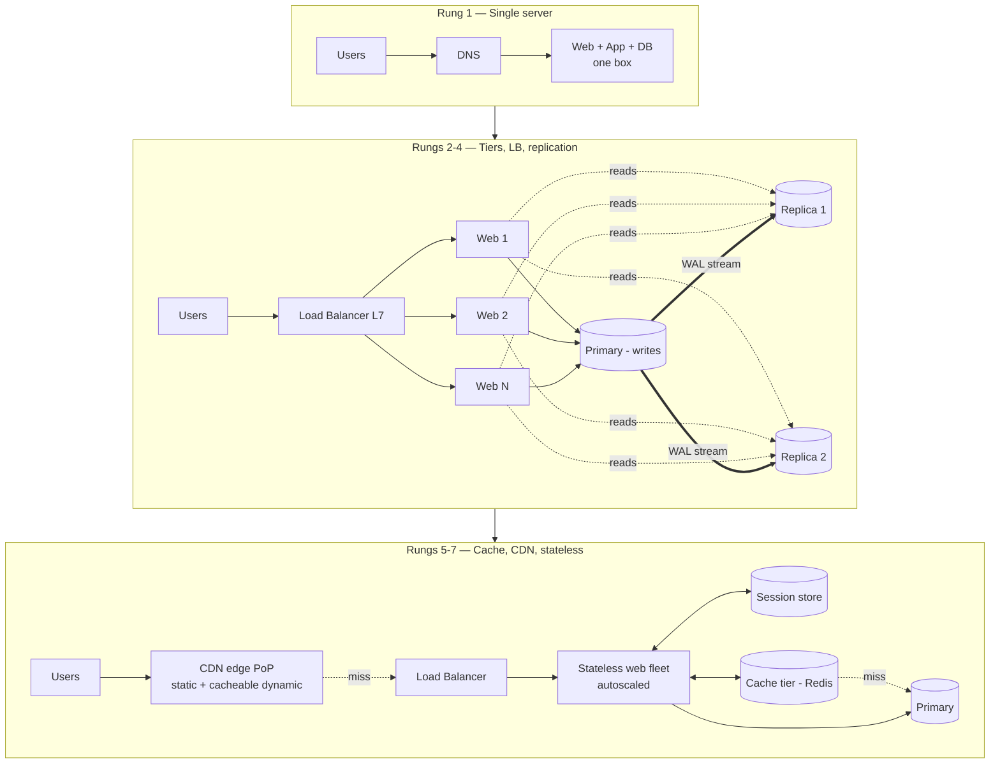
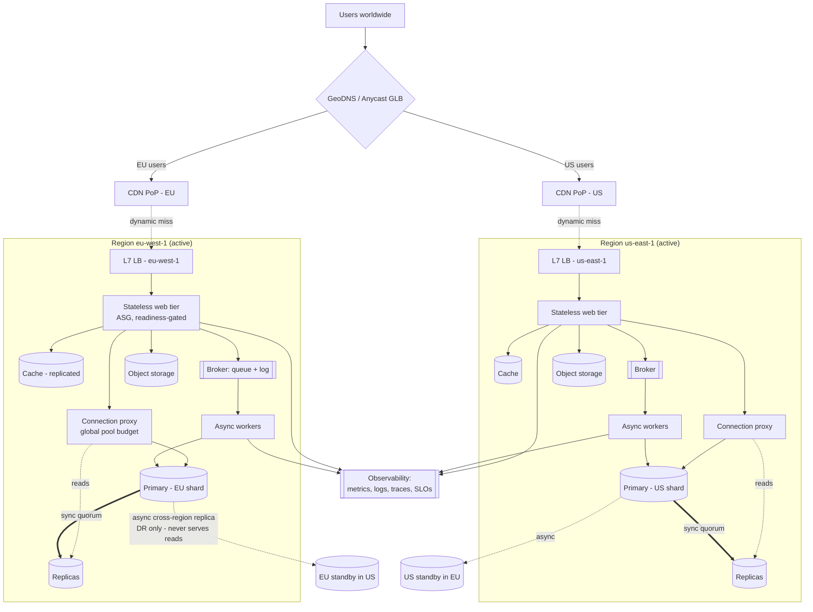
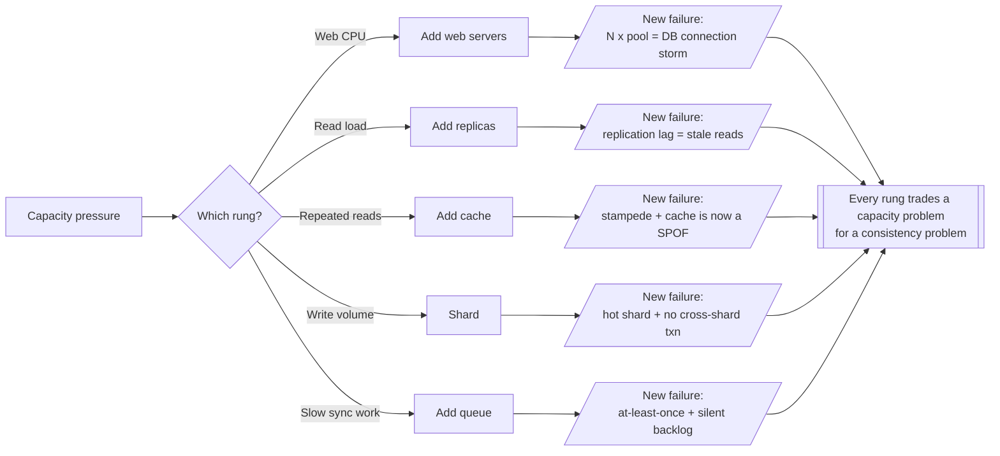
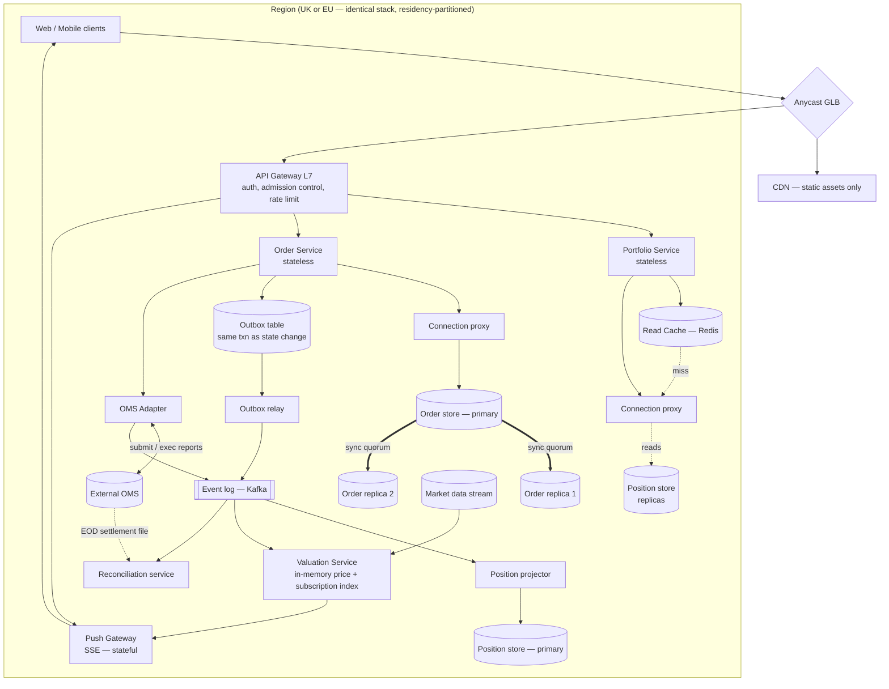
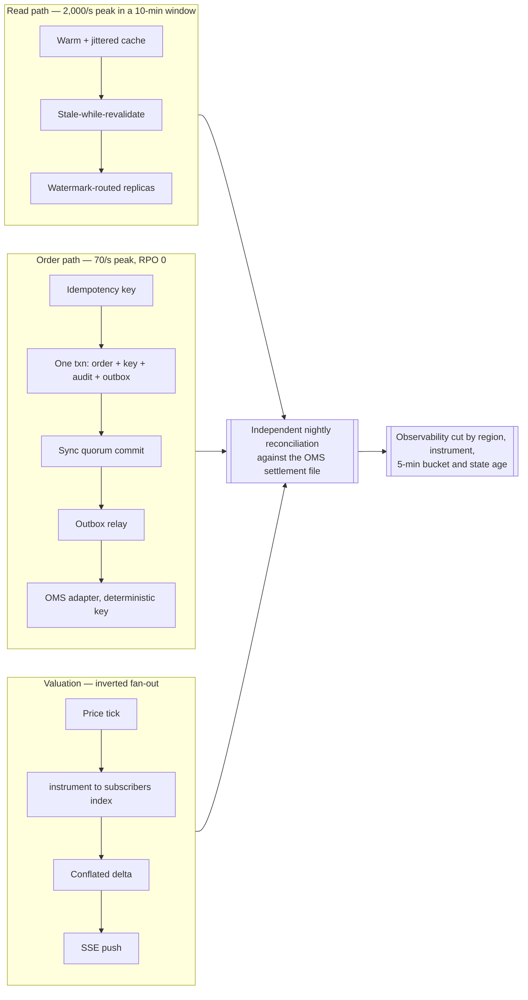
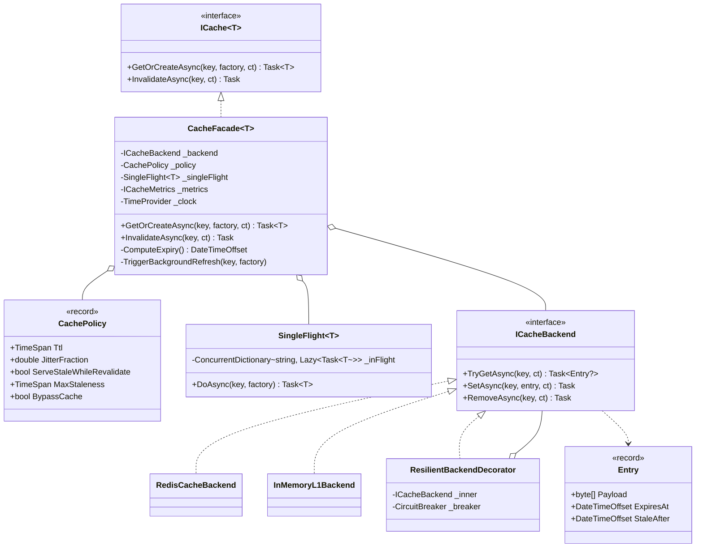
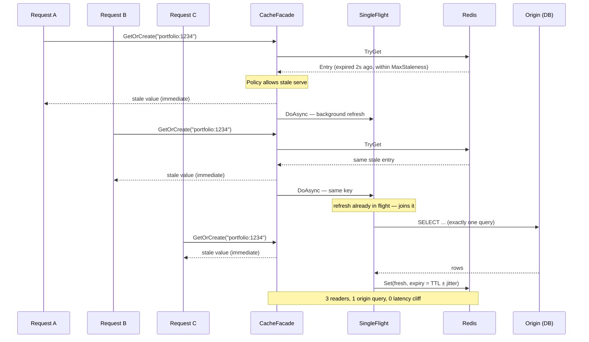

# Module 191 — System Design: Scaling Foundations — From a Single Server to Millions of Users, and the Building-Block Catalogue

> Domain: System Design | Level: Beginner → Expert | Prerequisite: [[01-System-Design-Fundamentals]] (this module supersedes its five-paragraph §2 with the full building-block treatment — 01 is left as-is per the no-retrofit default), [[16-Interview-Execution-Playbook-Estimation-Rubric]] (the clock, the rubric, the estimation constants this module reuses), [[15-RateLimiting-Throttling-LoadShedding-Algorithms]] (admission control — the mechanism §14's incident needed and did not have), [[17-Designing-URL-Shortener-Distributed-ID-Generation]] (the first case study that actually climbs this ladder), [[../16-Distributed-Systems]] (consensus, replication and tail latency in their own right), [[../07-Redis]] (cache internals), [[../04-SQL-Server]] + [[../05-PostgreSQL]] (the replication and connection-handling mechanics referenced throughout §2.3 and §14)

---

**Why this module exists.** This folder's coverage audit found a structural gap underneath an otherwise strong domain. Modules 02–20 are case studies at Staff/Principal depth, and every one of them *assumes* a vocabulary — load balancer, replica, cache-aside, CDN, stateless tier, shard key — that the folder never actually derives. Module 01 carries that entire load in five paragraphs. Meanwhile the single most frequently asked **opening** in a system design interview is not "design Instagram" at all. It is some phrasing of:

> *"Start with one server. Now I give you a million users. Walk me through what changes, and why."*

That prompt is asked at every firm in the §A2 panel, usually in the first ten minutes, and often as the entire screen for a Senior candidate and the *warm-up* for a Principal one. It is asked because it is a near-perfect diagnostic: it has no trick, no domain-knowledge requirement, and no single right answer — so what it measures is purely **whether you reason about systems causally or from memory**.

**The distinguishing property of this module.** There is a canonical eleven-rung ladder for this question — single server → split the data tier → load balancer → replication → cache → CDN → stateless tier → multiple data centres → message queue → observability and automation → sharding. It is the correct ladder. It is also, recited as a list, a **failing answer at the Principal bar**, and this module exists mostly to explain why.

The reason is this, and it is the recurring finding of the whole module:

> **Every rung on the ladder converts a capacity problem into a consistency problem.**

You do not climb the ladder to make the system better. You climb it to trade a failure mode you have run out of headroom for, against a failure mode you have decided you can afford. Adding replicas does not "improve reads" — it *buys read throughput with stale reads*. Adding a cache does not "make it faster" — it *buys latency with staleness, a stampede risk, and a new single point of failure you did not budget for*. Adding a queue does not "decouple services" — it *buys availability with at-least-once delivery, lost ordering, and unbounded backlog*. A candidate who lists the rungs knows the map. A candidate who can state, for each rung, **what it costs, what new incident it makes possible, and what measured signal justifies climbing it**, is doing the job.

The second finding, which the case-study modules keep re-encountering in different costumes:

> **The ladder is not a roadmap. A rung you climb without a measured bottleneck buys you its failure modes for free and its benefits not at all.**

And the third, specific to the §A2 panel and the reason this module is not simply a restatement of the public sources:

> **In a regulated firm the ladder is reordered.** Multi-region arrives early and for disaster-recovery reasons, not scale reasons. Sharding may be *prohibited* outright by a data-residency rule. A stale cached balance is not a UX blemish, it is a customer-harm event with a reporting obligation. Anyone who recites the consumer-internet ordering inside a bank interview is telling the panel where they have not worked.

---

## 1. Fundamentals

### What is "scaling", precisely?

Scaling is **adding capacity without changing the contract the system offers its users.** That definition is doing more work than it appears to. The hard part of every rung below is never the capacity — it is holding the contract fixed while the mechanism underneath it changes shape.

Two axes, and the interview vocabulary for them:

- **Vertical scaling ("scale up")** — a bigger machine. More cores, more RAM, faster disk. Its virtues are enormously underrated: it changes no semantics, introduces no distributed-systems failure modes, requires no code change, and can be executed on a Tuesday afternoon. Its limits are real but further away than most candidates assume — a single modern cloud instance offers on the order of 200+ vCPU and multiple terabytes of RAM, and a single well-tuned PostgreSQL or SQL Server instance will serve tens of thousands of transactions per second. Its actual defeaters are (a) the hard ceiling of the largest instance, (b) cost curving super-linearly at the top of the range, and (c) **it remains a single point of failure no matter how large it is** — which is usually the binding constraint long before throughput is.
- **Horizontal scaling ("scale out")** — more machines. Effectively unbounded, cheaper per unit of capacity, and the only path to fault tolerance. It costs you *everything that is hard about distributed systems*: partial failure, coordination, consistency, clock skew, and the operational surface of N of a thing rather than one.

The Principal-level framing: **vertical scaling is what you do until you are forced to stop; horizontal scaling is what you are forced into.** Not the reverse. A candidate who reaches for sharding in minute four of a design for a system doing 40 requests per second has failed the estimation step and revealed that they are pattern-matching rather than reasoning.

### Why does this matter?

Three reasons, in ascending order of how much they count at the Staff+ bar.

1. **It is the most common opener, so it is where the interviewer forms their prior.** Everything you say for the next forty minutes is interpreted through the impression made here.
2. **It is the purest available test of causal reasoning.** There is no domain knowledge to hide behind. The interviewer is watching whether each step you propose is *derived from a stated pressure* or simply recalled.
3. **It is where over-engineering is detected.** The single most reliable negative signal in a system design interview is a candidate who arrives at a globally-sharded, multi-region, event-sourced, CQRS architecture for a workload that would run comfortably on one machine. It reads as inexperience, because engineers who have actually operated distributed systems are visibly reluctant to create them.

### When does this matter?

- **Whenever the prompt is deliberately open-ended and low-context** ("design a system for a startup that's growing"). This is the ladder question in disguise.
- **Whenever the interviewer's follow-up is "and now 10×".** They are testing whether your design has a *next rung* or a cliff.
- **In real work, at every capacity review**, where the discipline is identical and the stakes are budget rather than an offer.

### How does it work (30,000-ft view)?

The whole module in one frame. Read the right-hand columns as the actual content — the left column is just the sequence everybody already knows.

| Rung | The capacity problem it solves | The consistency/failure problem it creates | The signal that justifies it |
|---|---|---|---|
| 1. Single server | — | Total SPOF; no isolation between web and data workloads | — (this is the start) |
| 2. Split web / data tiers | Web and DB contend for the same CPU, RAM and page cache | A network now sits between app and data: pool exhaustion, timeouts, partitions | DB and app processes fighting for RAM; noisy-neighbour CPU |
| 3. Load balancer + N web servers | One web box is CPU/connection-bound; it is also a SPOF | Session affinity; health checks that lie; N× the connection load on the DB | Web-tier CPU sustained > ~60%, or an availability requirement |
| 4. Replication (leader/follower) | Read throughput exceeds one primary; no read redundancy | **Replication lag** ⇒ read-your-writes violations; failover ⇒ split brain, data-loss window | Read:write ratio > ~5:1 and primary read CPU saturated |
| 5. Cache tier | Repeated identical reads hit disk/DB | Staleness; **stampede**; a new SPOF; cold-start cliff after restart | Reads with high hit-ratio potential (read often, write rarely) |
| 6. CDN / edge | Static and large-object bandwidth at origin; global RTT | Invalidation; shipping a bug that is cached for 24 h; egress cost | Static-asset bandwidth, or users far from origin |
| 7. Stateless web tier | Cannot autoscale or shed a node while it holds session state | The session store is now the SPOF; "stateless" is easy to claim and hard to be | You want autoscaling or zero-downtime deploys |
| 8. Multiple data centres | Regional outage; cross-continent latency; data residency | Split brain; cross-region data sync; GeoDNS TTL makes failover slower than you think | An availability/RTO target one region cannot meet — **or a regulator** |
| 9. Message queue | Slow synchronous work sits on the request path | At-least-once delivery; ordering loss; unbounded backlog; poison messages | Work that need not be synchronous is on the critical path |
| 10. Observability + automation | You cannot see which rung to climb next | Cost; alert fatigue; **metrics structurally blind to the failure** | Should have been rung 0, honestly |
| 11. Sharding | One primary cannot hold the data or absorb the writes | Cross-shard joins and transactions; **hot shards**; resharding is a migration project | Write throughput or dataset size exceeds one primary, after 1–10 are exhausted |

Two things to notice, because they are what the interviewer is listening for.

**Rung 10 is misplaced in the canonical ordering, and saying so is a strong signal.** You cannot correctly choose rungs 3 through 11 without measurement, because every one of them is justified by a number. Observability is not the tenth thing you add; it is the instrument by which you learn which rung you actually need. In practice teams add it tenth and spend rungs 3–9 guessing.

**The ladder describes what *happened* to consumer-internet companies between 2005 and 2015. It is a history, not a design method.** The method is: measure the bottleneck, choose the cheapest rung that removes it, and pay attention to what it broke. That can produce the canonical order — and for a consumer product it usually does — but the ordering is an output, not an input.

---

## 2. Deep Dive

### 2.1 Rung 1 → 2: the single server, and what actually forces the split

**The single-server request path**, in full, because interviewers do ask candidates to trace it and a surprising number cannot:

1. The user types `api.example.com`. The browser checks its own cache, then the OS resolver cache, then `hosts`, then asks the configured recursive resolver.
2. The recursive resolver, on a miss, walks the hierarchy: root → TLD (`.com`) → the zone's authoritative nameservers, which return an `A`/`AAAA` record — say `15.125.23.214` — with a **TTL**.
3. That TTL is the thing that matters later. It is the *floor* on how fast any DNS-based failover can take effect, and it is honoured unevenly: browsers, JVMs (which historically cached DNS forever under the default `networkaddress.cache.ttl`) and corporate resolvers all lie about it in different directions. **Design consequence: DNS is a poor failover mechanism and a fine discovery mechanism.**
4. The browser opens TCP to :443, completes the TLS handshake (1-RTT with TLS 1.3, plus the certificate chain), and issues the HTTP request.
5. One process on one box parses the request, executes application code, opens a local socket to the database on the same machine, gets rows, serialises JSON, and returns it.

**What one box genuinely buys you.** This deserves saying out loud in an interview because it inoculates you against the over-engineering charge: a single 16-core box with an NVMe disk, running a compiled or JIT'd stack against a local relational database, will comfortably serve **thousands of requests per second** against a dataset in the hundreds of gigabytes. That is a real business. Most systems never need rung 3, and a meaningful fraction of the ones that built rungs 3–11 did so from ambition rather than measurement.

**What actually forces the split into separate web and data tiers** — and note that none of these is "we got popular":

- **Memory contention.** A relational database wants to own the machine's RAM for its buffer pool. An application runtime wants heap. They fight, and the loser is whichever one starts swapping — after which p99 latency goes vertical while CPU looks fine, one of the most confusing single-box failure signatures there is.
- **Independent scaling shapes.** Web tiers are CPU-bound and stateless; databases are memory- and IO-bound and stateful. They want different instance types, different upgrade cadences and different failure handling.
- **Blast radius and lifecycle.** You want to deploy application code twenty times a day and restart the database approximately never. Sharing a host couples those.
- **Security posture.** Once split, the database sits in a private subnet with no route from the internet, reachable only from the web tier's security group. On one box, an application-layer RCE is also a database compromise. In a PCI-DSS or SOX environment this argument alone ends the discussion, at any scale.

That last point is the fintech reordering appearing for the first time: **rung 2 is mandatory in a regulated firm at 10 users, for reasons that have nothing to do with capacity.**

**SQL or NoSQL, asked here and answered once.** The canonical sources put this decision at rung 2, and the canonical answer — *relational is right for most systems; reach for non-relational when you need very low latency at extreme scale, have genuinely unstructured data, or must store volumes a single primary cannot hold* — is correct but incomplete at this bar. Two additions earn the marks:

- **The decision is usually made by the access pattern, not the data.** If you know every query in advance and they are all single-key or single-partition lookups, a key-value or wide-column store is a good fit and its scaling story is far better. If the queries are *not* knowable in advance — ad-hoc reporting, joins across entities, "the business will ask new questions" — a relational engine's query planner is the feature you are actually buying, and giving it up means re-implementing joins in application code, badly.
- **In the §A2 domain, choose the boring ACID relational engine and say why.** Transactional integrity, mature tooling, decades of operational knowledge, DBAs you can actually hire, point-in-time recovery, and auditors who already understand it. A ledger, a position book or an order store on an eventually-consistent engine is a decision you will spend the rest of the design defending. This is the same reasoning Module 18 §12 applies to the payments ledger, and it generalises.

### 2.2 Rung 3: the load balancer — and the health check that lies

**L4 vs L7.** A **Layer 4** balancer forwards TCP/UDP by connection, choosing a backend once and pinning the flow. It is fast (no payload parse), protocol-agnostic, and preserves the connection end-to-end — which makes it right for non-HTTP protocols, for very high packet rates, and for anything where TLS must terminate on the backend rather than the balancer. A **Layer 7** balancer parses the HTTP request, which lets it route on path, host, header or cookie; terminate TLS centrally; retry idempotent requests against a different backend; enforce per-route timeouts; and emit per-route metrics. It costs CPU and one hop of latency.

The Principal-level observation: **L7 is where a large amount of otherwise-unowned policy naturally lives** — retries, timeouts, circuit breaking, header-based canary routing, request-ID injection, WAF rules — and if you do not put it there you will find it re-implemented inconsistently in every service. That is the entire argument for an API gateway (Module 128's domain) and for a service mesh's sidecar (Module 150's), and naming the continuity out loud is worth a mark.

**Algorithms, and when each is actually wrong:**

| Algorithm | Mechanism | Fails when |
|---|---|---|
| Round robin | Next backend in order | Request costs are uneven — a backend that got three expensive requests gets a fourth anyway |
| Weighted round robin | Fixed weights per backend | Heterogeneous fleet where weights are set once and never revisited |
| Least connections | Fewest in flight | A *broken* backend that fails instantly has zero connections, so it attracts **all** traffic — the classic "black hole" |
| Least response time | Fewest connections × lowest latency | Same black-hole risk: a fast-failing backend looks fastest |
| Consistent hashing | Hash the key onto a ring | Key skew ⇒ hot backend; but essential for cache affinity and sticky routing |
| Power of two choices | Sample two at random, pick the less loaded | Rarely wrong; the best default under uneven request costs at scale |

"Least connections plus a fast-failing backend equals a black hole" is a genuinely good thing to say unprompted. It is the mechanism behind a large fraction of real partial outages, and it is why **outlier detection / passive health checking** — eject a backend that returns errors quickly, not merely one that stops responding — exists.

**Health checks are where this rung actually goes wrong.** Three levels, and the gap between them is where incidents live:

- **Shallow** — TCP connect succeeds, or `GET /health` returns 200 from a handler that does nothing. This proves a process is bound to a port. It does not prove the application works. A service whose connection pool is exhausted, whose downstream dependency is down, or that is in a GC death spiral will pass this check with confidence, and the balancer will keep feeding it traffic.
- **Deep** — the check exercises the critical dependencies (a real query, a real cache round-trip). This detects what shallow checks miss, and introduces something worse: **if the shared dependency degrades, every backend fails its health check simultaneously and the balancer removes the entire fleet.** A partial degradation becomes a total outage, caused by the safety mechanism. This is a real and frequent production incident, not a theoretical one.
- **The resolution used in practice** — separate **liveness** (should this process be restarted? shallow, cheap, no dependencies) from **readiness** (should this process receive traffic? deeper, but with a floor: never let the fleet drop below a minimum healthy percentage regardless of check results). AWS calls that floor *minimum healthy targets*; Envoy calls it *panic mode* — below a threshold of healthy hosts it reverts to balancing across **all** hosts, on the reasoning that a degraded backend beats no backend. Naming this behaviour is a strong signal, because it shows you have operated a fleet rather than only drawn one.

**And the thing rung 3 quietly did to rung 2:** you now have N web servers, each with its own database connection pool. The database's connection load just became `N × pool_size`, a number nobody chose. Hold that thought until §14, where it causes the outage.

### 2.3 Rung 4: replication — where capacity becomes consistency

**Topology.** One **leader** (primary/master) accepts writes; one or more **followers** (replicas/slaves — the older terminology still appears in vendor docs and interview prompts, so recognise it) receive a stream of changes and serve reads. Modern engines ship the change stream as a physical log (PostgreSQL WAL streaming, SQL Server Always On log blocks) or a logical one (MySQL binlog row events, PostgreSQL logical decoding). The distinction matters: physical replication is byte-identical and cheap but requires matching versions and replicates everything; logical replication can cross versions, filter tables and feed heterogeneous consumers — which is what makes it the substrate for CDC and the Outbox pattern (Module 37).

**Synchronous vs asynchronous is the actual decision**, and it is a durability decision wearing a performance costume:

- **Asynchronous** — the leader commits and acknowledges the client without waiting for any follower. Write latency is unaffected. **If the leader dies, every transaction that had not yet reached a follower is lost.** Your RPO is not zero; it is "however far behind the follower was" — a number you should be able to state and alert on.
- **Synchronous** — the leader waits for at least one follower to acknowledge the log record before acknowledging the client. RPO is zero for a single-node failure. You have added a full network round trip to *every write*, and — the part candidates miss — **you have coupled your write availability to the follower's availability**. If the sole synchronous follower goes down, writes stall. The mitigations are a quorum (`synchronous_standby_names = 'ANY 1 (a, b, c)'` in PostgreSQL — wait for any one of three, so any single failure is survivable) or an automatic degrade-to-async, which silently returns you to a non-zero RPO exactly when you are least able to notice.

For a ledger, a position book, or anything a regulator will ask about, the answer is synchronous-with-quorum and the cost is accepted. For a social feed it is asynchronous and nobody thinks about it again. **Saying which one you are designing, and why, is the whole point of the question.**

**Replication lag is the consistency problem this rung creates, and it has a specific user-visible symptom: the read-your-writes violation.**

The sequence is mundane and the bug report is maddening. A user submits a transfer. The write goes to the leader and commits. The application immediately redirects to the balance page. That read is load-balanced onto a follower 40 ms behind. The user sees their *old* balance. They refresh, hit a different follower, and see the new one. To the user, the money briefly vanished. In a retail brokerage that is a support call, and at volume it is a complaint pattern a regulator will eventually ask about.

Six mitigations, in the order you should reach for them:

1. **Read from the leader after a write, for a bounded window.** Simple, effective, and gives back some of the read capacity you just bought. Usually right for the small set of endpoints that need it.
2. **Route by session.** Pin a user to the leader for N seconds after any write, via a cookie or a per-session flag.
3. **Watermark / LSN routing.** On write, capture the leader's log position (PostgreSQL `pg_current_wal_lsn()`, MySQL GTID). Store it against the session. On read, choose a follower whose applied position is at or beyond that watermark, else fall back to the leader. This is the correct general mechanism — per-request correctness rather than a guessed time window — and it is what §13 builds and §11's Hard exercise implements.
4. **Monotonic reads via a sticky follower.** Pin a session to one follower so time never appears to run backwards, even if it is behind.
5. **Design the read out of existence.** The transfer response can simply *contain* the new balance. A great deal of read-your-writes pain is self-inflicted by a redirect-then-read pattern that a return value would have avoided.
6. **Accept it, explicitly, and say so.** For a "likes" count, staleness is free. The failure mode is not omitting the mitigation; it is applying it *uniformly* to endpoints that never needed it and paying leader capacity for nothing.

**Failover, and the two numbers that define it.** When the leader dies: detect (heartbeat timeout), elect or select a new leader, redirect writes, reconfigure the remaining followers. Two numbers govern the design and you should be asked for both:

- **RPO (Recovery Point Objective)** — how much data you may lose. Set by sync-vs-async, above.
- **RTO (Recovery Time Objective)** — how long you may be down. Set by detection timeout + election + traffic redirection. **The redirection step is where DNS TTL from §2.1 comes back to bite:** if failover changes a DNS record with a 300-second TTL, your RTO is at least five minutes plus however long clients ignore TTLs. This is why serious setups fail over behind a *stable* endpoint — a virtual IP, a proxy such as PgBouncer or ProxySQL, or a cloud-managed cluster endpoint — and never by DNS alone.

**Split brain** is the failure mode of the failover mechanism itself: a network partition makes the leader unreachable to the failover controller but perfectly reachable to some clients. A new leader is promoted. Two leaders now accept conflicting writes to the same rows. Reconciling that afterwards ranges from painful to impossible, and for a ledger it is unrecoverable — you cannot decide after the fact which of two conflicting debits was real. The defences: **fencing** (STONITH, or a fencing token the storage layer refuses to accept from a stale leader), and requiring a **quorum** to promote so a minority partition cannot elect anyone. This is the point where "just add replication" turns out to require consensus, and where Raft and Paxos stop being trivia — the interviewer's follow-up is often exactly *"who decides that the leader is dead?"*

**Quorum arithmetic**, for the leaderless/Dynamo-style systems that arise in the same conversation: with N replicas, W write acknowledgements and R read acknowledgements, **W + R > N** guarantees the read set intersects the write set and therefore observes the latest write. N=3, W=2, R=2 is the standard tuning: any single node may fail without losing either availability or consistency. W=1, R=1 is fast and eventually consistent; W=N is durable and unavailable under any single failure. The companion mechanisms are **read repair** (fix stale replicas discovered during a read) and **hinted handoff** (a live node temporarily accepts a write destined for a dead one and forwards it on recovery) — both trading a stronger convergence guarantee for a weaker instantaneous one.

**CAP, and why PACELC is the better tool.** CAP: under a network **P**artition you must choose **C**onsistency or **A**vailability. Since partitions are not optional in a real network, the practical framing is CP-vs-AP *during a partition*. This is true and it is also nearly useless as a design tool, because partitions are rare and CAP says nothing about the other 99.9% of the time. **PACELC** repairs that: *if **P**artition, choose **A** or **C**; **E**lse, choose **L**atency or **C**onsistency.* The second clause governs your daily operation, and it is exactly the synchronous-versus-asynchronous replication decision above. A candidate who reaches for PACELC unprompted signals thinking past the interview-prep level.

### 2.4 Rung 5: caching — the rung that creates the most incidents

**When a cache is appropriate**, stated as a test rather than a vibe: the data is **read frequently and modified infrequently**, and staleness for the duration of the TTL is *acceptable to the business*. That second clause is the one that gets skipped, and it is the one that matters in a bank. Cache a product catalogue freely. Cache a settled position with care. Do not cache an available balance used for a trading limit check without an explicit, documented decision about the staleness window — because "the customer traded against a balance that was 30 seconds old" is a control failure, not a performance characteristic.

**The four patterns, all four.** Existing folder material names three; read-through is the one it omits, and it is asked by name.

| Pattern | Read path | Write path | Cost / risk |
|---|---|---|---|
| **Cache-aside** (lazy loading) | App checks cache; on miss reads DB and populates | App writes DB, then invalidates (or updates) the cache | Most common and most flexible. Every miss pays DB latency; cold cache after restart; the app owns invalidation correctness, and gets it wrong |
| **Read-through** | App asks the *cache*, which fetches from the DB on a miss itself | Usually paired with write-through | Simpler app code, population logic in one place; needs a cache/library that supports it; still cold on start |
| **Write-through** | As read-through | Write goes to cache **and** DB synchronously | Cache is never stale; every write pays both latencies; caches data that may never be read |
| **Write-behind** (write-back) | From cache | Write hits cache, flushed to DB asynchronously | Lowest write latency; **data-loss window if the cache dies before flush**; the DB is not the system of record between flushes. Almost never acceptable for financial data |

**Invalidation**, which is genuinely hard and where specific vocabulary helps: **TTL-based** (simple, bounded staleness, but every key expires whether or not it changed); **explicit invalidation on write** (precise, but every write path must remember, and one forgotten path is a permanently stale key); **event-driven via CDC** (the database's own change stream drives invalidation, so it cannot be forgotten by an application author — the strongest form, and a direct link to Module 37's Outbox/CDC material); and **versioned keys** (never invalidate; put the version in the key — `user:1234:v7` — so a write orphans the old entry and eviction cleans up). That last one makes staleness *unrepresentable* rather than merely detectable, which is this folder's recurring preference.

**Eviction policies**, since the trade-off rather than the definition is what is asked: **LRU** is the default because recency is a good cheap proxy for future access; it fails under a scan, where one large sequential job evicts the entire working set. **LFU** resists scans by counting frequency but ages badly — yesterday's hot key stays resident forever unless the counter decays, which is why Redis's `allkeys-lfu` uses a probabilistic decaying counter. **FIFO** is simple and usually worse than LRU. **Random** is dramatically better than its reputation and is essentially what Redis's approximated LRU does (sample K keys, evict the oldest of the sample) because exact LRU's bookkeeping costs more than the accuracy is worth. **TTL-only** avoids the choice by bounding staleness instead of size, and then you discover memory was the bound after all.

**The three failure modes this rung introduces**, all of which have caused real outages:

- **Cache stampede / thundering herd.** A hot key expires. Two thousand concurrent requests miss simultaneously and all two thousand issue the identical query. The database, sized for the *cached* load, falls over — and now the cache cannot be repopulated, so every subsequent request also misses. This is a **metastable failure**: the system will not recover when load returns to normal, because the failure sustains itself. Defences: **request coalescing / single-flight** (one caller populates, the rest await the same in-flight result), **probabilistic early expiry** (each reader independently and randomly refreshes slightly before the TTL, spreading the herd), **TTL jitter** (never expire a class of keys at the same instant), and **serve-stale-while-revalidate** (return the expired value and refresh in the background — the best answer whenever the business can accept it).
- **The cache is now a SPOF you did not budget for.** Once the database is sized for a 95% hit ratio, losing the cache means the database receives 20× its provisioned load instantly. "The cache is just an optimisation" is true architecturally and false operationally. Test it: fail the cache in a game day and see whether the origin survives. If it does not, you need a replicated cache, a local in-process L1 tier in front of it, or an admission-control mechanism (Module 175) that sheds load rather than collapsing.
- **The cold-start cliff.** A cache restart or a full deploy leaves you at 0% hit ratio against a database provisioned for 95%. The same collapse, self-inflicted on a schedule. Mitigations: rolling restarts that never clear more than a fraction, cache warming on startup, and — again — an admission controller, so a cold cache degrades latency rather than availability.

### 2.5 Rung 6: CDN and the edge

A **CDN** is a geographically distributed set of caching reverse proxies. A user in Singapore fetches `logo.png` from a Singapore PoP rather than from `us-east-1`, removing both origin bandwidth and roughly 200 ms of round-trip time. For static assets it is close to free money — hence its position on the ladder.

What earns marks past the definition:

- **What belongs there.** Static assets first (JS, CSS, images, fonts, video segments). Then, more interestingly, *cacheable dynamic responses* — an API response with a 10-second edge TTL can absorb an enormous read fan-out, and this is the trick behind serving a viral item without the origin noticing. And then **anything you can compute at the edge**: TLS termination, compression, request coalescing, WAF, bot filtering, increasingly authorization — all of which reduce origin *load* rather than merely origin bandwidth.
- **Invalidation is the operational hazard.** Long TTLs are what make a CDN effective and are also how you ship a bug that is cached globally for 24 hours. The professional answer is **immutable, content-hashed URLs** (`app.a91f3c.js` with `Cache-Control: max-age=31536000, immutable`) behind a short-TTL HTML document that points at them. Deployment then changes a pointer rather than invalidating content, purge APIs become an emergency tool rather than a routine one, and rollback is instant. Same principle as versioned cache keys in §2.4: **make the stale state unrepresentable rather than detectable.**
- **Origin shield.** A single mid-tier cache in front of the origin, so that N edge PoPs missing simultaneously produce one origin request rather than N. The CDN's own answer to the stampede problem, and worth naming.
- **Cost, and the fintech reordering again.** CDN egress is billed and cross-region origin egress is billed more; at video scale this dominates the entire infrastructure bill (Module 05's economics). And the constraint that overrides all of the above: **a CDN is a third party caching your bytes in jurisdictions you did not choose.** For public marketing assets that is fine. For anything containing customer data the residency and PCI-scope questions come first, and the honest answer in many banks is that dynamic content does not go to the edge at all, or goes only to PoPs in approved regions under a contractual data-processing agreement.

### 2.6 Rung 7: the stateless web tier — a claim that is easy to make and hard to be true

The move: get session state off the web servers and into a shared store (Redis, or a database), so that **any request can be served by any server**. That unlocks autoscaling, instant node replacement, rolling deploys and spot instances.

**Sticky sessions are the thing you are removing**, and the reason is worth stating precisely: affinity means a node's failure takes its users' sessions with it, scale-in events log people out, load rebalances unevenly because sessions are long-lived, and deploys are disruptive. Affinity is not always wrong — it is genuinely useful for cache locality and mandatory for long-lived WebSocket connections — but it should be a deliberate optimisation, never an accident of storing state in a local variable.

**The two things candidates miss here, and both are Principal-level marks:**

1. **You did not eliminate the state; you moved it, and it is now a shared dependency on the critical path of every request.** The session store is the new SPOF. It needs replication, failover and a capacity plan of its own — and if it is down, *every* web server is useless, which is strictly worse than the pre-move situation where one server's death affected one server's users. The alternative that avoids the shared store entirely is a **signed, self-contained token** (JWT) carrying the session claims — no lookup at all — which trades the SPOF for the revocation problem, since you cannot un-issue a token that has already been signed. That trade is the actual decision (and Module 41's territory). Neither option is free; picking one and naming its cost is the answer.
2. **"Stateless" excludes more than sessions.** A web tier is not stateless if it holds an in-process cache whose contents affect correctness, a local rate-limit counter (which now permits N× the intended rate across N nodes — Module 175 §2), in-flight background work that dies with the node, sequence numbers or ID counters, or scheduled jobs running on every replica. And — the one that matters in §14 — **a connection pool is state**: a finite reservation against a shared downstream resource, held per node, sized as though the node were alone.

### 2.7 Rung 8: multiple data centres

**Mechanism.** **GeoDNS** resolves the same hostname to different addresses by client location, sending users to the nearest healthy region. During a regional failure traffic is redirected to the survivors — with the DNS TTL caveat from §2.1, which is why anycast or a global load balancer behind a single stable IP is the better mechanism where available.

**Active-active vs active-passive** is the decision:

- **Active-passive (warm standby).** One region serves; the other replicates and waits. Simple, and its consistency story is the single-leader story from §2.3. Its weakness is that **an untested failover does not work** — the standby's capacity, configuration drift, certificate expiry and scaling limits are all unverified until the day you need them. If you build this you must exercise it on a schedule, in production. A standby that has never taken traffic is a hypothesis, not a control.
- **Active-active.** Both regions serve. Capacity is used rather than parked, failover is proven continuously because it is just a traffic shift, and latency is better for everyone. The cost is that you must now answer **where writes happen.** Either writes still funnel to one region (simple; a cross-region RTT on every write — ~70 ms US-east↔US-west, ~150 ms transatlantic, which for a chatty write path is fatal), or both regions accept writes and you have a **multi-leader** system with genuine write-write conflicts: last-write-wins and its silent data loss; CRDTs where the data type permits; or partitioning ownership so each key has exactly one authoritative region — usually the only defensible answer for financial data.

**Split brain again**, one level up: if the inter-region link fails and both regions believe the other is dead, both serve and both accept writes. Whatever your conflict resolution is, this is when it gets exercised — at the worst possible moment, at volume.

**And the reordering, stated plainly, because it is the single most useful thing this module says to a candidate interviewing at a bank:** in the consumer-internet ladder, multi-region is rung 8 and arrives when you have global users. **In a regulated firm it arrives at rung 2 or 3, and scale has nothing to do with it.** The drivers are a regulator-mandated RTO/RPO and a documented, *tested* disaster-recovery capability (the EU's DORA regime and the UK's operational-resilience rules both require demonstrated recovery within an impact tolerance, not merely a design that could recover); data-residency law that forbids a customer's records leaving a jurisdiction; and audit obligations. A firm with 50,000 users and a single region has a finding to remediate, not headroom to enjoy. Conversely, the same rules can *forbid* rung 11: if EU customer data may not be stored outside the EU, a global hash-based shard key is illegal, and the shard key must be geographic whether or not that distributes load evenly.

### 2.8 Rung 9: message queues, and what "decoupling" actually costs

**Mechanism.** Producers publish; consumers process independently. The canonical example is image processing: the web request stores the upload and enqueues a job, returning in 40 ms rather than blocking for eight seconds of transcoding. Producer and consumer scale independently; a consumer outage becomes a backlog rather than a user-facing failure.

The two shapes, which candidates conflate and interviewers separate: a **queue** (RabbitMQ, SQS) delivers each message to exactly one of a set of competing consumers and then deletes it — the right model for work distribution. A **log** (Kafka) retains an ordered, replayable sequence that any number of independent consumer groups read at their own offsets — the right model when several unrelated subsystems need the same events, and when replay from an arbitrary point is a requirement. Choosing a queue when you needed a log means adding a second consumer requires re-publishing; choosing a log when you needed a queue means implementing work distribution over partitions yourself.

**What the queue costs**, none of which is optional:

- **At-least-once delivery is the default**, so **consumers must be idempotent.** Not "should be." A redelivery after a consumer crashed between processing and acknowledging is normal operation, not an error case. The identity worth memorising, because it recurs in Modules 18 and 20 and is a stock follow-up: **exactly-once = at-least-once (retries) AND at-most-once (idempotency keys).** No delivery mechanism provides it; it is assembled from two mechanisms on opposite sides of the wire.
- **Ordering is lost the moment you scale consumers.** One consumer preserves order and caps throughput. N consumers scale and reorder. Kafka's compromise — order within a partition, partition chosen by key — is the standard answer: order is preserved per entity (per account, per order ID), which is almost always the only ordering the business actually required. Say "per-key ordering, not global ordering" and the follow-up usually stops.
- **Backlogs are unbounded and silent.** A consumer 10% too slow does not fail; it falls behind forever, and the symptom is that data is *late*, which no error-rate dashboard shows. **Consumer lag and message age are the metrics that matter, and they must be alerted on by age rather than by rate** — this folder's recurring "detect by aging, not by rate" finding, in its messaging costume.
- **Poison messages.** One malformed message that always throws will be retried forever, blocking its partition or spinning the consumer. A **dead-letter queue** with a bounded retry count is mandatory — and the part usually forgotten is that the DLQ needs an owner, an alert and a documented replay procedure, or it becomes a place where data goes to be silently lost.
- **The dual-write problem.** "Write to the database, then publish to the queue" is not atomic. A crash in between leaves the two permanently inconsistent, and this is one of the most common real defects in event-driven systems. The fix is the **Outbox** pattern (Module 37): write the event to a table in the same transaction as the state change, and relay it to the broker asynchronously.

### 2.9 Rung 10: observability and automation — misordered on purpose

Three distinct things, routinely conflated:

- **Logs** — discrete events, high cardinality, expensive at volume. Structured (JSON, with a correlation ID) or nearly useless at scale.
- **Metrics** — cheap pre-aggregated numeric time series. The right tool for alerting and dashboards, and the wrong tool for asking a question you did not anticipate, because the aggregation has already discarded the dimension you now need.
- **Traces** — one request's path across services with per-hop timing. The only tool that answers "which of these eleven services made the request slow", and therefore the one whose absence you feel most acutely at exactly the point on this ladder where there are eleven services.

Then **the four golden signals** — latency, traffic, errors, saturation — and the discipline of **SLIs/SLOs and an error budget**, which converts "is it up?" into a number that can arbitrate the recurring argument between shipping features and shipping reliability.

**The finding this folder keeps re-deriving, restated here because rung 10 is where it is designed in or out:** *an aggregate cannot detect a concentrated failure, and a check whose expected set is derived from the logic being checked cannot detect that logic's omissions.* A 99.9% global success rate looks perfect while one tenant, one shard, one region or one currency is 100% broken. The remedies are the same triple every time: **percentiles and per-dimension breakdowns rather than means; a counter on every silent path** (every catch block, every discard, every "shouldn't happen" branch); **and an independent verifier whose expected set comes from a different source than the system under test.** Modules 13, 15, 17, 18, 19 and 20 each contain an incident of exactly this shape, with green dashboards throughout.

### 2.10 Rung 11: sharding — the rung of last resort

**Mechanism.** Partition the dataset horizontally across independent database instances by a **shard key**, so each shard holds a disjoint subset and no shard need hold or write the whole.

**Strategies, by name, because the names are asked:**

| Strategy | Mechanism | Strength | Weakness |
|---|---|---|---|
| **Range** | `user_id` 1–1M → shard 1, etc. | Range scans stay local; trivially understood | Hotspots — sequential keys (timestamps, auto-increment IDs) send **all** new writes to the last shard |
| **Hash** | `hash(key) % N` | Even distribution | Range scans fan out to every shard; **changing N rehashes almost everything** |
| **Consistent hashing** | Hash onto a ring with virtual nodes | Adding/removing a node moves only ~1/N of keys | More complex; still skews without virtual nodes |
| **Directory / lookup** | A lookup service maps key → shard | Maximum flexibility; rebalance a single key | The directory is a SPOF and a hop on every request; must itself be cached |
| **Vertical / functional** | Split by *table or domain*, not by row | Simple; no key choice; no cross-shard joins within a domain | Bounded — you run out of domains, and one domain can still be too big |
| **Geographic** | Partition by jurisdiction | Satisfies data residency; keeps latency local | Distribution follows the customer base, not the load |

**The three problems sharding creates**, each a project rather than a detail:

1. **Cross-shard joins and transactions stop existing.** A join across shards must be executed in application code — fetch from each, join in memory — with all the correctness and performance consequences. A transaction across shards requires two-phase commit (available, slow, and it blocks on the coordinator's failure) or a **Saga** with compensating actions and no isolation (Module 36). This is the single largest cost of the rung, and it is a permanent tax on every feature written afterwards.
2. **Hot shards, and the celebrity problem.** Distribution is only even if the *access pattern* is even, and it never is. One tenant is 40× everyone else; one instrument is 30% of the day's orders; one user has 200 million followers. Mitigations: a dedicated shard for the outlier, key salting to spread one logical key across several physical ones (at the cost of gathering on read), or an aggressive cache in front of the hot key so it never reaches storage.
3. **Resharding is a data migration, not a configuration change.** Moving from 4 to 8 shards under `hash % N` relocates ~87% of rows, live, without downtime, while writes continue. The standard playbook is dual-write to old and new topologies, backfill historical data, verify by comparison, cut reads over gradually behind a flag, then stop the old writes. It takes a quarter. Consistent hashing exists to reduce this to ~1/N of keys, and **pre-sharding** — creating 1,024 logical shards on day one and mapping many logical shards to each physical instance — avoids it almost entirely, since growth becomes "move some logical shards to a new box" rather than "rehash the world." **Pre-sharding is the single most valuable piece of advice in this section**, and it costs nothing at design time.

**The ordering discipline, which is the actual answer to "how would you scale the database?":** exhaust, in order, (1) query and index optimisation — one unindexed query fixed is often a 100× win for a day's work; (2) vertical scaling; (3) read replicas for read load; (4) caching, to remove reads entirely; (5) functional/vertical partitioning by domain; (6) archiving cold data out of the hot path, since a table is frequently 90% rows nobody queries; and only then (7) horizontal sharding. Candidates who jump to (7) are describing the most expensive and most irreversible option first. Interviewers notice.

### 2.11 The building-block catalogue the ladder skips

The rungs above are a narrative. These are the components the narrative assumes, and each is independently askable.

**Forward vs reverse proxy.** A **forward proxy** sits in front of *clients*, acting on their behalf: egress control, corporate filtering, anonymity, and — the one that matters in a bank — a mandatory, logged egress point through which all outbound traffic to third parties must pass. A **reverse proxy** sits in front of *servers*, acting on their behalf: TLS termination, caching, compression, load balancing, routing, WAF. Nginx, Envoy, an ALB and a CDN PoP are all reverse proxies. The one-line distinction that answers the question: *a forward proxy hides the client from the server; a reverse proxy hides the server from the client.*

**Client–server push mechanisms** — asked as "how do you get data to the client in real time?" and answered badly with "WebSockets" alone:

| Mechanism | How | Best for | Cost |
|---|---|---|---|
| **Short polling** | Client requests every N seconds | Trivial; works everywhere | Wasted requests; latency = interval; load scales with clients, not events |
| **Long polling** | Server holds the request open until data or timeout | Near-real-time over plain HTTP; traverses anything | A held connection per client; timeout/reconnect churn |
| **SSE** (Server-Sent Events) | One long-lived HTTP response; server streams events | **Server→client only**: feeds, notifications, progress, price ticks | Unidirectional; connection per client; historically constrained over HTTP/1.1 |
| **WebSocket** | HTTP Upgrade to a full-duplex TCP connection | Genuinely bidirectional, low latency: chat, collaborative editing, trading | Stateful — breaks the §2.6 model; needs affinity, connection-state management and its own scaling tier |
| **Webhook** | *Server→server* HTTP callback | Third-party integration; no polling | Receiver must be publicly reachable; delivery is at-least-once with retries |

The Principal-level point: **SSE is the correct and underused answer to most "real-time" prompts**, because most of them are server-to-client only. Reaching for WebSockets when SSE would do imports a stateful connection tier — with its affinity requirements, its connection-count capacity model and its deploy problem (every restart drops every connection) — to gain a client→server channel nobody asked for.

**Storage classes.** **Block storage** (EBS, a SAN) presents a raw device; the filesystem is yours; lowest latency; attaches to one instance; the right substrate for a database. **File storage** (EFS, NFS, SMB) presents a shared POSIX-ish hierarchy many instances mount concurrently; convenient, and its consistency and latency under contention are far worse than the interface suggests. **Object storage** (S3, Blob Storage) presents flat immutable objects behind an HTTP API: effectively unlimited, cheap, durable to eleven nines, with per-object lifecycle and tiering — and *no* partial update, so a "modification" is a rewrite. The mapping: databases on block; media, backups and data-lake content on object; shared-filesystem legacy on file. **The instinct worth having is that if you find yourself putting large binary objects in a relational database, the answer is nearly always object storage plus a URL in the row.**

**Consistency models**, as a ladder of their own, from weakest: **eventual** (replicas converge given no new writes) → **read-your-writes** (a client always sees its own writes — §2.3's problem) → **monotonic reads** (time never runs backwards for a client) → **causal** (causally related writes are seen in order by everyone) → **linearizable** (a single global order; every read sees the latest committed write — expensive, requires consensus). Most systems need read-your-writes and monotonic reads for the user's *own* data and eventual consistency for everything else, and the design skill is granting the strong guarantee only where it is required rather than globally.

### 2.12 Estimation constants and availability arithmetic

**Latency numbers to reason with** (orders of magnitude, which is all that is required):

| Operation | Time |
|---|---|
| L1 cache reference | ~1 ns |
| Main memory reference | ~100 ns |
| SSD random read | ~100 µs |
| Round trip within a datacentre | ~500 µs |
| Disk seek (spinning) | ~10 ms |
| Round trip US East ↔ US West | ~70 ms |
| Round trip US ↔ Europe | ~150 ms |

Implications worth stating rather than reciting: **memory is ~1,000× faster than SSD and ~100,000× faster than a transcontinental round trip**, which is the entire justification for the cache tier and for the CDN. And *one cross-region round trip on the synchronous write path costs more than several hundred local disk reads* — which is why §2.7's "which region owns writes" question determines the whole design.

**Estimation constants:**

- 1 day ≈ **86,400 s ≈ 10⁵ s**. This single approximation does most of the work.
- **1 M daily events ÷ 10⁵ ≈ 10 events/s.** Memorise this ratio; almost every estimate is a scaling of it.
- **Peak ≈ 2–3× average** for a consumer product. For a market-hours financial system peak is far spikier — the open and the close can be 10–20× the midday mean, and the *daily* average is a meaningless number for capacity.
- Rough sizes: UUID 16 B; timestamp 8 B; a typical metadata row 100 B–1 KB; a compressed web page ~100 KB; a photo ~1–2 MB; a minute of 1080p video ~50 MB.
- 1 M × 1 KB = 1 GB. 1 B × 1 KB = 1 TB. Five-year storage = daily volume × 365 × 5 × replication factor.

**Availability arithmetic**, which candidates quote and rarely compute:

| Availability | Downtime/year | Downtime/month |
|---|---|---|
| 99% | 3.65 days | 7.2 h |
| 99.9% | 8.76 h | 43.2 min |
| 99.99% | 52.6 min | 4.32 min |
| 99.999% | 5.26 min | 25.9 s |

The two composition rules that matter — and they are why architecture affects availability more than component quality does:

- **Serial dependencies multiply.** A request that must traverse five components each at 99.9% yields 0.999⁵ ≈ **99.5%** — 43 hours of downtime a year from five individually excellent components. **Every synchronous dependency you add lowers your ceiling.** This is the strongest available argument for asynchrony, for caching, and for graceful degradation: a dependency you can serve without is a dependency that no longer multiplies into your availability.
- **Redundant components complement.** Two independent 99% components in parallel yield 1 − 0.01² = **99.99%**. The load-bearing word is *independent* — two replicas in the same rack, on the same power feed, on the same software version, deployed by the same pipeline, are not independent, and the correlated failure is the one that takes you down. Most real outages are correlated: a bad deploy, an expired certificate, a full disk on every node at once, a config push. **Redundancy defends against uncorrelated failure and does nothing whatsoever against the correlated kind** — which is why staged rollouts, canaries and blue-green deploys are availability mechanisms rather than release conveniences.

### 2.13 The Whole Request, End to End

The "what happens when you type a URL and press enter" question is not trivia — it is a check on whether the ladder's components are held as one system. The path, with the design-relevant note at each hop:

1. **DNS resolution** — browser cache → OS cache → resolver → authoritative. TTL is the control here, and it is also why DNS is a poor failover mechanism: you cannot recall a cached record, so an RTO measured in DNS TTLs is an RTO you do not control.
2. **GeoDNS or anycast** returns an address near the user, which is where multi-region routing actually happens.
3. **TCP + TLS handshake** — one RTT for TCP, one or two more for TLS. Over a 150 ms transcontinental link that is 300–450 ms *before any request is sent*, which is the whole argument for terminating TLS at an edge PoP.
4. **CDN PoP** — static assets and cacheable responses are served here and the origin never hears about the request (§2.5's point that a cache is also a traffic filter).
5. **On a miss**, the PoP forwards to origin, often over a warm, pre-established connection.
6. **Reverse proxy / load balancer** — TLS termination, routing, health-based instance selection (§2.2).
7. **Stateless web tier** (§2.6) — any instance can serve it.
8. **Cache read** (§2.4) — the fast path for the large majority of reads.
9. **On a miss**, the database: primary for writes, a replica for reads, with routing that must handle read-your-writes (§2.3).
10. **Asynchronous work** is enqueued rather than executed inline (§2.8).
11. **Response** returns with cache-control headers that decide whether step 4 can serve it next time.

The two things worth saying aloud while walking it: **most requests should terminate at step 4**, and **every hop past step 5 is a serial dependency that multiplies into your availability** (§2.12).

### 2.14 Caching Patterns, Compared Properly

§2.4 introduces the cache tier. These are the four patterns, and they differ in *who* talks to the database:

| Pattern | Read | Write | Use when |
|---|---|---|---|
| **Cache-aside** | App checks cache; on miss, app reads DB and populates | App writes DB and invalidates cache | The default. Only requested data is cached; the app controls everything |
| **Read-through** | App asks cache; **cache** reads DB on miss | App writes DB | You want the miss logic centralised in the cache layer rather than in every caller |
| **Write-through** | As read-through | App writes cache; **cache** writes DB synchronously | Reads follow writes closely and staleness is unacceptable |
| **Write-behind** | As read-through | App writes cache; cache flushes to DB asynchronously | Write-heavy and a bounded window of loss is genuinely acceptable |

**Cache-aside's weakness is the miss penalty and the duplicated logic** at every call site; read-through fixes the duplication and couples you to a cache that can load data. **Write-behind is the one to be careful with**: it is the fastest and the only one where a cache failure loses committed-looking writes, so it belongs where loss of a bounded window is acceptable and nowhere else.

**The stampede** (thundering herd) is the failure mode all four share: a hot key expires, and every concurrent request for it misses simultaneously and hits the database together. Three mitigations, and use all three:

- **Request coalescing** — one in-flight load per key; the rest await its result. This alone converts a thousand concurrent misses into one database read.
- **TTL jitter** — randomise expiry ±10% so keys populated together do not expire together. Without it you get a synchronised herd on a fixed period, forever.
- **Stale-while-revalidate** — serve the expired value while refreshing in the background, so a miss never becomes a user-visible latency spike.

### 2.15 Replication Choices, and Quorum Mechanics

**Synchronous or asynchronous is decided by RPO, not by preference.** Synchronous replication means the primary waits for the replica to acknowledge before confirming the write: **RPO zero**, and every write pays the replica's latency and availability — if the replica is slow, writes are slow; if it is down, writes stop unless you fail back to async.

Asynchronous means the primary confirms immediately and ships changes after: fast, available, and a failover loses whatever had not yet shipped — **an RPO measured in seconds of replication lag.**

**The practical answer for most systems is a middle one:** synchronous to one replica in another availability zone (bounded latency, real durability), asynchronous to everything else including cross-region, because §2.12's numbers make synchronous cross-region replication a 150 ms tax on every write.

**Quorum mechanics — `W + R > N`** — is the tunable version of the same trade. With `N` replicas, writing to `W` and reading from `R`, the condition `W + R > N` guarantees the read set and write set overlap, so at least one node returns the latest value.

- `N=3, W=3, R=1` — fast reads, writes fail if any node is down.
- `N=3, W=1, R=3` — fast writes, slow reads.
- `N=3, W=2, R=2` — the balanced default; tolerates one node failing on either path.
- `W + R ≤ N` — eventual consistency, deliberately, with higher availability.

Two supporting mechanisms exist because quorum alone leaves replicas divergent:

- **Read repair** — when a read observes replicas with differing values, write the newest back to the stale ones. Repair happens on the read path, so cold data stays stale.
- **Hinted handoff** — when a target replica is down, a peer accepts the write and holds a *hint*, replaying it when the node returns. It preserves write availability and means a returning node is not immediately correct — which is why anti-entropy repair exists as a background sweep.

### 2.16 Sticky Sessions — When They Are Acceptable

Session affinity binds a client to one instance. It is acceptable **only** as a transitional measure or where the state is genuinely un-externalisable — an in-memory WebSocket connection (§2.11) is the honest case.

What it costs, and why the default is against it: load imbalance (long-lived sessions pin traffic to specific instances regardless of their load); an unsafe scale-in, since removing an instance destroys its sessions; deploys become user-visible; and it defeats §2.6's central property, so **every subsequent scaling step gets harder**.

The correct default is externalised session state — a signed token, or a shared store — which makes the tier genuinely interchangeable. Sticky sessions are a way to avoid doing that, and the avoidance compounds.

### 2.17 Sharding — Strategies, Their Flaws, and When to Refuse

| Strategy | Mechanism | What is wrong with it |
|---|---|---|
| **Range** | Partition by key ranges | Hotspots — sequential keys (timestamps, auto-increment IDs) concentrate all new writes on the last shard |
| **Hash** | `hash(key) mod N` | Even distribution, **no range queries**, and changing `N` remaps nearly every key |
| **Consistent hash** | Hash ring with virtual nodes | Adding/removing a node remaps only ~1/N of keys; more complex, and virtual nodes are required or distribution is poor |
| **Directory / lookup** | An explicit key→shard map | Maximum flexibility, arbitrary rebalancing — and the directory is a new SPOF and a hot read on every request |
| **Geographic** | By region | Serves residency requirements — and a user who moves is a migration |

**Shared consequences, whichever you choose:** cross-shard queries become application-side scatter-gather; cross-shard transactions need a saga or 2PC; `AUTO_INCREMENT` stops working, so you need a distributed ID scheme; and the **shard key is close to irreversible**, which is why §2.10 puts this rung last.

**Resharding a live system from four shards to eight, with no downtime:**

1. **Prefer doubling** — with consistent hashing or a modulus scheme, doubling means each old shard's keys split into exactly two, so only half the keys move and the mapping is computable rather than looked up.
2. **Dual-write** to old and new topology while backfilling historical data.
3. **Verify** by comparing row counts and checksums per key range — this is the step that gets skipped and is the only evidence the backfill was complete.
4. **Shadow-read** from the new topology, comparing results to the old, serving the old.
5. **Cut over reads** per shard, not globally, so a problem affects one-eighth of traffic.
6. **Keep dual-writing** until confidence is established, because that is what makes rollback possible.
7. **Stop writing to the old topology, then decommission** — always in that order.

**A single customer at 40% of traffic saturating their shard** is the case sharding does not solve, and the options are: **split that tenant across multiple shards** with a tenant-specific sub-key (their queries become scatter-gather, which may be acceptable); **give them a dedicated shard or cluster** sized for them, which is the usual answer and is really a commercial decision; **cache aggressively** for their read pattern specifically; or **rate-limit them** to their contracted share, which requires that the contract set a share.

**Refuse to shard when:** the write volume fits a single primary (the common case — run the number first); the access pattern has no clean partition key, so most queries would be cross-shard; transactional integrity is required across the whole dataset (§2.10); or the growth projection driving it is speculative. Sharding a system that does not need it buys every one of the costs above and none of the benefit.

### 2.18 Why Scaling Out Made It Slower

A genuinely common and counter-intuitive outcome: eight web servers are slower than two. Three mechanisms, all worth knowing by name:

1. **Connection-pool multiplication.** Each instance holds its own pool, so eight instances × 100 connections = 800 against a database that tops out at 500. The database spends its time on connection management and context switching instead of queries. **The fix is a connection proxy** (PgBouncer, RDS Proxy), not more database capacity.
2. **Cache-hit-rate dilution.** Eight instances with local caches each see one-eighth of the traffic, so each local cache is colder and the aggregate hit rate falls — more origin load from the same user traffic. The fix is a *shared* cache tier, or consistent-hash routing so a given key reliably reaches the same instance.
3. **Contention on a shared resource.** More concurrent workers contending on the same row locks, the same partition, or the same downstream rate limit means more waiting, not more throughput — the classic Universal Scalability Law shape, where adding parallelism past a point makes things worse because coherency cost grows faster than capacity.

The diagnostic that distinguishes them: **latency rising while CPU stays low** means queueing for a finite resource, and the resource is almost always a connection pool, a lock, or a downstream limit — not compute.

### 2.19 CAP, PACELC, and What Actually Governs the Design

**CAP** binds only *during a partition*: choose availability or consistency. It is a useful sorting tool and it describes a rare condition.

**PACELC** is the more useful formulation: *if **P**artitioned, choose **A** or **C**; **E**lse, choose **L**atency or **C**onsistency.* The "else" branch is what governs day-to-day design, because partitions are rare and the latency-versus-consistency trade is continuous and paid on every single request — a synchronous cross-region write is that trade, and so is every choice about reading from a replica.

Classify systems by both letters: PostgreSQL with synchronous replication is **PC/EC**; DynamoDB with eventually-consistent reads is **PA/EL**; Cassandra is tunable across the space per query. Being able to place a datastore in PACELC is a better signal than reciting CAP's three letters.

### 2.20 Split Brain, Fencing, and Verifying a Cache Is Optional

**Split brain** is two nodes both believing they are primary — typically after a network partition where each side cannot see the other and both promote. Both accept writes, and on heal the divergence is unresolvable without data loss, because both sets of writes are real.

**Prevention, in layers:**

- **Quorum-based election** — a node may only become primary with a majority, which makes two simultaneous primaries impossible in a partition (the minority side cannot reach a majority).
- **Fencing tokens** — every primary is issued a monotonically increasing epoch number, included with every write to shared storage. Storage rejects writes carrying a stale epoch, so a deposed primary that has not noticed cannot corrupt anything. This is the mechanism that works even when the deposed node is merely slow rather than partitioned.
- **STONITH** — the surviving node forcibly powers off the other. Crude, decisive, and used where storage cannot fence.
- **Witness / tiebreaker** in a third failure domain, so an even-numbered cluster can still form a majority.

**Verifying the claim "the cache is just an optimisation"** — which appears in most architecture documents and is usually false — is a related discipline:

1. **Compute the arithmetic.** At a 95% hit rate, losing the cache is a 20× instantaneous load spike. Compare that against the datastore's measured ceiling, not its current utilisation.
2. **Check the miss-path latency against the SLA.** If the uncached path is 8 ms and the budget is 200 ms, the claim survives; if it is 900 ms, the cache is load-bearing.
3. **Test it.** Kill the cache in a load test at realistic traffic and observe. An untested claim is an assumption.
4. **Look for correctness dependencies** — rate-limiter counters, session state, idempotency keys living in the same cache. If losing it breaks correctness rather than performance, it was never an optimisation.

If the claim does not survive, the honest response is to relabel the cache as a load-bearing dependency and give it the replication, failover testing and capacity planning that label demands.

### 2.21 Exactly-Once, Active-Active Writes, and the CDN You Poisoned

**Exactly-once delivery** is not achievable as a transport property; **exactly-once *processing* is**, via the identity this folder keeps returning to:

```
exactly-once processing = at-least-once delivery + idempotent consumption
```

Implement idempotency with a deterministic message key stored transactionally with the effect, so a redelivery is recognised and discarded inside the same transaction that would have applied it. Check-then-act outside the transaction is a race that concurrency will find.

**Active-active across two regions: where do writes happen?** Three honest options, and a proposal that does not name which is not an answer:

- **Single-writer region with regional read replicas.** Simplest and correct; cross-region writes pay the RTT; failover promotes the other region. Most "active-active" systems are really this, and calling it that is more honest.
- **Partitioned writes by key** — each region owns a subset (by customer, by geography), so no key has two writers. Conflicts become impossible by construction, which is the same "disjoint namespaces" principle as coordination-free ID generation.
- **Multi-master with conflict resolution** — both regions accept writes for any key, reconciled by last-write-wins (silent data loss), CRDTs (correct for commutative structures only), or application-level merge. Genuinely hard, and appropriate only where the data model is conflict-free or the business can define a merge.

**The CDN cached a broken file for 24 hours.** Now: purge or invalidate at the CDN (fast, provider-dependent, and best-effort per PoP); if purge is unavailable or partial, change the URL so the old object is no longer requested. Afterwards, the structural fix: **content-hashed filenames** (`app.7f3a9c.js`) with a long immutable TTL, and a short TTL only on the HTML that references them. Then a deploy changes the referencing document and every asset URL is new — no invalidation is ever required, and rollback is equally instant. The general rule: **make cached objects immutable and make the pointer to them cheap to change.**

### 2.22 Metastable Failure, Autoscaling Signals, and Pool Sizing

**A metastable failure is one that persists after its trigger is gone.** A load spike fills queues; queued requests time out client-side; clients retry; retries add load; the system now generates enough of its own load to stay saturated even though the original spike ended. Restarting does not help, because the retry storm resumes instantly.

**Designing against it:** bound every queue (an unbounded queue is a metastable failure waiting for a trigger); **retry budgets** rather than per-request retry counts, so amplification cannot exceed a known fraction; **load shedding** so excess work is rejected fast rather than queued; deadline propagation so work whose deadline has passed is dropped rather than executed; and, for recovery, the ability to **shed aggressively during restart** so the system can drain before accepting full traffic.

**Autoscaling on p99 latency is the wrong signal**, and this is a frequent, costly design error. Latency is a *symptom*, and it rises for reasons more instances cannot fix — a slow dependency, lock contention, a saturated connection pool (§2.18). Scaling out then adds connections and contention and makes it worse, while the scaler observes continued distress and adds more. **Scale on a signal that reflects the service's own work**: request rate, queue depth, or concurrency (in-flight requests). Bound it with a maximum, a cooldown longer than the effect's measurement delay, and an alert when the ceiling is reached — because hitting the ceiling means the assumption behind the scaler is wrong.

**Connection pools across an autoscaled fleet are sized backwards from the database, not forwards from the instance.** The rule:

```
max_instances × pool_size_per_instance  ≤  database_max_connections × 0.8
```

Size the pool from Little's Law — `concurrency = arrival rate × service time` — and check it against that ceiling at *maximum* fleet size, not current. When the arithmetic does not fit, a **connection proxy** decouples the two: instances connect to the proxy freely, the proxy multiplexes onto a bounded set of real connections. In serverless environments, where instance count is unbounded by design, a proxy is mandatory rather than optional.

### 2.23 Load Shedding Before Autoscaling, and the Readiness Check That Removed the Fleet

**Build load shedding first.** Autoscaling takes minutes — instance start, warm-up, health checks, pool establishment — and cannot help in the seconds when a spike arrives. Load shedding acts immediately, bounds the damage, and keeps the system in a state from which it can recover. Autoscaling without shedding means the minutes before capacity arrives are unprotected, which is exactly when systems enter §2.22's metastable state. Shedding is also far cheaper to build and test.

The right order: **shed → autoscale → capacity-plan.** Shedding protects, autoscaling absorbs sustained growth, and capacity planning reduces how often either fires.

**A deep readiness check has just removed the entire fleet from the load balancer** — the failure mode §2.2 warns about, now live. The immediate response:

1. **Force instances healthy**: disable the deep check, or raise the failure threshold, to get traffic flowing to instances that are degraded but useful.
2. **Rely on the panic threshold** if the balancer has one (Envoy's term): past ~50% of backends unhealthy, ignore health status and spread traffic across all of them — a degraded backend beats no backend.
3. **Fix the underlying dependency**, which is the actual outage.

The permanent fix is the separation §2.2 prescribes: a **shallow liveness check** for load-balancer membership (is this process able to serve?) and a **deep readiness check** for deploy gating and alerting (are its dependencies healthy?). A dependency failure should degrade the service, never delete the fleet — and this is the clearest instance of the general rule that **a protection mechanism with a feedback path into the thing it protects can amplify the failure it exists to contain.**

### 2.24 Detecting a Failure That Affects One Percent of Users

A 99% aggregate success rate is compatible with one customer being 100% broken, and aggregates are structurally blind to it. The monitoring that sees it:

- **Segment every SLI by the dimensions along which failure concentrates**: tenant, region, client version, device type, endpoint, shard. The cut matters more than the metric.
- **Alert on per-segment anomalies** relative to each segment's own baseline, not on a global threshold — a segment that normally succeeds 99.99% dropping to 99% is a large event that never moves the aggregate.
- **Track the *distribution*, not just the mean.** A bimodal latency distribution with a small very-slow mode is invisible in p50 and often in p99 too.
- **Synthetic probes per segment** — per region, per tenant class, per client version — because organic traffic in a small segment is too sparse to alert on.
- **Watch error *budgets* per segment**, so a small population's burn is visible against its own budget.

**And the honest limit**: at some segmentation depth there is not enough traffic for statistics, and the answer there is synthetic probing plus a support-signal feedback loop — treating customer reports as a monitoring input rather than as a failure of monitoring.

### 2.25 Where the Ladder Is Different in a Regulated Institution, and When to Stop Climbing

**The ladder reorders**, and knowing this distinguishes someone who has built in this environment:

- **Multi-region arrives at rung 3, not rung 8.** DORA and PRA operational-resilience obligations set recovery-time expectations that a single region cannot meet, so geographic redundancy is a day-one regulatory requirement rather than a scaling step.
- **Data residency can make sharding a legal constraint rather than an economic one.** Some partitions are mandatory, and some otherwise-optimal topologies are simply unavailable.
- **Change management sits across every rung.** A rung that can be climbed in an afternoon elsewhere requires a change record, an approval and a rollback plan here — which changes the *sequencing* calculus, because cheap-to-try is no longer cheap.
- **Audit and evidence are first-class.** Every rung must produce records of who changed what and when, which is why "we'll add logging later" fails at the design-review gate.
- **Vendor concentration risk is assessed.** Committing to a single cloud provider's managed service may require a documented exit plan, which affects the build-versus-buy answer.

**When do you stop climbing?** When the next rung's cost exceeds the problem it solves — and the discipline is to have decided the test in advance:

1. **No measured bottleneck** — §2.10's rule, and the most common reason to stop. A rung climbed without a measured bottleneck buys its failure modes for free and its benefits not at all.
2. **The complexity exceeds the team's operating capacity.** A correct architecture that the on-call rotation cannot run is not correct.
3. **Cost exceeds the value of what it protects.** Five nines on a system whose downtime costs little is a bad trade, and saying so is Principal-level judgement rather than defeatism.
4. **The bottleneck has moved elsewhere.** Scaling a tier that is no longer constraining is motion without progress.

The honest end-state for most systems is well short of the top of the ladder — and being able to say *"we stop here, and here is the measurement that would tell us to continue"* is a stronger answer than describing every remaining rung.

---


---

## 3. Visual Architecture

### The ladder, as one evolving diagram



### The mature topology — all eleven rungs



Note the two deliberate choices a panel will probe. **Writes are region-owned** — each region is the sole authority for its own shard, so there are no write-write conflicts, only cross-region *reads*, which are rare and explicitly slower. And the **cross-region replicas are DR-only and never serve reads**, because serving a read from a 150 ms-lagged async replica is precisely the read-your-writes violation of §2.3 with an extra continent of lag.

### Where each rung's failure mode lives



---

## 4. Production Example — the migration that made everything slower

**Problem.** A retail brokerage ran its client portal on a pair of large application servers against a single vertically-scaled SQL Server. Account growth over eighteen months took it from 60,000 to 900,000 funded accounts. Morning peak — 09:00–09:45 local, when clients check overnight P&L before the open — produced p99 page latency of 6–9 seconds against a 1.5-second SLO, plus two brownouts during earnings season.

A programme was funded to "scale the platform." It delivered, over two quarters: eight application servers behind an L7 balancer, three read replicas with reads routed to them, a Redis cache tier, and a CDN for static assets.

**On the first morning after cutover, p99 was worse — 11 seconds — and the support queue filled with clients reporting that trades they had just placed were not showing in their accounts.**

**Architecture, and what actually happened.** Every rung had been climbed correctly, and each had introduced exactly the failure mode this module predicts.

- **Rung 3 (more app servers) produced a connection storm.** Each of the eight servers carried the pool configuration from the original pair — max 200. The database's connection limit had been sized for 400. It now received 1,600. Beyond roughly 500 concurrent connections SQL Server spent more time on context switching and lock-manager contention than on work, so throughput *decreased* as concurrency rose. **The web tier had been scaled 4× and the database's effective capacity had fallen.**
- **Rung 4 (read replicas) produced read-your-writes violations.** Reads were routed by a blanket rule — any `SELECT` goes to a replica. Async replication ran 200–800 ms behind under morning load, and up to 4 s during the overnight batch. The order-confirmation page did a redirect-then-read. Clients placed an order, were redirected, and it was not there. Several placed it again. **The lag had produced duplicate orders**, which is not a latency complaint — it is a client-money incident with a reporting obligation.
- **Rung 5 (cache) was correct and made the mornings worse.** Positions were cached per account with a 60-second TTL, populated on demand. At 09:00 every client loaded their portfolio at once against an empty cache — the cold-start cliff of §2.4 — and 400,000 near-simultaneous misses hit a database already in connection collapse. Because all entries were written with the same TTL at the same moment, the herd re-formed every 60 seconds afterwards. The dashboard showed a 94% hit ratio *averaged over the day*, which was true and which concealed a 0% hit ratio during the only 45 minutes that mattered.
- **Rung 6 (CDN) worked perfectly and was irrelevant**, because static assets had never been the bottleneck. It had been the easiest rung to deliver and had been prioritised accordingly.

**Trade-offs and the fix**, which took three weeks against the programme's two quarters:

1. **A connection proxy in front of the database**, with the fleet's *total* pool capped at 300 regardless of instance count and per-server pools reduced to 40. Throughput rose immediately. The invariant, written into the runbook: **total connections = replicas × pool size is a number you choose, not a number you discover.**
2. **Read routing made per-endpoint rather than blanket**, with an LSN watermark check (§2.3 mitigation 3) on endpoints that follow a write. Order confirmation was additionally changed to *return* the created order rather than redirect-and-read, removing the read entirely.
3. **TTL jitter (60 s ± 20%), single-flight coalescing on misses, and a pre-market warm** that populated the cache for accounts with overnight activity between 08:30 and 08:50. The 09:00 cliff disappeared.
4. **The hit-ratio dashboard was re-cut by five-minute bucket and by hour of day**, at which point the 09:00 hole was visible for the first time.

**Lessons.**

- **Every rung was climbed correctly and the system got worse**, because each rung's *cost* was not designed for. This is the module's thesis in its natural habitat: they added capacity and were surprised by consistency problems.
- **The rung nobody sequenced was observability.** Every one of these failures was visible in data the team already had; none was visible in the way the data was aggregated. A daily-average hit ratio and a fleet-wide p99 are structurally incapable of showing a 45-minute, cold-cache, morning-peak collapse.
- **The cheapest rung was delivered first because it was cheapest**, not because it addressed the measured bottleneck. Two quarters of programme funding bought a CDN that was never the constraint; three weeks of connection-pool arithmetic bought the actual fix.

---

## 11. Coding Exercises

Four exercises, each implementing a mechanism this module argues for. The Expert exercise builds the admission controller whose absence causes §14's outage.

---

### Easy — Back-of-the-envelope capacity estimator

**Problem.** Write a component that turns a workload description into the capacity numbers an interviewer expects: average and peak QPS, daily and multi-year storage with replication, and average and peak egress bandwidth. It must be readable enough to narrate out loud, because the arithmetic is the deliverable, not the code.

**Solution.**

```csharp
public sealed record Workload(
    long DailyActiveUsers,
    double WritesPerUserPerDay,
    double ReadsPerUserPerDay,
    int AvgWriteBytes,
    int AvgReadBytes,
    double PeakFactor = 3.0,
    int ReplicationFactor = 3,
    int RetentionYears = 5);

public sealed record Capacity(
    double AvgWriteQps, double PeakWriteQps,
    double AvgReadQps,  double PeakReadQps,
    double ReadWriteRatio,
    double DailyStorageGb, double RetainedStorageTb,
    double AvgEgressGbps, double PeakEgressGbps);

public static class CapacityEstimator
{
    // The single approximation that does most of the work: 1 day ~ 10^5 seconds.
    private const double SecondsPerDay = 100_000d;

    public static Capacity Estimate(Workload w)
    {
        var writesPerDay = w.DailyActiveUsers * w.WritesPerUserPerDay;
        var readsPerDay  = w.DailyActiveUsers * w.ReadsPerUserPerDay;

        var avgWriteQps = writesPerDay / SecondsPerDay;
        var avgReadQps  = readsPerDay  / SecondsPerDay;

        var dailyBytes    = writesPerDay * w.AvgWriteBytes;
        var retainedBytes = dailyBytes * 365 * w.RetentionYears * w.ReplicationFactor;

        var avgEgressBps = (readsPerDay * w.AvgReadBytes * 8) / SecondsPerDay;

        return new Capacity(
            AvgWriteQps:       avgWriteQps,
            PeakWriteQps:      avgWriteQps * w.PeakFactor,
            AvgReadQps:        avgReadQps,
            PeakReadQps:       avgReadQps * w.PeakFactor,
            ReadWriteRatio:    writesPerDay == 0 ? double.PositiveInfinity : readsPerDay / writesPerDay,
            DailyStorageGb:    dailyBytes / 1e9,
            RetainedStorageTb: retainedBytes / 1e12,
            AvgEgressGbps:     avgEgressBps / 1e9,
            PeakEgressGbps:    avgEgressBps * w.PeakFactor / 1e9);
    }

    /// The part that actually scores marks: state what the numbers imply.
    public static string HardProblem(Capacity c) => c switch
    {
        { PeakWriteQps: < 100, RetainedStorageTb: > 100 } =>
            "Write throughput is trivial; storage cost and lifecycle tiering are the design driver.",
        { ReadWriteRatio: > 100 } =>
            "Extreme read skew: caching and CDN do the work. Sharding the write path is premature.",
        { PeakWriteQps: > 10_000 } =>
            "Write throughput exceeds a single primary. Partitioning is genuinely forced.",
        { PeakEgressGbps: > 10 } =>
            "Bandwidth cost dominates the bill; CDN economics are the architecture.",
        _ => "Modest on every axis: correctness and operability are the hard problem, not scale."
    };
}
```

Applied to a photo-sharing app — 1 M DAU, 0.2 writes, 50 reads, 2 MB write, 300 KB read — it yields 2 write/s average, 6 peak, 500 read/s average, 1,500 peak, a 250:1 ratio, 400 GB/day, ~660 TB retained, and ~1.2 Gbps average egress, and it reports that the hard problem is storage cost and read fan-out rather than throughput.

**Time complexity.** O(1) — a fixed number of arithmetic operations.
**Space complexity.** O(1).

**Optimized solution.** There is nothing to optimise computationally; the improvement is in fidelity. Three refinements matter in a real capacity review: (1) model peak as a *diurnal curve* rather than a scalar, because a market-hours system's open and close can be 10–20× the midday mean, making the daily average useless for provisioning; (2) separate hot from cold storage in the retention term, since a five-year retention with a 30-day hot window is a completely different bill from five years of hot storage; (3) return a range rather than a point, propagating uncertainty in the per-user assumptions, because a single number invites false precision and the honest output of an estimate is an order of magnitude with stated assumptions.

---

### Medium — A consistent-hashing ring with virtual nodes

**Problem.** Implement a consistent-hash ring supporting `AddNode`, `RemoveNode` and `GetNode(key)`, using virtual nodes so that load distributes evenly and adding or removing a node relocates only about 1/N of keys rather than nearly all of them. Report the rebalancing cost.

**Solution.**

```csharp
using System.Security.Cryptography;
using System.Text;

public sealed class ConsistentHashRing
{
    private readonly int _virtualNodesPerNode;
    // Sorted ring: hash -> physical node. SortedList gives O(log n) binary search
    // over a contiguous array, which is what we want for a read-heavy structure.
    private readonly SortedList<uint, string> _ring = new();
    private readonly HashSet<string> _nodes = new();
    private readonly ReaderWriterLockSlim _lock = new(LockRecursionPolicy.NoRecursion);

    public ConsistentHashRing(int virtualNodesPerNode = 150)
        => _virtualNodesPerNode = virtualNodesPerNode;

    public void AddNode(string node)
    {
        _lock.EnterWriteLock();
        try
        {
            if (!_nodes.Add(node)) return;
            for (var i = 0; i < _virtualNodesPerNode; i++)
                _ring[Hash($"{node}#{i}")] = node;
        }
        finally { _lock.ExitWriteLock(); }
    }

    public void RemoveNode(string node)
    {
        _lock.EnterWriteLock();
        try
        {
            if (!_nodes.Remove(node)) return;
            for (var i = 0; i < _virtualNodesPerNode; i++)
                _ring.Remove(Hash($"{node}#{i}"));
        }
        finally { _lock.ExitWriteLock(); }
    }

    public string GetNode(string key)
    {
        _lock.EnterReadLock();
        try
        {
            if (_ring.Count == 0) throw new InvalidOperationException("Ring is empty.");
            var h = Hash(key);
            var idx = LowerBound(h);
            if (idx == _ring.Count) idx = 0;   // wrap around the ring
            return _ring.Values[idx];
        }
        finally { _lock.ExitReadLock(); }
    }

    /// First index whose key >= h. Binary search over the sorted key array.
    private int LowerBound(uint h)
    {
        var keys = _ring.Keys;
        int lo = 0, hi = keys.Count;
        while (lo < hi)
        {
            var mid = lo + ((hi - lo) >> 1);
            if (keys[mid] < h) lo = mid + 1; else hi = mid;
        }
        return lo;
    }

    private static uint Hash(string s)
    {
        Span<byte> digest = stackalloc byte[16];
        MD5.HashData(Encoding.UTF8.GetBytes(s), digest);   // distribution, not security
        return BitConverter.ToUInt32(digest);
    }
}
```

**Why virtual nodes are not optional.** With one point per physical node, three nodes land at three arbitrary positions on a 2³² ring and the arcs between them are wildly unequal — a 3-node ring routinely produces a 60/30/10 split. With 150 points per node the arcs average out and the distribution converges to within a few percent. The parameter trades memory and lookup cost (`O(log(V·N))`) for evenness, and 100–200 is the usual range.

**Time complexity.** `GetNode` is **O(log(V·N))** for the binary search, where V is virtual nodes per node and N is node count. `AddNode`/`RemoveNode` are **O(V · log(V·N))** — with a `SortedList` the insert also pays O(V·N) for array shifting, which is acceptable because topology changes are rare and lookups are not.
**Space complexity.** **O(V·N)** ring entries.

**Optimized solution.** Three improvements. Replace `SortedList` with an immutable sorted `uint[]` plus a parallel `string[]`, rebuilt on topology change and swapped in with `Volatile.Write` — lookups then need **no lock at all**, which matters because `GetNode` is on every request while topology changes are hourly at most. Replace MD5 with xxHash or MurmurHash3 for roughly an order of magnitude less CPU, since we need distribution rather than cryptographic properties. And for genuinely even distribution with far fewer virtual nodes, use **rendezvous (highest-random-weight) hashing** instead: compute `hash(key, node)` for every node and take the maximum, which is O(N) per lookup but needs no virtual nodes, distributes near-perfectly, and makes the "which node owns this key" question answerable without shared state — a good trade when N is small, which for database shards it usually is.

---

### Hard — Read-your-writes routing with LSN watermarks

**Problem.** Implement the router from §2.3 mitigation 3. After a write, record the leader's log position for that session. On a subsequent read, choose a replica whose applied position is at or beyond the session's watermark; if none qualifies within a staleness budget, fall back to the leader. It must be correct under concurrency, must not fall back to the leader more than necessary, and must not stall when a replica is unreachable.

**Solution.**

```csharp
public readonly record struct Lsn(ulong Value) : IComparable<Lsn>
{
    public int CompareTo(Lsn other) => Value.CompareTo(other.Value);
    public static bool operator >=(Lsn a, Lsn b) => a.Value >= b.Value;
    public static bool operator <(Lsn a, Lsn b)  => a.Value <  b.Value;
}

public interface IReplicaProbe
{
    string Name { get; }
    /// Last applied LSN as of the most recent probe; null if the replica is unhealthy.
    Lsn? AppliedLsn { get; }
}

public interface ISessionWatermarkStore
{
    Lsn? Get(string sessionId);
    void Set(string sessionId, Lsn lsn);
}

public sealed class ReadYourWritesRouter
{
    private readonly IReadOnlyList<IReplicaProbe> _replicas;
    private readonly ISessionWatermarkStore _watermarks;
    private readonly string _leader;
    private int _rr;   // round-robin cursor across qualifying replicas

    public ReadYourWritesRouter(
        string leader,
        IReadOnlyList<IReplicaProbe> replicas,
        ISessionWatermarkStore watermarks)
        => (_leader, _replicas, _watermarks) = (leader, replicas, watermarks);

    /// Called after every write, with the LSN the leader reported for the commit.
    public void RecordWrite(string sessionId, Lsn committedAt)
        => _watermarks.Set(sessionId, committedAt);

    public RouteDecision RouteRead(string sessionId)
    {
        var required = _watermarks.Get(sessionId);

        // No write in this session: any healthy replica is acceptable.
        if (required is null)
            return PickHealthy() is { } any
                ? new RouteDecision(any, RouteReason.NoWatermark)
                : new RouteDecision(_leader, RouteReason.NoHealthyReplica);

        // Collect replicas that have applied at least the required position.
        var qualifying = new List<string>(_replicas.Count);
        foreach (var r in _replicas)
            if (r.AppliedLsn is { } applied && applied >= required.Value)
                qualifying.Add(r.Name);

        if (qualifying.Count == 0)
            return new RouteDecision(_leader, RouteReason.AllReplicasBehind);

        var i = (uint)Interlocked.Increment(ref _rr) % (uint)qualifying.Count;
        return new RouteDecision(qualifying[(int)i], RouteReason.WatermarkSatisfied);
    }

    private string? PickHealthy()
    {
        var healthy = _replicas.Where(r => r.AppliedLsn is not null).ToList();
        if (healthy.Count == 0) return null;
        var i = (uint)Interlocked.Increment(ref _rr) % (uint)healthy.Count;
        return healthy[(int)i].Name;
    }
}

public enum RouteReason
{
    NoWatermark, WatermarkSatisfied, AllReplicasBehind, NoHealthyReplica
}

public sealed record RouteDecision(string Target, RouteReason Reason);
```

**The design points that matter more than the code.** The replica's applied position is read from a **background probe**, never queried inline — polling every replica on the read path would add a round trip to every request and would make an unreachable replica stall the router, converting a redundancy mechanism into a latency and availability regression. The probe holds a last-known value with a freshness stamp and reports `null` once stale. `RouteReason` is returned rather than discarded because **the fallback rate is the metric that tells you whether this mechanism is working**: a system in which `AllReplicasBehind` dominates has replicas too far behind to be useful and is silently paying leader capacity for its reads, and without the counter that condition is invisible. And the watermark is recorded per session rather than per user so that the guarantee matches what the user can actually observe.

**Time complexity.** `RouteRead` is **O(R)** in replica count for the scan — R is small (typically 2–5), so a linear scan beats any index. `RecordWrite` is **O(1)** amortised.
**Space complexity.** **O(S)** for S active sessions in the watermark store, plus **O(R)**.

**Optimized solution.** Four refinements. Bound the watermark store with a TTL equal to the maximum plausible replication lag — a watermark older than that can never disqualify a replica, so retaining it wastes memory and slowly poisons the fallback rate; expiring it also means the store can be a local in-memory cache rather than a shared dependency on the read path. Add a **staleness budget** so a caller can opt into bounded staleness ("this endpoint tolerates 2 seconds") and be routed to a replica within that bound even if it is behind the watermark, which recovers read capacity for endpoints that never needed the strong guarantee. Weight the round-robin by observed replica latency so the least-loaded qualifying replica is preferred, using power-of-two-choices rather than global least-loaded to avoid the herding effect. And carry the watermark in a signed cookie or request header rather than a server-side store, which removes the shared dependency entirely and makes the guarantee work across a stateless fleet with no coordination — the same reasoning that makes a signed token preferable to a session store in §2.6.

---

### Expert — An adaptive concurrency limiter (the missing admission controller)

**Problem.** §14's outage is caused by an autoscaler adding callers to a saturated database. A fixed RPS limit cannot prevent it, because the safe request rate falls as the downstream slows. Build an **adaptive concurrency limiter** that discovers the safe in-flight limit from observed latency, using additive-increase/multiplicative-decrease, and rejects excess work immediately rather than queueing it.

**Solution.**

```csharp
/// AIMD concurrency limiter. Little's Law: L = λ·W. Holding L (in-flight) bounded
/// means λ falls automatically as W (latency) rises — which a fixed RPS limit cannot do.
public sealed class AdaptiveConcurrencyLimiter
{
    private readonly int _minLimit;
    private readonly int _maxLimit;
    private readonly double _backoffRatio;
    private readonly TimeSpan _latencyThreshold;

    private int _limit;
    private int _inFlight;

    // Rolling minimum RTT, used as the "uncongested" baseline.
    private long _minRttTicks = long.MaxValue;

    public AdaptiveConcurrencyLimiter(
        int initialLimit = 20,
        int minLimit = 4,
        int maxLimit = 400,
        double backoffRatio = 0.7,
        TimeSpan? latencyThreshold = null)
    {
        _limit = initialLimit;
        _minLimit = minLimit;
        _maxLimit = maxLimit;
        _backoffRatio = backoffRatio;
        _latencyThreshold = latencyThreshold ?? TimeSpan.FromMilliseconds(250);
    }

    public int CurrentLimit => Volatile.Read(ref _limit);
    public int InFlight => Volatile.Read(ref _inFlight);

    /// Returns null when the request must be shed. Never blocks, never queues.
    public Lease? TryAcquire()
    {
        var current = Interlocked.Increment(ref _inFlight);
        if (current > Volatile.Read(ref _limit))
        {
            Interlocked.Decrement(ref _inFlight);
            return null;                       // shed immediately — 429, not a timeout
        }
        return new Lease(this, Stopwatch.GetTimestamp());
    }

    private void Release(long startTicks, bool succeeded)
    {
        var elapsed = Stopwatch.GetElapsedTime(startTicks);
        Interlocked.Decrement(ref _inFlight);

        // Track the uncongested baseline.
        var ticks = elapsed.Ticks;
        long observedMin;
        while (ticks < (observedMin = Volatile.Read(ref _minRttTicks)))
            Interlocked.CompareExchange(ref _minRttTicks, ticks, observedMin);

        var congested = !succeeded
                     || elapsed > _latencyThreshold
                     || (observedMin > 0 && ticks > observedMin * 2);

        if (congested)
        {
            // Multiplicative decrease: react fast to congestion.
            var next = Math.Max(_minLimit, (int)(Volatile.Read(ref _limit) * _backoffRatio));
            Volatile.Write(ref _limit, next);
        }
        else if (InFlight >= Volatile.Read(ref _limit) - 1)
        {
            // Additive increase, but only while we are actually at the limit —
            // otherwise an idle system would inflate its limit without evidence.
            var next = Math.Min(_maxLimit, Volatile.Read(ref _limit) + 1);
            Volatile.Write(ref _limit, next);
        }
    }

    public readonly struct Lease : IDisposable
    {
        private readonly AdaptiveConcurrencyLimiter _owner;
        private readonly long _start;
        internal Lease(AdaptiveConcurrencyLimiter owner, long start) => (_owner, _start) = (owner, start);
        public void Complete(bool succeeded = true) => _owner.Release(_start, succeeded);
        public void Dispose() { }   // callers must call Complete with the true outcome
    }
}
```

**Why this and not a rate limit.** Little's Law gives `L = λ · W`: in-flight requests equal arrival rate times latency. A fixed RPS cap fixes λ, so when W triples because the database is struggling, L triples too and you push three times the concurrency into an already-saturated dependency — the limiter actively participates in the collapse. Bounding L instead means λ falls automatically as W rises, with no reconfiguration and no knowledge of the downstream's capacity. That is exactly the property §14's incident needed: as the database slowed, the safe request rate fell, and only a concurrency-based control tracks it.

**Two deliberate choices.** Increase happens only when the system is *at* the limit, so an idle service does not inflate its limit on evidence it never gathered and then admit a flood on the next burst. And rejection is immediate rather than queued — a shed request returning `429` with `Retry-After` in one millisecond is honest and cheap, whereas a queued request that times out at 30 seconds consumed capacity to deliver nothing and then provokes a retry that adds more load.

**Time complexity.** **O(1)** per acquire and release — a handful of interlocked operations, no allocation on the hot path (`Lease` is a `readonly struct`).
**Space complexity.** **O(1)**.

**Optimized solution.** Four production refinements. Replace the fixed threshold with a **gradient** signal — `limit × (minRtt / currentRtt)`, as Netflix's `concurrency-limits` does — which needs no tuned latency constant and adapts to a service whose baseline changes. Partition the limiter **by priority class** so authentication, health checks and money-moving paths hold reserved capacity while bulk reads and analytics are shed first; uniform shedding that rejects your own health check pulls the instance from the load balancer and turns degradation into an outage. Because each instance limits only itself, N instances still present N × limit to a shared downstream — the same multiplication as connection pools — so for a genuinely shared bottleneck the limit must be a **distributed budget** or, more practically, enforced once at a proxy in front of the dependency. And emit `CurrentLimit`, `InFlight` and shed count as metrics: a limit that has collapsed to `_minLimit` and stayed there is the earliest available signal that a downstream is in trouble, usually well before its own dashboards show it.

---

## 12. System Design — Scaling a Retail Brokerage Platform from 5,000 to 5,000,000 Clients

This section follows the four-step standard (`CLAUDE.md` A7). The prompt is the ladder question in its natural interview form: an open-ended growth scenario where the candidate must derive the architecture rather than recall one.

> **Prompt as given:** *"A retail brokerage runs on a single application server and a single database. The business has just signed a distribution deal and expects to go from 5,000 to 5,000,000 funded clients within eighteen months. Design the platform."*

---

### Step 1 — Understand the Problem and Establish Design Scope

**Q:** When you say 5,000,000 clients, is that registered, funded, or daily active?
**A:** Funded accounts. Assume 20% are daily active, and about 60% of those log in during the first hour after the market opens.

**Q:** What does a client actually do in a session? I want to know the read/write mix before I design anything.
**A:** Overwhelmingly reads — portfolio, positions, P&L, watchlists, order history. A typical active client places well under one order per day.

**Q:** So orders are a small fraction of traffic. Is order placement in scope, or am I designing the client-facing platform in front of an existing order system?
**A:** In scope as a client-facing flow, but the actual execution goes to an external order management system and then to the exchange. You own the client experience and the submission; you do not own matching or execution.

**Q:** Then let me put matching, clearing, settlement and the market-data feed handler explicitly out of scope, and treat the OMS and the market-data platform as external dependencies with defined contracts. Agreed?
**A:** Agreed. Assume market data arrives as a streaming feed you can subscribe to, and the OMS exposes a synchronous submission API plus an asynchronous execution-report stream.

**Q:** Single region or multiple? And is that a scale question or a regulatory one?
**A:** Regulatory. You are a UK entity with an EU subsidiary. Client data for EU clients must remain in the EU. There is also a mandated recovery time objective of 4 hours and a recovery point objective of zero for anything order-related.

**Q:** Zero RPO on orders is the sharpest constraint in this brief and it decides the replication configuration on its own. Multi-currency?
**A:** Yes — GBP, EUR and USD balances per client. But treat FX conversion as another external service.

**Q:** Last one: what is the availability requirement, and is it uniform across the day?
**A:** 99.95% during market hours, which is what gets measured. Outside market hours there is a maintenance window. And an outage during the first fifteen minutes after the open is escalated to the regulator, so those minutes carry disproportionate weight.

**Functional requirements (in scope).**

1. Client authentication and session management.
2. Portfolio view — positions, quantities, cost basis, current value, unrealised P&L.
3. Real-time position valuation as prices move during market hours.
4. Order placement, amendment and cancellation, submitted to the external OMS.
5. Order status and execution history, updated from the OMS execution-report stream.
6. Cash balances per currency, and transaction history.
7. Watchlists and price alerts.

**Out of scope (stated explicitly).** Order matching and execution; clearing and settlement; market-data feed handling and normalisation; FX rate determination; onboarding/KYC; tax reporting; the mobile and web clients themselves.

**Non-functional requirements.**

1. **Availability** 99.95% during market hours; the first 15 minutes after the open are the critical window.
2. **Latency** p99 under 1.5 s for a portfolio page; p99 under 300 ms for order submission acknowledgement.
3. **RPO = 0 for order-related state.** No acknowledged order may be lost. This forces synchronous quorum replication on that data and rules out asynchronous replication for it.
4. **RTO = 4 hours**, demonstrated rather than designed — which means a tested failover, on a schedule, with evidence retained.
5. **Data residency** — EU client data remains in the EU. This constrains the partitioning key by law.
6. **Auditability** — every order state transition immutably recorded with actor, timestamp and reason.
7. **Consistency** — a client must always see their own order immediately after placing it. Position values may lag by seconds; an order's existence may not lag at all.

**Back-of-the-envelope estimation.**

Daily active clients: 5,000,000 × 20% = **1,000,000 DAU**.

Sessions and page reads. Say 3 sessions per active client per day, 15 page views each: 1,000,000 × 3 × 15 = 45,000,000 page views/day. Over 10⁵ seconds:

- 45,000,000 / 10⁵ = **450 reads/s average.**

The morning concentration is the number that actually matters. 60% of DAU log in within the first hour: 600,000 clients × ~4 page views in that hour = 2,400,000 views in 3,600 s ≈ **670 reads/s**, and within that hour the first ten minutes hold perhaps half of it: 1,200,000 / 600 s = **2,000 reads/s peak**. So peak is roughly **4.5× the daily average**, and the entire capacity plan is set by a ten-minute window.

Orders. 1,000,000 DAU × 0.7 orders/day = 700,000 orders/day → 700,000 / 10⁵ = **7 orders/s average**. Even at 10× concentration at the open that is **70 orders/s peak**.

Position valuation. 5,000,000 clients × 8 positions ≈ **40,000,000 positions**. If every position revalued on every tick that would be unbounded; revaluing on a 1-second cadence for the 200,000 clients with an open session gives 200,000 × 8 = **1.6 M valuations/s** — the largest number in the brief by three orders of magnitude, and a signal that this must not be done the naive way.

Storage. Orders: 700,000/day × 2 KB × 365 × 7 years retention = **3.6 TB** before replication, ~11 TB replicated — small. Positions and balances: 40 M rows × 500 B ≈ **20 GB** — trivially small. Execution and audit history dominates but is append-only and archivable. Market-data history is out of scope.

**What the numbers imply — the actual hard problem.** Order throughput peaks at **70 writes per second**. That is nothing; a laptop does that. The order dataset is **11 TB over seven years**, which fits comfortably on a single well-provisioned instance. **Sharding is not required by this workload and should be resisted.** The read path peaks at 2,000/s against a dataset of 20 GB — which fits entirely in memory, so caching solves it outright. So throughput is not the design driver anywhere in this system.

Three things *are*. First, **RPO = 0 with a 4-hour demonstrated RTO** — a durability and failover problem, solved with synchronous quorum replication and a tested failover procedure, not with scale. Second, **the ten-minute morning window**, where a cold cache meets 4.5× peak and where an outage is regulator-escalated — a cold-start and admission-control problem. Third, **1.6 M valuations/s**, which must be restructured rather than provisioned: valuation is a fan-out of price changes onto holdings, not a per-client computation, and the fix is to compute per *instrument* and push, not per client and poll.

That conclusion — *this is a correctness, cold-start and fan-out problem, not a throughput problem* — is the design. Everything below follows from it.

---

### Step 2 — Propose High-Level Design and Get Buy-In

Three flows are separable and should be treated separately: the **read path** (portfolio and positions), the **order path** (submission and lifecycle), and the **valuation fan-out** (prices to connected clients).

**Component glossary** — every box defined in plain language before any diagram.

| Component | What it is |
|---|---|
| **Global load balancer** | Anycast entry point with a single stable IP, routing to the nearest healthy region. Chosen over GeoDNS so failover is not gated on client DNS TTL. |
| **CDN** | Edge cache for static assets only. No client data at the edge — a residency decision, not a performance one. |
| **API gateway (L7)** | TLS termination, authentication, request-ID injection, per-route timeouts, rate limiting, and the priority-aware admission controller from §11's Expert exercise. |
| **Portfolio service** | Stateless. Serves portfolio, positions, balances and history. Read-only with respect to order state. |
| **Order service** | Stateless request handling over a strongly consistent store. Owns the order state machine and idempotency. |
| **Valuation service** | Consumes the market-data stream, maintains an in-memory instrument→price map and an instrument→subscribed-clients index, and emits per-client valuation deltas. |
| **Push gateway** | Holds client SSE connections and fans valuation deltas out to them. The only stateful client-facing tier. |
| **Order store** | Relational, synchronous quorum replication, RPO 0. The system of record for orders. |
| **Position store** | Relational, holds positions, cash balances and cost basis. Derived from executions and re-derivable. |
| **Read cache** | Redis. Per-client portfolio snapshots and instrument reference data. |
| **Event log** | Kafka. Execution reports in, domain events out. Retains and replays. |
| **Outbox relay** | Reads the order service's outbox table and publishes to the event log, so the state change and its event are atomic. |
| **OMS adapter** | Owns the external OMS contract: submission, retries, idempotency keys, execution-report ingestion. The only component that knows the vendor protocol. |
| **Reconciliation service** | Independent verifier. Compares internal order and position state against the OMS's end-of-day file. |

**Architecture.**



**Numbered end-to-end walkthrough — placing an order.**

1. The client `POST`s to `/v1/orders` through the anycast GLB with a bearer token and a client-generated `Idempotency-Key` header.
2. The gateway terminates TLS, validates the token, injects a request ID, and asks the admission controller for a lease. Order submission is in the highest priority class, so it is shed only after every lower class has been.
3. The gateway routes to the order service in the region that owns this client's data, determined by the residency partition on the client's jurisdiction claim.
4. The order service checks the idempotency key. On a hit it returns the stored response verbatim and stops — this is what makes a double-click or a retried-after-lost-response submission safe.
5. On a miss, it validates the order (instrument tradeable, quantity within limits, sufficient buying power) against the position store.
6. In **one transaction** it writes the order row in state `PENDING_SUBMIT`, the idempotency key with its response, an audit row, and an outbox row. Because these commit together, no combination of them can be lost independently.
7. The transaction commits only when a quorum of order replicas has acknowledged the log record. This is where RPO 0 is actually satisfied — everything before it is bookkeeping.
8. The order service returns `202 Accepted` with the order ID and state. **The response contains the created order**, so the client never needs a follow-up read that could hit a lagging replica.
9. The outbox relay publishes `OrderSubmitted` to the event log.
10. The OMS adapter consumes it and calls the external OMS, passing a deterministic idempotency key derived from the order ID, with exponential backoff and jitter on retryable errors and immediate DLQ on non-retryable ones.
11. The OMS acknowledges; the adapter emits `OrderAcknowledged`; the order service transitions the order to `WORKING`.
12. Execution reports arrive asynchronously on the OMS stream. The adapter normalises each into `OrderPartiallyFilled` or `OrderFilled` and publishes to the event log.
13. The position projector consumes fills and updates positions and cash balances in the position store; the valuation service picks up the new holding for that client's subscription index.
14. The push gateway delivers the state change to the client's open SSE connection within a second, so the client sees the fill without polling.
15. Overnight, the reconciliation service compares every internal order and position against the OMS settlement file and classifies breaks.

**API design.**

`POST /v1/orders`

| Field | Type | Description |
|---|---|---|
| `Idempotency-Key` (header) | string, UUID | Client-generated. Required. Deduplicates retries for 24 h. |
| `accountId` | string | Account placing the order. Must belong to the authenticated client. |
| `instrumentId` | string | Internal instrument identifier. |
| `side` | enum | `BUY` \| `SELL` |
| `quantity` | string | Decimal as a **string**, never a float — binary floating point cannot represent decimal quantities exactly, and a rounding difference in a quantity is a break. |
| `orderType` | enum | `MARKET` \| `LIMIT` \| `STOP` |
| `limitPrice` | string \| null | Required when `orderType` is `LIMIT`. Decimal string. |
| `timeInForce` | enum | `DAY` \| `GTC` \| `IOC` |

Response `202 Accepted`:

| Field | Type | Description |
|---|---|---|
| `orderId` | string | Server-assigned. Stable for the order's life. |
| `status` | enum | Always `PENDING_SUBMIT` on creation. |
| `acceptedAt` | string | RFC 3339 UTC timestamp. |
| `version` | integer | Optimistic-concurrency token for amendment. |

`GET /v1/accounts/{accountId}/portfolio`

| Parameter | Type | Description |
|---|---|---|
| `accountId` | path, string | Account to fetch. |
| `asOf` | query, string \| null | Optional RFC 3339 instant; omitted means live. |
| `maxStalenessMs` | query, integer | Default 2000. Feeds the read router's staleness budget — the client declares what it tolerates, and the router uses a replica only within that bound. |

`GET /v1/accounts/{accountId}/stream` — SSE. Events: `position.valued`, `order.updated`, `balance.updated`. Each carries a monotonically increasing `id` so a reconnecting client sends `Last-Event-ID` and receives the gap rather than a full refresh.

**Data model.**

`orders`

| Column | Type | Description |
|---|---|---|
| `order_id` | `uuid` PK | Server-assigned. |
| `account_id` | `uuid` | Indexed with `created_at` for history queries. |
| `instrument_id` | `varchar(32)` | |
| `side` | `varchar(4)` | `BUY` / `SELL` |
| `quantity` | `numeric(28,8)` | Exact decimal. Never `float`/`double`. |
| `filled_quantity` | `numeric(28,8)` | Monotonically non-decreasing. |
| `limit_price` | `numeric(28,8)` null | |
| `currency` | `char(3)` | ISO 4217. |
| `status` | `varchar(24)` | See lifecycle below. |
| `version` | `integer` | Optimistic concurrency. |
| `created_at` / `updated_at` | `timestamptz` | |

Status lifecycle, and every transition is appended to `order_events`, never overwritten:

```
PENDING_SUBMIT → SUBMITTED → WORKING → PARTIALLY_FILLED → FILLED
       │             │           │              │
       │             │           └──────────────┴──→ CANCELLED
       │             └──→ REJECTED
       └──→ FAILED_SUBMIT   (terminal: FILLED, CANCELLED, REJECTED, FAILED_SUBMIT, EXPIRED)
```

`idempotency_keys`

| Column | Type | Description |
|---|---|---|
| `key` | `varchar(64)` PK | Client-supplied. |
| `account_id` | `uuid` | Scopes the key — the same key from a different account is a different request. |
| `request_hash` | `char(64)` | SHA-256 of the canonical request body. A repeat with the same key and a *different* body is a client bug and returns `422`, not the cached response. |
| `response_body` | `jsonb` | The exact response to replay. |
| `created_at` | `timestamptz` | TTL 24 h. |

`outbox`

| Column | Type | Description |
|---|---|---|
| `id` | `bigserial` PK | Relay ordering. |
| `aggregate_id` | `uuid` | The order. |
| `event_type` | `varchar(48)` | |
| `payload` | `jsonb` | |
| `published_at` | `timestamptz` null | `NULL` until the relay confirms publication. |

**Modelling choices, with rationale stated inline as required.**

- **Decimal as `numeric`, and as a *string* on the wire.** JSON numbers are IEEE-754 doubles in most parsers; a quantity or price that round-trips through a double can differ in the last place, and a quantity that differs by one satoshi-equivalent is a reconciliation break someone spends a day on.
- **A boring ACID relational database for orders, not a distributed store.** At 70 writes/s peak and 11 TB over seven years, nothing about this workload requires horizontal partitioning, and the transactional guarantee — order row, idempotency key, audit row and outbox row committing together — is the feature being bought. Stability, point-in-time recovery, hireable DBAs and auditors who already understand the engine beat any benchmark here.
- **Append-only `order_events` alongside a mutable `orders` row.** The current-state row makes reads simple; the event table makes the audit trail immutable. Storing only the current state would make "why is this order in this state" unanswerable, which is precisely the question an auditor asks.
- **Positions are derived, orders are the system of record.** Positions can be rebuilt by replaying the event log. That makes the position store's replication requirements much weaker than the order store's, and it means a position-store failure is a recovery exercise rather than a data-loss event.
- **The idempotency key is scoped to an account and bound to a request hash**, because an unscoped key is a cross-account collision waiting to happen and an unbound key silently returns the wrong response when a client reuses a key with different content.

---

### Step 3 — Design Deep Dive

**3.1 The morning cold-start — the actual availability risk.**

Peak is 2,000 reads/s in a ten-minute window against a cache that a nightly deploy or a Redis restart may have left empty. §4's incident is exactly this. Four mechanisms, layered:

1. **Pre-market warm.** Between 07:45 and 08:15 a warming job populates portfolio snapshots for every account with overnight activity or a login in the last five days — roughly 800,000 accounts, at a rate the database can absorb over thirty minutes rather than ten seconds. The hit ratio at the open is then near its steady-state value.
2. **TTL jitter.** Snapshots get 300 s ± 20%, so a cohort warmed together never expires together. Without this, the warm job *creates* a synchronised herd thirty minutes later.
3. **Single-flight coalescing.** Concurrent misses for the same account produce one database read. This is what protects against the residual herd the first two do not catch.
4. **Serve-stale-while-revalidate.** A snapshot past its TTL is returned immediately with a freshness marker and refreshed in the background. The client shows a value seconds old rather than waiting — which is correct for a portfolio *view* and explicitly not applied to buying-power checks on the order path.

**3.2 Why valuation is a fan-out problem, not a compute problem.**

The naive design — every connected client polls their portfolio every second — is 200,000 clients × 8 positions = 1.6 M valuations/s and a database read per poll. Inverting it collapses the number. Prices change per *instrument*, and the number of distinct instruments a retail base holds is on the order of 5,000, of which perhaps 500 move in any given second. The valuation service maintains an in-memory instrument→price map and an inverted **instrument→subscribed-client** index. When a price moves, it looks up the affected clients — typically a few thousand for a popular instrument, one or two for a long-tail one — and emits a delta per client. Work is now proportional to *price changes × subscribers per instrument*, not clients × positions. And the delta is pushed over SSE rather than polled, so there is no read amplification at all.

Three details this requires. The subscription index must be updated when a client connects, disconnects or trades, and it is rebuilt from the position store on service start — it is a cache of a derivable fact, so losing it is a warm-up, not a data-loss event. Deltas are conflated: if a price moves five times in a second, the client receives the latest, not five messages, because a human cannot perceive the difference and the bandwidth is real. And a popular instrument on a volatile morning is a **hot key** in exactly the §2.10 sense — one instrument with 200,000 subscribers is a fan-out spike, mitigated by sharding the push gateway by client and having valuation emit to a partitioned topic keyed by client, so no single node owns the whole fan-out.

**3.3 Order submission failure handling.**

Errors from the external OMS split into two classes, and conflating them is the defect that causes incidents.

- **Retryable** — timeout, connection reset, `503`, `429`, or any response the adapter cannot interpret. Retry with exponential backoff and full jitter (base 100 ms, cap 5 s, maximum 6 attempts), because synchronised retries after a shared outage are how a recovering downstream is knocked over again.
- **Non-retryable** — validation failure, unknown instrument, insufficient buying power at the broker, market closed, account restricted. Retrying these adds load during an incident and never succeeds. They go straight to a terminal state with a reason code, and never to the retry queue.

**The ambiguous case is the one that matters: a timeout on submission.** The adapter does not know whether the OMS received the order. It must not assume either way. It retries with the *same* deterministic idempotency key derived from the order ID, so if the OMS did receive it the retry is deduplicated at the OMS and returns the original acknowledgement; if it did not, the retry submits it. After the retry budget is exhausted, the order moves to `SUBMIT_UNCERTAIN` — an explicit non-terminal state with an alert and a manual procedure — rather than to `FAILED`, because recording "failed" for an order that actually reached the market is far worse than admitting uncertainty. **A state machine that cannot represent uncertainty forces the code to guess**, and in a brokerage a wrong guess is a client position nobody knows about.

**3.4 Exactly-once, worked through two scenarios.**

Stated as the identity: exactly-once = at-least-once (retries, §3.3) AND at-most-once (idempotency keys).

*Scenario A — the client double-submits.* The client taps Buy twice, or the app retries on a slow network. Both requests carry the same `Idempotency-Key`. The first commits the order and the key in one transaction. The second finds the key, verifies the request hash matches, and returns the stored `202` verbatim. One order exists. Had the key been written in a separate transaction from the order, a crash between them would have produced two orders — which is why the atomicity is the mechanism and the key is only the token.

*Scenario B — the OMS succeeded but the response was lost.* The adapter submits, the OMS accepts and begins working the order, and the network drops the response. The adapter times out and retries with the same deterministic key. The OMS recognises it and returns the original acknowledgement rather than creating a second order. Without the deterministic key the retry places a duplicate order in the market — a real financial loss and a reportable error. **This is why the key must be derived from the order ID rather than generated per attempt.**

**3.5 Reconciliation — the independent verifier.**

Internal consistency checks cannot detect a systematic error in the logic that produces the state, because they are built from the same logic. So every night the reconciliation service ingests the OMS's settlement file and compares it, order by order and position by position, against internal state. Breaks are classified into three buckets: **auto-resolvable** (a known timing difference — an execution report that arrived after the file cut, resolved by re-comparing against the next file), **investigate** (a quantity or price mismatch, routed to operations with both records attached), and **critical** (an order present at the OMS and absent internally, or vice versa — paged immediately, because it means a client has market exposure the platform does not know about).

The point worth stating in the interview: **reconciliation is required even though the OMS claims idempotency and the adapter implements it correctly.** Every mechanism in §3.3 and §3.4 is a control that can fail, and a control with no independent verification is an assumption. This is the same argument Module 18 makes for a payments ledger and Module 13 for regulatory completeness.

**3.6 Consistency, and where the strong guarantee is actually needed.**

Not uniformly — that is the design skill. Orders are read-your-writes strict: after placing an order the client must see it, achieved by returning the created order in the response (§2 walkthrough step 8) and by routing order reads through the LSN watermark router of §11's Hard exercise. Positions and P&L are explicitly eventually consistent with a stated bound of two seconds, surfaced to the client as an "as of" timestamp rather than hidden, because a value silently seconds old is worse than a value labelled seconds old. Cash balances used for a **buying-power check** are read from the primary, always, no cache and no replica — this is the one read path where staleness is a control failure rather than a UX blemish, and it is cheap to make strict because it happens 70 times a second, not 2,000.

**3.7 Residency partitioning, and why it is not sharding.**

Client data is partitioned by jurisdiction: EU clients in the EU region, UK clients in the UK. This looks like sharding and is not, in the way that matters — it is **ownership partitioning**, where each record has exactly one authoritative region, so there are no cross-partition transactions and no write conflicts, because a single client's orders and positions never span regions. Cross-region access exists only for a firm-wide operational view, which is served from a read-only aggregate and is explicitly allowed to lag. The key is dictated by law, not by load distribution, and the resulting imbalance — the UK region carrying substantially more volume — is accepted and provisioned for rather than optimised away.

**3.8 Failover, and demonstrating the RTO.**

The order store runs synchronous quorum replication across three availability zones (`ANY 1 (b, c)`), so any single zone loss preserves RPO 0 without stalling writes. Failover is behind a connection proxy with a stable endpoint, never a DNS change, so RTO is bounded by detection and promotion rather than by client DNS caching. Cross-region replication is asynchronous, DR-only, and **never serves reads**. The regulatory requirement is a *demonstrated* 4-hour RTO, so a quarterly exercise fails over the primary in a controlled window and records the timings as evidence — which is also the only way the standby's configuration drift, certificate expiry and scaling limits get found before they matter. A standby that has never taken traffic is a hypothesis, not a control.

**3.9 Security.**

TLS 1.3 everywhere including internal service-to-service calls, with mutual TLS between services. The order store sits in a private subnet reachable only from the order service's security group. Client data is encrypted at rest with per-region keys held in a regional KMS, so an EU key never leaves the EU — the residency requirement applies to keys as well as data. All third-party egress traverses a logged forward proxy, giving a single auditable egress point. Every order state transition records actor, timestamp, source IP and reason in the append-only event table. Authorisation is checked at the gateway and re-checked in the order service, because a gateway bypass must not be sufficient — defence in depth, since the gateway is one component and one component is one failure away.

---

### Step 4 — Wrap-Up

**What was not covered, and would be the natural next questions.**

- **The metrics that matter and how they are cut.** Per-region, per-endpoint and per-instrument breakdowns rather than aggregates; cache hit ratio by five-minute bucket rather than daily average (the §4 lesson); order state age rather than order rate, so a stuck order is detected by aging; reconciliation break count by class; and the read router's fallback-reason distribution. The alert that matters most is *the count of orders in a non-terminal state older than N minutes*, because it is the only one that detects silent non-progress.
- **Alerting and on-call.** Which of those page at 09:00 versus open a ticket, and the escalation path for a regulator-reportable window.
- **Debugging tooling.** Distributed tracing across gateway → order service → OMS adapter → external OMS, with the request ID propagated into the vendor call so a client complaint can be traced end to end.
- **Multi-currency in depth** — FX rate sourcing, the rate used for valuation versus for settlement, and rounding rules per currency.
- **Market-data feed handling** — conflation, gap detection, snapshot-plus-delta recovery. Module 10's territory.
- **Corporate actions**, which mutate positions outside the order flow and break naive reconciliation.
- **Client-side concerns** — SSE reconnection storms after a network blip, and whether the push gateway can absorb 200,000 simultaneous reconnects.
- **Cost** — per-active-client infrastructure cost, and which rungs earn their keep at this volume.

**Closing summary.**



The system is not large. It is **exacting** — and the design effort went almost entirely into durability, cold-start behaviour, fan-out restructuring and evidence, because that is what the estimation said the hard problem was.

**References.**

1. Alex Xu, *System Design Interview – An Insider's Guide*, Vol. 1, ch. 1 "Scale From Zero to Millions of Users" — the canonical eleven-rung progression this module analyses.
2. Alex Xu & Sahn Lam, *System Design Interview*, Vol. 2, ch. 10 "Payment System" — the four-step structure this section follows.
3. Martin Kleppmann, *Designing Data-Intensive Applications*, chs. 5–6 (replication, partitioning) and ch. 9 (consistency and consensus).
4. Daniel Abadi, "Consistency Tradeoffs in Modern Distributed Database System Design" — the PACELC formulation.
5. Bronson, Aghayev, Charapko & Zhu, "Metastable Failures in Distributed Systems," HotOS 2021.
6. Netflix Technology Blog, "Performance Under Load" — adaptive concurrency limits and the gradient algorithm.
7. Marc Brooker (AWS), "Exponential Backoff and Jitter," AWS Architecture Blog.
8. AWS Builders' Library, "Implementing Health Checks" and "Using Load Shedding to Avoid Overload."
9. Envoy Proxy documentation — outlier detection and panic-threshold behaviour.
10. PostgreSQL documentation, §27 "High Availability, Load Balancing, and Replication" — `synchronous_standby_names` quorum syntax.
11. Mike Perham / Shopify Engineering, "Pre-sharding" and Shopify's pod architecture write-ups.
12. Regulation (EU) 2022/2554 (DORA), Arts. 11–12 — response, recovery and testing obligations; and the UK PRA/FCA operational-resilience policy statements on impact tolerances.
13. Redis documentation — eviction policies and approximated LRU/LFU.
14. RFC 9457 (Problem Details) and the IETF `Idempotency-Key` header draft.

---

## 13. Low-Level Design — The Caching Facade

§12 §3.1 states the decision that the read path needs warming, jitter, coalescing and stale-while-revalidate. This section designs the component that provides them. It is the right LLD subject for this module because every one of §2.4's failure modes is a *missing piece of this one class*, and because in most codebases these four mechanisms are scattered across call sites, implemented inconsistently, and therefore absent exactly where they were needed.

### Requirements

**Functional.**

1. Retrieve a value by key, populating from an origin function on a miss.
2. Support a per-data-class **policy**: TTL, jitter fraction, whether stale values may be served, and the maximum tolerable staleness.
3. Coalesce concurrent misses for the same key into a single origin call.
4. Serve a stale value immediately while refreshing in the background, when the policy allows.
5. Support explicit invalidation and bulk pre-warming.
6. Degrade to a direct origin call when the cache backend is unavailable — a cache outage must not be an application outage.

**Non-functional.**

1. Thread-safe under high concurrency with no lock held across an I/O call.
2. No unbounded growth of internal bookkeeping.
3. Every path observable: hits, misses, coalesced waits, stale serves, refresh failures, backend failures.
4. Adding a data class must require no change to the facade.

### Class diagram



### Sequence — three concurrent readers, one expired hot key



### Implementation of the two pieces that carry the design

```csharp
public sealed record CachePolicy(
    TimeSpan Ttl,
    double JitterFraction = 0.2,
    bool ServeStaleWhileRevalidate = true,
    TimeSpan? MaxStaleness = null,
    bool BypassCache = false)
{
    /// The buying-power policy from §12 §3.6: never cached, no exceptions.
    public static readonly CachePolicy Never =
        new(TimeSpan.Zero, BypassCache: true, ServeStaleWhileRevalidate: false);
}

/// Collapses concurrent calls for the same key into one execution.
/// Lazy<Task<T>> with ExecutionAndPublication guarantees the factory runs once
/// even if several threads race to add — the ConcurrentDictionary alone does not.
public sealed class SingleFlight<T>
{
    private readonly ConcurrentDictionary<string, Lazy<Task<T>>> _inFlight = new();

    public async Task<T> DoAsync(string key, Func<Task<T>> factory)
    {
        var lazy = _inFlight.GetOrAdd(key,
            _ => new Lazy<Task<T>>(factory, LazyThreadSafetyMode.ExecutionAndPublication));
        try
        {
            return await lazy.Value.ConfigureAwait(false);
        }
        finally
        {
            // Remove only our own entry: a later caller may already have installed
            // a new Lazy for a subsequent refresh, and removing that would be a bug.
            _inFlight.TryRemove(new KeyValuePair<string, Lazy<Task<T>>>(key, lazy));
        }
    }
}
```

```csharp
public sealed class CacheFacade<T> : ICache<T>
{
    private readonly ICacheBackend _backend;
    private readonly CachePolicy _policy;
    private readonly SingleFlight<T> _singleFlight;
    private readonly ICacheMetrics _metrics;
    private readonly TimeProvider _clock;

    public async Task<T> GetOrCreateAsync(string key, Func<Task<T>> factory, CancellationToken ct)
    {
        if (_policy.BypassCache) { _metrics.Bypass(key); return await factory(); }

        Entry? entry;
        try
        {
            entry = await _backend.TryGetAsync(key, ct);
        }
        catch (Exception ex)
        {
            // A cache backend failure degrades to origin — it never fails the request.
            _metrics.BackendFailure(key, ex);
            return await _singleFlight.DoAsync(key, factory);
        }

        var now = _clock.GetUtcNow();

        if (entry is not null && now < entry.ExpiresAt)
        {
            _metrics.Hit(key);
            return Deserialize(entry.Payload);
        }

        var withinStaleWindow =
            entry is not null &&
            _policy.ServeStaleWhileRevalidate &&
            now < entry.ExpiresAt + (_policy.MaxStaleness ?? TimeSpan.Zero);

        if (withinStaleWindow)
        {
            _metrics.StaleServe(key);
            TriggerBackgroundRefresh(key, factory);   // fire-and-forget, coalesced
            return Deserialize(entry!.Payload);
        }

        _metrics.Miss(key);
        return await _singleFlight.DoAsync(key, async () =>
        {
            var value = await factory();
            await StoreAsync(key, value, CancellationToken.None);
            return value;
        });
    }

    /// TTL ± jitter. Without this, a cohort populated together expires together,
    /// and the warm job of §12 §3.1 manufactures the very herd it was built to prevent.
    private DateTimeOffset ComputeExpiry()
    {
        var jitter = 1 + ((Random.Shared.NextDouble() * 2 - 1) * _policy.JitterFraction);
        return _clock.GetUtcNow() + (_policy.Ttl * jitter);
    }

    private void TriggerBackgroundRefresh(string key, Func<Task<T>> factory) =>
        _ = _singleFlight.DoAsync(key, async () =>
        {
            var value = await factory();
            await StoreAsync(key, value, CancellationToken.None);
            return value;
        }).ContinueWith(t =>
        {
            // A failed background refresh must never surface to the caller — they
            // already have their answer — but it must be counted, or the system
            // serves progressively staler data with a green dashboard.
            if (t.IsFaulted) _metrics.RefreshFailure(key, t.Exception!);
        }, TaskContinuationOptions.ExecuteSynchronously);
}
```

### Design patterns used

| Pattern | Where | Why |
|---|---|---|
| **Strategy** | `CachePolicy` per data class | Portfolio snapshots, instrument reference data and buying-power checks need genuinely different behaviour; policy as data means a new data class is configuration, not code |
| **Decorator** | `ResilientBackendDecorator` over `ICacheBackend` | Circuit breaking and timeouts wrap the backend without the facade knowing they exist; an `InMemoryL1Backend` decorating Redis gives the L1/L2 tier of §2.4 with no facade change |
| **Facade** | `CacheFacade` itself | Call sites see `GetOrCreateAsync` and cannot accidentally omit coalescing or jitter — the mechanisms are unavoidable rather than remembered |
| **Template Method** (implicit) | `GetOrCreateAsync`'s fixed sequence | The order — check, hit, stale-serve, coalesced miss — is the algorithm; only the policy and backend vary |
| **Null Object** | `CachePolicy.Never` | "Do not cache this" is expressed in the same type as every other policy, so the buying-power path uses the same call site with different configuration rather than a separate code path that can drift |

### SOLID mapping

- **Single responsibility.** The facade orchestrates; `SingleFlight` deduplicates; `ICacheBackend` stores; `ICacheMetrics` observes. The stampede fix lives in exactly one class, which is why it cannot be half-applied.
- **Open/closed.** A new backend (Memcached, an in-process tier) or a new policy requires no change to `CacheFacade`.
- **Liskov.** Every `ICacheBackend` must be substitutable, which imposes a real contract: `TryGetAsync` returns `null` on a miss and *throws* on a backend failure, because collapsing those two into `null` would silently convert an outage into a stampede against the origin.
- **Interface segregation.** `ICache<T>` exposes two methods. Callers cannot reach the backend or the policy, so they cannot bypass the protections.
- **Dependency inversion.** The facade depends on `ICacheBackend`, `ICacheMetrics` and `TimeProvider` — the last of which makes every TTL, jitter and staleness path unit-testable without `Thread.Sleep`.

### Concurrency and thread safety

- **No lock is ever held across I/O.** `SingleFlight` uses a `ConcurrentDictionary` of `Lazy<Task<T>>`; the only synchronisation is the `Lazy`'s own, and awaiting happens outside any lock. A `SemaphoreSlim` per key held across the origin call would serialise every caller behind the backend's latency and deadlock under cancellation.
- **`LazyThreadSafetyMode.ExecutionAndPublication` is load-bearing.** `GetOrAdd` can invoke its factory more than once under contention; it guarantees only that one *result* is published. Wrapping in `Lazy` with this mode guarantees the expensive origin call itself runs once, which is the entire point of the component.
- **Self-removal on completion**, comparing both key and value, prevents evicting a successor's in-flight entry — a race that reintroduces the stampede intermittently and is nearly impossible to reproduce.
- **Background refresh is deliberately unawaited** but never unobserved: the continuation counts failures. An unobserved faulted task here is how a cache silently stops refreshing while every dashboard stays green.
- **Bounded bookkeeping.** `_inFlight` holds only genuinely in-flight keys and each removes itself, so it is bounded by concurrent distinct misses rather than by key space.

### Extensibility

Adding the §12 pre-market warm needs no facade change — it is a hosted service calling `GetOrCreateAsync` for the target accounts at a controlled rate, and it inherits jitter and coalescing automatically. Adding an in-process L1 tier is a new `ICacheBackend` that consults a `MemoryCache` before delegating. Adding CDC-driven invalidation is a consumer calling `InvalidateAsync`. And moving a data class from cached to never-cached — the decision that matters most for buying-power checks — is a one-line policy change at registration, not a code change at the call site, which means it can be made under incident pressure without a deployment risk.

---

## 14. Production Debugging — "The autoscaler scaled us into the outage"

### The incident

**09:04, a Tuesday.** A payments platform's authorisation API begins timing out. The service is behind an autoscaling group configured to add instances when p99 latency exceeds 800 ms. Within four minutes the group has scaled from 12 instances to its maximum of 60. Latency does not recover — it degrades from 800 ms to 14 s, and the error rate goes from 0.2% to 71%.

At 09:11 an engineer, reasoning that the fleet is clearly under-provisioned, raises the ASG maximum to 100. **The outage gets worse.** Full recovery does not occur until 09:38, and only after the fleet is manually scaled *down* to 10 instances — an action that felt, at the time, like the opposite of what the situation called for.

### Investigation

**Step 1 — the shape of the graph was wrong for a capacity problem.** Under genuine under-provisioning, adding instances improves latency monotonically. Here, latency and instance count rose *together*, and the correlation was tight enough to suggest causation in the direction nobody wanted: instances were not responding to latency, they were producing it.

**Step 2 — the database, not the fleet.** `pg_stat_activity` showed 2,400 connections against a `max_connections` of 3,000, with roughly 1,900 in `active` state. Aurora's `Deadlocks` and `BufferCacheHitRatio` were normal; `CPUUtilization` was pinned at 100% with negligible IO wait. A database at full CPU with no IO pressure and very high concurrency is not doing user work — it is doing scheduling and latch contention.

**Step 3 — the arithmetic.** Each instance ran a HikariCP-equivalent pool with `maximumPoolSize = 40`. At 12 instances that is 480 connections, which the database had absorbed comfortably for two years. At 60 instances it is **2,400**. Nobody had ever chosen 2,400; it was the product of two independently reasonable numbers, one set by a platform team and one by a service team, neither aware of the other.

**Step 4 — the throughput curve.** A load test on a clone reproduced it precisely. Throughput rose with concurrency to a peak at roughly 250 active connections (about 25,000 transactions/s) and then **fell**, reaching 4,000 transactions/s at 2,000 connections. The database was not saturated in the sense of being fully utilised; it was in **congestion collapse**, spending its cycles on context switching, lock-manager latch contention and buffer-pool thrash rather than on queries. This is why scaling down fixed it: fewer callers meant each did dramatically more work.

**Step 5 — the trigger.** The 09:04 start was a scheduled analytics job that had been moved a week earlier from 02:00 to 09:00 by an unrelated team. It opened 60 long-running connections and pushed active concurrency past the turnover point. Everything after that was the system amplifying its own failure: latency rose, the autoscaler added callers, the callers added concurrency, concurrency reduced throughput, latency rose further.

**Step 6 — why raising the maximum made it worse**, which is the part worth internalising. At 09:11 the fleet was already past the peak of the curve. Every additional instance moved further down the falling side. The engineer's action was correct for the failure they believed they had and precisely wrong for the one they had, and no dashboard in the system distinguished the two — because none of them showed the *shape* of the throughput-versus-concurrency relationship, only the current point on it.

### Root cause

**A positive feedback loop between the autoscaler and a shared, non-scalable downstream, enabled by a connection budget that was a product rather than a decision.**

Three necessary conditions, all of which had to hold:

1. The autoscaler scaled on **latency** — a symptom that includes downstream time — rather than on a saturation signal owned by the scaling unit.
2. The scaling unit held a **per-node reservation against a shared resource**, so scaling out multiplied pressure on the bottleneck instead of relieving it. §2.6's point that a connection pool is state, exactly.
3. There was **no admission control**, so the system accepted all offered work and degraded everywhere rather than shedding some and protecting a working core.

This is a **metastable failure** (§10 Q31): after the analytics job finished at 09:19, the system did not recover on its own, because the retry traffic and the oversized fleet sustained the collapse independently of the original trigger.

### Tools

| Tool | What it showed |
|---|---|
| `pg_stat_activity`, `pg_stat_database` | 2,400 connections, 1,900 active — the arithmetic that named the cause |
| CloudWatch RDS metrics | `DatabaseConnections` tracking instance count exactly; CPU at 100% with no IO wait |
| ASG activity history | Scale-out events interleaved with latency spikes, establishing the loop's timing |
| Distributed traces | ~92% of request time inside `getConnection()`, not query execution — the pool was the queue |
| `pgbench` against a restored clone | Reproduced the throughput turnover and located the peak at ~250 connections |
| Application pool metrics (after) | `pool.pending` — the count of threads *waiting* for a connection — the single most diagnostic number, and the one not being collected at the time |

### Fix

**Immediate (09:38).** Scale the fleet down to 10, kill the analytics job's sessions, let the backlog drain.

**Within 48 hours.**

1. **A connection proxy** (RDS Proxy; PgBouncer in transaction mode elsewhere) between the fleet and the database, enforcing a global cap of **300** backend connections regardless of instance count. This is the structural fix: the budget is now enforced in one place that knows the true total, rather than assumed in N places that each know only themselves.
2. **Per-node pool reduced from 40 to 8.** Counter-intuitive to the team and correct: at 60 instances that is 480 application-side connections multiplexed onto 300 real ones, comfortably left of the turnover point.
3. **Autoscaling signal changed** from p99 latency to in-flight requests per instance, a saturation measure the instance owns and which does not include downstream time.
4. **ASG maximum re-derived from the connection budget** rather than from cost, and documented with the arithmetic so the next person to raise it sees why it is what it is.

**Within two weeks.**

5. **The adaptive concurrency limiter from §11's Expert exercise** deployed at the gateway, priority-partitioned so authorisation and health checks hold reserved capacity while reporting and bulk endpoints shed first. This is what converts the next occurrence from an outage into a degradation.
6. **A scaling cooldown** so the loop cannot outrun human intervention.
7. **`pool.pending` exported and alerted on**, since it rises before latency does and is unambiguous about the cause.

### Prevention

- **The invariant, written into the service template and the architecture review checklist:** *total connections = instance count × pool size must be a number you chose. If you cannot state it, you do not have a connection budget — you have a product.* This generalises to every per-node reservation against a shared resource: threads, file handles, third-party API quota, licence seats.
- **Never autoscale on a metric that includes downstream time.** Scale on saturation you own.
- **Know where your throughput curve turns over.** It is a one-afternoon load test against a clone, and it converts "the database is slow" from a guess into a number. Most teams have never measured it and assume the curve is monotonic.
- **Any mechanism with a feedback path into what it protects can amplify the failure it exists to contain.** Autoscalers, retries, circuit breakers and deep health checks all have this shape (§10 Q39). Each needs a bound: a maximum, a budget, a floor, a cooldown.
- **A game day for this specific class:** deliberately induce downstream slowness in a controlled window and verify that the fleet sheds rather than scales. The property being tested is not that the system survives load — it is that the system's *automation* does not make things worse, and that can only be observed by trying it.

---

## 15. Architecture Decision — Scaling the Data Tier When the Single Primary Saturates

**Context.** The order/position platform of §12 has grown. Query optimisation and archiving are exhausted, and the primary is at 80% CPU during market hours with a projected 3× volume increase over two years. Six options were evaluated.

### The options

**Option A — Vertical scaling.** Move to the next instance class.
**Option B — Read replicas with routed reads.** Add followers; route read traffic to them.
**Option C — Functional partitioning.** Split the schema by domain — orders, positions, reference data, audit — onto separate database instances.
**Option D — Horizontal sharding.** Partition rows by `account_id` across N primaries.
**Option E — Distributed SQL.** Migrate to Aurora Limitless, Spanner or CockroachDB and let the engine handle distribution.
**Option F — CQRS with a dedicated read store.** Keep the relational primary as the write model; project into a read-optimised store for queries.

### Comparison

| Criterion | A — Vertical | B — Replicas | C — Functional | D — Sharding | E — Distributed SQL | F — CQRS |
|---|---|---|---|---|---|---|
| **Relieves read load** | Partly | **Yes, fully** | Partly | Yes | Yes | **Yes, fully** |
| **Relieves write load** | Partly | No | **Yes, by domain** | **Yes, unbounded** | **Yes** | No |
| **Preserves cross-entity transactions** | **Yes** | **Yes** | Within a domain only | **No** — 2PC or saga | Yes, at a latency cost | **Yes** (write side) |
| **Cost** | High at the top of the range; ~2× per class step | Low — replica ≈ 1× primary each | Moderate — N smaller instances | High — N primaries plus a routing tier | **Highest** — licence/service premium plus migration | Moderate — extra store plus projector |
| **Complexity added** | **None** | Low — routing policy, watermarks | Moderate — cross-domain joins move to the app | **Very high** — key choice, routing, resharding | Moderate at runtime, **very high** to migrate | High — eventual consistency, projector, replay |
| **Maintainability** | **Unchanged** | Slight — the read/write split must be respected forever | Good — clear domain ownership | **Poor** — every future feature pays the cross-shard tax | Good once there, if the team knows the engine | Moderate — two models to keep coherent |
| **Performance** | Linear to the ceiling | Excellent for reads; writes unchanged | Good — contention removed between domains | Excellent, near-linear | Good; cross-partition transactions cost a round trip | Excellent for reads; adds write-to-read lag |
| **Scalability ceiling** | **Hard ceiling** | Read-scalable, write-bound | Bounded by the largest domain | **Effectively unbounded** | Effectively unbounded | Read-unbounded, write-bound |
| **Operational overhead** | **Lowest** | Low — lag monitoring, failover | Moderate — N instances, N backup/failover procedures | **Highest** — rebalancing, hot shards, per-shard ops | Moderate — managed, but new failure modes and tooling | High — projector lag, replay, divergence |
| **Reversibility** | **Fully reversible** | **Fully reversible** | Reversible with effort | **Effectively irreversible** | **Effectively irreversible** | Reversible (drop the read model) |
| **Residency compatibility (§12)** | Neutral | Neutral | Neutral | Constrained — key dictated by law | Depends on the engine's placement controls | Neutral |

### Recommendation

**B and C together, in that order, and explicitly not D.**

The estimation in §12 is what decides this, and it is worth restating because it is the whole argument: order writes peak at **70/s** and the order dataset is **11 TB over seven years**. Neither number is near the limit of a single well-provisioned primary. The pressure is on **reads** — 2,000/s in a ten-minute window — and reads are exactly what Option B addresses at the lowest cost and complexity of anything on the table. Adding three replicas with the watermark routing of §11's Hard exercise removes the read pressure entirely and is fully reversible if it turns out to be wrong.

Option C follows because the *contention* is between workloads rather than within one. Audit writes are append-only and heavy; reference-data reads are hot and tiny; order writes are small but latency-critical and carry the RPO-0 requirement. Putting them on one instance means the audit workload's IO competes with order commits during the exact window that matters. Splitting by domain removes that interference, lets each store take the durability configuration it actually needs — synchronous quorum for orders, asynchronous for audit, aggressive caching for reference data instead of paying for durability that data does not need — and stays within a domain for every transaction that matters, because orders and their audit rows are the same domain.

**Option A** is not rejected — it is assumed. The next instance class should be taken whenever it is available and affordable, because it costs no complexity and buys real time. It is simply not sufficient alone, given a hard ceiling and a 3× projection.

**Option D is rejected**, and the reasons are worth stating precisely. The workload does not require it — 70 writes/s is three orders of magnitude below what one primary handles. It would convert every order-plus-audit-plus-outbox commit into a distributed transaction or a saga, which is a permanent tax on every feature written afterwards for a problem the system does not have. And the residency rule of §12 already dictates a jurisdictional partition, so the *only* legal shard key is geographic — which means sharding would deliver an uneven distribution for a workload that never needed distribution. Choosing D here is the over-engineering failure this module's §1 warns about, in its most expensive form.

**Option E is rejected for now and revisited at 10×.** Distributed SQL is a genuinely good answer to a genuine scaling problem, and this is not yet one. The migration cost is very high, the operational tooling and expertise are new, and it trades a well-understood engine — with hireable DBAs and auditors who already accept it, which is a real consideration in a regulated firm — for one that is not yet. The trigger for revisiting is explicit: sustained write throughput above 5,000/s, or a dataset that no longer fits a single instance's storage and memory profile.

**Option F is partially adopted, narrowly.** Full CQRS across the platform is not justified, but the portfolio read path is already, in effect, a projection: the position store is derived from the event log and rebuildable by replay (§12 Step 2). That is CQRS where it earns its keep, applied to one read model, without imposing eventual consistency on the order path where §12's non-functional requirements forbid it.

**Decision recorded with its reversal trigger**, which is the part most architecture decisions omit: *revisit if order write throughput exceeds 1,000/s sustained, if the order dataset exceeds 30 TB, or if replica lag under peak exceeds the 2-second staleness budget for more than three consecutive trading days.* A decision without a stated trigger for reconsidering it is how a correct choice becomes an outdated one.

---

## 17. Principal Engineer Perspective

**Business impact.** The most valuable thing a Principal Engineer does with this ladder is refuse rungs. The brokerage in §4 spent two quarters and a programme budget delivering four rungs, of which one was irrelevant, two were actively harmful as configured, and the actual fix took three weeks of arithmetic. That is not an unusual ratio. Every rung carries an ongoing cost that never appears in the project estimate: sharding taxes every feature written afterwards, multi-region taxes every deploy, a queue taxes every debugging session, and each one raises the floor on the experience level required to operate the system safely. The question "what would it cost us not to do this?" is usually not asked, and it is usually the cheaper answer.

**Engineering trade-offs.** The thesis of this module is a trade-off statement: every rung converts a capacity problem into a consistency problem. The Principal-level skill is not knowing the rungs — that is a reading list — but being able to say, in advance and specifically, *what will break differently after this change*, and then designing for that failure before it arrives rather than discovering it in an incident. The teams in §4 and §14 both climbed correct rungs and were surprised by entirely predictable consequences. Predicting them is the job.

**Technical leadership.** Two behaviours matter more than any architectural opinion here. First, insisting on the measurement before the change — the throughput curve in §14 was one afternoon's work and would have prevented the entire outage, and it had never been run because nobody's role made it their job. Second, being willing to say "we don't need this yet" to a team that wants to build something interesting, which is socially harder than approving it and is frequently the highest-value contribution available. Architectural restraint is unglamorous and rarely credited, and the systems that are still maintainable in five years are disproportionately the ones that had someone doing it.

**Cross-team communication.** The connection-budget failure in §14 is an organisational bug wearing a technical costume: a platform team owned `max_connections` and a service team owned `maximumPoolSize`, both numbers were locally reasonable, and their product was catastrophic. Nobody was wrong; the interface between them was undefined. Finding the class of shared resource where **N teams each hold a local reservation against one global limit** — connections, thread pools, third-party API quota, licence seats, Kafka partitions, IP addresses — and making the budget explicit and owned is a Principal responsibility precisely because it sits between teams, where no single team's incentives reach.

**Architecture governance.** The invariants from this module belong in a review checklist, not in a document nobody reads: state the connection budget and who owns it; state the RPO and RTO per data class and how the RTO has been *demonstrated*; state the staleness the business has agreed to for every cached data class; state what happens on the first request after the cache is empty; state whether the autoscaling signal includes downstream time; state which failures are correlated and what the deployment blast radius is. Six questions, each answerable in a sentence, and each one is a real outage in this folder's incident log.

**Cost optimisation.** Cost per request should be a tracked engineering metric, because it makes the rungs comparable and exposes the ones that are pure overhead. In §12's design the largest cost lines are not compute — they are the object storage and retention profile, the cross-region replication that exists for a regulator rather than for users, and the standby capacity that is provisioned to be idle. Each of those is defensible, and each should be defended explicitly and periodically rather than inherited. The rung most often kept past its usefulness is a caching or queueing tier added for a load spike that no longer occurs.

**Risk analysis.** The risks that actually materialise in this domain are not the ones on the risk register. They are: a protection mechanism amplifying the failure it was built to contain (§14, and §10 Q39); monitoring that is structurally blind in exactly the dimension of the failure (§4's daily-average hit ratio, and the folder-wide finding restated in §2.9); correlated failure defeating redundancy that was costed as independent (§2.12); and a control that has never been exercised — an untested standby, an unreplayed DLQ, an unrun failover — which is an assumption with a budget line, not a control. The common structure is that all four are **invisible until the incident**, which is why the mitigation for every one of them is deliberate exercise rather than better design.

**Long-term maintainability.** The single most consequential decision in this module costs nothing at design time: **pre-shard**. Create 1,024 logical shards on day one, map many to each physical instance, and the quarter-long resharding project of §2.10 never happens. More generally, the design moves worth making early are the ones that make a bad state *unrepresentable* rather than detectable — versioned cache keys instead of invalidation discipline, content-hashed immutable asset URLs instead of purge procedures, ownership partitioning instead of write-conflict resolution, an idempotency key written in the same transaction as its effect instead of a deduplication job. Each replaces a rule that people must remember with a structure that cannot be got wrong, and over a five-year system life that difference compounds more than any capacity decision on this ladder.

---

**Next:** this module completes the foundations layer that Modules 02–20 assume. The natural continuations are the four question classes still listed as gaps in this folder's `README.md` backlog — geospatial proximity and matching, booking and inventory contention, distributed job scheduling and workflow orchestration, and real-time counting and stream aggregation.
