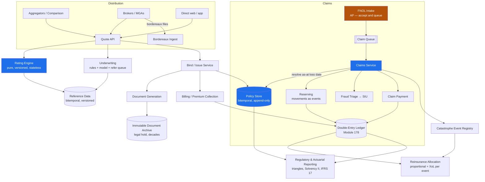
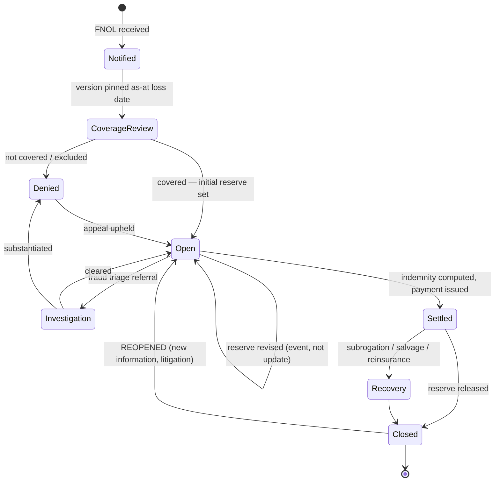
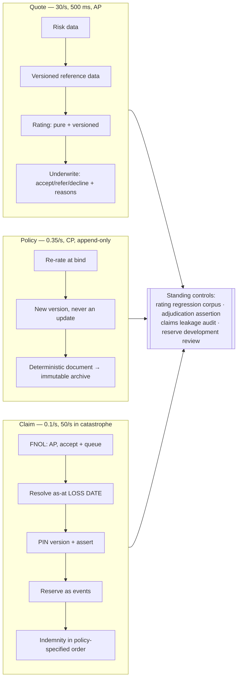
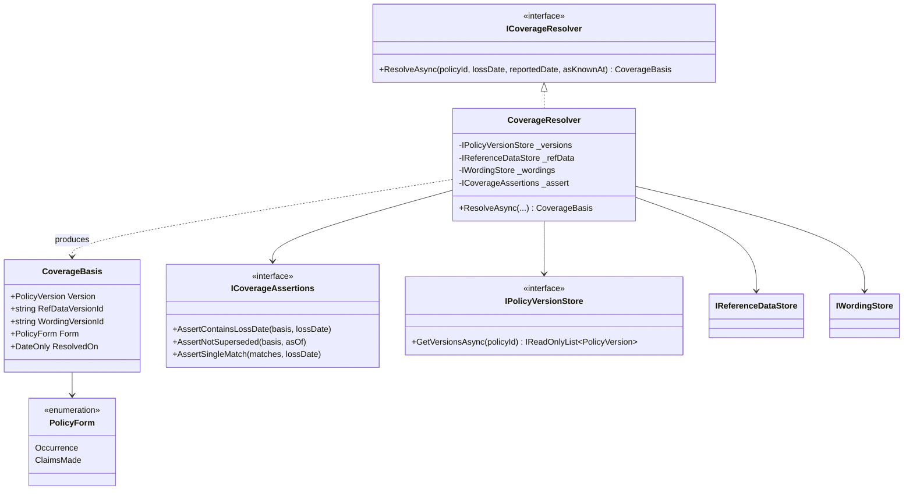

# Module 192 — System Design: Designing an Insurance Platform — Policy Administration, Underwriting & Claims

> Domain: System Design | Level: Beginner → Expert | Prerequisite: [[01-System-Design-Fundamentals]], [[18-Designing-Payment-Processing-DoubleEntry-Ledger]] (the ledger, idempotency and settlement discipline this platform's claim payments and premium collection sit on top of), [[13-Designing-Regulatory-Reporting-Pipeline]] (completeness, deadlines and the bitemporal reference data this domain requires everywhere), [[09-Designing-RealTime-Portfolio-Risk-Engine]] (reproducibility of a computed figure years later — the rating engine has the identical obligation), [[16-Interview-Execution-Playbook-Estimation-Rubric]], [[../36-Saga/01-SagaFundamentals-OrchestrationVsChoreography-CompensatingTransactions]]

---

**Why this module exists.** Insurance is the largest software domain most engineers never design for, and it is asked directly at Allianz, AXA, Zurich, Aviva, Admiral, Progressive, Lemonade, Root, and the insurance arms of every bank on this course's panel. It is also asked *indirectly*, and more often, through prompts that are insurance problems wearing other clothes: "design a warranty system," "design a subscription with usage-based pricing and disputes," "design a benefits platform."

The distinguishing property, and the one that reorganises every design decision in this file: **the product is a promise about the future, so the system's primary data is a liability that has not been paid and may never be claimed.** A payment system records what happened. An insurance system records **what is owed under what circumstances**, against a contract that was in force at a moment that may be years in the past, whose terms have since changed, whose rating was approved by a regulator under rules that have since been superseded.

Three consequences follow immediately, and they are what the interview is actually probing:

1. **Bitemporality is mandatory, not a refinement.** Every question in this domain is "as of when, and as known when" (§2.2).
2. **The largest number on the balance sheet is an estimate** — reserves for claims incurred but not yet reported (§2.7) — which means the system's most consequential output is not a transaction but a *forecast*, and it must be explainable.
3. **Almost every computed figure must be reproducible years later**, because a regulator, a court, or a policyholder's lawyer will ask how a premium or a declination was arrived at (§2.3, §2.4).

Authored under the current template: §10 is retired, so §2 carries the full depth, including the judgement questions, the procedures, and the module's own discriminating question (§2.20).

---

## 1. Fundamentals

### What is an insurance platform, and what are its parts?

"Insurance platform" is three systems that share a customer and almost nothing else:

- **Policy administration (PAS)** — the system of record for contracts. Quote, bind, issue, endorse, renew, cancel, lapse. Its correctness property is that the state of any contract at any past instant is reconstructable.
- **Rating and underwriting** — deciding whether to offer cover and at what price. Its correctness property is *reproducibility and explainability*: the same inputs must yield the same premium forever, and a declination must be justifiable to a regulator.
- **Claims** — deciding what is owed when something happens, and paying it. Its correctness property is that adjudication happens against the contract **as it was at the loss date**, not as it is now.

Around those sit billing (premium collection, instalments, dunning), documents (the policy schedule *is* the contract), reinsurance (how much of the risk the insurer kept), and regulatory reporting.

### Why does this matter?

Because the failure modes are unusually asymmetric and unusually expensive. Under-reserving is an accounting misstatement. Adjudicating a claim against the wrong policy version is either an unpaid valid claim (a regulatory and reputational event) or a paid invalid one (leakage, and at scale, a solvency question). A rating engine that cannot reproduce a two-year-old quote cannot defend it. And a catastrophe — a storm, a flood, a wildfire — arrives with no warning and multiplies claim volume by two orders of magnitude in a day, which is the one capacity problem in this domain that genuinely is a capacity problem.

### When does this matter?

Whenever the product is a **conditional future obligation** rather than an immediate exchange. That includes general insurance, life, health, warranties, product protection plans, credit insurance and surety — and it includes several things not called insurance: employer benefits administration, cancellation-protection add-ons, and any "we'll cover you if X" feature bolted onto a consumer product, which is usually a regulated insurance product that someone shipped without noticing.

### How does it work (30,000-ft view)?

```
QUOTE          risk data → rating engine (versioned) → premium + terms
   │                              │
   │                        underwriting rules/model → accept / refer / decline
   ▼
BIND / ISSUE   contract created, effective-dated, documents generated, premium billed
   │
   ├── ENDORSE   mid-term change → new policy VERSION, effective from a date, premium adjusted pro-rata
   ├── RENEW     new term, re-rated, re-underwritten
   └── CANCEL / LAPSE
   ▼
LOSS OCCURS (date of loss — the key that resolves everything)
   ▼
FNOL           first notice of loss → claim opened → RESERVE set (an estimate of what we'll pay)
   │
   ├── coverage determination: resolve the policy version IN FORCE at the date of loss
   ├── investigation / adjustment → reserve revised (up or down) as information arrives
   ├── fraud screening → SIU referral if indicated
   ▼
SETTLE         indemnity arithmetic (limits, deductible, coinsurance) → payment → ledger
   │
   └── RECOVERY  subrogation, salvage, reinsurance recovery — money flowing back, sometimes years later
```

**The single most important arrow is "date of loss."** It is the key against which coverage, terms, limits, deductible and even the applicable regulation are resolved — and it is almost never the date the claim was reported, which may be years later.

---

## 2. Deep Dive

This section is written to be **complete on its own** — every mechanism, the reasoning that selects it, the failure mode it introduces, and the push-back a Principal/Staff interviewer will raise, answered inline.

### 2.1 Three Systems, Not One — and Why Conflating Them Fails

The most common architectural error in this domain is treating policy administration, rating and claims as modules of one application. They have genuinely different correctness properties, different consistency requirements, different change cadences and different regulators looking at them.

| | Policy administration | Rating / underwriting | Claims |
|---|---|---|---|
| Correctness property | Any past state reconstructable | Same inputs → same output, forever | Adjudicate against contract as-at loss date |
| Consistency | **Strong** within a policy | **Deterministic**, not distributed | Strong on payment, eventual on workflow |
| Change cadence | Slow — schema changes are product launches | **Fast** — rates change quarterly, and by jurisdiction | Moderate |
| Volume shape | Steady, seasonal peaks at renewal | Spiky — quote volume is marketing-driven | **Catastrophic spikes** (§2.13) |
| Failure consequence | Unreconstructable contract | Indefensible premium | Unpaid valid claim / leakage |

**The practical decomposition that follows:** rating is a **pure, versioned, side-effect-free function** deployed independently of everything else; policy administration is the system of record with the strictest temporal model; claims is a long-running workflow that *reads* policy state and *writes* to the ledger. Wiring them as one deployable means a rate change requires a policy-system release, which is where "we can't respond to the market for six weeks" comes from.

### 2.2 Bitemporality — Mandatory, Not a Refinement

Every substantive question in insurance has two time dimensions, and confusing them produces errors that look like data corruption:

- **Effective time (valid time)** — when a fact was true in the world. The policy was in force from 1 March to 28 February. The vehicle was garaged at that address from June.
- **Knowledge time (transaction time)** — when *we* learned it. The address change was backdated to June but entered in September.

**Why both are required, with the case that makes it unavoidable:** a policyholder reports on 1 October that they moved house in June. The policy must be re-rated from June (effective time), but the premium invoice issued in July was correct *given what was known then* (knowledge time). A regulator asking "was the July invoice correct?" and a claims adjuster asking "what address was on cover on 15 August?" are asking different questions with different answers, and a single-temporal model can answer only one of them.

**The data model:**

```sql
CREATE TABLE policy_version (
  policy_id        uuid        NOT NULL,
  version_no       int         NOT NULL,
  effective_from   date        NOT NULL,   -- valid time
  effective_to     date        NOT NULL,   -- exclusive; 9999-12-31 for open-ended
  recorded_at      timestamptz NOT NULL,   -- knowledge time
  superseded_at    timestamptz NULL,       -- knowledge time of replacement
  status           varchar(16) NOT NULL,   -- QUOTED|BOUND|IN_FORCE|LAPSED|CANCELLED
  ...terms, limits, deductibles, insureds, rating inputs...
  PRIMARY KEY (policy_id, version_no)
);
```

Two queries, and both must be cheap:

```sql
-- What was on cover at the date of loss, as we understand it today?
WHERE policy_id = ? AND effective_from <= :loss_date AND effective_to > :loss_date
  AND superseded_at IS NULL

-- What did we believe was on cover at the date of loss, as at the time we paid the claim?
WHERE policy_id = ? AND effective_from <= :loss_date AND effective_to > :loss_date
  AND recorded_at <= :as_known_at
  AND (superseded_at IS NULL OR superseded_at > :as_known_at)
```

**Never update a policy row.** A change is a new version with a new effective range; a *correction* to a mistyped past version is a new row with a later `recorded_at` superseding it. This is the same append-only, correct-forward discipline as a double-entry ledger (Module 178 §2.8), and for the same reason: the audit trail *is* the contract history, and an editable contract history has no evidentiary value.

**The performance objection, answered:** bitemporal queries with two range predicates are slower than a point lookup, and the working set is dominated by *current* versions. The standard resolution is a **current-version materialised view** (or a partial index `WHERE superseded_at IS NULL AND effective_to = '9999-12-31'`) serving the hot path, with the full bitemporal table serving claims adjudication and audit. The view is derived, so it is rebuildable and never a second source of truth.

### 2.3 The Rating Engine — a Pure Function With a Regulator Attached

Rating takes risk characteristics and returns a premium. Technically it is a pure function. Institutionally it is a **filed, approved artefact** — in many jurisdictions the rates, the factors and sometimes the algorithm itself are lodged with a regulator, and deviating from the filed version is a compliance breach rather than a bug.

**The properties this forces:**

- **Versioned, immutably.** Every rate set has an identity and an effective-date range. A quote records `rate_version_id`, and so does every policy version derived from it.
- **Deterministic.** No wall-clock reads, no randomness, no "current" lookups that are not themselves versioned. Every input is either supplied or resolved from versioned reference data (§2.5's territory tables, vehicle symbol tables, mortality tables).
- **Re-instantiable years later.** The same obligation as a risk model (Module 129 §2.6): retain the engine as an **executable, containerised artefact** rather than a source reference, because dependencies rot faster than retention periods expire.
- **Side-effect free**, so it can be run in shadow, in bulk, and in reverse (§2.19's book conversion).

**The structure of a rating calculation**, because interviewers ask you to draw it:

```
base_rate(coverage, territory, class)
  × factor(driver_age) × factor(vehicle_symbol) × factor(prior_claims)
  × factor(credit_tier)          -- where legally permitted; prohibited in several jurisdictions
  × ...
  + fixed_fees
  → apply caps/floors, rounding rules, minimum premium
  → apply discounts (multi-policy, telematics) in a DEFINED ORDER
```

**Order of operations is a filed detail, not an implementation choice.** Applying a 10% discount before versus after a cap produces different premiums, and the filed algorithm specifies which. This is the insurance-domain instance of a general rule: when arithmetic is externally specified, the *sequence* is part of the specification.

**Rounding must be specified per currency and per step, and must be reproducible.** The same discipline as money handling generally (Module 178 §2.9) — integer minor units, explicit rounding, no floats — with the addition that intermediate rounding is itself filed: rounding at each factor versus rounding once at the end are different algorithms.

**Testing a rating engine** is unlike testing ordinary business logic: the assertion is against a **regression corpus** of thousands of previously-rated risks with their expected premiums, re-run on every change, with any diff requiring explicit sign-off. A rate change is expected to move premiums; the test's job is to prove it moved *exactly the ones intended, by exactly the intended amount*.

### 2.4 Underwriting — Rules, Models, and the Explainability Obligation

Underwriting decides accept / refer / decline, and applies terms (excesses, exclusions, endorsements). It is implemented as a rules layer, increasingly with a model alongside.

**Three outcomes, and "refer" is the important one.** A binary accept/decline system pushes every edge case into one of two wrong answers. `REFER` routes to a human underwriter with the triggering reasons attached, and the referral rate is a tunable business dial — tighten the rules and referrals rise (cost, slower quotes), loosen them and loss ratio rises. Exposing that dial explicitly, with the referral queue's depth and age monitored, is what makes the trade manageable.

**Explainability is a legal requirement, not a nice-to-have.** In many jurisdictions an adverse decision — declination, or a materially worse price — requires a statement of the principal reasons. That constrains the architecture directly:

- **Every decision records its inputs, the rule or model version, and the contributing factors** — the same provenance discipline as §2.3, applied to a decision rather than a number.
- **A model whose output cannot be attributed to inputs is unusable** for adverse decisions, regardless of accuracy. In practice this means either inherently interpretable models (GLMs, scorecards — still dominant in insurance for exactly this reason) or post-hoc attribution (SHAP) that is itself defensible.
- **Prohibited and proxy factors must be excluded by construction and tested for.** It is not enough to omit a protected characteristic; a model can rediscover it through a correlated proxy. Fairness testing against protected groups is a standing control, and the test results are themselves retained evidence.

**The push-back to expect: "why not just use a black-box model, it's more accurate?"** Answer on the regulatory constraint, not on modelling preference: for a decision requiring a statement of reasons, an unexplainable model is not a better model, it is an unusable one. Where accuracy genuinely matters and explainability is not required — fraud *triage*, which routes to investigation rather than declining cover — the black box is fine. Segregating by whether the output is an adverse decision is the design move.

### 2.5 Reference Data Is Bitemporal Too

Rating and underwriting depend on reference data that changes and must be resolvable *as it was*: territory tables, vehicle symbol and make-model tables, occupation codes, industry classification, mortality and morbidity tables, catastrophe zone maps, sanctions lists.

**Resolving a two-year-old quote with today's tables produces a different answer, silently.** So reference data carries its own effective and knowledge time, every rating run records which reference-data version it used, and the version is part of the reproducibility contract (§2.3).

This is the same conclusion the market-data platform reaches for symbology (Module 130 §2.3), arriving from an actuarial direction: **a lookup table used in a reproducible calculation is not a lookup table, it is versioned input data.**

### 2.6 Endorsements, Cancellations, and the Mid-Term Change Problem

A mid-term change — adding a driver, changing an address, increasing a limit — is an **endorsement**: a new policy version effective from a date, with a premium adjustment.

**The arithmetic is pro-rata and the edge cases are where the bugs live:**

```
Original premium  £600 for 365 days
Endorsement effective day 200, new annual-equivalent premium £750

Unearned portion of original:  £600 × (165/365) = £271.23
Unearned portion of new:       £750 × (165/365) = £339.04
Additional premium due:                            £ 67.81
```

Four details that are each a real defect if missed:

- **Backdated endorsements.** The change is effective before today, so premium must be recalculated for a period already billed and possibly already paid. The adjustment is a new billing transaction, never an edit of the old one.
- **A backdated endorsement can cross a claim.** If a claim occurred on day 190 and an endorsement is effective from day 150 that would have *excluded* that claim, you have a coverage dispute and an anti-fraud signal simultaneously. The system must detect the overlap and flag it, not silently re-rate.
- **Cancellation is not one thing.** *Flat cancellation* (treated as never incepted — full refund), *pro-rata* (refund unearned portion), and *short-rate* (refund less a cancellation penalty) produce different numbers, and which applies depends on who cancelled and why. Model the reason code, not just the date.
- **Minimum earned premium** floors the refund in many products, and applying it after rather than before the pro-rata calculation changes the answer.

**Endorsement and claim must not race.** Both read and write policy state, so the endorsement path takes the policy's version lock and the claim's coverage determination pins the version it resolved (§2.8). Without pinning, an endorsement landing mid-adjudication silently changes the terms the claim is being assessed against.

### 2.7 Reserving — the Largest Number Is an Estimate

When a claim is opened, the insurer sets a **reserve**: an estimate of what it will ultimately pay. Reserves are a liability on the balance sheet, and in aggregate they are usually the largest number the company reports.

**Three populations, and the third is the one that makes this a hard systems problem:**

| | Meaning | Known? |
|---|---|---|
| **Case reserves** | Per-claim estimates on reported claims | Yes — one row per claim |
| **IBNR** | Incurred But Not Reported — losses that have happened but nobody has told us | **No.** Estimated statistically from historical development patterns |
| **IBNER** | Incurred But Not Enough Reported — reported claims whose reserves will prove inadequate | No — estimated from development patterns |

**The systems consequences:**

- **Reserve changes are events, not updates.** Every movement — open, increase, decrease, close, reopen — is an immutable row with a reason, a user or process, and a timestamp. The *development pattern* of reserves over time is the raw material for the actuarial estimate of IBNR, so the history is the product, not an audit artefact.
- **Reserve movements post to the ledger** (Module 178) as a liability entry, not as a cash movement. Payments later relieve the reserve and move cash — and the relief must be exact, so a payment of £4,000 against a £5,000 reserve leaves £1,000 outstanding, and closing the claim releases it.
- **Triangles are the actuarial interface.** Claims data aggregated by accident period and development period produce a loss triangle, which is how ultimate losses are projected. The platform's obligation is to produce triangles that are **stable and reproducible** — which means the accident-period assignment must be immutable, and any re-statement must be explicit and dated. A triangle that silently changes when history is edited destroys the projection built on it.
- **Claims can reopen years after closing.** Terminal is not terminal (the same property as a busted trade, Module 131 §2.2), so `CLOSED` must be a state a claim can leave, with the reopening recorded and the reserve re-established.

**The discriminating observation to offer:** an insurer's financial statements are dominated by a number that no transaction produced. The platform's job is not to compute it — actuaries do that — but to supply history complete and stable enough that the computation is defensible. That reframes the data model's purpose from "record what happened" to "preserve the development pattern."

### 2.8 Coverage Determination — Adjudicating Against the Past

When a claim arrives, the first question is not "how much" but **"was this covered?"** — and that is resolved against the policy version in force **at the date of loss**.

**The resolution, in order:**

1. **Resolve the policy version** by date of loss, not by report date, not by today (§2.2).
2. **Check the policy was in force** — not lapsed for non-payment, not cancelled, and check the *cancellation effective date* rather than the cancellation *entry date*.
3. **Check the peril is covered** under that version's terms, and that no exclusion applies.
4. **Check the claimant is an insured party** under that version — a driver added by endorsement after the loss date is not covered for it.
5. **Pin the resolved version onto the claim** (`coverage_policy_version_id`), so subsequent endorsements cannot silently change the basis of adjudication, and so the determination is reproducible.

**Late-reported claims are the normal case, not the exception**, in long-tail lines: liability, professional indemnity and asbestos claims can be reported a decade after the loss. So the system must resolve a policy version against a contract that has since expired, from a rate set that has since been withdrawn, under reference data that has since changed — which is the whole argument for §2.2 and §2.5 stated as one requirement.

**Occurrence versus claims-made is a policy-form distinction with a direct data-model consequence.** An *occurrence* policy covers losses that happened during the term, whenever reported — so the resolution key is date of loss. A *claims-made* policy covers claims *reported* during the term — so the resolution key is the report date, plus any retroactive date on the policy. Getting this wrong inverts coverage, and a platform serving both must carry the form on the policy and branch the resolution on it rather than assuming one.

### 2.9 Indemnity Arithmetic — Order of Operations Decides the Payment

What is actually paid is not the loss amount. The sequence matters and is specified by the policy wording:

```
Assessed loss                              £12,000
  apply per-claim LIMIT      (£10,000)  →  £10,000
  apply DEDUCTIBLE           (£500)     →  £ 9,500
  apply COINSURANCE          (90%)      →  £ 8,550
  check AGGREGATE limit remaining
      (annual aggregate £15,000, £9,000 already used → £6,000 left)
                                        →  £ 6,000  actually payable
```

**Reverse the deductible and the limit and you get a different, wrong, number** (£12,000 − £500 = £11,500, capped to £10,000 = £10,000, a £1,450 overpayment before coinsurance). Which order applies is a property of the wording, so it must be **data on the policy version**, not a constant in code — and a platform serving multiple products will have several orderings live at once.

**Aggregates are stateful across claims**, which is the part that breaks naive designs: the payable amount on this claim depends on what has already been paid on *other* claims under the same policy term. That makes the aggregate a contended value with the same shape as a ledger balance (Module 178 §2.25), and the same answer applies — derive it from claim payment history rather than maintaining a mutable counter, and guard the write with a predicated update when a running total is genuinely required.

**Salvage and subrogation flow the other way.** After paying, the insurer may recover from a third party or sell the damaged asset — sometimes years later. Recoveries are entries against the same claim, so a claim's *net* cost is not known at closure, and reporting that treats payment as final understates recovery and overstates ultimate loss.

### 2.10 Fraud — Triage, Not Adjudication

Fraud screening runs at FNOL and continues through the claim's life. The design point that matters: **fraud scoring routes to investigation; it never declines a claim automatically.**

- **Declining a claim is an adverse decision** requiring explanation (§2.4), so an unexplainable model cannot make it.
- **A false positive is expensive in a way a false positive elsewhere is not** — delaying a legitimate claimant after a house fire is a regulatory complaint and a reputational event.

So the model's output is a **referral to a Special Investigation Unit**, with the triggering signals attached, and the SIU's disposition feeds back as labelled training data.

**The signals worth naming**, because an interviewer will ask what features you would use: velocity (multiple claims across policies in a window), network features (the same repairer, medical provider or witness appearing across unrelated claims — this is the highest-value signal class and requires a graph, not a row), timing (a claim shortly after inception or shortly before lapse, or a loss date suspiciously close to an endorsement adding the relevant cover, §2.6), inconsistency between the FNOL narrative and the structured data, and prior SIU history.

**The organised-fraud case is a graph problem and should be said so.** Individual claims each look plausible; the ring is visible only in the connections between them. That argues for a graph store fed from claims data rather than for more features on a per-claim model.

### 2.11 Reinsurance — the Risk the Insurer Did Not Keep

Insurers cede portions of risk to reinsurers, and the platform must know how much of every loss is recoverable.

**Two treaty shapes, and they behave differently in the data model:**

- **Proportional (quota share, surplus)** — the reinsurer takes a fixed percentage of premium and losses. Allocation is arithmetic and applies per policy.
- **Non-proportional (excess of loss, catastrophe XoL)** — the reinsurer pays losses above an attachment point, up to a limit, often **per event** rather than per claim.

**"Per event" is where the systems problem is.** A catastrophe XoL treaty attaching at £10m per event requires grouping claims into events — which storm, which flood — and that grouping is a *decision* with money attached, made under an **hours clause** (all losses from one storm within a 72-hour window count as one event). So the platform needs an **event entity** that claims are assigned to, assignment that can be revised as the event's scope becomes clear, and an audit trail of the assignment, because the difference between one event and two can be the difference between recovering and not.

Reinsurance recoveries are also assets that may be collected years later and may be disputed, so they are modelled as receivables with their own ageing — not netted silently against gross losses.

### 2.12 Documents Are the Contract

In most systems a document is a rendering of the data. Here it is the other way around: **the policy schedule and wording are the legal contract**, and if the database and the issued document disagree, the document usually wins.

The requirements that follow:

- **Store the rendered artefact**, not just the template ID and variables. The template will change; what the policyholder received will not. This is the same exception the notification module makes for evidentiary messages (Module 180 §2.21).
- **Version the wordings** with effective dates, and record which wording version attached to which policy version.
- **Generation must be deterministic and reproducible** — same policy version plus same wording version yields a byte-identical document, which is what lets you prove what was sent.
- **Retention is statutory and long** — frequently the policy term plus the limitation period, which for liability lines can mean decades. Immutable object storage with legal-hold capability, not a filesystem.
- **Delivery is evidence** (Module 180 §2.21): for a document that starts a time limit running — a cancellation notice, a declination — you need defensible evidence it was sent and, ideally, received.

### 2.13 Catastrophe — the One Genuine Capacity Problem

Normal claim volume is steady and predictable. A catastrophe multiplies it by 50–200× within hours, concentrated in one geography, with no warning and no ability to shed load: every one of those claims is a customer in distress and a regulatory obligation.

**What actually breaks, in order:**

1. **FNOL intake** — phone, web and app simultaneously. This must be the most elastic component in the platform, and it must degrade to *capture* rather than to *reject*: accept the notification, assign a claim number, defer everything else.
2. **Adjuster capacity** — a human constraint, not a technical one, which is why triage automation and straight-through processing for small, clearly-covered claims matter disproportionately during an event.
3. **Reserving** — thousands of claims opened at once, each needing an initial reserve. Default reserving by peril and severity band, refined later, is the workable answer.
4. **Downstream reporting** — regulators and reinsurers want event-level exposure figures fast.

**The design responses:**

- **Separate FNOL from adjudication architecturally**, so intake scales independently and stays up when adjudication is backlogged.
- **Queue-based, durable intake** — a claim notification accepted and queued is a promise kept; a synchronous FNOL that fails under load is not.
- **Event tagging at intake** (§2.11), so exposure aggregation is possible while the event is still developing.
- **Pre-agreed catastrophe mode**: relaxed documentation requirements, raised straight-through-processing thresholds, deferred non-urgent work. This is a *business* decision made in advance and executed as a configuration flag, not improvised during the event.
- **Capacity planning against the historical worst event, not the average** — and note this is the same "plan for the step function, not the trend" conclusion the risk engine reaches for volatile sessions (Module 129 §2.5), with the additional property that here the spike is geographically concentrated, so regional capacity matters.

### 2.14 The Regulatory Shape

Insurance is among the most heavily regulated software domains, and the constraints are architectural rather than procedural:

- **Solvency II / RBC** — capital adequacy computed from the reserve and exposure data this platform produces. The reporting chain's completeness has the same properties as Module 133's pipeline.
- **IFRS 17** — the accounting standard for insurance contracts, which requires grouping contracts into cohorts and tracking a contractual service margin. It imposes a *data model* requirement, not just a report: contracts must be groupable by profitability cohort at inception, and that grouping must be immutable.
- **Conduct rules** — fair pricing, no unjustified discrimination, clear communication, complaint handling with statutory deadlines. This is where §2.4's explainability obligation comes from.
- **Data protection** — claims data includes health and biometric data in many lines, which is special-category personal data with stricter handling and consent requirements.
- **Retention** — long, varies by line and jurisdiction, and interacts awkwardly with erasure rights: a data-subject erasure request against a contract with a decades-long limitation period is resolved by *legal basis*, not by deletion, and the platform must be able to defend that position with records.

**The architectural consequence worth stating:** retention class, jurisdiction and product line must be **attributes carried on the data from creation**, because reclassifying twenty years of history retrospectively is not possible. This is the same conclusion the notification platform reaches about retention tagging (Module 180 §2.16).

### 2.15 Integration Reality — You Do Not Own the Distribution Chain

Most insurance is not sold direct. Brokers, managing general agents, aggregators (price-comparison sites) and affinity partners sit between the insurer and the customer, and each is an integration with its own semantics.

- **Aggregators** send a quote request to twenty insurers simultaneously and rank by price. Two consequences: quote volume is enormous relative to bind volume (conversion of 1–3% is normal), and **rating latency is a commercial variable** — a slow quote is ranked late or not at all. This is the one place in the platform where milliseconds have a direct revenue effect.
- **Brokers and MGAs** may hold delegated authority to bind on the insurer's behalf, within limits. The platform must enforce those limits (product, territory, sum insured, class) at the API boundary, and must ingest **bordereaux** — periodic files of policies and claims written under delegated authority — which arrive in whatever format the partner uses and require the same validate-and-reconcile discipline as a settlement file (Module 178 §2.7).
- **Claims vendors** — repairers, loss adjusters, medical panels, salvage — are external systems whose updates arrive asynchronously and sometimes by file.

**The design consequence:** the quote path must be **cheap, stateless and separately scalable** from the bind path, because their volumes differ by two orders of magnitude — the same read/write split reasoning as the URL shortener (Module 177 §2.4), with the difference that here the cheap path is the one with the latency requirement.

**Quote storage is a genuine decision, not an afterthought.** At aggregator volumes you are storing millions of quotes that will never convert, each needing full rating inputs retained for reproducibility. The workable answer: retain the rating inputs and the `rate_version_id` (small), retain the full quote breakdown for a bounded window (weeks), and regenerate the detail on demand from the retained inputs — which is only possible because §2.3 made rating a reproducible pure function.

### 2.16 Consistency Postures, Per Component

One CAP answer for "the insurance platform" is wrong; the components differ deliberately.

| Component | Posture | Reason |
|---|---|---|
| **Policy version write** | **CP** | Two concurrent endorsements must not both create version N |
| **Quote generation** | **AP** | A failed quote is a lost sale; a stale reference-data read is tolerable within its version window |
| **Coverage determination** | **CP**, against a pinned version | Adjudicating against an uncertain contract state is unacceptable |
| **Claim payment** | **CP** — it is a ledger write | Module 178's reasoning applies unchanged |
| **Reserve movements** | **CP** within a claim | Development history must be exact (§2.7) |
| **FNOL intake** | **AP** — accept and queue | Refusing a notification loses it; this is the catastrophe requirement (§2.13) |
| **Reporting / analytics** | **AP** | Eventually consistent is fine |

**The pairing worth naming:** FNOL is AP and claim payment is CP, connected by a durable queue. That combination is what lets intake survive a catastrophe while payment stays exact — the same AP-edge / CP-core shape as a payments platform (Module 178 §12).

### 2.17 Observability — What Is Silently Wrong

The instructive failures here are, as everywhere in this folder, the ones that produce no error.

| Failure | Detector | Natural? |
|---|---|---|
| Rating service down | Error rate, quote failure rate | Yes |
| Quote latency regression | p99 by channel — aggregator traffic separately | Yes |
| Claim workflow stalled | Claims by state and **age** | Yes, once built |
| **Rating drift** — engine no longer reproduces filed rates | **Regression corpus re-run on a schedule**, not only on deploy | **No** — every quote succeeds |
| **Reference-data version mismatch** across services | Assertion that all rating replicas report the same active version set | **No** |
| **Reserve adequacy deteriorating** | Actual-versus-expected development by accident period | **No** — each claim looks fine |
| **Leakage** — systematically overpaying claims | Audit sampling of settled claims against policy terms | **No** — every payment is authorised and correctly recorded |
| **Coverage determined against the wrong version** | Assert the pinned version's effective range contains the loss date, on every adjudication | **No** — produces a plausible answer |
| **Bordereaux under-reporting** | Reconcile partner-declared exposure against premium received | **No** — the file is internally consistent |

**Leakage is the domain's signature silent failure**, and it is worth being able to describe: money paid that was not owed — a deductible not applied, a limit not enforced, an excluded peril paid, a duplicate payment. Every individual payment is authorised, recorded and ledgered correctly. The ledger balances. Only an **independent audit against the policy terms** finds it, which is why claims audit is a standing control with an owner rather than an occasional exercise, and why §2.9's arithmetic belongs in one place that can be independently re-executed.

The general rule this module contributes: **when the system's output is an entitlement rather than a transaction, internal consistency proves nothing about correctness** — the ledger can be perfect and the entitlement still wrong.

### 2.18 Build Versus Buy

Policy administration is a **buy** market — Guidewire, Duck Creek, Sapiens, Majesco — and the case is strong: the non-differentiating surface is enormous (product configuration, regulatory reporting, document generation, jurisdiction handling, forms libraries), the vendors carry regulatory certifications, and the replacement cycle is measured in decades.

**Where building is right:**

- **The rating and underwriting engine**, when pricing sophistication *is* the competitive position. This is the most common split in practice and the one to propose: buy the system of record, build the pricing.
- **Digital-first insurers** whose proposition is the customer experience, where a legacy PAS's constraints are the thing being competed against.
- **A single narrow product** where the vendor's generality is overhead rather than value.

**The honest framing:** vendor policy administration is expensive, slow to change, and implementation projects have a poor completion record — multi-year programmes that fail are common enough to be an industry cliché. So the trade is not "buy is cheaper" but "buy transfers regulatory and breadth risk at the cost of agility and a large integration programme." State it that way and the conversation improves.

### 2.19 Converting a Book of Business

Migrating live policies from a legacy system is where most insurance programmes actually fail, and the reason is §2.2: you are migrating not a current state but a **history**, and the history is the contract.

**The approach that works:**

1. **Do not convert in-force policies mid-term unless forced.** Write **new business** on the new platform, and let the legacy book run off at renewal. A three-year run-off is slower than a big-bang conversion and vastly safer, and it is the same *drain* pattern the OMS migration uses for working orders (Module 131 §2.17).
2. **Where conversion is unavoidable**, convert at renewal — a renewal is a new policy version anyway, so it is the natural boundary.
3. **Re-rate rather than copy.** Copying a premium forward means you cannot explain it on the new platform. Re-rating produces a number the new engine can defend — and any difference is a *finding*, either a legacy defect or a rating change, and must be triaged rather than suppressed.
4. **Convert history as records, not as replayed transactions.** Load prior policy versions and claims as immutable historical rows with a conversion marker, rather than attempting to replay a decade of endorsements through the new engine.
5. **Reconcile against the legacy system's own reported figures** — in-force count, written premium, outstanding reserves, by product and jurisdiction — and triage differences as mapping, convention or defect. This is the onboarding-reconciliation discipline (Module 132 §2.8) applied to a whole book.
6. **Claims in flight are the hardest population**, because an open claim spans both systems. Keep them on the legacy platform until closed wherever possible; the population is finite and shrinking.

**And run both for a full cycle** — including a renewal season and a period-end close — before decommissioning, because the episodic events are where the implementations differ (Module 134 §2.5's scenario-inventory reasoning, applied here).

### 2.20 The Discriminating Question

> **"A claim arrives today for a loss that happened three years ago. Walk me through everything the system has to do before it can say whether it's covered."**

A **Senior** answer looks up the policy, checks the dates, checks the peril.

A **Staff** answer resolves the *policy version in force at the date of loss* rather than the current one (§2.2, §2.8); notes that the policy may have expired, been endorsed several times and possibly cancelled, and that the cancellation's *effective* date matters rather than its entry date; checks whether the form is occurrence or claims-made, because that inverts which date resolves coverage; resolves the reference data and wording **as they were**, not as they are; pins the resolved version onto the claim so a later endorsement cannot change the basis; checks whether an endorsement was backdated across the loss date and flags it as both a coverage question and a fraud signal (§2.6); and observes that the applicable regulation and limitation period are those of the loss date's jurisdiction and era.

It separates reliably because it cannot be answered from an entity diagram. It requires holding the temporal model, the product structure and the fraud surface at once — and every one of those is invisible if you have modelled a policy as a row that gets updated.

**The generalisation to carry out of this module:** where a system's output is a **promise conditioned on a past state**, the design's centre of gravity moves from transaction processing to **state reconstruction** — and every shortcut that makes the present cheaper (mutable rows, unversioned reference data, a premium copied rather than derived) is a debt paid at the moment someone asks what was true three years ago.

---

## 3. Visual Architecture

### System architecture



The highlighted core is where correctness lives. **FNOL is amber because it is the one component whose availability requirement is set by events outside the business's control** (§2.13) — everything else can queue behind it.

### Policy versioning — the bitemporal picture

```
Policy P-1001, annual term 2024-03-01 → 2025-03-01

valid time  ──────────────────────────────────────────────────────────►
            2024-03-01        2024-09-15                     2025-03-01
v1          |════════════════════|                                    |
              (original terms)
v2                               |═══════════════════════════════════|
              (address endorsement, effective 2024-09-15)

knowledge time (when we learned):
  v1  recorded 2024-02-20
  v2  recorded 2024-10-02   ← entered AFTER it took effect (backdated)

A loss on 2024-09-20 resolves to v2 today.
A premium invoice issued 2024-09-25 was correctly based on v1,
  because v2 was not yet known. Both statements are true.
```

### Claim lifecycle — with the arrows that are usually missed



**Two arrows carry the domain's character:** `Closed → Open` (terminal is not terminal), and `Settled → Recovery` (money flows back, sometimes years later, so a claim's net cost is not known at settlement).

### Where each failure mode lives

```
Distribution  →  quote latency is revenue (§2.15); delegated-authority limits must be enforced at the boundary
Rating        →  reproducibility and filed-rate drift (§2.3, §2.17) — silent
Underwriting  →  explainability and proxy discrimination (§2.4) — silent
Policy store  →  temporal resolution errors (§2.2, §2.8) — silent, plausible answers
Claims        →  leakage (§2.17) — silent; the ledger balances
Reserving     →  adequacy deterioration (§2.7) — silent, per-claim looks fine
Catastrophe   →  the only loud, fast failure in the platform (§2.13)
```

---

## 4. Production Example

**Problem.** A mid-sized motor insurer ran a platform where policy records were **mutable**: an endorsement updated the policy row and appended a row to a separate `policy_audit` table. Claims resolved coverage by reading the current policy row and checking the term dates.

For several years this worked, because endorsements were rare and almost always effective from the date they were entered.

Then the insurer launched a telematics product with **monthly mileage-based adjustments**, which turned endorsements from an occasional event into a routine one — roughly one per policy per month, frequently **backdated** to the start of the measured period.

**Architecture.** Conventional and, on paper, complete: a policy table with current terms, an audit table with a JSON diff per change, a claims service reading the policy table, a rating service, a document store. Every component had tests and the audit table was populated correctly.

**Implementation — what was actually happening.** A claim for a loss on 3 June, reported 20 June, was adjudicated against the policy row **as it stood on 20 June** — which by then reflected a mileage endorsement effective 1 June that had increased the annual mileage band and, for a subset of policies, changed the excess from £250 to £500.

The claims system applied the £500 excess. The policy in force on 3 June carried £250.

Nobody noticed, because:

- Each payment was **correctly computed against the terms the system reported**, so the ledger balanced and the payment reconciliation matched.
- The audit table contained the correct history, but **nothing read it** — it was built for compliance, not for adjudication.
- The £250 difference was below the threshold that triggered a claims audit sample.
- Policyholders who queried the excess were told the figure from the policy record, which agreed with what had been applied.

It ran for **fourteen months**, across roughly 3,100 claims, before an ombudsman complaint from a policyholder who had kept their original schedule — the printed document (§2.12) — and could show it said £250.

**Trade-offs.** The mutable-row design was a deliberate choice made years earlier for good reasons at the time: simpler queries, faster reads, and endorsements were genuinely rare. The audit table was added later to satisfy a compliance requirement, and *satisfying that requirement was treated as satisfying the temporal requirement*. They are not the same: an audit log proves what changed; it does not make the historical state **queryable by the code that needs it.**

**Lessons learned.**

1. **An audit table is not a temporal model.** If adjudication needs the past state, the past state must be in the path adjudication reads, not in a compliance artefact alongside it. The test is mechanical: *can the business logic query history, or only a human?*
2. **A product change altered the frequency of an operation and thereby the severity of a latent defect.** The defect existed from day one and was harmless while endorsements were rare and same-dated. Telematics did not introduce the bug; it made a dormant one systematic. **When a product change alters the *shape* of an existing operation — frequency, backdating, volume — the assumptions built around the old shape need re-examination**, and that review is not a standing part of most product-launch checklists.
3. **Every internal consistency check passed.** Ledger balanced, payments reconciled, audit log complete. The error was in the *entitlement*, not the transaction — §2.17's rule, discovered the expensive way.
4. **The customer's copy of the contract was the only artefact that disagreed**, which is the practical argument for §2.12: the document is not a rendering, it is evidence, and it is evidence the insurer does not control after issue.

**The fix.** The policy table was converted to the bitemporal model of §2.2, with a current-version view preserving read performance. Coverage determination was changed to resolve by date of loss and to **pin** the resolved version onto the claim. A reconciliation was run across fourteen months of claims comparing applied terms against as-at-loss-date terms, which identified the affected population and drove remediation payments. And a standing assertion was added — **the pinned version's effective range must contain the date of loss, checked on every adjudication** — which converts the entire class of error from silent to loud.

---

## 11. Coding Exercises

### Easy — Resolve the policy version in force at a date of loss

**Problem.** Given a policy's versions, return the one in force at a given date of loss, optionally as known at a past instant. Return `null` rather than guessing when no version covers the date.

```csharp
public sealed record PolicyVersion(
    Guid PolicyId, int VersionNo,
    DateOnly EffectiveFrom, DateOnly EffectiveTo,      // [from, to)
    DateTimeOffset RecordedAt, DateTimeOffset? SupersededAt,
    PolicyTerms Terms);

public static class CoverageResolver
{
    /// Resolve the version in force at <paramref name="lossDate"/>.
    /// <paramref name="asKnownAt"/> null = "as we understand it today".
    public static PolicyVersion? InForceAt(
        IEnumerable<PolicyVersion> versions,
        DateOnly lossDate,
        DateTimeOffset? asKnownAt = null)
    {
        var candidates = versions.Where(v =>
            v.EffectiveFrom <= lossDate &&
            v.EffectiveTo   >  lossDate);                 // exclusive upper bound

        if (asKnownAt is { } k)
            candidates = candidates.Where(v =>
                v.RecordedAt <= k &&
                (v.SupersededAt is null || v.SupersededAt > k));
        else
            candidates = candidates.Where(v => v.SupersededAt is null);

        // At most one should survive. More than one is a data defect, not a
        // tie to be broken — surface it rather than picking the newest.
        var matched = candidates.ToList();
        if (matched.Count > 1)
            throw new OverlappingPolicyVersionsException(
                matched[0].PolicyId, lossDate, matched.Select(m => m.VersionNo));

        return matched.SingleOrDefault();
    }
}
```

**Time complexity:** O(n) over a policy's versions — typically fewer than 50, so no index is needed in memory; in SQL this is a two-predicate range scan on `(policy_id, effective_from, effective_to)`.
**Space complexity:** O(k) for matches, effectively O(1).

**Optimized solution.** The important optimisation is not algorithmic. **Throwing on overlap rather than silently taking the newest** is what converts §4's entire defect class from a plausible wrong answer into a loud failure — the "make the bad state unrepresentable, and where you cannot, make it loud" discipline (Module 177 §2.9). For the read-heavy path, add a partial index on current versions (`WHERE superseded_at IS NULL`) and keep the full bitemporal scan for adjudication and audit only.

---

### Medium — Indemnity arithmetic with a policy-specified order of operations

**Problem.** Compute the payable amount from an assessed loss, applying limit, deductible, coinsurance and remaining annual aggregate — **in the order specified by the policy**, in integer minor units, with the aggregate consumed atomically.

```csharp
public enum IndemnityStep { Limit, Deductible, Coinsurance }

public sealed record IndemnityTerms(
    IReadOnlyList<IndemnityStep> Order,     // e.g. [Limit, Deductible, Coinsurance]
    long PerClaimLimitMinor,
    long DeductibleMinor,
    int  CoinsuranceBasisPoints,            // 9000 = 90%
    long AnnualAggregateLimitMinor);

public sealed record IndemnityResult(long PayableMinor, IReadOnlyList<string> Trace);

public static IndemnityResult Compute(
    long assessedLossMinor, IndemnityTerms t, long aggregateAlreadyPaidMinor)
{
    var trace  = new List<string>();
    var amount = assessedLossMinor;
    trace.Add($"assessed={amount}");

    foreach (var step in t.Order)                    // ORDER IS DATA, NOT CODE
    {
        amount = step switch
        {
            IndemnityStep.Limit       => Math.Min(amount, t.PerClaimLimitMinor),
            IndemnityStep.Deductible  => Math.Max(0, amount - t.DeductibleMinor),
            // banker-safe: integer math, explicit rounding, never decimal drift
            IndemnityStep.Coinsurance => MulDivRoundHalfUp(amount, t.CoinsuranceBasisPoints, 10_000),
            _ => throw new ArgumentOutOfRangeException()
        };
        trace.Add($"{step} -> {amount}");
    }

    var aggregateRemaining = Math.Max(0, t.AnnualAggregateLimitMinor - aggregateAlreadyPaidMinor);
    if (amount > aggregateRemaining)
    {
        amount = aggregateRemaining;
        trace.Add($"AnnualAggregate(remaining={aggregateRemaining}) -> {amount}");
    }

    return new IndemnityResult(amount, trace);
}

private static long MulDivRoundHalfUp(long value, long num, long den)
    => (long)((System.Numerics.BigInteger)value * num * 2 + den) / (den * 2);
```

**Time complexity:** O(s) in the number of steps — constant in practice.
**Space complexity:** O(s) for the trace.

**Optimized solution.** The trace is not debugging output; it is the **explanation** a policyholder or ombudsman is entitled to (§2.4), so it is persisted with the settlement rather than logged. And `aggregateAlreadyPaidMinor` must be **derived from claim payment history inside the same transaction that records this payment**, not read beforehand — otherwise two concurrent settlements on one policy both see the same remaining aggregate and jointly exceed it, which is the lost-update shape of a hot ledger account (Module 178 §2.25).

---

### Hard — Reserve movements as an event log, with development history preserved

**Problem.** Model reserve changes so that (a) the current outstanding reserve is derivable, (b) the full development pattern is preserved for actuarial triangles, and (c) payments relieve reserves exactly.

```csharp
public enum ReserveMovementType { Initial, Increase, Decrease, PaymentRelief, CloseRelease, Reopen }

public sealed record ReserveMovement(
    Guid MovementId,                 // idempotency key — natural, from the source event
    Guid ClaimId,
    ReserveMovementType Type,
    long AmountMinor,                // signed: + increases outstanding, − decreases
    string Reason,
    string ActorId,
    DateOnly AccidentDate,           // immutable — the triangle's row
    DateTimeOffset OccurredAt);      // the triangle's column

public sealed class ClaimReserve
{
    private readonly List<ReserveMovement> _movements = new();

    public long OutstandingMinor => _movements.Sum(m => m.AmountMinor);
    public long PaidMinor => -_movements
        .Where(m => m.Type == ReserveMovementType.PaymentRelief)
        .Sum(m => m.AmountMinor);
    public long IncurredMinor => OutstandingMinor + PaidMinor;   // the number actuaries want

    public void Apply(ReserveMovement m)
    {
        // Idempotent by construction: a redelivered movement is a no-op.
        if (_movements.Any(x => x.MovementId == m.MovementId)) return;

        if (m.Type == ReserveMovementType.PaymentRelief && -m.AmountMinor > OutstandingMinor)
            throw new ReserveOverReliefException(m.ClaimId, OutstandingMinor, -m.AmountMinor);

        // NEVER mutate or remove. A correction is a compensating movement.
        _movements.Add(m);
    }

    /// Outstanding as it stood at a past instant — this is what makes triangles stable.
    public long OutstandingAsAt(DateTimeOffset t)
        => _movements.Where(m => m.OccurredAt <= t).Sum(m => m.AmountMinor);
}
```

**Time complexity:** O(n) per derivation over a claim's movements — tens, not thousands. `OutstandingAsAt` is the same scan with a filter.
**Space complexity:** O(n) per claim, retained for the statutory period.

**Optimized solution.** For claims with long histories, snapshot-plus-delta (Module 178 §2.3) bounds the derivation cost while keeping the movements authoritative — the snapshot is derived from immutable history, so it is always recomputable and a corrupted snapshot is detectable. The load-bearing property is `OutstandingAsAt`: **a triangle cell is "outstanding at development period d for accident period a," so if history can be edited the triangle silently restates and every actuarial projection built on it becomes unreproducible** (§2.7).

---

### Expert — The adjudication assertion that makes §4's defect impossible

**Problem.** Build the standing control that would have caught the production incident: assert, on every adjudication, that the policy version the claim was adjudicated against actually covers the date of loss — and detect the population already affected.

```csharp
public sealed record AdjudicationAssertionFailure(
    Guid ClaimId, Guid PolicyVersionId, DateOnly LossDate,
    DateOnly VersionFrom, DateOnly VersionTo, string Kind);

public static class AdjudicationGuard
{
    /// Runs inline on every coverage determination. Fails the adjudication —
    /// it does not warn — because a wrong entitlement is worse than a stalled claim.
    public static void AssertCoverageBasis(Claim claim, PolicyVersion pinned)
    {
        if (claim.CoveragePolicyVersionId != pinned.VersionId)
            throw new AdjudicationBasisException(claim.ClaimId, "pinned version does not match resolved version");

        if (pinned.EffectiveFrom > claim.LossDate || pinned.EffectiveTo <= claim.LossDate)
            throw new AdjudicationBasisException(claim.ClaimId,
                $"pinned version [{pinned.EffectiveFrom},{pinned.EffectiveTo}) does not contain loss date {claim.LossDate}");

        if (pinned.SupersededAt is { } s && s <= claim.AdjudicatedAt)
            throw new AdjudicationBasisException(claim.ClaimId,
                "adjudicated against a version already superseded at adjudication time");
    }

    /// Retrospective sweep: find claims whose applied terms differ from the
    /// terms that were actually in force at the date of loss.
    public static IEnumerable<AdjudicationAssertionFailure> Sweep(
        IEnumerable<Claim> settledClaims,
        Func<Guid, DateOnly, PolicyVersion?> resolveAsAtLoss)
    {
        foreach (var c in settledClaims)
        {
            var correct = resolveAsAtLoss(c.PolicyId, c.LossDate);
            if (correct is null)
            {
                yield return new(c.ClaimId, c.CoveragePolicyVersionId, c.LossDate,
                                 default, default, "no version in force at loss date");
                continue;
            }

            if (correct.VersionId == c.CoveragePolicyVersionId) continue;

            // Differing version is only a finding if the TERMS differ materially.
            if (!TermsMateriallyEqual(correct.Terms, c.AppliedTerms))
                yield return new(c.ClaimId, c.CoveragePolicyVersionId, c.LossDate,
                                 correct.EffectiveFrom, correct.EffectiveTo,
                                 "applied terms differ from terms in force at loss date");
        }
    }
}
```

**Time complexity:** the inline assertion is O(1) and belongs in the adjudication path. The sweep is O(n) over settled claims with one version resolution each — run it nightly over a window, and once historically over the full retention period.
**Space complexity:** O(1) streaming; the sweep yields rather than materialising.

**Optimized solution.** Two refinements make this a control rather than a script. First, **`TermsMateriallyEqual` must compare the terms that affect indemnity** — limit, deductible, coinsurance, exclusions, insured parties — not the whole record, or the sweep drowns in immaterial differences and stops being read (the same "classify legitimate divergence or the reconciliation becomes noise" discipline as a parallel run, Module 134 §2.4). Second, the sweep's output is a **queue with owners and ageing**, not a report: a finding here is a customer remediation, and an unworked finding does not stop being one with time (Module 133 §2.6).

---

## 12. System Design — Designing a General-Insurance Platform (Policy, Rating, Claims)

*Authored to the four-step standard (`CLAUDE.md` §A7). Where a step would restate §13 (the coverage resolver's internals) or §14 (the reserving incident), it states the decision and points there.*

---

### Step 1 — Understand the Problem and Establish Design Scope

#### The dialogue

> **I:** Design an insurance platform.
>
> **C:** That's three systems with different correctness properties — policy administration, rating and underwriting, and claims. Do you want all three, or should I go deep on one?
> **I:** All three at a high level, then go deep where it's interesting.
>
> **C:** Which lines of business? Personal motor and home behave very differently from commercial liability — mainly in how long the tail is.
> **I:** Personal motor. Assume a single country to start.
>
> **C:** Direct, or through aggregators and brokers?
> **I:** Both. Aggregators are the main volume source.
>
> **C:** That changes the shape considerably — aggregator quote volume is enormous relative to bind volume, and quote latency is ranked, so it's a commercial variable rather than a comfort target. What conversion should I assume?
> **I:** About 2%.
>
> **C:** Scale?
> **I:** 2 million in-force policies. Assume you're a challenger, so growing.
>
> **C:** Claims frequency? For motor I'd expect somewhere between 10% and 20% of policies claiming annually.
> **I:** Use 15%.
>
> **C:** How far back must we be able to reconstruct a policy's state, and why?
> **I:** What would you propose?
>
> **C:** Motor is relatively short-tail, but bodily-injury claims can be reported years later and litigated for years after that. I'd propose the policy term plus the limitation period — call it seven years minimum, and I'd design the temporal model to have no practical horizon, because the cost of that is storage and the cost of not having it is an unanswerable question.
> **I:** Agreed.
>
> **C:** Are rates filed with a regulator, and does the pricing algorithm itself need to be reproducible years later?
> **I:** Yes to both.
>
> **C:** Then rating is a versioned, immutable, side-effect-free artefact, and that's a hard constraint rather than a design preference. Last one: catastrophe exposure — is a single event likely to produce a large simultaneous claim spike?
> **I:** For motor, less than home, but yes — a major storm or a multi-vehicle incident.
>
> **C:** Out of scope?
> **I:** Reinsurance accounting, the actuarial reserving models themselves, and the finance general ledger. Assume they consume what you produce.

Four answers carry the design:

1. **"Rates are filed and must be reproducible"** makes the rating engine an immutable versioned artefact and forces reference data to be versioned with it — this is not an optimisation, it is the shape of the component.
2. **"Bodily-injury claims can arrive years later"** makes bitemporal policy storage mandatory, because adjudication must resolve a contract that no longer exists under reference data that has since changed.
3. **"Aggregators are the main volume, 2% conversion"** splits quote from bind into separately scaled services with different latency requirements and different storage economics.
4. **"A storm produces a simultaneous spike"** sets FNOL's availability requirement independently of everything else.

#### Functional requirements

1. Quote: accept risk data from any channel, rate it, underwrite it, return a price and terms.
2. Bind and issue: create a contract, generate documents, start billing.
3. Endorse, renew, cancel — each producing a new policy version with correct pro-rata premium adjustment.
4. FNOL: accept a loss notification through any channel, at any volume, and never lose one.
5. Adjudicate: determine coverage against the policy as at the date of loss.
6. Reserve: set and revise estimates, preserving the development history.
7. Settle: compute indemnity per the policy's specified order of operations and pay.
8. Produce the data actuarial and regulatory reporting consume.

#### Non-functional requirements

| Requirement | Target | Why this number |
|---|---|---|
| Quote latency | **p99 < 500 ms** end to end | Aggregators rank on response; slow means unranked |
| Quote availability | 99.95% | A failed quote is a lost sale, not a correctness event |
| Bind latency | p99 < 3 s | Interactive but not ranked |
| Bind/policy-write availability | 99.9% | Lower volume, retryable |
| **FNOL availability** | **99.99%** | Set by catastrophe, not by steady state (§2.13) |
| Coverage determination | Correct **as at date of loss**, always | The module's central invariant |
| Policy history reconstruction | **No practical horizon**; ≥ 7 years hard requirement | Limitation period |
| Rating reproducibility | **Byte-identical**, indefinitely | Filed rates |
| RPO — policy and claims | **Zero** | The contract is the asset |
| RPO — quotes | Hours | Regenerable from retained inputs |

#### Back-of-the-envelope estimation

```
IN-FORCE POLICIES         2,000,000
CLAIMS   2M × 15%/yr    = 300,000/yr  ÷ 3×10^7 s  ≈ 0.01/s avg
                          peak (weekday morning)   ≈ 0.1/s
                          CATASTROPHE              ≈ 20–50/s for several hours   ← the real number

BINDS    2M/yr (renewals+new) ÷ 3×10^7 s ≈ 0.07/s avg; renewal seasonality ×5 ≈ 0.35/s
QUOTES   binds ÷ 2% conversion           ≈ 100M/yr ≈ 3.3/s avg, peak ~30/s
                                            (evening + weekend shopping peaks)

STORAGE
  policy versions  2M policies × ~12 versions × 4 KB   ≈ 96 GB   growing ~100 GB/yr
  quotes           100M/yr × 2 KB (inputs only)        ≈ 200 GB/yr
  claims           300k/yr × (50 KB docs + 5 KB data)  ≈ 16 GB/yr + document archive
  documents        2M policies × 3 docs × 300 KB       ≈ 1.8 TB/yr, retained decades
```

#### What the numbers tell us

1. **Transactional volume is trivially small.** 0.35 binds/sec and 0.1 claims/sec are not scaling problems. Anyone sharding the policy store at this volume is designing for a number they did not compute.
2. **Quote volume is 50× bind volume and carries the only latency requirement**, so quote is a separate service with a separate scaling model — and quote *storage* (200 GB/yr of records that 98% never convert) is a real cost decision, answered by retaining inputs rather than outputs (§2.15).
3. **The catastrophe number is two to three orders of magnitude above steady-state claims**, and it is the only genuine capacity problem in the platform. It applies to **FNOL specifically**, not to adjudication — which is the argument for separating them.
4. **Document storage dominates bytes** and is the longest-lived data, which makes immutable object storage with lifecycle tiering the right substrate and makes retention classification a day-one attribute.

**So the hard problems are not throughput.** They are:

- **Temporal correctness** — resolving a contract as it was, under reference data as it was (§2.2, §2.5, §2.8).
- **Reproducibility** of a filed calculation years later (§2.3).
- **Elastic intake** decoupled from everything else, for an event nobody can schedule (§2.13).
- **Detecting entitlement errors** that leave every internal consistency check satisfied (§2.17).

Every one of those is a correctness problem. Say so before drawing a box.

---

### Step 2 — Propose High-Level Design and Get Buy-In

#### The three flows, treated separately

- **Quote** — 30/s peak, 500 ms, stateless, no writes to the system of record, AP.
- **Policy lifecycle** — 0.35/s, strongly consistent, append-only, the system of record.
- **Claims** — 0.1/s steady and 50/s in catastrophe, split into AP intake and CP adjudication.

#### Component glossary — every box, in plain language

| Component | What it does |
|---|---|
| **Quote API** | Accepts risk data from any channel, orchestrates rating and underwriting, returns price and terms. Writes only to the quote store. |
| **Rating Engine** | Pure function: risk + rate version + reference-data version → premium. Stateless, horizontally scalable, deployed independently of everything else. |
| **Underwriting Service** | Rules and model producing accept / refer / decline, with contributing reasons recorded (§2.4). |
| **Reference Data Service** | Bitemporal, versioned tables — territory, vehicle, occupation, sanctions. Every consumer resolves a *version*, never "current". |
| **Bind / Issue Service** | Creates the policy version, triggers documents, starts billing. The only writer to the policy store. |
| **Policy Store** | Bitemporal, append-only system of record (§2.2), plus a derived current-version view for hot reads. |
| **Document Service** | Deterministic generation; writes the rendered artefact to an immutable archive with legal-hold support. |
| **Billing** | Premium schedules, instalments, dunning; posts to the ledger. |
| **FNOL Intake** | Elastic, AP, accept-and-queue. Assigns a claim number and nothing else. |
| **Claims Service** | Coverage determination (pins the version), workflow, indemnity computation, settlement. |
| **Reserving** | Append-only reserve movements; the development history (§2.7). |
| **Fraud Triage** | Scores at FNOL and on updates; routes to SIU, never declines (§2.10). |
| **Event Registry** | Catastrophe events; claims are assigned to events for exposure aggregation and XoL recovery (§2.11). |
| **Ledger** | Module 178's double-entry ledger — premium, claim payments, reserve liabilities, recoveries. |

#### Architecture

See §3. Structurally, in one line:

```
Channels → Quote API → [Rating | Underwriting] → Reference Data (versioned)
                            ↓ bind
                       Policy Store (bitemporal) → Documents → Archive
                                                 → Billing → Ledger
FNOL (AP, elastic) → queue → Claims Service → resolve as-at-loss(Policy Store)
                                            → Reserving → Ledger
                                            → Settlement → Ledger
```

#### End-to-end walkthrough — a quote that becomes a claim

**Quoting:**

1. `POST /api/v1/quotes` arrives from an aggregator with risk data and a partner identifier.
2. The Quote API validates, enriches from reference data — **resolving a reference-data version and recording it** — and applies the partner's delegated-authority limits.
3. Underwriting evaluates rules and model: `ACCEPT`, `REFER` or `DECLINE`, with reasons recorded.
4. On accept, the Rating Engine computes the premium against the **active rate version for the risk's effective date and jurisdiction**.
5. The quote is stored with its inputs, `rate_version_id`, `refdata_version_id`, decision reasons and the resulting premium and terms. Response returns in under 500 ms.

**Binding:**

6. `POST /api/v1/policies` references the quote ID and carries an `Idempotency-Key`.
7. The Bind Service **re-rates** rather than trusting the stored premium — quotes expire, and a stale quote must not bind at a stale price. If the re-rate differs materially, it returns `409` with the new figure rather than silently binding either number.
8. Policy version 1 is written with `effective_from`, `effective_to`, `recorded_at`, and the rate and reference-data versions carried forward.
9. Documents are generated deterministically and archived; billing schedules are created; an outbox event publishes `PolicyIssued`.

**An endorsement, three months later:**

10. `POST /api/v1/policies/{id}/endorsements` with an effective date. The service takes the policy's version lock, re-rates for the new terms, computes the pro-rata adjustment (§2.6), writes **version 2** — closing version 1's `effective_to` by writing a new row rather than editing it — and issues an adjustment invoice.

**A loss, and a claim reported two months after that:**

11. `POST /api/v1/claims` (FNOL) is accepted, assigned a claim number, durably queued, and acknowledged. **Nothing else happens synchronously** — this is the catastrophe design (§2.13).
12. A worker resolves coverage: policy version **in force at the date of loss** (§2.8), which is version 1 or 2 depending on the loss date — and **pins** it onto the claim.
13. The adjudication guard asserts the pinned version's effective range contains the loss date (§11 Expert). A mismatch fails the adjudication loudly.
14. An initial reserve is set as a movement (§2.7) and posts a liability entry to the ledger.
15. Fraud triage scores the claim; a referral routes to SIU without blocking adjudication.
16. On settlement, indemnity is computed per the pinned version's specified order of operations (§2.9), the aggregate is consumed atomically, payment is issued through the ledger, and reserve relief is posted.

#### API design

**`POST /api/v1/quotes`**

| Field | Type | Description |
|---|---|---|
| `product` | string | e.g. `MOTOR_PRIVATE` |
| `effectiveFrom` | date | Requested inception; selects the rate version |
| `proposer` | object | Identity, DOB, licence details |
| `risk` | object | Vehicle, usage, mileage, garaging address |
| `history` | object[] | Prior claims and convictions |
| `channel` | string | `AGGREGATOR` \| `BROKER` \| `DIRECT`, with partner ID |

Response `200`:

| Field | Type | Description |
|---|---|---|
| `quoteId` | uuid | |
| `decision` | string | `ACCEPT` \| `REFER` \| `DECLINE` |
| `declineReasons` | string[] | Populated for `DECLINE`/`REFER` — the explainability record (§2.4) |
| `premium` | object | `{ grossMinor, taxMinor, currency }` |
| `terms` | object | Limits, deductible, coinsurance, exclusions, indemnity order |
| `expiresAt` | timestamptz | |
| `rateVersionId` / `refDataVersionId` | string | Echoed for reproducibility |

**`POST /api/v1/policies`** — `{ quoteId, paymentMethodId }` + `Idempotency-Key`. Returns `201` with `policyId`, `versionNo`, `documents[]`. Returns `409 QUOTE_EXPIRED` or `409 PRICE_CHANGED` with the new premium — never a silent re-price.

**`POST /api/v1/policies/{id}/endorsements`** — `{ effectiveFrom, changes{}, reasonCode }`. Returns `201` with the new `versionNo` and `{ additionalPremiumMinor | refundMinor }`. Returns `409 ENDORSEMENT_CROSSES_CLAIM` when the effective date precedes an existing claim's loss date and the change is material (§2.6).

**`POST /api/v1/claims`** (FNOL) — `{ policyNumber, lossDate, lossTime, perilCode, description, contact }` + `Idempotency-Key`. Returns **`202 Accepted`** with `claimNumber` and `status: NOTIFIED`. `202` rather than `201` is deliberate: it accurately says "recorded, not yet assessed," which is exactly the promise being made.

**`GET /api/v1/policies/{id}?asOfLoss=YYYY-MM-DD&asKnownAt=...`** — the bitemporal read, used by claims and audit.

#### Data model

`policy_version` — as §2.2, with `(policy_id, effective_from, effective_to)` and a partial index on current versions.

`claim`:

| Column | Type | Description |
|---|---|---|
| `claim_id` | uuid PK | |
| `claim_number` | varchar UNIQUE | Customer-facing, assigned at FNOL |
| `policy_id` | uuid | |
| `coverage_policy_version_id` | uuid NULL | **Pinned** at coverage determination (§2.8) |
| `loss_date` | date | **The key that resolves everything** |
| `reported_date` | date | Frequently much later |
| `peril_code` | varchar | |
| `status` | varchar(24) | `NOTIFIED \| COVERAGE_REVIEW \| OPEN \| INVESTIGATION \| SETTLED \| CLOSED \| DENIED` |
| `catastrophe_event_id` | uuid NULL | §2.11 |
| `adjudicated_at` | timestamptz NULL | |

Status lifecycle — and note it is **not terminal in one direction**:

```
NOTIFIED → COVERAGE_REVIEW → OPEN → SETTLED → CLOSED
                           ↘ DENIED          ↑     │
                                             └─────┘  REOPENED (§2.7)
```

`reserve_movement` — as §11 Hard: append-only, signed amounts, `accident_date` immutable.

**Three modelling choices worth stating**, because an interviewer will ask:

- **`loss_date` is separate from `reported_date` and is never derived from it.** Collapsing them is the single most consequential modelling error available in this domain.
- **`coverage_policy_version_id` is stored, not recomputed.** Recomputing at read time means a later endorsement silently changes the basis of a settled claim.
- **`indemnity_order` lives on the policy version, not in code** (§2.9), because a platform serving several products has several orderings live simultaneously.

---

### Step 3 — Design Deep Dive

#### 3.1 Temporal resolution, and making the wrong answer impossible

Fully derived in §2.2 and §2.8. The decisions that belong here:

- **Append-only policy versions**, with a derived current-version view for the hot path. The view is rebuildable, so it is never a second source of truth.
- **Pin the resolved version** onto the claim, so adjudication is reproducible and endorsement cannot race it.
- **Assert rather than trust**: the adjudication guard (§11 Expert) fails the adjudication when the pinned version does not contain the loss date. This converts §4's class of defect from silent to loud, and it is the single highest-value control in the platform.
- **Overlapping versions are a data defect, not a tie**, and the resolver throws rather than selecting the newest.

#### 3.2 Reproducibility of a filed calculation

Every quote and every policy version records `rate_version_id` and `refdata_version_id`. Rate sets are immutable and retained as **containerised executable artefacts**, because re-instantiating a seven-year-old calculation from source is a bet on dependency availability that reliably loses.

The standing control is a **regression corpus** re-run on a schedule, not only on deploy (§2.17) — a rating engine can drift without a code change if a reference-data version resolves differently, and only a scheduled re-run detects that.

#### 3.3 Quote and bind, separated

Quote is stateless, AP, horizontally scaled for a 30/s peak with a 500 ms budget, and writes only to the quote store. Bind is CP, low volume, and the only writer to the policy store. They share the rating engine as a library or a service and share nothing else.

**Re-rate at bind** rather than trusting a stored premium, and surface a material difference as `409` rather than silently binding. The alternative — binding the stored price — means the filed rate and the charged price can disagree, which is precisely the compliance failure the whole reproducibility apparatus exists to prevent.

#### 3.4 FNOL under catastrophe

The intake path does the minimum: validate the policy number exists, assign a claim number, write durably, publish to the queue, return `202`. Coverage determination, reserving and fraud scoring all happen downstream.

**Catastrophe mode is a pre-agreed configuration**, not an improvisation: raised straight-through-processing thresholds, default reserves by peril and severity band, relaxed documentation, deferred non-urgent work, and event tagging at intake so exposure aggregates while the event is still developing.

**Capacity is planned against the historical worst event**, and the intake tier is the one component provisioned for that rather than for steady state.

#### 3.5 Failure handling

| Failure | Behaviour | Why acceptable |
|---|---|---|
| Rating engine unavailable | Quotes fail; **binds and claims continue** | Quote is AP and lost sales are recoverable; the system of record is untouched |
| Reference data stale | Quote proceeds on the last resolved **version**, which is explicit and recorded | A version is a fact, not a cache; staleness is bounded and visible |
| Policy store unavailable | Binds and endorsements fail; **FNOL continues accepting** | Intake's promise is independent of adjudication |
| Claim queue backed up | Claims age visibly; FNOL still accepts | Backlog is monitorable and recoverable; a refused notification is not |
| Document generation fails | Policy is bound; document generation retries; **the policy is not issued until the document exists** | The document is the contract (§2.12) |
| Ledger unavailable | Settlement queues; reserve movements queue | Module 178's AP-edge/CP-core pattern |
| Fraud service unavailable | Claims proceed, flagged for retrospective screening | Fraud triage never gates payment on availability |

#### 3.6 Security and data protection

Claims data includes health and biometric data in several lines, which is special-category personal data. Encryption at rest with per-jurisdiction keys; field-level encryption for medical narratives; strict role separation between claims handling, underwriting and SIU — an underwriter must not see a claimant's medical detail, and the access model must enforce that rather than rely on convention. Delegated-authority limits are enforced at the API boundary (§2.15). Access to a claim is logged, because who looked at a claim is itself a compliance question.

---

### Step 4 — Wrap-Up

**What this section did not cover, and what a follow-up would ask next.**

- **The actuarial reserving models themselves** — chain-ladder, Bornhuetter-Ferguson — which consume the triangles this platform produces but are not built here.
- **Reinsurance accounting in depth** — treaty structures, cession calculations, and the receivable ageing that recoveries create (§2.11).
- **Renewal pricing and retention modelling**, where price elasticity and conduct regulation (price-walking bans) interact directly.
- **Multi-jurisdiction**, which multiplies rate versions, reference data, wording libraries and regulatory reporting, and makes residency a data-placement constraint.
- **Telematics and IoT ingestion** — high-volume behavioural data feeding rating, with its own storage and privacy model.
- **Claims supply chain** — repairer networks, parts, hire vehicles, and the cost control that sits there.
- **Cost** — per-policy infrastructure cost, and the honest observation that document storage and quote retention dominate bytes while transaction processing dominates nothing.

**Closing summary.**



The platform is not large — 0.35 binds/sec and 0.1 claims/sec are unremarkable numbers. What makes it a Principal-level problem is that **almost every one of its failures produces a plausible answer rather than an error**: a claim adjudicated against the wrong policy version settles cleanly and balances perfectly. Every mechanism above exists to make a wrong entitlement *visible*, because nothing about it is visible by default.

**References.**

1. Alex Xu & Sahn Lam, *System Design Interview*, Vol. 2, ch. 10 — the four-step structure this section follows.
2. Martin Fowler, "Temporal Patterns" and "Bitemporal History" — the canonical treatment of the two-time-dimension model in §2.2.
3. Snodgrass, *Developing Time-Oriented Database Applications in SQL* — bitemporal query construction in depth.
4. IFRS 17 *Insurance Contracts* (IASB) — the contract-grouping and contractual-service-margin requirements referenced in §2.14.
5. EIOPA, Solvency II Directive 2009/138/EC, Arts. 76–86 — technical provisions, and the reserve data this platform must supply.
6. Casualty Actuarial Society, "Estimating Unpaid Claims Using Basic Techniques" (Friedland) — loss triangles and development patterns, the consumer of §2.7's history.
7. FCA Handbook, ICOBS and PROD — conduct, product governance and the explainability obligations behind §2.4.
8. NAIC Model Law 870 / Regulation 64 — unfair claims settlement practices, the regulatory frame for leakage and delay.
9. Guidewire and Duck Creek public architecture documentation — the reference shape of a commercial policy administration system (§2.18).
10. Lloyd's of London, "Delegated Authority: Bordereaux Reporting Standards" — the file formats and reconciliation obligations in §2.15.

---

## 13. Low-Level Design — The Coverage Resolver

§12 §3.1 establishes that coverage must resolve against the policy as at the date of loss, and that the resolution must be pinned and asserted. This section designs the component that does it. It is the right LLD subject for this module because **every one of §4's failures was a missing piece of this one class**, and because in most insurance codebases this logic is scattered across claims handlers, each with its own subtly different date comparison.

### Requirements

1. Resolve the policy version in force at a date of loss, optionally as known at a past instant.
2. Refuse ambiguity: overlapping versions raise rather than resolve.
3. Distinguish occurrence from claims-made forms and resolve on the correct date.
4. Resolve the reference-data and wording versions that were attached.
5. Pin the resolution onto the claim atomically with the adjudication.
6. Assert the invariant on every call, and expose the assertion for retrospective sweeps.
7. Be callable from adjudication, from audit, and from the retrospective sweep with identical semantics.

### Class diagram



### Sequence — adjudicating a late-reported claim

```mermaid
sequenceDiagram
    participant CS as Claims Service
    participant CR as CoverageResolver
    participant PS as Policy Version Store
    participant RD as Reference Data
    participant AS as Assertions
    participant DB as Claim Store

    CS->>CR: Resolve(policyId, lossDate=2022-06-03, reportedDate=2025-01-14)
    CR->>PS: GetVersions(policyId)
    PS-->>CR: v1..v7 (policy expired 2023-03-01)
    Note over CR: form = Occurrence → resolve on LOSS date
    CR->>CR: filter effective_from <= loss < effective_to<br/>and superseded_at IS NULL
    CR->>AS: AssertSingleMatch(matches)
    alt more than one match
        AS-->>CR: throw OverlappingPolicyVersions
        CR-->>CS: FAIL LOUDLY (data defect, not a tie)
    end
    CR->>RD: ResolveVersionAsOf(2022-06-03)
    RD-->>CR: refdata_version = RD-2022-05
    CR-->>CS: CoverageBasis(v3, RD-2022-05, W-2021-11, Occurrence)
    CS->>AS: AssertContainsLossDate(basis, lossDate)
    CS->>DB: BEGIN; pin coverage_policy_version_id = v3; adjudicate; COMMIT
    Note over DB: pin and adjudication commit together —<br/>a later endorsement cannot change the basis
```

### Implementation of the two pieces that carry the design

```csharp
public sealed class CoverageResolver : ICoverageResolver
{
    private readonly IPolicyVersionStore _versions;
    private readonly IReferenceDataStore _refData;
    private readonly IWordingStore _wordings;
    private readonly ICoverageAssertions _assert;

    public async Task<CoverageBasis> ResolveAsync(
        Guid policyId, DateOnly lossDate, DateOnly reportedDate,
        DateTimeOffset? asKnownAt = null, CancellationToken ct = default)
    {
        var all = await _versions.GetVersionsAsync(policyId, ct);
        if (all.Count == 0) throw new PolicyNotFoundException(policyId);

        // The form decides WHICH DATE resolves coverage. Getting this wrong
        // inverts coverage entirely (§2.8), so it is read from the contract,
        // never assumed.
        var form = all[^1].Form;
        var resolutionDate = form switch
        {
            PolicyForm.Occurrence => lossDate,
            PolicyForm.ClaimsMade => reportedDate,
            _ => throw new ArgumentOutOfRangeException()
        };

        var matches = all.Where(v =>
            v.EffectiveFrom <= resolutionDate && v.EffectiveTo > resolutionDate);

        matches = asKnownAt is { } k
            ? matches.Where(v => v.RecordedAt <= k &&
                                 (v.SupersededAt is null || v.SupersededAt > k))
            : matches.Where(v => v.SupersededAt is null);

        var list = matches.ToList();
        _assert.AssertSingleMatch(list, resolutionDate);   // throws on 0 or >1
        var version = list[0];

        // Reference data and wording are resolved AS THEY WERE, not as they are.
        var refDataVersion = await _refData.ResolveVersionAsOfAsync(resolutionDate, ct);
        var wordingVersion = await _wordings.ResolveAttachedAsync(version.VersionId, ct);

        return new CoverageBasis(version, refDataVersion, wordingVersion, form, resolutionDate);
    }
}

public sealed class CoverageAssertions : ICoverageAssertions
{
    private readonly IMetrics _metrics;

    public void AssertSingleMatch(IReadOnlyList<PolicyVersion> matches, DateOnly on)
    {
        if (matches.Count == 1) return;

        // Counting BOTH failure shapes matters: "no version" is usually a
        // genuine gap in cover; "overlapping" is always a data defect.
        _metrics.Increment(matches.Count == 0
            ? "coverage.resolution.no_version_in_force"
            : "coverage.resolution.overlapping_versions");

        throw matches.Count == 0
            ? new NoCoverageInForceException(on)
            : new OverlappingPolicyVersionsException(on, matches.Select(m => m.VersionNo));
    }

    public void AssertContainsLossDate(CoverageBasis basis, DateOnly lossDate)
    {
        if (basis.Form == PolicyForm.Occurrence &&
            (basis.Version.EffectiveFrom > lossDate || basis.Version.EffectiveTo <= lossDate))
        {
            _metrics.Increment("coverage.assertion.basis_does_not_contain_loss");
            throw new AdjudicationBasisException(basis.Version.VersionId, lossDate);
        }
    }
}
```

### Design patterns used

**Strategy** — `PolicyForm` selects the resolution date, so adding a new form is a new branch in one place rather than a date comparison edited in nine claims handlers. **Specification** — the temporal predicates are expressed once and reused by adjudication, audit and the retrospective sweep, which is what guarantees all three agree. **Guard / Assertion object** — `ICoverageAssertions` makes the invariant an explicit collaborator that can be counted and tested, rather than an `if` buried in a method. **Value object** — `CoverageBasis` is immutable and carries every version identifier, so the resolution is a self-describing artefact that can be persisted and replayed.

### SOLID mapping

**Single Responsibility** — the resolver resolves; it does not adjudicate, price or decide anything about the claim. **Open/Closed** — a new policy form or a new reference-data dimension extends the resolver without touching claims logic. **Liskov** — any `ICoverageResolver` must satisfy "returns exactly one basis containing the resolution date, or throws," so a test double cannot weaken the guarantee. **Interface Segregation** — `IPolicyVersionStore` exposes version retrieval only; claims code cannot reach mutation through it. **Dependency Inversion** — the resolver depends on store abstractions, which is what lets the retrospective sweep (§11 Expert) run the identical logic against an archive.

### Concurrency and thread safety

The resolver is **stateless and safe to share**. The concurrency that matters is at the boundary: the **pin and the adjudication commit in one transaction**, and the endorsement path takes the policy's version lock (§2.6), so an endorsement cannot land between resolution and pinning. Reference-data and wording resolution are cached by *version*, never by "current" — a version-keyed cache is immutable and therefore trivially safe, which is a direct dividend of §2.5.

### Extensibility

Adding **claims-made with a retroactive date** extends `PolicyForm` and adds one predicate. Adding **multi-jurisdiction** makes `ResolveVersionAsOfAsync` take a jurisdiction, changing one signature rather than every call site. Adding a **coverage-dispute workflow** consumes `CoverageBasis` as evidence without touching the resolver, because the basis was designed as a persistable artefact rather than a transient local.

---

## 14. Production Debugging — "Reserves Are Adequate in Aggregate, and We Are Under-Reserved on Bodily Injury"

**The incident.** A motor insurer's quarterly reserve review found that aggregate outstanding reserves had tracked actuarial expectations closely for six consecutive quarters. In the seventh, the external auditor's independent review flagged a **£14m shortfall concentrated in bodily-injury claims older than 18 months** — a population representing under 3% of claim count and roughly 40% of ultimate cost.

Nothing had failed. No alert had fired. Aggregate reserve adequacy, the metric on the executive dashboard, had never left its tolerance band.

**Investigation.**

1. **The aggregate was doing what aggregates do.** Motor claims are dominated by high-frequency, low-severity damage claims that settle within weeks. Those reserves were *over*-estimated slightly and systematically — a conservative default. The over-estimate on 97% of claims almost exactly offset the under-estimate on the 3% that mattered. The aggregate was the sum of two errors in opposite directions.
2. **Segmenting by claim age and peril made it immediate.** Actual-versus-expected development, cut by accident period *and* by injury/damage split, showed bodily-injury reserves deteriorating from the fourth development quarter onward, consistently, for two years.
3. **The cause was in the reserving workflow, not the models.** Adjusters set an initial reserve at FNOL from a severity band. For damage claims, the adjuster revisited the reserve when the repair estimate arrived — a prompt that existed because the estimate arrived. For bodily-injury claims, the equivalent information (a medical report, a schedule of loss) arrived months later **by post or by email to the adjuster**, with no system event attached. There was **no trigger to revisit the reserve**, so it frequently sat at its FNOL default until settlement negotiation began.
4. **Reserve staleness was measurable and had never been measured.** Once someone asked, the number was stark: median age of last reserve movement on open bodily-injury claims was **287 days**.

**Root cause.** The reserving process depended on an **event that only existed for one claim type**. Damage claims had a natural prompt; injury claims did not. The system modelled reserve *movements* correctly (§2.7) and never asked whether the *absence* of movement was itself a signal.

And the monitoring was blind in exactly the dimension of the failure — an aggregate adequacy metric cannot detect a concentrated error, and here it was worse than blind, because the offsetting conservative bias on the high-frequency population actively **masked** the deterioration.

**Tools.** Actual-versus-expected development triangles cut by peril and accident period; a reserve-staleness distribution (age of last movement on open claims); the reserve movement log (§2.7) queried for movement counts per claim by peril; and, decisively, the auditor's independently constructed triangle, which used a different segmentation.

**Fix.**

1. **Reserve staleness became a first-class metric and an alert** — open claims whose last reserve movement exceeds a peril-specific threshold, surfaced as a **worklist with owners and ageing**, not a report. This is detection by *aging* rather than by rate, which is the recurring answer in this folder to failures that produce no error.
2. **Mandatory periodic reserve review** by peril and age band, with an SLA, so the absence of an external prompt no longer means the absence of a review.
3. **Document and correspondence ingestion generates a system event**, so a medical report arriving creates a prompt the way a repair estimate always had — removing the asymmetry at its source rather than compensating for it.
4. **Actual-versus-expected monitoring moved to segmented reporting** — by peril, accident period and development quarter — with alerting on *divergence from that segment's own baseline* rather than against an aggregate threshold.
5. **Initial reserve defaults were re-derived per peril** from actual development data, which narrowed the starting error on the population that mattered.

**Prevention.** The transferable rule, and the reason this incident belongs in this module: **an aggregate cannot detect a concentrated failure, and an aggregate containing an offsetting conservative bias will actively conceal one.** Every adequacy metric in this platform is now defined with its segmentation as part of the definition, and the standing review question for any new metric is *"what concentration would this number hide?"*

The second rule is narrower and just as useful: **when a control depends on a human acting in response to an event, verify that the event exists for every population the control covers.** The reserving process was not wrong; it was complete for one claim type and silently incomplete for another.

---

## 15. Architecture Decision — How Should Policy State Be Stored?

The decision that shapes every other part of this platform: how the policy system of record represents change over time.

### The options

**Option A — Mutable current row plus an audit log.** One row per policy, updated in place; every change appends a diff to an audit table.

**Option B — Effective-dated versions (single temporal).** Append-only versions with `effective_from` / `effective_to`. No knowledge-time dimension.

**Option C — Full bitemporal versions.** Append-only versions with both valid time and knowledge time, plus a derived current-version view. *(Recommended.)*

**Option D — Event sourcing.** Store the stream of policy events; project current and historical state.

### Comparison

| | A — Mutable + audit | B — Effective-dated | C — Bitemporal | D — Event-sourced |
|---|---|---|---|---|
| Reconstruct state at a past *loss date* | ✗ Not queryable by code | ✓ | ✓ | ✓ |
| Reconstruct *what we believed* at a past instant | ✗ | ✗ | ✓ | ✓ |
| Backdated endorsement modelled correctly | ✗ | Partially — loses when it was entered | ✓ | ✓ |
| Correct a mistyped historical version | ✗ Destroys history | ✗ Ambiguous | ✓ Supersede | ✓ Compensating event |
| Query complexity | Lowest | Moderate | Moderate–high | **Highest** — needs projections |
| Read performance (hot path) | Best | Good | Good with current-view | Requires a projection to be usable |
| Implementation cost | Lowest | Moderate | Moderate | **High** — framework, rebuild strategy |
| Operational cost | Lowest | Low | Low–moderate | Moderate — projection rebuilds |
| Regulatory defensibility | Weak | Moderate | **Strong** | Strong |
| Risk of §4's defect class | **Certain, eventually** | Reduced | **Eliminated** | Eliminated |

### Recommendation — Option C

**Bitemporal versions with a derived current-version view**, for reasons that are specific rather than general:

1. **The domain's defining question requires both dimensions.** "What was on cover at the date of loss?" and "was the invoice we issued in July correct?" are different questions with different answers, and Option B can answer only the first (§2.2). A backdated endorsement — which telematics and mid-term adjustments make routine, not exceptional — is unrepresentable without knowledge time.
2. **Option A is not a weaker version of C; it is a different thing.** An audit log makes history *inspectable by a human* and leaves it *unqueryable by the code that adjudicates*. §4 is precisely that distinction costing fourteen months and 3,100 claims. The failure is not that the history was missing; it was complete and in the wrong place.
3. **Option D is rejected on cost, not on capability.** It delivers everything C delivers and adds a projection-rebuild problem, a framework dependency, and an aggregate abstraction the domain does not need — a policy version is a small, flat, well-understood record, not a rich aggregate with complex behaviour. This is the same conclusion Module 180 §2.23 reaches for notification delivery: **take the append-only property, not the pattern.** Where the domain *is* already an event stream and the history has independent business value — an order's execution reports (Module 131 §2.9) — event sourcing earns its cost. Here it does not.
4. **The read-performance objection is answered by the derived view**, which is rebuildable and therefore never a second source of truth. The hot path — quoting against an in-force policy, servicing a customer — reads the view; adjudication and audit read the bitemporal table. The cost is one materialisation, not a compromise on the model.

**The threshold at which this recommendation would flip:** a product with no backdating, no mid-term change and no late-reported claims — a single-day travel policy, say — genuinely does not need knowledge time, and Option B is sufficient and cheaper. State that threshold, because it is what makes this a judgement rather than a reflex. For any product where a claim can arrive after the contract has changed, C is not the better option; it is the only correct one.

---

## 17. Principal Engineer Perspective

**Business impact.** The platform's economics are dominated by two numbers it does not directly control: **loss ratio** (claims paid ÷ premium earned) and **expense ratio**. Engineering moves the first through pricing accuracy (§2.3), fraud detection (§2.10) and leakage prevention (§2.17), and the second through straight-through processing. A one-point improvement in loss ratio at 2 million policies is worth more than any infrastructure saving available in this design — which is the framing to bring to a prioritisation conversation, because it explains why the rating engine and the claims-leakage audit deserve disproportionate engineering attention while the transaction tier, at 0.35 binds/sec, deserves almost none.

**Engineering trade-offs.** The recurring one is **temporal fidelity versus simplicity**, and it is paid up front for a benefit realised years later by someone else. Every shortcut that makes the present cheaper — a mutable row, an unversioned lookup table, a premium copied rather than re-derived — is a debt called in at the moment a regulator, an ombudsman or a litigant asks what was true three years ago. A Principal Engineer's job here is largely to refuse those shortcuts *before* the product pressure that motivates them, because retrofitting a temporal model onto a live book of business is a programme, not a refactor (§2.19).

**Technical leadership.** The highest-leverage artefact is not a service; it is the **regression corpus** for rating (§2.3) and the **adjudication assertion** (§12 §3.1). Both are cheap to build, both are boring, and both convert an entire class of silent failure into a loud one. Leadership here looks like insisting those exist before the features that need them ship — and like resisting the reasonable-sounding proposal to make the assertion a warning rather than a failure, because a warning in a high-volume path is a metric nobody reads.

**Cross-team communication.** Insurance engineering sits between actuaries, underwriters, claims operations, compliance and finance, each of whom uses the word "reserve" or "premium" to mean something slightly different. The specific translation that repeatedly matters: explaining to a product team why a backdated endorsement is not "just an update," and to an executive why the platform cannot answer a question it was never designed to be asked. Both conversations go better with a concrete artefact — §4's incident, or the £14m of §14 — than with an appeal to principle.

**Architecture governance.** Three artefacts should be standing, owned, and reviewed rather than assumed: the **retention and jurisdiction classification** carried on data from creation (§2.14), because it cannot be applied retrospectively; the **filed-algorithm register** mapping rate versions to what was lodged with which regulator when; and the **delegated-authority limits** enforced at the API boundary (§2.15), because a partner writing outside their authority is the insurer's exposure, not the partner's.

**Cost optimisation.** The dominant costs are document storage (§12's estimate: ~1.8 TB/yr retained for decades) and quote retention (~200 GB/yr of records that 98% never convert). Both are addressed by modelling rather than by infrastructure: lifecycle-tier documents by age and retention class, and retain quote *inputs* plus a version identifier rather than quote outputs, regenerating detail on demand — which is only possible because rating was built as a reproducible pure function. That is a recurring shape worth naming: **reproducibility is a storage optimisation, not only a compliance property.**

**Risk analysis.** The dominant risk is not outage. An outage is loud, bounded and escalated within minutes. The dominant risk is a **silent entitlement error** — leakage, a wrong coverage determination, a rating drift — which accumulates for months across thousands of customers while every internal consistency check passes and every dashboard stays green. §4 ran fourteen months; §14 ran seven quarters. Both were found externally. A risk register for this platform should weight *detection latency* for silent errors far above availability, and the controls that reduce it — the adjudication assertion, the leakage audit, segmented actual-versus-expected — should be funded as risk mitigation rather than as engineering hygiene.

**Long-term maintainability.** The artefacts most likely to rot are the ones nobody exercises: retained **rate engine artefacts** whose containers stop building, **wording libraries** whose rendering pipeline drifts, and the **regression corpus** whose coverage falls behind the product. Each needs a scheduled exercise — restore a seven-year-old rate version and re-rate a known risk; regenerate a five-year-old document and diff it — because an untested reproducibility claim is a guess, and the moment you need it is the moment you cannot afford it to be one. That is the same discipline as testing a restore rather than trusting a backup, applied to a compliance obligation.
