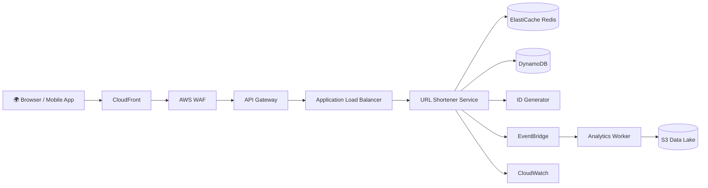

# URL Shortener Architecture (AWS)



---

# URL Creation Flow

```text
Client
   │
   ▼
API Gateway
   │
URL Shortener Service
   │
Generate Short ID
   │
Save Mapping (Short URL → Long URL)
   │
DynamoDB
   │
Return https://short.ly/Ab12X
```

---

# URL Redirect Flow

```text
User clicks Short URL
        │
        ▼
CloudFront
        │
API Gateway
        │
URL Service
        │
Check Redis Cache
        │
 ┌───────────────┐
 │ Cache Hit?    │
 └──────┬────────┘
        │ Yes
        ▼
Return Long URL (301/302 Redirect)

        │ No
        ▼
Lookup DynamoDB
        │
Update Redis Cache
        │
Return Redirect
```

---

# AWS Services Used

| Component | AWS Service |
|-----------|-------------|
| CDN | CloudFront |
| Security | AWS WAF |
| API | API Gateway |
| Load Balancer | ALB |
| Compute | ECS / EKS / Lambda |
| Cache | ElastiCache (Redis) |
| Database | DynamoDB |
| Event Processing | EventBridge |
| Analytics | S3 |
| Monitoring | CloudWatch |

---

## Interview Explanation (1 Minute)

1. The client sends a request through **CloudFront**, **WAF**, and **API Gateway**.
2. The **URL Service** generates a unique short ID (e.g., Base62 or Snowflake).
3. The mapping **Short URL → Long URL** is stored in **DynamoDB**.
4. Frequently accessed URLs are cached in **Redis** for low-latency redirects.
5. Redirect requests first check **Redis**; on a cache miss, they query **DynamoDB** and refresh the cache.
6. Click analytics are published asynchronously via **EventBridge** to avoid slowing down redirects.
7. **CloudWatch** provides metrics, logs, and alerts for monitoring.
