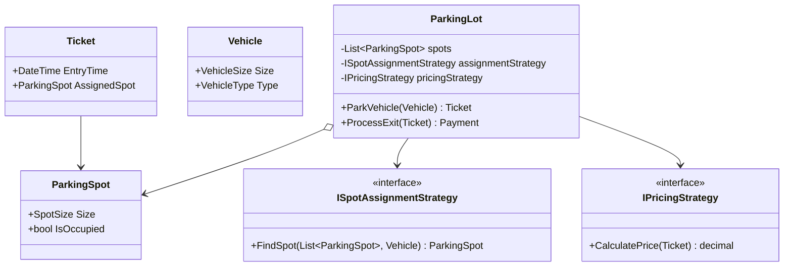
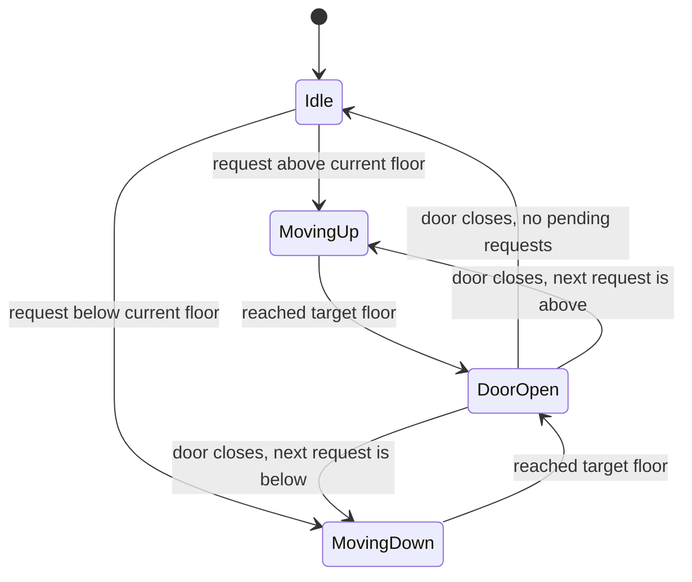

# Module 45 — Low-Level Design: Object-Oriented Design Interviews (Parking Lot & Elevator System)

> Domain: Low-Level Design | Level: Beginner → Expert | Prerequisite: [[../09-OOP/01-OOP-Fundamentals-Advanced]], [[../10-SOLID/01-SOLID-Principles-Deep-Dive]], [[../11-Design-Patterns/01-Creational-Structural-Patterns]], [[../11-Design-Patterns/02-Behavioral-Patterns]] — LLD interviews are precisely where Modules 29-32's OOP/SOLID/pattern content gets applied to concrete, buildable class designs.

---

## 1. Fundamentals

### What is Low-Level Design, and how does it differ from System Design?
Low-Level Design (LLD) — also called Object-Oriented Design (OOD) — is the practice of designing the actual **classes, interfaces, and their relationships** that implement a specific piece of functionality, in enough detail to be genuinely codeable. This differs from System Design (Module 14) specifically in **altitude**: System Design asks "what services exist, how do they communicate, how does this scale to millions of users" (boxes and arrows at the infrastructure/service level); LLD asks "what classes exist, what are their responsibilities, how do they collaborate" (classes and methods at the code-structure level) — for a single component that System Design would represent as one box.

### Why does this matter?
Because LLD interviews specifically test whether a candidate can **apply** SOLID principles (Module 30) and design patterns (Module 31-32) to a genuinely novel problem, not just recite their definitions — the entire value of Modules 29-32's deep, principle-first treatment (rather than pattern-name memorization) is realized precisely in this kind of exercise, where a candidate must *derive* which pattern fits, not recognize it from a checklist.

### When does this matter?
Any interview or real design task requiring a concrete class-level design (not just an architecture diagram); the depth matters for correctly identifying the actual entities/responsibilities in a problem domain (frequently harder than it first appears — a "Parking Lot" problem has several genuinely different reasonable decompositions) and for justifying design choices via the actual requirements, not by reflexively applying a pattern because "it's a design pattern problem."

### How does it work (30,000-ft view)?
```
1. Clarify requirements (what operations must the system support, what are the actual constraints)
2. Identify core entities/nouns in the problem (ParkingSpot, Vehicle, Ticket, ...)
3. Identify responsibilities/behaviors (who does what) -- apply SRP (Module 30 §2.1)
4. Identify relationships (composition vs inheritance, Module 29 §2.2) and extension points (Strategy, Module 32 §2.1)
5. Draw the class diagram; write the core method signatures; walk through 2-3 key scenarios end-to-end
```

---

## 2. Deep Dive

### 2.1 Requirements Clarification for LLD — a Narrower, More Concrete Version of Module 37 §2.1
Unlike System Design's non-functional-requirements focus (scale, latency, availability), LLD requirements-clarification centers on **functional precision**: exactly which vehicle types must be supported (motorcycles, cars, buses — each potentially needing different spot sizes)? Is pricing tiered by duration or vehicle type? Must the design support future extension (adding electric-vehicle charging spots) without modifying existing code (directly Module 30 §2.2's Open/Closed Principle, now the central organizing question for the entire design)? Skipping this step and diving straight into class design is the LLD-interview equivalent of Module 37 §4's "skipped non-functional requirements" mistake — leading to a design that technically works but doesn't actually address the interviewer's intended scope.

### 2.2 Parking Lot — Entity Identification and the Strategy-Pattern Extension Point
Core entities: `ParkingLot` (the overall coordinator), `ParkingSpot` (with a size/type and occupancy state), `Vehicle` (with a type and size), `Ticket` (issued on entry, tracking entry time and assigned spot), `Payment`/`PricingStrategy`. The **critical design decision**: how does the system decide which spot to assign a given vehicle, and how is pricing calculated? Both are precisely Module 32 §2.1's Strategy pattern's textbook use case — a `ISpotAssignmentStrategy` (nearest-available, size-optimal-fit, etc.) and a `IPricingStrategy` (flat-rate, tiered-by-duration, tiered-by-vehicle-type) let these two genuinely-variable-by-business-requirement behaviors be swapped without modifying `ParkingLot`'s core coordination logic — directly Module 30 §2.2's OCP applied concretely: adding a new pricing model means adding a new `IPricingStrategy` implementation, never modifying `ParkingLot` itself.

### 2.3 Elevator System — State Machine Design and the Scheduling-Algorithm Extension Point
Core entities: `Elevator` (with a current floor, direction, and state — idle/moving-up/moving-down/door-open), `ElevatorController`/`Dispatcher` (coordinating multiple elevators and assigning requests), `Request` (a floor-call button press, with an origin floor and desired direction, or a destination-floor button press from inside a car). The **critical design decisions**: (a) `Elevator`'s state transitions are precisely Module 32 §2.5's State pattern's textbook use case (idle → moving-up → door-open → idle, with well-defined valid transitions — directly connecting to Module 32's records-based-vs-classic-State-pattern discussion: since elevator states are a small, fixed, unlikely-to-be-externally-extended set, Module 7 §13's sealed-record-hierarchy approach is often the cleaner modern choice here over the classic polymorphic State pattern); (b) which elevator responds to a given floor call is a **scheduling algorithm** — another genuine Strategy-pattern extension point (`IElevatorSchedulingStrategy`: nearest-elevator, least-busy, directional-preference), since real elevator-dispatch algorithms are a studied, evolving optimization problem organizations genuinely tune over time.

### 2.4 Composition Over Inheritance, Concretely Applied — Vehicle Types as a Cautionary Example
A tempting but flawed first instinct: model `Motorcycle`, `Car`, `Bus` as an inheritance hierarchy under `Vehicle`. This is usually the **wrong** choice here — directly Module 29 §2.2's composition-over-inheritance guidance applied concretely: a vehicle's "size" (determining which spot types it can use) and "type" (determining pricing) are better modeled as **properties/enums** on a single `Vehicle` class (or, if genuinely distinct behavior is needed beyond data, a small composed `IVehicleSizeCategory` value) rather than a class hierarchy, since there's no genuinely distinct *behavior* per vehicle type in this domain (Module 29 §2.4's "is this a genuine is-a relationship with distinct behavior, or just distinct data" test) — a classic LLD-interview trap where candidates reach for inheritance reflexively because "there are different types of things," without verifying the behavioral-distinctness criterion Module 29 actually established.

### 2.5 The Class-Diagram-First vs Scenario-Walkthrough-First Debate — Both Are Necessary
A design that only produces a static class diagram (nouns, relationships) without walking through **specific, dynamic scenarios** (a customer parks a motorcycle when only car spots remain; an elevator receives two simultaneous, conflicting floor calls) risks looking complete on paper while having unaddressed edge cases or an actually-unworkable interaction flow — directly Module 37's "the diagram is necessary but not sufficient" lesson (§10 Intermediate Q10), now applied at the LLD altitude: a strong LLD answer always pairs the static class design with at least one or two concrete sequence-diagram-style scenario walkthroughs demonstrating the classes actually collaborate correctly for genuinely tricky cases, not just the straightforward happy path.

## 3. Visual Architecture

### Parking Lot


### Elevator State Transitions


## 4. Production Example
**Scenario**: A team's initial Parking Lot LLD (in a real internal tool, not just an interview exercise) modeled vehicle types as an inheritance hierarchy (`Motorcycle : Vehicle`, `Car : Vehicle`, `Bus : Vehicle`), each overriding a `GetRequiredSpotSize()` method — this worked initially, but when the business later introduced **electric vehicles requiring charging-capable spots** (a cross-cutting concern applying to *any* vehicle type — an electric motorcycle, an electric car), the inheritance hierarchy had no clean way to express "this is also an EV" without either duplicating an `ElectricMotorcycle : Motorcycle` / `ElectricCar : Car` hierarchy (a combinatorial explosion, directly Module 31 §2.6's Decorator-avoids-subclass-explosion lesson) or awkwardly adding an `IsElectric` flag to the base class that most subclasses would need to handle inconsistently. **Investigation**: recognized this as exactly Module 29 §2.4's "is this a genuine is-a relationship, or just distinct data/orthogonal concerns" question, answered incorrectly at the original design stage — vehicle "size category" and "requires charging" are **two independent, orthogonal properties**, not a single-axis type hierarchy. **Fix**: refactored `Vehicle` into a single class with two independent properties (`SizeCategory` enum, `RequiresCharging` bool) rather than a type hierarchy encoding only one of these two independently-varying dimensions — trivially supporting any combination (an electric bus, a non-electric motorcycle) without any class-hierarchy changes at all, directly Module 30 §2.1's "identify the actual independently-varying dimensions" SRP-adjacent reasoning applied to entity modeling instead of method responsibility. **Lesson**: an LLD's entity model must account for **all** the actual independently-varying dimensions of a domain, not just the first one identified — an inheritance hierarchy modeling only one dimension (vehicle size) becomes structurally incapable of cleanly accommodating a second, orthogonal dimension (electric/non-electric) discovered later, exactly the kind of requirements-evolution LLD interviews sometimes explicitly probe via a "now what if we add X" follow-up question.

## 5. Best Practices
- Spend real time on requirements clarification before designing classes — ask about extensibility needs explicitly (Module 30 §2.2's OCP framing: "what's likely to change, and does the design accommodate that without modification").
- Model genuinely independent, orthogonal properties as separate fields/enums, not as a single inheritance hierarchy conflating multiple dimensions (§4's incident).
- Use Strategy (Module 32 §2.1) for any behavior that's a genuine business-policy decision likely to vary/change (pricing, spot assignment, scheduling algorithms).
- Always pair a static class diagram with at least one or two dynamic scenario walkthroughs, including a tricky edge case, not just the straightforward happy path.

## 6. Anti-patterns
- Reflexively modeling "different types of X" as an inheritance hierarchy without verifying a genuine behavioral difference exists (Module 29 §2.4's test) — the vehicle-type trap (§2.4/§4).
- Designing only a static class diagram without walking through concrete scenarios, missing edge cases an interviewer will likely probe.
- Hardcoding a specific pricing/assignment/scheduling algorithm directly into the core coordinator class instead of extracting it as a Strategy, making future changes require modifying tested, working code (an OCP violation, Module 30 §4's exact incident shape, now at the LLD scale).
- Skipping requirements clarification and designing for an assumed, unstated scope that doesn't match what the interviewer actually intended to evaluate.

## 7. Performance Engineering
LLD interviews rarely focus on performance in the sense Modules 1-13 covered (JIT internals, algorithmic complexity of a specific hot path) — but a strong answer should still reason about the **complexity of core operations**: is finding an available parking spot an O(n) linear scan over all spots, or does the design support a more efficient structure (a `Dictionary<SpotSize, Queue<ParkingSpot>>` grouping available spots by size, directly Module 33's "match the data structure to the actual access pattern" discipline, giving near-O(1) "find an available spot of size X" instead of scanning every spot) — explicitly choosing and justifying this kind of supporting-data-structure decision (not just the class relationships) is what separates a purely academic class diagram from one demonstrating genuine engineering judgment about how the design would actually perform.

## 8. Security
LLD interview problems are typically not security-focused, but a genuinely thorough answer for a real (non-interview) system should still note: `ParkingLot`'s `ProcessExit` (or similar payment-related operations) should validate the presented `Ticket` genuinely corresponds to a currently-parked vehicle (preventing a forged/reused ticket from producing an incorrect, too-low payment calculation) — a small but real example of Module 12 §2.4's "verify current authorization/validity state, don't trust a presented token/reference blindly" principle, applicable even in a seemingly non-security-relevant domain like a parking system.

## 9. Scalability
For a genuinely large parking-facility chain (many physical locations, thousands of spots each) or a genuinely large elevator-bank system (a skyscraper with dozens of elevators), the LLD's core classes (`ParkingLot`, `ElevatorController`) become the **components** a full System Design (Module 14) would then need to scale, replicate, and coordinate across locations/buildings — explicitly recognizing this altitude boundary (this is the LLD for one location/building; scaling to many locations is a System Design concern layering on top) demonstrates awareness of how these two disciplines relate, rather than either conflating them or treating LLD as entirely disconnected from real-world scale considerations.

---

## 10. Interview Questions

### Basic (10)
1. **Q: What's the difference between Low-Level Design and System Design?** **A:** LLD designs classes/interfaces and their relationships for a specific component; System Design designs services/infrastructure and their communication for a whole, scaled system.
2. **Q: What core entities would a Parking Lot LLD typically include?** **A:** ParkingLot, ParkingSpot, Vehicle, Ticket, and a pricing mechanism.
3. **Q: Why might spot-assignment logic be extracted as a Strategy rather than hardcoded in `ParkingLot`?** **A:** To allow the assignment algorithm to change/vary without modifying `ParkingLot`'s core coordination logic (Module 30's OCP).
4. **Q: What design pattern models an elevator's idle/moving/door-open behavior?** **A:** The State pattern (or Module 7's records-based alternative).
5. **Q: Should vehicle types (motorcycle, car, bus) typically be modeled as an inheritance hierarchy?** **A:** Usually not — they're better modeled as properties/enums on a single class unless a genuine behavioral difference exists.
6. **Q: What's the risk of hardcoding a pricing algorithm directly into the core coordinator class?** **A:** Any pricing change requires modifying existing, tested code — an OCP violation.
7. **Q: What should always accompany a static LLD class diagram?** **A:** At least one or two dynamic scenario walkthroughs demonstrating the classes collaborate correctly, including edge cases.
8. **Q: Why might a `Dictionary<SpotSize, Queue<ParkingSpot>>` be preferable to a plain list of all spots?** **A:** It supports near-O(1) lookup of an available spot of a specific size, rather than an O(n) linear scan.
9. **Q: What's the first step in tackling an LLD interview problem?** **A:** Requirements clarification — what operations must be supported, what are the actual constraints and extensibility needs.
10. **Q: Is elevator-scheduling-algorithm selection a good candidate for the Strategy pattern?** **A:** Yes — it's a genuine, evolving optimization problem organizations tune over time, exactly Strategy's use case.

### Intermediate (10)
1. **Q: Why is "is there a genuine behavioral difference" the key test for choosing inheritance over composition/properties, in the vehicle-type context specifically?** **A:** If different vehicle types don't actually behave differently beyond having different data values (size, whether they need charging), an inheritance hierarchy adds structural rigidity without a corresponding behavioral benefit — properties/enums express the same information more flexibly.
2. **Q: Why did the electric-vehicle requirement (§4) expose a flaw in the original inheritance-based vehicle-type design specifically?** **A:** Because "requires charging" is an independent, orthogonal dimension from "size category" — an inheritance hierarchy modeling only the size dimension had no clean way to add a second, independently-varying dimension without duplicating the hierarchy or awkwardly retrofitting a flag.
3. **Q: Why should requirements clarification for an LLD problem explicitly ask about extensibility needs, not just current functional scope?** **A:** Because a design that works for the current, stated requirements but can't cleanly accommodate a likely future variation (a new pricing model, a new vehicle category) reveals an OCP violation the interviewer may specifically probe via a follow-up question.
4. **Q: Why is pairing the elevator's state machine with the records-based (Module 7 §13) approach often preferable to the classic polymorphic State pattern for this specific domain?** **A:** Elevator states are a small, fixed, unlikely-to-be-externally-extended set — the records-based approach's compile-time exhaustiveness checking is more valuable here than the classic State pattern's genuine external-extensibility property, which this domain doesn't actually need.
5. **Q: Why does a strong LLD answer walk through a "two simultaneous, conflicting floor calls" scenario for the elevator system specifically?** **A:** It's a genuinely tricky edge case exercising the scheduling/dispatch logic's actual decision-making under contention, exactly the kind of scenario a static class diagram alone wouldn't reveal whether the design correctly handles.
6. **Q: Why might `ParkingLot.ProcessExit` need to validate the ticket's current validity, not just its existence?** **A:** To prevent a forged, reused, or already-processed ticket from producing an incorrect payment calculation — a resource-based-validity check analogous to Module 12's authorization-freshness discipline, applied here to ticket state instead of user permissions.
7. **Q: Why is choosing a supporting data structure (not just class relationships) part of a complete LLD answer?** **A:** The class diagram alone doesn't reveal the actual complexity of core operations (finding an available spot) — explicitly choosing and justifying a structure (grouped-by-size dictionary) demonstrates genuine engineering judgment about how the design performs, not just how it's structured.
8. **Q: Why does recognizing the "altitude boundary" between LLD and System Design matter when a follow-up question asks "how would this scale to 1,000 parking locations"?** **A:** It signals the candidate understands that scaling to many locations is a System Design concern (replication, coordination across locations, Module 14's tools) layering on top of, not replacing, the single-location LLD already designed — rather than either conflating the two or being unable to bridge from one to the other.
9. **Q: Why would a candidate reaching for the Strategy pattern for every single behavior in the Parking Lot design (even ones with no genuine variability) be over-applying the pattern?** **A:** Directly Module 31 §6/Module 30's "apply patterns where genuinely justified by demonstrated variability need, not reflexively everywhere" discipline — a behavior that will never plausibly vary doesn't benefit from the added indirection of a Strategy interface.
10. **Q: Why is "the interviewer asked about elevators, and my answer immediately jumped to a Strategy pattern for scheduling" potentially a red flag without first establishing why scheduling is genuinely variable?** **A:** Naming the correct pattern without first demonstrating the *reasoning* that led there (elevator scheduling is a known, actively-studied optimization problem organizations tune over time) suggests pattern-name recall rather than genuine derivation from the problem's actual characteristics — exactly the "recognize the pattern from the problem shape, don't just recite pattern names" distinction Module 31 §Advanced Q10 establishes.

### Advanced (10)
1. **Q: Diagnose the vehicle-type inheritance-hierarchy production incident (§4) from first principles, and design the specific requirements-clarification question that would have caught this dimension-conflation risk before implementation.**
   **A:** Root cause: the original design correctly identified "vehicle size" as a relevant dimension but implicitly assumed it was the *only* relevant dimension, encoding it into an inheritance hierarchy without checking for other, independently-varying properties. Safeguard question: "are there any other properties of a vehicle, beyond size, that might affect spot assignment or pricing, now or in the foreseeable future?" — explicitly probing for additional dimensions during requirements clarification (§2.1), rather than only identifying the first, most-obvious dimension and modeling around it exclusively.
2. **Q: Design the `IElevatorSchedulingStrategy` interface and at least two concrete implementations, addressing the "two simultaneous, conflicting floor calls" scenario explicitly.**
   **A:**
   ```csharp
   public interface IElevatorSchedulingStrategy
   {
       Elevator SelectElevator(IReadOnlyList<Elevator> elevators, FloorRequest request);
   }

   public class NearestElevatorStrategy : IElevatorSchedulingStrategy
   {
       public Elevator SelectElevator(IReadOnlyList<Elevator> elevators, FloorRequest request) =>
           elevators.Where(e => e.CanServiceWithoutReversing(request))
                    .OrderBy(e => Math.Abs(e.CurrentFloor - request.OriginFloor))
                    .FirstOrDefault() ?? elevators.OrderBy(e => Math.Abs(e.CurrentFloor - request.OriginFloor)).First();
   }
   ```
   For the conflicting-calls scenario (two floor calls in opposite directions arriving near-simultaneously), the `ElevatorController` queues both requests and the scheduling strategy evaluates them independently — the "conflict" is resolved not by the strategy picking one over the other, but by potentially assigning **different elevators** to each request (the actual purpose of having multiple elevators and a dispatcher), with the strategy's `CanServiceWithoutReversing` check ensuring an elevator already committed to one direction isn't assigned a request requiring it to reverse mid-transit, a genuine, concrete detail a class-diagram-only answer would miss.
3. **Q: Explain how you would extend the Parking Lot design to support a "reserved/VIP spot" feature without modifying `ParkingSpot`, `Vehicle`, or the core `ParkingLot` coordination logic.**
   **A:** Add a `SpotReservation` concept (a separate entity tracking which spots are reserved for which vehicles/time windows) and extend `ISpotAssignmentStrategy` with a `ReservationAwareAssignmentStrategy` implementation that checks reservations before falling back to the standard assignment logic — this is a **decorator-shaped** extension (Module 31 §2.6) of the assignment strategy specifically, demonstrating that the Strategy-pattern extension point identified in §2.2 genuinely accommodates this kind of later-discovered requirement without touching `ParkingLot`'s core code, directly validating the original design's OCP compliance rather than needing to retrofit it.
4. **Q: A candidate's Parking Lot design uses a single `List<ParkingSpot>` and a linear scan for spot assignment, citing "premature optimization" as justification for not using a more efficient structure. Evaluate this reasoning.**
   **A:** This is a reasonable **starting** point (don't over-engineer before establishing correctness, this course's recurring "measure/demonstrate need before optimizing" discipline) — but a strong candidate should explicitly **acknowledge** the O(n) cost and state under what conditions (a very large parking structure, very high entry/exit frequency) they would revisit it with the size-grouped-dictionary approach (§7), demonstrating awareness of the trade-off being made rather than presenting O(n) as a design decision made without consideration — the difference between "I chose simplicity, aware of this cost and when I'd revisit it" and "I didn't think about this at all" is precisely the signal an interviewer is evaluating.
5. **Q: Design the `Ticket` validity-check logic (§8) precisely, addressing what happens if a ticket is presented twice (a potential double-exit attempt or a forged duplicate).**
   **A:**
   ```csharp
   public async Task<Payment> ProcessExitAsync(Ticket ticket)
   {
       var currentState = await _ticketStore.GetCurrentStateAsync(ticket.Id);
       if (currentState is not TicketState.Active)
           throw new InvalidOperationException("This ticket has already been processed or is invalid.");

       var payment = _pricingStrategy.CalculatePrice(ticket);
       await _ticketStore.MarkProcessedAsync(ticket.Id); // atomic state transition -- prevents a race on double-exit
       return payment;
   }
   ```
   The atomic state-check-and-transition (directly Module 19's optimistic-concurrency discipline, applied here to prevent a double-exit race rather than an inventory-overselling race) ensures a ticket can only be successfully processed once, even under concurrent attempts — a detail a purely conceptual class diagram wouldn't surface without explicitly walking through this specific "what if presented twice" scenario (§2.5's discipline).
6. **Q: Explain how you would redesign the Parking Lot's pricing to support "the first 15 minutes are free" as a common, real-world requirement, and where this logic belongs.**
   **A:** This belongs entirely within a specific `IPricingStrategy` implementation (e.g., `GracePeriodPricingStrategy` wrapping/decorating another underlying strategy, directly Module 31 §2.6's Decorator pattern applied to a Strategy implementation — composing "the underlying tiered rate" with "but waive it if under 15 minutes") — never as a special-cased `if` check inside `ParkingLot`'s core exit-processing logic, which would violate the same OCP principle the Strategy extraction (§2.2) was specifically designed to protect.
7. **Q: How would you design the `ElevatorController` to handle an elevator going out of service mid-operation (a mechanical fault), including in-progress requests it was already committed to?**
   **A:** The controller must detect the fault (via a health-check/status signal from the `Elevator` instance itself), immediately mark that elevator as unavailable for **new** request assignment, and **re-dispatch** any requests it had already accepted but not yet fulfilled to a different available elevator (via the same `IElevatorSchedulingStrategy`, now excluding the faulted elevator from consideration) — directly Module 14's health-check discipline applied to a physical/mechanical component instead of a software service, and Module 38 §Advanced Q8's "gracefully redistribute already-assigned work when a worker becomes unavailable" pattern, now at the LLD scale.
8. **Q: Explain why "the candidate immediately drew a UML class diagram with inheritance for vehicle types" without first discussing requirements is a specific, recognizable interview red flag, connecting to this module's central lesson.**
   **A:** It signals designing from a reflexive pattern-application instinct ("there are types of things, so I'll use inheritance") rather than from the actual, clarified requirements and their independently-varying dimensions (§4's central lesson) — a strong candidate's first substantive design decision should visibly follow from a requirements-clarification conversation, not precede it, exactly the ordering this entire module's §2.1/Advanced Q1 establishes as foundational.
9. **Q: A team proposes a single, monolithic `ParkingSystemManager` class handling spot assignment, pricing, ticket validation, and payment processing all together, arguing "it's simpler to have one class that does everything for a parking lot." Evaluate this as a Principal Engineer.**
   **A:** Reject this — it's precisely Module 30 §2.1's SRP violation ("one reason to change" — pricing-policy changes, assignment-algorithm changes, and payment-processing changes are all independently-varying concerns that would each require modifying this same shared class) and directly reproduces Module 30 §4's incident shape (a monolithic class handling a growing, independently-modifiable set of concerns, risking one change's modification inadvertently affecting an unrelated concern) — recommend the decomposition this module establishes (a coordinating `ParkingLot` delegating to focused, independently-testable `ISpotAssignmentStrategy`/`IPricingStrategy` collaborators) specifically to avoid this demonstrated risk class, not merely as an abstract "more classes is better" preference.
10. **Q: As a Principal Engineer conducting/calibrating LLD interviews, what would you specifically listen for to distinguish a candidate with genuine design judgment from one reciting memorized patterns?**
    **A:** Listen for the candidate's **reasoning trace**, not just their final design: do they ask clarifying questions before designing (§2.1)? Do they explicitly justify *why* a specific pattern fits (citing the actual variability/extensibility need, Module 31 §Advanced Q10's diagnostic-question framing) rather than just naming it? Do they proactively walk through a tricky edge-case scenario unprompted (§2.5)? Do they acknowledge trade-offs explicitly when choosing a simpler approach (Advanced Q4)? — these behavioral signals, more than the specific final class diagram produced, are what distinguish a candidate who has internalized this course's principle-first approach to OOP/SOLID/patterns (Modules 29-32) from one who has memorized a library of pattern names and UML templates without the underlying judgment to apply them correctly to a genuinely novel problem.

---

## 11. Coding Exercises

*(LLD interviews use worked class-design exercises with actual, compilable code, consistent with this domain's practical, buildable nature.)*

### Easy — Core Parking Lot classes with a Strategy-based pricing extension point
```csharp
public enum VehicleSize { Motorcycle, Compact, Large }

public class Vehicle
{
    public string LicensePlate { get; init; } = "";
    public VehicleSize Size { get; init; }
    public bool RequiresCharging { get; init; } // §4's fix: an INDEPENDENT property, not a hierarchy branch
}

public class ParkingSpot
{
    public string Id { get; init; } = "";
    public VehicleSize Size { get; init; }
    public bool HasChargingCapability { get; init; } // orthogonal to Size, per §4's lesson
    public bool IsOccupied { get; set; }
}

public interface IPricingStrategy
{
    decimal CalculatePrice(TimeSpan duration, VehicleSize size);
}

public class TieredPricingStrategy : IPricingStrategy
{
    public decimal CalculatePrice(TimeSpan duration, VehicleSize size) =>
        size switch
        {
            VehicleSize.Motorcycle => (decimal)duration.TotalHours * 1.0m,
            VehicleSize.Compact => (decimal)duration.TotalHours * 2.0m,
            VehicleSize.Large => (decimal)duration.TotalHours * 3.5m,
            _ => throw new ArgumentOutOfRangeException(nameof(size))
        };
}
```

### Medium — Size-grouped spot assignment for O(1) lookup (§7)
```csharp
public class ParkingLot
{
    private readonly Dictionary<VehicleSize, Queue<ParkingSpot>> _availableSpotsBySize = new();

    public ParkingSpot? FindAvailableSpot(Vehicle vehicle)
    {
        if (_availableSpotsBySize.TryGetValue(vehicle.Size, out var queue) && queue.Count > 0)
        {
            var spot = queue.Dequeue(); // O(1), not an O(n) scan over ALL spots
            if (vehicle.RequiresCharging && !spot.HasChargingCapability)
            {
                queue.Enqueue(spot); // put it back -- doesn't meet the charging requirement, try elsewhere
                return null; // simplified: a real implementation would search a size-and-charging-indexed structure
            }
            return spot;
        }
        return null;
    }
}
```

### Hard — Decorator-composed grace-period pricing strategy (Advanced Q6)
```csharp
public class GracePeriodPricingDecorator : IPricingStrategy
{
    private readonly IPricingStrategy _inner;
    private readonly TimeSpan _gracePeriod;

    public GracePeriodPricingDecorator(IPricingStrategy inner, TimeSpan gracePeriod)
    {
        _inner = inner; _gracePeriod = gracePeriod;
    }

    public decimal CalculatePrice(TimeSpan duration, VehicleSize size) =>
        duration <= _gracePeriod ? 0m : _inner.CalculatePrice(duration, size);
}
// Usage: new GracePeriodPricingDecorator(new TieredPricingStrategy(), TimeSpan.FromMinutes(15))
// -- "first 15 minutes free" composed with the underlying tiered rate, NO modification
// to TieredPricingStrategy or ParkingLot's core logic at all.
```

### Expert — Elevator scheduling with fault-tolerant re-dispatch (Advanced Q7)
```csharp
public class ElevatorController
{
    private readonly List<Elevator> _elevators;
    private readonly IElevatorSchedulingStrategy _strategy;
    private readonly List<FloorRequest> _pendingReassignment = new();

    public void HandleElevatorFault(Elevator faultedElevator)
    {
        faultedElevator.MarkOutOfService();
        var affectedRequests = faultedElevator.GetUnfulfilledRequests();
        faultedElevator.ClearRequests();

        foreach (var request in affectedRequests)
        {
            var availableElevators = _elevators.Where(e => e.IsInService && e != faultedElevator).ToList();
            var newAssignment = _strategy.SelectElevator(availableElevators, request);
            newAssignment.AddRequest(request); // re-dispatched to a different, healthy elevator
        }
    }
}
```

---

## 12–17. System Design / LLD / Debugging / Decision / Case Study / Principal

*(This entire module IS the deep-dive LLD case study — §4's incident, §11's four worked exercises, and the extensive Advanced-tier Q&A collectively constitute this section's typical content.)*

## 18. Revision
**Key takeaways**: LLD applies Modules 29-32's OOP/SOLID/pattern principles to concrete, buildable class designs — the value is in deriving *why* a pattern fits from the actual problem's variability/extensibility needs, not reciting pattern names. Model genuinely independent, orthogonal properties (vehicle size vs. charging requirement) as separate fields, not a single inheritance hierarchy conflating multiple dimensions (§4's central lesson). Extract genuinely variable business policies (pricing, spot/elevator assignment) as Strategy-pattern interfaces to satisfy OCP concretely. Always pair a static class diagram with dynamic scenario walkthroughs — a design that looks complete on paper can still have unaddressed edge cases (concurrent ticket processing, simultaneous elevator requests, mid-operation faults) only a scenario walkthrough would surface.

---

**Next**: Continuing autonomously to Module 46 — LLD Case Studies: Library Management System & Chess Game Engine, completing the `15-Low-Level-Design` domain before advancing to `16-Distributed-Systems`.
