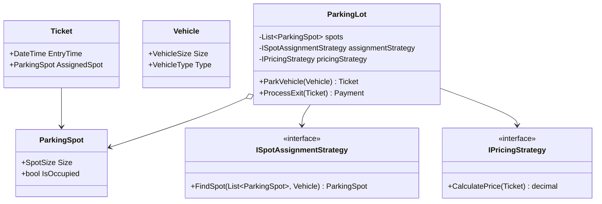
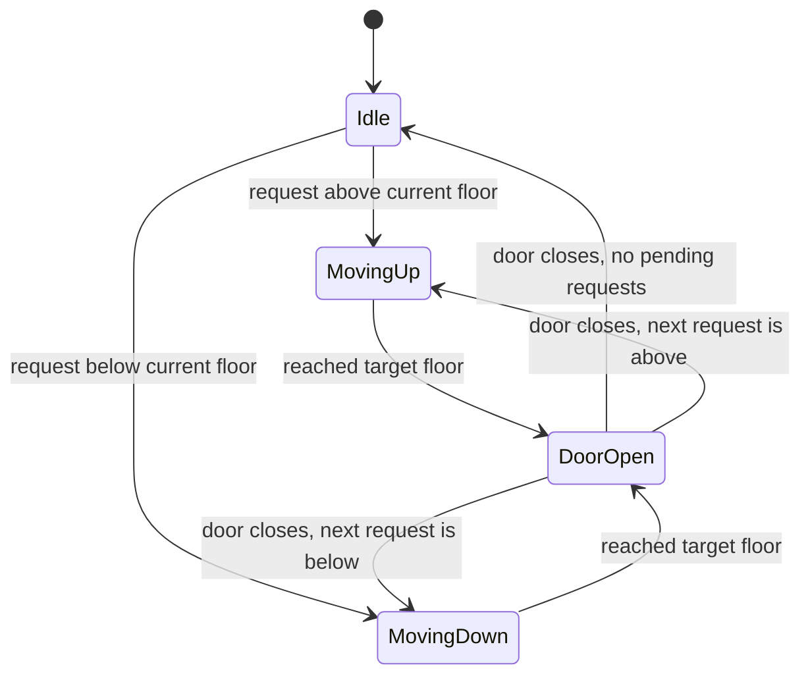
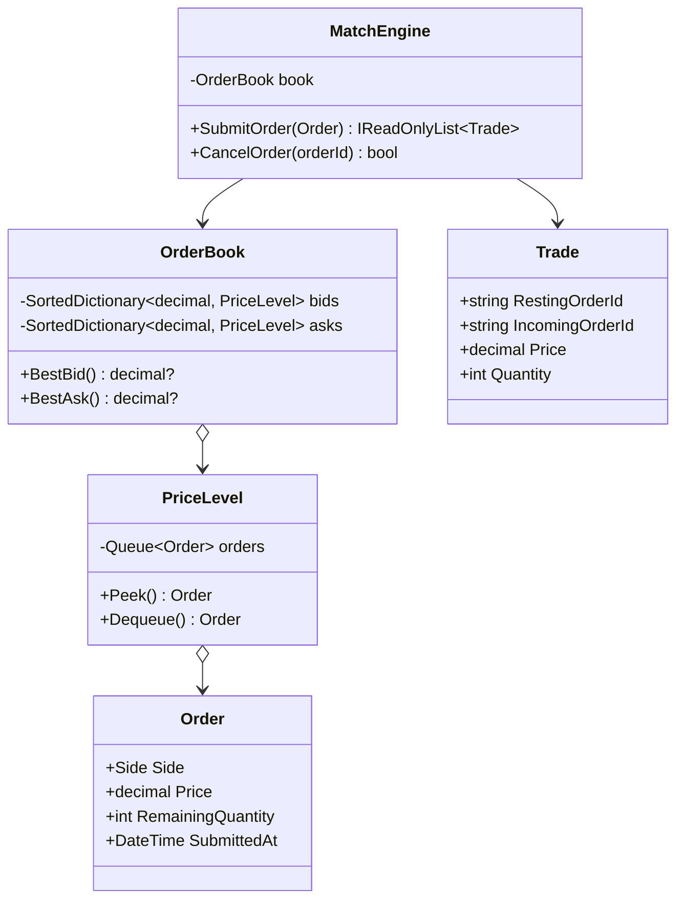
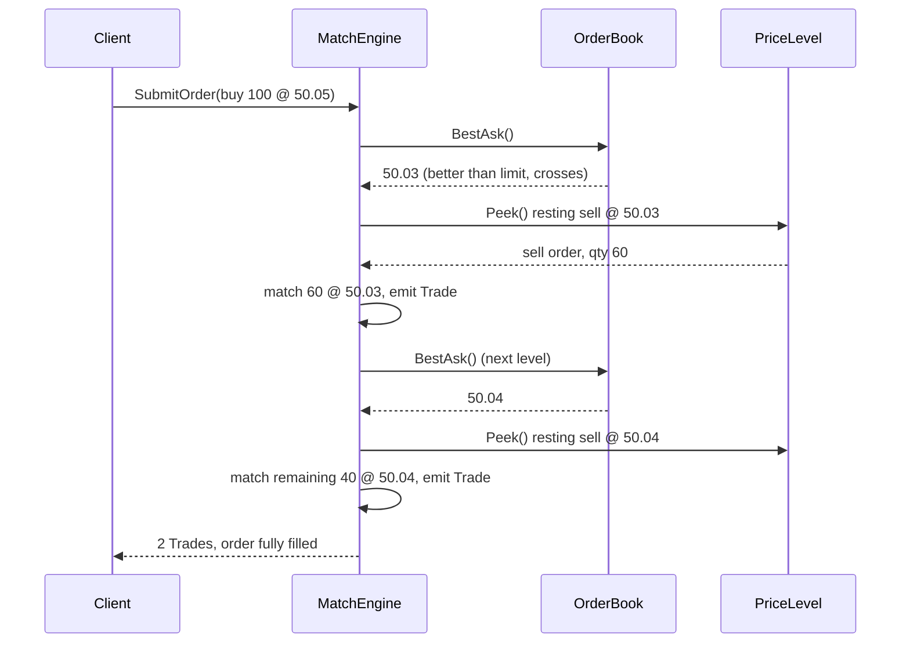

# Module 45 — Low-Level Design: Object-Oriented Design Interviews (Parking Lot & Elevator System)

> Domain: Low-Level Design | Level: Beginner → Expert | Prerequisite: [[../09-OOP/01-OOP-Fundamentals-Advanced]], [[../10-SOLID/01-SOLID-Principles-Deep-Dive]], [[../11-Design-Patterns/01-Creational-Structural-Patterns]], [[../11-Design-Patterns/02-Behavioral-Patterns]] — LLD interviews are precisely where Modules 29-32's OOP/SOLID/pattern content gets applied to concrete, buildable class designs.

---

## 1. Fundamentals

### What is Low-Level Design, and how does it differ from System Design?
Low-Level Design (LLD) — also called Object-Oriented Design (OOD) — is the practice of designing the actual **classes, interfaces, and their relationships** that implement a specific piece of functionality, in enough detail to be genuinely codeable. This differs from System Design specifically in **altitude**: System Design asks "what services exist, how do they communicate, how does this scale to millions of users" (boxes and arrows at the infrastructure/service level); LLD asks "what classes exist, what are their responsibilities, how do they collaborate" (classes and methods at the code-structure level) — for a single component that System Design would represent as one box.

### Why does this matter?
Because LLD interviews specifically test whether a candidate can **apply** SOLID principles and design patterns (32) to a genuinely novel problem, not just recite their definitions — the entire value of Modules 29-32's deep, principle-first treatment (rather than pattern-name memorization) is realized precisely in this kind of exercise, where a candidate must *derive* which pattern fits, not recognize it from a checklist.

### When does this matter?
Any interview or real design task requiring a concrete class-level design (not just an architecture diagram); the depth matters for correctly identifying the actual entities/responsibilities in a problem domain (frequently harder than it first appears — a "Parking Lot" problem has several genuinely different reasonable decompositions) and for justifying design choices via the actual requirements, not by reflexively applying a pattern because "it's a design pattern problem."

### How does it work (30,000-ft view)?
```
1. Clarify requirements (what operations must the system support, what are the actual constraints)
2. Identify core entities/nouns in the problem (ParkingSpot, Vehicle, Ticket,...)
3. Identify responsibilities/behaviors (who does what) -- apply SRP
4. Identify relationships (composition vs inheritance) and extension points (Strategy)
5. Draw the class diagram; write the core method signatures; walk through 2-3 key scenarios end-to-end
```

---

## 2. Deep Dive

### 2.1 Requirements Clarification for LLD — a Narrower, More Concrete Version 
Unlike System Design's non-functional-requirements focus (scale, latency, availability), LLD requirements-clarification centers on **functional precision**: exactly which vehicle types must be supported (motorcycles, cars, buses — each potentially needing different spot sizes)? Is pricing tiered by duration or vehicle type? Must the design support future extension (adding electric-vehicle charging spots) without modifying existing code (directly the Open/Closed Principle, now the central organizing question for the entire design)? Skipping this step and diving straight into class design is the LLD-interview equivalent of the "skipped non-functional requirements" mistake — leading to a design that technically works but doesn't actually address the interviewer's intended scope.

### 2.2 Parking Lot — Entity Identification and the Strategy-Pattern Extension Point
Core entities: `ParkingLot` (the overall coordinator), `ParkingSpot` (with a size/type and occupancy state), `Vehicle` (with a type and size), `Ticket` (issued on entry, tracking entry time and assigned spot), `Payment`/`PricingStrategy`. The **critical design decision**: how does the system decide which spot to assign a given vehicle, and how is pricing calculated? Both are precisely the Strategy pattern's textbook use case — a `ISpotAssignmentStrategy` (nearest-available, size-optimal-fit, etc.) and a `IPricingStrategy` (flat-rate, tiered-by-duration, tiered-by-vehicle-type) let these two genuinely-variable-by-business-requirement behaviors be swapped without modifying `ParkingLot`'s core coordination logic — directly the OCP applied concretely: adding a new pricing model means adding a new `IPricingStrategy` implementation, never modifying `ParkingLot` itself.

### 2.3 Elevator System — State Machine Design and the Scheduling-Algorithm Extension Point
Core entities: `Elevator` (with a current floor, direction, and state — idle/moving-up/moving-down/door-open), `ElevatorController`/`Dispatcher` (coordinating multiple elevators and assigning requests), `Request` (a floor-call button press, with an origin floor and desired direction, or a destination-floor button press from inside a car). The **critical design decisions**: (a) `Elevator`'s state transitions are precisely the State pattern's textbook use case (idle → moving-up → door-open → idle, with well-defined valid transitions — directly connecting to the records-based-vs-classic-State-pattern discussion: since elevator states are a small, fixed, unlikely-to-be-externally-extended set, the sealed-record-hierarchy approach is often the cleaner modern choice here over the classic polymorphic State pattern); (b) which elevator responds to a given floor call is a **scheduling algorithm** — another genuine Strategy-pattern extension point (`IElevatorSchedulingStrategy`: nearest-elevator, least-busy, directional-preference), since real elevator-dispatch algorithms are a studied, evolving optimization problem organizations genuinely tune over time.

### 2.4 Composition Over Inheritance, Concretely Applied — Vehicle Types as a Cautionary Example
A tempting but flawed first instinct: model `Motorcycle`, `Car`, `Bus` as an inheritance hierarchy under `Vehicle`. This is usually the **wrong** choice here — directly the composition-over-inheritance guidance applied concretely: a vehicle's "size" (determining which spot types it can use) and "type" (determining pricing) are better modeled as **properties/enums** on a single `Vehicle` class (or, if genuinely distinct behavior is needed beyond data, a small composed `IVehicleSizeCategory` value) rather than a class hierarchy, since there's no genuinely distinct *behavior* per vehicle type in this domain (the "is this a genuine is-a relationship with distinct behavior, or just distinct data" test) — a classic LLD-interview trap where candidates reach for inheritance reflexively because "there are different types of things," without verifying the behavioral-distinctness criterion actually established.

### 2.5 The Class-Diagram-First vs Scenario-Walkthrough-First Debate — Both Are Necessary
A design that only produces a static class diagram (nouns, relationships) without walking through **specific, dynamic scenarios** (a customer parks a motorcycle when only car spots remain; an elevator receives two simultaneous, conflicting floor calls) risks looking complete on paper while having unaddressed edge cases or an actually-unworkable interaction flow — directly the "the diagram is necessary but not sufficient" lesson, now applied at the LLD altitude: a strong LLD answer always pairs the static class design with at least one or two concrete sequence-diagram-style scenario walkthroughs demonstrating the classes actually collaborate correctly for genuinely tricky cases, not just the straightforward happy path.

## 3. Visual Architecture

### Parking Lot

```mermaid
classDiagram
 class ParkingLot {
 -List~ParkingSpot~ spots
 -ISpotAssignmentStrategy assignmentStrategy
 -IPricingStrategy pricingStrategy
 +ParkVehicle(Vehicle) Ticket
 +ProcessExit(Ticket) Payment
 }
 class ParkingSpot {
 +SpotSize Size
 +bool IsOccupied
 }
 class Vehicle {
 +VehicleSize Size
 +VehicleType Type
 }
 class Ticket {
 +DateTime EntryTime
 +ParkingSpot AssignedSpot
 }
 class ISpotAssignmentStrategy {
 <<interface>>
 +FindSpot(List~ParkingSpot~, Vehicle) ParkingSpot
 }
 class IPricingStrategy {
 <<interface>>
 +CalculatePrice(Ticket) decimal
 }
 ParkingLot o--> ParkingSpot
 ParkingLot --> ISpotAssignmentStrategy
 ParkingLot --> IPricingStrategy
 Ticket --> ParkingSpot
```

### Elevator State Transitions

```mermaid
stateDiagram-v2
 [*] --> Idle
 Idle --> MovingUp: request above current floor
 Idle --> MovingDown: request below current floor
 MovingUp --> DoorOpen: reached target floor
 MovingDown --> DoorOpen: reached target floor
 DoorOpen --> Idle: door closes, no pending requests
 DoorOpen --> MovingUp: door closes, next request is above
 DoorOpen --> MovingDown: door closes, next request is below
```

## 4. Production Example
**Scenario**: A team's initial Parking Lot LLD (in a real internal tool, not just an interview exercise) modeled vehicle types as an inheritance hierarchy (`Motorcycle: Vehicle`, `Car: Vehicle`, `Bus: Vehicle`), each overriding a `GetRequiredSpotSize` method — this worked initially, but when the business later introduced **electric vehicles requiring charging-capable spots** (a cross-cutting concern applying to *any* vehicle type — an electric motorcycle, an electric car), the inheritance hierarchy had no clean way to express "this is also an EV" without either duplicating an `ElectricMotorcycle: Motorcycle` / `ElectricCar: Car` hierarchy (a combinatorial explosion, directly the Decorator-avoids-subclass-explosion lesson) or awkwardly adding an `IsElectric` flag to the base class that most subclasses would need to handle inconsistently. **Investigation**: recognized this as exactly the "is this a genuine is-a relationship, or just distinct data/orthogonal concerns" question, answered incorrectly at the original design stage — vehicle "size category" and "requires charging" are **two independent, orthogonal properties**, not a single-axis type hierarchy. **Fix**: refactored `Vehicle` into a single class with two independent properties (`SizeCategory` enum, `RequiresCharging` bool) rather than a type hierarchy encoding only one of these two independently-varying dimensions — trivially supporting any combination (an electric bus, a non-electric motorcycle) without any class-hierarchy changes at all, directly the "identify the actual independently-varying dimensions" SRP-adjacent reasoning applied to entity modeling instead of method responsibility. **Lesson**: an LLD's entity model must account for **all** the actual independently-varying dimensions of a domain, not just the first one identified — an inheritance hierarchy modeling only one dimension (vehicle size) becomes structurally incapable of cleanly accommodating a second, orthogonal dimension (electric/non-electric) discovered later, exactly the kind of requirements-evolution LLD interviews sometimes explicitly probe via a "now what if we add X" follow-up question.

## 5. Best Practices
- Spend real time on requirements clarification before designing classes — ask about extensibility needs explicitly (the OCP framing: "what's likely to change, and does the design accommodate that without modification").
- Model genuinely independent, orthogonal properties as separate fields/enums, not as a single inheritance hierarchy conflating multiple dimensions (the incident).
- Use Strategy for any behavior that's a genuine business-policy decision likely to vary/change (pricing, spot assignment, scheduling algorithms).
- Always pair a static class diagram with at least one or two dynamic scenario walkthroughs, including a tricky edge case, not just the straightforward happy path.

## 6. Anti-patterns
- Reflexively modeling "different types of X" as an inheritance hierarchy without verifying a genuine behavioral difference exists (the test) — the vehicle-type trap (/).
- Designing only a static class diagram without walking through concrete scenarios, missing edge cases an interviewer will likely probe.
- Hardcoding a specific pricing/assignment/scheduling algorithm directly into the core coordinator class instead of extracting it as a Strategy, making future changes require modifying tested, working code (an OCP violation, the exact incident shape, now at the LLD scale).
- Skipping requirements clarification and designing for an assumed, unstated scope that doesn't match what the interviewer actually intended to evaluate.

---

## 7. Performance Engineering

**Object allocation cost of the class designs.** Each `ParkVehicle` call allocates a `Ticket` (correctly a reference type — it has identity, mutable state, and must outlive the call), but the frequently-touched value-only data (`VehicleSize`, `SpotSize` enums) should never allocate — C# enums are value types living inline on the stack or inside their containing object. A subtle, easy-to-miss allocation source: if `ISpotAssignmentStrategy.FindSpot` is implemented via LINQ (`spots.Where(...).OrderBy(...).FirstOrDefault()`), each call allocates an iterator-chain closure and, for `OrderBy`, an internal buffer array — invisible at 10 parkings/sec, but at 500+ concurrent gate operations/sec across a 20-location chain (the scale §9 addresses), the resulting Gen0 churn becomes a measurable GC-pause driver. The `Dictionary<VehicleSize, Queue<ParkingSpot>>` structure from §11's Medium exercise trades a small, amortized queue-growth allocation for eliminating the per-lookup LINQ allocation entirely — the same "acknowledge the O(n) cost, know when to revisit it" discipline §10 Advanced Q4 establishes, now with the concrete revisit trigger named.

**Concurrency-control overhead.** Spot assignment is a textbook check-then-act race: two vehicles arriving concurrently must not be assigned the same spot. A naive `lock (_lockObject)` wrapped around the entire find-and-mark sequence is correct but serializes *every* gate operation across the *entire* facility — at a 2,000-spot facility with multiple simultaneous entry lanes, this single coarse-grained lock becomes the hard throughput ceiling, independent of how many CPU cores are available. Locking per size-bucket (one lock per `Queue<ParkingSpot>` in the dictionary) narrows contention to only same-size-vehicle arrivals; an `Interlocked.CompareExchange`-based optimistic mark on each spot's occupancy flag removes locking almost entirely for the uncontended common case, retrying only on genuine collision — directly the optimistic-concurrency discipline reused from §10 Advanced Q5's double-exit fix, now applied to the entry side instead of the exit side.

**Elevator dispatch cost.** `IElevatorSchedulingStrategy.SelectElevator` (§11 Expert exercise) is O(n) in the number of elevators per incoming request — fine for a residential building's 4 cars, but for a 50-elevator high-rise bank handling thousands of calls/hour, a full linear rescan per call is wasteful; maintaining a floor-zone-partitioned, incrementally-resorted index (updating only the position of the elevator that just moved, not re-sorting the whole list) trades a small bookkeeping cost for O(log n) dispatch. As with the locking decision above, this is a change to make only once measured dispatch latency under real call volume demonstrates the linear scan is the actual bottleneck — never speculatively.

## 8. Security

**Authorization boundaries within the class model.** Not every method on `ParkingLot`/`ElevatorController` should be callable by every caller. `ProcessExit(Ticket)` should be reachable by any gate-attendant-role caller holding a valid ticket; `OverridePricingStrategy(IPricingStrategy)` and `Elevator.ForceOutOfService()` must be restricted to an Admin/Maintenance role — the method-level authorization discipline, expressed at LLD altitude as *which role may invoke which method*, not merely which HTTP endpoint is behind an auth filter. A recurring interview gap: candidates design a rich public API surface on `ParkingLot` without ever separating "operations any caller may invoke" (`ParkVehicle`, `ProcessExit` given a valid ticket) from "operations requiring elevated privilege" (`OverridePricingStrategy`, spot reconfiguration) — a strong answer splits these into distinct interfaces (`IParkingOperations` vs. `IParkingAdministration`) so the authorization boundary is enforced by the type system and DI registration, not by a scattered `if (user.IsAdmin)` convention buried inside a shared class.

**Input validation at object-construction boundaries.** `Vehicle`'s constructor (or `init` accessors) is where a malformed license plate, an out-of-range `VehicleSize` cast from an untrusted integer, or a null/empty identifier must be rejected — validating at construction means an invalid `Vehicle` can never exist in memory at all, rather than deferring the check to every downstream method that happens to touch it (the "make invalid states unrepresentable" discipline). `Ticket.EntryTime` must be set server-side at issuance and never accepted as caller-supplied input — a caller-suppliable entry time is directly forgeable, letting a malicious actor manufacture an artificially short, cheap parked duration at exit.

**Ticket forgery/tampering.** Because `ProcessExit` derives payment from `Ticket.EntryTime` and `Ticket.AssignedSpot`, a ticket must be either purely server-held state (looked up by an opaque ID that itself encodes nothing) or, if physically printed/QR-encoded, cryptographically signed (an HMAC over ticket ID + entry time + facility ID) so a presented ticket's claimed entry time can be verified rather than trusted at face value — the "never trust client-supplied state for a financially-relevant decision" principle, reapplied here to a physical-ticket-forgery threat model instead of an API payload.

## 9. Scalability

**Single-process design extending to a multi-facility deployment.** The Parking Lot LLD's `ParkingLot` class, as designed, coordinates one physical facility's in-memory state — this doesn't survive unmodified once an organization operates 50 facilities needing centralized reporting or coordinated dynamic pricing. The extension: each facility runs its own `ParkingLot` instance (an independent bounded context — one process per facility, no shared mutable state across facilities, avoiding a distributed-locking bottleneck for a concern that's inherently facility-local), publishing entry/exit events to a shared stream (Kafka) for cross-facility analytics, while §7's spot-assignment concurrency control remains entirely local to each facility's process — the correct shard key is physical location, since no legitimate operation ever needs cross-facility spot-assignment coordination inside one transaction.

**Elevator dispatch at scale.** A single building's `ElevatorController` genuinely needs centralized, low-latency coordination (a car serving Building A must never be dispatched to a call in Building B) — this is a case where the LLD's single-coordinator design is architecturally *correct* to keep centralized, not a scalability bottleneck requiring distribution. The actual scaling axis is **many independent `ElevatorController` instances, one per building**, each fully autonomous with zero cross-building coordination — illustrating that "does this component need to scale out" is answered by the domain's real coordination requirements, not by a default assumption that every component must be distributed.

**High availability.** A facility's `ParkingLot` process crashing mid-operation must not lose in-flight ticket state — ticket issuance and §10 Advanced Q5's atomic exit-processing transition should be backed by durable storage (not purely in-memory), so a process restart can rebuild active-ticket state rather than losing track of which spots are genuinely occupied — the durable-state-behind-a-coordinator pattern, now at LLD scale.

---

## 10. Interview Questions

### Basic (10)
1. **Q: What's the difference between Low-Level Design and System Design?** **A:** LLD designs classes/interfaces and their relationships for a specific component; System Design designs services/infrastructure and their communication for a whole, scaled system.
2. **Q: What core entities would a Parking Lot LLD typically include?** **A:** ParkingLot, ParkingSpot, Vehicle, Ticket, and a pricing mechanism.
3. **Q: Why might spot-assignment logic be extracted as a Strategy rather than hardcoded in `ParkingLot`?** **A:** To allow the assignment algorithm to change/vary without modifying `ParkingLot`'s core coordination logic (the OCP).
4. **Q: What design pattern models an elevator's idle/moving/door-open behavior?** **A:** The State pattern (or the records-based alternative).
5. **Q: Should vehicle types (motorcycle, car, bus) typically be modeled as an inheritance hierarchy?** **A:** Usually not — they're better modeled as properties/enums on a single class unless a genuine behavioral difference exists.
6. **Q: What's the risk of hardcoding a pricing algorithm directly into the core coordinator class?** **A:** Any pricing change requires modifying existing, tested code — an OCP violation.
7. **Q: What should always accompany a static LLD class diagram?** **A:** At least one or two dynamic scenario walkthroughs demonstrating the classes collaborate correctly, including edge cases.
8. **Q: Why might a `Dictionary<SpotSize, Queue<ParkingSpot>>` be preferable to a plain list of all spots?** **A:** It supports near-O(1) lookup of an available spot of a specific size, rather than an O(n) linear scan.
9. **Q: What's the first step in tackling an LLD interview problem?** **A:** Requirements clarification — what operations must be supported, what are the actual constraints and extensibility needs.
10. **Q: Is elevator-scheduling-algorithm selection a good candidate for the Strategy pattern?** **A:** Yes — it's a genuine, evolving optimization problem organizations tune over time, exactly Strategy's use case.

### Intermediate (10)
1. **Q: Why is "is there a genuine behavioral difference" the key test for choosing inheritance over composition/properties, in the vehicle-type context specifically?** **A:** If different vehicle types don't actually behave differently beyond having different data values (size, whether they need charging), an inheritance hierarchy adds structural rigidity without a corresponding behavioral benefit — properties/enums express the same information more flexibly.
2. **Q: Why did the electric-vehicle requirement expose a flaw in the original inheritance-based vehicle-type design specifically?** **A:** Because "requires charging" is an independent, orthogonal dimension from "size category" — an inheritance hierarchy modeling only the size dimension had no clean way to add a second, independently-varying dimension without duplicating the hierarchy or awkwardly retrofitting a flag.
3. **Q: Why should requirements clarification for an LLD problem explicitly ask about extensibility needs, not just current functional scope?** **A:** Because a design that works for the current, stated requirements but can't cleanly accommodate a likely future variation (a new pricing model, a new vehicle category) reveals an OCP violation the interviewer may specifically probe via a follow-up question.
4. **Q: Why is pairing the elevator's state machine with the records-based approach often preferable to the classic polymorphic State pattern for this specific domain?** **A:** Elevator states are a small, fixed, unlikely-to-be-externally-extended set — the records-based approach's compile-time exhaustiveness checking is more valuable here than the classic State pattern's genuine external-extensibility property, which this domain doesn't actually need.
5. **Q: Why does a strong LLD answer walk through a "two simultaneous, conflicting floor calls" scenario for the elevator system specifically?** **A:** It's a genuinely tricky edge case exercising the scheduling/dispatch logic's actual decision-making under contention, exactly the kind of scenario a static class diagram alone wouldn't reveal whether the design correctly handles.
6. **Q: Why might `ParkingLot.ProcessExit` need to validate the ticket's current validity, not just its existence?** **A:** To prevent a forged, reused, or already-processed ticket from producing an incorrect payment calculation — a resource-based-validity check analogous to the authorization-freshness discipline, applied here to ticket state instead of user permissions.
7. **Q: Why is choosing a supporting data structure (not just class relationships) part of a complete LLD answer?** **A:** The class diagram alone doesn't reveal the actual complexity of core operations (finding an available spot) — explicitly choosing and justifying a structure (grouped-by-size dictionary) demonstrates genuine engineering judgment about how the design performs, not just how it's structured.
8. **Q: Why does recognizing the "altitude boundary" between LLD and System Design matter when a follow-up question asks "how would this scale to 1,000 parking locations"?** **A:** It signals the candidate understands that scaling to many locations is a System Design concern (replication, coordination across locations, the tools) layering on top of, not replacing, the single-location LLD already designed — rather than either conflating the two or being unable to bridge from one to the other.
9. **Q: Why would a candidate reaching for the Strategy pattern for every single behavior in the Parking Lot design (even ones with no genuine variability) be over-applying the pattern?** **A:** Directly/the "apply patterns where genuinely justified by demonstrated variability need, not reflexively everywhere" discipline — a behavior that will never plausibly vary doesn't benefit from the added indirection of a Strategy interface.
10. **Q: Why is "the interviewer asked about elevators, and my answer immediately jumped to a Strategy pattern for scheduling" potentially a red flag without first establishing why scheduling is genuinely variable?** **A:** Naming the correct pattern without first demonstrating the *reasoning* that led there (elevator scheduling is a known, actively-studied optimization problem organizations tune over time) suggests pattern-name recall rather than genuine derivation from the problem's actual characteristics — exactly the "recognize the pattern from the problem shape, don't just recite pattern names" distinction §Advanced Q10 establishes.

### Advanced (10)
1. **Q: Diagnose the vehicle-type inheritance-hierarchy production incident from first principles, and design the specific requirements-clarification question that would have caught this dimension-conflation risk before implementation.**
 **A:** Root cause: the original design correctly identified "vehicle size" as a relevant dimension but implicitly assumed it was the *only* relevant dimension, encoding it into an inheritance hierarchy without checking for other, independently-varying properties. Safeguard question: "are there any other properties of a vehicle, beyond size, that might affect spot assignment or pricing, now or in the foreseeable future?" — explicitly probing for additional dimensions during requirements clarification, rather than only identifying the first, most-obvious dimension and modeling around it exclusively.
2. **Q: Design the `IElevatorSchedulingStrategy` interface and at least two concrete implementations, addressing the "two simultaneous, conflicting floor calls" scenario explicitly.**
 **A:**
 ```csharp
public interface IElevatorSchedulingStrategy
{
    Elevator SelectElevator(IReadOnlyList<Elevator> elevators, FloorRequest request);
}

public class NearestElevatorStrategy: IElevatorSchedulingStrategy
{
    public Elevator SelectElevator(IReadOnlyList<Elevator> elevators, FloorRequest request) =>
        elevators.Where(e => e.CanServiceWithoutReversing(request))
    .OrderBy(e => Math.Abs(e.CurrentFloor - request.OriginFloor))
    .FirstOrDefault?? elevators.OrderBy(e => Math.Abs(e.CurrentFloor - request.OriginFloor)).First;
}
 ```
 For the conflicting-calls scenario (two floor calls in opposite directions arriving near-simultaneously), the `ElevatorController` queues both requests and the scheduling strategy evaluates them independently — the "conflict" is resolved not by the strategy picking one over the other, but by potentially assigning **different elevators** to each request (the actual purpose of having multiple elevators and a dispatcher), with the strategy's `CanServiceWithoutReversing` check ensuring an elevator already committed to one direction isn't assigned a request requiring it to reverse mid-transit, a genuine, concrete detail a class-diagram-only answer would miss.
3. **Q: Explain how you would extend the Parking Lot design to support a "reserved/VIP spot" feature without modifying `ParkingSpot`, `Vehicle`, or the core `ParkingLot` coordination logic.**
 **A:** Add a `SpotReservation` concept (a separate entity tracking which spots are reserved for which vehicles/time windows) and extend `ISpotAssignmentStrategy` with a `ReservationAwareAssignmentStrategy` implementation that checks reservations before falling back to the standard assignment logic — this is a **decorator-shaped** extension of the assignment strategy specifically, demonstrating that the Strategy-pattern extension point identified genuinely accommodates this kind of later-discovered requirement without touching `ParkingLot`'s core code, directly validating the original design's OCP compliance rather than needing to retrofit it.
4. **Q: A candidate's Parking Lot design uses a single `List<ParkingSpot>` and a linear scan for spot assignment, citing "premature optimization" as justification for not using a more efficient structure. Evaluate this reasoning.**
 **A:** This is a reasonable **starting** point (don't over-engineer before establishing correctness, this course's recurring "measure/demonstrate need before optimizing" discipline) — but a strong candidate should explicitly **acknowledge** the O(n) cost and state under what conditions (a very large parking structure, very high entry/exit frequency) they would revisit it with the size-grouped-dictionary approach, demonstrating awareness of the trade-off being made rather than presenting O(n) as a design decision made without consideration — the difference between "I chose simplicity, aware of this cost and when I'd revisit it" and "I didn't think about this at all" is precisely the signal an interviewer is evaluating.
5. **Q: Design the `Ticket` validity-check logic precisely, addressing what happens if a ticket is presented twice (a potential double-exit attempt or a forged duplicate).**
 **A:**
 ```csharp
public async Task<Payment> ProcessExitAsync(Ticket ticket)
{
    var currentState = await _ticketStore.GetCurrentStateAsync(ticket.Id);
    if (currentState is not TicketState.Active)
        throw new InvalidOperationException("This ticket has already been processed or is invalid.");

    var payment = _pricingStrategy.CalculatePrice(ticket);
    await _ticketStore.MarkProcessedAsync(ticket.Id); // atomic state transition -- prevents a race on double-exit
    return payment;
}
 ```
 The atomic state-check-and-transition (directly the optimistic-concurrency discipline, applied here to prevent a double-exit race rather than an inventory-overselling race) ensures a ticket can only be successfully processed once, even under concurrent attempts — a detail a purely conceptual class diagram wouldn't surface without explicitly walking through this specific "what if presented twice" scenario (the discipline).
6. **Q: Explain how you would redesign the Parking Lot's pricing to support "the first 15 minutes are free" as a common, real-world requirement, and where this logic belongs.**
 **A:** This belongs entirely within a specific `IPricingStrategy` implementation (e.g., `GracePeriodPricingStrategy` wrapping/decorating another underlying strategy, directly the Decorator pattern applied to a Strategy implementation — composing "the underlying tiered rate" with "but waive it if under 15 minutes") — never as a special-cased `if` check inside `ParkingLot`'s core exit-processing logic, which would violate the same OCP principle the Strategy extraction was specifically designed to protect.
7. **Q: How would you design the `ElevatorController` to handle an elevator going out of service mid-operation (a mechanical fault), including in-progress requests it was already committed to?**
 **A:** The controller must detect the fault (via a health-check/status signal from the `Elevator` instance itself), immediately mark that elevator as unavailable for **new** request assignment, and **re-dispatch** any requests it had already accepted but not yet fulfilled to a different available elevator (via the same `IElevatorSchedulingStrategy`, now excluding the faulted elevator from consideration) — directly the health-check discipline applied to a physical/mechanical component instead of a software service, and §Advanced Q8's "gracefully redistribute already-assigned work when a worker becomes unavailable" pattern, now at the LLD scale.
8. **Q: Explain why "the candidate immediately drew a UML class diagram with inheritance for vehicle types" without first discussing requirements is a specific, recognizable interview red flag, connecting to this module's central lesson.**
 **A:** It signals designing from a reflexive pattern-application instinct ("there are types of things, so I'll use inheritance") rather than from the actual, clarified requirements and their independently-varying dimensions (the central lesson) — a strong candidate's first substantive design decision should visibly follow from a requirements-clarification conversation, not precede it, exactly the ordering this entire module's/Advanced Q1 establishes as foundational.
9. **Q: A team proposes a single, monolithic `ParkingSystemManager` class handling spot assignment, pricing, ticket validation, and payment processing all together, arguing "it's simpler to have one class that does everything for a parking lot." Evaluate this as a Principal Engineer.**
 **A:** Reject this — it's precisely the SRP violation ("one reason to change" — pricing-policy changes, assignment-algorithm changes, and payment-processing changes are all independently-varying concerns that would each require modifying this same shared class) and directly reproduces the incident shape (a monolithic class handling a growing, independently-modifiable set of concerns, risking one change's modification inadvertently affecting an unrelated concern) — recommend the decomposition this module establishes (a coordinating `ParkingLot` delegating to focused, independently-testable `ISpotAssignmentStrategy`/`IPricingStrategy` collaborators) specifically to avoid this demonstrated risk class, not merely as an abstract "more classes is better" preference.
10. **Q: As a Principal Engineer conducting/calibrating LLD interviews, what would you specifically listen for to distinguish a candidate with genuine design judgment from one reciting memorized patterns?**
 **A:** Listen for the candidate's **reasoning trace**, not just their final design: do they ask clarifying questions before designing? Do they explicitly justify *why* a specific pattern fits (citing the actual variability/extensibility need, §Advanced Q10's diagnostic-question framing) rather than just naming it? Do they proactively walk through a tricky edge-case scenario unprompted? Do they acknowledge trade-offs explicitly when choosing a simpler approach (Advanced Q4)? — these behavioral signals, more than the specific final class diagram produced, are what distinguish a candidate who has internalized this course's principle-first approach to OOP/SOLID/patterns (Modules 29-32) from one who has memorized a library of pattern names and UML templates without the underlying judgment to apply them correctly to a genuinely novel problem.

### Expert (10)
1. **Q: Design the per-size-bucket locking scheme from §7 precisely in C#, and explain why a single global lock around `ParkingLot` is a scalability anti-pattern specifically at high-volume facilities, not universally.**
 **A:**
 ```csharp
public class BucketedParkingLot
{
    private readonly Dictionary<VehicleSize, (Queue<ParkingSpot> Spots, object Lock)> _buckets;

    public ParkingSpot? TryAssign(Vehicle vehicle)
    {
        var (spots, bucketLock) = _buckets[vehicle.Size];
        lock (bucketLock) // contention scoped to ONE size bucket, not the whole facility
        {
            return spots.Count > 0 ? spots.Dequeue() : null;
        }
    }
}
 ```
 A global lock is wrong specifically once concurrent, same-instant gate operations across *different* size buckets become common (a large facility, multiple lanes) — motorcycles and buses arriving simultaneously never actually contend for the same resource, so serializing them anyway wastes available concurrency for no correctness benefit. At a small, single-lane facility with rare concurrent arrivals, the global lock's simplicity is the right trade-off (§10 Advanced Q4's "simplicity until measured need" discipline) — the anti-pattern label applies to the *mismatch* between lock granularity and actual contention pattern, not to global locking as an absolute.
 **Why this answer is correct:** Ties the locking-granularity decision to the *actual* concurrency shape of the workload rather than treating fine-grained locking as unconditionally superior.
 **Common mistakes:** Assuming finer-grained locking is always better, ignoring the added complexity/bug-surface cost it introduces for facilities that never see the contention it's designed to relieve.
 **Follow-ups:** "How would you measure whether the global lock is actually the bottleneck before refactoring?" (Instrument p99 gate-operation latency and lock-wait time specifically; refactor only once lock-wait time is a demonstrated, non-trivial fraction of total latency.)

2. **Q: Redesign `Ticket` to be cryptographically tamper-evident per §8, and specify exactly which fields belong in the signed payload and why each is necessary.**
 **A:**
 ```csharp
public class SignedTicket
{
    public string TicketId { get; init; } = "";
    public string FacilityId { get; init; } = "";
    public DateTime EntryTimeUtc { get; init; } // server-issued, never client-suppliable
    public string AssignedSpotId { get; init; } = "";
    public string Hmac { get; init; } = ""; // HMAC-SHA256 over the above fields + a server secret

    public static SignedTicket Issue(string facilityId, string spotId, byte[] key)
    {
        var id = Guid.NewGuid().ToString();
        var entry = DateTime.UtcNow;
        var payload = $"{id}|{facilityId}|{entry:O}|{spotId}";
        var mac = Convert.ToBase64String(new HMACSHA256(key).ComputeHash(Encoding.UTF8.GetBytes(payload)));
        return new SignedTicket { TicketId = id, FacilityId = facilityId, EntryTimeUtc = entry, AssignedSpotId = spotId, Hmac = mac };
    }

    public bool VerifyIntegrity(byte[] key)
    {
        var payload = $"{TicketId}|{FacilityId}|{EntryTimeUtc:O}|{AssignedSpotId}";
        var expected = Convert.ToBase64String(new HMACSHA256(key).ComputeHash(Encoding.UTF8.GetBytes(payload)));
        return CryptographicOperations.FixedTimeEquals(Convert.FromBase64String(expected), Convert.FromBase64String(Hmac));
    }
}
 ```
 `EntryTimeUtc` and `FacilityId` must both be in the signed payload — entry time because it directly drives §8's pricing-forgery threat, facility ID because without it a ticket signed at one (possibly cheaper or compromised) facility could be replayed at another. `FixedTimeEquals` (not `==`) prevents a timing side-channel from leaking the correct HMAC byte-by-byte.
 **Why this answer is correct:** Names the specific forgery vector each signed field closes and uses a constant-time comparison, the concrete detail separating a genuinely tamper-evident design from a superficially "signed" one.
 **Common mistakes:** Comparing HMACs with a standard string/byte equality check, which leaks timing information; omitting `FacilityId` from the signed payload, permitting cross-facility ticket replay.
 **Follow-ups:** "Where should the HMAC key live?" (A secrets manager/KMS, rotated periodically, never embedded in client-distributed code or the ticket itself.)

3. **Q: Design the multi-facility sharding architecture from §9 — what event schema would you publish for cross-facility analytics, and why must spot-assignment concurrency control remain facility-local rather than centralized?**
 **A:** Each `ParkingLot` instance publishes an immutable `VehicleEnteredEvent { FacilityId, TicketId, VehicleSize, SpotId, EntryTimeUtc }` and `VehicleExitedEvent { FacilityId, TicketId, ExitTimeUtc, AmountCharged }` to a shared Kafka topic partitioned by `FacilityId` (preserving per-facility event order, which downstream analytics needs, while allowing independent partitions to scale horizontally). Centralizing spot-assignment concurrency control (a distributed lock service coordinating all 50 facilities) would introduce cross-facility network round-trips into the latency-critical gate-entry path for a coordination need that never actually exists — no operation ever needs to atomically reserve spots across two different physical buildings — making centralization pure added latency and a new single point of failure with zero correctness benefit.
 **Why this answer is correct:** Grounds the sharding-key choice and the "keep concurrency control local" recommendation in the actual absence of any cross-facility atomicity requirement, not merely as a scalability slogan.
 **Common mistakes:** Defaulting to a centralized coordination service "for consistency" without first checking whether any real cross-shard operation requires it.
 **Follow-ups:** "How would you handle a facility's event stream falling behind during a network partition?" (Buffer locally and publish on reconnect — the facility's own gate operations must never block on the analytics pipeline's availability, since entry/exit is the higher-priority, latency-sensitive path.)

4. **Q: Contrast lock-based mutual exclusion vs. `Interlocked`/CAS-based optimistic spot assignment precisely — under what measured conditions does each win?**
 **A:** Lock-based mutual exclusion (a `lock` statement) blocks contending threads, which is efficient when contention is *frequent* (avoiding repeated failed CAS retries) but wastes CPU cycles on context-switch overhead when contention is rare. CAS-based optimistic assignment (`Interlocked.CompareExchange` on a spot's occupancy flag) never blocks — a losing thread simply retries against the next candidate spot — which wins when contention is *rare* (the common case for spot assignment, since even a busy facility rarely has two vehicles racing for the literal same spot at the same microsecond) but degrades under sustained high contention into wasted retry spins. For spot assignment specifically, CAS is the better default because true same-spot contention is rare by construction (multiple size-matching spots typically exist), while for the `Ticket` double-exit check (§10 Advanced Q5), the atomic-store-backed check-and-transition is closer to a single CAS-shaped operation than a broad lock, for the same reason.
 **Why this answer is correct:** States the actual crossover condition (contention frequency) rather than declaring one approach universally superior, and applies it correctly to both concrete cases in this module.
 **Common mistakes:** Treating "lock-free" as automatically faster in all cases, ignoring that CAS retry storms under genuine high contention can be worse than a well-tuned lock.
 **Follow-ups:** "How would you detect that CAS retries are actually spinning excessively in production?" (Instrument retry-count-per-operation as a metric; a rising retry count under load is the signal to reconsider the concurrency strategy, mirroring §10 Advanced Q4's "measure before optimizing further" discipline.)

5. **Q: Design the `IParkingAdministration` vs. `IParkingOperations` authorization split from §8 as actual C# interfaces and DI registration, and explain what this buys over a single interface with role checks inside each method.**
 **A:**
 ```csharp
public interface IParkingOperations // any authenticated gate-attendant caller
{
    Task<Ticket> ParkVehicleAsync(Vehicle vehicle);
    Task<Payment> ProcessExitAsync(Ticket ticket);
}

public interface IParkingAdministration // Admin/Maintenance role only
{
    void OverridePricingStrategy(IPricingStrategy strategy);
    void ReconfigureSpot(string spotId, SpotSize newSize);
}

// DI registration: only controllers/handlers reachable via an Admin-authorized route
// are given an IParkingAdministration instance at all -- a gate-attendant-scoped
// handler literally cannot obtain a reference to it, not merely "shouldn't call it."
services.AddScoped<IParkingOperations, ParkingLot>();
services.AddScoped<IParkingAdministration, ParkingLot>(); // same instance, two capability views
 ```
 Splitting into two interfaces means the authorization boundary is enforced by *what a given caller can even reference* (a compile-time/DI-wiring guarantee) rather than by a runtime `if (user.IsAdmin)` check duplicated inside every sensitive method — the latter is one forgotten `if` away from a privilege-escalation bug, while the former makes the mistaken capability grant visible at the composition-root/DI-registration level, where it's far more likely to be caught in review.
 **Why this answer is correct:** Identifies the concrete mechanism (capability-scoped interfaces + DI wiring) that shifts the authorization boundary from "checked at runtime, in scattered locations" to "structurally unreachable," a materially stronger guarantee.
 **Common mistakes:** Implementing role checks as scattered `if` statements inside a single fat interface's methods, which is correct in the best case but fragile — a single missed check is a real, silent vulnerability.
 **Follow-ups:** "Does this eliminate the need for a runtime authorization check entirely?" (No — the interface split prevents *accidental* misuse from ordinary application code; a genuinely malicious or compromised caller reaching the API layer directly still requires the standard runtime authorization middleware as defense in depth.)

6. **Q: Evaluate replacing the elevator's O(n) dispatch scan with a floor-zone-partitioned, incrementally-resorted index at 50-elevator scale, per §7 — show the trade-off precisely, including what "incrementally resorted" actually requires.**
 **A:** The O(n) scan re-evaluates all 50 elevators' distances on every incoming call — at, say, 3,000 calls/hour during a high-rise's peak, that's manageable but not free. A zone-partitioned index groups elevators by their current floor zone (e.g., floors 1–15, 16–30, 31–45) and dispatch first narrows to the nearest zone(s) before scanning only that zone's elevators — reducing the typical scan from n to roughly n/(number of zones). "Incrementally resorted" means: when an elevator's position changes (it moves between zones), only *that elevator's* zone membership is updated (an O(1) removal from its old zone's bucket, O(1) insertion into its new zone's bucket) rather than recomputing the entire index from scratch on every elevator movement — the same amortized-update principle as the size-bucketed parking-spot dictionary, now applied to a spatial rather than categorical partition. The cost: added bookkeeping complexity (tracking zone boundaries and membership transitions correctly) that is not worth paying at 4-elevator scale, where a full scan is already O(4) and effectively free.
 **Why this answer is correct:** Precisely defines the amortized-update mechanism (not just "use an index") and explicitly scopes when the added complexity is and isn't justified.
 **Common mistakes:** Proposing the zone-partitioned index without explaining how it stays correctly updated as elevators move, leaving "incrementally resorted" as an unexplained buzzword.
 **Follow-ups:** "What's the failure mode if zone reassignment has a bug and an elevator's index entry goes stale?" (Dispatch could skip a genuinely nearer elevator, degrading service quality but not causing an unsafe/incorrect physical dispatch — a correctness-of-optimality bug, not a safety bug, since `IElevatorSchedulingStrategy`'s `CanServiceWithoutReversing` check operates on the elevator's actual, current state regardless of index staleness.)

7. **Q: A facility's `ParkingLot` process crashes mid-exit-processing, after computing payment but before marking the ticket processed (§9's durability requirement). Diagnose the risk precisely and design a recovery-safe fix.**
 **A:** The risk: on restart, the ticket's persisted state still reads `Active` (the crash occurred before the `MarkProcessedAsync` write in §10 Advanced Q5's flow), so a retried or re-presented ticket would be charged and processed a *second* time — a lost-update-adjacent bug specifically in the write-ordering, not the concurrency-control logic itself, which was otherwise correctly designed. The fix: make payment computation and the state transition a single atomic unit — either a database transaction wrapping both the payment record insert and the ticket-state update, or, in an event-sourced model, a single `TicketExitProcessed` event carrying both facts, appended atomically, with the payment amount *derived* from event replay rather than persisted as a separate, independently-writable fact that could desynchronize from the state transition.
 **Why this answer is correct:** Identifies the precise failure window (between two logically-related writes that weren't atomic) and proposes closing it via a single atomic write rather than merely "add more error handling," which wouldn't address the root cause.
 **Common mistakes:** Treating this as a concurrency bug requiring more locking, when the actual defect is non-atomic sequential writes to two related pieces of state — locking alone doesn't protect against a crash *between* two writes on a single thread.
 **Follow-ups:** "How would you verify this fix actually closes the gap, beyond code review?" (A fault-injection test that deliberately kills the process between the two writes and asserts the ticket's post-restart state is unambiguous — never merely trusting the transaction boundary is correct by inspection alone.)

8. **Q: Design a rate-limiting/anti-abuse boundary for the Parking Lot's public gate API (repeated failed ticket-validation attempts), connecting it explicitly to the LLD entity design rather than treating it as a purely infrastructure concern.**
 **A:** A naive infrastructure-only rate limit (N requests/minute per IP) doesn't distinguish a legitimate attendant retrying a jammed scanner from an attacker enumerating ticket IDs to find a still-valid one. The LLD-level fix: track failed-validation attempts *per presented ticket ID* (not just per caller), and once a ticket ID accumulates repeated failed integrity checks (§8's `VerifyIntegrity`), flag that specific ticket ID for manual review and reject further attempts against it — this is an entity-scoped counter living alongside `Ticket`'s own state, not a separate, disconnected infrastructure rule, meaning the class design itself needs a `FailedValidationCount` field and a `IsFlaggedForReview` transition, directly extending the state machine §10 Advanced Q5 already established rather than bolting on an unrelated gateway-layer control.
 **Why this answer is correct:** Roots the anti-abuse control in the entity's own state machine (making it a genuine LLD extension) rather than deferring entirely to infrastructure, which would miss the ticket-ID-specific enumeration pattern.
 **Common mistakes:** Treating rate limiting as purely an API-gateway/infrastructure concern with no LLD-level design implication, missing that per-entity abuse patterns need per-entity state.
 **Follow-ups:** "Should a flagged ticket automatically become unusable, or require human review?" (Depends on the business's fraud-tolerance posture — automatic lockout risks denying a legitimate customer whose scanner is malfunctioning; human review adds latency but avoids false-positive lockouts — a genuine, stated trade-off, not a universally correct default.)

9. **Q: How would the Elevator design change to support a "VIP/priority floor request" feature without violating the fairness expectations of standard requests, and what pattern enables this cleanly?**
 **A:** Extend `IElevatorSchedulingStrategy` with a `PriorityAwareSchedulingStrategy` that maintains two request queues (standard, priority) and, when selecting the next request for an idle elevator, prefers the priority queue but bounds how long a standard request can be starved (e.g., a standard request waiting beyond a defined threshold is serviced before any newly-arriving priority request) — this is the same Strategy-pattern extension point §2.3 originally established, now composed with an explicit anti-starvation bound rather than a naive "priority always wins" rule, which would otherwise let a steady stream of priority requests indefinitely starve standard ones. Critically, this requires no change to `Elevator`, `Piece`-equivalent movement logic, or `ElevatorController`'s core dispatch loop — only a new strategy implementation, directly validating the original design's OCP compliance exactly as §10 Advanced Q3's VIP-parking-spot extension validated the Parking Lot design.
 **Why this answer is correct:** Names the concrete starvation risk a naive priority rule introduces and designs the bound that prevents it, not just "add a priority flag."
 **Common mistakes:** Implementing priority as "always dispatch priority requests first," which is fairness-broken under sustained priority load — the missing anti-starvation bound is exactly the detail separating a naive from a considered answer.
 **Follow-ups:** "How would you choose the starvation threshold?" (Empirically, calibrated against acceptable standard-request wait-time SLAs for the specific building — a business/product decision the engineering design must accept as a configurable parameter, not a hardcoded constant.)

10. **Q: As a Principal Engineer, is it ever correct to relax per-size-bucket locking (§7/Expert Q1) back to a single global lock for simplicity? What governs this trade-off decision, and how would you communicate it to a team proposing the more complex design by default?**
 **A:** Yes, when the facility's actual concurrent-arrival volume is low enough that lock contention is provably not the bottleneck — the fine-grained design has real, ongoing costs (more code paths to reason about, more subtle bug surface around bucket-lock acquisition ordering, harder onboarding for new engineers) that are only worth paying once contention is *measured*, not assumed. As a Principal Engineer reviewing a team's proposal to default to per-bucket locking "for scalability" on a design with no stated volume target, the correct pushback is the same one this module returns to repeatedly (§10 Advanced Q4): ask for the specific, expected concurrent-operation volume and the contention this volume would actually produce under the simpler global-lock design, and require that number before approving the added complexity — engineering effort spent pre-optimizing an uncontended lock is effort not spent on a genuinely uncertain part of the design, and it also increases the surface area future maintainers must correctly reason about for no realized benefit.
 **Why this answer is correct:** Applies a consistent, non-dogmatic standard (measured need, not assumed need) uniformly across the module's simplicity-vs-optimization trade-offs, and specifies the concrete artifact (an expected-volume number) that should gate the more complex design.
 **Common mistakes:** Treating "more scalable" as an unconditionally correct default regardless of actual requirements, which optimizes for a hypothetical scale at the real cost of present-day complexity and maintainability.
 **Follow-ups:** "How would you build in room to upgrade later, if volume does grow past the simple design's ceiling?" (Keep the concurrency-control mechanism behind the same interface boundary — e.g., an internal locking strategy the coordinator delegates to — so swapping global-lock for bucketed-lock later is a contained, single-component change, not a redesign of `ParkingLot`'s public surface.)

---

## 11. Coding Exercises

*(LLD interviews use worked class-design exercises with actual, compilable code, consistent with this domain's practical, buildable nature.)*

### Easy — Core Parking Lot classes with a Strategy-based pricing extension point
```csharp
public enum VehicleSize { Motorcycle, Compact, Large }

public class Vehicle
{
    public string LicensePlate { get; init; } = "";
    public VehicleSize Size { get; init; }
    public bool RequiresCharging { get; init; } // the fix: an INDEPENDENT property, not a hierarchy branch
}

public class ParkingSpot
{
    public string Id { get; init; } = "";
    public VehicleSize Size { get; init; }
    public bool HasChargingCapability { get; init; } // orthogonal to Size, per the lesson
    public bool IsOccupied { get; set; }
}

public interface IPricingStrategy
{
    decimal CalculatePrice(TimeSpan duration, VehicleSize size);
}

public class TieredPricingStrategy: IPricingStrategy
{
    public decimal CalculatePrice(TimeSpan duration, VehicleSize size) =>
        size switch
    {
        VehicleSize.Motorcycle => (decimal)duration.TotalHours * 1.0m,
            VehicleSize.Compact => (decimal)duration.TotalHours * 2.0m,
            VehicleSize.Large => (decimal)duration.TotalHours * 3.5m,
            _ => throw new ArgumentOutOfRangeException(nameof(size))
    };
}
```

### Medium — Size-grouped spot assignment for O(1) lookup
```csharp
public class ParkingLot
{
    private readonly Dictionary<VehicleSize, Queue<ParkingSpot>> _availableSpotsBySize = new;

    public ParkingSpot? FindAvailableSpot(Vehicle vehicle)
    {
        if (_availableSpotsBySize.TryGetValue(vehicle.Size, out var queue) && queue.Count > 0)
        {
            var spot = queue.Dequeue; // O(1), not an O(n) scan over ALL spots
            if (vehicle.RequiresCharging &&!spot.HasChargingCapability)
            {
                queue.Enqueue(spot); // put it back -- doesn't meet the charging requirement, try elsewhere
                return null; // simplified: a real implementation would search a size-and-charging-indexed structure
            }
            return spot;
        }
        return null;
    }
}
```

### Hard — Decorator-composed grace-period pricing strategy (Advanced Q6)
```csharp
public class GracePeriodPricingDecorator: IPricingStrategy
{
    private readonly IPricingStrategy _inner;
    private readonly TimeSpan _gracePeriod;

    public GracePeriodPricingDecorator(IPricingStrategy inner, TimeSpan gracePeriod)
    {
        _inner = inner; _gracePeriod = gracePeriod;
    }

    public decimal CalculatePrice(TimeSpan duration, VehicleSize size) =>
        duration <= _gracePeriod? 0m: _inner.CalculatePrice(duration, size);
}
// Usage: new GracePeriodPricingDecorator(new TieredPricingStrategy, TimeSpan.FromMinutes(15))
// -- "first 15 minutes free" composed with the underlying tiered rate, NO modification
// to TieredPricingStrategy or ParkingLot's core logic at all.
```

### Expert — Elevator scheduling with fault-tolerant re-dispatch (Advanced Q7)
```csharp
public class ElevatorController
{
    private readonly List<Elevator> _elevators;
    private readonly IElevatorSchedulingStrategy _strategy;
    private readonly List<FloorRequest> _pendingReassignment = new;

    public void HandleElevatorFault(Elevator faultedElevator)
    {
        faultedElevator.MarkOutOfService;
        var affectedRequests = faultedElevator.GetUnfulfilledRequests;
        faultedElevator.ClearRequests;

        foreach (var request in affectedRequests)
        {
            var availableElevators = _elevators.Where(e => e.IsInService && e!= faultedElevator).ToList;
            var newAssignment = _strategy.SelectElevator(availableElevators, request);
            newAssignment.AddRequest(request); // re-dispatched to a different, healthy elevator
        }
    }
}
```

---

## 12. System Design

**Functional requirements**
- Support entry/exit, dynamic spot assignment, and tiered pricing at a single facility (the LLD scope), extended here to a 50-facility, bank-operated campus-parking network shared across employee and visitor traffic.
- Publish per-facility occupancy and revenue data centrally for cross-facility reporting, without introducing cross-facility coordination into the latency-critical gate path.
- Support facility-local promotional/VIP pricing overrides without a central deployment for every facility's policy change.

**Non-functional requirements**
- Gate-operation (entry/exit) p99 latency under 300ms even during peak arrival bursts (a shift-change surge at a large corporate campus).
- No single facility's failure or network partition may affect any other facility's gate operations (§9's facility-local durability requirement).
- Cross-facility analytics may lag by minutes — eventual consistency is acceptable there, but never at the gate itself.

**Back-of-the-envelope estimation**
50 facilities × ~1,500 spots average = 75,000 spots system-wide. Assume 3 full turnovers/day average → 225,000 entry+exit events/day ≈ 450,000 gate operations/day ≈ 5.2 events/sec sustained, but campus shift changes concentrate roughly 30% of daily volume into two ~20-minute windows → peak ≈ 55–60 events/sec system-wide, and at a single large facility (2,000 spots) peak local concurrency can reach 15–20 simultaneous gate operations/sec. **What this tells us:** system-wide throughput is trivial for a single database, but *local, per-facility burst concurrency* is the actual hard problem — directly why §7's per-size-bucket/CAS-based concurrency control (not raw system throughput) is the design's real engineering challenge, mirroring this course's recurring finding that low aggregate numbers can still mask a genuine local contention problem.

**Architecture:** one autonomous `ParkingLot` process per facility (§9), each backed by local durable storage for ticket/spot state; each facility publishes entry/exit domain events to a shared, `FacilityId`-partitioned Kafka topic; a separate analytics/reporting service consumes this stream to build cross-facility occupancy and revenue views; an admin service exposes `IParkingAdministration` (§8) behind role-gated endpoints, each write scoped to one facility's `ParkingLot` instance — there is no central "super-coordinator" component, since no legitimate operation requires cross-facility atomicity.

**Components:** per-facility `ParkingLot` (spot assignment, ticketing, exit processing); per-facility durable ticket/spot store; Kafka event stream (`FacilityId`-partitioned); analytics/reporting consumer; admin API (role-gated); a facility health-check/heartbeat reporting into a central operations dashboard (monitoring, not coordination).

**Database selection:** a relational store (SQL Server) per facility for ticket/spot state — financially-relevant, low-volume-per-facility, transactional data benefits from ACID guarantees, mirroring the "boring relational store over NoSQL" reasoning this course's payment-system template establishes; the central analytics store can be a column-oriented warehouse (better suited to the aggregate, read-heavy cross-facility reporting workload) fed by the Kafka stream.

**Caching:** an in-memory read-through cache of "currently available spot count per size bucket" at each facility, invalidated on every assignment/release — this is a display/UX optimization only; the authoritative assignment decision always goes through the durable, lock-protected path, never the cache.

**Messaging:** Kafka, partitioned by `FacilityId` to preserve per-facility event ordering for the analytics consumer while scaling partitions horizontally across facilities; at-least-once delivery, with the analytics consumer deduplicating by `TicketId` + event type (the idempotent-consumer discipline, reused here rather than re-derived).

**Scaling:** horizontal by adding facilities (each fully autonomous, §9); a single facility's internal scaling is vertical plus §7's concurrency-control tuning, since one physical building's gate hardware is itself the natural ceiling on local throughput.

**Failure handling:** a facility process crash must not lose in-flight ticket state (§9, §10 Expert Q7's atomicity fix) and must not block any other facility; a Kafka outage degrades only cross-facility analytics freshness, never gate operations, since publishing is fire-and-forget from the facility's perspective (buffered locally on transient failure, per §10 Expert Q3's follow-up).

**Monitoring:** per-facility gate-operation p50/p99 latency; lock-wait time / CAS-retry counts (§7, the concrete trigger for revisiting concurrency strategy); ticket double-exit-attempt counts (a security and correctness signal, §8); Kafka consumer lag on the analytics topic; per-facility heartbeat/health status on the operations dashboard.

**Trade-offs:** facility-local autonomy over central coordination trades a small amount of cross-facility reporting freshness (eventual, not real-time) for eliminating an entire class of cross-facility coordination failure modes and latency in the operation that actually matters (the gate) — the correct trade for this domain, where no real business operation ever needs cross-facility atomicity.

---

## 13. Low-Level Design — New Case Study: Limit Order Book Matching Engine

This is a deliberately new, FinTech-native LLD case study distinct from the parking/elevator material above — the kind of problem this module's derived design judgment (Strategy for variable policy, State for lifecycle, precise SRP boundaries, atomic state transitions) is expected to transfer to without having seen this exact problem before.

**Requirements:** accept limit buy/sell orders for a single instrument; match orders under strict **price-time priority** (better price wins; among equal prices, earlier order wins); support partial fills (an incoming order may match against multiple resting orders); support order cancellation; guarantee deterministic, auditable match sequencing (every match must be reconstructible from the event log, a hard regulatory requirement for any real matching engine).

**Core entities:** `Order` (side, price, quantity, remaining quantity, timestamp, client ID), `OrderBook` (two `PriceLevel`-indexed sides — bids and asks), `PriceLevel` (a FIFO queue of orders at one exact price, directly enforcing time priority within a price via queue order), `MatchEngine` (the coordinator accepting new orders and producing `Trade` events), `Trade` (an immutable record of one match — resting order ID, incoming order ID, price, quantity, timestamp).

**Why price-time priority maps directly to this module's data-structure lesson:** exactly as §10 Advanced Q4 established that a supporting data structure choice is inseparable from a complete LLD answer, an `OrderBook` is *not* a flat list of orders scanned per match — it is a `SortedDictionary<decimal, PriceLevel>` (or an ordered structure keyed by price, best price first) where each `PriceLevel` is itself a `Queue<Order>` — the sorted-by-price outer structure gives O(log n) access to the best price, and the FIFO queue *inside* each price level gives O(1) time-priority ordering for free, simply by insertion order — this is the size-bucketed-dictionary lesson from the Parking Lot, reapplied: **the correctness requirement (price-then-time ordering) is satisfied primarily by the *choice of data structure*, not by sorting logic scattered through the matching algorithm.**

**Class diagram:**

```mermaid
classDiagram
 class MatchEngine {
 -OrderBook book
 +SubmitOrder(Order) IReadOnlyList~Trade~
 +CancelOrder(orderId) bool
 }
 class OrderBook {
 -SortedDictionary~decimal, PriceLevel~ bids
 -SortedDictionary~decimal, PriceLevel~ asks
 +BestBid() decimal?
 +BestAsk() decimal?
 }
 class PriceLevel {
 -Queue~Order~ orders
 +Peek() Order
 +Dequeue() Order
 }
 class Order {
 +Side Side
 +decimal Price
 +int RemainingQuantity
 +DateTime SubmittedAt
 }
 class Trade {
 +string RestingOrderId
 +string IncomingOrderId
 +decimal Price
 +int Quantity
 }
 MatchEngine --> OrderBook
 OrderBook o--> PriceLevel
 PriceLevel o--> Order
 MatchEngine --> Trade
```

**Sequence diagram — incoming order matching across two resting price levels:**

```mermaid
sequenceDiagram
 participant Client
 participant Engine as MatchEngine
 participant Book as OrderBook
 participant Level as PriceLevel

 Client->>Engine: SubmitOrder(buy 100 @ 50.05)
 Engine->>Book: BestAsk()
 Book-->>Engine: 50.03 (better than limit, crosses)
 Engine->>Level: Peek() resting sell @ 50.03
 Level-->>Engine: sell order, qty 60
 Engine->>Engine: match 60 @ 50.03, emit Trade
 Engine->>Book: BestAsk() (next level)
 Book-->>Engine: 50.04
 Engine->>Level: Peek() resting sell @ 50.04
 Engine->>Engine: match remaining 40 @ 50.04, emit Trade
 Engine-->>Client: 2 Trades, order fully filled
```

**Design patterns used:** Strategy is deliberately **not** over-applied here — matching logic (price-time priority) is a fixed, regulated algorithm, not a genuinely variable business policy, directly the §10 Intermediate Q9 "don't reach for Strategy where there's no real variability" lesson, reapplied correctly in the opposite direction from the Parking Lot's pricing case. Where Strategy *does* legitimately apply: an `IOrderValidationPolicy` (tick-size rules, minimum-quantity rules) that varies per instrument, composed the same "AND across independent, swappable checks" way as the Library's borrowing policies (Module 46 §2.2). The Command pattern applies to order cancellation (`CancelOrderCommand`), enabling an auditable, replayable log of every accepted/cancelled/matched action — directly reusing Module 46 §2.4's Command-for-auditable-history reasoning, now in a domain where the audit trail is a regulatory requirement, not merely a nice-to-have undo feature.

**SOLID mapping:** SRP — `OrderBook` only maintains price/time-ordered state; `MatchEngine` only orchestrates matching; neither validates orders (that's `IOrderValidationPolicy`'s job), directly mirroring Module 46 §2.5's Piece-vs-MoveValidator separation of "own behavior" from "board-wide/system-wide concern." OCP — new validation rules or new order types (stop, iceberg) extend via new policy/command implementations, not by modifying `MatchEngine`'s core loop. LSP — any `IOrderValidationPolicy` implementation must be substitutable without the engine needing to know which one it's using.

**Extensibility:** adding a new order type (e.g., an iceberg order, which reveals only a fraction of its total quantity at a time) is accommodated by extending `Order` with an optional `DisplayQuantity` and adjusting `PriceLevel`'s dequeue logic to re-queue the remainder at the back of the same price level after each partial reveal — a contained, additive change that does not touch `MatchEngine`'s core matching loop, the same OCP-compliance test §10 Advanced Q3 applied to the VIP-parking-spot extension.

**Concurrency/thread safety:** a single instrument's `OrderBook` must process order submissions **strictly sequentially** — unlike the Parking Lot's spot assignment (where CAS-based optimism was correct because spot-to-spot contention is rare and order-independent), matching order is not merely "avoid a race," it is the *entire correctness contract* (price-time priority requires a single, total, auditable order of operations) — so a single-writer, single-threaded event-loop-per-instrument design (or a strictly serialized command queue feeding one `MatchEngine` instance per instrument) is the correct concurrency model here, not fine-grained locking or optimistic CAS, precisely because the domain's correctness requirement (deterministic sequencing) is fundamentally different in kind from the Parking Lot's (merely non-overlapping resource assignment) — a genuinely important contrast for a candidate to articulate rather than reflexively reapplying §7's CAS pattern to every concurrency problem.

---

## 14. Production Debugging

**Incident:** A bank's HQ campus parking system (the multi-facility network from §12) experienced a cluster of duplicate-charge complaints during a Monday morning shift-change surge — several employees were billed twice for the same parking session within the same week.

**Root cause:** The facility's `ParkingLot` process had been redeployed the prior Friday with the per-size-bucket locking refactor from §7/Expert Q1, replacing the original global lock. The refactor correctly scoped locking to spot *assignment* but the exit-processing path (`ProcessExitAsync`, §10 Advanced Q5) had been left calling a **separate**, unsynchronized ticket-status cache for a fast-path "already processed?" pre-check before falling through to the atomic database transition — an optimization added post-refactor to reduce database round-trips during the anticipated Monday surge. Under concurrent exit-lane retries (a network blip caused several attendant terminals to auto-retry a slow-responding exit call), two retries for the same ticket both read the unsynchronized cache *before* either had updated it, both saw "not yet processed," and both proceeded — the atomic database transition (§10 Advanced Q5's `MarkProcessedAsync`) itself remained individually correct and rejected the second write, but the payment-computation step *ahead* of that atomic check had already run twice, and a downstream billing-integration bug (not itself audited that week) took the first computed payment result from each of the two calls rather than checking whether the second write had actually succeeded.

**Investigation:** the on-call engineer initially suspected the new bucketed-locking refactor directly (the obvious recent change), but found spot-assignment tests all green and the assignment path uninvolved — the actual defect traced through distributed tracing correlated by `TicketId`, which showed two `ProcessExitAsync` calls for the same ticket, both reaching the payment-computation step, only one reaching a successful `MarkProcessedAsync`, and the billing-integration log showing both computed payments were nonetheless submitted for charge — exposing that the *fast-path cache check* (not the atomic transition, which behaved correctly) was the actual gap, and that a downstream system had never been designed to expect "payment computed but write rejected" as a distinguishable outcome from "payment computed and write succeeded."

**Tools:** distributed tracing keyed by `TicketId` across gate-terminal → `ParkingLot` process → billing integration; log correlation across the two concurrent exit-lane retry attempts; a targeted concurrency stress test (many simultaneous exit calls for one ticket ID) added post-incident, which reliably reproduced the double-payment-computation window within seconds once run against the pre-fix build.

**Fix:** removed the unsynchronized fast-path cache check entirely — the atomic database check-and-transition (§10 Advanced Q5) was already sufficiently fast for the actual measured load (the Monday-surge optimization was added speculatively, never load-tested against the real bottleneck), directly the §10 Advanced Q4/§7 discipline of not adding complexity without measured need, now shown failing in the opposite direction: an *unmeasured* optimization introduced a correctness bug the original, simpler design didn't have. Additionally, the billing integration was fixed to only submit a charge for a `ProcessExitAsync` call whose `MarkProcessedAsync` write itself succeeded, not merely one whose payment was computed — closing the actual outcome-conflation gap.

**Prevention:** a standing review rule was added requiring any new fast-path/cache-based optimization on a financially-relevant write path to pass the same concurrency stress test used to validate the original atomic transition, before merge — treating "this optimization sits ahead of an already-correct atomic operation" as not automatically safe by association, since the incident's root cause was precisely that assumption.

---

## 15. Architecture Decision

**Context:** choosing the concurrency-control mechanism for spot assignment and exit processing across the multi-facility network (§7, §12).

**Option A — Single global lock per facility.**
Advantages: trivially simple to implement and reason about; zero risk of the kind of missed-synchronization bug that caused §14's incident, since there is only one code path and no separate fast-path to accidentally desynchronize.
Disadvantages: hard throughput ceiling at high-volume facilities (§7); wastes available concurrency across unrelated size buckets.
Cost/complexity: lowest of the three options. Maintainability: highest — one lock, one invariant to reason about.
Recommended for: small-to-mid facilities where measured lock-wait time is negligible (§10 Expert Q1/Q10's "measure before optimizing" gate).

**Option B — Per-size-bucket locking (§7's chosen design).**
Advantages: contention scoped to genuinely-contending operations only; meaningfully higher throughput ceiling at large facilities without a full rewrite to lock-free structures.
Disadvantages: more code paths and lock-acquisition-ordering invariants to reason about correctly; §14's incident shows that *any* additional path (even one seemingly outside the locking refactor's scope) touching the same financially-relevant state needs to be re-audited against the same rigor as the primary path, not assumed safe by proximity.
Cost/complexity: moderate. Maintainability: moderate — requires disciplined code review to prevent exactly the kind of unsynchronized-adjacent-path gap §14 exposed.
Recommended for: large, high-volume facilities where lock-wait time is measured, not assumed, to be a bottleneck.

**Option C — Fully lock-free, CAS-based assignment (§10 Expert Q4).**
Advantages: no blocking at all under the common, low-contention case; best theoretical throughput ceiling.
Disadvantages: highest implementation complexity and the subtlest bug surface of the three (ABA problems, retry-storm degradation under sustained genuine contention, and the hardest to review correctly); §14's incident — a bug introduced by an *ad hoc*, not-fully-integrated optimization sitting near a correct core mechanism — is the exact risk class that gets *more* likely, not less, as the core mechanism's own sophistication increases, since reviewers' attention is disproportionately spent on the sophisticated core and less on adjacent, seemingly-unrelated fast paths.
Cost/complexity: highest. Maintainability: lowest without a specialist team comfortable with lock-free programming.
Recommended for: only the rare facility whose measured contention genuinely exceeds what per-bucket locking can serve — which, at any campus-parking scale this course has modeled, has not occurred.

**Recommendation:** Option B (per-size-bucket locking), with two conditions attached directly by §14's lesson: (1) any future optimization added near the atomic exit-processing path must pass the same concurrency stress test as the core path before merge, not be assumed safe by proximity; (2) escalation to Option C is gated on measured lock-wait time from Option B's own production telemetry, never adopted speculatively — Option A remains the correct default for any newly-onboarded, low-volume facility, since paying Option B's complexity cost without the throughput need it addresses would repeat exactly the "unmeasured, complexity-adding change" pattern that caused §14's incident, just at the lock-strategy-selection level instead of the fast-path-optimization level.

---

## 17. Principal Engineer Perspective

**Business impact:** §14's double-charge incident, however narrow in blast radius (one facility, one surge window), is a direct trust and regulatory-adjacent risk for a bank-operated benefit — even a small number of erroneously double-billed employees generates disproportionate reputational cost relative to the actual dollar amount, and a financial-services employer's internal systems are held, reasonably, to the same billing-correctness bar as its customer-facing ones. A Principal Engineer frames this not as "a parking-lot bug" but as "an unaudited financially-relevant write path," the same classification this course applies uniformly regardless of a system's perceived business criticality.

**Engineering trade-offs:** the core, recurring trade-off across this entire module — simplicity vs. measured-need-justified optimization — is not a one-time decision made at initial design time; §14 shows it must be *re-applied* to every subsequent change touching the same write path, since the original design's correctness doesn't automatically transfer to an add-on optimization built near it without the same rigor.

**Technical leadership:** a Principal Engineer reviewing the Monday-surge optimization PR should have asked the single question that would have prevented the incident: "what concurrency test does this fast path need to pass, given it sits ahead of an already-correct atomic operation?" — exactly the standing review rule §14's prevention section establishes, now generalized as the kind of question a technical leader trains a team to ask by default, not only after an incident forces it.

**Cross-team communication:** the billing-integration team's conflation of "payment computed" with "payment write succeeded" reveals a boundary-communication gap between the parking-system team and the billing-integration team — the parking system's `ProcessExitAsync` contract needed to explicitly and unambiguously communicate three distinguishable outcomes (succeeded, rejected-as-duplicate, failed) rather than two, and a Principal Engineer's role in this incident's prevention is as much about tightening that inter-team API contract as about the parking system's own internal fix.

**Architecture governance:** the per-facility autonomy design (§9, §12) is a governance decision as much as a technical one — it deliberately constrains every facility team to a shared, reviewed concurrency-control pattern rather than allowing each facility's deployment to drift independently, which is precisely what made the post-incident stress-test requirement (§14) enforceable system-wide rather than needing to be independently rediscovered and fixed at each of 50 facilities.

**Cost optimization:** Option A's (§15) low ongoing maintainability cost across most of the network's facilities, reserving Option B's added complexity cost only for the facilities whose measured volume actually justifies it, is the financially disciplined default — over-applying Option B network-wide would multiply the exact review and bug-surface burden §14's incident demonstrated, across 50 facilities instead of one.

**Risk analysis:** the incident's real lesson for risk governance is that a financially-relevant write path's risk profile is not fixed at initial design time — every subsequent change touching it, however small or seemingly unrelated, re-opens the same risk surface and requires the same verification discipline, a standing posture a Principal Engineer institutionalizes via review gates (§14's prevention) rather than relying on individual engineers' judgment call by call.

**Long-term maintainability:** the class-level separation this module has established throughout (coordinator vs. Strategy-injected policy, entity vs. board/system-wide-validator, atomic state transition as its own reviewable unit) is precisely what made §14's incident *diagnosable* at all within one shift — a monolithic, unseparated design would have made isolating "the fast-path cache, not the atomic transition, not the locking refactor" meaningfully harder to identify under time pressure, a durable payoff of the SRP discipline this entire module has repeatedly emphasized.

---

## 18. Revision
**Key takeaways**: LLD applies Modules 29-32's OOP/SOLID/pattern principles to concrete, buildable class designs — the value is in deriving *why* a pattern fits from the actual problem's variability/extensibility needs, not reciting pattern names. Model genuinely independent, orthogonal properties (vehicle size vs. charging requirement) as separate fields, not a single inheritance hierarchy conflating multiple dimensions (the central lesson). Extract genuinely variable business policies (pricing, spot/elevator assignment) as Strategy-pattern interfaces to satisfy OCP concretely. Always pair a static class diagram with dynamic scenario walkthroughs — a design that looks complete on paper can still have unaddressed edge cases (concurrent ticket processing, simultaneous elevator requests, mid-operation faults) only a scenario walkthrough would surface.

---

**Next**: Continuing autonomously to Module 46 — LLD Case Studies: Library Management System & Chess Game Engine, completing the `15-Low-Level-Design` domain before advancing to `16-Distributed-Systems`.
