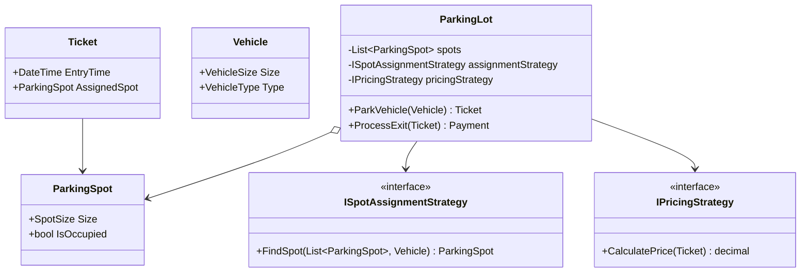
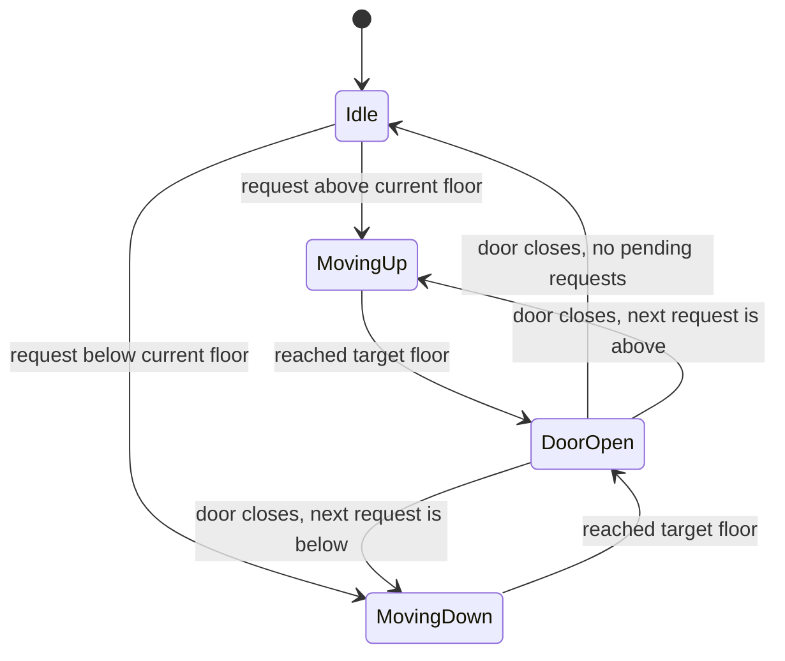
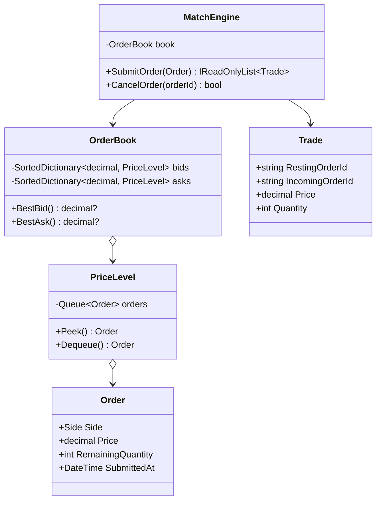
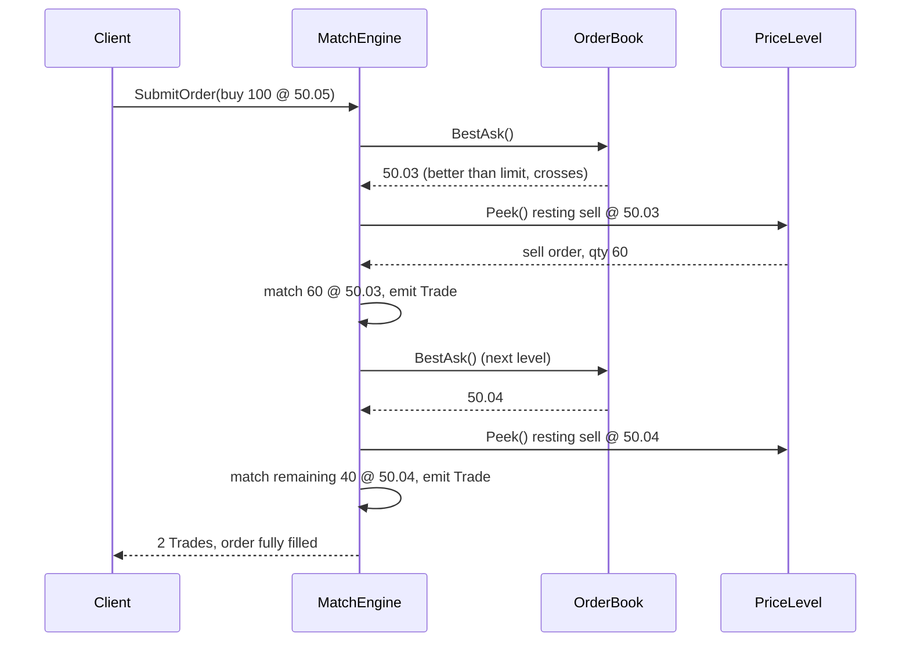
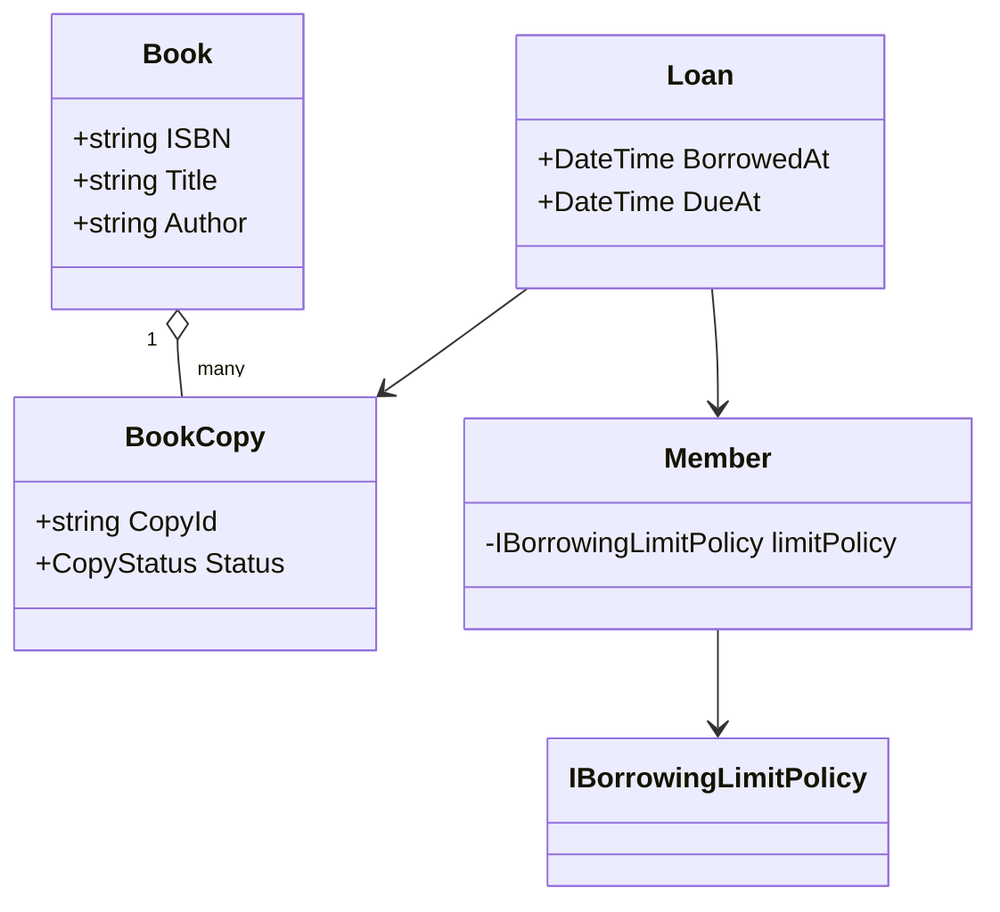
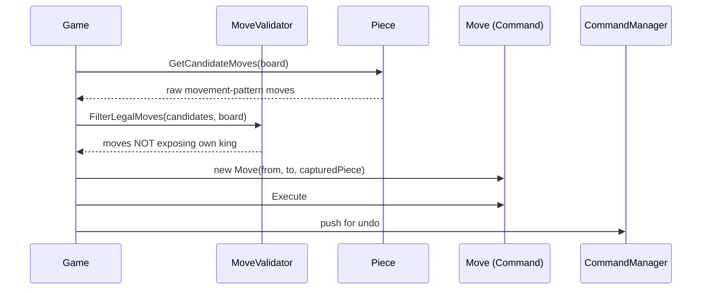
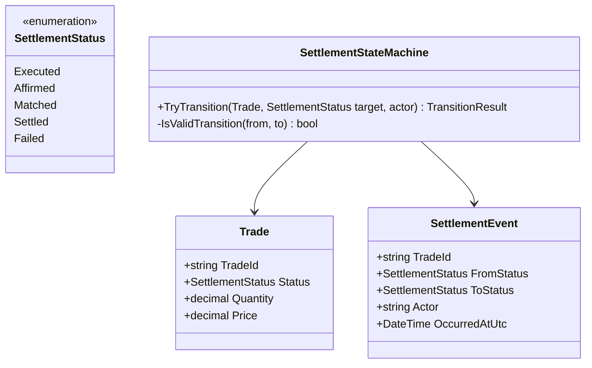
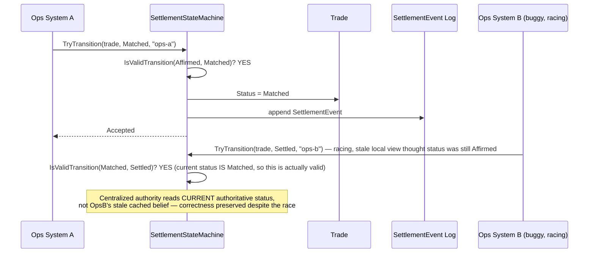

# Low-Level Design — Complete Interview Prep (All Topics, One File)

> Domain: Low-Level Design | Level: Beginner → Expert | Prerequisite: [[../09-OOP/01-OOP-Interview-Prep]], [[../10-SOLID/01-SOLID-Interview-Prep]], [[../11-Design-Patterns/00-Design-Patterns-Interview-Master-Guide-DotNet-TechLead]]
> **Quick-prep edition** (consolidated 2026-10-03). This one file replaces Modules 45–46. Originals: `git show ebb2d5c:15-Low-Level-Design/<file>.md`
> Each topic has: **Key concepts → C# design/code → Most common interview questions with answers.**

| # | Topic | # | Topic |
|---|---|---|---|
| 1 | What LLD interviews grade + the 6-step script | 8 | Limit order book / matching engine |
| 2 | Patterns & principles that appear in every LLD | 9 | Trade settlement / payment state machine |
| 3 | Concurrency in LLD | 10 | Vending machine & ATM (State pattern) |
| 4 | Parking lot | 11 | Seat booking (BookMyShow) — concurrency |
| 5 | Elevator system | 12 | Rate limiter, LRU cache, logger, notification service |
| 6 | Library management | 13 | Splitwise (expense sharing) |
| 7 | Chess game | 14 | Top 25 rapid-fire + Principal · 15 Mistakes checklist |

---

## 1. What LLD Interviews Grade + the 6-Step Script

**LLD vs system design:** LLD = classes, interfaces, relationships, patterns and code for **one component**, inside one process. System design = services, data stores, scaling, networks.

**The 6-step script (say it out loud)**
1. **Clarify requirements** — actors, core use cases, what's out of scope, scale/concurrency, extensibility expectations ("new vehicle types? new pricing rules?").
2. **Identify entities** — nouns become classes (Spot, Ticket, Vehicle); verbs become methods or services.
3. **Define relationships and responsibilities** — composition vs inheritance, who owns state, where invariants live.
4. **Apply patterns at variation points** — Strategy (pricing, scheduling), State (lifecycles), Factory, Observer, Command.
5. **Write core code** — interfaces + the key classes and the main flow; skip trivial getters.
6. **Walk through scenarios and edge cases** — concurrency, failures, extension ("add electric charging spots").

**What separates strong candidates:** clarifying first; small cohesive classes; explicit state machines; extension points chosen from the requirements (not everywhere); thread safety addressed; clear trade-offs; tests mentioned.

**Common interview questions**

**Q1. What is the LLD round actually grading?**
Object modelling (right entities and responsibilities), use of OOP/SOLID and patterns where they solve real variation, code quality, handling of concurrency and edge cases, and communication — not the "one correct" class diagram.

**Q2. Class diagram first or scenario walkthrough first?**
Both: a quick entity sketch, then walk the main scenario ("car enters, gets a ticket, pays, exits") to validate responsibilities; the walkthrough exposes missing classes and misplaced logic.

**Q3. Where does validation belong?**
Invariants inside the entity that owns the state (a `Spot` can't be double-occupied); cross-entity rules in a domain service or policy (borrowing limits); input-format validation at the edge (API/DTO).

---

## 2. Patterns & Principles in Every LLD

| Pattern | Typical LLD use |
|---|---|
| **Strategy** | pricing, spot assignment, elevator scheduling, fee rules, split types |
| **State** | elevator, vending machine, order/payment lifecycle, ATM |
| **Factory** | create vehicles, pieces, notifications by type |
| **Singleton** (via DI) | the parking lot instance, an ID generator — avoid static mutable singletons |
| **Observer** | display boards, notifications on state change |
| **Command** | chess moves with undo, elevator requests, job queues |
| **Decorator** | add pricing modifiers (weekend surcharge, discounts), logging, caching |
| **Chain of Responsibility** | validation pipelines, borrowing rules, approval flows |
| **Repository** | persistence abstraction |
| **Builder** | complex objects (orders, queries) |

**Principles to name:** SRP (one reason to change), OCP (new types via new classes), composition over inheritance, encapsulated invariants, immutable value objects (Money, Location), enums vs polymorphism (enums for data, polymorphism for behaviour).

---

## 3. Concurrency in LLD

**Key concepts**
- Shared mutable state (spots, seats, inventory, balances) → race conditions (two cars get the same spot, a seat is double-booked).
- Tools: `lock` on fine-grained objects, `ConcurrentDictionary`, `Interlocked`, `SemaphoreSlim` for async code, optimistic concurrency (version checks), DB constraints (unique seat + show), and **time-limited holds** (reserve → confirm or expire).
- Keep critical sections small; lock in a consistent order; avoid I/O inside locks.
- In distributed deployments, in-process locks aren't enough → DB transactions/constraints, Redis locks with fencing, or partitioning by key (single writer per entity).

```csharp
// Atomic spot allocation per size: lock-free via ConcurrentQueue of free spots
public sealed class SpotPool
{
    private readonly ConcurrentDictionary<SpotSize, ConcurrentQueue<ParkingSpot>> _free = new();
    public void Release(ParkingSpot s) => _free.GetOrAdd(s.Size, _ => new()).Enqueue(s);
    public ParkingSpot? TryTake(SpotSize size) =>
        _free.TryGetValue(size, out var q) && q.TryDequeue(out var spot) ? spot : null;  // each spot handed out once
}
```

**Common interview questions**

**Q1. How do you prevent two cars from getting the same spot?**
Make "take a free spot" atomic: a concurrent queue per size class (dequeue is atomic), a lock around find-and-assign, or a DB update with a condition (`UPDATE spot SET occupied = 1 WHERE id = @id AND occupied = 0`) when distributed.

**Q2. Lock granularity — one global lock or per object?**
A global lock is simple but serializes everything; per-floor or per-size-class locks (or lock-free structures) scale better. Start simple and refine where contention is real — and say this explicitly.

---

## 4. Parking Lot

**Requirements (typical):** multiple floors; spot sizes (motorcycle, compact, large, EV); vehicles of different sizes; ticket on entry; fee on exit by duration and vehicle type; display free counts; multiple entry/exit gates (concurrent).

**Design decisions**
- `Vehicle` with a `Size` (composition/enum) instead of a deep vehicle hierarchy — behaviour doesn't differ by vehicle type, only the size does.
- **Strategy** for spot assignment (nearest, by floor, EV-first) and for **pricing** (hourly, flat, weekend) — with **Decorators** for surcharges or discounts.
- Free spots grouped by size → O(1) assignment.
- `Ticket` is an immutable record of entry; `ParkingLot` orchestrates gates; display boards **observe** spot changes.

```csharp
public enum SpotSize { Motorcycle, Compact, Large }
public sealed record Vehicle(string Plate, SpotSize Size);
public sealed class ParkingSpot(string id, int floor, SpotSize size) { public string Id = id; public int Floor = floor; public SpotSize Size = size; }
public sealed record Ticket(Guid Id, Vehicle Vehicle, ParkingSpot Spot, DateTimeOffset EntryAt);

public interface IPricingStrategy { decimal Price(Ticket t, DateTimeOffset exitAt); }
public sealed class HourlyPricing(IReadOnlyDictionary<SpotSize, decimal> ratePerHour) : IPricingStrategy
{
    public decimal Price(Ticket t, DateTimeOffset exitAt) =>
        Math.Ceiling((decimal)(exitAt - t.EntryAt).TotalHours) * ratePerHour[t.Spot.Size];
}
public sealed class GracePeriodPricing(IPricingStrategy inner, TimeSpan grace) : IPricingStrategy   // Decorator
{
    public decimal Price(Ticket t, DateTimeOffset exitAt) => exitAt - t.EntryAt <= grace ? 0 : inner.Price(t, exitAt);
}

public sealed class ParkingLot(SpotPool pool, IPricingStrategy pricing, TimeProvider clock)
{
    private readonly ConcurrentDictionary<Guid, Ticket> _active = new();

    public Ticket? Enter(Vehicle v)
    {
        var spot = pool.TryTake(v.Size) ?? (v.Size < SpotSize.Large ? pool.TryTake(v.Size + 1) : null); // allow upsizing
        if (spot is null) return null;                                                                   // lot full
        var ticket = new Ticket(Guid.NewGuid(), v, spot, clock.GetUtcNow());
        _active[ticket.Id] = ticket;
        return ticket;
    }

    public decimal Exit(Guid ticketId)
    {
        if (!_active.TryRemove(ticketId, out var t)) throw new InvalidOperationException("Unknown or already used ticket");
        var fee = pricing.Price(t, clock.GetUtcNow());
        pool.Release(t.Spot);
        return fee;
    }
}
```

**Common interview questions**

**Q1. Why not `Car : Vehicle`, `Truck : Vehicle`?**
The vehicle types don't behave differently — only their size matters for allocation. An inheritance hierarchy adds classes without behaviour; a size attribute (or a small value object) is simpler and extensible. Use inheritance only if types truly need different behaviour.

**Q2. How do you add a new pricing rule (weekend surcharge, EV charging)?**
Add a new `IPricingStrategy` or a decorator wrapping the existing one — no change to `ParkingLot` (OCP). Select the strategy by configuration or lot.

**Q3. How do you handle multiple gates concurrently?**
Atomic spot allocation (concurrent queues or locks per size), thread-safe ticket storage, and idempotent exit (a ticket can be used once — `TryRemove`). In a distributed setup, persist tickets and spot state in a DB with conditional updates.

**Q4. How would you show free spots per floor in real time?**
Spots raise events on occupy/release (Observer); display boards subscribe and maintain counters — or maintain atomic counters in the pool that boards poll.

---

## 5. Elevator System

**Requirements:** N elevators, M floors; hall calls (up/down) and car calls (destination floors); doors; capacity; efficient dispatch; maintenance mode; emergency stop.

**Design decisions**
- **State machine** per elevator: `Idle → MovingUp / MovingDown → DoorsOpen → Idle`, plus `Maintenance`, `Emergency`.
- **Strategy** for dispatching hall calls (nearest car, SCAN/LOOK, zoning, destination dispatch).
- Requests as **Commands** queued per elevator; the controller assigns hall calls.
- **LOOK algorithm:** keep moving in the current direction while there are requests ahead, then reverse.
- Fault tolerance: if an elevator fails, re-dispatch its pending hall calls.

```csharp
public enum Direction { Up, Down, Idle }
public enum ElevatorState { Idle, Moving, DoorsOpen, Maintenance }

public sealed class Elevator(int id)
{
    public int Id { get; } = id;
    public int Floor { get; private set; }
    public Direction Direction { get; private set; } = Direction.Idle;
    public ElevatorState State { get; private set; } = ElevatorState.Idle;
    private readonly SortedSet<int> _up = new(), _down = new(Comparer<int>.Create((a, b) => b.CompareTo(a)));
    private readonly object _sync = new();

    public void AddStop(int floor)
    {
        lock (_sync) { (floor >= Floor ? _up : _down).Add(floor); if (Direction == Direction.Idle) Direction = floor >= Floor ? Direction.Up : Direction.Down; }
    }

    public void Step()                                         // LOOK algorithm, one tick
    {
        lock (_sync)
        {
            if (State == ElevatorState.Maintenance) return;
            var targets = Direction == Direction.Up ? _up : _down;
            if (targets.Count == 0) { Direction = Direction == Direction.Up ? Direction.Down : Direction.Up; targets = Direction == Direction.Up ? _up : _down; }
            if (targets.Count == 0) { Direction = Direction.Idle; State = ElevatorState.Idle; return; }
            var next = targets.Min;
            if (next == Floor) { targets.Remove(next); State = ElevatorState.DoorsOpen; return; }
            Floor += next > Floor ? 1 : -1; State = ElevatorState.Moving;
        }
    }
    public int PendingStops { get { lock (_sync) return _up.Count + _down.Count; } }
}

public interface IDispatchStrategy { Elevator Choose(IReadOnlyList<Elevator> cars, int floor, Direction dir); }
public sealed class NearestCarStrategy : IDispatchStrategy
{
    public Elevator Choose(IReadOnlyList<Elevator> cars, int floor, Direction dir) =>
        cars.Where(c => c.State != ElevatorState.Maintenance)
            .OrderBy(c => Math.Abs(c.Floor - floor) + (c.Direction == Direction.Idle || c.Direction == dir ? 0 : 10))
            .ThenBy(c => c.PendingStops).First();
}

public sealed class ElevatorController(IReadOnlyList<Elevator> cars, IDispatchStrategy strategy)
{
    public void HallCall(int floor, Direction dir) => strategy.Choose(cars, floor, dir).AddStop(floor);
    public void CarCall(int elevatorId, int floor) => cars[elevatorId].AddStop(floor);
}
```

**Common interview questions**

**Q1. Why model the elevator as a state machine?**
Behaviour depends on state (you can't move with doors open, maintenance ignores requests). Explicit states and transitions prevent invalid combinations and make new states (emergency, fire mode) easy to add.

**Q2. Which scheduling algorithm?**
FCFS is simple but inefficient; SCAN/LOOK serve requests in the travel direction (fewer reversals); nearest-car with direction awareness for dispatch; destination dispatch for big buildings. Keep it a Strategy so it's swappable and testable.

**Q3. An elevator breaks with pending hall calls — what happens?**
Mark it as in maintenance, take its unserved hall calls and re-dispatch them via the strategy to other cars; car calls inside the broken elevator are dropped with an alarm.

---

## 6. Library Management

**Key insight:** distinguish **`Book`** (title/ISBN metadata) from **`BookCopy`** (a physical item with its own status) and **`Loan`** (who borrowed which copy, when, due date, returned date). Mixing them is the classic mistake.

**Design decisions**
- Borrowing rules as composable **policies** (Chain of Responsibility / Specification): max loans per member, overdue fines block borrowing, reference-only books, membership type limits.
- Reservations (holds) queue per book; notify on return (Observer).
- Fines computed by a **Strategy** by member type.

```csharp
public sealed record Book(string Isbn, string Title, string Author);
public enum CopyStatus { Available, OnLoan, Reserved, Lost }
public sealed class BookCopy(string barcode, Book book) { public string Barcode = barcode; public Book Book = book; public CopyStatus Status = CopyStatus.Available; }
public sealed class Member(string id, int maxLoans) { public string Id = id; public int MaxLoans = maxLoans; public decimal UnpaidFines; public List<Loan> Active = []; }
public sealed record Loan(Guid Id, BookCopy Copy, Member Member, DateOnly Borrowed, DateOnly Due) { public DateOnly? Returned { get; set; } }

public interface IBorrowRule { string? Check(Member m, BookCopy c); }        // null = OK, else reason
public sealed class MaxLoansRule : IBorrowRule { public string? Check(Member m, BookCopy c) => m.Active.Count >= m.MaxLoans ? "Loan limit reached" : null; }
public sealed class FinesRule : IBorrowRule { public string? Check(Member m, BookCopy c) => m.UnpaidFines > 0 ? "Unpaid fines" : null; }
public sealed class AvailableRule : IBorrowRule { public string? Check(Member m, BookCopy c) => c.Status != CopyStatus.Available ? "Copy not available" : null; }

public sealed class LendingService(IEnumerable<IBorrowRule> rules, TimeProvider clock)
{
    public Loan Borrow(Member m, BookCopy c)
    {
        lock (c)                                                     // one copy, one borrower
        {
            var failure = rules.Select(r => r.Check(m, c)).FirstOrDefault(r => r is not null);
            if (failure is not null) throw new InvalidOperationException(failure);
            var today = DateOnly.FromDateTime(clock.GetUtcNow().UtcDateTime);
            c.Status = CopyStatus.OnLoan;
            var loan = new Loan(Guid.NewGuid(), c, m, today, today.AddDays(14));
            m.Active.Add(loan);
            return loan;
        }
    }
}
```

**Common interview questions**

**Q1. What's the central modelling insight in a library system?**
Book (catalogue metadata) vs BookCopy (a physical item with status) vs Loan (a transaction over time). Status lives on the copy; history lives in loans; search works on books.

**Q2. How do you make borrowing rules extensible?**
Each rule is a small class implementing `IBorrowRule`, composed in a list (registered via DI). New rules — e.g., "students can't borrow rare books" — are new classes, not new `if` branches in the service.

**Q3. How do reservations work?**
A FIFO queue of holds per book; when a copy is returned and holds exist, mark it `Reserved` for the first member, notify them, and expire the hold after N days.

---

## 7. Chess Game

**Design decisions**
- `Board` (8×8 squares), `Piece` (colour, type), `Player`, `Game` (turn, status), `Move`.
- **Piece movement:** inheritance (`Knight : Piece` overriding `CandidateMoves`) is legitimate here — a closed, stable set of types with different behaviour; Strategy (movement rules per piece) is the alternative.
- **Move as a Command** (`Execute`/`Undo`) → undo/redo, move history, replay, PGN export; special moves (castling, en passant, promotion) are separate command types.
- **Validation:** pieces generate *pseudo-legal* moves; a separate `MoveValidator` checks rules that need the whole board (check, pins, castling through check) → SRP.
- Game status: active, check, checkmate, stalemate, resignation, draw.

```csharp
public enum Color { White, Black }
public readonly record struct Pos(int Row, int Col) { public bool OnBoard => Row is >= 0 and < 8 && Col is >= 0 and < 8; }

public abstract class Piece(Color color)
{
    public Color Color { get; } = color;
    public abstract IEnumerable<Pos> CandidateMoves(Pos from, Board board);       // pseudo-legal
}
public sealed class Knight(Color c) : Piece(c)
{
    private static readonly (int, int)[] Jumps = [(1, 2), (2, 1), (-1, 2), (-2, 1), (1, -2), (2, -1), (-1, -2), (-2, -1)];
    public override IEnumerable<Pos> CandidateMoves(Pos f, Board b) =>
        Jumps.Select(j => new Pos(f.Row + j.Item1, f.Col + j.Item2))
             .Where(p => p.OnBoard && b[p]?.Color != Color);
}

public interface IMoveCommand { void Execute(Board b); void Undo(Board b); }
public sealed class SimpleMove(Pos from, Pos to) : IMoveCommand
{
    private Piece? _captured;
    public void Execute(Board b) { _captured = b[to]; b[to] = b[from]; b[from] = null; }
    public void Undo(Board b) { b[from] = b[to]; b[to] = _captured; }
}

public sealed class Game(Board board, MoveValidator validator)
{
    private readonly Stack<IMoveCommand> _history = new();
    public Color Turn { get; private set; } = Color.White;
    public void Play(Pos from, Pos to)
    {
        var cmd = validator.Validate(board, from, to, Turn) ?? throw new InvalidOperationException("Illegal move");
        cmd.Execute(board); _history.Push(cmd);
        Turn = Turn == Color.White ? Color.Black : Color.White;
    }
    public void Undo() { if (_history.TryPop(out var c)) { c.Undo(board); Turn = Turn == Color.White ? Color.Black : Color.White; } }
}
public sealed class Board { private readonly Piece?[,] _sq = new Piece?[8, 8]; public Piece? this[Pos p] { get => _sq[p.Row, p.Col]; set => _sq[p.Row, p.Col] = value; } }
public sealed class MoveValidator { public IMoveCommand? Validate(Board b, Pos from, Pos to, Color turn) => /* candidate check + king-safety check */ new SimpleMove(from, to); }
```

**Common interview questions**

**Q1. Inheritance or Strategy for piece movement?**
Inheritance is defensible: the piece set is closed and stable and each type genuinely behaves differently. Strategy helps if movement rules vary at runtime (chess variants) or must be composed. Either is fine if you justify it.

**Q2. Why model moves as commands?**
Each move becomes an object with Execute/Undo and its captured state → undo/redo, move history, replay and notation export come almost for free; special moves are just different command implementations.

**Q3. Where does check validation belong?**
Not in the pieces (they don't know about the whole board's king safety). A `MoveValidator`/rules engine filters pseudo-legal moves by simulating them (execute → check if the own king is attacked → undo).

---

## 8. Limit Order Book / Matching Engine (FinTech)

**Requirements:** limit and market orders, buy/sell sides, **price-time priority**, partial fills, cancels, trades emitted.

**Design decisions**
- Bids: price **descending**; asks: price **ascending**; FIFO queue per price level.
- `SortedDictionary<decimal, LinkedList<Order>>` per side (or a sorted price-level tree) + `Dictionary<orderId, node>` for O(1) cancel.
- **Single-threaded matching per instrument** (a sequencer/one writer) — deterministic, no locks; scale by sharding instruments.
- Emit `Trade` events (Observer) for market data and settlement; all money in `decimal` or integer ticks.

```csharp
public enum Side { Buy, Sell }
public sealed class Order(long id, Side side, decimal price, long qty) { public long Id = id; public Side Side = side; public decimal Price = price; public long Remaining = qty; }
public sealed record Trade(long BuyId, long SellId, decimal Price, long Qty);

public sealed class OrderBook
{
    private readonly SortedDictionary<decimal, LinkedList<Order>> _bids = new(Comparer<decimal>.Create((a, b) => b.CompareTo(a)));
    private readonly SortedDictionary<decimal, LinkedList<Order>> _asks = new();
    private readonly Dictionary<long, (LinkedListNode<Order> Node, SortedDictionary<decimal, LinkedList<Order>> Side)> _index = new();

    public List<Trade> Submit(Order o)                                       // single-threaded per instrument
    {
        var trades = new List<Trade>();
        var opposite = o.Side == Side.Buy ? _asks : _bids;
        while (o.Remaining > 0 && opposite.Count > 0)
        {
            var (bestPrice, queue) = opposite.First();
            bool crosses = o.Side == Side.Buy ? o.Price >= bestPrice : o.Price <= bestPrice;
            if (!crosses) break;
            var resting = queue.First!.Value;
            long qty = Math.Min(o.Remaining, resting.Remaining);
            trades.Add(o.Side == Side.Buy ? new(o.Id, resting.Id, bestPrice, qty) : new(resting.Id, o.Id, bestPrice, qty)); // resting price
            o.Remaining -= qty; resting.Remaining -= qty;
            if (resting.Remaining == 0) { queue.RemoveFirst(); _index.Remove(resting.Id); if (queue.Count == 0) opposite.Remove(bestPrice); }
        }
        if (o.Remaining > 0) Rest(o);                                         // leftover rests on the book
        return trades;
    }

    private void Rest(Order o)
    {
        var book = o.Side == Side.Buy ? _bids : _asks;
        if (!book.TryGetValue(o.Price, out var q)) book[o.Price] = q = new LinkedList<Order>();
        _index[o.Id] = (q.AddLast(o), book);                                  // time priority = FIFO
    }

    public bool Cancel(long id)
    {
        if (!_index.Remove(id, out var e)) return false;
        var q = e.Node.List!; var price = e.Node.Value.Price; q.Remove(e.Node);
        if (q.Count == 0) e.Side.Remove(price);
        return true;
    }
}
```

**Common interview questions**

**Q1. How do you implement price-time priority?**
Sorted price levels (best price first) with a FIFO queue at each level; incoming orders match against the best opposite level, oldest order first; trades execute at the resting order's price.

**Q2. Why single-threaded matching?**
Matching must be deterministic and sequential per instrument; locks add latency and nondeterminism. A single writer per instrument (LMAX-style) is fast and simple; scale by partitioning instruments across threads or servers. Inputs are sequenced and journaled for replay and recovery.

**Q3. How is cancel O(1)?**
Keep a dictionary from order ID to its linked-list node so you can unlink it directly without scanning the price level.

---

## 9. Trade Settlement / Payment State Machine (FinTech)

**Key concepts**
- Lifecycles are **explicit state machines** with allowed transitions only; every transition is recorded (audit trail); terminal states are immutable.
- Settlement: `Pending → Matched → Affirmed → Settling → Settled`, with `Failed`/`Cancelled`; payment: `Created → Authorized → Captured → Settled | Failed | Refunded`.
- Transitions are **idempotent** (re-receiving "settled" from the custodian doesn't double-post) and guarded by optimistic concurrency.

```csharp
public enum SettlementStatus { Pending, Matched, Affirmed, Settling, Settled, Failed, Cancelled }

public sealed class Settlement
{
    private static readonly Dictionary<SettlementStatus, SettlementStatus[]> Allowed = new()
    {
        [SettlementStatus.Pending]  = [SettlementStatus.Matched, SettlementStatus.Cancelled],
        [SettlementStatus.Matched]  = [SettlementStatus.Affirmed, SettlementStatus.Failed, SettlementStatus.Cancelled],
        [SettlementStatus.Affirmed] = [SettlementStatus.Settling, SettlementStatus.Failed],
        [SettlementStatus.Settling] = [SettlementStatus.Settled, SettlementStatus.Failed],
        [SettlementStatus.Settled]  = [], [SettlementStatus.Failed] = [], [SettlementStatus.Cancelled] = []
    };
    private readonly List<(SettlementStatus From, SettlementStatus To, DateTimeOffset At, string Reason)> _history = [];
    public SettlementStatus Status { get; private set; } = SettlementStatus.Pending;
    public int Version { get; private set; }

    public bool TransitionTo(SettlementStatus next, string reason, DateTimeOffset at)
    {
        if (Status == next) return false;                                     // idempotent replay
        if (!Allowed[Status].Contains(next)) throw new InvalidOperationException($"{Status} → {next} not allowed");
        _history.Add((Status, next, at, reason));
        Status = next; Version++;
        return true;
    }
}
```

**Common interview questions**

**Q1. Why an explicit transition table instead of `if` statements?**
All allowed transitions are visible in one place, invalid ones are impossible, and it's easy to test, audit and extend. Scattered `if`s inevitably allow illegal jumps (e.g., Failed → Settled).

**Q2. How do you handle duplicate or out-of-order status messages?**
Make transitions idempotent (same state → no-op), reject or park invalid transitions for investigation, use message sequence numbers or versions, and reconcile against the external source of truth.

---

## 10. Vending Machine & ATM (State Pattern)

```csharp
// State pattern: each state handles events differently
public interface IVendingState
{
    IVendingState InsertCoin(VendingMachine m, decimal amount);
    IVendingState Select(VendingMachine m, string slot);
    IVendingState Cancel(VendingMachine m);
}
public sealed class IdleState : IVendingState
{
    public IVendingState InsertCoin(VendingMachine m, decimal a) { m.Balance += a; return new HasMoneyState(); }
    public IVendingState Select(VendingMachine m, string s) => this;                       // ignore: pay first
    public IVendingState Cancel(VendingMachine m) => this;
}
public sealed class HasMoneyState : IVendingState
{
    public IVendingState InsertCoin(VendingMachine m, decimal a) { m.Balance += a; return this; }
    public IVendingState Select(VendingMachine m, string slot)
    {
        var item = m.Inventory[slot];
        if (item.Count == 0 || m.Balance < item.Price) return this;                          // stay; show message
        item.Count--; m.Balance -= item.Price; m.Dispense(slot); m.ReturnChange();
        return new IdleState();
    }
    public IVendingState Cancel(VendingMachine m) { m.ReturnChange(); return new IdleState(); }
}
public sealed class VendingMachine
{
    private IVendingState _state = new IdleState();
    public decimal Balance { get; set; }
    public Dictionary<string, (decimal Price, int Count)> Inventory { get; } = new();
    public void InsertCoin(decimal a) => _state = _state.InsertCoin(this, a);
    public void Select(string s) => _state = _state.Select(this, s);
    public void Cancel() => _state = _state.Cancel(this);
    public void Dispense(string slot) { } public void ReturnChange() { Balance = 0; }
}
```
*(Note: `Inventory` holds a value tuple, so a real implementation would use a mutable `Slot` class — kept short here.)*

**ATM essentials:** states (Idle → CardInserted → Authenticated → Transaction → Dispensing); a cash dispenser using a **Chain of Responsibility** of denominations (100s → 50s → 20s); the bank call must be **idempotent** with a reversal if dispensing fails after the debit.

**Common interview question**

**Q. State pattern vs a big switch on an enum?**
With the State pattern, each state's behaviour lives in its own class, and adding a state doesn't touch the others (OCP). A switch is fine for a few simple states; once each state has several event handlers, classes are cleaner and safer.

---

## 11. Seat Booking (BookMyShow) — Concurrency

**Key concepts**
- Entities: Movie, Theatre, Screen, Show, Seat, ShowSeat (seat × show with status), Booking, Payment.
- **Double booking is the core problem** → **temporary hold**: `Available → Held (with expiry, e.g., 10 min) → Booked`, released on expiry or payment failure.
- Enforce at the DB: a unique constraint or conditional update per `(ShowId, SeatId)`; in-memory locks only within one instance.

```sql
-- Hold seats atomically: succeeds only if all are still available or their hold expired
UPDATE ShowSeat
SET Status = 'HELD', HeldBy = @userId, HoldExpiresAt = DATEADD(MINUTE, 10, SYSUTCDATETIME())
WHERE ShowId = @showId AND SeatId IN (SELECT value FROM @seatIds)
  AND (Status = 'AVAILABLE' OR (Status = 'HELD' AND HoldExpiresAt < SYSUTCDATETIME()));
-- if @@ROWCOUNT <> number of seats → ROLLBACK (someone else got one)
```

**Common interview question**

**Q. How do you prevent double booking under heavy load?**
Atomic conditional updates (or SELECT ... UPDLOCK) in one transaction for all requested seats, time-limited holds released by expiry, idempotent payment confirmation that moves Held → Booked only if the hold still belongs to the user, and a reconciliation job for orphaned holds.

---

## 12. Rate Limiter, LRU Cache, Logger, Notification Service

- **Rate limiter (LLD):** `IRateLimiter.TryAcquire(clientId)`; strategies: token bucket (per-client buckets in a `ConcurrentDictionary`, refill based on elapsed time), sliding window; thread-safe with a lock per bucket. Distributed → Redis (see [[../07-Redis/01-Redis-Interview-Prep]]).
- **LRU cache:** dictionary + doubly linked list, O(1) (code in [[../12-Data-Structures/01-Data-Structures-Interview-Prep]] §11).
- **Logger:** log levels, multiple sinks (Observer/Composite), formatters (Strategy), async buffered writes (`Channel<T>`), a chain of handlers by level.
- **Notification service:** `INotificationChannel` (email, SMS, push — Strategy/Factory), templates, user preferences, retries with backoff, idempotency keys, rate limits per user.

```csharp
public sealed class TokenBucketLimiter(int capacity, double refillPerSecond, TimeProvider clock)
{
    private sealed class Bucket { public double Tokens; public DateTimeOffset Last; }
    private readonly ConcurrentDictionary<string, Bucket> _buckets = new();

    public bool TryAcquire(string clientId)
    {
        var b = _buckets.GetOrAdd(clientId, _ => new Bucket { Tokens = capacity, Last = clock.GetUtcNow() });
        lock (b)
        {
            var now = clock.GetUtcNow();
            b.Tokens = Math.Min(capacity, b.Tokens + (now - b.Last).TotalSeconds * refillPerSecond);
            b.Last = now;
            if (b.Tokens < 1) return false;
            b.Tokens -= 1; return true;
        }
    }
}

public interface INotificationChannel { string Name { get; } Task SendAsync(Notification n, CancellationToken ct); }
public sealed class NotificationService(IEnumerable<INotificationChannel> channels, IPreferenceStore prefs)
{
    private readonly Dictionary<string, INotificationChannel> _byName = channels.ToDictionary(c => c.Name);
    public async Task NotifyAsync(Notification n, CancellationToken ct)
    {
        foreach (var name in await prefs.ChannelsForAsync(n.UserId, ct))
            await _byName[name].SendAsync(n, ct);          // each channel: retries + idempotency key inside
    }
}
```

---

## 13. Splitwise (Expense Sharing)

**Key concepts**
- Entities: User, Group, Expense (payer, amount, participants, split type), Split (user, amount), Balance sheet.
- **Split strategies:** equal, exact amounts, percentage, shares (Strategy) — validate totals and **handle rounding** (assign leftover cents deterministically).
- Balances: a map of who owes whom; **simplify debts** by netting each person's balance and greedily matching the largest creditor with the largest debtor (minimizes transactions in practice).

```csharp
public interface ISplitStrategy { IReadOnlyDictionary<string, decimal> Split(decimal total, IReadOnlyList<string> users, IReadOnlyList<decimal>? weights); }
public sealed class EqualSplit : ISplitStrategy
{
    public IReadOnlyDictionary<string, decimal> Split(decimal total, IReadOnlyList<string> users, IReadOnlyList<decimal>? _)
    {
        var share = Math.Floor(total / users.Count * 100) / 100;          // round down to cents
        var result = users.ToDictionary(u => u, _ => share);
        var remainder = total - share * users.Count;                       // leftover cents
        for (int i = 0; remainder > 0; i++, remainder -= 0.01m) result[users[i]] += 0.01m;
        return result;
    }
}

// Simplify debts: net balances, then greedy match
List<(string From, string To, decimal Amount)> Settle(Dictionary<string, decimal> net)   // +ve = is owed
{
    var creditors = new PriorityQueue<string, decimal>(Comparer<decimal>.Create((a, b) => b.CompareTo(a)));
    var debtors = new PriorityQueue<string, decimal>(Comparer<decimal>.Create((a, b) => b.CompareTo(a)));
    foreach (var (u, v) in net) { if (v > 0) creditors.Enqueue(u, v); else if (v < 0) debtors.Enqueue(u, -v); }
    var res = new List<(string, string, decimal)>();
    while (creditors.TryDequeue(out var c, out var cv) && debtors.TryDequeue(out var d, out var dv))
    {
        var amt = Math.Min(cv, dv); res.Add((d, c, amt));
        if (cv > amt) creditors.Enqueue(c, cv - amt);
        if (dv > amt) debtors.Enqueue(d, dv - amt);
    }
    return res;
}
```

---

## 14. Top 25 Rapid-Fire Questions + Principal Questions

1. **LLD vs system design?** Classes in one component vs services across systems.
2. **First step?** Clarify requirements and scope.
3. **Pricing variation?** Strategy (+ decorators).
4. **Lifecycle?** State pattern / transition table.
5. **Undo?** Command pattern.
6. **Notifications on change?** Observer.
7. **Creating types by input?** Factory.
8. **Vehicle hierarchy?** Prefer a size attribute; inherit only for behaviour.
9. **Spot allocation O(1)?** Free lists per size.
10. **Concurrent allocation?** Atomic dequeue / lock / conditional DB update.
11. **Elevator algorithm?** LOOK/SCAN + nearest-car dispatch.
12. **Library key insight?** Book vs BookCopy vs Loan.
13. **Borrow rules?** Composable rule classes (chain/specification).
14. **Chess moves?** Command objects; separate validator.
15. **Order book priority?** Price, then time (FIFO per level).
16. **Matching concurrency?** Single writer per instrument.
17. **Cancel O(1)?** ID → node index.
18. **Settlement flow?** Explicit, idempotent transitions + audit.
19. **Double booking?** Holds with expiry + atomic conditional updates.
20. **Rate limiter LLD?** Token bucket per client, thread-safe.
21. **LRU?** HashMap + doubly linked list.
22. **Splitwise rounding?** Distribute leftover cents deterministically.
23. **Debt simplification?** Net balances + greedy matching.
24. **Money type?** `decimal`/integer minor units, never double.
25. **Testing LLD?** Unit tests per strategy/state; inject `TimeProvider`.

**Principal-level questions**

**P1. How do you keep LLD extensible without over-engineering?**
Put extension points only where the requirements state variation (pricing rules, vehicle sizes, scheduling) and keep everything else concrete; say which future changes the design supports and which it deliberately doesn't.

**P2. How does your in-memory design change when it becomes a distributed service?**
In-process locks become DB constraints, conditional updates or partitioned single writers; in-memory state moves to a store with transactions; events go through an outbox; and clocks, IDs and idempotency become explicit concerns.

**P3. How would you test this design?**
Unit tests per strategy and state transition (table-driven), property-based tests for invariants (no double allocation, balances sum to zero), concurrency stress tests for allocation, and a fake clock for time-based rules.

---

## 15. Mistakes Checklist (say why each is wrong)
- [ ] Jumping into classes without clarifying requirements · designing for unstated features
- [ ] Deep inheritance hierarchies for data-only differences (Car/Truck/Bike)
- [ ] God classes ("ParkingLotManager" doing everything) · logic in controllers
- [ ] Status as free strings with scattered `if`s instead of a state machine
- [ ] Ignoring concurrency (double allocation, double booking) · in-process locks in a distributed setup
- [ ] Mixing Book with BookCopy · validation in the wrong place
- [ ] `double` for money · ignoring rounding in splits
- [ ] Patterns name-dropped without a variation they solve
- [ ] No walkthrough of the main scenario and edge cases (lot full, lost ticket, cancel)

---

## Architecture Diagrams (preserved from the original modules)

> All 8 Mermaid/ASCII diagrams from the original `15-Low-Level-Design/` files, kept verbatim and grouped by source module. Originals: `git show ebb2d5c:15-Low-Level-Design/<file>.md`.

### Module 45 — Low-Level Design: Object-Oriented Design Interviews (Parking Lot & Elevator System)
*Source: `01-LLD-Fundamentals-Parking-Elevator.md`*

**Parking Lot**



**Elevator State Transitions**



**13. Low-Level Design — New Case Study: Limit Order Book Matching Engine**



**13. Low-Level Design — New Case Study: Limit Order Book Matching Engine**



### Module 46 — Low-Level Design: Library Management System & Chess Game Engine
*Source: `02-LLD-Library-Chess-Game.md`*

**Library Management**



**Chess — Move as Command**



**13. Low-Level Design — New Case Study: Trade Settlement State Machine**



**13. Low-Level Design — New Case Study: Trade Settlement State Machine**


