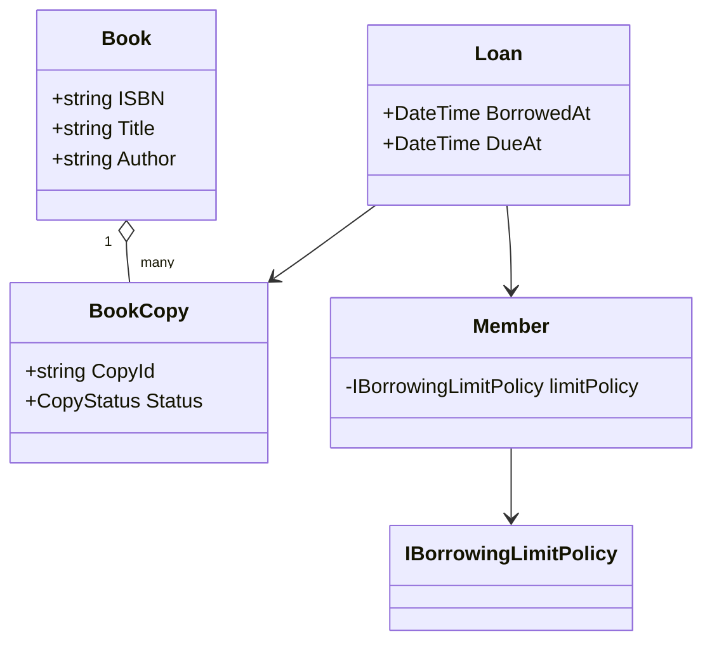
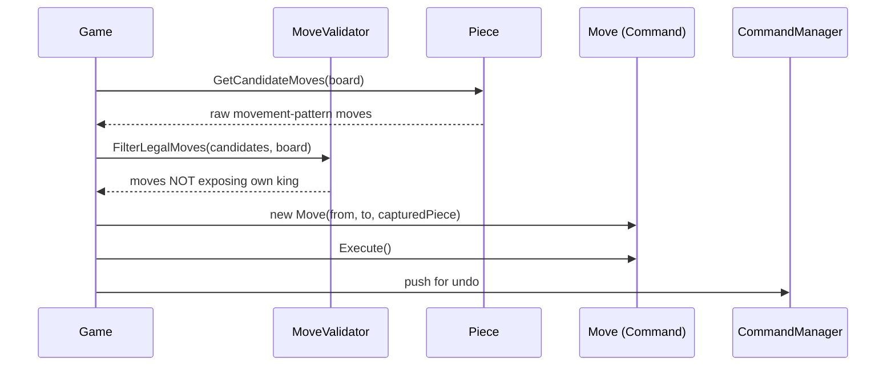

# Module 46 — Low-Level Design: Library Management System & Chess Game Engine

> Domain: Low-Level Design | Level: Beginner → Expert | Prerequisite: [[01-LLD-Fundamentals-Parking-Elevator]], [[../11-Design-Patterns/02-Behavioral-Patterns]] (Command pattern for move history/undo)

---

## 1. Fundamentals

### What do Library Management and Chess add beyond Module 45's Parking Lot/Elevator patterns?
Library Management introduces a genuinely new LLD concern: **multi-entity relationship modeling with real-world business rules** (a book has multiple physical copies, a member has borrowing limits and holds, a reservation queue has fairness rules) — testing whether a candidate can model a **richer domain** correctly, not just apply one or two design patterns. Chess introduces a different new concern entirely: **complex, rule-heavy behavior per entity type** (each piece type moves differently) combined with a requirement for **move history/undo** (directly Module 32 §2.3's Command pattern, now in its most natural, textbook-fit application across this entire course) and **game-state validation** (is a move legal, is the king in check) — a domain where correctly identifying *where* validation logic belongs is the central design challenge.

### Why does this matter?
Because these two problems, together with Module 45's Parking Lot/Elevator, cover the four most common archetypal LLD interview shapes: **resource-allocation-with-policy** (Parking Lot), **state-machine-with-scheduling** (Elevator), **rich-entity-relationships-with-business-rules** (Library), and **rule-heavy-behavior-per-type-with-history** (Chess) — a candidate comfortable deriving a correct design across all four archetypes has genuinely internalized the underlying design judgment (Module 45 §Advanced Q10's distinguishing signal) rather than memorized four unrelated solutions.

### When does this matter?
Any LLD interview or real system requiring rich domain modeling (Library) or complex per-type behavior with auditable history (Chess, but also any workflow/document-editing system needing undo/redo, directly Module 32 §11 Expert exercise's undo/redo stack, now reapplied here).

### How does it work (30,000-ft view)?
```
Library: Book (catalog entry) -- distinct from BookCopy (physical item) -- distinct from
         Loan (a specific borrowing transaction) -- Member has borrowing rules/limits
Chess:   Board (8x8 grid of Square) -- Piece (abstract, one subclass per type OR a
         strategy-composed behavior) -- Move (a Command object, supporting undo) --
         Game (orchestrates turns, checks for check/checkmate)
```

---

## 2. Deep Dive

### 2.1 Library Management — the Book/BookCopy/Loan Distinction, the Central Modeling Insight
The single most important, most commonly-missed modeling decision in this problem: **`Book` (the catalog entry — title, author, ISBN) is distinct from `BookCopy` (a specific physical item on a specific shelf, which can be borrowed/returned/lost)** — a library owns multiple physical copies of the same book, and a `Loan` is associated with a specific `BookCopy`, not the abstract `Book` — a candidate who conflates these two (treating "Book" as both the catalog entry and the borrowable unit) cannot correctly model "this specific copy is damaged and withdrawn from circulation while 4 other copies of the same title remain available," a genuinely common real-world library requirement. This is directly analogous to Module 43 §2.1's product-catalog-vs.-specific-inventory-unit distinction (a product listing vs. a specific unit's stock count) — recognizing this as the same underlying "catalog entry vs. concrete instance" modeling pattern recurring across different domains is exactly the cross-problem synthesis this course's LLD modules aim to build.

### 2.2 Library — Borrowing Rules as a Composable Policy, Not Hardcoded Conditionals
A member's borrowing limit (how many books at once), loan duration, and hold/reservation-queue fairness rules are genuine, independently-varying business policies — directly Module 32 §2.1's Strategy pattern again, but here composed as **multiple, independent policies** checked together (an `IBorrowingLimitPolicy`, a `ILoanDurationPolicy`, a `IHoldQueuePolicy`) rather than a single monolithic policy object, directly mirroring Module 40 §2.3's multi-tier rate-limiting design ("AND across independent, individually-swappable policy checks") — recognizing this exact "multiple independent, composable policy checks, each individually swappable" shape recurring from API rate-limiting (Module 40) to library borrowing rules (this module) is a strong demonstration of transferable design-pattern literacy.

### 2.3 Chess — Piece Behavior: Inheritance vs Strategy, a Genuine, Debatable Trade-off
Unlike Module 45 §2.4's vehicle-type trap (where inheritance was clearly the wrong choice), chess pieces present a genuinely **more debatable** case: each piece type (`Pawn`, `Rook`, `Knight`, `Bishop`, `Queen`, `King`) has **genuinely distinct movement behavior** (not just different data), satisfying Module 29 §2.4's "is this a genuine is-a relationship with distinct behavior" test far more convincingly than the vehicle-type case did — an inheritance hierarchy (`Piece` abstract base, one subclass per type, each overriding `GetValidMoves(Board)`) is a legitimate, common, defensible choice here. An equally legitimate alternative: composition via an injected `IMovementStrategy` per piece instance (allowing, e.g., a chess-variant rule change — "this custom variant's Bishop moves like a Knight" — without a new class) — the "right" answer genuinely depends on whether the design needs to support such variant/rule-customization extensibility (favoring Strategy) or whether the piece-type set is fixed and unlikely to need runtime-swappable movement behavior (favoring the simpler inheritance approach) — a valuable, explicit trade-off discussion demonstrating that not every "different types with different behavior" scenario has one universally correct answer, contrasting instructively with §2.4's clearer vehicle-type case.

### 2.4 Chess — Move as a Command Object, Enabling Undo/Redo Natively
A chess move is precisely Module 32 §2.3's Command pattern's ideal, textbook use case: encapsulating "move piece X from square A to square B" (plus any special-case state — a captured piece, castling rights, en passant eligibility) as an object with `Execute()` and `Undo()` methods, directly reusing Module 32 §11 Expert exercise's `CommandManager`/undo-redo-stack implementation **without modification** — this is precisely why chess is a valuable LLD teaching example: it's a domain where the Command pattern isn't merely applicable but is close to the *only* sensible way to implement undo/redo correctly, given how much incidental state a move can affect beyond the two squares directly involved (a captured piece must be restored on undo; castling affects two pieces; en passant captures a piece not on the destination square at all).

### 2.5 Chess — Where Does Move-Legality Validation Belong? A Genuine SRP Question
A recurring design question candidates often get wrong: should `Piece.GetValidMoves()` return only moves legal *for that piece in isolation* (ignoring whether the move would leave the mover's own king in check), or should it return only **fully legal** moves (already filtering out any move that would expose the king)? The cleaner, SRP-compliant (Module 30 §2.1) answer: `Piece` should only know about its **own movement pattern** (a rook moves in straight lines) — checking whether a candidate move would leave the king in check is a **board-wide, game-state concern** (requiring knowledge of every other piece's position and threats), architecturally belonging to a separate `MoveValidator`/`Game` component that takes `Piece`'s candidate moves and filters them against the full board state — conflating these two responsibilities into `Piece` itself (having each piece type reason about check-safety) violates SRP and, worse, requires duplicating check-detection logic across every piece subclass.

## 3. Visual Architecture

### Library Management


### Chess — Move as Command


## 4. Production Example
**Scenario**: A team building an internal library-catalog tool initially modeled `Book` as the single, directly-borrowable entity (no separate `BookCopy` concept) — this worked for the initial requirement ("track which books are checked out") but broke down completely once the library needed to track **multiple physical copies of the same title**: the system had no way to express "3 of our 5 copies of this title are currently on loan, 2 are available" — the single-`Book`-entity model could only represent a book as globally "available" or "checked out," an entirely inadequate representation once multi-copy tracking became a stated requirement. **Investigation**: recognized this as exactly §2.1's catalog-entry-vs-physical-instance conflation, discovered only once a requirement explicitly exposed the missing distinction — the original design had implicitly assumed (without ever stating it as a decision) that each book title had exactly one copy, an assumption that happened to hold during initial, small-scale testing but was never actually a stated, verified requirement. **Fix**: introduced `BookCopy` as a distinct entity (referencing its parent `Book` catalog entry), with `Loan` associating to a specific `BookCopy`, not the abstract `Book` — requiring a genuine schema/model migration, more disruptive than getting this distinction right during initial design. **Lesson**: this is precisely Module 45 §4's "requirements must account for all actual dimensions" lesson recurring in a new domain — an implicit, never-explicitly-verified assumption ("one book = one borrowable unit") baked into the initial entity model became a costly retrofit once a real, foreseeable requirement (multi-copy tracking) exposed it; the specific, generalizable lesson: for any "catalog/inventory"-shaped domain (library books, e-commerce products Module 43 §2.1, parking spots Module 45 §2.2), always explicitly ask "is there a one-to-many relationship between the conceptual/catalog entity and the concrete, individually-trackable instances of it" during requirements clarification, since this distinction is easy to overlook when a domain's small-scale examples happen not to expose it.

## 5. Best Practices
- For any catalog/inventory-shaped domain, explicitly clarify and model the catalog-entry-vs-concrete-instance distinction (Book vs. BookCopy) during requirements gathering, not after a requirement exposes its absence (§4's incident).
- Compose multiple independent business-policy checks (borrowing limits, loan duration, hold-queue fairness) as separately-swappable Strategy implementations, directly mirroring Module 40's multi-tier rate-limiting design.
- Use the Command pattern for any domain requiring move/action history with undo/redo (chess moves, document edits, any transactional workflow needing reversibility).
- Keep per-entity-type behavior (a piece's movement pattern) separate from board/game-wide validation concerns (check-detection) — a clean SRP boundary, not conflated into one class.

## 6. Anti-patterns
- Conflating a catalog/conceptual entity with its concrete, individually-trackable instances (treating "Book" as both the title and the borrowable unit) — §4's incident.
- Hardcoding multiple independent borrowing-policy checks as inline conditionals in a single `Member`/`Library` method instead of composable, individually-swappable Strategy implementations.
- Having each `Piece` subclass independently implement check-detection logic, duplicating board-wide validation logic across every piece type and violating SRP.
- Implementing chess move execution without a Command-pattern-based undo mechanism, then needing to bolt on ad-hoc "remember what changed" logic reactively once undo is required.

## 7. Performance Engineering
For Library Management, finding an available copy of a given title benefits from the same Module 45 §7 discipline — grouping `BookCopy` records by `Book`/status for near-O(1) "is any copy of this title available" lookup rather than an O(n) scan over every copy. For Chess, move-generation performance (enumerating all legal moves for a position, the core operation any chess-playing/analysis engine repeatedly performs) is a genuinely rich, well-studied optimization domain (bitboards, precomputed attack tables) — while a basic LLD interview answer doesn't need engine-grade optimization, acknowledging that `GetValidMoves()`'s naive implementation (checking every square) has real complexity implications, and that a production chess engine would use specialized bit-manipulation techniques for this exact operation, demonstrates awareness beyond the immediate class-design exercise.

## 8. Security
For a real (non-interview) Library Management system: a `Loan`/hold operation should verify the requesting member's identity/authorization matches the member the operation is being performed for (Module 12 §2.4's resource-based authorization, applicable even in this modest domain — a member shouldn't be able to place a hold or view loan history for a different member's account). For a real Chess platform (an online multiplayer chess service, not just a local engine): move submission must validate that the submitting player is genuinely the player whose turn it is, and that the move is legal *given the actual current server-side board state*, never trusting a client-submitted board state directly — directly Module 16 §2.1's "never trust client-supplied state, always validate server-side against the authoritative state" discipline, applicable to any turn-based multiplayer game logic.

## 9. Scalability
Library Management and Chess are typically single-location/single-game LLD exercises — scaling either to "a library chain with millions of books" or "a multiplayer platform with millions of concurrent games" is explicitly a System Design (Module 14) concern layering on top of this LLD, directly Module 45 §9's altitude-boundary discipline recurring here: a strong candidate, when asked "how would this scale," should recognize this is now a different discipline's question (sharding book records by library branch, Module 27's partition-key reasoning; distributing game state across a horizontally-scaled game-server fleet, Module 39's connection-registry-style pattern for routing a player's moves to the correct server instance holding their active game) rather than attempting to force a System-Design-shaped answer entirely within the LLD's class-diagram framing.

---

## 10. Interview Questions

### Basic (10)
1. **Q: Why is `Book` distinct from `BookCopy` in a well-designed Library Management system?** **A:** A library owns multiple physical copies of the same title; `Book` is the catalog entry (title, author, ISBN), `BookCopy` is a specific, individually-trackable physical item.
2. **Q: What does a `Loan` associate with — a `Book` or a `BookCopy`?** **A:** A specific `BookCopy` — the actual physical item being borrowed, not the abstract catalog entry.
3. **Q: What design pattern is Chess's "move" operation a textbook fit for?** **A:** The Command pattern, enabling undo/redo via `Execute()`/`Undo()`.
4. **Q: Should a chess piece's class know how to detect if its own king is in check?** **A:** No — that's a board-wide, game-state concern belonging to a separate validator/game component, not individual piece classes (an SRP distinction).
5. **Q: Is modeling chess pieces as an inheritance hierarchy a clearly wrong choice, unlike the Parking Lot's vehicle types?** **A:** No — it's a genuinely more debatable, legitimate choice, since pieces have real behavioral differences (unlike vehicle types, which differed mainly in data).
6. **Q: What are examples of independent, composable borrowing policies in a Library system?** **A:** Borrowing limit, loan duration, and hold-queue fairness rules.
7. **Q: Why shouldn't a client-submitted chess board state be trusted directly in an online multiplayer chess platform?** **A:** It must be validated against the authoritative server-side board state — never trust client-supplied state for move legality.
8. **Q: What's a common requirement that exposes the Book/BookCopy modeling mistake if missed initially?** **A:** Tracking multiple physical copies of the same title independently (some available, some checked out, some withdrawn).
9. **Q: Is scaling a Library/Chess LLD to millions of books/games an LLD or System Design concern?** **A:** System Design — it's a different discipline's altitude, layering on top of the LLD.
10. **Q: What should `Piece.GetValidMoves()` return, precisely?** **A:** Candidate moves following that piece's own movement pattern — full legality filtering (check-safety) is a separate concern.

### Intermediate (10)
1. **Q: Why is the Book/BookCopy distinction directly analogous to the product-catalog-vs-inventory-unit distinction from Module 43?** **A:** Both are the same underlying "conceptual/catalog entity vs. concrete, individually-trackable instance" modeling pattern — a product listing vs. a specific unit's stock count, a book title vs. a specific physical copy — recurring across genuinely different domains.
2. **Q: Why is composing multiple independent Strategy policies (for borrowing rules) preferable to one monolithic policy object?** **A:** Each policy (limit, duration, hold-queue fairness) varies independently and may need to change/be swapped separately — a single monolithic policy object would require modification for any one policy's change, violating OCP for the others.
3. **Q: Why does the "should Piece know about check-detection" question matter beyond just code organization?** **A:** Conflating it into `Piece` would require duplicating board-wide check-detection logic across every piece subclass (since every piece type's moves could potentially expose the king) — a genuine, avoidable violation of both SRP and DRY.
4. **Q: Why is the inheritance-vs-Strategy choice for chess pieces described as "genuinely more debatable" than the Parking Lot's vehicle-type case?** **A:** Chess pieces have real, distinct behavioral differences (satisfying Module 29's is-a/behavioral-distinctness test), unlike vehicle types (which differed mainly in data) — making inheritance a legitimate, defensible choice here, not a clear mistake.
5. **Q: Why does castling make the Command pattern's value for chess moves particularly clear?** **A:** Castling affects two pieces (king and rook) simultaneously in one logical move — a Command object can encapsulate this compound effect and its exact reversal, something a simpler "just record the from/to squares" approach would struggle to express and undo correctly.
6. **Q: Why should a Library system's hold/loan operations verify the requesting member's identity matches the operation's target member?** **A:** To prevent one member from viewing/modifying another member's loan history or holds — directly Module 12's resource-based authorization applied to this domain.
7. **Q: Why is "how would this scale to millions of books/games" best answered by recognizing it as a different discipline's question, rather than attempting to answer it within the LLD class diagram?** **A:** Scaling to that volume involves infrastructure/service-level concerns (sharding, distributed game-server routing) that Module 14's System Design tools address — forcing this into the LLD's class-relationship framing would conflate two genuinely different levels of design reasoning.
8. **Q: Why might a chess variant (a custom rule set) favor the Strategy-based piece-movement design over inheritance?** **A:** If movement behavior needs to be swappable per-instance at runtime (a custom variant's rule change) without introducing new classes, an injected `IMovementStrategy` accommodates this more directly than a fixed inheritance hierarchy would.
9. **Q: Why is en passant a particularly good test case for whether a chess Move's Command design is genuinely correct?** **A:** It captures a piece that is NOT on the move's destination square — a naive "restore whatever was at the destination square" undo implementation would fail to correctly restore this specific captured piece, exposing whether the Command object's captured state is genuinely complete and correct.
10. **Q: Why does the Book/BookCopy incident (§4) demonstrate the same underlying lesson as Module 45 §4's vehicle-type incident, despite being a different specific mistake?** **A:** Both stem from an implicit, never-explicitly-verified assumption about the domain's actual entity structure (one dimension per vehicle vs. one copy per book) that happened to hold during small-scale initial testing but broke once a real, foreseeable requirement exposed the missing distinction.

### Advanced (10)
1. **Q: Diagnose the Book/BookCopy modeling incident (§4) from first principles, and design the specific requirements-clarification checklist item that generalizes beyond just "libraries," applicable to any catalog/inventory-shaped LLD problem.**
   **A:** Root cause: an implicit assumption (one copy per title) never explicitly surfaced or verified during requirements gathering. Generalized checklist item: for any domain involving a "thing that can be listed/cataloged" and "instances of that thing that can be individually acted upon" (borrowed, purchased, parked, assigned), explicitly ask: "can there be more than one concrete instance of a given catalog entry, and if so, do instances need independent state (available/damaged/reserved)?" — directly generalizing Module 43 §2.1's product-vs-inventory-unit distinction and Module 45 §2.2's spot-vs-vehicle distinction into one reusable, cross-domain LLD requirements-clarification question.
2. **Q: Design the full `Move` Command implementation handling castling's compound, two-piece effect, demonstrating the Command pattern's value concretely (Intermediate Q5).**
   **A:**
   ```csharp
   public class CastlingMove : IMove
   {
       private readonly Piece _king, _rook;
       private readonly Square _kingFrom, _kingTo, _rookFrom, _rookTo;

       public void Execute()
       {
           _board.MovePiece(_king, _kingFrom, _kingTo);
           _board.MovePiece(_rook, _rookFrom, _rookTo);
           _king.HasMoved = true; _rook.HasMoved = true; // castling rights consumed
       }

       public void Undo()
       {
           _board.MovePiece(_king, _kingTo, _kingFrom);
           _board.MovePiece(_rook, _rookTo, _rookFrom);
           _king.HasMoved = false; _rook.HasMoved = false; // restore castling-rights state too, not just position
       }
   }
   ```
   Note `Undo()` restores **both** position and the `HasMoved` flags — a naive undo restoring only board position but forgetting the castling-rights side effect would produce an incorrect game state (allowing castling again after undo, when the original position, before the move, may have already had castling rights available) — precisely the kind of "the Command must capture and reverse ALL side effects, not just the obvious ones" rigor Module 32 §2.3 establishes.
3. **Q: Explain how you would design the `MoveValidator` to efficiently determine "is my king in check after this candidate move" without recomputing every opposing piece's full move set from scratch for every single candidate move being evaluated.**
   **A:** A common optimization: maintain an incrementally-updated "attacked squares" map (which squares are currently under attack by which opposing pieces, updated incrementally as moves are made/undone via the Command pattern's `Execute`/`Undo`, rather than fully recomputed from scratch every time) — checking "would this candidate move leave my king in check" becomes checking whether the king's resulting square appears in this maintained attacked-squares map, rather than re-deriving the entire opposing side's attack surface for every single candidate move under evaluation — directly the same "maintain a derived, incrementally-updated structure rather than recomputing from scratch every time" principle as Module 41 §2.5's batched view-count aggregation, here applied to chess attack-surface tracking instead of counters.
4. **Q: Design the composable borrowing-policy check (§2.2) precisely, demonstrating the "AND across independent policies" pattern concretely with actual code.**
   **A:**
   ```csharp
   public interface IBorrowingPolicy { PolicyResult CanBorrow(Member member, BookCopy copy); }

   public class BorrowingLimitPolicy : IBorrowingPolicy
   {
       public PolicyResult CanBorrow(Member member, BookCopy copy) =>
           member.CurrentLoans.Count < member.MaxBorrowLimit
               ? PolicyResult.Allowed() : PolicyResult.Denied("Borrowing limit reached.");
   }

   public class LibraryService
   {
       private readonly IEnumerable<IBorrowingPolicy> _policies; // ALL must pass, directly Module 40 §2.3's pattern

       public async Task<Loan> BorrowAsync(Member member, BookCopy copy)
       {
           foreach (var policy in _policies)
           {
               var result = policy.CanBorrow(member, copy);
               if (!result.IsAllowed) throw new PolicyViolationException(result.Reason);
           }
           return await CreateLoanAsync(member, copy);
       }
   }
   ```
   Adding a new policy (e.g., "no more than 2 overdue books") requires only a new `IBorrowingPolicy` implementation and a registration entry — zero modification to `LibraryService.BorrowAsync`, directly demonstrating OCP compliance concretely, exactly mirroring Module 40 §11 Medium exercise's multi-tier rate-limit configuration structure.
5. **Q: How would you extend the Chess LLD to support a "game replay/analysis" feature (stepping forward and backward through an entire completed game's move history), and explain why the Command pattern makes this straightforward.**
   **A:** Since every move is already a Command object stored in an ordered history (Module 32 §11 Expert exercise's `CommandManager`), replay is simply repeatedly calling `Undo()` (stepping backward) or re-`Execute()`-ing from the stored sequence (stepping forward) — a feature that would require substantial additional design work if moves had been implemented as direct, un-encapsulated board mutations instead of Command objects, directly demonstrating the Command pattern's value extends beyond the immediate "support undo" requirement to any future feature needing to traverse action history.
6. **Q: Explain a scenario where the Library Management system's hold-queue (reservation waitlist for a currently-checked-out book) fairness policy could have a subtle correctness bug if not carefully designed, and how you'd fix it.**
   **A:** A naive "first member in the queue gets notified when a copy becomes available" design has a race-condition-adjacent correctness risk if two copies of the same title become available in quick succession (two returns) while the notification/claim process for the first available copy is still in progress — without an atomic "claim this specific copy for this specific queued member" operation (directly Module 19's optimistic-concurrency discipline, applied to hold-queue claiming instead of inventory decrementing), a second queued member could incorrectly be offered the same copy already claimed by the first, or two members could both believe they've successfully claimed available copies when only one copy was actually available.
7. **Q: Design how you would extend the Chess LLD to support time controls (each player has a limited total thinking time, decremented as they take their turn), and identify which existing component this integrates with.**
   **A:** A `Clock` component tracks each player's remaining time, decrementing while it's their turn (started/stopped by the `Game` orchestrator at the same points where it currently manages turn-switching) — critically, this integrates with the **existing** turn-management logic in `Game` (which already tracks whose turn it is) rather than requiring piece/move logic to be aware of timing at all, directly demonstrating that a well-decomposed LLD (with validation, movement, and turn-orchestration cleanly separated per §2.5) accommodates a genuinely new requirement (time controls) by extending the orchestration layer specifically, without touching `Piece` or `Move` classes at all.
8. **Q: A candidate's Library Management design has `Member` directly querying the database for "is this book available" inside its own `RequestLoan()` method. Evaluate this design choice.**
   **A:** This conflates `Member` (which should represent a person's borrowing state/policies) with data-access/coordination responsibility that belongs to a service-layer component (`LibraryService`, directly Module 30's SRP applied to entity-vs-service-layer separation) — `Member` reaching into a data store directly is both an SRP violation and makes `Member` harder to test in isolation (requiring a real or mocked data store just to test borrowing-limit logic) — recommend `Member` remain a plain domain entity holding its own state/policies, with a separate `LibraryService` orchestrating the actual borrow operation (checking availability, applying policies, creating the loan), directly the same entity-vs-orchestrator separation Module 45's `ParkingLot`-as-coordinator design already established.
9. **Q: Explain how you would design the Chess LLD's `Board` representation to balance simplicity (an 8x8 array of nullable `Piece` references) against a production chess engine's typical bitboard-based representation, and when each is appropriate.**
   **A:** A simple 2D array (or `Dictionary<Square, Piece>`) is entirely appropriate and expected for an LLD interview answer — clear, directly reflects the domain, and sufficient for correctness; a bitboard representation (each piece type/color represented as a 64-bit integer with bits marking occupied squares, enabling extremely fast bitwise move-generation) is a specialized optimization appropriate specifically for a genuine, performance-critical chess engine (evaluating millions of positions per second for AI move search) — explicitly naming this as "the simple representation is correct for this exercise; a real engine would use bitboards specifically for the move-generation performance this scale demands" demonstrates the same "acknowledge the trade-off, know when you'd revisit it" judgment as Module 45 §Advanced Q4.
10. **Q: As a Principal Engineer, how would you use the Library Management and Chess LLD exercises together, alongside Module 45's Parking Lot and Elevator, to calibrate a consistent LLD interview bar across an interviewing team?**
    **A:** Establish a shared rubric explicitly keyed to the cross-cutting judgment signals these four exercises collectively probe (not each exercise's specific "correct" class diagram, since multiple reasonable designs exist for each): does the candidate clarify requirements before designing (surfacing the catalog-vs-instance distinction, Advanced Q1's generalized checklist)? Do they justify pattern choices from the problem's actual variability (Module 45 §Advanced Q10's derivation-vs-recitation signal)? Do they correctly place responsibilities (SRP, the Piece-vs-Validator boundary)? Do they walk through concrete, tricky scenarios (castling/en passant, concurrent hold-queue claims)? — training interviewers to evaluate against these transferable, cross-exercise signals (rather than a rigid, single "correct" answer per problem) produces far more consistent, meaningful interview calibration than grading each problem's class diagram against one memorized template.

---

## 11. Coding Exercises

*(LLD interviews use worked class-design exercises with actual, compilable code, consistent with this domain's practical nature.)*

### Easy — Book/BookCopy distinction (§4's fix)
```csharp
public class Book // catalog entry
{
    public string Isbn { get; init; } = "";
    public string Title { get; init; } = "";
    public string Author { get; init; } = "";
}

public class BookCopy // a SPECIFIC, individually-trackable physical item
{
    public string CopyId { get; init; } = "";
    public Book Book { get; init; } = null!;
    public CopyStatus Status { get; set; } // Available, OnLoan, Withdrawn, Lost
}

public enum CopyStatus { Available, OnLoan, Withdrawn, Lost }
```

### Medium — Chess piece movement (inheritance-based, §2.3's legitimate choice)
```csharp
public abstract class Piece
{
    public Color Color { get; init; }
    public bool HasMoved { get; set; }
    public abstract IEnumerable<Square> GetCandidateMoves(Board board, Square currentPosition);
    // Deliberately does NOT check for check-safety here (§2.5) -- that's MoveValidator's job.
}

public class Rook : Piece
{
    public override IEnumerable<Square> GetCandidateMoves(Board board, Square currentPosition) =>
        board.GetSquaresAlongRanksAndFiles(currentPosition)
             .TakeWhile(sq => board.IsEmptyOrCapturable(sq, Color));
}

public class Knight : Piece
{
    public override IEnumerable<Square> GetCandidateMoves(Board board, Square currentPosition) =>
        Board.KnightOffsets
             .Select(offset => currentPosition + offset)
             .Where(sq => board.IsValidSquare(sq) && board.IsEmptyOrCapturable(sq, Color));
}
```

### Hard — MoveValidator, separating check-detection from piece movement (§2.5)
```csharp
public class MoveValidator
{
    public IEnumerable<Square> GetLegalMoves(Piece piece, Square currentPosition, Board board)
    {
        var candidates = piece.GetCandidateMoves(board, currentPosition); // piece knows ONLY its own pattern

        foreach (var candidate in candidates)
        {
            var simulatedBoard = board.SimulateMove(currentPosition, candidate); // hypothetical, non-mutating
            if (!IsKingInCheck(simulatedBoard, piece.Color)) // board-wide concern, NOT the piece's responsibility
                yield return candidate;
        }
    }

    private bool IsKingInCheck(Board board, Color kingColor)
    {
        var kingSquare = board.FindKing(kingColor);
        return board.GetAllPieces(kingColor.Opponent())
                    .Any(p => p.GetCandidateMoves(board, board.PositionOf(p)).Contains(kingSquare));
    }
}
```

### Expert — Full Move Command with castling/en passant support (Advanced Q2's pattern, generalized)
```csharp
public interface IMove
{
    void Execute();
    void Undo();
}

public class StandardMove : IMove
{
    private readonly Board _board;
    private readonly Square _from, _to;
    private Piece? _capturedPiece;

    public StandardMove(Board board, Square from, Square to) { _board = board; _from = from; _to = to; }

    public void Execute()
    {
        _capturedPiece = _board.GetPieceAt(_to); // remember what was captured, for undo
        _board.MovePiece(_from, _to);
    }

    public void Undo()
    {
        _board.MovePiece(_to, _from);
        if (_capturedPiece is not null) _board.PlacePiece(_capturedPiece, _to); // restore the capture
    }
}

public class EnPassantMove : IMove
{
    private readonly Board _board;
    private readonly Square _from, _to, _capturedPawnSquare; // NOTE: capturedPawnSquare != _to
    private Piece? _capturedPawn;

    public EnPassantMove(Board board, Square from, Square to, Square capturedPawnSquare)
    {
        _board = board; _from = from; _to = to; _capturedPawnSquare = capturedPawnSquare;
    }

    public void Execute()
    {
        _capturedPawn = _board.GetPieceAt(_capturedPawnSquare);
        _board.RemovePiece(_capturedPawnSquare); // captured pawn is NOT at the destination square
        _board.MovePiece(_from, _to);
    }

    public void Undo()
    {
        _board.MovePiece(_to, _from);
        if (_capturedPawn is not null) _board.PlacePiece(_capturedPawn, _capturedPawnSquare); // restore at its OWN square
    }
}
```
**Discussion**: `EnPassantMove` as a **distinct** `IMove` implementation (rather than trying to force it into `StandardMove`'s "captured piece is always at the destination square" assumption) directly demonstrates Intermediate Q9's point — en passant genuinely needs different undo logic (restoring the captured pawn at *its own* square, not the move's destination), exactly the kind of edge case that validates (or breaks) whether a Command-pattern design is genuinely complete, not just superficially pattern-compliant.

---

## 12–17. System Design / LLD / Debugging / Decision / Case Study / Principal

*(This entire module IS the deep-dive LLD case study — §4's incident, §11's four worked exercises, and the extensive Advanced-tier Q&A collectively constitute this section's typical content.)*

## 18. Revision
**Key takeaways**: The catalog-entry-vs-concrete-instance distinction (Book vs. BookCopy) is a recurring, cross-domain LLD modeling pattern (directly paralleling Module 43's product-vs-inventory-unit and Module 45's spot-vs-vehicle distinctions) — always explicitly clarify whether this dimension exists during requirements gathering. Compose multiple independent business policies (borrowing rules) as separately-swappable Strategy implementations, directly mirroring Module 40's multi-tier rate-limiting "AND across independent checks" pattern. Chess pieces are a genuinely more debatable inheritance-vs-Strategy case than Module 45's vehicle types, since pieces have real behavioral differences — the right choice depends on whether runtime-swappable movement behavior (variant support) is a genuine requirement. The Command pattern is chess moves' textbook-ideal application, and edge cases (castling's two-piece effect, en passant's off-destination-square capture) are the correct test for whether a Command implementation is genuinely complete. Keep per-entity-type behavior (a piece's movement pattern) cleanly separated from board-wide validation concerns (check-detection) — an SRP boundary this course has repeatedly emphasized across every domain.

---

**Next**: This completes the `15-Low-Level-Design` domain (Modules 45–46). Continuing autonomously to `16-Distributed-Systems`.
